Linux in Spain - Tested Hardware & Statistics (Desktops)
--------------------------------------------------------

A project to collect tested hardware configurations for Linux in Spain.

Anyone can contribute to this report by the [hw-probe](https://github.com/linuxhw/hw-probe) tool:

    sudo -E hw-probe -all -upload

Please contribute! Especially if your hardware is rare.

Contents
--------

* [ Test Cases ](#test-cases)

* [ System ](#system)
  - [ OS                       ](#os)
  - [ OS Family                ](#os-family)
  - [ Kernel                   ](#kernel)
  - [ Kernel Family            ](#kernel-family)
  - [ Kernel Major Ver.        ](#kernel-major-ver)
  - [ Arch                     ](#arch)
  - [ DE                       ](#de)
  - [ Display Server           ](#display-server)
  - [ Display Manager          ](#display-manager)
  - [ OS Lang                  ](#os-lang)
  - [ Boot Mode                ](#boot-mode)
  - [ Filesystem               ](#filesystem)
  - [ Part. scheme             ](#part-scheme)
  - [ Dual Boot with Linux/BSD ](#dual-boot-with-linuxbsd)
  - [ Dual Boot (Win)          ](#dual-boot-win)

* [ Board ](#board)
  - [ Vendor                   ](#vendor)
  - [ Model                    ](#model)
  - [ Model Family             ](#model-family)
  - [ MFG Year                 ](#mfg-year)
  - [ Form Factor              ](#form-factor)
  - [ Secure Boot              ](#secure-boot)
  - [ Coreboot                 ](#coreboot)
  - [ RAM Size                 ](#ram-size)
  - [ RAM Used                 ](#ram-used)
  - [ Total Drives             ](#total-drives)
  - [ Has CD-ROM               ](#has-cd-rom)
  - [ Has Ethernet             ](#has-ethernet)
  - [ Has WiFi                 ](#has-wifi)
  - [ Has Bluetooth            ](#has-bluetooth)

* [ Location ](#location)
  - [ Country                  ](#country)
  - [ City                     ](#city)

* [ Drives ](#drives)
  - [ Drive Vendor             ](#drive-vendor)
  - [ Drive Model              ](#drive-model)
  - [ HDD Vendor               ](#hdd-vendor)
  - [ SSD Vendor               ](#ssd-vendor)
  - [ Drive Kind               ](#drive-kind)
  - [ Drive Connector          ](#drive-connector)
  - [ Drive Size               ](#drive-size)
  - [ Space Total              ](#space-total)
  - [ Space Used               ](#space-used)
  - [ Malfunc. Drives          ](#malfunc-drives)
  - [ Malfunc. Drive Vendor    ](#malfunc-drive-vendor)
  - [ Malfunc. HDD Vendor      ](#malfunc-hdd-vendor)
  - [ Malfunc. Drive Kind      ](#malfunc-drive-kind)
  - [ Failed Drives            ](#failed-drives)
  - [ Failed Drive Vendor      ](#failed-drive-vendor)
  - [ Drive Status             ](#drive-status)

* [ Storage controller ](#storage-controller)
  - [ Storage Vendor           ](#storage-vendor)
  - [ Storage Model            ](#storage-model)
  - [ Storage Kind             ](#storage-kind)

* [ Processor ](#processor)
  - [ CPU Vendor               ](#cpu-vendor)
  - [ CPU Model                ](#cpu-model)
  - [ CPU Model Family         ](#cpu-model-family)
  - [ CPU Cores                ](#cpu-cores)
  - [ CPU Sockets              ](#cpu-sockets)
  - [ CPU Threads              ](#cpu-threads)
  - [ CPU Op-Modes             ](#cpu-op-modes)
  - [ CPU Microcode            ](#cpu-microcode)
  - [ CPU Microarch            ](#cpu-microarch)

* [ Graphics ](#graphics)
  - [ GPU Vendor               ](#gpu-vendor)
  - [ GPU Model                ](#gpu-model)
  - [ GPU Combo                ](#gpu-combo)
  - [ GPU Driver               ](#gpu-driver)
  - [ GPU Memory               ](#gpu-memory)

* [ Monitor ](#monitor)
  - [ Monitor Vendor           ](#monitor-vendor)
  - [ Monitor Model            ](#monitor-model)
  - [ Monitor Resolution       ](#monitor-resolution)
  - [ Monitor Diagonal         ](#monitor-diagonal)
  - [ Monitor Width            ](#monitor-width)
  - [ Aspect Ratio             ](#aspect-ratio)
  - [ Monitor Area             ](#monitor-area)
  - [ Pixel Density            ](#pixel-density)
  - [ Multiple Monitors        ](#multiple-monitors)

* [ Network ](#network)
  - [ Net Controller Vendor    ](#net-controller-vendor)
  - [ Net Controller Model     ](#net-controller-model)
  - [ Wireless Vendor          ](#wireless-vendor)
  - [ Wireless Model           ](#wireless-model)
  - [ Ethernet Vendor          ](#ethernet-vendor)
  - [ Ethernet Model           ](#ethernet-model)
  - [ Net Controller Kind      ](#net-controller-kind)
  - [ Used Controller          ](#used-controller)
  - [ NICs                     ](#nics)
  - [ IPv6                     ](#ipv6)

* [ Bluetooth ](#bluetooth)
  - [ Bluetooth Vendor         ](#bluetooth-vendor)
  - [ Bluetooth Model          ](#bluetooth-model)

* [ Sound ](#sound)
  - [ Sound Vendor             ](#sound-vendor)
  - [ Sound Model              ](#sound-model)

* [ Memory ](#memory)
  - [ Memory Vendor            ](#memory-vendor)
  - [ Memory Model             ](#memory-model)
  - [ Memory Kind              ](#memory-kind)
  - [ Memory Form Factor       ](#memory-form-factor)
  - [ Memory Size              ](#memory-size)
  - [ Memory Speed             ](#memory-speed)

* [ Printers & scanners ](#printers--scanners)
  - [ Printer Vendor           ](#printer-vendor)
  - [ Printer Model            ](#printer-model)
  - [ Scanner Vendor           ](#scanner-vendor)
  - [ Scanner Model            ](#scanner-model)

* [ Camera ](#camera)
  - [ Camera Vendor            ](#camera-vendor)
  - [ Camera Model             ](#camera-model)

* [ Security ](#security)
  - [ Fingerprint Vendor       ](#fingerprint-vendor)
  - [ Fingerprint Model        ](#fingerprint-model)
  - [ Chipcard Vendor          ](#chipcard-vendor)
  - [ Chipcard Model           ](#chipcard-model)

* [ Unsupported ](#unsupported)
  - [ Unsupported Devices      ](#unsupported-devices)
  - [ Unsupported Device Types ](#unsupported-device-types)

Test Cases
----------

Total: 4908

| Vendor        | Model                       | Probe                                                      | Date         |
|---------------|-----------------------------|------------------------------------------------------------|--------------|
| Gigabyte      | B460M DS3H AC               | [7b64769457](https://linux-hardware.org/?probe=7b64769457) | Jan 03, 2026 |
| Gigabyte      | Z690 UD DDR4                | [23e2fced0b](https://linux-hardware.org/?probe=23e2fced0b) | Jan 02, 2026 |
| Gigabyte      | H67A-UD3H-B3                | [0ba3258f3e](https://linux-hardware.org/?probe=0ba3258f3e) | Jan 02, 2026 |
| ASUSTek       | TUF Gaming B550-PLUS        | [265e1560dc](https://linux-hardware.org/?probe=265e1560dc) | Jan 01, 2026 |
| Gigabyte      | B650 AORUS ELITE AX V2      | [f3e3376311](https://linux-hardware.org/?probe=f3e3376311) | Dec 30, 2025 |
| MSI           | Z370 PC PRO                 | [98c880cf34](https://linux-hardware.org/?probe=98c880cf34) | Dec 29, 2025 |
| Gigabyte      | B460M DS3H                  | [37a5b0983a](https://linux-hardware.org/?probe=37a5b0983a) | Dec 29, 2025 |
| Gigabyte      | Z390 GAMING X-CF            | [484a38530c](https://linux-hardware.org/?probe=484a38530c) | Dec 29, 2025 |
| ASUSTek       | ROG CROSSHAIR VIII HERO     | [7fcf32812d](https://linux-hardware.org/?probe=7fcf32812d) | Dec 28, 2025 |
| Unknown       | AD18                        | [6e02243bdc](https://linux-hardware.org/?probe=6e02243bdc) | Dec 28, 2025 |
| ASUSTek       | Z87-PLUS                    | [b8a3b40012](https://linux-hardware.org/?probe=b8a3b40012) | Dec 27, 2025 |
| ASRock        | H110M-ITX/ac                | [8b27cfafb1](https://linux-hardware.org/?probe=8b27cfafb1) | Dec 27, 2025 |
| Gigabyte      | P55M-UD2                    | [1f36f1a991](https://linux-hardware.org/?probe=1f36f1a991) | Dec 27, 2025 |
| Unknown       | AD18                        | [6bc892c67c](https://linux-hardware.org/?probe=6bc892c67c) | Dec 27, 2025 |
| Gigabyte      | H61M-USB3H                  | [582b37b5d3](https://linux-hardware.org/?probe=582b37b5d3) | Dec 26, 2025 |
| Gigabyte      | B365M DS3H                  | [a4988ae67f](https://linux-hardware.org/?probe=a4988ae67f) | Dec 26, 2025 |
| Gigabyte      | Z390 UD                     | [3f58a2f673](https://linux-hardware.org/?probe=3f58a2f673) | Dec 26, 2025 |
| Gigabyte      | Z390 UD                     | [a39d636d40](https://linux-hardware.org/?probe=a39d636d40) | Dec 26, 2025 |
| MSI           | B650 GAMING PLUS WIFI       | [fd99f23103](https://linux-hardware.org/?probe=fd99f23103) | Dec 26, 2025 |
| Huanan        | X99-F8 GAMING V5.0          | [b73e8a3f3a](https://linux-hardware.org/?probe=b73e8a3f3a) | Dec 25, 2025 |
| MSI           | B450 TOMAHAWK MAX II        | [c2707fae9a](https://linux-hardware.org/?probe=c2707fae9a) | Dec 24, 2025 |
| Gigabyte      | GA-MA78GM-UD2H              | [eb3f285ff5](https://linux-hardware.org/?probe=eb3f285ff5) | Dec 24, 2025 |
| Unknown       | Unknown                     | [b02a16a82d](https://linux-hardware.org/?probe=b02a16a82d) | Dec 23, 2025 |
| Gigabyte      | B660M DS3H DDR4             | [1ba68bf835](https://linux-hardware.org/?probe=1ba68bf835) | Dec 20, 2025 |
| Gigabyte      | X670 AORUS ELITE AX         | [b38150588f](https://linux-hardware.org/?probe=b38150588f) | Dec 19, 2025 |
| MSI           | MPG B550 GAMING PLUS        | [8ffafc8bb3](https://linux-hardware.org/?probe=8ffafc8bb3) | Dec 19, 2025 |
| MSI           | MPG B550 GAMING PLUS        | [a054a77f52](https://linux-hardware.org/?probe=a054a77f52) | Dec 18, 2025 |
| GEEKOM        | A7                          | [c5234f6d27](https://linux-hardware.org/?probe=c5234f6d27) | Dec 18, 2025 |
| GEEKOM        | A7                          | [637da2bb1c](https://linux-hardware.org/?probe=637da2bb1c) | Dec 18, 2025 |
| ASUSTek       | ROG STRIX B550-E GAMING     | [13fbb3e02b](https://linux-hardware.org/?probe=13fbb3e02b) | Dec 17, 2025 |
| HP            | 1998                        | [3ecbc3c907](https://linux-hardware.org/?probe=3ecbc3c907) | Dec 17, 2025 |
| Apple         | Mac-F42C88C8 Proto1         | [9369e483ab](https://linux-hardware.org/?probe=9369e483ab) | Dec 17, 2025 |
| ASUSTek       | H61M-E                      | [0d33696ad7](https://linux-hardware.org/?probe=0d33696ad7) | Dec 16, 2025 |
| Acer          | Veriton X2640G V:1.0        | [65d519bdac](https://linux-hardware.org/?probe=65d519bdac) | Dec 16, 2025 |
| HC Technol... | HCAR5000-MI                 | [bc0afcc787](https://linux-hardware.org/?probe=bc0afcc787) | Dec 16, 2025 |
| ASUSTek       | TUF Gaming X570-PLUS        | [933c4e984f](https://linux-hardware.org/?probe=933c4e984f) | Dec 16, 2025 |
| ASUSTek       | H61M-E                      | [fe93648279](https://linux-hardware.org/?probe=fe93648279) | Dec 14, 2025 |
| Foxconn       | 2ABF                        | [600d3645b5](https://linux-hardware.org/?probe=600d3645b5) | Dec 13, 2025 |
| ASUSTek       | Z97-PRO GAMER               | [fd70413747](https://linux-hardware.org/?probe=fd70413747) | Dec 13, 2025 |
| MSI           | X370 GAMING PRO CARBON      | [d44c74126f](https://linux-hardware.org/?probe=d44c74126f) | Dec 13, 2025 |
| MSI           | X370 GAMING PRO CARBON      | [1bbe24ab8f](https://linux-hardware.org/?probe=1bbe24ab8f) | Dec 13, 2025 |
| ASUSTek       | P5KPL-AM IN/ROEM/SI         | [001adb5c62](https://linux-hardware.org/?probe=001adb5c62) | Dec 13, 2025 |
| ASUSTek       | M32CD_A_F_K20CD_K31CD       | [e3405a28d2](https://linux-hardware.org/?probe=e3405a28d2) | Dec 13, 2025 |
| Intel         | DG31PR AAD97573-205         | [e2dd66c4ee](https://linux-hardware.org/?probe=e2dd66c4ee) | Dec 12, 2025 |
| Intel         | DG31PR AAD97573-205         | [ba7f5e0a5d](https://linux-hardware.org/?probe=ba7f5e0a5d) | Dec 12, 2025 |
| Intel         | E5-A99 V1.2                 | [eaf4374c3a](https://linux-hardware.org/?probe=eaf4374c3a) | Dec 12, 2025 |
| HP            | 3032h                       | [7160f6541f](https://linux-hardware.org/?probe=7160f6541f) | Dec 11, 2025 |
| MSI           | Z97 GAMING 5                | [9ea9bce953](https://linux-hardware.org/?probe=9ea9bce953) | Dec 11, 2025 |
| MSI           | Z890 GAMING PLUS WIFI       | [a60bba1706](https://linux-hardware.org/?probe=a60bba1706) | Dec 10, 2025 |
| MSI           | 2A9C                        | [bc5e5c731f](https://linux-hardware.org/?probe=bc5e5c731f) | Dec 10, 2025 |
| ASUSTek       | TUF Gaming A620M-PLUS WI... | [c103994b47](https://linux-hardware.org/?probe=c103994b47) | Dec 10, 2025 |
| ASUSTek       | TUF Gaming X570-PLUS        | [ca6c2fe3f6](https://linux-hardware.org/?probe=ca6c2fe3f6) | Dec 08, 2025 |
| Gigabyte      | H61M-S2PV                   | [66075d2559](https://linux-hardware.org/?probe=66075d2559) | Dec 08, 2025 |
| ASUSTek       | PRIME B450-PLUS             | [67875a89e2](https://linux-hardware.org/?probe=67875a89e2) | Dec 08, 2025 |
| Gigabyte      | H610M S2H V3 DDR4           | [10234075f0](https://linux-hardware.org/?probe=10234075f0) | Dec 08, 2025 |
| Gigabyte      | H610M S2H V3 DDR4           | [fd2a8bed46](https://linux-hardware.org/?probe=fd2a8bed46) | Dec 08, 2025 |
| MSI           | B550-A PRO                  | [d25ee5b6b3](https://linux-hardware.org/?probe=d25ee5b6b3) | Dec 07, 2025 |
| Gigabyte      | Z97-HD3                     | [519718abad](https://linux-hardware.org/?probe=519718abad) | Dec 07, 2025 |
| HP            | 3047h                       | [e8545755c8](https://linux-hardware.org/?probe=e8545755c8) | Dec 07, 2025 |
| MSI           | MPG X870E EDGE TI WIFI      | [06247c9fc6](https://linux-hardware.org/?probe=06247c9fc6) | Dec 07, 2025 |
| Gigabyte      | X570 GAMING X               | [70535ffba7](https://linux-hardware.org/?probe=70535ffba7) | Dec 06, 2025 |
| Gigabyte      | B550 AORUS ELITE V2         | [6681a5584d](https://linux-hardware.org/?probe=6681a5584d) | Dec 06, 2025 |
| Gigabyte      | B560M DS3H V2               | [56f60572d5](https://linux-hardware.org/?probe=56f60572d5) | Dec 06, 2025 |
| ASUSTek       | PRIME H610M-R D4            | [ff8d627c92](https://linux-hardware.org/?probe=ff8d627c92) | Dec 06, 2025 |
| ASRock        | Z68 Extreme4 Gen3           | [f0dd054ab1](https://linux-hardware.org/?probe=f0dd054ab1) | Dec 06, 2025 |
| Lenovo        | SHARKBAY 0B98401 PRO        | [557e72b286](https://linux-hardware.org/?probe=557e72b286) | Dec 05, 2025 |
| MSI           | X670E GAMING PLUS WIFI      | [9fcc5f9975](https://linux-hardware.org/?probe=9fcc5f9975) | Dec 05, 2025 |
| ASUSTek       | ROG STRIX B450-F GAMING     | [6f8c02ccaa](https://linux-hardware.org/?probe=6f8c02ccaa) | Dec 04, 2025 |
| ASUSTek       | ROG STRIX B550-F GAMING     | [9539838f81](https://linux-hardware.org/?probe=9539838f81) | Dec 04, 2025 |
| MSI           | A520M-A PRO                 | [b526d46b11](https://linux-hardware.org/?probe=b526d46b11) | Nov 30, 2025 |
| ASUSTek       | TUF Gaming B650M-PLUS       | [616f7f09cd](https://linux-hardware.org/?probe=616f7f09cd) | Nov 29, 2025 |
| TICNOVA Qu... | E70 SFF ORJ2                | [34344d2da0](https://linux-hardware.org/?probe=34344d2da0) | Nov 29, 2025 |
| ASRock        | G41C-GS R2.0                | [5001d9c983](https://linux-hardware.org/?probe=5001d9c983) | Nov 29, 2025 |
| ASUSTek       | TUF X299 MARK 2             | [964f0bcefc](https://linux-hardware.org/?probe=964f0bcefc) | Nov 28, 2025 |
| MSI           | B450 GAMING PLUS            | [7b871440cf](https://linux-hardware.org/?probe=7b871440cf) | Nov 27, 2025 |
| HP            | 8597                        | [a653e93d72](https://linux-hardware.org/?probe=a653e93d72) | Nov 25, 2025 |
| Gigabyte      | B85M-D3H                    | [31b2a1f884](https://linux-hardware.org/?probe=31b2a1f884) | Nov 23, 2025 |
| ASUSTek       | ROG STRIX X870E-E GAMING... | [2364d1426d](https://linux-hardware.org/?probe=2364d1426d) | Nov 23, 2025 |
| ASUSTek       | ROG STRIX X870E-E GAMING... | [5abdb520b1](https://linux-hardware.org/?probe=5abdb520b1) | Nov 23, 2025 |
| ASUSTek       | H81M-K                      | [1a3c2a26d4](https://linux-hardware.org/?probe=1a3c2a26d4) | Nov 21, 2025 |
| ASUSTek       | B85M-G                      | [3a2e07fc2c](https://linux-hardware.org/?probe=3a2e07fc2c) | Nov 20, 2025 |
| ASUSTek       | B85M-G                      | [ff2a759598](https://linux-hardware.org/?probe=ff2a759598) | Nov 20, 2025 |
| Unknown       | AB07H                       | [a3ec2faf1d](https://linux-hardware.org/?probe=a3ec2faf1d) | Nov 20, 2025 |
| Acer          | Veriton N6710G              | [1efa158117](https://linux-hardware.org/?probe=1efa158117) | Nov 19, 2025 |
| ASUSTek       | ProArt X870E-CREATOR WIF... | [6b050dbc73](https://linux-hardware.org/?probe=6b050dbc73) | Nov 19, 2025 |
| Acer          | Veriton N6710G              | [b97eec8ccf](https://linux-hardware.org/?probe=b97eec8ccf) | Nov 18, 2025 |
| MSI           | X99A SLI Krait Edition      | [24d4e26243](https://linux-hardware.org/?probe=24d4e26243) | Nov 18, 2025 |
| HP            | 2AF7                        | [ef6b749ca3](https://linux-hardware.org/?probe=ef6b749ca3) | Nov 18, 2025 |
| Gigabyte      | Z87X-D3H-CF                 | [db98b36afc](https://linux-hardware.org/?probe=db98b36afc) | Nov 18, 2025 |
| Fujitsu       | D3221-A1 S26361-D3221-A1    | [c6f0defcbb](https://linux-hardware.org/?probe=c6f0defcbb) | Nov 17, 2025 |
| ASUSTek       | ROG STRIX B365-G GAMING     | [69874d8cab](https://linux-hardware.org/?probe=69874d8cab) | Nov 17, 2025 |
| ASUSTek       | Z170I PRO GAMING            | [29e9ed3e0a](https://linux-hardware.org/?probe=29e9ed3e0a) | Nov 15, 2025 |
| ASUSTek       | Z170I PRO GAMING            | [5258a3ad4b](https://linux-hardware.org/?probe=5258a3ad4b) | Nov 15, 2025 |
| ASUSTek       | PRIME B650-PLUS             | [c76707d18b](https://linux-hardware.org/?probe=c76707d18b) | Nov 15, 2025 |
| MSI           | MPG X570 GAMING EDGE WIF... | [acf3543886](https://linux-hardware.org/?probe=acf3543886) | Nov 15, 2025 |
| Intel         | E5-A99 V1.2                 | [ba75691b51](https://linux-hardware.org/?probe=ba75691b51) | Nov 15, 2025 |
| Intel         | E5-A99 V1.2                 | [ffed1db0df](https://linux-hardware.org/?probe=ffed1db0df) | Nov 14, 2025 |
| ASRock        | AB350M Pro4                 | [cd49d3863e](https://linux-hardware.org/?probe=cd49d3863e) | Nov 14, 2025 |
| ASUSTek       | TUF Gaming B650M-PLUS WI... | [cd4aa6b554](https://linux-hardware.org/?probe=cd4aa6b554) | Nov 14, 2025 |
| HP            | 1998                        | [ba6c06c31c](https://linux-hardware.org/?probe=ba6c06c31c) | Nov 13, 2025 |
| MSI           | B450-A PRO MAX              | [7636daf17d](https://linux-hardware.org/?probe=7636daf17d) | Nov 12, 2025 |
| ASUSTek       | P5K SE                      | [7f30af0bdd](https://linux-hardware.org/?probe=7f30af0bdd) | Nov 11, 2025 |
| Unknown       | Intel X79                   | [3d33068029](https://linux-hardware.org/?probe=3d33068029) | Nov 11, 2025 |
| Foxconn       | 2A8C                        | [801e4af1f3](https://linux-hardware.org/?probe=801e4af1f3) | Nov 10, 2025 |
| Unknown       | Intel X79                   | [e420eba484](https://linux-hardware.org/?probe=e420eba484) | Nov 10, 2025 |
| Gigabyte      | Z390 AORUS MASTER-CF        | [3d38f70c02](https://linux-hardware.org/?probe=3d38f70c02) | Nov 08, 2025 |
| ASUSTek       | TUF Gaming A520M-PLUS WI... | [2ce77c15b7](https://linux-hardware.org/?probe=2ce77c15b7) | Nov 08, 2025 |
| Apple         | Mac-F42C88C8 Proto1         | [aac0546a3d](https://linux-hardware.org/?probe=aac0546a3d) | Nov 08, 2025 |
| Lenovo        | 3098 NOK                    | [e5599695aa](https://linux-hardware.org/?probe=e5599695aa) | Nov 07, 2025 |
| HP            | 339A                        | [214f0e1da1](https://linux-hardware.org/?probe=214f0e1da1) | Nov 06, 2025 |
| Gigabyte      | B560M DS3H V2               | [47b94c57ac](https://linux-hardware.org/?probe=47b94c57ac) | Nov 06, 2025 |
| JGINYUE       | X99M GAMING D4/ARGB V2.1    | [1aeb51f8a7](https://linux-hardware.org/?probe=1aeb51f8a7) | Nov 06, 2025 |
| ASUSTek       | TUF Gaming X670E-PLUS WI... | [57b36a2cac](https://linux-hardware.org/?probe=57b36a2cac) | Nov 04, 2025 |
| MSI           | B450M PRO-VDH MAX           | [f511e95d22](https://linux-hardware.org/?probe=f511e95d22) | Nov 03, 2025 |
| Intel         | DN2820FYK H24582-204        | [0fbe6088f9](https://linux-hardware.org/?probe=0fbe6088f9) | Nov 02, 2025 |
| ASUSTek       | H87-PRO                     | [450b301202](https://linux-hardware.org/?probe=450b301202) | Nov 01, 2025 |
| Foxconn       | 2ABF                        | [23dd35604e](https://linux-hardware.org/?probe=23dd35604e) | Nov 01, 2025 |
| ASRock        | H110M-DGS R3.0              | [674402c6eb](https://linux-hardware.org/?probe=674402c6eb) | Nov 01, 2025 |
| Gigabyte      | H370M D3H GSM-CF            | [c83f367116](https://linux-hardware.org/?probe=c83f367116) | Nov 01, 2025 |
| Pegatron      | 2AD4                        | [ac2d686827](https://linux-hardware.org/?probe=ac2d686827) | Nov 01, 2025 |
| ASUSTek       | ROG Maximus Z790 HERO       | [6a27d29c9e](https://linux-hardware.org/?probe=6a27d29c9e) | Oct 31, 2025 |
| Lenovo        | 3098 NOK                    | [a53c93bd71](https://linux-hardware.org/?probe=a53c93bd71) | Oct 31, 2025 |
| MSI           | 2A9C                        | [3bb5de891f](https://linux-hardware.org/?probe=3bb5de891f) | Oct 31, 2025 |
| Gigabyte      | B365M DS3H                  | [e7929fe22e](https://linux-hardware.org/?probe=e7929fe22e) | Oct 30, 2025 |
| Gigabyte      | B550I AORUS PRO AX          | [0b60fa7d1e](https://linux-hardware.org/?probe=0b60fa7d1e) | Oct 29, 2025 |
| Firebat_Co... | ZY-AK2PLUS                  | [119def07a9](https://linux-hardware.org/?probe=119def07a9) | Oct 29, 2025 |
| Lenovo        | 313C SDK0J40697 WIN 3305... | [c0adcc49ce](https://linux-hardware.org/?probe=c0adcc49ce) | Oct 29, 2025 |
| Lenovo        | ThinkServer TS140           | [b465839c1a](https://linux-hardware.org/?probe=b465839c1a) | Oct 29, 2025 |
| Lenovo        | 310B SDK0J40697 WIN 3305... | [ccbbc4aed2](https://linux-hardware.org/?probe=ccbbc4aed2) | Oct 29, 2025 |
| Gigabyte      | H61M-S2V-B3                 | [99aac373cf](https://linux-hardware.org/?probe=99aac373cf) | Oct 28, 2025 |
| ASUSTek       | TUF B450M-PLUS GAMING       | [2f41ad1bda](https://linux-hardware.org/?probe=2f41ad1bda) | Oct 27, 2025 |
| Unknown       | Unknown                     | [7572b20242](https://linux-hardware.org/?probe=7572b20242) | Oct 25, 2025 |
| ASRock        | 4Core1600Twins-P35          | [774adb9139](https://linux-hardware.org/?probe=774adb9139) | Oct 24, 2025 |
| Gigabyte      | H510M S2H V2                | [ff113c15d0](https://linux-hardware.org/?probe=ff113c15d0) | Oct 24, 2025 |
| Gigabyte      | B550M DS3H                  | [708d4a4e20](https://linux-hardware.org/?probe=708d4a4e20) | Oct 23, 2025 |
| ASUSTek       | Pro WS W790-ACE             | [2e0f05a7d9](https://linux-hardware.org/?probe=2e0f05a7d9) | Oct 23, 2025 |
| ELSKY         | QM9700/QM9600-6C            | [e2841d3d9a](https://linux-hardware.org/?probe=e2841d3d9a) | Oct 23, 2025 |
| ELSKY         | QM9700/QM9600-6C            | [2470cf6931](https://linux-hardware.org/?probe=2470cf6931) | Oct 23, 2025 |
| Dell          | 0PU052                      | [2a0b09e0be](https://linux-hardware.org/?probe=2a0b09e0be) | Oct 22, 2025 |
| ASUSTek       | ROG STRIX B365-G GAMING     | [f63cde7a6e](https://linux-hardware.org/?probe=f63cde7a6e) | Oct 21, 2025 |
| ASUSTek       | P8H77-M LE                  | [e812152efe](https://linux-hardware.org/?probe=e812152efe) | Oct 20, 2025 |
| ASUSTek       | F2A85-M PRO                 | [6a3b4c64ef](https://linux-hardware.org/?probe=6a3b4c64ef) | Oct 20, 2025 |
| ASUSTek       | ROG STRIX X570-I GAMING     | [e320e2641d](https://linux-hardware.org/?probe=e320e2641d) | Oct 20, 2025 |
| ASUSTek       | B75M-A                      | [8e7c93da73](https://linux-hardware.org/?probe=8e7c93da73) | Oct 20, 2025 |
| ASUSTek       | B75M-A                      | [964963fff6](https://linux-hardware.org/?probe=964963fff6) | Oct 20, 2025 |
| ASRock        | B450 Gaming-ITX/ac          | [b5d3212478](https://linux-hardware.org/?probe=b5d3212478) | Oct 18, 2025 |
| ASUSTek       | ROG STRIX B365-G GAMING     | [c82ab3c030](https://linux-hardware.org/?probe=c82ab3c030) | Oct 18, 2025 |
| AZW           | SER9                        | [f5658d7680](https://linux-hardware.org/?probe=f5658d7680) | Oct 17, 2025 |
| ASUSTek       | P5GC-MX/1333                | [12d7422668](https://linux-hardware.org/?probe=12d7422668) | Oct 15, 2025 |
| Dell          | 0X231R A01                  | [bd4819e151](https://linux-hardware.org/?probe=bd4819e151) | Oct 15, 2025 |
| Shenzhen M... | AHBNB OEM                   | [37ba5745e8](https://linux-hardware.org/?probe=37ba5745e8) | Oct 15, 2025 |
| ASUSTek       | ROG STRIX B365-G GAMING     | [037661bc9d](https://linux-hardware.org/?probe=037661bc9d) | Oct 15, 2025 |
| Gigabyte      | H61M-S2V-B3                 | [c017d997f7](https://linux-hardware.org/?probe=c017d997f7) | Oct 14, 2025 |
| MSI           | MPG B550 GAMING EDGE WIF... | [5e4a8bfb97](https://linux-hardware.org/?probe=5e4a8bfb97) | Oct 14, 2025 |
| Gigabyte      | X570 AORUS ELITE            | [0b624382cb](https://linux-hardware.org/?probe=0b624382cb) | Oct 13, 2025 |
| MSI           | MAG Z790 TOMAHAWK WIFI      | [21b74b8683](https://linux-hardware.org/?probe=21b74b8683) | Oct 13, 2025 |
| ASRock        | B450M-HDV R4.0              | [0cce75afa7](https://linux-hardware.org/?probe=0cce75afa7) | Oct 12, 2025 |
| Gigabyte      | H610M H V2 DDR4             | [ec69027df2](https://linux-hardware.org/?probe=ec69027df2) | Oct 11, 2025 |
| Shenzhen M... | AHBNB OEM                   | [60b4555e46](https://linux-hardware.org/?probe=60b4555e46) | Oct 10, 2025 |
| Gigabyte      | B550M AORUS ELITE           | [799ec01add](https://linux-hardware.org/?probe=799ec01add) | Oct 10, 2025 |
| Gigabyte      | H110M-S2H-CF                | [5d7ca181cb](https://linux-hardware.org/?probe=5d7ca181cb) | Oct 09, 2025 |
| Shenzhen M... | AHBNB OEM                   | [aedc960c44](https://linux-hardware.org/?probe=aedc960c44) | Oct 09, 2025 |
| ASUSTek       | ROG STRIX X570-E GAMING     | [ad91c431ed](https://linux-hardware.org/?probe=ad91c431ed) | Oct 09, 2025 |
| Gigabyte      | B75-D3V                     | [d3515f03ad](https://linux-hardware.org/?probe=d3515f03ad) | Oct 09, 2025 |
| ASRock        | H110M-ITX                   | [4c352b8f89](https://linux-hardware.org/?probe=4c352b8f89) | Oct 07, 2025 |
| MSI           | MPG B850 EDGE TI WIFI       | [beff19b2ae](https://linux-hardware.org/?probe=beff19b2ae) | Oct 07, 2025 |
| Medion        | P2A4-EM                     | [bf15365366](https://linux-hardware.org/?probe=bf15365366) | Oct 07, 2025 |
| MSI           | MPG B850 EDGE TI WIFI       | [e4c4015107](https://linux-hardware.org/?probe=e4c4015107) | Oct 07, 2025 |
| Dell          | 0X8DXD A01                  | [d235d4a259](https://linux-hardware.org/?probe=d235d4a259) | Oct 05, 2025 |
| ASRock        | X570M Pro4                  | [6cbce09c52](https://linux-hardware.org/?probe=6cbce09c52) | Oct 05, 2025 |
| MSI           | PRO B760M-P DDR4            | [ee9066d921](https://linux-hardware.org/?probe=ee9066d921) | Oct 04, 2025 |
| MSI           | PRO B760M-P DDR4            | [f7b430ab8c](https://linux-hardware.org/?probe=f7b430ab8c) | Oct 04, 2025 |
| HP            | 2B2C                        | [4db249d94f](https://linux-hardware.org/?probe=4db249d94f) | Oct 04, 2025 |
| Gigabyte      | H370M D3H GSM-CF            | [fd7e4d8e98](https://linux-hardware.org/?probe=fd7e4d8e98) | Oct 01, 2025 |
| Medion        | H110H4-CM2                  | [5e5dbeb2bd](https://linux-hardware.org/?probe=5e5dbeb2bd) | Oct 01, 2025 |
| Gigabyte      | B550 AORUS ELITE AX V2      | [7ab9084d69](https://linux-hardware.org/?probe=7ab9084d69) | Sep 30, 2025 |
| Dell          | 0PU052                      | [5b93a29d57](https://linux-hardware.org/?probe=5b93a29d57) | Sep 29, 2025 |
| Gigabyte      | B550 AORUS ELITE            | [708eefc5f3](https://linux-hardware.org/?probe=708eefc5f3) | Sep 28, 2025 |
| MSI           | PRO Z790-S WIFI             | [d778eb921b](https://linux-hardware.org/?probe=d778eb921b) | Sep 27, 2025 |
| ASUSTek       | PRIME Z690-P WIFI           | [ac04925304](https://linux-hardware.org/?probe=ac04925304) | Sep 26, 2025 |
| Gigabyte      | H81ND2H                     | [e82e1bbe01](https://linux-hardware.org/?probe=e82e1bbe01) | Sep 25, 2025 |
| ASUSTek       | TUF Gaming X570-PLUS        | [e058146aa9](https://linux-hardware.org/?probe=e058146aa9) | Sep 24, 2025 |
| Intel         | B75                         | [eb6bc0894b](https://linux-hardware.org/?probe=eb6bc0894b) | Sep 24, 2025 |
| ASRock        | B650M-H/M.2+                | [6073c6fef6](https://linux-hardware.org/?probe=6073c6fef6) | Sep 23, 2025 |
| ASRock        | H81M-HDS R2.0               | [8ef6b66d7c](https://linux-hardware.org/?probe=8ef6b66d7c) | Sep 23, 2025 |
| Lenovo        | 30D0 SDK0J40697 WIN 3305... | [078d11d2de](https://linux-hardware.org/?probe=078d11d2de) | Sep 21, 2025 |
| MSI           | Z97 XPOWER AC               | [3ad838c80e](https://linux-hardware.org/?probe=3ad838c80e) | Sep 21, 2025 |
| Gigabyte      | EP45-UD3LR                  | [48abfdb813](https://linux-hardware.org/?probe=48abfdb813) | Sep 21, 2025 |
| MSI           | B560M PRO-VDH               | [2d762fe157](https://linux-hardware.org/?probe=2d762fe157) | Sep 20, 2025 |
| Medion        | MS-7848                     | [7717a88b13](https://linux-hardware.org/?probe=7717a88b13) | Sep 20, 2025 |
| Unknown       | Unknown                     | [900f673409](https://linux-hardware.org/?probe=900f673409) | Sep 19, 2025 |
| MSI           | PRO B650M-P                 | [53f88f875f](https://linux-hardware.org/?probe=53f88f875f) | Sep 19, 2025 |
| Medion        | MS-7848                     | [cef063cc91](https://linux-hardware.org/?probe=cef063cc91) | Sep 19, 2025 |
| Unknown       | Unknown                     | [983dc76e31](https://linux-hardware.org/?probe=983dc76e31) | Sep 19, 2025 |
| Lenovo        | 30BC SDK0J40697 WIN 3305... | [7466f86356](https://linux-hardware.org/?probe=7466f86356) | Sep 18, 2025 |
| HP            | 83EE                        | [7615d7e039](https://linux-hardware.org/?probe=7615d7e039) | Sep 18, 2025 |
| Gigabyte      | H81M-D2V                    | [a531da4ab0](https://linux-hardware.org/?probe=a531da4ab0) | Sep 18, 2025 |
| MSI           | Z370 PC PRO                 | [4282c968d1](https://linux-hardware.org/?probe=4282c968d1) | Sep 18, 2025 |
| Foxconn       | 2A8C                        | [d9799d7e34](https://linux-hardware.org/?probe=d9799d7e34) | Sep 18, 2025 |
| ASUSTek       | PRIME B450-PLUS             | [ee1492d354](https://linux-hardware.org/?probe=ee1492d354) | Sep 18, 2025 |
| HP            | 8704                        | [48a14f2298](https://linux-hardware.org/?probe=48a14f2298) | Sep 16, 2025 |
| HP            | 8704                        | [ed1a3af5f5](https://linux-hardware.org/?probe=ed1a3af5f5) | Sep 16, 2025 |
| Gigabyte      | EP45-UD3LR                  | [9118ab199b](https://linux-hardware.org/?probe=9118ab199b) | Sep 14, 2025 |
| MSI           | B560M PRO-VDH               | [59af32a535](https://linux-hardware.org/?probe=59af32a535) | Sep 13, 2025 |
| HP            | 8054                        | [a4a3588046](https://linux-hardware.org/?probe=a4a3588046) | Sep 13, 2025 |
| Dell          | 0FDY5C A00                  | [fd27ddba9b](https://linux-hardware.org/?probe=fd27ddba9b) | Sep 11, 2025 |
| Lenovo        | 3102 SDK0J40697 WIN 3305... | [d63a9f0427](https://linux-hardware.org/?probe=d63a9f0427) | Sep 11, 2025 |
| ASUSTek       | ROG STRIX B365-G GAMING     | [ea3219f7bb](https://linux-hardware.org/?probe=ea3219f7bb) | Sep 10, 2025 |
| HP            | 2B2C                        | [239114d56d](https://linux-hardware.org/?probe=239114d56d) | Sep 09, 2025 |
| Gigabyte      | B365M H                     | [d156695bd8](https://linux-hardware.org/?probe=d156695bd8) | Sep 07, 2025 |
| ASUSTek       | ROG STRIX B550-I GAMING     | [492dc776f5](https://linux-hardware.org/?probe=492dc776f5) | Sep 07, 2025 |
| ASRock        | J3455B-ITX                  | [788ff43f2e](https://linux-hardware.org/?probe=788ff43f2e) | Sep 07, 2025 |
| MSI           | B550M PRO-VDH               | [aa8338730e](https://linux-hardware.org/?probe=aa8338730e) | Sep 07, 2025 |
| Shenzhen M... | AHBTB                       | [f41d19452b](https://linux-hardware.org/?probe=f41d19452b) | Sep 06, 2025 |
| Gigabyte      | B450 AORUS ELITE V2         | [d4550b24db](https://linux-hardware.org/?probe=d4550b24db) | Sep 06, 2025 |
| MSI           | B560M PRO-VDH               | [7f29697138](https://linux-hardware.org/?probe=7f29697138) | Sep 05, 2025 |
| Gigabyte      | B650M D3HP                  | [3465dba222](https://linux-hardware.org/?probe=3465dba222) | Sep 05, 2025 |
| Dell          | 0D28YY A00                  | [61e7335e05](https://linux-hardware.org/?probe=61e7335e05) | Sep 05, 2025 |
| Unknown       | X99-D8                      | [42431a020f](https://linux-hardware.org/?probe=42431a020f) | Sep 04, 2025 |
| Gigabyte      | P35-DS3L                    | [83482d1be8](https://linux-hardware.org/?probe=83482d1be8) | Sep 04, 2025 |
| Fujitsu Si... | D2840-A1 S26361-D2840-A1    | [f5925caf3c](https://linux-hardware.org/?probe=f5925caf3c) | Sep 04, 2025 |
| ASRock        | B550M-HDV                   | [723ccac180](https://linux-hardware.org/?probe=723ccac180) | Sep 04, 2025 |
| ASUSTek       | ROG STRIX B365-G GAMING     | [2e49207ded](https://linux-hardware.org/?probe=2e49207ded) | Sep 04, 2025 |
| Acer          | Aspire X3400                | [60fb792051](https://linux-hardware.org/?probe=60fb792051) | Sep 03, 2025 |
| ASUSTek       | TUF Gaming B550-PLUS WIF... | [fee795e46e](https://linux-hardware.org/?probe=fee795e46e) | Sep 03, 2025 |
| Gigabyte      | X670 GAMING X AX            | [1ae210c163](https://linux-hardware.org/?probe=1ae210c163) | Sep 03, 2025 |
| Gigabyte      | B365M DS3H                  | [b0dd558cbd](https://linux-hardware.org/?probe=b0dd558cbd) | Sep 02, 2025 |
| Packard Be... | IMEDIA S3840                | [b765052057](https://linux-hardware.org/?probe=b765052057) | Sep 01, 2025 |
| Gigabyte      | H61M-S2PV                   | [b00c16c354](https://linux-hardware.org/?probe=b00c16c354) | Aug 31, 2025 |
| Topgro        | X800                        | [0c5cfbddc8](https://linux-hardware.org/?probe=0c5cfbddc8) | Aug 31, 2025 |
| Biostar       | A320MH                      | [4d6ea21736](https://linux-hardware.org/?probe=4d6ea21736) | Aug 30, 2025 |
| ASUSTek       | M5A78L-M PLUS/USB3          | [92095e9d91](https://linux-hardware.org/?probe=92095e9d91) | Aug 30, 2025 |
| Dell          | 0KWVT8 A03                  | [37f71b1193](https://linux-hardware.org/?probe=37f71b1193) | Aug 30, 2025 |
| MSI           | B550M PRO-VDH               | [6beaa2b372](https://linux-hardware.org/?probe=6beaa2b372) | Aug 30, 2025 |
| ASUSTek       | PRIME H410M-E               | [81a210e554](https://linux-hardware.org/?probe=81a210e554) | Aug 29, 2025 |
| HP            | 3397                        | [895d1fdfd7](https://linux-hardware.org/?probe=895d1fdfd7) | Aug 28, 2025 |
| MSI           | B150 PC MATE                | [a6404ed96d](https://linux-hardware.org/?probe=a6404ed96d) | Aug 27, 2025 |
| MSI           | MPG X570 GAMING PLUS        | [e4ae4b1995](https://linux-hardware.org/?probe=e4ae4b1995) | Aug 26, 2025 |
| ASUSTek       | PRIME B360M-A               | [f452a4da64](https://linux-hardware.org/?probe=f452a4da64) | Aug 25, 2025 |
| ASUSTek       | PRIME A320M-K               | [cbb2bcf84b](https://linux-hardware.org/?probe=cbb2bcf84b) | Aug 24, 2025 |
| Gigabyte      | 970A-DS3P                   | [17edb96ce5](https://linux-hardware.org/?probe=17edb96ce5) | Aug 24, 2025 |
| MSI           | MAG Z490 TOMAHAWK           | [999b0eb6a6](https://linux-hardware.org/?probe=999b0eb6a6) | Aug 23, 2025 |
| MSI           | MAG Z490 TOMAHAWK           | [8708ce0aea](https://linux-hardware.org/?probe=8708ce0aea) | Aug 22, 2025 |
| Gigabyte      | Z890 UD WIFI6E              | [ca3a3fae51](https://linux-hardware.org/?probe=ca3a3fae51) | Aug 22, 2025 |
| Gigabyte      | Z890 UD WIFI6E              | [97a4bd0408](https://linux-hardware.org/?probe=97a4bd0408) | Aug 22, 2025 |
| HP            | 2AF3                        | [858458146e](https://linux-hardware.org/?probe=858458146e) | Aug 22, 2025 |
| HP            | 339A                        | [c616e58396](https://linux-hardware.org/?probe=c616e58396) | Aug 21, 2025 |
| Gigabyte      | B365M DS3H                  | [6a40601dd3](https://linux-hardware.org/?probe=6a40601dd3) | Aug 21, 2025 |
| Gigabyte      | X570S AORUS ELITE AX        | [6b05366d5c](https://linux-hardware.org/?probe=6b05366d5c) | Aug 20, 2025 |
| MSI           | B360-A PRO                  | [2834a02b9f](https://linux-hardware.org/?probe=2834a02b9f) | Aug 20, 2025 |
| HP            | 0AA8h                       | [0d1b9b1b9b](https://linux-hardware.org/?probe=0d1b9b1b9b) | Aug 19, 2025 |
| ASRock        | G31M-GS                     | [168d31154d](https://linux-hardware.org/?probe=168d31154d) | Aug 18, 2025 |
| ASRock        | AB350M Pro4                 | [b4287283d2](https://linux-hardware.org/?probe=b4287283d2) | Aug 17, 2025 |
| OEM           | B75 Ver:1.41                | [23535bc608](https://linux-hardware.org/?probe=23535bc608) | Aug 16, 2025 |
| Pegatron      | 2A99                        | [9a9443d09c](https://linux-hardware.org/?probe=9a9443d09c) | Aug 13, 2025 |
| ASRock        | 970 Pro3 R2.0               | [9a30010a8e](https://linux-hardware.org/?probe=9a30010a8e) | Aug 13, 2025 |
| Gigabyte      | B360 AORUS GAMING 3 WIFI... | [38b06db27b](https://linux-hardware.org/?probe=38b06db27b) | Aug 13, 2025 |
| HP            | 8055                        | [18120db295](https://linux-hardware.org/?probe=18120db295) | Aug 13, 2025 |
| ASUSTek       | H110M-K                     | [84679066c8](https://linux-hardware.org/?probe=84679066c8) | Aug 12, 2025 |
| Foxconn       | ETON                        | [8eb01d61fc](https://linux-hardware.org/?probe=8eb01d61fc) | Aug 12, 2025 |
| ASRock        | J3455B-ITX                  | [181cb80281](https://linux-hardware.org/?probe=181cb80281) | Aug 11, 2025 |
| ASUSTek       | ROG STRIX X870E-E GAMING... | [09c59c3608](https://linux-hardware.org/?probe=09c59c3608) | Aug 10, 2025 |
| ASUSTek       | ROG STRIX X870E-E GAMING... | [fa2c270136](https://linux-hardware.org/?probe=fa2c270136) | Aug 10, 2025 |
| ASUSTek       | ROG STRIX X870E-E GAMING... | [485b9b814f](https://linux-hardware.org/?probe=485b9b814f) | Aug 10, 2025 |
| ASUSTek       | ROG STRIX Z790-F GAMING ... | [bdbcbbbef8](https://linux-hardware.org/?probe=bdbcbbbef8) | Aug 10, 2025 |
| Gigabyte      | B650 EAGLE AX               | [728336e073](https://linux-hardware.org/?probe=728336e073) | Aug 10, 2025 |
| Gigabyte      | Z390 AORUS MASTER-CF        | [fcb0c94fdf](https://linux-hardware.org/?probe=fcb0c94fdf) | Aug 09, 2025 |
| Pegatron      | 2A99                        | [e69ed0fb2f](https://linux-hardware.org/?probe=e69ed0fb2f) | Aug 09, 2025 |
| ASRock        | B450M Pro4                  | [d4fb81bab2](https://linux-hardware.org/?probe=d4fb81bab2) | Aug 08, 2025 |
| ASUSTek       | P7P55D                      | [70c6a61675](https://linux-hardware.org/?probe=70c6a61675) | Aug 08, 2025 |
| ASUSTek       | PRIME H510M-E               | [0a6202fd14](https://linux-hardware.org/?probe=0a6202fd14) | Aug 04, 2025 |
| MSI           | MAG B850M MORTAR WIFI       | [d5ed794d4e](https://linux-hardware.org/?probe=d5ed794d4e) | Aug 03, 2025 |
| Gigabyte      | H61M-S2V-B3                 | [9485098722](https://linux-hardware.org/?probe=9485098722) | Aug 02, 2025 |
| OEM           | B75 Ver:1.41                | [debfbbfd6c](https://linux-hardware.org/?probe=debfbbfd6c) | Aug 02, 2025 |
| Intel         | DP67BG AAG10491-305         | [fe3cc77a24](https://linux-hardware.org/?probe=fe3cc77a24) | Aug 01, 2025 |
| Medion        | MS-7681                     | [80e606dde2](https://linux-hardware.org/?probe=80e606dde2) | Aug 01, 2025 |
| MSI           | MPG X570 GAMING PLUS        | [d40d779ac0](https://linux-hardware.org/?probe=d40d779ac0) | Aug 01, 2025 |
| ASUSTek       | ROG STRIX B365-G GAMING     | [f7e59a41f3](https://linux-hardware.org/?probe=f7e59a41f3) | Aug 01, 2025 |
| ASUSTek       | K5130                       | [24e9141b15](https://linux-hardware.org/?probe=24e9141b15) | Jul 31, 2025 |
| Dell          | 0FDY5C A00                  | [83598feedf](https://linux-hardware.org/?probe=83598feedf) | Jul 30, 2025 |
| Gigabyte      | H510M S2H V3                | [0ea70e8a90](https://linux-hardware.org/?probe=0ea70e8a90) | Jul 30, 2025 |
| Acer          | Predator G3620              | [8fd8400e87](https://linux-hardware.org/?probe=8fd8400e87) | Jul 29, 2025 |
| Chuwi         | RZBOX                       | [cf590d50ec](https://linux-hardware.org/?probe=cf590d50ec) | Jul 28, 2025 |
| Chuwi         | RZBOX                       | [85fe18cfdc](https://linux-hardware.org/?probe=85fe18cfdc) | Jul 28, 2025 |
| ASUSTek       | PRIME B860M-A WIFI          | [0fcc9f4c8c](https://linux-hardware.org/?probe=0fcc9f4c8c) | Jul 28, 2025 |
| ASUSTek       | PRIME B365M-K               | [324cfc5d68](https://linux-hardware.org/?probe=324cfc5d68) | Jul 28, 2025 |
| HP            | 3398                        | [e7b808d7b8](https://linux-hardware.org/?probe=e7b808d7b8) | Jul 27, 2025 |
| HP            | 3397                        | [c8786935fd](https://linux-hardware.org/?probe=c8786935fd) | Jul 27, 2025 |
| ASUSTek       | ProArt X870E-CREATOR WIF... | [00a55110ea](https://linux-hardware.org/?probe=00a55110ea) | Jul 27, 2025 |
| ASUSTek       | ProArt X870E-CREATOR WIF... | [f32d11836e](https://linux-hardware.org/?probe=f32d11836e) | Jul 27, 2025 |
| Gigabyte      | B85-HD3                     | [e48497e818](https://linux-hardware.org/?probe=e48497e818) | Jul 27, 2025 |
| Gigabyte      | B85-HD3                     | [8463d1dafa](https://linux-hardware.org/?probe=8463d1dafa) | Jul 27, 2025 |
| ASUSTek       | B85M-G                      | [b57adc20ae](https://linux-hardware.org/?probe=b57adc20ae) | Jul 24, 2025 |
| Foxconn       | ETON                        | [098e3aee60](https://linux-hardware.org/?probe=098e3aee60) | Jul 22, 2025 |
| Shenzhen M... | F7BAA                       | [b7ec868f1a](https://linux-hardware.org/?probe=b7ec868f1a) | Jul 22, 2025 |
| Shenzhen M... | F7BAA                       | [fe6b38dcf2](https://linux-hardware.org/?probe=fe6b38dcf2) | Jul 22, 2025 |
| Unknown       | Unknown                     | [2d8ef16a26](https://linux-hardware.org/?probe=2d8ef16a26) | Jul 22, 2025 |
| Intel         | X99                         | [493e12a8df](https://linux-hardware.org/?probe=493e12a8df) | Jul 21, 2025 |
| HP            | 0AA8h                       | [0b78068aaf](https://linux-hardware.org/?probe=0b78068aaf) | Jul 21, 2025 |
| HP            | 0AA8h                       | [29b192dc55](https://linux-hardware.org/?probe=29b192dc55) | Jul 21, 2025 |
| MSI           | B450 TOMAHAWK MAX II        | [c640ffd6ef](https://linux-hardware.org/?probe=c640ffd6ef) | Jul 21, 2025 |
| ASUSTek       | A58M-A/USB3                 | [f824b4693d](https://linux-hardware.org/?probe=f824b4693d) | Jul 19, 2025 |
| Acer          | Aspire XC-330               | [bb8249dd5e](https://linux-hardware.org/?probe=bb8249dd5e) | Jul 18, 2025 |
| MSI           | PRO B660M-A DDR4            | [00cd77befd](https://linux-hardware.org/?probe=00cd77befd) | Jul 18, 2025 |
| Unknown       | Unknown                     | [39ef429300](https://linux-hardware.org/?probe=39ef429300) | Jul 18, 2025 |
| MSI           | MPG X570 GAMING PLUS        | [998fd459f6](https://linux-hardware.org/?probe=998fd459f6) | Jul 16, 2025 |
| MSI           | B850 GAMING PLUS WIFI       | [a0e306ded2](https://linux-hardware.org/?probe=a0e306ded2) | Jul 16, 2025 |
| Gigabyte      | Z890 UD WIFI6E              | [17b304b544](https://linux-hardware.org/?probe=17b304b544) | Jul 15, 2025 |
| ASUSTek       | ROG STRIX B850-I GAMING ... | [a4fcf1c721](https://linux-hardware.org/?probe=a4fcf1c721) | Jul 15, 2025 |
| Gigabyte      | B550M DS3H                  | [8fc304d169](https://linux-hardware.org/?probe=8fc304d169) | Jul 13, 2025 |
| MSI           | B450 TOMAHAWK MAX II        | [cd0e8a453d](https://linux-hardware.org/?probe=cd0e8a453d) | Jul 12, 2025 |
| ASUSTek       | PRIME B650-PLUS             | [5676a6a4ab](https://linux-hardware.org/?probe=5676a6a4ab) | Jul 11, 2025 |
| ASUSTek       | TUF Gaming B850-PLUS WIF... | [6856c8066a](https://linux-hardware.org/?probe=6856c8066a) | Jul 11, 2025 |
| Gigabyte      | A520M K V2                  | [049aa0cbaa](https://linux-hardware.org/?probe=049aa0cbaa) | Jul 11, 2025 |
| Lenovo        | NOK                         | [8c98e19a04](https://linux-hardware.org/?probe=8c98e19a04) | Jul 11, 2025 |
| Shenzhen M... | F7BAA                       | [91d638212e](https://linux-hardware.org/?probe=91d638212e) | Jul 11, 2025 |
| HP            | 1493                        | [6447b95d6c](https://linux-hardware.org/?probe=6447b95d6c) | Jul 11, 2025 |
| Colorful T... | C.H61U PRO V29              | [dd1793ed60](https://linux-hardware.org/?probe=dd1793ed60) | Jul 10, 2025 |
| Unknown       | Unknown                     | [f0fbca2cd7](https://linux-hardware.org/?probe=f0fbca2cd7) | Jul 10, 2025 |
| Colorful T... | C.H61U PRO V29              | [78c0fa0638](https://linux-hardware.org/?probe=78c0fa0638) | Jul 09, 2025 |
| HP            | 1493                        | [543dac0987](https://linux-hardware.org/?probe=543dac0987) | Jul 09, 2025 |
| ELSKY         | QM9700/QM9600-6C            | [a85b8034e1](https://linux-hardware.org/?probe=a85b8034e1) | Jul 09, 2025 |
| MSI           | MAG B550 TOMAHAWK           | [a876b3ec7b](https://linux-hardware.org/?probe=a876b3ec7b) | Jul 09, 2025 |
| Gigabyte      | B450M DS3H-CF               | [5d428fd42d](https://linux-hardware.org/?probe=5d428fd42d) | Jul 08, 2025 |
| Gigabyte      | X470 AORUS ULTRA GAMING-... | [f88d477f35](https://linux-hardware.org/?probe=f88d477f35) | Jul 06, 2025 |
| Gigabyte      | B550M DS3H                  | [377d472a2b](https://linux-hardware.org/?probe=377d472a2b) | Jul 06, 2025 |
| QIYIDA        | X99-D4 V3.01                | [74d47aa2ae](https://linux-hardware.org/?probe=74d47aa2ae) | Jul 05, 2025 |
| QIYIDA        | X99-D4 V3.01                | [8d15ef41dd](https://linux-hardware.org/?probe=8d15ef41dd) | Jul 04, 2025 |
| Gigabyte      | B550 AORUS ELITE AX V2      | [2369e9e7d5](https://linux-hardware.org/?probe=2369e9e7d5) | Jul 04, 2025 |
| Gigabyte      | Z68XP-UD3P                  | [2f6cd3acef](https://linux-hardware.org/?probe=2f6cd3acef) | Jul 03, 2025 |
| MSI           | MAG B550 TOMAHAWK           | [89b49e54d4](https://linux-hardware.org/?probe=89b49e54d4) | Jul 03, 2025 |
| MSI           | B550M PRO-VDH               | [0d1acc43ef](https://linux-hardware.org/?probe=0d1acc43ef) | Jul 02, 2025 |
| MSI           | MAG X570 TOMAHAWK WIFI      | [5a7a2c03e5](https://linux-hardware.org/?probe=5a7a2c03e5) | Jul 02, 2025 |
| SLIMBOOK      | ONE-AMD8                    | [83f3f0e3ed](https://linux-hardware.org/?probe=83f3f0e3ed) | Jul 02, 2025 |
| ASUSTek       | Z97-C                       | [9e9d6f10d6](https://linux-hardware.org/?probe=9e9d6f10d6) | Jul 02, 2025 |
| ASUSTek       | ROG STRIX B550-A GAMING     | [4d63f0af3a](https://linux-hardware.org/?probe=4d63f0af3a) | Jul 02, 2025 |
| Foxconn       | 2ABF                        | [847e91169e](https://linux-hardware.org/?probe=847e91169e) | Jul 01, 2025 |
| HP            | 82F1                        | [55f7e96236](https://linux-hardware.org/?probe=55f7e96236) | Jul 01, 2025 |
| MSI           | B450M-A PRO MAX             | [3636ac7be1](https://linux-hardware.org/?probe=3636ac7be1) | Jun 30, 2025 |
| Gigabyte      | MZBAYAP-00                  | [23e721fbd3](https://linux-hardware.org/?probe=23e721fbd3) | Jun 30, 2025 |
| ASUSTek       | ROG STRIX B365-G GAMING     | [03d580d6f9](https://linux-hardware.org/?probe=03d580d6f9) | Jun 30, 2025 |
| MSI           | H310M PRO-M2 PLUS           | [7afbb94ac7](https://linux-hardware.org/?probe=7afbb94ac7) | Jun 29, 2025 |
| ASUSTek       | TUF B450M-PLUS GAMING       | [ec960e8b51](https://linux-hardware.org/?probe=ec960e8b51) | Jun 27, 2025 |
| Shenzhen M... | F6BFC                       | [de522121d1](https://linux-hardware.org/?probe=de522121d1) | Jun 24, 2025 |
| ASUSTek       | PRIME Z390-A                | [6cd7bbb2b4](https://linux-hardware.org/?probe=6cd7bbb2b4) | Jun 24, 2025 |
| Pegatron      | 2AE2                        | [1833069135](https://linux-hardware.org/?probe=1833069135) | Jun 24, 2025 |
| Gigabyte      | H410M S2H V3                | [839b1ff6dd](https://linux-hardware.org/?probe=839b1ff6dd) | Jun 24, 2025 |
| GMKtec        | NucBox K6                   | [b4f177de46](https://linux-hardware.org/?probe=b4f177de46) | Jun 22, 2025 |
| GMKtec        | NucBox K6                   | [17f18e4aa0](https://linux-hardware.org/?probe=17f18e4aa0) | Jun 21, 2025 |
| ASRock        | B450 Pro4 R2.0              | [9a7b62ea75](https://linux-hardware.org/?probe=9a7b62ea75) | Jun 20, 2025 |
| Foxconn       | 2ABF                        | [580ac0ece6](https://linux-hardware.org/?probe=580ac0ece6) | Jun 19, 2025 |
| ASUSTek       | TUF Gaming B450-PLUS II     | [be6c03a3f8](https://linux-hardware.org/?probe=be6c03a3f8) | Jun 16, 2025 |
| ASUSTek       | TUF Gaming B450-PLUS II     | [ac4e2f2719](https://linux-hardware.org/?probe=ac4e2f2719) | Jun 16, 2025 |
| Gigabyte      | P35-DS3L                    | [d14c85ffdc](https://linux-hardware.org/?probe=d14c85ffdc) | Jun 15, 2025 |
| QIYIDA        | X99 K9S                     | [1a90288b53](https://linux-hardware.org/?probe=1a90288b53) | Jun 15, 2025 |
| QIYIDA        | X99 K9S                     | [5d39bfa03d](https://linux-hardware.org/?probe=5d39bfa03d) | Jun 15, 2025 |
| OEM           | B75 Ver:1.41                | [710081a783](https://linux-hardware.org/?probe=710081a783) | Jun 15, 2025 |
| Pegatron      | 2A73h                       | [0fda070d5b](https://linux-hardware.org/?probe=0fda070d5b) | Jun 15, 2025 |
| ASUSTek       | H81M-C                      | [4186c7c641](https://linux-hardware.org/?probe=4186c7c641) | Jun 14, 2025 |
| ASUSTek       | PRIME B650-PLUS WIFI        | [6f02345b61](https://linux-hardware.org/?probe=6f02345b61) | Jun 14, 2025 |
| ASRock        | J3455B-ITX                  | [58cf3fb667](https://linux-hardware.org/?probe=58cf3fb667) | Jun 14, 2025 |
| ASRock        | B550M-ITX/ac                | [b16205aab9](https://linux-hardware.org/?probe=b16205aab9) | Jun 13, 2025 |
| Gigabyte      | B650M DS3H                  | [ee0b362d5a](https://linux-hardware.org/?probe=ee0b362d5a) | Jun 12, 2025 |
| MSI           | MAG B850M MORTAR WIFI       | [9a5d706903](https://linux-hardware.org/?probe=9a5d706903) | Jun 12, 2025 |
| HP            | 843F                        | [1df827ad8e](https://linux-hardware.org/?probe=1df827ad8e) | Jun 12, 2025 |
| MSI           | MAG B850M MORTAR WIFI       | [8c2b89012b](https://linux-hardware.org/?probe=8c2b89012b) | Jun 12, 2025 |
| Gigabyte      | X870 GAMING X WIFI7         | [7c8eb654f6](https://linux-hardware.org/?probe=7c8eb654f6) | Jun 12, 2025 |
| Intel         | E5-A99 V1.2                 | [f8891fe24b](https://linux-hardware.org/?probe=f8891fe24b) | Jun 11, 2025 |
| Intel         | E5-A99 V1.2                 | [a50f3cb3d5](https://linux-hardware.org/?probe=a50f3cb3d5) | Jun 11, 2025 |
| ASUSTek       | B85M-E                      | [27155f6e4c](https://linux-hardware.org/?probe=27155f6e4c) | Jun 10, 2025 |
| Gigabyte      | Z390 AORUS PRO-CF           | [68bda667ce](https://linux-hardware.org/?probe=68bda667ce) | Jun 10, 2025 |
| Lenovo        | 30D0 SDK0J40697 WIN 3305... | [4e7dfeeb47](https://linux-hardware.org/?probe=4e7dfeeb47) | Jun 10, 2025 |
| Lenovo        | 30D0 SDK0J40697 WIN 3305... | [e0e8fd39de](https://linux-hardware.org/?probe=e0e8fd39de) | Jun 10, 2025 |
| ASUSTek       | PRIME Z270-K                | [ec533e3001](https://linux-hardware.org/?probe=ec533e3001) | Jun 09, 2025 |
| MSI           | PRO H610M-E DDR4            | [f1800a03c3](https://linux-hardware.org/?probe=f1800a03c3) | Jun 08, 2025 |
| Medion        | P2A4-EM                     | [a2a0abc029](https://linux-hardware.org/?probe=a2a0abc029) | Jun 07, 2025 |
| ASUSTek       | PRIME B365M-A               | [bfac04a920](https://linux-hardware.org/?probe=bfac04a920) | Jun 07, 2025 |
| ASUSTek       | ROG STRIX B850-I GAMING ... | [916526e579](https://linux-hardware.org/?probe=916526e579) | Jun 05, 2025 |
| ASUSTek       | ROG STRIX B850-I GAMING ... | [26c0f5aba8](https://linux-hardware.org/?probe=26c0f5aba8) | Jun 05, 2025 |
| MSI           | MEG X570S ACE MAX           | [725f944249](https://linux-hardware.org/?probe=725f944249) | Jun 05, 2025 |
| MSI           | MEG X570S ACE MAX           | [f0c5127075](https://linux-hardware.org/?probe=f0c5127075) | Jun 05, 2025 |
| Gigabyte      | B760M DS3H DDR4             | [96e5ad1c56](https://linux-hardware.org/?probe=96e5ad1c56) | Jun 04, 2025 |
| ASUSTek       | ROG STRIX X570-E GAMING     | [ca5fbd19b9](https://linux-hardware.org/?probe=ca5fbd19b9) | Jun 04, 2025 |
| ASRock        | FM2A78M-HD+                 | [a500830fc7](https://linux-hardware.org/?probe=a500830fc7) | Jun 03, 2025 |
| Gigabyte      | Z370P D3-CF                 | [901f0e5a39](https://linux-hardware.org/?probe=901f0e5a39) | Jun 02, 2025 |
| Lenovo        | SHARKBAY NOK                | [e0c7c4dbbc](https://linux-hardware.org/?probe=e0c7c4dbbc) | Jun 02, 2025 |
| Lenovo        | ThinkCentre M70e 0833AL2    | [4a7d9ca545](https://linux-hardware.org/?probe=4a7d9ca545) | Jun 01, 2025 |
| ASUSTek       | P8Z77-V LX2                 | [79aa14a0d5](https://linux-hardware.org/?probe=79aa14a0d5) | Jun 01, 2025 |
| Intel         | X79-VG2 V2.2                | [2115111301](https://linux-hardware.org/?probe=2115111301) | Jun 01, 2025 |
| AZW           | MINI S                      | [5c7a2251bc](https://linux-hardware.org/?probe=5c7a2251bc) | Jun 01, 2025 |
| Unknown       | Unknown                     | [20f14ef12d](https://linux-hardware.org/?probe=20f14ef12d) | Jun 01, 2025 |
| HP            | 0AE8h C                     | [ce53eee9ad](https://linux-hardware.org/?probe=ce53eee9ad) | Jun 01, 2025 |
| ASUSTek       | M5A78L-M/USB3               | [e91c3f5199](https://linux-hardware.org/?probe=e91c3f5199) | May 31, 2025 |
| Acer          | Predator PO3-655            | [bc8278d025](https://linux-hardware.org/?probe=bc8278d025) | May 31, 2025 |
| Shenzhen D... | MP100                       | [10bf45551d](https://linux-hardware.org/?probe=10bf45551d) | May 31, 2025 |
| Lenovo        | SKYBAY SDK0J40697 WIN 33... | [a72d8a19df](https://linux-hardware.org/?probe=a72d8a19df) | May 31, 2025 |
| SLIMBOOK      | ONE-AM5                     | [132cba2e40](https://linux-hardware.org/?probe=132cba2e40) | May 31, 2025 |
| Gigabyte      | B450 AORUS M                | [27cb93266c](https://linux-hardware.org/?probe=27cb93266c) | May 30, 2025 |
| ASUSTek       | ROG STRIX B550-F GAMING ... | [7825c77b6b](https://linux-hardware.org/?probe=7825c77b6b) | May 29, 2025 |
| Gigabyte      | 970A-DS3P                   | [173c2bae7c](https://linux-hardware.org/?probe=173c2bae7c) | May 29, 2025 |
| Medion        | P2A4-EM                     | [76891615e0](https://linux-hardware.org/?probe=76891615e0) | May 28, 2025 |
| Unknown       | T100                        | [31842070d2](https://linux-hardware.org/?probe=31842070d2) | May 28, 2025 |
| ASUSTek       | ProArt X670E-CREATOR WIF... | [4fcf588d2a](https://linux-hardware.org/?probe=4fcf588d2a) | May 26, 2025 |
| ASUSTek       | PRIME Z370-P                | [5a47f075c6](https://linux-hardware.org/?probe=5a47f075c6) | May 26, 2025 |
| ASUSTek       | ProArt X670E-CREATOR WIF... | [dc250fe7e7](https://linux-hardware.org/?probe=dc250fe7e7) | May 26, 2025 |
| ASUSTek       | PRIME B760-PLUS D4          | [38bec1989d](https://linux-hardware.org/?probe=38bec1989d) | May 26, 2025 |
| ASUSTek       | ProArt X670E-CREATOR WIF... | [3bf0d670dc](https://linux-hardware.org/?probe=3bf0d670dc) | May 26, 2025 |
| Medion        | P2A4-EM                     | [14f2b3b539](https://linux-hardware.org/?probe=14f2b3b539) | May 26, 2025 |
| MSI           | MAG B550 TOMAHAWK           | [5eb3814be1](https://linux-hardware.org/?probe=5eb3814be1) | May 25, 2025 |
| ASUSTek       | PRIME B650M-A II            | [0f853fb504](https://linux-hardware.org/?probe=0f853fb504) | May 24, 2025 |
| ASUSTek       | Z87-K                       | [11f76fa636](https://linux-hardware.org/?probe=11f76fa636) | May 23, 2025 |
| Gigabyte      | H97M-D3H                    | [0d03c0b772](https://linux-hardware.org/?probe=0d03c0b772) | May 22, 2025 |
| ASUSTek       | PRIME B760M-A               | [42ab4ff277](https://linux-hardware.org/?probe=42ab4ff277) | May 21, 2025 |
| ASUSTek       | ROG STRIX B850-I GAMING ... | [2381ffbbaf](https://linux-hardware.org/?probe=2381ffbbaf) | May 21, 2025 |
| Gigabyte      | B560M DS3H                  | [c05e1ab6e8](https://linux-hardware.org/?probe=c05e1ab6e8) | May 20, 2025 |
| Gigabyte      | X570 UD                     | [516d4e0985](https://linux-hardware.org/?probe=516d4e0985) | May 19, 2025 |
| ASUSTek       | PRIME B450-PLUS             | [f466402c6a](https://linux-hardware.org/?probe=f466402c6a) | May 19, 2025 |
| Gigabyte      | B560M DS3H                  | [7c938418b2](https://linux-hardware.org/?probe=7c938418b2) | May 18, 2025 |
| ASUSTek       | ROG STRIX X870E-E GAMING... | [50fccd8b9e](https://linux-hardware.org/?probe=50fccd8b9e) | May 18, 2025 |
| ASUSTek       | TUF Gaming Z890-PRO WIFI    | [a001ac7723](https://linux-hardware.org/?probe=a001ac7723) | May 16, 2025 |
| ASRock        | X570 Pro4                   | [0857f019a4](https://linux-hardware.org/?probe=0857f019a4) | May 16, 2025 |
| ASRock        | H81M-VG4                    | [3093d773be](https://linux-hardware.org/?probe=3093d773be) | May 16, 2025 |
| ASRock        | H81M-VG4                    | [6892dc5942](https://linux-hardware.org/?probe=6892dc5942) | May 16, 2025 |
| ASUSTek       | G11CD                       | [37b16d1bd0](https://linux-hardware.org/?probe=37b16d1bd0) | May 16, 2025 |
| ASUSTek       | PRIME B450M-A               | [9b05ebf75d](https://linux-hardware.org/?probe=9b05ebf75d) | May 16, 2025 |
| HP            | 18E5                        | [3df6ae9cd9](https://linux-hardware.org/?probe=3df6ae9cd9) | May 15, 2025 |
| HP            | 18E5                        | [2656289a70](https://linux-hardware.org/?probe=2656289a70) | May 15, 2025 |
| Gigabyte      | B360M DS3H                  | [bb44819e83](https://linux-hardware.org/?probe=bb44819e83) | May 14, 2025 |
| MSI           | Z170A GAMING PRO CARBON     | [1898de0201](https://linux-hardware.org/?probe=1898de0201) | May 14, 2025 |
| Gigabyte      | Z270-HD3P-CF                | [8b439de41a](https://linux-hardware.org/?probe=8b439de41a) | May 14, 2025 |
| Gigabyte      | B360M DS3H                  | [0d8c1504da](https://linux-hardware.org/?probe=0d8c1504da) | May 13, 2025 |
| ASRock        | 960GM-GS3 FX                | [a6ecf2ab88](https://linux-hardware.org/?probe=a6ecf2ab88) | May 13, 2025 |
| Biostar       | H610MHP                     | [b1f009b71f](https://linux-hardware.org/?probe=b1f009b71f) | May 13, 2025 |
| ASRock        | AMD BC-250                  | [81a5b570fa](https://linux-hardware.org/?probe=81a5b570fa) | May 12, 2025 |
| ASRock        | AMD BC-250                  | [aefd9054be](https://linux-hardware.org/?probe=aefd9054be) | May 12, 2025 |
| Pegatron      | 2AB5                        | [aa47637468](https://linux-hardware.org/?probe=aa47637468) | May 12, 2025 |
| MSI           | A520M-A PRO                 | [bbc110460f](https://linux-hardware.org/?probe=bbc110460f) | May 12, 2025 |
| ASUSTek       | TUF Gaming Z890-PRO WIFI    | [9c7069430c](https://linux-hardware.org/?probe=9c7069430c) | May 11, 2025 |
| Gigabyte      | B550M K                     | [5e8722f3ba](https://linux-hardware.org/?probe=5e8722f3ba) | May 11, 2025 |
| HP            | 3397                        | [d33bb7c303](https://linux-hardware.org/?probe=d33bb7c303) | May 11, 2025 |
| ASUSTek       | PRIME Z370-P                | [25b09e08a3](https://linux-hardware.org/?probe=25b09e08a3) | May 11, 2025 |
| Pegatron      | 2A73h                       | [8b12a95d66](https://linux-hardware.org/?probe=8b12a95d66) | May 11, 2025 |
| ASUSTek       | PRIME B660M-A D4            | [126c91346c](https://linux-hardware.org/?probe=126c91346c) | May 11, 2025 |
| ASUSTek       | AM1M-A                      | [f2914ba8d5](https://linux-hardware.org/?probe=f2914ba8d5) | May 10, 2025 |
| Gigabyte      | H610M S2H V2 DDR4           | [a99c7ddcb3](https://linux-hardware.org/?probe=a99c7ddcb3) | May 09, 2025 |
| MSI           | X670E GAMING PLUS WIFI      | [9329fd977c](https://linux-hardware.org/?probe=9329fd977c) | May 09, 2025 |
| HP            | ProLiant ML310e Gen8        | [eb001cecc0](https://linux-hardware.org/?probe=eb001cecc0) | May 08, 2025 |
| ASUSTek       | ROG STRIX B365-G GAMING     | [14566cdc26](https://linux-hardware.org/?probe=14566cdc26) | May 08, 2025 |
| ASUSTek       | M52AD_M12AD_A_F_K31AD       | [2257cd6ecd](https://linux-hardware.org/?probe=2257cd6ecd) | May 07, 2025 |
| ASUSTek       | TUF Gaming B760M-BTF WIF... | [4a545a34af](https://linux-hardware.org/?probe=4a545a34af) | May 07, 2025 |
| IceWhale T... | ZimaBoard 832 ZMB           | [b2c4e9f5cb](https://linux-hardware.org/?probe=b2c4e9f5cb) | May 07, 2025 |
| ASUSTek       | TUF Gaming B760M-BTF WIF... | [946a37b495](https://linux-hardware.org/?probe=946a37b495) | May 07, 2025 |
| Gigabyte      | Z87X-D3H-CF                 | [157692f39e](https://linux-hardware.org/?probe=157692f39e) | May 07, 2025 |
| AMI           | Intel                       | [1095e71e43](https://linux-hardware.org/?probe=1095e71e43) | May 06, 2025 |
| Gigabyte      | B450M S2H                   | [ab17bd0b1d](https://linux-hardware.org/?probe=ab17bd0b1d) | May 06, 2025 |
| Gigabyte      | Z97M-DS3H                   | [4be3945440](https://linux-hardware.org/?probe=4be3945440) | May 06, 2025 |
| ASRock        | AB350M Pro4                 | [426e7a745d](https://linux-hardware.org/?probe=426e7a745d) | May 06, 2025 |
| HP            | 3397                        | [d338c5f1c1](https://linux-hardware.org/?probe=d338c5f1c1) | May 06, 2025 |
| Intel         | X99                         | [230ed0ad7d](https://linux-hardware.org/?probe=230ed0ad7d) | May 06, 2025 |
| Dell          | 0KWVT8 A03                  | [018358b18e](https://linux-hardware.org/?probe=018358b18e) | May 04, 2025 |
| ASUSTek       | ROG STRIX B550-F GAMING     | [454bb063f4](https://linux-hardware.org/?probe=454bb063f4) | May 04, 2025 |
| Gigabyte      | B650M AORUS ELITE AX        | [e8e53bb5b4](https://linux-hardware.org/?probe=e8e53bb5b4) | May 03, 2025 |
| ASUSTek       | PRIME B560M-K               | [edb8f88db1](https://linux-hardware.org/?probe=edb8f88db1) | May 03, 2025 |
| Gigabyte      | B450M DS3H V2               | [9d5bb9dde1](https://linux-hardware.org/?probe=9d5bb9dde1) | May 03, 2025 |
| Gigabyte      | B550M K                     | [eb9fa4b027](https://linux-hardware.org/?probe=eb9fa4b027) | May 02, 2025 |
| HP            | 2B35                        | [08bc19115b](https://linux-hardware.org/?probe=08bc19115b) | May 01, 2025 |
| ASUSTek       | H87-PRO                     | [d003e0136a](https://linux-hardware.org/?probe=d003e0136a) | May 01, 2025 |
| AMI           | Intel                       | [c22317b558](https://linux-hardware.org/?probe=c22317b558) | May 01, 2025 |
| ASUSTek       | PRIME H610M-A D4            | [3effa72f4a](https://linux-hardware.org/?probe=3effa72f4a) | Apr 30, 2025 |
| Gigabyte      | P55-USB3                    | [cd997d55a1](https://linux-hardware.org/?probe=cd997d55a1) | Apr 30, 2025 |
| Gigabyte      | P55-USB3                    | [eb96bad95b](https://linux-hardware.org/?probe=eb96bad95b) | Apr 30, 2025 |
| Gigabyte      | X570 I AORUS PRO WIFI       | [d1e250d63f](https://linux-hardware.org/?probe=d1e250d63f) | Apr 30, 2025 |
| ASUSTek       | C8HM70-I/HDMI               | [47f76b5ab1](https://linux-hardware.org/?probe=47f76b5ab1) | Apr 29, 2025 |
| ASUSTek       | PRIME B250M-A               | [c1ae349aec](https://linux-hardware.org/?probe=c1ae349aec) | Apr 28, 2025 |
| ASUSTek       | PRIME B550M-A               | [40f66ecd0d](https://linux-hardware.org/?probe=40f66ecd0d) | Apr 28, 2025 |
| HP            | 18E5                        | [49e0ea922b](https://linux-hardware.org/?probe=49e0ea922b) | Apr 27, 2025 |
| MSI           | 2AE0                        | [fe3b3af8f0](https://linux-hardware.org/?probe=fe3b3af8f0) | Apr 27, 2025 |
| ASUSTek       | TUF B360M-E GAMING          | [279a14f743](https://linux-hardware.org/?probe=279a14f743) | Apr 27, 2025 |
| Gigabyte      | Z690 UD AX                  | [b48a0fee2c](https://linux-hardware.org/?probe=b48a0fee2c) | Apr 26, 2025 |
| ASRock        | J3355B-ITX                  | [5d301c7265](https://linux-hardware.org/?probe=5d301c7265) | Apr 26, 2025 |
| Unknown       | AX6H2                       | [b19391fe46](https://linux-hardware.org/?probe=b19391fe46) | Apr 26, 2025 |
| Gigabyte      | B450M DS3H-CF               | [7add064395](https://linux-hardware.org/?probe=7add064395) | Apr 26, 2025 |
| MSI           | X670E GAMING PLUS WIFI      | [0ad903cca5](https://linux-hardware.org/?probe=0ad903cca5) | Apr 25, 2025 |
| MSI           | MS-B0A91                    | [47b1b1c5e2](https://linux-hardware.org/?probe=47b1b1c5e2) | Apr 25, 2025 |
| Acer          | WG43M                       | [94d6092ca0](https://linux-hardware.org/?probe=94d6092ca0) | Apr 25, 2025 |
| Gigabyte      | X870 AORUS ELITE WIFI7 I... | [6bfd50a17f](https://linux-hardware.org/?probe=6bfd50a17f) | Apr 24, 2025 |
| Pegatron      | 2AB6                        | [d6d67b50ab](https://linux-hardware.org/?probe=d6d67b50ab) | Apr 24, 2025 |
| Jetway        | I61G-ITX                    | [75140c45eb](https://linux-hardware.org/?probe=75140c45eb) | Apr 24, 2025 |
| ASUSTek       | TUF Gaming X870-PLUS WIF... | [232c058023](https://linux-hardware.org/?probe=232c058023) | Apr 24, 2025 |
| Unknown       | HX90                        | [5d211789ea](https://linux-hardware.org/?probe=5d211789ea) | Apr 24, 2025 |
| ASUSTek       | PRIME A520M-E               | [9a5a78bca9](https://linux-hardware.org/?probe=9a5a78bca9) | Apr 24, 2025 |
| ASUSTek       | ProArt X670E-CREATOR WIF... | [06db4aa634](https://linux-hardware.org/?probe=06db4aa634) | Apr 23, 2025 |
| ASUSTek       | PRIME A520M-E               | [6d0a8e3b13](https://linux-hardware.org/?probe=6d0a8e3b13) | Apr 23, 2025 |
| Lenovo        | 30BC SDK0J40697 WIN 3305... | [7949a4c581](https://linux-hardware.org/?probe=7949a4c581) | Apr 23, 2025 |
| Gigabyte      | H81M-HD3                    | [850f3712b6](https://linux-hardware.org/?probe=850f3712b6) | Apr 21, 2025 |
| ASUSTek       | Z97I-PLUS                   | [19c78b65f1](https://linux-hardware.org/?probe=19c78b65f1) | Apr 20, 2025 |
| Gigabyte      | H61M-S2PV                   | [d073c4fe2b](https://linux-hardware.org/?probe=d073c4fe2b) | Apr 20, 2025 |
| Gigabyte      | H61M-S2PV                   | [87254251a0](https://linux-hardware.org/?probe=87254251a0) | Apr 20, 2025 |
| Acer          | Aspire XC-705               | [5c080dd094](https://linux-hardware.org/?probe=5c080dd094) | Apr 19, 2025 |
| Gigabyte      | Z790 AORUS ELITE AX         | [28328f56fd](https://linux-hardware.org/?probe=28328f56fd) | Apr 19, 2025 |
| ASRock        | AB350M Pro4                 | [53fcc9429f](https://linux-hardware.org/?probe=53fcc9429f) | Apr 19, 2025 |
| Gigabyte      | 970A-D3                     | [a3c4b4f66e](https://linux-hardware.org/?probe=a3c4b4f66e) | Apr 19, 2025 |
| ASUSTek       | P5KPL-AM SE                 | [5e929699dd](https://linux-hardware.org/?probe=5e929699dd) | Apr 19, 2025 |
| ASUSTek       | PRIME B560-PLUS             | [3c23dc4d31](https://linux-hardware.org/?probe=3c23dc4d31) | Apr 19, 2025 |
| Acer          | Aspire XC-705               | [ebd55a5d8f](https://linux-hardware.org/?probe=ebd55a5d8f) | Apr 18, 2025 |
| ASUSTek       | ROG STRIX X870E-E GAMING... | [12d4fd9fb3](https://linux-hardware.org/?probe=12d4fd9fb3) | Apr 18, 2025 |
| HP            | 3397                        | [a98b71652e](https://linux-hardware.org/?probe=a98b71652e) | Apr 18, 2025 |
| ASRock        | B450 Pro4 R2.0              | [d159ea1acb](https://linux-hardware.org/?probe=d159ea1acb) | Apr 18, 2025 |
| Gigabyte      | B550M DS3H                  | [320d54b7a5](https://linux-hardware.org/?probe=320d54b7a5) | Apr 18, 2025 |
| Gigabyte      | H81M-HD3                    | [827ddcc404](https://linux-hardware.org/?probe=827ddcc404) | Apr 18, 2025 |
| ASRock        | H81M-VG4                    | [91bd3a1f0a](https://linux-hardware.org/?probe=91bd3a1f0a) | Apr 17, 2025 |
| ASUSTek       | PRIME B550M-A               | [9a719d59fb](https://linux-hardware.org/?probe=9a719d59fb) | Apr 16, 2025 |
| HP            | 2AF7                        | [dfaafde439](https://linux-hardware.org/?probe=dfaafde439) | Apr 16, 2025 |
| ASUSTek       | PRIME B550M-A WIFI II       | [de2d4775f0](https://linux-hardware.org/?probe=de2d4775f0) | Apr 16, 2025 |
| Gigabyte      | B550M AORUS ELITE           | [0b6914de28](https://linux-hardware.org/?probe=0b6914de28) | Apr 15, 2025 |
| Gigabyte      | Z97M-DS3H                   | [2212a04ee3](https://linux-hardware.org/?probe=2212a04ee3) | Apr 15, 2025 |
| ASUSTek       | M5A97 EVO R2.0              | [a38f3e2e1d](https://linux-hardware.org/?probe=a38f3e2e1d) | Apr 15, 2025 |
| ASRock        | B550M Phantom Gaming 4      | [5afb63e4d9](https://linux-hardware.org/?probe=5afb63e4d9) | Apr 15, 2025 |
| MSI           | X470 GAMING PLUS MAX        | [3729eff6c1](https://linux-hardware.org/?probe=3729eff6c1) | Apr 15, 2025 |
| Shenzhen M... | AHBNB OEM                   | [0748bb6be4](https://linux-hardware.org/?probe=0748bb6be4) | Apr 14, 2025 |
| Shenzhen M... | AHBNB OEM                   | [8796aa7080](https://linux-hardware.org/?probe=8796aa7080) | Apr 14, 2025 |
| Gigabyte      | B450M DS3H WIFI-CF          | [ed99f5b0f8](https://linux-hardware.org/?probe=ed99f5b0f8) | Apr 13, 2025 |
| ASRock        | B450 Gaming-ITX/ac          | [6b2b131988](https://linux-hardware.org/?probe=6b2b131988) | Apr 12, 2025 |
| ASUSTek       | ROG STRIX X570-E GAMING     | [3c7a78065b](https://linux-hardware.org/?probe=3c7a78065b) | Apr 11, 2025 |
| ASUSTek       | ROG STRIX X570-E GAMING     | [27d347a878](https://linux-hardware.org/?probe=27d347a878) | Apr 11, 2025 |
| ASUSTek       | ROG STRIX X670E-E GAMING... | [586c2baf52](https://linux-hardware.org/?probe=586c2baf52) | Apr 11, 2025 |
| HP            | 339A                        | [295b9a148a](https://linux-hardware.org/?probe=295b9a148a) | Apr 10, 2025 |
| Acer          | WG43M                       | [66ea01163e](https://linux-hardware.org/?probe=66ea01163e) | Apr 10, 2025 |
| Gigabyte      | B450 AORUS ELITE V2         | [e9ea11240c](https://linux-hardware.org/?probe=e9ea11240c) | Apr 10, 2025 |
| ASUSTek       | ROG CROSSHAIR X670E HERO    | [df97de5f07](https://linux-hardware.org/?probe=df97de5f07) | Apr 09, 2025 |
| ASRock        | ALiveNF6G-GLAN              | [724e6506f8](https://linux-hardware.org/?probe=724e6506f8) | Apr 09, 2025 |
| ASRock        | ALiveNF6G-GLAN              | [6e2bd9ab0e](https://linux-hardware.org/?probe=6e2bd9ab0e) | Apr 09, 2025 |
| ASRock        | B550M Phantom Gaming 4      | [a48a710c35](https://linux-hardware.org/?probe=a48a710c35) | Apr 09, 2025 |
| Gigabyte      | H61M-DS2                    | [38804ea9e0](https://linux-hardware.org/?probe=38804ea9e0) | Apr 09, 2025 |
| MSI           | MPG Z490 GAMING EDGE WIF... | [1c8ebdb107](https://linux-hardware.org/?probe=1c8ebdb107) | Apr 09, 2025 |
| Gigabyte      | Z68AP-D3                    | [65ce548a7b](https://linux-hardware.org/?probe=65ce548a7b) | Apr 08, 2025 |
| Gigabyte      | Z68AP-D3                    | [2d55467d97](https://linux-hardware.org/?probe=2d55467d97) | Apr 08, 2025 |
| ASUSTek       | TUF Gaming X570-PLUS        | [6ca9787590](https://linux-hardware.org/?probe=6ca9787590) | Apr 08, 2025 |
| HP            | 89D8 SMVB                   | [3cfd002917](https://linux-hardware.org/?probe=3cfd002917) | Apr 07, 2025 |
| Dell          | 096JG8 A01                  | [b21c5fa6e5](https://linux-hardware.org/?probe=b21c5fa6e5) | Apr 06, 2025 |
| MSI           | PRO B850-P WIFI             | [2c57011397](https://linux-hardware.org/?probe=2c57011397) | Apr 06, 2025 |
| Gigabyte      | B550M AORUS ELITE           | [e17be35b6b](https://linux-hardware.org/?probe=e17be35b6b) | Apr 05, 2025 |
| MSI           | MAG B550 TOMAHAWK           | [8a3ea7a280](https://linux-hardware.org/?probe=8a3ea7a280) | Apr 05, 2025 |
| ASUSTek       | PRIME Z590-A                | [dcabbb4994](https://linux-hardware.org/?probe=dcabbb4994) | Apr 05, 2025 |
| ASUSTek       | ROG ZENITH EXTREME          | [4641a46067](https://linux-hardware.org/?probe=4641a46067) | Apr 04, 2025 |
| ASUSTek       | A55BM-K                     | [9a5271f386](https://linux-hardware.org/?probe=9a5271f386) | Apr 04, 2025 |
| Intel         | H55                         | [dcaf18c063](https://linux-hardware.org/?probe=dcaf18c063) | Apr 04, 2025 |
| ASUSTek       | TUF Gaming B450-PLUS II     | [674c69a702](https://linux-hardware.org/?probe=674c69a702) | Apr 04, 2025 |
| ASUSTek       | H81M-K                      | [c06a09526a](https://linux-hardware.org/?probe=c06a09526a) | Apr 04, 2025 |
| HP            | 339A                        | [d633a6fdf5](https://linux-hardware.org/?probe=d633a6fdf5) | Apr 03, 2025 |
| ASUSTek       | ROG STRIX B365-G GAMING     | [38e799d5fa](https://linux-hardware.org/?probe=38e799d5fa) | Apr 03, 2025 |
| ASUSTek       | ROG STRIX Z370-G GAMING     | [fdd985c136](https://linux-hardware.org/?probe=fdd985c136) | Apr 02, 2025 |
| Unknown       | AB07H                       | [48fc528567](https://linux-hardware.org/?probe=48fc528567) | Apr 01, 2025 |
| ASRock        | 970 Extreme4                | [13f6bc1559](https://linux-hardware.org/?probe=13f6bc1559) | Apr 01, 2025 |
| Gigabyte      | F2A88XM-D3HP                | [34ae974f07](https://linux-hardware.org/?probe=34ae974f07) | Apr 01, 2025 |
| MSI           | B450 TOMAHAWK MAX           | [9de7fc99ea](https://linux-hardware.org/?probe=9de7fc99ea) | Mar 31, 2025 |
| Gigabyte      | H170M-D3H-CF                | [1e01ed6b02](https://linux-hardware.org/?probe=1e01ed6b02) | Mar 31, 2025 |
| HP            | 8767 A                      | [3b14c66a5d](https://linux-hardware.org/?probe=3b14c66a5d) | Mar 31, 2025 |
| Gigabyte      | H170M-D3H-CF                | [53f81bd6f6](https://linux-hardware.org/?probe=53f81bd6f6) | Mar 31, 2025 |
| Pegatron      | 2AC3                        | [77a464856c](https://linux-hardware.org/?probe=77a464856c) | Mar 31, 2025 |
| ASRock        | FM2A88X+ Killer             | [b2753fb214](https://linux-hardware.org/?probe=b2753fb214) | Mar 31, 2025 |
| ASRock        | FM2A88X+ Killer             | [6157d6a6c2](https://linux-hardware.org/?probe=6157d6a6c2) | Mar 31, 2025 |
| HP            | 8719                        | [04c37a04c8](https://linux-hardware.org/?probe=04c37a04c8) | Mar 31, 2025 |
| HP            | 8719                        | [724fc68298](https://linux-hardware.org/?probe=724fc68298) | Mar 31, 2025 |
| ASUSTek       | H81M-K                      | [3222112d09](https://linux-hardware.org/?probe=3222112d09) | Mar 30, 2025 |
| ASRock        | B450 Gaming-ITX/ac          | [f42eb52898](https://linux-hardware.org/?probe=f42eb52898) | Mar 29, 2025 |
| ASUSTek       | ROG Maximus XI CODE         | [8a0ddfbcb1](https://linux-hardware.org/?probe=8a0ddfbcb1) | Mar 29, 2025 |
| ASUSTek       | ROG STRIX X670E-E GAMING... | [28ce0a7be4](https://linux-hardware.org/?probe=28ce0a7be4) | Mar 27, 2025 |
| HP            | 83E9                        | [a75de034a4](https://linux-hardware.org/?probe=a75de034a4) | Mar 27, 2025 |
| Lenovo        | ThinkStation S20 4157V8S    | [6bd184a1c5](https://linux-hardware.org/?probe=6bd184a1c5) | Mar 27, 2025 |
| Pegatron      | EVANS                       | [a584a230ff](https://linux-hardware.org/?probe=a584a230ff) | Mar 26, 2025 |
| Biostar       | P4M90-M7 Ver:1.0            | [cc749aa260](https://linux-hardware.org/?probe=cc749aa260) | Mar 26, 2025 |
| Gigabyte      | G41MT-S2                    | [bfff5e04cc](https://linux-hardware.org/?probe=bfff5e04cc) | Mar 25, 2025 |
| HP            | 89B5 A                      | [60d5ece37f](https://linux-hardware.org/?probe=60d5ece37f) | Mar 25, 2025 |
| ASUSTek       | ROG STRIX B550-F GAMING     | [0c212a578a](https://linux-hardware.org/?probe=0c212a578a) | Mar 25, 2025 |
| MSI           | B450 GAMING PLUS            | [c4dab6146d](https://linux-hardware.org/?probe=c4dab6146d) | Mar 24, 2025 |
| MSI           | B450 GAMING PLUS            | [1f74e0c8ba](https://linux-hardware.org/?probe=1f74e0c8ba) | Mar 24, 2025 |
| Biostar       | B550MH                      | [729efea767](https://linux-hardware.org/?probe=729efea767) | Mar 24, 2025 |
| HP            | 18E7                        | [8f1c7155bb](https://linux-hardware.org/?probe=8f1c7155bb) | Mar 23, 2025 |
| HP            | 18E7                        | [9229696080](https://linux-hardware.org/?probe=9229696080) | Mar 23, 2025 |
| Gigabyte      | H370M D3H GSM-CF            | [c32b866cf1](https://linux-hardware.org/?probe=c32b866cf1) | Mar 23, 2025 |
| Intel         | B75                         | [0330d91ed6](https://linux-hardware.org/?probe=0330d91ed6) | Mar 23, 2025 |
| OEM           | Unknown                     | [d594780500](https://linux-hardware.org/?probe=d594780500) | Mar 21, 2025 |
| OEM           | Unknown                     | [a6ba57e0f0](https://linux-hardware.org/?probe=a6ba57e0f0) | Mar 21, 2025 |
| ASUSTek       | P5K                         | [1c60f03936](https://linux-hardware.org/?probe=1c60f03936) | Mar 21, 2025 |
| Gigabyte      | B760M DS3H                  | [dd65aff978](https://linux-hardware.org/?probe=dd65aff978) | Mar 21, 2025 |
| ASUSTek       | ROG Maximus Z790 HERO       | [ac45abdfed](https://linux-hardware.org/?probe=ac45abdfed) | Mar 20, 2025 |
| ASUSTek       | ROG Maximus Z790 HERO       | [fc970a4bed](https://linux-hardware.org/?probe=fc970a4bed) | Mar 20, 2025 |
| ASRock        | B250M Performance           | [a4b0133c18](https://linux-hardware.org/?probe=a4b0133c18) | Mar 20, 2025 |
| ASUSTek       | PRIME B650-PLUS             | [8cab1fad3a](https://linux-hardware.org/?probe=8cab1fad3a) | Mar 20, 2025 |
| Firebat_Co... | ZY-AK2PLUS                  | [9405f96d4b](https://linux-hardware.org/?probe=9405f96d4b) | Mar 19, 2025 |
| Gigabyte      | H110M-S2H-CF                | [01d7534529](https://linux-hardware.org/?probe=01d7534529) | Mar 18, 2025 |
| ASUSTek       | P8H61-M LX3 PLUS            | [c419030a03](https://linux-hardware.org/?probe=c419030a03) | Mar 18, 2025 |
| Pegatron      | Eureka3                     | [19cf35313f](https://linux-hardware.org/?probe=19cf35313f) | Mar 18, 2025 |
| ASRock        | A520M-HVS                   | [4a1edf6088](https://linux-hardware.org/?probe=4a1edf6088) | Mar 18, 2025 |
| ASUSTek       | PRIME B460-PLUS             | [d6f03e531b](https://linux-hardware.org/?probe=d6f03e531b) | Mar 17, 2025 |
| MSI           | A320M-A PRO                 | [8dabcd96d7](https://linux-hardware.org/?probe=8dabcd96d7) | Mar 17, 2025 |
| Gigabyte      | B660M GAMING X DDR4         | [256c9aec34](https://linux-hardware.org/?probe=256c9aec34) | Mar 16, 2025 |
| Gigabyte      | B660M GAMING X DDR4         | [3ae2d09c48](https://linux-hardware.org/?probe=3ae2d09c48) | Mar 16, 2025 |
| ASUSTek       | TUF Gaming X570-PRO         | [a957faf7df](https://linux-hardware.org/?probe=a957faf7df) | Mar 15, 2025 |
| ASRock        | 970 Extreme4                | [afc8b23ab7](https://linux-hardware.org/?probe=afc8b23ab7) | Mar 15, 2025 |
| Gigabyte      | GA-MA790XT-UD4P             | [dad28ba34e](https://linux-hardware.org/?probe=dad28ba34e) | Mar 15, 2025 |
| ASUSTek       | ROG STRIX B850-E GAMING ... | [5d79cc7610](https://linux-hardware.org/?probe=5d79cc7610) | Mar 15, 2025 |
| Gigabyte      | B150M-DS3H-CF               | [2495752f7e](https://linux-hardware.org/?probe=2495752f7e) | Mar 14, 2025 |
| ASRock        | H61M-GS                     | [4afb7caf4d](https://linux-hardware.org/?probe=4afb7caf4d) | Mar 14, 2025 |
| ASRock        | AB350 Pro4                  | [86ba1a8f50](https://linux-hardware.org/?probe=86ba1a8f50) | Mar 14, 2025 |
| Bosgame       | ADB20                       | [1ae82f6f97](https://linux-hardware.org/?probe=1ae82f6f97) | Mar 13, 2025 |
| HP            | 8055                        | [985859fc1d](https://linux-hardware.org/?probe=985859fc1d) | Mar 13, 2025 |
| Gigabyte      | Z87X-D3H-CF                 | [48f5a15945](https://linux-hardware.org/?probe=48f5a15945) | Mar 11, 2025 |
| AMI           | Intel                       | [c19ddfc065](https://linux-hardware.org/?probe=c19ddfc065) | Mar 10, 2025 |
| HP            | 2B2C                        | [40b19fb722](https://linux-hardware.org/?probe=40b19fb722) | Mar 10, 2025 |
| Biostar       | B550MH                      | [08dc51233e](https://linux-hardware.org/?probe=08dc51233e) | Mar 10, 2025 |
| ASUSTek       | B85-PLUS                    | [12dff811e1](https://linux-hardware.org/?probe=12dff811e1) | Mar 10, 2025 |
| Gigabyte      | Z690 UD AX                  | [22da34e2e2](https://linux-hardware.org/?probe=22da34e2e2) | Mar 09, 2025 |
| Gigabyte      | P55M-UD2                    | [2dc49eb4f6](https://linux-hardware.org/?probe=2dc49eb4f6) | Mar 09, 2025 |
| HP            | 1998                        | [590f7715bf](https://linux-hardware.org/?probe=590f7715bf) | Mar 08, 2025 |
| Gigabyte      | B450 AORUS PRO-CF           | [865a4db3c3](https://linux-hardware.org/?probe=865a4db3c3) | Mar 08, 2025 |
| Gigabyte      | B450 AORUS PRO-CF           | [8dc6bfb29f](https://linux-hardware.org/?probe=8dc6bfb29f) | Mar 08, 2025 |
| ASUSTek       | M3A78                       | [64c811a18d](https://linux-hardware.org/?probe=64c811a18d) | Mar 08, 2025 |
| Biostar       | B550MH                      | [c632f7568c](https://linux-hardware.org/?probe=c632f7568c) | Mar 08, 2025 |
| ASUSTek       | B75M-PLUS                   | [5ccec1fa47](https://linux-hardware.org/?probe=5ccec1fa47) | Mar 08, 2025 |
| Gigabyte      | H370M D3H GSM-CF            | [600fe07e01](https://linux-hardware.org/?probe=600fe07e01) | Mar 07, 2025 |
| Dell          | 00V62H A01                  | [d8823e749c](https://linux-hardware.org/?probe=d8823e749c) | Mar 07, 2025 |
| Gigabyte      | P55M-UD2                    | [db92d773c3](https://linux-hardware.org/?probe=db92d773c3) | Mar 07, 2025 |
| Pegatron      | 2AB5                        | [d59afad3b3](https://linux-hardware.org/?probe=d59afad3b3) | Mar 06, 2025 |
| Medion        | H110H4-EM2                  | [f5fd1b4ec0](https://linux-hardware.org/?probe=f5fd1b4ec0) | Mar 06, 2025 |
| Pegatron      | 2AB5                        | [73bfc266b7](https://linux-hardware.org/?probe=73bfc266b7) | Mar 06, 2025 |
| ASUSTek       | ROG STRIX Z890-F GAMING ... | [a62f15dc3d](https://linux-hardware.org/?probe=a62f15dc3d) | Mar 05, 2025 |
| HP            | 3397                        | [587f49298b](https://linux-hardware.org/?probe=587f49298b) | Mar 05, 2025 |
| HP            | 0AECh D                     | [3d6a4b2bb1](https://linux-hardware.org/?probe=3d6a4b2bb1) | Mar 03, 2025 |
| MSI           | Z170A PC MATE               | [c2df3ada1d](https://linux-hardware.org/?probe=c2df3ada1d) | Mar 03, 2025 |
| GEEKOM        | A8                          | [9da089b1ab](https://linux-hardware.org/?probe=9da089b1ab) | Mar 02, 2025 |
| HP            | 18E5                        | [1fe6a44498](https://linux-hardware.org/?probe=1fe6a44498) | Mar 02, 2025 |
| HP            | 1496                        | [1e47c2c228](https://linux-hardware.org/?probe=1e47c2c228) | Mar 02, 2025 |
| Gigabyte      | X99-Gaming 5                | [85ae2dacc3](https://linux-hardware.org/?probe=85ae2dacc3) | Mar 02, 2025 |
| HP            | 1496                        | [cd14efe42d](https://linux-hardware.org/?probe=cd14efe42d) | Mar 02, 2025 |
| Gigabyte      | Z370P D3-CF                 | [a7045484c2](https://linux-hardware.org/?probe=a7045484c2) | Mar 01, 2025 |
| Gigabyte      | X570S AORUS ELITE AX        | [2c36223fea](https://linux-hardware.org/?probe=2c36223fea) | Mar 01, 2025 |
| Gigabyte      | X570S AORUS ELITE AX        | [c397b534d7](https://linux-hardware.org/?probe=c397b534d7) | Mar 01, 2025 |
| ASUSTek       | ProArt X870E-CREATOR WIF... | [756f675cb1](https://linux-hardware.org/?probe=756f675cb1) | Mar 01, 2025 |
| ASRock        | 960GM-GS3 FX                | [2123f2997c](https://linux-hardware.org/?probe=2123f2997c) | Feb 28, 2025 |
| ASRock        | 960GM-GS3 FX                | [9f2b1682cb](https://linux-hardware.org/?probe=9f2b1682cb) | Feb 28, 2025 |
| ASUSTek       | Rampage V EDITION 10        | [03a259a1b1](https://linux-hardware.org/?probe=03a259a1b1) | Feb 28, 2025 |
| MSI           | B360 GAMING PLUS            | [4c919477e9](https://linux-hardware.org/?probe=4c919477e9) | Feb 28, 2025 |
| Dell          | 04MFRM A01                  | [8bef2b760d](https://linux-hardware.org/?probe=8bef2b760d) | Feb 28, 2025 |
| HP            | 1998                        | [5714fa5ac0](https://linux-hardware.org/?probe=5714fa5ac0) | Feb 27, 2025 |
| MSI           | MAG Z890 TOMAHAWK WIFI      | [abadd608cd](https://linux-hardware.org/?probe=abadd608cd) | Feb 27, 2025 |
| ASUSTek       | CM6870                      | [569e02971b](https://linux-hardware.org/?probe=569e02971b) | Feb 26, 2025 |
| HP            | 89D8 SMVB                   | [3a6ee0d729](https://linux-hardware.org/?probe=3a6ee0d729) | Feb 26, 2025 |
| Dell          | 00V62H A01                  | [3ac96a7d81](https://linux-hardware.org/?probe=3ac96a7d81) | Feb 26, 2025 |
| GEEKOM        | A8                          | [4307fa3b98](https://linux-hardware.org/?probe=4307fa3b98) | Feb 25, 2025 |
| Dell          | 0J3C2F A00                  | [61a66405e5](https://linux-hardware.org/?probe=61a66405e5) | Feb 24, 2025 |
| Gigabyte      | B550M DS3H                  | [5b5fe01c8c](https://linux-hardware.org/?probe=5b5fe01c8c) | Feb 23, 2025 |
| HP            | 843F                        | [3de4add587](https://linux-hardware.org/?probe=3de4add587) | Feb 23, 2025 |
| HP            | 8062                        | [b438e23cd2](https://linux-hardware.org/?probe=b438e23cd2) | Feb 23, 2025 |
| Lenovo        | Remore CRB Win8 STD MM D... | [d4998f692b](https://linux-hardware.org/?probe=d4998f692b) | Feb 22, 2025 |
| AMI           | Intel                       | [e560e687e2](https://linux-hardware.org/?probe=e560e687e2) | Feb 22, 2025 |
| Gigabyte      | X570 GAMING X               | [8751fa30af](https://linux-hardware.org/?probe=8751fa30af) | Feb 22, 2025 |
| ASUSTek       | A58M-A/USB3                 | [538470ab54](https://linux-hardware.org/?probe=538470ab54) | Feb 22, 2025 |
| MACHINIST     | E5 MR9A PRO MAX V1.1        | [b4e4083557](https://linux-hardware.org/?probe=b4e4083557) | Feb 21, 2025 |
| Pegatron      | E66                         | [638ddb76ea](https://linux-hardware.org/?probe=638ddb76ea) | Feb 21, 2025 |
| ASUSTek       | P8H77-M PRO                 | [530a10adcc](https://linux-hardware.org/?probe=530a10adcc) | Feb 20, 2025 |
| HP            | ML110 G4                    | [9094a237e2](https://linux-hardware.org/?probe=9094a237e2) | Feb 20, 2025 |
| ASUSTek       | PRIME B550M-K ARGB          | [23f3ccc19d](https://linux-hardware.org/?probe=23f3ccc19d) | Feb 17, 2025 |
| Unknown       | HX90                        | [076a0352b3](https://linux-hardware.org/?probe=076a0352b3) | Feb 17, 2025 |
| Gigabyte      | Z87X-D3H-CF                 | [286e3940f6](https://linux-hardware.org/?probe=286e3940f6) | Feb 16, 2025 |
| Lenovo        | Remore CRB Win8 STD MM D... | [39949a6036](https://linux-hardware.org/?probe=39949a6036) | Feb 16, 2025 |
| ASRock        | 990FX Extreme3              | [0493b6e165](https://linux-hardware.org/?probe=0493b6e165) | Feb 16, 2025 |
| ASRock        | 990FX Extreme3              | [febb576a99](https://linux-hardware.org/?probe=febb576a99) | Feb 16, 2025 |
| Acer          | Aspire X3950                | [5ccec5dac4](https://linux-hardware.org/?probe=5ccec5dac4) | Feb 15, 2025 |
| MSI           | MPG X570 GAMING PLUS        | [e68c4b9118](https://linux-hardware.org/?probe=e68c4b9118) | Feb 15, 2025 |
| Lenovo        | ThinkStation S20 4157V8S    | [cbfe25ee79](https://linux-hardware.org/?probe=cbfe25ee79) | Feb 14, 2025 |
| ASUSTek       | P8H77-M PRO                 | [0d40afff6d](https://linux-hardware.org/?probe=0d40afff6d) | Feb 13, 2025 |
| ASUSTek       | ROG STRIX B365-G GAMING     | [4878723ce2](https://linux-hardware.org/?probe=4878723ce2) | Feb 13, 2025 |
| HP            | 1998                        | [c5e22be89a](https://linux-hardware.org/?probe=c5e22be89a) | Feb 13, 2025 |
| ASRock        | B650M-HDV/M.2               | [417d60c16e](https://linux-hardware.org/?probe=417d60c16e) | Feb 12, 2025 |
| Apple         | Mac-F42C88C8 Proto1         | [15751a6aa1](https://linux-hardware.org/?probe=15751a6aa1) | Feb 12, 2025 |
| Gigabyte      | P55A-UD3                    | [e58dc5249f](https://linux-hardware.org/?probe=e58dc5249f) | Feb 11, 2025 |
| ASUSTek       | TUF Gaming X570-PLUS        | [eb28044447](https://linux-hardware.org/?probe=eb28044447) | Feb 11, 2025 |
| Gigabyte      | B650 AORUS ELITE AX V2      | [34eaf13641](https://linux-hardware.org/?probe=34eaf13641) | Feb 11, 2025 |
| Apple         | Mac-F42C88C8 Proto1         | [4fcbb8cebd](https://linux-hardware.org/?probe=4fcbb8cebd) | Feb 10, 2025 |
| Gigabyte      | MZBAYAP-00                  | [8406ba741e](https://linux-hardware.org/?probe=8406ba741e) | Feb 09, 2025 |
| ASRock        | 970 Extreme4                | [cb4046058d](https://linux-hardware.org/?probe=cb4046058d) | Feb 08, 2025 |
| ASUSTek       | TUF Gaming B560M-PLUS       | [aa7e17a32d](https://linux-hardware.org/?probe=aa7e17a32d) | Feb 07, 2025 |
| ASRock        | ConRoe1333-D667             | [8c7f6260de](https://linux-hardware.org/?probe=8c7f6260de) | Feb 07, 2025 |
| Dell          | 0MWYPT A02                  | [1d00e5ca53](https://linux-hardware.org/?probe=1d00e5ca53) | Feb 06, 2025 |
| Dell          | 0MWYPT A02                  | [f96c966d46](https://linux-hardware.org/?probe=f96c966d46) | Feb 06, 2025 |
| ASUSTek       | P5G41-M                     | [7feb9e24f9](https://linux-hardware.org/?probe=7feb9e24f9) | Feb 05, 2025 |
| Gigabyte      | B450M GAMING                | [8473d45ee1](https://linux-hardware.org/?probe=8473d45ee1) | Feb 05, 2025 |
| JINGSHA       | B75A                        | [a95bed9d50](https://linux-hardware.org/?probe=a95bed9d50) | Feb 05, 2025 |
| ASRock        | B650M PG Riptide            | [c600d10b68](https://linux-hardware.org/?probe=c600d10b68) | Feb 05, 2025 |
| Gigabyte      | X870I AORUS PRO ICE         | [23161e4ee0](https://linux-hardware.org/?probe=23161e4ee0) | Feb 05, 2025 |
| Gigabyte      | H610M S2H V3 DDR4           | [45e02baaa7](https://linux-hardware.org/?probe=45e02baaa7) | Feb 04, 2025 |
| ASUSTek       | ROG STRIX X570-E GAMING     | [dbc6707ad8](https://linux-hardware.org/?probe=dbc6707ad8) | Feb 03, 2025 |
| ASUSTek       | ROG STRIX X570-E GAMING     | [3bbffa35e8](https://linux-hardware.org/?probe=3bbffa35e8) | Feb 03, 2025 |
| Gigabyte      | B450M DS3H-CF               | [10564dc802](https://linux-hardware.org/?probe=10564dc802) | Feb 02, 2025 |
| MSI           | X670E GAMING PLUS WIFI      | [366e12605a](https://linux-hardware.org/?probe=366e12605a) | Feb 01, 2025 |
| MSI           | B550 GAMING GEN3            | [495a1ee264](https://linux-hardware.org/?probe=495a1ee264) | Jan 31, 2025 |
| HP            | 8054                        | [adc0554075](https://linux-hardware.org/?probe=adc0554075) | Jan 30, 2025 |
| ASRock        | H310CM-HDV/M.2              | [cbddf2f8c6](https://linux-hardware.org/?probe=cbddf2f8c6) | Jan 30, 2025 |
| Lenovo        | ThinkStation S20 4157V8S    | [4d9ebab9fe](https://linux-hardware.org/?probe=4d9ebab9fe) | Jan 29, 2025 |
| ASRock        | B550M-ITX/ac                | [9e50e92eb0](https://linux-hardware.org/?probe=9e50e92eb0) | Jan 29, 2025 |
| Unknown       | Unknown                     | [8e1b51cbd0](https://linux-hardware.org/?probe=8e1b51cbd0) | Jan 29, 2025 |
| AMI           | Intel                       | [c81de758f6](https://linux-hardware.org/?probe=c81de758f6) | Jan 29, 2025 |
| ASRock        | H81M-HDS                    | [7cfa1348bd](https://linux-hardware.org/?probe=7cfa1348bd) | Jan 28, 2025 |
| Gigabyte      | G1.Sniper 5                 | [feb3fba871](https://linux-hardware.org/?probe=feb3fba871) | Jan 27, 2025 |
| ASRock        | G41C-GS R2.0                | [219b5a21b4](https://linux-hardware.org/?probe=219b5a21b4) | Jan 26, 2025 |
| ASRock        | B450 Gaming-ITX/ac          | [93ab960364](https://linux-hardware.org/?probe=93ab960364) | Jan 26, 2025 |
| ASUSTek       | TUF Gaming B550-PLUS        | [618aa7585d](https://linux-hardware.org/?probe=618aa7585d) | Jan 25, 2025 |
| Huanan        | X10X99-16D V1.3             | [ba9adf9a69](https://linux-hardware.org/?probe=ba9adf9a69) | Jan 25, 2025 |
| ASRock        | 970 Pro3 R2.0               | [ec028380c5](https://linux-hardware.org/?probe=ec028380c5) | Jan 25, 2025 |
| ASRock        | 970 Pro3 R2.0               | [d5242ec865](https://linux-hardware.org/?probe=d5242ec865) | Jan 25, 2025 |
| ASUSTek       | A58M-A/USB3                 | [e3bf26319e](https://linux-hardware.org/?probe=e3bf26319e) | Jan 25, 2025 |
| ASUSTek       | TUF Gaming B550-PLUS        | [8f54224318](https://linux-hardware.org/?probe=8f54224318) | Jan 25, 2025 |
| ASUSTek       | TUF Gaming B550-PLUS        | [9a7f2399e1](https://linux-hardware.org/?probe=9a7f2399e1) | Jan 25, 2025 |
| Dell          | 0M5DCD A00                  | [3a9b79e0e6](https://linux-hardware.org/?probe=3a9b79e0e6) | Jan 25, 2025 |
| Gigabyte      | B450M DS3H-CF               | [e96148d90e](https://linux-hardware.org/?probe=e96148d90e) | Jan 23, 2025 |
| Alurin        | M3 i5 .10210U               | [936384e66b](https://linux-hardware.org/?probe=936384e66b) | Jan 23, 2025 |
| Acer          | Veriton N4640G              | [d396800493](https://linux-hardware.org/?probe=d396800493) | Jan 23, 2025 |
| HP            | 8299                        | [d99fbdf778](https://linux-hardware.org/?probe=d99fbdf778) | Jan 22, 2025 |
| HP            | 1495                        | [5f3c89f0cf](https://linux-hardware.org/?probe=5f3c89f0cf) | Jan 22, 2025 |
| HP            | 2B12                        | [c98720cd91](https://linux-hardware.org/?probe=c98720cd91) | Jan 22, 2025 |
| Gigabyte      | B550M AORUS ELITE           | [47cc3ac030](https://linux-hardware.org/?probe=47cc3ac030) | Jan 21, 2025 |
| Pegatron      | Benicia                     | [34500eb4f0](https://linux-hardware.org/?probe=34500eb4f0) | Jan 20, 2025 |
| HP            | 89D8 SMVB                   | [eec22cb0bf](https://linux-hardware.org/?probe=eec22cb0bf) | Jan 19, 2025 |
| MSI           | B450M PRO-VDH MAX           | [6b02c6bbe7](https://linux-hardware.org/?probe=6b02c6bbe7) | Jan 18, 2025 |
| MACHINIST     | X99-RS9 V1.11               | [50ff5e6f58](https://linux-hardware.org/?probe=50ff5e6f58) | Jan 17, 2025 |
| MACHINIST     | X99-RS9 V1.11               | [cc90f1a9b5](https://linux-hardware.org/?probe=cc90f1a9b5) | Jan 17, 2025 |
| GMKtec        | NucBox M7 Pro               | [bbf0da95d9](https://linux-hardware.org/?probe=bbf0da95d9) | Jan 17, 2025 |
| TICNOVA Qu... | E70 SFF ORJ2                | [63bd7ad81b](https://linux-hardware.org/?probe=63bd7ad81b) | Jan 16, 2025 |
| HP            | 8299                        | [6b81687b3d](https://linux-hardware.org/?probe=6b81687b3d) | Jan 16, 2025 |
| Gigabyte      | B660M DS3H DDR4             | [52ebc117b4](https://linux-hardware.org/?probe=52ebc117b4) | Jan 16, 2025 |
| ASUSTek       | TUF Gaming B660-PLUS WIF... | [22a5d999a4](https://linux-hardware.org/?probe=22a5d999a4) | Jan 15, 2025 |
| Gigabyte      | B450M DS3H V2               | [d0cf8627ef](https://linux-hardware.org/?probe=d0cf8627ef) | Jan 15, 2025 |
| MSI           | B150M PRO-VDH               | [7e70227dab](https://linux-hardware.org/?probe=7e70227dab) | Jan 14, 2025 |
| ASRock        | H61M-VG3                    | [7ad86a166f](https://linux-hardware.org/?probe=7ad86a166f) | Jan 13, 2025 |
| Unknown       | Unknown                     | [5611dc05ee](https://linux-hardware.org/?probe=5611dc05ee) | Jan 13, 2025 |
| Gigabyte      | H510M H V2                  | [1ddae16fa8](https://linux-hardware.org/?probe=1ddae16fa8) | Jan 13, 2025 |
| HP            | 212A                        | [517b895e05](https://linux-hardware.org/?probe=517b895e05) | Jan 12, 2025 |
| Dell          | 0DR845                      | [53d308a692](https://linux-hardware.org/?probe=53d308a692) | Jan 12, 2025 |
| ASUSTek       | B150M-A/M.2                 | [8620f97d01](https://linux-hardware.org/?probe=8620f97d01) | Jan 12, 2025 |
| Dell          | 0JP3NX A01                  | [c77c98ff9d](https://linux-hardware.org/?probe=c77c98ff9d) | Jan 12, 2025 |
| ASUSTek       | B150M-A/M.2                 | [da80aab6c6](https://linux-hardware.org/?probe=da80aab6c6) | Jan 12, 2025 |
| Dell          | 03D1TV A00                  | [2abc70cf32](https://linux-hardware.org/?probe=2abc70cf32) | Jan 11, 2025 |
| Lenovo        | ThinkStation S20 4157V8S    | [fd2bb628a2](https://linux-hardware.org/?probe=fd2bb628a2) | Jan 11, 2025 |
| ASUSTek       | TUF Gaming X570-PLUS        | [29633fdce4](https://linux-hardware.org/?probe=29633fdce4) | Jan 11, 2025 |
| Lenovo        | ThinkStation S20 4157V8S    | [b9079909e5](https://linux-hardware.org/?probe=b9079909e5) | Jan 10, 2025 |
| QIYIDA        | X99 K9S                     | [5aac3d898c](https://linux-hardware.org/?probe=5aac3d898c) | Jan 09, 2025 |
| Gigabyte      | B550M AORUS ELITE           | [fa7f9c0326](https://linux-hardware.org/?probe=fa7f9c0326) | Jan 09, 2025 |
| HP            | 3397                        | [15c5c0a7c8](https://linux-hardware.org/?probe=15c5c0a7c8) | Jan 09, 2025 |
| HP            | 3397                        | [899434a0ad](https://linux-hardware.org/?probe=899434a0ad) | Jan 09, 2025 |
| Gigabyte      | H370M D3H GSM-CF            | [1bc9e6352d](https://linux-hardware.org/?probe=1bc9e6352d) | Jan 08, 2025 |
| Gigabyte      | X570 AORUS PRO              | [93ea7b7fb1](https://linux-hardware.org/?probe=93ea7b7fb1) | Jan 08, 2025 |
| Gigabyte      | B450M GAMING                | [fccca03a91](https://linux-hardware.org/?probe=fccca03a91) | Jan 08, 2025 |
| HP            | 89D8 SMVB                   | [2ff77d81f1](https://linux-hardware.org/?probe=2ff77d81f1) | Jan 08, 2025 |
| HP            | 8054                        | [931e708004](https://linux-hardware.org/?probe=931e708004) | Jan 08, 2025 |
| MSI           | PRO Z790-S WIFI             | [411e070e8b](https://linux-hardware.org/?probe=411e070e8b) | Jan 08, 2025 |
| ASUSTek       | PRIME B550M-A               | [221e739b68](https://linux-hardware.org/?probe=221e739b68) | Jan 08, 2025 |
| ASUSTek       | PRIME B550-PLUS             | [9e32cb3bdd](https://linux-hardware.org/?probe=9e32cb3bdd) | Jan 08, 2025 |
| Unknown       | Unknown                     | [f030282768](https://linux-hardware.org/?probe=f030282768) | Jan 07, 2025 |
| HP            | 1998                        | [93b60e816b](https://linux-hardware.org/?probe=93b60e816b) | Jan 07, 2025 |
| Gigabyte      | B85M-HD3                    | [2165fe4092](https://linux-hardware.org/?probe=2165fe4092) | Jan 06, 2025 |
| ASUSTek       | P8Z68-V LX                  | [2b21c81822](https://linux-hardware.org/?probe=2b21c81822) | Jan 06, 2025 |
| Gigabyte      | H81M-D2V                    | [aadc1a0c13](https://linux-hardware.org/?probe=aadc1a0c13) | Jan 06, 2025 |
| MSI           | B450I GAMING PLUS AC        | [fda84af6b6](https://linux-hardware.org/?probe=fda84af6b6) | Jan 06, 2025 |
| Gigabyte      | H370M D3H GSM-CF            | [639eb0e4fc](https://linux-hardware.org/?probe=639eb0e4fc) | Jan 05, 2025 |
| eMachines     | WMCP61M                     | [e98c249cfc](https://linux-hardware.org/?probe=e98c249cfc) | Jan 04, 2025 |
| Gigabyte      | H370M D3H GSM-CF            | [305c971d23](https://linux-hardware.org/?probe=305c971d23) | Jan 03, 2025 |
| HP            | 89D8 SMVB                   | [150bb83ca3](https://linux-hardware.org/?probe=150bb83ca3) | Jan 02, 2025 |
| Gigabyte      | X570 UD                     | [8f0c4a3b53](https://linux-hardware.org/?probe=8f0c4a3b53) | Jan 02, 2025 |
| ASUSTek       | PRIME Z790-P WIFI           | [74e1ede819](https://linux-hardware.org/?probe=74e1ede819) | Jan 01, 2025 |
| Shenzhen D... | MP100                       | [032508f9fd](https://linux-hardware.org/?probe=032508f9fd) | Jan 01, 2025 |
| SZMZ          | X99-S3                      | [f20bda8c75](https://linux-hardware.org/?probe=f20bda8c75) | Jan 01, 2025 |
| ASUSTek       | TUF Gaming B550-PLUS        | [f18654747e](https://linux-hardware.org/?probe=f18654747e) | Jan 01, 2025 |
| Gigabyte      | X470 AORUS ULTRA GAMING-... | [31b95986eb](https://linux-hardware.org/?probe=31b95986eb) | Jan 01, 2025 |
| Shenzhen D... | MP100                       | [ed4c3517e1](https://linux-hardware.org/?probe=ed4c3517e1) | Dec 31, 2024 |
| AMI           | Intel                       | [40322fe630](https://linux-hardware.org/?probe=40322fe630) | Dec 31, 2024 |
| HP            | 8768 A                      | [6a09384c14](https://linux-hardware.org/?probe=6a09384c14) | Dec 30, 2024 |
| Gigabyte      | B650M DS3H                  | [47cda9caab](https://linux-hardware.org/?probe=47cda9caab) | Dec 30, 2024 |
| MSI           | A88XM-E35 V2                | [d3df8a394a](https://linux-hardware.org/?probe=d3df8a394a) | Dec 30, 2024 |
| ASRock        | B450M Pro4                  | [88b9fab21f](https://linux-hardware.org/?probe=88b9fab21f) | Dec 30, 2024 |
| ASRock        | H110M-ITX                   | [c76e007602](https://linux-hardware.org/?probe=c76e007602) | Dec 30, 2024 |
| ASRock        | AB350M Pro4                 | [1abbc80099](https://linux-hardware.org/?probe=1abbc80099) | Dec 30, 2024 |
| ASRock        | 960GC-GS FX                 | [9e60ff1990](https://linux-hardware.org/?probe=9e60ff1990) | Dec 30, 2024 |
| AMI           | Intel                       | [92f821a69c](https://linux-hardware.org/?probe=92f821a69c) | Dec 30, 2024 |
| ASUSTek       | H110M-D                     | [a61b42dd42](https://linux-hardware.org/?probe=a61b42dd42) | Dec 29, 2024 |
| MSI           | PRO Z790-S WIFI             | [45bb9b901a](https://linux-hardware.org/?probe=45bb9b901a) | Dec 29, 2024 |
| MSI           | B450-A PRO MAX              | [2a3140ff53](https://linux-hardware.org/?probe=2a3140ff53) | Dec 29, 2024 |
| ASUSTek       | PRIME B760M-A D4            | [574c4a2b92](https://linux-hardware.org/?probe=574c4a2b92) | Dec 26, 2024 |
| Lenovo        | SKYBAY SDK0J40705 WIN 34... | [94ac9002fa](https://linux-hardware.org/?probe=94ac9002fa) | Dec 25, 2024 |
| EVGA          | 122-CK-NF68 2               | [a7af4d0592](https://linux-hardware.org/?probe=a7af4d0592) | Dec 24, 2024 |
| Gigabyte      | H410M H V3                  | [411d54ea0e](https://linux-hardware.org/?probe=411d54ea0e) | Dec 24, 2024 |
| HP            | 0AA8h                       | [5f76cb932b](https://linux-hardware.org/?probe=5f76cb932b) | Dec 23, 2024 |
| HP            | 0AA8h                       | [8a22af001d](https://linux-hardware.org/?probe=8a22af001d) | Dec 23, 2024 |
| Gigabyte      | H410M H V3                  | [8d38a80f8d](https://linux-hardware.org/?probe=8d38a80f8d) | Dec 23, 2024 |
| MUCAI         | H61 V1.5                    | [e087ab99b3](https://linux-hardware.org/?probe=e087ab99b3) | Dec 23, 2024 |
| ASRock        | B450 Gaming-ITX/ac          | [a25fcfd80e](https://linux-hardware.org/?probe=a25fcfd80e) | Dec 23, 2024 |
| Gigabyte      | X670 GAMING X AX            | [1c51df6d46](https://linux-hardware.org/?probe=1c51df6d46) | Dec 22, 2024 |
| ASUSTek       | STRIX B250H GAMING          | [c5bf48c144](https://linux-hardware.org/?probe=c5bf48c144) | Dec 22, 2024 |
| Gigabyte      | H55M-UD2H                   | [282061195d](https://linux-hardware.org/?probe=282061195d) | Dec 22, 2024 |
| Gigabyte      | Z270-HD3P-CF                | [f95d24a4d3](https://linux-hardware.org/?probe=f95d24a4d3) | Dec 22, 2024 |
| AMI           | Intel                       | [b2d4a45180](https://linux-hardware.org/?probe=b2d4a45180) | Dec 21, 2024 |
| Gigabyte      | AB350-Gaming 3-CF           | [7ef9e03f35](https://linux-hardware.org/?probe=7ef9e03f35) | Dec 21, 2024 |
| MSI           | B250M PRO-VDH               | [9728f996d5](https://linux-hardware.org/?probe=9728f996d5) | Dec 21, 2024 |
| ASUSTek       | PRIME Z270-A                | [fcefd0ff40](https://linux-hardware.org/?probe=fcefd0ff40) | Dec 21, 2024 |
| MACHINIST     | X99-RS9 V1.11               | [6bab23707b](https://linux-hardware.org/?probe=6bab23707b) | Dec 21, 2024 |
| HP            | 3397                        | [624eec907f](https://linux-hardware.org/?probe=624eec907f) | Dec 20, 2024 |
| Acidanther... | Mac-27AD2F918AE68F61 Mac... | [2e5e5e6242](https://linux-hardware.org/?probe=2e5e5e6242) | Dec 20, 2024 |
| ASUSTek       | TUF Gaming B650-PLUS WIF... | [15936c57d6](https://linux-hardware.org/?probe=15936c57d6) | Dec 20, 2024 |
| ASUSTek       | Z97-DELUXE                  | [685ed908a7](https://linux-hardware.org/?probe=685ed908a7) | Dec 19, 2024 |
| ASRock        | 939N68PV-GLAN               | [c70bf790fe](https://linux-hardware.org/?probe=c70bf790fe) | Dec 18, 2024 |
| JGINYUE       | B650I Night Devil Ver:      | [d5b76ece1e](https://linux-hardware.org/?probe=d5b76ece1e) | Dec 18, 2024 |
| ASUSTek       | TUF Gaming X570-PLUS        | [cb5b81704a](https://linux-hardware.org/?probe=cb5b81704a) | Dec 17, 2024 |
| ASUSTek       | PRIME B550M-A               | [fc30a73f46](https://linux-hardware.org/?probe=fc30a73f46) | Dec 17, 2024 |
| ASUSTek       | ROG STRIX B460-H GAMING     | [5870f74cfc](https://linux-hardware.org/?probe=5870f74cfc) | Dec 17, 2024 |
| Shenzhen M... | F7BRC                       | [957f74af52](https://linux-hardware.org/?probe=957f74af52) | Dec 16, 2024 |
| ASRock        | A520M-HVS                   | [ad901a965d](https://linux-hardware.org/?probe=ad901a965d) | Dec 16, 2024 |
| Dell          | 0T7D40 A00                  | [218ef87925](https://linux-hardware.org/?probe=218ef87925) | Dec 14, 2024 |
| Unknown       | Unknown                     | [ded8937413](https://linux-hardware.org/?probe=ded8937413) | Dec 14, 2024 |
| Dell          | 0T7D40 A00                  | [ac9dce6f48](https://linux-hardware.org/?probe=ac9dce6f48) | Dec 14, 2024 |
| Acer          | Veriton M480                | [33294db2d5](https://linux-hardware.org/?probe=33294db2d5) | Dec 14, 2024 |
| Acidanther... | Mac-27AD2F918AE68F61 Mac... | [f337acfd7a](https://linux-hardware.org/?probe=f337acfd7a) | Dec 14, 2024 |
| ASUSTek       | PRIME B450M-A               | [262a2aa975](https://linux-hardware.org/?probe=262a2aa975) | Dec 13, 2024 |
| ASUSTek       | STRIX B250H GAMING          | [21f043f6d7](https://linux-hardware.org/?probe=21f043f6d7) | Dec 13, 2024 |
| AMI           | Intel                       | [122e2f11d0](https://linux-hardware.org/?probe=122e2f11d0) | Dec 13, 2024 |
| Gigabyte      | A520M K V2                  | [503327783f](https://linux-hardware.org/?probe=503327783f) | Dec 13, 2024 |
| MSI           | MPG X570 GAMING PLUS        | [e2ccc250fb](https://linux-hardware.org/?probe=e2ccc250fb) | Dec 13, 2024 |
| ASUSTek       | Z170M-PLUS                  | [329295b950](https://linux-hardware.org/?probe=329295b950) | Dec 12, 2024 |
| ASUSTek       | M2N-SLI                     | [137df4dff6](https://linux-hardware.org/?probe=137df4dff6) | Dec 12, 2024 |
| MSI           | B365M PRO-VH                | [aca7e6786e](https://linux-hardware.org/?probe=aca7e6786e) | Dec 12, 2024 |
| Acer          | Aspire XC-1760              | [791de3d9c7](https://linux-hardware.org/?probe=791de3d9c7) | Dec 12, 2024 |
| HP            | 8AB6 SMVB                   | [24c38fdec1](https://linux-hardware.org/?probe=24c38fdec1) | Dec 11, 2024 |
| Gigabyte      | B450M DS3H V2               | [a60bd4a552](https://linux-hardware.org/?probe=a60bd4a552) | Dec 11, 2024 |
| SLIMBOOK      | ONE-AM5                     | [d0bbc8aa6e](https://linux-hardware.org/?probe=d0bbc8aa6e) | Dec 10, 2024 |
| MSI           | B450M BAZOOKA V2            | [7b9add187d](https://linux-hardware.org/?probe=7b9add187d) | Dec 09, 2024 |
| MSI           | B550M PRO-VDH               | [30ad89f2cd](https://linux-hardware.org/?probe=30ad89f2cd) | Dec 08, 2024 |
| Gigabyte      | H61M-USB3H                  | [f6f758c80a](https://linux-hardware.org/?probe=f6f758c80a) | Dec 06, 2024 |
| Gigabyte      | B550M AORUS ELITE           | [31412e1466](https://linux-hardware.org/?probe=31412e1466) | Dec 05, 2024 |
| Win Elemen... | M9S                         | [eed675eadb](https://linux-hardware.org/?probe=eed675eadb) | Dec 04, 2024 |
| Win Elemen... | M9S                         | [403a04b12f](https://linux-hardware.org/?probe=403a04b12f) | Dec 03, 2024 |
| ASRock        | N68C-GS FX                  | [7280925fef](https://linux-hardware.org/?probe=7280925fef) | Dec 03, 2024 |
| AMI           | Intel                       | [0f2096c0a4](https://linux-hardware.org/?probe=0f2096c0a4) | Dec 02, 2024 |
| AMI           | Intel                       | [ffcbee7a41](https://linux-hardware.org/?probe=ffcbee7a41) | Dec 02, 2024 |
| Gigabyte      | X470 AORUS ULTRA GAMING-... | [71dbf99e53](https://linux-hardware.org/?probe=71dbf99e53) | Dec 02, 2024 |
| HP            | 1589                        | [7151e5da3c](https://linux-hardware.org/?probe=7151e5da3c) | Dec 01, 2024 |
| MSI           | MEG Z790 ACE MAX            | [537ee30b94](https://linux-hardware.org/?probe=537ee30b94) | Dec 01, 2024 |
| MSI           | MEG Z790 ACE MAX            | [5e99c9c1b8](https://linux-hardware.org/?probe=5e99c9c1b8) | Dec 01, 2024 |
| ASUSTek       | ROG STRIX B760-I GAMING ... | [b9a1a773a6](https://linux-hardware.org/?probe=b9a1a773a6) | Dec 01, 2024 |
| HP            | 821D                        | [20e39b95ab](https://linux-hardware.org/?probe=20e39b95ab) | Dec 01, 2024 |
| Gigabyte      | B550M S2H                   | [720b4133da](https://linux-hardware.org/?probe=720b4133da) | Dec 01, 2024 |
| Gigabyte      | B550M S2H                   | [9dcd09de35](https://linux-hardware.org/?probe=9dcd09de35) | Dec 01, 2024 |
| Intel         | DG31PR AAD97573-205         | [41414033c3](https://linux-hardware.org/?probe=41414033c3) | Nov 30, 2024 |
| ASUSTek       | PRIME B450M-A               | [2583ce4301](https://linux-hardware.org/?probe=2583ce4301) | Nov 30, 2024 |
| ASUSTek       | ROG CROSSHAIR X870E HERO    | [592d6c9300](https://linux-hardware.org/?probe=592d6c9300) | Nov 30, 2024 |
| ASUSTek       | PRIME Z390-P                | [a6855cbe14](https://linux-hardware.org/?probe=a6855cbe14) | Nov 29, 2024 |
| BESSTAR Te... | UM700                       | [5c18419477](https://linux-hardware.org/?probe=5c18419477) | Nov 29, 2024 |
| Shenzhen M... | DRFXL                       | [9f8e4dffa1](https://linux-hardware.org/?probe=9f8e4dffa1) | Nov 28, 2024 |
| MSI           | B450 GAMING PLUS MAX        | [a43093cd01](https://linux-hardware.org/?probe=a43093cd01) | Nov 27, 2024 |
| MSI           | B350M MORTAR                | [207e13ed56](https://linux-hardware.org/?probe=207e13ed56) | Nov 26, 2024 |
| MSI           | 2A9C                        | [69c4dafac6](https://linux-hardware.org/?probe=69c4dafac6) | Nov 26, 2024 |
| Gigabyte      | B360M HD3                   | [47689d663d](https://linux-hardware.org/?probe=47689d663d) | Nov 26, 2024 |
| Gigabyte      | GA-78LMT-USB3 SEx           | [87f54473bf](https://linux-hardware.org/?probe=87f54473bf) | Nov 25, 2024 |
| Unknown       | T100                        | [9fcf3fadbc](https://linux-hardware.org/?probe=9fcf3fadbc) | Nov 25, 2024 |
| MSI           | MPG B550 GAMING PLUS        | [3e5f9dc91b](https://linux-hardware.org/?probe=3e5f9dc91b) | Nov 25, 2024 |
| eMachines     | WMCP61M                     | [62bf885d61](https://linux-hardware.org/?probe=62bf885d61) | Nov 24, 2024 |
| Fujitsu       | D3161-A1 S26361-D3161-A1    | [07eecb1971](https://linux-hardware.org/?probe=07eecb1971) | Nov 24, 2024 |
| ASUSTek       | TUF Gaming B650-PLUS        | [94e5e4047f](https://linux-hardware.org/?probe=94e5e4047f) | Nov 24, 2024 |
| Gigabyte      | H61MA-D3V                   | [2e02a58413](https://linux-hardware.org/?probe=2e02a58413) | Nov 24, 2024 |
| Gigabyte      | B450M DS3H-CF               | [d4f6c4da0e](https://linux-hardware.org/?probe=d4f6c4da0e) | Nov 24, 2024 |
| ASRock        | N68C-GS FX                  | [f5c2ae853a](https://linux-hardware.org/?probe=f5c2ae853a) | Nov 23, 2024 |
| HP            | 1497                        | [8d58b02962](https://linux-hardware.org/?probe=8d58b02962) | Nov 23, 2024 |
| HP            | 097Ch                       | [a95a57c236](https://linux-hardware.org/?probe=a95a57c236) | Nov 22, 2024 |
| Gigabyte      | Z390 AORUS MASTER-CF        | [a6c7dc11fa](https://linux-hardware.org/?probe=a6c7dc11fa) | Nov 22, 2024 |
| Gigabyte      | GA-73PVM-S2H                | [e925d4b10e](https://linux-hardware.org/?probe=e925d4b10e) | Nov 20, 2024 |
| ASUSTek       | ProArt X870E-CREATOR WIF... | [23ea60ff87](https://linux-hardware.org/?probe=23ea60ff87) | Nov 19, 2024 |
| Gigabyte      | EP31-DS3L                   | [b277df307f](https://linux-hardware.org/?probe=b277df307f) | Nov 19, 2024 |
| Gigabyte      | A320M-S2H V2-CF             | [ed7fc5cdf7](https://linux-hardware.org/?probe=ed7fc5cdf7) | Nov 19, 2024 |
| Gigabyte      | P67A-UD3-B3                 | [53d0e13e6d](https://linux-hardware.org/?probe=53d0e13e6d) | Nov 17, 2024 |
| ASUSTek       | A58M-A/USB3                 | [3c826c2a94](https://linux-hardware.org/?probe=3c826c2a94) | Nov 17, 2024 |
| ASUSTek       | A58M-A/USB3                 | [1db84a0c21](https://linux-hardware.org/?probe=1db84a0c21) | Nov 17, 2024 |
| QIYIDA        | ED4 V1.1                    | [6b29a686da](https://linux-hardware.org/?probe=6b29a686da) | Nov 17, 2024 |
| MSI           | X470 GAMING PLUS MAX        | [325fe4ca32](https://linux-hardware.org/?probe=325fe4ca32) | Nov 17, 2024 |
| AMI           | Intel                       | [266b0fb8f5](https://linux-hardware.org/?probe=266b0fb8f5) | Nov 17, 2024 |
| ASUSTek       | A88X-PLUS/USB               | [1971287fa0](https://linux-hardware.org/?probe=1971287fa0) | Nov 17, 2024 |
| ASUSTek       | P5K-MVM                     | [d3176c0901](https://linux-hardware.org/?probe=d3176c0901) | Nov 15, 2024 |
| Pegatron      | 2AB5                        | [ae565248e4](https://linux-hardware.org/?probe=ae565248e4) | Nov 15, 2024 |
| Dell          | 0T7D40 A01                  | [ff59806797](https://linux-hardware.org/?probe=ff59806797) | Nov 15, 2024 |
| Dell          | 0T7D40 A01                  | [1fcfdd6e0f](https://linux-hardware.org/?probe=1fcfdd6e0f) | Nov 15, 2024 |
| Gigabyte      | B550 GAMING X V2            | [4d9bb92390](https://linux-hardware.org/?probe=4d9bb92390) | Nov 14, 2024 |
| ASUSTek       | Z170-DELUXE                 | [400f57dabd](https://linux-hardware.org/?probe=400f57dabd) | Nov 14, 2024 |
| ASUSTek       | H81T                        | [e5b4d3412b](https://linux-hardware.org/?probe=e5b4d3412b) | Nov 14, 2024 |
| Gigabyte      | B360M HD3                   | [324609e537](https://linux-hardware.org/?probe=324609e537) | Nov 13, 2024 |
| MSI           | B450 GAMING PLUS            | [531b796280](https://linux-hardware.org/?probe=531b796280) | Nov 13, 2024 |
| Gigabyte      | 970A-D3                     | [8b39d5f772](https://linux-hardware.org/?probe=8b39d5f772) | Nov 11, 2024 |
| Gigabyte      | Z370P D3-CF                 | [d05ecd9f91](https://linux-hardware.org/?probe=d05ecd9f91) | Nov 08, 2024 |
| Gigabyte      | Z270-HD3P-CF                | [fc085f33cf](https://linux-hardware.org/?probe=fc085f33cf) | Nov 07, 2024 |
| ASUSTek       | PRIME H610M-E D4            | [7b06b2504f](https://linux-hardware.org/?probe=7b06b2504f) | Nov 06, 2024 |
| MACHINIST     | X99-K9 V2.0                 | [35c38d5e95](https://linux-hardware.org/?probe=35c38d5e95) | Nov 04, 2024 |
| ASUSTek       | B85M-G                      | [ccd12bcd3a](https://linux-hardware.org/?probe=ccd12bcd3a) | Nov 03, 2024 |
| Gigabyte      | B550 AORUS ELITE V2         | [77c9758288](https://linux-hardware.org/?probe=77c9758288) | Nov 03, 2024 |
| ASUSTek       | PRIME A620M-K               | [ddfdf70b29](https://linux-hardware.org/?probe=ddfdf70b29) | Nov 02, 2024 |
| Acer          | Aspire XC-330               | [7edd74c7bc](https://linux-hardware.org/?probe=7edd74c7bc) | Nov 02, 2024 |
| MSI           | B350M PRO-VD PLUS           | [27f877c46f](https://linux-hardware.org/?probe=27f877c46f) | Nov 02, 2024 |
| Foxconn       | 2ABF                        | [bed04a9e0f](https://linux-hardware.org/?probe=bed04a9e0f) | Nov 01, 2024 |
| Gigabyte      | X570S AORUS ELITE AX        | [d4ba6209d2](https://linux-hardware.org/?probe=d4ba6209d2) | Nov 01, 2024 |
| Gigabyte      | B360M HD3                   | [e0f9145a94](https://linux-hardware.org/?probe=e0f9145a94) | Oct 29, 2024 |
| ASRock        | H670 Steel Legend           | [ed57d7d41b](https://linux-hardware.org/?probe=ed57d7d41b) | Oct 29, 2024 |
| MSI           | B350M PRO-VD PLUS           | [625f6ba997](https://linux-hardware.org/?probe=625f6ba997) | Oct 28, 2024 |
| Gigabyte      | H81M-S2H                    | [b93eb7acfd](https://linux-hardware.org/?probe=b93eb7acfd) | Oct 28, 2024 |
| PC Engines    | APU2                        | [a8079d3703](https://linux-hardware.org/?probe=a8079d3703) | Oct 28, 2024 |
| PC Engines    | APU2                        | [e91315e752](https://linux-hardware.org/?probe=e91315e752) | Oct 28, 2024 |
| Gigabyte      | X48-DS4                     | [697baf484f](https://linux-hardware.org/?probe=697baf484f) | Oct 27, 2024 |
| HP            | 3397                        | [bff622bbdc](https://linux-hardware.org/?probe=bff622bbdc) | Oct 27, 2024 |
| ASUSTek       | M5A78L-M/USB3               | [61d6f4f9da](https://linux-hardware.org/?probe=61d6f4f9da) | Oct 25, 2024 |
| ASRock        | A520M-HVS                   | [46d5f156a2](https://linux-hardware.org/?probe=46d5f156a2) | Oct 25, 2024 |
| ASRock        | A520M-HVS                   | [25bbfe451e](https://linux-hardware.org/?probe=25bbfe451e) | Oct 25, 2024 |
| Gigabyte      | H81M-D2V                    | [9698eaa4a1](https://linux-hardware.org/?probe=9698eaa4a1) | Oct 25, 2024 |
| Gigabyte      | H81M-S2H                    | [845745a230](https://linux-hardware.org/?probe=845745a230) | Oct 24, 2024 |
| Gigabyte      | 970A-DS3P                   | [8bcbf605e7](https://linux-hardware.org/?probe=8bcbf605e7) | Oct 24, 2024 |
| Gigabyte      | X570 I AORUS PRO WIFI       | [2dcbc95ea9](https://linux-hardware.org/?probe=2dcbc95ea9) | Oct 24, 2024 |
| Gigabyte      | H61MA-D2V                   | [ec7e93c915](https://linux-hardware.org/?probe=ec7e93c915) | Oct 23, 2024 |
| Gigabyte      | H81M-D2V                    | [d1b8258437](https://linux-hardware.org/?probe=d1b8258437) | Oct 23, 2024 |
| MSI           | Z390-A PRO                  | [b57fff773e](https://linux-hardware.org/?probe=b57fff773e) | Oct 23, 2024 |
| Gigabyte      | P55A-UD3                    | [98a907742c](https://linux-hardware.org/?probe=98a907742c) | Oct 23, 2024 |
| ASRock        | 990FX Extreme4              | [8e371bd4a4](https://linux-hardware.org/?probe=8e371bd4a4) | Oct 23, 2024 |
| MSI           | H81M-E33                    | [ab67b3a504](https://linux-hardware.org/?probe=ab67b3a504) | Oct 23, 2024 |
| Gigabyte      | H370M D3H GSM-CF            | [069580c3b2](https://linux-hardware.org/?probe=069580c3b2) | Oct 22, 2024 |
| TICNOVA       | E70 SFF                     | [ead39cda0d](https://linux-hardware.org/?probe=ead39cda0d) | Oct 22, 2024 |
| Gigabyte      | X870 AORUS ELITE WIFI7      | [fe41f79efd](https://linux-hardware.org/?probe=fe41f79efd) | Oct 22, 2024 |
| ASUSTek       | PRIME Z390-P                | [fad08e2ec4](https://linux-hardware.org/?probe=fad08e2ec4) | Oct 22, 2024 |
| ASRock        | A520M-HDV                   | [bb6af03bf3](https://linux-hardware.org/?probe=bb6af03bf3) | Oct 21, 2024 |
| Gigabyte      | H81M-S2H                    | [9ed6786164](https://linux-hardware.org/?probe=9ed6786164) | Oct 21, 2024 |
| Unknown       | AD18                        | [eff251f4c1](https://linux-hardware.org/?probe=eff251f4c1) | Oct 20, 2024 |
| HP            | 8906 SMVB                   | [ea29e4fb27](https://linux-hardware.org/?probe=ea29e4fb27) | Oct 20, 2024 |
| ASRock        | 990FX Extreme4              | [c098dd3049](https://linux-hardware.org/?probe=c098dd3049) | Oct 19, 2024 |
| ASRock        | B550M-HDV                   | [c2411921a8](https://linux-hardware.org/?probe=c2411921a8) | Oct 16, 2024 |
| ASRock        | B550M-HDV                   | [d2ce30a498](https://linux-hardware.org/?probe=d2ce30a498) | Oct 16, 2024 |
| Dell          | 0GXM1W A02                  | [e8c22589e3](https://linux-hardware.org/?probe=e8c22589e3) | Oct 16, 2024 |
| Dell          | 0GXM1W A02                  | [e2cdb3ceef](https://linux-hardware.org/?probe=e2cdb3ceef) | Oct 16, 2024 |
| ASRock        | B550M-HDV                   | [9c4aba0a33](https://linux-hardware.org/?probe=9c4aba0a33) | Oct 16, 2024 |
| MSI           | Z97M GAMING                 | [ededbd4d75](https://linux-hardware.org/?probe=ededbd4d75) | Oct 14, 2024 |
| Gigabyte      | X470 AORUS ULTRA GAMING-... | [cf2a1639b2](https://linux-hardware.org/?probe=cf2a1639b2) | Oct 13, 2024 |
| MSI           | MAG B560 TORPEDO            | [6db4d09eb5](https://linux-hardware.org/?probe=6db4d09eb5) | Oct 13, 2024 |
| Gigabyte      | B450M S2H                   | [bd91238c40](https://linux-hardware.org/?probe=bd91238c40) | Oct 12, 2024 |
| MSI           | X299 SLI PLUS               | [13654f8a5b](https://linux-hardware.org/?probe=13654f8a5b) | Oct 11, 2024 |
| ASUSTek       | Pro WS X570-ACE             | [2b220e7d32](https://linux-hardware.org/?probe=2b220e7d32) | Oct 11, 2024 |
| Dell          | 0CU409                      | [315202f1ea](https://linux-hardware.org/?probe=315202f1ea) | Oct 10, 2024 |
| HP            | 1496                        | [361e2638b6](https://linux-hardware.org/?probe=361e2638b6) | Oct 09, 2024 |
| Gigabyte      | Z370P D3-CF                 | [527a8fe27c](https://linux-hardware.org/?probe=527a8fe27c) | Oct 09, 2024 |
| Gigabyte      | H61M-S2PV                   | [36203d895d](https://linux-hardware.org/?probe=36203d895d) | Oct 08, 2024 |
| Gigabyte      | H61M-S2PV                   | [f039fec17f](https://linux-hardware.org/?probe=f039fec17f) | Oct 08, 2024 |
| Packard Be... | IMEDIA S1300                | [169f7ca9c5](https://linux-hardware.org/?probe=169f7ca9c5) | Oct 07, 2024 |
| ASUSTek       | PRIME B760-PLUS             | [51a429b227](https://linux-hardware.org/?probe=51a429b227) | Oct 07, 2024 |
| Gigabyte      | Z270P-D3-CF                 | [7d1779b069](https://linux-hardware.org/?probe=7d1779b069) | Oct 07, 2024 |
| Gigabyte      | EX58-UD5                    | [5880d0b553](https://linux-hardware.org/?probe=5880d0b553) | Oct 07, 2024 |
| Gigabyte      | B360M HD3                   | [48012a37a7](https://linux-hardware.org/?probe=48012a37a7) | Oct 06, 2024 |
| ASRock        | FM2A88M Extreme4+           | [a7c29c4a1d](https://linux-hardware.org/?probe=a7c29c4a1d) | Oct 06, 2024 |
| Acer          | Aspire XC-330               | [25b998dd59](https://linux-hardware.org/?probe=25b998dd59) | Oct 06, 2024 |
| ASRock        | 760GM-GS3                   | [a09f6a709b](https://linux-hardware.org/?probe=a09f6a709b) | Oct 05, 2024 |
| ASUSTek       | TUF Gaming B650-PLUS WIF... | [c8ffe91c17](https://linux-hardware.org/?probe=c8ffe91c17) | Oct 04, 2024 |
| MSI           | H81M-E33                    | [cd077d54a9](https://linux-hardware.org/?probe=cd077d54a9) | Oct 04, 2024 |
| Medion        | H61H2-LM3                   | [a6355a5a29](https://linux-hardware.org/?probe=a6355a5a29) | Oct 04, 2024 |
| ASUSTek       | PRIME Z790-P                | [5a20f0fbcf](https://linux-hardware.org/?probe=5a20f0fbcf) | Oct 03, 2024 |
| Gigabyte      | Z590 UD AC                  | [2962fab2e4](https://linux-hardware.org/?probe=2962fab2e4) | Oct 03, 2024 |
| Intel         | JSL MRD                     | [6be233c711](https://linux-hardware.org/?probe=6be233c711) | Oct 02, 2024 |
| Gigabyte      | B550 AORUS ELITE V2         | [c1dc53410c](https://linux-hardware.org/?probe=c1dc53410c) | Oct 02, 2024 |
| ASUSTek       | TUF Gaming B550-PLUS WIF... | [ed48609437](https://linux-hardware.org/?probe=ed48609437) | Oct 02, 2024 |
| HP            | 8767 A                      | [8243a00195](https://linux-hardware.org/?probe=8243a00195) | Oct 02, 2024 |
| Gigabyte      | 965P-DS3                    | [ef897b50d1](https://linux-hardware.org/?probe=ef897b50d1) | Oct 02, 2024 |
| ASUSTek       | PRIME B350M-A               | [9f9436db09](https://linux-hardware.org/?probe=9f9436db09) | Oct 02, 2024 |
| Dell          | 0YJMC0 A01                  | [6e6e286a38](https://linux-hardware.org/?probe=6e6e286a38) | Oct 01, 2024 |
| MSI           | X470 GAMING PLUS MAX        | [5b143a5465](https://linux-hardware.org/?probe=5b143a5465) | Oct 01, 2024 |
| HP            | 8591                        | [6ca4ef3732](https://linux-hardware.org/?probe=6ca4ef3732) | Sep 30, 2024 |
| Gigabyte      | X570 AORUS MASTER           | [6102d7ead8](https://linux-hardware.org/?probe=6102d7ead8) | Sep 30, 2024 |
| ASUSTek       | ROG CROSSHAIR VII HERO      | [78db9f0d3b](https://linux-hardware.org/?probe=78db9f0d3b) | Sep 30, 2024 |
| Dell          | 0D6H9T A01                  | [75d605d308](https://linux-hardware.org/?probe=75d605d308) | Sep 30, 2024 |
| HP            | 0A5Ch                       | [c1d6e5486d](https://linux-hardware.org/?probe=c1d6e5486d) | Sep 29, 2024 |
| Shenzhen M... | F7BFC                       | [958d80ec53](https://linux-hardware.org/?probe=958d80ec53) | Sep 29, 2024 |
| Gigabyte      | H81M-S1                     | [71baa89474](https://linux-hardware.org/?probe=71baa89474) | Sep 27, 2024 |
| Dell          | 033C7N A00                  | [3303572f12](https://linux-hardware.org/?probe=3303572f12) | Sep 27, 2024 |
| ASUSTek       | P5Q                         | [c7ebea2b0e](https://linux-hardware.org/?probe=c7ebea2b0e) | Sep 26, 2024 |
| Gigabyte      | H510M H V2                  | [f43d4911e7](https://linux-hardware.org/?probe=f43d4911e7) | Sep 26, 2024 |
| MSI           | B360M PRO-VDH               | [d1b0c2aa36](https://linux-hardware.org/?probe=d1b0c2aa36) | Sep 26, 2024 |
| MSI           | PRO Z790-P WIFI             | [071a77c985](https://linux-hardware.org/?probe=071a77c985) | Sep 24, 2024 |
| ASUSTek       | PRIME A320M-K               | [4bd09ca30d](https://linux-hardware.org/?probe=4bd09ca30d) | Sep 24, 2024 |
| MSI           | Z97 GAMING 3                | [03aee3f1d7](https://linux-hardware.org/?probe=03aee3f1d7) | Sep 24, 2024 |
| MSI           | PRO Z790-P WIFI             | [c7c2083afc](https://linux-hardware.org/?probe=c7c2083afc) | Sep 24, 2024 |
| ASUSTek       | PRIME A320M-K               | [c4e195980b](https://linux-hardware.org/?probe=c4e195980b) | Sep 23, 2024 |
| Fujitsu       | D3233-A1 S26361-D3233-A1    | [7f53516227](https://linux-hardware.org/?probe=7f53516227) | Sep 22, 2024 |
| ASUSTek       | ROG CROSSHAIR VIII DARK ... | [e0703f920b](https://linux-hardware.org/?probe=e0703f920b) | Sep 22, 2024 |
| HP            | 3397                        | [426bcf8b54](https://linux-hardware.org/?probe=426bcf8b54) | Sep 21, 2024 |
| Gigabyte      | Z68AP-D3                    | [d7332486fe](https://linux-hardware.org/?probe=d7332486fe) | Sep 21, 2024 |
| ASUSTek       | Z170-PRO                    | [c2c30664b7](https://linux-hardware.org/?probe=c2c30664b7) | Sep 21, 2024 |
| ASUSTek       | TUF Gaming X570-PLUS        | [a6f270baac](https://linux-hardware.org/?probe=a6f270baac) | Sep 21, 2024 |
| ASUSTek       | TUF Gaming X570-PLUS        | [4c35212f77](https://linux-hardware.org/?probe=4c35212f77) | Sep 20, 2024 |
| Gigabyte      | B450M DS3H-CF               | [77d799288f](https://linux-hardware.org/?probe=77d799288f) | Sep 20, 2024 |
| MSI           | B450M BAZOOKA MAX WIFI      | [21403977b7](https://linux-hardware.org/?probe=21403977b7) | Sep 19, 2024 |
| ASUSTek       | PRIME Z790-P                | [0b415773cb](https://linux-hardware.org/?probe=0b415773cb) | Sep 19, 2024 |
| Gigabyte      | B150M-DS3H-CF               | [ad37bc0d59](https://linux-hardware.org/?probe=ad37bc0d59) | Sep 18, 2024 |
| Gigabyte      | B150M-DS3H-CF               | [08c3670392](https://linux-hardware.org/?probe=08c3670392) | Sep 18, 2024 |
| Gigabyte      | B550M AORUS ELITE           | [b752f4bbb2](https://linux-hardware.org/?probe=b752f4bbb2) | Sep 17, 2024 |

...

See full list of test cases in the file [Test_Cases.md](</Location/Spain/Desktop/Test_Cases.md>).

System
------

OS
--

Installed operating systems

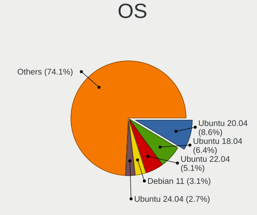

| Name                         | Desktops | Percent |
|------------------------------|----------|---------|
| Ubuntu 20.04                 | 310      | 8.6%    |
| Ubuntu 18.04                 | 230      | 6.38%   |
| Ubuntu 22.04                 | 184      | 5.1%    |
| Debian 11                    | 110      | 3.05%   |
| Ubuntu 24.04                 | 98       | 2.72%   |
| Debian 12                    | 95       | 2.64%   |
| OpenMandriva 4.2             | 90       | 2.5%    |
| Arch Rolling                 | 87       | 2.41%   |
| Zorin 17                     | 60       | 1.66%   |
| Manjaro                      | 58       | 1.61%   |
| OpenMandriva 4.3             | 55       | 1.53%   |
| Debian 10                    | 44       | 1.22%   |
| OpenMandriva 23.08           | 42       | 1.17%   |
| OpenMandriva 23.01           | 42       | 1.17%   |
| KDE neon 20.04               | 42       | 1.17%   |
| Linux Mint 20.3              | 37       | 1.03%   |
| OpenMandriva 24.12           | 36       | 1%      |
| Zorin 16                     | 35       | 0.97%   |
| Linux Mint 22.1              | 35       | 0.97%   |
| OpenMandriva 25.90           | 34       | 0.94%   |
| ArcoLinux Rolling            | 34       | 0.94%   |
| Pop!_OS 22.04                | 33       | 0.92%   |
| Linux Mint 19.3              | 32       | 0.89%   |
| Fedora 40                    | 32       | 0.89%   |
| Linux Mint 21.1              | 31       | 0.86%   |
| openSUSE Tumbleweed-XXXXXXXX | 30       | 0.83%   |
| Fedora 38                    | 30       | 0.83%   |
| Ubuntu 19.04                 | 27       | 0.75%   |
| Linux Mint 21.3              | 27       | 0.75%   |
| Linux Mint 20.1              | 27       | 0.75%   |
| Linux Mint 21.2              | 25       | 0.69%   |
| KDE neon 22.04               | 25       | 0.69%   |
| OpenMandriva 23.03           | 24       | 0.67%   |
| Fedora 42                    | 24       | 0.67%   |
| Arch                         | 24       | 0.67%   |
| Ubuntu 19.10                 | 23       | 0.64%   |
| Kubuntu 22.04                | 23       | 0.64%   |
| EndeavourOS Rolling          | 22       | 0.61%   |
| Ubuntu 23.10                 | 21       | 0.58%   |
| Ubuntu 20.10                 | 21       | 0.58%   |

OS Family
---------

OS without a version

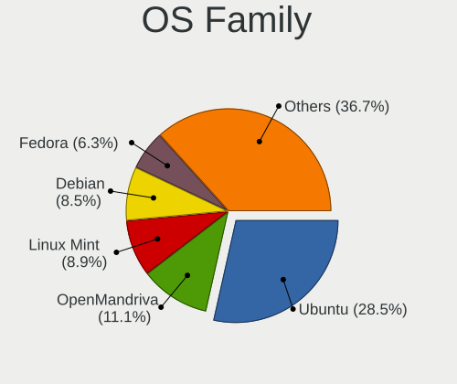

| Name             | Desktops | Percent |
|------------------|----------|---------|
| Ubuntu           | 951      | 28.51%  |
| OpenMandriva     | 370      | 11.09%  |
| Linux Mint       | 298      | 8.93%   |
| Debian           | 284      | 8.51%   |
| Fedora           | 209      | 6.26%   |
| Zorin            | 123      | 3.69%   |
| Manjaro          | 115      | 3.45%   |
| Arch             | 110      | 3.3%    |
| KDE neon         | 85       | 2.55%   |
| Kubuntu          | 83       | 2.49%   |
| Pop!_OS          | 63       | 1.89%   |
| Xubuntu          | 56       | 1.68%   |
| ROSA             | 54       | 1.62%   |
| openSUSE         | 51       | 1.53%   |
| ArcoLinux        | 40       | 1.2%    |
| Gentoo           | 34       | 1.02%   |
| Nobara           | 31       | 0.93%   |
| Elementary       | 31       | 0.93%   |
| Ubuntu MATE      | 29       | 0.87%   |
| Bazzite          | 26       | 0.78%   |
| EndeavourOS      | 23       | 0.69%   |
| MX               | 19       | 0.57%   |
| Lubuntu          | 18       | 0.54%   |
| Kali             | 16       | 0.48%   |
| Endless          | 16       | 0.48%   |
| Ubuntu Unity     | 15       | 0.45%   |
| Garuda Linux     | 14       | 0.42%   |
| LMDE             | 13       | 0.39%   |
| CachyOS          | 13       | 0.39%   |
| BlackPanther     | 12       | 0.36%   |
| Parrot           | 8        | 0.24%   |
| Clear Linux      | 8        | 0.24%   |
| Ubuntu Budgie    | 7        | 0.21%   |
| Devuan           | 7        | 0.21%   |
| Ubuntu Studio    | 6        | 0.18%   |
| SteamOS          | 6        | 0.18%   |
| Reborn OS        | 6        | 0.18%   |
| Xero             | 4        | 0.12%   |
| org.kde.Platform | 4        | 0.12%   |
| Void Linux       | 3        | 0.09%   |

Kernel
------

Version of the Linux kernel

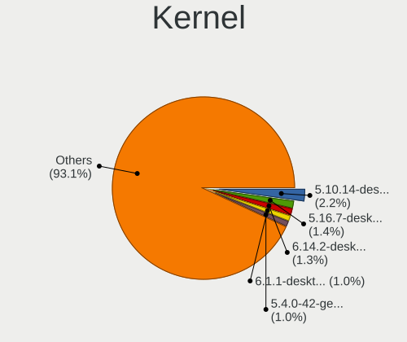

| Version                         | Desktops | Percent |
|---------------------------------|----------|---------|
| 5.10.14-desktop-1omv4002        | 88       | 2.22%   |
| 5.16.7-desktop-1omv4003         | 54       | 1.36%   |
| 6.14.2-desktop-3omv2590         | 51       | 1.29%   |
| 6.1.1-desktop-1omv2290          | 41       | 1.03%   |
| 5.4.0-42-generic                | 40       | 1.01%   |
| 6.12.1-desktop-1omv2490         | 31       | 0.78%   |
| 6.8.0-51-generic                | 29       | 0.73%   |
| 6.4.11-desktop-1omv2390         | 29       | 0.73%   |
| 5.15.0-56-generic               | 25       | 0.63%   |
| 5.4.0-58-generic                | 24       | 0.6%    |
| 6.2.6-desktop-1omv2390          | 23       | 0.58%   |
| 5.4.0-52-generic                | 22       | 0.55%   |
| 6.8.0-45-generic                | 20       | 0.5%    |
| 6.6.2-desktop-1omv2390          | 20       | 0.5%    |
| 5.4.0-48-generic                | 19       | 0.48%   |
| 5.10.0-8-amd64                  | 19       | 0.48%   |
| 5.4.0-54-generic                | 17       | 0.43%   |
| 5.4.0-29-generic                | 17       | 0.43%   |
| 5.4.0-26-generic                | 17       | 0.43%   |
| 5.13.0-30-generic               | 17       | 0.43%   |
| 6.8.0-60-generic                | 16       | 0.4%    |
| 5.10.0-21-amd64                 | 16       | 0.4%    |
| 6.8.0-49-generic                | 15       | 0.38%   |
| 5.3.0-40-generic                | 15       | 0.38%   |
| 5.15.0-58-generic               | 15       | 0.38%   |
| 4.9.60-nrj-desktop-1rosa-x86_64 | 15       | 0.38%   |
| 6.8.0-52-generic                | 14       | 0.35%   |
| 5.4.0-47-generic                | 14       | 0.35%   |
| 5.15.0-60-generic               | 14       | 0.35%   |
| 4.15.0-72-generic               | 14       | 0.35%   |
| 6.8.0-41-generic                | 13       | 0.33%   |
| 6.5.0-26-generic                | 13       | 0.33%   |
| 5.4.0-37-generic                | 13       | 0.33%   |
| 5.4.0-28-generic                | 13       | 0.33%   |
| 5.19.0-38-generic               | 13       | 0.33%   |
| 5.11.0-43-generic               | 13       | 0.33%   |
| 5.11.0-27-generic               | 13       | 0.33%   |
| 6.5.0-15-generic                | 12       | 0.3%    |
| 6.4.8-desktop-2omv2390          | 12       | 0.3%    |
| 6.2.0-36-generic                | 12       | 0.3%    |

Kernel Family
-------------

Linux kernel without a distro release

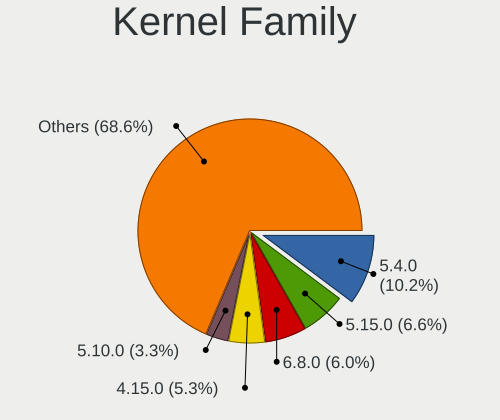

| Version | Desktops | Percent |
|---------|----------|---------|
| 5.4.0   | 381      | 10.22%  |
| 5.15.0  | 245      | 6.57%   |
| 6.8.0   | 225      | 6.04%   |
| 4.15.0  | 197      | 5.29%   |
| 5.10.0  | 122      | 3.27%   |
| 6.5.0   | 111      | 2.98%   |
| 6.1.0   | 110      | 2.95%   |
| 5.8.0   | 93       | 2.5%    |
| 5.3.0   | 90       | 2.41%   |
| 5.10.14 | 89       | 2.39%   |
| 5.13.0  | 88       | 2.36%   |
| 5.11.0  | 88       | 2.36%   |
| 5.0.0   | 74       | 1.99%   |
| 5.19.0  | 73       | 1.96%   |
| 6.2.0   | 59       | 1.58%   |
| 6.14.0  | 56       | 1.5%    |
| 5.16.7  | 54       | 1.45%   |
| 6.14.2  | 53       | 1.42%   |
| 6.11.0  | 50       | 1.34%   |
| 4.19.0  | 43       | 1.15%   |
| 6.1.1   | 42       | 1.13%   |
| 4.18.0  | 38       | 1.02%   |
| 6.12.1  | 32       | 0.86%   |
| 6.4.11  | 31       | 0.83%   |
| 6.2.6   | 27       | 0.72%   |
| 6.6.2   | 21       | 0.56%   |
| 6.4.8   | 19       | 0.51%   |
| 4.9.60  | 18       | 0.48%   |
| 6.4.0   | 14       | 0.38%   |
| 6.10.0  | 13       | 0.35%   |
| 6.9.3   | 11       | 0.3%    |
| 6.17.7  | 11       | 0.3%    |
| 6.12.10 | 11       | 0.3%    |
| 4.18.16 | 9        | 0.24%   |
| 6.3.5   | 8        | 0.21%   |
| 6.12.9  | 8        | 0.21%   |
| 6.10.3  | 8        | 0.21%   |
| 6.0.0   | 8        | 0.21%   |
| 6.9.7   | 7        | 0.19%   |
| 6.7.6   | 7        | 0.19%   |

Kernel Major Ver.
-----------------

Linux kernel major version

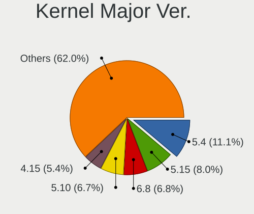

| Version | Desktops | Percent |
|---------|----------|---------|
| 5.4     | 409      | 11.13%  |
| 5.15    | 295      | 8.03%   |
| 6.8     | 250      | 6.8%    |
| 5.10    | 245      | 6.67%   |
| 4.15    | 197      | 5.36%   |
| 6.1     | 195      | 5.31%   |
| 6.5     | 145      | 3.95%   |
| 6.14    | 134      | 3.65%   |
| 6.12    | 123      | 3.35%   |
| 5.8     | 122      | 3.32%   |
| 5.11    | 113      | 3.07%   |
| 6.2     | 108      | 2.94%   |
| 5.13    | 104      | 2.83%   |
| 5.3     | 103      | 2.8%    |
| 5.19    | 97       | 2.64%   |
| 6.4     | 86       | 2.34%   |
| 6.6     | 81       | 2.2%    |
| 5.16    | 79       | 2.15%   |
| 6.11    | 78       | 2.12%   |
| 5.0     | 76       | 2.07%   |
| 6.10    | 48       | 1.31%   |
| 4.19    | 48       | 1.31%   |
| 4.18    | 48       | 1.31%   |
| 6.0     | 39       | 1.06%   |
| 4.9     | 36       | 0.98%   |
| 6.9     | 35       | 0.95%   |
| 6.3     | 34       | 0.93%   |
| 5.14    | 34       | 0.93%   |
| 6.17    | 32       | 0.87%   |
| 6.15    | 28       | 0.76%   |
| 6.13    | 26       | 0.71%   |
| 5.18    | 26       | 0.71%   |
| 6.16    | 25       | 0.68%   |
| 5.6     | 24       | 0.65%   |
| 6.7     | 21       | 0.57%   |
| 5.7     | 19       | 0.52%   |
| 5.12    | 19       | 0.52%   |
| 5.9     | 18       | 0.49%   |
| 5.17    | 14       | 0.38%   |
| 6.18    | 11       | 0.3%    |

Arch
----

OS architecture (x86_64, i586, etc.)

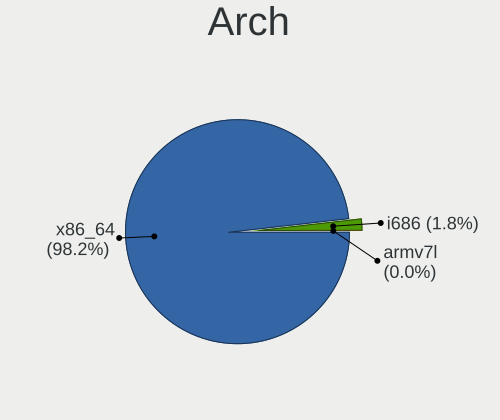

| Name   | Desktops | Percent |
|--------|----------|---------|
| x86_64 | 3111     | 98.2%   |
| i686   | 56       | 1.77%   |
| armv7l | 1        | 0.03%   |

DE
--

Desktop Environment

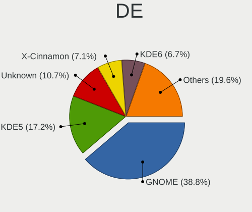

| Name            | Desktops | Percent |
|-----------------|----------|---------|
| GNOME           | 1313     | 38.78%  |
| KDE5            | 581      | 17.16%  |
| Unknown         | 363      | 10.72%  |
| X-Cinnamon      | 241      | 7.12%   |
| KDE6            | 226      | 6.67%   |
| XFCE            | 217      | 6.41%   |
| MATE            | 95       | 2.81%   |
| KDE             | 81       | 2.39%   |
| LXQt            | 52       | 1.54%   |
| Pantheon        | 30       | 0.89%   |
| KDE4            | 25       | 0.74%   |
| i3              | 19       | 0.56%   |
| Cinnamon        | 19       | 0.56%   |
| Budgie          | 18       | 0.53%   |
| Unity           | 15       | 0.44%   |
| Hyprland        | 13       | 0.38%   |
| Deepin          | 13       | 0.38%   |
| LXDE            | 9        | 0.27%   |
| GNOME Classic   | 9        | 0.27%   |
| openbox         | 7        | 0.21%   |
| GNOME Flashback | 7        | 0.21%   |
| qtile           | 5        | 0.15%   |
| icewm           | 5        | 0.15%   |
| xmonad          | 3        | 0.09%   |
| Trinity         | 3        | 0.09%   |
| bspwm           | 3        | 0.09%   |
| sway            | 2        | 0.06%   |
| i3-with-shmlog  | 2        | 0.06%   |
| COSMIC          | 2        | 0.06%   |
| chadwm          | 2        | 0.06%   |
| wlroots         | 1        | 0.03%   |
| onyx:GNOME      | 1        | 0.03%   |
| LeftWM          | 1        | 0.03%   |
| fvwm            | 1        | 0.03%   |
| fluxbox         | 1        | 0.03%   |
| DWM             | 1        | 0.03%   |

Display Server
--------------

X11 or Wayland

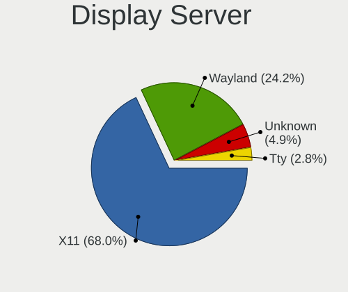

| Name    | Desktops | Percent |
|---------|----------|---------|
| X11     | 2259     | 68.04%  |
| Wayland | 805      | 24.25%  |
| Unknown | 164      | 4.94%   |
| Tty     | 92       | 2.77%   |

Display Manager
---------------

SDDM, LightDM, etc.

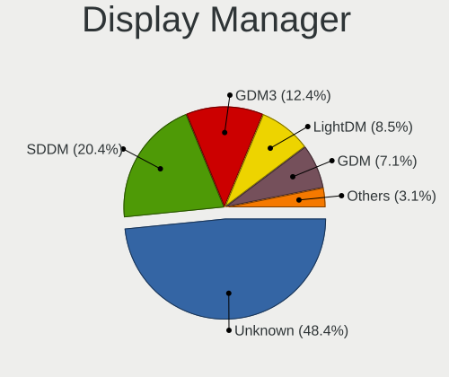

| Name    | Desktops | Percent |
|---------|----------|---------|
| Unknown | 1606     | 48.42%  |
| SDDM    | 677      | 20.41%  |
| GDM3    | 412      | 12.42%  |
| LightDM | 281      | 8.47%   |
| GDM     | 237      | 7.15%   |
| TDM     | 55       | 1.66%   |
| KDM     | 21       | 0.63%   |
| LXDM    | 9        | 0.27%   |
| XDM     | 6        | 0.18%   |
| SLiM    | 4        | 0.12%   |
| GREETD  | 3        | 0.09%   |
| Ly      | 2        | 0.06%   |
| WDM     | 1        | 0.03%   |
| SLIMSKI | 1        | 0.03%   |
| NODM    | 1        | 0.03%   |
| LY-DM   | 1        | 0.03%   |

OS Lang
-------

Language

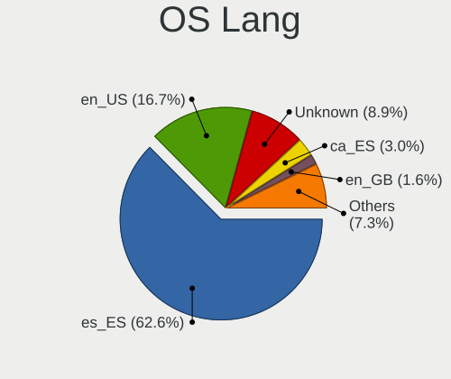

| Lang             | Desktops | Percent |
|------------------|----------|---------|
| es_ES            | 2052     | 62.58%  |
| en_US            | 547      | 16.68%  |
| Unknown          | 291      | 8.87%   |
| ca_ES            | 97       | 2.96%   |
| en_GB            | 54       | 1.65%   |
| C                | 52       | 1.59%   |
| gl_ES            | 26       | 0.79%   |
| de_DE            | 22       | 0.67%   |
| eu_ES            | 18       | 0.55%   |
| fr_FR            | 14       | 0.43%   |
| ru_RU            | 11       | 0.34%   |
| POSIX            | 10       | 0.3%    |
| it_IT            | 9        | 0.27%   |
| es_AR            | 8        | 0.24%   |
| ca_ES@valencia   | 8        | 0.24%   |
| es_ES.UTF8       | 5        | 0.15%   |
| en_IE            | 5        | 0.15%   |
| ro_RO            | 4        | 0.12%   |
| pt_PT            | 4        | 0.12%   |
| es_MX            | 4        | 0.12%   |
| C.UTF8           | 4        | 0.12%   |
| pt_BR            | 3        | 0.09%   |
| pl_PL            | 3        | 0.09%   |
| ca_AD            | 3        | 0.09%   |
| an_ES            | 3        | 0.09%   |
| nl_NL            | 2        | 0.06%   |
| en_DK            | 2        | 0.06%   |
| en_AU            | 2        | 0.06%   |
| bg_BG            | 2        | 0.06%   |
| spanish          | 1        | 0.03%   |
| es_UY            | 1        | 0.03%   |
| es_US            | 1        | 0.03%   |
| es_GT            | 1        | 0.03%   |
| es_ES@euro       | 1        | 0.03%   |
| es_ES.utf-8      | 1        | 0.03%   |
| es_ES.ISO-8859-1 | 1        | 0.03%   |
| es_EC            | 1        | 0.03%   |
| es_DO            | 1        | 0.03%   |
| es_CL            | 1        | 0.03%   |
| eo               | 1        | 0.03%   |

Boot Mode
---------

EFI or BIOS

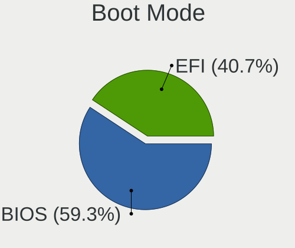

| Mode | Desktops | Percent |
|------|----------|---------|
| BIOS | 1935     | 59.26%  |
| EFI  | 1330     | 40.74%  |

Filesystem
----------

Type of filesystem

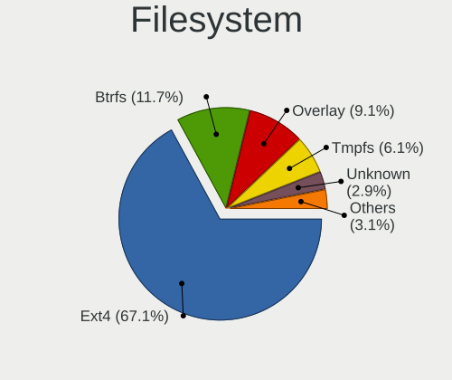

| Type     | Desktops | Percent |
|----------|----------|---------|
| Ext4     | 2215     | 67.06%  |
| Btrfs    | 388      | 11.75%  |
| Overlay  | 301      | 9.11%   |
| Tmpfs    | 201      | 6.09%   |
| Unknown  | 95       | 2.88%   |
| Xfs      | 48       | 1.45%   |
| Ext3     | 30       | 0.91%   |
| Zfs      | 13       | 0.39%   |
| Ext2     | 7        | 0.21%   |
| Reiserfs | 4        | 0.12%   |
| Aufs     | 1        | 0.03%   |

Part. scheme
------------

Scheme of partitioning

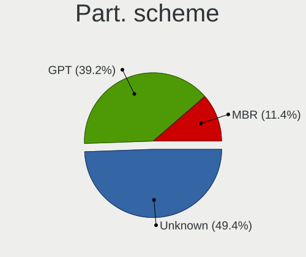

| Type    | Desktops | Percent |
|---------|----------|---------|
| Unknown | 1623     | 49.44%  |
| GPT     | 1287     | 39.2%   |
| MBR     | 373      | 11.36%  |

Dual Boot with Linux/BSD
------------------------

Hosting more than one Linux/BSD

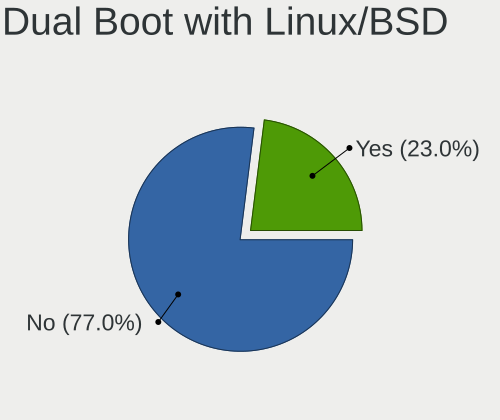

| Dual boot | Desktops | Percent |
|-----------|----------|---------|
| No        | 2527     | 76.97%  |
| Yes       | 756      | 23.03%  |

Dual Boot (Win)
---------------

Hosting Linux and Windows

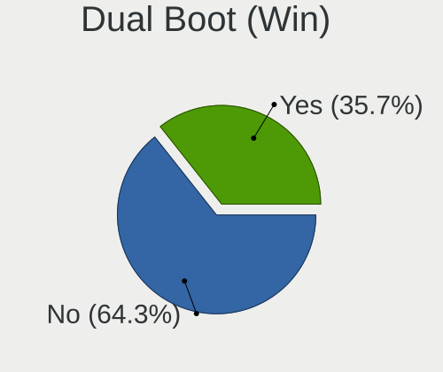

| Dual boot | Desktops | Percent |
|-----------|----------|---------|
| No        | 2099     | 64.35%  |
| Yes       | 1163     | 35.65%  |

Board
-----

Vendor
------

Motherboard manufacturer

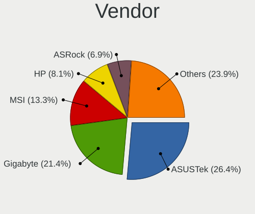

| Name                                 | Desktops | Percent |
|--------------------------------------|----------|---------|
| ASUSTek Computer                     | 836      | 26.4%   |
| Gigabyte Technology                  | 678      | 21.41%  |
| MSI                                  | 421      | 13.29%  |
| Hewlett-Packard                      | 258      | 8.15%   |
| ASRock                               | 217      | 6.85%   |
| Dell                                 | 115      | 3.63%   |
| Lenovo                               | 100      | 3.16%   |
| Acer                                 | 72       | 2.27%   |
| Intel                                | 67       | 2.12%   |
| Unknown                              | 65       | 2.05%   |
| Medion                               | 33       | 1.04%   |
| Pegatron                             | 31       | 0.98%   |
| Foxconn                              | 22       | 0.69%   |
| AMI                                  | 19       | 0.6%    |
| Packard Bell                         | 17       | 0.54%   |
| Huanan                               | 17       | 0.54%   |
| ECS                                  | 17       | 0.54%   |
| BESSTAR Tech                         | 14       | 0.44%   |
| Shenzhen Meigao Electronic Equipment | 13       | 0.41%   |
| Fujitsu                              | 12       | 0.38%   |
| AZW                                  | 10       | 0.32%   |
| Shuttle                              | 9        | 0.28%   |
| Biostar                              | 9        | 0.28%   |
| eMachines                            | 8        | 0.25%   |
| MACHINIST                            | 7        | 0.22%   |
| QIYIDA                               | 6        | 0.19%   |
| Apple                                | 6        | 0.19%   |
| SLIMBOOK                             | 4        | 0.13%   |
| NEC Computers                        | 4        | 0.13%   |
| GEEKOM                               | 4        | 0.13%   |
| To be fill by OEM                    | 3        | 0.09%   |
| Supermicro                           | 3        | 0.09%   |
| Shenzhen DOKE electronic             | 3        | 0.09%   |
| OEM                                  | 3        | 0.09%   |
| Wistron                              | 2        | 0.06%   |
| SYWZ                                 | 2        | 0.06%   |
| Minix                                | 2        | 0.06%   |
| Koloe                                | 2        | 0.06%   |
| JGINYUE                              | 2        | 0.06%   |
| IceWhale Technology                  | 2        | 0.06%   |

Model
-----

Motherboard model

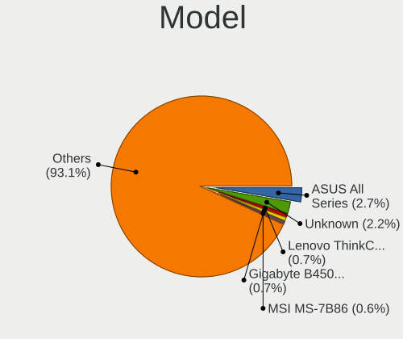

| Name                              | Desktops | Percent |
|-----------------------------------|----------|---------|
| ASUS All Series                   | 84       | 2.65%   |
| Unknown                           | 70       | 2.21%   |
| Lenovo ThinkCentre E73 10DR0033SP | 22       | 0.69%   |
| Gigabyte B450M DS3H               | 22       | 0.69%   |
| MSI MS-7B86                       | 19       | 0.6%    |
| HP Compaq Elite 8300 SFF          | 19       | 0.6%    |
| MSI MS-7C37                       | 18       | 0.57%   |
| MSI MS-7817                       | 16       | 0.51%   |
| AMI Intel                         | 16       | 0.51%   |
| Gigabyte 970A-DS3P                | 15       | 0.47%   |
| MSI MS-7B79                       | 14       | 0.44%   |
| HP EliteDesk 800 G1 SFF           | 14       | 0.44%   |
| ASUS TUF Gaming X570-PLUS         | 14       | 0.44%   |
| ASUS H110M-D                      | 14       | 0.44%   |
| ASUS PRIME B450M-A                | 13       | 0.41%   |
| MSI MS-7C91                       | 12       | 0.38%   |
| Gigabyte H81M-S2H                 | 12       | 0.38%   |
| ASUS P5G41T-M LX                  | 12       | 0.38%   |
| MSI MS-7C56                       | 11       | 0.35%   |
| MSI MS-7C02                       | 11       | 0.35%   |
| MSI MS-7A38                       | 11       | 0.35%   |
| Gigabyte H61M-DS2                 | 11       | 0.35%   |
| Gigabyte H110M-S2H                | 11       | 0.35%   |
| Gigabyte B450 AORUS M             | 11       | 0.35%   |
| ASUS PRIME A320M-K                | 11       | 0.35%   |
| Gigabyte B550M DS3H               | 10       | 0.32%   |
| MSI MS-7C52                       | 9        | 0.28%   |
| HP Compaq Pro 6300 SFF            | 8        | 0.25%   |
| HP Compaq 8200 Elite SFF PC       | 8        | 0.25%   |
| Gigabyte H61M-S2PV                | 8        | 0.25%   |
| Gigabyte B550M AORUS ELITE        | 8        | 0.25%   |
| Gigabyte B550 AORUS ELITE V2      | 8        | 0.25%   |
| Gigabyte B450M S2H                | 8        | 0.25%   |
| ASUS TUF Gaming B550-PLUS         | 8        | 0.25%   |
| ASUS PRIME B550M-A                | 8        | 0.25%   |
| MSI MS-7B89                       | 7        | 0.22%   |
| MSI MS-7B49                       | 7        | 0.22%   |
| HP ProDesk 600 G1 SFF             | 7        | 0.22%   |
| Gigabyte X470 AORUS ULTRA GAMING  | 7        | 0.22%   |
| Gigabyte H310M S2H 2.0            | 7        | 0.22%   |

Model Family
------------

Motherboard model prefix

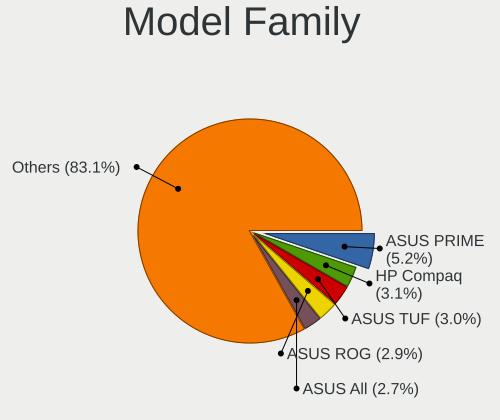

| Name                | Desktops | Percent |
|---------------------|----------|---------|
| ASUS PRIME          | 165      | 5.21%   |
| HP Compaq           | 98       | 3.09%   |
| ASUS TUF            | 95       | 3%      |
| ASUS ROG            | 93       | 2.94%   |
| ASUS All            | 84       | 2.65%   |
| Dell OptiPlex       | 81       | 2.56%   |
| Lenovo ThinkCentre  | 79       | 2.49%   |
| Unknown             | 70       | 2.21%   |
| Acer Aspire         | 47       | 1.48%   |
| HP EliteDesk        | 44       | 1.39%   |
| Gigabyte B450M      | 39       | 1.23%   |
| Gigabyte X570       | 31       | 0.98%   |
| HP ProDesk          | 24       | 0.76%   |
| Gigabyte B450       | 24       | 0.76%   |
| Gigabyte B550M      | 22       | 0.69%   |
| MSI MS-7B86         | 19       | 0.6%    |
| MSI MS-7C37         | 18       | 0.57%   |
| Dell Precision      | 18       | 0.57%   |
| AMI Intel           | 17       | 0.54%   |
| MSI MS-7817         | 16       | 0.51%   |
| Gigabyte Z390       | 16       | 0.51%   |
| Gigabyte B550       | 16       | 0.51%   |
| Gigabyte 970A-DS3P  | 16       | 0.51%   |
| ASUS P5KPL-AM       | 16       | 0.51%   |
| MSI MS-7B79         | 14       | 0.44%   |
| ASUS H110M-D        | 14       | 0.44%   |
| ASUS P8H61-M        | 13       | 0.41%   |
| ASUS M5A78L-M       | 13       | 0.41%   |
| Acer Veriton        | 13       | 0.41%   |
| MSI MS-7C91         | 12       | 0.38%   |
| Gigabyte H81M-S2H   | 12       | 0.38%   |
| Gigabyte H61M-DS2   | 12       | 0.38%   |
| ASUS P5G41T-M       | 12       | 0.38%   |
| MSI MS-7C56         | 11       | 0.35%   |
| MSI MS-7C02         | 11       | 0.35%   |
| MSI MS-7A38         | 11       | 0.35%   |
| Gigabyte H110M-S2H  | 11       | 0.35%   |
| ASUS P8Z77-V        | 11       | 0.35%   |
| Packard Bell IMEDIA | 10       | 0.32%   |
| HP ProLiant         | 10       | 0.32%   |

MFG Year
--------

Motherboard manufacture year

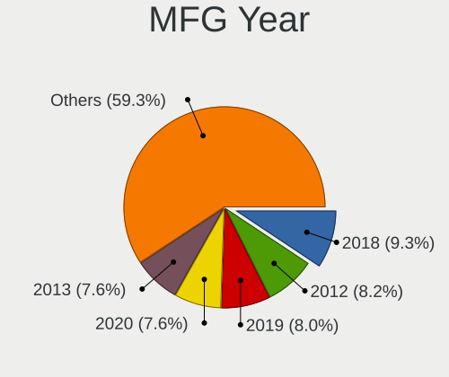

| Year    | Desktops | Percent |
|---------|----------|---------|
| 2018    | 296      | 9.35%   |
| 2012    | 261      | 8.24%   |
| 2019    | 252      | 7.96%   |
| 2020    | 241      | 7.61%   |
| 2013    | 240      | 7.58%   |
| 2014    | 223      | 7.04%   |
| 2021    | 174      | 5.49%   |
| 2017    | 163      | 5.15%   |
| 2009    | 154      | 4.86%   |
| 2011    | 151      | 4.77%   |
| 2015    | 139      | 4.39%   |
| 2016    | 138      | 4.36%   |
| 2010    | 135      | 4.26%   |
| 2022    | 124      | 3.92%   |
| 2008    | 115      | 3.63%   |
| 2023    | 110      | 3.47%   |
| 2007    | 101      | 3.19%   |
| 2024    | 59       | 1.86%   |
| 2006    | 59       | 1.86%   |
| 2005    | 14       | 0.44%   |
| 2025    | 12       | 0.38%   |
| 2004    | 3        | 0.09%   |
| 2002    | 1        | 0.03%   |
| 2001    | 1        | 0.03%   |
| Unknown | 1        | 0.03%   |

Form Factor
-----------

Physical design of the computer

| Name    | Desktops | Percent |
|---------|----------|---------|
| Desktop | 3167     | 100%    |

Secure Boot
-----------

Enabled or disabled

| State    | Desktops | Percent |
|----------|----------|---------|
| Disabled | 3078     | 96.82%  |
| Enabled  | 101      | 3.18%   |

Coreboot
--------

Have coreboot on board

| Used | Desktops | Percent |
|------|----------|---------|
| No   | 3166     | 99.97%  |
| Yes  | 1        | 0.03%   |

RAM Size
--------

Total RAM memory

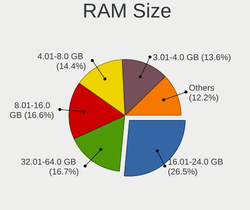

| Size in GB      | Desktops | Percent |
|-----------------|----------|---------|
| 16.01-24.0      | 867      | 26.51%  |
| 32.01-64.0      | 546      | 16.69%  |
| 8.01-16.0       | 543      | 16.6%   |
| 4.01-8.0        | 471      | 14.4%   |
| 3.01-4.0        | 444      | 13.57%  |
| 64.01-256.0     | 156      | 4.77%   |
| 24.01-32.0      | 94       | 2.87%   |
| 1.01-2.0        | 89       | 2.72%   |
| 2.01-3.0        | 34       | 1.04%   |
| More than 256.0 | 17       | 0.52%   |
| 0.51-1.0        | 8        | 0.24%   |
| 0.01-0.5        | 1        | 0.03%   |
| Unknown         | 1        | 0.03%   |

RAM Used
--------

Used RAM memory

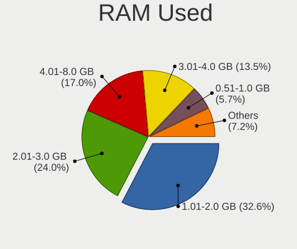

| Used GB     | Desktops | Percent |
|-------------|----------|---------|
| 1.01-2.0    | 1171     | 32.62%  |
| 2.01-3.0    | 860      | 23.96%  |
| 4.01-8.0    | 610      | 16.99%  |
| 3.01-4.0    | 485      | 13.51%  |
| 0.51-1.0    | 206      | 5.74%   |
| 8.01-16.0   | 167      | 4.65%   |
| 0.01-0.5    | 38       | 1.06%   |
| 16.01-24.0  | 21       | 0.58%   |
| 64.01-256.0 | 13       | 0.36%   |
| 24.01-32.0  | 11       | 0.31%   |
| 32.01-64.0  | 7        | 0.19%   |
| Unknown     | 1        | 0.03%   |

Total Drives
------------

Number of drives on board

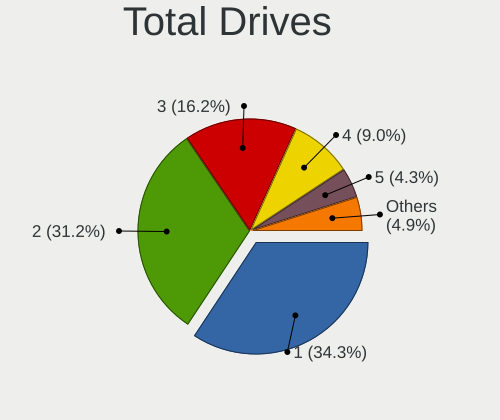

| Drives | Desktops | Percent |
|--------|----------|---------|
| 1      | 1158     | 34.3%   |
| 2      | 1053     | 31.19%  |
| 3      | 548      | 16.23%  |
| 4      | 305      | 9.03%   |
| 5      | 146      | 4.32%   |
| 6      | 64       | 1.9%    |
| 7      | 27       | 0.8%    |
| 0      | 21       | 0.62%   |
| 9      | 15       | 0.44%   |
| 8      | 15       | 0.44%   |
| 13     | 8        | 0.24%   |
| 10     | 5        | 0.15%   |
| 12     | 3        | 0.09%   |
| 15     | 2        | 0.06%   |
| 11     | 2        | 0.06%   |
| 21     | 1        | 0.03%   |
| 18     | 1        | 0.03%   |
| 16     | 1        | 0.03%   |
| 14     | 1        | 0.03%   |

Has CD-ROM
----------

Has CD-ROM on board

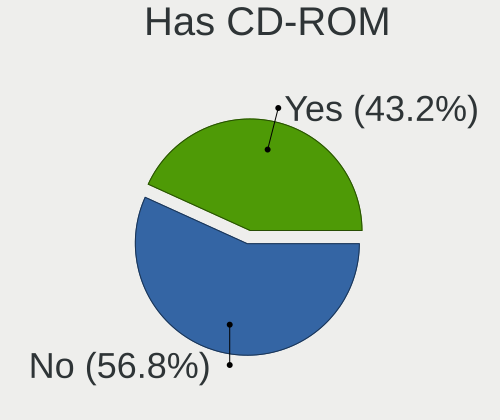

| Presented | Desktops | Percent |
|-----------|----------|---------|
| No        | 1832     | 56.79%  |
| Yes       | 1394     | 43.21%  |

Has Ethernet
------------

Has Ethernet on board

| Presented | Desktops | Percent |
|-----------|----------|---------|
| Yes       | 3141     | 99.18%  |
| No        | 26       | 0.82%   |

Has WiFi
--------

Has WiFi module

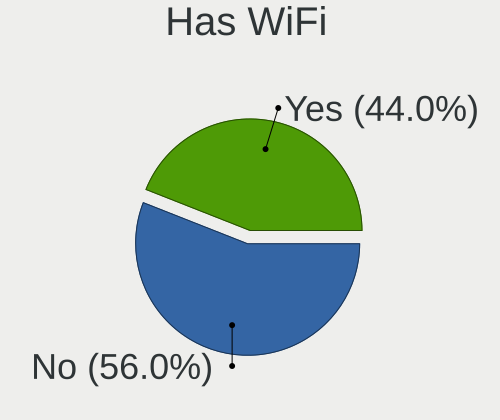

| Presented | Desktops | Percent |
|-----------|----------|---------|
| No        | 1808     | 55.98%  |
| Yes       | 1422     | 44.02%  |

Has Bluetooth
-------------

Has Bluetooth module

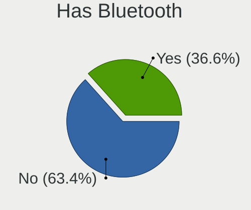

| Presented | Desktops | Percent |
|-----------|----------|---------|
| No        | 2053     | 63.38%  |
| Yes       | 1186     | 36.62%  |

Location
--------

Country
-------

Geographic location (country)

| Country | Desktops | Percent |
|---------|----------|---------|
| Spain   | 3167     | 100%    |

City
----

Geographic location (city)

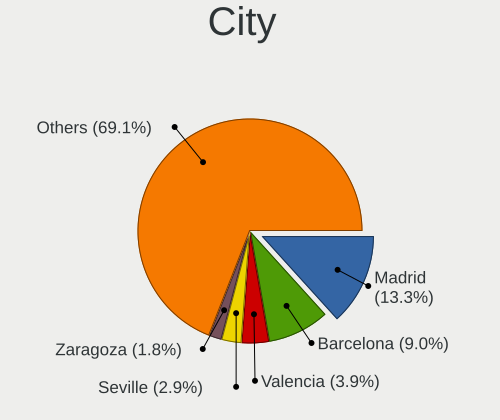

| City                       | Desktops | Percent |
|----------------------------|----------|---------|
| Madrid                     | 464      | 13.28%  |
| Barcelona                  | 314      | 8.99%   |
| Valencia                   | 138      | 3.95%   |
| Seville                    | 101      | 2.89%   |
| Zaragoza                   | 64       | 1.83%   |
| Málaga                    | 62       | 1.77%   |
| Granada                    | 45       | 1.29%   |
| Vigo                       | 40       | 1.14%   |
| Alicante                   | 40       | 1.14%   |
| Valladolid                 | 36       | 1.03%   |
| A Coruña                  | 36       | 1.03%   |
| Bilbao                     | 35       | 1%      |
| Ourense                    | 34       | 0.97%   |
| Las Palmas de Gran Canaria | 32       | 0.92%   |
| Córdoba                   | 32       | 0.92%   |
| Palma                      | 31       | 0.89%   |
| Murcia                     | 27       | 0.77%   |
| Sabadell                   | 26       | 0.74%   |
| Alcobendas                 | 25       | 0.72%   |
| Terrassa                   | 24       | 0.69%   |
| Santa Cruz de Tenerife     | 24       | 0.69%   |
| Oviedo                     | 24       | 0.69%   |
| Donostia / San Sebastian   | 22       | 0.63%   |
| Almería                   | 21       | 0.6%    |
| Pamplona                   | 20       | 0.57%   |
| Santiago de Compostela     | 19       | 0.54%   |
| Gijón                     | 19       | 0.54%   |
| Santander                  | 18       | 0.52%   |
| Barakaldo                  | 17       | 0.49%   |
| Vitoria-Gasteiz            | 16       | 0.46%   |
| Salamanca                  | 16       | 0.46%   |
| León                      | 16       | 0.46%   |
| Alcalá de Henares         | 16       | 0.46%   |
| Torrejón de Ardoz         | 15       | 0.43%   |
| Mostoles                   | 15       | 0.43%   |
| Girona                     | 15       | 0.43%   |
| Fuenlabrada                | 15       | 0.43%   |
| Lugo                       | 14       | 0.4%    |
| Logroño                   | 14       | 0.4%    |
| Jerez de la Frontera       | 14       | 0.4%    |

Drives
------

Drive Vendor
------------

Hard drive vendors

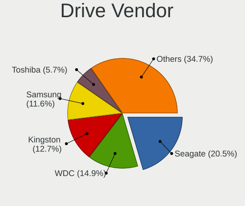

| Vendor                      | Desktops | Drives | Percent |
|-----------------------------|----------|--------|---------|
| Seagate                     | 1254     | 2245   | 20.46%  |
| WDC                         | 915      | 1567   | 14.93%  |
| Kingston                    | 776      | 1178   | 12.66%  |
| Samsung Electronics         | 709      | 1274   | 11.57%  |
| Toshiba                     | 348      | 634    | 5.68%   |
| Sandisk                     | 328      | 500    | 5.35%   |
| Crucial                     | 305      | 509    | 4.98%   |
| Hitachi                     | 149      | 197    | 2.43%   |
| Micron/Crucial Technology   | 79       | 110    | 1.29%   |
| China                       | 72       | 102    | 1.17%   |
| Kingston Technology Company | 64       | 80     | 1.04%   |
| Unknown                     | 62       | 76     | 1.01%   |
| Phison Electronics          | 62       | 93     | 1.01%   |
| Intel                       | 55       | 73     | 0.9%    |
| Silicon Motion              | 50       | 61     | 0.82%   |
| Maxtor                      | 49       | 74     | 0.8%    |
| Phison                      | 40       | 87     | 0.65%   |
| KIOXIA-EXCERIA              | 40       | 60     | 0.65%   |
| OCZ                         | 36       | 55     | 0.59%   |
| KIOXIA                      | 34       | 41     | 0.55%   |
| SK hynix                    | 33       | 44     | 0.54%   |
| PNY                         | 31       | 42     | 0.51%   |
| HGST                        | 29       | 38     | 0.47%   |
| Emtec                       | 29       | 42     | 0.47%   |
| MAXIO Technology (Hangzhou) | 28       | 37     | 0.46%   |
| Micron Technology           | 27       | 30     | 0.44%   |
| Corsair                     | 24       | 29     | 0.39%   |
| JMicron Technology          | 22       | 26     | 0.36%   |
| Intenso                     | 19       | 24     | 0.31%   |
| Transcend                   | 17       | 36     | 0.28%   |
| A-DATA Technology           | 17       | 32     | 0.28%   |
| Patriot                     | 16       | 24     | 0.26%   |
| Unknown                     | 16       | 22     | 0.26%   |
| Realtek Semiconductor       | 15       | 19     | 0.24%   |
| KingDian                    | 14       | 24     | 0.23%   |
| Fanxiang                    | 14       | 19     | 0.23%   |
| KingSpec                    | 13       | 17     | 0.21%   |
| Fujitsu                     | 13       | 19     | 0.21%   |
| Hewlett-Packard             | 11       | 14     | 0.18%   |
| SPCC                        | 10       | 11     | 0.16%   |

Drive Model
-----------

Hard drive models

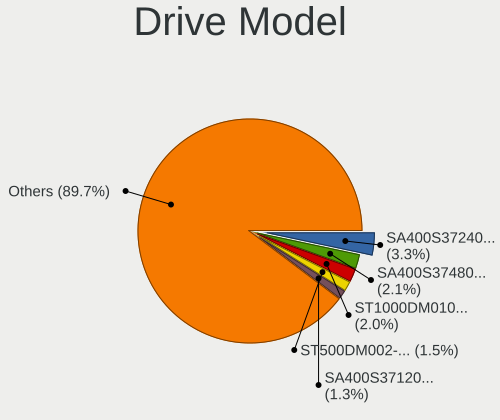

| Model                                              | Desktops | Percent |
|----------------------------------------------------|----------|---------|
| Kingston SA400S37240G 240GB SSD                    | 238      | 3.33%   |
| Kingston SA400S37480G 480GB SSD                    | 152      | 2.13%   |
| Seagate ST1000DM010-2EP102 1TB                     | 143      | 2%      |
| Seagate ST500DM002-1BD142 500GB                    | 107      | 1.5%    |
| Kingston SA400S37120G 120GB SSD                    | 94       | 1.32%   |
| Kingston SV300S37A120G 120GB SSD                   | 82       | 1.15%   |
| Seagate ST3500418AS 500GB                          | 81       | 1.13%   |
| Seagate ST2000DM008-2FR102 2TB                     | 78       | 1.09%   |
| Toshiba DT01ACA100 1TB                             | 73       | 1.02%   |
| Seagate ST1000DM003-1ER162 1TB                     | 71       | 0.99%   |
| Seagate ST1000DM003-1CH162 1TB                     | 61       | 0.85%   |
| Samsung NVMe SSD Controller SM981/PM981/PM983 1TB  | 60       | 0.84%   |
| Samsung SSD 860 EVO 500GB                          | 54       | 0.76%   |
| Crucial CT500MX500SSD1 500GB                       | 50       | 0.7%    |
| Seagate ST4000DM004-2CV104 4TB                     | 44       | 0.62%   |
| Samsung SSD 850 EVO 500GB                          | 43       | 0.6%    |
| Samsung SSD 850 EVO 250GB                          | 43       | 0.6%    |
| Seagate ST31000528AS 1TB                           | 40       | 0.56%   |
| Toshiba DT01ACA050 500GB                           | 39       | 0.55%   |
| Micron/Crucial P2 NVMe PCIe SSD 2TB                | 38       | 0.53%   |
| WDC WD10EZEX-08WN4A0 1TB                           | 37       | 0.52%   |
| WDC WD20EARX-00PASB0 2TB                           | 36       | 0.5%    |
| Kingston SV300S37A240G 240GB SSD                   | 36       | 0.5%    |
| Crucial CT480BX500SSD1 480GB                       | 36       | 0.5%    |
| Seagate ST2000DM001-1ER164 2TB                     | 35       | 0.49%   |
| Crucial CT1000MX500SSD1 1TB                        | 35       | 0.49%   |
| Kingston SA400S37960G 960GB SSD                    | 33       | 0.46%   |
| Samsung NVMe SSD Drive 500GB                       | 32       | 0.45%   |
| Samsung NVMe SSD Controller PM9A1/PM9A3/980PRO 1TB | 32       | 0.45%   |
| SanDisk SSD PLUS 480GB                             | 31       | 0.43%   |
| Kingston SUV400S37240G 240GB SSD                   | 30       | 0.42%   |
| Toshiba DT01ACA200 2TB                             | 29       | 0.41%   |
| Seagate ST2000DM008-2UB102 2TB                     | 29       | 0.41%   |
| Seagate ST1000DM003-1SB102 1TB                     | 29       | 0.41%   |
| Toshiba TR200 240GB SSD                            | 28       | 0.39%   |
| Seagate ST2000DM006-2DM164 2TB                     | 28       | 0.39%   |
| Seagate ST1000DM003-1SB10C 1TB                     | 28       | 0.39%   |
| Samsung SSD 860 EVO 1TB                            | 28       | 0.39%   |
| WDC WD5000AAKX-08U6AA0 500GB                       | 27       | 0.38%   |
| Unknown SD/MMC/MS PRO 2GB                          | 27       | 0.38%   |

HDD Vendor
----------

Hard disk drive vendors

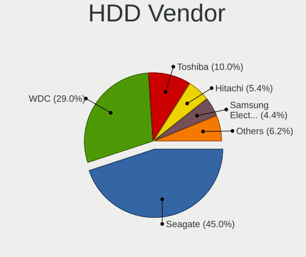

| Vendor              | Desktops | Drives | Percent |
|---------------------|----------|--------|---------|
| Seagate             | 1244     | 2214   | 44.96%  |
| WDC                 | 802      | 1325   | 28.98%  |
| Toshiba             | 278      | 465    | 10.05%  |
| Hitachi             | 149      | 197    | 5.38%   |
| Samsung Electronics | 123      | 165    | 4.45%   |
| Maxtor              | 43       | 62     | 1.55%   |
| Unknown             | 30       | 34     | 1.08%   |
| HGST                | 29       | 38     | 1.05%   |
| JMicron Technology  | 14       | 16     | 0.51%   |
| Fujitsu             | 12       | 18     | 0.43%   |
| ASMT                | 7        | 10     | 0.25%   |
| Hewlett-Packard     | 6        | 9      | 0.22%   |
| Apple               | 4        | 6      | 0.14%   |
| TO Exter            | 3        | 3      | 0.11%   |
| SABRENT             | 2        | 2      | 0.07%   |
| Intenso             | 2        | 3      | 0.07%   |
| HPE                 | 2        | 3      | 0.07%   |
| HGST HTS            | 2        | 2      | 0.07%   |
| USB3.0              | 1        | 1      | 0.04%   |
| USB                 | 1        | 1      | 0.04%   |
| TPH01203000GB       | 1        | 1      | 0.04%   |
| Synology            | 1        | 1      | 0.04%   |
| Shenzhen            | 1        | 1      | 0.04%   |
| Quantum             | 1        | 1      | 0.04%   |
| Maxone              | 1        | 2      | 0.04%   |
| JetFlash            | 1        | 1      | 0.04%   |
| Inateck             | 1        | 1      | 0.04%   |
| IET                 | 1        | 1      | 0.04%   |
| External            | 1        | 1      | 0.04%   |
| CIRAGO              | 1        | 2      | 0.04%   |
| China               | 1        | 1      | 0.04%   |
| ASMedia             | 1        | 1      | 0.04%   |
| Unknown             | 1        | 3      | 0.04%   |

SSD Vendor
----------

Solid state drive vendors

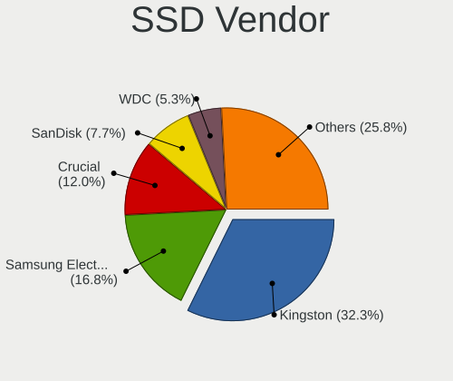

| Vendor              | Desktops | Drives | Percent |
|---------------------|----------|--------|---------|
| Kingston            | 726      | 1077   | 32.32%  |
| Samsung Electronics | 378      | 598    | 16.83%  |
| Crucial             | 270      | 416    | 12.02%  |
| SanDisk             | 172      | 234    | 7.66%   |
| WDC                 | 120      | 199    | 5.34%   |
| China               | 71       | 100    | 3.16%   |
| Toshiba             | 70       | 156    | 3.12%   |
| OCZ                 | 36       | 55     | 1.6%    |
| Emtec               | 27       | 39     | 1.2%    |
| KIOXIA-EXCERIA      | 25       | 33     | 1.11%   |
| Intel               | 18       | 23     | 0.8%    |
| Transcend           | 17       | 36     | 0.76%   |
| Intenso             | 17       | 20     | 0.76%   |
| PNY                 | 15       | 22     | 0.67%   |
| A-DATA Technology   | 15       | 30     | 0.67%   |
| KingDian            | 14       | 24     | 0.62%   |
| Patriot             | 13       | 21     | 0.58%   |
| KingSpec            | 13       | 17     | 0.58%   |
| Fanxiang            | 12       | 14     | 0.53%   |
| Unknown             | 11       | 14     | 0.49%   |
| Micron Technology   | 10       | 11     | 0.45%   |
| USB30               | 9        | 26     | 0.4%    |
| Corsair             | 9        | 11     | 0.4%    |
| Netac               | 8        | 10     | 0.36%   |
| Drevo               | 8        | 11     | 0.36%   |
| SPCC                | 6        | 7      | 0.27%   |
| SK hynix            | 6        | 6      | 0.27%   |
| SABRENT             | 6        | 7      | 0.27%   |
| Maxtor              | 6        | 12     | 0.27%   |
| KODAK               | 5        | 5      | 0.22%   |
| Kingchuxing         | 5        | 5      | 0.22%   |
| Hewlett-Packard     | 5        | 5      | 0.22%   |
| GOODRAM             | 5        | 7      | 0.22%   |
| Gigabyte Technology | 5        | 8      | 0.22%   |
| FORESEE             | 5        | 5      | 0.22%   |
| BAITITON            | 5        | 7      | 0.22%   |
| ValueTech           | 4        | 4      | 0.18%   |
| Lexar               | 4        | 4      | 0.18%   |
| XrayDisk            | 3        | 4      | 0.13%   |
| KingFast            | 3        | 3      | 0.13%   |

Drive Kind
----------

HDD or SSD

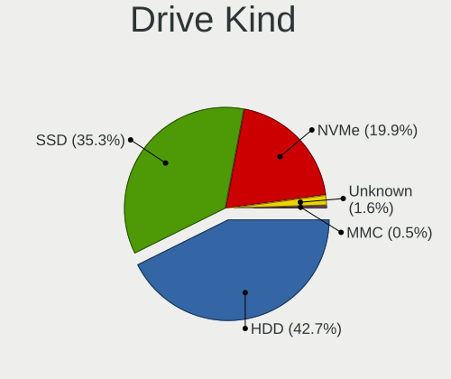

| Kind    | Desktops | Drives | Percent |
|---------|----------|--------|---------|
| HDD     | 2142     | 4591   | 42.67%  |
| SSD     | 1772     | 3398   | 35.3%   |
| NVMe    | 999      | 1835   | 19.9%   |
| Unknown | 82       | 107    | 1.63%   |
| MMC     | 25       | 32     | 0.5%    |

Drive Connector
---------------

SATA, SAS, NVMe, etc.

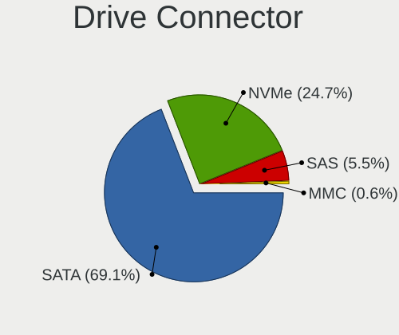

| Type | Desktops | Drives | Percent |
|------|----------|--------|---------|
| SATA | 2783     | 7785   | 69.13%  |
| NVMe | 996      | 1821   | 24.74%  |
| SAS  | 222      | 325    | 5.51%   |
| MMC  | 25       | 32     | 0.62%   |

Drive Size
----------

Size of hard drive

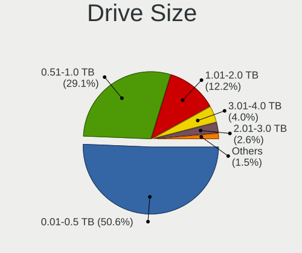

| Size in TB | Desktops | Drives | Percent |
|------------|----------|--------|---------|
| 0.01-0.5   | 2156     | 4292   | 50.65%  |
| 0.51-1.0   | 1239     | 2061   | 29.11%  |
| 1.01-2.0   | 519      | 933    | 12.19%  |
| 3.01-4.0   | 171      | 302    | 4.02%   |
| 2.01-3.0   | 110      | 200    | 2.58%   |
| 4.01-10.0  | 55       | 184    | 1.29%   |
| 10.01-20.0 | 7        | 17     | 0.16%   |

Space Total
-----------

Amount of disk space available on the file system

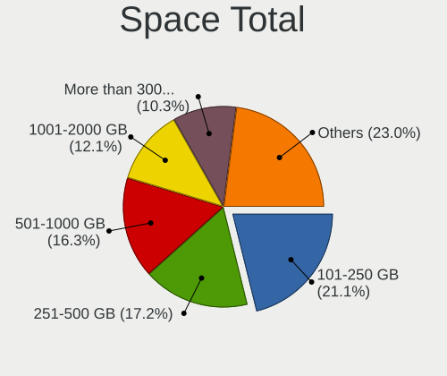

| Size in GB     | Desktops | Percent |
|----------------|----------|---------|
| 101-250        | 738      | 21.15%  |
| 251-500        | 601      | 17.22%  |
| 501-1000       | 569      | 16.3%   |
| 1001-2000      | 422      | 12.09%  |
| More than 3000 | 359      | 10.29%  |
| 1-20           | 232      | 6.65%   |
| 2001-3000      | 225      | 6.45%   |
| 51-100         | 149      | 4.27%   |
| Unknown        | 110      | 3.15%   |
| 21-50          | 85       | 2.44%   |

Space Used
----------

Amount of used disk space

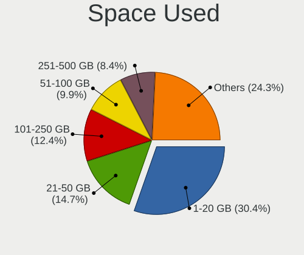

| Used GB        | Desktops | Percent |
|----------------|----------|---------|
| 1-20           | 1089     | 30.36%  |
| 21-50          | 527      | 14.69%  |
| 101-250        | 445      | 12.41%  |
| 51-100         | 356      | 9.92%   |
| 251-500        | 300      | 8.36%   |
| 501-1000       | 281      | 7.83%   |
| 1001-2000      | 240      | 6.69%   |
| More than 3000 | 133      | 3.71%   |
| Unknown        | 110      | 3.07%   |
| 2001-3000      | 98       | 2.73%   |
| 0              | 8        | 0.22%   |

Malfunc. Drives
---------------

Drive models with a malfunction

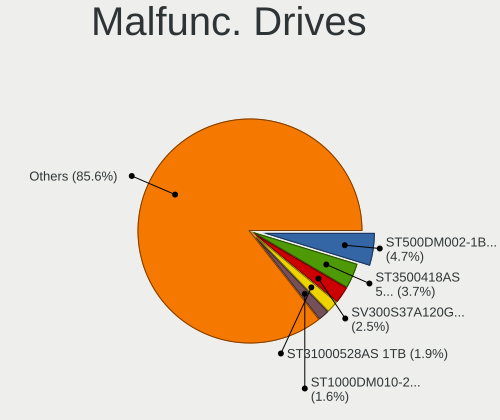

| Model                                 | Desktops | Drives | Percent |
|---------------------------------------|----------|--------|---------|
| Seagate ST500DM002-1BD142 500GB       | 23       | 24     | 4.73%   |
| Seagate ST3500418AS 500GB             | 18       | 25     | 3.7%    |
| Kingston SV300S37A120G 120GB SSD      | 12       | 19     | 2.47%   |
| Seagate ST31000528AS 1TB              | 9        | 10     | 1.85%   |
| Seagate ST1000DM010-2EP102 1TB        | 8        | 11     | 1.65%   |
| Seagate ST1000DM003-1CH162 1TB        | 8        | 9      | 1.65%   |
| Toshiba DT01ACA100 1TB                | 7        | 15     | 1.44%   |
| WDC WD20EARX-00PASB0 2TB              | 6        | 11     | 1.23%   |
| Seagate ST3500320AS 500GB             | 6        | 10     | 1.23%   |
| Seagate ST9500325AS 500GB             | 5        | 6      | 1.03%   |
| Seagate ST2000DL003-9VT166 2TB        | 5        | 6      | 1.03%   |
| Seagate ST1000DM003-1ER162 1TB        | 5        | 9      | 1.03%   |
| SanDisk SSD PLUS 480GB                | 5        | 6      | 1.03%   |
| Samsung Electronics SSD 870 EVO 1TB   | 5        | 6      | 1.03%   |
| Kingston SA400S37480G 480GB SSD       | 5        | 8      | 1.03%   |
| WDC WD5000AAKX-001CA0 500GB           | 4        | 6      | 0.82%   |
| Toshiba DT01ACA050 500GB              | 4        | 5      | 0.82%   |
| Seagate ST31500341AS 1TB              | 4        | 4      | 0.82%   |
| Kingston SA400S37240G 240GB SSD       | 4        | 5      | 0.82%   |
| Drevo X1 SSD 240GB                    | 4        | 6      | 0.82%   |
| WDC WD20PURZ-85GU6Y0 2TB              | 3        | 5      | 0.62%   |
| WDC WD20EZRX-00DC0B0 2TB              | 3        | 3      | 0.62%   |
| WDC WD10EARS-00Y5B1 1TB               | 3        | 3      | 0.62%   |
| Seagate ST500LT012-1DG142 500GB       | 3        | 3      | 0.62%   |
| Seagate ST3500830AS 500GB             | 3        | 5      | 0.62%   |
| Seagate ST3250310AS 250GB             | 3        | 3      | 0.62%   |
| Seagate ST3200822A 200GB              | 3        | 3      | 0.62%   |
| Seagate ST3120827AS 120GB             | 3        | 3      | 0.62%   |
| Seagate ST31000333AS 1TB              | 3        | 8      | 0.62%   |
| Seagate ST1000LM024 HN-M101MBB 1TB    | 3        | 3      | 0.62%   |
| Samsung Electronics SSD 870 EVO 500GB | 3        | 3      | 0.62%   |
| Samsung Electronics HD501LJ 500GB     | 3        | 3      | 0.62%   |
| Maxtor STM3250310AS 250GB             | 3        | 3      | 0.62%   |
| Hitachi HDS721010CLA332 1TB           | 3        | 3      | 0.62%   |
| WDC WD6400AAKS-22A7B0 640GB           | 2        | 2      | 0.41%   |
| WDC WD5000BEVT-22ZAT0 500GB           | 2        | 2      | 0.41%   |
| WDC WD5000AAKX-60U6AA0 500GB          | 2        | 3      | 0.41%   |
| WDC WD5000AAKS-00YGA0 500GB           | 2        | 2      | 0.41%   |
| WDC WD40EZRX-00SPEB0 4TB              | 2        | 3      | 0.41%   |
| WDC WD40EFRX-68WT0N0 4TB              | 2        | 2      | 0.41%   |

Malfunc. Drive Vendor
---------------------

Vendors of faulty drives

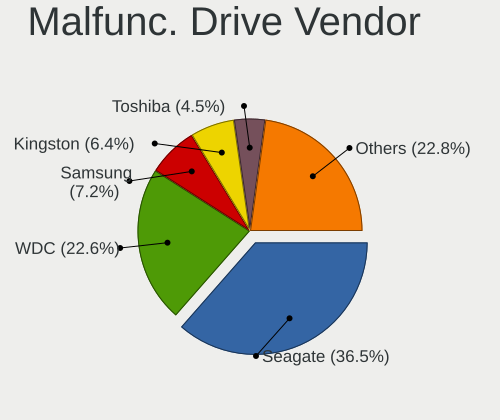

| Vendor              | Desktops | Drives | Percent |
|---------------------|----------|--------|---------|
| Seagate             | 171      | 229    | 36.46%  |
| WDC                 | 106      | 145    | 22.6%   |
| Samsung Electronics | 34       | 37     | 7.25%   |
| Kingston            | 30       | 42     | 6.4%    |
| Toshiba             | 21       | 30     | 4.48%   |
| Hitachi             | 20       | 22     | 4.26%   |
| SanDisk             | 13       | 16     | 2.77%   |
| Crucial             | 12       | 13     | 2.56%   |
| Maxtor              | 11       | 13     | 2.35%   |
| China               | 6        | 7      | 1.28%   |
| Drevo               | 5        | 7      | 1.07%   |
| Intel               | 4        | 6      | 0.85%   |
| OCZ                 | 3        | 3      | 0.64%   |
| Transcend           | 2        | 10     | 0.43%   |
| Patriot             | 2        | 2      | 0.43%   |
| Micron Technology   | 2        | 2      | 0.43%   |
| KingDian            | 2        | 3      | 0.43%   |
| Intenso             | 2        | 2      | 0.43%   |
| HPE                 | 2        | 3      | 0.43%   |
| HGST                | 2        | 2      | 0.43%   |
| Fujitsu             | 2        | 3      | 0.43%   |
| Corsair             | 2        | 2      | 0.43%   |
| A-DATA Technology   | 2        | 3      | 0.43%   |
| USB 3.1             | 1        | 1      | 0.21%   |
| TPH01203000GB       | 1        | 1      | 0.21%   |
| SPCC                | 1        | 1      | 0.21%   |
| LDLC                | 1        | 1      | 0.21%   |
| KODAK               | 1        | 1      | 0.21%   |
| KingSpec            | 1        | 1      | 0.21%   |
| JMicron Technology  | 1        | 1      | 0.21%   |
| Hypertec            | 1        | 1      | 0.21%   |
| Hewlett-Packard     | 1        | 1      | 0.21%   |
| Emtec               | 1        | 1      | 0.21%   |
| Dogfish             | 1        | 2      | 0.21%   |
| ASMT                | 1        | 2      | 0.21%   |
| Unknown             | 1        | 1      | 0.21%   |

Malfunc. HDD Vendor
-------------------

Vendors of faulty HDD drives

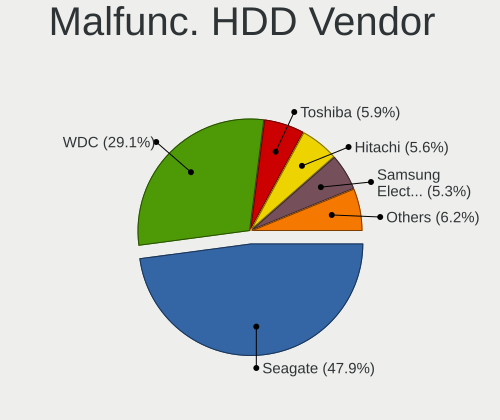

| Vendor              | Desktops | Drives | Percent |
|---------------------|----------|--------|---------|
| Seagate             | 171      | 229    | 47.9%   |
| WDC                 | 104      | 143    | 29.13%  |
| Toshiba             | 21       | 30     | 5.88%   |
| Hitachi             | 20       | 22     | 5.6%    |
| Samsung Electronics | 19       | 21     | 5.32%   |
| Maxtor              | 11       | 13     | 3.08%   |
| HPE                 | 2        | 3      | 0.56%   |
| HGST                | 2        | 2      | 0.56%   |
| Fujitsu             | 2        | 3      | 0.56%   |
| TPH01203000GB       | 1        | 1      | 0.28%   |
| JMicron Technology  | 1        | 1      | 0.28%   |
| Hewlett-Packard     | 1        | 1      | 0.28%   |
| China               | 1        | 1      | 0.28%   |
| ASMT                | 1        | 2      | 0.28%   |

Malfunc. Drive Kind
-------------------

Kinds of faulty drives

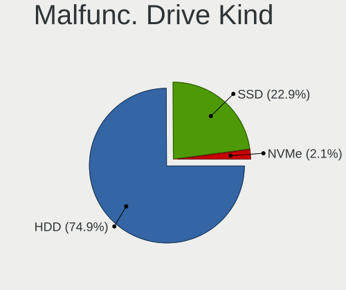

| Kind | Desktops | Drives | Percent |
|------|----------|--------|---------|
| HDD  | 317      | 472    | 74.94%  |
| SSD  | 97       | 135    | 22.93%  |
| NVMe | 9        | 10     | 2.13%   |

Failed Drives
-------------

Failed drive models

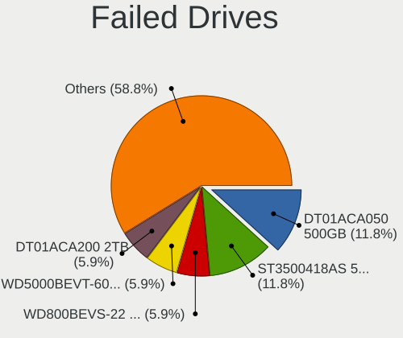

| Model                              | Desktops | Drives | Percent |
|------------------------------------|----------|--------|---------|
| Toshiba DT01ACA050 500GB           | 2        | 2      | 11.76%  |
| Seagate ST3500418AS 500GB          | 2        | 2      | 11.76%  |
| WDC WD800BEVS-22 80GB              | 1        | 1      | 5.88%   |
| WDC WD5000BEVT-60ZAT1 500GB        | 1        | 1      | 5.88%   |
| Toshiba DT01ACA200 2TB             | 1        | 1      | 5.88%   |
| Seagate ST3500830AS 500GB          | 1        | 1      | 5.88%   |
| Seagate ST31000528AS 1TB           | 1        | 1      | 5.88%   |
| Seagate ST31000520AS 1TB           | 1        | 1      | 5.88%   |
| Seagate ST31000333AS 1TB           | 1        | 1      | 5.88%   |
| Seagate ST1000LM024 HN-M101MBB 1TB | 1        | 1      | 5.88%   |
| Samsung Electronics SSD 980 500GB  | 1        | 1      | 5.88%   |
| Samsung Electronics SSD 980 1TB    | 1        | 1      | 5.88%   |
| Samsung Electronics HD253GJ 250GB  | 1        | 1      | 5.88%   |
| Samsung Electronics HD103SJ 1TB    | 1        | 2      | 5.88%   |
| Hitachi HDS721010DLE630 1TB        | 1        | 1      | 5.88%   |

Failed Drive Vendor
-------------------

Failed drive vendors

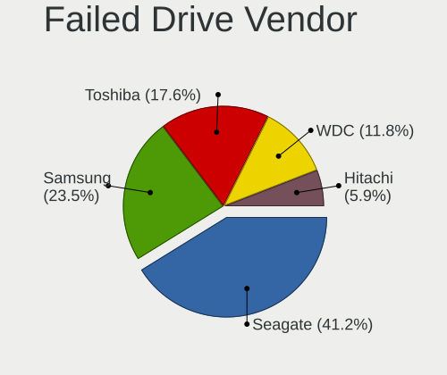

| Vendor              | Desktops | Drives | Percent |
|---------------------|----------|--------|---------|
| Seagate             | 7        | 7      | 41.18%  |
| Samsung Electronics | 4        | 5      | 23.53%  |
| Toshiba             | 3        | 3      | 17.65%  |
| WDC                 | 2        | 2      | 11.76%  |
| Hitachi             | 1        | 1      | 5.88%   |

Drive Status
------------

Number of failed and malfunc. drives

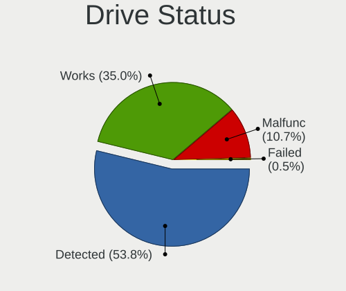

| Status   | Desktops | Drives | Percent |
|----------|----------|--------|---------|
| Detected | 1972     | 5693   | 53.79%  |
| Works    | 1283     | 3635   | 35%     |
| Malfunc  | 394      | 617    | 10.75%  |
| Failed   | 17       | 18     | 0.46%   |

Storage controller
------------------

Storage Vendor
--------------

Storage controller vendors

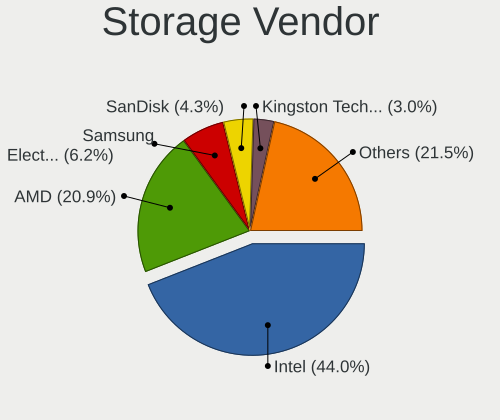

| Vendor                           | Desktops | Percent |
|----------------------------------|----------|---------|
| Intel                            | 2040     | 44.04%  |
| AMD                              | 969      | 20.92%  |
| Samsung Electronics              | 287      | 6.2%    |
| SanDisk                          | 201      | 4.34%   |
| Kingston Technology Company      | 138      | 2.98%   |
| ASMedia Technology               | 130      | 2.81%   |
| Phison Electronics               | 127      | 2.74%   |
| Micron/Crucial Technology        | 116      | 2.5%    |
| JMicron Technology               | 105      | 2.27%   |
| Marvell Technology Group         | 90       | 1.94%   |
| Nvidia                           | 89       | 1.92%   |
| Silicon Motion                   | 59       | 1.27%   |
| KIOXIA                           | 52       | 1.12%   |
| MAXIO Technology (Hangzhou)      | 32       | 0.69%   |
| VIA Technologies                 | 31       | 0.67%   |
| SK hynix                         | 26       | 0.56%   |
| Micron Technology                | 20       | 0.43%   |
| Realtek Semiconductor            | 16       | 0.35%   |
| ADATA Technology                 | 13       | 0.28%   |
| Shenzhen Longsys Electronics     | 11       | 0.24%   |
| Silicon Integrated Systems [SiS] | 9        | 0.19%   |
| Seagate Technology               | 9        | 0.19%   |
| LSI Logic / Symbios Logic        | 9        | 0.19%   |
| HighPoint Technologies           | 8        | 0.17%   |
| Toshiba America Info Systems     | 7        | 0.15%   |
| Adaptec                          | 5        | 0.11%   |
| Silicon Image                    | 4        | 0.09%   |
| INNOGRIT                         | 4        | 0.09%   |
| Broadcom / LSI                   | 4        | 0.09%   |
| Union Memory (Shenzhen)          | 3        | 0.06%   |
| Integrated Technology Express    | 3        | 0.06%   |
| TenaFe                           | 2        | 0.04%   |
| Netac Technology                 | 2        | 0.04%   |
| Yangtze Memory Technologies      | 1        | 0.02%   |
| ULi Electronics                  | 1        | 0.02%   |
| Swissbit                         | 1        | 0.02%   |
| OCZ Technology Group             | 1        | 0.02%   |
| Lite-On Technology               | 1        | 0.02%   |
| Lenovo                           | 1        | 0.02%   |
| Hewlett-Packard                  | 1        | 0.02%   |

Storage Model
-------------

Storage controller models

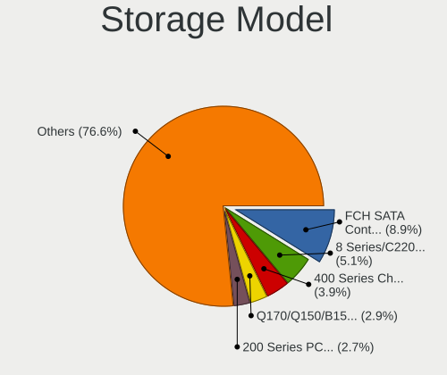

| Model                                                                                   | Desktops | Percent |
|-----------------------------------------------------------------------------------------|----------|---------|
| AMD FCH SATA Controller [AHCI mode]                                                     | 511      | 8.86%   |
| Intel 8 Series/C220 Series Chipset Family 6-port SATA Controller 1 [AHCI mode]          | 293      | 5.08%   |
| AMD 400 Series Chipset SATA Controller                                                  | 223      | 3.87%   |
| Intel Q170/Q150/B150/H170/H110/Z170/CM236 Chipset SATA Controller [AHCI Mode]           | 167      | 2.9%    |
| Intel 200 Series PCH SATA controller [AHCI mode]                                        | 155      | 2.69%   |
| Samsung NVMe SSD Controller SM981/PM981/PM983                                           | 154      | 2.67%   |
| Intel NM10/ICH7 Family SATA Controller [IDE mode]                                       | 146      | 2.53%   |
| AMD 500 Series Chipset SATA Controller                                                  | 145      | 2.51%   |
| Intel 6 Series/C200 Series Chipset Family 6 port Desktop SATA AHCI Controller           | 122      | 2.12%   |
| ASMedia ASM1061/ASM1062 Serial ATA Controller                                           | 118      | 2.05%   |
| Intel 82801G (ICH7 Family) IDE Controller                                               | 116      | 2.01%   |
| Intel SATA Controller [RAID mode]                                                       | 105      | 1.82%   |
| Intel 7 Series/C210 Series Chipset Family 6-port SATA Controller [AHCI mode]            | 101      | 1.75%   |
| AMD SB7x0/SB8x0/SB9x0 IDE Controller                                                    | 96       | 1.66%   |
| Intel Cannon Lake PCH SATA AHCI Controller                                              | 95       | 1.65%   |
| Intel 6 Series/C200 Series Chipset Family Desktop SATA Controller (IDE mode, ports 4-5) | 80       | 1.39%   |
| Intel 6 Series/C200 Series Chipset Family Desktop SATA Controller (IDE mode, ports 0-3) | 80       | 1.39%   |
| AMD 600 Series Chipset SATA Controller                                                  | 80       | 1.39%   |
| AMD SB7x0/SB8x0/SB9x0 SATA Controller [AHCI mode]                                       | 79       | 1.37%   |
| AMD SB7x0/SB8x0/SB9x0 SATA Controller [IDE mode]                                        | 67       | 1.16%   |
| Micron/Crucial P2 [Nick P2] / P3 / P3 Plus NVMe PCIe SSD (DRAM-less)                    | 63       | 1.09%   |
| Samsung NVMe SSD Controller PM9A1/PM9A3/980PRO                                          | 59       | 1.02%   |
| Silicon Motion SM2263EN/SM2263XT (DRAM-less) NVMe SSD Controllers                       | 55       | 0.95%   |
| Phison E12 NVMe Controller                                                              | 55       | 0.95%   |
| Intel 500 Series Chipset Family SATA AHCI Controller                                    | 55       | 0.95%   |
| Intel 9 Series Chipset Family SATA Controller [AHCI Mode]                               | 53       | 0.92%   |
| JMicron JMB363 SATA/IDE Controller                                                      | 52       | 0.9%    |
| Intel Alder Lake-S PCH SATA Controller [AHCI Mode]                                      | 52       | 0.9%    |
| AMD 300 Series Chipset SATA Controller                                                  | 52       | 0.9%    |
| Intel 82801I (ICH9 Family) 2 port SATA Controller [IDE mode]                            | 47       | 0.82%   |
| Samsung NVMe SSD Controller 980 (DRAM-less)                                             | 45       | 0.78%   |
| Intel 82801JI (ICH10 Family) SATA AHCI Controller                                       | 42       | 0.73%   |
| Intel Comet Lake SATA AHCI Controller                                                   | 40       | 0.69%   |
| Nvidia MCP61 SATA Controller                                                            | 39       | 0.68%   |
| Intel Raptor Lake SATA AHCI Controller                                                  | 39       | 0.68%   |
| Intel C610/X99 series chipset 6-Port SATA Controller [AHCI mode]                        | 38       | 0.66%   |
| Intel 5 Series/3400 Series Chipset 4 port SATA IDE Controller                           | 37       | 0.64%   |
| Intel 5 Series/3400 Series Chipset 2 port SATA IDE Controller                           | 37       | 0.64%   |
| Intel 5 Series/3400 Series Chipset 6 port SATA AHCI Controller                          | 36       | 0.62%   |
| SanDisk Ultra 3D / WD PC SN530, IX SN530, Blue SN550 NVMe SSD (DRAM-less)               | 34       | 0.59%   |

Storage Kind
------------

Kind of storage controller (IDE, SATA, NVMe, SAS, ...)

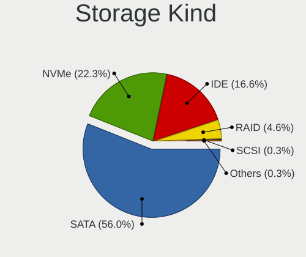

| Kind | Desktops | Percent |
|------|----------|---------|
| SATA | 2523     | 56.03%  |
| NVMe | 1002     | 22.25%  |
| IDE  | 747      | 16.59%  |
| RAID | 205      | 4.55%   |
| SAS  | 13       | 0.29%   |
| SCSI | 13       | 0.29%   |

Processor
---------

CPU Vendor
----------

Processor vendors

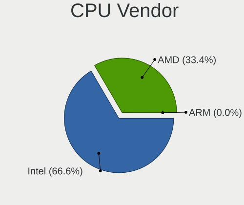

| Vendor | Desktops | Percent |
|--------|----------|---------|
| Intel  | 2108     | 66.56%  |
| AMD    | 1058     | 33.41%  |
| ARM    | 1        | 0.03%   |

CPU Model
---------

Processor models

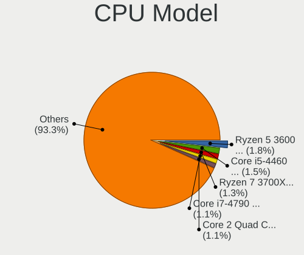

| Model                                       | Desktops | Percent |
|---------------------------------------------|----------|---------|
| AMD Ryzen 5 3600 6-Core Processor           | 56       | 1.76%   |
| Intel Core i5-4460 CPU @ 3.20GHz            | 47       | 1.47%   |
| AMD Ryzen 7 3700X 8-Core Processor          | 40       | 1.25%   |
| Intel Core i7-4790 CPU @ 3.60GHz            | 35       | 1.1%    |
| Intel Core 2 Quad CPU Q6600 @ 2.40GHz       | 35       | 1.1%    |
| Intel Core i7-3770 CPU @ 3.40GHz            | 34       | 1.07%   |
| AMD Ryzen 7 5800X 8-Core Processor          | 34       | 1.07%   |
| Intel Core i3-4150 CPU @ 3.50GHz            | 33       | 1.03%   |
| Intel Core i7-4770 CPU @ 3.40GHz            | 32       | 1%      |
| AMD Ryzen 5 2600 Six-Core Processor         | 32       | 1%      |
| AMD Ryzen 5 5600X 6-Core Processor          | 30       | 0.94%   |
| AMD Ryzen 5 3400G with Radeon Vega Graphics | 30       | 0.94%   |
| Intel Core i5-2400 CPU @ 3.10GHz            | 29       | 0.91%   |
| AMD Ryzen 9 5900X 12-Core Processor         | 29       | 0.91%   |
| Intel Core i5-6500 CPU @ 3.20GHz            | 28       | 0.88%   |
| AMD Ryzen 7 2700X Eight-Core Processor      | 27       | 0.85%   |
| AMD FX-8350 Eight-Core Processor            | 26       | 0.82%   |
| Intel Core i5-8400 CPU @ 2.80GHz            | 25       | 0.78%   |
| Intel Core i5-4590 CPU @ 3.30GHz            | 24       | 0.75%   |
| Intel Core i7-8700 CPU @ 3.20GHz            | 23       | 0.72%   |
| Intel Core i7-6700K CPU @ 4.00GHz           | 23       | 0.72%   |
| Intel Core i7-6700 CPU @ 3.40GHz            | 23       | 0.72%   |
| Intel Core i7-2600 CPU @ 3.40GHz            | 23       | 0.72%   |
| Intel Core i5-3470 CPU @ 3.20GHz            | 23       | 0.72%   |
| Intel Core 2 Duo CPU E8400 @ 3.00GHz        | 23       | 0.72%   |
| AMD Ryzen 5 5600G with Radeon Graphics      | 22       | 0.69%   |
| Intel Core i7-7700 CPU @ 3.60GHz            | 19       | 0.6%    |
| AMD Ryzen 9 3900X 12-Core Processor         | 19       | 0.6%    |
| Intel Core i5-7400 CPU @ 3.00GHz            | 18       | 0.56%   |
| Intel Core i5 CPU 650 @ 3.20GHz             | 18       | 0.56%   |
| Intel Core i3-4170 CPU @ 3.70GHz            | 18       | 0.56%   |
| Intel Core i3-3220 CPU @ 3.30GHz            | 18       | 0.56%   |
| Intel Core i7-4790K CPU @ 4.00GHz           | 17       | 0.53%   |
| Intel Core i5-4440 CPU @ 3.10GHz            | 17       | 0.53%   |
| Intel Core 2 Quad CPU Q8200 @ 2.33GHz       | 17       | 0.53%   |
| AMD Ryzen 7 5700G with Radeon Graphics      | 17       | 0.53%   |
| AMD Ryzen 7 3800X 8-Core Processor          | 17       | 0.53%   |
| AMD Ryzen 7 2700 Eight-Core Processor       | 17       | 0.53%   |
| Intel Pentium CPU G4400 @ 3.30GHz           | 16       | 0.5%    |
| Intel Core i3-2100 CPU @ 3.10GHz            | 16       | 0.5%    |

CPU Model Family
----------------

Processor model prefix

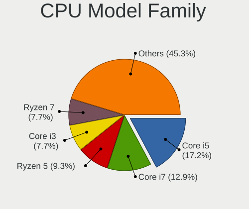

| Model                   | Desktops | Percent |
|-------------------------|----------|---------|
| Intel Core i5           | 546      | 17.16%  |
| Intel Core i7           | 409      | 12.85%  |
| AMD Ryzen 5             | 296      | 9.3%    |
| Intel Core i3           | 246      | 7.73%   |
| AMD Ryzen 7             | 244      | 7.67%   |
| Other                   | 154      | 4.84%   |
| Intel Xeon              | 147      | 4.62%   |
| AMD Ryzen 9             | 112      | 3.52%   |
| Intel Celeron           | 111      | 3.49%   |
| Intel Core 2 Quad       | 99       | 3.11%   |
| Intel Core 2 Duo        | 85       | 2.67%   |
| Intel Pentium           | 81       | 2.55%   |
| AMD FX                  | 77       | 2.42%   |
| Intel Pentium Dual-Core | 58       | 1.82%   |
| AMD Ryzen 3             | 40       | 1.26%   |
| Intel Core i9           | 37       | 1.16%   |
| AMD A10                 | 37       | 1.16%   |
| Intel Core 2            | 35       | 1.1%    |
| AMD Athlon 64 X2        | 31       | 0.97%   |
| Intel Pentium Dual      | 25       | 0.79%   |
| AMD Ryzen Threadripper  | 25       | 0.79%   |
| AMD Athlon II X2        | 25       | 0.79%   |
| Intel Pentium 4         | 22       | 0.69%   |
| AMD A8                  | 20       | 0.63%   |
| AMD Phenom II X4        | 19       | 0.6%    |
| AMD A4                  | 19       | 0.6%    |
| Intel Atom              | 17       | 0.53%   |
| AMD Athlon              | 14       | 0.44%   |
| AMD Phenom              | 13       | 0.41%   |
| AMD A6                  | 13       | 0.41%   |
| Intel Pentium Gold      | 12       | 0.38%   |
| Intel Genuine           | 11       | 0.35%   |
| AMD Phenom II X6        | 11       | 0.35%   |
| Intel Pentium D         | 10       | 0.31%   |
| AMD Ryzen 5 PRO         | 8        | 0.25%   |
| AMD Athlon II X4        | 8        | 0.25%   |
| Intel Core              | 7        | 0.22%   |
| AMD Sempron             | 7        | 0.22%   |
| AMD Athlon 64           | 7        | 0.22%   |
| Intel Pentium Silver    | 5        | 0.16%   |

CPU Cores
---------

Number of processor cores

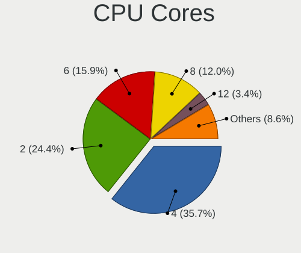

| Number  | Desktops | Percent |
|---------|----------|---------|
| 4       | 1141     | 35.73%  |
| 2       | 780      | 24.43%  |
| 6       | 507      | 15.88%  |
| 8       | 383      | 11.99%  |
| 12      | 108      | 3.38%   |
| 1       | 80       | 2.51%   |
| 16      | 59       | 1.85%   |
| 10      | 32       | 1%      |
| 3       | 26       | 0.81%   |
| 14      | 25       | 0.78%   |
| 64      | 14       | 0.44%   |
| 24      | 14       | 0.44%   |
| 20      | 12       | 0.38%   |
| Unknown | 6        | 0.19%   |
| 32      | 3        | 0.09%   |
| 40      | 1        | 0.03%   |
| 36      | 1        | 0.03%   |
| 18      | 1        | 0.03%   |

CPU Sockets
-----------

Number of sockets

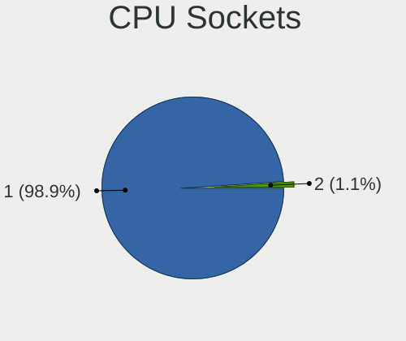

| Number | Desktops | Percent |
|--------|----------|---------|
| 1      | 3134     | 98.93%  |
| 2      | 34       | 1.07%   |

CPU Threads
-----------

Threads per core (Hyper-Threading)

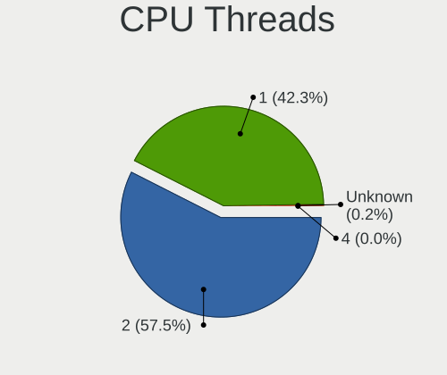

| Number  | Desktops | Percent |
|---------|----------|---------|
| 2       | 1833     | 57.48%  |
| 1       | 1348     | 42.27%  |
| Unknown | 6        | 0.19%   |
| 12      | 1        | 0.03%   |
| 4       | 1        | 0.03%   |

CPU Op-Modes
------------

CPU Operation Modes (32-bit, 64-bit)

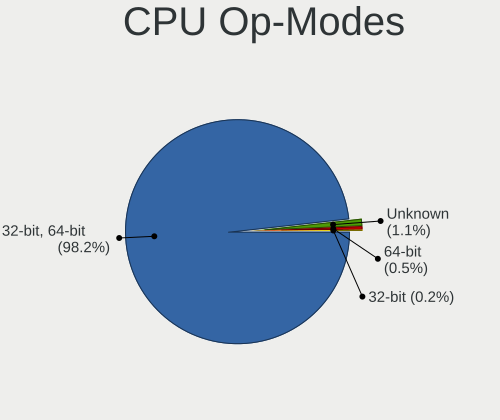

| Op mode        | Desktops | Percent |
|----------------|----------|---------|
| 32-bit, 64-bit | 3125     | 98.24%  |
| Unknown        | 34       | 1.07%   |
| 64-bit         | 16       | 0.5%    |
| 32-bit         | 6        | 0.19%   |

CPU Microcode
-------------

Microcode number

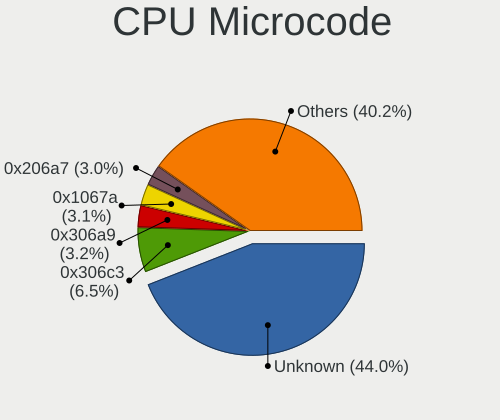

| Number     | Desktops | Percent |
|------------|----------|---------|
| Unknown    | 1477     | 44.04%  |
| 0x306c3    | 218      | 6.5%    |
| 0x306a9    | 106      | 3.16%   |
| 0x1067a    | 104      | 3.1%    |
| 0x206a7    | 101      | 3.01%   |
| 0x506e3    | 88       | 2.62%   |
| 0x08701021 | 62       | 1.85%   |
| 0x906ea    | 58       | 1.73%   |
| 0x0800820d | 58       | 1.73%   |
| 0x906e9    | 51       | 1.52%   |
| 0x6fb      | 47       | 1.4%    |
| 0x08108109 | 41       | 1.22%   |
| 0x06000852 | 40       | 1.19%   |
| 0xa0653    | 31       | 0.92%   |
| 0x6fd      | 31       | 0.92%   |
| 0x08701013 | 30       | 0.89%   |
| 0x06001119 | 30       | 0.89%   |
| 0x010000c8 | 30       | 0.89%   |
| 0x906ed    | 23       | 0.69%   |
| 0x20655    | 21       | 0.63%   |
| 0x6f6      | 20       | 0.6%    |
| 0x106e5    | 20       | 0.6%    |
| 0xa0655    | 19       | 0.57%   |
| 0x906eb    | 19       | 0.57%   |
| 0x306f2    | 19       | 0.57%   |
| 0x0a201016 | 19       | 0.57%   |
| 0x06003106 | 18       | 0.54%   |
| 0xa0671    | 17       | 0.51%   |
| 0x206d7    | 17       | 0.51%   |
| 0x20652    | 17       | 0.51%   |
| 0x10676    | 17       | 0.51%   |
| 0x08001138 | 17       | 0.51%   |
| 0x10677    | 16       | 0.48%   |
| 0x0a50000c | 15       | 0.45%   |
| 0x08101016 | 15       | 0.45%   |
| 0x08001137 | 15       | 0.45%   |
| 0x906ec    | 12       | 0.36%   |
| 0x506c9    | 12       | 0.36%   |
| 0x0a201009 | 12       | 0.36%   |
| 0x0830107a | 12       | 0.36%   |

CPU Microarch
-------------

Microarchitecture

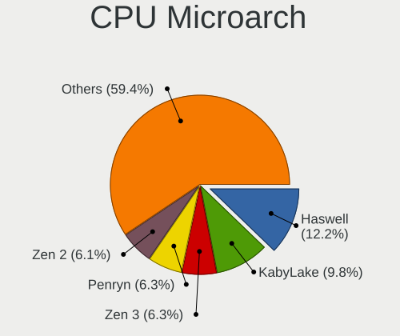

| Name             | Desktops | Percent |
|------------------|----------|---------|
| Haswell          | 389      | 12.2%   |
| KabyLake         | 312      | 9.78%   |
| Zen 3            | 201      | 6.3%    |
| Penryn           | 200      | 6.27%   |
| Zen 2            | 193      | 6.05%   |
| IvyBridge        | 191      | 5.99%   |
| SandyBridge      | 187      | 5.86%   |
| Unknown          | 171      | 5.36%   |
| Skylake          | 168      | 5.27%   |
| Zen+             | 159      | 4.99%   |
| Core             | 140      | 4.39%   |
| Piledriver       | 110      | 3.45%   |
| Zen              | 92       | 2.88%   |
| K10              | 92       | 2.88%   |
| CometLake        | 84       | 2.63%   |
| Westmere         | 66       | 2.07%   |
| Alderlake Hybrid | 62       | 1.94%   |
| Nehalem          | 48       | 1.51%   |
| K8 Hammer        | 48       | 1.51%   |
| NetBurst         | 34       | 1.07%   |
| Steamroller      | 32       | 1%      |
| Icelake          | 32       | 1%      |
| Broadwell        | 32       | 1%      |
| Silvermont       | 26       | 0.82%   |
| Goldmont plus    | 25       | 0.78%   |
| Goldmont         | 16       | 0.5%    |
| Gracemont        | 11       | 0.34%   |
| Bulldozer        | 11       | 0.34%   |
| Excavator        | 10       | 0.31%   |
| Bonnell          | 9        | 0.28%   |
| K10 Llano        | 8        | 0.25%   |
| TigerLake        | 7        | 0.22%   |
| Puma             | 6        | 0.19%   |
| Tremont          | 5        | 0.16%   |
| Lunarlake Hybrid | 5        | 0.16%   |
| Jaguar           | 3        | 0.09%   |
| Bobcat           | 2        | 0.06%   |
| Sapphire Rapids  | 1        | 0.03%   |
| K6               | 1        | 0.03%   |

Graphics
--------

GPU Vendor
----------

Vendors of graphics cards

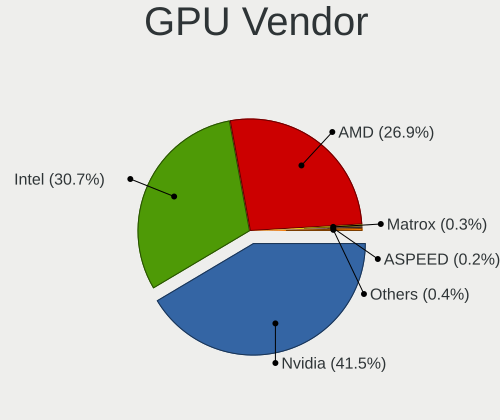

| Vendor                                       | Desktops | Percent |
|----------------------------------------------|----------|---------|
| Nvidia                                       | 1420     | 41.46%  |
| Intel                                        | 1050     | 30.66%  |
| AMD                                          | 923      | 26.95%  |
| Matrox Electronics Systems                   | 10       | 0.29%   |
| ASPEED Technology                            | 7        | 0.2%    |
| VIA Technologies                             | 6        | 0.18%   |
| Silicon Integrated Systems [SiS]             | 6        | 0.18%   |
| XGI Technology (eXtreme Graphics Innovation) | 1        | 0.03%   |
| Silicon Motion                               | 1        | 0.03%   |
| ATI Technologies                             | 1        | 0.03%   |

GPU Model
---------

Graphics card models

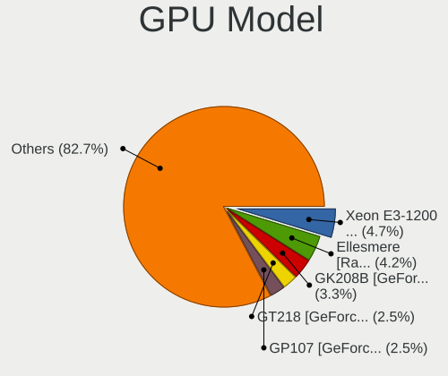

| Model                                                                       | Desktops | Percent |
|-----------------------------------------------------------------------------|----------|---------|
| Intel Xeon E3-1200 v3/4th Gen Core Processor Integrated Graphics Controller | 168      | 4.73%   |
| AMD Ellesmere [Radeon RX 470/480/570/570X/580/580X/590]                     | 151      | 4.25%   |
| Nvidia GK208B [GeForce GT 710]                                              | 119      | 3.35%   |
| Nvidia GT218 [GeForce 210]                                                  | 88       | 2.48%   |
| Nvidia GP107 [GeForce GTX 1050 Ti]                                          | 88       | 2.48%   |
| Intel 2nd Generation Core Processor Family Integrated Graphics Controller   | 82       | 2.31%   |
| Intel Skylake-S GT2 [HD Graphics 530]                                       | 71       | 2%      |
| Intel CoffeeLake-S GT2 [UHD Graphics 630]                                   | 69       | 1.94%   |
| Intel Xeon E3-1200 v2/3rd Gen Core processor Graphics Controller            | 63       | 1.77%   |
| Intel 4th Generation Core Processor Family Integrated Graphics Controller   | 63       | 1.77%   |
| Intel 4 Series Chipset Integrated Graphics Controller                       | 54       | 1.52%   |
| Intel Kaby Lake-S GT2 [HD Graphics 630]                                     | 53       | 1.49%   |
| Nvidia GP108 [GeForce GT 1030]                                              | 52       | 1.46%   |
| AMD Raphael                                                                 | 51       | 1.44%   |
| Nvidia GK208B [GeForce GT 730]                                              | 47       | 1.32%   |
| AMD Picasso/Raven 2 [Radeon Vega Series / Radeon Vega Mobile Series]        | 46       | 1.29%   |
| Nvidia GP106 [GeForce GTX 1060 6GB]                                         | 41       | 1.15%   |
| AMD Cezanne [Radeon Vega Series / Radeon Vega Mobile Series]                | 41       | 1.15%   |
| Nvidia GA106 [GeForce RTX 3060 Lite Hash Rate]                              | 36       | 1.01%   |
| AMD Navi 10 [Radeon RX 5600 OEM/5600 XT / 5700/5700 XT]                     | 35       | 0.99%   |
| Intel CometLake-S GT2 [UHD Graphics 630]                                    | 34       | 0.96%   |
| AMD Navi 23 [Radeon RX 6600/6600 XT/6600M]                                  | 34       | 0.96%   |
| Intel 82G33/G31 Express Integrated Graphics Controller                      | 33       | 0.93%   |
| AMD Lexa PRO [Radeon 540/540X/550/550X / RX 540X/550/550X]                  | 33       | 0.93%   |
| Nvidia GP107 [GeForce GTX 1050]                                             | 30       | 0.84%   |
| Nvidia GM206 [GeForce GTX 960]                                              | 29       | 0.82%   |
| Nvidia GM204 [GeForce GTX 970]                                              | 29       | 0.82%   |
| Intel IvyBridge GT2 [HD Graphics 4000]                                      | 29       | 0.82%   |
| Nvidia TU117 [GeForce GTX 1650]                                             | 28       | 0.79%   |
| Nvidia GP104 [GeForce GTX 1070]                                             | 28       | 0.79%   |
| Nvidia GF119 [GeForce GT 610]                                               | 27       | 0.76%   |
| AMD Raven Ridge [Radeon Vega Series / Radeon Vega Mobile Series]            | 27       | 0.76%   |
| Nvidia GM107 [GeForce GTX 750 Ti]                                           | 26       | 0.73%   |
| AMD Navi 22 [Radeon RX 6700/6700 XT/6750 XT / 6800M/6850M XT]               | 24       | 0.68%   |
| Nvidia GP106 [GeForce GTX 1060 3GB]                                         | 22       | 0.62%   |
| AMD Kaveri [Radeon R7 Graphics]                                             | 22       | 0.62%   |
| Intel Core Processor Integrated Graphics Controller                         | 21       | 0.59%   |
| Intel GeminiLake [UHD Graphics 600]                                         | 20       | 0.56%   |
| Intel Alder Lake-S GT1 [UHD Graphics 770]                                   | 20       | 0.56%   |
| AMD Cedar [Radeon HD 5000/6000/7350/8350 Series]                            | 20       | 0.56%   |

GPU Combo
---------

Combinations of graphics cards

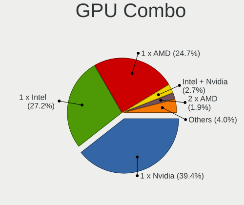

| Name                   | Desktops | Percent |
|------------------------|----------|---------|
| 1 x Nvidia             | 1275     | 39.42%  |
| 1 x Intel              | 881      | 27.24%  |
| 1 x AMD                | 798      | 24.68%  |
| Intel + Nvidia         | 88       | 2.72%   |
| 2 x AMD                | 63       | 1.95%   |
| AMD + Nvidia           | 55       | 1.7%    |
| Intel + AMD            | 15       | 0.46%   |
| 2 x Nvidia             | 14       | 0.43%   |
| 1 x Matrox             | 9        | 0.28%   |
| 1 x VIA                | 6        | 0.19%   |
| 1 x SiS                | 6        | 0.19%   |
| 1 x ASPEED             | 6        | 0.19%   |
| Other                  | 5        | 0.15%   |
| 2 x Intel              | 4        | 0.12%   |
| 3 x AMD                | 3        | 0.09%   |
| 1 x XGI                | 1        | 0.03%   |
| 1 x Silicon Motion     | 1        | 0.03%   |
| Nvidia + Matrox        | 1        | 0.03%   |
| Nvidia + ASPEED        | 1        | 0.03%   |
| 1 x Intel + 3 x Nvidia | 1        | 0.03%   |
| Intel + 2 x AMD        | 1        | 0.03%   |

GPU Driver
----------

Free vs proprietary

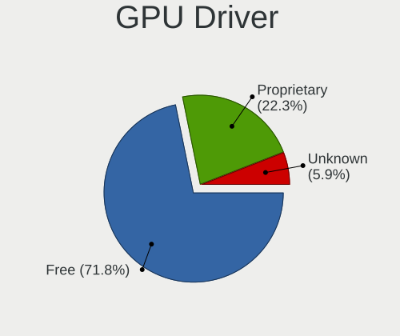

| Driver      | Desktops | Percent |
|-------------|----------|---------|
| Free        | 2334     | 71.82%  |
| Proprietary | 724      | 22.28%  |
| Unknown     | 192      | 5.91%   |

GPU Memory
----------

Total video memory

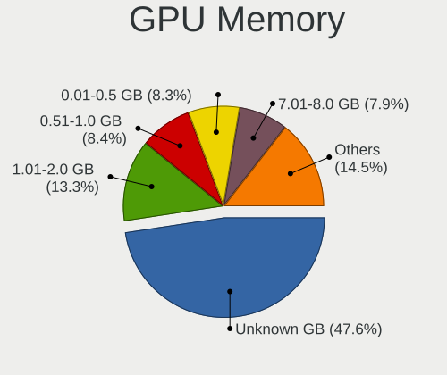

| Size in GB | Desktops | Percent |
|------------|----------|---------|
| Unknown    | 1586     | 47.61%  |
| 1.01-2.0   | 442      | 13.27%  |
| 0.51-1.0   | 280      | 8.41%   |
| 0.01-0.5   | 277      | 8.32%   |
| 7.01-8.0   | 264      | 7.93%   |
| 3.01-4.0   | 244      | 7.33%   |
| 8.01-16.0  | 98       | 2.94%   |
| 5.01-6.0   | 86       | 2.58%   |
| 2.01-3.0   | 31       | 0.93%   |
| 16.01-24.0 | 21       | 0.63%   |
| 32.01-64.0 | 1        | 0.03%   |
| 4.01-5.0   | 1        | 0.03%   |

Monitor
-------

Monitor Vendor
--------------

Monitor vendors

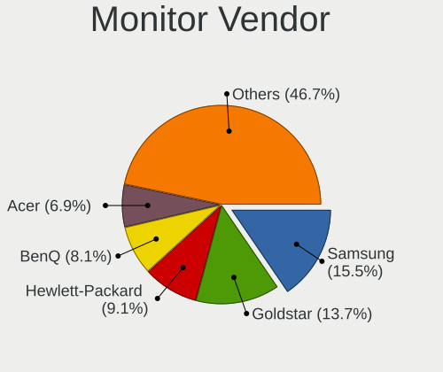

| Vendor                  | Desktops | Percent |
|-------------------------|----------|---------|
| Samsung Electronics     | 524      | 15.48%  |
| Goldstar                | 464      | 13.7%   |
| Hewlett-Packard         | 307      | 9.07%   |
| BenQ                    | 274      | 8.09%   |
| Acer                    | 235      | 6.94%   |
| Dell                    | 201      | 5.94%   |
| Philips                 | 188      | 5.55%   |
| AOC                     | 171      | 5.05%   |
| Ancor Communications    | 167      | 4.93%   |
| ASUSTek Computer        | 72       | 2.13%   |
| Unknown                 | 63       | 1.86%   |
| LG Electronics          | 60       | 1.77%   |
| Lenovo                  | 56       | 1.65%   |
| MSI                     | 48       | 1.42%   |
| Sony                    | 42       | 1.24%   |
| ViewSonic               | 33       | 0.97%   |
| HannStar                | 32       | 0.95%   |
| Gigabyte Technology     | 16       | 0.47%   |
| OEM                     | 15       | 0.44%   |
| Xiaomi                  | 14       | 0.41%   |
| Vestel Elektronik       | 14       | 0.41%   |
| Packard Bell            | 14       | 0.41%   |
| Eizo                    | 14       | 0.41%   |
| Mi                      | 13       | 0.38%   |
| Fujitsu Siemens         | 13       | 0.38%   |
| ___                     | 12       | 0.35%   |
| NEC Computers           | 11       | 0.32%   |
| Iiyama                  | 11       | 0.32%   |
| HKC                     | 11       | 0.32%   |
| Chi Mei Optoelectronics | 11       | 0.32%   |
| Unknown                 | 11       | 0.32%   |
| RTK                     | 10       | 0.3%    |
| Panasonic               | 9        | 0.27%   |
| Hitachi                 | 9        | 0.27%   |
| Cbox                    | 8        | 0.24%   |
| Toshiba                 | 7        | 0.21%   |
| HUAWEI                  | 6        | 0.18%   |
| HPN                     | 6        | 0.18%   |
| AGO                     | 6        | 0.18%   |
| Plain Tree Systems      | 5        | 0.15%   |

Monitor Model
-------------

Monitor models

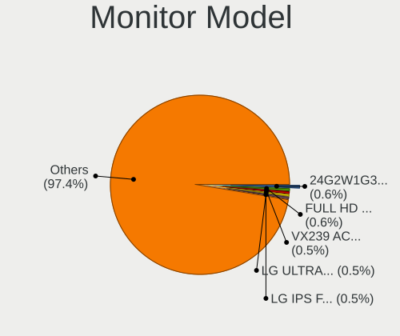

| Model                                                                 | Desktops | Percent |
|-----------------------------------------------------------------------|----------|---------|
| AOC 24G2W1G3 AOC2402 1920x1080 527x296mm 23.8-inch                    | 22       | 0.61%   |
| Goldstar FULL HD GSM5B55 1920x1080 480x270mm 21.7-inch                | 20       | 0.55%   |
| Ancor Communications VX239 ACI23E1 1920x1080 510x290mm 23.1-inch      | 18       | 0.5%    |
| Goldstar LG ULTRAWIDE GSM59F1 2560x1080 670x280mm 28.6-inch           | 17       | 0.47%   |
| Goldstar LG IPS FULLHD GSM5AB8 1920x1080 480x270mm 21.7-inch          | 17       | 0.47%   |
| Goldstar FULL HD GSM5ABB 1920x1080 480x270mm 21.7-inch                | 17       | 0.47%   |
| Unknown LCD Monitor FFFF 2288x1287 2550x2550mm 142.0-inch             | 16       | 0.44%   |
| Samsung Electronics S24D330 SAM0D92 1920x1080 531x299mm 24.0-inch     | 16       | 0.44%   |
| AOC 27G2G4 AOC2702 1920x1080 598x336mm 27.0-inch                      | 16       | 0.44%   |
| Philips PHL 243V7 PHLC155 1920x1080 527x296mm 23.8-inch               | 15       | 0.41%   |
| Vestel Elektronik 40UHD_LCD_TV VES3700 3840x2160 880x500mm 39.8-inch  | 14       | 0.39%   |
| Philips PHL 223V5 PHLC0CF 1920x1080 477x268mm 21.5-inch               | 14       | 0.39%   |
| Goldstar FULL HD GSM5AB9 1920x1080 480x270mm 21.7-inch                | 13       | 0.36%   |
| Philips PHL 243V5 PHLC0D1 1920x1080 521x293mm 23.5-inch               | 12       | 0.33%   |
| Goldstar HDR WFHD GSM7714 2560x1080 798x334mm 34.1-inch               | 12       | 0.33%   |
| Goldstar HDR 4K GSM7707 3840x2160 600x340mm 27.2-inch                 | 12       | 0.33%   |
| BenQ GW2270 BNQ78DB 1920x1080 476x268mm 21.5-inch                     | 12       | 0.33%   |
| AOC 2270W AOC2270 1920x1080 477x268mm 21.5-inch                       | 12       | 0.33%   |
| OEM 32W_LCD_TV OEM3700 1920x540                                       | 11       | 0.3%    |
| BenQ GL2460 BNQ78CE 1920x1080 531x299mm 24.0-inch                     | 11       | 0.3%    |
| Unknown                                                               | 11       | 0.3%    |
| Samsung Electronics SyncMaster SAM03D0 1440x900 410x257mm 19.1-inch   | 10       | 0.28%   |
| Samsung Electronics S22F350 SAM0D1A 1920x1080 477x268mm 21.5-inch     | 10       | 0.28%   |
| Philips PHL 273V7 PHLC156 1920x1080 598x336mm 27.0-inch               | 10       | 0.28%   |
| Goldstar MP59G GSM5B34 1920x1080 480x270mm 21.7-inch                  | 10       | 0.28%   |
| Goldstar HDR 4K GSM7706 3840x2160 600x340mm 27.2-inch                 | 10       | 0.28%   |
| Samsung Electronics U28E590 SAM0C4D 3840x2160 607x345mm 27.5-inch     | 9        | 0.25%   |
| Samsung Electronics S22D300 SAM0B3F 1920x1080 477x268mm 21.5-inch     | 9        | 0.25%   |
| Samsung Electronics C24F390 SAM0D2C 1920x1080 521x293mm 23.5-inch     | 9        | 0.25%   |
| BenQ GL2780 BNQ78EC 1920x1080 600x340mm 27.2-inch                     | 9        | 0.25%   |
| AOC 24B1W1 AOC2401 1920x1080 527x296mm 23.8-inch                      | 9        | 0.25%   |
| Ancor Communications ASUS VS197 ACI19F2 1366x768 410x230mm 18.5-inch  | 9        | 0.25%   |
| Samsung Electronics S22D300 SAM0B3E 1920x1080 477x268mm 21.5-inch     | 8        | 0.22%   |
| Samsung Electronics LCD Monitor SAM0B30 1920x1080 885x498mm 40.0-inch | 8        | 0.22%   |
| Hewlett-Packard E201 HWP305C 1600x900 443x249mm 20.0-inch             | 8        | 0.22%   |
| Hewlett-Packard 27w HPN3494 1920x1080 598x336mm 27.0-inch             | 8        | 0.22%   |
| Hewlett-Packard 24f HPN3545 1920x1080 527x296mm 23.8-inch             | 8        | 0.22%   |
| Goldstar ULTRAWIDE GSM76F9 2560x1080 531x298mm 24.0-inch              | 8        | 0.22%   |
| BenQ ZOWIE XL LCD BNQ7F33 1920x1080 531x298mm 24.0-inch               | 8        | 0.22%   |
| BenQ LCD BNQ801B 2560x1440 527x296mm 23.8-inch                        | 8        | 0.22%   |

Monitor Resolution
------------------

Monitor screen resolution

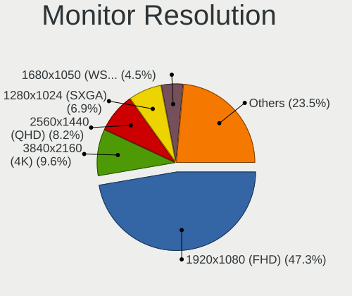

| Resolution         | Desktops | Percent |
|--------------------|----------|---------|
| 1920x1080 (FHD)    | 1556     | 47.31%  |
| 3840x2160 (4K)     | 316      | 9.61%   |
| 2560x1440 (QHD)    | 269      | 8.18%   |
| 1280x1024 (SXGA)   | 226      | 6.87%   |
| 1680x1050 (WSXGA+) | 148      | 4.5%    |
| 1366x768 (WXGA)    | 140      | 4.26%   |
| 1440x900 (WXGA+)   | 106      | 3.22%   |
| 2560x1080          | 63       | 1.92%   |
| 1360x768           | 63       | 1.92%   |
| 1920x1200 (WUXGA)  | 62       | 1.89%   |
| Unknown            | 62       | 1.89%   |
| 1600x900 (HD+)     | 56       | 1.7%    |
| 3440x1440          | 48       | 1.46%   |
| 3840x1080          | 27       | 0.82%   |
| 1024x768 (XGA)     | 24       | 0.73%   |
| 2288x1287          | 16       | 0.49%   |
| 1920x540           | 16       | 0.49%   |
| 1600x1200          | 15       | 0.46%   |
| 3200x1080          | 5        | 0.15%   |
| 4480x1080          | 4        | 0.12%   |
| 1280x960           | 4        | 0.12%   |
| 3600x1080          | 3        | 0.09%   |
| 3360x1080          | 3        | 0.09%   |
| 2960x1050          | 3        | 0.09%   |
| 2944x1080          | 3        | 0.09%   |
| 2560x1600          | 3        | 0.09%   |
| 2560x1024          | 3        | 0.09%   |
| 2048x1152          | 3        | 0.09%   |
| 1280x768           | 3        | 0.09%   |
| 1280x720 (HD)      | 3        | 0.09%   |
| 7680x2160          | 2        | 0.06%   |
| 5760x2160          | 2        | 0.06%   |
| 4480x1440          | 2        | 0.06%   |
| 3840x1600          | 2        | 0.06%   |
| 3840x1200          | 2        | 0.06%   |
| 3520x1080          | 2        | 0.06%   |
| 2048x1536          | 2        | 0.06%   |
| 1280x800 (WXGA)    | 2        | 0.06%   |
| 800x480            | 1        | 0.03%   |
| 7920x1440          | 1        | 0.03%   |

Monitor Diagonal
----------------

Diagonal size in inches

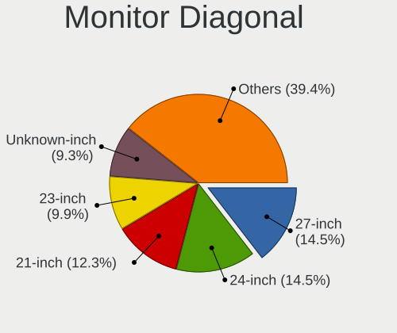

| Inches  | Desktops | Percent |
|---------|----------|---------|
| 27      | 493      | 14.55%  |
| 24      | 492      | 14.52%  |
| 21      | 418      | 12.33%  |
| 23      | 334      | 9.86%   |
| Unknown | 316      | 9.32%   |
| 19      | 188      | 5.55%   |
| 31      | 158      | 4.66%   |
| 18      | 155      | 4.57%   |
| 17      | 129      | 3.81%   |
| 22      | 114      | 3.36%   |
| 34      | 89       | 2.63%   |
| 20      | 77       | 2.27%   |
| 84      | 51       | 1.5%    |
| 15      | 45       | 1.33%   |
| 32      | 34       | 1%      |
| 54      | 30       | 0.89%   |
| 72      | 27       | 0.8%    |
| 25      | 25       | 0.74%   |
| 26      | 22       | 0.65%   |
| 142     | 16       | 0.47%   |
| 63      | 15       | 0.44%   |
| 40      | 15       | 0.44%   |
| 28      | 14       | 0.41%   |
| 48      | 13       | 0.38%   |
| 46      | 12       | 0.35%   |
| 65      | 11       | 0.32%   |
| 12      | 9        | 0.27%   |
| 60      | 7        | 0.21%   |
| 52      | 7        | 0.21%   |
| 43      | 7        | 0.21%   |
| 42      | 7        | 0.21%   |
| 36      | 6        | 0.18%   |
| 33      | 6        | 0.18%   |
| 29      | 6        | 0.18%   |
| 82      | 5        | 0.15%   |
| 49      | 4        | 0.12%   |
| 47      | 4        | 0.12%   |
| 14      | 4        | 0.12%   |
| 13      | 4        | 0.12%   |
| 39      | 3        | 0.09%   |

Monitor Width
-------------

Physical width

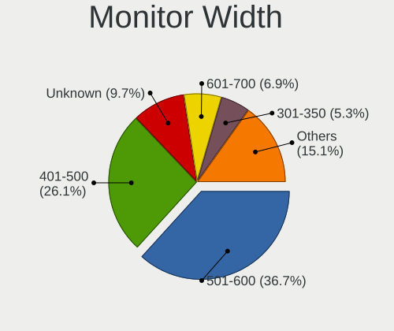

| Width in mm    | Desktops | Percent |
|----------------|----------|---------|
| 501-600        | 1196     | 36.74%  |
| 401-500        | 851      | 26.14%  |
| Unknown        | 316      | 9.71%   |
| 601-700        | 225      | 6.91%   |
| 301-350        | 174      | 5.35%   |
| 701-800        | 131      | 4.02%   |
| 1001-1500      | 103      | 3.16%   |
| 351-400        | 100      | 3.07%   |
| 1501-2000      | 87       | 2.67%   |
| 801-900        | 23       | 0.71%   |
| More than 2000 | 16       | 0.49%   |
| 901-1000       | 16       | 0.49%   |
| 201-300        | 15       | 0.46%   |
| 101-200        | 1        | 0.03%   |
| 1-100          | 1        | 0.03%   |

Aspect Ratio
------------

Proportional relationship between the width and the height

| Ratio   | Desktops | Percent |
|---------|----------|---------|
| 16/9    | 2082     | 67.29%  |
| 16/10   | 329      | 10.63%  |
| Unknown | 266      | 8.6%    |
| 5/4     | 209      | 6.76%   |
| 21/9    | 96       | 3.1%    |
| 4/3     | 58       | 1.87%   |
| 3/2     | 16       | 0.52%   |
| 1.00    | 16       | 0.52%   |
| 32/9    | 12       | 0.39%   |
| 6/5     | 8        | 0.26%   |
| 2.69    | 1        | 0.03%   |
| 2.00    | 1        | 0.03%   |

Monitor Area
------------

Area in inch²

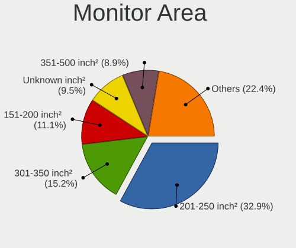

| Area in inch² | Desktops | Percent |
|----------------|----------|---------|
| 201-250        | 1095     | 32.92%  |
| 301-350        | 505      | 15.18%  |
| 151-200        | 370      | 11.12%  |
| Unknown        | 316      | 9.5%    |
| 351-500        | 296      | 8.9%    |
| 141-150        | 261      | 7.85%   |
| More than 1000 | 178      | 5.35%   |
| 251-300        | 167      | 5.02%   |
| 501-1000       | 70       | 2.1%    |
| 101-110        | 37       | 1.11%   |
| 111-120        | 10       | 0.3%    |
| 71-80          | 9        | 0.27%   |
| 81-90          | 3        | 0.09%   |
| 61-70          | 2        | 0.06%   |
| 51-60          | 2        | 0.06%   |
| 1-40           | 2        | 0.06%   |
| 121-130        | 2        | 0.06%   |
| 91-100         | 1        | 0.03%   |

Pixel Density
-------------

Pixels per inch

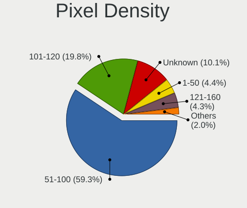

| Density       | Desktops | Percent |
|---------------|----------|---------|
| 51-100        | 1864     | 59.34%  |
| 101-120       | 623      | 19.83%  |
| Unknown       | 316      | 10.06%  |
| 1-50          | 139      | 4.43%   |
| 121-160       | 136      | 4.33%   |
| 161-240       | 61       | 1.94%   |
| More than 240 | 2        | 0.06%   |

Multiple Monitors
-----------------

Total monitors connected

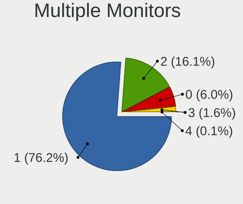

| Total | Desktops | Percent |
|-------|----------|---------|
| 1     | 2495     | 76.18%  |
| 2     | 527      | 16.09%  |
| 0     | 197      | 6.02%   |
| 3     | 52       | 1.59%   |
| 4     | 4        | 0.12%   |

Network
-------

Net Controller Vendor
---------------------

Controller vendors

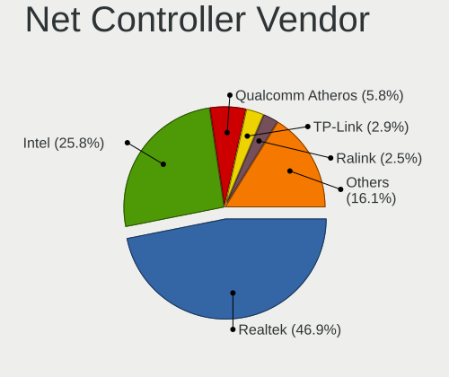

| Vendor                           | Desktops | Percent |
|----------------------------------|----------|---------|
| Realtek Semiconductor            | 2117     | 46.88%  |
| Intel                            | 1164     | 25.78%  |
| Qualcomm Atheros                 | 263      | 5.82%   |
| TP-Link                          | 131      | 2.9%    |
| Ralink Technology                | 112      | 2.48%   |
| MediaTek                         | 97       | 2.15%   |
| Broadcom                         | 93       | 2.06%   |
| Nvidia                           | 78       | 1.73%   |
| Ralink                           | 43       | 0.95%   |
| Qualcomm Atheros Communications  | 42       | 0.93%   |
| Marvell Technology Group         | 35       | 0.78%   |
| Aquantia                         | 31       | 0.69%   |
| D-Link                           | 30       | 0.66%   |
| Microsoft                        | 27       | 0.6%    |
| Samsung Electronics              | 25       | 0.55%   |
| Xiaomi                           | 20       | 0.44%   |
| ASUSTek Computer                 | 17       | 0.38%   |
| D-Link System                    | 15       | 0.33%   |
| VIA Technologies                 | 14       | 0.31%   |
| Broadcom Limited                 | 14       | 0.31%   |
| Belkin Components                | 13       | 0.29%   |
| ASIX Electronics                 | 13       | 0.29%   |
| DisplayLink                      | 9        | 0.2%    |
| ZyDAS                            | 8        | 0.18%   |
| Qualcomm                         | 7        | 0.16%   |
| QinHeng Electronics              | 7        | 0.16%   |
| Silicon Integrated Systems [SiS] | 6        | 0.13%   |
| Qualcomm Technologies            | 6        | 0.13%   |
| Edimax Technology                | 5        | 0.11%   |
| Arduino SA                       | 5        | 0.11%   |
| Texas Instruments                | 4        | 0.09%   |
| Huawei Technologies              | 4        | 0.09%   |
| Tenda                            | 3        | 0.07%   |
| Google                           | 3        | 0.07%   |
| Gemtek                           | 3        | 0.07%   |
| Accton Technology                | 3        | 0.07%   |
| 3Com                             | 3        | 0.07%   |
| ZTE WCDMA Technologies MSM       | 2        | 0.04%   |
| Wilocity                         | 2        | 0.04%   |
| Spreadtrum Communications        | 2        | 0.04%   |

Net Controller Model
--------------------

Controller models

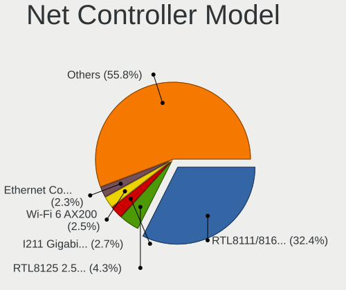

| Model                                                                  | Desktops | Percent |
|------------------------------------------------------------------------|----------|---------|
| Realtek RTL8111/8168/8211/8411 PCI Express Gigabit Ethernet Controller | 1655     | 32.43%  |
| Realtek RTL8125 2.5GbE Controller                                      | 219      | 4.29%   |
| Intel I211 Gigabit Network Connection                                  | 138      | 2.7%    |
| Intel Wi-Fi 6 AX200                                                    | 128      | 2.51%   |
| Intel Ethernet Connection (2) I219-V                                   | 116      | 2.27%   |
| Intel 82579LM Gigabit Network Connection (Lewisville)                  | 94       | 1.84%   |
| Intel Ethernet Controller I225-V                                       | 79       | 1.55%   |
| Intel Ethernet Connection I217-LM                                      | 59       | 1.16%   |
| Intel Ethernet Connection (7) I219-V                                   | 56       | 1.1%    |
| Realtek RTL810xE PCI Express Fast Ethernet controller                  | 54       | 1.06%   |
| Intel Wi-Fi 6E(802.11ax) AX210/AX1675* 2x2 [Typhoon Peak]              | 49       | 0.96%   |
| Realtek RTL8821CE 802.11ac PCIe Wireless Network Adapter               | 46       | 0.9%    |
| Realtek RTL88x2bu [AC1200 Techkey]                                     | 43       | 0.84%   |
| Realtek 802.11ac NIC                                                   | 43       | 0.84%   |
| Ralink RT2870/RT3070 Wireless Adapter                                  | 38       | 0.74%   |
| Qualcomm Atheros AR9271 802.11n                                        | 37       | 0.73%   |
| Nvidia MCP61 Ethernet                                                  | 36       | 0.71%   |
| Intel 82579V Gigabit Network Connection                                | 35       | 0.69%   |
| Intel Ethernet Connection (2) I219-LM                                  | 34       | 0.67%   |
| Intel Ethernet Connection (2) I218-V                                   | 33       | 0.65%   |
| Realtek RTL8192EE PCIe Wireless Network Adapter                        | 32       | 0.63%   |
| Qualcomm Atheros AR9485 Wireless Network Adapter                       | 32       | 0.63%   |
| MediaTek MT7922 802.11ax PCI Express Wireless Network Adapter          | 31       | 0.61%   |
| Intel Ethernet Controller I226-V                                       | 31       | 0.61%   |
| Intel Dual Band Wireless-AC 3168NGW [Stone Peak]                       | 31       | 0.61%   |
| Intel Wireless 7265                                                    | 29       | 0.57%   |
| TP-Link TL-WN823N v2/v3 [Realtek RTL8192EU]                            | 27       | 0.53%   |
| Realtek RTL8188EUS 802.11n Wireless Network Adapter                    | 26       | 0.51%   |
| Realtek RTL8153 Gigabit Ethernet Adapter                               | 26       | 0.51%   |
| Realtek RTL-8100/8101L/8139 PCI Fast Ethernet Adapter                  | 25       | 0.49%   |
| Intel Wi-Fi 5(802.11ac) Wireless-AC 9x6x [Thunder Peak]                | 25       | 0.49%   |
| Intel 82566DM-2 Gigabit Network Connection                             | 25       | 0.49%   |
| Qualcomm Atheros AR9287 Wireless Network Adapter (PCI-Express)         | 24       | 0.47%   |
| Intel Wireless 3165                                                    | 24       | 0.47%   |
| Realtek RTL8192CU 802.11n WLAN Adapter                                 | 23       | 0.45%   |
| Intel Ethernet Connection I217-V                                       | 23       | 0.45%   |
| Qualcomm Atheros AR8151 v2.0 Gigabit Ethernet                          | 22       | 0.43%   |
| Qualcomm Atheros AR8121/AR8113/AR8114 Gigabit or Fast Ethernet         | 22       | 0.43%   |
| MediaTek MT7921K (RZ608) Wi-Fi 6E 80MHz                                | 22       | 0.43%   |
| Realtek RTL8852BE PCIe 802.11ax Wireless Network Controller            | 21       | 0.41%   |

Wireless Vendor
---------------

Wireless vendors

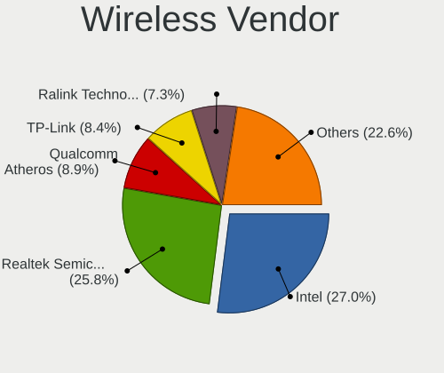

| Vendor                                | Desktops | Percent |
|---------------------------------------|----------|---------|
| Intel                                 | 412      | 26.98%  |
| Realtek Semiconductor                 | 394      | 25.8%   |
| Qualcomm Atheros                      | 136      | 8.91%   |
| TP-Link                               | 128      | 8.38%   |
| Ralink Technology                     | 112      | 7.33%   |
| MediaTek                              | 82       | 5.37%   |
| Ralink                                | 43       | 2.82%   |
| Qualcomm Atheros Communications       | 42       | 2.75%   |
| Broadcom                              | 42       | 2.75%   |
| D-Link                                | 28       | 1.83%   |
| Microsoft                             | 27       | 1.77%   |
| ASUSTek Computer                      | 16       | 1.05%   |
| Belkin Components                     | 12       | 0.79%   |
| ZyDAS                                 | 8        | 0.52%   |
| D-Link System                         | 7        | 0.46%   |
| Edimax Technology                     | 5        | 0.33%   |
| Broadcom Limited                      | 5        | 0.33%   |
| Texas Instruments                     | 3        | 0.2%    |
| Tenda                                 | 3        | 0.2%    |
| Gemtek                                | 3        | 0.2%    |
| Wilocity                              | 2        | 0.13%   |
| NetGear                               | 2        | 0.13%   |
| Linksys                               | 2        | 0.13%   |
| ZyXEL Communications                  | 1        | 0.07%   |
| Xiaomi                                | 1        | 0.07%   |
| Wacom                                 | 1        | 0.07%   |
| TRENDnet                              | 1        | 0.07%   |
| Standard Microsystems                 | 1        | 0.07%   |
| Sitecom Europe                        | 1        | 0.07%   |
| Samsung Electronics                   | 1        | 0.07%   |
| Micro Star International              | 1        | 0.07%   |
| Mercucys                              | 1        | 0.07%   |
| Marvell Technology Group              | 1        | 0.07%   |
| Accton Technology                     | 1        | 0.07%   |
| 802.11g Adapter [Linksys WUSB54GC v3] | 1        | 0.07%   |
| 3Com                                  | 1        | 0.07%   |

Wireless Model
--------------

Wireless models

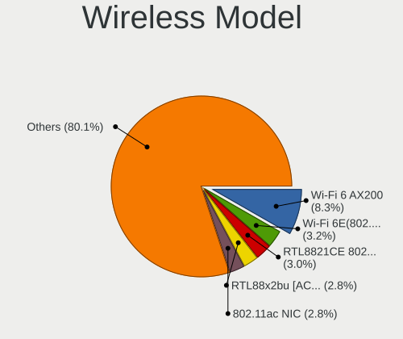

| Model                                                                | Desktops | Percent |
|----------------------------------------------------------------------|----------|---------|
| Intel Wi-Fi 6 AX200                                                  | 128      | 8.26%   |
| Intel Wi-Fi 6E(802.11ax) AX210/AX1675* 2x2 [Typhoon Peak]            | 49       | 3.16%   |
| Realtek RTL8821CE 802.11ac PCIe Wireless Network Adapter             | 46       | 2.97%   |
| Realtek RTL88x2bu [AC1200 Techkey]                                   | 43       | 2.78%   |
| Realtek 802.11ac NIC                                                 | 43       | 2.78%   |
| Ralink RT2870/RT3070 Wireless Adapter                                | 38       | 2.45%   |
| Qualcomm Atheros AR9271 802.11n                                      | 37       | 2.39%   |
| Realtek RTL8192EE PCIe Wireless Network Adapter                      | 32       | 2.07%   |
| Qualcomm Atheros AR9485 Wireless Network Adapter                     | 32       | 2.07%   |
| Intel Dual Band Wireless-AC 3168NGW [Stone Peak]                     | 31       | 2%      |
| Intel Wireless 7265                                                  | 29       | 1.87%   |
| TP-Link TL-WN823N v2/v3 [Realtek RTL8192EU]                          | 27       | 1.74%   |
| Realtek RTL8188EUS 802.11n Wireless Network Adapter                  | 26       | 1.68%   |
| MediaTek MT7922 802.11ax PCI Express Wireless Network Adapter        | 26       | 1.68%   |
| Intel Wi-Fi 5(802.11ac) Wireless-AC 9x6x [Thunder Peak]              | 25       | 1.61%   |
| Qualcomm Atheros AR9287 Wireless Network Adapter (PCI-Express)       | 24       | 1.55%   |
| Intel Wireless 3165                                                  | 24       | 1.55%   |
| Realtek RTL8192CU 802.11n WLAN Adapter                               | 23       | 1.48%   |
| MediaTek MT7921K (RZ608) Wi-Fi 6E 80MHz                              | 22       | 1.42%   |
| Realtek RTL8812AE 802.11ac PCIe Wireless Network Adapter             | 21       | 1.36%   |
| Ralink MT7601U Wireless Adapter                                      | 20       | 1.29%   |
| Intel 700 Series Chipset CNVi WiFi                                   | 20       | 1.29%   |
| Qualcomm Atheros AR9227 Wireless Network Adapter                     | 18       | 1.16%   |
| MediaTek MT7921 802.11ax PCIe Wireless Network Adapter [Filogic 330] | 18       | 1.16%   |
| TP-Link 802.11ac NIC                                                 | 17       | 1.1%    |
| Realtek RTL8192CE PCIe Wireless Network Adapter                      | 17       | 1.1%    |
| Ralink MT7610U ("Archer T2U" 2.4G+5G WLAN Adapter                    | 17       | 1.1%    |
| Broadcom BCM4360 802.11ac Dual Band Wireless Network Adapter         | 16       | 1.03%   |
| TP-Link TL-WN722N v2/v3 [Realtek RTL8188EUS]                         | 15       | 0.97%   |
| TP-Link Archer T3U [Realtek RTL8812BU]                               | 15       | 0.97%   |
| TP-Link AC600 wireless Realtek RTL8811AU [Archer T2U Nano]           | 15       | 0.97%   |
| Realtek RTL8821AE 802.11ac PCIe Wireless Network Adapter             | 14       | 0.9%    |
| Ralink RT5370 Wireless Adapter                                       | 14       | 0.9%    |
| Qualcomm Atheros AR5212/5213/2414 Wireless Network Adapter           | 14       | 0.9%    |
| Intel Wireless 7260                                                  | 14       | 0.9%    |
| Broadcom BCM4352 802.11ac Dual Band Wireless Network Adapter         | 14       | 0.9%    |
| Microsoft Xbox Wireless Adapter for Windows                          | 13       | 0.84%   |
| Intel Comet Lake PCH CNVi WiFi                                       | 13       | 0.84%   |
| Realtek RTL8187 Wireless Adapter                                     | 12       | 0.77%   |
| Intel Cannon Lake PCH CNVi WiFi                                      | 12       | 0.77%   |

Ethernet Vendor
---------------

Ethernet vendors

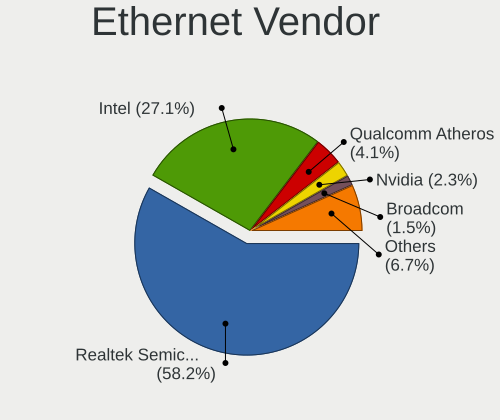

| Vendor                                 | Desktops | Percent |
|----------------------------------------|----------|---------|
| Realtek Semiconductor                  | 1985     | 58.25%  |
| Intel                                  | 925      | 27.14%  |
| Qualcomm Atheros                       | 140      | 4.11%   |
| Nvidia                                 | 78       | 2.29%   |
| Broadcom                               | 51       | 1.5%    |
| Marvell Technology Group               | 35       | 1.03%   |
| Aquantia                               | 31       | 0.91%   |
| Samsung Electronics                    | 24       | 0.7%    |
| Xiaomi                                 | 19       | 0.56%   |
| VIA Technologies                       | 14       | 0.41%   |
| ASIX Electronics                       | 13       | 0.38%   |
| MediaTek                               | 12       | 0.35%   |
| DisplayLink                            | 9        | 0.26%   |
| Broadcom Limited                       | 9        | 0.26%   |
| D-Link System                          | 8        | 0.23%   |
| Qualcomm                               | 7        | 0.21%   |
| Silicon Integrated Systems [SiS]       | 6        | 0.18%   |
| Qualcomm Technologies                  | 6        | 0.18%   |
| TP-Link                                | 3        | 0.09%   |
| Huawei Technologies                    | 3        | 0.09%   |
| Google                                 | 3        | 0.09%   |
| Spreadtrum Communications              | 2        | 0.06%   |
| Sony Ericsson Mobile Communications AB | 2        | 0.06%   |
| OPPO Electronics                       | 2        | 0.06%   |
| D-Link                                 | 2        | 0.06%   |
| Apple                                  | 2        | 0.06%   |
| Accton Technology                      | 2        | 0.06%   |
| 3Com                                   | 2        | 0.06%   |
| ZTE WCDMA Technologies MSM             | 1        | 0.03%   |
| Tehuti Networks                        | 1        | 0.03%   |
| MosChip Semiconductor                  | 1        | 0.03%   |
| Microchip Technology                   | 1        | 0.03%   |
| Meizu                                  | 1        | 0.03%   |
| Lenovo                                 | 1        | 0.03%   |
| ICS Advent                             | 1        | 0.03%   |
| HTC (High Tech Computer)               | 1        | 0.03%   |
| Davicom Semiconductor                  | 1        | 0.03%   |
| Belkin Components                      | 1        | 0.03%   |
| ASUSTek Computer                       | 1        | 0.03%   |
| American Megatrends                    | 1        | 0.03%   |

Ethernet Model
--------------

Ethernet models

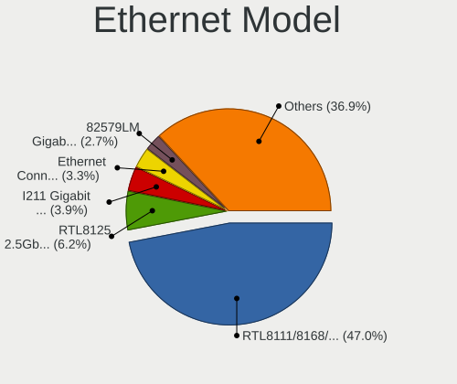

| Model                                                                          | Desktops | Percent |
|--------------------------------------------------------------------------------|----------|---------|
| Realtek RTL8111/8168/8211/8411 PCI Express Gigabit Ethernet Controller         | 1655     | 46.99%  |
| Realtek RTL8125 2.5GbE Controller                                              | 219      | 6.22%   |
| Intel I211 Gigabit Network Connection                                          | 138      | 3.92%   |
| Intel Ethernet Connection (2) I219-V                                           | 116      | 3.29%   |
| Intel 82579LM Gigabit Network Connection (Lewisville)                          | 94       | 2.67%   |
| Intel Ethernet Controller I225-V                                               | 79       | 2.24%   |
| Intel Ethernet Connection I217-LM                                              | 59       | 1.68%   |
| Intel Ethernet Connection (7) I219-V                                           | 56       | 1.59%   |
| Realtek RTL810xE PCI Express Fast Ethernet controller                          | 54       | 1.53%   |
| Nvidia MCP61 Ethernet                                                          | 36       | 1.02%   |
| Intel 82579V Gigabit Network Connection                                        | 35       | 0.99%   |
| Intel Ethernet Connection (2) I219-LM                                          | 34       | 0.97%   |
| Intel Ethernet Connection (2) I218-V                                           | 33       | 0.94%   |
| Intel Ethernet Controller I226-V                                               | 31       | 0.88%   |
| Realtek RTL8153 Gigabit Ethernet Adapter                                       | 26       | 0.74%   |
| Realtek RTL-8100/8101L/8139 PCI Fast Ethernet Adapter                          | 25       | 0.71%   |
| Intel 82566DM-2 Gigabit Network Connection                                     | 25       | 0.71%   |
| Intel Ethernet Connection I217-V                                               | 23       | 0.65%   |
| Qualcomm Atheros AR8151 v2.0 Gigabit Ethernet                                  | 22       | 0.62%   |
| Qualcomm Atheros AR8121/AR8113/AR8114 Gigabit or Fast Ethernet                 | 22       | 0.62%   |
| Qualcomm Atheros Killer E220x Gigabit Ethernet Controller                      | 21       | 0.6%    |
| Samsung Galaxy series, misc. (tethering mode)                                  | 19       | 0.54%   |
| Intel 82567LM-3 Gigabit Network Connection                                     | 19       | 0.54%   |
| Aquantia AQtion AQC107 NBase-T/IEEE 802.3an Ethernet Controller [Atlantic 10G] | 19       | 0.54%   |
| Realtek RTL8169 PCI Gigabit Ethernet Controller                                | 18       | 0.51%   |
| Qualcomm Atheros AR8161 Gigabit Ethernet                                       | 18       | 0.51%   |
| Marvell Group 88E8056 PCI-E Gigabit Ethernet Controller                        | 17       | 0.48%   |
| Xiaomi Mi/Redmi series (RNDIS)                                                 | 16       | 0.45%   |
| Intel Ethernet Connection (14) I219-V                                          | 15       | 0.43%   |
| Intel 82574L Gigabit Network Connection                                        | 15       | 0.43%   |
| Intel I210 Gigabit Network Connection                                          | 13       | 0.37%   |
| Intel 82578DC Gigabit Network Connection                                       | 13       | 0.37%   |
| Qualcomm Atheros Killer E2400 Gigabit Ethernet Controller                      | 12       | 0.34%   |
| Qualcomm Atheros Attansic L1 Gigabit Ethernet                                  | 12       | 0.34%   |
| Nvidia MCP73 Ethernet                                                          | 12       | 0.34%   |
| VIA VT6102/VT6103 [Rhine-II]                                                   | 11       | 0.31%   |
| Realtek RTL8852BE PCIe 802.11ax Wireless Network Controller                    | 11       | 0.31%   |
| Realtek RTL8126 5GbE Controller                                                | 11       | 0.31%   |
| Intel 82578DM Gigabit Network Connection                                       | 11       | 0.31%   |
| Qualcomm Atheros AR8131 Gigabit Ethernet                                       | 10       | 0.28%   |

Net Controller Kind
-------------------

Ethernet, WiFi or modem

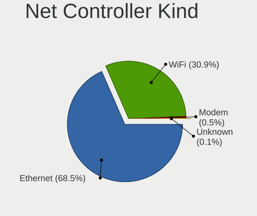

| Kind     | Desktops | Percent |
|----------|----------|---------|
| Ethernet | 3139     | 68.46%  |
| WiFi     | 1415     | 30.86%  |
| Modem    | 25       | 0.55%   |
| Unknown  | 6        | 0.13%   |

Used Controller
---------------

Currently used network controller

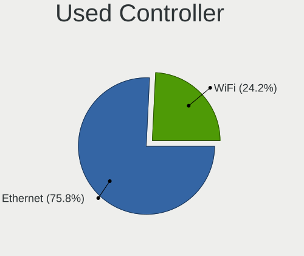

| Kind     | Desktops | Percent |
|----------|----------|---------|
| Ethernet | 2506     | 75.78%  |
| WiFi     | 801      | 24.22%  |

NICs
----

Total network controllers on board

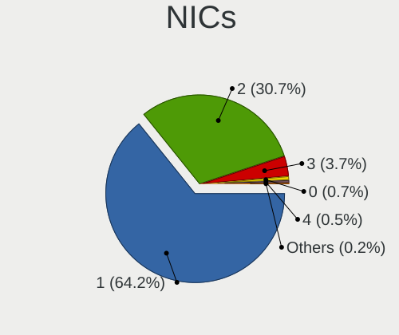

| Total | Desktops | Percent |
|-------|----------|---------|
| 1     | 2056     | 64.23%  |
| 2     | 982      | 30.68%  |
| 3     | 117      | 3.66%   |
| 0     | 22       | 0.69%   |
| 4     | 16       | 0.5%    |
| 5     | 6        | 0.19%   |
| 9     | 2        | 0.06%   |

IPv6
----

IPv6 vs IPv4

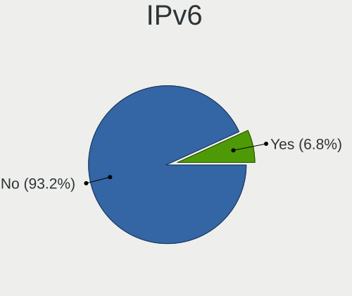

| Used | Desktops | Percent |
|------|----------|---------|
| No   | 2975     | 93.2%   |
| Yes  | 217      | 6.8%    |

Bluetooth
---------

Bluetooth Vendor
----------------

Controller vendors

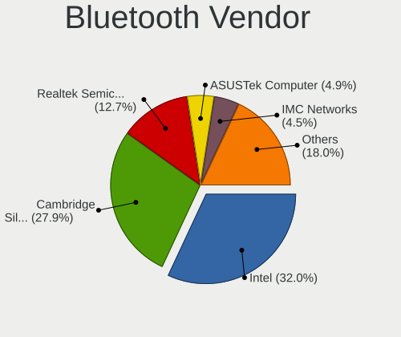

| Vendor                          | Desktops | Percent |
|---------------------------------|----------|---------|
| Intel                           | 394      | 31.95%  |
| Cambridge Silicon Radio         | 344      | 27.9%   |
| Realtek Semiconductor           | 157      | 12.73%  |
| ASUSTek Computer                | 60       | 4.87%   |
| IMC Networks                    | 56       | 4.54%   |
| MediaTek                        | 43       | 3.49%   |
| Broadcom                        | 41       | 3.33%   |
| Foxconn / Hon Hai               | 32       | 2.6%    |
| TP-Link                         | 27       | 2.19%   |
| Qualcomm Atheros Communications | 12       | 0.97%   |
| Belkin Components               | 11       | 0.89%   |
| Apple                           | 11       | 0.89%   |
| Integrated System Solution      | 10       | 0.81%   |
| Lite-On Technology              | 7        | 0.57%   |
| Actions                         | 6        | 0.49%   |
| Mercucys                        | 5        | 0.41%   |
| Unknown                         | 4        | 0.32%   |
| Edimax Technology               | 3        | 0.24%   |
| Roper                           | 2        | 0.16%   |
| Realtek                         | 2        | 0.16%   |
| Dell                            | 2        | 0.16%   |
| Sitecom Europe                  | 1        | 0.08%   |
| Logitech                        | 1        | 0.08%   |
| Corsair                         | 1        | 0.08%   |
| AICSemi                         | 1        | 0.08%   |

Bluetooth Model
---------------

Controller models

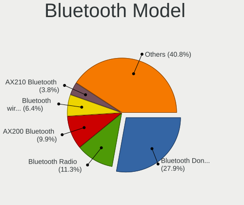

| Model                                                 | Desktops | Percent |
|-------------------------------------------------------|----------|---------|
| Cambridge Silicon Radio Bluetooth Dongle (HCI mode)   | 344      | 27.85%  |
| Realtek Bluetooth Radio                               | 139      | 11.26%  |
| Intel AX200 Bluetooth                                 | 122      | 9.88%   |
| Intel Bluetooth wireless interface                    | 79       | 6.4%    |
| Intel AX210 Bluetooth                                 | 47       | 3.81%   |
| MediaTek Wireless_Device                              | 43       | 3.48%   |
| Intel AX201 Bluetooth                                 | 38       | 3.08%   |
| Intel Wireless-AC 3168 Bluetooth                      | 31       | 2.51%   |
| IMC Networks Bluetooth Radio                          | 28       | 2.27%   |
| TP-Link TP-T@- UB500 Adapter                          | 27       | 2.19%   |
| Intel Wireless-AC 9260 Bluetooth Adapter              | 25       | 2.02%   |
| Intel Bluetooth Device                                | 25       | 2.02%   |
| Intel Bluetooth 9460/9560 Jefferson Peak (JfP)        | 23       | 1.86%   |
| Foxconn / Hon Hai Wireless_Device                     | 23       | 1.86%   |
| ASUS Broadcom BCM20702A0 Bluetooth                    | 23       | 1.86%   |
| IMC Networks Wireless_Device                          | 22       | 1.78%   |
| Broadcom BCM20702A0 Bluetooth 4.0                     | 19       | 1.54%   |
| Realtek  Bluetooth 4.2 Adapter                        | 11       | 0.89%   |
| ASUS ASUS USB-BT500                                   | 11       | 0.89%   |
| Integrated System Solution Bluetooth Device           | 9        | 0.73%   |
| Foxconn / Hon Hai Bluetooth Device                    | 7        | 0.57%   |
| ASUS Broadcom BCM20702 Single-Chip Bluetooth 4.0 + LE | 7        | 0.57%   |
| ASUS Bluetooth Radio                                  | 7        | 0.57%   |
| Actions general adapter                               | 6        | 0.49%   |
| Realtek Bluetooth 5.3 Radio                           | 5        | 0.4%    |
| Mercucys Mercusys MA530 Adapter                       | 5        | 0.4%    |
| Intel Centrino Bluetooth Wireless Transceiver         | 5        | 0.4%    |
| Apple Bluetooth Host Controller                       | 5        | 0.4%    |
| Qualcomm Atheros AR3011 Bluetooth                     | 4        | 0.32%   |
| Lite-On Bluetooth Device                              | 4        | 0.32%   |
| Broadcom Bluetooth 3.0 USB Dongle                     | 4        | 0.32%   |
| Broadcom BCM2045 Bluetooth                            | 4        | 0.32%   |
| Belkin Components Bluetooth Mini Dongle               | 4        | 0.32%   |
| ASUS BCM20702A0                                       | 4        | 0.32%   |
| Unknown                                               | 4        | 0.32%   |
| Qualcomm Atheros  Bluetooth Device                    | 3        | 0.24%   |
| Qualcomm Atheros QCA61x4 Bluetooth 4.0                | 3        | 0.24%   |
| IMC Networks BCM20702A0                               | 3        | 0.24%   |
| Broadcom BCM2035 Bluetooth dongle                     | 3        | 0.24%   |
| Belkin Components F8T065BF Mini Bluetooth 4.0 Adapter | 3        | 0.24%   |

Sound
-----

Sound Vendor
------------

Sound card vendors

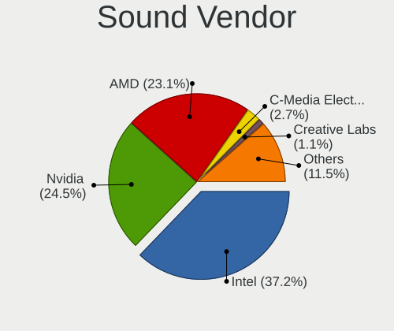

| Vendor                                       | Desktops | Percent |
|----------------------------------------------|----------|---------|
| Intel                                        | 2008     | 37.19%  |
| Nvidia                                       | 1322     | 24.48%  |
| AMD                                          | 1247     | 23.09%  |
| C-Media Electronics                          | 145      | 2.69%   |
| Creative Labs                                | 58       | 1.07%   |
| Logitech                                     | 55       | 1.02%   |
| Texas Instruments                            | 38       | 0.7%    |
| ASUSTek Computer                             | 37       | 0.69%   |
| JMTek                                        | 34       | 0.63%   |
| Corsair                                      | 34       | 0.63%   |
| Focusrite-Novation                           | 23       | 0.43%   |
| Kingston Technology                          | 21       | 0.39%   |
| Creative Technology                          | 18       | 0.33%   |
| VIA Technologies                             | 17       | 0.31%   |
| Micro Star International                     | 17       | 0.31%   |
| Razer USA                                    | 16       | 0.3%    |
| Generalplus Technology                       | 16       | 0.3%    |
| Zoran Co. Personal Media Division (Nogatech) | 15       | 0.28%   |
| SteelSeries ApS                              | 14       | 0.26%   |
| Plantronics                                  | 12       | 0.22%   |
| GN Netcom                                    | 11       | 0.2%    |
| BEHRINGER International                      | 11       | 0.2%    |
| Silicon Integrated Systems [SiS]             | 9        | 0.17%   |
| Dell                                         | 9        | 0.17%   |
| Giga-Byte Technology                         | 8        | 0.15%   |
| DSEA A/S                                     | 8        | 0.15%   |
| Trust                                        | 7        | 0.13%   |
| M-Audio                                      | 7        | 0.13%   |
| Hewlett-Packard                              | 7        | 0.13%   |
| Ensoniq                                      | 7        | 0.13%   |
| Thesycon Systemsoftware & Consulting         | 6        | 0.11%   |
| Tenx Technology                              | 6        | 0.11%   |
| ASRock                                       | 6        | 0.11%   |
| RODE Microphones                             | 5        | 0.09%   |
| Realtek Semiconductor                        | 5        | 0.09%   |
| FiiO Electronics Technology                  | 5        | 0.09%   |
| Cambridge Silicon Radio                      | 5        | 0.09%   |
| Yamaha                                       | 4        | 0.07%   |
| Unknown                                      | 4        | 0.07%   |
| SAVITECH                                     | 4        | 0.07%   |

Sound Model
-----------

Sound card models

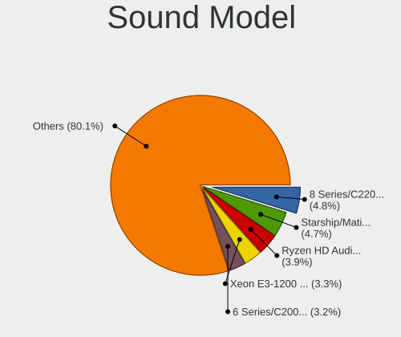

| Model                                                                      | Desktops | Percent |
|----------------------------------------------------------------------------|----------|---------|
| Intel 8 Series/C220 Series Chipset High Definition Audio Controller        | 305      | 4.81%   |
| AMD Starship/Matisse HD Audio Controller                                   | 296      | 4.66%   |
| AMD Ryzen HD Audio Controller                                              | 248      | 3.91%   |
| Intel Xeon E3-1200 v3/4th Gen Core Processor HD Audio Controller           | 212      | 3.34%   |
| Intel 6 Series/C200 Series Chipset Family High Definition Audio Controller | 201      | 3.17%   |
| Nvidia GK208 HDMI/DP Audio Controller                                      | 182      | 2.87%   |
| Intel 200 Series PCH HD Audio                                              | 168      | 2.65%   |
| Intel 100 Series/C230 Series Chipset Family HD Audio Controller            | 168      | 2.65%   |
| AMD Ellesmere HDMI Audio [Radeon RX 470/480 / 570/580/590]                 | 167      | 2.63%   |
| AMD Family 17h (Models 00h-0fh) HD Audio Controller                        | 159      | 2.51%   |
| Intel NM10/ICH7 Family High Definition Audio Controller                    | 153      | 2.41%   |
| AMD SBx00 Azalia (Intel HDA)                                               | 144      | 2.27%   |
| Intel 7 Series/C216 Chipset Family High Definition Audio Controller        | 141      | 2.22%   |
| Nvidia GP107GL High Definition Audio Controller                            | 123      | 1.94%   |
| Nvidia High Definition Audio Controller                                    | 110      | 1.73%   |
| Intel Cannon Lake PCH cAVS                                                 | 102      | 1.61%   |
| AMD FCH Azalia Controller                                                  | 91       | 1.43%   |
| AMD Renoir/Cezanne HDMI/DP Audio Controller                                | 86       | 1.36%   |
| AMD Navi 21/23 HDMI/DP Audio Controller                                    | 85       | 1.34%   |
| AMD Radeon High Definition Audio Controller                                | 83       | 1.31%   |
| Intel 5 Series/3400 Series Chipset High Definition Audio                   | 79       | 1.24%   |
| AMD Raven/Raven2/Fenghuang HDMI/DP Audio Controller                        | 72       | 1.13%   |
| Intel 82801I (ICH9 Family) HD Audio Controller                             | 70       | 1.1%    |
| Intel 82801JI (ICH10 Family) HD Audio Controller                           | 67       | 1.06%   |
| Nvidia GP106 High Definition Audio Controller                              | 66       | 1.04%   |
| Nvidia GA104 High Definition Audio Controller                              | 58       | 0.91%   |
| Nvidia GP104 High Definition Audio Controller                              | 54       | 0.85%   |
| Intel 9 Series Chipset Family HD Audio Controller                          | 54       | 0.85%   |
| Intel Alder Lake-S HD Audio Controller                                     | 53       | 0.84%   |
| AMD Baffin HDMI/DP Audio [Radeon RX 550 640SP / RX 560/560X]               | 53       | 0.84%   |
| Nvidia GP108 High Definition Audio Controller                              | 52       | 0.82%   |
| Nvidia GM107 High Definition Audio Controller [GeForce 940MX]              | 52       | 0.82%   |
| Nvidia TU116 High Definition Audio Controller                              | 51       | 0.8%    |
| Nvidia GF119 HDMI Audio Controller                                         | 50       | 0.79%   |
| Intel C610/X99 series chipset HD Audio Controller                          | 50       | 0.79%   |
| AMD Navi 10 HDMI Audio                                                     | 50       | 0.79%   |
| Nvidia GA106 High Definition Audio Controller                              | 47       | 0.74%   |
| Nvidia GF108 High Definition Audio Controller                              | 46       | 0.72%   |
| C-Media Electronics Audio Adapter (Unitek Y-247A)                          | 45       | 0.71%   |
| AMD Oland/Hainan/Cape Verde/Pitcairn HDMI Audio [Radeon HD 7000 Series]    | 44       | 0.69%   |

Memory
------

Memory Vendor
-------------

Memory module vendors

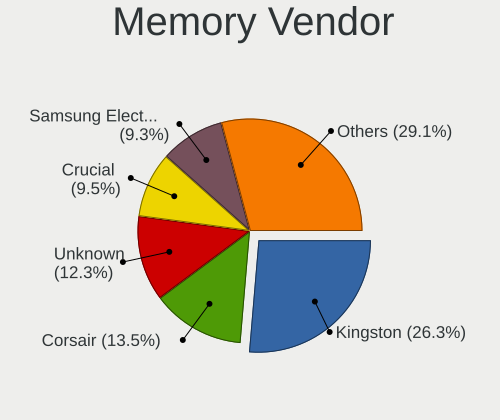

| Vendor              | Desktops | Percent |
|---------------------|----------|---------|
| Kingston            | 471      | 26.34%  |
| Corsair             | 241      | 13.48%  |
| Unknown             | 220      | 12.3%   |
| Crucial             | 169      | 9.45%   |
| Samsung Electronics | 166      | 9.28%   |
| SK hynix            | 120      | 6.71%   |
| G.Skill             | 119      | 6.66%   |
| Micron Technology   | 69       | 3.86%   |
| Unknown             | 28       | 1.57%   |
| Unknown (ABCD)      | 16       | 0.89%   |
| Team                | 16       | 0.89%   |
| Nanya Technology    | 14       | 0.78%   |
| A-DATA Technology   | 14       | 0.78%   |
| Elpida              | 13       | 0.73%   |
| Ramaxel Technology  | 12       | 0.67%   |
| Apacer              | 8        | 0.45%   |
| Unifosa             | 7        | 0.39%   |
| Silicon Power       | 7        | 0.39%   |
| Transcend           | 6        | 0.34%   |
| GOODRAM             | 5        | 0.28%   |
| ASint Technology    | 5        | 0.28%   |
| Unknown (0x0B45)    | 4        | 0.22%   |
| Timetec             | 4        | 0.22%   |
| Patriot             | 4        | 0.22%   |
| Patriot Memory      | 3        | 0.17%   |
| Kllisre             | 3        | 0.17%   |
| KLEVV               | 3        | 0.17%   |
| Atermiter           | 3        | 0.17%   |
| Wodposit            | 2        | 0.11%   |
| Unknown (AB)        | 2        | 0.11%   |
| Unknown (0x0E9D)    | 2        | 0.11%   |
| Unknown (07FB)      | 2        | 0.11%   |
| Huanan              | 2        | 0.11%   |
| GeIL                | 2        | 0.11%   |
| Exceleram           | 2        | 0.11%   |
| Wilk                | 1        | 0.06%   |
| Unknown (0x5846)    | 1        | 0.06%   |
| Unknown (0x0FF4)    | 1        | 0.06%   |
| Unknown (0x0B92)    | 1        | 0.06%   |
| Unknown (0x0B38)    | 1        | 0.06%   |

Memory Model
------------

Memory module models

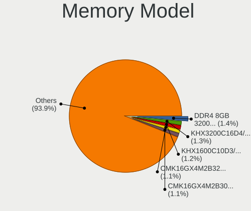

| Model                                                          | Desktops | Percent |
|----------------------------------------------------------------|----------|---------|
| Unknown                                                        | 28       | 1.4%    |
| Kingston RAM KHX3200C16D4/8GX 8GB DIMM DDR4 3733MT/s           | 25       | 1.25%   |
| Kingston RAM KHX1600C10D3/8G 8GB DIMM DDR3 2133MT/s            | 24       | 1.2%    |
| Corsair RAM CMK16GX4M2B3200C16 8GB DIMM DDR4 3600MT/s          | 22       | 1.1%    |
| Corsair RAM CMK16GX4M2B3000C15 8GB DIMM DDR4 3600MT/s          | 22       | 1.1%    |
| Kingston RAM KF3200C16D4/8GX 8GiB DIMM DDR4 3600MT/s           | 20       | 1%      |
| Corsair RAM CMK16GX4M2E3200C16 8GB DIMM DDR4 3466MT/s          | 19       | 0.95%   |
| Kingston RAM KHX1600C9D3/4GX 4GB DIMM DDR3 1867MT/s            | 18       | 0.9%    |
| Corsair RAM CMK32GX4M2E3200C16 16GB DIMM DDR4 3600MT/s         | 18       | 0.9%    |
| Kingston RAM KHX3200C16D4/16GX 16GB DIMM DDR4 3600MT/s         | 17       | 0.85%   |
| Unknown (ABCD) RAM 123456789012345678 2GB DIMM LPDDR4 2133MT/s | 16       | 0.8%    |
| Unknown RAM Module 2GB DIMM 800MT/s                            | 14       | 0.7%    |
| Kingston RAM 99U5584-005.A00LF 4GB DIMM DDR3 1600MT/s          | 13       | 0.65%   |
| Kingston RAM 99U5471-020.A00LF 4GB DIMM 1600MT/s               | 13       | 0.65%   |
| Corsair RAM CMK64GX4M2E3200C16 32GB DIMM DDR4 3600MT/s         | 12       | 0.6%    |
| Unknown RAM Module 2GB DIMM DDR2 800MT/s                       | 11       | 0.55%   |
| Kingston RAM KHX2400C15/8G 8GB DIMM DDR4 3400MT/s              | 11       | 0.55%   |
| Unknown RAM Module 2GB DIMM DDR2 667MT/s                       | 10       | 0.5%    |
| Unknown RAM Module 4GB DIMM 1333MT/s                           | 9        | 0.45%   |
| Unknown RAM Module 2GB DIMM 1333MT/s                           | 9        | 0.45%   |
| Unknown RAM Module 2048MB DIMM DDR2 800MT/s                    | 9        | 0.45%   |
| Kingston RAM KF3200C16D4/32GX 32GB DIMM DDR4 3933MT/s          | 9        | 0.45%   |
| Kingston RAM KF3200C16D4/16GX 16GB DIMM DDR4 3733MT/s          | 9        | 0.45%   |
| G.Skill RAM F4-3200C16-8GTZR 8GB DIMM DDR4 3200MT/s            | 9        | 0.45%   |
| Unknown RAM Module 4GB DIMM DDR3 1600MT/s                      | 8        | 0.4%    |
| Unknown RAM Module 4096MB DIMM 1333MT/s                        | 8        | 0.4%    |
| Kingston RAM KHX2666C16/8G 8GiB DIMM DDR4 3466MT/s             | 8        | 0.4%    |
| Kingston RAM KHX1866C10D3/8G 8GB DIMM DDR3 1867MT/s            | 8        | 0.4%    |
| Kingston RAM KHX1600C10D3/4G 4GB DIMM DDR3 1866MT/s            | 8        | 0.4%    |
| Unknown RAM Module 8GB DIMM DDR3 1600MT/s                      | 7        | 0.35%   |
| Unknown RAM Module 2048MB DIMM 1333MT/s                        | 7        | 0.35%   |
| Samsung RAM M378A1K43CB2-CRC 8GB DIMM DDR4 3500MT/s            | 7        | 0.35%   |
| Micron RAM 8JTF51264AZ-1G6E1 4GB DIMM DDR3 1600MT/s            | 7        | 0.35%   |
| Kingston RAM KF2666C16D4/8G 8GB DIMM DDR4 2667MT/s             | 7        | 0.35%   |
| Kingston RAM 99U5474-026.A00LF 4GB DIMM DDR3 1333MT/s          | 7        | 0.35%   |
| G.Skill RAM F4-2400C15-8GIS 8GB DIMM DDR4 2400MT/s             | 7        | 0.35%   |
| Crucial RAM CT8G4DFS824A.C8FDD1 8GB DIMM DDR4 3200MT/s         | 7        | 0.35%   |
| Crucial RAM CT4G4DFS824A.C8FBD2 4GB DIMM DDR4 2733MT/s         | 7        | 0.35%   |
| Corsair RAM CMW16GX4M2C3200C16 8GB DIMM DDR4 3733MT/s          | 7        | 0.35%   |
| Corsair RAM CMK32GX4M2B3200C16 16GB DIMM DDR4 3800MT/s         | 7        | 0.35%   |

Memory Kind
-----------

Memory module kinds

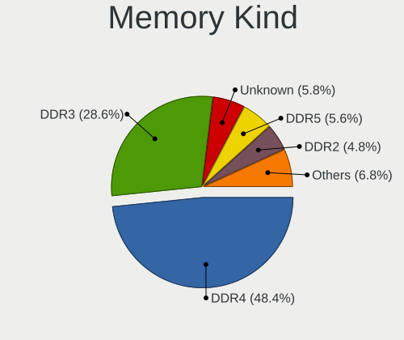

| Kind    | Desktops | Percent |
|---------|----------|---------|
| DDR4    | 781      | 48.39%  |
| DDR3    | 461      | 28.56%  |
| Unknown | 93       | 5.76%   |
| DDR5    | 91       | 5.64%   |
| DDR2    | 78       | 4.83%   |
| SDRAM   | 68       | 4.21%   |
| LPDDR4  | 19       | 1.18%   |
| DDR     | 12       | 0.74%   |
| LPDDR5  | 5        | 0.31%   |
| DRAM    | 4        | 0.25%   |
| LPDDR3  | 2        | 0.12%   |

Memory Form Factor
------------------

Physical design of the memory module

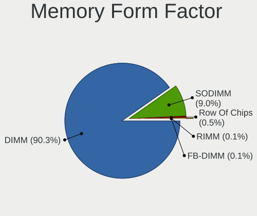

| Name         | Desktops | Percent |
|--------------|----------|---------|
| DIMM         | 1431     | 90.28%  |
| SODIMM       | 142      | 8.96%   |
| Row Of Chips | 8        | 0.5%    |
| RIMM         | 2        | 0.13%   |
| FB-DIMM      | 2        | 0.13%   |

Memory Size
-----------

Memory module size

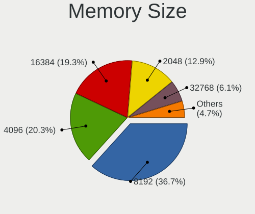

| Size  | Desktops | Percent |
|-------|----------|---------|
| 8192  | 642      | 36.69%  |
| 4096  | 356      | 20.34%  |
| 16384 | 337      | 19.26%  |
| 2048  | 226      | 12.91%  |
| 32768 | 106      | 6.06%   |
| 1024  | 72       | 4.11%   |
| 512   | 4        | 0.23%   |
| 65536 | 3        | 0.17%   |
| 49152 | 3        | 0.17%   |
| 3072  | 1        | 0.06%   |

Memory Speed
------------

Memory module speed

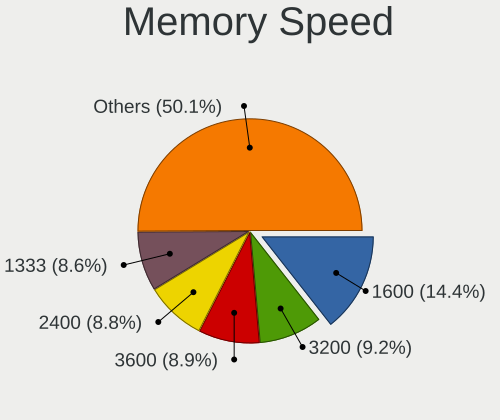

| Speed   | Desktops | Percent |
|---------|----------|---------|
| 1600    | 257      | 14.41%  |
| 3200    | 164      | 9.2%    |
| 3600    | 158      | 8.86%   |
| 2400    | 157      | 8.81%   |
| 1333    | 154      | 8.64%   |
| 2133    | 94       | 5.27%   |
| 2667    | 91       | 5.1%    |
| 800     | 79       | 4.43%   |
| 3733    | 55       | 3.08%   |
| 667     | 40       | 2.24%   |
| 1866    | 37       | 2.08%   |
| 3800    | 32       | 1.79%   |
| 3400    | 30       | 1.68%   |
| 6000    | 27       | 1.51%   |
| 3466    | 27       | 1.51%   |
| Unknown | 27       | 1.51%   |
| 3000    | 26       | 1.46%   |
| 1867    | 26       | 1.46%   |
| 2933    | 21       | 1.18%   |
| 2666    | 21       | 1.18%   |
| 4800    | 19       | 1.07%   |
| 5600    | 17       | 0.95%   |
| 2733    | 16       | 0.9%    |
| 1800    | 13       | 0.73%   |
| 1334    | 12       | 0.67%   |
| 1066    | 12       | 0.67%   |
| 4000    | 10       | 0.56%   |
| 3933    | 9        | 0.5%    |
| 2800    | 9        | 0.5%    |
| 5200    | 8        | 0.45%   |
| 3266    | 8        | 0.45%   |
| 400     | 8        | 0.45%   |
| 6400    | 7        | 0.39%   |
| 3500    | 7        | 0.39%   |
| 1639    | 7        | 0.39%   |
| 8400    | 6        | 0.34%   |
| 6200    | 6        | 0.34%   |
| 3666    | 6        | 0.34%   |
| 3066    | 5        | 0.28%   |
| 2048    | 5        | 0.28%   |

Printers & scanners
-------------------

Printer Vendor
--------------

Printer device vendors

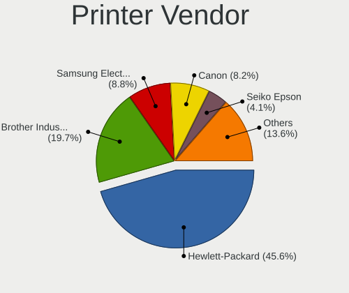

| Vendor                   | Desktops | Percent |
|--------------------------|----------|---------|
| Hewlett-Packard          | 67       | 45.58%  |
| Brother Industries       | 29       | 19.73%  |
| Samsung Electronics      | 13       | 8.84%   |
| Canon                    | 12       | 8.16%   |
| Seiko Epson              | 6        | 4.08%   |
| Oki Data                 | 4        | 2.72%   |
| Ricoh                    | 3        | 2.04%   |
| QinHeng Electronics      | 2        | 1.36%   |
| Lexmark International    | 2        | 1.36%   |
| Dymo-CoStar              | 2        | 1.36%   |
| STMicroelectronics       | 1        | 0.68%   |
| Prolific Technology      | 1        | 0.68%   |
| Magic Control Technology | 1        | 0.68%   |
| Kyocera                  | 1        | 0.68%   |
| Konica Minolta           | 1        | 0.68%   |
| ICS Advent               | 1        | 0.68%   |
| Apple                    | 1        | 0.68%   |

Printer Model
-------------

Printer device models

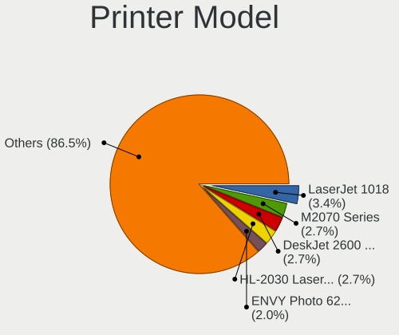

| Model                                                    | Desktops | Percent |
|----------------------------------------------------------|----------|---------|
| HP LaserJet 1018                                         | 5        | 3.38%   |
| Samsung M2070 Series                                     | 4        | 2.7%    |
| HP DeskJet 2600 series                                   | 4        | 2.7%    |
| Brother HL-2030 Laser Printer                            | 4        | 2.7%    |
| HP ENVY Photo 6200 series                                | 3        | 2.03%   |
| HP ENVY 5000 series                                      | 3        | 2.03%   |
| HP DeskJet 3630 series                                   | 3        | 2.03%   |
| HP DeskJet 2700 series                                   | 3        | 2.03%   |
| Canon LiDE 300                                           | 3        | 2.03%   |
| Brother MFC-L2710DW series                               | 3        | 2.03%   |
| Samsung M262x/M282x Xpress Series Laser Printer          | 2        | 1.35%   |
| Ricoh RICOH SP 211SU                                     | 2        | 1.35%   |
| QinHeng CH340S                                           | 2        | 1.35%   |
| Oki Data USB Device                                      | 2        | 1.35%   |
| Oki Data MC363 Multifunction Printer                     | 2        | 1.35%   |
| HP LaserJet CP1025nw                                     | 2        | 1.35%   |
| HP LaserJet 1020                                         | 2        | 1.35%   |
| HP LaserJet 1010                                         | 2        | 1.35%   |
| HP ENVY 5540 series                                      | 2        | 1.35%   |
| HP ENVY 4520 series                                      | 2        | 1.35%   |
| HP ENVY 4500 series                                      | 2        | 1.35%   |
| HP DeskJet F2492 All-in-One                              | 2        | 1.35%   |
| HP DeskJet 930c                                          | 2        | 1.35%   |
| HP DeskJet 5550                                          | 2        | 1.35%   |
| HP DeskJet 5150c                                         | 2        | 1.35%   |
| HP Deskjet 3050A                                         | 2        | 1.35%   |
| HP Deskjet 1050 J410                                     | 2        | 1.35%   |
| Dymo-CoStar LabelWriter 450                              | 2        | 1.35%   |
| Canon LiDE 400                                           | 2        | 1.35%   |
| Brother Printer                                          | 2        | 1.35%   |
| Brother HL-L2300D series                                 | 2        | 1.35%   |
| Brother DCP-J132W                                        | 2        | 1.35%   |
| Brother DCP-1510                                         | 2        | 1.35%   |
| STMicroelectronics YICHIP3121 Virtual ComPort in FS Mode | 1        | 0.68%   |
| Seiko Epson XP-255 257 Series                            | 1        | 0.68%   |
| Seiko Epson XP-225 Series                                | 1        | 0.68%   |
| Seiko Epson XP-2150 Series                               | 1        | 0.68%   |
| Seiko Epson WF-2850 Series                               | 1        | 0.68%   |
| Seiko Epson L1300 Series                                 | 1        | 0.68%   |
| Seiko Epson ET-3750 Series                               | 1        | 0.68%   |

Scanner Vendor
--------------

Scanner device vendors

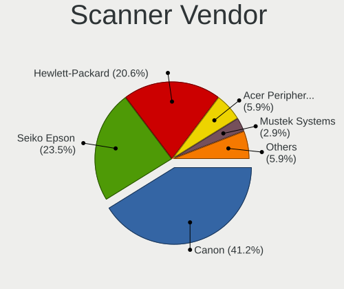

| Vendor                      | Desktops | Percent |
|-----------------------------|----------|---------|
| Canon                       | 14       | 41.18%  |
| Seiko Epson                 | 8        | 23.53%  |
| Hewlett-Packard             | 7        | 20.59%  |
| Acer Peripherals (now BenQ) | 2        | 5.88%   |
| Mustek Systems              | 1        | 2.94%   |
| KYE Systems (Mouse Systems) | 1        | 2.94%   |
| AGFA-Gevaert NV             | 1        | 2.94%   |

Scanner Model
-------------

Scanner device models

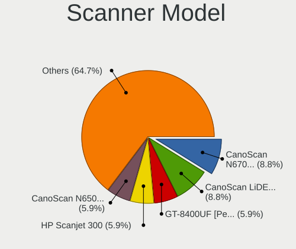

| Model                                                    | Desktops | Percent |
|----------------------------------------------------------|----------|---------|
| Canon CanoScan N670U/N676U/LiDE 20                       | 3        | 8.82%   |
| Canon CanoScan LiDE 210                                  | 3        | 8.82%   |
| Seiko Epson GT-8400UF [Perfection 1670/1670 PHOTO]       | 2        | 5.88%   |
| HP HP Scanjet 300                                        | 2        | 5.88%   |
| Canon CanoScan N650U/N656U                               | 2        | 5.88%   |
| Canon CanoScan N1240U/LiDE 30                            | 2        | 5.88%   |
| Canon CanoScan LiDE 700F                                 | 2        | 5.88%   |
| Acer Peripherals (now BenQ) S2W 3300U/4300U              | 2        | 5.88%   |
| Seiko Epson GT-X800 [Perfection 4990 PHOTO]              | 1        | 2.94%   |
| Seiko Epson GT-X750 [Perfection 4490 Photo]              | 1        | 2.94%   |
| Seiko Epson GT-F650 [GT-S600/Perfection V10/V100]        | 1        | 2.94%   |
| Seiko Epson GT-F500/GT-F550 [Perfection 2480/2580 PHOTO] | 1        | 2.94%   |
| Seiko Epson GT-7300U [Perfection 1260/1260 PHOTO]        | 1        | 2.94%   |
| Seiko Epson GT-7200U [Perfection 1250/1250 PHOTO]        | 1        | 2.94%   |
| Mustek Systems ScanExpress 1200 CU                       | 1        | 2.94%   |
| KYE Systems (Mouse Systems) ColorPage-Vivid4             | 1        | 2.94%   |
| HP Scanjet N6010                                         | 1        | 2.94%   |
| HP ScanJet 5200c                                         | 1        | 2.94%   |
| HP ScanJet 4570c                                         | 1        | 2.94%   |
| HP ScanJet 3570c                                         | 1        | 2.94%   |
| HP ScanJet 3300c                                         | 1        | 2.94%   |
| Canon CanoScan LIDE 25                                   | 1        | 2.94%   |
| Canon CanoScan LiDE 220                                  | 1        | 2.94%   |
| AGFA-Gevaert NV SnapScan 1212U                           | 1        | 2.94%   |

Camera
------

Camera Vendor
-------------

Camera device vendors

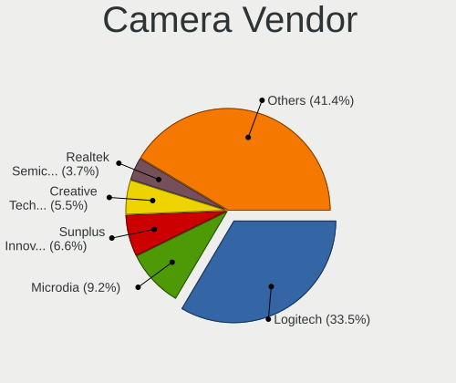

| Vendor                                 | Desktops | Percent |
|----------------------------------------|----------|---------|
| Logitech                               | 182      | 33.52%  |
| Microdia                               | 50       | 9.21%   |
| Sunplus Innovation Technology          | 36       | 6.63%   |
| Creative Technology                    | 30       | 5.52%   |
| Realtek Semiconductor                  | 20       | 3.68%   |
| Generalplus Technology                 | 15       | 2.76%   |
| Microsoft                              | 14       | 2.58%   |
| Trust                                  | 12       | 2.21%   |
| Samsung Electronics                    | 11       | 2.03%   |
| Chicony Electronics                    | 10       | 1.84%   |
| Z-Star Microelectronics                | 9        | 1.66%   |
| ARC International                      | 9        | 1.66%   |
| SunplusIT                              | 8        | 1.47%   |
| Cubeternet                             | 8        | 1.47%   |
| KYE Systems (Mouse Systems)            | 7        | 1.29%   |
| GEMBIRD                                | 7        | 1.29%   |
| webcam                                 | 6        | 1.1%    |
| MacroSilicon                           | 6        | 1.1%    |
| Jieli Technology                       | 6        | 1.1%    |
| Apple                                  | 6        | 1.1%    |
| Alcor Micro                            | 6        | 1.1%    |
| Arkmicro Technologies                  | 5        | 0.92%   |
| Huawei Technologies                    | 4        | 0.74%   |
| Guillemot                              | 4        | 0.74%   |
| Xiongmai                               | 3        | 0.55%   |
| WCM_USB                                | 3        | 0.55%   |
| Razer USA                              | 3        | 0.55%   |
| IMC Networks                           | 3        | 0.55%   |
| AVerMedia Technologies                 | 3        | 0.55%   |
| Aveo Technology                        | 3        | 0.55%   |
| Unknown                                | 3        | 0.55%   |
| webcamvendor                           | 2        | 0.37%   |
| Panasonic (Matsushita)                 | 2        | 0.37%   |
| OPPO Electronics                       | 2        | 0.37%   |
| Google                                 | 2        | 0.37%   |
| Genesys Logic                          | 2        | 0.37%   |
| FPL-2053-191010                        | 2        | 0.37%   |
| Elgato Systems                         | 2        | 0.37%   |
| Cheng Uei Precision Industry (Foxlink) | 2        | 0.37%   |
| XIFT                                   | 1        | 0.18%   |

Camera Model
------------

Camera device models

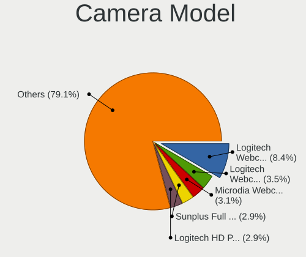

| Model                                                 | Desktops | Percent |
|-------------------------------------------------------|----------|---------|
| Logitech Webcam C270                                  | 46       | 8.42%   |
| Logitech Webcam C170                                  | 19       | 3.48%   |
| Microdia Webcam Vitade AF                             | 17       | 3.11%   |
| Sunplus Full HD webcam                                | 16       | 2.93%   |
| Logitech HD Pro Webcam C920                           | 16       | 2.93%   |
| Samsung Galaxy series, misc. (MTP mode)               | 11       | 2.01%   |
| Logitech Webcam C310                                  | 11       | 2.01%   |
| Logitech HD Webcam C525                               | 11       | 2.01%   |
| Logitech C920 PRO HD Webcam                           | 10       | 1.83%   |
| Creative Live! Cam Sync HD [VF0770]                   | 10       | 1.83%   |
| Realtek FULL HD 1080P Webcam                          | 9        | 1.65%   |
| Microdia USB 2.0 Camera                               | 9        | 1.65%   |
| Creative Live! Cam Sync 1080p V2                      | 9        | 1.65%   |
| ARC International Camera                              | 9        | 1.65%   |
| Microsoft LifeCam HD-3000                             | 8        | 1.47%   |
| Logitech Webcam C200                                  | 8        | 1.47%   |
| Logitech StreamCam                                    | 7        | 1.28%   |
| webcam webcam                                         | 6        | 1.1%    |
| Logitech C922 Pro Stream Webcam                       | 6        | 1.1%    |
| Jieli USB PHY 2.0                                     | 6        | 1.1%    |
| Generalplus WEB CAM                                   | 6        | 1.1%    |
| Trust USB Camera                                      | 5        | 0.92%   |
| SunplusIT USB 2.0 Camera                              | 5        | 0.92%   |
| Sunplus Aukey-PC-LM1E Camera                          | 5        | 0.92%   |
| Microdia Camera                                       | 5        | 0.92%   |
| Logitech HD Webcam C615                               | 5        | 0.92%   |
| Generalplus GENERAL WEBCAM                            | 5        | 0.92%   |
| Creative Live! Cam Chat HD [VF0700/VF0790]            | 5        | 0.92%   |
| Alcor Micro USB 2.0 PC Camera                         | 5        | 0.92%   |
| Z-Star Venus USB2.0 Camera                            | 4        | 0.73%   |
| Sunplus Integrated Camera                             | 4        | 0.73%   |
| Realtek USB Camera                                    | 4        | 0.73%   |
| Microdia Sonix USB 2.0 Camera                         | 4        | 0.73%   |
| Logitech Webcam C930e                                 | 4        | 0.73%   |
| Logitech QuickCam Pro 9000                            | 4        | 0.73%   |
| KYE Systems (Mouse Systems) USB 2.0 HD1080P PC Camera | 4        | 0.73%   |
| Huawei HiCamera                                       | 4        | 0.73%   |
| GEMBIRD Generic UVC 1.00 camera [AppoTech AX2311]     | 4        | 0.73%   |
| Cubeternet USB2.0 Camera                              | 4        | 0.73%   |
| Arkmicro USB2.0 PC CAMERA                             | 4        | 0.73%   |

Security
--------

Fingerprint Vendor
------------------

Fingerprint sensor vendors

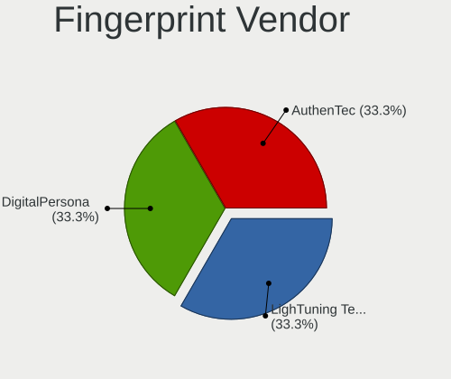

| Vendor                | Desktops | Percent |
|-----------------------|----------|---------|
| LighTuning Technology | 1        | 33.33%  |
| DigitalPersona        | 1        | 33.33%  |
| AuthenTec             | 1        | 33.33%  |

Fingerprint Model
-----------------

Fingerprint sensor models

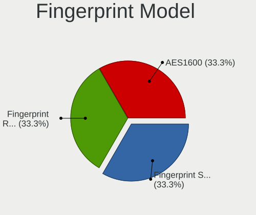

| Model                             | Desktops | Percent |
|-----------------------------------|----------|---------|
| LighTuning Fingerprint Sensor     | 1        | 33.33%  |
| DigitalPersona Fingerprint Reader | 1        | 33.33%  |
| AuthenTec AES1600                 | 1        | 33.33%  |

Chipcard Vendor
---------------

Chipcard module vendors

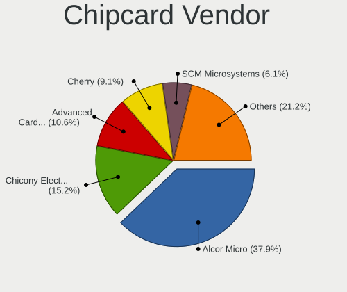

| Vendor                    | Desktops | Percent |
|---------------------------|----------|---------|
| Alcor Micro               | 25       | 37.88%  |
| Chicony Electronics       | 10       | 15.15%  |
| Advanced Card Systems     | 7        | 10.61%  |
| Cherry                    | 6        | 9.09%   |
| SCM Microsystems          | 4        | 6.06%   |
| Realtek Semiconductor     | 3        | 4.55%   |
| OmniKey                   | 2        | 3.03%   |
| Hewlett-Packard           | 2        | 3.03%   |
| Gemalto (was Gemplus)     | 2        | 3.03%   |
| C3PO                      | 2        | 3.03%   |
| Thetis                    | 1        | 1.52%   |
| Fujitsu Siemens Computers | 1        | 1.52%   |
| Bit4id                    | 1        | 1.52%   |

Chipcard Model
--------------

Chipcard module models

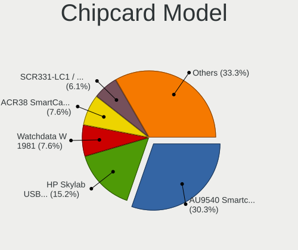

| Model                                                  | Desktops | Percent |
|--------------------------------------------------------|----------|---------|
| Alcor Micro AU9540 Smartcard Reader                    | 20       | 30.3%   |
| Chicony Electronics HP Skylab USB Smartcard Keyboard   | 10       | 15.15%  |
| Alcor Micro Watchdata W 1981                           | 5        | 7.58%   |
| Advanced Card Systems ACR38 SmartCard Reader           | 5        | 7.58%   |
| SCM Microsystems SCR331-LC1 / SCR3310 SmartCard Reader | 4        | 6.06%   |
| Cherry SmartCard Reader Keyboard KC 1000 SC            | 4        | 6.06%   |
| Realtek Semiconductor Smart Card Reader Interface      | 3        | 4.55%   |
| OmniKey CardMan 3021 / 3121                            | 2        | 3.03%   |
| Hewlett-Packard SC Keyboard - Apollo (Liteon)          | 2        | 3.03%   |
| Gemalto (was Gemplus) GemPC Twin SmartCard Reader      | 2        | 3.03%   |
| Cherry SmartTerminal XX1X                              | 2        | 3.03%   |
| C3PO LTC31v2                                           | 2        | 3.03%   |
| Thetis Security Key(F825)                              | 1        | 1.52%   |
| Fujitsu Siemens Computers SmartCard Reader 2A          | 1        | 1.52%   |
| Bit4id miniLector-s                                    | 1        | 1.52%   |
| Advanced Card Systems ACR39U                           | 1        | 1.52%   |
| Advanced Card Systems ACR122U                          | 1        | 1.52%   |

Unsupported
-----------

Unsupported Devices
-------------------

Total unsupported devices on board

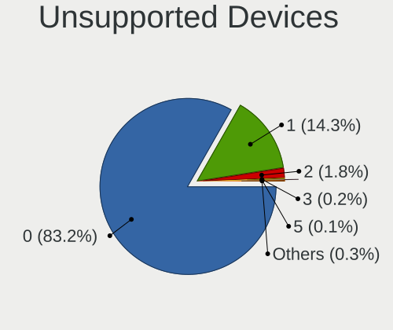

| Total | Desktops | Percent |
|-------|----------|---------|
| 0     | 2709     | 83.23%  |
| 1     | 465      | 14.29%  |
| 2     | 60       | 1.84%   |
| 3     | 8        | 0.25%   |
| 5     | 4        | 0.12%   |
| 4     | 4        | 0.12%   |
| 6     | 3        | 0.09%   |
| 9     | 1        | 0.03%   |
| 7     | 1        | 0.03%   |

Unsupported Device Types
------------------------

Types of unsupported devices

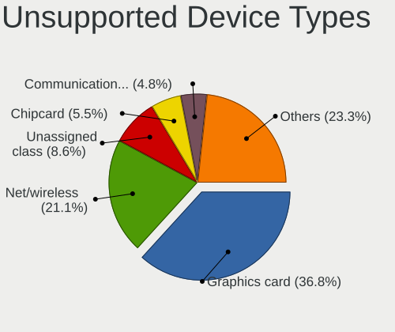

| Type                     | Desktops | Percent |
|--------------------------|----------|---------|
| Graphics card            | 232      | 36.77%  |
| Net/wireless             | 133      | 21.08%  |
| Unassigned class         | 54       | 8.56%   |
| Chipcard                 | 35       | 5.55%   |
| Communication controller | 30       | 4.75%   |
| Multimedia controller    | 28       | 4.44%   |
| Sound                    | 23       | 3.65%   |
| Bluetooth                | 20       | 3.17%   |
| Network                  | 18       | 2.85%   |
| Camera                   | 14       | 2.22%   |
| Storage/raid             | 12       | 1.9%    |
| Net/ethernet             | 12       | 1.9%    |
| Card reader              | 5        | 0.79%   |
| Firewire controller      | 4        | 0.63%   |
| Fingerprint reader       | 3        | 0.48%   |
| Storage/nvme             | 2        | 0.32%   |
| Dvb card                 | 2        | 0.32%   |
| Tv card                  | 1        | 0.16%   |
| Storage/ide              | 1        | 0.16%   |
| Storage                  | 1        | 0.16%   |
| Modem                    | 1        | 0.16%   |

