Linux in Spain - Tested Hardware & Statistics (Desktops)
--------------------------------------------------------

A project to collect tested hardware configurations for Linux in Spain.

Anyone can contribute to this report by the [hw-probe](https://github.com/linuxhw/hw-probe) tool:

    sudo -E hw-probe -all -upload

Please contribute! Especially if your hardware is rare.

Contents
--------

* [ Test Cases ](#test-cases)

* [ System ](#system)
  - [ OS                       ](#os)
  - [ OS Family                ](#os-family)
  - [ Kernel                   ](#kernel)
  - [ Kernel Family            ](#kernel-family)
  - [ Kernel Major Ver.        ](#kernel-major-ver)
  - [ Arch                     ](#arch)
  - [ DE                       ](#de)
  - [ Display Server           ](#display-server)
  - [ Display Manager          ](#display-manager)
  - [ OS Lang                  ](#os-lang)
  - [ Boot Mode                ](#boot-mode)
  - [ Filesystem               ](#filesystem)
  - [ Part. scheme             ](#part-scheme)
  - [ Dual Boot with Linux/BSD ](#dual-boot-with-linuxbsd)
  - [ Dual Boot (Win)          ](#dual-boot-win)

* [ Board ](#board)
  - [ Vendor                   ](#vendor)
  - [ Model                    ](#model)
  - [ Model Family             ](#model-family)
  - [ MFG Year                 ](#mfg-year)
  - [ Form Factor              ](#form-factor)
  - [ Secure Boot              ](#secure-boot)
  - [ Coreboot                 ](#coreboot)
  - [ RAM Size                 ](#ram-size)
  - [ RAM Used                 ](#ram-used)
  - [ Total Drives             ](#total-drives)
  - [ Has CD-ROM               ](#has-cd-rom)
  - [ Has Ethernet             ](#has-ethernet)
  - [ Has WiFi                 ](#has-wifi)
  - [ Has Bluetooth            ](#has-bluetooth)

* [ Location ](#location)
  - [ Country                  ](#country)
  - [ City                     ](#city)

* [ Drives ](#drives)
  - [ Drive Vendor             ](#drive-vendor)
  - [ Drive Model              ](#drive-model)
  - [ HDD Vendor               ](#hdd-vendor)
  - [ SSD Vendor               ](#ssd-vendor)
  - [ Drive Kind               ](#drive-kind)
  - [ Drive Connector          ](#drive-connector)
  - [ Drive Size               ](#drive-size)
  - [ Space Total              ](#space-total)
  - [ Space Used               ](#space-used)
  - [ Malfunc. Drives          ](#malfunc-drives)
  - [ Malfunc. Drive Vendor    ](#malfunc-drive-vendor)
  - [ Malfunc. HDD Vendor      ](#malfunc-hdd-vendor)
  - [ Malfunc. Drive Kind      ](#malfunc-drive-kind)
  - [ Failed Drives            ](#failed-drives)
  - [ Failed Drive Vendor      ](#failed-drive-vendor)
  - [ Drive Status             ](#drive-status)

* [ Storage controller ](#storage-controller)
  - [ Storage Vendor           ](#storage-vendor)
  - [ Storage Model            ](#storage-model)
  - [ Storage Kind             ](#storage-kind)

* [ Processor ](#processor)
  - [ CPU Vendor               ](#cpu-vendor)
  - [ CPU Model                ](#cpu-model)
  - [ CPU Model Family         ](#cpu-model-family)
  - [ CPU Cores                ](#cpu-cores)
  - [ CPU Sockets              ](#cpu-sockets)
  - [ CPU Threads              ](#cpu-threads)
  - [ CPU Op-Modes             ](#cpu-op-modes)
  - [ CPU Microcode            ](#cpu-microcode)
  - [ CPU Microarch            ](#cpu-microarch)

* [ Graphics ](#graphics)
  - [ GPU Vendor               ](#gpu-vendor)
  - [ GPU Model                ](#gpu-model)
  - [ GPU Combo                ](#gpu-combo)
  - [ GPU Driver               ](#gpu-driver)
  - [ GPU Memory               ](#gpu-memory)

* [ Monitor ](#monitor)
  - [ Monitor Vendor           ](#monitor-vendor)
  - [ Monitor Model            ](#monitor-model)
  - [ Monitor Resolution       ](#monitor-resolution)
  - [ Monitor Diagonal         ](#monitor-diagonal)
  - [ Monitor Width            ](#monitor-width)
  - [ Aspect Ratio             ](#aspect-ratio)
  - [ Monitor Area             ](#monitor-area)
  - [ Pixel Density            ](#pixel-density)
  - [ Multiple Monitors        ](#multiple-monitors)

* [ Network ](#network)
  - [ Net Controller Vendor    ](#net-controller-vendor)
  - [ Net Controller Model     ](#net-controller-model)
  - [ Wireless Vendor          ](#wireless-vendor)
  - [ Wireless Model           ](#wireless-model)
  - [ Ethernet Vendor          ](#ethernet-vendor)
  - [ Ethernet Model           ](#ethernet-model)
  - [ Net Controller Kind      ](#net-controller-kind)
  - [ Used Controller          ](#used-controller)
  - [ NICs                     ](#nics)
  - [ IPv6                     ](#ipv6)

* [ Bluetooth ](#bluetooth)
  - [ Bluetooth Vendor         ](#bluetooth-vendor)
  - [ Bluetooth Model          ](#bluetooth-model)

* [ Sound ](#sound)
  - [ Sound Vendor             ](#sound-vendor)
  - [ Sound Model              ](#sound-model)

* [ Memory ](#memory)
  - [ Memory Vendor            ](#memory-vendor)
  - [ Memory Model             ](#memory-model)
  - [ Memory Kind              ](#memory-kind)
  - [ Memory Form Factor       ](#memory-form-factor)
  - [ Memory Size              ](#memory-size)
  - [ Memory Speed             ](#memory-speed)

* [ Printers & scanners ](#printers--scanners)
  - [ Printer Vendor           ](#printer-vendor)
  - [ Printer Model            ](#printer-model)
  - [ Scanner Vendor           ](#scanner-vendor)
  - [ Scanner Model            ](#scanner-model)

* [ Camera ](#camera)
  - [ Camera Vendor            ](#camera-vendor)
  - [ Camera Model             ](#camera-model)

* [ Security ](#security)
  - [ Fingerprint Vendor       ](#fingerprint-vendor)
  - [ Fingerprint Model        ](#fingerprint-model)
  - [ Chipcard Vendor          ](#chipcard-vendor)
  - [ Chipcard Model           ](#chipcard-model)

* [ Unsupported ](#unsupported)
  - [ Unsupported Devices      ](#unsupported-devices)
  - [ Unsupported Device Types ](#unsupported-device-types)

Test Cases
----------

Total: 2279

| Vendor        | Model                       | Probe                                                      | Date         |
|---------------|-----------------------------|------------------------------------------------------------|--------------|
| MSI           | Z87 MPOWER                  | [ba26baf84a](https://linux-hardware.org/?probe=ba26baf84a) | Jun 30, 2022 |
| MSI           | MEG X570 ACE                | [6dff126482](https://linux-hardware.org/?probe=6dff126482) | Jun 30, 2022 |
| HP            | 3647h                       | [3227f38f98](https://linux-hardware.org/?probe=3227f38f98) | Jun 28, 2022 |
| HP            | ProLiant ML110 G7           | [ace3582eee](https://linux-hardware.org/?probe=ace3582eee) | Jun 28, 2022 |
| HP            | ProLiant ML110 G7           | [5d18d90cda](https://linux-hardware.org/?probe=5d18d90cda) | Jun 27, 2022 |
| ASUSTek       | H81M-P PLUS                 | [6c18625cb3](https://linux-hardware.org/?probe=6c18625cb3) | Jun 27, 2022 |
| ASUSTek       | P5K                         | [e401eb71bc](https://linux-hardware.org/?probe=e401eb71bc) | Jun 27, 2022 |
| ASUSTek       | P8B75-M LE                  | [48cbc869da](https://linux-hardware.org/?probe=48cbc869da) | Jun 27, 2022 |
| ASUSTek       | P8B75-M LE                  | [ea31080862](https://linux-hardware.org/?probe=ea31080862) | Jun 27, 2022 |
| ASUSTek       | ROG STRIX B365-G GAMING     | [2d1c05fefc](https://linux-hardware.org/?probe=2d1c05fefc) | Jun 26, 2022 |
| ASUSTek       | TUF B450M-PRO GAMING        | [5047471b41](https://linux-hardware.org/?probe=5047471b41) | Jun 26, 2022 |
| Dell          | 0W0CHX A00                  | [874e7081c6](https://linux-hardware.org/?probe=874e7081c6) | Jun 23, 2022 |
| ASUSTek       | H81M-P PLUS                 | [b91a1b0ded](https://linux-hardware.org/?probe=b91a1b0ded) | Jun 22, 2022 |
| Acer          | Aspire X1700                | [6a67f8cba0](https://linux-hardware.org/?probe=6a67f8cba0) | Jun 21, 2022 |
| ASUSTek       | TUF Z390-PLUS GAMING        | [0e6a585307](https://linux-hardware.org/?probe=0e6a585307) | Jun 21, 2022 |
| Gigabyte      | H61M-USB3H                  | [6b9dcbd952](https://linux-hardware.org/?probe=6b9dcbd952) | Jun 20, 2022 |
| HP            | 18E7                        | [9f82638329](https://linux-hardware.org/?probe=9f82638329) | Jun 14, 2022 |
| ASUSTek       | M4A785TD-V EVO              | [5f5c3fcba9](https://linux-hardware.org/?probe=5f5c3fcba9) | Jun 13, 2022 |
| Gigabyte      | 970A-DS3P                   | [d22ca1b39a](https://linux-hardware.org/?probe=d22ca1b39a) | Jun 12, 2022 |
| HP            | 1496                        | [d6fba97175](https://linux-hardware.org/?probe=d6fba97175) | Jun 12, 2022 |
| Gigabyte      | 970A-DS3P                   | [a3ca1ea153](https://linux-hardware.org/?probe=a3ca1ea153) | Jun 12, 2022 |
| MSI           | H310M PRO-VDH PLUS          | [839663a1af](https://linux-hardware.org/?probe=839663a1af) | Jun 10, 2022 |
| ASUSTek       | P5B-Deluxe                  | [eb7ee3a693](https://linux-hardware.org/?probe=eb7ee3a693) | Jun 10, 2022 |
| MSI           | MAG B550M MORTAR            | [40c1095611](https://linux-hardware.org/?probe=40c1095611) | Jun 08, 2022 |
| MSI           | H110M PRO-VH                | [ceae668577](https://linux-hardware.org/?probe=ceae668577) | Jun 07, 2022 |
| Gigabyte      | H81M-S2H                    | [4ca91078a2](https://linux-hardware.org/?probe=4ca91078a2) | Jun 07, 2022 |
| Gigabyte      | H61M-USB3H                  | [1f88a2c07c](https://linux-hardware.org/?probe=1f88a2c07c) | Jun 04, 2022 |
| Gigabyte      | H61M-USB3H                  | [3cc513c431](https://linux-hardware.org/?probe=3cc513c431) | Jun 04, 2022 |
| Acer          | F90M R01-D1                 | [ecc8d1f955](https://linux-hardware.org/?probe=ecc8d1f955) | Jun 03, 2022 |
| Gigabyte      | B450 AORUS M                | [bb96d40d38](https://linux-hardware.org/?probe=bb96d40d38) | Jun 03, 2022 |
| ASUSTek       | H81M-P PLUS                 | [8c60f1e8e0](https://linux-hardware.org/?probe=8c60f1e8e0) | Jun 03, 2022 |
| ASUSTek       | P5K                         | [2e621739e6](https://linux-hardware.org/?probe=2e621739e6) | Jun 03, 2022 |
| Gigabyte      | H81M-S1                     | [3210714de1](https://linux-hardware.org/?probe=3210714de1) | Jun 03, 2022 |
| Gigabyte      | H81M-S1                     | [9b01043ab8](https://linux-hardware.org/?probe=9b01043ab8) | Jun 03, 2022 |
| MSI           | MPG X570 GAMING PLUS        | [4a055cff40](https://linux-hardware.org/?probe=4a055cff40) | Jun 02, 2022 |
| MSI           | B560M PRO-VDH               | [2e9996424a](https://linux-hardware.org/?probe=2e9996424a) | Jun 02, 2022 |
| ASUSTek       | P5QL-ASUS-SE                | [5c9f7b1ab9](https://linux-hardware.org/?probe=5c9f7b1ab9) | Jun 02, 2022 |
| ASUSTek       | P5QL-ASUS-SE                | [0e1e2765fc](https://linux-hardware.org/?probe=0e1e2765fc) | Jun 01, 2022 |
| MSI           | MPG Z390 GAMING PRO CARB... | [580abb0cf9](https://linux-hardware.org/?probe=580abb0cf9) | May 30, 2022 |
| ASUSTek       | TUF Z390-PRO GAMING         | [b0e56c97d2](https://linux-hardware.org/?probe=b0e56c97d2) | May 28, 2022 |
| ASUSTek       | P5K                         | [2b5230c5f8](https://linux-hardware.org/?probe=2b5230c5f8) | May 27, 2022 |
| ASUSTek       | P5K                         | [b816732403](https://linux-hardware.org/?probe=b816732403) | May 27, 2022 |
| ASRock        | AM2NF6G-VSTA                | [475179d795](https://linux-hardware.org/?probe=475179d795) | May 27, 2022 |
| ASUSTek       | P5G41T-M LX                 | [5dbf3199e0](https://linux-hardware.org/?probe=5dbf3199e0) | May 27, 2022 |
| BESSTAR Te... | UM350                       | [e4082f489e](https://linux-hardware.org/?probe=e4082f489e) | May 27, 2022 |
| HP            | 8767 A                      | [553a8de02a](https://linux-hardware.org/?probe=553a8de02a) | May 26, 2022 |
| ASUSTek       | 970 PRO GAMING/AURA         | [4673dbdffc](https://linux-hardware.org/?probe=4673dbdffc) | May 26, 2022 |
| ASUSTek       | TUF Gaming B550M-PLUS       | [cca34ae407](https://linux-hardware.org/?probe=cca34ae407) | May 26, 2022 |
| ASUSTek       | TUF Gaming B550M-PLUS       | [d998776096](https://linux-hardware.org/?probe=d998776096) | May 26, 2022 |
| ASUSTek       | TUF Z390-PLUS GAMING        | [8e49a588d4](https://linux-hardware.org/?probe=8e49a588d4) | May 25, 2022 |
| ASUSTek       | M4A785TD-V EVO              | [29dd7760ba](https://linux-hardware.org/?probe=29dd7760ba) | May 25, 2022 |
| MACHINIST     | X99-RS9 V2.0                | [ca5eb0e4ff](https://linux-hardware.org/?probe=ca5eb0e4ff) | May 24, 2022 |
| MSI           | B450I GAMING PLUS AC        | [dbc555961b](https://linux-hardware.org/?probe=dbc555961b) | May 23, 2022 |
| ASUSTek       | TUF Gaming B550-PLUS        | [93700a286d](https://linux-hardware.org/?probe=93700a286d) | May 23, 2022 |
| Foxconn       | 2A8C                        | [eda69f1faf](https://linux-hardware.org/?probe=eda69f1faf) | May 22, 2022 |
| Gigabyte      | B250M-D3H-CF                | [a4275c42f4](https://linux-hardware.org/?probe=a4275c42f4) | May 22, 2022 |
| ASUSTek       | Crosshair IV Formula        | [d6c9df82c6](https://linux-hardware.org/?probe=d6c9df82c6) | May 21, 2022 |
| Packard Be... | MCP73PV                     | [14085bdcf2](https://linux-hardware.org/?probe=14085bdcf2) | May 20, 2022 |
| MSI           | B460M-A PRO                 | [2f1ec161d1](https://linux-hardware.org/?probe=2f1ec161d1) | May 20, 2022 |
| Gigabyte      | Z270-HD3P-CF                | [1efa62dcdb](https://linux-hardware.org/?probe=1efa62dcdb) | May 19, 2022 |
| ASUSTek       | ROG STRIX B365-G GAMING     | [a941ac6fa0](https://linux-hardware.org/?probe=a941ac6fa0) | May 19, 2022 |
| HP            | 8591                        | [60c5d4f8ca](https://linux-hardware.org/?probe=60c5d4f8ca) | May 19, 2022 |
| MSI           | B450M PRO-VDH MAX           | [b2eceeef6d](https://linux-hardware.org/?probe=b2eceeef6d) | May 19, 2022 |
| HP            | 8591                        | [fd05ae27e7](https://linux-hardware.org/?probe=fd05ae27e7) | May 18, 2022 |
| ASUSTek       | PRIME A320M-K               | [cb6038cd9b](https://linux-hardware.org/?probe=cb6038cd9b) | May 18, 2022 |
| ASUSTek       | A8N32-SLI-Deluxe            | [78a9ab4d15](https://linux-hardware.org/?probe=78a9ab4d15) | May 17, 2022 |
| MSI           | MPG B550I GAMING EDGE WI... | [26f332bc9c](https://linux-hardware.org/?probe=26f332bc9c) | May 16, 2022 |
| ASUSTek       | SABERTOOTH 990FX            | [49a3292018](https://linux-hardware.org/?probe=49a3292018) | May 15, 2022 |
| ASUSTek       | B85M-G                      | [dd305c13de](https://linux-hardware.org/?probe=dd305c13de) | May 15, 2022 |
| ASUSTek       | Z8NR-D12                    | [e65adcd0da](https://linux-hardware.org/?probe=e65adcd0da) | May 14, 2022 |
| HP            | 8433 11                     | [d3f305a093](https://linux-hardware.org/?probe=d3f305a093) | May 14, 2022 |
| MSI           | B450M PRO-M2                | [0bb720a248](https://linux-hardware.org/?probe=0bb720a248) | May 14, 2022 |
| ECS           | Asterope                    | [a0c032d6f6](https://linux-hardware.org/?probe=a0c032d6f6) | May 14, 2022 |
| ASUSTek       | ROG STRIX B365-G GAMING     | [e1fc077918](https://linux-hardware.org/?probe=e1fc077918) | May 14, 2022 |
| Gigabyte      | GA-K8NF-9                   | [f9d59e3770](https://linux-hardware.org/?probe=f9d59e3770) | May 13, 2022 |
| ASUSTek       | M5A78L-M/USB3               | [2ac5991afa](https://linux-hardware.org/?probe=2ac5991afa) | May 13, 2022 |
| Medion        | Z370H4-EM                   | [2030abcd26](https://linux-hardware.org/?probe=2030abcd26) | May 12, 2022 |
| ASUSTek       | B150-PLUS                   | [eb2447cec6](https://linux-hardware.org/?probe=eb2447cec6) | May 11, 2022 |
| Gigabyte      | Z390 AORUS PRO-CF           | [1d4364ac51](https://linux-hardware.org/?probe=1d4364ac51) | May 10, 2022 |
| ECS           | H81H3-I                     | [e184359c46](https://linux-hardware.org/?probe=e184359c46) | May 09, 2022 |
| ASUSTek       | P8H61-M LX                  | [9a00d24f58](https://linux-hardware.org/?probe=9a00d24f58) | May 09, 2022 |
| ASUSTek       | P8H61-M LX                  | [3f3089216f](https://linux-hardware.org/?probe=3f3089216f) | May 09, 2022 |
| MSI           | B460M-A PRO                 | [29c0818bcd](https://linux-hardware.org/?probe=29c0818bcd) | May 08, 2022 |
| ASUSTek       | CROSSHAIR                   | [39f623cf4d](https://linux-hardware.org/?probe=39f623cf4d) | May 08, 2022 |
| Acer          | Aspire M1935                | [a679a25c13](https://linux-hardware.org/?probe=a679a25c13) | May 07, 2022 |
| Acer          | Aspire M1935                | [62424ad96d](https://linux-hardware.org/?probe=62424ad96d) | May 07, 2022 |
| HP            | 84FD                        | [f99c153a46](https://linux-hardware.org/?probe=f99c153a46) | May 06, 2022 |
| Gigabyte      | G41MT-S2                    | [fd9ed9a035](https://linux-hardware.org/?probe=fd9ed9a035) | May 05, 2022 |
| ASRock        | FM2A78M Pro4+               | [7a00557ba5](https://linux-hardware.org/?probe=7a00557ba5) | May 05, 2022 |
| HP            | 1998                        | [b35fc936e5](https://linux-hardware.org/?probe=b35fc936e5) | May 04, 2022 |
| Dell          | 0Y56T3 A00                  | [3bdd958639](https://linux-hardware.org/?probe=3bdd958639) | May 04, 2022 |
| MSI           | H170A PC MATE               | [3ebb871ecc](https://linux-hardware.org/?probe=3ebb871ecc) | May 02, 2022 |
| ASUSTek       | B150-PLUS                   | [e2f5eb0a39](https://linux-hardware.org/?probe=e2f5eb0a39) | May 02, 2022 |
| Gigabyte      | H110M-S2H-CF                | [c45a37ce5d](https://linux-hardware.org/?probe=c45a37ce5d) | May 01, 2022 |
| ASRock        | B365M-HDV                   | [51b0e7e57f](https://linux-hardware.org/?probe=51b0e7e57f) | May 01, 2022 |
| Lenovo        | ThinkCentre M58p 6137E61    | [dbf0d596fc](https://linux-hardware.org/?probe=dbf0d596fc) | May 01, 2022 |
| Intel         | V1.3                        | [a01993f2fa](https://linux-hardware.org/?probe=a01993f2fa) | Apr 30, 2022 |
| ASUSTek       | PRIME H610M-A D4            | [e9376d24f0](https://linux-hardware.org/?probe=e9376d24f0) | Apr 29, 2022 |
| ASUSTek       | Z87-WS                      | [1c67952875](https://linux-hardware.org/?probe=1c67952875) | Apr 29, 2022 |
| Dell          | 0J37VM A00                  | [76f13aa200](https://linux-hardware.org/?probe=76f13aa200) | Apr 28, 2022 |
| ASRock        | AB350M-HDV                  | [6ee4ea44a8](https://linux-hardware.org/?probe=6ee4ea44a8) | Apr 27, 2022 |
| ASUSTek       | Maximus II Formula          | [66a4342140](https://linux-hardware.org/?probe=66a4342140) | Apr 26, 2022 |
| MSI           | H170A PC MATE               | [558be4bee8](https://linux-hardware.org/?probe=558be4bee8) | Apr 26, 2022 |
| Gigabyte      | P55M-UD2                    | [5f9ffc8d46](https://linux-hardware.org/?probe=5f9ffc8d46) | Apr 24, 2022 |
| MSI           | B250M PRO-VDH               | [a1ff9cf092](https://linux-hardware.org/?probe=a1ff9cf092) | Apr 24, 2022 |
| Gigabyte      | F2A88XN-WIFI                | [347ded3d71](https://linux-hardware.org/?probe=347ded3d71) | Apr 23, 2022 |
| Foxconn       | 945 7AD Series              | [04346c58f5](https://linux-hardware.org/?probe=04346c58f5) | Apr 23, 2022 |
| AZW           | GTi                         | [e2d4a0da2e](https://linux-hardware.org/?probe=e2d4a0da2e) | Apr 23, 2022 |
| AZW           | GTi                         | [cde74551bf](https://linux-hardware.org/?probe=cde74551bf) | Apr 23, 2022 |
| ASUSTek       | ROG STRIX B365-G GAMING     | [14089322a6](https://linux-hardware.org/?probe=14089322a6) | Apr 23, 2022 |
| Gigabyte      | H310M S2H x.x               | [bde3fa1f37](https://linux-hardware.org/?probe=bde3fa1f37) | Apr 22, 2022 |
| AMI           | Cherry Trail CR             | [61d45f784c](https://linux-hardware.org/?probe=61d45f784c) | Apr 21, 2022 |
| Gigabyte      | GA-78LMT-USB3               | [8034b9ae8c](https://linux-hardware.org/?probe=8034b9ae8c) | Apr 21, 2022 |
| Dell          | 0WMJ54 A01                  | [37ec4fb91d](https://linux-hardware.org/?probe=37ec4fb91d) | Apr 21, 2022 |
| Dell          | 0JP3NX A01                  | [e1c710c88f](https://linux-hardware.org/?probe=e1c710c88f) | Apr 21, 2022 |
| Dell          | 0JP3NX A01                  | [8e6566a555](https://linux-hardware.org/?probe=8e6566a555) | Apr 21, 2022 |
| Lenovo        | SHARKBAY 0B98401 PRO        | [0ceaadd5e3](https://linux-hardware.org/?probe=0ceaadd5e3) | Apr 20, 2022 |
| Gigabyte      | P55M-UD2                    | [bc5f8558f3](https://linux-hardware.org/?probe=bc5f8558f3) | Apr 20, 2022 |
| MSI           | A320M-A PRO MAX             | [b925b403ca](https://linux-hardware.org/?probe=b925b403ca) | Apr 20, 2022 |
| Lenovo        | 3098 NOK                    | [a9126e3886](https://linux-hardware.org/?probe=a9126e3886) | Apr 19, 2022 |
| Gigabyte      | H81M-S2H                    | [85082e6de6](https://linux-hardware.org/?probe=85082e6de6) | Apr 19, 2022 |
| ASUSTek       | H87-PLUS                    | [10e97d2168](https://linux-hardware.org/?probe=10e97d2168) | Apr 18, 2022 |
| Gigabyte      | B85M-DS3H                   | [c278a421cd](https://linux-hardware.org/?probe=c278a421cd) | Apr 18, 2022 |
| ASUSTek       | TUF Gaming Z690-PLUS D4     | [fb3e0b6b22](https://linux-hardware.org/?probe=fb3e0b6b22) | Apr 18, 2022 |
| ASUSTek       | PRIME B660-PLUS D4          | [d921190f7e](https://linux-hardware.org/?probe=d921190f7e) | Apr 17, 2022 |
| BESSTAR Te... | UM250 V1.0                  | [271eb8380b](https://linux-hardware.org/?probe=271eb8380b) | Apr 17, 2022 |
| Gigabyte      | F2A68HM-DS2                 | [a016ec1bce](https://linux-hardware.org/?probe=a016ec1bce) | Apr 16, 2022 |
| ASUSTek       | P5VD2-MX                    | [57fec52891](https://linux-hardware.org/?probe=57fec52891) | Apr 16, 2022 |
| Medion        | MS-7728                     | [443a5ff3dd](https://linux-hardware.org/?probe=443a5ff3dd) | Apr 15, 2022 |
| MSI           | X470 GAMING PLUS            | [72af1b2afe](https://linux-hardware.org/?probe=72af1b2afe) | Apr 15, 2022 |
| BESSTAR Te... | UM250 V1.0                  | [bd378877e0](https://linux-hardware.org/?probe=bd378877e0) | Apr 14, 2022 |
| Lenovo        | 3098 NOK                    | [45b5664eb1](https://linux-hardware.org/?probe=45b5664eb1) | Apr 14, 2022 |
| Unknown       | Unknown                     | [d7811dbd43](https://linux-hardware.org/?probe=d7811dbd43) | Apr 14, 2022 |
| ASUSTek       | ROG STRIX Z370-H GAMING     | [ace1daa3ff](https://linux-hardware.org/?probe=ace1daa3ff) | Apr 13, 2022 |
| ASUSTek       | ROG STRIX Z370-H GAMING     | [c77d1618d1](https://linux-hardware.org/?probe=c77d1618d1) | Apr 13, 2022 |
| Gateway       | DS71                        | [3bd1ad84ce](https://linux-hardware.org/?probe=3bd1ad84ce) | Apr 13, 2022 |
| Gigabyte      | F2A88XM-D3H                 | [c5c12d6818](https://linux-hardware.org/?probe=c5c12d6818) | Apr 12, 2022 |
| Gigabyte      | 970A-DS3P                   | [8101ed4e60](https://linux-hardware.org/?probe=8101ed4e60) | Apr 12, 2022 |
| Gigabyte      | 970A-DS3P                   | [bf61a75cfd](https://linux-hardware.org/?probe=bf61a75cfd) | Apr 12, 2022 |
| ASUSTek       | TUF Z390-PLUS GAMING        | [f986565b6b](https://linux-hardware.org/?probe=f986565b6b) | Apr 10, 2022 |
| Gigabyte      | Q67M-D2H                    | [c95352a142](https://linux-hardware.org/?probe=c95352a142) | Apr 10, 2022 |
| ASUSTek       | Z87-WS                      | [7706049c53](https://linux-hardware.org/?probe=7706049c53) | Apr 10, 2022 |
| Medion        | MS-7366                     | [206ab01c63](https://linux-hardware.org/?probe=206ab01c63) | Apr 10, 2022 |
| ASUSTek       | STRIX H270F GAMING          | [22502631b3](https://linux-hardware.org/?probe=22502631b3) | Apr 10, 2022 |
| ASUSTek       | PRIME A320M-K               | [9cc7cc23d6](https://linux-hardware.org/?probe=9cc7cc23d6) | Apr 10, 2022 |
| ASUSTek       | PRIME A320M-K               | [3845180872](https://linux-hardware.org/?probe=3845180872) | Apr 10, 2022 |
| MACHINIST     | X99-RS9 V2.0                | [862e7ffc88](https://linux-hardware.org/?probe=862e7ffc88) | Apr 09, 2022 |
| MACHINIST     | X99-RS9 V2.0                | [e20b365083](https://linux-hardware.org/?probe=e20b365083) | Apr 09, 2022 |
| Medion        | MS-7366                     | [86884e1cf1](https://linux-hardware.org/?probe=86884e1cf1) | Apr 09, 2022 |
| ASUSTek       | TUF Z390-PLUS GAMING        | [a618981311](https://linux-hardware.org/?probe=a618981311) | Apr 09, 2022 |
| Gigabyte      | 970A-DS3P                   | [f45b500a83](https://linux-hardware.org/?probe=f45b500a83) | Apr 09, 2022 |
| ASUSTek       | H97M-PLUS                   | [b90df26c2a](https://linux-hardware.org/?probe=b90df26c2a) | Apr 08, 2022 |
| ASRock        | C226 WS                     | [7c11c1ec43](https://linux-hardware.org/?probe=7c11c1ec43) | Apr 07, 2022 |
| ECS           | Nettle2                     | [65cedbb00d](https://linux-hardware.org/?probe=65cedbb00d) | Apr 07, 2022 |
| HP            | 18E5                        | [b79c804a6a](https://linux-hardware.org/?probe=b79c804a6a) | Apr 05, 2022 |
| ASRock        | X399 Phantom Gaming 6       | [939722b6a7](https://linux-hardware.org/?probe=939722b6a7) | Apr 05, 2022 |
| ASUSTek       | TUF Gaming B560-PLUS WIF... | [db18e71352](https://linux-hardware.org/?probe=db18e71352) | Apr 05, 2022 |
| Gigabyte      | GA-990FX-GAMING             | [46756b95b5](https://linux-hardware.org/?probe=46756b95b5) | Apr 03, 2022 |
| Medion        | Z370H4-EM                   | [0f9b0bf367](https://linux-hardware.org/?probe=0f9b0bf367) | Apr 03, 2022 |
| ASUSTek       | PRIME X570-PRO              | [368a64422d](https://linux-hardware.org/?probe=368a64422d) | Apr 03, 2022 |
| ASUSTek       | TUF Gaming Z690-PLUS D4     | [a11d93b9d5](https://linux-hardware.org/?probe=a11d93b9d5) | Apr 02, 2022 |
| ASUSTek       | TUF Gaming B460M-PLUS       | [7419ad6a76](https://linux-hardware.org/?probe=7419ad6a76) | Apr 02, 2022 |
| Gigabyte      | H81M-S2H                    | [8a810aa9f6](https://linux-hardware.org/?probe=8a810aa9f6) | Apr 02, 2022 |
| MSI           | H81M-E35 V2                 | [a3aea1cbf5](https://linux-hardware.org/?probe=a3aea1cbf5) | Apr 02, 2022 |
| Wistron       | ProLiant ML110 G5           | [ccea23c3b5](https://linux-hardware.org/?probe=ccea23c3b5) | Apr 01, 2022 |
| Wistron       | ProLiant ML110 G5           | [4c01aec65d](https://linux-hardware.org/?probe=4c01aec65d) | Apr 01, 2022 |
| ASUSTek       | ROG STRIX B365-G GAMING     | [47e2449cf5](https://linux-hardware.org/?probe=47e2449cf5) | Apr 01, 2022 |
| MSI           | H410M PRO-VH                | [e4ef535529](https://linux-hardware.org/?probe=e4ef535529) | Mar 31, 2022 |
| Unknown       | Unknown                     | [926a8980fc](https://linux-hardware.org/?probe=926a8980fc) | Mar 30, 2022 |
| ASUSTek       | PRIME Z390-A                | [5307aba2c3](https://linux-hardware.org/?probe=5307aba2c3) | Mar 30, 2022 |
| ASUSTek       | D940MX                      | [bdc8831182](https://linux-hardware.org/?probe=bdc8831182) | Mar 28, 2022 |
| ASUSTek       | ROG STRIX B365-G GAMING     | [7c852d78e1](https://linux-hardware.org/?probe=7c852d78e1) | Mar 27, 2022 |
| ASUSTek       | ROG Maximus XI HERO         | [ce82ab584b](https://linux-hardware.org/?probe=ce82ab584b) | Mar 26, 2022 |
| Gigabyte      | H61M-USB3H                  | [f852a0cb0d](https://linux-hardware.org/?probe=f852a0cb0d) | Mar 26, 2022 |
| Intel         | B75                         | [9f73efdcc8](https://linux-hardware.org/?probe=9f73efdcc8) | Mar 25, 2022 |
| ASUSTek       | ROG STRIX B365-G GAMING     | [b2c47467cc](https://linux-hardware.org/?probe=b2c47467cc) | Mar 25, 2022 |
| Gigabyte      | GA-73PVM-S2H                | [ac9f20a77c](https://linux-hardware.org/?probe=ac9f20a77c) | Mar 23, 2022 |
| Gigabyte      | 970A-DS3P                   | [012e192ece](https://linux-hardware.org/?probe=012e192ece) | Mar 22, 2022 |
| ASUSTek       | STRIX H270F GAMING          | [5d6041ffc4](https://linux-hardware.org/?probe=5d6041ffc4) | Mar 21, 2022 |
| ASUSTek       | STRIX H270F GAMING          | [7c5dff1166](https://linux-hardware.org/?probe=7c5dff1166) | Mar 21, 2022 |
| HP            | 18E7                        | [727446a2df](https://linux-hardware.org/?probe=727446a2df) | Mar 20, 2022 |
| Gigabyte      | Z690 UD DDR4                | [03bfb9a66b](https://linux-hardware.org/?probe=03bfb9a66b) | Mar 20, 2022 |
| ECS           | H87H3-M                     | [f15990212f](https://linux-hardware.org/?probe=f15990212f) | Mar 20, 2022 |
| ASUSTek       | TUF Gaming X570-PLUS        | [6dd4a41851](https://linux-hardware.org/?probe=6dd4a41851) | Mar 19, 2022 |
| Unknown       | Intel X79                   | [1b92468c15](https://linux-hardware.org/?probe=1b92468c15) | Mar 17, 2022 |
| Gigabyte      | B550I AORUS PRO AX          | [bca7145550](https://linux-hardware.org/?probe=bca7145550) | Mar 17, 2022 |
| ECS           | H110I-C4P                   | [de40e2a12d](https://linux-hardware.org/?probe=de40e2a12d) | Mar 16, 2022 |
| Pegatron      | 2ACF                        | [56d5f5b8ec](https://linux-hardware.org/?probe=56d5f5b8ec) | Mar 16, 2022 |
| ASUSTek       | PRIME B450M-A               | [75a7099e71](https://linux-hardware.org/?probe=75a7099e71) | Mar 15, 2022 |
| ASRock        | B150 Gaming K4              | [a03321659f](https://linux-hardware.org/?probe=a03321659f) | Mar 15, 2022 |
| HP            | 1497                        | [0aaa7bf906](https://linux-hardware.org/?probe=0aaa7bf906) | Mar 15, 2022 |
| ASUSTek       | TUF Gaming X570-PRO         | [e284a60544](https://linux-hardware.org/?probe=e284a60544) | Mar 14, 2022 |
| ASUSTek       | PRIME Z490M-PLUS            | [e0efdaa76a](https://linux-hardware.org/?probe=e0efdaa76a) | Mar 13, 2022 |
| ASUSTek       | P5QC                        | [144a20f079](https://linux-hardware.org/?probe=144a20f079) | Mar 13, 2022 |
| Lenovo        | SHARKBAY 0B98401 WIN        | [06b1c7d30a](https://linux-hardware.org/?probe=06b1c7d30a) | Mar 13, 2022 |
| Lenovo        | SHARKBAY 0B98401 WIN        | [41737e64bb](https://linux-hardware.org/?probe=41737e64bb) | Mar 13, 2022 |
| ASUSTek       | ROG STRIX B365-G GAMING     | [e0e46ae824](https://linux-hardware.org/?probe=e0e46ae824) | Mar 13, 2022 |
| ASUSTek       | ROG STRIX B365-G GAMING     | [f225ce7d58](https://linux-hardware.org/?probe=f225ce7d58) | Mar 12, 2022 |
| HP            | 3398                        | [6afe044e03](https://linux-hardware.org/?probe=6afe044e03) | Mar 12, 2022 |
| ASUSTek       | ROG STRIX B365-G GAMING     | [72775a871a](https://linux-hardware.org/?probe=72775a871a) | Mar 11, 2022 |
| Dell          | 0F6X5P A00                  | [b58520e2a7](https://linux-hardware.org/?probe=b58520e2a7) | Mar 11, 2022 |
| ASRock        | H81M-VG4 R2.0               | [2d72940994](https://linux-hardware.org/?probe=2d72940994) | Mar 10, 2022 |
| MSI           | Z270 GAMING M3              | [989eec2f5f](https://linux-hardware.org/?probe=989eec2f5f) | Mar 10, 2022 |
| ASRock        | Q1900M                      | [ce28f1e721](https://linux-hardware.org/?probe=ce28f1e721) | Mar 09, 2022 |
| Dell          | 0J37VM A00                  | [a78d4c99e3](https://linux-hardware.org/?probe=a78d4c99e3) | Mar 09, 2022 |
| ASUSTek       | M11AD                       | [8bb5baaa5a](https://linux-hardware.org/?probe=8bb5baaa5a) | Mar 09, 2022 |
| ASUSTek       | PRIME A320M-K               | [9695618053](https://linux-hardware.org/?probe=9695618053) | Mar 08, 2022 |
| Intel         | DH55TC AAE70932-302         | [60bdf00035](https://linux-hardware.org/?probe=60bdf00035) | Mar 07, 2022 |
| Intel         | DH55TC AAE70932-205         | [13a7b2300c](https://linux-hardware.org/?probe=13a7b2300c) | Mar 07, 2022 |
| Intel         | DH55TC AAE70932-205         | [245ea26d7f](https://linux-hardware.org/?probe=245ea26d7f) | Mar 07, 2022 |
| Intel         | DH55TC AAE70932-205         | [d681586515](https://linux-hardware.org/?probe=d681586515) | Mar 07, 2022 |
| Intel         | DH55TC AAE70932-205         | [459b5909e6](https://linux-hardware.org/?probe=459b5909e6) | Mar 07, 2022 |
| ASRock        | FM2A88X+ Killer             | [c75eb0d27f](https://linux-hardware.org/?probe=c75eb0d27f) | Mar 07, 2022 |
| ASUSTek       | PRIME Z590-A                | [72960138d6](https://linux-hardware.org/?probe=72960138d6) | Mar 06, 2022 |
| ASRock        | X99E-ITX/ac                 | [0cf67f0201](https://linux-hardware.org/?probe=0cf67f0201) | Mar 06, 2022 |
| MSI           | MPG X570 GAMING PRO CARB... | [727fc2327e](https://linux-hardware.org/?probe=727fc2327e) | Mar 04, 2022 |
| ASUSTek       | PRIME H510M-A               | [472b82d84c](https://linux-hardware.org/?probe=472b82d84c) | Mar 03, 2022 |
| ASRock        | H110M-HDV                   | [96416af97f](https://linux-hardware.org/?probe=96416af97f) | Mar 03, 2022 |
| ASUSTek       | P5KPL/EPU                   | [26cc94d2d9](https://linux-hardware.org/?probe=26cc94d2d9) | Mar 02, 2022 |
| HP            | 8054                        | [272944ecda](https://linux-hardware.org/?probe=272944ecda) | Mar 02, 2022 |
| Gigabyte      | H55M-UD2H                   | [074d13c1d2](https://linux-hardware.org/?probe=074d13c1d2) | Mar 01, 2022 |
| ASUSTek       | CM6870                      | [45c8e5fea2](https://linux-hardware.org/?probe=45c8e5fea2) | Mar 01, 2022 |
| ASUSTek       | Z170-PRO                    | [28d2c658a9](https://linux-hardware.org/?probe=28d2c658a9) | Feb 28, 2022 |
| HP            | 0AA8h                       | [e6f96c5f67](https://linux-hardware.org/?probe=e6f96c5f67) | Feb 28, 2022 |
| MSI           | Indio                       | [5005ca76bd](https://linux-hardware.org/?probe=5005ca76bd) | Feb 27, 2022 |
| ASUSTek       | ROG STRIX B365-G GAMING     | [f12fd06900](https://linux-hardware.org/?probe=f12fd06900) | Feb 27, 2022 |
| Gigabyte      | B250M-DS3H-CF               | [5a78616e2f](https://linux-hardware.org/?probe=5a78616e2f) | Feb 27, 2022 |
| ASUSTek       | PRIME X570-PRO              | [6d4c3afa7f](https://linux-hardware.org/?probe=6d4c3afa7f) | Feb 27, 2022 |
| Gigabyte      | X570 I AORUS PRO WIFI       | [18d37562a8](https://linux-hardware.org/?probe=18d37562a8) | Feb 26, 2022 |
| Gigabyte      | X570 I AORUS PRO WIFI       | [d8af57f59a](https://linux-hardware.org/?probe=d8af57f59a) | Feb 26, 2022 |
| MSI           | B560M PRO-VDH               | [707dc0d97b](https://linux-hardware.org/?probe=707dc0d97b) | Feb 26, 2022 |
| ASUSTek       | P5Q DELUXE                  | [bff628fbba](https://linux-hardware.org/?probe=bff628fbba) | Feb 25, 2022 |
| Gigabyte      | H310M S2H                   | [2ee02369e0](https://linux-hardware.org/?probe=2ee02369e0) | Feb 25, 2022 |
| ASUSTek       | PRIME H510M-D               | [5e8e80fa4c](https://linux-hardware.org/?probe=5e8e80fa4c) | Feb 25, 2022 |
| Dell          | 0NKW6Y A01                  | [cf92b61f90](https://linux-hardware.org/?probe=cf92b61f90) | Feb 25, 2022 |
| Gigabyte      | 970A-DS3P                   | [76ba570966](https://linux-hardware.org/?probe=76ba570966) | Feb 22, 2022 |
| Gigabyte      | X470 AORUS ULTRA GAMING-... | [0d69aa634e](https://linux-hardware.org/?probe=0d69aa634e) | Feb 22, 2022 |
| ASUSTek       | TUF B450M-PLUS GAMING       | [e5706d5397](https://linux-hardware.org/?probe=e5706d5397) | Feb 22, 2022 |
| ASUSTek       | TUF Z390-PRO GAMING         | [f6f59e8802](https://linux-hardware.org/?probe=f6f59e8802) | Feb 22, 2022 |
| ASUSTek       | TUF Z390-PRO GAMING         | [90db107d96](https://linux-hardware.org/?probe=90db107d96) | Feb 22, 2022 |
| MSI           | X570-A PRO                  | [6f419a41f3](https://linux-hardware.org/?probe=6f419a41f3) | Feb 20, 2022 |
| HP            | 158A                        | [f31e70e834](https://linux-hardware.org/?probe=f31e70e834) | Feb 19, 2022 |
| ASUSTek       | M11AD                       | [035887c4ab](https://linux-hardware.org/?probe=035887c4ab) | Feb 18, 2022 |
| Gigabyte      | H270M-DS3H-CF               | [bccc2f8988](https://linux-hardware.org/?probe=bccc2f8988) | Feb 18, 2022 |
| MSI           | MPG X570 GAMING PRO CARB... | [ef382cadcd](https://linux-hardware.org/?probe=ef382cadcd) | Feb 18, 2022 |
| ASUSTek       | H110M-D                     | [b3e3d47340](https://linux-hardware.org/?probe=b3e3d47340) | Feb 17, 2022 |
| Gigabyte      | 970A-DS3P                   | [edbe3bb3bb](https://linux-hardware.org/?probe=edbe3bb3bb) | Feb 17, 2022 |
| HP            | 2820h                       | [f45476e17a](https://linux-hardware.org/?probe=f45476e17a) | Feb 17, 2022 |
| ASUSTek       | H110M-D                     | [9b311cac8b](https://linux-hardware.org/?probe=9b311cac8b) | Feb 17, 2022 |
| HP            | 0AA8h                       | [cb11b8e6fb](https://linux-hardware.org/?probe=cb11b8e6fb) | Feb 16, 2022 |
| ASRock        | N68-GS                      | [06e4bc5238](https://linux-hardware.org/?probe=06e4bc5238) | Feb 16, 2022 |
| Gigabyte      | G41MT-D3V                   | [1d0a4e4e9e](https://linux-hardware.org/?probe=1d0a4e4e9e) | Feb 16, 2022 |
| MSI           | H81M-E35 V2                 | [20aafa92dd](https://linux-hardware.org/?probe=20aafa92dd) | Feb 16, 2022 |
| Intel         | X79M-S                      | [b655865606](https://linux-hardware.org/?probe=b655865606) | Feb 14, 2022 |
| Packard Be... | MCP61                       | [e209ef5de2](https://linux-hardware.org/?probe=e209ef5de2) | Feb 14, 2022 |
| IBM           | 81077AG                     | [934878ed63](https://linux-hardware.org/?probe=934878ed63) | Feb 14, 2022 |
| Medion        | Z370H4-EM                   | [254b8351a1](https://linux-hardware.org/?probe=254b8351a1) | Feb 14, 2022 |
| Dell          | 0FH884                      | [bd2aa894cc](https://linux-hardware.org/?probe=bd2aa894cc) | Feb 13, 2022 |
| ASUSTek       | A55BM-PLUS                  | [53753f59d3](https://linux-hardware.org/?probe=53753f59d3) | Feb 13, 2022 |
| ASUSTek       | ROG STRIX X570-E GAMING     | [8753c04911](https://linux-hardware.org/?probe=8753c04911) | Feb 13, 2022 |
| Gigabyte      | H110M-S2H-CF                | [50224f8f4c](https://linux-hardware.org/?probe=50224f8f4c) | Feb 13, 2022 |
| Gigabyte      | F2A68HM-DS2                 | [f3f17f2dd0](https://linux-hardware.org/?probe=f3f17f2dd0) | Feb 13, 2022 |
| MSI           | H81M-E35 V2                 | [fdba4d1aab](https://linux-hardware.org/?probe=fdba4d1aab) | Feb 13, 2022 |
| MSI           | X99S SLI PLUS               | [dd15aa61af](https://linux-hardware.org/?probe=dd15aa61af) | Feb 13, 2022 |
| Dell          | 0D28YY A00                  | [1fe2aa51aa](https://linux-hardware.org/?probe=1fe2aa51aa) | Feb 13, 2022 |
| MSI           | MPG Z390 GAMING PRO CARB... | [32d9ce9d27](https://linux-hardware.org/?probe=32d9ce9d27) | Feb 12, 2022 |
| Acer          | Aspire X3950                | [28f9470608](https://linux-hardware.org/?probe=28f9470608) | Feb 12, 2022 |
| ASUSTek       | Benicia                     | [aceee2d932](https://linux-hardware.org/?probe=aceee2d932) | Feb 12, 2022 |
| AZW           | BT3 X                       | [583bf1d943](https://linux-hardware.org/?probe=583bf1d943) | Feb 12, 2022 |
| ASUSTek       | P5G41T-M LX                 | [165720aab0](https://linux-hardware.org/?probe=165720aab0) | Feb 11, 2022 |
| ASUSTek       | PRIME Z490M-PLUS            | [f4dec544b7](https://linux-hardware.org/?probe=f4dec544b7) | Feb 11, 2022 |
| Gigabyte      | 970A-DS3P                   | [60f9ecb597](https://linux-hardware.org/?probe=60f9ecb597) | Feb 11, 2022 |
| MSI           | H410M PRO-VH                | [6b2970ce21](https://linux-hardware.org/?probe=6b2970ce21) | Feb 11, 2022 |
| ASRock        | G41C-GS R2.0                | [9eed789082](https://linux-hardware.org/?probe=9eed789082) | Feb 10, 2022 |
| ASUSTek       | P8H67-M PRO                 | [fe18f09b36](https://linux-hardware.org/?probe=fe18f09b36) | Feb 10, 2022 |
| ASUSTek       | ROG STRIX B550-F GAMING     | [3196a6c153](https://linux-hardware.org/?probe=3196a6c153) | Feb 09, 2022 |
| MSI           | Z390-A PRO                  | [a7c54c30a7](https://linux-hardware.org/?probe=a7c54c30a7) | Feb 09, 2022 |
| HP            | 1497                        | [a80fd6e442](https://linux-hardware.org/?probe=a80fd6e442) | Feb 09, 2022 |
| Gigabyte      | B85M-D3H                    | [add118efcc](https://linux-hardware.org/?probe=add118efcc) | Feb 09, 2022 |
| ECS           | A78F2P-M2                   | [8ddba334a5](https://linux-hardware.org/?probe=8ddba334a5) | Feb 09, 2022 |
| ASRock        | B450M Steel Legend          | [bd05301177](https://linux-hardware.org/?probe=bd05301177) | Feb 09, 2022 |
| MSI           | B450I GAMING PLUS AC        | [a2af859752](https://linux-hardware.org/?probe=a2af859752) | Feb 09, 2022 |
| ASRock        | Z87 Pro3                    | [dea0b07f08](https://linux-hardware.org/?probe=dea0b07f08) | Feb 08, 2022 |
| ASUSTek       | B85M-G                      | [8ed1aa83eb](https://linux-hardware.org/?probe=8ed1aa83eb) | Feb 08, 2022 |
| MSI           | H77MA-G43                   | [67f0fd2098](https://linux-hardware.org/?probe=67f0fd2098) | Feb 08, 2022 |
| Gigabyte      | MTGU5AB-00                  | [21eedf9331](https://linux-hardware.org/?probe=21eedf9331) | Feb 08, 2022 |
| ASUSTek       | TUF Gaming Z490-PLUS        | [9dd525ae45](https://linux-hardware.org/?probe=9dd525ae45) | Feb 07, 2022 |
| Lenovo        | 3140 NOK                    | [5391d351ee](https://linux-hardware.org/?probe=5391d351ee) | Feb 07, 2022 |
| HP            | 2820h                       | [347b6a83de](https://linux-hardware.org/?probe=347b6a83de) | Feb 07, 2022 |
| Gigabyte      | MZGLKBP-00                  | [e217e9db4a](https://linux-hardware.org/?probe=e217e9db4a) | Feb 07, 2022 |
| HP            | 2820h                       | [7c5fb9c18f](https://linux-hardware.org/?probe=7c5fb9c18f) | Feb 07, 2022 |
| MSI           | B450I GAMING PLUS AC        | [3aa5fa2d91](https://linux-hardware.org/?probe=3aa5fa2d91) | Feb 06, 2022 |
| ASUSTek       | ROG STRIX B365-G GAMING     | [b918b737c2](https://linux-hardware.org/?probe=b918b737c2) | Feb 06, 2022 |
| MSI           | B450I GAMING PLUS AC        | [0b905c31b5](https://linux-hardware.org/?probe=0b905c31b5) | Feb 05, 2022 |
| Gateway       | DS71                        | [cefb514e23](https://linux-hardware.org/?probe=cefb514e23) | Feb 05, 2022 |
| Gigabyte      | B365M DS3H                  | [6d5ae4cd37](https://linux-hardware.org/?probe=6d5ae4cd37) | Feb 05, 2022 |
| Gigabyte      | B365M DS3H                  | [b11a458ecb](https://linux-hardware.org/?probe=b11a458ecb) | Feb 04, 2022 |
| HP            | 339A                        | [cf9dca84ff](https://linux-hardware.org/?probe=cf9dca84ff) | Feb 02, 2022 |
| HP            | 8433 11                     | [a67fa333f1](https://linux-hardware.org/?probe=a67fa333f1) | Feb 01, 2022 |
| Gigabyte      | Z370 HD3P-CF                | [44411daa5a](https://linux-hardware.org/?probe=44411daa5a) | Jan 31, 2022 |
| HP            | 3047h                       | [48f624cbea](https://linux-hardware.org/?probe=48f624cbea) | Jan 29, 2022 |
| ASUSTek       | ROG STRIX B365-G GAMING     | [bef8f6667a](https://linux-hardware.org/?probe=bef8f6667a) | Jan 28, 2022 |
| ASUSTek       | P8Z77-V                     | [8747994f49](https://linux-hardware.org/?probe=8747994f49) | Jan 27, 2022 |
| Medion        | H61H2-LM3                   | [c8552cc10c](https://linux-hardware.org/?probe=c8552cc10c) | Jan 26, 2022 |
| ASUSTek       | P9X79 WS                    | [ee0e90a869](https://linux-hardware.org/?probe=ee0e90a869) | Jan 26, 2022 |
| ASRock        | H61M-HVS                    | [8fdf1980ee](https://linux-hardware.org/?probe=8fdf1980ee) | Jan 25, 2022 |
| ASRock        | H61M-HVS                    | [5d19dff1e4](https://linux-hardware.org/?probe=5d19dff1e4) | Jan 25, 2022 |
| ASUSTek       | SABERTOOTH 55i              | [5c67654acf](https://linux-hardware.org/?probe=5c67654acf) | Jan 23, 2022 |
| Gigabyte      | GA-MA790XT-UD4P             | [9bb58c340e](https://linux-hardware.org/?probe=9bb58c340e) | Jan 22, 2022 |
| Huanan        | X99-F8                      | [4e1327b556](https://linux-hardware.org/?probe=4e1327b556) | Jan 22, 2022 |
| ASRock        | Z170 Extreme4               | [1484d8fbb7](https://linux-hardware.org/?probe=1484d8fbb7) | Jan 21, 2022 |
| MSI           | Z97 PC Mate                 | [be068c5a3a](https://linux-hardware.org/?probe=be068c5a3a) | Jan 21, 2022 |
| Gigabyte      | H81M-S2H                    | [5a010a60d7](https://linux-hardware.org/?probe=5a010a60d7) | Jan 20, 2022 |
| Dell          | 0D28YY A01                  | [f427224d76](https://linux-hardware.org/?probe=f427224d76) | Jan 20, 2022 |
| ASUSTek       | V-P5G31                     | [ab3ad44c74](https://linux-hardware.org/?probe=ab3ad44c74) | Jan 18, 2022 |
| Gigabyte      | Z370 HD3-CF                 | [00dc05487b](https://linux-hardware.org/?probe=00dc05487b) | Jan 16, 2022 |
| Huanan        | X99-F8                      | [b03aaab88c](https://linux-hardware.org/?probe=b03aaab88c) | Jan 16, 2022 |
| HP            | 8643 SMVB                   | [51bcf449dc](https://linux-hardware.org/?probe=51bcf449dc) | Jan 14, 2022 |
| ASRock        | H61M-VG4                    | [ee03e4043a](https://linux-hardware.org/?probe=ee03e4043a) | Jan 14, 2022 |
| MSI           | B450M BAZOOKA V2            | [6779dfb408](https://linux-hardware.org/?probe=6779dfb408) | Jan 14, 2022 |
| Medion        | Z370H4-EM                   | [a4bb231aa7](https://linux-hardware.org/?probe=a4bb231aa7) | Jan 13, 2022 |
| HP            | 82B4                        | [79444cc816](https://linux-hardware.org/?probe=79444cc816) | Jan 12, 2022 |
| Dell          | 0D28YY A01                  | [34b3a0e6e7](https://linux-hardware.org/?probe=34b3a0e6e7) | Jan 12, 2022 |
| Gigabyte      | B450M GAMING                | [9435764f10](https://linux-hardware.org/?probe=9435764f10) | Jan 11, 2022 |
| ASUSTek       | ROG STRIX B365-G GAMING     | [0d866add7c](https://linux-hardware.org/?probe=0d866add7c) | Jan 11, 2022 |
| ASRock        | FM2A88X+ Killer             | [fdcf291970](https://linux-hardware.org/?probe=fdcf291970) | Jan 09, 2022 |
| HP            | 18E7                        | [a46399c837](https://linux-hardware.org/?probe=a46399c837) | Jan 08, 2022 |
| Pegatron      | 2AD5                        | [91ee5ba1df](https://linux-hardware.org/?probe=91ee5ba1df) | Jan 08, 2022 |
| MSI           | B560M PRO-VDH               | [4538696d8c](https://linux-hardware.org/?probe=4538696d8c) | Jan 07, 2022 |
| OEM           | BTC B250                    | [8455850c56](https://linux-hardware.org/?probe=8455850c56) | Jan 07, 2022 |
| ASUSTek       | Z77-A                       | [627b0162be](https://linux-hardware.org/?probe=627b0162be) | Jan 06, 2022 |
| ASRock        | B75 Pro3-M                  | [2daf055722](https://linux-hardware.org/?probe=2daf055722) | Jan 05, 2022 |
| ECS           | GLKM-MINI                   | [d1951b7d67](https://linux-hardware.org/?probe=d1951b7d67) | Jan 05, 2022 |
| HP            | 3047h                       | [8faa43060a](https://linux-hardware.org/?probe=8faa43060a) | Jan 04, 2022 |
| HP            | 2AF9                        | [50fd3d690f](https://linux-hardware.org/?probe=50fd3d690f) | Jan 03, 2022 |
| MSI           | MPG X570 GAMING PLUS        | [98ed791fc8](https://linux-hardware.org/?probe=98ed791fc8) | Dec 31, 2021 |
| HP            | 3397                        | [323dc8992b](https://linux-hardware.org/?probe=323dc8992b) | Dec 31, 2021 |
| Gigabyte      | H270M-DS3H-CF               | [127916f66f](https://linux-hardware.org/?probe=127916f66f) | Dec 28, 2021 |
| MSI           | X470 GAMING PLUS MAX        | [dd7335ec13](https://linux-hardware.org/?probe=dd7335ec13) | Dec 27, 2021 |
| ASUSTek       | ROG STRIX B365-G GAMING     | [b1574cb081](https://linux-hardware.org/?probe=b1574cb081) | Dec 25, 2021 |
| MSI           | B560M PRO-VDH               | [70287063b9](https://linux-hardware.org/?probe=70287063b9) | Dec 24, 2021 |
| MSI           | B560M PRO-VDH               | [508decf868](https://linux-hardware.org/?probe=508decf868) | Dec 24, 2021 |
| MSI           | B560M PRO-VDH               | [4e8b9c1c51](https://linux-hardware.org/?probe=4e8b9c1c51) | Dec 24, 2021 |
| Huanan        | X79 249PC V2.2              | [2ed1172293](https://linux-hardware.org/?probe=2ed1172293) | Dec 23, 2021 |
| AZW           | Gemini X45                  | [84dd0d27a1](https://linux-hardware.org/?probe=84dd0d27a1) | Dec 23, 2021 |
| MSI           | B250M PRO-VDH               | [c63d35a718](https://linux-hardware.org/?probe=c63d35a718) | Dec 23, 2021 |
| MSI           | A320M PRO-VH PLUS           | [27379a7599](https://linux-hardware.org/?probe=27379a7599) | Dec 22, 2021 |
| Intel         | DH67CL AAG10212-210         | [4cf62d2b87](https://linux-hardware.org/?probe=4cf62d2b87) | Dec 22, 2021 |
| ASRock        | X399 Taichi                 | [16e27617b9](https://linux-hardware.org/?probe=16e27617b9) | Dec 20, 2021 |
| MSI           | B85M-P33                    | [27c88061e8](https://linux-hardware.org/?probe=27c88061e8) | Dec 19, 2021 |
| ASUSTek       | PRIME B350M-A               | [d38d7f8ea2](https://linux-hardware.org/?probe=d38d7f8ea2) | Dec 18, 2021 |
| ASUSTek       | ROG STRIX B365-G GAMING     | [db6f258b1d](https://linux-hardware.org/?probe=db6f258b1d) | Dec 18, 2021 |
| Supermicro    | X10SDV-6C-TLN4F             | [07aa1e6365](https://linux-hardware.org/?probe=07aa1e6365) | Dec 17, 2021 |
| Gigabyte      | H270M-DS3H-CF               | [dfbadf6708](https://linux-hardware.org/?probe=dfbadf6708) | Dec 17, 2021 |
| Gigabyte      | H410M S2H V3                | [afff6656ae](https://linux-hardware.org/?probe=afff6656ae) | Dec 16, 2021 |
| Dell          | 0K240Y A01                  | [b1b2542939](https://linux-hardware.org/?probe=b1b2542939) | Dec 16, 2021 |
| MSI           | A320M-A PRO                 | [f3f7e374e1](https://linux-hardware.org/?probe=f3f7e374e1) | Dec 16, 2021 |
| HP            | 84FD                        | [d857edd3b6](https://linux-hardware.org/?probe=d857edd3b6) | Dec 14, 2021 |
| HP            | 84FD                        | [4f585e6406](https://linux-hardware.org/?probe=4f585e6406) | Dec 14, 2021 |
| ASUSTek       | CM6870                      | [05624c26d2](https://linux-hardware.org/?probe=05624c26d2) | Dec 14, 2021 |
| MSI           | MPG X570 GAMING PLUS        | [05db94d8a5](https://linux-hardware.org/?probe=05db94d8a5) | Dec 14, 2021 |
| MSI           | MPG Z590 GAMING PLUS        | [b3a7521bf7](https://linux-hardware.org/?probe=b3a7521bf7) | Dec 14, 2021 |
| Acer          | E415SM                      | [cf0a135e4f](https://linux-hardware.org/?probe=cf0a135e4f) | Dec 12, 2021 |
| Gigabyte      | Z390 AORUS PRO-CF           | [563310cf3d](https://linux-hardware.org/?probe=563310cf3d) | Dec 12, 2021 |
| ASUSTek       | P6T                         | [b789a1151e](https://linux-hardware.org/?probe=b789a1151e) | Dec 11, 2021 |
| HP            | 0A54h                       | [417e076869](https://linux-hardware.org/?probe=417e076869) | Dec 10, 2021 |
| ASUSTek       | P6T                         | [d04f9d16a8](https://linux-hardware.org/?probe=d04f9d16a8) | Dec 08, 2021 |
| Gigabyte      | H81M-HD3                    | [f74f7d2a25](https://linux-hardware.org/?probe=f74f7d2a25) | Dec 08, 2021 |
| ASUSTek       | Z97-A-USB31                 | [5969d315ee](https://linux-hardware.org/?probe=5969d315ee) | Dec 08, 2021 |
| ASUSTek       | SABERTOOTH 990FX            | [87c78340f0](https://linux-hardware.org/?probe=87c78340f0) | Dec 07, 2021 |
| ASUSTek       | TUF Gaming B550M-PLUS       | [9635235b55](https://linux-hardware.org/?probe=9635235b55) | Dec 06, 2021 |
| ASRock        | ALiveNF6G-VSTA              | [7acdf3e3ad](https://linux-hardware.org/?probe=7acdf3e3ad) | Dec 05, 2021 |
| ASUSTek       | TUF Gaming B550M-ZAKU       | [7bb538c6f0](https://linux-hardware.org/?probe=7bb538c6f0) | Dec 05, 2021 |
| ASUSTek       | P8Z77-V PRO                 | [7f6abaf57b](https://linux-hardware.org/?probe=7f6abaf57b) | Dec 05, 2021 |
| ASUSTek       | Z87-A                       | [e7d4963834](https://linux-hardware.org/?probe=e7d4963834) | Dec 04, 2021 |
| Gigabyte      | H81M-HD3                    | [0ea5966544](https://linux-hardware.org/?probe=0ea5966544) | Dec 04, 2021 |
| MSI           | Z370 PC PRO                 | [e9d80c066a](https://linux-hardware.org/?probe=e9d80c066a) | Dec 04, 2021 |
| ASRock        | G41C-GS R2.0                | [48642d55e0](https://linux-hardware.org/?probe=48642d55e0) | Dec 01, 2021 |
| Acer          | Aspire X1420                | [ff2c8a9378](https://linux-hardware.org/?probe=ff2c8a9378) | Dec 01, 2021 |
| MSI           | B460M-A PRO                 | [f972dc5e2a](https://linux-hardware.org/?probe=f972dc5e2a) | Nov 30, 2021 |
| ASUSTek       | Z87-WS                      | [d08bda679e](https://linux-hardware.org/?probe=d08bda679e) | Nov 30, 2021 |
| MSI           | H410M PRO-VH                | [da53c38fba](https://linux-hardware.org/?probe=da53c38fba) | Nov 28, 2021 |
| ASUSTek       | ROG STRIX B365-G GAMING     | [1749dd52d5](https://linux-hardware.org/?probe=1749dd52d5) | Nov 28, 2021 |
| MSI           | H410M PRO-VH                | [65f9949ec4](https://linux-hardware.org/?probe=65f9949ec4) | Nov 28, 2021 |
| ASUSTek       | PRIME B450M-A               | [4bbdbb4261](https://linux-hardware.org/?probe=4bbdbb4261) | Nov 27, 2021 |
| Gigabyte      | 945GCMX-S2                  | [e0b139c2a2](https://linux-hardware.org/?probe=e0b139c2a2) | Nov 24, 2021 |
| ASUSTek       | CROSSHAIR VI HERO           | [a2761e06a4](https://linux-hardware.org/?probe=a2761e06a4) | Nov 24, 2021 |
| ASUSTek       | CROSSHAIR VI HERO           | [5bfec76970](https://linux-hardware.org/?probe=5bfec76970) | Nov 24, 2021 |
| ASRock        | FM2A78M Pro4+               | [1670e83f4d](https://linux-hardware.org/?probe=1670e83f4d) | Nov 24, 2021 |
| ASUSTek       | AM1M-A                      | [5114945f73](https://linux-hardware.org/?probe=5114945f73) | Nov 23, 2021 |
| Gigabyte      | G41MT-S2                    | [8031417427](https://linux-hardware.org/?probe=8031417427) | Nov 23, 2021 |
| ASRock        | 960GC-GS FX                 | [25331654e6](https://linux-hardware.org/?probe=25331654e6) | Nov 23, 2021 |
| Gigabyte      | GA-MA790X-UD4               | [0a19a35ac4](https://linux-hardware.org/?probe=0a19a35ac4) | Nov 22, 2021 |
| NEC Comput... | GA-8I945PM                  | [3d3711b8cc](https://linux-hardware.org/?probe=3d3711b8cc) | Nov 22, 2021 |
| HP            | 8055                        | [687064a734](https://linux-hardware.org/?probe=687064a734) | Nov 21, 2021 |
| ASUSTek       | B150-PLUS                   | [3c4c353831](https://linux-hardware.org/?probe=3c4c353831) | Nov 19, 2021 |
| Gigabyte      | G41M-ES2H                   | [8885080689](https://linux-hardware.org/?probe=8885080689) | Nov 19, 2021 |
| ASRock        | G41C-GS R2.0                | [4c0b3b9df0](https://linux-hardware.org/?probe=4c0b3b9df0) | Nov 19, 2021 |
| Gigabyte      | B550M DS3H                  | [93c3ab9ed1](https://linux-hardware.org/?probe=93c3ab9ed1) | Nov 18, 2021 |
| ASUSTek       | ROG STRIX B365-G GAMING     | [47a9999310](https://linux-hardware.org/?probe=47a9999310) | Nov 17, 2021 |
| ASUSTek       | D300TA                      | [616be7f173](https://linux-hardware.org/?probe=616be7f173) | Nov 17, 2021 |
| Lenovo        | 3168 NOK                    | [28a3c13b73](https://linux-hardware.org/?probe=28a3c13b73) | Nov 16, 2021 |
| Gigabyte      | G31M-ES2L                   | [e203b53dd6](https://linux-hardware.org/?probe=e203b53dd6) | Nov 15, 2021 |
| ASUSTek       | PRIME X570-P                | [eafa22145d](https://linux-hardware.org/?probe=eafa22145d) | Nov 15, 2021 |
| MSI           | H81M-P32L                   | [85e36b9cfc](https://linux-hardware.org/?probe=85e36b9cfc) | Nov 15, 2021 |
| ASUSTek       | P6T                         | [bc74d32e1c](https://linux-hardware.org/?probe=bc74d32e1c) | Nov 14, 2021 |
| Gigabyte      | X570 AORUS PRO              | [b0b5f16e06](https://linux-hardware.org/?probe=b0b5f16e06) | Nov 14, 2021 |
| Gigabyte      | G41MT-S2PT                  | [3e5ea61173](https://linux-hardware.org/?probe=3e5ea61173) | Nov 14, 2021 |
| Gigabyte      | G31M-ES2L                   | [086e87d574](https://linux-hardware.org/?probe=086e87d574) | Nov 14, 2021 |
| Gigabyte      | AX370-Gaming K5-CF          | [0529cdf66c](https://linux-hardware.org/?probe=0529cdf66c) | Nov 12, 2021 |
| ASUSTek       | Z170-PRO                    | [d35dc57133](https://linux-hardware.org/?probe=d35dc57133) | Nov 12, 2021 |
| Gigabyte      | EP31-DS3L                   | [c0134f6231](https://linux-hardware.org/?probe=c0134f6231) | Nov 11, 2021 |
| ASUSTek       | TUF Gaming X570-PRO         | [a119684a3e](https://linux-hardware.org/?probe=a119684a3e) | Nov 11, 2021 |
| ASUSTek       | M5A97                       | [027f2fbf96](https://linux-hardware.org/?probe=027f2fbf96) | Nov 11, 2021 |
| ASUSTek       | P7H55-M                     | [33e52a0ca7](https://linux-hardware.org/?probe=33e52a0ca7) | Nov 11, 2021 |
| Gigabyte      | EP31-DS3L                   | [4d659bf7e4](https://linux-hardware.org/?probe=4d659bf7e4) | Nov 11, 2021 |
| MSI           | IONA                        | [1b000ee1a0](https://linux-hardware.org/?probe=1b000ee1a0) | Nov 10, 2021 |
| ASUSTek       | PRIME B550M-A               | [269b146e10](https://linux-hardware.org/?probe=269b146e10) | Nov 10, 2021 |
| MSI           | IONA                        | [060bfa8681](https://linux-hardware.org/?probe=060bfa8681) | Nov 10, 2021 |
| Gigabyte      | X570 UD                     | [c5ae0c1fca](https://linux-hardware.org/?probe=c5ae0c1fca) | Nov 09, 2021 |
| ASUSTek       | P7H55-M                     | [d479f8ff66](https://linux-hardware.org/?probe=d479f8ff66) | Nov 09, 2021 |
| Dell          | 0DF42J A00                  | [bea323f69b](https://linux-hardware.org/?probe=bea323f69b) | Nov 09, 2021 |
| Lenovo        | 3102 SDK0J40700 WIN 3258... | [a7ba011636](https://linux-hardware.org/?probe=a7ba011636) | Nov 09, 2021 |
| ASUSTek       | PRIME B550M-A               | [9456930b53](https://linux-hardware.org/?probe=9456930b53) | Nov 08, 2021 |
| ECS           | H410-SF110                  | [15507f0d31](https://linux-hardware.org/?probe=15507f0d31) | Nov 05, 2021 |
| ASUSTek       | PRIME Z370-P                | [50301dd3e3](https://linux-hardware.org/?probe=50301dd3e3) | Nov 04, 2021 |
| Lenovo        | MAHOBAY Win8 Pro DPK TPG    | [14c9dda4cd](https://linux-hardware.org/?probe=14c9dda4cd) | Nov 04, 2021 |
| Acer          | RS740DVF                    | [2828e1ed3e](https://linux-hardware.org/?probe=2828e1ed3e) | Nov 03, 2021 |
| Gigabyte      | X470 AORUS ULTRA GAMING-... | [731013ba31](https://linux-hardware.org/?probe=731013ba31) | Nov 02, 2021 |
| Gigabyte      | P31-ES3G                    | [11d4cc5eda](https://linux-hardware.org/?probe=11d4cc5eda) | Nov 01, 2021 |
| ASUSTek       | Z170-PRO                    | [03f03dfcb8](https://linux-hardware.org/?probe=03f03dfcb8) | Nov 01, 2021 |
| Dell          | 07T4MC A06                  | [5c76cd586e](https://linux-hardware.org/?probe=5c76cd586e) | Nov 01, 2021 |
| ASRock        | X399 Taichi                 | [a26b02e6b0](https://linux-hardware.org/?probe=a26b02e6b0) | Nov 01, 2021 |
| ASUSTek       | Z170-PRO                    | [427c8b8d8f](https://linux-hardware.org/?probe=427c8b8d8f) | Nov 01, 2021 |
| Lenovo        | ThinkStation S10 6483BE3    | [56edf0b800](https://linux-hardware.org/?probe=56edf0b800) | Oct 31, 2021 |
| MSI           | Z370 GAMING PLUS            | [8dd5924480](https://linux-hardware.org/?probe=8dd5924480) | Oct 31, 2021 |
| Dell          | 07T4MC A06                  | [29f013d2e2](https://linux-hardware.org/?probe=29f013d2e2) | Oct 30, 2021 |
| ASUSTek       | SABERTOOTH 990FX R2.0       | [bd2e23a97b](https://linux-hardware.org/?probe=bd2e23a97b) | Oct 30, 2021 |
| HP            | 1998                        | [b9e492678d](https://linux-hardware.org/?probe=b9e492678d) | Oct 29, 2021 |
| Acer          | Aspire XC600 v1.0           | [58dfae44e0](https://linux-hardware.org/?probe=58dfae44e0) | Oct 29, 2021 |
| ASUSTek       | P5Q-PRO                     | [f6317b60dd](https://linux-hardware.org/?probe=f6317b60dd) | Oct 28, 2021 |
| MSI           | A88X-G43                    | [1c7a02bd63](https://linux-hardware.org/?probe=1c7a02bd63) | Oct 28, 2021 |
| Gigabyte      | G31M-ES2L                   | [369b39d1be](https://linux-hardware.org/?probe=369b39d1be) | Oct 28, 2021 |
| Gigabyte      | G31M-ES2L                   | [5b7faf1cc6](https://linux-hardware.org/?probe=5b7faf1cc6) | Oct 28, 2021 |
| AOpen         | i67QMx-HA R1.03 55DE6100... | [96bd4fe29a](https://linux-hardware.org/?probe=96bd4fe29a) | Oct 27, 2021 |
| Huanan        | X99-F8 V2.0                 | [17b2218dab](https://linux-hardware.org/?probe=17b2218dab) | Oct 27, 2021 |
| ASUSTek       | M5A78L-M LX V2              | [a3a377a482](https://linux-hardware.org/?probe=a3a377a482) | Oct 27, 2021 |
| ASUSTek       | ROG STRIX B365-G GAMING     | [2a39ef919c](https://linux-hardware.org/?probe=2a39ef919c) | Oct 26, 2021 |
| ASUSTek       | PRIME Z390-A                | [382b33add2](https://linux-hardware.org/?probe=382b33add2) | Oct 25, 2021 |
| AMI           | Cherry Trail CR             | [9333e233d6](https://linux-hardware.org/?probe=9333e233d6) | Oct 24, 2021 |
| AMI           | Cherry Trail CR             | [7d78a3c31f](https://linux-hardware.org/?probe=7d78a3c31f) | Oct 24, 2021 |
| Gigabyte      | B450M DS3H-CF               | [b8967bd2fd](https://linux-hardware.org/?probe=b8967bd2fd) | Oct 23, 2021 |
| ASUSTek       | P8H67                       | [d503cec851](https://linux-hardware.org/?probe=d503cec851) | Oct 21, 2021 |
| ASUSTek       | PRIME X570-PRO              | [7ffce9bbc2](https://linux-hardware.org/?probe=7ffce9bbc2) | Oct 21, 2021 |
| MSI           | B350 TOMAHAWK               | [a119d97189](https://linux-hardware.org/?probe=a119d97189) | Oct 20, 2021 |
| ASUSTek       | CM6330_CM6630_CM6730_CM6... | [b010f12ecd](https://linux-hardware.org/?probe=b010f12ecd) | Oct 17, 2021 |
| HP            | 0A58h                       | [631a7049b9](https://linux-hardware.org/?probe=631a7049b9) | Oct 17, 2021 |
| ASUSTek       | 970 PRO GAMING/AURA         | [9f22e32d08](https://linux-hardware.org/?probe=9f22e32d08) | Oct 17, 2021 |
| ASUSTek       | ROG STRIX B350-F GAMING     | [12db76b549](https://linux-hardware.org/?probe=12db76b549) | Oct 16, 2021 |
| ASUSTek       | PRIME Z590-A                | [2a03ec745f](https://linux-hardware.org/?probe=2a03ec745f) | Oct 16, 2021 |
| ASUSTek       | TUF Gaming B550-PLUS        | [4379b423f0](https://linux-hardware.org/?probe=4379b423f0) | Oct 15, 2021 |
| ASUSTek       | H110M-D                     | [b0cc9343a8](https://linux-hardware.org/?probe=b0cc9343a8) | Oct 15, 2021 |
| Gigabyte      | H61MA-D3V                   | [a876a8d816](https://linux-hardware.org/?probe=a876a8d816) | Oct 13, 2021 |
| Dell          | 0JP3NX A01                  | [ab8bf375d4](https://linux-hardware.org/?probe=ab8bf375d4) | Oct 13, 2021 |
| Dell          | 0JP3NX A01                  | [b704fe7d0c](https://linux-hardware.org/?probe=b704fe7d0c) | Oct 13, 2021 |
| Lenovo        | SHARKBAY 0B98405 STD        | [6d09c42ade](https://linux-hardware.org/?probe=6d09c42ade) | Oct 12, 2021 |
| ASUSTek       | TUF Gaming X570-PRO         | [34774c0428](https://linux-hardware.org/?probe=34774c0428) | Oct 12, 2021 |
| Gigabyte      | H61M-D2H-USB3               | [4d07ab8337](https://linux-hardware.org/?probe=4d07ab8337) | Oct 12, 2021 |
| ASUSTek       | PRIME B460-PLUS             | [f619d93316](https://linux-hardware.org/?probe=f619d93316) | Oct 11, 2021 |
| MSI           | B75MA-P45                   | [a6aa274e8b](https://linux-hardware.org/?probe=a6aa274e8b) | Oct 10, 2021 |
| MSI           | B75MA-P45                   | [eb810bdb07](https://linux-hardware.org/?probe=eb810bdb07) | Oct 10, 2021 |
| ASUSTek       | TUF Gaming B550-PLUS        | [ad1aaa06bc](https://linux-hardware.org/?probe=ad1aaa06bc) | Oct 09, 2021 |
| Gigabyte      | GA-78LMT-USB3 SEx           | [6beb9ddceb](https://linux-hardware.org/?probe=6beb9ddceb) | Oct 09, 2021 |
| ASUSTek       | P8Z77-M                     | [e2837da9c2](https://linux-hardware.org/?probe=e2837da9c2) | Oct 09, 2021 |
| ASRock        | 970 Pro3 R2.0               | [4d11543637](https://linux-hardware.org/?probe=4d11543637) | Oct 08, 2021 |
| ASUSTek       | PRIME B360M-A               | [67d172f550](https://linux-hardware.org/?probe=67d172f550) | Oct 08, 2021 |
| Huanan        | X99-TF V2.0                 | [21ead32720](https://linux-hardware.org/?probe=21ead32720) | Oct 08, 2021 |
| Gigabyte      | X38-DS4                     | [555747351d](https://linux-hardware.org/?probe=555747351d) | Oct 08, 2021 |
| Gigabyte      | X38-DS4                     | [5e06d3cb35](https://linux-hardware.org/?probe=5e06d3cb35) | Oct 08, 2021 |
| MSI           | B450M MORTAR MAX            | [0107e8fc03](https://linux-hardware.org/?probe=0107e8fc03) | Oct 07, 2021 |
| HP            | 1998                        | [1a06c2831b](https://linux-hardware.org/?probe=1a06c2831b) | Oct 07, 2021 |
| HP            | 1998                        | [415a7084a2](https://linux-hardware.org/?probe=415a7084a2) | Oct 07, 2021 |
| HP            | 1998                        | [639a06485d](https://linux-hardware.org/?probe=639a06485d) | Oct 07, 2021 |
| HP            | 1998                        | [152a505ffd](https://linux-hardware.org/?probe=152a505ffd) | Oct 07, 2021 |
| Gigabyte      | H61M-S2PV                   | [727cc6a560](https://linux-hardware.org/?probe=727cc6a560) | Oct 07, 2021 |
| Gigabyte      | X570 AORUS MASTER           | [c52721cde5](https://linux-hardware.org/?probe=c52721cde5) | Oct 06, 2021 |
| Gigabyte      | X570 AORUS MASTER           | [9b3de686b0](https://linux-hardware.org/?probe=9b3de686b0) | Oct 06, 2021 |
| ASUSTek       | P5Q-PRO                     | [478bb5a390](https://linux-hardware.org/?probe=478bb5a390) | Oct 06, 2021 |
| ASRock        | AM1B-ITX                    | [417050a11e](https://linux-hardware.org/?probe=417050a11e) | Oct 06, 2021 |
| ASUSTek       | H110M-D                     | [bdeb7627e2](https://linux-hardware.org/?probe=bdeb7627e2) | Oct 06, 2021 |
| MSI           | Z370M MORTAR                | [a219714b0e](https://linux-hardware.org/?probe=a219714b0e) | Oct 06, 2021 |
| Huanan        | X79 249PC V2.2              | [bf8ddbe5b9](https://linux-hardware.org/?probe=bf8ddbe5b9) | Oct 05, 2021 |
| HP            | 8591                        | [2de119b3d7](https://linux-hardware.org/?probe=2de119b3d7) | Oct 05, 2021 |
| ASUSTek       | PRIME B550M-A               | [a0cb73900a](https://linux-hardware.org/?probe=a0cb73900a) | Oct 03, 2021 |
| ASUSTek       | P8Z77-V                     | [dc7b02f0b8](https://linux-hardware.org/?probe=dc7b02f0b8) | Oct 02, 2021 |
| ASRock        | FM2A88X+ Killer             | [689bc2e25f](https://linux-hardware.org/?probe=689bc2e25f) | Oct 01, 2021 |
| ASRock        | 970 Pro3 R2.0               | [b8751ff1d3](https://linux-hardware.org/?probe=b8751ff1d3) | Sep 30, 2021 |
| HP            | 8591                        | [16548ed5fc](https://linux-hardware.org/?probe=16548ed5fc) | Sep 30, 2021 |
| HP            | 8591                        | [187edb6508](https://linux-hardware.org/?probe=187edb6508) | Sep 30, 2021 |
| ASUSTek       | PRIME B360M-A               | [af2c7a813d](https://linux-hardware.org/?probe=af2c7a813d) | Sep 30, 2021 |
| ASUSTek       | PRIME B360M-A               | [e17f08bb61](https://linux-hardware.org/?probe=e17f08bb61) | Sep 30, 2021 |
| Gigabyte      | GA-880GM-D2H                | [574c5e2762](https://linux-hardware.org/?probe=574c5e2762) | Sep 29, 2021 |
| Gigabyte      | H81M-S2H                    | [b8c27bd56c](https://linux-hardware.org/?probe=b8c27bd56c) | Sep 28, 2021 |
| ASUSTek       | ROG STRIX B360-G GAMING     | [6a78ea4dea](https://linux-hardware.org/?probe=6a78ea4dea) | Sep 26, 2021 |
| HP            | 3397                        | [f71571386a](https://linux-hardware.org/?probe=f71571386a) | Sep 26, 2021 |
| Gigabyte      | H81M-S2H                    | [4199c35f38](https://linux-hardware.org/?probe=4199c35f38) | Sep 25, 2021 |
| Gigabyte      | Z97P-D3                     | [6de73ade49](https://linux-hardware.org/?probe=6de73ade49) | Sep 24, 2021 |
| Gigabyte      | Z97P-D3                     | [d58e52fede](https://linux-hardware.org/?probe=d58e52fede) | Sep 24, 2021 |
| ASUSTek       | P8H77-V LE                  | [76445d703b](https://linux-hardware.org/?probe=76445d703b) | Sep 24, 2021 |
| ASRock        | AM1B-ITX                    | [5ffe158a0b](https://linux-hardware.org/?probe=5ffe158a0b) | Sep 24, 2021 |
| ASUSTek       | Maximus IV GENE-Z           | [1f72eef31e](https://linux-hardware.org/?probe=1f72eef31e) | Sep 23, 2021 |
| Acer          | EG43M                       | [e355190768](https://linux-hardware.org/?probe=e355190768) | Sep 23, 2021 |
| Acer          | EG43M                       | [e9e005a181](https://linux-hardware.org/?probe=e9e005a181) | Sep 23, 2021 |
| Gigabyte      | H410M S2H V2                | [970a619e86](https://linux-hardware.org/?probe=970a619e86) | Sep 23, 2021 |
| ASUSTek       | P8H61-M LX                  | [4a9e9c89f2](https://linux-hardware.org/?probe=4a9e9c89f2) | Sep 23, 2021 |
| Intel         | X79 V1.x                    | [19223e911c](https://linux-hardware.org/?probe=19223e911c) | Sep 22, 2021 |
| Gigabyte      | Z77-D3H                     | [fd1153a7da](https://linux-hardware.org/?probe=fd1153a7da) | Sep 22, 2021 |
| HP            | 8298                        | [5517c4780d](https://linux-hardware.org/?probe=5517c4780d) | Sep 22, 2021 |
| ASUSTek       | TUF Gaming B450-PLUS II     | [8e5c6eb374](https://linux-hardware.org/?probe=8e5c6eb374) | Sep 21, 2021 |
| MSI           | B450M BAZOOKA               | [952645ef00](https://linux-hardware.org/?probe=952645ef00) | Sep 21, 2021 |
| MSI           | B450M BAZOOKA               | [0916d4b546](https://linux-hardware.org/?probe=0916d4b546) | Sep 20, 2021 |
| MSI           | H81M-E33                    | [5ef84c22e6](https://linux-hardware.org/?probe=5ef84c22e6) | Sep 20, 2021 |
| MSI           | H81M-E33                    | [db96085729](https://linux-hardware.org/?probe=db96085729) | Sep 20, 2021 |
| Gigabyte      | H310M S2H x.x               | [d8df9a881c](https://linux-hardware.org/?probe=d8df9a881c) | Sep 20, 2021 |
| MSI           | MS-7255                     | [4cdaa67db9](https://linux-hardware.org/?probe=4cdaa67db9) | Sep 19, 2021 |
| ASUSTek       | P8Z77-V PRO                 | [1d86899e9a](https://linux-hardware.org/?probe=1d86899e9a) | Sep 19, 2021 |
| ASUSTek       | P8Z77-V PRO                 | [b9c711e311](https://linux-hardware.org/?probe=b9c711e311) | Sep 19, 2021 |
| ASUSTek       | H81M-PLUS                   | [7a0ce4b17e](https://linux-hardware.org/?probe=7a0ce4b17e) | Sep 19, 2021 |
| Gigabyte      | H110M-S2H-CF                | [bf9f9e3bb5](https://linux-hardware.org/?probe=bf9f9e3bb5) | Sep 18, 2021 |
| Gigabyte      | H61M-DS2                    | [3fde672bb3](https://linux-hardware.org/?probe=3fde672bb3) | Sep 17, 2021 |
| Gigabyte      | H61M-DS2                    | [77f32a8e42](https://linux-hardware.org/?probe=77f32a8e42) | Sep 17, 2021 |
| MSI           | Z370 PC PRO                 | [c79178e6db](https://linux-hardware.org/?probe=c79178e6db) | Sep 17, 2021 |
| ASUSTek       | P5QL PRO                    | [1630756269](https://linux-hardware.org/?probe=1630756269) | Sep 16, 2021 |
| ASUSTek       | H81M-PLUS                   | [d1a7e38fc8](https://linux-hardware.org/?probe=d1a7e38fc8) | Sep 16, 2021 |
| ASRock        | AM1B-ITX                    | [b15ebc1577](https://linux-hardware.org/?probe=b15ebc1577) | Sep 13, 2021 |
| ASUSTek       | TUF Z270 MARK 2             | [01f321a58c](https://linux-hardware.org/?probe=01f321a58c) | Sep 12, 2021 |
| eMachines     | EL1352                      | [f9df6297b5](https://linux-hardware.org/?probe=f9df6297b5) | Sep 12, 2021 |
| Dell          | 0HR330                      | [f8542f97a0](https://linux-hardware.org/?probe=f8542f97a0) | Sep 12, 2021 |
| Acer          | Veriton M4630G V:1.0        | [1fb7ebe327](https://linux-hardware.org/?probe=1fb7ebe327) | Sep 11, 2021 |
| Gigabyte      | X99-Gaming 5                | [0a8ee7324e](https://linux-hardware.org/?probe=0a8ee7324e) | Sep 09, 2021 |
| HP            | 8767 A                      | [7f022c67ac](https://linux-hardware.org/?probe=7f022c67ac) | Sep 09, 2021 |
| Gigabyte      | H61M-DS2                    | [8bc230f7dc](https://linux-hardware.org/?probe=8bc230f7dc) | Sep 09, 2021 |
| ASUSTek       | P8H67-M PRO                 | [5027b9aa4d](https://linux-hardware.org/?probe=5027b9aa4d) | Sep 09, 2021 |
| ASUSTek       | F1A55-M LX R2.0             | [7a0ea791be](https://linux-hardware.org/?probe=7a0ea791be) | Sep 05, 2021 |
| ASUSTek       | F1A55-M LX R2.0             | [559710589f](https://linux-hardware.org/?probe=559710589f) | Sep 05, 2021 |
| Gigabyte      | GA-MA78GM-S2H               | [5b70c1b26c](https://linux-hardware.org/?probe=5b70c1b26c) | Sep 05, 2021 |
| ASUSTek       | P6T SE                      | [a36cb5b9cc](https://linux-hardware.org/?probe=a36cb5b9cc) | Sep 05, 2021 |
| ASUSTek       | P6T SE                      | [4cf8ae5b21](https://linux-hardware.org/?probe=4cf8ae5b21) | Sep 05, 2021 |
| ASUSTek       | P8H67-M PRO                 | [33d31c555e](https://linux-hardware.org/?probe=33d31c555e) | Sep 02, 2021 |
| Gigabyte      | B460M DS3H V2               | [059a88a1cb](https://linux-hardware.org/?probe=059a88a1cb) | Sep 02, 2021 |
| Gigabyte      | B550M DS3H                  | [20389db1bd](https://linux-hardware.org/?probe=20389db1bd) | Aug 31, 2021 |
| ASUSTek       | PRIME B450M-A II            | [4dc49cd752](https://linux-hardware.org/?probe=4dc49cd752) | Aug 31, 2021 |
| Gigabyte      | H61M-S2PV                   | [6c149c6405](https://linux-hardware.org/?probe=6c149c6405) | Aug 31, 2021 |
| ASUSTek       | CROSSHAIR VI HERO           | [3f330b3732](https://linux-hardware.org/?probe=3f330b3732) | Aug 31, 2021 |
| ASUSTek       | CROSSHAIR VI HERO           | [cf52a3a23b](https://linux-hardware.org/?probe=cf52a3a23b) | Aug 31, 2021 |
| MSI           | Z370 PC PRO                 | [c594736488](https://linux-hardware.org/?probe=c594736488) | Aug 30, 2021 |
| MSI           | MPG B550 GAMING EDGE WIF... | [82512abddc](https://linux-hardware.org/?probe=82512abddc) | Aug 29, 2021 |
| ASUSTek       | TUF Gaming B450-PLUS II     | [63fd0a0315](https://linux-hardware.org/?probe=63fd0a0315) | Aug 28, 2021 |
| ASUSTek       | TUF Gaming B450-PLUS II     | [eab6d15d14](https://linux-hardware.org/?probe=eab6d15d14) | Aug 28, 2021 |
| ASRock        | Z77 Pro4                    | [cc1377cf42](https://linux-hardware.org/?probe=cc1377cf42) | Aug 27, 2021 |
| ASRock        | Z77 Pro4                    | [001d1efaee](https://linux-hardware.org/?probe=001d1efaee) | Aug 27, 2021 |
| ASUSTek       | P6T                         | [ad049817af](https://linux-hardware.org/?probe=ad049817af) | Aug 27, 2021 |
| Gigabyte      | P55M-UD2                    | [4701939630](https://linux-hardware.org/?probe=4701939630) | Aug 26, 2021 |
| ASUSTek       | TUF B450-PLUS GAMING        | [3fc8777375](https://linux-hardware.org/?probe=3fc8777375) | Aug 25, 2021 |
| HP            | ProLiant MicroServer        | [a00a7e57b9](https://linux-hardware.org/?probe=a00a7e57b9) | Aug 25, 2021 |
| MSI           | MPG B550 GAMING EDGE WIF... | [50d556cacb](https://linux-hardware.org/?probe=50d556cacb) | Aug 24, 2021 |
| Gigabyte      | Z77X-D3H                    | [a48e5130e8](https://linux-hardware.org/?probe=a48e5130e8) | Aug 23, 2021 |
| MSI           | H310M PRO-VDH PLUS          | [079af91b8f](https://linux-hardware.org/?probe=079af91b8f) | Aug 22, 2021 |
| Gigabyte      | Z170-HD3P-CF                | [8d7072a03f](https://linux-hardware.org/?probe=8d7072a03f) | Aug 22, 2021 |
| MSI           | H310M PRO-VDH PLUS          | [c6fe94a0ba](https://linux-hardware.org/?probe=c6fe94a0ba) | Aug 22, 2021 |
| HP            | 1632                        | [52a448c332](https://linux-hardware.org/?probe=52a448c332) | Aug 22, 2021 |
| ASUSTek       | TUF Gaming X570-PRO         | [eea45758b7](https://linux-hardware.org/?probe=eea45758b7) | Aug 22, 2021 |
| ASUSTek       | Z77-A                       | [971dc3b5c7](https://linux-hardware.org/?probe=971dc3b5c7) | Aug 21, 2021 |
| ASUSTek       | VM62                        | [9452e7da05](https://linux-hardware.org/?probe=9452e7da05) | Aug 21, 2021 |
| ASUSTek       | A_F_K31DA_K31DAG_K20DA      | [3106355282](https://linux-hardware.org/?probe=3106355282) | Aug 21, 2021 |
| ASUSTek       | PRIME Z590-A                | [e09e01306a](https://linux-hardware.org/?probe=e09e01306a) | Aug 21, 2021 |
| ASUSTek       | P6T                         | [d0495a4765](https://linux-hardware.org/?probe=d0495a4765) | Aug 20, 2021 |
| ASUSTek       | P5G41T-M LX                 | [af1cafb6f6](https://linux-hardware.org/?probe=af1cafb6f6) | Aug 20, 2021 |
| BESSTAR Te... | HM80                        | [60fdee03d6](https://linux-hardware.org/?probe=60fdee03d6) | Aug 19, 2021 |
| MSI           | B450M PRO-M2 MAX            | [cc54b8955c](https://linux-hardware.org/?probe=cc54b8955c) | Aug 19, 2021 |
| ASUSTek       | P8H61-M LX3 PLUS R2.0       | [1e86163e8a](https://linux-hardware.org/?probe=1e86163e8a) | Aug 18, 2021 |
| Gigabyte      | B560M DS3H                  | [6972f0e79d](https://linux-hardware.org/?probe=6972f0e79d) | Aug 18, 2021 |
| Gigabyte      | Z97N-WIFI                   | [be9383850e](https://linux-hardware.org/?probe=be9383850e) | Aug 17, 2021 |
| ASUSTek       | TUF B360-PRO GAMING WIFI    | [5c193ba046](https://linux-hardware.org/?probe=5c193ba046) | Aug 17, 2021 |
| Gigabyte      | B550M DS3H                  | [4b687b4c17](https://linux-hardware.org/?probe=4b687b4c17) | Aug 16, 2021 |
| ASUSTek       | Z97-C                       | [97b71d18de](https://linux-hardware.org/?probe=97b71d18de) | Aug 16, 2021 |
| ASUSTek       | Z97-C                       | [a1f448c1f6](https://linux-hardware.org/?probe=a1f448c1f6) | Aug 15, 2021 |
| MSI           | X99S SLI PLUS               | [7852429b64](https://linux-hardware.org/?probe=7852429b64) | Aug 14, 2021 |
| ASUSTek       | TUF Gaming X570-PLUS        | [5e9853124d](https://linux-hardware.org/?probe=5e9853124d) | Aug 13, 2021 |
| HP            | 0AA8h                       | [16e8384171](https://linux-hardware.org/?probe=16e8384171) | Aug 13, 2021 |
| MSI           | X99S SLI PLUS               | [cef0cfe1de](https://linux-hardware.org/?probe=cef0cfe1de) | Aug 13, 2021 |
| MSI           | B450M PRO-VDH MAX           | [867615567d](https://linux-hardware.org/?probe=867615567d) | Aug 12, 2021 |
| MSI           | B450M PRO-VDH MAX           | [d5b4c3a310](https://linux-hardware.org/?probe=d5b4c3a310) | Aug 12, 2021 |
| Intel         | D525MW AAE93082-301         | [fc72f0a0ea](https://linux-hardware.org/?probe=fc72f0a0ea) | Aug 11, 2021 |
| Packard Be... | TBGM01                      | [c1a57810e8](https://linux-hardware.org/?probe=c1a57810e8) | Aug 11, 2021 |
| ASRockRack    | X470D4U2/1N1                | [b037023625](https://linux-hardware.org/?probe=b037023625) | Aug 11, 2021 |
| Gigabyte      | GA-990FXA-D3                | [c59dc746e2](https://linux-hardware.org/?probe=c59dc746e2) | Aug 11, 2021 |
| Gigabyte      | B450 AORUS M                | [2de3749bcf](https://linux-hardware.org/?probe=2de3749bcf) | Aug 11, 2021 |
| Gigabyte      | 970A-DS3P                   | [9b62457757](https://linux-hardware.org/?probe=9b62457757) | Aug 11, 2021 |
| ASUSTek       | M5A88-V EVO                 | [66d74f8e04](https://linux-hardware.org/?probe=66d74f8e04) | Aug 09, 2021 |
| Gigabyte      | Z370M D3H-CF                | [ce1da3d925](https://linux-hardware.org/?probe=ce1da3d925) | Aug 09, 2021 |
| ASRock        | 970A-G                      | [f1e9959894](https://linux-hardware.org/?probe=f1e9959894) | Aug 09, 2021 |
| Dell          | 0CRH6C A01                  | [fc51c84d7a](https://linux-hardware.org/?probe=fc51c84d7a) | Aug 08, 2021 |
| HP            | 8591                        | [0f34dfc82c](https://linux-hardware.org/?probe=0f34dfc82c) | Aug 06, 2021 |
| Gigabyte      | AX370-Gaming K5-CF          | [d08d8c22f3](https://linux-hardware.org/?probe=d08d8c22f3) | Aug 06, 2021 |
| ASRock        | G41C-GS                     | [d2dfd47189](https://linux-hardware.org/?probe=d2dfd47189) | Aug 06, 2021 |
| Toshiba       | Mobile Intel 4 Series/IC... | [3f16c8f90a](https://linux-hardware.org/?probe=3f16c8f90a) | Aug 06, 2021 |
| Gigabyte      | H81M-S2V                    | [16b2e8c32f](https://linux-hardware.org/?probe=16b2e8c32f) | Aug 06, 2021 |
| Gigabyte      | H81M-S2V                    | [db8fadad17](https://linux-hardware.org/?probe=db8fadad17) | Aug 06, 2021 |
| ASRock        | G41C-GS                     | [a386a767da](https://linux-hardware.org/?probe=a386a767da) | Aug 04, 2021 |
| MSI           | X470 GAMING PLUS MAX        | [f776a4eb93](https://linux-hardware.org/?probe=f776a4eb93) | Aug 03, 2021 |
| Gigabyte      | X570 I AORUS PRO WIFI       | [2637dbf19f](https://linux-hardware.org/?probe=2637dbf19f) | Aug 02, 2021 |
| HP            | 0A54h                       | [fcf5100c59](https://linux-hardware.org/?probe=fcf5100c59) | Aug 01, 2021 |
| MSI           | B450 GAMING PLUS            | [81d89f3a1b](https://linux-hardware.org/?probe=81d89f3a1b) | Aug 01, 2021 |
| ASUSTek       | P5KPL/1600                  | [7880e45d12](https://linux-hardware.org/?probe=7880e45d12) | Jul 31, 2021 |
| HP            | 8169                        | [52b2e59c3e](https://linux-hardware.org/?probe=52b2e59c3e) | Jul 30, 2021 |
| Lenovo        | SHARKBAY SDK0E50510 WIN     | [1cf978f1d9](https://linux-hardware.org/?probe=1cf978f1d9) | Jul 30, 2021 |
| ASUSTek       | H81M-P PLUS                 | [cbbefc77ab](https://linux-hardware.org/?probe=cbbefc77ab) | Jul 28, 2021 |
| ASUSTek       | TUF Gaming X570-PLUS        | [3f0188a6fd](https://linux-hardware.org/?probe=3f0188a6fd) | Jul 28, 2021 |
| ASUSTek       | P8P67                       | [e2d18f1baf](https://linux-hardware.org/?probe=e2d18f1baf) | Jul 28, 2021 |
| ASUSTek       | PRIME Z490-P                | [2e0f5417fc](https://linux-hardware.org/?probe=2e0f5417fc) | Jul 27, 2021 |
| MSI           | MPG B550 GAMING EDGE WIF... | [6df63b2eac](https://linux-hardware.org/?probe=6df63b2eac) | Jul 27, 2021 |
| Acer          | Aspire XC-705               | [381ff0cfb4](https://linux-hardware.org/?probe=381ff0cfb4) | Jul 26, 2021 |
| Huanan        | X99-TF V2.0                 | [f6911a81e8](https://linux-hardware.org/?probe=f6911a81e8) | Jul 26, 2021 |
| MSI           | MAG B365M MORTAR            | [19835b0c7f](https://linux-hardware.org/?probe=19835b0c7f) | Jul 26, 2021 |
| MSI           | X570-A PRO                  | [db168e8daa](https://linux-hardware.org/?probe=db168e8daa) | Jul 26, 2021 |
| MSI           | B450 TOMAHAWK MAX II        | [4b871929e2](https://linux-hardware.org/?probe=4b871929e2) | Jul 25, 2021 |
| MSI           | B450 TOMAHAWK MAX II        | [d09fdc110f](https://linux-hardware.org/?probe=d09fdc110f) | Jul 25, 2021 |
| ASUSTek       | Rampage III Extreme         | [f637e33171](https://linux-hardware.org/?probe=f637e33171) | Jul 25, 2021 |
| ASUSTek       | ROG STRIX B560-I GAMING ... | [637cd40ba1](https://linux-hardware.org/?probe=637cd40ba1) | Jul 25, 2021 |
| Medion        | BTDD-LT                     | [11a52f4d52](https://linux-hardware.org/?probe=11a52f4d52) | Jul 24, 2021 |
| MSI           | H110M PRO-VH                | [42bd7fe7d2](https://linux-hardware.org/?probe=42bd7fe7d2) | Jul 23, 2021 |
| Gigabyte      | C1037UN-EU                  | [7dd534813a](https://linux-hardware.org/?probe=7dd534813a) | Jul 22, 2021 |
| Gigabyte      | B360M AORUS Gaming 3-CF     | [be19556b36](https://linux-hardware.org/?probe=be19556b36) | Jul 20, 2021 |
| HP            | 82F2                        | [bc055927ac](https://linux-hardware.org/?probe=bc055927ac) | Jul 20, 2021 |
| Gigabyte      | H61M-DS2                    | [a6a70ffe29](https://linux-hardware.org/?probe=a6a70ffe29) | Jul 20, 2021 |
| ASUSTek       | B75M-A                      | [ff50f031ed](https://linux-hardware.org/?probe=ff50f031ed) | Jul 20, 2021 |
| ASRock        | H170M Pro4                  | [f291edbc4a](https://linux-hardware.org/?probe=f291edbc4a) | Jul 18, 2021 |
| MSI           | H61M-E33                    | [0d1a9284a9](https://linux-hardware.org/?probe=0d1a9284a9) | Jul 17, 2021 |
| Gigabyte      | B450M S2H                   | [42e923e90f](https://linux-hardware.org/?probe=42e923e90f) | Jul 16, 2021 |
| Dell          | 0YXT71 A01                  | [0237c6287f](https://linux-hardware.org/?probe=0237c6287f) | Jul 16, 2021 |
| Gigabyte      | H410M S2H                   | [d246232e26](https://linux-hardware.org/?probe=d246232e26) | Jul 16, 2021 |
| MSI           | H110M PRO-VH                | [c91d217ad5](https://linux-hardware.org/?probe=c91d217ad5) | Jul 16, 2021 |
| Minix         | NEO Z83-4 V1.1              | [836aaa1936](https://linux-hardware.org/?probe=836aaa1936) | Jul 16, 2021 |
| Gigabyte      | H410M S2H                   | [7ab815b4ae](https://linux-hardware.org/?probe=7ab815b4ae) | Jul 15, 2021 |
| ASRock        | A75M-HVS                    | [95cf5b47dc](https://linux-hardware.org/?probe=95cf5b47dc) | Jul 14, 2021 |
| Gigabyte      | X399 AORUS PRO-CF           | [404eae69f4](https://linux-hardware.org/?probe=404eae69f4) | Jul 14, 2021 |
| Gigabyte      | B450M S2H                   | [643e83a867](https://linux-hardware.org/?probe=643e83a867) | Jul 13, 2021 |
| ASUSTek       | P5K SE/EPU                  | [0ea653f30f](https://linux-hardware.org/?probe=0ea653f30f) | Jul 12, 2021 |
| Dell          | 0KWVT8 A02                  | [b0ed7c660f](https://linux-hardware.org/?probe=b0ed7c660f) | Jul 12, 2021 |
| Gigabyte      | H110M-S2H-CF                | [192043ebbd](https://linux-hardware.org/?probe=192043ebbd) | Jul 12, 2021 |
| Gigabyte      | H81M-HD3                    | [2664517a1e](https://linux-hardware.org/?probe=2664517a1e) | Jul 12, 2021 |
| ASUSTek       | ROG STRIX B350-F GAMING     | [22edc6b8cf](https://linux-hardware.org/?probe=22edc6b8cf) | Jul 10, 2021 |
| ASUSTek       | ROG STRIX B350-F GAMING     | [7325e088ed](https://linux-hardware.org/?probe=7325e088ed) | Jul 10, 2021 |
| Unknown       | TB-4000                     | [fb3e1984b0](https://linux-hardware.org/?probe=fb3e1984b0) | Jul 10, 2021 |
| MSI           | B560M PRO-VDH               | [472f5ec6b6](https://linux-hardware.org/?probe=472f5ec6b6) | Jul 09, 2021 |
| MSI           | H110M PRO-VH                | [39bbc7b6a9](https://linux-hardware.org/?probe=39bbc7b6a9) | Jul 09, 2021 |
| Huanan        | X79 249PC V2.2              | [82d15f27b4](https://linux-hardware.org/?probe=82d15f27b4) | Jul 09, 2021 |
| ASUSTek       | TUF B450M-PLUS GAMING       | [9736c8f382](https://linux-hardware.org/?probe=9736c8f382) | Jul 09, 2021 |
| MSI           | MPG X570 GAMING PLUS        | [413c28caa0](https://linux-hardware.org/?probe=413c28caa0) | Jul 08, 2021 |
| ASUSTek       | H81M-E                      | [02c3ce63e7](https://linux-hardware.org/?probe=02c3ce63e7) | Jul 08, 2021 |
| ASUSTek       | P7H55                       | [75486a344e](https://linux-hardware.org/?probe=75486a344e) | Jul 08, 2021 |
| ASUSTek       | F1A55-M LX R2.0             | [3db1fed912](https://linux-hardware.org/?probe=3db1fed912) | Jul 07, 2021 |
| Gigabyte      | H81M-S1                     | [4b2c3ea073](https://linux-hardware.org/?probe=4b2c3ea073) | Jul 07, 2021 |
| Gigabyte      | Z77-DS3H                    | [d87f176b36](https://linux-hardware.org/?probe=d87f176b36) | Jul 07, 2021 |
| MSI           | B560M PRO-VDH               | [3cf2658ea3](https://linux-hardware.org/?probe=3cf2658ea3) | Jul 04, 2021 |
| ASUSTek       | Z87-WS                      | [d4c7df753a](https://linux-hardware.org/?probe=d4c7df753a) | Jul 03, 2021 |
| ASRock        | H77 Pro4-M                  | [8ba58cff9a](https://linux-hardware.org/?probe=8ba58cff9a) | Jul 02, 2021 |
| ASUSTek       | PRIME Z590-A                | [3884e9d433](https://linux-hardware.org/?probe=3884e9d433) | Jul 02, 2021 |
| HP            | 870C                        | [4a9cc5327e](https://linux-hardware.org/?probe=4a9cc5327e) | Jul 02, 2021 |
| ASUSTek       | M4N78-AM V2                 | [b756564b9b](https://linux-hardware.org/?probe=b756564b9b) | Jul 02, 2021 |
| Gigabyte      | H81M-S2H                    | [edb2d76943](https://linux-hardware.org/?probe=edb2d76943) | Jul 01, 2021 |
| MSI           | B560M PRO-VDH               | [fb97d82a6b](https://linux-hardware.org/?probe=fb97d82a6b) | Jul 01, 2021 |
| MSI           | Z370 PC PRO                 | [59f059212b](https://linux-hardware.org/?probe=59f059212b) | Jun 30, 2021 |
| Acer          | Aspire TC-605               | [7226605ad3](https://linux-hardware.org/?probe=7226605ad3) | Jun 29, 2021 |
| ASUSTek       | P8Z77-V LK                  | [e92157b364](https://linux-hardware.org/?probe=e92157b364) | Jun 28, 2021 |
| Dell          | 0D883F A06                  | [f30832ff03](https://linux-hardware.org/?probe=f30832ff03) | Jun 27, 2021 |
| HP            | 339A                        | [76e58fd311](https://linux-hardware.org/?probe=76e58fd311) | Jun 27, 2021 |
| Gigabyte      | B85M-HD3                    | [995760c11e](https://linux-hardware.org/?probe=995760c11e) | Jun 27, 2021 |
| ASUSTek       | H110M-A/M.2                 | [fd2d0c3aea](https://linux-hardware.org/?probe=fd2d0c3aea) | Jun 25, 2021 |
| ASUSTek       | F1A55-M LX R2.0             | [dab6b0d848](https://linux-hardware.org/?probe=dab6b0d848) | Jun 25, 2021 |
| Gigabyte      | H61M-S2PV                   | [3da8487d5f](https://linux-hardware.org/?probe=3da8487d5f) | Jun 24, 2021 |
| ECS           | H81H3-I                     | [afe36a7b94](https://linux-hardware.org/?probe=afe36a7b94) | Jun 24, 2021 |
| MSI           | B560M PRO-VDH               | [da4c434f55](https://linux-hardware.org/?probe=da4c434f55) | Jun 23, 2021 |
| Lenovo        | ThinkCentre M70e 0830WK7    | [ef51073699](https://linux-hardware.org/?probe=ef51073699) | Jun 22, 2021 |
| Gigabyte      | X570 I AORUS PRO WIFI       | [d1fe43704d](https://linux-hardware.org/?probe=d1fe43704d) | Jun 22, 2021 |
| ASUSTek       | P5KPL-AM EPU                | [327ce56b50](https://linux-hardware.org/?probe=327ce56b50) | Jun 21, 2021 |
| ASUSTek       | P5KPL-AM EPU                | [258484542f](https://linux-hardware.org/?probe=258484542f) | Jun 21, 2021 |
| Gigabyte      | GA-MA770-DS3                | [484afd8389](https://linux-hardware.org/?probe=484afd8389) | Jun 21, 2021 |
| MSI           | B450M-A PRO MAX             | [85e3582f5f](https://linux-hardware.org/?probe=85e3582f5f) | Jun 19, 2021 |
| Dell          | 0D6H9T A01                  | [1efd9c946f](https://linux-hardware.org/?probe=1efd9c946f) | Jun 18, 2021 |
| HP            | 1495                        | [56251d62e1](https://linux-hardware.org/?probe=56251d62e1) | Jun 17, 2021 |
| ASUSTek       | P5GC-MX/1333                | [c7b83ec204](https://linux-hardware.org/?probe=c7b83ec204) | Jun 16, 2021 |
| ASUSTek       | P5GC-MX/1333                | [c299d91435](https://linux-hardware.org/?probe=c299d91435) | Jun 16, 2021 |
| Gigabyte      | MCMLUAB-00                  | [99780e8ba8](https://linux-hardware.org/?probe=99780e8ba8) | Jun 13, 2021 |
| Gigabyte      | B85-HD3                     | [c73931b3ff](https://linux-hardware.org/?probe=c73931b3ff) | Jun 13, 2021 |
| Intel         | DH55TC AAE70932-303         | [7a2f11778d](https://linux-hardware.org/?probe=7a2f11778d) | Jun 13, 2021 |
| ASRock        | B550 Steel Legend           | [9a3e7a73b3](https://linux-hardware.org/?probe=9a3e7a73b3) | Jun 12, 2021 |
| MSI           | B350 GAMING PLUS            | [0ce81f40cc](https://linux-hardware.org/?probe=0ce81f40cc) | Jun 12, 2021 |
| ASRock        | G41M-VS                     | [e91c542ed4](https://linux-hardware.org/?probe=e91c542ed4) | Jun 11, 2021 |
| MSI           | B450 GAMING PLUS MAX        | [5aee9258a6](https://linux-hardware.org/?probe=5aee9258a6) | Jun 10, 2021 |
| ASUSTek       | P5B-Deluxe                  | [1454659388](https://linux-hardware.org/?probe=1454659388) | Jun 09, 2021 |
| Gigabyte      | M61PME-S2P                  | [8cf8f509bf](https://linux-hardware.org/?probe=8cf8f509bf) | Jun 08, 2021 |
| Gigabyte      | EG41MF-US2H                 | [7869ca1fc6](https://linux-hardware.org/?probe=7869ca1fc6) | Jun 07, 2021 |
| Fujitsu Si... | D2584-A1 S26361-D2584-A1    | [ec208f5ad8](https://linux-hardware.org/?probe=ec208f5ad8) | Jun 06, 2021 |
| ASUSTek       | ROG STRIX B365-G GAMING     | [f98947be5f](https://linux-hardware.org/?probe=f98947be5f) | Jun 05, 2021 |
| Gigabyte      | Z490 AORUS ELITE AC         | [cceeae278f](https://linux-hardware.org/?probe=cceeae278f) | Jun 04, 2021 |
| Gigabyte      | Z490 AORUS ELITE AC         | [efe6970f14](https://linux-hardware.org/?probe=efe6970f14) | Jun 04, 2021 |
| Gigabyte      | X570 I AORUS PRO WIFI       | [1c0016dc30](https://linux-hardware.org/?probe=1c0016dc30) | Jun 03, 2021 |
| ASUSTek       | P5G41C-M LX                 | [da186487c6](https://linux-hardware.org/?probe=da186487c6) | Jun 03, 2021 |
| Gigabyte      | B450M DS3H-CF               | [dabfe9f136](https://linux-hardware.org/?probe=dabfe9f136) | Jun 02, 2021 |
| ASUSTek       | Q370I-IM-A R2.0             | [52ae050592](https://linux-hardware.org/?probe=52ae050592) | Jun 02, 2021 |
| Fujitsu       | D3161-A1 S26361-D3161-A1    | [1a7c5aee0e](https://linux-hardware.org/?probe=1a7c5aee0e) | Jun 02, 2021 |
| Unknown       | Intel X79                   | [6853a4cb43](https://linux-hardware.org/?probe=6853a4cb43) | Jun 01, 2021 |
| MSI           | B450M BAZOOKA V2            | [3056db282e](https://linux-hardware.org/?probe=3056db282e) | May 31, 2021 |
| Essentiel ... | SmartMOUV series            | [8ae91d28e1](https://linux-hardware.org/?probe=8ae91d28e1) | May 30, 2021 |
| Dell          | 0HX555                      | [962e0b75e4](https://linux-hardware.org/?probe=962e0b75e4) | May 29, 2021 |
| Gigabyte      | X79-UP4                     | [88dd86fbbc](https://linux-hardware.org/?probe=88dd86fbbc) | May 28, 2021 |
| ASUSTek       | ROG STRIX B365-G GAMING     | [2696477c0c](https://linux-hardware.org/?probe=2696477c0c) | May 27, 2021 |
| ASUSTek       | P4S800-MX SE                | [7a323363ef](https://linux-hardware.org/?probe=7a323363ef) | May 27, 2021 |
| ASUSTek       | P8Z77-V                     | [6f05aea2c1](https://linux-hardware.org/?probe=6f05aea2c1) | May 26, 2021 |
| Acer          | Aspire X3950                | [722016af18](https://linux-hardware.org/?probe=722016af18) | May 26, 2021 |
| HP            | 18E7                        | [e5e458a769](https://linux-hardware.org/?probe=e5e458a769) | May 26, 2021 |
| HP            | 18E7                        | [0eec8697a8](https://linux-hardware.org/?probe=0eec8697a8) | May 26, 2021 |
| ECS           | NM70-I2                     | [3d11efa233](https://linux-hardware.org/?probe=3d11efa233) | May 26, 2021 |
| MSI           | A320M-A PRO                 | [16e788a5e7](https://linux-hardware.org/?probe=16e788a5e7) | May 26, 2021 |
| Medion        | B150H4-EM                   | [5a59d31e03](https://linux-hardware.org/?probe=5a59d31e03) | May 25, 2021 |
| ASUSTek       | K30AD_M31AD_M51AD_M32AD     | [b0f626d0e4](https://linux-hardware.org/?probe=b0f626d0e4) | May 25, 2021 |
| ASUSTek       | PRIME X370-PRO              | [3e5f76719a](https://linux-hardware.org/?probe=3e5f76719a) | May 24, 2021 |
| Gigabyte      | B450 AORUS M                | [33e83d70f4](https://linux-hardware.org/?probe=33e83d70f4) | May 24, 2021 |
| Huanan        | X99-F8                      | [40e64a9bd9](https://linux-hardware.org/?probe=40e64a9bd9) | May 24, 2021 |
| Foxconn       | ETON                        | [39497ce3ae](https://linux-hardware.org/?probe=39497ce3ae) | May 24, 2021 |
| Huanan        | X99-F8                      | [0158c76f85](https://linux-hardware.org/?probe=0158c76f85) | May 23, 2021 |
| ASUSTek       | PRIME X370-PRO              | [c75f9d5c0d](https://linux-hardware.org/?probe=c75f9d5c0d) | May 23, 2021 |
| MSI           | X570-A PRO                  | [61a5d17b5b](https://linux-hardware.org/?probe=61a5d17b5b) | May 22, 2021 |
| ASUSTek       | B85M-G                      | [d271efb0c6](https://linux-hardware.org/?probe=d271efb0c6) | May 22, 2021 |
| ASUSTek       | PRIME B450M-A               | [7a2a0a49c8](https://linux-hardware.org/?probe=7a2a0a49c8) | May 22, 2021 |
| ASUSTek       | A88XM-PLUS                  | [8411c23010](https://linux-hardware.org/?probe=8411c23010) | May 22, 2021 |
| Foxconn       | 2ABF                        | [2738ca85c3](https://linux-hardware.org/?probe=2738ca85c3) | May 22, 2021 |
| ASUSTek       | ROG STRIX B365-G GAMING     | [07f417aa1b](https://linux-hardware.org/?probe=07f417aa1b) | May 22, 2021 |
| ASUSTek       | TUF Gaming B550M-PLUS       | [4e195b668d](https://linux-hardware.org/?probe=4e195b668d) | May 22, 2021 |
| ASUSTek       | PRIME H310M-E R2.0          | [cf67f59f47](https://linux-hardware.org/?probe=cf67f59f47) | May 21, 2021 |
| ASUSTek       | ROG STRIX B365-G GAMING     | [62e430c69c](https://linux-hardware.org/?probe=62e430c69c) | May 21, 2021 |
| ASUSTek       | PRIME B450M-A               | [c5b23dd7cc](https://linux-hardware.org/?probe=c5b23dd7cc) | May 20, 2021 |
| ASUSTek       | F2A55                       | [39cc2ef96b](https://linux-hardware.org/?probe=39cc2ef96b) | May 19, 2021 |
| MSI           | X370 GAMING PRO CARBON      | [d3237e56e1](https://linux-hardware.org/?probe=d3237e56e1) | May 19, 2021 |
| MSI           | B450 TOMAHAWK               | [3480d8ee33](https://linux-hardware.org/?probe=3480d8ee33) | May 19, 2021 |
| MSI           | B450 GAMING PLUS MAX        | [dd8f32a8d6](https://linux-hardware.org/?probe=dd8f32a8d6) | May 18, 2021 |
| Wistron       | ProLiant ML110 G6           | [53d1c16f77](https://linux-hardware.org/?probe=53d1c16f77) | May 18, 2021 |
| Wistron       | ProLiant ML110 G6           | [d328ce9f69](https://linux-hardware.org/?probe=d328ce9f69) | May 18, 2021 |
| ASUSTek       | H81M-K                      | [d44e900d30](https://linux-hardware.org/?probe=d44e900d30) | May 18, 2021 |
| Lenovo        | SHARKBAY SDK0E50510 WIN     | [b07d6adc60](https://linux-hardware.org/?probe=b07d6adc60) | May 18, 2021 |
| ASUSTek       | Z77-A                       | [5569c32840](https://linux-hardware.org/?probe=5569c32840) | May 18, 2021 |
| eMachines     | EL1352                      | [f0fe18214f](https://linux-hardware.org/?probe=f0fe18214f) | May 17, 2021 |
| Gigabyte      | 945GM-S2                    | [4f4fa6d3f6](https://linux-hardware.org/?probe=4f4fa6d3f6) | May 16, 2021 |
| Gigabyte      | GA-MA78GM-S2H               | [0f367cfaa2](https://linux-hardware.org/?probe=0f367cfaa2) | May 14, 2021 |
| MSI           | B350M PRO-VDH               | [ea0445f1df](https://linux-hardware.org/?probe=ea0445f1df) | May 14, 2021 |
| Gigabyte      | H81M-S2H                    | [c10b72134d](https://linux-hardware.org/?probe=c10b72134d) | May 14, 2021 |
| ASUSTek       | PRIME A320M-K               | [c75942cc3c](https://linux-hardware.org/?probe=c75942cc3c) | May 14, 2021 |
| ASUSTek       | Z87-WS                      | [90e90490b7](https://linux-hardware.org/?probe=90e90490b7) | May 13, 2021 |
| HP            | 1495                        | [9f708b7e14](https://linux-hardware.org/?probe=9f708b7e14) | May 12, 2021 |
| Huanan        | X99-F8 V2.0                 | [c2569c6c71](https://linux-hardware.org/?probe=c2569c6c71) | May 11, 2021 |
| ASRock        | N68C-S UCC                  | [3c0ef1dbe1](https://linux-hardware.org/?probe=3c0ef1dbe1) | May 11, 2021 |
| Shuttle       | DH310S                      | [3d30bc1c51](https://linux-hardware.org/?probe=3d30bc1c51) | May 10, 2021 |
| Gigabyte      | X58A-UD7                    | [cecf736fb7](https://linux-hardware.org/?probe=cecf736fb7) | May 10, 2021 |
| Dell          | 0PP150 A00                  | [85c12975e9](https://linux-hardware.org/?probe=85c12975e9) | May 10, 2021 |
| MSI           | B250M PRO-VDH               | [62c8feddc5](https://linux-hardware.org/?probe=62c8feddc5) | May 09, 2021 |
| ASUSTek       | Rampage III Extreme         | [00f735b5b6](https://linux-hardware.org/?probe=00f735b5b6) | May 09, 2021 |
| Gigabyte      | X570 UD                     | [44ec529423](https://linux-hardware.org/?probe=44ec529423) | May 09, 2021 |
| ASRock        | X99E-ITX/ac                 | [9cacd1608e](https://linux-hardware.org/?probe=9cacd1608e) | May 08, 2021 |
| ASUSTek       | ROG STRIX B365-G GAMING     | [0e50c08ab6](https://linux-hardware.org/?probe=0e50c08ab6) | May 08, 2021 |
| Gigabyte      | GA-MA78GM-S2H               | [af24409637](https://linux-hardware.org/?probe=af24409637) | May 07, 2021 |
| Gigabyte      | A320M-S2H-CF                | [bb6b82930e](https://linux-hardware.org/?probe=bb6b82930e) | May 07, 2021 |
| Acer          | Veriton S2660G              | [31f3a2c202](https://linux-hardware.org/?probe=31f3a2c202) | May 07, 2021 |
| ASUSTek       | ROG STRIX B365-G GAMING     | [25108d77d7](https://linux-hardware.org/?probe=25108d77d7) | May 06, 2021 |
| Gigabyte      | B450 AORUS ELITE            | [96478f0c82](https://linux-hardware.org/?probe=96478f0c82) | May 06, 2021 |
| Dell          | 0PP150 A00                  | [6b4e0a3965](https://linux-hardware.org/?probe=6b4e0a3965) | May 06, 2021 |
| ASUSTek       | B75M-A                      | [c2c8202896](https://linux-hardware.org/?probe=c2c8202896) | May 05, 2021 |
| ASUSTek       | PRIME Z590-A                | [cb3058760e](https://linux-hardware.org/?probe=cb3058760e) | May 04, 2021 |
| Gigabyte      | Z77X-UD5H                   | [6b108ea92f](https://linux-hardware.org/?probe=6b108ea92f) | May 04, 2021 |
| Gigabyte      | B450M S2H                   | [627e3d2a80](https://linux-hardware.org/?probe=627e3d2a80) | May 03, 2021 |
| MSI           | B450 TOMAHAWK MAX           | [315bc839ec](https://linux-hardware.org/?probe=315bc839ec) | May 01, 2021 |
| Biostar       | TB350-BTC                   | [905cd6f7b5](https://linux-hardware.org/?probe=905cd6f7b5) | May 01, 2021 |
| ASUSTek       | TUF B450-PLUS GAMING        | [b5701b4cf9](https://linux-hardware.org/?probe=b5701b4cf9) | Apr 30, 2021 |
| ASUSTek       | PRIME A320M-K               | [8a8f7215cc](https://linux-hardware.org/?probe=8a8f7215cc) | Apr 30, 2021 |
| Gigabyte      | Z77-D3H                     | [b65d1305a4](https://linux-hardware.org/?probe=b65d1305a4) | Apr 29, 2021 |
| Biostar       | TB350-BTC                   | [69ac177ac7](https://linux-hardware.org/?probe=69ac177ac7) | Apr 29, 2021 |
| Gigabyte      | B75M-HD3                    | [a282ebebe6](https://linux-hardware.org/?probe=a282ebebe6) | Apr 28, 2021 |
| ASUSTek       | TUF Gaming B550-PLUS        | [84be0d6978](https://linux-hardware.org/?probe=84be0d6978) | Apr 27, 2021 |
| MSI           | MEG X570 UNIFY              | [ff1723016b](https://linux-hardware.org/?probe=ff1723016b) | Apr 27, 2021 |
| HP            | 18E6                        | [cf3ed91b8a](https://linux-hardware.org/?probe=cf3ed91b8a) | Apr 27, 2021 |
| MSI           | B450 TOMAHAWK MAX           | [731d132b14](https://linux-hardware.org/?probe=731d132b14) | Apr 26, 2021 |
| ASUSTek       | M2N-E SLI                   | [ff54330a37](https://linux-hardware.org/?probe=ff54330a37) | Apr 26, 2021 |
| Gigabyte      | C1037UN-EU                  | [7fc828532c](https://linux-hardware.org/?probe=7fc828532c) | Apr 26, 2021 |
| HP            | 18E6                        | [40054e3921](https://linux-hardware.org/?probe=40054e3921) | Apr 26, 2021 |
| ASUSTek       | P8Z77-V PRO                 | [aa1913f348](https://linux-hardware.org/?probe=aa1913f348) | Apr 25, 2021 |
| eMachines     | EL1352                      | [7a84e3e1c5](https://linux-hardware.org/?probe=7a84e3e1c5) | Apr 25, 2021 |
| Gigabyte      | P67A-UD3-B3                 | [08ea956bfa](https://linux-hardware.org/?probe=08ea956bfa) | Apr 24, 2021 |
| Gigabyte      | GA-MA78GM-S2H               | [6dc9bcb3f7](https://linux-hardware.org/?probe=6dc9bcb3f7) | Apr 24, 2021 |
| Medion        | H110H4-CM2                  | [d02f65c757](https://linux-hardware.org/?probe=d02f65c757) | Apr 24, 2021 |
| Medion        | H110H4-CM2                  | [fef3d45e82](https://linux-hardware.org/?probe=fef3d45e82) | Apr 24, 2021 |
| ASUSTek       | ROG STRIX Z370-E GAMING     | [a63e8e0aeb](https://linux-hardware.org/?probe=a63e8e0aeb) | Apr 23, 2021 |
| Huanan        | X99-8M-F V1.1               | [7245a78f49](https://linux-hardware.org/?probe=7245a78f49) | Apr 23, 2021 |
| Gigabyte      | B450M DS3H-CF               | [5e5d0f3f5c](https://linux-hardware.org/?probe=5e5d0f3f5c) | Apr 23, 2021 |
| ASUSTek       | AT5NM10T-I                  | [00d6759b8d](https://linux-hardware.org/?probe=00d6759b8d) | Apr 23, 2021 |
| Pegatron      | Benicia                     | [517b7af416](https://linux-hardware.org/?probe=517b7af416) | Apr 22, 2021 |
| Huanan        | X99-8M-F V1.1               | [0fa6e09503](https://linux-hardware.org/?probe=0fa6e09503) | Apr 22, 2021 |
| Huanan        | X99-8M-F V1.1               | [59f345bf53](https://linux-hardware.org/?probe=59f345bf53) | Apr 22, 2021 |
| Gigabyte      | H81M-D3H                    | [e1a24cae13](https://linux-hardware.org/?probe=e1a24cae13) | Apr 21, 2021 |
| Gigabyte      | H81M-D3H                    | [cc4a1ac304](https://linux-hardware.org/?probe=cc4a1ac304) | Apr 20, 2021 |
| ASRock        | 990FX Killer                | [09c80fda6c](https://linux-hardware.org/?probe=09c80fda6c) | Apr 19, 2021 |
| Gigabyte      | X470 AORUS GAMING 7 WIFI... | [c4db602b8f](https://linux-hardware.org/?probe=c4db602b8f) | Apr 19, 2021 |
| ASUSTek       | F2A55                       | [cb6cd15542](https://linux-hardware.org/?probe=cb6cd15542) | Apr 19, 2021 |
| MSI           | H310M PRO-VD PLUS           | [67f23ccd98](https://linux-hardware.org/?probe=67f23ccd98) | Apr 18, 2021 |
| Intel         | DH55TC AAE70932-303         | [fe6ae769bc](https://linux-hardware.org/?probe=fe6ae769bc) | Apr 18, 2021 |
| ASUSTek       | TUF B450-PRO GAMING         | [0db8148a33](https://linux-hardware.org/?probe=0db8148a33) | Apr 17, 2021 |
| ASUSTek       | TUF B450-PRO GAMING         | [5bc34889b8](https://linux-hardware.org/?probe=5bc34889b8) | Apr 17, 2021 |
| HP            | ML110 G4                    | [443a299302](https://linux-hardware.org/?probe=443a299302) | Apr 17, 2021 |
| Gigabyte      | AX370-Gaming K5-CF          | [343d4bab96](https://linux-hardware.org/?probe=343d4bab96) | Apr 16, 2021 |
| Gigabyte      | EG41MF-US2H                 | [a2aa6eaec8](https://linux-hardware.org/?probe=a2aa6eaec8) | Apr 16, 2021 |
| Gigabyte      | H110M-DS2-CF                | [a96e1ef344](https://linux-hardware.org/?probe=a96e1ef344) | Apr 16, 2021 |
| ASUSTek       | TUF Gaming X570-PLUS        | [06ee276b08](https://linux-hardware.org/?probe=06ee276b08) | Apr 15, 2021 |
| Huanan        | X99-8M-F V1.1               | [83b1c7aa85](https://linux-hardware.org/?probe=83b1c7aa85) | Apr 14, 2021 |
| Dell          | 0N4YC8 A00                  | [adc6b44f76](https://linux-hardware.org/?probe=adc6b44f76) | Apr 14, 2021 |
| ASUSTek       | ROG STRIX B550-I GAMING     | [54f1bb3faf](https://linux-hardware.org/?probe=54f1bb3faf) | Apr 13, 2021 |
| ASRock        | H81 Pro BTC R2.0            | [5b6f306c4c](https://linux-hardware.org/?probe=5b6f306c4c) | Apr 13, 2021 |
| ASUSTek       | PRIME B350M-A               | [c6360f8f30](https://linux-hardware.org/?probe=c6360f8f30) | Apr 12, 2021 |
| Dell          | 0VD5HY A07                  | [28dda9b894](https://linux-hardware.org/?probe=28dda9b894) | Apr 12, 2021 |
| Gigabyte      | A320M-S2H V2-CF             | [af4b00f5c3](https://linux-hardware.org/?probe=af4b00f5c3) | Apr 12, 2021 |
| MSI           | B150M BAZOOKA               | [4130d9a755](https://linux-hardware.org/?probe=4130d9a755) | Apr 10, 2021 |
| MSI           | IONA                        | [f0a9790c3f](https://linux-hardware.org/?probe=f0a9790c3f) | Apr 10, 2021 |
| Gigabyte      | Z77-D3H                     | [c53d548b79](https://linux-hardware.org/?probe=c53d548b79) | Apr 10, 2021 |
| Gigabyte      | Z77-D3H                     | [09aaa87674](https://linux-hardware.org/?probe=09aaa87674) | Apr 09, 2021 |
| Dell          | 0VRWRC A00                  | [37a6ad6e02](https://linux-hardware.org/?probe=37a6ad6e02) | Apr 09, 2021 |
| Huanan        | X99-8M-F V1.1               | [c385824b8a](https://linux-hardware.org/?probe=c385824b8a) | Apr 09, 2021 |
| Huanan        | X99-8M-F V1.1               | [3be55c22f7](https://linux-hardware.org/?probe=3be55c22f7) | Apr 09, 2021 |
| MSI           | Z370 TOMAHAWK               | [00cd4878a3](https://linux-hardware.org/?probe=00cd4878a3) | Apr 08, 2021 |
| Dell          | 0KP561                      | [3579bff9c4](https://linux-hardware.org/?probe=3579bff9c4) | Apr 08, 2021 |
| Gigabyte      | B550 AORUS ELITE            | [7ba5753e40](https://linux-hardware.org/?probe=7ba5753e40) | Apr 08, 2021 |
| Gigabyte      | B75M-HD3                    | [ce5b8f7175](https://linux-hardware.org/?probe=ce5b8f7175) | Apr 08, 2021 |
| ASUSTek       | M3N78-EMH HDMI              | [89a28ead17](https://linux-hardware.org/?probe=89a28ead17) | Apr 07, 2021 |
| MSI           | H110M ECO                   | [83c7dd7f43](https://linux-hardware.org/?probe=83c7dd7f43) | Apr 07, 2021 |
| Gigabyte      | M68MT-S2                    | [77bc487f86](https://linux-hardware.org/?probe=77bc487f86) | Apr 07, 2021 |
| Dell          | 09M8Y8 A01                  | [240dd467a0](https://linux-hardware.org/?probe=240dd467a0) | Apr 07, 2021 |
| MSI           | H170M PRO-VDH               | [5e5fc38226](https://linux-hardware.org/?probe=5e5fc38226) | Apr 07, 2021 |
| MSI           | H170M PRO-VDH               | [917e8c0220](https://linux-hardware.org/?probe=917e8c0220) | Apr 07, 2021 |
| Lenovo        | 36EB NOK                    | [2c6f4de8b9](https://linux-hardware.org/?probe=2c6f4de8b9) | Apr 06, 2021 |
| Medion        | Z370H4-EM                   | [34b723fd44](https://linux-hardware.org/?probe=34b723fd44) | Apr 06, 2021 |
| MSI           | B450M PRO-M2                | [3afef09762](https://linux-hardware.org/?probe=3afef09762) | Apr 06, 2021 |
| Gigabyte      | G41M-ES2L                   | [53a7580233](https://linux-hardware.org/?probe=53a7580233) | Apr 06, 2021 |
| Gigabyte      | P55M-UD2                    | [6160e81f43](https://linux-hardware.org/?probe=6160e81f43) | Apr 06, 2021 |
| Gigabyte      | B550I AORUS PRO AX          | [eaf53b1766](https://linux-hardware.org/?probe=eaf53b1766) | Apr 06, 2021 |
| Gigabyte      | B85M-HD3                    | [830633eff6](https://linux-hardware.org/?probe=830633eff6) | Apr 05, 2021 |
| Gigabyte      | B85M-HD3                    | [332a730e31](https://linux-hardware.org/?probe=332a730e31) | Apr 05, 2021 |
| Medion        | H110H4-CM2                  | [54a13fac4a](https://linux-hardware.org/?probe=54a13fac4a) | Apr 03, 2021 |
| ASUSTek       | ROG STRIX B460-F GAMING     | [9b055bd98d](https://linux-hardware.org/?probe=9b055bd98d) | Apr 03, 2021 |
| ASUSTek       | M2V                         | [9b7d8bd5ff](https://linux-hardware.org/?probe=9b7d8bd5ff) | Apr 03, 2021 |
| Gigabyte      | P35-DS3L                    | [21e15b665e](https://linux-hardware.org/?probe=21e15b665e) | Apr 02, 2021 |
| ASUSTek       | B75M-A                      | [6c54090cc0](https://linux-hardware.org/?probe=6c54090cc0) | Apr 02, 2021 |
| Gigabyte      | AB350-Gaming 3-CF           | [3101fb0cea](https://linux-hardware.org/?probe=3101fb0cea) | Apr 02, 2021 |
| ASUSTek       | AT5NM10T-I                  | [69f5075671](https://linux-hardware.org/?probe=69f5075671) | Apr 01, 2021 |
| ASUSTek       | AT5NM10T-I                  | [ce481ced8a](https://linux-hardware.org/?probe=ce481ced8a) | Apr 01, 2021 |
| ASUSTek       | M5A78L/USB3                 | [9afaeda84f](https://linux-hardware.org/?probe=9afaeda84f) | Apr 01, 2021 |
| Dell          | 0HR330                      | [b41d37ed11](https://linux-hardware.org/?probe=b41d37ed11) | Apr 01, 2021 |
| HP            | 81B3                        | [6487460c3d](https://linux-hardware.org/?probe=6487460c3d) | Apr 01, 2021 |
| HP            | 81B3                        | [5665423fc6](https://linux-hardware.org/?probe=5665423fc6) | Apr 01, 2021 |
| Gigabyte      | Z490 AORUS ULTRA            | [b9270b9c26](https://linux-hardware.org/?probe=b9270b9c26) | Apr 01, 2021 |
| MSI           | H81M-E33                    | [e0909347c4](https://linux-hardware.org/?probe=e0909347c4) | Apr 01, 2021 |
| Pegatron      | Benicia                     | [4e2a1c50d1](https://linux-hardware.org/?probe=4e2a1c50d1) | Apr 01, 2021 |
| Foxconn       | 2ABF                        | [44499a7ea7](https://linux-hardware.org/?probe=44499a7ea7) | Mar 31, 2021 |
| Gigabyte      | B75M-HD3                    | [efba9b0bd6](https://linux-hardware.org/?probe=efba9b0bd6) | Mar 30, 2021 |
| Gigabyte      | H61M-DS2                    | [a50fcccf2b](https://linux-hardware.org/?probe=a50fcccf2b) | Mar 29, 2021 |
| ASUSTek       | F2A55                       | [6028a48bee](https://linux-hardware.org/?probe=6028a48bee) | Mar 28, 2021 |
| Gigabyte      | X570 AORUS ELITE            | [3b1b4b1c8e](https://linux-hardware.org/?probe=3b1b4b1c8e) | Mar 26, 2021 |
| MSI           | MPG B460I GAMING EDGE WI... | [3ea4413949](https://linux-hardware.org/?probe=3ea4413949) | Mar 25, 2021 |
| ASUSTek       | M4N78-VM                    | [b3d61c6fbd](https://linux-hardware.org/?probe=b3d61c6fbd) | Mar 24, 2021 |
| Gigabyte      | B550M AORUS PRO-P           | [e19e7b3214](https://linux-hardware.org/?probe=e19e7b3214) | Mar 24, 2021 |
| Dell          | 0C522T A01                  | [d01e5fdbbe](https://linux-hardware.org/?probe=d01e5fdbbe) | Mar 23, 2021 |
| Dell          | 0C522T A01                  | [50be2b37cc](https://linux-hardware.org/?probe=50be2b37cc) | Mar 23, 2021 |
| MSI           | Z170A GAMING M5             | [69bad1f661](https://linux-hardware.org/?probe=69bad1f661) | Mar 23, 2021 |
| MSI           | Z270 PC MATE                | [61e1b6af74](https://linux-hardware.org/?probe=61e1b6af74) | Mar 22, 2021 |
| Gigabyte      | Z390 GAMING X-CF            | [26b5c18aba](https://linux-hardware.org/?probe=26b5c18aba) | Mar 22, 2021 |
| Gigabyte      | B450M S2H                   | [3e97c5a1b1](https://linux-hardware.org/?probe=3e97c5a1b1) | Mar 22, 2021 |
| HP            | 3048h                       | [b61eb90220](https://linux-hardware.org/?probe=b61eb90220) | Mar 20, 2021 |
| Lenovo        | MAHOBAY                     | [6d76b91b98](https://linux-hardware.org/?probe=6d76b91b98) | Mar 17, 2021 |
| Lenovo        | MAHOBAY NO DPK              | [cf498f2cbf](https://linux-hardware.org/?probe=cf498f2cbf) | Mar 17, 2021 |
| Gigabyte      | B450 I AORUS PRO WIFI-CF    | [b523aebad7](https://linux-hardware.org/?probe=b523aebad7) | Mar 17, 2021 |
| Acer          | Aspire X3960                | [a97a9d54f4](https://linux-hardware.org/?probe=a97a9d54f4) | Mar 17, 2021 |
| Gigabyte      | EP45-UD3                    | [45afa7a0a2](https://linux-hardware.org/?probe=45afa7a0a2) | Mar 16, 2021 |
| ASRock        | H81M-VG4 R2.0               | [f2f4430f62](https://linux-hardware.org/?probe=f2f4430f62) | Mar 14, 2021 |
| MSI           | Z390-A PRO                  | [0188249c12](https://linux-hardware.org/?probe=0188249c12) | Mar 13, 2021 |
| ASUSTek       | H81M-P PLUS                 | [57c4b68c83](https://linux-hardware.org/?probe=57c4b68c83) | Mar 12, 2021 |
| Acer          | Aspire TC-705               | [aa164a6908](https://linux-hardware.org/?probe=aa164a6908) | Mar 11, 2021 |
| Acer          | Aspire TC-705               | [fd98ff0ec7](https://linux-hardware.org/?probe=fd98ff0ec7) | Mar 11, 2021 |
| Gigabyte      | A320M-S2H V2-CF             | [771a619a46](https://linux-hardware.org/?probe=771a619a46) | Mar 11, 2021 |
| MSI           | X570-A PRO                  | [b009b24f1e](https://linux-hardware.org/?probe=b009b24f1e) | Mar 10, 2021 |
| ASUSTek       | P8H67-M EVO                 | [d95b0be092](https://linux-hardware.org/?probe=d95b0be092) | Mar 09, 2021 |
| ASUSTek       | P8H67-M EVO                 | [74674292ae](https://linux-hardware.org/?probe=74674292ae) | Mar 09, 2021 |
| Gigabyte      | H81M-S1                     | [6e927cbcb1](https://linux-hardware.org/?probe=6e927cbcb1) | Mar 09, 2021 |
| ECS           | P43T-A2                     | [6bb64f76fd](https://linux-hardware.org/?probe=6bb64f76fd) | Mar 08, 2021 |
| Dell          | 0VD5HY A07                  | [5f52e5f7d8](https://linux-hardware.org/?probe=5f52e5f7d8) | Mar 08, 2021 |
| MSI           | B350M PRO-VD PLUS           | [2492d29370](https://linux-hardware.org/?probe=2492d29370) | Mar 07, 2021 |
| Lenovo        | 3140 SDK0J40700 WIN 3258... | [b495d0a8f7](https://linux-hardware.org/?probe=b495d0a8f7) | Mar 07, 2021 |
| Medion        | D3F3-EM                     | [c24f9ed7e2](https://linux-hardware.org/?probe=c24f9ed7e2) | Mar 07, 2021 |
| Medion        | D3F3-EM                     | [15fecc6003](https://linux-hardware.org/?probe=15fecc6003) | Mar 07, 2021 |
| Gigabyte      | GA-990XA-UD3                | [47d45dfe93](https://linux-hardware.org/?probe=47d45dfe93) | Mar 06, 2021 |
| Gigabyte      | GA-990XA-UD3                | [e0814ef8ec](https://linux-hardware.org/?probe=e0814ef8ec) | Mar 06, 2021 |
| MSI           | B450 TOMAHAWK MAX           | [9f55c5ece0](https://linux-hardware.org/?probe=9f55c5ece0) | Mar 06, 2021 |
| MAXSUN        | TA300 Series                | [efbd8e2910](https://linux-hardware.org/?probe=efbd8e2910) | Mar 06, 2021 |
| Intel         | DH55TC AAE70932-303         | [5222e1e615](https://linux-hardware.org/?probe=5222e1e615) | Mar 04, 2021 |
| ASRock        | G31M-GS                     | [322218d6f5](https://linux-hardware.org/?probe=322218d6f5) | Mar 04, 2021 |
| Lenovo        | ThinkCentre M70e 0833AL2    | [f895ed0873](https://linux-hardware.org/?probe=f895ed0873) | Mar 03, 2021 |
| Gigabyte      | 970A-DS3P                   | [5db3daf51c](https://linux-hardware.org/?probe=5db3daf51c) | Mar 02, 2021 |
| HP            | 81C5 MVB                    | [9004a65019](https://linux-hardware.org/?probe=9004a65019) | Mar 01, 2021 |
| Gigabyte      | X570 AORUS MASTER           | [eae07d713c](https://linux-hardware.org/?probe=eae07d713c) | Feb 28, 2021 |
| Gigabyte      | Z97-HD3                     | [7868b95b7d](https://linux-hardware.org/?probe=7868b95b7d) | Feb 28, 2021 |
| MSI           | A68HM-E33 V2                | [82903771b8](https://linux-hardware.org/?probe=82903771b8) | Feb 27, 2021 |
| Acer          | Aspire M3920                | [ffac193f95](https://linux-hardware.org/?probe=ffac193f95) | Feb 27, 2021 |
| Huanan        | X99-F8 V2.0                 | [c6c5ceee57](https://linux-hardware.org/?probe=c6c5ceee57) | Feb 27, 2021 |
| ASUSTek       | ROG STRIX B550-A GAMING     | [029f25ca7b](https://linux-hardware.org/?probe=029f25ca7b) | Feb 25, 2021 |
| Lenovo        | 3140 SDK0J40700 WIN 3258... | [656df7fbec](https://linux-hardware.org/?probe=656df7fbec) | Feb 25, 2021 |
| MSI           | B250M PRO-VDH               | [2d953ed55f](https://linux-hardware.org/?probe=2d953ed55f) | Feb 22, 2021 |
| Medion        | MS-7675                     | [afb9d85d1c](https://linux-hardware.org/?probe=afb9d85d1c) | Feb 21, 2021 |
| Gigabyte      | H61M-DS2                    | [760e479bf1](https://linux-hardware.org/?probe=760e479bf1) | Feb 21, 2021 |
| MSI           | H81M-P32L                   | [96690f6cf3](https://linux-hardware.org/?probe=96690f6cf3) | Feb 20, 2021 |
| Gigabyte      | 965P-DS3                    | [b7c2b29bec](https://linux-hardware.org/?probe=b7c2b29bec) | Feb 20, 2021 |
| ASRock        | 939A785GMH/128M             | [5d69dd98c1](https://linux-hardware.org/?probe=5d69dd98c1) | Feb 20, 2021 |
| Intel         | X99                         | [8ed440e877](https://linux-hardware.org/?probe=8ed440e877) | Feb 19, 2021 |
| Gigabyte      | B85M-DS3H-A                 | [4abc5ab3a2](https://linux-hardware.org/?probe=4abc5ab3a2) | Feb 19, 2021 |
| ASUSTek       | PRIME X299-DELUXE           | [ec2129ee4c](https://linux-hardware.org/?probe=ec2129ee4c) | Feb 18, 2021 |
| MSI           | MPG X570 GAMING PLUS        | [c83a540d13](https://linux-hardware.org/?probe=c83a540d13) | Feb 18, 2021 |
| ASUSTek       | Z77-A                       | [c608c47a3d](https://linux-hardware.org/?probe=c608c47a3d) | Feb 18, 2021 |
| ASUSTek       | M4A785TD-V EVO              | [55a1272550](https://linux-hardware.org/?probe=55a1272550) | Feb 17, 2021 |
| MSI           | MS-B1831                    | [aa1477871c](https://linux-hardware.org/?probe=aa1477871c) | Feb 16, 2021 |
| Gigabyte      | G31M-S2L                    | [28e9f55296](https://linux-hardware.org/?probe=28e9f55296) | Feb 16, 2021 |
| HP            | 3031h                       | [05d6f9c869](https://linux-hardware.org/?probe=05d6f9c869) | Feb 16, 2021 |
| Gigabyte      | A320M-S2H V2-CF             | [fba77860fe](https://linux-hardware.org/?probe=fba77860fe) | Feb 15, 2021 |
| ASUSTek       | SABERTOOTH 990FX R2.0       | [6f51b530bd](https://linux-hardware.org/?probe=6f51b530bd) | Feb 15, 2021 |
| MSI           | MAG Z390M MORTAR            | [c7e23325fe](https://linux-hardware.org/?probe=c7e23325fe) | Feb 15, 2021 |
| Gigabyte      | H55M-D2H                    | [5fbd86a9eb](https://linux-hardware.org/?probe=5fbd86a9eb) | Feb 15, 2021 |
| Gigabyte      | B75M-D3H                    | [4e8ee39807](https://linux-hardware.org/?probe=4e8ee39807) | Feb 15, 2021 |
| MSI           | B350M BAZOOKA               | [19cf6a4def](https://linux-hardware.org/?probe=19cf6a4def) | Feb 15, 2021 |
| MSI           | A55-G41 PC Mate             | [f88466bf70](https://linux-hardware.org/?probe=f88466bf70) | Feb 14, 2021 |
| ASUSTek       | H81M-P PLUS                 | [1a69448c8f](https://linux-hardware.org/?probe=1a69448c8f) | Feb 14, 2021 |
| Gigabyte      | B450M DS3H-CF               | [682a0c66fb](https://linux-hardware.org/?probe=682a0c66fb) | Feb 14, 2021 |
| Intel         | DG41TY AAE47335-302         | [7bb7690b49](https://linux-hardware.org/?probe=7bb7690b49) | Feb 14, 2021 |
| Gigabyte      | B450 AORUS PRO-CF           | [58aaf9366c](https://linux-hardware.org/?probe=58aaf9366c) | Feb 14, 2021 |
| ASUSTek       | PRIME B350-PLUS             | [2b433b2357](https://linux-hardware.org/?probe=2b433b2357) | Feb 14, 2021 |
| Gigabyte      | Z390 D                      | [c3d1af2b79](https://linux-hardware.org/?probe=c3d1af2b79) | Feb 14, 2021 |
| MSI           | MS-B1421                    | [d34a1ec47f](https://linux-hardware.org/?probe=d34a1ec47f) | Feb 14, 2021 |
| ASUSTek       | H61M-K                      | [d470929ba8](https://linux-hardware.org/?probe=d470929ba8) | Feb 14, 2021 |
| MSI           | B450M PRO-M2 MAX            | [9644a0a56c](https://linux-hardware.org/?probe=9644a0a56c) | Feb 13, 2021 |
| MSI           | B250M PRO-VDH               | [22b1924fee](https://linux-hardware.org/?probe=22b1924fee) | Feb 13, 2021 |
| ASUSTek       | TUF X470-PLUS GAMING        | [f0591914c5](https://linux-hardware.org/?probe=f0591914c5) | Feb 13, 2021 |
| Gigabyte      | 970A-DS3P                   | [95657447bf](https://linux-hardware.org/?probe=95657447bf) | Feb 13, 2021 |
| ASUSTek       | F2A55                       | [f7377c94e7](https://linux-hardware.org/?probe=f7377c94e7) | Feb 13, 2021 |
| Gigabyte      | B85M-D3H                    | [aeb9f15d91](https://linux-hardware.org/?probe=aeb9f15d91) | Feb 13, 2021 |
| Packard Be... | FMP55                       | [d9e27bd30e](https://linux-hardware.org/?probe=d9e27bd30e) | Feb 13, 2021 |
| ASRock        | A320M-HDV R4.0              | [f9baed0a61](https://linux-hardware.org/?probe=f9baed0a61) | Feb 13, 2021 |
| ASUSTek       | PRIME B360-PLUS             | [6a47cb6e65](https://linux-hardware.org/?probe=6a47cb6e65) | Feb 13, 2021 |
| Gigabyte      | Z77X-D3H                    | [d482b0c5f4](https://linux-hardware.org/?probe=d482b0c5f4) | Feb 12, 2021 |
| ASUSTek       | M4N78-AM                    | [ed5d94d05d](https://linux-hardware.org/?probe=ed5d94d05d) | Feb 11, 2021 |
| ASUSTek       | PRIME Z390-P                | [5d02f20d1d](https://linux-hardware.org/?probe=5d02f20d1d) | Feb 10, 2021 |
| Gigabyte      | Z97-HD3                     | [98f998e718](https://linux-hardware.org/?probe=98f998e718) | Feb 10, 2021 |
| ASUSTek       | PRIME Z270M-PLUS            | [e71212d1bc](https://linux-hardware.org/?probe=e71212d1bc) | Feb 09, 2021 |
| ASUSTek       | ROG STRIX B450-F GAMING     | [2d08f702cf](https://linux-hardware.org/?probe=2d08f702cf) | Feb 09, 2021 |
| ASUSTek       | H81M-P PLUS                 | [ab9803f18a](https://linux-hardware.org/?probe=ab9803f18a) | Feb 08, 2021 |
| Lenovo        | 3140 SDK0J40700 WIN 3258... | [ec461e1908](https://linux-hardware.org/?probe=ec461e1908) | Feb 07, 2021 |
| Gigabyte      | X570 AORUS MASTER           | [dd9e4c1dde](https://linux-hardware.org/?probe=dd9e4c1dde) | Feb 07, 2021 |
| MSI           | MAG B550M MORTAR WIFI       | [4789c5df48](https://linux-hardware.org/?probe=4789c5df48) | Feb 06, 2021 |
| Foxconn       | H55MXV Series               | [b3b7916bc7](https://linux-hardware.org/?probe=b3b7916bc7) | Feb 06, 2021 |
| ASUSTek       | H81M-P PLUS                 | [a7e680daf3](https://linux-hardware.org/?probe=a7e680daf3) | Feb 06, 2021 |
| HP            | 212B                        | [8772f945d0](https://linux-hardware.org/?probe=8772f945d0) | Feb 05, 2021 |
| ASUSTek       | P8H61-M LX                  | [cbe5089603](https://linux-hardware.org/?probe=cbe5089603) | Feb 04, 2021 |
| Fujitsu       | D3402-B2 S26361-D3402-B2    | [273a57d1b7](https://linux-hardware.org/?probe=273a57d1b7) | Feb 04, 2021 |
| ASUSTek       | P5GC-MX/1333                | [f91c641523](https://linux-hardware.org/?probe=f91c641523) | Feb 03, 2021 |
| MSI           | MPG Z390M GAMING EDGE AC    | [c7eec7bbcf](https://linux-hardware.org/?probe=c7eec7bbcf) | Feb 03, 2021 |
| ASUSTek       | P8H61-M LX                  | [f0c4c97778](https://linux-hardware.org/?probe=f0c4c97778) | Feb 03, 2021 |
| ASUSTek       | PRIME Z270M-PLUS            | [12121cd65c](https://linux-hardware.org/?probe=12121cd65c) | Feb 03, 2021 |
| MSI           | X470 GAMING PLUS            | [3bc7630a7a](https://linux-hardware.org/?probe=3bc7630a7a) | Feb 02, 2021 |
| MSI           | B250M MORTAR                | [be8a65f362](https://linux-hardware.org/?probe=be8a65f362) | Feb 02, 2021 |
| ASUSTek       | B85M-G                      | [3780473c5e](https://linux-hardware.org/?probe=3780473c5e) | Feb 01, 2021 |
| ASUSTek       | B85M-G                      | [f15277730e](https://linux-hardware.org/?probe=f15277730e) | Feb 01, 2021 |
| Gigabyte      | Z97-HD3                     | [fc24cb93c8](https://linux-hardware.org/?probe=fc24cb93c8) | Feb 01, 2021 |
| ASUSTek       | TUF Gaming X570-PLUS        | [8a4b11355c](https://linux-hardware.org/?probe=8a4b11355c) | Jan 31, 2021 |
| Huanan        | X79 INTEL (INTEL Xeon E5... | [acdc6bbb30](https://linux-hardware.org/?probe=acdc6bbb30) | Jan 29, 2021 |
| Huanan        | X79 INTEL (INTEL Xeon E5... | [4bff793925](https://linux-hardware.org/?probe=4bff793925) | Jan 29, 2021 |
| Gigabyte      | B85M-DS3H-A                 | [6408bc1e12](https://linux-hardware.org/?probe=6408bc1e12) | Jan 29, 2021 |
| MSI           | IONA                        | [b417921d4d](https://linux-hardware.org/?probe=b417921d4d) | Jan 28, 2021 |
| HP            | ProLiant MicroServer        | [c0cd13408d](https://linux-hardware.org/?probe=c0cd13408d) | Jan 27, 2021 |
| Gigabyte      | H81M-S1                     | [011de0af2e](https://linux-hardware.org/?probe=011de0af2e) | Jan 27, 2021 |
| MSI           | IONA                        | [1141fc5fc0](https://linux-hardware.org/?probe=1141fc5fc0) | Jan 27, 2021 |
| MSI           | Z97 GAMING 5                | [73bb7ec0fc](https://linux-hardware.org/?probe=73bb7ec0fc) | Jan 27, 2021 |
| MSI           | Z97 GAMING 5                | [5548934d75](https://linux-hardware.org/?probe=5548934d75) | Jan 27, 2021 |
| Medion        | MS-7675                     | [ce620c536d](https://linux-hardware.org/?probe=ce620c536d) | Jan 27, 2021 |
| ASUSTek       | SABERTOOTH X99              | [d0cc68d9ed](https://linux-hardware.org/?probe=d0cc68d9ed) | Jan 25, 2021 |
| ASUSTek       | LITHIUM                     | [e2c8ad85fb](https://linux-hardware.org/?probe=e2c8ad85fb) | Jan 24, 2021 |
| ASUSTek       | LITHIUM                     | [3f3f25d596](https://linux-hardware.org/?probe=3f3f25d596) | Jan 24, 2021 |
| Packard Be... | ONETWO M3851                | [4833a66a1b](https://linux-hardware.org/?probe=4833a66a1b) | Jan 24, 2021 |
| Packard Be... | ONETWO M3851                | [892d5e72a8](https://linux-hardware.org/?probe=892d5e72a8) | Jan 24, 2021 |
| ASUSTek       | ROG STRIX B550-I GAMING     | [2e8b9f6e0d](https://linux-hardware.org/?probe=2e8b9f6e0d) | Jan 24, 2021 |
| ASUSTek       | PRIME B450M-A               | [362e9e41b7](https://linux-hardware.org/?probe=362e9e41b7) | Jan 24, 2021 |
| ASUSTek       | PRIME X570-PRO              | [fcbb3d3d2a](https://linux-hardware.org/?probe=fcbb3d3d2a) | Jan 24, 2021 |
| Gigabyte      | P31-DS3L                    | [913f9ebbb1](https://linux-hardware.org/?probe=913f9ebbb1) | Jan 23, 2021 |
| ASL           | MCP7A-ION                   | [c1b9864823](https://linux-hardware.org/?probe=c1b9864823) | Jan 23, 2021 |
| MSI           | B250M PRO-VDH               | [01d4a82239](https://linux-hardware.org/?probe=01d4a82239) | Jan 23, 2021 |
| Gigabyte      | Z370P D3-CF                 | [74469fe458](https://linux-hardware.org/?probe=74469fe458) | Jan 22, 2021 |
| Gigabyte      | P55A-UD3                    | [e3772be12c](https://linux-hardware.org/?probe=e3772be12c) | Jan 21, 2021 |
| Gigabyte      | H110M-S2H-CF                | [aca7b7d485](https://linux-hardware.org/?probe=aca7b7d485) | Jan 21, 2021 |
| Gigabyte      | P55A-UD3                    | [43fcf28fd7](https://linux-hardware.org/?probe=43fcf28fd7) | Jan 20, 2021 |
| ASUSTek       | ROG STRIX B450-F GAMING     | [0ecdc71279](https://linux-hardware.org/?probe=0ecdc71279) | Jan 19, 2021 |
| Gigabyte      | Z77X-D3H                    | [51ba251030](https://linux-hardware.org/?probe=51ba251030) | Jan 19, 2021 |
| MSI           | B350M PRO-VD PLUS           | [fd0a070815](https://linux-hardware.org/?probe=fd0a070815) | Jan 19, 2021 |
| Dell          | 0DF42J A00                  | [1a49b86e2e](https://linux-hardware.org/?probe=1a49b86e2e) | Jan 18, 2021 |
| MSI           | MPG B460I GAMING EDGE WI... | [f43c35f402](https://linux-hardware.org/?probe=f43c35f402) | Jan 17, 2021 |
| Gigabyte      | F2A55M-HD2                  | [810ec3b3b3](https://linux-hardware.org/?probe=810ec3b3b3) | Jan 17, 2021 |
| HP            | 0AA8h                       | [61aad298ed](https://linux-hardware.org/?probe=61aad298ed) | Jan 17, 2021 |
| MSI           | B350 GAMING PLUS            | [a1b24ebc06](https://linux-hardware.org/?probe=a1b24ebc06) | Jan 17, 2021 |
| MSI           | B350 GAMING PLUS            | [25d6e9f814](https://linux-hardware.org/?probe=25d6e9f814) | Jan 17, 2021 |
| ASUSTek       | P5GC-MX/1333                | [ff318577f3](https://linux-hardware.org/?probe=ff318577f3) | Jan 17, 2021 |
| MSI           | B450M MORTAR TITANIUM       | [90ca1c1364](https://linux-hardware.org/?probe=90ca1c1364) | Jan 16, 2021 |
| ASUSTek       | Z170-DELUXE                 | [db5645cd7b](https://linux-hardware.org/?probe=db5645cd7b) | Jan 15, 2021 |
| ASUSTek       | Z170-DELUXE                 | [209433d80b](https://linux-hardware.org/?probe=209433d80b) | Jan 15, 2021 |
| ASUSTek       | P5KPL-AM EPU                | [ed0e222caf](https://linux-hardware.org/?probe=ed0e222caf) | Jan 15, 2021 |
| ASUSTek       | Z87-WS                      | [35c5a59db3](https://linux-hardware.org/?probe=35c5a59db3) | Jan 15, 2021 |
| Gigabyte      | H310N x.x                   | [bce10fe231](https://linux-hardware.org/?probe=bce10fe231) | Jan 12, 2021 |
| Gigabyte      | B250M-Gaming 3-CF           | [dada6c90f4](https://linux-hardware.org/?probe=dada6c90f4) | Jan 12, 2021 |
| MSI           | MPG B460I GAMING EDGE WI... | [1d11b942d0](https://linux-hardware.org/?probe=1d11b942d0) | Jan 12, 2021 |
| ASUSTek       | Crosshair IV Formula        | [6c07221483](https://linux-hardware.org/?probe=6c07221483) | Jan 11, 2021 |
| SiYW          | V200 Series                 | [4a11345bda](https://linux-hardware.org/?probe=4a11345bda) | Jan 10, 2021 |
| Dell          | 0VD5HY A07                  | [7e151c2710](https://linux-hardware.org/?probe=7e151c2710) | Jan 10, 2021 |
| Dell          | 0HN7XN A01                  | [43c4e39566](https://linux-hardware.org/?probe=43c4e39566) | Jan 10, 2021 |
| HP            | 8767 A                      | [17efb402fe](https://linux-hardware.org/?probe=17efb402fe) | Jan 10, 2021 |
| ASUSTek       | P8Z77-V DELUXE              | [18722316d8](https://linux-hardware.org/?probe=18722316d8) | Jan 10, 2021 |
| Gigabyte      | H61M-DS2                    | [9f6b576b40](https://linux-hardware.org/?probe=9f6b576b40) | Jan 10, 2021 |
| Gigabyte      | X470 AORUS ULTRA GAMING-... | [a3fa793c10](https://linux-hardware.org/?probe=a3fa793c10) | Jan 09, 2021 |
| ASRock        | AB350M Pro4                 | [2dc6339352](https://linux-hardware.org/?probe=2dc6339352) | Jan 09, 2021 |
| ASUSTek       | P5GC-TVM-SI                 | [1bb2dca709](https://linux-hardware.org/?probe=1bb2dca709) | Jan 09, 2021 |
| Gigabyte      | H310M H x.x                 | [3af551e450](https://linux-hardware.org/?probe=3af551e450) | Jan 09, 2021 |
| Gigabyte      | H61M-DS2                    | [2ae8d0eae8](https://linux-hardware.org/?probe=2ae8d0eae8) | Jan 08, 2021 |
| MSI           | X470 GAMING PLUS MAX        | [1fdb5910b0](https://linux-hardware.org/?probe=1fdb5910b0) | Jan 08, 2021 |
| ASUSTek       | PRIME A320M-K               | [907751a290](https://linux-hardware.org/?probe=907751a290) | Jan 08, 2021 |
| Dell          | 0VRWRC A00                  | [717541e246](https://linux-hardware.org/?probe=717541e246) | Jan 07, 2021 |
| MSI           | MPG X570 GAMING PRO CARB... | [235c23f313](https://linux-hardware.org/?probe=235c23f313) | Jan 07, 2021 |
| Gigabyte      | H310N x.x                   | [c5162a33b1](https://linux-hardware.org/?probe=c5162a33b1) | Jan 05, 2021 |
| Gigabyte      | P55A-UD3                    | [fa52ac8f0f](https://linux-hardware.org/?probe=fa52ac8f0f) | Jan 05, 2021 |
| Gigabyte      | P31-DS3L                    | [f04aca9e0f](https://linux-hardware.org/?probe=f04aca9e0f) | Jan 05, 2021 |
| Gateway       | DS71                        | [dbd66394f2](https://linux-hardware.org/?probe=dbd66394f2) | Jan 05, 2021 |
| Gigabyte      | C1007UN                     | [c33bfeb2d4](https://linux-hardware.org/?probe=c33bfeb2d4) | Jan 05, 2021 |
| Gateway       | DS71                        | [87388cb0b2](https://linux-hardware.org/?probe=87388cb0b2) | Jan 05, 2021 |
| Gigabyte      | C1007UN                     | [6bf2fc0811](https://linux-hardware.org/?probe=6bf2fc0811) | Jan 04, 2021 |
| Medion        | MS-7675                     | [6e5de349b8](https://linux-hardware.org/?probe=6e5de349b8) | Jan 04, 2021 |
| Gigabyte      | 970A-DS3P                   | [e9b7671e8e](https://linux-hardware.org/?probe=e9b7671e8e) | Jan 04, 2021 |
| ASUSTek       | P5K                         | [22a568db8e](https://linux-hardware.org/?probe=22a568db8e) | Jan 02, 2021 |
| ASUSTek       | P5K                         | [4233bd7b15](https://linux-hardware.org/?probe=4233bd7b15) | Jan 02, 2021 |
| ASRock        | ALiveNF6G-VSTA              | [d4e6e0c6e0](https://linux-hardware.org/?probe=d4e6e0c6e0) | Jan 02, 2021 |
| Dell          | 0VD5HY A07                  | [7e2c2a7a51](https://linux-hardware.org/?probe=7e2c2a7a51) | Jan 02, 2021 |
| IBM           | 8114W15                     | [a0b58efd51](https://linux-hardware.org/?probe=a0b58efd51) | Jan 02, 2021 |
| ASUSTek       | ROG STRIX B450-F GAMING     | [60d4c9b8f1](https://linux-hardware.org/?probe=60d4c9b8f1) | Jan 02, 2021 |
| ASUSTek       | ROG STRIX B450-F GAMING     | [bab82e261e](https://linux-hardware.org/?probe=bab82e261e) | Jan 02, 2021 |
| Gigabyte      | X570 GAMING X               | [0cd41636de](https://linux-hardware.org/?probe=0cd41636de) | Jan 02, 2021 |
| MSI           | B450M MORTAR TITANIUM       | [581e2dc97d](https://linux-hardware.org/?probe=581e2dc97d) | Jan 01, 2021 |
| Pegatron      | 2AC3                        | [89b123d2de](https://linux-hardware.org/?probe=89b123d2de) | Jan 01, 2021 |
| ASUSTek       | PRIME H310M-E               | [9f43cc3c34](https://linux-hardware.org/?probe=9f43cc3c34) | Jan 01, 2021 |
| ASUSTek       | Z77-A                       | [a1e43e50dc](https://linux-hardware.org/?probe=a1e43e50dc) | Dec 31, 2020 |
| ASUSTek       | P8H61-M LE                  | [801f68f680](https://linux-hardware.org/?probe=801f68f680) | Dec 31, 2020 |
| Huanan        | X99-F8                      | [560cf76c98](https://linux-hardware.org/?probe=560cf76c98) | Dec 31, 2020 |
| ASUSTek       | Z8PE-D18                    | [d3f825998d](https://linux-hardware.org/?probe=d3f825998d) | Dec 31, 2020 |
| MSI           | H81M-E33                    | [e447f0d0dd](https://linux-hardware.org/?probe=e447f0d0dd) | Dec 30, 2020 |
| ASUSTek       | Z87-WS                      | [c43189e790](https://linux-hardware.org/?probe=c43189e790) | Dec 29, 2020 |
| Dell          | 0T656F A02                  | [1830ce642b](https://linux-hardware.org/?probe=1830ce642b) | Dec 29, 2020 |
| Pegatron      | 2AC3                        | [6ecb9ac139](https://linux-hardware.org/?probe=6ecb9ac139) | Dec 29, 2020 |
| ASUSTek       | PRIME A320M-K               | [9e224ff556](https://linux-hardware.org/?probe=9e224ff556) | Dec 28, 2020 |
| Gigabyte      | X79-UP4                     | [f591c67467](https://linux-hardware.org/?probe=f591c67467) | Dec 28, 2020 |
| Gigabyte      | B450 I AORUS PRO WIFI-CF    | [e809c7ca9f](https://linux-hardware.org/?probe=e809c7ca9f) | Dec 28, 2020 |
| Acer          | Aspire XC-605               | [0179c19979](https://linux-hardware.org/?probe=0179c19979) | Dec 28, 2020 |
| ASUSTek       | P8P67-M PRO                 | [33b473fd04](https://linux-hardware.org/?probe=33b473fd04) | Dec 28, 2020 |
| ASUSTek       | H81M-PLUS                   | [1c5d221519](https://linux-hardware.org/?probe=1c5d221519) | Dec 27, 2020 |
| ASUSTek       | H81M-PLUS                   | [1922138701](https://linux-hardware.org/?probe=1922138701) | Dec 27, 2020 |
| MSI           | 2A9C                        | [182db829fb](https://linux-hardware.org/?probe=182db829fb) | Dec 27, 2020 |
| MSI           | 2A9C                        | [1a09a40e36](https://linux-hardware.org/?probe=1a09a40e36) | Dec 27, 2020 |
| Gigabyte      | H470M DS3H                  | [dd904984b5](https://linux-hardware.org/?probe=dd904984b5) | Dec 27, 2020 |
| ASUSTek       | SABERTOOTH X99              | [c3aaa5f948](https://linux-hardware.org/?probe=c3aaa5f948) | Dec 27, 2020 |
| MSI           | MS-B1831                    | [8aeb261956](https://linux-hardware.org/?probe=8aeb261956) | Dec 27, 2020 |
| Gigabyte      | H61M-S2PV                   | [9f886b4496](https://linux-hardware.org/?probe=9f886b4496) | Dec 27, 2020 |
| ASUSTek       | P6T SE                      | [18ad40e1df](https://linux-hardware.org/?probe=18ad40e1df) | Dec 24, 2020 |
| MSI           | MS-B1831                    | [2ece565439](https://linux-hardware.org/?probe=2ece565439) | Dec 23, 2020 |
| Gigabyte      | X570 I AORUS PRO WIFI       | [c53b9f764c](https://linux-hardware.org/?probe=c53b9f764c) | Dec 23, 2020 |
| ASUSTek       | M5A97 EVO R2.0              | [7931dce26b](https://linux-hardware.org/?probe=7931dce26b) | Dec 23, 2020 |
| ASUSTek       | M5A78L-M LX3                | [9035d29bd5](https://linux-hardware.org/?probe=9035d29bd5) | Dec 23, 2020 |
| ASUSTek       | P8Z68-V PRO                 | [3e6e5c0ff2](https://linux-hardware.org/?probe=3e6e5c0ff2) | Dec 21, 2020 |
| ASUSTek       | ROG STRIX B550-F GAMING     | [bdd39ccaa1](https://linux-hardware.org/?probe=bdd39ccaa1) | Dec 21, 2020 |
| ASUSTek       | Benicia                     | [635c1bec0c](https://linux-hardware.org/?probe=635c1bec0c) | Dec 21, 2020 |
| ASUSTek       | PRIME A320M-K               | [c657311990](https://linux-hardware.org/?probe=c657311990) | Dec 21, 2020 |
| ASRock        | G41C-GS R2.0                | [86b727482e](https://linux-hardware.org/?probe=86b727482e) | Dec 20, 2020 |
| Dell          | 0GN723                      | [a952bf5fa6](https://linux-hardware.org/?probe=a952bf5fa6) | Dec 20, 2020 |
| Gigabyte      | G41MT-S2PT                  | [6c4fcafbcc](https://linux-hardware.org/?probe=6c4fcafbcc) | Dec 20, 2020 |
| ASRock        | P55 Pro                     | [2c93457122](https://linux-hardware.org/?probe=2c93457122) | Dec 18, 2020 |
| ASUSTek       | B85M-E                      | [1c44a97c41](https://linux-hardware.org/?probe=1c44a97c41) | Dec 18, 2020 |
| ASUSTek       | M5A97 EVO R2.0              | [cb7a7dfdbd](https://linux-hardware.org/?probe=cb7a7dfdbd) | Dec 17, 2020 |
| MSI           | B350M BAZOOKA               | [4ceacadb9f](https://linux-hardware.org/?probe=4ceacadb9f) | Dec 17, 2020 |
| ASUSTek       | PRIME B250M-PLUS            | [f502a437fa](https://linux-hardware.org/?probe=f502a437fa) | Dec 17, 2020 |
| MSI           | B350M MORTAR                | [1faf178d03](https://linux-hardware.org/?probe=1faf178d03) | Dec 16, 2020 |
| Gigabyte      | H61MA-D3V                   | [812ec4704b](https://linux-hardware.org/?probe=812ec4704b) | Dec 16, 2020 |
| Dell          | 0FH884                      | [060bb668ae](https://linux-hardware.org/?probe=060bb668ae) | Dec 16, 2020 |
| MSI           | B350M MORTAR                | [45228427bd](https://linux-hardware.org/?probe=45228427bd) | Dec 15, 2020 |
| MSI           | B350M MORTAR                | [0af4b55be0](https://linux-hardware.org/?probe=0af4b55be0) | Dec 15, 2020 |
| Gigabyte      | H61M-DS2                    | [c44fb426da](https://linux-hardware.org/?probe=c44fb426da) | Dec 15, 2020 |
| MSI           | A320M-A PRO                 | [50560c0d8d](https://linux-hardware.org/?probe=50560c0d8d) | Dec 15, 2020 |
| Gigabyte      | B360M H                     | [d65fabf3e9](https://linux-hardware.org/?probe=d65fabf3e9) | Dec 12, 2020 |
| ASUSTek       | M4A88TD-V EVO/USB3          | [3646357b6d](https://linux-hardware.org/?probe=3646357b6d) | Dec 12, 2020 |
| HP            | 1496                        | [3770f1267d](https://linux-hardware.org/?probe=3770f1267d) | Dec 11, 2020 |
| MSI           | H81M-P33                    | [cca3c6312c](https://linux-hardware.org/?probe=cca3c6312c) | Dec 11, 2020 |
| HP            | 1998                        | [5f84c0ea98](https://linux-hardware.org/?probe=5f84c0ea98) | Dec 10, 2020 |
| ASRock        | P67 Extreme4                | [270ae06b26](https://linux-hardware.org/?probe=270ae06b26) | Dec 10, 2020 |
| MSI           | A75MA-G55                   | [f08a6b946f](https://linux-hardware.org/?probe=f08a6b946f) | Dec 10, 2020 |
| ASUSTek       | Maximus IV GENE-Z           | [8252493167](https://linux-hardware.org/?probe=8252493167) | Dec 09, 2020 |
| HP            | 18E7                        | [84ab3c0a57](https://linux-hardware.org/?probe=84ab3c0a57) | Dec 08, 2020 |
| Huanan        | X99-8M-F V1.1               | [e776b2d4e9](https://linux-hardware.org/?probe=e776b2d4e9) | Dec 08, 2020 |
| Gigabyte      | B75M-D3H                    | [cde083db0c](https://linux-hardware.org/?probe=cde083db0c) | Dec 08, 2020 |
| MSI           | A320M-A PRO                 | [10b1aecd76](https://linux-hardware.org/?probe=10b1aecd76) | Dec 08, 2020 |
| ASUSTek       | P5KPL-AM EPU                | [d7ad2d4308](https://linux-hardware.org/?probe=d7ad2d4308) | Dec 08, 2020 |
| ASRock        | N68C-S UCC                  | [d08e11665d](https://linux-hardware.org/?probe=d08e11665d) | Dec 07, 2020 |
| ASRock        | H81 Pro BTC                 | [2ff08f03ce](https://linux-hardware.org/?probe=2ff08f03ce) | Dec 07, 2020 |
| ASUSTek       | Z170-DELUXE                 | [e70da4c3fd](https://linux-hardware.org/?probe=e70da4c3fd) | Dec 07, 2020 |
| Lenovo        | 30C1                        | [fb66b925df](https://linux-hardware.org/?probe=fb66b925df) | Dec 06, 2020 |
| MSI           | B450-A PRO MAX              | [1258e3dd7d](https://linux-hardware.org/?probe=1258e3dd7d) | Dec 02, 2020 |
| Gigabyte      | Z87X-UD3H-CF                | [189a9d33dc](https://linux-hardware.org/?probe=189a9d33dc) | Dec 02, 2020 |
| MSI           | MAG B460M MORTAR WIFI       | [3b4ae3bef4](https://linux-hardware.org/?probe=3b4ae3bef4) | Dec 02, 2020 |
| ASUSTek       | PRIME A320M-K               | [bf2d716a57](https://linux-hardware.org/?probe=bf2d716a57) | Dec 01, 2020 |
| Shuttle       | FH61V                       | [91036e81b7](https://linux-hardware.org/?probe=91036e81b7) | Nov 29, 2020 |
| Fujitsu       | D2950-A1 S26361-D2950-A1    | [10b0ca2195](https://linux-hardware.org/?probe=10b0ca2195) | Nov 29, 2020 |
| Gigabyte      | 965P-DS3                    | [ce0a64067a](https://linux-hardware.org/?probe=ce0a64067a) | Nov 29, 2020 |
| Gigabyte      | 965P-DS3                    | [d7ac62fba3](https://linux-hardware.org/?probe=d7ac62fba3) | Nov 29, 2020 |
| MSI           | H81M-E34                    | [a4ecb23af8](https://linux-hardware.org/?probe=a4ecb23af8) | Nov 29, 2020 |
| Fujitsu       | D2950-A1 S26361-D2950-A1    | [184e4ab493](https://linux-hardware.org/?probe=184e4ab493) | Nov 29, 2020 |
| Gigabyte      | H61M-D2H-USB3               | [5de3c42e69](https://linux-hardware.org/?probe=5de3c42e69) | Nov 28, 2020 |
| ASUSTek       | TUF B450-PLUS GAMING        | [53e09b2e3c](https://linux-hardware.org/?probe=53e09b2e3c) | Nov 28, 2020 |
| MSI           | H110M PRO-VH                | [20cff28421](https://linux-hardware.org/?probe=20cff28421) | Nov 27, 2020 |
| Acer          | Aspire XC-886 V:2.0         | [a3943547e8](https://linux-hardware.org/?probe=a3943547e8) | Nov 27, 2020 |
| MSI           | N3150I ECO                  | [77a2b8f4bc](https://linux-hardware.org/?probe=77a2b8f4bc) | Nov 27, 2020 |
| MSI           | N3150I ECO                  | [d3a5bde7fe](https://linux-hardware.org/?probe=d3a5bde7fe) | Nov 27, 2020 |
| Acer          | Aspire XC-886 V:2.0         | [8f37e0c274](https://linux-hardware.org/?probe=8f37e0c274) | Nov 26, 2020 |
| Acer          | Aspire XC-886 V:2.0         | [f973214297](https://linux-hardware.org/?probe=f973214297) | Nov 25, 2020 |
| ASUSTek       | PRIME Z270-P                | [829b035240](https://linux-hardware.org/?probe=829b035240) | Nov 24, 2020 |
| ASRock        | H81M-VG4 R2.0               | [b022ce262f](https://linux-hardware.org/?probe=b022ce262f) | Nov 24, 2020 |
| Foxconn       | 945 7MD Series              | [65d7b7ad14](https://linux-hardware.org/?probe=65d7b7ad14) | Nov 23, 2020 |
| Gigabyte      | B550 AORUS ELITE            | [2bea678176](https://linux-hardware.org/?probe=2bea678176) | Nov 23, 2020 |
| ASUSTek       | P8H61-M LX                  | [777076482d](https://linux-hardware.org/?probe=777076482d) | Nov 23, 2020 |
| ASUSTek       | LEONITE                     | [eab5285a43](https://linux-hardware.org/?probe=eab5285a43) | Nov 22, 2020 |
| ASRock        | H81M-VG4 R2.0               | [66b3ca39d9](https://linux-hardware.org/?probe=66b3ca39d9) | Nov 21, 2020 |
| Gigabyte      | Z77M-D3H                    | [47c75561ac](https://linux-hardware.org/?probe=47c75561ac) | Nov 21, 2020 |
| ASUSTek       | M5A78L-M/USB3               | [653e8edab3](https://linux-hardware.org/?probe=653e8edab3) | Nov 21, 2020 |
| Gigabyte      | X570 I AORUS PRO WIFI       | [d298cc48d4](https://linux-hardware.org/?probe=d298cc48d4) | Nov 20, 2020 |
| HP            | 8298                        | [4f8241fbe7](https://linux-hardware.org/?probe=4f8241fbe7) | Nov 20, 2020 |
| HP            | 805D                        | [cd966455ec](https://linux-hardware.org/?probe=cd966455ec) | Nov 20, 2020 |
| Gigabyte      | AB350-Gaming 3-CF           | [701229ee2c](https://linux-hardware.org/?probe=701229ee2c) | Nov 19, 2020 |
| ASUSTek       | M5A78L/USB3                 | [fd35bfd2d5](https://linux-hardware.org/?probe=fd35bfd2d5) | Nov 19, 2020 |
| ASRock        | N68C-S UCC                  | [3ca88d3de2](https://linux-hardware.org/?probe=3ca88d3de2) | Nov 19, 2020 |
| ASUSTek       | P5GC-MX/1333                | [a54ba35125](https://linux-hardware.org/?probe=a54ba35125) | Nov 19, 2020 |
| ASUSTek       | P5GC-MX/1333                | [32a5eb3052](https://linux-hardware.org/?probe=32a5eb3052) | Nov 19, 2020 |
| ASUSTek       | M5A78L-M/USB3               | [90e2e642cf](https://linux-hardware.org/?probe=90e2e642cf) | Nov 18, 2020 |
| MSI           | MAG B550 TOMAHAWK           | [909d04f7ab](https://linux-hardware.org/?probe=909d04f7ab) | Nov 18, 2020 |
| HP            | 8591                        | [829a5d77e3](https://linux-hardware.org/?probe=829a5d77e3) | Nov 18, 2020 |
| ASUSTek       | ROG Rampage VI EXTREME E... | [143ee401de](https://linux-hardware.org/?probe=143ee401de) | Nov 18, 2020 |
| ASRock        | B365M Phantom Gaming 4      | [7f33345bb1](https://linux-hardware.org/?probe=7f33345bb1) | Nov 18, 2020 |
| Gigabyte      | C1037UN-EU                  | [56d957d96d](https://linux-hardware.org/?probe=56d957d96d) | Nov 18, 2020 |
| Foxconn       | G31MX Series                | [f59b4fddbc](https://linux-hardware.org/?probe=f59b4fddbc) | Nov 17, 2020 |
| ASUSTek       | TUF B450M-PLUS GAMING       | [93c74d9cb5](https://linux-hardware.org/?probe=93c74d9cb5) | Nov 17, 2020 |
| ASUSTek       | ROG Rampage VI EXTREME E... | [b86bdf75e1](https://linux-hardware.org/?probe=b86bdf75e1) | Nov 17, 2020 |
| Acer          | Aspire X1700                | [814b30f37f](https://linux-hardware.org/?probe=814b30f37f) | Nov 17, 2020 |
| Gigabyte      | 970A-DS3P                   | [401a871151](https://linux-hardware.org/?probe=401a871151) | Nov 15, 2020 |
| MSI           | MPG X570 GAMING PRO CARB... | [37753d30ce](https://linux-hardware.org/?probe=37753d30ce) | Nov 15, 2020 |
| Gigabyte      | H61MA-D3V                   | [b9588e4fce](https://linux-hardware.org/?probe=b9588e4fce) | Nov 15, 2020 |
| Gigabyte      | X299 UD4 Pro-CF             | [d46b466047](https://linux-hardware.org/?probe=d46b466047) | Nov 15, 2020 |
| Unknown       | Intel X79                   | [01560351d1](https://linux-hardware.org/?probe=01560351d1) | Nov 15, 2020 |
| Foxconn       | G31MX Series                | [d9fe04b409](https://linux-hardware.org/?probe=d9fe04b409) | Nov 14, 2020 |
| ASUSTek       | F2A55                       | [cece3bea2b](https://linux-hardware.org/?probe=cece3bea2b) | Nov 14, 2020 |
| Gigabyte      | X570 AORUS ULTRA            | [9247796a51](https://linux-hardware.org/?probe=9247796a51) | Nov 14, 2020 |
| ASRock        | P67 Extreme4                | [e271ecfbf0](https://linux-hardware.org/?probe=e271ecfbf0) | Nov 14, 2020 |
| ASRock        | H110M-ITX                   | [e3ca7996d2](https://linux-hardware.org/?probe=e3ca7996d2) | Nov 13, 2020 |
| ASUSTek       | PRIME Z390-A                | [7b07e21d89](https://linux-hardware.org/?probe=7b07e21d89) | Nov 12, 2020 |
| Gigabyte      | H270-HD3-CF                 | [2940aac62d](https://linux-hardware.org/?probe=2940aac62d) | Nov 11, 2020 |
| Gigabyte      | X570 AORUS ULTRA            | [615f246a45](https://linux-hardware.org/?probe=615f246a45) | Nov 11, 2020 |
| Gigabyte      | C1037UN-EU                  | [c88462145e](https://linux-hardware.org/?probe=c88462145e) | Nov 11, 2020 |
| ASUSTek       | P5QC                        | [a9ac4913fc](https://linux-hardware.org/?probe=a9ac4913fc) | Nov 10, 2020 |
| HP            | 3048h                       | [432c9753c3](https://linux-hardware.org/?probe=432c9753c3) | Nov 09, 2020 |
| Gigabyte      | X570 I AORUS PRO WIFI       | [4994bf3315](https://linux-hardware.org/?probe=4994bf3315) | Nov 09, 2020 |
| Gigabyte      | A320M-S2H-CF                | [8ce3262ed5](https://linux-hardware.org/?probe=8ce3262ed5) | Nov 09, 2020 |
| ASUSTek       | V-P5G41E                    | [ac002b252b](https://linux-hardware.org/?probe=ac002b252b) | Nov 08, 2020 |
| ASUSTek       | PRIME B365M-A               | [ade05eca93](https://linux-hardware.org/?probe=ade05eca93) | Nov 08, 2020 |
| ASUSTek       | PRIME B365M-A               | [31fa725e6e](https://linux-hardware.org/?probe=31fa725e6e) | Nov 08, 2020 |
| ASUSTek       | M2NS-NVM                    | [56b65ff169](https://linux-hardware.org/?probe=56b65ff169) | Nov 08, 2020 |
| ASUSTek       | P5KPL-CM                    | [983136dd6f](https://linux-hardware.org/?probe=983136dd6f) | Nov 08, 2020 |
| ASUSTek       | P5KPL-CM                    | [d86c3fd251](https://linux-hardware.org/?probe=d86c3fd251) | Nov 08, 2020 |
| Intel         | SLIMBOOK                    | [2250e4a10f](https://linux-hardware.org/?probe=2250e4a10f) | Nov 07, 2020 |
| Dell          | 0YXT71 A00                  | [526f18477d](https://linux-hardware.org/?probe=526f18477d) | Nov 06, 2020 |
| ASUSTek       | P8H67                       | [46efb797d2](https://linux-hardware.org/?probe=46efb797d2) | Nov 05, 2020 |
| ASRock        | 980DE3/U3S3                 | [be31445735](https://linux-hardware.org/?probe=be31445735) | Nov 05, 2020 |
| ASRock        | 980DE3/U3S3                 | [8083dfc89f](https://linux-hardware.org/?probe=8083dfc89f) | Nov 05, 2020 |
| ASUSTek       | P5QL-E                      | [8eae2937da](https://linux-hardware.org/?probe=8eae2937da) | Nov 05, 2020 |
| Gigabyte      | B550M DS3H                  | [7452b3ad6a](https://linux-hardware.org/?probe=7452b3ad6a) | Nov 04, 2020 |
| MSI           | Z97 GAMING 5                | [0e5fb2fc32](https://linux-hardware.org/?probe=0e5fb2fc32) | Nov 04, 2020 |
| ASUSTek       | Z97-PRO GAMER               | [f59aa932ae](https://linux-hardware.org/?probe=f59aa932ae) | Nov 02, 2020 |
| Huanan        | X99-F8                      | [cf444eae1f](https://linux-hardware.org/?probe=cf444eae1f) | Nov 01, 2020 |
| ASRock        | B450 Gaming-ITX/ac          | [6993248628](https://linux-hardware.org/?probe=6993248628) | Nov 01, 2020 |
| Gigabyte      | H81M-DS2                    | [53615a747b](https://linux-hardware.org/?probe=53615a747b) | Nov 01, 2020 |
| Unknown       | 34AS1                       | [b06805c154](https://linux-hardware.org/?probe=b06805c154) | Nov 01, 2020 |
| Unknown       | 34AS1                       | [df546c383d](https://linux-hardware.org/?probe=df546c383d) | Nov 01, 2020 |
| ASRock        | X570 Steel Legend           | [1bf46451f7](https://linux-hardware.org/?probe=1bf46451f7) | Nov 01, 2020 |
| ASUSTek       | SABERTOOTH 990FX R2.0       | [b5093660df](https://linux-hardware.org/?probe=b5093660df) | Nov 01, 2020 |
| BESSTAR Te... | UM300 V1.0                  | [8e6bf4b9c3](https://linux-hardware.org/?probe=8e6bf4b9c3) | Oct 31, 2020 |
| HP            | 1497                        | [522b4035a5](https://linux-hardware.org/?probe=522b4035a5) | Oct 31, 2020 |
| ASUSTek       | Maximus VIII HERO           | [f95c24897c](https://linux-hardware.org/?probe=f95c24897c) | Oct 30, 2020 |
| Dell          | 0M017G A00                  | [bfeb134e12](https://linux-hardware.org/?probe=bfeb134e12) | Oct 30, 2020 |
| ASUSTek       | F2A55                       | [d9e2d32f3b](https://linux-hardware.org/?probe=d9e2d32f3b) | Oct 28, 2020 |
| Gigabyte      | H61M-DS2                    | [aeee5b7b9f](https://linux-hardware.org/?probe=aeee5b7b9f) | Oct 28, 2020 |
| ASUSTek       | PRIME B360M-A               | [f52d2d566a](https://linux-hardware.org/?probe=f52d2d566a) | Oct 27, 2020 |
| Gigabyte      | H81M-DS2                    | [97318701f6](https://linux-hardware.org/?probe=97318701f6) | Oct 26, 2020 |
| MSI           | A55M-E33                    | [bdb955a900](https://linux-hardware.org/?probe=bdb955a900) | Oct 26, 2020 |
| Gigabyte      | 970A-DS3P                   | [735c935d0e](https://linux-hardware.org/?probe=735c935d0e) | Oct 26, 2020 |
| MSI           | 2AE0                        | [c188902f03](https://linux-hardware.org/?probe=c188902f03) | Oct 26, 2020 |
| ASRock        | G31M-GS                     | [0a9aa8dcd2](https://linux-hardware.org/?probe=0a9aa8dcd2) | Oct 26, 2020 |
| MSI           | Z390-A PRO                  | [e6bdc398de](https://linux-hardware.org/?probe=e6bdc398de) | Oct 25, 2020 |
| Acer          | Aspire X3950                | [00c883f4b9](https://linux-hardware.org/?probe=00c883f4b9) | Oct 25, 2020 |
| MSI           | X570-A PRO                  | [ca3965a48d](https://linux-hardware.org/?probe=ca3965a48d) | Oct 24, 2020 |
| Gigabyte      | P35-DS3R                    | [1c154e0968](https://linux-hardware.org/?probe=1c154e0968) | Oct 24, 2020 |
| Gigabyte      | P35-DS3R                    | [a8d7e7913f](https://linux-hardware.org/?probe=a8d7e7913f) | Oct 24, 2020 |
| ASUSTek       | P5QC                        | [75c83db6f9](https://linux-hardware.org/?probe=75c83db6f9) | Oct 23, 2020 |
| ASUSTek       | B85M-E                      | [4e0f47209b](https://linux-hardware.org/?probe=4e0f47209b) | Oct 23, 2020 |
| Gigabyte      | 970A-DS3P                   | [189ef7baa7](https://linux-hardware.org/?probe=189ef7baa7) | Oct 22, 2020 |
| ASUSTek       | ROG CROSSHAIR VIII HERO     | [b4bd017e80](https://linux-hardware.org/?probe=b4bd017e80) | Oct 22, 2020 |
| Dell          | 0YXT71 A00                  | [8fc01078f4](https://linux-hardware.org/?probe=8fc01078f4) | Oct 22, 2020 |
| Dell          | 0M017G A00                  | [145f74fd70](https://linux-hardware.org/?probe=145f74fd70) | Oct 21, 2020 |
| Gigabyte      | F2A88X-D3H                  | [c48530abc5](https://linux-hardware.org/?probe=c48530abc5) | Oct 21, 2020 |
| ASUSTek       | P5QC                        | [9fdf8066ac](https://linux-hardware.org/?probe=9fdf8066ac) | Oct 20, 2020 |
| ASUSTek       | B85M-G                      | [913c654916](https://linux-hardware.org/?probe=913c654916) | Oct 20, 2020 |
| ASUSTek       | B85M-G                      | [de1d882453](https://linux-hardware.org/?probe=de1d882453) | Oct 20, 2020 |
| ASUSTek       | TUF B450-PLUS GAMING        | [738bb77a67](https://linux-hardware.org/?probe=738bb77a67) | Oct 19, 2020 |
| ASRock        | 970 Pro3 R2.0               | [da5f88b7ac](https://linux-hardware.org/?probe=da5f88b7ac) | Oct 19, 2020 |
| ASUSTek       | Z97-PRO GAMER               | [3bf16110a1](https://linux-hardware.org/?probe=3bf16110a1) | Oct 18, 2020 |
| ASUSTek       | PRIME X570-PRO              | [3a4156ad86](https://linux-hardware.org/?probe=3a4156ad86) | Oct 17, 2020 |
| MSI           | A55M-E33                    | [e5b5413df8](https://linux-hardware.org/?probe=e5b5413df8) | Oct 17, 2020 |
| Lenovo        | ThinkCentre M58p 6137E61    | [1767834b1a](https://linux-hardware.org/?probe=1767834b1a) | Oct 17, 2020 |
| Koloe         | X58                         | [fe172fcc9c](https://linux-hardware.org/?probe=fe172fcc9c) | Oct 16, 2020 |
| Gigabyte      | B450M DS3H-CF               | [8ca77fac91](https://linux-hardware.org/?probe=8ca77fac91) | Oct 16, 2020 |
| Lenovo        | 0B98401 PRO                 | [ed9916e5ef](https://linux-hardware.org/?probe=ed9916e5ef) | Oct 16, 2020 |
| Unknown       | AD12-B                      | [9b7afd7ae5](https://linux-hardware.org/?probe=9b7afd7ae5) | Oct 15, 2020 |
| Gigabyte      | A320M-S2H-CF                | [1334f318aa](https://linux-hardware.org/?probe=1334f318aa) | Oct 14, 2020 |
| ASRock        | N3150-ITX                   | [50872ff699](https://linux-hardware.org/?probe=50872ff699) | Oct 14, 2020 |
| Gigabyte      | G1.Sniper Z97               | [204e4aff9e](https://linux-hardware.org/?probe=204e4aff9e) | Oct 13, 2020 |
| Unknown       | Intel X79                   | [e72fc308d4](https://linux-hardware.org/?probe=e72fc308d4) | Oct 12, 2020 |
| ASUSTek       | P5QC                        | [702f700537](https://linux-hardware.org/?probe=702f700537) | Oct 11, 2020 |
| Gigabyte      | 965P-DS3                    | [6b27c489a0](https://linux-hardware.org/?probe=6b27c489a0) | Oct 11, 2020 |
| ASUSTek       | P5QC                        | [b66b96c392](https://linux-hardware.org/?probe=b66b96c392) | Oct 11, 2020 |
| Dell          | 0HN7XN A01                  | [770fcc4877](https://linux-hardware.org/?probe=770fcc4877) | Oct 09, 2020 |
| Dell          | 0PP150 A00                  | [e72abea6c2](https://linux-hardware.org/?probe=e72abea6c2) | Oct 08, 2020 |
| ASUSTek       | Z87-PLUS                    | [a295a7fac6](https://linux-hardware.org/?probe=a295a7fac6) | Oct 07, 2020 |
| Dell          | 0HN7XN A01                  | [66ea402b25](https://linux-hardware.org/?probe=66ea402b25) | Oct 07, 2020 |
| MSI           | G41M-P33 Combo              | [71131f3c41](https://linux-hardware.org/?probe=71131f3c41) | Oct 07, 2020 |
| Dell          | 0YXT71 A00                  | [c5fa672ce1](https://linux-hardware.org/?probe=c5fa672ce1) | Oct 06, 2020 |
| ASRock        | H61M-DG3/USB3               | [40a60b6eb5](https://linux-hardware.org/?probe=40a60b6eb5) | Oct 05, 2020 |
| ASRock        | N68C-S UCC                  | [9e0087b3ce](https://linux-hardware.org/?probe=9e0087b3ce) | Oct 05, 2020 |
| NEC Comput... | GA-8TRC410M-NF              | [5a4214cacd](https://linux-hardware.org/?probe=5a4214cacd) | Oct 04, 2020 |
| Gigabyte      | H77-DS3H                    | [8a06335715](https://linux-hardware.org/?probe=8a06335715) | Oct 04, 2020 |
| HP            | 3032h                       | [bb260fbccf](https://linux-hardware.org/?probe=bb260fbccf) | Oct 04, 2020 |
| Dell          | 0YXT71 A00                  | [e370d5d21d](https://linux-hardware.org/?probe=e370d5d21d) | Oct 04, 2020 |
| Gigabyte      | H55M-S2H                    | [768bfb2451](https://linux-hardware.org/?probe=768bfb2451) | Oct 04, 2020 |
| Dell          | 0D6H9T A02                  | [26f7356358](https://linux-hardware.org/?probe=26f7356358) | Oct 03, 2020 |
| HP            | 3397                        | [8c34146692](https://linux-hardware.org/?probe=8c34146692) | Oct 03, 2020 |
| Unknown       | Unknown                     | [3ccf148c12](https://linux-hardware.org/?probe=3ccf148c12) | Oct 02, 2020 |
| Gigabyte      | Z77X-D3H                    | [3aaddfe332](https://linux-hardware.org/?probe=3aaddfe332) | Oct 02, 2020 |
| ASUSTek       | P8B75-M LX PLUS             | [b6c3880235](https://linux-hardware.org/?probe=b6c3880235) | Oct 02, 2020 |
| ASUSTek       | P8H61-M LX                  | [b51527942a](https://linux-hardware.org/?probe=b51527942a) | Oct 01, 2020 |
| ASUSTek       | STRIX Z270E GAMING          | [364fc59315](https://linux-hardware.org/?probe=364fc59315) | Oct 01, 2020 |
| Gigabyte      | H81M-D2V                    | [2106365913](https://linux-hardware.org/?probe=2106365913) | Oct 01, 2020 |
| Gigabyte      | H81M-D2V                    | [c9dcbad97c](https://linux-hardware.org/?probe=c9dcbad97c) | Oct 01, 2020 |
| Dell          | 0K216C                      | [55f2600b99](https://linux-hardware.org/?probe=55f2600b99) | Oct 01, 2020 |
| Dell          | 0K216C                      | [09f324dfdf](https://linux-hardware.org/?probe=09f324dfdf) | Oct 01, 2020 |
| ASUSTek       | Z170-A                      | [729ee43d6b](https://linux-hardware.org/?probe=729ee43d6b) | Sep 30, 2020 |
| MSI           | B450 GAMING PLUS MAX        | [e6aa43b2ce](https://linux-hardware.org/?probe=e6aa43b2ce) | Sep 30, 2020 |
| MSI           | B450 GAMING PLUS MAX        | [a496786eb7](https://linux-hardware.org/?probe=a496786eb7) | Sep 30, 2020 |
| MSI           | X570-A PRO                  | [ac084637b5](https://linux-hardware.org/?probe=ac084637b5) | Sep 30, 2020 |
| MSI           | Z370 GAMING PLUS            | [f6c37b9ea3](https://linux-hardware.org/?probe=f6c37b9ea3) | Sep 29, 2020 |
| ASUSTek       | P8Z77-M                     | [548807964d](https://linux-hardware.org/?probe=548807964d) | Sep 29, 2020 |
| ASUSTek       | Z97-A                       | [4cb2fb63f1](https://linux-hardware.org/?probe=4cb2fb63f1) | Sep 29, 2020 |
| MSI           | B450 TOMAHAWK MAX           | [a680d85c76](https://linux-hardware.org/?probe=a680d85c76) | Sep 29, 2020 |
| MSI           | Z97 GAMING 5                | [6785d09689](https://linux-hardware.org/?probe=6785d09689) | Sep 28, 2020 |
| Gigabyte      | Z370P D3-CF                 | [62107576a4](https://linux-hardware.org/?probe=62107576a4) | Sep 28, 2020 |
| MSI           | B450M MORTAR MAX            | [06668ad708](https://linux-hardware.org/?probe=06668ad708) | Sep 28, 2020 |
| Gigabyte      | B250M-DS3H-CF               | [cec818809d](https://linux-hardware.org/?probe=cec818809d) | Sep 28, 2020 |
| ASUSTek       | P8H61-M LX                  | [3e79f34ebf](https://linux-hardware.org/?probe=3e79f34ebf) | Sep 28, 2020 |
| Gigabyte      | H61M-S2PV                   | [97d6fcdf95](https://linux-hardware.org/?probe=97d6fcdf95) | Sep 28, 2020 |
| TEKNOSERVI... | TTL-TEKNOSLIM               | [e2bab86cc6](https://linux-hardware.org/?probe=e2bab86cc6) | Sep 28, 2020 |
| ASUSTek       | B85-PLUS                    | [1153b0a124](https://linux-hardware.org/?probe=1153b0a124) | Sep 28, 2020 |
| Foxconn       | ETON                        | [212cf5c1a8](https://linux-hardware.org/?probe=212cf5c1a8) | Sep 28, 2020 |
| MSI           | 970A-G43                    | [f71dd78128](https://linux-hardware.org/?probe=f71dd78128) | Sep 27, 2020 |
| Gigabyte      | B450 AORUS PRO-CF           | [c8d28c60cd](https://linux-hardware.org/?probe=c8d28c60cd) | Sep 27, 2020 |
| ASRock        | P67 Extreme4                | [a13a5d7009](https://linux-hardware.org/?probe=a13a5d7009) | Sep 26, 2020 |
| Gigabyte      | Z370M D3H-CF                | [538d697d23](https://linux-hardware.org/?probe=538d697d23) | Sep 26, 2020 |
| ASUSTek       | M4A78 PRO                   | [36922347f6](https://linux-hardware.org/?probe=36922347f6) | Sep 25, 2020 |
| Acer          | WMCP78M                     | [4a21f950c7](https://linux-hardware.org/?probe=4a21f950c7) | Sep 24, 2020 |
| Acer          | WMCP78M                     | [615020fffe](https://linux-hardware.org/?probe=615020fffe) | Sep 24, 2020 |
| ASUSTek       | P5N-D                       | [44d0e240bc](https://linux-hardware.org/?probe=44d0e240bc) | Sep 23, 2020 |
| Gigabyte      | H55M-S2H                    | [a44e9e5b81](https://linux-hardware.org/?probe=a44e9e5b81) | Sep 23, 2020 |
| Fujitsu       | D3003-A1 S26361-D3003-A1    | [046c5b651c](https://linux-hardware.org/?probe=046c5b651c) | Sep 23, 2020 |
| Shuttle       | FP45 V10                    | [d404146066](https://linux-hardware.org/?probe=d404146066) | Sep 23, 2020 |
| Shuttle       | FP45 V10                    | [dd5820b3d9](https://linux-hardware.org/?probe=dd5820b3d9) | Sep 23, 2020 |
| Fujitsu       | D3003-A1 S26361-D3003-A1    | [2eab146e94](https://linux-hardware.org/?probe=2eab146e94) | Sep 23, 2020 |
| ASRock        | P67 Extreme4                | [cc62862ffe](https://linux-hardware.org/?probe=cc62862ffe) | Sep 21, 2020 |
| ASUSTek       | TUF B450-PLUS GAMING        | [b4713bbafb](https://linux-hardware.org/?probe=b4713bbafb) | Sep 21, 2020 |
| ASUSTek       | H81M-P PLUS                 | [5215ab7642](https://linux-hardware.org/?probe=5215ab7642) | Sep 21, 2020 |
| Acer          | Aspire XC-703               | [b663a7f1a2](https://linux-hardware.org/?probe=b663a7f1a2) | Sep 20, 2020 |
| ASRock        | X570 Steel Legend           | [265f0da6ac](https://linux-hardware.org/?probe=265f0da6ac) | Sep 20, 2020 |
| ASUSTek       | H81M-P PLUS                 | [cb59ea8de8](https://linux-hardware.org/?probe=cb59ea8de8) | Sep 20, 2020 |
| Acer          | Aspire XC-703               | [d4fc1727b0](https://linux-hardware.org/?probe=d4fc1727b0) | Sep 20, 2020 |
| ASUSTek       | H81M-K                      | [85e312192e](https://linux-hardware.org/?probe=85e312192e) | Sep 19, 2020 |
| ASUSTek       | Maximus IV GENE-Z           | [ef683b8715](https://linux-hardware.org/?probe=ef683b8715) | Sep 19, 2020 |
| HP            | ProLiant MicroServer        | [7a1be51daf](https://linux-hardware.org/?probe=7a1be51daf) | Sep 18, 2020 |
| ASRock        | N68C-S UCC                  | [e5b022a186](https://linux-hardware.org/?probe=e5b022a186) | Sep 18, 2020 |
| MSI           | A320M-A PRO MAX             | [29a396052a](https://linux-hardware.org/?probe=29a396052a) | Sep 17, 2020 |
| Gigabyte      | B450 AORUS PRO-CF           | [feb36ad736](https://linux-hardware.org/?probe=feb36ad736) | Sep 17, 2020 |
| Gigabyte      | B450 AORUS PRO-CF           | [d750951b51](https://linux-hardware.org/?probe=d750951b51) | Sep 17, 2020 |
| MSI           | MAG X570 TOMAHAWK WIFI      | [3d573ab432](https://linux-hardware.org/?probe=3d573ab432) | Sep 16, 2020 |
| Gigabyte      | H81M-S2H                    | [cb2c7dcc47](https://linux-hardware.org/?probe=cb2c7dcc47) | Sep 16, 2020 |
| HP            | 2B52                        | [7803b7fbf0](https://linux-hardware.org/?probe=7803b7fbf0) | Sep 16, 2020 |
| Lenovo        | ThinkCentre M58 7638W65     | [956205a480](https://linux-hardware.org/?probe=956205a480) | Sep 15, 2020 |
| Lenovo        | ThinkCentre M58 7638W65     | [8de257ec2b](https://linux-hardware.org/?probe=8de257ec2b) | Sep 15, 2020 |
| Gigabyte      | A320M-S2H-CF                | [e5db559383](https://linux-hardware.org/?probe=e5db559383) | Sep 14, 2020 |
| Gigabyte      | A320M-S2H-CF                | [680dd63b1c](https://linux-hardware.org/?probe=680dd63b1c) | Sep 13, 2020 |
| HP            | 1497                        | [4ac0fab4b3](https://linux-hardware.org/?probe=4ac0fab4b3) | Sep 12, 2020 |
| MSI           | Z97-G45 GAMING              | [57c2d247fb](https://linux-hardware.org/?probe=57c2d247fb) | Sep 12, 2020 |
| Gigabyte      | A320M-S2H-CF                | [a3266287b3](https://linux-hardware.org/?probe=a3266287b3) | Sep 12, 2020 |
| Unknown       | Unknown                     | [622d0ef579](https://linux-hardware.org/?probe=622d0ef579) | Sep 11, 2020 |
| Unknown       | Unknown                     | [0dcd7a038d](https://linux-hardware.org/?probe=0dcd7a038d) | Sep 11, 2020 |
| ASRock        | P67 Extreme4                | [28b87d461d](https://linux-hardware.org/?probe=28b87d461d) | Sep 11, 2020 |
| ASRock        | P67 Extreme4                | [198a3083fd](https://linux-hardware.org/?probe=198a3083fd) | Sep 11, 2020 |
| HP            | Capirona                    | [f2dc6038f3](https://linux-hardware.org/?probe=f2dc6038f3) | Sep 10, 2020 |
| T-bao         | MINI PC V1.0                | [30f2575bde](https://linux-hardware.org/?probe=30f2575bde) | Sep 10, 2020 |
| ASUSTek       | P8H61-MX USB3               | [e52d6e34f1](https://linux-hardware.org/?probe=e52d6e34f1) | Sep 08, 2020 |
| Gigabyte      | H61M-DS2                    | [c66e3afc88](https://linux-hardware.org/?probe=c66e3afc88) | Sep 08, 2020 |
| Pegatron      | Benicia                     | [faab0493ab](https://linux-hardware.org/?probe=faab0493ab) | Sep 08, 2020 |
| Lenovo        | MAHOBAY Win8 Pro DPK TPG    | [bc8ea3565f](https://linux-hardware.org/?probe=bc8ea3565f) | Sep 07, 2020 |
| Dell          | 0PP150 A00                  | [65515818a9](https://linux-hardware.org/?probe=65515818a9) | Sep 06, 2020 |
| eMachines     | WMCP61M                     | [3e8979a8b3](https://linux-hardware.org/?probe=3e8979a8b3) | Sep 06, 2020 |
| eMachines     | WMCP61M                     | [bf08f70b44](https://linux-hardware.org/?probe=bf08f70b44) | Sep 06, 2020 |
| ASRock        | 970 Extreme3 R2.0           | [91502143a7](https://linux-hardware.org/?probe=91502143a7) | Sep 05, 2020 |
| MSI           | B450M-A PRO MAX             | [15a05485db](https://linux-hardware.org/?probe=15a05485db) | Sep 05, 2020 |
| ASUSTek       | V-P8H67E                    | [a86b68e7e2](https://linux-hardware.org/?probe=a86b68e7e2) | Sep 05, 2020 |
| Gigabyte      | B450 AORUS M                | [c32b43c75b](https://linux-hardware.org/?probe=c32b43c75b) | Sep 05, 2020 |
| Gigabyte      | B450 AORUS M                | [83ef4ec821](https://linux-hardware.org/?probe=83ef4ec821) | Sep 05, 2020 |
| ASUSTek       | P8H61-M LX                  | [4bfe571c93](https://linux-hardware.org/?probe=4bfe571c93) | Sep 05, 2020 |
| Dell          | 0F259F A00                  | [b1dc392246](https://linux-hardware.org/?probe=b1dc392246) | Sep 05, 2020 |
| Gigabyte      | AB350-Gaming 3-CF           | [1333ab42d5](https://linux-hardware.org/?probe=1333ab42d5) | Sep 04, 2020 |
| MSI           | B450 TOMAHAWK MAX           | [f909001c0e](https://linux-hardware.org/?probe=f909001c0e) | Sep 04, 2020 |
| ASRock        | H61M-VG4                    | [f6179be2ef](https://linux-hardware.org/?probe=f6179be2ef) | Sep 04, 2020 |
| HP            | 2B52                        | [abb7db7d1a](https://linux-hardware.org/?probe=abb7db7d1a) | Sep 03, 2020 |
| MSI           | MS-B1831                    | [3c1185be29](https://linux-hardware.org/?probe=3c1185be29) | Sep 03, 2020 |
| ASUSTek       | LEONITE                     | [d07a64794d](https://linux-hardware.org/?probe=d07a64794d) | Sep 03, 2020 |
| Gigabyte      | X570 I AORUS PRO WIFI       | [5c442ee951](https://linux-hardware.org/?probe=5c442ee951) | Sep 03, 2020 |
| ASUSTek       | PRIME X470-PRO              | [936f118ff2](https://linux-hardware.org/?probe=936f118ff2) | Sep 03, 2020 |
| ASRock        | X570 Taichi                 | [07c8734e57](https://linux-hardware.org/?probe=07c8734e57) | Sep 03, 2020 |
| Intel         | X79 (INTEL Xeon E5/Corei... | [0014dbbead](https://linux-hardware.org/?probe=0014dbbead) | Sep 03, 2020 |
| Gigabyte      | X99-UD4P-CF                 | [d02201ad3c](https://linux-hardware.org/?probe=d02201ad3c) | Sep 02, 2020 |
| Dell          | 0X9M3X A04                  | [86e9dd9489](https://linux-hardware.org/?probe=86e9dd9489) | Sep 02, 2020 |
| ASUSTek       | ROG STRIX B350-F GAMING     | [6f682e78bb](https://linux-hardware.org/?probe=6f682e78bb) | Sep 02, 2020 |
| Gigabyte      | X570 AORUS MASTER           | [2b44d73e4b](https://linux-hardware.org/?probe=2b44d73e4b) | Sep 02, 2020 |
| ASRock        | X570 Steel Legend           | [1f21fc35b7](https://linux-hardware.org/?probe=1f21fc35b7) | Sep 02, 2020 |
| MSI           | MS-7187                     | [e0d2cb6e5b](https://linux-hardware.org/?probe=e0d2cb6e5b) | Sep 01, 2020 |
| ASUSTek       | M4A87TD/USB3                | [7c3048c8af](https://linux-hardware.org/?probe=7c3048c8af) | Sep 01, 2020 |
| Medion        | MS-7857                     | [9ab3e2ae3f](https://linux-hardware.org/?probe=9ab3e2ae3f) | Aug 31, 2020 |
| MSI           | H110M PRO-VH                | [8ebfb0c79b](https://linux-hardware.org/?probe=8ebfb0c79b) | Aug 30, 2020 |
| ASUSTek       | P8Z77-V                     | [0c9e69d643](https://linux-hardware.org/?probe=0c9e69d643) | Aug 30, 2020 |
| ASUSTek       | P5G41T-M LX                 | [bb9f864c13](https://linux-hardware.org/?probe=bb9f864c13) | Aug 30, 2020 |
| Medion        | MS-7857                     | [311d3d4895](https://linux-hardware.org/?probe=311d3d4895) | Aug 30, 2020 |
| ASUSTek       | ROG STRIX B450-I GAMING     | [40a3a4b428](https://linux-hardware.org/?probe=40a3a4b428) | Aug 30, 2020 |
| ASUSTek       | TUF Gaming X570-PLUS        | [b52caeff3e](https://linux-hardware.org/?probe=b52caeff3e) | Aug 29, 2020 |
| ASRock        | Q1900B-ITX                  | [0d71fb9fdf](https://linux-hardware.org/?probe=0d71fb9fdf) | Aug 29, 2020 |
| ASRock        | H61M-DG3/USB3               | [ba82f0606c](https://linux-hardware.org/?probe=ba82f0606c) | Aug 28, 2020 |
| Intel         | H55                         | [369ce048a2](https://linux-hardware.org/?probe=369ce048a2) | Aug 27, 2020 |
| ASUSTek       | P8Z77-V                     | [9e5441edac](https://linux-hardware.org/?probe=9e5441edac) | Aug 25, 2020 |
| ASUSTek       | P8Z77-V                     | [80b698b605](https://linux-hardware.org/?probe=80b698b605) | Aug 25, 2020 |
| HP            | 3031h                       | [50f9040d56](https://linux-hardware.org/?probe=50f9040d56) | Aug 24, 2020 |
| HP            | 3031h                       | [642c6c7d51](https://linux-hardware.org/?probe=642c6c7d51) | Aug 24, 2020 |
| Acer          | AcerPower F5                | [de2632df46](https://linux-hardware.org/?probe=de2632df46) | Aug 24, 2020 |
| Acer          | AcerPower F5                | [bdaa526c5f](https://linux-hardware.org/?probe=bdaa526c5f) | Aug 24, 2020 |
| HP            | 81B4                        | [6747078a67](https://linux-hardware.org/?probe=6747078a67) | Aug 24, 2020 |
| Gigabyte      | X570 GAMING X               | [b1a606c8af](https://linux-hardware.org/?probe=b1a606c8af) | Aug 23, 2020 |
| Gigabyte      | X570 GAMING X               | [a40b16e8f5](https://linux-hardware.org/?probe=a40b16e8f5) | Aug 23, 2020 |
| ASUSTek       | Maximus VIII EXTREME        | [aca20aff28](https://linux-hardware.org/?probe=aca20aff28) | Aug 23, 2020 |
| Shuttle       | FH61V                       | [e6c5ae10a4](https://linux-hardware.org/?probe=e6c5ae10a4) | Aug 22, 2020 |
| Intel         | X79M-S                      | [31ce242cda](https://linux-hardware.org/?probe=31ce242cda) | Aug 21, 2020 |
| Unknown       | Unknown                     | [e9d1d17cf0](https://linux-hardware.org/?probe=e9d1d17cf0) | Aug 21, 2020 |
| Gigabyte      | X570 GAMING X               | [3ce238614b](https://linux-hardware.org/?probe=3ce238614b) | Aug 21, 2020 |
| ASUSTek       | ROG STRIX B450-E GAMING     | [f066f2d645](https://linux-hardware.org/?probe=f066f2d645) | Aug 20, 2020 |
| MSI           | MS-B1831                    | [4d2bd943ce](https://linux-hardware.org/?probe=4d2bd943ce) | Aug 20, 2020 |
| HP            | 3397                        | [460b7e1969](https://linux-hardware.org/?probe=460b7e1969) | Aug 20, 2020 |
| Intel         | Unknown                     | [0792f8e763](https://linux-hardware.org/?probe=0792f8e763) | Aug 20, 2020 |
| Unknown       | Unknown                     | [3afed2a8bc](https://linux-hardware.org/?probe=3afed2a8bc) | Aug 20, 2020 |
| Medion        | P2A4-EM                     | [6edfa5966c](https://linux-hardware.org/?probe=6edfa5966c) | Aug 20, 2020 |
| ASUSTek       | ROG CROSSHAIR VII HERO      | [af5e94bf2c](https://linux-hardware.org/?probe=af5e94bf2c) | Aug 20, 2020 |
| Gigabyte      | H61M-DS2                    | [f7b057d93f](https://linux-hardware.org/?probe=f7b057d93f) | Aug 19, 2020 |
| Gigabyte      | H61M-DS2                    | [56ab85641a](https://linux-hardware.org/?probe=56ab85641a) | Aug 18, 2020 |
| HP            | 81B4                        | [ff66e031e4](https://linux-hardware.org/?probe=ff66e031e4) | Aug 18, 2020 |
| Gigabyte      | Z370P D3-CF                 | [02f52434a5](https://linux-hardware.org/?probe=02f52434a5) | Aug 18, 2020 |
| ASUSTek       | H110M-D                     | [a56a6c49e4](https://linux-hardware.org/?probe=a56a6c49e4) | Aug 17, 2020 |
| Gigabyte      | H81M-HD2                    | [47e37d0b16](https://linux-hardware.org/?probe=47e37d0b16) | Aug 17, 2020 |
| Gigabyte      | H81M-HD2                    | [c798d0342a](https://linux-hardware.org/?probe=c798d0342a) | Aug 17, 2020 |
| MSI           | MS-B1831                    | [b40b440d71](https://linux-hardware.org/?probe=b40b440d71) | Aug 17, 2020 |
| ASUSTek       | Z97-DELUXE                  | [766495711b](https://linux-hardware.org/?probe=766495711b) | Aug 17, 2020 |
| Medion        | P2A4-EM                     | [3ef9536f3b](https://linux-hardware.org/?probe=3ef9536f3b) | Aug 15, 2020 |
| Unknown       | Unknown                     | [e40a39dfc0](https://linux-hardware.org/?probe=e40a39dfc0) | Aug 14, 2020 |
| Intel         | Unknown                     | [aca06096b6](https://linux-hardware.org/?probe=aca06096b6) | Aug 12, 2020 |
| ASUSTek       | P8B75-M LX PLUS             | [3887198587](https://linux-hardware.org/?probe=3887198587) | Aug 11, 2020 |
| Unknown       | Unknown                     | [5cf727ca61](https://linux-hardware.org/?probe=5cf727ca61) | Aug 10, 2020 |
| NEC Comput... | P5S800-VM                   | [4fb33093fc](https://linux-hardware.org/?probe=4fb33093fc) | Aug 09, 2020 |
| Gigabyte      | H87-D3H-CF                  | [ee75f6f785](https://linux-hardware.org/?probe=ee75f6f785) | Aug 09, 2020 |
| Gigabyte      | H81M-D2V                    | [e53a03f00d](https://linux-hardware.org/?probe=e53a03f00d) | Aug 08, 2020 |
| ASUSTek       | PRIME A320M-K               | [882b85790e](https://linux-hardware.org/?probe=882b85790e) | Aug 08, 2020 |
| MSI           | MAG B365M MORTAR            | [556e62e1a3](https://linux-hardware.org/?probe=556e62e1a3) | Aug 07, 2020 |
| Gigabyte      | B250M-DS3H-CF               | [19adfde940](https://linux-hardware.org/?probe=19adfde940) | Aug 07, 2020 |
| ASUSTek       | P5G41T-M LX                 | [0d8bef0a27](https://linux-hardware.org/?probe=0d8bef0a27) | Aug 06, 2020 |
| NEC Comput... | P5S800-VM                   | [76e5bb924a](https://linux-hardware.org/?probe=76e5bb924a) | Aug 06, 2020 |
| ASUSTek       | M4A785TD-V EVO              | [1f5c98d33d](https://linux-hardware.org/?probe=1f5c98d33d) | Aug 03, 2020 |
| MSI           | Z370 PC PRO                 | [cbd50e8ee3](https://linux-hardware.org/?probe=cbd50e8ee3) | Aug 02, 2020 |
| MSI           | Z370 PC PRO                 | [07b577ab7c](https://linux-hardware.org/?probe=07b577ab7c) | Aug 02, 2020 |
| ASRock        | 980DE3/U3S3                 | [eb677b25bf](https://linux-hardware.org/?probe=eb677b25bf) | Aug 01, 2020 |
| Dell          | 0PU052                      | [05fd0cfa67](https://linux-hardware.org/?probe=05fd0cfa67) | Aug 01, 2020 |
| MSI           | MEG Z390 ACE                | [da98f10693](https://linux-hardware.org/?probe=da98f10693) | Jul 31, 2020 |
| Acer          | Veriton L4610G              | [43ba13f8e8](https://linux-hardware.org/?probe=43ba13f8e8) | Jul 30, 2020 |
| MSI           | MPG X570 GAMING PRO CARB... | [747e731b16](https://linux-hardware.org/?probe=747e731b16) | Jul 30, 2020 |
| Gigabyte      | H110M-S2H-CF                | [f9e75ca81e](https://linux-hardware.org/?probe=f9e75ca81e) | Jul 29, 2020 |
| Gigabyte      | M720-US3                    | [9c66236ad5](https://linux-hardware.org/?probe=9c66236ad5) | Jul 29, 2020 |
| ASUSTek       | M4A785TD-V EVO              | [630a727777](https://linux-hardware.org/?probe=630a727777) | Jul 29, 2020 |
| ASRock        | H97 Anniversary             | [ce5e83f744](https://linux-hardware.org/?probe=ce5e83f744) | Jul 28, 2020 |
| ASUSTek       | M4A785TD-V EVO              | [cdc5e68c38](https://linux-hardware.org/?probe=cdc5e68c38) | Jul 28, 2020 |
| ASUSTek       | TUF B450-PLUS GAMING        | [418ddab304](https://linux-hardware.org/?probe=418ddab304) | Jul 28, 2020 |
| ASUSTek       | LEONITE                     | [1d76225ad2](https://linux-hardware.org/?probe=1d76225ad2) | Jul 28, 2020 |
| Gigabyte      | 970A-DS3P                   | [c8b49eff03](https://linux-hardware.org/?probe=c8b49eff03) | Jul 27, 2020 |
| ASUSTek       | PRIME H310M-E R2.0          | [85a3bcf9c4](https://linux-hardware.org/?probe=85a3bcf9c4) | Jul 27, 2020 |
| HP            | 21F5                        | [0e734f5867](https://linux-hardware.org/?probe=0e734f5867) | Jul 27, 2020 |
| Gigabyte      | H110M-S2H-CF                | [a1123ff187](https://linux-hardware.org/?probe=a1123ff187) | Jul 26, 2020 |
| Gigabyte      | Z97X-Gaming 3               | [2337bc6459](https://linux-hardware.org/?probe=2337bc6459) | Jul 25, 2020 |
| Foxconn       | ETON                        | [0fb5226669](https://linux-hardware.org/?probe=0fb5226669) | Jul 25, 2020 |
| ASRock        | X570 Steel Legend           | [a0e4945891](https://linux-hardware.org/?probe=a0e4945891) | Jul 25, 2020 |
| Packard Be... | MCP73                       | [897bf20110](https://linux-hardware.org/?probe=897bf20110) | Jul 24, 2020 |
| MSI           | MEG Z390 ACE                | [3ef65e3cbd](https://linux-hardware.org/?probe=3ef65e3cbd) | Jul 24, 2020 |
| MSI           | 970 GAMING                  | [44e47a0f5e](https://linux-hardware.org/?probe=44e47a0f5e) | Jul 23, 2020 |
| ASUSTek       | ET2221I-B85                 | [d2acbc27c0](https://linux-hardware.org/?probe=d2acbc27c0) | Jul 23, 2020 |
| ASUSTek       | ET2221I-B85                 | [351c9c2459](https://linux-hardware.org/?probe=351c9c2459) | Jul 23, 2020 |
| ASUSTek       | PRIME Z390-A                | [3a91c75ef7](https://linux-hardware.org/?probe=3a91c75ef7) | Jul 23, 2020 |
| Unknown       | Unknown                     | [68d45554a5](https://linux-hardware.org/?probe=68d45554a5) | Jul 23, 2020 |
| ASUSTek       | LEONITE                     | [3b3eb70ac3](https://linux-hardware.org/?probe=3b3eb70ac3) | Jul 22, 2020 |
| ASUSTek       | P7P55 LX                    | [140ac94600](https://linux-hardware.org/?probe=140ac94600) | Jul 20, 2020 |
| ASRock        | H55M-LE                     | [66d148c810](https://linux-hardware.org/?probe=66d148c810) | Jul 18, 2020 |
| Gigabyte      | H87-D3H-CF                  | [c60f23da59](https://linux-hardware.org/?probe=c60f23da59) | Jul 17, 2020 |
| Pegatron      | 2A73                        | [a12174f791](https://linux-hardware.org/?probe=a12174f791) | Jul 17, 2020 |
| Pegatron      | 2A73                        | [d4a91f292a](https://linux-hardware.org/?probe=d4a91f292a) | Jul 17, 2020 |
| ASUSTek       | P7P55 LX                    | [c2346e75c9](https://linux-hardware.org/?probe=c2346e75c9) | Jul 17, 2020 |
| Gigabyte      | X470 AORUS GAMING 7 WIFI... | [35882b3820](https://linux-hardware.org/?probe=35882b3820) | Jul 13, 2020 |
| MSI           | G41M-P33 Combo              | [c50ea6e02b](https://linux-hardware.org/?probe=c50ea6e02b) | Jul 13, 2020 |
| ASUSTek       | A8V-VM                      | [5a78157861](https://linux-hardware.org/?probe=5a78157861) | Jul 12, 2020 |
| ASUSTek       | A8V-VM                      | [9aef34e384](https://linux-hardware.org/?probe=9aef34e384) | Jul 11, 2020 |
| Dell          | 0D883F A06                  | [b6b41af3a2](https://linux-hardware.org/?probe=b6b41af3a2) | Jul 08, 2020 |
| ASUSTek       | M5A78L-M LE                 | [42adf2c203](https://linux-hardware.org/?probe=42adf2c203) | Jul 06, 2020 |
| ASUSTek       | CM6330_CM6630_CM6730_CM6... | [a3dd7b96fa](https://linux-hardware.org/?probe=a3dd7b96fa) | Jul 06, 2020 |
| MSI           | H110M PRO-VH                | [6e60554feb](https://linux-hardware.org/?probe=6e60554feb) | Jul 06, 2020 |
| ASUSTek       | M4N78-AM V2                 | [f19b8c2801](https://linux-hardware.org/?probe=f19b8c2801) | Jul 05, 2020 |
| Dell          | 0HN7XN A01                  | [cbb4b20b0b](https://linux-hardware.org/?probe=cbb4b20b0b) | Jul 04, 2020 |
| Gigabyte      | GA-MA790X-UD4               | [c5f7e4a9ce](https://linux-hardware.org/?probe=c5f7e4a9ce) | Jul 03, 2020 |
| Intel         | DG43GT AAE62768-303         | [de5e05ff86](https://linux-hardware.org/?probe=de5e05ff86) | Jul 02, 2020 |
| Gigabyte      | P55M-UD2                    | [75cc35c1e4](https://linux-hardware.org/?probe=75cc35c1e4) | Jul 02, 2020 |
| ASRock        | 980DE3/U3S3                 | [e009905ca6](https://linux-hardware.org/?probe=e009905ca6) | Jul 01, 2020 |
| HP            | 1906                        | [f4812a268f](https://linux-hardware.org/?probe=f4812a268f) | Jul 01, 2020 |
| MSI           | MPG X570 GAMING PLUS        | [ee9900274d](https://linux-hardware.org/?probe=ee9900274d) | Jul 01, 2020 |
| Gigabyte      | H61M-DS2                    | [7c28c96a3c](https://linux-hardware.org/?probe=7c28c96a3c) | Jun 29, 2020 |
| ASUSTek       | TUF Gaming X570-PLUS        | [8debce65da](https://linux-hardware.org/?probe=8debce65da) | Jun 29, 2020 |
| MSI           | Z170I GAMING PRO AC         | [b9df67e501](https://linux-hardware.org/?probe=b9df67e501) | Jun 26, 2020 |
| Dell          | 0F259F A00                  | [c0f4d5aeb6](https://linux-hardware.org/?probe=c0f4d5aeb6) | Jun 26, 2020 |
| MSI           | MPG X570 GAMING PLUS        | [3a4a63fb56](https://linux-hardware.org/?probe=3a4a63fb56) | Jun 25, 2020 |
| Gigabyte      | GA-MA785GM-US2H             | [05bd7d8ce7](https://linux-hardware.org/?probe=05bd7d8ce7) | Jun 24, 2020 |
| Fujitsu       | D2924-A1 S26361-D2924-A1    | [0be72c87fa](https://linux-hardware.org/?probe=0be72c87fa) | Jun 23, 2020 |
| ASUSTek       | PRIME X570-PRO              | [69c144a412](https://linux-hardware.org/?probe=69c144a412) | Jun 23, 2020 |
| ASUSTek       | PRIME X570-PRO              | [cf6d004f44](https://linux-hardware.org/?probe=cf6d004f44) | Jun 23, 2020 |
| Gigabyte      | B450M DS3H-CF               | [6e23d82e88](https://linux-hardware.org/?probe=6e23d82e88) | Jun 23, 2020 |
| ASUSTek       | PRIME X570-PRO              | [e578876ee9](https://linux-hardware.org/?probe=e578876ee9) | Jun 23, 2020 |
| Gigabyte      | H61M-DS2                    | [e7c1598c97](https://linux-hardware.org/?probe=e7c1598c97) | Jun 22, 2020 |
| ASUSTek       | Z97-A-USB31                 | [1145939b52](https://linux-hardware.org/?probe=1145939b52) | Jun 21, 2020 |
| HP            | 1998                        | [52d70a47da](https://linux-hardware.org/?probe=52d70a47da) | Jun 21, 2020 |
| Dell          | 09KPNV A00                  | [9f63cccd5c](https://linux-hardware.org/?probe=9f63cccd5c) | Jun 21, 2020 |
| ASUSTek       | PRIME Z390-A                | [59e1527179](https://linux-hardware.org/?probe=59e1527179) | Jun 21, 2020 |
| Unknown       | X79M2-Q                     | [666ea6bb76](https://linux-hardware.org/?probe=666ea6bb76) | Jun 20, 2020 |
| Gigabyte      | G1.Sniper M3-CF             | [8ec3e3431e](https://linux-hardware.org/?probe=8ec3e3431e) | Jun 20, 2020 |
| Acer          | Aspire XC-705               | [939e0cb6be](https://linux-hardware.org/?probe=939e0cb6be) | Jun 20, 2020 |
| HP            | 1998                        | [591cd15f4b](https://linux-hardware.org/?probe=591cd15f4b) | Jun 19, 2020 |
| HP            | 1998                        | [436f4557d3](https://linux-hardware.org/?probe=436f4557d3) | Jun 19, 2020 |
| Intel         | X79M-S                      | [1524f1e867](https://linux-hardware.org/?probe=1524f1e867) | Jun 18, 2020 |
| ASUSTek       | P5LD2-X/GBL                 | [a644e3dcdf](https://linux-hardware.org/?probe=a644e3dcdf) | Jun 18, 2020 |
| Dell          | 0HN7XN A01                  | [14a3806884](https://linux-hardware.org/?probe=14a3806884) | Jun 17, 2020 |
| ASUSTek       | P5KPL-AM SE                 | [7576327d76](https://linux-hardware.org/?probe=7576327d76) | Jun 16, 2020 |
| Pegatron      | 2AB5                        | [2604d8d2d3](https://linux-hardware.org/?probe=2604d8d2d3) | Jun 15, 2020 |
| HP            | 339A                        | [035191fdfd](https://linux-hardware.org/?probe=035191fdfd) | Jun 15, 2020 |
| ASUSTek       | M4N78-AM V2                 | [388c7aac3a](https://linux-hardware.org/?probe=388c7aac3a) | Jun 15, 2020 |
| ASUSTek       | P7H55D-M PRO                | [e15f265164](https://linux-hardware.org/?probe=e15f265164) | Jun 15, 2020 |
| ASUSTek       | Z97-P                       | [efcdf0acd0](https://linux-hardware.org/?probe=efcdf0acd0) | Jun 14, 2020 |
| Dell          | 0KP561                      | [0a700a55b8](https://linux-hardware.org/?probe=0a700a55b8) | Jun 13, 2020 |
| MSI           | X570-A PRO                  | [d330af6317](https://linux-hardware.org/?probe=d330af6317) | Jun 09, 2020 |
| ASUSTek       | LEONITE                     | [4cbd6a3e84](https://linux-hardware.org/?probe=4cbd6a3e84) | Jun 09, 2020 |
| ASUSTek       | LEONITE                     | [52c04b0334](https://linux-hardware.org/?probe=52c04b0334) | Jun 09, 2020 |
| HP            | 81B4 01                     | [fc2df35a5a](https://linux-hardware.org/?probe=fc2df35a5a) | Jun 09, 2020 |
| Gigabyte      | GA-MA785GM-US2H             | [5d77f46488](https://linux-hardware.org/?probe=5d77f46488) | Jun 06, 2020 |
| ASUSTek       | M5A78L/USB3                 | [f5bdd0ed41](https://linux-hardware.org/?probe=f5bdd0ed41) | Jun 05, 2020 |
| Gigabyte      | GA-78LMT-S2P                | [00edb0251c](https://linux-hardware.org/?probe=00edb0251c) | Jun 03, 2020 |
| HP            | 1495                        | [c84335c9cc](https://linux-hardware.org/?probe=c84335c9cc) | Jun 02, 2020 |
| ASUSTek       | P5KPL-VM-7/V-P5G31          | [02e9bd7e80](https://linux-hardware.org/?probe=02e9bd7e80) | Jun 01, 2020 |
| MSI           | B150M MORTAR                | [ba50c6d452](https://linux-hardware.org/?probe=ba50c6d452) | Jun 01, 2020 |
| ASUSTek       | PRIME B450M-A               | [a8fdcfd84e](https://linux-hardware.org/?probe=a8fdcfd84e) | Jun 01, 2020 |
| Dell          | 0YP806 A01                  | [b4164233b1](https://linux-hardware.org/?probe=b4164233b1) | May 30, 2020 |
| MSI           | 890FXA-GD65                 | [aecb96e881](https://linux-hardware.org/?probe=aecb96e881) | May 30, 2020 |
| MSI           | MS-7187                     | [8c031c8485](https://linux-hardware.org/?probe=8c031c8485) | May 30, 2020 |
| MSI           | MS-7187                     | [ddc5ab64b7](https://linux-hardware.org/?probe=ddc5ab64b7) | May 30, 2020 |
| ASUSTek       | PRIME B365M-A               | [a48a933175](https://linux-hardware.org/?probe=a48a933175) | May 28, 2020 |
| Gigabyte      | F2A88X-D3H                  | [f842d1ecec](https://linux-hardware.org/?probe=f842d1ecec) | May 27, 2020 |
| Gigabyte      | F2A88X-D3H                  | [e4cc1eb593](https://linux-hardware.org/?probe=e4cc1eb593) | May 27, 2020 |
| MSI           | Z97M GAMING                 | [576498a75f](https://linux-hardware.org/?probe=576498a75f) | May 27, 2020 |
| MSI           | Z97M GAMING                 | [e964e67a50](https://linux-hardware.org/?probe=e964e67a50) | May 27, 2020 |
| ASUSTek       | Z87-A                       | [1e0980990d](https://linux-hardware.org/?probe=1e0980990d) | May 27, 2020 |
| ASUSTek       | P5GC-VM/SI                  | [bf70133752](https://linux-hardware.org/?probe=bf70133752) | May 26, 2020 |
| ECS           | P4M900T-M2                  | [e6407da9b2](https://linux-hardware.org/?probe=e6407da9b2) | May 26, 2020 |
| MSI           | MPG X570 GAMING PRO CARB... | [5d99916419](https://linux-hardware.org/?probe=5d99916419) | May 26, 2020 |
| Gigabyte      | 970A-UD3P                   | [b8ec55bcc0](https://linux-hardware.org/?probe=b8ec55bcc0) | May 26, 2020 |
| ASUSTek       | ROG STRIX B365-G GAMING     | [b73fa052b0](https://linux-hardware.org/?probe=b73fa052b0) | May 25, 2020 |
| Acer          | Aspire X1900                | [c7f5fcf8ad](https://linux-hardware.org/?probe=c7f5fcf8ad) | May 24, 2020 |
| ASUSTek       | TUF B450-PLUS GAMING        | [c993e8d96e](https://linux-hardware.org/?probe=c993e8d96e) | May 24, 2020 |
| Medion        | MS-7848                     | [e5c0e58e43](https://linux-hardware.org/?probe=e5c0e58e43) | May 24, 2020 |
| Gigabyte      | G41MT-S2                    | [2adf095428](https://linux-hardware.org/?probe=2adf095428) | May 24, 2020 |
| Shuttle       | FH61V                       | [c3d8daf677](https://linux-hardware.org/?probe=c3d8daf677) | May 23, 2020 |
| HP            | 0B54h D                     | [4ef026497f](https://linux-hardware.org/?probe=4ef026497f) | May 23, 2020 |
| HP            | 339A                        | [34cef6a2ac](https://linux-hardware.org/?probe=34cef6a2ac) | May 23, 2020 |
| HP            | 339A                        | [d11b3bb52f](https://linux-hardware.org/?probe=d11b3bb52f) | May 23, 2020 |
| ASUSTek       | H81M-A                      | [71b58fce0b](https://linux-hardware.org/?probe=71b58fce0b) | May 22, 2020 |
| ASUSTek       | H81M-A                      | [b27d5fec81](https://linux-hardware.org/?probe=b27d5fec81) | May 22, 2020 |
| MSI           | X470 GAMING PLUS MAX        | [5bd2573d6f](https://linux-hardware.org/?probe=5bd2573d6f) | May 22, 2020 |
| MSI           | X470 GAMING PLUS MAX        | [b63a0fcc0a](https://linux-hardware.org/?probe=b63a0fcc0a) | May 22, 2020 |
| HP            | 0AA0h                       | [a7dbcc5f98](https://linux-hardware.org/?probe=a7dbcc5f98) | May 22, 2020 |
| Gigabyte      | GA-MA78GM-S2H               | [233151da90](https://linux-hardware.org/?probe=233151da90) | May 21, 2020 |
| Gigabyte      | GA-MA78GM-S2H               | [aaf1d1bbaf](https://linux-hardware.org/?probe=aaf1d1bbaf) | May 21, 2020 |
| HP            | 3397                        | [fb2bea7176](https://linux-hardware.org/?probe=fb2bea7176) | May 21, 2020 |
| ASUSTek       | P5GC-MX                     | [bf158c9234](https://linux-hardware.org/?probe=bf158c9234) | May 20, 2020 |
| Gigabyte      | 965P-DS4                    | [189bb25b0d](https://linux-hardware.org/?probe=189bb25b0d) | May 19, 2020 |
| Gigabyte      | GA-MA78GM-S2H               | [05cb7eee65](https://linux-hardware.org/?probe=05cb7eee65) | May 19, 2020 |
| Apple         | Mac-F221BEC8                | [0e14f2375b](https://linux-hardware.org/?probe=0e14f2375b) | May 18, 2020 |
| Apple         | Mac-F221BEC8                | [c37aeebc8f](https://linux-hardware.org/?probe=c37aeebc8f) | May 18, 2020 |
| MSI           | MPG X570 GAMING PRO CARB... | [52d692bb22](https://linux-hardware.org/?probe=52d692bb22) | May 18, 2020 |
| ASRock        | 775i945GZ                   | [5fa8d6cc82](https://linux-hardware.org/?probe=5fa8d6cc82) | May 18, 2020 |
| HP            | 1495                        | [70a4272871](https://linux-hardware.org/?probe=70a4272871) | May 18, 2020 |
| ASUSTek       | V-P8H67E                    | [4edb22da2d](https://linux-hardware.org/?probe=4edb22da2d) | May 18, 2020 |
| Gigabyte      | G41MT-S2P                   | [ce70ba5432](https://linux-hardware.org/?probe=ce70ba5432) | May 18, 2020 |
| ASUSTek       | PRIME Z390-A                | [4144021312](https://linux-hardware.org/?probe=4144021312) | May 18, 2020 |
| ASUSTek       | PRIME Z390-A                | [bb4ba858b1](https://linux-hardware.org/?probe=bb4ba858b1) | May 18, 2020 |
| ASUSTek       | P7H55D-M PRO                | [c59a72bc49](https://linux-hardware.org/?probe=c59a72bc49) | May 18, 2020 |
| ASUSTek       | P8H61-MX USB3               | [5152c0c71e](https://linux-hardware.org/?probe=5152c0c71e) | May 17, 2020 |
| ASUSTek       | P8H61-MX USB3               | [cccd7162fa](https://linux-hardware.org/?probe=cccd7162fa) | May 17, 2020 |
| Dell          | 0YP806 A01                  | [7fc2cf9370](https://linux-hardware.org/?probe=7fc2cf9370) | May 17, 2020 |
| ASUSTek       | Maximus VIII EXTREME        | [08e2b0a039](https://linux-hardware.org/?probe=08e2b0a039) | May 17, 2020 |
| Acer          | Aspire XC-230               | [20a5ed6ba5](https://linux-hardware.org/?probe=20a5ed6ba5) | May 17, 2020 |
| ASUSTek       | H110M-A/M.2                 | [cc8ce2cdff](https://linux-hardware.org/?probe=cc8ce2cdff) | May 17, 2020 |
| Acer          | Aspire XC-230               | [848203d79a](https://linux-hardware.org/?probe=848203d79a) | May 16, 2020 |
| ASUSTek       | M4A87TD/USB3                | [848371bd5c](https://linux-hardware.org/?probe=848371bd5c) | May 16, 2020 |
| ASUSTek       | LEONITE                     | [3e2ce8f12c](https://linux-hardware.org/?probe=3e2ce8f12c) | May 16, 2020 |
| Acer          | Aspire M3985                | [fc2e0cdc0a](https://linux-hardware.org/?probe=fc2e0cdc0a) | May 15, 2020 |
| ECS           | Alhena5                     | [be2ff7b4dc](https://linux-hardware.org/?probe=be2ff7b4dc) | May 15, 2020 |
| HP            | 2B29                        | [96a91d7e96](https://linux-hardware.org/?probe=96a91d7e96) | May 14, 2020 |
| HP            | 2B29                        | [59db1b4fb3](https://linux-hardware.org/?probe=59db1b4fb3) | May 14, 2020 |
| ASUSTek       | P5GC-MX                     | [9b5daeae47](https://linux-hardware.org/?probe=9b5daeae47) | May 14, 2020 |
| MSI           | Z370 GAMING PLUS            | [31ff13807f](https://linux-hardware.org/?probe=31ff13807f) | May 13, 2020 |
| MSI           | Z370 GAMING PLUS            | [bfde779cb2](https://linux-hardware.org/?probe=bfde779cb2) | May 13, 2020 |
| Gigabyte      | MZBSWAP-00                  | [66dff7439e](https://linux-hardware.org/?probe=66dff7439e) | May 12, 2020 |
| Gigabyte      | X570 AORUS ELITE            | [4e05b9111b](https://linux-hardware.org/?probe=4e05b9111b) | May 12, 2020 |
| ASUSTek       | TUF B450-PLUS GAMING        | [b511620a0f](https://linux-hardware.org/?probe=b511620a0f) | May 11, 2020 |
| ASUSTek       | TUF B450-PLUS GAMING        | [26b8c415b9](https://linux-hardware.org/?probe=26b8c415b9) | May 11, 2020 |
| MSI           | H110M PRO-VH                | [f005680101](https://linux-hardware.org/?probe=f005680101) | May 10, 2020 |
| ASUSTek       | B85M-G                      | [8bbcd4d5ff](https://linux-hardware.org/?probe=8bbcd4d5ff) | May 10, 2020 |
| Gigabyte      | 965P-DS4                    | [093207a456](https://linux-hardware.org/?probe=093207a456) | May 09, 2020 |
| Gigabyte      | H55M-S2H                    | [dd64b76a65](https://linux-hardware.org/?probe=dd64b76a65) | May 09, 2020 |
| ASUSTek       | H110M-A                     | [36ce69a436](https://linux-hardware.org/?probe=36ce69a436) | May 09, 2020 |
| ASUSTek       | M2V                         | [ec5227f584](https://linux-hardware.org/?probe=ec5227f584) | May 09, 2020 |
| HP            | 3397                        | [afa18b8089](https://linux-hardware.org/?probe=afa18b8089) | May 09, 2020 |
| HP            | 3397                        | [08dc31e8df](https://linux-hardware.org/?probe=08dc31e8df) | May 09, 2020 |
| ASUSTek       | P5VD2-MX                    | [ec5ed353da](https://linux-hardware.org/?probe=ec5ed353da) | May 09, 2020 |
| HP            | 2820h                       | [ae270576c2](https://linux-hardware.org/?probe=ae270576c2) | May 09, 2020 |
| Gigabyte      | GA-990FXA-UD7               | [86b55cff5e](https://linux-hardware.org/?probe=86b55cff5e) | May 08, 2020 |
| ASUSTek       | SABERTOOTH 990FX            | [09bc7bd9e0](https://linux-hardware.org/?probe=09bc7bd9e0) | May 08, 2020 |
| MSI           | MS-B1711                    | [c1e23a8913](https://linux-hardware.org/?probe=c1e23a8913) | May 08, 2020 |
| Gigabyte      | F2A88XM-D3H                 | [a37ddfc417](https://linux-hardware.org/?probe=a37ddfc417) | May 07, 2020 |
| Gigabyte      | X570 AORUS PRO              | [da4bd8a9ef](https://linux-hardware.org/?probe=da4bd8a9ef) | May 07, 2020 |
| MSI           | MS-7187                     | [974431600b](https://linux-hardware.org/?probe=974431600b) | May 07, 2020 |
| MSI           | A68HM-P33 V2                | [d44164de75](https://linux-hardware.org/?probe=d44164de75) | May 06, 2020 |
| Gigabyte      | H55M-S2H                    | [c199099049](https://linux-hardware.org/?probe=c199099049) | May 06, 2020 |
| Gigabyte      | X570 AORUS PRO              | [6a0f18f637](https://linux-hardware.org/?probe=6a0f18f637) | May 06, 2020 |
| ASUSTek       | P8H61-M LX3 PLUS R2.0       | [785ceec8ff](https://linux-hardware.org/?probe=785ceec8ff) | May 06, 2020 |
| Lenovo        | MAHOBAY NOK                 | [e4e0ea4d13](https://linux-hardware.org/?probe=e4e0ea4d13) | May 06, 2020 |
| Lenovo        | MAHOBAY NOK                 | [b82e15b64f](https://linux-hardware.org/?probe=b82e15b64f) | May 06, 2020 |
| Lenovo        | MAHOBAY NOK                 | [313a08e97f](https://linux-hardware.org/?probe=313a08e97f) | May 06, 2020 |
| ASUSTek       | P5G41T-M LX                 | [e87075a7c2](https://linux-hardware.org/?probe=e87075a7c2) | May 05, 2020 |
| ASRock        | 980DE3/U3S3 R2.0            | [38ea92c05c](https://linux-hardware.org/?probe=38ea92c05c) | May 05, 2020 |
| ASRock        | H81M-VG4 R3.0               | [b4f3b04307](https://linux-hardware.org/?probe=b4f3b04307) | May 04, 2020 |
| ASUSTek       | M5A78L-M/USB3               | [e5716b7ec8](https://linux-hardware.org/?probe=e5716b7ec8) | May 04, 2020 |
| Gigabyte      | GA-78LMT-USB3 SEx           | [28c7267fc9](https://linux-hardware.org/?probe=28c7267fc9) | May 04, 2020 |
| ASUSTek       | PRIME B250M-A               | [0da2e6b61e](https://linux-hardware.org/?probe=0da2e6b61e) | May 04, 2020 |
| MSI           | B250M MORTAR                | [9d5844eb5b](https://linux-hardware.org/?probe=9d5844eb5b) | May 04, 2020 |
| MSI           | B250M MORTAR                | [833d78c389](https://linux-hardware.org/?probe=833d78c389) | May 03, 2020 |
| Gigabyte      | F2A88XM-D3H                 | [ad9fd87d3c](https://linux-hardware.org/?probe=ad9fd87d3c) | May 03, 2020 |
| ASUSTek       | CG8250                      | [477b148e65](https://linux-hardware.org/?probe=477b148e65) | May 03, 2020 |
| ASUSTek       | Z170-K                      | [d579d1b0f1](https://linux-hardware.org/?probe=d579d1b0f1) | May 03, 2020 |
| ASRock        | 990FX Extreme3              | [a730dc8e02](https://linux-hardware.org/?probe=a730dc8e02) | May 03, 2020 |
| Gigabyte      | H55M-S2H                    | [c179017798](https://linux-hardware.org/?probe=c179017798) | May 03, 2020 |
| ASUSTek       | PRIME B450M-K               | [c97de24b40](https://linux-hardware.org/?probe=c97de24b40) | May 02, 2020 |
| ASUSTek       | M2N68-AM Plus               | [cb4d20e749](https://linux-hardware.org/?probe=cb4d20e749) | May 02, 2020 |
| ASUSTek       | M2V                         | [bbb2b1708d](https://linux-hardware.org/?probe=bbb2b1708d) | May 02, 2020 |
| ASUSTek       | PRIME H270-PRO              | [f2de5c3a83](https://linux-hardware.org/?probe=f2de5c3a83) | May 02, 2020 |
| HP            | 0AECh D                     | [a1b7a080a8](https://linux-hardware.org/?probe=a1b7a080a8) | May 02, 2020 |
| HP            | 0AECh D                     | [80d5a1434e](https://linux-hardware.org/?probe=80d5a1434e) | May 01, 2020 |
| Gigabyte      | G41MT-S2                    | [0b55d7f08a](https://linux-hardware.org/?probe=0b55d7f08a) | May 01, 2020 |
| MSI           | H81M-E33                    | [1083724507](https://linux-hardware.org/?probe=1083724507) | May 01, 2020 |
| Gigabyte      | G41MT-S2                    | [6184e61d29](https://linux-hardware.org/?probe=6184e61d29) | May 01, 2020 |
| MSI           | B150M MORTAR                | [f7ef1fe7c3](https://linux-hardware.org/?probe=f7ef1fe7c3) | May 01, 2020 |
| Pegatron      | 2A99                        | [8dabe1b5d6](https://linux-hardware.org/?probe=8dabe1b5d6) | May 01, 2020 |
| Pegatron      | 2A99                        | [1d07b40055](https://linux-hardware.org/?probe=1d07b40055) | May 01, 2020 |
| MSI           | B150M MORTAR                | [303d746060](https://linux-hardware.org/?probe=303d746060) | May 01, 2020 |
| ASUSTek       | PRIME Z390-A                | [1fe7e341be](https://linux-hardware.org/?probe=1fe7e341be) | May 01, 2020 |
| ASUSTek       | PRIME Z390-A                | [a2a64f709c](https://linux-hardware.org/?probe=a2a64f709c) | May 01, 2020 |
| ASUSTek       | PRIME Z390-A                | [bfc17f676e](https://linux-hardware.org/?probe=bfc17f676e) | May 01, 2020 |
| ASUSTek       | NODUSM3                     | [2b47717a54](https://linux-hardware.org/?probe=2b47717a54) | Apr 30, 2020 |
| ASUSTek       | M3N78-VM                    | [94ba29f2c2](https://linux-hardware.org/?probe=94ba29f2c2) | Apr 30, 2020 |
| Gigabyte      | X470 AORUS ULTRA GAMING-... | [1d554422a9](https://linux-hardware.org/?probe=1d554422a9) | Apr 29, 2020 |
| HP            | 0AA8h                       | [48e2f3dca4](https://linux-hardware.org/?probe=48e2f3dca4) | Apr 29, 2020 |
| HP            | 0AA8h                       | [0f1c6e3457](https://linux-hardware.org/?probe=0f1c6e3457) | Apr 29, 2020 |
| MSI           | A68HM-P33 V2                | [2ea3132848](https://linux-hardware.org/?probe=2ea3132848) | Apr 29, 2020 |
| ASUSTek       | M5A97 EVO R2.0              | [599d59d760](https://linux-hardware.org/?probe=599d59d760) | Apr 28, 2020 |
| ASRock        | Z97E-ITX/ac                 | [ef94551994](https://linux-hardware.org/?probe=ef94551994) | Apr 28, 2020 |
| ASRock        | Z77 Pro4                    | [a1358207f6](https://linux-hardware.org/?probe=a1358207f6) | Apr 28, 2020 |
| ASRock        | H81M-VG4 R3.0               | [c76ecda7f3](https://linux-hardware.org/?probe=c76ecda7f3) | Apr 28, 2020 |
| MSI           | B450 GAMING PLUS MAX        | [f1ede28aba](https://linux-hardware.org/?probe=f1ede28aba) | Apr 28, 2020 |
| Gigabyte      | MZBSWAP-00                  | [399919cee3](https://linux-hardware.org/?probe=399919cee3) | Apr 27, 2020 |
| ASUSTek       | P8P67-M PRO                 | [6cf7018670](https://linux-hardware.org/?probe=6cf7018670) | Apr 27, 2020 |
| ASRock        | H81M-VG4 R3.0               | [461052a4a0](https://linux-hardware.org/?probe=461052a4a0) | Apr 27, 2020 |
| ASUSTek       | Maximus VIII HERO           | [8ff9e47a44](https://linux-hardware.org/?probe=8ff9e47a44) | Apr 27, 2020 |
| Gigabyte      | B450 AORUS M                | [cbf12ba404](https://linux-hardware.org/?probe=cbf12ba404) | Apr 26, 2020 |
| ASUSTek       | Maximus VIII EXTREME        | [c63943e4c4](https://linux-hardware.org/?probe=c63943e4c4) | Apr 26, 2020 |
| ASRock        | B450M Steel Legend          | [283e62453e](https://linux-hardware.org/?probe=283e62453e) | Apr 25, 2020 |
| ASUSTek       | ET1612I                     | [065a824286](https://linux-hardware.org/?probe=065a824286) | Apr 25, 2020 |
| ASUSTek       | P5KPL-SE                    | [c89a02cc40](https://linux-hardware.org/?probe=c89a02cc40) | Apr 23, 2020 |
| ASUSTek       | P5Q SE2                     | [b34f509de6](https://linux-hardware.org/?probe=b34f509de6) | Apr 23, 2020 |
| ASUSTek       | H81M-C                      | [baf5ca28bf](https://linux-hardware.org/?probe=baf5ca28bf) | Apr 23, 2020 |
| Gigabyte      | Z87-HD3                     | [2acbdc6c7d](https://linux-hardware.org/?probe=2acbdc6c7d) | Apr 22, 2020 |
| MSI           | B450 GAMING PLUS MAX        | [123955a3d8](https://linux-hardware.org/?probe=123955a3d8) | Apr 22, 2020 |
| ASUSTek       | P5KPL-AM SE                 | [daf65ba215](https://linux-hardware.org/?probe=daf65ba215) | Apr 19, 2020 |
| ASUSTek       | M3N78-VM                    | [c1ab0e9416](https://linux-hardware.org/?probe=c1ab0e9416) | Apr 19, 2020 |
| ASUSTek       | A88XM-A                     | [12c198a6f5](https://linux-hardware.org/?probe=12c198a6f5) | Apr 18, 2020 |
| ASUSTek       | M4A87TD/USB3                | [d36aa4ed19](https://linux-hardware.org/?probe=d36aa4ed19) | Apr 17, 2020 |
| ASUSTek       | M4A87TD/USB3                | [099bea8eae](https://linux-hardware.org/?probe=099bea8eae) | Apr 17, 2020 |
| Gigabyte      | EP35-DS3L                   | [8cf399b845](https://linux-hardware.org/?probe=8cf399b845) | Apr 17, 2020 |
| Gigabyte      | EP35-DS3L                   | [c026461da1](https://linux-hardware.org/?probe=c026461da1) | Apr 17, 2020 |
| ASUSTek       | M3N78-VM                    | [a5548537b6](https://linux-hardware.org/?probe=a5548537b6) | Apr 16, 2020 |
| Gigabyte      | P67A-D3-B3                  | [8e90258237](https://linux-hardware.org/?probe=8e90258237) | Apr 16, 2020 |
| Gigabyte      | P67A-D3-B3                  | [4a2c9d053d](https://linux-hardware.org/?probe=4a2c9d053d) | Apr 16, 2020 |
| eMachines     | EG31M                       | [3f86ecc812](https://linux-hardware.org/?probe=3f86ecc812) | Apr 16, 2020 |
| eMachines     | EG31M                       | [61fc5aff35](https://linux-hardware.org/?probe=61fc5aff35) | Apr 16, 2020 |
| ASUSTek       | M2N-E SLI                   | [9ca3cfa1d9](https://linux-hardware.org/?probe=9ca3cfa1d9) | Apr 15, 2020 |
| ASUSTek       | M3N78-VM                    | [b1652fbb56](https://linux-hardware.org/?probe=b1652fbb56) | Apr 15, 2020 |
| ASUSTek       | H97M-PLUS                   | [807980a102](https://linux-hardware.org/?probe=807980a102) | Apr 14, 2020 |
| ASUSTek       | A88XM-A                     | [4f9ab2d6f2](https://linux-hardware.org/?probe=4f9ab2d6f2) | Apr 14, 2020 |
| ASUSTek       | A88XM-A                     | [0d1b40e847](https://linux-hardware.org/?probe=0d1b40e847) | Apr 14, 2020 |
| Dell          | 0FH884                      | [d031e11e9b](https://linux-hardware.org/?probe=d031e11e9b) | Apr 14, 2020 |
| ASUSTek       | A8V-MX                      | [69a55ae586](https://linux-hardware.org/?probe=69a55ae586) | Apr 13, 2020 |
| ASRock        | H81M-VG4 R3.0               | [1978c4c8d1](https://linux-hardware.org/?probe=1978c4c8d1) | Apr 13, 2020 |
| Medion        | H81H3-EM2 H81EM2W08.215     | [39f54448ba](https://linux-hardware.org/?probe=39f54448ba) | Apr 12, 2020 |
| ASUSTek       | P6X58D-E                    | [fe5d2f35dc](https://linux-hardware.org/?probe=fe5d2f35dc) | Apr 12, 2020 |
| ASUSTek       | M5A78L-M/USB3               | [c781edacb6](https://linux-hardware.org/?probe=c781edacb6) | Apr 10, 2020 |
| ASUSTek       | P5P43TD                     | [ab7a2e0af8](https://linux-hardware.org/?probe=ab7a2e0af8) | Apr 10, 2020 |
| MSI           | MS-B0501 100                | [36e1bf0e74](https://linux-hardware.org/?probe=36e1bf0e74) | Apr 09, 2020 |
| Gigabyte      | F2A88XM-D3H                 | [1af682fea5](https://linux-hardware.org/?probe=1af682fea5) | Apr 09, 2020 |
| Gigabyte      | F2A88XM-D3H                 | [82cef34f1c](https://linux-hardware.org/?probe=82cef34f1c) | Apr 09, 2020 |
| Gigabyte      | F2A88XM-D3H                 | [dca73a3c19](https://linux-hardware.org/?probe=dca73a3c19) | Apr 09, 2020 |
| MSI           | B350 TOMAHAWK               | [7eb911b205](https://linux-hardware.org/?probe=7eb911b205) | Apr 09, 2020 |
| MSI           | B350 TOMAHAWK               | [ac19e7bce6](https://linux-hardware.org/?probe=ac19e7bce6) | Apr 09, 2020 |
| Gigabyte      | F2A75-D3H                   | [59a8d5230f](https://linux-hardware.org/?probe=59a8d5230f) | Apr 09, 2020 |
| ASUSTek       | PRIME A320M-K               | [1db51d9f26](https://linux-hardware.org/?probe=1db51d9f26) | Apr 08, 2020 |
| Point of V... | 1.00                        | [2582663f1e](https://linux-hardware.org/?probe=2582663f1e) | Apr 08, 2020 |
| ASRock        | J3455M                      | [2a43de99d2](https://linux-hardware.org/?probe=2a43de99d2) | Apr 08, 2020 |
| ASRock        | ALiveNF5-eSATA2+            | [41613d6831](https://linux-hardware.org/?probe=41613d6831) | Apr 07, 2020 |
| ASUSTek       | K5130                       | [c45f689fd6](https://linux-hardware.org/?probe=c45f689fd6) | Apr 07, 2020 |
| Shuttle       | FH61V                       | [bc02b8cd53](https://linux-hardware.org/?probe=bc02b8cd53) | Apr 06, 2020 |
| ASUSTek       | M4A88TD-V EVO/USB3          | [c9a1706533](https://linux-hardware.org/?probe=c9a1706533) | Apr 06, 2020 |
| Pegatron      | Benicia                     | [6d32df978d](https://linux-hardware.org/?probe=6d32df978d) | Apr 05, 2020 |
| Shuttle       | FH61V                       | [7f1ea9679d](https://linux-hardware.org/?probe=7f1ea9679d) | Apr 05, 2020 |
| ASUSTek       | M4A78LT-M-LE                | [8620bfc9e4](https://linux-hardware.org/?probe=8620bfc9e4) | Apr 04, 2020 |
| Pegatron      | Benicia                     | [0518b838bc](https://linux-hardware.org/?probe=0518b838bc) | Apr 04, 2020 |
| Unknown       | Unknown                     | [1dbf41b4db](https://linux-hardware.org/?probe=1dbf41b4db) | Apr 04, 2020 |
| Gigabyte      | B85M-DS3H-A                 | [94960e3469](https://linux-hardware.org/?probe=94960e3469) | Apr 03, 2020 |
| Foxconn       | 2ABF                        | [9bc5044735](https://linux-hardware.org/?probe=9bc5044735) | Apr 03, 2020 |
| HP            | 1632                        | [660244a3b1](https://linux-hardware.org/?probe=660244a3b1) | Apr 01, 2020 |
| ASUSTek       | P5GC-MX                     | [ea8e68a0ac](https://linux-hardware.org/?probe=ea8e68a0ac) | Apr 01, 2020 |
| ASUSTek       | P5GC-MX                     | [1795854580](https://linux-hardware.org/?probe=1795854580) | Apr 01, 2020 |
| ASUSTek       | PRIME Z390-A                | [4823f5bb65](https://linux-hardware.org/?probe=4823f5bb65) | Mar 31, 2020 |
| Lenovo        | MAHOBAY NO DPK              | [cd5bce9449](https://linux-hardware.org/?probe=cd5bce9449) | Mar 30, 2020 |
| ASUSTek       | PRIME Z390-A                | [cc3bde6b84](https://linux-hardware.org/?probe=cc3bde6b84) | Mar 30, 2020 |
| Acer          | MCP73PV NVIDIA MCP73        | [08e0a7cbf2](https://linux-hardware.org/?probe=08e0a7cbf2) | Mar 30, 2020 |
| HP            | 304Bh                       | [7c40ba1a5c](https://linux-hardware.org/?probe=7c40ba1a5c) | Mar 28, 2020 |
| HP            | 304Bh                       | [4593186f48](https://linux-hardware.org/?probe=4593186f48) | Mar 28, 2020 |
| Unknown       | X99-D3                      | [bcd43dd84d](https://linux-hardware.org/?probe=bcd43dd84d) | Mar 28, 2020 |
| MSI           | MS-7046                     | [8d4b7c902b](https://linux-hardware.org/?probe=8d4b7c902b) | Mar 28, 2020 |
| ASUSTek       | P8H77-M PRO                 | [443ce2f32f](https://linux-hardware.org/?probe=443ce2f32f) | Mar 28, 2020 |
| Gigabyte      | H170-HD3-CF                 | [05dfe328b6](https://linux-hardware.org/?probe=05dfe328b6) | Mar 28, 2020 |
| ASUSTek       | P5G41T-M LX                 | [fc12d63135](https://linux-hardware.org/?probe=fc12d63135) | Mar 27, 2020 |
| Unknown       | X99-D3                      | [a9ad9b8c59](https://linux-hardware.org/?probe=a9ad9b8c59) | Mar 27, 2020 |
| ASUSTek       | P5G41T-M LX                 | [32c6eea940](https://linux-hardware.org/?probe=32c6eea940) | Mar 27, 2020 |
| ASRock        | 4CoreDual-VSTA              | [0f6eb61926](https://linux-hardware.org/?probe=0f6eb61926) | Mar 26, 2020 |
| ASRock        | Z68 Pro3-M                  | [73690787f9](https://linux-hardware.org/?probe=73690787f9) | Mar 26, 2020 |
| ASUSTek       | P5GC-VM                     | [d530b57d1a](https://linux-hardware.org/?probe=d530b57d1a) | Mar 25, 2020 |
| Gigabyte      | Z97N-WIFI                   | [908ab4e5c0](https://linux-hardware.org/?probe=908ab4e5c0) | Mar 25, 2020 |
| ASUSTek       | PRIME Z390-A                | [edd441d5a3](https://linux-hardware.org/?probe=edd441d5a3) | Mar 25, 2020 |
| ASUSTek       | PRIME B450M-A               | [cadd9526cc](https://linux-hardware.org/?probe=cadd9526cc) | Mar 24, 2020 |
| ASRock        | H81M-VG4 R3.0               | [e69414a0da](https://linux-hardware.org/?probe=e69414a0da) | Mar 23, 2020 |
| HP            | 828A                        | [e80463539d](https://linux-hardware.org/?probe=e80463539d) | Mar 23, 2020 |
| ASUSTek       | H81M-A                      | [4007d120f4](https://linux-hardware.org/?probe=4007d120f4) | Mar 23, 2020 |
| HP            | 828A                        | [8c12c8dc95](https://linux-hardware.org/?probe=8c12c8dc95) | Mar 22, 2020 |
| MSI           | X470 GAMING PLUS            | [173e42ba1f](https://linux-hardware.org/?probe=173e42ba1f) | Mar 22, 2020 |
| MSI           | X470 GAMING PLUS            | [e04386708d](https://linux-hardware.org/?probe=e04386708d) | Mar 22, 2020 |
| ASUSTek       | B85M-G                      | [590341aef7](https://linux-hardware.org/?probe=590341aef7) | Mar 21, 2020 |
| ASUSTek       | PRIME Z390-A                | [f2eec9742e](https://linux-hardware.org/?probe=f2eec9742e) | Mar 20, 2020 |
| ASUSTek       | M3N78-VM                    | [a3a64a4645](https://linux-hardware.org/?probe=a3a64a4645) | Mar 19, 2020 |
| Gigabyte      | AB350-Gaming-CF             | [6b2513855e](https://linux-hardware.org/?probe=6b2513855e) | Mar 19, 2020 |
| ASRock        | N68C-GS FX                  | [c343e2b2ce](https://linux-hardware.org/?probe=c343e2b2ce) | Mar 18, 2020 |
| ASUSTek       | ROG CROSSHAIR VIII HERO     | [5741c28e61](https://linux-hardware.org/?probe=5741c28e61) | Mar 17, 2020 |
| ASUSTek       | ROG CROSSHAIR VIII HERO     | [3ff694a87e](https://linux-hardware.org/?probe=3ff694a87e) | Mar 17, 2020 |
| ASRock        | J5005-ITX                   | [94c7463689](https://linux-hardware.org/?probe=94c7463689) | Mar 16, 2020 |
| Unknown       | 4Core1333-FullHD            | [955ebffe14](https://linux-hardware.org/?probe=955ebffe14) | Mar 15, 2020 |
| Acer          | Aspire X3960                | [14353e8f2d](https://linux-hardware.org/?probe=14353e8f2d) | Mar 15, 2020 |
| ASUSTek       | P8H61-M LX3 PLUS            | [2f173ecce8](https://linux-hardware.org/?probe=2f173ecce8) | Mar 14, 2020 |
| Fujitsu       | D3041-A1 S26361-D3041-A1    | [79f9de2a07](https://linux-hardware.org/?probe=79f9de2a07) | Mar 11, 2020 |
| ASRock        | IMB-156                     | [6721d12c66](https://linux-hardware.org/?probe=6721d12c66) | Mar 09, 2020 |
| MSI           | X470 GAMING PRO CARBON      | [d316d9c7f4](https://linux-hardware.org/?probe=d316d9c7f4) | Mar 09, 2020 |
| ASUSTek       | P8H61-M LX3 PLUS            | [b1f9139e52](https://linux-hardware.org/?probe=b1f9139e52) | Mar 08, 2020 |
| Gigabyte      | H110M-S2H-CF                | [5796988121](https://linux-hardware.org/?probe=5796988121) | Mar 08, 2020 |
| ASRock        | J5005-ITX                   | [12e2c41514](https://linux-hardware.org/?probe=12e2c41514) | Mar 08, 2020 |
| ASUSTek       | PRIME Z390-A                | [12b4224337](https://linux-hardware.org/?probe=12b4224337) | Mar 07, 2020 |
| HP            | 0AE8h C                     | [b182587f12](https://linux-hardware.org/?probe=b182587f12) | Mar 07, 2020 |
| HP            | 0AE8h C                     | [b95ac0485f](https://linux-hardware.org/?probe=b95ac0485f) | Mar 07, 2020 |
| HP            | 2B17                        | [af7f44cf00](https://linux-hardware.org/?probe=af7f44cf00) | Mar 06, 2020 |
| ASUSTek       | A55BM-A/USB3                | [b2b7d123b3](https://linux-hardware.org/?probe=b2b7d123b3) | Mar 06, 2020 |
| Lenovo        | SDK0E50510 WIN              | [75edabaffb](https://linux-hardware.org/?probe=75edabaffb) | Mar 06, 2020 |
| Lenovo        | SDK0E50510 WIN              | [3168e1c139](https://linux-hardware.org/?probe=3168e1c139) | Mar 06, 2020 |
| Pegatron      | E60                         | [f66aed779f](https://linux-hardware.org/?probe=f66aed779f) | Mar 06, 2020 |
| HP            | 2B17                        | [d4b9f62257](https://linux-hardware.org/?probe=d4b9f62257) | Mar 05, 2020 |
| ASRock        | J5005-ITX                   | [77ca797332](https://linux-hardware.org/?probe=77ca797332) | Mar 04, 2020 |
| ASRock        | J5005-ITX                   | [455989807e](https://linux-hardware.org/?probe=455989807e) | Mar 04, 2020 |
| Medion        | MS-7621                     | [602c3d223e](https://linux-hardware.org/?probe=602c3d223e) | Mar 01, 2020 |
| ASUSTek       | P5KPL-AM EPU                | [9238d52f18](https://linux-hardware.org/?probe=9238d52f18) | Feb 29, 2020 |
| ECS           | Alhena5                     | [89c17f438e](https://linux-hardware.org/?probe=89c17f438e) | Feb 28, 2020 |
| Gigabyte      | F2A55M-DS2                  | [6f777ad12d](https://linux-hardware.org/?probe=6f777ad12d) | Feb 27, 2020 |
| MSI           | Z97 PC Mate                 | [fdbae3b74b](https://linux-hardware.org/?probe=fdbae3b74b) | Feb 26, 2020 |
| ASUSTek       | P5LD2-SE                    | [d606e95d46](https://linux-hardware.org/?probe=d606e95d46) | Feb 26, 2020 |
| ASUSTek       | Z170-A                      | [0963d00c94](https://linux-hardware.org/?probe=0963d00c94) | Feb 24, 2020 |
| ASRock        | H61M-VS                     | [59e23b2518](https://linux-hardware.org/?probe=59e23b2518) | Feb 23, 2020 |
| ASRock        | H61M-VS                     | [109ea00c30](https://linux-hardware.org/?probe=109ea00c30) | Feb 23, 2020 |
| MSI           | X470 GAMING PLUS            | [859cae3251](https://linux-hardware.org/?probe=859cae3251) | Feb 23, 2020 |
| Lenovo        | ThinkCentre M57p 6088W4K    | [59ece41f3b](https://linux-hardware.org/?probe=59ece41f3b) | Feb 22, 2020 |
| MSI           | A75MA-G55                   | [eef7673fe2](https://linux-hardware.org/?probe=eef7673fe2) | Feb 22, 2020 |
| MSI           | B250 PC MATE                | [8a02bb17cd](https://linux-hardware.org/?probe=8a02bb17cd) | Feb 21, 2020 |
| ASUSTek       | P5KPL-AM                    | [f5c0ac8c3c](https://linux-hardware.org/?probe=f5c0ac8c3c) | Feb 21, 2020 |
| Lenovo        | ThinkCentre M55 8804Y1K     | [c6d1d9d159](https://linux-hardware.org/?probe=c6d1d9d159) | Feb 20, 2020 |
| Gigabyte      | H81M-S2V                    | [56d274cb6f](https://linux-hardware.org/?probe=56d274cb6f) | Feb 20, 2020 |
| Lenovo        | ThinkCentre M57p 6088W4K    | [a0d4a46664](https://linux-hardware.org/?probe=a0d4a46664) | Feb 19, 2020 |
| ASUSTek       | PRIME Z390M-PLUS            | [8a48e1483e](https://linux-hardware.org/?probe=8a48e1483e) | Feb 18, 2020 |
| Fujitsu       | D3161-A1 S26361-D3161-A1    | [adb076ed03](https://linux-hardware.org/?probe=adb076ed03) | Feb 17, 2020 |
| Gigabyte      | Z97P-D3                     | [a8667fc22f](https://linux-hardware.org/?probe=a8667fc22f) | Feb 16, 2020 |
| Lenovo        | SHARKBAY 0B98401 WIN        | [2524eb69a7](https://linux-hardware.org/?probe=2524eb69a7) | Feb 12, 2020 |
| HP            | 859C                        | [87f831ce9a](https://linux-hardware.org/?probe=87f831ce9a) | Feb 12, 2020 |
| ASUSTek       | PRIME Q270M-C               | [e4b5901c8e](https://linux-hardware.org/?probe=e4b5901c8e) | Feb 11, 2020 |
| ASUSTek       | ROG STRIX X470-F GAMING     | [3b1978d721](https://linux-hardware.org/?probe=3b1978d721) | Feb 11, 2020 |
| Dell          | 0FH884                      | [688c76e3c5](https://linux-hardware.org/?probe=688c76e3c5) | Feb 10, 2020 |
| Dell          | 0FH884                      | [04f5c96f13](https://linux-hardware.org/?probe=04f5c96f13) | Feb 10, 2020 |
| Dell          | 0GXM1W A00                  | [56a2970914](https://linux-hardware.org/?probe=56a2970914) | Feb 10, 2020 |
| Fujitsu       | D3161-A1 S26361-D3161-A1    | [6e76f43969](https://linux-hardware.org/?probe=6e76f43969) | Feb 09, 2020 |
| Acer          | H11H4-AI V:1.0              | [27f123953e](https://linux-hardware.org/?probe=27f123953e) | Feb 06, 2020 |
| HP            | 3398                        | [8877f38532](https://linux-hardware.org/?probe=8877f38532) | Feb 06, 2020 |
| MSI           | MPG X570 GAMING PRO CARB... | [cf22e622d2](https://linux-hardware.org/?probe=cf22e622d2) | Feb 05, 2020 |
| ASUSTek       | K30AD_M31AD_M51AD           | [946c47cc84](https://linux-hardware.org/?probe=946c47cc84) | Feb 05, 2020 |
| ASUSTek       | Berkeley                    | [e1dcce1201](https://linux-hardware.org/?probe=e1dcce1201) | Feb 04, 2020 |
| ASUSTek       | Berkeley                    | [91e8166ef1](https://linux-hardware.org/?probe=91e8166ef1) | Feb 04, 2020 |
| Gigabyte      | H67M-D2-B3                  | [8b9d4bcb86](https://linux-hardware.org/?probe=8b9d4bcb86) | Feb 01, 2020 |
| ASUSTek       | PRIME A320M-K               | [f6c50cae5e](https://linux-hardware.org/?probe=f6c50cae5e) | Feb 01, 2020 |
| ASUSTek       | PRIME Z390-A                | [4b3844e23d](https://linux-hardware.org/?probe=4b3844e23d) | Jan 27, 2020 |
| ASUSTek       | PRIME Z390-A                | [e8cb37263d](https://linux-hardware.org/?probe=e8cb37263d) | Jan 27, 2020 |
| ASUSTek       | PRIME Z390-A                | [872f8c7680](https://linux-hardware.org/?probe=872f8c7680) | Jan 27, 2020 |
| ASUSTek       | PRIME Z390-A                | [198f0e47bb](https://linux-hardware.org/?probe=198f0e47bb) | Jan 27, 2020 |
| Acer          | Aspire XC-705               | [2754bfeabf](https://linux-hardware.org/?probe=2754bfeabf) | Jan 26, 2020 |
| Acer          | Aspire TC-885 V:1.1         | [ff1e6ce057](https://linux-hardware.org/?probe=ff1e6ce057) | Jan 25, 2020 |
| MSI           | B450I GAMING PLUS AC        | [7794f77932](https://linux-hardware.org/?probe=7794f77932) | Jan 24, 2020 |
| ASUSTek       | P8H67                       | [1c6bddb323](https://linux-hardware.org/?probe=1c6bddb323) | Jan 22, 2020 |
| HP            | 304Bh                       | [9665704ff9](https://linux-hardware.org/?probe=9665704ff9) | Jan 22, 2020 |
| HP            | 304Bh                       | [21e955c9a9](https://linux-hardware.org/?probe=21e955c9a9) | Jan 22, 2020 |
| HP            | 304Bh                       | [46e2695de3](https://linux-hardware.org/?probe=46e2695de3) | Jan 22, 2020 |
| HP            | 304Bh                       | [6ecb0e897f](https://linux-hardware.org/?probe=6ecb0e897f) | Jan 22, 2020 |
| Gigabyte      | M61PME-S2                   | [023ed602e4](https://linux-hardware.org/?probe=023ed602e4) | Jan 21, 2020 |
| ASUSTek       | M5A97 EVO R2.0              | [6d7eaf124e](https://linux-hardware.org/?probe=6d7eaf124e) | Jan 20, 2020 |
| ASUSTek       | P5G41T-M LX                 | [6e35626719](https://linux-hardware.org/?probe=6e35626719) | Jan 20, 2020 |
| ASUSTek       | P5G41T-M LX                 | [7c9eb8adbe](https://linux-hardware.org/?probe=7c9eb8adbe) | Jan 20, 2020 |
| Gigabyte      | G31M-ES2L                   | [0ce83a84e0](https://linux-hardware.org/?probe=0ce83a84e0) | Jan 19, 2020 |
| Gigabyte      | M61PME-S2                   | [b0bd78b4ea](https://linux-hardware.org/?probe=b0bd78b4ea) | Jan 19, 2020 |
| Gigabyte      | G41M-Combo                  | [a749759e5c](https://linux-hardware.org/?probe=a749759e5c) | Jan 18, 2020 |
| Gigabyte      | 8I915MD-GV                  | [11459d13d2](https://linux-hardware.org/?probe=11459d13d2) | Jan 17, 2020 |
| ASUSTek       | H97M-PLUS                   | [88c289d589](https://linux-hardware.org/?probe=88c289d589) | Jan 17, 2020 |
| Lenovo        | NOK                         | [029e100ce4](https://linux-hardware.org/?probe=029e100ce4) | Jan 17, 2020 |
| Lenovo        | NOK                         | [d777f0f5d8](https://linux-hardware.org/?probe=d777f0f5d8) | Jan 17, 2020 |
| Lenovo        | NOK                         | [e2b227fbcb](https://linux-hardware.org/?probe=e2b227fbcb) | Jan 17, 2020 |
| Lenovo        | 3098 NOK                    | [0bb67ef972](https://linux-hardware.org/?probe=0bb67ef972) | Jan 17, 2020 |
| Lenovo        | NOK                         | [59735f72c1](https://linux-hardware.org/?probe=59735f72c1) | Jan 17, 2020 |
| Lenovo        | NOK                         | [c75c697bb4](https://linux-hardware.org/?probe=c75c697bb4) | Jan 17, 2020 |
| Lenovo        | NOK                         | [069e318bbd](https://linux-hardware.org/?probe=069e318bbd) | Jan 17, 2020 |
| Lenovo        | NOK                         | [fe7b36b4c4](https://linux-hardware.org/?probe=fe7b36b4c4) | Jan 17, 2020 |
| Lenovo        | 3098 NOK                    | [b151d92608](https://linux-hardware.org/?probe=b151d92608) | Jan 17, 2020 |
| Lenovo        | NOK                         | [a90ccdcb3f](https://linux-hardware.org/?probe=a90ccdcb3f) | Jan 17, 2020 |
| Lenovo        | NOK                         | [44d9e78bf4](https://linux-hardware.org/?probe=44d9e78bf4) | Jan 17, 2020 |
| Lenovo        | NOK                         | [78361ab658](https://linux-hardware.org/?probe=78361ab658) | Jan 17, 2020 |
| Lenovo        | NOK                         | [ef1485f941](https://linux-hardware.org/?probe=ef1485f941) | Jan 17, 2020 |
| Lenovo        | NOK                         | [92f5f4bd61](https://linux-hardware.org/?probe=92f5f4bd61) | Jan 17, 2020 |
| Lenovo        | NOK                         | [8dec81ef42](https://linux-hardware.org/?probe=8dec81ef42) | Jan 17, 2020 |
| Lenovo        | NOK                         | [e9426746e5](https://linux-hardware.org/?probe=e9426746e5) | Jan 17, 2020 |
| Lenovo        | 3098 NOK                    | [3177cc46dd](https://linux-hardware.org/?probe=3177cc46dd) | Jan 17, 2020 |
| Lenovo        | NOK                         | [21ed919d4c](https://linux-hardware.org/?probe=21ed919d4c) | Jan 17, 2020 |
| Lenovo        | NOK                         | [7531208e54](https://linux-hardware.org/?probe=7531208e54) | Jan 17, 2020 |
| Lenovo        | NOK                         | [65224b0ffb](https://linux-hardware.org/?probe=65224b0ffb) | Jan 17, 2020 |
| Lenovo        | NOK                         | [f34bae3eaf](https://linux-hardware.org/?probe=f34bae3eaf) | Jan 17, 2020 |
| Lenovo        | NOK                         | [cdfab37884](https://linux-hardware.org/?probe=cdfab37884) | Jan 17, 2020 |
| Lenovo        | NOK                         | [4537fabdbf](https://linux-hardware.org/?probe=4537fabdbf) | Jan 17, 2020 |
| Lenovo        | 3098 NOK                    | [7437303c7f](https://linux-hardware.org/?probe=7437303c7f) | Jan 17, 2020 |
| Lenovo        | NOK                         | [7209dfc1ec](https://linux-hardware.org/?probe=7209dfc1ec) | Jan 17, 2020 |
| Lenovo        | 3098 NOK                    | [d5eda2b53d](https://linux-hardware.org/?probe=d5eda2b53d) | Jan 17, 2020 |
| Lenovo        | NOK                         | [0e6a856b90](https://linux-hardware.org/?probe=0e6a856b90) | Jan 17, 2020 |
| Lenovo        | NOK                         | [c0c780aa7c](https://linux-hardware.org/?probe=c0c780aa7c) | Jan 17, 2020 |
| MSI           | MS-7255                     | [c48ffb770e](https://linux-hardware.org/?probe=c48ffb770e) | Jan 17, 2020 |
| Gigabyte      | GA-880GM-UD2H               | [b189e00138](https://linux-hardware.org/?probe=b189e00138) | Jan 16, 2020 |
| Gigabyte      | GA-880GM-UD2H               | [ecb6ade802](https://linux-hardware.org/?probe=ecb6ade802) | Jan 16, 2020 |
| ASUSTek       | M2V                         | [2e6cede265](https://linux-hardware.org/?probe=2e6cede265) | Jan 14, 2020 |
| Acer          | F672CR R01-A4               | [cc9e9816eb](https://linux-hardware.org/?probe=cc9e9816eb) | Jan 14, 2020 |
| Gigabyte      | G31M-S2L                    | [e97fae0020](https://linux-hardware.org/?probe=e97fae0020) | Jan 14, 2020 |
| ECS           | A75F2-M2                    | [f04221e5de](https://linux-hardware.org/?probe=f04221e5de) | Jan 12, 2020 |
| ECS           | A75F2-M2                    | [93239d6494](https://linux-hardware.org/?probe=93239d6494) | Jan 12, 2020 |
| Dell          | 0M863N A01                  | [de61fa0c19](https://linux-hardware.org/?probe=de61fa0c19) | Jan 12, 2020 |
| ASUSTek       | H97-PLUS                    | [69c7fadcef](https://linux-hardware.org/?probe=69c7fadcef) | Jan 10, 2020 |
| Lenovo        | SHARKBAY NOK                | [e6b38fd469](https://linux-hardware.org/?probe=e6b38fd469) | Jan 07, 2020 |
| ASUSTek       | Maximus Extreme             | [ea119450a7](https://linux-hardware.org/?probe=ea119450a7) | Jan 06, 2020 |
| MSI           | MPG Z390 GAMING PRO CARB... | [ff8582c2f8](https://linux-hardware.org/?probe=ff8582c2f8) | Jan 03, 2020 |
| Gigabyte      | G41MT-D3V                   | [58a1d67090](https://linux-hardware.org/?probe=58a1d67090) | Jan 03, 2020 |
| ASUSTek       | P8H77-M PRO                 | [7bcc0419bd](https://linux-hardware.org/?probe=7bcc0419bd) | Dec 31, 2019 |
| ASUSTek       | B85M-G                      | [627daa9f26](https://linux-hardware.org/?probe=627daa9f26) | Dec 30, 2019 |
| Acer          | MRS600M                     | [7febda4084](https://linux-hardware.org/?probe=7febda4084) | Dec 30, 2019 |
| Gigabyte      | G41MT-D3V                   | [31c6f27527](https://linux-hardware.org/?probe=31c6f27527) | Dec 30, 2019 |
| ASRock        | B75 Pro3                    | [a3e176239a](https://linux-hardware.org/?probe=a3e176239a) | Dec 29, 2019 |
| ASRock        | B75 Pro3                    | [f3fa442497](https://linux-hardware.org/?probe=f3fa442497) | Dec 29, 2019 |
| ASUSTek       | PRIME A320M-K               | [2aea82baf4](https://linux-hardware.org/?probe=2aea82baf4) | Dec 29, 2019 |
| HP            | 0AA4h                       | [e45520bbbd](https://linux-hardware.org/?probe=e45520bbbd) | Dec 28, 2019 |
| Gigabyte      | X570 AORUS MASTER           | [ad271d2feb](https://linux-hardware.org/?probe=ad271d2feb) | Dec 28, 2019 |
| Intel         | DQ45CB AAE30148-303         | [4e93b3e62b](https://linux-hardware.org/?probe=4e93b3e62b) | Dec 26, 2019 |
| Pegatron      | IPMTB-GS                    | [f140183571](https://linux-hardware.org/?probe=f140183571) | Dec 26, 2019 |
| Gigabyte      | Z270-HD3P-CF                | [8f2ecb882c](https://linux-hardware.org/?probe=8f2ecb882c) | Dec 26, 2019 |
| ASUSTek       | PRIME A320M-K               | [de065f2cfc](https://linux-hardware.org/?probe=de065f2cfc) | Dec 22, 2019 |
| ASRock        | FM2A88M-HD+                 | [27e1ce4f37](https://linux-hardware.org/?probe=27e1ce4f37) | Dec 21, 2019 |
| Gigabyte      | X570 AORUS MASTER           | [627975dcd4](https://linux-hardware.org/?probe=627975dcd4) | Dec 18, 2019 |
| ASUSTek       | Maximus VII HERO            | [4f4314b0b4](https://linux-hardware.org/?probe=4f4314b0b4) | Dec 18, 2019 |
| ASUSTek       | PRIME A320M-K               | [c898033824](https://linux-hardware.org/?probe=c898033824) | Dec 18, 2019 |
| ASUSTek       | A7V333-X                    | [46c391f2b4](https://linux-hardware.org/?probe=46c391f2b4) | Dec 17, 2019 |
| ASUSTek       | M3N78-EM                    | [6fd74adf75](https://linux-hardware.org/?probe=6fd74adf75) | Dec 14, 2019 |
| Acer          | F672CR R01-A4               | [f9ae2dabf4](https://linux-hardware.org/?probe=f9ae2dabf4) | Dec 14, 2019 |
| ASUSTek       | LEUCITE3                    | [a95d4ac608](https://linux-hardware.org/?probe=a95d4ac608) | Dec 12, 2019 |
| ASUSTek       | LEUCITE3                    | [fdc2e78512](https://linux-hardware.org/?probe=fdc2e78512) | Dec 12, 2019 |
| Gigabyte      | G31M-ES2L                   | [d2f9f3e586](https://linux-hardware.org/?probe=d2f9f3e586) | Dec 12, 2019 |
| Gigabyte      | H310M S2H x.x               | [11b311e1ee](https://linux-hardware.org/?probe=11b311e1ee) | Dec 11, 2019 |
| ASRock        | H110 Pro BTC+               | [0e4f08fca3](https://linux-hardware.org/?probe=0e4f08fca3) | Dec 10, 2019 |
| ASRock        | H110 Pro BTC+               | [52943b245c](https://linux-hardware.org/?probe=52943b245c) | Dec 10, 2019 |
| ASUSTek       | SABERTOOTH 990FX/GEN3 R2... | [cc521d8042](https://linux-hardware.org/?probe=cc521d8042) | Dec 09, 2019 |
| ASUSTek       | SABERTOOTH 990FX/GEN3 R2... | [046eff37db](https://linux-hardware.org/?probe=046eff37db) | Dec 09, 2019 |
| ASUSTek       | PRIME A320M-K               | [833f4e96c9](https://linux-hardware.org/?probe=833f4e96c9) | Dec 08, 2019 |
| Pegatron      | Benicia                     | [ac86a586b5](https://linux-hardware.org/?probe=ac86a586b5) | Dec 07, 2019 |
| ASUSTek       | PRIME A320M-K               | [4ec0437226](https://linux-hardware.org/?probe=4ec0437226) | Dec 07, 2019 |
| ASUSTek       | P5Q-PRO                     | [a5a715c21f](https://linux-hardware.org/?probe=a5a715c21f) | Dec 06, 2019 |
| ASUSTek       | P5Q-PRO                     | [c3d74c054a](https://linux-hardware.org/?probe=c3d74c054a) | Dec 06, 2019 |
| ASUSTek       | P5K                         | [18b3d6d2b3](https://linux-hardware.org/?probe=18b3d6d2b3) | Dec 06, 2019 |
| Lenovo        | 3140 SDK0R32862 WIN 3258... | [1882f77efc](https://linux-hardware.org/?probe=1882f77efc) | Dec 06, 2019 |
| ASUSTek       | P5G41T-M LX                 | [06fa41fe93](https://linux-hardware.org/?probe=06fa41fe93) | Dec 05, 2019 |
| ASRock        | 970 Pro3 R2.0               | [a71e8aa7c2](https://linux-hardware.org/?probe=a71e8aa7c2) | Dec 05, 2019 |
| MSI           | A55M-E33                    | [cf69dc926f](https://linux-hardware.org/?probe=cf69dc926f) | Dec 04, 2019 |
| Acer          | FQ965M                      | [78c273d1b4](https://linux-hardware.org/?probe=78c273d1b4) | Dec 03, 2019 |
| MSI           | MPG Z390 GAMING PRO CARB... | [f4aaaac1d8](https://linux-hardware.org/?probe=f4aaaac1d8) | Dec 02, 2019 |
| Pegatron      | Benicia                     | [150e13f014](https://linux-hardware.org/?probe=150e13f014) | Dec 02, 2019 |
| HP            | 0AA4h                       | [6bac7d5a5d](https://linux-hardware.org/?probe=6bac7d5a5d) | Dec 02, 2019 |
| Pegatron      | Benicia                     | [a03d0f9aa9](https://linux-hardware.org/?probe=a03d0f9aa9) | Dec 01, 2019 |
| Lenovo        | MAHOBAY NO DPK              | [25dc61910a](https://linux-hardware.org/?probe=25dc61910a) | Dec 01, 2019 |
| ASUSTek       | PRIME A320M-K               | [5deb963476](https://linux-hardware.org/?probe=5deb963476) | Dec 01, 2019 |
| Gigabyte      | H110M-S2H-CF                | [dedcc243d5](https://linux-hardware.org/?probe=dedcc243d5) | Nov 30, 2019 |
| Foxconn       | 661 7MI                     | [c8c5cf4f19](https://linux-hardware.org/?probe=c8c5cf4f19) | Nov 29, 2019 |
| Lenovo        | 3140 SDK0R32862 WIN 3258... | [6de51e78df](https://linux-hardware.org/?probe=6de51e78df) | Nov 28, 2019 |
| Foxconn       | 661 7MI                     | [5740f7522e](https://linux-hardware.org/?probe=5740f7522e) | Nov 28, 2019 |
| Acer          | FQ965M                      | [eaeb946321](https://linux-hardware.org/?probe=eaeb946321) | Nov 28, 2019 |
| ASUSTek       | A88XM-A                     | [7c1cd714fb](https://linux-hardware.org/?probe=7c1cd714fb) | Nov 27, 2019 |
| ASUSTek       | A88XM-A                     | [0ba03b977d](https://linux-hardware.org/?probe=0ba03b977d) | Nov 27, 2019 |
| Gigabyte      | 945P-S3                     | [f2b7867caa](https://linux-hardware.org/?probe=f2b7867caa) | Nov 26, 2019 |
| MSI           | Z370 GAMING PRO CARBON      | [4dc55fee7c](https://linux-hardware.org/?probe=4dc55fee7c) | Nov 26, 2019 |
| ASUSTek       | P5G41T-M LX                 | [74b6757dde](https://linux-hardware.org/?probe=74b6757dde) | Nov 26, 2019 |
| ASUSTek       | P5G41T-M LX                 | [0c912d8a4f](https://linux-hardware.org/?probe=0c912d8a4f) | Nov 26, 2019 |
| ASUSTek       | B150M-A/M.2                 | [7e9942cda2](https://linux-hardware.org/?probe=7e9942cda2) | Nov 25, 2019 |
| Gigabyte      | F2A68HM-HD2                 | [5998e86885](https://linux-hardware.org/?probe=5998e86885) | Nov 25, 2019 |
| ASUSTek       | A7V333-X                    | [806796f01e](https://linux-hardware.org/?probe=806796f01e) | Nov 24, 2019 |
| ASUSTek       | PRIME A320M-K               | [4749a35be1](https://linux-hardware.org/?probe=4749a35be1) | Nov 24, 2019 |
| ASUSTek       | A7V333-X                    | [39494a5b7b](https://linux-hardware.org/?probe=39494a5b7b) | Nov 22, 2019 |
| ASUSTek       | PRIME A320M-K               | [32f5e3b842](https://linux-hardware.org/?probe=32f5e3b842) | Nov 21, 2019 |
| ASUSTek       | A7V333-X                    | [b52214c5ed](https://linux-hardware.org/?probe=b52214c5ed) | Nov 20, 2019 |
| ASUSTek       | B150 PRO GAMING/AURA        | [0139166c05](https://linux-hardware.org/?probe=0139166c05) | Nov 19, 2019 |
| ASUSTek       | B150 PRO GAMING/AURA        | [961c7dd4ba](https://linux-hardware.org/?probe=961c7dd4ba) | Nov 19, 2019 |
| ASUSTek       | PRIME A320M-K               | [4d0de4b06b](https://linux-hardware.org/?probe=4d0de4b06b) | Nov 19, 2019 |
| ASUSTek       | PRIME A320M-K               | [791bd283a6](https://linux-hardware.org/?probe=791bd283a6) | Nov 18, 2019 |
| Gigabyte      | B450 AORUS M                | [2785f067ce](https://linux-hardware.org/?probe=2785f067ce) | Nov 17, 2019 |
| ASUSTek       | PRIME A320M-K               | [50ea35444e](https://linux-hardware.org/?probe=50ea35444e) | Nov 17, 2019 |
| ASUSTek       | P8B75-M LX                  | [eea15cca47](https://linux-hardware.org/?probe=eea15cca47) | Nov 17, 2019 |
| Gigabyte      | Z270-HD3P-CF                | [885ec5c180](https://linux-hardware.org/?probe=885ec5c180) | Nov 16, 2019 |
| ASUSTek       | PRIME Z390-A                | [fe3ef30713](https://linux-hardware.org/?probe=fe3ef30713) | Nov 15, 2019 |
| ASRock        | 970 Pro3 R2.0               | [e68709926c](https://linux-hardware.org/?probe=e68709926c) | Nov 14, 2019 |
| ASUSTek       | PRIME Z390-A                | [1a497d8402](https://linux-hardware.org/?probe=1a497d8402) | Nov 14, 2019 |
| Gigabyte      | B75M-D3H                    | [58849349b9](https://linux-hardware.org/?probe=58849349b9) | Nov 13, 2019 |
| Dell          | 0PP150 A00                  | [713c36efa0](https://linux-hardware.org/?probe=713c36efa0) | Nov 13, 2019 |
| MSI           | Z170A SLI PLUS              | [35d95bb451](https://linux-hardware.org/?probe=35d95bb451) | Nov 12, 2019 |
| eMachines     | WMCP61M                     | [c7e1b7cec0](https://linux-hardware.org/?probe=c7e1b7cec0) | Nov 11, 2019 |
| Packard Be... | IMEDIA S3712                | [88bb28214d](https://linux-hardware.org/?probe=88bb28214d) | Nov 11, 2019 |
| Gigabyte      | F2A88XM-D3H                 | [f1093ce19b](https://linux-hardware.org/?probe=f1093ce19b) | Nov 10, 2019 |
| Gigabyte      | F2A88XM-D3H                 | [d8d5bde00c](https://linux-hardware.org/?probe=d8d5bde00c) | Nov 10, 2019 |
| ASUSTek       | P5K-E                       | [0ed86dabcc](https://linux-hardware.org/?probe=0ed86dabcc) | Nov 10, 2019 |
| ASUSTek       | M4A785TD-V EVO              | [bc49d0b842](https://linux-hardware.org/?probe=bc49d0b842) | Nov 10, 2019 |
| ASUSTek       | PRIME A320M-K               | [42a25ee1f6](https://linux-hardware.org/?probe=42a25ee1f6) | Nov 08, 2019 |
| Intel         | D865PERL AAC27648-208       | [9a16b2c48e](https://linux-hardware.org/?probe=9a16b2c48e) | Nov 07, 2019 |
| HP            | 3398                        | [ed6f4ce9fb](https://linux-hardware.org/?probe=ed6f4ce9fb) | Nov 07, 2019 |
| HP            | 3398                        | [75740e0131](https://linux-hardware.org/?probe=75740e0131) | Nov 07, 2019 |
| ASUSTek       | PRIME A320M-K               | [587cf1258f](https://linux-hardware.org/?probe=587cf1258f) | Nov 07, 2019 |
| Acer          | Aspire X1700                | [3659f29597](https://linux-hardware.org/?probe=3659f29597) | Nov 06, 2019 |
| ASUSTek       | M4A87TD/USB3                | [23cc4bae9c](https://linux-hardware.org/?probe=23cc4bae9c) | Nov 04, 2019 |
| ASUSTek       | M4A87TD/USB3                | [3d726551b7](https://linux-hardware.org/?probe=3d726551b7) | Nov 04, 2019 |
| ASUSTek       | M4A87TD/USB3                | [31e37133e9](https://linux-hardware.org/?probe=31e37133e9) | Nov 04, 2019 |
| MSI           | MS-7091                     | [ed179af34e](https://linux-hardware.org/?probe=ed179af34e) | Nov 01, 2019 |
| ASUSTek       | EB1007P                     | [9c23fd1532](https://linux-hardware.org/?probe=9c23fd1532) | Nov 01, 2019 |
| ASUSTek       | X99-DELUXE                  | [56478e0933](https://linux-hardware.org/?probe=56478e0933) | Oct 31, 2019 |
| Pegatron      | EVANS                       | [629f7b490a](https://linux-hardware.org/?probe=629f7b490a) | Oct 30, 2019 |
| Dell          | 0UP453                      | [f02037decf](https://linux-hardware.org/?probe=f02037decf) | Oct 30, 2019 |
| ASUSTek       | P5K-E                       | [f35c0b8aa5](https://linux-hardware.org/?probe=f35c0b8aa5) | Oct 29, 2019 |
| Gigabyte      | Z97P-D3                     | [9055825d90](https://linux-hardware.org/?probe=9055825d90) | Oct 29, 2019 |
| ASUSTek       | TUF B450M-PLUS GAMING       | [856664a31a](https://linux-hardware.org/?probe=856664a31a) | Oct 27, 2019 |
| ASUSTek       | TUF B450M-PLUS GAMING       | [ef7804bfc8](https://linux-hardware.org/?probe=ef7804bfc8) | Oct 27, 2019 |
| Pegatron      | Benicia                     | [c23e473f49](https://linux-hardware.org/?probe=c23e473f49) | Oct 26, 2019 |
| Pegatron      | Benicia                     | [12664a48b7](https://linux-hardware.org/?probe=12664a48b7) | Oct 26, 2019 |
| MSI           | MS-7091                     | [eb0b024423](https://linux-hardware.org/?probe=eb0b024423) | Oct 25, 2019 |
| ASUSTek       | A88XM-A                     | [8448ef7e41](https://linux-hardware.org/?probe=8448ef7e41) | Oct 22, 2019 |
| MSI           | H81M-E33                    | [0823ea62fb](https://linux-hardware.org/?probe=0823ea62fb) | Oct 21, 2019 |
| HP            | 1493                        | [03bca13eff](https://linux-hardware.org/?probe=03bca13eff) | Oct 20, 2019 |
| ASUSTek       | Rampage V EXTREME           | [55a6e54aca](https://linux-hardware.org/?probe=55a6e54aca) | Oct 19, 2019 |
| ASUSTek       | M3N78-VM                    | [98734a151a](https://linux-hardware.org/?probe=98734a151a) | Oct 17, 2019 |
| HP            | 84FD                        | [767e0f71e3](https://linux-hardware.org/?probe=767e0f71e3) | Oct 17, 2019 |
| HP            | 2AE2                        | [751e66e644](https://linux-hardware.org/?probe=751e66e644) | Oct 17, 2019 |
| HP            | 2AE2                        | [dd94150153](https://linux-hardware.org/?probe=dd94150153) | Oct 16, 2019 |
| ASUSTek       | LEUCITE3                    | [c210f3dd4f](https://linux-hardware.org/?probe=c210f3dd4f) | Oct 15, 2019 |
| ASUSTek       | P8P67 LE                    | [3c20373d2b](https://linux-hardware.org/?probe=3c20373d2b) | Oct 12, 2019 |
| ASUSTek       | LEUCITE3                    | [c3f681951e](https://linux-hardware.org/?probe=c3f681951e) | Oct 11, 2019 |
| MSI           | X470 GAMING PRO             | [615881e2d7](https://linux-hardware.org/?probe=615881e2d7) | Oct 10, 2019 |
| Gigabyte      | H110M-S2H-CF                | [e35f97d0c2](https://linux-hardware.org/?probe=e35f97d0c2) | Oct 09, 2019 |
| Gigabyte      | H110M-S2H-CF                | [7a312c6bfc](https://linux-hardware.org/?probe=7a312c6bfc) | Oct 08, 2019 |
| ASUSTek       | M4A87TD/USB3                | [774b15b717](https://linux-hardware.org/?probe=774b15b717) | Oct 08, 2019 |
| Seco          | C40 C                       | [1ac9eac22b](https://linux-hardware.org/?probe=1ac9eac22b) | Oct 07, 2019 |
| Gigabyte      | M61PME-S2P                  | [7718f6e5ff](https://linux-hardware.org/?probe=7718f6e5ff) | Oct 03, 2019 |
| ASRock        | G41C-GS R2.0                | [cb7b10f92e](https://linux-hardware.org/?probe=cb7b10f92e) | Oct 03, 2019 |
| Gigabyte      | H81M-S2V                    | [3f0160e145](https://linux-hardware.org/?probe=3f0160e145) | Oct 02, 2019 |
| ASRock        | H81M-VG4 R3.0               | [98cecfe091](https://linux-hardware.org/?probe=98cecfe091) | Oct 02, 2019 |
| Gigabyte      | M52S-S3P                    | [b3b910ddfa](https://linux-hardware.org/?probe=b3b910ddfa) | Oct 01, 2019 |
| ASRock        | 970 Extreme3 R2.0           | [1530f3eb48](https://linux-hardware.org/?probe=1530f3eb48) | Oct 01, 2019 |
| Gigabyte      | MZBSWPP-W1                  | [c04dcdd5d7](https://linux-hardware.org/?probe=c04dcdd5d7) | Oct 01, 2019 |
| Dell          | 0RF703                      | [01fea35007](https://linux-hardware.org/?probe=01fea35007) | Sep 30, 2019 |
| ASUSTek       | P5K                         | [612eafea46](https://linux-hardware.org/?probe=612eafea46) | Sep 29, 2019 |
| ASUSTek       | P5VD2-MX                    | [87142bf4f1](https://linux-hardware.org/?probe=87142bf4f1) | Sep 29, 2019 |
| Dell          | 09WH54 A00                  | [714fc444e1](https://linux-hardware.org/?probe=714fc444e1) | Sep 26, 2019 |
| Gigabyte      | H81M-D2V                    | [6c7afc8d6b](https://linux-hardware.org/?probe=6c7afc8d6b) | Sep 25, 2019 |
| Gigabyte      | B360M DS3H                  | [c5519d6df9](https://linux-hardware.org/?probe=c5519d6df9) | Sep 24, 2019 |
| Dixonsxp      | P4M900-8237A                | [0ca7b585e7](https://linux-hardware.org/?probe=0ca7b585e7) | Sep 23, 2019 |
| MSI           | Z170A GAMING M7             | [a63173a197](https://linux-hardware.org/?probe=a63173a197) | Sep 22, 2019 |
| MSI           | X370 SLI PLUS               | [ec1745f7c8](https://linux-hardware.org/?probe=ec1745f7c8) | Sep 22, 2019 |
| ASUSTek       | A88XM-A                     | [c34a1a3937](https://linux-hardware.org/?probe=c34a1a3937) | Sep 15, 2019 |
| Intel         | D925XECV2 AAC83685-205      | [a8cd5a3679](https://linux-hardware.org/?probe=a8cd5a3679) | Sep 14, 2019 |
| HP            | 84FD                        | [7d78b98443](https://linux-hardware.org/?probe=7d78b98443) | Sep 14, 2019 |
| ASUSTek       | P5VD2-MX                    | [b43982a156](https://linux-hardware.org/?probe=b43982a156) | Sep 13, 2019 |
| HP            | 08B4h                       | [21d968d1e3](https://linux-hardware.org/?probe=21d968d1e3) | Sep 10, 2019 |
| Gigabyte      | H97-HD3                     | [03c09defd0](https://linux-hardware.org/?probe=03c09defd0) | Sep 10, 2019 |
| ASUSTek       | H81-PLUS                    | [d185f00f05](https://linux-hardware.org/?probe=d185f00f05) | Sep 08, 2019 |
| Gigabyte      | B450 AORUS PRO-CF           | [648ee691cc](https://linux-hardware.org/?probe=648ee691cc) | Sep 08, 2019 |
| Acer          | FIH57                       | [b520647b4d](https://linux-hardware.org/?probe=b520647b4d) | Sep 06, 2019 |
| Acer          | MRS600M                     | [1d07d03db7](https://linux-hardware.org/?probe=1d07d03db7) | Sep 06, 2019 |
| ASRock        | H81 Pro BTC R2.0            | [0061721faf](https://linux-hardware.org/?probe=0061721faf) | Sep 03, 2019 |
| ASRock        | H81 Pro BTC R2.0            | [ee12190f1d](https://linux-hardware.org/?probe=ee12190f1d) | Sep 03, 2019 |
| ASUSTek       | M5A78L-M LX V2              | [dcc186cc85](https://linux-hardware.org/?probe=dcc186cc85) | Sep 02, 2019 |
| Gigabyte      | Z170-HD3P-CF                | [0e0383d710](https://linux-hardware.org/?probe=0e0383d710) | Sep 01, 2019 |
| ASUSTek       | M5A78L-M/USB3               | [20cbdd5a24](https://linux-hardware.org/?probe=20cbdd5a24) | Aug 31, 2019 |
| Shuttle       | FH310V                      | [f367b25a87](https://linux-hardware.org/?probe=f367b25a87) | Aug 29, 2019 |
| Intel         | D925XECV2 AAC83685-205      | [103641fb49](https://linux-hardware.org/?probe=103641fb49) | Aug 28, 2019 |
| Gigabyte      | H61M-DS2                    | [2560a1cb4e](https://linux-hardware.org/?probe=2560a1cb4e) | Aug 28, 2019 |
| MSI           | Z170A GAMING M7             | [b9e56b02de](https://linux-hardware.org/?probe=b9e56b02de) | Aug 28, 2019 |
| Gigabyte      | H61M-DS2                    | [b013eab87a](https://linux-hardware.org/?probe=b013eab87a) | Aug 27, 2019 |
| ASUSTek       | P5K                         | [7966b612a9](https://linux-hardware.org/?probe=7966b612a9) | Aug 23, 2019 |
| ASUSTek       | P5K                         | [c05e0ecb5f](https://linux-hardware.org/?probe=c05e0ecb5f) | Aug 23, 2019 |
| MSI           | H81M-E33                    | [9feea0e940](https://linux-hardware.org/?probe=9feea0e940) | Aug 22, 2019 |
| Gigabyte      | H81M-S1                     | [48e7dfe510](https://linux-hardware.org/?probe=48e7dfe510) | Aug 21, 2019 |
| MSI           | MPG Z390 GAMING EDGE AC     | [39b08d0473](https://linux-hardware.org/?probe=39b08d0473) | Aug 20, 2019 |
| Intel         | DQ35JO AAD82085-800         | [e0aa274c72](https://linux-hardware.org/?probe=e0aa274c72) | Aug 20, 2019 |
| ASUSTek       | H97M-PLUS                   | [458d4fd45b](https://linux-hardware.org/?probe=458d4fd45b) | Aug 18, 2019 |
| ASUSTek       | PRIME Z390-A                | [960088a390](https://linux-hardware.org/?probe=960088a390) | Aug 18, 2019 |
| ASUSTek       | PRIME Z390-A                | [a8fa6c0e5f](https://linux-hardware.org/?probe=a8fa6c0e5f) | Aug 17, 2019 |
| ASUSTek       | PRIME Z390-A                | [ceb4765f5f](https://linux-hardware.org/?probe=ceb4765f5f) | Aug 17, 2019 |
| Gigabyte      | B250M-D3H-CF                | [2a42deb5a5](https://linux-hardware.org/?probe=2a42deb5a5) | Aug 16, 2019 |
| ASUSTek       | P8B75-M LX                  | [370bf6bfdf](https://linux-hardware.org/?probe=370bf6bfdf) | Aug 16, 2019 |
| ASUSTek       | PRIME Z390-A                | [985b3e0d8b](https://linux-hardware.org/?probe=985b3e0d8b) | Aug 15, 2019 |
| ASUSTek       | PRIME Z390-A                | [e0383433b7](https://linux-hardware.org/?probe=e0383433b7) | Aug 15, 2019 |
| Acer          | Veriton M680G               | [01ea942d2d](https://linux-hardware.org/?probe=01ea942d2d) | Aug 15, 2019 |
| ASUSTek       | P5QL PRO                    | [030054c7f1](https://linux-hardware.org/?probe=030054c7f1) | Aug 14, 2019 |
| HP            | 0A54h                       | [b73a451af8](https://linux-hardware.org/?probe=b73a451af8) | Aug 12, 2019 |
| Gigabyte      | 8I915GVMF                   | [d5d2ced3b6](https://linux-hardware.org/?probe=d5d2ced3b6) | Aug 11, 2019 |
| Gigabyte      | M68MT-S2P                   | [7f4fd27ffb](https://linux-hardware.org/?probe=7f4fd27ffb) | Aug 10, 2019 |
| ASRock        | ConRoe1333-D667             | [b58cd9fd67](https://linux-hardware.org/?probe=b58cd9fd67) | Aug 09, 2019 |
| ASUSTek       | P5VD2-MX                    | [4614a43705](https://linux-hardware.org/?probe=4614a43705) | Aug 08, 2019 |
| ASUSTek       | PRIME B350-PLUS             | [e891aae560](https://linux-hardware.org/?probe=e891aae560) | Aug 08, 2019 |
| ASUSTek       | P5VD2-MX                    | [49ceaa1a5f](https://linux-hardware.org/?probe=49ceaa1a5f) | Aug 08, 2019 |
| ASUSTek       | Maximus Formula             | [863c83ddc2](https://linux-hardware.org/?probe=863c83ddc2) | Aug 07, 2019 |
| ASUSTek       | P5VD2-MX                    | [98f60b5b37](https://linux-hardware.org/?probe=98f60b5b37) | Aug 06, 2019 |
| ASUSTek       | P5VD2-MX                    | [4688daea03](https://linux-hardware.org/?probe=4688daea03) | Aug 05, 2019 |
| ASUSTek       | P5VD2-MX                    | [c86c32acb7](https://linux-hardware.org/?probe=c86c32acb7) | Aug 05, 2019 |
| Gigabyte      | GA-MA78GM-S2H               | [094c26af2b](https://linux-hardware.org/?probe=094c26af2b) | Aug 04, 2019 |
| Gigabyte      | H97-D3H-CF                  | [755b719cfd](https://linux-hardware.org/?probe=755b719cfd) | Aug 04, 2019 |
| ASUSTek       | P5VD2-MX                    | [a4e1dacc0e](https://linux-hardware.org/?probe=a4e1dacc0e) | Aug 04, 2019 |
| ASRock        | Q1900B-ITX                  | [94a00c6993](https://linux-hardware.org/?probe=94a00c6993) | Aug 03, 2019 |
| ASRock        | FM2A85X Extreme4-M          | [dc02c587e8](https://linux-hardware.org/?probe=dc02c587e8) | Jul 31, 2019 |
| Gigabyte      | H81M-S2V                    | [d0482a2945](https://linux-hardware.org/?probe=d0482a2945) | Jul 31, 2019 |
| ASRock        | Q1900B-ITX                  | [ef6230c726](https://linux-hardware.org/?probe=ef6230c726) | Jul 27, 2019 |
| ASUSTek       | M4A78LT-M                   | [d569843a2d](https://linux-hardware.org/?probe=d569843a2d) | Jul 26, 2019 |
| ASUSTek       | Rampage V EXTREME           | [7f1be20709](https://linux-hardware.org/?probe=7f1be20709) | Jul 22, 2019 |
| ASUSTek       | Rampage V EXTREME           | [dab03d3c62](https://linux-hardware.org/?probe=dab03d3c62) | Jul 16, 2019 |
| Gigabyte      | B75M-D3H                    | [d3cbc50580](https://linux-hardware.org/?probe=d3cbc50580) | Jul 11, 2019 |
| Dell          | 088DT1 A01                  | [aba6ca8f34](https://linux-hardware.org/?probe=aba6ca8f34) | Jul 10, 2019 |
| ASUSTek       | A88XM-A                     | [ca130b13f3](https://linux-hardware.org/?probe=ca130b13f3) | Jul 10, 2019 |
| Gigabyte      | Z270-HD3P-CF                | [936beebe68](https://linux-hardware.org/?probe=936beebe68) | Jul 07, 2019 |
| MSI           | Z97A GAMING 6               | [6a9086bf86](https://linux-hardware.org/?probe=6a9086bf86) | Jul 06, 2019 |
| ASUSTek       | H97M-PLUS                   | [cef79d7e7f](https://linux-hardware.org/?probe=cef79d7e7f) | Jul 02, 2019 |
| ASRock        | H110 Pro BTC+               | [bcb3ef58ab](https://linux-hardware.org/?probe=bcb3ef58ab) | Jul 02, 2019 |
| MSI           | MS-7459                     | [56f3992480](https://linux-hardware.org/?probe=56f3992480) | Jun 26, 2019 |
| HP            | 1589                        | [0c968ac3ae](https://linux-hardware.org/?probe=0c968ac3ae) | Jun 26, 2019 |
| Lenovo        | MAHOBAY NO DPK              | [435e64f300](https://linux-hardware.org/?probe=435e64f300) | Jun 22, 2019 |
| Lenovo        | MAHOBAY NO DPK              | [79e20be305](https://linux-hardware.org/?probe=79e20be305) | Jun 22, 2019 |
| ASUSTek       | PRIME A320M-K               | [068c329eb2](https://linux-hardware.org/?probe=068c329eb2) | Jun 21, 2019 |
| ASUSTek       | PRIME A320M-K               | [3b8aebef85](https://linux-hardware.org/?probe=3b8aebef85) | Jun 21, 2019 |
| Gigabyte      | F2A68HM-DS2                 | [384755daa1](https://linux-hardware.org/?probe=384755daa1) | Jun 20, 2019 |
| Gigabyte      | F2A68HM-DS2                 | [d1672a81dc](https://linux-hardware.org/?probe=d1672a81dc) | Jun 20, 2019 |
| ASUSTek       | P5KPL-AM IN/ROEM/SI         | [1a62b680d7](https://linux-hardware.org/?probe=1a62b680d7) | Jun 20, 2019 |
| eMachines     | EMCP73M                     | [d789ba7ad0](https://linux-hardware.org/?probe=d789ba7ad0) | Jun 19, 2019 |
| Gigabyte      | M61PME-S2P                  | [d083d84db1](https://linux-hardware.org/?probe=d083d84db1) | Jun 17, 2019 |
| Gigabyte      | G31MF-S2                    | [6d35177e12](https://linux-hardware.org/?probe=6d35177e12) | Jun 17, 2019 |
| ASRock        | FM2A88M-HD+                 | [77529f3d3b](https://linux-hardware.org/?probe=77529f3d3b) | Jun 15, 2019 |
| ASUSTek       | M2N68-AM                    | [31ec690be3](https://linux-hardware.org/?probe=31ec690be3) | Jun 14, 2019 |
| Medion        | P2A4-EM                     | [06776696f3](https://linux-hardware.org/?probe=06776696f3) | Jun 14, 2019 |
| Medion        | P2A4-EM                     | [52ad1b7b0b](https://linux-hardware.org/?probe=52ad1b7b0b) | Jun 14, 2019 |
| ASUSTek       | M2V                         | [ebf0dcd676](https://linux-hardware.org/?probe=ebf0dcd676) | Jun 14, 2019 |
| Gigabyte      | GA-880GM-UD2H               | [6e8256a0d7](https://linux-hardware.org/?probe=6e8256a0d7) | Jun 13, 2019 |
| Pegatron      | Benicia                     | [ad102c026a](https://linux-hardware.org/?probe=ad102c026a) | Jun 13, 2019 |
| Dixonsxp      | Unknown                     | [6647a9cb02](https://linux-hardware.org/?probe=6647a9cb02) | Jun 12, 2019 |
| ASUSTek       | M2N32-SLI DELUXE            | [bc336b5882](https://linux-hardware.org/?probe=bc336b5882) | Jun 12, 2019 |
| HP            | 304Bh                       | [fdb9ce5f21](https://linux-hardware.org/?probe=fdb9ce5f21) | Jun 11, 2019 |
| Gigabyte      | B450 AORUS M                | [54c1f8c1de](https://linux-hardware.org/?probe=54c1f8c1de) | Jun 11, 2019 |
| ASUSTek       | H81I-PLUS                   | [bf3e1c14de](https://linux-hardware.org/?probe=bf3e1c14de) | Jun 06, 2019 |
| Foxconn       | H55MXV Series               | [ba59eb12d9](https://linux-hardware.org/?probe=ba59eb12d9) | Jun 06, 2019 |
| ASUSTek       | B85M-G                      | [313997bae1](https://linux-hardware.org/?probe=313997bae1) | Jun 05, 2019 |
| MSI           | Z97 GAMING 7                | [42ce814990](https://linux-hardware.org/?probe=42ce814990) | Jun 03, 2019 |
| ASUSTek       | P5KPL-AM IN/ROEM/SI         | [1ac6b0390b](https://linux-hardware.org/?probe=1ac6b0390b) | Jun 02, 2019 |
| Dixonsxp      | Unknown                     | [a7edc7e25d](https://linux-hardware.org/?probe=a7edc7e25d) | May 31, 2019 |
| Gigabyte      | GA-MA790X-UD4               | [fa682bcb6a](https://linux-hardware.org/?probe=fa682bcb6a) | May 30, 2019 |
| Dixonsxp      | Unknown                     | [9de29c258b](https://linux-hardware.org/?probe=9de29c258b) | May 29, 2019 |
| Gigabyte      | B85M-D3H                    | [de2dc33ab7](https://linux-hardware.org/?probe=de2dc33ab7) | May 29, 2019 |
| Dell          | 0T10XW A02                  | [986ac800ba](https://linux-hardware.org/?probe=986ac800ba) | May 28, 2019 |
| Gigabyte      | H370M D3H GSM-CF            | [71c5ebb2a6](https://linux-hardware.org/?probe=71c5ebb2a6) | May 28, 2019 |
| Gigabyte      | Z97N-WIFI                   | [deab0e9dce](https://linux-hardware.org/?probe=deab0e9dce) | May 26, 2019 |
| Gigabyte      | GA-880GM-UD2H               | [4c6be6992a](https://linux-hardware.org/?probe=4c6be6992a) | May 25, 2019 |
| ASUSTek       | M4A88TD-V EVO/USB3          | [f9b0d1a01e](https://linux-hardware.org/?probe=f9b0d1a01e) | May 25, 2019 |
| ASUSTek       | M4A88TD-V EVO/USB3          | [52ab4224b9](https://linux-hardware.org/?probe=52ab4224b9) | May 25, 2019 |
| Intel         | DH67CF AAG10215-207         | [7555c0a293](https://linux-hardware.org/?probe=7555c0a293) | May 24, 2019 |
| MSI           | B360M MORTAR                | [11fd85642c](https://linux-hardware.org/?probe=11fd85642c) | May 24, 2019 |
| Gigabyte      | EP35-DS3L                   | [898e2a119e](https://linux-hardware.org/?probe=898e2a119e) | May 24, 2019 |
| ASUSTek       | P5KPL-AM IN/ROEM/SI         | [908bd60a03](https://linux-hardware.org/?probe=908bd60a03) | May 23, 2019 |
| ASUSTek       | M5A88-V EVO                 | [b7589fed87](https://linux-hardware.org/?probe=b7589fed87) | May 23, 2019 |
| MSI           | 2A9C                        | [b897ad01ad](https://linux-hardware.org/?probe=b897ad01ad) | May 23, 2019 |
| MSI           | 09AC                        | [189e631a48](https://linux-hardware.org/?probe=189e631a48) | May 23, 2019 |
| ASUSTek       | P5K-E                       | [9c40c8f7b7](https://linux-hardware.org/?probe=9c40c8f7b7) | May 18, 2019 |
| ASUSTek       | P5K-E                       | [186f7f70d8](https://linux-hardware.org/?probe=186f7f70d8) | May 18, 2019 |
| Gigabyte      | Z97-HD3                     | [3b9bd49cd4](https://linux-hardware.org/?probe=3b9bd49cd4) | May 18, 2019 |
| Gigabyte      | H97M-D3H                    | [e30e19a835](https://linux-hardware.org/?probe=e30e19a835) | May 17, 2019 |
| Gigabyte      | H97M-D3H                    | [f01decc9a1](https://linux-hardware.org/?probe=f01decc9a1) | May 17, 2019 |
| Unknown       | Unknown                     | [e87bbc8bdf](https://linux-hardware.org/?probe=e87bbc8bdf) | May 16, 2019 |
| Gigabyte      | H61M-DS2 x.x                | [5a8c4e8895](https://linux-hardware.org/?probe=5a8c4e8895) | May 16, 2019 |
| Gigabyte      | B450 AORUS PRO-CF           | [d8a8c9c758](https://linux-hardware.org/?probe=d8a8c9c758) | May 15, 2019 |
| HP            | 3646h                       | [1143124e41](https://linux-hardware.org/?probe=1143124e41) | May 13, 2019 |
| Gigabyte      | GA-MA78GM-S2H               | [d5cf3075eb](https://linux-hardware.org/?probe=d5cf3075eb) | May 13, 2019 |
| HP            | 3646h                       | [51e0deaf78](https://linux-hardware.org/?probe=51e0deaf78) | May 10, 2019 |
| HP            | 3646h                       | [d6f2dabbb4](https://linux-hardware.org/?probe=d6f2dabbb4) | May 10, 2019 |
| ASRock        | H81M-VG4 R2.0               | [c5044519b4](https://linux-hardware.org/?probe=c5044519b4) | May 10, 2019 |
| ASRock        | H81M-VG4 R2.0               | [a3459c2c67](https://linux-hardware.org/?probe=a3459c2c67) | May 10, 2019 |
| Unknown       | 1.0                         | [cd89a9ee1a](https://linux-hardware.org/?probe=cd89a9ee1a) | May 10, 2019 |
| Unknown       | 1.0                         | [69364e9e77](https://linux-hardware.org/?probe=69364e9e77) | May 10, 2019 |
| ASRock        | FM2A88M-HD+                 | [d6529b50fb](https://linux-hardware.org/?probe=d6529b50fb) | May 08, 2019 |
| Gigabyte      | GA-MA790X-UD4               | [7e542e202e](https://linux-hardware.org/?probe=7e542e202e) | May 08, 2019 |
| Acer          | F672CR R01-A4               | [1e807288a2](https://linux-hardware.org/?probe=1e807288a2) | May 07, 2019 |
| ASUSTek       | P5G41-M                     | [d1f26cf4b8](https://linux-hardware.org/?probe=d1f26cf4b8) | May 05, 2019 |
| ASUSTek       | P8H67-I                     | [f40125fcda](https://linux-hardware.org/?probe=f40125fcda) | May 03, 2019 |
| ASRock        | 970 Extreme4                | [560740cd01](https://linux-hardware.org/?probe=560740cd01) | May 03, 2019 |
| ASUSTek       | M2V                         | [75593ed5b1](https://linux-hardware.org/?probe=75593ed5b1) | Apr 30, 2019 |
| ASUSTek       | P5KPL-AM IN/ROEM/SI         | [117e773959](https://linux-hardware.org/?probe=117e773959) | Apr 29, 2019 |
| MSI           | 09AC                        | [b19e197f54](https://linux-hardware.org/?probe=b19e197f54) | Apr 28, 2019 |
| ASUSTek       | P8P67 PRO                   | [594ed75c3b](https://linux-hardware.org/?probe=594ed75c3b) | Apr 26, 2019 |
| Gigabyte      | Z68XP-UD3P                  | [c462257f30](https://linux-hardware.org/?probe=c462257f30) | Apr 24, 2019 |
| HP            | 3031h                       | [5dc57bde0c](https://linux-hardware.org/?probe=5dc57bde0c) | Apr 22, 2019 |
| MSI           | Z390-A PRO                  | [90ca95cc4c](https://linux-hardware.org/?probe=90ca95cc4c) | Apr 22, 2019 |
| ASUSTek       | PRIME B350M-A               | [53f9e343a6](https://linux-hardware.org/?probe=53f9e343a6) | Apr 21, 2019 |
| ASUSTek       | P8Z77-V DELUXE              | [571c27c038](https://linux-hardware.org/?probe=571c27c038) | Apr 21, 2019 |
| ASUSTek       | ROG STRIX X399-E GAMING     | [3c57dc1d9d](https://linux-hardware.org/?probe=3c57dc1d9d) | Apr 21, 2019 |
| ASUSTek       | PRIME A320M-K               | [bdf9439e7b](https://linux-hardware.org/?probe=bdf9439e7b) | Apr 19, 2019 |
| Gigabyte      | GA-MA69VM-S2                | [e23dad4b46](https://linux-hardware.org/?probe=e23dad4b46) | Apr 16, 2019 |
| Gigabyte      | GA-MA69VM-S2                | [01c476eece](https://linux-hardware.org/?probe=01c476eece) | Apr 15, 2019 |
| Gigabyte      | GA-MA69VM-S2                | [c5b707350d](https://linux-hardware.org/?probe=c5b707350d) | Apr 15, 2019 |
| Intel         | MIR1 RVP7                   | [2abd6465ce](https://linux-hardware.org/?probe=2abd6465ce) | Apr 15, 2019 |
| Pegatron      | Narra6                      | [3a9ab88271](https://linux-hardware.org/?probe=3a9ab88271) | Apr 13, 2019 |
| ASUSTek       | Z87-WS                      | [e0f7798547](https://linux-hardware.org/?probe=e0f7798547) | Apr 12, 2019 |
| ASUSTek       | P8H77-V                     | [a2785304cb](https://linux-hardware.org/?probe=a2785304cb) | Apr 12, 2019 |
| ASUSTek       | H110M-D                     | [2352992010](https://linux-hardware.org/?probe=2352992010) | Apr 11, 2019 |
| ASUSTek       | P8P67 PRO                   | [cf8152fa04](https://linux-hardware.org/?probe=cf8152fa04) | Apr 10, 2019 |
| Gigabyte      | A320M-S2H V2-CF             | [90ad74d06e](https://linux-hardware.org/?probe=90ad74d06e) | Apr 07, 2019 |
| ASUSTek       | TUF B350M-PLUS GAMING       | [831f98ec74](https://linux-hardware.org/?probe=831f98ec74) | Apr 07, 2019 |
| ASUSTek       | P8P67-M PRO                 | [32ece25459](https://linux-hardware.org/?probe=32ece25459) | Apr 05, 2019 |
| MSI           | B150M MORTAR                | [3ade7d10f3](https://linux-hardware.org/?probe=3ade7d10f3) | Apr 02, 2019 |
| ASUSTek       | ROG STRIX X399-E GAMING     | [2def32e24a](https://linux-hardware.org/?probe=2def32e24a) | Mar 29, 2019 |
| ASRock        | 970 Extreme3 R2.0           | [18ed697769](https://linux-hardware.org/?probe=18ed697769) | Mar 29, 2019 |
| ASUSTek       | Z87-WS                      | [91fabec29b](https://linux-hardware.org/?probe=91fabec29b) | Mar 27, 2019 |
| Gigabyte      | 990FXA-UD3                  | [354ac1a57e](https://linux-hardware.org/?probe=354ac1a57e) | Mar 24, 2019 |
| Gigabyte      | 990FXA-UD3                  | [00041c9318](https://linux-hardware.org/?probe=00041c9318) | Mar 24, 2019 |
| ASRock        | H81M-VG4 R3.0               | [0838811aff](https://linux-hardware.org/?probe=0838811aff) | Mar 23, 2019 |
| MSI           | MS-7091                     | [7271449262](https://linux-hardware.org/?probe=7271449262) | Mar 23, 2019 |
| Dell          | 0DFRFW A01                  | [845f57712a](https://linux-hardware.org/?probe=845f57712a) | Mar 23, 2019 |
| Gigabyte      | F2A88XM-DS2                 | [a7fef70c03](https://linux-hardware.org/?probe=a7fef70c03) | Mar 21, 2019 |
| ASRock        | H81M-VG4 R3.0               | [f00e20f76a](https://linux-hardware.org/?probe=f00e20f76a) | Mar 21, 2019 |
| Gigabyte      | B450M DS3H-CF               | [4fba334b9d](https://linux-hardware.org/?probe=4fba334b9d) | Mar 19, 2019 |
| Apple         | Mac-F42C88C8 Proto1         | [353df9771e](https://linux-hardware.org/?probe=353df9771e) | Mar 19, 2019 |
| Gigabyte      | H61M-D2H-USB3               | [005070446b](https://linux-hardware.org/?probe=005070446b) | Mar 16, 2019 |
| Acer          | Veriton X2632G V:1.0        | [87c5b8c25a](https://linux-hardware.org/?probe=87c5b8c25a) | Mar 14, 2019 |
| ASRock        | H110M-ITX                   | [faba666cfc](https://linux-hardware.org/?probe=faba666cfc) | Mar 14, 2019 |
| Gigabyte      | 970-GAMING                  | [e0df762471](https://linux-hardware.org/?probe=e0df762471) | Mar 11, 2019 |
| MSI           | B150M MORTAR                | [c0f18a1249](https://linux-hardware.org/?probe=c0f18a1249) | Mar 09, 2019 |
| ASUSTek       | P5Q SE                      | [142ec69e09](https://linux-hardware.org/?probe=142ec69e09) | Mar 08, 2019 |
| ASUSTek       | P5Q SE                      | [e066adbd90](https://linux-hardware.org/?probe=e066adbd90) | Mar 07, 2019 |
| Gigabyte      | H67M-UD2H-B3                | [428d24b1a4](https://linux-hardware.org/?probe=428d24b1a4) | Mar 07, 2019 |
| Gigabyte      | 970-GAMING                  | [f164da5974](https://linux-hardware.org/?probe=f164da5974) | Mar 05, 2019 |
| ASUSTek       | Benicia                     | [50f010b8b5](https://linux-hardware.org/?probe=50f010b8b5) | Mar 03, 2019 |
| HP            | 3048h                       | [991adfa30a](https://linux-hardware.org/?probe=991adfa30a) | Mar 02, 2019 |
| Gigabyte      | M61PME-S2P                  | [f855fa062d](https://linux-hardware.org/?probe=f855fa062d) | Feb 27, 2019 |
| Gigabyte      | Z77-DS3H                    | [ab707313af](https://linux-hardware.org/?probe=ab707313af) | Feb 23, 2019 |
| EVGA          | 131-GT-E767 Tylersburg      | [323982480d](https://linux-hardware.org/?probe=323982480d) | Feb 19, 2019 |
| Dell          | 0PP150 A00                  | [c1e24ecc67](https://linux-hardware.org/?probe=c1e24ecc67) | Feb 18, 2019 |
| ASUSTek       | M3N78-VM                    | [8baadbda74](https://linux-hardware.org/?probe=8baadbda74) | Feb 17, 2019 |
| ASUSTek       | M3N78-VM                    | [a718be5358](https://linux-hardware.org/?probe=a718be5358) | Feb 14, 2019 |
| ASUSTek       | KFSN5-D/IST                 | [27fe55c8d6](https://linux-hardware.org/?probe=27fe55c8d6) | Feb 12, 2019 |
| ASUSTek       | P8H67-I                     | [0523c28322](https://linux-hardware.org/?probe=0523c28322) | Feb 11, 2019 |
| ASUSTek       | ROG STRIX X399-E GAMING     | [7fef6fbcc7](https://linux-hardware.org/?probe=7fef6fbcc7) | Feb 09, 2019 |
| Gigabyte      | M52S-S3P                    | [71b4c923cc](https://linux-hardware.org/?probe=71b4c923cc) | Feb 07, 2019 |
| ASRock        | H110M-HDV R3.0              | [a3d6ec5bc4](https://linux-hardware.org/?probe=a3d6ec5bc4) | Feb 07, 2019 |
| ASUSTek       | M3N78-VM                    | [b98014433e](https://linux-hardware.org/?probe=b98014433e) | Feb 06, 2019 |
| ASUSTek       | P8H67-M                     | [8f74791e46](https://linux-hardware.org/?probe=8f74791e46) | Feb 05, 2019 |
| ASUSTek       | ROG STRIX X399-E GAMING     | [6521deecc2](https://linux-hardware.org/?probe=6521deecc2) | Feb 05, 2019 |
| Dell          | 051FJ8 A02                  | [2514baadb8](https://linux-hardware.org/?probe=2514baadb8) | Feb 04, 2019 |
| Gigabyte      | B150M-D3H-CF                | [f290129174](https://linux-hardware.org/?probe=f290129174) | Feb 01, 2019 |
| ASUSTek       | ROG STRIX Z370-I GAMING     | [6a0ec769b5](https://linux-hardware.org/?probe=6a0ec769b5) | Jan 20, 2019 |
| ASUSTek       | ROG STRIX Z370-I GAMING     | [abde116960](https://linux-hardware.org/?probe=abde116960) | Jan 20, 2019 |
| Gigabyte      | G31M-ES2L                   | [600b99f86f](https://linux-hardware.org/?probe=600b99f86f) | Jan 16, 2019 |
| ASUSTek       | P5AD2-E-Premium             | [436fc401d1](https://linux-hardware.org/?probe=436fc401d1) | Jan 13, 2019 |
| Gigabyte      | G31M-ES2L                   | [16799e6741](https://linux-hardware.org/?probe=16799e6741) | Jan 13, 2019 |
| ASUSTek       | PRIME B450-PLUS             | [f4b775e356](https://linux-hardware.org/?probe=f4b775e356) | Jan 03, 2019 |
| ASUSTek       | Z170-P D3                   | [c0a5d3975a](https://linux-hardware.org/?probe=c0a5d3975a) | Dec 23, 2018 |
| ASUSTek       | M4A77T/USB3                 | [3132dafeda](https://linux-hardware.org/?probe=3132dafeda) | Dec 23, 2018 |
| ASUSTek       | M4A77T/USB3                 | [1e090f2add](https://linux-hardware.org/?probe=1e090f2add) | Dec 23, 2018 |
| ASUSTek       | Z170-P D3                   | [9f203b2165](https://linux-hardware.org/?probe=9f203b2165) | Dec 22, 2018 |
| ASUSTek       | Z170-P D3                   | [56ca7c17cf](https://linux-hardware.org/?probe=56ca7c17cf) | Dec 22, 2018 |
| ASUSTek       | P5K                         | [ae7514fe59](https://linux-hardware.org/?probe=ae7514fe59) | Dec 10, 2018 |
| Gigabyte      | Z77M-D3H                    | [07d3ef16a6](https://linux-hardware.org/?probe=07d3ef16a6) | Dec 05, 2018 |
| Pegatron      | IPMTB-GS                    | [4d8d589362](https://linux-hardware.org/?probe=4d8d589362) | Dec 05, 2018 |
| Gigabyte      | Z77M-D3H                    | [3004bc5854](https://linux-hardware.org/?probe=3004bc5854) | Dec 05, 2018 |
| Packard Be... | FMCP7AM                     | [f836c014ef](https://linux-hardware.org/?probe=f836c014ef) | Dec 02, 2018 |
| MSI           | B350 TOMAHAWK               | [0ee9b65e36](https://linux-hardware.org/?probe=0ee9b65e36) | Dec 02, 2018 |
| Gigabyte      | Z77M-D3H                    | [1be45bb5dc](https://linux-hardware.org/?probe=1be45bb5dc) | Dec 01, 2018 |
| MSI           | B350 TOMAHAWK               | [6b85e16263](https://linux-hardware.org/?probe=6b85e16263) | Nov 29, 2018 |
| ASRock        | FM2A75 Pro4                 | [be70f20ab0](https://linux-hardware.org/?probe=be70f20ab0) | Nov 25, 2018 |
| ASRock        | FM2A75 Pro4                 | [a63454379a](https://linux-hardware.org/?probe=a63454379a) | Nov 25, 2018 |
| MSI           | 970A-G43                    | [229ba7c0b8](https://linux-hardware.org/?probe=229ba7c0b8) | Nov 24, 2018 |
| eMachines     | EL1850                      | [7c2bdae18c](https://linux-hardware.org/?probe=7c2bdae18c) | Nov 21, 2018 |
| ASUSTek       | P5KPL-SE                    | [adf53264ed](https://linux-hardware.org/?probe=adf53264ed) | Nov 20, 2018 |
| MSI           | B150 GAMING M3              | [dce62f2379](https://linux-hardware.org/?probe=dce62f2379) | Nov 17, 2018 |
| Dell          | 0RW203                      | [4d6b0f5b9e](https://linux-hardware.org/?probe=4d6b0f5b9e) | Nov 15, 2018 |
| HP            | 0AE8h C                     | [458d0bd71b](https://linux-hardware.org/?probe=458d0bd71b) | Nov 14, 2018 |
| ASUSTek       | P5VD2-VM SE                 | [b53b19dbef](https://linux-hardware.org/?probe=b53b19dbef) | Nov 12, 2018 |
| ASUSTek       | ROG STRIX Z370-F GAMING     | [aa42902c9a](https://linux-hardware.org/?probe=aa42902c9a) | Nov 11, 2018 |
| ASUSTek       | P8B75-M LX                  | [37f9e9f827](https://linux-hardware.org/?probe=37f9e9f827) | Nov 11, 2018 |
| ABIT          | IP35-E                      | [007cd1377b](https://linux-hardware.org/?probe=007cd1377b) | Nov 09, 2018 |
| ASUSTek       | H110M-D                     | [2b504e8167](https://linux-hardware.org/?probe=2b504e8167) | Nov 08, 2018 |
| Dell          | 0RW203                      | [b2ba637e05](https://linux-hardware.org/?probe=b2ba637e05) | Nov 06, 2018 |
| Dell          | 0RW203                      | [076b60553d](https://linux-hardware.org/?probe=076b60553d) | Nov 06, 2018 |
| ASUSTek       | SABERTOOTH 990FX R2.0       | [e0d9f52608](https://linux-hardware.org/?probe=e0d9f52608) | Nov 05, 2018 |
| Gigabyte      | 970A-DS3P                   | [3cd7079e62](https://linux-hardware.org/?probe=3cd7079e62) | Nov 05, 2018 |
| ASUSTek       | PRIME B350M-A               | [a3ba48a117](https://linux-hardware.org/?probe=a3ba48a117) | Nov 05, 2018 |
| Biostar       | P4M90-M7A Ver:1.0           | [79c12c4032](https://linux-hardware.org/?probe=79c12c4032) | Nov 05, 2018 |
| Biostar       | P4M90-M7A Ver:1.0           | [b613b4094a](https://linux-hardware.org/?probe=b613b4094a) | Nov 05, 2018 |
| Medion        | MS-7616                     | [b9274f20a6](https://linux-hardware.org/?probe=b9274f20a6) | Nov 01, 2018 |
| ASUSTek       | Maximus IV GENE-Z           | [d75c4308f7](https://linux-hardware.org/?probe=d75c4308f7) | Nov 01, 2018 |
| ASRock        | B75M-GL R2.0                | [94a21d6391](https://linux-hardware.org/?probe=94a21d6391) | Oct 31, 2018 |
| Dell          | 03NVJ6 A02                  | [fe2a39a1db](https://linux-hardware.org/?probe=fe2a39a1db) | Oct 29, 2018 |
| Intel         | Unknown                     | [2d01cdfb88](https://linux-hardware.org/?probe=2d01cdfb88) | Oct 26, 2018 |
| Gigabyte      | EP41-UD3L                   | [264f80269e](https://linux-hardware.org/?probe=264f80269e) | Oct 24, 2018 |
| ASUSTek       | K31CD-K                     | [9bf1a7061b](https://linux-hardware.org/?probe=9bf1a7061b) | Oct 23, 2018 |
| ASUSTek       | PRIME B450M-A               | [f447007099](https://linux-hardware.org/?probe=f447007099) | Oct 20, 2018 |
| HP            | 0AE8h C                     | [be2e692334](https://linux-hardware.org/?probe=be2e692334) | Oct 15, 2018 |
| ASUSTek       | P5KPL-AM EPU                | [8409759719](https://linux-hardware.org/?probe=8409759719) | Oct 14, 2018 |
| ASRock        | H110M-ITX                   | [3e66daf875](https://linux-hardware.org/?probe=3e66daf875) | Oct 12, 2018 |
| ASUSTek       | A88XM-A                     | [f4b55dbffb](https://linux-hardware.org/?probe=f4b55dbffb) | Oct 08, 2018 |
| ASUSTek       | A88XM-A                     | [d25a8d5f1e](https://linux-hardware.org/?probe=d25a8d5f1e) | Oct 08, 2018 |
| ASUSTek       | P5KPL-SE                    | [51c4072d29](https://linux-hardware.org/?probe=51c4072d29) | Sep 20, 2018 |
| ASUSTek       | P5G41T-M LX                 | [07ae9e5c8d](https://linux-hardware.org/?probe=07ae9e5c8d) | Sep 10, 2018 |
| Gigabyte      | F2A88XM-D3HP                | [5e44f9875a](https://linux-hardware.org/?probe=5e44f9875a) | Aug 24, 2018 |
| ASUSTek       | H81M-K                      | [990d8c5ea5](https://linux-hardware.org/?probe=990d8c5ea5) | Aug 08, 2018 |
| ASRock        | ALiveNF6G-VSTA              | [7daa594e6e](https://linux-hardware.org/?probe=7daa594e6e) | Jun 27, 2018 |
| ASUSTek       | ROG ZENITH EXTREME          | [67794192a3](https://linux-hardware.org/?probe=67794192a3) | Jun 27, 2018 |
| Gigabyte      | GA-880GMA-UD2H              | [989a8001df](https://linux-hardware.org/?probe=989a8001df) | Jun 22, 2018 |
| Dell          | 0HD5W2 A01                  | [2335eddd94](https://linux-hardware.org/?probe=2335eddd94) | Jun 21, 2018 |
| Acer          | EM61SM/EM61PM               | [0295650891](https://linux-hardware.org/?probe=0295650891) | May 10, 2018 |
| ASUSTek       | P5KPL-AM EPU                | [f508ce1a42](https://linux-hardware.org/?probe=f508ce1a42) | May 02, 2018 |
| MSI           | Boston                      | [ad260090d1](https://linux-hardware.org/?probe=ad260090d1) | Mar 26, 2018 |
| ASRock        | ALiveNF6G-VSTA              | [a7ef99d47b](https://linux-hardware.org/?probe=a7ef99d47b) | Mar 17, 2018 |
| ECS           | A78F2P-M2                   | [cfcbe45b0d](https://linux-hardware.org/?probe=cfcbe45b0d) | Mar 11, 2018 |
| MSI           | B150M MORTAR                | [67d14def33](https://linux-hardware.org/?probe=67d14def33) | Mar 10, 2018 |
| MSI           | B150M MORTAR                | [de4d72f547](https://linux-hardware.org/?probe=de4d72f547) | Mar 10, 2018 |
| Dell          | 0DR845                      | [aca2d46bfe](https://linux-hardware.org/?probe=aca2d46bfe) | Feb 25, 2018 |
| Gigabyte      | H61M-S2PV                   | [473305944f](https://linux-hardware.org/?probe=473305944f) | Feb 21, 2018 |
| ASUSTek       | P5G41T-M LX                 | [29aea2f325](https://linux-hardware.org/?probe=29aea2f325) | Feb 20, 2018 |
| ASUSTek       | P5G41T-M LX                 | [35ef644d93](https://linux-hardware.org/?probe=35ef644d93) | Feb 17, 2018 |
| ASUSTek       | P5KPL-AM                    | [78cae73e8d](https://linux-hardware.org/?probe=78cae73e8d) | Jan 11, 2018 |
| Gigabyte      | EP35-DS3                    | [5790e10e81](https://linux-hardware.org/?probe=5790e10e81) | Jan 06, 2018 |
| Medion        | MS-7621                     | [f475557a99](https://linux-hardware.org/?probe=f475557a99) | Dec 11, 2017 |
| HP            | 0A68h                       | [3797f5539e](https://linux-hardware.org/?probe=3797f5539e) | Dec 08, 2017 |
| ASRock        | FM2A75M-DGS R2.0            | [61d2cc4731](https://linux-hardware.org/?probe=61d2cc4731) | Dec 07, 2017 |
| ASRock        | N68C-GS FX                  | [f798bf69dc](https://linux-hardware.org/?probe=f798bf69dc) | Dec 02, 2017 |
| Acer          | EM61SM/EM61PM               | [48dbb500b4](https://linux-hardware.org/?probe=48dbb500b4) | Nov 20, 2017 |
| Acer          | Extensa M2710 V:1.0         | [80902d692c](https://linux-hardware.org/?probe=80902d692c) | Sep 15, 2017 |
| ASRock        | N68-VS3 FX                  | [9e3104e6e8](https://linux-hardware.org/?probe=9e3104e6e8) | Sep 04, 2017 |
| ASRock        | G41M-GS                     | [b0280d9a00](https://linux-hardware.org/?probe=b0280d9a00) | Sep 03, 2017 |
| ECS           | H87H3-M                     | [299e6b3265](https://linux-hardware.org/?probe=299e6b3265) | Aug 30, 2017 |
| ASUSTek       | M4A88TD-V EVO/USB3          | [ba27520038](https://linux-hardware.org/?probe=ba27520038) | Jun 01, 2017 |
| ASUSTek       | P5K                         | [bcef55278f](https://linux-hardware.org/?probe=bcef55278f) | May 27, 2017 |
| ASUSTek       | B85M-G                      | [7e5eb1b43b](https://linux-hardware.org/?probe=7e5eb1b43b) | Apr 20, 2017 |
| ASRock        | FM2A88M-HD+                 | [6e4d6b9eca](https://linux-hardware.org/?probe=6e4d6b9eca) | Apr 07, 2017 |
| ECS           | H87H3-M                     | [04c79f038f](https://linux-hardware.org/?probe=04c79f038f) | Mar 29, 2017 |
| OEM_MB        | 2A72h                       | [5f47dfbea5](https://linux-hardware.org/?probe=5f47dfbea5) | Jan 16, 2017 |
| ASRock        | 4Core1600-GLAN/M            | [48b9efece4](https://linux-hardware.org/?probe=48b9efece4) | Dec 17, 2016 |
| ASUSTek       | H81-PLUS                    | [f46fc32a5d](https://linux-hardware.org/?probe=f46fc32a5d) | Dec 05, 2016 |
| ASRock        | 4Core1600-GLAN/M            | [72fb440076](https://linux-hardware.org/?probe=72fb440076) | Oct 27, 2016 |
| ASUSTek       | AM1M-A                      | [7a3c73f361](https://linux-hardware.org/?probe=7a3c73f361) | May 03, 2016 |

...

See full list of test cases in the file [Test_Cases.md](</Location/Spain/Desktop/Test_Cases.md>).

System
------

OS
--

Installed operating systems

| Name                         | Desktops | Percent |
|------------------------------|----------|---------|
| Ubuntu 20.04                 | 278      | 17.12%  |
| Ubuntu 18.04                 | 226      | 13.92%  |
| OpenMandriva 4.2             | 85       | 5.23%   |
| Debian 11                    | 43       | 2.65%   |
| Debian 10                    | 38       | 2.34%   |
| KDE neon 20.04               | 35       | 2.16%   |
| Manjaro                      | 34       | 2.09%   |
| Linux Mint 19.3              | 31       | 1.91%   |
| OpenMandriva 4.3             | 29       | 1.79%   |
| Ubuntu 19.04                 | 27       | 1.66%   |
| Arch Rolling                 | 27       | 1.66%   |
| Linux Mint 20.1              | 26       | 1.6%    |
| Ubuntu 19.10                 | 24       | 1.48%   |
| Ubuntu 20.10                 | 21       | 1.29%   |
| ROSA R10                     | 21       | 1.29%   |
| Xubuntu 20.04                | 19       | 1.17%   |
| Linux Mint 20                | 19       | 1.17%   |
| Arch                         | 19       | 1.17%   |
| Linux Mint 20.3              | 18       | 1.11%   |
| Fedora 35                    | 18       | 1.11%   |
| Zorin 16                     | 17       | 1.05%   |
| Xubuntu 18.04                | 17       | 1.05%   |
| Ubuntu 21.04                 | 17       | 1.05%   |
| Ubuntu 16.04                 | 17       | 1.05%   |
| Ubuntu 22.04                 | 16       | 0.99%   |
| Pop!_OS 20.04                | 15       | 0.92%   |
| Linux Mint 20.2              | 15       | 0.92%   |
| Ubuntu 21.10                 | 14       | 0.86%   |
| Gentoo 2.7                   | 14       | 0.86%   |
| Fedora 34                    | 14       | 0.86%   |
| Zorin 15                     | 13       | 0.8%    |
| Linux Mint 19.2              | 13       | 0.8%    |
| Fedora 32                    | 13       | 0.8%    |
| Kubuntu 20.04                | 12       | 0.74%   |
| Ubuntu 18.10                 | 11       | 0.68%   |
| ROSA R11                     | 11       | 0.68%   |
| Linux Mint 19.1              | 11       | 0.68%   |
| openSUSE Tumbleweed-XXXXXXXX | 10       | 0.62%   |
| Fedora 33                    | 10       | 0.62%   |
| BlackPanther 18.1            | 10       | 0.62%   |
| Ubuntu MATE 20.04            | 9        | 0.55%   |
| Manjaro 20.1                 | 9        | 0.55%   |
| Gentoo 2.6                   | 9        | 0.55%   |
| ArcoLinux Rolling            | 9        | 0.55%   |
| ROSA R9                      | 8        | 0.49%   |
| Elementary 6.1               | 8        | 0.49%   |
| Ubuntu MATE 18.04            | 7        | 0.43%   |
| KDE neon 18.04               | 7        | 0.43%   |
| Pop!_OS 21.04                | 6        | 0.37%   |
| OpenMandriva 4.50            | 6        | 0.37%   |
| Fedora 31                    | 6        | 0.37%   |
| Debian Testing               | 6        | 0.37%   |
| Pop!_OS 21.10                | 5        | 0.31%   |
| Linux Mint 19                | 5        | 0.31%   |
| Kubuntu 21.04                | 5        | 0.31%   |
| Debian Unstable              | 5        | 0.31%   |
| ROSA R8.1                    | 4        | 0.25%   |
| Reborn OS                    | 4        | 0.25%   |
| Pop!_OS 20.10                | 4        | 0.25%   |
| openSUSE Leap-15.2           | 4        | 0.25%   |

OS Family
---------

OS without a version

| Name              | Desktops | Percent |
|-------------------|----------|---------|
| Ubuntu            | 619      | 40.3%   |
| Linux Mint        | 132      | 8.59%   |
| OpenMandriva      | 120      | 7.81%   |
| Debian            | 94       | 6.12%   |
| Manjaro           | 68       | 4.43%   |
| Fedora            | 57       | 3.71%   |
| ROSA              | 46       | 2.99%   |
| Arch              | 45       | 2.93%   |
| KDE neon          | 42       | 2.73%   |
| Xubuntu           | 40       | 2.6%    |
| Zorin             | 32       | 2.08%   |
| Pop!_OS           | 32       | 2.08%   |
| Kubuntu           | 26       | 1.69%   |
| Gentoo            | 23       | 1.5%    |
| Ubuntu MATE       | 18       | 1.17%   |
| Endless           | 16       | 1.04%   |
| Elementary        | 16       | 1.04%   |
| ArcoLinux         | 14       | 0.91%   |
| openSUSE          | 13       | 0.85%   |
| BlackPanther      | 11       | 0.72%   |
| Lubuntu           | 7        | 0.46%   |
| MX                | 6        | 0.39%   |
| LMDE              | 6        | 0.39%   |
| Reborn OS         | 5        | 0.33%   |
| Kali              | 5        | 0.33%   |
| Clear Linux       | 5        | 0.33%   |
| Parrot            | 4        | 0.26%   |
| Garuda Linux      | 3        | 0.2%    |
| EndeavourOS       | 3        | 0.2%    |
| Ubuntu Budgie     | 2        | 0.13%   |
| Solus             | 2        | 0.13%   |
| Slackware         | 2        | 0.13%   |
| Xero              | 1        | 0.07%   |
| Void Linux        | 1        | 0.07%   |
| Ultramarine Linux | 1        | 0.07%   |
| Ubuntu Studio     | 1        | 0.07%   |
| Trisquel          | 1        | 0.07%   |
| Sparky            | 1        | 0.07%   |
| RHEL              | 1        | 0.07%   |
| Peppermint        | 1        | 0.07%   |
| PCLinuxOS         | 1        | 0.07%   |
| org.kde.Platform  | 1        | 0.07%   |
| Manualinux        | 1        | 0.07%   |
| LinuxFX           | 1        | 0.07%   |
| KaOS              | 1        | 0.07%   |
| Kaisen            | 1        | 0.07%   |
| Hefftor           | 1        | 0.07%   |
| Hash Linux        | 1        | 0.07%   |
| Drauger OS        | 1        | 0.07%   |
| Deepin            | 1        | 0.07%   |
| CentOS            | 1        | 0.07%   |
| ArchLabs          | 1        | 0.07%   |
| antergos          | 1        | 0.07%   |
| Alpine            | 1        | 0.07%   |

Kernel
------

Version of the Linux kernel

| Version                         | Desktops | Percent |
|---------------------------------|----------|---------|
| 5.10.14-desktop-1omv4002        | 83       | 4.6%    |
| 5.4.0-42-generic                | 39       | 2.16%   |
| 5.16.7-desktop-1omv4003         | 29       | 1.61%   |
| 5.4.0-58-generic                | 24       | 1.33%   |
| 5.4.0-52-generic                | 22       | 1.22%   |
| 5.4.0-48-generic                | 19       | 1.05%   |
| 5.10.0-8-amd64                  | 19       | 1.05%   |
| 5.4.0-54-generic                | 17       | 0.94%   |
| 5.4.0-29-generic                | 17       | 0.94%   |
| 5.4.0-26-generic                | 16       | 0.89%   |
| 5.13.0-30-generic               | 16       | 0.89%   |
| 5.3.0-40-generic                | 15       | 0.83%   |
| 4.9.60-nrj-desktop-1rosa-x86_64 | 15       | 0.83%   |
| 5.4.0-47-generic                | 14       | 0.78%   |
| 4.15.0-72-generic               | 14       | 0.78%   |
| 5.4.0-37-generic                | 13       | 0.72%   |
| 5.4.0-28-generic                | 13       | 0.72%   |
| 5.11.0-43-generic               | 12       | 0.67%   |
| 5.11.0-27-generic               | 12       | 0.67%   |
| 5.0.0-37-generic                | 12       | 0.67%   |
| 5.4.0-72-generic                | 11       | 0.61%   |
| 5.11.0-37-generic               | 11       | 0.61%   |
| 5.0.0-23-generic                | 11       | 0.61%   |
| 4.15.0-47-generic               | 11       | 0.61%   |
| 4.15.0-45-generic               | 11       | 0.61%   |
| 5.8.0-48-generic                | 10       | 0.55%   |
| 5.4.0-65-generic                | 10       | 0.55%   |
| 5.4.0-40-generic                | 10       | 0.55%   |
| 5.3.0-51-generic                | 10       | 0.55%   |
| 5.3.0-28-generic                | 10       | 0.55%   |
| 5.13.0-40-generic               | 10       | 0.55%   |
| 5.13.0-39-generic               | 10       | 0.55%   |
| 5.13.0-28-generic               | 10       | 0.55%   |
| 5.0.0-32-generic                | 10       | 0.55%   |
| 4.15.0-74-generic               | 10       | 0.55%   |
| 4.15.0-46-generic               | 10       | 0.55%   |
| 5.8.0-43-generic                | 9        | 0.5%    |
| 5.4.0-70-generic                | 9        | 0.5%    |
| 5.4.0-45-generic                | 9        | 0.5%    |
| 5.3.0-46-generic                | 9        | 0.5%    |
| 5.3.0-26-generic                | 9        | 0.5%    |
| 5.10.0-13-amd64                 | 9        | 0.5%    |
| 4.15.0-66-generic               | 9        | 0.5%    |
| 4.15.0-54-generic               | 9        | 0.5%    |
| 5.8.0-50-generic                | 8        | 0.44%   |
| 5.4.0-74-generic                | 8        | 0.44%   |
| 5.4.0-73-generic                | 8        | 0.44%   |
| 5.4.0-56-generic                | 8        | 0.44%   |
| 5.13.0-35-generic               | 8        | 0.44%   |
| 5.13.0-27-generic               | 8        | 0.44%   |
| 4.15.0-91-generic               | 8        | 0.44%   |
| 4.15.0-70-generic               | 8        | 0.44%   |
| 4.15.0-65-generic               | 8        | 0.44%   |
| 4.15.0-50-generic               | 8        | 0.44%   |
| 5.8.0-59-generic                | 7        | 0.39%   |
| 5.8.0-53-generic                | 7        | 0.39%   |
| 5.4.0-77-generic                | 7        | 0.39%   |
| 5.3.0-42-generic                | 7        | 0.39%   |
| 5.11.0-25-generic               | 7        | 0.39%   |
| 5.0.0-27-generic                | 7        | 0.39%   |

Kernel Family
-------------

Linux kernel without a distro release

| Version | Desktops | Percent |
|---------|----------|---------|
| 5.4.0   | 342      | 20.53%  |
| 4.15.0  | 195      | 11.7%   |
| 5.8.0   | 93       | 5.58%   |
| 5.3.0   | 90       | 5.4%    |
| 5.11.0  | 86       | 5.16%   |
| 5.10.14 | 84       | 5.04%   |
| 5.13.0  | 83       | 4.98%   |
| 5.0.0   | 74       | 4.44%   |
| 5.10.0  | 59       | 3.54%   |
| 4.19.0  | 37       | 2.22%   |
| 4.18.0  | 37       | 2.22%   |
| 5.16.7  | 29       | 1.74%   |
| 5.15.0  | 21       | 1.26%   |
| 4.9.60  | 18       | 1.08%   |
| 4.18.16 | 8        | 0.48%   |
| 5.15.6  | 7        | 0.42%   |
| 4.4.0   | 7        | 0.42%   |
| 5.9.0   | 6        | 0.36%   |
| 5.8.11  | 6        | 0.36%   |
| 5.7.0   | 6        | 0.36%   |
| 5.6.0   | 6        | 0.36%   |
| 5.17.5  | 6        | 0.36%   |
| 4.9.20  | 6        | 0.36%   |
| 5.3.18  | 5        | 0.3%    |
| 5.15.32 | 5        | 0.3%    |
| 5.15.15 | 5        | 0.3%    |
| 5.12.4  | 5        | 0.3%    |
| 5.10.74 | 5        | 0.3%    |
| 5.9.16  | 4        | 0.24%   |
| 5.8.10  | 4        | 0.24%   |
| 5.7.10  | 4        | 0.24%   |
| 5.4.97  | 4        | 0.24%   |
| 5.3.7   | 4        | 0.24%   |
| 5.16.11 | 4        | 0.24%   |
| 5.14.16 | 4        | 0.24%   |
| 5.14.14 | 4        | 0.24%   |
| 5.13.10 | 4        | 0.24%   |
| 5.11.16 | 4        | 0.24%   |
| 5.11.11 | 4        | 0.24%   |
| 4.9.124 | 4        | 0.24%   |
| 5.8.6   | 3        | 0.18%   |
| 5.8.3   | 3        | 0.18%   |
| 5.8.18  | 3        | 0.18%   |
| 5.7.17  | 3        | 0.18%   |
| 5.6.13  | 3        | 0.18%   |
| 5.16.0  | 3        | 0.18%   |
| 5.15.7  | 3        | 0.18%   |
| 5.15.28 | 3        | 0.18%   |
| 5.14.9  | 3        | 0.18%   |
| 5.13.12 | 3        | 0.18%   |
| 5.12.15 | 3        | 0.18%   |
| 5.11.2  | 3        | 0.18%   |
| 5.11.12 | 3        | 0.18%   |
| 5.11.10 | 3        | 0.18%   |
| 5.10.9  | 3        | 0.18%   |
| 5.10.23 | 3        | 0.18%   |
| 4.9.76  | 3        | 0.18%   |
| 4.9.155 | 3        | 0.18%   |
| 4.9.0   | 3        | 0.18%   |
| 4.1.38  | 3        | 0.18%   |

Kernel Major Ver.
-----------------

Linux kernel major version

| Version | Desktops | Percent |
|---------|----------|---------|
| 5.4     | 368      | 22.34%  |
| 4.15    | 195      | 11.84%  |
| 5.10    | 175      | 10.63%  |
| 5.8     | 122      | 7.41%   |
| 5.11    | 110      | 6.68%   |
| 5.3     | 103      | 6.25%   |
| 5.13    | 99       | 6.01%   |
| 5.0     | 76       | 4.61%   |
| 5.15    | 58       | 3.52%   |
| 5.16    | 48       | 2.91%   |
| 4.18    | 46       | 2.79%   |
| 4.19    | 42       | 2.55%   |
| 4.9     | 36       | 2.19%   |
| 5.6     | 24       | 1.46%   |
| 5.14    | 24       | 1.46%   |
| 5.7     | 19       | 1.15%   |
| 5.12    | 19       | 1.15%   |
| 5.9     | 18       | 1.09%   |
| 5.17    | 13       | 0.79%   |
| 5.5     | 11       | 0.67%   |
| 4.4     | 9        | 0.55%   |
| 4.1     | 5        | 0.3%    |
| 5.2     | 4        | 0.24%   |
| 5.18    | 4        | 0.24%   |
| 5.1     | 4        | 0.24%   |
| 4.17    | 3        | 0.18%   |
| 4.14    | 3        | 0.18%   |
| 4.8     | 2        | 0.12%   |
| 3.16    | 2        | 0.12%   |
| 4.20    | 1        | 0.06%   |
| 4.16    | 1        | 0.06%   |
| 4.13    | 1        | 0.06%   |
| 3.10    | 1        | 0.06%   |
| Unknown | 1        | 0.06%   |

Arch
----

OS architecture (x86_64, i586, etc.)

| Name   | Desktops | Percent |
|--------|----------|---------|
| x86_64 | 1432     | 96.56%  |
| i686   | 51       | 3.44%   |

DE
--

Desktop Environment

| Name            | Desktops | Percent |
|-----------------|----------|---------|
| GNOME           | 636      | 40.38%  |
| Unknown         | 256      | 16.25%  |
| KDE5            | 244      | 15.49%  |
| XFCE            | 106      | 6.73%   |
| X-Cinnamon      | 99       | 6.29%   |
| KDE             | 70       | 4.44%   |
| MATE            | 51       | 3.24%   |
| KDE4            | 21       | 1.33%   |
| Pantheon        | 15       | 0.95%   |
| Unity           | 13       | 0.83%   |
| Cinnamon        | 13       | 0.83%   |
| LXQt            | 11       | 0.7%    |
| i3              | 8        | 0.51%   |
| Budgie          | 7        | 0.44%   |
| Deepin          | 6        | 0.38%   |
| qtile           | 3        | 0.19%   |
| Openbox         | 3        | 0.19%   |
| LXDE            | 3        | 0.19%   |
| xmonad          | 2        | 0.13%   |
| GNOME Flashback | 2        | 0.13%   |
| Trinity         | 1        | 0.06%   |
| ICEWM           | 1        | 0.06%   |
| GNOME Classic   | 1        | 0.06%   |
| fvwm            | 1        | 0.06%   |
| DWM             | 1        | 0.06%   |
| bspwm           | 1        | 0.06%   |

Display Server
--------------

X11 or Wayland

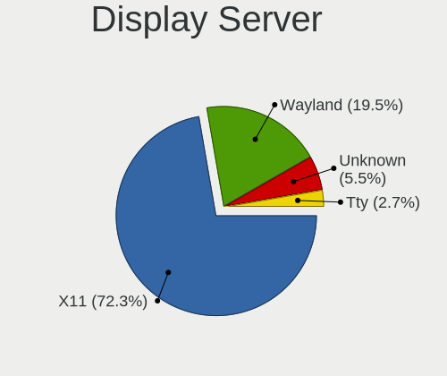

| Name    | Desktops | Percent |
|---------|----------|---------|
| X11     | 1275     | 83.44%  |
| Unknown | 124      | 8.12%   |
| Wayland | 104      | 6.81%   |
| Tty     | 25       | 1.64%   |

Display Manager
---------------

SDDM, LightDM, etc.

| Name    | Desktops | Percent |
|---------|----------|---------|
| Unknown | 935      | 60.79%  |
| SDDM    | 232      | 15.08%  |
| GDM     | 133      | 8.65%   |
| GDM3    | 81       | 5.27%   |
| LightDM | 69       | 4.49%   |
| TDM     | 56       | 3.64%   |
| KDM     | 21       | 1.37%   |
| XDM     | 5        | 0.33%   |
| LXDM    | 3        | 0.2%    |
| Ly      | 2        | 0.13%   |
| SLiM    | 1        | 0.07%   |

OS Lang
-------

Language

| Lang           | Desktops | Percent |
|----------------|----------|---------|
| es_ES          | 876      | 56.74%  |
| Unknown        | 267      | 17.29%  |
| en_US          | 214      | 13.86%  |
| ca_ES          | 45       | 2.91%   |
| en_GB          | 26       | 1.68%   |
| gl_ES          | 20       | 1.3%    |
| C              | 14       | 0.91%   |
| eu_ES          | 11       | 0.71%   |
| de_DE          | 9        | 0.58%   |
| ru_RU          | 8        | 0.52%   |
| fr_FR          | 7        | 0.45%   |
| it_IT          | 5        | 0.32%   |
| ro_RO          | 4        | 0.26%   |
| en_IE          | 4        | 0.26%   |
| C.UTF8         | 4        | 0.26%   |
| es_ES.UTF8     | 3        | 0.19%   |
| an_ES          | 3        | 0.19%   |
| pt_BR          | 2        | 0.13%   |
| pl_PL          | 2        | 0.13%   |
| es_MX          | 2        | 0.13%   |
| es_AR          | 2        | 0.13%   |
| en_DK          | 2        | 0.13%   |
| bg_BG          | 2        | 0.13%   |
| spanish        | 1        | 0.06%   |
| pt_PT          | 1        | 0.06%   |
| POSIX          | 1        | 0.06%   |
| nl_NL          | 1        | 0.06%   |
| es_ES@euro     | 1        | 0.06%   |
| es_EC          | 1        | 0.06%   |
| es_CL          | 1        | 0.06%   |
| eo             | 1        | 0.06%   |
| en_AU          | 1        | 0.06%   |
| de_AT          | 1        | 0.06%   |
| ca_ES@valencia | 1        | 0.06%   |
| ca_AD          | 1        | 0.06%   |

Boot Mode
---------

EFI or BIOS

| Mode | Desktops | Percent |
|------|----------|---------|
| BIOS | 990      | 65.13%  |
| EFI  | 530      | 34.87%  |

Filesystem
----------

Type of filesystem

| Type     | Desktops | Percent |
|----------|----------|---------|
| Ext4     | 1153     | 75.76%  |
| Overlay  | 133      | 8.74%   |
| Unknown  | 95       | 6.24%   |
| Btrfs    | 73       | 4.8%    |
| Ext3     | 29       | 1.91%   |
| Xfs      | 21       | 1.38%   |
| Ext2     | 6        | 0.39%   |
| Zfs      | 5        | 0.33%   |
| Reiserfs | 4        | 0.26%   |
| Tmpfs    | 3        | 0.2%    |

Part. scheme
------------

Scheme of partitioning

| Type    | Desktops | Percent |
|---------|----------|---------|
| Unknown | 1022     | 67.46%  |
| GPT     | 327      | 21.58%  |
| MBR     | 166      | 10.96%  |

Dual Boot with Linux/BSD
------------------------

Hosting more than one Linux/BSD

| Dual boot | Desktops | Percent |
|-----------|----------|---------|
| No        | 1169     | 76.41%  |
| Yes       | 361      | 23.59%  |

Dual Boot (Win)
---------------

Hosting Linux and Windows

| Dual boot | Desktops | Percent |
|-----------|----------|---------|
| No        | 916      | 60.46%  |
| Yes       | 599      | 39.54%  |

Board
-----

Vendor
------

Motherboard manufacturer

| Name                | Desktops | Percent |
|---------------------|----------|---------|
| ASUSTek Computer    | 425      | 28.68%  |
| Gigabyte Technology | 317      | 21.39%  |
| MSI                 | 193      | 13.02%  |
| Hewlett-Packard     | 106      | 7.15%   |
| ASRock              | 104      | 7.02%   |
| Dell                | 60       | 4.05%   |
| Lenovo              | 52       | 3.51%   |
| Acer                | 42       | 2.83%   |
| Intel               | 27       | 1.82%   |
| Unknown             | 19       | 1.28%   |
| Medion              | 17       | 1.15%   |
| Pegatron            | 16       | 1.08%   |
| ECS                 | 15       | 1.01%   |
| Foxconn             | 11       | 0.74%   |
| Huanan              | 10       | 0.67%   |
| Packard Bell        | 8        | 0.54%   |
| eMachines           | 7        | 0.47%   |
| Fujitsu             | 6        | 0.4%    |
| Shuttle             | 5        | 0.34%   |
| BESSTAR Tech        | 4        | 0.27%   |
| NEC Computers       | 3        | 0.2%    |
| AZW                 | 3        | 0.2%    |
| Wistron             | 2        | 0.13%   |
| IBM                 | 2        | 0.13%   |
| Biostar             | 2        | 0.13%   |
| Apple               | 2        | 0.13%   |
| AMI                 | 2        | 0.13%   |
| Toshiba             | 1        | 0.07%   |
| TEKNOSERVICE        | 1        | 0.07%   |
| T-bao               | 1        | 0.07%   |
| Supermicro          | 1        | 0.07%   |
| SiYW                | 1        | 0.07%   |
| Seco                | 1        | 0.07%   |
| Point of View       | 1        | 0.07%   |
| OEM_MB              | 1        | 0.07%   |
| OEM                 | 1        | 0.07%   |
| Minix               | 1        | 0.07%   |
| MAXSUN              | 1        | 0.07%   |
| MACHINIST           | 1        | 0.07%   |
| Koloe               | 1        | 0.07%   |
| Gateway             | 1        | 0.07%   |
| Fujitsu Siemens     | 1        | 0.07%   |
| EVGA                | 1        | 0.07%   |
| Essentiel B         | 1        | 0.07%   |
| Dixonsxp            | 1        | 0.07%   |
| ASRockRack          | 1        | 0.07%   |
| ASL                 | 1        | 0.07%   |
| AOpen               | 1        | 0.07%   |
| ABIT                | 1        | 0.07%   |

Model
-----

Motherboard model

| Name                              | Desktops | Percent |
|-----------------------------------|----------|---------|
| ASUS All Series                   | 47       | 3.17%   |
| Lenovo ThinkCentre E73 10DR0033SP | 22       | 1.48%   |
| Unknown                           | 22       | 1.48%   |
| MSI MS-7C37                       | 11       | 0.74%   |
| Gigabyte 970A-DS3P                | 10       | 0.67%   |
| ASUS P5G41T-M LX                  | 10       | 0.67%   |
| MSI MS-7817                       | 9        | 0.61%   |
| MSI MS-7B79                       | 8        | 0.54%   |
| Gigabyte H110M-S2H                | 8        | 0.54%   |
| ASUS PRIME A320M-K                | 8        | 0.54%   |
| MSI MS-7B86                       | 7        | 0.47%   |
| Gigabyte H61M-DS2                 | 7        | 0.47%   |
| Gigabyte B450M DS3H               | 7        | 0.47%   |
| Gigabyte B450 AORUS M             | 7        | 0.47%   |
| ASUS PRIME B450M-A                | 7        | 0.47%   |
| MSI MS-7C02                       | 6        | 0.4%    |
| MSI MS-7A38                       | 6        | 0.4%    |
| ASUS TUF Gaming X570-PLUS         | 6        | 0.4%    |
| ASUS P5K                          | 6        | 0.4%    |
| ASUS H110M-D                      | 6        | 0.4%    |
| MSI MS-7B49                       | 5        | 0.34%   |
| MSI MS-7A34                       | 5        | 0.34%   |
| HP Compaq Elite 8300 SFF          | 5        | 0.34%   |
| Gigabyte X570 AORUS MASTER        | 5        | 0.34%   |
| Gigabyte H81M-S2H                 | 5        | 0.34%   |
| Gigabyte H81M-S1                  | 5        | 0.34%   |
| Gigabyte H61M-S2PV                | 5        | 0.34%   |
| Gigabyte G31M-ES2L                | 5        | 0.34%   |
| Dell OptiPlex 3050                | 5        | 0.34%   |
| ASUS TUF B450-PLUS GAMING         | 5        | 0.34%   |
| ASUS P5KPL-AM EPU                 | 5        | 0.34%   |
| ASUS M4A785TD-V EVO               | 5        | 0.34%   |
| MSI MS-7C91                       | 4        | 0.27%   |
| MSI MS-7C52                       | 4        | 0.27%   |
| MSI MS-7B89                       | 4        | 0.27%   |
| MSI MS-7B84                       | 4        | 0.27%   |
| MSI MS-7B17                       | 4        | 0.27%   |
| Intel DH55TC AAE70932-205         | 4        | 0.27%   |
| Huanan X99-F8                     | 4        | 0.27%   |
| HP ProDesk 600 G1 SFF             | 4        | 0.27%   |
| HP EliteDesk 800 G1 SFF           | 4        | 0.27%   |
| Gigabyte X570 I AORUS PRO WIFI    | 4        | 0.27%   |
| Gigabyte X470 AORUS ULTRA GAMING  | 4        | 0.27%   |
| Gigabyte B450M S2H                | 4        | 0.27%   |
| Gigabyte B450 AORUS PRO           | 4        | 0.27%   |
| Dell OptiPlex 7010                | 4        | 0.27%   |
| ASUS TUF Gaming B550-PLUS         | 4        | 0.27%   |
| ASUS SABERTOOTH 990FX R2.0        | 4        | 0.27%   |
| ASUS P8H61-M LX                   | 4        | 0.27%   |
| ASRock H81M-VG4 R2.0              | 4        | 0.27%   |
| ASRock G41C-GS R2.0               | 4        | 0.27%   |
| MSI MS-7C51                       | 3        | 0.2%    |
| MSI MS-7B98                       | 3        | 0.2%    |
| MSI MS-7B93                       | 3        | 0.2%    |
| MSI MS-7A70                       | 3        | 0.2%    |
| MSI MS-7A40                       | 3        | 0.2%    |
| MSI MS-7996                       | 3        | 0.2%    |
| MSI MS-7917                       | 3        | 0.2%    |
| MSI MS-7693                       | 3        | 0.2%    |
| HP Z600 Workstation               | 3        | 0.2%    |

Model Family
------------

Motherboard model prefix

| Name                | Desktops | Percent |
|---------------------|----------|---------|
| ASUS PRIME          | 61       | 4.12%   |
| ASUS All            | 47       | 3.17%   |
| HP Compaq           | 45       | 3.04%   |
| Lenovo ThinkCentre  | 44       | 2.97%   |
| Dell OptiPlex       | 42       | 2.83%   |
| ASUS TUF            | 38       | 2.56%   |
| Acer Aspire         | 30       | 2.02%   |
| ASUS ROG            | 28       | 1.89%   |
| Unknown             | 22       | 1.48%   |
| Gigabyte X570       | 17       | 1.15%   |
| Gigabyte B450       | 14       | 0.94%   |
| HP EliteDesk        | 13       | 0.88%   |
| Gigabyte B450M      | 12       | 0.81%   |
| MSI MS-7C37         | 11       | 0.74%   |
| ASUS P5KPL-AM       | 11       | 0.74%   |
| Gigabyte 970A-DS3P  | 10       | 0.67%   |
| ASUS P5G41T-M       | 10       | 0.67%   |
| MSI MS-7817         | 9        | 0.61%   |
| HP ProDesk          | 9        | 0.61%   |
| Dell Precision      | 9        | 0.61%   |
| ASUS P8Z77-V        | 9        | 0.61%   |
| MSI MS-7B79         | 8        | 0.54%   |
| Gigabyte H61M-DS2   | 8        | 0.54%   |
| Gigabyte H110M-S2H  | 8        | 0.54%   |
| ASUS SABERTOOTH     | 8        | 0.54%   |
| ASUS P8H61-M        | 8        | 0.54%   |
| MSI MS-7B86         | 7        | 0.47%   |
| ASUS P5K            | 7        | 0.47%   |
| ASUS Maximus        | 7        | 0.47%   |
| ASUS M5A78L-M       | 7        | 0.47%   |
| Acer Veriton        | 7        | 0.47%   |
| MSI MS-7C02         | 6        | 0.4%    |
| MSI MS-7A38         | 6        | 0.4%    |
| Intel DH55TC        | 6        | 0.4%    |
| HP Pavilion         | 6        | 0.4%    |
| Gigabyte X470       | 6        | 0.4%    |
| ASUS H110M-D        | 6        | 0.4%    |
| ASRock H81M-VG4     | 6        | 0.4%    |
| ASRock 970          | 6        | 0.4%    |
| MSI MS-7B49         | 5        | 0.34%   |
| MSI MS-7A34         | 5        | 0.34%   |
| Lenovo IdeaCentre   | 5        | 0.34%   |
| HP ProLiant         | 5        | 0.34%   |
| Gigabyte H81M-S2H   | 5        | 0.34%   |
| Gigabyte H81M-S1    | 5        | 0.34%   |
| Gigabyte H61M-S2PV  | 5        | 0.34%   |
| Gigabyte H310M      | 5        | 0.34%   |
| Gigabyte G31M-ES2L  | 5        | 0.34%   |
| Gigabyte A320M-S2H  | 5        | 0.34%   |
| ASUS P5GC-MX        | 5        | 0.34%   |
| ASUS M4A785TD-V     | 5        | 0.34%   |
| ASRock G41C-GS      | 5        | 0.34%   |
| Packard Bell IMEDIA | 4        | 0.27%   |
| MSI MS-7C91         | 4        | 0.27%   |
| MSI MS-7C52         | 4        | 0.27%   |
| MSI MS-7B89         | 4        | 0.27%   |
| MSI MS-7B84         | 4        | 0.27%   |
| MSI MS-7B17         | 4        | 0.27%   |
| Huanan X99-F8       | 4        | 0.27%   |
| Gigabyte Z390       | 4        | 0.27%   |

MFG Year
--------

Motherboard manufacture year

| Year | Desktops | Percent |
|------|----------|---------|
| 2018 | 148      | 9.99%   |
| 2012 | 138      | 9.31%   |
| 2013 | 137      | 9.24%   |
| 2019 | 130      | 8.77%   |
| 2014 | 116      | 7.83%   |
| 2009 | 96       | 6.48%   |
| 2010 | 95       | 6.41%   |
| 2017 | 94       | 6.34%   |
| 2011 | 89       | 6.01%   |
| 2020 | 82       | 5.53%   |
| 2008 | 78       | 5.26%   |
| 2007 | 64       | 4.32%   |
| 2015 | 62       | 4.18%   |
| 2016 | 59       | 3.98%   |
| 2006 | 49       | 3.31%   |
| 2021 | 28       | 1.89%   |
| 2005 | 12       | 0.81%   |
| 2004 | 2        | 0.13%   |
| 2022 | 1        | 0.07%   |
| 2002 | 1        | 0.07%   |
| 2001 | 1        | 0.07%   |

Form Factor
-----------

Physical design of the computer

| Name    | Desktops | Percent |
|---------|----------|---------|
| Desktop | 1482     | 100%    |

Secure Boot
-----------

Enabled or disabled

| State    | Desktops | Percent |
|----------|----------|---------|
| Disabled | 1455     | 97.98%  |
| Enabled  | 30       | 2.02%   |

Coreboot
--------

Have coreboot on board

| Used | Desktops | Percent |
|------|----------|---------|
| No   | 1482     | 100%    |

RAM Size
--------

Total RAM memory

| Size in GB  | Desktops | Percent |
|-------------|----------|---------|
| 16.01-24.0  | 384      | 25.26%  |
| 3.01-4.0    | 299      | 19.67%  |
| 8.01-16.0   | 286      | 18.82%  |
| 4.01-8.0    | 228      | 15%     |
| 32.01-64.0  | 165      | 10.86%  |
| 1.01-2.0    | 69       | 4.54%   |
| 64.01-256.0 | 31       | 2.04%   |
| 2.01-3.0    | 26       | 1.71%   |
| 24.01-32.0  | 23       | 1.51%   |
| 0.51-1.0    | 8        | 0.53%   |
| Unknown     | 1        | 0.07%   |

RAM Used
--------

Used RAM memory

| Used GB    | Desktops | Percent |
|------------|----------|---------|
| 1.01-2.0   | 693      | 42%     |
| 2.01-3.0   | 387      | 23.45%  |
| 4.01-8.0   | 182      | 11.03%  |
| 3.01-4.0   | 168      | 10.18%  |
| 0.51-1.0   | 136      | 8.24%   |
| 8.01-16.0  | 53       | 3.21%   |
| 0.01-0.5   | 21       | 1.27%   |
| 24.01-32.0 | 4        | 0.24%   |
| 16.01-24.0 | 4        | 0.24%   |
| 32.01-64.0 | 1        | 0.06%   |
| Unknown    | 1        | 0.06%   |

Total Drives
------------

Number of drives on board

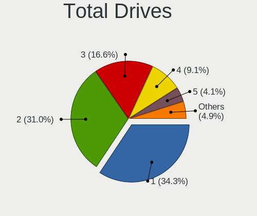

| Drives | Desktops | Percent |
|--------|----------|---------|
| 1      | 564      | 35.86%  |
| 2      | 489      | 31.09%  |
| 3      | 278      | 17.67%  |
| 4      | 132      | 8.39%   |
| 5      | 49       | 3.12%   |
| 6      | 25       | 1.59%   |
| 0      | 12       | 0.76%   |
| 7      | 7        | 0.45%   |
| 8      | 6        | 0.38%   |
| 9      | 5        | 0.32%   |
| 11     | 2        | 0.13%   |
| 10     | 2        | 0.13%   |
| 18     | 1        | 0.06%   |
| 12     | 1        | 0.06%   |

Has CD-ROM
----------

Has CD-ROM on board

| Presented | Desktops | Percent |
|-----------|----------|---------|
| Yes       | 837      | 55.36%  |
| No        | 675      | 44.64%  |

Has Ethernet
------------

Has Ethernet on board

| Presented | Desktops | Percent |
|-----------|----------|---------|
| Yes       | 1476     | 99.6%   |
| No        | 6        | 0.4%    |

Has WiFi
--------

Has WiFi module

| Presented | Desktops | Percent |
|-----------|----------|---------|
| No        | 909      | 60.08%  |
| Yes       | 604      | 39.92%  |

Has Bluetooth
-------------

Has Bluetooth module

| Presented | Desktops | Percent |
|-----------|----------|---------|
| No        | 1081     | 71.64%  |
| Yes       | 428      | 28.36%  |

Location
--------

Country
-------

Geographic location (country)

| Country | Desktops | Percent |
|---------|----------|---------|
| Spain   | 1482     | 100%    |

City
----

Geographic location (city)

| City                        | Desktops | Percent |
|-----------------------------|----------|---------|
| Madrid                      | 235      | 14.52%  |
| Barcelona                   | 165      | 10.19%  |
| Valencia                    | 56       | 3.46%   |
| Seville                     | 53       | 3.27%   |
| Zaragoza                    | 27       | 1.67%   |
| Ourense                     | 26       | 1.61%   |
| Mlaga                     | 23       | 1.42%   |
| Valladolid                  | 19       | 1.17%   |
| Granada                     | 18       | 1.11%   |
| Murcia                      | 17       | 1.05%   |
| Las Palmas de Gran Canaria  | 17       | 1.05%   |
| Palma                       | 16       | 0.99%   |
| Bilbao                      | 15       | 0.93%   |
| Sabadell                    | 14       | 0.86%   |
| Vigo                        | 13       | 0.8%    |
| Santa Cruz de Tenerife      | 13       | 0.8%    |
| Almera                    | 12       | 0.74%   |
| Crdoba                    | 11       | 0.68%   |
| Oviedo                      | 10       | 0.62%   |
| Alcobendas                  | 10       | 0.62%   |
| Santander                   | 9        | 0.56%   |
| Gijn                      | 9        | 0.56%   |
| Barakaldo                   | 9        | 0.56%   |
| Alicante                    | 9        | 0.56%   |
| Vitoria-Gasteiz             | 8        | 0.49%   |
| Salamanca                   | 8        | 0.49%   |
| Lugo                        | 8        | 0.49%   |
| Fuenlabrada                 | 8        | 0.49%   |
| Pontevedra                  | 7        | 0.43%   |
| Pamplona                    | 7        | 0.43%   |
| Matar                     | 7        | 0.43%   |
| Logroo                    | 7        | 0.43%   |
| Huelva                      | 7        | 0.43%   |
| Elche                       | 7        | 0.43%   |
| Alcal de Henares          | 7        | 0.43%   |
| A Corua                   | 7        | 0.43%   |
| Terrassa                    | 6        | 0.37%   |
| Talavera de la Reina        | 6        | 0.37%   |
| San Fernando                | 6        | 0.37%   |
| San Cristbal de La Laguna | 6        | 0.37%   |
| Len                       | 6        | 0.37%   |
| Ibiza Town                  | 6        | 0.37%   |
| Girona                      | 6        | 0.37%   |
| Donostia / San Sebastian    | 6        | 0.37%   |
| Burgos                      | 6        | 0.37%   |
| Albacete                    | 6        | 0.37%   |
| Torrejn de Ardoz          | 5        | 0.31%   |
| Toledo                      | 5        | 0.31%   |
| Santa Coloma de Gramenet    | 5        | 0.31%   |
| Reus                        | 5        | 0.31%   |
| Paterna                     | 5        | 0.31%   |
| Mostoles                    | 5        | 0.31%   |
| Legans                    | 5        | 0.31%   |
| Las Rozas de Madrid         | 5        | 0.31%   |
| Jerez de la Frontera        | 5        | 0.31%   |
| Getxo                       | 5        | 0.31%   |
| Cartagena                   | 5        | 0.31%   |
| Badajoz                     | 5        | 0.31%   |
| Vilanova i la Geltr       | 4        | 0.25%   |
| Vecindario                  | 4        | 0.25%   |

Drives
------

Drive Vendor
------------

Hard drive vendors

| Vendor                    | Desktops | Drives | Percent |
|---------------------------|----------|--------|---------|
| Seagate                   | 694      | 1160   | 25.36%  |
| WDC                       | 485      | 754    | 17.72%  |
| Kingston                  | 359      | 523    | 13.12%  |
| Samsung Electronics       | 329      | 549    | 12.02%  |
| Toshiba                   | 192      | 341    | 7.01%   |
| SanDisk                   | 115      | 160    | 4.2%    |
| Crucial                   | 114      | 174    | 4.17%   |
| Hitachi                   | 81       | 99     | 2.96%   |
| Maxtor                    | 33       | 42     | 1.21%   |
| Unknown                   | 24       | 28     | 0.88%   |
| Intel                     | 23       | 29     | 0.84%   |
| China                     | 22       | 27     | 0.8%    |
| Phison                    | 20       | 24     | 0.73%   |
| OCZ                       | 20       | 26     | 0.73%   |
| Silicon Motion            | 16       | 22     | 0.58%   |
| HGST                      | 16       | 21     | 0.58%   |
| Corsair                   | 13       | 16     | 0.47%   |
| Micron/Crucial Technology | 11       | 12     | 0.4%    |
| KingDian                  | 10       | 12     | 0.37%   |
| Fujitsu                   | 10       | 12     | 0.37%   |
| Transcend                 | 9        | 21     | 0.33%   |
| USB30                     | 7        | 19     | 0.26%   |
| SK hynix                  | 7        | 13     | 0.26%   |
| KIOXIA-EXCERIA            | 7        | 7      | 0.26%   |
| JMicron Technology        | 7        | 8      | 0.26%   |
| Drevo                     | 6        | 9      | 0.22%   |
| A-DATA Technology         | 6        | 8      | 0.22%   |
| PNY                       | 5        | 8      | 0.18%   |
| Hewlett-Packard           | 5        | 6      | 0.18%   |
| Goodram                   | 5        | 6      | 0.18%   |
| EMTEC                     | 5        | 4      | 0.18%   |
| Unknown                   | 5        | 7      | 0.18%   |
| Patriot                   | 4        | 9      | 0.15%   |
| Micron Technology         | 4        | 4      | 0.15%   |
| SPCC                      | 3        | 3      | 0.11%   |
| Realtek Semiconductor     | 3        | 4      | 0.11%   |
| KingSpec                  | 3        | 4      | 0.11%   |
| KingFast                  | 3        | 3      | 0.11%   |
| ASMT                      | 3        | 5      | 0.11%   |
| XrayDisk                  | 2        | 2      | 0.07%   |
| TCSUNBOW                  | 2        | 2      | 0.07%   |
| Netac                     | 2        | 2      | 0.07%   |
| Intenso                   | 2        | 3      | 0.07%   |
| Gigabyte Technology       | 2        | 3      | 0.07%   |
| BAITITON                  | 2        | 2      | 0.07%   |
| Apple                     | 2        | 3      | 0.07%   |
| XUNZHE800S                | 1        | 4      | 0.04%   |
| XPG                       | 1        | 1      | 0.04%   |
| TO Exter                  | 1        | 1      | 0.04%   |
| Team                      | 1        | 1      | 0.04%   |
| sobetter                  | 1        | 1      | 0.04%   |
| SMI                       | 1        | 1      | 0.04%   |
| ShiJi                     | 1        | 1      | 0.04%   |
| SABRENT                   | 1        | 1      | 0.04%   |
| Ramsta                    | 1        | 1      | 0.04%   |
| Radeon                    | 1        | 2      | 0.04%   |
| Quantum                   | 1        | 1      | 0.04%   |
| Plextor                   | 1        | 1      | 0.04%   |
| OYUNKEY                   | 1        | 1      | 0.04%   |
| OCZ-VERTEX3               | 1        | 2      | 0.04%   |

Drive Model
-----------

Hard drive models

| Model                                  | Desktops | Percent |
|----------------------------------------|----------|---------|
| Kingston SA400S37240G 240GB SSD        | 113      | 3.55%   |
| Seagate ST1000DM010-2EP102 1TB         | 69       | 2.17%   |
| Seagate ST500DM002-1BD142 500GB        | 64       | 2.01%   |
| Kingston SA400S37120G 120GB SSD        | 55       | 1.73%   |
| Kingston SV300S37A120G 120GB SSD       | 52       | 1.63%   |
| Seagate ST3500418AS 500GB              | 50       | 1.57%   |
| Kingston SA400S37480G 480GB SSD        | 42       | 1.32%   |
| Seagate ST1000DM003-1ER162 1TB         | 39       | 1.22%   |
| Toshiba DT01ACA100 1TB                 | 37       | 1.16%   |
| Seagate ST1000DM003-1CH162 1TB         | 36       | 1.13%   |
| Samsung SM963 2.5" NVMe PCIe SSD 500GB | 31       | 0.97%   |
| Seagate ST2000DM008-2FR102 2TB         | 30       | 0.94%   |
| Samsung SSD 860 EVO 500GB              | 29       | 0.91%   |
| Seagate ST31000528AS 1TB               | 26       | 0.82%   |
| Samsung SSD 850 EVO 500GB              | 24       | 0.75%   |
| WDC WD5000AAKX-08U6AA0 500GB           | 21       | 0.66%   |
| WDC WD20EARX-00PASB0 2TB               | 21       | 0.66%   |
| Seagate ST2000DM001-1CH164 2TB         | 21       | 0.66%   |
| Kingston SV300S37A240G 240GB SSD       | 21       | 0.66%   |
| Crucial CT500MX500SSD1 500GB           | 21       | 0.66%   |
| Seagate ST4000DM004-2CV104 4TB         | 20       | 0.63%   |
| SanDisk NVMe SSD Drive 500GB           | 20       | 0.63%   |
| Toshiba TR200 240GB SSD                | 19       | 0.6%    |
| Seagate ST2000DM001-1ER164 2TB         | 19       | 0.6%    |
| Samsung SSD 850 EVO 250GB              | 19       | 0.6%    |
| Kingston SUV400S37240G 240GB SSD       | 19       | 0.6%    |
| Toshiba DT01ACA200 2TB                 | 18       | 0.56%   |
| Seagate ST2000DM006-2DM164 2TB         | 17       | 0.53%   |
| WDC WD10EZEX-08WN4A0 1TB               | 16       | 0.5%    |
| Toshiba DT01ACA300 3TB                 | 16       | 0.5%    |
| Toshiba DT01ACA050 500GB               | 16       | 0.5%    |
| SanDisk SSD PLUS 480GB                 | 16       | 0.5%    |
| WDC WD20EZRZ-00Z5HB0 2TB               | 15       | 0.47%   |
| Seagate ST1000DM003-1SB102 1TB         | 15       | 0.47%   |
| Seagate Expansion 1TB                  | 15       | 0.47%   |
| WDC WD10EZEX-08M2NA0 1TB               | 14       | 0.44%   |
| Seagate ST3500413AS 500GB              | 14       | 0.44%   |
| Seagate ST1000DM003-1SB10C 1TB         | 14       | 0.44%   |
| Unknown SD/MMC/MS PRO 128GB            | 13       | 0.41%   |
| Seagate ST3500312CS 500GB              | 13       | 0.41%   |
| Seagate ST31000524AS 1TB               | 13       | 0.41%   |
| SanDisk SSD PLUS 240GB                 | 13       | 0.41%   |
| Samsung SSD 970 EVO Plus 500GB         | 13       | 0.41%   |
| Samsung SSD 860 EVO 1TB                | 13       | 0.41%   |
| Seagate ST380011A 80GB                 | 12       | 0.38%   |
| Seagate ST3250318AS 250GB              | 12       | 0.38%   |
| Samsung SSD 860 EVO 250GB              | 12       | 0.38%   |
| Samsung NVMe SSD Drive 250GB           | 12       | 0.38%   |
| Crucial CT250MX500SSD1 250GB           | 12       | 0.38%   |
| WDC WDS500G2B0A-00SM50 500GB SSD       | 11       | 0.35%   |
| WDC WD10EARS-00Y5B1 1TB                | 11       | 0.35%   |
| Seagate ST3500320AS 500GB              | 11       | 0.35%   |
| SanDisk SSD PLUS 1000GB                | 11       | 0.35%   |
| Samsung SSD 970 EVO Plus 1TB           | 11       | 0.35%   |
| Samsung SSD 850 PRO 256GB              | 11       | 0.35%   |
| Crucial CT240BX500SSD1 240GB           | 11       | 0.35%   |
| WDC WD20EZRX-00D8PB0 2TB               | 10       | 0.31%   |
| Toshiba MQ01ABD100 1TB                 | 10       | 0.31%   |
| Seagate ST3250310AS 250GB              | 10       | 0.31%   |
| Seagate ST2000DL003-9VT166 2TB         | 10       | 0.31%   |

HDD Vendor
----------

Hard disk drive vendors

| Vendor              | Desktops | Drives | Percent |
|---------------------|----------|--------|---------|
| Seagate             | 688      | 1149   | 45.41%  |
| WDC                 | 433      | 656    | 28.58%  |
| Toshiba             | 151      | 238    | 9.97%   |
| Hitachi             | 81       | 99     | 5.35%   |
| Samsung Electronics | 77       | 103    | 5.08%   |
| Maxtor              | 30       | 39     | 1.98%   |
| HGST                | 16       | 21     | 1.06%   |
| Unknown             | 13       | 14     | 0.86%   |
| Fujitsu             | 9        | 11     | 0.59%   |
| JMicron Technology  | 5        | 6      | 0.33%   |
| Hewlett-Packard     | 3        | 4      | 0.2%    |
| ASMT                | 3        | 5      | 0.2%    |
| Quantum             | 1        | 1      | 0.07%   |
| Inateck             | 1        | 1      | 0.07%   |
| HGST HTS            | 1        | 1      | 0.07%   |
| China               | 1        | 1      | 0.07%   |
| ASMedia             | 1        | 1      | 0.07%   |
| Apple               | 1        | 1      | 0.07%   |

SSD Vendor
----------

Solid state drive vendors

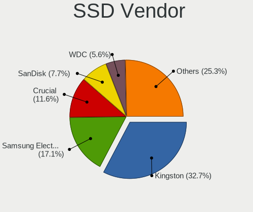

| Vendor              | Desktops | Drives | Percent |
|---------------------|----------|--------|---------|
| Kingston            | 346      | 498    | 35.56%  |
| Samsung Electronics | 178      | 269    | 18.29%  |
| Crucial             | 105      | 160    | 10.79%  |
| SanDisk             | 81       | 103    | 8.32%   |
| WDC                 | 58       | 83     | 5.96%   |
| Toshiba             | 45       | 98     | 4.62%   |
| China               | 21       | 26     | 2.16%   |
| OCZ                 | 20       | 26     | 2.06%   |
| KingDian            | 10       | 12     | 1.03%   |
| Transcend           | 9        | 21     | 0.92%   |
| Intel               | 8        | 11     | 0.82%   |
| USB30               | 7        | 19     | 0.72%   |
| KIOXIA-EXCERIA      | 6        | 6      | 0.62%   |
| Drevo               | 5        | 7      | 0.51%   |
| A-DATA Technology   | 5        | 7      | 0.51%   |
| PNY                 | 4        | 7      | 0.41%   |
| Patriot             | 4        | 9      | 0.41%   |
| Goodram             | 4        | 5      | 0.41%   |
| EMTEC               | 4        | 3      | 0.41%   |
| Corsair             | 4        | 6      | 0.41%   |
| Maxtor              | 3        | 3      | 0.31%   |
| KingSpec            | 3        | 4      | 0.31%   |
| Unknown             | 3        | 3      | 0.31%   |
| SK hynix            | 2        | 2      | 0.21%   |
| Netac               | 2        | 2      | 0.21%   |
| Intenso             | 2        | 3      | 0.21%   |
| Hewlett-Packard     | 2        | 2      | 0.21%   |
| BAITITON            | 2        | 2      | 0.21%   |
| XUNZHE800S          | 1        | 2      | 0.1%    |
| TO Exter            | 1        | 1      | 0.1%    |
| Team                | 1        | 1      | 0.1%    |
| TCSUNBOW            | 1        | 1      | 0.1%    |
| SPCC                | 1        | 1      | 0.1%    |
| SMI                 | 1        | 1      | 0.1%    |
| Ramsta              | 1        | 1      | 0.1%    |
| Radeon              | 1        | 2      | 0.1%    |
| Plextor             | 1        | 1      | 0.1%    |
| OYUNKEY             | 1        | 1      | 0.1%    |
| OCZ-VERTEX3         | 1        | 2      | 0.1%    |
| OCZ-VERTEX          | 1        | 2      | 0.1%    |
| Mushkin             | 1        | 1      | 0.1%    |
| Micron Technology   | 1        | 1      | 0.1%    |
| LS                  | 1        | 1      | 0.1%    |
| LITEON              | 1        | 1      | 0.1%    |
| Lexar               | 1        | 1      | 0.1%    |
| KingFast            | 1        | 1      | 0.1%    |
| JMicron Technology  | 1        | 1      | 0.1%    |
| Innodisk            | 1        | 1      | 0.1%    |
| Hypertec            | 1        | 1      | 0.1%    |
| Hoodisk             | 1        | 2      | 0.1%    |
| Gigabyte Technology | 1        | 1      | 0.1%    |
| Fujitsu             | 1        | 1      | 0.1%    |
| FORESEE             | 1        | 1      | 0.1%    |
| Dogfish             | 1        | 1      | 0.1%    |
| Apple               | 1        | 2      | 0.1%    |
| Apacer              | 1        | 1      | 0.1%    |
| 2.5"                | 1        | 1      | 0.1%    |
| 2-Power             | 1        | 1      | 0.1%    |

Drive Kind
----------

HDD or SSD

| Kind    | Desktops | Drives | Percent |
|---------|----------|--------|---------|
| HDD     | 1176     | 2351   | 52.15%  |
| SSD     | 779      | 1433   | 34.55%  |
| NVMe    | 266      | 416    | 11.8%   |
| Unknown | 27       | 36     | 1.2%    |
| MMC     | 7        | 7      | 0.31%   |

Drive Connector
---------------

SATA, SAS, NVMe, etc.

| Type | Desktops | Drives | Percent |
|------|----------|--------|---------|
| SATA | 1406     | 3698   | 79.98%  |
| NVMe | 264      | 414    | 15.02%  |
| SAS  | 81       | 124    | 4.61%   |
| MMC  | 7        | 7      | 0.4%    |

Drive Size
----------

Size of hard drive

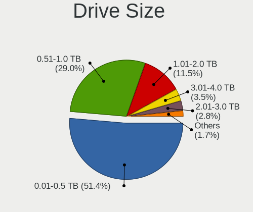

| Size in TB | Desktops | Drives | Percent |
|------------|----------|--------|---------|
| 0.01-0.5   | 1121     | 2210   | 53.79%  |
| 0.51-1.0   | 599      | 953    | 28.74%  |
| 1.01-2.0   | 223      | 369    | 10.7%   |
| 3.01-4.0   | 61       | 95     | 2.93%   |
| 2.01-3.0   | 59       | 99     | 2.83%   |
| 4.01-10.0  | 20       | 57     | 0.96%   |
| 10.01-20.0 | 1        | 1      | 0.05%   |

Space Total
-----------

Amount of disk space available on the file system

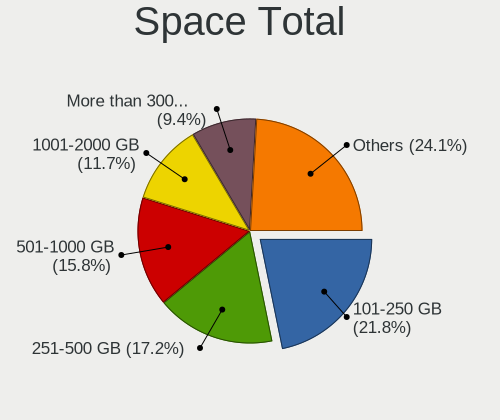

| Size in GB     | Desktops | Percent |
|----------------|----------|---------|
| 101-250        | 399      | 24.71%  |
| 251-500        | 271      | 16.78%  |
| 501-1000       | 239      | 14.8%   |
| 1001-2000      | 180      | 11.15%  |
| More than 3000 | 121      | 7.49%   |
| 2001-3000      | 106      | 6.56%   |
| 1-20           | 106      | 6.56%   |
| 51-100         | 91       | 5.63%   |
| 21-50          | 54       | 3.34%   |
| Unknown        | 48       | 2.97%   |

Space Used
----------

Amount of used disk space

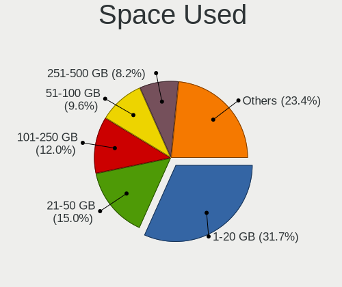

| Used GB        | Desktops | Percent |
|----------------|----------|---------|
| 1-20           | 567      | 34.01%  |
| 21-50          | 255      | 15.3%   |
| 101-250        | 194      | 11.64%  |
| 51-100         | 151      | 9.06%   |
| 251-500        | 133      | 7.98%   |
| 501-1000       | 133      | 7.98%   |
| 1001-2000      | 104      | 6.24%   |
| Unknown        | 48       | 2.88%   |
| More than 3000 | 47       | 2.82%   |
| 2001-3000      | 35       | 2.1%    |

Malfunc. Drives
---------------

Drive models with a malfunction

| Model                             | Desktops | Drives | Percent |
|-----------------------------------|----------|--------|---------|
| Seagate ST500DM002-1BD142 500GB   | 10       | 10     | 4.61%   |
| Seagate ST3500418AS 500GB         | 9        | 15     | 4.15%   |
| Kingston SV300S37A120G 120GB SSD  | 9        | 11     | 4.15%   |
| Seagate ST1000DM003-1CH162 1TB    | 5        | 6      | 2.3%    |
| Seagate ST3500320AS 500GB         | 4        | 7      | 1.84%   |
| Seagate ST31000528AS 1TB          | 4        | 5      | 1.84%   |
| Seagate ST1000DM003-1ER162 1TB    | 4        | 7      | 1.84%   |
| Drevo X1 SSD 120GB                | 4        | 6      | 1.84%   |
| WDC WD5000AAKX-001CA0 500GB       | 3        | 5      | 1.38%   |
| WDC WD20EZRX-00DC0B0 2TB          | 3        | 3      | 1.38%   |
| Seagate ST3250310AS 250GB         | 3        | 3      | 1.38%   |
| Seagate ST31500341AS 1TB          | 3        | 3      | 1.38%   |
| WDC WD6400AAKS-22A7B0 640GB       | 2        | 2      | 0.92%   |
| WDC WD40EZRX-00SPEB0 4TB          | 2        | 3      | 0.92%   |
| WDC WD40EFRX-68WT0N0 4TB          | 2        | 2      | 0.92%   |
| WDC WD2500AAJS-00B4A0 250GB       | 2        | 2      | 0.92%   |
| WDC WD10EARS-00Y5B1 1TB           | 2        | 2      | 0.92%   |
| Seagate ST9500325AS 500GB         | 2        | 3      | 0.92%   |
| Seagate ST4000DM004-2CV104 4TB    | 2        | 2      | 0.92%   |
| Seagate ST3500830AS 500GB         | 2        | 3      | 0.92%   |
| Seagate ST3500312CS 500GB         | 2        | 2      | 0.92%   |
| Seagate ST3200822AS 200GB         | 2        | 5      | 0.92%   |
| Seagate ST3200822A 200GB          | 2        | 2      | 0.92%   |
| Seagate ST3160815AS 160GB         | 2        | 2      | 0.92%   |
| Seagate ST2000DL003-9VT166 2TB    | 2        | 3      | 0.92%   |
| Samsung Electronics HD501LJ 500GB | 2        | 2      | 0.92%   |
| Maxtor STM3250310AS 250GB         | 2        | 2      | 0.92%   |
| KingDian S280 240GB               | 2        | 2      | 0.92%   |
| WDC WD7500AACS-65D6B0 752GB       | 1        | 1      | 0.46%   |
| WDC WD6400AAKS-75A7B2 640GB       | 1        | 1      | 0.46%   |
| WDC WD5000LPLX-00ZNTT0 500GB      | 1        | 2      | 0.46%   |
| WDC WD5000BPVT-22HXZT1 500GB      | 1        | 1      | 0.46%   |
| WDC WD5000BEVT-22ZAT0 500GB       | 1        | 1      | 0.46%   |
| WDC WD5000AZRX-00A8LB0 500GB      | 1        | 1      | 0.46%   |
| WDC WD5000AAKX-60U6AA0 500GB      | 1        | 1      | 0.46%   |
| WDC WD5000AAKX-08ERMA0 500GB      | 1        | 1      | 0.46%   |
| WDC WD40PURZ-85AKKY0 4TB          | 1        | 2      | 0.46%   |
| WDC WD4004FZWX-00GBGB0 4TB        | 1        | 1      | 0.46%   |
| WDC WD3200BEVT-75ZCT1 320GB       | 1        | 1      | 0.46%   |
| WDC WD3200BEKT-60V5T1 320GB       | 1        | 1      | 0.46%   |
| WDC WD3200AAJS-22B4A0 320GB       | 1        | 1      | 0.46%   |
| WDC WD30EZRX-00MMMB0 3TB          | 1        | 1      | 0.46%   |
| WDC WD30EZRX-00DC0B0 3TB          | 1        | 1      | 0.46%   |
| WDC WD2500AAKS-00VSA0 250GB       | 1        | 1      | 0.46%   |
| WDC WD20PURZ-85GU6Y0 2TB          | 1        | 1      | 0.46%   |
| WDC WD20EFRX-68EUZN0 2TB          | 1        | 1      | 0.46%   |
| WDC WD20EARX-00PASB0 2TB          | 1        | 1      | 0.46%   |
| WDC WD2002FAEX-007BA0 2TB         | 1        | 1      | 0.46%   |
| WDC WD1600AAJS-60M0A1 160GB       | 1        | 1      | 0.46%   |
| WDC WD15EARX-00PASB0 1TB          | 1        | 1      | 0.46%   |
| WDC WD1200JB-00CRA1 120GB         | 1        | 1      | 0.46%   |
| WDC WD10EZRX-00DC0B0 1TB          | 1        | 1      | 0.46%   |
| WDC WD10EZRX-00A8LB0 1TB          | 1        | 2      | 0.46%   |
| WDC WD10EZEX-60ZF5A0 1TB          | 1        | 1      | 0.46%   |
| WDC WD10EZEX-60M2NA0 1TB          | 1        | 1      | 0.46%   |
| WDC WD10EZEX-22BN5A0 1TB          | 1        | 1      | 0.46%   |
| WDC WD10EZEX-08WN4A0 1TB          | 1        | 1      | 0.46%   |
| WDC WD10EZEX-00RKKA0 1TB          | 1        | 1      | 0.46%   |
| WDC WD10EZEX-00KUWA0 1TB          | 1        | 1      | 0.46%   |
| WDC WD10EARX-00N0YB0 1TB          | 1        | 1      | 0.46%   |

Malfunc. Drive Vendor
---------------------

Vendors of faulty drives

| Vendor              | Desktops | Drives | Percent |
|---------------------|----------|--------|---------|
| Seagate             | 80       | 115    | 38.28%  |
| WDC                 | 46       | 55     | 22.01%  |
| Kingston            | 15       | 20     | 7.18%   |
| Samsung Electronics | 14       | 15     | 6.7%    |
| Hitachi             | 9        | 10     | 4.31%   |
| Toshiba             | 8        | 9      | 3.83%   |
| Maxtor              | 7        | 7      | 3.35%   |
| Drevo               | 5        | 7      | 2.39%   |
| SanDisk             | 4        | 4      | 1.91%   |
| Crucial             | 4        | 4      | 1.91%   |
| China               | 3        | 4      | 1.44%   |
| OCZ                 | 2        | 2      | 0.96%   |
| KingDian            | 2        | 2      | 0.96%   |
| Fujitsu             | 2        | 3      | 0.96%   |
| Transcend           | 1        | 3      | 0.48%   |
| Patriot             | 1        | 1      | 0.48%   |
| Intenso             | 1        | 1      | 0.48%   |
| Hypertec            | 1        | 1      | 0.48%   |
| HGST                | 1        | 1      | 0.48%   |
| ASMT                | 1        | 2      | 0.48%   |
| A-DATA Technology   | 1        | 1      | 0.48%   |
| Unknown             | 1        | 1      | 0.48%   |

Malfunc. HDD Vendor
-------------------

Vendors of faulty HDD drives

| Vendor              | Desktops | Drives | Percent |
|---------------------|----------|--------|---------|
| Seagate             | 80       | 115    | 48.48%  |
| WDC                 | 46       | 55     | 27.88%  |
| Samsung Electronics | 10       | 11     | 6.06%   |
| Hitachi             | 9        | 10     | 5.45%   |
| Toshiba             | 8        | 9      | 4.85%   |
| Maxtor              | 7        | 7      | 4.24%   |
| Fujitsu             | 2        | 3      | 1.21%   |
| HGST                | 1        | 1      | 0.61%   |
| China               | 1        | 1      | 0.61%   |
| ASMT                | 1        | 2      | 0.61%   |

Malfunc. Drive Kind
-------------------

Kinds of faulty drives

| Kind | Desktops | Drives | Percent |
|------|----------|--------|---------|
| HDD  | 149      | 214    | 78.84%  |
| SSD  | 38       | 52     | 20.11%  |
| NVMe | 2        | 2      | 1.06%   |

Failed Drives
-------------

Failed drive models

| Model                       | Desktops | Drives | Percent |
|-----------------------------|----------|--------|---------|
| WDC WD5000BEVT-60ZAT1 500GB | 1        | 1      | 14.29%  |
| Toshiba DT01ACA200 2TB      | 1        | 1      | 14.29%  |
| Seagate ST3500830AS 500GB   | 1        | 1      | 14.29%  |
| Seagate ST31000528AS 1TB    | 1        | 1      | 14.29%  |
| Seagate ST31000520AS 1TB    | 1        | 1      | 14.29%  |
| Seagate ST31000333AS 1TB    | 1        | 1      | 14.29%  |
| Hitachi HDS721010DLE630 1TB | 1        | 1      | 14.29%  |

Failed Drive Vendor
-------------------

Failed drive vendors

| Vendor  | Desktops | Drives | Percent |
|---------|----------|--------|---------|
| Seagate | 4        | 4      | 57.14%  |
| WDC     | 1        | 1      | 14.29%  |
| Toshiba | 1        | 1      | 14.29%  |
| Hitachi | 1        | 1      | 14.29%  |

Drive Status
------------

Number of failed and malfunc. drives

| Status   | Desktops | Drives | Percent |
|----------|----------|--------|---------|
| Detected | 1034     | 2800   | 61.99%  |
| Works    | 451      | 1168   | 27.04%  |
| Malfunc  | 176      | 268    | 10.55%  |
| Failed   | 7        | 7      | 0.42%   |

Storage controller
------------------

Storage Vendor
--------------

Storage controller vendors

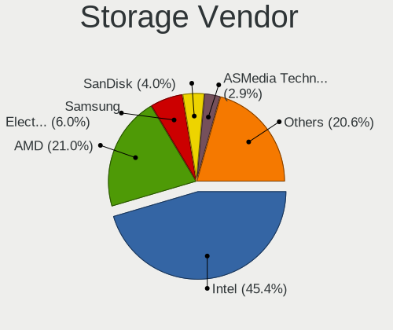

| Vendor                           | Desktops | Percent |
|----------------------------------|----------|---------|
| Intel                            | 989      | 50.36%  |
| AMD                              | 402      | 20.47%  |
| Samsung Electronics              | 102      | 5.19%   |
| Nvidia                           | 66       | 3.36%   |
| ASMedia Technology               | 66       | 3.36%   |
| JMicron Technology               | 64       | 3.26%   |
| Marvell Technology Group         | 54       | 2.75%   |
| SanDisk                          | 52       | 2.65%   |
| Phison Electronics               | 35       | 1.78%   |
| VIA Technologies                 | 26       | 1.32%   |
| Kingston Technology Company      | 22       | 1.12%   |
| Micron/Crucial Technology        | 20       | 1.02%   |
| Silicon Motion                   | 19       | 0.97%   |
| Silicon Integrated Systems [SiS] | 7        | 0.36%   |
| SK hynix                         | 5        | 0.25%   |
| Silicon Image                    | 4        | 0.2%    |
| Micron Technology                | 4        | 0.2%    |
| LSI Logic / Symbios Logic        | 4        | 0.2%    |
| Realtek Semiconductor            | 3        | 0.15%   |
| Adaptec                          | 3        | 0.15%   |
| Unknown                          | 2        | 0.1%    |
| Toshiba America Info Systems     | 2        | 0.1%    |
| Seagate Technology               | 2        | 0.1%    |
| KIOXIA                           | 2        | 0.1%    |
| Integrated Technology Express    | 2        | 0.1%    |
| ADATA Technology                 | 2        | 0.1%    |
| ULi Electronics                  | 1        | 0.05%   |
| OCZ Technology Group             | 1        | 0.05%   |
| HighPoint Technologies           | 1        | 0.05%   |
| Hewlett-Packard                  | 1        | 0.05%   |
| Dell                             | 1        | 0.05%   |

Storage Model
-------------

Storage controller models

| Model                                                                                   | Desktops | Percent |
|-----------------------------------------------------------------------------------------|----------|---------|
| AMD FCH SATA Controller [AHCI mode]                                                     | 248      | 9.53%   |
| Intel 8 Series/C220 Series Chipset Family 6-port SATA Controller 1 [AHCI mode]          | 152      | 5.84%   |
| Intel NM10/ICH7 Family SATA Controller [IDE mode]                                       | 107      | 4.11%   |
| AMD 400 Series Chipset SATA Controller                                                  | 105      | 4.03%   |
| Intel 82801G (ICH7 Family) IDE Controller                                               | 87       | 3.34%   |
| Samsung NVMe SSD Controller SM981/PM981/PM983                                           | 81       | 3.11%   |
| Intel Q170/Q150/B150/H170/H110/Z170/CM236 Chipset SATA Controller [AHCI Mode]           | 70       | 2.69%   |
| Intel 200 Series PCH SATA controller [AHCI mode]                                        | 69       | 2.65%   |
| ASMedia ASM1062 Serial ATA Controller                                                   | 65       | 2.5%    |
| Intel SATA Controller [RAID mode]                                                       | 64       | 2.46%   |
| Intel 6 Series/C200 Series Chipset Family 6 port Desktop SATA AHCI Controller           | 62       | 2.38%   |
| AMD SB7x0/SB8x0/SB9x0 IDE Controller                                                    | 61       | 2.34%   |
| Intel 7 Series/C210 Series Chipset Family 6-port SATA Controller [AHCI mode]            | 54       | 2.07%   |
| AMD SB7x0/SB8x0/SB9x0 SATA Controller [AHCI mode]                                       | 51       | 1.96%   |
| Intel Cannon Lake PCH SATA AHCI Controller                                              | 45       | 1.73%   |
| AMD SB7x0/SB8x0/SB9x0 SATA Controller [IDE mode]                                        | 44       | 1.69%   |
| Intel 6 Series/C200 Series Chipset Family Desktop SATA Controller (IDE mode, ports 4-5) | 42       | 1.61%   |
| Intel 6 Series/C200 Series Chipset Family Desktop SATA Controller (IDE mode, ports 0-3) | 42       | 1.61%   |
| JMicron JMB363 SATA/IDE Controller                                                      | 35       | 1.34%   |
| Intel 82801I (ICH9 Family) 2 port SATA Controller [IDE mode]                            | 33       | 1.27%   |
| Intel 9 Series Chipset Family SATA Controller [AHCI Mode]                               | 30       | 1.15%   |
| Nvidia MCP61 SATA Controller                                                            | 29       | 1.11%   |
| AMD 300 Series Chipset SATA Controller                                                  | 28       | 1.08%   |
| AMD 500 Series Chipset SATA Controller                                                  | 27       | 1.04%   |
| Intel 5 Series/3400 Series Chipset 4 port SATA IDE Controller                           | 25       | 0.96%   |
| Intel 5 Series/3400 Series Chipset 2 port SATA IDE Controller                           | 25       | 0.96%   |
| Nvidia MCP61 IDE                                                                        | 23       | 0.88%   |
| Intel 82801JI (ICH10 Family) SATA AHCI Controller                                       | 22       | 0.85%   |
| JMicron JMB368 IDE controller                                                           | 21       | 0.81%   |
| Intel 82801IR/IO/IH (ICH9R/DO/DH) 4 port SATA Controller [IDE mode]                     | 21       | 0.81%   |
| Intel 5 Series/3400 Series Chipset 6 port SATA AHCI Controller                          | 18       | 0.69%   |
| AMD FCH SATA Controller D                                                               | 18       | 0.69%   |
| AMD FCH IDE Controller                                                                  | 18       | 0.69%   |
| Silicon Motion SM2263EN/SM2263XT SSD Controller                                         | 17       | 0.65%   |
| SanDisk WD Black 2018/SN750 / PC SN720 NVMe SSD                                         | 17       | 0.65%   |
| Samsung NVMe SSD Controller SM961/PM961/SM963                                           | 16       | 0.61%   |
| Phison E12 NVMe Controller                                                              | 16       | 0.61%   |
| Intel C610/X99 series chipset 6-Port SATA Controller [AHCI mode]                        | 16       | 0.61%   |
| Intel 7 Series/C210 Series Chipset Family 4-port SATA Controller [IDE mode]             | 16       | 0.61%   |
| Intel 7 Series/C210 Series Chipset Family 2-port SATA Controller [IDE mode]             | 16       | 0.61%   |
| Intel Comet Lake SATA AHCI Controller                                                   | 15       | 0.58%   |
| Intel C610/X99 series chipset sSATA Controller [AHCI mode]                              | 15       | 0.58%   |
| AMD FCH SATA Controller [IDE mode]                                                      | 14       | 0.54%   |
| VIA VT82C586A/B/VT82C686/A/B/VT823x/A/C PIPC Bus Master IDE                             | 13       | 0.5%    |
| Micron/Crucial P1 NVMe PCIe SSD                                                         | 13       | 0.5%    |
| Marvell Group 88SE9172 SATA 6Gb/s Controller                                            | 13       | 0.5%    |
| Kingston Company A2000 NVMe SSD                                                         | 13       | 0.5%    |
| Intel 82801JI (ICH10 Family) 4 port SATA IDE Controller #1                              | 13       | 0.5%    |
| Intel 82801JI (ICH10 Family) 2 port SATA IDE Controller #2                              | 13       | 0.5%    |
| Intel 82801IB (ICH9) 2 port SATA Controller [IDE mode]                                  | 13       | 0.5%    |
| SanDisk WD Blue SN550 NVMe SSD                                                          | 12       | 0.46%   |
| Phison E16 PCIe4 NVMe Controller                                                        | 11       | 0.42%   |
| Intel 82Q35 Express PT IDER Controller                                                  | 11       | 0.42%   |
| Intel 82801JD/DO (ICH10 Family) SATA AHCI Controller                                    | 11       | 0.42%   |
| Intel 4 Series Chipset PT IDER Controller                                               | 11       | 0.42%   |
| VIA VT6415 PATA IDE Host Controller                                                     | 10       | 0.38%   |
| Intel 500 Series Chipset Family SATA AHCI Controller                                    | 10       | 0.38%   |
| Intel 400 Series Chipset Family SATA AHCI Controller                                    | 10       | 0.38%   |
| Nvidia MCP73 IDE Controller                                                             | 9        | 0.35%   |
| Nvidia GeForce 7100/nForce 630i SATA                                                    | 9        | 0.35%   |

Storage Kind
------------

Kind of storage controller (IDE, SATA, NVMe, SAS, ...)

| Kind | Desktops | Percent |
|------|----------|---------|
| SATA | 1077     | 55.26%  |
| IDE  | 495      | 25.4%   |
| NVMe | 269      | 13.8%   |
| RAID | 96       | 4.93%   |
| SCSI | 8        | 0.41%   |
| SAS  | 4        | 0.21%   |

Processor
---------

CPU Vendor
----------

Processor vendors

| Vendor | Desktops | Percent |
|--------|----------|---------|
| Intel  | 1032     | 69.64%  |
| AMD    | 450      | 30.36%  |

CPU Model
---------

Processor models

| Model                                       | Desktops | Percent |
|---------------------------------------------|----------|---------|
| AMD Ryzen 5 3600 6-Core Processor           | 29       | 1.95%   |
| Intel Core i3-4150 CPU @ 3.50GHz            | 26       | 1.74%   |
| Intel Core i5-4460 CPU @ 3.20GHz            | 24       | 1.61%   |
| Intel Core 2 Quad CPU Q6600 @ 2.40GHz       | 23       | 1.54%   |
| AMD Ryzen 5 2600 Six-Core Processor         | 22       | 1.48%   |
| AMD Ryzen 7 3700X 8-Core Processor          | 20       | 1.34%   |
| Intel Core i7-4790 CPU @ 3.60GHz            | 18       | 1.21%   |
| Intel Core i7-3770 CPU @ 3.40GHz            | 16       | 1.07%   |
| AMD Ryzen 7 2700X Eight-Core Processor      | 16       | 1.07%   |
| AMD FX-8350 Eight-Core Processor            | 16       | 1.07%   |
| Intel Core i7-8700 CPU @ 3.20GHz            | 15       | 1.01%   |
| Intel Core i7-4770 CPU @ 3.40GHz            | 14       | 0.94%   |
| Intel Core i5-2400 CPU @ 3.10GHz            | 14       | 0.94%   |
| Intel Core 2 Duo CPU E8400 @ 3.00GHz        | 14       | 0.94%   |
| Intel Core i5 CPU 650 @ 3.20GHz             | 13       | 0.87%   |
| AMD Ryzen 5 3400G with Radeon Vega Graphics | 13       | 0.87%   |
| Intel Core i7-6700K CPU @ 4.00GHz           | 12       | 0.8%    |
| Intel Core i7-2600 CPU @ 3.40GHz            | 12       | 0.8%    |
| Intel Core i5-2500K CPU @ 3.30GHz           | 12       | 0.8%    |
| Intel Core 2 Quad CPU Q8200 @ 2.33GHz       | 12       | 0.8%    |
| Intel Pentium Dual-Core CPU E5300 @ 2.60GHz | 11       | 0.74%   |
| Intel Core i7-7700 CPU @ 3.60GHz            | 11       | 0.74%   |
| Intel Core i5-4590 CPU @ 3.30GHz            | 11       | 0.74%   |
| Intel Core i5-3470 CPU @ 3.20GHz            | 11       | 0.74%   |
| AMD Ryzen 9 3900X 12-Core Processor         | 11       | 0.74%   |
| Intel Pentium Dual-Core CPU E5700 @ 3.00GHz | 10       | 0.67%   |
| Intel Core i5-7400 CPU @ 3.00GHz            | 10       | 0.67%   |
| Intel Core i3-2100 CPU @ 3.10GHz            | 10       | 0.67%   |
| AMD Ryzen 7 1700 Eight-Core Processor       | 10       | 0.67%   |
| AMD Ryzen 5 2600X Six-Core Processor        | 10       | 0.67%   |
| AMD FX-6300 Six-Core Processor              | 10       | 0.67%   |
| Intel Pentium 4 CPU 3.00GHz                 | 9        | 0.6%    |
| Intel Core i7-4790K CPU @ 4.00GHz           | 9        | 0.6%    |
| Intel Core i5-7500 CPU @ 3.40GHz            | 9        | 0.6%    |
| Intel Core i5-4440 CPU @ 3.10GHz            | 9        | 0.6%    |
| Intel Core i5-3570K CPU @ 3.40GHz           | 9        | 0.6%    |
| Intel Core i3-8100 CPU @ 3.60GHz            | 9        | 0.6%    |
| Intel Core i3-4170 CPU @ 3.70GHz            | 9        | 0.6%    |
| Intel Core i3-3220 CPU @ 3.30GHz            | 9        | 0.6%    |
| AMD Ryzen 7 2700 Eight-Core Processor       | 9        | 0.6%    |
| AMD Ryzen 3 2200G with Radeon Vega Graphics | 9        | 0.6%    |
| Intel Pentium Dual-Core CPU E5200 @ 2.50GHz | 8        | 0.54%   |
| Intel Pentium CPU G4400 @ 3.30GHz           | 8        | 0.54%   |
| Intel Core i7-8700K CPU @ 3.70GHz           | 8        | 0.54%   |
| Intel Core i7-3770K CPU @ 3.50GHz           | 8        | 0.54%   |
| Intel Core i5-9600K CPU @ 3.70GHz           | 8        | 0.54%   |
| Intel Core i5-8400 CPU @ 2.80GHz            | 8        | 0.54%   |
| Intel Core i5-6500 CPU @ 3.20GHz            | 8        | 0.54%   |
| Intel Core i3 CPU 530 @ 2.93GHz             | 8        | 0.54%   |
| AMD Ryzen 7 3800X 8-Core Processor          | 8        | 0.54%   |
| Intel Xeon CPU E5-2689 0 @ 2.60GHz          | 7        | 0.47%   |
| Intel Pentium Dual CPU E2180 @ 2.00GHz      | 7        | 0.47%   |
| Intel Core i7-6700 CPU @ 3.40GHz            | 7        | 0.47%   |
| Intel Core i5-6400 CPU @ 2.70GHz            | 7        | 0.47%   |
| Intel Core i5-4570 CPU @ 3.20GHz            | 7        | 0.47%   |
| Intel Core i5-2500 CPU @ 3.30GHz            | 7        | 0.47%   |
| Intel Core i3-6100 CPU @ 3.70GHz            | 7        | 0.47%   |
| Intel Core i3-4160 CPU @ 3.60GHz            | 7        | 0.47%   |
| Intel Core i3-4130 CPU @ 3.40GHz            | 7        | 0.47%   |
| Intel Core 2 Quad CPU Q9550 @ 2.83GHz       | 7        | 0.47%   |

CPU Model Family
----------------

Processor model prefix

| Model                   | Desktops | Percent |
|-------------------------|----------|---------|
| Intel Core i5           | 254      | 17.05%  |
| Intel Core i7           | 194      | 13.02%  |
| Intel Core i3           | 144      | 9.66%   |
| AMD Ryzen 5             | 115      | 7.72%   |
| AMD Ryzen 7             | 74       | 4.97%   |
| Intel Core 2 Quad       | 64       | 4.3%    |
| Intel Xeon              | 58       | 3.89%   |
| Intel Core 2 Duo        | 55       | 3.69%   |
| AMD FX                  | 49       | 3.29%   |
| Intel Celeron           | 47       | 3.15%   |
| Intel Pentium           | 44       | 2.95%   |
| Intel Pentium Dual-Core | 40       | 2.68%   |
| Intel Core 2            | 25       | 1.68%   |
| AMD Ryzen 3             | 23       | 1.54%   |
| Intel Pentium Dual      | 22       | 1.48%   |
| Intel Pentium 4         | 21       | 1.41%   |
| AMD Ryzen 9             | 21       | 1.41%   |
| AMD Athlon 64 X2        | 21       | 1.41%   |
| AMD A10                 | 20       | 1.34%   |
| AMD Athlon II X2        | 18       | 1.21%   |
| Other                   | 17       | 1.14%   |
| Intel Core i9           | 17       | 1.14%   |
| AMD Phenom II X4        | 13       | 0.87%   |
| AMD A4                  | 11       | 0.74%   |
| Intel Pentium D         | 10       | 0.67%   |
| Intel Atom              | 10       | 0.67%   |
| AMD Phenom              | 9        | 0.6%    |
| AMD Athlon              | 9        | 0.6%    |
| AMD A8                  | 9        | 0.6%    |
| AMD A6                  | 8        | 0.54%   |
| AMD Athlon 64           | 7        | 0.47%   |
| AMD Sempron             | 6        | 0.4%    |
| AMD Phenom II X6        | 6        | 0.4%    |
| Intel Genuine           | 5        | 0.34%   |
| AMD Ryzen Threadripper  | 5        | 0.34%   |
| AMD Athlon II X4        | 5        | 0.34%   |
| Intel Pentium Gold      | 4        | 0.27%   |
| Intel Pentium Silver    | 3        | 0.2%    |
| AMD Ryzen 5 PRO         | 3        | 0.2%    |
| AMD Phenom II X2        | 3        | 0.2%    |
| AMD Athlon X4           | 3        | 0.2%    |
| Intel Core 2 Extreme    | 2        | 0.13%   |
| AMD Turion II Neo       | 2        | 0.13%   |
| AMD Ryzen Embedded      | 2        | 0.13%   |
| Intel Celeron Dual-Core | 1        | 0.07%   |
| Intel Celeron D         | 1        | 0.07%   |
| AMD Ryzen 7 PRO         | 1        | 0.07%   |
| AMD Quad-Core Opteron   | 1        | 0.07%   |
| AMD Opteron             | 1        | 0.07%   |
| AMD G                   | 1        | 0.07%   |
| AMD Athlon XP           | 1        | 0.07%   |
| AMD Athlon X2           | 1        | 0.07%   |
| AMD Athlon II X3        | 1        | 0.07%   |
| AMD Athlon II Neo       | 1        | 0.07%   |
| AMD Athlon II           | 1        | 0.07%   |
| AMD Athlon Dual Core    | 1        | 0.07%   |

CPU Cores
---------

Number of processor cores

| Number  | Desktops | Percent |
|---------|----------|---------|
| 4       | 573      | 38.35%  |
| 2       | 470      | 31.46%  |
| 6       | 190      | 12.72%  |
| 8       | 117      | 7.83%   |
| 1       | 62       | 4.15%   |
| 12      | 32       | 2.14%   |
| 3       | 19       | 1.27%   |
| 16      | 11       | 0.74%   |
| 10      | 10       | 0.67%   |
| Unknown | 6        | 0.4%    |
| 14      | 2        | 0.13%   |
| 32      | 1        | 0.07%   |
| 24      | 1        | 0.07%   |

CPU Sockets
-----------

Number of sockets

| Number | Desktops | Percent |
|--------|----------|---------|
| 1      | 1466     | 98.85%  |
| 2      | 17       | 1.15%   |

CPU Threads
-----------

Threads per core (Hyper-Threading)

| Number  | Desktops | Percent |
|---------|----------|---------|
| 2       | 754      | 50.54%  |
| 1       | 732      | 49.06%  |
| Unknown | 6        | 0.4%    |

CPU Op-Modes
------------

CPU Operation Modes (32-bit, 64-bit)

| Op mode        | Desktops | Percent |
|----------------|----------|---------|
| 32-bit, 64-bit | 1440     | 96.26%  |
| Unknown        | 33       | 2.21%   |
| 64-bit         | 17       | 1.14%   |
| 32-bit         | 6        | 0.4%    |

CPU Microcode
-------------

Microcode number

| Number     | Desktops | Percent |
|------------|----------|---------|
| Unknown    | 289      | 18.69%  |
| 0x306c3    | 170      | 11%     |
| 0x1067a    | 86       | 5.56%   |
| 0x306a9    | 83       | 5.37%   |
| 0x206a7    | 76       | 4.92%   |
| 0x506e3    | 55       | 3.56%   |
| 0x08701021 | 40       | 2.59%   |
| 0x906ea    | 39       | 2.52%   |
| 0x0800820d | 37       | 2.39%   |
| 0x906e9    | 36       | 2.33%   |
| 0x6fb      | 33       | 2.13%   |
| 0x06000852 | 31       | 2.01%   |
| 0x6fd      | 30       | 1.94%   |
| 0x010000c8 | 27       | 1.75%   |
| 0x08701013 | 23       | 1.49%   |
| 0x08108109 | 22       | 1.42%   |
| 0x06001119 | 22       | 1.42%   |
| 0x6f6      | 18       | 1.16%   |
| 0x906eb    | 17       | 1.1%    |
| 0x906ed    | 16       | 1.03%   |
| 0x20655    | 16       | 1.03%   |
| 0x20652    | 16       | 1.03%   |
| 0xa0655    | 15       | 0.97%   |
| 0x106e5    | 14       | 0.91%   |
| 0x10677    | 14       | 0.91%   |
| 0x10676    | 14       | 0.91%   |
| 0x306f2    | 13       | 0.84%   |
| 0x08001137 | 12       | 0.78%   |
| 0x906ec    | 11       | 0.71%   |
| 0x206d7    | 11       | 0.71%   |
| 0x0a201009 | 11       | 0.71%   |
| 0x0810100b | 11       | 0.71%   |
| 0x0800820b | 11       | 0.71%   |
| 0x08001138 | 10       | 0.65%   |
| 0x6f2      | 9        | 0.58%   |
| 0x206c2    | 9        | 0.58%   |
| 0x08101016 | 9        | 0.58%   |
| 0xa0653    | 8        | 0.52%   |
| 0x06003106 | 8        | 0.52%   |
| 0x0a201016 | 7        | 0.45%   |
| 0xf43      | 6        | 0.39%   |
| 0x106a5    | 6        | 0.39%   |
| 0xf41      | 5        | 0.32%   |
| 0xa0671    | 5        | 0.32%   |
| 0x06000822 | 5        | 0.32%   |
| 0x0600063e | 5        | 0.32%   |
| 0x01000095 | 5        | 0.32%   |
| 0x406c3    | 4        | 0.26%   |
| 0x306e4    | 4        | 0.26%   |
| 0x106c2    | 4        | 0.26%   |
| 0x08600106 | 4        | 0.26%   |
| 0x06003104 | 4        | 0.26%   |
| 0x010000db | 4        | 0.26%   |
| 0x010000c7 | 4        | 0.26%   |
| 0x01000083 | 4        | 0.26%   |
| 0xf65      | 3        | 0.19%   |
| 0xf64      | 3        | 0.19%   |
| 0xf62      | 3        | 0.19%   |
| 0xf49      | 3        | 0.19%   |
| 0x806ec    | 3        | 0.19%   |

CPU Microarch
-------------

Microarchitecture

| Name             | Desktops | Percent |
|------------------|----------|---------|
| Haswell          | 207      | 13.87%  |
| KabyLake         | 152      | 10.19%  |
| Penryn           | 125      | 8.38%   |
| Core             | 103      | 6.9%    |
| IvyBridge        | 101      | 6.77%   |
| SandyBridge      | 98       | 6.57%   |
| Zen+             | 86       | 5.76%   |
| Zen 2            | 82       | 5.5%    |
| Piledriver       | 72       | 4.83%   |
| Skylake          | 69       | 4.62%   |
| K10              | 65       | 4.36%   |
| Zen              | 52       | 3.49%   |
| Westmere         | 43       | 2.88%   |
| K8 Hammer        | 36       | 2.41%   |
| NetBurst         | 33       | 2.21%   |
| CometLake        | 30       | 2.01%   |
| Zen 3            | 27       | 1.81%   |
| Nehalem          | 27       | 1.81%   |
| Silvermont       | 13       | 0.87%   |
| Steamroller      | 12       | 0.8%    |
| Unknown          | 11       | 0.74%   |
| Bonnell          | 7        | 0.47%   |
| Bulldozer        | 6        | 0.4%    |
| Goldmont plus    | 5        | 0.34%   |
| Broadwell        | 5        | 0.34%   |
| Puma             | 4        | 0.27%   |
| K10 Llano        | 4        | 0.27%   |
| Icelake          | 4        | 0.27%   |
| Jaguar           | 3        | 0.2%    |
| Goldmont         | 3        | 0.2%    |
| TigerLake        | 2        | 0.13%   |
| Excavator        | 2        | 0.13%   |
| K6               | 1        | 0.07%   |
| Bobcat           | 1        | 0.07%   |
| Alderlake Hybrid | 1        | 0.07%   |

Graphics
--------

GPU Vendor
----------

Vendors of graphics cards

| Vendor                                       | Desktops | Percent |
|----------------------------------------------|----------|---------|
| Nvidia                                       | 683      | 43.15%  |
| Intel                                        | 482      | 30.45%  |
| AMD                                          | 397      | 25.08%  |
| VIA Technologies                             | 5        | 0.32%   |
| Silicon Integrated Systems [SiS]             | 5        | 0.32%   |
| Matrox Electronics Systems                   | 4        | 0.25%   |
| ASPEED Technology                            | 4        | 0.25%   |
| XGI Technology (eXtreme Graphics Innovation) | 1        | 0.06%   |
| Silicon Motion                               | 1        | 0.06%   |
| ATI Technologies                             | 1        | 0.06%   |

GPU Model
---------

Graphics card models

| Model                                                                                    | Desktops | Percent |
|------------------------------------------------------------------------------------------|----------|---------|
| AMD Ellesmere [Radeon RX 470/480/570/570X/580/580X/590]                                  | 88       | 5.38%   |
| Intel Xeon E3-1200 v3/4th Gen Core Processor Integrated Graphics Controller              | 81       | 4.95%   |
| Nvidia GK208B [GeForce GT 710]                                                           | 55       | 3.36%   |
| Nvidia GT218 [GeForce 210]                                                               | 50       | 3.06%   |
| Nvidia GP107 [GeForce GTX 1050 Ti]                                                       | 50       | 3.06%   |
| Intel 4th Generation Core Processor Family Integrated Graphics Controller                | 46       | 2.81%   |
| Intel 4 Series Chipset Integrated Graphics Controller                                    | 39       | 2.39%   |
| Intel 2nd Generation Core Processor Family Integrated Graphics Controller                | 36       | 2.2%    |
| Intel CoffeeLake-S GT2 [UHD Graphics 630]                                                | 34       | 2.08%   |
| Intel Xeon E3-1200 v2/3rd Gen Core processor Graphics Controller                         | 33       | 2.02%   |
| Intel HD Graphics 630                                                                    | 26       | 1.59%   |
| Nvidia GK208B [GeForce GT 730]                                                           | 21       | 1.28%   |
| Intel HD Graphics 530                                                                    | 21       | 1.28%   |
| Intel 82G33/G31 Express Integrated Graphics Controller                                   | 21       | 1.28%   |
| AMD Navi 10 [Radeon RX 5600 OEM/5600 XT / 5700/5700 XT]                                  | 21       | 1.28%   |
| Nvidia GP108 [GeForce GT 1030]                                                           | 20       | 1.22%   |
| Nvidia GP106 [GeForce GTX 1060 6GB]                                                      | 20       | 1.22%   |
| Nvidia GM204 [GeForce GTX 970]                                                           | 19       | 1.16%   |
| Nvidia GM206 [GeForce GTX 960]                                                           | 17       | 1.04%   |
| Intel IvyBridge GT2 [HD Graphics 4000]                                                   | 17       | 1.04%   |
| AMD Raven Ridge [Radeon Vega Series / Radeon Vega Mobile Series]                         | 17       | 1.04%   |
| AMD Picasso/Raven 2 [Radeon Vega Series / Radeon Vega Mobile Series]                     | 17       | 1.04%   |
| AMD Cedar [Radeon HD 5000/6000/7350/8350 Series]                                         | 17       | 1.04%   |
| Nvidia TU117 [GeForce GTX 1650]                                                          | 15       | 0.92%   |
| Intel Core Processor Integrated Graphics Controller                                      | 15       | 0.92%   |
| Nvidia GP104 [GeForce GTX 1070]                                                          | 13       | 0.8%    |
| Nvidia GM107 [GeForce GTX 750 Ti]                                                        | 13       | 0.8%    |
| Nvidia GF119 [GeForce GT 610]                                                            | 13       | 0.8%    |
| Intel CometLake-S GT2 [UHD Graphics 630]                                                 | 13       | 0.8%    |
| Nvidia GP104 [GeForce GTX 1080]                                                          | 12       | 0.73%   |
| Nvidia G98 [GeForce 8400 GS Rev. 2]                                                      | 12       | 0.73%   |
| Nvidia GP107 [GeForce GTX 1050]                                                          | 11       | 0.67%   |
| AMD Caicos [Radeon HD 6450/7450/8450 / R5 230 OEM]                                       | 11       | 0.67%   |
| Nvidia GF108 [GeForce GT 730]                                                            | 10       | 0.61%   |
| AMD Lexa PRO [Radeon 540/540X/550/550X / RX 540X/550/550X]                               | 10       | 0.61%   |
| AMD Baffin [Radeon RX 460/560D / Pro 450/455/460/555/555X/560/560X]                      | 10       | 0.61%   |
| Nvidia GP106 [GeForce GTX 1060 3GB]                                                      | 9        | 0.55%   |
| Nvidia G96C [GeForce 9500 GT]                                                            | 9        | 0.55%   |
| Intel HD Graphics 510                                                                    | 9        | 0.55%   |
| Intel 82Q35 Express Integrated Graphics Controller                                       | 9        | 0.55%   |
| Nvidia GT216 [GeForce GT 220]                                                            | 8        | 0.49%   |
| Nvidia GK106 [GeForce GTX 660]                                                           | 8        | 0.49%   |
| Intel Atom/Celeron/Pentium Processor x5-E8000/J3xxx/N3xxx Integrated Graphics Controller | 8        | 0.49%   |
| AMD Tahiti PRO [Radeon HD 7950/8950 OEM / R9 280]                                        | 8        | 0.49%   |
| Nvidia TU106 [GeForce RTX 2060 Rev. A]                                                   | 7        | 0.43%   |
| Nvidia GP102 [GeForce GTX 1080 Ti]                                                       | 7        | 0.43%   |
| Nvidia GM107 [GeForce GTX 750]                                                           | 7        | 0.43%   |
| Nvidia GF108 [GeForce GT 630]                                                            | 7        | 0.43%   |
| Nvidia C61 [GeForce 6150SE nForce 430]                                                   | 7        | 0.43%   |
| Intel 82945G/GZ Integrated Graphics Controller                                           | 7        | 0.43%   |
| AMD Vega 10 XL/XT [Radeon RX Vega 56/64]                                                 | 7        | 0.43%   |
| AMD RV710 [Radeon HD 4350/4550]                                                          | 7        | 0.43%   |
| AMD Kaveri [Radeon R7 Graphics]                                                          | 7        | 0.43%   |
| Nvidia TU116 [GeForce GTX 1650 SUPER]                                                    | 6        | 0.37%   |
| Nvidia TU106 [GeForce RTX 2070]                                                          | 6        | 0.37%   |
| Nvidia GM206 [GeForce GTX 950]                                                           | 6        | 0.37%   |
| Nvidia GK208B [GeForce GT 720]                                                           | 6        | 0.37%   |
| Nvidia GF116 [GeForce GTX 550 Ti]                                                        | 6        | 0.37%   |
| Nvidia G94 [GeForce 9600 GT]                                                             | 6        | 0.37%   |
| Nvidia G86 [GeForce 8500 GT]                                                             | 6        | 0.37%   |

GPU Combo
---------

Combinations of graphics cards

| Name                   | Desktops | Percent |
|------------------------|----------|---------|
| 1 x Nvidia             | 633      | 42.09%  |
| 1 x Intel              | 406      | 26.99%  |
| 1 x AMD                | 362      | 24.07%  |
| Intel + Nvidia         | 34       | 2.26%   |
| 2 x AMD                | 24       | 1.6%    |
| 2 x Nvidia             | 9        | 0.6%    |
| AMD + Nvidia           | 7        | 0.47%   |
| 1 x VIA                | 5        | 0.33%   |
| 1 x SiS                | 5        | 0.33%   |
| Intel + AMD            | 5        | 0.33%   |
| 1 x ASPEED             | 4        | 0.27%   |
| 1 x Matrox             | 3        | 0.2%    |
| Other                  | 1        | 0.07%   |
| 3 x AMD                | 1        | 0.07%   |
| 1 x XGI                | 1        | 0.07%   |
| 1 x Silicon Motion     | 1        | 0.07%   |
| Nvidia + Matrox        | 1        | 0.07%   |
| 1 x Intel + 3 x Nvidia | 1        | 0.07%   |
| Intel + 2 x AMD        | 1        | 0.07%   |

GPU Driver
----------

Free vs proprietary

| Driver      | Desktops | Percent |
|-------------|----------|---------|
| Free        | 1099     | 72.45%  |
| Proprietary | 352      | 23.2%   |
| Unknown     | 66       | 4.35%   |

GPU Memory
----------

Total video memory

| Size in GB | Desktops | Percent |
|------------|----------|---------|
| Unknown    | 550      | 35.67%  |
| 1.01-2.0   | 274      | 17.77%  |
| 0.51-1.0   | 183      | 11.87%  |
| 0.01-0.5   | 180      | 11.67%  |
| 3.01-4.0   | 147      | 9.53%   |
| 7.01-8.0   | 126      | 8.17%   |
| 5.01-6.0   | 42       | 2.72%   |
| 2.01-3.0   | 22       | 1.43%   |
| 8.01-16.0  | 15       | 0.97%   |
| 16.01-24.0 | 3        | 0.19%   |

Monitor
-------

Monitor Vendor
--------------

Monitor vendors

| Vendor                  | Desktops | Percent |
|-------------------------|----------|---------|
| Samsung Electronics     | 250      | 16.25%  |
| Goldstar                | 213      | 13.85%  |
| Hewlett-Packard         | 139      | 9.04%   |
| Acer                    | 123      | 8%      |
| BenQ                    | 121      | 7.87%   |
| Ancor Communications    | 102      | 6.63%   |
| Dell                    | 97       | 6.31%   |
| Philips                 | 87       | 5.66%   |
| AOC                     | 62       | 4.03%   |
| LG Electronics          | 49       | 3.19%   |
| Unknown                 | 36       | 2.34%   |
| Lenovo                  | 19       | 1.24%   |
| Sony                    | 18       | 1.17%   |
| HannStar                | 18       | 1.17%   |
| ViewSonic               | 17       | 1.11%   |
| ASUSTek Computer        | 11       | 0.72%   |
| Eizo                    | 10       | 0.65%   |
| OEM                     | 9        | 0.59%   |
| Packard Bell            | 8        | 0.52%   |
| Chi Mei Optoelectronics | 8        | 0.52%   |
| ___                     | 6        | 0.39%   |
| MSI                     | 6        | 0.39%   |
| Hitachi                 | 6        | 0.39%   |
| Vestel Elektronik       | 5        | 0.33%   |
| Iiyama                  | 5        | 0.33%   |
| Xiaomi                  | 4        | 0.26%   |
| Toshiba                 | 4        | 0.26%   |
| MStar                   | 4        | 0.26%   |
| Fujitsu Siemens         | 4        | 0.26%   |
| Targa Visionary         | 3        | 0.2%    |
| RTK                     | 3        | 0.2%    |
| Plain Tree Systems      | 3        | 0.2%    |
| PKB                     | 3        | 0.2%    |
| Panasonic               | 3        | 0.2%    |
| NEC Computers           | 3        | 0.2%    |
| Microstep               | 3        | 0.2%    |
| Mi                      | 3        | 0.2%    |
| IBM                     | 3        | 0.2%    |
| HPN                     | 3        | 0.2%    |
| Gigabyte Technology     | 3        | 0.2%    |
| Belinea                 | 3        | 0.2%    |
| AGO                     | 3        | 0.2%    |
| TCL                     | 2        | 0.13%   |
| Sunplus                 | 2        | 0.13%   |
| S2-Tek                  | 2        | 0.13%   |
| Pixio                   | 2        | 0.13%   |
| Lenovo Group Limited    | 2        | 0.13%   |
| HannStar Display        | 2        | 0.13%   |
| FUS                     | 2        | 0.13%   |
| CVT                     | 2        | 0.13%   |
| CTV                     | 2        | 0.13%   |
| Compaq Computer         | 2        | 0.13%   |
| Apple                   | 2        | 0.13%   |
| Unknown                 | 2        | 0.13%   |
| Yuraku                  | 1        | 0.07%   |
| XXE                     | 1        | 0.07%   |
| Vita                    | 1        | 0.07%   |
| Videoseven              | 1        | 0.07%   |
| UGD                     | 1        | 0.07%   |
| TEO                     | 1        | 0.07%   |

Monitor Model
-------------

Monitor models

| Model                                                                 | Desktops | Percent |
|-----------------------------------------------------------------------|----------|---------|
| AOC 2270W AOC2270 1920x1080 477x268mm 21.5-inch                       | 10       | 0.61%   |
| Samsung Electronics SyncMaster SAM03D0 1440x900 410x257mm 19.1-inch   | 9        | 0.55%   |
| Goldstar IPS FULLHD GSM5AB8 1920x1080 480x270mm 21.7-inch             | 9        | 0.55%   |
| BenQ GW2270 BNQ78DB 1920x1080 476x268mm 21.5-inch                     | 9        | 0.55%   |
| Philips PHL 243V7 PHLC155 1920x1080 527x296mm 23.8-inch               | 8        | 0.49%   |
| Philips PHL 243V5 PHLC0D1 1920x1080 521x293mm 23.5-inch               | 8        | 0.49%   |
| Goldstar ULTRAWIDE GSM59F1 2560x1080 673x284mm 28.8-inch              | 8        | 0.49%   |
| Goldstar FULL HD GSM5B55 1920x1080 480x270mm 21.7-inch                | 8        | 0.49%   |
| Goldstar FULL HD GSM5AB9 1920x1080 480x270mm 21.7-inch                | 7        | 0.43%   |
| Samsung Electronics U28E590 SAM0C4D 3840x2160 607x345mm 27.5-inch     | 6        | 0.36%   |
| Samsung Electronics S24D330 SAM0D92 1920x1080 531x299mm 24.0-inch     | 6        | 0.36%   |
| Samsung Electronics S22D300 SAM0B3E 1920x1080 477x268mm 21.5-inch     | 6        | 0.36%   |
| Philips PHL 273V7 PHLC156 1920x1080 598x336mm 27.0-inch               | 6        | 0.36%   |
| OEM 32W_LCD_TV OEM3700 1920x540                                       | 6        | 0.36%   |
| LG Electronics LCD Monitor LG TV 1920x1080                            | 6        | 0.36%   |
| Hewlett-Packard 27w HPN3494 1920x1080 600x340mm 27.2-inch             | 6        | 0.36%   |
| Goldstar ULTRAWIDE GSM76F9 2560x1080 531x298mm 24.0-inch              | 6        | 0.36%   |
| ___ LCD TV ___0101 1360x768                                           | 5        | 0.3%    |
| Vestel Elektronik 28W_LCD_TV VES3700 1920x540                         | 5        | 0.3%    |
| Samsung Electronics S24D300 SAM0B43 1920x1080 530x300mm 24.0-inch     | 5        | 0.3%    |
| Samsung Electronics S22D300 SAM0B3F 1920x1080 477x268mm 21.5-inch     | 5        | 0.3%    |
| Samsung Electronics LCD Monitor SAM0B30 1920x1080 885x498mm 40.0-inch | 5        | 0.3%    |
| Goldstar FULL HD GSM5ABB 1920x1080 480x270mm 21.7-inch                | 5        | 0.3%    |
| BenQ GL2580 BNQ78E5 1920x1080 544x303mm 24.5-inch                     | 5        | 0.3%    |
| BenQ GL2460 BNQ78CE 1920x1080 531x299mm 24.0-inch                     | 5        | 0.3%    |
| AOC 24B1W1 AOC2401 1920x1080 527x296mm 23.8-inch                      | 5        | 0.3%    |
| Ancor Communications VX239 ACI23E1 1920x1080 510x290mm 23.1-inch      | 5        | 0.3%    |
| Ancor Communications ASUS VS197 ACI19F2 1366x768 410x230mm 18.5-inch  | 5        | 0.3%    |
| Unknown LCD TV 0101 1920x1080 1600x900mm 72.3-inch                    | 4        | 0.24%   |
| Unknown LCD Monitor SAMSUNG 1920x1080                                 | 4        | 0.24%   |
| Samsung Electronics S22F350 SAM0D1A 1920x1080 477x268mm 21.5-inch     | 4        | 0.24%   |
| Samsung Electronics C27F390 SAM0D32 1920x1080 598x336mm 27.0-inch     | 4        | 0.24%   |
| Samsung Electronics C24F390 SAM0D2C 1920x1080 521x293mm 23.5-inch     | 4        | 0.24%   |
| MStar Demo MST0030 1920x1080 708x398mm 32.0-inch                      | 4        | 0.24%   |
| Hewlett-Packard L1740 HWP2648 1280x1024 337x270mm 17.0-inch           | 4        | 0.24%   |
| Hewlett-Packard 24fw HPN3545 1920x1080 527x296mm 23.8-inch            | 4        | 0.24%   |
| Goldstar MP59G GSM5B34 1920x1080 480x270mm 21.7-inch                  | 4        | 0.24%   |
| Goldstar L1750SQ GSM43E8 1280x1024 340x270mm 17.1-inch                | 4        | 0.24%   |
| Goldstar L1730S GSM438D 1280x1024 338x270mm 17.0-inch                 | 4        | 0.24%   |
| Goldstar L1715S GSM436F 1280x1024 338x270mm 17.0-inch                 | 4        | 0.24%   |
| Goldstar HDR WFHD GSM7714 2560x1080 798x334mm 34.1-inch               | 4        | 0.24%   |
| Goldstar HDR 4K GSM7707 3840x2160 600x340mm 27.2-inch                 | 4        | 0.24%   |
| Goldstar 2D HD TV GSM59CA 1366x768 509x286mm 23.0-inch                | 4        | 0.24%   |
| Goldstar 22EN33 GSM597C 1920x1080 480x270mm 21.7-inch                 | 4        | 0.24%   |
| Dell U2412M DELA07A 1920x1200 518x324mm 24.1-inch                     | 4        | 0.24%   |
| Dell P2415Q DELA0BE 3840x2160 530x300mm 24.0-inch                     | 4        | 0.24%   |
| Dell E1916He DELF067 1366x768 410x230mm 18.5-inch                     | 4        | 0.24%   |
| BenQ GW2280 BNQ78E8 1920x1080 476x268mm 21.5-inch                     | 4        | 0.24%   |
| BenQ FP222W BNQ7707 1680x1050 376x301mm 19.0-inch                     | 4        | 0.24%   |
| BenQ E2200HD BNQ790B 1920x1080 476x268mm 21.5-inch                    | 4        | 0.24%   |
| AOC 24B2W1G5 AOC2402 1920x1080 527x296mm 23.8-inch                    | 4        | 0.24%   |
| AOC 2260WG5 AOC2260 1920x1080 477x268mm 21.5-inch                     | 4        | 0.24%   |
| Ancor Communications VX229 ACI22E5 1920x1080 476x268mm 21.5-inch      | 4        | 0.24%   |
| Ancor Communications VE247 ACI2493 1920x1080 531x299mm 24.0-inch      | 4        | 0.24%   |
| Ancor Communications ASUS VS229 ACI22C2 1920x1080 477x268mm 21.5-inch | 4        | 0.24%   |
| Ancor Communications ASUS VP228 ACI22C3 1920x1080 476x268mm 21.5-inch | 4        | 0.24%   |
| Ancor Communications ASUS VC239 ACI23C4 1920x1080 509x286mm 23.0-inch | 4        | 0.24%   |
| Acer K242HL ACR03E3 1920x1080 531x299mm 24.0-inch                     | 4        | 0.24%   |
| Acer AL1916W ACRAD52 1440x900 408x255mm 18.9-inch                     | 4        | 0.24%   |
| Samsung Electronics U28E590 SAM0C4E 3840x2160 608x345mm 27.5-inch     | 3        | 0.18%   |

Monitor Resolution
------------------

Monitor screen resolution

| Resolution         | Desktops | Percent |
|--------------------|----------|---------|
| 1920x1080 (FHD)    | 685      | 45.39%  |
| 1280x1024 (SXGA)   | 154      | 10.21%  |
| 3840x2160 (4K)     | 92       | 6.1%    |
| 1680x1050 (WSXGA+) | 89       | 5.9%    |
| 2560x1440 (QHD)    | 83       | 5.5%    |
| 1366x768 (WXGA)    | 68       | 4.51%   |
| 1440x900 (WXGA+)   | 65       | 4.31%   |
| Unknown            | 46       | 3.05%   |
| 1920x1200 (WUXGA)  | 34       | 2.25%   |
| 2560x1080          | 30       | 1.99%   |
| 1360x768           | 30       | 1.99%   |
| 1600x900 (HD+)     | 28       | 1.86%   |
| 1024x768 (XGA)     | 14       | 0.93%   |
| 3440x1440          | 13       | 0.86%   |
| 3840x1080          | 12       | 0.8%    |
| 1920x540           | 8        | 0.53%   |
| 1600x1200          | 8        | 0.53%   |
| 4480x1080          | 4        | 0.27%   |
| 3200x1080          | 4        | 0.27%   |
| 3600x1080          | 3        | 0.2%    |
| 3360x1080          | 3        | 0.2%    |
| 2960x1050          | 3        | 0.2%    |
| 5760x2160          | 2        | 0.13%   |
| 4480x1440          | 2        | 0.13%   |
| 3840x1200          | 2        | 0.13%   |
| 2944x1080          | 2        | 0.13%   |
| 2560x1024          | 2        | 0.13%   |
| 2048x1152          | 2        | 0.13%   |
| 800x480            | 1        | 0.07%   |
| 7680x2160          | 1        | 0.07%   |
| 5760x1200          | 1        | 0.07%   |
| 5520x1080          | 1        | 0.07%   |
| 5504x1440          | 1        | 0.07%   |
| 5120x1080          | 1        | 0.07%   |
| 4800x900           | 1        | 0.07%   |
| 4240x1440          | 1        | 0.07%   |
| 3520x1080          | 1        | 0.07%   |
| 3360x1200          | 1        | 0.07%   |
| 3360x1050          | 1        | 0.07%   |
| 3309x1920          | 1        | 0.07%   |
| 2880x1440          | 1        | 0.07%   |
| 2704x1050          | 1        | 0.07%   |
| 2560x1600          | 1        | 0.07%   |
| 2384x768           | 1        | 0.07%   |
| 2288x1287          | 1        | 0.07%   |
| 1280x960           | 1        | 0.07%   |
| 1280x800 (WXGA)    | 1        | 0.07%   |
| 1280x768           | 1        | 0.07%   |
| 1280x720 (HD)      | 1        | 0.07%   |

Monitor Diagonal
----------------

Diagonal size in inches

| Inches  | Desktops | Percent |
|---------|----------|---------|
| 21      | 215      | 14.05%  |
| Unknown | 212      | 13.86%  |
| 24      | 193      | 12.61%  |
| 27      | 164      | 10.72%  |
| 23      | 150      | 9.8%    |
| 19      | 110      | 7.19%   |
| 17      | 87       | 5.69%   |
| 18      | 86       | 5.62%   |
| 22      | 62       | 4.05%   |
| 34      | 38       | 2.48%   |
| 20      | 38       | 2.48%   |
| 31      | 29       | 1.9%    |
| 84      | 21       | 1.37%   |
| 15      | 18       | 1.18%   |
| 32      | 15       | 0.98%   |
| 72      | 12       | 0.78%   |
| 54      | 12       | 0.78%   |
| 25      | 12       | 0.78%   |
| 26      | 7        | 0.46%   |
| 40      | 5        | 0.33%   |
| 28      | 5        | 0.33%   |
| 52      | 4        | 0.26%   |
| 12      | 4        | 0.26%   |
| 65      | 3        | 0.2%    |
| 48      | 3        | 0.2%    |
| 39      | 3        | 0.2%    |
| 33      | 3        | 0.2%    |
| 47      | 2        | 0.13%   |
| 46      | 2        | 0.13%   |
| 42      | 2        | 0.13%   |
| 29      | 2        | 0.13%   |
| 13      | 2        | 0.13%   |
| 142     | 1        | 0.07%   |
| 75      | 1        | 0.07%   |
| 63      | 1        | 0.07%   |
| 60      | 1        | 0.07%   |
| 43      | 1        | 0.07%   |
| 37      | 1        | 0.07%   |
| 36      | 1        | 0.07%   |
| 35      | 1        | 0.07%   |
| 3       | 1        | 0.07%   |

Monitor Width
-------------

Physical width

| Width in mm    | Desktops | Percent |
|----------------|----------|---------|
| 501-600        | 459      | 30.97%  |
| 401-500        | 455      | 30.7%   |
| Unknown        | 212      | 14.3%   |
| 301-350        | 104      | 7.02%   |
| 351-400        | 59       | 3.98%   |
| 601-700        | 57       | 3.85%   |
| 701-800        | 54       | 3.64%   |
| 1501-2000      | 34       | 2.29%   |
| 1001-1500      | 28       | 1.89%   |
| 801-900        | 10       | 0.67%   |
| 201-300        | 5        | 0.34%   |
| 901-1000       | 3        | 0.2%    |
| More than 2000 | 1        | 0.07%   |
| 1-100          | 1        | 0.07%   |

Aspect Ratio
------------

Proportional relationship between the width and the height

| Ratio   | Desktops | Percent |
|---------|----------|---------|
| 16/9    | 848      | 58.97%  |
| Unknown | 187      | 13%     |
| 16/10   | 182      | 12.66%  |
| 5/4     | 139      | 9.67%   |
| 21/9    | 40       | 2.78%   |
| 4/3     | 29       | 2.02%   |
| 3/2     | 8        | 0.56%   |
| 32/9    | 2        | 0.14%   |
| 6/5     | 1        | 0.07%   |
| 2.00    | 1        | 0.07%   |
| 1.00    | 1        | 0.07%   |

Monitor Area
------------

Area in inch

| Area in inch | Desktops | Percent |
|----------------|----------|---------|
| 201-250        | 500      | 33.29%  |
| 151-200        | 216      | 14.38%  |
| Unknown        | 212      | 14.11%  |
| 301-350        | 168      | 11.19%  |
| 141-150        | 153      | 10.19%  |
| 351-500        | 86       | 5.73%   |
| 251-300        | 64       | 4.26%   |
| More than 1000 | 58       | 3.86%   |
| 501-1000       | 19       | 1.26%   |
| 101-110        | 11       | 0.73%   |
| 111-120        | 7        | 0.47%   |
| 71-80          | 4        | 0.27%   |
| 81-90          | 1        | 0.07%   |
| 61-70          | 1        | 0.07%   |
| 1-40           | 1        | 0.07%   |
| 121-130        | 1        | 0.07%   |

Pixel Density
-------------

Pixels per inch

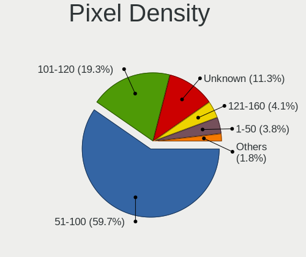

| Density       | Desktops | Percent |
|---------------|----------|---------|
| 51-100        | 850      | 58.58%  |
| 101-120       | 286      | 19.71%  |
| Unknown       | 212      | 14.61%  |
| 1-50          | 47       | 3.24%   |
| 121-160       | 38       | 2.62%   |
| 161-240       | 17       | 1.17%   |
| More than 240 | 1        | 0.07%   |

Multiple Monitors
-----------------

Total monitors connected

| Total | Desktops | Percent |
|-------|----------|---------|
| 1     | 1220     | 80.16%  |
| 2     | 196      | 12.88%  |
| 0     | 84       | 5.52%   |
| 3     | 21       | 1.38%   |
| 4     | 1        | 0.07%   |

Network
-------

Net Controller Vendor
---------------------

Controller vendors

| Vendor                                 | Desktops | Percent |
|----------------------------------------|----------|---------|
| Realtek Semiconductor                  | 938      | 45.05%  |
| Intel                                  | 497      | 23.87%  |
| Qualcomm Atheros                       | 175      | 8.41%   |
| Ralink Technology                      | 66       | 3.17%   |
| Nvidia                                 | 57       | 2.74%   |
| Broadcom                               | 57       | 2.74%   |
| TP-Link                                | 55       | 2.64%   |
| Qualcomm Atheros Communications        | 30       | 1.44%   |
| Marvell Technology Group               | 26       | 1.25%   |
| Ralink                                 | 22       | 1.06%   |
| D-Link                                 | 17       | 0.82%   |
| VIA Technologies                       | 13       | 0.62%   |
| D-Link System                          | 13       | 0.62%   |
| ASUSTek Computer                       | 11       | 0.53%   |
| Broadcom Limited                       | 10       | 0.48%   |
| Xiaomi                                 | 9        | 0.43%   |
| Belkin Components                      | 8        | 0.38%   |
| Samsung Electronics                    | 7        | 0.34%   |
| Microsoft                              | 7        | 0.34%   |
| ZyDAS                                  | 5        | 0.24%   |
| Silicon Integrated Systems [SiS]       | 5        | 0.24%   |
| Qualcomm                               | 4        | 0.19%   |
| Texas Instruments                      | 3        | 0.14%   |
| Gemtek                                 | 3        | 0.14%   |
| DisplayLink                            | 3        | 0.14%   |
| ASIX Electronics                       | 3        | 0.14%   |
| ZTE WCDMA Technologies MSM             | 2        | 0.1%    |
| Microchip Technology                   | 2        | 0.1%    |
| MediaTek                               | 2        | 0.1%    |
| Huawei Technologies                    | 2        | 0.1%    |
| Aquantia                               | 2        | 0.1%    |
| Apple                                  | 2        | 0.1%    |
| Accton Technology                      | 2        | 0.1%    |
| 3Com                                   | 2        | 0.1%    |
| ZyXEL Communications                   | 1        | 0.05%   |
| Wilocity                               | 1        | 0.05%   |
| Wacom                                  | 1        | 0.05%   |
| TRENDnet                               | 1        | 0.05%   |
| Tenda                                  | 1        | 0.05%   |
| Standard Microsystems                  | 1        | 0.05%   |
| Spreadtrum Communications              | 1        | 0.05%   |
| Sony Ericsson Mobile Communications AB | 1        | 0.05%   |
| Sitecom Europe                         | 1        | 0.05%   |
| Oculus VR                              | 1        | 0.05%   |
| NetGear                                | 1        | 0.05%   |
| Meizu                                  | 1        | 0.05%   |
| Linksys                                | 1        | 0.05%   |
| InterBiometrics                        | 1        | 0.05%   |
| HTC (High Tech Computer)               | 1        | 0.05%   |
| Holtek Semiconductor                   | 1        | 0.05%   |
| Edimax Technology                      | 1        | 0.05%   |
| Davicom Semiconductor                  | 1        | 0.05%   |
| Arduino SA                             | 1        | 0.05%   |
| American Megatrends                    | 1        | 0.05%   |
| ADMtek                                 | 1        | 0.05%   |
| 802.11g Adapter [Linksys WUSB54GC v3]  | 1        | 0.05%   |

Net Controller Model
--------------------

Controller models

| Model                                                             | Desktops | Percent |
|-------------------------------------------------------------------|----------|---------|
| Realtek RTL8111/8168/8411 PCI Express Gigabit Ethernet Controller | 776      | 33.93%  |
| Intel I211 Gigabit Network Connection                             | 68       | 2.97%   |
| Intel Ethernet Connection (2) I219-V                              | 63       | 2.75%   |
| Intel Wi-Fi 6 AX200                                               | 59       | 2.58%   |
| Intel 82579LM Gigabit Network Connection (Lewisville)             | 44       | 1.92%   |
| Realtek RTL8125 2.5GbE Controller                                 | 40       | 1.75%   |
| Realtek RTL810xE PCI Express Fast Ethernet controller             | 29       | 1.27%   |
| Intel Ethernet Connection (7) I219-V                              | 27       | 1.18%   |
| Qualcomm Atheros AR9271 802.11n                                   | 26       | 1.14%   |
| Nvidia MCP61 Ethernet                                             | 26       | 1.14%   |
| Intel 82579V Gigabit Network Connection                           | 24       | 1.05%   |
| Ralink RT2870/RT3070 Wireless Adapter                             | 22       | 0.96%   |
| Intel Ethernet Connection I217-LM                                 | 22       | 0.96%   |
| Realtek RTL-8100/8101L/8139 PCI Fast Ethernet Adapter             | 21       | 0.92%   |
| Qualcomm Atheros AR9485 Wireless Network Adapter                  | 21       | 0.92%   |
| Intel Ethernet Connection (2) I218-V                              | 19       | 0.83%   |
| Realtek RTL88x2bu [AC1200 Techkey]                                | 17       | 0.74%   |
| Qualcomm Atheros AR8121/AR8113/AR8114 Gigabit or Fast Ethernet    | 17       | 0.74%   |
| Intel Ethernet Controller I225-V                                  | 16       | 0.7%    |
| TP-Link TL-WN823N v2/v3 [Realtek RTL8192EU]                       | 15       | 0.66%   |
| Qualcomm Atheros AR9287 Wireless Network Adapter (PCI-Express)    | 15       | 0.66%   |
| Qualcomm Atheros AR8151 v2.0 Gigabit Ethernet                     | 15       | 0.66%   |
| Intel 82567LM-3 Gigabit Network Connection                        | 15       | 0.66%   |
| Realtek RTL8192EE PCIe Wireless Network Adapter                   | 14       | 0.61%   |
| Realtek 802.11ac NIC                                              | 14       | 0.61%   |
| Qualcomm Atheros AR9227 Wireless Network Adapter                  | 14       | 0.61%   |
| Intel Wireless-AC 9260                                            | 14       | 0.61%   |
| Intel 82566DM-2 Gigabit Network Connection                        | 14       | 0.61%   |
| Qualcomm Atheros Killer E220x Gigabit Ethernet Controller         | 13       | 0.57%   |
| Marvell Group 88E8056 PCI-E Gigabit Ethernet Controller           | 13       | 0.57%   |
| Intel Wireless 3165                                               | 13       | 0.57%   |
| Realtek RTL8192CU 802.11n WLAN Adapter                            | 12       | 0.52%   |
| Realtek RTL8192CE PCIe Wireless Network Adapter                   | 12       | 0.52%   |
| Qualcomm Atheros Attansic L1 Gigabit Ethernet                     | 12       | 0.52%   |
| Intel Dual Band Wireless-AC 3168NGW [Stone Peak]                  | 12       | 0.52%   |
| Realtek RTL8169 PCI Gigabit Ethernet Controller                   | 11       | 0.48%   |
| Realtek RTL8153 Gigabit Ethernet Adapter                          | 11       | 0.48%   |
| Qualcomm Atheros AR8161 Gigabit Ethernet                          | 11       | 0.48%   |
| Intel Ethernet Connection I217-V                                  | 11       | 0.48%   |
| VIA VT6102/VT6103 [Rhine-II]                                      | 10       | 0.44%   |
| Realtek RTL8188EUS 802.11n Wireless Network Adapter               | 10       | 0.44%   |
| Ralink MT7610U ("Archer T2U" 2.4G+5G WLAN Adapter                 | 10       | 0.44%   |
| Ralink MT7601U Wireless Adapter                                   | 10       | 0.44%   |
| Qualcomm Atheros AR5212/5213/2414 Wireless Network Adapter        | 10       | 0.44%   |
| Intel Wireless 7265                                               | 10       | 0.44%   |
| Intel Ethernet Connection (2) I219-LM                             | 10       | 0.44%   |
| Broadcom BCM4360 802.11ac Wireless Network Adapter                | 10       | 0.44%   |
| TP-Link TL-WN722N v2/v3 [Realtek RTL8188EUS]                      | 9        | 0.39%   |
| Realtek RTL8812AE 802.11ac PCIe Wireless Network Adapter          | 9        | 0.39%   |
| Realtek RTL8187 Wireless Adapter                                  | 9        | 0.39%   |
| Nvidia MCP73 Ethernet                                             | 9        | 0.39%   |
| Broadcom BCM4352 802.11ac Wireless Network Adapter                | 9        | 0.39%   |
| Xiaomi Mi/Redmi series (RNDIS)                                    | 8        | 0.35%   |
| Realtek RTL8822BE 802.11a/b/g/n/ac WiFi adapter                   | 8        | 0.35%   |
| Realtek RTL8812AU 802.11a/b/g/n/ac 2T2R DB WLAN Adapter           | 8        | 0.35%   |
| Qualcomm Atheros AR8131 Gigabit Ethernet                          | 8        | 0.35%   |
| Intel 82578DC Gigabit Network Connection                          | 8        | 0.35%   |
| Intel 82574L Gigabit Network Connection                           | 8        | 0.35%   |
| Ralink RT5370 Wireless Adapter                                    | 7        | 0.31%   |
| Qualcomm Atheros Killer E2400 Gigabit Ethernet Controller         | 7        | 0.31%   |

Wireless Vendor
---------------

Wireless vendors

| Vendor                                | Desktops | Percent |
|---------------------------------------|----------|---------|
| Realtek Semiconductor                 | 149      | 22.54%  |
| Intel                                 | 148      | 22.39%  |
| Qualcomm Atheros                      | 86       | 13.01%  |
| Ralink Technology                     | 66       | 9.98%   |
| TP-Link                               | 53       | 8.02%   |
| Qualcomm Atheros Communications       | 30       | 4.54%   |
| Broadcom                              | 27       | 4.08%   |
| Ralink                                | 22       | 3.33%   |
| D-Link                                | 17       | 2.57%   |
| ASUSTek Computer                      | 11       | 1.66%   |
| Belkin Components                     | 8        | 1.21%   |
| Microsoft                             | 7        | 1.06%   |
| D-Link System                         | 7        | 1.06%   |
| ZyDAS                                 | 5        | 0.76%   |
| Texas Instruments                     | 3        | 0.45%   |
| Gemtek                                | 3        | 0.45%   |
| Broadcom Limited                      | 3        | 0.45%   |
| ZyXEL Communications                  | 1        | 0.15%   |
| Xiaomi                                | 1        | 0.15%   |
| Wilocity                              | 1        | 0.15%   |
| Wacom                                 | 1        | 0.15%   |
| TRENDnet                              | 1        | 0.15%   |
| Tenda                                 | 1        | 0.15%   |
| Standard Microsystems                 | 1        | 0.15%   |
| Sitecom Europe                        | 1        | 0.15%   |
| Samsung Electronics                   | 1        | 0.15%   |
| NetGear                               | 1        | 0.15%   |
| MediaTek                              | 1        | 0.15%   |
| Marvell Technology Group              | 1        | 0.15%   |
| Linksys                               | 1        | 0.15%   |
| Edimax Technology                     | 1        | 0.15%   |
| 802.11g Adapter [Linksys WUSB54GC v3] | 1        | 0.15%   |
| 3Com                                  | 1        | 0.15%   |

Wireless Model
--------------

Wireless models

| Model                                                                          | Desktops | Percent |
|--------------------------------------------------------------------------------|----------|---------|
| Intel Wi-Fi 6 AX200                                                            | 59       | 8.81%   |
| Qualcomm Atheros AR9271 802.11n                                                | 26       | 3.88%   |
| Ralink RT2870/RT3070 Wireless Adapter                                          | 22       | 3.28%   |
| Qualcomm Atheros AR9485 Wireless Network Adapter                               | 21       | 3.13%   |
| Realtek RTL88x2bu [AC1200 Techkey]                                             | 17       | 2.54%   |
| TP-Link TL-WN823N v2/v3 [Realtek RTL8192EU]                                    | 15       | 2.24%   |
| Qualcomm Atheros AR9287 Wireless Network Adapter (PCI-Express)                 | 15       | 2.24%   |
| Realtek RTL8192EE PCIe Wireless Network Adapter                                | 14       | 2.09%   |
| Realtek 802.11ac NIC                                                           | 14       | 2.09%   |
| Qualcomm Atheros AR9227 Wireless Network Adapter                               | 14       | 2.09%   |
| Intel Wireless-AC 9260                                                         | 14       | 2.09%   |
| Intel Wireless 3165                                                            | 13       | 1.94%   |
| Realtek RTL8192CU 802.11n WLAN Adapter                                         | 12       | 1.79%   |
| Realtek RTL8192CE PCIe Wireless Network Adapter                                | 12       | 1.79%   |
| Intel Dual Band Wireless-AC 3168NGW [Stone Peak]                               | 12       | 1.79%   |
| Realtek RTL8188EUS 802.11n Wireless Network Adapter                            | 10       | 1.49%   |
| Ralink MT7610U ("Archer T2U" 2.4G+5G WLAN Adapter                              | 10       | 1.49%   |
| Ralink MT7601U Wireless Adapter                                                | 10       | 1.49%   |
| Qualcomm Atheros AR5212/5213/2414 Wireless Network Adapter                     | 10       | 1.49%   |
| Intel Wireless 7265                                                            | 10       | 1.49%   |
| Broadcom BCM4360 802.11ac Wireless Network Adapter                             | 10       | 1.49%   |
| TP-Link TL-WN722N v2/v3 [Realtek RTL8188EUS]                                   | 9        | 1.34%   |
| Realtek RTL8812AE 802.11ac PCIe Wireless Network Adapter                       | 9        | 1.34%   |
| Realtek RTL8187 Wireless Adapter                                               | 9        | 1.34%   |
| Broadcom BCM4352 802.11ac Wireless Network Adapter                             | 9        | 1.34%   |
| Realtek RTL8822BE 802.11a/b/g/n/ac WiFi adapter                                | 8        | 1.19%   |
| Realtek RTL8812AU 802.11a/b/g/n/ac 2T2R DB WLAN Adapter                        | 8        | 1.19%   |
| Ralink RT5370 Wireless Adapter                                                 | 7        | 1.04%   |
| TP-Link AC600 wireless Realtek RTL8811AU [Archer T2U Nano]                     | 6        | 0.9%    |
| Intel Cannon Lake PCH CNVi WiFi                                                | 6        | 0.9%    |
| D-Link 802.11 n WLAN                                                           | 6        | 0.9%    |
| TP-Link 802.11ac WLAN Adapter                                                  | 5        | 0.75%   |
| Realtek RTL8723BE PCIe Wireless Network Adapter                                | 5        | 0.75%   |
| Realtek RTL8192EU 802.11b/g/n WLAN Adapter                                     | 5        | 0.75%   |
| Realtek RTL8191SU 802.11n WLAN Adapter                                         | 5        | 0.75%   |
| Ralink RT2561/RT61 rev B 802.11g                                               | 5        | 0.75%   |
| Qualcomm Atheros AR9285 Wireless Network Adapter (PCI-Express)                 | 5        | 0.75%   |
| Intel Comet Lake PCH CNVi WiFi                                                 | 5        | 0.75%   |
| TP-Link TL-WN821N v5/v6 [RTL8192EU]                                            | 4        | 0.6%    |
| TP-Link 802.11ac NIC                                                           | 4        | 0.6%    |
| Realtek RTL8821AE 802.11ac PCIe Wireless Network Adapter                       | 4        | 0.6%    |
| Ralink RT5372 Wireless Adapter                                                 | 4        | 0.6%    |
| Ralink RT3072 Wireless Adapter                                                 | 4        | 0.6%    |
| Ralink RT2501/RT2573 Wireless Adapter                                          | 4        | 0.6%    |
| Intel Wireless 7260                                                            | 4        | 0.6%    |
| D-Link System DWA-140 RangeBooster N Adapter(rev.B2) [Ralink RT3072]           | 4        | 0.6%    |
| ZyDAS ZD1211B 802.11g                                                          | 3        | 0.45%   |
| TP-Link Archer T3U [Realtek RTL8812BU]                                         | 3        | 0.45%   |
| Realtek RTL8821CE 802.11ac PCIe Wireless Network Adapter                       | 3        | 0.45%   |
| Ralink Conceptronic C54RU v3 802.11bg Wireless Adapter [Ralink RT2571W]        | 3        | 0.45%   |
| Qualcomm Atheros AR9462 Wireless Network Adapter                               | 3        | 0.45%   |
| Qualcomm Atheros AR93xx Wireless Network Adapter                               | 3        | 0.45%   |
| Qualcomm Atheros AR5413/AR5414 Wireless Network Adapter [AR5006X(S) 802.11abg] | 3        | 0.45%   |
| Microsoft XBOX ACC                                                             | 3        | 0.45%   |
| Intel Wireless 8260                                                            | 3        | 0.45%   |
| Intel Dual Band Wireless-AC 3165 Plus Bluetooth                                | 3        | 0.45%   |
| Intel Centrino Ultimate-N 6300                                                 | 3        | 0.45%   |
| Gemtek WUBR-177G [Ralink RT2571W]                                              | 3        | 0.45%   |
| D-Link DWA-140 RangeBooster N Adapter(rev.B3) [Ralink RT5372]                  | 3        | 0.45%   |
| D-Link DWA-131 Wireless N Nano Adapter (Rev. E1) [Realtek RTL8192EU]           | 3        | 0.45%   |

Ethernet Vendor
---------------

Ethernet vendors

| Vendor                                 | Desktops | Percent |
|----------------------------------------|----------|---------|
| Realtek Semiconductor                  | 879      | 55.92%  |
| Intel                                  | 409      | 26.02%  |
| Qualcomm Atheros                       | 96       | 6.11%   |
| Nvidia                                 | 57       | 3.63%   |
| Broadcom                               | 30       | 1.91%   |
| Marvell Technology Group               | 26       | 1.65%   |
| VIA Technologies                       | 13       | 0.83%   |
| Xiaomi                                 | 8        | 0.51%   |
| Broadcom Limited                       | 7        | 0.45%   |
| Samsung Electronics                    | 6        | 0.38%   |
| D-Link System                          | 6        | 0.38%   |
| Silicon Integrated Systems [SiS]       | 5        | 0.32%   |
| Qualcomm                               | 4        | 0.25%   |
| DisplayLink                            | 3        | 0.19%   |
| ASIX Electronics                       | 3        | 0.19%   |
| ZTE WCDMA Technologies MSM             | 2        | 0.13%   |
| TP-Link                                | 2        | 0.13%   |
| Aquantia                               | 2        | 0.13%   |
| Apple                                  | 2        | 0.13%   |
| Accton Technology                      | 2        | 0.13%   |
| Spreadtrum Communications              | 1        | 0.06%   |
| Sony Ericsson Mobile Communications AB | 1        | 0.06%   |
| Microchip Technology                   | 1        | 0.06%   |
| Meizu                                  | 1        | 0.06%   |
| MediaTek                               | 1        | 0.06%   |
| Huawei Technologies                    | 1        | 0.06%   |
| Davicom Semiconductor                  | 1        | 0.06%   |
| American Megatrends                    | 1        | 0.06%   |
| ADMtek                                 | 1        | 0.06%   |
| 3Com                                   | 1        | 0.06%   |

Ethernet Model
--------------

Ethernet models

| Model                                                             | Desktops | Percent |
|-------------------------------------------------------------------|----------|---------|
| Realtek RTL8111/8168/8411 PCI Express Gigabit Ethernet Controller | 776      | 48.26%  |
| Intel I211 Gigabit Network Connection                             | 68       | 4.23%   |
| Intel Ethernet Connection (2) I219-V                              | 63       | 3.92%   |
| Intel 82579LM Gigabit Network Connection (Lewisville)             | 44       | 2.74%   |
| Realtek RTL8125 2.5GbE Controller                                 | 40       | 2.49%   |
| Realtek RTL810xE PCI Express Fast Ethernet controller             | 29       | 1.8%    |
| Intel Ethernet Connection (7) I219-V                              | 27       | 1.68%   |
| Nvidia MCP61 Ethernet                                             | 26       | 1.62%   |
| Intel 82579V Gigabit Network Connection                           | 24       | 1.49%   |
| Intel Ethernet Connection I217-LM                                 | 22       | 1.37%   |
| Realtek RTL-8100/8101L/8139 PCI Fast Ethernet Adapter             | 21       | 1.31%   |
| Intel Ethernet Connection (2) I218-V                              | 19       | 1.18%   |
| Qualcomm Atheros AR8121/AR8113/AR8114 Gigabit or Fast Ethernet    | 17       | 1.06%   |
| Intel Ethernet Controller I225-V                                  | 16       | 1%      |
| Qualcomm Atheros AR8151 v2.0 Gigabit Ethernet                     | 15       | 0.93%   |
| Intel 82567LM-3 Gigabit Network Connection                        | 15       | 0.93%   |
| Intel 82566DM-2 Gigabit Network Connection                        | 14       | 0.87%   |
| Qualcomm Atheros Killer E220x Gigabit Ethernet Controller         | 13       | 0.81%   |
| Marvell Group 88E8056 PCI-E Gigabit Ethernet Controller           | 13       | 0.81%   |
| Qualcomm Atheros Attansic L1 Gigabit Ethernet                     | 12       | 0.75%   |
| Realtek RTL8169 PCI Gigabit Ethernet Controller                   | 11       | 0.68%   |
| Realtek RTL8153 Gigabit Ethernet Adapter                          | 11       | 0.68%   |
| Qualcomm Atheros AR8161 Gigabit Ethernet                          | 11       | 0.68%   |
| Intel Ethernet Connection I217-V                                  | 11       | 0.68%   |
| VIA VT6102/VT6103 [Rhine-II]                                      | 10       | 0.62%   |
| Intel Ethernet Connection (2) I219-LM                             | 10       | 0.62%   |
| Nvidia MCP73 Ethernet                                             | 9        | 0.56%   |
| Xiaomi Mi/Redmi series (RNDIS)                                    | 8        | 0.5%    |
| Qualcomm Atheros AR8131 Gigabit Ethernet                          | 8        | 0.5%    |
| Intel 82578DC Gigabit Network Connection                          | 8        | 0.5%    |
| Intel 82574L Gigabit Network Connection                           | 8        | 0.5%    |
| Qualcomm Atheros Killer E2400 Gigabit Ethernet Controller         | 7        | 0.44%   |
| Nvidia MCP77 Ethernet                                             | 7        | 0.44%   |
| Intel NM10/ICH7 Family LAN Controller                             | 7        | 0.44%   |
| Intel Ethernet Connection (11) I219-V                             | 7        | 0.44%   |
| Realtek RTL-8110SC/8169SC Gigabit Ethernet                        | 6        | 0.37%   |
| Intel 82578DM Gigabit Network Connection                          | 6        | 0.37%   |
| Intel 82567V-2 Gigabit Network Connection                         | 6        | 0.37%   |
| Samsung Galaxy series, misc. (tethering mode)                     | 5        | 0.31%   |
| Qualcomm Atheros Attansic L2 Fast Ethernet                        | 5        | 0.31%   |
| Intel I210 Gigabit Network Connection                             | 5        | 0.31%   |
| Intel 82566DM Gigabit Network Connection                          | 5        | 0.31%   |
| Broadcom NetXtreme BCM5764M Gigabit Ethernet PCIe                 | 5        | 0.31%   |
| Broadcom NetXtreme BCM5754 Gigabit Ethernet PCI Express           | 5        | 0.31%   |
| Qualcomm Redmi 9T                                                 | 4        | 0.25%   |
| Nvidia MCP79 Ethernet                                             | 4        | 0.25%   |
| Nvidia CK804 Ethernet Controller                                  | 4        | 0.25%   |
| Marvell Group 88E8053 PCI-E Gigabit Ethernet Controller           | 4        | 0.25%   |
| Marvell Group 88E8001 Gigabit Ethernet Controller                 | 4        | 0.25%   |
| Broadcom NetXtreme BCM5761 Gigabit Ethernet PCIe                  | 4        | 0.25%   |
| Broadcom NetXtreme BCM5751 Gigabit Ethernet PCI Express           | 4        | 0.25%   |
| Broadcom NetXtreme BCM5723 Gigabit Ethernet PCIe                  | 4        | 0.25%   |
| Silicon Integrated Systems [SiS] SiS900 PCI Fast Ethernet         | 3        | 0.19%   |
| Realtek RTL8152 Fast Ethernet Adapter                             | 3        | 0.19%   |
| Qualcomm Atheros AR8151 v1.0 Gigabit Ethernet                     | 3        | 0.19%   |
| Nvidia MCP55 Ethernet                                             | 3        | 0.19%   |
| Nvidia MCP51 Ethernet Controller                                  | 3        | 0.19%   |
| Intel I350 Gigabit Network Connection                             | 3        | 0.19%   |
| Intel Ethernet Connection (6) I219-V                              | 3        | 0.19%   |
| Intel Ethernet Connection (5) I219-LM                             | 3        | 0.19%   |

Net Controller Kind
-------------------

Ethernet, WiFi or modem

| Kind     | Desktops | Percent |
|----------|----------|---------|
| Ethernet | 1476     | 70.72%  |
| WiFi     | 602      | 28.85%  |
| Modem    | 7        | 0.34%   |
| Unknown  | 2        | 0.1%    |

Used Controller
---------------

Currently used network controller

| Kind     | Desktops | Percent |
|----------|----------|---------|
| Ethernet | 1173     | 76.07%  |
| WiFi     | 368      | 23.87%  |
| Modem    | 1        | 0.06%   |

NICs
----

Total network controllers on board

| Total | Desktops | Percent |
|-------|----------|---------|
| 1     | 1065     | 71.05%  |
| 2     | 382      | 25.48%  |
| 3     | 37       | 2.47%   |
| 0     | 8        | 0.53%   |
| 4     | 4        | 0.27%   |
| 5     | 3        | 0.2%    |

IPv6
----

IPv6 vs IPv4

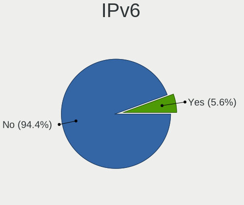

| Used | Desktops | Percent |
|------|----------|---------|
| No   | 1443     | 97.24%  |
| Yes  | 41       | 2.76%   |

Bluetooth
---------

Bluetooth Vendor
----------------

Controller vendors

| Vendor                          | Desktops | Percent |
|---------------------------------|----------|---------|
| Cambridge Silicon Radio         | 173      | 39.05%  |
| Intel                           | 136      | 30.7%   |
| Realtek Semiconductor           | 34       | 7.67%   |
| ASUSTek Computer                | 29       | 6.55%   |
| Broadcom                        | 22       | 4.97%   |
| IMC Networks                    | 9        | 2.03%   |
| Qualcomm Atheros Communications | 8        | 1.81%   |
| Belkin Components               | 8        | 1.81%   |
| Integrated System Solution      | 7        | 1.58%   |
| Apple                           | 7        | 1.58%   |
| Roper                           | 2        | 0.45%   |
| Edimax Technology               | 2        | 0.45%   |
| Sitecom Europe                  | 1        | 0.23%   |
| MediaTek                        | 1        | 0.23%   |
| Logitech                        | 1        | 0.23%   |
| Lite-On Technology              | 1        | 0.23%   |
| Dell                            | 1        | 0.23%   |
| Corsair                         | 1        | 0.23%   |

Bluetooth Model
---------------

Controller models

| Model                                                     | Desktops | Percent |
|-----------------------------------------------------------|----------|---------|
| Cambridge Silicon Radio Bluetooth Dongle (HCI mode)       | 173      | 39.05%  |
| Intel AX200 Bluetooth                                     | 58       | 13.09%  |
| Intel Bluetooth wireless interface                        | 31       | 7%      |
| Realtek Bluetooth Radio                                   | 30       | 6.77%   |
| Intel Wireless-AC 9260 Bluetooth Adapter                  | 14       | 3.16%   |
| ASUS Broadcom BCM20702A0 Bluetooth                        | 14       | 3.16%   |
| Intel Wireless-AC 3168 Bluetooth                          | 12       | 2.71%   |
| Broadcom BCM20702A0 Bluetooth 4.0                         | 11       | 2.48%   |
| Intel Bluetooth 9460/9560 Jefferson Peak (JfP)            | 9        | 2.03%   |
| Intel Bluetooth Device                                    | 8        | 1.81%   |
| Integrated System Solution Bluetooth Device               | 7        | 1.58%   |
| IMC Networks Bluetooth Radio                              | 6        | 1.35%   |
| ASUS Bluetooth Radio                                      | 5        | 1.13%   |
| Realtek  Bluetooth 4.2 Adapter                            | 4        | 0.9%    |
| Belkin Components Bluetooth Mini Dongle                   | 4        | 0.9%    |
| Apple Bluetooth USB Host Controller                       | 4        | 0.9%    |
| Qualcomm Atheros AR3011 Bluetooth                         | 3        | 0.68%   |
| Broadcom BCM2035 Bluetooth dongle                         | 3        | 0.68%   |
| ASUS Broadcom BCM20702 Single-Chip Bluetooth 4.0 + LE     | 3        | 0.68%   |
| ASUS BCM20702A0                                           | 3        | 0.68%   |
| Roper Class 1 Bluetooth Dongle                            | 2        | 0.45%   |
| Qualcomm Atheros  Bluetooth Device                        | 2        | 0.45%   |
| Intel Centrino Bluetooth Wireless Transceiver             | 2        | 0.45%   |
| Intel AX210 Bluetooth                                     | 2        | 0.45%   |
| IMC Networks BCM20702A0                                   | 2        | 0.45%   |
| Broadcom Bluetooth Controller                             | 2        | 0.45%   |
| Belkin Components F8T065BF Mini Bluetooth 4.0 Adapter     | 2        | 0.45%   |
| ASUS Bluetooth Device                                     | 2        | 0.45%   |
| Sitecom Europe Sitecom bluetooth2.0 class 1 dongle CN-521 | 1        | 0.23%   |
| Qualcomm Atheros QCA61x4 Bluetooth 4.0                    | 1        | 0.23%   |
| Qualcomm Atheros Bluetooth USB Host Controller            | 1        | 0.23%   |
| Qualcomm Atheros AR9462 Bluetooth                         | 1        | 0.23%   |
| MediaTek Wireless_Device                                  | 1        | 0.23%   |
| Logitech Bluetooth wireless hub                           | 1        | 0.23%   |
| Lite-On Bluetooth Device                                  | 1        | 0.23%   |
| IMC Networks Bluetooth Device                             | 1        | 0.23%   |
| Edimax Wi-Fi AC600 Bluetooth4.0 USB Adapter               | 1        | 0.23%   |
| Edimax EW-7611ULB 802.11b/g/n and Bluetooth 4.0 Adapter   | 1        | 0.23%   |
| Dell BT Mini-Receiver                                     | 1        | 0.23%   |
| Corsair HS70 BLUETOOTH Gaming Headset                     | 1        | 0.23%   |
| Broadcom HP Portable Bumble Bee                           | 1        | 0.23%   |
| Broadcom HP Bluetooth Module                              | 1        | 0.23%   |
| Broadcom Bluetooth 3.0 Dongle                             | 1        | 0.23%   |
| Broadcom Bluetooth 3.0 Device                             | 1        | 0.23%   |
| Broadcom BCM920702 Bluetooth 4.0 Zero Touch Dongle        | 1        | 0.23%   |
| Broadcom BCM2045 Bluetooth                                | 1        | 0.23%   |
| Belkin Components F8T012 Bluetooth Adapter                | 1        | 0.23%   |
| Belkin Components Bluetooth Device with trace filter      | 1        | 0.23%   |
| ASUS Qualcomm Bluetooth 4.1                               | 1        | 0.23%   |
| ASUS Bluetooth Adapter                                    | 1        | 0.23%   |
| Apple Built-in Bluetooth 2.0+EDR HCI                      | 1        | 0.23%   |
| Apple Bluetooth Host Controller                           | 1        | 0.23%   |
| Apple Bluetooth HCI MacBookPro (HID mode)                 | 1        | 0.23%   |

Sound
-----

Sound Vendor
------------

Sound card vendors

| Vendor                                          | Desktops | Percent |
|-------------------------------------------------|----------|---------|
| Intel                                           | 965      | 40.26%  |
| Nvidia                                          | 605      | 25.24%  |
| AMD                                             | 544      | 22.7%   |
| C-Media Electronics                             | 62       | 2.59%   |
| Creative Labs                                   | 33       | 1.38%   |
| Texas Instruments                               | 15       | 0.63%   |
| Logitech                                        | 14       | 0.58%   |
| VIA Technologies                                | 12       | 0.5%    |
| JMTek                                           | 12       | 0.5%    |
| Focusrite-Novation                              | 11       | 0.46%   |
| Corsair                                         | 8        | 0.33%   |
| Silicon Integrated Systems [SiS]                | 7        | 0.29%   |
| Kingston Technology                             | 7        | 0.29%   |
| Creative Technology                             | 7        | 0.29%   |
| GN Netcom                                       | 6        | 0.25%   |
| Generalplus Technology                          | 6        | 0.25%   |
| Ensoniq                                         | 6        | 0.25%   |
| Plantronics                                     | 5        | 0.21%   |
| M-Audio                                         | 5        | 0.21%   |
| Yamaha                                          | 4        | 0.17%   |
| Sennheiser Communications                       | 4        | 0.17%   |
| ASUSTek Computer                                | 4        | 0.17%   |
| Tenx Technology                                 | 3        | 0.13%   |
| SteelSeries ApS                                 | 3        | 0.13%   |
| Realtek Semiconductor                           | 3        | 0.13%   |
| XMOS                                            | 2        | 0.08%   |
| SAVITECH                                        | 2        | 0.08%   |
| Razer USA                                       | 2        | 0.08%   |
| QinHeng Electronics                             | 2        | 0.08%   |
| Musical Fidelity                                | 2        | 0.08%   |
| Licensed by Sony Computer Entertainment America | 2        | 0.08%   |
| Hewlett-Packard                                 | 2        | 0.08%   |
| Evolution Electronics                           | 2        | 0.08%   |
| Elite Silicon                                   | 2        | 0.08%   |
| Dell                                            | 2        | 0.08%   |
| Blue Microphones                                | 2        | 0.08%   |
| Unknown                                         | 1        | 0.04%   |
| ULi Electronics                                 | 1        | 0.04%   |
| Thesycon Systemsoftware & Consulting            | 1        | 0.04%   |
| Sunplus Innovation Technology                   | 1        | 0.04%   |
| Sony                                            | 1        | 0.04%   |
| SHARKOON Technologies                           | 1        | 0.04%   |
| Rotel                                           | 1        | 0.04%   |
| RODE Microphones                                | 1        | 0.04%   |
| PreSonus Audio Electronics                      | 1        | 0.04%   |
| Panasonic (Matsushita)                          | 1        | 0.04%   |
| Native Instruments                              | 1        | 0.04%   |
| Microsoft                                       | 1        | 0.04%   |
| Micro Star International                        | 1        | 0.04%   |
| iCON                                            | 1        | 0.04%   |
| Guillemot                                       | 1        | 0.04%   |
| FiiO Electronics Technology                     | 1        | 0.04%   |
| DEXP U700 microphone                            | 1        | 0.04%   |
| Cambridge Silicon Radio                         | 1        | 0.04%   |
| Bose                                            | 1        | 0.04%   |
| BEHRINGER International                         | 1        | 0.04%   |
| ATI Technologies                                | 1        | 0.04%   |
| Asahi Kasei Microsystems                        | 1        | 0.04%   |
| Apple                                           | 1        | 0.04%   |
| Apogee Electronics                              | 1        | 0.04%   |

Sound Model
-----------

Sound card models

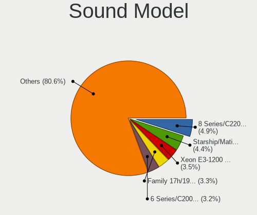

| Model                                                                             | Desktops | Percent |
|-----------------------------------------------------------------------------------|----------|---------|
| Intel 8 Series/C220 Series Chipset High Definition Audio Controller               | 158      | 5.7%    |
| Intel Xeon E3-1200 v3/4th Gen Core Processor HD Audio Controller                  | 119      | 4.29%   |
| Intel NM10/ICH7 Family High Definition Audio Controller                           | 113      | 4.08%   |
| Intel 6 Series/C200 Series Chipset Family High Definition Audio Controller        | 107      | 3.86%   |
| AMD Starship/Matisse HD Audio Controller                                          | 97       | 3.5%    |
| AMD SBx00 Azalia (Intel HDA)                                                      | 95       | 3.43%   |
| AMD Family 17h (Models 00h-0fh) HD Audio Controller                               | 93       | 3.36%   |
| AMD Ellesmere HDMI Audio [Radeon RX 470/480 / 570/580/590]                        | 87       | 3.14%   |
| Nvidia GK208 HDMI/DP Audio Controller                                             | 86       | 3.1%    |
| Intel 200 Series PCH HD Audio                                                     | 81       | 2.92%   |
| Intel 7 Series/C216 Chipset Family High Definition Audio Controller               | 78       | 2.81%   |
| Intel 100 Series/C230 Series Chipset Family HD Audio Controller                   | 71       | 2.56%   |
| Nvidia High Definition Audio Controller                                           | 63       | 2.27%   |
| Nvidia GP107GL High Definition Audio Controller                                   | 61       | 2.2%    |
| AMD Family 17h/19h HD Audio Controller                                            | 51       | 1.84%   |
| AMD FCH Azalia Controller                                                         | 50       | 1.8%    |
| Intel Cannon Lake PCH cAVS                                                        | 49       | 1.77%   |
| Intel 5 Series/3400 Series Chipset High Definition Audio                          | 48       | 1.73%   |
| Intel 82801I (ICH9 Family) HD Audio Controller                                    | 45       | 1.62%   |
| Intel 82801JI (ICH10 Family) HD Audio Controller                                  | 38       | 1.37%   |
| AMD Raven/Raven2/Fenghuang HDMI/DP Audio Controller                               | 34       | 1.23%   |
| Intel 9 Series Chipset Family HD Audio Controller                                 | 32       | 1.15%   |
| Nvidia GP106 High Definition Audio Controller                                     | 31       | 1.12%   |
| Nvidia GP104 High Definition Audio Controller                                     | 29       | 1.05%   |
| Nvidia MCP61 High Definition Audio                                                | 28       | 1.01%   |
| Nvidia GM107 High Definition Audio Controller [GeForce 940MX]                     | 27       | 0.97%   |
| Nvidia GF108 High Definition Audio Controller                                     | 26       | 0.94%   |
| AMD Navi 10 HDMI Audio                                                            | 26       | 0.94%   |
| Nvidia GF119 HDMI Audio Controller                                                | 25       | 0.9%    |
| Nvidia GM206 High Definition Audio Controller                                     | 23       | 0.83%   |
| AMD Baffin HDMI/DP Audio [Radeon RX 550 640SP / RX 560/560X]                      | 23       | 0.83%   |
| AMD Cedar HDMI Audio [Radeon HD 5400/6300/7300 Series]                            | 22       | 0.79%   |
| Nvidia TU116 High Definition Audio Controller                                     | 21       | 0.76%   |
| Nvidia GM204 High Definition Audio Controller                                     | 21       | 0.76%   |
| AMD Oland/Hainan/Cape Verde/Pitcairn HDMI Audio [Radeon HD 7000 Series]           | 21       | 0.76%   |
| Nvidia GP108 High Definition Audio Controller                                     | 20       | 0.72%   |
| Nvidia TU106 High Definition Audio Controller                                     | 18       | 0.65%   |
| Intel C610/X99 series chipset HD Audio Controller                                 | 18       | 0.65%   |
| Intel 82801JD/DO (ICH10 Family) HD Audio Controller                               | 16       | 0.58%   |
| Nvidia TU107 GeForce GTX 1650 High Definition Audio Controller                    | 15       | 0.54%   |
| Intel Comet Lake PCH cAVS                                                         | 15       | 0.54%   |
| AMD Trinity HDMI Audio Controller                                                 | 15       | 0.54%   |
| AMD Caicos HDMI Audio [Radeon HD 6450 / 7450/8450/8490 OEM / R5 230/235/235X OEM] | 15       | 0.54%   |
| Nvidia TU104 HD Audio Controller                                                  | 14       | 0.51%   |
| C-Media Electronics CMI8738/CMI8768 PCI Audio                                     | 14       | 0.51%   |
| Intel Comet Lake PCH-V cAVS                                                       | 12       | 0.43%   |
| Intel 82801H (ICH8 Family) HD Audio Controller                                    | 12       | 0.43%   |
| AMD Tahiti HDMI Audio [Radeon HD 7870 XT / 7950/7970]                             | 12       | 0.43%   |
| Texas Instruments PCM2902 Audio Codec                                             | 11       | 0.4%    |
| Nvidia GT216 HDMI Audio Controller                                                | 11       | 0.4%    |
| Nvidia GK106 HDMI Audio Controller                                                | 11       | 0.4%    |
| Intel C600/X79 series chipset High Definition Audio Controller                    | 11       | 0.4%    |
| AMD RV710/730 HDMI Audio [Radeon HD 4000 series]                                  | 11       | 0.4%    |
| VIA Technologies VX900/VT8xxx High Definition Audio Controller                    | 10       | 0.36%   |
| Nvidia MCP73 High Definition Audio                                                | 10       | 0.36%   |
| Nvidia GF116 High Definition Audio Controller                                     | 10       | 0.36%   |
| Creative Labs Sound Core3D [Sound Blaster Recon3D / Z-Series]                     | 9        | 0.32%   |
| C-Media Electronics CM108 Audio Controller                                        | 9        | 0.32%   |
| AMD Renoir Radeon High Definition Audio Controller                                | 9        | 0.32%   |
| Nvidia MCP72XE/MCP72P/MCP78U/MCP78S High Definition Audio                         | 8        | 0.29%   |

Memory
------

Memory Vendor
-------------

Memory module vendors

| Vendor              | Desktops | Percent |
|---------------------|----------|---------|
| Kingston            | 194      | 27.56%  |
| Unknown             | 127      | 18.04%  |
| Corsair             | 74       | 10.51%  |
| Crucial             | 69       | 9.8%    |
| Samsung Electronics | 57       | 8.1%    |
| G.Skill             | 56       | 7.95%   |
| SK hynix            | 42       | 5.97%   |
| Micron Technology   | 17       | 2.41%   |
| Elpida              | 8        | 1.14%   |
| Ramaxel Technology  | 6        | 0.85%   |
| Nanya Technology    | 6        | 0.85%   |
| Unifosa             | 5        | 0.71%   |
| Silicon Power       | 5        | 0.71%   |
| Team                | 3        | 0.43%   |
| Goodram             | 3        | 0.43%   |
| ASint Technology    | 3        | 0.43%   |
| Unknown             | 3        | 0.43%   |
| Transcend           | 2        | 0.28%   |
| Patriot             | 2        | 0.28%   |
| Kllisre             | 2        | 0.28%   |
| Exceleram           | 2        | 0.28%   |
| Atermiter           | 2        | 0.28%   |
| Wilk                | 1        | 0.14%   |
| Unknown (ABCD)      | 1        | 0.14%   |
| Unknown (AB)        | 1        | 0.14%   |
| Unknown (07FB)      | 1        | 0.14%   |
| Thermaltake         | 1        | 0.14%   |
| Qimonda             | 1        | 0.14%   |
| PNY                 | 1        | 0.14%   |
| Pioneer             | 1        | 0.14%   |
| Neo Forza           | 1        | 0.14%   |
| Innodisk            | 1        | 0.14%   |
| Huanan              | 1        | 0.14%   |
| Goldkey             | 1        | 0.14%   |
| CompuStocx          | 1        | 0.14%   |
| Axiom               | 1        | 0.14%   |
| Apacer              | 1        | 0.14%   |
| 48spaces            | 1        | 0.14%   |

Memory Model
------------

Memory module models

| Model                                                    | Desktops | Percent |
|----------------------------------------------------------|----------|---------|
| Corsair RAM CMK16GX4M2B3000C15 8192MB DIMM DDR4 3000MT/s | 16       | 1.97%   |
| Kingston RAM KHX1600C10D3/8G 8GB DIMM DDR3 1600MT/s      | 11       | 1.36%   |
| Kingston RAM 99U5584-005.A00LF 4GB DIMM DDR3 1600MT/s    | 11       | 1.36%   |
| Kingston RAM KHX1600C9D3/4GX 4GB DIMM DDR3 2400MT/s      | 10       | 1.23%   |
| Corsair RAM CMK16GX4M2B3200C16 8GB DIMM DDR4 3600MT/s    | 9        | 1.11%   |
| Unknown RAM Module 4096MB DIMM 1333MT/s                  | 8        | 0.99%   |
| Unknown RAM Module 2GB DIMM 800MT/s                      | 8        | 0.99%   |
| Kingston RAM KHX3200C16D4/8GX 8192MB DIMM DDR4 3533MT/s  | 8        | 0.99%   |
| Kingston RAM 99U5471-020.A00LF 4096MB DIMM DDR3 1600MT/s | 8        | 0.99%   |
| Unknown RAM Module 2048MB DIMM DDR2 800MT/s              | 7        | 0.86%   |
| Unknown RAM Module 2048MB DIMM 1333MT/s                  | 7        | 0.86%   |
| Unknown RAM Module 2GB DIMM DDR2 667MT/s                 | 6        | 0.74%   |
| Unknown RAM Module 2GB DIMM 1333MT/s                     | 6        | 0.74%   |
| Kingston RAM KHX3200C16D4/16GX 16GB DIMM DDR4 3600MT/s   | 6        | 0.74%   |
| Kingston RAM KHX1866C10D3/8G 8GB DIMM DDR3 1867MT/s      | 6        | 0.74%   |
| Unknown RAM Module 4GB DIMM DDR3 1600MT/s                | 5        | 0.62%   |
| Unknown RAM Module 2048MB DIMM 800MT/s                   | 5        | 0.62%   |
| Kingston RAM KHX2400C15/8G 8GB DIMM DDR4 2933MT/s        | 5        | 0.62%   |
| G.Skill RAM F4-3200C16-8GTZR 8GB DIMM DDR4 3200MT/s      | 5        | 0.62%   |
| Crucial RAM CT8G4DFD824A.C16FF 8GB DIMM DDR4 2733MT/s    | 5        | 0.62%   |
| Crucial RAM CT4G4DFS824A.C8FBD2 4GB DIMM DDR4 2733MT/s   | 5        | 0.62%   |
| Corsair RAM CMW16GX4M2C3200C16 8GB DIMM DDR4 3266MT/s    | 5        | 0.62%   |
| Corsair RAM CMK16GX4M2E3200C16 8GB DIMM DDR4 3200MT/s    | 5        | 0.62%   |
| Unknown RAM Module 2048MB DIMM DDR2 667MT/s              | 4        | 0.49%   |
| Kingston RAM KHX1600C10D3/4G 4GB DIMM DDR3 1866MT/s      | 4        | 0.49%   |
| Kingston RAM 99U5474-028.A00LF 4GB DIMM DDR3 1600MT/s    | 4        | 0.49%   |
| Kingston RAM 99U5474-026.A00LF 4GB DIMM DDR3 1333MT/s    | 4        | 0.49%   |
| G.Skill RAM F3-14900CL9-4GBSR 4GB DIMM DDR3 1867MT/s     | 4        | 0.49%   |
| G.Skill RAM F3-12800CL9-4GBXL 4GB DIMM DDR3 1867MT/s     | 4        | 0.49%   |
| Unknown RAM Module 4GB DIMM 1333MT/s                     | 3        | 0.37%   |
| Unknown RAM Module 2GB DIMM DDR2 800MT/s                 | 3        | 0.37%   |
| Unknown RAM Module 2048MB DIMM SDRAM                     | 3        | 0.37%   |
| Unknown RAM Module 1GB DIMM 800MT/s                      | 3        | 0.37%   |
| Unknown RAM Module 1024MB DIMM DDR2 800MT/s              | 3        | 0.37%   |
| Unknown RAM Module 1024MB DIMM DDR2 667MT/s              | 3        | 0.37%   |
| Unknown RAM Module 1024MB DIMM 800MT/s                   | 3        | 0.37%   |
| SK hynix RAM HMT351U6CFR8C-PB 4GB DIMM DDR3 1800MT/s     | 3        | 0.37%   |
| Samsung RAM M378B5673FH0-CH9 2GB DIMM DDR3 1600MT/s      | 3        | 0.37%   |
| Samsung RAM M378A1K43CB2-CRC 8GB DIMM DDR4 3500MT/s      | 3        | 0.37%   |
| Micron RAM 16JTF51264AZ-1G4M1 4GB DIMM DDR3 1333MT/s     | 3        | 0.37%   |
| Kingston RAM KHX3200C16D4/32GX 32GB DIMM DDR4 3200MT/s   | 3        | 0.37%   |
| Kingston RAM KHX2933C15D4/8GX 8GB DIMM DDR4 2933MT/s     | 3        | 0.37%   |
| Kingston RAM KHX2666C16/8G 8GB DIMM DDR4 3466MT/s        | 3        | 0.37%   |
| Kingston RAM 99U5584-017.A00LF 4GB DIMM 1600MT/s         | 3        | 0.37%   |
| Kingston RAM 99U5471-054.A00LF 8GB DIMM DDR3 1600MT/s    | 3        | 0.37%   |
| Kingston RAM 99U5471-012.A00LF 4GB DIMM DDR3 1600MT/s    | 3        | 0.37%   |
| Kingston RAM 9905403-400.A00LF 4GB DIMM DDR3 1600MT/s    | 3        | 0.37%   |
| G.Skill RAM F4-2400C15-8GIS 8192MB DIMM DDR4 2400MT/s    | 3        | 0.37%   |
| Crucial RAM CT8G4DFS824A.M8FE 8GB DIMM DDR4 2933MT/s     | 3        | 0.37%   |
| Corsair RAM CMZ8GX3M2A1600C9 4GB DIMM DDR3 1600MT/s      | 3        | 0.37%   |
| Corsair RAM CMW32GX4M2C3200C16 16GB DIMM DDR4 3200MT/s   | 3        | 0.37%   |
| Corsair RAM CMV8GX4M1A2133C15 8GB DIMM DDR4 2733MT/s     | 3        | 0.37%   |
| Unknown                                                  | 3        | 0.37%   |
| Unknown RAM Module 8GB DIMM DDR3 1333MT/s                | 2        | 0.25%   |
| Unknown RAM Module 8GB DIMM 1333MT/s                     | 2        | 0.25%   |
| Unknown RAM Module 8192MB DIMM SDRAM                     | 2        | 0.25%   |
| Unknown RAM Module 8192MB DIMM DDR4 2667MT/s             | 2        | 0.25%   |
| Unknown RAM Module 8192MB DIMM DDR4 2133MT/s             | 2        | 0.25%   |
| Unknown RAM Module 4GB DIMM SDRAM                        | 2        | 0.25%   |
| Unknown RAM Module 4GB DIMM 800MT/s                      | 2        | 0.25%   |

Memory Kind
-----------

Memory module kinds

| Kind    | Desktops | Percent |
|---------|----------|---------|
| DDR4    | 265      | 41.8%   |
| DDR3    | 225      | 35.49%  |
| Unknown | 58       | 9.15%   |
| DDR2    | 46       | 7.26%   |
| SDRAM   | 31       | 4.89%   |
| DDR     | 8        | 1.26%   |
| LPDDR4  | 1        | 0.16%   |

Memory Form Factor
------------------

Physical design of the memory module

| Name    | Desktops | Percent |
|---------|----------|---------|
| DIMM    | 587      | 93.92%  |
| SODIMM  | 35       | 5.6%    |
| FB-DIMM | 2        | 0.32%   |
| RIMM    | 1        | 0.16%   |

Memory Size
-----------

Memory module size

| Size  | Desktops | Percent |
|-------|----------|---------|
| 8192  | 238      | 33.71%  |
| 4096  | 195      | 27.62%  |
| 2048  | 130      | 18.41%  |
| 16384 | 82       | 11.61%  |
| 1024  | 48       | 6.8%    |
| 32768 | 9        | 1.27%   |
| 512   | 4        | 0.57%   |

Memory Speed
------------

Memory module speed

| Speed   | Desktops | Percent |
|---------|----------|---------|
| 1600    | 122      | 17.35%  |
| 1333    | 91       | 12.94%  |
| 2400    | 62       | 8.82%   |
| 800     | 50       | 7.11%   |
| 3200    | 49       | 6.97%   |
| 3600    | 41       | 5.83%   |
| 2133    | 39       | 5.55%   |
| 2667    | 28       | 3.98%   |
| 667     | 27       | 3.84%   |
| 1867    | 25       | 3.56%   |
| 3466    | 21       | 2.99%   |
| 2933    | 16       | 2.28%   |
| 1866    | 15       | 2.13%   |
| Unknown | 14       | 1.99%   |
| 2733    | 10       | 1.42%   |
| 3533    | 9        | 1.28%   |
| 3000    | 7        | 1%      |
| 1334    | 7        | 1%      |
| 1066    | 7        | 1%      |
| 3266    | 6        | 0.85%   |
| 2666    | 6        | 0.85%   |
| 3800    | 4        | 0.57%   |
| 2048    | 4        | 0.57%   |
| 1800    | 4        | 0.57%   |
| 400     | 4        | 0.57%   |
| 3500    | 3        | 0.43%   |
| 3400    | 3        | 0.43%   |
| 1639    | 3        | 0.43%   |
| 533     | 3        | 0.43%   |
| 4199    | 2        | 0.28%   |
| 3733    | 2        | 0.28%   |
| 2800    | 2        | 0.28%   |
| 333     | 2        | 0.28%   |
| 200     | 2        | 0.28%   |
| 57535   | 1        | 0.14%   |
| 8400    | 1        | 0.14%   |
| 4133    | 1        | 0.14%   |
| 3666    | 1        | 0.14%   |
| 3334    | 1        | 0.14%   |
| 3333    | 1        | 0.14%   |
| 3067    | 1        | 0.14%   |
| 2473    | 1        | 0.14%   |
| 2465    | 1        | 0.14%   |
| 2200    | 1        | 0.14%   |
| 2176    | 1        | 0.14%   |
| 1331    | 1        | 0.14%   |
| 266     | 1        | 0.14%   |

Printers & scanners
-------------------

Printer Vendor
--------------

Printer device vendors

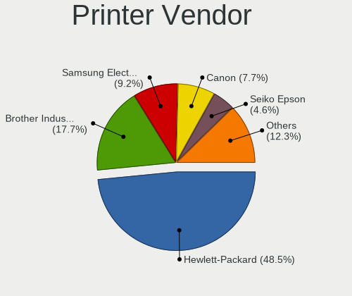

| Vendor                   | Desktops | Percent |
|--------------------------|----------|---------|
| Hewlett-Packard          | 41       | 50%     |
| Brother Industries       | 14       | 17.07%  |
| Samsung Electronics      | 9        | 10.98%  |
| Canon                    | 5        | 6.1%    |
| Seiko Epson              | 4        | 4.88%   |
| Oki Data                 | 2        | 2.44%   |
| Dymo-CoStar              | 2        | 2.44%   |
| Ricoh                    | 1        | 1.22%   |
| Magic Control Technology | 1        | 1.22%   |
| Lexmark International    | 1        | 1.22%   |
| Kyocera                  | 1        | 1.22%   |
| Apple                    | 1        | 1.22%   |

Printer Model
-------------

Printer device models

| Model                                           | Desktops | Percent |
|-------------------------------------------------|----------|---------|
| HP LaserJet 1018                                | 4        | 4.82%   |
| Brother HL-2030 Laser Printer                   | 4        | 4.82%   |
| Samsung M262x/M282x Xpress Series Laser Printer | 2        | 2.41%   |
| Samsung M2070 Series                            | 2        | 2.41%   |
| Oki Data USB Device                             | 2        | 2.41%   |
| HP LaserJet 1010                                | 2        | 2.41%   |
| HP ENVY 5000 series                             | 2        | 2.41%   |
| HP ENVY 4520 series                             | 2        | 2.41%   |
| HP DeskJet F2492 All-in-One                     | 2        | 2.41%   |
| HP DeskJet 5550                                 | 2        | 2.41%   |
| HP DeskJet 3630 series                          | 2        | 2.41%   |
| HP DeskJet 2620 All-in-One Printer              | 2        | 2.41%   |
| HP Deskjet 1050 J410                            | 2        | 2.41%   |
| Dymo-CoStar LabelWriter 450                     | 2        | 2.41%   |
| Brother Printer                                 | 2        | 2.41%   |
| Brother DCP-1510                                | 2        | 2.41%   |
| Seiko Epson XP-255 257 Series                   | 1        | 1.2%    |
| Seiko Epson XP-225 Series                       | 1        | 1.2%    |
| Seiko Epson WF-2830 Series                      | 1        | 1.2%    |
| Seiko Epson L1300 Series                        | 1        | 1.2%    |
| Samsung SCX-4300 Series                         | 1        | 1.2%    |
| Samsung SCX-3400 Series                         | 1        | 1.2%    |
| Samsung SCX-3200 Series                         | 1        | 1.2%    |
| Samsung ML-1640 Series Laser Printer            | 1        | 1.2%    |
| Samsung M267x 287x Series                       | 1        | 1.2%    |
| Ricoh SP 112                                    | 1        | 1.2%    |
| Magic Control BAY-3U1S1P Parallel Port          | 1        | 1.2%    |
| Lexmark International B2236dw                   | 1        | 1.2%    |
| Kyocera ECOSYS M5521cdn                         | 1        | 1.2%    |
| HP PSC-1315/PSC-1317                            | 1        | 1.2%    |
| HP Officejet J4500 series                       | 1        | 1.2%    |
| HP OfficeJet 4650 series                        | 1        | 1.2%    |
| HP LaserJet Pro M118-M119                       | 1        | 1.2%    |
| HP LaserJet M14-M17                             | 1        | 1.2%    |
| HP LaserJet 1300                                | 1        | 1.2%    |
| HP LaserJet 1200                                | 1        | 1.2%    |
| HP LaserJet 1020                                | 1        | 1.2%    |
| HP ENVY 5540 series                             | 1        | 1.2%    |
| HP ENVY 4500 series                             | 1        | 1.2%    |
| HP DeskJet F4200 series                         | 1        | 1.2%    |
| HP DeskJet F4100 Printer series                 | 1        | 1.2%    |
| HP DeskJet 930c                                 | 1        | 1.2%    |
| HP DeskJet 840c                                 | 1        | 1.2%    |
| HP DeskJet 5850c                                | 1        | 1.2%    |
| HP DeskJet 5150c                                | 1        | 1.2%    |
| HP DeskJet 3940                                 | 1        | 1.2%    |
| HP DeskJet 2700 series                          | 1        | 1.2%    |
| HP Deskjet 2540 series                          | 1        | 1.2%    |
| HP DeskJet 2130 series                          | 1        | 1.2%    |
| HP designjet 30/130 series                      | 1        | 1.2%    |
| Canon TS6300 series                             | 1        | 1.2%    |
| Canon PIXMA MX920 Series                        | 1        | 1.2%    |
| Canon PIXMA MP495                               | 1        | 1.2%    |
| Canon PIXMA MG2500 Series                       | 1        | 1.2%    |
| Canon LiDE 400                                  | 1        | 1.2%    |
| Canon LBP6200                                   | 1        | 1.2%    |
| Brother HL-L2300D series                        | 1        | 1.2%    |
| Brother HL-5250DN Printer                       | 1        | 1.2%    |
| Brother HL-2270DW Laser Printer                 | 1        | 1.2%    |
| Brother HL-2240D series                         | 1        | 1.2%    |

Scanner Vendor
--------------

Scanner device vendors

| Vendor                      | Desktops | Percent |
|-----------------------------|----------|---------|
| Canon                       | 8        | 34.78%  |
| Hewlett-Packard             | 7        | 30.43%  |
| Seiko Epson                 | 4        | 17.39%  |
| Acer Peripherals (now BenQ) | 2        | 8.7%    |
| Mustek Systems              | 1        | 4.35%   |
| KYE Systems (Mouse Systems) | 1        | 4.35%   |

Scanner Model
-------------

Scanner device models

| Model                                                    | Desktops | Percent |
|----------------------------------------------------------|----------|---------|
| Canon CanoScan LiDE 210                                  | 3        | 13.04%  |
| HP Scanjet 300                                           | 2        | 8.7%    |
| Acer Peripherals (now BenQ) S2W 3300U/4300U              | 2        | 8.7%    |
| Seiko Epson GT-X750 [Perfection 4490 Photo]              | 1        | 4.35%   |
| Seiko Epson GT-F500/GT-F550 [Perfection 2480/2580 PHOTO] | 1        | 4.35%   |
| Seiko Epson GT-8400UF [Perfection 1670/1670 PHOTO]       | 1        | 4.35%   |
| Seiko Epson GT-7200U [Perfection 1250/1250 PHOTO]        | 1        | 4.35%   |
| Mustek Systems ScanExpress 1200 CU                       | 1        | 4.35%   |
| KYE Systems (Mouse Systems) ColorPage-Vivid4             | 1        | 4.35%   |
| HP Scanjet N6010                                         | 1        | 4.35%   |
| HP ScanJet 5200c                                         | 1        | 4.35%   |
| HP ScanJet 4570c                                         | 1        | 4.35%   |
| HP ScanJet 3570c                                         | 1        | 4.35%   |
| HP ScanJet 3300c                                         | 1        | 4.35%   |
| Canon CanoScan N670U/N676U/LiDE 20                       | 1        | 4.35%   |
| Canon CanoScan N650U/N656U                               | 1        | 4.35%   |
| Canon CanoScan N1240U/LiDE 30                            | 1        | 4.35%   |
| Canon CanoScan LiDE 700F                                 | 1        | 4.35%   |
| Canon CanoScan LIDE 25                                   | 1        | 4.35%   |

Camera
------

Camera Vendor
-------------

Camera device vendors

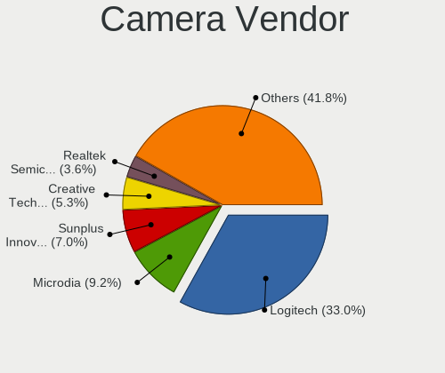

| Vendor                                 | Desktops | Percent |
|----------------------------------------|----------|---------|
| Logitech                               | 86       | 33.59%  |
| Microdia                               | 16       | 6.25%   |
| Sunplus Innovation Technology          | 15       | 5.86%   |
| Creative Technology                    | 13       | 5.08%   |
| Realtek Semiconductor                  | 10       | 3.91%   |
| Generalplus Technology                 | 10       | 3.91%   |
| Z-Star Microelectronics                | 7        | 2.73%   |
| Chicony Electronics                    | 7        | 2.73%   |
| Samsung Electronics                    | 6        | 2.34%   |
| Microsoft                              | 6        | 2.34%   |
| GEMBIRD                                | 6        | 2.34%   |
| Jieli Technology                       | 5        | 1.95%   |
| SunplusIT                              | 4        | 1.56%   |
| Cubeternet                             | 4        | 1.56%   |
| Arkmicro Technologies                  | 4        | 1.56%   |
| ARC International                      | 4        | 1.56%   |
| Apple                                  | 4        | 1.56%   |
| 2M UVC CAMERA                          | 4        | 1.56%   |
| Guillemot                              | 3        | 1.17%   |
| Aveo Technology                        | 3        | 1.17%   |
| Alcor Micro                            | 3        | 1.17%   |
| Xiongmai                               | 2        | 0.78%   |
| WCM_USB                                | 2        | 0.78%   |
| IMC Networks                           | 2        | 0.78%   |
| Huawei Technologies                    | 2        | 0.78%   |
| Google                                 | 2        | 0.78%   |
| FPL-2053-191010                        | 2        | 0.78%   |
| AVerMedia Technologies                 | 2        | 0.78%   |
| Xiaomi                                 | 1        | 0.39%   |
| Unknown                                | 1        | 0.39%   |
| TANDBERG                               | 1        | 0.39%   |
| Sunplus Technology                     | 1        | 0.39%   |
| Sunplus IT                             | 1        | 0.39%   |
| Sonix Technology                       | 1        | 0.39%   |
| Solid Year                             | 1        | 0.39%   |
| SiGma Micro                            | 1        | 0.39%   |
| Razer USA                              | 1        | 0.39%   |
| Pixart Imaging                         | 1        | 0.39%   |
| Philips (or NXP)                       | 1        | 0.39%   |
| Panasonic (Matsushita)                 | 1        | 0.39%   |
| MacroSilicon                           | 1        | 0.39%   |
| Lite-On Technology                     | 1        | 0.39%   |
| lihappe8                               | 1        | 0.39%   |
| KYE Systems (Mouse Systems)            | 1        | 0.39%   |
| iPassion Technology                    | 1        | 0.39%   |
| HTC (High Tech Computer)               | 1        | 0.39%   |
| Hewlett-Packard                        | 1        | 0.39%   |
| Genesys Logic                          | 1        | 0.39%   |
| Cheng Uei Precision Industry (Foxlink) | 1        | 0.39%   |
| Acer                                   | 1        | 0.39%   |

Camera Model
------------

Camera device models

| Model                                             | Desktops | Percent |
|---------------------------------------------------|----------|---------|
| Logitech Webcam C270                              | 21       | 8.17%   |
| Logitech Webcam C170                              | 9        | 3.5%    |
| Logitech HD Pro Webcam C920                       | 9        | 3.5%    |
| Sunplus Full HD webcam                            | 8        | 3.11%   |
| Logitech Webcam C310                              | 8        | 3.11%   |
| Logitech Webcam C200                              | 7        | 2.72%   |
| Logitech HD Webcam C525                           | 7        | 2.72%   |
| Samsung Galaxy series, misc. (MTP mode)           | 6        | 2.33%   |
| Microdia Webcam Vitade AF                         | 6        | 2.33%   |
| Creative Live! Cam Sync HD [VF0770]               | 6        | 2.33%   |
| Realtek FULL HD 1080P Webcam                      | 5        | 1.95%   |
| Jieli USB PHY 2.0                                 | 5        | 1.95%   |
| Creative Live! Cam Chat HD [VF0700]               | 5        | 1.95%   |
| Generalplus 2K HD Camera                          | 4        | 1.56%   |
| ARC International Camera                          | 4        | 1.56%   |
| 2M UVC CAMERA NexiGo N60 FHD Webcam               | 4        | 1.56%   |
| Z-Star Venus USB2.0 Camera                        | 3        | 1.17%   |
| SunplusIT USB 2.0 Camera                          | 3        | 1.17%   |
| Microsoft LifeCam HD-3000                         | 3        | 1.17%   |
| Microdia Integrated Camera                        | 3        | 1.17%   |
| Logitech Webcam C210                              | 3        | 1.17%   |
| Generalplus GENERAL WEBCAM                        | 3        | 1.17%   |
| Generalplus 808 Camera                            | 3        | 1.17%   |
| GEMBIRD USB2.0 PC CAMERA                          | 3        | 1.17%   |
| GEMBIRD Generic UVC 1.00 camera [AppoTech AX2311] | 3        | 1.17%   |
| Chicony HP High Definition 1MP Webcam             | 3        | 1.17%   |
| Arkmicro USB2.0 PC CAMERA                         | 3        | 1.17%   |
| Apple iPhone 5/5C/5S/6/SE                         | 3        | 1.17%   |
| Alcor Micro USB 2.0 PC Camera                     | 3        | 1.17%   |
| Z-Star A4 tech USB2.0 Camera                      | 2        | 0.78%   |
| Xiongmai web camera                               | 2        | 0.78%   |
| WCM_USB WEB CAM                                   | 2        | 0.78%   |
| Sunplus Aukey-PC-LM1E Camera                      | 2        | 0.78%   |
| Microdia USB Live camera                          | 2        | 0.78%   |
| Microdia USB 2.0 Camera                           | 2        | 0.78%   |
| Logitech QuickCam Pro 9000                        | 2        | 0.78%   |
| Logitech QuickCam Orbit/Sphere AF                 | 2        | 0.78%   |
| Logitech QuickCam E 3500                          | 2        | 0.78%   |
| Logitech HD Webcam C615                           | 2        | 0.78%   |
| Logitech C922 Pro Stream Webcam                   | 2        | 0.78%   |
| Huawei UVC Camera                                 | 2        | 0.78%   |
| Guillemot Hercules HD Sunset                      | 2        | 0.78%   |
| FPL-2053-191010 T2 Webcam                         | 2        | 0.78%   |
| Cubeternet USB2.0 Camera                          | 2        | 0.78%   |
| Aveo USB2.0 Camera                                | 2        | 0.78%   |
| Z-Star Vega USB 2.0 Camera                        | 1        | 0.39%   |
| Z-Star A4 TECH USB2.0 PC Camera J                 | 1        | 0.39%   |
| Xiaomi Mi/Redmi series (PTP + ADB)                | 1        | 0.39%   |
| TANDBERG PrecisionHD Camera                       | 1        | 0.39%   |
| SunplusIT MTD camera                              | 1        | 0.39%   |
| Sunplus Siri A9 UVC chipset                       | 1        | 0.39%   |
| Sunplus IT AUKEY PC-LM1 USB Camera                | 1        | 0.39%   |
| Sunplus USB camera                                | 1        | 0.39%   |
| Sunplus Laptop_Integrated_Webcam_FHD              | 1        | 0.39%   |
| Sunplus FHD Camera Microphone                     | 1        | 0.39%   |
| Sunplus FHD Camera                                | 1        | 0.39%   |
| Sunplus AUKEY PC-LM1E Camera                      | 1        | 0.39%   |
| Sonix USB 2.0 Camera                              | 1        | 0.39%   |
| Solid Year AWC113                                 | 1        | 0.39%   |
| SiGma Micro Micro USB Web Camera                  | 1        | 0.39%   |

Security
--------

Fingerprint Vendor
------------------

Fingerprint sensor vendors

| Vendor                | Desktops | Percent |
|-----------------------|----------|---------|
| LighTuning Technology | 1        | 100%    |

Fingerprint Model
-----------------

Fingerprint sensor models

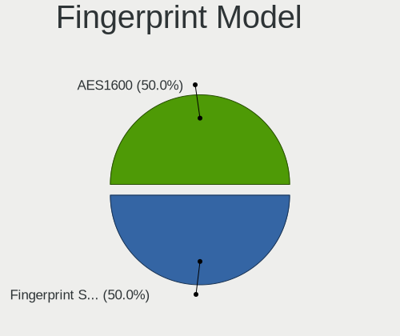

| Model                         | Desktops | Percent |
|-------------------------------|----------|---------|
| LighTuning Fingerprint Sensor | 1        | 100%    |

Chipcard Vendor
---------------

Chipcard module vendors

| Vendor                    | Desktops | Percent |
|---------------------------|----------|---------|
| Alcor Micro               | 14       | 40%     |
| Advanced Card Systems     | 7        | 20%     |
| Chicony Electronics       | 4        | 11.43%  |
| Realtek Semiconductor     | 2        | 5.71%   |
| OmniKey                   | 2        | 5.71%   |
| Hewlett-Packard           | 2        | 5.71%   |
| Gemalto (was Gemplus)     | 1        | 2.86%   |
| Fujitsu Siemens Computers | 1        | 2.86%   |
| Cherry                    | 1        | 2.86%   |
| C3PO                      | 1        | 2.86%   |

Chipcard Model
--------------

Chipcard module models

| Model                                                | Desktops | Percent |
|------------------------------------------------------|----------|---------|
| Alcor Micro AU9540 Smartcard Reader                  | 10       | 28.57%  |
| Advanced Card Systems ACR38 SmartCard Reader         | 5        | 14.29%  |
| Chicony Electronics HP Skylab USB Smartcard Keyboard | 4        | 11.43%  |
| Alcor Micro Watchdata W 1981                         | 4        | 11.43%  |
| Realtek Semiconductor Smart Card Reader Interface    | 2        | 5.71%   |
| OmniKey CardMan 3021 / 3121                          | 2        | 5.71%   |
| Hewlett-Packard SC Keyboard - Apollo (Liteon)        | 2        | 5.71%   |
| Gemalto (was Gemplus) GemPC Twin SmartCard Reader    | 1        | 2.86%   |
| Fujitsu Siemens Computers SmartCard Reader 2A        | 1        | 2.86%   |
| Cherry SmartTerminal XX1X                            | 1        | 2.86%   |
| C3PO LTC31v2                                         | 1        | 2.86%   |
| Advanced Card Systems ACR39U                         | 1        | 2.86%   |
| Advanced Card Systems ACR122U                        | 1        | 2.86%   |

Unsupported
-----------

Unsupported Devices
-------------------

Total unsupported devices on board

| Total | Desktops | Percent |
|-------|----------|---------|
| 0     | 1302     | 85.6%   |
| 1     | 192      | 12.62%  |
| 2     | 20       | 1.31%   |
| 3     | 4        | 0.26%   |
| 9     | 1        | 0.07%   |
| 6     | 1        | 0.07%   |
| 5     | 1        | 0.07%   |

Unsupported Device Types
------------------------

Types of unsupported devices

| Type                     | Desktops | Percent |
|--------------------------|----------|---------|
| Graphics card            | 79       | 31.85%  |
| Net/wireless             | 58       | 23.39%  |
| Chipcard                 | 20       | 8.06%   |
| Unassigned class         | 19       | 7.66%   |
| Multimedia controller    | 13       | 5.24%   |
| Communication controller | 12       | 4.84%   |
| Network                  | 8        | 3.23%   |
| Camera                   | 8        | 3.23%   |
| Bluetooth                | 8        | 3.23%   |
| Sound                    | 7        | 2.82%   |
| Card reader              | 5        | 2.02%   |
| Firewire controller      | 3        | 1.21%   |
| Net/ethernet             | 2        | 0.81%   |
| Dvb card                 | 2        | 0.81%   |
| Storage/ide              | 1        | 0.4%    |
| Storage                  | 1        | 0.4%    |
| Modem                    | 1        | 0.4%    |
| Fingerprint reader       | 1        | 0.4%    |

