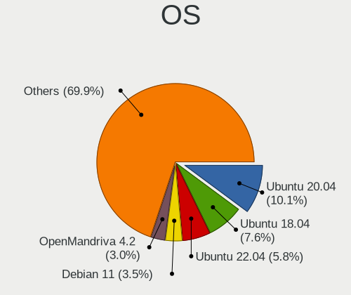
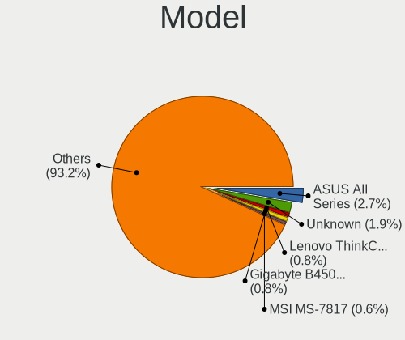
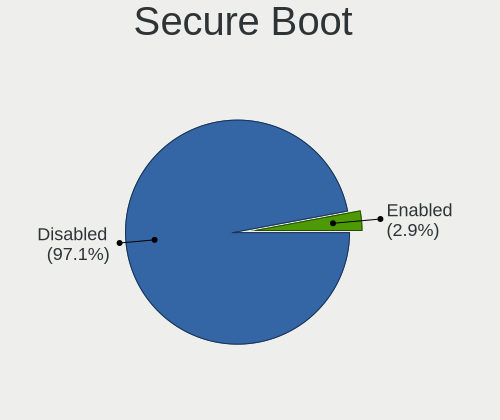
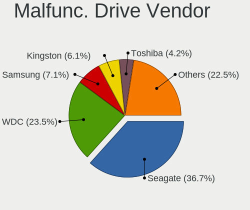
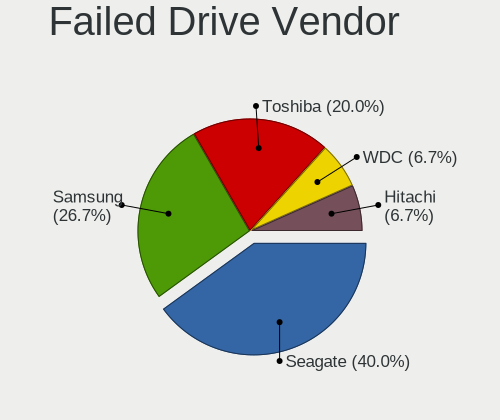
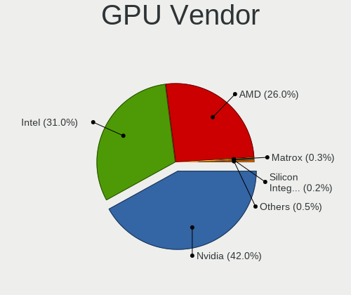
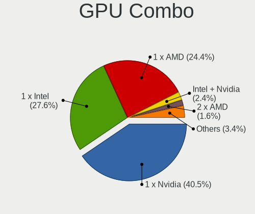
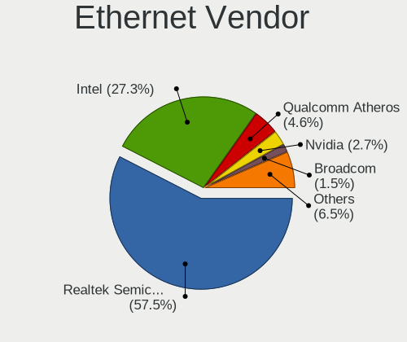
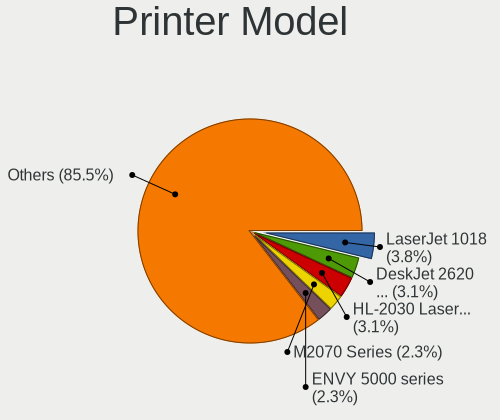
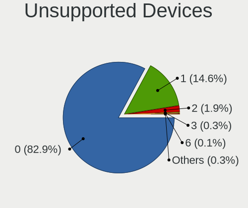

Linux in Spain - Tested Hardware & Statistics (Desktops)
--------------------------------------------------------

A project to collect tested hardware configurations for Linux in Spain.

Anyone can contribute to this report by the [hw-probe](https://github.com/linuxhw/hw-probe) tool:

    sudo -E hw-probe -all -upload

Please contribute! Especially if your hardware is rare.

Contents
--------

* [ Test Cases ](#test-cases)

* [ System ](#system)
  - [ OS                       ](#os)
  - [ OS Family                ](#os-family)
  - [ Kernel                   ](#kernel)
  - [ Kernel Family            ](#kernel-family)
  - [ Kernel Major Ver.        ](#kernel-major-ver)
  - [ Arch                     ](#arch)
  - [ DE                       ](#de)
  - [ Display Server           ](#display-server)
  - [ Display Manager          ](#display-manager)
  - [ OS Lang                  ](#os-lang)
  - [ Boot Mode                ](#boot-mode)
  - [ Filesystem               ](#filesystem)
  - [ Part. scheme             ](#part-scheme)
  - [ Dual Boot with Linux/BSD ](#dual-boot-with-linuxbsd)
  - [ Dual Boot (Win)          ](#dual-boot-win)

* [ Board ](#board)
  - [ Vendor                   ](#vendor)
  - [ Model                    ](#model)
  - [ Model Family             ](#model-family)
  - [ MFG Year                 ](#mfg-year)
  - [ Form Factor              ](#form-factor)
  - [ Secure Boot              ](#secure-boot)
  - [ Coreboot                 ](#coreboot)
  - [ RAM Size                 ](#ram-size)
  - [ RAM Used                 ](#ram-used)
  - [ Total Drives             ](#total-drives)
  - [ Has CD-ROM               ](#has-cd-rom)
  - [ Has Ethernet             ](#has-ethernet)
  - [ Has WiFi                 ](#has-wifi)
  - [ Has Bluetooth            ](#has-bluetooth)

* [ Location ](#location)
  - [ Country                  ](#country)
  - [ City                     ](#city)

* [ Drives ](#drives)
  - [ Drive Vendor             ](#drive-vendor)
  - [ Drive Model              ](#drive-model)
  - [ HDD Vendor               ](#hdd-vendor)
  - [ SSD Vendor               ](#ssd-vendor)
  - [ Drive Kind               ](#drive-kind)
  - [ Drive Connector          ](#drive-connector)
  - [ Drive Size               ](#drive-size)
  - [ Space Total              ](#space-total)
  - [ Space Used               ](#space-used)
  - [ Malfunc. Drives          ](#malfunc-drives)
  - [ Malfunc. Drive Vendor    ](#malfunc-drive-vendor)
  - [ Malfunc. HDD Vendor      ](#malfunc-hdd-vendor)
  - [ Malfunc. Drive Kind      ](#malfunc-drive-kind)
  - [ Failed Drives            ](#failed-drives)
  - [ Failed Drive Vendor      ](#failed-drive-vendor)
  - [ Drive Status             ](#drive-status)

* [ Storage controller ](#storage-controller)
  - [ Storage Vendor           ](#storage-vendor)
  - [ Storage Model            ](#storage-model)
  - [ Storage Kind             ](#storage-kind)

* [ Processor ](#processor)
  - [ CPU Vendor               ](#cpu-vendor)
  - [ CPU Model                ](#cpu-model)
  - [ CPU Model Family         ](#cpu-model-family)
  - [ CPU Cores                ](#cpu-cores)
  - [ CPU Sockets              ](#cpu-sockets)
  - [ CPU Threads              ](#cpu-threads)
  - [ CPU Op-Modes             ](#cpu-op-modes)
  - [ CPU Microcode            ](#cpu-microcode)
  - [ CPU Microarch            ](#cpu-microarch)

* [ Graphics ](#graphics)
  - [ GPU Vendor               ](#gpu-vendor)
  - [ GPU Model                ](#gpu-model)
  - [ GPU Combo                ](#gpu-combo)
  - [ GPU Driver               ](#gpu-driver)
  - [ GPU Memory               ](#gpu-memory)

* [ Monitor ](#monitor)
  - [ Monitor Vendor           ](#monitor-vendor)
  - [ Monitor Model            ](#monitor-model)
  - [ Monitor Resolution       ](#monitor-resolution)
  - [ Monitor Diagonal         ](#monitor-diagonal)
  - [ Monitor Width            ](#monitor-width)
  - [ Aspect Ratio             ](#aspect-ratio)
  - [ Monitor Area             ](#monitor-area)
  - [ Pixel Density            ](#pixel-density)
  - [ Multiple Monitors        ](#multiple-monitors)

* [ Network ](#network)
  - [ Net Controller Vendor    ](#net-controller-vendor)
  - [ Net Controller Model     ](#net-controller-model)
  - [ Wireless Vendor          ](#wireless-vendor)
  - [ Wireless Model           ](#wireless-model)
  - [ Ethernet Vendor          ](#ethernet-vendor)
  - [ Ethernet Model           ](#ethernet-model)
  - [ Net Controller Kind      ](#net-controller-kind)
  - [ Used Controller          ](#used-controller)
  - [ NICs                     ](#nics)
  - [ IPv6                     ](#ipv6)

* [ Bluetooth ](#bluetooth)
  - [ Bluetooth Vendor         ](#bluetooth-vendor)
  - [ Bluetooth Model          ](#bluetooth-model)

* [ Sound ](#sound)
  - [ Sound Vendor             ](#sound-vendor)
  - [ Sound Model              ](#sound-model)

* [ Memory ](#memory)
  - [ Memory Vendor            ](#memory-vendor)
  - [ Memory Model             ](#memory-model)
  - [ Memory Kind              ](#memory-kind)
  - [ Memory Form Factor       ](#memory-form-factor)
  - [ Memory Size              ](#memory-size)
  - [ Memory Speed             ](#memory-speed)

* [ Printers & scanners ](#printers--scanners)
  - [ Printer Vendor           ](#printer-vendor)
  - [ Printer Model            ](#printer-model)
  - [ Scanner Vendor           ](#scanner-vendor)
  - [ Scanner Model            ](#scanner-model)

* [ Camera ](#camera)
  - [ Camera Vendor            ](#camera-vendor)
  - [ Camera Model             ](#camera-model)

* [ Security ](#security)
  - [ Fingerprint Vendor       ](#fingerprint-vendor)
  - [ Fingerprint Model        ](#fingerprint-model)
  - [ Chipcard Vendor          ](#chipcard-vendor)
  - [ Chipcard Model           ](#chipcard-model)

* [ Unsupported ](#unsupported)
  - [ Unsupported Devices      ](#unsupported-devices)
  - [ Unsupported Device Types ](#unsupported-device-types)

Test Cases
----------

Total: 2722

| Vendor        | Model                       | Probe                                                      | Date         |
|---------------|-----------------------------|------------------------------------------------------------|--------------|
| ASUSTek       | Z170-A                      | [a4d77f98eb](https://linux-hardware.org/?probe=a4d77f98eb) | Feb 28, 2023 |
| ASUSTek       | AT4NM10T-I                  | [921aebe62a](https://linux-hardware.org/?probe=921aebe62a) | Feb 28, 2023 |
| ASUSTek       | AT4NM10T-I                  | [fa2df8125a](https://linux-hardware.org/?probe=fa2df8125a) | Feb 28, 2023 |
| ASUSTek       | M5A78L-M PLUS/USB3          | [8cadddf432](https://linux-hardware.org/?probe=8cadddf432) | Feb 28, 2023 |
| AMI           | Cherry Trail CR             | [24952b3b19](https://linux-hardware.org/?probe=24952b3b19) | Feb 27, 2023 |
| ASRock        | A320M-HDV R4.0              | [319e003280](https://linux-hardware.org/?probe=319e003280) | Feb 26, 2023 |
| BESSTAR Te... | B550                        | [6a77bfec73](https://linux-hardware.org/?probe=6a77bfec73) | Feb 26, 2023 |
| BESSTAR Te... | B550                        | [d3e84076c7](https://linux-hardware.org/?probe=d3e84076c7) | Feb 25, 2023 |
| Lenovo        | SHARKBAY SDK0E50510 WIN     | [32453b16fb](https://linux-hardware.org/?probe=32453b16fb) | Feb 25, 2023 |
| MSI           | MAG X570 TOMAHAWK WIFI      | [2e7905f753](https://linux-hardware.org/?probe=2e7905f753) | Feb 24, 2023 |
| Lenovo        | SHARKBAY SDK0E50510 WIN     | [cbadc857a2](https://linux-hardware.org/?probe=cbadc857a2) | Feb 24, 2023 |
| ASUSTek       | P5QL PRO                    | [c7477f1aca](https://linux-hardware.org/?probe=c7477f1aca) | Feb 24, 2023 |
| ASUSTek       | H61M-K                      | [9d39d13682](https://linux-hardware.org/?probe=9d39d13682) | Feb 23, 2023 |
| ASUSTek       | PRIME B660M-A WIFI D4       | [af2a414265](https://linux-hardware.org/?probe=af2a414265) | Feb 23, 2023 |
| Gigabyte      | B550M AORUS ELITE           | [3c27f298a3](https://linux-hardware.org/?probe=3c27f298a3) | Feb 23, 2023 |
| HP            | 0AA8h                       | [8bb60bdebb](https://linux-hardware.org/?probe=8bb60bdebb) | Feb 22, 2023 |
| Gigabyte      | H81M-S2H                    | [d8bafec2da](https://linux-hardware.org/?probe=d8bafec2da) | Feb 22, 2023 |
| Dell          | 0WMJ54 A01                  | [e7175cb8fe](https://linux-hardware.org/?probe=e7175cb8fe) | Feb 22, 2023 |
| HP            | ProLiant ML110 G7           | [56cbaf4274](https://linux-hardware.org/?probe=56cbaf4274) | Feb 21, 2023 |
| ASUSTek       | TUF B450-PLUS GAMING        | [f75f800bd4](https://linux-hardware.org/?probe=f75f800bd4) | Feb 20, 2023 |
| Gigabyte      | H81M-S2H                    | [a4b049c92b](https://linux-hardware.org/?probe=a4b049c92b) | Feb 20, 2023 |
| Acer          | H57M01                      | [5e5e9d03a4](https://linux-hardware.org/?probe=5e5e9d03a4) | Feb 19, 2023 |
| Gigabyte      | H77-DS3H                    | [3f26c5e55c](https://linux-hardware.org/?probe=3f26c5e55c) | Feb 19, 2023 |
| ASUSTek       | ROG STRIX X570-E GAMING     | [84e946f098](https://linux-hardware.org/?probe=84e946f098) | Feb 18, 2023 |
| MSI           | MPG X570 GAMING PRO CARB... | [eff21e4d65](https://linux-hardware.org/?probe=eff21e4d65) | Feb 18, 2023 |
| Acer          | Aspire TC-895 V:1.0         | [cbe7b5e34f](https://linux-hardware.org/?probe=cbe7b5e34f) | Feb 18, 2023 |
| Gigabyte      | P31-ES3G                    | [2c3eb25bc4](https://linux-hardware.org/?probe=2c3eb25bc4) | Feb 18, 2023 |
| MSI           | H270 PC MATE                | [6581748d54](https://linux-hardware.org/?probe=6581748d54) | Feb 17, 2023 |
| Dell          | 0T10XW A02                  | [0f6c993491](https://linux-hardware.org/?probe=0f6c993491) | Feb 17, 2023 |
| Intel         | DH77DF AAG40293-301         | [f44579d8b4](https://linux-hardware.org/?probe=f44579d8b4) | Feb 17, 2023 |
| Gigabyte      | H81M-S2H                    | [db4fef5830](https://linux-hardware.org/?probe=db4fef5830) | Feb 17, 2023 |
| ASUSTek       | P8H61-M LX3 PLUS            | [5d03d010f4](https://linux-hardware.org/?probe=5d03d010f4) | Feb 16, 2023 |
| Intel         | X79M-S                      | [2d3579e9b7](https://linux-hardware.org/?probe=2d3579e9b7) | Feb 15, 2023 |
| Gigabyte      | G41MT-D3V                   | [8a7ce6b005](https://linux-hardware.org/?probe=8a7ce6b005) | Feb 15, 2023 |
| ASUSTek       | ROG STRIX B365-G GAMING     | [e5b971a4b0](https://linux-hardware.org/?probe=e5b971a4b0) | Feb 14, 2023 |
| ASUSTek       | ROG STRIX B365-G GAMING     | [4211a6a7f4](https://linux-hardware.org/?probe=4211a6a7f4) | Feb 14, 2023 |
| Gigabyte      | B450M DS3H-CF               | [f3e396ccc3](https://linux-hardware.org/?probe=f3e396ccc3) | Feb 14, 2023 |
| ASUSTek       | PRIME Z590-A                | [926e34c5a9](https://linux-hardware.org/?probe=926e34c5a9) | Feb 14, 2023 |
| Gigabyte      | H81M-S2H                    | [7458415afe](https://linux-hardware.org/?probe=7458415afe) | Feb 13, 2023 |
| MSI           | Z270 GAMING M3              | [39b7eef9e8](https://linux-hardware.org/?probe=39b7eef9e8) | Feb 12, 2023 |
| ASUSTek       | P5VD2-X                     | [32a509e760](https://linux-hardware.org/?probe=32a509e760) | Feb 11, 2023 |
| MSI           | Z370 GAMING PLUS            | [9621fdeccb](https://linux-hardware.org/?probe=9621fdeccb) | Feb 11, 2023 |
| MSI           | Z370 GAMING PLUS            | [523c8db418](https://linux-hardware.org/?probe=523c8db418) | Feb 11, 2023 |
| ASRock        | X399 Phantom Gaming 6       | [7b2f03d111](https://linux-hardware.org/?probe=7b2f03d111) | Feb 10, 2023 |
| Dell          | 03NVJ6 A00                  | [f7df102318](https://linux-hardware.org/?probe=f7df102318) | Feb 10, 2023 |
| Lenovo        | 3741 NOK                    | [eeb2a331be](https://linux-hardware.org/?probe=eeb2a331be) | Feb 08, 2023 |
| Gigabyte      | H61MA-D2V                   | [380eb0d0e1](https://linux-hardware.org/?probe=380eb0d0e1) | Feb 08, 2023 |
| BESSTAR Te... | B550                        | [49e414926e](https://linux-hardware.org/?probe=49e414926e) | Feb 07, 2023 |
| ASUSTek       | ROG Maximus Z690 FORMULA    | [bc5b9a2c5d](https://linux-hardware.org/?probe=bc5b9a2c5d) | Feb 06, 2023 |
| Unknown       | Intel X79                   | [2ad659fd7a](https://linux-hardware.org/?probe=2ad659fd7a) | Feb 06, 2023 |
| ASUSTek       | ROG Maximus Z690 FORMULA    | [55402fea35](https://linux-hardware.org/?probe=55402fea35) | Feb 05, 2023 |
| Gigabyte      | F2A88XM-DS2                 | [d9313ff1c1](https://linux-hardware.org/?probe=d9313ff1c1) | Feb 05, 2023 |
| Gigabyte      | B450M S2H                   | [c3891f43b5](https://linux-hardware.org/?probe=c3891f43b5) | Feb 05, 2023 |
| Shenzhen M... | F7BFC                       | [4d3066b96e](https://linux-hardware.org/?probe=4d3066b96e) | Feb 05, 2023 |
| SLIMBOOK      | ONE-AMD-M4                  | [dc948f9e70](https://linux-hardware.org/?probe=dc948f9e70) | Feb 05, 2023 |
| Cisco Syst... | UCSC-C220-M3S 74-10442-0... | [9e8c261333](https://linux-hardware.org/?probe=9e8c261333) | Feb 05, 2023 |
| Lenovo        | 30D2 SDK0J40697 WIN 3305... | [bede5aa93c](https://linux-hardware.org/?probe=bede5aa93c) | Feb 05, 2023 |
| Supermicro    | X9DBL-3F/X9DBL-iF           | [280dd65788](https://linux-hardware.org/?probe=280dd65788) | Feb 04, 2023 |
| Supermicro    | X9DBL-3F/X9DBL-iF           | [8f0808edd3](https://linux-hardware.org/?probe=8f0808edd3) | Feb 04, 2023 |
| Supermicro    | H12DSU-iN                   | [0bd8186d9e](https://linux-hardware.org/?probe=0bd8186d9e) | Feb 04, 2023 |
| HP            | 805D                        | [109d9e2356](https://linux-hardware.org/?probe=109d9e2356) | Feb 04, 2023 |
| MSI           | H270 PC MATE                | [dafdc36e54](https://linux-hardware.org/?probe=dafdc36e54) | Feb 03, 2023 |
| HP            | 805D                        | [ed417f3a04](https://linux-hardware.org/?probe=ed417f3a04) | Feb 03, 2023 |
| HP            | 805D                        | [7a8522045b](https://linux-hardware.org/?probe=7a8522045b) | Feb 03, 2023 |
| Gigabyte      | Z690M DS3H DDR4             | [8f858cb9b9](https://linux-hardware.org/?probe=8f858cb9b9) | Jan 31, 2023 |
| Jetway        | I61G-ITX                    | [24cf6ad56e](https://linux-hardware.org/?probe=24cf6ad56e) | Jan 31, 2023 |
| Gigabyte      | B450M DS3H V2               | [b5f1f3cb42](https://linux-hardware.org/?probe=b5f1f3cb42) | Jan 30, 2023 |
| HP            | 339A                        | [3bc7df3921](https://linux-hardware.org/?probe=3bc7df3921) | Jan 30, 2023 |
| Acer          | Aspire TC-895 V:1.0         | [190e9b4aee](https://linux-hardware.org/?probe=190e9b4aee) | Jan 30, 2023 |
| ASUSTek       | P8H67                       | [c6163491b5](https://linux-hardware.org/?probe=c6163491b5) | Jan 29, 2023 |
| ASUSTek       | P5Q PRO TURBO               | [72e0a3fde5](https://linux-hardware.org/?probe=72e0a3fde5) | Jan 28, 2023 |
| ASUSTek       | P5Q PRO TURBO               | [a1cb8edb5a](https://linux-hardware.org/?probe=a1cb8edb5a) | Jan 28, 2023 |
| Gigabyte      | Z97M-DS3H                   | [e9fc2c87df](https://linux-hardware.org/?probe=e9fc2c87df) | Jan 28, 2023 |
| MSI           | B560M PRO-VDH               | [cd55d1ec5d](https://linux-hardware.org/?probe=cd55d1ec5d) | Jan 28, 2023 |
| Gigabyte      | F2A88XM-D3H                 | [1605fbe62a](https://linux-hardware.org/?probe=1605fbe62a) | Jan 28, 2023 |
| HP            | 3397                        | [764f737fcf](https://linux-hardware.org/?probe=764f737fcf) | Jan 27, 2023 |
| Medion        | MS-7675                     | [1d9d209dbf](https://linux-hardware.org/?probe=1d9d209dbf) | Jan 27, 2023 |
| HP            | 3397                        | [10b6614763](https://linux-hardware.org/?probe=10b6614763) | Jan 26, 2023 |
| MSI           | MS-7383                     | [d47659fcf8](https://linux-hardware.org/?probe=d47659fcf8) | Jan 25, 2023 |
| MSI           | MS-7383                     | [b848100b0e](https://linux-hardware.org/?probe=b848100b0e) | Jan 25, 2023 |
| ASUSTek       | B85M-G                      | [73bef1464f](https://linux-hardware.org/?probe=73bef1464f) | Jan 25, 2023 |
| ASRock        | G31M-S                      | [e1d742770d](https://linux-hardware.org/?probe=e1d742770d) | Jan 25, 2023 |
| MSI           | MS-B1831                    | [64348a9180](https://linux-hardware.org/?probe=64348a9180) | Jan 24, 2023 |
| MSI           | H97 PC Mate                 | [d00ec3c042](https://linux-hardware.org/?probe=d00ec3c042) | Jan 24, 2023 |
| HP            | 2B34                        | [ca97840b4b](https://linux-hardware.org/?probe=ca97840b4b) | Jan 24, 2023 |
| Gigabyte      | Z690 UD DDR4                | [872cd0446b](https://linux-hardware.org/?probe=872cd0446b) | Jan 23, 2023 |
| Gigabyte      | H81M-S2H                    | [b2aecb083b](https://linux-hardware.org/?probe=b2aecb083b) | Jan 23, 2023 |
| ASUSTek       | PRIME B550-PLUS             | [73779874bd](https://linux-hardware.org/?probe=73779874bd) | Jan 23, 2023 |
| ASRock        | 960GM/U3S3 FX               | [39f5980c8d](https://linux-hardware.org/?probe=39f5980c8d) | Jan 22, 2023 |
| ASUSTek       | PRIME X399-A                | [4687e8d062](https://linux-hardware.org/?probe=4687e8d062) | Jan 22, 2023 |
| Pegatron      | 2AD5                        | [88d7926aef](https://linux-hardware.org/?probe=88d7926aef) | Jan 22, 2023 |
| ASUSTek       | ROG STRIX B365-G GAMING     | [05c0d355e1](https://linux-hardware.org/?probe=05c0d355e1) | Jan 22, 2023 |
| Eii           | GB01                        | [eb73cef296](https://linux-hardware.org/?probe=eb73cef296) | Jan 22, 2023 |
| Eii           | GB01                        | [0b5b540112](https://linux-hardware.org/?probe=0b5b540112) | Jan 22, 2023 |
| AZW           | U59                         | [de70883bbf](https://linux-hardware.org/?probe=de70883bbf) | Jan 20, 2023 |
| MSI           | H170 GAMING M3              | [2fe05693b8](https://linux-hardware.org/?probe=2fe05693b8) | Jan 20, 2023 |
| ECS           | APLD-MINI                   | [78e90e4760](https://linux-hardware.org/?probe=78e90e4760) | Jan 20, 2023 |
| ASRock        | H97M Pro4                   | [bb86adb1ed](https://linux-hardware.org/?probe=bb86adb1ed) | Jan 18, 2023 |
| Gigabyte      | B460M DS3H                  | [4d510de3d8](https://linux-hardware.org/?probe=4d510de3d8) | Jan 18, 2023 |
| MSI           | H510M-A PRO                 | [9f9fa2e0be](https://linux-hardware.org/?probe=9f9fa2e0be) | Jan 18, 2023 |
| ASUSTek       | PRIME B450M-K II            | [7f1cfd2c02](https://linux-hardware.org/?probe=7f1cfd2c02) | Jan 18, 2023 |
| Gigabyte      | MZBSWMP-00                  | [8f292282cb](https://linux-hardware.org/?probe=8f292282cb) | Jan 18, 2023 |
| MSI           | B560M-A PRO                 | [8b665c7b84](https://linux-hardware.org/?probe=8b665c7b84) | Jan 18, 2023 |
| ASRock        | H110M-HDV R3.0              | [70c0fea989](https://linux-hardware.org/?probe=70c0fea989) | Jan 18, 2023 |
| Gigabyte      | Z370 HD3-CF                 | [273e93cce5](https://linux-hardware.org/?probe=273e93cce5) | Jan 18, 2023 |
| Eii           | GB01                        | [35c7a7739d](https://linux-hardware.org/?probe=35c7a7739d) | Jan 18, 2023 |
| ASUSTek       | PRIME B450M-K II            | [e44a974b71](https://linux-hardware.org/?probe=e44a974b71) | Jan 17, 2023 |
| ASUSTek       | PRIME B450M-K II            | [04e8f0fb25](https://linux-hardware.org/?probe=04e8f0fb25) | Jan 17, 2023 |
| HP            | 3047h                       | [ad1e495439](https://linux-hardware.org/?probe=ad1e495439) | Jan 17, 2023 |
| MSI           | H510M-A PRO                 | [7d05783196](https://linux-hardware.org/?probe=7d05783196) | Jan 17, 2023 |
| ASUSTek       | M4N68T-M-V2                 | [53b9512a96](https://linux-hardware.org/?probe=53b9512a96) | Jan 17, 2023 |
| Gigabyte      | H410M S2H V3                | [0e4dd4c424](https://linux-hardware.org/?probe=0e4dd4c424) | Jan 17, 2023 |
| ASUSTek       | ROG STRIX B365-G GAMING     | [92f9f48219](https://linux-hardware.org/?probe=92f9f48219) | Jan 16, 2023 |
| MSI           | MS-B1711                    | [730b1e7f90](https://linux-hardware.org/?probe=730b1e7f90) | Jan 15, 2023 |
| Gigabyte      | EP43-DS3L                   | [b6b45a8594](https://linux-hardware.org/?probe=b6b45a8594) | Jan 15, 2023 |
| Unknown       | Unknown                     | [a69d4b7b4f](https://linux-hardware.org/?probe=a69d4b7b4f) | Jan 15, 2023 |
| ASUSTek       | PRIME H310M-E               | [7732b2e5e1](https://linux-hardware.org/?probe=7732b2e5e1) | Jan 14, 2023 |
| Unknown       | Unknown                     | [9cb802849a](https://linux-hardware.org/?probe=9cb802849a) | Jan 14, 2023 |
| NEC Comput... | ECS-945G                    | [8226ffab22](https://linux-hardware.org/?probe=8226ffab22) | Jan 14, 2023 |
| Gigabyte      | P55A-UD3                    | [af87fe7cb0](https://linux-hardware.org/?probe=af87fe7cb0) | Jan 14, 2023 |
| Gigabyte      | B85M-D3H                    | [c54bd7b409](https://linux-hardware.org/?probe=c54bd7b409) | Jan 14, 2023 |
| ASUSTek       | TUF Gaming X570-PLUS        | [4f439c171e](https://linux-hardware.org/?probe=4f439c171e) | Jan 14, 2023 |
| HP            | 8433 11                     | [bc44066299](https://linux-hardware.org/?probe=bc44066299) | Jan 13, 2023 |
| HP            | 212A                        | [92f32467ec](https://linux-hardware.org/?probe=92f32467ec) | Jan 13, 2023 |
| Biostar       | B250MHC                     | [100bfd62e6](https://linux-hardware.org/?probe=100bfd62e6) | Jan 13, 2023 |
| Unknown       | Unknown                     | [0402d5609b](https://linux-hardware.org/?probe=0402d5609b) | Jan 13, 2023 |
| Unknown       | Unknown                     | [287fab2142](https://linux-hardware.org/?probe=287fab2142) | Jan 13, 2023 |
| Gigabyte      | H110M-S2H-CF                | [bd4173beb3](https://linux-hardware.org/?probe=bd4173beb3) | Jan 12, 2023 |
| Lenovo        | 3102 SDK0K17763 WIN 1801... | [a3ce2fe598](https://linux-hardware.org/?probe=a3ce2fe598) | Jan 12, 2023 |
| Dell          | 0FM586                      | [529bc38dd7](https://linux-hardware.org/?probe=529bc38dd7) | Jan 12, 2023 |
| ASRock        | X570 Steel Legend           | [600094ae29](https://linux-hardware.org/?probe=600094ae29) | Jan 12, 2023 |
| ASRock        | H170M Pro4                  | [15648a0bb0](https://linux-hardware.org/?probe=15648a0bb0) | Jan 12, 2023 |
| MSI           | MPG Z390 GAMING PLUS        | [64d4a8c163](https://linux-hardware.org/?probe=64d4a8c163) | Jan 11, 2023 |
| Gigabyte      | X79-UP4                     | [89397e1c47](https://linux-hardware.org/?probe=89397e1c47) | Jan 10, 2023 |
| MSI           | PRO A320M-B                 | [3ffa3cf6f0](https://linux-hardware.org/?probe=3ffa3cf6f0) | Jan 10, 2023 |
| Gigabyte      | B85M-DS3H-A                 | [60f83cacd0](https://linux-hardware.org/?probe=60f83cacd0) | Jan 10, 2023 |
| MSI           | MS-B0A21                    | [1905ffef34](https://linux-hardware.org/?probe=1905ffef34) | Jan 09, 2023 |
| MSI           | B450M MORTAR MAX            | [3698ce3c60](https://linux-hardware.org/?probe=3698ce3c60) | Jan 09, 2023 |
| ASUSTek       | PRIME X570-P                | [95c21fc90e](https://linux-hardware.org/?probe=95c21fc90e) | Jan 09, 2023 |
| Pyramid       | CPYSKI0002 A                | [0b20d79be6](https://linux-hardware.org/?probe=0b20d79be6) | Jan 09, 2023 |
| MSI           | PRO Z690-A WIFI DDR4        | [10efec9ea3](https://linux-hardware.org/?probe=10efec9ea3) | Jan 09, 2023 |
| Gigabyte      | B365M DS3H                  | [0e302b3507](https://linux-hardware.org/?probe=0e302b3507) | Jan 08, 2023 |
| ASUSTek       | TUF Gaming B450-PLUS II     | [0f0b86d738](https://linux-hardware.org/?probe=0f0b86d738) | Jan 07, 2023 |
| ASRock        | H110M-HDV                   | [deff7fc898](https://linux-hardware.org/?probe=deff7fc898) | Jan 07, 2023 |
| Gigabyte      | B450M DS3H V2               | [ef473bb212](https://linux-hardware.org/?probe=ef473bb212) | Jan 07, 2023 |
| Gigabyte      | B450M DS3H-CF               | [28ed8a48bd](https://linux-hardware.org/?probe=28ed8a48bd) | Jan 06, 2023 |
| Intel         | DH55TC AAE70932-303         | [7831fb0431](https://linux-hardware.org/?probe=7831fb0431) | Jan 06, 2023 |
| Gigabyte      | B450M DS3H-CF               | [4947d17a2b](https://linux-hardware.org/?probe=4947d17a2b) | Jan 06, 2023 |
| ASUSTek       | P5SD2-VM                    | [46c8437a45](https://linux-hardware.org/?probe=46c8437a45) | Jan 05, 2023 |
| ASUSTek       | M5A97 PRO                   | [7921dc0197](https://linux-hardware.org/?probe=7921dc0197) | Jan 05, 2023 |
| Dell          | 0FM586                      | [7e181126bc](https://linux-hardware.org/?probe=7e181126bc) | Jan 03, 2023 |
| Dell          | 0FM586                      | [fff469554f](https://linux-hardware.org/?probe=fff469554f) | Jan 03, 2023 |
| Gigabyte      | B450M DS3H-CF               | [b557b201c4](https://linux-hardware.org/?probe=b557b201c4) | Jan 03, 2023 |
| Gigabyte      | B550M DS3H                  | [509cc939cc](https://linux-hardware.org/?probe=509cc939cc) | Jan 01, 2023 |
| ASUSTek       | TUF Gaming B660-PLUS WIF... | [b0e7bc419b](https://linux-hardware.org/?probe=b0e7bc419b) | Jan 01, 2023 |
| ASUSTek       | PRIME B350-PLUS             | [c4eccac7c7](https://linux-hardware.org/?probe=c4eccac7c7) | Dec 31, 2022 |
| MSI           | Boston                      | [a5fd252dc2](https://linux-hardware.org/?probe=a5fd252dc2) | Dec 30, 2022 |
| Gigabyte      | Z390 UD                     | [70dc568eae](https://linux-hardware.org/?probe=70dc568eae) | Dec 30, 2022 |
| ASUSTek       | ROG STRIX B365-G GAMING     | [328cfe3747](https://linux-hardware.org/?probe=328cfe3747) | Dec 28, 2022 |
| MSI           | MPG B550 GAMING PLUS        | [305018336b](https://linux-hardware.org/?probe=305018336b) | Dec 26, 2022 |
| ASUSTek       | M5A78L-M LX3                | [aef3959b18](https://linux-hardware.org/?probe=aef3959b18) | Dec 26, 2022 |
| ASUSTek       | SABERTOOTH 990FX            | [d759e5fe02](https://linux-hardware.org/?probe=d759e5fe02) | Dec 25, 2022 |
| MSI           | MS-B1421                    | [58968767bd](https://linux-hardware.org/?probe=58968767bd) | Dec 24, 2022 |
| Gigabyte      | F2A68HM-DS2                 | [ba498df129](https://linux-hardware.org/?probe=ba498df129) | Dec 23, 2022 |
| MSI           | 2A9C                        | [031afb1b20](https://linux-hardware.org/?probe=031afb1b20) | Dec 22, 2022 |
| Gigabyte      | B85M-DS3H-A                 | [d2c931919d](https://linux-hardware.org/?probe=d2c931919d) | Dec 20, 2022 |
| MSI           | Z370 PC PRO                 | [e048dd7a4e](https://linux-hardware.org/?probe=e048dd7a4e) | Dec 20, 2022 |
| HP            | 8597                        | [5a7ae7c6d7](https://linux-hardware.org/?probe=5a7ae7c6d7) | Dec 19, 2022 |
| Intel         | D34010WYK H14771-304        | [c47ff5ba34](https://linux-hardware.org/?probe=c47ff5ba34) | Dec 19, 2022 |
| Intel         | DH55TC AAE70932-303         | [631f80f725](https://linux-hardware.org/?probe=631f80f725) | Dec 18, 2022 |
| ASUSTek       | ROG Maximus Z690 FORMULA    | [0886e650a3](https://linux-hardware.org/?probe=0886e650a3) | Dec 18, 2022 |
| Gigabyte      | Z390 UD                     | [3af8ddb8cc](https://linux-hardware.org/?probe=3af8ddb8cc) | Dec 17, 2022 |
| MACHINIST     | X99-RS9 V2.0                | [83c2de0b09](https://linux-hardware.org/?probe=83c2de0b09) | Dec 15, 2022 |
| Dell          | 0KJCC5 A00                  | [7d1ece638c](https://linux-hardware.org/?probe=7d1ece638c) | Dec 14, 2022 |
| Gigabyte      | B75-D3V                     | [f46b869c82](https://linux-hardware.org/?probe=f46b869c82) | Dec 14, 2022 |
| Pro-B         | INSYS                       | [40650eefcc](https://linux-hardware.org/?probe=40650eefcc) | Dec 14, 2022 |
| ASUSTek       | ROG STRIX X670E-I GAMING... | [8fd3c60681](https://linux-hardware.org/?probe=8fd3c60681) | Dec 13, 2022 |
| ASUSTek       | ROG STRIX B365-G GAMING     | [9d665864a0](https://linux-hardware.org/?probe=9d665864a0) | Dec 13, 2022 |
| ASUSTek       | ROG STRIX B365-G GAMING     | [0af09d12d5](https://linux-hardware.org/?probe=0af09d12d5) | Dec 13, 2022 |
| Intel         | Eaglelake Fab D             | [ed5c44a200](https://linux-hardware.org/?probe=ed5c44a200) | Dec 13, 2022 |
| Gigabyte      | Z370M DS3H-CF               | [238bda76a3](https://linux-hardware.org/?probe=238bda76a3) | Dec 13, 2022 |
| ASUSTek       | STRIX H270F GAMING          | [3b9b8bb589](https://linux-hardware.org/?probe=3b9b8bb589) | Dec 12, 2022 |
| Dell          | 0P67HD A00                  | [67f13377be](https://linux-hardware.org/?probe=67f13377be) | Dec 12, 2022 |
| Gigabyte      | Z97-HD3                     | [7870cee549](https://linux-hardware.org/?probe=7870cee549) | Dec 12, 2022 |
| MSI           | MAG B550 TOMAHAWK           | [deab1a46db](https://linux-hardware.org/?probe=deab1a46db) | Dec 10, 2022 |
| MSI           | MAG X570S TORPEDO MAX       | [560e61c57f](https://linux-hardware.org/?probe=560e61c57f) | Dec 10, 2022 |
| MSI           | PRO Z690-A                  | [3e5339eeae](https://linux-hardware.org/?probe=3e5339eeae) | Dec 10, 2022 |
| Gigabyte      | B550 AORUS ELITE            | [b80c17a638](https://linux-hardware.org/?probe=b80c17a638) | Dec 09, 2022 |
| Gigabyte      | B450 AORUS M                | [bb3d3b636f](https://linux-hardware.org/?probe=bb3d3b636f) | Dec 09, 2022 |
| MACHINIST     | X99-RS9 V2.0                | [527789fc7d](https://linux-hardware.org/?probe=527789fc7d) | Dec 08, 2022 |
| MSI           | B450M PRO-M2                | [4be2d528de](https://linux-hardware.org/?probe=4be2d528de) | Dec 06, 2022 |
| MSI           | B450M PRO-M2                | [787a504fd5](https://linux-hardware.org/?probe=787a504fd5) | Dec 06, 2022 |
| ASUSTek       | TUF Gaming B660-PLUS WIF... | [689479ce87](https://linux-hardware.org/?probe=689479ce87) | Dec 06, 2022 |
| Gigabyte      | H510M S2H V2                | [b0b53bc408](https://linux-hardware.org/?probe=b0b53bc408) | Dec 05, 2022 |
| Gigabyte      | GA-880GA-UD3H               | [0a028304a1](https://linux-hardware.org/?probe=0a028304a1) | Dec 05, 2022 |
| MSI           | A320M-A PRO                 | [1b37803020](https://linux-hardware.org/?probe=1b37803020) | Dec 04, 2022 |
| ASUSTek       | M4A785TD-V EVO              | [88e60fc0ba](https://linux-hardware.org/?probe=88e60fc0ba) | Dec 04, 2022 |
| ASRock        | B75 Pro3-M                  | [db7e5686f3](https://linux-hardware.org/?probe=db7e5686f3) | Dec 03, 2022 |
| HP            | 2AE2                        | [549eacfc3d](https://linux-hardware.org/?probe=549eacfc3d) | Dec 03, 2022 |
| Medion        | D3F3-EM2                    | [e46ba957f0](https://linux-hardware.org/?probe=e46ba957f0) | Dec 02, 2022 |
| HP            | 8648                        | [79673ee467](https://linux-hardware.org/?probe=79673ee467) | Dec 02, 2022 |
| Gigabyte      | GA-78LMT-USB3               | [85eab170d2](https://linux-hardware.org/?probe=85eab170d2) | Dec 02, 2022 |
| MSI           | B450I GAMING PLUS AC        | [9b1ef89e7e](https://linux-hardware.org/?probe=9b1ef89e7e) | Dec 02, 2022 |
| ASUSTek       | ROG STRIX B550-F GAMING     | [0f27e558f3](https://linux-hardware.org/?probe=0f27e558f3) | Dec 01, 2022 |
| Medion        | D3F3-EM                     | [ae428a6a6a](https://linux-hardware.org/?probe=ae428a6a6a) | Nov 29, 2022 |
| MSI           | B560M PRO-VDH               | [cee0622b1f](https://linux-hardware.org/?probe=cee0622b1f) | Nov 29, 2022 |
| ASUSTek       | ROG STRIX B550-F GAMING     | [a95de3b373](https://linux-hardware.org/?probe=a95de3b373) | Nov 29, 2022 |
| ASUSTek       | PRIME H410M-R               | [b680eec959](https://linux-hardware.org/?probe=b680eec959) | Nov 26, 2022 |
| Foxconn       | 2ABF                        | [d95233ff31](https://linux-hardware.org/?probe=d95233ff31) | Nov 26, 2022 |
| Gigabyte      | 970A-DS3P FX                | [4ded1fb943](https://linux-hardware.org/?probe=4ded1fb943) | Nov 26, 2022 |
| MSI           | Z170A GAMING M3             | [982d7f7d0b](https://linux-hardware.org/?probe=982d7f7d0b) | Nov 25, 2022 |
| ASUSTek       | ROG STRIX X670E-E GAMING... | [fc5f72597d](https://linux-hardware.org/?probe=fc5f72597d) | Nov 25, 2022 |
| ASUSTek       | PRIME Z270-K                | [e311874280](https://linux-hardware.org/?probe=e311874280) | Nov 24, 2022 |
| Lenovo        | 312A NOK                    | [94cdaff2c9](https://linux-hardware.org/?probe=94cdaff2c9) | Nov 24, 2022 |
| ASRock        | B75 Pro3                    | [e359d0bd70](https://linux-hardware.org/?probe=e359d0bd70) | Nov 24, 2022 |
| Lenovo        | 30BE SDK0J40697 WIN 3305... | [1deb081598](https://linux-hardware.org/?probe=1deb081598) | Nov 23, 2022 |
| ASUSTek       | PRIME A320M-E               | [5f50e13ad0](https://linux-hardware.org/?probe=5f50e13ad0) | Nov 21, 2022 |
| ASUSTek       | PRIME A320M-E               | [81c02af38c](https://linux-hardware.org/?probe=81c02af38c) | Nov 21, 2022 |
| MSI           | MPG B550 GAMING PLUS        | [934f31fcac](https://linux-hardware.org/?probe=934f31fcac) | Nov 21, 2022 |
| Gigabyte      | B450M DS3H-CF               | [8de96e0012](https://linux-hardware.org/?probe=8de96e0012) | Nov 20, 2022 |
| Gigabyte      | H97M-D3H                    | [4e0102dff6](https://linux-hardware.org/?probe=4e0102dff6) | Nov 20, 2022 |
| MSI           | MPG B550 GAMING PLUS        | [71b3224c4d](https://linux-hardware.org/?probe=71b3224c4d) | Nov 19, 2022 |
| ASUSTek       | PRIME H310M-E R2.0          | [9d276a36d8](https://linux-hardware.org/?probe=9d276a36d8) | Nov 19, 2022 |
| ASUSTek       | PRIME H310M-E R2.0          | [362cf69f1f](https://linux-hardware.org/?probe=362cf69f1f) | Nov 19, 2022 |
| Gigabyte      | B550M DS3H                  | [469ead98f8](https://linux-hardware.org/?probe=469ead98f8) | Nov 17, 2022 |
| Gigabyte      | X570 AORUS ULTRA            | [567b81705d](https://linux-hardware.org/?probe=567b81705d) | Nov 15, 2022 |
| Gigabyte      | X570 AORUS ULTRA            | [389d8cf0e0](https://linux-hardware.org/?probe=389d8cf0e0) | Nov 15, 2022 |
| HP            | 0AA8h                       | [0f88d64eeb](https://linux-hardware.org/?probe=0f88d64eeb) | Nov 14, 2022 |
| HP            | 1495                        | [f588871a3a](https://linux-hardware.org/?probe=f588871a3a) | Nov 14, 2022 |
| HP            | 1495                        | [5086b0aa3e](https://linux-hardware.org/?probe=5086b0aa3e) | Nov 14, 2022 |
| Gigabyte      | B550M DS3H                  | [c16c0f7d8f](https://linux-hardware.org/?probe=c16c0f7d8f) | Nov 13, 2022 |
| ASUSTek       | M4N72-E                     | [092c39d271](https://linux-hardware.org/?probe=092c39d271) | Nov 13, 2022 |
| Gigabyte      | B550M S2H                   | [ea1d9a2fa4](https://linux-hardware.org/?probe=ea1d9a2fa4) | Nov 11, 2022 |
| Unknown       | Unknown                     | [e0b38a3d54](https://linux-hardware.org/?probe=e0b38a3d54) | Nov 11, 2022 |
| Gigabyte      | H110M-S2V-CF                | [1117e533c3](https://linux-hardware.org/?probe=1117e533c3) | Nov 11, 2022 |
| Gigabyte      | Z390 GAMING X-CF            | [4b5ec389d9](https://linux-hardware.org/?probe=4b5ec389d9) | Nov 09, 2022 |
| MSI           | PRO B660M-A WIFI DDR4       | [292caf8ccf](https://linux-hardware.org/?probe=292caf8ccf) | Nov 09, 2022 |
| ASUSTek       | A88XM-PLUS                  | [e6eee311ea](https://linux-hardware.org/?probe=e6eee311ea) | Nov 08, 2022 |
| MSI           | PRO B660M-A WIFI DDR4       | [0aad7f7578](https://linux-hardware.org/?probe=0aad7f7578) | Nov 07, 2022 |
| ASUSTek       | X99-DELUXE                  | [ab4089c760](https://linux-hardware.org/?probe=ab4089c760) | Nov 04, 2022 |
| HP            | 8459                        | [378537c13c](https://linux-hardware.org/?probe=378537c13c) | Nov 04, 2022 |
| HP            | 1998                        | [ba48cbeebe](https://linux-hardware.org/?probe=ba48cbeebe) | Nov 04, 2022 |
| ASUSTek       | M3A78 PRO                   | [93b2e9aea5](https://linux-hardware.org/?probe=93b2e9aea5) | Nov 04, 2022 |
| ASUSTek       | M3A78 PRO                   | [5466838c04](https://linux-hardware.org/?probe=5466838c04) | Nov 03, 2022 |
| Dell          | 0X9M3X A04                  | [3bec3377a8](https://linux-hardware.org/?probe=3bec3377a8) | Nov 03, 2022 |
| Dell          | 0D24M8 A01                  | [347b32510b](https://linux-hardware.org/?probe=347b32510b) | Nov 03, 2022 |
| Gigabyte      | Z270-HD3P-CF                | [8b8ec08876](https://linux-hardware.org/?probe=8b8ec08876) | Nov 02, 2022 |
| ASUSTek       | Z170 PRO GAMING/AURA        | [f0db98f6bb](https://linux-hardware.org/?probe=f0db98f6bb) | Nov 01, 2022 |
| ASUSTek       | Z170 PRO GAMING/AURA        | [fc832e8881](https://linux-hardware.org/?probe=fc832e8881) | Nov 01, 2022 |
| Gigabyte      | H410M S2H V3                | [202065a62d](https://linux-hardware.org/?probe=202065a62d) | Oct 30, 2022 |
| ASUSTek       | PRIME B560M-K               | [416db8870a](https://linux-hardware.org/?probe=416db8870a) | Oct 30, 2022 |
| ASUSTek       | ROG CROSSHAIR VIII HERO     | [7d6c392e74](https://linux-hardware.org/?probe=7d6c392e74) | Oct 29, 2022 |
| MSI           | B560M PRO-VDH               | [ab324c3cdd](https://linux-hardware.org/?probe=ab324c3cdd) | Oct 29, 2022 |
| Gigabyte      | B550M DS3H                  | [4234f1fe02](https://linux-hardware.org/?probe=4234f1fe02) | Oct 29, 2022 |
| Gigabyte      | B550M DS3H                  | [6ab822b64c](https://linux-hardware.org/?probe=6ab822b64c) | Oct 29, 2022 |
| MSI           | P45 Platinum                | [5507d45c35](https://linux-hardware.org/?probe=5507d45c35) | Oct 29, 2022 |
| Dell          | 0D24M8 A01                  | [55aa58c274](https://linux-hardware.org/?probe=55aa58c274) | Oct 29, 2022 |
| ASRock        | H81M-ITX                    | [56f93814ea](https://linux-hardware.org/?probe=56f93814ea) | Oct 28, 2022 |
| ASUSTek       | Z170I PRO GAMING            | [2ae55c9228](https://linux-hardware.org/?probe=2ae55c9228) | Oct 27, 2022 |
| ASUSTek       | PRIME X570-PRO              | [ea04a21af7](https://linux-hardware.org/?probe=ea04a21af7) | Oct 27, 2022 |
| Dell          | 09KPNV A00                  | [c25493f420](https://linux-hardware.org/?probe=c25493f420) | Oct 27, 2022 |
| Intel         | H410M-E                     | [854c3ec5b1](https://linux-hardware.org/?probe=854c3ec5b1) | Oct 27, 2022 |
| ASUSTek       | PRIME B660-PLUS D4          | [5b6d2d2922](https://linux-hardware.org/?probe=5b6d2d2922) | Oct 27, 2022 |
| Gigabyte      | EP43-DS3L                   | [f9e114a7e9](https://linux-hardware.org/?probe=f9e114a7e9) | Oct 26, 2022 |
| Intel         | H410M-E                     | [69d7d07e13](https://linux-hardware.org/?probe=69d7d07e13) | Oct 26, 2022 |
| MSI           | B550M PRO-VDH WIFI          | [696c30d8c3](https://linux-hardware.org/?probe=696c30d8c3) | Oct 25, 2022 |
| MSI           | MAG X570S TOMAHAWK MAX W... | [c05a08e1af](https://linux-hardware.org/?probe=c05a08e1af) | Oct 25, 2022 |
| Unknown       | SKYBAY                      | [63f22191e8](https://linux-hardware.org/?probe=63f22191e8) | Oct 24, 2022 |
| MSI           | MAG X570S TOMAHAWK MAX W... | [936e43f0bc](https://linux-hardware.org/?probe=936e43f0bc) | Oct 24, 2022 |
| MSI           | B560M PRO-VDH               | [0a2cbff604](https://linux-hardware.org/?probe=0a2cbff604) | Oct 24, 2022 |
| ASUSTek       | PRIME X570-P                | [5558f9e3f7](https://linux-hardware.org/?probe=5558f9e3f7) | Oct 23, 2022 |
| Gigabyte      | Z97-HD3                     | [f79eb0cbb0](https://linux-hardware.org/?probe=f79eb0cbb0) | Oct 23, 2022 |
| Gigabyte      | B560M H                     | [cce3979970](https://linux-hardware.org/?probe=cce3979970) | Oct 22, 2022 |
| ASUSTek       | M32CD_A_F_K20CD_K31CD       | [6105b0d3a9](https://linux-hardware.org/?probe=6105b0d3a9) | Oct 22, 2022 |
| Gigabyte      | B365M DS3H                  | [d5f16dde87](https://linux-hardware.org/?probe=d5f16dde87) | Oct 22, 2022 |
| HP            | 8459                        | [c2ebcf9e20](https://linux-hardware.org/?probe=c2ebcf9e20) | Oct 21, 2022 |
| HP            | 8459                        | [d8ec2e7ee9](https://linux-hardware.org/?probe=d8ec2e7ee9) | Oct 20, 2022 |
| MSI           | MPG Z390 GAMING PLUS        | [18c1a4a04d](https://linux-hardware.org/?probe=18c1a4a04d) | Oct 19, 2022 |
| MSI           | H81M-E33                    | [ff6334ee8f](https://linux-hardware.org/?probe=ff6334ee8f) | Oct 19, 2022 |
| ASUSTek       | A88XM-A                     | [9622704d8f](https://linux-hardware.org/?probe=9622704d8f) | Oct 18, 2022 |
| Gigabyte      | B450M GAMING                | [e1eacaa737](https://linux-hardware.org/?probe=e1eacaa737) | Oct 18, 2022 |
| Gigabyte      | X79-UP4                     | [c6e10b3bcb](https://linux-hardware.org/?probe=c6e10b3bcb) | Oct 18, 2022 |
| MSI           | Z390-A PRO                  | [d79e9be41b](https://linux-hardware.org/?probe=d79e9be41b) | Oct 18, 2022 |
| MSI           | IONA                        | [7c164d5733](https://linux-hardware.org/?probe=7c164d5733) | Oct 17, 2022 |
| ASRock        | H110M-HDV                   | [3d1fde3114](https://linux-hardware.org/?probe=3d1fde3114) | Oct 17, 2022 |
| Gigabyte      | X570 AORUS PRO              | [a7941186ab](https://linux-hardware.org/?probe=a7941186ab) | Oct 16, 2022 |
| HP            | 1495                        | [109913631a](https://linux-hardware.org/?probe=109913631a) | Oct 16, 2022 |
| MSI           | A320M PRO-VH PLUS           | [c3c46266d1](https://linux-hardware.org/?probe=c3c46266d1) | Oct 16, 2022 |
| ASUSTek       | PRIME X570-P                | [a7d6f0bd9e](https://linux-hardware.org/?probe=a7d6f0bd9e) | Oct 15, 2022 |
| MSI           | Z97 GAMING 3                | [99fe717434](https://linux-hardware.org/?probe=99fe717434) | Oct 15, 2022 |
| MSI           | Z97 GAMING 3                | [b75b67267c](https://linux-hardware.org/?probe=b75b67267c) | Oct 14, 2022 |
| Gigabyte      | P55M-UD2                    | [0e3ba8fdb3](https://linux-hardware.org/?probe=0e3ba8fdb3) | Oct 14, 2022 |
| ASUSTek       | H81M-K                      | [57e988db9d](https://linux-hardware.org/?probe=57e988db9d) | Oct 14, 2022 |
| ASUSTek       | Z170-A                      | [78abe50673](https://linux-hardware.org/?probe=78abe50673) | Oct 14, 2022 |
| Gigabyte      | P55A-UD3                    | [100f7e1b46](https://linux-hardware.org/?probe=100f7e1b46) | Oct 12, 2022 |
| Gigabyte      | EP43-DS3L                   | [5b1999a241](https://linux-hardware.org/?probe=5b1999a241) | Oct 12, 2022 |
| ASUSTek       | B150I PRO GAMING/WIFI/AU... | [f3b5809fc9](https://linux-hardware.org/?probe=f3b5809fc9) | Oct 12, 2022 |
| HP            | 3397                        | [c374208e14](https://linux-hardware.org/?probe=c374208e14) | Oct 11, 2022 |
| Gigabyte      | P55-US3L                    | [59843156e8](https://linux-hardware.org/?probe=59843156e8) | Oct 11, 2022 |
| Gigabyte      | X470 AORUS ULTRA GAMING-... | [dd9695948c](https://linux-hardware.org/?probe=dd9695948c) | Oct 11, 2022 |
| Intel         | D34010WYK H14771-304        | [b8c2a39217](https://linux-hardware.org/?probe=b8c2a39217) | Oct 10, 2022 |
| Intel         | D34010WYK H14771-304        | [c3a4a7983b](https://linux-hardware.org/?probe=c3a4a7983b) | Oct 10, 2022 |
| BESSTAR Te... | T3 MRD                      | [d223d492fe](https://linux-hardware.org/?probe=d223d492fe) | Oct 10, 2022 |
| MSI           | MAG Z490 TOMAHAWK           | [97bbb3b52b](https://linux-hardware.org/?probe=97bbb3b52b) | Oct 09, 2022 |
| ASUSTek       | PRIME B450M-A               | [bef5f7f7d7](https://linux-hardware.org/?probe=bef5f7f7d7) | Oct 09, 2022 |
| Gigabyte      | GA-MA790XT-UD4P             | [5b30b0591e](https://linux-hardware.org/?probe=5b30b0591e) | Oct 07, 2022 |
| Unknown       | Intel X79                   | [9c0ffde822](https://linux-hardware.org/?probe=9c0ffde822) | Oct 06, 2022 |
| Medion        | MS-7797                     | [9137d0eacf](https://linux-hardware.org/?probe=9137d0eacf) | Oct 06, 2022 |
| Lenovo        | 1031 SDK0E50510 WIN 2625... | [771e19629c](https://linux-hardware.org/?probe=771e19629c) | Oct 05, 2022 |
| Acer          | EQ35M                       | [6a765c4673](https://linux-hardware.org/?probe=6a765c4673) | Oct 05, 2022 |
| Gigabyte      | GA-MA69VM-S2                | [c6dd3eef5d](https://linux-hardware.org/?probe=c6dd3eef5d) | Oct 05, 2022 |
| Acer          | EQ35M                       | [4ad6d2e719](https://linux-hardware.org/?probe=4ad6d2e719) | Oct 05, 2022 |
| ASUSTek       | P5W DH Deluxe               | [8d5a649ba5](https://linux-hardware.org/?probe=8d5a649ba5) | Oct 03, 2022 |
| Shuttle       | DH470                       | [408e44b18b](https://linux-hardware.org/?probe=408e44b18b) | Oct 03, 2022 |
| Intel         | D34010WYK H14771-304        | [fc1fb9966e](https://linux-hardware.org/?probe=fc1fb9966e) | Oct 02, 2022 |
| ASUSTek       | TUF Gaming X570-PRO         | [b902f5d873](https://linux-hardware.org/?probe=b902f5d873) | Oct 01, 2022 |
| HP            | 1632                        | [0f9387690b](https://linux-hardware.org/?probe=0f9387690b) | Oct 01, 2022 |
| Acer          | Batman A01                  | [f8ebe348e4](https://linux-hardware.org/?probe=f8ebe348e4) | Sep 30, 2022 |
| ASUSTek       | ROG STRIX B365-G GAMING     | [d19e0fb48b](https://linux-hardware.org/?probe=d19e0fb48b) | Sep 30, 2022 |
| Gigabyte      | H81M-D2V                    | [21a601e10a](https://linux-hardware.org/?probe=21a601e10a) | Sep 30, 2022 |
| ASUSTek       | ROG STRIX B365-G GAMING     | [4707a778dc](https://linux-hardware.org/?probe=4707a778dc) | Sep 30, 2022 |
| ASUSTek       | M5A97 EVO R2.0              | [6d92b99f8e](https://linux-hardware.org/?probe=6d92b99f8e) | Sep 28, 2022 |
| ASUSTek       | P5K                         | [2d278ddcdf](https://linux-hardware.org/?probe=2d278ddcdf) | Sep 28, 2022 |
| ASUSTek       | M5A97 PRO                   | [255a0a928a](https://linux-hardware.org/?probe=255a0a928a) | Sep 27, 2022 |
| ASUSTek       | ROG STRIX Z590-E GAMING ... | [b3b8d3e04f](https://linux-hardware.org/?probe=b3b8d3e04f) | Sep 26, 2022 |
| ASUSTek       | ROG STRIX Z590-E GAMING ... | [9795d4f9aa](https://linux-hardware.org/?probe=9795d4f9aa) | Sep 26, 2022 |
| Lenovo        | 3098 NOK                    | [0f6ea5edfa](https://linux-hardware.org/?probe=0f6ea5edfa) | Sep 25, 2022 |
| HP            | 2B35                        | [724e0d61e3](https://linux-hardware.org/?probe=724e0d61e3) | Sep 25, 2022 |
| Acer          | Aspire X1900                | [c7b768051b](https://linux-hardware.org/?probe=c7b768051b) | Sep 25, 2022 |
| ASRock        | Z170 Extreme4               | [e0ae893d39](https://linux-hardware.org/?probe=e0ae893d39) | Sep 25, 2022 |
| MSI           | 970 GAMING                  | [015cd37f26](https://linux-hardware.org/?probe=015cd37f26) | Sep 24, 2022 |
| Shuttle       | DH470                       | [d00d31309a](https://linux-hardware.org/?probe=d00d31309a) | Sep 23, 2022 |
| Shuttle       | DH470                       | [cb519b4bfe](https://linux-hardware.org/?probe=cb519b4bfe) | Sep 23, 2022 |
| ASUSTek       | P5K                         | [0ddf0a48dd](https://linux-hardware.org/?probe=0ddf0a48dd) | Sep 22, 2022 |
| Gigabyte      | AX370-Gaming K5-CF          | [d79e046c6d](https://linux-hardware.org/?probe=d79e046c6d) | Sep 22, 2022 |
| ASUSTek       | PRIME X570-P                | [6647dc20ac](https://linux-hardware.org/?probe=6647dc20ac) | Sep 21, 2022 |
| Minix         | NEO G41V-4 Max              | [a1640603ca](https://linux-hardware.org/?probe=a1640603ca) | Sep 20, 2022 |
| Unknown       | 1.0                         | [1ef071c553](https://linux-hardware.org/?probe=1ef071c553) | Sep 20, 2022 |
| MSI           | Z370 PC PRO                 | [7967e43f1d](https://linux-hardware.org/?probe=7967e43f1d) | Sep 20, 2022 |
| Lenovo        | SKYBAY SDK0J40700 WIN 32... | [37fcfc48c5](https://linux-hardware.org/?probe=37fcfc48c5) | Sep 20, 2022 |
| ASRock        | X399 Phantom Gaming 6       | [94d45ff789](https://linux-hardware.org/?probe=94d45ff789) | Sep 19, 2022 |
| ASUSTek       | H110M-D                     | [7ea35cc80a](https://linux-hardware.org/?probe=7ea35cc80a) | Sep 18, 2022 |
| ASRock        | A75M-HVS                    | [7f906bad42](https://linux-hardware.org/?probe=7f906bad42) | Sep 18, 2022 |
| ASUSTek       | P5B-Deluxe                  | [0b32a9e842](https://linux-hardware.org/?probe=0b32a9e842) | Sep 17, 2022 |
| Gigabyte      | B365M DS3H                  | [e552983263](https://linux-hardware.org/?probe=e552983263) | Sep 17, 2022 |
| ASUSTek       | PRIME B560M-A               | [fab04fe2c7](https://linux-hardware.org/?probe=fab04fe2c7) | Sep 16, 2022 |
| ASRock        | B550M Pro4                  | [7f6ce1e4ea](https://linux-hardware.org/?probe=7f6ce1e4ea) | Sep 14, 2022 |
| BESSTAR Te... | T3 MRD                      | [0b03396c93](https://linux-hardware.org/?probe=0b03396c93) | Sep 14, 2022 |
| Acer          | Aspire X3990                | [64cddc5f85](https://linux-hardware.org/?probe=64cddc5f85) | Sep 13, 2022 |
| Gigabyte      | X570 AORUS PRO              | [7858c98403](https://linux-hardware.org/?probe=7858c98403) | Sep 13, 2022 |
| ASUSTek       | B85M-G                      | [74a9860a2e](https://linux-hardware.org/?probe=74a9860a2e) | Sep 13, 2022 |
| ASUSTek       | P5Q SE2                     | [1552e587a8](https://linux-hardware.org/?probe=1552e587a8) | Sep 13, 2022 |
| MSI           | MAG Z390M MORTAR            | [175f37281b](https://linux-hardware.org/?probe=175f37281b) | Sep 12, 2022 |
| MSI           | B560M PRO                   | [6c43058545](https://linux-hardware.org/?probe=6c43058545) | Sep 11, 2022 |
| MSI           | MAG B550 TORPEDO            | [841be89be6](https://linux-hardware.org/?probe=841be89be6) | Sep 10, 2022 |
| MSI           | MAG B550 TORPEDO            | [626cf13c17](https://linux-hardware.org/?probe=626cf13c17) | Sep 10, 2022 |
| Lenovo        | 314F SDK0J40697 WIN 3305... | [0caf1e7324](https://linux-hardware.org/?probe=0caf1e7324) | Sep 10, 2022 |
| ASUSTek       | H81M-P PLUS                 | [1ede09cb8a](https://linux-hardware.org/?probe=1ede09cb8a) | Sep 10, 2022 |
| ASUSTek       | M4N72-E                     | [83be030771](https://linux-hardware.org/?probe=83be030771) | Sep 09, 2022 |
| Lenovo        | 314F SDK0J40697 WIN 3305... | [06d3f051d1](https://linux-hardware.org/?probe=06d3f051d1) | Sep 09, 2022 |
| ASUSTek       | H110M-A                     | [dad38946f6](https://linux-hardware.org/?probe=dad38946f6) | Sep 08, 2022 |
| MSI           | IONA                        | [11d081dfc3](https://linux-hardware.org/?probe=11d081dfc3) | Sep 07, 2022 |
| ASUSTek       | PRIME Z590-A                | [c8a237d75e](https://linux-hardware.org/?probe=c8a237d75e) | Sep 07, 2022 |
| ASRock        | J3355B-ITX                  | [1cf7076b74](https://linux-hardware.org/?probe=1cf7076b74) | Sep 07, 2022 |
| ASUSTek       | H81M-PLUS                   | [ca8d36ee7e](https://linux-hardware.org/?probe=ca8d36ee7e) | Sep 07, 2022 |
| ECS           | GeForce 8000 series         | [7a60cea111](https://linux-hardware.org/?probe=7a60cea111) | Sep 06, 2022 |
| Medion        | H61H2-LM3 V1.0              | [96b497db35](https://linux-hardware.org/?probe=96b497db35) | Sep 05, 2022 |
| ASUSTek       | ROG STRIX B365-G GAMING     | [c0ad8b81fa](https://linux-hardware.org/?probe=c0ad8b81fa) | Sep 05, 2022 |
| ASUSTek       | ROG STRIX B365-G GAMING     | [9128ddb611](https://linux-hardware.org/?probe=9128ddb611) | Sep 05, 2022 |
| HP            | 8767 A                      | [33800541e3](https://linux-hardware.org/?probe=33800541e3) | Sep 04, 2022 |
| ASRock        | X399 Phantom Gaming 6       | [ea22a308c9](https://linux-hardware.org/?probe=ea22a308c9) | Sep 03, 2022 |
| ASRock        | X399 Phantom Gaming 6       | [bd2f18b5a5](https://linux-hardware.org/?probe=bd2f18b5a5) | Sep 03, 2022 |
| MSI           | 970 GAMING                  | [296c04b276](https://linux-hardware.org/?probe=296c04b276) | Sep 02, 2022 |
| Gigabyte      | 945GCM-S2L                  | [99613365f5](https://linux-hardware.org/?probe=99613365f5) | Sep 01, 2022 |
| Gigabyte      | Z590 GAMING X               | [b84d0acafb](https://linux-hardware.org/?probe=b84d0acafb) | Sep 01, 2022 |
| ASUSTek       | PRIME H510T2/CSM            | [12033c4a8b](https://linux-hardware.org/?probe=12033c4a8b) | Aug 31, 2022 |
| MSI           | H97M-G43                    | [978d5b45be](https://linux-hardware.org/?probe=978d5b45be) | Aug 31, 2022 |
| Gigabyte      | P85-D3                      | [71ce0b707c](https://linux-hardware.org/?probe=71ce0b707c) | Aug 31, 2022 |
| Dell          | 09KPNV A00                  | [7e03afa646](https://linux-hardware.org/?probe=7e03afa646) | Aug 28, 2022 |
| Gigabyte      | H81M-D3H                    | [89ced19bd4](https://linux-hardware.org/?probe=89ced19bd4) | Aug 25, 2022 |
| MSI           | H97M-G43                    | [3f781247f0](https://linux-hardware.org/?probe=3f781247f0) | Aug 25, 2022 |
| HP            | 3647h                       | [dc17a52501](https://linux-hardware.org/?probe=dc17a52501) | Aug 23, 2022 |
| Gigabyte      | B550 AORUS ELITE V2         | [a25c6f8d64](https://linux-hardware.org/?probe=a25c6f8d64) | Aug 22, 2022 |
| MSI           | X99A GAMING PRO CARBON      | [f526447f78](https://linux-hardware.org/?probe=f526447f78) | Aug 19, 2022 |
| Gateway       | DS50                        | [3d4faf13bb](https://linux-hardware.org/?probe=3d4faf13bb) | Aug 18, 2022 |
| Lenovo        | 30BE SDK0J40705 WIN 3425... | [02f9463f2b](https://linux-hardware.org/?probe=02f9463f2b) | Aug 17, 2022 |
| Intel         | X79 (INTEL Xeon E5/Corei... | [f223d64d8f](https://linux-hardware.org/?probe=f223d64d8f) | Aug 15, 2022 |
| ASUSTek       | PRIME X570-P                | [fc5923b017](https://linux-hardware.org/?probe=fc5923b017) | Aug 15, 2022 |
| MSI           | Z490-A PRO                  | [b69d60f568](https://linux-hardware.org/?probe=b69d60f568) | Aug 15, 2022 |
| ASUSTek       | PRIME X570-P                | [e53bbe7c1b](https://linux-hardware.org/?probe=e53bbe7c1b) | Aug 14, 2022 |
| Pegatron      | 2A94                        | [81b0cdd377](https://linux-hardware.org/?probe=81b0cdd377) | Aug 14, 2022 |
| MSI           | B450 TOMAHAWK MAX II        | [dcd9be004c](https://linux-hardware.org/?probe=dcd9be004c) | Aug 13, 2022 |
| Unknown       | Unknown                     | [ed94063eb8](https://linux-hardware.org/?probe=ed94063eb8) | Aug 12, 2022 |
| Gigabyte      | B365M DS3H                  | [fd9bae65fa](https://linux-hardware.org/?probe=fd9bae65fa) | Aug 12, 2022 |
| ASUSTek       | ROG STRIX B365-G GAMING     | [1840f48c85](https://linux-hardware.org/?probe=1840f48c85) | Aug 12, 2022 |
| Gigabyte      | B550M DS3H                  | [be29e8b357](https://linux-hardware.org/?probe=be29e8b357) | Aug 11, 2022 |
| HP            | 3397                        | [9beccd0ca8](https://linux-hardware.org/?probe=9beccd0ca8) | Aug 10, 2022 |
| ASUSTek       | A68HM-K                     | [f04f6e3bed](https://linux-hardware.org/?probe=f04f6e3bed) | Aug 07, 2022 |
| Alienware     | 0PGRP5 A01                  | [305bf6182f](https://linux-hardware.org/?probe=305bf6182f) | Aug 07, 2022 |
| ASUSTek       | M3A78                       | [bda5207234](https://linux-hardware.org/?probe=bda5207234) | Aug 05, 2022 |
| Unknown       | Intel X79                   | [f013fa996e](https://linux-hardware.org/?probe=f013fa996e) | Aug 04, 2022 |
| ASRock        | H97M Pro4                   | [c290aae7c6](https://linux-hardware.org/?probe=c290aae7c6) | Aug 04, 2022 |
| Gigabyte      | A320M-S2H V2-CF             | [8e83e6141d](https://linux-hardware.org/?probe=8e83e6141d) | Aug 01, 2022 |
| ASUSTek       | PRIME X570-P                | [405a75cb1d](https://linux-hardware.org/?probe=405a75cb1d) | Aug 01, 2022 |
| Acer          | Aspire X3470                | [88ad041430](https://linux-hardware.org/?probe=88ad041430) | Jul 31, 2022 |
| HP            | 2AF7                        | [da51487005](https://linux-hardware.org/?probe=da51487005) | Jul 31, 2022 |
| Gigabyte      | B450M DS3H-CF               | [e3a44e4c5b](https://linux-hardware.org/?probe=e3a44e4c5b) | Jul 30, 2022 |
| Gigabyte      | X570 AORUS ELITE            | [db241f583d](https://linux-hardware.org/?probe=db241f583d) | Jul 28, 2022 |
| Gigabyte      | H67MA-USB3-B3               | [d29d943a24](https://linux-hardware.org/?probe=d29d943a24) | Jul 28, 2022 |
| ASUSTek       | ROG STRIX Z370-F GAMING     | [c7c46e080e](https://linux-hardware.org/?probe=c7c46e080e) | Jul 25, 2022 |
| MSI           | B365M PRO-VH                | [f254ee30b7](https://linux-hardware.org/?probe=f254ee30b7) | Jul 25, 2022 |
| Gigabyte      | B365M DS3H                  | [571655453a](https://linux-hardware.org/?probe=571655453a) | Jul 24, 2022 |
| ASUSTek       | ROG STRIX B365-G GAMING     | [7cc616f3c8](https://linux-hardware.org/?probe=7cc616f3c8) | Jul 24, 2022 |
| Gigabyte      | F2A88XM-D3H                 | [7923ed68b5](https://linux-hardware.org/?probe=7923ed68b5) | Jul 24, 2022 |
| Gigabyte      | Z370 AORUS Gaming 5-CF      | [793c3d4e22](https://linux-hardware.org/?probe=793c3d4e22) | Jul 24, 2022 |
| Dell          | 0GM819                      | [8c617c1c3f](https://linux-hardware.org/?probe=8c617c1c3f) | Jul 23, 2022 |
| ASUSTek       | ROG STRIX B365-G GAMING     | [89fadaa563](https://linux-hardware.org/?probe=89fadaa563) | Jul 23, 2022 |
| Intel         | STK1A32SC H95551-301        | [ea91c7805d](https://linux-hardware.org/?probe=ea91c7805d) | Jul 22, 2022 |
| IceWhale T... | ZimaBoard 832 ZMB           | [7cd95094de](https://linux-hardware.org/?probe=7cd95094de) | Jul 21, 2022 |
| IceWhale T... | ZimaBoard 832 ZMB           | [4655fe2442](https://linux-hardware.org/?probe=4655fe2442) | Jul 21, 2022 |
| Dell          | 0GM819                      | [373772e538](https://linux-hardware.org/?probe=373772e538) | Jul 21, 2022 |
| ASUSTek       | TUF Gaming B550-PLUS WIF... | [7ff3bd3639](https://linux-hardware.org/?probe=7ff3bd3639) | Jul 20, 2022 |
| Foxconn       | ETON                        | [1686897e74](https://linux-hardware.org/?probe=1686897e74) | Jul 20, 2022 |
| MACHINIST     | X79 V2.82H                  | [67faad589b](https://linux-hardware.org/?probe=67faad589b) | Jul 19, 2022 |
| ASUSTek       | TUF Gaming X570-PRO         | [f2cda5634e](https://linux-hardware.org/?probe=f2cda5634e) | Jul 18, 2022 |
| ASUSTek       | TUF Z390-PLUS GAMING        | [b28f8248b4](https://linux-hardware.org/?probe=b28f8248b4) | Jul 17, 2022 |
| MSI           | Boston                      | [c1474f9d2f](https://linux-hardware.org/?probe=c1474f9d2f) | Jul 15, 2022 |
| Gigabyte      | Z390 AORUS PRO WIFI-CF      | [66efd060ca](https://linux-hardware.org/?probe=66efd060ca) | Jul 14, 2022 |
| Intel         | D34010WYK H14771-304        | [3fe93a38f6](https://linux-hardware.org/?probe=3fe93a38f6) | Jul 13, 2022 |
| Acer          | Aspire X3470                | [61b7216da0](https://linux-hardware.org/?probe=61b7216da0) | Jul 12, 2022 |
| Intel         | D34010WYK H14771-304        | [26c70348e9](https://linux-hardware.org/?probe=26c70348e9) | Jul 12, 2022 |
| MSI           | H110M PRO-VH PLUS           | [02cbc3a4ae](https://linux-hardware.org/?probe=02cbc3a4ae) | Jul 10, 2022 |
| Gigabyte      | B365M DS3H                  | [8c2d8a89d0](https://linux-hardware.org/?probe=8c2d8a89d0) | Jul 10, 2022 |
| ASRock        | Z170 Extreme4               | [34f14d654f](https://linux-hardware.org/?probe=34f14d654f) | Jul 09, 2022 |
| Gigabyte      | 970A-DS3P                   | [75f0ca97b8](https://linux-hardware.org/?probe=75f0ca97b8) | Jul 08, 2022 |
| MSI           | H510M PRO-E                 | [560e81bb64](https://linux-hardware.org/?probe=560e81bb64) | Jul 08, 2022 |
| MSI           | H510M PRO-E                 | [4f57a8d7f4](https://linux-hardware.org/?probe=4f57a8d7f4) | Jul 08, 2022 |
| HP            | 18E7                        | [68781cd22f](https://linux-hardware.org/?probe=68781cd22f) | Jul 07, 2022 |
| ASUSTek       | PRIME B550-PLUS             | [3a20826dbb](https://linux-hardware.org/?probe=3a20826dbb) | Jul 06, 2022 |
| Unknown       | Unknown                     | [c22b57692e](https://linux-hardware.org/?probe=c22b57692e) | Jul 06, 2022 |
| Lenovo        | 3098 NOK                    | [0fb5f3cc66](https://linux-hardware.org/?probe=0fb5f3cc66) | Jul 06, 2022 |
| Gigabyte      | B450M DS3H-CF               | [5636dc957a](https://linux-hardware.org/?probe=5636dc957a) | Jul 05, 2022 |
| ASUSTek       | P5KPL-AM IN/ROEM/SI         | [aed7de4f94](https://linux-hardware.org/?probe=aed7de4f94) | Jul 05, 2022 |
| ASUSTek       | ROG STRIX B365-G GAMING     | [8e5892c130](https://linux-hardware.org/?probe=8e5892c130) | Jul 05, 2022 |
| Gigabyte      | 945GCM-S2L                  | [2d627ba67d](https://linux-hardware.org/?probe=2d627ba67d) | Jul 03, 2022 |
| Lenovo        | SHARKBAY SDK0J40700 WIN ... | [a1ca3ddb17](https://linux-hardware.org/?probe=a1ca3ddb17) | Jul 03, 2022 |
| MSI           | Z87 MPOWER                  | [ba26baf84a](https://linux-hardware.org/?probe=ba26baf84a) | Jun 30, 2022 |
| MSI           | MEG X570 ACE                | [6dff126482](https://linux-hardware.org/?probe=6dff126482) | Jun 30, 2022 |
| HP            | 3647h                       | [3227f38f98](https://linux-hardware.org/?probe=3227f38f98) | Jun 28, 2022 |
| HP            | ProLiant ML110 G7           | [ace3582eee](https://linux-hardware.org/?probe=ace3582eee) | Jun 28, 2022 |
| HP            | ProLiant ML110 G7           | [5d18d90cda](https://linux-hardware.org/?probe=5d18d90cda) | Jun 27, 2022 |
| ASUSTek       | H81M-P PLUS                 | [6c18625cb3](https://linux-hardware.org/?probe=6c18625cb3) | Jun 27, 2022 |
| ASUSTek       | P5K                         | [e401eb71bc](https://linux-hardware.org/?probe=e401eb71bc) | Jun 27, 2022 |
| ASUSTek       | P8B75-M LE                  | [48cbc869da](https://linux-hardware.org/?probe=48cbc869da) | Jun 27, 2022 |
| ASUSTek       | P8B75-M LE                  | [ea31080862](https://linux-hardware.org/?probe=ea31080862) | Jun 27, 2022 |
| ASUSTek       | ROG STRIX B365-G GAMING     | [2d1c05fefc](https://linux-hardware.org/?probe=2d1c05fefc) | Jun 26, 2022 |
| ASUSTek       | TUF B450M-PRO GAMING        | [5047471b41](https://linux-hardware.org/?probe=5047471b41) | Jun 26, 2022 |
| Dell          | 0W0CHX A00                  | [874e7081c6](https://linux-hardware.org/?probe=874e7081c6) | Jun 23, 2022 |
| ASUSTek       | H81M-P PLUS                 | [b91a1b0ded](https://linux-hardware.org/?probe=b91a1b0ded) | Jun 22, 2022 |
| Acer          | Aspire X1700                | [6a67f8cba0](https://linux-hardware.org/?probe=6a67f8cba0) | Jun 21, 2022 |
| ASUSTek       | TUF Z390-PLUS GAMING        | [0e6a585307](https://linux-hardware.org/?probe=0e6a585307) | Jun 21, 2022 |
| Gigabyte      | H61M-USB3H                  | [6b9dcbd952](https://linux-hardware.org/?probe=6b9dcbd952) | Jun 20, 2022 |
| HP            | 18E7                        | [9f82638329](https://linux-hardware.org/?probe=9f82638329) | Jun 14, 2022 |
| ASUSTek       | M4A785TD-V EVO              | [5f5c3fcba9](https://linux-hardware.org/?probe=5f5c3fcba9) | Jun 13, 2022 |
| Gigabyte      | 970A-DS3P                   | [d22ca1b39a](https://linux-hardware.org/?probe=d22ca1b39a) | Jun 12, 2022 |
| HP            | 1496                        | [d6fba97175](https://linux-hardware.org/?probe=d6fba97175) | Jun 12, 2022 |
| Gigabyte      | 970A-DS3P                   | [a3ca1ea153](https://linux-hardware.org/?probe=a3ca1ea153) | Jun 12, 2022 |
| MSI           | H310M PRO-VDH PLUS          | [839663a1af](https://linux-hardware.org/?probe=839663a1af) | Jun 10, 2022 |
| ASUSTek       | P5B-Deluxe                  | [eb7ee3a693](https://linux-hardware.org/?probe=eb7ee3a693) | Jun 10, 2022 |
| MSI           | MAG B550M MORTAR            | [40c1095611](https://linux-hardware.org/?probe=40c1095611) | Jun 08, 2022 |
| MSI           | H110M PRO-VH                | [ceae668577](https://linux-hardware.org/?probe=ceae668577) | Jun 07, 2022 |
| Gigabyte      | H81M-S2H                    | [4ca91078a2](https://linux-hardware.org/?probe=4ca91078a2) | Jun 07, 2022 |
| Gigabyte      | H61M-USB3H                  | [1f88a2c07c](https://linux-hardware.org/?probe=1f88a2c07c) | Jun 04, 2022 |
| Gigabyte      | H61M-USB3H                  | [3cc513c431](https://linux-hardware.org/?probe=3cc513c431) | Jun 04, 2022 |
| Acer          | F90M R01-D1                 | [ecc8d1f955](https://linux-hardware.org/?probe=ecc8d1f955) | Jun 03, 2022 |
| Gigabyte      | B450 AORUS M                | [bb96d40d38](https://linux-hardware.org/?probe=bb96d40d38) | Jun 03, 2022 |
| ASUSTek       | H81M-P PLUS                 | [8c60f1e8e0](https://linux-hardware.org/?probe=8c60f1e8e0) | Jun 03, 2022 |
| ASUSTek       | P5K                         | [2e621739e6](https://linux-hardware.org/?probe=2e621739e6) | Jun 03, 2022 |
| Gigabyte      | H81M-S1                     | [3210714de1](https://linux-hardware.org/?probe=3210714de1) | Jun 03, 2022 |
| Gigabyte      | H81M-S1                     | [9b01043ab8](https://linux-hardware.org/?probe=9b01043ab8) | Jun 03, 2022 |
| MSI           | MPG X570 GAMING PLUS        | [4a055cff40](https://linux-hardware.org/?probe=4a055cff40) | Jun 02, 2022 |
| MSI           | B560M PRO-VDH               | [2e9996424a](https://linux-hardware.org/?probe=2e9996424a) | Jun 02, 2022 |
| ASUSTek       | P5QL-ASUS-SE                | [5c9f7b1ab9](https://linux-hardware.org/?probe=5c9f7b1ab9) | Jun 02, 2022 |
| ASUSTek       | P5QL-ASUS-SE                | [0e1e2765fc](https://linux-hardware.org/?probe=0e1e2765fc) | Jun 01, 2022 |
| MSI           | MPG Z390 GAMING PRO CARB... | [580abb0cf9](https://linux-hardware.org/?probe=580abb0cf9) | May 30, 2022 |
| ASUSTek       | TUF Z390-PRO GAMING         | [b0e56c97d2](https://linux-hardware.org/?probe=b0e56c97d2) | May 28, 2022 |
| ASUSTek       | P5K                         | [b816732403](https://linux-hardware.org/?probe=b816732403) | May 27, 2022 |
| ASRock        | AM2NF6G-VSTA                | [475179d795](https://linux-hardware.org/?probe=475179d795) | May 27, 2022 |
| ASUSTek       | P5G41T-M LX                 | [5dbf3199e0](https://linux-hardware.org/?probe=5dbf3199e0) | May 27, 2022 |
| BESSTAR Te... | UM350                       | [e4082f489e](https://linux-hardware.org/?probe=e4082f489e) | May 27, 2022 |
| HP            | 8767 A                      | [553a8de02a](https://linux-hardware.org/?probe=553a8de02a) | May 26, 2022 |
| ASUSTek       | 970 PRO GAMING/AURA         | [4673dbdffc](https://linux-hardware.org/?probe=4673dbdffc) | May 26, 2022 |
| ASUSTek       | TUF Gaming B550M-PLUS       | [cca34ae407](https://linux-hardware.org/?probe=cca34ae407) | May 26, 2022 |
| ASUSTek       | TUF Gaming B550M-PLUS       | [d998776096](https://linux-hardware.org/?probe=d998776096) | May 26, 2022 |
| ASUSTek       | M4A785TD-V EVO              | [29dd7760ba](https://linux-hardware.org/?probe=29dd7760ba) | May 25, 2022 |
| MACHINIST     | X99-RS9 V2.0                | [ca5eb0e4ff](https://linux-hardware.org/?probe=ca5eb0e4ff) | May 24, 2022 |
| MSI           | B450I GAMING PLUS AC        | [dbc555961b](https://linux-hardware.org/?probe=dbc555961b) | May 23, 2022 |
| ASUSTek       | TUF Gaming B550-PLUS        | [93700a286d](https://linux-hardware.org/?probe=93700a286d) | May 23, 2022 |
| Foxconn       | 2A8C                        | [eda69f1faf](https://linux-hardware.org/?probe=eda69f1faf) | May 22, 2022 |
| Gigabyte      | B250M-D3H-CF                | [a4275c42f4](https://linux-hardware.org/?probe=a4275c42f4) | May 22, 2022 |
| ASUSTek       | Crosshair IV Formula        | [d6c9df82c6](https://linux-hardware.org/?probe=d6c9df82c6) | May 21, 2022 |
| Packard Be... | MCP73PV                     | [14085bdcf2](https://linux-hardware.org/?probe=14085bdcf2) | May 20, 2022 |
| MSI           | B460M-A PRO                 | [2f1ec161d1](https://linux-hardware.org/?probe=2f1ec161d1) | May 20, 2022 |
| Gigabyte      | Z270-HD3P-CF                | [1efa62dcdb](https://linux-hardware.org/?probe=1efa62dcdb) | May 19, 2022 |
| ASUSTek       | ROG STRIX B365-G GAMING     | [a941ac6fa0](https://linux-hardware.org/?probe=a941ac6fa0) | May 19, 2022 |
| HP            | 8591                        | [60c5d4f8ca](https://linux-hardware.org/?probe=60c5d4f8ca) | May 19, 2022 |
| MSI           | B450M PRO-VDH MAX           | [b2eceeef6d](https://linux-hardware.org/?probe=b2eceeef6d) | May 19, 2022 |
| HP            | 8591                        | [fd05ae27e7](https://linux-hardware.org/?probe=fd05ae27e7) | May 18, 2022 |
| ASUSTek       | PRIME A320M-K               | [cb6038cd9b](https://linux-hardware.org/?probe=cb6038cd9b) | May 18, 2022 |
| ASUSTek       | A8N32-SLI-Deluxe            | [78a9ab4d15](https://linux-hardware.org/?probe=78a9ab4d15) | May 17, 2022 |
| MSI           | MPG B550I GAMING EDGE WI... | [26f332bc9c](https://linux-hardware.org/?probe=26f332bc9c) | May 16, 2022 |
| ASUSTek       | SABERTOOTH 990FX            | [49a3292018](https://linux-hardware.org/?probe=49a3292018) | May 15, 2022 |
| ASUSTek       | B85M-G                      | [dd305c13de](https://linux-hardware.org/?probe=dd305c13de) | May 15, 2022 |
| ASUSTek       | Z8NR-D12                    | [e65adcd0da](https://linux-hardware.org/?probe=e65adcd0da) | May 14, 2022 |
| HP            | 8433 11                     | [d3f305a093](https://linux-hardware.org/?probe=d3f305a093) | May 14, 2022 |
| MSI           | B450M PRO-M2                | [0bb720a248](https://linux-hardware.org/?probe=0bb720a248) | May 14, 2022 |
| ECS           | Asterope                    | [a0c032d6f6](https://linux-hardware.org/?probe=a0c032d6f6) | May 14, 2022 |
| ASUSTek       | ROG STRIX B365-G GAMING     | [e1fc077918](https://linux-hardware.org/?probe=e1fc077918) | May 14, 2022 |
| Gigabyte      | GA-K8NF-9                   | [f9d59e3770](https://linux-hardware.org/?probe=f9d59e3770) | May 13, 2022 |
| ASUSTek       | M5A78L-M/USB3               | [2ac5991afa](https://linux-hardware.org/?probe=2ac5991afa) | May 13, 2022 |
| Medion        | Z370H4-EM                   | [2030abcd26](https://linux-hardware.org/?probe=2030abcd26) | May 12, 2022 |
| ASUSTek       | B150-PLUS                   | [eb2447cec6](https://linux-hardware.org/?probe=eb2447cec6) | May 11, 2022 |
| Gigabyte      | Z390 AORUS PRO-CF           | [1d4364ac51](https://linux-hardware.org/?probe=1d4364ac51) | May 10, 2022 |
| ECS           | H81H3-I                     | [e184359c46](https://linux-hardware.org/?probe=e184359c46) | May 09, 2022 |
| ASUSTek       | P8H61-M LX                  | [9a00d24f58](https://linux-hardware.org/?probe=9a00d24f58) | May 09, 2022 |
| ASUSTek       | P8H61-M LX                  | [3f3089216f](https://linux-hardware.org/?probe=3f3089216f) | May 09, 2022 |
| MSI           | B460M-A PRO                 | [29c0818bcd](https://linux-hardware.org/?probe=29c0818bcd) | May 08, 2022 |
| ASUSTek       | CROSSHAIR                   | [39f623cf4d](https://linux-hardware.org/?probe=39f623cf4d) | May 08, 2022 |
| Acer          | Aspire M1935                | [a679a25c13](https://linux-hardware.org/?probe=a679a25c13) | May 07, 2022 |
| Acer          | Aspire M1935                | [62424ad96d](https://linux-hardware.org/?probe=62424ad96d) | May 07, 2022 |
| HP            | 84FD                        | [f99c153a46](https://linux-hardware.org/?probe=f99c153a46) | May 06, 2022 |
| Gigabyte      | G41MT-S2                    | [fd9ed9a035](https://linux-hardware.org/?probe=fd9ed9a035) | May 05, 2022 |
| ASRock        | FM2A78M Pro4+               | [7a00557ba5](https://linux-hardware.org/?probe=7a00557ba5) | May 05, 2022 |
| HP            | 1998                        | [b35fc936e5](https://linux-hardware.org/?probe=b35fc936e5) | May 04, 2022 |
| Dell          | 0Y56T3 A00                  | [3bdd958639](https://linux-hardware.org/?probe=3bdd958639) | May 04, 2022 |
| MSI           | H170A PC MATE               | [3ebb871ecc](https://linux-hardware.org/?probe=3ebb871ecc) | May 02, 2022 |
| ASUSTek       | B150-PLUS                   | [e2f5eb0a39](https://linux-hardware.org/?probe=e2f5eb0a39) | May 02, 2022 |
| Gigabyte      | H110M-S2H-CF                | [c45a37ce5d](https://linux-hardware.org/?probe=c45a37ce5d) | May 01, 2022 |
| ASRock        | B365M-HDV                   | [51b0e7e57f](https://linux-hardware.org/?probe=51b0e7e57f) | May 01, 2022 |
| Lenovo        | ThinkCentre M58p 6137E61    | [dbf0d596fc](https://linux-hardware.org/?probe=dbf0d596fc) | May 01, 2022 |
| Intel         | V1.3                        | [a01993f2fa](https://linux-hardware.org/?probe=a01993f2fa) | Apr 30, 2022 |
| ASUSTek       | PRIME H610M-A D4            | [e9376d24f0](https://linux-hardware.org/?probe=e9376d24f0) | Apr 29, 2022 |
| ASUSTek       | Z87-WS                      | [1c67952875](https://linux-hardware.org/?probe=1c67952875) | Apr 29, 2022 |
| Dell          | 0J37VM A00                  | [76f13aa200](https://linux-hardware.org/?probe=76f13aa200) | Apr 28, 2022 |
| ASRock        | AB350M-HDV                  | [6ee4ea44a8](https://linux-hardware.org/?probe=6ee4ea44a8) | Apr 27, 2022 |
| ASUSTek       | Maximus II Formula          | [66a4342140](https://linux-hardware.org/?probe=66a4342140) | Apr 26, 2022 |
| MSI           | H170A PC MATE               | [558be4bee8](https://linux-hardware.org/?probe=558be4bee8) | Apr 26, 2022 |
| Gigabyte      | P55M-UD2                    | [5f9ffc8d46](https://linux-hardware.org/?probe=5f9ffc8d46) | Apr 24, 2022 |
| MSI           | B250M PRO-VDH               | [a1ff9cf092](https://linux-hardware.org/?probe=a1ff9cf092) | Apr 24, 2022 |
| Gigabyte      | F2A88XN-WIFI                | [347ded3d71](https://linux-hardware.org/?probe=347ded3d71) | Apr 23, 2022 |
| Foxconn       | 945 7AD Series              | [04346c58f5](https://linux-hardware.org/?probe=04346c58f5) | Apr 23, 2022 |
| AZW           | GTi                         | [e2d4a0da2e](https://linux-hardware.org/?probe=e2d4a0da2e) | Apr 23, 2022 |
| AZW           | GTi                         | [cde74551bf](https://linux-hardware.org/?probe=cde74551bf) | Apr 23, 2022 |
| ASUSTek       | ROG STRIX B365-G GAMING     | [14089322a6](https://linux-hardware.org/?probe=14089322a6) | Apr 23, 2022 |
| Gigabyte      | H310M S2H x.x               | [bde3fa1f37](https://linux-hardware.org/?probe=bde3fa1f37) | Apr 22, 2022 |
| AMI           | Cherry Trail CR             | [61d45f784c](https://linux-hardware.org/?probe=61d45f784c) | Apr 21, 2022 |
| Gigabyte      | GA-78LMT-USB3               | [8034b9ae8c](https://linux-hardware.org/?probe=8034b9ae8c) | Apr 21, 2022 |
| Dell          | 0WMJ54 A01                  | [37ec4fb91d](https://linux-hardware.org/?probe=37ec4fb91d) | Apr 21, 2022 |
| Dell          | 0JP3NX A01                  | [e1c710c88f](https://linux-hardware.org/?probe=e1c710c88f) | Apr 21, 2022 |
| Dell          | 0JP3NX A01                  | [8e6566a555](https://linux-hardware.org/?probe=8e6566a555) | Apr 21, 2022 |
| Lenovo        | SHARKBAY 0B98401 PRO        | [0ceaadd5e3](https://linux-hardware.org/?probe=0ceaadd5e3) | Apr 20, 2022 |
| Gigabyte      | P55M-UD2                    | [bc5f8558f3](https://linux-hardware.org/?probe=bc5f8558f3) | Apr 20, 2022 |
| MSI           | A320M-A PRO MAX             | [b925b403ca](https://linux-hardware.org/?probe=b925b403ca) | Apr 20, 2022 |
| Lenovo        | 3098 NOK                    | [a9126e3886](https://linux-hardware.org/?probe=a9126e3886) | Apr 19, 2022 |
| Gigabyte      | H81M-S2H                    | [85082e6de6](https://linux-hardware.org/?probe=85082e6de6) | Apr 19, 2022 |
| ASUSTek       | H87-PLUS                    | [10e97d2168](https://linux-hardware.org/?probe=10e97d2168) | Apr 18, 2022 |
| Gigabyte      | B85M-DS3H                   | [c278a421cd](https://linux-hardware.org/?probe=c278a421cd) | Apr 18, 2022 |
| ASUSTek       | TUF Gaming Z690-PLUS D4     | [fb3e0b6b22](https://linux-hardware.org/?probe=fb3e0b6b22) | Apr 18, 2022 |
| ASUSTek       | PRIME B660-PLUS D4          | [d921190f7e](https://linux-hardware.org/?probe=d921190f7e) | Apr 17, 2022 |
| BESSTAR Te... | UM250 V1.0                  | [271eb8380b](https://linux-hardware.org/?probe=271eb8380b) | Apr 17, 2022 |
| Gigabyte      | F2A68HM-DS2                 | [a016ec1bce](https://linux-hardware.org/?probe=a016ec1bce) | Apr 16, 2022 |
| ASUSTek       | P5VD2-MX                    | [57fec52891](https://linux-hardware.org/?probe=57fec52891) | Apr 16, 2022 |
| Medion        | MS-7728                     | [443a5ff3dd](https://linux-hardware.org/?probe=443a5ff3dd) | Apr 15, 2022 |
| MSI           | X470 GAMING PLUS            | [72af1b2afe](https://linux-hardware.org/?probe=72af1b2afe) | Apr 15, 2022 |
| BESSTAR Te... | UM250 V1.0                  | [bd378877e0](https://linux-hardware.org/?probe=bd378877e0) | Apr 14, 2022 |
| Lenovo        | 3098 NOK                    | [45b5664eb1](https://linux-hardware.org/?probe=45b5664eb1) | Apr 14, 2022 |
| Unknown       | Unknown                     | [d7811dbd43](https://linux-hardware.org/?probe=d7811dbd43) | Apr 14, 2022 |
| ASUSTek       | ROG STRIX Z370-H GAMING     | [ace1daa3ff](https://linux-hardware.org/?probe=ace1daa3ff) | Apr 13, 2022 |
| ASUSTek       | ROG STRIX Z370-H GAMING     | [c77d1618d1](https://linux-hardware.org/?probe=c77d1618d1) | Apr 13, 2022 |
| Gateway       | DS71                        | [3bd1ad84ce](https://linux-hardware.org/?probe=3bd1ad84ce) | Apr 13, 2022 |
| Gigabyte      | F2A88XM-D3H                 | [c5c12d6818](https://linux-hardware.org/?probe=c5c12d6818) | Apr 12, 2022 |
| Gigabyte      | 970A-DS3P                   | [8101ed4e60](https://linux-hardware.org/?probe=8101ed4e60) | Apr 12, 2022 |
| Gigabyte      | 970A-DS3P                   | [bf61a75cfd](https://linux-hardware.org/?probe=bf61a75cfd) | Apr 12, 2022 |
| Gigabyte      | Q67M-D2H                    | [c95352a142](https://linux-hardware.org/?probe=c95352a142) | Apr 10, 2022 |
| ASUSTek       | Z87-WS                      | [7706049c53](https://linux-hardware.org/?probe=7706049c53) | Apr 10, 2022 |
| Medion        | MS-7366                     | [206ab01c63](https://linux-hardware.org/?probe=206ab01c63) | Apr 10, 2022 |
| ASUSTek       | STRIX H270F GAMING          | [22502631b3](https://linux-hardware.org/?probe=22502631b3) | Apr 10, 2022 |
| ASUSTek       | PRIME A320M-K               | [9cc7cc23d6](https://linux-hardware.org/?probe=9cc7cc23d6) | Apr 10, 2022 |
| ASUSTek       | PRIME A320M-K               | [3845180872](https://linux-hardware.org/?probe=3845180872) | Apr 10, 2022 |
| MACHINIST     | X99-RS9 V2.0                | [862e7ffc88](https://linux-hardware.org/?probe=862e7ffc88) | Apr 09, 2022 |
| MACHINIST     | X99-RS9 V2.0                | [e20b365083](https://linux-hardware.org/?probe=e20b365083) | Apr 09, 2022 |
| Medion        | MS-7366                     | [86884e1cf1](https://linux-hardware.org/?probe=86884e1cf1) | Apr 09, 2022 |
| ASUSTek       | TUF Z390-PLUS GAMING        | [a618981311](https://linux-hardware.org/?probe=a618981311) | Apr 09, 2022 |
| Gigabyte      | 970A-DS3P                   | [f45b500a83](https://linux-hardware.org/?probe=f45b500a83) | Apr 09, 2022 |
| ASUSTek       | H97M-PLUS                   | [b90df26c2a](https://linux-hardware.org/?probe=b90df26c2a) | Apr 08, 2022 |
| ASRock        | C226 WS                     | [7c11c1ec43](https://linux-hardware.org/?probe=7c11c1ec43) | Apr 07, 2022 |
| ECS           | Nettle2                     | [65cedbb00d](https://linux-hardware.org/?probe=65cedbb00d) | Apr 07, 2022 |
| HP            | 18E5                        | [b79c804a6a](https://linux-hardware.org/?probe=b79c804a6a) | Apr 05, 2022 |
| ASRock        | X399 Phantom Gaming 6       | [939722b6a7](https://linux-hardware.org/?probe=939722b6a7) | Apr 05, 2022 |
| ASUSTek       | TUF Gaming B560-PLUS WIF... | [db18e71352](https://linux-hardware.org/?probe=db18e71352) | Apr 05, 2022 |
| Gigabyte      | GA-990FX-GAMING             | [46756b95b5](https://linux-hardware.org/?probe=46756b95b5) | Apr 03, 2022 |
| Medion        | Z370H4-EM                   | [0f9b0bf367](https://linux-hardware.org/?probe=0f9b0bf367) | Apr 03, 2022 |
| ASUSTek       | PRIME X570-PRO              | [368a64422d](https://linux-hardware.org/?probe=368a64422d) | Apr 03, 2022 |
| ASUSTek       | TUF Gaming Z690-PLUS D4     | [a11d93b9d5](https://linux-hardware.org/?probe=a11d93b9d5) | Apr 02, 2022 |
| ASUSTek       | TUF Gaming B460M-PLUS       | [7419ad6a76](https://linux-hardware.org/?probe=7419ad6a76) | Apr 02, 2022 |
| Gigabyte      | H81M-S2H                    | [8a810aa9f6](https://linux-hardware.org/?probe=8a810aa9f6) | Apr 02, 2022 |
| MSI           | H81M-E35 V2                 | [a3aea1cbf5](https://linux-hardware.org/?probe=a3aea1cbf5) | Apr 02, 2022 |
| Wistron       | ProLiant ML110 G5           | [ccea23c3b5](https://linux-hardware.org/?probe=ccea23c3b5) | Apr 01, 2022 |
| Wistron       | ProLiant ML110 G5           | [4c01aec65d](https://linux-hardware.org/?probe=4c01aec65d) | Apr 01, 2022 |
| ASUSTek       | ROG STRIX B365-G GAMING     | [47e2449cf5](https://linux-hardware.org/?probe=47e2449cf5) | Apr 01, 2022 |
| MSI           | H410M PRO-VH                | [e4ef535529](https://linux-hardware.org/?probe=e4ef535529) | Mar 31, 2022 |
| Unknown       | Unknown                     | [926a8980fc](https://linux-hardware.org/?probe=926a8980fc) | Mar 30, 2022 |
| ASUSTek       | PRIME Z390-A                | [5307aba2c3](https://linux-hardware.org/?probe=5307aba2c3) | Mar 30, 2022 |
| ASUSTek       | D940MX                      | [bdc8831182](https://linux-hardware.org/?probe=bdc8831182) | Mar 28, 2022 |
| ASUSTek       | ROG STRIX B365-G GAMING     | [7c852d78e1](https://linux-hardware.org/?probe=7c852d78e1) | Mar 27, 2022 |
| ASUSTek       | ROG Maximus XI HERO         | [ce82ab584b](https://linux-hardware.org/?probe=ce82ab584b) | Mar 26, 2022 |
| Gigabyte      | H61M-USB3H                  | [f852a0cb0d](https://linux-hardware.org/?probe=f852a0cb0d) | Mar 26, 2022 |
| Intel         | B75                         | [9f73efdcc8](https://linux-hardware.org/?probe=9f73efdcc8) | Mar 25, 2022 |
| ASUSTek       | ROG STRIX B365-G GAMING     | [b2c47467cc](https://linux-hardware.org/?probe=b2c47467cc) | Mar 25, 2022 |
| Gigabyte      | GA-73PVM-S2H                | [ac9f20a77c](https://linux-hardware.org/?probe=ac9f20a77c) | Mar 23, 2022 |
| Gigabyte      | 970A-DS3P                   | [012e192ece](https://linux-hardware.org/?probe=012e192ece) | Mar 22, 2022 |
| ASUSTek       | STRIX H270F GAMING          | [5d6041ffc4](https://linux-hardware.org/?probe=5d6041ffc4) | Mar 21, 2022 |
| ASUSTek       | STRIX H270F GAMING          | [7c5dff1166](https://linux-hardware.org/?probe=7c5dff1166) | Mar 21, 2022 |
| HP            | 18E7                        | [727446a2df](https://linux-hardware.org/?probe=727446a2df) | Mar 20, 2022 |
| Gigabyte      | Z690 UD DDR4                | [03bfb9a66b](https://linux-hardware.org/?probe=03bfb9a66b) | Mar 20, 2022 |
| ECS           | H87H3-M                     | [f15990212f](https://linux-hardware.org/?probe=f15990212f) | Mar 20, 2022 |
| ASUSTek       | TUF Gaming X570-PLUS        | [6dd4a41851](https://linux-hardware.org/?probe=6dd4a41851) | Mar 19, 2022 |
| Unknown       | Intel X79                   | [1b92468c15](https://linux-hardware.org/?probe=1b92468c15) | Mar 17, 2022 |
| Gigabyte      | B550I AORUS PRO AX          | [bca7145550](https://linux-hardware.org/?probe=bca7145550) | Mar 17, 2022 |
| ECS           | H110I-C4P                   | [de40e2a12d](https://linux-hardware.org/?probe=de40e2a12d) | Mar 16, 2022 |
| Pegatron      | 2ACF                        | [56d5f5b8ec](https://linux-hardware.org/?probe=56d5f5b8ec) | Mar 16, 2022 |
| ASUSTek       | PRIME B450M-A               | [75a7099e71](https://linux-hardware.org/?probe=75a7099e71) | Mar 15, 2022 |
| ASRock        | B150 Gaming K4              | [a03321659f](https://linux-hardware.org/?probe=a03321659f) | Mar 15, 2022 |
| HP            | 1497                        | [0aaa7bf906](https://linux-hardware.org/?probe=0aaa7bf906) | Mar 15, 2022 |
| ASUSTek       | TUF Gaming X570-PRO         | [e284a60544](https://linux-hardware.org/?probe=e284a60544) | Mar 14, 2022 |
| ASUSTek       | PRIME Z490M-PLUS            | [e0efdaa76a](https://linux-hardware.org/?probe=e0efdaa76a) | Mar 13, 2022 |
| ASUSTek       | P5QC                        | [144a20f079](https://linux-hardware.org/?probe=144a20f079) | Mar 13, 2022 |
| Lenovo        | SHARKBAY 0B98401 WIN        | [06b1c7d30a](https://linux-hardware.org/?probe=06b1c7d30a) | Mar 13, 2022 |
| Lenovo        | SHARKBAY 0B98401 WIN        | [41737e64bb](https://linux-hardware.org/?probe=41737e64bb) | Mar 13, 2022 |
| ASUSTek       | ROG STRIX B365-G GAMING     | [e0e46ae824](https://linux-hardware.org/?probe=e0e46ae824) | Mar 13, 2022 |
| ASUSTek       | ROG STRIX B365-G GAMING     | [f225ce7d58](https://linux-hardware.org/?probe=f225ce7d58) | Mar 12, 2022 |
| HP            | 3398                        | [6afe044e03](https://linux-hardware.org/?probe=6afe044e03) | Mar 12, 2022 |
| ASUSTek       | ROG STRIX B365-G GAMING     | [72775a871a](https://linux-hardware.org/?probe=72775a871a) | Mar 11, 2022 |
| Dell          | 0F6X5P A00                  | [b58520e2a7](https://linux-hardware.org/?probe=b58520e2a7) | Mar 11, 2022 |
| ASRock        | H81M-VG4 R2.0               | [2d72940994](https://linux-hardware.org/?probe=2d72940994) | Mar 10, 2022 |
| MSI           | Z270 GAMING M3              | [989eec2f5f](https://linux-hardware.org/?probe=989eec2f5f) | Mar 10, 2022 |
| ASRock        | Q1900M                      | [ce28f1e721](https://linux-hardware.org/?probe=ce28f1e721) | Mar 09, 2022 |
| Dell          | 0J37VM A00                  | [a78d4c99e3](https://linux-hardware.org/?probe=a78d4c99e3) | Mar 09, 2022 |
| ASUSTek       | M11AD                       | [8bb5baaa5a](https://linux-hardware.org/?probe=8bb5baaa5a) | Mar 09, 2022 |
| ASUSTek       | PRIME A320M-K               | [9695618053](https://linux-hardware.org/?probe=9695618053) | Mar 08, 2022 |
| Intel         | DH55TC AAE70932-302         | [60bdf00035](https://linux-hardware.org/?probe=60bdf00035) | Mar 07, 2022 |
| Intel         | DH55TC AAE70932-205         | [13a7b2300c](https://linux-hardware.org/?probe=13a7b2300c) | Mar 07, 2022 |
| Intel         | DH55TC AAE70932-205         | [245ea26d7f](https://linux-hardware.org/?probe=245ea26d7f) | Mar 07, 2022 |
| Intel         | DH55TC AAE70932-205         | [d681586515](https://linux-hardware.org/?probe=d681586515) | Mar 07, 2022 |
| Intel         | DH55TC AAE70932-205         | [459b5909e6](https://linux-hardware.org/?probe=459b5909e6) | Mar 07, 2022 |
| ASRock        | FM2A88X+ Killer             | [c75eb0d27f](https://linux-hardware.org/?probe=c75eb0d27f) | Mar 07, 2022 |
| ASUSTek       | PRIME Z590-A                | [72960138d6](https://linux-hardware.org/?probe=72960138d6) | Mar 06, 2022 |
| ASRock        | X99E-ITX/ac                 | [0cf67f0201](https://linux-hardware.org/?probe=0cf67f0201) | Mar 06, 2022 |
| MSI           | MPG X570 GAMING PRO CARB... | [727fc2327e](https://linux-hardware.org/?probe=727fc2327e) | Mar 04, 2022 |
| ASUSTek       | PRIME H510M-A               | [472b82d84c](https://linux-hardware.org/?probe=472b82d84c) | Mar 03, 2022 |
| ASRock        | H110M-HDV                   | [96416af97f](https://linux-hardware.org/?probe=96416af97f) | Mar 03, 2022 |
| ASUSTek       | P5KPL/EPU                   | [26cc94d2d9](https://linux-hardware.org/?probe=26cc94d2d9) | Mar 02, 2022 |
| HP            | 8054                        | [272944ecda](https://linux-hardware.org/?probe=272944ecda) | Mar 02, 2022 |
| Gigabyte      | H55M-UD2H                   | [074d13c1d2](https://linux-hardware.org/?probe=074d13c1d2) | Mar 01, 2022 |
| ASUSTek       | CM6870                      | [45c8e5fea2](https://linux-hardware.org/?probe=45c8e5fea2) | Mar 01, 2022 |
| ASUSTek       | Z170-PRO                    | [28d2c658a9](https://linux-hardware.org/?probe=28d2c658a9) | Feb 28, 2022 |
| HP            | 0AA8h                       | [e6f96c5f67](https://linux-hardware.org/?probe=e6f96c5f67) | Feb 28, 2022 |
| MSI           | Indio                       | [5005ca76bd](https://linux-hardware.org/?probe=5005ca76bd) | Feb 27, 2022 |
| ASUSTek       | ROG STRIX B365-G GAMING     | [f12fd06900](https://linux-hardware.org/?probe=f12fd06900) | Feb 27, 2022 |
| Gigabyte      | B250M-DS3H-CF               | [5a78616e2f](https://linux-hardware.org/?probe=5a78616e2f) | Feb 27, 2022 |
| ASUSTek       | PRIME X570-PRO              | [6d4c3afa7f](https://linux-hardware.org/?probe=6d4c3afa7f) | Feb 27, 2022 |
| Gigabyte      | X570 I AORUS PRO WIFI       | [18d37562a8](https://linux-hardware.org/?probe=18d37562a8) | Feb 26, 2022 |
| Gigabyte      | X570 I AORUS PRO WIFI       | [d8af57f59a](https://linux-hardware.org/?probe=d8af57f59a) | Feb 26, 2022 |
| MSI           | B560M PRO-VDH               | [707dc0d97b](https://linux-hardware.org/?probe=707dc0d97b) | Feb 26, 2022 |
| ASUSTek       | P5Q DELUXE                  | [bff628fbba](https://linux-hardware.org/?probe=bff628fbba) | Feb 25, 2022 |
| Gigabyte      | H310M S2H                   | [2ee02369e0](https://linux-hardware.org/?probe=2ee02369e0) | Feb 25, 2022 |
| ASUSTek       | PRIME H510M-D               | [5e8e80fa4c](https://linux-hardware.org/?probe=5e8e80fa4c) | Feb 25, 2022 |
| Dell          | 0NKW6Y A01                  | [cf92b61f90](https://linux-hardware.org/?probe=cf92b61f90) | Feb 25, 2022 |
| Gigabyte      | 970A-DS3P                   | [76ba570966](https://linux-hardware.org/?probe=76ba570966) | Feb 22, 2022 |
| Gigabyte      | X470 AORUS ULTRA GAMING-... | [0d69aa634e](https://linux-hardware.org/?probe=0d69aa634e) | Feb 22, 2022 |
| ASUSTek       | TUF B450M-PLUS GAMING       | [e5706d5397](https://linux-hardware.org/?probe=e5706d5397) | Feb 22, 2022 |
| ASUSTek       | TUF Z390-PRO GAMING         | [f6f59e8802](https://linux-hardware.org/?probe=f6f59e8802) | Feb 22, 2022 |
| ASUSTek       | TUF Z390-PRO GAMING         | [90db107d96](https://linux-hardware.org/?probe=90db107d96) | Feb 22, 2022 |
| MSI           | X570-A PRO                  | [6f419a41f3](https://linux-hardware.org/?probe=6f419a41f3) | Feb 20, 2022 |
| HP            | 158A                        | [f31e70e834](https://linux-hardware.org/?probe=f31e70e834) | Feb 19, 2022 |
| ASUSTek       | M11AD                       | [035887c4ab](https://linux-hardware.org/?probe=035887c4ab) | Feb 18, 2022 |
| Gigabyte      | H270M-DS3H-CF               | [bccc2f8988](https://linux-hardware.org/?probe=bccc2f8988) | Feb 18, 2022 |
| MSI           | MPG X570 GAMING PRO CARB... | [ef382cadcd](https://linux-hardware.org/?probe=ef382cadcd) | Feb 18, 2022 |
| ASUSTek       | H110M-D                     | [b3e3d47340](https://linux-hardware.org/?probe=b3e3d47340) | Feb 17, 2022 |
| Gigabyte      | 970A-DS3P                   | [edbe3bb3bb](https://linux-hardware.org/?probe=edbe3bb3bb) | Feb 17, 2022 |
| HP            | 2820h                       | [f45476e17a](https://linux-hardware.org/?probe=f45476e17a) | Feb 17, 2022 |
| ASUSTek       | H110M-D                     | [9b311cac8b](https://linux-hardware.org/?probe=9b311cac8b) | Feb 17, 2022 |
| HP            | 0AA8h                       | [cb11b8e6fb](https://linux-hardware.org/?probe=cb11b8e6fb) | Feb 16, 2022 |
| ASRock        | N68-GS                      | [06e4bc5238](https://linux-hardware.org/?probe=06e4bc5238) | Feb 16, 2022 |
| Gigabyte      | G41MT-D3V                   | [1d0a4e4e9e](https://linux-hardware.org/?probe=1d0a4e4e9e) | Feb 16, 2022 |
| MSI           | H81M-E35 V2                 | [20aafa92dd](https://linux-hardware.org/?probe=20aafa92dd) | Feb 16, 2022 |
| Intel         | X79M-S                      | [b655865606](https://linux-hardware.org/?probe=b655865606) | Feb 14, 2022 |
| Packard Be... | MCP61                       | [e209ef5de2](https://linux-hardware.org/?probe=e209ef5de2) | Feb 14, 2022 |
| IBM           | 81077AG                     | [934878ed63](https://linux-hardware.org/?probe=934878ed63) | Feb 14, 2022 |
| Medion        | Z370H4-EM                   | [254b8351a1](https://linux-hardware.org/?probe=254b8351a1) | Feb 14, 2022 |
| Dell          | 0FH884                      | [bd2aa894cc](https://linux-hardware.org/?probe=bd2aa894cc) | Feb 13, 2022 |
| ASUSTek       | A55BM-PLUS                  | [53753f59d3](https://linux-hardware.org/?probe=53753f59d3) | Feb 13, 2022 |
| ASUSTek       | ROG STRIX X570-E GAMING     | [8753c04911](https://linux-hardware.org/?probe=8753c04911) | Feb 13, 2022 |
| Gigabyte      | H110M-S2H-CF                | [50224f8f4c](https://linux-hardware.org/?probe=50224f8f4c) | Feb 13, 2022 |
| Gigabyte      | F2A68HM-DS2                 | [f3f17f2dd0](https://linux-hardware.org/?probe=f3f17f2dd0) | Feb 13, 2022 |
| MSI           | H81M-E35 V2                 | [fdba4d1aab](https://linux-hardware.org/?probe=fdba4d1aab) | Feb 13, 2022 |
| MSI           | X99S SLI PLUS               | [dd15aa61af](https://linux-hardware.org/?probe=dd15aa61af) | Feb 13, 2022 |
| Dell          | 0D28YY A00                  | [1fe2aa51aa](https://linux-hardware.org/?probe=1fe2aa51aa) | Feb 13, 2022 |
| MSI           | MPG Z390 GAMING PRO CARB... | [32d9ce9d27](https://linux-hardware.org/?probe=32d9ce9d27) | Feb 12, 2022 |
| Acer          | Aspire X3950                | [28f9470608](https://linux-hardware.org/?probe=28f9470608) | Feb 12, 2022 |
| ASUSTek       | Benicia                     | [aceee2d932](https://linux-hardware.org/?probe=aceee2d932) | Feb 12, 2022 |
| AZW           | BT3 X                       | [583bf1d943](https://linux-hardware.org/?probe=583bf1d943) | Feb 12, 2022 |
| ASUSTek       | P5G41T-M LX                 | [165720aab0](https://linux-hardware.org/?probe=165720aab0) | Feb 11, 2022 |
| ASUSTek       | PRIME Z490M-PLUS            | [f4dec544b7](https://linux-hardware.org/?probe=f4dec544b7) | Feb 11, 2022 |
| Gigabyte      | 970A-DS3P                   | [60f9ecb597](https://linux-hardware.org/?probe=60f9ecb597) | Feb 11, 2022 |
| MSI           | H410M PRO-VH                | [6b2970ce21](https://linux-hardware.org/?probe=6b2970ce21) | Feb 11, 2022 |
| ASRock        | G41C-GS R2.0                | [9eed789082](https://linux-hardware.org/?probe=9eed789082) | Feb 10, 2022 |
| ASUSTek       | P8H67-M PRO                 | [fe18f09b36](https://linux-hardware.org/?probe=fe18f09b36) | Feb 10, 2022 |
| ASUSTek       | ROG STRIX B550-F GAMING     | [3196a6c153](https://linux-hardware.org/?probe=3196a6c153) | Feb 09, 2022 |
| MSI           | Z390-A PRO                  | [a7c54c30a7](https://linux-hardware.org/?probe=a7c54c30a7) | Feb 09, 2022 |
| HP            | 1497                        | [a80fd6e442](https://linux-hardware.org/?probe=a80fd6e442) | Feb 09, 2022 |
| Gigabyte      | B85M-D3H                    | [add118efcc](https://linux-hardware.org/?probe=add118efcc) | Feb 09, 2022 |
| ECS           | A78F2P-M2                   | [8ddba334a5](https://linux-hardware.org/?probe=8ddba334a5) | Feb 09, 2022 |
| ASRock        | B450M Steel Legend          | [bd05301177](https://linux-hardware.org/?probe=bd05301177) | Feb 09, 2022 |
| MSI           | B450I GAMING PLUS AC        | [a2af859752](https://linux-hardware.org/?probe=a2af859752) | Feb 09, 2022 |
| ASRock        | Z87 Pro3                    | [dea0b07f08](https://linux-hardware.org/?probe=dea0b07f08) | Feb 08, 2022 |
| ASUSTek       | B85M-G                      | [8ed1aa83eb](https://linux-hardware.org/?probe=8ed1aa83eb) | Feb 08, 2022 |
| MSI           | H77MA-G43                   | [67f0fd2098](https://linux-hardware.org/?probe=67f0fd2098) | Feb 08, 2022 |
| Gigabyte      | MTGU5AB-00                  | [21eedf9331](https://linux-hardware.org/?probe=21eedf9331) | Feb 08, 2022 |
| ASUSTek       | TUF Gaming Z490-PLUS        | [9dd525ae45](https://linux-hardware.org/?probe=9dd525ae45) | Feb 07, 2022 |
| Lenovo        | 3140 NOK                    | [5391d351ee](https://linux-hardware.org/?probe=5391d351ee) | Feb 07, 2022 |
| HP            | 2820h                       | [347b6a83de](https://linux-hardware.org/?probe=347b6a83de) | Feb 07, 2022 |
| Gigabyte      | MZGLKBP-00                  | [e217e9db4a](https://linux-hardware.org/?probe=e217e9db4a) | Feb 07, 2022 |
| HP            | 2820h                       | [7c5fb9c18f](https://linux-hardware.org/?probe=7c5fb9c18f) | Feb 07, 2022 |
| MSI           | B450I GAMING PLUS AC        | [3aa5fa2d91](https://linux-hardware.org/?probe=3aa5fa2d91) | Feb 06, 2022 |
| ASUSTek       | ROG STRIX B365-G GAMING     | [b918b737c2](https://linux-hardware.org/?probe=b918b737c2) | Feb 06, 2022 |
| MSI           | B450I GAMING PLUS AC        | [0b905c31b5](https://linux-hardware.org/?probe=0b905c31b5) | Feb 05, 2022 |
| Gateway       | DS71                        | [cefb514e23](https://linux-hardware.org/?probe=cefb514e23) | Feb 05, 2022 |
| Gigabyte      | B365M DS3H                  | [6d5ae4cd37](https://linux-hardware.org/?probe=6d5ae4cd37) | Feb 05, 2022 |
| Gigabyte      | B365M DS3H                  | [b11a458ecb](https://linux-hardware.org/?probe=b11a458ecb) | Feb 04, 2022 |
| HP            | 339A                        | [cf9dca84ff](https://linux-hardware.org/?probe=cf9dca84ff) | Feb 02, 2022 |
| HP            | 8433 11                     | [a67fa333f1](https://linux-hardware.org/?probe=a67fa333f1) | Feb 01, 2022 |
| Gigabyte      | Z370 HD3P-CF                | [44411daa5a](https://linux-hardware.org/?probe=44411daa5a) | Jan 31, 2022 |
| HP            | 3047h                       | [48f624cbea](https://linux-hardware.org/?probe=48f624cbea) | Jan 29, 2022 |
| ASUSTek       | ROG STRIX B365-G GAMING     | [bef8f6667a](https://linux-hardware.org/?probe=bef8f6667a) | Jan 28, 2022 |
| ASUSTek       | P8Z77-V                     | [8747994f49](https://linux-hardware.org/?probe=8747994f49) | Jan 27, 2022 |
| Medion        | H61H2-LM3                   | [c8552cc10c](https://linux-hardware.org/?probe=c8552cc10c) | Jan 26, 2022 |
| ASUSTek       | P9X79 WS                    | [ee0e90a869](https://linux-hardware.org/?probe=ee0e90a869) | Jan 26, 2022 |
| ASRock        | H61M-HVS                    | [8fdf1980ee](https://linux-hardware.org/?probe=8fdf1980ee) | Jan 25, 2022 |
| ASRock        | H61M-HVS                    | [5d19dff1e4](https://linux-hardware.org/?probe=5d19dff1e4) | Jan 25, 2022 |
| ASUSTek       | SABERTOOTH 55i              | [5c67654acf](https://linux-hardware.org/?probe=5c67654acf) | Jan 23, 2022 |
| Gigabyte      | GA-MA790XT-UD4P             | [9bb58c340e](https://linux-hardware.org/?probe=9bb58c340e) | Jan 22, 2022 |
| Huanan        | X99-F8                      | [4e1327b556](https://linux-hardware.org/?probe=4e1327b556) | Jan 22, 2022 |
| ASRock        | Z170 Extreme4               | [1484d8fbb7](https://linux-hardware.org/?probe=1484d8fbb7) | Jan 21, 2022 |
| MSI           | Z97 PC Mate                 | [be068c5a3a](https://linux-hardware.org/?probe=be068c5a3a) | Jan 21, 2022 |
| Gigabyte      | H81M-S2H                    | [5a010a60d7](https://linux-hardware.org/?probe=5a010a60d7) | Jan 20, 2022 |
| Dell          | 0D28YY A01                  | [f427224d76](https://linux-hardware.org/?probe=f427224d76) | Jan 20, 2022 |
| ASUSTek       | V-P5G31                     | [ab3ad44c74](https://linux-hardware.org/?probe=ab3ad44c74) | Jan 18, 2022 |
| Gigabyte      | Z370 HD3-CF                 | [00dc05487b](https://linux-hardware.org/?probe=00dc05487b) | Jan 16, 2022 |
| Huanan        | X99-F8                      | [b03aaab88c](https://linux-hardware.org/?probe=b03aaab88c) | Jan 16, 2022 |
| HP            | 8643 SMVB                   | [51bcf449dc](https://linux-hardware.org/?probe=51bcf449dc) | Jan 14, 2022 |
| ASRock        | H61M-VG4                    | [ee03e4043a](https://linux-hardware.org/?probe=ee03e4043a) | Jan 14, 2022 |
| MSI           | B450M BAZOOKA V2            | [6779dfb408](https://linux-hardware.org/?probe=6779dfb408) | Jan 14, 2022 |
| Medion        | Z370H4-EM                   | [a4bb231aa7](https://linux-hardware.org/?probe=a4bb231aa7) | Jan 13, 2022 |
| HP            | 82B4                        | [79444cc816](https://linux-hardware.org/?probe=79444cc816) | Jan 12, 2022 |
| Dell          | 0D28YY A01                  | [34b3a0e6e7](https://linux-hardware.org/?probe=34b3a0e6e7) | Jan 12, 2022 |
| Gigabyte      | B450M GAMING                | [9435764f10](https://linux-hardware.org/?probe=9435764f10) | Jan 11, 2022 |
| ASUSTek       | ROG STRIX B365-G GAMING     | [0d866add7c](https://linux-hardware.org/?probe=0d866add7c) | Jan 11, 2022 |
| ASRock        | FM2A88X+ Killer             | [fdcf291970](https://linux-hardware.org/?probe=fdcf291970) | Jan 09, 2022 |
| HP            | 18E7                        | [a46399c837](https://linux-hardware.org/?probe=a46399c837) | Jan 08, 2022 |
| Pegatron      | 2AD5                        | [91ee5ba1df](https://linux-hardware.org/?probe=91ee5ba1df) | Jan 08, 2022 |
| MSI           | B560M PRO-VDH               | [4538696d8c](https://linux-hardware.org/?probe=4538696d8c) | Jan 07, 2022 |
| OEM           | BTC B250                    | [8455850c56](https://linux-hardware.org/?probe=8455850c56) | Jan 07, 2022 |
| ASUSTek       | Z77-A                       | [627b0162be](https://linux-hardware.org/?probe=627b0162be) | Jan 06, 2022 |
| ASRock        | B75 Pro3-M                  | [2daf055722](https://linux-hardware.org/?probe=2daf055722) | Jan 05, 2022 |
| ECS           | GLKM-MINI                   | [d1951b7d67](https://linux-hardware.org/?probe=d1951b7d67) | Jan 05, 2022 |
| HP            | 3047h                       | [8faa43060a](https://linux-hardware.org/?probe=8faa43060a) | Jan 04, 2022 |
| HP            | 2AF9                        | [50fd3d690f](https://linux-hardware.org/?probe=50fd3d690f) | Jan 03, 2022 |
| MSI           | MPG X570 GAMING PLUS        | [98ed791fc8](https://linux-hardware.org/?probe=98ed791fc8) | Dec 31, 2021 |
| HP            | 3397                        | [323dc8992b](https://linux-hardware.org/?probe=323dc8992b) | Dec 31, 2021 |
| Gigabyte      | H270M-DS3H-CF               | [127916f66f](https://linux-hardware.org/?probe=127916f66f) | Dec 28, 2021 |
| MSI           | X470 GAMING PLUS MAX        | [dd7335ec13](https://linux-hardware.org/?probe=dd7335ec13) | Dec 27, 2021 |
| ASUSTek       | ROG STRIX B365-G GAMING     | [b1574cb081](https://linux-hardware.org/?probe=b1574cb081) | Dec 25, 2021 |
| MSI           | B560M PRO-VDH               | [70287063b9](https://linux-hardware.org/?probe=70287063b9) | Dec 24, 2021 |
| MSI           | B560M PRO-VDH               | [508decf868](https://linux-hardware.org/?probe=508decf868) | Dec 24, 2021 |
| MSI           | B560M PRO-VDH               | [4e8b9c1c51](https://linux-hardware.org/?probe=4e8b9c1c51) | Dec 24, 2021 |
| Huanan        | X79 249PC V2.2              | [2ed1172293](https://linux-hardware.org/?probe=2ed1172293) | Dec 23, 2021 |
| AZW           | Gemini X45                  | [84dd0d27a1](https://linux-hardware.org/?probe=84dd0d27a1) | Dec 23, 2021 |
| MSI           | B250M PRO-VDH               | [c63d35a718](https://linux-hardware.org/?probe=c63d35a718) | Dec 23, 2021 |
| MSI           | A320M PRO-VH PLUS           | [27379a7599](https://linux-hardware.org/?probe=27379a7599) | Dec 22, 2021 |
| Intel         | DH67CL AAG10212-210         | [4cf62d2b87](https://linux-hardware.org/?probe=4cf62d2b87) | Dec 22, 2021 |
| ASRock        | X399 Taichi                 | [16e27617b9](https://linux-hardware.org/?probe=16e27617b9) | Dec 20, 2021 |
| MSI           | B85M-P33                    | [27c88061e8](https://linux-hardware.org/?probe=27c88061e8) | Dec 19, 2021 |
| ASUSTek       | PRIME B350M-A               | [d38d7f8ea2](https://linux-hardware.org/?probe=d38d7f8ea2) | Dec 18, 2021 |
| ASUSTek       | ROG STRIX B365-G GAMING     | [db6f258b1d](https://linux-hardware.org/?probe=db6f258b1d) | Dec 18, 2021 |
| Supermicro    | X10SDV-6C-TLN4F             | [07aa1e6365](https://linux-hardware.org/?probe=07aa1e6365) | Dec 17, 2021 |
| Gigabyte      | H270M-DS3H-CF               | [dfbadf6708](https://linux-hardware.org/?probe=dfbadf6708) | Dec 17, 2021 |
| Gigabyte      | H410M S2H V3                | [afff6656ae](https://linux-hardware.org/?probe=afff6656ae) | Dec 16, 2021 |
| Dell          | 0K240Y A01                  | [b1b2542939](https://linux-hardware.org/?probe=b1b2542939) | Dec 16, 2021 |
| MSI           | A320M-A PRO                 | [f3f7e374e1](https://linux-hardware.org/?probe=f3f7e374e1) | Dec 16, 2021 |
| HP            | 84FD                        | [d857edd3b6](https://linux-hardware.org/?probe=d857edd3b6) | Dec 14, 2021 |
| HP            | 84FD                        | [4f585e6406](https://linux-hardware.org/?probe=4f585e6406) | Dec 14, 2021 |
| ASUSTek       | CM6870                      | [05624c26d2](https://linux-hardware.org/?probe=05624c26d2) | Dec 14, 2021 |
| MSI           | MPG X570 GAMING PLUS        | [05db94d8a5](https://linux-hardware.org/?probe=05db94d8a5) | Dec 14, 2021 |
| MSI           | MPG Z590 GAMING PLUS        | [b3a7521bf7](https://linux-hardware.org/?probe=b3a7521bf7) | Dec 14, 2021 |
| Acer          | E415SM                      | [cf0a135e4f](https://linux-hardware.org/?probe=cf0a135e4f) | Dec 12, 2021 |
| Gigabyte      | Z390 AORUS PRO-CF           | [563310cf3d](https://linux-hardware.org/?probe=563310cf3d) | Dec 12, 2021 |
| ASUSTek       | P6T                         | [b789a1151e](https://linux-hardware.org/?probe=b789a1151e) | Dec 11, 2021 |
| HP            | 0A54h                       | [417e076869](https://linux-hardware.org/?probe=417e076869) | Dec 10, 2021 |
| ASUSTek       | P6T                         | [d04f9d16a8](https://linux-hardware.org/?probe=d04f9d16a8) | Dec 08, 2021 |
| Gigabyte      | H81M-HD3                    | [f74f7d2a25](https://linux-hardware.org/?probe=f74f7d2a25) | Dec 08, 2021 |
| ASUSTek       | Z97-A-USB31                 | [5969d315ee](https://linux-hardware.org/?probe=5969d315ee) | Dec 08, 2021 |
| ASUSTek       | SABERTOOTH 990FX            | [87c78340f0](https://linux-hardware.org/?probe=87c78340f0) | Dec 07, 2021 |
| ASUSTek       | TUF Gaming B550M-PLUS       | [9635235b55](https://linux-hardware.org/?probe=9635235b55) | Dec 06, 2021 |
| ASRock        | ALiveNF6G-VSTA              | [7acdf3e3ad](https://linux-hardware.org/?probe=7acdf3e3ad) | Dec 05, 2021 |
| ASUSTek       | TUF Gaming B550M-ZAKU       | [7bb538c6f0](https://linux-hardware.org/?probe=7bb538c6f0) | Dec 05, 2021 |
| ASUSTek       | P8Z77-V PRO                 | [7f6abaf57b](https://linux-hardware.org/?probe=7f6abaf57b) | Dec 05, 2021 |
| ASUSTek       | Z87-A                       | [e7d4963834](https://linux-hardware.org/?probe=e7d4963834) | Dec 04, 2021 |
| Gigabyte      | H81M-HD3                    | [0ea5966544](https://linux-hardware.org/?probe=0ea5966544) | Dec 04, 2021 |
| MSI           | Z370 PC PRO                 | [e9d80c066a](https://linux-hardware.org/?probe=e9d80c066a) | Dec 04, 2021 |
| ASRock        | G41C-GS R2.0                | [48642d55e0](https://linux-hardware.org/?probe=48642d55e0) | Dec 01, 2021 |
| Acer          | Aspire X1420                | [ff2c8a9378](https://linux-hardware.org/?probe=ff2c8a9378) | Dec 01, 2021 |
| MSI           | B460M-A PRO                 | [f972dc5e2a](https://linux-hardware.org/?probe=f972dc5e2a) | Nov 30, 2021 |
| ASUSTek       | Z87-WS                      | [d08bda679e](https://linux-hardware.org/?probe=d08bda679e) | Nov 30, 2021 |
| MSI           | H410M PRO-VH                | [da53c38fba](https://linux-hardware.org/?probe=da53c38fba) | Nov 28, 2021 |
| ASUSTek       | ROG STRIX B365-G GAMING     | [1749dd52d5](https://linux-hardware.org/?probe=1749dd52d5) | Nov 28, 2021 |
| MSI           | H410M PRO-VH                | [65f9949ec4](https://linux-hardware.org/?probe=65f9949ec4) | Nov 28, 2021 |
| ASUSTek       | PRIME B450M-A               | [4bbdbb4261](https://linux-hardware.org/?probe=4bbdbb4261) | Nov 27, 2021 |
| Gigabyte      | 945GCMX-S2                  | [e0b139c2a2](https://linux-hardware.org/?probe=e0b139c2a2) | Nov 24, 2021 |
| ASUSTek       | CROSSHAIR VI HERO           | [a2761e06a4](https://linux-hardware.org/?probe=a2761e06a4) | Nov 24, 2021 |
| ASUSTek       | CROSSHAIR VI HERO           | [5bfec76970](https://linux-hardware.org/?probe=5bfec76970) | Nov 24, 2021 |
| ASRock        | FM2A78M Pro4+               | [1670e83f4d](https://linux-hardware.org/?probe=1670e83f4d) | Nov 24, 2021 |
| ASUSTek       | AM1M-A                      | [5114945f73](https://linux-hardware.org/?probe=5114945f73) | Nov 23, 2021 |
| Gigabyte      | G41MT-S2                    | [8031417427](https://linux-hardware.org/?probe=8031417427) | Nov 23, 2021 |
| ASRock        | 960GC-GS FX                 | [25331654e6](https://linux-hardware.org/?probe=25331654e6) | Nov 23, 2021 |
| Gigabyte      | GA-MA790X-UD4               | [0a19a35ac4](https://linux-hardware.org/?probe=0a19a35ac4) | Nov 22, 2021 |
| NEC Comput... | GA-8I945PM                  | [3d3711b8cc](https://linux-hardware.org/?probe=3d3711b8cc) | Nov 22, 2021 |
| HP            | 8055                        | [687064a734](https://linux-hardware.org/?probe=687064a734) | Nov 21, 2021 |
| ASUSTek       | B150-PLUS                   | [3c4c353831](https://linux-hardware.org/?probe=3c4c353831) | Nov 19, 2021 |
| Gigabyte      | G41M-ES2H                   | [8885080689](https://linux-hardware.org/?probe=8885080689) | Nov 19, 2021 |
| ASRock        | G41C-GS R2.0                | [4c0b3b9df0](https://linux-hardware.org/?probe=4c0b3b9df0) | Nov 19, 2021 |
| Gigabyte      | B550M DS3H                  | [93c3ab9ed1](https://linux-hardware.org/?probe=93c3ab9ed1) | Nov 18, 2021 |
| ASUSTek       | ROG STRIX B365-G GAMING     | [47a9999310](https://linux-hardware.org/?probe=47a9999310) | Nov 17, 2021 |
| ASUSTek       | D300TA                      | [616be7f173](https://linux-hardware.org/?probe=616be7f173) | Nov 17, 2021 |
| Lenovo        | 3168 NOK                    | [28a3c13b73](https://linux-hardware.org/?probe=28a3c13b73) | Nov 16, 2021 |
| Gigabyte      | G31M-ES2L                   | [e203b53dd6](https://linux-hardware.org/?probe=e203b53dd6) | Nov 15, 2021 |
| ASUSTek       | PRIME X570-P                | [eafa22145d](https://linux-hardware.org/?probe=eafa22145d) | Nov 15, 2021 |
| MSI           | H81M-P32L                   | [85e36b9cfc](https://linux-hardware.org/?probe=85e36b9cfc) | Nov 15, 2021 |
| ASUSTek       | P6T                         | [bc74d32e1c](https://linux-hardware.org/?probe=bc74d32e1c) | Nov 14, 2021 |
| Gigabyte      | X570 AORUS PRO              | [b0b5f16e06](https://linux-hardware.org/?probe=b0b5f16e06) | Nov 14, 2021 |
| Gigabyte      | G41MT-S2PT                  | [3e5ea61173](https://linux-hardware.org/?probe=3e5ea61173) | Nov 14, 2021 |
| Gigabyte      | G31M-ES2L                   | [086e87d574](https://linux-hardware.org/?probe=086e87d574) | Nov 14, 2021 |
| Gigabyte      | AX370-Gaming K5-CF          | [0529cdf66c](https://linux-hardware.org/?probe=0529cdf66c) | Nov 12, 2021 |
| ASUSTek       | Z170-PRO                    | [d35dc57133](https://linux-hardware.org/?probe=d35dc57133) | Nov 12, 2021 |
| Gigabyte      | EP31-DS3L                   | [c0134f6231](https://linux-hardware.org/?probe=c0134f6231) | Nov 11, 2021 |
| ASUSTek       | TUF Gaming X570-PRO         | [a119684a3e](https://linux-hardware.org/?probe=a119684a3e) | Nov 11, 2021 |
| ASUSTek       | M5A97                       | [027f2fbf96](https://linux-hardware.org/?probe=027f2fbf96) | Nov 11, 2021 |
| ASUSTek       | P7H55-M                     | [33e52a0ca7](https://linux-hardware.org/?probe=33e52a0ca7) | Nov 11, 2021 |
| Gigabyte      | EP31-DS3L                   | [4d659bf7e4](https://linux-hardware.org/?probe=4d659bf7e4) | Nov 11, 2021 |
| MSI           | IONA                        | [1b000ee1a0](https://linux-hardware.org/?probe=1b000ee1a0) | Nov 10, 2021 |
| ASUSTek       | PRIME B550M-A               | [269b146e10](https://linux-hardware.org/?probe=269b146e10) | Nov 10, 2021 |
| MSI           | IONA                        | [060bfa8681](https://linux-hardware.org/?probe=060bfa8681) | Nov 10, 2021 |
| Gigabyte      | X570 UD                     | [c5ae0c1fca](https://linux-hardware.org/?probe=c5ae0c1fca) | Nov 09, 2021 |
| ASUSTek       | P7H55-M                     | [d479f8ff66](https://linux-hardware.org/?probe=d479f8ff66) | Nov 09, 2021 |
| Dell          | 0DF42J A00                  | [bea323f69b](https://linux-hardware.org/?probe=bea323f69b) | Nov 09, 2021 |
| Lenovo        | 3102 SDK0J40700 WIN 3258... | [a7ba011636](https://linux-hardware.org/?probe=a7ba011636) | Nov 09, 2021 |
| ASUSTek       | PRIME B550M-A               | [9456930b53](https://linux-hardware.org/?probe=9456930b53) | Nov 08, 2021 |
| ECS           | H410-SF110                  | [15507f0d31](https://linux-hardware.org/?probe=15507f0d31) | Nov 05, 2021 |
| ASUSTek       | PRIME Z370-P                | [50301dd3e3](https://linux-hardware.org/?probe=50301dd3e3) | Nov 04, 2021 |
| Lenovo        | MAHOBAY Win8 Pro DPK TPG    | [14c9dda4cd](https://linux-hardware.org/?probe=14c9dda4cd) | Nov 04, 2021 |
| Acer          | RS740DVF                    | [2828e1ed3e](https://linux-hardware.org/?probe=2828e1ed3e) | Nov 03, 2021 |
| Gigabyte      | X470 AORUS ULTRA GAMING-... | [731013ba31](https://linux-hardware.org/?probe=731013ba31) | Nov 02, 2021 |
| Gigabyte      | P31-ES3G                    | [11d4cc5eda](https://linux-hardware.org/?probe=11d4cc5eda) | Nov 01, 2021 |
| ASUSTek       | Z170-PRO                    | [03f03dfcb8](https://linux-hardware.org/?probe=03f03dfcb8) | Nov 01, 2021 |
| Dell          | 07T4MC A06                  | [5c76cd586e](https://linux-hardware.org/?probe=5c76cd586e) | Nov 01, 2021 |
| ASRock        | X399 Taichi                 | [a26b02e6b0](https://linux-hardware.org/?probe=a26b02e6b0) | Nov 01, 2021 |
| ASUSTek       | Z170-PRO                    | [427c8b8d8f](https://linux-hardware.org/?probe=427c8b8d8f) | Nov 01, 2021 |
| Lenovo        | ThinkStation S10 6483BE3    | [56edf0b800](https://linux-hardware.org/?probe=56edf0b800) | Oct 31, 2021 |
| MSI           | Z370 GAMING PLUS            | [8dd5924480](https://linux-hardware.org/?probe=8dd5924480) | Oct 31, 2021 |
| Dell          | 07T4MC A06                  | [29f013d2e2](https://linux-hardware.org/?probe=29f013d2e2) | Oct 30, 2021 |
| ASUSTek       | SABERTOOTH 990FX R2.0       | [bd2e23a97b](https://linux-hardware.org/?probe=bd2e23a97b) | Oct 30, 2021 |
| HP            | 1998                        | [b9e492678d](https://linux-hardware.org/?probe=b9e492678d) | Oct 29, 2021 |
| Acer          | Aspire XC600 v1.0           | [58dfae44e0](https://linux-hardware.org/?probe=58dfae44e0) | Oct 29, 2021 |
| ASUSTek       | P5Q-PRO                     | [f6317b60dd](https://linux-hardware.org/?probe=f6317b60dd) | Oct 28, 2021 |
| MSI           | A88X-G43                    | [1c7a02bd63](https://linux-hardware.org/?probe=1c7a02bd63) | Oct 28, 2021 |
| Gigabyte      | G31M-ES2L                   | [369b39d1be](https://linux-hardware.org/?probe=369b39d1be) | Oct 28, 2021 |
| Gigabyte      | G31M-ES2L                   | [5b7faf1cc6](https://linux-hardware.org/?probe=5b7faf1cc6) | Oct 28, 2021 |
| AOpen         | i67QMx-HA R1.03 55DE6100... | [96bd4fe29a](https://linux-hardware.org/?probe=96bd4fe29a) | Oct 27, 2021 |
| Huanan        | X99-F8 V2.0                 | [17b2218dab](https://linux-hardware.org/?probe=17b2218dab) | Oct 27, 2021 |
| ASUSTek       | M5A78L-M LX V2              | [a3a377a482](https://linux-hardware.org/?probe=a3a377a482) | Oct 27, 2021 |
| ASUSTek       | ROG STRIX B365-G GAMING     | [2a39ef919c](https://linux-hardware.org/?probe=2a39ef919c) | Oct 26, 2021 |
| ASUSTek       | PRIME Z390-A                | [382b33add2](https://linux-hardware.org/?probe=382b33add2) | Oct 25, 2021 |
| AMI           | Cherry Trail CR             | [9333e233d6](https://linux-hardware.org/?probe=9333e233d6) | Oct 24, 2021 |
| AMI           | Cherry Trail CR             | [7d78a3c31f](https://linux-hardware.org/?probe=7d78a3c31f) | Oct 24, 2021 |
| Gigabyte      | B450M DS3H-CF               | [b8967bd2fd](https://linux-hardware.org/?probe=b8967bd2fd) | Oct 23, 2021 |
| ASUSTek       | P8H67                       | [d503cec851](https://linux-hardware.org/?probe=d503cec851) | Oct 21, 2021 |
| ASUSTek       | PRIME X570-PRO              | [7ffce9bbc2](https://linux-hardware.org/?probe=7ffce9bbc2) | Oct 21, 2021 |
| MSI           | B350 TOMAHAWK               | [a119d97189](https://linux-hardware.org/?probe=a119d97189) | Oct 20, 2021 |
| ASUSTek       | CM6330_CM6630_CM6730_CM6... | [b010f12ecd](https://linux-hardware.org/?probe=b010f12ecd) | Oct 17, 2021 |
| HP            | 0A58h                       | [631a7049b9](https://linux-hardware.org/?probe=631a7049b9) | Oct 17, 2021 |
| ASUSTek       | 970 PRO GAMING/AURA         | [9f22e32d08](https://linux-hardware.org/?probe=9f22e32d08) | Oct 17, 2021 |
| ASUSTek       | ROG STRIX B350-F GAMING     | [12db76b549](https://linux-hardware.org/?probe=12db76b549) | Oct 16, 2021 |
| ASUSTek       | PRIME Z590-A                | [2a03ec745f](https://linux-hardware.org/?probe=2a03ec745f) | Oct 16, 2021 |
| ASUSTek       | TUF Gaming B550-PLUS        | [4379b423f0](https://linux-hardware.org/?probe=4379b423f0) | Oct 15, 2021 |
| ASUSTek       | H110M-D                     | [b0cc9343a8](https://linux-hardware.org/?probe=b0cc9343a8) | Oct 15, 2021 |
| Gigabyte      | H61MA-D3V                   | [a876a8d816](https://linux-hardware.org/?probe=a876a8d816) | Oct 13, 2021 |
| Dell          | 0JP3NX A01                  | [ab8bf375d4](https://linux-hardware.org/?probe=ab8bf375d4) | Oct 13, 2021 |
| Dell          | 0JP3NX A01                  | [b704fe7d0c](https://linux-hardware.org/?probe=b704fe7d0c) | Oct 13, 2021 |
| Lenovo        | SHARKBAY 0B98405 STD        | [6d09c42ade](https://linux-hardware.org/?probe=6d09c42ade) | Oct 12, 2021 |
| ASUSTek       | TUF Gaming X570-PRO         | [34774c0428](https://linux-hardware.org/?probe=34774c0428) | Oct 12, 2021 |
| Gigabyte      | H61M-D2H-USB3               | [4d07ab8337](https://linux-hardware.org/?probe=4d07ab8337) | Oct 12, 2021 |
| ASUSTek       | PRIME B460-PLUS             | [f619d93316](https://linux-hardware.org/?probe=f619d93316) | Oct 11, 2021 |
| MSI           | B75MA-P45                   | [a6aa274e8b](https://linux-hardware.org/?probe=a6aa274e8b) | Oct 10, 2021 |
| MSI           | B75MA-P45                   | [eb810bdb07](https://linux-hardware.org/?probe=eb810bdb07) | Oct 10, 2021 |
| ASUSTek       | TUF Gaming B550-PLUS        | [ad1aaa06bc](https://linux-hardware.org/?probe=ad1aaa06bc) | Oct 09, 2021 |
| Gigabyte      | GA-78LMT-USB3 SEx           | [6beb9ddceb](https://linux-hardware.org/?probe=6beb9ddceb) | Oct 09, 2021 |
| ASUSTek       | P8Z77-M                     | [e2837da9c2](https://linux-hardware.org/?probe=e2837da9c2) | Oct 09, 2021 |
| ASRock        | 970 Pro3 R2.0               | [4d11543637](https://linux-hardware.org/?probe=4d11543637) | Oct 08, 2021 |
| ASUSTek       | PRIME B360M-A               | [67d172f550](https://linux-hardware.org/?probe=67d172f550) | Oct 08, 2021 |
| Huanan        | X99-TF V2.0                 | [21ead32720](https://linux-hardware.org/?probe=21ead32720) | Oct 08, 2021 |
| Gigabyte      | X38-DS4                     | [555747351d](https://linux-hardware.org/?probe=555747351d) | Oct 08, 2021 |
| Gigabyte      | X38-DS4                     | [5e06d3cb35](https://linux-hardware.org/?probe=5e06d3cb35) | Oct 08, 2021 |
| MSI           | B450M MORTAR MAX            | [0107e8fc03](https://linux-hardware.org/?probe=0107e8fc03) | Oct 07, 2021 |
| HP            | 1998                        | [1a06c2831b](https://linux-hardware.org/?probe=1a06c2831b) | Oct 07, 2021 |
| HP            | 1998                        | [415a7084a2](https://linux-hardware.org/?probe=415a7084a2) | Oct 07, 2021 |
| HP            | 1998                        | [639a06485d](https://linux-hardware.org/?probe=639a06485d) | Oct 07, 2021 |
| HP            | 1998                        | [152a505ffd](https://linux-hardware.org/?probe=152a505ffd) | Oct 07, 2021 |
| Gigabyte      | H61M-S2PV                   | [727cc6a560](https://linux-hardware.org/?probe=727cc6a560) | Oct 07, 2021 |
| Gigabyte      | X570 AORUS MASTER           | [c52721cde5](https://linux-hardware.org/?probe=c52721cde5) | Oct 06, 2021 |
| Gigabyte      | X570 AORUS MASTER           | [9b3de686b0](https://linux-hardware.org/?probe=9b3de686b0) | Oct 06, 2021 |
| ASUSTek       | P5Q-PRO                     | [478bb5a390](https://linux-hardware.org/?probe=478bb5a390) | Oct 06, 2021 |
| ASRock        | AM1B-ITX                    | [417050a11e](https://linux-hardware.org/?probe=417050a11e) | Oct 06, 2021 |
| ASUSTek       | H110M-D                     | [bdeb7627e2](https://linux-hardware.org/?probe=bdeb7627e2) | Oct 06, 2021 |
| MSI           | Z370M MORTAR                | [a219714b0e](https://linux-hardware.org/?probe=a219714b0e) | Oct 06, 2021 |
| Huanan        | X79 249PC V2.2              | [bf8ddbe5b9](https://linux-hardware.org/?probe=bf8ddbe5b9) | Oct 05, 2021 |
| HP            | 8591                        | [2de119b3d7](https://linux-hardware.org/?probe=2de119b3d7) | Oct 05, 2021 |
| ASUSTek       | PRIME B550M-A               | [a0cb73900a](https://linux-hardware.org/?probe=a0cb73900a) | Oct 03, 2021 |
| ASUSTek       | P8Z77-V                     | [dc7b02f0b8](https://linux-hardware.org/?probe=dc7b02f0b8) | Oct 02, 2021 |
| ASRock        | FM2A88X+ Killer             | [689bc2e25f](https://linux-hardware.org/?probe=689bc2e25f) | Oct 01, 2021 |
| ASRock        | 970 Pro3 R2.0               | [b8751ff1d3](https://linux-hardware.org/?probe=b8751ff1d3) | Sep 30, 2021 |
| HP            | 8591                        | [16548ed5fc](https://linux-hardware.org/?probe=16548ed5fc) | Sep 30, 2021 |
| HP            | 8591                        | [187edb6508](https://linux-hardware.org/?probe=187edb6508) | Sep 30, 2021 |
| ASUSTek       | PRIME B360M-A               | [af2c7a813d](https://linux-hardware.org/?probe=af2c7a813d) | Sep 30, 2021 |
| ASUSTek       | PRIME B360M-A               | [e17f08bb61](https://linux-hardware.org/?probe=e17f08bb61) | Sep 30, 2021 |
| Gigabyte      | GA-880GM-D2H                | [574c5e2762](https://linux-hardware.org/?probe=574c5e2762) | Sep 29, 2021 |
| Gigabyte      | H81M-S2H                    | [b8c27bd56c](https://linux-hardware.org/?probe=b8c27bd56c) | Sep 28, 2021 |
| ASUSTek       | ROG STRIX B360-G GAMING     | [6a78ea4dea](https://linux-hardware.org/?probe=6a78ea4dea) | Sep 26, 2021 |
| HP            | 3397                        | [f71571386a](https://linux-hardware.org/?probe=f71571386a) | Sep 26, 2021 |
| Gigabyte      | H81M-S2H                    | [4199c35f38](https://linux-hardware.org/?probe=4199c35f38) | Sep 25, 2021 |
| Gigabyte      | Z97P-D3                     | [6de73ade49](https://linux-hardware.org/?probe=6de73ade49) | Sep 24, 2021 |
| Gigabyte      | Z97P-D3                     | [d58e52fede](https://linux-hardware.org/?probe=d58e52fede) | Sep 24, 2021 |
| ASUSTek       | P8H77-V LE                  | [76445d703b](https://linux-hardware.org/?probe=76445d703b) | Sep 24, 2021 |
| ASRock        | AM1B-ITX                    | [5ffe158a0b](https://linux-hardware.org/?probe=5ffe158a0b) | Sep 24, 2021 |
| ASUSTek       | Maximus IV GENE-Z           | [1f72eef31e](https://linux-hardware.org/?probe=1f72eef31e) | Sep 23, 2021 |
| Acer          | EG43M                       | [e355190768](https://linux-hardware.org/?probe=e355190768) | Sep 23, 2021 |
| Acer          | EG43M                       | [e9e005a181](https://linux-hardware.org/?probe=e9e005a181) | Sep 23, 2021 |
| Gigabyte      | H410M S2H V2                | [970a619e86](https://linux-hardware.org/?probe=970a619e86) | Sep 23, 2021 |
| ASUSTek       | P8H61-M LX                  | [4a9e9c89f2](https://linux-hardware.org/?probe=4a9e9c89f2) | Sep 23, 2021 |
| Intel         | X79 V1.x                    | [19223e911c](https://linux-hardware.org/?probe=19223e911c) | Sep 22, 2021 |
| Gigabyte      | Z77-D3H                     | [fd1153a7da](https://linux-hardware.org/?probe=fd1153a7da) | Sep 22, 2021 |
| HP            | 8298                        | [5517c4780d](https://linux-hardware.org/?probe=5517c4780d) | Sep 22, 2021 |
| ASUSTek       | TUF Gaming B450-PLUS II     | [8e5c6eb374](https://linux-hardware.org/?probe=8e5c6eb374) | Sep 21, 2021 |
| MSI           | B450M BAZOOKA               | [952645ef00](https://linux-hardware.org/?probe=952645ef00) | Sep 21, 2021 |
| MSI           | B450M BAZOOKA               | [0916d4b546](https://linux-hardware.org/?probe=0916d4b546) | Sep 20, 2021 |
| MSI           | H81M-E33                    | [5ef84c22e6](https://linux-hardware.org/?probe=5ef84c22e6) | Sep 20, 2021 |
| MSI           | H81M-E33                    | [db96085729](https://linux-hardware.org/?probe=db96085729) | Sep 20, 2021 |
| Gigabyte      | H310M S2H x.x               | [d8df9a881c](https://linux-hardware.org/?probe=d8df9a881c) | Sep 20, 2021 |
| MSI           | MS-7255                     | [4cdaa67db9](https://linux-hardware.org/?probe=4cdaa67db9) | Sep 19, 2021 |
| ASUSTek       | P8Z77-V PRO                 | [1d86899e9a](https://linux-hardware.org/?probe=1d86899e9a) | Sep 19, 2021 |
| ASUSTek       | P8Z77-V PRO                 | [b9c711e311](https://linux-hardware.org/?probe=b9c711e311) | Sep 19, 2021 |
| ASUSTek       | H81M-PLUS                   | [7a0ce4b17e](https://linux-hardware.org/?probe=7a0ce4b17e) | Sep 19, 2021 |
| Gigabyte      | H110M-S2H-CF                | [bf9f9e3bb5](https://linux-hardware.org/?probe=bf9f9e3bb5) | Sep 18, 2021 |
| Gigabyte      | H61M-DS2                    | [3fde672bb3](https://linux-hardware.org/?probe=3fde672bb3) | Sep 17, 2021 |
| Gigabyte      | H61M-DS2                    | [77f32a8e42](https://linux-hardware.org/?probe=77f32a8e42) | Sep 17, 2021 |
| MSI           | Z370 PC PRO                 | [c79178e6db](https://linux-hardware.org/?probe=c79178e6db) | Sep 17, 2021 |
| ASUSTek       | P5QL PRO                    | [1630756269](https://linux-hardware.org/?probe=1630756269) | Sep 16, 2021 |
| ASUSTek       | H81M-PLUS                   | [d1a7e38fc8](https://linux-hardware.org/?probe=d1a7e38fc8) | Sep 16, 2021 |
| ASRock        | AM1B-ITX                    | [b15ebc1577](https://linux-hardware.org/?probe=b15ebc1577) | Sep 13, 2021 |
| ASUSTek       | TUF Z270 MARK 2             | [01f321a58c](https://linux-hardware.org/?probe=01f321a58c) | Sep 12, 2021 |
| eMachines     | EL1352                      | [f9df6297b5](https://linux-hardware.org/?probe=f9df6297b5) | Sep 12, 2021 |
| Dell          | 0HR330                      | [f8542f97a0](https://linux-hardware.org/?probe=f8542f97a0) | Sep 12, 2021 |
| Acer          | Veriton M4630G V:1.0        | [1fb7ebe327](https://linux-hardware.org/?probe=1fb7ebe327) | Sep 11, 2021 |
| Gigabyte      | X99-Gaming 5                | [0a8ee7324e](https://linux-hardware.org/?probe=0a8ee7324e) | Sep 09, 2021 |
| HP            | 8767 A                      | [7f022c67ac](https://linux-hardware.org/?probe=7f022c67ac) | Sep 09, 2021 |
| Gigabyte      | H61M-DS2                    | [8bc230f7dc](https://linux-hardware.org/?probe=8bc230f7dc) | Sep 09, 2021 |
| ASUSTek       | P8H67-M PRO                 | [5027b9aa4d](https://linux-hardware.org/?probe=5027b9aa4d) | Sep 09, 2021 |
| ASUSTek       | F1A55-M LX R2.0             | [7a0ea791be](https://linux-hardware.org/?probe=7a0ea791be) | Sep 05, 2021 |
| ASUSTek       | F1A55-M LX R2.0             | [559710589f](https://linux-hardware.org/?probe=559710589f) | Sep 05, 2021 |
| Gigabyte      | GA-MA78GM-S2H               | [5b70c1b26c](https://linux-hardware.org/?probe=5b70c1b26c) | Sep 05, 2021 |
| ASUSTek       | P6T SE                      | [a36cb5b9cc](https://linux-hardware.org/?probe=a36cb5b9cc) | Sep 05, 2021 |
| ASUSTek       | P6T SE                      | [4cf8ae5b21](https://linux-hardware.org/?probe=4cf8ae5b21) | Sep 05, 2021 |
| ASUSTek       | P8H67-M PRO                 | [33d31c555e](https://linux-hardware.org/?probe=33d31c555e) | Sep 02, 2021 |
| Gigabyte      | B460M DS3H V2               | [059a88a1cb](https://linux-hardware.org/?probe=059a88a1cb) | Sep 02, 2021 |
| Gigabyte      | B550M DS3H                  | [20389db1bd](https://linux-hardware.org/?probe=20389db1bd) | Aug 31, 2021 |
| ASUSTek       | PRIME B450M-A II            | [4dc49cd752](https://linux-hardware.org/?probe=4dc49cd752) | Aug 31, 2021 |
| Gigabyte      | H61M-S2PV                   | [6c149c6405](https://linux-hardware.org/?probe=6c149c6405) | Aug 31, 2021 |
| ASUSTek       | CROSSHAIR VI HERO           | [3f330b3732](https://linux-hardware.org/?probe=3f330b3732) | Aug 31, 2021 |
| ASUSTek       | CROSSHAIR VI HERO           | [cf52a3a23b](https://linux-hardware.org/?probe=cf52a3a23b) | Aug 31, 2021 |
| MSI           | Z370 PC PRO                 | [c594736488](https://linux-hardware.org/?probe=c594736488) | Aug 30, 2021 |
| MSI           | MPG B550 GAMING EDGE WIF... | [82512abddc](https://linux-hardware.org/?probe=82512abddc) | Aug 29, 2021 |
| ASUSTek       | TUF Gaming B450-PLUS II     | [63fd0a0315](https://linux-hardware.org/?probe=63fd0a0315) | Aug 28, 2021 |

...

See full list of test cases in the file [Test_Cases.md](</Location/Spain/Desktop/Test_Cases.md>).

System
------

OS
--

Installed operating systems

| Name                         | Desktops | Percent |
|------------------------------|----------|---------|
| Ubuntu 20.04                 | 287      | 14.52%  |
| Ubuntu 18.04                 | 228      | 11.54%  |
| OpenMandriva 4.2             | 86       | 4.35%   |
| Debian 11                    | 72       | 3.64%   |
| Ubuntu 22.04                 | 68       | 3.44%   |
| OpenMandriva 4.3             | 50       | 2.53%   |
| KDE neon 20.04               | 42       | 2.13%   |
| Debian 10                    | 40       | 2.02%   |
| Manjaro                      | 39       | 1.97%   |
| OpenMandriva 23.01           | 32       | 1.62%   |
| Linux Mint 20.3              | 32       | 1.62%   |
| Linux Mint 19.3              | 31       | 1.57%   |
| Arch Rolling                 | 31       | 1.57%   |
| Ubuntu 19.04                 | 27       | 1.37%   |
| Linux Mint 20.1              | 26       | 1.32%   |
| Arch                         | 24       | 1.21%   |
| Zorin 16                     | 23       | 1.16%   |
| Ubuntu 19.10                 | 23       | 1.16%   |
| Ubuntu 20.10                 | 21       | 1.06%   |
| ROSA R10                     | 21       | 1.06%   |
| Xubuntu 20.04                | 19       | 0.96%   |
| Linux Mint 20                | 19       | 0.96%   |
| Xubuntu 18.04                | 18       | 0.91%   |
| Fedora 35                    | 18       | 0.91%   |
| Ubuntu 21.04                 | 17       | 0.86%   |
| Fedora 36                    | 17       | 0.86%   |
| Linux Mint 20.2              | 16       | 0.81%   |
| Pop!_OS 20.04                | 15       | 0.76%   |
| openSUSE Tumbleweed-XXXXXXXX | 15       | 0.76%   |
| Kubuntu 20.04                | 15       | 0.76%   |
| Ubuntu 21.10                 | 14       | 0.71%   |
| Linux Mint 21.1              | 14       | 0.71%   |
| Gentoo 2.7                   | 14       | 0.71%   |
| Fedora 34                    | 14       | 0.71%   |
| Zorin 15                     | 13       | 0.66%   |
| Linux Mint 19.2              | 13       | 0.66%   |
| Fedora 32                    | 13       | 0.66%   |
| Ubuntu MATE 20.04            | 12       | 0.61%   |
| Linux Mint 21                | 12       | 0.61%   |
| Fedora 37                    | 12       | 0.61%   |

OS Family
---------

OS without a version

| Name             | Desktops | Percent |
|------------------|----------|---------|
| Ubuntu           | 672      | 36.17%  |
| OpenMandriva     | 177      | 9.53%   |
| Linux Mint       | 170      | 9.15%   |
| Debian           | 132      | 7.1%    |
| Manjaro          | 81       | 4.36%   |
| Fedora           | 79       | 4.25%   |
| KDE neon         | 54       | 2.91%   |
| Arch             | 54       | 2.91%   |
| ROSA             | 48       | 2.58%   |
| Xubuntu          | 41       | 2.21%   |
| Zorin            | 38       | 2.05%   |
| Pop!_OS          | 36       | 1.94%   |
| Kubuntu          | 35       | 1.88%   |
| Gentoo           | 25       | 1.35%   |
| Ubuntu MATE      | 21       | 1.13%   |
| openSUSE         | 20       | 1.08%   |
| Elementary       | 17       | 0.91%   |
| ArcoLinux        | 17       | 0.91%   |
| Endless          | 16       | 0.86%   |
| Ubuntu Unity     | 13       | 0.7%    |
| Lubuntu          | 11       | 0.59%   |
| BlackPanther     | 11       | 0.59%   |
| MX               | 7        | 0.38%   |
| Clear Linux      | 7        | 0.38%   |
| LMDE             | 6        | 0.32%   |
| Kali             | 6        | 0.32%   |
| Reborn OS        | 5        | 0.27%   |
| Garuda Linux     | 5        | 0.27%   |
| EndeavourOS      | 5        | 0.27%   |
| Ubuntu Budgie    | 4        | 0.22%   |
| Parrot           | 4        | 0.22%   |
| Nobara           | 4        | 0.22%   |
| org.kde.Platform | 3        | 0.16%   |
| Ubuntu Studio    | 2        | 0.11%   |
| Solus            | 2        | 0.11%   |
| Slackware        | 2        | 0.11%   |
| LFS              | 2        | 0.11%   |
| CentOS           | 2        | 0.11%   |
| Xero             | 1        | 0.05%   |
| Void Linux       | 1        | 0.05%   |

Kernel
------

Version of the Linux kernel

| Version                         | Desktops | Percent |
|---------------------------------|----------|---------|
| 5.10.14-desktop-1omv4002        | 84       | 3.87%   |
| 5.16.7-desktop-1omv4003         | 50       | 2.3%    |
| 5.4.0-42-generic                | 40       | 1.84%   |
| 6.1.1-desktop-1omv2290          | 29       | 1.33%   |
| 5.4.0-58-generic                | 24       | 1.1%    |
| 5.4.0-52-generic                | 22       | 1.01%   |
| 5.15.0-56-generic               | 20       | 0.92%   |
| 5.4.0-48-generic                | 19       | 0.87%   |
| 5.10.0-8-amd64                  | 19       | 0.87%   |
| 5.4.0-54-generic                | 17       | 0.78%   |
| 5.4.0-29-generic                | 17       | 0.78%   |
| 5.4.0-26-generic                | 17       | 0.78%   |
| 5.13.0-30-generic               | 16       | 0.74%   |
| 5.3.0-40-generic                | 15       | 0.69%   |
| 4.9.60-nrj-desktop-1rosa-x86_64 | 15       | 0.69%   |
| 5.4.0-47-generic                | 14       | 0.64%   |
| 5.15.0-58-generic               | 14       | 0.64%   |
| 4.15.0-72-generic               | 14       | 0.64%   |
| 5.4.0-37-generic                | 13       | 0.6%    |
| 5.4.0-28-generic                | 13       | 0.6%    |
| 5.11.0-43-generic               | 13       | 0.6%    |
| 5.11.0-27-generic               | 13       | 0.6%    |
| 5.15.0-60-generic               | 12       | 0.55%   |
| 5.0.0-37-generic                | 12       | 0.55%   |
| 5.4.0-72-generic                | 11       | 0.51%   |
| 5.15.0-52-generic               | 11       | 0.51%   |
| 5.15.0-50-generic               | 11       | 0.51%   |
| 5.13.0-39-generic               | 11       | 0.51%   |
| 5.11.0-37-generic               | 11       | 0.51%   |
| 5.0.0-23-generic                | 11       | 0.51%   |
| 4.15.0-47-generic               | 11       | 0.51%   |
| 4.15.0-45-generic               | 11       | 0.51%   |
| 5.8.0-48-generic                | 10       | 0.46%   |
| 5.4.0-65-generic                | 10       | 0.46%   |
| 5.4.0-40-generic                | 10       | 0.46%   |
| 5.3.0-51-generic                | 10       | 0.46%   |
| 5.3.0-28-generic                | 10       | 0.46%   |
| 5.13.0-40-generic               | 10       | 0.46%   |
| 5.13.0-28-generic               | 10       | 0.46%   |
| 5.0.0-32-generic                | 10       | 0.46%   |

Kernel Family
-------------

Linux kernel without a distro release

| Version | Desktops | Percent |
|---------|----------|---------|
| 5.4.0   | 364      | 18%     |
| 4.15.0  | 197      | 9.74%   |
| 5.15.0  | 126      | 6.23%   |
| 5.8.0   | 93       | 4.6%    |
| 5.3.0   | 90       | 4.45%   |
| 5.11.0  | 88       | 4.35%   |
| 5.13.0  | 87       | 4.3%    |
| 5.10.14 | 85       | 4.2%    |
| 5.10.0  | 85       | 4.2%    |
| 5.0.0   | 74       | 3.66%   |
| 5.16.7  | 50       | 2.47%   |
| 4.19.0  | 39       | 1.93%   |
| 4.18.0  | 38       | 1.88%   |
| 6.1.1   | 30       | 1.48%   |
| 5.19.0  | 20       | 0.99%   |
| 4.9.60  | 18       | 0.89%   |
| 6.0.0   | 8        | 0.4%    |
| 4.18.16 | 8        | 0.4%    |
| 5.15.6  | 7        | 0.35%   |
| 4.4.0   | 7        | 0.35%   |
| 5.9.0   | 6        | 0.3%    |
| 5.8.11  | 6        | 0.3%    |
| 5.7.0   | 6        | 0.3%    |
| 5.6.0   | 6        | 0.3%    |
| 5.17.5  | 6        | 0.3%    |
| 5.10.74 | 6        | 0.3%    |
| 4.9.20  | 6        | 0.3%    |
| 6.0.8   | 5        | 0.25%   |
| 6.0.11  | 5        | 0.25%   |
| 5.3.18  | 5        | 0.25%   |
| 5.18.0  | 5        | 0.25%   |
| 5.15.32 | 5        | 0.25%   |
| 5.15.15 | 5        | 0.25%   |
| 5.12.4  | 5        | 0.25%   |
| 5.9.16  | 4        | 0.2%    |
| 5.8.10  | 4        | 0.2%    |
| 5.7.10  | 4        | 0.2%    |
| 5.4.97  | 4        | 0.2%    |
| 5.3.7   | 4        | 0.2%    |
| 5.19.9  | 4        | 0.2%    |

Kernel Major Ver.
-----------------

Linux kernel major version

| Version | Desktops | Percent |
|---------|----------|---------|
| 5.4     | 391      | 19.56%  |
| 5.10    | 203      | 10.16%  |
| 4.15    | 197      | 9.85%   |
| 5.15    | 174      | 8.7%    |
| 5.8     | 122      | 6.1%    |
| 5.11    | 113      | 5.65%   |
| 5.3     | 103      | 5.15%   |
| 5.13    | 103      | 5.15%   |
| 5.0     | 76       | 3.8%    |
| 5.16    | 71       | 3.55%   |
| 6.1     | 50       | 2.5%    |
| 4.18    | 47       | 2.35%   |
| 4.19    | 44       | 2.2%    |
| 5.19    | 42       | 2.1%    |
| 4.9     | 36       | 1.8%    |
| 6.0     | 35       | 1.75%   |
| 5.14    | 26       | 1.3%    |
| 5.6     | 24       | 1.2%    |
| 5.18    | 23       | 1.15%   |
| 5.7     | 19       | 0.95%   |
| 5.12    | 19       | 0.95%   |
| 5.9     | 18       | 0.9%    |
| 5.17    | 13       | 0.65%   |
| 5.5     | 11       | 0.55%   |
| 4.4     | 9        | 0.45%   |
| 4.1     | 5        | 0.25%   |
| 5.2     | 4        | 0.2%    |
| 5.1     | 4        | 0.2%    |
| 4.17    | 3        | 0.15%   |
| 4.14    | 3        | 0.15%   |
| 4.8     | 2        | 0.1%    |
| 3.16    | 2        | 0.1%    |
| 3.10    | 2        | 0.1%    |
| 6.2     | 1        | 0.05%   |
| 4.20    | 1        | 0.05%   |
| 4.16    | 1        | 0.05%   |
| 4.13    | 1        | 0.05%   |
| Unknown | 1        | 0.05%   |

Arch
----

OS architecture (x86_64, i586, etc.)

| Name   | Desktops | Percent |
|--------|----------|---------|
| x86_64 | 1732     | 97.09%  |
| i686   | 52       | 2.91%   |

DE
--

Desktop Environment

| Name            | Desktops | Percent |
|-----------------|----------|---------|
| GNOME           | 758      | 40.11%  |
| KDE5            | 345      | 18.25%  |
| Unknown         | 266      | 14.07%  |
| X-Cinnamon      | 133      | 7.04%   |
| XFCE            | 123      | 6.51%   |
| KDE             | 70       | 3.7%    |
| MATE            | 61       | 3.23%   |
| KDE4            | 21       | 1.11%   |
| LXQt            | 18       | 0.95%   |
| Pantheon        | 16       | 0.85%   |
| Cinnamon        | 16       | 0.85%   |
| Unity           | 13       | 0.69%   |
| i3              | 11       | 0.58%   |
| Budgie          | 9        | 0.48%   |
| Deepin          | 8        | 0.42%   |
| LXDE            | 5        | 0.26%   |
| qtile           | 3        | 0.16%   |
| Openbox         | 3        | 0.16%   |
| xmonad          | 2        | 0.11%   |
| GNOME Flashback | 2        | 0.11%   |
| Trinity         | 1        | 0.05%   |
| LeftWM          | 1        | 0.05%   |
| ICEWM           | 1        | 0.05%   |
| GNOME Classic   | 1        | 0.05%   |
| fvwm            | 1        | 0.05%   |
| DWM             | 1        | 0.05%   |
| bspwm           | 1        | 0.05%   |

Display Server
--------------

X11 or Wayland

| Name    | Desktops | Percent |
|---------|----------|---------|
| X11     | 1502     | 81.63%  |
| Wayland | 172      | 9.35%   |
| Unknown | 128      | 6.96%   |
| Tty     | 38       | 2.07%   |

Display Manager
---------------

SDDM, LightDM, etc.

| Name    | Desktops | Percent |
|---------|----------|---------|
| Unknown | 1039     | 55.95%  |
| SDDM    | 317      | 17.07%  |
| GDM     | 159      | 8.56%   |
| GDM3    | 139      | 7.49%   |
| LightDM | 113      | 6.09%   |
| TDM     | 55       | 2.96%   |
| KDM     | 21       | 1.13%   |
| XDM     | 6        | 0.32%   |
| LXDM    | 5        | 0.27%   |
| Ly      | 2        | 0.11%   |
| SLiM    | 1        | 0.05%   |

OS Lang
-------

Language

| Lang             | Desktops | Percent |
|------------------|----------|---------|
| es_ES            | 1085     | 58.74%  |
| en_US            | 274      | 14.83%  |
| Unknown          | 268      | 14.51%  |
| ca_ES            | 54       | 2.92%   |
| en_GB            | 31       | 1.68%   |
| gl_ES            | 20       | 1.08%   |
| C                | 17       | 0.92%   |
| eu_ES            | 12       | 0.65%   |
| de_DE            | 10       | 0.54%   |
| ru_RU            | 8        | 0.43%   |
| fr_FR            | 8        | 0.43%   |
| it_IT            | 7        | 0.38%   |
| ro_RO            | 4        | 0.22%   |
| en_IE            | 4        | 0.22%   |
| ca_ES@valencia   | 4        | 0.22%   |
| C.UTF8           | 4        | 0.22%   |
| pt_PT            | 3        | 0.16%   |
| es_MX            | 3        | 0.16%   |
| es_ES.UTF8       | 3        | 0.16%   |
| es_AR            | 3        | 0.16%   |
| an_ES            | 3        | 0.16%   |
| pt_BR            | 2        | 0.11%   |
| pl_PL            | 2        | 0.11%   |
| en_DK            | 2        | 0.11%   |
| ca_AD            | 2        | 0.11%   |
| bg_BG            | 2        | 0.11%   |
| spanish          | 1        | 0.05%   |
| POSIX            | 1        | 0.05%   |
| nl_NL            | 1        | 0.05%   |
| es_GT            | 1        | 0.05%   |
| es_ES@euro       | 1        | 0.05%   |
| es_ES.utf-8      | 1        | 0.05%   |
| es_ES.ISO-8859-1 | 1        | 0.05%   |
| es_EC            | 1        | 0.05%   |
| es_CL            | 1        | 0.05%   |
| eo               | 1        | 0.05%   |
| en_AU            | 1        | 0.05%   |
| de_AT            | 1        | 0.05%   |

Boot Mode
---------

EFI or BIOS

| Mode | Desktops | Percent |
|------|----------|---------|
| BIOS | 1144     | 62.55%  |
| EFI  | 685      | 37.45%  |

Filesystem
----------

Type of filesystem

| Type     | Desktops | Percent |
|----------|----------|---------|
| Ext4     | 1362     | 74.22%  |
| Overlay  | 188      | 10.25%  |
| Btrfs    | 116      | 6.32%   |
| Unknown  | 95       | 5.18%   |
| Ext3     | 29       | 1.58%   |
| Xfs      | 26       | 1.42%   |
| Zfs      | 6        | 0.33%   |
| Ext2     | 6        | 0.33%   |
| Reiserfs | 4        | 0.22%   |
| Tmpfs    | 3        | 0.16%   |

Part. scheme
------------

Scheme of partitioning

| Type    | Desktops | Percent |
|---------|----------|---------|
| Unknown | 1125     | 61.27%  |
| GPT     | 488      | 26.58%  |
| MBR     | 223      | 12.15%  |

Dual Boot with Linux/BSD
------------------------

Hosting more than one Linux/BSD

| Dual boot | Desktops | Percent |
|-----------|----------|---------|
| No        | 1395     | 75.69%  |
| Yes       | 448      | 24.31%  |

Dual Boot (Win)
---------------

Hosting Linux and Windows

| Dual boot | Desktops | Percent |
|-----------|----------|---------|
| No        | 1125     | 61.64%  |
| Yes       | 700      | 38.36%  |

Board
-----

Vendor
------

Motherboard manufacturer

| Name                                 | Desktops | Percent |
|--------------------------------------|----------|---------|
| ASUSTek Computer                     | 498      | 27.93%  |
| Gigabyte Technology                  | 387      | 21.7%   |
| MSI                                  | 243      | 13.63%  |
| Hewlett-Packard                      | 124      | 6.95%   |
| ASRock                               | 118      | 6.62%   |
| Dell                                 | 70       | 3.93%   |
| Lenovo                               | 63       | 3.53%   |
| Acer                                 | 49       | 2.75%   |
| Intel                                | 35       | 1.96%   |
| Unknown                              | 28       | 1.57%   |
| Medion                               | 21       | 1.18%   |
| Pegatron                             | 18       | 1.01%   |
| ECS                                  | 17       | 0.95%   |
| Foxconn                              | 12       | 0.67%   |
| Huanan                               | 10       | 0.56%   |
| Packard Bell                         | 8        | 0.45%   |
| eMachines                            | 7        | 0.39%   |
| BESSTAR Tech                         | 7        | 0.39%   |
| Shuttle                              | 6        | 0.34%   |
| Fujitsu                              | 6        | 0.34%   |
| NEC Computers                        | 4        | 0.22%   |
| AZW                                  | 4        | 0.22%   |
| Supermicro                           | 3        | 0.17%   |
| Biostar                              | 3        | 0.17%   |
| AMI                                  | 3        | 0.17%   |
| Wistron                              | 2        | 0.11%   |
| Minix                                | 2        | 0.11%   |
| MACHINIST                            | 2        | 0.11%   |
| IBM                                  | 2        | 0.11%   |
| Gateway                              | 2        | 0.11%   |
| Apple                                | 2        | 0.11%   |
| Toshiba                              | 1        | 0.06%   |
| TEKNOSERVICE                         | 1        | 0.06%   |
| T-bao                                | 1        | 0.06%   |
| SLIMBOOK                             | 1        | 0.06%   |
| SiYW                                 | 1        | 0.06%   |
| Shenzhen Meigao Electronic Equipment | 1        | 0.06%   |
| Seco                                 | 1        | 0.06%   |
| Pyramid                              | 1        | 0.06%   |
| Pro-B                                | 1        | 0.06%   |

Model
-----

Motherboard model

| Name                              | Desktops | Percent |
|-----------------------------------|----------|---------|
| ASUS All Series                   | 52       | 2.92%   |
| Unknown                           | 31       | 1.74%   |
| Lenovo ThinkCentre E73 10DR0033SP | 22       | 1.23%   |
| Gigabyte B450M DS3H               | 13       | 0.73%   |
| MSI MS-7C37                       | 11       | 0.62%   |
| MSI MS-7817                       | 10       | 0.56%   |
| Gigabyte 970A-DS3P                | 10       | 0.56%   |
| ASUS P5G41T-M LX                  | 10       | 0.56%   |
| Gigabyte H110M-S2H                | 9        | 0.5%    |
| MSI MS-7B79                       | 8        | 0.45%   |
| Gigabyte B450 AORUS M             | 8        | 0.45%   |
| ASUS PRIME B450M-A                | 8        | 0.45%   |
| ASUS PRIME A320M-K                | 8        | 0.45%   |
| MSI MS-7C02                       | 7        | 0.39%   |
| MSI MS-7B86                       | 7        | 0.39%   |
| HP Compaq Elite 8300 SFF          | 7        | 0.39%   |
| Gigabyte H81M-S2H                 | 7        | 0.39%   |
| Gigabyte H61M-DS2                 | 7        | 0.39%   |
| ASUS TUF Gaming X570-PLUS         | 7        | 0.39%   |
| ASUS P5K                          | 7        | 0.39%   |
| MSI MS-7C91                       | 6        | 0.34%   |
| MSI MS-7B49                       | 6        | 0.34%   |
| MSI MS-7A38                       | 6        | 0.34%   |
| ASUS TUF B450-PLUS GAMING         | 6        | 0.34%   |
| ASUS M4A785TD-V EVO               | 6        | 0.34%   |
| ASUS H110M-D                      | 6        | 0.34%   |
| MSI MS-7B89                       | 5        | 0.28%   |
| MSI MS-7B84                       | 5        | 0.28%   |
| MSI MS-7A34                       | 5        | 0.28%   |
| MSI MS-7693                       | 5        | 0.28%   |
| HP EliteDesk 800 G1 SFF           | 5        | 0.28%   |
| HP Compaq 8200 Elite SFF PC       | 5        | 0.28%   |
| Gigabyte X570 AORUS MASTER        | 5        | 0.28%   |
| Gigabyte H81M-S1                  | 5        | 0.28%   |
| Gigabyte H61M-S2PV                | 5        | 0.28%   |
| Gigabyte G31M-ES2L                | 5        | 0.28%   |
| Gigabyte F2A88XM-D3H              | 5        | 0.28%   |
| Gigabyte B450M S2H                | 5        | 0.28%   |
| Dell OptiPlex 3050                | 5        | 0.28%   |
| ASUS P5KPL-AM EPU                 | 5        | 0.28%   |

Model Family
------------

Motherboard model prefix

| Name               | Desktops | Percent |
|--------------------|----------|---------|
| ASUS PRIME         | 80       | 4.49%   |
| ASUS All           | 52       | 2.92%   |
| HP Compaq          | 51       | 2.86%   |
| Lenovo ThinkCentre | 50       | 2.8%    |
| Dell OptiPlex      | 47       | 2.64%   |
| ASUS TUF           | 45       | 2.52%   |
| ASUS ROG           | 35       | 1.96%   |
| Acer Aspire        | 35       | 1.96%   |
| Unknown            | 31       | 1.74%   |
| Gigabyte B450M     | 22       | 1.23%   |
| Gigabyte X570      | 21       | 1.18%   |
| Gigabyte B450      | 15       | 0.84%   |
| HP EliteDesk       | 14       | 0.79%   |
| Dell Precision     | 13       | 0.73%   |
| ASUS P5KPL-AM      | 12       | 0.67%   |
| MSI MS-7C37        | 11       | 0.62%   |
| HP ProDesk         | 11       | 0.62%   |
| Gigabyte 970A-DS3P | 11       | 0.62%   |
| MSI MS-7817        | 10       | 0.56%   |
| ASUS P5G41T-M      | 10       | 0.56%   |
| Gigabyte H110M-S2H | 9        | 0.5%    |
| ASUS P8Z77-V       | 9        | 0.5%    |
| ASUS P8H61-M       | 9        | 0.5%    |
| ASUS M5A78L-M      | 9        | 0.5%    |
| MSI MS-7B79        | 8        | 0.45%   |
| Gigabyte Z390      | 8        | 0.45%   |
| Gigabyte H61M-DS2  | 8        | 0.45%   |
| ASUS SABERTOOTH    | 8        | 0.45%   |
| ASUS P5K           | 8        | 0.45%   |
| Acer Veriton       | 8        | 0.45%   |
| MSI MS-7C02        | 7        | 0.39%   |
| MSI MS-7B86        | 7        | 0.39%   |
| Lenovo IdeaCentre  | 7        | 0.39%   |
| Intel DH55TC       | 7        | 0.39%   |
| Gigabyte H81M-S2H  | 7        | 0.39%   |
| Gigabyte B550M     | 7        | 0.39%   |
| ASUS Maximus       | 7        | 0.39%   |
| MSI MS-7C91        | 6        | 0.34%   |
| MSI MS-7B49        | 6        | 0.34%   |
| MSI MS-7A38        | 6        | 0.34%   |

MFG Year
--------

Motherboard manufacture year

| Year | Desktops | Percent |
|------|----------|---------|
| 2018 | 176      | 9.87%   |
| 2012 | 159      | 8.92%   |
| 2013 | 153      | 8.58%   |
| 2019 | 150      | 8.41%   |
| 2014 | 140      | 7.85%   |
| 2020 | 117      | 6.56%   |
| 2009 | 110      | 6.17%   |
| 2010 | 106      | 5.95%   |
| 2011 | 99       | 5.55%   |
| 2017 | 96       | 5.38%   |
| 2008 | 89       | 4.99%   |
| 2016 | 85       | 4.77%   |
| 2015 | 78       | 4.37%   |
| 2007 | 73       | 4.09%   |
| 2021 | 65       | 3.65%   |
| 2006 | 51       | 2.86%   |
| 2022 | 20       | 1.12%   |
| 2005 | 12       | 0.67%   |
| 2004 | 2        | 0.11%   |
| 2002 | 1        | 0.06%   |
| 2001 | 1        | 0.06%   |

Form Factor
-----------

Physical design of the computer

| Name    | Desktops | Percent |
|---------|----------|---------|
| Desktop | 1783     | 100%    |

Secure Boot
-----------

Enabled or disabled

| State    | Desktops | Percent |
|----------|----------|---------|
| Disabled | 1745     | 97.49%  |
| Enabled  | 45       | 2.51%   |

Coreboot
--------

Have coreboot on board

| Used | Desktops | Percent |
|------|----------|---------|
| No   | 1783     | 100%    |

RAM Size
--------

Total RAM memory

| Size in GB      | Desktops | Percent |
|-----------------|----------|---------|
| 16.01-24.0      | 465      | 25.38%  |
| 8.01-16.0       | 346      | 18.89%  |
| 3.01-4.0        | 333      | 18.18%  |
| 4.01-8.0        | 286      | 15.61%  |
| 32.01-64.0      | 221      | 12.06%  |
| 1.01-2.0        | 75       | 4.09%   |
| 64.01-256.0     | 39       | 2.13%   |
| 24.01-32.0      | 30       | 1.64%   |
| 2.01-3.0        | 27       | 1.47%   |
| 0.51-1.0        | 8        | 0.44%   |
| More than 256.0 | 1        | 0.05%   |
| Unknown         | 1        | 0.05%   |

RAM Used
--------

Used RAM memory

| Used GB    | Desktops | Percent |
|------------|----------|---------|
| 1.01-2.0   | 805      | 40.39%  |
| 2.01-3.0   | 474      | 23.78%  |
| 4.01-8.0   | 245      | 12.29%  |
| 3.01-4.0   | 216      | 10.84%  |
| 0.51-1.0   | 153      | 7.68%   |
| 8.01-16.0  | 63       | 3.16%   |
| 0.01-0.5   | 24       | 1.2%    |
| 24.01-32.0 | 6        | 0.3%    |
| 16.01-24.0 | 5        | 0.25%   |
| 32.01-64.0 | 1        | 0.05%   |
| Unknown    | 1        | 0.05%   |

Total Drives
------------

Number of drives on board

| Drives | Desktops | Percent |
|--------|----------|---------|
| 1      | 676      | 35.79%  |
| 2      | 583      | 30.86%  |
| 3      | 324      | 17.15%  |
| 4      | 164      | 8.68%   |
| 5      | 66       | 3.49%   |
| 6      | 32       | 1.69%   |
| 0      | 13       | 0.69%   |
| 7      | 11       | 0.58%   |
| 9      | 6        | 0.32%   |
| 8      | 6        | 0.32%   |
| 10     | 3        | 0.16%   |
| 12     | 2        | 0.11%   |
| 11     | 2        | 0.11%   |
| 18     | 1        | 0.05%   |

Has CD-ROM
----------

Has CD-ROM on board

| Presented | Desktops | Percent |
|-----------|----------|---------|
| Yes       | 937      | 51.71%  |
| No        | 875      | 48.29%  |

Has Ethernet
------------

Has Ethernet on board

| Presented | Desktops | Percent |
|-----------|----------|---------|
| Yes       | 1775     | 99.55%  |
| No        | 8        | 0.45%   |

Has WiFi
--------

Has WiFi module

| Presented | Desktops | Percent |
|-----------|----------|---------|
| No        | 1079     | 59.22%  |
| Yes       | 743      | 40.78%  |

Has Bluetooth
-------------

Has Bluetooth module

| Presented | Desktops | Percent |
|-----------|----------|---------|
| No        | 1282     | 70.56%  |
| Yes       | 535      | 29.44%  |

Location
--------

Country
-------

Geographic location (country)

| Country | Desktops | Percent |
|---------|----------|---------|
| Spain   | 1783     | 100%    |

City
----

Geographic location (city)

| City                       | Desktops | Percent |
|----------------------------|----------|---------|
| Madrid                     | 275      | 14.12%  |
| Barcelona                  | 182      | 9.34%   |
| Valencia                   | 70       | 3.59%   |
| Seville                    | 67       | 3.44%   |
| Mlaga                    | 31       | 1.59%   |
| Zaragoza                   | 29       | 1.49%   |
| Ourense                    | 27       | 1.39%   |
| Valladolid                 | 24       | 1.23%   |
| Granada                    | 23       | 1.18%   |
| Las Palmas de Gran Canaria | 22       | 1.13%   |
| Bilbao                     | 22       | 1.13%   |
| Vigo                       | 19       | 0.98%   |
| Crdoba                   | 19       | 0.98%   |
| Murcia                     | 18       | 0.92%   |
| Santa Cruz de Tenerife     | 17       | 0.87%   |
| Sabadell                   | 17       | 0.87%   |
| Palma                      | 16       | 0.82%   |
| Almera                   | 14       | 0.72%   |
| Oviedo                     | 12       | 0.62%   |
| Lugo                       | 12       | 0.62%   |
| Alicante                   | 11       | 0.56%   |
| Alcobendas                 | 11       | 0.56%   |
| Pamplona                   | 10       | 0.51%   |
| Gijn                     | 10       | 0.51%   |
| Fuenlabrada                | 10       | 0.51%   |
| Alcal de Henares         | 10       | 0.51%   |
| Torrejn de Ardoz         | 9        | 0.46%   |
| Terrassa                   | 9        | 0.46%   |
| Santander                  | 9        | 0.46%   |
| Donostia / San Sebastian   | 9        | 0.46%   |
| Barakaldo                  | 9        | 0.46%   |
| Vitoria-Gasteiz            | 8        | 0.41%   |
| San Fernando               | 8        | 0.41%   |
| Salamanca                  | 8        | 0.41%   |
| Matar                    | 8        | 0.41%   |
| Logroo                   | 8        | 0.41%   |
| Huelva                     | 8        | 0.41%   |
| Girona                     | 8        | 0.41%   |
| Elche                      | 8        | 0.41%   |
| A Corua                  | 8        | 0.41%   |

Drives
------

Drive Vendor
------------

Hard drive vendors

| Vendor                      | Desktops | Drives | Percent |
|-----------------------------|----------|--------|---------|
| Seagate                     | 816      | 1352   | 24.48%  |
| WDC                         | 570      | 910    | 17.1%   |
| Kingston                    | 431      | 631    | 12.93%  |
| Samsung Electronics         | 397      | 668    | 11.91%  |
| Toshiba                     | 220      | 400    | 6.6%    |
| SanDisk                     | 151      | 216    | 4.53%   |
| Crucial                     | 146      | 222    | 4.38%   |
| Hitachi                     | 94       | 112    | 2.82%   |
| Maxtor                      | 35       | 46     | 1.05%   |
| Unknown                     | 34       | 40     | 1.02%   |
| China                       | 32       | 39     | 0.96%   |
| Intel                       | 29       | 36     | 0.87%   |
| Phison                      | 24       | 28     | 0.72%   |
| OCZ                         | 23       | 30     | 0.69%   |
| Micron/Crucial Technology   | 23       | 28     | 0.69%   |
| Silicon Motion              | 22       | 28     | 0.66%   |
| KIOXIA-EXCERIA              | 18       | 24     | 0.54%   |
| HGST                        | 18       | 24     | 0.54%   |
| Corsair                     | 14       | 18     | 0.42%   |
| SK hynix                    | 12       | 19     | 0.36%   |
| JMicron Technology          | 12       | 14     | 0.36%   |
| Transcend                   | 11       | 25     | 0.33%   |
| KingDian                    | 11       | 14     | 0.33%   |
| Fujitsu                     | 11       | 13     | 0.33%   |
| Emtec                       | 10       | 13     | 0.3%    |
| USB30                       | 8        | 24     | 0.24%   |
| Intenso                     | 8        | 12     | 0.24%   |
| Unknown                     | 8        | 10     | 0.24%   |
| PNY                         | 7        | 11     | 0.21%   |
| Drevo                       | 7        | 10     | 0.21%   |
| A-DATA Technology           | 7        | 12     | 0.21%   |
| Micron Technology           | 6        | 6      | 0.18%   |
| GOODRAM                     | 6        | 8      | 0.18%   |
| Phison Electronics          | 5        | 6      | 0.15%   |
| Patriot                     | 5        | 10     | 0.15%   |
| Kingston Technology Company | 5        | 6      | 0.15%   |
| Hewlett-Packard             | 5        | 6      | 0.15%   |
| SPCC                        | 4        | 4      | 0.12%   |
| Realtek Semiconductor       | 4        | 5      | 0.12%   |
| KIOXIA                      | 4        | 7      | 0.12%   |

Drive Model
-----------

Hard drive models

| Model                            | Desktops | Percent |
|----------------------------------|----------|---------|
| Kingston SA400S37240G 240GB SSD  | 133      | 3.43%   |
| Seagate ST1000DM010-2EP102 1TB   | 88       | 2.27%   |
| Seagate ST500DM002-1BD142 500GB  | 73       | 1.88%   |
| Kingston SA400S37480G 480GB SSD  | 64       | 1.65%   |
| Kingston SV300S37A120G 120GB SSD | 60       | 1.55%   |
| Kingston SA400S37120G 120GB SSD  | 60       | 1.55%   |
| Seagate ST3500418AS 500GB        | 59       | 1.52%   |
| Seagate ST1000DM003-1ER162 1TB   | 44       | 1.13%   |
| Toshiba DT01ACA100 1TB           | 42       | 1.08%   |
| Seagate ST2000DM008-2FR102 2TB   | 42       | 1.08%   |
| Seagate ST1000DM003-1CH162 1TB   | 40       | 1.03%   |
| Samsung SSD 860 EVO 500GB        | 37       | 0.95%   |
| Seagate ST31000528AS 1TB         | 32       | 0.83%   |
| Samsung NVMe SSD Drive 500GB     | 32       | 0.83%   |
| Crucial CT500MX500SSD1 500GB     | 30       | 0.77%   |
| Samsung SSD 850 EVO 500GB        | 27       | 0.7%    |
| WDC WD20EARX-00PASB0 2TB         | 26       | 0.67%   |
| Kingston SV300S37A240G 240GB SSD | 24       | 0.62%   |
| Samsung SSD 850 EVO 250GB        | 23       | 0.59%   |
| WDC WD5000AAKX-08U6AA0 500GB     | 22       | 0.57%   |
| Toshiba DT01ACA050 500GB         | 22       | 0.57%   |
| Seagate ST4000DM004-2CV104 4TB   | 22       | 0.57%   |
| Seagate ST2000DM001-1ER164 2TB   | 22       | 0.57%   |
| Seagate ST2000DM001-1CH164 2TB   | 22       | 0.57%   |
| SanDisk NVMe SSD Drive 500GB     | 21       | 0.54%   |
| Toshiba TR200 240GB SSD          | 20       | 0.52%   |
| SanDisk SSD PLUS 480GB           | 20       | 0.52%   |
| Seagate ST2000DM006-2DM164 2TB   | 19       | 0.49%   |
| Kingston SUV400S37240G 240GB SSD | 19       | 0.49%   |
| Toshiba DT01ACA300 3TB           | 18       | 0.46%   |
| Toshiba DT01ACA200 2TB           | 18       | 0.46%   |
| Seagate ST1000DM003-1SB10C 1TB   | 18       | 0.46%   |
| WDC WD10EZEX-08WN4A0 1TB         | 17       | 0.44%   |
| Unknown SD/MMC/MS PRO 16GB       | 17       | 0.44%   |
| Seagate ST1000DM003-1SB102 1TB   | 17       | 0.44%   |
| Samsung SSD 970 EVO Plus 500GB   | 17       | 0.44%   |
| WDC WDS500G2B0A-00SM50 500GB SSD | 16       | 0.41%   |
| WDC WD20EZRZ-00Z5HB0 2TB         | 16       | 0.41%   |
| SanDisk SSD PLUS 240GB           | 16       | 0.41%   |
| Seagate ST3500413AS 500GB        | 15       | 0.39%   |

HDD Vendor
----------

Hard disk drive vendors

| Vendor              | Desktops | Drives | Percent |
|---------------------|----------|--------|---------|
| Seagate             | 810      | 1341   | 45.58%  |
| WDC                 | 505      | 782    | 28.42%  |
| Toshiba             | 174      | 280    | 9.79%   |
| Hitachi             | 94       | 112    | 5.29%   |
| Samsung Electronics | 92       | 118    | 5.18%   |
| Maxtor              | 31       | 42     | 1.74%   |
| HGST                | 18       | 24     | 1.01%   |
| Unknown             | 17       | 19     | 0.96%   |
| Fujitsu             | 10       | 12     | 0.56%   |
| JMicron Technology  | 8        | 9      | 0.45%   |
| ASMT                | 4        | 7      | 0.23%   |
| SABRENT             | 3        | 3      | 0.17%   |
| Hewlett-Packard     | 3        | 4      | 0.17%   |
| Intenso             | 2        | 3      | 0.11%   |
| USB3.0              | 1        | 1      | 0.06%   |
| Quantum             | 1        | 1      | 0.06%   |
| HGST HTS            | 1        | 1      | 0.06%   |
| China               | 1        | 1      | 0.06%   |
| ASMedia             | 1        | 1      | 0.06%   |
| Apple               | 1        | 1      | 0.06%   |

SSD Vendor
----------

Solid state drive vendors

| Vendor              | Desktops | Drives | Percent |
|---------------------|----------|--------|---------|
| Kingston            | 411      | 595    | 34.31%  |
| Samsung Electronics | 212      | 323    | 17.7%   |
| Crucial             | 132      | 200    | 11.02%  |
| SanDisk             | 105      | 138    | 8.76%   |
| WDC                 | 70       | 106    | 5.84%   |
| Toshiba             | 50       | 113    | 4.17%   |
| China               | 30       | 37     | 2.5%    |
| OCZ                 | 23       | 30     | 1.92%   |
| KIOXIA-EXCERIA      | 14       | 17     | 1.17%   |
| Transcend           | 11       | 25     | 0.92%   |
| KingDian            | 11       | 14     | 0.92%   |
| Intel               | 11       | 14     | 0.92%   |
| Emtec               | 9        | 12     | 0.75%   |
| USB30               | 8        | 24     | 0.67%   |
| Intenso             | 7        | 9      | 0.58%   |
| Drevo               | 6        | 8      | 0.5%    |
| A-DATA Technology   | 6        | 11     | 0.5%    |
| Unknown             | 6        | 6      | 0.5%    |
| Patriot             | 5        | 10     | 0.42%   |
| GOODRAM             | 5        | 7      | 0.42%   |
| PNY                 | 4        | 8      | 0.33%   |
| Maxtor              | 4        | 4      | 0.33%   |
| Corsair             | 4        | 6      | 0.33%   |
| SK hynix            | 3        | 3      | 0.25%   |
| KingSpec            | 3        | 5      | 0.25%   |
| SPCC                | 2        | 2      | 0.17%   |
| Netac               | 2        | 2      | 0.17%   |
| Micron Technology   | 2        | 2      | 0.17%   |
| KingFast            | 2        | 2      | 0.17%   |
| Hewlett-Packard     | 2        | 2      | 0.17%   |
| Dogfish             | 2        | 2      | 0.17%   |
| BAITITON            | 2        | 2      | 0.17%   |
| Yeyian              | 1        | 1      | 0.08%   |
| XUNZHE800S          | 1        | 2      | 0.08%   |
| ValueTech           | 1        | 1      | 0.08%   |
| TO Exter            | 1        | 1      | 0.08%   |
| Team                | 1        | 1      | 0.08%   |
| TCSUNBOW            | 1        | 1      | 0.08%   |
| TCSUNB0W            | 1        | 1      | 0.08%   |
| SMI                 | 1        | 1      | 0.08%   |

Drive Kind
----------

HDD or SSD

| Kind    | Desktops | Drives | Percent |
|---------|----------|--------|---------|
| HDD     | 1378     | 2762   | 50.27%  |
| SSD     | 958      | 1779   | 34.95%  |
| NVMe    | 355      | 580    | 12.95%  |
| Unknown | 36       | 45     | 1.31%   |
| MMC     | 14       | 16     | 0.51%   |

Drive Connector
---------------

SATA, SAS, NVMe, etc.

| Type | Desktops | Drives | Percent |
|------|----------|--------|---------|
| SATA | 1669     | 4429   | 77.85%  |
| NVMe | 354      | 579    | 16.51%  |
| SAS  | 107      | 158    | 4.99%   |
| MMC  | 14       | 16     | 0.65%   |

Drive Size
----------

Size of hard drive

| Size in TB | Desktops | Drives | Percent |
|------------|----------|--------|---------|
| 0.01-0.5   | 1341     | 2637   | 53.64%  |
| 0.51-1.0   | 709      | 1146   | 28.36%  |
| 1.01-2.0   | 271      | 432    | 10.84%  |
| 2.01-3.0   | 74       | 120    | 2.96%   |
| 3.01-4.0   | 71       | 118    | 2.84%   |
| 4.01-10.0  | 33       | 87     | 1.32%   |
| 10.01-20.0 | 1        | 1      | 0.04%   |

Space Total
-----------

Amount of disk space available on the file system

| Size in GB     | Desktops | Percent |
|----------------|----------|---------|
| 101-250        | 452      | 23.24%  |
| 251-500        | 330      | 16.97%  |
| 501-1000       | 291      | 14.96%  |
| 1001-2000      | 212      | 10.9%   |
| 1-20           | 152      | 7.81%   |
| More than 3000 | 151      | 7.76%   |
| 2001-3000      | 133      | 6.84%   |
| 51-100         | 105      | 5.4%    |
| 21-50          | 65       | 3.34%   |
| Unknown        | 54       | 2.78%   |

Space Used
----------

Amount of used disk space

| Used GB        | Desktops | Percent |
|----------------|----------|---------|
| 1-20           | 699      | 34.97%  |
| 21-50          | 292      | 14.61%  |
| 101-250        | 233      | 11.66%  |
| 51-100         | 181      | 9.05%   |
| 501-1000       | 160      | 8%      |
| 251-500        | 155      | 7.75%   |
| 1001-2000      | 122      | 6.1%    |
| More than 3000 | 58       | 2.9%    |
| Unknown        | 54       | 2.7%    |
| 2001-3000      | 45       | 2.25%   |

Malfunc. Drives
---------------

Drive models with a malfunction

| Model                               | Desktops | Drives | Percent |
|-------------------------------------|----------|--------|---------|
| Seagate ST3500418AS 500GB           | 13       | 19     | 4.83%   |
| Seagate ST500DM002-1BD142 500GB     | 11       | 11     | 4.09%   |
| Kingston SV300S37A120G 120GB SSD    | 10       | 13     | 3.72%   |
| Seagate ST1000DM003-1CH162 1TB      | 6        | 7      | 2.23%   |
| Seagate ST3500320AS 500GB           | 5        | 8      | 1.86%   |
| Seagate ST31000528AS 1TB            | 5        | 6      | 1.86%   |
| WDC WD5000AAKX-001CA0 500GB         | 4        | 6      | 1.49%   |
| Seagate ST31500341AS 1TB            | 4        | 4      | 1.49%   |
| Seagate ST1000DM003-1ER162 1TB      | 4        | 7      | 1.49%   |
| Drevo X1 SSD 240GB                  | 4        | 6      | 1.49%   |
| WDC WD20EZRX-00DC0B0 2TB            | 3        | 3      | 1.12%   |
| WDC WD20EARX-00PASB0 2TB            | 3        | 4      | 1.12%   |
| Seagate ST3250310AS 250GB           | 3        | 3      | 1.12%   |
| Seagate ST3200822A 200GB            | 3        | 3      | 1.12%   |
| Seagate ST2000DL003-9VT166 2TB      | 3        | 4      | 1.12%   |
| Seagate ST1000DM010-2EP102 1TB      | 3        | 4      | 1.12%   |
| Samsung Electronics HD501LJ 500GB   | 3        | 3      | 1.12%   |
| WDC WD6400AAKS-22A7B0 640GB         | 2        | 2      | 0.74%   |
| WDC WD40EZRX-00SPEB0 4TB            | 2        | 3      | 0.74%   |
| WDC WD40EFRX-68WT0N0 4TB            | 2        | 2      | 0.74%   |
| WDC WD2500AAJS-00B4A0 250GB         | 2        | 2      | 0.74%   |
| WDC WD10EARS-00Y5B1 1TB             | 2        | 2      | 0.74%   |
| Toshiba DT01ACA100 1TB              | 2        | 2      | 0.74%   |
| Toshiba DT01ACA050 500GB            | 2        | 3      | 0.74%   |
| Seagate ST9500325AS 500GB           | 2        | 3      | 0.74%   |
| Seagate ST500LT012-1DG142 500GB     | 2        | 2      | 0.74%   |
| Seagate ST4000DM004-2CV104 4TB      | 2        | 2      | 0.74%   |
| Seagate ST3500830AS 500GB           | 2        | 3      | 0.74%   |
| Seagate ST3500820AS 500GB           | 2        | 2      | 0.74%   |
| Seagate ST3500312CS 500GB           | 2        | 2      | 0.74%   |
| Seagate ST3200822AS 200GB           | 2        | 5      | 0.74%   |
| Seagate ST3160815AS 160GB           | 2        | 2      | 0.74%   |
| Seagate ST31000333AS 1TB            | 2        | 5      | 0.74%   |
| Seagate ST3000DM001-9YN166 3TB      | 2        | 2      | 0.74%   |
| SanDisk SSD PLUS 480GB              | 2        | 3      | 0.74%   |
| Samsung Electronics SSD 870 EVO 1TB | 2        | 2      | 0.74%   |
| Maxtor STM3250310AS 250GB           | 2        | 2      | 0.74%   |
| KingDian S280-240GB                 | 2        | 2      | 0.74%   |
| Hitachi HDS721010CLA332 1TB         | 2        | 2      | 0.74%   |
| Crucial CT275MX300SSD4 275GB        | 2        | 2      | 0.74%   |

Malfunc. Drive Vendor
---------------------

Vendors of faulty drives

| Vendor              | Desktops | Drives | Percent |
|---------------------|----------|--------|---------|
| Seagate             | 102      | 141    | 39.23%  |
| WDC                 | 55       | 68     | 21.15%  |
| Samsung Electronics | 18       | 19     | 6.92%   |
| Kingston            | 16       | 22     | 6.15%   |
| Toshiba             | 12       | 13     | 4.62%   |
| Hitachi             | 11       | 12     | 4.23%   |
| Maxtor              | 8        | 8      | 3.08%   |
| SanDisk             | 7        | 8      | 2.69%   |
| Crucial             | 6        | 6      | 2.31%   |
| Drevo               | 5        | 7      | 1.92%   |
| China               | 3        | 4      | 1.15%   |
| OCZ                 | 2        | 2      | 0.77%   |
| KingDian            | 2        | 2      | 0.77%   |
| Intel               | 2        | 3      | 0.77%   |
| Fujitsu             | 2        | 3      | 0.77%   |
| Transcend           | 1        | 5      | 0.38%   |
| Patriot             | 1        | 1      | 0.38%   |
| Intenso             | 1        | 1      | 0.38%   |
| Hypertec            | 1        | 1      | 0.38%   |
| HGST                | 1        | 1      | 0.38%   |
| Dogfish             | 1        | 1      | 0.38%   |
| ASMT                | 1        | 2      | 0.38%   |
| A-DATA Technology   | 1        | 1      | 0.38%   |
| Unknown             | 1        | 1      | 0.38%   |

Malfunc. HDD Vendor
-------------------

Vendors of faulty HDD drives

| Vendor              | Desktops | Drives | Percent |
|---------------------|----------|--------|---------|
| Seagate             | 102      | 141    | 49.76%  |
| WDC                 | 55       | 68     | 26.83%  |
| Toshiba             | 12       | 13     | 5.85%   |
| Samsung Electronics | 12       | 13     | 5.85%   |
| Hitachi             | 11       | 12     | 5.37%   |
| Maxtor              | 8        | 8      | 3.9%    |
| Fujitsu             | 2        | 3      | 0.98%   |
| HGST                | 1        | 1      | 0.49%   |
| China               | 1        | 1      | 0.49%   |
| ASMT                | 1        | 2      | 0.49%   |

Malfunc. Drive Kind
-------------------

Kinds of faulty drives

| Kind | Desktops | Drives | Percent |
|------|----------|--------|---------|
| HDD  | 187      | 262    | 78.57%  |
| SSD  | 48       | 66     | 20.17%  |
| NVMe | 3        | 4      | 1.26%   |

Failed Drives
-------------

Failed drive models

| Model                             | Desktops | Drives | Percent |
|-----------------------------------|----------|--------|---------|
| Seagate ST3500418AS 500GB         | 2        | 2      | 16.67%  |
| WDC WD5000BEVT-60ZAT1 500GB       | 1        | 1      | 8.33%   |
| Toshiba DT01ACA200 2TB            | 1        | 1      | 8.33%   |
| Seagate ST3500830AS 500GB         | 1        | 1      | 8.33%   |
| Seagate ST31000528AS 1TB          | 1        | 1      | 8.33%   |
| Seagate ST31000520AS 1TB          | 1        | 1      | 8.33%   |
| Seagate ST31000333AS 1TB          | 1        | 1      | 8.33%   |
| Samsung Electronics SSD 980 500GB | 1        | 1      | 8.33%   |
| Samsung Electronics HD253GJ 250GB | 1        | 1      | 8.33%   |
| Samsung Electronics HD103SJ 1TB   | 1        | 1      | 8.33%   |
| Hitachi HDS721010DLE630 1TB       | 1        | 1      | 8.33%   |

Failed Drive Vendor
-------------------

Failed drive vendors

| Vendor              | Desktops | Drives | Percent |
|---------------------|----------|--------|---------|
| Seagate             | 6        | 6      | 50%     |
| Samsung Electronics | 3        | 3      | 25%     |
| WDC                 | 1        | 1      | 8.33%   |
| Toshiba             | 1        | 1      | 8.33%   |
| Hitachi             | 1        | 1      | 8.33%   |

Drive Status
------------

Number of failed and malfunc. drives

| Status   | Desktops | Drives | Percent |
|----------|----------|--------|---------|
| Detected | 1192     | 3256   | 58.78%  |
| Works    | 601      | 1582   | 29.64%  |
| Malfunc  | 223      | 332    | 11%     |
| Failed   | 12       | 12     | 0.59%   |

Storage controller
------------------

Storage Vendor
--------------

Storage controller vendors

| Vendor                           | Desktops | Percent |
|----------------------------------|----------|---------|
| Intel                            | 1186     | 49.46%  |
| AMD                              | 494      | 20.6%   |
| Samsung Electronics              | 128      | 5.34%   |
| JMicron Technology               | 76       | 3.17%   |
| ASMedia Technology               | 75       | 3.13%   |
| SanDisk                          | 70       | 2.92%   |
| Nvidia                           | 69       | 2.88%   |
| Marvell Technology Group         | 59       | 2.46%   |
| Phison Electronics               | 46       | 1.92%   |
| Micron/Crucial Technology        | 38       | 1.58%   |
| Kingston Technology Company      | 35       | 1.46%   |
| VIA Technologies                 | 28       | 1.17%   |
| Silicon Motion                   | 25       | 1.04%   |
| KIOXIA                           | 11       | 0.46%   |
| SK hynix                         | 8        | 0.33%   |
| Silicon Integrated Systems [SiS] | 8        | 0.33%   |
| LSI Logic / Symbios Logic        | 6        | 0.25%   |
| Micron Technology                | 5        | 0.21%   |
| Silicon Image                    | 4        | 0.17%   |
| Realtek Semiconductor            | 4        | 0.17%   |
| Adaptec                          | 3        | 0.13%   |
| Toshiba America Info Systems     | 2        | 0.08%   |
| Seagate Technology               | 2        | 0.08%   |
| Integrated Technology Express    | 2        | 0.08%   |
| Broadcom / LSI                   | 2        | 0.08%   |
| ADATA Technology                 | 2        | 0.08%   |
| Union Memory (Shenzhen)          | 1        | 0.04%   |
| ULi Electronics                  | 1        | 0.04%   |
| Swissbit                         | 1        | 0.04%   |
| OCZ Technology Group             | 1        | 0.04%   |
| Lite-On Technology               | 1        | 0.04%   |
| INNOGRIT                         | 1        | 0.04%   |
| HighPoint Technologies           | 1        | 0.04%   |
| Hewlett-Packard                  | 1        | 0.04%   |
| Dell                             | 1        | 0.04%   |
| 3ware                            | 1        | 0.04%   |

Storage Model
-------------

Storage controller models

| Model                                                                                   | Desktops | Percent |
|-----------------------------------------------------------------------------------------|----------|---------|
| AMD FCH SATA Controller [AHCI mode]                                                     | 297      | 9.51%   |
| Intel 8 Series/C220 Series Chipset Family 6-port SATA Controller 1 [AHCI mode]          | 171      | 5.48%   |
| AMD 400 Series Chipset SATA Controller                                                  | 125      | 4%      |
| Intel NM10/ICH7 Family SATA Controller [IDE mode]                                       | 115      | 3.68%   |
| Samsung NVMe SSD Controller SM981/PM981/PM983                                           | 95       | 3.04%   |
| Intel 82801G (ICH7 Family) IDE Controller                                               | 93       | 2.98%   |
| Intel Q170/Q150/B150/H170/H110/Z170/CM236 Chipset SATA Controller [AHCI Mode]           | 90       | 2.88%   |
| Intel 200 Series PCH SATA controller [AHCI mode]                                        | 84       | 2.69%   |
| ASMedia ASM1062 Serial ATA Controller                                                   | 73       | 2.34%   |
| Intel SATA Controller [RAID mode]                                                       | 72       | 2.31%   |
| Intel 6 Series/C200 Series Chipset Family 6 port Desktop SATA AHCI Controller           | 72       | 2.31%   |
| AMD SB7x0/SB8x0/SB9x0 IDE Controller                                                    | 69       | 2.21%   |
| Intel 7 Series/C210 Series Chipset Family 6-port SATA Controller [AHCI mode]            | 65       | 2.08%   |
| AMD SB7x0/SB8x0/SB9x0 SATA Controller [AHCI mode]                                       | 58       | 1.86%   |
| Intel Cannon Lake PCH SATA AHCI Controller                                              | 54       | 1.73%   |
| AMD SB7x0/SB8x0/SB9x0 SATA Controller [IDE mode]                                        | 51       | 1.63%   |
| Intel 6 Series/C200 Series Chipset Family Desktop SATA Controller (IDE mode, ports 4-5) | 47       | 1.51%   |
| Intel 6 Series/C200 Series Chipset Family Desktop SATA Controller (IDE mode, ports 0-3) | 47       | 1.51%   |
| AMD 500 Series Chipset SATA Controller                                                  | 43       | 1.38%   |
| JMicron JMB363 SATA/IDE Controller                                                      | 41       | 1.31%   |
| Intel 9 Series Chipset Family SATA Controller [AHCI Mode]                               | 37       | 1.19%   |
| Intel 82801I (ICH9 Family) 2 port SATA Controller [IDE mode]                            | 35       | 1.12%   |
| Nvidia MCP61 SATA Controller                                                            | 30       | 0.96%   |
| AMD 300 Series Chipset SATA Controller                                                  | 30       | 0.96%   |
| Intel 82801JI (ICH10 Family) SATA AHCI Controller                                       | 28       | 0.9%    |
| Intel 5 Series/3400 Series Chipset 4 port SATA IDE Controller                           | 27       | 0.86%   |
| Intel 5 Series/3400 Series Chipset 2 port SATA IDE Controller                           | 27       | 0.86%   |
| Nvidia MCP61 IDE                                                                        | 24       | 0.77%   |
| Intel 500 Series Chipset Family SATA AHCI Controller                                    | 24       | 0.77%   |
| Intel 5 Series/3400 Series Chipset 6 port SATA AHCI Controller                          | 24       | 0.77%   |
| Silicon Motion SM2263EN/SM2263XT SSD Controller                                         | 23       | 0.74%   |
| JMicron JMB368 IDE controller                                                           | 23       | 0.74%   |
| SanDisk WD Black 2018/SN750 / PC SN720 NVMe SSD                                         | 22       | 0.7%    |
| Phison E12 NVMe Controller                                                              | 22       | 0.7%    |
| Intel 82801IR/IO/IH (ICH9R/DO/DH) 4 port SATA Controller [IDE mode]                     | 22       | 0.7%    |
| AMD FCH SATA Controller D                                                               | 21       | 0.67%   |
| AMD FCH IDE Controller                                                                  | 21       | 0.67%   |
| Intel C610/X99 series chipset sSATA Controller [AHCI mode]                              | 20       | 0.64%   |
| Intel C610/X99 series chipset 6-Port SATA Controller [AHCI mode]                        | 20       | 0.64%   |
| Intel Comet Lake SATA AHCI Controller                                                   | 19       | 0.61%   |

Storage Kind
------------

Kind of storage controller (IDE, SATA, NVMe, SAS, ...)

| Kind | Desktops | Percent |
|------|----------|---------|
| SATA | 1334     | 56.19%  |
| IDE  | 547      | 23.04%  |
| NVMe | 359      | 15.12%  |
| RAID | 119      | 5.01%   |
| SCSI | 8        | 0.34%   |
| SAS  | 7        | 0.29%   |

Processor
---------

CPU Vendor
----------

Processor vendors

| Vendor | Desktops | Percent |
|--------|----------|---------|
| Intel  | 1236     | 69.32%  |
| AMD    | 547      | 30.68%  |

CPU Model
---------

Processor models

| Model                                       | Desktops | Percent |
|---------------------------------------------|----------|---------|
| AMD Ryzen 5 3600 6-Core Processor           | 32       | 1.78%   |
| Intel Core i5-4460 CPU @ 3.20GHz            | 28       | 1.56%   |
| Intel Core 2 Quad CPU Q6600 @ 2.40GHz       | 28       | 1.56%   |
| Intel Core i3-4150 CPU @ 3.50GHz            | 26       | 1.45%   |
| Intel Core i7-4790 CPU @ 3.60GHz            | 23       | 1.28%   |
| AMD Ryzen 7 3700X 8-Core Processor          | 23       | 1.28%   |
| AMD Ryzen 5 2600 Six-Core Processor         | 22       | 1.23%   |
| Intel Core i7-3770 CPU @ 3.40GHz            | 20       | 1.11%   |
| AMD Ryzen 5 3400G with Radeon Vega Graphics | 19       | 1.06%   |
| AMD Ryzen 7 2700X Eight-Core Processor      | 18       | 1%      |
| AMD FX-8350 Eight-Core Processor            | 18       | 1%      |
| Intel Core i7-8700 CPU @ 3.20GHz            | 17       | 0.95%   |
| Intel Core i7-4770 CPU @ 3.40GHz            | 17       | 0.95%   |
| Intel Core i5-2400 CPU @ 3.10GHz            | 16       | 0.89%   |
| Intel Core 2 Duo CPU E8400 @ 3.00GHz        | 15       | 0.84%   |
| Intel Core i7-2600 CPU @ 3.40GHz            | 14       | 0.78%   |
| Intel Core i5 CPU 650 @ 3.20GHz             | 14       | 0.78%   |
| Intel Core 2 Quad CPU Q8200 @ 2.33GHz       | 14       | 0.78%   |
| Intel Core i7-6700K CPU @ 4.00GHz           | 13       | 0.72%   |
| Intel Core i5-6500 CPU @ 3.20GHz            | 13       | 0.72%   |
| Intel Core i5-4590 CPU @ 3.30GHz            | 13       | 0.72%   |
| AMD Ryzen 9 3900X 12-Core Processor         | 13       | 0.72%   |
| AMD Ryzen 5 5600X 6-Core Processor          | 13       | 0.72%   |
| Intel Pentium Dual-Core CPU E5300 @ 2.60GHz | 12       | 0.67%   |
| Intel Core i7-7700 CPU @ 3.60GHz            | 12       | 0.67%   |
| Intel Core i5-7400 CPU @ 3.00GHz            | 12       | 0.67%   |
| Intel Core i5-2500K CPU @ 3.30GHz           | 12       | 0.67%   |
| Intel Core i3-2100 CPU @ 3.10GHz            | 12       | 0.67%   |
| Intel Core i5-4440 CPU @ 3.10GHz            | 11       | 0.61%   |
| Intel Core i5-3470 CPU @ 3.20GHz            | 11       | 0.61%   |
| AMD Ryzen 7 2700 Eight-Core Processor       | 11       | 0.61%   |
| AMD Ryzen 7 1700 Eight-Core Processor       | 11       | 0.61%   |
| AMD Ryzen 5 2600X Six-Core Processor        | 11       | 0.61%   |
| Intel Xeon CPU E5-2689 0 @ 2.60GHz          | 10       | 0.56%   |
| Intel Pentium Dual-Core CPU E5700 @ 3.00GHz | 10       | 0.56%   |
| Intel Core i7-8700K CPU @ 3.70GHz           | 10       | 0.56%   |
| Intel Core i7-6700 CPU @ 3.40GHz            | 10       | 0.56%   |
| Intel Core i5-9600K CPU @ 3.70GHz           | 10       | 0.56%   |
| Intel Core i5-8400 CPU @ 2.80GHz            | 10       | 0.56%   |
| Intel Core i3-8100 CPU @ 3.60GHz            | 10       | 0.56%   |

CPU Model Family
----------------

Processor model prefix

| Model                   | Desktops | Percent |
|-------------------------|----------|---------|
| Intel Core i5           | 307      | 17.12%  |
| Intel Core i7           | 230      | 12.83%  |
| Intel Core i3           | 165      | 9.2%    |
| AMD Ryzen 5             | 148      | 8.25%   |
| AMD Ryzen 7             | 92       | 5.13%   |
| Intel Xeon              | 76       | 4.24%   |
| Intel Core 2 Quad       | 72       | 4.02%   |
| Intel Celeron           | 64       | 3.57%   |
| Intel Core 2 Duo        | 62       | 3.46%   |
| AMD FX                  | 55       | 3.07%   |
| Intel Pentium           | 52       | 2.9%    |
| Intel Pentium Dual-Core | 44       | 2.45%   |
| Other                   | 34       | 1.9%    |
| AMD Ryzen 9             | 29       | 1.62%   |
| Intel Core 2            | 28       | 1.56%   |
| AMD Ryzen 3             | 26       | 1.45%   |
| Intel Pentium Dual      | 23       | 1.28%   |
| AMD Athlon 64 X2        | 23       | 1.28%   |
| AMD A10                 | 23       | 1.28%   |
| AMD Athlon II X2        | 22       | 1.23%   |
| Intel Pentium 4         | 21       | 1.17%   |
| Intel Core i9           | 18       | 1%      |
| AMD A4                  | 16       | 0.89%   |
| Intel Atom              | 15       | 0.84%   |
| AMD Phenom II X4        | 14       | 0.78%   |
| AMD A8                  | 11       | 0.61%   |
| Intel Pentium D         | 10       | 0.56%   |
| AMD Phenom              | 10       | 0.56%   |
| AMD Athlon              | 10       | 0.56%   |
| AMD A6                  | 9        | 0.5%    |
| Intel Genuine           | 8        | 0.45%   |
| AMD Phenom II X6        | 8        | 0.45%   |
| Intel Pentium Gold      | 7        | 0.39%   |
| AMD Ryzen Threadripper  | 7        | 0.39%   |
| AMD Athlon 64           | 7        | 0.39%   |
| AMD Sempron             | 6        | 0.33%   |
| AMD Athlon II X4        | 6        | 0.33%   |
| Intel Pentium Silver    | 4        | 0.22%   |
| AMD Ryzen 5 PRO         | 4        | 0.22%   |
| AMD Phenom II X2        | 4        | 0.22%   |

CPU Cores
---------

Number of processor cores

| Number  | Desktops | Percent |
|---------|----------|---------|
| 4       | 680      | 37.84%  |
| 2       | 541      | 30.11%  |
| 6       | 248      | 13.8%   |
| 8       | 156      | 8.68%   |
| 1       | 69       | 3.84%   |
| 12      | 42       | 2.34%   |
| 3       | 20       | 1.11%   |
| 16      | 16       | 0.89%   |
| 10      | 13       | 0.72%   |
| Unknown | 6        | 0.33%   |
| 32      | 2        | 0.11%   |
| 14      | 2        | 0.11%   |
| 24      | 1        | 0.06%   |
| 20      | 1        | 0.06%   |

CPU Sockets
-----------

Number of sockets

| Number | Desktops | Percent |
|--------|----------|---------|
| 1      | 1762     | 98.77%  |
| 2      | 22       | 1.23%   |

CPU Threads
-----------

Threads per core (Hyper-Threading)

| Number  | Desktops | Percent |
|---------|----------|---------|
| 2       | 935      | 52.12%  |
| 1       | 852      | 47.49%  |
| Unknown | 6        | 0.33%   |
| 4       | 1        | 0.06%   |

CPU Op-Modes
------------

CPU Operation Modes (32-bit, 64-bit)

| Op mode        | Desktops | Percent |
|----------------|----------|---------|
| 32-bit, 64-bit | 1741     | 96.88%  |
| Unknown        | 33       | 1.84%   |
| 64-bit         | 17       | 0.95%   |
| 32-bit         | 6        | 0.33%   |

CPU Microcode
-------------

Microcode number

| Number     | Desktops | Percent |
|------------|----------|---------|
| Unknown    | 370      | 19.9%   |
| 0x306c3    | 190      | 10.22%  |
| 0x1067a    | 93       | 5%      |
| 0x306a9    | 92       | 4.95%   |
| 0x206a7    | 88       | 4.73%   |
| 0x506e3    | 70       | 3.77%   |
| 0x08701021 | 47       | 2.53%   |
| 0x906ea    | 46       | 2.47%   |
| 0x0800820d | 42       | 2.26%   |
| 0x6fb      | 38       | 2.04%   |
| 0x906e9    | 37       | 1.99%   |
| 0x06000852 | 32       | 1.72%   |
| 0x6fd      | 30       | 1.61%   |
| 0x08108109 | 28       | 1.51%   |
| 0x010000c8 | 28       | 1.51%   |
| 0x08701013 | 27       | 1.45%   |
| 0x06001119 | 27       | 1.45%   |
| 0xa0653    | 21       | 1.13%   |
| 0x906ed    | 21       | 1.13%   |
| 0x20655    | 19       | 1.02%   |
| 0x906eb    | 18       | 0.97%   |
| 0x6f6      | 18       | 0.97%   |
| 0x106e5    | 18       | 0.97%   |
| 0xa0655    | 16       | 0.86%   |
| 0x306f2    | 16       | 0.86%   |
| 0x20652    | 16       | 0.86%   |
| 0x10677    | 16       | 0.86%   |
| 0x10676    | 15       | 0.81%   |
| 0x206d7    | 14       | 0.75%   |
| 0x0a201016 | 14       | 0.75%   |
| 0x08001137 | 14       | 0.75%   |
| 0x906ec    | 12       | 0.65%   |
| 0x0810100b | 12       | 0.65%   |
| 0x08001138 | 12       | 0.65%   |
| 0xa0671    | 11       | 0.59%   |
| 0x0a201009 | 11       | 0.59%   |
| 0x0800820b | 11       | 0.59%   |
| 0x206c2    | 10       | 0.54%   |
| 0x08101016 | 10       | 0.54%   |
| 0x90672    | 9        | 0.48%   |

CPU Microarch
-------------

Microarchitecture

| Name             | Desktops | Percent |
|------------------|----------|---------|
| Haswell          | 237      | 13.2%   |
| KabyLake         | 181      | 10.08%  |
| Penryn           | 139      | 7.74%   |
| SandyBridge      | 116      | 6.46%   |
| IvyBridge        | 116      | 6.46%   |
| Core             | 114      | 6.35%   |
| Zen+             | 101      | 5.63%   |
| Zen 2            | 97       | 5.4%    |
| Skylake          | 90       | 5.01%   |
| Piledriver       | 81       | 4.51%   |
| K10              | 75       | 4.18%   |
| Zen              | 59       | 3.29%   |
| Zen 3            | 55       | 3.06%   |
| Westmere         | 48       | 2.67%   |
| CometLake        | 46       | 2.56%   |
| K8 Hammer        | 38       | 2.12%   |
| NetBurst         | 33       | 1.84%   |
| Nehalem          | 33       | 1.84%   |
| Silvermont       | 18       | 1%      |
| Unknown          | 17       | 0.95%   |
| Steamroller      | 16       | 0.89%   |
| Goldmont plus    | 12       | 0.67%   |
| Icelake          | 10       | 0.56%   |
| Alderlake Hybrid | 10       | 0.56%   |
| Bonnell          | 9        | 0.5%    |
| Bulldozer        | 8        | 0.45%   |
| Broadwell        | 8        | 0.45%   |
| Goldmont         | 7        | 0.39%   |
| K10 Llano        | 6        | 0.33%   |
| Puma             | 4        | 0.22%   |
| Jaguar           | 3        | 0.17%   |
| Excavator        | 3        | 0.17%   |
| TigerLake        | 2        | 0.11%   |
| Tremont          | 1        | 0.06%   |
| K6               | 1        | 0.06%   |
| Bobcat           | 1        | 0.06%   |

Graphics
--------

GPU Vendor
----------

Vendors of graphics cards

| Vendor                                       | Desktops | Percent |
|----------------------------------------------|----------|---------|
| Nvidia                                       | 809      | 42.49%  |
| Intel                                        | 582      | 30.57%  |
| AMD                                          | 488      | 25.63%  |
| Matrox Electronics Systems                   | 7        | 0.37%   |
| VIA Technologies                             | 5        | 0.26%   |
| Silicon Integrated Systems [SiS]             | 5        | 0.26%   |
| ASPEED Technology                            | 5        | 0.26%   |
| XGI Technology (eXtreme Graphics Innovation) | 1        | 0.05%   |
| Silicon Motion                               | 1        | 0.05%   |
| ATI Technologies                             | 1        | 0.05%   |

GPU Model
---------

Graphics card models

| Model                                                                                    | Desktops | Percent |
|------------------------------------------------------------------------------------------|----------|---------|
| AMD Ellesmere [Radeon RX 470/480/570/570X/580/580X/590]                                  | 97       | 4.93%   |
| Intel Xeon E3-1200 v3/4th Gen Core Processor Integrated Graphics Controller              | 95       | 4.83%   |
| Nvidia GK208B [GeForce GT 710]                                                           | 68       | 3.46%   |
| Nvidia GP107 [GeForce GTX 1050 Ti]                                                       | 62       | 3.15%   |
| Nvidia GT218 [GeForce 210]                                                               | 57       | 2.9%    |
| Intel 4th Generation Core Processor Family Integrated Graphics Controller                | 49       | 2.49%   |
| Intel 2nd Generation Core Processor Family Integrated Graphics Controller                | 46       | 2.34%   |
| Intel 4 Series Chipset Integrated Graphics Controller                                    | 40       | 2.03%   |
| Intel CoffeeLake-S GT2 [UHD Graphics 630]                                                | 39       | 1.98%   |
| Intel Xeon E3-1200 v2/3rd Gen Core processor Graphics Controller                         | 38       | 1.93%   |
| Intel HD Graphics 630                                                                    | 29       | 1.48%   |
| Intel HD Graphics 530                                                                    | 29       | 1.48%   |
| Nvidia GK208B [GeForce GT 730]                                                           | 27       | 1.37%   |
| Intel 82G33/G31 Express Integrated Graphics Controller                                   | 25       | 1.27%   |
| AMD Picasso/Raven 2 [Radeon Vega Series / Radeon Vega Mobile Series]                     | 25       | 1.27%   |
| Nvidia GP108 [GeForce GT 1030]                                                           | 24       | 1.22%   |
| Nvidia GP106 [GeForce GTX 1060 6GB]                                                      | 23       | 1.17%   |
| AMD Navi 10 [Radeon RX 5600 OEM/5600 XT / 5700/5700 XT]                                  | 22       | 1.12%   |
| Nvidia GM204 [GeForce GTX 970]                                                           | 21       | 1.07%   |
| AMD Raven Ridge [Radeon Vega Series / Radeon Vega Mobile Series]                         | 21       | 1.07%   |
| Nvidia GM206 [GeForce GTX 960]                                                           | 20       | 1.02%   |
| Intel CometLake-S GT2 [UHD Graphics 630]                                                 | 20       | 1.02%   |
| Intel IvyBridge GT2 [HD Graphics 4000]                                                   | 19       | 0.97%   |
| Nvidia TU117 [GeForce GTX 1650]                                                          | 18       | 0.92%   |
| AMD Cedar [Radeon HD 5000/6000/7350/8350 Series]                                         | 18       | 0.92%   |
| Nvidia GP104 [GeForce GTX 1070]                                                          | 17       | 0.86%   |
| Nvidia GM107 [GeForce GTX 750 Ti]                                                        | 16       | 0.81%   |
| Intel Core Processor Integrated Graphics Controller                                      | 16       | 0.81%   |
| Nvidia GP107 [GeForce GTX 1050]                                                          | 14       | 0.71%   |
| Nvidia GP104 [GeForce GTX 1080]                                                          | 14       | 0.71%   |
| AMD Lexa PRO [Radeon 540/540X/550/550X / RX 540X/550/550X]                               | 14       | 0.71%   |
| Nvidia GF119 [GeForce GT 610]                                                            | 13       | 0.66%   |
| Intel Atom/Celeron/Pentium Processor x5-E8000/J3xxx/N3xxx Integrated Graphics Controller | 13       | 0.66%   |
| AMD Cezanne [Radeon Vega Series / Radeon Vega Mobile Series]                             | 13       | 0.66%   |
| Nvidia G98 [GeForce 8400 GS Rev. 2]                                                      | 12       | 0.61%   |
| AMD Caicos [Radeon HD 6450/7450/8450 / R5 230 OEM]                                       | 12       | 0.61%   |
| Nvidia GP106 [GeForce GTX 1060 3GB]                                                      | 11       | 0.56%   |
| Nvidia GF108 [GeForce GT 730]                                                            | 11       | 0.56%   |
| AMD Baffin [Radeon RX 460/560D / Pro 450/455/460/555/555X/560/560X]                      | 11       | 0.56%   |
| Nvidia G96C [GeForce 9500 GT]                                                            | 10       | 0.51%   |

GPU Combo
---------

Combinations of graphics cards

| Name                   | Desktops | Percent |
|------------------------|----------|---------|
| 1 x Nvidia             | 752      | 41.55%  |
| 1 x Intel              | 491      | 27.13%  |
| 1 x AMD                | 444      | 24.53%  |
| Intel + Nvidia         | 39       | 2.15%   |
| 2 x AMD                | 30       | 1.66%   |
| 2 x Nvidia             | 9        | 0.5%    |
| AMD + Nvidia           | 9        | 0.5%    |
| Intel + AMD            | 7        | 0.39%   |
| 1 x Matrox             | 6        | 0.33%   |
| 1 x VIA                | 5        | 0.28%   |
| 1 x SiS                | 5        | 0.28%   |
| 1 x ASPEED             | 5        | 0.28%   |
| Other                  | 1        | 0.06%   |
| 3 x AMD                | 1        | 0.06%   |
| 2 x Intel              | 1        | 0.06%   |
| 1 x XGI                | 1        | 0.06%   |
| 1 x Silicon Motion     | 1        | 0.06%   |
| Nvidia + Matrox        | 1        | 0.06%   |
| 1 x Intel + 3 x Nvidia | 1        | 0.06%   |
| Intel + 2 x AMD        | 1        | 0.06%   |

GPU Driver
----------

Free vs proprietary

| Driver      | Desktops | Percent |
|-------------|----------|---------|
| Free        | 1333     | 73%     |
| Proprietary | 414      | 22.67%  |
| Unknown     | 79       | 4.33%   |

GPU Memory
----------

Total video memory

| Size in GB | Desktops | Percent |
|------------|----------|---------|
| Unknown    | 710      | 38.23%  |
| 1.01-2.0   | 319      | 17.18%  |
| 0.51-1.0   | 205      | 11.04%  |
| 0.01-0.5   | 201      | 10.82%  |
| 3.01-4.0   | 172      | 9.26%   |
| 7.01-8.0   | 149      | 8.02%   |
| 5.01-6.0   | 48       | 2.58%   |
| 8.01-16.0  | 24       | 1.29%   |
| 2.01-3.0   | 23       | 1.24%   |
| 16.01-24.0 | 6        | 0.32%   |

Monitor
-------

Monitor Vendor
--------------

Monitor vendors

| Vendor                  | Desktops | Percent |
|-------------------------|----------|---------|
| Samsung Electronics     | 292      | 15.67%  |
| Goldstar                | 269      | 14.44%  |
| Hewlett-Packard         | 170      | 9.13%   |
| BenQ                    | 152      | 8.16%   |
| Acer                    | 142      | 7.62%   |
| Ancor Communications    | 118      | 6.33%   |
| Dell                    | 114      | 6.12%   |
| Philips                 | 107      | 5.74%   |
| AOC                     | 78       | 4.19%   |
| LG Electronics          | 51       | 2.74%   |
| Unknown                 | 40       | 2.15%   |
| Sony                    | 27       | 1.45%   |
| Lenovo                  | 25       | 1.34%   |
| HannStar                | 21       | 1.13%   |
| ViewSonic               | 19       | 1.02%   |
| ASUSTek Computer        | 17       | 0.91%   |
| Eizo                    | 12       | 0.64%   |
| MSI                     | 11       | 0.59%   |
| OEM                     | 9        | 0.48%   |
| Packard Bell            | 8        | 0.43%   |
| Chi Mei Optoelectronics | 8        | 0.43%   |
| ___                     | 7        | 0.38%   |
| Vestel Elektronik       | 7        | 0.38%   |
| Xiaomi                  | 6        | 0.32%   |
| NEC Computers           | 6        | 0.32%   |
| Iiyama                  | 6        | 0.32%   |
| Hitachi                 | 6        | 0.32%   |
| Fujitsu Siemens         | 6        | 0.32%   |
| Toshiba                 | 5        | 0.27%   |
| HPN                     | 5        | 0.27%   |
| RTK                     | 4        | 0.21%   |
| MStar                   | 4        | 0.21%   |
| Mi                      | 4        | 0.21%   |
| Gigabyte Technology     | 4        | 0.21%   |
| Targa Visionary         | 3        | 0.16%   |
| Sunplus                 | 3        | 0.16%   |
| Plain Tree Systems      | 3        | 0.16%   |
| PKB                     | 3        | 0.16%   |
| Pixio                   | 3        | 0.16%   |
| Panasonic               | 3        | 0.16%   |

Monitor Model
-------------

Monitor models

| Model                                                                 | Desktops | Percent |
|-----------------------------------------------------------------------|----------|---------|
| Goldstar IPS FULLHD GSM5AB8 1920x1080 480x270mm 21.7-inch             | 11       | 0.55%   |
| AOC 2270W AOC2270 1920x1080 477x268mm 21.5-inch                       | 11       | 0.55%   |
| Goldstar ULTRAWIDE GSM59F1 2560x1080 798x334mm 34.1-inch              | 10       | 0.5%    |
| Goldstar FULL HD GSM5B55 1920x1080 480x270mm 21.7-inch                | 10       | 0.5%    |
| Goldstar FULL HD GSM5AB9 1920x1080 480x270mm 21.7-inch                | 10       | 0.5%    |
| BenQ GW2270 BNQ78DB 1920x1080 476x268mm 21.5-inch                     | 10       | 0.5%    |
| Samsung Electronics SyncMaster SAM03D0 1440x900 410x257mm 19.1-inch   | 9        | 0.45%   |
| Philips PHL 243V7 PHLC155 1920x1080 527x296mm 23.8-inch               | 9        | 0.45%   |
| Philips PHL 243V5 PHLC0D1 1920x1080 521x293mm 23.5-inch               | 9        | 0.45%   |
| Samsung Electronics S24D330 SAM0D92 1920x1080 531x299mm 24.0-inch     | 8        | 0.4%    |
| Goldstar HDR WFHD GSM7714 2560x1080 798x334mm 34.1-inch               | 8        | 0.4%    |
| Ancor Communications ASUS VX239 ACI23E1 1920x1080 509x286mm 23.0-inch | 8        | 0.4%    |
| Vestel Elektronik 42 FHD_LCD-TV VES3700 1920x540                      | 7        | 0.35%   |
| Samsung Electronics U28E590 SAM0C4D 3840x2160 607x345mm 27.5-inch     | 7        | 0.35%   |
| Philips PHL 273V7 PHLC156 1920x1080 598x336mm 27.0-inch               | 7        | 0.35%   |
| Goldstar HDR 4K GSM7707 3840x2160 600x340mm 27.2-inch                 | 7        | 0.35%   |
| Samsung Electronics S22D300 SAM0B3E 1920x1080 477x268mm 21.5-inch     | 6        | 0.3%    |
| OEM 22W_LCD_TV OEM3700 1920x1080                                      | 6        | 0.3%    |
| LG Electronics LCD Monitor LG TV 1920x1080                            | 6        | 0.3%    |
| Hewlett-Packard 27w HPN3494 1920x1080 598x336mm 27.0-inch             | 6        | 0.3%    |
| Goldstar ULTRAWIDE GSM76F9 2560x1080 531x298mm 24.0-inch              | 6        | 0.3%    |
| Goldstar FULL HD GSM5ABB 1920x1080 480x270mm 21.7-inch                | 6        | 0.3%    |
| AOC 24G1WG4 AOC2401 1920x1080 521x293mm 23.5-inch                     | 6        | 0.3%    |
| Ancor Communications VX229 ACI22E5 1920x1080 476x268mm 21.5-inch      | 6        | 0.3%    |
| Ancor Communications ASUS VS197 ACI19F2 1366x768 410x230mm 18.5-inch  | 6        | 0.3%    |
| ___ LCDTV16 ___0101 1360x768                                          | 5        | 0.25%   |
| Samsung Electronics S24D300 SAM0B43 1920x1080 531x299mm 24.0-inch     | 5        | 0.25%   |
| Samsung Electronics S22D300 SAM0B3F 1920x1080 477x268mm 21.5-inch     | 5        | 0.25%   |
| Samsung Electronics LCD Monitor SAM0B30 1920x1080 885x498mm 40.0-inch | 5        | 0.25%   |
| Philips PHL 223V5 PHLC0CF 1920x1080 477x268mm 21.5-inch               | 5        | 0.25%   |
| Hewlett-Packard L1740 HWP2648 1280x1024 337x270mm 17.0-inch           | 5        | 0.25%   |
| Hewlett-Packard 24f HPN3545 1920x1080 527x296mm 23.8-inch             | 5        | 0.25%   |
| Goldstar MP59G GSM5B34 1920x1080 480x270mm 21.7-inch                  | 5        | 0.25%   |
| Goldstar 2D HD TV GSM59CA 1366x768 509x286mm 23.0-inch                | 5        | 0.25%   |
| Goldstar 22EN33 GSM597C 1920x1080 480x270mm 21.7-inch                 | 5        | 0.25%   |
| Dell U2412M DELA07A 1920x1200 518x324mm 24.1-inch                     | 5        | 0.25%   |
| BenQ LCD BNQ8024 2560x1440 597x336mm 27.0-inch                        | 5        | 0.25%   |
| BenQ LCD BNQ801B 2560x1440 527x296mm 23.8-inch                        | 5        | 0.25%   |
| BenQ GL2580 BNQ78E5 1920x1080 544x303mm 24.5-inch                     | 5        | 0.25%   |
| BenQ GL2460 BNQ78CE 1920x1080 531x299mm 24.0-inch                     | 5        | 0.25%   |

Monitor Resolution
------------------

Monitor screen resolution

| Resolution         | Desktops | Percent |
|--------------------|----------|---------|
| 1920x1080 (FHD)    | 838      | 45.77%  |
| 1280x1024 (SXGA)   | 167      | 9.12%   |
| 3840x2160 (4K)     | 129      | 7.05%   |
| 1680x1050 (WSXGA+) | 108      | 5.9%    |
| 2560x1440 (QHD)    | 104      | 5.68%   |
| 1366x768 (WXGA)    | 85       | 4.64%   |
| 1440x900 (WXGA+)   | 77       | 4.21%   |
| Unknown            | 49       | 2.68%   |
| 1920x1200 (WUXGA)  | 43       | 2.35%   |
| 2560x1080          | 37       | 2.02%   |
| 1360x768           | 37       | 2.02%   |
| 1600x900 (HD+)     | 35       | 1.91%   |
| 3440x1440          | 17       | 0.93%   |
| 1024x768 (XGA)     | 16       | 0.87%   |
| 3840x1080          | 13       | 0.71%   |
| 1600x1200          | 10       | 0.55%   |
| 1920x540           | 8        | 0.44%   |
| 4480x1080          | 4        | 0.22%   |
| 3200x1080          | 4        | 0.22%   |
| 3600x1080          | 3        | 0.16%   |
| 3360x1080          | 3        | 0.16%   |
| 2960x1050          | 3        | 0.16%   |
| 2560x1600          | 3        | 0.16%   |
| 2288x1287          | 3        | 0.16%   |
| 2048x1152          | 3        | 0.16%   |
| 7680x2160          | 2        | 0.11%   |
| 5760x2160          | 2        | 0.11%   |
| 4480x1440          | 2        | 0.11%   |
| 3840x1200          | 2        | 0.11%   |
| 2944x1080          | 2        | 0.11%   |
| 2560x1024          | 2        | 0.11%   |
| 800x480            | 1        | 0.05%   |
| 7920x1440          | 1        | 0.05%   |
| 5760x1200          | 1        | 0.05%   |
| 5520x1080          | 1        | 0.05%   |
| 5504x1440          | 1        | 0.05%   |
| 5120x1080          | 1        | 0.05%   |
| 4800x900           | 1        | 0.05%   |
| 4240x1440          | 1        | 0.05%   |
| 3840x1600          | 1        | 0.05%   |

Monitor Diagonal
----------------

Diagonal size in inches

| Inches  | Desktops | Percent |
|---------|----------|---------|
| 21      | 253      | 13.62%  |
| 24      | 237      | 12.76%  |
| Unknown | 231      | 12.43%  |
| 27      | 215      | 11.57%  |
| 23      | 188      | 10.12%  |
| 19      | 123      | 6.62%   |
| 18      | 103      | 5.54%   |
| 17      | 97       | 5.22%   |
| 22      | 75       | 4.04%   |
| 20      | 50       | 2.69%   |
| 34      | 48       | 2.58%   |
| 31      | 45       | 2.42%   |
| 84      | 25       | 1.35%   |
| 32      | 20       | 1.08%   |
| 15      | 20       | 1.08%   |
| 72      | 15       | 0.81%   |
| 54      | 15       | 0.81%   |
| 25      | 14       | 0.75%   |
| 26      | 13       | 0.7%    |
| 40      | 10       | 0.54%   |
| 28      | 6        | 0.32%   |
| 12      | 5        | 0.27%   |
| 65      | 4        | 0.22%   |
| 60      | 4        | 0.22%   |
| 52      | 4        | 0.22%   |
| 48      | 4        | 0.22%   |
| 142     | 3        | 0.16%   |
| 46      | 3        | 0.16%   |
| 43      | 3        | 0.16%   |
| 33      | 3        | 0.16%   |
| 29      | 3        | 0.16%   |
| 75      | 2        | 0.11%   |
| 47      | 2        | 0.11%   |
| 42      | 2        | 0.11%   |
| 39      | 2        | 0.11%   |
| 37      | 2        | 0.11%   |
| 13      | 2        | 0.11%   |
| 63      | 1        | 0.05%   |
| 58      | 1        | 0.05%   |
| 55      | 1        | 0.05%   |

Monitor Width
-------------

Physical width

| Width in mm    | Desktops | Percent |
|----------------|----------|---------|
| 501-600        | 582      | 32.41%  |
| 401-500        | 545      | 30.35%  |
| Unknown        | 231      | 12.86%  |
| 301-350        | 116      | 6.46%   |
| 601-700        | 79       | 4.4%    |
| 701-800        | 69       | 3.84%   |
| 351-400        | 62       | 3.45%   |
| 1501-2000      | 42       | 2.34%   |
| 1001-1500      | 40       | 2.23%   |
| 801-900        | 15       | 0.84%   |
| 201-300        | 6        | 0.33%   |
| 901-1000       | 5        | 0.28%   |
| More than 2000 | 3        | 0.17%   |
| 1-100          | 1        | 0.06%   |

Aspect Ratio
------------

Proportional relationship between the width and the height

| Ratio   | Desktops | Percent |
|---------|----------|---------|
| 16/9    | 1068     | 61.13%  |
| 16/10   | 222      | 12.71%  |
| Unknown | 199      | 11.39%  |
| 5/4     | 152      | 8.7%    |
| 21/9    | 51       | 2.92%   |
| 4/3     | 36       | 2.06%   |
| 3/2     | 11       | 0.63%   |
| 32/9    | 3        | 0.17%   |
| 1.00    | 3        | 0.17%   |
| 6/5     | 1        | 0.06%   |
| 2.00    | 1        | 0.06%   |

Monitor Area
------------

Area in inch

| Area in inch | Desktops | Percent |
|----------------|----------|---------|
| 201-250        | 606      | 33.21%  |
| 151-200        | 253      | 13.86%  |
| Unknown        | 231      | 12.66%  |
| 301-350        | 219      | 12%     |
| 141-150        | 180      | 9.86%   |
| 351-500        | 120      | 6.58%   |
| 251-300        | 82       | 4.49%   |
| More than 1000 | 78       | 4.27%   |
| 501-1000       | 27       | 1.48%   |
| 101-110        | 13       | 0.71%   |
| 111-120        | 7        | 0.38%   |
| 71-80          | 5        | 0.27%   |
| 81-90          | 1        | 0.05%   |
| 61-70          | 1        | 0.05%   |
| 1-40           | 1        | 0.05%   |
| 121-130        | 1        | 0.05%   |

Pixel Density
-------------

Pixels per inch

| Density       | Desktops | Percent |
|---------------|----------|---------|
| 51-100        | 1038     | 59.25%  |
| 101-120       | 342      | 19.52%  |
| Unknown       | 231      | 13.18%  |
| 1-50          | 61       | 3.48%   |
| 121-160       | 53       | 3.03%   |
| 161-240       | 26       | 1.48%   |
| More than 240 | 1        | 0.06%   |

Multiple Monitors
-----------------

Total monitors connected

| Total | Desktops | Percent |
|-------|----------|---------|
| 1     | 1461     | 79.79%  |
| 2     | 243      | 13.27%  |
| 0     | 102      | 5.57%   |
| 3     | 24       | 1.31%   |
| 4     | 1        | 0.05%   |

Network
-------

Net Controller Vendor
---------------------

Controller vendors

| Vendor                                 | Desktops | Percent |
|----------------------------------------|----------|---------|
| Realtek Semiconductor                  | 1143     | 45.59%  |
| Intel                                  | 625      | 24.93%  |
| Qualcomm Atheros                       | 196      | 7.82%   |
| Ralink Technology                      | 79       | 3.15%   |
| TP-Link                                | 67       | 2.67%   |
| Broadcom                               | 62       | 2.47%   |
| Nvidia                                 | 59       | 2.35%   |
| Qualcomm Atheros Communications        | 33       | 1.32%   |
| Ralink                                 | 31       | 1.24%   |
| Marvell Technology Group               | 28       | 1.12%   |
| D-Link                                 | 18       | 0.72%   |
| VIA Technologies                       | 13       | 0.52%   |
| D-Link System                          | 13       | 0.52%   |
| ASUSTek Computer                       | 13       | 0.52%   |
| Samsung Electronics                    | 11       | 0.44%   |
| Broadcom Limited                       | 11       | 0.44%   |
| Xiaomi                                 | 10       | 0.4%    |
| Belkin Components                      | 9        | 0.36%   |
| Microsoft                              | 7        | 0.28%   |
| MediaTek                               | 7        | 0.28%   |
| Silicon Integrated Systems [SiS]       | 6        | 0.24%   |
| ZyDAS                                  | 5        | 0.2%    |
| Qualcomm                               | 5        | 0.2%    |
| DisplayLink                            | 4        | 0.16%   |
| ASIX Electronics                       | 4        | 0.16%   |
| Texas Instruments                      | 3        | 0.12%   |
| Gemtek                                 | 3        | 0.12%   |
| Edimax Technology                      | 3        | 0.12%   |
| Aquantia                               | 3        | 0.12%   |
| ZTE WCDMA Technologies MSM             | 2        | 0.08%   |
| Sony Ericsson Mobile Communications AB | 2        | 0.08%   |
| NetGear                                | 2        | 0.08%   |
| Microchip Technology                   | 2        | 0.08%   |
| Huawei Technologies                    | 2        | 0.08%   |
| Apple                                  | 2        | 0.08%   |
| Accton Technology                      | 2        | 0.08%   |
| 3Com                                   | 2        | 0.08%   |
| ZyXEL Communications                   | 1        | 0.04%   |
| Wilocity                               | 1        | 0.04%   |
| Wacom                                  | 1        | 0.04%   |

Net Controller Model
--------------------

Controller models

| Model                                                             | Desktops | Percent |
|-------------------------------------------------------------------|----------|---------|
| Realtek RTL8111/8168/8411 PCI Express Gigabit Ethernet Controller | 937      | 33.9%   |
| Intel I211 Gigabit Network Connection                             | 80       | 2.89%   |
| Intel Ethernet Connection (2) I219-V                              | 79       | 2.86%   |
| Intel Wi-Fi 6 AX200                                               | 71       | 2.57%   |
| Realtek RTL8125 2.5GbE Controller                                 | 59       | 2.13%   |
| Intel 82579LM Gigabit Network Connection (Lewisville)             | 51       | 1.85%   |
| Intel Ethernet Connection (7) I219-V                              | 34       | 1.23%   |
| Realtek RTL810xE PCI Express Fast Ethernet controller             | 33       | 1.19%   |
| Intel Ethernet Controller I225-V                                  | 30       | 1.09%   |
| Qualcomm Atheros AR9271 802.11n                                   | 29       | 1.05%   |
| Ralink RT2870/RT3070 Wireless Adapter                             | 27       | 0.98%   |
| Nvidia MCP61 Ethernet                                             | 27       | 0.98%   |
| Intel 82579V Gigabit Network Connection                           | 26       | 0.94%   |
| Intel Ethernet Connection I217-LM                                 | 25       | 0.9%    |
| Qualcomm Atheros AR9485 Wireless Network Adapter                  | 23       | 0.83%   |
| Intel Ethernet Connection (2) I218-V                              | 23       | 0.83%   |
| Realtek RTL88x2bu [AC1200 Techkey]                                | 22       | 0.8%    |
| Realtek RTL-8100/8101L/8139 PCI Fast Ethernet Adapter             | 22       | 0.8%    |
| Realtek 802.11ac NIC                                              | 21       | 0.76%   |
| Realtek RTL8192EE PCIe Wireless Network Adapter                   | 19       | 0.69%   |
| Qualcomm Atheros AR8121/AR8113/AR8114 Gigabit or Fast Ethernet    | 19       | 0.69%   |
| Intel Wireless 3165                                               | 18       | 0.65%   |
| TP-Link TL-WN823N v2/v3 [Realtek RTL8192EU]                       | 17       | 0.62%   |
| Intel Dual Band Wireless-AC 3168NGW [Stone Peak]                  | 17       | 0.62%   |
| Qualcomm Atheros Killer E220x Gigabit Ethernet Controller         | 16       | 0.58%   |
| Qualcomm Atheros AR9287 Wireless Network Adapter (PCI-Express)    | 16       | 0.58%   |
| Qualcomm Atheros AR9227 Wireless Network Adapter                  | 16       | 0.58%   |
| Qualcomm Atheros AR8151 v2.0 Gigabit Ethernet                     | 16       | 0.58%   |
| Intel 82567LM-3 Gigabit Network Connection                        | 16       | 0.58%   |
| Intel 82566DM-2 Gigabit Network Connection                        | 16       | 0.58%   |
| Realtek RTL8188EUS 802.11n Wireless Network Adapter               | 15       | 0.54%   |
| Intel Wireless-AC 9260                                            | 15       | 0.54%   |
| Intel Wireless 7265                                               | 15       | 0.54%   |
| Marvell Group 88E8056 PCI-E Gigabit Ethernet Controller           | 14       | 0.51%   |
| Intel Wi-Fi 6 AX210/AX211/AX411 160MHz                            | 14       | 0.51%   |
| Intel Ethernet Connection (2) I219-LM                             | 14       | 0.51%   |
| Realtek RTL8192CE PCIe Wireless Network Adapter                   | 13       | 0.47%   |
| Realtek RTL8153 Gigabit Ethernet Adapter                          | 13       | 0.47%   |
| Ralink MT7601U Wireless Adapter                                   | 13       | 0.47%   |
| Qualcomm Atheros AR8161 Gigabit Ethernet                          | 13       | 0.47%   |

Wireless Vendor
---------------

Wireless vendors

| Vendor                                | Desktops | Percent |
|---------------------------------------|----------|---------|
| Intel                                 | 198      | 24.47%  |
| Realtek Semiconductor                 | 188      | 23.24%  |
| Qualcomm Atheros                      | 95       | 11.74%  |
| Ralink Technology                     | 79       | 9.77%   |
| TP-Link                               | 64       | 7.91%   |
| Qualcomm Atheros Communications       | 33       | 4.08%   |
| Ralink                                | 31       | 3.83%   |
| Broadcom                              | 28       | 3.46%   |
| D-Link                                | 18       | 2.22%   |
| ASUSTek Computer                      | 13       | 1.61%   |
| Belkin Components                     | 9        | 1.11%   |
| Microsoft                             | 7        | 0.87%   |
| D-Link System                         | 7        | 0.87%   |
| MediaTek                              | 6        | 0.74%   |
| ZyDAS                                 | 5        | 0.62%   |
| Broadcom Limited                      | 4        | 0.49%   |
| Texas Instruments                     | 3        | 0.37%   |
| Gemtek                                | 3        | 0.37%   |
| Edimax Technology                     | 3        | 0.37%   |
| NetGear                               | 2        | 0.25%   |
| ZyXEL Communications                  | 1        | 0.12%   |
| Xiaomi                                | 1        | 0.12%   |
| Wilocity                              | 1        | 0.12%   |
| Wacom                                 | 1        | 0.12%   |
| TRENDnet                              | 1        | 0.12%   |
| Tenda                                 | 1        | 0.12%   |
| Standard Microsystems                 | 1        | 0.12%   |
| Sitecom Europe                        | 1        | 0.12%   |
| Samsung Electronics                   | 1        | 0.12%   |
| Marvell Technology Group              | 1        | 0.12%   |
| Linksys                               | 1        | 0.12%   |
| 802.11g Adapter [Linksys WUSB54GC v3] | 1        | 0.12%   |
| 3Com                                  | 1        | 0.12%   |

Wireless Model
--------------

Wireless models

| Model                                                          | Desktops | Percent |
|----------------------------------------------------------------|----------|---------|
| Intel Wi-Fi 6 AX200                                            | 71       | 8.67%   |
| Qualcomm Atheros AR9271 802.11n                                | 29       | 3.54%   |
| Ralink RT2870/RT3070 Wireless Adapter                          | 27       | 3.3%    |
| Qualcomm Atheros AR9485 Wireless Network Adapter               | 23       | 2.81%   |
| Realtek RTL88x2bu [AC1200 Techkey]                             | 22       | 2.69%   |
| Realtek 802.11ac NIC                                           | 21       | 2.56%   |
| Realtek RTL8192EE PCIe Wireless Network Adapter                | 19       | 2.32%   |
| Intel Wireless 3165                                            | 18       | 2.2%    |
| TP-Link TL-WN823N v2/v3 [Realtek RTL8192EU]                    | 17       | 2.08%   |
| Intel Dual Band Wireless-AC 3168NGW [Stone Peak]               | 17       | 2.08%   |
| Qualcomm Atheros AR9287 Wireless Network Adapter (PCI-Express) | 16       | 1.95%   |
| Qualcomm Atheros AR9227 Wireless Network Adapter               | 16       | 1.95%   |
| Realtek RTL8188EUS 802.11n Wireless Network Adapter            | 15       | 1.83%   |
| Intel Wireless-AC 9260                                         | 15       | 1.83%   |
| Intel Wireless 7265                                            | 15       | 1.83%   |
| Intel Wi-Fi 6 AX210/AX211/AX411 160MHz                         | 14       | 1.71%   |
| Realtek RTL8192CE PCIe Wireless Network Adapter                | 13       | 1.59%   |
| Ralink MT7601U Wireless Adapter                                | 13       | 1.59%   |
| Realtek RTL8812AE 802.11ac PCIe Wireless Network Adapter       | 12       | 1.47%   |
| Realtek RTL8192CU 802.11n WLAN Adapter                         | 12       | 1.47%   |
| Realtek RTL8187 Wireless Adapter                               | 11       | 1.34%   |
| Ralink MT7610U ("Archer T2U" 2.4G+5G WLAN Adapter              | 11       | 1.34%   |
| TP-Link TL-WN722N v2/v3 [Realtek RTL8188EUS]                   | 10       | 1.22%   |
| Qualcomm Atheros AR5212/5213/2414 Wireless Network Adapter     | 10       | 1.22%   |
| Broadcom BCM4360 802.11ac Wireless Network Adapter             | 10       | 1.22%   |
| Broadcom BCM4352 802.11ac Wireless Network Adapter             | 10       | 1.22%   |
| TP-Link 802.11ac NIC                                           | 9        | 1.1%    |
| Realtek RTL8822BE 802.11a/b/g/n/ac WiFi adapter                | 8        | 0.98%   |
| Realtek RTL8812AU 802.11a/b/g/n/ac 2T2R DB WLAN Adapter        | 8        | 0.98%   |
| Ralink RT5370 Wireless Adapter                                 | 8        | 0.98%   |
| Ralink RT2561/RT61 rev B 802.11g                               | 7        | 0.85%   |
| Intel Cannon Lake PCH CNVi WiFi                                | 7        | 0.85%   |
| D-Link 802.11 n WLAN                                           | 7        | 0.85%   |
| TP-Link TL-WN821N v5/v6 [RTL8192EU]                            | 6        | 0.73%   |
| TP-Link AC600 wireless Realtek RTL8811AU [Archer T2U Nano]     | 6        | 0.73%   |
| Realtek RTL8821CE 802.11ac PCIe Wireless Network Adapter       | 6        | 0.73%   |
| Realtek RTL8191SU 802.11n WLAN Adapter                         | 6        | 0.73%   |
| Intel Comet Lake PCH CNVi WiFi                                 | 6        | 0.73%   |
| Intel Alder Lake-S PCH CNVi WiFi                               | 6        | 0.73%   |
| TP-Link 802.11ac WLAN Adapter                                  | 5        | 0.61%   |

Ethernet Vendor
---------------

Ethernet vendors

| Vendor                                 | Desktops | Percent |
|----------------------------------------|----------|---------|
| Realtek Semiconductor                  | 1066     | 56.37%  |
| Intel                                  | 507      | 26.81%  |
| Qualcomm Atheros                       | 109      | 5.76%   |
| Nvidia                                 | 59       | 3.12%   |
| Broadcom                               | 34       | 1.8%    |
| Marvell Technology Group               | 28       | 1.48%   |
| VIA Technologies                       | 13       | 0.69%   |
| Samsung Electronics                    | 10       | 0.53%   |
| Xiaomi                                 | 9        | 0.48%   |
| Broadcom Limited                       | 7        | 0.37%   |
| Silicon Integrated Systems [SiS]       | 6        | 0.32%   |
| D-Link System                          | 6        | 0.32%   |
| Qualcomm                               | 5        | 0.26%   |
| DisplayLink                            | 4        | 0.21%   |
| ASIX Electronics                       | 4        | 0.21%   |
| TP-Link                                | 3        | 0.16%   |
| Aquantia                               | 3        | 0.16%   |
| ZTE WCDMA Technologies MSM             | 2        | 0.11%   |
| Sony Ericsson Mobile Communications AB | 2        | 0.11%   |
| Apple                                  | 2        | 0.11%   |
| Accton Technology                      | 2        | 0.11%   |
| Spreadtrum Communications              | 1        | 0.05%   |
| Microchip Technology                   | 1        | 0.05%   |
| Meizu                                  | 1        | 0.05%   |
| MediaTek                               | 1        | 0.05%   |
| Huawei Technologies                    | 1        | 0.05%   |
| HTC (High Tech Computer)               | 1        | 0.05%   |
| Davicom Semiconductor                  | 1        | 0.05%   |
| American Megatrends                    | 1        | 0.05%   |
| ADMtek                                 | 1        | 0.05%   |
| 3Com                                   | 1        | 0.05%   |

Ethernet Model
--------------

Ethernet models

| Model                                                             | Desktops | Percent |
|-------------------------------------------------------------------|----------|---------|
| Realtek RTL8111/8168/8411 PCI Express Gigabit Ethernet Controller | 937      | 48.4%   |
| Intel I211 Gigabit Network Connection                             | 80       | 4.13%   |
| Intel Ethernet Connection (2) I219-V                              | 79       | 4.08%   |
| Realtek RTL8125 2.5GbE Controller                                 | 59       | 3.05%   |
| Intel 82579LM Gigabit Network Connection (Lewisville)             | 51       | 2.63%   |
| Intel Ethernet Connection (7) I219-V                              | 34       | 1.76%   |
| Realtek RTL810xE PCI Express Fast Ethernet controller             | 33       | 1.7%    |
| Intel Ethernet Controller I225-V                                  | 30       | 1.55%   |
| Nvidia MCP61 Ethernet                                             | 27       | 1.39%   |
| Intel 82579V Gigabit Network Connection                           | 26       | 1.34%   |
| Intel Ethernet Connection I217-LM                                 | 25       | 1.29%   |
| Intel Ethernet Connection (2) I218-V                              | 23       | 1.19%   |
| Realtek RTL-8100/8101L/8139 PCI Fast Ethernet Adapter             | 22       | 1.14%   |
| Qualcomm Atheros AR8121/AR8113/AR8114 Gigabit or Fast Ethernet    | 19       | 0.98%   |
| Qualcomm Atheros Killer E220x Gigabit Ethernet Controller         | 16       | 0.83%   |
| Qualcomm Atheros AR8151 v2.0 Gigabit Ethernet                     | 16       | 0.83%   |
| Intel 82567LM-3 Gigabit Network Connection                        | 16       | 0.83%   |
| Intel 82566DM-2 Gigabit Network Connection                        | 16       | 0.83%   |
| Marvell Group 88E8056 PCI-E Gigabit Ethernet Controller           | 14       | 0.72%   |
| Intel Ethernet Connection (2) I219-LM                             | 14       | 0.72%   |
| Realtek RTL8153 Gigabit Ethernet Adapter                          | 13       | 0.67%   |
| Qualcomm Atheros AR8161 Gigabit Ethernet                          | 13       | 0.67%   |
| Realtek RTL8169 PCI Gigabit Ethernet Controller                   | 12       | 0.62%   |
| Qualcomm Atheros Attansic L1 Gigabit Ethernet                     | 12       | 0.62%   |
| Intel 82574L Gigabit Network Connection                           | 12       | 0.62%   |
| Intel Ethernet Connection I217-V                                  | 11       | 0.57%   |
| Intel 82578DC Gigabit Network Connection                          | 11       | 0.57%   |
| VIA VT6102/VT6103 [Rhine-II]                                      | 10       | 0.52%   |
| Xiaomi Mi/Redmi series (RNDIS)                                    | 9        | 0.46%   |
| Qualcomm Atheros Killer E2400 Gigabit Ethernet Controller         | 9        | 0.46%   |
| Nvidia MCP73 Ethernet                                             | 9        | 0.46%   |
| Samsung Galaxy series, misc. (tethering mode)                     | 8        | 0.41%   |
| Realtek RTL-8110SC/8169SC Gigabit Ethernet                        | 8        | 0.41%   |
| Qualcomm Atheros AR8131 Gigabit Ethernet                          | 8        | 0.41%   |
| Nvidia MCP77 Ethernet                                             | 8        | 0.41%   |
| Intel NM10/ICH7 Family LAN Controller                             | 7        | 0.36%   |
| Intel I210 Gigabit Network Connection                             | 7        | 0.36%   |
| Intel Ethernet Connection (11) I219-V                             | 7        | 0.36%   |
| Broadcom NetXtreme BCM5761 Gigabit Ethernet PCIe                  | 7        | 0.36%   |
| Intel Ethernet Connection (14) I219-V                             | 6        | 0.31%   |

Net Controller Kind
-------------------

Ethernet, WiFi or modem

| Kind     | Desktops | Percent |
|----------|----------|---------|
| Ethernet | 1775     | 70.32%  |
| WiFi     | 740      | 29.32%  |
| Modem    | 6        | 0.24%   |
| Unknown  | 3        | 0.12%   |

Used Controller
---------------

Currently used network controller

| Kind     | Desktops | Percent |
|----------|----------|---------|
| Ethernet | 1420     | 76.47%  |
| WiFi     | 437      | 23.53%  |

NICs
----

Total network controllers on board

| Total | Desktops | Percent |
|-------|----------|---------|
| 1     | 1257     | 69.64%  |
| 2     | 485      | 26.87%  |
| 3     | 46       | 2.55%   |
| 0     | 9        | 0.5%    |
| 5     | 4        | 0.22%   |
| 4     | 4        | 0.22%   |

IPv6
----

IPv6 vs IPv4

| Used | Desktops | Percent |
|------|----------|---------|
| No   | 1721     | 96.25%  |
| Yes  | 67       | 3.75%   |

Bluetooth
---------

Bluetooth Vendor
----------------

Controller vendors

| Vendor                          | Desktops | Percent |
|---------------------------------|----------|---------|
| Cambridge Silicon Radio         | 199      | 35.92%  |
| Intel                           | 183      | 33.03%  |
| Realtek Semiconductor           | 48       | 8.66%   |
| ASUSTek Computer                | 34       | 6.14%   |
| Broadcom                        | 25       | 4.51%   |
| IMC Networks                    | 11       | 1.99%   |
| Qualcomm Atheros Communications | 9        | 1.62%   |
| Belkin Components               | 9        | 1.62%   |
| Integrated System Solution      | 8        | 1.44%   |
| Apple                           | 7        | 1.26%   |
| TP-Link                         | 6        | 1.08%   |
| MediaTek                        | 3        | 0.54%   |
| Edimax Technology               | 3        | 0.54%   |
| Roper                           | 2        | 0.36%   |
| Dell                            | 2        | 0.36%   |
| Sitecom Europe                  | 1        | 0.18%   |
| Realtek                         | 1        | 0.18%   |
| Logitech                        | 1        | 0.18%   |
| Lite-On Technology              | 1        | 0.18%   |
| Corsair                         | 1        | 0.18%   |

Bluetooth Model
---------------

Controller models

| Model                                                     | Desktops | Percent |
|-----------------------------------------------------------|----------|---------|
| Cambridge Silicon Radio Bluetooth Dongle (HCI mode)       | 199      | 35.92%  |
| Intel AX200 Bluetooth                                     | 69       | 12.45%  |
| Realtek Bluetooth Radio                                   | 43       | 7.76%   |
| Intel Bluetooth wireless interface                        | 41       | 7.4%    |
| Intel Wireless-AC 3168 Bluetooth                          | 17       | 3.07%   |
| Intel AX201 Bluetooth                                     | 16       | 2.89%   |
| Intel Wireless-AC 9260 Bluetooth Adapter                  | 15       | 2.71%   |
| ASUS Broadcom BCM20702A0 Bluetooth                        | 15       | 2.71%   |
| Intel AX210 Bluetooth                                     | 13       | 2.35%   |
| Broadcom BCM20702A0 Bluetooth 4.0                         | 11       | 1.99%   |
| Intel Bluetooth 9460/9560 Jefferson Peak (JfP)            | 10       | 1.81%   |
| Integrated System Solution Bluetooth Device               | 8        | 1.44%   |
| TP-Link TPuLink UB500 Adapter                             | 6        | 1.08%   |
| IMC Networks Bluetooth Radio                              | 6        | 1.08%   |
| Realtek  Bluetooth 4.2 Adapter                            | 5        | 0.9%    |
| ASUS Bluetooth Radio                                      | 5        | 0.9%    |
| Belkin Components Bluetooth Mini Dongle                   | 4        | 0.72%   |
| ASUS Broadcom BCM20702 Single-Chip Bluetooth 4.0 + LE     | 4        | 0.72%   |
| Apple Bluetooth USB Host Controller                       | 4        | 0.72%   |
| Qualcomm Atheros  Bluetooth Device                        | 3        | 0.54%   |
| Qualcomm Atheros AR3011 Bluetooth                         | 3        | 0.54%   |
| MediaTek Wireless_Device                                  | 3        | 0.54%   |
| Broadcom BCM2045 Bluetooth                                | 3        | 0.54%   |
| Broadcom BCM2035 Bluetooth dongle                         | 3        | 0.54%   |
| Belkin Components F8T065BF Mini Bluetooth 4.0 Adapter     | 3        | 0.54%   |
| ASUS Qualcomm Bluetooth 4.1                               | 3        | 0.54%   |
| ASUS BCM20702A0                                           | 3        | 0.54%   |
| Roper Class 1 Bluetooth Dongle                            | 2        | 0.36%   |
| Intel Centrino Bluetooth Wireless Transceiver             | 2        | 0.36%   |
| IMC Networks Bluetooth Device                             | 2        | 0.36%   |
| IMC Networks BCM20702A0                                   | 2        | 0.36%   |
| Broadcom Bluetooth Controller                             | 2        | 0.36%   |
| Broadcom Bluetooth 3.0 Dongle                             | 2        | 0.36%   |
| ASUS Bluetooth Device                                     | 2        | 0.36%   |
| Sitecom Europe Sitecom bluetooth2.0 class 1 dongle CN-521 | 1        | 0.18%   |
| Realtek Bluetooth Radio                                   | 1        | 0.18%   |
| Qualcomm Atheros QCA61x4 Bluetooth 4.0                    | 1        | 0.18%   |
| Qualcomm Atheros Bluetooth USB Host Controller            | 1        | 0.18%   |
| Qualcomm Atheros AR9462 Bluetooth                         | 1        | 0.18%   |
| Logitech Bluetooth wireless hub                           | 1        | 0.18%   |

Sound
-----

Sound Vendor
------------

Sound card vendors

| Vendor                                          | Desktops | Percent |
|-------------------------------------------------|----------|---------|
| Intel                                           | 1159     | 39.86%  |
| Nvidia                                          | 724      | 24.9%   |
| AMD                                             | 663      | 22.8%   |
| C-Media Electronics                             | 75       | 2.58%   |
| Creative Labs                                   | 37       | 1.27%   |
| Logitech                                        | 18       | 0.62%   |
| Texas Instruments                               | 17       | 0.58%   |
| VIA Technologies                                | 14       | 0.48%   |
| JMTek                                           | 14       | 0.48%   |
| Kingston Technology                             | 13       | 0.45%   |
| Focusrite-Novation                              | 12       | 0.41%   |
| Corsair                                         | 11       | 0.38%   |
| ASUSTek Computer                                | 10       | 0.34%   |
| Silicon Integrated Systems [SiS]                | 8        | 0.28%   |
| Plantronics                                     | 8        | 0.28%   |
| GN Netcom                                       | 8        | 0.28%   |
| Creative Technology                             | 7        | 0.24%   |
| Generalplus Technology                          | 6        | 0.21%   |
| Ensoniq                                         | 6        | 0.21%   |
| SteelSeries ApS                                 | 5        | 0.17%   |
| M-Audio                                         | 5        | 0.17%   |
| DSEA A/S                                        | 5        | 0.17%   |
| Yamaha                                          | 4        | 0.14%   |
| Dell                                            | 4        | 0.14%   |
| Tenx Technology                                 | 3        | 0.1%    |
| SAVITECH                                        | 3        | 0.1%    |
| Realtek Semiconductor                           | 3        | 0.1%    |
| Razer USA                                       | 3        | 0.1%    |
| QinHeng Electronics                             | 3        | 0.1%    |
| Micro Star International                        | 3        | 0.1%    |
| BEHRINGER International                         | 3        | 0.1%    |
| XMOS                                            | 2        | 0.07%   |
| Unknown                                         | 2        | 0.07%   |
| Thesycon Systemsoftware & Consulting            | 2        | 0.07%   |
| Sony                                            | 2        | 0.07%   |
| PreSonus Audio Electronics                      | 2        | 0.07%   |
| Musical Fidelity                                | 2        | 0.07%   |
| Licensed by Sony Computer Entertainment America | 2        | 0.07%   |
| Hewlett-Packard                                 | 2        | 0.07%   |
| Evolution Electronics                           | 2        | 0.07%   |

Sound Model
-----------

Sound card models

| Model                                                                      | Desktops | Percent |
|----------------------------------------------------------------------------|----------|---------|
| Intel 8 Series/C220 Series Chipset High Definition Audio Controller        | 178      | 5.29%   |
| Intel Xeon E3-1200 v3/4th Gen Core Processor HD Audio Controller           | 133      | 3.95%   |
| AMD Starship/Matisse HD Audio Controller                                   | 124      | 3.68%   |
| Intel NM10/ICH7 Family High Definition Audio Controller                    | 123      | 3.65%   |
| Intel 6 Series/C200 Series Chipset Family High Definition Audio Controller | 121      | 3.59%   |
| AMD SBx00 Azalia (Intel HDA)                                               | 110      | 3.27%   |
| Nvidia GK208 HDMI/DP Audio Controller                                      | 106      | 3.15%   |
| AMD Family 17h (Models 00h-0fh) HD Audio Controller                        | 103      | 3.06%   |
| Intel 200 Series PCH HD Audio                                              | 97       | 2.88%   |
| AMD Ellesmere HDMI Audio [Radeon RX 470/480 / 570/580/590]                 | 97       | 2.88%   |
| Intel 7 Series/C216 Chipset Family High Definition Audio Controller        | 91       | 2.7%    |
| Intel 100 Series/C230 Series Chipset Family HD Audio Controller            | 90       | 2.67%   |
| AMD Family 17h/19h HD Audio Controller                                     | 79       | 2.35%   |
| Nvidia GP107GL High Definition Audio Controller                            | 76       | 2.26%   |
| Nvidia High Definition Audio Controller                                    | 74       | 2.2%    |
| AMD FCH Azalia Controller                                                  | 61       | 1.81%   |
| Intel Cannon Lake PCH cAVS                                                 | 59       | 1.75%   |
| Intel 5 Series/3400 Series Chipset High Definition Audio                   | 57       | 1.69%   |
| Intel 82801I (ICH9 Family) HD Audio Controller                             | 49       | 1.46%   |
| Intel 82801JI (ICH10 Family) HD Audio Controller                           | 47       | 1.4%    |
| AMD Raven/Raven2/Fenghuang HDMI/DP Audio Controller                        | 46       | 1.37%   |
| Intel 9 Series Chipset Family HD Audio Controller                          | 39       | 1.16%   |
| Nvidia GP106 High Definition Audio Controller                              | 36       | 1.07%   |
| Nvidia GP104 High Definition Audio Controller                              | 35       | 1.04%   |
| Nvidia GM107 High Definition Audio Controller [GeForce 940MX]              | 32       | 0.95%   |
| Nvidia MCP61 High Definition Audio                                         | 29       | 0.86%   |
| Nvidia GF108 High Definition Audio Controller                              | 29       | 0.86%   |
| AMD Navi 10 HDMI Audio                                                     | 29       | 0.86%   |
| AMD Baffin HDMI/DP Audio [Radeon RX 550 640SP / RX 560/560X]               | 29       | 0.86%   |
| Nvidia GM206 High Definition Audio Controller                              | 28       | 0.83%   |
| Nvidia GF119 HDMI Audio Controller                                         | 27       | 0.8%    |
| Nvidia TU116 High Definition Audio Controller                              | 26       | 0.77%   |
| AMD Oland/Hainan/Cape Verde/Pitcairn HDMI Audio [Radeon HD 7000 Series]    | 26       | 0.77%   |
| Nvidia GP108 High Definition Audio Controller                              | 24       | 0.71%   |
| AMD Renoir Radeon High Definition Audio Controller                         | 24       | 0.71%   |
| AMD Cedar HDMI Audio [Radeon HD 5400/6300/7300 Series]                     | 24       | 0.71%   |
| Nvidia GM204 High Definition Audio Controller                              | 23       | 0.68%   |
| Intel C610/X99 series chipset HD Audio Controller                          | 23       | 0.68%   |
| Nvidia TU106 High Definition Audio Controller                              | 20       | 0.59%   |
| Intel Comet Lake PCH cAVS                                                  | 19       | 0.56%   |

Memory
------

Memory Vendor
-------------

Memory module vendors

| Vendor              | Desktops | Percent |
|---------------------|----------|---------|
| Kingston            | 245      | 27.28%  |
| Unknown             | 153      | 17.04%  |
| Corsair             | 101      | 11.25%  |
| Crucial             | 91       | 10.13%  |
| Samsung Electronics | 74       | 8.24%   |
| G.Skill             | 67       | 7.46%   |
| SK hynix            | 54       | 6.01%   |
| Micron Technology   | 24       | 2.67%   |
| Elpida              | 9        | 1%      |
| Team                | 7        | 0.78%   |
| Ramaxel Technology  | 7        | 0.78%   |
| Nanya Technology    | 6        | 0.67%   |
| Unifosa             | 5        | 0.56%   |
| Silicon Power       | 5        | 0.56%   |
| Unknown             | 5        | 0.56%   |
| Unknown (ABCD)      | 4        | 0.45%   |
| Apacer              | 4        | 0.45%   |
| Goodram             | 3        | 0.33%   |
| ASint Technology    | 3        | 0.33%   |
| A-DATA Technology   | 3        | 0.33%   |
| Transcend           | 2        | 0.22%   |
| Patriot             | 2        | 0.22%   |
| Kllisre             | 2        | 0.22%   |
| Exceleram           | 2        | 0.22%   |
| Atermiter           | 2        | 0.22%   |
| Wilk                | 1        | 0.11%   |
| Unknown (AB)        | 1        | 0.11%   |
| Unknown (0x5846)    | 1        | 0.11%   |
| Unknown (07FB)      | 1        | 0.11%   |
| Timetec             | 1        | 0.11%   |
| Thermaltake         | 1        | 0.11%   |
| Qimonda             | 1        | 0.11%   |
| PNY                 | 1        | 0.11%   |
| Pioneer             | 1        | 0.11%   |
| Patriot Memory      | 1        | 0.11%   |
| Neo Forza           | 1        | 0.11%   |
| Innodisk            | 1        | 0.11%   |
| Huanan              | 1        | 0.11%   |
| Goldkey             | 1        | 0.11%   |
| GeIL                | 1        | 0.11%   |

Memory Model
------------

Memory module models

| Model                                                          | Desktops | Percent |
|----------------------------------------------------------------|----------|---------|
| Corsair RAM CMK16GX4M2B3000C15 8GB DIMM DDR4 3200MT/s          | 18       | 1.76%   |
| Kingston RAM KHX1600C10D3/8G 8GB DIMM DDR3 1600MT/s            | 15       | 1.47%   |
| Kingston RAM 99U5584-005.A00LF 4096MB DIMM DDR3 1600MT/s       | 11       | 1.08%   |
| Corsair RAM CMK16GX4M2B3200C16 8GB DIMM DDR4 3600MT/s          | 11       | 1.08%   |
| Kingston RAM KHX1600C9D3/4GX 4GB DIMM DDR3 1600MT/s            | 10       | 0.98%   |
| Unknown RAM Module 2GB DIMM 800MT/s                            | 9        | 0.88%   |
| Kingston RAM KHX3200C16D4/8GX 8GB DIMM DDR4 3600MT/s           | 9        | 0.88%   |
| Kingston RAM 99U5471-020.A00LF 4GB DIMM DDR3 1600MT/s          | 9        | 0.88%   |
| Unknown RAM Module 4096MB DIMM 1333MT/s                        | 8        | 0.78%   |
| Unknown RAM Module 2048MB DIMM DDR2 800MT/s                    | 8        | 0.78%   |
| Kingston RAM KHX3200C16D4/16GX 16GB DIMM DDR4 3600MT/s         | 8        | 0.78%   |
| Unknown RAM Module 4GB DIMM DDR3 1600MT/s                      | 7        | 0.69%   |
| Unknown RAM Module 2GB DIMM DDR2 667MT/s                       | 7        | 0.69%   |
| Unknown RAM Module 2GB DIMM 1333MT/s                           | 7        | 0.69%   |
| Unknown RAM Module 2048MB DIMM 1333MT/s                        | 7        | 0.69%   |
| Kingston RAM KHX2400C15/8G 8GB DIMM DDR4 3400MT/s              | 7        | 0.69%   |
| Kingston RAM KHX1866C10D3/8G 8GB DIMM DDR3 2133MT/s            | 7        | 0.69%   |
| Corsair RAM CMK16GX4M2E3200C16 8GB DIMM DDR4 3200MT/s          | 7        | 0.69%   |
| Unknown RAM Module 2GB DIMM DDR2 800MT/s                       | 6        | 0.59%   |
| Kingston RAM KHX2666C16/8G 8GB DIMM DDR4 3466MT/s              | 6        | 0.59%   |
| Kingston RAM KF3200C16D4/8GX 8GB DIMM DDR4 3600MT/s            | 6        | 0.59%   |
| Unknown RAM Module 2048MB DIMM 800MT/s                         | 5        | 0.49%   |
| Kingston RAM 99U5474-028.A00LF 4GB DIMM DDR3 1333MT/s          | 5        | 0.49%   |
| Kingston RAM 99U5471-054.A00LF 8GB DIMM DDR3 1600MT/s          | 5        | 0.49%   |
| G.Skill RAM F4-3200C16-8GTZR 8GB DIMM DDR4 3200MT/s            | 5        | 0.49%   |
| G.Skill RAM F4-2400C15-8GIS 8GB DIMM DDR4 2400MT/s             | 5        | 0.49%   |
| G.Skill RAM F3-12800CL9-4GBXL 4GB DIMM DDR3 1867MT/s           | 5        | 0.49%   |
| Crucial RAM CT8G4DFD824A.C16FF 8GB DIMM DDR4 2733MT/s          | 5        | 0.49%   |
| Crucial RAM CT4G4DFS824A.C8FBD2 4GB DIMM DDR4 2733MT/s         | 5        | 0.49%   |
| Corsair RAM CMW16GX4M2C3200C16 8GB DIMM DDR4 3733MT/s          | 5        | 0.49%   |
| Unknown                                                        | 5        | 0.49%   |
| Unknown RAM Module 4GB DIMM 1333MT/s                           | 4        | 0.39%   |
| Unknown RAM Module 2048MB DIMM SDRAM                           | 4        | 0.39%   |
| Unknown RAM Module 2048MB DIMM DDR2 667MT/s                    | 4        | 0.39%   |
| Unknown (ABCD) RAM 123456789012345678 2GB DIMM LPDDR4 2400MT/s | 4        | 0.39%   |
| Samsung RAM M378B5673FH0-CH9 2GB DIMM 1600MT/s                 | 4        | 0.39%   |
| Samsung RAM M378B1G73EB0-YK0 8192MB DIMM DDR3 1600MT/s         | 4        | 0.39%   |
| Samsung RAM M378A1K43CB2-CRC 8GB DIMM DDR4 3500MT/s            | 4        | 0.39%   |
| Kingston RAM KHX1600C10D3/4G 4GB DIMM DDR3 1866MT/s            | 4        | 0.39%   |
| Kingston RAM 99U5474-026.A00LF 4GB DIMM DDR3 1333MT/s          | 4        | 0.39%   |

Memory Kind
-----------

Memory module kinds

| Kind    | Desktops | Percent |
|---------|----------|---------|
| DDR4    | 366      | 44.91%  |
| DDR3    | 275      | 33.74%  |
| Unknown | 66       | 8.1%    |
| DDR2    | 52       | 6.38%   |
| SDRAM   | 40       | 4.91%   |
| DDR     | 9        | 1.1%    |
| LPDDR4  | 4        | 0.49%   |
| DDR5    | 3        | 0.37%   |

Memory Form Factor
------------------

Physical design of the memory module

| Name    | Desktops | Percent |
|---------|----------|---------|
| DIMM    | 747      | 93.03%  |
| SODIMM  | 52       | 6.48%   |
| RIMM    | 2        | 0.25%   |
| FB-DIMM | 2        | 0.25%   |

Memory Size
-----------

Memory module size

| Size  | Desktops | Percent |
|-------|----------|---------|
| 8192  | 327      | 36.7%   |
| 4096  | 222      | 24.92%  |
| 2048  | 158      | 17.73%  |
| 16384 | 110      | 12.35%  |
| 1024  | 53       | 5.95%   |
| 32768 | 16       | 1.8%    |
| 512   | 4        | 0.45%   |
| 65536 | 1        | 0.11%   |

Memory Speed
------------

Memory module speed

| Speed   | Desktops | Percent |
|---------|----------|---------|
| 1600    | 148      | 16.44%  |
| 1333    | 105      | 11.67%  |
| 2400    | 75       | 8.33%   |
| 3200    | 65       | 7.22%   |
| 3600    | 63       | 7%      |
| 800     | 58       | 6.44%   |
| 2133    | 47       | 5.22%   |
| 2667    | 41       | 4.56%   |
| 1867    | 33       | 3.67%   |
| 667     | 31       | 3.44%   |
| 3466    | 24       | 2.67%   |
| Unknown | 18       | 2%      |
| 3400    | 17       | 1.89%   |
| 1866    | 17       | 1.89%   |
| 2933    | 16       | 1.78%   |
| 2733    | 13       | 1.44%   |
| 3733    | 11       | 1.22%   |
| 3000    | 11       | 1.22%   |
| 1334    | 9        | 1%      |
| 1066    | 9        | 1%      |
| 2666    | 8        | 0.89%   |
| 3800    | 7        | 0.78%   |
| 2800    | 7        | 0.78%   |
| 3266    | 5        | 0.56%   |
| 400     | 5        | 0.56%   |
| 3500    | 4        | 0.44%   |
| 2048    | 4        | 0.44%   |
| 1800    | 4        | 0.44%   |
| 533     | 4        | 0.44%   |
| 5200    | 3        | 0.33%   |
| 3666    | 3        | 0.33%   |
| 3534    | 3        | 0.33%   |
| 1639    | 3        | 0.33%   |
| 4199    | 2        | 0.22%   |
| 3866    | 2        | 0.22%   |
| 2465    | 2        | 0.22%   |
| 2200    | 2        | 0.22%   |
| 1648    | 2        | 0.22%   |
| 1067    | 2        | 0.22%   |
| 333     | 2        | 0.22%   |

Printers & scanners
-------------------

Printer Vendor
--------------

Printer device vendors

| Vendor                   | Desktops | Percent |
|--------------------------|----------|---------|
| Hewlett-Packard          | 44       | 48.89%  |
| Brother Industries       | 16       | 17.78%  |
| Samsung Electronics      | 9        | 10%     |
| Canon                    | 7        | 7.78%   |
| Seiko Epson              | 4        | 4.44%   |
| Oki Data                 | 3        | 3.33%   |
| Dymo-CoStar              | 2        | 2.22%   |
| Ricoh                    | 1        | 1.11%   |
| Magic Control Technology | 1        | 1.11%   |
| Lexmark International    | 1        | 1.11%   |
| Kyocera                  | 1        | 1.11%   |
| Apple                    | 1        | 1.11%   |

Printer Model
-------------

Printer device models

| Model                                           | Desktops | Percent |
|-------------------------------------------------|----------|---------|
| HP LaserJet 1018                                | 4        | 4.4%    |
| Brother HL-2030 Laser Printer                   | 4        | 4.4%    |
| Oki Data USB Device                             | 3        | 3.3%    |
| HP DeskJet 2620 All-in-One Printer              | 3        | 3.3%    |
| Samsung M262x/M282x Xpress Series Laser Printer | 2        | 2.2%    |
| Samsung M2070 Series                            | 2        | 2.2%    |
| HP LaserJet 1010                                | 2        | 2.2%    |
| HP ENVY 5000 series                             | 2        | 2.2%    |
| HP ENVY 4520 series                             | 2        | 2.2%    |
| HP DeskJet F2492 All-in-One                     | 2        | 2.2%    |
| HP DeskJet 5550                                 | 2        | 2.2%    |
| HP DeskJet 3630 series                          | 2        | 2.2%    |
| HP DeskJet 2700 series                          | 2        | 2.2%    |
| HP Deskjet 1050 J410                            | 2        | 2.2%    |
| Dymo-CoStar LabelWriter 450                     | 2        | 2.2%    |
| Canon LiDE 400                                  | 2        | 2.2%    |
| Brother Printer                                 | 2        | 2.2%    |
| Brother DCP-1510                                | 2        | 2.2%    |
| Seiko Epson XP-255 257 Series                   | 1        | 1.1%    |
| Seiko Epson XP-225 Series                       | 1        | 1.1%    |
| Seiko Epson WF-2830 Series                      | 1        | 1.1%    |
| Seiko Epson L1300 Series                        | 1        | 1.1%    |
| Samsung SCX-4300 Series                         | 1        | 1.1%    |
| Samsung SCX-3400 Series                         | 1        | 1.1%    |
| Samsung SCX-3200 Series                         | 1        | 1.1%    |
| Samsung ML-1640 Series Laser Printer            | 1        | 1.1%    |
| Samsung M267x 287x Series                       | 1        | 1.1%    |
| Ricoh SP 112                                    | 1        | 1.1%    |
| Magic Control BAY-3U1S1P Parallel Port          | 1        | 1.1%    |
| Lexmark International B2236dw                   | 1        | 1.1%    |
| Kyocera ECOSYS M5521cdn                         | 1        | 1.1%    |
| HP PSC-1315/PSC-1317                            | 1        | 1.1%    |
| HP Officejet J4500 series                       | 1        | 1.1%    |
| HP OfficeJet 4650 series                        | 1        | 1.1%    |
| HP LaserJet Pro M118-M119                       | 1        | 1.1%    |
| HP LaserJet M14-M17                             | 1        | 1.1%    |
| HP LaserJet 1300                                | 1        | 1.1%    |
| HP LaserJet 1200                                | 1        | 1.1%    |
| HP LaserJet 1020                                | 1        | 1.1%    |
| HP ENVY 5540 series                             | 1        | 1.1%    |

Scanner Vendor
--------------

Scanner device vendors

| Vendor                      | Desktops | Percent |
|-----------------------------|----------|---------|
| Canon                       | 11       | 39.29%  |
| Hewlett-Packard             | 7        | 25%     |
| Seiko Epson                 | 6        | 21.43%  |
| Acer Peripherals (now BenQ) | 2        | 7.14%   |
| Mustek Systems              | 1        | 3.57%   |
| KYE Systems (Mouse Systems) | 1        | 3.57%   |

Scanner Model
-------------

Scanner device models

| Model                                                    | Desktops | Percent |
|----------------------------------------------------------|----------|---------|
| Canon CanoScan LiDE 210                                  | 3        | 10.71%  |
| Seiko Epson GT-8400UF [Perfection 1670/1670 PHOTO]       | 2        | 7.14%   |
| HP Scanjet 300                                           | 2        | 7.14%   |
| Canon CanoScan N670U/N676U/LiDE 20                       | 2        | 7.14%   |
| Canon CanoScan N650U/N656U                               | 2        | 7.14%   |
| Acer Peripherals (now BenQ) S2W 3300U/4300U              | 2        | 7.14%   |
| Seiko Epson GT-X750 [Perfection 4490 Photo]              | 1        | 3.57%   |
| Seiko Epson GT-F500/GT-F550 [Perfection 2480/2580 PHOTO] | 1        | 3.57%   |
| Seiko Epson GT-7300U [Perfection 1260/1260 PHOTO]        | 1        | 3.57%   |
| Seiko Epson GT-7200U [Perfection 1250/1250 PHOTO]        | 1        | 3.57%   |
| Mustek Systems ScanExpress 1200 CU                       | 1        | 3.57%   |
| KYE Systems (Mouse Systems) ColorPage-Vivid4             | 1        | 3.57%   |
| HP Scanjet N6010                                         | 1        | 3.57%   |
| HP ScanJet 5200c                                         | 1        | 3.57%   |
| HP ScanJet 4570c                                         | 1        | 3.57%   |
| HP ScanJet 3570c                                         | 1        | 3.57%   |
| HP ScanJet 3300c                                         | 1        | 3.57%   |
| Canon CanoScan N1240U/LiDE 30                            | 1        | 3.57%   |
| Canon CanoScan LiDE 700F                                 | 1        | 3.57%   |
| Canon CanoScan LIDE 25                                   | 1        | 3.57%   |
| Canon CanoScan LiDE 220                                  | 1        | 3.57%   |

Camera
------

Camera Vendor
-------------

Camera device vendors

| Vendor                        | Desktops | Percent |
|-------------------------------|----------|---------|
| Logitech                      | 101      | 33.11%  |
| Microdia                      | 23       | 7.54%   |
| Sunplus Innovation Technology | 22       | 7.21%   |
| Creative Technology           | 15       | 4.92%   |
| Realtek Semiconductor         | 12       | 3.93%   |
| Microsoft                     | 10       | 3.28%   |
| Generalplus Technology        | 10       | 3.28%   |
| Samsung Electronics           | 8        | 2.62%   |
| Z-Star Microelectronics       | 7        | 2.3%    |
| Chicony Electronics           | 7        | 2.3%    |
| GEMBIRD                       | 6        | 1.97%   |
| Jieli Technology              | 5        | 1.64%   |
| Cubeternet                    | 5        | 1.64%   |
| Alcor Micro                   | 5        | 1.64%   |
| Arkmicro Technologies         | 4        | 1.31%   |
| ARC International             | 4        | 1.31%   |
| Apple                         | 4        | 1.31%   |
| 2M UVC CAMERA                 | 4        | 1.31%   |
| SunplusIT                     | 3        | 0.98%   |
| SJ-180517-N                   | 3        | 0.98%   |
| KYE Systems (Mouse Systems)   | 3        | 0.98%   |
| Guillemot                     | 3        | 0.98%   |
| Aveo Technology               | 3        | 0.98%   |
| YSD-2053--200409              | 2        | 0.66%   |
| Xiongmai                      | 2        | 0.66%   |
| WCM_USB                       | 2        | 0.66%   |
| IMC Networks                  | 2        | 0.66%   |
| Huawei Technologies           | 2        | 0.66%   |
| Google                        | 2        | 0.66%   |
| AVerMedia Technologies        | 2        | 0.66%   |
| Xiaomi                        | 1        | 0.33%   |
| Unknown                       | 1        | 0.33%   |
| Trust                         | 1        | 0.33%   |
| TANDBERG                      | 1        | 0.33%   |
| Sunplus Technology            | 1        | 0.33%   |
| Sunplus IT                    | 1        | 0.33%   |
| Sonix Technology              | 1        | 0.33%   |
| Solid Year                    | 1        | 0.33%   |
| SiGma Micro                   | 1        | 0.33%   |
| Razer USA                     | 1        | 0.33%   |

Camera Model
------------

Camera device models

| Model                                             | Desktops | Percent |
|---------------------------------------------------|----------|---------|
| Logitech Webcam C270                              | 27       | 8.82%   |
| Logitech HD Pro Webcam C920                       | 12       | 3.92%   |
| Microdia Webcam Vitade AF                         | 10       | 3.27%   |
| Logitech Webcam C170                              | 10       | 3.27%   |
| Samsung Galaxy A5 (MTP)                           | 8        | 2.61%   |
| Logitech Webcam C310                              | 8        | 2.61%   |
| Logitech Webcam C200                              | 7        | 2.29%   |
| Logitech HD Webcam C525                           | 7        | 2.29%   |
| Realtek FULL HD 1080P Webcam                      | 6        | 1.96%   |
| Creative Live! Cam Sync HD [VF0770]               | 6        | 1.96%   |
| Creative Live! Cam Chat HD [VF0700]               | 6        | 1.96%   |
| Microsoft LifeCam HD-3000                         | 5        | 1.63%   |
| Jieli USB PHY 2.0                                 | 5        | 1.63%   |
| Sunplus Full HD webcam                            | 4        | 1.31%   |
| Sunplus Canyon CNS CWC5 Webcam                    | 4        | 1.31%   |
| Generalplus WEB CAM                               | 4        | 1.31%   |
| ARC International Camera                          | 4        | 1.31%   |
| Alcor Micro USB 2.0 PC Camera                     | 4        | 1.31%   |
| 2M UVC CAMERA NexiGo N660 FHD Webcam              | 4        | 1.31%   |
| Z-Star Venus USB2.0 Camera                        | 3        | 0.98%   |
| Sunplus FHD Camera                                | 3        | 0.98%   |
| Sunplus Aukey-PC-LM1E Camera                      | 3        | 0.98%   |
| SJ-180517-N 1080P Webcam                          | 3        | 0.98%   |
| Realtek USB Camera                                | 3        | 0.98%   |
| Microdia Integrated Camera                        | 3        | 0.98%   |
| Logitech Webcam C210                              | 3        | 0.98%   |
| Logitech QuickCam Pro 9000                        | 3        | 0.98%   |
| Logitech HD Webcam C615                           | 3        | 0.98%   |
| Generalplus GENERAL WEBCAM                        | 3        | 0.98%   |
| Generalplus 808 Camera                            | 3        | 0.98%   |
| GEMBIRD USB2.0 PC CAMERA                          | 3        | 0.98%   |
| GEMBIRD Generic UVC 1.00 camera [AppoTech AX2311] | 3        | 0.98%   |
| Chicony HP High Definition 1MP Webcam             | 3        | 0.98%   |
| Arkmicro USB2.0 PC CAMERA                         | 3        | 0.98%   |
| Apple iPhone 5/5C/5S/6/SE                         | 3        | 0.98%   |
| Z-Star Vimicro USB Camera (Altair)                | 2        | 0.65%   |
| YSD-2053--200409 YSD-586                          | 2        | 0.65%   |
| Xiongmai web camera                               | 2        | 0.65%   |
| WCM_USB WEB CAM                                   | 2        | 0.65%   |
| SunplusIT USB camera                              | 2        | 0.65%   |

Security
--------

Fingerprint Vendor
------------------

Fingerprint sensor vendors

| Vendor                | Desktops | Percent |
|-----------------------|----------|---------|
| LighTuning Technology | 1        | 100%    |

Fingerprint Model
-----------------

Fingerprint sensor models

| Model                         | Desktops | Percent |
|-------------------------------|----------|---------|
| LighTuning Fingerprint Sensor | 1        | 100%    |

Chipcard Vendor
---------------

Chipcard module vendors

| Vendor                    | Desktops | Percent |
|---------------------------|----------|---------|
| Alcor Micro               | 14       | 35.9%   |
| Advanced Card Systems     | 7        | 17.95%  |
| Chicony Electronics       | 5        | 12.82%  |
| SCM Microsystems          | 2        | 5.13%   |
| Realtek Semiconductor     | 2        | 5.13%   |
| OmniKey                   | 2        | 5.13%   |
| Hewlett-Packard           | 2        | 5.13%   |
| Cherry                    | 2        | 5.13%   |
| Gemalto (was Gemplus)     | 1        | 2.56%   |
| Fujitsu Siemens Computers | 1        | 2.56%   |
| C3PO                      | 1        | 2.56%   |

Chipcard Model
--------------

Chipcard module models

| Model                                                  | Desktops | Percent |
|--------------------------------------------------------|----------|---------|
| Alcor Micro AU9540 Smartcard Reader                    | 10       | 25.64%  |
| Chicony Electronics HP Skylab USB Smartcard Keyboard   | 5        | 12.82%  |
| Advanced Card Systems ACR38 SmartCard Reader           | 5        | 12.82%  |
| Alcor Micro Watchdata W 1981                           | 4        | 10.26%  |
| SCM Microsystems SCR331-LC1 / SCR3310 SmartCard Reader | 2        | 5.13%   |
| Realtek Semiconductor Smart Card Reader Interface      | 2        | 5.13%   |
| OmniKey CardMan 3021 / 3121                            | 2        | 5.13%   |
| Hewlett-Packard SC Keyboard - Apollo (Liteon)          | 2        | 5.13%   |
| Gemalto (was Gemplus) GemPC Twin SmartCard Reader      | 1        | 2.56%   |
| Fujitsu Siemens Computers SmartCard Reader 2A          | 1        | 2.56%   |
| Cherry SmartTerminal XX1X                              | 1        | 2.56%   |
| Cherry SmartCard Reader Keyboard KC 1000 SC            | 1        | 2.56%   |
| C3PO LTC31v2                                           | 1        | 2.56%   |
| Advanced Card Systems ACR39U                           | 1        | 2.56%   |
| Advanced Card Systems ACR122U                          | 1        | 2.56%   |

Unsupported
-----------

Unsupported Devices
-------------------

Total unsupported devices on board

| Total | Desktops | Percent |
|-------|----------|---------|
| 0     | 1553     | 85%     |
| 1     | 236      | 12.92%  |
| 2     | 30       | 1.64%   |
| 3     | 4        | 0.22%   |
| 5     | 2        | 0.11%   |
| 9     | 1        | 0.05%   |
| 6     | 1        | 0.05%   |

Unsupported Device Types
------------------------

Types of unsupported devices

| Type                     | Desktops | Percent |
|--------------------------|----------|---------|
| Graphics card            | 105      | 33.23%  |
| Net/wireless             | 72       | 22.78%  |
| Unassigned class         | 24       | 7.59%   |
| Chipcard                 | 22       | 6.96%   |
| Communication controller | 17       | 5.38%   |
| Multimedia controller    | 16       | 5.06%   |
| Bluetooth                | 12       | 3.8%    |
| Sound                    | 11       | 3.48%   |
| Camera                   | 10       | 3.16%   |
| Network                  | 8        | 2.53%   |
| Card reader              | 5        | 1.58%   |
| Net/ethernet             | 3        | 0.95%   |
| Firewire controller      | 3        | 0.95%   |
| Dvb card                 | 2        | 0.63%   |
| Tv card                  | 1        | 0.32%   |
| Storage/raid             | 1        | 0.32%   |
| Storage/ide              | 1        | 0.32%   |
| Storage                  | 1        | 0.32%   |
| Modem                    | 1        | 0.32%   |
| Fingerprint reader       | 1        | 0.32%   |

