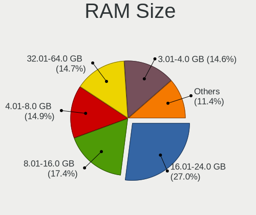
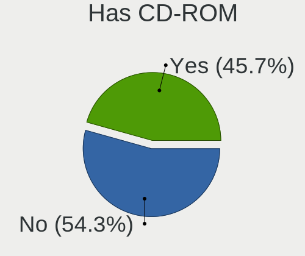
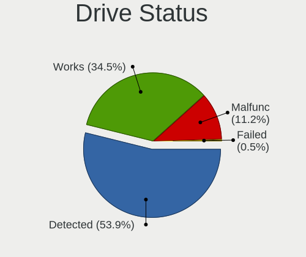
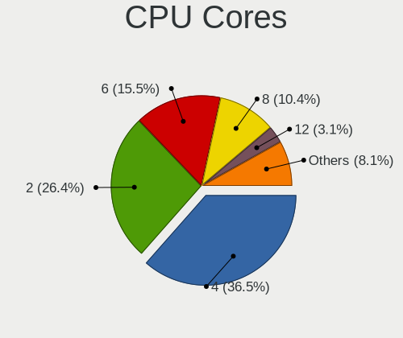
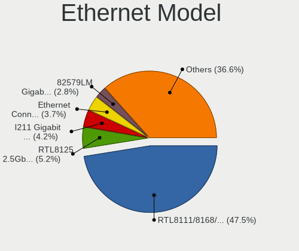
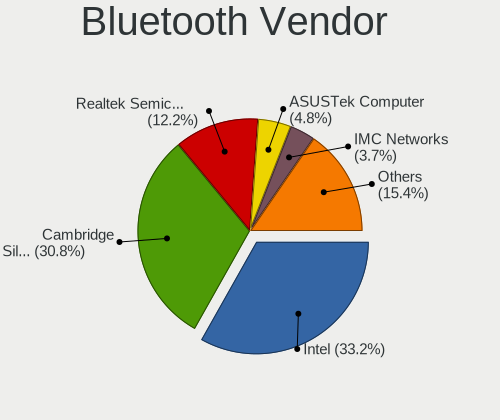

Linux in Spain - Tested Hardware & Statistics (Desktops)
--------------------------------------------------------

A project to collect tested hardware configurations for Linux in Spain.

Anyone can contribute to this report by the [hw-probe](https://github.com/linuxhw/hw-probe) tool:

    sudo -E hw-probe -all -upload

Please contribute! Especially if your hardware is rare.

Contents
--------

* [ Test Cases ](#test-cases)

* [ System ](#system)
  - [ OS                       ](#os)
  - [ OS Family                ](#os-family)
  - [ Kernel                   ](#kernel)
  - [ Kernel Family            ](#kernel-family)
  - [ Kernel Major Ver.        ](#kernel-major-ver)
  - [ Arch                     ](#arch)
  - [ DE                       ](#de)
  - [ Display Server           ](#display-server)
  - [ Display Manager          ](#display-manager)
  - [ OS Lang                  ](#os-lang)
  - [ Boot Mode                ](#boot-mode)
  - [ Filesystem               ](#filesystem)
  - [ Part. scheme             ](#part-scheme)
  - [ Dual Boot with Linux/BSD ](#dual-boot-with-linuxbsd)
  - [ Dual Boot (Win)          ](#dual-boot-win)

* [ Board ](#board)
  - [ Vendor                   ](#vendor)
  - [ Model                    ](#model)
  - [ Model Family             ](#model-family)
  - [ MFG Year                 ](#mfg-year)
  - [ Form Factor              ](#form-factor)
  - [ Secure Boot              ](#secure-boot)
  - [ Coreboot                 ](#coreboot)
  - [ RAM Size                 ](#ram-size)
  - [ RAM Used                 ](#ram-used)
  - [ Total Drives             ](#total-drives)
  - [ Has CD-ROM               ](#has-cd-rom)
  - [ Has Ethernet             ](#has-ethernet)
  - [ Has WiFi                 ](#has-wifi)
  - [ Has Bluetooth            ](#has-bluetooth)

* [ Location ](#location)
  - [ Country                  ](#country)
  - [ City                     ](#city)

* [ Drives ](#drives)
  - [ Drive Vendor             ](#drive-vendor)
  - [ Drive Model              ](#drive-model)
  - [ HDD Vendor               ](#hdd-vendor)
  - [ SSD Vendor               ](#ssd-vendor)
  - [ Drive Kind               ](#drive-kind)
  - [ Drive Connector          ](#drive-connector)
  - [ Drive Size               ](#drive-size)
  - [ Space Total              ](#space-total)
  - [ Space Used               ](#space-used)
  - [ Malfunc. Drives          ](#malfunc-drives)
  - [ Malfunc. Drive Vendor    ](#malfunc-drive-vendor)
  - [ Malfunc. HDD Vendor      ](#malfunc-hdd-vendor)
  - [ Malfunc. Drive Kind      ](#malfunc-drive-kind)
  - [ Failed Drives            ](#failed-drives)
  - [ Failed Drive Vendor      ](#failed-drive-vendor)
  - [ Drive Status             ](#drive-status)

* [ Storage controller ](#storage-controller)
  - [ Storage Vendor           ](#storage-vendor)
  - [ Storage Model            ](#storage-model)
  - [ Storage Kind             ](#storage-kind)

* [ Processor ](#processor)
  - [ CPU Vendor               ](#cpu-vendor)
  - [ CPU Model                ](#cpu-model)
  - [ CPU Model Family         ](#cpu-model-family)
  - [ CPU Cores                ](#cpu-cores)
  - [ CPU Sockets              ](#cpu-sockets)
  - [ CPU Threads              ](#cpu-threads)
  - [ CPU Op-Modes             ](#cpu-op-modes)
  - [ CPU Microcode            ](#cpu-microcode)
  - [ CPU Microarch            ](#cpu-microarch)

* [ Graphics ](#graphics)
  - [ GPU Vendor               ](#gpu-vendor)
  - [ GPU Model                ](#gpu-model)
  - [ GPU Combo                ](#gpu-combo)
  - [ GPU Driver               ](#gpu-driver)
  - [ GPU Memory               ](#gpu-memory)

* [ Monitor ](#monitor)
  - [ Monitor Vendor           ](#monitor-vendor)
  - [ Monitor Model            ](#monitor-model)
  - [ Monitor Resolution       ](#monitor-resolution)
  - [ Monitor Diagonal         ](#monitor-diagonal)
  - [ Monitor Width            ](#monitor-width)
  - [ Aspect Ratio             ](#aspect-ratio)
  - [ Monitor Area             ](#monitor-area)
  - [ Pixel Density            ](#pixel-density)
  - [ Multiple Monitors        ](#multiple-monitors)

* [ Network ](#network)
  - [ Net Controller Vendor    ](#net-controller-vendor)
  - [ Net Controller Model     ](#net-controller-model)
  - [ Wireless Vendor          ](#wireless-vendor)
  - [ Wireless Model           ](#wireless-model)
  - [ Ethernet Vendor          ](#ethernet-vendor)
  - [ Ethernet Model           ](#ethernet-model)
  - [ Net Controller Kind      ](#net-controller-kind)
  - [ Used Controller          ](#used-controller)
  - [ NICs                     ](#nics)
  - [ IPv6                     ](#ipv6)

* [ Bluetooth ](#bluetooth)
  - [ Bluetooth Vendor         ](#bluetooth-vendor)
  - [ Bluetooth Model          ](#bluetooth-model)

* [ Sound ](#sound)
  - [ Sound Vendor             ](#sound-vendor)
  - [ Sound Model              ](#sound-model)

* [ Memory ](#memory)
  - [ Memory Vendor            ](#memory-vendor)
  - [ Memory Model             ](#memory-model)
  - [ Memory Kind              ](#memory-kind)
  - [ Memory Form Factor       ](#memory-form-factor)
  - [ Memory Size              ](#memory-size)
  - [ Memory Speed             ](#memory-speed)

* [ Printers & scanners ](#printers--scanners)
  - [ Printer Vendor           ](#printer-vendor)
  - [ Printer Model            ](#printer-model)
  - [ Scanner Vendor           ](#scanner-vendor)
  - [ Scanner Model            ](#scanner-model)

* [ Camera ](#camera)
  - [ Camera Vendor            ](#camera-vendor)
  - [ Camera Model             ](#camera-model)

* [ Security ](#security)
  - [ Fingerprint Vendor       ](#fingerprint-vendor)
  - [ Fingerprint Model        ](#fingerprint-model)
  - [ Chipcard Vendor          ](#chipcard-vendor)
  - [ Chipcard Model           ](#chipcard-model)

* [ Unsupported ](#unsupported)
  - [ Unsupported Devices      ](#unsupported-devices)
  - [ Unsupported Device Types ](#unsupported-device-types)

Test Cases
----------

Total: 3068

| Vendor        | Model                       | Probe                                                      | Date         |
|---------------|-----------------------------|------------------------------------------------------------|--------------|
| Gigabyte      | H61M-DS2                    | [3181a592ac](https://linux-hardware.org/?probe=3181a592ac) | Aug 12, 2023 |
| Gigabyte      | Z170-HD3P-CF                | [7ef87af541](https://linux-hardware.org/?probe=7ef87af541) | Aug 12, 2023 |
| Unknown       | AB07H                       | [d0b6bc1fce](https://linux-hardware.org/?probe=d0b6bc1fce) | Aug 09, 2023 |
| Gigabyte      | H61M-DS2                    | [939205ed85](https://linux-hardware.org/?probe=939205ed85) | Aug 09, 2023 |
| MSI           | A78M-E45                    | [d39f224497](https://linux-hardware.org/?probe=d39f224497) | Aug 09, 2023 |
| MSI           | B450 GAMING PLUS            | [c8553cabce](https://linux-hardware.org/?probe=c8553cabce) | Aug 08, 2023 |
| ASUSTek       | M5A78L-M/USB3               | [e703e9ae63](https://linux-hardware.org/?probe=e703e9ae63) | Aug 07, 2023 |
| Gigabyte      | H81M-S2H                    | [f895d0afe3](https://linux-hardware.org/?probe=f895d0afe3) | Aug 07, 2023 |
| ASUSTek       | P8H61-M LX3 PLUS R2.0       | [e6955ee04c](https://linux-hardware.org/?probe=e6955ee04c) | Aug 07, 2023 |
| Acer          | Aspire TC-605               | [f3bac278d5](https://linux-hardware.org/?probe=f3bac278d5) | Aug 07, 2023 |
| ASRock        | N68C-S UCC                  | [ebe7ed3f69](https://linux-hardware.org/?probe=ebe7ed3f69) | Aug 07, 2023 |
| Acer          | Aspire XC-705               | [37bf6e8191](https://linux-hardware.org/?probe=37bf6e8191) | Aug 06, 2023 |
| ASUSTek       | PRIME H310T R2.0            | [458a26f70c](https://linux-hardware.org/?probe=458a26f70c) | Aug 06, 2023 |
| MSI           | Z490-A PRO                  | [151339db32](https://linux-hardware.org/?probe=151339db32) | Aug 06, 2023 |
| ASUSTek       | TUF Gaming B660-PLUS WIF... | [7979e7ce95](https://linux-hardware.org/?probe=7979e7ce95) | Aug 05, 2023 |
| MSI           | A78M-E45                    | [988c1f5878](https://linux-hardware.org/?probe=988c1f5878) | Aug 05, 2023 |
| ASUSTek       | ROG STRIX B365-G GAMING     | [eabd86788e](https://linux-hardware.org/?probe=eabd86788e) | Aug 04, 2023 |
| HP            | 83E8                        | [0d285189b9](https://linux-hardware.org/?probe=0d285189b9) | Aug 04, 2023 |
| Dell          | 03KWTV A02                  | [294dcce02b](https://linux-hardware.org/?probe=294dcce02b) | Aug 04, 2023 |
| MSI           | Z490-A PRO                  | [71e97069b6](https://linux-hardware.org/?probe=71e97069b6) | Aug 04, 2023 |
| Gigabyte      | F2A88XM-D3HP                | [42ac042892](https://linux-hardware.org/?probe=42ac042892) | Aug 03, 2023 |
| ASUSTek       | H97-PLUS                    | [485793f801](https://linux-hardware.org/?probe=485793f801) | Aug 02, 2023 |
| ASUSTek       | TUF Gaming X570-PRO         | [a08886d394](https://linux-hardware.org/?probe=a08886d394) | Aug 02, 2023 |
| Gigabyte      | Z370 AORUS Gaming 5-CF      | [13d25503d7](https://linux-hardware.org/?probe=13d25503d7) | Aug 01, 2023 |
| ASRock        | A320M-DVS R4.0              | [648421ac0a](https://linux-hardware.org/?probe=648421ac0a) | Aug 01, 2023 |
| ASUSTek       | ROG STRIX B365-G GAMING     | [2ca9767252](https://linux-hardware.org/?probe=2ca9767252) | Jul 31, 2023 |
| ASUSTek       | H110M-D                     | [9669adfa57](https://linux-hardware.org/?probe=9669adfa57) | Jul 29, 2023 |
| ASUSTek       | PRIME H510M-K R2.0          | [7b5aebd006](https://linux-hardware.org/?probe=7b5aebd006) | Jul 28, 2023 |
| Gigabyte      | A320M-H-CF                  | [2e2b9a12a6](https://linux-hardware.org/?probe=2e2b9a12a6) | Jul 28, 2023 |
| ASUSTek       | ROG STRIX B365-G GAMING     | [2af263d1b7](https://linux-hardware.org/?probe=2af263d1b7) | Jul 27, 2023 |
| ASUSTek       | ROG STRIX B450-F GAMING     | [60d9839bbe](https://linux-hardware.org/?probe=60d9839bbe) | Jul 27, 2023 |
| ASUSTek       | ROG STRIX B450-F GAMING     | [45149f899d](https://linux-hardware.org/?probe=45149f899d) | Jul 26, 2023 |
| ASUSTek       | PRIME H510M-K R2.0          | [c7ec8db97e](https://linux-hardware.org/?probe=c7ec8db97e) | Jul 26, 2023 |
| ASUSTek       | M5A78L-M/USB3               | [865eacc7bb](https://linux-hardware.org/?probe=865eacc7bb) | Jul 25, 2023 |
| HP            | 1495                        | [99072e94e8](https://linux-hardware.org/?probe=99072e94e8) | Jul 25, 2023 |
| HP            | 8719                        | [68870aa596](https://linux-hardware.org/?probe=68870aa596) | Jul 24, 2023 |
| ASUSTek       | PRIME H510M-K R2.0          | [ffee60fde7](https://linux-hardware.org/?probe=ffee60fde7) | Jul 24, 2023 |
| Medion        | H110H4-EM2                  | [443b61cb44](https://linux-hardware.org/?probe=443b61cb44) | Jul 22, 2023 |
| ASUSTek       | Z77-A                       | [4c5a8d18b9](https://linux-hardware.org/?probe=4c5a8d18b9) | Jul 22, 2023 |
| Unknown       | Unknown                     | [06099a3fdd](https://linux-hardware.org/?probe=06099a3fdd) | Jul 21, 2023 |
| Pegatron      | 2AB5                        | [0c95406e21](https://linux-hardware.org/?probe=0c95406e21) | Jul 21, 2023 |
| Pegatron      | 2AB5                        | [b3f1259905](https://linux-hardware.org/?probe=b3f1259905) | Jul 21, 2023 |
| ASRock        | G41C-GS R2.0                | [3ed4a6a897](https://linux-hardware.org/?probe=3ed4a6a897) | Jul 19, 2023 |
| ASUSTek       | ROG STRIX B365-G GAMING     | [3428acceaf](https://linux-hardware.org/?probe=3428acceaf) | Jul 19, 2023 |
| MSI           | H81M-E33                    | [dc821e7080](https://linux-hardware.org/?probe=dc821e7080) | Jul 19, 2023 |
| Gigabyte      | B75-D3V                     | [ad01a23df5](https://linux-hardware.org/?probe=ad01a23df5) | Jul 19, 2023 |
| MSI           | B450M MORTAR MAX            | [22bbaa5937](https://linux-hardware.org/?probe=22bbaa5937) | Jul 19, 2023 |
| HP            | 889C                        | [3124074b5a](https://linux-hardware.org/?probe=3124074b5a) | Jul 18, 2023 |
| Gigabyte      | B650M AORUS ELITE AX        | [649fb482b4](https://linux-hardware.org/?probe=649fb482b4) | Jul 15, 2023 |
| MSI           | Z97 GAMING 3                | [c8c107c355](https://linux-hardware.org/?probe=c8c107c355) | Jul 15, 2023 |
| Gigabyte      | B650M AORUS ELITE AX        | [b84898fc8a](https://linux-hardware.org/?probe=b84898fc8a) | Jul 15, 2023 |
| MSI           | Z97 GAMING 3                | [3841eb7ba0](https://linux-hardware.org/?probe=3841eb7ba0) | Jul 15, 2023 |
| Lenovo        | SHARKBAY NOK                | [66c5696981](https://linux-hardware.org/?probe=66c5696981) | Jul 12, 2023 |
| Gigabyte      | B450 AORUS M                | [500fee1ce5](https://linux-hardware.org/?probe=500fee1ce5) | Jul 11, 2023 |
| Dell          | 0T10XW A01                  | [58fb207824](https://linux-hardware.org/?probe=58fb207824) | Jul 11, 2023 |
| Intel         | DG31PR AAD97573-205         | [0095feba57](https://linux-hardware.org/?probe=0095feba57) | Jul 10, 2023 |
| Intel         | DG31PR AAD97573-205         | [6b4434fd14](https://linux-hardware.org/?probe=6b4434fd14) | Jul 10, 2023 |
| Gigabyte      | Z390 GAMING X-CF            | [ca812ae8ad](https://linux-hardware.org/?probe=ca812ae8ad) | Jul 10, 2023 |
| Gigabyte      | Z170X-Gaming 3              | [a4650f89f7](https://linux-hardware.org/?probe=a4650f89f7) | Jul 10, 2023 |
| Gigabyte      | B560 HD3                    | [437e2c44d9](https://linux-hardware.org/?probe=437e2c44d9) | Jul 09, 2023 |
| ASUSTek       | P5Q PRO TURBO               | [362fd95251](https://linux-hardware.org/?probe=362fd95251) | Jul 08, 2023 |
| ASRock        | A75M-HVS                    | [a0359f0f09](https://linux-hardware.org/?probe=a0359f0f09) | Jul 07, 2023 |
| ASRock        | A75M-HVS                    | [83bbe4315f](https://linux-hardware.org/?probe=83bbe4315f) | Jul 07, 2023 |
| ASUSTek       | PRIME H310T R2.0            | [28b2f72ea7](https://linux-hardware.org/?probe=28b2f72ea7) | Jul 07, 2023 |
| ASRock        | X399 Phantom Gaming 6       | [a2728115f2](https://linux-hardware.org/?probe=a2728115f2) | Jul 05, 2023 |
| Shenzhen M... | F6BFC                       | [f4f1e6f9ff](https://linux-hardware.org/?probe=f4f1e6f9ff) | Jul 05, 2023 |
| Dell          | 0WK833                      | [bf1756a33c](https://linux-hardware.org/?probe=bf1756a33c) | Jul 05, 2023 |
| ASUSTek       | SABERTOOTH P67              | [7acafd9528](https://linux-hardware.org/?probe=7acafd9528) | Jul 04, 2023 |
| MSI           | X470 GAMING PLUS MAX        | [293008463e](https://linux-hardware.org/?probe=293008463e) | Jul 03, 2023 |
| Unknown       | AB07H                       | [868ad2b334](https://linux-hardware.org/?probe=868ad2b334) | Jul 03, 2023 |
| Gigabyte      | X570 AORUS ELITE            | [ff0f73c325](https://linux-hardware.org/?probe=ff0f73c325) | Jul 02, 2023 |
| Gigabyte      | 970A-DS3P                   | [97ebfed554](https://linux-hardware.org/?probe=97ebfed554) | Jul 02, 2023 |
| MSI           | B450 GAMING PLUS MAX        | [488ebd160a](https://linux-hardware.org/?probe=488ebd160a) | Jul 02, 2023 |
| HP            | 8054                        | [30c45def21](https://linux-hardware.org/?probe=30c45def21) | Jul 01, 2023 |
| HP            | 8054                        | [edf94b1f66](https://linux-hardware.org/?probe=edf94b1f66) | Jul 01, 2023 |
| MSI           | MPG B550 GAMING EDGE WIF... | [9f8e4c6a70](https://linux-hardware.org/?probe=9f8e4c6a70) | Jun 30, 2023 |
| Gigabyte      | GA-MA770-DS3                | [5b7bc3205d](https://linux-hardware.org/?probe=5b7bc3205d) | Jun 29, 2023 |
| ASUSTek       | P8Z68-V PRO                 | [a3de72d73c](https://linux-hardware.org/?probe=a3de72d73c) | Jun 29, 2023 |
| MSI           | H61M-P31                    | [9012219f61](https://linux-hardware.org/?probe=9012219f61) | Jun 29, 2023 |
| Dell          | 0WK833                      | [fd4a07e088](https://linux-hardware.org/?probe=fd4a07e088) | Jun 28, 2023 |
| Dell          | 0WK833                      | [39a5ca93a7](https://linux-hardware.org/?probe=39a5ca93a7) | Jun 27, 2023 |
| MSI           | PRO B660M-B DDR4            | [09f4e0e86a](https://linux-hardware.org/?probe=09f4e0e86a) | Jun 27, 2023 |
| Pegatron      | 2AB5                        | [8aaaef4a62](https://linux-hardware.org/?probe=8aaaef4a62) | Jun 27, 2023 |
| MW            | NVR-N5105                   | [36ee490ef2](https://linux-hardware.org/?probe=36ee490ef2) | Jun 26, 2023 |
| Dell          | 0KJCC5 A00                  | [3ec1b71f5c](https://linux-hardware.org/?probe=3ec1b71f5c) | Jun 25, 2023 |
| ASRock        | G31M-GS                     | [f58c462a34](https://linux-hardware.org/?probe=f58c462a34) | Jun 25, 2023 |
| Gigabyte      | X570 I AORUS PRO WIFI       | [a8c0f33ffe](https://linux-hardware.org/?probe=a8c0f33ffe) | Jun 25, 2023 |
| Gigabyte      | B550 AORUS ELITE V2         | [9a30b63c87](https://linux-hardware.org/?probe=9a30b63c87) | Jun 25, 2023 |
| MSI           | A320M-A PRO                 | [2eeb463035](https://linux-hardware.org/?probe=2eeb463035) | Jun 25, 2023 |
| MSI           | A320M-A PRO                 | [ef129b5a6c](https://linux-hardware.org/?probe=ef129b5a6c) | Jun 25, 2023 |
| MSI           | B450 GAMING PLUS MAX        | [785d3130e7](https://linux-hardware.org/?probe=785d3130e7) | Jun 24, 2023 |
| MSI           | B550M-A PRO                 | [68b591e6d8](https://linux-hardware.org/?probe=68b591e6d8) | Jun 24, 2023 |
| ASUSTek       | PRIME H410M-A               | [39d5409264](https://linux-hardware.org/?probe=39d5409264) | Jun 23, 2023 |
| ASUSTek       | M5A88-V EVO                 | [3708ae400f](https://linux-hardware.org/?probe=3708ae400f) | Jun 23, 2023 |
| ASUSTek       | M5A88-V EVO                 | [d447bb1029](https://linux-hardware.org/?probe=d447bb1029) | Jun 23, 2023 |
| Foxconn       | ETON                        | [ae0d87abfb](https://linux-hardware.org/?probe=ae0d87abfb) | Jun 21, 2023 |
| MSI           | X99A SLI Krait Edition      | [2e86965134](https://linux-hardware.org/?probe=2e86965134) | Jun 21, 2023 |
| MSI           | MAG B550 TOMAHAWK           | [5fbfa89321](https://linux-hardware.org/?probe=5fbfa89321) | Jun 21, 2023 |
| Gigabyte      | Z370 AORUS Gaming 5-CF      | [a1e0b61e89](https://linux-hardware.org/?probe=a1e0b61e89) | Jun 20, 2023 |
| ASRock        | Z590M-ITX/ax                | [5160dd29d0](https://linux-hardware.org/?probe=5160dd29d0) | Jun 20, 2023 |
| MSI           | MAG B550 TOMAHAWK           | [5cbbd51d7f](https://linux-hardware.org/?probe=5cbbd51d7f) | Jun 20, 2023 |
| ASUSTek       | Z170-P                      | [39ed83a165](https://linux-hardware.org/?probe=39ed83a165) | Jun 19, 2023 |
| MSI           | Z170A GAMING M7             | [49e7c6d51b](https://linux-hardware.org/?probe=49e7c6d51b) | Jun 19, 2023 |
| Gigabyte      | H110M-S2H-CF                | [e33558044f](https://linux-hardware.org/?probe=e33558044f) | Jun 18, 2023 |
| ASUSTek       | PRIME B550M-A               | [9b5c44b13a](https://linux-hardware.org/?probe=9b5c44b13a) | Jun 17, 2023 |
| Lenovo        | 3140 SDK0J40700 WIN 3258... | [eebb6ba229](https://linux-hardware.org/?probe=eebb6ba229) | Jun 17, 2023 |
| MSI           | B450 GAMING PLUS            | [8a480175f8](https://linux-hardware.org/?probe=8a480175f8) | Jun 16, 2023 |
| Dell          | 00V62H A00                  | [da12f0d8e3](https://linux-hardware.org/?probe=da12f0d8e3) | Jun 16, 2023 |
| MSI           | B450 GAMING PLUS            | [8a3d74a5fa](https://linux-hardware.org/?probe=8a3d74a5fa) | Jun 16, 2023 |
| ASUSTek       | ROG STRIX B650E-E GAMING... | [f52a0ddf99](https://linux-hardware.org/?probe=f52a0ddf99) | Jun 16, 2023 |
| ASUSTek       | ROG STRIX B650E-E GAMING... | [7b9388df1b](https://linux-hardware.org/?probe=7b9388df1b) | Jun 16, 2023 |
| Gigabyte      | H97-HD3                     | [24a487274f](https://linux-hardware.org/?probe=24a487274f) | Jun 16, 2023 |
| Pegatron      | 2A73h                       | [a96d9ae076](https://linux-hardware.org/?probe=a96d9ae076) | Jun 15, 2023 |
| ASUSTek       | ROG STRIX Z590-A GAMING ... | [851020a59f](https://linux-hardware.org/?probe=851020a59f) | Jun 15, 2023 |
| ASUSTek       | TUF Gaming X670E-PLUS       | [7ee7ee0f67](https://linux-hardware.org/?probe=7ee7ee0f67) | Jun 14, 2023 |
| HP            | 3397                        | [e67824996f](https://linux-hardware.org/?probe=e67824996f) | Jun 14, 2023 |
| AMI           | Intel                       | [72c570c2fa](https://linux-hardware.org/?probe=72c570c2fa) | Jun 14, 2023 |
| MW            | NVR-N5105                   | [7481711a2f](https://linux-hardware.org/?probe=7481711a2f) | Jun 13, 2023 |
| ASUSTek       | K30AD_M31AD_M51AD_M32AD     | [1364983b69](https://linux-hardware.org/?probe=1364983b69) | Jun 12, 2023 |
| MSI           | PRO Z790-A WIFI DDR4        | [0e3bbb5b14](https://linux-hardware.org/?probe=0e3bbb5b14) | Jun 11, 2023 |
| MSI           | B550M-A PRO                 | [c8e822d0d7](https://linux-hardware.org/?probe=c8e822d0d7) | Jun 10, 2023 |
| ASUSTek       | TUF B450M-PLUS GAMING       | [1f8c419c47](https://linux-hardware.org/?probe=1f8c419c47) | Jun 10, 2023 |
| MSI           | Boston                      | [cc58f8cdf3](https://linux-hardware.org/?probe=cc58f8cdf3) | Jun 09, 2023 |
| Gigabyte      | H61M-DS2                    | [8b8c6949b6](https://linux-hardware.org/?probe=8b8c6949b6) | Jun 09, 2023 |
| HP            | 3397                        | [c754fea198](https://linux-hardware.org/?probe=c754fea198) | Jun 08, 2023 |
| Gigabyte      | H81M-S2H                    | [fc60082dfe](https://linux-hardware.org/?probe=fc60082dfe) | Jun 08, 2023 |
| ASUSTek       | TUF Gaming X570-PRO         | [b9e1c5e320](https://linux-hardware.org/?probe=b9e1c5e320) | Jun 08, 2023 |
| Gigabyte      | H81M-S2H                    | [5533070ec1](https://linux-hardware.org/?probe=5533070ec1) | Jun 08, 2023 |
| MSI           | B450M-A PRO MAX             | [230465c003](https://linux-hardware.org/?probe=230465c003) | Jun 08, 2023 |
| Gigabyte      | Z370 AORUS Gaming 5-CF      | [74f55613b5](https://linux-hardware.org/?probe=74f55613b5) | Jun 08, 2023 |
| HP            | 3397                        | [d86a6fc258](https://linux-hardware.org/?probe=d86a6fc258) | Jun 07, 2023 |
| HP            | 3396                        | [ca540b449f](https://linux-hardware.org/?probe=ca540b449f) | Jun 07, 2023 |
| Gigabyte      | X670 GAMING X AX            | [05d49007a4](https://linux-hardware.org/?probe=05d49007a4) | Jun 07, 2023 |
| MSI           | B550M-A PRO                 | [5fb7d63e80](https://linux-hardware.org/?probe=5fb7d63e80) | Jun 06, 2023 |
| Dell          | 0D24M8 A00                  | [92fe930ecf](https://linux-hardware.org/?probe=92fe930ecf) | Jun 05, 2023 |
| Gigabyte      | H470M DS3H                  | [e7bbac1b14](https://linux-hardware.org/?probe=e7bbac1b14) | Jun 04, 2023 |
| SYWZ          | S200 Series                 | [577c490fb7](https://linux-hardware.org/?probe=577c490fb7) | Jun 04, 2023 |
| ASUSTek       | M4N72-E                     | [51d39945ec](https://linux-hardware.org/?probe=51d39945ec) | Jun 04, 2023 |
| Intel         | X99 V102                    | [ed5a67e8a5](https://linux-hardware.org/?probe=ed5a67e8a5) | Jun 03, 2023 |
| MSI           | X370 GAMING PRO CARBON      | [9966a3f6d1](https://linux-hardware.org/?probe=9966a3f6d1) | Jun 03, 2023 |
| HP            | 3397                        | [530b98edd5](https://linux-hardware.org/?probe=530b98edd5) | Jun 03, 2023 |
| ASUSTek       | PRIME Z390-P                | [64c321d474](https://linux-hardware.org/?probe=64c321d474) | Jun 03, 2023 |
| HP            | 3397                        | [046df77f81](https://linux-hardware.org/?probe=046df77f81) | Jun 02, 2023 |
| MSI           | B450M PRO-VDH PLUS          | [9a0f40789b](https://linux-hardware.org/?probe=9a0f40789b) | Jun 02, 2023 |
| Lenovo        | SHARKBAY SDK0E50510 WIN     | [07e5342fb8](https://linux-hardware.org/?probe=07e5342fb8) | Jun 02, 2023 |
| MSI           | H81M-E33                    | [50f664d550](https://linux-hardware.org/?probe=50f664d550) | Jun 01, 2023 |
| MSI           | H81M-E33                    | [eb2a33204c](https://linux-hardware.org/?probe=eb2a33204c) | Jun 01, 2023 |
| Gigabyte      | H410M S2H V3                | [78e4d7a22b](https://linux-hardware.org/?probe=78e4d7a22b) | Jun 01, 2023 |
| HP            | 2820h                       | [d326b49f48](https://linux-hardware.org/?probe=d326b49f48) | May 29, 2023 |
| ASUSTek       | PRIME Z590-A                | [b5e36f87e6](https://linux-hardware.org/?probe=b5e36f87e6) | May 28, 2023 |
| ASRock        | A320M-HDV R4.0              | [3e43db6ab5](https://linux-hardware.org/?probe=3e43db6ab5) | May 27, 2023 |
| Lenovo        | SHARKBAY SDK0E50510 PRO ... | [24d62f2da3](https://linux-hardware.org/?probe=24d62f2da3) | May 25, 2023 |
| Fujitsu       | D3233-A1 S26361-D3233-A1    | [4f91b6897e](https://linux-hardware.org/?probe=4f91b6897e) | May 24, 2023 |
| ASUSTek       | TUF Gaming X570-PLUS        | [5c4649a83e](https://linux-hardware.org/?probe=5c4649a83e) | May 24, 2023 |
| Lenovo        | SHARKBAY 0B98401 PRO        | [21ee588e1c](https://linux-hardware.org/?probe=21ee588e1c) | May 24, 2023 |
| Acer          | Aspire XC-330               | [5d462a687d](https://linux-hardware.org/?probe=5d462a687d) | May 23, 2023 |
| ASUSTek       | PRIME X299-DELUXE           | [c13217076b](https://linux-hardware.org/?probe=c13217076b) | May 23, 2023 |
| ASUSTek       | Z170-PRO                    | [27819563b9](https://linux-hardware.org/?probe=27819563b9) | May 23, 2023 |
| Unknown       | 1.0                         | [54d3a069a4](https://linux-hardware.org/?probe=54d3a069a4) | May 22, 2023 |
| ASRock        | X99 Extreme6/ac             | [8e255dc13b](https://linux-hardware.org/?probe=8e255dc13b) | May 22, 2023 |
| Gigabyte      | X99-UD4-CF                  | [89e6088290](https://linux-hardware.org/?probe=89e6088290) | May 20, 2023 |
| Dell          | 09KPNV A00                  | [118adf4d65](https://linux-hardware.org/?probe=118adf4d65) | May 20, 2023 |
| ASRock        | Z390 Phantom Gaming SLI     | [d17f4a61d7](https://linux-hardware.org/?probe=d17f4a61d7) | May 20, 2023 |
| ASRock        | Z390 Phantom Gaming SLI     | [0362a8829c](https://linux-hardware.org/?probe=0362a8829c) | May 20, 2023 |
| MSI           | MAG X570S TOMAHAWK MAX W... | [2afc4ee693](https://linux-hardware.org/?probe=2afc4ee693) | May 18, 2023 |
| Medion        | MS-7675                     | [4890b5bbf9](https://linux-hardware.org/?probe=4890b5bbf9) | May 16, 2023 |
| MSI           | H170A PC MATE               | [389ab53539](https://linux-hardware.org/?probe=389ab53539) | May 15, 2023 |
| Gigabyte      | H310M S2H x.x               | [8f36de95ee](https://linux-hardware.org/?probe=8f36de95ee) | May 15, 2023 |
| Gigabyte      | H310M S2H x.x               | [975de0cf0d](https://linux-hardware.org/?probe=975de0cf0d) | May 15, 2023 |
| Gigabyte      | GA-MA790XT-UD4P             | [dc1d9d7e15](https://linux-hardware.org/?probe=dc1d9d7e15) | May 14, 2023 |
| Acer          | Aspire TC-605               | [f9ccb88980](https://linux-hardware.org/?probe=f9ccb88980) | May 12, 2023 |
| Gigabyte      | X570 I AORUS PRO WIFI       | [3d43aab6fd](https://linux-hardware.org/?probe=3d43aab6fd) | May 12, 2023 |
| Gigabyte      | MW51-HP0-00                 | [ed263fdd1b](https://linux-hardware.org/?probe=ed263fdd1b) | May 12, 2023 |
| Gigabyte      | X670 GAMING X AX            | [ebd2a32ce2](https://linux-hardware.org/?probe=ebd2a32ce2) | May 12, 2023 |
| Gigabyte      | X670 GAMING X AX            | [352c0902e9](https://linux-hardware.org/?probe=352c0902e9) | May 11, 2023 |
| Medion        | MS-7848                     | [e5e1e75529](https://linux-hardware.org/?probe=e5e1e75529) | May 11, 2023 |
| Acer          | Aspire TC-605               | [d4846b3b14](https://linux-hardware.org/?probe=d4846b3b14) | May 10, 2023 |
| HP            | 304Ah                       | [7c6a6b156f](https://linux-hardware.org/?probe=7c6a6b156f) | May 09, 2023 |
| ASUSTek       | ROG STRIX B365-G GAMING     | [83741a7884](https://linux-hardware.org/?probe=83741a7884) | May 09, 2023 |
| ASRock        | A55M-DGS                    | [528232ffb1](https://linux-hardware.org/?probe=528232ffb1) | May 09, 2023 |
| ASUSTek       | PRIME B550-PLUS             | [b76481d6a9](https://linux-hardware.org/?probe=b76481d6a9) | May 09, 2023 |
| ASUSTek       | K30AD_M31AD_M51AD_M32AD     | [228e778389](https://linux-hardware.org/?probe=228e778389) | May 09, 2023 |
| Gigabyte      | X99-UD4-CF                  | [9e3f14cf8d](https://linux-hardware.org/?probe=9e3f14cf8d) | May 08, 2023 |
| Acer          | Aspire XC-330               | [9369acb33c](https://linux-hardware.org/?probe=9369acb33c) | May 07, 2023 |
| Gigabyte      | P43-ES3G                    | [1095d1ef7f](https://linux-hardware.org/?probe=1095d1ef7f) | May 06, 2023 |
| ASUSTek       | P8H61-M LX                  | [6c96dbe3f3](https://linux-hardware.org/?probe=6c96dbe3f3) | May 05, 2023 |
| Gigabyte      | Z370 AORUS Gaming 5-CF      | [421f2de1c3](https://linux-hardware.org/?probe=421f2de1c3) | May 05, 2023 |
| ASUSTek       | ROG STRIX B365-G GAMING     | [7dabc9fc5c](https://linux-hardware.org/?probe=7dabc9fc5c) | May 05, 2023 |
| ASUSTek       | ROG STRIX B365-G GAMING     | [18895a52d4](https://linux-hardware.org/?probe=18895a52d4) | May 05, 2023 |
| Gigabyte      | EX58-UD5                    | [1f8f3c96a5](https://linux-hardware.org/?probe=1f8f3c96a5) | May 05, 2023 |
| Gigabyte      | EX58-UD5                    | [43f32e7ed8](https://linux-hardware.org/?probe=43f32e7ed8) | May 05, 2023 |
| ASUSTek       | H81M-K                      | [e146c82a49](https://linux-hardware.org/?probe=e146c82a49) | May 03, 2023 |
| ASUSTek       | PRIME B550-PLUS             | [caf5cbc634](https://linux-hardware.org/?probe=caf5cbc634) | May 03, 2023 |
| ASUSTek       | B150M-A/M.2                 | [cd68a79e95](https://linux-hardware.org/?probe=cd68a79e95) | May 03, 2023 |
| Unknown       | Intel X79                   | [6b1ddbd923](https://linux-hardware.org/?probe=6b1ddbd923) | May 03, 2023 |
| Gigabyte      | X99-UD4-CF                  | [c2dcdb892d](https://linux-hardware.org/?probe=c2dcdb892d) | May 01, 2023 |
| Gigabyte      | H61M-D2H-USB3               | [9098e5d498](https://linux-hardware.org/?probe=9098e5d498) | May 01, 2023 |
| NEC Comput... | ECS-945G                    | [5f6daf506f](https://linux-hardware.org/?probe=5f6daf506f) | May 01, 2023 |
| HP            | 1495                        | [d6e629523f](https://linux-hardware.org/?probe=d6e629523f) | May 01, 2023 |
| Medion        | D3F3-EM                     | [6b9e38ad6c](https://linux-hardware.org/?probe=6b9e38ad6c) | Apr 30, 2023 |
| Gigabyte      | B365M D3H-CF                | [8c4352985e](https://linux-hardware.org/?probe=8c4352985e) | Apr 29, 2023 |
| ASUSTek       | H110M-D                     | [81cff8a578](https://linux-hardware.org/?probe=81cff8a578) | Apr 29, 2023 |
| Gigabyte      | AX370-Gaming 5              | [a418b302b9](https://linux-hardware.org/?probe=a418b302b9) | Apr 28, 2023 |
| MSI           | Z270 GAMING PRO CARBON      | [852dac1035](https://linux-hardware.org/?probe=852dac1035) | Apr 28, 2023 |
| MSI           | 970 GAMING                  | [44c5943019](https://linux-hardware.org/?probe=44c5943019) | Apr 27, 2023 |
| Acer          | Aspire TC-605               | [b9dcc7f752](https://linux-hardware.org/?probe=b9dcc7f752) | Apr 26, 2023 |
| HP            | 8055                        | [a897208085](https://linux-hardware.org/?probe=a897208085) | Apr 26, 2023 |
| MSI           | B250M PRO-VH                | [f132c966f5](https://linux-hardware.org/?probe=f132c966f5) | Apr 25, 2023 |
| ASRock        | H81M-VG4 R2.0               | [09c7ae9819](https://linux-hardware.org/?probe=09c7ae9819) | Apr 25, 2023 |
| Gigabyte      | H61MA-D3V                   | [a37deef915](https://linux-hardware.org/?probe=a37deef915) | Apr 24, 2023 |
| Gigabyte      | EX58-UD5                    | [3d8d7c49f8](https://linux-hardware.org/?probe=3d8d7c49f8) | Apr 24, 2023 |
| Dell          | 08HPGT A02                  | [04f68362d5](https://linux-hardware.org/?probe=04f68362d5) | Apr 24, 2023 |
| Dell          | 08HPGT A02                  | [d352ecf4ed](https://linux-hardware.org/?probe=d352ecf4ed) | Apr 24, 2023 |
| ASUSTek       | A88XM-A/USB                 | [f4a215fc46](https://linux-hardware.org/?probe=f4a215fc46) | Apr 24, 2023 |
| Gigabyte      | EX58-UD5                    | [e9a3b8f1d1](https://linux-hardware.org/?probe=e9a3b8f1d1) | Apr 24, 2023 |
| Gigabyte      | Z390 GAMING X-CF            | [c11ea1fc19](https://linux-hardware.org/?probe=c11ea1fc19) | Apr 23, 2023 |
| Gigabyte      | Z370 HD3P-CF                | [7609d632a4](https://linux-hardware.org/?probe=7609d632a4) | Apr 23, 2023 |
| Gigabyte      | Z390 GAMING X-CF            | [1a316c62a1](https://linux-hardware.org/?probe=1a316c62a1) | Apr 23, 2023 |
| HP            | 0AA8h                       | [b927834a03](https://linux-hardware.org/?probe=b927834a03) | Apr 23, 2023 |
| Shuttle       | FG45 V10                    | [b5a9d7b1e4](https://linux-hardware.org/?probe=b5a9d7b1e4) | Apr 21, 2023 |
| ASUSTek       | TUF B450-PLUS GAMING        | [81334f294e](https://linux-hardware.org/?probe=81334f294e) | Apr 20, 2023 |
| ASUSTek       | TUF B450-PLUS GAMING        | [cebfbef6d8](https://linux-hardware.org/?probe=cebfbef6d8) | Apr 20, 2023 |
| ASUSTek       | TUF Gaming B550-PLUS        | [5a9a6c553f](https://linux-hardware.org/?probe=5a9a6c553f) | Apr 20, 2023 |
| ASUSTek       | Z170-PRO                    | [970c4dfa6f](https://linux-hardware.org/?probe=970c4dfa6f) | Apr 20, 2023 |
| Gigabyte      | B365M DS3H                  | [3193403ef5](https://linux-hardware.org/?probe=3193403ef5) | Apr 19, 2023 |
| Gigabyte      | B365M DS3H                  | [80ee2192b6](https://linux-hardware.org/?probe=80ee2192b6) | Apr 19, 2023 |
| ASUSTek       | TUF Gaming B450-PLUS II     | [8858427eed](https://linux-hardware.org/?probe=8858427eed) | Apr 19, 2023 |
| ASUSTek       | PRIME Z390-P                | [fdb308cd9f](https://linux-hardware.org/?probe=fdb308cd9f) | Apr 19, 2023 |
| HP            | 212A                        | [178f3b9c05](https://linux-hardware.org/?probe=178f3b9c05) | Apr 17, 2023 |
| MSI           | H310M PRO-VDH               | [01452c33d1](https://linux-hardware.org/?probe=01452c33d1) | Apr 16, 2023 |
| Lenovo        | SHARKBAY SDK0J40700 WIN ... | [00b59d56cd](https://linux-hardware.org/?probe=00b59d56cd) | Apr 16, 2023 |
| ASUSTek       | TUF Gaming B550-PLUS        | [3faf4e88e1](https://linux-hardware.org/?probe=3faf4e88e1) | Apr 16, 2023 |
| AMI           | Intel                       | [b7a63bbfc7](https://linux-hardware.org/?probe=b7a63bbfc7) | Apr 15, 2023 |
| BESSTAR Te... | UM700                       | [8c450d2469](https://linux-hardware.org/?probe=8c450d2469) | Apr 15, 2023 |
| AMI           | Intel                       | [ec0a5e657e](https://linux-hardware.org/?probe=ec0a5e657e) | Apr 14, 2023 |
| ASRock        | H81M-VG4 R2.0               | [cc951809ed](https://linux-hardware.org/?probe=cc951809ed) | Apr 14, 2023 |
| Lenovo        | 30D2 SDK0J40705 WIN 3425... | [d5212d6298](https://linux-hardware.org/?probe=d5212d6298) | Apr 13, 2023 |
| Gigabyte      | AX370-Gaming 5              | [0ba5f3a06e](https://linux-hardware.org/?probe=0ba5f3a06e) | Apr 12, 2023 |
| HP            | 3396                        | [25eac72561](https://linux-hardware.org/?probe=25eac72561) | Apr 12, 2023 |
| HP            | 1589                        | [c04488f359](https://linux-hardware.org/?probe=c04488f359) | Apr 11, 2023 |
| Gigabyte      | B75-D3V                     | [fe025c9491](https://linux-hardware.org/?probe=fe025c9491) | Apr 11, 2023 |
| ASUSTek       | P5K                         | [36bc294c5b](https://linux-hardware.org/?probe=36bc294c5b) | Apr 11, 2023 |
| Gigabyte      | X299 AORUS Ultra Gaming ... | [415b7ce80b](https://linux-hardware.org/?probe=415b7ce80b) | Apr 10, 2023 |
| BESSTAR Te... | HX90                        | [2639d597e8](https://linux-hardware.org/?probe=2639d597e8) | Apr 10, 2023 |
| Gigabyte      | AB350-Gaming 3-CF           | [7f052050d9](https://linux-hardware.org/?probe=7f052050d9) | Apr 10, 2023 |
| HP            | 1998                        | [3974cfbb0c](https://linux-hardware.org/?probe=3974cfbb0c) | Apr 09, 2023 |
| MSI           | A68HM-E33 V2                | [05fc2725cf](https://linux-hardware.org/?probe=05fc2725cf) | Apr 09, 2023 |
| Dell          | 0M5DCD A00                  | [f65d106f65](https://linux-hardware.org/?probe=f65d106f65) | Apr 08, 2023 |
| AMI           | Intel                       | [48c620d141](https://linux-hardware.org/?probe=48c620d141) | Apr 08, 2023 |
| Gigabyte      | F2A68HM-H                   | [98bc626360](https://linux-hardware.org/?probe=98bc626360) | Apr 07, 2023 |
| HP            | 1998                        | [50421ddca5](https://linux-hardware.org/?probe=50421ddca5) | Apr 07, 2023 |
| Packard Be... | IMEDIA S2870 V1.0           | [61e1ab6733](https://linux-hardware.org/?probe=61e1ab6733) | Apr 06, 2023 |
| ASUSTek       | PRIME Z490M-PLUS            | [1190aa9be8](https://linux-hardware.org/?probe=1190aa9be8) | Apr 06, 2023 |
| ASUSTek       | ROG STRIX B650E-I GAMING... | [03db223af4](https://linux-hardware.org/?probe=03db223af4) | Apr 06, 2023 |
| ASUSTek       | ROG STRIX B650E-I GAMING... | [f8c2ffcd09](https://linux-hardware.org/?probe=f8c2ffcd09) | Apr 06, 2023 |
| ASUSTek       | PRIME A320M-K               | [6dbb59e2fc](https://linux-hardware.org/?probe=6dbb59e2fc) | Apr 05, 2023 |
| HP            | 1998                        | [4830678f31](https://linux-hardware.org/?probe=4830678f31) | Apr 05, 2023 |
| ASUSTek       | VM42                        | [84f848ea21](https://linux-hardware.org/?probe=84f848ea21) | Apr 05, 2023 |
| ASUSTek       | Z170-K                      | [d9ab0a1946](https://linux-hardware.org/?probe=d9ab0a1946) | Apr 05, 2023 |
| ASUSTek       | PRIME B250M-PLUS            | [6f4013d94e](https://linux-hardware.org/?probe=6f4013d94e) | Apr 05, 2023 |
| HP            | 3397                        | [175b460d57](https://linux-hardware.org/?probe=175b460d57) | Apr 05, 2023 |
| HP            | 3397                        | [b512b25055](https://linux-hardware.org/?probe=b512b25055) | Apr 05, 2023 |
| Dell          | 042P49 A02                  | [74a232499a](https://linux-hardware.org/?probe=74a232499a) | Apr 04, 2023 |
| ASUSTek       | PRIME B250M-PLUS            | [0401a50bac](https://linux-hardware.org/?probe=0401a50bac) | Apr 04, 2023 |
| ASUSTek       | ROG STRIX B365-G GAMING     | [151ffca106](https://linux-hardware.org/?probe=151ffca106) | Apr 04, 2023 |
| ASUSTek       | ROG STRIX B365-G GAMING     | [fb78fdb60c](https://linux-hardware.org/?probe=fb78fdb60c) | Apr 04, 2023 |
| ASUSTek       | TUF Gaming X570-PRO         | [849adee9bf](https://linux-hardware.org/?probe=849adee9bf) | Apr 03, 2023 |
| MSI           | A320M-A PRO MAX             | [54fbd647bc](https://linux-hardware.org/?probe=54fbd647bc) | Apr 02, 2023 |
| Gigabyte      | EX58-UD5                    | [0fbed59931](https://linux-hardware.org/?probe=0fbed59931) | Apr 02, 2023 |
| Gigabyte      | Z390 UD                     | [fabc275714](https://linux-hardware.org/?probe=fabc275714) | Apr 01, 2023 |
| ASUSTek       | PRIME A320M-K               | [5919c1d671](https://linux-hardware.org/?probe=5919c1d671) | Apr 01, 2023 |
| MSI           | B550M PRO-VDH WIFI          | [e3a13c69ef](https://linux-hardware.org/?probe=e3a13c69ef) | Apr 01, 2023 |
| Gigabyte      | F2A88XM-HD3                 | [39bc576f7f](https://linux-hardware.org/?probe=39bc576f7f) | Apr 01, 2023 |
| MSI           | H310M PRO-VDH PLUS          | [369bd03522](https://linux-hardware.org/?probe=369bd03522) | Apr 01, 2023 |
| MSI           | PRO X670-P WIFI             | [bb72de54b6](https://linux-hardware.org/?probe=bb72de54b6) | Mar 31, 2023 |
| HP            | 1998                        | [c47c52dfc6](https://linux-hardware.org/?probe=c47c52dfc6) | Mar 31, 2023 |
| Gigabyte      | B250M-DS3H-CF               | [d72978731a](https://linux-hardware.org/?probe=d72978731a) | Mar 30, 2023 |
| Gigabyte      | A520 AORUS ELITE            | [f7f74305ba](https://linux-hardware.org/?probe=f7f74305ba) | Mar 30, 2023 |
| MSI           | B450M BAZOOKA V2            | [7888e091f7](https://linux-hardware.org/?probe=7888e091f7) | Mar 30, 2023 |
| MSI           | PRO X670-P WIFI             | [ed35fbea6c](https://linux-hardware.org/?probe=ed35fbea6c) | Mar 30, 2023 |
| ASUSTek       | ROG STRIX B550-F GAMING     | [244ffc8736](https://linux-hardware.org/?probe=244ffc8736) | Mar 30, 2023 |
| HP            | 1495                        | [75702f8b1d](https://linux-hardware.org/?probe=75702f8b1d) | Mar 29, 2023 |
| HP            | 1495                        | [c342260a77](https://linux-hardware.org/?probe=c342260a77) | Mar 29, 2023 |
| ASUSTek       | ROG STRIX B365-G GAMING     | [307a8bce3e](https://linux-hardware.org/?probe=307a8bce3e) | Mar 29, 2023 |
| ASUSTek       | ROG STRIX B365-G GAMING     | [b924b0ff06](https://linux-hardware.org/?probe=b924b0ff06) | Mar 28, 2023 |
| Acer          | Veriton M4630G V:1.0        | [7fba52ef43](https://linux-hardware.org/?probe=7fba52ef43) | Mar 27, 2023 |
| MSI           | G41M-P33 Combo              | [6a3fedcc68](https://linux-hardware.org/?probe=6a3fedcc68) | Mar 26, 2023 |
| Gigabyte      | GA-MA790XT-UD4P             | [8a0cc5a4cb](https://linux-hardware.org/?probe=8a0cc5a4cb) | Mar 24, 2023 |
| HP            | 1790                        | [1a468c1b1c](https://linux-hardware.org/?probe=1a468c1b1c) | Mar 24, 2023 |
| ASRock        | H110M-HDV                   | [cfe369e6b8](https://linux-hardware.org/?probe=cfe369e6b8) | Mar 24, 2023 |
| Gigabyte      | B450M DS3H-CF               | [81273bd2b0](https://linux-hardware.org/?probe=81273bd2b0) | Mar 24, 2023 |
| Gigabyte      | B450M DS3H-CF               | [2db2fb4a5a](https://linux-hardware.org/?probe=2db2fb4a5a) | Mar 24, 2023 |
| Gigabyte      | B450M DS3H-CF               | [79cbdbc9c1](https://linux-hardware.org/?probe=79cbdbc9c1) | Mar 24, 2023 |
| ASUSTek       | PRIME Z690-P                | [6b3cdb2b1a](https://linux-hardware.org/?probe=6b3cdb2b1a) | Mar 23, 2023 |
| ASUSTek       | PRIME H510M-E               | [fc5894dcb4](https://linux-hardware.org/?probe=fc5894dcb4) | Mar 23, 2023 |
| ASUSTek       | PB60                        | [ec438486aa](https://linux-hardware.org/?probe=ec438486aa) | Mar 22, 2023 |
| MSI           | MEG X570 ACE                | [c2bab115eb](https://linux-hardware.org/?probe=c2bab115eb) | Mar 22, 2023 |
| Gigabyte      | Z77X-D3H                    | [aab84f14ed](https://linux-hardware.org/?probe=aab84f14ed) | Mar 21, 2023 |
| ASUSTek       | Maximus VI HERO             | [deaf7b9049](https://linux-hardware.org/?probe=deaf7b9049) | Mar 21, 2023 |
| ASUSTek       | ROG STRIX B650-A GAMING ... | [293e9a941a](https://linux-hardware.org/?probe=293e9a941a) | Mar 20, 2023 |
| MSI           | PRO Z790-P WIFI             | [038bd3a32b](https://linux-hardware.org/?probe=038bd3a32b) | Mar 20, 2023 |
| HP            | 158A                        | [61467de4d5](https://linux-hardware.org/?probe=61467de4d5) | Mar 19, 2023 |
| ASUSTek       | ROG STRIX Z590-E GAMING ... | [f048ae8dec](https://linux-hardware.org/?probe=f048ae8dec) | Mar 19, 2023 |
| ASRock        | H110M-HDV                   | [5228141efd](https://linux-hardware.org/?probe=5228141efd) | Mar 16, 2023 |
| Acer          | FIH57                       | [ee8c95f841](https://linux-hardware.org/?probe=ee8c95f841) | Mar 16, 2023 |
| Intel         | Unknown                     | [b4b73aafa0](https://linux-hardware.org/?probe=b4b73aafa0) | Mar 15, 2023 |
| ASUSTek       | H110M-D                     | [c436834b30](https://linux-hardware.org/?probe=c436834b30) | Mar 14, 2023 |
| ASUSTek       | P5Q PRO TURBO               | [44fc80c7d5](https://linux-hardware.org/?probe=44fc80c7d5) | Mar 13, 2023 |
| MSI           | B450 TOMAHAWK MAX           | [39d0e8595c](https://linux-hardware.org/?probe=39d0e8595c) | Mar 12, 2023 |
| ASUSTek       | PRIME H510M-E               | [cf5cbabe11](https://linux-hardware.org/?probe=cf5cbabe11) | Mar 12, 2023 |
| ASUSTek       | PRIME Z590-A                | [751bedd6a9](https://linux-hardware.org/?probe=751bedd6a9) | Mar 12, 2023 |
| Gigabyte      | B760M AORUS ELITE AX        | [daf687f0a1](https://linux-hardware.org/?probe=daf687f0a1) | Mar 12, 2023 |
| MSI           | MS-B1831                    | [a9bfb4f294](https://linux-hardware.org/?probe=a9bfb4f294) | Mar 11, 2023 |
| ASUSTek       | PRIME Z270-P                | [8f2b6b3bc1](https://linux-hardware.org/?probe=8f2b6b3bc1) | Mar 11, 2023 |
| Gigabyte      | B760M DS3H DDR4             | [5df81d1297](https://linux-hardware.org/?probe=5df81d1297) | Mar 09, 2023 |
| Gigabyte      | H61M-DS2                    | [a40a70a964](https://linux-hardware.org/?probe=a40a70a964) | Mar 09, 2023 |
| Dell          | 0JP3NX A01                  | [946f48cdf6](https://linux-hardware.org/?probe=946f48cdf6) | Mar 09, 2023 |
| ASUSTek       | PRIME A320M-K               | [93875c7518](https://linux-hardware.org/?probe=93875c7518) | Mar 09, 2023 |
| ASUSTek       | P5G41T-M LX                 | [4f55573ba6](https://linux-hardware.org/?probe=4f55573ba6) | Mar 08, 2023 |
| Intel         | JSL MRD                     | [ac75dbf1f6](https://linux-hardware.org/?probe=ac75dbf1f6) | Mar 08, 2023 |
| HP            | 0AACh                       | [2f4ba72670](https://linux-hardware.org/?probe=2f4ba72670) | Mar 08, 2023 |
| ASUSTek       | ROG STRIX B365-G GAMING     | [7c17068a98](https://linux-hardware.org/?probe=7c17068a98) | Mar 08, 2023 |
| HP            | 0AA8h                       | [6552e8b371](https://linux-hardware.org/?probe=6552e8b371) | Mar 07, 2023 |
| Intel         | DH55TC AAE70932-303         | [4e2cd40175](https://linux-hardware.org/?probe=4e2cd40175) | Mar 07, 2023 |
| ASUSTek       | K30AD_M31AD_M51AD_M32AD     | [c6bb0ba4a6](https://linux-hardware.org/?probe=c6bb0ba4a6) | Mar 05, 2023 |
| ASUSTek       | P8P67 DELUXE                | [31e4b3ada8](https://linux-hardware.org/?probe=31e4b3ada8) | Mar 05, 2023 |
| Gigabyte      | EX58-UD5                    | [8805f0bce5](https://linux-hardware.org/?probe=8805f0bce5) | Mar 05, 2023 |
| ASUSTek       | Pro WS WRX80E-SAGE SE WI... | [f4cf2185ea](https://linux-hardware.org/?probe=f4cf2185ea) | Mar 04, 2023 |
| ASUSTek       | P7H55-M LX                  | [79e06d188d](https://linux-hardware.org/?probe=79e06d188d) | Mar 04, 2023 |
| Gigabyte      | H61M-DS2                    | [49462bd855](https://linux-hardware.org/?probe=49462bd855) | Mar 04, 2023 |
| Gigabyte      | B85M-DS3H-A                 | [914a9990c4](https://linux-hardware.org/?probe=914a9990c4) | Mar 04, 2023 |
| Gigabyte      | H61M-DS2                    | [c7cee84058](https://linux-hardware.org/?probe=c7cee84058) | Mar 04, 2023 |
| Lenovo        | 310B SDK0J40697 WIN 3305... | [a9c39c2b82](https://linux-hardware.org/?probe=a9c39c2b82) | Mar 04, 2023 |
| MSI           | B250M MORTAR                | [a4e8543fe2](https://linux-hardware.org/?probe=a4e8543fe2) | Mar 03, 2023 |
| MSI           | MAG X570 TOMAHAWK WIFI      | [5033b7233d](https://linux-hardware.org/?probe=5033b7233d) | Mar 03, 2023 |
| ASUSTek       | M5A78L-M PLUS/USB3          | [8f61a5507b](https://linux-hardware.org/?probe=8f61a5507b) | Mar 02, 2023 |
| ASUSTek       | M5A97 R2.0                  | [0e66878368](https://linux-hardware.org/?probe=0e66878368) | Mar 02, 2023 |
| HPE           | ProLiant MicroServer Gen... | [11c1bf8316](https://linux-hardware.org/?probe=11c1bf8316) | Mar 02, 2023 |
| Intel         | X79 V2.72A                  | [ae4efdfbc5](https://linux-hardware.org/?probe=ae4efdfbc5) | Mar 02, 2023 |
| Gigabyte      | H81M-S1                     | [0a38248462](https://linux-hardware.org/?probe=0a38248462) | Mar 02, 2023 |
| ASRock        | Q1900M Pro3                 | [ef9e90045e](https://linux-hardware.org/?probe=ef9e90045e) | Mar 01, 2023 |
| ASUSTek       | Z170 PRO GAMING             | [50520b2cf0](https://linux-hardware.org/?probe=50520b2cf0) | Mar 01, 2023 |
| Lenovo        | Bantry CRB 31900058 STD     | [268413a47c](https://linux-hardware.org/?probe=268413a47c) | Mar 01, 2023 |
| ASUSTek       | ROG STRIX Z370-E GAMING     | [84a1a2c71e](https://linux-hardware.org/?probe=84a1a2c71e) | Mar 01, 2023 |
| Lenovo        | Bantry CRB 31900058 STD     | [169e938f25](https://linux-hardware.org/?probe=169e938f25) | Mar 01, 2023 |
| ASUSTek       | ROG STRIX Z590-E GAMING ... | [8f8eaa9d53](https://linux-hardware.org/?probe=8f8eaa9d53) | Mar 01, 2023 |
| ASUSTek       | Z170-A                      | [a4d77f98eb](https://linux-hardware.org/?probe=a4d77f98eb) | Feb 28, 2023 |
| ASUSTek       | AT4NM10T-I                  | [921aebe62a](https://linux-hardware.org/?probe=921aebe62a) | Feb 28, 2023 |
| ASUSTek       | AT4NM10T-I                  | [fa2df8125a](https://linux-hardware.org/?probe=fa2df8125a) | Feb 28, 2023 |
| ASUSTek       | M5A78L-M PLUS/USB3          | [8cadddf432](https://linux-hardware.org/?probe=8cadddf432) | Feb 28, 2023 |
| AMI           | Cherry Trail CR             | [24952b3b19](https://linux-hardware.org/?probe=24952b3b19) | Feb 27, 2023 |
| ASRock        | A320M-HDV R4.0              | [319e003280](https://linux-hardware.org/?probe=319e003280) | Feb 26, 2023 |
| BESSTAR Te... | B550                        | [6a77bfec73](https://linux-hardware.org/?probe=6a77bfec73) | Feb 26, 2023 |
| BESSTAR Te... | B550                        | [d3e84076c7](https://linux-hardware.org/?probe=d3e84076c7) | Feb 25, 2023 |
| Lenovo        | SHARKBAY SDK0E50510 WIN     | [32453b16fb](https://linux-hardware.org/?probe=32453b16fb) | Feb 25, 2023 |
| MSI           | MAG X570 TOMAHAWK WIFI      | [2e7905f753](https://linux-hardware.org/?probe=2e7905f753) | Feb 24, 2023 |
| Lenovo        | SHARKBAY SDK0E50510 WIN     | [cbadc857a2](https://linux-hardware.org/?probe=cbadc857a2) | Feb 24, 2023 |
| ASUSTek       | P5QL PRO                    | [c7477f1aca](https://linux-hardware.org/?probe=c7477f1aca) | Feb 24, 2023 |
| ASUSTek       | H61M-K                      | [9d39d13682](https://linux-hardware.org/?probe=9d39d13682) | Feb 23, 2023 |
| ASUSTek       | PRIME B660M-A WIFI D4       | [af2a414265](https://linux-hardware.org/?probe=af2a414265) | Feb 23, 2023 |
| Gigabyte      | B550M AORUS ELITE           | [3c27f298a3](https://linux-hardware.org/?probe=3c27f298a3) | Feb 23, 2023 |
| HP            | 0AA8h                       | [8bb60bdebb](https://linux-hardware.org/?probe=8bb60bdebb) | Feb 22, 2023 |
| Gigabyte      | H81M-S2H                    | [d8bafec2da](https://linux-hardware.org/?probe=d8bafec2da) | Feb 22, 2023 |
| Dell          | 0WMJ54 A01                  | [e7175cb8fe](https://linux-hardware.org/?probe=e7175cb8fe) | Feb 22, 2023 |
| HP            | ProLiant ML110 G7           | [56cbaf4274](https://linux-hardware.org/?probe=56cbaf4274) | Feb 21, 2023 |
| ASUSTek       | TUF B450-PLUS GAMING        | [f75f800bd4](https://linux-hardware.org/?probe=f75f800bd4) | Feb 20, 2023 |
| Gigabyte      | H81M-S2H                    | [a4b049c92b](https://linux-hardware.org/?probe=a4b049c92b) | Feb 20, 2023 |
| Acer          | H57M01                      | [5e5e9d03a4](https://linux-hardware.org/?probe=5e5e9d03a4) | Feb 19, 2023 |
| Gigabyte      | H77-DS3H                    | [3f26c5e55c](https://linux-hardware.org/?probe=3f26c5e55c) | Feb 19, 2023 |
| ASUSTek       | ROG STRIX X570-E GAMING     | [84e946f098](https://linux-hardware.org/?probe=84e946f098) | Feb 18, 2023 |
| MSI           | MPG X570 GAMING PRO CARB... | [eff21e4d65](https://linux-hardware.org/?probe=eff21e4d65) | Feb 18, 2023 |
| Acer          | Aspire TC-895 V:1.0         | [cbe7b5e34f](https://linux-hardware.org/?probe=cbe7b5e34f) | Feb 18, 2023 |
| Gigabyte      | P31-ES3G                    | [2c3eb25bc4](https://linux-hardware.org/?probe=2c3eb25bc4) | Feb 18, 2023 |
| MSI           | H270 PC MATE                | [6581748d54](https://linux-hardware.org/?probe=6581748d54) | Feb 17, 2023 |
| Dell          | 0T10XW A02                  | [0f6c993491](https://linux-hardware.org/?probe=0f6c993491) | Feb 17, 2023 |
| Intel         | DH77DF AAG40293-301         | [f44579d8b4](https://linux-hardware.org/?probe=f44579d8b4) | Feb 17, 2023 |
| Gigabyte      | H81M-S2H                    | [db4fef5830](https://linux-hardware.org/?probe=db4fef5830) | Feb 17, 2023 |
| ASUSTek       | P8H61-M LX3 PLUS            | [5d03d010f4](https://linux-hardware.org/?probe=5d03d010f4) | Feb 16, 2023 |
| Intel         | X79M-S                      | [2d3579e9b7](https://linux-hardware.org/?probe=2d3579e9b7) | Feb 15, 2023 |
| Gigabyte      | G41MT-D3V                   | [8a7ce6b005](https://linux-hardware.org/?probe=8a7ce6b005) | Feb 15, 2023 |
| ASUSTek       | ROG STRIX B365-G GAMING     | [e5b971a4b0](https://linux-hardware.org/?probe=e5b971a4b0) | Feb 14, 2023 |
| ASUSTek       | ROG STRIX B365-G GAMING     | [4211a6a7f4](https://linux-hardware.org/?probe=4211a6a7f4) | Feb 14, 2023 |
| Gigabyte      | B450M DS3H-CF               | [f3e396ccc3](https://linux-hardware.org/?probe=f3e396ccc3) | Feb 14, 2023 |
| ASUSTek       | PRIME Z590-A                | [926e34c5a9](https://linux-hardware.org/?probe=926e34c5a9) | Feb 14, 2023 |
| Gigabyte      | H81M-S2H                    | [7458415afe](https://linux-hardware.org/?probe=7458415afe) | Feb 13, 2023 |
| MSI           | Z270 GAMING M3              | [39b7eef9e8](https://linux-hardware.org/?probe=39b7eef9e8) | Feb 12, 2023 |
| ASUSTek       | P5VD2-X                     | [32a509e760](https://linux-hardware.org/?probe=32a509e760) | Feb 11, 2023 |
| MSI           | Z370 GAMING PLUS            | [9621fdeccb](https://linux-hardware.org/?probe=9621fdeccb) | Feb 11, 2023 |
| MSI           | Z370 GAMING PLUS            | [523c8db418](https://linux-hardware.org/?probe=523c8db418) | Feb 11, 2023 |
| ASRock        | X399 Phantom Gaming 6       | [7b2f03d111](https://linux-hardware.org/?probe=7b2f03d111) | Feb 10, 2023 |
| Dell          | 03NVJ6 A00                  | [f7df102318](https://linux-hardware.org/?probe=f7df102318) | Feb 10, 2023 |
| Lenovo        | 3741 NOK                    | [eeb2a331be](https://linux-hardware.org/?probe=eeb2a331be) | Feb 08, 2023 |
| Gigabyte      | H61MA-D2V                   | [380eb0d0e1](https://linux-hardware.org/?probe=380eb0d0e1) | Feb 08, 2023 |
| BESSTAR Te... | B550                        | [49e414926e](https://linux-hardware.org/?probe=49e414926e) | Feb 07, 2023 |
| ASUSTek       | ROG Maximus Z690 FORMULA    | [bc5b9a2c5d](https://linux-hardware.org/?probe=bc5b9a2c5d) | Feb 06, 2023 |
| Unknown       | Intel X79                   | [2ad659fd7a](https://linux-hardware.org/?probe=2ad659fd7a) | Feb 06, 2023 |
| ASUSTek       | ROG Maximus Z690 FORMULA    | [55402fea35](https://linux-hardware.org/?probe=55402fea35) | Feb 05, 2023 |
| Gigabyte      | F2A88XM-DS2                 | [d9313ff1c1](https://linux-hardware.org/?probe=d9313ff1c1) | Feb 05, 2023 |
| Gigabyte      | B450M S2H                   | [c3891f43b5](https://linux-hardware.org/?probe=c3891f43b5) | Feb 05, 2023 |
| Shenzhen M... | F7BFC                       | [4d3066b96e](https://linux-hardware.org/?probe=4d3066b96e) | Feb 05, 2023 |
| SLIMBOOK      | ONE-AMD-M4                  | [dc948f9e70](https://linux-hardware.org/?probe=dc948f9e70) | Feb 05, 2023 |
| Cisco Syst... | UCSC-C220-M3S 74-10442-0... | [9e8c261333](https://linux-hardware.org/?probe=9e8c261333) | Feb 05, 2023 |
| Lenovo        | 30D2 SDK0J40697 WIN 3305... | [bede5aa93c](https://linux-hardware.org/?probe=bede5aa93c) | Feb 05, 2023 |
| Supermicro    | X9DBL-3F/X9DBL-iF           | [280dd65788](https://linux-hardware.org/?probe=280dd65788) | Feb 04, 2023 |
| Supermicro    | X9DBL-3F/X9DBL-iF           | [8f0808edd3](https://linux-hardware.org/?probe=8f0808edd3) | Feb 04, 2023 |
| Supermicro    | H12DSU-iN                   | [0bd8186d9e](https://linux-hardware.org/?probe=0bd8186d9e) | Feb 04, 2023 |
| HP            | 805D                        | [109d9e2356](https://linux-hardware.org/?probe=109d9e2356) | Feb 04, 2023 |
| MSI           | H270 PC MATE                | [dafdc36e54](https://linux-hardware.org/?probe=dafdc36e54) | Feb 03, 2023 |
| HP            | 805D                        | [ed417f3a04](https://linux-hardware.org/?probe=ed417f3a04) | Feb 03, 2023 |
| HP            | 805D                        | [7a8522045b](https://linux-hardware.org/?probe=7a8522045b) | Feb 03, 2023 |
| Gigabyte      | Z690M DS3H DDR4             | [8f858cb9b9](https://linux-hardware.org/?probe=8f858cb9b9) | Jan 31, 2023 |
| Jetway        | I61G-ITX                    | [24cf6ad56e](https://linux-hardware.org/?probe=24cf6ad56e) | Jan 31, 2023 |
| Gigabyte      | B450M DS3H V2               | [b5f1f3cb42](https://linux-hardware.org/?probe=b5f1f3cb42) | Jan 30, 2023 |
| HP            | 339A                        | [3bc7df3921](https://linux-hardware.org/?probe=3bc7df3921) | Jan 30, 2023 |
| Acer          | Aspire TC-895 V:1.0         | [190e9b4aee](https://linux-hardware.org/?probe=190e9b4aee) | Jan 30, 2023 |
| ASUSTek       | P8H67                       | [c6163491b5](https://linux-hardware.org/?probe=c6163491b5) | Jan 29, 2023 |
| ASUSTek       | P5Q PRO TURBO               | [72e0a3fde5](https://linux-hardware.org/?probe=72e0a3fde5) | Jan 28, 2023 |
| ASUSTek       | P5Q PRO TURBO               | [a1cb8edb5a](https://linux-hardware.org/?probe=a1cb8edb5a) | Jan 28, 2023 |
| Gigabyte      | Z97M-DS3H                   | [e9fc2c87df](https://linux-hardware.org/?probe=e9fc2c87df) | Jan 28, 2023 |
| MSI           | B560M PRO-VDH               | [cd55d1ec5d](https://linux-hardware.org/?probe=cd55d1ec5d) | Jan 28, 2023 |
| Gigabyte      | F2A88XM-D3H                 | [1605fbe62a](https://linux-hardware.org/?probe=1605fbe62a) | Jan 28, 2023 |
| HP            | 3397                        | [764f737fcf](https://linux-hardware.org/?probe=764f737fcf) | Jan 27, 2023 |
| Medion        | MS-7675                     | [1d9d209dbf](https://linux-hardware.org/?probe=1d9d209dbf) | Jan 27, 2023 |
| HP            | 3397                        | [10b6614763](https://linux-hardware.org/?probe=10b6614763) | Jan 26, 2023 |
| MSI           | MS-7383                     | [d47659fcf8](https://linux-hardware.org/?probe=d47659fcf8) | Jan 25, 2023 |
| MSI           | MS-7383                     | [b848100b0e](https://linux-hardware.org/?probe=b848100b0e) | Jan 25, 2023 |
| ASUSTek       | B85M-G                      | [73bef1464f](https://linux-hardware.org/?probe=73bef1464f) | Jan 25, 2023 |
| ASRock        | G31M-S                      | [e1d742770d](https://linux-hardware.org/?probe=e1d742770d) | Jan 25, 2023 |
| MSI           | MS-B1831                    | [64348a9180](https://linux-hardware.org/?probe=64348a9180) | Jan 24, 2023 |
| MSI           | H97 PC Mate                 | [d00ec3c042](https://linux-hardware.org/?probe=d00ec3c042) | Jan 24, 2023 |
| HP            | 2B34                        | [ca97840b4b](https://linux-hardware.org/?probe=ca97840b4b) | Jan 24, 2023 |
| Gigabyte      | Z690 UD DDR4                | [872cd0446b](https://linux-hardware.org/?probe=872cd0446b) | Jan 23, 2023 |
| Gigabyte      | H81M-S2H                    | [b2aecb083b](https://linux-hardware.org/?probe=b2aecb083b) | Jan 23, 2023 |
| ASUSTek       | PRIME B550-PLUS             | [73779874bd](https://linux-hardware.org/?probe=73779874bd) | Jan 23, 2023 |
| ASRock        | 960GM/U3S3 FX               | [39f5980c8d](https://linux-hardware.org/?probe=39f5980c8d) | Jan 22, 2023 |
| ASUSTek       | PRIME X399-A                | [4687e8d062](https://linux-hardware.org/?probe=4687e8d062) | Jan 22, 2023 |
| Pegatron      | 2AD5                        | [88d7926aef](https://linux-hardware.org/?probe=88d7926aef) | Jan 22, 2023 |
| ASUSTek       | ROG STRIX B365-G GAMING     | [05c0d355e1](https://linux-hardware.org/?probe=05c0d355e1) | Jan 22, 2023 |
| Eii           | GB01                        | [eb73cef296](https://linux-hardware.org/?probe=eb73cef296) | Jan 22, 2023 |
| Eii           | GB01                        | [0b5b540112](https://linux-hardware.org/?probe=0b5b540112) | Jan 22, 2023 |
| AZW           | U59                         | [de70883bbf](https://linux-hardware.org/?probe=de70883bbf) | Jan 20, 2023 |
| MSI           | H170 GAMING M3              | [2fe05693b8](https://linux-hardware.org/?probe=2fe05693b8) | Jan 20, 2023 |
| ECS           | APLD-MINI                   | [78e90e4760](https://linux-hardware.org/?probe=78e90e4760) | Jan 20, 2023 |
| ASRock        | H97M Pro4                   | [bb86adb1ed](https://linux-hardware.org/?probe=bb86adb1ed) | Jan 18, 2023 |
| Gigabyte      | B460M DS3H                  | [4d510de3d8](https://linux-hardware.org/?probe=4d510de3d8) | Jan 18, 2023 |
| MSI           | H510M-A PRO                 | [9f9fa2e0be](https://linux-hardware.org/?probe=9f9fa2e0be) | Jan 18, 2023 |
| ASUSTek       | PRIME B450M-K II            | [7f1cfd2c02](https://linux-hardware.org/?probe=7f1cfd2c02) | Jan 18, 2023 |
| Gigabyte      | MZBSWMP-00                  | [8f292282cb](https://linux-hardware.org/?probe=8f292282cb) | Jan 18, 2023 |
| MSI           | B560M-A PRO                 | [8b665c7b84](https://linux-hardware.org/?probe=8b665c7b84) | Jan 18, 2023 |
| ASRock        | H110M-HDV R3.0              | [70c0fea989](https://linux-hardware.org/?probe=70c0fea989) | Jan 18, 2023 |
| Gigabyte      | Z370 HD3-CF                 | [273e93cce5](https://linux-hardware.org/?probe=273e93cce5) | Jan 18, 2023 |
| Eii           | GB01                        | [35c7a7739d](https://linux-hardware.org/?probe=35c7a7739d) | Jan 18, 2023 |
| ASUSTek       | PRIME B450M-K II            | [e44a974b71](https://linux-hardware.org/?probe=e44a974b71) | Jan 17, 2023 |
| ASUSTek       | PRIME B450M-K II            | [04e8f0fb25](https://linux-hardware.org/?probe=04e8f0fb25) | Jan 17, 2023 |
| HP            | 3047h                       | [ad1e495439](https://linux-hardware.org/?probe=ad1e495439) | Jan 17, 2023 |
| MSI           | H510M-A PRO                 | [7d05783196](https://linux-hardware.org/?probe=7d05783196) | Jan 17, 2023 |
| ASUSTek       | M4N68T-M-V2                 | [53b9512a96](https://linux-hardware.org/?probe=53b9512a96) | Jan 17, 2023 |
| Gigabyte      | H410M S2H V3                | [0e4dd4c424](https://linux-hardware.org/?probe=0e4dd4c424) | Jan 17, 2023 |
| ASUSTek       | ROG STRIX B365-G GAMING     | [92f9f48219](https://linux-hardware.org/?probe=92f9f48219) | Jan 16, 2023 |
| MSI           | MS-B1711                    | [730b1e7f90](https://linux-hardware.org/?probe=730b1e7f90) | Jan 15, 2023 |
| Gigabyte      | EP43-DS3L                   | [b6b45a8594](https://linux-hardware.org/?probe=b6b45a8594) | Jan 15, 2023 |
| Unknown       | Unknown                     | [a69d4b7b4f](https://linux-hardware.org/?probe=a69d4b7b4f) | Jan 15, 2023 |
| ASUSTek       | PRIME H310M-E               | [7732b2e5e1](https://linux-hardware.org/?probe=7732b2e5e1) | Jan 14, 2023 |
| Unknown       | Unknown                     | [9cb802849a](https://linux-hardware.org/?probe=9cb802849a) | Jan 14, 2023 |
| NEC Comput... | ECS-945G                    | [8226ffab22](https://linux-hardware.org/?probe=8226ffab22) | Jan 14, 2023 |
| Gigabyte      | P55A-UD3                    | [af87fe7cb0](https://linux-hardware.org/?probe=af87fe7cb0) | Jan 14, 2023 |
| Gigabyte      | B85M-D3H                    | [c54bd7b409](https://linux-hardware.org/?probe=c54bd7b409) | Jan 14, 2023 |
| ASUSTek       | TUF Gaming X570-PLUS        | [4f439c171e](https://linux-hardware.org/?probe=4f439c171e) | Jan 14, 2023 |
| HP            | 8433 11                     | [bc44066299](https://linux-hardware.org/?probe=bc44066299) | Jan 13, 2023 |
| HP            | 212A                        | [92f32467ec](https://linux-hardware.org/?probe=92f32467ec) | Jan 13, 2023 |
| Biostar       | B250MHC                     | [100bfd62e6](https://linux-hardware.org/?probe=100bfd62e6) | Jan 13, 2023 |
| Unknown       | Unknown                     | [0402d5609b](https://linux-hardware.org/?probe=0402d5609b) | Jan 13, 2023 |
| Unknown       | Unknown                     | [287fab2142](https://linux-hardware.org/?probe=287fab2142) | Jan 13, 2023 |
| Gigabyte      | H110M-S2H-CF                | [bd4173beb3](https://linux-hardware.org/?probe=bd4173beb3) | Jan 12, 2023 |
| Lenovo        | 3102 SDK0K17763 WIN 1801... | [a3ce2fe598](https://linux-hardware.org/?probe=a3ce2fe598) | Jan 12, 2023 |
| Dell          | 0FM586                      | [529bc38dd7](https://linux-hardware.org/?probe=529bc38dd7) | Jan 12, 2023 |
| ASRock        | X570 Steel Legend           | [600094ae29](https://linux-hardware.org/?probe=600094ae29) | Jan 12, 2023 |
| ASRock        | H170M Pro4                  | [15648a0bb0](https://linux-hardware.org/?probe=15648a0bb0) | Jan 12, 2023 |
| MSI           | MPG Z390 GAMING PLUS        | [64d4a8c163](https://linux-hardware.org/?probe=64d4a8c163) | Jan 11, 2023 |
| Gigabyte      | X79-UP4                     | [89397e1c47](https://linux-hardware.org/?probe=89397e1c47) | Jan 10, 2023 |
| MSI           | PRO A320M-B                 | [3ffa3cf6f0](https://linux-hardware.org/?probe=3ffa3cf6f0) | Jan 10, 2023 |
| Gigabyte      | B85M-DS3H-A                 | [60f83cacd0](https://linux-hardware.org/?probe=60f83cacd0) | Jan 10, 2023 |
| MSI           | MS-B0A21                    | [1905ffef34](https://linux-hardware.org/?probe=1905ffef34) | Jan 09, 2023 |
| MSI           | B450M MORTAR MAX            | [3698ce3c60](https://linux-hardware.org/?probe=3698ce3c60) | Jan 09, 2023 |
| ASUSTek       | PRIME X570-P                | [95c21fc90e](https://linux-hardware.org/?probe=95c21fc90e) | Jan 09, 2023 |
| Pyramid       | CPYSKI0002 A                | [0b20d79be6](https://linux-hardware.org/?probe=0b20d79be6) | Jan 09, 2023 |
| MSI           | PRO Z690-A WIFI DDR4        | [10efec9ea3](https://linux-hardware.org/?probe=10efec9ea3) | Jan 09, 2023 |
| Gigabyte      | B365M DS3H                  | [0e302b3507](https://linux-hardware.org/?probe=0e302b3507) | Jan 08, 2023 |
| ASUSTek       | TUF Gaming B450-PLUS II     | [0f0b86d738](https://linux-hardware.org/?probe=0f0b86d738) | Jan 07, 2023 |
| ASRock        | H110M-HDV                   | [deff7fc898](https://linux-hardware.org/?probe=deff7fc898) | Jan 07, 2023 |
| Gigabyte      | B450M DS3H V2               | [ef473bb212](https://linux-hardware.org/?probe=ef473bb212) | Jan 07, 2023 |
| Gigabyte      | B450M DS3H-CF               | [28ed8a48bd](https://linux-hardware.org/?probe=28ed8a48bd) | Jan 06, 2023 |
| Intel         | DH55TC AAE70932-303         | [7831fb0431](https://linux-hardware.org/?probe=7831fb0431) | Jan 06, 2023 |
| Gigabyte      | B450M DS3H-CF               | [4947d17a2b](https://linux-hardware.org/?probe=4947d17a2b) | Jan 06, 2023 |
| ASUSTek       | P5SD2-VM                    | [46c8437a45](https://linux-hardware.org/?probe=46c8437a45) | Jan 05, 2023 |
| ASUSTek       | M5A97 PRO                   | [7921dc0197](https://linux-hardware.org/?probe=7921dc0197) | Jan 05, 2023 |
| Dell          | 0FM586                      | [7e181126bc](https://linux-hardware.org/?probe=7e181126bc) | Jan 03, 2023 |
| Dell          | 0FM586                      | [fff469554f](https://linux-hardware.org/?probe=fff469554f) | Jan 03, 2023 |
| Gigabyte      | B450M DS3H-CF               | [b557b201c4](https://linux-hardware.org/?probe=b557b201c4) | Jan 03, 2023 |
| Gigabyte      | B550M DS3H                  | [509cc939cc](https://linux-hardware.org/?probe=509cc939cc) | Jan 01, 2023 |
| ASUSTek       | TUF Gaming B660-PLUS WIF... | [b0e7bc419b](https://linux-hardware.org/?probe=b0e7bc419b) | Jan 01, 2023 |
| ASUSTek       | PRIME B350-PLUS             | [c4eccac7c7](https://linux-hardware.org/?probe=c4eccac7c7) | Dec 31, 2022 |
| MSI           | Boston                      | [a5fd252dc2](https://linux-hardware.org/?probe=a5fd252dc2) | Dec 30, 2022 |
| Gigabyte      | Z390 UD                     | [70dc568eae](https://linux-hardware.org/?probe=70dc568eae) | Dec 30, 2022 |
| ASUSTek       | ROG STRIX B365-G GAMING     | [328cfe3747](https://linux-hardware.org/?probe=328cfe3747) | Dec 28, 2022 |
| MSI           | MPG B550 GAMING PLUS        | [305018336b](https://linux-hardware.org/?probe=305018336b) | Dec 26, 2022 |
| ASUSTek       | M5A78L-M LX3                | [aef3959b18](https://linux-hardware.org/?probe=aef3959b18) | Dec 26, 2022 |
| ASUSTek       | SABERTOOTH 990FX            | [d759e5fe02](https://linux-hardware.org/?probe=d759e5fe02) | Dec 25, 2022 |
| MSI           | MS-B1421                    | [58968767bd](https://linux-hardware.org/?probe=58968767bd) | Dec 24, 2022 |
| Gigabyte      | F2A68HM-DS2                 | [ba498df129](https://linux-hardware.org/?probe=ba498df129) | Dec 23, 2022 |
| MSI           | 2A9C                        | [031afb1b20](https://linux-hardware.org/?probe=031afb1b20) | Dec 22, 2022 |
| Gigabyte      | B85M-DS3H-A                 | [d2c931919d](https://linux-hardware.org/?probe=d2c931919d) | Dec 20, 2022 |
| MSI           | Z370 PC PRO                 | [e048dd7a4e](https://linux-hardware.org/?probe=e048dd7a4e) | Dec 20, 2022 |
| HP            | 8597                        | [5a7ae7c6d7](https://linux-hardware.org/?probe=5a7ae7c6d7) | Dec 19, 2022 |
| Intel         | D34010WYK H14771-304        | [c47ff5ba34](https://linux-hardware.org/?probe=c47ff5ba34) | Dec 19, 2022 |
| Intel         | DH55TC AAE70932-303         | [631f80f725](https://linux-hardware.org/?probe=631f80f725) | Dec 18, 2022 |
| ASUSTek       | ROG Maximus Z690 FORMULA    | [0886e650a3](https://linux-hardware.org/?probe=0886e650a3) | Dec 18, 2022 |
| Gigabyte      | Z390 UD                     | [3af8ddb8cc](https://linux-hardware.org/?probe=3af8ddb8cc) | Dec 17, 2022 |
| MACHINIST     | X99-RS9 V2.0                | [83c2de0b09](https://linux-hardware.org/?probe=83c2de0b09) | Dec 15, 2022 |
| Dell          | 0KJCC5 A00                  | [7d1ece638c](https://linux-hardware.org/?probe=7d1ece638c) | Dec 14, 2022 |
| Gigabyte      | B75-D3V                     | [f46b869c82](https://linux-hardware.org/?probe=f46b869c82) | Dec 14, 2022 |
| Pro-B         | INSYS                       | [40650eefcc](https://linux-hardware.org/?probe=40650eefcc) | Dec 14, 2022 |
| ASUSTek       | ROG STRIX X670E-I GAMING... | [8fd3c60681](https://linux-hardware.org/?probe=8fd3c60681) | Dec 13, 2022 |
| ASUSTek       | ROG STRIX B365-G GAMING     | [9d665864a0](https://linux-hardware.org/?probe=9d665864a0) | Dec 13, 2022 |
| ASUSTek       | ROG STRIX B365-G GAMING     | [0af09d12d5](https://linux-hardware.org/?probe=0af09d12d5) | Dec 13, 2022 |
| Intel         | Eaglelake Fab D             | [ed5c44a200](https://linux-hardware.org/?probe=ed5c44a200) | Dec 13, 2022 |
| Gigabyte      | Z370M DS3H-CF               | [238bda76a3](https://linux-hardware.org/?probe=238bda76a3) | Dec 13, 2022 |
| ASUSTek       | STRIX H270F GAMING          | [3b9b8bb589](https://linux-hardware.org/?probe=3b9b8bb589) | Dec 12, 2022 |
| Dell          | 0P67HD A00                  | [67f13377be](https://linux-hardware.org/?probe=67f13377be) | Dec 12, 2022 |
| Gigabyte      | Z97-HD3                     | [7870cee549](https://linux-hardware.org/?probe=7870cee549) | Dec 12, 2022 |
| MSI           | MAG B550 TOMAHAWK           | [deab1a46db](https://linux-hardware.org/?probe=deab1a46db) | Dec 10, 2022 |
| MSI           | MAG X570S TORPEDO MAX       | [560e61c57f](https://linux-hardware.org/?probe=560e61c57f) | Dec 10, 2022 |
| MSI           | PRO Z690-A                  | [3e5339eeae](https://linux-hardware.org/?probe=3e5339eeae) | Dec 10, 2022 |
| Gigabyte      | B550 AORUS ELITE            | [b80c17a638](https://linux-hardware.org/?probe=b80c17a638) | Dec 09, 2022 |
| Gigabyte      | B450 AORUS M                | [bb3d3b636f](https://linux-hardware.org/?probe=bb3d3b636f) | Dec 09, 2022 |
| MACHINIST     | X99-RS9 V2.0                | [527789fc7d](https://linux-hardware.org/?probe=527789fc7d) | Dec 08, 2022 |
| MSI           | B450M PRO-M2                | [4be2d528de](https://linux-hardware.org/?probe=4be2d528de) | Dec 06, 2022 |
| MSI           | B450M PRO-M2                | [787a504fd5](https://linux-hardware.org/?probe=787a504fd5) | Dec 06, 2022 |
| ASUSTek       | TUF Gaming B660-PLUS WIF... | [689479ce87](https://linux-hardware.org/?probe=689479ce87) | Dec 06, 2022 |
| Gigabyte      | H510M S2H V2                | [b0b53bc408](https://linux-hardware.org/?probe=b0b53bc408) | Dec 05, 2022 |
| Gigabyte      | GA-880GA-UD3H               | [0a028304a1](https://linux-hardware.org/?probe=0a028304a1) | Dec 05, 2022 |
| MSI           | A320M-A PRO                 | [1b37803020](https://linux-hardware.org/?probe=1b37803020) | Dec 04, 2022 |
| ASUSTek       | M4A785TD-V EVO              | [88e60fc0ba](https://linux-hardware.org/?probe=88e60fc0ba) | Dec 04, 2022 |
| ASRock        | B75 Pro3-M                  | [db7e5686f3](https://linux-hardware.org/?probe=db7e5686f3) | Dec 03, 2022 |
| HP            | 2AE2                        | [549eacfc3d](https://linux-hardware.org/?probe=549eacfc3d) | Dec 03, 2022 |
| Medion        | D3F3-EM2                    | [e46ba957f0](https://linux-hardware.org/?probe=e46ba957f0) | Dec 02, 2022 |
| HP            | 8648                        | [79673ee467](https://linux-hardware.org/?probe=79673ee467) | Dec 02, 2022 |
| Gigabyte      | GA-78LMT-USB3               | [85eab170d2](https://linux-hardware.org/?probe=85eab170d2) | Dec 02, 2022 |
| MSI           | B450I GAMING PLUS AC        | [9b1ef89e7e](https://linux-hardware.org/?probe=9b1ef89e7e) | Dec 02, 2022 |
| ASUSTek       | ROG STRIX B550-F GAMING     | [0f27e558f3](https://linux-hardware.org/?probe=0f27e558f3) | Dec 01, 2022 |
| Medion        | D3F3-EM                     | [ae428a6a6a](https://linux-hardware.org/?probe=ae428a6a6a) | Nov 29, 2022 |
| MSI           | B560M PRO-VDH               | [cee0622b1f](https://linux-hardware.org/?probe=cee0622b1f) | Nov 29, 2022 |
| ASUSTek       | ROG STRIX B550-F GAMING     | [a95de3b373](https://linux-hardware.org/?probe=a95de3b373) | Nov 29, 2022 |
| ASUSTek       | PRIME H410M-R               | [b680eec959](https://linux-hardware.org/?probe=b680eec959) | Nov 26, 2022 |
| Foxconn       | 2ABF                        | [d95233ff31](https://linux-hardware.org/?probe=d95233ff31) | Nov 26, 2022 |
| Gigabyte      | 970A-DS3P FX                | [4ded1fb943](https://linux-hardware.org/?probe=4ded1fb943) | Nov 26, 2022 |
| MSI           | Z170A GAMING M3             | [982d7f7d0b](https://linux-hardware.org/?probe=982d7f7d0b) | Nov 25, 2022 |
| ASUSTek       | ROG STRIX X670E-E GAMING... | [fc5f72597d](https://linux-hardware.org/?probe=fc5f72597d) | Nov 25, 2022 |
| ASUSTek       | PRIME Z270-K                | [e311874280](https://linux-hardware.org/?probe=e311874280) | Nov 24, 2022 |
| Lenovo        | 312A NOK                    | [94cdaff2c9](https://linux-hardware.org/?probe=94cdaff2c9) | Nov 24, 2022 |
| ASRock        | B75 Pro3                    | [e359d0bd70](https://linux-hardware.org/?probe=e359d0bd70) | Nov 24, 2022 |
| Lenovo        | 30BE SDK0J40697 WIN 3305... | [1deb081598](https://linux-hardware.org/?probe=1deb081598) | Nov 23, 2022 |
| ASUSTek       | PRIME A320M-E               | [5f50e13ad0](https://linux-hardware.org/?probe=5f50e13ad0) | Nov 21, 2022 |
| ASUSTek       | PRIME A320M-E               | [81c02af38c](https://linux-hardware.org/?probe=81c02af38c) | Nov 21, 2022 |
| MSI           | MPG B550 GAMING PLUS        | [934f31fcac](https://linux-hardware.org/?probe=934f31fcac) | Nov 21, 2022 |
| Gigabyte      | B450M DS3H-CF               | [8de96e0012](https://linux-hardware.org/?probe=8de96e0012) | Nov 20, 2022 |
| Gigabyte      | H97M-D3H                    | [4e0102dff6](https://linux-hardware.org/?probe=4e0102dff6) | Nov 20, 2022 |
| MSI           | MPG B550 GAMING PLUS        | [71b3224c4d](https://linux-hardware.org/?probe=71b3224c4d) | Nov 19, 2022 |
| ASUSTek       | PRIME H310M-E R2.0          | [9d276a36d8](https://linux-hardware.org/?probe=9d276a36d8) | Nov 19, 2022 |
| ASUSTek       | PRIME H310M-E R2.0          | [362cf69f1f](https://linux-hardware.org/?probe=362cf69f1f) | Nov 19, 2022 |
| Gigabyte      | B550M DS3H                  | [469ead98f8](https://linux-hardware.org/?probe=469ead98f8) | Nov 17, 2022 |
| Gigabyte      | X570 AORUS ULTRA            | [567b81705d](https://linux-hardware.org/?probe=567b81705d) | Nov 15, 2022 |
| Gigabyte      | X570 AORUS ULTRA            | [389d8cf0e0](https://linux-hardware.org/?probe=389d8cf0e0) | Nov 15, 2022 |
| HP            | 0AA8h                       | [0f88d64eeb](https://linux-hardware.org/?probe=0f88d64eeb) | Nov 14, 2022 |
| HP            | 1495                        | [f588871a3a](https://linux-hardware.org/?probe=f588871a3a) | Nov 14, 2022 |
| HP            | 1495                        | [5086b0aa3e](https://linux-hardware.org/?probe=5086b0aa3e) | Nov 14, 2022 |
| Gigabyte      | B550M DS3H                  | [c16c0f7d8f](https://linux-hardware.org/?probe=c16c0f7d8f) | Nov 13, 2022 |
| ASUSTek       | M4N72-E                     | [092c39d271](https://linux-hardware.org/?probe=092c39d271) | Nov 13, 2022 |
| Gigabyte      | B550M S2H                   | [ea1d9a2fa4](https://linux-hardware.org/?probe=ea1d9a2fa4) | Nov 11, 2022 |
| Unknown       | Unknown                     | [e0b38a3d54](https://linux-hardware.org/?probe=e0b38a3d54) | Nov 11, 2022 |
| Gigabyte      | H110M-S2V-CF                | [1117e533c3](https://linux-hardware.org/?probe=1117e533c3) | Nov 11, 2022 |
| Gigabyte      | Z390 GAMING X-CF            | [4b5ec389d9](https://linux-hardware.org/?probe=4b5ec389d9) | Nov 09, 2022 |
| MSI           | PRO B660M-A WIFI DDR4       | [292caf8ccf](https://linux-hardware.org/?probe=292caf8ccf) | Nov 09, 2022 |
| ASUSTek       | A88XM-PLUS                  | [e6eee311ea](https://linux-hardware.org/?probe=e6eee311ea) | Nov 08, 2022 |
| MSI           | PRO B660M-A WIFI DDR4       | [0aad7f7578](https://linux-hardware.org/?probe=0aad7f7578) | Nov 07, 2022 |
| ASUSTek       | X99-DELUXE                  | [ab4089c760](https://linux-hardware.org/?probe=ab4089c760) | Nov 04, 2022 |
| HP            | 8459                        | [378537c13c](https://linux-hardware.org/?probe=378537c13c) | Nov 04, 2022 |
| HP            | 1998                        | [ba48cbeebe](https://linux-hardware.org/?probe=ba48cbeebe) | Nov 04, 2022 |
| ASUSTek       | M3A78 PRO                   | [93b2e9aea5](https://linux-hardware.org/?probe=93b2e9aea5) | Nov 04, 2022 |
| ASUSTek       | M3A78 PRO                   | [5466838c04](https://linux-hardware.org/?probe=5466838c04) | Nov 03, 2022 |
| Dell          | 0X9M3X A04                  | [3bec3377a8](https://linux-hardware.org/?probe=3bec3377a8) | Nov 03, 2022 |
| Dell          | 0D24M8 A01                  | [347b32510b](https://linux-hardware.org/?probe=347b32510b) | Nov 03, 2022 |
| Gigabyte      | Z270-HD3P-CF                | [8b8ec08876](https://linux-hardware.org/?probe=8b8ec08876) | Nov 02, 2022 |
| ASUSTek       | Z170 PRO GAMING/AURA        | [f0db98f6bb](https://linux-hardware.org/?probe=f0db98f6bb) | Nov 01, 2022 |
| ASUSTek       | Z170 PRO GAMING/AURA        | [fc832e8881](https://linux-hardware.org/?probe=fc832e8881) | Nov 01, 2022 |
| Gigabyte      | H410M S2H V3                | [202065a62d](https://linux-hardware.org/?probe=202065a62d) | Oct 30, 2022 |
| ASUSTek       | PRIME B560M-K               | [416db8870a](https://linux-hardware.org/?probe=416db8870a) | Oct 30, 2022 |
| ASUSTek       | ROG CROSSHAIR VIII HERO     | [7d6c392e74](https://linux-hardware.org/?probe=7d6c392e74) | Oct 29, 2022 |
| MSI           | B560M PRO-VDH               | [ab324c3cdd](https://linux-hardware.org/?probe=ab324c3cdd) | Oct 29, 2022 |
| Gigabyte      | B550M DS3H                  | [4234f1fe02](https://linux-hardware.org/?probe=4234f1fe02) | Oct 29, 2022 |
| Gigabyte      | B550M DS3H                  | [6ab822b64c](https://linux-hardware.org/?probe=6ab822b64c) | Oct 29, 2022 |
| MSI           | P45 Platinum                | [5507d45c35](https://linux-hardware.org/?probe=5507d45c35) | Oct 29, 2022 |
| Dell          | 0D24M8 A01                  | [55aa58c274](https://linux-hardware.org/?probe=55aa58c274) | Oct 29, 2022 |
| ASRock        | H81M-ITX                    | [56f93814ea](https://linux-hardware.org/?probe=56f93814ea) | Oct 28, 2022 |
| ASUSTek       | Z170I PRO GAMING            | [2ae55c9228](https://linux-hardware.org/?probe=2ae55c9228) | Oct 27, 2022 |
| ASUSTek       | PRIME X570-PRO              | [ea04a21af7](https://linux-hardware.org/?probe=ea04a21af7) | Oct 27, 2022 |
| Dell          | 09KPNV A00                  | [c25493f420](https://linux-hardware.org/?probe=c25493f420) | Oct 27, 2022 |
| Intel         | H410M-E                     | [854c3ec5b1](https://linux-hardware.org/?probe=854c3ec5b1) | Oct 27, 2022 |
| ASUSTek       | PRIME B660-PLUS D4          | [5b6d2d2922](https://linux-hardware.org/?probe=5b6d2d2922) | Oct 27, 2022 |
| Gigabyte      | EP43-DS3L                   | [f9e114a7e9](https://linux-hardware.org/?probe=f9e114a7e9) | Oct 26, 2022 |
| Intel         | H410M-E                     | [69d7d07e13](https://linux-hardware.org/?probe=69d7d07e13) | Oct 26, 2022 |
| MSI           | B550M PRO-VDH WIFI          | [696c30d8c3](https://linux-hardware.org/?probe=696c30d8c3) | Oct 25, 2022 |
| MSI           | MAG X570S TOMAHAWK MAX W... | [c05a08e1af](https://linux-hardware.org/?probe=c05a08e1af) | Oct 25, 2022 |
| Unknown       | SKYBAY                      | [63f22191e8](https://linux-hardware.org/?probe=63f22191e8) | Oct 24, 2022 |
| MSI           | MAG X570S TOMAHAWK MAX W... | [936e43f0bc](https://linux-hardware.org/?probe=936e43f0bc) | Oct 24, 2022 |
| MSI           | B560M PRO-VDH               | [0a2cbff604](https://linux-hardware.org/?probe=0a2cbff604) | Oct 24, 2022 |
| ASUSTek       | PRIME X570-P                | [5558f9e3f7](https://linux-hardware.org/?probe=5558f9e3f7) | Oct 23, 2022 |
| Gigabyte      | Z97-HD3                     | [f79eb0cbb0](https://linux-hardware.org/?probe=f79eb0cbb0) | Oct 23, 2022 |
| Gigabyte      | B560M H                     | [cce3979970](https://linux-hardware.org/?probe=cce3979970) | Oct 22, 2022 |
| ASUSTek       | M32CD_A_F_K20CD_K31CD       | [6105b0d3a9](https://linux-hardware.org/?probe=6105b0d3a9) | Oct 22, 2022 |
| Gigabyte      | B365M DS3H                  | [d5f16dde87](https://linux-hardware.org/?probe=d5f16dde87) | Oct 22, 2022 |
| HP            | 8459                        | [c2ebcf9e20](https://linux-hardware.org/?probe=c2ebcf9e20) | Oct 21, 2022 |
| HP            | 8459                        | [d8ec2e7ee9](https://linux-hardware.org/?probe=d8ec2e7ee9) | Oct 20, 2022 |
| MSI           | MPG Z390 GAMING PLUS        | [18c1a4a04d](https://linux-hardware.org/?probe=18c1a4a04d) | Oct 19, 2022 |
| MSI           | H81M-E33                    | [ff6334ee8f](https://linux-hardware.org/?probe=ff6334ee8f) | Oct 19, 2022 |
| ASUSTek       | A88XM-A                     | [9622704d8f](https://linux-hardware.org/?probe=9622704d8f) | Oct 18, 2022 |
| Gigabyte      | B450M GAMING                | [e1eacaa737](https://linux-hardware.org/?probe=e1eacaa737) | Oct 18, 2022 |
| Gigabyte      | X79-UP4                     | [c6e10b3bcb](https://linux-hardware.org/?probe=c6e10b3bcb) | Oct 18, 2022 |
| MSI           | Z390-A PRO                  | [d79e9be41b](https://linux-hardware.org/?probe=d79e9be41b) | Oct 18, 2022 |
| MSI           | IONA                        | [7c164d5733](https://linux-hardware.org/?probe=7c164d5733) | Oct 17, 2022 |
| ASRock        | H110M-HDV                   | [3d1fde3114](https://linux-hardware.org/?probe=3d1fde3114) | Oct 17, 2022 |
| Gigabyte      | X570 AORUS PRO              | [a7941186ab](https://linux-hardware.org/?probe=a7941186ab) | Oct 16, 2022 |
| HP            | 1495                        | [109913631a](https://linux-hardware.org/?probe=109913631a) | Oct 16, 2022 |
| MSI           | A320M PRO-VH PLUS           | [c3c46266d1](https://linux-hardware.org/?probe=c3c46266d1) | Oct 16, 2022 |
| ASUSTek       | PRIME X570-P                | [a7d6f0bd9e](https://linux-hardware.org/?probe=a7d6f0bd9e) | Oct 15, 2022 |
| MSI           | Z97 GAMING 3                | [99fe717434](https://linux-hardware.org/?probe=99fe717434) | Oct 15, 2022 |
| MSI           | Z97 GAMING 3                | [b75b67267c](https://linux-hardware.org/?probe=b75b67267c) | Oct 14, 2022 |
| Gigabyte      | P55M-UD2                    | [0e3ba8fdb3](https://linux-hardware.org/?probe=0e3ba8fdb3) | Oct 14, 2022 |
| ASUSTek       | H81M-K                      | [57e988db9d](https://linux-hardware.org/?probe=57e988db9d) | Oct 14, 2022 |
| ASUSTek       | Z170-A                      | [78abe50673](https://linux-hardware.org/?probe=78abe50673) | Oct 14, 2022 |
| Gigabyte      | P55A-UD3                    | [100f7e1b46](https://linux-hardware.org/?probe=100f7e1b46) | Oct 12, 2022 |
| Gigabyte      | EP43-DS3L                   | [5b1999a241](https://linux-hardware.org/?probe=5b1999a241) | Oct 12, 2022 |
| ASUSTek       | B150I PRO GAMING/WIFI/AU... | [f3b5809fc9](https://linux-hardware.org/?probe=f3b5809fc9) | Oct 12, 2022 |
| HP            | 3397                        | [c374208e14](https://linux-hardware.org/?probe=c374208e14) | Oct 11, 2022 |
| Gigabyte      | P55-US3L                    | [59843156e8](https://linux-hardware.org/?probe=59843156e8) | Oct 11, 2022 |
| Gigabyte      | X470 AORUS ULTRA GAMING-... | [dd9695948c](https://linux-hardware.org/?probe=dd9695948c) | Oct 11, 2022 |
| Intel         | D34010WYK H14771-304        | [b8c2a39217](https://linux-hardware.org/?probe=b8c2a39217) | Oct 10, 2022 |
| Intel         | D34010WYK H14771-304        | [c3a4a7983b](https://linux-hardware.org/?probe=c3a4a7983b) | Oct 10, 2022 |
| BESSTAR Te... | T3 MRD                      | [d223d492fe](https://linux-hardware.org/?probe=d223d492fe) | Oct 10, 2022 |
| MSI           | MAG Z490 TOMAHAWK           | [97bbb3b52b](https://linux-hardware.org/?probe=97bbb3b52b) | Oct 09, 2022 |
| ASUSTek       | PRIME B450M-A               | [bef5f7f7d7](https://linux-hardware.org/?probe=bef5f7f7d7) | Oct 09, 2022 |
| Gigabyte      | GA-MA790XT-UD4P             | [5b30b0591e](https://linux-hardware.org/?probe=5b30b0591e) | Oct 07, 2022 |
| Unknown       | Intel X79                   | [9c0ffde822](https://linux-hardware.org/?probe=9c0ffde822) | Oct 06, 2022 |
| Medion        | MS-7797                     | [9137d0eacf](https://linux-hardware.org/?probe=9137d0eacf) | Oct 06, 2022 |
| Lenovo        | 1031 SDK0E50510 WIN 2625... | [771e19629c](https://linux-hardware.org/?probe=771e19629c) | Oct 05, 2022 |
| Acer          | EQ35M                       | [6a765c4673](https://linux-hardware.org/?probe=6a765c4673) | Oct 05, 2022 |
| Gigabyte      | GA-MA69VM-S2                | [c6dd3eef5d](https://linux-hardware.org/?probe=c6dd3eef5d) | Oct 05, 2022 |
| Acer          | EQ35M                       | [4ad6d2e719](https://linux-hardware.org/?probe=4ad6d2e719) | Oct 05, 2022 |
| ASUSTek       | P5W DH Deluxe               | [8d5a649ba5](https://linux-hardware.org/?probe=8d5a649ba5) | Oct 03, 2022 |
| Shuttle       | DH470                       | [408e44b18b](https://linux-hardware.org/?probe=408e44b18b) | Oct 03, 2022 |
| Intel         | D34010WYK H14771-304        | [fc1fb9966e](https://linux-hardware.org/?probe=fc1fb9966e) | Oct 02, 2022 |
| ASUSTek       | TUF Gaming X570-PRO         | [b902f5d873](https://linux-hardware.org/?probe=b902f5d873) | Oct 01, 2022 |
| HP            | 1632                        | [0f9387690b](https://linux-hardware.org/?probe=0f9387690b) | Oct 01, 2022 |
| Acer          | Batman A01                  | [f8ebe348e4](https://linux-hardware.org/?probe=f8ebe348e4) | Sep 30, 2022 |
| ASUSTek       | ROG STRIX B365-G GAMING     | [d19e0fb48b](https://linux-hardware.org/?probe=d19e0fb48b) | Sep 30, 2022 |
| Gigabyte      | H81M-D2V                    | [21a601e10a](https://linux-hardware.org/?probe=21a601e10a) | Sep 30, 2022 |
| ASUSTek       | ROG STRIX B365-G GAMING     | [4707a778dc](https://linux-hardware.org/?probe=4707a778dc) | Sep 30, 2022 |
| ASUSTek       | M5A97 EVO R2.0              | [6d92b99f8e](https://linux-hardware.org/?probe=6d92b99f8e) | Sep 28, 2022 |
| ASUSTek       | P5K                         | [2d278ddcdf](https://linux-hardware.org/?probe=2d278ddcdf) | Sep 28, 2022 |
| ASUSTek       | M5A97 PRO                   | [255a0a928a](https://linux-hardware.org/?probe=255a0a928a) | Sep 27, 2022 |
| ASUSTek       | ROG STRIX Z590-E GAMING ... | [b3b8d3e04f](https://linux-hardware.org/?probe=b3b8d3e04f) | Sep 26, 2022 |
| ASUSTek       | ROG STRIX Z590-E GAMING ... | [9795d4f9aa](https://linux-hardware.org/?probe=9795d4f9aa) | Sep 26, 2022 |
| Lenovo        | 3098 NOK                    | [0f6ea5edfa](https://linux-hardware.org/?probe=0f6ea5edfa) | Sep 25, 2022 |
| HP            | 2B35                        | [724e0d61e3](https://linux-hardware.org/?probe=724e0d61e3) | Sep 25, 2022 |
| Acer          | Aspire X1900                | [c7b768051b](https://linux-hardware.org/?probe=c7b768051b) | Sep 25, 2022 |
| ASRock        | Z170 Extreme4               | [e0ae893d39](https://linux-hardware.org/?probe=e0ae893d39) | Sep 25, 2022 |
| MSI           | 970 GAMING                  | [015cd37f26](https://linux-hardware.org/?probe=015cd37f26) | Sep 24, 2022 |
| Shuttle       | DH470                       | [d00d31309a](https://linux-hardware.org/?probe=d00d31309a) | Sep 23, 2022 |
| Shuttle       | DH470                       | [cb519b4bfe](https://linux-hardware.org/?probe=cb519b4bfe) | Sep 23, 2022 |
| ASUSTek       | P5K                         | [0ddf0a48dd](https://linux-hardware.org/?probe=0ddf0a48dd) | Sep 22, 2022 |
| Gigabyte      | AX370-Gaming K5-CF          | [d79e046c6d](https://linux-hardware.org/?probe=d79e046c6d) | Sep 22, 2022 |
| ASUSTek       | PRIME X570-P                | [6647dc20ac](https://linux-hardware.org/?probe=6647dc20ac) | Sep 21, 2022 |
| Minix         | NEO G41V-4 Max              | [a1640603ca](https://linux-hardware.org/?probe=a1640603ca) | Sep 20, 2022 |
| Unknown       | 1.0                         | [1ef071c553](https://linux-hardware.org/?probe=1ef071c553) | Sep 20, 2022 |
| MSI           | Z370 PC PRO                 | [7967e43f1d](https://linux-hardware.org/?probe=7967e43f1d) | Sep 20, 2022 |
| Lenovo        | SKYBAY SDK0J40700 WIN 32... | [37fcfc48c5](https://linux-hardware.org/?probe=37fcfc48c5) | Sep 20, 2022 |
| ASRock        | X399 Phantom Gaming 6       | [94d45ff789](https://linux-hardware.org/?probe=94d45ff789) | Sep 19, 2022 |
| ASUSTek       | H110M-D                     | [7ea35cc80a](https://linux-hardware.org/?probe=7ea35cc80a) | Sep 18, 2022 |
| ASRock        | A75M-HVS                    | [7f906bad42](https://linux-hardware.org/?probe=7f906bad42) | Sep 18, 2022 |
| ASUSTek       | P5B-Deluxe                  | [0b32a9e842](https://linux-hardware.org/?probe=0b32a9e842) | Sep 17, 2022 |
| Gigabyte      | B365M DS3H                  | [e552983263](https://linux-hardware.org/?probe=e552983263) | Sep 17, 2022 |
| ASUSTek       | PRIME B560M-A               | [fab04fe2c7](https://linux-hardware.org/?probe=fab04fe2c7) | Sep 16, 2022 |
| ASRock        | B550M Pro4                  | [7f6ce1e4ea](https://linux-hardware.org/?probe=7f6ce1e4ea) | Sep 14, 2022 |
| BESSTAR Te... | T3 MRD                      | [0b03396c93](https://linux-hardware.org/?probe=0b03396c93) | Sep 14, 2022 |
| Acer          | Aspire X3990                | [64cddc5f85](https://linux-hardware.org/?probe=64cddc5f85) | Sep 13, 2022 |
| Gigabyte      | X570 AORUS PRO              | [7858c98403](https://linux-hardware.org/?probe=7858c98403) | Sep 13, 2022 |
| ASUSTek       | B85M-G                      | [74a9860a2e](https://linux-hardware.org/?probe=74a9860a2e) | Sep 13, 2022 |
| ASUSTek       | P5Q SE2                     | [1552e587a8](https://linux-hardware.org/?probe=1552e587a8) | Sep 13, 2022 |
| MSI           | MAG Z390M MORTAR            | [175f37281b](https://linux-hardware.org/?probe=175f37281b) | Sep 12, 2022 |
| MSI           | B560M PRO                   | [6c43058545](https://linux-hardware.org/?probe=6c43058545) | Sep 11, 2022 |
| MSI           | MAG B550 TORPEDO            | [841be89be6](https://linux-hardware.org/?probe=841be89be6) | Sep 10, 2022 |
| MSI           | MAG B550 TORPEDO            | [626cf13c17](https://linux-hardware.org/?probe=626cf13c17) | Sep 10, 2022 |
| Lenovo        | 314F SDK0J40697 WIN 3305... | [0caf1e7324](https://linux-hardware.org/?probe=0caf1e7324) | Sep 10, 2022 |
| ASUSTek       | H81M-P PLUS                 | [1ede09cb8a](https://linux-hardware.org/?probe=1ede09cb8a) | Sep 10, 2022 |
| ASUSTek       | M4N72-E                     | [83be030771](https://linux-hardware.org/?probe=83be030771) | Sep 09, 2022 |
| Lenovo        | 314F SDK0J40697 WIN 3305... | [06d3f051d1](https://linux-hardware.org/?probe=06d3f051d1) | Sep 09, 2022 |
| ASUSTek       | H110M-A                     | [dad38946f6](https://linux-hardware.org/?probe=dad38946f6) | Sep 08, 2022 |
| MSI           | IONA                        | [11d081dfc3](https://linux-hardware.org/?probe=11d081dfc3) | Sep 07, 2022 |
| ASUSTek       | PRIME Z590-A                | [c8a237d75e](https://linux-hardware.org/?probe=c8a237d75e) | Sep 07, 2022 |
| ASRock        | J3355B-ITX                  | [1cf7076b74](https://linux-hardware.org/?probe=1cf7076b74) | Sep 07, 2022 |
| ASUSTek       | H81M-PLUS                   | [ca8d36ee7e](https://linux-hardware.org/?probe=ca8d36ee7e) | Sep 07, 2022 |
| ECS           | GeForce 8000 series         | [7a60cea111](https://linux-hardware.org/?probe=7a60cea111) | Sep 06, 2022 |
| Medion        | H61H2-LM3 V1.0              | [96b497db35](https://linux-hardware.org/?probe=96b497db35) | Sep 05, 2022 |
| ASUSTek       | ROG STRIX B365-G GAMING     | [c0ad8b81fa](https://linux-hardware.org/?probe=c0ad8b81fa) | Sep 05, 2022 |
| ASUSTek       | ROG STRIX B365-G GAMING     | [9128ddb611](https://linux-hardware.org/?probe=9128ddb611) | Sep 05, 2022 |
| HP            | 8767 A                      | [33800541e3](https://linux-hardware.org/?probe=33800541e3) | Sep 04, 2022 |
| ASRock        | X399 Phantom Gaming 6       | [ea22a308c9](https://linux-hardware.org/?probe=ea22a308c9) | Sep 03, 2022 |
| ASRock        | X399 Phantom Gaming 6       | [bd2f18b5a5](https://linux-hardware.org/?probe=bd2f18b5a5) | Sep 03, 2022 |
| MSI           | 970 GAMING                  | [296c04b276](https://linux-hardware.org/?probe=296c04b276) | Sep 02, 2022 |
| Gigabyte      | 945GCM-S2L                  | [99613365f5](https://linux-hardware.org/?probe=99613365f5) | Sep 01, 2022 |
| Gigabyte      | Z590 GAMING X               | [b84d0acafb](https://linux-hardware.org/?probe=b84d0acafb) | Sep 01, 2022 |
| ASUSTek       | PRIME H510T2/CSM            | [12033c4a8b](https://linux-hardware.org/?probe=12033c4a8b) | Aug 31, 2022 |
| MSI           | H97M-G43                    | [978d5b45be](https://linux-hardware.org/?probe=978d5b45be) | Aug 31, 2022 |
| Gigabyte      | P85-D3                      | [71ce0b707c](https://linux-hardware.org/?probe=71ce0b707c) | Aug 31, 2022 |
| Dell          | 09KPNV A00                  | [7e03afa646](https://linux-hardware.org/?probe=7e03afa646) | Aug 28, 2022 |
| Gigabyte      | H81M-D3H                    | [89ced19bd4](https://linux-hardware.org/?probe=89ced19bd4) | Aug 25, 2022 |
| MSI           | H97M-G43                    | [3f781247f0](https://linux-hardware.org/?probe=3f781247f0) | Aug 25, 2022 |
| HP            | 3647h                       | [dc17a52501](https://linux-hardware.org/?probe=dc17a52501) | Aug 23, 2022 |
| Gigabyte      | B550 AORUS ELITE V2         | [a25c6f8d64](https://linux-hardware.org/?probe=a25c6f8d64) | Aug 22, 2022 |
| MSI           | X99A GAMING PRO CARBON      | [f526447f78](https://linux-hardware.org/?probe=f526447f78) | Aug 19, 2022 |
| Gateway       | DS50                        | [3d4faf13bb](https://linux-hardware.org/?probe=3d4faf13bb) | Aug 18, 2022 |
| Lenovo        | 30BE SDK0J40705 WIN 3425... | [02f9463f2b](https://linux-hardware.org/?probe=02f9463f2b) | Aug 17, 2022 |
| Intel         | X79 (INTEL Xeon E5/Corei... | [f223d64d8f](https://linux-hardware.org/?probe=f223d64d8f) | Aug 15, 2022 |
| ASUSTek       | PRIME X570-P                | [fc5923b017](https://linux-hardware.org/?probe=fc5923b017) | Aug 15, 2022 |
| MSI           | Z490-A PRO                  | [b69d60f568](https://linux-hardware.org/?probe=b69d60f568) | Aug 15, 2022 |
| ASUSTek       | PRIME X570-P                | [e53bbe7c1b](https://linux-hardware.org/?probe=e53bbe7c1b) | Aug 14, 2022 |
| Pegatron      | 2A94                        | [81b0cdd377](https://linux-hardware.org/?probe=81b0cdd377) | Aug 14, 2022 |
| MSI           | B450 TOMAHAWK MAX II        | [dcd9be004c](https://linux-hardware.org/?probe=dcd9be004c) | Aug 13, 2022 |
| Unknown       | Unknown                     | [ed94063eb8](https://linux-hardware.org/?probe=ed94063eb8) | Aug 12, 2022 |
| Gigabyte      | B365M DS3H                  | [fd9bae65fa](https://linux-hardware.org/?probe=fd9bae65fa) | Aug 12, 2022 |
| ASUSTek       | ROG STRIX B365-G GAMING     | [1840f48c85](https://linux-hardware.org/?probe=1840f48c85) | Aug 12, 2022 |
| Gigabyte      | B550M DS3H                  | [be29e8b357](https://linux-hardware.org/?probe=be29e8b357) | Aug 11, 2022 |
| HP            | 3397                        | [9beccd0ca8](https://linux-hardware.org/?probe=9beccd0ca8) | Aug 10, 2022 |
| ASUSTek       | A68HM-K                     | [f04f6e3bed](https://linux-hardware.org/?probe=f04f6e3bed) | Aug 07, 2022 |
| Alienware     | 0PGRP5 A01                  | [305bf6182f](https://linux-hardware.org/?probe=305bf6182f) | Aug 07, 2022 |
| ASUSTek       | M3A78                       | [bda5207234](https://linux-hardware.org/?probe=bda5207234) | Aug 05, 2022 |
| Unknown       | Intel X79                   | [f013fa996e](https://linux-hardware.org/?probe=f013fa996e) | Aug 04, 2022 |
| ASRock        | H97M Pro4                   | [c290aae7c6](https://linux-hardware.org/?probe=c290aae7c6) | Aug 04, 2022 |
| Gigabyte      | A320M-S2H V2-CF             | [8e83e6141d](https://linux-hardware.org/?probe=8e83e6141d) | Aug 01, 2022 |
| ASUSTek       | PRIME X570-P                | [405a75cb1d](https://linux-hardware.org/?probe=405a75cb1d) | Aug 01, 2022 |
| Acer          | Aspire X3470                | [88ad041430](https://linux-hardware.org/?probe=88ad041430) | Jul 31, 2022 |
| HP            | 2AF7                        | [da51487005](https://linux-hardware.org/?probe=da51487005) | Jul 31, 2022 |
| Gigabyte      | B450M DS3H-CF               | [e3a44e4c5b](https://linux-hardware.org/?probe=e3a44e4c5b) | Jul 30, 2022 |
| Gigabyte      | X570 AORUS ELITE            | [db241f583d](https://linux-hardware.org/?probe=db241f583d) | Jul 28, 2022 |
| Gigabyte      | H67MA-USB3-B3               | [d29d943a24](https://linux-hardware.org/?probe=d29d943a24) | Jul 28, 2022 |
| ASUSTek       | ROG STRIX Z370-F GAMING     | [c7c46e080e](https://linux-hardware.org/?probe=c7c46e080e) | Jul 25, 2022 |
| MSI           | B365M PRO-VH                | [f254ee30b7](https://linux-hardware.org/?probe=f254ee30b7) | Jul 25, 2022 |
| Gigabyte      | B365M DS3H                  | [571655453a](https://linux-hardware.org/?probe=571655453a) | Jul 24, 2022 |
| ASUSTek       | ROG STRIX B365-G GAMING     | [7cc616f3c8](https://linux-hardware.org/?probe=7cc616f3c8) | Jul 24, 2022 |
| Gigabyte      | F2A88XM-D3H                 | [7923ed68b5](https://linux-hardware.org/?probe=7923ed68b5) | Jul 24, 2022 |
| Gigabyte      | Z370 AORUS Gaming 5-CF      | [793c3d4e22](https://linux-hardware.org/?probe=793c3d4e22) | Jul 24, 2022 |
| Dell          | 0GM819                      | [8c617c1c3f](https://linux-hardware.org/?probe=8c617c1c3f) | Jul 23, 2022 |
| ASUSTek       | ROG STRIX B365-G GAMING     | [89fadaa563](https://linux-hardware.org/?probe=89fadaa563) | Jul 23, 2022 |
| Intel         | STK1A32SC H95551-301        | [ea91c7805d](https://linux-hardware.org/?probe=ea91c7805d) | Jul 22, 2022 |
| IceWhale T... | ZimaBoard 832 ZMB           | [7cd95094de](https://linux-hardware.org/?probe=7cd95094de) | Jul 21, 2022 |
| IceWhale T... | ZimaBoard 832 ZMB           | [4655fe2442](https://linux-hardware.org/?probe=4655fe2442) | Jul 21, 2022 |
| Dell          | 0GM819                      | [373772e538](https://linux-hardware.org/?probe=373772e538) | Jul 21, 2022 |
| ASUSTek       | TUF Gaming B550-PLUS WIF... | [7ff3bd3639](https://linux-hardware.org/?probe=7ff3bd3639) | Jul 20, 2022 |
| Foxconn       | ETON                        | [1686897e74](https://linux-hardware.org/?probe=1686897e74) | Jul 20, 2022 |
| MACHINIST     | X79 V2.82H                  | [67faad589b](https://linux-hardware.org/?probe=67faad589b) | Jul 19, 2022 |
| ASUSTek       | TUF Gaming X570-PRO         | [f2cda5634e](https://linux-hardware.org/?probe=f2cda5634e) | Jul 18, 2022 |
| ASUSTek       | TUF Z390-PLUS GAMING        | [b28f8248b4](https://linux-hardware.org/?probe=b28f8248b4) | Jul 17, 2022 |
| MSI           | Boston                      | [c1474f9d2f](https://linux-hardware.org/?probe=c1474f9d2f) | Jul 15, 2022 |
| Gigabyte      | Z390 AORUS PRO WIFI-CF      | [66efd060ca](https://linux-hardware.org/?probe=66efd060ca) | Jul 14, 2022 |
| Intel         | D34010WYK H14771-304        | [3fe93a38f6](https://linux-hardware.org/?probe=3fe93a38f6) | Jul 13, 2022 |
| Acer          | Aspire X3470                | [61b7216da0](https://linux-hardware.org/?probe=61b7216da0) | Jul 12, 2022 |
| Intel         | D34010WYK H14771-304        | [26c70348e9](https://linux-hardware.org/?probe=26c70348e9) | Jul 12, 2022 |
| MSI           | H110M PRO-VH PLUS           | [02cbc3a4ae](https://linux-hardware.org/?probe=02cbc3a4ae) | Jul 10, 2022 |
| Gigabyte      | B365M DS3H                  | [8c2d8a89d0](https://linux-hardware.org/?probe=8c2d8a89d0) | Jul 10, 2022 |
| ASRock        | Z170 Extreme4               | [34f14d654f](https://linux-hardware.org/?probe=34f14d654f) | Jul 09, 2022 |
| Gigabyte      | 970A-DS3P                   | [75f0ca97b8](https://linux-hardware.org/?probe=75f0ca97b8) | Jul 08, 2022 |
| MSI           | H510M PRO-E                 | [560e81bb64](https://linux-hardware.org/?probe=560e81bb64) | Jul 08, 2022 |
| MSI           | H510M PRO-E                 | [4f57a8d7f4](https://linux-hardware.org/?probe=4f57a8d7f4) | Jul 08, 2022 |
| HP            | 18E7                        | [68781cd22f](https://linux-hardware.org/?probe=68781cd22f) | Jul 07, 2022 |
| ASUSTek       | PRIME B550-PLUS             | [3a20826dbb](https://linux-hardware.org/?probe=3a20826dbb) | Jul 06, 2022 |
| Unknown       | Unknown                     | [c22b57692e](https://linux-hardware.org/?probe=c22b57692e) | Jul 06, 2022 |
| Lenovo        | 3098 NOK                    | [0fb5f3cc66](https://linux-hardware.org/?probe=0fb5f3cc66) | Jul 06, 2022 |
| Gigabyte      | B450M DS3H-CF               | [5636dc957a](https://linux-hardware.org/?probe=5636dc957a) | Jul 05, 2022 |
| ASUSTek       | P5KPL-AM IN/ROEM/SI         | [aed7de4f94](https://linux-hardware.org/?probe=aed7de4f94) | Jul 05, 2022 |
| ASUSTek       | ROG STRIX B365-G GAMING     | [8e5892c130](https://linux-hardware.org/?probe=8e5892c130) | Jul 05, 2022 |
| Gigabyte      | 945GCM-S2L                  | [2d627ba67d](https://linux-hardware.org/?probe=2d627ba67d) | Jul 03, 2022 |
| Lenovo        | SHARKBAY SDK0J40700 WIN ... | [a1ca3ddb17](https://linux-hardware.org/?probe=a1ca3ddb17) | Jul 03, 2022 |
| MSI           | Z87 MPOWER                  | [ba26baf84a](https://linux-hardware.org/?probe=ba26baf84a) | Jun 30, 2022 |
| MSI           | MEG X570 ACE                | [6dff126482](https://linux-hardware.org/?probe=6dff126482) | Jun 30, 2022 |
| HP            | 3647h                       | [3227f38f98](https://linux-hardware.org/?probe=3227f38f98) | Jun 28, 2022 |
| HP            | ProLiant ML110 G7           | [ace3582eee](https://linux-hardware.org/?probe=ace3582eee) | Jun 28, 2022 |
| HP            | ProLiant ML110 G7           | [5d18d90cda](https://linux-hardware.org/?probe=5d18d90cda) | Jun 27, 2022 |
| ASUSTek       | H81M-P PLUS                 | [6c18625cb3](https://linux-hardware.org/?probe=6c18625cb3) | Jun 27, 2022 |
| ASUSTek       | P5K                         | [e401eb71bc](https://linux-hardware.org/?probe=e401eb71bc) | Jun 27, 2022 |
| ASUSTek       | P8B75-M LE                  | [48cbc869da](https://linux-hardware.org/?probe=48cbc869da) | Jun 27, 2022 |
| ASUSTek       | P8B75-M LE                  | [ea31080862](https://linux-hardware.org/?probe=ea31080862) | Jun 27, 2022 |
| ASUSTek       | ROG STRIX B365-G GAMING     | [2d1c05fefc](https://linux-hardware.org/?probe=2d1c05fefc) | Jun 26, 2022 |
| ASUSTek       | TUF B450M-PRO GAMING        | [5047471b41](https://linux-hardware.org/?probe=5047471b41) | Jun 26, 2022 |
| Dell          | 0W0CHX A00                  | [874e7081c6](https://linux-hardware.org/?probe=874e7081c6) | Jun 23, 2022 |
| ASUSTek       | H81M-P PLUS                 | [b91a1b0ded](https://linux-hardware.org/?probe=b91a1b0ded) | Jun 22, 2022 |
| Acer          | Aspire X1700                | [6a67f8cba0](https://linux-hardware.org/?probe=6a67f8cba0) | Jun 21, 2022 |
| ASUSTek       | TUF Z390-PLUS GAMING        | [0e6a585307](https://linux-hardware.org/?probe=0e6a585307) | Jun 21, 2022 |
| Gigabyte      | H61M-USB3H                  | [6b9dcbd952](https://linux-hardware.org/?probe=6b9dcbd952) | Jun 20, 2022 |
| HP            | 18E7                        | [9f82638329](https://linux-hardware.org/?probe=9f82638329) | Jun 14, 2022 |
| ASUSTek       | M4A785TD-V EVO              | [5f5c3fcba9](https://linux-hardware.org/?probe=5f5c3fcba9) | Jun 13, 2022 |
| Gigabyte      | 970A-DS3P                   | [d22ca1b39a](https://linux-hardware.org/?probe=d22ca1b39a) | Jun 12, 2022 |
| HP            | 1496                        | [d6fba97175](https://linux-hardware.org/?probe=d6fba97175) | Jun 12, 2022 |
| Gigabyte      | 970A-DS3P                   | [a3ca1ea153](https://linux-hardware.org/?probe=a3ca1ea153) | Jun 12, 2022 |
| MSI           | H310M PRO-VDH PLUS          | [839663a1af](https://linux-hardware.org/?probe=839663a1af) | Jun 10, 2022 |
| ASUSTek       | P5B-Deluxe                  | [eb7ee3a693](https://linux-hardware.org/?probe=eb7ee3a693) | Jun 10, 2022 |
| MSI           | MAG B550M MORTAR            | [40c1095611](https://linux-hardware.org/?probe=40c1095611) | Jun 08, 2022 |
| MSI           | H110M PRO-VH                | [ceae668577](https://linux-hardware.org/?probe=ceae668577) | Jun 07, 2022 |
| Gigabyte      | H81M-S2H                    | [4ca91078a2](https://linux-hardware.org/?probe=4ca91078a2) | Jun 07, 2022 |
| Gigabyte      | H61M-USB3H                  | [1f88a2c07c](https://linux-hardware.org/?probe=1f88a2c07c) | Jun 04, 2022 |
| Gigabyte      | H61M-USB3H                  | [3cc513c431](https://linux-hardware.org/?probe=3cc513c431) | Jun 04, 2022 |
| Acer          | F90M R01-D1                 | [ecc8d1f955](https://linux-hardware.org/?probe=ecc8d1f955) | Jun 03, 2022 |
| Gigabyte      | B450 AORUS M                | [bb96d40d38](https://linux-hardware.org/?probe=bb96d40d38) | Jun 03, 2022 |
| ASUSTek       | H81M-P PLUS                 | [8c60f1e8e0](https://linux-hardware.org/?probe=8c60f1e8e0) | Jun 03, 2022 |
| ASUSTek       | P5K                         | [2e621739e6](https://linux-hardware.org/?probe=2e621739e6) | Jun 03, 2022 |
| Gigabyte      | H81M-S1                     | [3210714de1](https://linux-hardware.org/?probe=3210714de1) | Jun 03, 2022 |
| Gigabyte      | H81M-S1                     | [9b01043ab8](https://linux-hardware.org/?probe=9b01043ab8) | Jun 03, 2022 |
| MSI           | MPG X570 GAMING PLUS        | [4a055cff40](https://linux-hardware.org/?probe=4a055cff40) | Jun 02, 2022 |
| MSI           | B560M PRO-VDH               | [2e9996424a](https://linux-hardware.org/?probe=2e9996424a) | Jun 02, 2022 |
| ASUSTek       | P5QL-ASUS-SE                | [5c9f7b1ab9](https://linux-hardware.org/?probe=5c9f7b1ab9) | Jun 02, 2022 |
| ASUSTek       | P5QL-ASUS-SE                | [0e1e2765fc](https://linux-hardware.org/?probe=0e1e2765fc) | Jun 01, 2022 |
| MSI           | MPG Z390 GAMING PRO CARB... | [580abb0cf9](https://linux-hardware.org/?probe=580abb0cf9) | May 30, 2022 |
| ASUSTek       | TUF Z390-PRO GAMING         | [b0e56c97d2](https://linux-hardware.org/?probe=b0e56c97d2) | May 28, 2022 |
| ASUSTek       | P5K                         | [b816732403](https://linux-hardware.org/?probe=b816732403) | May 27, 2022 |
| ASRock        | AM2NF6G-VSTA                | [475179d795](https://linux-hardware.org/?probe=475179d795) | May 27, 2022 |
| ASUSTek       | P5G41T-M LX                 | [5dbf3199e0](https://linux-hardware.org/?probe=5dbf3199e0) | May 27, 2022 |
| BESSTAR Te... | UM350                       | [e4082f489e](https://linux-hardware.org/?probe=e4082f489e) | May 27, 2022 |
| HP            | 8767 A                      | [553a8de02a](https://linux-hardware.org/?probe=553a8de02a) | May 26, 2022 |
| ASUSTek       | 970 PRO GAMING/AURA         | [4673dbdffc](https://linux-hardware.org/?probe=4673dbdffc) | May 26, 2022 |
| ASUSTek       | TUF Gaming B550M-PLUS       | [cca34ae407](https://linux-hardware.org/?probe=cca34ae407) | May 26, 2022 |
| ASUSTek       | TUF Gaming B550M-PLUS       | [d998776096](https://linux-hardware.org/?probe=d998776096) | May 26, 2022 |
| ASUSTek       | M4A785TD-V EVO              | [29dd7760ba](https://linux-hardware.org/?probe=29dd7760ba) | May 25, 2022 |
| MACHINIST     | X99-RS9 V2.0                | [ca5eb0e4ff](https://linux-hardware.org/?probe=ca5eb0e4ff) | May 24, 2022 |
| MSI           | B450I GAMING PLUS AC        | [dbc555961b](https://linux-hardware.org/?probe=dbc555961b) | May 23, 2022 |
| ASUSTek       | TUF Gaming B550-PLUS        | [93700a286d](https://linux-hardware.org/?probe=93700a286d) | May 23, 2022 |
| Foxconn       | 2A8C                        | [eda69f1faf](https://linux-hardware.org/?probe=eda69f1faf) | May 22, 2022 |
| Gigabyte      | B250M-D3H-CF                | [a4275c42f4](https://linux-hardware.org/?probe=a4275c42f4) | May 22, 2022 |
| ASUSTek       | Crosshair IV Formula        | [d6c9df82c6](https://linux-hardware.org/?probe=d6c9df82c6) | May 21, 2022 |
| Packard Be... | MCP73PV                     | [14085bdcf2](https://linux-hardware.org/?probe=14085bdcf2) | May 20, 2022 |
| MSI           | B460M-A PRO                 | [2f1ec161d1](https://linux-hardware.org/?probe=2f1ec161d1) | May 20, 2022 |
| Gigabyte      | Z270-HD3P-CF                | [1efa62dcdb](https://linux-hardware.org/?probe=1efa62dcdb) | May 19, 2022 |
| ASUSTek       | ROG STRIX B365-G GAMING     | [a941ac6fa0](https://linux-hardware.org/?probe=a941ac6fa0) | May 19, 2022 |
| HP            | 8591                        | [60c5d4f8ca](https://linux-hardware.org/?probe=60c5d4f8ca) | May 19, 2022 |
| MSI           | B450M PRO-VDH MAX           | [b2eceeef6d](https://linux-hardware.org/?probe=b2eceeef6d) | May 19, 2022 |
| HP            | 8591                        | [fd05ae27e7](https://linux-hardware.org/?probe=fd05ae27e7) | May 18, 2022 |
| ASUSTek       | PRIME A320M-K               | [cb6038cd9b](https://linux-hardware.org/?probe=cb6038cd9b) | May 18, 2022 |
| ASUSTek       | A8N32-SLI-Deluxe            | [78a9ab4d15](https://linux-hardware.org/?probe=78a9ab4d15) | May 17, 2022 |
| MSI           | MPG B550I GAMING EDGE WI... | [26f332bc9c](https://linux-hardware.org/?probe=26f332bc9c) | May 16, 2022 |
| ASUSTek       | SABERTOOTH 990FX            | [49a3292018](https://linux-hardware.org/?probe=49a3292018) | May 15, 2022 |
| ASUSTek       | B85M-G                      | [dd305c13de](https://linux-hardware.org/?probe=dd305c13de) | May 15, 2022 |
| ASUSTek       | Z8NR-D12                    | [e65adcd0da](https://linux-hardware.org/?probe=e65adcd0da) | May 14, 2022 |
| HP            | 8433 11                     | [d3f305a093](https://linux-hardware.org/?probe=d3f305a093) | May 14, 2022 |
| MSI           | B450M PRO-M2                | [0bb720a248](https://linux-hardware.org/?probe=0bb720a248) | May 14, 2022 |
| ECS           | Asterope                    | [a0c032d6f6](https://linux-hardware.org/?probe=a0c032d6f6) | May 14, 2022 |
| ASUSTek       | ROG STRIX B365-G GAMING     | [e1fc077918](https://linux-hardware.org/?probe=e1fc077918) | May 14, 2022 |
| Gigabyte      | GA-K8NF-9                   | [f9d59e3770](https://linux-hardware.org/?probe=f9d59e3770) | May 13, 2022 |
| ASUSTek       | M5A78L-M/USB3               | [2ac5991afa](https://linux-hardware.org/?probe=2ac5991afa) | May 13, 2022 |
| Medion        | Z370H4-EM                   | [2030abcd26](https://linux-hardware.org/?probe=2030abcd26) | May 12, 2022 |
| ASUSTek       | B150-PLUS                   | [eb2447cec6](https://linux-hardware.org/?probe=eb2447cec6) | May 11, 2022 |
| Gigabyte      | Z390 AORUS PRO-CF           | [1d4364ac51](https://linux-hardware.org/?probe=1d4364ac51) | May 10, 2022 |
| ECS           | H81H3-I                     | [e184359c46](https://linux-hardware.org/?probe=e184359c46) | May 09, 2022 |
| ASUSTek       | P8H61-M LX                  | [9a00d24f58](https://linux-hardware.org/?probe=9a00d24f58) | May 09, 2022 |
| ASUSTek       | P8H61-M LX                  | [3f3089216f](https://linux-hardware.org/?probe=3f3089216f) | May 09, 2022 |
| MSI           | B460M-A PRO                 | [29c0818bcd](https://linux-hardware.org/?probe=29c0818bcd) | May 08, 2022 |
| ASUSTek       | CROSSHAIR                   | [39f623cf4d](https://linux-hardware.org/?probe=39f623cf4d) | May 08, 2022 |
| Acer          | Aspire M1935                | [a679a25c13](https://linux-hardware.org/?probe=a679a25c13) | May 07, 2022 |
| Acer          | Aspire M1935                | [62424ad96d](https://linux-hardware.org/?probe=62424ad96d) | May 07, 2022 |
| HP            | 84FD                        | [f99c153a46](https://linux-hardware.org/?probe=f99c153a46) | May 06, 2022 |
| Gigabyte      | G41MT-S2                    | [fd9ed9a035](https://linux-hardware.org/?probe=fd9ed9a035) | May 05, 2022 |
| ASRock        | FM2A78M Pro4+               | [7a00557ba5](https://linux-hardware.org/?probe=7a00557ba5) | May 05, 2022 |
| HP            | 1998                        | [b35fc936e5](https://linux-hardware.org/?probe=b35fc936e5) | May 04, 2022 |
| Dell          | 0Y56T3 A00                  | [3bdd958639](https://linux-hardware.org/?probe=3bdd958639) | May 04, 2022 |
| MSI           | H170A PC MATE               | [3ebb871ecc](https://linux-hardware.org/?probe=3ebb871ecc) | May 02, 2022 |
| ASUSTek       | B150-PLUS                   | [e2f5eb0a39](https://linux-hardware.org/?probe=e2f5eb0a39) | May 02, 2022 |
| Gigabyte      | H110M-S2H-CF                | [c45a37ce5d](https://linux-hardware.org/?probe=c45a37ce5d) | May 01, 2022 |
| ASRock        | B365M-HDV                   | [51b0e7e57f](https://linux-hardware.org/?probe=51b0e7e57f) | May 01, 2022 |
| Lenovo        | ThinkCentre M58p 6137E61    | [dbf0d596fc](https://linux-hardware.org/?probe=dbf0d596fc) | May 01, 2022 |
| Intel         | V1.3                        | [a01993f2fa](https://linux-hardware.org/?probe=a01993f2fa) | Apr 30, 2022 |
| ASUSTek       | PRIME H610M-A D4            | [e9376d24f0](https://linux-hardware.org/?probe=e9376d24f0) | Apr 29, 2022 |
| ASUSTek       | Z87-WS                      | [1c67952875](https://linux-hardware.org/?probe=1c67952875) | Apr 29, 2022 |
| Dell          | 0J37VM A00                  | [76f13aa200](https://linux-hardware.org/?probe=76f13aa200) | Apr 28, 2022 |
| ASRock        | AB350M-HDV                  | [6ee4ea44a8](https://linux-hardware.org/?probe=6ee4ea44a8) | Apr 27, 2022 |
| ASUSTek       | Maximus II Formula          | [66a4342140](https://linux-hardware.org/?probe=66a4342140) | Apr 26, 2022 |
| MSI           | H170A PC MATE               | [558be4bee8](https://linux-hardware.org/?probe=558be4bee8) | Apr 26, 2022 |
| Gigabyte      | P55M-UD2                    | [5f9ffc8d46](https://linux-hardware.org/?probe=5f9ffc8d46) | Apr 24, 2022 |
| MSI           | B250M PRO-VDH               | [a1ff9cf092](https://linux-hardware.org/?probe=a1ff9cf092) | Apr 24, 2022 |
| Gigabyte      | F2A88XN-WIFI                | [347ded3d71](https://linux-hardware.org/?probe=347ded3d71) | Apr 23, 2022 |
| Foxconn       | 945 7AD Series              | [04346c58f5](https://linux-hardware.org/?probe=04346c58f5) | Apr 23, 2022 |
| AZW           | GTi                         | [e2d4a0da2e](https://linux-hardware.org/?probe=e2d4a0da2e) | Apr 23, 2022 |
| AZW           | GTi                         | [cde74551bf](https://linux-hardware.org/?probe=cde74551bf) | Apr 23, 2022 |
| ASUSTek       | ROG STRIX B365-G GAMING     | [14089322a6](https://linux-hardware.org/?probe=14089322a6) | Apr 23, 2022 |
| Gigabyte      | H310M S2H x.x               | [bde3fa1f37](https://linux-hardware.org/?probe=bde3fa1f37) | Apr 22, 2022 |
| AMI           | Cherry Trail CR             | [61d45f784c](https://linux-hardware.org/?probe=61d45f784c) | Apr 21, 2022 |
| Gigabyte      | GA-78LMT-USB3               | [8034b9ae8c](https://linux-hardware.org/?probe=8034b9ae8c) | Apr 21, 2022 |
| Dell          | 0WMJ54 A01                  | [37ec4fb91d](https://linux-hardware.org/?probe=37ec4fb91d) | Apr 21, 2022 |
| Dell          | 0JP3NX A01                  | [e1c710c88f](https://linux-hardware.org/?probe=e1c710c88f) | Apr 21, 2022 |
| Dell          | 0JP3NX A01                  | [8e6566a555](https://linux-hardware.org/?probe=8e6566a555) | Apr 21, 2022 |
| Lenovo        | SHARKBAY 0B98401 PRO        | [0ceaadd5e3](https://linux-hardware.org/?probe=0ceaadd5e3) | Apr 20, 2022 |
| Gigabyte      | P55M-UD2                    | [bc5f8558f3](https://linux-hardware.org/?probe=bc5f8558f3) | Apr 20, 2022 |
| MSI           | A320M-A PRO MAX             | [b925b403ca](https://linux-hardware.org/?probe=b925b403ca) | Apr 20, 2022 |
| Lenovo        | 3098 NOK                    | [a9126e3886](https://linux-hardware.org/?probe=a9126e3886) | Apr 19, 2022 |
| Gigabyte      | H81M-S2H                    | [85082e6de6](https://linux-hardware.org/?probe=85082e6de6) | Apr 19, 2022 |
| ASUSTek       | H87-PLUS                    | [10e97d2168](https://linux-hardware.org/?probe=10e97d2168) | Apr 18, 2022 |
| Gigabyte      | B85M-DS3H                   | [c278a421cd](https://linux-hardware.org/?probe=c278a421cd) | Apr 18, 2022 |
| ASUSTek       | TUF Gaming Z690-PLUS D4     | [fb3e0b6b22](https://linux-hardware.org/?probe=fb3e0b6b22) | Apr 18, 2022 |
| ASUSTek       | PRIME B660-PLUS D4          | [d921190f7e](https://linux-hardware.org/?probe=d921190f7e) | Apr 17, 2022 |
| BESSTAR Te... | UM250 V1.0                  | [271eb8380b](https://linux-hardware.org/?probe=271eb8380b) | Apr 17, 2022 |
| Gigabyte      | F2A68HM-DS2                 | [a016ec1bce](https://linux-hardware.org/?probe=a016ec1bce) | Apr 16, 2022 |
| ASUSTek       | P5VD2-MX                    | [57fec52891](https://linux-hardware.org/?probe=57fec52891) | Apr 16, 2022 |
| Medion        | MS-7728                     | [443a5ff3dd](https://linux-hardware.org/?probe=443a5ff3dd) | Apr 15, 2022 |
| MSI           | X470 GAMING PLUS            | [72af1b2afe](https://linux-hardware.org/?probe=72af1b2afe) | Apr 15, 2022 |
| BESSTAR Te... | UM250 V1.0                  | [bd378877e0](https://linux-hardware.org/?probe=bd378877e0) | Apr 14, 2022 |
| Lenovo        | 3098 NOK                    | [45b5664eb1](https://linux-hardware.org/?probe=45b5664eb1) | Apr 14, 2022 |
| Unknown       | Unknown                     | [d7811dbd43](https://linux-hardware.org/?probe=d7811dbd43) | Apr 14, 2022 |
| ASUSTek       | ROG STRIX Z370-H GAMING     | [ace1daa3ff](https://linux-hardware.org/?probe=ace1daa3ff) | Apr 13, 2022 |
| ASUSTek       | ROG STRIX Z370-H GAMING     | [c77d1618d1](https://linux-hardware.org/?probe=c77d1618d1) | Apr 13, 2022 |
| Gateway       | DS71                        | [3bd1ad84ce](https://linux-hardware.org/?probe=3bd1ad84ce) | Apr 13, 2022 |
| Gigabyte      | F2A88XM-D3H                 | [c5c12d6818](https://linux-hardware.org/?probe=c5c12d6818) | Apr 12, 2022 |
| Gigabyte      | 970A-DS3P                   | [8101ed4e60](https://linux-hardware.org/?probe=8101ed4e60) | Apr 12, 2022 |
| Gigabyte      | 970A-DS3P                   | [bf61a75cfd](https://linux-hardware.org/?probe=bf61a75cfd) | Apr 12, 2022 |
| Gigabyte      | Q67M-D2H                    | [c95352a142](https://linux-hardware.org/?probe=c95352a142) | Apr 10, 2022 |
| ASUSTek       | Z87-WS                      | [7706049c53](https://linux-hardware.org/?probe=7706049c53) | Apr 10, 2022 |
| Medion        | MS-7366                     | [206ab01c63](https://linux-hardware.org/?probe=206ab01c63) | Apr 10, 2022 |
| ASUSTek       | STRIX H270F GAMING          | [22502631b3](https://linux-hardware.org/?probe=22502631b3) | Apr 10, 2022 |
| ASUSTek       | PRIME A320M-K               | [9cc7cc23d6](https://linux-hardware.org/?probe=9cc7cc23d6) | Apr 10, 2022 |
| ASUSTek       | PRIME A320M-K               | [3845180872](https://linux-hardware.org/?probe=3845180872) | Apr 10, 2022 |
| MACHINIST     | X99-RS9 V2.0                | [862e7ffc88](https://linux-hardware.org/?probe=862e7ffc88) | Apr 09, 2022 |
| MACHINIST     | X99-RS9 V2.0                | [e20b365083](https://linux-hardware.org/?probe=e20b365083) | Apr 09, 2022 |
| Medion        | MS-7366                     | [86884e1cf1](https://linux-hardware.org/?probe=86884e1cf1) | Apr 09, 2022 |
| ASUSTek       | TUF Z390-PLUS GAMING        | [a618981311](https://linux-hardware.org/?probe=a618981311) | Apr 09, 2022 |
| Gigabyte      | 970A-DS3P                   | [f45b500a83](https://linux-hardware.org/?probe=f45b500a83) | Apr 09, 2022 |
| ASUSTek       | H97M-PLUS                   | [b90df26c2a](https://linux-hardware.org/?probe=b90df26c2a) | Apr 08, 2022 |
| ASRock        | C226 WS                     | [7c11c1ec43](https://linux-hardware.org/?probe=7c11c1ec43) | Apr 07, 2022 |
| ECS           | Nettle2                     | [65cedbb00d](https://linux-hardware.org/?probe=65cedbb00d) | Apr 07, 2022 |
| HP            | 18E5                        | [b79c804a6a](https://linux-hardware.org/?probe=b79c804a6a) | Apr 05, 2022 |
| ASRock        | X399 Phantom Gaming 6       | [939722b6a7](https://linux-hardware.org/?probe=939722b6a7) | Apr 05, 2022 |
| ASUSTek       | TUF Gaming B560-PLUS WIF... | [db18e71352](https://linux-hardware.org/?probe=db18e71352) | Apr 05, 2022 |
| Gigabyte      | GA-990FX-GAMING             | [46756b95b5](https://linux-hardware.org/?probe=46756b95b5) | Apr 03, 2022 |
| Medion        | Z370H4-EM                   | [0f9b0bf367](https://linux-hardware.org/?probe=0f9b0bf367) | Apr 03, 2022 |
| ASUSTek       | PRIME X570-PRO              | [368a64422d](https://linux-hardware.org/?probe=368a64422d) | Apr 03, 2022 |
| ASUSTek       | TUF Gaming Z690-PLUS D4     | [a11d93b9d5](https://linux-hardware.org/?probe=a11d93b9d5) | Apr 02, 2022 |
| ASUSTek       | TUF Gaming B460M-PLUS       | [7419ad6a76](https://linux-hardware.org/?probe=7419ad6a76) | Apr 02, 2022 |
| Gigabyte      | H81M-S2H                    | [8a810aa9f6](https://linux-hardware.org/?probe=8a810aa9f6) | Apr 02, 2022 |
| MSI           | H81M-E35 V2                 | [a3aea1cbf5](https://linux-hardware.org/?probe=a3aea1cbf5) | Apr 02, 2022 |
| Wistron       | ProLiant ML110 G5           | [ccea23c3b5](https://linux-hardware.org/?probe=ccea23c3b5) | Apr 01, 2022 |
| Wistron       | ProLiant ML110 G5           | [4c01aec65d](https://linux-hardware.org/?probe=4c01aec65d) | Apr 01, 2022 |
| ASUSTek       | ROG STRIX B365-G GAMING     | [47e2449cf5](https://linux-hardware.org/?probe=47e2449cf5) | Apr 01, 2022 |
| MSI           | H410M PRO-VH                | [e4ef535529](https://linux-hardware.org/?probe=e4ef535529) | Mar 31, 2022 |
| Unknown       | Unknown                     | [926a8980fc](https://linux-hardware.org/?probe=926a8980fc) | Mar 30, 2022 |
| ASUSTek       | PRIME Z390-A                | [5307aba2c3](https://linux-hardware.org/?probe=5307aba2c3) | Mar 30, 2022 |
| ASUSTek       | D940MX                      | [bdc8831182](https://linux-hardware.org/?probe=bdc8831182) | Mar 28, 2022 |
| ASUSTek       | ROG STRIX B365-G GAMING     | [7c852d78e1](https://linux-hardware.org/?probe=7c852d78e1) | Mar 27, 2022 |
| ASUSTek       | ROG Maximus XI HERO         | [ce82ab584b](https://linux-hardware.org/?probe=ce82ab584b) | Mar 26, 2022 |
| Gigabyte      | H61M-USB3H                  | [f852a0cb0d](https://linux-hardware.org/?probe=f852a0cb0d) | Mar 26, 2022 |
| Intel         | B75                         | [9f73efdcc8](https://linux-hardware.org/?probe=9f73efdcc8) | Mar 25, 2022 |
| ASUSTek       | ROG STRIX B365-G GAMING     | [b2c47467cc](https://linux-hardware.org/?probe=b2c47467cc) | Mar 25, 2022 |
| Gigabyte      | GA-73PVM-S2H                | [ac9f20a77c](https://linux-hardware.org/?probe=ac9f20a77c) | Mar 23, 2022 |
| Gigabyte      | 970A-DS3P                   | [012e192ece](https://linux-hardware.org/?probe=012e192ece) | Mar 22, 2022 |
| ASUSTek       | STRIX H270F GAMING          | [5d6041ffc4](https://linux-hardware.org/?probe=5d6041ffc4) | Mar 21, 2022 |
| ASUSTek       | STRIX H270F GAMING          | [7c5dff1166](https://linux-hardware.org/?probe=7c5dff1166) | Mar 21, 2022 |
| HP            | 18E7                        | [727446a2df](https://linux-hardware.org/?probe=727446a2df) | Mar 20, 2022 |
| Gigabyte      | Z690 UD DDR4                | [03bfb9a66b](https://linux-hardware.org/?probe=03bfb9a66b) | Mar 20, 2022 |
| ECS           | H87H3-M                     | [f15990212f](https://linux-hardware.org/?probe=f15990212f) | Mar 20, 2022 |
| ASUSTek       | TUF Gaming X570-PLUS        | [6dd4a41851](https://linux-hardware.org/?probe=6dd4a41851) | Mar 19, 2022 |
| Unknown       | Intel X79                   | [1b92468c15](https://linux-hardware.org/?probe=1b92468c15) | Mar 17, 2022 |
| Gigabyte      | B550I AORUS PRO AX          | [bca7145550](https://linux-hardware.org/?probe=bca7145550) | Mar 17, 2022 |
| ECS           | H110I-C4P                   | [de40e2a12d](https://linux-hardware.org/?probe=de40e2a12d) | Mar 16, 2022 |
| Pegatron      | 2ACF                        | [56d5f5b8ec](https://linux-hardware.org/?probe=56d5f5b8ec) | Mar 16, 2022 |
| ASUSTek       | PRIME B450M-A               | [75a7099e71](https://linux-hardware.org/?probe=75a7099e71) | Mar 15, 2022 |
| ASRock        | B150 Gaming K4              | [a03321659f](https://linux-hardware.org/?probe=a03321659f) | Mar 15, 2022 |
| HP            | 1497                        | [0aaa7bf906](https://linux-hardware.org/?probe=0aaa7bf906) | Mar 15, 2022 |
| ASUSTek       | TUF Gaming X570-PRO         | [e284a60544](https://linux-hardware.org/?probe=e284a60544) | Mar 14, 2022 |
| ASUSTek       | PRIME Z490M-PLUS            | [e0efdaa76a](https://linux-hardware.org/?probe=e0efdaa76a) | Mar 13, 2022 |
| ASUSTek       | P5QC                        | [144a20f079](https://linux-hardware.org/?probe=144a20f079) | Mar 13, 2022 |
| Lenovo        | SHARKBAY 0B98401 WIN        | [06b1c7d30a](https://linux-hardware.org/?probe=06b1c7d30a) | Mar 13, 2022 |
| Lenovo        | SHARKBAY 0B98401 WIN        | [41737e64bb](https://linux-hardware.org/?probe=41737e64bb) | Mar 13, 2022 |
| ASUSTek       | ROG STRIX B365-G GAMING     | [e0e46ae824](https://linux-hardware.org/?probe=e0e46ae824) | Mar 13, 2022 |
| ASUSTek       | ROG STRIX B365-G GAMING     | [f225ce7d58](https://linux-hardware.org/?probe=f225ce7d58) | Mar 12, 2022 |
| HP            | 3398                        | [6afe044e03](https://linux-hardware.org/?probe=6afe044e03) | Mar 12, 2022 |
| ASUSTek       | ROG STRIX B365-G GAMING     | [72775a871a](https://linux-hardware.org/?probe=72775a871a) | Mar 11, 2022 |
| Dell          | 0F6X5P A00                  | [b58520e2a7](https://linux-hardware.org/?probe=b58520e2a7) | Mar 11, 2022 |
| ASRock        | H81M-VG4 R2.0               | [2d72940994](https://linux-hardware.org/?probe=2d72940994) | Mar 10, 2022 |
| MSI           | Z270 GAMING M3              | [989eec2f5f](https://linux-hardware.org/?probe=989eec2f5f) | Mar 10, 2022 |
| ASRock        | Q1900M                      | [ce28f1e721](https://linux-hardware.org/?probe=ce28f1e721) | Mar 09, 2022 |
| Dell          | 0J37VM A00                  | [a78d4c99e3](https://linux-hardware.org/?probe=a78d4c99e3) | Mar 09, 2022 |
| ASUSTek       | M11AD                       | [8bb5baaa5a](https://linux-hardware.org/?probe=8bb5baaa5a) | Mar 09, 2022 |
| ASUSTek       | PRIME A320M-K               | [9695618053](https://linux-hardware.org/?probe=9695618053) | Mar 08, 2022 |
| Intel         | DH55TC AAE70932-302         | [60bdf00035](https://linux-hardware.org/?probe=60bdf00035) | Mar 07, 2022 |
| Intel         | DH55TC AAE70932-205         | [13a7b2300c](https://linux-hardware.org/?probe=13a7b2300c) | Mar 07, 2022 |
| Intel         | DH55TC AAE70932-205         | [245ea26d7f](https://linux-hardware.org/?probe=245ea26d7f) | Mar 07, 2022 |
| Intel         | DH55TC AAE70932-205         | [d681586515](https://linux-hardware.org/?probe=d681586515) | Mar 07, 2022 |
| Intel         | DH55TC AAE70932-205         | [459b5909e6](https://linux-hardware.org/?probe=459b5909e6) | Mar 07, 2022 |

...

See full list of test cases in the file [Test_Cases.md](</Location/Spain/Desktop/Test_Cases.md>).

System
------

OS
--

Installed operating systems

| Name                         | Desktops | Percent |
|------------------------------|----------|---------|
| Ubuntu 20.04                 | 292      | 13.14%  |
| Ubuntu 18.04                 | 230      | 10.35%  |
| Debian 11                    | 95       | 4.27%   |
| Ubuntu 22.04                 | 87       | 3.91%   |
| OpenMandriva 4.2             | 86       | 3.87%   |
| OpenMandriva 4.3             | 52       | 2.34%   |
| Manjaro                      | 42       | 1.89%   |
| KDE neon 20.04               | 42       | 1.89%   |
| Debian 10                    | 42       | 1.89%   |
| Arch Rolling                 | 40       | 1.8%    |
| OpenMandriva 23.01           | 39       | 1.75%   |
| Linux Mint 20.3              | 34       | 1.53%   |
| Linux Mint 19.3              | 31       | 1.39%   |
| Linux Mint 21.1              | 29       | 1.3%    |
| Ubuntu 19.04                 | 27       | 1.21%   |
| Linux Mint 20.1              | 26       | 1.17%   |
| Zorin 16                     | 25       | 1.12%   |
| OpenMandriva 23.03           | 24       | 1.08%   |
| Arch                         | 24       | 1.08%   |
| Ubuntu 19.10                 | 23       | 1.03%   |
| Ubuntu 20.10                 | 21       | 0.94%   |
| ROSA R10                     | 21       | 0.94%   |
| openSUSE Tumbleweed-XXXXXXXX | 20       | 0.9%    |
| Xubuntu 20.04                | 19       | 0.85%   |
| Linux Mint 20                | 19       | 0.85%   |
| Fedora 37                    | 19       | 0.85%   |
| Fedora 36                    | 19       | 0.85%   |
| ArcoLinux Rolling            | 19       | 0.85%   |
| Xubuntu 18.04                | 18       | 0.81%   |
| Fedora 35                    | 18       | 0.81%   |
| Ubuntu 21.04                 | 17       | 0.76%   |
| Linux Mint 20.2              | 17       | 0.76%   |
| Pop!_OS 20.04                | 15       | 0.67%   |
| Kubuntu 20.04                | 15       | 0.67%   |
| Ubuntu 21.10                 | 14       | 0.63%   |
| KDE neon 22.04               | 14       | 0.63%   |
| Gentoo 2.7                   | 14       | 0.63%   |
| Fedora 34                    | 14       | 0.63%   |
| Zorin 15                     | 13       | 0.58%   |
| Linux Mint 19.2              | 13       | 0.58%   |

OS Family
---------

OS without a version

| Name             | Desktops | Percent |
|------------------|----------|---------|
| Ubuntu           | 708      | 34.17%  |
| OpenMandriva     | 199      | 9.6%    |
| Linux Mint       | 187      | 9.03%   |
| Debian           | 166      | 8.01%   |
| Fedora           | 98       | 4.73%   |
| Manjaro          | 85       | 4.1%    |
| Arch             | 63       | 3.04%   |
| KDE neon         | 62       | 2.99%   |
| ROSA             | 49       | 2.36%   |
| Xubuntu          | 43       | 2.08%   |
| Kubuntu          | 42       | 2.03%   |
| Zorin            | 40       | 1.93%   |
| Pop!_OS          | 39       | 1.88%   |
| openSUSE         | 27       | 1.3%    |
| Gentoo           | 27       | 1.3%    |
| ArcoLinux        | 25       | 1.21%   |
| Ubuntu MATE      | 22       | 1.06%   |
| Elementary       | 19       | 0.92%   |
| Endless          | 16       | 0.77%   |
| Ubuntu Unity     | 14       | 0.68%   |
| Lubuntu          | 14       | 0.68%   |
| BlackPanther     | 12       | 0.58%   |
| MX               | 9        | 0.43%   |
| Nobara           | 8        | 0.39%   |
| EndeavourOS      | 8        | 0.39%   |
| LMDE             | 7        | 0.34%   |
| Kali             | 7        | 0.34%   |
| Clear Linux      | 7        | 0.34%   |
| Reborn OS        | 5        | 0.24%   |
| Parrot           | 5        | 0.24%   |
| Garuda Linux     | 5        | 0.24%   |
| Ubuntu Budgie    | 4        | 0.19%   |
| Ubuntu Studio    | 3        | 0.14%   |
| Slackware        | 3        | 0.14%   |
| org.kde.Platform | 3        | 0.14%   |
| Xero             | 2        | 0.1%    |
| Solus            | 2        | 0.1%    |
| RHEL             | 2        | 0.1%    |
| LFS              | 2        | 0.1%    |
| Kaisen           | 2        | 0.1%    |

Kernel
------

Version of the Linux kernel

| Version                         | Desktops | Percent |
|---------------------------------|----------|---------|
| 5.10.14-desktop-1omv4002        | 84       | 3.43%   |
| 5.16.7-desktop-1omv4003         | 51       | 2.08%   |
| 5.4.0-42-generic                | 40       | 1.63%   |
| 6.1.1-desktop-1omv2290          | 38       | 1.55%   |
| 5.4.0-58-generic                | 24       | 0.98%   |
| 6.2.6-desktop-1omv2390          | 23       | 0.94%   |
| 5.15.0-56-generic               | 23       | 0.94%   |
| 5.4.0-52-generic                | 22       | 0.9%    |
| 5.4.0-48-generic                | 19       | 0.78%   |
| 5.10.0-8-amd64                  | 19       | 0.78%   |
| 5.4.0-54-generic                | 17       | 0.69%   |
| 5.4.0-29-generic                | 17       | 0.69%   |
| 5.4.0-26-generic                | 17       | 0.69%   |
| 5.13.0-30-generic               | 17       | 0.69%   |
| 5.10.0-21-amd64                 | 16       | 0.65%   |
| 5.3.0-40-generic                | 15       | 0.61%   |
| 5.15.0-58-generic               | 15       | 0.61%   |
| 4.9.60-nrj-desktop-1rosa-x86_64 | 15       | 0.61%   |
| 5.4.0-47-generic                | 14       | 0.57%   |
| 4.15.0-72-generic               | 14       | 0.57%   |
| 5.4.0-37-generic                | 13       | 0.53%   |
| 5.4.0-28-generic                | 13       | 0.53%   |
| 5.19.0-38-generic               | 13       | 0.53%   |
| 5.15.0-60-generic               | 13       | 0.53%   |
| 5.11.0-43-generic               | 13       | 0.53%   |
| 5.11.0-27-generic               | 13       | 0.53%   |
| 5.0.0-37-generic                | 12       | 0.49%   |
| 5.4.0-72-generic                | 11       | 0.45%   |
| 5.19.0-35-generic               | 11       | 0.45%   |
| 5.15.0-52-generic               | 11       | 0.45%   |
| 5.15.0-50-generic               | 11       | 0.45%   |
| 5.13.0-39-generic               | 11       | 0.45%   |
| 5.11.0-37-generic               | 11       | 0.45%   |
| 5.0.0-23-generic                | 11       | 0.45%   |
| 4.15.0-47-generic               | 11       | 0.45%   |
| 4.15.0-45-generic               | 11       | 0.45%   |
| 5.8.0-48-generic                | 10       | 0.41%   |
| 5.4.0-65-generic                | 10       | 0.41%   |
| 5.4.0-40-generic                | 10       | 0.41%   |
| 5.3.0-51-generic                | 10       | 0.41%   |

Kernel Family
-------------

Linux kernel without a distro release

| Version | Desktops | Percent |
|---------|----------|---------|
| 5.4.0   | 368      | 16.13%  |
| 4.15.0  | 198      | 8.68%   |
| 5.15.0  | 152      | 6.66%   |
| 5.10.0  | 110      | 4.82%   |
| 5.8.0   | 93       | 4.08%   |
| 5.3.0   | 90       | 3.95%   |
| 5.13.0  | 88       | 3.86%   |
| 5.11.0  | 88       | 3.86%   |
| 5.10.14 | 85       | 3.73%   |
| 5.0.0   | 74       | 3.24%   |
| 5.19.0  | 67       | 2.94%   |
| 5.16.7  | 51       | 2.24%   |
| 4.19.0  | 41       | 1.8%    |
| 6.1.1   | 39       | 1.71%   |
| 4.18.0  | 38       | 1.67%   |
| 6.2.6   | 27       | 1.18%   |
| 6.1.0   | 18       | 0.79%   |
| 4.9.60  | 18       | 0.79%   |
| 4.18.16 | 9        | 0.39%   |
| 6.3.5   | 8        | 0.35%   |
| 6.2.0   | 8        | 0.35%   |
| 6.0.0   | 8        | 0.35%   |
| 5.18.0  | 7        | 0.31%   |
| 5.17.5  | 7        | 0.31%   |
| 5.15.6  | 7        | 0.31%   |
| 4.4.0   | 7        | 0.31%   |
| 6.0.8   | 6        | 0.26%   |
| 5.9.0   | 6        | 0.26%   |
| 5.8.11  | 6        | 0.26%   |
| 5.7.0   | 6        | 0.26%   |
| 5.6.0   | 6        | 0.26%   |
| 5.10.74 | 6        | 0.26%   |
| 4.9.20  | 6        | 0.26%   |
| 6.3.8   | 5        | 0.22%   |
| 6.3.7   | 5        | 0.22%   |
| 6.3.6   | 5        | 0.22%   |
| 6.0.11  | 5        | 0.22%   |
| 5.3.18  | 5        | 0.22%   |
| 5.16.11 | 5        | 0.22%   |
| 5.16.0  | 5        | 0.22%   |

Kernel Major Ver.
-----------------

Linux kernel major version

| Version | Desktops | Percent |
|---------|----------|---------|
| 5.4     | 395      | 17.52%  |
| 5.10    | 227      | 10.07%  |
| 5.15    | 200      | 8.87%   |
| 4.15    | 198      | 8.78%   |
| 5.8     | 122      | 5.41%   |
| 5.11    | 113      | 5.01%   |
| 5.13    | 104      | 4.61%   |
| 5.3     | 103      | 4.57%   |
| 5.19    | 91       | 4.04%   |
| 6.1     | 90       | 3.99%   |
| 5.0     | 76       | 3.37%   |
| 5.16    | 75       | 3.33%   |
| 6.2     | 53       | 2.35%   |
| 4.18    | 48       | 2.13%   |
| 4.19    | 46       | 2.04%   |
| 6.0     | 39       | 1.73%   |
| 4.9     | 36       | 1.6%    |
| 6.3     | 32       | 1.42%   |
| 5.14    | 28       | 1.24%   |
| 5.18    | 25       | 1.11%   |
| 5.6     | 24       | 1.06%   |
| 5.7     | 19       | 0.84%   |
| 5.12    | 19       | 0.84%   |
| 5.9     | 18       | 0.8%    |
| 5.17    | 15       | 0.67%   |
| 5.5     | 11       | 0.49%   |
| 6.4     | 10       | 0.44%   |
| 4.4     | 9        | 0.4%    |
| 4.1     | 5        | 0.22%   |
| 5.2     | 4        | 0.18%   |
| 5.1     | 4        | 0.18%   |
| 4.17    | 3        | 0.13%   |
| 4.14    | 3        | 0.13%   |
| 4.8     | 2        | 0.09%   |
| 3.16    | 2        | 0.09%   |
| 3.10    | 2        | 0.09%   |
| 4.20    | 1        | 0.04%   |
| 4.16    | 1        | 0.04%   |
| 4.13    | 1        | 0.04%   |
| Unknown | 1        | 0.04%   |

Arch
----

OS architecture (x86_64, i586, etc.)

| Name   | Desktops | Percent |
|--------|----------|---------|
| x86_64 | 1935     | 97.33%  |
| i686   | 53       | 2.67%   |

DE
--

Desktop Environment

| Name            | Desktops | Percent |
|-----------------|----------|---------|
| GNOME           | 835      | 39.61%  |
| KDE5            | 407      | 19.31%  |
| Unknown         | 284      | 13.47%  |
| X-Cinnamon      | 147      | 6.97%   |
| XFCE            | 143      | 6.78%   |
| KDE             | 71       | 3.37%   |
| MATE            | 67       | 3.18%   |
| LXQt            | 26       | 1.23%   |
| KDE4            | 21       | 1%      |
| Pantheon        | 18       | 0.85%   |
| Cinnamon        | 16       | 0.76%   |
| Unity           | 14       | 0.66%   |
| i3              | 11       | 0.52%   |
| Budgie          | 11       | 0.52%   |
| Deepin          | 8        | 0.38%   |
| LXDE            | 5        | 0.24%   |
| qtile           | 3        | 0.14%   |
| Openbox         | 3        | 0.14%   |
| GNOME Flashback | 3        | 0.14%   |
| xmonad          | 2        | 0.09%   |
| ICEWM           | 2        | 0.09%   |
| bspwm           | 2        | 0.09%   |
| Trinity         | 1        | 0.05%   |
| sway            | 1        | 0.05%   |
| LeftWM          | 1        | 0.05%   |
| i3-with-shmlog  | 1        | 0.05%   |
| Hyprland        | 1        | 0.05%   |
| GNOME Classic   | 1        | 0.05%   |
| fvwm            | 1        | 0.05%   |
| DWM             | 1        | 0.05%   |
| chadwm          | 1        | 0.05%   |

Display Server
--------------

X11 or Wayland

| Name    | Desktops | Percent |
|---------|----------|---------|
| X11     | 1653     | 80.28%  |
| Wayland | 224      | 10.88%  |
| Unknown | 137      | 6.65%   |
| Tty     | 45       | 2.19%   |

Display Manager
---------------

SDDM, LightDM, etc.

| Name    | Desktops | Percent |
|---------|----------|---------|
| Unknown | 1109     | 53.5%   |
| SDDM    | 369      | 17.8%   |
| GDM     | 184      | 8.88%   |
| GDM3    | 174      | 8.39%   |
| LightDM | 143      | 6.9%    |
| TDM     | 55       | 2.65%   |
| KDM     | 21       | 1.01%   |
| LXDM    | 7        | 0.34%   |
| XDM     | 6        | 0.29%   |
| SLiM    | 2        | 0.1%    |
| Ly      | 2        | 0.1%    |
| WDM     | 1        | 0.05%   |

OS Lang
-------

Language

| Lang             | Desktops | Percent |
|------------------|----------|---------|
| es_ES            | 1238     | 59.89%  |
| en_US            | 308      | 14.9%   |
| Unknown          | 278      | 13.45%  |
| ca_ES            | 62       | 3%      |
| en_GB            | 33       | 1.6%    |
| gl_ES            | 22       | 1.06%   |
| C                | 19       | 0.92%   |
| eu_ES            | 13       | 0.63%   |
| de_DE            | 12       | 0.58%   |
| ru_RU            | 8        | 0.39%   |
| fr_FR            | 8        | 0.39%   |
| it_IT            | 7        | 0.34%   |
| ro_RO            | 4        | 0.19%   |
| es_ES.UTF8       | 4        | 0.19%   |
| es_AR            | 4        | 0.19%   |
| en_IE            | 4        | 0.19%   |
| ca_ES@valencia   | 4        | 0.19%   |
| C.UTF8           | 4        | 0.19%   |
| pt_PT            | 3        | 0.15%   |
| pt_BR            | 3        | 0.15%   |
| es_MX            | 3        | 0.15%   |
| ca_AD            | 3        | 0.15%   |
| an_ES            | 3        | 0.15%   |
| POSIX            | 2        | 0.1%    |
| pl_PL            | 2        | 0.1%    |
| en_DK            | 2        | 0.1%    |
| bg_BG            | 2        | 0.1%    |
| spanish          | 1        | 0.05%   |
| nl_NL            | 1        | 0.05%   |
| es_GT            | 1        | 0.05%   |
| es_ES@euro       | 1        | 0.05%   |
| es_ES.utf-8      | 1        | 0.05%   |
| es_ES.ISO-8859-1 | 1        | 0.05%   |
| es_EC            | 1        | 0.05%   |
| es_CL            | 1        | 0.05%   |
| eo               | 1        | 0.05%   |
| en_AU            | 1        | 0.05%   |
| de_AT            | 1        | 0.05%   |
| ca_FR            | 1        | 0.05%   |

Boot Mode
---------

EFI or BIOS

| Mode | Desktops | Percent |
|------|----------|---------|
| BIOS | 1241     | 60.89%  |
| EFI  | 797      | 39.11%  |

Filesystem
----------

Type of filesystem

| Type     | Desktops | Percent |
|----------|----------|---------|
| Ext4     | 1505     | 73.34%  |
| Overlay  | 203      | 9.89%   |
| Btrfs    | 150      | 7.31%   |
| Unknown  | 95       | 4.63%   |
| Xfs      | 34       | 1.66%   |
| Ext3     | 30       | 1.46%   |
| Tmpfs    | 17       | 0.83%   |
| Zfs      | 8        | 0.39%   |
| Ext2     | 6        | 0.29%   |
| Reiserfs | 4        | 0.19%   |

Part. scheme
------------

Scheme of partitioning

| Type    | Desktops | Percent |
|---------|----------|---------|
| Unknown | 1178     | 57.46%  |
| GPT     | 619      | 30.2%   |
| MBR     | 253      | 12.34%  |

Dual Boot with Linux/BSD
------------------------

Hosting more than one Linux/BSD

| Dual boot | Desktops | Percent |
|-----------|----------|---------|
| No        | 1552     | 75.56%  |
| Yes       | 502      | 24.44%  |

Dual Boot (Win)
---------------

Hosting Linux and Windows

| Dual boot | Desktops | Percent |
|-----------|----------|---------|
| No        | 1248     | 61.36%  |
| Yes       | 786      | 38.64%  |

Board
-----

Vendor
------

Motherboard manufacturer

| Name                                 | Desktops | Percent |
|--------------------------------------|----------|---------|
| ASUSTek Computer                     | 549      | 27.63%  |
| Gigabyte Technology                  | 428      | 21.54%  |
| MSI                                  | 274      | 13.79%  |
| Hewlett-Packard                      | 147      | 7.4%    |
| ASRock                               | 129      | 6.49%   |
| Dell                                 | 80       | 4.03%   |
| Lenovo                               | 70       | 3.52%   |
| Acer                                 | 53       | 2.67%   |
| Intel                                | 40       | 2.01%   |
| Unknown                              | 32       | 1.61%   |
| Medion                               | 24       | 1.21%   |
| Pegatron                             | 20       | 1.01%   |
| ECS                                  | 17       | 0.86%   |
| Foxconn                              | 12       | 0.6%    |
| Huanan                               | 10       | 0.5%    |
| Packard Bell                         | 9        | 0.45%   |
| BESSTAR Tech                         | 9        | 0.45%   |
| Shuttle                              | 7        | 0.35%   |
| Fujitsu                              | 7        | 0.35%   |
| eMachines                            | 7        | 0.35%   |
| AMI                                  | 6        | 0.3%    |
| NEC Computers                        | 4        | 0.2%    |
| AZW                                  | 4        | 0.2%    |
| Supermicro                           | 3        | 0.15%   |
| Biostar                              | 3        | 0.15%   |
| Wistron                              | 2        | 0.1%    |
| Shenzhen Meigao Electronic Equipment | 2        | 0.1%    |
| Minix                                | 2        | 0.1%    |
| MACHINIST                            | 2        | 0.1%    |
| IBM                                  | 2        | 0.1%    |
| Gateway                              | 2        | 0.1%    |
| Apple                                | 2        | 0.1%    |
| Toshiba                              | 1        | 0.05%   |
| TEKNOSERVICE                         | 1        | 0.05%   |
| T-bao                                | 1        | 0.05%   |
| SYWZ                                 | 1        | 0.05%   |
| SLIMBOOK                             | 1        | 0.05%   |
| SiYW                                 | 1        | 0.05%   |
| Seco                                 | 1        | 0.05%   |
| Pyramid                              | 1        | 0.05%   |

Model
-----

Motherboard model

| Name                              | Desktops | Percent |
|-----------------------------------|----------|---------|
| ASUS All Series                   | 55       | 2.77%   |
| Unknown                           | 36       | 1.81%   |
| Lenovo ThinkCentre E73 10DR0033SP | 22       | 1.11%   |
| Gigabyte B450M DS3H               | 14       | 0.7%    |
| MSI MS-7817                       | 12       | 0.6%    |
| MSI MS-7C37                       | 11       | 0.55%   |
| Gigabyte 970A-DS3P                | 11       | 0.55%   |
| ASUS P5G41T-M LX                  | 11       | 0.55%   |
| MSI MS-7B79                       | 9        | 0.45%   |
| HP Compaq Elite 8300 SFF          | 9        | 0.45%   |
| Gigabyte H81M-S2H                 | 9        | 0.45%   |
| Gigabyte H61M-DS2                 | 9        | 0.45%   |
| Gigabyte H110M-S2H                | 9        | 0.45%   |
| Gigabyte B450 AORUS M             | 9        | 0.45%   |
| ASUS PRIME A320M-K                | 9        | 0.45%   |
| MSI MS-7C91                       | 8        | 0.4%    |
| MSI MS-7C02                       | 8        | 0.4%    |
| MSI MS-7B86                       | 8        | 0.4%    |
| HP EliteDesk 800 G1 SFF           | 8        | 0.4%    |
| ASUS TUF Gaming X570-PLUS         | 8        | 0.4%    |
| ASUS PRIME B450M-A                | 8        | 0.4%    |
| ASUS H110M-D                      | 8        | 0.4%    |
| MSI MS-7A38                       | 7        | 0.35%   |
| HP Compaq 8200 Elite SFF PC       | 7        | 0.35%   |
| ASUS TUF B450-PLUS GAMING         | 7        | 0.35%   |
| ASUS P5K                          | 7        | 0.35%   |
| MSI MS-7C52                       | 6        | 0.3%    |
| MSI MS-7B89                       | 6        | 0.3%    |
| MSI MS-7B49                       | 6        | 0.3%    |
| Dell OptiPlex 3050                | 6        | 0.3%    |
| ASUS TUF Gaming B550-PLUS         | 6        | 0.3%    |
| ASUS M4A785TD-V EVO               | 6        | 0.3%    |
| MSI MS-7B84                       | 5        | 0.25%   |
| MSI MS-7A34                       | 5        | 0.25%   |
| MSI MS-7693                       | 5        | 0.25%   |
| Gigabyte X570 AORUS MASTER        | 5        | 0.25%   |
| Gigabyte H81M-S1                  | 5        | 0.25%   |
| Gigabyte H61M-S2PV                | 5        | 0.25%   |
| Gigabyte G31M-ES2L                | 5        | 0.25%   |
| Gigabyte F2A88XM-D3H              | 5        | 0.25%   |

Model Family
------------

Motherboard model prefix

| Name               | Desktops | Percent |
|--------------------|----------|---------|
| ASUS PRIME         | 92       | 4.63%   |
| HP Compaq          | 61       | 3.07%   |
| Lenovo ThinkCentre | 56       | 2.82%   |
| Dell OptiPlex      | 55       | 2.77%   |
| ASUS All           | 55       | 2.77%   |
| ASUS TUF           | 54       | 2.72%   |
| ASUS ROG           | 41       | 2.06%   |
| Acer Aspire        | 39       | 1.96%   |
| Unknown            | 36       | 1.81%   |
| Gigabyte B450M     | 23       | 1.16%   |
| Gigabyte X570      | 22       | 1.11%   |
| HP EliteDesk       | 21       | 1.06%   |
| Gigabyte B450      | 16       | 0.81%   |
| Dell Precision     | 15       | 0.75%   |
| HP ProDesk         | 13       | 0.65%   |
| MSI MS-7817        | 12       | 0.6%    |
| Gigabyte 970A-DS3P | 12       | 0.6%    |
| ASUS P5KPL-AM      | 12       | 0.6%    |
| MSI MS-7C37        | 11       | 0.55%   |
| ASUS P8H61-M       | 11       | 0.55%   |
| ASUS P5G41T-M      | 11       | 0.55%   |
| Gigabyte H61M-DS2  | 10       | 0.5%    |
| ASUS M5A78L-M      | 10       | 0.5%    |
| MSI MS-7B79        | 9        | 0.45%   |
| Gigabyte Z390      | 9        | 0.45%   |
| Gigabyte H81M-S2H  | 9        | 0.45%   |
| Gigabyte H110M-S2H | 9        | 0.45%   |
| ASUS SABERTOOTH    | 9        | 0.45%   |
| ASUS P8Z77-V       | 9        | 0.45%   |
| MSI MS-7C91        | 8        | 0.4%    |
| MSI MS-7C02        | 8        | 0.4%    |
| MSI MS-7B86        | 8        | 0.4%    |
| ASUS P5K           | 8        | 0.4%    |
| ASUS H110M-D       | 8        | 0.4%    |
| Acer Veriton       | 8        | 0.4%    |
| MSI MS-7A38        | 7        | 0.35%   |
| Lenovo IdeaCentre  | 7        | 0.35%   |
| Intel DH55TC       | 7        | 0.35%   |
| Gigabyte B550M     | 7        | 0.35%   |
| ASUS Maximus       | 7        | 0.35%   |

MFG Year
--------

Motherboard manufacture year

| Year | Desktops | Percent |
|------|----------|---------|
| 2018 | 198      | 9.96%   |
| 2012 | 174      | 8.76%   |
| 2013 | 167      | 8.4%    |
| 2019 | 162      | 8.15%   |
| 2014 | 160      | 8.05%   |
| 2020 | 133      | 6.69%   |
| 2009 | 113      | 5.69%   |
| 2011 | 110      | 5.54%   |
| 2010 | 110      | 5.54%   |
| 2017 | 106      | 5.33%   |
| 2016 | 97       | 4.88%   |
| 2008 | 94       | 4.73%   |
| 2015 | 93       | 4.68%   |
| 2021 | 78       | 3.93%   |
| 2007 | 77       | 3.88%   |
| 2006 | 52       | 2.62%   |
| 2022 | 42       | 2.11%   |
| 2005 | 12       | 0.6%    |
| 2023 | 5        | 0.25%   |
| 2004 | 2        | 0.1%    |
| 2002 | 1        | 0.05%   |
| 2001 | 1        | 0.05%   |

Form Factor
-----------

Physical design of the computer

| Name    | Desktops | Percent |
|---------|----------|---------|
| Desktop | 1987     | 100%    |

Secure Boot
-----------

Enabled or disabled

| State    | Desktops | Percent |
|----------|----------|---------|
| Disabled | 1939     | 97.24%  |
| Enabled  | 55       | 2.76%   |

Coreboot
--------

Have coreboot on board

| Used | Desktops | Percent |
|------|----------|---------|
| No   | 1987     | 100%    |

RAM Size
--------

Total RAM memory

| Size in GB      | Desktops | Percent |
|-----------------|----------|---------|
| 16.01-24.0      | 525      | 25.7%   |
| 8.01-16.0       | 384      | 18.8%   |
| 3.01-4.0        | 347      | 16.98%  |
| 4.01-8.0        | 315      | 15.42%  |
| 32.01-64.0      | 261      | 12.78%  |
| 1.01-2.0        | 77       | 3.77%   |
| 64.01-256.0     | 54       | 2.64%   |
| 24.01-32.0      | 40       | 1.96%   |
| 2.01-3.0        | 29       | 1.42%   |
| 0.51-1.0        | 8        | 0.39%   |
| More than 256.0 | 2        | 0.1%    |
| Unknown         | 1        | 0.05%   |

RAM Used
--------

Used RAM memory

| Used GB    | Desktops | Percent |
|------------|----------|---------|
| 1.01-2.0   | 868      | 38.82%  |
| 2.01-3.0   | 529      | 23.66%  |
| 4.01-8.0   | 292      | 13.06%  |
| 3.01-4.0   | 262      | 11.72%  |
| 0.51-1.0   | 161      | 7.2%    |
| 8.01-16.0  | 80       | 3.58%   |
| 0.01-0.5   | 27       | 1.21%   |
| 16.01-24.0 | 8        | 0.36%   |
| 24.01-32.0 | 6        | 0.27%   |
| 32.01-64.0 | 2        | 0.09%   |
| Unknown    | 1        | 0.04%   |

Total Drives
------------

Number of drives on board

| Drives | Desktops | Percent |
|--------|----------|---------|
| 1      | 733      | 34.67%  |
| 2      | 674      | 31.88%  |
| 3      | 357      | 16.89%  |
| 4      | 184      | 8.7%    |
| 5      | 75       | 3.55%   |
| 6      | 39       | 1.84%   |
| 7      | 14       | 0.66%   |
| 0      | 13       | 0.61%   |
| 8      | 8        | 0.38%   |
| 9      | 7        | 0.33%   |
| 10     | 4        | 0.19%   |
| 12     | 2        | 0.09%   |
| 11     | 2        | 0.09%   |
| 18     | 1        | 0.05%   |
| 13     | 1        | 0.05%   |

Has CD-ROM
----------

Has CD-ROM on board

| Presented | Desktops | Percent |
|-----------|----------|---------|
| Yes       | 1018     | 50.25%  |
| No        | 1008     | 49.75%  |

Has Ethernet
------------

Has Ethernet on board

| Presented | Desktops | Percent |
|-----------|----------|---------|
| Yes       | 1978     | 99.55%  |
| No        | 9        | 0.45%   |

Has WiFi
--------

Has WiFi module

| Presented | Desktops | Percent |
|-----------|----------|---------|
| No        | 1191     | 58.73%  |
| Yes       | 837      | 41.27%  |

Has Bluetooth
-------------

Has Bluetooth module

| Presented | Desktops | Percent |
|-----------|----------|---------|
| No        | 1411     | 69.64%  |
| Yes       | 615      | 30.36%  |

Location
--------

Country
-------

Geographic location (country)

| Country | Desktops | Percent |
|---------|----------|---------|
| Spain   | 1987     | 100%    |

City
----

Geographic location (city)

| City                       | Desktops | Percent |
|----------------------------|----------|---------|
| Madrid                     | 312      | 14.27%  |
| Barcelona                  | 196      | 8.96%   |
| Valencia                   | 85       | 3.89%   |
| Seville                    | 70       | 3.2%    |
| Mlaga                    | 33       | 1.51%   |
| Zaragoza                   | 32       | 1.46%   |
| Ourense                    | 28       | 1.28%   |
| Valladolid                 | 26       | 1.19%   |
| Bilbao                     | 26       | 1.19%   |
| Granada                    | 25       | 1.14%   |
| Las Palmas de Gran Canaria | 24       | 1.1%    |
| Crdoba                   | 22       | 1.01%   |
| Vigo                       | 21       | 0.96%   |
| Santa Cruz de Tenerife     | 19       | 0.87%   |
| Sabadell                   | 19       | 0.87%   |
| Murcia                     | 19       | 0.87%   |
| Palma                      | 18       | 0.82%   |
| Oviedo                     | 16       | 0.73%   |
| Alcobendas                 | 16       | 0.73%   |
| Donostia / San Sebastian   | 14       | 0.64%   |
| Almera                   | 14       | 0.64%   |
| A Corua                  | 14       | 0.64%   |
| Alicante                   | 13       | 0.59%   |
| Lugo                       | 12       | 0.55%   |
| Gijn                     | 12       | 0.55%   |
| Alcal de Henares         | 12       | 0.55%   |
| Girona                     | 11       | 0.5%    |
| Fuenlabrada                | 11       | 0.5%    |
| Torrejn de Ardoz         | 10       | 0.46%   |
| Santiago de Compostela     | 10       | 0.46%   |
| San Fernando               | 10       | 0.46%   |
| Salamanca                  | 10       | 0.46%   |
| Pamplona                   | 10       | 0.46%   |
| Logroo                   | 10       | 0.46%   |
| Burgos                     | 10       | 0.46%   |
| Barakaldo                  | 10       | 0.46%   |
| Vitoria-Gasteiz            | 9        | 0.41%   |
| Terrassa                   | 9        | 0.41%   |
| Santander                  | 9        | 0.41%   |
| Mostoles                   | 9        | 0.41%   |

Drives
------

Drive Vendor
------------

Hard drive vendors

| Vendor                      | Desktops | Drives | Percent |
|-----------------------------|----------|--------|---------|
| Seagate                     | 902      | 1521   | 24.06%  |
| WDC                         | 623      | 1022   | 16.62%  |
| Kingston                    | 481      | 708    | 12.83%  |
| Samsung Electronics         | 453      | 782    | 12.08%  |
| Toshiba                     | 235      | 446    | 6.27%   |
| SanDisk                     | 177      | 257    | 4.72%   |
| Crucial                     | 176      | 269    | 4.69%   |
| Hitachi                     | 104      | 128    | 2.77%   |
| Unknown                     | 39       | 46     | 1.04%   |
| Maxtor                      | 39       | 54     | 1.04%   |
| China                       | 38       | 47     | 1.01%   |
| Intel                       | 35       | 45     | 0.93%   |
| Micron/Crucial Technology   | 28       | 38     | 0.75%   |
| Silicon Motion              | 26       | 33     | 0.69%   |
| OCZ                         | 25       | 37     | 0.67%   |
| Phison                      | 24       | 28     | 0.64%   |
| KIOXIA-EXCERIA              | 20       | 27     | 0.53%   |
| HGST                        | 19       | 25     | 0.51%   |
| SK hynix                    | 15       | 22     | 0.4%    |
| Corsair                     | 15       | 19     | 0.4%    |
| Transcend                   | 13       | 30     | 0.35%   |
| Phison Electronics          | 12       | 19     | 0.32%   |
| KingDian                    | 12       | 16     | 0.32%   |
| JMicron Technology          | 12       | 14     | 0.32%   |
| Emtec                       | 12       | 16     | 0.32%   |
| Fujitsu                     | 11       | 13     | 0.29%   |
| PNY                         | 9        | 13     | 0.24%   |
| Intenso                     | 9        | 13     | 0.24%   |
| A-DATA Technology           | 9        | 18     | 0.24%   |
| Unknown                     | 9        | 11     | 0.24%   |
| USB30                       | 8        | 25     | 0.21%   |
| Micron Technology           | 8        | 8      | 0.21%   |
| Kingston Technology Company | 8        | 9      | 0.21%   |
| Drevo                       | 7        | 10     | 0.19%   |
| SPCC                        | 6        | 6      | 0.16%   |
| Patriot                     | 6        | 12     | 0.16%   |
| KingSpec                    | 6        | 8      | 0.16%   |
| GOODRAM                     | 6        | 8      | 0.16%   |
| Realtek Semiconductor       | 5        | 6      | 0.13%   |
| KingFast                    | 5        | 6      | 0.13%   |

Drive Model
-----------

Hard drive models

| Model                                               | Desktops | Percent |
|-----------------------------------------------------|----------|---------|
| Kingston SA400S37240G 240GB SSD                     | 147      | 3.36%   |
| Seagate ST1000DM010-2EP102 1TB                      | 100      | 2.28%   |
| Seagate ST500DM002-1BD142 500GB                     | 85       | 1.94%   |
| Kingston SA400S37480G 480GB SSD                     | 74       | 1.69%   |
| Kingston SV300S37A120G 120GB SSD                    | 66       | 1.51%   |
| Kingston SA400S37120G 120GB SSD                     | 66       | 1.51%   |
| Seagate ST3500418AS 500GB                           | 64       | 1.46%   |
| Seagate ST1000DM003-1ER162 1TB                      | 53       | 1.21%   |
| Seagate ST2000DM008-2FR102 2TB                      | 50       | 1.14%   |
| Seagate ST1000DM003-1CH162 1TB                      | 46       | 1.05%   |
| Toshiba DT01ACA100 1TB                              | 45       | 1.03%   |
| Samsung SSD 860 EVO 500GB                           | 41       | 0.94%   |
| Seagate ST31000528AS 1TB                            | 34       | 0.78%   |
| Crucial CT500MX500SSD1 500GB                        | 34       | 0.78%   |
| Samsung NVMe SSD Drive 500GB                        | 32       | 0.73%   |
| WDC WD20EARX-00PASB0 2TB                            | 29       | 0.66%   |
| Samsung SSD 850 EVO 500GB                           | 29       | 0.66%   |
| Samsung SSD 850 EVO 250GB                           | 28       | 0.64%   |
| WDC WD5000AAKX-08U6AA0 500GB                        | 25       | 0.57%   |
| Seagate ST2000DM001-1ER164 2TB                      | 25       | 0.57%   |
| Kingston SV300S37A240G 240GB SSD                    | 25       | 0.57%   |
| Toshiba DT01ACA050 500GB                            | 24       | 0.55%   |
| Seagate ST4000DM004-2CV104 4TB                      | 24       | 0.55%   |
| SanDisk NVMe SSD Drive 500GB                        | 24       | 0.55%   |
| Seagate ST2000DM001-1CH164 2TB                      | 23       | 0.53%   |
| WDC WD10EZEX-08WN4A0 1TB                            | 22       | 0.5%    |
| Toshiba TR200 240GB SSD                             | 22       | 0.5%    |
| SanDisk SSD PLUS 480GB                              | 22       | 0.5%    |
| Samsung NVMe SSD Controller SM981/PM981/PM983 500GB | 22       | 0.5%    |
| Toshiba DT01ACA300 3TB                              | 21       | 0.48%   |
| Seagate ST2000DM006-2DM164 2TB                      | 21       | 0.48%   |
| Seagate ST1000DM003-1SB102 1TB                      | 21       | 0.48%   |
| Kingston SUV400S37240G 240GB SSD                    | 21       | 0.48%   |
| WDC WD20EZRZ-00Z5HB0 2TB                            | 20       | 0.46%   |
| Seagate ST1000DM003-1SB10C 1TB                      | 20       | 0.46%   |
| Crucial CT480BX500SSD1 480GB                        | 20       | 0.46%   |
| Toshiba DT01ACA200 2TB                              | 19       | 0.43%   |
| Samsung SSD 970 EVO Plus 500GB                      | 19       | 0.43%   |
| Unknown SD/MMC/MS PRO 128GB                         | 18       | 0.41%   |
| WDC WDS500G2B0A-00SM50 500GB SSD                    | 17       | 0.39%   |

HDD Vendor
----------

Hard disk drive vendors

| Vendor              | Desktops | Drives | Percent |
|---------------------|----------|--------|---------|
| Seagate             | 896      | 1510   | 46.07%  |
| WDC                 | 550      | 870    | 28.28%  |
| Toshiba             | 186      | 312    | 9.56%   |
| Hitachi             | 104      | 128    | 5.35%   |
| Samsung Electronics | 99       | 129    | 5.09%   |
| Maxtor              | 35       | 49     | 1.8%    |
| HGST                | 19       | 25     | 0.98%   |
| Unknown             | 18       | 20     | 0.93%   |
| Fujitsu             | 10       | 12     | 0.51%   |
| JMicron Technology  | 8        | 9      | 0.41%   |
| ASMT                | 4        | 7      | 0.21%   |
| Hewlett-Packard     | 3        | 4      | 0.15%   |
| Intenso             | 2        | 3      | 0.1%    |
| ASMedia             | 2        | 2      | 0.1%    |
| USB3.0              | 1        | 1      | 0.05%   |
| Quantum             | 1        | 1      | 0.05%   |
| Inateck             | 1        | 1      | 0.05%   |
| HPE                 | 1        | 2      | 0.05%   |
| HGST HTS            | 1        | 1      | 0.05%   |
| External            | 1        | 1      | 0.05%   |
| China               | 1        | 1      | 0.05%   |
| Apple               | 1        | 1      | 0.05%   |
| Unknown             | 1        | 3      | 0.05%   |

SSD Vendor
----------

Solid state drive vendors

| Vendor              | Desktops | Drives | Percent |
|---------------------|----------|--------|---------|
| Kingston            | 456      | 664    | 33.53%  |
| Samsung Electronics | 244      | 378    | 17.94%  |
| Crucial             | 159      | 242    | 11.69%  |
| SanDisk             | 118      | 158    | 8.68%   |
| WDC                 | 79       | 125    | 5.81%   |
| Toshiba             | 53       | 127    | 3.9%    |
| China               | 36       | 45     | 2.65%   |
| OCZ                 | 25       | 37     | 1.84%   |
| KIOXIA-EXCERIA      | 14       | 17     | 1.03%   |
| Transcend           | 13       | 30     | 0.96%   |
| Intel               | 13       | 17     | 0.96%   |
| KingDian            | 12       | 16     | 0.88%   |
| Emtec               | 11       | 14     | 0.81%   |
| USB30               | 8        | 25     | 0.59%   |
| Intenso             | 8        | 10     | 0.59%   |
| A-DATA Technology   | 8        | 17     | 0.59%   |
| PNY                 | 6        | 10     | 0.44%   |
| Patriot             | 6        | 12     | 0.44%   |
| KingSpec            | 6        | 8      | 0.44%   |
| Drevo               | 6        | 8      | 0.44%   |
| Unknown             | 6        | 6      | 0.44%   |
| GOODRAM             | 5        | 7      | 0.37%   |
| Maxtor              | 4        | 5      | 0.29%   |
| Corsair             | 4        | 6      | 0.29%   |
| BAITITON            | 4        | 5      | 0.29%   |
| SPCC                | 3        | 3      | 0.22%   |
| SK hynix            | 3        | 3      | 0.22%   |
| ValueTech           | 2        | 2      | 0.15%   |
| Netac               | 2        | 2      | 0.15%   |
| Micron Technology   | 2        | 2      | 0.15%   |
| KingFast            | 2        | 2      | 0.15%   |
| Kimtigo             | 2        | 2      | 0.15%   |
| Hewlett-Packard     | 2        | 2      | 0.15%   |
| Dogfish             | 2        | 3      | 0.15%   |
| Yeyian              | 1        | 1      | 0.07%   |
| XUNZHE800S          | 1        | 2      | 0.07%   |
| Vaseky              | 1        | 1      | 0.07%   |
| TO Exter            | 1        | 1      | 0.07%   |
| Team                | 1        | 1      | 0.07%   |
| TCSUNBOW            | 1        | 1      | 0.07%   |

Drive Kind
----------

HDD or SSD

| Kind    | Desktops | Drives | Percent |
|---------|----------|--------|---------|
| HDD     | 1507     | 3092   | 48.93%  |
| SSD     | 1082     | 2054   | 35.13%  |
| NVMe    | 434      | 723    | 14.09%  |
| Unknown | 39       | 46     | 1.27%   |
| MMC     | 18       | 21     | 0.58%   |

Drive Connector
---------------

SATA, SAS, NVMe, etc.

| Type | Desktops | Drives | Percent |
|------|----------|--------|---------|
| SATA | 1847     | 5020   | 76.48%  |
| NVMe | 432      | 720    | 17.89%  |
| SAS  | 118      | 175    | 4.89%   |
| MMC  | 18       | 21     | 0.75%   |

Drive Size
----------

Size of hard drive

| Size in TB      | Desktops | Drives | Percent |
|-----------------|----------|--------|---------|
| 0.01-0.5        | 1471     | 2932   | 52.74%  |
| 0.51-1.0        | 794      | 1304   | 28.47%  |
| 1.01-2.0        | 318      | 529    | 11.4%   |
| 3.01-4.0        | 83       | 146    | 2.98%   |
| 2.01-3.0        | 81       | 129    | 2.9%    |
| 4.01-10.0       | 40       | 103    | 1.43%   |
| More than 100.0 | 1        | 2      | 0.04%   |
| 10.01-20.0      | 1        | 1      | 0.04%   |

Space Total
-----------

Amount of disk space available on the file system

| Size in GB     | Desktops | Percent |
|----------------|----------|---------|
| 101-250        | 493      | 22.64%  |
| 251-500        | 368      | 16.9%   |
| 501-1000       | 336      | 15.43%  |
| 1001-2000      | 236      | 10.84%  |
| More than 3000 | 182      | 8.36%   |
| 1-20           | 164      | 7.53%   |
| 2001-3000      | 147      | 6.75%   |
| 51-100         | 116      | 5.33%   |
| 21-50          | 70       | 3.21%   |
| Unknown        | 66       | 3.03%   |

Space Used
----------

Amount of used disk space

| Used GB        | Desktops | Percent |
|----------------|----------|---------|
| 1-20           | 757      | 33.96%  |
| 21-50          | 321      | 14.4%   |
| 101-250        | 263      | 11.8%   |
| 51-100         | 210      | 9.42%   |
| 501-1000       | 177      | 7.94%   |
| 251-500        | 173      | 7.76%   |
| 1001-2000      | 138      | 6.19%   |
| More than 3000 | 73       | 3.28%   |
| Unknown        | 66       | 2.96%   |
| 2001-3000      | 51       | 2.29%   |

Malfunc. Drives
---------------

Drive models with a malfunction

| Model                               | Desktops | Drives | Percent |
|-------------------------------------|----------|--------|---------|
| Seagate ST3500418AS 500GB           | 15       | 21     | 4.7%    |
| Seagate ST500DM002-1BD142 500GB     | 14       | 14     | 4.39%   |
| Kingston SV300S37A120G 120GB SSD    | 11       | 17     | 3.45%   |
| Seagate ST3500320AS 500GB           | 6        | 9      | 1.88%   |
| Seagate ST31000528AS 1TB            | 6        | 7      | 1.88%   |
| Seagate ST1000DM010-2EP102 1TB      | 6        | 7      | 1.88%   |
| Seagate ST1000DM003-1CH162 1TB      | 6        | 7      | 1.88%   |
| WDC WD5000AAKX-001CA0 500GB         | 4        | 6      | 1.25%   |
| WDC WD20EARX-00PASB0 2TB            | 4        | 6      | 1.25%   |
| Seagate ST9500325AS 500GB           | 4        | 5      | 1.25%   |
| Seagate ST31500341AS 1TB            | 4        | 4      | 1.25%   |
| Seagate ST1000DM003-1ER162 1TB      | 4        | 7      | 1.25%   |
| Drevo X1 SSD 120GB                  | 4        | 6      | 1.25%   |
| WDC WD20PURZ-85GU6Y0 2TB            | 3        | 4      | 0.94%   |
| WDC WD20EZRX-00DC0B0 2TB            | 3        | 3      | 0.94%   |
| Toshiba DT01ACA100 1TB              | 3        | 5      | 0.94%   |
| Seagate ST3250310AS 250GB           | 3        | 3      | 0.94%   |
| Seagate ST3200822A 200GB            | 3        | 3      | 0.94%   |
| Seagate ST2000DL003-9VT166 2TB      | 3        | 4      | 0.94%   |
| Samsung Electronics SSD 870 EVO 1TB | 3        | 4      | 0.94%   |
| Samsung Electronics HD501LJ 500GB   | 3        | 3      | 0.94%   |
| WDC WD6400AAKS-22A7B0 640GB         | 2        | 2      | 0.63%   |
| WDC WD40EZRX-00SPEB0 4TB            | 2        | 3      | 0.63%   |
| WDC WD40EFRX-68WT0N0 4TB            | 2        | 2      | 0.63%   |
| WDC WD2500AAJS-00B4A0 250GB         | 2        | 2      | 0.63%   |
| WDC WD10EARS-00Y5B1 1TB             | 2        | 2      | 0.63%   |
| WDC WD1002FAEX-00Z3A0 1TB           | 2        | 2      | 0.63%   |
| Toshiba DT01ACA050 500GB            | 2        | 3      | 0.63%   |
| Seagate ST500LT012-1DG142 500GB     | 2        | 2      | 0.63%   |
| Seagate ST4000DM004-2CV104 4TB      | 2        | 2      | 0.63%   |
| Seagate ST3500830AS 500GB           | 2        | 3      | 0.63%   |
| Seagate ST3500820AS 500GB           | 2        | 2      | 0.63%   |
| Seagate ST3500312CS 500GB           | 2        | 2      | 0.63%   |
| Seagate ST3200822AS 200GB           | 2        | 5      | 0.63%   |
| Seagate ST3160815AS 160GB           | 2        | 2      | 0.63%   |
| Seagate ST3120827AS 120GB           | 2        | 2      | 0.63%   |
| Seagate ST31000333AS 1TB            | 2        | 5      | 0.63%   |
| Seagate ST3000DM001-9YN166 3TB      | 2        | 3      | 0.63%   |
| Seagate ST3000DM001-1ER166 3TB      | 2        | 2      | 0.63%   |
| SanDisk SSD PLUS 480GB              | 2        | 3      | 0.63%   |

Malfunc. Drive Vendor
---------------------

Vendors of faulty drives

| Vendor              | Desktops | Drives | Percent |
|---------------------|----------|--------|---------|
| Seagate             | 118      | 159    | 38.31%  |
| WDC                 | 69       | 85     | 22.4%   |
| Samsung Electronics | 22       | 25     | 7.14%   |
| Kingston            | 20       | 29     | 6.49%   |
| Toshiba             | 13       | 16     | 4.22%   |
| Hitachi             | 11       | 12     | 3.57%   |
| Maxtor              | 9        | 11     | 2.92%   |
| SanDisk             | 8        | 9      | 2.6%    |
| Crucial             | 7        | 7      | 2.27%   |
| Drevo               | 5        | 7      | 1.62%   |
| China               | 4        | 5      | 1.3%    |
| OCZ                 | 2        | 2      | 0.65%   |
| KingDian            | 2        | 2      | 0.65%   |
| Intenso             | 2        | 2      | 0.65%   |
| Intel               | 2        | 4      | 0.65%   |
| Fujitsu             | 2        | 3      | 0.65%   |
| Transcend           | 1        | 7      | 0.32%   |
| SPCC                | 1        | 1      | 0.32%   |
| Patriot             | 1        | 1      | 0.32%   |
| KingSpec            | 1        | 1      | 0.32%   |
| Hypertec            | 1        | 1      | 0.32%   |
| HPE                 | 1        | 2      | 0.32%   |
| HGST                | 1        | 1      | 0.32%   |
| Dogfish             | 1        | 1      | 0.32%   |
| Corsair             | 1        | 1      | 0.32%   |
| ASMT                | 1        | 2      | 0.32%   |
| A-DATA Technology   | 1        | 1      | 0.32%   |
| Unknown             | 1        | 1      | 0.32%   |

Malfunc. HDD Vendor
-------------------

Vendors of faulty HDD drives

| Vendor              | Desktops | Drives | Percent |
|---------------------|----------|--------|---------|
| Seagate             | 118      | 159    | 49.17%  |
| WDC                 | 69       | 85     | 28.75%  |
| Samsung Electronics | 14       | 16     | 5.83%   |
| Toshiba             | 13       | 16     | 5.42%   |
| Hitachi             | 11       | 12     | 4.58%   |
| Maxtor              | 9        | 11     | 3.75%   |
| Fujitsu             | 2        | 3      | 0.83%   |
| HPE                 | 1        | 2      | 0.42%   |
| HGST                | 1        | 1      | 0.42%   |
| China               | 1        | 1      | 0.42%   |
| ASMT                | 1        | 2      | 0.42%   |

Malfunc. Drive Kind
-------------------

Kinds of faulty drives

| Kind | Desktops | Drives | Percent |
|------|----------|--------|---------|
| HDD  | 216      | 308    | 77.42%  |
| SSD  | 58       | 84     | 20.79%  |
| NVMe | 5        | 6      | 1.79%   |

Failed Drives
-------------

Failed drive models

| Model                             | Desktops | Drives | Percent |
|-----------------------------------|----------|--------|---------|
| Seagate ST3500418AS 500GB         | 2        | 2      | 15.38%  |
| WDC WD5000BEVT-60ZAT1 500GB       | 1        | 1      | 7.69%   |
| Toshiba DT01ACA200 2TB            | 1        | 1      | 7.69%   |
| Toshiba DT01ACA050 500GB          | 1        | 1      | 7.69%   |
| Seagate ST3500830AS 500GB         | 1        | 1      | 7.69%   |
| Seagate ST31000528AS 1TB          | 1        | 1      | 7.69%   |
| Seagate ST31000520AS 1TB          | 1        | 1      | 7.69%   |
| Seagate ST31000333AS 1TB          | 1        | 1      | 7.69%   |
| Samsung Electronics SSD 980 500GB | 1        | 1      | 7.69%   |
| Samsung Electronics HD253GJ 250GB | 1        | 1      | 7.69%   |
| Samsung Electronics HD103SJ 1TB   | 1        | 2      | 7.69%   |
| Hitachi HDS721010DLE630 1TB       | 1        | 1      | 7.69%   |

Failed Drive Vendor
-------------------

Failed drive vendors

| Vendor              | Desktops | Drives | Percent |
|---------------------|----------|--------|---------|
| Seagate             | 6        | 6      | 46.15%  |
| Samsung Electronics | 3        | 4      | 23.08%  |
| Toshiba             | 2        | 2      | 15.38%  |
| WDC                 | 1        | 1      | 7.69%   |
| Hitachi             | 1        | 1      | 7.69%   |

Drive Status
------------

Number of failed and malfunc. drives

| Status   | Desktops | Drives | Percent |
|----------|----------|--------|---------|
| Detected | 1284     | 3548   | 56.32%  |
| Works    | 723      | 1976   | 31.71%  |
| Malfunc  | 260      | 398    | 11.4%   |
| Failed   | 13       | 14     | 0.57%   |

Storage controller
------------------

Storage Vendor
--------------

Storage controller vendors

| Vendor                           | Desktops | Percent |
|----------------------------------|----------|---------|
| Intel                            | 1325     | 48.97%  |
| AMD                              | 557      | 20.58%  |
| Samsung Electronics              | 156      | 5.76%   |
| JMicron Technology               | 85       | 3.14%   |
| SanDisk                          | 83       | 3.07%   |
| ASMedia Technology               | 81       | 2.99%   |
| Nvidia                           | 70       | 2.59%   |
| Marvell Technology Group         | 65       | 2.4%    |
| Phison Electronics               | 52       | 1.92%   |
| Micron/Crucial Technology        | 46       | 1.7%    |
| Kingston Technology Company      | 45       | 1.66%   |
| Silicon Motion                   | 30       | 1.11%   |
| VIA Technologies                 | 28       | 1.03%   |
| KIOXIA                           | 12       | 0.44%   |
| SK hynix                         | 11       | 0.41%   |
| Silicon Integrated Systems [SiS] | 8        | 0.3%    |
| Micron Technology                | 7        | 0.26%   |
| LSI Logic / Symbios Logic        | 7        | 0.26%   |
| Realtek Semiconductor            | 6        | 0.22%   |
| Silicon Image                    | 4        | 0.15%   |
| Integrated Technology Express    | 3        | 0.11%   |
| Adaptec                          | 3        | 0.11%   |
| Union Memory (Shenzhen)          | 2        | 0.07%   |
| Toshiba America Info Systems     | 2        | 0.07%   |
| Seagate Technology               | 2        | 0.07%   |
| MAXIO Technology (Hangzhou)      | 2        | 0.07%   |
| Broadcom / LSI                   | 2        | 0.07%   |
| ADATA Technology                 | 2        | 0.07%   |
| ULi Electronics                  | 1        | 0.04%   |
| Swissbit                         | 1        | 0.04%   |
| Shenzhen Longsys Electronics     | 1        | 0.04%   |
| OCZ Technology Group             | 1        | 0.04%   |
| Lite-On Technology               | 1        | 0.04%   |
| INNOGRIT                         | 1        | 0.04%   |
| HighPoint Technologies           | 1        | 0.04%   |
| Hewlett-Packard                  | 1        | 0.04%   |
| Dell                             | 1        | 0.04%   |
| 3ware                            | 1        | 0.04%   |

Storage Model
-------------

Storage controller models

| Model                                                                                   | Desktops | Percent |
|-----------------------------------------------------------------------------------------|----------|---------|
| AMD FCH SATA Controller [AHCI mode]                                                     | 338      | 9.68%   |
| Intel 8 Series/C220 Series Chipset Family 6-port SATA Controller 1 [AHCI mode]          | 193      | 5.53%   |
| AMD 400 Series Chipset SATA Controller                                                  | 137      | 3.92%   |
| Intel NM10/ICH7 Family SATA Controller [IDE mode]                                       | 119      | 3.41%   |
| Samsung NVMe SSD Controller SM981/PM981/PM983                                           | 111      | 3.18%   |
| Intel Q170/Q150/B150/H170/H110/Z170/CM236 Chipset SATA Controller [AHCI Mode]           | 104      | 2.98%   |
| Intel 200 Series PCH SATA controller [AHCI mode]                                        | 98       | 2.81%   |
| Intel 82801G (ICH7 Family) IDE Controller                                               | 95       | 2.72%   |
| Intel 6 Series/C200 Series Chipset Family 6 port Desktop SATA AHCI Controller           | 83       | 2.38%   |
| ASMedia ASM1062 Serial ATA Controller                                                   | 79       | 2.26%   |
| Intel SATA Controller [RAID mode]                                                       | 76       | 2.18%   |
| AMD SB7x0/SB8x0/SB9x0 IDE Controller                                                    | 72       | 2.06%   |
| Intel 7 Series/C210 Series Chipset Family 6-port SATA Controller [AHCI mode]            | 70       | 2.01%   |
| Intel Cannon Lake PCH SATA AHCI Controller                                              | 60       | 1.72%   |
| AMD SB7x0/SB8x0/SB9x0 SATA Controller [AHCI mode]                                       | 59       | 1.69%   |
| AMD SB7x0/SB8x0/SB9x0 SATA Controller [IDE mode]                                        | 55       | 1.58%   |
| AMD 500 Series Chipset SATA Controller                                                  | 53       | 1.52%   |
| Intel 6 Series/C200 Series Chipset Family Desktop SATA Controller (IDE mode, ports 4-5) | 52       | 1.49%   |
| Intel 6 Series/C200 Series Chipset Family Desktop SATA Controller (IDE mode, ports 0-3) | 52       | 1.49%   |
| JMicron JMB363 SATA/IDE Controller                                                      | 44       | 1.26%   |
| Intel 9 Series Chipset Family SATA Controller [AHCI Mode]                               | 39       | 1.12%   |
| Intel 82801I (ICH9 Family) 2 port SATA Controller [IDE mode]                            | 39       | 1.12%   |
| AMD 300 Series Chipset SATA Controller                                                  | 32       | 0.92%   |
| Nvidia MCP61 SATA Controller                                                            | 31       | 0.89%   |
| Intel 82801JI (ICH10 Family) SATA AHCI Controller                                       | 30       | 0.86%   |
| Intel 500 Series Chipset Family SATA AHCI Controller                                    | 30       | 0.86%   |
| Intel 5 Series/3400 Series Chipset 4 port SATA IDE Controller                           | 29       | 0.83%   |
| Intel 5 Series/3400 Series Chipset 2 port SATA IDE Controller                           | 29       | 0.83%   |
| Silicon Motion SM2263EN/SM2263XT (DRAM-less) NVMe SSD Controllers                       | 27       | 0.77%   |
| Phison E12 NVMe Controller                                                              | 26       | 0.74%   |
| AMD FCH SATA Controller D                                                               | 26       | 0.74%   |
| Nvidia MCP61 IDE                                                                        | 25       | 0.72%   |
| JMicron JMB368 IDE controller                                                           | 25       | 0.72%   |
| Intel C610/X99 series chipset 6-Port SATA Controller [AHCI mode]                        | 25       | 0.72%   |
| Intel 82801IR/IO/IH (ICH9R/DO/DH) 4 port SATA Controller [IDE mode]                     | 25       | 0.72%   |
| Intel 5 Series/3400 Series Chipset 6 port SATA AHCI Controller                          | 25       | 0.72%   |
| SanDisk WD Black 2018/SN750 / PC SN720 NVMe SSD                                         | 24       | 0.69%   |
| Intel C610/X99 series chipset sSATA Controller [AHCI mode]                              | 24       | 0.69%   |
| AMD FCH IDE Controller                                                                  | 24       | 0.69%   |
| Intel Comet Lake SATA AHCI Controller                                                   | 23       | 0.66%   |

Storage Kind
------------

Kind of storage controller (IDE, SATA, NVMe, SAS, ...)

| Kind | Desktops | Percent |
|------|----------|---------|
| SATA | 1512     | 56.54%  |
| IDE  | 577      | 21.58%  |
| NVMe | 437      | 16.34%  |
| RAID | 130      | 4.86%   |
| SAS  | 10       | 0.37%   |
| SCSI | 8        | 0.3%    |

Processor
---------

CPU Vendor
----------

Processor vendors

| Vendor | Desktops | Percent |
|--------|----------|---------|
| Intel  | 1375     | 69.2%   |
| AMD    | 612      | 30.8%   |

CPU Model
---------

Processor models

| Model                                       | Desktops | Percent |
|---------------------------------------------|----------|---------|
| AMD Ryzen 5 3600 6-Core Processor           | 38       | 1.9%    |
| Intel Core i5-4460 CPU @ 3.20GHz            | 32       | 1.6%    |
| Intel Core 2 Quad CPU Q6600 @ 2.40GHz       | 29       | 1.45%   |
| Intel Core i3-4150 CPU @ 3.50GHz            | 27       | 1.35%   |
| Intel Core i7-4790 CPU @ 3.60GHz            | 25       | 1.25%   |
| AMD Ryzen 7 3700X 8-Core Processor          | 25       | 1.25%   |
| Intel Core i7-3770 CPU @ 3.40GHz            | 23       | 1.15%   |
| AMD Ryzen 5 2600 Six-Core Processor         | 23       | 1.15%   |
| AMD Ryzen 5 3400G with Radeon Vega Graphics | 22       | 1.1%    |
| AMD Ryzen 7 2700X Eight-Core Processor      | 20       | 1%      |
| Intel Core i5-2400 CPU @ 3.10GHz            | 19       | 0.95%   |
| Intel Core i7-4770 CPU @ 3.40GHz            | 18       | 0.9%    |
| AMD FX-8350 Eight-Core Processor            | 18       | 0.9%    |
| Intel Core i7-8700 CPU @ 3.20GHz            | 17       | 0.85%   |
| Intel Core 2 Duo CPU E8400 @ 3.00GHz        | 17       | 0.85%   |
| Intel Core i5-4590 CPU @ 3.30GHz            | 16       | 0.8%    |
| Intel Core i7-6700K CPU @ 4.00GHz           | 15       | 0.75%   |
| Intel Core i7-2600 CPU @ 3.40GHz            | 15       | 0.75%   |
| Intel Core i5-6500 CPU @ 3.20GHz            | 15       | 0.75%   |
| Intel Core i5 CPU 650 @ 3.20GHz             | 15       | 0.75%   |
| Intel Core 2 Quad CPU Q8200 @ 2.33GHz       | 15       | 0.75%   |
| Intel Core i3-2100 CPU @ 3.10GHz            | 14       | 0.7%    |
| AMD Ryzen 9 3900X 12-Core Processor         | 14       | 0.7%    |
| AMD Ryzen 5 5600X 6-Core Processor          | 14       | 0.7%    |
| Intel Core i7-7700 CPU @ 3.60GHz            | 13       | 0.65%   |
| Intel Core i7-6700 CPU @ 3.40GHz            | 13       | 0.65%   |
| Intel Core i5-7400 CPU @ 3.00GHz            | 13       | 0.65%   |
| Intel Core i3-4170 CPU @ 3.70GHz            | 13       | 0.65%   |
| AMD Ryzen 7 2700 Eight-Core Processor       | 13       | 0.65%   |
| Intel Pentium Dual-Core CPU E5300 @ 2.60GHz | 12       | 0.6%    |
| Intel Core i5-4440 CPU @ 3.10GHz            | 12       | 0.6%    |
| Intel Core i5-2500K CPU @ 3.30GHz           | 12       | 0.6%    |
| AMD Ryzen 9 5900X 12-Core Processor         | 12       | 0.6%    |
| Intel Xeon CPU E5-2689 0 @ 2.60GHz          | 11       | 0.55%   |
| Intel Core i7-8700K CPU @ 3.70GHz           | 11       | 0.55%   |
| Intel Core i5-8400 CPU @ 2.80GHz            | 11       | 0.55%   |
| Intel Core i5-3470 CPU @ 3.20GHz            | 11       | 0.55%   |
| Intel Core i5-10400 CPU @ 2.90GHz           | 11       | 0.55%   |
| Intel Core i3-3220 CPU @ 3.30GHz            | 11       | 0.55%   |
| AMD Ryzen 7 1700 Eight-Core Processor       | 11       | 0.55%   |

CPU Model Family
----------------

Processor model prefix

| Model                   | Desktops | Percent |
|-------------------------|----------|---------|
| Intel Core i5           | 345      | 17.28%  |
| Intel Core i7           | 259      | 12.97%  |
| Intel Core i3           | 182      | 9.11%   |
| AMD Ryzen 5             | 168      | 8.41%   |
| AMD Ryzen 7             | 104      | 5.21%   |
| Intel Xeon              | 89       | 4.46%   |
| Intel Core 2 Quad       | 75       | 3.76%   |
| Intel Celeron           | 74       | 3.71%   |
| Intel Core 2 Duo        | 67       | 3.36%   |
| Intel Pentium           | 58       | 2.9%    |
| AMD FX                  | 58       | 2.9%    |
| Other                   | 46       | 2.3%    |
| Intel Pentium Dual-Core | 45       | 2.25%   |
| AMD Ryzen 9             | 41       | 2.05%   |
| Intel Core 2            | 29       | 1.45%   |
| AMD Ryzen 3             | 27       | 1.35%   |
| AMD A10                 | 27       | 1.35%   |
| AMD Athlon 64 X2        | 24       | 1.2%    |
| Intel Pentium Dual      | 23       | 1.15%   |
| AMD Athlon II X2        | 22       | 1.1%    |
| Intel Pentium 4         | 21       | 1.05%   |
| Intel Core i9           | 21       | 1.05%   |
| AMD A4                  | 18       | 0.9%    |
| Intel Atom              | 15       | 0.75%   |
| AMD Phenom II X4        | 15       | 0.75%   |
| AMD A8                  | 13       | 0.65%   |
| AMD Phenom              | 11       | 0.55%   |
| AMD Athlon              | 11       | 0.55%   |
| Intel Pentium D         | 10       | 0.5%    |
| AMD A6                  | 10       | 0.5%    |
| Intel Pentium Gold      | 8        | 0.4%    |
| Intel Genuine           | 8        | 0.4%    |
| AMD Ryzen Threadripper  | 8        | 0.4%    |
| AMD Phenom II X6        | 8        | 0.4%    |
| AMD Athlon II X4        | 7        | 0.35%   |
| AMD Athlon 64           | 7        | 0.35%   |
| AMD Sempron             | 6        | 0.3%    |
| AMD Ryzen 5 PRO         | 5        | 0.25%   |
| Intel Pentium Silver    | 4        | 0.2%    |
| AMD Phenom II X2        | 4        | 0.2%    |

CPU Cores
---------

Number of processor cores

| Number  | Desktops | Percent |
|---------|----------|---------|
| 4       | 752      | 37.58%  |
| 2       | 590      | 29.49%  |
| 6       | 284      | 14.19%  |
| 8       | 180      | 9%      |
| 1       | 70       | 3.5%    |
| 12      | 48       | 2.4%    |
| 16      | 23       | 1.15%   |
| 3       | 22       | 1.1%    |
| 10      | 15       | 0.75%   |
| Unknown | 6        | 0.3%    |
| 14      | 5        | 0.25%   |
| 32      | 2        | 0.1%    |
| 24      | 2        | 0.1%    |
| 64      | 1        | 0.05%   |
| 20      | 1        | 0.05%   |

CPU Sockets
-----------

Number of sockets

| Number | Desktops | Percent |
|--------|----------|---------|
| 1      | 1964     | 98.79%  |
| 2      | 24       | 1.21%   |

CPU Threads
-----------

Threads per core (Hyper-Threading)

| Number  | Desktops | Percent |
|---------|----------|---------|
| 2       | 1066     | 53.33%  |
| 1       | 926      | 46.32%  |
| Unknown | 6        | 0.3%    |
| 4       | 1        | 0.05%   |

CPU Op-Modes
------------

CPU Operation Modes (32-bit, 64-bit)

| Op mode        | Desktops | Percent |
|----------------|----------|---------|
| 32-bit, 64-bit | 1946     | 97.2%   |
| Unknown        | 33       | 1.65%   |
| 64-bit         | 17       | 0.85%   |
| 32-bit         | 6        | 0.3%    |

CPU Microcode
-------------

Microcode number

| Number     | Desktops | Percent |
|------------|----------|---------|
| Unknown    | 462      | 22.23%  |
| 0x306c3    | 201      | 9.67%   |
| 0x306a9    | 97       | 4.67%   |
| 0x1067a    | 95       | 4.57%   |
| 0x206a7    | 93       | 4.48%   |
| 0x506e3    | 76       | 3.66%   |
| 0x08701021 | 55       | 2.65%   |
| 0x906ea    | 50       | 2.41%   |
| 0x0800820d | 45       | 2.17%   |
| 0x906e9    | 41       | 1.97%   |
| 0x6fb      | 39       | 1.88%   |
| 0x06000852 | 34       | 1.64%   |
| 0x08108109 | 32       | 1.54%   |
| 0x6fd      | 30       | 1.44%   |
| 0x08701013 | 29       | 1.4%    |
| 0x010000c8 | 28       | 1.35%   |
| 0x06001119 | 27       | 1.3%    |
| 0xa0653    | 25       | 1.2%    |
| 0x906ed    | 22       | 1.06%   |
| 0x106e5    | 20       | 0.96%   |
| 0x906eb    | 19       | 0.91%   |
| 0x20655    | 19       | 0.91%   |
| 0x6f6      | 18       | 0.87%   |
| 0xa0655    | 17       | 0.82%   |
| 0x306f2    | 16       | 0.77%   |
| 0x206d7    | 16       | 0.77%   |
| 0x20652    | 16       | 0.77%   |
| 0x10677    | 16       | 0.77%   |
| 0x10676    | 16       | 0.77%   |
| 0x0a201016 | 16       | 0.77%   |
| 0x06003106 | 15       | 0.72%   |
| 0xa0671    | 14       | 0.67%   |
| 0x08001137 | 14       | 0.67%   |
| 0x08101016 | 13       | 0.63%   |
| 0x08001138 | 13       | 0.63%   |
| 0x906ec    | 12       | 0.58%   |
| 0x0810100b | 12       | 0.58%   |
| 0x506c9    | 11       | 0.53%   |
| 0x206c2    | 11       | 0.53%   |
| 0x0a201009 | 11       | 0.53%   |

CPU Microarch
-------------

Microarchitecture

| Name             | Desktops | Percent |
|------------------|----------|---------|
| Haswell          | 269      | 13.46%  |
| KabyLake         | 203      | 10.16%  |
| Penryn           | 147      | 7.35%   |
| SandyBridge      | 131      | 6.55%   |
| IvyBridge        | 126      | 6.3%    |
| Core             | 117      | 5.85%   |
| Zen+             | 111      | 5.55%   |
| Zen 2            | 111      | 5.55%   |
| Skylake          | 106      | 5.3%    |
| Piledriver       | 85       | 4.25%   |
| K10              | 77       | 3.85%   |
| Zen 3            | 66       | 3.3%    |
| Zen              | 64       | 3.2%    |
| CometLake        | 53       | 2.65%   |
| Westmere         | 50       | 2.5%    |
| K8 Hammer        | 39       | 1.95%   |
| Nehalem          | 36       | 1.8%    |
| NetBurst         | 33       | 1.65%   |
| Unknown          | 26       | 1.3%    |
| Steamroller      | 22       | 1.1%    |
| Silvermont       | 19       | 0.95%   |
| Alderlake Hybrid | 17       | 0.85%   |
| Icelake          | 14       | 0.7%    |
| Goldmont plus    | 13       | 0.65%   |
| Goldmont         | 11       | 0.55%   |
| Broadwell        | 9        | 0.45%   |
| Bonnell          | 9        | 0.45%   |
| K10 Llano        | 8        | 0.4%    |
| Bulldozer        | 8        | 0.4%    |
| Excavator        | 5        | 0.25%   |
| Puma             | 4        | 0.2%    |
| Tremont          | 3        | 0.15%   |
| Jaguar           | 3        | 0.15%   |
| TigerLake        | 2        | 0.1%    |
| K6               | 1        | 0.05%   |
| Bobcat           | 1        | 0.05%   |

Graphics
--------

GPU Vendor
----------

Vendors of graphics cards

| Vendor                                       | Desktops | Percent |
|----------------------------------------------|----------|---------|
| Nvidia                                       | 906      | 42.48%  |
| Intel                                        | 654      | 30.66%  |
| AMD                                          | 547      | 25.64%  |
| Matrox Electronics Systems                   | 7        | 0.33%   |
| ASPEED Technology                            | 6        | 0.28%   |
| VIA Technologies                             | 5        | 0.23%   |
| Silicon Integrated Systems [SiS]             | 5        | 0.23%   |
| XGI Technology (eXtreme Graphics Innovation) | 1        | 0.05%   |
| Silicon Motion                               | 1        | 0.05%   |
| ATI Technologies                             | 1        | 0.05%   |

GPU Model
---------

Graphics card models

| Model                                                                                    | Desktops | Percent |
|------------------------------------------------------------------------------------------|----------|---------|
| Intel Xeon E3-1200 v3/4th Gen Core Processor Integrated Graphics Controller              | 108      | 4.91%   |
| AMD Ellesmere [Radeon RX 470/480/570/570X/580/580X/590]                                  | 106      | 4.82%   |
| Nvidia GK208B [GeForce GT 710]                                                           | 73       | 3.32%   |
| Nvidia GP107 [GeForce GTX 1050 Ti]                                                       | 69       | 3.13%   |
| Nvidia GT218 [GeForce 210]                                                               | 65       | 2.95%   |
| Intel 4th Generation Core Processor Family Integrated Graphics Controller                | 52       | 2.36%   |
| Intel 2nd Generation Core Processor Family Integrated Graphics Controller                | 50       | 2.27%   |
| Intel Xeon E3-1200 v2/3rd Gen Core processor Graphics Controller                         | 41       | 1.86%   |
| Intel CoffeeLake-S GT2 [UHD Graphics 630]                                                | 41       | 1.86%   |
| Intel 4 Series Chipset Integrated Graphics Controller                                    | 40       | 1.82%   |
| Intel HD Graphics 530                                                                    | 37       | 1.68%   |
| Nvidia GK208B [GeForce GT 730]                                                           | 33       | 1.5%    |
| Intel HD Graphics 630                                                                    | 33       | 1.5%    |
| Nvidia GP108 [GeForce GT 1030]                                                           | 32       | 1.45%   |
| AMD Picasso/Raven 2 [Radeon Vega Series / Radeon Vega Mobile Series]                     | 30       | 1.36%   |
| Nvidia GP106 [GeForce GTX 1060 6GB]                                                      | 27       | 1.23%   |
| Intel 82G33/G31 Express Integrated Graphics Controller                                   | 27       | 1.23%   |
| Intel CometLake-S GT2 [UHD Graphics 630]                                                 | 24       | 1.09%   |
| AMD Raven Ridge [Radeon Vega Series / Radeon Vega Mobile Series]                         | 23       | 1.04%   |
| Intel IvyBridge GT2 [HD Graphics 4000]                                                   | 22       | 1%      |
| AMD Navi 10 [Radeon RX 5600 OEM/5600 XT / 5700/5700 XT]                                  | 22       | 1%      |
| Nvidia GM206 [GeForce GTX 960]                                                           | 21       | 0.95%   |
| Nvidia GM204 [GeForce GTX 970]                                                           | 21       | 0.95%   |
| Nvidia TU117 [GeForce GTX 1650]                                                          | 19       | 0.86%   |
| Nvidia GM107 [GeForce GTX 750 Ti]                                                        | 19       | 0.86%   |
| AMD Cedar [Radeon HD 5000/6000/7350/8350 Series]                                         | 19       | 0.86%   |
| Nvidia GP104 [GeForce GTX 1070]                                                          | 18       | 0.82%   |
| AMD Cezanne [Radeon Vega Series / Radeon Vega Mobile Series]                             | 17       | 0.77%   |
| Nvidia GP107 [GeForce GTX 1050]                                                          | 16       | 0.73%   |
| Intel Core Processor Integrated Graphics Controller                                      | 16       | 0.73%   |
| Nvidia GP106 [GeForce GTX 1060 3GB]                                                      | 15       | 0.68%   |
| Nvidia GF119 [GeForce GT 610]                                                            | 15       | 0.68%   |
| AMD Lexa PRO [Radeon 540/540X/550/550X / RX 540X/550/550X]                               | 15       | 0.68%   |
| AMD Kaveri [Radeon R7 Graphics]                                                          | 15       | 0.68%   |
| Nvidia GP104 [GeForce GTX 1080]                                                          | 14       | 0.64%   |
| Intel Atom/Celeron/Pentium Processor x5-E8000/J3xxx/N3xxx Integrated Graphics Controller | 13       | 0.59%   |
| AMD Baffin [Radeon RX 460/560D / Pro 450/455/460/555/555X/560/560X]                      | 13       | 0.59%   |
| Nvidia G98 [GeForce 8400 GS Rev. 2]                                                      | 12       | 0.55%   |
| Intel HD Graphics 510                                                                    | 12       | 0.55%   |
| AMD Caicos [Radeon HD 6450/7450/8450 / R5 230 OEM]                                       | 12       | 0.55%   |

GPU Combo
---------

Combinations of graphics cards

| Name                   | Desktops | Percent |
|------------------------|----------|---------|
| 1 x Nvidia             | 836      | 41.35%  |
| 1 x Intel              | 551      | 27.25%  |
| 1 x AMD                | 495      | 24.48%  |
| Intel + Nvidia         | 46       | 2.27%   |
| 2 x AMD                | 31       | 1.53%   |
| AMD + Nvidia           | 15       | 0.74%   |
| 2 x Nvidia             | 10       | 0.49%   |
| Intel + AMD            | 8        | 0.4%    |
| 1 x Matrox             | 6        | 0.3%    |
| 1 x VIA                | 5        | 0.25%   |
| 1 x SiS                | 5        | 0.25%   |
| 1 x ASPEED             | 5        | 0.25%   |
| Other                  | 1        | 0.05%   |
| 3 x AMD                | 1        | 0.05%   |
| 2 x Intel              | 1        | 0.05%   |
| 1 x XGI                | 1        | 0.05%   |
| 1 x Silicon Motion     | 1        | 0.05%   |
| Nvidia + Matrox        | 1        | 0.05%   |
| Nvidia + ASPEED        | 1        | 0.05%   |
| 1 x Intel + 3 x Nvidia | 1        | 0.05%   |
| Intel + 2 x AMD        | 1        | 0.05%   |

GPU Driver
----------

Free vs proprietary

| Driver      | Desktops | Percent |
|-------------|----------|---------|
| Free        | 1477     | 72.54%  |
| Proprietary | 471      | 23.13%  |
| Unknown     | 88       | 4.32%   |

GPU Memory
----------

Total video memory

| Size in GB | Desktops | Percent |
|------------|----------|---------|
| Unknown    | 815      | 39.28%  |
| 1.01-2.0   | 350      | 16.87%  |
| 0.51-1.0   | 219      | 10.55%  |
| 0.01-0.5   | 218      | 10.51%  |
| 3.01-4.0   | 185      | 8.92%   |
| 7.01-8.0   | 169      | 8.14%   |
| 5.01-6.0   | 56       | 2.7%    |
| 8.01-16.0  | 29       | 1.4%    |
| 2.01-3.0   | 26       | 1.25%   |
| 16.01-24.0 | 8        | 0.39%   |

Monitor
-------

Monitor Vendor
--------------

Monitor vendors

| Vendor                  | Desktops | Percent |
|-------------------------|----------|---------|
| Samsung Electronics     | 325      | 15.65%  |
| Goldstar                | 288      | 13.87%  |
| Hewlett-Packard         | 192      | 9.24%   |
| BenQ                    | 166      | 7.99%   |
| Acer                    | 155      | 7.46%   |
| Dell                    | 131      | 6.31%   |
| Ancor Communications    | 125      | 6.02%   |
| Philips                 | 122      | 5.87%   |
| AOC                     | 96       | 4.62%   |
| LG Electronics          | 55       | 2.65%   |
| Unknown                 | 41       | 1.97%   |
| Sony                    | 31       | 1.49%   |
| Lenovo                  | 30       | 1.44%   |
| ViewSonic               | 23       | 1.11%   |
| HannStar                | 23       | 1.11%   |
| ASUSTek Computer        | 23       | 1.11%   |
| MSI                     | 13       | 0.63%   |
| Eizo                    | 12       | 0.58%   |
| Vestel Elektronik       | 9        | 0.43%   |
| Packard Bell            | 9        | 0.43%   |
| OEM                     | 9        | 0.43%   |
| Fujitsu Siemens         | 9        | 0.43%   |
| Iiyama                  | 8        | 0.39%   |
| Chi Mei Optoelectronics | 8        | 0.39%   |
| ___                     | 7        | 0.34%   |
| Xiaomi                  | 7        | 0.34%   |
| NEC Computers           | 6        | 0.29%   |
| Hitachi                 | 6        | 0.29%   |
| Toshiba                 | 5        | 0.24%   |
| RTK                     | 5        | 0.24%   |
| Plain Tree Systems      | 5        | 0.24%   |
| HPN                     | 5        | 0.24%   |
| AGO                     | 5        | 0.24%   |
| MStar                   | 4        | 0.19%   |
| Mi                      | 4        | 0.19%   |
| Lenovo Group Limited    | 4        | 0.19%   |
| Gigabyte Technology     | 4        | 0.19%   |
| Unknown                 | 4        | 0.19%   |
| Targa Visionary         | 3        | 0.14%   |
| Sunplus                 | 3        | 0.14%   |

Monitor Model
-------------

Monitor models

| Model                                                                 | Desktops | Percent |
|-----------------------------------------------------------------------|----------|---------|
| Goldstar FULL HD GSM5ABB 1920x1080 480x270mm 21.7-inch                | 12       | 0.54%   |
| AOC 2270W AOC2270 1920x1080 477x268mm 21.5-inch                       | 12       | 0.54%   |
| Samsung Electronics S24D330 SAM0D92 1920x1080 531x299mm 24.0-inch     | 11       | 0.49%   |
| Goldstar ULTRAWIDE GSM59F1 2560x1080 673x284mm 28.8-inch              | 11       | 0.49%   |
| Goldstar LG IPS FULLHD GSM5AB8 1920x1080 480x270mm 21.7-inch          | 11       | 0.49%   |
| Philips PHL 243V7 PHLC155 1920x1080 530x300mm 24.0-inch               | 10       | 0.45%   |
| Goldstar FULL HD GSM5B55 1920x1080 480x270mm 21.7-inch                | 10       | 0.45%   |
| Goldstar FULL HD GSM5AB9 1920x1080 480x270mm 21.7-inch                | 10       | 0.45%   |
| BenQ GW2270 BNQ78DB 1920x1080 476x268mm 21.5-inch                     | 10       | 0.45%   |
| Ancor Communications ASUS VX239 ACI23E1 1920x1080 509x286mm 23.0-inch | 10       | 0.45%   |
| Vestel Elektronik 42 FHD_LCD-TV VES3700 1920x540                      | 9        | 0.4%    |
| Samsung Electronics SyncMaster SAM03D0 1440x900 410x257mm 19.1-inch   | 9        | 0.4%    |
| Philips PHL 243V5 PHLC0D1 1920x1080 521x293mm 23.5-inch               | 9        | 0.4%    |
| Goldstar LG HDR WFHD GSM7714 2560x1080 800x340mm 34.2-inch            | 9        | 0.4%    |
| Hewlett-Packard 27w HPN3494 1920x1080 598x336mm 27.0-inch             | 8        | 0.36%   |
| AOC 24B2W1 AOC2402 1920x1080 527x296mm 23.8-inch                      | 8        | 0.36%   |
| Samsung Electronics U28E590 SAM0C4D 3840x2160 607x345mm 27.5-inch     | 7        | 0.31%   |
| Samsung Electronics S22D300 SAM0B3E 1920x1080 477x268mm 21.5-inch     | 7        | 0.31%   |
| Philips PHL 273V7 PHLC156 1920x1080 598x336mm 27.0-inch               | 7        | 0.31%   |
| Philips PHL 223V5 PHLC0CF 1920x1080 477x268mm 21.5-inch               | 7        | 0.31%   |
| AOC 24P1W1 AOC2401 1920x1080 527x296mm 23.8-inch                      | 7        | 0.31%   |
| OEM 32W_LCD_TV OEM3700 1920x540                                       | 6        | 0.27%   |
| LG Electronics LCD Monitor LG TV 1920x1080                            | 6        | 0.27%   |
| Goldstar ULTRAWIDE GSM76F9 2560x1080 531x298mm 24.0-inch              | 6        | 0.27%   |
| BenQ LCD BNQ801B 2560x1440 527x296mm 23.8-inch                        | 6        | 0.27%   |
| BenQ GL2460 BNQ78CE 1920x1080 531x299mm 24.0-inch                     | 6        | 0.27%   |
| Ancor Communications VX229 ACI22E5 1920x1080 476x268mm 21.5-inch      | 6        | 0.27%   |
| Ancor Communications VE247 ACI2493 1920x1080 531x299mm 24.0-inch      | 6        | 0.27%   |
| Ancor Communications ASUS VS197 ACI19F2 1366x768 410x230mm 18.5-inch  | 6        | 0.27%   |
| Acer V193HQV ACR010C 1366x768 410x230mm 18.5-inch                     | 6        | 0.27%   |
| ___ LCDTV16 ___0101 1920x1080                                         | 5        | 0.22%   |
| Samsung Electronics S24D300 SAM0B43 1920x1080 531x299mm 24.0-inch     | 5        | 0.22%   |
| Samsung Electronics S22F350 SAM0D1A 1920x1080 477x268mm 21.5-inch     | 5        | 0.22%   |
| Samsung Electronics S22D300 SAM0B3F 1920x1080 480x270mm 21.7-inch     | 5        | 0.22%   |
| Samsung Electronics LCD Monitor SAM0B30 1920x1080 885x498mm 40.0-inch | 5        | 0.22%   |
| Samsung Electronics C27F390 SAM0D32 1920x1080 598x336mm 27.0-inch     | 5        | 0.22%   |
| Samsung Electronics C24F390 SAM0D2C 1920x1080 521x293mm 23.5-inch     | 5        | 0.22%   |
| Hewlett-Packard L1740 HWP2648 1280x1024 338x270mm 17.0-inch           | 5        | 0.22%   |
| Hewlett-Packard 24fw HPN3545 1920x1080 527x296mm 23.8-inch            | 5        | 0.22%   |
| Goldstar MP59G GSM5B34 1920x1080 480x270mm 21.7-inch                  | 5        | 0.22%   |

Monitor Resolution
------------------

Monitor screen resolution

| Resolution         | Desktops | Percent |
|--------------------|----------|---------|
| 1920x1080 (FHD)    | 931      | 45.68%  |
| 1280x1024 (SXGA)   | 187      | 9.18%   |
| 3840x2160 (4K)     | 146      | 7.16%   |
| 2560x1440 (QHD)    | 125      | 6.13%   |
| 1680x1050 (WSXGA+) | 111      | 5.45%   |
| 1366x768 (WXGA)    | 92       | 4.51%   |
| 1440x900 (WXGA+)   | 83       | 4.07%   |
| Unknown            | 56       | 2.75%   |
| 2560x1080          | 42       | 2.06%   |
| 1920x1200 (WUXGA)  | 42       | 2.06%   |
| 1600x900 (HD+)     | 39       | 1.91%   |
| 1360x768           | 39       | 1.91%   |
| 3440x1440          | 23       | 1.13%   |
| 3840x1080          | 18       | 0.88%   |
| 1024x768 (XGA)     | 17       | 0.83%   |
| 1600x1200          | 12       | 0.59%   |
| 1920x540           | 8        | 0.39%   |
| 3200x1080          | 5        | 0.25%   |
| 4480x1080          | 4        | 0.2%    |
| 2288x1287          | 4        | 0.2%    |
| 3600x1080          | 3        | 0.15%   |
| 3360x1080          | 3        | 0.15%   |
| 2960x1050          | 3        | 0.15%   |
| 2944x1080          | 3        | 0.15%   |
| 2560x1600          | 3        | 0.15%   |
| 2560x1024          | 3        | 0.15%   |
| 2048x1152          | 3        | 0.15%   |
| 1280x720 (HD)      | 3        | 0.15%   |
| 7680x2160          | 2        | 0.1%    |
| 5760x2160          | 2        | 0.1%    |
| 4480x1440          | 2        | 0.1%    |
| 3840x1600          | 2        | 0.1%    |
| 3840x1200          | 2        | 0.1%    |
| 1280x960           | 2        | 0.1%    |
| 800x480            | 1        | 0.05%   |
| 7920x1440          | 1        | 0.05%   |
| 5760x1200          | 1        | 0.05%   |
| 5560x2300          | 1        | 0.05%   |
| 5520x1080          | 1        | 0.05%   |
| 5504x1440          | 1        | 0.05%   |

Monitor Diagonal
----------------

Diagonal size in inches

| Inches  | Desktops | Percent |
|---------|----------|---------|
| 21      | 277      | 13.38%  |
| 24      | 266      | 12.85%  |
| Unknown | 254      | 12.27%  |
| 27      | 241      | 11.64%  |
| 23      | 213      | 10.29%  |
| 19      | 143      | 6.91%   |
| 18      | 111      | 5.36%   |
| 17      | 103      | 4.98%   |
| 22      | 78       | 3.77%   |
| 20      | 54       | 2.61%   |
| 34      | 53       | 2.56%   |
| 31      | 50       | 2.42%   |
| 84      | 31       | 1.5%    |
| 15      | 24       | 1.16%   |
| 32      | 22       | 1.06%   |
| 54      | 17       | 0.82%   |
| 25      | 16       | 0.77%   |
| 72      | 15       | 0.72%   |
| 26      | 14       | 0.68%   |
| 40      | 13       | 0.63%   |
| 48      | 7        | 0.34%   |
| 28      | 7        | 0.34%   |
| 65      | 6        | 0.29%   |
| 12      | 6        | 0.29%   |
| 46      | 5        | 0.24%   |
| 33      | 5        | 0.24%   |
| 142     | 4        | 0.19%   |
| 60      | 4        | 0.19%   |
| 52      | 4        | 0.19%   |
| 29      | 4        | 0.19%   |
| 36      | 3        | 0.14%   |
| 75      | 2        | 0.1%    |
| 47      | 2        | 0.1%    |
| 42      | 2        | 0.1%    |
| 39      | 2        | 0.1%    |
| 37      | 2        | 0.1%    |
| 13      | 2        | 0.1%    |
| 85      | 1        | 0.05%   |
| 63      | 1        | 0.05%   |
| 58      | 1        | 0.05%   |

Monitor Width
-------------

Physical width

| Width in mm    | Desktops | Percent |
|----------------|----------|---------|
| 501-600        | 660      | 32.95%  |
| 401-500        | 589      | 29.41%  |
| Unknown        | 254      | 12.68%  |
| 301-350        | 124      | 6.19%   |
| 601-700        | 88       | 4.39%   |
| 701-800        | 80       | 3.99%   |
| 351-400        | 77       | 3.84%   |
| 1501-2000      | 49       | 2.45%   |
| 1001-1500      | 48       | 2.4%    |
| 801-900        | 18       | 0.9%    |
| 201-300        | 8        | 0.4%    |
| More than 2000 | 4        | 0.2%    |
| 901-1000       | 3        | 0.15%   |
| 1-100          | 1        | 0.05%   |

Aspect Ratio
------------

Proportional relationship between the width and the height

| Ratio   | Desktops | Percent |
|---------|----------|---------|
| 16/9    | 1193     | 61.56%  |
| 16/10   | 232      | 11.97%  |
| Unknown | 220      | 11.35%  |
| 5/4     | 169      | 8.72%   |
| 21/9    | 58       | 2.99%   |
| 4/3     | 42       | 2.17%   |
| 3/2     | 11       | 0.57%   |
| 32/9    | 5        | 0.26%   |
| 1.00    | 4        | 0.21%   |
| 6/5     | 3        | 0.15%   |
| 2.00    | 1        | 0.05%   |

Monitor Area
------------

Area in inch

| Area in inch | Desktops | Percent |
|----------------|----------|---------|
| 201-250        | 680      | 33.5%   |
| 151-200        | 279      | 13.74%  |
| Unknown        | 254      | 12.51%  |
| 301-350        | 247      | 12.17%  |
| 141-150        | 193      | 9.51%   |
| 351-500        | 134      | 6.6%    |
| More than 1000 | 90       | 4.43%   |
| 251-300        | 84       | 4.14%   |
| 501-1000       | 34       | 1.67%   |
| 101-110        | 16       | 0.79%   |
| 111-120        | 8        | 0.39%   |
| 71-80          | 6        | 0.3%    |
| 121-130        | 2        | 0.1%    |
| 81-90          | 1        | 0.05%   |
| 61-70          | 1        | 0.05%   |
| 1-40           | 1        | 0.05%   |

Pixel Density
-------------

Pixels per inch

| Density       | Desktops | Percent |
|---------------|----------|---------|
| 51-100        | 1161     | 59.85%  |
| 101-120       | 372      | 19.18%  |
| Unknown       | 254      | 13.09%  |
| 1-50          | 65       | 3.35%   |
| 121-160       | 61       | 3.14%   |
| 161-240       | 26       | 1.34%   |
| More than 240 | 1        | 0.05%   |

Multiple Monitors
-----------------

Total monitors connected

| Total | Desktops | Percent |
|-------|----------|---------|
| 1     | 1607     | 78.62%  |
| 2     | 293      | 14.33%  |
| 0     | 113      | 5.53%   |
| 3     | 30       | 1.47%   |
| 4     | 1        | 0.05%   |

Network
-------

Net Controller Vendor
---------------------

Controller vendors

| Vendor                                 | Desktops | Percent |
|----------------------------------------|----------|---------|
| Realtek Semiconductor                  | 1278     | 45.64%  |
| Intel                                  | 716      | 25.57%  |
| Qualcomm Atheros                       | 208      | 7.43%   |
| Ralink Technology                      | 85       | 3.04%   |
| TP-Link                                | 78       | 2.79%   |
| Broadcom                               | 66       | 2.36%   |
| Nvidia                                 | 60       | 2.14%   |
| Ralink                                 | 33       | 1.18%   |
| Qualcomm Atheros Communications        | 33       | 1.18%   |
| Marvell Technology Group               | 29       | 1.04%   |
| D-Link                                 | 18       | 0.64%   |
| MediaTek                               | 17       | 0.61%   |
| VIA Technologies                       | 13       | 0.46%   |
| D-Link System                          | 13       | 0.46%   |
| ASUSTek Computer                       | 13       | 0.46%   |
| Xiaomi                                 | 11       | 0.39%   |
| Samsung Electronics                    | 11       | 0.39%   |
| Broadcom Limited                       | 11       | 0.39%   |
| Microsoft                              | 9        | 0.32%   |
| Belkin Components                      | 9        | 0.32%   |
| ZyDAS                                  | 6        | 0.21%   |
| Silicon Integrated Systems [SiS]       | 6        | 0.21%   |
| Qualcomm                               | 6        | 0.21%   |
| DisplayLink                            | 6        | 0.21%   |
| ASIX Electronics                       | 6        | 0.21%   |
| Edimax Technology                      | 4        | 0.14%   |
| Aquantia                               | 4        | 0.14%   |
| Texas Instruments                      | 3        | 0.11%   |
| Huawei Technologies                    | 3        | 0.11%   |
| Gemtek                                 | 3        | 0.11%   |
| ZTE WCDMA Technologies MSM             | 2        | 0.07%   |
| Tenda                                  | 2        | 0.07%   |
| Sony Ericsson Mobile Communications AB | 2        | 0.07%   |
| NetGear                                | 2        | 0.07%   |
| Microchip Technology                   | 2        | 0.07%   |
| Arduino SA                             | 2        | 0.07%   |
| Apple                                  | 2        | 0.07%   |
| Accton Technology                      | 2        | 0.07%   |
| 3Com                                   | 2        | 0.07%   |
| ZyXEL Communications                   | 1        | 0.04%   |

Net Controller Model
--------------------

Controller models

| Model                                                             | Desktops | Percent |
|-------------------------------------------------------------------|----------|---------|
| Realtek RTL8111/8168/8411 PCI Express Gigabit Ethernet Controller | 1043     | 33.61%  |
| Intel Ethernet Connection (2) I219-V                              | 88       | 2.84%   |
| Intel I211 Gigabit Network Connection                             | 84       | 2.71%   |
| Intel Wi-Fi 6 AX200                                               | 80       | 2.58%   |
| Realtek RTL8125 2.5GbE Controller                                 | 78       | 2.51%   |
| Intel 82579LM Gigabit Network Connection (Lewisville)             | 62       | 2%      |
| Intel Ethernet Controller I225-V                                  | 41       | 1.32%   |
| Intel Ethernet Connection (7) I219-V                              | 36       | 1.16%   |
| Intel Ethernet Connection I217-LM                                 | 35       | 1.13%   |
| Realtek RTL810xE PCI Express Fast Ethernet controller             | 34       | 1.1%    |
| Ralink RT2870/RT3070 Wireless Adapter                             | 29       | 0.93%   |
| Qualcomm Atheros AR9271 802.11n                                   | 29       | 0.93%   |
| Nvidia MCP61 Ethernet                                             | 28       | 0.9%    |
| Intel 82579V Gigabit Network Connection                           | 28       | 0.9%    |
| Intel Ethernet Connection (2) I218-V                              | 26       | 0.84%   |
| Realtek RTL88x2bu [AC1200 Techkey]                                | 25       | 0.81%   |
| Qualcomm Atheros AR9485 Wireless Network Adapter                  | 25       | 0.81%   |
| Realtek 802.11ac NIC                                              | 24       | 0.77%   |
| Realtek RTL8192EE PCIe Wireless Network Adapter                   | 22       | 0.71%   |
| Realtek RTL-8100/8101L/8139 PCI Fast Ethernet Adapter             | 22       | 0.71%   |
| TP-Link TL-WN823N v2/v3 [Realtek RTL8192EU]                       | 20       | 0.64%   |
| Qualcomm Atheros AR8121/AR8113/AR8114 Gigabit or Fast Ethernet    | 19       | 0.61%   |
| Intel Wireless 3165                                               | 19       | 0.61%   |
| Intel 82566DM-2 Gigabit Network Connection                        | 19       | 0.61%   |
| Intel Wireless 7265                                               | 18       | 0.58%   |
| Intel Dual Band Wireless-AC 3168NGW [Stone Peak]                  | 18       | 0.58%   |
| Realtek RTL8188EUS 802.11n Wireless Network Adapter               | 17       | 0.55%   |
| Realtek RTL8153 Gigabit Ethernet Adapter                          | 17       | 0.55%   |
| Qualcomm Atheros Killer E220x Gigabit Ethernet Controller         | 17       | 0.55%   |
| Intel Wi-Fi 6 AX210/AX211/AX411 160MHz                            | 17       | 0.55%   |
| Intel Ethernet Connection (2) I219-LM                             | 17       | 0.55%   |
| Qualcomm Atheros AR9287 Wireless Network Adapter (PCI-Express)    | 16       | 0.52%   |
| Qualcomm Atheros AR9227 Wireless Network Adapter                  | 16       | 0.52%   |
| Qualcomm Atheros AR8151 v2.0 Gigabit Ethernet                     | 16       | 0.52%   |
| Intel Wireless-AC 9260                                            | 16       | 0.52%   |
| Intel 82567LM-3 Gigabit Network Connection                        | 16       | 0.52%   |
| Realtek RTL8812AE 802.11ac PCIe Wireless Network Adapter          | 15       | 0.48%   |
| Realtek RTL8192CU 802.11n WLAN Adapter                            | 15       | 0.48%   |
| Marvell Group 88E8056 PCI-E Gigabit Ethernet Controller           | 15       | 0.48%   |
| Intel Ethernet Connection I217-V                                  | 15       | 0.48%   |

Wireless Vendor
---------------

Wireless vendors

| Vendor                                | Desktops | Percent |
|---------------------------------------|----------|---------|
| Intel                                 | 227      | 24.95%  |
| Realtek Semiconductor                 | 218      | 23.96%  |
| Qualcomm Atheros                      | 103      | 11.32%  |
| Ralink Technology                     | 85       | 9.34%   |
| TP-Link                               | 75       | 8.24%   |
| Ralink                                | 33       | 3.63%   |
| Qualcomm Atheros Communications       | 33       | 3.63%   |
| Broadcom                              | 30       | 3.3%    |
| D-Link                                | 18       | 1.98%   |
| MediaTek                              | 16       | 1.76%   |
| ASUSTek Computer                      | 13       | 1.43%   |
| Microsoft                             | 9        | 0.99%   |
| Belkin Components                     | 9        | 0.99%   |
| D-Link System                         | 7        | 0.77%   |
| ZyDAS                                 | 6        | 0.66%   |
| Edimax Technology                     | 4        | 0.44%   |
| Broadcom Limited                      | 4        | 0.44%   |
| Texas Instruments                     | 3        | 0.33%   |
| Gemtek                                | 3        | 0.33%   |
| NetGear                               | 2        | 0.22%   |
| ZyXEL Communications                  | 1        | 0.11%   |
| Xiaomi                                | 1        | 0.11%   |
| Wilocity                              | 1        | 0.11%   |
| Wacom                                 | 1        | 0.11%   |
| TRENDnet                              | 1        | 0.11%   |
| Standard Microsystems                 | 1        | 0.11%   |
| Sitecom Europe                        | 1        | 0.11%   |
| Samsung Electronics                   | 1        | 0.11%   |
| Marvell Technology Group              | 1        | 0.11%   |
| Linksys                               | 1        | 0.11%   |
| 802.11g Adapter [Linksys WUSB54GC v3] | 1        | 0.11%   |
| 3Com                                  | 1        | 0.11%   |

Wireless Model
--------------

Wireless models

| Model                                                          | Desktops | Percent |
|----------------------------------------------------------------|----------|---------|
| Intel Wi-Fi 6 AX200                                            | 80       | 8.69%   |
| Ralink RT2870/RT3070 Wireless Adapter                          | 29       | 3.15%   |
| Qualcomm Atheros AR9271 802.11n                                | 29       | 3.15%   |
| Realtek RTL88x2bu [AC1200 Techkey]                             | 25       | 2.71%   |
| Qualcomm Atheros AR9485 Wireless Network Adapter               | 25       | 2.71%   |
| Realtek 802.11ac NIC                                           | 24       | 2.61%   |
| Realtek RTL8192EE PCIe Wireless Network Adapter                | 22       | 2.39%   |
| TP-Link TL-WN823N v2/v3 [Realtek RTL8192EU]                    | 20       | 2.17%   |
| Intel Wireless 3165                                            | 19       | 2.06%   |
| Intel Wireless 7265                                            | 18       | 1.95%   |
| Intel Dual Band Wireless-AC 3168NGW [Stone Peak]               | 18       | 1.95%   |
| Realtek RTL8188EUS 802.11n Wireless Network Adapter            | 17       | 1.85%   |
| Intel Wi-Fi 6 AX210/AX211/AX411 160MHz                         | 17       | 1.85%   |
| Qualcomm Atheros AR9287 Wireless Network Adapter (PCI-Express) | 16       | 1.74%   |
| Qualcomm Atheros AR9227 Wireless Network Adapter               | 16       | 1.74%   |
| Intel Wireless-AC 9260                                         | 16       | 1.74%   |
| Realtek RTL8812AE 802.11ac PCIe Wireless Network Adapter       | 15       | 1.63%   |
| Realtek RTL8192CU 802.11n WLAN Adapter                         | 15       | 1.63%   |
| Ralink MT7601U Wireless Adapter                                | 14       | 1.52%   |
| Realtek RTL8192CE PCIe Wireless Network Adapter                | 13       | 1.41%   |
| Ralink MT7610U ("Archer T2U" 2.4G+5G WLAN Adapter              | 12       | 1.3%    |
| Realtek RTL8187 Wireless Adapter                               | 11       | 1.19%   |
| Broadcom BCM4352 802.11ac Wireless Network Adapter             | 11       | 1.19%   |
| TP-Link TL-WN722N v2/v3 [Realtek RTL8188EUS]                   | 10       | 1.09%   |
| Realtek RTL8821CE 802.11ac PCIe Wireless Network Adapter       | 10       | 1.09%   |
| Qualcomm Atheros AR5212/5213/2414 Wireless Network Adapter     | 10       | 1.09%   |
| Broadcom BCM4360 802.11ac Wireless Network Adapter             | 10       | 1.09%   |
| TP-Link 802.11ac NIC                                           | 9        | 0.98%   |
| Realtek RTL8822BE 802.11a/b/g/n/ac WiFi adapter                | 9        | 0.98%   |
| Realtek RTL8821AE 802.11ac PCIe Wireless Network Adapter       | 9        | 0.98%   |
| Realtek RTL8812AU 802.11a/b/g/n/ac 2T2R DB WLAN Adapter        | 9        | 0.98%   |
| Ralink RT5370 Wireless Adapter                                 | 9        | 0.98%   |
| TP-Link AC600 wireless Realtek RTL8811AU [Archer T2U Nano]     | 8        | 0.87%   |
| MediaTek MT7922 802.11ax PCI Express Wireless Network Adapter  | 8        | 0.87%   |
| Intel Cannon Lake PCH CNVi WiFi                                | 8        | 0.87%   |
| TP-Link 802.11ac WLAN Adapter                                  | 7        | 0.76%   |
| Realtek RTL8191SU 802.11n WLAN Adapter                         | 7        | 0.76%   |
| Ralink RT2561/RT61 rev B 802.11g                               | 7        | 0.76%   |
| Intel Comet Lake PCH CNVi WiFi                                 | 7        | 0.76%   |
| Intel Alder Lake-S PCH CNVi WiFi                               | 7        | 0.76%   |

Ethernet Vendor
---------------

Ethernet vendors

| Vendor                                 | Desktops | Percent |
|----------------------------------------|----------|---------|
| Realtek Semiconductor                  | 1191     | 56.39%  |
| Intel                                  | 584      | 27.65%  |
| Qualcomm Atheros                       | 114      | 5.4%    |
| Nvidia                                 | 60       | 2.84%   |
| Broadcom                               | 36       | 1.7%    |
| Marvell Technology Group               | 29       | 1.37%   |
| VIA Technologies                       | 13       | 0.62%   |
| Xiaomi                                 | 10       | 0.47%   |
| Samsung Electronics                    | 8        | 0.38%   |
| Broadcom Limited                       | 7        | 0.33%   |
| Silicon Integrated Systems [SiS]       | 6        | 0.28%   |
| Qualcomm                               | 6        | 0.28%   |
| DisplayLink                            | 6        | 0.28%   |
| D-Link System                          | 6        | 0.28%   |
| ASIX Electronics                       | 6        | 0.28%   |
| Aquantia                               | 4        | 0.19%   |
| TP-Link                                | 3        | 0.14%   |
| ZTE WCDMA Technologies MSM             | 2        | 0.09%   |
| Tenda                                  | 2        | 0.09%   |
| Sony Ericsson Mobile Communications AB | 2        | 0.09%   |
| Huawei Technologies                    | 2        | 0.09%   |
| Apple                                  | 2        | 0.09%   |
| Accton Technology                      | 2        | 0.09%   |
| Spreadtrum Communications              | 1        | 0.05%   |
| MosChip Semiconductor                  | 1        | 0.05%   |
| Microchip Technology                   | 1        | 0.05%   |
| Meizu                                  | 1        | 0.05%   |
| MediaTek                               | 1        | 0.05%   |
| Lenovo                                 | 1        | 0.05%   |
| HTC (High Tech Computer)               | 1        | 0.05%   |
| Davicom Semiconductor                  | 1        | 0.05%   |
| American Megatrends                    | 1        | 0.05%   |
| ADMtek                                 | 1        | 0.05%   |
| 3Com                                   | 1        | 0.05%   |

Ethernet Model
--------------

Ethernet models

| Model                                                             | Desktops | Percent |
|-------------------------------------------------------------------|----------|---------|
| Realtek RTL8111/8168/8411 PCI Express Gigabit Ethernet Controller | 1043     | 48.15%  |
| Intel Ethernet Connection (2) I219-V                              | 88       | 4.06%   |
| Intel I211 Gigabit Network Connection                             | 84       | 3.88%   |
| Realtek RTL8125 2.5GbE Controller                                 | 78       | 3.6%    |
| Intel 82579LM Gigabit Network Connection (Lewisville)             | 62       | 2.86%   |
| Intel Ethernet Controller I225-V                                  | 41       | 1.89%   |
| Intel Ethernet Connection (7) I219-V                              | 36       | 1.66%   |
| Intel Ethernet Connection I217-LM                                 | 35       | 1.62%   |
| Realtek RTL810xE PCI Express Fast Ethernet controller             | 34       | 1.57%   |
| Nvidia MCP61 Ethernet                                             | 28       | 1.29%   |
| Intel 82579V Gigabit Network Connection                           | 28       | 1.29%   |
| Intel Ethernet Connection (2) I218-V                              | 26       | 1.2%    |
| Realtek RTL-8100/8101L/8139 PCI Fast Ethernet Adapter             | 22       | 1.02%   |
| Qualcomm Atheros AR8121/AR8113/AR8114 Gigabit or Fast Ethernet    | 19       | 0.88%   |
| Intel 82566DM-2 Gigabit Network Connection                        | 19       | 0.88%   |
| Realtek RTL8153 Gigabit Ethernet Adapter                          | 17       | 0.78%   |
| Qualcomm Atheros Killer E220x Gigabit Ethernet Controller         | 17       | 0.78%   |
| Intel Ethernet Connection (2) I219-LM                             | 17       | 0.78%   |
| Qualcomm Atheros AR8151 v2.0 Gigabit Ethernet                     | 16       | 0.74%   |
| Intel 82567LM-3 Gigabit Network Connection                        | 16       | 0.74%   |
| Marvell Group 88E8056 PCI-E Gigabit Ethernet Controller           | 15       | 0.69%   |
| Intel Ethernet Connection I217-V                                  | 15       | 0.69%   |
| Realtek RTL8169 PCI Gigabit Ethernet Controller                   | 13       | 0.6%    |
| Qualcomm Atheros AR8161 Gigabit Ethernet                          | 13       | 0.6%    |
| Intel 82574L Gigabit Network Connection                           | 13       | 0.6%    |
| Qualcomm Atheros Attansic L1 Gigabit Ethernet                     | 12       | 0.55%   |
| Intel 82578DC Gigabit Network Connection                          | 11       | 0.51%   |
| Xiaomi Mi/Redmi series (RNDIS)                                    | 10       | 0.46%   |
| VIA VT6102/VT6103 [Rhine-II]                                      | 10       | 0.46%   |
| Qualcomm Atheros Killer E2400 Gigabit Ethernet Controller         | 10       | 0.46%   |
| Intel I210 Gigabit Network Connection                             | 10       | 0.46%   |
| Qualcomm Atheros AR8131 Gigabit Ethernet                          | 9        | 0.42%   |
| Nvidia MCP73 Ethernet                                             | 9        | 0.42%   |
| Samsung Galaxy series, misc. (tethering mode)                     | 8        | 0.37%   |
| Realtek RTL-8110SC/8169SC Gigabit Ethernet                        | 8        | 0.37%   |
| Nvidia MCP77 Ethernet                                             | 8        | 0.37%   |
| Intel Ethernet Connection (14) I219-V                             | 8        | 0.37%   |
| Intel Ethernet Connection (11) I219-V                             | 8        | 0.37%   |
| Intel NM10/ICH7 Family LAN Controller                             | 7        | 0.32%   |
| Intel 82578DM Gigabit Network Connection                          | 7        | 0.32%   |

Net Controller Kind
-------------------

Ethernet, WiFi or modem

| Kind     | Desktops | Percent |
|----------|----------|---------|
| Ethernet | 1978     | 69.94%  |
| WiFi     | 834      | 29.49%  |
| Modem    | 13       | 0.46%   |
| Unknown  | 3        | 0.11%   |

Used Controller
---------------

Currently used network controller

| Kind     | Desktops | Percent |
|----------|----------|---------|
| Ethernet | 1586     | 76.43%  |
| WiFi     | 488      | 23.52%  |
| Modem    | 1        | 0.05%   |

NICs
----

Total network controllers on board

| Total | Desktops | Percent |
|-------|----------|---------|
| 1     | 1380     | 68.69%  |
| 2     | 557      | 27.73%  |
| 3     | 51       | 2.54%   |
| 0     | 10       | 0.5%    |
| 4     | 6        | 0.3%    |
| 5     | 5        | 0.25%   |

IPv6
----

IPv6 vs IPv4

| Used | Desktops | Percent |
|------|----------|---------|
| No   | 1917     | 96.04%  |
| Yes  | 79       | 3.96%   |

Bluetooth
---------

Bluetooth Vendor
----------------

Controller vendors

| Vendor                          | Desktops | Percent |
|---------------------------------|----------|---------|
| Cambridge Silicon Radio         | 219      | 34.22%  |
| Intel                           | 210      | 32.81%  |
| Realtek Semiconductor           | 62       | 9.69%   |
| ASUSTek Computer                | 39       | 6.09%   |
| Broadcom                        | 28       | 4.38%   |
| IMC Networks                    | 16       | 2.5%    |
| Qualcomm Atheros Communications | 10       | 1.56%   |
| Belkin Components               | 9        | 1.41%   |
| Integrated System Solution      | 8        | 1.25%   |
| TP-Link                         | 7        | 1.09%   |
| MediaTek                        | 7        | 1.09%   |
| Apple                           | 7        | 1.09%   |
| Lite-On Technology              | 3        | 0.47%   |
| Foxconn / Hon Hai               | 3        | 0.47%   |
| Edimax Technology               | 3        | 0.47%   |
| Roper                           | 2        | 0.31%   |
| Dell                            | 2        | 0.31%   |
| Sitecom Europe                  | 1        | 0.16%   |
| Realtek                         | 1        | 0.16%   |
| Logitech                        | 1        | 0.16%   |
| Corsair                         | 1        | 0.16%   |
| Actions                         | 1        | 0.16%   |

Bluetooth Model
---------------

Controller models

| Model                                                 | Desktops | Percent |
|-------------------------------------------------------|----------|---------|
| Cambridge Silicon Radio Bluetooth Dongle (HCI mode)   | 219      | 34.22%  |
| Intel AX200 Bluetooth                                 | 76       | 11.88%  |
| Realtek Bluetooth Radio                               | 53       | 8.28%   |
| Intel Bluetooth wireless interface                    | 47       | 7.34%   |
| Intel Wireless-AC 3168 Bluetooth                      | 18       | 2.81%   |
| Intel AX201 Bluetooth                                 | 18       | 2.81%   |
| ASUS Broadcom BCM20702A0 Bluetooth                    | 17       | 2.66%   |
| Intel Wireless-AC 9260 Bluetooth Adapter              | 16       | 2.5%    |
| Intel AX210 Bluetooth                                 | 16       | 2.5%    |
| Intel Bluetooth 9460/9560 Jefferson Peak (JfP)        | 13       | 2.03%   |
| Broadcom BCM20702A0 Bluetooth 4.0                     | 12       | 1.88%   |
| Integrated System Solution Bluetooth Device           | 8        | 1.25%   |
| IMC Networks Bluetooth Radio                          | 8        | 1.25%   |
| TP-Link UB500 Adapter                                 | 7        | 1.09%   |
| MediaTek Wireless_Device                              | 7        | 1.09%   |
| ASUS Bluetooth Radio                                  | 7        | 1.09%   |
| Realtek  Bluetooth 4.2 Adapter                        | 5        | 0.78%   |
| Belkin Components Bluetooth Mini Dongle               | 4        | 0.63%   |
| ASUS Broadcom BCM20702 Single-Chip Bluetooth 4.0 + LE | 4        | 0.63%   |
| Apple Bluetooth USB Host Controller                   | 4        | 0.63%   |
| Realtek Bluetooth 5.1 Radio                           | 3        | 0.47%   |
| Qualcomm Atheros  Bluetooth Device                    | 3        | 0.47%   |
| Qualcomm Atheros AR3011 Bluetooth                     | 3        | 0.47%   |
| Lite-On Bluetooth Device                              | 3        | 0.47%   |
| Intel Centrino Bluetooth Wireless Transceiver         | 3        | 0.47%   |
| Intel Bluetooth Device                                | 3        | 0.47%   |
| IMC Networks Wireless_Device                          | 3        | 0.47%   |
| IMC Networks BCM20702A0                               | 3        | 0.47%   |
| Broadcom Bluetooth 3.0 USB Dongle                     | 3        | 0.47%   |
| Broadcom BCM2045 Bluetooth                            | 3        | 0.47%   |
| Broadcom BCM2035 Bluetooth dongle                     | 3        | 0.47%   |
| Belkin Components F8T065BF Mini Bluetooth 4.0 Adapter | 3        | 0.47%   |
| ASUS Qualcomm Bluetooth 4.1                           | 3        | 0.47%   |
| ASUS BCM20702A0                                       | 3        | 0.47%   |
| Roper Class 1 Bluetooth Dongle                        | 2        | 0.31%   |
| Qualcomm Atheros QCA61x4 Bluetooth 4.0                | 2        | 0.31%   |
| IMC Networks Bluetooth Device                         | 2        | 0.31%   |
| Foxconn / Hon Hai Wireless_Device                     | 2        | 0.31%   |
| Broadcom Bluetooth Controller                         | 2        | 0.31%   |
| ASUS Bluetooth Device                                 | 2        | 0.31%   |

Sound
-----

Sound Vendor
------------

Sound card vendors

| Vendor                                          | Desktops | Percent |
|-------------------------------------------------|----------|---------|
| Intel                                           | 1295     | 39.57%  |
| Nvidia                                          | 817      | 24.96%  |
| AMD                                             | 739      | 22.58%  |
| C-Media Electronics                             | 83       | 2.54%   |
| Creative Labs                                   | 39       | 1.19%   |
| Texas Instruments                               | 22       | 0.67%   |
| Logitech                                        | 22       | 0.67%   |
| JMTek                                           | 18       | 0.55%   |
| VIA Technologies                                | 14       | 0.43%   |
| ASUSTek Computer                                | 14       | 0.43%   |
| Kingston Technology                             | 13       | 0.4%    |
| Corsair                                         | 13       | 0.4%    |
| Creative Technology                             | 10       | 0.31%   |
| Plantronics                                     | 9        | 0.27%   |
| SteelSeries ApS                                 | 8        | 0.24%   |
| Silicon Integrated Systems [SiS]                | 8        | 0.24%   |
| GN Netcom                                       | 8        | 0.24%   |
| Dell                                            | 8        | 0.24%   |
| Generalplus Technology                          | 7        | 0.21%   |
| Focusrite-Novation                              | 7        | 0.21%   |
| Micro Star International                        | 6        | 0.18%   |
| Ensoniq                                         | 6        | 0.18%   |
| Sennheiser Communications                       | 5        | 0.15%   |
| Scarlett                                        | 5        | 0.15%   |
| M-Audio                                         | 5        | 0.15%   |
| Yamaha                                          | 4        | 0.12%   |
| Tenx Technology                                 | 4        | 0.12%   |
| Realtek Semiconductor                           | 4        | 0.12%   |
| BEHRINGER International                         | 4        | 0.12%   |
| XMOS                                            | 3        | 0.09%   |
| SAVITECH                                        | 3        | 0.09%   |
| Razer USA                                       | 3        | 0.09%   |
| QinHeng Electronics                             | 3        | 0.09%   |
| Hewlett-Packard                                 | 3        | 0.09%   |
| Unknown                                         | 2        | 0.06%   |
| Thesycon Systemsoftware & Consulting            | 2        | 0.06%   |
| Sony                                            | 2        | 0.06%   |
| PreSonus Audio Electronics                      | 2        | 0.06%   |
| Musical Fidelity                                | 2        | 0.06%   |
| Licensed by Sony Computer Entertainment America | 2        | 0.06%   |

Sound Model
-----------

Sound card models

| Model                                                                      | Desktops | Percent |
|----------------------------------------------------------------------------|----------|---------|
| Intel 8 Series/C220 Series Chipset High Definition Audio Controller        | 201      | 5.3%    |
| Intel Xeon E3-1200 v3/4th Gen Core Processor HD Audio Controller           | 147      | 3.87%   |
| AMD Starship/Matisse HD Audio Controller                                   | 143      | 3.77%   |
| Intel 6 Series/C200 Series Chipset Family High Definition Audio Controller | 136      | 3.58%   |
| Intel NM10/ICH7 Family High Definition Audio Controller                    | 127      | 3.35%   |
| Nvidia GK208 HDMI/DP Audio Controller                                      | 119      | 3.14%   |
| AMD SBx00 Azalia (Intel HDA)                                               | 115      | 3.03%   |
| Intel 200 Series PCH HD Audio                                              | 111      | 2.93%   |
| AMD Family 17h (Models 00h-0fh) HD Audio Controller                        | 111      | 2.93%   |
| AMD Ellesmere HDMI Audio [Radeon RX 470/480 / 570/580/590]                 | 107      | 2.82%   |
| Intel 100 Series/C230 Series Chipset Family HD Audio Controller            | 105      | 2.77%   |
| Intel 7 Series/C216 Chipset Family High Definition Audio Controller        | 96       | 2.53%   |
| AMD Family 17h/19h HD Audio Controller                                     | 96       | 2.53%   |
| Nvidia GP107GL High Definition Audio Controller                            | 86       | 2.27%   |
| Nvidia High Definition Audio Controller                                    | 81       | 2.13%   |
| AMD FCH Azalia Controller                                                  | 70       | 1.85%   |
| Intel Cannon Lake PCH cAVS                                                 | 64       | 1.69%   |
| Intel 5 Series/3400 Series Chipset High Definition Audio                   | 60       | 1.58%   |
| AMD Raven/Raven2/Fenghuang HDMI/DP Audio Controller                        | 53       | 1.4%    |
| Intel 82801I (ICH9 Family) HD Audio Controller                             | 52       | 1.37%   |
| Intel 82801JI (ICH10 Family) HD Audio Controller                           | 51       | 1.34%   |
| Nvidia GP106 High Definition Audio Controller                              | 44       | 1.16%   |
| Intel 9 Series Chipset Family HD Audio Controller                          | 41       | 1.08%   |
| Nvidia GM107 High Definition Audio Controller [GeForce 940MX]              | 38       | 1%      |
| Nvidia GP104 High Definition Audio Controller                              | 36       | 0.95%   |
| Nvidia GP108 High Definition Audio Controller                              | 32       | 0.84%   |
| AMD Baffin HDMI/DP Audio [Radeon RX 550 640SP / RX 560/560X]               | 32       | 0.84%   |
| Nvidia GF119 HDMI Audio Controller                                         | 31       | 0.82%   |
| AMD Navi 10 HDMI Audio                                                     | 31       | 0.82%   |
| Nvidia MCP61 High Definition Audio                                         | 30       | 0.79%   |
| Nvidia GF108 High Definition Audio Controller                              | 30       | 0.79%   |
| Intel C610/X99 series chipset HD Audio Controller                          | 30       | 0.79%   |
| Nvidia GM206 High Definition Audio Controller                              | 29       | 0.76%   |
| AMD Renoir Radeon High Definition Audio Controller                         | 29       | 0.76%   |
| AMD Oland/Hainan/Cape Verde/Pitcairn HDMI Audio [Radeon HD 7000 Series]    | 29       | 0.76%   |
| Nvidia TU116 High Definition Audio Controller                              | 28       | 0.74%   |
| AMD Navi 21/23 HDMI/DP Audio Controller                                    | 27       | 0.71%   |
| AMD Cedar HDMI Audio [Radeon HD 5400/6300/7300 Series]                     | 26       | 0.69%   |
| Nvidia TU106 High Definition Audio Controller                              | 23       | 0.61%   |
| Nvidia GM204 High Definition Audio Controller                              | 23       | 0.61%   |

Memory
------

Memory Vendor
-------------

Memory module vendors

| Vendor              | Desktops | Percent |
|---------------------|----------|---------|
| Kingston            | 293      | 27.64%  |
| Unknown             | 160      | 15.09%  |
| Corsair             | 122      | 11.51%  |
| Crucial             | 107      | 10.09%  |
| Samsung Electronics | 93       | 8.77%   |
| G.Skill             | 76       | 7.17%   |
| SK hynix            | 68       | 6.42%   |
| Micron Technology   | 33       | 3.11%   |
| Nanya Technology    | 10       | 0.94%   |
| Elpida              | 10       | 0.94%   |
| Unknown (ABCD)      | 9        | 0.85%   |
| Team                | 8        | 0.75%   |
| Ramaxel Technology  | 7        | 0.66%   |
| Unknown             | 6        | 0.57%   |
| Unifosa             | 5        | 0.47%   |
| Silicon Power       | 5        | 0.47%   |
| Apacer              | 5        | 0.47%   |
| A-DATA Technology   | 5        | 0.47%   |
| Kllisre             | 3        | 0.28%   |
| GOODRAM             | 3        | 0.28%   |
| ASint Technology    | 3        | 0.28%   |
| Unknown (AB)        | 2        | 0.19%   |
| Transcend           | 2        | 0.19%   |
| Patriot             | 2        | 0.19%   |
| Exceleram           | 2        | 0.19%   |
| Atermiter           | 2        | 0.19%   |
| Wilk                | 1        | 0.09%   |
| Unknown (0x5846)    | 1        | 0.09%   |
| Unknown (0x0B45)    | 1        | 0.09%   |
| Unknown (07FB)      | 1        | 0.09%   |
| Timetec             | 1        | 0.09%   |
| Thermaltake         | 1        | 0.09%   |
| Qimonda             | 1        | 0.09%   |
| PNY                 | 1        | 0.09%   |
| Pioneer             | 1        | 0.09%   |
| Patriot Memory      | 1        | 0.09%   |
| Neo Forza           | 1        | 0.09%   |
| Innodisk            | 1        | 0.09%   |
| Huanan              | 1        | 0.09%   |
| Goldkey             | 1        | 0.09%   |

Memory Model
------------

Memory module models

| Model                                                             | Desktops | Percent |
|-------------------------------------------------------------------|----------|---------|
| Corsair RAM CMK16GX4M2B3000C15 8GB DIMM DDR4 3533MT/s             | 20       | 1.66%   |
| Kingston RAM KHX1600C10D3/8G 8GB DIMM DDR3 1600MT/s               | 16       | 1.33%   |
| Corsair RAM CMK16GX4M2B3200C16 8GB DIMM DDR4 3600MT/s             | 15       | 1.25%   |
| Kingston RAM KHX3200C16D4/8GX 8GB DIMM DDR4 3600MT/s              | 11       | 0.91%   |
| Kingston RAM 99U5584-005.A00LF 4GB DIMM DDR3 1600MT/s             | 11       | 0.91%   |
| Kingston RAM KHX1600C9D3/4GX 4GB DIMM DDR3 1600MT/s               | 10       | 0.83%   |
| Kingston RAM 99U5471-020.A00LF 4GB DIMM DDR3 1600MT/s             | 10       | 0.83%   |
| Unknown RAM Module 2GB DIMM 800MT/s                               | 9        | 0.75%   |
| Unknown (ABCD) RAM 123456789012345678 1536MB DIMM LPDDR4 2400MT/s | 9        | 0.75%   |
| Kingston RAM KHX3200C16D4/16GX 16GB DIMM DDR4 3600MT/s            | 9        | 0.75%   |
| Unknown RAM Module 4096MB DIMM 1333MT/s                           | 8        | 0.67%   |
| Unknown RAM Module 2048MB DIMM DDR2 800MT/s                       | 8        | 0.67%   |
| Kingston RAM KF3200C16D4/8GX 8GB DIMM DDR4 3600MT/s               | 8        | 0.67%   |
| Corsair RAM CMK16GX4M2E3200C16 8GB DIMM DDR4 3200MT/s             | 8        | 0.67%   |
| Unknown RAM Module 4GB DIMM DDR3 1600MT/s                         | 7        | 0.58%   |
| Unknown RAM Module 2GB DIMM DDR2 667MT/s                          | 7        | 0.58%   |
| Unknown RAM Module 2GB DIMM 1333MT/s                              | 7        | 0.58%   |
| Unknown RAM Module 2048MB DIMM 1333MT/s                           | 7        | 0.58%   |
| Kingston RAM KHX2666C16/8G 8GB DIMM DDR4 3466MT/s                 | 7        | 0.58%   |
| Kingston RAM KHX2400C15/8G 8GB DIMM DDR4 3400MT/s                 | 7        | 0.58%   |
| Kingston RAM KHX1866C10D3/8G 8GB DIMM DDR3 2133MT/s               | 7        | 0.58%   |
| Unknown RAM Module 2GB DIMM DDR2 800MT/s                          | 6        | 0.5%    |
| G.Skill RAM F4-2400C15-8GIS 8GB DIMM DDR4 2400MT/s                | 6        | 0.5%    |
| Unknown                                                           | 6        | 0.5%    |
| Unknown RAM Module 2048MB DIMM 800MT/s                            | 5        | 0.42%   |
| Kingston RAM KHX1600C10D3/4G 4GB DIMM DDR3                        | 5        | 0.42%   |
| Kingston RAM KF3200C16D4/16GX 16GB DIMM DDR4 3200MT/s             | 5        | 0.42%   |
| Kingston RAM 99U5474-028.A00LF 4GB DIMM DDR3 1333MT/s             | 5        | 0.42%   |
| Kingston RAM 99U5474-026.A00LF 4GB DIMM DDR3 1333MT/s             | 5        | 0.42%   |
| Kingston RAM 99U5471-054.A00LF 8GB DIMM DDR3 1600MT/s             | 5        | 0.42%   |
| G.Skill RAM F4-3200C16-8GTZR 8GB DIMM DDR4 3200MT/s               | 5        | 0.42%   |
| G.Skill RAM F3-12800CL9-4GBXL 4GB DIMM DDR3 1867MT/s              | 5        | 0.42%   |
| Crucial RAM CT8G4DFD824A.C16FF 8GB DIMM DDR4 2733MT/s             | 5        | 0.42%   |
| Crucial RAM CT4G4DFS824A.C8FBD2 4096MB DIMM DDR4 2733MT/s         | 5        | 0.42%   |
| Corsair RAM CMW16GX4M2C3200C16 8GB DIMM DDR4 3733MT/s             | 5        | 0.42%   |
| Unknown RAM Module 4GB DIMM 1333MT/s                              | 4        | 0.33%   |
| Unknown RAM Module 2GB DIMM SDRAM                                 | 4        | 0.33%   |
| Unknown RAM Module 2048MB DIMM SDRAM                              | 4        | 0.33%   |
| Unknown RAM Module 2048MB DIMM DDR2 667MT/s                       | 4        | 0.33%   |
| Samsung RAM M378B5673FH0-CH9 2GB DIMM DDR3 1600MT/s               | 4        | 0.33%   |

Memory Kind
-----------

Memory module kinds

| Kind    | Desktops | Percent |
|---------|----------|---------|
| DDR4    | 440      | 45.88%  |
| DDR3    | 315      | 32.85%  |
| Unknown | 67       | 6.99%   |
| DDR2    | 56       | 5.84%   |
| SDRAM   | 48       | 5.01%   |
| DDR5    | 14       | 1.46%   |
| LPDDR4  | 9        | 0.94%   |
| DDR     | 9        | 0.94%   |
| LPDDR3  | 1        | 0.1%    |

Memory Form Factor
------------------

Physical design of the memory module

| Name    | Desktops | Percent |
|---------|----------|---------|
| DIMM    | 871      | 92.56%  |
| SODIMM  | 66       | 7.01%   |
| RIMM    | 2        | 0.21%   |
| FB-DIMM | 2        | 0.21%   |

Memory Size
-----------

Memory module size

| Size  | Desktops | Percent |
|-------|----------|---------|
| 8192  | 393      | 37.43%  |
| 4096  | 256      | 24.38%  |
| 2048  | 170      | 16.19%  |
| 16384 | 142      | 13.52%  |
| 1024  | 56       | 5.33%   |
| 32768 | 27       | 2.57%   |
| 512   | 4        | 0.38%   |
| 65536 | 2        | 0.19%   |

Memory Speed
------------

Memory module speed

| Speed   | Desktops | Percent |
|---------|----------|---------|
| 1600    | 173      | 16.32%  |
| 1333    | 118      | 11.13%  |
| 2400    | 98       | 9.25%   |
| 3200    | 87       | 8.21%   |
| 3600    | 74       | 6.98%   |
| 800     | 60       | 5.66%   |
| 2133    | 50       | 4.72%   |
| 2667    | 48       | 4.53%   |
| 1867    | 35       | 3.3%    |
| 667     | 31       | 2.92%   |
| 1866    | 22       | 2.08%   |
| 3533    | 20       | 1.89%   |
| 3400    | 20       | 1.89%   |
| Unknown | 20       | 1.89%   |
| 2933    | 17       | 1.6%    |
| 3000    | 15       | 1.42%   |
| 2733    | 13       | 1.23%   |
| 3733    | 12       | 1.13%   |
| 2666    | 10       | 0.94%   |
| 2800    | 9        | 0.85%   |
| 1334    | 9        | 0.85%   |
| 1066    | 9        | 0.85%   |
| 3800    | 8        | 0.75%   |
| 1800    | 8        | 0.75%   |
| 3466    | 7        | 0.66%   |
| 4800    | 6        | 0.57%   |
| 400     | 6        | 0.57%   |
| 2048    | 5        | 0.47%   |
| 1639    | 5        | 0.47%   |
| 5200    | 4        | 0.38%   |
| 3933    | 4        | 0.38%   |
| 3534    | 4        | 0.38%   |
| 3500    | 4        | 0.38%   |
| 533     | 4        | 0.38%   |
| 4199    | 3        | 0.28%   |
| 3866    | 3        | 0.28%   |
| 3666    | 3        | 0.28%   |
| 3266    | 3        | 0.28%   |
| 8400    | 2        | 0.19%   |
| 2473    | 2        | 0.19%   |

Printers & scanners
-------------------

Printer Vendor
--------------

Printer device vendors

| Vendor                   | Desktops | Percent |
|--------------------------|----------|---------|
| Hewlett-Packard          | 49       | 50.52%  |
| Brother Industries       | 16       | 16.49%  |
| Samsung Electronics      | 9        | 9.28%   |
| Canon                    | 7        | 7.22%   |
| Seiko Epson              | 4        | 4.12%   |
| Oki Data                 | 3        | 3.09%   |
| Dymo-CoStar              | 2        | 2.06%   |
| Ricoh                    | 1        | 1.03%   |
| Prolific Technology      | 1        | 1.03%   |
| Magic Control Technology | 1        | 1.03%   |
| Lexmark International    | 1        | 1.03%   |
| Kyocera                  | 1        | 1.03%   |
| Konica Minolta           | 1        | 1.03%   |
| Apple                    | 1        | 1.03%   |

Printer Model
-------------

Printer device models

| Model                                           | Desktops | Percent |
|-------------------------------------------------|----------|---------|
| HP LaserJet 1018                                | 5        | 5.1%    |
| Brother HL-2030 Laser Printer                   | 4        | 4.08%   |
| Oki Data USB Device                             | 3        | 3.06%   |
| HP DeskJet 2620 All-in-One Printer              | 3        | 3.06%   |
| Samsung M262x/M282x Xpress Series Laser Printer | 2        | 2.04%   |
| Samsung M2070 Series                            | 2        | 2.04%   |
| HP LaserJet 1020                                | 2        | 2.04%   |
| HP LaserJet 1010                                | 2        | 2.04%   |
| HP ENVY 5540 series                             | 2        | 2.04%   |
| HP ENVY 5000 series                             | 2        | 2.04%   |
| HP ENVY 4520 series                             | 2        | 2.04%   |
| HP ENVY 4500 series                             | 2        | 2.04%   |
| HP DeskJet F2492 All-in-One                     | 2        | 2.04%   |
| HP DeskJet 5550                                 | 2        | 2.04%   |
| HP DeskJet 3630 series                          | 2        | 2.04%   |
| HP DeskJet 2700 series                          | 2        | 2.04%   |
| HP Deskjet 1050 J410                            | 2        | 2.04%   |
| Dymo-CoStar LabelWriter 450                     | 2        | 2.04%   |
| Canon LiDE 400                                  | 2        | 2.04%   |
| Brother Printer                                 | 2        | 2.04%   |
| Brother DCP-1510                                | 2        | 2.04%   |
| Seiko Epson XP-255 257 Series                   | 1        | 1.02%   |
| Seiko Epson XP-225 Series                       | 1        | 1.02%   |
| Seiko Epson WF-2830 Series                      | 1        | 1.02%   |
| Seiko Epson L1300 Series                        | 1        | 1.02%   |
| Samsung SCX-4300 Series                         | 1        | 1.02%   |
| Samsung SCX-3400 Series                         | 1        | 1.02%   |
| Samsung SCX-3200 Series                         | 1        | 1.02%   |
| Samsung ML-1640 Series Laser Printer            | 1        | 1.02%   |
| Samsung M267x 287x Series                       | 1        | 1.02%   |
| Ricoh SP 112                                    | 1        | 1.02%   |
| Prolific PL2305 Parallel Port                   | 1        | 1.02%   |
| Magic Control BAY-3U1S1P Parallel Port          | 1        | 1.02%   |
| Lexmark International B2236dw                   | 1        | 1.02%   |
| Kyocera ECOSYS M5521cdn                         | 1        | 1.02%   |
| Konica Minolta PagePro 1380MF                   | 1        | 1.02%   |
| HP PSC-1315/PSC-1317                            | 1        | 1.02%   |
| HP Officejet J4500 series                       | 1        | 1.02%   |
| HP OfficeJet 4650 series                        | 1        | 1.02%   |
| HP LaserJet Pro M118-M119                       | 1        | 1.02%   |

Scanner Vendor
--------------

Scanner device vendors

| Vendor                      | Desktops | Percent |
|-----------------------------|----------|---------|
| Canon                       | 12       | 41.38%  |
| Hewlett-Packard             | 7        | 24.14%  |
| Seiko Epson                 | 6        | 20.69%  |
| Acer Peripherals (now BenQ) | 2        | 6.9%    |
| Mustek Systems              | 1        | 3.45%   |
| KYE Systems (Mouse Systems) | 1        | 3.45%   |

Scanner Model
-------------

Scanner device models

| Model                                                    | Desktops | Percent |
|----------------------------------------------------------|----------|---------|
| Canon CanoScan LiDE 210                                  | 3        | 10.34%  |
| Seiko Epson GT-8400UF [Perfection 1670/1670 PHOTO]       | 2        | 6.9%    |
| HP Scanjet 300                                           | 2        | 6.9%    |
| Canon CanoScan N670U/N676U/LiDE 20                       | 2        | 6.9%    |
| Canon CanoScan N650U/N656U                               | 2        | 6.9%    |
| Canon CanoScan N1240U/LiDE 30                            | 2        | 6.9%    |
| Acer Peripherals (now BenQ) S2W 3300U/4300U              | 2        | 6.9%    |
| Seiko Epson GT-X750 [Perfection 4490 Photo]              | 1        | 3.45%   |
| Seiko Epson GT-F500/GT-F550 [Perfection 2480/2580 PHOTO] | 1        | 3.45%   |
| Seiko Epson GT-7300U [Perfection 1260/1260 PHOTO]        | 1        | 3.45%   |
| Seiko Epson GT-7200U [Perfection 1250/1250 PHOTO]        | 1        | 3.45%   |
| Mustek Systems ScanExpress 1200 CU                       | 1        | 3.45%   |
| KYE Systems (Mouse Systems) ColorPage-Vivid4             | 1        | 3.45%   |
| HP Scanjet N6010                                         | 1        | 3.45%   |
| HP ScanJet 5200c                                         | 1        | 3.45%   |
| HP ScanJet 4570c                                         | 1        | 3.45%   |
| HP ScanJet 3570c                                         | 1        | 3.45%   |
| HP ScanJet 3300c                                         | 1        | 3.45%   |
| Canon CanoScan LiDE 700F                                 | 1        | 3.45%   |
| Canon CanoScan LIDE 25                                   | 1        | 3.45%   |
| Canon CanoScan LiDE 220                                  | 1        | 3.45%   |

Camera
------

Camera Vendor
-------------

Camera device vendors

| Vendor                                 | Desktops | Percent |
|----------------------------------------|----------|---------|
| Logitech                               | 111      | 32.08%  |
| Microdia                               | 32       | 9.25%   |
| Sunplus Innovation Technology          | 23       | 6.65%   |
| Creative Technology                    | 16       | 4.62%   |
| Realtek Semiconductor                  | 13       | 3.76%   |
| Microsoft                              | 11       | 3.18%   |
| Generalplus Technology                 | 11       | 3.18%   |
| Samsung Electronics                    | 8        | 2.31%   |
| Chicony Electronics                    | 8        | 2.31%   |
| Z-Star Microelectronics                | 7        | 2.02%   |
| Cubeternet                             | 7        | 2.02%   |
| GEMBIRD                                | 6        | 1.73%   |
| 2M UVC CAMERA                          | 6        | 1.73%   |
| Jieli Technology                       | 5        | 1.45%   |
| ARC International                      | 5        | 1.45%   |
| Alcor Micro                            | 5        | 1.45%   |
| Sunplus IT                             | 4        | 1.16%   |
| Arkmicro Technologies                  | 4        | 1.16%   |
| Apple                                  | 4        | 1.16%   |
| WCM_USB                                | 3        | 0.87%   |
| Trust                                  | 3        | 0.87%   |
| SunplusIT                              | 3        | 0.87%   |
| KYE Systems (Mouse Systems)            | 3        | 0.87%   |
| Huawei Technologies                    | 3        | 0.87%   |
| Guillemot                              | 3        | 0.87%   |
| Aveo Technology                        | 3        | 0.87%   |
| YSD-2053--200409                       | 2        | 0.58%   |
| Xiongmai                               | 2        | 0.58%   |
| Panasonic (Matsushita)                 | 2        | 0.58%   |
| OPPO Electronics                       | 2        | 0.58%   |
| MacroSilicon                           | 2        | 0.58%   |
| IMC Networks                           | 2        | 0.58%   |
| Google                                 | 2        | 0.58%   |
| Cheng Uei Precision Industry (Foxlink) | 2        | 0.58%   |
| AVerMedia Technologies                 | 2        | 0.58%   |
| Xiaomi                                 | 1        | 0.29%   |
| Unknown                                | 1        | 0.29%   |
| TANDBERG                               | 1        | 0.29%   |
| Sunplus Technology                     | 1        | 0.29%   |
| Sonix Technology                       | 1        | 0.29%   |

Camera Model
------------

Camera device models

| Model                                             | Desktops | Percent |
|---------------------------------------------------|----------|---------|
| Logitech Webcam C270                              | 29       | 8.36%   |
| Microdia Webcam Vitade AF                         | 14       | 4.03%   |
| Logitech HD Pro Webcam C920                       | 13       | 3.75%   |
| Logitech Webcam C170                              | 11       | 3.17%   |
| Samsung Galaxy series, misc. (MTP mode)           | 8        | 2.31%   |
| Logitech Webcam C310                              | 8        | 2.31%   |
| Logitech Webcam C200                              | 8        | 2.31%   |
| Logitech HD Webcam C525                           | 7        | 2.02%   |
| Creative Live! Cam Sync HD [VF0770]               | 7        | 2.02%   |
| Realtek FULL HD 1080P Webcam                      | 6        | 1.73%   |
| Microsoft LifeCam HD-3000                         | 6        | 1.73%   |
| 2M UVC CAMERA Web Camera                          | 6        | 1.73%   |
| Microdia USB 2.0 Camera                           | 5        | 1.44%   |
| Jieli USB PHY 2.0                                 | 5        | 1.44%   |
| Creative Live! Cam Chat HD [VF0700/VF0790]        | 5        | 1.44%   |
| ARC International Camera                          | 5        | 1.44%   |
| Sunplus papalook AF 925                           | 4        | 1.15%   |
| Sunplus FULL HD webcam                            | 4        | 1.15%   |
| Generalplus WEB CAM                               | 4        | 1.15%   |
| Generalplus GENERAL WEBCAM                        | 4        | 1.15%   |
| Cubeternet USB2.0 Camera                          | 4        | 1.15%   |
| Alcor Micro USB 2.0 PC Camera                     | 4        | 1.15%   |
| Z-Star Venus USB2.0 Camera                        | 3        | 0.86%   |
| WCM_USB WEB CAM                                   | 3        | 0.86%   |
| Sunplus IT 1080P Webcam                           | 3        | 0.86%   |
| Sunplus FHD Camera                                | 3        | 0.86%   |
| Sunplus Aukey-PC-LM1E Camera                      | 3        | 0.86%   |
| Realtek USB Camera                                | 3        | 0.86%   |
| Microdia Integrated Camera                        | 3        | 0.86%   |
| Logitech Webcam C210                              | 3        | 0.86%   |
| Logitech QuickCam Pro 9000                        | 3        | 0.86%   |
| Logitech QuickCam E 3500                          | 3        | 0.86%   |
| Logitech HD Webcam C615                           | 3        | 0.86%   |
| Logitech C922 Pro Stream Webcam                   | 3        | 0.86%   |
| Logitech C920 PRO HD Webcam                       | 3        | 0.86%   |
| Huawei HiCamera                                   | 3        | 0.86%   |
| Generalplus 808 Camera #9 (web-cam mode)          | 3        | 0.86%   |
| GEMBIRD USB2.0 PC CAMERA                          | 3        | 0.86%   |
| GEMBIRD Generic UVC 1.00 camera [AppoTech AX2311] | 3        | 0.86%   |
| Chicony HP High Definition 1MP Webcam             | 3        | 0.86%   |

Security
--------

Fingerprint Vendor
------------------

Fingerprint sensor vendors

| Vendor                | Desktops | Percent |
|-----------------------|----------|---------|
| LighTuning Technology | 1        | 100%    |

Fingerprint Model
-----------------

Fingerprint sensor models

| Model                         | Desktops | Percent |
|-------------------------------|----------|---------|
| LighTuning Fingerprint Sensor | 1        | 100%    |

Chipcard Vendor
---------------

Chipcard module vendors

| Vendor                    | Desktops | Percent |
|---------------------------|----------|---------|
| Alcor Micro               | 15       | 34.88%  |
| Advanced Card Systems     | 7        | 16.28%  |
| Chicony Electronics       | 5        | 11.63%  |
| Realtek Semiconductor     | 3        | 6.98%   |
| SCM Microsystems          | 2        | 4.65%   |
| OmniKey                   | 2        | 4.65%   |
| Hewlett-Packard           | 2        | 4.65%   |
| Cherry                    | 2        | 4.65%   |
| C3PO                      | 2        | 4.65%   |
| Gemalto (was Gemplus)     | 1        | 2.33%   |
| Fujitsu Siemens Computers | 1        | 2.33%   |
| Bit4id                    | 1        | 2.33%   |

Chipcard Model
--------------

Chipcard module models

| Model                                                  | Desktops | Percent |
|--------------------------------------------------------|----------|---------|
| Alcor Micro AU9540 Smartcard Reader                    | 11       | 25.58%  |
| Chicony Electronics HP Skylab USB Smartcard Keyboard   | 5        | 11.63%  |
| Advanced Card Systems ACR38 SmartCard Reader           | 5        | 11.63%  |
| Alcor Micro Watchdata W 1981                           | 4        | 9.3%    |
| Realtek Semiconductor Smart Card Reader Interface      | 3        | 6.98%   |
| SCM Microsystems SCR331-LC1 / SCR3310 SmartCard Reader | 2        | 4.65%   |
| OmniKey CardMan 3021 / 3121                            | 2        | 4.65%   |
| Hewlett-Packard SC Keyboard - Apollo (Liteon)          | 2        | 4.65%   |
| C3PO LTC31v2                                           | 2        | 4.65%   |
| Gemalto (was Gemplus) GemPC Twin SmartCard Reader      | 1        | 2.33%   |
| Fujitsu Siemens Computers SmartCard Reader 2A          | 1        | 2.33%   |
| Cherry SmartTerminal XX1X                              | 1        | 2.33%   |
| Cherry SmartCard Reader Keyboard KC 1000 SC            | 1        | 2.33%   |
| Bit4id miniLector-s                                    | 1        | 2.33%   |
| Advanced Card Systems ACR39U                           | 1        | 2.33%   |
| Advanced Card Systems ACR122U                          | 1        | 2.33%   |

Unsupported
-----------

Unsupported Devices
-------------------

Total unsupported devices on board

| Total | Desktops | Percent |
|-------|----------|---------|
| 0     | 1721     | 84.45%  |
| 1     | 273      | 13.4%   |
| 2     | 35       | 1.72%   |
| 3     | 5        | 0.25%   |
| 5     | 2        | 0.1%    |
| 9     | 1        | 0.05%   |
| 6     | 1        | 0.05%   |

Unsupported Device Types
------------------------

Types of unsupported devices

| Type                     | Desktops | Percent |
|--------------------------|----------|---------|
| Graphics card            | 118      | 32.6%   |
| Net/wireless             | 80       | 22.1%   |
| Unassigned class         | 31       | 8.56%   |
| Chipcard                 | 25       | 6.91%   |
| Communication controller | 19       | 5.25%   |
| Multimedia controller    | 17       | 4.7%    |
| Sound                    | 15       | 4.14%   |
| Camera                   | 12       | 3.31%   |
| Bluetooth                | 12       | 3.31%   |
| Network                  | 10       | 2.76%   |
| Card reader              | 5        | 1.38%   |
| Net/ethernet             | 4        | 1.1%    |
| Firewire controller      | 4        | 1.1%    |
| Storage/raid             | 2        | 0.55%   |
| Dvb card                 | 2        | 0.55%   |
| Tv card                  | 1        | 0.28%   |
| Storage/nvme             | 1        | 0.28%   |
| Storage/ide              | 1        | 0.28%   |
| Storage                  | 1        | 0.28%   |
| Modem                    | 1        | 0.28%   |
| Fingerprint reader       | 1        | 0.28%   |

