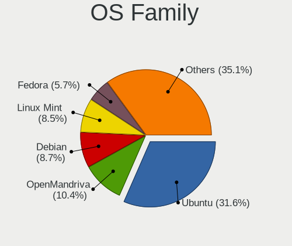
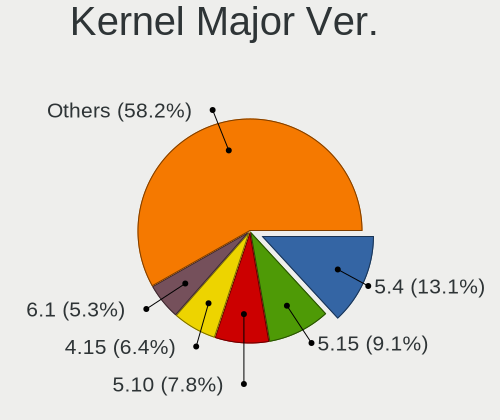
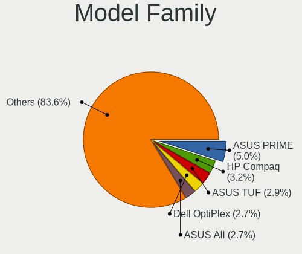
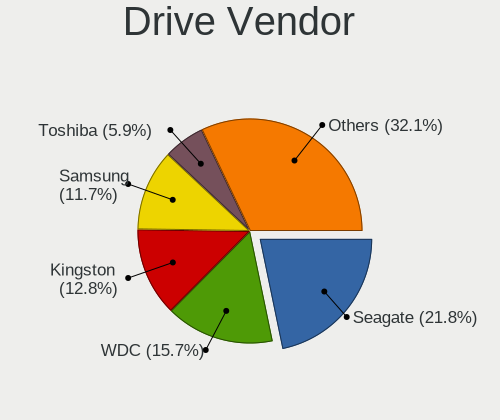
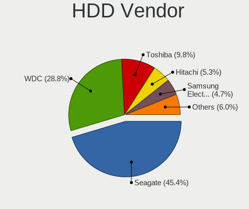
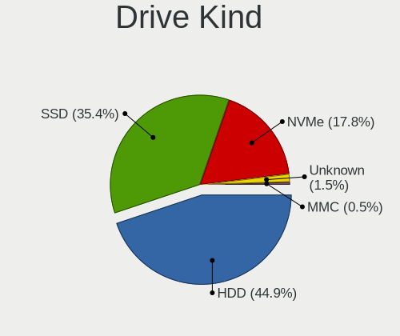
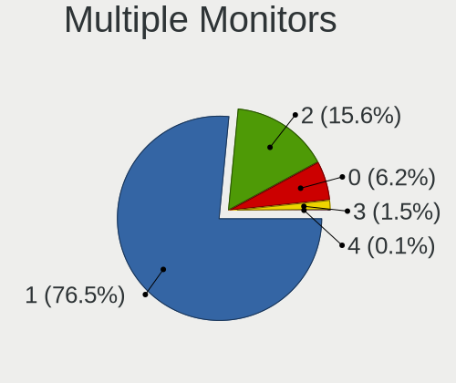
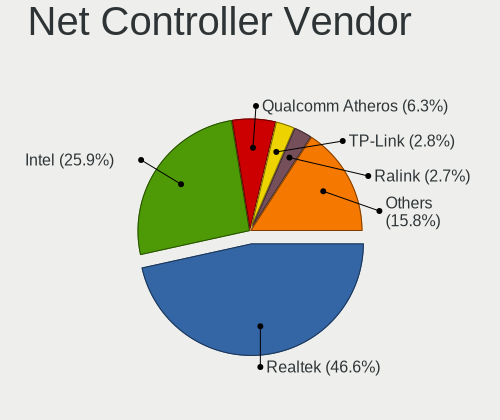
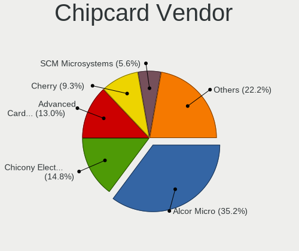

Linux in Spain - Tested Hardware & Statistics (Desktops)
--------------------------------------------------------

A project to collect tested hardware configurations for Linux in Spain.

Anyone can contribute to this report by the [hw-probe](https://github.com/linuxhw/hw-probe) tool:

    sudo -E hw-probe -all -upload

Please contribute! Especially if your hardware is rare.

Contents
--------

* [ Test Cases ](#test-cases)

* [ System ](#system)
  - [ OS                       ](#os)
  - [ OS Family                ](#os-family)
  - [ Kernel                   ](#kernel)
  - [ Kernel Family            ](#kernel-family)
  - [ Kernel Major Ver.        ](#kernel-major-ver)
  - [ Arch                     ](#arch)
  - [ DE                       ](#de)
  - [ Display Server           ](#display-server)
  - [ Display Manager          ](#display-manager)
  - [ OS Lang                  ](#os-lang)
  - [ Boot Mode                ](#boot-mode)
  - [ Filesystem               ](#filesystem)
  - [ Part. scheme             ](#part-scheme)
  - [ Dual Boot with Linux/BSD ](#dual-boot-with-linuxbsd)
  - [ Dual Boot (Win)          ](#dual-boot-win)

* [ Board ](#board)
  - [ Vendor                   ](#vendor)
  - [ Model                    ](#model)
  - [ Model Family             ](#model-family)
  - [ MFG Year                 ](#mfg-year)
  - [ Form Factor              ](#form-factor)
  - [ Secure Boot              ](#secure-boot)
  - [ Coreboot                 ](#coreboot)
  - [ RAM Size                 ](#ram-size)
  - [ RAM Used                 ](#ram-used)
  - [ Total Drives             ](#total-drives)
  - [ Has CD-ROM               ](#has-cd-rom)
  - [ Has Ethernet             ](#has-ethernet)
  - [ Has WiFi                 ](#has-wifi)
  - [ Has Bluetooth            ](#has-bluetooth)

* [ Location ](#location)
  - [ Country                  ](#country)
  - [ City                     ](#city)

* [ Drives ](#drives)
  - [ Drive Vendor             ](#drive-vendor)
  - [ Drive Model              ](#drive-model)
  - [ HDD Vendor               ](#hdd-vendor)
  - [ SSD Vendor               ](#ssd-vendor)
  - [ Drive Kind               ](#drive-kind)
  - [ Drive Connector          ](#drive-connector)
  - [ Drive Size               ](#drive-size)
  - [ Space Total              ](#space-total)
  - [ Space Used               ](#space-used)
  - [ Malfunc. Drives          ](#malfunc-drives)
  - [ Malfunc. Drive Vendor    ](#malfunc-drive-vendor)
  - [ Malfunc. HDD Vendor      ](#malfunc-hdd-vendor)
  - [ Malfunc. Drive Kind      ](#malfunc-drive-kind)
  - [ Failed Drives            ](#failed-drives)
  - [ Failed Drive Vendor      ](#failed-drive-vendor)
  - [ Drive Status             ](#drive-status)

* [ Storage controller ](#storage-controller)
  - [ Storage Vendor           ](#storage-vendor)
  - [ Storage Model            ](#storage-model)
  - [ Storage Kind             ](#storage-kind)

* [ Processor ](#processor)
  - [ CPU Vendor               ](#cpu-vendor)
  - [ CPU Model                ](#cpu-model)
  - [ CPU Model Family         ](#cpu-model-family)
  - [ CPU Cores                ](#cpu-cores)
  - [ CPU Sockets              ](#cpu-sockets)
  - [ CPU Threads              ](#cpu-threads)
  - [ CPU Op-Modes             ](#cpu-op-modes)
  - [ CPU Microcode            ](#cpu-microcode)
  - [ CPU Microarch            ](#cpu-microarch)

* [ Graphics ](#graphics)
  - [ GPU Vendor               ](#gpu-vendor)
  - [ GPU Model                ](#gpu-model)
  - [ GPU Combo                ](#gpu-combo)
  - [ GPU Driver               ](#gpu-driver)
  - [ GPU Memory               ](#gpu-memory)

* [ Monitor ](#monitor)
  - [ Monitor Vendor           ](#monitor-vendor)
  - [ Monitor Model            ](#monitor-model)
  - [ Monitor Resolution       ](#monitor-resolution)
  - [ Monitor Diagonal         ](#monitor-diagonal)
  - [ Monitor Width            ](#monitor-width)
  - [ Aspect Ratio             ](#aspect-ratio)
  - [ Monitor Area             ](#monitor-area)
  - [ Pixel Density            ](#pixel-density)
  - [ Multiple Monitors        ](#multiple-monitors)

* [ Network ](#network)
  - [ Net Controller Vendor    ](#net-controller-vendor)
  - [ Net Controller Model     ](#net-controller-model)
  - [ Wireless Vendor          ](#wireless-vendor)
  - [ Wireless Model           ](#wireless-model)
  - [ Ethernet Vendor          ](#ethernet-vendor)
  - [ Ethernet Model           ](#ethernet-model)
  - [ Net Controller Kind      ](#net-controller-kind)
  - [ Used Controller          ](#used-controller)
  - [ NICs                     ](#nics)
  - [ IPv6                     ](#ipv6)

* [ Bluetooth ](#bluetooth)
  - [ Bluetooth Vendor         ](#bluetooth-vendor)
  - [ Bluetooth Model          ](#bluetooth-model)

* [ Sound ](#sound)
  - [ Sound Vendor             ](#sound-vendor)
  - [ Sound Model              ](#sound-model)

* [ Memory ](#memory)
  - [ Memory Vendor            ](#memory-vendor)
  - [ Memory Model             ](#memory-model)
  - [ Memory Kind              ](#memory-kind)
  - [ Memory Form Factor       ](#memory-form-factor)
  - [ Memory Size              ](#memory-size)
  - [ Memory Speed             ](#memory-speed)

* [ Printers & scanners ](#printers--scanners)
  - [ Printer Vendor           ](#printer-vendor)
  - [ Printer Model            ](#printer-model)
  - [ Scanner Vendor           ](#scanner-vendor)
  - [ Scanner Model            ](#scanner-model)

* [ Camera ](#camera)
  - [ Camera Vendor            ](#camera-vendor)
  - [ Camera Model             ](#camera-model)

* [ Security ](#security)
  - [ Fingerprint Vendor       ](#fingerprint-vendor)
  - [ Fingerprint Model        ](#fingerprint-model)
  - [ Chipcard Vendor          ](#chipcard-vendor)
  - [ Chipcard Model           ](#chipcard-model)

* [ Unsupported ](#unsupported)
  - [ Unsupported Devices      ](#unsupported-devices)
  - [ Unsupported Device Types ](#unsupported-device-types)

Test Cases
----------

Total: 3650

| Vendor        | Model                       | Probe                                                      | Date         |
|---------------|-----------------------------|------------------------------------------------------------|--------------|
| Unknown       | Unknown                     | [d3ffc9eacb](https://linux-hardware.org/?probe=d3ffc9eacb) | May 09, 2024 |
| Unknown       | Unknown                     | [3027a0b67c](https://linux-hardware.org/?probe=3027a0b67c) | May 09, 2024 |
| eMachines     | WMCP61M                     | [14e676a6db](https://linux-hardware.org/?probe=14e676a6db) | May 09, 2024 |
| Medion        | Cattle24 -1M                | [aa19188799](https://linux-hardware.org/?probe=aa19188799) | May 08, 2024 |
| Gigabyte      | X99-UD4-CF                  | [c8d8b57bc2](https://linux-hardware.org/?probe=c8d8b57bc2) | May 08, 2024 |
| Gigabyte      | Z270-HD3P-CF                | [b67da2effc](https://linux-hardware.org/?probe=b67da2effc) | May 08, 2024 |
| Gigabyte      | H310M S2H x.x               | [97598b9cc3](https://linux-hardware.org/?probe=97598b9cc3) | May 07, 2024 |
| MSI           | B450-A PRO MAX              | [27adbf1266](https://linux-hardware.org/?probe=27adbf1266) | May 07, 2024 |
| Huanan        | X58 V1.0                    | [f4d5141ce0](https://linux-hardware.org/?probe=f4d5141ce0) | May 07, 2024 |
| Apple         | Mac-F221BEC8                | [38e8b24bd0](https://linux-hardware.org/?probe=38e8b24bd0) | May 07, 2024 |
| eMachines     | WMCP61M                     | [54b1a18c59](https://linux-hardware.org/?probe=54b1a18c59) | May 06, 2024 |
| ASUSTek       | PRIME A320M-K               | [0f43840d58](https://linux-hardware.org/?probe=0f43840d58) | May 06, 2024 |
| Biostar       | H61MHV3                     | [c57747b094](https://linux-hardware.org/?probe=c57747b094) | May 05, 2024 |
| HP            | 83E1                        | [71a7fa85fb](https://linux-hardware.org/?probe=71a7fa85fb) | May 05, 2024 |
| ASUSTek       | M4A88TD-V EVO/USB3          | [0ded21fa2e](https://linux-hardware.org/?probe=0ded21fa2e) | May 05, 2024 |
| Gigabyte      | B450 AORUS M                | [336365df6e](https://linux-hardware.org/?probe=336365df6e) | May 05, 2024 |
| Gigabyte      | B550M AORUS ELITE           | [4e09bfec36](https://linux-hardware.org/?probe=4e09bfec36) | May 04, 2024 |
| MSI           | B350 GAMING PLUS            | [ac7913c0fa](https://linux-hardware.org/?probe=ac7913c0fa) | May 04, 2024 |
| Huanan        | X58 V1.0                    | [c55f67fac2](https://linux-hardware.org/?probe=c55f67fac2) | May 02, 2024 |
| To be fill... | CX-J4125B 11                | [b567efebf2](https://linux-hardware.org/?probe=b567efebf2) | May 02, 2024 |
| To be fill... | CX-J4125B 11                | [258c2fcd0d](https://linux-hardware.org/?probe=258c2fcd0d) | May 02, 2024 |
| To be fill... | CX-J4125 12                 | [f579d8a9cc](https://linux-hardware.org/?probe=f579d8a9cc) | May 02, 2024 |
| ASRock        | B550 Phantom Gaming 4       | [e6e296b237](https://linux-hardware.org/?probe=e6e296b237) | May 01, 2024 |
| MSI           | B450M BAZOOKA V2            | [12ec4389e8](https://linux-hardware.org/?probe=12ec4389e8) | Apr 30, 2024 |
| ASUSTek       | PRIME A320M-K               | [022ece0282](https://linux-hardware.org/?probe=022ece0282) | Apr 30, 2024 |
| ASUSTek       | M4N72-E                     | [c8920341bc](https://linux-hardware.org/?probe=c8920341bc) | Apr 29, 2024 |
| Gigabyte      | Z77X-UD3H                   | [9ec352e75d](https://linux-hardware.org/?probe=9ec352e75d) | Apr 29, 2024 |
| Intel         | D945GCL AAD67193-205        | [2520d8fe1d](https://linux-hardware.org/?probe=2520d8fe1d) | Apr 28, 2024 |
| MSI           | Z87-G43                     | [94162ca704](https://linux-hardware.org/?probe=94162ca704) | Apr 27, 2024 |
| Gigabyte      | TRX40 AORUS MASTER          | [1b5ae94b9e](https://linux-hardware.org/?probe=1b5ae94b9e) | Apr 25, 2024 |
| Gigabyte      | X399 AORUS PRO-CF           | [ae667fce92](https://linux-hardware.org/?probe=ae667fce92) | Apr 25, 2024 |
| Unknown       | Unknown                     | [c226f7eee7](https://linux-hardware.org/?probe=c226f7eee7) | Apr 25, 2024 |
| ASRock        | TRX40 Creator               | [cc4738cbfe](https://linux-hardware.org/?probe=cc4738cbfe) | Apr 25, 2024 |
| ASUSTek       | ROG ZENITH II EXTREME       | [6bb0e4d69f](https://linux-hardware.org/?probe=6bb0e4d69f) | Apr 24, 2024 |
| ASUSTek       | ROG ZENITH II EXTREME       | [38b6b334fc](https://linux-hardware.org/?probe=38b6b334fc) | Apr 24, 2024 |
| ASRock        | TRX40 Creator               | [248a7c9cb7](https://linux-hardware.org/?probe=248a7c9cb7) | Apr 24, 2024 |
| Gigabyte      | TRX40 AORUS MASTER          | [7dcc7cb561](https://linux-hardware.org/?probe=7dcc7cb561) | Apr 24, 2024 |
| Gigabyte      | TRX40 AORUS MASTER          | [9426a5b0e6](https://linux-hardware.org/?probe=9426a5b0e6) | Apr 24, 2024 |
| Gigabyte      | TRX40 AORUS MASTER          | [197ca7d3cb](https://linux-hardware.org/?probe=197ca7d3cb) | Apr 24, 2024 |
| Gigabyte      | TRX40 AORUS MASTER          | [7f1573ec15](https://linux-hardware.org/?probe=7f1573ec15) | Apr 24, 2024 |
| Gigabyte      | TRX40 AORUS MASTER          | [2da1dbfafd](https://linux-hardware.org/?probe=2da1dbfafd) | Apr 24, 2024 |
| ASRock        | TRX40 Creator               | [a2a1bf049f](https://linux-hardware.org/?probe=a2a1bf049f) | Apr 24, 2024 |
| Gigabyte      | TRX40 AORUS MASTER          | [9898467fe0](https://linux-hardware.org/?probe=9898467fe0) | Apr 24, 2024 |
| ASRock        | TRX40 Creator               | [542e333336](https://linux-hardware.org/?probe=542e333336) | Apr 24, 2024 |
| ASRock        | TRX40 Creator               | [c9bdc54a54](https://linux-hardware.org/?probe=c9bdc54a54) | Apr 24, 2024 |
| ASRock        | TRX40 Creator               | [a47e5abed3](https://linux-hardware.org/?probe=a47e5abed3) | Apr 24, 2024 |
| ASUSTek       | A88X-PLUS                   | [758736ef94](https://linux-hardware.org/?probe=758736ef94) | Apr 24, 2024 |
| Acer          | Predator PO7-640            | [6d9e679298](https://linux-hardware.org/?probe=6d9e679298) | Apr 24, 2024 |
| ASUSTek       | Z97-P                       | [ec6038f173](https://linux-hardware.org/?probe=ec6038f173) | Apr 22, 2024 |
| HP            | 8835                        | [63962138e6](https://linux-hardware.org/?probe=63962138e6) | Apr 22, 2024 |
| ASUSTek       | TUF Gaming X570-PLUS        | [1fe127b27d](https://linux-hardware.org/?probe=1fe127b27d) | Apr 21, 2024 |
| ASUSTek       | P6T                         | [d2206947bb](https://linux-hardware.org/?probe=d2206947bb) | Apr 21, 2024 |
| ASRock        | X399 Taichi                 | [630388c584](https://linux-hardware.org/?probe=630388c584) | Apr 20, 2024 |
| Gigabyte      | Z390 UD                     | [2f4860118a](https://linux-hardware.org/?probe=2f4860118a) | Apr 19, 2024 |
| MSI           | B450-A PRO MAX              | [1babcb92fd](https://linux-hardware.org/?probe=1babcb92fd) | Apr 18, 2024 |
| ASRock        | Z690 Phantom Gaming-ITX/... | [020aa8904b](https://linux-hardware.org/?probe=020aa8904b) | Apr 18, 2024 |
| ASUSTek       | ROG STRIX B365-G GAMING     | [d82686d43d](https://linux-hardware.org/?probe=d82686d43d) | Apr 18, 2024 |
| MSI           | H81M-E33                    | [51ed26e0d4](https://linux-hardware.org/?probe=51ed26e0d4) | Apr 17, 2024 |
| AZW           | EQ                          | [78602148a8](https://linux-hardware.org/?probe=78602148a8) | Apr 17, 2024 |
| MSI           | B450M-A PRO MAX             | [f113006ac0](https://linux-hardware.org/?probe=f113006ac0) | Apr 17, 2024 |
| MSI           | H81M-E33                    | [4509bf8a3c](https://linux-hardware.org/?probe=4509bf8a3c) | Apr 17, 2024 |
| Shenzhen M... | F7BFC                       | [f95926a55e](https://linux-hardware.org/?probe=f95926a55e) | Apr 17, 2024 |
| Lenovo        | 36EB NOK                    | [c83418c56a](https://linux-hardware.org/?probe=c83418c56a) | Apr 17, 2024 |
| Intel         | ADL-F10                     | [036f5e1450](https://linux-hardware.org/?probe=036f5e1450) | Apr 16, 2024 |
| Fujitsu       | D3642-B1 S26361-D3642-B1    | [eb94119a94](https://linux-hardware.org/?probe=eb94119a94) | Apr 16, 2024 |
| Gigabyte      | TRX40 AORUS MASTER          | [ebf280313f](https://linux-hardware.org/?probe=ebf280313f) | Apr 16, 2024 |
| ASRock        | TRX40 Creator               | [57d1cf59c7](https://linux-hardware.org/?probe=57d1cf59c7) | Apr 16, 2024 |
| ASRock        | TRX40 Creator               | [200c6d06cf](https://linux-hardware.org/?probe=200c6d06cf) | Apr 16, 2024 |
| AMI           | Intel                       | [d620a9c686](https://linux-hardware.org/?probe=d620a9c686) | Apr 15, 2024 |
| ASRock        | FM2A88M Extreme4+           | [2ee0e2ace7](https://linux-hardware.org/?probe=2ee0e2ace7) | Apr 14, 2024 |
| ASRock        | FM2A88M Extreme4+           | [20e465155b](https://linux-hardware.org/?probe=20e465155b) | Apr 14, 2024 |
| Gigabyte      | B450M DS3H-CF               | [8280874d0c](https://linux-hardware.org/?probe=8280874d0c) | Apr 14, 2024 |
| Gigabyte      | B450M DS3H-CF               | [16a95d9060](https://linux-hardware.org/?probe=16a95d9060) | Apr 14, 2024 |
| MACHINIST     | X99-MR9A PRO MAX V1.2       | [f417b06e01](https://linux-hardware.org/?probe=f417b06e01) | Apr 14, 2024 |
| Gigabyte      | GA-MA790XT-UD4P             | [afc6970a5a](https://linux-hardware.org/?probe=afc6970a5a) | Apr 13, 2024 |
| ASUSTek       | P5WDG2 WS Pro               | [c370aff195](https://linux-hardware.org/?probe=c370aff195) | Apr 13, 2024 |
| ASUSTek       | ROG STRIX B365-G GAMING     | [7c984f66c8](https://linux-hardware.org/?probe=7c984f66c8) | Apr 13, 2024 |
| Packard Be... | 1.XX                        | [2f25beb1a1](https://linux-hardware.org/?probe=2f25beb1a1) | Apr 12, 2024 |
| MSI           | PRO B650-S WIFI             | [f5372b6597](https://linux-hardware.org/?probe=f5372b6597) | Apr 12, 2024 |
| Pegatron      | H81-M1                      | [ad6b67560b](https://linux-hardware.org/?probe=ad6b67560b) | Apr 12, 2024 |
| MSI           | MPG X570 GAMING PLUS        | [0b6d67b3c6](https://linux-hardware.org/?probe=0b6d67b3c6) | Apr 11, 2024 |
| HP            | 89D8 SMVB                   | [8c27767abc](https://linux-hardware.org/?probe=8c27767abc) | Apr 10, 2024 |
| Shenzhen M... | F7BFC                       | [94ccbc78f1](https://linux-hardware.org/?probe=94ccbc78f1) | Apr 10, 2024 |
| Intel         | ADL-F10                     | [17a43967f2](https://linux-hardware.org/?probe=17a43967f2) | Apr 08, 2024 |
| MSI           | X670E GAMING PLUS WIFI      | [d1a91deeed](https://linux-hardware.org/?probe=d1a91deeed) | Apr 08, 2024 |
| MSI           | X470 GAMING PLUS MAX        | [078e1e4a08](https://linux-hardware.org/?probe=078e1e4a08) | Apr 07, 2024 |
| Acer          | Aspire X1700                | [9c3f1e2bac](https://linux-hardware.org/?probe=9c3f1e2bac) | Apr 07, 2024 |
| Acer          | Aspire X1700                | [00f7a12396](https://linux-hardware.org/?probe=00f7a12396) | Apr 07, 2024 |
| ASUSTek       | Z97-P                       | [3d4d65387c](https://linux-hardware.org/?probe=3d4d65387c) | Apr 06, 2024 |
| Gigabyte      | M68M-S2P                    | [2711aee181](https://linux-hardware.org/?probe=2711aee181) | Apr 05, 2024 |
| ASUSTek       | TUF B450M-PLUS GAMING       | [a92eac3002](https://linux-hardware.org/?probe=a92eac3002) | Apr 05, 2024 |
| Shenzhen M... | F7BFC                       | [bbe75de967](https://linux-hardware.org/?probe=bbe75de967) | Apr 04, 2024 |
| MSI           | X670E GAMING PLUS WIFI      | [6d1d9cbc9e](https://linux-hardware.org/?probe=6d1d9cbc9e) | Apr 04, 2024 |
| ASUSTek       | PRIME B450M-A               | [4fc3272c07](https://linux-hardware.org/?probe=4fc3272c07) | Apr 04, 2024 |
| HP            | 1495                        | [92c2575a1f](https://linux-hardware.org/?probe=92c2575a1f) | Apr 03, 2024 |
| ASUSTek       | TUF Gaming B650-PLUS WIF... | [880214aac4](https://linux-hardware.org/?probe=880214aac4) | Apr 02, 2024 |
| MACHINIST     | X99-MR9A PRO MAX V1.2       | [aec3f76613](https://linux-hardware.org/?probe=aec3f76613) | Apr 02, 2024 |
| Lenovo        | 310B SDK0J40697 WIN 3305... | [536e30fe1c](https://linux-hardware.org/?probe=536e30fe1c) | Apr 02, 2024 |
| ASUSTek       | ROG CROSSHAIR VIII HERO     | [84ed1b3cc5](https://linux-hardware.org/?probe=84ed1b3cc5) | Apr 01, 2024 |
| ASUSTek       | ROG STRIX X570-E GAMING     | [bd03ed36a4](https://linux-hardware.org/?probe=bd03ed36a4) | Apr 01, 2024 |
| QIYIDA        | X79-M6 V1.0                 | [ab18c6c58f](https://linux-hardware.org/?probe=ab18c6c58f) | Mar 31, 2024 |
| Intel         | DP35DP AAD81073-207         | [8d783be6f7](https://linux-hardware.org/?probe=8d783be6f7) | Mar 31, 2024 |
| Medion        | D3F3-EM                     | [c624415ff5](https://linux-hardware.org/?probe=c624415ff5) | Mar 30, 2024 |
| Gigabyte      | B550 AORUS ELITE V2         | [ff9042cc68](https://linux-hardware.org/?probe=ff9042cc68) | Mar 28, 2024 |
| ASUSTek       | TUF Gaming B760-PLUS WIF... | [c82343906c](https://linux-hardware.org/?probe=c82343906c) | Mar 27, 2024 |
| ASRock        | H370 Pro4                   | [61db4d52ca](https://linux-hardware.org/?probe=61db4d52ca) | Mar 27, 2024 |
| HP            | 89D8 SMVB                   | [3d3d6903dd](https://linux-hardware.org/?probe=3d3d6903dd) | Mar 27, 2024 |
| Gigabyte      | H81M-DS2V                   | [2990ce91ba](https://linux-hardware.org/?probe=2990ce91ba) | Mar 27, 2024 |
| Gigabyte      | B450M DS3H V2               | [e506b0242a](https://linux-hardware.org/?probe=e506b0242a) | Mar 26, 2024 |
| Gigabyte      | B760M DS3H DDR4             | [069f9b2bc9](https://linux-hardware.org/?probe=069f9b2bc9) | Mar 26, 2024 |
| ASUSTek       | P8Z77-V                     | [ec744f652d](https://linux-hardware.org/?probe=ec744f652d) | Mar 25, 2024 |
| ASUSTek       | P8Z77-V                     | [89c81c0a65](https://linux-hardware.org/?probe=89c81c0a65) | Mar 25, 2024 |
| Gigabyte      | H81M-DS2V                   | [7dde2500b9](https://linux-hardware.org/?probe=7dde2500b9) | Mar 25, 2024 |
| ASUSTek       | H81M-P PLUS                 | [92aa3b7c70](https://linux-hardware.org/?probe=92aa3b7c70) | Mar 24, 2024 |
| ASUSTek       | H81M-P PLUS                 | [57ee067ff2](https://linux-hardware.org/?probe=57ee067ff2) | Mar 24, 2024 |
| ASUSTek       | PRIME X570-P                | [8928a51f78](https://linux-hardware.org/?probe=8928a51f78) | Mar 22, 2024 |
| Unknown       | Unknown                     | [5af36d3a4e](https://linux-hardware.org/?probe=5af36d3a4e) | Mar 22, 2024 |
| ASUSTek       | K30BF_M32BF_A_F_K31BF_6     | [dfa8ff45b7](https://linux-hardware.org/?probe=dfa8ff45b7) | Mar 21, 2024 |
| ASUSTek       | K30BF_M32BF_A_F_K31BF_6     | [5c0de1313b](https://linux-hardware.org/?probe=5c0de1313b) | Mar 21, 2024 |
| ASRock        | Z77 Pro3                    | [51c0a74384](https://linux-hardware.org/?probe=51c0a74384) | Mar 21, 2024 |
| ASUSTek       | PRIME B450M-A II            | [dd70b1d6b3](https://linux-hardware.org/?probe=dd70b1d6b3) | Mar 21, 2024 |
| ASUSTek       | ROG STRIX B450-F GAMING     | [8f65d86036](https://linux-hardware.org/?probe=8f65d86036) | Mar 20, 2024 |
| Lenovo        | SHARKBAY 0B98401 WIN        | [c15e54db2e](https://linux-hardware.org/?probe=c15e54db2e) | Mar 19, 2024 |
| Dell          | 0D6H9T A01                  | [c3691d0e66](https://linux-hardware.org/?probe=c3691d0e66) | Mar 19, 2024 |
| MSI           | MS-B0A21                    | [e4301d435b](https://linux-hardware.org/?probe=e4301d435b) | Mar 18, 2024 |
| ASRock        | X570 Steel Legend           | [902b7d5554](https://linux-hardware.org/?probe=902b7d5554) | Mar 18, 2024 |
| ASUSTek       | TUF Gaming B450-PLUS II     | [b187be84a4](https://linux-hardware.org/?probe=b187be84a4) | Mar 17, 2024 |
| ASRock        | Z690 Phantom Gaming-ITX/... | [27baad85ff](https://linux-hardware.org/?probe=27baad85ff) | Mar 17, 2024 |
| MSI           | B350M BAZOOKA               | [e8c63c54a8](https://linux-hardware.org/?probe=e8c63c54a8) | Mar 16, 2024 |
| Gigabyte      | Z170-HD3P-CF                | [291b222709](https://linux-hardware.org/?probe=291b222709) | Mar 16, 2024 |
| ASUSTek       | B150M-A                     | [b9b301bb3a](https://linux-hardware.org/?probe=b9b301bb3a) | Mar 16, 2024 |
| ASUSTek       | PRIME B350M-A               | [582d3628d3](https://linux-hardware.org/?probe=582d3628d3) | Mar 15, 2024 |
| Dell          | 0FXD80 A00                  | [c0e1f6f453](https://linux-hardware.org/?probe=c0e1f6f453) | Mar 15, 2024 |
| Gigabyte      | A520M DS3H                  | [e9eaacfaa2](https://linux-hardware.org/?probe=e9eaacfaa2) | Mar 15, 2024 |
| MSI           | Z270 PC MATE                | [87ef1a815e](https://linux-hardware.org/?probe=87ef1a815e) | Mar 15, 2024 |
| ASUSTek       | PRIME B760-PLUS             | [bb52ad6052](https://linux-hardware.org/?probe=bb52ad6052) | Mar 15, 2024 |
| ASUSTek       | B85-PRO GAMER               | [66f9489b1e](https://linux-hardware.org/?probe=66f9489b1e) | Mar 14, 2024 |
| ASUSTek       | AT4NM10T-I                  | [6d006ade6c](https://linux-hardware.org/?probe=6d006ade6c) | Mar 13, 2024 |
| ASUSTek       | AT4NM10T-I                  | [f7ddcc5c64](https://linux-hardware.org/?probe=f7ddcc5c64) | Mar 13, 2024 |
| Intel         | X58 V1608                   | [48e5f0f5a6](https://linux-hardware.org/?probe=48e5f0f5a6) | Mar 13, 2024 |
| Intel         | X58 V1608                   | [84ccc96b6b](https://linux-hardware.org/?probe=84ccc96b6b) | Mar 13, 2024 |
| Gigabyte      | Z370 HD3-CF                 | [fe9632e966](https://linux-hardware.org/?probe=fe9632e966) | Mar 13, 2024 |
| Medion        | D3F3-EM2                    | [84c6998958](https://linux-hardware.org/?probe=84c6998958) | Mar 13, 2024 |
| Medion        | D3F3-EM2                    | [919075a65c](https://linux-hardware.org/?probe=919075a65c) | Mar 12, 2024 |
| ASUSTek       | STRIX H270F GAMING          | [b8837fff38](https://linux-hardware.org/?probe=b8837fff38) | Mar 12, 2024 |
| HP            | 18E7                        | [60cf0b1c2b](https://linux-hardware.org/?probe=60cf0b1c2b) | Mar 12, 2024 |
| ASRock        | ConRoe1333-DVI/H            | [568d966b3f](https://linux-hardware.org/?probe=568d966b3f) | Mar 12, 2024 |
| ASRock        | Z690 Phantom Gaming-ITX/... | [e922cff9f6](https://linux-hardware.org/?probe=e922cff9f6) | Mar 11, 2024 |
| MSI           | X470 GAMING PLUS MAX        | [0442caba04](https://linux-hardware.org/?probe=0442caba04) | Mar 11, 2024 |
| Gigabyte      | B360M HD3                   | [63a3f8ce29](https://linux-hardware.org/?probe=63a3f8ce29) | Mar 11, 2024 |
| Gigabyte      | B360M HD3                   | [aa06991c8c](https://linux-hardware.org/?probe=aa06991c8c) | Mar 11, 2024 |
| Gigabyte      | B450M DS3H-CF               | [05b14ed2cd](https://linux-hardware.org/?probe=05b14ed2cd) | Mar 11, 2024 |
| Gigabyte      | B360M HD3                   | [724f7885d0](https://linux-hardware.org/?probe=724f7885d0) | Mar 10, 2024 |
| HP            | 8265                        | [a805d1a4b0](https://linux-hardware.org/?probe=a805d1a4b0) | Mar 10, 2024 |
| Lenovo        | SHARKBAY 0B98401 PRO        | [392bd2c7d3](https://linux-hardware.org/?probe=392bd2c7d3) | Mar 10, 2024 |
| Gigabyte      | Z77-D3H                     | [6be0c27695](https://linux-hardware.org/?probe=6be0c27695) | Mar 10, 2024 |
| Gigabyte      | Z77-D3H                     | [84b8690965](https://linux-hardware.org/?probe=84b8690965) | Mar 10, 2024 |
| Dell          | 03NVJ6 A01                  | [d8dccee559](https://linux-hardware.org/?probe=d8dccee559) | Mar 09, 2024 |
| Acer          | Predator PO3-640            | [f229a75cfc](https://linux-hardware.org/?probe=f229a75cfc) | Mar 08, 2024 |
| ASRock        | D1800M                      | [9098eafea6](https://linux-hardware.org/?probe=9098eafea6) | Mar 08, 2024 |
| ASUSTek       | PRO A520M-C                 | [394fa5ec3f](https://linux-hardware.org/?probe=394fa5ec3f) | Mar 04, 2024 |
| AZW           | Green G5                    | [0d917a5d84](https://linux-hardware.org/?probe=0d917a5d84) | Mar 04, 2024 |
| MSI           | H81M-E33                    | [dddb1e09f3](https://linux-hardware.org/?probe=dddb1e09f3) | Mar 03, 2024 |
| Gigabyte      | AB350M-Gaming 3-CF          | [00190a62fa](https://linux-hardware.org/?probe=00190a62fa) | Mar 03, 2024 |
| Huanan        | X99-F8 GAMING V2.0          | [ce05cbee18](https://linux-hardware.org/?probe=ce05cbee18) | Mar 02, 2024 |
| Biostar       | H61MHV3                     | [2737c4512b](https://linux-hardware.org/?probe=2737c4512b) | Mar 02, 2024 |
| Biostar       | H61MHV3                     | [863e37f0d0](https://linux-hardware.org/?probe=863e37f0d0) | Mar 01, 2024 |
| Gigabyte      | GA-990FXA-UD5               | [56b862a321](https://linux-hardware.org/?probe=56b862a321) | Mar 01, 2024 |
| ASUSTek       | Maximus VIII HERO           | [bc62cff5e5](https://linux-hardware.org/?probe=bc62cff5e5) | Feb 28, 2024 |
| ASUSTek       | B85M-G                      | [a560552b52](https://linux-hardware.org/?probe=a560552b52) | Feb 27, 2024 |
| ASUSTek       | ROG STRIX B550-I GAMING     | [056d94a05f](https://linux-hardware.org/?probe=056d94a05f) | Feb 27, 2024 |
| Shenzhen M... | F7BFC                       | [a3c3fa8741](https://linux-hardware.org/?probe=a3c3fa8741) | Feb 27, 2024 |
| ASUSTek       | ROG STRIX B550-I GAMING     | [a4fa28e88f](https://linux-hardware.org/?probe=a4fa28e88f) | Feb 26, 2024 |
| Gigabyte      | H61M-D2H-USB3               | [c994a051e7](https://linux-hardware.org/?probe=c994a051e7) | Feb 26, 2024 |
| ASUSTek       | ROG Maximus Z790 DARK HE... | [945b792fe7](https://linux-hardware.org/?probe=945b792fe7) | Feb 26, 2024 |
| MSI           | B450 TOMAHAWK               | [55332d6c4e](https://linux-hardware.org/?probe=55332d6c4e) | Feb 25, 2024 |
| ASRock        | B450 Gaming K4              | [5c265bcd3f](https://linux-hardware.org/?probe=5c265bcd3f) | Feb 25, 2024 |
| Intel         | DH61WW AAG23116-301         | [ffa6427a96](https://linux-hardware.org/?probe=ffa6427a96) | Feb 24, 2024 |
| Gigabyte      | B85M-D3H                    | [9918a05e6b](https://linux-hardware.org/?probe=9918a05e6b) | Feb 24, 2024 |
| ASUSTek       | PRIME Z490M-PLUS            | [30442eac39](https://linux-hardware.org/?probe=30442eac39) | Feb 23, 2024 |
| ASUSTek       | Z87-K                       | [82f0780a43](https://linux-hardware.org/?probe=82f0780a43) | Feb 23, 2024 |
| Gigabyte      | GA-990FXA-UD5               | [80114af718](https://linux-hardware.org/?probe=80114af718) | Feb 22, 2024 |
| ASUSTek       | PRIME H510M-D               | [7662f58840](https://linux-hardware.org/?probe=7662f58840) | Feb 22, 2024 |
| ASUSTek       | PRIME H510M-D               | [cc6eb804b0](https://linux-hardware.org/?probe=cc6eb804b0) | Feb 22, 2024 |
| Gigabyte      | B450 AORUS ELITE            | [98fca5fb14](https://linux-hardware.org/?probe=98fca5fb14) | Feb 22, 2024 |
| ASUSTek       | P8H61-M LE                  | [6511d32b6d](https://linux-hardware.org/?probe=6511d32b6d) | Feb 22, 2024 |
| ASUSTek       | ROG STRIX B650E-I GAMING... | [04b45ee685](https://linux-hardware.org/?probe=04b45ee685) | Feb 21, 2024 |
| ASUSTek       | Z87-K                       | [d091e6a911](https://linux-hardware.org/?probe=d091e6a911) | Feb 21, 2024 |
| MSI           | MPG B550 GAMING PLUS        | [622a73c865](https://linux-hardware.org/?probe=622a73c865) | Feb 20, 2024 |
| ASUSTek       | B85M-G                      | [0afa3fc878](https://linux-hardware.org/?probe=0afa3fc878) | Feb 20, 2024 |
| Gigabyte      | EP43T-USB3                  | [50545a4006](https://linux-hardware.org/?probe=50545a4006) | Feb 19, 2024 |
| ASUSTek       | ROG Maximus Z790 HERO       | [e138126881](https://linux-hardware.org/?probe=e138126881) | Feb 18, 2024 |
| ASUSTek       | PRIME A320M-E               | [7a5ecb886f](https://linux-hardware.org/?probe=7a5ecb886f) | Feb 17, 2024 |
| Huanan        | X79-8D VAA31                | [f478253fc6](https://linux-hardware.org/?probe=f478253fc6) | Feb 16, 2024 |
| MSI           | B450-A PRO MAX              | [ca82f5e8f1](https://linux-hardware.org/?probe=ca82f5e8f1) | Feb 15, 2024 |
| ASRock        | G41C-GS                     | [a590e513a0](https://linux-hardware.org/?probe=a590e513a0) | Feb 15, 2024 |
| Dell          | 05842Y A00                  | [50fc41ef5c](https://linux-hardware.org/?probe=50fc41ef5c) | Feb 15, 2024 |
| MSI           | A520M-A PRO                 | [66417e286c](https://linux-hardware.org/?probe=66417e286c) | Feb 14, 2024 |
| Gigabyte      | H61M-S1                     | [ae94a44dc4](https://linux-hardware.org/?probe=ae94a44dc4) | Feb 13, 2024 |
| HP            | 843B                        | [aa6fd9964e](https://linux-hardware.org/?probe=aa6fd9964e) | Feb 13, 2024 |
| MSI           | Z270 GAMING PLUS            | [d232086b57](https://linux-hardware.org/?probe=d232086b57) | Feb 11, 2024 |
| ASUSTek       | ROG STRIX B650-A GAMING ... | [47111a7719](https://linux-hardware.org/?probe=47111a7719) | Feb 11, 2024 |
| ASUSTek       | K30AD_M31AD_M51AD_M32AD     | [1413849fdf](https://linux-hardware.org/?probe=1413849fdf) | Feb 09, 2024 |
| Acer          | Aspire X3470                | [2844ea5d41](https://linux-hardware.org/?probe=2844ea5d41) | Feb 06, 2024 |
| BESSTAR Te... | HM80                        | [592f538099](https://linux-hardware.org/?probe=592f538099) | Feb 05, 2024 |
| ASUSTek       | ROG STRIX B550-F GAMING     | [6a6209d599](https://linux-hardware.org/?probe=6a6209d599) | Feb 04, 2024 |
| BESSTAR Te... | JB9                         | [7767ac4beb](https://linux-hardware.org/?probe=7767ac4beb) | Feb 03, 2024 |
| ASUSTek       | M4N72-E                     | [815b251540](https://linux-hardware.org/?probe=815b251540) | Feb 02, 2024 |
| Gigabyte      | AB350M-Gaming 3-CF          | [ef41c12950](https://linux-hardware.org/?probe=ef41c12950) | Feb 02, 2024 |
| Intel         | X99-P4 V5.1                 | [092e51b68e](https://linux-hardware.org/?probe=092e51b68e) | Feb 02, 2024 |
| Gigabyte      | H61M-S1                     | [e7f247621c](https://linux-hardware.org/?probe=e7f247621c) | Feb 02, 2024 |
| ASUSTek       | H110M-D                     | [287648c7d3](https://linux-hardware.org/?probe=287648c7d3) | Feb 01, 2024 |
| ASRock        | X370M-HDV                   | [64edf5f2dc](https://linux-hardware.org/?probe=64edf5f2dc) | Feb 01, 2024 |
| Gigabyte      | B75M-D3H                    | [b1b2694b98](https://linux-hardware.org/?probe=b1b2694b98) | Jan 30, 2024 |
| ASUSTek       | ROG Maximus Z790 DARK HE... | [64433c2a96](https://linux-hardware.org/?probe=64433c2a96) | Jan 29, 2024 |
| ASUSTek       | PRIME Z590-A                | [907099b1e7](https://linux-hardware.org/?probe=907099b1e7) | Jan 29, 2024 |
| ASUSTek       | SABERTOOTH Z170 MARK 1      | [29fcd258c7](https://linux-hardware.org/?probe=29fcd258c7) | Jan 28, 2024 |
| ASRock        | Z690 Phantom Gaming-ITX/... | [fe3286f6e5](https://linux-hardware.org/?probe=fe3286f6e5) | Jan 28, 2024 |
| Gigabyte      | X570 I AORUS PRO WIFI       | [26c552f089](https://linux-hardware.org/?probe=26c552f089) | Jan 27, 2024 |
| Gigabyte      | AX370-Gaming 5              | [579b4a4daa](https://linux-hardware.org/?probe=579b4a4daa) | Jan 26, 2024 |
| ASUSTek       | ROG Maximus Z790 DARK HE... | [aa9e38d0e2](https://linux-hardware.org/?probe=aa9e38d0e2) | Jan 26, 2024 |
| Gigabyte      | B550 AORUS ELITE V2         | [c0bdeb8655](https://linux-hardware.org/?probe=c0bdeb8655) | Jan 25, 2024 |
| MSI           | B560M PRO-VDH               | [e64338286f](https://linux-hardware.org/?probe=e64338286f) | Jan 24, 2024 |
| Dell          | 00V62H A01                  | [83f7e8b344](https://linux-hardware.org/?probe=83f7e8b344) | Jan 24, 2024 |
| Intel         | Unknown                     | [8427ffd0dc](https://linux-hardware.org/?probe=8427ffd0dc) | Jan 23, 2024 |
| HP            | 0A5Ch                       | [f886596563](https://linux-hardware.org/?probe=f886596563) | Jan 23, 2024 |
| MSI           | B350M MORTAR                | [f728e7ad76](https://linux-hardware.org/?probe=f728e7ad76) | Jan 22, 2024 |
| ASUSTek       | PRIME B550M-A               | [ed85e4518e](https://linux-hardware.org/?probe=ed85e4518e) | Jan 22, 2024 |
| ASUSTek       | B85M-G                      | [3941eb54fd](https://linux-hardware.org/?probe=3941eb54fd) | Jan 21, 2024 |
| ASUSTek       | TUF Gaming X570-PRO         | [248ddfc03e](https://linux-hardware.org/?probe=248ddfc03e) | Jan 21, 2024 |
| ASUSTek       | TUF Gaming X570-PRO         | [5e268775c9](https://linux-hardware.org/?probe=5e268775c9) | Jan 21, 2024 |
| Foxconn       | 2A8C                        | [591fafe62b](https://linux-hardware.org/?probe=591fafe62b) | Jan 21, 2024 |
| Dell          | 00V62H A01                  | [7104f7e7cf](https://linux-hardware.org/?probe=7104f7e7cf) | Jan 21, 2024 |
| Intel         | X99                         | [44d8693e2b](https://linux-hardware.org/?probe=44d8693e2b) | Jan 18, 2024 |
| ASUSTek       | PRIME H310M-E               | [6674d084a8](https://linux-hardware.org/?probe=6674d084a8) | Jan 18, 2024 |
| Gigabyte      | Z77-DS3H                    | [08a4e7960a](https://linux-hardware.org/?probe=08a4e7960a) | Jan 18, 2024 |
| MSI           | B560M PRO-VDH               | [cc460a0905](https://linux-hardware.org/?probe=cc460a0905) | Jan 16, 2024 |
| HP            | 8750                        | [6dd29a1c24](https://linux-hardware.org/?probe=6dd29a1c24) | Jan 16, 2024 |
| Lenovo        | 30D9 SDK0J40697 WIN 3305... | [eddee431eb](https://linux-hardware.org/?probe=eddee431eb) | Jan 16, 2024 |
| Gigabyte      | Z370 AORUS Gaming 5-CF      | [6b8df5e5f8](https://linux-hardware.org/?probe=6b8df5e5f8) | Jan 16, 2024 |
| MSI           | B85-G41 PC Mate             | [a31032a308](https://linux-hardware.org/?probe=a31032a308) | Jan 15, 2024 |
| Gigabyte      | X99-UD4-CF                  | [662828b0e7](https://linux-hardware.org/?probe=662828b0e7) | Jan 15, 2024 |
| Intel         | X99-P4 V5.0                 | [574a971f93](https://linux-hardware.org/?probe=574a971f93) | Jan 14, 2024 |
| Gigabyte      | X570 I AORUS PRO WIFI       | [c4edc08fb7](https://linux-hardware.org/?probe=c4edc08fb7) | Jan 14, 2024 |
| MSI           | A320M-A PRO                 | [4f2655db6f](https://linux-hardware.org/?probe=4f2655db6f) | Jan 14, 2024 |
| Gigabyte      | AX370-Gaming 5              | [44ec140279](https://linux-hardware.org/?probe=44ec140279) | Jan 14, 2024 |
| ASUSTek       | P8H61-M2 USB3               | [705185dd25](https://linux-hardware.org/?probe=705185dd25) | Jan 13, 2024 |
| Gigabyte      | H510M H V2                  | [1340d91b43](https://linux-hardware.org/?probe=1340d91b43) | Jan 13, 2024 |
| MSI           | H97 PC Mate                 | [b9df3e4a61](https://linux-hardware.org/?probe=b9df3e4a61) | Jan 12, 2024 |
| Acer          | Veriton X490G               | [1110362d9a](https://linux-hardware.org/?probe=1110362d9a) | Jan 11, 2024 |
| ASRock        | 970 Pro3 R2.0               | [ca8734dc63](https://linux-hardware.org/?probe=ca8734dc63) | Jan 11, 2024 |
| MSI           | B450M MORTAR TITANIUM       | [03202bdde9](https://linux-hardware.org/?probe=03202bdde9) | Jan 10, 2024 |
| ASUSTek       | M4N78                       | [b9b072474d](https://linux-hardware.org/?probe=b9b072474d) | Jan 10, 2024 |
| MSI           | MPG B550 GAMING PLUS        | [757c6f2826](https://linux-hardware.org/?probe=757c6f2826) | Jan 10, 2024 |
| MSI           | B450M MORTAR TITANIUM       | [cd8ee8db1f](https://linux-hardware.org/?probe=cd8ee8db1f) | Jan 09, 2024 |
| Intel         | X99H                        | [b0bb3cb105](https://linux-hardware.org/?probe=b0bb3cb105) | Jan 09, 2024 |
| Gigabyte      | H510M S2H V2                | [48ba042e53](https://linux-hardware.org/?probe=48ba042e53) | Jan 08, 2024 |
| ASRock        | J5040-ITX                   | [2dc9e2367b](https://linux-hardware.org/?probe=2dc9e2367b) | Jan 07, 2024 |
| Cisco Syst... | UCSC-C220-M3S 74-10442-0... | [2bc5f49245](https://linux-hardware.org/?probe=2bc5f49245) | Jan 07, 2024 |
| Apple         | Mac-F221BEC8                | [c172686fae](https://linux-hardware.org/?probe=c172686fae) | Jan 06, 2024 |
| Apple         | Mac-F221BEC8                | [a36307cb4c](https://linux-hardware.org/?probe=a36307cb4c) | Jan 06, 2024 |
| Unknown       | Unknown                     | [dd6b7a2d69](https://linux-hardware.org/?probe=dd6b7a2d69) | Jan 05, 2024 |
| ASRock        | J5040-ITX                   | [18b422e05b](https://linux-hardware.org/?probe=18b422e05b) | Jan 04, 2024 |
| MSI           | MPG X570 GAMING PRO CARB... | [d8329e0062](https://linux-hardware.org/?probe=d8329e0062) | Jan 04, 2024 |
| Gigabyte      | A320M-S2H V2-CF             | [f4db017a3f](https://linux-hardware.org/?probe=f4db017a3f) | Jan 03, 2024 |
| HP            | 2B34                        | [cecedd0691](https://linux-hardware.org/?probe=cecedd0691) | Jan 02, 2024 |
| Unknown       | X99H                        | [61c57cb006](https://linux-hardware.org/?probe=61c57cb006) | Jan 01, 2024 |
| ASUSTek       | M4N72-E                     | [7d21517ee3](https://linux-hardware.org/?probe=7d21517ee3) | Dec 31, 2023 |
| Gigabyte      | B450M DS3H-CF               | [08f5647277](https://linux-hardware.org/?probe=08f5647277) | Dec 31, 2023 |
| ASRock        | B75M-DGS                    | [3a2df88d60](https://linux-hardware.org/?probe=3a2df88d60) | Dec 31, 2023 |
| Huanan        | X58 V1.0                    | [d13c9b1573](https://linux-hardware.org/?probe=d13c9b1573) | Dec 31, 2023 |
| QIYIDA        | X99-H9 V2.0                 | [af479728a3](https://linux-hardware.org/?probe=af479728a3) | Dec 30, 2023 |
| Gigabyte      | H81M-S2H                    | [a3a0b274d0](https://linux-hardware.org/?probe=a3a0b274d0) | Dec 29, 2023 |
| MSI           | B450M PRO-VDH V2            | [7efa5db123](https://linux-hardware.org/?probe=7efa5db123) | Dec 29, 2023 |
| MSI           | MEG X570S ACE MAX           | [e0e92720cb](https://linux-hardware.org/?probe=e0e92720cb) | Dec 29, 2023 |
| HP            | 8719                        | [91c89a31b5](https://linux-hardware.org/?probe=91c89a31b5) | Dec 29, 2023 |
| Dell          | 0K216C                      | [203ef6afde](https://linux-hardware.org/?probe=203ef6afde) | Dec 28, 2023 |
| MSI           | Z170A GAMING PRO CARBON     | [dfdfad519d](https://linux-hardware.org/?probe=dfdfad519d) | Dec 28, 2023 |
| ASUSTek       | ROG STRIX B550-F GAMING     | [37fe922c9d](https://linux-hardware.org/?probe=37fe922c9d) | Dec 28, 2023 |
| AZW           | EQ                          | [1300ad3a67](https://linux-hardware.org/?probe=1300ad3a67) | Dec 27, 2023 |
| Gigabyte      | B760M DS3H DDR4             | [10fa4fd32b](https://linux-hardware.org/?probe=10fa4fd32b) | Dec 27, 2023 |
| HP            | 3397                        | [d7bbeccfe9](https://linux-hardware.org/?probe=d7bbeccfe9) | Dec 27, 2023 |
| MSI           | MS-B1591                    | [8baf11e980](https://linux-hardware.org/?probe=8baf11e980) | Dec 27, 2023 |
| Intel         | X99-P4 V5.0                 | [875d756d73](https://linux-hardware.org/?probe=875d756d73) | Dec 26, 2023 |
| Gigabyte      | B560M DS3H V2               | [af65354320](https://linux-hardware.org/?probe=af65354320) | Dec 26, 2023 |
| Lenovo        | MAHOBAY NOK                 | [f85a8a3b68](https://linux-hardware.org/?probe=f85a8a3b68) | Dec 25, 2023 |
| HP            | 1497                        | [c17c12a021](https://linux-hardware.org/?probe=c17c12a021) | Dec 24, 2023 |
| HP            | 1497                        | [9d5244b557](https://linux-hardware.org/?probe=9d5244b557) | Dec 23, 2023 |
| ASRock        | X370 Taichi                 | [689d51f57e](https://linux-hardware.org/?probe=689d51f57e) | Dec 23, 2023 |
| Huanan        | X58 V1.0                    | [ac62468ad1](https://linux-hardware.org/?probe=ac62468ad1) | Dec 21, 2023 |
| Foxconn       | 2ADA                        | [735572694e](https://linux-hardware.org/?probe=735572694e) | Dec 21, 2023 |
| ASUSTek       | PRIME B250M-A               | [11628f388e](https://linux-hardware.org/?probe=11628f388e) | Dec 20, 2023 |
| ASUSTek       | V6-P5G31E                   | [83a8408a7e](https://linux-hardware.org/?probe=83a8408a7e) | Dec 20, 2023 |
| ASUSTek       | Pro B550M-C                 | [4e3b422400](https://linux-hardware.org/?probe=4e3b422400) | Dec 19, 2023 |
| MSI           | MAG Z790 TOMAHAWK WIFI      | [619bbec719](https://linux-hardware.org/?probe=619bbec719) | Dec 19, 2023 |
| ASUSTek       | Pro B550M-C                 | [1cd7c1b629](https://linux-hardware.org/?probe=1cd7c1b629) | Dec 19, 2023 |
| ASUSTek       | H110M-D                     | [c26e0d3896](https://linux-hardware.org/?probe=c26e0d3896) | Dec 18, 2023 |
| ASUSTek       | TUF Gaming B660M-E D4       | [ff5da894f9](https://linux-hardware.org/?probe=ff5da894f9) | Dec 18, 2023 |
| Gigabyte      | H510M H V2                  | [3228539880](https://linux-hardware.org/?probe=3228539880) | Dec 18, 2023 |
| ASUSTek       | ROG CROSSHAIR VIII HERO     | [def7de5871](https://linux-hardware.org/?probe=def7de5871) | Dec 17, 2023 |
| ASRock        | H310M-STX                   | [df11c23d7c](https://linux-hardware.org/?probe=df11c23d7c) | Dec 17, 2023 |
| ASUSTek       | PRIME B460M-A               | [28b95cc0b7](https://linux-hardware.org/?probe=28b95cc0b7) | Dec 16, 2023 |
| HP            | 3647h                       | [4feaf76045](https://linux-hardware.org/?probe=4feaf76045) | Dec 16, 2023 |
| AMI           | Intel                       | [9564eaaec0](https://linux-hardware.org/?probe=9564eaaec0) | Dec 16, 2023 |
| ASRock        | AB350M-HDV                  | [945274527c](https://linux-hardware.org/?probe=945274527c) | Dec 13, 2023 |
| ASUSTek       | PRIME B450M-A               | [5a65590bed](https://linux-hardware.org/?probe=5a65590bed) | Dec 13, 2023 |
| Intel         | MIR1 RVP7                   | [eade46459a](https://linux-hardware.org/?probe=eade46459a) | Dec 13, 2023 |
| ASUSTek       | M3A78                       | [d2c14973f1](https://linux-hardware.org/?probe=d2c14973f1) | Dec 10, 2023 |
| Gigabyte      | EP41-UD3L                   | [9b40e5889d](https://linux-hardware.org/?probe=9b40e5889d) | Dec 10, 2023 |
| MSI           | B560M PRO-VDH               | [4a2deac69b](https://linux-hardware.org/?probe=4a2deac69b) | Dec 10, 2023 |
| Packard Be... | MCP73PV                     | [9d707e64d4](https://linux-hardware.org/?probe=9d707e64d4) | Dec 10, 2023 |
| Gigabyte      | B450 AORUS ELITE V2         | [505f85e4d4](https://linux-hardware.org/?probe=505f85e4d4) | Dec 10, 2023 |
| MSI           | B450-A PRO MAX              | [c576c4fbae](https://linux-hardware.org/?probe=c576c4fbae) | Dec 09, 2023 |
| Unknown       | Unknown                     | [c652e80145](https://linux-hardware.org/?probe=c652e80145) | Dec 08, 2023 |
| Gigabyte      | GA-MA770-DS3                | [66917779ad](https://linux-hardware.org/?probe=66917779ad) | Dec 07, 2023 |
| AMI           | Intel                       | [d2e7be0ff3](https://linux-hardware.org/?probe=d2e7be0ff3) | Dec 07, 2023 |
| ASUSTek       | Pro B560M-C                 | [116dce4b93](https://linux-hardware.org/?probe=116dce4b93) | Dec 07, 2023 |
| MSI           | Z490-A PRO                  | [8d3648a498](https://linux-hardware.org/?probe=8d3648a498) | Dec 07, 2023 |
| ASRock        | A320M-HDV R4.0              | [ca5df22812](https://linux-hardware.org/?probe=ca5df22812) | Dec 06, 2023 |
| MSI           | Z490-A PRO                  | [443436c7ab](https://linux-hardware.org/?probe=443436c7ab) | Dec 05, 2023 |
| MSI           | H510I PRO WIFI              | [b0e2df98b4](https://linux-hardware.org/?probe=b0e2df98b4) | Dec 05, 2023 |
| Gigabyte      | B550M DS3H                  | [ddb2183d6c](https://linux-hardware.org/?probe=ddb2183d6c) | Dec 05, 2023 |
| ASUSTek       | P8Z68-V PRO                 | [fde3c9253f](https://linux-hardware.org/?probe=fde3c9253f) | Dec 04, 2023 |
| ASUSTek       | ROG Maximus Z790 HERO       | [c492be4899](https://linux-hardware.org/?probe=c492be4899) | Dec 04, 2023 |
| HP            | 2B46                        | [5bfce44b96](https://linux-hardware.org/?probe=5bfce44b96) | Dec 03, 2023 |
| Lenovo        | 312A SDK0J40697 WIN 3305... | [fb15da06c7](https://linux-hardware.org/?probe=fb15da06c7) | Dec 03, 2023 |
| Lenovo        | MAHOBAY NO DPK              | [ece8f86f29](https://linux-hardware.org/?probe=ece8f86f29) | Dec 02, 2023 |
| Acer          | IPXHW-RL                    | [aa0f30e67f](https://linux-hardware.org/?probe=aa0f30e67f) | Dec 02, 2023 |
| ASUSTek       | TUF Gaming X570-PLUS        | [16215b0c85](https://linux-hardware.org/?probe=16215b0c85) | Dec 02, 2023 |
| HP            | 8459                        | [b7a22ecb3f](https://linux-hardware.org/?probe=b7a22ecb3f) | Dec 01, 2023 |
| Intel         | H61 V1.5                    | [45487af3d7](https://linux-hardware.org/?probe=45487af3d7) | Dec 01, 2023 |
| Acer          | Extensa M2610 V:1.0         | [e4c1bd6f51](https://linux-hardware.org/?probe=e4c1bd6f51) | Nov 30, 2023 |
| ASUSTek       | P5N-MX                      | [c586157333](https://linux-hardware.org/?probe=c586157333) | Nov 30, 2023 |
| Gigabyte      | GA-73PVM-S2H                | [0d85f5e172](https://linux-hardware.org/?probe=0d85f5e172) | Nov 30, 2023 |
| HP            | 304Ah                       | [03437e0238](https://linux-hardware.org/?probe=03437e0238) | Nov 29, 2023 |
| HP            | 8298                        | [f66cb29dd1](https://linux-hardware.org/?probe=f66cb29dd1) | Nov 29, 2023 |
| MSI           | Z170A PC MATE               | [913553eac4](https://linux-hardware.org/?probe=913553eac4) | Nov 29, 2023 |
| MSI           | MS-B1591                    | [1f97b0b293](https://linux-hardware.org/?probe=1f97b0b293) | Nov 28, 2023 |
| HP            | 18E5                        | [a9c04bd2c7](https://linux-hardware.org/?probe=a9c04bd2c7) | Nov 28, 2023 |
| MSI           | MS-B1591                    | [d5ff2835f3](https://linux-hardware.org/?probe=d5ff2835f3) | Nov 28, 2023 |
| MSI           | B450 GAMING PLUS MAX        | [e5509bd1ba](https://linux-hardware.org/?probe=e5509bd1ba) | Nov 28, 2023 |
| Lenovo        | 30BC SDK0J40705 WIN 3425... | [d16f76117d](https://linux-hardware.org/?probe=d16f76117d) | Nov 28, 2023 |
| Gigabyte      | Z590I VISION D              | [cb4704c5ba](https://linux-hardware.org/?probe=cb4704c5ba) | Nov 27, 2023 |
| ASUSTek       | H81M-K                      | [121db7e081](https://linux-hardware.org/?probe=121db7e081) | Nov 27, 2023 |
| ASUSTek       | ROG CROSSHAIR VIII FORMU... | [d3e69f25a6](https://linux-hardware.org/?probe=d3e69f25a6) | Nov 26, 2023 |
| HP            | 339A                        | [5cad333081](https://linux-hardware.org/?probe=5cad333081) | Nov 26, 2023 |
| MSI           | B650 GAMING PLUS WIFI       | [c25e140976](https://linux-hardware.org/?probe=c25e140976) | Nov 26, 2023 |
| Gigabyte      | X58A-UD3R                   | [91001125ab](https://linux-hardware.org/?probe=91001125ab) | Nov 25, 2023 |
| Gigabyte      | X58A-UD3R                   | [c22007e726](https://linux-hardware.org/?probe=c22007e726) | Nov 25, 2023 |
| ASUSTek       | ROG STRIX B460-I GAMING     | [7a0adaf9f3](https://linux-hardware.org/?probe=7a0adaf9f3) | Nov 25, 2023 |
| ASUSTek       | ROG STRIX B460-I GAMING     | [b96e460a4f](https://linux-hardware.org/?probe=b96e460a4f) | Nov 25, 2023 |
| ASUSTek       | P8H77-M LE                  | [39919b75ba](https://linux-hardware.org/?probe=39919b75ba) | Nov 24, 2023 |
| ASUSTek       | M3A78                       | [c4895d59da](https://linux-hardware.org/?probe=c4895d59da) | Nov 23, 2023 |
| AZW           | SEi V1.0                    | [d18296a25c](https://linux-hardware.org/?probe=d18296a25c) | Nov 23, 2023 |
| Gigabyte      | MZBAYAP-00                  | [101c96a0c0](https://linux-hardware.org/?probe=101c96a0c0) | Nov 22, 2023 |
| Gigabyte      | MZBAYAP-00                  | [f990b64367](https://linux-hardware.org/?probe=f990b64367) | Nov 22, 2023 |
| ASRock        | J4105-ITX                   | [d5a155c906](https://linux-hardware.org/?probe=d5a155c906) | Nov 22, 2023 |
| ASUSTek       | PRIME X570-PRO              | [936b04414c](https://linux-hardware.org/?probe=936b04414c) | Nov 21, 2023 |
| Dell          | 062TCH A00                  | [6df960f264](https://linux-hardware.org/?probe=6df960f264) | Nov 21, 2023 |
| Shenzhen M... | F7BFC                       | [bd7cd76d26](https://linux-hardware.org/?probe=bd7cd76d26) | Nov 20, 2023 |
| HP            | ProLiant MicroServer Gen... | [885444b8af](https://linux-hardware.org/?probe=885444b8af) | Nov 20, 2023 |
| Dell          | 062TCH A00                  | [895c93e639](https://linux-hardware.org/?probe=895c93e639) | Nov 20, 2023 |
| ASRock        | H81M-ITX/WiFi               | [e4b1bf4519](https://linux-hardware.org/?probe=e4b1bf4519) | Nov 20, 2023 |
| ASUSTek       | M3A78                       | [a6392d3aae](https://linux-hardware.org/?probe=a6392d3aae) | Nov 19, 2023 |
| ASRock        | B550M-ITX/ac                | [c9b5f09ea5](https://linux-hardware.org/?probe=c9b5f09ea5) | Nov 19, 2023 |
| ASRock        | B550M-ITX/ac                | [c76562a6ce](https://linux-hardware.org/?probe=c76562a6ce) | Nov 19, 2023 |
| Lenovo        | 314F SDK0J40697 WIN 3305... | [a4523c2cf4](https://linux-hardware.org/?probe=a4523c2cf4) | Nov 19, 2023 |
| HP            | 0A54h                       | [7b3cd2dc7a](https://linux-hardware.org/?probe=7b3cd2dc7a) | Nov 19, 2023 |
| Acer          | Extensa M2610 V:1.0         | [7b70ac1965](https://linux-hardware.org/?probe=7b70ac1965) | Nov 19, 2023 |
| MSI           | MPG X570 GAMING PRO CARB... | [beae506a63](https://linux-hardware.org/?probe=beae506a63) | Nov 18, 2023 |
| Acer          | Aspire TC-780               | [76cc38fcb0](https://linux-hardware.org/?probe=76cc38fcb0) | Nov 17, 2023 |
| Intel         | D34010WYK H14771-304        | [b3c1feb070](https://linux-hardware.org/?probe=b3c1feb070) | Nov 17, 2023 |
| AMI           | Intel                       | [36c0765b5c](https://linux-hardware.org/?probe=36c0765b5c) | Nov 17, 2023 |
| Apple         | Mac-F221BEC8                | [23bd3ec971](https://linux-hardware.org/?probe=23bd3ec971) | Nov 16, 2023 |
| Dell          | 062TCH A00                  | [5e674f81ca](https://linux-hardware.org/?probe=5e674f81ca) | Nov 15, 2023 |
| MSI           | B450 GAMING PRO CARBON A... | [2e59ea85e9](https://linux-hardware.org/?probe=2e59ea85e9) | Nov 15, 2023 |
| Shenzhen M... | F7BSC                       | [23cc4e28d3](https://linux-hardware.org/?probe=23cc4e28d3) | Nov 13, 2023 |
| Unknown       | T3 MRD                      | [ae1a1c1e9b](https://linux-hardware.org/?probe=ae1a1c1e9b) | Nov 13, 2023 |
| Shenzhen M... | F7BFC                       | [b375ae991a](https://linux-hardware.org/?probe=b375ae991a) | Nov 12, 2023 |
| MSI           | Z490-A PRO                  | [1291055857](https://linux-hardware.org/?probe=1291055857) | Nov 12, 2023 |
| Apple         | Mac-F221BEC8                | [e89b871c81](https://linux-hardware.org/?probe=e89b871c81) | Nov 12, 2023 |
| ASUSTek       | Z170-A                      | [332413e83b](https://linux-hardware.org/?probe=332413e83b) | Nov 11, 2023 |
| Gigabyte      | H61M-DS2                    | [26a111bc63](https://linux-hardware.org/?probe=26a111bc63) | Nov 11, 2023 |
| MSI           | X470 GAMING PLUS MAX        | [ca677ba9c3](https://linux-hardware.org/?probe=ca677ba9c3) | Nov 10, 2023 |
| ASUSTek       | H110M-D                     | [6e0b13392e](https://linux-hardware.org/?probe=6e0b13392e) | Nov 10, 2023 |
| ASUSTek       | H110M-D                     | [d4e6049883](https://linux-hardware.org/?probe=d4e6049883) | Nov 10, 2023 |
| ASUSTek       | TUF Gaming X570-PRO         | [2adf99d3df](https://linux-hardware.org/?probe=2adf99d3df) | Nov 09, 2023 |
| MSI           | Z170-A PRO                  | [2bdf6b2a2f](https://linux-hardware.org/?probe=2bdf6b2a2f) | Nov 09, 2023 |
| MSI           | B360M PRO-VDH               | [536865249c](https://linux-hardware.org/?probe=536865249c) | Nov 08, 2023 |
| ASUSTek       | TUF Gaming B550-PLUS        | [7ecc25dda7](https://linux-hardware.org/?probe=7ecc25dda7) | Nov 08, 2023 |
| Gigabyte      | Z690 UD DDR4                | [ef9e91fdbf](https://linux-hardware.org/?probe=ef9e91fdbf) | Nov 08, 2023 |
| Gigabyte      | H61M-DS2                    | [5a6cfb8bce](https://linux-hardware.org/?probe=5a6cfb8bce) | Nov 07, 2023 |
| Dell          | 062TCH A00                  | [ac7ca2b01b](https://linux-hardware.org/?probe=ac7ca2b01b) | Nov 07, 2023 |
| ASUSTek       | H81M-K                      | [3de6cf8221](https://linux-hardware.org/?probe=3de6cf8221) | Nov 07, 2023 |
| AZW           | EQ                          | [50c0310d2e](https://linux-hardware.org/?probe=50c0310d2e) | Nov 06, 2023 |
| ASUSTek       | TUF Gaming B550-PLUS WIF... | [980eb7c13d](https://linux-hardware.org/?probe=980eb7c13d) | Nov 06, 2023 |
| AZW           | EQ                          | [161d2abf24](https://linux-hardware.org/?probe=161d2abf24) | Nov 06, 2023 |
| MSI           | H55M-E33                    | [09ba697574](https://linux-hardware.org/?probe=09ba697574) | Nov 06, 2023 |
| ASUSTek       | TUF Gaming B450-PLUS II     | [9e50325ddd](https://linux-hardware.org/?probe=9e50325ddd) | Nov 06, 2023 |
| Gigabyte      | B450M S2H                   | [b40c43c829](https://linux-hardware.org/?probe=b40c43c829) | Nov 05, 2023 |
| Gigabyte      | B450M S2H                   | [67a1ec0ae8](https://linux-hardware.org/?probe=67a1ec0ae8) | Nov 05, 2023 |
| MSI           | MEG Z590 UNIFY              | [1f84fe45f8](https://linux-hardware.org/?probe=1f84fe45f8) | Nov 05, 2023 |
| MSI           | B560M PRO-VDH               | [82bf4f530a](https://linux-hardware.org/?probe=82bf4f530a) | Nov 05, 2023 |
| Shuttle       | FH87                        | [1488ef29c3](https://linux-hardware.org/?probe=1488ef29c3) | Nov 05, 2023 |
| Dell          | 062TCH A00                  | [b82fbd03d5](https://linux-hardware.org/?probe=b82fbd03d5) | Nov 05, 2023 |
| Gigabyte      | B450M DS3H-CF               | [fefb7e12d2](https://linux-hardware.org/?probe=fefb7e12d2) | Nov 05, 2023 |
| MSI           | B560M PRO-VDH               | [04e96e2742](https://linux-hardware.org/?probe=04e96e2742) | Nov 04, 2023 |
| Lenovo        | 3102 SDK0J40697 WIN 3305... | [dade20f823](https://linux-hardware.org/?probe=dade20f823) | Nov 04, 2023 |
| MSI           | MPG X570 GAMING PLUS        | [20ffbbc165](https://linux-hardware.org/?probe=20ffbbc165) | Nov 04, 2023 |
| Dell          | 062TCH A00                  | [b964b2c6be](https://linux-hardware.org/?probe=b964b2c6be) | Nov 04, 2023 |
| ASUSTek       | H110M-D                     | [03303fa6ed](https://linux-hardware.org/?probe=03303fa6ed) | Nov 04, 2023 |
| ASUSTek       | ROG STRIX B365-G GAMING     | [89a9c53f3a](https://linux-hardware.org/?probe=89a9c53f3a) | Nov 02, 2023 |
| ASUSTek       | P5G41T-M LX                 | [ae6c835796](https://linux-hardware.org/?probe=ae6c835796) | Nov 02, 2023 |
| Intel         | X99                         | [b740510fc0](https://linux-hardware.org/?probe=b740510fc0) | Nov 02, 2023 |
| MSI           | Z170A GAMING M7             | [9ba4f50201](https://linux-hardware.org/?probe=9ba4f50201) | Nov 02, 2023 |
| ASUSTek       | TUF Gaming X570-PRO         | [993d985e9e](https://linux-hardware.org/?probe=993d985e9e) | Nov 01, 2023 |
| MSI           | Z170A GAMING M7             | [a613aa5a0f](https://linux-hardware.org/?probe=a613aa5a0f) | Nov 01, 2023 |
| ASUSTek       | TUF Gaming X570-PRO         | [bb9a00e5b5](https://linux-hardware.org/?probe=bb9a00e5b5) | Nov 01, 2023 |
| MSI           | H110M ECO                   | [d2f60e8bc9](https://linux-hardware.org/?probe=d2f60e8bc9) | Nov 01, 2023 |
| HP            | 8054                        | [b667e30b0e](https://linux-hardware.org/?probe=b667e30b0e) | Nov 01, 2023 |
| Gigabyte      | GA-MA770-DS3                | [968cf90d9a](https://linux-hardware.org/?probe=968cf90d9a) | Nov 01, 2023 |
| Gigabyte      | P67A-D3-B3                  | [0c51ffc039](https://linux-hardware.org/?probe=0c51ffc039) | Nov 01, 2023 |
| ASUSTek       | TUF Gaming B550-PLUS        | [7b6fe38982](https://linux-hardware.org/?probe=7b6fe38982) | Oct 31, 2023 |
| ASUSTek       | B85M-G                      | [e4b4cf1229](https://linux-hardware.org/?probe=e4b4cf1229) | Oct 30, 2023 |
| MSI           | B550-A PRO                  | [d03daf3967](https://linux-hardware.org/?probe=d03daf3967) | Oct 30, 2023 |
| HP            | 8436                        | [4fe5c2e03c](https://linux-hardware.org/?probe=4fe5c2e03c) | Oct 30, 2023 |
| Gigabyte      | H81M-HD3                    | [1be6955dfc](https://linux-hardware.org/?probe=1be6955dfc) | Oct 30, 2023 |
| ASUSTek       | P5G41T-M LX                 | [e741e073e0](https://linux-hardware.org/?probe=e741e073e0) | Oct 30, 2023 |
| Apple         | Mac-F221BEC8                | [4db0be5324](https://linux-hardware.org/?probe=4db0be5324) | Oct 29, 2023 |
| Koloe         | X58                         | [91fbabe04c](https://linux-hardware.org/?probe=91fbabe04c) | Oct 29, 2023 |
| MSI           | MPG B550 GAMING PLUS        | [dee4ef8a3b](https://linux-hardware.org/?probe=dee4ef8a3b) | Oct 29, 2023 |
| HP            | 18E4                        | [b192ce4f35](https://linux-hardware.org/?probe=b192ce4f35) | Oct 28, 2023 |
| MSI           | H110M PRO-D                 | [96710ad70e](https://linux-hardware.org/?probe=96710ad70e) | Oct 28, 2023 |
| ASUSTek       | ROG CROSSHAIR X670E HERO    | [9207de9b44](https://linux-hardware.org/?probe=9207de9b44) | Oct 25, 2023 |
| Foxconn       | 2ABF                        | [50abb592dd](https://linux-hardware.org/?probe=50abb592dd) | Oct 25, 2023 |
| MSI           | X470 GAMING PLUS MAX        | [61ec26bc75](https://linux-hardware.org/?probe=61ec26bc75) | Oct 24, 2023 |
| Gigabyte      | B85M-D3V Plus               | [845b1f10ef](https://linux-hardware.org/?probe=845b1f10ef) | Oct 24, 2023 |
| MSI           | X470 GAMING PLUS MAX        | [918cd67301](https://linux-hardware.org/?probe=918cd67301) | Oct 22, 2023 |
| Gigabyte      | GA-MA790XT-UD4P             | [ad17620d9f](https://linux-hardware.org/?probe=ad17620d9f) | Oct 21, 2023 |
| Gigabyte      | Z390 UD                     | [edf8acb455](https://linux-hardware.org/?probe=edf8acb455) | Oct 21, 2023 |
| ASRock        | N68C-S UCC                  | [6468bd6335](https://linux-hardware.org/?probe=6468bd6335) | Oct 21, 2023 |
| Gigabyte      | GA-MA790XT-UD4P             | [9286fa6477](https://linux-hardware.org/?probe=9286fa6477) | Oct 21, 2023 |
| ASUSTek       | PRIME B250M-A               | [ff0d8bbab4](https://linux-hardware.org/?probe=ff0d8bbab4) | Oct 21, 2023 |
| Packard Be... | IMEDIA S3840                | [3cc1398528](https://linux-hardware.org/?probe=3cc1398528) | Oct 21, 2023 |
| ASUSTek       | ROG STRIX B450-E GAMING     | [2d07542448](https://linux-hardware.org/?probe=2d07542448) | Oct 20, 2023 |
| MSI           | B450-A PRO MAX              | [e02418f8c1](https://linux-hardware.org/?probe=e02418f8c1) | Oct 20, 2023 |
| MSI           | B450-A PRO MAX              | [17b8a78644](https://linux-hardware.org/?probe=17b8a78644) | Oct 20, 2023 |
| ASUSTek       | ROG STRIX X570-I GAMING     | [0fa5f53ce0](https://linux-hardware.org/?probe=0fa5f53ce0) | Oct 19, 2023 |
| ASUSTek       | M4A78LT-M                   | [cc8d1f7fb2](https://linux-hardware.org/?probe=cc8d1f7fb2) | Oct 19, 2023 |
| ASRock        | H110M-HDV R3.0              | [491538303f](https://linux-hardware.org/?probe=491538303f) | Oct 19, 2023 |
| HP            | 2B52                        | [b14a00a196](https://linux-hardware.org/?probe=b14a00a196) | Oct 18, 2023 |
| ASUSTek       | TUF Gaming B550M-PLUS WI... | [2530967a90](https://linux-hardware.org/?probe=2530967a90) | Oct 17, 2023 |
| ASUSTek       | TUF Gaming B450M-PLUS II    | [200b756e67](https://linux-hardware.org/?probe=200b756e67) | Oct 17, 2023 |
| ASUSTek       | X500MA                      | [2ffe0522e1](https://linux-hardware.org/?probe=2ffe0522e1) | Oct 17, 2023 |
| ASUSTek       | ROG STRIX B550-F GAMING     | [d519c10989](https://linux-hardware.org/?probe=d519c10989) | Oct 16, 2023 |
| Gigabyte      | B550I AORUS PRO AX          | [374a5bf116](https://linux-hardware.org/?probe=374a5bf116) | Oct 15, 2023 |
| MSI           | MAG B550 TORPEDO            | [2bb3baf0f6](https://linux-hardware.org/?probe=2bb3baf0f6) | Oct 14, 2023 |
| Intel         | JSL MRD                     | [a39b6e2f92](https://linux-hardware.org/?probe=a39b6e2f92) | Oct 14, 2023 |
| ASUSTek       | TUF Gaming B550-PLUS WIF... | [5ee0d65118](https://linux-hardware.org/?probe=5ee0d65118) | Oct 13, 2023 |
| HP            | 1998                        | [e8d3c2b8ef](https://linux-hardware.org/?probe=e8d3c2b8ef) | Oct 12, 2023 |
| Dell          | 00V62H A01                  | [4957e141ac](https://linux-hardware.org/?probe=4957e141ac) | Oct 12, 2023 |
| ASUSTek       | TUF Gaming X570-PLUS        | [0cbd266486](https://linux-hardware.org/?probe=0cbd266486) | Oct 11, 2023 |
| Dell          | 09CKT0 A03                  | [27c33c2ec5](https://linux-hardware.org/?probe=27c33c2ec5) | Oct 11, 2023 |
| ASRock        | X79 Extreme9                | [4a0805a07a](https://linux-hardware.org/?probe=4a0805a07a) | Oct 11, 2023 |
| Intel         | X99                         | [c025563ec2](https://linux-hardware.org/?probe=c025563ec2) | Oct 10, 2023 |
| Gigabyte      | X470 AORUS ULTRA GAMING-... | [68372adfc5](https://linux-hardware.org/?probe=68372adfc5) | Oct 10, 2023 |
| AZW           | Green G5                    | [cb5efe1873](https://linux-hardware.org/?probe=cb5efe1873) | Oct 10, 2023 |
| HP            | 8054                        | [66ad5550d1](https://linux-hardware.org/?probe=66ad5550d1) | Oct 10, 2023 |
| MSI           | MS-7125                     | [2e6837be6d](https://linux-hardware.org/?probe=2e6837be6d) | Oct 10, 2023 |
| HP            | 89B5 A                      | [746fef0fc7](https://linux-hardware.org/?probe=746fef0fc7) | Oct 10, 2023 |
| MSI           | B450M BAZOOKA V2            | [3b598550c2](https://linux-hardware.org/?probe=3b598550c2) | Oct 10, 2023 |
| ASUSTek       | K30AD_M31AD_M51AD_M32AD     | [333535db5f](https://linux-hardware.org/?probe=333535db5f) | Oct 10, 2023 |
| Gigabyte      | H310M S2H x.x               | [fd3c1d1196](https://linux-hardware.org/?probe=fd3c1d1196) | Oct 08, 2023 |
| Lenovo        | 370A SDK0J40709 WIN 3259... | [38c0c97684](https://linux-hardware.org/?probe=38c0c97684) | Oct 07, 2023 |
| Pegatron      | EVANS                       | [f798f24c90](https://linux-hardware.org/?probe=f798f24c90) | Oct 07, 2023 |
| Packard Be... | MCP73PV                     | [dc24306f2f](https://linux-hardware.org/?probe=dc24306f2f) | Oct 05, 2023 |
| MSI           | X470 GAMING PLUS MAX        | [377e8e1994](https://linux-hardware.org/?probe=377e8e1994) | Oct 05, 2023 |
| ASUSTek       | A88XM-E                     | [cef182f4e0](https://linux-hardware.org/?probe=cef182f4e0) | Oct 04, 2023 |
| Gigabyte      | B550M DS3H                  | [6c95b1e3b2](https://linux-hardware.org/?probe=6c95b1e3b2) | Oct 04, 2023 |
| Packard Be... | MCP73PV                     | [2ecd860fef](https://linux-hardware.org/?probe=2ecd860fef) | Oct 03, 2023 |
| ASUSTek       | PRIME H510M-D               | [e583e35b95](https://linux-hardware.org/?probe=e583e35b95) | Oct 03, 2023 |
| ASUSTek       | PRIME H510M-D               | [538889d79f](https://linux-hardware.org/?probe=538889d79f) | Oct 03, 2023 |
| ASUSTek       | TUF Gaming X570-PLUS        | [c77065abde](https://linux-hardware.org/?probe=c77065abde) | Oct 03, 2023 |
| Pegatron      | EVANS                       | [3f2a4fe53e](https://linux-hardware.org/?probe=3f2a4fe53e) | Oct 03, 2023 |
| ASUSTek       | TUF Gaming B550-PLUS        | [8fd9631bea](https://linux-hardware.org/?probe=8fd9631bea) | Oct 03, 2023 |
| ASUSTek       | P8H77-M PRO                 | [bc03d7f758](https://linux-hardware.org/?probe=bc03d7f758) | Oct 02, 2023 |
| ASUSTek       | ROG CROSSHAIR X670E HERO    | [76c5466daa](https://linux-hardware.org/?probe=76c5466daa) | Oct 02, 2023 |
| HP            | 3397                        | [fac50277cc](https://linux-hardware.org/?probe=fac50277cc) | Oct 01, 2023 |
| ASUSTek       | PRIME B365M-A               | [279922964e](https://linux-hardware.org/?probe=279922964e) | Oct 01, 2023 |
| Dell          | 0Y56T3 A01                  | [bfc1d1dd13](https://linux-hardware.org/?probe=bfc1d1dd13) | Sep 30, 2023 |
| ASUSTek       | PRIME B450M-A               | [3c9f4d4aef](https://linux-hardware.org/?probe=3c9f4d4aef) | Sep 29, 2023 |
| ASUSTek       | ROG CROSSHAIR X670E HERO    | [41f0f8666c](https://linux-hardware.org/?probe=41f0f8666c) | Sep 27, 2023 |
| ASUSTek       | ROG STRIX B365-G GAMING     | [14cbad7097](https://linux-hardware.org/?probe=14cbad7097) | Sep 26, 2023 |
| ASUSTek       | ROG STRIX B365-G GAMING     | [1e61c0fb6b](https://linux-hardware.org/?probe=1e61c0fb6b) | Sep 26, 2023 |
| ASUSTek       | TUF B360-PRO GAMING WIFI    | [16c22d9ead](https://linux-hardware.org/?probe=16c22d9ead) | Sep 25, 2023 |
| BESSTAR Te... | HM90                        | [a85d516a80](https://linux-hardware.org/?probe=a85d516a80) | Sep 25, 2023 |
| Gigabyte      | X99-UD4-CF                  | [c50564e3bb](https://linux-hardware.org/?probe=c50564e3bb) | Sep 25, 2023 |
| ASRock        | 970 Extreme4                | [4b78e93dff](https://linux-hardware.org/?probe=4b78e93dff) | Sep 25, 2023 |
| ASRock        | 970 Extreme4                | [e05aa71be7](https://linux-hardware.org/?probe=e05aa71be7) | Sep 25, 2023 |
| Biostar       | A68N-2100K                  | [38a92e23c8](https://linux-hardware.org/?probe=38a92e23c8) | Sep 24, 2023 |
| Dell          | 0T10XW A02                  | [5df1a942d9](https://linux-hardware.org/?probe=5df1a942d9) | Sep 24, 2023 |
| MSI           | MAG B550 TOMAHAWK           | [54ed40361d](https://linux-hardware.org/?probe=54ed40361d) | Sep 23, 2023 |
| ASUSTek       | H81M-K                      | [30a324bad7](https://linux-hardware.org/?probe=30a324bad7) | Sep 23, 2023 |
| Gigabyte      | H61M-S2PV                   | [fd5d5651ce](https://linux-hardware.org/?probe=fd5d5651ce) | Sep 22, 2023 |
| HP            | 18E7                        | [ba0cb8996d](https://linux-hardware.org/?probe=ba0cb8996d) | Sep 21, 2023 |
| HP            | 1495                        | [ad97ea883d](https://linux-hardware.org/?probe=ad97ea883d) | Sep 21, 2023 |
| ASUSTek       | PRIME X670E-PRO WIFI        | [f87766b547](https://linux-hardware.org/?probe=f87766b547) | Sep 21, 2023 |
| ASUSTek       | B150M-A                     | [d2e741051e](https://linux-hardware.org/?probe=d2e741051e) | Sep 21, 2023 |
| ASUSTek       | H81M-K                      | [03c9da6c46](https://linux-hardware.org/?probe=03c9da6c46) | Sep 20, 2023 |
| MSI           | Indio                       | [330a2c9640](https://linux-hardware.org/?probe=330a2c9640) | Sep 20, 2023 |
| Intel         | DG31PR AAD97573-205         | [a25329cfdb](https://linux-hardware.org/?probe=a25329cfdb) | Sep 20, 2023 |
| ASUSTek       | PRIME X570-PRO              | [8b6f78da91](https://linux-hardware.org/?probe=8b6f78da91) | Sep 20, 2023 |
| ASUSTek       | PRIME Z590-A                | [a2f44141ba](https://linux-hardware.org/?probe=a2f44141ba) | Sep 20, 2023 |
| ASUSTek       | P5K-E                       | [233a59e640](https://linux-hardware.org/?probe=233a59e640) | Sep 18, 2023 |
| Biostar       | A68N-2100K                  | [56340d8ed4](https://linux-hardware.org/?probe=56340d8ed4) | Sep 18, 2023 |
| ASUSTek       | A88XM-PLUS                  | [ab79a26993](https://linux-hardware.org/?probe=ab79a26993) | Sep 18, 2023 |
| ASUSTek       | B85M-G                      | [1398fa87b2](https://linux-hardware.org/?probe=1398fa87b2) | Sep 17, 2023 |
| ASRock        | 960GC-GS FX                 | [513b6982f2](https://linux-hardware.org/?probe=513b6982f2) | Sep 16, 2023 |
| ASUSTek       | P5G41T-M LX                 | [020deea6d9](https://linux-hardware.org/?probe=020deea6d9) | Sep 15, 2023 |
| MSI           | MPG Z590 GAMING PLUS        | [cfa86cec4f](https://linux-hardware.org/?probe=cfa86cec4f) | Sep 15, 2023 |
| Gigabyte      | 970A-DS3P                   | [fa347b6b46](https://linux-hardware.org/?probe=fa347b6b46) | Sep 15, 2023 |
| Gigabyte      | B450M DS3H-CF               | [f48f6375b2](https://linux-hardware.org/?probe=f48f6375b2) | Sep 15, 2023 |
| ASUSTek       | M2N-E SLI                   | [21e27c3e56](https://linux-hardware.org/?probe=21e27c3e56) | Sep 14, 2023 |
| Gigabyte      | B365M H                     | [b57846d1cb](https://linux-hardware.org/?probe=b57846d1cb) | Sep 12, 2023 |
| Gigabyte      | B450M S2H                   | [9099ebc0a7](https://linux-hardware.org/?probe=9099ebc0a7) | Sep 12, 2023 |
| Intel         | DG31PR AAD97573-205         | [486d89ed3a](https://linux-hardware.org/?probe=486d89ed3a) | Sep 11, 2023 |
| MSI           | MPG Z490 GAMING PLUS        | [f5b3cd74bc](https://linux-hardware.org/?probe=f5b3cd74bc) | Sep 11, 2023 |
| MSI           | B450M BAZOOKA V2            | [a98de00f8f](https://linux-hardware.org/?probe=a98de00f8f) | Sep 11, 2023 |
| BESSTAR Te... | HX90                        | [f8c66085b0](https://linux-hardware.org/?probe=f8c66085b0) | Sep 08, 2023 |
| SLIMBOOK      | ONE-AM5                     | [0c8c554ff5](https://linux-hardware.org/?probe=0c8c554ff5) | Sep 08, 2023 |
| HP            | 0B4Ch D                     | [1a2a0eef04](https://linux-hardware.org/?probe=1a2a0eef04) | Sep 06, 2023 |
| HP            | 0B4Ch D                     | [e6c990ad64](https://linux-hardware.org/?probe=e6c990ad64) | Sep 06, 2023 |
| MSI           | PRO B650-P WIFI             | [507d1bd39c](https://linux-hardware.org/?probe=507d1bd39c) | Sep 06, 2023 |
| MSI           | Boston                      | [f4749c6ef7](https://linux-hardware.org/?probe=f4749c6ef7) | Sep 06, 2023 |
| Gigabyte      | X99-UD4-CF                  | [ee70bf217a](https://linux-hardware.org/?probe=ee70bf217a) | Sep 06, 2023 |
| Gigabyte      | H310M S2H x.x               | [7c39e7227e](https://linux-hardware.org/?probe=7c39e7227e) | Sep 04, 2023 |
| ASUSTek       | ROG STRIX B365-G GAMING     | [c4acf7ebb9](https://linux-hardware.org/?probe=c4acf7ebb9) | Sep 02, 2023 |
| ASUSTek       | ROG STRIX B365-G GAMING     | [1ae5cc8cf9](https://linux-hardware.org/?probe=1ae5cc8cf9) | Sep 02, 2023 |
| Gigabyte      | X570S AORUS ELITE AX        | [c03e79d6e1](https://linux-hardware.org/?probe=c03e79d6e1) | Sep 02, 2023 |
| Intel         | SHARKBAY                    | [cc7fea9c3a](https://linux-hardware.org/?probe=cc7fea9c3a) | Sep 01, 2023 |
| ASUSTek       | H110M-D                     | [b0127b4bff](https://linux-hardware.org/?probe=b0127b4bff) | Sep 01, 2023 |
| Lenovo        | NOK                         | [3b2d750004](https://linux-hardware.org/?probe=3b2d750004) | Aug 31, 2023 |
| Lenovo        | NOK                         | [0e10fff36a](https://linux-hardware.org/?probe=0e10fff36a) | Aug 31, 2023 |
| HP            | 339A                        | [1ac5cd4af8](https://linux-hardware.org/?probe=1ac5cd4af8) | Aug 31, 2023 |
| Intel         | HM570                       | [d7c97890f9](https://linux-hardware.org/?probe=d7c97890f9) | Aug 31, 2023 |
| Gigabyte      | MTGU5AB-00                  | [2501ea0755](https://linux-hardware.org/?probe=2501ea0755) | Aug 31, 2023 |
| MSI           | MS-B1421                    | [65d24e365e](https://linux-hardware.org/?probe=65d24e365e) | Aug 31, 2023 |
| MSI           | A520M-A PRO                 | [d672293a11](https://linux-hardware.org/?probe=d672293a11) | Aug 31, 2023 |
| HP            | 8768 A                      | [3b19eaee36](https://linux-hardware.org/?probe=3b19eaee36) | Aug 31, 2023 |
| Gigabyte      | X570 AORUS MASTER           | [17e971c3fb](https://linux-hardware.org/?probe=17e971c3fb) | Aug 31, 2023 |
| HP            | 876C SMVB                   | [25176eb482](https://linux-hardware.org/?probe=25176eb482) | Aug 30, 2023 |
| Gigabyte      | H61M-DS2                    | [0817c6178e](https://linux-hardware.org/?probe=0817c6178e) | Aug 29, 2023 |
| Gigabyte      | H61M-DS2                    | [0a2adee694](https://linux-hardware.org/?probe=0a2adee694) | Aug 29, 2023 |
| ASUSTek       | ROG STRIX Z690-G GAMING ... | [5b896ea45c](https://linux-hardware.org/?probe=5b896ea45c) | Aug 29, 2023 |
| Huanan        | H97-ZD3 V2.1                | [0587a85214](https://linux-hardware.org/?probe=0587a85214) | Aug 28, 2023 |
| MSI           | Z170A GAMING M3             | [cdbff2ba81](https://linux-hardware.org/?probe=cdbff2ba81) | Aug 28, 2023 |
| Gigabyte      | EX58-UD5                    | [8c1bc17ecf](https://linux-hardware.org/?probe=8c1bc17ecf) | Aug 28, 2023 |
| ASUSTek       | ROG CROSSHAIR VIII IMPAC... | [b70096c6f9](https://linux-hardware.org/?probe=b70096c6f9) | Aug 28, 2023 |
| ASUSTek       | TUF Gaming X570-PRO         | [01a0f80107](https://linux-hardware.org/?probe=01a0f80107) | Aug 27, 2023 |
| MSI           | MPG Z490 GAMING EDGE WIF... | [d03d50ea3c](https://linux-hardware.org/?probe=d03d50ea3c) | Aug 27, 2023 |
| ASUSTek       | ROG CROSSHAIR VIII IMPAC... | [7a67556942](https://linux-hardware.org/?probe=7a67556942) | Aug 27, 2023 |
| MSI           | MAG B550 TORPEDO            | [01062889f6](https://linux-hardware.org/?probe=01062889f6) | Aug 26, 2023 |
| HP            | 18E4                        | [e209d700ef](https://linux-hardware.org/?probe=e209d700ef) | Aug 25, 2023 |
| Packard Be... | GA-T671MG                   | [ba401056e8](https://linux-hardware.org/?probe=ba401056e8) | Aug 24, 2023 |
| Packard Be... | GA-T671MG                   | [d51fb378a1](https://linux-hardware.org/?probe=d51fb378a1) | Aug 24, 2023 |
| ASUSTek       | B85M-G                      | [5f108773ec](https://linux-hardware.org/?probe=5f108773ec) | Aug 24, 2023 |
| Acer          | Aspire TC-605               | [03cff37b1a](https://linux-hardware.org/?probe=03cff37b1a) | Aug 24, 2023 |
| HP            | 8835                        | [6d48f6a632](https://linux-hardware.org/?probe=6d48f6a632) | Aug 23, 2023 |
| HP            | 8835                        | [01d495ff7c](https://linux-hardware.org/?probe=01d495ff7c) | Aug 23, 2023 |
| GEEKOM        | GM08i3T                     | [36ea06968d](https://linux-hardware.org/?probe=36ea06968d) | Aug 23, 2023 |
| Gigabyte      | A320M-S2H V2-CF             | [e9c7a12d52](https://linux-hardware.org/?probe=e9c7a12d52) | Aug 21, 2023 |
| Medion        | MS-7728                     | [f548540f0c](https://linux-hardware.org/?probe=f548540f0c) | Aug 19, 2023 |
| ASUSTek       | PRIME H410M-R               | [809590bdb0](https://linux-hardware.org/?probe=809590bdb0) | Aug 17, 2023 |
| Dell          | 0M6C7G A00                  | [50731e7c54](https://linux-hardware.org/?probe=50731e7c54) | Aug 16, 2023 |
| Unknown       | Unknown                     | [d2b1d6e9ad](https://linux-hardware.org/?probe=d2b1d6e9ad) | Aug 16, 2023 |
| ASUSTek       | Pro B550M-C                 | [712bd65558](https://linux-hardware.org/?probe=712bd65558) | Aug 16, 2023 |
| Gigabyte      | X570 AORUS ELITE            | [4907b10657](https://linux-hardware.org/?probe=4907b10657) | Aug 15, 2023 |
| Gigabyte      | B550M DS3H                  | [e2a4a35103](https://linux-hardware.org/?probe=e2a4a35103) | Aug 15, 2023 |
| Gigabyte      | X299 AORUS Ultra Gaming ... | [5a3c9080d8](https://linux-hardware.org/?probe=5a3c9080d8) | Aug 14, 2023 |
| Gigabyte      | GA-MA770T-UD3               | [4dc7a0831b](https://linux-hardware.org/?probe=4dc7a0831b) | Aug 14, 2023 |
| MSI           | A78M-E45                    | [2affb76a98](https://linux-hardware.org/?probe=2affb76a98) | Aug 13, 2023 |
| MSI           | 2AE0                        | [b8a2a0eb5c](https://linux-hardware.org/?probe=b8a2a0eb5c) | Aug 12, 2023 |
| MSI           | MPG B650I EDGE WIFI         | [504746e40c](https://linux-hardware.org/?probe=504746e40c) | Aug 12, 2023 |
| Gigabyte      | H61M-DS2                    | [3181a592ac](https://linux-hardware.org/?probe=3181a592ac) | Aug 12, 2023 |
| Gigabyte      | Z170-HD3P-CF                | [7ef87af541](https://linux-hardware.org/?probe=7ef87af541) | Aug 12, 2023 |
| Unknown       | AB07H                       | [d0b6bc1fce](https://linux-hardware.org/?probe=d0b6bc1fce) | Aug 09, 2023 |
| Gigabyte      | H61M-DS2                    | [939205ed85](https://linux-hardware.org/?probe=939205ed85) | Aug 09, 2023 |
| MSI           | A78M-E45                    | [d39f224497](https://linux-hardware.org/?probe=d39f224497) | Aug 09, 2023 |
| MSI           | B450 GAMING PLUS            | [c8553cabce](https://linux-hardware.org/?probe=c8553cabce) | Aug 08, 2023 |
| ASUSTek       | M5A78L-M/USB3               | [e703e9ae63](https://linux-hardware.org/?probe=e703e9ae63) | Aug 07, 2023 |
| Gigabyte      | H81M-S2H                    | [f895d0afe3](https://linux-hardware.org/?probe=f895d0afe3) | Aug 07, 2023 |
| ASUSTek       | P8H61-M LX3 PLUS R2.0       | [e6955ee04c](https://linux-hardware.org/?probe=e6955ee04c) | Aug 07, 2023 |
| Acer          | Aspire TC-605               | [f3bac278d5](https://linux-hardware.org/?probe=f3bac278d5) | Aug 07, 2023 |
| ASRock        | N68C-S UCC                  | [ebe7ed3f69](https://linux-hardware.org/?probe=ebe7ed3f69) | Aug 07, 2023 |
| Acer          | Aspire XC-705               | [37bf6e8191](https://linux-hardware.org/?probe=37bf6e8191) | Aug 06, 2023 |
| ASUSTek       | PRIME H310T R2.0            | [458a26f70c](https://linux-hardware.org/?probe=458a26f70c) | Aug 06, 2023 |
| MSI           | Z490-A PRO                  | [151339db32](https://linux-hardware.org/?probe=151339db32) | Aug 06, 2023 |
| ASUSTek       | TUF Gaming B660-PLUS WIF... | [7979e7ce95](https://linux-hardware.org/?probe=7979e7ce95) | Aug 05, 2023 |
| MSI           | A78M-E45                    | [988c1f5878](https://linux-hardware.org/?probe=988c1f5878) | Aug 05, 2023 |
| ASUSTek       | ROG STRIX B365-G GAMING     | [eabd86788e](https://linux-hardware.org/?probe=eabd86788e) | Aug 04, 2023 |
| HP            | 83E8                        | [0d285189b9](https://linux-hardware.org/?probe=0d285189b9) | Aug 04, 2023 |
| MSI           | Z490-A PRO                  | [71e97069b6](https://linux-hardware.org/?probe=71e97069b6) | Aug 04, 2023 |
| Gigabyte      | F2A88XM-D3HP                | [42ac042892](https://linux-hardware.org/?probe=42ac042892) | Aug 03, 2023 |
| ASUSTek       | H97-PLUS                    | [485793f801](https://linux-hardware.org/?probe=485793f801) | Aug 02, 2023 |
| ASUSTek       | TUF Gaming X570-PRO         | [a08886d394](https://linux-hardware.org/?probe=a08886d394) | Aug 02, 2023 |
| Gigabyte      | Z370 AORUS Gaming 5-CF      | [13d25503d7](https://linux-hardware.org/?probe=13d25503d7) | Aug 01, 2023 |
| ASRock        | A320M-DVS R4.0              | [648421ac0a](https://linux-hardware.org/?probe=648421ac0a) | Aug 01, 2023 |
| ASUSTek       | ROG STRIX B365-G GAMING     | [2ca9767252](https://linux-hardware.org/?probe=2ca9767252) | Jul 31, 2023 |
| ASUSTek       | H110M-D                     | [9669adfa57](https://linux-hardware.org/?probe=9669adfa57) | Jul 29, 2023 |
| ASUSTek       | PRIME H510M-K R2.0          | [7b5aebd006](https://linux-hardware.org/?probe=7b5aebd006) | Jul 28, 2023 |
| Gigabyte      | A320M-H-CF                  | [2e2b9a12a6](https://linux-hardware.org/?probe=2e2b9a12a6) | Jul 28, 2023 |
| ASUSTek       | ROG STRIX B365-G GAMING     | [2af263d1b7](https://linux-hardware.org/?probe=2af263d1b7) | Jul 27, 2023 |
| ASUSTek       | ROG STRIX B450-F GAMING     | [60d9839bbe](https://linux-hardware.org/?probe=60d9839bbe) | Jul 27, 2023 |
| ASUSTek       | ROG STRIX B450-F GAMING     | [45149f899d](https://linux-hardware.org/?probe=45149f899d) | Jul 26, 2023 |
| ASUSTek       | PRIME H510M-K R2.0          | [c7ec8db97e](https://linux-hardware.org/?probe=c7ec8db97e) | Jul 26, 2023 |
| ASUSTek       | M5A78L-M/USB3               | [865eacc7bb](https://linux-hardware.org/?probe=865eacc7bb) | Jul 25, 2023 |
| HP            | 1495                        | [99072e94e8](https://linux-hardware.org/?probe=99072e94e8) | Jul 25, 2023 |
| HP            | 8719                        | [68870aa596](https://linux-hardware.org/?probe=68870aa596) | Jul 24, 2023 |
| ASUSTek       | PRIME H510M-K R2.0          | [ffee60fde7](https://linux-hardware.org/?probe=ffee60fde7) | Jul 24, 2023 |
| Medion        | H110H4-EM2                  | [443b61cb44](https://linux-hardware.org/?probe=443b61cb44) | Jul 22, 2023 |
| ASUSTek       | Z77-A                       | [4c5a8d18b9](https://linux-hardware.org/?probe=4c5a8d18b9) | Jul 22, 2023 |
| Unknown       | Unknown                     | [06099a3fdd](https://linux-hardware.org/?probe=06099a3fdd) | Jul 21, 2023 |
| Pegatron      | 2AB5                        | [0c95406e21](https://linux-hardware.org/?probe=0c95406e21) | Jul 21, 2023 |
| Pegatron      | 2AB5                        | [b3f1259905](https://linux-hardware.org/?probe=b3f1259905) | Jul 21, 2023 |
| ASRock        | G41C-GS R2.0                | [3ed4a6a897](https://linux-hardware.org/?probe=3ed4a6a897) | Jul 19, 2023 |
| ASUSTek       | ROG STRIX B365-G GAMING     | [3428acceaf](https://linux-hardware.org/?probe=3428acceaf) | Jul 19, 2023 |
| MSI           | H81M-E33                    | [dc821e7080](https://linux-hardware.org/?probe=dc821e7080) | Jul 19, 2023 |
| Gigabyte      | B75-D3V                     | [ad01a23df5](https://linux-hardware.org/?probe=ad01a23df5) | Jul 19, 2023 |
| MSI           | B450M MORTAR MAX            | [22bbaa5937](https://linux-hardware.org/?probe=22bbaa5937) | Jul 19, 2023 |
| HP            | 889C                        | [3124074b5a](https://linux-hardware.org/?probe=3124074b5a) | Jul 18, 2023 |
| Gigabyte      | B650M AORUS ELITE AX        | [649fb482b4](https://linux-hardware.org/?probe=649fb482b4) | Jul 15, 2023 |
| MSI           | Z97 GAMING 3                | [c8c107c355](https://linux-hardware.org/?probe=c8c107c355) | Jul 15, 2023 |
| Gigabyte      | B650M AORUS ELITE AX        | [b84898fc8a](https://linux-hardware.org/?probe=b84898fc8a) | Jul 15, 2023 |
| MSI           | Z97 GAMING 3                | [3841eb7ba0](https://linux-hardware.org/?probe=3841eb7ba0) | Jul 15, 2023 |
| Lenovo        | SHARKBAY NOK                | [66c5696981](https://linux-hardware.org/?probe=66c5696981) | Jul 12, 2023 |
| Gigabyte      | B450 AORUS M                | [500fee1ce5](https://linux-hardware.org/?probe=500fee1ce5) | Jul 11, 2023 |
| Dell          | 0T10XW A01                  | [58fb207824](https://linux-hardware.org/?probe=58fb207824) | Jul 11, 2023 |
| Intel         | DG31PR AAD97573-205         | [0095feba57](https://linux-hardware.org/?probe=0095feba57) | Jul 10, 2023 |
| Intel         | DG31PR AAD97573-205         | [6b4434fd14](https://linux-hardware.org/?probe=6b4434fd14) | Jul 10, 2023 |
| Gigabyte      | Z390 GAMING X-CF            | [ca812ae8ad](https://linux-hardware.org/?probe=ca812ae8ad) | Jul 10, 2023 |
| Gigabyte      | Z170X-Gaming 3              | [a4650f89f7](https://linux-hardware.org/?probe=a4650f89f7) | Jul 10, 2023 |
| Gigabyte      | B560 HD3                    | [437e2c44d9](https://linux-hardware.org/?probe=437e2c44d9) | Jul 09, 2023 |
| ASUSTek       | P5Q PRO TURBO               | [362fd95251](https://linux-hardware.org/?probe=362fd95251) | Jul 08, 2023 |
| ASRock        | A75M-HVS                    | [a0359f0f09](https://linux-hardware.org/?probe=a0359f0f09) | Jul 07, 2023 |
| ASRock        | A75M-HVS                    | [83bbe4315f](https://linux-hardware.org/?probe=83bbe4315f) | Jul 07, 2023 |
| ASUSTek       | PRIME H310T R2.0            | [28b2f72ea7](https://linux-hardware.org/?probe=28b2f72ea7) | Jul 07, 2023 |
| ASRock        | X399 Phantom Gaming 6       | [a2728115f2](https://linux-hardware.org/?probe=a2728115f2) | Jul 05, 2023 |
| Shenzhen M... | F6BFC                       | [f4f1e6f9ff](https://linux-hardware.org/?probe=f4f1e6f9ff) | Jul 05, 2023 |
| Dell          | 0WK833                      | [bf1756a33c](https://linux-hardware.org/?probe=bf1756a33c) | Jul 05, 2023 |
| ASUSTek       | SABERTOOTH P67              | [7acafd9528](https://linux-hardware.org/?probe=7acafd9528) | Jul 04, 2023 |
| MSI           | X470 GAMING PLUS MAX        | [293008463e](https://linux-hardware.org/?probe=293008463e) | Jul 03, 2023 |
| Unknown       | AB07H                       | [868ad2b334](https://linux-hardware.org/?probe=868ad2b334) | Jul 03, 2023 |
| Gigabyte      | X570 AORUS ELITE            | [ff0f73c325](https://linux-hardware.org/?probe=ff0f73c325) | Jul 02, 2023 |
| Gigabyte      | 970A-DS3P                   | [97ebfed554](https://linux-hardware.org/?probe=97ebfed554) | Jul 02, 2023 |
| MSI           | B450 GAMING PLUS MAX        | [488ebd160a](https://linux-hardware.org/?probe=488ebd160a) | Jul 02, 2023 |
| HP            | 8054                        | [30c45def21](https://linux-hardware.org/?probe=30c45def21) | Jul 01, 2023 |
| HP            | 8054                        | [edf94b1f66](https://linux-hardware.org/?probe=edf94b1f66) | Jul 01, 2023 |
| MSI           | MPG B550 GAMING EDGE WIF... | [9f8e4c6a70](https://linux-hardware.org/?probe=9f8e4c6a70) | Jun 30, 2023 |
| Gigabyte      | GA-MA770-DS3                | [5b7bc3205d](https://linux-hardware.org/?probe=5b7bc3205d) | Jun 29, 2023 |
| ASUSTek       | P8Z68-V PRO                 | [a3de72d73c](https://linux-hardware.org/?probe=a3de72d73c) | Jun 29, 2023 |
| MSI           | H61M-P31                    | [9012219f61](https://linux-hardware.org/?probe=9012219f61) | Jun 29, 2023 |
| Dell          | 0WK833                      | [fd4a07e088](https://linux-hardware.org/?probe=fd4a07e088) | Jun 28, 2023 |
| Dell          | 0WK833                      | [39a5ca93a7](https://linux-hardware.org/?probe=39a5ca93a7) | Jun 27, 2023 |
| MSI           | PRO B660M-B DDR4            | [09f4e0e86a](https://linux-hardware.org/?probe=09f4e0e86a) | Jun 27, 2023 |
| Pegatron      | 2AB5                        | [8aaaef4a62](https://linux-hardware.org/?probe=8aaaef4a62) | Jun 27, 2023 |
| MW            | NVR-N5105                   | [36ee490ef2](https://linux-hardware.org/?probe=36ee490ef2) | Jun 26, 2023 |
| Dell          | 0KJCC5 A00                  | [3ec1b71f5c](https://linux-hardware.org/?probe=3ec1b71f5c) | Jun 25, 2023 |
| ASRock        | G31M-GS                     | [f58c462a34](https://linux-hardware.org/?probe=f58c462a34) | Jun 25, 2023 |
| Gigabyte      | X570 I AORUS PRO WIFI       | [a8c0f33ffe](https://linux-hardware.org/?probe=a8c0f33ffe) | Jun 25, 2023 |
| Gigabyte      | B550 AORUS ELITE V2         | [9a30b63c87](https://linux-hardware.org/?probe=9a30b63c87) | Jun 25, 2023 |
| MSI           | A320M-A PRO                 | [2eeb463035](https://linux-hardware.org/?probe=2eeb463035) | Jun 25, 2023 |
| MSI           | A320M-A PRO                 | [ef129b5a6c](https://linux-hardware.org/?probe=ef129b5a6c) | Jun 25, 2023 |
| MSI           | B450 GAMING PLUS MAX        | [785d3130e7](https://linux-hardware.org/?probe=785d3130e7) | Jun 24, 2023 |
| MSI           | B550M-A PRO                 | [68b591e6d8](https://linux-hardware.org/?probe=68b591e6d8) | Jun 24, 2023 |
| ASUSTek       | PRIME H410M-A               | [39d5409264](https://linux-hardware.org/?probe=39d5409264) | Jun 23, 2023 |
| ASUSTek       | M5A88-V EVO                 | [3708ae400f](https://linux-hardware.org/?probe=3708ae400f) | Jun 23, 2023 |
| ASUSTek       | M5A88-V EVO                 | [d447bb1029](https://linux-hardware.org/?probe=d447bb1029) | Jun 23, 2023 |
| Foxconn       | ETON                        | [ae0d87abfb](https://linux-hardware.org/?probe=ae0d87abfb) | Jun 21, 2023 |
| MSI           | X99A SLI Krait Edition      | [2e86965134](https://linux-hardware.org/?probe=2e86965134) | Jun 21, 2023 |
| MSI           | MAG B550 TOMAHAWK           | [5fbfa89321](https://linux-hardware.org/?probe=5fbfa89321) | Jun 21, 2023 |
| Gigabyte      | Z370 AORUS Gaming 5-CF      | [a1e0b61e89](https://linux-hardware.org/?probe=a1e0b61e89) | Jun 20, 2023 |
| ASRock        | Z590M-ITX/ax                | [5160dd29d0](https://linux-hardware.org/?probe=5160dd29d0) | Jun 20, 2023 |
| MSI           | MAG B550 TOMAHAWK           | [5cbbd51d7f](https://linux-hardware.org/?probe=5cbbd51d7f) | Jun 20, 2023 |
| ASUSTek       | Z170-P                      | [39ed83a165](https://linux-hardware.org/?probe=39ed83a165) | Jun 19, 2023 |
| MSI           | Z170A GAMING M7             | [49e7c6d51b](https://linux-hardware.org/?probe=49e7c6d51b) | Jun 19, 2023 |
| Gigabyte      | H110M-S2H-CF                | [e33558044f](https://linux-hardware.org/?probe=e33558044f) | Jun 18, 2023 |
| ASUSTek       | PRIME B550M-A               | [9b5c44b13a](https://linux-hardware.org/?probe=9b5c44b13a) | Jun 17, 2023 |
| Lenovo        | 3140 SDK0J40700 WIN 3258... | [eebb6ba229](https://linux-hardware.org/?probe=eebb6ba229) | Jun 17, 2023 |
| MSI           | B450 GAMING PLUS            | [8a480175f8](https://linux-hardware.org/?probe=8a480175f8) | Jun 16, 2023 |
| Dell          | 00V62H A00                  | [da12f0d8e3](https://linux-hardware.org/?probe=da12f0d8e3) | Jun 16, 2023 |
| MSI           | B450 GAMING PLUS            | [8a3d74a5fa](https://linux-hardware.org/?probe=8a3d74a5fa) | Jun 16, 2023 |
| ASUSTek       | ROG STRIX B650E-E GAMING... | [f52a0ddf99](https://linux-hardware.org/?probe=f52a0ddf99) | Jun 16, 2023 |
| ASUSTek       | ROG STRIX B650E-E GAMING... | [7b9388df1b](https://linux-hardware.org/?probe=7b9388df1b) | Jun 16, 2023 |
| Gigabyte      | H97-HD3                     | [24a487274f](https://linux-hardware.org/?probe=24a487274f) | Jun 16, 2023 |
| Pegatron      | 2A73h                       | [a96d9ae076](https://linux-hardware.org/?probe=a96d9ae076) | Jun 15, 2023 |
| ASUSTek       | ROG STRIX Z590-A GAMING ... | [851020a59f](https://linux-hardware.org/?probe=851020a59f) | Jun 15, 2023 |
| ASUSTek       | TUF Gaming X670E-PLUS       | [7ee7ee0f67](https://linux-hardware.org/?probe=7ee7ee0f67) | Jun 14, 2023 |
| HP            | 3397                        | [e67824996f](https://linux-hardware.org/?probe=e67824996f) | Jun 14, 2023 |
| AMI           | Intel                       | [72c570c2fa](https://linux-hardware.org/?probe=72c570c2fa) | Jun 14, 2023 |
| MW            | NVR-N5105                   | [7481711a2f](https://linux-hardware.org/?probe=7481711a2f) | Jun 13, 2023 |
| ASUSTek       | K30AD_M31AD_M51AD_M32AD     | [1364983b69](https://linux-hardware.org/?probe=1364983b69) | Jun 12, 2023 |
| MSI           | PRO Z790-A WIFI DDR4        | [0e3bbb5b14](https://linux-hardware.org/?probe=0e3bbb5b14) | Jun 11, 2023 |
| MSI           | B550M-A PRO                 | [c8e822d0d7](https://linux-hardware.org/?probe=c8e822d0d7) | Jun 10, 2023 |
| ASUSTek       | TUF B450M-PLUS GAMING       | [1f8c419c47](https://linux-hardware.org/?probe=1f8c419c47) | Jun 10, 2023 |
| MSI           | Boston                      | [cc58f8cdf3](https://linux-hardware.org/?probe=cc58f8cdf3) | Jun 09, 2023 |
| Gigabyte      | H61M-DS2                    | [8b8c6949b6](https://linux-hardware.org/?probe=8b8c6949b6) | Jun 09, 2023 |
| HP            | 3397                        | [c754fea198](https://linux-hardware.org/?probe=c754fea198) | Jun 08, 2023 |
| Gigabyte      | H81M-S2H                    | [fc60082dfe](https://linux-hardware.org/?probe=fc60082dfe) | Jun 08, 2023 |
| ASUSTek       | TUF Gaming X570-PRO         | [b9e1c5e320](https://linux-hardware.org/?probe=b9e1c5e320) | Jun 08, 2023 |
| Gigabyte      | H81M-S2H                    | [5533070ec1](https://linux-hardware.org/?probe=5533070ec1) | Jun 08, 2023 |
| MSI           | B450M-A PRO MAX             | [230465c003](https://linux-hardware.org/?probe=230465c003) | Jun 08, 2023 |
| Gigabyte      | Z370 AORUS Gaming 5-CF      | [74f55613b5](https://linux-hardware.org/?probe=74f55613b5) | Jun 08, 2023 |
| HP            | 3397                        | [d86a6fc258](https://linux-hardware.org/?probe=d86a6fc258) | Jun 07, 2023 |
| HP            | 3396                        | [ca540b449f](https://linux-hardware.org/?probe=ca540b449f) | Jun 07, 2023 |
| Gigabyte      | X670 GAMING X AX            | [05d49007a4](https://linux-hardware.org/?probe=05d49007a4) | Jun 07, 2023 |
| MSI           | B550M-A PRO                 | [5fb7d63e80](https://linux-hardware.org/?probe=5fb7d63e80) | Jun 06, 2023 |
| Dell          | 0D24M8 A00                  | [92fe930ecf](https://linux-hardware.org/?probe=92fe930ecf) | Jun 05, 2023 |
| Gigabyte      | H470M DS3H                  | [e7bbac1b14](https://linux-hardware.org/?probe=e7bbac1b14) | Jun 04, 2023 |
| SYWZ          | S200 Series                 | [577c490fb7](https://linux-hardware.org/?probe=577c490fb7) | Jun 04, 2023 |
| ASUSTek       | M4N72-E                     | [51d39945ec](https://linux-hardware.org/?probe=51d39945ec) | Jun 04, 2023 |
| Intel         | X99 V102                    | [ed5a67e8a5](https://linux-hardware.org/?probe=ed5a67e8a5) | Jun 03, 2023 |
| MSI           | X370 GAMING PRO CARBON      | [9966a3f6d1](https://linux-hardware.org/?probe=9966a3f6d1) | Jun 03, 2023 |
| HP            | 3397                        | [530b98edd5](https://linux-hardware.org/?probe=530b98edd5) | Jun 03, 2023 |
| ASUSTek       | PRIME Z390-P                | [64c321d474](https://linux-hardware.org/?probe=64c321d474) | Jun 03, 2023 |
| HP            | 3397                        | [046df77f81](https://linux-hardware.org/?probe=046df77f81) | Jun 02, 2023 |
| MSI           | B450M PRO-VDH PLUS          | [9a0f40789b](https://linux-hardware.org/?probe=9a0f40789b) | Jun 02, 2023 |
| Lenovo        | SHARKBAY SDK0E50510 WIN     | [07e5342fb8](https://linux-hardware.org/?probe=07e5342fb8) | Jun 02, 2023 |
| MSI           | H81M-E33                    | [50f664d550](https://linux-hardware.org/?probe=50f664d550) | Jun 01, 2023 |
| MSI           | H81M-E33                    | [eb2a33204c](https://linux-hardware.org/?probe=eb2a33204c) | Jun 01, 2023 |
| Gigabyte      | H410M S2H V3                | [78e4d7a22b](https://linux-hardware.org/?probe=78e4d7a22b) | Jun 01, 2023 |
| HP            | 2820h                       | [d326b49f48](https://linux-hardware.org/?probe=d326b49f48) | May 29, 2023 |
| ASUSTek       | PRIME Z590-A                | [b5e36f87e6](https://linux-hardware.org/?probe=b5e36f87e6) | May 28, 2023 |
| ASRock        | A320M-HDV R4.0              | [3e43db6ab5](https://linux-hardware.org/?probe=3e43db6ab5) | May 27, 2023 |
| Lenovo        | SHARKBAY SDK0E50510 PRO ... | [24d62f2da3](https://linux-hardware.org/?probe=24d62f2da3) | May 25, 2023 |
| Fujitsu       | D3233-A1 S26361-D3233-A1    | [4f91b6897e](https://linux-hardware.org/?probe=4f91b6897e) | May 24, 2023 |
| ASUSTek       | TUF Gaming X570-PLUS        | [5c4649a83e](https://linux-hardware.org/?probe=5c4649a83e) | May 24, 2023 |
| Lenovo        | SHARKBAY 0B98401 PRO        | [21ee588e1c](https://linux-hardware.org/?probe=21ee588e1c) | May 24, 2023 |
| Acer          | Aspire XC-330               | [5d462a687d](https://linux-hardware.org/?probe=5d462a687d) | May 23, 2023 |
| ASUSTek       | PRIME X299-DELUXE           | [c13217076b](https://linux-hardware.org/?probe=c13217076b) | May 23, 2023 |
| ASUSTek       | Z170-PRO                    | [27819563b9](https://linux-hardware.org/?probe=27819563b9) | May 23, 2023 |
| Unknown       | 1.0                         | [54d3a069a4](https://linux-hardware.org/?probe=54d3a069a4) | May 22, 2023 |
| ASRock        | X99 Extreme6/ac             | [8e255dc13b](https://linux-hardware.org/?probe=8e255dc13b) | May 22, 2023 |
| Gigabyte      | X99-UD4-CF                  | [89e6088290](https://linux-hardware.org/?probe=89e6088290) | May 20, 2023 |
| Dell          | 09KPNV A00                  | [118adf4d65](https://linux-hardware.org/?probe=118adf4d65) | May 20, 2023 |
| ASRock        | Z390 Phantom Gaming SLI     | [d17f4a61d7](https://linux-hardware.org/?probe=d17f4a61d7) | May 20, 2023 |
| ASRock        | Z390 Phantom Gaming SLI     | [0362a8829c](https://linux-hardware.org/?probe=0362a8829c) | May 20, 2023 |
| MSI           | MAG X570S TOMAHAWK MAX W... | [2afc4ee693](https://linux-hardware.org/?probe=2afc4ee693) | May 18, 2023 |
| Medion        | MS-7675                     | [4890b5bbf9](https://linux-hardware.org/?probe=4890b5bbf9) | May 16, 2023 |
| MSI           | H170A PC MATE               | [389ab53539](https://linux-hardware.org/?probe=389ab53539) | May 15, 2023 |
| Gigabyte      | H310M S2H x.x               | [8f36de95ee](https://linux-hardware.org/?probe=8f36de95ee) | May 15, 2023 |
| Gigabyte      | H310M S2H x.x               | [975de0cf0d](https://linux-hardware.org/?probe=975de0cf0d) | May 15, 2023 |
| Gigabyte      | GA-MA790XT-UD4P             | [dc1d9d7e15](https://linux-hardware.org/?probe=dc1d9d7e15) | May 14, 2023 |
| Acer          | Aspire TC-605               | [f9ccb88980](https://linux-hardware.org/?probe=f9ccb88980) | May 12, 2023 |
| Gigabyte      | X570 I AORUS PRO WIFI       | [3d43aab6fd](https://linux-hardware.org/?probe=3d43aab6fd) | May 12, 2023 |
| Gigabyte      | MW51-HP0-00                 | [ed263fdd1b](https://linux-hardware.org/?probe=ed263fdd1b) | May 12, 2023 |
| Gigabyte      | X670 GAMING X AX            | [ebd2a32ce2](https://linux-hardware.org/?probe=ebd2a32ce2) | May 12, 2023 |
| Gigabyte      | X670 GAMING X AX            | [352c0902e9](https://linux-hardware.org/?probe=352c0902e9) | May 11, 2023 |
| Medion        | MS-7848                     | [e5e1e75529](https://linux-hardware.org/?probe=e5e1e75529) | May 11, 2023 |
| Acer          | Aspire TC-605               | [d4846b3b14](https://linux-hardware.org/?probe=d4846b3b14) | May 10, 2023 |
| HP            | 304Ah                       | [7c6a6b156f](https://linux-hardware.org/?probe=7c6a6b156f) | May 09, 2023 |
| ASUSTek       | ROG STRIX B365-G GAMING     | [83741a7884](https://linux-hardware.org/?probe=83741a7884) | May 09, 2023 |
| ASRock        | A55M-DGS                    | [528232ffb1](https://linux-hardware.org/?probe=528232ffb1) | May 09, 2023 |
| ASUSTek       | PRIME B550-PLUS             | [b76481d6a9](https://linux-hardware.org/?probe=b76481d6a9) | May 09, 2023 |
| ASUSTek       | K30AD_M31AD_M51AD_M32AD     | [228e778389](https://linux-hardware.org/?probe=228e778389) | May 09, 2023 |
| Gigabyte      | X99-UD4-CF                  | [9e3f14cf8d](https://linux-hardware.org/?probe=9e3f14cf8d) | May 08, 2023 |
| Acer          | Aspire XC-330               | [9369acb33c](https://linux-hardware.org/?probe=9369acb33c) | May 07, 2023 |
| Gigabyte      | P43-ES3G                    | [1095d1ef7f](https://linux-hardware.org/?probe=1095d1ef7f) | May 06, 2023 |
| ASUSTek       | P8H61-M LX                  | [6c96dbe3f3](https://linux-hardware.org/?probe=6c96dbe3f3) | May 05, 2023 |
| Gigabyte      | Z370 AORUS Gaming 5-CF      | [421f2de1c3](https://linux-hardware.org/?probe=421f2de1c3) | May 05, 2023 |
| ASUSTek       | ROG STRIX B365-G GAMING     | [7dabc9fc5c](https://linux-hardware.org/?probe=7dabc9fc5c) | May 05, 2023 |
| ASUSTek       | ROG STRIX B365-G GAMING     | [18895a52d4](https://linux-hardware.org/?probe=18895a52d4) | May 05, 2023 |
| Gigabyte      | EX58-UD5                    | [1f8f3c96a5](https://linux-hardware.org/?probe=1f8f3c96a5) | May 05, 2023 |
| Gigabyte      | EX58-UD5                    | [43f32e7ed8](https://linux-hardware.org/?probe=43f32e7ed8) | May 05, 2023 |
| ASUSTek       | H81M-K                      | [e146c82a49](https://linux-hardware.org/?probe=e146c82a49) | May 03, 2023 |
| ASUSTek       | PRIME B550-PLUS             | [caf5cbc634](https://linux-hardware.org/?probe=caf5cbc634) | May 03, 2023 |
| ASUSTek       | B150M-A/M.2                 | [cd68a79e95](https://linux-hardware.org/?probe=cd68a79e95) | May 03, 2023 |
| Unknown       | Intel X79                   | [6b1ddbd923](https://linux-hardware.org/?probe=6b1ddbd923) | May 03, 2023 |
| Gigabyte      | X99-UD4-CF                  | [c2dcdb892d](https://linux-hardware.org/?probe=c2dcdb892d) | May 01, 2023 |
| Gigabyte      | H61M-D2H-USB3               | [9098e5d498](https://linux-hardware.org/?probe=9098e5d498) | May 01, 2023 |
| NEC Comput... | ECS-945G                    | [5f6daf506f](https://linux-hardware.org/?probe=5f6daf506f) | May 01, 2023 |
| HP            | 1495                        | [d6e629523f](https://linux-hardware.org/?probe=d6e629523f) | May 01, 2023 |
| Medion        | D3F3-EM                     | [6b9e38ad6c](https://linux-hardware.org/?probe=6b9e38ad6c) | Apr 30, 2023 |
| Gigabyte      | B365M D3H-CF                | [8c4352985e](https://linux-hardware.org/?probe=8c4352985e) | Apr 29, 2023 |
| ASUSTek       | H110M-D                     | [81cff8a578](https://linux-hardware.org/?probe=81cff8a578) | Apr 29, 2023 |
| Gigabyte      | AX370-Gaming 5              | [a418b302b9](https://linux-hardware.org/?probe=a418b302b9) | Apr 28, 2023 |
| MSI           | Z270 GAMING PRO CARBON      | [852dac1035](https://linux-hardware.org/?probe=852dac1035) | Apr 28, 2023 |
| MSI           | 970 GAMING                  | [44c5943019](https://linux-hardware.org/?probe=44c5943019) | Apr 27, 2023 |
| Acer          | Aspire TC-605               | [b9dcc7f752](https://linux-hardware.org/?probe=b9dcc7f752) | Apr 26, 2023 |
| HP            | 8055                        | [a897208085](https://linux-hardware.org/?probe=a897208085) | Apr 26, 2023 |
| MSI           | B250M PRO-VH                | [f132c966f5](https://linux-hardware.org/?probe=f132c966f5) | Apr 25, 2023 |
| ASRock        | H81M-VG4 R2.0               | [09c7ae9819](https://linux-hardware.org/?probe=09c7ae9819) | Apr 25, 2023 |
| Gigabyte      | H61MA-D3V                   | [a37deef915](https://linux-hardware.org/?probe=a37deef915) | Apr 24, 2023 |
| Gigabyte      | EX58-UD5                    | [3d8d7c49f8](https://linux-hardware.org/?probe=3d8d7c49f8) | Apr 24, 2023 |
| Dell          | 08HPGT A02                  | [04f68362d5](https://linux-hardware.org/?probe=04f68362d5) | Apr 24, 2023 |
| Dell          | 08HPGT A02                  | [d352ecf4ed](https://linux-hardware.org/?probe=d352ecf4ed) | Apr 24, 2023 |
| ASUSTek       | A88XM-A/USB                 | [f4a215fc46](https://linux-hardware.org/?probe=f4a215fc46) | Apr 24, 2023 |
| Gigabyte      | EX58-UD5                    | [e9a3b8f1d1](https://linux-hardware.org/?probe=e9a3b8f1d1) | Apr 24, 2023 |
| Gigabyte      | Z390 GAMING X-CF            | [c11ea1fc19](https://linux-hardware.org/?probe=c11ea1fc19) | Apr 23, 2023 |
| Gigabyte      | Z370 HD3P-CF                | [7609d632a4](https://linux-hardware.org/?probe=7609d632a4) | Apr 23, 2023 |
| Gigabyte      | Z390 GAMING X-CF            | [1a316c62a1](https://linux-hardware.org/?probe=1a316c62a1) | Apr 23, 2023 |
| HP            | 0AA8h                       | [b927834a03](https://linux-hardware.org/?probe=b927834a03) | Apr 23, 2023 |
| Shuttle       | FG45 V10                    | [b5a9d7b1e4](https://linux-hardware.org/?probe=b5a9d7b1e4) | Apr 21, 2023 |
| ASUSTek       | TUF B450-PLUS GAMING        | [81334f294e](https://linux-hardware.org/?probe=81334f294e) | Apr 20, 2023 |
| ASUSTek       | TUF B450-PLUS GAMING        | [cebfbef6d8](https://linux-hardware.org/?probe=cebfbef6d8) | Apr 20, 2023 |
| ASUSTek       | TUF Gaming B550-PLUS        | [5a9a6c553f](https://linux-hardware.org/?probe=5a9a6c553f) | Apr 20, 2023 |
| ASUSTek       | Z170-PRO                    | [970c4dfa6f](https://linux-hardware.org/?probe=970c4dfa6f) | Apr 20, 2023 |
| Gigabyte      | B365M DS3H                  | [3193403ef5](https://linux-hardware.org/?probe=3193403ef5) | Apr 19, 2023 |
| Gigabyte      | B365M DS3H                  | [80ee2192b6](https://linux-hardware.org/?probe=80ee2192b6) | Apr 19, 2023 |
| ASUSTek       | TUF Gaming B450-PLUS II     | [8858427eed](https://linux-hardware.org/?probe=8858427eed) | Apr 19, 2023 |
| ASUSTek       | PRIME Z390-P                | [fdb308cd9f](https://linux-hardware.org/?probe=fdb308cd9f) | Apr 19, 2023 |
| HP            | 212A                        | [178f3b9c05](https://linux-hardware.org/?probe=178f3b9c05) | Apr 17, 2023 |
| MSI           | H310M PRO-VDH               | [01452c33d1](https://linux-hardware.org/?probe=01452c33d1) | Apr 16, 2023 |
| Lenovo        | SHARKBAY SDK0J40700 WIN ... | [00b59d56cd](https://linux-hardware.org/?probe=00b59d56cd) | Apr 16, 2023 |
| ASUSTek       | TUF Gaming B550-PLUS        | [3faf4e88e1](https://linux-hardware.org/?probe=3faf4e88e1) | Apr 16, 2023 |
| AMI           | Intel                       | [b7a63bbfc7](https://linux-hardware.org/?probe=b7a63bbfc7) | Apr 15, 2023 |
| BESSTAR Te... | UM700                       | [8c450d2469](https://linux-hardware.org/?probe=8c450d2469) | Apr 15, 2023 |
| AMI           | Intel                       | [ec0a5e657e](https://linux-hardware.org/?probe=ec0a5e657e) | Apr 14, 2023 |
| ASRock        | H81M-VG4 R2.0               | [cc951809ed](https://linux-hardware.org/?probe=cc951809ed) | Apr 14, 2023 |
| Lenovo        | 30D2 SDK0J40705 WIN 3425... | [d5212d6298](https://linux-hardware.org/?probe=d5212d6298) | Apr 13, 2023 |
| Gigabyte      | AX370-Gaming 5              | [0ba5f3a06e](https://linux-hardware.org/?probe=0ba5f3a06e) | Apr 12, 2023 |
| HP            | 3396                        | [25eac72561](https://linux-hardware.org/?probe=25eac72561) | Apr 12, 2023 |
| HP            | 1589                        | [c04488f359](https://linux-hardware.org/?probe=c04488f359) | Apr 11, 2023 |
| Gigabyte      | B75-D3V                     | [fe025c9491](https://linux-hardware.org/?probe=fe025c9491) | Apr 11, 2023 |
| ASUSTek       | P5K                         | [36bc294c5b](https://linux-hardware.org/?probe=36bc294c5b) | Apr 11, 2023 |
| Gigabyte      | X299 AORUS Ultra Gaming ... | [415b7ce80b](https://linux-hardware.org/?probe=415b7ce80b) | Apr 10, 2023 |
| BESSTAR Te... | HX90                        | [2639d597e8](https://linux-hardware.org/?probe=2639d597e8) | Apr 10, 2023 |
| Gigabyte      | AB350-Gaming 3-CF           | [7f052050d9](https://linux-hardware.org/?probe=7f052050d9) | Apr 10, 2023 |
| HP            | 1998                        | [3974cfbb0c](https://linux-hardware.org/?probe=3974cfbb0c) | Apr 09, 2023 |
| MSI           | A68HM-E33 V2                | [05fc2725cf](https://linux-hardware.org/?probe=05fc2725cf) | Apr 09, 2023 |
| Dell          | 0M5DCD A00                  | [f65d106f65](https://linux-hardware.org/?probe=f65d106f65) | Apr 08, 2023 |
| AMI           | Intel                       | [48c620d141](https://linux-hardware.org/?probe=48c620d141) | Apr 08, 2023 |
| Gigabyte      | F2A68HM-H                   | [98bc626360](https://linux-hardware.org/?probe=98bc626360) | Apr 07, 2023 |
| HP            | 1998                        | [50421ddca5](https://linux-hardware.org/?probe=50421ddca5) | Apr 07, 2023 |
| Packard Be... | IMEDIA S2870 V1.0           | [61e1ab6733](https://linux-hardware.org/?probe=61e1ab6733) | Apr 06, 2023 |
| ASUSTek       | PRIME Z490M-PLUS            | [1190aa9be8](https://linux-hardware.org/?probe=1190aa9be8) | Apr 06, 2023 |
| ASUSTek       | ROG STRIX B650E-I GAMING... | [03db223af4](https://linux-hardware.org/?probe=03db223af4) | Apr 06, 2023 |
| ASUSTek       | ROG STRIX B650E-I GAMING... | [f8c2ffcd09](https://linux-hardware.org/?probe=f8c2ffcd09) | Apr 06, 2023 |
| ASUSTek       | PRIME A320M-K               | [6dbb59e2fc](https://linux-hardware.org/?probe=6dbb59e2fc) | Apr 05, 2023 |
| HP            | 1998                        | [4830678f31](https://linux-hardware.org/?probe=4830678f31) | Apr 05, 2023 |
| ASUSTek       | VM42                        | [84f848ea21](https://linux-hardware.org/?probe=84f848ea21) | Apr 05, 2023 |
| ASUSTek       | Z170-K                      | [d9ab0a1946](https://linux-hardware.org/?probe=d9ab0a1946) | Apr 05, 2023 |
| ASUSTek       | PRIME B250M-PLUS            | [6f4013d94e](https://linux-hardware.org/?probe=6f4013d94e) | Apr 05, 2023 |
| HP            | 3397                        | [175b460d57](https://linux-hardware.org/?probe=175b460d57) | Apr 05, 2023 |
| HP            | 3397                        | [b512b25055](https://linux-hardware.org/?probe=b512b25055) | Apr 05, 2023 |
| Dell          | 042P49 A02                  | [74a232499a](https://linux-hardware.org/?probe=74a232499a) | Apr 04, 2023 |
| ASUSTek       | PRIME B250M-PLUS            | [0401a50bac](https://linux-hardware.org/?probe=0401a50bac) | Apr 04, 2023 |
| ASUSTek       | ROG STRIX B365-G GAMING     | [151ffca106](https://linux-hardware.org/?probe=151ffca106) | Apr 04, 2023 |
| ASUSTek       | ROG STRIX B365-G GAMING     | [fb78fdb60c](https://linux-hardware.org/?probe=fb78fdb60c) | Apr 04, 2023 |
| ASUSTek       | TUF Gaming X570-PRO         | [849adee9bf](https://linux-hardware.org/?probe=849adee9bf) | Apr 03, 2023 |
| MSI           | A320M-A PRO MAX             | [54fbd647bc](https://linux-hardware.org/?probe=54fbd647bc) | Apr 02, 2023 |
| Gigabyte      | EX58-UD5                    | [0fbed59931](https://linux-hardware.org/?probe=0fbed59931) | Apr 02, 2023 |
| Gigabyte      | Z390 UD                     | [fabc275714](https://linux-hardware.org/?probe=fabc275714) | Apr 01, 2023 |
| ASUSTek       | PRIME A320M-K               | [5919c1d671](https://linux-hardware.org/?probe=5919c1d671) | Apr 01, 2023 |
| MSI           | B550M PRO-VDH WIFI          | [e3a13c69ef](https://linux-hardware.org/?probe=e3a13c69ef) | Apr 01, 2023 |
| Gigabyte      | F2A88XM-HD3                 | [39bc576f7f](https://linux-hardware.org/?probe=39bc576f7f) | Apr 01, 2023 |
| MSI           | H310M PRO-VDH PLUS          | [369bd03522](https://linux-hardware.org/?probe=369bd03522) | Apr 01, 2023 |
| MSI           | PRO X670-P WIFI             | [bb72de54b6](https://linux-hardware.org/?probe=bb72de54b6) | Mar 31, 2023 |
| HP            | 1998                        | [c47c52dfc6](https://linux-hardware.org/?probe=c47c52dfc6) | Mar 31, 2023 |
| Gigabyte      | B250M-DS3H-CF               | [d72978731a](https://linux-hardware.org/?probe=d72978731a) | Mar 30, 2023 |
| Gigabyte      | A520 AORUS ELITE            | [f7f74305ba](https://linux-hardware.org/?probe=f7f74305ba) | Mar 30, 2023 |
| MSI           | B450M BAZOOKA V2            | [7888e091f7](https://linux-hardware.org/?probe=7888e091f7) | Mar 30, 2023 |
| MSI           | PRO X670-P WIFI             | [ed35fbea6c](https://linux-hardware.org/?probe=ed35fbea6c) | Mar 30, 2023 |
| ASUSTek       | ROG STRIX B550-F GAMING     | [244ffc8736](https://linux-hardware.org/?probe=244ffc8736) | Mar 30, 2023 |
| HP            | 1495                        | [75702f8b1d](https://linux-hardware.org/?probe=75702f8b1d) | Mar 29, 2023 |
| HP            | 1495                        | [c342260a77](https://linux-hardware.org/?probe=c342260a77) | Mar 29, 2023 |
| ASUSTek       | ROG STRIX B365-G GAMING     | [307a8bce3e](https://linux-hardware.org/?probe=307a8bce3e) | Mar 29, 2023 |
| ASUSTek       | ROG STRIX B365-G GAMING     | [b924b0ff06](https://linux-hardware.org/?probe=b924b0ff06) | Mar 28, 2023 |
| Acer          | Veriton M4630G V:1.0        | [7fba52ef43](https://linux-hardware.org/?probe=7fba52ef43) | Mar 27, 2023 |
| MSI           | G41M-P33 Combo              | [6a3fedcc68](https://linux-hardware.org/?probe=6a3fedcc68) | Mar 26, 2023 |
| Gigabyte      | GA-MA790XT-UD4P             | [8a0cc5a4cb](https://linux-hardware.org/?probe=8a0cc5a4cb) | Mar 24, 2023 |
| HP            | 1790                        | [1a468c1b1c](https://linux-hardware.org/?probe=1a468c1b1c) | Mar 24, 2023 |
| ASRock        | H110M-HDV                   | [cfe369e6b8](https://linux-hardware.org/?probe=cfe369e6b8) | Mar 24, 2023 |
| Gigabyte      | B450M DS3H-CF               | [81273bd2b0](https://linux-hardware.org/?probe=81273bd2b0) | Mar 24, 2023 |
| Gigabyte      | B450M DS3H-CF               | [2db2fb4a5a](https://linux-hardware.org/?probe=2db2fb4a5a) | Mar 24, 2023 |
| Gigabyte      | B450M DS3H-CF               | [79cbdbc9c1](https://linux-hardware.org/?probe=79cbdbc9c1) | Mar 24, 2023 |
| ASUSTek       | PRIME Z690-P                | [6b3cdb2b1a](https://linux-hardware.org/?probe=6b3cdb2b1a) | Mar 23, 2023 |
| ASUSTek       | PRIME H510M-E               | [fc5894dcb4](https://linux-hardware.org/?probe=fc5894dcb4) | Mar 23, 2023 |
| ASUSTek       | PB60                        | [ec438486aa](https://linux-hardware.org/?probe=ec438486aa) | Mar 22, 2023 |
| MSI           | MEG X570 ACE                | [c2bab115eb](https://linux-hardware.org/?probe=c2bab115eb) | Mar 22, 2023 |
| Gigabyte      | Z77X-D3H                    | [aab84f14ed](https://linux-hardware.org/?probe=aab84f14ed) | Mar 21, 2023 |
| ASUSTek       | Maximus VI HERO             | [deaf7b9049](https://linux-hardware.org/?probe=deaf7b9049) | Mar 21, 2023 |
| ASUSTek       | ROG STRIX B650-A GAMING ... | [293e9a941a](https://linux-hardware.org/?probe=293e9a941a) | Mar 20, 2023 |
| MSI           | PRO Z790-P WIFI             | [038bd3a32b](https://linux-hardware.org/?probe=038bd3a32b) | Mar 20, 2023 |
| HP            | 158A                        | [61467de4d5](https://linux-hardware.org/?probe=61467de4d5) | Mar 19, 2023 |
| ASUSTek       | ROG STRIX Z590-E GAMING ... | [f048ae8dec](https://linux-hardware.org/?probe=f048ae8dec) | Mar 19, 2023 |
| ASRock        | H110M-HDV                   | [5228141efd](https://linux-hardware.org/?probe=5228141efd) | Mar 16, 2023 |
| Acer          | FIH57                       | [ee8c95f841](https://linux-hardware.org/?probe=ee8c95f841) | Mar 16, 2023 |
| Intel         | Unknown                     | [b4b73aafa0](https://linux-hardware.org/?probe=b4b73aafa0) | Mar 15, 2023 |
| ASUSTek       | H110M-D                     | [c436834b30](https://linux-hardware.org/?probe=c436834b30) | Mar 14, 2023 |
| ASUSTek       | P5Q PRO TURBO               | [44fc80c7d5](https://linux-hardware.org/?probe=44fc80c7d5) | Mar 13, 2023 |
| MSI           | B450 TOMAHAWK MAX           | [39d0e8595c](https://linux-hardware.org/?probe=39d0e8595c) | Mar 12, 2023 |
| ASUSTek       | PRIME H510M-E               | [cf5cbabe11](https://linux-hardware.org/?probe=cf5cbabe11) | Mar 12, 2023 |
| ASUSTek       | PRIME Z590-A                | [751bedd6a9](https://linux-hardware.org/?probe=751bedd6a9) | Mar 12, 2023 |
| Gigabyte      | B760M AORUS ELITE AX        | [daf687f0a1](https://linux-hardware.org/?probe=daf687f0a1) | Mar 12, 2023 |
| MSI           | MS-B1831                    | [a9bfb4f294](https://linux-hardware.org/?probe=a9bfb4f294) | Mar 11, 2023 |
| ASUSTek       | PRIME Z270-P                | [8f2b6b3bc1](https://linux-hardware.org/?probe=8f2b6b3bc1) | Mar 11, 2023 |
| Gigabyte      | B760M DS3H DDR4             | [5df81d1297](https://linux-hardware.org/?probe=5df81d1297) | Mar 09, 2023 |
| Gigabyte      | H61M-DS2                    | [a40a70a964](https://linux-hardware.org/?probe=a40a70a964) | Mar 09, 2023 |
| Dell          | 0JP3NX A01                  | [946f48cdf6](https://linux-hardware.org/?probe=946f48cdf6) | Mar 09, 2023 |
| ASUSTek       | PRIME A320M-K               | [93875c7518](https://linux-hardware.org/?probe=93875c7518) | Mar 09, 2023 |
| ASUSTek       | P5G41T-M LX                 | [4f55573ba6](https://linux-hardware.org/?probe=4f55573ba6) | Mar 08, 2023 |
| Intel         | JSL MRD                     | [ac75dbf1f6](https://linux-hardware.org/?probe=ac75dbf1f6) | Mar 08, 2023 |
| HP            | 0AACh                       | [2f4ba72670](https://linux-hardware.org/?probe=2f4ba72670) | Mar 08, 2023 |
| ASUSTek       | ROG STRIX B365-G GAMING     | [7c17068a98](https://linux-hardware.org/?probe=7c17068a98) | Mar 08, 2023 |
| HP            | 0AA8h                       | [6552e8b371](https://linux-hardware.org/?probe=6552e8b371) | Mar 07, 2023 |
| Intel         | DH55TC AAE70932-303         | [4e2cd40175](https://linux-hardware.org/?probe=4e2cd40175) | Mar 07, 2023 |
| ASUSTek       | K30AD_M31AD_M51AD_M32AD     | [c6bb0ba4a6](https://linux-hardware.org/?probe=c6bb0ba4a6) | Mar 05, 2023 |
| ASUSTek       | P8P67 DELUXE                | [31e4b3ada8](https://linux-hardware.org/?probe=31e4b3ada8) | Mar 05, 2023 |
| Gigabyte      | EX58-UD5                    | [8805f0bce5](https://linux-hardware.org/?probe=8805f0bce5) | Mar 05, 2023 |
| ASUSTek       | Pro WS WRX80E-SAGE SE WI... | [f4cf2185ea](https://linux-hardware.org/?probe=f4cf2185ea) | Mar 04, 2023 |
| ASUSTek       | P7H55-M LX                  | [79e06d188d](https://linux-hardware.org/?probe=79e06d188d) | Mar 04, 2023 |
| Gigabyte      | H61M-DS2                    | [49462bd855](https://linux-hardware.org/?probe=49462bd855) | Mar 04, 2023 |
| Gigabyte      | B85M-DS3H-A                 | [914a9990c4](https://linux-hardware.org/?probe=914a9990c4) | Mar 04, 2023 |
| Gigabyte      | H61M-DS2                    | [c7cee84058](https://linux-hardware.org/?probe=c7cee84058) | Mar 04, 2023 |
| Lenovo        | 310B SDK0J40697 WIN 3305... | [a9c39c2b82](https://linux-hardware.org/?probe=a9c39c2b82) | Mar 04, 2023 |
| MSI           | B250M MORTAR                | [a4e8543fe2](https://linux-hardware.org/?probe=a4e8543fe2) | Mar 03, 2023 |
| MSI           | MAG X570 TOMAHAWK WIFI      | [5033b7233d](https://linux-hardware.org/?probe=5033b7233d) | Mar 03, 2023 |
| ASUSTek       | M5A78L-M PLUS/USB3          | [8f61a5507b](https://linux-hardware.org/?probe=8f61a5507b) | Mar 02, 2023 |
| ASUSTek       | M5A97 R2.0                  | [0e66878368](https://linux-hardware.org/?probe=0e66878368) | Mar 02, 2023 |
| HPE           | ProLiant MicroServer Gen... | [11c1bf8316](https://linux-hardware.org/?probe=11c1bf8316) | Mar 02, 2023 |
| Intel         | X79 V2.72A                  | [ae4efdfbc5](https://linux-hardware.org/?probe=ae4efdfbc5) | Mar 02, 2023 |
| Gigabyte      | H81M-S1                     | [0a38248462](https://linux-hardware.org/?probe=0a38248462) | Mar 02, 2023 |
| ASRock        | Q1900M Pro3                 | [ef9e90045e](https://linux-hardware.org/?probe=ef9e90045e) | Mar 01, 2023 |
| ASUSTek       | Z170 PRO GAMING             | [50520b2cf0](https://linux-hardware.org/?probe=50520b2cf0) | Mar 01, 2023 |
| Lenovo        | Bantry CRB 31900058 STD     | [268413a47c](https://linux-hardware.org/?probe=268413a47c) | Mar 01, 2023 |
| ASUSTek       | ROG STRIX Z370-E GAMING     | [84a1a2c71e](https://linux-hardware.org/?probe=84a1a2c71e) | Mar 01, 2023 |
| Lenovo        | Bantry CRB 31900058 STD     | [169e938f25](https://linux-hardware.org/?probe=169e938f25) | Mar 01, 2023 |
| ASUSTek       | ROG STRIX Z590-E GAMING ... | [8f8eaa9d53](https://linux-hardware.org/?probe=8f8eaa9d53) | Mar 01, 2023 |
| ASUSTek       | Z170-A                      | [a4d77f98eb](https://linux-hardware.org/?probe=a4d77f98eb) | Feb 28, 2023 |
| ASUSTek       | AT4NM10T-I                  | [921aebe62a](https://linux-hardware.org/?probe=921aebe62a) | Feb 28, 2023 |
| ASUSTek       | AT4NM10T-I                  | [fa2df8125a](https://linux-hardware.org/?probe=fa2df8125a) | Feb 28, 2023 |
| ASUSTek       | M5A78L-M PLUS/USB3          | [8cadddf432](https://linux-hardware.org/?probe=8cadddf432) | Feb 28, 2023 |
| AMI           | Cherry Trail CR             | [24952b3b19](https://linux-hardware.org/?probe=24952b3b19) | Feb 27, 2023 |
| ASRock        | A320M-HDV R4.0              | [319e003280](https://linux-hardware.org/?probe=319e003280) | Feb 26, 2023 |
| BESSTAR Te... | B550                        | [6a77bfec73](https://linux-hardware.org/?probe=6a77bfec73) | Feb 26, 2023 |
| BESSTAR Te... | B550                        | [d3e84076c7](https://linux-hardware.org/?probe=d3e84076c7) | Feb 25, 2023 |
| Lenovo        | SHARKBAY SDK0E50510 WIN     | [32453b16fb](https://linux-hardware.org/?probe=32453b16fb) | Feb 25, 2023 |
| MSI           | MAG X570 TOMAHAWK WIFI      | [2e7905f753](https://linux-hardware.org/?probe=2e7905f753) | Feb 24, 2023 |
| Lenovo        | SHARKBAY SDK0E50510 WIN     | [cbadc857a2](https://linux-hardware.org/?probe=cbadc857a2) | Feb 24, 2023 |
| ASUSTek       | P5QL PRO                    | [c7477f1aca](https://linux-hardware.org/?probe=c7477f1aca) | Feb 24, 2023 |
| ASUSTek       | H61M-K                      | [9d39d13682](https://linux-hardware.org/?probe=9d39d13682) | Feb 23, 2023 |
| ASUSTek       | PRIME B660M-A WIFI D4       | [af2a414265](https://linux-hardware.org/?probe=af2a414265) | Feb 23, 2023 |
| Gigabyte      | B550M AORUS ELITE           | [3c27f298a3](https://linux-hardware.org/?probe=3c27f298a3) | Feb 23, 2023 |
| HP            | 0AA8h                       | [8bb60bdebb](https://linux-hardware.org/?probe=8bb60bdebb) | Feb 22, 2023 |
| Gigabyte      | H81M-S2H                    | [d8bafec2da](https://linux-hardware.org/?probe=d8bafec2da) | Feb 22, 2023 |
| Dell          | 0WMJ54 A01                  | [e7175cb8fe](https://linux-hardware.org/?probe=e7175cb8fe) | Feb 22, 2023 |
| HP            | ProLiant ML110 G7           | [56cbaf4274](https://linux-hardware.org/?probe=56cbaf4274) | Feb 21, 2023 |
| ASUSTek       | TUF B450-PLUS GAMING        | [f75f800bd4](https://linux-hardware.org/?probe=f75f800bd4) | Feb 20, 2023 |
| Gigabyte      | H81M-S2H                    | [a4b049c92b](https://linux-hardware.org/?probe=a4b049c92b) | Feb 20, 2023 |
| Acer          | H57M01                      | [5e5e9d03a4](https://linux-hardware.org/?probe=5e5e9d03a4) | Feb 19, 2023 |
| Gigabyte      | H77-DS3H                    | [3f26c5e55c](https://linux-hardware.org/?probe=3f26c5e55c) | Feb 19, 2023 |
| ASUSTek       | ROG STRIX X570-E GAMING     | [84e946f098](https://linux-hardware.org/?probe=84e946f098) | Feb 18, 2023 |
| MSI           | MPG X570 GAMING PRO CARB... | [eff21e4d65](https://linux-hardware.org/?probe=eff21e4d65) | Feb 18, 2023 |
| Acer          | Aspire TC-895 V:1.0         | [cbe7b5e34f](https://linux-hardware.org/?probe=cbe7b5e34f) | Feb 18, 2023 |
| Gigabyte      | P31-ES3G                    | [2c3eb25bc4](https://linux-hardware.org/?probe=2c3eb25bc4) | Feb 18, 2023 |
| MSI           | H270 PC MATE                | [6581748d54](https://linux-hardware.org/?probe=6581748d54) | Feb 17, 2023 |
| Dell          | 0T10XW A02                  | [0f6c993491](https://linux-hardware.org/?probe=0f6c993491) | Feb 17, 2023 |
| Intel         | DH77DF AAG40293-301         | [f44579d8b4](https://linux-hardware.org/?probe=f44579d8b4) | Feb 17, 2023 |
| Gigabyte      | H81M-S2H                    | [db4fef5830](https://linux-hardware.org/?probe=db4fef5830) | Feb 17, 2023 |
| ASUSTek       | P8H61-M LX3 PLUS            | [5d03d010f4](https://linux-hardware.org/?probe=5d03d010f4) | Feb 16, 2023 |
| Intel         | X79M-S                      | [2d3579e9b7](https://linux-hardware.org/?probe=2d3579e9b7) | Feb 15, 2023 |
| Gigabyte      | G41MT-D3V                   | [8a7ce6b005](https://linux-hardware.org/?probe=8a7ce6b005) | Feb 15, 2023 |
| ASUSTek       | ROG STRIX B365-G GAMING     | [e5b971a4b0](https://linux-hardware.org/?probe=e5b971a4b0) | Feb 14, 2023 |
| ASUSTek       | ROG STRIX B365-G GAMING     | [4211a6a7f4](https://linux-hardware.org/?probe=4211a6a7f4) | Feb 14, 2023 |
| Gigabyte      | B450M DS3H-CF               | [f3e396ccc3](https://linux-hardware.org/?probe=f3e396ccc3) | Feb 14, 2023 |
| ASUSTek       | PRIME Z590-A                | [926e34c5a9](https://linux-hardware.org/?probe=926e34c5a9) | Feb 14, 2023 |
| Gigabyte      | H81M-S2H                    | [7458415afe](https://linux-hardware.org/?probe=7458415afe) | Feb 13, 2023 |
| MSI           | Z270 GAMING M3              | [39b7eef9e8](https://linux-hardware.org/?probe=39b7eef9e8) | Feb 12, 2023 |
| ASUSTek       | P5VD2-X                     | [32a509e760](https://linux-hardware.org/?probe=32a509e760) | Feb 11, 2023 |
| MSI           | Z370 GAMING PLUS            | [9621fdeccb](https://linux-hardware.org/?probe=9621fdeccb) | Feb 11, 2023 |
| MSI           | Z370 GAMING PLUS            | [523c8db418](https://linux-hardware.org/?probe=523c8db418) | Feb 11, 2023 |
| ASRock        | X399 Phantom Gaming 6       | [7b2f03d111](https://linux-hardware.org/?probe=7b2f03d111) | Feb 10, 2023 |
| Dell          | 03NVJ6 A00                  | [f7df102318](https://linux-hardware.org/?probe=f7df102318) | Feb 10, 2023 |
| Lenovo        | 3741 NOK                    | [eeb2a331be](https://linux-hardware.org/?probe=eeb2a331be) | Feb 08, 2023 |
| Gigabyte      | H61MA-D2V                   | [380eb0d0e1](https://linux-hardware.org/?probe=380eb0d0e1) | Feb 08, 2023 |
| BESSTAR Te... | B550                        | [49e414926e](https://linux-hardware.org/?probe=49e414926e) | Feb 07, 2023 |
| ASUSTek       | ROG Maximus Z690 FORMULA    | [bc5b9a2c5d](https://linux-hardware.org/?probe=bc5b9a2c5d) | Feb 06, 2023 |
| Unknown       | Intel X79                   | [2ad659fd7a](https://linux-hardware.org/?probe=2ad659fd7a) | Feb 06, 2023 |
| ASUSTek       | ROG Maximus Z690 FORMULA    | [55402fea35](https://linux-hardware.org/?probe=55402fea35) | Feb 05, 2023 |
| Gigabyte      | F2A88XM-DS2                 | [d9313ff1c1](https://linux-hardware.org/?probe=d9313ff1c1) | Feb 05, 2023 |
| Gigabyte      | B450M S2H                   | [c3891f43b5](https://linux-hardware.org/?probe=c3891f43b5) | Feb 05, 2023 |
| Shenzhen M... | F7BFC                       | [4d3066b96e](https://linux-hardware.org/?probe=4d3066b96e) | Feb 05, 2023 |
| SLIMBOOK      | ONE-AMD-M4                  | [dc948f9e70](https://linux-hardware.org/?probe=dc948f9e70) | Feb 05, 2023 |
| Cisco Syst... | UCSC-C220-M3S 74-10442-0... | [9e8c261333](https://linux-hardware.org/?probe=9e8c261333) | Feb 05, 2023 |
| Lenovo        | 30D2 SDK0J40697 WIN 3305... | [bede5aa93c](https://linux-hardware.org/?probe=bede5aa93c) | Feb 05, 2023 |
| Supermicro    | X9DBL-3F/X9DBL-iF           | [280dd65788](https://linux-hardware.org/?probe=280dd65788) | Feb 04, 2023 |
| Supermicro    | X9DBL-3F/X9DBL-iF           | [8f0808edd3](https://linux-hardware.org/?probe=8f0808edd3) | Feb 04, 2023 |
| Supermicro    | H12DSU-iN                   | [0bd8186d9e](https://linux-hardware.org/?probe=0bd8186d9e) | Feb 04, 2023 |
| HP            | 805D                        | [109d9e2356](https://linux-hardware.org/?probe=109d9e2356) | Feb 04, 2023 |
| MSI           | H270 PC MATE                | [dafdc36e54](https://linux-hardware.org/?probe=dafdc36e54) | Feb 03, 2023 |
| HP            | 805D                        | [ed417f3a04](https://linux-hardware.org/?probe=ed417f3a04) | Feb 03, 2023 |
| HP            | 805D                        | [7a8522045b](https://linux-hardware.org/?probe=7a8522045b) | Feb 03, 2023 |
| Gigabyte      | Z690M DS3H DDR4             | [8f858cb9b9](https://linux-hardware.org/?probe=8f858cb9b9) | Jan 31, 2023 |
| Jetway        | I61G-ITX                    | [24cf6ad56e](https://linux-hardware.org/?probe=24cf6ad56e) | Jan 31, 2023 |
| Gigabyte      | B450M DS3H V2               | [b5f1f3cb42](https://linux-hardware.org/?probe=b5f1f3cb42) | Jan 30, 2023 |
| HP            | 339A                        | [3bc7df3921](https://linux-hardware.org/?probe=3bc7df3921) | Jan 30, 2023 |
| Acer          | Aspire TC-895 V:1.0         | [190e9b4aee](https://linux-hardware.org/?probe=190e9b4aee) | Jan 30, 2023 |
| ASUSTek       | P8H67                       | [c6163491b5](https://linux-hardware.org/?probe=c6163491b5) | Jan 29, 2023 |
| ASUSTek       | P5Q PRO TURBO               | [72e0a3fde5](https://linux-hardware.org/?probe=72e0a3fde5) | Jan 28, 2023 |
| ASUSTek       | P5Q PRO TURBO               | [a1cb8edb5a](https://linux-hardware.org/?probe=a1cb8edb5a) | Jan 28, 2023 |
| Gigabyte      | Z97M-DS3H                   | [e9fc2c87df](https://linux-hardware.org/?probe=e9fc2c87df) | Jan 28, 2023 |

...

See full list of test cases in the file [Test_Cases.md](</Location/Spain/Desktop/Test_Cases.md>).

System
------

OS
--

Installed operating systems

| Name                         | Desktops | Percent |
|------------------------------|----------|---------|
| Ubuntu 20.04                 | 301      | 11.34%  |
| Ubuntu 18.04                 | 231      | 8.7%    |
| Ubuntu 22.04                 | 160      | 6.03%   |
| Debian 11                    | 103      | 3.88%   |
| OpenMandriva 4.2             | 89       | 3.35%   |
| OpenMandriva 4.3             | 54       | 2.03%   |
| Arch Rolling                 | 53       | 2%      |
| Manjaro                      | 46       | 1.73%   |
| Debian 12                    | 45       | 1.69%   |
| KDE neon 20.04               | 42       | 1.58%   |
| Debian 10                    | 42       | 1.58%   |
| OpenMandriva 23.01           | 41       | 1.54%   |
| Linux Mint 20.3              | 36       | 1.36%   |
| Zorin 16                     | 33       | 1.24%   |
| Linux Mint 19.3              | 31       | 1.17%   |
| OpenMandriva 23.08           | 30       | 1.13%   |
| Linux Mint 21.1              | 30       | 1.13%   |
| Fedora 38                    | 29       | 1.09%   |
| Ubuntu 19.04                 | 27       | 1.02%   |
| Linux Mint 20.1              | 27       | 1.02%   |
| openSUSE Tumbleweed-XXXXXXXX | 24       | 0.9%    |
| OpenMandriva 23.03           | 24       | 0.9%    |
| Linux Mint 21.2              | 24       | 0.9%    |
| ArcoLinux Rolling            | 24       | 0.9%    |
| Arch                         | 24       | 0.9%    |
| Ubuntu 19.10                 | 23       | 0.87%   |
| KDE neon 22.04               | 23       | 0.87%   |
| Ubuntu 20.10                 | 21       | 0.79%   |
| ROSA R10                     | 21       | 0.79%   |
| Ubuntu 23.10                 | 20       | 0.75%   |
| Pop!_OS 22.04                | 20       | 0.75%   |
| Linux Mint 20                | 20       | 0.75%   |
| Xubuntu 20.04                | 19       | 0.72%   |
| Xubuntu 18.04                | 19       | 0.72%   |
| Fedora 39                    | 19       | 0.72%   |
| Fedora 37                    | 19       | 0.72%   |
| Fedora 36                    | 19       | 0.72%   |
| Fedora 35                    | 18       | 0.68%   |
| Ubuntu 21.04                 | 17       | 0.64%   |
| Linux Mint 20.2              | 17       | 0.64%   |

OS Family
---------

OS without a version

| Name             | Desktops | Percent |
|------------------|----------|---------|
| Ubuntu           | 811      | 32.9%   |
| OpenMandriva     | 244      | 9.9%    |
| Linux Mint       | 220      | 8.92%   |
| Debian           | 210      | 8.52%   |
| Fedora           | 133      | 5.4%    |
| Manjaro          | 93       | 3.77%   |
| Arch             | 76       | 3.08%   |
| KDE neon         | 71       | 2.88%   |
| Zorin            | 56       | 2.27%   |
| Kubuntu          | 53       | 2.15%   |
| ROSA             | 49       | 1.99%   |
| Xubuntu          | 48       | 1.95%   |
| Pop!_OS          | 48       | 1.95%   |
| openSUSE         | 33       | 1.34%   |
| ArcoLinux        | 30       | 1.22%   |
| Gentoo           | 29       | 1.18%   |
| Ubuntu MATE      | 23       | 0.93%   |
| Elementary       | 23       | 0.93%   |
| Endless          | 16       | 0.65%   |
| Nobara           | 15       | 0.61%   |
| Lubuntu          | 15       | 0.61%   |
| Ubuntu Unity     | 14       | 0.57%   |
| MX               | 12       | 0.49%   |
| Kali             | 12       | 0.49%   |
| BlackPanther     | 12       | 0.49%   |
| EndeavourOS      | 11       | 0.45%   |
| Garuda Linux     | 10       | 0.41%   |
| LMDE             | 9        | 0.37%   |
| Ubuntu Budgie    | 7        | 0.28%   |
| Parrot           | 7        | 0.28%   |
| Clear Linux      | 7        | 0.28%   |
| Reborn OS        | 5        | 0.2%    |
| Ubuntu Studio    | 4        | 0.16%   |
| org.kde.Platform | 4        | 0.16%   |
| Xero             | 3        | 0.12%   |
| SteamOS          | 3        | 0.12%   |
| Slackware        | 3        | 0.12%   |
| RHEL             | 3        | 0.12%   |
| Solus            | 2        | 0.08%   |
| LFS              | 2        | 0.08%   |

Kernel
------

Version of the Linux kernel

| Version                         | Desktops | Percent |
|---------------------------------|----------|---------|
| 5.10.14-desktop-1omv4002        | 87       | 2.97%   |
| 5.16.7-desktop-1omv4003         | 53       | 1.81%   |
| 6.1.1-desktop-1omv2290          | 40       | 1.36%   |
| 5.4.0-42-generic                | 40       | 1.36%   |
| 6.4.11-desktop-1omv2390         | 26       | 0.89%   |
| 5.15.0-56-generic               | 25       | 0.85%   |
| 5.4.0-58-generic                | 24       | 0.82%   |
| 6.2.6-desktop-1omv2390          | 23       | 0.78%   |
| 5.4.0-52-generic                | 22       | 0.75%   |
| 5.4.0-48-generic                | 19       | 0.65%   |
| 5.10.0-8-amd64                  | 19       | 0.65%   |
| 5.4.0-54-generic                | 17       | 0.58%   |
| 5.4.0-29-generic                | 17       | 0.58%   |
| 5.4.0-26-generic                | 17       | 0.58%   |
| 5.13.0-30-generic               | 17       | 0.58%   |
| 5.10.0-21-amd64                 | 16       | 0.55%   |
| 6.6.2-desktop-1omv2390          | 15       | 0.51%   |
| 5.3.0-40-generic                | 15       | 0.51%   |
| 5.15.0-58-generic               | 15       | 0.51%   |
| 4.9.60-nrj-desktop-1rosa-x86_64 | 15       | 0.51%   |
| 5.4.0-47-generic                | 14       | 0.48%   |
| 5.15.0-60-generic               | 14       | 0.48%   |
| 4.15.0-72-generic               | 14       | 0.48%   |
| 5.4.0-37-generic                | 13       | 0.44%   |
| 5.4.0-28-generic                | 13       | 0.44%   |
| 5.19.0-38-generic               | 13       | 0.44%   |
| 5.11.0-43-generic               | 13       | 0.44%   |
| 5.11.0-27-generic               | 13       | 0.44%   |
| 6.5.0-26-generic                | 12       | 0.41%   |
| 6.2.0-36-generic                | 12       | 0.41%   |
| 5.0.0-37-generic                | 12       | 0.41%   |
| 6.5.0-17-generic                | 11       | 0.38%   |
| 6.1.0-13-amd64                  | 11       | 0.38%   |
| 5.4.0-72-generic                | 11       | 0.38%   |
| 5.19.0-35-generic               | 11       | 0.38%   |
| 5.19.0-32-generic               | 11       | 0.38%   |
| 5.15.0-91-generic               | 11       | 0.38%   |
| 5.15.0-52-generic               | 11       | 0.38%   |
| 5.15.0-50-generic               | 11       | 0.38%   |
| 5.13.0-39-generic               | 11       | 0.38%   |

Kernel Family
-------------

Linux kernel without a distro release

| Version | Desktops | Percent |
|---------|----------|---------|
| 5.4.0   | 377      | 13.76%  |
| 5.15.0  | 208      | 7.59%   |
| 4.15.0  | 198      | 7.23%   |
| 5.10.0  | 117      | 4.27%   |
| 5.8.0   | 93       | 3.4%    |
| 6.5.0   | 91       | 3.32%   |
| 5.3.0   | 90       | 3.29%   |
| 5.13.0  | 88       | 3.21%   |
| 5.11.0  | 88       | 3.21%   |
| 5.10.14 | 88       | 3.21%   |
| 5.0.0   | 74       | 2.7%    |
| 5.19.0  | 71       | 2.59%   |
| 6.2.0   | 57       | 2.08%   |
| 5.16.7  | 53       | 1.94%   |
| 6.1.0   | 52       | 1.9%    |
| 6.1.1   | 41       | 1.5%    |
| 4.19.0  | 41       | 1.5%    |
| 4.18.0  | 38       | 1.39%   |
| 6.4.11  | 28       | 1.02%   |
| 6.2.6   | 27       | 0.99%   |
| 4.9.60  | 18       | 0.66%   |
| 6.6.2   | 16       | 0.58%   |
| 6.4.8   | 13       | 0.47%   |
| 4.18.16 | 9        | 0.33%   |
| 6.3.5   | 8        | 0.29%   |
| 6.0.0   | 8        | 0.29%   |
| 6.7.6   | 7        | 0.26%   |
| 6.5.6   | 7        | 0.26%   |
| 6.3.7   | 7        | 0.26%   |
| 5.18.0  | 7        | 0.26%   |
| 5.15.6  | 7        | 0.26%   |
| 4.4.0   | 7        | 0.26%   |
| 6.6.10  | 6        | 0.22%   |
| 6.5.5   | 6        | 0.22%   |
| 6.0.8   | 6        | 0.22%   |
| 5.9.0   | 6        | 0.22%   |
| 5.8.11  | 6        | 0.22%   |
| 5.7.0   | 6        | 0.22%   |
| 5.6.0   | 6        | 0.22%   |
| 5.17.5  | 6        | 0.22%   |

Kernel Major Ver.
-----------------

Linux kernel major version

| Version | Desktops | Percent |
|---------|----------|---------|
| 5.4     | 404      | 14.91%  |
| 5.15    | 256      | 9.45%   |
| 5.10    | 238      | 8.78%   |
| 4.15    | 198      | 7.31%   |
| 6.1     | 134      | 4.94%   |
| 6.5     | 125      | 4.61%   |
| 5.8     | 122      | 4.5%    |
| 5.11    | 113      | 4.17%   |
| 6.2     | 105      | 3.87%   |
| 5.13    | 104      | 3.84%   |
| 5.3     | 103      | 3.8%    |
| 5.19    | 95       | 3.51%   |
| 5.16    | 78       | 2.88%   |
| 5.0     | 76       | 2.8%    |
| 6.4     | 64       | 2.36%   |
| 6.6     | 55       | 2.03%   |
| 4.18    | 48       | 1.77%   |
| 4.19    | 46       | 1.7%    |
| 6.0     | 39       | 1.44%   |
| 4.9     | 36       | 1.33%   |
| 6.3     | 34       | 1.25%   |
| 5.14    | 32       | 1.18%   |
| 5.18    | 26       | 0.96%   |
| 5.6     | 24       | 0.89%   |
| 6.7     | 19       | 0.7%    |
| 5.7     | 19       | 0.7%    |
| 5.12    | 19       | 0.7%    |
| 5.9     | 18       | 0.66%   |
| 6.8     | 17       | 0.63%   |
| 5.17    | 14       | 0.52%   |
| 5.5     | 11       | 0.41%   |
| 4.4     | 9        | 0.33%   |
| 4.1     | 5        | 0.18%   |
| 5.2     | 4        | 0.15%   |
| 5.1     | 4        | 0.15%   |
| 4.17    | 3        | 0.11%   |
| 4.14    | 3        | 0.11%   |
| 4.8     | 2        | 0.07%   |
| 3.16    | 2        | 0.07%   |
| 3.10    | 2        | 0.07%   |

Arch
----

OS architecture (x86_64, i586, etc.)

| Name   | Desktops | Percent |
|--------|----------|---------|
| x86_64 | 2307     | 97.71%  |
| i686   | 54       | 2.29%   |

DE
--

Desktop Environment

| Name            | Desktops | Percent |
|-----------------|----------|---------|
| GNOME           | 994      | 39.73%  |
| KDE5            | 511      | 20.42%  |
| Unknown         | 309      | 12.35%  |
| X-Cinnamon      | 176      | 7.03%   |
| XFCE            | 163      | 6.51%   |
| MATE            | 81       | 3.24%   |
| KDE             | 73       | 2.92%   |
| LXQt            | 33       | 1.32%   |
| Pantheon        | 22       | 0.88%   |
| KDE4            | 22       | 0.88%   |
| Cinnamon        | 17       | 0.68%   |
| Budgie          | 15       | 0.6%    |
| Unity           | 14       | 0.56%   |
| i3              | 13       | 0.52%   |
| Deepin          | 11       | 0.44%   |
| KDE6            | 9        | 0.36%   |
| LXDE            | 6        | 0.24%   |
| GNOME Flashback | 5        | 0.2%    |
| openbox         | 4        | 0.16%   |
| ICEWM           | 4        | 0.16%   |
| qtile           | 3        | 0.12%   |
| hyprland        | 3        | 0.12%   |
| GNOME Classic   | 3        | 0.12%   |
| xmonad          | 2        | 0.08%   |
| bspwm           | 2        | 0.08%   |
| Trinity         | 1        | 0.04%   |
| sway            | 1        | 0.04%   |
| LeftWM          | 1        | 0.04%   |
| i3-with-shmlog  | 1        | 0.04%   |
| fvwm            | 1        | 0.04%   |
| DWM             | 1        | 0.04%   |
| chadwm          | 1        | 0.04%   |

Display Server
--------------

X11 or Wayland

| Name    | Desktops | Percent |
|---------|----------|---------|
| X11     | 1868     | 75.75%  |
| Wayland | 385      | 15.61%  |
| Unknown | 143      | 5.8%    |
| Tty     | 70       | 2.84%   |

Display Manager
---------------

SDDM, LightDM, etc.

| Name    | Desktops | Percent |
|---------|----------|---------|
| Unknown | 1251     | 50.77%  |
| SDDM    | 459      | 18.63%  |
| GDM3    | 265      | 10.75%  |
| GDM     | 198      | 8.04%   |
| LightDM | 194      | 7.87%   |
| TDM     | 55       | 2.23%   |
| KDM     | 21       | 0.85%   |
| LXDM    | 8        | 0.32%   |
| XDM     | 6        | 0.24%   |
| SLiM    | 3        | 0.12%   |
| Ly      | 2        | 0.08%   |
| WDM     | 1        | 0.04%   |
| NODM    | 1        | 0.04%   |

OS Lang
-------

Language

| Lang             | Desktops | Percent |
|------------------|----------|---------|
| es_ES            | 1498     | 61.12%  |
| en_US            | 385      | 15.71%  |
| Unknown          | 280      | 11.42%  |
| ca_ES            | 73       | 2.98%   |
| en_GB            | 36       | 1.47%   |
| C                | 29       | 1.18%   |
| gl_ES            | 25       | 1.02%   |
| de_DE            | 16       | 0.65%   |
| eu_ES            | 14       | 0.57%   |
| fr_FR            | 10       | 0.41%   |
| ru_RU            | 9        | 0.37%   |
| it_IT            | 8        | 0.33%   |
| ca_ES@valencia   | 6        | 0.24%   |
| es_ES.UTF8       | 5        | 0.2%    |
| es_AR            | 5        | 0.2%    |
| en_IE            | 5        | 0.2%    |
| ro_RO            | 4        | 0.16%   |
| pt_PT            | 4        | 0.16%   |
| C.UTF8           | 4        | 0.16%   |
| pt_BR            | 3        | 0.12%   |
| es_MX            | 3        | 0.12%   |
| ca_AD            | 3        | 0.12%   |
| an_ES            | 3        | 0.12%   |
| POSIX            | 2        | 0.08%   |
| pl_PL            | 2        | 0.08%   |
| en_DK            | 2        | 0.08%   |
| bg_BG            | 2        | 0.08%   |
| spanish          | 1        | 0.04%   |
| nl_NL            | 1        | 0.04%   |
| es_US            | 1        | 0.04%   |
| es_GT            | 1        | 0.04%   |
| es_ES@euro       | 1        | 0.04%   |
| es_ES.utf-8      | 1        | 0.04%   |
| es_ES.ISO-8859-1 | 1        | 0.04%   |
| es_EC            | 1        | 0.04%   |
| es_DO            | 1        | 0.04%   |
| es_CL            | 1        | 0.04%   |
| eo               | 1        | 0.04%   |
| en_AU            | 1        | 0.04%   |
| de_AT            | 1        | 0.04%   |

Boot Mode
---------

EFI or BIOS

| Mode | Desktops | Percent |
|------|----------|---------|
| BIOS | 1443     | 59.53%  |
| EFI  | 981      | 40.47%  |

Filesystem
----------

Type of filesystem

| Type     | Desktops | Percent |
|----------|----------|---------|
| Ext4     | 1733     | 70.88%  |
| Overlay  | 231      | 9.45%   |
| Btrfs    | 209      | 8.55%   |
| Unknown  | 95       | 3.89%   |
| Tmpfs    | 87       | 3.56%   |
| Xfs      | 39       | 1.6%    |
| Ext3     | 30       | 1.23%   |
| Zfs      | 10       | 0.41%   |
| Ext2     | 6        | 0.25%   |
| Reiserfs | 4        | 0.16%   |
| Aufs     | 1        | 0.04%   |

Part. scheme
------------

Scheme of partitioning

| Type    | Desktops | Percent |
|---------|----------|---------|
| Unknown | 1297     | 53.16%  |
| GPT     | 843      | 34.55%  |
| MBR     | 300      | 12.3%   |

Dual Boot with Linux/BSD
------------------------

Hosting more than one Linux/BSD

| Dual boot | Desktops | Percent |
|-----------|----------|---------|
| No        | 1865     | 76.37%  |
| Yes       | 577      | 23.63%  |

Dual Boot (Win)
---------------

Hosting Linux and Windows

| Dual boot | Desktops | Percent |
|-----------|----------|---------|
| No        | 1503     | 62.08%  |
| Yes       | 918      | 37.92%  |

Board
-----

Vendor
------

Motherboard manufacturer

| Name                                 | Desktops | Percent |
|--------------------------------------|----------|---------|
| ASUSTek Computer                     | 640      | 27.12%  |
| Gigabyte Technology                  | 498      | 21.1%   |
| MSI                                  | 330      | 13.98%  |
| Hewlett-Packard                      | 181      | 7.67%   |
| ASRock                               | 160      | 6.78%   |
| Dell                                 | 89       | 3.77%   |
| Lenovo                               | 80       | 3.39%   |
| Acer                                 | 60       | 2.54%   |
| Intel                                | 56       | 2.37%   |
| Unknown                              | 39       | 1.65%   |
| Medion                               | 27       | 1.14%   |
| Pegatron                             | 22       | 0.93%   |
| ECS                                  | 17       | 0.72%   |
| Foxconn                              | 15       | 0.64%   |
| Huanan                               | 14       | 0.59%   |
| Packard Bell                         | 13       | 0.55%   |
| BESSTAR Tech                         | 12       | 0.51%   |
| AMI                                  | 9        | 0.38%   |
| Shuttle                              | 8        | 0.34%   |
| Fujitsu                              | 8        | 0.34%   |
| eMachines                            | 8        | 0.34%   |
| AZW                                  | 8        | 0.34%   |
| Biostar                              | 5        | 0.21%   |
| NEC Computers                        | 4        | 0.17%   |
| To be fill by OEM                    | 3        | 0.13%   |
| Supermicro                           | 3        | 0.13%   |
| Shenzhen Meigao Electronic Equipment | 3        | 0.13%   |
| MACHINIST                            | 3        | 0.13%   |
| Apple                                | 3        | 0.13%   |
| Wistron                              | 2        | 0.08%   |
| SLIMBOOK                             | 2        | 0.08%   |
| QIYIDA                               | 2        | 0.08%   |
| Minix                                | 2        | 0.08%   |
| Koloe                                | 2        | 0.08%   |
| IBM                                  | 2        | 0.08%   |
| Gateway                              | 2        | 0.08%   |
| Toshiba                              | 1        | 0.04%   |
| TEKNOSERVICE                         | 1        | 0.04%   |
| T-bao                                | 1        | 0.04%   |
| SYWZ                                 | 1        | 0.04%   |

Model
-----

Motherboard model

| Name                              | Desktops | Percent |
|-----------------------------------|----------|---------|
| ASUS All Series                   | 65       | 2.75%   |
| Unknown                           | 43       | 1.82%   |
| Lenovo ThinkCentre E73 10DR0033SP | 22       | 0.93%   |
| Gigabyte B450M DS3H               | 18       | 0.76%   |
| MSI MS-7B79                       | 13       | 0.55%   |
| MSI MS-7817                       | 13       | 0.55%   |
| ASUS H110M-D                      | 13       | 0.55%   |
| MSI MS-7C37                       | 12       | 0.51%   |
| Gigabyte 970A-DS3P                | 12       | 0.51%   |
| ASUS P5G41T-M LX                  | 12       | 0.51%   |
| MSI MS-7B86                       | 11       | 0.47%   |
| HP Compaq Elite 8300 SFF          | 11       | 0.47%   |
| ASUS TUF Gaming X570-PLUS         | 11       | 0.47%   |
| MSI MS-7C91                       | 10       | 0.42%   |
| Gigabyte H81M-S2H                 | 10       | 0.42%   |
| Gigabyte H61M-DS2                 | 10       | 0.42%   |
| Gigabyte B450 AORUS M             | 10       | 0.42%   |
| ASUS PRIME B450M-A                | 10       | 0.42%   |
| ASUS PRIME A320M-K                | 10       | 0.42%   |
| MSI MS-7C02                       | 9        | 0.38%   |
| MSI MS-7A38                       | 9        | 0.38%   |
| HP EliteDesk 800 G1 SFF           | 9        | 0.38%   |
| Gigabyte H110M-S2H                | 9        | 0.38%   |
| HP Compaq 8200 Elite SFF PC       | 8        | 0.34%   |
| MSI MS-7C52                       | 7        | 0.3%    |
| MSI MS-7B89                       | 7        | 0.3%    |
| Gigabyte B450M S2H                | 7        | 0.3%    |
| ASUS TUF Gaming B550-PLUS         | 7        | 0.3%    |
| ASUS TUF B450-PLUS GAMING         | 7        | 0.3%    |
| ASUS P5K                          | 7        | 0.3%    |
| MSI MS-7C56                       | 6        | 0.25%   |
| MSI MS-7B49                       | 6        | 0.25%   |
| MSI MS-7A34                       | 6        | 0.25%   |
| HP ProDesk 600 G1 SFF             | 6        | 0.25%   |
| Gigabyte TRX40 AORUS MASTER       | 6        | 0.25%   |
| Gigabyte H61M-S2PV                | 6        | 0.25%   |
| Gigabyte H310M S2H 2.0            | 6        | 0.25%   |
| Gigabyte A320M-S2H V2             | 6        | 0.25%   |
| Dell OptiPlex 3050                | 6        | 0.25%   |
| ASUS M4A785TD-V EVO               | 6        | 0.25%   |

Model Family
------------

Motherboard model prefix

| Name               | Desktops | Percent |
|--------------------|----------|---------|
| ASUS PRIME         | 109      | 4.62%   |
| HP Compaq          | 71       | 3.01%   |
| ASUS TUF           | 68       | 2.88%   |
| Lenovo ThinkCentre | 65       | 2.75%   |
| ASUS All           | 65       | 2.75%   |
| Dell OptiPlex      | 62       | 2.63%   |
| ASUS ROG           | 59       | 2.5%    |
| Unknown            | 43       | 1.82%   |
| Acer Aspire        | 41       | 1.74%   |
| Gigabyte B450M     | 30       | 1.27%   |
| HP EliteDesk       | 29       | 1.23%   |
| Gigabyte X570      | 23       | 0.97%   |
| Gigabyte B450      | 19       | 0.81%   |
| HP ProDesk         | 17       | 0.72%   |
| Dell Precision     | 16       | 0.68%   |
| MSI MS-7B79        | 13       | 0.55%   |
| MSI MS-7817        | 13       | 0.55%   |
| Gigabyte 970A-DS3P | 13       | 0.55%   |
| ASUS H110M-D       | 13       | 0.55%   |
| MSI MS-7C37        | 12       | 0.51%   |
| ASUS P8H61-M       | 12       | 0.51%   |
| ASUS P5KPL-AM      | 12       | 0.51%   |
| ASUS P5G41T-M      | 12       | 0.51%   |
| MSI MS-7B86        | 11       | 0.47%   |
| Gigabyte H61M-DS2  | 11       | 0.47%   |
| MSI MS-7C91        | 10       | 0.42%   |
| Gigabyte Z390      | 10       | 0.42%   |
| Gigabyte H81M-S2H  | 10       | 0.42%   |
| ASUS SABERTOOTH    | 10       | 0.42%   |
| ASUS P8Z77-V       | 10       | 0.42%   |
| ASUS M5A78L-M      | 10       | 0.42%   |
| MSI MS-7C02        | 9        | 0.38%   |
| MSI MS-7A38        | 9        | 0.38%   |
| Gigabyte H110M-S2H | 9        | 0.38%   |
| Gigabyte B550M     | 9        | 0.38%   |
| Acer Veriton       | 9        | 0.38%   |
| Lenovo IdeaCentre  | 8        | 0.34%   |
| HP Pavilion        | 8        | 0.34%   |
| Gigabyte H310M     | 8        | 0.34%   |
| Gigabyte A320M-S2H | 8        | 0.34%   |

MFG Year
--------

Motherboard manufacture year

| Year | Desktops | Percent |
|------|----------|---------|
| 2018 | 238      | 10.08%  |
| 2012 | 202      | 8.56%   |
| 2019 | 192      | 8.14%   |
| 2013 | 188      | 7.97%   |
| 2014 | 187      | 7.92%   |
| 2020 | 170      | 7.2%    |
| 2009 | 130      | 5.51%   |
| 2017 | 125      | 5.3%    |
| 2011 | 120      | 5.08%   |
| 2021 | 119      | 5.04%   |
| 2010 | 117      | 4.96%   |
| 2015 | 114      | 4.83%   |
| 2016 | 100      | 4.24%   |
| 2008 | 97       | 4.11%   |
| 2007 | 83       | 3.52%   |
| 2022 | 68       | 2.88%   |
| 2006 | 57       | 2.42%   |
| 2023 | 33       | 1.4%    |
| 2005 | 13       | 0.55%   |
| 2024 | 3        | 0.13%   |
| 2004 | 2        | 0.08%   |
| 2002 | 1        | 0.04%   |
| 2001 | 1        | 0.04%   |

Form Factor
-----------

Physical design of the computer

| Name    | Desktops | Percent |
|---------|----------|---------|
| Desktop | 2360     | 100%    |

Secure Boot
-----------

Enabled or disabled

| State    | Desktops | Percent |
|----------|----------|---------|
| Disabled | 2300     | 97.05%  |
| Enabled  | 70       | 2.95%   |

Coreboot
--------

Have coreboot on board

| Used | Desktops | Percent |
|------|----------|---------|
| No   | 2360     | 100%    |

RAM Size
--------

Total RAM memory

| Size in GB      | Desktops | Percent |
|-----------------|----------|---------|
| 16.01-24.0      | 650      | 26.71%  |
| 8.01-16.0       | 435      | 17.87%  |
| 3.01-4.0        | 376      | 15.45%  |
| 4.01-8.0        | 374      | 15.37%  |
| 32.01-64.0      | 327      | 13.43%  |
| 64.01-256.0     | 85       | 3.49%   |
| 1.01-2.0        | 79       | 3.25%   |
| 24.01-32.0      | 52       | 2.14%   |
| 2.01-3.0        | 31       | 1.27%   |
| More than 256.0 | 16       | 0.66%   |
| 0.51-1.0        | 8        | 0.33%   |
| Unknown         | 1        | 0.04%   |

RAM Used
--------

Used RAM memory

| Used GB     | Desktops | Percent |
|-------------|----------|---------|
| 1.01-2.0    | 966      | 36.19%  |
| 2.01-3.0    | 637      | 23.87%  |
| 4.01-8.0    | 392      | 14.69%  |
| 3.01-4.0    | 334      | 12.51%  |
| 0.51-1.0    | 169      | 6.33%   |
| 8.01-16.0   | 100      | 3.75%   |
| 0.01-0.5    | 29       | 1.09%   |
| 16.01-24.0  | 15       | 0.56%   |
| 64.01-256.0 | 12       | 0.45%   |
| 24.01-32.0  | 9        | 0.34%   |
| 32.01-64.0  | 5        | 0.19%   |
| Unknown     | 1        | 0.04%   |

Total Drives
------------

Number of drives on board

| Drives | Desktops | Percent |
|--------|----------|---------|
| 1      | 853      | 33.93%  |
| 2      | 788      | 31.34%  |
| 3      | 423      | 16.83%  |
| 4      | 223      | 8.87%   |
| 5      | 104      | 4.14%   |
| 6      | 50       | 1.99%   |
| 0      | 16       | 0.64%   |
| 7      | 14       | 0.56%   |
| 9      | 12       | 0.48%   |
| 8      | 10       | 0.4%    |
| 13     | 7        | 0.28%   |
| 10     | 5        | 0.2%    |
| 12     | 3        | 0.12%   |
| 11     | 2        | 0.08%   |
| 21     | 1        | 0.04%   |
| 18     | 1        | 0.04%   |
| 16     | 1        | 0.04%   |
| 15     | 1        | 0.04%   |

Has CD-ROM
----------

Has CD-ROM on board

| Presented | Desktops | Percent |
|-----------|----------|---------|
| No        | 1260     | 52.37%  |
| Yes       | 1146     | 47.63%  |

Has Ethernet
------------

Has Ethernet on board

| Presented | Desktops | Percent |
|-----------|----------|---------|
| Yes       | 2348     | 99.49%  |
| No        | 12       | 0.51%   |

Has WiFi
--------

Has WiFi module

| Presented | Desktops | Percent |
|-----------|----------|---------|
| No        | 1390     | 57.68%  |
| Yes       | 1020     | 42.32%  |

Has Bluetooth
-------------

Has Bluetooth module

| Presented | Desktops | Percent |
|-----------|----------|---------|
| No        | 1618     | 66.97%  |
| Yes       | 798      | 33.03%  |

Location
--------

Country
-------

Geographic location (country)

| Country | Desktops | Percent |
|---------|----------|---------|
| Spain   | 2360     | 100%    |

City
----

Geographic location (city)

| City                       | Desktops | Percent |
|----------------------------|----------|---------|
| Madrid                     | 359      | 13.81%  |
| Barcelona                  | 234      | 9%      |
| Valencia                   | 101      | 3.88%   |
| Seville                    | 81       | 3.12%   |
| Zaragoza                   | 40       | 1.54%   |
| Mlaga                    | 40       | 1.54%   |
| Granada                    | 33       | 1.27%   |
| Valladolid                 | 30       | 1.15%   |
| Ourense                    | 30       | 1.15%   |
| Bilbao                     | 29       | 1.12%   |
| Las Palmas de Gran Canaria | 28       | 1.08%   |
| Crdoba                   | 28       | 1.08%   |
| Vigo                       | 24       | 0.92%   |
| Terrassa                   | 24       | 0.92%   |
| Palma                      | 23       | 0.88%   |
| Alicante                   | 21       | 0.81%   |
| Santa Cruz de Tenerife     | 20       | 0.77%   |
| Sabadell                   | 20       | 0.77%   |
| Oviedo                     | 19       | 0.73%   |
| Murcia                     | 19       | 0.73%   |
| Alcobendas                 | 19       | 0.73%   |
| Santiago de Compostela     | 17       | 0.65%   |
| A Corua                  | 17       | 0.65%   |
| Almera                   | 16       | 0.62%   |
| Donostia / San Sebastian   | 15       | 0.58%   |
| Gijn                     | 14       | 0.54%   |
| Santander                  | 13       | 0.5%    |
| Salamanca                  | 13       | 0.5%    |
| Pamplona                   | 13       | 0.5%    |
| Lugo                       | 13       | 0.5%    |
| Badalona                   | 13       | 0.5%    |
| Alcal de Henares         | 13       | 0.5%    |
| Torrejn de Ardoz         | 12       | 0.46%   |
| Fuenlabrada                | 12       | 0.46%   |
| Matar                    | 11       | 0.42%   |
| Girona                     | 11       | 0.42%   |
| Vitoria-Gasteiz            | 10       | 0.38%   |
| San Fernando               | 10       | 0.38%   |
| Pontevedra                 | 10       | 0.38%   |
| Mostoles                   | 10       | 0.38%   |

Drives
------

Drive Vendor
------------

Hard drive vendors

| Vendor                      | Desktops | Drives | Percent |
|-----------------------------|----------|--------|---------|
| Seagate                     | 1016     | 1772   | 22.44%  |
| WDC                         | 737      | 1225   | 16.28%  |
| Kingston                    | 575      | 850    | 12.7%   |
| Samsung Electronics         | 542      | 955    | 11.97%  |
| Toshiba                     | 277      | 521    | 6.12%   |
| Crucial                     | 223      | 376    | 4.93%   |
| SanDisk                     | 211      | 323    | 4.66%   |
| Hitachi                     | 121      | 156    | 2.67%   |
| China                       | 53       | 71     | 1.17%   |
| Unknown                     | 46       | 57     | 1.02%   |
| Maxtor                      | 43       | 62     | 0.95%   |
| Intel                       | 40       | 52     | 0.88%   |
| Micron/Crucial Technology   | 39       | 52     | 0.86%   |
| Silicon Motion              | 35       | 45     | 0.77%   |
| Phison                      | 35       | 81     | 0.77%   |
| OCZ                         | 28       | 42     | 0.62%   |
| KIOXIA-EXCERIA              | 27       | 40     | 0.6%    |
| PNY                         | 26       | 35     | 0.57%   |
| Phison Electronics          | 25       | 40     | 0.55%   |
| HGST                        | 23       | 31     | 0.51%   |
| SK hynix                    | 22       | 30     | 0.49%   |
| Corsair                     | 20       | 25     | 0.44%   |
| Kingston Technology Company | 18       | 22     | 0.4%    |
| JMicron Technology          | 18       | 22     | 0.4%    |
| Transcend                   | 15       | 33     | 0.33%   |
| Emtec                       | 15       | 21     | 0.33%   |
| KIOXIA                      | 14       | 19     | 0.31%   |
| KingDian                    | 13       | 21     | 0.29%   |
| Intenso                     | 12       | 16     | 0.27%   |
| Fujitsu                     | 12       | 16     | 0.27%   |
| Micron Technology           | 11       | 13     | 0.24%   |
| A-DATA Technology           | 11       | 20     | 0.24%   |
| Unknown                     | 11       | 14     | 0.24%   |
| Patriot                     | 10       | 18     | 0.22%   |
| USB30                       | 8        | 25     | 0.18%   |
| KingSpec                    | 8        | 11     | 0.18%   |
| Drevo                       | 8        | 11     | 0.18%   |
| KingFast                    | 7        | 8      | 0.15%   |
| SPCC                        | 6        | 6      | 0.13%   |
| Realtek Semiconductor       | 6        | 7      | 0.13%   |

Drive Model
-----------

Hard drive models

| Model                                             | Desktops | Percent |
|---------------------------------------------------|----------|---------|
| Kingston SA400S37240G 240GB SSD                   | 178      | 3.36%   |
| Seagate ST1000DM010-2EP102 1TB                    | 117      | 2.21%   |
| Kingston SA400S37480G 480GB SSD                   | 105      | 1.98%   |
| Seagate ST500DM002-1BD142 500GB                   | 92       | 1.74%   |
| Kingston SA400S37120G 120GB SSD                   | 72       | 1.36%   |
| Kingston SV300S37A120G 120GB SSD                  | 70       | 1.32%   |
| Seagate ST3500418AS 500GB                         | 69       | 1.3%    |
| Seagate ST1000DM003-1ER162 1TB                    | 62       | 1.17%   |
| Seagate ST2000DM008-2FR102 2TB                    | 58       | 1.09%   |
| Toshiba DT01ACA100 1TB                            | 51       | 0.96%   |
| Seagate ST1000DM003-1CH162 1TB                    | 50       | 0.94%   |
| Samsung SSD 860 EVO 500GB                         | 47       | 0.89%   |
| Crucial CT500MX500SSD1 500GB                      | 42       | 0.79%   |
| Samsung NVMe SSD Controller SM981/PM981/PM983 1TB | 37       | 0.7%    |
| Seagate ST31000528AS 1TB                          | 36       | 0.68%   |
| Samsung SSD 850 EVO 500GB                         | 36       | 0.68%   |
| Samsung SSD 850 EVO 250GB                         | 36       | 0.68%   |
| Samsung NVMe SSD Drive 500GB                      | 32       | 0.6%    |
| Seagate ST4000DM004-2CV104 4TB                    | 31       | 0.58%   |
| WDC WD20EARX-00PASB0 2TB                          | 30       | 0.57%   |
| Toshiba DT01ACA050 500GB                          | 30       | 0.57%   |
| WDC WD10EZEX-08WN4A0 1TB                          | 28       | 0.53%   |
| Kingston SV300S37A240G 240GB SSD                  | 28       | 0.53%   |
| Seagate ST2000DM001-1ER164 2TB                    | 27       | 0.51%   |
| WDC WD5000AAKX-08U6AA0 500GB                      | 26       | 0.49%   |
| Toshiba TR200 240GB SSD                           | 26       | 0.49%   |
| Seagate ST1000DM003-1SB102 1TB                    | 26       | 0.49%   |
| SanDisk SSD PLUS 480GB                            | 26       | 0.49%   |
| SanDisk NVMe SSD Drive 500GB                      | 25       | 0.47%   |
| Kingston SUV400S37240G 240GB SSD                  | 25       | 0.47%   |
| Seagate ST1000DM003-1SB10C 1TB                    | 24       | 0.45%   |
| Crucial CT480BX500SSD1 480GB                      | 24       | 0.45%   |
| Crucial CT1000MX500SSD1 1TB                       | 24       | 0.45%   |
| WDC WD20EZRZ-00Z5HB0 2TB                          | 23       | 0.43%   |
| Toshiba DT01ACA300 3TB                            | 23       | 0.43%   |
| Seagate ST2000DM006-2DM164 2TB                    | 23       | 0.43%   |
| Seagate ST2000DM001-1CH164 2TB                    | 23       | 0.43%   |
| Unknown SD/MMC/MS PRO 128GB                       | 22       | 0.42%   |
| Toshiba DT01ACA200 2TB                            | 22       | 0.42%   |
| Samsung SSD 970 EVO Plus 500GB                    | 21       | 0.4%    |

HDD Vendor
----------

Hard disk drive vendors

| Vendor              | Desktops | Drives | Percent |
|---------------------|----------|--------|---------|
| Seagate             | 1009     | 1756   | 45.06%  |
| WDC                 | 647      | 1040   | 28.9%   |
| Toshiba             | 220      | 370    | 9.83%   |
| Hitachi             | 121      | 156    | 5.4%    |
| Samsung Electronics | 108      | 144    | 4.82%   |
| Maxtor              | 38       | 53     | 1.7%    |
| HGST                | 23       | 31     | 1.03%   |
| Unknown             | 22       | 24     | 0.98%   |
| JMicron Technology  | 14       | 16     | 0.63%   |
| Fujitsu             | 11       | 15     | 0.49%   |
| ASMT                | 5        | 8      | 0.22%   |
| SABRENT             | 4        | 4      | 0.18%   |
| Hewlett-Packard     | 3        | 4      | 0.13%   |
| Apple               | 3        | 5      | 0.13%   |
| Intenso             | 2        | 3      | 0.09%   |
| TO Exter            | 1        | 1      | 0.04%   |
| Quantum             | 1        | 1      | 0.04%   |
| Inateck             | 1        | 1      | 0.04%   |
| HPE                 | 1        | 2      | 0.04%   |
| HGST HTS            | 1        | 1      | 0.04%   |
| CIRAGO              | 1        | 1      | 0.04%   |
| China               | 1        | 1      | 0.04%   |
| ASMedia             | 1        | 1      | 0.04%   |
| Unknown             | 1        | 3      | 0.04%   |

SSD Vendor
----------

Solid state drive vendors

| Vendor              | Desktops | Drives | Percent |
|---------------------|----------|--------|---------|
| Kingston            | 545      | 790    | 32.81%  |
| Samsung Electronics | 288      | 450    | 17.34%  |
| Crucial             | 195      | 295    | 11.74%  |
| SanDisk             | 131      | 183    | 7.89%   |
| WDC                 | 96       | 150    | 5.78%   |
| Toshiba             | 63       | 144    | 3.79%   |
| China               | 51       | 69     | 3.07%   |
| OCZ                 | 28       | 42     | 1.69%   |
| KIOXIA-EXCERIA      | 19       | 26     | 1.14%   |
| Transcend           | 15       | 33     | 0.9%    |
| Intel               | 15       | 20     | 0.9%    |
| Emtec               | 14       | 19     | 0.84%   |
| KingDian            | 13       | 21     | 0.78%   |
| Intenso             | 11       | 13     | 0.66%   |
| PNY                 | 10       | 15     | 0.6%    |
| A-DATA Technology   | 10       | 19     | 0.6%    |
| Patriot             | 9        | 17     | 0.54%   |
| USB30               | 8        | 25     | 0.48%   |
| KingSpec            | 8        | 11     | 0.48%   |
| Unknown             | 8        | 8      | 0.48%   |
| Drevo               | 7        | 9      | 0.42%   |
| Corsair             | 7        | 9      | 0.42%   |
| Fanxiang            | 6        | 8      | 0.36%   |
| SK hynix            | 5        | 5      | 0.3%    |
| Maxtor              | 5        | 9      | 0.3%    |
| GOODRAM             | 5        | 7      | 0.3%    |
| Netac               | 4        | 5      | 0.24%   |
| KODAK               | 4        | 4      | 0.24%   |
| FORESEE             | 4        | 4      | 0.24%   |
| BAITITON            | 4        | 5      | 0.24%   |
| SPCC                | 3        | 3      | 0.18%   |
| Micron Technology   | 3        | 4      | 0.18%   |
| Lexar               | 3        | 3      | 0.18%   |
| KingFast            | 3        | 3      | 0.18%   |
| Kimtigo             | 3        | 3      | 0.18%   |
| Gigabyte Technology | 3        | 3      | 0.18%   |
| Dogfish             | 3        | 5      | 0.18%   |
| Verbatim            | 2        | 2      | 0.12%   |
| ValueTech           | 2        | 2      | 0.12%   |
| Mushkin             | 2        | 3      | 0.12%   |

Drive Kind
----------

HDD or SSD

| Kind    | Desktops | Drives | Percent |
|---------|----------|--------|---------|
| HDD     | 1722     | 3641   | 46.58%  |
| SSD     | 1306     | 2501   | 35.33%  |
| NVMe    | 601      | 1111   | 16.26%  |
| Unknown | 49       | 63     | 1.33%   |
| MMC     | 19       | 24     | 0.51%   |

Drive Connector
---------------

SATA, SAS, NVMe, etc.

| Type | Desktops | Drives | Percent |
|------|----------|--------|---------|
| SATA | 2154     | 5993   | 73.84%  |
| NVMe | 598      | 1108   | 20.5%   |
| SAS  | 146      | 215    | 5.01%   |
| MMC  | 19       | 24     | 0.65%   |

Drive Size
----------

Size of hard drive

| Size in TB      | Desktops | Drives | Percent |
|-----------------|----------|--------|---------|
| 0.01-0.5        | 1700     | 3417   | 51.83%  |
| 0.51-1.0        | 937      | 1559   | 28.57%  |
| 1.01-2.0        | 379      | 661    | 11.55%  |
| 3.01-4.0        | 122      | 205    | 3.72%   |
| 2.01-3.0        | 96       | 157    | 2.93%   |
| 4.01-10.0       | 40       | 134    | 1.22%   |
| 10.01-20.0      | 5        | 7      | 0.15%   |
| More than 100.0 | 1        | 2      | 0.03%   |

Space Total
-----------

Amount of disk space available on the file system

| Size in GB     | Desktops | Percent |
|----------------|----------|---------|
| 101-250        | 576      | 22.2%   |
| 251-500        | 445      | 17.15%  |
| 501-1000       | 409      | 15.76%  |
| 1001-2000      | 291      | 11.21%  |
| More than 3000 | 241      | 9.29%   |
| 1-20           | 189      | 7.28%   |
| 2001-3000      | 168      | 6.47%   |
| 51-100         | 125      | 4.82%   |
| Unknown        | 76       | 2.93%   |
| 21-50          | 75       | 2.89%   |

Space Used
----------

Amount of used disk space

| Used GB        | Desktops | Percent |
|----------------|----------|---------|
| 1-20           | 853      | 32.15%  |
| 21-50          | 396      | 14.93%  |
| 101-250        | 314      | 11.84%  |
| 51-100         | 260      | 9.8%    |
| 251-500        | 222      | 8.37%   |
| 501-1000       | 210      | 7.92%   |
| 1001-2000      | 159      | 5.99%   |
| More than 3000 | 95       | 3.58%   |
| Unknown        | 76       | 2.86%   |
| 2001-3000      | 67       | 2.53%   |
| 0              | 1        | 0.04%   |

Malfunc. Drives
---------------

Drive models with a malfunction

| Model                               | Desktops | Drives | Percent |
|-------------------------------------|----------|--------|---------|
| Seagate ST500DM002-1BD142 500GB     | 19       | 19     | 5.04%   |
| Seagate ST3500418AS 500GB           | 17       | 23     | 4.51%   |
| Kingston SV300S37A120G 120GB SSD    | 11       | 17     | 2.92%   |
| Seagate ST31000528AS 1TB            | 8        | 9      | 2.12%   |
| Seagate ST3500320AS 500GB           | 6        | 10     | 1.59%   |
| Seagate ST1000DM010-2EP102 1TB      | 6        | 8      | 1.59%   |
| Seagate ST1000DM003-1CH162 1TB      | 6        | 7      | 1.59%   |
| SanDisk SSD PLUS 480GB              | 5        | 6      | 1.33%   |
| WDC WD5000AAKX-001CA0 500GB         | 4        | 6      | 1.06%   |
| WDC WD20EARX-00PASB0 2TB            | 4        | 7      | 1.06%   |
| Seagate ST9500325AS 500GB           | 4        | 5      | 1.06%   |
| Seagate ST31500341AS 1TB            | 4        | 4      | 1.06%   |
| Seagate ST1000DM003-1ER162 1TB      | 4        | 7      | 1.06%   |
| Drevo X1 SSD 64GB                   | 4        | 6      | 1.06%   |
| WDC WD20PURZ-85GU6Y0 2TB            | 3        | 5      | 0.8%    |
| WDC WD20EZRX-00DC0B0 2TB            | 3        | 3      | 0.8%    |
| WDC WD10EARS-00Y5B1 1TB             | 3        | 3      | 0.8%    |
| Toshiba DT01ACA100 1TB              | 3        | 7      | 0.8%    |
| Toshiba DT01ACA050 500GB            | 3        | 4      | 0.8%    |
| Seagate ST500LT012-1DG142 500GB     | 3        | 3      | 0.8%    |
| Seagate ST3500830AS 500GB           | 3        | 4      | 0.8%    |
| Seagate ST3250310AS 250GB           | 3        | 3      | 0.8%    |
| Seagate ST3200822A 200GB            | 3        | 3      | 0.8%    |
| Seagate ST2000DL003-9VT166 2TB      | 3        | 4      | 0.8%    |
| Samsung Electronics SSD 870 EVO 1TB | 3        | 4      | 0.8%    |
| Samsung Electronics HD501LJ 500GB   | 3        | 3      | 0.8%    |
| Maxtor STM3250310AS 250GB           | 3        | 3      | 0.8%    |
| WDC WD6400AAKS-22A7B0 640GB         | 2        | 2      | 0.53%   |
| WDC WD5000AAKX-60U6AA0 500GB        | 2        | 2      | 0.53%   |
| WDC WD5000AAKS-00YGA0 500GB         | 2        | 2      | 0.53%   |
| WDC WD40EZRX-00SPEB0 4TB            | 2        | 3      | 0.53%   |
| WDC WD40EFRX-68WT0N0 4TB            | 2        | 2      | 0.53%   |
| WDC WD2500AAJS-00B4A0 250GB         | 2        | 2      | 0.53%   |
| WDC WD20PURX-64P6ZY0 2TB            | 2        | 2      | 0.53%   |
| WDC WD20EFRX-68EUZN0 2TB            | 2        | 2      | 0.53%   |
| WDC WD20EARS-00MVWB0 2TB            | 2        | 5      | 0.53%   |
| WDC WD1002FAEX-00Z3A0 1TB           | 2        | 2      | 0.53%   |
| Transcend TS1TSSD230S 1TB           | 2        | 9      | 0.53%   |
| Seagate ST4000DM004-2CV104 4TB      | 2        | 2      | 0.53%   |
| Seagate ST3500820AS 500GB           | 2        | 2      | 0.53%   |

Malfunc. Drive Vendor
---------------------

Vendors of faulty drives

| Vendor              | Desktops | Drives | Percent |
|---------------------|----------|--------|---------|
| Seagate             | 135      | 183    | 37.29%  |
| WDC                 | 84       | 108    | 23.2%   |
| Samsung Electronics | 26       | 29     | 7.18%   |
| Kingston            | 21       | 32     | 5.8%    |
| Toshiba             | 14       | 19     | 3.87%   |
| Hitachi             | 13       | 14     | 3.59%   |
| SanDisk             | 12       | 14     | 3.31%   |
| Maxtor              | 10       | 12     | 2.76%   |
| Crucial             | 9        | 9      | 2.49%   |
| Drevo               | 5        | 7      | 1.38%   |
| China               | 5        | 6      | 1.38%   |
| Intel               | 3        | 5      | 0.83%   |
| Transcend           | 2        | 9      | 0.55%   |
| OCZ                 | 2        | 2      | 0.55%   |
| KingDian            | 2        | 3      | 0.55%   |
| Intenso             | 2        | 2      | 0.55%   |
| HGST                | 2        | 2      | 0.55%   |
| Fujitsu             | 2        | 3      | 0.55%   |
| A-DATA Technology   | 2        | 2      | 0.55%   |
| SPCC                | 1        | 1      | 0.28%   |
| Patriot             | 1        | 1      | 0.28%   |
| Micron Technology   | 1        | 1      | 0.28%   |
| KingSpec            | 1        | 1      | 0.28%   |
| JMicron Technology  | 1        | 1      | 0.28%   |
| Hypertec            | 1        | 1      | 0.28%   |
| HPE                 | 1        | 2      | 0.28%   |
| Dogfish             | 1        | 2      | 0.28%   |
| Corsair             | 1        | 1      | 0.28%   |
| ASMT                | 1        | 2      | 0.28%   |
| Unknown             | 1        | 1      | 0.28%   |

Malfunc. HDD Vendor
-------------------

Vendors of faulty HDD drives

| Vendor              | Desktops | Drives | Percent |
|---------------------|----------|--------|---------|
| Seagate             | 135      | 183    | 48.39%  |
| WDC                 | 83       | 107    | 29.75%  |
| Samsung Electronics | 16       | 18     | 5.73%   |
| Toshiba             | 14       | 19     | 5.02%   |
| Hitachi             | 13       | 14     | 4.66%   |
| Maxtor              | 10       | 12     | 3.58%   |
| HGST                | 2        | 2      | 0.72%   |
| Fujitsu             | 2        | 3      | 0.72%   |
| JMicron Technology  | 1        | 1      | 0.36%   |
| HPE                 | 1        | 2      | 0.36%   |
| China               | 1        | 1      | 0.36%   |
| ASMT                | 1        | 2      | 0.36%   |

Malfunc. Drive Kind
-------------------

Kinds of faulty drives

| Kind | Desktops | Drives | Percent |
|------|----------|--------|---------|
| HDD  | 249      | 364    | 76.15%  |
| SSD  | 70       | 102    | 21.41%  |
| NVMe | 8        | 9      | 2.45%   |

Failed Drives
-------------

Failed drive models

| Model                             | Desktops | Drives | Percent |
|-----------------------------------|----------|--------|---------|
| Seagate ST3500418AS 500GB         | 2        | 2      | 14.29%  |
| WDC WD5000BEVT-60ZAT1 500GB       | 1        | 1      | 7.14%   |
| Toshiba DT01ACA200 2TB            | 1        | 1      | 7.14%   |
| Toshiba DT01ACA050 500GB          | 1        | 1      | 7.14%   |
| Seagate ST3500830AS 500GB         | 1        | 1      | 7.14%   |
| Seagate ST31000528AS 1TB          | 1        | 1      | 7.14%   |
| Seagate ST31000520AS 1TB          | 1        | 1      | 7.14%   |
| Seagate ST31000333AS 1TB          | 1        | 1      | 7.14%   |
| Samsung Electronics SSD 980 500GB | 1        | 1      | 7.14%   |
| Samsung Electronics SSD 980 1TB   | 1        | 1      | 7.14%   |
| Samsung Electronics HD253GJ 250GB | 1        | 1      | 7.14%   |
| Samsung Electronics HD103SJ 1TB   | 1        | 2      | 7.14%   |
| Hitachi HDS721010DLE630 1TB       | 1        | 1      | 7.14%   |

Failed Drive Vendor
-------------------

Failed drive vendors

| Vendor              | Desktops | Drives | Percent |
|---------------------|----------|--------|---------|
| Seagate             | 6        | 6      | 42.86%  |
| Samsung Electronics | 4        | 5      | 28.57%  |
| Toshiba             | 2        | 2      | 14.29%  |
| WDC                 | 1        | 1      | 7.14%   |
| Hitachi             | 1        | 1      | 7.14%   |

Drive Status
------------

Number of failed and malfunc. drives

| Status   | Desktops | Drives | Percent |
|----------|----------|--------|---------|
| Detected | 1500     | 4238   | 55.07%  |
| Works    | 904      | 2612   | 33.19%  |
| Malfunc  | 306      | 475    | 11.23%  |
| Failed   | 14       | 15     | 0.51%   |

Storage controller
------------------

Storage Vendor
--------------

Storage controller vendors

| Vendor                           | Desktops | Percent |
|----------------------------------|----------|---------|
| Intel                            | 1546     | 46.61%  |
| AMD                              | 695      | 20.95%  |
| Samsung Electronics              | 202      | 6.09%   |
| SanDisk                          | 116      | 3.5%    |
| ASMedia Technology               | 103      | 3.11%   |
| JMicron Technology               | 90       | 2.71%   |
| Phison Electronics               | 85       | 2.56%   |
| Nvidia                           | 80       | 2.41%   |
| Marvell Technology Group         | 76       | 2.29%   |
| Micron/Crucial Technology        | 68       | 2.05%   |
| Kingston Technology Company      | 64       | 1.93%   |
| Silicon Motion                   | 40       | 1.21%   |
| VIA Technologies                 | 28       | 0.84%   |
| KIOXIA                           | 24       | 0.72%   |
| SK hynix                         | 16       | 0.48%   |
| Micron Technology                | 10       | 0.3%    |
| Silicon Integrated Systems [SiS] | 9        | 0.27%   |
| LSI Logic / Symbios Logic        | 8        | 0.24%   |
| HighPoint Technologies           | 8        | 0.24%   |
| Realtek Semiconductor            | 7        | 0.21%   |
| MAXIO Technology (Hangzhou)      | 7        | 0.21%   |
| Seagate Technology               | 5        | 0.15%   |
| Silicon Image                    | 4        | 0.12%   |
| Adaptec                          | 4        | 0.12%   |
| Integrated Technology Express    | 3        | 0.09%   |
| Broadcom / LSI                   | 3        | 0.09%   |
| Union Memory (Shenzhen)          | 2        | 0.06%   |
| Toshiba America Info Systems     | 2        | 0.06%   |
| Shenzhen Longsys Electronics     | 2        | 0.06%   |
| ADATA Technology                 | 2        | 0.06%   |
| ULi Electronics                  | 1        | 0.03%   |
| Swissbit                         | 1        | 0.03%   |
| OCZ Technology Group             | 1        | 0.03%   |
| Lite-On Technology               | 1        | 0.03%   |
| INNOGRIT                         | 1        | 0.03%   |
| Hewlett-Packard                  | 1        | 0.03%   |
| Dell                             | 1        | 0.03%   |
| 3ware                            | 1        | 0.03%   |

Storage Model
-------------

Storage controller models

| Model                                                                                   | Desktops | Percent |
|-----------------------------------------------------------------------------------------|----------|---------|
| AMD FCH SATA Controller [AHCI mode]                                                     | 408      | 9.69%   |
| Intel 8 Series/C220 Series Chipset Family 6-port SATA Controller 1 [AHCI mode]          | 224      | 5.32%   |
| AMD 400 Series Chipset SATA Controller                                                  | 170      | 4.04%   |
| Samsung NVMe SSD Controller SM981/PM981/PM983                                           | 128      | 3.04%   |
| Intel NM10/ICH7 Family SATA Controller [IDE mode]                                       | 128      | 3.04%   |
| Intel Q170/Q150/B150/H170/H110/Z170/CM236 Chipset SATA Controller [AHCI Mode]           | 126      | 2.99%   |
| Intel 200 Series PCH SATA controller [AHCI mode]                                        | 111      | 2.64%   |
| Intel 82801G (ICH7 Family) IDE Controller                                               | 102      | 2.42%   |
| Intel 6 Series/C200 Series Chipset Family 6 port Desktop SATA AHCI Controller           | 97       | 2.3%    |
| ASMedia ASM1061/ASM1062 Serial ATA Controller                                           | 95       | 2.26%   |
| Intel SATA Controller [RAID mode]                                                       | 85       | 2.02%   |
| Intel 7 Series/C210 Series Chipset Family 6-port SATA Controller [AHCI mode]            | 79       | 1.88%   |
| AMD SB7x0/SB8x0/SB9x0 IDE Controller                                                    | 79       | 1.88%   |
| AMD 500 Series Chipset SATA Controller                                                  | 79       | 1.88%   |
| Intel Cannon Lake PCH SATA AHCI Controller                                              | 70       | 1.66%   |
| AMD SB7x0/SB8x0/SB9x0 SATA Controller [AHCI mode]                                       | 67       | 1.59%   |
| Intel 6 Series/C200 Series Chipset Family Desktop SATA Controller (IDE mode, ports 4-5) | 60       | 1.43%   |
| Intel 6 Series/C200 Series Chipset Family Desktop SATA Controller (IDE mode, ports 0-3) | 60       | 1.43%   |
| AMD SB7x0/SB8x0/SB9x0 SATA Controller [IDE mode]                                        | 56       | 1.33%   |
| Phison E12 NVMe Controller                                                              | 46       | 1.09%   |
| JMicron JMB363 SATA/IDE Controller                                                      | 46       | 1.09%   |
| Intel 9 Series Chipset Family SATA Controller [AHCI Mode]                               | 43       | 1.02%   |
| Intel 500 Series Chipset Family SATA AHCI Controller                                    | 41       | 0.97%   |
| AMD 300 Series Chipset SATA Controller                                                  | 41       | 0.97%   |
| Intel 82801I (ICH9 Family) 2 port SATA Controller [IDE mode]                            | 39       | 0.93%   |
| Samsung NVMe SSD Controller PM9A1/PM9A3/980PRO                                          | 38       | 0.9%    |
| Silicon Motion SM2263EN/SM2263XT (DRAM-less) NVMe SSD Controllers                       | 37       | 0.88%   |
| Intel 82801JI (ICH10 Family) SATA AHCI Controller                                       | 36       | 0.86%   |
| Nvidia MCP61 SATA Controller                                                            | 35       | 0.83%   |
| Micron/Crucial P2 [Nick P2] / P3 / P3 Plus NVMe PCIe SSD (DRAM-less)                    | 35       | 0.83%   |
| Intel C610/X99 series chipset 6-Port SATA Controller [AHCI mode]                        | 31       | 0.74%   |
| Intel 5 Series/3400 Series Chipset 4 port SATA IDE Controller                           | 31       | 0.74%   |
| Intel 5 Series/3400 Series Chipset 2 port SATA IDE Controller                           | 31       | 0.74%   |
| Intel Comet Lake SATA AHCI Controller                                                   | 30       | 0.71%   |
| Nvidia MCP61 IDE                                                                        | 29       | 0.69%   |
| Intel 5 Series/3400 Series Chipset 6 port SATA AHCI Controller                          | 28       | 0.67%   |
| AMD FCH SATA Controller D                                                               | 28       | 0.67%   |
| SanDisk Extreme Pro / WD Black 2018/SN750/PC SN720 NVMe SSD                             | 27       | 0.64%   |
| JMicron JMB368 IDE controller                                                           | 26       | 0.62%   |
| Intel Alder Lake-S PCH SATA Controller [AHCI Mode]                                      | 26       | 0.62%   |

Storage Kind
------------

Kind of storage controller (IDE, SATA, NVMe, SAS, ...)

| Kind | Desktops | Percent |
|------|----------|---------|
| SATA | 1841     | 56.65%  |
| IDE  | 629      | 19.35%  |
| NVMe | 605      | 18.62%  |
| RAID | 153      | 4.71%   |
| SAS  | 12       | 0.37%   |
| SCSI | 10       | 0.31%   |

Processor
---------

CPU Vendor
----------

Processor vendors

| Vendor | Desktops | Percent |
|--------|----------|---------|
| Intel  | 1602     | 67.88%  |
| AMD    | 758      | 32.12%  |

CPU Model
---------

Processor models

| Model                                          | Desktops | Percent |
|------------------------------------------------|----------|---------|
| AMD Ryzen 5 3600 6-Core Processor              | 48       | 2.02%   |
| Intel Core i5-4460 CPU @ 3.20GHz               | 38       | 1.6%    |
| Intel Core 2 Quad CPU Q6600 @ 2.40GHz          | 32       | 1.35%   |
| Intel Core i3-4150 CPU @ 3.50GHz               | 29       | 1.22%   |
| AMD Ryzen 5 2600 Six-Core Processor            | 28       | 1.18%   |
| Intel Core i7-3770 CPU @ 3.40GHz               | 27       | 1.14%   |
| AMD Ryzen 5 3400G with Radeon Vega Graphics    | 27       | 1.14%   |
| Intel Core i7-4790 CPU @ 3.60GHz               | 26       | 1.1%    |
| AMD Ryzen 7 3700X 8-Core Processor             | 26       | 1.1%    |
| AMD Ryzen 7 2700X Eight-Core Processor         | 25       | 1.05%   |
| Intel Core i7-6700K CPU @ 4.00GHz              | 22       | 0.93%   |
| Intel Core i7-4770 CPU @ 3.40GHz               | 22       | 0.93%   |
| Intel Core i5-4590 CPU @ 3.30GHz               | 22       | 0.93%   |
| Intel Core i5-2400 CPU @ 3.10GHz               | 22       | 0.93%   |
| AMD FX-8350 Eight-Core Processor               | 22       | 0.93%   |
| Intel Core i7-8700 CPU @ 3.20GHz               | 20       | 0.84%   |
| Intel Core 2 Duo CPU E8400 @ 3.00GHz           | 19       | 0.8%    |
| AMD Ryzen 5 5600X 6-Core Processor             | 19       | 0.8%    |
| Intel Core i7-2600 CPU @ 3.40GHz               | 18       | 0.76%   |
| Intel Core i5-6500 CPU @ 3.20GHz               | 18       | 0.76%   |
| AMD Ryzen 9 5900X 12-Core Processor            | 17       | 0.72%   |
| AMD Ryzen 7 5800X 8-Core Processor             | 17       | 0.72%   |
| Intel Core i5-8400 CPU @ 2.80GHz               | 16       | 0.67%   |
| Intel Core i3-3220 CPU @ 3.30GHz               | 16       | 0.67%   |
| AMD Ryzen 9 3900X 12-Core Processor            | 16       | 0.67%   |
| Intel Core i7-7700 CPU @ 3.60GHz               | 15       | 0.63%   |
| Intel Core i5-7400 CPU @ 3.00GHz               | 15       | 0.63%   |
| Intel Core i5 CPU 650 @ 3.20GHz                | 15       | 0.63%   |
| Intel Core i3-4170 CPU @ 3.70GHz               | 15       | 0.63%   |
| Intel Core i3-2100 CPU @ 3.10GHz               | 15       | 0.63%   |
| Intel Core 2 Quad CPU Q8200 @ 2.33GHz          | 15       | 0.63%   |
| AMD Ryzen 5 5600G with Radeon Graphics         | 15       | 0.63%   |
| Intel Core i7-6700 CPU @ 3.40GHz               | 14       | 0.59%   |
| Intel Core i5-4440 CPU @ 3.10GHz               | 14       | 0.59%   |
| AMD Ryzen 7 2700 Eight-Core Processor          | 14       | 0.59%   |
| Intel Core i7-4790K CPU @ 4.00GHz              | 13       | 0.55%   |
| Intel Core i5-2500K CPU @ 3.30GHz              | 13       | 0.55%   |
| Intel Core i5-10400 CPU @ 2.90GHz              | 13       | 0.55%   |
| AMD Ryzen Threadripper 3990X 64-Core Processor | 13       | 0.55%   |
| Intel Pentium Dual-Core CPU E5300 @ 2.60GHz    | 12       | 0.51%   |

CPU Model Family
----------------

Processor model prefix

| Model                   | Desktops | Percent |
|-------------------------|----------|---------|
| Intel Core i5           | 403      | 17%     |
| Intel Core i7           | 305      | 12.86%  |
| AMD Ryzen 5             | 212      | 8.94%   |
| Intel Core i3           | 210      | 8.86%   |
| AMD Ryzen 7             | 138      | 5.82%   |
| Intel Xeon              | 109      | 4.6%    |
| Intel Celeron           | 89       | 3.75%   |
| Intel Core 2 Quad       | 80       | 3.37%   |
| Other                   | 75       | 3.16%   |
| Intel Core 2 Duo        | 73       | 3.08%   |
| Intel Pentium           | 63       | 2.66%   |
| AMD FX                  | 63       | 2.66%   |
| AMD Ryzen 9             | 55       | 2.32%   |
| Intel Pentium Dual-Core | 47       | 1.98%   |
| AMD Ryzen 3             | 34       | 1.43%   |
| Intel Core 2            | 32       | 1.35%   |
| AMD A10                 | 31       | 1.31%   |
| AMD Athlon 64 X2        | 28       | 1.18%   |
| Intel Core i9           | 26       | 1.1%    |
| Intel Pentium Dual      | 25       | 1.05%   |
| AMD Ryzen Threadripper  | 24       | 1.01%   |
| AMD Athlon II X2        | 24       | 1.01%   |
| Intel Pentium 4         | 21       | 0.89%   |
| AMD A4                  | 19       | 0.8%    |
| Intel Atom              | 16       | 0.67%   |
| AMD Phenom II X4        | 16       | 0.67%   |
| AMD A8                  | 16       | 0.67%   |
| AMD Phenom              | 12       | 0.51%   |
| AMD Athlon              | 12       | 0.51%   |
| AMD A6                  | 12       | 0.51%   |
| Intel Pentium D         | 10       | 0.42%   |
| Intel Pentium Gold      | 9        | 0.38%   |
| Intel Genuine           | 9        | 0.38%   |
| AMD Phenom II X6        | 9        | 0.38%   |
| AMD Athlon II X4        | 8        | 0.34%   |
| AMD Sempron             | 7        | 0.3%    |
| AMD Athlon 64           | 7        | 0.3%    |
| AMD Ryzen 5 PRO         | 6        | 0.25%   |
| Intel Pentium Silver    | 5        | 0.21%   |
| AMD Phenom II X2        | 4        | 0.17%   |

CPU Cores
---------

Number of processor cores

| Number  | Desktops | Percent |
|---------|----------|---------|
| 4       | 877      | 36.93%  |
| 2       | 663      | 27.92%  |
| 6       | 357      | 15.03%  |
| 8       | 228      | 9.6%    |
| 1       | 73       | 3.07%   |
| 12      | 67       | 2.82%   |
| 16      | 31       | 1.31%   |
| 3       | 23       | 0.97%   |
| 10      | 20       | 0.84%   |
| 64      | 14       | 0.59%   |
| Unknown | 6        | 0.25%   |
| 24      | 5        | 0.21%   |
| 14      | 5        | 0.21%   |
| 32      | 3        | 0.13%   |
| 20      | 2        | 0.08%   |
| 36      | 1        | 0.04%   |

CPU Sockets
-----------

Number of sockets

| Number | Desktops | Percent |
|--------|----------|---------|
| 1      | 2333     | 98.81%  |
| 2      | 28       | 1.19%   |

CPU Threads
-----------

Threads per core (Hyper-Threading)

| Number  | Desktops | Percent |
|---------|----------|---------|
| 2       | 1319     | 55.56%  |
| 1       | 1048     | 44.14%  |
| Unknown | 6        | 0.25%   |
| 4       | 1        | 0.04%   |

CPU Op-Modes
------------

CPU Operation Modes (32-bit, 64-bit)

| Op mode        | Desktops | Percent |
|----------------|----------|---------|
| 32-bit, 64-bit | 2319     | 97.68%  |
| Unknown        | 33       | 1.39%   |
| 64-bit         | 16       | 0.67%   |
| 32-bit         | 6        | 0.25%   |

CPU Microcode
-------------

Microcode number

| Number     | Desktops | Percent |
|------------|----------|---------|
| Unknown    | 716      | 28.78%  |
| 0x306c3    | 208      | 8.36%   |
| 0x306a9    | 100      | 4.02%   |
| 0x206a7    | 99       | 3.98%   |
| 0x1067a    | 99       | 3.98%   |
| 0x506e3    | 80       | 3.22%   |
| 0x08701021 | 60       | 2.41%   |
| 0x906ea    | 54       | 2.17%   |
| 0x0800820d | 52       | 2.09%   |
| 0x906e9    | 47       | 1.89%   |
| 0x6fb      | 41       | 1.65%   |
| 0x08108109 | 39       | 1.57%   |
| 0x06000852 | 36       | 1.45%   |
| 0x6fd      | 31       | 1.25%   |
| 0xa0653    | 30       | 1.21%   |
| 0x08701013 | 30       | 1.21%   |
| 0x010000c8 | 30       | 1.21%   |
| 0x06001119 | 29       | 1.17%   |
| 0x906ed    | 23       | 0.92%   |
| 0x20655    | 20       | 0.8%    |
| 0x106e5    | 20       | 0.8%    |
| 0xa0655    | 19       | 0.76%   |
| 0x906eb    | 19       | 0.76%   |
| 0x6f6      | 19       | 0.76%   |
| 0x0a201016 | 19       | 0.76%   |
| 0x06003106 | 18       | 0.72%   |
| 0x306f2    | 17       | 0.68%   |
| 0x206d7    | 17       | 0.68%   |
| 0x10676    | 17       | 0.68%   |
| 0xa0671    | 16       | 0.64%   |
| 0x20652    | 16       | 0.64%   |
| 0x10677    | 16       | 0.64%   |
| 0x08001138 | 16       | 0.64%   |
| 0x08101016 | 15       | 0.6%    |
| 0x08001137 | 15       | 0.6%    |
| 0x0a50000c | 14       | 0.56%   |
| 0x906ec    | 12       | 0.48%   |
| 0x0a201009 | 12       | 0.48%   |
| 0x0830107a | 12       | 0.48%   |
| 0x0810100b | 12       | 0.48%   |

CPU Microarch
-------------

Microarchitecture

| Name             | Desktops | Percent |
|------------------|----------|---------|
| Haswell          | 308      | 12.97%  |
| KabyLake         | 232      | 9.77%   |
| Penryn           | 161      | 6.78%   |
| SandyBridge      | 150      | 6.32%   |
| Zen 2            | 149      | 6.27%   |
| IvyBridge        | 146      | 6.15%   |
| Zen+             | 135      | 5.68%   |
| Core             | 125      | 5.26%   |
| Skylake          | 124      | 5.22%   |
| Zen 3            | 102      | 4.29%   |
| Piledriver       | 92       | 3.87%   |
| K10              | 83       | 3.49%   |
| Zen              | 73       | 3.07%   |
| CometLake        | 69       | 2.91%   |
| Westmere         | 56       | 2.36%   |
| Unknown          | 47       | 1.98%   |
| K8 Hammer        | 44       | 1.85%   |
| Nehalem          | 40       | 1.68%   |
| NetBurst         | 33       | 1.39%   |
| Steamroller      | 28       | 1.18%   |
| Alderlake Hybrid | 28       | 1.18%   |
| Silvermont       | 23       | 0.97%   |
| Icelake          | 21       | 0.88%   |
| Goldmont plus    | 21       | 0.88%   |
| Broadwell        | 17       | 0.72%   |
| Goldmont         | 11       | 0.46%   |
| Excavator        | 9        | 0.38%   |
| Bonnell          | 9        | 0.38%   |
| K10 Llano        | 8        | 0.34%   |
| Bulldozer        | 8        | 0.34%   |
| Tremont          | 5        | 0.21%   |
| TigerLake        | 5        | 0.21%   |
| Puma             | 5        | 0.21%   |
| Jaguar           | 3        | 0.13%   |
| Gracemont        | 3        | 0.13%   |
| K6               | 1        | 0.04%   |
| Bobcat           | 1        | 0.04%   |

Graphics
--------

GPU Vendor
----------

Vendors of graphics cards

| Vendor                                       | Desktops | Percent |
|----------------------------------------------|----------|---------|
| Nvidia                                       | 1076     | 42.51%  |
| Intel                                        | 779      | 30.78%  |
| AMD                                          | 648      | 25.6%   |
| Matrox Electronics Systems                   | 8        | 0.32%   |
| Silicon Integrated Systems [SiS]             | 6        | 0.24%   |
| ASPEED Technology                            | 6        | 0.24%   |
| VIA Technologies                             | 5        | 0.2%    |
| XGI Technology (eXtreme Graphics Innovation) | 1        | 0.04%   |
| Silicon Motion                               | 1        | 0.04%   |
| ATI Technologies                             | 1        | 0.04%   |

GPU Model
---------

Graphics card models

| Model                                                                                    | Desktops | Percent |
|------------------------------------------------------------------------------------------|----------|---------|
| Intel Xeon E3-1200 v3/4th Gen Core Processor Integrated Graphics Controller              | 127      | 4.85%   |
| AMD Ellesmere [Radeon RX 470/480/570/570X/580/580X/590]                                  | 122      | 4.66%   |
| Nvidia GK208B [GeForce GT 710]                                                           | 101      | 3.86%   |
| Nvidia GP107 [GeForce GTX 1050 Ti]                                                       | 76       | 2.91%   |
| Nvidia GT218 [GeForce 210]                                                               | 73       | 2.79%   |
| Intel 2nd Generation Core Processor Family Integrated Graphics Controller                | 61       | 2.33%   |
| Intel 4th Generation Core Processor Family Integrated Graphics Controller                | 55       | 2.1%    |
| Intel CoffeeLake-S GT2 [UHD Graphics 630]                                                | 50       | 1.91%   |
| Intel Xeon E3-1200 v2/3rd Gen Core processor Graphics Controller                         | 49       | 1.87%   |
| Intel HD Graphics 530                                                                    | 45       | 1.72%   |
| Intel 4 Series Chipset Integrated Graphics Controller                                    | 43       | 1.64%   |
| Intel HD Graphics 630                                                                    | 40       | 1.53%   |
| Nvidia GP108 [GeForce GT 1030]                                                           | 38       | 1.45%   |
| Nvidia GK208B [GeForce GT 730]                                                           | 37       | 1.41%   |
| AMD Picasso/Raven 2 [Radeon Vega Series / Radeon Vega Mobile Series]                     | 36       | 1.38%   |
| Nvidia GP106 [GeForce GTX 1060 6GB]                                                      | 32       | 1.22%   |
| Intel CometLake-S GT2 [UHD Graphics 630]                                                 | 32       | 1.22%   |
| Intel 82G33/G31 Express Integrated Graphics Controller                                   | 28       | 1.07%   |
| AMD Navi 10 [Radeon RX 5600 OEM/5600 XT / 5700/5700 XT]                                  | 27       | 1.03%   |
| AMD Cezanne [Radeon Vega Series / Radeon Vega Mobile Series]                             | 26       | 0.99%   |
| Intel IvyBridge GT2 [HD Graphics 4000]                                                   | 24       | 0.92%   |
| AMD Raven Ridge [Radeon Vega Series / Radeon Vega Mobile Series]                         | 24       | 0.92%   |
| Nvidia GM206 [GeForce GTX 960]                                                           | 23       | 0.88%   |
| Nvidia GM204 [GeForce GTX 970]                                                           | 23       | 0.88%   |
| Nvidia GM107 [GeForce GTX 750 Ti]                                                        | 23       | 0.88%   |
| Nvidia TU117 [GeForce GTX 1650]                                                          | 22       | 0.84%   |
| Nvidia GP107 [GeForce GTX 1050]                                                          | 22       | 0.84%   |
| Nvidia GF119 [GeForce GT 610]                                                            | 22       | 0.84%   |
| Nvidia GP104 [GeForce GTX 1070]                                                          | 21       | 0.8%    |
| AMD Kaveri [Radeon R7 Graphics]                                                          | 19       | 0.73%   |
| AMD Cedar [Radeon HD 5000/6000/7350/8350 Series]                                         | 19       | 0.73%   |
| Intel Core Processor Integrated Graphics Controller                                      | 18       | 0.69%   |
| AMD Lexa PRO [Radeon 540/540X/550/550X / RX 540X/550/550X]                               | 18       | 0.69%   |
| Nvidia GP106 [GeForce GTX 1060 3GB]                                                      | 17       | 0.65%   |
| Nvidia GP104 [GeForce GTX 1080]                                                          | 16       | 0.61%   |
| Intel GeminiLake [UHD Graphics 600]                                                      | 16       | 0.61%   |
| AMD Raphael                                                                              | 16       | 0.61%   |
| AMD Navi 23 [Radeon RX 6600/6600 XT/6600M]                                               | 16       | 0.61%   |
| Nvidia GA106 [GeForce RTX 3060 Lite Hash Rate]                                           | 15       | 0.57%   |
| Intel Atom/Celeron/Pentium Processor x5-E8000/J3xxx/N3xxx Integrated Graphics Controller | 15       | 0.57%   |

GPU Combo
---------

Combinations of graphics cards

| Name                   | Desktops | Percent |
|------------------------|----------|---------|
| 1 x Nvidia             | 994      | 41.35%  |
| 1 x Intel              | 661      | 27.5%   |
| 1 x AMD                | 581      | 24.17%  |
| Intel + Nvidia         | 52       | 2.16%   |
| 2 x AMD                | 38       | 1.58%   |
| AMD + Nvidia           | 21       | 0.87%   |
| 2 x Nvidia             | 13       | 0.54%   |
| Intel + AMD            | 10       | 0.42%   |
| 1 x Matrox             | 7        | 0.29%   |
| 1 x SiS                | 6        | 0.25%   |
| 1 x VIA                | 5        | 0.21%   |
| 1 x ASPEED             | 5        | 0.21%   |
| Other                  | 2        | 0.08%   |
| 3 x AMD                | 2        | 0.08%   |
| 2 x Intel              | 1        | 0.04%   |
| 1 x XGI                | 1        | 0.04%   |
| 1 x Silicon Motion     | 1        | 0.04%   |
| Nvidia + Matrox        | 1        | 0.04%   |
| Nvidia + ASPEED        | 1        | 0.04%   |
| 1 x Intel + 3 x Nvidia | 1        | 0.04%   |
| Intel + 2 x AMD        | 1        | 0.04%   |

GPU Driver
----------

Free vs proprietary

| Driver      | Desktops | Percent |
|-------------|----------|---------|
| Free        | 1733     | 71.73%  |
| Proprietary | 564      | 23.34%  |
| Unknown     | 119      | 4.93%   |

GPU Memory
----------

Total video memory

| Size in GB | Desktops | Percent |
|------------|----------|---------|
| Unknown    | 1036     | 41.88%  |
| 1.01-2.0   | 390      | 15.76%  |
| 0.51-1.0   | 254      | 10.27%  |
| 0.01-0.5   | 235      | 9.5%    |
| 3.01-4.0   | 207      | 8.37%   |
| 7.01-8.0   | 203      | 8.21%   |
| 5.01-6.0   | 70       | 2.83%   |
| 8.01-16.0  | 41       | 1.66%   |
| 2.01-3.0   | 26       | 1.05%   |
| 16.01-24.0 | 10       | 0.4%    |
| 32.01-64.0 | 1        | 0.04%   |
| 4.01-5.0   | 1        | 0.04%   |

Monitor
-------

Monitor Vendor
--------------

Monitor vendors

| Vendor                  | Desktops | Percent |
|-------------------------|----------|---------|
| Samsung Electronics     | 389      | 15.64%  |
| Goldstar                | 342      | 13.75%  |
| Hewlett-Packard         | 230      | 9.25%   |
| BenQ                    | 193      | 7.76%   |
| Acer                    | 180      | 7.24%   |
| Dell                    | 156      | 6.27%   |
| Philips                 | 141      | 5.67%   |
| Ancor Communications    | 139      | 5.59%   |
| AOC                     | 119      | 4.78%   |
| LG Electronics          | 60       | 2.41%   |
| Unknown                 | 48       | 1.93%   |
| Lenovo                  | 42       | 1.69%   |
| Sony                    | 35       | 1.41%   |
| ASUSTek Computer        | 32       | 1.29%   |
| HannStar                | 27       | 1.09%   |
| ViewSonic               | 26       | 1.05%   |
| MSI                     | 20       | 0.8%    |
| OEM                     | 12       | 0.48%   |
| Eizo                    | 12       | 0.48%   |
| Vestel Elektronik       | 10       | 0.4%    |
| Packard Bell            | 10       | 0.4%    |
| Fujitsu Siemens         | 10       | 0.4%    |
| Xiaomi                  | 9        | 0.36%   |
| NEC Computers           | 9        | 0.36%   |
| Iiyama                  | 9        | 0.36%   |
| Chi Mei Optoelectronics | 9        | 0.36%   |
| Unknown                 | 9        | 0.36%   |
| ___                     | 8        | 0.32%   |
| HKC                     | 7        | 0.28%   |
| RTK                     | 6        | 0.24%   |
| Mi                      | 6        | 0.24%   |
| Hitachi                 | 6        | 0.24%   |
| Toshiba                 | 5        | 0.2%    |
| Plain Tree Systems      | 5        | 0.2%    |
| HPN                     | 5        | 0.2%    |
| Gigabyte Technology     | 5        | 0.2%    |
| AGO                     | 5        | 0.2%    |
| Targa Visionary         | 4        | 0.16%   |
| Panasonic               | 4        | 0.16%   |
| MStar                   | 4        | 0.16%   |

Monitor Model
-------------

Monitor models

| Model                                                                 | Desktops | Percent |
|-----------------------------------------------------------------------|----------|---------|
| Goldstar ULTRAWIDE GSM59F1 2560x1080 673x284mm 28.8-inch              | 13       | 0.49%   |
| Goldstar IPS FULLHD GSM5AB8 1920x1080 480x270mm 21.7-inch             | 13       | 0.49%   |
| Goldstar FULL HD GSM5ABB 1920x1080 480x270mm 21.7-inch                | 13       | 0.49%   |
| Samsung Electronics S24D330 SAM0D92 1920x1080 531x299mm 24.0-inch     | 12       | 0.45%   |
| AOC 2270W AOC2270 1920x1080 477x268mm 21.5-inch                       | 12       | 0.45%   |
| Ancor Communications ASUS VX239 ACI23E1 1920x1080 509x286mm 23.0-inch | 12       | 0.45%   |
| Goldstar HDR WFHD GSM7714 2560x1080 798x334mm 34.1-inch               | 11       | 0.41%   |
| Goldstar FULL HD GSM5B55 1920x1080 480x270mm 21.7-inch                | 11       | 0.41%   |
| Goldstar FULL HD GSM5AB9 1920x1080 480x270mm 21.7-inch                | 11       | 0.41%   |
| AOC 24B2W1 AOC2402 1920x1080 527x296mm 23.8-inch                      | 11       | 0.41%   |
| Vestel Elektronik 22W_LCD_TV VES3700 1920x540                         | 10       | 0.38%   |
| Samsung Electronics SyncMaster SAM03D0 1440x900 410x257mm 19.1-inch   | 10       | 0.38%   |
| Philips PHL 243V7 PHLC155 1920x1080 527x296mm 23.8-inch               | 10       | 0.38%   |
| Philips PHL 243V5 PHLC0D1 1920x1080 521x293mm 23.5-inch               | 10       | 0.38%   |
| Philips PHL 223V5 PHLC0CF 1920x1080 477x268mm 21.5-inch               | 10       | 0.38%   |
| BenQ GW2270 BNQ78DB 1920x1080 476x268mm 21.5-inch                     | 10       | 0.38%   |
| OEM 26W_LCD_TV OEM3700 1920x540                                       | 9        | 0.34%   |
| Unknown                                                               | 9        | 0.34%   |
| Unknown LCD Monitor FFFF 2288x1287 2550x2550mm 142.0-inch             | 8        | 0.3%    |
| Samsung Electronics U28E590 SAM0C4D 3840x2160 607x345mm 27.5-inch     | 8        | 0.3%    |
| Samsung Electronics S22F350 SAM0D1A 1920x1080 477x268mm 21.5-inch     | 8        | 0.3%    |
| Philips PHL 273V7 PHLC156 1920x1080 598x336mm 27.0-inch               | 8        | 0.3%    |
| Hewlett-Packard 27w HPN3494 1920x1080 598x336mm 27.0-inch             | 8        | 0.3%    |
| Goldstar ULTRAWIDE GSM76F9 2560x1080 531x298mm 24.0-inch              | 8        | 0.3%    |
| Goldstar HDR 4K GSM7707 3840x2160 600x340mm 27.2-inch                 | 8        | 0.3%    |
| AOC 27G2G3 AOC2702 1920x1080 598x336mm 27.0-inch                      | 8        | 0.3%    |
| AOC 24B1W1G5 AOC2401 1920x1080 527x296mm 23.8-inch                    | 8        | 0.3%    |
| Unknown LCD Monitor SAMSUNG 1920x1080                                 | 7        | 0.26%   |
| Samsung Electronics S24D300 SAM0B43 1920x1080 531x299mm 24.0-inch     | 7        | 0.26%   |
| Samsung Electronics S22D300 SAM0B3E 1920x1080 477x268mm 21.5-inch     | 7        | 0.26%   |
| LG Electronics LCD Monitor LG TV 1920x1080                            | 7        | 0.26%   |
| BenQ LCD BNQ801B 2560x1440 527x296mm 23.8-inch                        | 7        | 0.26%   |
| BenQ GW2280 BNQ78E8 1920x1080 476x268mm 21.5-inch                     | 7        | 0.26%   |
| Samsung Electronics S22D300 SAM0B3F 1920x1080 477x268mm 21.5-inch     | 6        | 0.23%   |
| Samsung Electronics LCD Monitor SAM0B30 1920x1080 885x498mm 40.0-inch | 6        | 0.23%   |
| Hewlett-Packard L1740 HWP2648 1280x1024 337x270mm 17.0-inch           | 6        | 0.23%   |
| Hewlett-Packard 24fw HPN3545 1920x1080 527x296mm 23.8-inch            | 6        | 0.23%   |
| Goldstar MP59G GSM5B34 1920x1080 480x270mm 21.7-inch                  | 6        | 0.23%   |
| Dell U2412M DELA07A 1920x1200 518x324mm 24.1-inch                     | 6        | 0.23%   |
| BenQ GW2470 BNQ78E4 1920x1080 530x300mm 24.0-inch                     | 6        | 0.23%   |

Monitor Resolution
------------------

Monitor screen resolution

| Resolution         | Desktops | Percent |
|--------------------|----------|---------|
| 1920x1080 (FHD)    | 1127     | 46.42%  |
| 1280x1024 (SXGA)   | 203      | 8.36%   |
| 3840x2160 (4K)     | 197      | 8.11%   |
| 2560x1440 (QHD)    | 162      | 6.67%   |
| 1680x1050 (WSXGA+) | 125      | 5.15%   |
| 1366x768 (WXGA)    | 104      | 4.28%   |
| 1440x900 (WXGA+)   | 92       | 3.79%   |
| Unknown            | 60       | 2.47%   |
| 2560x1080          | 51       | 2.1%    |
| 1920x1200 (WUXGA)  | 49       | 2.02%   |
| 1360x768           | 49       | 2.02%   |
| 1600x900 (HD+)     | 46       | 1.89%   |
| 3440x1440          | 25       | 1.03%   |
| 3840x1080          | 23       | 0.95%   |
| 1024x768 (XGA)     | 19       | 0.78%   |
| 1600x1200          | 12       | 0.49%   |
| 1920x540           | 11       | 0.45%   |
| 2288x1287          | 8        | 0.33%   |
| 3200x1080          | 5        | 0.21%   |
| 4480x1080          | 4        | 0.16%   |
| 3600x1080          | 3        | 0.12%   |
| 3360x1080          | 3        | 0.12%   |
| 2960x1050          | 3        | 0.12%   |
| 2944x1080          | 3        | 0.12%   |
| 2560x1600          | 3        | 0.12%   |
| 2560x1024          | 3        | 0.12%   |
| 2048x1152          | 3        | 0.12%   |
| 1280x720 (HD)      | 3        | 0.12%   |
| 7680x2160          | 2        | 0.08%   |
| 5760x2160          | 2        | 0.08%   |
| 4480x1440          | 2        | 0.08%   |
| 3840x1600          | 2        | 0.08%   |
| 3840x1200          | 2        | 0.08%   |
| 3520x1080          | 2        | 0.08%   |
| 1280x960           | 2        | 0.08%   |
| 800x480            | 1        | 0.04%   |
| 7920x1440          | 1        | 0.04%   |
| 5760x1200          | 1        | 0.04%   |
| 5560x2300          | 1        | 0.04%   |
| 5520x1080          | 1        | 0.04%   |

Monitor Diagonal
----------------

Diagonal size in inches

| Inches  | Desktops | Percent |
|---------|----------|---------|
| 24      | 341      | 13.77%  |
| 21      | 330      | 13.33%  |
| 27      | 319      | 12.88%  |
| Unknown | 286      | 11.55%  |
| 23      | 241      | 9.73%   |
| 19      | 157      | 6.34%   |
| 18      | 122      | 4.93%   |
| 17      | 113      | 4.56%   |
| 22      | 91       | 3.68%   |
| 31      | 70       | 2.83%   |
| 34      | 63       | 2.54%   |
| 20      | 61       | 2.46%   |
| 84      | 36       | 1.45%   |
| 15      | 33       | 1.33%   |
| 32      | 27       | 1.09%   |
| 54      | 24       | 0.97%   |
| 25      | 19       | 0.77%   |
| 72      | 18       | 0.73%   |
| 26      | 16       | 0.65%   |
| 40      | 13       | 0.53%   |
| 48      | 10       | 0.4%    |
| 28      | 10       | 0.4%    |
| 142     | 8        | 0.32%   |
| 46      | 7        | 0.28%   |
| 42      | 7        | 0.28%   |
| 12      | 7        | 0.28%   |
| 65      | 6        | 0.24%   |
| 60      | 5        | 0.2%    |
| 52      | 5        | 0.2%    |
| 33      | 5        | 0.2%    |
| 29      | 5        | 0.2%    |
| 36      | 3        | 0.12%   |
| 75      | 2        | 0.08%   |
| 49      | 2        | 0.08%   |
| 43      | 2        | 0.08%   |
| 39      | 2        | 0.08%   |
| 37      | 2        | 0.08%   |
| 13      | 2        | 0.08%   |
| 85      | 1        | 0.04%   |
| 63      | 1        | 0.04%   |

Monitor Width
-------------

Physical width

| Width in mm    | Desktops | Percent |
|----------------|----------|---------|
| 501-600        | 820      | 34.31%  |
| 401-500        | 678      | 28.37%  |
| Unknown        | 286      | 11.97%  |
| 301-350        | 143      | 5.98%   |
| 601-700        | 121      | 5.06%   |
| 701-800        | 94       | 3.93%   |
| 351-400        | 85       | 3.56%   |
| 1001-1500      | 61       | 2.55%   |
| 1501-2000      | 57       | 2.38%   |
| 801-900        | 18       | 0.75%   |
| 201-300        | 9        | 0.38%   |
| 901-1000       | 9        | 0.38%   |
| More than 2000 | 8        | 0.33%   |
| 1-100          | 1        | 0.04%   |

Aspect Ratio
------------

Proportional relationship between the width and the height

| Ratio   | Desktops | Percent |
|---------|----------|---------|
| 16/9    | 1462     | 63.48%  |
| 16/10   | 262      | 11.38%  |
| Unknown | 245      | 10.64%  |
| 5/4     | 184      | 7.99%   |
| 21/9    | 69       | 3%      |
| 4/3     | 44       | 1.91%   |
| 3/2     | 12       | 0.52%   |
| 6/5     | 8        | 0.35%   |
| 32/9    | 8        | 0.35%   |
| 1.00    | 8        | 0.35%   |
| 2.00    | 1        | 0.04%   |

Monitor Area
------------

Area in inch

| Area in inch | Desktops | Percent |
|----------------|----------|---------|
| 201-250        | 814      | 33.47%  |
| 301-350        | 328      | 13.49%  |
| 151-200        | 306      | 12.58%  |
| Unknown        | 286      | 11.76%  |
| 141-150        | 213      | 8.76%   |
| 351-500        | 169      | 6.95%   |
| 251-300        | 116      | 4.77%   |
| More than 1000 | 111      | 4.56%   |
| 501-1000       | 45       | 1.85%   |
| 101-110        | 23       | 0.95%   |
| 111-120        | 8        | 0.33%   |
| 71-80          | 6        | 0.25%   |
| 61-70          | 2        | 0.08%   |
| 121-130        | 2        | 0.08%   |
| 81-90          | 1        | 0.04%   |
| 1-40           | 1        | 0.04%   |
| 91-100         | 1        | 0.04%   |

Pixel Density
-------------

Pixels per inch

| Density       | Desktops | Percent |
|---------------|----------|---------|
| 51-100        | 1376     | 59.41%  |
| 101-120       | 450      | 19.43%  |
| Unknown       | 286      | 12.35%  |
| 121-160       | 85       | 3.67%   |
| 1-50          | 82       | 3.54%   |
| 161-240       | 36       | 1.55%   |
| More than 240 | 1        | 0.04%   |

Multiple Monitors
-----------------

Total monitors connected

| Total | Desktops | Percent |
|-------|----------|---------|
| 1     | 1890     | 77.75%  |
| 2     | 362      | 14.89%  |
| 0     | 142      | 5.84%   |
| 3     | 35       | 1.44%   |
| 4     | 2        | 0.08%   |

Network
-------

Net Controller Vendor
---------------------

Controller vendors

| Vendor                                 | Desktops | Percent |
|----------------------------------------|----------|---------|
| Realtek Semiconductor                  | 1542     | 46.29%  |
| Intel                                  | 859      | 25.79%  |
| Qualcomm Atheros                       | 227      | 6.81%   |
| TP-Link                                | 90       | 2.7%    |
| Ralink Technology                      | 90       | 2.7%    |
| Broadcom                               | 74       | 2.22%   |
| Nvidia                                 | 70       | 2.1%    |
| Qualcomm Atheros Communications        | 37       | 1.11%   |
| Ralink                                 | 36       | 1.08%   |
| MediaTek                               | 32       | 0.96%   |
| Marvell Technology Group               | 32       | 0.96%   |
| D-Link                                 | 23       | 0.69%   |
| Aquantia                               | 20       | 0.6%    |
| Microsoft                              | 16       | 0.48%   |
| Samsung Electronics                    | 15       | 0.45%   |
| Xiaomi                                 | 14       | 0.42%   |
| D-Link System                          | 14       | 0.42%   |
| VIA Technologies                       | 13       | 0.39%   |
| ASUSTek Computer                       | 13       | 0.39%   |
| Broadcom Limited                       | 11       | 0.33%   |
| Belkin Components                      | 10       | 0.3%    |
| ASIX Electronics                       | 8        | 0.24%   |
| ZyDAS                                  | 7        | 0.21%   |
| Silicon Integrated Systems [SiS]       | 6        | 0.18%   |
| Qualcomm                               | 6        | 0.18%   |
| DisplayLink                            | 6        | 0.18%   |
| Texas Instruments                      | 4        | 0.12%   |
| Edimax Technology                      | 4        | 0.12%   |
| Huawei Technologies                    | 3        | 0.09%   |
| Gemtek                                 | 3        | 0.09%   |
| Arduino SA                             | 3        | 0.09%   |
| ZTE WCDMA Technologies MSM             | 2        | 0.06%   |
| Tenda                                  | 2        | 0.06%   |
| Sony Ericsson Mobile Communications AB | 2        | 0.06%   |
| NetGear                                | 2        | 0.06%   |
| Microchip Technology                   | 2        | 0.06%   |
| Apple                                  | 2        | 0.06%   |
| Accton Technology                      | 2        | 0.06%   |
| 3Com                                   | 2        | 0.06%   |
| ZyXEL Communications                   | 1        | 0.03%   |

Net Controller Model
--------------------

Controller models

| Model                                                                          | Desktops | Percent |
|--------------------------------------------------------------------------------|----------|---------|
| Realtek RTL8111/8168/8211/8411 PCI Express Gigabit Ethernet Controller         | 1240     | 33.21%  |
| Realtek RTL8125 2.5GbE Controller                                              | 117      | 3.13%   |
| Intel Wi-Fi 6 AX200                                                            | 108      | 2.89%   |
| Intel I211 Gigabit Network Connection                                          | 107      | 2.87%   |
| Intel Ethernet Connection (2) I219-V                                           | 97       | 2.6%    |
| Intel 82579LM Gigabit Network Connection (Lewisville)                          | 71       | 1.9%    |
| Intel Ethernet Controller I225-V                                               | 57       | 1.53%   |
| Intel Ethernet Connection I217-LM                                              | 45       | 1.21%   |
| Realtek RTL810xE PCI Express Fast Ethernet controller                          | 39       | 1.04%   |
| Intel Ethernet Connection (7) I219-V                                           | 39       | 1.04%   |
| Realtek RTL88x2bu [AC1200 Techkey]                                             | 33       | 0.88%   |
| Qualcomm Atheros AR9271 802.11n                                                | 33       | 0.88%   |
| Nvidia MCP61 Ethernet                                                          | 32       | 0.86%   |
| Ralink RT2870/RT3070 Wireless Adapter                                          | 31       | 0.83%   |
| Intel 82579V Gigabit Network Connection                                        | 30       | 0.8%    |
| Intel Wi-Fi 6E(802.11ax) AX210/AX1675* 2x2 [Typhoon Peak]                      | 29       | 0.78%   |
| Realtek 802.11ac NIC                                                           | 27       | 0.72%   |
| Qualcomm Atheros AR9485 Wireless Network Adapter                               | 27       | 0.72%   |
| Intel Ethernet Connection (2) I218-V                                           | 27       | 0.72%   |
| Realtek RTL8192EE PCIe Wireless Network Adapter                                | 23       | 0.62%   |
| Realtek RTL-8100/8101L/8139 PCI Fast Ethernet Adapter                          | 23       | 0.62%   |
| Intel Wireless 7265                                                            | 23       | 0.62%   |
| Intel Wi-Fi 5(802.11ac) Wireless-AC 9x6x [Thunder Peak]                        | 23       | 0.62%   |
| Realtek RTL8821CE 802.11ac PCIe Wireless Network Adapter                       | 22       | 0.59%   |
| Realtek RTL8188EUS 802.11n Wireless Network Adapter                            | 22       | 0.59%   |
| Intel Dual Band Wireless-AC 3168NGW [Stone Peak]                               | 22       | 0.59%   |
| Realtek RTL8153 Gigabit Ethernet Adapter                                       | 21       | 0.56%   |
| TP-Link TL-WN823N v2/v3 [Realtek RTL8192EU]                                    | 20       | 0.54%   |
| Qualcomm Atheros AR8121/AR8113/AR8114 Gigabit or Fast Ethernet                 | 20       | 0.54%   |
| Intel Wireless 3165                                                            | 20       | 0.54%   |
| Intel Ethernet Connection (2) I219-LM                                          | 20       | 0.54%   |
| Realtek RTL8812AE 802.11ac PCIe Wireless Network Adapter                       | 19       | 0.51%   |
| Realtek RTL8192CU 802.11n WLAN Adapter                                         | 19       | 0.51%   |
| Qualcomm Atheros AR8151 v2.0 Gigabit Ethernet                                  | 19       | 0.51%   |
| Intel 82566DM-2 Gigabit Network Connection                                     | 19       | 0.51%   |
| Qualcomm Atheros AR9287 Wireless Network Adapter (PCI-Express)                 | 18       | 0.48%   |
| Qualcomm Atheros AR9227 Wireless Network Adapter                               | 18       | 0.48%   |
| Intel 82567LM-3 Gigabit Network Connection                                     | 18       | 0.48%   |
| Qualcomm Atheros Killer E220x Gigabit Ethernet Controller                      | 17       | 0.46%   |
| Aquantia AQtion AQC107 NBase-T/IEEE 802.3an Ethernet Controller [Atlantic 10G] | 17       | 0.46%   |

Wireless Vendor
---------------

Wireless vendors

| Vendor                                | Desktops | Percent |
|---------------------------------------|----------|---------|
| Intel                                 | 302      | 27.4%   |
| Realtek Semiconductor                 | 270      | 24.5%   |
| Qualcomm Atheros                      | 113      | 10.25%  |
| Ralink Technology                     | 90       | 8.17%   |
| TP-Link                               | 87       | 7.89%   |
| Qualcomm Atheros Communications       | 37       | 3.36%   |
| Ralink                                | 36       | 3.27%   |
| Broadcom                              | 33       | 2.99%   |
| MediaTek                              | 30       | 2.72%   |
| D-Link                                | 21       | 1.91%   |
| Microsoft                             | 16       | 1.45%   |
| ASUSTek Computer                      | 13       | 1.18%   |
| Belkin Components                     | 10       | 0.91%   |
| ZyDAS                                 | 7        | 0.64%   |
| D-Link System                         | 7        | 0.64%   |
| Edimax Technology                     | 4        | 0.36%   |
| Broadcom Limited                      | 4        | 0.36%   |
| Texas Instruments                     | 3        | 0.27%   |
| Gemtek                                | 3        | 0.27%   |
| Tenda                                 | 2        | 0.18%   |
| NetGear                               | 2        | 0.18%   |
| ZyXEL Communications                  | 1        | 0.09%   |
| Xiaomi                                | 1        | 0.09%   |
| Wilocity                              | 1        | 0.09%   |
| Wacom                                 | 1        | 0.09%   |
| TRENDnet                              | 1        | 0.09%   |
| Standard Microsystems                 | 1        | 0.09%   |
| Sitecom Europe                        | 1        | 0.09%   |
| Samsung Electronics                   | 1        | 0.09%   |
| Marvell Technology Group              | 1        | 0.09%   |
| Linksys                               | 1        | 0.09%   |
| 802.11g Adapter [Linksys WUSB54GC v3] | 1        | 0.09%   |
| 3Com                                  | 1        | 0.09%   |

Wireless Model
--------------

Wireless models

| Model                                                          | Desktops | Percent |
|----------------------------------------------------------------|----------|---------|
| Intel Wi-Fi 6 AX200                                            | 108      | 9.67%   |
| Realtek RTL88x2bu [AC1200 Techkey]                             | 33       | 2.95%   |
| Qualcomm Atheros AR9271 802.11n                                | 33       | 2.95%   |
| Ralink RT2870/RT3070 Wireless Adapter                          | 31       | 2.78%   |
| Intel Wi-Fi 6E(802.11ax) AX210/AX1675* 2x2 [Typhoon Peak]      | 29       | 2.6%    |
| Realtek 802.11ac NIC                                           | 27       | 2.42%   |
| Qualcomm Atheros AR9485 Wireless Network Adapter               | 27       | 2.42%   |
| Realtek RTL8192EE PCIe Wireless Network Adapter                | 23       | 2.06%   |
| Intel Wireless 7265                                            | 23       | 2.06%   |
| Intel Wi-Fi 5(802.11ac) Wireless-AC 9x6x [Thunder Peak]        | 23       | 2.06%   |
| Realtek RTL8821CE 802.11ac PCIe Wireless Network Adapter       | 22       | 1.97%   |
| Realtek RTL8188EUS 802.11n Wireless Network Adapter            | 22       | 1.97%   |
| Intel Dual Band Wireless-AC 3168NGW [Stone Peak]               | 22       | 1.97%   |
| TP-Link TL-WN823N v2/v3 [Realtek RTL8192EU]                    | 20       | 1.79%   |
| Intel Wireless 3165                                            | 20       | 1.79%   |
| Realtek RTL8812AE 802.11ac PCIe Wireless Network Adapter       | 19       | 1.7%    |
| Realtek RTL8192CU 802.11n WLAN Adapter                         | 19       | 1.7%    |
| Qualcomm Atheros AR9287 Wireless Network Adapter (PCI-Express) | 18       | 1.61%   |
| Qualcomm Atheros AR9227 Wireless Network Adapter               | 18       | 1.61%   |
| Ralink MT7601U Wireless Adapter                                | 15       | 1.34%   |
| Realtek RTL8192CE PCIe Wireless Network Adapter                | 14       | 1.25%   |
| MediaTek MT7922 802.11ax PCI Express Wireless Network Adapter  | 14       | 1.25%   |
| TP-Link TL-WN722N v2/v3 [Realtek RTL8188EUS]                   | 13       | 1.16%   |
| Ralink MT7610U ("Archer T2U" 2.4G+5G WLAN Adapter              | 13       | 1.16%   |
| Realtek RTL8187 Wireless Adapter                               | 12       | 1.07%   |
| Realtek RTL8821AE 802.11ac PCIe Wireless Network Adapter       | 11       | 0.98%   |
| Qualcomm Atheros AR5212/5213/2414 Wireless Network Adapter     | 11       | 0.98%   |
| Broadcom BCM4352 802.11ac Dual Band Wireless Network Adapter   | 11       | 0.98%   |
| TP-Link 802.11ac NIC                                           | 10       | 0.9%    |
| Realtek RTL8812AU 802.11a/b/g/n/ac 2T2R DB WLAN Adapter        | 10       | 0.9%    |
| Ralink RT5370 Wireless Adapter                                 | 10       | 0.9%    |
| Intel Comet Lake PCH CNVi WiFi                                 | 10       | 0.9%    |
| Intel Alder Lake-S PCH CNVi WiFi                               | 10       | 0.9%    |
| Broadcom BCM4360 802.11ac Dual Band Wireless Network Adapter   | 10       | 0.9%    |
| TP-Link AC600 wireless Realtek RTL8811AU [Archer T2U Nano]     | 9        | 0.81%   |
| TP-Link 802.11ac WLAN Adapter                                  | 9        | 0.81%   |
| Realtek RTL8822BE 802.11a/b/g/n/ac WiFi adapter                | 9        | 0.81%   |
| Microsoft XBOX ACC                                             | 9        | 0.81%   |
| MediaTek MT7921K (RZ608) Wi-Fi 6E 80MHz                        | 9        | 0.81%   |
| TP-Link Archer T3U [Realtek RTL8812BU]                         | 8        | 0.72%   |

Ethernet Vendor
---------------

Ethernet vendors

| Vendor                                 | Desktops | Percent |
|----------------------------------------|----------|---------|
| Realtek Semiconductor                  | 1439     | 57.06%  |
| Intel                                  | 688      | 27.28%  |
| Qualcomm Atheros                       | 125      | 4.96%   |
| Nvidia                                 | 70       | 2.78%   |
| Broadcom                               | 41       | 1.63%   |
| Marvell Technology Group               | 32       | 1.27%   |
| Aquantia                               | 20       | 0.79%   |
| Samsung Electronics                    | 14       | 0.56%   |
| Xiaomi                                 | 13       | 0.52%   |
| VIA Technologies                       | 13       | 0.52%   |
| ASIX Electronics                       | 8        | 0.32%   |
| D-Link System                          | 7        | 0.28%   |
| Broadcom Limited                       | 7        | 0.28%   |
| Silicon Integrated Systems [SiS]       | 6        | 0.24%   |
| Qualcomm                               | 6        | 0.24%   |
| DisplayLink                            | 6        | 0.24%   |
| TP-Link                                | 3        | 0.12%   |
| ZTE WCDMA Technologies MSM             | 2        | 0.08%   |
| Sony Ericsson Mobile Communications AB | 2        | 0.08%   |
| Huawei Technologies                    | 2        | 0.08%   |
| D-Link                                 | 2        | 0.08%   |
| Apple                                  | 2        | 0.08%   |
| Accton Technology                      | 2        | 0.08%   |
| Tehuti Networks                        | 1        | 0.04%   |
| Spreadtrum Communications              | 1        | 0.04%   |
| MosChip Semiconductor                  | 1        | 0.04%   |
| Microchip Technology                   | 1        | 0.04%   |
| Meizu                                  | 1        | 0.04%   |
| MediaTek                               | 1        | 0.04%   |
| Lenovo                                 | 1        | 0.04%   |
| HTC (High Tech Computer)               | 1        | 0.04%   |
| Davicom Semiconductor                  | 1        | 0.04%   |
| American Megatrends                    | 1        | 0.04%   |
| ADMtek                                 | 1        | 0.04%   |
| 3Com                                   | 1        | 0.04%   |

Ethernet Model
--------------

Ethernet models

| Model                                                                          | Desktops | Percent |
|--------------------------------------------------------------------------------|----------|---------|
| Realtek RTL8111/8168/8211/8411 PCI Express Gigabit Ethernet Controller         | 1240     | 47.73%  |
| Realtek RTL8125 2.5GbE Controller                                              | 117      | 4.5%    |
| Intel I211 Gigabit Network Connection                                          | 107      | 4.12%   |
| Intel Ethernet Connection (2) I219-V                                           | 97       | 3.73%   |
| Intel 82579LM Gigabit Network Connection (Lewisville)                          | 71       | 2.73%   |
| Intel Ethernet Controller I225-V                                               | 57       | 2.19%   |
| Intel Ethernet Connection I217-LM                                              | 45       | 1.73%   |
| Realtek RTL810xE PCI Express Fast Ethernet controller                          | 39       | 1.5%    |
| Intel Ethernet Connection (7) I219-V                                           | 39       | 1.5%    |
| Nvidia MCP61 Ethernet                                                          | 32       | 1.23%   |
| Intel 82579V Gigabit Network Connection                                        | 30       | 1.15%   |
| Intel Ethernet Connection (2) I218-V                                           | 27       | 1.04%   |
| Realtek RTL-8100/8101L/8139 PCI Fast Ethernet Adapter                          | 23       | 0.89%   |
| Realtek RTL8153 Gigabit Ethernet Adapter                                       | 21       | 0.81%   |
| Qualcomm Atheros AR8121/AR8113/AR8114 Gigabit or Fast Ethernet                 | 20       | 0.77%   |
| Intel Ethernet Connection (2) I219-LM                                          | 20       | 0.77%   |
| Qualcomm Atheros AR8151 v2.0 Gigabit Ethernet                                  | 19       | 0.73%   |
| Intel 82566DM-2 Gigabit Network Connection                                     | 19       | 0.73%   |
| Intel 82567LM-3 Gigabit Network Connection                                     | 18       | 0.69%   |
| Qualcomm Atheros Killer E220x Gigabit Ethernet Controller                      | 17       | 0.65%   |
| Aquantia AQtion AQC107 NBase-T/IEEE 802.3an Ethernet Controller [Atlantic 10G] | 17       | 0.65%   |
| Realtek RTL8169 PCI Gigabit Ethernet Controller                                | 16       | 0.62%   |
| Qualcomm Atheros AR8161 Gigabit Ethernet                                       | 16       | 0.62%   |
| Marvell Group 88E8056 PCI-E Gigabit Ethernet Controller                        | 16       | 0.62%   |
| Intel Ethernet Connection I217-V                                               | 16       | 0.62%   |
| Intel 82574L Gigabit Network Connection                                        | 15       | 0.58%   |
| Xiaomi Mi/Redmi series (RNDIS)                                                 | 13       | 0.5%    |
| Qualcomm Atheros Killer E2400 Gigabit Ethernet Controller                      | 12       | 0.46%   |
| Qualcomm Atheros Attansic L1 Gigabit Ethernet                                  | 12       | 0.46%   |
| Nvidia MCP73 Ethernet                                                          | 12       | 0.46%   |
| Intel 82578DC Gigabit Network Connection                                       | 12       | 0.46%   |
| Samsung Galaxy series, misc. (tethering mode)                                  | 11       | 0.42%   |
| Intel I210 Gigabit Network Connection                                          | 11       | 0.42%   |
| Intel Ethernet Connection (14) I219-V                                          | 11       | 0.42%   |
| VIA VT6102/VT6103 [Rhine-II]                                                   | 10       | 0.38%   |
| Qualcomm Atheros AR8131 Gigabit Ethernet                                       | 10       | 0.38%   |
| Nvidia MCP77 Ethernet                                                          | 9        | 0.35%   |
| Intel 82578DM Gigabit Network Connection                                       | 9        | 0.35%   |
| Realtek RTL-8110SC/8169SC Gigabit Ethernet                                     | 8        | 0.31%   |
| Intel Ethernet Connection (11) I219-V                                          | 8        | 0.31%   |

Net Controller Kind
-------------------

Ethernet, WiFi or modem

| Kind     | Desktops | Percent |
|----------|----------|---------|
| Ethernet | 2348     | 69.43%  |
| WiFi     | 1016     | 30.04%  |
| Modem    | 15       | 0.44%   |
| Unknown  | 3        | 0.09%   |

Used Controller
---------------

Currently used network controller

| Kind     | Desktops | Percent |
|----------|----------|---------|
| Ethernet | 1891     | 76.34%  |
| WiFi     | 586      | 23.66%  |

NICs
----

Total network controllers on board

| Total | Desktops | Percent |
|-------|----------|---------|
| 1     | 1591     | 66.65%  |
| 2     | 693      | 29.03%  |
| 3     | 71       | 2.97%   |
| 0     | 14       | 0.59%   |
| 4     | 12       | 0.5%    |
| 5     | 6        | 0.25%   |

IPv6
----

IPv6 vs IPv4

| Used | Desktops | Percent |
|------|----------|---------|
| No   | 2265     | 95.29%  |
| Yes  | 112      | 4.71%   |

Bluetooth
---------

Bluetooth Vendor
----------------

Controller vendors

| Vendor                          | Desktops | Percent |
|---------------------------------|----------|---------|
| Intel                           | 283      | 34.1%   |
| Cambridge Silicon Radio         | 271      | 32.65%  |
| Realtek Semiconductor           | 90       | 10.84%  |
| ASUSTek Computer                | 42       | 5.06%   |
| Broadcom                        | 29       | 3.49%   |
| IMC Networks                    | 24       | 2.89%   |
| MediaTek                        | 16       | 1.93%   |
| Belkin Components               | 11       | 1.33%   |
| TP-Link                         | 10       | 1.2%    |
| Qualcomm Atheros Communications | 10       | 1.2%    |
| Integrated System Solution      | 9        | 1.08%   |
| Apple                           | 8        | 0.96%   |
| Foxconn / Hon Hai               | 7        | 0.84%   |
| Actions                         | 5        | 0.6%    |
| Lite-On Technology              | 4        | 0.48%   |
| Edimax Technology               | 3        | 0.36%   |
| Roper                           | 2        | 0.24%   |
| Dell                            | 2        | 0.24%   |
| Sitecom Europe                  | 1        | 0.12%   |
| Realtek                         | 1        | 0.12%   |
| Logitech                        | 1        | 0.12%   |
| Corsair                         | 1        | 0.12%   |

Bluetooth Model
---------------

Controller models

| Model                                                 | Desktops | Percent |
|-------------------------------------------------------|----------|---------|
| Cambridge Silicon Radio Bluetooth Dongle (HCI mode)   | 271      | 32.61%  |
| Intel AX200 Bluetooth                                 | 103      | 12.39%  |
| Realtek Bluetooth Radio                               | 81       | 9.75%   |
| Intel Bluetooth wireless interface                    | 47       | 5.66%   |
| Intel AX210 Bluetooth                                 | 27       | 3.25%   |
| Intel AX201 Bluetooth                                 | 27       | 3.25%   |
| Intel Wireless-AC 9260 Bluetooth Adapter              | 23       | 2.77%   |
| Intel Wireless-AC 3168 Bluetooth                      | 22       | 2.65%   |
| ASUS Broadcom BCM20702A0 Bluetooth                    | 17       | 2.05%   |
| MediaTek Wireless_Device                              | 16       | 1.93%   |
| Intel Bluetooth 9460/9560 Jefferson Peak (JfP)        | 14       | 1.68%   |
| Broadcom BCM20702A0 Bluetooth 4.0                     | 13       | 1.56%   |
| IMC Networks Bluetooth Radio                          | 12       | 1.44%   |
| TP-Link UB500 Adapter                                 | 10       | 1.2%    |
| Intel Bluetooth Device                                | 9        | 1.08%   |
| Intel AX211 Bluetooth                                 | 9        | 1.08%   |
| Integrated System Solution Bluetooth Device           | 8        | 0.96%   |
| ASUS Bluetooth Radio                                  | 7        | 0.84%   |
| Realtek  Bluetooth 4.2 Adapter                        | 6        | 0.72%   |
| IMC Networks Wireless_Device                          | 6        | 0.72%   |
| Foxconn / Hon Hai Wireless_Device                     | 5        | 0.6%    |
| Actions general adapter                               | 5        | 0.6%    |
| Belkin Components Bluetooth Mini Dongle               | 4        | 0.48%   |
| ASUS Broadcom BCM20702 Single-Chip Bluetooth 4.0 + LE | 4        | 0.48%   |
| ASUS ASUS USB-BT500                                   | 4        | 0.48%   |
| Apple Bluetooth Host Controller                       | 4        | 0.48%   |
| Qualcomm Atheros  Bluetooth Device                    | 3        | 0.36%   |
| Qualcomm Atheros AR3011 Bluetooth                     | 3        | 0.36%   |
| Lite-On Bluetooth Device                              | 3        | 0.36%   |
| Intel Centrino Bluetooth Wireless Transceiver         | 3        | 0.36%   |
| IMC Networks BCM20702A0                               | 3        | 0.36%   |
| Broadcom Bluetooth 3.0 Dongle                         | 3        | 0.36%   |
| Broadcom BCM2045 Bluetooth                            | 3        | 0.36%   |
| Broadcom BCM2035 Bluetooth dongle                     | 3        | 0.36%   |
| Belkin Components F8T065BF Mini Bluetooth 4.0 Adapter | 3        | 0.36%   |
| ASUS Qualcomm Bluetooth 4.1                           | 3        | 0.36%   |
| ASUS BCM20702A0                                       | 3        | 0.36%   |
| Roper Class 1 Bluetooth Dongle                        | 2        | 0.24%   |
| Realtek 802.11ac WLAN Adapter                         | 2        | 0.24%   |
| Qualcomm Atheros QCA61x4 Bluetooth 4.0                | 2        | 0.24%   |

Sound
-----

Sound Vendor
------------

Sound card vendors

| Vendor                                       | Desktops | Percent |
|----------------------------------------------|----------|---------|
| Intel                                        | 1516     | 38.39%  |
| Nvidia                                       | 988      | 25.02%  |
| AMD                                          | 897      | 22.71%  |
| C-Media Electronics                          | 102      | 2.58%   |
| Creative Labs                                | 44       | 1.11%   |
| Logitech                                     | 29       | 0.73%   |
| Texas Instruments                            | 26       | 0.66%   |
| JMTek                                        | 24       | 0.61%   |
| ASUSTek Computer                             | 22       | 0.56%   |
| Corsair                                      | 17       | 0.43%   |
| Focusrite-Novation                           | 16       | 0.41%   |
| Kingston Technology                          | 15       | 0.38%   |
| VIA Technologies                             | 14       | 0.35%   |
| Micro Star International                     | 11       | 0.28%   |
| Creative Technology                          | 11       | 0.28%   |
| SteelSeries ApS                              | 10       | 0.25%   |
| Silicon Integrated Systems [SiS]             | 9        | 0.23%   |
| Plantronics                                  | 9        | 0.23%   |
| GN Netcom                                    | 8        | 0.2%    |
| Generalplus Technology                       | 8        | 0.2%    |
| Dell                                         | 8        | 0.2%    |
| Razer USA                                    | 7        | 0.18%   |
| Giga-Byte Technology                         | 7        | 0.18%   |
| Ensoniq                                      | 7        | 0.18%   |
| M-Audio                                      | 6        | 0.15%   |
| DSEA A/S                                     | 6        | 0.15%   |
| BEHRINGER International                      | 6        | 0.15%   |
| ASRock                                       | 6        | 0.15%   |
| Zoran Co. Personal Media Division (Nogatech) | 5        | 0.13%   |
| Tenx Technology                              | 5        | 0.13%   |
| Yamaha                                       | 4        | 0.1%    |
| SAVITECH                                     | 4        | 0.1%    |
| Realtek Semiconductor                        | 4        | 0.1%    |
| Hewlett-Packard                              | 4        | 0.1%    |
| Cambridge Silicon Radio                      | 4        | 0.1%    |
| XMOS                                         | 3        | 0.08%   |
| Thesycon Systemsoftware & Consulting         | 3        | 0.08%   |
| RODE Microphones                             | 3        | 0.08%   |
| QinHeng Electronics                          | 3        | 0.08%   |
| PreSonus Audio Electronics                   | 3        | 0.08%   |

Sound Model
-----------

Sound card models

| Model                                                                      | Desktops | Percent |
|----------------------------------------------------------------------------|----------|---------|
| Intel 8 Series/C220 Series Chipset High Definition Audio Controller        | 235      | 5.12%   |
| AMD Starship/Matisse HD Audio Controller                                   | 196      | 4.27%   |
| Intel Xeon E3-1200 v3/4th Gen Core Processor HD Audio Controller           | 167      | 3.64%   |
| Intel 6 Series/C200 Series Chipset Family High Definition Audio Controller | 157      | 3.42%   |
| Nvidia GK208 HDMI/DP Audio Controller                                      | 152      | 3.31%   |
| Intel NM10/ICH7 Family High Definition Audio Controller                    | 136      | 2.96%   |
| AMD Family 17h/19h HD Audio Controller                                     | 132      | 2.88%   |
| AMD Family 17h (Models 00h-0fh) HD Audio Controller                        | 132      | 2.88%   |
| AMD Ellesmere HDMI Audio [Radeon RX 470/480 / 570/580/590]                 | 128      | 2.79%   |
| Intel 100 Series/C230 Series Chipset Family HD Audio Controller            | 126      | 2.75%   |
| Intel 200 Series PCH HD Audio                                              | 125      | 2.73%   |
| AMD SBx00 Azalia (Intel HDA)                                               | 124      | 2.7%    |
| Intel 7 Series/C216 Chipset Family High Definition Audio Controller        | 109      | 2.38%   |
| Nvidia GP107GL High Definition Audio Controller                            | 102      | 2.22%   |
| Nvidia High Definition Audio Controller                                    | 89       | 1.94%   |
| AMD FCH Azalia Controller                                                  | 79       | 1.72%   |
| Intel Cannon Lake PCH cAVS                                                 | 74       | 1.61%   |
| Intel 5 Series/3400 Series Chipset High Definition Audio                   | 64       | 1.4%    |
| AMD Raven/Raven2/Fenghuang HDMI/DP Audio Controller                        | 60       | 1.31%   |
| Intel 82801JI (ICH10 Family) HD Audio Controller                           | 58       | 1.26%   |
| Intel 82801I (ICH9 Family) HD Audio Controller                             | 55       | 1.2%    |
| Nvidia GP106 High Definition Audio Controller                              | 52       | 1.13%   |
| Nvidia GM107 High Definition Audio Controller [GeForce 940MX]              | 45       | 0.98%   |
| Intel 9 Series Chipset Family HD Audio Controller                          | 45       | 0.98%   |
| AMD Renoir Radeon High Definition Audio Controller                         | 44       | 0.96%   |
| Nvidia GP104 High Definition Audio Controller                              | 42       | 0.92%   |
| AMD Navi 21/23 HDMI/DP Audio Controller                                    | 42       | 0.92%   |
| Nvidia GF119 HDMI Audio Controller                                         | 39       | 0.85%   |
| Nvidia TU116 High Definition Audio Controller                              | 38       | 0.83%   |
| Nvidia GP108 High Definition Audio Controller                              | 38       | 0.83%   |
| AMD Navi 10 HDMI Audio                                                     | 38       | 0.83%   |
| AMD Baffin HDMI/DP Audio [Radeon RX 550 640SP / RX 560/560X]               | 37       | 0.81%   |
| Intel C610/X99 series chipset HD Audio Controller                          | 36       | 0.78%   |
| AMD Oland/Hainan/Cape Verde/Pitcairn HDMI Audio [Radeon HD 7000 Series]    | 36       | 0.78%   |
| Nvidia MCP61 High Definition Audio                                         | 34       | 0.74%   |
| Nvidia GF108 High Definition Audio Controller                              | 32       | 0.7%    |
| Nvidia GM206 High Definition Audio Controller                              | 31       | 0.68%   |
| Nvidia GA104 High Definition Audio Controller                              | 31       | 0.68%   |
| Intel Comet Lake PCH cAVS                                                  | 28       | 0.61%   |
| C-Media Electronics Audio Adapter (Unitek Y-247A)                          | 27       | 0.59%   |

Memory
------

Memory Vendor
-------------

Memory module vendors

| Vendor                       | Desktops | Percent |
|------------------------------|----------|---------|
| Kingston                     | 338      | 26.12%  |
| Unknown                      | 183      | 14.14%  |
| Corsair                      | 170      | 13.14%  |
| Crucial                      | 130      | 10.05%  |
| Samsung Electronics          | 117      | 9.04%   |
| G.Skill                      | 93       | 7.19%   |
| SK hynix                     | 81       | 6.26%   |
| Micron Technology            | 42       | 3.25%   |
| Team                         | 12       | 0.93%   |
| Unknown (ABCD)               | 11       | 0.85%   |
| Nanya Technology             | 11       | 0.85%   |
| Elpida                       | 11       | 0.85%   |
| Unknown                      | 11       | 0.85%   |
| A-DATA Technology            | 9        | 0.7%    |
| Ramaxel Technology           | 7        | 0.54%   |
| Silicon Power                | 6        | 0.46%   |
| Apacer                       | 6        | 0.46%   |
| Unifosa                      | 5        | 0.39%   |
| Transcend                    | 4        | 0.31%   |
| GOODRAM                      | 4        | 0.31%   |
| Kllisre                      | 3        | 0.23%   |
| ASint Technology             | 3        | 0.23%   |
| Wodposit                     | 2        | 0.15%   |
| Unknown (AB)                 | 2        | 0.15%   |
| Patriot                      | 2        | 0.15%   |
| Huanan                       | 2        | 0.15%   |
| Exceleram                    | 2        | 0.15%   |
| Atermiter                    | 2        | 0.15%   |
| Wilk                         | 1        | 0.08%   |
| Unknown (0x5846)             | 1        | 0.08%   |
| Unknown (0x0B45)             | 1        | 0.08%   |
| Unknown (0x0B38)             | 1        | 0.08%   |
| Unknown (0x0B15)             | 1        | 0.08%   |
| Unknown (07FB)               | 1        | 0.08%   |
| Timetec                      | 1        | 0.08%   |
| Thermaltake                  | 1        | 0.08%   |
| Qimonda                      | 1        | 0.08%   |
| PNY                          | 1        | 0.08%   |
| Pioneer                      | 1        | 0.08%   |
| Patriot Memory (PDP Systems) | 1        | 0.08%   |

Memory Model
------------

Memory module models

| Model                                                        | Desktops | Percent |
|--------------------------------------------------------------|----------|---------|
| Corsair RAM CMK16GX4M2B3000C15 8GB DIMM DDR4 3600MT/s        | 21       | 1.44%   |
| Corsair RAM CMK16GX4M2B3200C16 8GB DIMM DDR4 3600MT/s        | 19       | 1.3%    |
| Kingston RAM KHX1600C10D3/8G 8GB DIMM DDR3 1648MT/s          | 16       | 1.1%    |
| Corsair RAM CMK16GX4M2E3200C16 8GB DIMM DDR4 3200MT/s        | 15       | 1.03%   |
| Kingston RAM KHX3200C16D4/8GX 8GB DIMM DDR4 3733MT/s         | 14       | 0.96%   |
| Kingston RAM KHX1600C9D3/4GX 4GB DIMM DDR3 1600MT/s          | 13       | 0.89%   |
| Unknown (ABCD) RAM 123456789012345678 4GB DIMM DDR4 2400MT/s | 11       | 0.75%   |
| Kingston RAM KF3200C16D4/8GX 8192MB DIMM DDR4 3600MT/s       | 11       | 0.75%   |
| Kingston RAM 99U5584-005.A00LF 4GB DIMM DDR3 1600MT/s        | 11       | 0.75%   |
| Corsair RAM CMK64GX4M2E3200C16 32GB DIMM DDR4 3600MT/s       | 11       | 0.75%   |
| Unknown                                                      | 11       | 0.75%   |
| Kingston RAM KHX3200C16D4/16GX 16GB DIMM DDR4 3600MT/s       | 10       | 0.68%   |
| Kingston RAM 99U5471-020.A00LF 4GB DIMM DDR3 1600MT/s        | 10       | 0.68%   |
| Unknown RAM Module 2GB DIMM DDR2 667MT/s                     | 9        | 0.62%   |
| Unknown RAM Module 2GB DIMM 800MT/s                          | 9        | 0.62%   |
| Unknown RAM Module 4096MB DIMM 1333MT/s                      | 8        | 0.55%   |
| Unknown RAM Module 2048MB DIMM DDR2 800MT/s                  | 8        | 0.55%   |
| Kingston RAM KHX2400C15/8G 8GB DIMM DDR4 3400MT/s            | 8        | 0.55%   |
| Unknown RAM Module 4GB DIMM DDR3 1600MT/s                    | 7        | 0.48%   |
| Unknown RAM Module 2GB DIMM DDR2 800MT/s                     | 7        | 0.48%   |
| Unknown RAM Module 2GB DIMM 1333MT/s                         | 7        | 0.48%   |
| Unknown RAM Module 2048MB DIMM 1333MT/s                      | 7        | 0.48%   |
| Kingston RAM KHX2666C16/8G 8GB DIMM DDR4 3466MT/s            | 7        | 0.48%   |
| Kingston RAM KHX1866C10D3/8G 8GB DIMM DDR3 2133MT/s          | 7        | 0.48%   |
| Kingston RAM KF3200C16D4/32GX 32GB DIMM DDR4 3933MT/s        | 7        | 0.48%   |
| Kingston RAM KF3200C16D4/16GX 16GB DIMM DDR4 3200MT/s        | 7        | 0.48%   |
| G.Skill RAM F4-2400C15-8GIS 8GB DIMM DDR4 2400MT/s           | 7        | 0.48%   |
| Corsair RAM CMK32GX4M2E3200C16 16GB DIMM DDR4 3534MT/s       | 7        | 0.48%   |
| Unknown RAM Module 4GB DIMM 1333MT/s                         | 6        | 0.41%   |
| Kingston RAM KHX1600C10D3/4G 4GB DIMM DDR3 1600MT/s          | 6        | 0.41%   |
| G.Skill RAM F4-3200C16-8GTZR 8GB DIMM DDR4 3200MT/s          | 6        | 0.41%   |
| Crucial RAM CT4G4DFS824A.C8FBD2 4096MB DIMM DDR4 2733MT/s    | 6        | 0.41%   |
| Corsair RAM CMW16GX4M2C3200C16 8GB DIMM DDR4 3733MT/s        | 6        | 0.41%   |
| Unknown RAM Module 2048MB DIMM 800MT/s                       | 5        | 0.34%   |
| Micron RAM 8JTF51264AZ-1G6E1 4GB DIMM DDR3 1600MT/s          | 5        | 0.34%   |
| Kingston RAM 99U5474-028.A00LF 4GB DIMM DDR3 1333MT/s        | 5        | 0.34%   |
| Kingston RAM 99U5474-026.A00LF 4GB DIMM DDR3 1333MT/s        | 5        | 0.34%   |
| Kingston RAM 99U5471-054.A00LF 8GB DIMM DDR3 1600MT/s        | 5        | 0.34%   |
| G.Skill RAM F3-12800CL9-4GBXL 4GB DIMM DDR3 1867MT/s         | 5        | 0.34%   |
| Crucial RAM CT8G4DFS824A.C8FDD1 8GB DIMM DDR4 3200MT/s       | 5        | 0.34%   |

Memory Kind
-----------

Memory module kinds

| Kind    | Desktops | Percent |
|---------|----------|---------|
| DDR4    | 566      | 48.17%  |
| DDR3    | 359      | 30.55%  |
| Unknown | 80       | 6.81%   |
| DDR2    | 64       | 5.45%   |
| SDRAM   | 52       | 4.43%   |
| DDR5    | 28       | 2.38%   |
| LPDDR4  | 11       | 0.94%   |
| DDR     | 10       | 0.85%   |
| DRAM    | 4        | 0.34%   |
| LPDDR3  | 1        | 0.09%   |

Memory Form Factor
------------------

Physical design of the memory module

| Name    | Desktops | Percent |
|---------|----------|---------|
| DIMM    | 1057     | 91.75%  |
| SODIMM  | 91       | 7.9%    |
| RIMM    | 2        | 0.17%   |
| FB-DIMM | 2        | 0.17%   |

Memory Size
-----------

Memory module size

| Size  | Desktops | Percent |
|-------|----------|---------|
| 8192  | 456      | 35.68%  |
| 4096  | 295      | 23.08%  |
| 16384 | 216      | 16.9%   |
| 2048  | 188      | 14.71%  |
| 1024  | 62       | 4.85%   |
| 32768 | 55       | 4.3%    |
| 512   | 4        | 0.31%   |
| 65536 | 2        | 0.16%   |

Memory Speed
------------

Memory module speed

| Speed   | Desktops | Percent |
|---------|----------|---------|
| 1600    | 192      | 14.81%  |
| 1333    | 131      | 10.11%  |
| 2400    | 123      | 9.49%   |
| 3200    | 120      | 9.26%   |
| 3600    | 105      | 8.1%    |
| 800     | 64       | 4.94%   |
| 2667    | 61       | 4.71%   |
| 2133    | 55       | 4.24%   |
| 1867    | 38       | 2.93%   |
| 667     | 34       | 2.62%   |
| 3733    | 31       | 2.39%   |
| 1866    | 27       | 2.08%   |
| Unknown | 24       | 1.85%   |
| 2933    | 23       | 1.77%   |
| 3400    | 22       | 1.7%    |
| 3800    | 21       | 1.62%   |
| 3000    | 20       | 1.54%   |
| 2733    | 15       | 1.16%   |
| 4800    | 14       | 1.08%   |
| 2666    | 13       | 1%      |
| 1066    | 11       | 0.85%   |
| 1800    | 10       | 0.77%   |
| 1334    | 10       | 0.77%   |
| 3534    | 8        | 0.62%   |
| 3933    | 7        | 0.54%   |
| 3866    | 7        | 0.54%   |
| 3466    | 7        | 0.54%   |
| 2800    | 7        | 0.54%   |
| 400     | 7        | 0.54%   |
| 3666    | 6        | 0.46%   |
| 3066    | 5        | 0.39%   |
| 2048    | 5        | 0.39%   |
| 1639    | 5        | 0.39%   |
| 5600    | 4        | 0.31%   |
| 5200    | 4        | 0.31%   |
| 3500    | 4        | 0.31%   |
| 3266    | 4        | 0.31%   |
| 1331    | 4        | 0.31%   |
| 533     | 4        | 0.31%   |
| 4199    | 3        | 0.23%   |

Printers & scanners
-------------------

Printer Vendor
--------------

Printer device vendors

| Vendor                   | Desktops | Percent |
|--------------------------|----------|---------|
| Hewlett-Packard          | 58       | 49.15%  |
| Brother Industries       | 20       | 16.95%  |
| Samsung Electronics      | 10       | 8.47%   |
| Canon                    | 10       | 8.47%   |
| Seiko Epson              | 4        | 3.39%   |
| Oki Data                 | 4        | 3.39%   |
| Ricoh                    | 2        | 1.69%   |
| Dymo-CoStar              | 2        | 1.69%   |
| STMicroelectronics       | 1        | 0.85%   |
| QinHeng Electronics      | 1        | 0.85%   |
| Prolific Technology      | 1        | 0.85%   |
| Magic Control Technology | 1        | 0.85%   |
| Lexmark International    | 1        | 0.85%   |
| Kyocera                  | 1        | 0.85%   |
| Konica Minolta           | 1        | 0.85%   |
| Apple                    | 1        | 0.85%   |

Printer Model
-------------

Printer device models

| Model                                           | Desktops | Percent |
|-------------------------------------------------|----------|---------|
| HP LaserJet 1018                                | 5        | 4.2%    |
| HP DeskJet 2600 series                          | 4        | 3.36%   |
| Brother HL-2030 Laser Printer                   | 4        | 3.36%   |
| HP ENVY 5000 series                             | 3        | 2.52%   |
| HP DeskJet 3630 series                          | 3        | 2.52%   |
| HP DeskJet 2700 series                          | 3        | 2.52%   |
| Samsung M262x/M282x Xpress Series Laser Printer | 2        | 1.68%   |
| Samsung M2070 Series                            | 2        | 1.68%   |
| Oki Data USB Device                             | 2        | 1.68%   |
| Oki Data MC363 Multifunction Printer            | 2        | 1.68%   |
| HP LaserJet 1010                                | 2        | 1.68%   |
| HP ENVY 5540 series                             | 2        | 1.68%   |
| HP ENVY 4520 series                             | 2        | 1.68%   |
| HP ENVY 4500 series                             | 2        | 1.68%   |
| HP DeskJet F2492 All-in-One                     | 2        | 1.68%   |
| HP DeskJet 5550                                 | 2        | 1.68%   |
| HP Deskjet 1050 J410                            | 2        | 1.68%   |
| Dymo-CoStar LabelWriter 450                     | 2        | 1.68%   |
| Canon LiDE 400                                  | 2        | 1.68%   |
| Canon LiDE 300                                  | 2        | 1.68%   |
| Brother Printer                                 | 2        | 1.68%   |
| Brother DCP-1510                                | 2        | 1.68%   |
| STMicroelectronics USB Printer P                | 1        | 0.84%   |
| Seiko Epson XP-255 257 Series                   | 1        | 0.84%   |
| Seiko Epson XP-225 Series                       | 1        | 0.84%   |
| Seiko Epson WF-2830 Series                      | 1        | 0.84%   |
| Seiko Epson L1300 Series                        | 1        | 0.84%   |
| Samsung SCX-4300 Series                         | 1        | 0.84%   |
| Samsung SCX-3400 Series                         | 1        | 0.84%   |
| Samsung SCX-3200 Series                         | 1        | 0.84%   |
| Samsung ML-1640 Series Laser Printer            | 1        | 0.84%   |
| Samsung M267x 287x Series                       | 1        | 0.84%   |
| Samsung CLP-310 Color Laser Printer             | 1        | 0.84%   |
| Ricoh SP 213SUw                                 | 1        | 0.84%   |
| Ricoh SP 112                                    | 1        | 0.84%   |
| QinHeng CH340S                                  | 1        | 0.84%   |
| Prolific PL2305 Parallel Port                   | 1        | 0.84%   |
| Magic Control BAY-3U1S1P Parallel Port          | 1        | 0.84%   |
| Lexmark International B2236dw                   | 1        | 0.84%   |
| Kyocera ECOSYS M5521cdn                         | 1        | 0.84%   |

Scanner Vendor
--------------

Scanner device vendors

| Vendor                      | Desktops | Percent |
|-----------------------------|----------|---------|
| Canon                       | 13       | 41.94%  |
| Seiko Epson                 | 7        | 22.58%  |
| Hewlett-Packard             | 7        | 22.58%  |
| Acer Peripherals (now BenQ) | 2        | 6.45%   |
| Mustek Systems              | 1        | 3.23%   |
| KYE Systems (Mouse Systems) | 1        | 3.23%   |

Scanner Model
-------------

Scanner device models

| Model                                                    | Desktops | Percent |
|----------------------------------------------------------|----------|---------|
| Canon CanoScan N670U/N676U/LiDE 20                       | 3        | 9.68%   |
| Canon CanoScan LiDE 210                                  | 3        | 9.68%   |
| Seiko Epson GT-8400UF [Perfection 1670/1670 PHOTO]       | 2        | 6.45%   |
| HP Scanjet 300                                           | 2        | 6.45%   |
| Canon CanoScan N650U/N656U                               | 2        | 6.45%   |
| Canon CanoScan N1240U/LiDE 30                            | 2        | 6.45%   |
| Acer Peripherals (now BenQ) S2W 3300U/4300U              | 2        | 6.45%   |
| Seiko Epson GT-X750 [Perfection 4490 Photo]              | 1        | 3.23%   |
| Seiko Epson GT-F650 [GT-S600/Perfection V10/V100]        | 1        | 3.23%   |
| Seiko Epson GT-F500/GT-F550 [Perfection 2480/2580 PHOTO] | 1        | 3.23%   |
| Seiko Epson GT-7300U [Perfection 1260/1260 PHOTO]        | 1        | 3.23%   |
| Seiko Epson GT-7200U [Perfection 1250/1250 PHOTO]        | 1        | 3.23%   |
| Mustek Systems ScanExpress 1200 CU                       | 1        | 3.23%   |
| KYE Systems (Mouse Systems) ColorPage-Vivid4             | 1        | 3.23%   |
| HP Scanjet N6010                                         | 1        | 3.23%   |
| HP ScanJet 5200c                                         | 1        | 3.23%   |
| HP ScanJet 4570c                                         | 1        | 3.23%   |
| HP ScanJet 3570c                                         | 1        | 3.23%   |
| HP ScanJet 3300c                                         | 1        | 3.23%   |
| Canon CanoScan LiDE 700F                                 | 1        | 3.23%   |
| Canon CanoScan LIDE 25                                   | 1        | 3.23%   |
| Canon CanoScan LiDE 220                                  | 1        | 3.23%   |

Camera
------

Camera Vendor
-------------

Camera device vendors

| Vendor                        | Desktops | Percent |
|-------------------------------|----------|---------|
| Logitech                      | 136      | 33.09%  |
| Microdia                      | 38       | 9.25%   |
| Sunplus Innovation Technology | 26       | 6.33%   |
| Creative Technology           | 18       | 4.38%   |
| Realtek Semiconductor         | 15       | 3.65%   |
| Microsoft                     | 13       | 3.16%   |
| Generalplus Technology        | 12       | 2.92%   |
| Samsung Electronics           | 11       | 2.68%   |
| Chicony Electronics           | 9        | 2.19%   |
| Z-Star Microelectronics       | 8        | 1.95%   |
| Cubeternet                    | 7        | 1.7%    |
| ARC International             | 7        | 1.7%    |
| Trust                         | 6        | 1.46%   |
| GEMBIRD                       | 6        | 1.46%   |
| Alcor Micro                   | 6        | 1.46%   |
| 2M UVC CAMERA                 | 6        | 1.46%   |
| Jieli Technology              | 5        | 1.22%   |
| Arkmicro Technologies         | 5        | 1.22%   |
| Apple                         | 5        | 1.22%   |
| Sunplus IT                    | 4        | 0.97%   |
| WCM_USB                       | 3        | 0.73%   |
| SunplusIT                     | 3        | 0.73%   |
| MacroSilicon                  | 3        | 0.73%   |
| KYE Systems (Mouse Systems)   | 3        | 0.73%   |
| Huawei Technologies           | 3        | 0.73%   |
| Guillemot                     | 3        | 0.73%   |
| AVerMedia Technologies        | 3        | 0.73%   |
| Aveo Technology               | 3        | 0.73%   |
| Xiongmai                      | 2        | 0.49%   |
| Razer USA                     | 2        | 0.49%   |
| Panasonic (Matsushita)        | 2        | 0.49%   |
| OPPO Electronics              | 2        | 0.49%   |
| IMC Networks                  | 2        | 0.49%   |
| Google                        | 2        | 0.49%   |
| Genesys Logic                 | 2        | 0.49%   |
| FPL-2053-191010               | 2        | 0.49%   |
| Elgato Systems                | 2        | 0.49%   |
| Xiaomi                        | 1        | 0.24%   |
| WaveRider Communications      | 1        | 0.24%   |
| ValueHD                       | 1        | 0.24%   |

Camera Model
------------

Camera device models

| Model                                      | Desktops | Percent |
|--------------------------------------------|----------|---------|
| Logitech Webcam C270                       | 35       | 8.43%   |
| Logitech HD Pro Webcam C920                | 16       | 3.86%   |
| Microdia Webcam Vitade AF                  | 14       | 3.37%   |
| Logitech Webcam C170                       | 14       | 3.37%   |
| Samsung Galaxy series, misc. (MTP mode)    | 11       | 2.65%   |
| Logitech Webcam C310                       | 10       | 2.41%   |
| Sunplus Full HD webcam                     | 9        | 2.17%   |
| Microsoft LifeCam HD-3000                  | 8        | 1.93%   |
| Logitech Webcam C200                       | 8        | 1.93%   |
| Realtek FULL HD 1080P Webcam               | 7        | 1.69%   |
| Logitech HD Webcam C525                    | 7        | 1.69%   |
| Creative Live! Cam Sync HD [VF0770]        | 7        | 1.69%   |
| ARC International Camera                   | 7        | 1.69%   |
| 2M UVC CAMERA NexiGo N60 FHD Webcam        | 6        | 1.45%   |
| Microdia USB 2.0 Camera                    | 5        | 1.2%    |
| Microdia Camera                            | 5        | 1.2%    |
| Jieli USB PHY 2.0                          | 5        | 1.2%    |
| Generalplus GENERAL WEBCAM                 | 5        | 1.2%    |
| Cubeternet USB2.0 Camera                   | 5        | 1.2%    |
| Creative Live! Cam Chat HD [VF0700/VF0790] | 5        | 1.2%    |
| Alcor Micro USB 2.0 PC Camera              | 5        | 1.2%    |
| Trust USB Camera                           | 4        | 0.96%   |
| Sunplus 5Mega Webcam                       | 4        | 0.96%   |
| Realtek USB Camera                         | 4        | 0.96%   |
| Logitech HD Webcam C615                    | 4        | 0.96%   |
| Logitech C922 Pro Stream Webcam            | 4        | 0.96%   |
| Logitech C920 PRO HD Webcam                | 4        | 0.96%   |
| Generalplus CAMERA - UVC                   | 4        | 0.96%   |
| Arkmicro USB2.0 PC CAMERA                  | 4        | 0.96%   |
| Apple iPhone 5/5C/5S/6/SE/7/8/X            | 4        | 0.96%   |
| Z-Star Venus USB2.0 Camera                 | 3        | 0.72%   |
| WCM_USB WEB CAM                            | 3        | 0.72%   |
| Sunplus IT 1080P Webcam                    | 3        | 0.72%   |
| Sunplus FHD Camera                         | 3        | 0.72%   |
| Microdia Integrated Camera                 | 3        | 0.72%   |
| Logitech Webcam C210                       | 3        | 0.72%   |
| Logitech StreamCam                         | 3        | 0.72%   |
| Logitech QuickCam Pro 9000                 | 3        | 0.72%   |
| Logitech QuickCam E 3500                   | 3        | 0.72%   |
| KYE Systems (Mouse Systems) Genius Webcam  | 3        | 0.72%   |

Security
--------

Fingerprint Vendor
------------------

Fingerprint sensor vendors

| Vendor                | Desktops | Percent |
|-----------------------|----------|---------|
| LighTuning Technology | 1        | 50%     |
| AuthenTec             | 1        | 50%     |

Fingerprint Model
-----------------

Fingerprint sensor models

| Model                         | Desktops | Percent |
|-------------------------------|----------|---------|
| LighTuning Fingerprint Sensor | 1        | 50%     |
| AuthenTec AES1600             | 1        | 50%     |

Chipcard Vendor
---------------

Chipcard module vendors

| Vendor                    | Desktops | Percent |
|---------------------------|----------|---------|
| Alcor Micro               | 18       | 35.29%  |
| Chicony Electronics       | 8        | 15.69%  |
| Advanced Card Systems     | 7        | 13.73%  |
| SCM Microsystems          | 3        | 5.88%   |
| Realtek Semiconductor     | 3        | 5.88%   |
| CHERRY                    | 3        | 5.88%   |
| OmniKey                   | 2        | 3.92%   |
| Hewlett-Packard           | 2        | 3.92%   |
| C3PO                      | 2        | 3.92%   |
| Gemalto (was Gemplus)     | 1        | 1.96%   |
| Fujitsu Siemens Computers | 1        | 1.96%   |
| Bit4id                    | 1        | 1.96%   |

Chipcard Model
--------------

Chipcard module models

| Model                                                  | Desktops | Percent |
|--------------------------------------------------------|----------|---------|
| Alcor Micro AU9540 Smartcard Reader                    | 13       | 25.49%  |
| Chicony Electronics HP Skylab USB Smartcard Keyboard   | 8        | 15.69%  |
| Alcor Micro Watchdata W 1981                           | 5        | 9.8%    |
| Advanced Card Systems ACR38 SmartCard Reader           | 5        | 9.8%    |
| SCM Microsystems SCR331-LC1 / SCR3310 SmartCard Reader | 3        | 5.88%   |
| Realtek Semiconductor Smart Card Reader Interface      | 3        | 5.88%   |
| OmniKey CardMan 3021 / 3121                            | 2        | 3.92%   |
| Hewlett-Packard SC Keyboard - Apollo (Liteon)          | 2        | 3.92%   |
| CHERRY SmartCard Reader Keyboard KC 1000 SC            | 2        | 3.92%   |
| C3PO LTC31v2                                           | 2        | 3.92%   |
| Gemalto (was Gemplus) GemPC Twin SmartCard Reader      | 1        | 1.96%   |
| Fujitsu Siemens Computers SmartCard Reader 2A          | 1        | 1.96%   |
| Cherry SmartTerminal XX1X                              | 1        | 1.96%   |
| Bit4id miniLector-s                                    | 1        | 1.96%   |
| Advanced Card Systems ACR39U                           | 1        | 1.96%   |
| Advanced Card Systems ACR122U                          | 1        | 1.96%   |

Unsupported
-----------

Unsupported Devices
-------------------

Total unsupported devices on board

| Total | Desktops | Percent |
|-------|----------|---------|
| 0     | 2028     | 83.73%  |
| 1     | 341      | 14.08%  |
| 2     | 40       | 1.65%   |
| 3     | 6        | 0.25%   |
| 4     | 3        | 0.12%   |
| 5     | 2        | 0.08%   |
| 9     | 1        | 0.04%   |
| 6     | 1        | 0.04%   |

Unsupported Device Types
------------------------

Types of unsupported devices

| Type                     | Desktops | Percent |
|--------------------------|----------|---------|
| Graphics card            | 159      | 35.41%  |
| Net/wireless             | 90       | 20.04%  |
| Unassigned class         | 39       | 8.69%   |
| Chipcard                 | 29       | 6.46%   |
| Multimedia controller    | 22       | 4.9%    |
| Communication controller | 21       | 4.68%   |
| Sound                    | 17       | 3.79%   |
| Bluetooth                | 14       | 3.12%   |
| Camera                   | 12       | 2.67%   |
| Storage/raid             | 10       | 2.23%   |
| Network                  | 10       | 2.23%   |
| Net/ethernet             | 7        | 1.56%   |
| Card reader              | 5        | 1.11%   |
| Firewire controller      | 4        | 0.89%   |
| Storage/nvme             | 2        | 0.45%   |
| Fingerprint reader       | 2        | 0.45%   |
| Dvb card                 | 2        | 0.45%   |
| Tv card                  | 1        | 0.22%   |
| Storage/ide              | 1        | 0.22%   |
| Storage                  | 1        | 0.22%   |
| Modem                    | 1        | 0.22%   |

