Linux in Spain - Tested Hardware & Statistics (Notebooks)
---------------------------------------------------------

A project to collect tested hardware configurations for Linux in Spain.

Anyone can contribute to this report by the [hw-probe](https://github.com/linuxhw/hw-probe) tool:

    sudo -E hw-probe -all -upload

Please contribute! Especially if your hardware is rare.

Contents
--------

* [ Test Cases ](#test-cases)

* [ System ](#system)
  - [ OS                       ](#os)
  - [ OS Family                ](#os-family)
  - [ Kernel                   ](#kernel)
  - [ Kernel Family            ](#kernel-family)
  - [ Kernel Major Ver.        ](#kernel-major-ver)
  - [ Arch                     ](#arch)
  - [ DE                       ](#de)
  - [ Display Server           ](#display-server)
  - [ Display Manager          ](#display-manager)
  - [ OS Lang                  ](#os-lang)
  - [ Boot Mode                ](#boot-mode)
  - [ Filesystem               ](#filesystem)
  - [ Part. scheme             ](#part-scheme)
  - [ Dual Boot with Linux/BSD ](#dual-boot-with-linuxbsd)
  - [ Dual Boot (Win)          ](#dual-boot-win)

* [ Board ](#board)
  - [ Vendor                   ](#vendor)
  - [ Model                    ](#model)
  - [ Model Family             ](#model-family)
  - [ MFG Year                 ](#mfg-year)
  - [ Form Factor              ](#form-factor)
  - [ Secure Boot              ](#secure-boot)
  - [ Coreboot                 ](#coreboot)
  - [ RAM Size                 ](#ram-size)
  - [ RAM Used                 ](#ram-used)
  - [ Total Drives             ](#total-drives)
  - [ Has CD-ROM               ](#has-cd-rom)
  - [ Has Ethernet             ](#has-ethernet)
  - [ Has WiFi                 ](#has-wifi)
  - [ Has Bluetooth            ](#has-bluetooth)

* [ Location ](#location)
  - [ Country                  ](#country)
  - [ City                     ](#city)

* [ Drives ](#drives)
  - [ Drive Vendor             ](#drive-vendor)
  - [ Drive Model              ](#drive-model)
  - [ HDD Vendor               ](#hdd-vendor)
  - [ SSD Vendor               ](#ssd-vendor)
  - [ Drive Kind               ](#drive-kind)
  - [ Drive Connector          ](#drive-connector)
  - [ Drive Size               ](#drive-size)
  - [ Space Total              ](#space-total)
  - [ Space Used               ](#space-used)
  - [ Malfunc. Drives          ](#malfunc-drives)
  - [ Malfunc. Drive Vendor    ](#malfunc-drive-vendor)
  - [ Malfunc. HDD Vendor      ](#malfunc-hdd-vendor)
  - [ Malfunc. Drive Kind      ](#malfunc-drive-kind)
  - [ Failed Drives            ](#failed-drives)
  - [ Failed Drive Vendor      ](#failed-drive-vendor)
  - [ Drive Status             ](#drive-status)

* [ Storage controller ](#storage-controller)
  - [ Storage Vendor           ](#storage-vendor)
  - [ Storage Model            ](#storage-model)
  - [ Storage Kind             ](#storage-kind)

* [ Processor ](#processor)
  - [ CPU Vendor               ](#cpu-vendor)
  - [ CPU Model                ](#cpu-model)
  - [ CPU Model Family         ](#cpu-model-family)
  - [ CPU Cores                ](#cpu-cores)
  - [ CPU Sockets              ](#cpu-sockets)
  - [ CPU Threads              ](#cpu-threads)
  - [ CPU Op-Modes             ](#cpu-op-modes)
  - [ CPU Microcode            ](#cpu-microcode)
  - [ CPU Microarch            ](#cpu-microarch)

* [ Graphics ](#graphics)
  - [ GPU Vendor               ](#gpu-vendor)
  - [ GPU Model                ](#gpu-model)
  - [ GPU Combo                ](#gpu-combo)
  - [ GPU Driver               ](#gpu-driver)
  - [ GPU Memory               ](#gpu-memory)

* [ Monitor ](#monitor)
  - [ Monitor Vendor           ](#monitor-vendor)
  - [ Monitor Model            ](#monitor-model)
  - [ Monitor Resolution       ](#monitor-resolution)
  - [ Monitor Diagonal         ](#monitor-diagonal)
  - [ Monitor Width            ](#monitor-width)
  - [ Aspect Ratio             ](#aspect-ratio)
  - [ Monitor Area             ](#monitor-area)
  - [ Pixel Density            ](#pixel-density)
  - [ Multiple Monitors        ](#multiple-monitors)

* [ Network ](#network)
  - [ Net Controller Vendor    ](#net-controller-vendor)
  - [ Net Controller Model     ](#net-controller-model)
  - [ Wireless Vendor          ](#wireless-vendor)
  - [ Wireless Model           ](#wireless-model)
  - [ Ethernet Vendor          ](#ethernet-vendor)
  - [ Ethernet Model           ](#ethernet-model)
  - [ Net Controller Kind      ](#net-controller-kind)
  - [ Used Controller          ](#used-controller)
  - [ NICs                     ](#nics)
  - [ IPv6                     ](#ipv6)

* [ Bluetooth ](#bluetooth)
  - [ Bluetooth Vendor         ](#bluetooth-vendor)
  - [ Bluetooth Model          ](#bluetooth-model)

* [ Sound ](#sound)
  - [ Sound Vendor             ](#sound-vendor)
  - [ Sound Model              ](#sound-model)

* [ Memory ](#memory)
  - [ Memory Vendor            ](#memory-vendor)
  - [ Memory Model             ](#memory-model)
  - [ Memory Kind              ](#memory-kind)
  - [ Memory Form Factor       ](#memory-form-factor)
  - [ Memory Size              ](#memory-size)
  - [ Memory Speed             ](#memory-speed)

* [ Printers & scanners ](#printers--scanners)
  - [ Printer Vendor           ](#printer-vendor)
  - [ Printer Model            ](#printer-model)
  - [ Scanner Vendor           ](#scanner-vendor)
  - [ Scanner Model            ](#scanner-model)

* [ Camera ](#camera)
  - [ Camera Vendor            ](#camera-vendor)
  - [ Camera Model             ](#camera-model)

* [ Security ](#security)
  - [ Fingerprint Vendor       ](#fingerprint-vendor)
  - [ Fingerprint Model        ](#fingerprint-model)
  - [ Chipcard Vendor          ](#chipcard-vendor)
  - [ Chipcard Model           ](#chipcard-model)

* [ Unsupported ](#unsupported)
  - [ Unsupported Devices      ](#unsupported-devices)
  - [ Unsupported Device Types ](#unsupported-device-types)

Test Cases
----------

Total: 7190

| Vendor        | Model                       | Probe                                                      | Date         |
|---------------|-----------------------------|------------------------------------------------------------|--------------|
| Lenovo        | ThinkPad E14 Gen 7 21U2C... | [51d91615d7](https://linux-hardware.org/?probe=51d91615d7) | Jan 03, 2026 |
| HUAWEI        | VGHH-XX                     | [9e8448417b](https://linux-hardware.org/?probe=9e8448417b) | Jan 03, 2026 |
| AOKZOE        | A1X                         | [674ada4c8f](https://linux-hardware.org/?probe=674ada4c8f) | Jan 03, 2026 |
| Lenovo        | Yoga Slim 7 Pro 14ACH5 8... | [1b6ae3b46f](https://linux-hardware.org/?probe=1b6ae3b46f) | Jan 03, 2026 |
| HP            | Laptop                      | [74f04603cd](https://linux-hardware.org/?probe=74f04603cd) | Jan 02, 2026 |
| Lenovo        | Legion 5 15ARH05 82B5       | [7ecd0dca06](https://linux-hardware.org/?probe=7ecd0dca06) | Jan 02, 2026 |
| Lenovo        | Legion 5 15ARH05 82B5       | [4f3b3cafc3](https://linux-hardware.org/?probe=4f3b3cafc3) | Jan 02, 2026 |
| Lenovo        | Yoga Slim 7 14IMH9 83CV     | [5081e783b0](https://linux-hardware.org/?probe=5081e783b0) | Jan 02, 2026 |
| Packard Be... | EasyNote TE11BZ             | [1c9c91b785](https://linux-hardware.org/?probe=1c9c91b785) | Jan 02, 2026 |
| HP            | EliteBook 820 G1            | [1913ee9bb6](https://linux-hardware.org/?probe=1913ee9bb6) | Jan 02, 2026 |
| Toshiba       | Satellite P50-C             | [e71ac65e13](https://linux-hardware.org/?probe=e71ac65e13) | Dec 31, 2025 |
| Acer          | Aspire 5610Z                | [f71a36d120](https://linux-hardware.org/?probe=f71a36d120) | Dec 31, 2025 |
| ASUSTek       | ZenBook UX481FL_UX481FL     | [327399c089](https://linux-hardware.org/?probe=327399c089) | Dec 31, 2025 |
| Acer          | Aspire 5610Z                | [65b9e7d9f1](https://linux-hardware.org/?probe=65b9e7d9f1) | Dec 31, 2025 |
| HP            | Pavilion g6                 | [53050c8e69](https://linux-hardware.org/?probe=53050c8e69) | Dec 31, 2025 |
| Acer          | Aspire V3-572G              | [25d883bb85](https://linux-hardware.org/?probe=25d883bb85) | Dec 30, 2025 |
| HP            | Victus by Gaming Laptop ... | [a29cb63a60](https://linux-hardware.org/?probe=a29cb63a60) | Dec 30, 2025 |
| ASUSTek       | TP501UAM                    | [cfd3a9aecb](https://linux-hardware.org/?probe=cfd3a9aecb) | Dec 30, 2025 |
| HP            | ENVY Laptop 15-ep0xxx       | [2ca9657781](https://linux-hardware.org/?probe=2ca9657781) | Dec 30, 2025 |
| ASUSTek       | K53SJ                       | [701597645a](https://linux-hardware.org/?probe=701597645a) | Dec 30, 2025 |
| Dell          | Inspiron 5570               | [0efac634e7](https://linux-hardware.org/?probe=0efac634e7) | Dec 29, 2025 |
| Acer          | Aspire E1-572G              | [c6ecd95a1b](https://linux-hardware.org/?probe=c6ecd95a1b) | Dec 28, 2025 |
| HP            | Notebook                    | [5a780707fb](https://linux-hardware.org/?probe=5a780707fb) | Dec 28, 2025 |
| Acer          | Aspire A515-51G             | [04d35727f9](https://linux-hardware.org/?probe=04d35727f9) | Dec 28, 2025 |
| ASUSTek       | K53SJ                       | [f31db14b8b](https://linux-hardware.org/?probe=f31db14b8b) | Dec 28, 2025 |
| AMI           | Intel                       | [5052d2c935](https://linux-hardware.org/?probe=5052d2c935) | Dec 27, 2025 |
| Lenovo        | IdeaPad 3 15ITL6 82H8       | [b01ad086ad](https://linux-hardware.org/?probe=b01ad086ad) | Dec 26, 2025 |
| ASUSTek       | K55VD                       | [b3e9b63b39](https://linux-hardware.org/?probe=b3e9b63b39) | Dec 26, 2025 |
| ASUSTek       | K55VD                       | [4cb38b17e5](https://linux-hardware.org/?probe=4cb38b17e5) | Dec 26, 2025 |
| Lenovo        | IdeaPad Gaming 3 15ARH05... | [1f71fd6fae](https://linux-hardware.org/?probe=1f71fd6fae) | Dec 26, 2025 |
| Lenovo        | IdeaPad Gaming 3 15ACH6 ... | [e96ca891e9](https://linux-hardware.org/?probe=e96ca891e9) | Dec 26, 2025 |
| Dell          | Latitude 5580               | [b89d57b7b3](https://linux-hardware.org/?probe=b89d57b7b3) | Dec 26, 2025 |
| HP            | 650                         | [b319584109](https://linux-hardware.org/?probe=b319584109) | Dec 26, 2025 |
| ASUSTek       | X555QG                      | [4a1da159ff](https://linux-hardware.org/?probe=4a1da159ff) | Dec 25, 2025 |
| HP            | Laptop 15s-fq1xxx           | [83007b87a1](https://linux-hardware.org/?probe=83007b87a1) | Dec 25, 2025 |
| HP            | Laptop 17-ca0xxx            | [ed95fed7b6](https://linux-hardware.org/?probe=ed95fed7b6) | Dec 25, 2025 |
| HP            | Laptop 17-ca0xxx            | [3a0d8733c7](https://linux-hardware.org/?probe=3a0d8733c7) | Dec 24, 2025 |
| Acer          | Aspire ES1-520              | [83c3ef9e7a](https://linux-hardware.org/?probe=83c3ef9e7a) | Dec 23, 2025 |
| Lenovo        | G50-45 80E3                 | [effe44e9b0](https://linux-hardware.org/?probe=effe44e9b0) | Dec 22, 2025 |
| ASUSTek       | ROG Strix G512LW_G512LW     | [7c9d3963c7](https://linux-hardware.org/?probe=7c9d3963c7) | Dec 22, 2025 |
| ASUSTek       | ROG Strix G512LW_G512LW     | [5271307a60](https://linux-hardware.org/?probe=5271307a60) | Dec 22, 2025 |
| HP            | ENVY Laptop 15-ep0xxx       | [38188b53e0](https://linux-hardware.org/?probe=38188b53e0) | Dec 22, 2025 |
| HP            | Laptop 15-fc0xxx            | [091f0afb02](https://linux-hardware.org/?probe=091f0afb02) | Dec 22, 2025 |
| Acer          | Predator PTN16-51           | [bcbabbdcdf](https://linux-hardware.org/?probe=bcbabbdcdf) | Dec 21, 2025 |
| Acer          | Swift SF314-52G             | [5d60f2d70a](https://linux-hardware.org/?probe=5d60f2d70a) | Dec 21, 2025 |
| Acer          | Swift SF314-52G             | [932f33986c](https://linux-hardware.org/?probe=932f33986c) | Dec 21, 2025 |
| ASUSTek       | ROG Strix G513IC_G513IC     | [82689b9206](https://linux-hardware.org/?probe=82689b9206) | Dec 21, 2025 |
| HUAWEI        | VGHH-XX                     | [89f78dbc4e](https://linux-hardware.org/?probe=89f78dbc4e) | Dec 21, 2025 |
| Lenovo        | LOQ 15ARP9 83JC             | [0a0e77aeff](https://linux-hardware.org/?probe=0a0e77aeff) | Dec 21, 2025 |
| HP            | Elite x2 1012 G1            | [5decac5398](https://linux-hardware.org/?probe=5decac5398) | Dec 20, 2025 |
| HP            | Elite x2 1012 G1            | [be0836c523](https://linux-hardware.org/?probe=be0836c523) | Dec 20, 2025 |
| Lenovo        | IdeaPad 3 14ITL6 82H7       | [b0aa711a06](https://linux-hardware.org/?probe=b0aa711a06) | Dec 19, 2025 |
| VANT          | MOOVE3-15                   | [c36e437662](https://linux-hardware.org/?probe=c36e437662) | Dec 19, 2025 |
| Dell          | XPS 13 9343                 | [2532464d1c](https://linux-hardware.org/?probe=2532464d1c) | Dec 19, 2025 |
| Acer          | Aspire VN7-791              | [b53d19c451](https://linux-hardware.org/?probe=b53d19c451) | Dec 18, 2025 |
| Acer          | Aspire E5-573               | [5760348aab](https://linux-hardware.org/?probe=5760348aab) | Dec 18, 2025 |
| HP            | ProBook 4520s               | [a5168e84e1](https://linux-hardware.org/?probe=a5168e84e1) | Dec 17, 2025 |
| Packard Be... | EasyNote TS11HR             | [d8972da40e](https://linux-hardware.org/?probe=d8972da40e) | Dec 17, 2025 |
| HP            | Presario CQ57               | [e188bc0c3b](https://linux-hardware.org/?probe=e188bc0c3b) | Dec 16, 2025 |
| Lenovo        | V15 G2 ALC 82KD             | [0d7c1aa881](https://linux-hardware.org/?probe=0d7c1aa881) | Dec 16, 2025 |
| HUAWEI        | FLMH-XX                     | [aa574281bb](https://linux-hardware.org/?probe=aa574281bb) | Dec 16, 2025 |
| Lenovo        | V130-15IKB 81HN             | [53d52ab6f4](https://linux-hardware.org/?probe=53d52ab6f4) | Dec 15, 2025 |
| Lenovo        | V130-15IKB 81HN             | [b0a374b4a4](https://linux-hardware.org/?probe=b0a374b4a4) | Dec 15, 2025 |
| PC Compone... | PcCom Revolt                | [7f4f7bdf31](https://linux-hardware.org/?probe=7f4f7bdf31) | Dec 15, 2025 |
| Apple         | MacBookPro12,1              | [bef201d666](https://linux-hardware.org/?probe=bef201d666) | Dec 15, 2025 |
| HP            | Pavilion 15                 | [3b5b17cf33](https://linux-hardware.org/?probe=3b5b17cf33) | Dec 15, 2025 |
| Sony          | VGN-FW41J_H                 | [2115e3ab1a](https://linux-hardware.org/?probe=2115e3ab1a) | Dec 14, 2025 |
| Lenovo        | ThinkPad X1 Carbon 7th 2... | [cfbcc6797a](https://linux-hardware.org/?probe=cfbcc6797a) | Dec 14, 2025 |
| MSI           | Thin 15 B13VE               | [811eb9a274](https://linux-hardware.org/?probe=811eb9a274) | Dec 14, 2025 |
| Toshiba       | Satellite U300              | [d6f5df7bb7](https://linux-hardware.org/?probe=d6f5df7bb7) | Dec 13, 2025 |
| Packard Be... | EasyNote TS11HR             | [6d13776c01](https://linux-hardware.org/?probe=6d13776c01) | Dec 13, 2025 |
| HP            | EliteBook 840 G5            | [4d2816af98](https://linux-hardware.org/?probe=4d2816af98) | Dec 13, 2025 |
| HP            | Pavilion dv6                | [eff37a462b](https://linux-hardware.org/?probe=eff37a462b) | Dec 12, 2025 |
| MSI           | Katana 15 B12VFK            | [76822b5ea3](https://linux-hardware.org/?probe=76822b5ea3) | Dec 11, 2025 |
| Unknown       | NY-01                       | [252d431720](https://linux-hardware.org/?probe=252d431720) | Dec 11, 2025 |
| Dell          | Latitude 7300               | [a93a650f89](https://linux-hardware.org/?probe=a93a650f89) | Dec 09, 2025 |
| Lenovo        | ThinkPad L430 24663N1       | [a6b37eec4a](https://linux-hardware.org/?probe=a6b37eec4a) | Dec 09, 2025 |
| MSI           | Stealth 15M B12UE           | [49c3dbc190](https://linux-hardware.org/?probe=49c3dbc190) | Dec 09, 2025 |
| VANT          | MOOVE3-15                   | [8194e9afdd](https://linux-hardware.org/?probe=8194e9afdd) | Dec 09, 2025 |
| Lenovo        | IdeaPad Slim 3 15ABR8 82... | [ce717e19dd](https://linux-hardware.org/?probe=ce717e19dd) | Dec 08, 2025 |
| Acer          | Aspire 5730                 | [c1af26938a](https://linux-hardware.org/?probe=c1af26938a) | Dec 08, 2025 |
| Lenovo        | V15 G2 IJL 82QY             | [394f2b5df0](https://linux-hardware.org/?probe=394f2b5df0) | Dec 07, 2025 |
| Lenovo        | IdeaPad Slim 5 14IRL8 82... | [fc349433d9](https://linux-hardware.org/?probe=fc349433d9) | Dec 07, 2025 |
| Lenovo        | Legion 5 15IRX10 83LY       | [823ebbb5d3](https://linux-hardware.org/?probe=823ebbb5d3) | Dec 07, 2025 |
| Acer          | Nitro AN515-45              | [0fe5be90d4](https://linux-hardware.org/?probe=0fe5be90d4) | Dec 06, 2025 |
| ASUSTek       | ZenBook Pro 15 UX550GEX_... | [e1c33d79ca](https://linux-hardware.org/?probe=e1c33d79ca) | Dec 06, 2025 |
| HP            | Laptop 15-fd0xxx            | [0d22376822](https://linux-hardware.org/?probe=0d22376822) | Dec 06, 2025 |
| Unknown       | Unknown                     | [840bce527d](https://linux-hardware.org/?probe=840bce527d) | Dec 06, 2025 |
| Unknown       | Unknown                     | [21c24604a8](https://linux-hardware.org/?probe=21c24604a8) | Dec 06, 2025 |
| Lenovo        | ThinkPad T14 Gen 1 20S1S... | [a3b105c0ae](https://linux-hardware.org/?probe=a3b105c0ae) | Dec 06, 2025 |
| Dell          | Latitude 5420               | [c74459328d](https://linux-hardware.org/?probe=c74459328d) | Dec 05, 2025 |
| XMG           | P65_P67RGRERA               | [5995aa4379](https://linux-hardware.org/?probe=5995aa4379) | Dec 04, 2025 |
| Apple         | MacBookPro8,1               | [eb6e2fa808](https://linux-hardware.org/?probe=eb6e2fa808) | Dec 04, 2025 |
| SLIMBOOK      | EVO15-A8                    | [d25993dbbc](https://linux-hardware.org/?probe=d25993dbbc) | Dec 04, 2025 |
| ASUSTek       | VivoBook_ASUSLaptop X150... | [9d574cd7dc](https://linux-hardware.org/?probe=9d574cd7dc) | Dec 03, 2025 |
| Lenovo        | IdeaPad S145-15AST 81N3     | [ac47a556b8](https://linux-hardware.org/?probe=ac47a556b8) | Dec 03, 2025 |
| Lenovo        | Legion Pro 5 16IAX10H 83... | [578a437a17](https://linux-hardware.org/?probe=578a437a17) | Dec 02, 2025 |
| HP            | Notebook                    | [577a760655](https://linux-hardware.org/?probe=577a760655) | Dec 02, 2025 |
| HP            | ProBook 4340s               | [733b7ca7cb](https://linux-hardware.org/?probe=733b7ca7cb) | Dec 02, 2025 |
| Lenovo        | ThinkPad X260 20F5S3J301    | [e96661907a](https://linux-hardware.org/?probe=e96661907a) | Dec 02, 2025 |
| ASUSTek       | Vivobook Go E1504FA_E150... | [cc293fe638](https://linux-hardware.org/?probe=cc293fe638) | Dec 02, 2025 |
| HUAWEI        | BOHB-WAX9                   | [cdece91992](https://linux-hardware.org/?probe=cdece91992) | Dec 01, 2025 |
| Timi          | TM1703                      | [7fb7d49b36](https://linux-hardware.org/?probe=7fb7d49b36) | Dec 01, 2025 |
| HP            | Pavilion Notebook 15-bc5... | [d39ebb22c5](https://linux-hardware.org/?probe=d39ebb22c5) | Dec 01, 2025 |
| Lenovo        | V15 G2 ITL 82KB             | [8497f78d85](https://linux-hardware.org/?probe=8497f78d85) | Nov 30, 2025 |
| Lenovo        | V15 G2 ITL 82KB             | [db838979fc](https://linux-hardware.org/?probe=db838979fc) | Nov 30, 2025 |
| ASUSTek       | X550CL                      | [eefc41f906](https://linux-hardware.org/?probe=eefc41f906) | Nov 29, 2025 |
| Acer          | Swift SFG16-72              | [e8d131ac23](https://linux-hardware.org/?probe=e8d131ac23) | Nov 29, 2025 |
| Lenovo        | IdeaPad 3 14ITL6 82H7       | [a87ccfc228](https://linux-hardware.org/?probe=a87ccfc228) | Nov 29, 2025 |
| ASUSTek       | ASUS Zenbook S 14 UX5406... | [56e8f97e47](https://linux-hardware.org/?probe=56e8f97e47) | Nov 28, 2025 |
| Lenovo        | ThinkPad L14 Gen 5 21L50... | [e305664b12](https://linux-hardware.org/?probe=e305664b12) | Nov 28, 2025 |
| Lenovo        | ThinkPad E14 Gen 6 21M3C... | [7d807ea58e](https://linux-hardware.org/?probe=7d807ea58e) | Nov 27, 2025 |
| HP            | Pavilion Gaming Laptop 1... | [5abae0c70c](https://linux-hardware.org/?probe=5abae0c70c) | Nov 27, 2025 |
| MSI           | Prestige 16Studio A13VE     | [04bbb70610](https://linux-hardware.org/?probe=04bbb70610) | Nov 27, 2025 |
| Lenovo        | IdeaPad Gaming 3 15IHU6 ... | [66f3f8bb71](https://linux-hardware.org/?probe=66f3f8bb71) | Nov 26, 2025 |
| Lenovo        | ThinkBook 16p G6 ADR 21U... | [8ebfa91bdc](https://linux-hardware.org/?probe=8ebfa91bdc) | Nov 26, 2025 |
| Lenovo        | Legion 5 Pro 16IAH7H 82R... | [831d769062](https://linux-hardware.org/?probe=831d769062) | Nov 25, 2025 |
| Lenovo        | ThinkPad P1 Gen 5 21DDS8... | [2000fd4f8b](https://linux-hardware.org/?probe=2000fd4f8b) | Nov 24, 2025 |
| HP            | Laptop 15s-fq1xxx           | [3a4824ed1a](https://linux-hardware.org/?probe=3a4824ed1a) | Nov 24, 2025 |
| Lenovo        | Legion Pro 7 16AFR10H 83... | [f9476530de](https://linux-hardware.org/?probe=f9476530de) | Nov 24, 2025 |
| Lenovo        | Legion Pro 7 16IRX9H 83D... | [e9da8ebd4f](https://linux-hardware.org/?probe=e9da8ebd4f) | Nov 24, 2025 |
| HP            | Victus by Gaming Laptop ... | [d4abf7977e](https://linux-hardware.org/?probe=d4abf7977e) | Nov 24, 2025 |
| MSI           | MacBookPro15,1              | [132d94c40e](https://linux-hardware.org/?probe=132d94c40e) | Nov 24, 2025 |
| Notebook      | E7210                       | [555410663f](https://linux-hardware.org/?probe=555410663f) | Nov 24, 2025 |
| HP            | Victus by Gaming Laptop ... | [a9b052d5b9](https://linux-hardware.org/?probe=a9b052d5b9) | Nov 22, 2025 |
| ASUSTek       | UX303LA                     | [353c012763](https://linux-hardware.org/?probe=353c012763) | Nov 22, 2025 |
| ASUSTek       | UX303LA                     | [dd140e19fd](https://linux-hardware.org/?probe=dd140e19fd) | Nov 22, 2025 |
| Acer          | Extensa 5635                | [8c85d02fea](https://linux-hardware.org/?probe=8c85d02fea) | Nov 22, 2025 |
| HP            | Pavilion Laptop 15-eg0xx... | [7d3695c683](https://linux-hardware.org/?probe=7d3695c683) | Nov 21, 2025 |
| Lenovo        | ThinkPad E14 Gen 4 21EBC... | [cd3261a1b6](https://linux-hardware.org/?probe=cd3261a1b6) | Nov 21, 2025 |
| Lenovo        | IdeaPad Slim 3 15IRH8 83... | [8c0e4768ab](https://linux-hardware.org/?probe=8c0e4768ab) | Nov 20, 2025 |
| HP            | Pavilion Laptop 15-eh1xx... | [48afe7dc29](https://linux-hardware.org/?probe=48afe7dc29) | Nov 20, 2025 |
| Dell          | Latitude 5480               | [a59e9636f1](https://linux-hardware.org/?probe=a59e9636f1) | Nov 19, 2025 |
| Lenovo        | G500 20236                  | [2003a5a76a](https://linux-hardware.org/?probe=2003a5a76a) | Nov 18, 2025 |
| Chuwi         | CoreBook X                  | [e938f7de5a](https://linux-hardware.org/?probe=e938f7de5a) | Nov 16, 2025 |
| HUAWEI        | BOHK-WAX9X                  | [73d78fd5ec](https://linux-hardware.org/?probe=73d78fd5ec) | Nov 16, 2025 |
| MSI           | MS-7E62                     | [53eb8afa11](https://linux-hardware.org/?probe=53eb8afa11) | Nov 16, 2025 |
| HUAWEI        | BOHK-WAX9X                  | [2cd636dc17](https://linux-hardware.org/?probe=2cd636dc17) | Nov 16, 2025 |
| Sony          | VPCEA2S1E                   | [6266070ce8](https://linux-hardware.org/?probe=6266070ce8) | Nov 15, 2025 |
| HP            | ENVY 17                     | [a39fb5296c](https://linux-hardware.org/?probe=a39fb5296c) | Nov 15, 2025 |
| Acer          | Nitro AN16-51-78L7          | [6cb2dc3d82](https://linux-hardware.org/?probe=6cb2dc3d82) | Nov 14, 2025 |
| Sony          | SVE1511C5E                  | [823f15bd78](https://linux-hardware.org/?probe=823f15bd78) | Nov 14, 2025 |
| HP            | Laptop 15s-fq5xxx           | [9e3a545642](https://linux-hardware.org/?probe=9e3a545642) | Nov 14, 2025 |
| HP            | Laptop 15s-fq5xxx           | [2b5df41404](https://linux-hardware.org/?probe=2b5df41404) | Nov 14, 2025 |
| Lenovo        | ThinkPad P1 Gen 5 21DDS8... | [7b452a10c1](https://linux-hardware.org/?probe=7b452a10c1) | Nov 14, 2025 |
| Acer          | Aspire 5742                 | [5232d2fb79](https://linux-hardware.org/?probe=5232d2fb79) | Nov 14, 2025 |
| Lenovo        | ThinkPad T510 4384V3Y       | [a519747eab](https://linux-hardware.org/?probe=a519747eab) | Nov 14, 2025 |
| HP            | EliteBook 6930p             | [e96a10fd50](https://linux-hardware.org/?probe=e96a10fd50) | Nov 13, 2025 |
| HP            | EliteBook 6930p             | [dc94bc9670](https://linux-hardware.org/?probe=dc94bc9670) | Nov 13, 2025 |
| ASUSTek       | ASUS TUF Gaming A15 FA50... | [c344077a27](https://linux-hardware.org/?probe=c344077a27) | Nov 13, 2025 |
| Lenovo        | LENB590                     | [998727d94a](https://linux-hardware.org/?probe=998727d94a) | Nov 12, 2025 |
| Lenovo        | LENB590                     | [cfdcc55092](https://linux-hardware.org/?probe=cfdcc55092) | Nov 12, 2025 |
| ASUSTek       | ASUS TUF Gaming A16 FA61... | [47d4bab996](https://linux-hardware.org/?probe=47d4bab996) | Nov 12, 2025 |
| SLIMBOOK      | EVO14-A8                    | [c1d260c6d4](https://linux-hardware.org/?probe=c1d260c6d4) | Nov 12, 2025 |
| Lenovo        | ThinkPad S1 Yoga 12 20DK... | [1659201ff8](https://linux-hardware.org/?probe=1659201ff8) | Nov 12, 2025 |
| Acer          | Nitro AN16-51-78L7          | [169e990dfa](https://linux-hardware.org/?probe=169e990dfa) | Nov 11, 2025 |
| Dell          | XPS L421X                   | [cd192ab593](https://linux-hardware.org/?probe=cd192ab593) | Nov 11, 2025 |
| ASUSTek       | F5SL                        | [87809e3461](https://linux-hardware.org/?probe=87809e3461) | Nov 11, 2025 |
| Lenovo        | ThinkPad P16s Gen 3 21KS... | [f8193d86d2](https://linux-hardware.org/?probe=f8193d86d2) | Nov 10, 2025 |
| MSI           | Bravo 15 C7VF               | [3a4b6bb7ad](https://linux-hardware.org/?probe=3a4b6bb7ad) | Nov 10, 2025 |
| Unknown       | Unknown                     | [faf5eed9b4](https://linux-hardware.org/?probe=faf5eed9b4) | Nov 10, 2025 |
| Lenovo        | ThinkPad X260 20F5S20X08    | [20b6a74bbb](https://linux-hardware.org/?probe=20b6a74bbb) | Nov 09, 2025 |
| ASUSTek       | K52Jc                       | [3c86c642d8](https://linux-hardware.org/?probe=3c86c642d8) | Nov 09, 2025 |
| Lenovo        | ThinkPad L14 Gen 5 21L50... | [a575ac7cb8](https://linux-hardware.org/?probe=a575ac7cb8) | Nov 09, 2025 |
| Unknown       | Unknown                     | [b7b4005bca](https://linux-hardware.org/?probe=b7b4005bca) | Nov 09, 2025 |
| HUAWEI        | VGHH-XX                     | [c7c6f897c3](https://linux-hardware.org/?probe=c7c6f897c3) | Nov 08, 2025 |
| ASUSTek       | K53SJ                       | [dd13cfb0d6](https://linux-hardware.org/?probe=dd13cfb0d6) | Nov 07, 2025 |
| ASUSTek       | N751JK                      | [d15df2a8ba](https://linux-hardware.org/?probe=d15df2a8ba) | Nov 07, 2025 |
| MSI           | Thin 15 B13VE               | [cbf74107ef](https://linux-hardware.org/?probe=cbf74107ef) | Nov 07, 2025 |
| MSI           | Thin 15 B13VE               | [67a2732731](https://linux-hardware.org/?probe=67a2732731) | Nov 07, 2025 |
| Fujitsu Si... | ESPRIMO Mobile V5535        | [d698294883](https://linux-hardware.org/?probe=d698294883) | Nov 07, 2025 |
| Fujitsu Si... | ESPRIMO Mobile V5535        | [c11fa9e759](https://linux-hardware.org/?probe=c11fa9e759) | Nov 07, 2025 |
| Dell          | Latitude E7250              | [1508893afb](https://linux-hardware.org/?probe=1508893afb) | Nov 07, 2025 |
| HP            | Pavilion 15                 | [d3cfba0d9c](https://linux-hardware.org/?probe=d3cfba0d9c) | Nov 06, 2025 |
| Lenovo        | ThinkPad L14 Gen 6 21S7S... | [799732d9d3](https://linux-hardware.org/?probe=799732d9d3) | Nov 05, 2025 |
| Samsung       | 300E4C/300E5C/300E7C        | [c7a52957bb](https://linux-hardware.org/?probe=c7a52957bb) | Nov 05, 2025 |
| HP            | Compaq nc8430 (EM741AV)     | [cfed7a98f6](https://linux-hardware.org/?probe=cfed7a98f6) | Nov 05, 2025 |
| HP            | OMEN by Laptop 16-c0xxx     | [bdde02557a](https://linux-hardware.org/?probe=bdde02557a) | Nov 04, 2025 |
| Lenovo        | G50-80 80E5                 | [c63af6a818](https://linux-hardware.org/?probe=c63af6a818) | Nov 04, 2025 |
| ASUSTek       | GL502VMK                    | [73078c8249](https://linux-hardware.org/?probe=73078c8249) | Nov 04, 2025 |
| Toshiba       | Satellite C50D-A-13P        | [adfc47a19f](https://linux-hardware.org/?probe=adfc47a19f) | Nov 03, 2025 |
| Lenovo        | ThinkPad T480S 20L8S52P0... | [8648f09c6e](https://linux-hardware.org/?probe=8648f09c6e) | Nov 03, 2025 |
| HUAWEI        | VGHH-XX                     | [0456802d78](https://linux-hardware.org/?probe=0456802d78) | Nov 02, 2025 |
| ASUSTek       | VivoBook_ASUSLaptop X150... | [5480309cbd](https://linux-hardware.org/?probe=5480309cbd) | Nov 02, 2025 |
| HP            | 255R 15.6 inch G10 Noteb... | [98e59fc506](https://linux-hardware.org/?probe=98e59fc506) | Nov 02, 2025 |
| MSI           | Thin A15 B7VF               | [dc6cfa3d49](https://linux-hardware.org/?probe=dc6cfa3d49) | Nov 01, 2025 |
| Lenovo        | ThinkPad L14 Gen 5 21L50... | [55e231624a](https://linux-hardware.org/?probe=55e231624a) | Nov 01, 2025 |
| HP            | EliteBook 840 G2            | [96877891bc](https://linux-hardware.org/?probe=96877891bc) | Nov 01, 2025 |
| Lenovo        | IdeaPad 3 14ITL6 82H7       | [cd326ef233](https://linux-hardware.org/?probe=cd326ef233) | Oct 31, 2025 |
| ASUSTek       | VivoBook_ASUSLaptop X512... | [4736ca1f29](https://linux-hardware.org/?probe=4736ca1f29) | Oct 31, 2025 |
| Apple         | MacBookPro12,1              | [bea709ce54](https://linux-hardware.org/?probe=bea709ce54) | Oct 30, 2025 |
| Acer          | Aspire E5-571               | [7568b2c5cb](https://linux-hardware.org/?probe=7568b2c5cb) | Oct 29, 2025 |
| Toshiba       | Satellite C55-C             | [629e148d6d](https://linux-hardware.org/?probe=629e148d6d) | Oct 29, 2025 |
| Apple         | MacBookPro8,1               | [494a06c913](https://linux-hardware.org/?probe=494a06c913) | Oct 29, 2025 |
| Alurin        | Go Notebook                 | [cd09d342c2](https://linux-hardware.org/?probe=cd09d342c2) | Oct 29, 2025 |
| HP            | Laptop 15s-fq5xxx           | [60ccedd3ae](https://linux-hardware.org/?probe=60ccedd3ae) | Oct 28, 2025 |
| ASUSTek       | TP201SA                     | [ccd7f6ad72](https://linux-hardware.org/?probe=ccd7f6ad72) | Oct 28, 2025 |
| HP            | Unknown                     | [c1bcec261f](https://linux-hardware.org/?probe=c1bcec261f) | Oct 28, 2025 |
| HP            | Unknown                     | [319661c322](https://linux-hardware.org/?probe=319661c322) | Oct 28, 2025 |
| Dell          | Inspiron 910                | [b2302b81b4](https://linux-hardware.org/?probe=b2302b81b4) | Oct 28, 2025 |
| SLIMBOOK      | EVO15-A8                    | [5380745d5c](https://linux-hardware.org/?probe=5380745d5c) | Oct 27, 2025 |
| HP            | Compaq nc8430 (EM741AV)     | [e04f7413ab](https://linux-hardware.org/?probe=e04f7413ab) | Oct 27, 2025 |
| HP            | Notebook                    | [9b3b271834](https://linux-hardware.org/?probe=9b3b271834) | Oct 27, 2025 |
| ASUSTek       | VivoBook_ASUSLaptop X170... | [b72f40e9d3](https://linux-hardware.org/?probe=b72f40e9d3) | Oct 26, 2025 |
| Acer          | Aspire E5-571G              | [b1a8be9b38](https://linux-hardware.org/?probe=b1a8be9b38) | Oct 26, 2025 |
| HP            | Compaq nc8430 (EM741AV)     | [2e1266fe8f](https://linux-hardware.org/?probe=2e1266fe8f) | Oct 26, 2025 |
| Morshow       | Cherry Trail CR V100        | [18ead50f37](https://linux-hardware.org/?probe=18ead50f37) | Oct 26, 2025 |
| HP            | Laptop 15-da0xxx            | [6fab2aa1c5](https://linux-hardware.org/?probe=6fab2aa1c5) | Oct 26, 2025 |
| Acer          | Aspire E5-575G              | [90863367f6](https://linux-hardware.org/?probe=90863367f6) | Oct 26, 2025 |
| Dell          | Latitude 7430               | [7bec4cb8d2](https://linux-hardware.org/?probe=7bec4cb8d2) | Oct 25, 2025 |
| Notebook      | W65_W67RB                   | [84116284d4](https://linux-hardware.org/?probe=84116284d4) | Oct 25, 2025 |
| Apple         | MacBook6,1                  | [2bef6bf5c4](https://linux-hardware.org/?probe=2bef6bf5c4) | Oct 25, 2025 |
| Apple         | MacBook6,1                  | [31a819f840](https://linux-hardware.org/?probe=31a819f840) | Oct 25, 2025 |
| HP            | Pavilion dv5                | [65b5201201](https://linux-hardware.org/?probe=65b5201201) | Oct 25, 2025 |
| MSI           | Katana 15 B12VFK            | [52f3baf222](https://linux-hardware.org/?probe=52f3baf222) | Oct 24, 2025 |
| Lenovo        | ThinkPad T420s 4173AM4      | [a87320ea24](https://linux-hardware.org/?probe=a87320ea24) | Oct 24, 2025 |
| HP            | Pavilion dv6                | [61e4c5e46d](https://linux-hardware.org/?probe=61e4c5e46d) | Oct 24, 2025 |
| Dell          | Latitude D531               | [1d0865a60f](https://linux-hardware.org/?probe=1d0865a60f) | Oct 24, 2025 |
| ASUSTek       | ZenBook UX431DA_UM431DA     | [ca7d1af455](https://linux-hardware.org/?probe=ca7d1af455) | Oct 24, 2025 |
| HP            | OMEN by Laptop 16-c0xxx     | [82f27546e9](https://linux-hardware.org/?probe=82f27546e9) | Oct 24, 2025 |
| HP            | Unknown                     | [8d5192b77c](https://linux-hardware.org/?probe=8d5192b77c) | Oct 23, 2025 |
| Acer          | Aspire AG15-71P             | [e148f0f20c](https://linux-hardware.org/?probe=e148f0f20c) | Oct 23, 2025 |
| Samsung       | 530U3C/530U4C/532U3C        | [7b2d4ac1b6](https://linux-hardware.org/?probe=7b2d4ac1b6) | Oct 23, 2025 |
| Lenovo        | IdeaPad 110-15IBR 80T7      | [0f8ba57b61](https://linux-hardware.org/?probe=0f8ba57b61) | Oct 23, 2025 |
| HP            | Laptop 15s-eq2xxx           | [3100589d6c](https://linux-hardware.org/?probe=3100589d6c) | Oct 22, 2025 |
| HP            | Laptop 15s-eq2xxx           | [0b5cede7d3](https://linux-hardware.org/?probe=0b5cede7d3) | Oct 22, 2025 |
| ASUSTek       | ROG Zephyrus G14 GA402RJ... | [171a0144b8](https://linux-hardware.org/?probe=171a0144b8) | Oct 22, 2025 |
| Lenovo        | ThinkPad T14s Gen 4 21F8... | [7b6b56eeaa](https://linux-hardware.org/?probe=7b6b56eeaa) | Oct 22, 2025 |
| Dell          | Latitude D531               | [072c6e8cd9](https://linux-hardware.org/?probe=072c6e8cd9) | Oct 21, 2025 |
| HP            | ProBook 6470b               | [2ca5949480](https://linux-hardware.org/?probe=2ca5949480) | Oct 21, 2025 |
| Dell          | Latitude 7275               | [7f37b4132b](https://linux-hardware.org/?probe=7f37b4132b) | Oct 21, 2025 |
| HP            | ProBook 6470b               | [f4878c42d6](https://linux-hardware.org/?probe=f4878c42d6) | Oct 21, 2025 |
| ASUSTek       | X555LA                      | [f0dd8342e0](https://linux-hardware.org/?probe=f0dd8342e0) | Oct 20, 2025 |
| Lenovo        | IdeaPad 310-15ISK 80SM      | [2b549e975d](https://linux-hardware.org/?probe=2b549e975d) | Oct 20, 2025 |
| Lenovo        | IdeaPad S145-15AST 81N3     | [8886a81fa1](https://linux-hardware.org/?probe=8886a81fa1) | Oct 20, 2025 |
| XIAOMI        | Redmi Book Pro 14 2024      | [b579f09738](https://linux-hardware.org/?probe=b579f09738) | Oct 20, 2025 |
| ASUSTek       | ZenBook UX425EA_UX425EA     | [2fd54bdb64](https://linux-hardware.org/?probe=2fd54bdb64) | Oct 20, 2025 |
| HUAWEI        | KLVL-WXX9                   | [59f3ee6c39](https://linux-hardware.org/?probe=59f3ee6c39) | Oct 19, 2025 |
| Acer          | TravelMate B117-M           | [c99cf12119](https://linux-hardware.org/?probe=c99cf12119) | Oct 19, 2025 |
| Dell          | Precision 7560              | [97812a282a](https://linux-hardware.org/?probe=97812a282a) | Oct 19, 2025 |
| Acer          | Aspire ES1-523              | [40193c5597](https://linux-hardware.org/?probe=40193c5597) | Oct 19, 2025 |
| LG Electro... | 17ZD90R-G.AX75B             | [465c581cd0](https://linux-hardware.org/?probe=465c581cd0) | Oct 19, 2025 |
| LG Electro... | 17ZD90R-G.AX75B             | [a56c7b295c](https://linux-hardware.org/?probe=a56c7b295c) | Oct 19, 2025 |
| ASUSTek       | X550VX                      | [2bdc4eeaa7](https://linux-hardware.org/?probe=2bdc4eeaa7) | Oct 19, 2025 |
| ASUSTek       | X550VX                      | [4d0e60483c](https://linux-hardware.org/?probe=4d0e60483c) | Oct 19, 2025 |
| MSI           | CR61 2M/CX61 2OC/CX61 2O... | [54a49b82fe](https://linux-hardware.org/?probe=54a49b82fe) | Oct 18, 2025 |
| MSI           | MS-7E62                     | [e3ad13db87](https://linux-hardware.org/?probe=e3ad13db87) | Oct 18, 2025 |
| Dell          | XPS 13 9370                 | [8057b8be20](https://linux-hardware.org/?probe=8057b8be20) | Oct 18, 2025 |
| Sony          | SVE1512R1EW                 | [bdd8b7f79f](https://linux-hardware.org/?probe=bdd8b7f79f) | Oct 17, 2025 |
| ASUSTek       | Zenbook UM3402YA_UM3402Y... | [9f0fa06a57](https://linux-hardware.org/?probe=9f0fa06a57) | Oct 17, 2025 |
| HP            | ENVY 15                     | [875bfe8f3d](https://linux-hardware.org/?probe=875bfe8f3d) | Oct 16, 2025 |
| Acer          | Aspire AG15-71P             | [2c9ce011fa](https://linux-hardware.org/?probe=2c9ce011fa) | Oct 16, 2025 |
| Alurin        | ALU-BAR-R757-000-156-N24    | [22026c5f14](https://linux-hardware.org/?probe=22026c5f14) | Oct 16, 2025 |
| Dell          | Latitude E6420              | [cc8615e103](https://linux-hardware.org/?probe=cc8615e103) | Oct 16, 2025 |
| Dell          | Latitude E6420              | [4bf9005e5c](https://linux-hardware.org/?probe=4bf9005e5c) | Oct 15, 2025 |
| TongFang      | GX5HRXG                     | [ea52c6a754](https://linux-hardware.org/?probe=ea52c6a754) | Oct 15, 2025 |
| Lenovo        | IdeaPad 110-15IBR 80T7      | [dc67040791](https://linux-hardware.org/?probe=dc67040791) | Oct 13, 2025 |
| Lenovo        | ThinkPad T14 Gen 1 20S1S... | [02d4780543](https://linux-hardware.org/?probe=02d4780543) | Oct 13, 2025 |
| HP            | Pavilion Gaming Laptop 1... | [1f33515f5a](https://linux-hardware.org/?probe=1f33515f5a) | Oct 12, 2025 |
| Lenovo        | IdeaPad 110-15IBR 80T7      | [1574ac52c7](https://linux-hardware.org/?probe=1574ac52c7) | Oct 12, 2025 |
| Dell          | XPS 13 9370                 | [55f4e64cfc](https://linux-hardware.org/?probe=55f4e64cfc) | Oct 11, 2025 |
| HP            | Laptop 15-fd0xxx            | [f932f23172](https://linux-hardware.org/?probe=f932f23172) | Oct 11, 2025 |
| HP            | Laptop 15-fd0xxx            | [0ef0d79385](https://linux-hardware.org/?probe=0ef0d79385) | Oct 11, 2025 |
| Dell          | Latitude 5410               | [c9c1d61125](https://linux-hardware.org/?probe=c9c1d61125) | Oct 11, 2025 |
| ASUSTek       | ASUS TUF Gaming F15 FX50... | [7c45c79a4f](https://linux-hardware.org/?probe=7c45c79a4f) | Oct 11, 2025 |
| ASUSTek       | ASUS TUF Gaming F15 FX50... | [678ea6a795](https://linux-hardware.org/?probe=678ea6a795) | Oct 11, 2025 |
| Apple         | MacBookAir8,2               | [94a09cd072](https://linux-hardware.org/?probe=94a09cd072) | Oct 10, 2025 |
| SLIMBOOK      | EVO15-A8                    | [740ff6a30f](https://linux-hardware.org/?probe=740ff6a30f) | Oct 10, 2025 |
| ASUSTek       | ASUS TUF Gaming F15 FX50... | [cf04e44d33](https://linux-hardware.org/?probe=cf04e44d33) | Oct 10, 2025 |
| ASUSTek       | ASUS TUF Gaming F15 FX50... | [f853eb0502](https://linux-hardware.org/?probe=f853eb0502) | Oct 09, 2025 |
| Lenovo        | G50-80 80E5                 | [fc2ed3abe7](https://linux-hardware.org/?probe=fc2ed3abe7) | Oct 09, 2025 |
| Valve         | Galileo                     | [5fb5e35cb8](https://linux-hardware.org/?probe=5fb5e35cb8) | Oct 07, 2025 |
| Acer          | Aspire A315-59              | [67e53aacab](https://linux-hardware.org/?probe=67e53aacab) | Oct 07, 2025 |
| MSI           | Prestige 16 AI Studio B1... | [fdca6cc0d5](https://linux-hardware.org/?probe=fdca6cc0d5) | Oct 07, 2025 |
| Acer          | Aspire A315-59              | [27fce8b69e](https://linux-hardware.org/?probe=27fce8b69e) | Oct 06, 2025 |
| HP            | Laptop 15s-fq1xxx           | [a54f167e56](https://linux-hardware.org/?probe=a54f167e56) | Oct 06, 2025 |
| HP            | Laptop 15s-fq1xxx           | [11541f7d00](https://linux-hardware.org/?probe=11541f7d00) | Oct 06, 2025 |
| Acer          | TravelMate B115-M           | [f8a5960803](https://linux-hardware.org/?probe=f8a5960803) | Oct 05, 2025 |
| Valve         | Jupiter                     | [403d1ddc4d](https://linux-hardware.org/?probe=403d1ddc4d) | Oct 05, 2025 |
| Notebook      | NLxxPUx                     | [477cea6ee4](https://linux-hardware.org/?probe=477cea6ee4) | Oct 05, 2025 |
| Lenovo        | IdeaPad 330-17AST 81D7      | [ddc59ae9f7](https://linux-hardware.org/?probe=ddc59ae9f7) | Oct 05, 2025 |
| Valve         | Galileo                     | [25afccadd5](https://linux-hardware.org/?probe=25afccadd5) | Oct 05, 2025 |
| ASUSTek       | N61Jq                       | [e76f3c35d0](https://linux-hardware.org/?probe=e76f3c35d0) | Oct 05, 2025 |
| ASUSTek       | Zenbook UM3402YA_UM3402Y... | [790f9f7167](https://linux-hardware.org/?probe=790f9f7167) | Oct 04, 2025 |
| Notebook      | W65_W67RB                   | [b6ea81cb80](https://linux-hardware.org/?probe=b6ea81cb80) | Oct 02, 2025 |
| SLIMBOOK      | Unknown                     | [7bdaac0e1d](https://linux-hardware.org/?probe=7bdaac0e1d) | Oct 02, 2025 |
| Lenovo        | IdeaPad S145-15AST 81N3     | [e89bd02f22](https://linux-hardware.org/?probe=e89bd02f22) | Oct 02, 2025 |
| LG Electro... | 16Z90Q-G.AP7BB              | [7ba27b35ec](https://linux-hardware.org/?probe=7ba27b35ec) | Oct 02, 2025 |
| LG Electro... | 16Z90Q-G.AP7BB              | [260d20352a](https://linux-hardware.org/?probe=260d20352a) | Oct 02, 2025 |
| Fujitsu       | LIFEBOOK AH512              | [5252f83071](https://linux-hardware.org/?probe=5252f83071) | Oct 02, 2025 |
| HP            | Laptop 15-fd0xxx            | [28fd142370](https://linux-hardware.org/?probe=28fd142370) | Sep 30, 2025 |
| Acer          | Aspire M3-581G              | [d0d5df8199](https://linux-hardware.org/?probe=d0d5df8199) | Sep 30, 2025 |
| Lenovo        | IdeaPad 3 15IIL05 81WE      | [8513873547](https://linux-hardware.org/?probe=8513873547) | Sep 30, 2025 |
| HP            | Victus by Gaming Laptop ... | [6a6c99ceb5](https://linux-hardware.org/?probe=6a6c99ceb5) | Sep 30, 2025 |
| Acer          | Aspire A114-31              | [4f622c02dd](https://linux-hardware.org/?probe=4f622c02dd) | Sep 28, 2025 |
| Lenovo        | ThinkPad T14 Gen 1 20S1S... | [23cbdfaf08](https://linux-hardware.org/?probe=23cbdfaf08) | Sep 27, 2025 |
| ASUSTek       | VivoBook_ASUSLaptop M150... | [15870cccd9](https://linux-hardware.org/?probe=15870cccd9) | Sep 25, 2025 |
| ASUSTek       | VivoBook_ASUSLaptop X509... | [be48f41c90](https://linux-hardware.org/?probe=be48f41c90) | Sep 25, 2025 |
| Acer          | Aspire AG15-42P             | [7b26632074](https://linux-hardware.org/?probe=7b26632074) | Sep 25, 2025 |
| Lenovo        | ThinkPad T14 Gen 1 20S1S... | [a0c90e3b94](https://linux-hardware.org/?probe=a0c90e3b94) | Sep 25, 2025 |
| Lenovo        | ThinkPad T14 Gen 1 20S1S... | [5cc56d9be2](https://linux-hardware.org/?probe=5cc56d9be2) | Sep 25, 2025 |
| Packard Be... | EasyNote ENTF71BM           | [81d70e9c83](https://linux-hardware.org/?probe=81d70e9c83) | Sep 25, 2025 |
| Lenovo        | V110-17IKB 80V2             | [971fed6d81](https://linux-hardware.org/?probe=971fed6d81) | Sep 24, 2025 |
| Samsung       | 940XHA                      | [23f446bca2](https://linux-hardware.org/?probe=23f446bca2) | Sep 24, 2025 |
| ASUSTek       | VivoBook_ASUSLaptop M150... | [fe738f5131](https://linux-hardware.org/?probe=fe738f5131) | Sep 24, 2025 |
| HP            | Victus by Gaming Laptop ... | [5ba0ffe0f5](https://linux-hardware.org/?probe=5ba0ffe0f5) | Sep 24, 2025 |
| Acer          | Aspire E1-572G              | [a996f0ecab](https://linux-hardware.org/?probe=a996f0ecab) | Sep 24, 2025 |
| Toshiba       | PORTEGE Z830                | [1f8c0085ee](https://linux-hardware.org/?probe=1f8c0085ee) | Sep 24, 2025 |
| ASUSTek       | ROG Strix G732LXS_G732LX... | [9a9ad41f99](https://linux-hardware.org/?probe=9a9ad41f99) | Sep 24, 2025 |
| GPD           | G1617-02                    | [5c7fda6021](https://linux-hardware.org/?probe=5c7fda6021) | Sep 24, 2025 |
| HP            | Laptop 15-da0xxx            | [b4c5879565](https://linux-hardware.org/?probe=b4c5879565) | Sep 23, 2025 |
| Acer          | Aspire R3-131T              | [8d5243fab0](https://linux-hardware.org/?probe=8d5243fab0) | Sep 23, 2025 |
| HP            | 250 G7 Notebook PC          | [4e966285f5](https://linux-hardware.org/?probe=4e966285f5) | Sep 23, 2025 |
| Apple         | MacBookPro10,1              | [fa2463d236](https://linux-hardware.org/?probe=fa2463d236) | Sep 22, 2025 |
| Apple         | MacBookPro10,1              | [fdb60b1e09](https://linux-hardware.org/?probe=fdb60b1e09) | Sep 22, 2025 |
| Lenovo        | ThinkPad E14 Gen 4 21EBC... | [d4dc8f3b53](https://linux-hardware.org/?probe=d4dc8f3b53) | Sep 22, 2025 |
| HP            | 894A 10                     | [8088421b09](https://linux-hardware.org/?probe=8088421b09) | Sep 22, 2025 |
| Lenovo        | IdeaPad Gaming 3 15ACH6 ... | [9d6b28fe89](https://linux-hardware.org/?probe=9d6b28fe89) | Sep 22, 2025 |
| HP            | Laptop 14s-dq1xxx           | [443eaf6dd0](https://linux-hardware.org/?probe=443eaf6dd0) | Sep 21, 2025 |
| Acer          | Aspire M3-581G              | [47e195eeed](https://linux-hardware.org/?probe=47e195eeed) | Sep 21, 2025 |
| ASUSTek       | ASUS TUF Gaming A15 FA50... | [3b0e86a27b](https://linux-hardware.org/?probe=3b0e86a27b) | Sep 20, 2025 |
| SLIMBOOK      | HERO-RPL-RTX                | [c8b23b79d6](https://linux-hardware.org/?probe=c8b23b79d6) | Sep 20, 2025 |
| ASUSTek       | VivoBook_ASUSLaptop X509... | [ec6d391c13](https://linux-hardware.org/?probe=ec6d391c13) | Sep 19, 2025 |
| Quanta        | TW8/SW8/DW8                 | [f9607e4fbb](https://linux-hardware.org/?probe=f9607e4fbb) | Sep 19, 2025 |
| LG Electro... | 17Z90SP-E.AD88B             | [12ed312105](https://linux-hardware.org/?probe=12ed312105) | Sep 19, 2025 |
| Gigabyte      | G6 KF                       | [ca5f982edc](https://linux-hardware.org/?probe=ca5f982edc) | Sep 19, 2025 |
| Gigabyte      | G6 KF                       | [165e174dce](https://linux-hardware.org/?probe=165e174dce) | Sep 19, 2025 |
| Acer          | Nitro ANV15-51              | [e59b9d107c](https://linux-hardware.org/?probe=e59b9d107c) | Sep 19, 2025 |
| Lenovo        | LOQ 15ARP9 83JC             | [b2e3755d58](https://linux-hardware.org/?probe=b2e3755d58) | Sep 18, 2025 |
| MSI           | Modern 15 A5M               | [037f6ff5dc](https://linux-hardware.org/?probe=037f6ff5dc) | Sep 18, 2025 |
| HP            | ProBook 650 G1              | [7b131be4c8](https://linux-hardware.org/?probe=7b131be4c8) | Sep 18, 2025 |
| ASUSTek       | ASUS TUF Gaming F16 FX60... | [a5a78f1f78](https://linux-hardware.org/?probe=a5a78f1f78) | Sep 18, 2025 |
| ASUSTek       | X551CAP                     | [997ace8b60](https://linux-hardware.org/?probe=997ace8b60) | Sep 18, 2025 |
| ASUSTek       | ASUS TUF Gaming F15 FX50... | [a6c03fcc3f](https://linux-hardware.org/?probe=a6c03fcc3f) | Sep 18, 2025 |
| Lenovo        | IdeaPad 3 15ITL6 82H8       | [e8e5fdacc7](https://linux-hardware.org/?probe=e8e5fdacc7) | Sep 18, 2025 |
| ASUSTek       | VivoBook_ASUSLaptop X509... | [32d409da18](https://linux-hardware.org/?probe=32d409da18) | Sep 18, 2025 |
| Acer          | Aspire A315-44P             | [cae61cf5c2](https://linux-hardware.org/?probe=cae61cf5c2) | Sep 18, 2025 |
| Lenovo        | IdeaPad Gaming 3 15ACH6 ... | [9498ae5318](https://linux-hardware.org/?probe=9498ae5318) | Sep 18, 2025 |
| MSI           | GF63 Thin 9SC               | [eae7e7b587](https://linux-hardware.org/?probe=eae7e7b587) | Sep 18, 2025 |
| ASUSTek       | ASUS TUF Gaming F16 FX60... | [d7b521107d](https://linux-hardware.org/?probe=d7b521107d) | Sep 18, 2025 |
| Acer          | Nitro AN515-58              | [a5bb19a309](https://linux-hardware.org/?probe=a5bb19a309) | Sep 18, 2025 |
| HP            | Victus by Gaming Laptop ... | [540d04a925](https://linux-hardware.org/?probe=540d04a925) | Sep 18, 2025 |
| ASUSTek       | ASUS TUF Gaming A15 FA50... | [da21371ffe](https://linux-hardware.org/?probe=da21371ffe) | Sep 18, 2025 |
| Acer          | Aspire A315-54K             | [52b878c802](https://linux-hardware.org/?probe=52b878c802) | Sep 17, 2025 |
| Acer          | Aspire A315-54K             | [e1284287b4](https://linux-hardware.org/?probe=e1284287b4) | Sep 17, 2025 |
| ASUSTek       | VivoBook_ASUSLaptop X150... | [80e76539ac](https://linux-hardware.org/?probe=80e76539ac) | Sep 16, 2025 |
| Lenovo        | ThinkPad X260 20F5S16B00    | [f5919c0b3f](https://linux-hardware.org/?probe=f5919c0b3f) | Sep 15, 2025 |
| Apple         | MacBookAir6,2               | [973ceea335](https://linux-hardware.org/?probe=973ceea335) | Sep 15, 2025 |
| Lenovo        | ThinkPad X260 20F5S16B00    | [753e1e6745](https://linux-hardware.org/?probe=753e1e6745) | Sep 15, 2025 |
| MSI           | GF63 Thin 9SC               | [944d288961](https://linux-hardware.org/?probe=944d288961) | Sep 14, 2025 |
| MSI           | GF63 Thin 9SC               | [c43505b996](https://linux-hardware.org/?probe=c43505b996) | Sep 14, 2025 |
| HP            | OMEN Gaming Laptop 16-ap... | [3fa803acd8](https://linux-hardware.org/?probe=3fa803acd8) | Sep 14, 2025 |
| Dell          | Latitude 7480               | [c2b7008e46](https://linux-hardware.org/?probe=c2b7008e46) | Sep 13, 2025 |
| Acer          | Aspire 5732Z                | [d5767ffbca](https://linux-hardware.org/?probe=d5767ffbca) | Sep 13, 2025 |
| HP            | Notebook                    | [2f87f2209c](https://linux-hardware.org/?probe=2f87f2209c) | Sep 13, 2025 |
| HP            | Notebook                    | [764c396b15](https://linux-hardware.org/?probe=764c396b15) | Sep 13, 2025 |
| MSI           | GF63 8RD                    | [021fcd88fb](https://linux-hardware.org/?probe=021fcd88fb) | Sep 13, 2025 |
| Acer          | Aspire A515-51              | [0718e92243](https://linux-hardware.org/?probe=0718e92243) | Sep 13, 2025 |
| ASUSTek       | X550LA                      | [7fdaef5453](https://linux-hardware.org/?probe=7fdaef5453) | Sep 12, 2025 |
| Valve         | Jupiter                     | [9e56539e87](https://linux-hardware.org/?probe=9e56539e87) | Sep 12, 2025 |
| Lenovo        | IdeaPad 3 15ITL6 82H8       | [73cc613e11](https://linux-hardware.org/?probe=73cc613e11) | Sep 12, 2025 |
| ASUSTek       | X541UAK                     | [b2215a01fb](https://linux-hardware.org/?probe=b2215a01fb) | Sep 12, 2025 |
| HP            | Laptop 15s-fq2xxx           | [a0f807ff68](https://linux-hardware.org/?probe=a0f807ff68) | Sep 11, 2025 |
| Google        | Marasov                     | [b77f6dd1ae](https://linux-hardware.org/?probe=b77f6dd1ae) | Sep 10, 2025 |
| Google        | Marasov                     | [0c0dbe9a67](https://linux-hardware.org/?probe=0c0dbe9a67) | Sep 10, 2025 |
| Google        | Marasov                     | [f9b6f2abcb](https://linux-hardware.org/?probe=f9b6f2abcb) | Sep 10, 2025 |
| HP            | ProBook 4340s               | [1c395730dc](https://linux-hardware.org/?probe=1c395730dc) | Sep 10, 2025 |
| Lenovo        | LOQ 15ARP9 83JC             | [4a812b4b21](https://linux-hardware.org/?probe=4a812b4b21) | Sep 10, 2025 |
| Lenovo        | Yoga Slim 7 14ILL10 83JX    | [65ddcffab0](https://linux-hardware.org/?probe=65ddcffab0) | Sep 10, 2025 |
| Acer          | Aspire A517-52G             | [cca907404d](https://linux-hardware.org/?probe=cca907404d) | Sep 10, 2025 |
| Lenovo        | LOQ 15ARP9 83JC             | [72d87f20b2](https://linux-hardware.org/?probe=72d87f20b2) | Sep 10, 2025 |
| Dell          | Inspiron 5767               | [62a23473e3](https://linux-hardware.org/?probe=62a23473e3) | Sep 10, 2025 |
| Lenovo        | IdeaPad 110-15ISK 80UD      | [a65901f8fd](https://linux-hardware.org/?probe=a65901f8fd) | Sep 10, 2025 |
| Lenovo        | IdeaPad 3 15ITL6 82H8       | [ad24a25458](https://linux-hardware.org/?probe=ad24a25458) | Sep 10, 2025 |
| HP            | Pavilion 15                 | [34d636e553](https://linux-hardware.org/?probe=34d636e553) | Sep 09, 2025 |
| Valve         | Jupiter                     | [72954d6dd2](https://linux-hardware.org/?probe=72954d6dd2) | Sep 09, 2025 |
| ASUSTek       | ASUS TUF Gaming A15 FA50... | [8f5ba85a93](https://linux-hardware.org/?probe=8f5ba85a93) | Sep 09, 2025 |
| Dell          | XPS 15 7590                 | [bc59573164](https://linux-hardware.org/?probe=bc59573164) | Sep 09, 2025 |
| Lenovo        | ThinkPad L490 20Q6CTO1WW    | [5b2c155a6e](https://linux-hardware.org/?probe=5b2c155a6e) | Sep 08, 2025 |
| Toshiba       | Satellite L735              | [5bf98fa9dc](https://linux-hardware.org/?probe=5bf98fa9dc) | Sep 07, 2025 |
| HP            | Laptop 15-fd0xxx            | [1febd25959](https://linux-hardware.org/?probe=1febd25959) | Sep 07, 2025 |
| Lenovo        | 100w Gen 3 82J0             | [8949ed1313](https://linux-hardware.org/?probe=8949ed1313) | Sep 07, 2025 |
| HP            | ProBook 440 G8 Notebook ... | [9ee8abc6c8](https://linux-hardware.org/?probe=9ee8abc6c8) | Sep 06, 2025 |
| Lenovo        | IdeaPad 3 15ITL6 82H8       | [af17f907bb](https://linux-hardware.org/?probe=af17f907bb) | Sep 06, 2025 |
| Acer          | Aspire AG15-42P             | [34db51d932](https://linux-hardware.org/?probe=34db51d932) | Sep 06, 2025 |
| Lenovo        | IdeaPad 3 15ITL6 82H8       | [13151e5627](https://linux-hardware.org/?probe=13151e5627) | Sep 05, 2025 |
| MSI           | Thin 15 B13VE               | [9b4da3c21f](https://linux-hardware.org/?probe=9b4da3c21f) | Sep 05, 2025 |
| HP            | Pavilion Gaming Laptop 1... | [2f933a10e1](https://linux-hardware.org/?probe=2f933a10e1) | Sep 05, 2025 |
| ASUSTek       | ASUS TUF Gaming A16 FA60... | [a19d628cf4](https://linux-hardware.org/?probe=a19d628cf4) | Sep 05, 2025 |
| Toshiba       | Satellite L755              | [c678d23e69](https://linux-hardware.org/?probe=c678d23e69) | Sep 05, 2025 |
| HUAWEI        | BOHK-WAX9X                  | [38ebb5198d](https://linux-hardware.org/?probe=38ebb5198d) | Sep 05, 2025 |
| Toshiba       | Satellite L735              | [413a15b1b9](https://linux-hardware.org/?probe=413a15b1b9) | Sep 05, 2025 |
| HONOR         | HLYL-WXX9                   | [ca007f0af8](https://linux-hardware.org/?probe=ca007f0af8) | Sep 04, 2025 |
| Alurin        | Flex Advance IA             | [823862c5fb](https://linux-hardware.org/?probe=823862c5fb) | Sep 04, 2025 |
| HP            | Victus by Gaming Laptop ... | [96cd81e53e](https://linux-hardware.org/?probe=96cd81e53e) | Sep 04, 2025 |
| Toshiba       | Satellite L755              | [59ca2ff7fb](https://linux-hardware.org/?probe=59ca2ff7fb) | Sep 04, 2025 |
| Toshiba       | Satellite L735              | [b5acac2639](https://linux-hardware.org/?probe=b5acac2639) | Sep 04, 2025 |
| ASUSTek       | X540LJ                      | [43ba35f7a4](https://linux-hardware.org/?probe=43ba35f7a4) | Sep 03, 2025 |
| ASUSTek       | X540LJ                      | [ee52434ee2](https://linux-hardware.org/?probe=ee52434ee2) | Sep 03, 2025 |
| MSI           | Katana A15 AI B8VF          | [17ef7b7521](https://linux-hardware.org/?probe=17ef7b7521) | Sep 03, 2025 |
| HP            | ProBook 430 G8 Notebook ... | [374e91ce56](https://linux-hardware.org/?probe=374e91ce56) | Sep 02, 2025 |
| MSI           | Modern 14 B10RBSW           | [69064a5df4](https://linux-hardware.org/?probe=69064a5df4) | Sep 02, 2025 |
| Packard Be... | EasyNote TS11HR             | [4b033155c6](https://linux-hardware.org/?probe=4b033155c6) | Sep 01, 2025 |
| Lenovo        | IdeaPad 3 14ALC6 82KT       | [8efda9f516](https://linux-hardware.org/?probe=8efda9f516) | Sep 01, 2025 |
| HP            | Laptop 15-fc0xxx            | [95af2e4bc7](https://linux-hardware.org/?probe=95af2e4bc7) | Aug 31, 2025 |
| Acer          | TravelMate B117-M           | [3c9cfceca4](https://linux-hardware.org/?probe=3c9cfceca4) | Aug 30, 2025 |
| ASUSTek       | VivoBook_ASUSLaptop X421... | [d30a7018bf](https://linux-hardware.org/?probe=d30a7018bf) | Aug 29, 2025 |
| ASUSTek       | X550VX                      | [e5f45b3da9](https://linux-hardware.org/?probe=e5f45b3da9) | Aug 29, 2025 |
| HP            | ProBook 445 G8 Notebook ... | [f6c0311cbf](https://linux-hardware.org/?probe=f6c0311cbf) | Aug 28, 2025 |
| HP            | OMEN by Gaming Laptop 16... | [bf0da5fe72](https://linux-hardware.org/?probe=bf0da5fe72) | Aug 27, 2025 |
| Toshiba       | Satellite C855-1T5          | [ba335ba25f](https://linux-hardware.org/?probe=ba335ba25f) | Aug 27, 2025 |
| ASUSTek       | GL502VMK                    | [ef7e5dbd9f](https://linux-hardware.org/?probe=ef7e5dbd9f) | Aug 26, 2025 |
| Chuwi         | CoreBook X                  | [bf41dcae5d](https://linux-hardware.org/?probe=bf41dcae5d) | Aug 26, 2025 |
| HP            | ProBook 440 G7              | [7050da2b24](https://linux-hardware.org/?probe=7050da2b24) | Aug 25, 2025 |
| Acer          | TP-SW3-016-13YY             | [f02cb4e528](https://linux-hardware.org/?probe=f02cb4e528) | Aug 25, 2025 |
| Lenovo        | ThinkPad T420 4236BD5       | [f4d3e11081](https://linux-hardware.org/?probe=f4d3e11081) | Aug 24, 2025 |
| Lenovo        | ThinkPad T420 4236BD5       | [b5ad65ff22](https://linux-hardware.org/?probe=b5ad65ff22) | Aug 24, 2025 |
| HP            | Compaq 6710b (KE121ET#AB... | [97c30e0b1a](https://linux-hardware.org/?probe=97c30e0b1a) | Aug 23, 2025 |
| Lenovo        | ThinkPad P16s Gen 1 21CK... | [543b0bfc84](https://linux-hardware.org/?probe=543b0bfc84) | Aug 22, 2025 |
| HP            | EliteBook 840 G5            | [21d4288276](https://linux-hardware.org/?probe=21d4288276) | Aug 22, 2025 |
| Acer          | EX215-22                    | [09a827fc9e](https://linux-hardware.org/?probe=09a827fc9e) | Aug 22, 2025 |
| HP            | 240 G8 Notebook PC          | [83ff4d021c](https://linux-hardware.org/?probe=83ff4d021c) | Aug 22, 2025 |
| HP            | ENVY 14                     | [90671a513b](https://linux-hardware.org/?probe=90671a513b) | Aug 21, 2025 |
| Lenovo        | IdeaPad 3 15ITL6 82H8       | [cdd93df696](https://linux-hardware.org/?probe=cdd93df696) | Aug 21, 2025 |
| HP            | ProBook 450 G8 Notebook ... | [42210274ff](https://linux-hardware.org/?probe=42210274ff) | Aug 20, 2025 |
| Notebook      | W350SKQ/W370SK              | [0280e7c648](https://linux-hardware.org/?probe=0280e7c648) | Aug 20, 2025 |
| Acer          | Aspire 5742G                | [c22b1aa7ef](https://linux-hardware.org/?probe=c22b1aa7ef) | Aug 20, 2025 |
| Acer          | Aspire 5750                 | [edab87f4d7](https://linux-hardware.org/?probe=edab87f4d7) | Aug 20, 2025 |
| VANT          | MOOVE2-14                   | [9601ebcdfd](https://linux-hardware.org/?probe=9601ebcdfd) | Aug 19, 2025 |
| HP            | Laptop 15-fd0xxx            | [2271632f9b](https://linux-hardware.org/?probe=2271632f9b) | Aug 18, 2025 |
| HP            | Folio 13                    | [94c4c6a8d7](https://linux-hardware.org/?probe=94c4c6a8d7) | Aug 17, 2025 |
| Lenovo        | IdeaPad 720S-13IKB 81A8     | [5252795f55](https://linux-hardware.org/?probe=5252795f55) | Aug 17, 2025 |
| Acer          | Aspire 5750                 | [6440a23c68](https://linux-hardware.org/?probe=6440a23c68) | Aug 17, 2025 |
| Dell          | Latitude 5480               | [3b19745cde](https://linux-hardware.org/?probe=3b19745cde) | Aug 16, 2025 |
| MSI           | PRO B850-S WIFI6E           | [0308a9b80a](https://linux-hardware.org/?probe=0308a9b80a) | Aug 16, 2025 |
| HUAWEI        | MateBook D                  | [6b27c80779](https://linux-hardware.org/?probe=6b27c80779) | Aug 15, 2025 |
| Toshiba       | Satellite U840              | [5d9ded6b5e](https://linux-hardware.org/?probe=5d9ded6b5e) | Aug 15, 2025 |
| Lenovo        | B50-10 80QR                 | [f0be692e10](https://linux-hardware.org/?probe=f0be692e10) | Aug 13, 2025 |
| ASUSTek       | K55VM                       | [3f688aaf0e](https://linux-hardware.org/?probe=3f688aaf0e) | Aug 13, 2025 |
| ASUSTek       | X550CL                      | [6c0f5e427c](https://linux-hardware.org/?probe=6c0f5e427c) | Aug 12, 2025 |
| ASUSTek       | VivoBook_ASUSLaptop X150... | [317fd27c87](https://linux-hardware.org/?probe=317fd27c87) | Aug 12, 2025 |
| Chuwi         | GemiBook Pro                | [2d510e931b](https://linux-hardware.org/?probe=2d510e931b) | Aug 12, 2025 |
| Acer          | TravelMate B115-M           | [01d4976ed1](https://linux-hardware.org/?probe=01d4976ed1) | Aug 12, 2025 |
| Dell          | Latitude E5450              | [2cbad68366](https://linux-hardware.org/?probe=2cbad68366) | Aug 10, 2025 |
| MSI           | Sword 16 HX B14VFKG         | [cddd80986b](https://linux-hardware.org/?probe=cddd80986b) | Aug 10, 2025 |
| HP            | EliteBook 860 16 inch G1... | [79af21d502](https://linux-hardware.org/?probe=79af21d502) | Aug 09, 2025 |
| HP            | Pavilion Plus Laptop 14-... | [4206e3f09b](https://linux-hardware.org/?probe=4206e3f09b) | Aug 08, 2025 |
| Apple         | MacBookPro8,2               | [e0de259449](https://linux-hardware.org/?probe=e0de259449) | Aug 08, 2025 |
| SLIMBOOK      | PROX15-INTEL                | [806bccd8a8](https://linux-hardware.org/?probe=806bccd8a8) | Aug 08, 2025 |
| HP            | Laptop 15s-fq0xxx           | [e20796d98c](https://linux-hardware.org/?probe=e20796d98c) | Aug 07, 2025 |
| HP            | ProBook 6560b               | [f565116006](https://linux-hardware.org/?probe=f565116006) | Aug 07, 2025 |
| ASUSTek       | Vivobook Go E1504FA_E150... | [3e7c1682d1](https://linux-hardware.org/?probe=3e7c1682d1) | Aug 07, 2025 |
| Acer          | Aspire E5-521               | [8e3b8a69ca](https://linux-hardware.org/?probe=8e3b8a69ca) | Aug 07, 2025 |
| Lenovo        | ThinkPad X1 Carbon 6th 2... | [9934e7f5e2](https://linux-hardware.org/?probe=9934e7f5e2) | Aug 06, 2025 |
| Unknown       | Unknown                     | [11f4674743](https://linux-hardware.org/?probe=11f4674743) | Aug 05, 2025 |
| MSI           | Bravo 15 C7UDX              | [b752918720](https://linux-hardware.org/?probe=b752918720) | Aug 01, 2025 |
| HP            | 340S G7 Notebook PC         | [d40ec2e50c](https://linux-hardware.org/?probe=d40ec2e50c) | Aug 01, 2025 |
| HP            | Pavilion dv6                | [452bf4e1c6](https://linux-hardware.org/?probe=452bf4e1c6) | Jul 31, 2025 |
| Inter Sale... | NBD-11105ES                 | [9958d67e98](https://linux-hardware.org/?probe=9958d67e98) | Jul 30, 2025 |
| HP            | Laptop 15-bs0xx             | [253dd17671](https://linux-hardware.org/?probe=253dd17671) | Jul 30, 2025 |
| HUAWEI        | KLVD-WXX9                   | [0e6107ee90](https://linux-hardware.org/?probe=0e6107ee90) | Jul 30, 2025 |
| Lenovo        | ThinkPad T450 20BUS04A0B    | [3afb9f85e5](https://linux-hardware.org/?probe=3afb9f85e5) | Jul 30, 2025 |
| HUAWEI        | KLVD-WXX9                   | [ffbd950aac](https://linux-hardware.org/?probe=ffbd950aac) | Jul 30, 2025 |
| HP            | Laptop 15-fd0xxx            | [1cbe82910e](https://linux-hardware.org/?probe=1cbe82910e) | Jul 30, 2025 |
| ASUSTek       | X555LAB                     | [69ba7f2370](https://linux-hardware.org/?probe=69ba7f2370) | Jul 29, 2025 |
| HP            | 250 G5 Notebook PC          | [cd388125f7](https://linux-hardware.org/?probe=cd388125f7) | Jul 29, 2025 |
| PC Special... | Lafite Pro 15 AMD           | [1073c7f0f3](https://linux-hardware.org/?probe=1073c7f0f3) | Jul 29, 2025 |
| Acer          | Predator PHN16-71           | [ff273e2949](https://linux-hardware.org/?probe=ff273e2949) | Jul 27, 2025 |
| Acer          | Predator PHN16-71           | [95701d3465](https://linux-hardware.org/?probe=95701d3465) | Jul 27, 2025 |
| Acer          | Aspire E5-575G              | [ee7388e47d](https://linux-hardware.org/?probe=ee7388e47d) | Jul 27, 2025 |
| Toshiba       | Satellite A500              | [6a398c2c99](https://linux-hardware.org/?probe=6a398c2c99) | Jul 27, 2025 |
| VANT          | MOOVE2-14                   | [ffc1d9b714](https://linux-hardware.org/?probe=ffc1d9b714) | Jul 22, 2025 |
| HP            | Pavilion Notebook           | [bab2667c1a](https://linux-hardware.org/?probe=bab2667c1a) | Jul 22, 2025 |
| MSI           | PS63 Modern 8RC             | [3877ff4481](https://linux-hardware.org/?probe=3877ff4481) | Jul 22, 2025 |
| HP            | Laptop                      | [6e1a0ff0fa](https://linux-hardware.org/?probe=6e1a0ff0fa) | Jul 21, 2025 |
| HP            | Laptop                      | [ae52779f47](https://linux-hardware.org/?probe=ae52779f47) | Jul 21, 2025 |
| SLIMBOOK      | PROX-AMD5                   | [36d3b66132](https://linux-hardware.org/?probe=36d3b66132) | Jul 21, 2025 |
| Lenovo        | Yoga Pro 7 14IMH9 83E2      | [de1dd864d7](https://linux-hardware.org/?probe=de1dd864d7) | Jul 21, 2025 |
| Lenovo        | ThinkPad T450s 20BWS2390... | [22de7d20a0](https://linux-hardware.org/?probe=22de7d20a0) | Jul 21, 2025 |
| Lenovo        | ThinkPad X201 Tablet 309... | [4c53479b0d](https://linux-hardware.org/?probe=4c53479b0d) | Jul 20, 2025 |
| Acer          | Aspire 5750                 | [1548198924](https://linux-hardware.org/?probe=1548198924) | Jul 19, 2025 |
| Lenovo        | IdeaPad 3 15ITL6 82H8       | [7d60945031](https://linux-hardware.org/?probe=7d60945031) | Jul 19, 2025 |
| ASUSTek       | X556UJ                      | [e7e55408d2](https://linux-hardware.org/?probe=e7e55408d2) | Jul 18, 2025 |
| ASUSTek       | VivoBook_ASUSLaptop X150... | [f21ea458a6](https://linux-hardware.org/?probe=f21ea458a6) | Jul 17, 2025 |
| HP            | 250 G7 Notebook PC          | [944f8fa47f](https://linux-hardware.org/?probe=944f8fa47f) | Jul 17, 2025 |
| HP            | OMEN MAX Gaming Laptop 1... | [833023860a](https://linux-hardware.org/?probe=833023860a) | Jul 16, 2025 |
| Dell          | Inspiron 5566               | [354802b88a](https://linux-hardware.org/?probe=354802b88a) | Jul 15, 2025 |
| Acer          | Aspire ES1-571              | [f13e00af14](https://linux-hardware.org/?probe=f13e00af14) | Jul 15, 2025 |
| HP            | ProBook 460 16 inch G11 ... | [3c88730f25](https://linux-hardware.org/?probe=3c88730f25) | Jul 14, 2025 |
| TEKNOSERVI... | PORTATIL TTL 15             | [571536b036](https://linux-hardware.org/?probe=571536b036) | Jul 14, 2025 |
| Acer          | Extensa 215-51K             | [2aa76702be](https://linux-hardware.org/?probe=2aa76702be) | Jul 14, 2025 |
| HP            | Laptop 15-fd0xxx            | [b49ed91dc7](https://linux-hardware.org/?probe=b49ed91dc7) | Jul 13, 2025 |
| OEM           | CedarTrail Platform         | [15b92d76c2](https://linux-hardware.org/?probe=15b92d76c2) | Jul 13, 2025 |
| GPD           | G1617-02                    | [29607236e5](https://linux-hardware.org/?probe=29607236e5) | Jul 12, 2025 |
| Acer          | Aspire 5737Z                | [7f0e1eb58a](https://linux-hardware.org/?probe=7f0e1eb58a) | Jul 12, 2025 |
| Lenovo        | ThinkPad T480 20L6S01W00    | [e408cdc339](https://linux-hardware.org/?probe=e408cdc339) | Jul 12, 2025 |
| Acer          | Nitro AN16-51               | [811ed1705a](https://linux-hardware.org/?probe=811ed1705a) | Jul 11, 2025 |
| Acer          | Extensa 5635ZG              | [a375cc29cc](https://linux-hardware.org/?probe=a375cc29cc) | Jul 11, 2025 |
| Medion        | E6220                       | [b971b190b5](https://linux-hardware.org/?probe=b971b190b5) | Jul 09, 2025 |
| ASUSTek       | N73SM                       | [cc5e9a5bf1](https://linux-hardware.org/?probe=cc5e9a5bf1) | Jul 09, 2025 |
| ASUSTek       | N73SM                       | [c670380d57](https://linux-hardware.org/?probe=c670380d57) | Jul 09, 2025 |
| HP            | Laptop 15s-fq5xxx           | [e5e15d8145](https://linux-hardware.org/?probe=e5e15d8145) | Jul 08, 2025 |
| HP            | Pavilion g6                 | [806a52cc59](https://linux-hardware.org/?probe=806a52cc59) | Jul 08, 2025 |
| Acer          | Aspire E5-573G              | [74018c2a80](https://linux-hardware.org/?probe=74018c2a80) | Jul 08, 2025 |
| Acer          | Aspire E5-573G              | [26dfe17a85](https://linux-hardware.org/?probe=26dfe17a85) | Jul 08, 2025 |
| Lenovo        | IdeaPad Slim 5 14IRL8 82... | [1cc9959ee2](https://linux-hardware.org/?probe=1cc9959ee2) | Jul 07, 2025 |
| Dell          | Latitude XT3                | [bb7999da0b](https://linux-hardware.org/?probe=bb7999da0b) | Jul 07, 2025 |
| Valve         | Galileo                     | [6ad29371f4](https://linux-hardware.org/?probe=6ad29371f4) | Jul 07, 2025 |
| ASUSTek       | 1001PXD                     | [284725ddd5](https://linux-hardware.org/?probe=284725ddd5) | Jul 06, 2025 |
| Acer          | Predator PTN16-51           | [6f2eddbc4c](https://linux-hardware.org/?probe=6f2eddbc4c) | Jul 06, 2025 |
| Apple         | MacBookPro6,2               | [122f22f4a9](https://linux-hardware.org/?probe=122f22f4a9) | Jul 06, 2025 |
| Apple         | MacBookPro15,4              | [24bc11657f](https://linux-hardware.org/?probe=24bc11657f) | Jul 06, 2025 |
| HP            | EliteBook 2540p             | [348828e683](https://linux-hardware.org/?probe=348828e683) | Jul 06, 2025 |
| Sony          | VPCEB3A4E                   | [2683e36413](https://linux-hardware.org/?probe=2683e36413) | Jul 06, 2025 |
| Dell          | Vostro V13                  | [347a9da0ac](https://linux-hardware.org/?probe=347a9da0ac) | Jul 05, 2025 |
| Dell          | Latitude 7330               | [a1913d2d46](https://linux-hardware.org/?probe=a1913d2d46) | Jul 05, 2025 |
| HP            | 894A 10                     | [3aa2c04a66](https://linux-hardware.org/?probe=3aa2c04a66) | Jul 05, 2025 |
| Dell          | Latitude 7330               | [d26b0ca645](https://linux-hardware.org/?probe=d26b0ca645) | Jul 05, 2025 |
| ASUSTek       | X540LA                      | [d735c03bbe](https://linux-hardware.org/?probe=d735c03bbe) | Jul 03, 2025 |
| HP            | Victus by Gaming Laptop ... | [75ba7714d4](https://linux-hardware.org/?probe=75ba7714d4) | Jul 02, 2025 |
| HP            | OMEN by Laptop 16-c0xxx     | [7a623d15a2](https://linux-hardware.org/?probe=7a623d15a2) | Jul 02, 2025 |
| HP            | Compaq Presario C700        | [5845fefbe9](https://linux-hardware.org/?probe=5845fefbe9) | Jul 01, 2025 |
| XIAOMI        | Redmi Book Pro 14 2024      | [9e4b658393](https://linux-hardware.org/?probe=9e4b658393) | Jul 01, 2025 |
| Dell          | XPS 9320                    | [b47b947c27](https://linux-hardware.org/?probe=b47b947c27) | Jun 30, 2025 |
| Dell          | Latitude E5470              | [26b6b13fea](https://linux-hardware.org/?probe=26b6b13fea) | Jun 30, 2025 |
| Lenovo        | ThinkBook 16 G7 ARP 21MW    | [349944704f](https://linux-hardware.org/?probe=349944704f) | Jun 29, 2025 |
| HP            | ENVY Laptop 17-ae1xx        | [ff3b311468](https://linux-hardware.org/?probe=ff3b311468) | Jun 29, 2025 |
| HP            | ProBook 4340s               | [4df567b748](https://linux-hardware.org/?probe=4df567b748) | Jun 29, 2025 |
| Alienware     | 15 R3                       | [1ef6979450](https://linux-hardware.org/?probe=1ef6979450) | Jun 29, 2025 |
| HP            | EliteBook 645 14 inch G1... | [c784d4651e](https://linux-hardware.org/?probe=c784d4651e) | Jun 28, 2025 |
| Lenovo        | IdeaPad 3 15ITL6 82H8       | [06af943ae7](https://linux-hardware.org/?probe=06af943ae7) | Jun 28, 2025 |
| Lenovo        | IdeaPad 3 15ITL6 82H8       | [787bdd4b18](https://linux-hardware.org/?probe=787bdd4b18) | Jun 28, 2025 |
| HP            | Victus by Gaming Laptop ... | [4d1c2320fd](https://linux-hardware.org/?probe=4d1c2320fd) | Jun 26, 2025 |
| ASUSTek       | ASUS EXPERTBOOK B5404CMA... | [e856fc6ec3](https://linux-hardware.org/?probe=e856fc6ec3) | Jun 26, 2025 |
| Dell          | Latitude 3410               | [9327cf0a08](https://linux-hardware.org/?probe=9327cf0a08) | Jun 25, 2025 |
| HP            | Pavilion g6                 | [328790c061](https://linux-hardware.org/?probe=328790c061) | Jun 25, 2025 |
| HP            | Pavilion g6                 | [6aa01ab287](https://linux-hardware.org/?probe=6aa01ab287) | Jun 24, 2025 |
| HP            | 250 G7 Notebook PC          | [bf56375396](https://linux-hardware.org/?probe=bf56375396) | Jun 24, 2025 |
| HP            | 250 G7 Notebook PC          | [04bcec9f75](https://linux-hardware.org/?probe=04bcec9f75) | Jun 24, 2025 |
| Acer          | Aspire A515-57              | [743125800a](https://linux-hardware.org/?probe=743125800a) | Jun 24, 2025 |
| MSI           | Pulse 16 AI C1VFKG          | [0fc8fb63ba](https://linux-hardware.org/?probe=0fc8fb63ba) | Jun 23, 2025 |
| ASUSTek       | K52F                        | [e7c50b365f](https://linux-hardware.org/?probe=e7c50b365f) | Jun 22, 2025 |
| MSI           | Pulse 16 AI C1VFKG          | [e9386a16a1](https://linux-hardware.org/?probe=e9386a16a1) | Jun 22, 2025 |
| ASUSTek       | ASUS TUF Gaming A15 FA50... | [8f9798a68a](https://linux-hardware.org/?probe=8f9798a68a) | Jun 22, 2025 |
| Acer          | Swift SF113-31              | [0b6588e99f](https://linux-hardware.org/?probe=0b6588e99f) | Jun 21, 2025 |
| Chuwi         | UBook XPro                  | [33c8fb31f4](https://linux-hardware.org/?probe=33c8fb31f4) | Jun 21, 2025 |
| ASUSTek       | ASUS Zenbook 14 UX3405CA... | [40b9cb159e](https://linux-hardware.org/?probe=40b9cb159e) | Jun 20, 2025 |
| ASUSTek       | X550VX                      | [4a01d745ac](https://linux-hardware.org/?probe=4a01d745ac) | Jun 19, 2025 |
| HUAWEI        | KLVL-WXX9                   | [a00260a95b](https://linux-hardware.org/?probe=a00260a95b) | Jun 19, 2025 |
| HUAWEI        | KLVL-WXX9                   | [cd76bb46ab](https://linux-hardware.org/?probe=cd76bb46ab) | Jun 19, 2025 |
| Lenovo        | ThinkPad L380 20M50013SP    | [556678082d](https://linux-hardware.org/?probe=556678082d) | Jun 18, 2025 |
| Lenovo        | IdeaPad Slim 3 15IAN8 82... | [0a2c501d20](https://linux-hardware.org/?probe=0a2c501d20) | Jun 18, 2025 |
| Toshiba       | Satellite C660D             | [e8b5031ace](https://linux-hardware.org/?probe=e8b5031ace) | Jun 18, 2025 |
| MSI           | GT62VR 7RE                  | [75b2fe661b](https://linux-hardware.org/?probe=75b2fe661b) | Jun 17, 2025 |
| AOKZOE        | A1X                         | [8963811dcc](https://linux-hardware.org/?probe=8963811dcc) | Jun 17, 2025 |
| ASUSTek       | VivoBook_ASUSLaptop E510... | [b1aeab1c9c](https://linux-hardware.org/?probe=b1aeab1c9c) | Jun 16, 2025 |
| HP            | 240 G8 Notebook PC          | [3761ac5837](https://linux-hardware.org/?probe=3761ac5837) | Jun 16, 2025 |
| HP            | Laptop 15-fd0xxx            | [d11d06ba83](https://linux-hardware.org/?probe=d11d06ba83) | Jun 16, 2025 |
| ASUSTek       | TP301UA                     | [ca894eeaf5](https://linux-hardware.org/?probe=ca894eeaf5) | Jun 16, 2025 |
| Sony          | VGN-CS11S_Q                 | [ded2a883b1](https://linux-hardware.org/?probe=ded2a883b1) | Jun 16, 2025 |
| Acer          | Aspire A315-59              | [b5e91f50f4](https://linux-hardware.org/?probe=b5e91f50f4) | Jun 15, 2025 |
| Packard Be... | SJV50MV                     | [ff1a4b86e7](https://linux-hardware.org/?probe=ff1a4b86e7) | Jun 15, 2025 |
| Dell          | Latitude 5550               | [595aa77b5a](https://linux-hardware.org/?probe=595aa77b5a) | Jun 15, 2025 |
| Dell          | XPS 15 7590                 | [115990f393](https://linux-hardware.org/?probe=115990f393) | Jun 15, 2025 |
| Lenovo        | ThinkPad E15 Gen 2 20TD0... | [bab73626e5](https://linux-hardware.org/?probe=bab73626e5) | Jun 15, 2025 |
| ASUSTek       | X541UAK                     | [12ddcf7399](https://linux-hardware.org/?probe=12ddcf7399) | Jun 13, 2025 |
| ASUSTek       | ASUS Vivobook S 14 M5406... | [f3ae3cbdea](https://linux-hardware.org/?probe=f3ae3cbdea) | Jun 12, 2025 |
| Acer          | Aspire 5732Z                | [22e7040aa4](https://linux-hardware.org/?probe=22e7040aa4) | Jun 12, 2025 |
| MSI           | GF63 Thin 9SC               | [2fbf1452f9](https://linux-hardware.org/?probe=2fbf1452f9) | Jun 10, 2025 |
| Lenovo        | Legion Pro 5 16IRX9 83DF    | [084dce37cb](https://linux-hardware.org/?probe=084dce37cb) | Jun 09, 2025 |
| ASUSTek       | ProArt Studiobook W7600Z... | [c32df33cb2](https://linux-hardware.org/?probe=c32df33cb2) | Jun 09, 2025 |
| Lenovo        | Legion Pro 5 16ARX8 82WM    | [b295f562a3](https://linux-hardware.org/?probe=b295f562a3) | Jun 09, 2025 |
| Dell          | Inspiron 15 3520            | [2930847fa6](https://linux-hardware.org/?probe=2930847fa6) | Jun 09, 2025 |
| XIAOMI        | Redmi Book Pro 14 2024      | [dfa515711c](https://linux-hardware.org/?probe=dfa515711c) | Jun 08, 2025 |
| Lenovo        | ThinkPad T14 Gen 1 20S1S... | [536b4fa2cb](https://linux-hardware.org/?probe=536b4fa2cb) | Jun 08, 2025 |
| MSI           | Prestige A16 AI+ A3XMG      | [6e8294ec97](https://linux-hardware.org/?probe=6e8294ec97) | Jun 08, 2025 |
| Sony          | VGN-NW20EF_S                | [7e1a70de44](https://linux-hardware.org/?probe=7e1a70de44) | Jun 08, 2025 |
| ASUSTek       | K50IJ                       | [465049f38a](https://linux-hardware.org/?probe=465049f38a) | Jun 07, 2025 |
| Sony          | VPCEB1M1E                   | [4e592e7bdd](https://linux-hardware.org/?probe=4e592e7bdd) | Jun 06, 2025 |
| Chuwi         | GemiBook Pro                | [900cbbf518](https://linux-hardware.org/?probe=900cbbf518) | Jun 06, 2025 |
| HP            | Laptop 15-db0xxx            | [fc3d6d19cf](https://linux-hardware.org/?probe=fc3d6d19cf) | Jun 06, 2025 |
| Lenovo        | ThinkPad L450 20DSS17N00    | [789d2d0302](https://linux-hardware.org/?probe=789d2d0302) | Jun 05, 2025 |
| MSI           | Prestige 14 A11SC           | [d27cfbeccd](https://linux-hardware.org/?probe=d27cfbeccd) | Jun 05, 2025 |
| Lenovo        | IdeaPad 3 15ADA05 81W1      | [5a93b6641c](https://linux-hardware.org/?probe=5a93b6641c) | Jun 04, 2025 |
| Lenovo        | IdeaPad 3 15ADA05 81W1      | [8e48e2da7f](https://linux-hardware.org/?probe=8e48e2da7f) | Jun 04, 2025 |
| GPD           | G1617-02                    | [b37b8caac6](https://linux-hardware.org/?probe=b37b8caac6) | Jun 04, 2025 |
| Lenovo        | ThinkPad X13 Gen 4 21J4S... | [62df36a7cd](https://linux-hardware.org/?probe=62df36a7cd) | Jun 04, 2025 |
| Lenovo        | ThinkPad P16v Gen 2 21KY... | [2ee52cb1fc](https://linux-hardware.org/?probe=2ee52cb1fc) | Jun 03, 2025 |
| Apple         | MacBookAir7,2               | [206f116829](https://linux-hardware.org/?probe=206f116829) | Jun 03, 2025 |
| Lenovo        | ThinkPad P16v Gen 2 21KY... | [6798c353b4](https://linux-hardware.org/?probe=6798c353b4) | Jun 03, 2025 |
| Apple         | MacBookAir7,2               | [7a02a39647](https://linux-hardware.org/?probe=7a02a39647) | Jun 03, 2025 |
| Chuwi         | CW129-6 N150 V1             | [fea9cece75](https://linux-hardware.org/?probe=fea9cece75) | Jun 03, 2025 |
| Dell          | Latitude E7450              | [d52e42c10c](https://linux-hardware.org/?probe=d52e42c10c) | Jun 02, 2025 |
| HP            | EliteBook 840 G1            | [e8db140e1c](https://linux-hardware.org/?probe=e8db140e1c) | Jun 02, 2025 |
| ASUSTek       | X550CL                      | [803f93d0ec](https://linux-hardware.org/?probe=803f93d0ec) | Jun 01, 2025 |
| Acer          | Aspire 5738                 | [8f8e339e4a](https://linux-hardware.org/?probe=8f8e339e4a) | Jun 01, 2025 |
| ASUSTek       | TP501UAM                    | [2db28d4c5a](https://linux-hardware.org/?probe=2db28d4c5a) | Jun 01, 2025 |
| Lenovo        | IdeaPad 110-15ISK 80UD      | [9034990254](https://linux-hardware.org/?probe=9034990254) | Jun 01, 2025 |
| Dell          | Inspiron 11-3162            | [7731803304](https://linux-hardware.org/?probe=7731803304) | May 31, 2025 |
| HUAWEI        | BOD-WXX9                    | [8f54c705ca](https://linux-hardware.org/?probe=8f54c705ca) | May 30, 2025 |
| Teclast       | F17 Plus(F1M2)              | [01b1b44c82](https://linux-hardware.org/?probe=01b1b44c82) | May 30, 2025 |
| GPD           | G1617-02                    | [8b72570972](https://linux-hardware.org/?probe=8b72570972) | May 29, 2025 |
| DEEP GAMIN... | NUBIAN15_2024               | [dd387de2d9](https://linux-hardware.org/?probe=dd387de2d9) | May 29, 2025 |
| Apple         | MacBookAir7,1               | [90bb8bac44](https://linux-hardware.org/?probe=90bb8bac44) | May 29, 2025 |
| Dell          | Inspiron 14 5440            | [50076c8816](https://linux-hardware.org/?probe=50076c8816) | May 29, 2025 |
| GPD           | G1617-02                    | [ac1c157bee](https://linux-hardware.org/?probe=ac1c157bee) | May 29, 2025 |
| Dell          | Inspiron 14 5440            | [2b814ba161](https://linux-hardware.org/?probe=2b814ba161) | May 28, 2025 |
| MSI           | Modern 15 F13MG             | [e67f54f521](https://linux-hardware.org/?probe=e67f54f521) | May 28, 2025 |
| HP            | Laptop 15-fc0xxx            | [fd61ff238f](https://linux-hardware.org/?probe=fd61ff238f) | May 28, 2025 |
| HP            | Pavilion g6                 | [d862a3a6e7](https://linux-hardware.org/?probe=d862a3a6e7) | May 28, 2025 |
| HP            | ProBook 4540s               | [195985771d](https://linux-hardware.org/?probe=195985771d) | May 27, 2025 |
| Sony          | VPCEH1M1E                   | [e5ca11d383](https://linux-hardware.org/?probe=e5ca11d383) | May 27, 2025 |
| HP            | Pavilion g6                 | [40d8f8c441](https://linux-hardware.org/?probe=40d8f8c441) | May 27, 2025 |
| XIAOMI        | Redmi Book Pro 14 2024      | [5ea6f3d91f](https://linux-hardware.org/?probe=5ea6f3d91f) | May 26, 2025 |
| HP            | Victus by Laptop 16-e0xx... | [216098b07a](https://linux-hardware.org/?probe=216098b07a) | May 26, 2025 |
| Acer          | TravelMate 5742             | [b8ac7b30aa](https://linux-hardware.org/?probe=b8ac7b30aa) | May 25, 2025 |
| HUAWEI        | CREM-WXX9                   | [b9bf8b478c](https://linux-hardware.org/?probe=b9bf8b478c) | May 25, 2025 |
| Acer          | Aspire A515-57              | [93e50a5d3c](https://linux-hardware.org/?probe=93e50a5d3c) | May 25, 2025 |
| ASUSTek       | X550VXK                     | [b3bb2b66c2](https://linux-hardware.org/?probe=b3bb2b66c2) | May 24, 2025 |
| MSI           | Prestige A16 AI+ A3XMG      | [8f0dfd54a6](https://linux-hardware.org/?probe=8f0dfd54a6) | May 24, 2025 |
| MSI           | GL73 8RC                    | [8fb85bd2e0](https://linux-hardware.org/?probe=8fb85bd2e0) | May 23, 2025 |
| MSI           | Alpha 15 A3DDK              | [e9bff312c6](https://linux-hardware.org/?probe=e9bff312c6) | May 23, 2025 |
| MSI           | Alpha 15 A3DDK              | [11b0353124](https://linux-hardware.org/?probe=11b0353124) | May 23, 2025 |
| Fujitsu       | CELSIUS H730                | [d643867cfb](https://linux-hardware.org/?probe=d643867cfb) | May 22, 2025 |
| HP            | Pavilion g6                 | [f9a3a28b6e](https://linux-hardware.org/?probe=f9a3a28b6e) | May 22, 2025 |
| Acer          | Aspire A315-44P             | [597db5f3a5](https://linux-hardware.org/?probe=597db5f3a5) | May 21, 2025 |
| SLIMBOOK      | PROX15-AMD                  | [f81f1d8eeb](https://linux-hardware.org/?probe=f81f1d8eeb) | May 21, 2025 |
| HP            | Notebook                    | [bb5a735939](https://linux-hardware.org/?probe=bb5a735939) | May 20, 2025 |
| Lenovo        | V15 G2 IJL 82QY             | [7870f5ab83](https://linux-hardware.org/?probe=7870f5ab83) | May 20, 2025 |
| Acer          | Aspire A317-52              | [26672549ae](https://linux-hardware.org/?probe=26672549ae) | May 20, 2025 |
| HP            | ZBook 15u G6                | [95f6981b81](https://linux-hardware.org/?probe=95f6981b81) | May 20, 2025 |
| Acer          | Aspire 5336                 | [a7cf3550b7](https://linux-hardware.org/?probe=a7cf3550b7) | May 20, 2025 |
| Lenovo        | IdeaPad Z510 20287          | [208ab7349b](https://linux-hardware.org/?probe=208ab7349b) | May 18, 2025 |
| MSI           | Modern 15 A5M               | [9ce8e5a8ff](https://linux-hardware.org/?probe=9ce8e5a8ff) | May 18, 2025 |
| Dell          | Latitude E5430 non-vPro     | [64154ef932](https://linux-hardware.org/?probe=64154ef932) | May 17, 2025 |
| HP            | Notebook                    | [345972ae40](https://linux-hardware.org/?probe=345972ae40) | May 16, 2025 |
| HUAWEI        | KLVL-WXX9                   | [e082ebe391](https://linux-hardware.org/?probe=e082ebe391) | May 15, 2025 |
| Lenovo        | ThinkPad X280 20KES3QK0Q    | [cc7de7b4b7](https://linux-hardware.org/?probe=cc7de7b4b7) | May 14, 2025 |
| Lenovo        | ThinkPad Edge 25453BG       | [db9a23aa8d](https://linux-hardware.org/?probe=db9a23aa8d) | May 14, 2025 |
| HP            | Pavilion dm4                | [9460d2ba79](https://linux-hardware.org/?probe=9460d2ba79) | May 12, 2025 |
| Dell          | XPS 13 9333                 | [9eba2bfa33](https://linux-hardware.org/?probe=9eba2bfa33) | May 12, 2025 |
| Lenovo        | IdeaPad 3 15ITL6 82H8       | [1f29912a28](https://linux-hardware.org/?probe=1f29912a28) | May 12, 2025 |
| Dell          | XPS 13 9333                 | [c954d0fd6c](https://linux-hardware.org/?probe=c954d0fd6c) | May 12, 2025 |
| ASUSTek       | X550EA                      | [c4edac90d8](https://linux-hardware.org/?probe=c4edac90d8) | May 12, 2025 |
| Lenovo        | ThinkPad X230 2325FG0       | [73bb9f1748](https://linux-hardware.org/?probe=73bb9f1748) | May 12, 2025 |
| Fujitsu       | CELSIUS H730                | [1268963e77](https://linux-hardware.org/?probe=1268963e77) | May 11, 2025 |
| HP            | EliteBook Folio 9470m       | [ff505ede3f](https://linux-hardware.org/?probe=ff505ede3f) | May 11, 2025 |
| HP            | EliteBook Folio 9470m       | [e19e1057f5](https://linux-hardware.org/?probe=e19e1057f5) | May 11, 2025 |
| ASUSTek       | K55VD                       | [088e0cec13](https://linux-hardware.org/?probe=088e0cec13) | May 11, 2025 |
| Toshiba       | TECRA S3                    | [546e4fac4c](https://linux-hardware.org/?probe=546e4fac4c) | May 10, 2025 |
| Lenovo        | Legion Y530-15ICH 81FV      | [7fbfc7a0d2](https://linux-hardware.org/?probe=7fbfc7a0d2) | May 10, 2025 |
| HP            | Pavilion g6                 | [ac21c743ea](https://linux-hardware.org/?probe=ac21c743ea) | May 10, 2025 |
| HP            | Pavilion g6                 | [25484d0603](https://linux-hardware.org/?probe=25484d0603) | May 10, 2025 |
| HP            | 894A 10                     | [9db578958a](https://linux-hardware.org/?probe=9db578958a) | May 10, 2025 |
| Toshiba       | TECRA S3                    | [f7cdd63d80](https://linux-hardware.org/?probe=f7cdd63d80) | May 10, 2025 |
| Lenovo        | ThinkPad Edge E330 3354D... | [237b1f6e1b](https://linux-hardware.org/?probe=237b1f6e1b) | May 10, 2025 |
| Chuwi         | GemiBook Pro                | [f06ef7e4fb](https://linux-hardware.org/?probe=f06ef7e4fb) | May 10, 2025 |
| HP            | Pavilion Gaming Laptop 1... | [fd51db315c](https://linux-hardware.org/?probe=fd51db315c) | May 09, 2025 |
| HP            | Laptop 15s-fq2xxx           | [0ed7493692](https://linux-hardware.org/?probe=0ed7493692) | May 09, 2025 |
| HP            | Laptop 15s-fq2xxx           | [7059b43d0a](https://linux-hardware.org/?probe=7059b43d0a) | May 09, 2025 |
| Packard Be... | EasyNote LJ75               | [e800bf6d71](https://linux-hardware.org/?probe=e800bf6d71) | May 08, 2025 |
| Lenovo        | ThinkPad X280 20KES3QK0Q    | [f2000e7cc5](https://linux-hardware.org/?probe=f2000e7cc5) | May 07, 2025 |
| ASUSTek       | ASUS TUF Gaming A15 FA50... | [4aadbbaeb7](https://linux-hardware.org/?probe=4aadbbaeb7) | May 07, 2025 |
| HP            | Victus by Gaming Laptop ... | [68222d7333](https://linux-hardware.org/?probe=68222d7333) | May 07, 2025 |
| HP            | EliteBook 820 G2            | [e4bae89b74](https://linux-hardware.org/?probe=e4bae89b74) | May 06, 2025 |
| Dell          | Latitude E6230              | [61a4af126f](https://linux-hardware.org/?probe=61a4af126f) | May 04, 2025 |
| Dell          | XPS 15 9500                 | [1a33bcfbae](https://linux-hardware.org/?probe=1a33bcfbae) | May 04, 2025 |
| Acer          | Aspire A515-55              | [452915d4db](https://linux-hardware.org/?probe=452915d4db) | May 03, 2025 |
| Lenovo        | IdeaPad 3 15ITL6 82H8       | [ebd0e1b2f9](https://linux-hardware.org/?probe=ebd0e1b2f9) | May 02, 2025 |
| Unknown       | Unknown                     | [2b21a9d3d3](https://linux-hardware.org/?probe=2b21a9d3d3) | May 02, 2025 |
| Lenovo        | LOQ 15AHP9 83DX             | [76fd4ef3f7](https://linux-hardware.org/?probe=76fd4ef3f7) | May 02, 2025 |
| Acer          | Aspire V3-572G              | [8719a8dad9](https://linux-hardware.org/?probe=8719a8dad9) | May 01, 2025 |
| HP            | Laptop 15s-eq2xxx           | [a6ee4e9926](https://linux-hardware.org/?probe=a6ee4e9926) | May 01, 2025 |
| Chuwi         | FreeBook                    | [995f459d34](https://linux-hardware.org/?probe=995f459d34) | May 01, 2025 |
| HP            | Laptop 15s-eq1xxx           | [5e946db1e8](https://linux-hardware.org/?probe=5e946db1e8) | May 01, 2025 |
| ASUSTek       | Zenbook S 13 UX5304VA_UX... | [d5087d7842](https://linux-hardware.org/?probe=d5087d7842) | Apr 30, 2025 |
| Lenovo        | ThinkPad X395 20NMS13700    | [8a4b2ae098](https://linux-hardware.org/?probe=8a4b2ae098) | Apr 30, 2025 |
| Lenovo        | ThinkPad X1 Carbon Gen 1... | [dae7a27bbc](https://linux-hardware.org/?probe=dae7a27bbc) | Apr 30, 2025 |
| HP            | Laptop 15s-eq2xxx           | [de211d4542](https://linux-hardware.org/?probe=de211d4542) | Apr 29, 2025 |
| Lenovo        | IdeaPad 330-15AST 81D6      | [c489beb38a](https://linux-hardware.org/?probe=c489beb38a) | Apr 29, 2025 |
| Acer          | Aspire 4730Z                | [99f2db2362](https://linux-hardware.org/?probe=99f2db2362) | Apr 29, 2025 |
| Apple         | MacBookAir7,2               | [051a86adb0](https://linux-hardware.org/?probe=051a86adb0) | Apr 29, 2025 |
| ASUSTek       | VivoBook_ASUSLaptop X513... | [be3bd40fc8](https://linux-hardware.org/?probe=be3bd40fc8) | Apr 29, 2025 |
| ASUSTek       | ASUS TUF Gaming A16 FA61... | [18eee9a6d6](https://linux-hardware.org/?probe=18eee9a6d6) | Apr 28, 2025 |
| Samsung       | 960XHA                      | [782a131559](https://linux-hardware.org/?probe=782a131559) | Apr 28, 2025 |
| Acer          | Aspire V3-572G              | [8eb3c5644e](https://linux-hardware.org/?probe=8eb3c5644e) | Apr 27, 2025 |
| ASUSTek       | VivoBook_ASUSLaptop M150... | [7ea940493b](https://linux-hardware.org/?probe=7ea940493b) | Apr 27, 2025 |
| Lenovo        | ThinkPad SL510 28477LG      | [9efe661308](https://linux-hardware.org/?probe=9efe661308) | Apr 27, 2025 |
| ASUSTek       | UX303LB                     | [ce17eaa8b7](https://linux-hardware.org/?probe=ce17eaa8b7) | Apr 26, 2025 |
| ASUSTek       | ASUS Zenbook S 16 UM5606... | [dc9830b1c0](https://linux-hardware.org/?probe=dc9830b1c0) | Apr 26, 2025 |
| Sony          | VGN-FW51JF_H                | [b01c5e4080](https://linux-hardware.org/?probe=b01c5e4080) | Apr 26, 2025 |
| ASUSTek       | VivoBook_ASUSLaptop M350... | [3ac6bd911a](https://linux-hardware.org/?probe=3ac6bd911a) | Apr 26, 2025 |
| Packard Be... | EasyNote TE11HC             | [9e8798898a](https://linux-hardware.org/?probe=9e8798898a) | Apr 25, 2025 |
| Dell          | Vostro 14 5410              | [ac227e41cd](https://linux-hardware.org/?probe=ac227e41cd) | Apr 25, 2025 |
| Lenovo        | ThinkPad T480 20L6S14Y01    | [f0436001ad](https://linux-hardware.org/?probe=f0436001ad) | Apr 25, 2025 |
| HONOR         | BBR-WAX9                    | [9855aff347](https://linux-hardware.org/?probe=9855aff347) | Apr 25, 2025 |
| Lenovo        | Legion 5 Pro 16ARH7H 82R... | [fdfae32463](https://linux-hardware.org/?probe=fdfae32463) | Apr 25, 2025 |
| Lenovo        | ThinkPad 13 2nd Gen 20J2... | [b02a558e34](https://linux-hardware.org/?probe=b02a558e34) | Apr 25, 2025 |
| Lenovo        | IdeaPad Slim 5 14IRL8 82... | [546674370b](https://linux-hardware.org/?probe=546674370b) | Apr 24, 2025 |
| Dell          | Inspiron 16 7640 2-in-1     | [1df487a991](https://linux-hardware.org/?probe=1df487a991) | Apr 24, 2025 |
| MSI           | PR600                       | [fb7fd976ee](https://linux-hardware.org/?probe=fb7fd976ee) | Apr 24, 2025 |
| Lenovo        | ThinkPad T440 20B6009ESP    | [fe4d6856c4](https://linux-hardware.org/?probe=fe4d6856c4) | Apr 24, 2025 |
| ASUSTek       | K50IJ                       | [cb23215406](https://linux-hardware.org/?probe=cb23215406) | Apr 24, 2025 |
| Acer          | Aspire E5-573               | [886485c0f1](https://linux-hardware.org/?probe=886485c0f1) | Apr 24, 2025 |
| HP            | Laptop 15s-fq2xxx           | [2abbb08c53](https://linux-hardware.org/?probe=2abbb08c53) | Apr 23, 2025 |
| HP            | ProBook 630 G8 Notebook ... | [2211c4a663](https://linux-hardware.org/?probe=2211c4a663) | Apr 23, 2025 |
| ASUSTek       | VivoBook_ASUSLaptop X170... | [43b886a55c](https://linux-hardware.org/?probe=43b886a55c) | Apr 23, 2025 |
| Dell          | Inspiron 14 5445            | [6ca086eb0c](https://linux-hardware.org/?probe=6ca086eb0c) | Apr 23, 2025 |
| Lenovo        | ThinkPad L540 20AUS11P00    | [3b93244512](https://linux-hardware.org/?probe=3b93244512) | Apr 23, 2025 |
| Acer          | Aspire E5-573               | [24d1203a04](https://linux-hardware.org/?probe=24d1203a04) | Apr 23, 2025 |
| ASUSTek       | ASUS Zenbook S 14 UX5406... | [90647ae8c6](https://linux-hardware.org/?probe=90647ae8c6) | Apr 23, 2025 |
| Alurin        | ALU-BAR-R75825-000-156      | [a6a250720a](https://linux-hardware.org/?probe=a6a250720a) | Apr 23, 2025 |
| LG Electro... | 15Z90R-G.AP55B              | [2f0f27933b](https://linux-hardware.org/?probe=2f0f27933b) | Apr 23, 2025 |
| ASUSTek       | ROG Strix G713QM_G713QM     | [a250180633](https://linux-hardware.org/?probe=a250180633) | Apr 22, 2025 |
| Lenovo        | B590 62743BG                | [a5b5d8e12d](https://linux-hardware.org/?probe=a5b5d8e12d) | Apr 22, 2025 |
| MSI           | Modern 15 A5M               | [434fbb07e4](https://linux-hardware.org/?probe=434fbb07e4) | Apr 21, 2025 |
| LG Electro... | 14Z90Q-G.AA76B              | [1555e054cc](https://linux-hardware.org/?probe=1555e054cc) | Apr 21, 2025 |
| Lenovo        | G70-70 80HW                 | [59676e322d](https://linux-hardware.org/?probe=59676e322d) | Apr 21, 2025 |
| Dell          | Latitude E5470              | [facbd3dc36](https://linux-hardware.org/?probe=facbd3dc36) | Apr 21, 2025 |
| MSI           | Thin A15 B7UC               | [1e49cc0f73](https://linux-hardware.org/?probe=1e49cc0f73) | Apr 21, 2025 |
| Dell          | XPS 15 9500                 | [3a2cd35817](https://linux-hardware.org/?probe=3a2cd35817) | Apr 20, 2025 |
| HP            | ProBook 650 G1              | [f164ffa664](https://linux-hardware.org/?probe=f164ffa664) | Apr 20, 2025 |
| HP            | ProBook 650 G1              | [c0f2ac0b7e](https://linux-hardware.org/?probe=c0f2ac0b7e) | Apr 20, 2025 |
| Toshiba       | Satellite Pro L770-12R      | [b79416349f](https://linux-hardware.org/?probe=b79416349f) | Apr 20, 2025 |
| Toshiba       | Satellite Pro L770-12R      | [8a57573433](https://linux-hardware.org/?probe=8a57573433) | Apr 20, 2025 |
| ASUSTek       | X550VXK                     | [056f35f197](https://linux-hardware.org/?probe=056f35f197) | Apr 19, 2025 |
| HP            | Laptop 15s-fq2xxx           | [e51bb2e3e6](https://linux-hardware.org/?probe=e51bb2e3e6) | Apr 19, 2025 |
| HP            | EliteBook 840 G6            | [9cda8111a7](https://linux-hardware.org/?probe=9cda8111a7) | Apr 18, 2025 |
| HP            | EliteBook 840 G6            | [2201739076](https://linux-hardware.org/?probe=2201739076) | Apr 18, 2025 |
| HP            | EliteBook 840 G6            | [89050b0df5](https://linux-hardware.org/?probe=89050b0df5) | Apr 18, 2025 |
| MSI           | Prestige 15 A10SC           | [661bcb5783](https://linux-hardware.org/?probe=661bcb5783) | Apr 16, 2025 |
| Chuwi         | CoreBook X                  | [67656e693d](https://linux-hardware.org/?probe=67656e693d) | Apr 14, 2025 |
| Timi          | A35S                        | [eb97b3fcf9](https://linux-hardware.org/?probe=eb97b3fcf9) | Apr 13, 2025 |
| Toshiba       | TECRA R840                  | [9cb8ef8fdf](https://linux-hardware.org/?probe=9cb8ef8fdf) | Apr 13, 2025 |
| Lenovo        | ThinkPad E520 1143GVG       | [83ea2a67c8](https://linux-hardware.org/?probe=83ea2a67c8) | Apr 12, 2025 |
| Dynabook      | Satellite Pro C50-G-10A     | [28f1b14289](https://linux-hardware.org/?probe=28f1b14289) | Apr 12, 2025 |
| Lenovo        | ThinkPad X1 Nano Gen 1 2... | [9275090cea](https://linux-hardware.org/?probe=9275090cea) | Apr 12, 2025 |
| Lenovo        | T480                        | [d627291fb8](https://linux-hardware.org/?probe=d627291fb8) | Apr 11, 2025 |
| Lenovo        | T480                        | [5b5726437f](https://linux-hardware.org/?probe=5b5726437f) | Apr 11, 2025 |
| Medion        | S6421 MD60703               | [ed6f7170e1](https://linux-hardware.org/?probe=ed6f7170e1) | Apr 11, 2025 |
| LG Electro... | 16Z90SP-K.AD75B             | [6334347486](https://linux-hardware.org/?probe=6334347486) | Apr 10, 2025 |
| Apple         | MacBookAir7,2               | [d81c344cdb](https://linux-hardware.org/?probe=d81c344cdb) | Apr 10, 2025 |
| Lenovo        | ThinkPad T480s 20L8S5720... | [7984cf4b66](https://linux-hardware.org/?probe=7984cf4b66) | Apr 09, 2025 |
| Apple         | MacBookPro11,1              | [639c24022a](https://linux-hardware.org/?probe=639c24022a) | Apr 08, 2025 |
| ASUSTek       | Vivobook Go E1504FA_E150... | [71cc73a13b](https://linux-hardware.org/?probe=71cc73a13b) | Apr 08, 2025 |
| Apple         | MacBookPro11,1              | [107b33718a](https://linux-hardware.org/?probe=107b33718a) | Apr 08, 2025 |
| Lenovo        | ThinkPad X280 20KE001NSP    | [119cf5127f](https://linux-hardware.org/?probe=119cf5127f) | Apr 08, 2025 |
| Dell          | Inspiron 7472               | [2771c8e3e7](https://linux-hardware.org/?probe=2771c8e3e7) | Apr 08, 2025 |
| Dell          | Inspiron 7472               | [8260209987](https://linux-hardware.org/?probe=8260209987) | Apr 08, 2025 |
| ASUSTek       | K52JT                       | [3a3eb9d804](https://linux-hardware.org/?probe=3a3eb9d804) | Apr 08, 2025 |
| HP            | EliteBook 840 G2            | [f8d5cc50aa](https://linux-hardware.org/?probe=f8d5cc50aa) | Apr 07, 2025 |
| HP            | EliteBook 840 G2            | [35ce5b2be6](https://linux-hardware.org/?probe=35ce5b2be6) | Apr 07, 2025 |
| Lenovo        | ThinkPad T14s Gen 4 21F6... | [9632a60fb7](https://linux-hardware.org/?probe=9632a60fb7) | Apr 07, 2025 |
| HP            | Notebook                    | [7beb798350](https://linux-hardware.org/?probe=7beb798350) | Apr 06, 2025 |
| Dell          | Latitude 14 Rugged (5404... | [d94d49a8ad](https://linux-hardware.org/?probe=d94d49a8ad) | Apr 05, 2025 |
| Lenovo        | Legion 5 Pro 16ACH6H 82J... | [7f09cfc279](https://linux-hardware.org/?probe=7f09cfc279) | Apr 05, 2025 |
| Lenovo        | Legion 5 Pro 16ACH6H 82J... | [a1dc4c2c4b](https://linux-hardware.org/?probe=a1dc4c2c4b) | Apr 05, 2025 |
| Packard Be... | EasyNote TE11HC             | [38b0c16c2c](https://linux-hardware.org/?probe=38b0c16c2c) | Apr 04, 2025 |
| Lenovo        | ThinkPad T14 Gen 1 20S00... | [7aff9d7021](https://linux-hardware.org/?probe=7aff9d7021) | Apr 04, 2025 |
| Lenovo        | ThinkPad X1 Carbon Gen 1... | [4ecd0bcb09](https://linux-hardware.org/?probe=4ecd0bcb09) | Apr 03, 2025 |
| ASUSTek       | ZenBook UX431DA_UM431DA     | [f72d0a46cf](https://linux-hardware.org/?probe=f72d0a46cf) | Apr 03, 2025 |
| ASUSTek       | ASUS TUF Gaming A16 FA60... | [5cb4745670](https://linux-hardware.org/?probe=5cb4745670) | Apr 02, 2025 |
| XIAOMI        | Redmi Book Pro 14 2024      | [78f235780f](https://linux-hardware.org/?probe=78f235780f) | Apr 02, 2025 |
| ASUSTek       | VivoBook_ASUSLaptop K360... | [bb121614b1](https://linux-hardware.org/?probe=bb121614b1) | Apr 02, 2025 |
| HP            | 894A 10                     | [9a0ae8c37c](https://linux-hardware.org/?probe=9a0ae8c37c) | Apr 01, 2025 |
| ASUSTek       | Strix GL703GM_GL703GM       | [87649dc424](https://linux-hardware.org/?probe=87649dc424) | Apr 01, 2025 |
| Lenovo        | ThinkPad X1 Carbon Gen 1... | [bb902880f7](https://linux-hardware.org/?probe=bb902880f7) | Apr 01, 2025 |
| MSI           | Titan GT77HX 13VI           | [9c0793e52b](https://linux-hardware.org/?probe=9c0793e52b) | Apr 01, 2025 |
| Dell          | Latitude 5490               | [e320f28b46](https://linux-hardware.org/?probe=e320f28b46) | Apr 01, 2025 |
| Lenovo        | ThinkPad T410 2537LV1       | [161003a19e](https://linux-hardware.org/?probe=161003a19e) | Mar 31, 2025 |
| Lenovo        | ThinkPad T410 2537LV1       | [eccee4365f](https://linux-hardware.org/?probe=eccee4365f) | Mar 31, 2025 |
| ASUSTek       | X550VXK                     | [ac115d5eb2](https://linux-hardware.org/?probe=ac115d5eb2) | Mar 31, 2025 |
| ASUSTek       | X555DG                      | [fa02f9140e](https://linux-hardware.org/?probe=fa02f9140e) | Mar 31, 2025 |
| Lenovo        | ThinkPad T480s 20L8SFHT0... | [1ee228b6bb](https://linux-hardware.org/?probe=1ee228b6bb) | Mar 31, 2025 |
| HP            | Pavilion dv6000 (GH094EA... | [dcbc405038](https://linux-hardware.org/?probe=dcbc405038) | Mar 31, 2025 |
| HP            | Pavilion Laptop 15-eh3xx... | [74faa50143](https://linux-hardware.org/?probe=74faa50143) | Mar 30, 2025 |
| Acer          | Aspire ES1-571              | [d38aab9e0b](https://linux-hardware.org/?probe=d38aab9e0b) | Mar 29, 2025 |
| HP            | 250 G7 Notebook PC          | [583601d2a9](https://linux-hardware.org/?probe=583601d2a9) | Mar 28, 2025 |
| Lenovo        | IdeaPad 3 15IIL05 81WE      | [dcb3899438](https://linux-hardware.org/?probe=dcb3899438) | Mar 28, 2025 |
| ASUSTek       | Zenbook 15 UM3504DA_UM35... | [4d76a8dc49](https://linux-hardware.org/?probe=4d76a8dc49) | Mar 28, 2025 |
| ASUSTek       | K55VD                       | [a389b56a5a](https://linux-hardware.org/?probe=a389b56a5a) | Mar 27, 2025 |
| Apple         | MacBookPro10,1              | [6a6c2ab73e](https://linux-hardware.org/?probe=6a6c2ab73e) | Mar 27, 2025 |
| Apple         | MacBookPro10,1              | [83eb1d4e99](https://linux-hardware.org/?probe=83eb1d4e99) | Mar 27, 2025 |
| HP            | ProBook 450 15.6 inch G1... | [2aaffcc0f3](https://linux-hardware.org/?probe=2aaffcc0f3) | Mar 27, 2025 |
| HP            | Pavilion dv7                | [7530cd085d](https://linux-hardware.org/?probe=7530cd085d) | Mar 27, 2025 |
| XIAOMI        | Redmi Book Pro 14 2024      | [88ba9371aa](https://linux-hardware.org/?probe=88ba9371aa) | Mar 27, 2025 |
| HP            | Stream Notebook             | [d1e1f35f66](https://linux-hardware.org/?probe=d1e1f35f66) | Mar 27, 2025 |
| ASUSTek       | X550VXK                     | [359246d4da](https://linux-hardware.org/?probe=359246d4da) | Mar 26, 2025 |
| HP            | Stream Notebook             | [fad718f5c8](https://linux-hardware.org/?probe=fad718f5c8) | Mar 26, 2025 |
| Apple         | MacBook2,1                  | [3f9608fb85](https://linux-hardware.org/?probe=3f9608fb85) | Mar 26, 2025 |
| HUAWEI        | KLVL-WXXW                   | [c84715383b](https://linux-hardware.org/?probe=c84715383b) | Mar 25, 2025 |
| Valve         | Galileo                     | [74817cea15](https://linux-hardware.org/?probe=74817cea15) | Mar 24, 2025 |
| HP            | Pavilion dv6                | [c660d58ddb](https://linux-hardware.org/?probe=c660d58ddb) | Mar 24, 2025 |
| HP            | Pavilion dv6                | [bfceef0f33](https://linux-hardware.org/?probe=bfceef0f33) | Mar 24, 2025 |
| Alurin        | ALU-BARZN-I512-000-156      | [ea85c09081](https://linux-hardware.org/?probe=ea85c09081) | Mar 24, 2025 |
| Lenovo        | ThinkPad E14 Gen 2 20TA0... | [549a9c3317](https://linux-hardware.org/?probe=549a9c3317) | Mar 23, 2025 |
| HP            | Laptop 15s-fq2xxx           | [5ad9dcf836](https://linux-hardware.org/?probe=5ad9dcf836) | Mar 23, 2025 |
| Lenovo        | ThinkPad E14 Gen 2 20TA0... | [a4d10a3bca](https://linux-hardware.org/?probe=a4d10a3bca) | Mar 23, 2025 |
| Lenovo        | IdeaPad 310-15ISK 80SM      | [85f08aa242](https://linux-hardware.org/?probe=85f08aa242) | Mar 22, 2025 |
| Toshiba       | NB510                       | [0189ba35be](https://linux-hardware.org/?probe=0189ba35be) | Mar 22, 2025 |
| Lenovo        | Legion 5 15ARH05H 82B1      | [cd0ee8a653](https://linux-hardware.org/?probe=cd0ee8a653) | Mar 22, 2025 |
| ASUSTek       | X550VXK                     | [cda241e488](https://linux-hardware.org/?probe=cda241e488) | Mar 21, 2025 |
| ASUSTek       | TUF Gaming FX705GD_FX705... | [72536bc44d](https://linux-hardware.org/?probe=72536bc44d) | Mar 21, 2025 |
| Google        | Babytiger                   | [a43a84d054](https://linux-hardware.org/?probe=a43a84d054) | Mar 21, 2025 |
| Acer          | Aspire E5-571G              | [c5b57bccce](https://linux-hardware.org/?probe=c5b57bccce) | Mar 21, 2025 |
| Acer          | Aspire E5-571G              | [463ced67dd](https://linux-hardware.org/?probe=463ced67dd) | Mar 21, 2025 |
| ASUSTek       | TUF Gaming FX705GD_FX705... | [de32010337](https://linux-hardware.org/?probe=de32010337) | Mar 21, 2025 |
| HP            | Pavilion dv6                | [877b3d6942](https://linux-hardware.org/?probe=877b3d6942) | Mar 21, 2025 |
| Lenovo        | Z50-75 80EC                 | [610fffd295](https://linux-hardware.org/?probe=610fffd295) | Mar 21, 2025 |
| Lenovo        | Z51-70 80K6                 | [555347babc](https://linux-hardware.org/?probe=555347babc) | Mar 20, 2025 |
| MSI           | Stealth 15M B12UE           | [5ae4fb9dee](https://linux-hardware.org/?probe=5ae4fb9dee) | Mar 20, 2025 |
| HP            | OMEN by Laptop 16-b1xxx     | [32b0030347](https://linux-hardware.org/?probe=32b0030347) | Mar 20, 2025 |
| ASUSTek       | ROG Strix G531GV_G531GV     | [eb1848de18](https://linux-hardware.org/?probe=eb1848de18) | Mar 19, 2025 |
| HP            | Notebook                    | [894c19d71d](https://linux-hardware.org/?probe=894c19d71d) | Mar 19, 2025 |
| MSI           | Stealth 15M B12UE           | [f47006c54c](https://linux-hardware.org/?probe=f47006c54c) | Mar 19, 2025 |
| Medion        | E15423                      | [e1315988d1](https://linux-hardware.org/?probe=e1315988d1) | Mar 19, 2025 |
| Dell          | XPS 9320                    | [95db65295c](https://linux-hardware.org/?probe=95db65295c) | Mar 19, 2025 |
| ASUSTek       | X551CA                      | [f323db882f](https://linux-hardware.org/?probe=f323db882f) | Mar 19, 2025 |
| Lenovo        | ThinkPad T410 2537UT6       | [5a9602434b](https://linux-hardware.org/?probe=5a9602434b) | Mar 18, 2025 |
| Dell          | XPS 15 9530                 | [2d61d7d0d1](https://linux-hardware.org/?probe=2d61d7d0d1) | Mar 18, 2025 |
| ASUSTek       | ASUS TUF Gaming A16 FA61... | [af22af4d50](https://linux-hardware.org/?probe=af22af4d50) | Mar 17, 2025 |
| MSI           | Katana 17 B13VFK            | [cfeff792bf](https://linux-hardware.org/?probe=cfeff792bf) | Mar 17, 2025 |
| Samsung       | RV411/RV511/E3511/S3511     | [0027e5a1f9](https://linux-hardware.org/?probe=0027e5a1f9) | Mar 17, 2025 |
| HP            | EliteBook 840 G3            | [b93aed3052](https://linux-hardware.org/?probe=b93aed3052) | Mar 16, 2025 |
| Dell          | Latitude E4300              | [4b85adb345](https://linux-hardware.org/?probe=4b85adb345) | Mar 16, 2025 |
| Acer          | Aspire 5750G                | [8fe874c703](https://linux-hardware.org/?probe=8fe874c703) | Mar 16, 2025 |
| Dell          | Latitude 5410               | [3bb0431b95](https://linux-hardware.org/?probe=3bb0431b95) | Mar 14, 2025 |
| HP            | ZBook 15 G5                 | [a209f14aff](https://linux-hardware.org/?probe=a209f14aff) | Mar 14, 2025 |
| Lenovo        | ThinkPad P16s Gen 1 21CK... | [8949a86b3f](https://linux-hardware.org/?probe=8949a86b3f) | Mar 14, 2025 |
| HP            | Pavilion Notebook 15-bc5... | [879a1eadaa](https://linux-hardware.org/?probe=879a1eadaa) | Mar 13, 2025 |
| MSI           | Modern 15 B7M               | [845cb3a392](https://linux-hardware.org/?probe=845cb3a392) | Mar 13, 2025 |
| Lenovo        | G50-70 20351                | [af67e67d8f](https://linux-hardware.org/?probe=af67e67d8f) | Mar 13, 2025 |
| Dell          | Latitude E6440              | [bb9b7661d4](https://linux-hardware.org/?probe=bb9b7661d4) | Mar 13, 2025 |
| Dell          | Latitude E6440              | [0051bb6671](https://linux-hardware.org/?probe=0051bb6671) | Mar 13, 2025 |
| Lenovo        | IdeaPad 100-15IBD 80QQ      | [4f8095f996](https://linux-hardware.org/?probe=4f8095f996) | Mar 12, 2025 |
| Dell          | XPS 13 7390                 | [04e453be32](https://linux-hardware.org/?probe=04e453be32) | Mar 12, 2025 |
| Dell          | Latitude 7480               | [027b977a0e](https://linux-hardware.org/?probe=027b977a0e) | Mar 12, 2025 |
| HP            | EliteBook 8530w             | [09c73a1fa8](https://linux-hardware.org/?probe=09c73a1fa8) | Mar 11, 2025 |
| Medion        | E15415                      | [35369259e1](https://linux-hardware.org/?probe=35369259e1) | Mar 11, 2025 |
| HP            | EliteBook 8530w             | [af6d86b56c](https://linux-hardware.org/?probe=af6d86b56c) | Mar 11, 2025 |
| HP            | Notebook                    | [f0c92da6a0](https://linux-hardware.org/?probe=f0c92da6a0) | Mar 10, 2025 |
| Notebook      | NP50DE_DB                   | [4890de21c2](https://linux-hardware.org/?probe=4890de21c2) | Mar 10, 2025 |
| HP            | ProBook 4340s               | [34b724bf4d](https://linux-hardware.org/?probe=34b724bf4d) | Mar 10, 2025 |
| MSI           | Modern 15 B5M               | [2f6ed89738](https://linux-hardware.org/?probe=2f6ed89738) | Mar 09, 2025 |
| Acer          | Aspire 5750G                | [ad7807d2e3](https://linux-hardware.org/?probe=ad7807d2e3) | Mar 09, 2025 |
| MSI           | PS42 8RB                    | [78230fb07b](https://linux-hardware.org/?probe=78230fb07b) | Mar 09, 2025 |
| ASUSTek       | TUF Gaming FX505GT_FX505... | [81d412353c](https://linux-hardware.org/?probe=81d412353c) | Mar 08, 2025 |
| Apple         | MacBook8,1                  | [3ede808851](https://linux-hardware.org/?probe=3ede808851) | Mar 08, 2025 |
| Apple         | MacBook8,1                  | [065e9ff7ef](https://linux-hardware.org/?probe=065e9ff7ef) | Mar 08, 2025 |
| Lenovo        | V510-15IKB 80WQ             | [72211a81cd](https://linux-hardware.org/?probe=72211a81cd) | Mar 08, 2025 |
| Jumper        | EZbook                      | [9b907996ef](https://linux-hardware.org/?probe=9b907996ef) | Mar 08, 2025 |
| MSI           | Modern 14 A10RB             | [3113e85108](https://linux-hardware.org/?probe=3113e85108) | Mar 07, 2025 |
| HP            | ProBook 630 G8 Notebook ... | [681948dfd9](https://linux-hardware.org/?probe=681948dfd9) | Mar 07, 2025 |
| Lenovo        | IdeaPad 3 15ITL6 82H8       | [fbfa14685f](https://linux-hardware.org/?probe=fbfa14685f) | Mar 07, 2025 |
| Acer          | Aspire E5-573G              | [15588152d6](https://linux-hardware.org/?probe=15588152d6) | Mar 07, 2025 |
| ASUSTek       | K53SC                       | [37614baf93](https://linux-hardware.org/?probe=37614baf93) | Mar 06, 2025 |
| HP            | 250 G7 Notebook PC          | [7a6cf33ead](https://linux-hardware.org/?probe=7a6cf33ead) | Mar 06, 2025 |
| ASUSTek       | ASUS TUF Gaming F15 FX50... | [a7ed863fa0](https://linux-hardware.org/?probe=a7ed863fa0) | Mar 06, 2025 |
| Lenovo        | IdeaPad Slim 5 15ARP10 8... | [9adad51d01](https://linux-hardware.org/?probe=9adad51d01) | Mar 06, 2025 |
| Apple         | MacBook9,1                  | [6a07b4fab1](https://linux-hardware.org/?probe=6a07b4fab1) | Mar 06, 2025 |
| Dell          | Latitude 14 Rugged (5404... | [8d2930b96e](https://linux-hardware.org/?probe=8d2930b96e) | Mar 06, 2025 |
| HP            | ProBook 6360b               | [e98fafef00](https://linux-hardware.org/?probe=e98fafef00) | Mar 06, 2025 |
| HUAWEI        | MACH-WX9                    | [605fc9b616](https://linux-hardware.org/?probe=605fc9b616) | Mar 05, 2025 |
| ASUSTek       | T100HAN                     | [0116cedfbf](https://linux-hardware.org/?probe=0116cedfbf) | Mar 05, 2025 |
| Lenovo        | IdeaPad 3 14ITL6 82H7       | [6c4e2d3fce](https://linux-hardware.org/?probe=6c4e2d3fce) | Mar 04, 2025 |
| ASUSTek       | VivoBook_ASUSLaptop X421... | [26f19d267e](https://linux-hardware.org/?probe=26f19d267e) | Mar 04, 2025 |
| HP            | EliteBook 830 G7 Noteboo... | [96f2a2806d](https://linux-hardware.org/?probe=96f2a2806d) | Mar 04, 2025 |
| Lenovo        | IdeaPad 1 15ALC7 82R4       | [45733b1ef7](https://linux-hardware.org/?probe=45733b1ef7) | Mar 03, 2025 |
| Acer          | Aspire V3-771               | [93d5212562](https://linux-hardware.org/?probe=93d5212562) | Mar 03, 2025 |
| Toshiba       | Satellite P50-B-10V         | [06c44c7b74](https://linux-hardware.org/?probe=06c44c7b74) | Mar 03, 2025 |
| ASUSTek       | N55SF                       | [9b2fc6bb31](https://linux-hardware.org/?probe=9b2fc6bb31) | Mar 02, 2025 |
| ASUSTek       | K52F                        | [c827f698d9](https://linux-hardware.org/?probe=c827f698d9) | Mar 02, 2025 |
| HP            | Pavilion dv5                | [de40ca7081](https://linux-hardware.org/?probe=de40ca7081) | Feb 28, 2025 |
| HP            | Pavilion dv5                | [e0172b341b](https://linux-hardware.org/?probe=e0172b341b) | Feb 28, 2025 |
| TUXEDO        | Book XP14 Gen12             | [d234c3e23d](https://linux-hardware.org/?probe=d234c3e23d) | Feb 28, 2025 |
| ASUSTek       | ASUS TUF Gaming F15 FX50... | [4edeafb4c0](https://linux-hardware.org/?probe=4edeafb4c0) | Feb 28, 2025 |
| ASUSTek       | ASUS TUF Gaming F15 FX50... | [40876d0157](https://linux-hardware.org/?probe=40876d0157) | Feb 28, 2025 |
| Gigabyte      | AERO 16 OLED BSF            | [84694b54be](https://linux-hardware.org/?probe=84694b54be) | Feb 27, 2025 |
| Gigabyte      | AERO 16 OLED BSF            | [fbe439f786](https://linux-hardware.org/?probe=fbe439f786) | Feb 27, 2025 |
| ASUSTek       | ROG Strix G713PV_G713PV     | [3ca848d981](https://linux-hardware.org/?probe=3ca848d981) | Feb 27, 2025 |
| Dell          | Latitude 5310               | [b2ece50ba6](https://linux-hardware.org/?probe=b2ece50ba6) | Feb 27, 2025 |
| Dell          | Latitude 5310               | [171b597e76](https://linux-hardware.org/?probe=171b597e76) | Feb 27, 2025 |
| HP            | Unknown                     | [7e7b6c4b30](https://linux-hardware.org/?probe=7e7b6c4b30) | Feb 27, 2025 |
| HP            | Unknown                     | [7ba7acf77b](https://linux-hardware.org/?probe=7ba7acf77b) | Feb 27, 2025 |
| HP            | Laptop 15-fd0xxx            | [06b1566ad8](https://linux-hardware.org/?probe=06b1566ad8) | Feb 27, 2025 |
| HP            | EliteBook 840 G1            | [676c1670a4](https://linux-hardware.org/?probe=676c1670a4) | Feb 26, 2025 |
| HP            | Laptop 15-fd0xxx            | [af65ff7550](https://linux-hardware.org/?probe=af65ff7550) | Feb 26, 2025 |
| HP            | Pavilion Sleekbook 15       | [7bd3f0eee5](https://linux-hardware.org/?probe=7bd3f0eee5) | Feb 26, 2025 |
| Toshiba       | Satellite Pro S500          | [d87b4c540a](https://linux-hardware.org/?probe=d87b4c540a) | Feb 26, 2025 |
| Lenovo        | ThinkPad T480s 20L8SF100... | [4c12ea926d](https://linux-hardware.org/?probe=4c12ea926d) | Feb 25, 2025 |
| MSI           | MS-9A73                     | [6a0e74c7f1](https://linux-hardware.org/?probe=6a0e74c7f1) | Feb 25, 2025 |
| MSI           | MS-9A73                     | [5eb302b0e9](https://linux-hardware.org/?probe=5eb302b0e9) | Feb 25, 2025 |
| Apple         | MacBookAir6,2               | [325d671200](https://linux-hardware.org/?probe=325d671200) | Feb 25, 2025 |
| Panasonic     | CFSZ6-2                     | [697b091f39](https://linux-hardware.org/?probe=697b091f39) | Feb 24, 2025 |
| ASUSTek       | BU401LG                     | [d23220166c](https://linux-hardware.org/?probe=d23220166c) | Feb 24, 2025 |
| Timi          | RedmiBook 16                | [cdd1b5e707](https://linux-hardware.org/?probe=cdd1b5e707) | Feb 24, 2025 |
| HP            | ProBook 6560b               | [6da22212ea](https://linux-hardware.org/?probe=6da22212ea) | Feb 24, 2025 |
| HASEE Comp... | S20II                       | [59d870a660](https://linux-hardware.org/?probe=59d870a660) | Feb 24, 2025 |
| Lenovo        | ThinkPad X13 Gen 4 21EX0... | [a85fe69a34](https://linux-hardware.org/?probe=a85fe69a34) | Feb 23, 2025 |
| Lenovo        | IdeaPad 310-15ABR 80ST      | [93138637c1](https://linux-hardware.org/?probe=93138637c1) | Feb 23, 2025 |
| Packard Be... | EasyNote TS11HR             | [03217d33ea](https://linux-hardware.org/?probe=03217d33ea) | Feb 23, 2025 |
| Unknown       | Unknown                     | [06ee744cb6](https://linux-hardware.org/?probe=06ee744cb6) | Feb 23, 2025 |
| SLIMBOOK      | ELEMENTAL 14-I13            | [44e4594ef4](https://linux-hardware.org/?probe=44e4594ef4) | Feb 23, 2025 |
| HP            | OMEN Laptop 15-en1xxx       | [f5b43717e9](https://linux-hardware.org/?probe=f5b43717e9) | Feb 21, 2025 |
| HP            | Laptop 15-db0xxx            | [08174b721c](https://linux-hardware.org/?probe=08174b721c) | Feb 21, 2025 |
| HP            | Laptop 14s-dq2xxx           | [411d6454ee](https://linux-hardware.org/?probe=411d6454ee) | Feb 21, 2025 |
| Dell          | Latitude 7480               | [7ad4b0e807](https://linux-hardware.org/?probe=7ad4b0e807) | Feb 20, 2025 |
| LG Electro... | 16Z90S-G.AD76B              | [6dd8cad974](https://linux-hardware.org/?probe=6dd8cad974) | Feb 19, 2025 |
| ASUSTek       | VivoBook_ASUSLaptop X509... | [68f98db1cd](https://linux-hardware.org/?probe=68f98db1cd) | Feb 19, 2025 |
| HP            | ProBook 4520s               | [95df464055](https://linux-hardware.org/?probe=95df464055) | Feb 17, 2025 |
| HP            | EliteBook 840 G1            | [35b051ede5](https://linux-hardware.org/?probe=35b051ede5) | Feb 17, 2025 |
| HP            | OMEN by Laptop 16-c0xxx     | [cfc41e0a60](https://linux-hardware.org/?probe=cfc41e0a60) | Feb 16, 2025 |
| Acer          | Extensa 215-55              | [cbb23917af](https://linux-hardware.org/?probe=cbb23917af) | Feb 15, 2025 |
| Acer          | Nitro AN515-58              | [9bdeec1d9e](https://linux-hardware.org/?probe=9bdeec1d9e) | Feb 12, 2025 |
| HP            | Pavilion 11 x360 PC         | [dda759da96](https://linux-hardware.org/?probe=dda759da96) | Feb 12, 2025 |
| Lenovo        | IdeaPad Slim 3 15IRH8 83... | [76a592d8e2](https://linux-hardware.org/?probe=76a592d8e2) | Feb 12, 2025 |
| Lenovo        | V15 G2 IJL 82QY             | [0f5bf07d90](https://linux-hardware.org/?probe=0f5bf07d90) | Feb 11, 2025 |
| Dell          | Latitude E4300              | [65d0fb553a](https://linux-hardware.org/?probe=65d0fb553a) | Feb 11, 2025 |
| Acer          | Aspire A315-44P             | [cb6dd47a2a](https://linux-hardware.org/?probe=cb6dd47a2a) | Feb 11, 2025 |
| Chuwi         | GemiBook                    | [96aa41eaa3](https://linux-hardware.org/?probe=96aa41eaa3) | Feb 11, 2025 |
| HP            | Pavilion Notebook 15-bc5... | [096a3bf7cc](https://linux-hardware.org/?probe=096a3bf7cc) | Feb 11, 2025 |
| Dell          | Inspiron 5577               | [bda7dd21d7](https://linux-hardware.org/?probe=bda7dd21d7) | Feb 11, 2025 |
| HP            | EliteBook 840 G4            | [896fea9c24](https://linux-hardware.org/?probe=896fea9c24) | Feb 10, 2025 |
| Lenovo        | ThinkPad T410 2537LV1       | [6b7e5dd4b3](https://linux-hardware.org/?probe=6b7e5dd4b3) | Feb 10, 2025 |
| Apple         | MacBookAir6,2               | [7239900b9e](https://linux-hardware.org/?probe=7239900b9e) | Feb 09, 2025 |
| Samsung       | RC410/RC510/RC710           | [dee9921e09](https://linux-hardware.org/?probe=dee9921e09) | Feb 09, 2025 |
| HP            | EliteBook 840 G1            | [7bfec98999](https://linux-hardware.org/?probe=7bfec98999) | Feb 08, 2025 |
| Dell          | Latitude E7440              | [3cdf342f0b](https://linux-hardware.org/?probe=3cdf342f0b) | Feb 08, 2025 |
| Valve         | Galileo                     | [8534ad091c](https://linux-hardware.org/?probe=8534ad091c) | Feb 07, 2025 |
| Lenovo        | IdeaPad Pro 5 14AHP9 83D... | [2176ea870e](https://linux-hardware.org/?probe=2176ea870e) | Feb 07, 2025 |
| HP            | Laptop 15-fd0xxx            | [75516c8226](https://linux-hardware.org/?probe=75516c8226) | Feb 07, 2025 |
| HP            | Laptop 15-db0xxx            | [d346ae8874](https://linux-hardware.org/?probe=d346ae8874) | Feb 07, 2025 |
| MSI           | Prestige 14 H B13UCX        | [a0c88fa705](https://linux-hardware.org/?probe=a0c88fa705) | Feb 06, 2025 |
| HP            | Pavilion g6                 | [748cd34f19](https://linux-hardware.org/?probe=748cd34f19) | Feb 05, 2025 |
| HP            | Pavilion g6                 | [94f3d27d98](https://linux-hardware.org/?probe=94f3d27d98) | Feb 05, 2025 |
| XIAOMI        | Redmi Book Pro 14 2024      | [ad0f402b7b](https://linux-hardware.org/?probe=ad0f402b7b) | Feb 05, 2025 |
| HP            | EliteBook 840 G4            | [6a9f35832a](https://linux-hardware.org/?probe=6a9f35832a) | Feb 05, 2025 |
| MSI           | Prestige 14 H B13UCX        | [358930ef85](https://linux-hardware.org/?probe=358930ef85) | Feb 05, 2025 |
| MSI           | Prestige 14 H B13UCX        | [2cda99eafe](https://linux-hardware.org/?probe=2cda99eafe) | Feb 05, 2025 |
| Toshiba       | Satellite S50-B             | [ffd98d9c4a](https://linux-hardware.org/?probe=ffd98d9c4a) | Feb 05, 2025 |
| Samsung       | NC210/NC110                 | [8d211624d4](https://linux-hardware.org/?probe=8d211624d4) | Feb 05, 2025 |
| Dell          | Latitude E4310              | [e8b1cf7888](https://linux-hardware.org/?probe=e8b1cf7888) | Feb 05, 2025 |
| Lenovo        | IdeaPad 720S-13IKB 81A8     | [7ff79dfa1e](https://linux-hardware.org/?probe=7ff79dfa1e) | Feb 04, 2025 |
| Dell          | Inspiron 7577               | [ea0db45f38](https://linux-hardware.org/?probe=ea0db45f38) | Feb 04, 2025 |
| Shenzhen D... | Acebook 8                   | [9f01453a56](https://linux-hardware.org/?probe=9f01453a56) | Feb 04, 2025 |
| HP            | Victus by Gaming Laptop ... | [c8b9f0818a](https://linux-hardware.org/?probe=c8b9f0818a) | Feb 04, 2025 |
| Lenovo        | G50-70 20351                | [7d82221450](https://linux-hardware.org/?probe=7d82221450) | Feb 04, 2025 |
| ASUSTek       | TUF Gaming FX505DT_FX505... | [d1e4b80ce0](https://linux-hardware.org/?probe=d1e4b80ce0) | Feb 03, 2025 |
| Notebook      | N24_25JU                    | [427933c392](https://linux-hardware.org/?probe=427933c392) | Feb 03, 2025 |
| Notebook      | N24_25JU                    | [0c6ec4666d](https://linux-hardware.org/?probe=0c6ec4666d) | Feb 03, 2025 |
| Lenovo        | ThinkPad S3-S440 20AY001... | [a97228b6f0](https://linux-hardware.org/?probe=a97228b6f0) | Feb 03, 2025 |
| Apple         | MacBookPro12,1              | [477b0b8f46](https://linux-hardware.org/?probe=477b0b8f46) | Feb 03, 2025 |
| HP            | 630                         | [1c08ea94f6](https://linux-hardware.org/?probe=1c08ea94f6) | Feb 02, 2025 |
| LG Electro... | 15Z90R-G.AD78B              | [014ca4e58e](https://linux-hardware.org/?probe=014ca4e58e) | Feb 02, 2025 |
| Lenovo        | G50-70 20351                | [828367bb52](https://linux-hardware.org/?probe=828367bb52) | Feb 01, 2025 |
| HP            | ZBook 15                    | [e7809c4c4d](https://linux-hardware.org/?probe=e7809c4c4d) | Feb 01, 2025 |
| ASUSTek       | VivoBook_ASUSLaptop X140... | [568b450049](https://linux-hardware.org/?probe=568b450049) | Jan 31, 2025 |
| Dell          | Inspiron 1545               | [d91741e263](https://linux-hardware.org/?probe=d91741e263) | Jan 31, 2025 |
| HP            | Victus by Gaming Laptop ... | [b9bf81a386](https://linux-hardware.org/?probe=b9bf81a386) | Jan 30, 2025 |
| Lenovo        | ThinkPad X260 20F5S3J301    | [517232f9c1](https://linux-hardware.org/?probe=517232f9c1) | Jan 30, 2025 |
| ASUSTek       | ASUS TUF Gaming A15 FA50... | [680d73bce9](https://linux-hardware.org/?probe=680d73bce9) | Jan 30, 2025 |
| HP            | EliteBook 640 14 inch G9... | [48aa6fcf63](https://linux-hardware.org/?probe=48aa6fcf63) | Jan 29, 2025 |
| Lenovo        | ThinkPad T580 20LAS19U0U    | [cf8134f7c5](https://linux-hardware.org/?probe=cf8134f7c5) | Jan 29, 2025 |
| Dell          | Latitude 7490               | [fa3747128f](https://linux-hardware.org/?probe=fa3747128f) | Jan 28, 2025 |
| MSI           | Alpha 17 C7VG               | [f34d97c722](https://linux-hardware.org/?probe=f34d97c722) | Jan 28, 2025 |
| HP            | ProBook 440 14 inch G11 ... | [cbf580facc](https://linux-hardware.org/?probe=cbf580facc) | Jan 27, 2025 |
| ASUSTek       | X550LD                      | [2239907620](https://linux-hardware.org/?probe=2239907620) | Jan 27, 2025 |
| Lenovo        | IdeaPad 720S-13IKB 81A8     | [b34d09105e](https://linux-hardware.org/?probe=b34d09105e) | Jan 27, 2025 |
| ASUSTek       | X550LD                      | [03c069ab67](https://linux-hardware.org/?probe=03c069ab67) | Jan 27, 2025 |
| LG Electro... | E500-GP58B                  | [9191c94d64](https://linux-hardware.org/?probe=9191c94d64) | Jan 26, 2025 |
| Lenovo        | IdeaPad 110-15ISK 80UD      | [15577b4d0a](https://linux-hardware.org/?probe=15577b4d0a) | Jan 26, 2025 |
| HP            | Compaq Presario CQ61        | [4ff3d25aa6](https://linux-hardware.org/?probe=4ff3d25aa6) | Jan 26, 2025 |
| MSI           | GP62M 7RD                   | [aad340f04b](https://linux-hardware.org/?probe=aad340f04b) | Jan 26, 2025 |
| TUXEDO        | InfinityBook Pro Gen8 (M... | [3fd6e5505d](https://linux-hardware.org/?probe=3fd6e5505d) | Jan 26, 2025 |
| MSI           | GP62M 7RD                   | [aeea8ee940](https://linux-hardware.org/?probe=aeea8ee940) | Jan 26, 2025 |
| Dell          | Latitude E5410              | [9572f3f370](https://linux-hardware.org/?probe=9572f3f370) | Jan 25, 2025 |
| ASUSTek       | ROG Zephyrus G15 GA502IV... | [fdfdb26cfb](https://linux-hardware.org/?probe=fdfdb26cfb) | Jan 24, 2025 |
| Lenovo        | LOQ 15IRH8 82XV             | [6bab80bf55](https://linux-hardware.org/?probe=6bab80bf55) | Jan 23, 2025 |
| Sony          | SVT1122C5E                  | [cb7b57dc7c](https://linux-hardware.org/?probe=cb7b57dc7c) | Jan 22, 2025 |
| Toshiba       | Satellite Pro C70-B         | [7910edb8bf](https://linux-hardware.org/?probe=7910edb8bf) | Jan 21, 2025 |
| ASUSTek       | X555LAB                     | [0f2e1c3645](https://linux-hardware.org/?probe=0f2e1c3645) | Jan 21, 2025 |
| ASUSTek       | GL752VW                     | [e363a7c102](https://linux-hardware.org/?probe=e363a7c102) | Jan 20, 2025 |
| Sony          | VPCYB35JC                   | [365d66f9e9](https://linux-hardware.org/?probe=365d66f9e9) | Jan 20, 2025 |
| Dell          | Latitude 7480               | [f52e061a2e](https://linux-hardware.org/?probe=f52e061a2e) | Jan 20, 2025 |
| MSI           | GE72 2QD                    | [96fd316640](https://linux-hardware.org/?probe=96fd316640) | Jan 19, 2025 |
| Chuwi         | GemiBook Pro                | [a352f088e0](https://linux-hardware.org/?probe=a352f088e0) | Jan 19, 2025 |
| HP            | 255 G7 Notebook PC          | [cdb6334ef6](https://linux-hardware.org/?probe=cdb6334ef6) | Jan 19, 2025 |
| Acer          | Aspire 5560                 | [89403e7970](https://linux-hardware.org/?probe=89403e7970) | Jan 19, 2025 |
| HP            | EliteBook 830 G6            | [ef0d2c5656](https://linux-hardware.org/?probe=ef0d2c5656) | Jan 18, 2025 |
| Samsung       | N150/N210/N220              | [7648517797](https://linux-hardware.org/?probe=7648517797) | Jan 18, 2025 |
| Toshiba       | Satellite C55-C             | [a7dbafe6e4](https://linux-hardware.org/?probe=a7dbafe6e4) | Jan 18, 2025 |
| Dell          | Inspiron 5570               | [5e20400735](https://linux-hardware.org/?probe=5e20400735) | Jan 18, 2025 |
| Lenovo        | ThinkPad T580 20LA001BGE    | [7a84b1d5de](https://linux-hardware.org/?probe=7a84b1d5de) | Jan 18, 2025 |
| Lenovo        | ThinkPad T430 2349JPG       | [f79b5ae4c8](https://linux-hardware.org/?probe=f79b5ae4c8) | Jan 18, 2025 |
| HP            | Compaq Presario C700        | [767efa0ed8](https://linux-hardware.org/?probe=767efa0ed8) | Jan 18, 2025 |
| Sony          | SVF1521G6EW                 | [fd5e800c4d](https://linux-hardware.org/?probe=fd5e800c4d) | Jan 18, 2025 |
| Notebook      | W65_W67RB                   | [b1cb3da988](https://linux-hardware.org/?probe=b1cb3da988) | Jan 18, 2025 |
| Sony          | SVT1313C5E                  | [ce48acc131](https://linux-hardware.org/?probe=ce48acc131) | Jan 17, 2025 |
| Lenovo        | V15 G4 IRU 83A1             | [b9a8f3ba4a](https://linux-hardware.org/?probe=b9a8f3ba4a) | Jan 17, 2025 |
| HP            | Pavilion Gaming Laptop 1... | [4cd1c8b58b](https://linux-hardware.org/?probe=4cd1c8b58b) | Jan 17, 2025 |
| Lenovo        | ThinkPad T430 2349JPG       | [e552049f54](https://linux-hardware.org/?probe=e552049f54) | Jan 17, 2025 |

...

See full list of test cases in the file [Test_Cases.md](</Location/Spain/Notebook/Test_Cases.md>).

System
------

OS
--

Installed operating systems

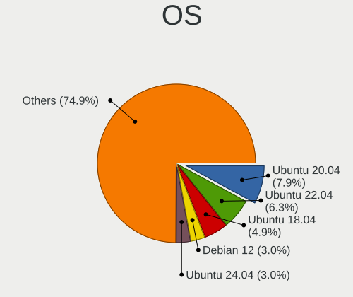

| Name               | Notebooks | Percent |
|--------------------|-----------|---------|
| Ubuntu 20.04       | 417       | 7.89%   |
| Ubuntu 22.04       | 335       | 6.34%   |
| Ubuntu 18.04       | 259       | 4.9%    |
| Debian 12          | 158       | 2.99%   |
| Ubuntu 24.04       | 157       | 2.97%   |
| Debian 11          | 148       | 2.8%    |
| Arch Rolling       | 108       | 2.04%   |
| Zorin 17           | 90        | 1.7%    |
| Zorin 16           | 90        | 1.7%    |
| OpenMandriva 4.2   | 90        | 1.7%    |
| Pop!_OS 22.04      | 79        | 1.5%    |
| OpenMandriva 4.3   | 63        | 1.19%   |
| KDE neon 20.04     | 63        | 1.19%   |
| Manjaro            | 61        | 1.15%   |
| Fedora 41          | 55        | 1.04%   |
| Linux Mint 22.1    | 53        | 1%      |
| Fedora 38          | 51        | 0.97%   |
| OpenMandriva 24.12 | 50        | 0.95%   |
| Linux Mint 20.3    | 47        | 0.89%   |
| Fedora 40          | 47        | 0.89%   |
| ArcoLinux Rolling  | 45        | 0.85%   |
| OpenMandriva 23.08 | 44        | 0.83%   |
| Fedora 42          | 44        | 0.83%   |
| Fedora 39          | 44        | 0.83%   |
| Linux Mint 21.1    | 43        | 0.81%   |
| OpenMandriva 23.01 | 41        | 0.78%   |
| Debian 13          | 41        | 0.78%   |
| Arch               | 41        | 0.78%   |
| Xubuntu 20.04      | 39        | 0.74%   |
| Ubuntu 20.10       | 39        | 0.74%   |
| OpenMandriva 25.90 | 39        | 0.74%   |
| Linux Mint 19.3    | 38        | 0.72%   |
| Debian 10          | 36        | 0.68%   |
| Linux Mint 21.2    | 35        | 0.66%   |
| Ubuntu 19.10       | 34        | 0.64%   |
| Kubuntu 22.04      | 34        | 0.64%   |
| Ubuntu 19.04       | 33        | 0.62%   |
| Ubuntu 21.04       | 32        | 0.61%   |
| Linux Mint 20.1    | 32        | 0.61%   |
| Linux Mint 20      | 32        | 0.61%   |

OS Family
---------

OS without a version

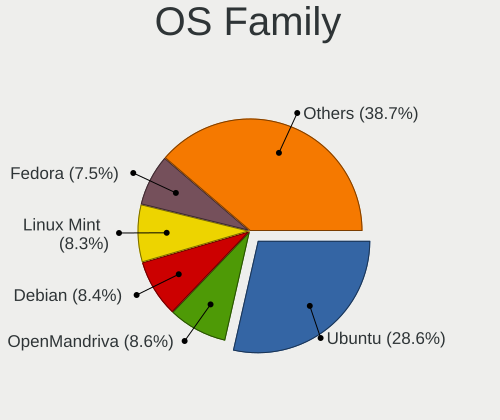

| Name          | Notebooks | Percent |
|---------------|-----------|---------|
| Ubuntu        | 1419      | 28.55%  |
| OpenMandriva  | 427       | 8.59%   |
| Debian        | 415       | 8.35%   |
| Linux Mint    | 414       | 8.33%   |
| Fedora        | 371       | 7.46%   |
| Zorin         | 236       | 4.75%   |
| Arch          | 148       | 2.98%   |
| Manjaro       | 141       | 2.84%   |
| Pop!_OS       | 140       | 2.82%   |
| Kubuntu       | 131       | 2.64%   |
| Endless       | 107       | 2.15%   |
| KDE neon      | 106       | 2.13%   |
| Xubuntu       | 100       | 2.01%   |
| ROSA          | 65        | 1.31%   |
| Elementary    | 58        | 1.17%   |
| Kali          | 55        | 1.11%   |
| openSUSE      | 53        | 1.07%   |
| SteamOS       | 52        | 1.05%   |
| ArcoLinux     | 52        | 1.05%   |
| Ubuntu MATE   | 45        | 0.91%   |
| Lubuntu       | 32        | 0.64%   |
| Gentoo        | 30        | 0.6%    |
| EndeavourOS   | 30        | 0.6%    |
| Ubuntu Unity  | 28        | 0.56%   |
| LMDE          | 25        | 0.5%    |
| Nobara        | 21        | 0.42%   |
| Bazzite       | 19        | 0.38%   |
| BlackPanther  | 17        | 0.34%   |
| Parrot        | 15        | 0.3%    |
| MX            | 15        | 0.3%    |
| Ubuntu Budgie | 13        | 0.26%   |
| Garuda Linux  | 13        | 0.26%   |
| NixOS         | 12        | 0.24%   |
| Clear Linux   | 10        | 0.2%    |
| CachyOS       | 8         | 0.16%   |
| Devuan        | 7         | 0.14%   |
| Deepin        | 7         | 0.14%   |
| Xero          | 6         | 0.12%   |
| Sparky        | 6         | 0.12%   |
| RHEL          | 6         | 0.12%   |

Kernel
------

Version of the Linux kernel

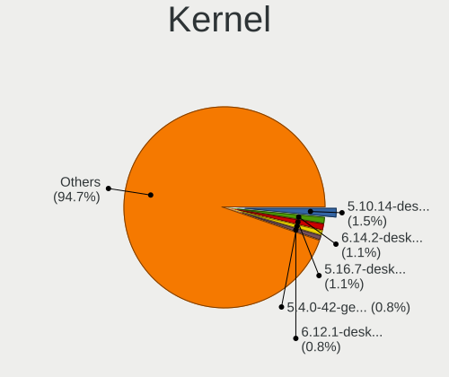

| Version                  | Notebooks | Percent |
|--------------------------|-----------|---------|
| 5.10.14-desktop-1omv4002 | 88        | 1.53%   |
| 6.14.2-desktop-3omv2590  | 62        | 1.07%   |
| 5.16.7-desktop-1omv4003  | 62        | 1.07%   |
| 5.4.0-42-generic         | 48        | 0.83%   |
| 6.12.1-desktop-1omv2490  | 44        | 0.76%   |
| 6.1.1-desktop-1omv2290   | 38        | 0.66%   |
| 6.8.0-51-generic         | 36        | 0.62%   |
| 5.15.0-56-generic        | 36        | 0.62%   |
| 5.10.0-8-amd64           | 34        | 0.59%   |
| 5.4.0-58-generic         | 33        | 0.57%   |
| 6.4.11-desktop-1omv2390  | 32        | 0.55%   |
| 5.15.0-52-generic        | 32        | 0.55%   |
| 5.3.0-28-generic         | 31        | 0.54%   |
| 6.8.0-45-generic         | 28        | 0.49%   |
| 5.4.0-54-generic         | 27        | 0.47%   |
| 5.4.0-52-generic         | 26        | 0.45%   |
| 5.4.0-26-generic         | 26        | 0.45%   |
| 5.10.0-18-amd64          | 26        | 0.45%   |
| 6.8.0-52-generic         | 25        | 0.43%   |
| 6.2.6-desktop-1omv2390   | 25        | 0.43%   |
| 5.15.0-58-generic        | 24        | 0.42%   |
| 6.8.0-41-generic         | 23        | 0.4%    |
| 6.6.2-desktop-1omv2390   | 23        | 0.4%    |
| 6.5.0-14-generic         | 22        | 0.38%   |
| 5.15.0-53-generic        | 22        | 0.38%   |
| 5.11.0-27-generic        | 22        | 0.38%   |
| 5.0.0-37-generic         | 22        | 0.38%   |
| 6.9.3-76060903-generic   | 21        | 0.36%   |
| 6.8.0-40-generic         | 21        | 0.36%   |
| 5.3.0-46-generic         | 21        | 0.36%   |
| 5.3.0-40-generic         | 21        | 0.36%   |
| 5.15.0-48-generic        | 21        | 0.36%   |
| 6.8.0-49-generic         | 20        | 0.35%   |
| 6.8.0-47-generic         | 20        | 0.35%   |
| 6.14.0-33-generic        | 20        | 0.35%   |
| 6.10.0-desktop-1omv2490  | 20        | 0.35%   |
| 5.4.0-65-generic         | 20        | 0.35%   |
| 5.4.0-48-generic         | 20        | 0.35%   |
| 6.5.0-26-generic         | 19        | 0.33%   |
| 5.19.0-35-generic        | 19        | 0.33%   |

Kernel Family
-------------

Linux kernel without a distro release

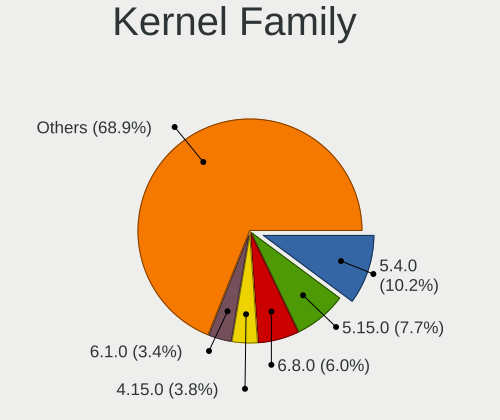

| Version | Notebooks | Percent |
|---------|-----------|---------|
| 5.4.0   | 558       | 10.16%  |
| 5.15.0  | 424       | 7.72%   |
| 6.8.0   | 329       | 5.99%   |
| 4.15.0  | 207       | 3.77%   |
| 6.1.0   | 188       | 3.42%   |
| 5.10.0  | 174       | 3.17%   |
| 5.11.0  | 170       | 3.09%   |
| 6.5.0   | 162       | 2.95%   |
| 5.3.0   | 153       | 2.79%   |
| 5.8.0   | 152       | 2.77%   |
| 5.13.0  | 147       | 2.68%   |
| 6.2.0   | 123       | 2.24%   |
| 5.19.0  | 123       | 2.24%   |
| 5.0.0   | 110       | 2%      |
| 6.14.0  | 106       | 1.93%   |
| 5.10.14 | 89        | 1.62%   |
| 6.11.0  | 76        | 1.38%   |
| 6.14.2  | 71        | 1.29%   |
| 4.18.0  | 71        | 1.29%   |
| 5.16.7  | 66        | 1.2%    |
| 6.12.1  | 47        | 0.86%   |
| 6.1.1   | 43        | 0.78%   |
| 4.19.0  | 42        | 0.76%   |
| 6.2.6   | 39        | 0.71%   |
| 6.4.11  | 35        | 0.64%   |
| 6.9.3   | 25        | 0.46%   |
| 6.6.2   | 25        | 0.46%   |
| 5.14.0  | 25        | 0.46%   |
| 6.10.0  | 21        | 0.38%   |
| 6.12.43 | 18        | 0.33%   |
| 6.0.0   | 17        | 0.31%   |
| 6.4.8   | 15        | 0.27%   |
| 6.0.12  | 15        | 0.27%   |
| 4.9.60  | 15        | 0.27%   |
| 6.12.10 | 14        | 0.25%   |
| 4.18.16 | 14        | 0.25%   |
| 6.5.5   | 13        | 0.24%   |
| 6.17.9  | 13        | 0.24%   |
| 6.1.52  | 13        | 0.24%   |
| 5.18.0  | 13        | 0.24%   |

Kernel Major Ver.
-----------------

Linux kernel major version

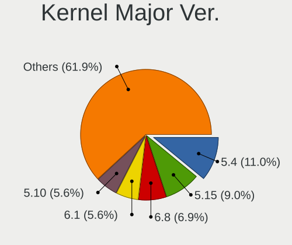

| Version | Notebooks | Percent |
|---------|-----------|---------|
| 5.4     | 592       | 10.96%  |
| 5.15    | 485       | 8.98%   |
| 6.8     | 374       | 6.93%   |
| 6.1     | 305       | 5.65%   |
| 5.10    | 303       | 5.61%   |
| 6.5     | 220       | 4.07%   |
| 6.14    | 209       | 3.87%   |
| 4.15    | 207       | 3.83%   |
| 6.2     | 204       | 3.78%   |
| 5.11    | 199       | 3.69%   |
| 6.12    | 198       | 3.67%   |
| 5.8     | 178       | 3.3%    |
| 5.3     | 168       | 3.11%   |
| 5.13    | 168       | 3.11%   |
| 5.19    | 157       | 2.91%   |
| 6.6     | 121       | 2.24%   |
| 6.11    | 121       | 2.24%   |
| 5.0     | 112       | 2.07%   |
| 5.16    | 104       | 1.93%   |
| 6.4     | 100       | 1.85%   |
| 4.18    | 85        | 1.57%   |
| 6.10    | 67        | 1.24%   |
| 6.0     | 62        | 1.15%   |
| 6.17    | 57        | 1.06%   |
| 5.14    | 56        | 1.04%   |
| 6.9     | 55        | 1.02%   |
| 4.19    | 50        | 0.93%   |
| 4.9     | 39        | 0.72%   |
| 6.7     | 38        | 0.7%    |
| 6.13    | 38        | 0.7%    |
| 5.18    | 37        | 0.69%   |
| 6.15    | 32        | 0.59%   |
| 5.17    | 32        | 0.59%   |
| 6.3     | 31        | 0.57%   |
| 6.16    | 30        | 0.56%   |
| 5.9     | 29        | 0.54%   |
| 5.6     | 25        | 0.46%   |
| 5.7     | 24        | 0.44%   |
| 5.12    | 23        | 0.43%   |
| 5.5     | 14        | 0.26%   |

Arch
----

OS architecture (x86_64, i586, etc.)

| Name    | Notebooks | Percent |
|---------|-----------|---------|
| x86_64  | 4629      | 97.06%  |
| i686    | 139       | 2.91%   |
| aarch64 | 1         | 0.02%   |

DE
--

Desktop Environment

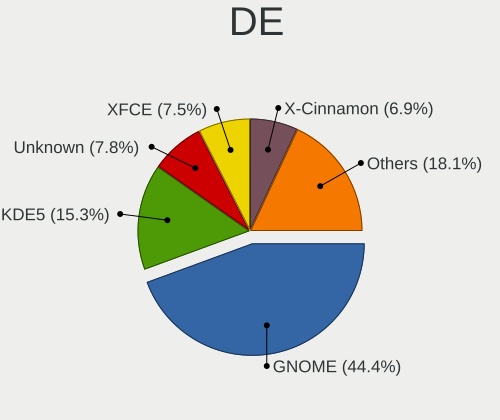

| Name             | Notebooks | Percent |
|------------------|-----------|---------|
| GNOME            | 2224      | 44.4%   |
| KDE5             | 768       | 15.33%  |
| Unknown          | 389       | 7.77%   |
| XFCE             | 376       | 7.51%   |
| X-Cinnamon       | 346       | 6.91%   |
| KDE6             | 274       | 5.47%   |
| MATE             | 132       | 2.64%   |
| KDE              | 95        | 1.9%    |
| LXQt             | 72        | 1.44%   |
| Pantheon         | 57        | 1.14%   |
| Cinnamon         | 38        | 0.76%   |
| i3               | 32        | 0.64%   |
| Unity            | 27        | 0.54%   |
| KDE4             | 24        | 0.48%   |
| Budgie           | 22        | 0.44%   |
| LXDE             | 18        | 0.36%   |
| GNOME Flashback  | 15        | 0.3%    |
| Deepin           | 12        | 0.24%   |
| Hyprland         | 9         | 0.18%   |
| GNOME Classic    | 9         | 0.18%   |
| COSMIC           | 7         | 0.14%   |
| sway             | 6         | 0.12%   |
| openbox          | 6         | 0.12%   |
| Endless:GNOME    | 6         | 0.12%   |
| DWM              | 6         | 0.12%   |
| bspwm            | 6         | 0.12%   |
| lightdm-xsession | 5         | 0.1%    |
| LeftWM           | 3         | 0.06%   |
| BunsenLabs       | 3         | 0.06%   |
| icewm            | 2         | 0.04%   |
| Cutefish         | 2         | 0.04%   |
| xmonad           | 1         | 0.02%   |
| X-Generic        | 1         | 0.02%   |
| Unicorn:XFCE     | 1         | 0.02%   |
| trinity          | 1         | 0.02%   |
| river            | 1         | 0.02%   |
| qtile            | 1         | 0.02%   |
| Phosh:GNOME      | 1         | 0.02%   |
| none+qtile       | 1         | 0.02%   |
| none+i3          | 1         | 0.02%   |

Display Server
--------------

X11 or Wayland

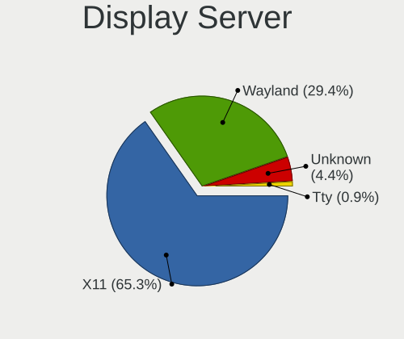

| Name    | Notebooks | Percent |
|---------|-----------|---------|
| X11     | 3237      | 65.28%  |
| Wayland | 1459      | 29.42%  |
| Unknown | 217       | 4.38%   |
| Tty     | 46        | 0.93%   |

Display Manager
---------------

SDDM, LightDM, etc.

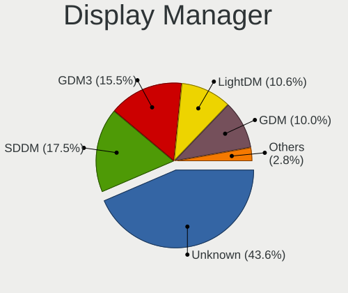

| Name           | Notebooks | Percent |
|----------------|-----------|---------|
| Unknown        | 2169      | 43.56%  |
| SDDM           | 873       | 17.53%  |
| GDM3           | 771       | 15.49%  |
| LightDM        | 527       | 10.58%  |
| GDM            | 499       | 10.02%  |
| TDM            | 90        | 1.81%   |
| KDM            | 24        | 0.48%   |
| XDM            | 8         | 0.16%   |
| SLiM           | 4         | 0.08%   |
| GREETD         | 4         | 0.08%   |
| Ly             | 3         | 0.06%   |
| SLIMSKI        | 2         | 0.04%   |
| LXDM           | 2         | 0.04%   |
| COSMIC-GREETER | 2         | 0.04%   |
| LY-DM          | 1         | 0.02%   |

OS Lang
-------

Language

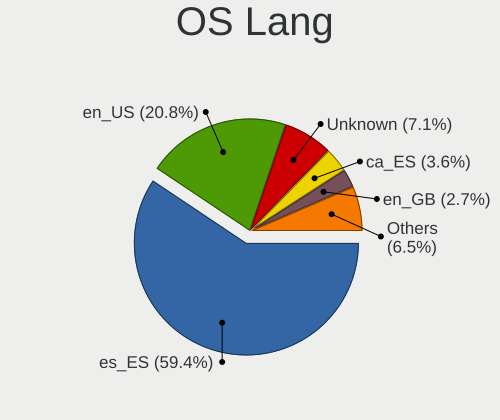

| Lang           | Notebooks | Percent |
|----------------|-----------|---------|
| es_ES          | 2911      | 59.38%  |
| en_US          | 1019      | 20.79%  |
| Unknown        | 350       | 7.14%   |
| ca_ES          | 175       | 3.57%   |
| en_GB          | 130       | 2.65%   |
| C              | 61        | 1.24%   |
| de_DE          | 34        | 0.69%   |
| gl_ES          | 27        | 0.55%   |
| eu_ES          | 21        | 0.43%   |
| fr_FR          | 20        | 0.41%   |
| ru_RU          | 19        | 0.39%   |
| it_IT          | 13        | 0.27%   |
| ca_AD          | 10        | 0.2%    |
| an_ES          | 10        | 0.2%    |
| POSIX          | 9         | 0.18%   |
| es_AR          | 8         | 0.16%   |
| en_IE          | 8         | 0.16%   |
| pt_BR          | 7         | 0.14%   |
| es_MX          | 6         | 0.12%   |
| en_AG          | 5         | 0.1%    |
| C.UTF8         | 4         | 0.08%   |
| pl_PL          | 3         | 0.06%   |
| nl_NL          | 3         | 0.06%   |
| fr_BE          | 3         | 0.06%   |
| de_CH          | 3         | 0.06%   |
| ca_ES@valencia | 3         | 0.06%   |
| zh_CN          | 2         | 0.04%   |
| ru_UA          | 2         | 0.04%   |
| pt_PT          | 2         | 0.04%   |
| es_US          | 2         | 0.04%   |
| es_BO          | 2         | 0.04%   |
| en_CA          | 2         | 0.04%   |
| de_AT          | 2         | 0.04%   |
| bg_BG          | 2         | 0.04%   |
| ast_ES         | 2         | 0.04%   |
| UTF-8          | 1         | 0.02%   |
| uk_UA          | 1         | 0.02%   |
| sv_SE          | 1         | 0.02%   |
| sp_SP          | 1         | 0.02%   |
| ro_RO          | 1         | 0.02%   |

Boot Mode
---------

EFI or BIOS

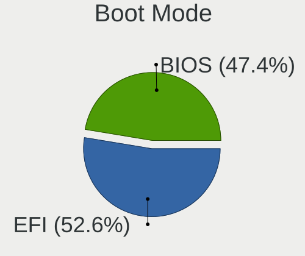

| Mode | Notebooks | Percent |
|------|-----------|---------|
| EFI  | 2568      | 52.6%   |
| BIOS | 2314      | 47.4%   |

Filesystem
----------

Type of filesystem

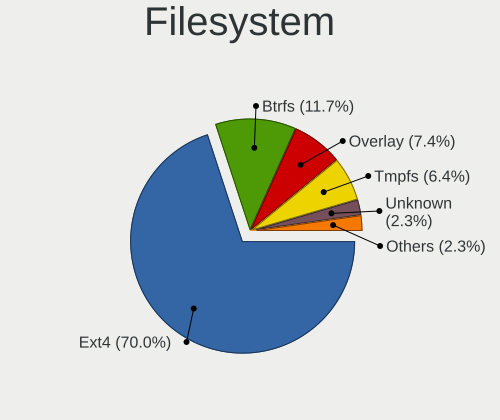

| Type    | Notebooks | Percent |
|---------|-----------|---------|
| Ext4    | 3440      | 69.98%  |
| Btrfs   | 576       | 11.72%  |
| Overlay | 363       | 7.38%   |
| Tmpfs   | 314       | 6.39%   |
| Unknown | 112       | 2.28%   |
| Xfs     | 59        | 1.2%    |
| Zfs     | 26        | 0.53%   |
| Ext2    | 12        | 0.24%   |
| Ext3    | 6         | 0.12%   |
| Aufs    | 5         | 0.1%    |
| Jfs     | 2         | 0.04%   |
| F2fs    | 1         | 0.02%   |

Part. scheme
------------

Scheme of partitioning

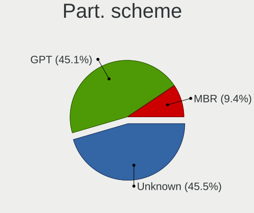

| Type    | Notebooks | Percent |
|---------|-----------|---------|
| Unknown | 2233      | 45.48%  |
| GPT     | 2215      | 45.11%  |
| MBR     | 462       | 9.41%   |

Dual Boot with Linux/BSD
------------------------

Hosting more than one Linux/BSD

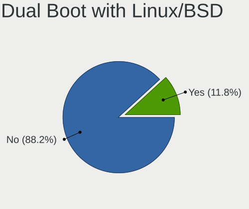

| Dual boot | Notebooks | Percent |
|-----------|-----------|---------|
| No        | 4283      | 88.2%   |
| Yes       | 573       | 11.8%   |

Dual Boot (Win)
---------------

Hosting Linux and Windows

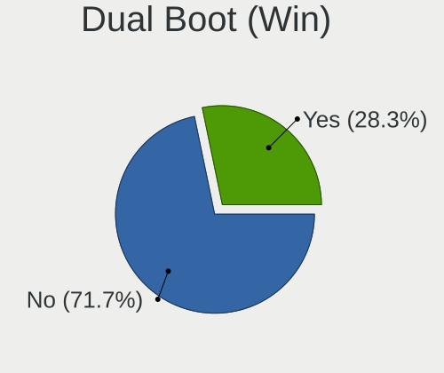

| Dual boot | Notebooks | Percent |
|-----------|-----------|---------|
| No        | 3482      | 71.75%  |
| Yes       | 1371      | 28.25%  |

Board
-----

Vendor
------

Motherboard manufacturer

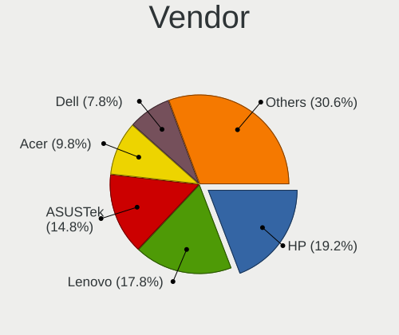

| Name                | Notebooks | Percent |
|---------------------|-----------|---------|
| Hewlett-Packard     | 915       | 19.19%  |
| Lenovo              | 849       | 17.81%  |
| ASUSTek Computer    | 704       | 14.77%  |
| Acer                | 467       | 9.8%    |
| Dell                | 372       | 7.8%    |
| MSI                 | 297       | 6.23%   |
| Toshiba             | 161       | 3.38%   |
| Apple               | 131       | 2.75%   |
| HUAWEI              | 84        | 1.76%   |
| Sony                | 76        | 1.59%   |
| Valve               | 52        | 1.09%   |
| Packard Bell        | 51        | 1.07%   |
| Notebook            | 48        | 1.01%   |
| Samsung Electronics | 47        | 0.99%   |
| Unknown             | 47        | 0.99%   |
| Chuwi               | 46        | 0.96%   |
| SLIMBOOK            | 45        | 0.94%   |
| LG Electronics      | 34        | 0.71%   |
| Medion              | 30        | 0.63%   |
| Fujitsu             | 18        | 0.38%   |
| Timi                | 16        | 0.34%   |
| Gigabyte Technology | 16        | 0.34%   |
| Fujitsu Siemens     | 16        | 0.34%   |
| Alurin              | 16        | 0.34%   |
| Google              | 13        | 0.27%   |
| eMachines           | 13        | 0.27%   |
| Teclast             | 12        | 0.25%   |
| Dynabook            | 11        | 0.23%   |
| Clevo               | 10        | 0.21%   |
| Intel               | 8         | 0.17%   |
| TUXEDO              | 7         | 0.15%   |
| VANT                | 6         | 0.13%   |
| PC Specialist       | 6         | 0.13%   |
| HONOR               | 6         | 0.13%   |
| Alienware           | 6         | 0.13%   |
| AMI                 | 5         | 0.1%    |
| TEKNOSERVICE        | 4         | 0.08%   |
| Razer               | 4         | 0.08%   |
| Qilive              | 4         | 0.08%   |
| Primux Tech         | 4         | 0.08%   |

Model
-----

Motherboard model

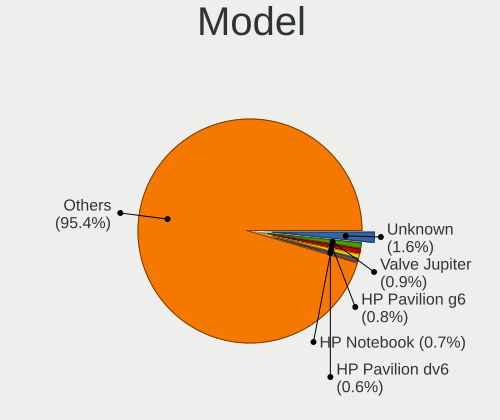

| Name                                       | Notebooks | Percent |
|--------------------------------------------|-----------|---------|
| Unknown                                    | 77        | 1.62%   |
| Valve Jupiter                              | 43        | 0.9%    |
| HP Pavilion g6                             | 36        | 0.76%   |
| HP Notebook                                | 33        | 0.69%   |
| HP Pavilion dv6                            | 29        | 0.61%   |
| ASUS ZenBook UX431DA_UM431DA               | 22        | 0.46%   |
| Lenovo IdeaPad 3 15ITL6 82H8               | 21        | 0.44%   |
| HP Laptop 15-fd0xxx                        | 20        | 0.42%   |
| Lenovo IdeaPad 330-15IKB 81DE              | 18        | 0.38%   |
| HP Pavilion 15                             | 16        | 0.34%   |
| ASUS VivoBook 15_ASUS Laptop X540MA_R540MA | 16        | 0.34%   |
| HP Laptop 15-da0xxx                        | 15        | 0.31%   |
| HP Laptop 15s-fq1xxx                       | 14        | 0.29%   |
| HUAWEI KLVL-WXX9                           | 13        | 0.27%   |
| HP G62                                     | 13        | 0.27%   |
| Chuwi GemiBook Pro                         | 13        | 0.27%   |
| HUAWEI BOHK-WAX9X                          | 12        | 0.25%   |
| HP Laptop 15s-eq2xxx                       | 12        | 0.25%   |
| HP Laptop 15s-eq1xxx                       | 12        | 0.25%   |
| HP Laptop 15-db0xxx                        | 12        | 0.25%   |
| ASUS X550VX                                | 12        | 0.25%   |
| Apple MacBookPro8,1                        | 12        | 0.25%   |
| Lenovo IdeaPad S145-15AST 81N3             | 11        | 0.23%   |
| Lenovo IdeaPad Gaming 3 15ACH6 82K2        | 11        | 0.23%   |
| Lenovo G50-70 20351                        | 11        | 0.23%   |
| HP Victus by Laptop 16-e0xxx               | 11        | 0.23%   |
| HP Laptop 15-bs0xx                         | 11        | 0.23%   |
| HP EliteBook 840 G5                        | 11        | 0.23%   |
| Dell XPS 13 7390                           | 11        | 0.23%   |
| Apple MacBookAir7,2                        | 11        | 0.23%   |
| HP ProBook 450 G8 Notebook PC              | 10        | 0.21%   |
| HP Laptop 15s-fq2xxx                       | 10        | 0.21%   |
| HP Laptop 15-bw0xx                         | 10        | 0.21%   |
| Acer Aspire 5750G                          | 10        | 0.21%   |
| Acer Aspire 5738                           | 10        | 0.21%   |
| Valve Galileo                              | 9         | 0.19%   |
| MSI GF63 Thin 9SC                          | 9         | 0.19%   |
| Lenovo Legion Y530-15ICH 81FV              | 9         | 0.19%   |
| Lenovo IdeaPad 3 15ADA05 81W1              | 9         | 0.19%   |
| HP Pavilion Notebook                       | 9         | 0.19%   |

Model Family
------------

Motherboard model prefix

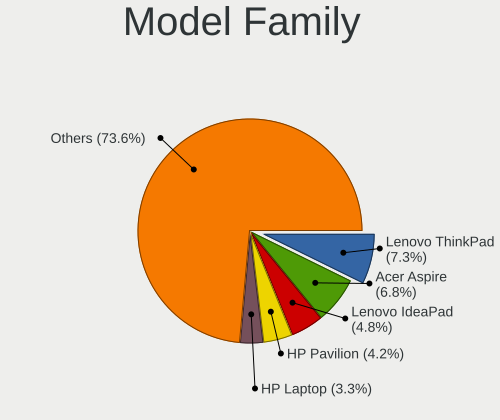

| Name                  | Notebooks | Percent |
|-----------------------|-----------|---------|
| Lenovo ThinkPad       | 347       | 7.28%   |
| Acer Aspire           | 325       | 6.82%   |
| Lenovo IdeaPad        | 227       | 4.76%   |
| HP Pavilion           | 202       | 4.24%   |
| HP Laptop             | 159       | 3.34%   |
| Dell Latitude         | 155       | 3.25%   |
| ASUS VivoBook         | 155       | 3.25%   |
| Toshiba Satellite     | 122       | 2.56%   |
| HP EliteBook          | 103       | 2.16%   |
| HP ProBook            | 86        | 1.8%    |
| Dell XPS              | 86        | 1.8%    |
| Unknown               | 77        | 1.62%   |
| Dell Inspiron         | 70        | 1.47%   |
| ASUS ZenBook          | 67        | 1.41%   |
| ASUS ASUS             | 61        | 1.28%   |
| Lenovo Legion         | 56        | 1.17%   |
| ASUS ROG              | 53        | 1.11%   |
| HP Compaq             | 52        | 1.09%   |
| MSI Prestige          | 49        | 1.03%   |
| Packard Bell EasyNote | 46        | 0.96%   |
| MSI Modern            | 46        | 0.96%   |
| Valve Jupiter         | 43        | 0.9%    |
| HP 250                | 41        | 0.86%   |
| Acer TravelMate       | 38        | 0.8%    |
| HP Victus             | 37        | 0.78%   |
| HP OMEN               | 36        | 0.76%   |
| Acer Extensa          | 36        | 0.76%   |
| HP Notebook           | 33        | 0.69%   |
| Lenovo ThinkBook      | 28        | 0.59%   |
| HP ENVY               | 25        | 0.52%   |
| Acer Nitro            | 25        | 0.52%   |
| Lenovo Yoga           | 22        | 0.46%   |
| ASUS TUF              | 20        | 0.42%   |
| HP 255                | 19        | 0.4%    |
| Dell Precision        | 19        | 0.4%    |
| Chuwi GemiBook        | 19        | 0.4%    |
| HP ZBook              | 18        | 0.38%   |
| Dell Vostro           | 18        | 0.38%   |
| Apple MacBookPro8     | 18        | 0.38%   |
| Apple MacBookPro11    | 17        | 0.36%   |

MFG Year
--------

Motherboard manufacture year

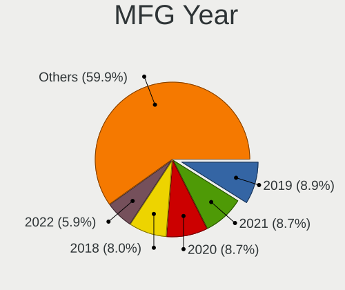

| Year    | Notebooks | Percent |
|---------|-----------|---------|
| 2019    | 424       | 8.89%   |
| 2021    | 415       | 8.71%   |
| 2020    | 413       | 8.66%   |
| 2018    | 381       | 7.99%   |
| 2022    | 280       | 5.87%   |
| 2014    | 272       | 5.71%   |
| 2011    | 266       | 5.58%   |
| 2017    | 264       | 5.54%   |
| 2013    | 249       | 5.22%   |
| 2015    | 242       | 5.08%   |
| 2023    | 222       | 4.66%   |
| 2010    | 221       | 4.64%   |
| 2012    | 217       | 4.55%   |
| 2016    | 201       | 4.22%   |
| 2008    | 196       | 4.11%   |
| 2009    | 176       | 3.69%   |
| 2007    | 118       | 2.48%   |
| 2024    | 108       | 2.27%   |
| 2006    | 48        | 1.01%   |
| 2025    | 29        | 0.61%   |
| 2005    | 10        | 0.21%   |
| 2004    | 5         | 0.1%    |
| Unknown | 5         | 0.1%    |
| 2003    | 3         | 0.06%   |
| 2002    | 1         | 0.02%   |
| 2001    | 1         | 0.02%   |

Form Factor
-----------

Physical design of the computer

| Name     | Notebooks | Percent |
|----------|-----------|---------|
| Notebook | 4767      | 100%    |

Secure Boot
-----------

Enabled or disabled

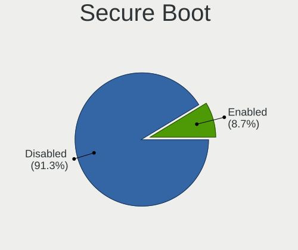

| State    | Notebooks | Percent |
|----------|-----------|---------|
| Disabled | 4392      | 91.33%  |
| Enabled  | 417       | 8.67%   |

Coreboot
--------

Have coreboot on board

| Used | Notebooks | Percent |
|------|-----------|---------|
| No   | 4747      | 99.58%  |
| Yes  | 20        | 0.42%   |

RAM Size
--------

Total RAM memory

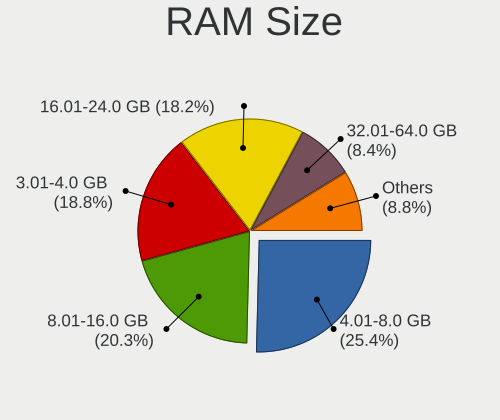

| Size in GB  | Notebooks | Percent |
|-------------|-----------|---------|
| 4.01-8.0    | 1226      | 25.39%  |
| 8.01-16.0   | 981       | 20.32%  |
| 3.01-4.0    | 909       | 18.83%  |
| 16.01-24.0  | 881       | 18.25%  |
| 32.01-64.0  | 407       | 8.43%   |
| 1.01-2.0    | 175       | 3.62%   |
| 24.01-32.0  | 78        | 1.62%   |
| 2.01-3.0    | 74        | 1.53%   |
| 0.51-1.0    | 51        | 1.06%   |
| 64.01-256.0 | 43        | 0.89%   |
| 0.01-0.5    | 3         | 0.06%   |

RAM Used
--------

Used RAM memory

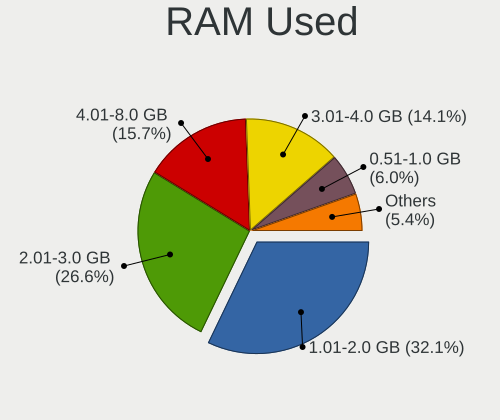

| Used GB    | Notebooks | Percent |
|------------|-----------|---------|
| 1.01-2.0   | 1704      | 32.14%  |
| 2.01-3.0   | 1411      | 26.62%  |
| 4.01-8.0   | 830       | 15.66%  |
| 3.01-4.0   | 750       | 14.15%  |
| 0.51-1.0   | 319       | 6.02%   |
| 8.01-16.0  | 225       | 4.24%   |
| 0.01-0.5   | 36        | 0.68%   |
| 16.01-24.0 | 18        | 0.34%   |
| 24.01-32.0 | 5         | 0.09%   |
| 32.01-64.0 | 3         | 0.06%   |

Total Drives
------------

Number of drives on board

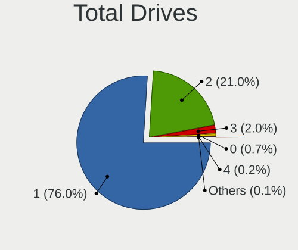

| Drives | Notebooks | Percent |
|--------|-----------|---------|
| 1      | 3697      | 75.98%  |
| 2      | 1022      | 21%     |
| 3      | 98        | 2.01%   |
| 0      | 32        | 0.66%   |
| 4      | 12        | 0.25%   |
| 5      | 4         | 0.08%   |
| 6      | 1         | 0.02%   |

Has CD-ROM
----------

Has CD-ROM on board

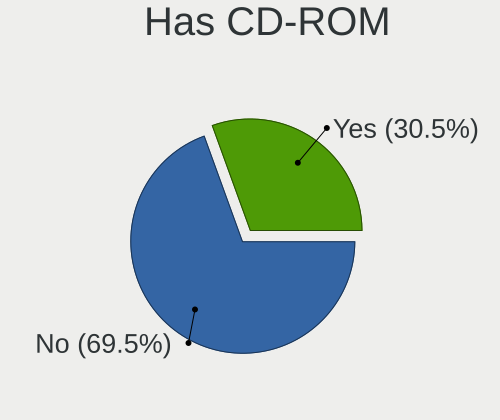

| Presented | Notebooks | Percent |
|-----------|-----------|---------|
| No        | 3330      | 69.46%  |
| Yes       | 1464      | 30.54%  |

Has Ethernet
------------

Has Ethernet on board

| Presented | Notebooks | Percent |
|-----------|-----------|---------|
| Yes       | 3770      | 78.61%  |
| No        | 1026      | 21.39%  |

Has WiFi
--------

Has WiFi module

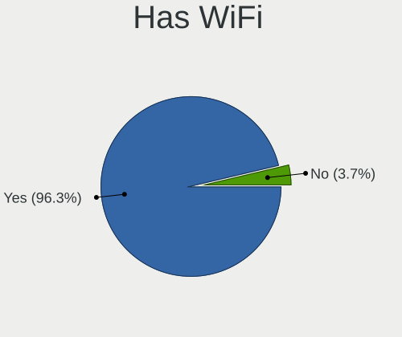

| Presented | Notebooks | Percent |
|-----------|-----------|---------|
| Yes       | 4595      | 96.29%  |
| No        | 177       | 3.71%   |

Has Bluetooth
-------------

Has Bluetooth module

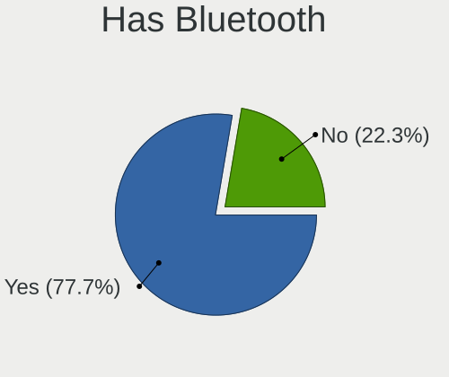

| Presented | Notebooks | Percent |
|-----------|-----------|---------|
| Yes       | 3741      | 77.66%  |
| No        | 1076      | 22.34%  |

Location
--------

Country
-------

Geographic location (country)

| Country | Notebooks | Percent |
|---------|-----------|---------|
| Spain   | 4767      | 100%    |

City
----

Geographic location (city)

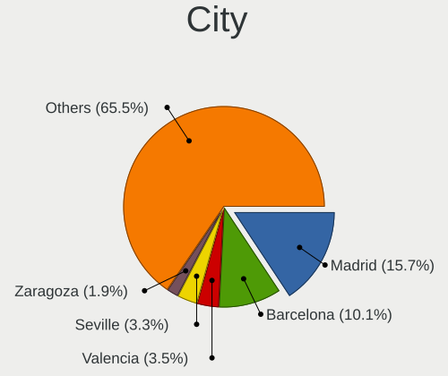

| City                       | Notebooks | Percent |
|----------------------------|-----------|---------|
| Madrid                     | 821       | 15.71%  |
| Barcelona                  | 528       | 10.11%  |
| Valencia                   | 183       | 3.5%    |
| Seville                    | 173       | 3.31%   |
| Zaragoza                   | 98        | 1.88%   |
| Málaga                    | 85        | 1.63%   |
| Granada                    | 75        | 1.44%   |
| Valladolid                 | 63        | 1.21%   |
| Vigo                       | 58        | 1.11%   |
| Alicante                   | 56        | 1.07%   |
| Palma                      | 55        | 1.05%   |
| Alcobendas                 | 50        | 0.96%   |
| A Coruña                  | 48        | 0.92%   |
| Murcia                     | 45        | 0.86%   |
| Bilbao                     | 44        | 0.84%   |
| Sabadell                   | 42        | 0.8%    |
| Las Palmas de Gran Canaria | 40        | 0.77%   |
| Pamplona                   | 39        | 0.75%   |
| Oviedo                     | 37        | 0.71%   |
| Córdoba                   | 34        | 0.65%   |
| Donostia / San Sebastian   | 30        | 0.57%   |
| Alcalá de Henares         | 29        | 0.56%   |
| Vitoria-Gasteiz            | 28        | 0.54%   |
| Gijón                     | 28        | 0.54%   |
| Santiago de Compostela     | 27        | 0.52%   |
| Burgos                     | 26        | 0.5%    |
| Santa Cruz de Tenerife     | 25        | 0.48%   |
| Tarragona                  | 22        | 0.42%   |
| Salamanca                  | 22        | 0.42%   |
| Barakaldo                  | 22        | 0.42%   |
| Santander                  | 21        | 0.4%    |
| León                      | 21        | 0.4%    |
| Móstoles                  | 20        | 0.38%   |
| Getxo                      | 20        | 0.38%   |
| Badalona                   | 20        | 0.38%   |
| Almería                   | 20        | 0.38%   |
| Girona                     | 19        | 0.36%   |
| Elche                      | 19        | 0.36%   |
| Alcorcón                  | 19        | 0.36%   |
| Jerez de la Frontera       | 18        | 0.34%   |

Drives
------

Drive Vendor
------------

Hard drive vendors

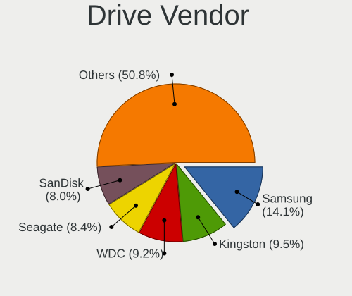

| Vendor                      | Notebooks | Drives | Percent |
|-----------------------------|-----------|--------|---------|
| Samsung Electronics         | 824       | 1017   | 14.15%  |
| Kingston                    | 552       | 708    | 9.48%   |
| WDC                         | 533       | 667    | 9.15%   |
| Seagate                     | 490       | 594    | 8.41%   |
| SanDisk                     | 468       | 601    | 8.04%   |
| Toshiba                     | 413       | 527    | 7.09%   |
| Micron Technology           | 286       | 361    | 4.91%   |
| Unknown                     | 274       | 361    | 4.7%    |
| SK hynix                    | 260       | 315    | 4.46%   |
| Intel                       | 204       | 298    | 3.5%    |
| Hitachi                     | 169       | 198    | 2.9%    |
| Crucial                     | 169       | 209    | 2.9%    |
| HGST                        | 146       | 174    | 2.51%   |
| KIOXIA                      | 91        | 121    | 1.56%   |
| China                       | 73        | 100    | 1.25%   |
| Apple                       | 67        | 91     | 1.15%   |
| Kingston Technology Company | 65        | 92     | 1.12%   |
| Phison Electronics          | 61        | 76     | 1.05%   |
| Phison                      | 43        | 51     | 0.74%   |
| Fujitsu                     | 43        | 47     | 0.74%   |
| Micron/Crucial Technology   | 39        | 46     | 0.67%   |
| Netac                       | 28        | 41     | 0.48%   |
| LITEON                      | 24        | 29     | 0.41%   |
| KingSpec                    | 22        | 28     | 0.38%   |
| Emtec                       | 22        | 28     | 0.38%   |
| Unknown                     | 22        | 25     | 0.38%   |
| JMicron Technology          | 21        | 21     | 0.36%   |
| MAXIO Technology (Hangzhou) | 20        | 28     | 0.34%   |
| A-DATA Technology           | 18        | 22     | 0.31%   |
| Transcend                   | 14        | 20     | 0.24%   |
| Silicon Motion              | 14        | 18     | 0.24%   |
| KIOXIA-EXCERIA              | 13        | 17     | 0.22%   |
| Teclast                     | 11        | 12     | 0.19%   |
| OCZ                         | 11        | 12     | 0.19%   |
| Intenso                     | 11        | 22     | 0.19%   |
| FORESEE                     | 11        | 17     | 0.19%   |
| Union Memory                | 10        | 12     | 0.17%   |
| LITEONIT                    | 10        | 12     | 0.17%   |
| SPCC                        | 9         | 11     | 0.15%   |
| PNY                         | 9         | 15     | 0.15%   |

Drive Model
-----------

Hard drive models

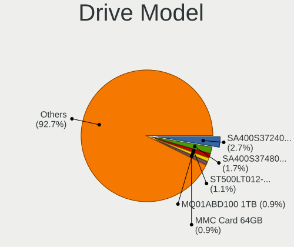

| Model                                              | Notebooks | Percent |
|----------------------------------------------------|-----------|---------|
| Kingston SA400S37240G 240GB SSD                    | 161       | 2.68%   |
| Kingston SA400S37480G 480GB SSD                    | 102       | 1.7%    |
| Seagate ST500LT012-1DG142 500GB                    | 65        | 1.08%   |
| Toshiba MQ01ABD100 1TB                             | 56        | 0.93%   |
| Unknown MMC Card  64GB                             | 54        | 0.9%    |
| Samsung NVMe SSD Controller SM981/PM981/PM983 1TB  | 52        | 0.87%   |
| HGST HTS721010A9E630 1TB                           | 52        | 0.87%   |
| Unknown MMC Card  32GB                             | 47        | 0.78%   |
| SanDisk NVMe SSD Drive 512GB                       | 44        | 0.73%   |
| Seagate ST1000LM035-1RK172 1TB                     | 43        | 0.72%   |
| Seagate ST1000LM024 HN-M101MBB 1TB                 | 42        | 0.7%    |
| Toshiba MQ01ABF050 500GB                           | 40        | 0.67%   |
| Seagate ST9500325AS 500GB                          | 40        | 0.67%   |
| Toshiba MQ04ABF100 1TB                             | 39        | 0.65%   |
| Unknown MMC Card  128GB                            | 36        | 0.6%    |
| Kingston SA400S37120G 120GB SSD                    | 36        | 0.6%    |
| SK hynix NVMe SSD Drive 512GB                      | 34        | 0.57%   |
| Sandisk WD Black SN750 / PC SN730 NVMe SSD 500GB   | 33        | 0.55%   |
| Kingston SA400S37960G 960GB SSD                    | 33        | 0.55%   |
| Sandisk WD Blue SN550 NVMe SSD 1024GB              | 32        | 0.53%   |
| Samsung NVMe SSD Controller PM9A1/PM9A3/980PRO 1TB | 32        | 0.53%   |
| HGST HTS545050A7E680 500GB                         | 32        | 0.53%   |
| Samsung NVMe SSD Drive 512GB                       | 31        | 0.52%   |
| SanDisk SSD PLUS 480GB                             | 30        | 0.5%    |
| Samsung SSD 850 EVO 250GB                          | 30        | 0.5%    |
| Phison PS5013 E13 NVMe Controller 500GB            | 29        | 0.48%   |
| Micron 2400_MTFDKBA512QFM 512GB                    | 29        | 0.48%   |
| Crucial CT500MX500SSD1 500GB                       | 29        | 0.48%   |
| SanDisk NVMe SSD Drive 1TB                         | 28        | 0.47%   |
| Samsung SSD 860 EVO 500GB                          | 27        | 0.45%   |
| Toshiba MQ01ABD050 500GB                           | 26        | 0.43%   |
| Micron/Crucial P2 NVMe PCIe SSD 2TB                | 26        | 0.43%   |
| Kingston SUV400S37240G 240GB SSD                   | 25        | 0.42%   |
| Intel SSDPEKNU512GZ 512GB                          | 25        | 0.42%   |
| Intel SSD 660P Series 512GB                        | 24        | 0.4%    |
| Micron 3400_MTFDKBA1T0TFH 1024GB                   | 23        | 0.38%   |
| WDC WD10JPVX-22JC3T0 1TB                           | 22        | 0.37%   |
| Samsung NVMe SSD Drive 256GB                       | 22        | 0.37%   |
| HGST HTS541010A9E680 1TB                           | 22        | 0.37%   |
| Unknown                                            | 22        | 0.37%   |

HDD Vendor
----------

Hard disk drive vendors

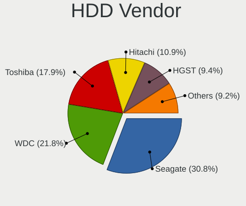

| Vendor              | Notebooks | Drives | Percent |
|---------------------|-----------|--------|---------|
| Seagate             | 480       | 582    | 30.83%  |
| WDC                 | 340       | 412    | 21.84%  |
| Toshiba             | 279       | 343    | 17.92%  |
| Hitachi             | 169       | 198    | 10.85%  |
| HGST                | 146       | 174    | 9.38%   |
| Fujitsu             | 43        | 47     | 2.76%   |
| Samsung Electronics | 40        | 43     | 2.57%   |
| Unknown             | 14        | 18     | 0.9%    |
| JMicron Technology  | 13        | 13     | 0.83%   |
| USB3.0              | 6         | 6      | 0.39%   |
| Apple               | 6         | 6      | 0.39%   |
| USB                 | 5         | 5      | 0.32%   |
| SSK                 | 3         | 3      | 0.19%   |
| LaCie               | 2         | 2      | 0.13%   |
| TO Exter            | 1         | 2      | 0.06%   |
| Sony                | 1         | 1      | 0.06%   |
| SABRENT             | 1         | 2      | 0.06%   |
| OEM                 | 1         | 1      | 0.06%   |
| Maxone              | 1         | 1      | 0.06%   |
| KIOXIA              | 1         | 1      | 0.06%   |
| JetFlash            | 1         | 1      | 0.06%   |
| Inateck             | 1         | 1      | 0.06%   |
| IBM                 | 1         | 1      | 0.06%   |
| External            | 1         | 1      | 0.06%   |
| ASMT                | 1         | 1      | 0.06%   |

SSD Vendor
----------

Solid state drive vendors

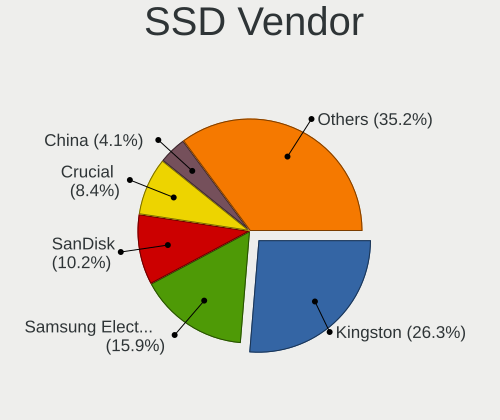

| Vendor              | Notebooks | Drives | Percent |
|---------------------|-----------|--------|---------|
| Kingston            | 473       | 605    | 26.31%  |
| Samsung Electronics | 286       | 351    | 15.91%  |
| SanDisk             | 183       | 224    | 10.18%  |
| Crucial             | 151       | 188    | 8.4%    |
| China               | 73        | 100    | 4.06%   |
| WDC                 | 69        | 89     | 3.84%   |
| Toshiba             | 66        | 89     | 3.67%   |
| Micron Technology   | 50        | 63     | 2.78%   |
| SK hynix            | 49        | 54     | 2.73%   |
| Apple               | 37        | 47     | 2.06%   |
| Intel               | 31        | 46     | 1.72%   |
| Netac               | 27        | 40     | 1.5%    |
| LITEON              | 21        | 25     | 1.17%   |
| KingSpec            | 21        | 27     | 1.17%   |
| Emtec               | 19        | 24     | 1.06%   |
| A-DATA Technology   | 15        | 17     | 0.83%   |
| Transcend           | 13        | 19     | 0.72%   |
| Teclast             | 11        | 12     | 0.61%   |
| OCZ                 | 11        | 12     | 0.61%   |
| FORESEE             | 11        | 17     | 0.61%   |
| LITEONIT            | 10        | 12     | 0.56%   |
| Intenso             | 10        | 20     | 0.56%   |
| USB30               | 8         | 9      | 0.44%   |
| KIOXIA-EXCERIA      | 8         | 11     | 0.44%   |
| SPCC                | 7         | 9      | 0.39%   |
| KingDian            | 7         | 7      | 0.39%   |
| Unknown             | 7         | 8      | 0.39%   |
| PNY                 | 6         | 12     | 0.33%   |
| Patriot             | 5         | 7      | 0.28%   |
| Drevo               | 5         | 5      | 0.28%   |
| Corsair             | 5         | 7      | 0.28%   |
| Unknown             | 4         | 4      | 0.22%   |
| Lexar               | 4         | 5      | 0.22%   |
| Dogfish             | 4         | 4      | 0.22%   |
| BAITITON            | 4         | 10     | 0.22%   |
| Verbatim            | 3         | 4      | 0.17%   |
| Union Memory        | 3         | 3      | 0.17%   |
| TCSUNBOW            | 3         | 4      | 0.17%   |
| SABRENT             | 3         | 3      | 0.17%   |
| Phison              | 3         | 4      | 0.17%   |

Drive Kind
----------

HDD or SSD

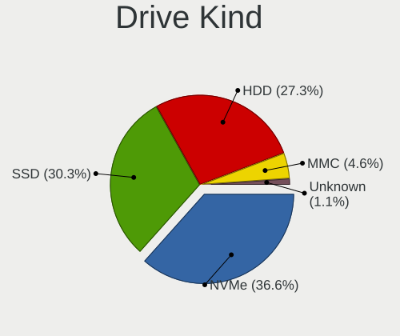

| Kind    | Notebooks | Drives | Percent |
|---------|-----------|--------|---------|
| NVMe    | 2022      | 2778   | 36.6%   |
| SSD     | 1675      | 2285   | 30.32%  |
| HDD     | 1509      | 1865   | 27.32%  |
| MMC     | 256       | 342    | 4.63%   |
| Unknown | 62        | 71     | 1.12%   |

Drive Connector
---------------

SATA, SAS, NVMe, etc.

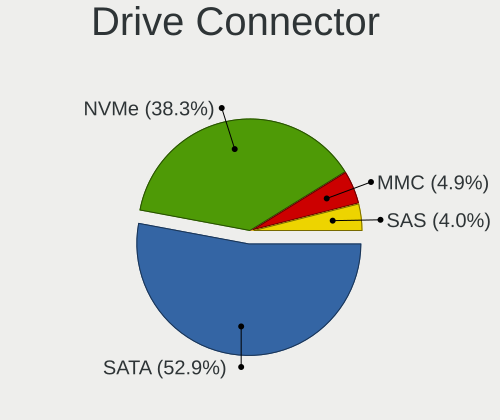

| Type | Notebooks | Drives | Percent |
|------|-----------|--------|---------|
| SATA | 2794      | 3982   | 52.94%  |
| NVMe | 2019      | 2764   | 38.25%  |
| MMC  | 256       | 342    | 4.85%   |
| SAS  | 209       | 253    | 3.96%   |

Drive Size
----------

Size of hard drive

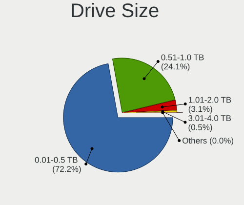

| Size in TB | Notebooks | Drives | Percent |
|------------|-----------|--------|---------|
| 0.01-0.5   | 2255      | 3055   | 72.16%  |
| 0.51-1.0   | 752       | 945    | 24.06%  |
| 1.01-2.0   | 96        | 123    | 3.07%   |
| 3.01-4.0   | 17        | 19     | 0.54%   |
| 4.01-10.0  | 4         | 7      | 0.13%   |
| 2.01-3.0   | 1         | 1      | 0.03%   |

Space Total
-----------

Amount of disk space available on the file system

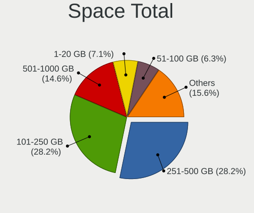

| Size in GB     | Notebooks | Percent |
|----------------|-----------|---------|
| 251-500        | 1424      | 28.23%  |
| 101-250        | 1424      | 28.23%  |
| 501-1000       | 734       | 14.55%  |
| 1-20           | 357       | 7.08%   |
| 51-100         | 319       | 6.32%   |
| 1001-2000      | 287       | 5.69%   |
| 21-50          | 177       | 3.51%   |
| Unknown        | 131       | 2.6%    |
| More than 3000 | 100       | 1.98%   |
| 2001-3000      | 91        | 1.8%    |

Space Used
----------

Amount of used disk space

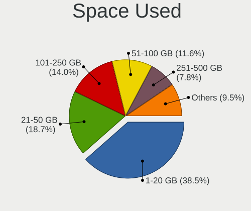

| Used GB        | Notebooks | Percent |
|----------------|-----------|---------|
| 1-20           | 2033      | 38.5%   |
| 21-50          | 986       | 18.67%  |
| 101-250        | 737       | 13.96%  |
| 51-100         | 615       | 11.65%  |
| 251-500        | 410       | 7.77%   |
| 501-1000       | 244       | 4.62%   |
| Unknown        | 131       | 2.48%   |
| 1001-2000      | 73        | 1.38%   |
| More than 3000 | 22        | 0.42%   |
| 2001-3000      | 19        | 0.36%   |
| 0              | 10        | 0.19%   |

Malfunc. Drives
---------------

Drive models with a malfunction

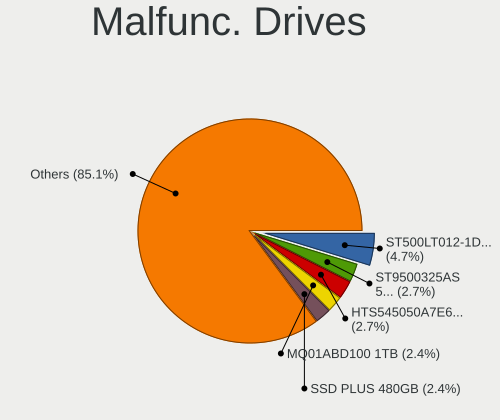

| Model                                               | Notebooks | Drives | Percent |
|-----------------------------------------------------|-----------|--------|---------|
| Seagate ST500LT012-1DG142 500GB                     | 14        | 15     | 4.73%   |
| Seagate ST9500325AS 500GB                           | 8         | 9      | 2.7%    |
| HGST HTS545050A7E680 500GB                          | 8         | 10     | 2.7%    |
| Toshiba MQ01ABD100 1TB                              | 7         | 7      | 2.36%   |
| SanDisk SSD PLUS 480GB                              | 7         | 8      | 2.36%   |
| China G521N256GB                                    | 6         | 7      | 2.03%   |
| Seagate ST9250827AS 250GB                           | 5         | 5      | 1.69%   |
| Seagate ST1000LM035-1RK172 1TB                      | 5         | 5      | 1.69%   |
| Kingston SA400S37480G 480GB SSD                     | 5         | 5      | 1.69%   |
| Hitachi HTS545050A7E380 500GB                       | 5         | 5      | 1.69%   |
| HGST HTS721010A9E630 1TB                            | 5         | 5      | 1.69%   |
| WDC WD1200BEVS-60UST0 120GB                         | 4         | 5      | 1.35%   |
| Seagate ST9500420AS 500GB                           | 4         | 4      | 1.35%   |
| Seagate ST500LT012-9WS142 500GB                     | 4         | 4      | 1.35%   |
| Seagate ST500LM021-1KJ152 500GB                     | 4         | 4      | 1.35%   |
| Micron Technology MTFDDAV256TDL-1AW1ZABHA 256GB SSD | 4         | 4      | 1.35%   |
| Hitachi HTS545050B9A300 500GB                       | 4         | 4      | 1.35%   |
| HGST HTS541010A9E680 1TB                            | 4         | 4      | 1.35%   |
| Toshiba MQ01ABF050 500GB                            | 3         | 3      | 1.01%   |
| Toshiba MQ01ABD050 500GB                            | 3         | 3      | 1.01%   |
| Seagate ST1000LM024 HN-M101MBB 1TB                  | 3         | 3      | 1.01%   |
| WDC WD7500BPVT-60HXZT1 752GB                        | 2         | 2      | 0.68%   |
| WDC WD5000BPVT-60HXZT3 500GB                        | 2         | 3      | 0.68%   |
| WDC WD5000BEVT-22ZAT0 500GB                         | 2         | 2      | 0.68%   |
| WDC WD3200BPVT-22JJ5T0 320GB                        | 2         | 2      | 0.68%   |
| Toshiba Q300. 240GB SSD                             | 2         | 2      | 0.68%   |
| Toshiba MQ01ABD075 752GB                            | 2         | 3      | 0.68%   |
| Toshiba MK5076GSX 500GB                             | 2         | 2      | 0.68%   |
| SK hynix PC711 HFS512GDE9X073N 512GB                | 2         | 3      | 0.68%   |
| SK hynix HFS256G39TND-N210A 256GB SSD               | 2         | 2      | 0.68%   |
| SK hynix HFS128G39TND-N210A 128GB SSD               | 2         | 2      | 0.68%   |
| Seagate ST9500420ASG 500GB                          | 2         | 2      | 0.68%   |
| Seagate ST320LT012-9WS14C 320GB                     | 2         | 2      | 0.68%   |
| Seagate ST1000LM049-2GH172 1TB                      | 2         | 2      | 0.68%   |
| SanDisk SSD PLUS 240 GB                             | 2         | 2      | 0.68%   |
| Samsung Electronics HM160HI 160GB                   | 2         | 2      | 0.68%   |
| Kingston SV300S37A120G 120GB SSD                    | 2         | 2      | 0.68%   |
| Kingston SUV400S37240G 240GB SSD                    | 2         | 3      | 0.68%   |
| Kingston SA400S37240G 240GB SSD                     | 2         | 2      | 0.68%   |
| Intel SSDSC2BF180A5H SED 180GB                      | 2         | 2      | 0.68%   |

Malfunc. Drive Vendor
---------------------

Vendors of faulty drives

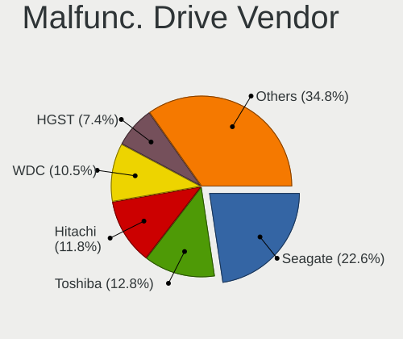

| Vendor              | Notebooks | Drives | Percent |
|---------------------|-----------|--------|---------|
| Seagate             | 67        | 71     | 22.64%  |
| Toshiba             | 38        | 40     | 12.84%  |
| Hitachi             | 35        | 38     | 11.82%  |
| WDC                 | 31        | 35     | 10.47%  |
| HGST                | 22        | 26     | 7.43%   |
| Samsung Electronics | 18        | 20     | 6.08%   |
| SK hynix            | 12        | 13     | 4.05%   |
| SanDisk             | 12        | 13     | 4.05%   |
| Kingston            | 12        | 13     | 4.05%   |
| China               | 10        | 11     | 3.38%   |
| Intel               | 9         | 9      | 3.04%   |
| Micron Technology   | 8         | 11     | 2.7%    |
| Fujitsu             | 6         | 6      | 2.03%   |
| Crucial             | 6         | 8      | 2.03%   |
| SPCC                | 1         | 1      | 0.34%   |
| OCZ                 | 1         | 1      | 0.34%   |
| Netac               | 1         | 1      | 0.34%   |
| Intenso             | 1         | 1      | 0.34%   |
| IBM                 | 1         | 1      | 0.34%   |
| EDILOCA             | 1         | 1      | 0.34%   |
| Dogfish             | 1         | 1      | 0.34%   |
| BAITITON            | 1         | 1      | 0.34%   |
| Apple               | 1         | 1      | 0.34%   |
| A-DATA Technology   | 1         | 1      | 0.34%   |

Malfunc. HDD Vendor
-------------------

Vendors of faulty HDD drives

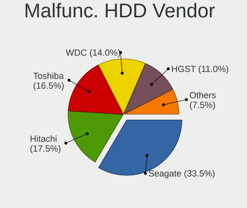

| Vendor              | Notebooks | Drives | Percent |
|---------------------|-----------|--------|---------|
| Seagate             | 67        | 71     | 33.5%   |
| Hitachi             | 35        | 38     | 17.5%   |
| Toshiba             | 33        | 35     | 16.5%   |
| WDC                 | 28        | 32     | 14%     |
| HGST                | 22        | 26     | 11%     |
| Samsung Electronics | 8         | 8      | 4%      |
| Fujitsu             | 6         | 6      | 3%      |
| IBM                 | 1         | 1      | 0.5%    |

Malfunc. Drive Kind
-------------------

Kinds of faulty drives

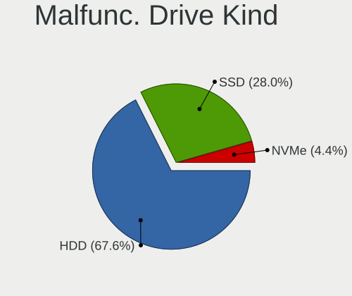

| Kind | Notebooks | Drives | Percent |
|------|-----------|--------|---------|
| HDD  | 198       | 217    | 67.58%  |
| SSD  | 82        | 93     | 27.99%  |
| NVMe | 13        | 14     | 4.44%   |

Failed Drives
-------------

Failed drive models

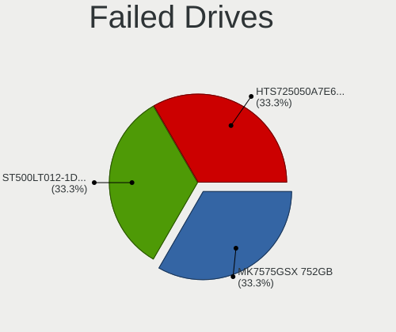

| Model                           | Notebooks | Drives | Percent |
|---------------------------------|-----------|--------|---------|
| Toshiba MK7575GSX 752GB         | 1         | 1      | 33.33%  |
| Seagate ST500LT012-1DG142 500GB | 1         | 1      | 33.33%  |
| HGST HTS725050A7E630 500GB      | 1         | 1      | 33.33%  |

Failed Drive Vendor
-------------------

Failed drive vendors

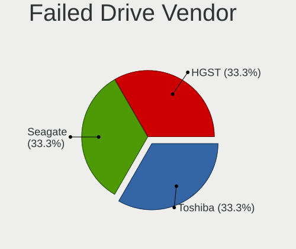

| Vendor  | Notebooks | Drives | Percent |
|---------|-----------|--------|---------|
| Toshiba | 1         | 1      | 33.33%  |
| Seagate | 1         | 1      | 33.33%  |
| HGST    | 1         | 1      | 33.33%  |

Drive Status
------------

Number of failed and malfunc. drives

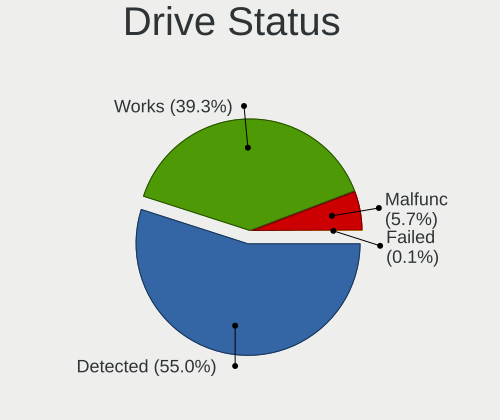

| Status   | Notebooks | Drives | Percent |
|----------|-----------|--------|---------|
| Detected | 2790      | 4318   | 54.95%  |
| Works    | 1994      | 2696   | 39.28%  |
| Malfunc  | 290       | 324    | 5.71%   |
| Failed   | 3         | 3      | 0.06%   |

Storage controller
------------------

Storage Vendor
--------------

Storage controller vendors

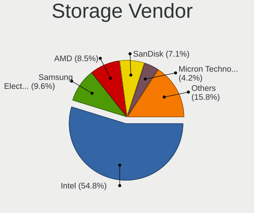

| Vendor                                  | Notebooks | Percent |
|-----------------------------------------|-----------|---------|
| Intel                                   | 3101      | 54.77%  |
| Samsung Electronics                     | 542       | 9.57%   |
| AMD                                     | 484       | 8.55%   |
| SanDisk                                 | 402       | 7.1%    |
| Micron Technology                       | 239       | 4.22%   |
| SK hynix                                | 205       | 3.62%   |
| Kingston Technology Company             | 142       | 2.51%   |
| Phison Electronics                      | 109       | 1.93%   |
| KIOXIA                                  | 94        | 1.66%   |
| Toshiba America Info Systems            | 75        | 1.32%   |
| Micron/Crucial Technology               | 51        | 0.9%    |
| Nvidia                                  | 38        | 0.67%   |
| MAXIO Technology (Hangzhou)             | 23        | 0.41%   |
| Apple                                   | 21        | 0.37%   |
| Silicon Integrated Systems [SiS]        | 18        | 0.32%   |
| Solidigm                                | 17        | 0.3%    |
| Silicon Motion                          | 16        | 0.28%   |
| Union Memory (Shenzhen)                 | 14        | 0.25%   |
| Shenzhen Longsys Electronics            | 9         | 0.16%   |
| VIA Technologies                        | 7         | 0.12%   |
| Solid State Storage Technology          | 7         | 0.12%   |
| O2 Micro                                | 6         | 0.11%   |
| Marvell Technology Group                | 6         | 0.11%   |
| JMicron Technology                      | 5         | 0.09%   |
| Lite-On Technology                      | 4         | 0.07%   |
| ADATA Technology                        | 4         | 0.07%   |
| Realtek Semiconductor                   | 3         | 0.05%   |
| INNOGRIT                                | 3         | 0.05%   |
| ASMedia Technology                      | 3         | 0.05%   |
| Yangtze Memory Technologies             | 2         | 0.04%   |
| Silicon Image                           | 2         | 0.04%   |
| Shenzhen Unionmemory Information System | 2         | 0.04%   |
| Netac Technology                        | 2         | 0.04%   |
| Lenovo                                  | 2         | 0.04%   |
| Biwin Storage Technology                | 2         | 0.04%   |
| Shenzhen Techwinsemi Technology         | 1         | 0.02%   |
| Seagate Technology                      | 1         | 0.02%   |

Storage Model
-------------

Storage controller models

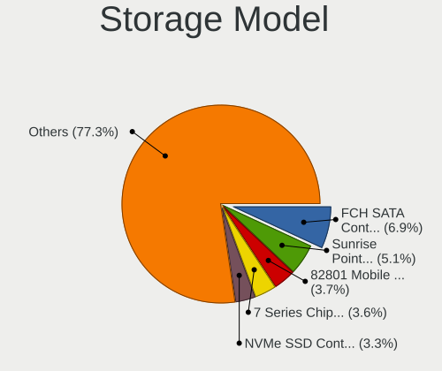

| Model                                                                          | Notebooks | Percent |
|--------------------------------------------------------------------------------|-----------|---------|
| AMD FCH SATA Controller [AHCI mode]                                            | 421       | 6.9%    |
| Intel Sunrise Point-LP SATA Controller [AHCI mode]                             | 313       | 5.13%   |
| Intel 82801 Mobile SATA Controller [RAID mode]                                 | 227       | 3.72%   |
| Intel 7 Series Chipset Family 6-port SATA Controller [AHCI mode]               | 220       | 3.61%   |
| Samsung NVMe SSD Controller SM981/PM981/PM983                                  | 202       | 3.31%   |
| Intel 82801IBM/IEM (ICH9M/ICH9M-E) 4 port SATA Controller [AHCI mode]          | 198       | 3.25%   |
| Intel 6 Series/C200 Series Chipset Family 6 port Mobile SATA AHCI Controller   | 198       | 3.25%   |
| Intel Volume Management Device NVMe RAID Controller                            | 195       | 3.2%    |
| Intel 8 Series SATA Controller 1 [AHCI mode]                                   | 176       | 2.89%   |
| Intel Cannon Lake Mobile PCH SATA AHCI Controller                              | 135       | 2.21%   |
| Intel 5 Series/3400 Series Chipset 4 port SATA AHCI Controller                 | 132       | 2.16%   |
| Intel Wildcat Point-LP SATA Controller [AHCI Mode]                             | 124       | 2.03%   |
| Samsung NVMe SSD Controller 980 (DRAM-less)                                    | 121       | 1.98%   |
| Intel 8 Series/C220 Series Chipset Family 6-port SATA Controller 1 [AHCI mode] | 116       | 1.9%    |
| Intel 82801HM/HEM (ICH8M/ICH8M-E) IDE Controller                               | 108       | 1.77%   |
| Intel Celeron/Pentium Silver Processor SATA Controller                         | 105       | 1.72%   |
| Intel HM170/QM170 Chipset SATA Controller [AHCI Mode]                          | 99        | 1.62%   |
| Intel 82801HM/HEM (ICH8M/ICH8M-E) SATA Controller [AHCI mode]                  | 87        | 1.43%   |
| SanDisk Extreme Pro / WD Black SN750 / PC SN730 / Red SN700 NVMe SSD           | 86        | 1.41%   |
| SanDisk Ultra 3D / WD PC SN530, IX SN530, Blue SN550 NVMe SSD (DRAM-less)      | 79        | 1.3%    |
| Samsung NVMe SSD Controller PM9A1/PM9A3/980PRO                                 | 76        | 1.25%   |
| Intel SSD 660P Series                                                          | 76        | 1.25%   |
| Intel SSD 670p Series [Keystone Harbor]                                        | 74        | 1.21%   |
| Intel Tiger Lake-LP SATA Controller                                            | 72        | 1.18%   |
| SanDisk WD SN560/SN740/SN770/SN5000 NVMe SSD                                   | 66        | 1.08%   |
| SK hynix Gold P31/BC711/PC711 NVMe Solid State Drive                           | 61        | 1%      |
| Intel Atom Processor E3800 Series SATA AHCI Controller                         | 58        | 0.95%   |
| KIOXIA NVMe SSD Controller BG4 (DRAM-less)                                     | 53        | 0.87%   |
| Micron 2400 NVMe SSD (DRAM-less)                                               | 52        | 0.85%   |
| Intel Comet Lake SATA AHCI Controller                                          | 51        | 0.84%   |
| Phison PS5013-E13 PCIe3 NVMe Controller (DRAM-less)                            | 49        | 0.8%    |
| Intel NM10/ICH7 Family SATA Controller [AHCI mode]                             | 48        | 0.79%   |
| Intel Alder Lake-P SATA AHCI Controller                                        | 48        | 0.79%   |
| Micron 2450 NVMe SSD [HendrixV] (DRAM-less)                                    | 47        | 0.77%   |
| SK hynix BC501 NVMe Solid State Drive                                          | 46        | 0.75%   |
| Micron 3400 NVMe SSD [Hendrix]                                                 | 43        | 0.71%   |
| Intel 5 Series/3400 Series Chipset 6 port SATA AHCI Controller                 | 43        | 0.71%   |
| Micron 2210 NVMe SSD [Cobain]                                                  | 42        | 0.69%   |
| AMD SB7x0/SB8x0/SB9x0 SATA Controller [AHCI mode]                              | 41        | 0.67%   |
| Intel Celeron N3350/Pentium N4200/Atom E3900 Series SATA AHCI Controller       | 40        | 0.66%   |

Storage Kind
------------

Kind of storage controller (IDE, SATA, NVMe, SAS, ...)

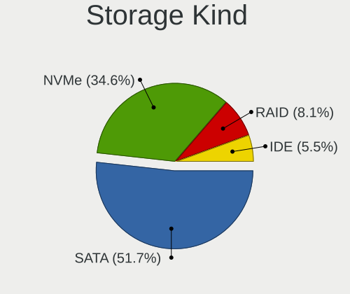

| Kind | Notebooks | Percent |
|------|-----------|---------|
| SATA | 3031      | 51.74%  |
| NVMe | 2026      | 34.59%  |
| RAID | 476       | 8.13%   |
| IDE  | 325       | 5.55%   |

Processor
---------

CPU Vendor
----------

Processor vendors

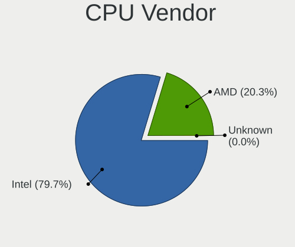

| Vendor       | Notebooks | Percent |
|--------------|-----------|---------|
| Intel        | 3798      | 79.66%  |
| AMD          | 968       | 20.3%   |
| CentaurHauls | 1         | 0.02%   |
| Unknown      | 1         | 0.02%   |

CPU Model
---------

Processor models

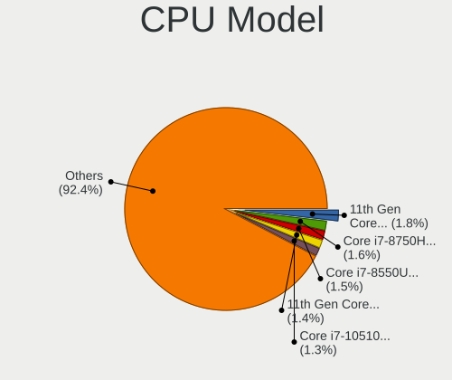

| Model                                         | Notebooks | Percent |
|-----------------------------------------------|-----------|---------|
| Intel 11th Gen Core i5-1135G7 @ 2.40GHz       | 88        | 1.84%   |
| Intel Core i7-8750H CPU @ 2.20GHz             | 76        | 1.59%   |
| Intel Core i7-8550U CPU @ 1.80GHz             | 71        | 1.49%   |
| Intel 11th Gen Core i7-1165G7 @ 2.80GHz       | 66        | 1.38%   |
| Intel Core i7-10510U CPU @ 1.80GHz            | 63        | 1.32%   |
| Intel Core i7-9750H CPU @ 2.60GHz             | 62        | 1.3%    |
| AMD Ryzen 7 5800H with Radeon Graphics        | 61        | 1.28%   |
| Intel Core i5-7200U CPU @ 2.50GHz             | 60        | 1.26%   |
| AMD Ryzen 7 4800H with Radeon Graphics        | 57        | 1.19%   |
| Intel Core i5-8250U CPU @ 1.60GHz             | 56        | 1.17%   |
| AMD Ryzen 5 3500U with Radeon Vega Mobile Gfx | 56        | 1.17%   |
| Intel Core i7-6700HQ CPU @ 2.60GHz            | 52        | 1.09%   |
| Intel Core i5-6200U CPU @ 2.30GHz             | 50        | 1.05%   |
| AMD Ryzen 7 5700U with Radeon Graphics        | 47        | 0.99%   |
| Intel Core i7-7700HQ CPU @ 2.80GHz            | 46        | 0.96%   |
| Intel Core i5-10210U CPU @ 1.60GHz            | 46        | 0.96%   |
| AMD Custom APU 0405                           | 45        | 0.94%   |
| Intel Core i7-10750H CPU @ 2.60GHz            | 43        | 0.9%    |
| Intel Core i5-1035G1 CPU @ 1.00GHz            | 39        | 0.82%   |
| Intel Celeron N4000 CPU @ 1.10GHz             | 39        | 0.82%   |
| Intel Core i7-7500U CPU @ 2.70GHz             | 38        | 0.8%    |
| Intel Core i5-5200U CPU @ 2.20GHz             | 38        | 0.8%    |
| Intel Core i7-8565U CPU @ 1.80GHz             | 37        | 0.78%   |
| Intel 12th Gen Core i7-12700H                 | 37        | 0.78%   |
| Intel Celeron CPU N2840 @ 2.16GHz             | 35        | 0.73%   |
| Intel Core i7-4510U CPU @ 2.00GHz             | 34        | 0.71%   |
| Intel 11th Gen Core i7-1185G7 @ 3.00GHz       | 34        | 0.71%   |
| Intel Core i7-5500U CPU @ 2.40GHz             | 33        | 0.69%   |
| Intel Celeron N4020 CPU @ 1.10GHz             | 31        | 0.65%   |
| AMD Ryzen 5 5500U with Radeon Graphics        | 31        | 0.65%   |
| Intel Core i5-8265U CPU @ 1.60GHz             | 28        | 0.59%   |
| Intel Core i5-4210U CPU @ 1.70GHz             | 28        | 0.59%   |
| Intel Core i3-4005U CPU @ 1.70GHz             | 28        | 0.59%   |
| Intel Core i5-4200U CPU @ 1.60GHz             | 27        | 0.57%   |
| Intel Celeron CPU N3350 @ 1.10GHz             | 27        | 0.57%   |
| Intel 13th Gen Core i7-1355U                  | 25        | 0.52%   |
| Intel 12th Gen Core i7-1255U                  | 25        | 0.52%   |
| Intel Core i7-6500U CPU @ 2.50GHz             | 24        | 0.5%    |
| Intel Core i7-2670QM CPU @ 2.20GHz            | 24        | 0.5%    |
| Intel Core i5-3210M CPU @ 2.50GHz             | 24        | 0.5%    |

CPU Model Family
----------------

Processor model prefix

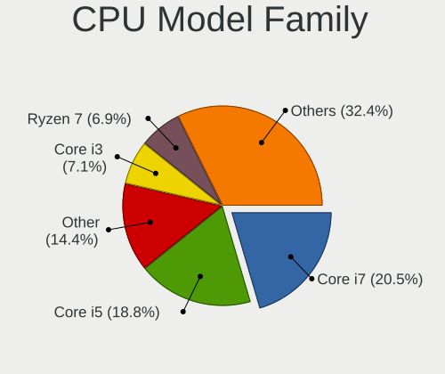

| Model                   | Notebooks | Percent |
|-------------------------|-----------|---------|
| Intel Core i7           | 976       | 20.46%  |
| Intel Core i5           | 896       | 18.78%  |
| Other                   | 685       | 14.36%  |
| Intel Core i3           | 341       | 7.15%   |
| AMD Ryzen 7             | 329       | 6.9%    |
| Intel Celeron           | 308       | 6.46%   |
| Intel Core 2 Duo        | 242       | 5.07%   |
| AMD Ryzen 5             | 211       | 4.42%   |
| Intel Atom              | 127       | 2.66%   |
| Intel Pentium Dual-Core | 59        | 1.24%   |
| Intel Pentium           | 50        | 1.05%   |
| Intel Core              | 47        | 0.99%   |
| Intel Pentium Dual      | 43        | 0.9%    |
| AMD A6                  | 40        | 0.84%   |
| AMD A4                  | 37        | 0.78%   |
| AMD E1                  | 34        | 0.71%   |
| AMD Ryzen 9             | 32        | 0.67%   |
| Intel Core 2            | 31        | 0.65%   |
| Intel Genuine           | 28        | 0.59%   |
| AMD A8                  | 25        | 0.52%   |
| AMD Ryzen 7 PRO         | 24        | 0.5%    |
| AMD Ryzen 3             | 22        | 0.46%   |
| AMD E                   | 17        | 0.36%   |
| Intel Core i9           | 16        | 0.34%   |
| AMD A10                 | 14        | 0.29%   |
| AMD Athlon              | 11        | 0.23%   |
| Intel Pentium M         | 10        | 0.21%   |
| Intel Celeron M         | 10        | 0.21%   |
| AMD Turion 64 X2 Mobile | 9         | 0.19%   |
| Intel Core m3           | 8         | 0.17%   |
| AMD E2                  | 7         | 0.15%   |
| Intel Core m5           | 6         | 0.13%   |
| AMD Ryzen 5 PRO         | 6         | 0.13%   |
| AMD FX                  | 6         | 0.13%   |
| AMD Athlon II           | 6         | 0.13%   |
| AMD A12                 | 6         | 0.13%   |
| Intel Pentium Silver    | 4         | 0.08%   |
| Intel Pentium 4         | 4         | 0.08%   |
| AMD Turion II Dual-Core | 4         | 0.08%   |
| Intel Core M            | 3         | 0.06%   |

CPU Cores
---------

Number of processor cores

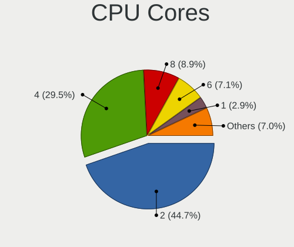

| Number  | Notebooks | Percent |
|---------|-----------|---------|
| 2       | 2133      | 44.69%  |
| 4       | 1407      | 29.48%  |
| 8       | 423       | 8.86%   |
| 6       | 337       | 7.06%   |
| 1       | 139       | 2.91%   |
| 10      | 131       | 2.74%   |
| 14      | 91        | 1.91%   |
| 12      | 60        | 1.26%   |
| 16      | 33        | 0.69%   |
| 24      | 11        | 0.23%   |
| Unknown | 4         | 0.08%   |
| 20      | 3         | 0.06%   |
| 3       | 1         | 0.02%   |

CPU Sockets
-----------

Number of sockets

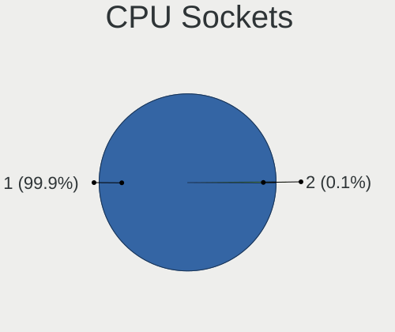

| Number | Notebooks | Percent |
|--------|-----------|---------|
| 1      | 4763      | 99.92%  |
| 2      | 4         | 0.08%   |

CPU Threads
-----------

Threads per core (Hyper-Threading)

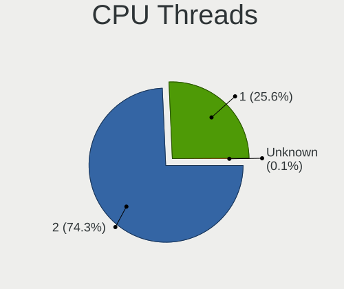

| Number  | Notebooks | Percent |
|---------|-----------|---------|
| 2       | 3550      | 74.3%   |
| 1       | 1224      | 25.62%  |
| Unknown | 4         | 0.08%   |

CPU Op-Modes
------------

CPU Operation Modes (32-bit, 64-bit)

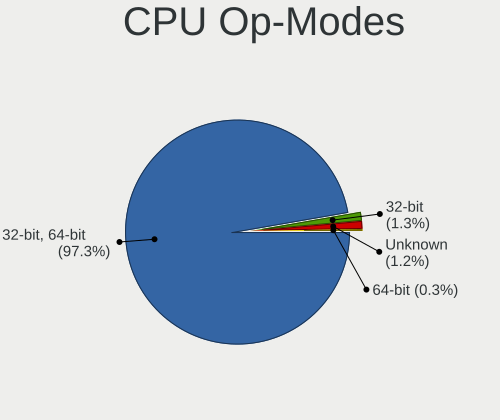

| Op mode        | Notebooks | Percent |
|----------------|-----------|---------|
| 32-bit, 64-bit | 4651      | 97.26%  |
| 32-bit         | 62        | 1.3%    |
| Unknown        | 55        | 1.15%   |
| 64-bit         | 14        | 0.29%   |

CPU Microcode
-------------

Microcode number

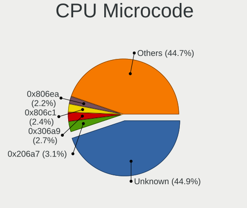

| Number     | Notebooks | Percent |
|------------|-----------|---------|
| Unknown    | 2229      | 44.89%  |
| 0x206a7    | 154       | 3.1%    |
| 0x306a9    | 133       | 2.68%   |
| 0x806c1    | 120       | 2.42%   |
| 0x806ea    | 109       | 2.19%   |
| 0x40651    | 106       | 2.13%   |
| 0x806ec    | 100       | 2.01%   |
| 0x906ea    | 99        | 1.99%   |
| 0x1067a    | 94        | 1.89%   |
| 0x406e3    | 93        | 1.87%   |
| 0x6fd      | 87        | 1.75%   |
| 0x806e9    | 86        | 1.73%   |
| 0x20655    | 83        | 1.67%   |
| 0x306d4    | 77        | 1.55%   |
| 0x306c3    | 73        | 1.47%   |
| 0x08108109 | 57        | 1.15%   |
| 0x30678    | 56        | 1.13%   |
| 0x0a50000c | 54        | 1.09%   |
| 0x10676    | 47        | 0.95%   |
| 0xa0652    | 45        | 0.91%   |
| 0x706e5    | 45        | 0.91%   |
| 0x06006705 | 43        | 0.87%   |
| 0x20652    | 41        | 0.83%   |
| 0x706a1    | 38        | 0.77%   |
| 0x08600106 | 37        | 0.75%   |
| 0x906a3    | 36        | 0.72%   |
| 0x506e3    | 35        | 0.7%    |
| 0x106ca    | 34        | 0.68%   |
| 0x906e9    | 31        | 0.62%   |
| 0x706a8    | 31        | 0.62%   |
| 0x0a50000d | 29        | 0.58%   |
| 0x08608103 | 29        | 0.58%   |
| 0x08108102 | 29        | 0.58%   |
| 0x806eb    | 28        | 0.56%   |
| 0x506c9    | 28        | 0.56%   |
| 0x806d1    | 27        | 0.54%   |
| 0x406c4    | 27        | 0.54%   |
| 0x08600104 | 24        | 0.48%   |
| 0x406c3    | 22        | 0.44%   |
| 0x6f6      | 21        | 0.42%   |

CPU Microarch
-------------

Microarchitecture

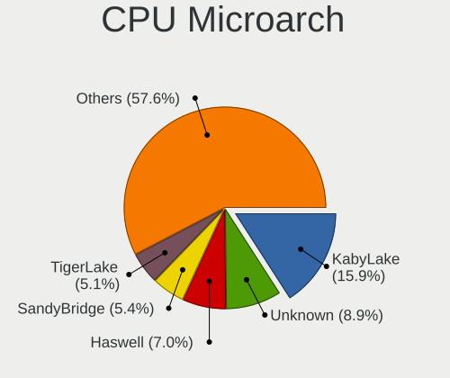

| Name              | Notebooks | Percent |
|-------------------|-----------|---------|
| KabyLake          | 759       | 15.89%  |
| Unknown           | 427       | 8.94%   |
| Haswell           | 336       | 7.04%   |
| SandyBridge       | 256       | 5.36%   |
| TigerLake         | 245       | 5.13%   |
| Penryn            | 231       | 4.84%   |
| Skylake           | 211       | 4.42%   |
| IvyBridge         | 211       | 4.42%   |
| Alderlake Hybrid  | 195       | 4.08%   |
| Core              | 191       | 4%      |
| Westmere          | 187       | 3.92%   |
| Silvermont        | 159       | 3.33%   |
| Broadwell         | 159       | 3.33%   |
| Zen 3             | 151       | 3.16%   |
| Zen+              | 120       | 2.51%   |
| Zen 2             | 115       | 2.41%   |
| Goldmont plus     | 107       | 2.24%   |
| Icelake           | 106       | 2.22%   |
| Excavator         | 88        | 1.84%   |
| CometLake         | 88        | 1.84%   |
| Bonnell           | 78        | 1.63%   |
| Goldmont          | 42        | 0.88%   |
| Puma              | 40        | 0.84%   |
| Zen               | 39        | 0.82%   |
| Jaguar            | 33        | 0.69%   |
| Bobcat            | 31        | 0.65%   |
| P6                | 30        | 0.63%   |
| Meteorlake Hybrid | 25        | 0.52%   |
| K8 Hammer         | 21        | 0.44%   |
| Tremont           | 18        | 0.38%   |
| K10               | 18        | 0.38%   |
| Piledriver        | 13        | 0.27%   |
| Nehalem           | 12        | 0.25%   |
| Steamroller       | 8         | 0.17%   |
| K10 Llano         | 7         | 0.15%   |
| Gracemont         | 6         | 0.13%   |
| NetBurst          | 5         | 0.1%    |
| Lunarlake Hybrid  | 4         | 0.08%   |
| K8 & K10 hybrid   | 4         | 0.08%   |

Graphics
--------

GPU Vendor
----------

Vendors of graphics cards

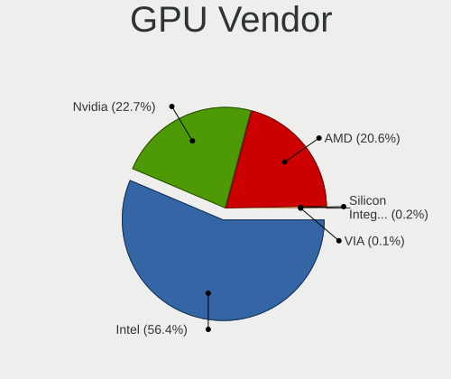

| Vendor                           | Notebooks | Percent |
|----------------------------------|-----------|---------|
| Intel                            | 3423      | 56.38%  |
| Nvidia                           | 1380      | 22.73%  |
| AMD                              | 1249      | 20.57%  |
| Silicon Integrated Systems [SiS] | 12        | 0.2%    |
| VIA Technologies                 | 7         | 0.12%   |

GPU Model
---------

Graphics card models

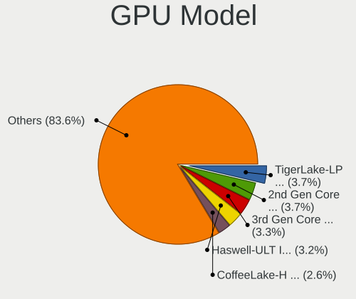

| Model                                                                                    | Notebooks | Percent |
|------------------------------------------------------------------------------------------|-----------|---------|
| Intel TigerLake-LP GT2 [Iris Xe Graphics]                                                | 230       | 3.67%   |
| Intel 2nd Generation Core Processor Family Integrated Graphics Controller                | 229       | 3.66%   |
| Intel 3rd Gen Core processor Graphics Controller                                         | 204       | 3.26%   |
| Intel Haswell-ULT Integrated Graphics Controller                                         | 199       | 3.18%   |
| Intel CoffeeLake-H GT2 [UHD Graphics 630]                                                | 164       | 2.62%   |
| Intel Kaby Lake-R GT2 [UHD Graphics 620]                                                 | 158       | 2.52%   |
| Intel Mobile 4 Series Chipset Integrated Graphics Controller                             | 133       | 2.12%   |
| AMD Picasso/Raven 2 [Radeon Vega Series / Radeon Vega Mobile Series]                     | 132       | 2.11%   |
| Intel Kaby Lake-U GT2 [HD Graphics 620]                                                  | 130       | 2.08%   |
| Intel Broadwell-U GT2 [HD Graphics 5500]                                                 | 130       | 2.08%   |
| Intel Core Processor Integrated Graphics Controller                                      | 128       | 2.04%   |
| Intel Skylake-U GT2 [HD Graphics 520]                                                    | 126       | 2.01%   |
| Intel CometLake-U GT2 [UHD Graphics]                                                     | 126       | 2.01%   |
| Intel 4th Gen Core Processor Integrated Graphics Controller                              | 115       | 1.84%   |
| Nvidia TU117M [GeForce GTX 1650 Mobile / Max-Q]                                          | 113       | 1.8%    |
| AMD Renoir [Radeon Vega Series / Radeon Vega Mobile Series]                              | 109       | 1.74%   |
| Intel GeminiLake [UHD Graphics 600]                                                      | 103       | 1.64%   |
| AMD Cezanne [Radeon Vega Series / Radeon Vega Mobile Series]                             | 100       | 1.6%    |
| Intel WhiskeyLake-U GT2 [UHD Graphics 620]                                               | 85        | 1.36%   |
| Intel Atom Processor Z36xxx/Z37xxx Series Graphics & Display                             | 84        | 1.34%   |
| Nvidia GP107M [GeForce GTX 1050 Mobile]                                                  | 82        | 1.31%   |
| AMD Lucienne                                                                             | 81        | 1.29%   |
| Intel Alder Lake-P GT2 [Iris Xe Graphics]                                                | 77        | 1.23%   |
| Intel Atom/Celeron/Pentium Processor x5-E8000/J3xxx/N3xxx Integrated Graphics Controller | 75        | 1.2%    |
| Intel Raptor Lake-P [Iris Xe Graphics]                                                   | 71        | 1.13%   |
| Intel CometLake-H GT2 [UHD Graphics]                                                     | 71        | 1.13%   |
| AMD Stoney [Radeon R2/R3/R4/R5 Graphics]                                                 | 71        | 1.13%   |
| Nvidia GF117M [GeForce 610M/710M/810M/820M / GT 620M/625M/630M/720M]                     | 67        | 1.07%   |
| Intel Mobile GM965/GL960 Integrated Graphics Controller (secondary)                      | 66        | 1.05%   |
| Intel Mobile GM965/GL960 Integrated Graphics Controller (primary)                        | 66        | 1.05%   |
| Nvidia GA106M [GeForce RTX 3060 Mobile / Max-Q]                                          | 63        | 1.01%   |
| Intel Skylake-H GT2 [HD Graphics 530]                                                    | 59        | 0.94%   |
| Nvidia GA107M [GeForce RTX 3050 Mobile]                                                  | 57        | 0.91%   |
| Intel Iris Plus Graphics G1 (Ice Lake)                                                   | 57        | 0.91%   |
| AMD Rembrandt [Radeon 680M]                                                              | 57        | 0.91%   |
| Intel Kaby Lake-H GT2 [HD Graphics 630]                                                  | 53        | 0.85%   |
| AMD Barcelo                                                                              | 46        | 0.73%   |
| Nvidia AD107M [GeForce RTX 4060 Max-Q / Mobile]                                          | 44        | 0.7%    |
| Intel Alder Lake-UP3 GT2 [Iris Xe Graphics]                                              | 44        | 0.7%    |
| Intel Mobile 945GM/GMS/GME, 943/940GML Express Integrated Graphics Controller            | 43        | 0.69%   |

GPU Combo
---------

Combinations of graphics cards

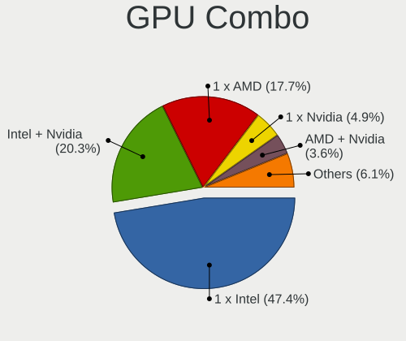

| Name                   | Notebooks | Percent |
|------------------------|-----------|---------|
| 1 x Intel              | 2265      | 47.38%  |
| Intel + Nvidia         | 971       | 20.31%  |
| 1 x AMD                | 844       | 17.66%  |
| 1 x Nvidia             | 233       | 4.87%   |
| AMD + Nvidia           | 174       | 3.64%   |
| Intel + AMD            | 152       | 3.18%   |
| 2 x AMD                | 78        | 1.63%   |
| 2 x Intel              | 35        | 0.73%   |
| 1 x SiS                | 12        | 0.25%   |
| 1 x VIA                | 7         | 0.15%   |
| Other                  | 4         | 0.08%   |
| 2 x Nvidia             | 4         | 0.08%   |
| 2 x Intel + 1 x Nvidia | 1         | 0.02%   |

GPU Driver
----------

Free vs proprietary

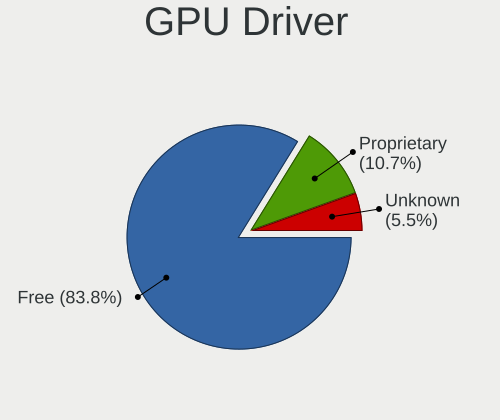

| Driver      | Notebooks | Percent |
|-------------|-----------|---------|
| Free        | 4048      | 83.81%  |
| Proprietary | 516       | 10.68%  |
| Unknown     | 266       | 5.51%   |

GPU Memory
----------

Total video memory

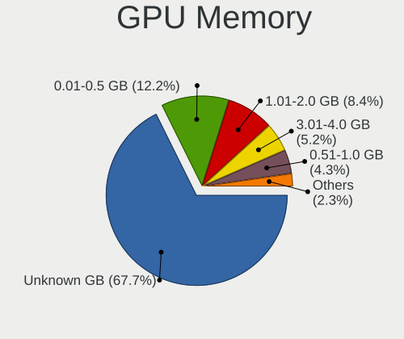

| Size in GB | Notebooks | Percent |
|------------|-----------|---------|
| Unknown    | 3315      | 67.67%  |
| 0.01-0.5   | 596       | 12.17%  |
| 1.01-2.0   | 412       | 8.41%   |
| 3.01-4.0   | 254       | 5.18%   |
| 0.51-1.0   | 209       | 4.27%   |
| 5.01-6.0   | 57        | 1.16%   |
| 7.01-8.0   | 45        | 0.92%   |
| 2.01-3.0   | 6         | 0.12%   |
| 8.01-16.0  | 5         | 0.1%    |

Monitor
-------

Monitor Vendor
--------------

Monitor vendors

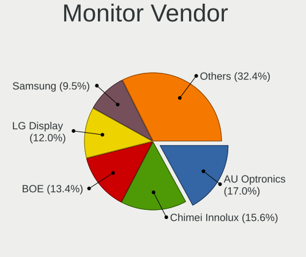

| Vendor                  | Notebooks | Percent |
|-------------------------|-----------|---------|
| AU Optronics            | 924       | 17.03%  |
| Chimei Innolux          | 847       | 15.61%  |
| BOE                     | 728       | 13.42%  |
| LG Display              | 652       | 12.02%  |
| Samsung Electronics     | 517       | 9.53%   |
| Goldstar                | 151       | 2.78%   |
| Chi Mei Optoelectronics | 135       | 2.49%   |
| Apple                   | 130       | 2.4%    |
| Sharp                   | 123       | 2.27%   |
| Dell                    | 111       | 2.05%   |
| PANDA                   | 107       | 1.97%   |
| Hewlett-Packard         | 106       | 1.95%   |
| Lenovo                  | 85        | 1.57%   |
| BenQ                    | 84        | 1.55%   |
| LG Philips              | 58        | 1.07%   |
| Philips                 | 54        | 1%      |
| Acer                    | 43        | 0.79%   |
| Valve                   | 42        | 0.77%   |
| InfoVision              | 41        | 0.76%   |
| AOC                     | 41        | 0.76%   |
| ASUSTek Computer        | 34        | 0.63%   |
| Ancor Communications    | 33        | 0.61%   |
| Sony                    | 27        | 0.5%    |
| HannStar                | 26        | 0.48%   |
| CSO                     | 25        | 0.46%   |
| CPT                     | 20        | 0.37%   |
| MSI                     | 19        | 0.35%   |
| ViewSonic               | 12        | 0.22%   |
| HKC                     | 12        | 0.22%   |
| Unknown                 | 10        | 0.18%   |
| TMX                     | 10        | 0.18%   |
| CSOT                    | 10        | 0.18%   |
| Mi                      | 9         | 0.17%   |
| Quanta Display          | 8         | 0.15%   |
| CSW                     | 8         | 0.15%   |
| Vestel Elektronik       | 7         | 0.13%   |
| Toshiba                 | 7         | 0.13%   |
| Panasonic               | 7         | 0.13%   |
| Analogix                | 7         | 0.13%   |
| Seiko/Epson             | 5         | 0.09%   |

Monitor Model
-------------

Monitor models

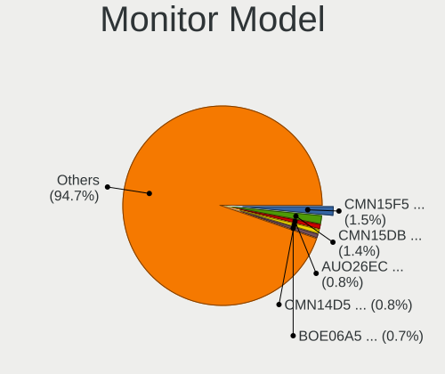

| Model                                                                    | Notebooks | Percent |
|--------------------------------------------------------------------------|-----------|---------|
| Chimei Innolux LCD Monitor CMN15F5 1920x1080 344x193mm 15.5-inch         | 84        | 1.53%   |
| Chimei Innolux LCD Monitor CMN15DB 1366x768 344x193mm 15.5-inch          | 79        | 1.44%   |
| AU Optronics LCD Monitor AUO26EC 1366x768 344x193mm 15.5-inch            | 44        | 0.8%    |
| Chimei Innolux LCD Monitor CMN14D5 1920x1080 309x173mm 13.9-inch         | 43        | 0.78%   |
| BOE LCD Monitor BOE06A5 1366x768 344x194mm 15.5-inch                     | 39        | 0.71%   |
| Valve ANX7530 U VLV3001 800x1280 100x150mm 7.1-inch                      | 33        | 0.6%    |
| AU Optronics LCD Monitor AUO21ED 1920x1080 344x193mm 15.5-inch           | 33        | 0.6%    |
| AU Optronics LCD Monitor AUO38ED 1920x1080 344x193mm 15.5-inch           | 30        | 0.55%   |
| Chimei Innolux LCD Monitor CMN14D4 1920x1080 309x173mm 13.9-inch         | 29        | 0.53%   |
| Chimei Innolux LCD Monitor CMN15E7 1920x1080 344x193mm 15.5-inch         | 28        | 0.51%   |
| PANDA LCD Monitor NCP0035 1920x1080 344x194mm 15.5-inch                  | 27        | 0.49%   |
| Chimei Innolux LCD Monitor CMN15E8 1920x1080 344x193mm 15.5-inch         | 27        | 0.49%   |
| Chi Mei Optoelectronics LCD Monitor CMO15A7 1366x768 344x193mm 15.5-inch | 27        | 0.49%   |
| AU Optronics LCD Monitor AUO22EC 1366x768 344x193mm 15.5-inch            | 27        | 0.49%   |
| BOE LCD Monitor BOE0893 2160x1440 296x197mm 14.0-inch                    | 26        | 0.47%   |
| BOE LCD Monitor BOE06A4 1366x768 344x194mm 15.5-inch                     | 26        | 0.47%   |
| PANDA LCD Monitor NCP004D 1920x1080 344x194mm 15.5-inch                  | 25        | 0.46%   |
| AU Optronics LCD Monitor AUO70EC 1366x768 344x193mm 15.5-inch            | 25        | 0.46%   |
| LG Display LCD Monitor LGD033A 1366x768 344x194mm 15.5-inch              | 24        | 0.44%   |
| Chimei Innolux LCD Monitor CMN1735 1920x1080 381x214mm 17.2-inch         | 23        | 0.42%   |
| LG Display LCD Monitor LGD02DC 1366x768 344x194mm 15.5-inch              | 22        | 0.4%    |
| AU Optronics LCD Monitor AUO71EC 1366x768 344x193mm 15.5-inch            | 22        | 0.4%    |
| AU Optronics LCD Monitor AUO45EC 1366x768 344x193mm 15.5-inch            | 22        | 0.4%    |
| LG Display LCD Monitor LGD0456 1366x768 344x194mm 15.5-inch              | 21        | 0.38%   |
| Chimei Innolux LCD Monitor CMN15CA 1366x768 344x193mm 15.5-inch          | 20        | 0.36%   |
| Chimei Innolux LCD Monitor CMN1521 1920x1080 344x193mm 15.5-inch         | 20        | 0.36%   |
| Chimei Innolux LCD Monitor CMN15C4 1920x1080 344x193mm 15.5-inch         | 19        | 0.35%   |
| Chimei Innolux LCD Monitor CMN153B 1920x1080 344x193mm 15.5-inch         | 19        | 0.35%   |
| AU Optronics LCD Monitor AUO403D 1920x1080 309x174mm 14.0-inch           | 19        | 0.35%   |
| Samsung Electronics LCD Monitor SEC5441 1280x800 331x207mm 15.4-inch     | 18        | 0.33%   |
| LG Display LCD Monitor LGD05E5 1920x1080 344x194mm 15.5-inch             | 18        | 0.33%   |
| BOE LCD Monitor BOE0872 1920x1080 344x194mm 15.5-inch                    | 18        | 0.33%   |
| AU Optronics LCD Monitor AUO20EC 1366x768 344x193mm 15.5-inch            | 18        | 0.33%   |
| LG Display LCD Monitor LGD045C 1366x768 345x194mm 15.6-inch              | 17        | 0.31%   |
| LG Display LCD Monitor LGD039F 1366x768 345x194mm 15.6-inch              | 17        | 0.31%   |
| BOE LCD Monitor BOE0687 1920x1080 344x193mm 15.5-inch                    | 17        | 0.31%   |
| AU Optronics LCD Monitor AUOAF90 1920x1080 344x193mm 15.5-inch           | 17        | 0.31%   |
| LG Display LCD Monitor LGD046F 1920x1080 344x194mm 15.5-inch             | 16        | 0.29%   |
| Chimei Innolux LCD Monitor CMN15DC 1366x768 344x193mm 15.5-inch          | 16        | 0.29%   |
| Goldstar FULL HD GSM5B55 1920x1080 480x270mm 21.7-inch                   | 15        | 0.27%   |

Monitor Resolution
------------------

Monitor screen resolution

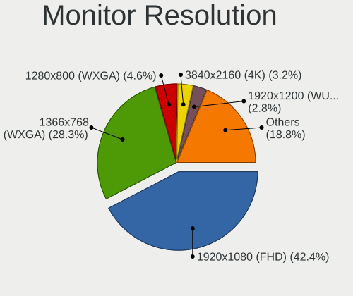

| Resolution         | Notebooks | Percent |
|--------------------|-----------|---------|
| 1920x1080 (FHD)    | 2143      | 42.36%  |
| 1366x768 (WXGA)    | 1430      | 28.27%  |
| 1280x800 (WXGA)    | 233       | 4.61%   |
| 3840x2160 (4K)     | 163       | 3.22%   |
| 1920x1200 (WUXGA)  | 141       | 2.79%   |
| 1600x900 (HD+)     | 131       | 2.59%   |
| 2560x1440 (QHD)    | 128       | 2.53%   |
| 1440x900 (WXGA+)   | 91        | 1.8%    |
| 2560x1600          | 89        | 1.76%   |
| 2880x1800          | 66        | 1.3%    |
| 1024x600           | 52        | 1.03%   |
| 2160x1440          | 49        | 0.97%   |
| 800x1280           | 48        | 0.95%   |
| 1680x1050 (WSXGA+) | 39        | 0.77%   |
| 1280x1024 (SXGA)   | 38        | 0.75%   |
| 2560x1080          | 29        | 0.57%   |
| 3440x1440          | 24        | 0.47%   |
| Unknown            | 18        | 0.36%   |
| 3840x2400          | 17        | 0.34%   |
| 1360x768           | 14        | 0.28%   |
| 3200x1800 (QHD+)   | 11        | 0.22%   |
| 1024x768 (XGA)     | 9         | 0.18%   |
| 1600x1200          | 7         | 0.14%   |
| 3456x2160          | 6         | 0.12%   |
| 3200x2000          | 6         | 0.12%   |
| 2288x1287          | 6         | 0.12%   |
| 1920x540           | 6         | 0.12%   |
| 2880x1620          | 5         | 0.1%    |
| 2520x1680          | 5         | 0.1%    |
| 2304x1440          | 5         | 0.1%    |
| 1920x1280          | 5         | 0.1%    |
| 3072x1920          | 4         | 0.08%   |
| 2240x1400          | 4         | 0.08%   |
| 1280x768           | 4         | 0.08%   |
| 3840x1080          | 3         | 0.06%   |
| 2880x1920          | 3         | 0.06%   |
| 2256x1504          | 3         | 0.06%   |
| 1400x1050          | 3         | 0.06%   |
| 5760x1080          | 2         | 0.04%   |
| 3840x1600          | 2         | 0.04%   |

Monitor Diagonal
----------------

Diagonal size in inches

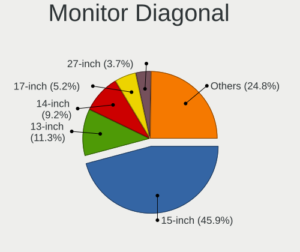

| Inches  | Notebooks | Percent |
|---------|-----------|---------|
| 15      | 2484      | 45.86%  |
| 13      | 612       | 11.3%   |
| 14      | 499       | 9.21%   |
| 17      | 282       | 5.21%   |
| 27      | 198       | 3.66%   |
| 24      | 193       | 3.56%   |
| 16      | 175       | 3.23%   |
| 21      | 137       | 2.53%   |
| 23      | 123       | 2.27%   |
| 12      | 109       | 2.01%   |
| 11      | 76        | 1.4%    |
| 31      | 69        | 1.27%   |
| Unknown | 62        | 1.14%   |
| 10      | 59        | 1.09%   |
| 34      | 45        | 0.83%   |
| 7       | 42        | 0.78%   |
| 19      | 32        | 0.59%   |
| 84      | 31        | 0.57%   |
| 18      | 24        | 0.44%   |
| 20      | 21        | 0.39%   |
| 22      | 14        | 0.26%   |
| 72      | 13        | 0.24%   |
| 54      | 12        | 0.22%   |
| 32      | 11        | 0.2%    |
| 40      | 10        | 0.18%   |
| 25      | 9         | 0.17%   |
| 63      | 8         | 0.15%   |
| 52      | 7         | 0.13%   |
| 3       | 7         | 0.13%   |
| 46      | 6         | 0.11%   |
| 26      | 6         | 0.11%   |
| 8       | 6         | 0.11%   |
| 142     | 5         | 0.09%   |
| 47      | 3         | 0.06%   |
| 38      | 3         | 0.06%   |
| 37      | 3         | 0.06%   |
| 28      | 3         | 0.06%   |
| 48      | 2         | 0.04%   |
| 35      | 2         | 0.04%   |
| 33      | 2         | 0.04%   |

Monitor Width
-------------

Physical width

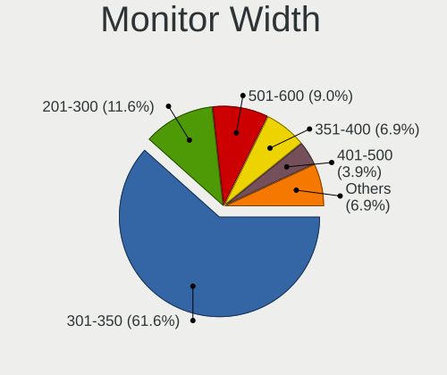

| Width in mm    | Notebooks | Percent |
|----------------|-----------|---------|
| 301-350        | 3308      | 61.62%  |
| 201-300        | 624       | 11.62%  |
| 501-600        | 485       | 9.04%   |
| 351-400        | 370       | 6.89%   |
| 401-500        | 209       | 3.89%   |
| 601-700        | 85        | 1.58%   |
| Unknown        | 62        | 1.15%   |
| 701-800        | 58        | 1.08%   |
| 1-100          | 49        | 0.91%   |
| 1501-2000      | 44        | 0.82%   |
| 1001-1500      | 42        | 0.78%   |
| 801-900        | 18        | 0.34%   |
| 101-200        | 6         | 0.11%   |
| More than 2000 | 5         | 0.09%   |
| 901-1000       | 3         | 0.06%   |

Aspect Ratio
------------

Proportional relationship between the width and the height

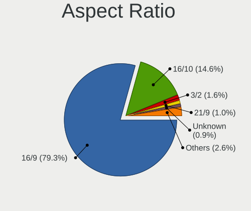

| Ratio   | Notebooks | Percent |
|---------|-----------|---------|
| 16/9    | 3776      | 79.29%  |
| 16/10   | 693       | 14.55%  |
| 3/2     | 77        | 1.62%   |
| 21/9    | 48        | 1.01%   |
| Unknown | 43        | 0.9%    |
| 5/4     | 37        | 0.78%   |
| 0.67    | 33        | 0.69%   |
| 4/3     | 24        | 0.5%    |
| 0.62    | 10        | 0.21%   |
| 6/5     | 7         | 0.15%   |
| 1.00    | 5         | 0.1%    |
| 0.89    | 2         | 0.04%   |
| 0.56    | 2         | 0.04%   |
| 32/9    | 1         | 0.02%   |
| 3.73    | 1         | 0.02%   |
| 3.40    | 1         | 0.02%   |
| 1.03    | 1         | 0.02%   |
| 0.65    | 1         | 0.02%   |

Monitor Area
------------

Area in inch²

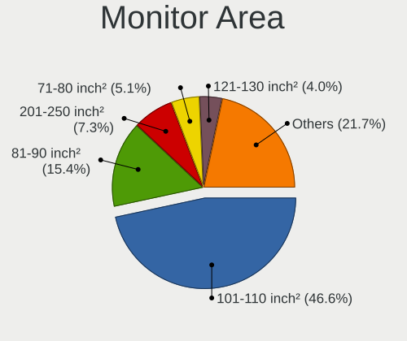

| Area in inch² | Notebooks | Percent |
|----------------|-----------|---------|
| 101-110        | 2518      | 46.63%  |
| 81-90          | 829       | 15.35%  |
| 201-250        | 392       | 7.26%   |
| 71-80          | 273       | 5.06%   |
| 121-130        | 216       | 4%      |
| 301-350        | 201       | 3.72%   |
| 111-120        | 130       | 2.41%   |
| 351-500        | 129       | 2.39%   |
| 61-70          | 104       | 1.93%   |
| 151-200        | 84        | 1.56%   |
| More than 1000 | 82        | 1.52%   |
| 51-60          | 77        | 1.43%   |
| Unknown        | 62        | 1.15%   |
| 41-50          | 59        | 1.09%   |
| 1-40           | 55        | 1.02%   |
| 131-140        | 49        | 0.91%   |
| 251-300        | 44        | 0.81%   |
| 141-150        | 41        | 0.76%   |
| 501-1000       | 31        | 0.57%   |
| 91-100         | 24        | 0.44%   |

Pixel Density
-------------

Pixels per inch

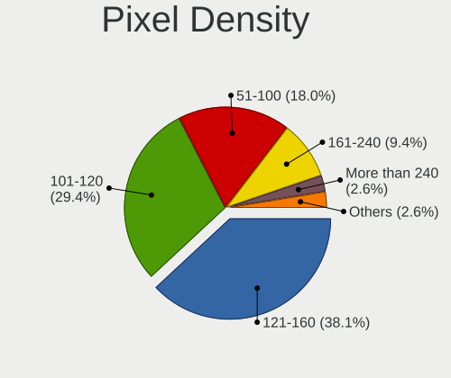

| Density       | Notebooks | Percent |
|---------------|-----------|---------|
| 121-160       | 2016      | 38.06%  |
| 101-120       | 1556      | 29.38%  |
| 51-100        | 952       | 17.97%  |
| 161-240       | 496       | 9.36%   |
| More than 240 | 139       | 2.62%   |
| 1-50          | 76        | 1.43%   |
| Unknown       | 62        | 1.17%   |

Multiple Monitors
-----------------

Total monitors connected

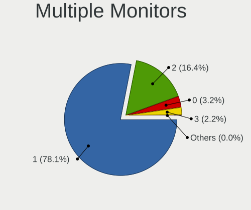

| Total | Notebooks | Percent |
|-------|-----------|---------|
| 1     | 3819      | 78.07%  |
| 2     | 800       | 16.35%  |
| 0     | 157       | 3.21%   |
| 3     | 107       | 2.19%   |
| 4     | 8         | 0.16%   |
| 5     | 1         | 0.02%   |

Network
-------

Net Controller Vendor
---------------------

Controller vendors

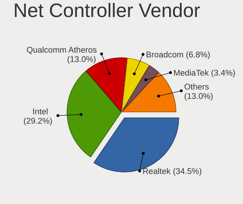

| Vendor                                 | Notebooks | Percent |
|----------------------------------------|-----------|---------|
| Realtek Semiconductor                  | 2667      | 34.52%  |
| Intel                                  | 2252      | 29.15%  |
| Qualcomm Atheros                       | 1006      | 13.02%  |
| Broadcom                               | 528       | 6.83%   |
| MediaTek                               | 265       | 3.43%   |
| Broadcom Limited                       | 122       | 1.58%   |
| Marvell Technology Group               | 105       | 1.36%   |
| TP-Link                                | 89        | 1.15%   |
| Ralink                                 | 80        | 1.04%   |
| ASIX Electronics                       | 78        | 1.01%   |
| Ralink Technology                      | 49        | 0.63%   |
| Shenzhen Goodix Technology             | 43        | 0.56%   |
| Xiaomi                                 | 37        | 0.48%   |
| Qualcomm                               | 33        | 0.43%   |
| Nvidia                                 | 30        | 0.39%   |
| Samsung Electronics                    | 28        | 0.36%   |
| Lenovo                                 | 26        | 0.34%   |
| Hewlett-Packard                        | 23        | 0.3%    |
| JMicron Technology                     | 21        | 0.27%   |
| Ericsson Business Mobile Networks      | 20        | 0.26%   |
| DisplayLink                            | 20        | 0.26%   |
| Dell                                   | 20        | 0.26%   |
| Silicon Integrated Systems [SiS]       | 18        | 0.23%   |
| Sierra Wireless                        | 17        | 0.22%   |
| Qualcomm Atheros Communications        | 13        | 0.17%   |
| D-Link                                 | 12        | 0.16%   |
| Huawei Technologies                    | 10        | 0.13%   |
| Google                                 | 8         | 0.1%    |
| Qualcomm Technologies                  | 7         | 0.09%   |
| OPPO Electronics                       | 7         | 0.09%   |
| Edimax Technology                      | 7         | 0.09%   |
| VIA Technologies                       | 6         | 0.08%   |
| Attansic Technology                    | 6         | 0.08%   |
| ASUSTek Computer                       | 6         | 0.08%   |
| Suzhou Motorcomm Electronic Technology | 4         | 0.05%   |
| NetGear                                | 4         | 0.05%   |
| LSI                                    | 4         | 0.05%   |
| D-Link System                          | 4         | 0.05%   |
| Apple                                  | 4         | 0.05%   |
| Toshiba                                | 3         | 0.04%   |

Net Controller Model
--------------------

Controller models

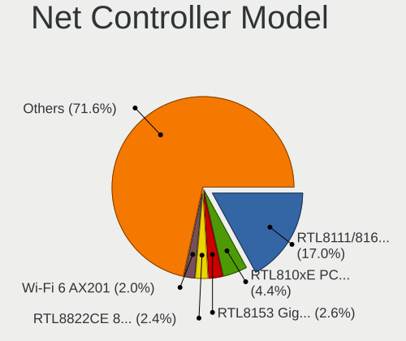

| Model                                                                   | Notebooks | Percent |
|-------------------------------------------------------------------------|-----------|---------|
| Realtek RTL8111/8168/8211/8411 PCI Express Gigabit Ethernet Controller  | 1542      | 17.02%  |
| Realtek RTL810xE PCI Express Fast Ethernet controller                   | 402       | 4.44%   |
| Realtek RTL8153 Gigabit Ethernet Adapter                                | 236       | 2.6%    |
| Realtek RTL8822CE 802.11ac PCIe Wireless Network Adapter                | 213       | 2.35%   |
| Intel Wi-Fi 6 AX201                                                     | 182       | 2.01%   |
| Intel Wi-Fi 6 AX200                                                     | 168       | 1.85%   |
| Intel Wireless 8265 / 8275                                              | 161       | 1.78%   |
| Qualcomm Atheros QCA9565 / AR9565 Wireless Network Adapter              | 154       | 1.7%    |
| Realtek RTL8821CE 802.11ac PCIe Wireless Network Adapter                | 152       | 1.68%   |
| Qualcomm Atheros QCA9377 802.11ac Wireless Network Adapter              | 150       | 1.66%   |
| Qualcomm Atheros AR9285 Wireless Network Adapter (PCI-Express)          | 143       | 1.58%   |
| Intel Alder Lake-P PCH CNVi WiFi                                        | 131       | 1.45%   |
| Intel Wireless 7265                                                     | 126       | 1.39%   |
| MediaTek MT7921 802.11ax PCIe Wireless Network Adapter [Filogic 330]    | 115       | 1.27%   |
| Intel Cannon Lake PCH CNVi WiFi                                         | 112       | 1.24%   |
| Qualcomm Atheros AR9485 Wireless Network Adapter                        | 110       | 1.21%   |
| Intel Comet Lake PCH-LP CNVi WiFi                                       | 106       | 1.17%   |
| Intel Wireless 7260                                                     | 99        | 1.09%   |
| Realtek RTL8723BE PCIe Wireless Network Adapter                         | 94        | 1.04%   |
| Qualcomm Atheros QCA6174 802.11ac Wireless Network Adapter              | 86        | 0.95%   |
| Broadcom BCM43142 802.11b/g/n                                           | 80        | 0.88%   |
| Broadcom BCM4313 802.11bgn Wireless Network Adapter                     | 77        | 0.85%   |
| Intel 82579LM Gigabit Network Connection (Lewisville)                   | 76        | 0.84%   |
| Intel Wireless 3165                                                     | 74        | 0.82%   |
| Intel PRO/Wireless 3945ABG [Golan] Network Connection                   | 71        | 0.78%   |
| ASIX AX88179 Gigabit Ethernet                                           | 71        | 0.78%   |
| Intel Raptor Lake PCH CNVi WiFi                                         | 66        | 0.73%   |
| Intel Wireless 3160                                                     | 64        | 0.71%   |
| MediaTek MT7922 802.11ax PCI Express Wireless Network Adapter           | 63        | 0.7%    |
| Intel WiFi Link 5100                                                    | 63        | 0.7%    |
| Intel Wireless 8260                                                     | 60        | 0.66%   |
| Intel Centrino Advanced-N 6205 [Taylor Peak]                            | 59        | 0.65%   |
| Qualcomm Atheros AR928X Wireless Network Adapter (PCI-Express)          | 58        | 0.64%   |
| MediaTek MT7902 802.11ax PCIe Wireless Network Adapter [Filogic 310]    | 57        | 0.63%   |
| Intel Comet Lake PCH CNVi WiFi                                          | 57        | 0.63%   |
| Qualcomm Atheros AR242x / AR542x Wireless Network Adapter (PCI-Express) | 55        | 0.61%   |
| Realtek RTL8822BE 802.11a/b/g/n/ac WiFi adapter                         | 51        | 0.56%   |
| Intel Cannon Point-LP CNVi [Wireless-AC]                                | 50        | 0.55%   |
| Intel Ethernet Connection (4) I219-LM                                   | 47        | 0.52%   |
| Broadcom NetLink BCM57780 Gigabit Ethernet PCIe                         | 47        | 0.52%   |

Wireless Vendor
---------------

Wireless vendors

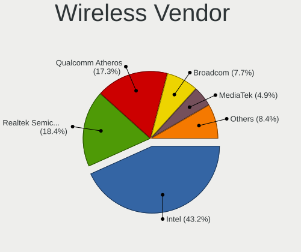

| Vendor                          | Notebooks | Percent |
|---------------------------------|-----------|---------|
| Intel                           | 2110      | 43.25%  |
| Realtek Semiconductor           | 900       | 18.45%  |
| Qualcomm Atheros                | 846       | 17.34%  |
| Broadcom                        | 376       | 7.71%   |
| MediaTek                        | 239       | 4.9%    |
| Broadcom Limited                | 84        | 1.72%   |
| Ralink                          | 80        | 1.64%   |
| TP-Link                         | 69        | 1.41%   |
| Ralink Technology               | 49        | 1%      |
| Qualcomm                        | 27        | 0.55%   |
| Sierra Wireless                 | 17        | 0.35%   |
| Qualcomm Atheros Communications | 13        | 0.27%   |
| Dell                            | 13        | 0.27%   |
| D-Link                          | 11        | 0.23%   |
| Edimax Technology               | 7         | 0.14%   |
| Hewlett-Packard                 | 6         | 0.12%   |
| ASUSTek Computer                | 6         | 0.12%   |
| NetGear                         | 4         | 0.08%   |
| D-Link System                   | 4         | 0.08%   |
| Belkin Components               | 3         | 0.06%   |
| ZyDAS                           | 2         | 0.04%   |
| Qualcomm Technologies           | 2         | 0.04%   |
| Fibocom                         | 2         | 0.04%   |
| Accton Technology               | 2         | 0.04%   |
| Sitecom Europe                  | 1         | 0.02%   |
| Microsoft                       | 1         | 0.02%   |
| Linksys                         | 1         | 0.02%   |
| LG Electronics                  | 1         | 0.02%   |
| Gemtek                          | 1         | 0.02%   |
| AirTies Wireless Networks       | 1         | 0.02%   |
| Unknown                         | 1         | 0.02%   |

Wireless Model
--------------

Wireless models

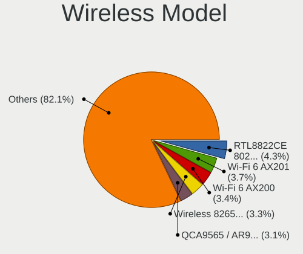

| Model                                                                   | Notebooks | Percent |
|-------------------------------------------------------------------------|-----------|---------|
| Realtek RTL8822CE 802.11ac PCIe Wireless Network Adapter                | 213       | 4.34%   |
| Intel Wi-Fi 6 AX201                                                     | 182       | 3.71%   |
| Intel Wi-Fi 6 AX200                                                     | 168       | 3.42%   |
| Intel Wireless 8265 / 8275                                              | 161       | 3.28%   |
| Qualcomm Atheros QCA9565 / AR9565 Wireless Network Adapter              | 154       | 3.14%   |
| Realtek RTL8821CE 802.11ac PCIe Wireless Network Adapter                | 152       | 3.1%    |
| Qualcomm Atheros QCA9377 802.11ac Wireless Network Adapter              | 150       | 3.06%   |
| Qualcomm Atheros AR9285 Wireless Network Adapter (PCI-Express)          | 143       | 2.91%   |
| Intel Wireless 7265                                                     | 126       | 2.57%   |
| MediaTek MT7921 802.11ax PCIe Wireless Network Adapter [Filogic 330]    | 115       | 2.34%   |
| Intel Cannon Lake PCH CNVi WiFi                                         | 112       | 2.28%   |
| Qualcomm Atheros AR9485 Wireless Network Adapter                        | 110       | 2.24%   |
| Intel Comet Lake PCH-LP CNVi WiFi                                       | 106       | 2.16%   |
| Intel Wireless 7260                                                     | 99        | 2.02%   |
| Realtek RTL8723BE PCIe Wireless Network Adapter                         | 94        | 1.91%   |
| Qualcomm Atheros QCA6174 802.11ac Wireless Network Adapter              | 86        | 1.75%   |
| Broadcom BCM43142 802.11b/g/n                                           | 80        | 1.63%   |
| Broadcom BCM4313 802.11bgn Wireless Network Adapter                     | 77        | 1.57%   |
| Intel Alder Lake-P PCH CNVi WiFi                                        | 75        | 1.53%   |
| Intel Wireless 3165                                                     | 74        | 1.51%   |
| Intel PRO/Wireless 3945ABG [Golan] Network Connection                   | 71        | 1.45%   |
| Intel Raptor Lake PCH CNVi WiFi                                         | 66        | 1.34%   |
| Intel Wireless 3160                                                     | 64        | 1.3%    |
| Intel WiFi Link 5100                                                    | 63        | 1.28%   |
| Intel Wireless 8260                                                     | 60        | 1.22%   |
| Intel Centrino Advanced-N 6205 [Taylor Peak]                            | 59        | 1.2%    |
| Qualcomm Atheros AR928X Wireless Network Adapter (PCI-Express)          | 58        | 1.18%   |
| MediaTek MT7902 802.11ax PCIe Wireless Network Adapter [Filogic 310]    | 57        | 1.16%   |
| Intel Comet Lake PCH CNVi WiFi                                          | 57        | 1.16%   |
| Qualcomm Atheros AR242x / AR542x Wireless Network Adapter (PCI-Express) | 55        | 1.12%   |
| Realtek RTL8822BE 802.11a/b/g/n/ac WiFi adapter                         | 51        | 1.04%   |
| Intel Cannon Point-LP CNVi [Wireless-AC]                                | 50        | 1.02%   |
| Realtek RTL8852AE 802.11ax PCIe Wireless Network Adapter                | 44        | 0.9%    |
| Intel Wi-Fi 6E(802.11ax) AX210/AX1675* 2x2 [Typhoon Peak]               | 44        | 0.9%    |
| MediaTek MT7922 802.11ax PCI Express Wireless Network Adapter           | 43        | 0.88%   |
| Realtek RTL8852BE PCIe 802.11ax Wireless Network Controller             | 42        | 0.86%   |
| Intel Ice Lake-LP PCH CNVi WiFi                                         | 41        | 0.84%   |
| Intel Centrino Advanced-N 6200                                          | 40        | 0.81%   |
| Qualcomm Atheros AR9287 Wireless Network Adapter (PCI-Express)          | 39        | 0.79%   |
| Intel Dual Band Wireless-AC 3165 Plus Bluetooth                         | 39        | 0.79%   |

Ethernet Vendor
---------------

Ethernet vendors

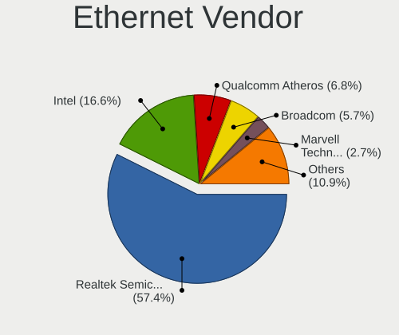

| Vendor                                 | Notebooks | Percent |
|----------------------------------------|-----------|---------|
| Realtek Semiconductor                  | 2266      | 57.37%  |
| Intel                                  | 656       | 16.61%  |
| Qualcomm Atheros                       | 267       | 6.76%   |
| Broadcom                               | 224       | 5.67%   |
| Marvell Technology Group               | 105       | 2.66%   |
| ASIX Electronics                       | 78        | 1.97%   |
| Broadcom Limited                       | 40        | 1.01%   |
| Xiaomi                                 | 37        | 0.94%   |
| Nvidia                                 | 30        | 0.76%   |
| Samsung Electronics                    | 28        | 0.71%   |
| Lenovo                                 | 26        | 0.66%   |
| MediaTek                               | 25        | 0.63%   |
| TP-Link                                | 22        | 0.56%   |
| JMicron Technology                     | 21        | 0.53%   |
| DisplayLink                            | 20        | 0.51%   |
| Silicon Integrated Systems [SiS]       | 18        | 0.46%   |
| Hewlett-Packard                        | 9         | 0.23%   |
| Google                                 | 8         | 0.2%    |
| OPPO Electronics                       | 7         | 0.18%   |
| VIA Technologies                       | 6         | 0.15%   |
| Qualcomm                               | 6         | 0.15%   |
| Huawei Technologies                    | 6         | 0.15%   |
| Attansic Technology                    | 6         | 0.15%   |
| Qualcomm Technologies                  | 5         | 0.13%   |
| Suzhou Motorcomm Electronic Technology | 4         | 0.1%    |
| LSI                                    | 4         | 0.1%    |
| Apple                                  | 4         | 0.1%    |
| Motorola PCS                           | 3         | 0.08%   |
| Microchip Technology                   | 3         | 0.08%   |
| ZTE WCDMA Technologies MSM             | 2         | 0.05%   |
| ICS Advent                             | 2         | 0.05%   |
| Davicom Semiconductor                  | 2         | 0.05%   |
| T & A Mobile Phones                    | 1         | 0.03%   |
| Sony Ericsson Mobile Communications AB | 1         | 0.03%   |
| QinHeng Electronics                    | 1         | 0.03%   |
| OnePlus Technology (Shenzhen)          | 1         | 0.03%   |
| National Semiconductor                 | 1         | 0.03%   |
| Motorcomm Microelectronics.            | 1         | 0.03%   |
| Linksys                                | 1         | 0.03%   |
| D-Link                                 | 1         | 0.03%   |

Ethernet Model
--------------

Ethernet models

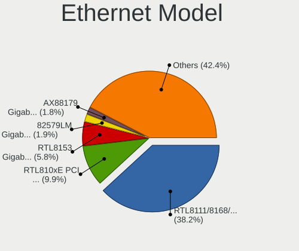

| Model                                                                  | Notebooks | Percent |
|------------------------------------------------------------------------|-----------|---------|
| Realtek RTL8111/8168/8211/8411 PCI Express Gigabit Ethernet Controller | 1542      | 38.16%  |
| Realtek RTL810xE PCI Express Fast Ethernet controller                  | 402       | 9.95%   |
| Realtek RTL8153 Gigabit Ethernet Adapter                               | 236       | 5.84%   |
| Intel 82579LM Gigabit Network Connection (Lewisville)                  | 76        | 1.88%   |
| ASIX AX88179 Gigabit Ethernet                                          | 71        | 1.76%   |
| Intel Alder Lake-P PCH CNVi WiFi                                       | 56        | 1.39%   |
| Intel Ethernet Connection (4) I219-LM                                  | 47        | 1.16%   |
| Broadcom NetLink BCM57780 Gigabit Ethernet PCIe                        | 47        | 1.16%   |
| Realtek RTL8152 Fast Ethernet Adapter                                  | 44        | 1.09%   |
| Broadcom NetLink BCM57785 Gigabit Ethernet PCIe                        | 43        | 1.06%   |
| Intel 82577LM Gigabit Network Connection                               | 40        | 0.99%   |
| Intel Ethernet Connection I218-LM                                      | 39        | 0.97%   |
| Qualcomm Atheros AR8151 v2.0 Gigabit Ethernet                          | 38        | 0.94%   |
| Intel Ethernet Connection (3) I218-LM                                  | 32        | 0.79%   |
| Intel Ethernet Connection (4) I219-V                                   | 31        | 0.77%   |
| Realtek RTL8125 2.5GbE Controller                                      | 29        | 0.72%   |
| Qualcomm Atheros AR8132 Fast Ethernet                                  | 29        | 0.72%   |
| Realtek Killer E2600 GbE Controller                                    | 28        | 0.69%   |
| Broadcom NetXtreme BCM57765 Gigabit Ethernet PCIe                      | 28        | 0.69%   |
| Xiaomi Mi/Redmi series (RNDIS)                                         | 27        | 0.67%   |
| Qualcomm Atheros AR8131 Gigabit Ethernet                               | 27        | 0.67%   |
| Qualcomm Atheros Killer E220x Gigabit Ethernet Controller              | 25        | 0.62%   |
| Intel Ethernet Connection I219-LM                                      | 25        | 0.62%   |
| Qualcomm Atheros QCA8171 Gigabit Ethernet                              | 24        | 0.59%   |
| Qualcomm Atheros Killer E2500 Gigabit Ethernet Controller              | 24        | 0.59%   |
| Intel 82567LM Gigabit Network Connection                               | 24        | 0.59%   |
| TP-Link UE300 10/100/1000 LAN (ethernet mode) [Realtek RTL8153]        | 22        | 0.54%   |
| Realtek RTL-8100/8101L/8139 PCI Fast Ethernet Adapter                  | 22        | 0.54%   |
| Nvidia MCP79 Ethernet                                                  | 22        | 0.54%   |
| Marvell Group 88E8055 PCI-E Gigabit Ethernet Controller                | 22        | 0.54%   |
| MediaTek MT7922 802.11ax PCI Express Wireless Network Adapter          | 20        | 0.49%   |
| Intel 82579V Gigabit Network Connection                                | 20        | 0.49%   |
| Broadcom NetLink BCM5784M Gigabit Ethernet PCIe                        | 20        | 0.49%   |
| Qualcomm Atheros QCA8172 Fast Ethernet                                 | 19        | 0.47%   |
| Intel Ethernet Connection I217-LM                                      | 19        | 0.47%   |
| Intel Ethernet Connection (13) I219-V                                  | 19        | 0.47%   |
| Qualcomm Atheros Killer E2400 Gigabit Ethernet Controller              | 18        | 0.45%   |
| Marvell Group 88E8040 PCI-E Fast Ethernet Controller                   | 18        | 0.45%   |
| Samsung Galaxy series, misc. (tethering mode)                          | 17        | 0.42%   |
| Qualcomm Atheros AR8152 v2.0 Fast Ethernet                             | 17        | 0.42%   |

Net Controller Kind
-------------------

Ethernet, WiFi or modem

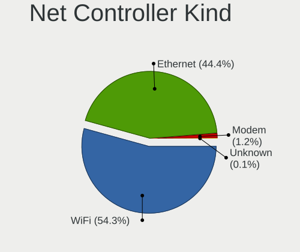

| Kind     | Notebooks | Percent |
|----------|-----------|---------|
| WiFi     | 4594      | 54.27%  |
| Ethernet | 3761      | 44.43%  |
| Modem    | 102       | 1.2%    |
| Unknown  | 8         | 0.09%   |

Used Controller
---------------

Currently used network controller

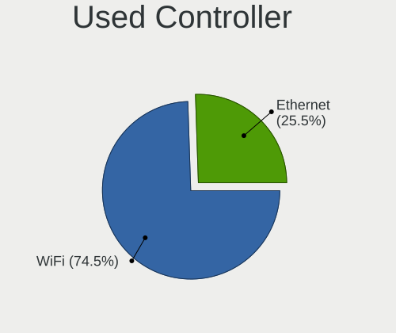

| Kind     | Notebooks | Percent |
|----------|-----------|---------|
| WiFi     | 3758      | 74.47%  |
| Ethernet | 1288      | 25.53%  |

NICs
----

Total network controllers on board

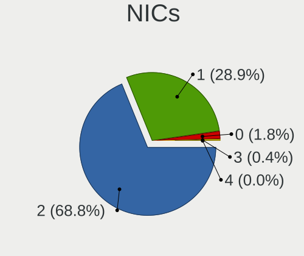

| Total | Notebooks | Percent |
|-------|-----------|---------|
| 2     | 3286      | 68.85%  |
| 1     | 1378      | 28.87%  |
| 0     | 88        | 1.84%   |
| 3     | 20        | 0.42%   |
| 4     | 1         | 0.02%   |

IPv6
----

IPv6 vs IPv4

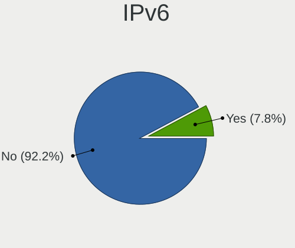

| Used | Notebooks | Percent |
|------|-----------|---------|
| No   | 4448      | 92.22%  |
| Yes  | 375       | 7.78%   |

Bluetooth
---------

Bluetooth Vendor
----------------

Controller vendors

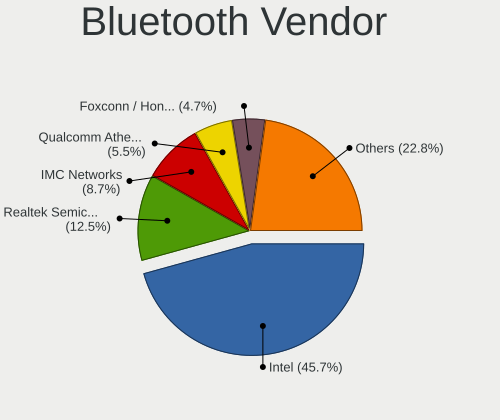

| Vendor                          | Notebooks | Percent |
|---------------------------------|-----------|---------|
| Intel                           | 1726      | 45.71%  |
| Realtek Semiconductor           | 472       | 12.5%   |
| IMC Networks                    | 328       | 8.69%   |
| Qualcomm Atheros Communications | 209       | 5.53%   |
| Foxconn / Hon Hai               | 179       | 4.74%   |
| Lite-On Technology              | 173       | 4.58%   |
| Broadcom                        | 147       | 3.89%   |
| Apple                           | 110       | 2.91%   |
| Realtek                         | 60        | 1.59%   |
| Cambridge Silicon Radio         | 51        | 1.35%   |
| Toshiba                         | 50        | 1.32%   |
| MediaTek                        | 45        | 1.19%   |
| Hewlett-Packard                 | 44        | 1.17%   |
| Dell                            | 42        | 1.11%   |
| Ralink                          | 36        | 0.95%   |
| Alps Electric                   | 24        | 0.64%   |
| ASUSTek Computer                | 22        | 0.58%   |
| Foxconn International           | 15        | 0.4%    |
| USI                             | 13        | 0.34%   |
| Taiyo Yuden                     | 5         | 0.13%   |
| Ralink Technology               | 5         | 0.13%   |
| TP-Link                         | 4         | 0.11%   |
| Chicony Electronics             | 3         | 0.08%   |
| Askey Computer                  | 3         | 0.08%   |
| Qcom                            | 2         | 0.05%   |
| Actions                         | 2         | 0.05%   |
| SiW                             | 1         | 0.03%   |
| Opticis                         | 1         | 0.03%   |
| Micro Star International        | 1         | 0.03%   |
| Fujitsu                         | 1         | 0.03%   |
| Belkin Components               | 1         | 0.03%   |
| Unknown                         | 1         | 0.03%   |

Bluetooth Model
---------------

Controller models

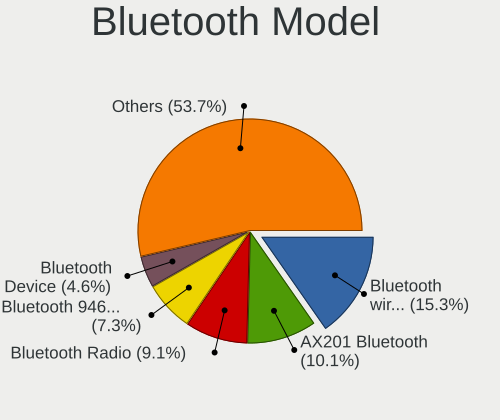

| Model                                               | Notebooks | Percent |
|-----------------------------------------------------|-----------|---------|
| Intel Bluetooth wireless interface                  | 578       | 15.31%  |
| Intel AX201 Bluetooth                               | 381       | 10.09%  |
| Realtek Bluetooth Radio                             | 342       | 9.06%   |
| Intel Bluetooth 9460/9560 Jefferson Peak (JfP)      | 276       | 7.31%   |
| Intel Bluetooth Device                              | 172       | 4.56%   |
| Intel AX200 Bluetooth                               | 166       | 4.4%    |
| IMC Networks Bluetooth Radio                        | 133       | 3.52%   |
| IMC Networks Wireless_Device                        | 118       | 3.13%   |
| Qualcomm Atheros  Bluetooth Device                  | 87        | 2.3%    |
| Realtek  Bluetooth 4.2 Adapter                      | 85        | 2.25%   |
| Apple Bluetooth Host Controller                     | 67        | 1.77%   |
| Realtek Bluetooth Radio                             | 60        | 1.59%   |
| Foxconn / Hon Hai Bluetooth Device                  | 59        | 1.56%   |
| IMC Networks Bluetooth Device                       | 58        | 1.54%   |
| Cambridge Silicon Radio Bluetooth Dongle (HCI mode) | 51        | 1.35%   |
| Lite-On Qualcomm Atheros QCA9377 Bluetooth          | 48        | 1.27%   |
| MediaTek Wireless_Device                            | 45        | 1.19%   |
| Qualcomm Atheros QCA61x4 Bluetooth 4.0              | 44        | 1.17%   |
| Intel AX210 Bluetooth                               | 43        | 1.14%   |
| Qualcomm Atheros AR3012 Bluetooth 4.0               | 41        | 1.09%   |
| Lite-On Atheros AR3012 Bluetooth                    | 37        | 0.98%   |
| Ralink RT3290 Bluetooth                             | 36        | 0.95%   |
| Lite-On Bluetooth Device                            | 35        | 0.93%   |
| Intel Wireless-AC 3168 Bluetooth                    | 35        | 0.93%   |
| Intel Centrino Bluetooth Wireless Transceiver       | 35        | 0.93%   |
| Foxconn / Hon Hai Wireless_Device                   | 34        | 0.9%    |
| Foxconn / Hon Hai MediaTek Bluetooth Adapter        | 33        | 0.87%   |
| Apple Bluetooth USB Host Controller                 | 31        | 0.82%   |
| Qualcomm Atheros AR3011 Bluetooth                   | 26        | 0.69%   |
| Intel Wireless-AC 9260 Bluetooth Adapter            | 25        | 0.66%   |
| Lite-On Wireless_Device                             | 24        | 0.64%   |
| Broadcom BCM2045B (BDC-2.1)                         | 24        | 0.64%   |
| HP Broadcom 2070 Bluetooth Combo                    | 23        | 0.61%   |
| Broadcom BCM43142A0 Bluetooth 4.0                   | 22        | 0.58%   |
| HP Bluetooth 2.0 Interface [Broadcom BCM2045]       | 19        | 0.5%    |
| Realtek RTL8723B Bluetooth                          | 16        | 0.42%   |
| Dell DW375 Bluetooth Module                         | 16        | 0.42%   |
| Broadcom HP Portable Bumble Bee                     | 16        | 0.42%   |
| Intel Centrino Advanced-N 6230 Bluetooth adapter    | 15        | 0.4%    |
| Foxconn International BCM43142A0 Bluetooth module   | 15        | 0.4%    |

Sound
-----

Sound Vendor
------------

Sound card vendors

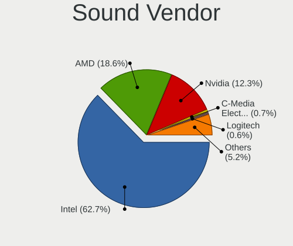

| Vendor                               | Notebooks | Percent |
|--------------------------------------|-----------|---------|
| Intel                                | 3685      | 62.7%   |
| AMD                                  | 1092      | 18.58%  |
| Nvidia                               | 721       | 12.27%  |
| C-Media Electronics                  | 39        | 0.66%   |
| Logitech                             | 33        | 0.56%   |
| Lenovo                               | 27        | 0.46%   |
| Silicon Integrated Systems [SiS]     | 18        | 0.31%   |
| Plantronics                          | 18        | 0.31%   |
| GN Netcom                            | 16        | 0.27%   |
| Texas Instruments                    | 12        | 0.2%    |
| ASUSTek Computer                     | 12        | 0.2%    |
| Apple                                | 12        | 0.2%    |
| Kingston Technology                  | 11        | 0.19%   |
| JMTek                                | 11        | 0.19%   |
| Realtek Semiconductor                | 10        | 0.17%   |
| Sony                                 | 9         | 0.15%   |
| Hewlett-Packard                      | 9         | 0.15%   |
| Creative Technology                  | 9         | 0.15%   |
| Generalplus Technology               | 8         | 0.14%   |
| VIA Technologies                     | 7         | 0.12%   |
| SteelSeries ApS                      | 7         | 0.12%   |
| Corsair                              | 7         | 0.12%   |
| Trust                                | 6         | 0.1%    |
| DSEA A/S                             | 6         | 0.1%    |
| Razer USA                            | 5         | 0.09%   |
| BEHRINGER International              | 5         | 0.09%   |
| Walmart                              | 3         | 0.05%   |
| Thesycon Systemsoftware & Consulting | 3         | 0.05%   |
| No brand                             | 3         | 0.05%   |
| Guillemot                            | 3         | 0.05%   |
| Dell                                 | 3         | 0.05%   |
| CMX Systems                          | 3         | 0.05%   |
| Blue Microphones                     | 3         | 0.05%   |
| Tenx Technology                      | 2         | 0.03%   |
| Silicon Motion                       | 2         | 0.03%   |
| Nordic Semiconductor ASA             | 2         | 0.03%   |
| Micro Star International             | 2         | 0.03%   |
| Huawei Technologies                  | 2         | 0.03%   |
| Focusrite-Novation                   | 2         | 0.03%   |
| Conexant Systems                     | 2         | 0.03%   |

Sound Model
-----------

Sound card models

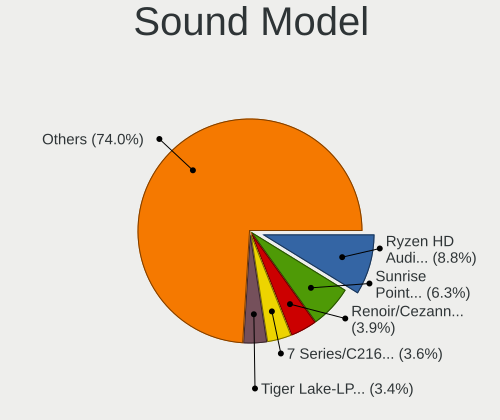

| Model                                                                      | Notebooks | Percent |
|----------------------------------------------------------------------------|-----------|---------|
| AMD Ryzen HD Audio Controller                                              | 630       | 8.8%    |
| Intel Sunrise Point-LP HD Audio                                            | 450       | 6.29%   |
| AMD Renoir/Cezanne HDMI/DP Audio Controller                                | 279       | 3.9%    |
| Intel 7 Series/C216 Chipset Family High Definition Audio Controller        | 255       | 3.56%   |
| Intel Tiger Lake-LP Smart Sound Technology Audio Controller                | 245       | 3.42%   |
| Intel 82801I (ICH9 Family) HD Audio Controller                             | 222       | 3.1%    |
| Intel 6 Series/C200 Series Chipset Family High Definition Audio Controller | 212       | 2.96%   |
| Intel Haswell-ULT HD Audio Controller                                      | 201       | 2.81%   |
| Intel 8 Series HD Audio Controller                                         | 201       | 2.81%   |
| Intel 5 Series/3400 Series Chipset High Definition Audio                   | 199       | 2.78%   |
| Intel Cannon Lake PCH cAVS                                                 | 175       | 2.45%   |
| Intel Alder Lake PCH-P High Definition Audio Controller                    | 174       | 2.43%   |
| AMD Radeon High Definition Audio Controller                                | 173       | 2.42%   |
| Intel Broadwell-U Audio Controller                                         | 159       | 2.22%   |
| Intel Wildcat Point-LP High Definition Audio Controller                    | 151       | 2.11%   |
| AMD Raven/Raven2/Fenghuang HDMI/DP Audio Controller                        | 144       | 2.01%   |
| Intel 8 Series/C220 Series Chipset High Definition Audio Controller        | 141       | 1.97%   |
| Intel Comet Lake PCH-LP cAVS                                               | 138       | 1.93%   |
| Intel NM10/ICH7 Family High Definition Audio Controller                    | 120       | 1.68%   |
| Intel 82801H (ICH8 Family) HD Audio Controller                             | 117       | 1.63%   |
| AMD FCH Azalia Controller                                                  | 114       | 1.59%   |
| Intel Xeon E3-1200 v3/4th Gen Core Processor HD Audio Controller           | 111       | 1.55%   |
| Intel Celeron/Pentium Silver Processor High Definition Audio               | 107       | 1.5%    |
| Intel Raptor Lake-P/U/H cAVS                                               | 104       | 1.45%   |
| Intel Cannon Point-LP High Definition Audio Controller                     | 91        | 1.27%   |
| AMD Kabini HDMI/DP Audio                                                   | 90        | 1.26%   |
| AMD Family 15h (Models 60h-6fh) Audio Controller                           | 87        | 1.22%   |
| Nvidia TU107 GeForce GTX 1650 High Definition Audio Controller             | 82        | 1.15%   |
| Intel Ice Lake-LP Smart Sound Technology Audio Controller                  | 76        | 1.06%   |
| Intel Comet Lake PCH cAVS                                                  | 76        | 1.06%   |
| AMD High Definition Audio Controller                                       | 71        | 0.99%   |
| Intel Atom Processor Z36xxx/Z37xxx Series High Definition Audio Controller | 69        | 0.96%   |
| Intel 100 Series/C230 Series Chipset Family HD Audio Controller            | 64        | 0.89%   |
| Nvidia GA107 High Definition Audio Controller                              | 62        | 0.87%   |
| Nvidia GA106 High Definition Audio Controller                              | 62        | 0.87%   |
| Nvidia AD107 High Definition Audio Controller                              | 59        | 0.82%   |
| Intel CM238 HD Audio Controller                                            | 59        | 0.82%   |
| Nvidia GP107GL High Definition Audio Controller                            | 54        | 0.75%   |
| AMD SBx00 Azalia (Intel HDA)                                               | 52        | 0.73%   |
| Nvidia TU106 High Definition Audio Controller                              | 49        | 0.68%   |

Memory
------

Memory Vendor
-------------

Memory module vendors

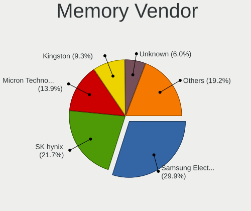

| Vendor                                           | Notebooks | Percent |
|--------------------------------------------------|-----------|---------|
| Samsung Electronics                              | 918       | 29.9%   |
| SK hynix                                         | 665       | 21.66%  |
| Micron Technology                                | 428       | 13.94%  |
| Kingston                                         | 285       | 9.28%   |
| Unknown                                          | 185       | 6.03%   |
| Crucial                                          | 159       | 5.18%   |
| Ramaxel Technology                               | 92        | 3%      |
| Elpida                                           | 45        | 1.47%   |
| Unknown                                          | 39        | 1.27%   |
| A-DATA Technology                                | 38        | 1.24%   |
| Unknown (ABCD)                                   | 37        | 1.21%   |
| Nanya Technology                                 | 34        | 1.11%   |
| Corsair                                          | 26        | 0.85%   |
| Silicon Power                                    | 16        | 0.52%   |
| G.Skill                                          | 16        | 0.52%   |
| Transcend                                        | 10        | 0.33%   |
| GOODRAM                                          | 10        | 0.33%   |
| Apacer                                           | 7         | 0.23%   |
| Wilk                                             | 5         | 0.16%   |
| Timetec                                          | 5         | 0.16%   |
| Team                                             | 4         | 0.13%   |
| Micron/Elpida                                    | 3         | 0.1%    |
| ChangXin Memory                                  | 3         | 0.1%    |
| 48spaces                                         | 3         | 0.1%    |
| Toshiba                                          | 2         | 0.07%   |
| SHARETRONIC                                      | 2         | 0.07%   |
| Qimonda                                          | 2         | 0.07%   |
| Patriot                                          | 2         | 0.07%   |
| KomputerBay                                      | 2         | 0.07%   |
| Kllisre                                          | 2         | 0.07%   |
| fef5                                             | 2         | 0.07%   |
| Avant                                            | 2         | 0.07%   |
| Unknown (0x202020202020202020202020202020202020) | 1         | 0.03%   |
| Unknown (0x0FB6)                                 | 1         | 0.03%   |
| Unifosa                                          | 1         | 0.03%   |
| Teikon                                           | 1         | 0.03%   |
| PUSKILL                                          | 1         | 0.03%   |
| PNY                                              | 1         | 0.03%   |
| Patriot Memory (PDP Systems)                     | 1         | 0.03%   |
| Netlist                                          | 1         | 0.03%   |

Memory Model
------------

Memory module models

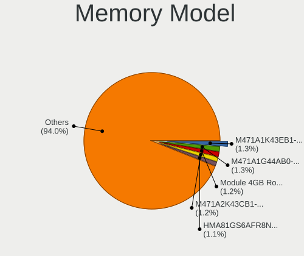

| Model                                                            | Notebooks | Percent |
|------------------------------------------------------------------|-----------|---------|
| Samsung RAM M471A1K43EB1-CWE 8GB SODIMM DDR4 3200MT/s            | 42        | 1.31%   |
| Samsung RAM M471A1G44AB0-CWE 8GiB SODIMM DDR4 3200MT/s           | 41        | 1.28%   |
| Unknown                                                          | 39        | 1.21%   |
| Samsung RAM M471A2K43CB1-CTD 16GB SODIMM DDR4 8400MT/s           | 38        | 1.18%   |
| SK hynix RAM HMA81GS6AFR8N-UH 8GB SODIMM DDR4 2667MT/s           | 34        | 1.06%   |
| Unknown (ABCD) RAM 123456789012345678 2GB SODIMM LPDDR4 2400MT/s | 33        | 1.03%   |
| Samsung RAM M471B5273DH0-CH9 4GB SODIMM DDR3 1600MT/s            | 30        | 0.93%   |
| Samsung RAM M471B5173QH0-YK0 4GB SODIMM DDR3 1600MT/s            | 30        | 0.93%   |
| Samsung RAM M471A5244CB0-CTD 4GB SODIMM DDR4 3266MT/s            | 30        | 0.93%   |
| Samsung RAM M471A1K43DB1-CWE 8GB SODIMM DDR4 3200MT/s            | 30        | 0.93%   |
| Micron RAM 4ATF1G64HZ-3G2F1 8GB SODIMM DDR4 3200MT/s             | 29        | 0.9%    |
| Samsung RAM M471B1G73QH0-YK0 8GB SODIMM DDR3 1600MT/s            | 28        | 0.87%   |
| SK hynix RAM HMAA1GS6CJR6N-XN 8GB SODIMM DDR4 3200MT/s           | 27        | 0.84%   |
| SK hynix RAM HMA81GS6DJR8N-XN 8GB SODIMM DDR4 3200MT/s           | 27        | 0.84%   |
| Samsung RAM M471B5173DB0-YK0 4GB SODIMM DDR3 1600MT/s            | 27        | 0.84%   |
| Samsung RAM M471A1G44BB0-CWE 8GB SODIMM DDR4 3200MT/s            | 27        | 0.84%   |
| SK hynix RAM HMT451S6BFR8A-PB 4GB SODIMM DDR3 1600MT/s           | 26        | 0.81%   |
| Samsung RAM M471A1K43DB1-CTD 8GB SODIMM DDR4 2667MT/s            | 26        | 0.81%   |
| Samsung RAM M471A5244CB0-CRC 4GB SODIMM DDR4 2667MT/s            | 25        | 0.78%   |
| SK hynix RAM HMA41GS6AFR8N-TF 8GB SODIMM DDR4 2667MT/s           | 23        | 0.72%   |
| Samsung RAM M471A1K43CB1-CRC 8GB SODIMM DDR4 8400MT/s            | 23        | 0.72%   |
| Samsung RAM M471A1G44AB0-CWE 8GB Row Of Chips DDR4 3200MT/s      | 23        | 0.72%   |
| Samsung RAM M471B1G73DB0-YK0 8GB SODIMM DDR3 1600MT/s            | 22        | 0.68%   |
| Unknown RAM Module 2GB SODIMM DDR2 667MT/s                       | 21        | 0.65%   |
| Samsung RAM M471B5173EB0-YK0 4GB SODIMM DDR3 1600MT/s            | 21        | 0.65%   |
| SK hynix RAM HMT351S6CFR8C-PB 4GB SODIMM DDR3 1600MT/s           | 20        | 0.62%   |
| Samsung RAM M471A2K43EB1-CWE 16GB SODIMM DDR4 3200MT/s           | 20        | 0.62%   |
| Samsung RAM M471A5244CB0-CWE 4GB SODIMM DDR4 3200MT/s            | 19        | 0.59%   |
| Micron RAM 8ATF1G64HZ-3G2R1 8GB SODIMM DDR4 3200MT/s             | 19        | 0.59%   |
| SK hynix RAM HMA81GS6JJR8N-VK 8GB SODIMM DDR4 2667MT/s           | 17        | 0.53%   |
| SK hynix RAM H9CCNNNCLGALAR-NVD 8GB Row Of Chips LPDDR3 2133MT/s | 17        | 0.53%   |
| Micron RAM 4ATF1G64HZ-3G2E1 8GB SODIMM DDR4 3200MT/s             | 17        | 0.53%   |
| SK hynix RAM HMAA2GS6AJR8N-XN 16GB SODIMM DDR4 3200MT/s          | 16        | 0.5%    |
| Samsung RAM M471A1K43CB1-CTD 8GB SODIMM DDR4 3200MT/s            | 16        | 0.5%    |
| Micron RAM 4ATF1G64HZ-3G2E2 8GB SODIMM DDR4 3200MT/s             | 16        | 0.5%    |
| SK hynix RAM HMAA2GS6CJR8N-XN 16GB SODIMM DDR4 3200MT/s          | 15        | 0.47%   |
| SK hynix RAM HMA851S6CJR6N-VK 4GB SODIMM DDR4 2667MT/s           | 15        | 0.47%   |
| Samsung RAM M471B5273CH0-CH9 4GB SODIMM DDR3 1334MT/s            | 15        | 0.47%   |
| Micron RAM 4ATF1G64HZ-3G2E1 8GB Row Of Chips DDR4 3200MT/s       | 15        | 0.47%   |
| Crucial RAM CT102464BF160B.C16 8GB SODIMM DDR3 1600MT/s          | 15        | 0.47%   |

Memory Kind
-----------

Memory module kinds

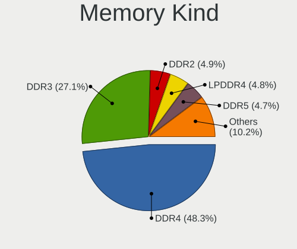

| Kind    | Notebooks | Percent |
|---------|-----------|---------|
| DDR4    | 1271      | 48.35%  |
| DDR3    | 712       | 27.08%  |
| DDR2    | 129       | 4.91%   |
| LPDDR4  | 125       | 4.75%   |
| DDR5    | 123       | 4.68%   |
| LPDDR5  | 109       | 4.15%   |
| LPDDR3  | 74        | 2.81%   |
| SDRAM   | 51        | 1.94%   |
| Unknown | 17        | 0.65%   |
| DRAM    | 9         | 0.34%   |
| DDR     | 9         | 0.34%   |

Memory Form Factor
------------------

Physical design of the memory module

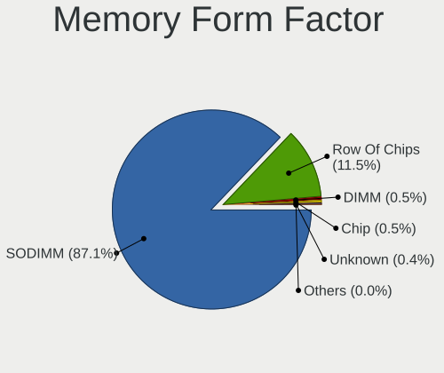

| Name            | Notebooks | Percent |
|-----------------|-----------|---------|
| SODIMM          | 2308      | 87.13%  |
| Row Of Chips    | 305       | 11.51%  |
| DIMM            | 13        | 0.49%   |
| Chip            | 12        | 0.45%   |
| Unknown         | 10        | 0.38%   |
| Proprietary Car | 1         | 0.04%   |

Memory Size
-----------

Memory module size

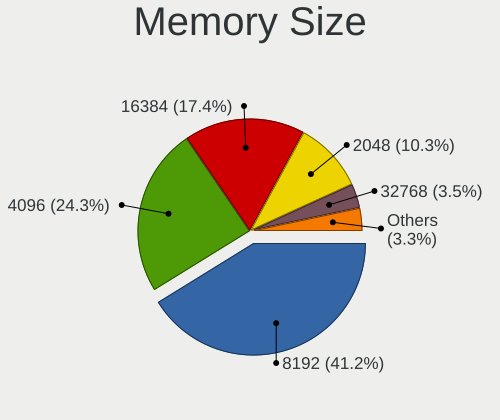

| Size    | Notebooks | Percent |
|---------|-----------|---------|
| 8192    | 1176      | 41.19%  |
| 4096    | 693       | 24.27%  |
| 16384   | 498       | 17.44%  |
| 2048    | 293       | 10.26%  |
| 32768   | 100       | 3.5%    |
| 1024    | 77        | 2.7%    |
| 512     | 7         | 0.25%   |
| 12288   | 3         | 0.11%   |
| 256     | 3         | 0.11%   |
| 49152   | 2         | 0.07%   |
| 3072    | 2         | 0.07%   |
| Unknown | 1         | 0.04%   |

Memory Speed
------------

Memory module speed

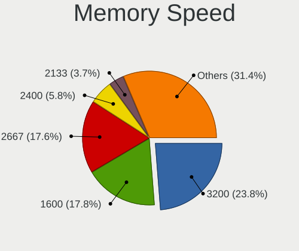

| Speed   | Notebooks | Percent |
|---------|-----------|---------|
| 3200    | 668       | 23.76%  |
| 1600    | 499       | 17.75%  |
| 2667    | 495       | 17.61%  |
| 2400    | 163       | 5.8%    |
| 2133    | 103       | 3.66%   |
| 667     | 86        | 3.06%   |
| 1334    | 82        | 2.92%   |
| 1333    | 77        | 2.74%   |
| 6400    | 68        | 2.42%   |
| 5600    | 63        | 2.24%   |
| 8400    | 62        | 2.21%   |
| 4800    | 61        | 2.17%   |
| Unknown | 59        | 2.1%    |
| 4267    | 41        | 1.46%   |
| 1067    | 36        | 1.28%   |
| 3266    | 30        | 1.07%   |
| 1867    | 29        | 1.03%   |
| 800     | 28        | 1%      |
| 4199    | 22        | 0.78%   |
| 7500    | 20        | 0.71%   |
| 2048    | 18        | 0.64%   |
| 533     | 16        | 0.57%   |
| 4266    | 15        | 0.53%   |
| 1066    | 12        | 0.43%   |
| 8533    | 10        | 0.36%   |
| 975     | 10        | 0.36%   |
| 3733    | 7         | 0.25%   |
| 7467    | 6         | 0.21%   |
| 5500    | 3         | 0.11%   |
| 2933    | 3         | 0.11%   |
| 8600    | 2         | 0.07%   |
| 2267    | 2         | 0.07%   |
| 1866    | 2         | 0.07%   |
| 1639    | 2         | 0.07%   |
| 1200    | 2         | 0.07%   |
| 666     | 2         | 0.07%   |
| 333     | 2         | 0.07%   |
| 8000    | 1         | 0.04%   |
| 3000    | 1         | 0.04%   |
| 2800    | 1         | 0.04%   |

Printers & scanners
-------------------

Printer Vendor
--------------

Printer device vendors

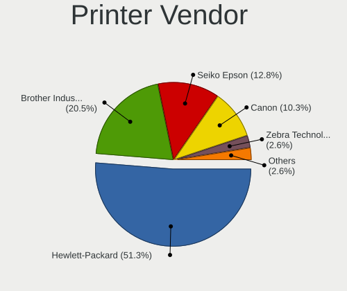

| Vendor             | Notebooks | Percent |
|--------------------|-----------|---------|
| Hewlett-Packard    | 20        | 51.28%  |
| Brother Industries | 8         | 20.51%  |
| Seiko Epson        | 5         | 12.82%  |
| Canon              | 4         | 10.26%  |
| Zebra Technologies | 1         | 2.56%   |
| STMicroelectronics | 1         | 2.56%   |

Printer Model
-------------

Printer device models

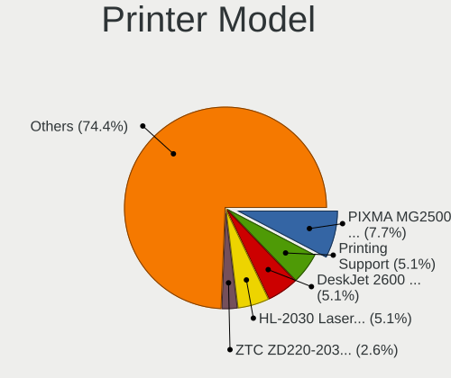

| Model                                                    | Notebooks | Percent |
|----------------------------------------------------------|-----------|---------|
| Canon PIXMA MG2500 Series                                | 3         | 7.69%   |
| HP Printing Support                                      | 2         | 5.13%   |
| HP DeskJet 2600 series                                   | 2         | 5.13%   |
| Brother HL-2030 Laser Printer                            | 2         | 5.13%   |
| Zebra ZTC ZD220-203dpi ZPL                               | 1         | 2.56%   |
| STMicroelectronics YICHIP3121 Virtual ComPort in FS Mode | 1         | 2.56%   |
| Seiko Epson XP-235 Series                                | 1         | 2.56%   |
| Seiko Epson Printer                                      | 1         | 2.56%   |
| Seiko Epson L555 Series                                  | 1         | 2.56%   |
| Seiko Epson ET-3750 Series                               | 1         | 2.56%   |
| Seiko Epson ET-2700 Series                               | 1         | 2.56%   |
| HP PSC 1500 series                                       | 1         | 2.56%   |
| HP Officejet 7110 series                                 | 1         | 2.56%   |
| HP Officejet 4500 G510n-z                                | 1         | 2.56%   |
| HP LaserJet Professional P 1102w                         | 1         | 2.56%   |
| HP LaserJet M14-M17                                      | 1         | 2.56%   |
| HP LaserJet 1320                                         | 1         | 2.56%   |
| HP LaserJet 1022                                         | 1         | 2.56%   |
| HP LaserJet 1020                                         | 1         | 2.56%   |
| HP LaserJet 1018                                         | 1         | 2.56%   |
| HP LaserJet 1000                                         | 1         | 2.56%   |
| HP HP LaserJet Pro M404-M405                             | 1         | 2.56%   |
| HP DeskJet F4200 series                                  | 1         | 2.56%   |
| HP DeskJet F300 series                                   | 1         | 2.56%   |
| HP DeskJet F2492 All-in-One                              | 1         | 2.56%   |
| HP DeskJet 3630 series                                   | 1         | 2.56%   |
| HP Deskjet 2050 J510                                     | 1         | 2.56%   |
| Canon TS3100 series                                      | 1         | 2.56%   |
| Brother MFC-J5330DW                                      | 1         | 2.56%   |
| Brother HL-L3270CDW series                               | 1         | 2.56%   |
| Brother HL-2240D series                                  | 1         | 2.56%   |
| Brother HL-2130 series                                   | 1         | 2.56%   |
| Brother HL-1210W series                                  | 1         | 2.56%   |
| Brother DCP-L2520DW                                      | 1         | 2.56%   |

Scanner Vendor
--------------

Scanner device vendors

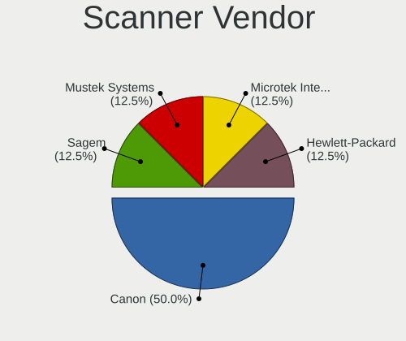

| Vendor                 | Notebooks | Percent |
|------------------------|-----------|---------|
| Canon                  | 4         | 50%     |
| Sagem                  | 1         | 12.5%   |
| Mustek Systems         | 1         | 12.5%   |
| Microtek International | 1         | 12.5%   |
| Hewlett-Packard        | 1         | 12.5%   |

Scanner Model
-------------

Scanner device models

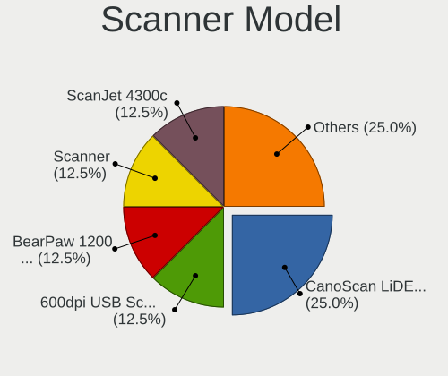

| Model                               | Notebooks | Percent |
|-------------------------------------|-----------|---------|
| Canon CanoScan LiDE 210             | 2         | 25%     |
| Sagem 600dpi USB Scanner            | 1         | 12.5%   |
| Mustek Systems BearPaw 1200 CU Plus | 1         | 12.5%   |
| Microtek International Scanner      | 1         | 12.5%   |
| HP ScanJet 4300c                    | 1         | 12.5%   |
| Canon CanoScan N1240U/LiDE 30       | 1         | 12.5%   |
| Canon CanoScan LiDE 220             | 1         | 12.5%   |

Camera
------

Camera Vendor
-------------

Camera device vendors

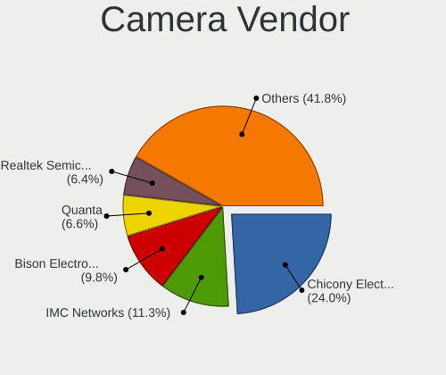

| Vendor                                 | Notebooks | Percent |
|----------------------------------------|-----------|---------|
| Chicony Electronics                    | 1006      | 24.05%  |
| IMC Networks                           | 473       | 11.31%  |
| Bison Electronics                      | 411       | 9.83%   |
| Quanta                                 | 278       | 6.65%   |
| Realtek Semiconductor                  | 267       | 6.38%   |
| Microdia                               | 239       | 5.71%   |
| Sunplus Innovation Technology          | 186       | 4.45%   |
| Suyin                                  | 170       | 4.06%   |
| Cheng Uei Precision Industry (Foxlink) | 169       | 4.04%   |
| Luxvisions Innotech Limited            | 133       | 3.18%   |
| Syntek                                 | 125       | 2.99%   |
| Apple                                  | 83        | 1.98%   |
| Alcor Micro                            | 68        | 1.63%   |
| Lite-On Technology                     | 66        | 1.58%   |
| Ricoh                                  | 53        | 1.27%   |
| Logitech                               | 49        | 1.17%   |
| Sonix Technology                       | 43        | 1.03%   |
| Shinetech                              | 38        | 0.91%   |
| Silicon Motion                         | 30        | 0.72%   |
| Samsung Electronics                    | 19        | 0.45%   |
| Acer                                   | 19        | 0.45%   |
| Lenovo                                 | 18        | 0.43%   |
| icSpring                               | 18        | 0.43%   |
| SunplusIT                              | 17        | 0.41%   |
| Importek                               | 16        | 0.38%   |
| Z-Star Microelectronics                | 14        | 0.33%   |
| ALi                                    | 13        | 0.31%   |
| Primax Electronics                     | 11        | 0.26%   |
| Intel                                  | 10        | 0.24%   |
| DigiTech                               | 10        | 0.24%   |
| Sunplus Technology                     | 9         | 0.22%   |
| Shine-optics                           | 9         | 0.22%   |
| Creative Technology                    | 9         | 0.22%   |
| Genesys Logic                          | 8         | 0.19%   |
| GEMBIRD                                | 8         | 0.19%   |
| OmniVision Technologies                | 6         | 0.14%   |
| KYE Systems (Mouse Systems)            | 6         | 0.14%   |
| kingcome                               | 6         | 0.14%   |
| Trust                                  | 5         | 0.12%   |
| webcam                                 | 4         | 0.1%    |

Camera Model
------------

Camera device models

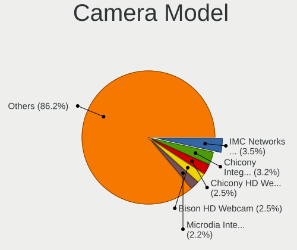

| Model                                                   | Notebooks | Percent |
|---------------------------------------------------------|-----------|---------|
| IMC Networks USB2.0 HD UVC WebCam                       | 145       | 3.46%   |
| Chicony Integrated Camera                               | 136       | 3.24%   |
| Chicony HD WebCam                                       | 105       | 2.5%    |
| Bison HD Webcam                                         | 103       | 2.46%   |
| Microdia Integrated_Webcam_HD                           | 91        | 2.17%   |
| IMC Networks Integrated Camera                          | 91        | 2.17%   |
| Bison Integrated Camera                                 | 85        | 2.03%   |
| IMC Networks USB2.0 VGA UVC WebCam                      | 83        | 1.98%   |
| Syntek Integrated Camera                                | 60        | 1.43%   |
| Realtek Integrated_Webcam_HD                            | 53        | 1.26%   |
| Chicony USB2.0 VGA UVC WebCam                           | 52        | 1.24%   |
| Quanta HP TrueVision HD Camera                          | 50        | 1.19%   |
| Suyin Acer/HP Integrated Webcam [CN0314]                | 46        | 1.1%    |
| Sunplus HD WebCam                                       | 42        | 1%      |
| Realtek USB Camera                                      | 40        | 0.95%   |
| Chicony TOSHIBA Web Camera - HD                         | 36        | 0.86%   |
| Luxvisions Innotech Limited HP TrueVision HD Camera     | 35        | 0.83%   |
| Chicony USB2.0 HD UVC WebCam                            | 34        | 0.81%   |
| Chicony HP TrueVision HD Camera                         | 34        | 0.81%   |
| Chicony EasyCamera                                      | 34        | 0.81%   |
| Sonix USB2.0 HD UVC WebCam                              | 33        | 0.79%   |
| Luxvisions Innotech Limited Integrated Camera           | 33        | 0.79%   |
| Bison Lenovo EasyCamera                                 | 32        | 0.76%   |
| Sunplus Integrated_Webcam_HD                            | 31        | 0.74%   |
| Chicony HP TrueVision HD                                | 29        | 0.69%   |
| Quanta HD WebCam                                        | 28        | 0.67%   |
| Lite-On Integrated Camera                               | 28        | 0.67%   |
| Chicony USB 2.0 Camera                                  | 28        | 0.67%   |
| Bison HD Camera                                         | 28        | 0.67%   |
| Apple FaceTime HD Camera                                | 28        | 0.67%   |
| Chicony HP HD Camera                                    | 27        | 0.64%   |
| Chicony Chicony USB2.0 Camera                           | 27        | 0.64%   |
| Apple Built-in iSight                                   | 27        | 0.64%   |
| Quanta HD User Facing                                   | 26        | 0.62%   |
| Chicony VGA Webcam                                      | 26        | 0.62%   |
| Cheng Uei Precision Industry (Foxlink) HP Truevision HD | 26        | 0.62%   |
| Quanta HP HD Camera                                     | 25        | 0.6%    |
| Chicony Integrated Camera (1280x720@30)                 | 25        | 0.6%    |
| Bison SunplusIT Integrated Camera                       | 25        | 0.6%    |
| Realtek Lenovo EasyCamera                               | 24        | 0.57%   |

Security
--------

Fingerprint Vendor
------------------

Fingerprint sensor vendors

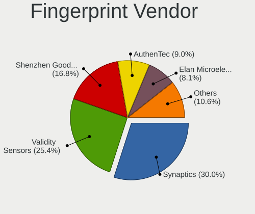

| Vendor                             | Notebooks | Percent |
|------------------------------------|-----------|---------|
| Synaptics                          | 192       | 29.95%  |
| Validity Sensors                   | 163       | 25.43%  |
| Shenzhen Goodix Technology         | 108       | 16.85%  |
| AuthenTec                          | 58        | 9.05%   |
| Elan Microelectronics              | 52        | 8.11%   |
| Upek                               | 34        | 5.3%    |
| LighTuning Technology              | 18        | 2.81%   |
| STMicroelectronics                 | 8         | 1.25%   |
| Focal-systems.Corp                 | 5         | 0.78%   |
| Realtek USB2.0 Finger Print Bridge | 3         | 0.47%   |

Fingerprint Model
-----------------

Fingerprint sensor models

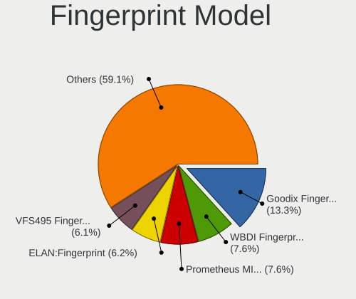

| Model                                                                      | Notebooks | Percent |
|----------------------------------------------------------------------------|-----------|---------|
| Shenzhen Goodix  Fingerprint Device                                        | 85        | 13.26%  |
| Synaptics WBDI Fingerprint Reader USB 086                                  | 49        | 7.64%   |
| Synaptics Prometheus MIS Touch Fingerprint Reader                          | 49        | 7.64%   |
| Elan ELAN:Fingerprint                                                      | 40        | 6.24%   |
| Validity Sensors VFS495 Fingerprint Reader                                 | 39        | 6.08%   |
| Upek Biometric Touchchip/Touchstrip Fingerprint Sensor                     | 28        | 4.37%   |
| Synaptics Metallica MIS Touch Fingerprint Reader                           | 25        | 3.9%    |
| Validity Sensors VFS5011 Fingerprint Reader                                | 21        | 3.28%   |
| Validity Sensors VFS 5011 fingerprint sensor                               | 19        | 2.96%   |
| Shenzhen Goodix Fingerprint Reader                                         | 16        | 2.5%    |
| AuthenTec AES2501 Fingerprint Sensor                                       | 15        | 2.34%   |
| Synaptics UWP WBDI Device                                                  | 14        | 2.18%   |
| Synaptics FS7604 Touch Fingerprint Sensor with PurePrint                   | 14        | 2.18%   |
| Validity Sensors Synaptics WBDI                                            | 13        | 2.03%   |
| Validity Sensors Swipe Fingerprint Sensor                                  | 13        | 2.03%   |
| Validity Sensors VFS471 Fingerprint Reader                                 | 12        | 1.87%   |
| Elan ELAN:ARM-M4                                                           | 12        | 1.87%   |
| Validity Sensors Synaptics VFS7552 Touch Fingerprint Sensor with PurePrint | 11        | 1.72%   |
| AuthenTec Fingerprint Sensor                                               | 11        | 1.72%   |
| AuthenTec AES1600                                                          | 11        | 1.72%   |
| AuthenTec AES2810                                                          | 10        | 1.56%   |
| Validity Sensors VFS491                                                    | 9         | 1.4%    |
| Validity Sensors VFS451 Fingerprint Reader                                 | 9         | 1.4%    |
| Synaptics Metallica MOH Touch Fingerprint Reader                           | 9         | 1.4%    |
| LighTuning ES603 Swipe Fingerprint Sensor                                  | 9         | 1.4%    |
| Synaptics Prometheus Fingerprint Reader                                    | 8         | 1.25%   |
| STMicroelectronics Fingerprint Reader                                      | 8         | 1.25%   |
| Shenzhen Goodix FingerPrint                                                | 7         | 1.09%   |
| LighTuning EgisTec Touch Fingerprint Sensor                                | 7         | 1.09%   |
| AuthenTec AES2550 Fingerprint Sensor                                       | 7         | 1.09%   |
| Validity Sensors Fingerprint scanner                                       | 6         | 0.94%   |
| Upek TCS5B Fingerprint sensor                                              | 6         | 0.94%   |
| Synaptics  FS7604 Touch Fingerprint Sensor with PurePrint                  | 6         | 0.94%   |
| Validity Sensors VFS301 Fingerprint Reader                                 | 5         | 0.78%   |
| Synaptics  WBDI                                                            | 5         | 0.78%   |
| Focal-systems.Corp FT9201Fingerprint.                                      | 5         | 0.78%   |
| Synaptics WBDI                                                             | 4         | 0.62%   |
| Synaptics Fingerprint reader [HP G6]                                       | 4         | 0.62%   |
| AuthenTec AES1660 Fingerprint Sensor                                       | 4         | 0.62%   |
| Validity Sensors VFS Fingerprint sensor                                    | 3         | 0.47%   |

Chipcard Vendor
---------------

Chipcard module vendors

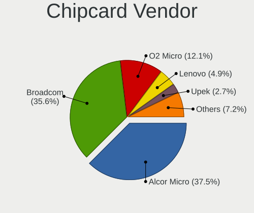

| Vendor                | Notebooks | Percent |
|-----------------------|-----------|---------|
| Alcor Micro           | 99        | 37.5%   |
| Broadcom              | 94        | 35.61%  |
| O2 Micro              | 32        | 12.12%  |
| Lenovo                | 13        | 4.92%   |
| Upek                  | 7         | 2.65%   |
| C3PO                  | 5         | 1.89%   |
| Cherry                | 4         | 1.52%   |
| Realtek Semiconductor | 3         | 1.14%   |
| Gemalto (was Gemplus) | 3         | 1.14%   |
| Advanced Card Systems | 2         | 0.76%   |
| In Focus Systems      | 1         | 0.38%   |
| Chicony Electronics   | 1         | 0.38%   |

Chipcard Model
--------------

Chipcard module models

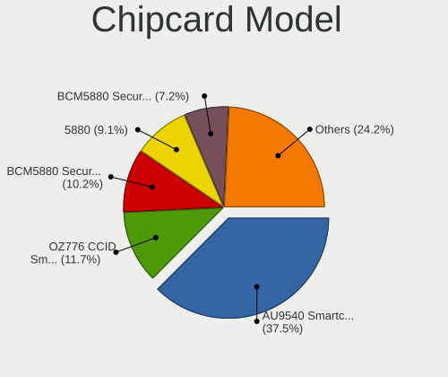

| Model                                                                        | Notebooks | Percent |
|------------------------------------------------------------------------------|-----------|---------|
| Alcor Micro AU9540 Smartcard Reader                                          | 99        | 37.5%   |
| O2 Micro OZ776 CCID Smartcard Reader                                         | 31        | 11.74%  |
| Broadcom BCM5880 Secure Applications Processor                               | 27        | 10.23%  |
| Broadcom 5880                                                                | 24        | 9.09%   |
| Broadcom BCM5880 Secure Applications Processor with fingerprint swipe sensor | 19        | 7.2%    |
| Broadcom BCM58200 ControlVault 3 (FingerPrint sensor + Contacted SmartCard)  | 18        | 6.82%   |
| Lenovo Integrated Smart Card Reader                                          | 13        | 4.92%   |
| Upek TouchChip Fingerprint Coprocessor (WBF advanced mode)                   | 7         | 2.65%   |
| Broadcom 58200                                                               | 5         | 1.89%   |
| Realtek Semiconductor Smart Card Reader Interface                            | 3         | 1.14%   |
| Gemalto (was Gemplus) Compact Smart Card Reader Writer                       | 3         | 1.14%   |
| Cherry SmartTerminal XX1X                                                    | 3         | 1.14%   |
| C3PO LTC31v2                                                                 | 3         | 1.14%   |
| Advanced Card Systems ACR38 SmartCard Reader                                 | 2         | 0.76%   |
| O2 Micro Oz776 SmartCard Reader                                              | 1         | 0.38%   |
| In Focus Systems EMV Smartcard Reader                                        | 1         | 0.38%   |
| Chicony Electronics HP Skylab USB Smartcard Keyboard                         | 1         | 0.38%   |
| Cherry SmartCard Reader Keyboard KC 1000 SC                                  | 1         | 0.38%   |
| C3PO USB SMART CARD READER                                                   | 1         | 0.38%   |
| C3PO KBR36                                                                   | 1         | 0.38%   |
| Broadcom BCM5880 Secure Applications Processor with fingerprint touch sensor | 1         | 0.38%   |

Unsupported
-----------

Unsupported Devices
-------------------

Total unsupported devices on board

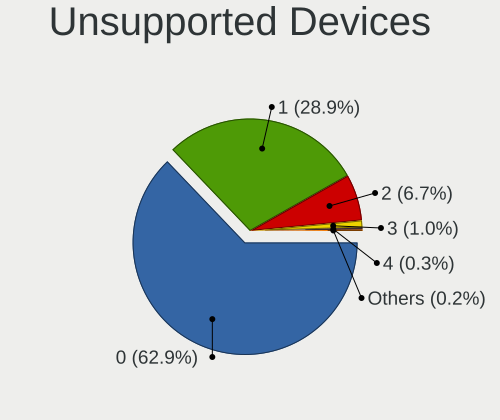

| Total | Notebooks | Percent |
|-------|-----------|---------|
| 0     | 3082      | 62.86%  |
| 1     | 1419      | 28.94%  |
| 2     | 328       | 6.69%   |
| 3     | 50        | 1.02%   |
| 4     | 14        | 0.29%   |
| 5     | 6         | 0.12%   |
| 8     | 2         | 0.04%   |
| 9     | 1         | 0.02%   |
| 6     | 1         | 0.02%   |

Unsupported Device Types
------------------------

Types of unsupported devices

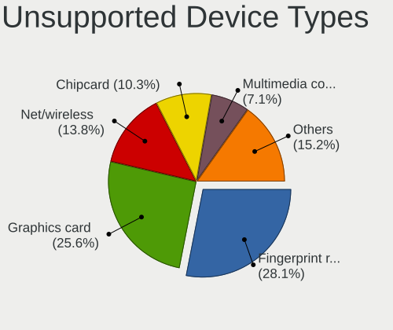

| Type                     | Notebooks | Percent |
|--------------------------|-----------|---------|
| Fingerprint reader       | 630       | 28.07%  |
| Graphics card            | 574       | 25.58%  |
| Net/wireless             | 310       | 13.81%  |
| Chipcard                 | 231       | 10.29%  |
| Multimedia controller    | 159       | 7.09%   |
| Camera                   | 87        | 3.88%   |
| Bluetooth                | 56        | 2.5%    |
| Communication controller | 46        | 2.05%   |
| Storage                  | 38        | 1.69%   |
| Card reader              | 28        | 1.25%   |
| Sound                    | 22        | 0.98%   |
| Net/ethernet             | 19        | 0.85%   |
| Flash memory             | 13        | 0.58%   |
| Network                  | 12        | 0.53%   |
| Modem                    | 10        | 0.45%   |
| Dvb card                 | 5         | 0.22%   |
| Storage/ide              | 2         | 0.09%   |
| Storage/raid             | 1         | 0.04%   |
| Storage/nvme             | 1         | 0.04%   |

