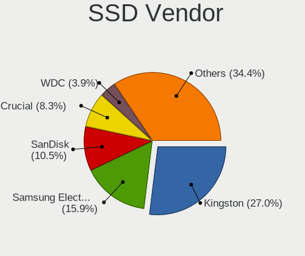
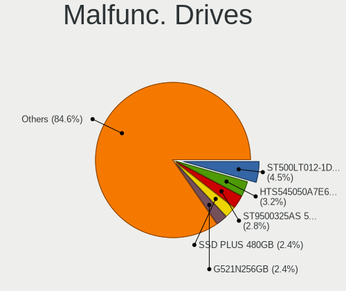
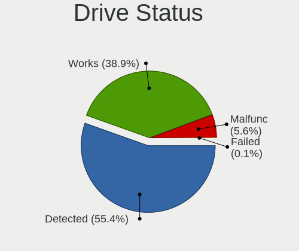
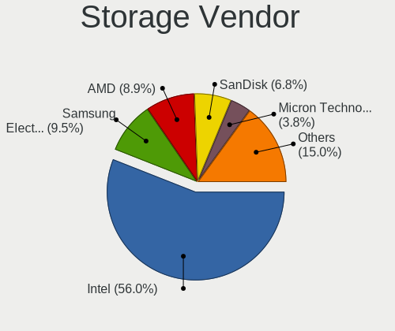
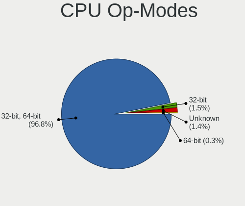
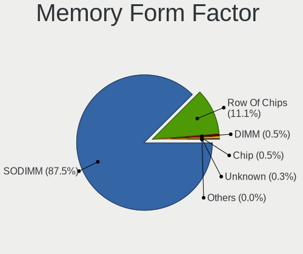
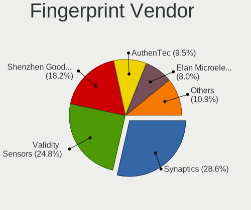
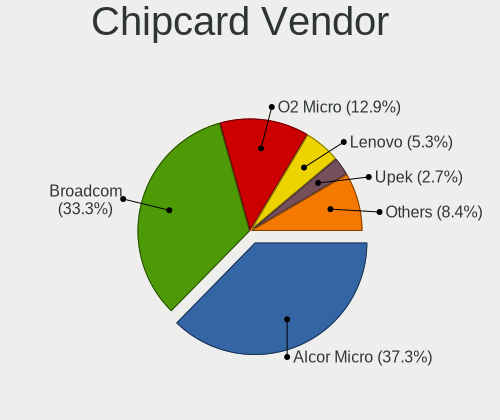

Linux in Spain - Tested Hardware & Statistics (Notebooks)
---------------------------------------------------------

A project to collect tested hardware configurations for Linux in Spain.

Anyone can contribute to this report by the [hw-probe](https://github.com/linuxhw/hw-probe) tool:

    sudo -E hw-probe -all -upload

Please contribute! Especially if your hardware is rare.

Contents
--------

* [ Test Cases ](#test-cases)

* [ System ](#system)
  - [ OS                       ](#os)
  - [ OS Family                ](#os-family)
  - [ Kernel                   ](#kernel)
  - [ Kernel Family            ](#kernel-family)
  - [ Kernel Major Ver.        ](#kernel-major-ver)
  - [ Arch                     ](#arch)
  - [ DE                       ](#de)
  - [ Display Server           ](#display-server)
  - [ Display Manager          ](#display-manager)
  - [ OS Lang                  ](#os-lang)
  - [ Boot Mode                ](#boot-mode)
  - [ Filesystem               ](#filesystem)
  - [ Part. scheme             ](#part-scheme)
  - [ Dual Boot with Linux/BSD ](#dual-boot-with-linuxbsd)
  - [ Dual Boot (Win)          ](#dual-boot-win)

* [ Board ](#board)
  - [ Vendor                   ](#vendor)
  - [ Model                    ](#model)
  - [ Model Family             ](#model-family)
  - [ MFG Year                 ](#mfg-year)
  - [ Form Factor              ](#form-factor)
  - [ Secure Boot              ](#secure-boot)
  - [ Coreboot                 ](#coreboot)
  - [ RAM Size                 ](#ram-size)
  - [ RAM Used                 ](#ram-used)
  - [ Total Drives             ](#total-drives)
  - [ Has CD-ROM               ](#has-cd-rom)
  - [ Has Ethernet             ](#has-ethernet)
  - [ Has WiFi                 ](#has-wifi)
  - [ Has Bluetooth            ](#has-bluetooth)

* [ Location ](#location)
  - [ Country                  ](#country)
  - [ City                     ](#city)

* [ Drives ](#drives)
  - [ Drive Vendor             ](#drive-vendor)
  - [ Drive Model              ](#drive-model)
  - [ HDD Vendor               ](#hdd-vendor)
  - [ SSD Vendor               ](#ssd-vendor)
  - [ Drive Kind               ](#drive-kind)
  - [ Drive Connector          ](#drive-connector)
  - [ Drive Size               ](#drive-size)
  - [ Space Total              ](#space-total)
  - [ Space Used               ](#space-used)
  - [ Malfunc. Drives          ](#malfunc-drives)
  - [ Malfunc. Drive Vendor    ](#malfunc-drive-vendor)
  - [ Malfunc. HDD Vendor      ](#malfunc-hdd-vendor)
  - [ Malfunc. Drive Kind      ](#malfunc-drive-kind)
  - [ Failed Drives            ](#failed-drives)
  - [ Failed Drive Vendor      ](#failed-drive-vendor)
  - [ Drive Status             ](#drive-status)

* [ Storage controller ](#storage-controller)
  - [ Storage Vendor           ](#storage-vendor)
  - [ Storage Model            ](#storage-model)
  - [ Storage Kind             ](#storage-kind)

* [ Processor ](#processor)
  - [ CPU Vendor               ](#cpu-vendor)
  - [ CPU Model                ](#cpu-model)
  - [ CPU Model Family         ](#cpu-model-family)
  - [ CPU Cores                ](#cpu-cores)
  - [ CPU Sockets              ](#cpu-sockets)
  - [ CPU Threads              ](#cpu-threads)
  - [ CPU Op-Modes             ](#cpu-op-modes)
  - [ CPU Microcode            ](#cpu-microcode)
  - [ CPU Microarch            ](#cpu-microarch)

* [ Graphics ](#graphics)
  - [ GPU Vendor               ](#gpu-vendor)
  - [ GPU Model                ](#gpu-model)
  - [ GPU Combo                ](#gpu-combo)
  - [ GPU Driver               ](#gpu-driver)
  - [ GPU Memory               ](#gpu-memory)

* [ Monitor ](#monitor)
  - [ Monitor Vendor           ](#monitor-vendor)
  - [ Monitor Model            ](#monitor-model)
  - [ Monitor Resolution       ](#monitor-resolution)
  - [ Monitor Diagonal         ](#monitor-diagonal)
  - [ Monitor Width            ](#monitor-width)
  - [ Aspect Ratio             ](#aspect-ratio)
  - [ Monitor Area             ](#monitor-area)
  - [ Pixel Density            ](#pixel-density)
  - [ Multiple Monitors        ](#multiple-monitors)

* [ Network ](#network)
  - [ Net Controller Vendor    ](#net-controller-vendor)
  - [ Net Controller Model     ](#net-controller-model)
  - [ Wireless Vendor          ](#wireless-vendor)
  - [ Wireless Model           ](#wireless-model)
  - [ Ethernet Vendor          ](#ethernet-vendor)
  - [ Ethernet Model           ](#ethernet-model)
  - [ Net Controller Kind      ](#net-controller-kind)
  - [ Used Controller          ](#used-controller)
  - [ NICs                     ](#nics)
  - [ IPv6                     ](#ipv6)

* [ Bluetooth ](#bluetooth)
  - [ Bluetooth Vendor         ](#bluetooth-vendor)
  - [ Bluetooth Model          ](#bluetooth-model)

* [ Sound ](#sound)
  - [ Sound Vendor             ](#sound-vendor)
  - [ Sound Model              ](#sound-model)

* [ Memory ](#memory)
  - [ Memory Vendor            ](#memory-vendor)
  - [ Memory Model             ](#memory-model)
  - [ Memory Kind              ](#memory-kind)
  - [ Memory Form Factor       ](#memory-form-factor)
  - [ Memory Size              ](#memory-size)
  - [ Memory Speed             ](#memory-speed)

* [ Printers & scanners ](#printers--scanners)
  - [ Printer Vendor           ](#printer-vendor)
  - [ Printer Model            ](#printer-model)
  - [ Scanner Vendor           ](#scanner-vendor)
  - [ Scanner Model            ](#scanner-model)

* [ Camera ](#camera)
  - [ Camera Vendor            ](#camera-vendor)
  - [ Camera Model             ](#camera-model)

* [ Security ](#security)
  - [ Fingerprint Vendor       ](#fingerprint-vendor)
  - [ Fingerprint Model        ](#fingerprint-model)
  - [ Chipcard Vendor          ](#chipcard-vendor)
  - [ Chipcard Model           ](#chipcard-model)

* [ Unsupported ](#unsupported)
  - [ Unsupported Devices      ](#unsupported-devices)
  - [ Unsupported Device Types ](#unsupported-device-types)

Test Cases
----------

Total: 2990

| Vendor        | Model                       | Probe                                                      | Date         |
|---------------|-----------------------------|------------------------------------------------------------|--------------|
| HUAWEI        | BOHK-WAX9X                  | [c4468417e9](https://linux-hardware.org/?probe=c4468417e9) | Jun 01, 2022 |
| Lenovo        | ThinkPad X200s 74663RG      | [460e11ebe2](https://linux-hardware.org/?probe=460e11ebe2) | May 31, 2022 |
| HP            | Laptop 15s-fq1xxx           | [08fe1f2d0f](https://linux-hardware.org/?probe=08fe1f2d0f) | May 31, 2022 |
| HP            | Pavilion Gaming Laptop 1... | [a1dfbe3337](https://linux-hardware.org/?probe=a1dfbe3337) | May 31, 2022 |
| Acer          | TravelMate P256-MG          | [22b617425d](https://linux-hardware.org/?probe=22b617425d) | May 31, 2022 |
| Acer          | TravelMate P256-MG          | [ab330f08f1](https://linux-hardware.org/?probe=ab330f08f1) | May 31, 2022 |
| Fujitsu       | LIFEBOOK E5511              | [32317d8883](https://linux-hardware.org/?probe=32317d8883) | May 30, 2022 |
| Toshiba       | Satellite L10W-B-101        | [4fadee73e4](https://linux-hardware.org/?probe=4fadee73e4) | May 29, 2022 |
| Chuwi         | GemiBook                    | [432c1135b8](https://linux-hardware.org/?probe=432c1135b8) | May 29, 2022 |
| Lenovo        | G580 20150                  | [60128f5782](https://linux-hardware.org/?probe=60128f5782) | May 29, 2022 |
| Valve         | Jupiter                     | [f3910c9796](https://linux-hardware.org/?probe=f3910c9796) | May 29, 2022 |
| Toshiba       | Satellite L10W-B-101        | [774d5a9eae](https://linux-hardware.org/?probe=774d5a9eae) | May 28, 2022 |
| MSI           | PR600                       | [09b736e706](https://linux-hardware.org/?probe=09b736e706) | May 27, 2022 |
| Medion        | S6421 MD60703               | [9fffed019c](https://linux-hardware.org/?probe=9fffed019c) | May 27, 2022 |
| Lenovo        | IdeaPad 3 15ITL6 82H8       | [53dc0937af](https://linux-hardware.org/?probe=53dc0937af) | May 26, 2022 |
| ASUSTek       | ASUS EXPERTBOOK B9400CEA... | [f5488ccb22](https://linux-hardware.org/?probe=f5488ccb22) | May 26, 2022 |
| HONOR         | HLYL-WXX9                   | [57d71fca8a](https://linux-hardware.org/?probe=57d71fca8a) | May 26, 2022 |
| Lenovo        | V145-15AST 81MT             | [86f00d534a](https://linux-hardware.org/?probe=86f00d534a) | May 26, 2022 |
| Lenovo        | V145-15AST 81MT             | [3929f17532](https://linux-hardware.org/?probe=3929f17532) | May 26, 2022 |
| HP            | Laptop 15-bw0xx             | [f71c048a96](https://linux-hardware.org/?probe=f71c048a96) | May 25, 2022 |
| MSI           | GP62MVR 6RF                 | [1dd5741ea8](https://linux-hardware.org/?probe=1dd5741ea8) | May 25, 2022 |
| ASUSTek       | ASUS TUF Gaming A15 FA50... | [93c67e62e7](https://linux-hardware.org/?probe=93c67e62e7) | May 24, 2022 |
| MSI           | Prestige 15 A11SCS          | [2433529434](https://linux-hardware.org/?probe=2433529434) | May 24, 2022 |
| Toshiba       | Satellite L10W-B-101        | [bb4ce9afdd](https://linux-hardware.org/?probe=bb4ce9afdd) | May 24, 2022 |
| Unknown       | Aspire E                    | [d437b15b97](https://linux-hardware.org/?probe=d437b15b97) | May 24, 2022 |
| Unknown       | Aspire E                    | [f46b38824f](https://linux-hardware.org/?probe=f46b38824f) | May 24, 2022 |
| HP            | Mini 5103                   | [aa7f4e957e](https://linux-hardware.org/?probe=aa7f4e957e) | May 23, 2022 |
| MSI           | GF63 Thin 9SC               | [a2a182a63e](https://linux-hardware.org/?probe=a2a182a63e) | May 23, 2022 |
| HP            | 15                          | [a61f6dd1eb](https://linux-hardware.org/?probe=a61f6dd1eb) | May 23, 2022 |
| ASUSTek       | VivoBook_ASUSLaptop X430... | [d972595598](https://linux-hardware.org/?probe=d972595598) | May 22, 2022 |
| Dell          | G15 5510                    | [0ca1f736f9](https://linux-hardware.org/?probe=0ca1f736f9) | May 22, 2022 |
| Samsung       | RF510/RF410/RF710           | [c146b79bd6](https://linux-hardware.org/?probe=c146b79bd6) | May 22, 2022 |
| Toshiba       | PORTEGE Z830                | [9a4ebfe8cf](https://linux-hardware.org/?probe=9a4ebfe8cf) | May 21, 2022 |
| Lenovo        | IdeaPad 3 15ITL6 82H8       | [48c8683aa8](https://linux-hardware.org/?probe=48c8683aa8) | May 21, 2022 |
| Lenovo        | IdeaPad 3 15ITL6 82H8       | [8d30966279](https://linux-hardware.org/?probe=8d30966279) | May 20, 2022 |
| Lenovo        | Legion 5 15ACH6H 82JU       | [c273310228](https://linux-hardware.org/?probe=c273310228) | May 20, 2022 |
| ASUSTek       | VivoBook_ASUSLaptop X430... | [8f9ca8d66b](https://linux-hardware.org/?probe=8f9ca8d66b) | May 20, 2022 |
| Toshiba       | PORTEGE Z830                | [8d4eb653b6](https://linux-hardware.org/?probe=8d4eb653b6) | May 19, 2022 |
| HP            | EliteBook 840 G5            | [48e5424ecb](https://linux-hardware.org/?probe=48e5424ecb) | May 19, 2022 |
| MSI           | Prestige 14 A12UC           | [189b62a372](https://linux-hardware.org/?probe=189b62a372) | May 19, 2022 |
| Dell          | Latitude E4310              | [79cda1608c](https://linux-hardware.org/?probe=79cda1608c) | May 19, 2022 |
| Valve         | Jupiter                     | [f849597120](https://linux-hardware.org/?probe=f849597120) | May 18, 2022 |
| Valve         | Jupiter                     | [48df6e5c71](https://linux-hardware.org/?probe=48df6e5c71) | May 18, 2022 |
| Lenovo        | V145-15AST 81MT             | [badf4d0a88](https://linux-hardware.org/?probe=badf4d0a88) | May 18, 2022 |
| Chuwi         | HeroBook Air                | [7d96e10672](https://linux-hardware.org/?probe=7d96e10672) | May 17, 2022 |
| ASUSTek       | VivoBook 15_ASUS Laptop ... | [61e58bea6c](https://linux-hardware.org/?probe=61e58bea6c) | May 17, 2022 |
| Lenovo        | G580 2189                   | [e7de790c8a](https://linux-hardware.org/?probe=e7de790c8a) | May 16, 2022 |
| HP            | Victus by Laptop 16-e0xx... | [a8fffad424](https://linux-hardware.org/?probe=a8fffad424) | May 16, 2022 |
| HP            | ENVY Notebook 13-ab0XX      | [26ed58e99a](https://linux-hardware.org/?probe=26ed58e99a) | May 16, 2022 |
| Dell          | Latitude 5480               | [bccdb55064](https://linux-hardware.org/?probe=bccdb55064) | May 16, 2022 |
| Lenovo        | IdeaPad 320-15IKB 80XL      | [70cde2437b](https://linux-hardware.org/?probe=70cde2437b) | May 15, 2022 |
| Lenovo        | ThinkPad X250 20CLS0LE00    | [59eecf466b](https://linux-hardware.org/?probe=59eecf466b) | May 15, 2022 |
| Acer          | Aspire E1-522               | [21a4fc80c7](https://linux-hardware.org/?probe=21a4fc80c7) | May 13, 2022 |
| Acer          | Aspire E1-522               | [77fdc036b0](https://linux-hardware.org/?probe=77fdc036b0) | May 13, 2022 |
| Dell          | Latitude 5420               | [ac04d4cb5b](https://linux-hardware.org/?probe=ac04d4cb5b) | May 12, 2022 |
| Samsung       | RF510/RF410/RF710           | [8134289438](https://linux-hardware.org/?probe=8134289438) | May 12, 2022 |
| HP            | Pavilion g6                 | [4f5ac891f4](https://linux-hardware.org/?probe=4f5ac891f4) | May 11, 2022 |
| Acer          | Aspire 5742G                | [f720d9e031](https://linux-hardware.org/?probe=f720d9e031) | May 11, 2022 |
| Lenovo        | Legion 5 Pro 16IAH7H 82R... | [e6d1749248](https://linux-hardware.org/?probe=e6d1749248) | May 10, 2022 |
| MSI           | Modern 14 B11MO             | [75bc7c18db](https://linux-hardware.org/?probe=75bc7c18db) | May 10, 2022 |
| HP            | ProBook 450 G8 Notebook ... | [02925e8fac](https://linux-hardware.org/?probe=02925e8fac) | May 10, 2022 |
| Acer          | TravelMate 6592             | [353516147d](https://linux-hardware.org/?probe=353516147d) | May 10, 2022 |
| HP            | Laptop 15s-eq2xxx           | [ae80aa69fe](https://linux-hardware.org/?probe=ae80aa69fe) | May 09, 2022 |
| HP            | Pavilion Gaming Laptop 1... | [ef9c4b3841](https://linux-hardware.org/?probe=ef9c4b3841) | May 09, 2022 |
| ASUSTek       | VivoBook_ASUSLaptop X509... | [65ef6677b9](https://linux-hardware.org/?probe=65ef6677b9) | May 09, 2022 |
| MSI           | GE62 6QE                    | [6a3161d4ee](https://linux-hardware.org/?probe=6a3161d4ee) | May 09, 2022 |
| HP            | Laptop 15s-eq2xxx           | [f269fd3294](https://linux-hardware.org/?probe=f269fd3294) | May 09, 2022 |
| Acer          | Aspire A515-54              | [1d37964706](https://linux-hardware.org/?probe=1d37964706) | May 08, 2022 |
| MSI           | GE62 2QD                    | [cef8637026](https://linux-hardware.org/?probe=cef8637026) | May 08, 2022 |
| SLIMBOOK      | Essential15L                | [1a244b5f4a](https://linux-hardware.org/?probe=1a244b5f4a) | May 07, 2022 |
| SLIMBOOK      | Essential15L                | [4f64e62082](https://linux-hardware.org/?probe=4f64e62082) | May 07, 2022 |
| Dell          | Inspiron 5515               | [aa0534d7af](https://linux-hardware.org/?probe=aa0534d7af) | May 07, 2022 |
| Chuwi         | HeroBook Air                | [255ff705ac](https://linux-hardware.org/?probe=255ff705ac) | May 07, 2022 |
| HP            | EliteBook 840 G5            | [a53b09a7f3](https://linux-hardware.org/?probe=a53b09a7f3) | May 07, 2022 |
| HP            | 340S G7 Notebook PC         | [c0d0f6435b](https://linux-hardware.org/?probe=c0d0f6435b) | May 06, 2022 |
| HP            | ProBook 6470b               | [7849fd57dc](https://linux-hardware.org/?probe=7849fd57dc) | May 06, 2022 |
| Dell          | Latitude 5420               | [dbe0cffc08](https://linux-hardware.org/?probe=dbe0cffc08) | May 06, 2022 |
| HP            | Compaq 6730s                | [d1902442d8](https://linux-hardware.org/?probe=d1902442d8) | May 06, 2022 |
| HP            | Compaq 6730s                | [2e53f00a60](https://linux-hardware.org/?probe=2e53f00a60) | May 06, 2022 |
| HP            | Compaq 15                   | [25db1ef15f](https://linux-hardware.org/?probe=25db1ef15f) | May 06, 2022 |
| Lenovo        | ThinkPad X270 W10DG 20K6... | [1467c3bb41](https://linux-hardware.org/?probe=1467c3bb41) | May 05, 2022 |
| SLIMBOOK      | EXECUTIVE-14                | [e8556f4acf](https://linux-hardware.org/?probe=e8556f4acf) | May 05, 2022 |
| SLIMBOOK      | EXECUTIVE-14                | [917add86ab](https://linux-hardware.org/?probe=917add86ab) | May 05, 2022 |
| Lenovo        | Y520-15IKBN 80WK            | [5cba3c93ba](https://linux-hardware.org/?probe=5cba3c93ba) | May 05, 2022 |
| ASUSTek       | N10Jc                       | [ae20ca4c7c](https://linux-hardware.org/?probe=ae20ca4c7c) | May 05, 2022 |
| ASUSTek       | N10Jc                       | [1f688a5b2d](https://linux-hardware.org/?probe=1f688a5b2d) | May 05, 2022 |
| Apple         | MacBookPro5,1               | [d6293e8334](https://linux-hardware.org/?probe=d6293e8334) | May 05, 2022 |
| Notebook      | PD5x_7xPNP_PNN_PNT          | [0afdbf373d](https://linux-hardware.org/?probe=0afdbf373d) | May 04, 2022 |
| Notebook      | PD5x_7xPNP_PNN_PNT          | [a30b11f1a0](https://linux-hardware.org/?probe=a30b11f1a0) | May 04, 2022 |
| Lenovo        | IdeaPad 330-15IKB 81DE      | [4f2714e3fe](https://linux-hardware.org/?probe=4f2714e3fe) | May 04, 2022 |
| HP            | ProBook 450 G8 Notebook ... | [ecc7f176ff](https://linux-hardware.org/?probe=ecc7f176ff) | May 03, 2022 |
| Chuwi         | Hi10 Go                     | [33ea61404a](https://linux-hardware.org/?probe=33ea61404a) | May 03, 2022 |
| Acer          | Aspire A315-56              | [4321ddf926](https://linux-hardware.org/?probe=4321ddf926) | May 03, 2022 |
| Acer          | Aspire one 1-131            | [ade813cf7f](https://linux-hardware.org/?probe=ade813cf7f) | May 03, 2022 |
| Acer          | Aspire 5742G                | [37dfe53a95](https://linux-hardware.org/?probe=37dfe53a95) | May 02, 2022 |
| Acer          | Aspire 5742G                | [aff42aff28](https://linux-hardware.org/?probe=aff42aff28) | May 02, 2022 |
| HP            | Notebook                    | [3bdd2a5e96](https://linux-hardware.org/?probe=3bdd2a5e96) | May 01, 2022 |
| HP            | Pavilion g6                 | [bc4107a3bf](https://linux-hardware.org/?probe=bc4107a3bf) | May 01, 2022 |
| HUAWEI        | KLVL-WXX9                   | [b152a1215a](https://linux-hardware.org/?probe=b152a1215a) | Apr 30, 2022 |
| HP            | 650                         | [1332a3196c](https://linux-hardware.org/?probe=1332a3196c) | Apr 30, 2022 |
| Lenovo        | ThinkPad X270 W10DG 20K5... | [e14a2c047d](https://linux-hardware.org/?probe=e14a2c047d) | Apr 30, 2022 |
| HP            | Stream Notebook PC 13       | [f4eb2d351c](https://linux-hardware.org/?probe=f4eb2d351c) | Apr 30, 2022 |
| Toshiba       | Satellite L10W-B-101        | [8383d306f3](https://linux-hardware.org/?probe=8383d306f3) | Apr 30, 2022 |
| Acer          | TravelMate 6592             | [7d4878ff33](https://linux-hardware.org/?probe=7d4878ff33) | Apr 29, 2022 |
| SLIMBOOK      | PROX15-AMD                  | [dc1c531e45](https://linux-hardware.org/?probe=dc1c531e45) | Apr 29, 2022 |
| Lenovo        | ThinkPad T480 20L6S29D02    | [1eb07120eb](https://linux-hardware.org/?probe=1eb07120eb) | Apr 29, 2022 |
| HP            | Compaq 6730b (GW687AV)      | [96ee86a3c6](https://linux-hardware.org/?probe=96ee86a3c6) | Apr 28, 2022 |
| SLIMBOOK      | PROX15-AMD                  | [c3dad3331c](https://linux-hardware.org/?probe=c3dad3331c) | Apr 28, 2022 |
| Dell          | XPS 13 9370                 | [349f8f5d64](https://linux-hardware.org/?probe=349f8f5d64) | Apr 27, 2022 |
| ASUSTek       | X550VX                      | [b72fe24642](https://linux-hardware.org/?probe=b72fe24642) | Apr 27, 2022 |
| ASUSTek       | X550VX                      | [4dc675b81c](https://linux-hardware.org/?probe=4dc675b81c) | Apr 27, 2022 |
| Lenovo        | Z50-70 20354                | [44714b01ff](https://linux-hardware.org/?probe=44714b01ff) | Apr 26, 2022 |
| Lenovo        | Z50-70 20354                | [75188b99b5](https://linux-hardware.org/?probe=75188b99b5) | Apr 26, 2022 |
| Dell          | G15 5510                    | [5126d58147](https://linux-hardware.org/?probe=5126d58147) | Apr 26, 2022 |
| Lenovo        | ThinkPad L15 Gen 2 20X3C... | [3fcb247b21](https://linux-hardware.org/?probe=3fcb247b21) | Apr 25, 2022 |
| Apple         | MacBookPro9,2               | [003f1099c2](https://linux-hardware.org/?probe=003f1099c2) | Apr 25, 2022 |
| MSI           | GX700                       | [b2cc52d381](https://linux-hardware.org/?probe=b2cc52d381) | Apr 24, 2022 |
| ASUSTek       | VivoBook_ASUSLaptop X512... | [44c8507975](https://linux-hardware.org/?probe=44c8507975) | Apr 24, 2022 |
| ASUSTek       | VivoBook_ASUSLaptop X512... | [19ef63f944](https://linux-hardware.org/?probe=19ef63f944) | Apr 24, 2022 |
| Lenovo        | ThinkBook 15 G2 ARE 20VG    | [99e25e855e](https://linux-hardware.org/?probe=99e25e855e) | Apr 23, 2022 |
| Chuwi         | AeroBook Pro                | [a123315898](https://linux-hardware.org/?probe=a123315898) | Apr 23, 2022 |
| Lenovo        | Yoga 300-11IBY 80M0         | [998ea03b05](https://linux-hardware.org/?probe=998ea03b05) | Apr 22, 2022 |
| Lenovo        | ThinkPad P53 20QN000ESP     | [16b3189bd8](https://linux-hardware.org/?probe=16b3189bd8) | Apr 22, 2022 |
| Dell          | XPS 13 7390                 | [b2cc2161d3](https://linux-hardware.org/?probe=b2cc2161d3) | Apr 21, 2022 |
| Lenovo        | ThinkBook 16p Gen 2 20YM    | [e0d5f104b9](https://linux-hardware.org/?probe=e0d5f104b9) | Apr 21, 2022 |
| Acer          | Aspire 9410                 | [f6c795c09a](https://linux-hardware.org/?probe=f6c795c09a) | Apr 20, 2022 |
| eMachines     | D730                        | [09350021b3](https://linux-hardware.org/?probe=09350021b3) | Apr 20, 2022 |
| Lenovo        | Z50-70 20354                | [a7fcc96eb5](https://linux-hardware.org/?probe=a7fcc96eb5) | Apr 19, 2022 |
| Toshiba       | Satellite Pro C660          | [678e3209cb](https://linux-hardware.org/?probe=678e3209cb) | Apr 18, 2022 |
| Chuwi         | Unknown                     | [a44bd392c5](https://linux-hardware.org/?probe=a44bd392c5) | Apr 18, 2022 |
| Lenovo        | Z50-70 20354                | [e693d05883](https://linux-hardware.org/?probe=e693d05883) | Apr 17, 2022 |
| HP            | 250 G7 Notebook PC          | [4058d0c1ca](https://linux-hardware.org/?probe=4058d0c1ca) | Apr 17, 2022 |
| Acer          | Aspire 5750                 | [4ce545cc86](https://linux-hardware.org/?probe=4ce545cc86) | Apr 16, 2022 |
| Toshiba       | Satellite L10W-B-101        | [65edd32378](https://linux-hardware.org/?probe=65edd32378) | Apr 16, 2022 |
| HP            | Pavilion dv6500             | [064748981e](https://linux-hardware.org/?probe=064748981e) | Apr 15, 2022 |
| HP            | Pavilion dv6500             | [48350ccc67](https://linux-hardware.org/?probe=48350ccc67) | Apr 15, 2022 |
| LG Electro... | 15Z95P-G.AA78B              | [f5ef9987a4](https://linux-hardware.org/?probe=f5ef9987a4) | Apr 15, 2022 |
| Toshiba       | Satellite U840              | [9468123a43](https://linux-hardware.org/?probe=9468123a43) | Apr 15, 2022 |
| Packard Be... | EasyNote TN36               | [23936e29bb](https://linux-hardware.org/?probe=23936e29bb) | Apr 15, 2022 |
| Packard Be... | EasyNote TN36               | [ae514187f2](https://linux-hardware.org/?probe=ae514187f2) | Apr 15, 2022 |
| Toshiba       | NB520                       | [105666a973](https://linux-hardware.org/?probe=105666a973) | Apr 15, 2022 |
| AMI           | Intel                       | [bfee32835f](https://linux-hardware.org/?probe=bfee32835f) | Apr 14, 2022 |
| AMI           | Intel                       | [b7c76035df](https://linux-hardware.org/?probe=b7c76035df) | Apr 14, 2022 |
| Acer          | TravelMate P256-MG          | [55b07b48b3](https://linux-hardware.org/?probe=55b07b48b3) | Apr 14, 2022 |
| HP            | Laptop 15s-fq1xxx           | [48794f7ff0](https://linux-hardware.org/?probe=48794f7ff0) | Apr 14, 2022 |
| SLIMBOOK      | PRO                         | [97f545c3d4](https://linux-hardware.org/?probe=97f545c3d4) | Apr 14, 2022 |
| Lenovo        | ThinkPad Edge E540 20C60... | [45b8eba74c](https://linux-hardware.org/?probe=45b8eba74c) | Apr 14, 2022 |
| Lenovo        | IdeaPad 510-15IKB 80SV      | [3e5c6ada15](https://linux-hardware.org/?probe=3e5c6ada15) | Apr 14, 2022 |
| Lenovo        | ThinkPad E14 Gen 3 20Y7C... | [4434290159](https://linux-hardware.org/?probe=4434290159) | Apr 14, 2022 |
| Lenovo        | IdeaPad S540-13ARE 82DL     | [17363a1a13](https://linux-hardware.org/?probe=17363a1a13) | Apr 14, 2022 |
| HP            | Presario C500 (RY512EA#A... | [558d84adac](https://linux-hardware.org/?probe=558d84adac) | Apr 13, 2022 |
| Toshiba       | Satellite U840              | [c6fe138c8f](https://linux-hardware.org/?probe=c6fe138c8f) | Apr 13, 2022 |
| Unknown       | Unknown                     | [63f76ffc2b](https://linux-hardware.org/?probe=63f76ffc2b) | Apr 13, 2022 |
| Unknown       | Unknown                     | [3a9245cdab](https://linux-hardware.org/?probe=3a9245cdab) | Apr 13, 2022 |
| Acer          | Aspire E5-573G              | [0fbee9d8dc](https://linux-hardware.org/?probe=0fbee9d8dc) | Apr 13, 2022 |
| Acer          | Nitro AN517-41              | [b10d1a135d](https://linux-hardware.org/?probe=b10d1a135d) | Apr 13, 2022 |
| HP            | Compaq Mini CQ10-100        | [1acc227c33](https://linux-hardware.org/?probe=1acc227c33) | Apr 13, 2022 |
| Sony          | VGN-NW21EF_S                | [4ade997baf](https://linux-hardware.org/?probe=4ade997baf) | Apr 13, 2022 |
| Lenovo        | IdeaPad 3 15ITL6 82H8       | [27cda229cc](https://linux-hardware.org/?probe=27cda229cc) | Apr 12, 2022 |
| MSI           | Prestige 15 A11SCX          | [a5bf5ddddf](https://linux-hardware.org/?probe=a5bf5ddddf) | Apr 12, 2022 |
| MSI           | Prestige 15 A11UC           | [20517e7efc](https://linux-hardware.org/?probe=20517e7efc) | Apr 11, 2022 |
| MSI           | Prestige 15 A11UC           | [3f8b7b11a5](https://linux-hardware.org/?probe=3f8b7b11a5) | Apr 11, 2022 |
| HP            | Pavilion g6                 | [19ccaef18f](https://linux-hardware.org/?probe=19ccaef18f) | Apr 11, 2022 |
| HP            | Pavilion g6                 | [dabfb4bb05](https://linux-hardware.org/?probe=dabfb4bb05) | Apr 11, 2022 |
| ASUSTek       | X540LJ                      | [2eb11881fa](https://linux-hardware.org/?probe=2eb11881fa) | Apr 09, 2022 |
| Dell          | Latitude D630               | [6c715d7619](https://linux-hardware.org/?probe=6c715d7619) | Apr 09, 2022 |
| HP            | Laptop 15s-fq2xxx           | [a0001e2492](https://linux-hardware.org/?probe=a0001e2492) | Apr 09, 2022 |
| HP            | Compaq 15                   | [e3c3ac6478](https://linux-hardware.org/?probe=e3c3ac6478) | Apr 09, 2022 |
| HP            | Presario C500 (RY512EA#A... | [4ef049d490](https://linux-hardware.org/?probe=4ef049d490) | Apr 09, 2022 |
| HP            | 250 G7 Notebook PC          | [6271f39c13](https://linux-hardware.org/?probe=6271f39c13) | Apr 08, 2022 |
| HP            | ProBook 650 G1              | [9bd404657b](https://linux-hardware.org/?probe=9bd404657b) | Apr 08, 2022 |
| HP            | Laptop 14s-dq1xxx           | [72c98b5e79](https://linux-hardware.org/?probe=72c98b5e79) | Apr 07, 2022 |
| Dell          | Studio 1749                 | [14d44c44fc](https://linux-hardware.org/?probe=14d44c44fc) | Apr 07, 2022 |
| Acer          | Nitro AN517-41              | [b7cc683cc7](https://linux-hardware.org/?probe=b7cc683cc7) | Apr 05, 2022 |
| Acer          | Extensa 2511                | [00d24bfb95](https://linux-hardware.org/?probe=00d24bfb95) | Apr 05, 2022 |
| Dell          | XPS 15 9570                 | [0437f62b89](https://linux-hardware.org/?probe=0437f62b89) | Apr 05, 2022 |
| ASUSTek       | ZenBook UX431DA_UM431DA     | [91bae7b644](https://linux-hardware.org/?probe=91bae7b644) | Apr 05, 2022 |
| Lenovo        | ThinkPad X250 20CLS2GD00    | [c5fcd04bc5](https://linux-hardware.org/?probe=c5fcd04bc5) | Apr 04, 2022 |
| HP            | Laptop 15-da0xxx            | [7894bcc256](https://linux-hardware.org/?probe=7894bcc256) | Apr 03, 2022 |
| Acer          | Aspire F5-571               | [68cb5f9f95](https://linux-hardware.org/?probe=68cb5f9f95) | Apr 03, 2022 |
| Lenovo        | G580 2189                   | [da5b37bf9f](https://linux-hardware.org/?probe=da5b37bf9f) | Apr 02, 2022 |
| Toshiba       | Satellite L300              | [d3d1814f5d](https://linux-hardware.org/?probe=d3d1814f5d) | Apr 01, 2022 |
| ASUSTek       | TUF Gaming FX505DV_FX505... | [afd4df967a](https://linux-hardware.org/?probe=afd4df967a) | Mar 29, 2022 |
| HP            | 355 G2                      | [5a5271a7df](https://linux-hardware.org/?probe=5a5271a7df) | Mar 29, 2022 |
| Lenovo        | IdeaPad 3 15ITL6 82H8       | [dddc946b70](https://linux-hardware.org/?probe=dddc946b70) | Mar 29, 2022 |
| HP            | EliteBook 850 G8 Noteboo... | [e2dcac3e1a](https://linux-hardware.org/?probe=e2dcac3e1a) | Mar 29, 2022 |
| Chuwi         | LapBook SE                  | [69b963a8c0](https://linux-hardware.org/?probe=69b963a8c0) | Mar 28, 2022 |
| LG Electro... | 14Z90N-V.AR55B              | [4942a692f0](https://linux-hardware.org/?probe=4942a692f0) | Mar 28, 2022 |
| Dell          | XPS 13 9360                 | [9579421df6](https://linux-hardware.org/?probe=9579421df6) | Mar 28, 2022 |
| Lenovo        | ThinkPad T61 6464W4J        | [5f73680acf](https://linux-hardware.org/?probe=5f73680acf) | Mar 28, 2022 |
| HP            | Pavilion g6                 | [954723d6f4](https://linux-hardware.org/?probe=954723d6f4) | Mar 27, 2022 |
| Notebook      | N85_N87,HJ,HJ1,HK1          | [078c1af4c3](https://linux-hardware.org/?probe=078c1af4c3) | Mar 27, 2022 |
| HP            | Stream Notebook PC 14       | [9fc309dcaf](https://linux-hardware.org/?probe=9fc309dcaf) | Mar 27, 2022 |
| ASUSTek       | ROG Strix G513QY_G513QY     | [ba743bbb3b](https://linux-hardware.org/?probe=ba743bbb3b) | Mar 27, 2022 |
| Apple         | MacBook10,1                 | [62a1f4a38b](https://linux-hardware.org/?probe=62a1f4a38b) | Mar 25, 2022 |
| Apple         | MacBook10,1                 | [b58112c801](https://linux-hardware.org/?probe=b58112c801) | Mar 25, 2022 |
| Acer          | Aspire 5750G                | [4a7e22384f](https://linux-hardware.org/?probe=4a7e22384f) | Mar 25, 2022 |
| Toshiba       | Satellite L50D-C            | [2782b13510](https://linux-hardware.org/?probe=2782b13510) | Mar 25, 2022 |
| Toshiba       | Satellite L50D-C            | [a0c9b5a952](https://linux-hardware.org/?probe=a0c9b5a952) | Mar 25, 2022 |
| Toshiba       | Satellite L10W-B-101        | [8064b23bf4](https://linux-hardware.org/?probe=8064b23bf4) | Mar 25, 2022 |
| HP            | Laptop 17-cn0xxx            | [9400fdbebf](https://linux-hardware.org/?probe=9400fdbebf) | Mar 24, 2022 |
| HP            | Laptop 15-da0xxx            | [794139f740](https://linux-hardware.org/?probe=794139f740) | Mar 24, 2022 |
| Lenovo        | ThinkPad P51 20HHCTO1WW     | [5a64dc1855](https://linux-hardware.org/?probe=5a64dc1855) | Mar 23, 2022 |
| Dell          | XPS 13 9360                 | [30003161fe](https://linux-hardware.org/?probe=30003161fe) | Mar 23, 2022 |
| Dell          | XPS 13 9305                 | [1fb70f4b83](https://linux-hardware.org/?probe=1fb70f4b83) | Mar 23, 2022 |
| ASUSTek       | N550LF                      | [5e5462ce64](https://linux-hardware.org/?probe=5e5462ce64) | Mar 23, 2022 |
| Dell          | Latitude E6330              | [a8d483108b](https://linux-hardware.org/?probe=a8d483108b) | Mar 22, 2022 |
| Acer          | TravelMate P256-MG          | [ec8aff9fc7](https://linux-hardware.org/?probe=ec8aff9fc7) | Mar 21, 2022 |
| Timi          | RedmiBook 16                | [0d8a2d4ea4](https://linux-hardware.org/?probe=0d8a2d4ea4) | Mar 21, 2022 |
| DIODE         | MS-N014                     | [0b95290c21](https://linux-hardware.org/?probe=0b95290c21) | Mar 21, 2022 |
| ASUSTek       | X553MA                      | [56d8c8496b](https://linux-hardware.org/?probe=56d8c8496b) | Mar 20, 2022 |
| HUAWEI        | HN-WX9X                     | [ee3842bc8f](https://linux-hardware.org/?probe=ee3842bc8f) | Mar 20, 2022 |
| Lenovo        | ThinkPad T450 20BUS06B00    | [dd40ec296a](https://linux-hardware.org/?probe=dd40ec296a) | Mar 20, 2022 |
| Lenovo        | ThinkPad T450 20BUS06B00    | [fb3591c2f8](https://linux-hardware.org/?probe=fb3591c2f8) | Mar 20, 2022 |
| Dell          | Latitude E5430 non-vPro     | [28d7818dd8](https://linux-hardware.org/?probe=28d7818dd8) | Mar 19, 2022 |
| HP            | EliteBook 2740p             | [b0fbd4018d](https://linux-hardware.org/?probe=b0fbd4018d) | Mar 18, 2022 |
| HP            | Presario CQ57               | [d5985051c5](https://linux-hardware.org/?probe=d5985051c5) | Mar 18, 2022 |
| HP            | Laptop 17-cn0xxx            | [cf2893ebfd](https://linux-hardware.org/?probe=cf2893ebfd) | Mar 16, 2022 |
| Acer          | Aspire SW3-016              | [6988255f00](https://linux-hardware.org/?probe=6988255f00) | Mar 14, 2022 |
| HP            | Laptop 15-bs0xx             | [2dd60fe836](https://linux-hardware.org/?probe=2dd60fe836) | Mar 13, 2022 |
| HP            | Pavilion Notebook           | [1de76aac69](https://linux-hardware.org/?probe=1de76aac69) | Mar 12, 2022 |
| HP            | EliteBook 2540p             | [d07352bf9a](https://linux-hardware.org/?probe=d07352bf9a) | Mar 12, 2022 |
| ASUSTek       | K53U                        | [7f78b941ce](https://linux-hardware.org/?probe=7f78b941ce) | Mar 11, 2022 |
| Acer          | Aspire A114-31              | [aa9bcbb679](https://linux-hardware.org/?probe=aa9bcbb679) | Mar 11, 2022 |
| HP            | Pavilion g6                 | [a7ca755c8e](https://linux-hardware.org/?probe=a7ca755c8e) | Mar 11, 2022 |
| HP            | ENVY Notebook               | [591f84e3bb](https://linux-hardware.org/?probe=591f84e3bb) | Mar 11, 2022 |
| Teclast       | F15S                        | [a92a5510ef](https://linux-hardware.org/?probe=a92a5510ef) | Mar 11, 2022 |
| Lenovo        | ThinkPad T440s 20ARS08Q0... | [10655c6e60](https://linux-hardware.org/?probe=10655c6e60) | Mar 11, 2022 |
| HP            | Pavilion g6                 | [570c07ee5c](https://linux-hardware.org/?probe=570c07ee5c) | Mar 10, 2022 |
| Acer          | Aspire S3                   | [6ae9c3b307](https://linux-hardware.org/?probe=6ae9c3b307) | Mar 10, 2022 |
| Dell          | Latitude 5520               | [bb234c5fd0](https://linux-hardware.org/?probe=bb234c5fd0) | Mar 10, 2022 |
| ASUSTek       | K55VD                       | [3df16e8d72](https://linux-hardware.org/?probe=3df16e8d72) | Mar 10, 2022 |
| ASUSTek       | K55VD                       | [a67d3468f1](https://linux-hardware.org/?probe=a67d3468f1) | Mar 10, 2022 |
| Quanta        | TW8/SW8/DW8                 | [463ca7f3a3](https://linux-hardware.org/?probe=463ca7f3a3) | Mar 10, 2022 |
| HP            | Pavilion Gaming Laptop 1... | [c7825c54fc](https://linux-hardware.org/?probe=c7825c54fc) | Mar 10, 2022 |
| ASUSTek       | K52F                        | [8e1b16c60b](https://linux-hardware.org/?probe=8e1b16c60b) | Mar 09, 2022 |
| Timi          | TM1703                      | [f9a954eea3](https://linux-hardware.org/?probe=f9a954eea3) | Mar 09, 2022 |
| MSI           | Creator Z16 A11UET          | [1804e5eb77](https://linux-hardware.org/?probe=1804e5eb77) | Mar 09, 2022 |
| Toshiba       | Satellite L10W-B-101        | [4425801f5c](https://linux-hardware.org/?probe=4425801f5c) | Mar 09, 2022 |
| HP            | Laptop 14s-dq2xxx           | [92db061239](https://linux-hardware.org/?probe=92db061239) | Mar 09, 2022 |
| Notebook      | W517GU1                     | [6a4971b810](https://linux-hardware.org/?probe=6a4971b810) | Mar 09, 2022 |
| MSI           | Prestige 15 A11SCS          | [20757cc7e0](https://linux-hardware.org/?probe=20757cc7e0) | Mar 08, 2022 |
| Dell          | System XPS L322X            | [2aa0c05f64](https://linux-hardware.org/?probe=2aa0c05f64) | Mar 06, 2022 |
| Lenovo        | IdeaPad 330-14AST 81D5      | [6e8e3f12d0](https://linux-hardware.org/?probe=6e8e3f12d0) | Mar 06, 2022 |
| Dell          | Latitude E5430 non-vPro     | [04d9923f43](https://linux-hardware.org/?probe=04d9923f43) | Mar 06, 2022 |
| Toshiba       | Satellite Pro P200          | [6a8be21d50](https://linux-hardware.org/?probe=6a8be21d50) | Mar 06, 2022 |
| Chuwi         | HeroBook Air                | [77ffb9a5a6](https://linux-hardware.org/?probe=77ffb9a5a6) | Mar 05, 2022 |
| Chuwi         | HeroBook Air                | [167b8de1e1](https://linux-hardware.org/?probe=167b8de1e1) | Mar 05, 2022 |
| HP            | Pavilion Notebook 15-bc5... | [2862f94170](https://linux-hardware.org/?probe=2862f94170) | Mar 05, 2022 |
| ASUSTek       | ROG Strix G513IC_G513IC     | [c480ac2c0f](https://linux-hardware.org/?probe=c480ac2c0f) | Mar 03, 2022 |
| Lenovo        | ThinkPad X220 Tablet 429... | [e8dd84a845](https://linux-hardware.org/?probe=e8dd84a845) | Mar 03, 2022 |
| Lenovo        | ThinkBook 16p Gen 2 20YM    | [89e8399104](https://linux-hardware.org/?probe=89e8399104) | Mar 03, 2022 |
| ASUSTek       | GL553VD                     | [b3c5530f89](https://linux-hardware.org/?probe=b3c5530f89) | Mar 03, 2022 |
| Dell          | Latitude E5430 non-vPro     | [3f1e43c90c](https://linux-hardware.org/?probe=3f1e43c90c) | Mar 01, 2022 |
| HONOR         | HLYL-WXX9                   | [c2de0e3f1c](https://linux-hardware.org/?probe=c2de0e3f1c) | Feb 28, 2022 |
| Apple         | MacBookAir7,2               | [e2bc04b6f4](https://linux-hardware.org/?probe=e2bc04b6f4) | Feb 27, 2022 |
| Apple         | MacBookAir7,2               | [592d42e16c](https://linux-hardware.org/?probe=592d42e16c) | Feb 27, 2022 |
| ASUSTek       | ZenBook UX450FDX_UX480FD    | [a7fbe4b7c8](https://linux-hardware.org/?probe=a7fbe4b7c8) | Feb 27, 2022 |
| Packard Be... | EasyNote TK85               | [97ab51b64a](https://linux-hardware.org/?probe=97ab51b64a) | Feb 26, 2022 |
| HP            | Notebook                    | [51dbbe9d8d](https://linux-hardware.org/?probe=51dbbe9d8d) | Feb 26, 2022 |
| HUAWEI        | KLVL-WXX9                   | [efd62e1ed7](https://linux-hardware.org/?probe=efd62e1ed7) | Feb 26, 2022 |
| ASUSTek       | VivoBook 15_ASUS Laptop ... | [0ac4073b44](https://linux-hardware.org/?probe=0ac4073b44) | Feb 26, 2022 |
| Teclast       | F15 Plus                    | [a14a5fd6eb](https://linux-hardware.org/?probe=a14a5fd6eb) | Feb 26, 2022 |
| MSI           | Bravo 15 B5DD               | [273737b3d7](https://linux-hardware.org/?probe=273737b3d7) | Feb 25, 2022 |
| Toshiba       | Satellite Pro C650          | [15fb8724cf](https://linux-hardware.org/?probe=15fb8724cf) | Feb 25, 2022 |
| HP            | ProBook 450 G8 Notebook ... | [928d2937db](https://linux-hardware.org/?probe=928d2937db) | Feb 25, 2022 |
| ASUSTek       | ROG Strix G531GV_G531GV     | [bee22eb4da](https://linux-hardware.org/?probe=bee22eb4da) | Feb 25, 2022 |
| ASUSTek       | X751LD                      | [7159c22bcd](https://linux-hardware.org/?probe=7159c22bcd) | Feb 25, 2022 |
| Teclast       | F15 Plus                    | [e8e8b2f6da](https://linux-hardware.org/?probe=e8e8b2f6da) | Feb 24, 2022 |
| ASUSTek       | ZenBook UX425UA_UM425UA     | [13b7868e73](https://linux-hardware.org/?probe=13b7868e73) | Feb 24, 2022 |
| ASUSTek       | X551MA                      | [4796f04ae9](https://linux-hardware.org/?probe=4796f04ae9) | Feb 24, 2022 |
| Packard Be... | DOT S                       | [e90543b727](https://linux-hardware.org/?probe=e90543b727) | Feb 24, 2022 |
| ASUSTek       | X551MA                      | [1a3cbf4e30](https://linux-hardware.org/?probe=1a3cbf4e30) | Feb 24, 2022 |
| Lenovo        | IdeaPad 3 14ITL6 82H7       | [15df5df598](https://linux-hardware.org/?probe=15df5df598) | Feb 24, 2022 |
| HP            | ProBook 4510s               | [83a16ef7f8](https://linux-hardware.org/?probe=83a16ef7f8) | Feb 23, 2022 |
| Acer          | Nitro AN517-41              | [47b906a661](https://linux-hardware.org/?probe=47b906a661) | Feb 23, 2022 |
| HP            | Pavilion Notebook 15-bc5... | [46b3194e02](https://linux-hardware.org/?probe=46b3194e02) | Feb 23, 2022 |
| Lenovo        | IdeaPad Gaming 3 15IMH05... | [2394a1f3a8](https://linux-hardware.org/?probe=2394a1f3a8) | Feb 23, 2022 |
| HP            | Pavilion g6                 | [1c1f4685eb](https://linux-hardware.org/?probe=1c1f4685eb) | Feb 22, 2022 |
| Dell          | Inspiron 5515               | [883e979d85](https://linux-hardware.org/?probe=883e979d85) | Feb 22, 2022 |
| HP            | Mini 210-1100               | [fabcf91b6c](https://linux-hardware.org/?probe=fabcf91b6c) | Feb 22, 2022 |
| HP            | Mini 210-1100               | [55d5641a6b](https://linux-hardware.org/?probe=55d5641a6b) | Feb 22, 2022 |
| HP            | Laptop 15-db0xxx            | [32942f112f](https://linux-hardware.org/?probe=32942f112f) | Feb 21, 2022 |
| HP            | Notebook                    | [d734cd43d3](https://linux-hardware.org/?probe=d734cd43d3) | Feb 21, 2022 |
| HP            | EliteBook 840 G7 Noteboo... | [26dbfadfe1](https://linux-hardware.org/?probe=26dbfadfe1) | Feb 21, 2022 |
| HP            | 250 G4 Notebook PC          | [7d3c0014c0](https://linux-hardware.org/?probe=7d3c0014c0) | Feb 20, 2022 |
| HP            | Pavilion g6                 | [77bcf6cc10](https://linux-hardware.org/?probe=77bcf6cc10) | Feb 19, 2022 |
| Lenovo        | ThinkPad T420 4180DY4       | [88c3891424](https://linux-hardware.org/?probe=88c3891424) | Feb 19, 2022 |
| ASUSTek       | VivoBook_ASUSLaptop M350... | [a551128b45](https://linux-hardware.org/?probe=a551128b45) | Feb 18, 2022 |
| Chuwi         | HeroBook Air                | [1955975178](https://linux-hardware.org/?probe=1955975178) | Feb 18, 2022 |
| Unknown       | Unknown                     | [e0ce842fa6](https://linux-hardware.org/?probe=e0ce842fa6) | Feb 18, 2022 |
| Dell          | Latitude E5410              | [c60f9e4a42](https://linux-hardware.org/?probe=c60f9e4a42) | Feb 17, 2022 |
| Chuwi         | GemiBook                    | [596102e73f](https://linux-hardware.org/?probe=596102e73f) | Feb 17, 2022 |
| ASUSTek       | ZenBook UX425UA_UM425UA     | [bda7853dd1](https://linux-hardware.org/?probe=bda7853dd1) | Feb 17, 2022 |
| Acer          | Aspire M3-581T              | [1229cec202](https://linux-hardware.org/?probe=1229cec202) | Feb 16, 2022 |
| Notebook      | N141CU                      | [029f48bc53](https://linux-hardware.org/?probe=029f48bc53) | Feb 16, 2022 |
| HP            | EliteBook 2740p             | [30d2deeb07](https://linux-hardware.org/?probe=30d2deeb07) | Feb 16, 2022 |
| eMachines     | D730                        | [b1b46f9a2f](https://linux-hardware.org/?probe=b1b46f9a2f) | Feb 16, 2022 |
| Lenovo        | IdeaPad 320-15ISK 80XH      | [64d19bc64f](https://linux-hardware.org/?probe=64d19bc64f) | Feb 13, 2022 |
| Acer          | Extensa 2519                | [4da8d63710](https://linux-hardware.org/?probe=4da8d63710) | Feb 13, 2022 |
| Toshiba       | Satellite L755              | [0c388987dc](https://linux-hardware.org/?probe=0c388987dc) | Feb 13, 2022 |
| Dell          | Latitude 14 Rugged (5404... | [c15ba7893e](https://linux-hardware.org/?probe=c15ba7893e) | Feb 13, 2022 |
| ASUSTek       | S550CM                      | [a6605f0fa3](https://linux-hardware.org/?probe=a6605f0fa3) | Feb 13, 2022 |
| Acer          | Aspire V5-122               | [d516569472](https://linux-hardware.org/?probe=d516569472) | Feb 13, 2022 |
| Dell          | Latitude 14 Rugged (5404... | [37267c6596](https://linux-hardware.org/?probe=37267c6596) | Feb 13, 2022 |
| HP            | Laptop 15s-eq1xxx           | [574d71e586](https://linux-hardware.org/?probe=574d71e586) | Feb 13, 2022 |
| Dell          | Inspiron 5515               | [3213a8a116](https://linux-hardware.org/?probe=3213a8a116) | Feb 12, 2022 |
| HP            | ProBook 640 G1              | [1aeb3957c5](https://linux-hardware.org/?probe=1aeb3957c5) | Feb 12, 2022 |
| Toshiba       | TECRA M10                   | [69dc5e3118](https://linux-hardware.org/?probe=69dc5e3118) | Feb 11, 2022 |
| HP            | Pavilion g6                 | [da04806287](https://linux-hardware.org/?probe=da04806287) | Feb 11, 2022 |
| MSI           | Katana GF66 11UC            | [6c784517e1](https://linux-hardware.org/?probe=6c784517e1) | Feb 11, 2022 |
| MSI           | Prestige 14 A10RB           | [7195cacd54](https://linux-hardware.org/?probe=7195cacd54) | Feb 10, 2022 |
| ASUSTek       | X550LD                      | [65d1ec0733](https://linux-hardware.org/?probe=65d1ec0733) | Feb 10, 2022 |
| ASUSTek       | VivoBook_ASUSLaptop M740... | [265a5ef9aa](https://linux-hardware.org/?probe=265a5ef9aa) | Feb 10, 2022 |
| Apple         | MacBookPro6,2               | [7208fba41e](https://linux-hardware.org/?probe=7208fba41e) | Feb 09, 2022 |
| ASUSTek       | VivoBook_ASUSLaptop X510... | [b3067b4ba2](https://linux-hardware.org/?probe=b3067b4ba2) | Feb 09, 2022 |
| HP            | Pavilion dv2000 (RR100EA... | [fc786f9d3f](https://linux-hardware.org/?probe=fc786f9d3f) | Feb 09, 2022 |
| Compal        | PBL21                       | [7a0b26892e](https://linux-hardware.org/?probe=7a0b26892e) | Feb 09, 2022 |
| Acer          | TravelMate 5720             | [d0756aac7e](https://linux-hardware.org/?probe=d0756aac7e) | Feb 09, 2022 |
| HP            | Notebook                    | [7900320935](https://linux-hardware.org/?probe=7900320935) | Feb 09, 2022 |
| Samsung       | X420/X520                   | [cd4b91a032](https://linux-hardware.org/?probe=cd4b91a032) | Feb 08, 2022 |
| HP            | ProBook 6475b               | [770340d4f9](https://linux-hardware.org/?probe=770340d4f9) | Feb 08, 2022 |
| Samsung       | Q310                        | [a558af5b07](https://linux-hardware.org/?probe=a558af5b07) | Feb 08, 2022 |
| HP            | 250 G6 Notebook PC          | [40b0583970](https://linux-hardware.org/?probe=40b0583970) | Feb 08, 2022 |
| Toshiba       | Satellite U500              | [a5e6d93704](https://linux-hardware.org/?probe=a5e6d93704) | Feb 07, 2022 |
| ASUSTek       | ROG Flow X13 GV301QH_GV3... | [f2719a9d26](https://linux-hardware.org/?probe=f2719a9d26) | Feb 07, 2022 |
| HP            | Victus by Laptop 16-e0xx... | [9c3722a690](https://linux-hardware.org/?probe=9c3722a690) | Feb 07, 2022 |
| ASUSTek       | K73SV                       | [d02cd235da](https://linux-hardware.org/?probe=d02cd235da) | Feb 06, 2022 |
| ASUSTek       | VivoBook_ASUSLaptop X509... | [e5f7c593d7](https://linux-hardware.org/?probe=e5f7c593d7) | Feb 06, 2022 |
| Medion        | E4241 MD60996               | [d89f5e4089](https://linux-hardware.org/?probe=d89f5e4089) | Feb 05, 2022 |
| HP            | Compaq Mini CQ10-100        | [5a471683f7](https://linux-hardware.org/?probe=5a471683f7) | Feb 05, 2022 |
| Acer          | Aspire 5715Z                | [378fec89b1](https://linux-hardware.org/?probe=378fec89b1) | Feb 04, 2022 |
| Lenovo        | Legion 5 15IMH05 82AU       | [cba975e95c](https://linux-hardware.org/?probe=cba975e95c) | Feb 02, 2022 |
| HP            | EliteBook 840 G7 Noteboo... | [4a5841b0dc](https://linux-hardware.org/?probe=4a5841b0dc) | Feb 02, 2022 |
| HUAWEI        | NBLB-WAX9N                  | [006670e3fd](https://linux-hardware.org/?probe=006670e3fd) | Feb 02, 2022 |
| HP            | OMEN by Laptop              | [196508f0aa](https://linux-hardware.org/?probe=196508f0aa) | Feb 01, 2022 |
| MSI           | GL73 8RC                    | [597e463fc8](https://linux-hardware.org/?probe=597e463fc8) | Feb 01, 2022 |
| HP            | Laptop 15-db0xxx            | [523a77cee7](https://linux-hardware.org/?probe=523a77cee7) | Feb 01, 2022 |
| Dell          | Inspiron 7352               | [f36de689e1](https://linux-hardware.org/?probe=f36de689e1) | Feb 01, 2022 |
| HP            | Pavilion Gaming Laptop 1... | [7beeaf4687](https://linux-hardware.org/?probe=7beeaf4687) | Jan 31, 2022 |
| Lenovo        | V14-ADA 82C6                | [e8c4b3dfce](https://linux-hardware.org/?probe=e8c4b3dfce) | Jan 31, 2022 |
| HP            | OMEN by Laptop              | [67f194f1e2](https://linux-hardware.org/?probe=67f194f1e2) | Jan 29, 2022 |
| Acer          | Aspire V5-571               | [9c1e6c6a9e](https://linux-hardware.org/?probe=9c1e6c6a9e) | Jan 29, 2022 |
| Toshiba       | TECRA R950                  | [53fc5e9542](https://linux-hardware.org/?probe=53fc5e9542) | Jan 29, 2022 |
| Lenovo        | IdeaPad 3 15ITL6 82H8       | [bc7f79d54b](https://linux-hardware.org/?probe=bc7f79d54b) | Jan 28, 2022 |
| Lenovo        | IdeaPad 3 15ITL6 82H8       | [a7df57bad0](https://linux-hardware.org/?probe=a7df57bad0) | Jan 28, 2022 |
| Dell          | XPS 15 7590                 | [39e13d6eeb](https://linux-hardware.org/?probe=39e13d6eeb) | Jan 27, 2022 |
| ASUSTek       | ROG Strix G513QM_G513QM     | [3c241e8e7f](https://linux-hardware.org/?probe=3c241e8e7f) | Jan 27, 2022 |
| HUAWEI        | NBLB-WAX9N                  | [9c8d4276ff](https://linux-hardware.org/?probe=9c8d4276ff) | Jan 27, 2022 |
| Lenovo        | ThinkPad T470s 20HF0000M... | [a760b631d0](https://linux-hardware.org/?probe=a760b631d0) | Jan 26, 2022 |
| MSI           | GE60 2OC\2OE                | [dee5b3e5a3](https://linux-hardware.org/?probe=dee5b3e5a3) | Jan 25, 2022 |
| Lenovo        | ThinkPad E590 20NB002AMH    | [a97c44b274](https://linux-hardware.org/?probe=a97c44b274) | Jan 25, 2022 |
| HP            | EliteBook 835 G8 Noteboo... | [df690ab5bd](https://linux-hardware.org/?probe=df690ab5bd) | Jan 25, 2022 |
| MSI           | Prestige 15 A11SC           | [71a31ddfac](https://linux-hardware.org/?probe=71a31ddfac) | Jan 25, 2022 |
| Fujitsu       | LIFEBOOK U748               | [cad36b0eba](https://linux-hardware.org/?probe=cad36b0eba) | Jan 24, 2022 |
| ASUSTek       | X550CC                      | [5fa0a123f4](https://linux-hardware.org/?probe=5fa0a123f4) | Jan 24, 2022 |
| MSI           | Summit E13FlipEvo A11MT     | [b59e4cbfef](https://linux-hardware.org/?probe=b59e4cbfef) | Jan 23, 2022 |
| Lenovo        | ThinkPad W541 20EG0005MS    | [f89a7895fc](https://linux-hardware.org/?probe=f89a7895fc) | Jan 23, 2022 |
| Toshiba       | TECRA A9                    | [7ba32a721d](https://linux-hardware.org/?probe=7ba32a721d) | Jan 23, 2022 |
| AZW           | SEi                         | [71b530bc33](https://linux-hardware.org/?probe=71b530bc33) | Jan 22, 2022 |
| Lenovo        | G50-45 80MQ                 | [6a21be0bff](https://linux-hardware.org/?probe=6a21be0bff) | Jan 22, 2022 |
| Acer          | Aspire VN7-791              | [2abf48de85](https://linux-hardware.org/?probe=2abf48de85) | Jan 21, 2022 |
| Lenovo        | G580 2189                   | [3f1adf101d](https://linux-hardware.org/?probe=3f1adf101d) | Jan 21, 2022 |
| ASUSTek       | E200HA                      | [0d0222d2e9](https://linux-hardware.org/?probe=0d0222d2e9) | Jan 21, 2022 |
| HP            | Laptop 15s-fq2xxx           | [172a8a48ad](https://linux-hardware.org/?probe=172a8a48ad) | Jan 21, 2022 |
| Lenovo        | ThinkPad 20FMCT01WW         | [4bd81196a0](https://linux-hardware.org/?probe=4bd81196a0) | Jan 21, 2022 |
| SLIMBOOK      | PROX15-AMD                  | [beb8fcc3cb](https://linux-hardware.org/?probe=beb8fcc3cb) | Jan 21, 2022 |
| ASUSTek       | X556UJ                      | [e45ce2cdc0](https://linux-hardware.org/?probe=e45ce2cdc0) | Jan 21, 2022 |
| ASUSTek       | X540YA                      | [99ff6cb58a](https://linux-hardware.org/?probe=99ff6cb58a) | Jan 20, 2022 |
| HP            | Laptop 15s-eq0xxx           | [ffedf62905](https://linux-hardware.org/?probe=ffedf62905) | Jan 20, 2022 |
| Lenovo        | Legion 5 15IMH05 82AU       | [e97b90d14b](https://linux-hardware.org/?probe=e97b90d14b) | Jan 20, 2022 |
| Dell          | Latitude E5430 vPro         | [279789817e](https://linux-hardware.org/?probe=279789817e) | Jan 20, 2022 |
| Lenovo        | ThinkBook 13s-IML 20RR      | [be84eb2443](https://linux-hardware.org/?probe=be84eb2443) | Jan 20, 2022 |
| Dell          | XPS 15 7590                 | [3bd2c0c4bf](https://linux-hardware.org/?probe=3bd2c0c4bf) | Jan 20, 2022 |
| Lenovo        | ThinkPad E560 20EVA02SSP    | [e9bebad8ef](https://linux-hardware.org/?probe=e9bebad8ef) | Jan 19, 2022 |
| HONOR         | HLYL-WXX9                   | [442f689118](https://linux-hardware.org/?probe=442f689118) | Jan 19, 2022 |
| MSI           | GL63 8RD                    | [86ea72af05](https://linux-hardware.org/?probe=86ea72af05) | Jan 17, 2022 |
| Lenovo        | IdeaPad 3 14ADA05 81W0      | [8a9370c34f](https://linux-hardware.org/?probe=8a9370c34f) | Jan 16, 2022 |
| HP            | 250 G4                      | [4de0cf1eb0](https://linux-hardware.org/?probe=4de0cf1eb0) | Jan 16, 2022 |
| Dell          | Inspiron 15-3573            | [306c4cc1ae](https://linux-hardware.org/?probe=306c4cc1ae) | Jan 16, 2022 |
| Acer          | Extensa 2510G               | [0e581165b2](https://linux-hardware.org/?probe=0e581165b2) | Jan 15, 2022 |
| HP            | 250 G4 Notebook PC          | [62299ae38a](https://linux-hardware.org/?probe=62299ae38a) | Jan 15, 2022 |
| HP            | Victus by Laptop 16-e0xx... | [d19a03f3b4](https://linux-hardware.org/?probe=d19a03f3b4) | Jan 14, 2022 |
| HP            | Victus by Laptop 16-e0xx... | [31cd8dd167](https://linux-hardware.org/?probe=31cd8dd167) | Jan 14, 2022 |
| Packard Be... | EasyNote MH36               | [6095b5edd5](https://linux-hardware.org/?probe=6095b5edd5) | Jan 14, 2022 |
| Lenovo        | V510-15IKB 80WQ             | [53c16c3d57](https://linux-hardware.org/?probe=53c16c3d57) | Jan 14, 2022 |
| Dell          | XPS 15 9570                 | [7d322f1491](https://linux-hardware.org/?probe=7d322f1491) | Jan 14, 2022 |
| ASUSTek       | X550CC                      | [0607e7f57e](https://linux-hardware.org/?probe=0607e7f57e) | Jan 14, 2022 |
| MSI           | GE60 2PE                    | [d74dcddae6](https://linux-hardware.org/?probe=d74dcddae6) | Jan 13, 2022 |
| MSI           | Creator Z16 A11UE           | [b37a0927fe](https://linux-hardware.org/?probe=b37a0927fe) | Jan 13, 2022 |
| Lenovo        | ThinkBook 16p Gen 2 20YM    | [3f856caf75](https://linux-hardware.org/?probe=3f856caf75) | Jan 12, 2022 |
| Lenovo        | G50-70 20351                | [fb5417c823](https://linux-hardware.org/?probe=fb5417c823) | Jan 12, 2022 |
| Lenovo        | G50-70 20351                | [d0e05a158d](https://linux-hardware.org/?probe=d0e05a158d) | Jan 11, 2022 |
| MSI           | Prestige 14 A10SC           | [252cf46efb](https://linux-hardware.org/?probe=252cf46efb) | Jan 11, 2022 |
| Lenovo        | IdeaPad 330-17ICH 81FL      | [4013d5dc28](https://linux-hardware.org/?probe=4013d5dc28) | Jan 11, 2022 |
| HP            | ENVY 15                     | [30b86e16bf](https://linux-hardware.org/?probe=30b86e16bf) | Jan 10, 2022 |
| Unknown       | Unknown                     | [cc748aab6a](https://linux-hardware.org/?probe=cc748aab6a) | Jan 09, 2022 |
| HP            | Laptop 17-cn0xxx            | [3d5989c45f](https://linux-hardware.org/?probe=3d5989c45f) | Jan 08, 2022 |
| HP            | EliteBook 2740p             | [eaaa9e2ef5](https://linux-hardware.org/?probe=eaaa9e2ef5) | Jan 07, 2022 |
| MSI           | GE66 Raider 11UH            | [afb3d72f66](https://linux-hardware.org/?probe=afb3d72f66) | Jan 07, 2022 |
| MSI           | GE66 Raider 11UH            | [d189bf2b8c](https://linux-hardware.org/?probe=d189bf2b8c) | Jan 07, 2022 |
| ASUSTek       | VivoBook_ASUSLaptop X409... | [ca2b9fac6f](https://linux-hardware.org/?probe=ca2b9fac6f) | Jan 07, 2022 |
| Dynabook      | Satellite Pro A50-J         | [264714a784](https://linux-hardware.org/?probe=264714a784) | Jan 07, 2022 |
| MSI           | GE75 Raider 8SF             | [23aab4b14f](https://linux-hardware.org/?probe=23aab4b14f) | Jan 06, 2022 |
| HP            | Victus by Laptop 16-e0xx... | [bab91e3b63](https://linux-hardware.org/?probe=bab91e3b63) | Jan 06, 2022 |
| HP            | Pavilion Gaming Laptop 1... | [14039ef983](https://linux-hardware.org/?probe=14039ef983) | Jan 05, 2022 |
| ASUSTek       | ZenBook UX431DA_UM431DA     | [1533754d35](https://linux-hardware.org/?probe=1533754d35) | Jan 05, 2022 |
| LG Electro... | E500-S.AP17B                | [675eb28882](https://linux-hardware.org/?probe=675eb28882) | Jan 05, 2022 |
| LG Electro... | E500-S.AP17B                | [203577c78f](https://linux-hardware.org/?probe=203577c78f) | Jan 05, 2022 |
| ASUSTek       | X550CL                      | [129864c44e](https://linux-hardware.org/?probe=129864c44e) | Jan 05, 2022 |
| Unknown       | 1.0                         | [9a4ec4a899](https://linux-hardware.org/?probe=9a4ec4a899) | Jan 05, 2022 |
| ASUSTek       | K50AF                       | [b9dfc28776](https://linux-hardware.org/?probe=b9dfc28776) | Jan 04, 2022 |
| HP            | EliteBook 2740p             | [339900943a](https://linux-hardware.org/?probe=339900943a) | Jan 04, 2022 |
| Lenovo        | G50-70 20351                | [04b904c594](https://linux-hardware.org/?probe=04b904c594) | Jan 04, 2022 |
| Medion        | S6421 MD61010               | [88c3c7c11b](https://linux-hardware.org/?probe=88c3c7c11b) | Jan 03, 2022 |
| AZW           | SEi                         | [99d54c937c](https://linux-hardware.org/?probe=99d54c937c) | Jan 02, 2022 |
| ASUSTek       | F5RL                        | [a11c531cb9](https://linux-hardware.org/?probe=a11c531cb9) | Jan 02, 2022 |
| ASUSTek       | ZenBook UX431DA_UM431DA     | [4e5ce73412](https://linux-hardware.org/?probe=4e5ce73412) | Jan 02, 2022 |
| Fujitsu       | LIFEBOOK U748               | [9eb9340d47](https://linux-hardware.org/?probe=9eb9340d47) | Jan 02, 2022 |
| ASUSTek       | VivoBook_ASUSLaptop X509... | [0d6aab7930](https://linux-hardware.org/?probe=0d6aab7930) | Jan 01, 2022 |
| ASUSTek       | F5RL                        | [d391bef603](https://linux-hardware.org/?probe=d391bef603) | Jan 01, 2022 |
| Jumper        | EZbook                      | [aed28b71f9](https://linux-hardware.org/?probe=aed28b71f9) | Jan 01, 2022 |
| Lenovo        | Flex 2-14 20404             | [1ddb6e11fb](https://linux-hardware.org/?probe=1ddb6e11fb) | Jan 01, 2022 |
| MSI           | Modern 14 A10RB             | [cd1279f86a](https://linux-hardware.org/?probe=cd1279f86a) | Dec 31, 2021 |
| Lenovo        | ThinkPad L15 Gen 2 20X30... | [b93b965f55](https://linux-hardware.org/?probe=b93b965f55) | Dec 30, 2021 |
| ASUSTek       | K52JB                       | [0fbc72f8ae](https://linux-hardware.org/?probe=0fbc72f8ae) | Dec 30, 2021 |
| Lenovo        | ThinkPad E15 Gen 3 20YGC... | [80f7308b7e](https://linux-hardware.org/?probe=80f7308b7e) | Dec 29, 2021 |
| Lenovo        | ThinkPad T520 4243B96       | [9ba0058839](https://linux-hardware.org/?probe=9ba0058839) | Dec 29, 2021 |
| Lenovo        | ThinkPad T520 4243B96       | [dbcf70aced](https://linux-hardware.org/?probe=dbcf70aced) | Dec 29, 2021 |
| Samsung       | RV420/RV520/RV720/E3530/... | [f6bb9a1802](https://linux-hardware.org/?probe=f6bb9a1802) | Dec 28, 2021 |
| Lenovo        | IdeaPad 330-15IKB 81DE      | [fa46d4f41a](https://linux-hardware.org/?probe=fa46d4f41a) | Dec 28, 2021 |
| Lenovo        | IdeaPad 330-15IKB 81DE      | [22fb358e03](https://linux-hardware.org/?probe=22fb358e03) | Dec 28, 2021 |
| HP            | Notebook                    | [e9244b8df5](https://linux-hardware.org/?probe=e9244b8df5) | Dec 28, 2021 |
| Toshiba       | Satellite L12-C-104         | [fae8f8e1f9](https://linux-hardware.org/?probe=fae8f8e1f9) | Dec 27, 2021 |
| Lenovo        | ThinkBook 15-IIL 20SM       | [86651ee07a](https://linux-hardware.org/?probe=86651ee07a) | Dec 26, 2021 |
| HP            | EliteBook 840 G2            | [fc8a9ce141](https://linux-hardware.org/?probe=fc8a9ce141) | Dec 26, 2021 |
| HP            | Victus by Laptop 16-e0xx... | [6cd5ebfce7](https://linux-hardware.org/?probe=6cd5ebfce7) | Dec 25, 2021 |
| MSI           | GP76 Leopard 11UG           | [a14e38d07e](https://linux-hardware.org/?probe=a14e38d07e) | Dec 24, 2021 |
| Dell          | Latitude E6410              | [04c36dc9c3](https://linux-hardware.org/?probe=04c36dc9c3) | Dec 24, 2021 |
| Dell          | Latitude E7470              | [60e3743a3c](https://linux-hardware.org/?probe=60e3743a3c) | Dec 23, 2021 |
| Dynabook      | TECRA A50-J                 | [b400d3ecc0](https://linux-hardware.org/?probe=b400d3ecc0) | Dec 23, 2021 |
| MSI           | GE66 Raider 10SFS           | [4ec46a91e4](https://linux-hardware.org/?probe=4ec46a91e4) | Dec 23, 2021 |
| Lenovo        | IdeaPad 3 15ALC6 82KU       | [8701ef7cd1](https://linux-hardware.org/?probe=8701ef7cd1) | Dec 23, 2021 |
| Timi          | RedmiBook 16                | [c9cd395256](https://linux-hardware.org/?probe=c9cd395256) | Dec 23, 2021 |
| SLIMBOOK      | PROX14-10                   | [d841e4d8aa](https://linux-hardware.org/?probe=d841e4d8aa) | Dec 23, 2021 |
| HP            | Laptop 15-da0xxx            | [7e520450ed](https://linux-hardware.org/?probe=7e520450ed) | Dec 22, 2021 |
| Lenovo        | IdeaPad 530S-15IKB 81EV     | [f92d9c0315](https://linux-hardware.org/?probe=f92d9c0315) | Dec 20, 2021 |
| Acer          | Aspire 5750                 | [ef0cdc90a5](https://linux-hardware.org/?probe=ef0cdc90a5) | Dec 19, 2021 |
| Samsung       | RV410/RV510/S3510/E3510     | [9c38b95aa0](https://linux-hardware.org/?probe=9c38b95aa0) | Dec 19, 2021 |
| Acer          | Aspire VN7-791              | [6a9cdea468](https://linux-hardware.org/?probe=6a9cdea468) | Dec 19, 2021 |
| HP            | ProBook 6460b               | [37d39f8c88](https://linux-hardware.org/?probe=37d39f8c88) | Dec 18, 2021 |
| Chuwi         | GemiBook Pro                | [09acae6206](https://linux-hardware.org/?probe=09acae6206) | Dec 18, 2021 |
| ASUSTek       | VivoBook 15_ASUS Laptop ... | [ce1a1eb460](https://linux-hardware.org/?probe=ce1a1eb460) | Dec 17, 2021 |
| ASUSTek       | VivoBook 15_ASUS Laptop ... | [bfdb06c0ae](https://linux-hardware.org/?probe=bfdb06c0ae) | Dec 17, 2021 |
| Lenovo        | ThinkPad T14s Gen 1 20T1... | [6bf6c57117](https://linux-hardware.org/?probe=6bf6c57117) | Dec 17, 2021 |
| Acer          | Aspire ES1-571              | [972c765b35](https://linux-hardware.org/?probe=972c765b35) | Dec 17, 2021 |
| Toshiba       | TECRA A9                    | [53cba6b9d1](https://linux-hardware.org/?probe=53cba6b9d1) | Dec 16, 2021 |
| Lenovo        | ThinkPad L15 Gen 1 20U70... | [90bcb2d802](https://linux-hardware.org/?probe=90bcb2d802) | Dec 15, 2021 |
| Acer          | AOD255                      | [08a007120e](https://linux-hardware.org/?probe=08a007120e) | Dec 14, 2021 |
| Lenovo        | ThinkPad L15 Gen 2 20X3C... | [48b6785452](https://linux-hardware.org/?probe=48b6785452) | Dec 14, 2021 |
| Lenovo        | ThinkPad L15 Gen 2 20X3C... | [0705e530b4](https://linux-hardware.org/?probe=0705e530b4) | Dec 14, 2021 |
| Acer          | Aspire one                  | [32fd744f46](https://linux-hardware.org/?probe=32fd744f46) | Dec 14, 2021 |
| HUAWEI        | NBLK-WAX9X                  | [a0a907bbb9](https://linux-hardware.org/?probe=a0a907bbb9) | Dec 13, 2021 |
| HP            | Pavilion g6                 | [71beb2c4f4](https://linux-hardware.org/?probe=71beb2c4f4) | Dec 13, 2021 |
| HP            | Pavilion g6                 | [f3bba6973b](https://linux-hardware.org/?probe=f3bba6973b) | Dec 13, 2021 |
| Lenovo        | V15 G2 ALC 82KD             | [d391c926e7](https://linux-hardware.org/?probe=d391c926e7) | Dec 13, 2021 |
| HP            | Pavilion x2 Detachable      | [2639de91f7](https://linux-hardware.org/?probe=2639de91f7) | Dec 12, 2021 |
| HP            | Pavilion x2 Detachable      | [4d39f71d78](https://linux-hardware.org/?probe=4d39f71d78) | Dec 12, 2021 |
| MSI           | PS42 8RB                    | [539899e0d0](https://linux-hardware.org/?probe=539899e0d0) | Dec 12, 2021 |
| Lenovo        | Y520-15IKBN 80WK            | [0fb07d458a](https://linux-hardware.org/?probe=0fb07d458a) | Dec 12, 2021 |
| Dell          | XPS 15 7590                 | [c6cd419023](https://linux-hardware.org/?probe=c6cd419023) | Dec 10, 2021 |
| Razer         | Blade                       | [4fb43417d3](https://linux-hardware.org/?probe=4fb43417d3) | Dec 09, 2021 |
| Lenovo        | ThinkPad X201 Tablet 311... | [31e281d91b](https://linux-hardware.org/?probe=31e281d91b) | Dec 09, 2021 |
| HP            | 620                         | [7612676b9a](https://linux-hardware.org/?probe=7612676b9a) | Dec 08, 2021 |
| Lenovo        | IdeaPad 110-15ISK 80UD      | [993ad702ec](https://linux-hardware.org/?probe=993ad702ec) | Dec 08, 2021 |
| LG Electro... | 15Z95N-G.AA78B              | [b1dc899c99](https://linux-hardware.org/?probe=b1dc899c99) | Dec 07, 2021 |
| Unknown       | Unknown                     | [2070780ca9](https://linux-hardware.org/?probe=2070780ca9) | Dec 07, 2021 |
| ASUSTek       | VivoBook_ASUSLaptop X430... | [8ef0bff5e1](https://linux-hardware.org/?probe=8ef0bff5e1) | Dec 07, 2021 |
| Lenovo        | ThinkPad T14 Gen 1 20S0S... | [027f8c5de6](https://linux-hardware.org/?probe=027f8c5de6) | Dec 06, 2021 |
| Lenovo        | ThinkPad L390 20NR0013SP    | [493a0cc63e](https://linux-hardware.org/?probe=493a0cc63e) | Dec 06, 2021 |
| Acer          | TravelMate 5720             | [8ce02488c4](https://linux-hardware.org/?probe=8ce02488c4) | Dec 06, 2021 |
| Acer          | TravelMate 5720             | [b68e789e42](https://linux-hardware.org/?probe=b68e789e42) | Dec 06, 2021 |
| Acer          | Aspire V3-571G              | [3acb23e27c](https://linux-hardware.org/?probe=3acb23e27c) | Dec 05, 2021 |
| Chuwi         | GemiBook Pro                | [664d1dc278](https://linux-hardware.org/?probe=664d1dc278) | Dec 04, 2021 |
| HP            | ENVY Laptop 17-ce1xxx       | [dfc664e15c](https://linux-hardware.org/?probe=dfc664e15c) | Dec 03, 2021 |
| ASUSTek       | ROG Strix G513IH_G513IH     | [0bf68cd7ca](https://linux-hardware.org/?probe=0bf68cd7ca) | Dec 03, 2021 |
| ASUSTek       | ROG Strix G513IH_G513IH     | [a662735265](https://linux-hardware.org/?probe=a662735265) | Dec 03, 2021 |
| MSI           | Prestige 14 A11SCX          | [4a80117f70](https://linux-hardware.org/?probe=4a80117f70) | Dec 03, 2021 |
| HP            | Notebook                    | [0582d239e9](https://linux-hardware.org/?probe=0582d239e9) | Dec 03, 2021 |
| Medion        | Akoya E1317T                | [0d8103d7b7](https://linux-hardware.org/?probe=0d8103d7b7) | Dec 02, 2021 |
| Toshiba       | Satellite L870-196          | [15ed850b16](https://linux-hardware.org/?probe=15ed850b16) | Dec 02, 2021 |
| ASUSTek       | ASUS TUF Dash F15 FX516P... | [1a9657cd2d](https://linux-hardware.org/?probe=1a9657cd2d) | Dec 02, 2021 |
| ASUSTek       | ASUS TUF Dash F15 FX516P... | [f5bb8c7988](https://linux-hardware.org/?probe=f5bb8c7988) | Dec 02, 2021 |
| ASUSTek       | ROG Strix G513IH_G513IH     | [2f41cc3d6c](https://linux-hardware.org/?probe=2f41cc3d6c) | Dec 02, 2021 |
| Primux        | 15R5A                       | [3aef7d25e8](https://linux-hardware.org/?probe=3aef7d25e8) | Dec 01, 2021 |
| MSI           | Prestige 15 A11SCS          | [1de5756d09](https://linux-hardware.org/?probe=1de5756d09) | Dec 01, 2021 |
| ASUSTek       | ZenBook UX325EA_UX325EA     | [933ffd0145](https://linux-hardware.org/?probe=933ffd0145) | Dec 01, 2021 |
| Lenovo        | ThinkPad L15 Gen 2 20X30... | [6728a312c9](https://linux-hardware.org/?probe=6728a312c9) | Dec 01, 2021 |
| Lenovo        | ThinkPad L15 Gen 2 20X30... | [c178662e84](https://linux-hardware.org/?probe=c178662e84) | Dec 01, 2021 |
| HP            | Laptop 15s-eq1xxx           | [9b11575394](https://linux-hardware.org/?probe=9b11575394) | Dec 01, 2021 |
| Lenovo        | IdeaPad 3 14ALC6 82KT       | [ecec60b455](https://linux-hardware.org/?probe=ecec60b455) | Dec 01, 2021 |
| Acer          | Aspire 5610                 | [853aee060d](https://linux-hardware.org/?probe=853aee060d) | Nov 28, 2021 |
| Acer          | Extensa 5635ZG              | [cb88e7d734](https://linux-hardware.org/?probe=cb88e7d734) | Nov 28, 2021 |
| Chuwi         | GemiBook                    | [911b855817](https://linux-hardware.org/?probe=911b855817) | Nov 28, 2021 |
| Chuwi         | GemiBook                    | [b8f87029fa](https://linux-hardware.org/?probe=b8f87029fa) | Nov 28, 2021 |
| Apple         | MacBookPro9,2               | [65ba69012d](https://linux-hardware.org/?probe=65ba69012d) | Nov 28, 2021 |
| HP            | Laptop 15s-fq2xxx           | [d559f82ee3](https://linux-hardware.org/?probe=d559f82ee3) | Nov 28, 2021 |
| Sony          | VGN-FE31B                   | [9c79f90f8d](https://linux-hardware.org/?probe=9c79f90f8d) | Nov 27, 2021 |
| Notebook      | NL4x_NL5xLU                 | [f9dae7585e](https://linux-hardware.org/?probe=f9dae7585e) | Nov 27, 2021 |
| Apple         | MacBookPro8,2               | [d9d656a35c](https://linux-hardware.org/?probe=d9d656a35c) | Nov 27, 2021 |
| MSI           | GF63 Thin 9SC               | [c3a2a79baa](https://linux-hardware.org/?probe=c3a2a79baa) | Nov 26, 2021 |
| Dell          | Studio 1555                 | [7de9da3676](https://linux-hardware.org/?probe=7de9da3676) | Nov 26, 2021 |
| Toshiba       | Satellite A300              | [fc12a71dfe](https://linux-hardware.org/?probe=fc12a71dfe) | Nov 26, 2021 |
| Lenovo        | B50-10 80QR                 | [5e57df0c06](https://linux-hardware.org/?probe=5e57df0c06) | Nov 26, 2021 |
| HP            | Presario CQ57               | [3d75609ad0](https://linux-hardware.org/?probe=3d75609ad0) | Nov 26, 2021 |
| Lenovo        | ThinkPad L15 Gen 2 20X3C... | [56195a9398](https://linux-hardware.org/?probe=56195a9398) | Nov 26, 2021 |
| Lenovo        | ThinkPad L15 Gen 2 20X3C... | [02d3578274](https://linux-hardware.org/?probe=02d3578274) | Nov 26, 2021 |
| Lenovo        | ThinkPad L15 Gen 2 20X3C... | [7959daf419](https://linux-hardware.org/?probe=7959daf419) | Nov 26, 2021 |
| Acer          | Aspire A315-41              | [377c2f032d](https://linux-hardware.org/?probe=377c2f032d) | Nov 24, 2021 |
| Unknown       | Unknown                     | [b862ee20d9](https://linux-hardware.org/?probe=b862ee20d9) | Nov 24, 2021 |
| Unknown       | Unknown                     | [0555569b70](https://linux-hardware.org/?probe=0555569b70) | Nov 24, 2021 |
| HP            | OMEN by Laptop              | [54c37833db](https://linux-hardware.org/?probe=54c37833db) | Nov 23, 2021 |
| Acer          | Aspire 5610                 | [8fa3c5f33c](https://linux-hardware.org/?probe=8fa3c5f33c) | Nov 23, 2021 |
| Lenovo        | ThinkPad T530 2392AHG       | [b0bd22b9b3](https://linux-hardware.org/?probe=b0bd22b9b3) | Nov 23, 2021 |
| Lenovo        | IdeaPad 330-15IKB 81DE      | [f1620f693d](https://linux-hardware.org/?probe=f1620f693d) | Nov 22, 2021 |
| Dell          | Precision 5560              | [aa3dbdc6bb](https://linux-hardware.org/?probe=aa3dbdc6bb) | Nov 22, 2021 |
| Acer          | Predator PH315-52           | [ce6d0a4e47](https://linux-hardware.org/?probe=ce6d0a4e47) | Nov 22, 2021 |
| Lenovo        | V145-15AST 81MT             | [941396daf4](https://linux-hardware.org/?probe=941396daf4) | Nov 22, 2021 |
| Lenovo        | ThinkBook 16p Gen 2 20YM    | [b7acd26b0b](https://linux-hardware.org/?probe=b7acd26b0b) | Nov 22, 2021 |
| Dell          | Vostro 1700                 | [86f23cb2f4](https://linux-hardware.org/?probe=86f23cb2f4) | Nov 22, 2021 |
| Toshiba       | PORTEGE R705                | [47688cd36a](https://linux-hardware.org/?probe=47688cd36a) | Nov 21, 2021 |
| HP            | ZBook Firefly 14 G7 Mobi... | [0dc4672364](https://linux-hardware.org/?probe=0dc4672364) | Nov 21, 2021 |
| Packard Be... | EasyNote TK85               | [84c8b3cd54](https://linux-hardware.org/?probe=84c8b3cd54) | Nov 21, 2021 |
| Medion        | P6687 MD60815               | [228a05b70f](https://linux-hardware.org/?probe=228a05b70f) | Nov 21, 2021 |
| Lenovo        | IdeaPad 3 15ITL6 82H8       | [08b2395aa0](https://linux-hardware.org/?probe=08b2395aa0) | Nov 21, 2021 |
| Dell          | Vostro 1700                 | [2aee39d91c](https://linux-hardware.org/?probe=2aee39d91c) | Nov 21, 2021 |
| Notebook      | NL4x_NL5xLU                 | [c92420f30b](https://linux-hardware.org/?probe=c92420f30b) | Nov 20, 2021 |
| Apple         | MacBookPro5,4               | [ccd5a782d0](https://linux-hardware.org/?probe=ccd5a782d0) | Nov 20, 2021 |
| Toshiba       | Satellite A300              | [d07c2a84f3](https://linux-hardware.org/?probe=d07c2a84f3) | Nov 19, 2021 |
| Dell          | Inspiron 14 5410            | [4d36ab3db6](https://linux-hardware.org/?probe=4d36ab3db6) | Nov 19, 2021 |
| Dell          | Latitude 3510               | [9d4db04732](https://linux-hardware.org/?probe=9d4db04732) | Nov 19, 2021 |
| Chuwi         | CoreBook XPro               | [0052e1b593](https://linux-hardware.org/?probe=0052e1b593) | Nov 19, 2021 |
| Acer          | Aspire VN7-791              | [e99650cf11](https://linux-hardware.org/?probe=e99650cf11) | Nov 18, 2021 |
| Acer          | Aspire VN7-791              | [1a82a6615b](https://linux-hardware.org/?probe=1a82a6615b) | Nov 18, 2021 |
| Acer          | Aspire ES1-111M             | [7b2d514d80](https://linux-hardware.org/?probe=7b2d514d80) | Nov 18, 2021 |
| Lenovo        | ThinkPad X1 Carbon Gen 9... | [427ee1a6de](https://linux-hardware.org/?probe=427ee1a6de) | Nov 17, 2021 |
| Acer          | Swift SF315-41              | [6720bdb10e](https://linux-hardware.org/?probe=6720bdb10e) | Nov 16, 2021 |
| HP            | 250 G4 Notebook PC          | [795371d9ce](https://linux-hardware.org/?probe=795371d9ce) | Nov 15, 2021 |
| Acer          | Aspire 5733Z                | [4ad1aba70f](https://linux-hardware.org/?probe=4ad1aba70f) | Nov 15, 2021 |
| MSI           | GE75 Raider 10SF            | [140e781aa9](https://linux-hardware.org/?probe=140e781aa9) | Nov 14, 2021 |
| Timi          | A35S                        | [68a0b2e6bd](https://linux-hardware.org/?probe=68a0b2e6bd) | Nov 14, 2021 |
| HP            | Pavilion dv6                | [0f0cd3dd6d](https://linux-hardware.org/?probe=0f0cd3dd6d) | Nov 11, 2021 |
| Lenovo        | ThinkBook 16p Gen 2 20YM    | [ce33b6d1ca](https://linux-hardware.org/?probe=ce33b6d1ca) | Nov 10, 2021 |
| HP            | Laptop 15s-fq2xxx           | [c8fb558bb7](https://linux-hardware.org/?probe=c8fb558bb7) | Nov 09, 2021 |
| Dell          | Vostro 5568                 | [8efc2ed27a](https://linux-hardware.org/?probe=8efc2ed27a) | Nov 08, 2021 |
| Dell          | Vostro 5568                 | [b247ac9f61](https://linux-hardware.org/?probe=b247ac9f61) | Nov 08, 2021 |
| Lenovo        | ThinkBook 16p Gen 2 20YM    | [c8b67f9143](https://linux-hardware.org/?probe=c8b67f9143) | Nov 08, 2021 |
| ASUSTek       | ASUS TUF Gaming F15 FX50... | [b6fee79f67](https://linux-hardware.org/?probe=b6fee79f67) | Nov 07, 2021 |
| HP            | Pavilion Gaming Laptop 1... | [3f7d56c8c6](https://linux-hardware.org/?probe=3f7d56c8c6) | Nov 07, 2021 |
| Lenovo        | ThinkBook 14-IIL 20SL       | [ade3eca2bc](https://linux-hardware.org/?probe=ade3eca2bc) | Nov 07, 2021 |
| HP            | Pavilion Gaming Laptop 1... | [af116b7c35](https://linux-hardware.org/?probe=af116b7c35) | Nov 06, 2021 |
| Acer          | TravelMate 5720             | [8e19effec8](https://linux-hardware.org/?probe=8e19effec8) | Nov 06, 2021 |
| Apple         | MacBookPro6,2               | [bde89fd503](https://linux-hardware.org/?probe=bde89fd503) | Nov 06, 2021 |
| HP            | ENVY Notebook               | [bd814d20f6](https://linux-hardware.org/?probe=bd814d20f6) | Nov 05, 2021 |
| HP            | ZBook 14u G5                | [ec192642ba](https://linux-hardware.org/?probe=ec192642ba) | Nov 05, 2021 |
| HP            | Pavilion dv7                | [a271e1ffce](https://linux-hardware.org/?probe=a271e1ffce) | Nov 04, 2021 |
| Lenovo        | ThinkBook 14 G3 ACL 21A2    | [cee62f51d7](https://linux-hardware.org/?probe=cee62f51d7) | Nov 03, 2021 |
| ASUSTek       | X550VX                      | [5718178f4b](https://linux-hardware.org/?probe=5718178f4b) | Nov 03, 2021 |
| Acer          | AOA150                      | [dfb785e90a](https://linux-hardware.org/?probe=dfb785e90a) | Nov 03, 2021 |
| HUAWEI        | BOHK-WAX9X                  | [54b32173dd](https://linux-hardware.org/?probe=54b32173dd) | Nov 03, 2021 |
| Lenovo        | ThinkBook 14 G3 ACL 21A2    | [bbb421a462](https://linux-hardware.org/?probe=bbb421a462) | Nov 03, 2021 |
| Acer          | Aspire 7750G                | [03654ef318](https://linux-hardware.org/?probe=03654ef318) | Nov 02, 2021 |
| HP            | ProBook 450 G8 Notebook ... | [f5a1f78297](https://linux-hardware.org/?probe=f5a1f78297) | Nov 02, 2021 |
| Samsung       | R40/R41                     | [5c44d1e88b](https://linux-hardware.org/?probe=5c44d1e88b) | Nov 01, 2021 |
| Samsung       | R40/R41                     | [186644e32e](https://linux-hardware.org/?probe=186644e32e) | Nov 01, 2021 |
| Packard Be... | EasyNote TJ66               | [9b324d7185](https://linux-hardware.org/?probe=9b324d7185) | Oct 31, 2021 |
| eMachines     | E720                        | [82e0c7193f](https://linux-hardware.org/?probe=82e0c7193f) | Oct 31, 2021 |
| Lenovo        | IdeaPad 700-15ISK 80RU      | [cfa4e16d46](https://linux-hardware.org/?probe=cfa4e16d46) | Oct 31, 2021 |
| Lenovo        | IdeaPad 700-15ISK 80RU      | [35234144fa](https://linux-hardware.org/?probe=35234144fa) | Oct 30, 2021 |
| HP            | Compaq 15                   | [22807cb857](https://linux-hardware.org/?probe=22807cb857) | Oct 30, 2021 |
| HP            | 250 G3                      | [870a2260ff](https://linux-hardware.org/?probe=870a2260ff) | Oct 30, 2021 |
| Unknown       | Unknown                     | [dd20de340c](https://linux-hardware.org/?probe=dd20de340c) | Oct 30, 2021 |
| HP            | Laptop 17-cn0xxx            | [78304b1155](https://linux-hardware.org/?probe=78304b1155) | Oct 29, 2021 |
| ASUSTek       | X550LD                      | [50b1b1a6c5](https://linux-hardware.org/?probe=50b1b1a6c5) | Oct 29, 2021 |
| HP            | OMEN Laptop 15-en1xxx       | [9f4e0e6da5](https://linux-hardware.org/?probe=9f4e0e6da5) | Oct 29, 2021 |
| HP            | EliteBook 850 G3            | [71f0d8f5bb](https://linux-hardware.org/?probe=71f0d8f5bb) | Oct 29, 2021 |
| MSI           | GE62 6QF                    | [1c48df3fa2](https://linux-hardware.org/?probe=1c48df3fa2) | Oct 29, 2021 |
| Medion        | S15449                      | [391bcf92b2](https://linux-hardware.org/?probe=391bcf92b2) | Oct 27, 2021 |
| HP            | Laptop 15-bs0xx             | [d9cb962295](https://linux-hardware.org/?probe=d9cb962295) | Oct 26, 2021 |
| Lenovo        | ThinkPad T420 4236VHV       | [a75ffd5203](https://linux-hardware.org/?probe=a75ffd5203) | Oct 26, 2021 |
| HUAWEI        | NBLB-WAX9N                  | [325f630dff](https://linux-hardware.org/?probe=325f630dff) | Oct 26, 2021 |
| Acer          | Aspire 5737Z                | [9bbf3befab](https://linux-hardware.org/?probe=9bbf3befab) | Oct 26, 2021 |
| Lenovo        | ThinkPad T530 2392AHG       | [d4c1acc1ed](https://linux-hardware.org/?probe=d4c1acc1ed) | Oct 26, 2021 |
| Toshiba       | Satellite L750D             | [e24684255d](https://linux-hardware.org/?probe=e24684255d) | Oct 26, 2021 |
| Dell          | Precision 7520              | [83df635945](https://linux-hardware.org/?probe=83df635945) | Oct 26, 2021 |
| Acer          | Aspire ES1-523              | [59ab566702](https://linux-hardware.org/?probe=59ab566702) | Oct 25, 2021 |
| Acer          | Aspire ES1-523              | [d215eb8353](https://linux-hardware.org/?probe=d215eb8353) | Oct 25, 2021 |
| Toshiba       | Satellite A200              | [1bf61c0698](https://linux-hardware.org/?probe=1bf61c0698) | Oct 25, 2021 |
| HUAWEI        | KLVL-WXX9                   | [336d9d575f](https://linux-hardware.org/?probe=336d9d575f) | Oct 25, 2021 |
| Dell          | Latitude E6540              | [df9262f810](https://linux-hardware.org/?probe=df9262f810) | Oct 25, 2021 |
| HP            | Pavilion Gaming Laptop 1... | [394501ab2e](https://linux-hardware.org/?probe=394501ab2e) | Oct 23, 2021 |
| Acer          | Nitro AN515-54              | [b6be115eec](https://linux-hardware.org/?probe=b6be115eec) | Oct 23, 2021 |
| Clevo         | M740TU(N)/M760TU(N)/W7X0... | [85ccf0afc5](https://linux-hardware.org/?probe=85ccf0afc5) | Oct 22, 2021 |
| Dell          | Latitude 7420               | [a4ff2480e6](https://linux-hardware.org/?probe=a4ff2480e6) | Oct 22, 2021 |
| Lenovo        | ThinkPad E15 Gen 2 20TD0... | [1b5cd08b30](https://linux-hardware.org/?probe=1b5cd08b30) | Oct 21, 2021 |
| Toshiba       | Satellite Pro C850-1G8      | [37b87b5c45](https://linux-hardware.org/?probe=37b87b5c45) | Oct 21, 2021 |
| Acer          | TravelMate P257-MG          | [216d1da088](https://linux-hardware.org/?probe=216d1da088) | Oct 21, 2021 |
| Acer          | TravelMate 5720             | [aab5a9c849](https://linux-hardware.org/?probe=aab5a9c849) | Oct 20, 2021 |
| Acer          | Nitro AN515-43              | [ac5870ab3d](https://linux-hardware.org/?probe=ac5870ab3d) | Oct 20, 2021 |
| Toshiba       | Satellite Pro C850-1G8      | [8ad9f2f898](https://linux-hardware.org/?probe=8ad9f2f898) | Oct 20, 2021 |
| Lenovo        | ThinkPad E14 20RA0016SP     | [1221048e12](https://linux-hardware.org/?probe=1221048e12) | Oct 20, 2021 |
| ASUSTek       | VivoBook_ASUSLaptop X430... | [05fb4b3bb3](https://linux-hardware.org/?probe=05fb4b3bb3) | Oct 20, 2021 |
| ASUSTek       | X556UJ                      | [a68861943e](https://linux-hardware.org/?probe=a68861943e) | Oct 18, 2021 |
| MSI           | GF63 Thin 10SCSR            | [8e8e289ba8](https://linux-hardware.org/?probe=8e8e289ba8) | Oct 18, 2021 |
| Acer          | Extensa 5630                | [4823b348aa](https://linux-hardware.org/?probe=4823b348aa) | Oct 18, 2021 |
| MSI           | GF75 Thin 9SC               | [1f4a66b99a](https://linux-hardware.org/?probe=1f4a66b99a) | Oct 18, 2021 |
| ASUSTek       | VivoBook_ASUSLaptop X421... | [235e8c9537](https://linux-hardware.org/?probe=235e8c9537) | Oct 18, 2021 |
| Toshiba       | Satellite Pro C50-A-1C8     | [bb444038cf](https://linux-hardware.org/?probe=bb444038cf) | Oct 18, 2021 |
| Lenovo        | ThinkPad E15 Gen 2 20T80... | [ff566c77ce](https://linux-hardware.org/?probe=ff566c77ce) | Oct 17, 2021 |
| ASUSTek       | ROG Strix G531GT_G531GT     | [10f8e5f5cf](https://linux-hardware.org/?probe=10f8e5f5cf) | Oct 17, 2021 |
| HP            | ENVY Laptop 17-ce1xxx       | [4c643fc684](https://linux-hardware.org/?probe=4c643fc684) | Oct 17, 2021 |
| ASUSTek       | TUF Gaming FX505DT_FX505... | [6a7baac937](https://linux-hardware.org/?probe=6a7baac937) | Oct 17, 2021 |
| Lenovo        | G50-70 20351                | [d0d0d99be6](https://linux-hardware.org/?probe=d0d0d99be6) | Oct 16, 2021 |
| Apple         | MacBookPro5,4               | [b69ea5af99](https://linux-hardware.org/?probe=b69ea5af99) | Oct 15, 2021 |
| HP            | Pavilion g6                 | [3848ab4bb0](https://linux-hardware.org/?probe=3848ab4bb0) | Oct 13, 2021 |
| Acer          | Nitro AN515-55              | [218b9b7c2e](https://linux-hardware.org/?probe=218b9b7c2e) | Oct 13, 2021 |
| American M... | 255/259 Series              | [e8761321aa](https://linux-hardware.org/?probe=e8761321aa) | Oct 13, 2021 |
| MSI           | GF75 Thin 9SC               | [db0ef927e0](https://linux-hardware.org/?probe=db0ef927e0) | Oct 13, 2021 |
| Medion        | P6670 MD99960               | [eaa186d207](https://linux-hardware.org/?probe=eaa186d207) | Oct 12, 2021 |
| Medion        | P6670 MD99960               | [d42f345fc5](https://linux-hardware.org/?probe=d42f345fc5) | Oct 12, 2021 |
| ASUSTek       | X555LAB                     | [858657e291](https://linux-hardware.org/?probe=858657e291) | Oct 12, 2021 |
| Dell          | Vostro 1720                 | [8eafdc5be9](https://linux-hardware.org/?probe=8eafdc5be9) | Oct 12, 2021 |
| Lenovo        | IdeaPad S340-14IIL 81VV     | [7b592089b2](https://linux-hardware.org/?probe=7b592089b2) | Oct 12, 2021 |
| MSI           | GL65 9SEK                   | [adf9179f71](https://linux-hardware.org/?probe=adf9179f71) | Oct 11, 2021 |
| Sony          | VPCEA3S1E                   | [dec993fe87](https://linux-hardware.org/?probe=dec993fe87) | Oct 11, 2021 |
| Lenovo        | IdeaPad 330-15IKB 81DE      | [ea290c0520](https://linux-hardware.org/?probe=ea290c0520) | Oct 11, 2021 |
| Acer          | Predator G3-572             | [c774653cd2](https://linux-hardware.org/?probe=c774653cd2) | Oct 11, 2021 |
| Acer          | Predator G3-572             | [a0d3f7ab22](https://linux-hardware.org/?probe=a0d3f7ab22) | Oct 11, 2021 |
| HP            | Notebook                    | [41dd55250d](https://linux-hardware.org/?probe=41dd55250d) | Oct 11, 2021 |
| HP            | EliteBook 830 G8 Noteboo... | [26a075831a](https://linux-hardware.org/?probe=26a075831a) | Oct 11, 2021 |
| Unknown       | Z3735F-T02 V1.2             | [6ef4e9edf6](https://linux-hardware.org/?probe=6ef4e9edf6) | Oct 11, 2021 |
| Acer          | TravelMate P648-M           | [03350be971](https://linux-hardware.org/?probe=03350be971) | Oct 11, 2021 |
| Lenovo        | ThinkPad T60 1952W97        | [17678957ea](https://linux-hardware.org/?probe=17678957ea) | Oct 11, 2021 |
| Acer          | TravelMate P648-M           | [6e6d3fe55c](https://linux-hardware.org/?probe=6e6d3fe55c) | Oct 10, 2021 |
| Lenovo        | IdeaPad 3 15ADA05 81W1      | [ff57de0ffa](https://linux-hardware.org/?probe=ff57de0ffa) | Oct 10, 2021 |
| Lenovo        | ThinkBook 14 G2 ITL 20VD    | [ae918f4fcd](https://linux-hardware.org/?probe=ae918f4fcd) | Oct 10, 2021 |
| Acer          | TravelMate 6592             | [c6db94809c](https://linux-hardware.org/?probe=c6db94809c) | Oct 09, 2021 |
| HP            | OMEN Laptop 15-en0xxx       | [e86f1d275c](https://linux-hardware.org/?probe=e86f1d275c) | Oct 08, 2021 |
| Acer          | TravelMate 6592             | [3abd62843a](https://linux-hardware.org/?probe=3abd62843a) | Oct 08, 2021 |
| HP            | Laptop 15s-fq1xxx           | [b81ab61049](https://linux-hardware.org/?probe=b81ab61049) | Oct 07, 2021 |
| Lenovo        | ThinkPad T60 1952W97        | [babe5f02f0](https://linux-hardware.org/?probe=babe5f02f0) | Oct 07, 2021 |
| HP            | OMEN Laptop 15-en1xxx       | [44878f7936](https://linux-hardware.org/?probe=44878f7936) | Oct 07, 2021 |
| MSI           | GF63 8RD                    | [42dfecd0fb](https://linux-hardware.org/?probe=42dfecd0fb) | Oct 06, 2021 |
| Apple         | MacBookPro11,3              | [f89146e255](https://linux-hardware.org/?probe=f89146e255) | Oct 06, 2021 |
| MSI           | GE72 2QD                    | [9432a6e386](https://linux-hardware.org/?probe=9432a6e386) | Oct 06, 2021 |
| Apple         | MacBookPro11,3              | [c25cd8207a](https://linux-hardware.org/?probe=c25cd8207a) | Oct 06, 2021 |
| HUAWEI        | KLVL-WXX9                   | [4fbeef1699](https://linux-hardware.org/?probe=4fbeef1699) | Oct 06, 2021 |
| ASUSTek       | TUF Gaming FX504GM_FX80G... | [d4b69cd83e](https://linux-hardware.org/?probe=d4b69cd83e) | Oct 05, 2021 |
| ASUSTek       | TUF Gaming FX504GM_FX80G... | [d8d3dbe4a2](https://linux-hardware.org/?probe=d8d3dbe4a2) | Oct 05, 2021 |
| MSI           | Bravo 15 A4DDR              | [3c8835ecc1](https://linux-hardware.org/?probe=3c8835ecc1) | Oct 05, 2021 |
| HP            | Pavilion Gaming Laptop 1... | [97be3fb7f0](https://linux-hardware.org/?probe=97be3fb7f0) | Oct 05, 2021 |
| HP            | Pavilion Gaming Laptop 1... | [84ac45681c](https://linux-hardware.org/?probe=84ac45681c) | Oct 05, 2021 |
| ASUSTek       | ZenBook UX431DA_UM431DA     | [e1d941008f](https://linux-hardware.org/?probe=e1d941008f) | Oct 04, 2021 |
| ASUSTek       | ZenBook UX431DA_UM431DA     | [a7f212e6ad](https://linux-hardware.org/?probe=a7f212e6ad) | Oct 04, 2021 |
| HP            | 250 G7 Notebook PC          | [7368bcaf0a](https://linux-hardware.org/?probe=7368bcaf0a) | Oct 04, 2021 |
| Dell          | XPS M1330                   | [1dd9f4c258](https://linux-hardware.org/?probe=1dd9f4c258) | Oct 03, 2021 |
| Dell          | XPS M1330                   | [7111a1c227](https://linux-hardware.org/?probe=7111a1c227) | Oct 03, 2021 |
| ASUSTek       | VivoBook_ASUSLaptop X509... | [de1fa7c989](https://linux-hardware.org/?probe=de1fa7c989) | Oct 03, 2021 |
| ASUSTek       | VivoBook_ASUSLaptop X509... | [44813d71e9](https://linux-hardware.org/?probe=44813d71e9) | Oct 03, 2021 |
| Acer          | Aspire ES1-512              | [9ee3933960](https://linux-hardware.org/?probe=9ee3933960) | Oct 03, 2021 |
| HP            | Laptop 15s-eq2xxx           | [8363468c44](https://linux-hardware.org/?probe=8363468c44) | Oct 02, 2021 |
| Lenovo        | ThinkPad T61 8895WFJ        | [73c9758f35](https://linux-hardware.org/?probe=73c9758f35) | Oct 02, 2021 |
| Lenovo        | ThinkPad L15 Gen 1 20U3C... | [90641fec15](https://linux-hardware.org/?probe=90641fec15) | Oct 02, 2021 |
| ASUSTek       | Unknown                     | [9b357ee9bb](https://linux-hardware.org/?probe=9b357ee9bb) | Oct 01, 2021 |
| HP            | 250 G7 Notebook PC          | [c7ae2849cc](https://linux-hardware.org/?probe=c7ae2849cc) | Sep 30, 2021 |
| Gigabyte      | AERO 15 KD                  | [d2f4637fa6](https://linux-hardware.org/?probe=d2f4637fa6) | Sep 30, 2021 |
| Gigabyte      | AERO 15 KD                  | [3a5a010d78](https://linux-hardware.org/?probe=3a5a010d78) | Sep 30, 2021 |
| Lenovo        | Yoga 2 13 20344             | [1a59499d3a](https://linux-hardware.org/?probe=1a59499d3a) | Sep 29, 2021 |
| Chuwi         | GemiBook Pro                | [4ee2cf61ef](https://linux-hardware.org/?probe=4ee2cf61ef) | Sep 29, 2021 |
| MSI           | GE72 2QD                    | [772096be73](https://linux-hardware.org/?probe=772096be73) | Sep 29, 2021 |
| ASUSTek       | ASUS TUF Gaming F15 FX50... | [885bbac853](https://linux-hardware.org/?probe=885bbac853) | Sep 29, 2021 |
| ASUSTek       | ASUS TUF Gaming F15 FX50... | [b8e7519557](https://linux-hardware.org/?probe=b8e7519557) | Sep 29, 2021 |
| Lenovo        | IdeaPad 5 Pro 14ACN6 82L... | [37106dbfa3](https://linux-hardware.org/?probe=37106dbfa3) | Sep 28, 2021 |
| MSI           | Prestige 15 A11SCX          | [ca38e3e58e](https://linux-hardware.org/?probe=ca38e3e58e) | Sep 27, 2021 |
| Lenovo        | IdeaPad U510 4941           | [f0f189cfc9](https://linux-hardware.org/?probe=f0f189cfc9) | Sep 27, 2021 |
| MSI           | Bravo 15 A4DDR              | [5236361305](https://linux-hardware.org/?probe=5236361305) | Sep 26, 2021 |
| Lenovo        | Yoga 2 11 20332             | [f1d5cc33ba](https://linux-hardware.org/?probe=f1d5cc33ba) | Sep 26, 2021 |
| Unknown       | Unknown                     | [377ad02588](https://linux-hardware.org/?probe=377ad02588) | Sep 25, 2021 |
| ASUSTek       | UX305UA                     | [5dfdd1c3c5](https://linux-hardware.org/?probe=5dfdd1c3c5) | Sep 25, 2021 |
| Lenovo        | Legion 5 15ACH6H 82JU       | [eae170c5e8](https://linux-hardware.org/?probe=eae170c5e8) | Sep 24, 2021 |
| Lenovo        | Legion 5 15ACH6H 82JU       | [c204434fe3](https://linux-hardware.org/?probe=c204434fe3) | Sep 24, 2021 |
| Lenovo        | ThinkPad X230 2325W6Y       | [fb862efc11](https://linux-hardware.org/?probe=fb862efc11) | Sep 24, 2021 |
| HP            | Compaq 6710b (GB889ET#AB... | [2fcbe348d6](https://linux-hardware.org/?probe=2fcbe348d6) | Sep 24, 2021 |
| Acer          | Aspire E5-573G              | [fb2aa21c82](https://linux-hardware.org/?probe=fb2aa21c82) | Sep 24, 2021 |
| MSI           | GE70 2QE                    | [b1cbbbd78f](https://linux-hardware.org/?probe=b1cbbbd78f) | Sep 23, 2021 |
| Dell          | Latitude E5510              | [5b02accd5b](https://linux-hardware.org/?probe=5b02accd5b) | Sep 23, 2021 |
| HP            | 250 G4 Notebook PC          | [9c7f82a1ee](https://linux-hardware.org/?probe=9c7f82a1ee) | Sep 22, 2021 |
| HUAWEI        | NBLK-WAX9X                  | [1e8858844a](https://linux-hardware.org/?probe=1e8858844a) | Sep 22, 2021 |
| Dell          | XPS 15 9500                 | [a0b1f52594](https://linux-hardware.org/?probe=a0b1f52594) | Sep 22, 2021 |
| ASUSTek       | VivoBook_ASUS Laptop E41... | [cc7bb783fc](https://linux-hardware.org/?probe=cc7bb783fc) | Sep 21, 2021 |
| HP            | Compaq CQ58                 | [ab40e7b1de](https://linux-hardware.org/?probe=ab40e7b1de) | Sep 21, 2021 |
| HP            | Compaq CQ58                 | [13687ea608](https://linux-hardware.org/?probe=13687ea608) | Sep 21, 2021 |
| HUAWEI        | HN-WX9X                     | [e8748906aa](https://linux-hardware.org/?probe=e8748906aa) | Sep 20, 2021 |
| ASUSTek       | VivoBook_ASUS Laptop E41... | [89a43c817f](https://linux-hardware.org/?probe=89a43c817f) | Sep 20, 2021 |
| Chuwi         | GemiBook Pro                | [17c3ec978f](https://linux-hardware.org/?probe=17c3ec978f) | Sep 20, 2021 |
| Apple         | MacBookPro8,2               | [59aca516bd](https://linux-hardware.org/?probe=59aca516bd) | Sep 20, 2021 |
| Dell          | XPS 13 7390                 | [880032810e](https://linux-hardware.org/?probe=880032810e) | Sep 20, 2021 |
| Lenovo        | IdeaPad 500-15ISK 80NT      | [72c81ecb73](https://linux-hardware.org/?probe=72c81ecb73) | Sep 19, 2021 |
| Lenovo        | IdeaPad U510 4941           | [f5774645c1](https://linux-hardware.org/?probe=f5774645c1) | Sep 17, 2021 |
| HP            | 255 G7 Notebook PC          | [0f6db66354](https://linux-hardware.org/?probe=0f6db66354) | Sep 17, 2021 |
| HP            | 255 G7 Notebook PC          | [84394a400e](https://linux-hardware.org/?probe=84394a400e) | Sep 17, 2021 |
| HUAWEI        | NBLK-WAX9X                  | [abd7f0d0a1](https://linux-hardware.org/?probe=abd7f0d0a1) | Sep 17, 2021 |
| MSI           | GF75 Thin 9SC               | [47a6cd4031](https://linux-hardware.org/?probe=47a6cd4031) | Sep 17, 2021 |
| MSI           | GE70 2QE                    | [8d4eff5ca2](https://linux-hardware.org/?probe=8d4eff5ca2) | Sep 17, 2021 |
| Lenovo        | V510-15IKB 80WQ             | [f226485da3](https://linux-hardware.org/?probe=f226485da3) | Sep 17, 2021 |
| Lenovo        | Y520-15IKBN 80WK            | [643fafdceb](https://linux-hardware.org/?probe=643fafdceb) | Sep 17, 2021 |
| HUAWEI        | HN-WX9X                     | [e801613095](https://linux-hardware.org/?probe=e801613095) | Sep 17, 2021 |
| ASUSTek       | TUF Gaming FX504GD_FX80G... | [fb0c3317e3](https://linux-hardware.org/?probe=fb0c3317e3) | Sep 17, 2021 |
| Lenovo        | IdeaPad 500-15ISK 80NT      | [5282f852aa](https://linux-hardware.org/?probe=5282f852aa) | Sep 17, 2021 |
| Lenovo        | IdeaPad 330-15IKB 81DE      | [dd5496fa35](https://linux-hardware.org/?probe=dd5496fa35) | Sep 17, 2021 |
| Timi          | TM1801                      | [d0919977cb](https://linux-hardware.org/?probe=d0919977cb) | Sep 17, 2021 |
| MSI           | Bravo 15 A4DDR              | [722f184570](https://linux-hardware.org/?probe=722f184570) | Sep 17, 2021 |
| HP            | Notebook                    | [f4ae81e712](https://linux-hardware.org/?probe=f4ae81e712) | Sep 16, 2021 |
| Apple         | MacBookPro9,2               | [8d085a9a13](https://linux-hardware.org/?probe=8d085a9a13) | Sep 15, 2021 |
| Acer          | AO725                       | [68eeff0c2f](https://linux-hardware.org/?probe=68eeff0c2f) | Sep 15, 2021 |
| Lenovo        | ThinkBook 14-IIL 20SL       | [730c0eebf9](https://linux-hardware.org/?probe=730c0eebf9) | Sep 14, 2021 |
| Lenovo        | Y520-15IKBN 80WK            | [09b7566e74](https://linux-hardware.org/?probe=09b7566e74) | Sep 14, 2021 |
| Acer          | TravelMate 5720             | [b08ac328d1](https://linux-hardware.org/?probe=b08ac328d1) | Sep 14, 2021 |
| Lenovo        | ThinkPad E14 Gen 2 20TAC... | [81b2529522](https://linux-hardware.org/?probe=81b2529522) | Sep 14, 2021 |
| TUXEDO        | Pulse 15 Gen1               | [fd37f762f8](https://linux-hardware.org/?probe=fd37f762f8) | Sep 12, 2021 |
| HP            | Pavilion dv7                | [5ce3cc0ea4](https://linux-hardware.org/?probe=5ce3cc0ea4) | Sep 12, 2021 |
| HP            | Pavilion Notebook           | [8fe2203713](https://linux-hardware.org/?probe=8fe2203713) | Sep 12, 2021 |
| Dell          | Latitude 5410               | [97ed647d4c](https://linux-hardware.org/?probe=97ed647d4c) | Sep 10, 2021 |
| HP            | Pavilion 15                 | [b09d2e37d7](https://linux-hardware.org/?probe=b09d2e37d7) | Sep 10, 2021 |
| HP            | Laptop                      | [5e473fee9e](https://linux-hardware.org/?probe=5e473fee9e) | Sep 10, 2021 |
| HP            | Laptop 15s-fq2xxx           | [6c992b7260](https://linux-hardware.org/?probe=6c992b7260) | Sep 09, 2021 |
| Lenovo        | ThinkPad E460 20ET0014LM    | [e8fd1e538b](https://linux-hardware.org/?probe=e8fd1e538b) | Sep 08, 2021 |
| Packard Be... | SJV50MV                     | [1abd844344](https://linux-hardware.org/?probe=1abd844344) | Sep 08, 2021 |
| Packard Be... | SJV50MV                     | [d87d69c2e1](https://linux-hardware.org/?probe=d87d69c2e1) | Sep 08, 2021 |
| Packard Be... | SJV50MV                     | [7a2a365466](https://linux-hardware.org/?probe=7a2a365466) | Sep 08, 2021 |
| Packard Be... | SJV50MV                     | [a5b9ce421c](https://linux-hardware.org/?probe=a5b9ce421c) | Sep 08, 2021 |
| Lenovo        | ThinkPad X230 2325B12       | [a55f42da78](https://linux-hardware.org/?probe=a55f42da78) | Sep 08, 2021 |
| HP            | Pavilion Gaming Laptop 1... | [98874d48b2](https://linux-hardware.org/?probe=98874d48b2) | Sep 07, 2021 |
| HP            | Pavilion Gaming Laptop 1... | [f872b42a74](https://linux-hardware.org/?probe=f872b42a74) | Sep 07, 2021 |
| Timi          | A35S                        | [0b22fc8994](https://linux-hardware.org/?probe=0b22fc8994) | Sep 07, 2021 |
| MSI           | GF63 8RD                    | [498dd20152](https://linux-hardware.org/?probe=498dd20152) | Sep 07, 2021 |
| Lenovo        | IdeaPad 3 14ITL6 82H7       | [546843fe50](https://linux-hardware.org/?probe=546843fe50) | Sep 06, 2021 |
| Acer          | Aspire V3-571G              | [46499caf7a](https://linux-hardware.org/?probe=46499caf7a) | Sep 05, 2021 |
| HP            | Notebook                    | [ee056678db](https://linux-hardware.org/?probe=ee056678db) | Sep 05, 2021 |
| MSI           | GS63 7RE                    | [db1e9a9bd4](https://linux-hardware.org/?probe=db1e9a9bd4) | Sep 04, 2021 |
| Lenovo        | IdeaPad 700-15ISK 80RU      | [9e235c4228](https://linux-hardware.org/?probe=9e235c4228) | Sep 04, 2021 |
| MSI           | GL65 9SEK                   | [1db789e204](https://linux-hardware.org/?probe=1db789e204) | Sep 03, 2021 |
| HP            | ZBook 15 G3                 | [975a9765d5](https://linux-hardware.org/?probe=975a9765d5) | Sep 03, 2021 |
| HP            | ZBook 15 G3                 | [b27580d3b3](https://linux-hardware.org/?probe=b27580d3b3) | Sep 03, 2021 |
| ASUSTek       | ASUS TUF Gaming F15 FX50... | [904900148b](https://linux-hardware.org/?probe=904900148b) | Sep 03, 2021 |
| Fujitsu       | LIFEBOOK E751               | [e6eb1c60a7](https://linux-hardware.org/?probe=e6eb1c60a7) | Sep 03, 2021 |
| Acer          | Aspire 9410                 | [d6632fcd8b](https://linux-hardware.org/?probe=d6632fcd8b) | Sep 02, 2021 |
| ASUSTek       | X555QG                      | [14d10602c8](https://linux-hardware.org/?probe=14d10602c8) | Sep 02, 2021 |
| HP            | Pavilion Gaming Laptop 1... | [e47d2dc721](https://linux-hardware.org/?probe=e47d2dc721) | Sep 02, 2021 |
| Lenovo        | Legion 5 15ACH6H 82JU       | [0c32c5b849](https://linux-hardware.org/?probe=0c32c5b849) | Sep 02, 2021 |
| Lenovo        | ThinkPad X250 20CLS2DK00    | [f1cad98694](https://linux-hardware.org/?probe=f1cad98694) | Sep 01, 2021 |
| Lenovo        | ThinkPad P14s Gen 1 20Y1... | [5e4bbca202](https://linux-hardware.org/?probe=5e4bbca202) | Sep 01, 2021 |
| Unknown       | Unknown                     | [42c8988de1](https://linux-hardware.org/?probe=42c8988de1) | Sep 01, 2021 |
| HP            | Pavilion Gaming Laptop 1... | [ee916ec895](https://linux-hardware.org/?probe=ee916ec895) | Sep 01, 2021 |
| MSI           | GS65 Stealth Thin 8RF       | [002d1b30c9](https://linux-hardware.org/?probe=002d1b30c9) | Sep 01, 2021 |
| MSI           | GL65 9SEK                   | [620fe29cdf](https://linux-hardware.org/?probe=620fe29cdf) | Aug 31, 2021 |
| Lenovo        | ThinkPad X250 20CLS2DK00    | [db94fcaf10](https://linux-hardware.org/?probe=db94fcaf10) | Aug 31, 2021 |
| HP            | 530                         | [cc7cc97ae3](https://linux-hardware.org/?probe=cc7cc97ae3) | Aug 31, 2021 |
| ASUSTek       | X540LJ                      | [a9f5baed69](https://linux-hardware.org/?probe=a9f5baed69) | Aug 31, 2021 |
| HP            | 530                         | [20bf2422fc](https://linux-hardware.org/?probe=20bf2422fc) | Aug 31, 2021 |
| Acer          | NC-E1-572G-54208            | [93b864d057](https://linux-hardware.org/?probe=93b864d057) | Aug 30, 2021 |
| MSI           | GL65 9SEK                   | [5671593a3d](https://linux-hardware.org/?probe=5671593a3d) | Aug 30, 2021 |
| MSI           | Modern 14 B4MW              | [75cbc94a98](https://linux-hardware.org/?probe=75cbc94a98) | Aug 30, 2021 |
| Acer          | Aspire E5-573G              | [8c61841633](https://linux-hardware.org/?probe=8c61841633) | Aug 30, 2021 |
| ASUSTek       | ZenBook UX431FLC_UX431FL    | [e188b2bd24](https://linux-hardware.org/?probe=e188b2bd24) | Aug 30, 2021 |
| Packard Be... | DOT S                       | [4f0a335506](https://linux-hardware.org/?probe=4f0a335506) | Aug 29, 2021 |
| Apple         | MacBookPro12,1              | [e92e8344e0](https://linux-hardware.org/?probe=e92e8344e0) | Aug 29, 2021 |
| Lenovo        | IdeaPad 3 15ITL6 82H8       | [a479cb01af](https://linux-hardware.org/?probe=a479cb01af) | Aug 29, 2021 |
| HP            | Pavilion dv7                | [d9d4f6bc02](https://linux-hardware.org/?probe=d9d4f6bc02) | Aug 28, 2021 |
| Acer          | Aspire 5100                 | [2b16fed8a1](https://linux-hardware.org/?probe=2b16fed8a1) | Aug 28, 2021 |
| HP            | Pavilion g6                 | [708de8642b](https://linux-hardware.org/?probe=708de8642b) | Aug 28, 2021 |
| Lenovo        | G580 2189                   | [a79bf6923b](https://linux-hardware.org/?probe=a79bf6923b) | Aug 27, 2021 |
| Lenovo        | Yoga 2 11 20332             | [a21a50c47e](https://linux-hardware.org/?probe=a21a50c47e) | Aug 26, 2021 |
| Lenovo        | ThinkPad P14s Gen 1 20Y1... | [cfeb92ade1](https://linux-hardware.org/?probe=cfeb92ade1) | Aug 26, 2021 |
| Gigabyte      | AORUS 15G KB                | [6afefe68d7](https://linux-hardware.org/?probe=6afefe68d7) | Aug 26, 2021 |
| Lenovo        | Legion Y530-15ICH 81FV      | [6ab2831848](https://linux-hardware.org/?probe=6ab2831848) | Aug 25, 2021 |
| Lenovo        | ThinkPad X230 23259H1       | [fb125d2779](https://linux-hardware.org/?probe=fb125d2779) | Aug 25, 2021 |
| HP            | Laptop 15s-fq2xxx           | [15552cf8da](https://linux-hardware.org/?probe=15552cf8da) | Aug 24, 2021 |
| Lenovo        | B580 4377A9G                | [4a7f165a2f](https://linux-hardware.org/?probe=4a7f165a2f) | Aug 24, 2021 |
| Acer          | Aspire 8940G                | [24ff3cf596](https://linux-hardware.org/?probe=24ff3cf596) | Aug 23, 2021 |
| Lenovo        | ThinkPad L412 0585AC3       | [f31b3187c3](https://linux-hardware.org/?probe=f31b3187c3) | Aug 23, 2021 |
| Dell          | Latitude 5420               | [54237af3c9](https://linux-hardware.org/?probe=54237af3c9) | Aug 22, 2021 |
| Dell          | Latitude 5420               | [6fe33b351f](https://linux-hardware.org/?probe=6fe33b351f) | Aug 22, 2021 |
| ASUSTek       | X550LD                      | [04365cbbbf](https://linux-hardware.org/?probe=04365cbbbf) | Aug 22, 2021 |
| HP            | 255 G3                      | [ac95ecc04e](https://linux-hardware.org/?probe=ac95ecc04e) | Aug 22, 2021 |
| ASUSTek       | VivoBook_ASUSLaptop X509... | [04b98d9bb1](https://linux-hardware.org/?probe=04b98d9bb1) | Aug 21, 2021 |
| Dell          | XPS 13 9305                 | [875e2fe9eb](https://linux-hardware.org/?probe=875e2fe9eb) | Aug 20, 2021 |
| Lenovo        | IdeaPad 330-15IKB 81DE      | [7bbab53802](https://linux-hardware.org/?probe=7bbab53802) | Aug 20, 2021 |
| Lenovo        | G50-70 20351                | [40249b1ea8](https://linux-hardware.org/?probe=40249b1ea8) | Aug 20, 2021 |
| HP            | Laptop 15s-fq1xxx           | [6651af56b1](https://linux-hardware.org/?probe=6651af56b1) | Aug 19, 2021 |
| SLIMBOOK      | TITAN                       | [a2abd981d1](https://linux-hardware.org/?probe=a2abd981d1) | Aug 19, 2021 |
| SLIMBOOK      | TITAN                       | [1eb70ec6e6](https://linux-hardware.org/?probe=1eb70ec6e6) | Aug 19, 2021 |
| Lenovo        | ThinkPad T61 8895W9U        | [424c5f3e75](https://linux-hardware.org/?probe=424c5f3e75) | Aug 19, 2021 |
| Unknown       | Unknown                     | [bb476838d6](https://linux-hardware.org/?probe=bb476838d6) | Aug 17, 2021 |
| MSI           | GE66 Raider 10UG            | [397e2fbec8](https://linux-hardware.org/?probe=397e2fbec8) | Aug 17, 2021 |
| Lenovo        | ThinkPad T14 Gen 2i 20W0... | [e0bb471580](https://linux-hardware.org/?probe=e0bb471580) | Aug 17, 2021 |
| Lenovo        | Yoga 2 11 20332             | [da48c4490e](https://linux-hardware.org/?probe=da48c4490e) | Aug 17, 2021 |
| HP            | ProBook 650 G1              | [2ef0cf3a18](https://linux-hardware.org/?probe=2ef0cf3a18) | Aug 16, 2021 |
| HP            | Laptop 15-bw0xx             | [2766764c15](https://linux-hardware.org/?probe=2766764c15) | Aug 16, 2021 |
| Acer          | Aspire 5738                 | [93759e7abe](https://linux-hardware.org/?probe=93759e7abe) | Aug 16, 2021 |
| ASUSTek       | X555LAB                     | [492a70dafb](https://linux-hardware.org/?probe=492a70dafb) | Aug 15, 2021 |
| HP            | Notebook                    | [907132fe94](https://linux-hardware.org/?probe=907132fe94) | Aug 15, 2021 |
| Apple         | MacBookPro11,3              | [daf1b7a963](https://linux-hardware.org/?probe=daf1b7a963) | Aug 15, 2021 |
| Apple         | MacBookPro11,3              | [f6b6388040](https://linux-hardware.org/?probe=f6b6388040) | Aug 14, 2021 |
| HP            | EliteBook 840 G5            | [cf6e706210](https://linux-hardware.org/?probe=cf6e706210) | Aug 14, 2021 |
| ASUSTek       | ROG Zephyrus G14 GA401IV    | [6346388737](https://linux-hardware.org/?probe=6346388737) | Aug 13, 2021 |
| MSI           | Prestige 15 A11SCX          | [2584192f01](https://linux-hardware.org/?probe=2584192f01) | Aug 13, 2021 |
| Notebook      | NL4x_NL5xLU                 | [82a8b9c657](https://linux-hardware.org/?probe=82a8b9c657) | Aug 12, 2021 |
| HP            | Notebook                    | [a727e4a122](https://linux-hardware.org/?probe=a727e4a122) | Aug 12, 2021 |
| ASUSTek       | X550LD                      | [e879ad305a](https://linux-hardware.org/?probe=e879ad305a) | Aug 12, 2021 |
| MSI           | Modern 14 A10M              | [d6668ff825](https://linux-hardware.org/?probe=d6668ff825) | Aug 12, 2021 |
| Notebook      | N13_N140ZU                  | [cbaecf1d3e](https://linux-hardware.org/?probe=cbaecf1d3e) | Aug 11, 2021 |
| TUXEDO        | Book XC1711                 | [806e284c8a](https://linux-hardware.org/?probe=806e284c8a) | Aug 11, 2021 |
| Apple         | MacBookPro7,1               | [4b8bdfd1eb](https://linux-hardware.org/?probe=4b8bdfd1eb) | Aug 10, 2021 |
| Dell          | Inspiron 5520               | [8824e040d8](https://linux-hardware.org/?probe=8824e040d8) | Aug 10, 2021 |
| LG Electro... | 17Z90P-G.AD88B              | [d18eda768e](https://linux-hardware.org/?probe=d18eda768e) | Aug 09, 2021 |
| Acer          | Aspire ES1-571              | [f17ba50593](https://linux-hardware.org/?probe=f17ba50593) | Aug 09, 2021 |
| MSI           | GP60 2PE                    | [516f3cd4e5](https://linux-hardware.org/?probe=516f3cd4e5) | Aug 09, 2021 |
| Lenovo        | ThinkPad T410 2537E49       | [ea10aead92](https://linux-hardware.org/?probe=ea10aead92) | Aug 08, 2021 |
| Lenovo        | V155-15API 81V5             | [fbb5b0de92](https://linux-hardware.org/?probe=fbb5b0de92) | Aug 08, 2021 |
| Acer          | Aspire E5-573G              | [caa41076f3](https://linux-hardware.org/?probe=caa41076f3) | Aug 07, 2021 |
| MSI           | GP60 2PE                    | [9f994fc086](https://linux-hardware.org/?probe=9f994fc086) | Aug 07, 2021 |
| Lenovo        | IdeaPad Y700-15ISK 80NV     | [1b314d26ef](https://linux-hardware.org/?probe=1b314d26ef) | Aug 06, 2021 |
| Apple         | MacBookPro6,2               | [1743386c07](https://linux-hardware.org/?probe=1743386c07) | Aug 06, 2021 |
| eMachines     | E627                        | [b83fe7564f](https://linux-hardware.org/?probe=b83fe7564f) | Aug 06, 2021 |
| Acer          | Aspire E1-772G              | [f90e78e30c](https://linux-hardware.org/?probe=f90e78e30c) | Aug 06, 2021 |
| HP            | Pavilion dv6                | [87b441ff00](https://linux-hardware.org/?probe=87b441ff00) | Aug 04, 2021 |
| MSI           | GL65 9SEK                   | [2385103221](https://linux-hardware.org/?probe=2385103221) | Aug 04, 2021 |
| Packard Be... | EasyNote TK85               | [919d35aeee](https://linux-hardware.org/?probe=919d35aeee) | Aug 04, 2021 |
| Toshiba       | Satellite L300              | [cf09ab3f7b](https://linux-hardware.org/?probe=cf09ab3f7b) | Aug 04, 2021 |
| Panasonic     | CF-19RDRCHH7                | [1527aab88d](https://linux-hardware.org/?probe=1527aab88d) | Aug 03, 2021 |
| MSI           | Bravo 17 A4DDK              | [bcb7170c7f](https://linux-hardware.org/?probe=bcb7170c7f) | Aug 03, 2021 |
| Dell          | Precision 3530              | [f2fb6b98ea](https://linux-hardware.org/?probe=f2fb6b98ea) | Aug 03, 2021 |
| Gigabyte      | AORUS 15G KB                | [323ac43e6d](https://linux-hardware.org/?probe=323ac43e6d) | Aug 03, 2021 |
| Gigabyte      | AORUS 15G KB                | [5e01ce0d4f](https://linux-hardware.org/?probe=5e01ce0d4f) | Aug 03, 2021 |
| HP            | Pavilion dv6                | [ba0a55bf85](https://linux-hardware.org/?probe=ba0a55bf85) | Aug 01, 2021 |
| HP            | Notebook                    | [04add3184a](https://linux-hardware.org/?probe=04add3184a) | Jul 31, 2021 |
| HP            | EliteBook 8460p             | [cc3f0a25d0](https://linux-hardware.org/?probe=cc3f0a25d0) | Jul 30, 2021 |
| SLIMBOOK      | PROX14-AMD                  | [16aeb37a86](https://linux-hardware.org/?probe=16aeb37a86) | Jul 29, 2021 |
| HP            | OMEN by Laptop 17-cb1xxx    | [bee4fd945a](https://linux-hardware.org/?probe=bee4fd945a) | Jul 28, 2021 |
| Lenovo        | ThinkPad E520 1143B6G       | [c91208c7ef](https://linux-hardware.org/?probe=c91208c7ef) | Jul 27, 2021 |
| Acer          | Aspire A515-54G             | [423dbfb637](https://linux-hardware.org/?probe=423dbfb637) | Jul 27, 2021 |
| Lenovo        | V110-15AST 80TD             | [8ead90b4e2](https://linux-hardware.org/?probe=8ead90b4e2) | Jul 27, 2021 |
| ASUSTek       | VivoBook_ASUSLaptop X509... | [c0dfd03b32](https://linux-hardware.org/?probe=c0dfd03b32) | Jul 25, 2021 |
| ASUSTek       | X541UAK                     | [67542ebb2f](https://linux-hardware.org/?probe=67542ebb2f) | Jul 25, 2021 |
| Apple         | MacBookAir7,2               | [23b984dcc7](https://linux-hardware.org/?probe=23b984dcc7) | Jul 25, 2021 |
| HP            | Pavilion dv9000 (EY797AV... | [f5fdb45e75](https://linux-hardware.org/?probe=f5fdb45e75) | Jul 25, 2021 |
| Lenovo        | IdeaPad 3 15ITL6 82H8       | [3dae264c17](https://linux-hardware.org/?probe=3dae264c17) | Jul 25, 2021 |
| HP            | Pavilion dv6                | [71ae51b86c](https://linux-hardware.org/?probe=71ae51b86c) | Jul 25, 2021 |
| Lenovo        | ThinkPad T430 2349GCG       | [7275a5dc90](https://linux-hardware.org/?probe=7275a5dc90) | Jul 25, 2021 |
| Lenovo        | B590 37612ZG                | [d98c071ad8](https://linux-hardware.org/?probe=d98c071ad8) | Jul 24, 2021 |
| Acer          | Aspire E5-522               | [4df0ce18ff](https://linux-hardware.org/?probe=4df0ce18ff) | Jul 24, 2021 |
| Lenovo        | G50-45 80E3                 | [c089afeff9](https://linux-hardware.org/?probe=c089afeff9) | Jul 24, 2021 |
| LG Electro... | Z1-B551B                    | [6acbefa84b](https://linux-hardware.org/?probe=6acbefa84b) | Jul 22, 2021 |
| HP            | EliteBook 840 G6            | [d3941eaea3](https://linux-hardware.org/?probe=d3941eaea3) | Jul 21, 2021 |
| Lenovo        | ThinkPad T460s 20FAS2BN0... | [7701351378](https://linux-hardware.org/?probe=7701351378) | Jul 21, 2021 |
| HP            | 620                         | [b684082f9d](https://linux-hardware.org/?probe=b684082f9d) | Jul 21, 2021 |
| Lenovo        | ThinkPad T410 2537P94       | [ce54634ba0](https://linux-hardware.org/?probe=ce54634ba0) | Jul 20, 2021 |
| HP            | Laptop 15s-fq1xxx           | [4ed280d4c8](https://linux-hardware.org/?probe=4ed280d4c8) | Jul 19, 2021 |
| Lenovo        | 20SL                        | [a56e97e1ba](https://linux-hardware.org/?probe=a56e97e1ba) | Jul 18, 2021 |
| HP            | Compaq Presario A900        | [8fda3738b5](https://linux-hardware.org/?probe=8fda3738b5) | Jul 18, 2021 |
| Timi          | RedmiBook 13 R              | [e5d91fa975](https://linux-hardware.org/?probe=e5d91fa975) | Jul 17, 2021 |
| SLIMBOOK      | PRO                         | [067a30fa25](https://linux-hardware.org/?probe=067a30fa25) | Jul 17, 2021 |
| Apple         | MacBookPro11,3              | [8384c9bc8b](https://linux-hardware.org/?probe=8384c9bc8b) | Jul 17, 2021 |
| Lenovo        | Legion Y540-15IRH-PG0 81... | [fc0d0dfa77](https://linux-hardware.org/?probe=fc0d0dfa77) | Jul 16, 2021 |
| Apple         | MacBookPro6,2               | [9e135cd0f7](https://linux-hardware.org/?probe=9e135cd0f7) | Jul 16, 2021 |
| MSI           | Modern 14 A10M              | [3ccfcf4bc7](https://linux-hardware.org/?probe=3ccfcf4bc7) | Jul 16, 2021 |
| ASUSTek       | X751LJ                      | [fcbeeff3a2](https://linux-hardware.org/?probe=fcbeeff3a2) | Jul 15, 2021 |
| HP            | EliteBook 830 G7 Noteboo... | [acca72e9c1](https://linux-hardware.org/?probe=acca72e9c1) | Jul 15, 2021 |
| Toshiba       | Unknown                     | [c0d1fc65ce](https://linux-hardware.org/?probe=c0d1fc65ce) | Jul 14, 2021 |
| HP            | ProBook 450 G8 Notebook ... | [46fb536e9d](https://linux-hardware.org/?probe=46fb536e9d) | Jul 13, 2021 |
| Dell          | Latitude 3340               | [c47b83476b](https://linux-hardware.org/?probe=c47b83476b) | Jul 12, 2021 |
| Acer          | Aspire 5750G                | [61b9408d9e](https://linux-hardware.org/?probe=61b9408d9e) | Jul 11, 2021 |
| Acer          | Aspire 5750G                | [59728d9bef](https://linux-hardware.org/?probe=59728d9bef) | Jul 11, 2021 |
| HP            | Laptop 15-da0xxx            | [4d1df11784](https://linux-hardware.org/?probe=4d1df11784) | Jul 11, 2021 |
| Timi          | TM1604                      | [496798e57c](https://linux-hardware.org/?probe=496798e57c) | Jul 10, 2021 |
| Apple         | MacBookPro11,3              | [0394bf80be](https://linux-hardware.org/?probe=0394bf80be) | Jul 10, 2021 |
| SLIMBOOK      | PROX14-AMD                  | [805eeee81b](https://linux-hardware.org/?probe=805eeee81b) | Jul 08, 2021 |
| Acer          | Aspire E5-573G              | [a01b8bbea0](https://linux-hardware.org/?probe=a01b8bbea0) | Jul 07, 2021 |
| HP            | Pavilion Gaming Laptop 1... | [0033ea368f](https://linux-hardware.org/?probe=0033ea368f) | Jul 06, 2021 |
| HP            | Pavilion Gaming Laptop 1... | [621494a6e3](https://linux-hardware.org/?probe=621494a6e3) | Jul 05, 2021 |
| Lenovo        | ThinkPad P15v Gen 1 20TQ... | [abf5e04bd3](https://linux-hardware.org/?probe=abf5e04bd3) | Jul 05, 2021 |
| ASUSTek       | K56CM                       | [7770071c52](https://linux-hardware.org/?probe=7770071c52) | Jul 04, 2021 |
| Lenovo        | B50-10 80QR                 | [56044931dc](https://linux-hardware.org/?probe=56044931dc) | Jul 04, 2021 |
| HP            | EliteBook Folio 1040 G3     | [f83c1a42ef](https://linux-hardware.org/?probe=f83c1a42ef) | Jul 03, 2021 |
| HP            | Pavilion g7                 | [45c1bd332a](https://linux-hardware.org/?probe=45c1bd332a) | Jul 03, 2021 |
| HP            | Pavilion dv6700             | [02e8bf6b2a](https://linux-hardware.org/?probe=02e8bf6b2a) | Jul 02, 2021 |
| HP            | Pavilion g7                 | [574dd3faa4](https://linux-hardware.org/?probe=574dd3faa4) | Jul 02, 2021 |
| ASUSTek       | VivoBook_ASUSLaptop X509... | [035585af97](https://linux-hardware.org/?probe=035585af97) | Jul 02, 2021 |
| Lenovo        | Yoga 2 Pro 20266            | [f29842baff](https://linux-hardware.org/?probe=f29842baff) | Jul 02, 2021 |
| Lenovo        | Yoga 2 Pro 20266            | [2c9eb028c4](https://linux-hardware.org/?probe=2c9eb028c4) | Jul 02, 2021 |
| ASUSTek       | N550JK                      | [5cb582ed9e](https://linux-hardware.org/?probe=5cb582ed9e) | Jul 01, 2021 |
| HP            | EliteBook 820 G2            | [4993490f00](https://linux-hardware.org/?probe=4993490f00) | Jul 01, 2021 |
| HP            | EliteBook 820 G2            | [69346a0102](https://linux-hardware.org/?probe=69346a0102) | Jul 01, 2021 |
| HP            | Pavilion 15                 | [1164b570da](https://linux-hardware.org/?probe=1164b570da) | Jul 01, 2021 |
| Sony          | SVF1532R1EW                 | [074da07339](https://linux-hardware.org/?probe=074da07339) | Jun 30, 2021 |
| Toshiba       | Satellite L10W-B-101        | [d7662e3ec4](https://linux-hardware.org/?probe=d7662e3ec4) | Jun 30, 2021 |
| Dell          | XPS 13 9310                 | [24a52836b4](https://linux-hardware.org/?probe=24a52836b4) | Jun 30, 2021 |
| Dell          | XPS 13 7390                 | [0cc4327df6](https://linux-hardware.org/?probe=0cc4327df6) | Jun 28, 2021 |
| Packard Be... | EasyNote TJ66               | [8e492fd870](https://linux-hardware.org/?probe=8e492fd870) | Jun 27, 2021 |
| Apple         | MacBookAir2,1               | [78715703cb](https://linux-hardware.org/?probe=78715703cb) | Jun 27, 2021 |
| Apple         | MacBookAir2,1               | [c75179216c](https://linux-hardware.org/?probe=c75179216c) | Jun 27, 2021 |
| ASUSTek       | X541UVK                     | [ab8ba5ca25](https://linux-hardware.org/?probe=ab8ba5ca25) | Jun 27, 2021 |
| ASUSTek       | X541UVK                     | [35b88d6886](https://linux-hardware.org/?probe=35b88d6886) | Jun 26, 2021 |
| Lenovo        | Yoga 14sACH 2021 82MS       | [0278ab88e1](https://linux-hardware.org/?probe=0278ab88e1) | Jun 26, 2021 |
| Teclast       | F7 Plus                     | [a11823af5a](https://linux-hardware.org/?probe=a11823af5a) | Jun 24, 2021 |
| ASUSTek       | VivoBook 15_ASUS Laptop ... | [878096682f](https://linux-hardware.org/?probe=878096682f) | Jun 22, 2021 |
| Toshiba       | NB500                       | [e5095d1545](https://linux-hardware.org/?probe=e5095d1545) | Jun 21, 2021 |
| Lenovo        | ThinkPad X13 Gen 1 20UF0... | [ba24de57b3](https://linux-hardware.org/?probe=ba24de57b3) | Jun 21, 2021 |
| Sony          | SVF1532R1EW                 | [51f2ac8d87](https://linux-hardware.org/?probe=51f2ac8d87) | Jun 20, 2021 |
| Lenovo        | Yoga 14sACH 2021 82MS       | [3f07752a76](https://linux-hardware.org/?probe=3f07752a76) | Jun 20, 2021 |
| Lenovo        | B50-10 80QR                 | [847e763107](https://linux-hardware.org/?probe=847e763107) | Jun 20, 2021 |
| Unknown       | Unknown                     | [1ebac8fd8c](https://linux-hardware.org/?probe=1ebac8fd8c) | Jun 19, 2021 |
| Acer          | Aspire 5750G                | [73d6b46b6b](https://linux-hardware.org/?probe=73d6b46b6b) | Jun 19, 2021 |
| ASUSTek       | ROG Strix G513IH_G513IH     | [427aa63717](https://linux-hardware.org/?probe=427aa63717) | Jun 19, 2021 |
| Sony          | SVF1532R1EW                 | [7bf9f411f3](https://linux-hardware.org/?probe=7bf9f411f3) | Jun 19, 2021 |
| Lenovo        | IdeaPad 310-15ISK 80SM      | [f5582e4610](https://linux-hardware.org/?probe=f5582e4610) | Jun 18, 2021 |
| ASUSTek       | ROG Strix G513IH_G513IH     | [3518f65e84](https://linux-hardware.org/?probe=3518f65e84) | Jun 18, 2021 |
| ASUSTek       | X550LN                      | [70db0f03dc](https://linux-hardware.org/?probe=70db0f03dc) | Jun 18, 2021 |
| ASUSTek       | X550LN                      | [133c18b17f](https://linux-hardware.org/?probe=133c18b17f) | Jun 17, 2021 |
| Acer          | Aspire VN7-791              | [ec33c41167](https://linux-hardware.org/?probe=ec33c41167) | Jun 17, 2021 |
| ASUSTek       | VivoBook_ASUSLaptop X415... | [a078b826cc](https://linux-hardware.org/?probe=a078b826cc) | Jun 17, 2021 |
| Toshiba       | Satellite C50-B             | [0135e1a2cb](https://linux-hardware.org/?probe=0135e1a2cb) | Jun 16, 2021 |
| HP            | Notebook                    | [43b2a0f397](https://linux-hardware.org/?probe=43b2a0f397) | Jun 16, 2021 |
| Unknown       | Unknown                     | [3b974d2c0b](https://linux-hardware.org/?probe=3b974d2c0b) | Jun 15, 2021 |
| Dell          | Precision 3551              | [aecdde8235](https://linux-hardware.org/?probe=aecdde8235) | Jun 15, 2021 |
| HP            | 255 G4 Notebook PC          | [2e7630fbbd](https://linux-hardware.org/?probe=2e7630fbbd) | Jun 15, 2021 |
| HP            | ProBook 4530s               | [e83c19ed55](https://linux-hardware.org/?probe=e83c19ed55) | Jun 14, 2021 |
| Toshiba       | NB500                       | [0a57436b83](https://linux-hardware.org/?probe=0a57436b83) | Jun 13, 2021 |
| Toshiba       | NB500                       | [be659779e6](https://linux-hardware.org/?probe=be659779e6) | Jun 13, 2021 |
| Acer          | Aspire 5733Z                | [6363e2aaeb](https://linux-hardware.org/?probe=6363e2aaeb) | Jun 12, 2021 |
| HP            | Laptop 15s-fq2xxx           | [b592b452fe](https://linux-hardware.org/?probe=b592b452fe) | Jun 12, 2021 |
| Dell          | XPS 13 9370                 | [b3edd7740f](https://linux-hardware.org/?probe=b3edd7740f) | Jun 12, 2021 |
| Acer          | Aspire 5733Z                | [f01b68c881](https://linux-hardware.org/?probe=f01b68c881) | Jun 12, 2021 |
| Lenovo        | Legion 5 15ARH05 82B5       | [6cfa2ffc15](https://linux-hardware.org/?probe=6cfa2ffc15) | Jun 11, 2021 |
| Lenovo        | G50-80 80L0                 | [e13e5ed99e](https://linux-hardware.org/?probe=e13e5ed99e) | Jun 11, 2021 |
| ASUSTek       | X550LD                      | [aea5a6b230](https://linux-hardware.org/?probe=aea5a6b230) | Jun 10, 2021 |
| Toshiba       | Satellite P300              | [f19856109a](https://linux-hardware.org/?probe=f19856109a) | Jun 09, 2021 |
| HP            | OMEN Laptop 15-ek0xxx       | [5b40e3b093](https://linux-hardware.org/?probe=5b40e3b093) | Jun 09, 2021 |
| Lenovo        | B590 62743PG                | [25c599475f](https://linux-hardware.org/?probe=25c599475f) | Jun 08, 2021 |
| Lenovo        | V14-IIL 82C4                | [5ccbd0c9dc](https://linux-hardware.org/?probe=5ccbd0c9dc) | Jun 07, 2021 |
| Lenovo        | V14-IIL 82C4                | [bf27f62c50](https://linux-hardware.org/?probe=bf27f62c50) | Jun 07, 2021 |
| HP            | OMEN by Laptop              | [729d4a9a42](https://linux-hardware.org/?probe=729d4a9a42) | Jun 06, 2021 |
| Acer          | Aspire 5750G                | [45b5e8d8ae](https://linux-hardware.org/?probe=45b5e8d8ae) | Jun 06, 2021 |
| eMachines     | E627                        | [5c8b8a58b6](https://linux-hardware.org/?probe=5c8b8a58b6) | Jun 06, 2021 |
| eMachines     | E627                        | [8c947c56be](https://linux-hardware.org/?probe=8c947c56be) | Jun 06, 2021 |
| Dell          | Inspiron 5570               | [a93d77d45b](https://linux-hardware.org/?probe=a93d77d45b) | Jun 06, 2021 |
| HP            | EliteBook 2760p             | [b5175e38d8](https://linux-hardware.org/?probe=b5175e38d8) | Jun 05, 2021 |
| Lenovo        | ThinkPad T14 Gen 2i 20W1... | [b967eaa6db](https://linux-hardware.org/?probe=b967eaa6db) | Jun 03, 2021 |
| HP            | Pavilion dv1000 (PN626EA... | [47ff7370cc](https://linux-hardware.org/?probe=47ff7370cc) | Jun 03, 2021 |
| HP            | Pavilion dv1000 (PN626EA... | [ce345c2ca3](https://linux-hardware.org/?probe=ce345c2ca3) | Jun 03, 2021 |
| HP            | Laptop 15s-eq1xxx           | [d53b1525ed](https://linux-hardware.org/?probe=d53b1525ed) | Jun 02, 2021 |
| MSI           | GL73 8RD                    | [853ba027fa](https://linux-hardware.org/?probe=853ba027fa) | May 31, 2021 |
| Toshiba       | Satellite P300              | [feb13460e8](https://linux-hardware.org/?probe=feb13460e8) | May 30, 2021 |
| HP            | 250 G8 Notebook PC          | [743895fd1f](https://linux-hardware.org/?probe=743895fd1f) | May 30, 2021 |
| Toshiba       | Satellite P300              | [8b5034adc9](https://linux-hardware.org/?probe=8b5034adc9) | May 30, 2021 |
| HP            | Notebook                    | [7d85368e1c](https://linux-hardware.org/?probe=7d85368e1c) | May 29, 2021 |
| ASUSTek       | X541UJ                      | [07beee0321](https://linux-hardware.org/?probe=07beee0321) | May 29, 2021 |
| Dell          | System XPS L502X            | [2d234eb9fb](https://linux-hardware.org/?probe=2d234eb9fb) | May 29, 2021 |
| Lenovo        | ThinkPad T530 24291H4       | [9ecbb7a946](https://linux-hardware.org/?probe=9ecbb7a946) | May 28, 2021 |
| MSI           | GP60 2QF                    | [1e178fe783](https://linux-hardware.org/?probe=1e178fe783) | May 28, 2021 |
| HP            | 250 G7 Notebook PC          | [0dbfbd4c06](https://linux-hardware.org/?probe=0dbfbd4c06) | May 27, 2021 |
| Lenovo        | ThinkPad L390 20NR0013SP    | [b45633d7f6](https://linux-hardware.org/?probe=b45633d7f6) | May 27, 2021 |
| Toshiba       | Satellite A300              | [8b7fbf3de6](https://linux-hardware.org/?probe=8b7fbf3de6) | May 27, 2021 |
| MSI           | GF63 Thin 9SC               | [95561ae2cf](https://linux-hardware.org/?probe=95561ae2cf) | May 27, 2021 |
| MSI           | Modern 14 B10RBSW           | [59a9a7d8ba](https://linux-hardware.org/?probe=59a9a7d8ba) | May 27, 2021 |
| HP            | Laptop 15s-fq2xxx           | [72287f1bb4](https://linux-hardware.org/?probe=72287f1bb4) | May 25, 2021 |
| HP            | Laptop 15s-fq2xxx           | [f4713dbdb0](https://linux-hardware.org/?probe=f4713dbdb0) | May 25, 2021 |
| ASUSTek       | X541UA                      | [a1015d7c80](https://linux-hardware.org/?probe=a1015d7c80) | May 25, 2021 |
| Lenovo        | IdeaPad 320-15ABR 80XS      | [ad6f771da6](https://linux-hardware.org/?probe=ad6f771da6) | May 24, 2021 |
| Toshiba       | Satellite P300              | [34d9279028](https://linux-hardware.org/?probe=34d9279028) | May 24, 2021 |
| Dell          | Inspiron 1525               | [6fbef63c17](https://linux-hardware.org/?probe=6fbef63c17) | May 23, 2021 |
| Acer          | Aspire 5750G                | [b420f25ed4](https://linux-hardware.org/?probe=b420f25ed4) | May 23, 2021 |
| Chuwi         | GemiBook                    | [710c08259c](https://linux-hardware.org/?probe=710c08259c) | May 22, 2021 |
| Toshiba       | Satellite C55-A-136         | [993372d6c0](https://linux-hardware.org/?probe=993372d6c0) | May 21, 2021 |
| HP            | EliteBook 820 G3            | [510f0e599e](https://linux-hardware.org/?probe=510f0e599e) | May 21, 2021 |
| HP            | Pavilion Gaming Laptop 1... | [fd6cb8bd93](https://linux-hardware.org/?probe=fd6cb8bd93) | May 20, 2021 |
| Toshiba       | Satellite C55-A-136         | [ddd60ed7d2](https://linux-hardware.org/?probe=ddd60ed7d2) | May 20, 2021 |
| Samsung       | R530/R730/R540              | [01bf7134be](https://linux-hardware.org/?probe=01bf7134be) | May 19, 2021 |
| Lenovo        | ThinkPad L390 20NR0013SP    | [8890f7793c](https://linux-hardware.org/?probe=8890f7793c) | May 19, 2021 |
| Acer          | Aspire E5-571G              | [d4b2f66b68](https://linux-hardware.org/?probe=d4b2f66b68) | May 19, 2021 |
| SLIMBOOK      | PROX15-AMD                  | [d80f4e83a0](https://linux-hardware.org/?probe=d80f4e83a0) | May 19, 2021 |
| LG Electro... | 15Z95N-G.AA78B              | [2363acd022](https://linux-hardware.org/?probe=2363acd022) | May 19, 2021 |
| Lenovo        | ThinkPad T430 23473T1       | [4c297ab486](https://linux-hardware.org/?probe=4c297ab486) | May 18, 2021 |
| Dell          | XPS 15 7590                 | [e78fa489de](https://linux-hardware.org/?probe=e78fa489de) | May 18, 2021 |
| ASUSTek       | ZenBook UX431DA_UM431DA     | [c98ee08146](https://linux-hardware.org/?probe=c98ee08146) | May 17, 2021 |
| ASUSTek       | ZenBook UX431DA_UM431DA     | [d8cec0c95b](https://linux-hardware.org/?probe=d8cec0c95b) | May 17, 2021 |
| Toshiba       | Satellite P300              | [62ac427393](https://linux-hardware.org/?probe=62ac427393) | May 16, 2021 |
| HP            | EliteBook 2540p             | [86286fad9c](https://linux-hardware.org/?probe=86286fad9c) | May 16, 2021 |
| Apple         | MacBookPro14,1              | [620cd76f75](https://linux-hardware.org/?probe=620cd76f75) | May 15, 2021 |
| Dell          | XPS 13 9350                 | [7b7704374d](https://linux-hardware.org/?probe=7b7704374d) | May 15, 2021 |
| LG Electro... | 14Z90N-V.AR55B              | [2d36735d2d](https://linux-hardware.org/?probe=2d36735d2d) | May 15, 2021 |
| LG Electro... | 14Z90N-V.AR55B              | [bbb38449f6](https://linux-hardware.org/?probe=bbb38449f6) | May 15, 2021 |
| HP            | 250 G7 Notebook PC          | [967e346623](https://linux-hardware.org/?probe=967e346623) | May 14, 2021 |
| HP            | ProBook 640 G5              | [b8e0003b9b](https://linux-hardware.org/?probe=b8e0003b9b) | May 14, 2021 |
| ASUSTek       | UX390UAK                    | [2e868039e9](https://linux-hardware.org/?probe=2e868039e9) | May 14, 2021 |
| Lenovo        | IdeaPad Z510 20287          | [d2840f77f1](https://linux-hardware.org/?probe=d2840f77f1) | May 13, 2021 |
| Teclast       | F6 Plus                     | [d9e2a93bde](https://linux-hardware.org/?probe=d9e2a93bde) | May 13, 2021 |
| MSI           | Prestige 15 A11SCS          | [f892f92e65](https://linux-hardware.org/?probe=f892f92e65) | May 12, 2021 |
| Lenovo        | IdeaPad 100-15IBY 80MJ      | [2128085080](https://linux-hardware.org/?probe=2128085080) | May 11, 2021 |
| Sony          | VPCCW2S8E                   | [4398b323b3](https://linux-hardware.org/?probe=4398b323b3) | May 10, 2021 |
| Sony          | VPCCW2S8E                   | [eba79cc54f](https://linux-hardware.org/?probe=eba79cc54f) | May 10, 2021 |
| Lenovo        | Y520-15IKBN 80WK            | [4959a28758](https://linux-hardware.org/?probe=4959a28758) | May 10, 2021 |
| HP            | Pavilion dv7                | [727672085e](https://linux-hardware.org/?probe=727672085e) | May 08, 2021 |
| Lenovo        | ThinkPad T480 20L6SBJW00    | [c910d71f30](https://linux-hardware.org/?probe=c910d71f30) | May 08, 2021 |
| ASUSTek       | X751LJ                      | [1ce6551431](https://linux-hardware.org/?probe=1ce6551431) | May 08, 2021 |
| Lenovo        | IdeaPad 320-15IKB 81BG      | [ef7b151295](https://linux-hardware.org/?probe=ef7b151295) | May 08, 2021 |
| Acer          | Aspire E5-571G              | [640f11cd69](https://linux-hardware.org/?probe=640f11cd69) | May 07, 2021 |
| Fujitsu       | LIFEBOOK AH544              | [210cde3538](https://linux-hardware.org/?probe=210cde3538) | May 05, 2021 |
| ASUSTek       | ROG Strix G531GT_G531GT     | [05f84c951f](https://linux-hardware.org/?probe=05f84c951f) | May 05, 2021 |
| HP            | ProBook 450 G8 Notebook ... | [bf89b64c2b](https://linux-hardware.org/?probe=bf89b64c2b) | May 05, 2021 |
| MSI           | CX61 2PC                    | [e0f172fbd5](https://linux-hardware.org/?probe=e0f172fbd5) | May 05, 2021 |
| Lenovo        | IdeaPad 310-15ABR 80ST      | [84d0be3dd4](https://linux-hardware.org/?probe=84d0be3dd4) | May 04, 2021 |
| Lenovo        | IdeaPad 310-15ABR 80ST      | [86a412168d](https://linux-hardware.org/?probe=86a412168d) | May 04, 2021 |
| Dell          | Inspiron 1545               | [889f9dde90](https://linux-hardware.org/?probe=889f9dde90) | May 04, 2021 |
| PRIXTON       | Flex Pro F100 4/64          | [cf0efb9499](https://linux-hardware.org/?probe=cf0efb9499) | May 03, 2021 |
| PRIXTON       | Flex Pro F100 4/64          | [f5a1d25ca3](https://linux-hardware.org/?probe=f5a1d25ca3) | May 03, 2021 |
| Lenovo        | G475 20080                  | [96a1f98d92](https://linux-hardware.org/?probe=96a1f98d92) | May 03, 2021 |
| Minix         | NEO Z83-4A                  | [148b25be9d](https://linux-hardware.org/?probe=148b25be9d) | May 03, 2021 |
| Minix         | NEO Z83-4A                  | [e5bc850ab6](https://linux-hardware.org/?probe=e5bc850ab6) | May 03, 2021 |
| Acer          | Extensa 2540                | [feb4d85d09](https://linux-hardware.org/?probe=feb4d85d09) | May 02, 2021 |
| HP            | Pavilion Notebook           | [dc246b5e6d](https://linux-hardware.org/?probe=dc246b5e6d) | May 02, 2021 |
| Dell          | Vostro 3550                 | [8c78374db7](https://linux-hardware.org/?probe=8c78374db7) | May 02, 2021 |
| HP            | OMEN by Laptop              | [7f9349aab8](https://linux-hardware.org/?probe=7f9349aab8) | May 01, 2021 |
| Dell          | Vostro 3550                 | [9eaacbadec](https://linux-hardware.org/?probe=9eaacbadec) | May 01, 2021 |
| Lenovo        | V145-15AST 81MT             | [8214824e8d](https://linux-hardware.org/?probe=8214824e8d) | May 01, 2021 |
| Lenovo        | V145-15AST 81MT             | [db0a2a6a0b](https://linux-hardware.org/?probe=db0a2a6a0b) | May 01, 2021 |
| Dell          | Vostro 3550                 | [4df9370e9d](https://linux-hardware.org/?probe=4df9370e9d) | Apr 30, 2021 |
| Lenovo        | G50-80 80E5                 | [d381593ab4](https://linux-hardware.org/?probe=d381593ab4) | Apr 30, 2021 |
| Dell          | Vostro 3550                 | [d017643050](https://linux-hardware.org/?probe=d017643050) | Apr 30, 2021 |
| HP            | 250 G7 Notebook PC          | [1e563ea8f2](https://linux-hardware.org/?probe=1e563ea8f2) | Apr 29, 2021 |
| Packard Be... | EasyNote TS11HR             | [bf73d37a98](https://linux-hardware.org/?probe=bf73d37a98) | Apr 29, 2021 |
| ASUSTek       | VivoBook_ASUSLaptop X415... | [a3684657b1](https://linux-hardware.org/?probe=a3684657b1) | Apr 29, 2021 |
| ASUSTek       | VivoBook_ASUSLaptop X415... | [ebb0abb568](https://linux-hardware.org/?probe=ebb0abb568) | Apr 29, 2021 |
| Gigabyte      | AORUS 17G KB                | [fd9385ff3c](https://linux-hardware.org/?probe=fd9385ff3c) | Apr 29, 2021 |
| Dell          | XPS 15 7590                 | [b73eecf0c5](https://linux-hardware.org/?probe=b73eecf0c5) | Apr 28, 2021 |
| MSI           | Bravo 15 A4DDR              | [372d11517d](https://linux-hardware.org/?probe=372d11517d) | Apr 28, 2021 |
| Lenovo        | Yoga 2 13 20344             | [2388eeb59b](https://linux-hardware.org/?probe=2388eeb59b) | Apr 28, 2021 |
| Lenovo        | ThinkPad Edge E540 20C60... | [2adc3b0643](https://linux-hardware.org/?probe=2adc3b0643) | Apr 27, 2021 |
| Lenovo        | ThinkPad E15 Gen 2 20TD0... | [b3217892ed](https://linux-hardware.org/?probe=b3217892ed) | Apr 27, 2021 |
| Lenovo        | ThinkPad E15 Gen 2 20TD0... | [ec5b0541a2](https://linux-hardware.org/?probe=ec5b0541a2) | Apr 27, 2021 |
| Lenovo        | IdeaPad Z500 20202          | [a06f2bc29e](https://linux-hardware.org/?probe=a06f2bc29e) | Apr 27, 2021 |
| HP            | ProBook 6460b               | [b50a739c3e](https://linux-hardware.org/?probe=b50a739c3e) | Apr 27, 2021 |
| Dell          | XPS 15 9560                 | [4fc24aff52](https://linux-hardware.org/?probe=4fc24aff52) | Apr 26, 2021 |
| Unknown       | Unknown                     | [4d3ffa307c](https://linux-hardware.org/?probe=4d3ffa307c) | Apr 26, 2021 |
| Unknown       | Unknown                     | [8d019adbf9](https://linux-hardware.org/?probe=8d019adbf9) | Apr 26, 2021 |
| SLIMBOOK      | PROX14-AMD                  | [ddb2ebb6b8](https://linux-hardware.org/?probe=ddb2ebb6b8) | Apr 26, 2021 |
| ASUSTek       | ZenBook UX431DA_UM431DA     | [b6e1f52695](https://linux-hardware.org/?probe=b6e1f52695) | Apr 26, 2021 |
| ASUSTek       | ZenBook UX431DA_UM431DA     | [78fcbf5c54](https://linux-hardware.org/?probe=78fcbf5c54) | Apr 26, 2021 |
| ASUSTek       | K54C                        | [ff49815d22](https://linux-hardware.org/?probe=ff49815d22) | Apr 25, 2021 |
| Clevo         | W55xEU                      | [72c097cf51](https://linux-hardware.org/?probe=72c097cf51) | Apr 25, 2021 |
| HP            | EliteBook Folio 1040 G1     | [a096159f6c](https://linux-hardware.org/?probe=a096159f6c) | Apr 25, 2021 |
| ASUSTek       | X205TAW                     | [91e8c10d9e](https://linux-hardware.org/?probe=91e8c10d9e) | Apr 25, 2021 |
| Lenovo        | V145-15AST 81MT             | [298da48c6c](https://linux-hardware.org/?probe=298da48c6c) | Apr 25, 2021 |
| MSI           | CX61 2QC                    | [0d50e78b86](https://linux-hardware.org/?probe=0d50e78b86) | Apr 24, 2021 |
| HUAWEI        | MACHC-WAX9                  | [15cbbda6f8](https://linux-hardware.org/?probe=15cbbda6f8) | Apr 24, 2021 |
| Apple         | MacBookPro8,1               | [12bcd236fd](https://linux-hardware.org/?probe=12bcd236fd) | Apr 24, 2021 |
| Lenovo        | ThinkPad T480 20L5CTO1WW    | [3b9a379994](https://linux-hardware.org/?probe=3b9a379994) | Apr 23, 2021 |
| Apple         | MacBook4,1                  | [c9ddd0b6ed](https://linux-hardware.org/?probe=c9ddd0b6ed) | Apr 23, 2021 |
| MSI           | Prestige 15 A11SCS          | [cd29b33848](https://linux-hardware.org/?probe=cd29b33848) | Apr 22, 2021 |
| MSI           | Bravo 15 A4DDR              | [60eb0d02a7](https://linux-hardware.org/?probe=60eb0d02a7) | Apr 21, 2021 |
| Dell          | Vostro 3550                 | [43534b8e72](https://linux-hardware.org/?probe=43534b8e72) | Apr 21, 2021 |
| Dell          | XPS 15 7590                 | [ead23289d2](https://linux-hardware.org/?probe=ead23289d2) | Apr 21, 2021 |
| IBM           | ThinkPad T40 23742G5        | [ed7fd6c653](https://linux-hardware.org/?probe=ed7fd6c653) | Apr 20, 2021 |
| ASUSTek       | ZenBook UX431DA_UM431DA     | [9c05e76274](https://linux-hardware.org/?probe=9c05e76274) | Apr 20, 2021 |
| Chuwi         | AeroBook                    | [fdc5b003e4](https://linux-hardware.org/?probe=fdc5b003e4) | Apr 19, 2021 |
| Packard Be... | EasyNote TS44HR             | [fddcd6abaa](https://linux-hardware.org/?probe=fddcd6abaa) | Apr 18, 2021 |
| Acer          | Aspire 7520                 | [4888a93c71](https://linux-hardware.org/?probe=4888a93c71) | Apr 18, 2021 |
| Acer          | Aspire ES1-571              | [3792bb0bf3](https://linux-hardware.org/?probe=3792bb0bf3) | Apr 17, 2021 |
| Dell          | Studio XPS 1340             | [c928dd680a](https://linux-hardware.org/?probe=c928dd680a) | Apr 16, 2021 |
| Lenovo        | ThinkPad X1 Carbon 7th 2... | [f29a5a7f5d](https://linux-hardware.org/?probe=f29a5a7f5d) | Apr 16, 2021 |
| HP            | Pavilion Power Laptop 15... | [5f88124a0c](https://linux-hardware.org/?probe=5f88124a0c) | Apr 15, 2021 |
| Packard Be... | EasyNote SB87               | [342ca9babb](https://linux-hardware.org/?probe=342ca9babb) | Apr 15, 2021 |
| Packard Be... | EasyNote SB87               | [fade5a36f6](https://linux-hardware.org/?probe=fade5a36f6) | Apr 15, 2021 |
| Dell          | XPS 15 9570                 | [16930cedf2](https://linux-hardware.org/?probe=16930cedf2) | Apr 14, 2021 |
| SLIMBOOK      | PROX14-AMD                  | [a61dc6ce42](https://linux-hardware.org/?probe=a61dc6ce42) | Apr 14, 2021 |
| Dell          | Inspiron 5520               | [1479d18d07](https://linux-hardware.org/?probe=1479d18d07) | Apr 14, 2021 |
| Acer          | Aspire 5930                 | [dff7d3e219](https://linux-hardware.org/?probe=dff7d3e219) | Apr 14, 2021 |
| SLIMBOOK      | Unknown                     | [123b171daf](https://linux-hardware.org/?probe=123b171daf) | Apr 13, 2021 |
| HP            | 255 G4 Notebook PC          | [06d1709d52](https://linux-hardware.org/?probe=06d1709d52) | Apr 13, 2021 |
| HUAWEI        | BOHK-WAX9X                  | [2934e1c856](https://linux-hardware.org/?probe=2934e1c856) | Apr 13, 2021 |
| Dell          | XPS 13 9343                 | [3f67213f5a](https://linux-hardware.org/?probe=3f67213f5a) | Apr 13, 2021 |
| MSI           | Modern 14 A10M              | [70c81fb2c1](https://linux-hardware.org/?probe=70c81fb2c1) | Apr 13, 2021 |
| ASUSTek       | ZenBook UX431DA_UM431DA     | [fb0db0afbd](https://linux-hardware.org/?probe=fb0db0afbd) | Apr 13, 2021 |
| ASUSTek       | ZenBook UX431DA_UM431DA     | [236be7c7e7](https://linux-hardware.org/?probe=236be7c7e7) | Apr 12, 2021 |
| Chuwi         | GemiBook Pro                | [9909625298](https://linux-hardware.org/?probe=9909625298) | Apr 12, 2021 |
| Fujitsu       | LIFEBOOK E5510              | [db7d76f54b](https://linux-hardware.org/?probe=db7d76f54b) | Apr 12, 2021 |
| Fujitsu       | LIFEBOOK E5510              | [fd57c7cdc2](https://linux-hardware.org/?probe=fd57c7cdc2) | Apr 12, 2021 |
| LG Electro... | P1-J150B                    | [7611c8ebb8](https://linux-hardware.org/?probe=7611c8ebb8) | Apr 12, 2021 |
| Lenovo        | ThinkPad E480 20KNCTO1WW    | [7159579bb8](https://linux-hardware.org/?probe=7159579bb8) | Apr 12, 2021 |
| Acer          | Aspire ES1-711              | [a43c3a21c8](https://linux-hardware.org/?probe=a43c3a21c8) | Apr 11, 2021 |
| Acer          | Aspire V3-771               | [e6c39f5551](https://linux-hardware.org/?probe=e6c39f5551) | Apr 11, 2021 |
| Radxa         | ROCK Pi X v1.4              | [c950c624f7](https://linux-hardware.org/?probe=c950c624f7) | Apr 10, 2021 |
| Lenovo        | ThinkPad L14 Gen 1 20U1S... | [6f2efbb083](https://linux-hardware.org/?probe=6f2efbb083) | Apr 10, 2021 |
| Acer          | Extensa 5630                | [f3c2eb74e0](https://linux-hardware.org/?probe=f3c2eb74e0) | Apr 10, 2021 |
| Lenovo        | ThinkPad T15g Gen 1 20UR... | [6a0b345b45](https://linux-hardware.org/?probe=6a0b345b45) | Apr 10, 2021 |
| Lenovo        | ThinkPad T15g Gen 1 20UR... | [84a49486f7](https://linux-hardware.org/?probe=84a49486f7) | Apr 10, 2021 |
| Lenovo        | ThinkPad T15g Gen 1 20UR... | [c322a44183](https://linux-hardware.org/?probe=c322a44183) | Apr 10, 2021 |
| Lenovo        | ThinkPad T15g Gen 1 20UR... | [8b27606a87](https://linux-hardware.org/?probe=8b27606a87) | Apr 10, 2021 |
| Sony          | VPCCA3C5E                   | [2dea50c3b6](https://linux-hardware.org/?probe=2dea50c3b6) | Apr 09, 2021 |
| Dell          | Vostro 3550                 | [77b32f4bc6](https://linux-hardware.org/?probe=77b32f4bc6) | Apr 09, 2021 |
| Dell          | Vostro 3550                 | [7b8bb27cd2](https://linux-hardware.org/?probe=7b8bb27cd2) | Apr 09, 2021 |
| HP            | Laptop 15-bs1xx             | [95103f81f5](https://linux-hardware.org/?probe=95103f81f5) | Apr 09, 2021 |
| HP            | Laptop 15s-eq1xxx           | [0747ac2e08](https://linux-hardware.org/?probe=0747ac2e08) | Apr 09, 2021 |
| HP            | Laptop 15s-eq1xxx           | [1e8fa91d17](https://linux-hardware.org/?probe=1e8fa91d17) | Apr 08, 2021 |
| HP            | Laptop 15s-eq1xxx           | [530be6ce7b](https://linux-hardware.org/?probe=530be6ce7b) | Apr 08, 2021 |
| Lenovo        | IdeaPad S145-15AST 81N3     | [a78f421cb0](https://linux-hardware.org/?probe=a78f421cb0) | Apr 08, 2021 |
| Lenovo        | V110-15AST 80TD             | [ff3882f3ac](https://linux-hardware.org/?probe=ff3882f3ac) | Apr 07, 2021 |
| HP            | Falco                       | [9bb0bf9ac8](https://linux-hardware.org/?probe=9bb0bf9ac8) | Apr 07, 2021 |
| Acer          | Predator PH315-52           | [807f19086d](https://linux-hardware.org/?probe=807f19086d) | Apr 07, 2021 |
| Packard Be... | EasyNote TS44HR             | [fe2136d4b0](https://linux-hardware.org/?probe=fe2136d4b0) | Apr 07, 2021 |
| GTZS          | Unknown                     | [5600074bc0](https://linux-hardware.org/?probe=5600074bc0) | Apr 07, 2021 |
| Acer          | Aspire V3-771               | [545ff758cc](https://linux-hardware.org/?probe=545ff758cc) | Apr 07, 2021 |
| ASUSTek       | S551LN                      | [1c51e0899d](https://linux-hardware.org/?probe=1c51e0899d) | Apr 06, 2021 |
| ASUSTek       | S551LN                      | [d03bb12703](https://linux-hardware.org/?probe=d03bb12703) | Apr 06, 2021 |
| HP            | EliteBook 2540p             | [e48e425669](https://linux-hardware.org/?probe=e48e425669) | Apr 06, 2021 |
| Lenovo        | ThinkPad T430 2351BL9       | [767376e1bf](https://linux-hardware.org/?probe=767376e1bf) | Apr 06, 2021 |
| Lenovo        | ThinkPad T430 2351BL9       | [e42589938f](https://linux-hardware.org/?probe=e42589938f) | Apr 06, 2021 |
| Lenovo        | ThinkPad T480S 20L7CTO1W... | [870af4e174](https://linux-hardware.org/?probe=870af4e174) | Apr 06, 2021 |
| MSI           | PE70 6QE                    | [2a48e4df42](https://linux-hardware.org/?probe=2a48e4df42) | Apr 06, 2021 |
| MSI           | PE70 6QE                    | [28a1792bfd](https://linux-hardware.org/?probe=28a1792bfd) | Apr 06, 2021 |
| HP            | Notebook                    | [e8e26a1f81](https://linux-hardware.org/?probe=e8e26a1f81) | Apr 06, 2021 |
| Dell          | Studio XPS 1340             | [ce3ce63447](https://linux-hardware.org/?probe=ce3ce63447) | Apr 05, 2021 |
| TEKNOSERVI... | NJ5x_NJ7xLU                 | [92ac2e8194](https://linux-hardware.org/?probe=92ac2e8194) | Apr 05, 2021 |
| Acer          | Aspire 5730                 | [643fa63d2a](https://linux-hardware.org/?probe=643fa63d2a) | Apr 05, 2021 |
| HP            | 550                         | [a8e1220f45](https://linux-hardware.org/?probe=a8e1220f45) | Apr 05, 2021 |
| Dell          | XPS 15 9570                 | [ae7370813d](https://linux-hardware.org/?probe=ae7370813d) | Apr 05, 2021 |
| Dell          | XPS 15 9570                 | [7d0cde3b09](https://linux-hardware.org/?probe=7d0cde3b09) | Apr 05, 2021 |
| ASUSTek       | VivoBook 15_ASUS Laptop ... | [8aff583b26](https://linux-hardware.org/?probe=8aff583b26) | Apr 05, 2021 |
| Lenovo        | Z50-70 20354                | [1289812e30](https://linux-hardware.org/?probe=1289812e30) | Apr 04, 2021 |
| Acer          | Swift SF315-41              | [6adfa9e5cd](https://linux-hardware.org/?probe=6adfa9e5cd) | Apr 04, 2021 |
| Acer          | Swift SF315-41              | [a94a021f5e](https://linux-hardware.org/?probe=a94a021f5e) | Apr 04, 2021 |
| Lenovo        | Yoga 300-11IBR 80M1         | [6c3597e6cb](https://linux-hardware.org/?probe=6c3597e6cb) | Apr 04, 2021 |
| Apple         | MacBookAir7,2               | [1333d88705](https://linux-hardware.org/?probe=1333d88705) | Apr 03, 2021 |
| ASUSTek       | X555LD                      | [169eb7ea63](https://linux-hardware.org/?probe=169eb7ea63) | Apr 03, 2021 |
| HP            | ProBook 4510s               | [9f7ec11d45](https://linux-hardware.org/?probe=9f7ec11d45) | Apr 02, 2021 |
| Acer          | Aspire E1-571G              | [ee1ba6ee04](https://linux-hardware.org/?probe=ee1ba6ee04) | Apr 01, 2021 |
| Lenovo        | Legion Y530-15ICH 81FV      | [22d8eb6543](https://linux-hardware.org/?probe=22d8eb6543) | Apr 01, 2021 |
| Lenovo        | ThinkPad T480 20L5CTO1WW    | [fa8acecaa2](https://linux-hardware.org/?probe=fa8acecaa2) | Apr 01, 2021 |
| HP            | 250 G8 Notebook PC          | [2ff3765461](https://linux-hardware.org/?probe=2ff3765461) | Mar 31, 2021 |
| Intel         | SLIMBOOK                    | [d27010cd54](https://linux-hardware.org/?probe=d27010cd54) | Mar 31, 2021 |
| Lenovo        | IdeaPad 700-15ISK 80RU      | [a95920af0b](https://linux-hardware.org/?probe=a95920af0b) | Mar 31, 2021 |
| Lenovo        | Yoga 300-11IBR 80M1         | [b8002fe94f](https://linux-hardware.org/?probe=b8002fe94f) | Mar 31, 2021 |
| ASUSTek       | K54C                        | [99d29791e3](https://linux-hardware.org/?probe=99d29791e3) | Mar 29, 2021 |
| Lenovo        | ThinkPad X1 Carbon Gen 8... | [7a06c454be](https://linux-hardware.org/?probe=7a06c454be) | Mar 29, 2021 |
| Toshiba       | TECRA Z40-A                 | [9b283640c6](https://linux-hardware.org/?probe=9b283640c6) | Mar 29, 2021 |
| Lenovo        | IdeaPad 330-15IKB 81DE      | [27582a97c8](https://linux-hardware.org/?probe=27582a97c8) | Mar 28, 2021 |
| HP            | EliteBook 8560p             | [231e31e9f0](https://linux-hardware.org/?probe=231e31e9f0) | Mar 28, 2021 |
| HP            | Laptop 15s-fq2xxx           | [3e0f86944e](https://linux-hardware.org/?probe=3e0f86944e) | Mar 28, 2021 |
| ASUSTek       | X550VX                      | [8ca6d8ba59](https://linux-hardware.org/?probe=8ca6d8ba59) | Mar 28, 2021 |
| Lenovo        | ThinkPad Edge E530 62724... | [2654b6b5f0](https://linux-hardware.org/?probe=2654b6b5f0) | Mar 27, 2021 |
| ASUSTek       | VivoBook 15_ASUS Laptop ... | [c47ce432ee](https://linux-hardware.org/?probe=c47ce432ee) | Mar 27, 2021 |
| ASUSTek       | VivoBook 15_ASUS Laptop ... | [52d9d902dd](https://linux-hardware.org/?probe=52d9d902dd) | Mar 27, 2021 |
| Acer          | Aspire ES1-520              | [6177ff1b25](https://linux-hardware.org/?probe=6177ff1b25) | Mar 27, 2021 |
| MSI           | PS42 Modern 8MO             | [db68bbca45](https://linux-hardware.org/?probe=db68bbca45) | Mar 26, 2021 |
| HP            | 250 G6 Notebook PC          | [a4cdb933aa](https://linux-hardware.org/?probe=a4cdb933aa) | Mar 25, 2021 |
| ASUSTek       | ZenBook UX431DA_UM431DA     | [5754f15648](https://linux-hardware.org/?probe=5754f15648) | Mar 25, 2021 |
| ASUSTek       | N501VW                      | [46863f1f90](https://linux-hardware.org/?probe=46863f1f90) | Mar 24, 2021 |
| Lenovo        | ThinkBook 15-IML 20RW       | [fa53519bf7](https://linux-hardware.org/?probe=fa53519bf7) | Mar 24, 2021 |
| MSI           | GL62M 7RDX                  | [b1b0838458](https://linux-hardware.org/?probe=b1b0838458) | Mar 24, 2021 |
| Lenovo        | Y520-15IKBN 80WK            | [87baf1ade4](https://linux-hardware.org/?probe=87baf1ade4) | Mar 23, 2021 |
| Lenovo        | ThinkPad T495 20NJ0015SP    | [f5ed2fe938](https://linux-hardware.org/?probe=f5ed2fe938) | Mar 23, 2021 |
| Sony          | VGN-AR71ZU                  | [348cd57839](https://linux-hardware.org/?probe=348cd57839) | Mar 22, 2021 |
| HP            | Compaq 610                  | [2c363ab900](https://linux-hardware.org/?probe=2c363ab900) | Mar 22, 2021 |
| Lenovo        | Flex 2-14 20404             | [3a6b49778c](https://linux-hardware.org/?probe=3a6b49778c) | Mar 21, 2021 |
| HP            | Laptop 15s-eq1xxx           | [b9333b675a](https://linux-hardware.org/?probe=b9333b675a) | Mar 21, 2021 |
| HP            | Laptop 15s-eq1xxx           | [4e8f302ea9](https://linux-hardware.org/?probe=4e8f302ea9) | Mar 21, 2021 |
| HP            | ProBook 640 G8 Notebook ... | [5272b184ca](https://linux-hardware.org/?probe=5272b184ca) | Mar 21, 2021 |
| HP            | Pavilion dv7                | [1caac71b77](https://linux-hardware.org/?probe=1caac71b77) | Mar 20, 2021 |
| HP            | 250 G4 Notebook PC          | [15a48a6c4d](https://linux-hardware.org/?probe=15a48a6c4d) | Mar 19, 2021 |
| Toshiba       | PORTEGE Z830                | [9816b952d7](https://linux-hardware.org/?probe=9816b952d7) | Mar 19, 2021 |
| Toshiba       | PORTEGE Z830                | [8605f53eff](https://linux-hardware.org/?probe=8605f53eff) | Mar 19, 2021 |
| HP            | Compaq 15                   | [72329e73a2](https://linux-hardware.org/?probe=72329e73a2) | Mar 19, 2021 |
| HP            | Compaq 15                   | [08da9dacc3](https://linux-hardware.org/?probe=08da9dacc3) | Mar 19, 2021 |
| HP            | EliteBook 855 G7 Noteboo... | [24086544f4](https://linux-hardware.org/?probe=24086544f4) | Mar 19, 2021 |
| HP            | Pavilion dv7                | [1d12d5a132](https://linux-hardware.org/?probe=1d12d5a132) | Mar 19, 2021 |
| HP            | EliteBook 855 G7 Noteboo... | [d98908a0a6](https://linux-hardware.org/?probe=d98908a0a6) | Mar 18, 2021 |
| ASUSTek       | ROG Strix G731GW_G731GW     | [23fdd22c97](https://linux-hardware.org/?probe=23fdd22c97) | Mar 18, 2021 |
| ASUSTek       | ROG Strix G731GW_G731GW     | [53bd92f462](https://linux-hardware.org/?probe=53bd92f462) | Mar 18, 2021 |
| Acer          | Extensa 5635Z               | [890d530c6a](https://linux-hardware.org/?probe=890d530c6a) | Mar 18, 2021 |
| Acer          | AOA150                      | [606aa8090f](https://linux-hardware.org/?probe=606aa8090f) | Mar 17, 2021 |
| HP            | Notebook                    | [a306a67d5e](https://linux-hardware.org/?probe=a306a67d5e) | Mar 16, 2021 |
| HP            | Pavilion Gaming Laptop 1... | [9fcc812370](https://linux-hardware.org/?probe=9fcc812370) | Mar 16, 2021 |
| HP            | Pavilion Gaming Laptop 1... | [eb9744e432](https://linux-hardware.org/?probe=eb9744e432) | Mar 16, 2021 |
| Samsung       | R540/R580/R780/SA41/E452... | [8f72ce0589](https://linux-hardware.org/?probe=8f72ce0589) | Mar 15, 2021 |
| Lenovo        | IdeaPad Z500 5931           | [aa61a75410](https://linux-hardware.org/?probe=aa61a75410) | Mar 15, 2021 |
| Sony          | VGN-FZ31M                   | [ef2216fc07](https://linux-hardware.org/?probe=ef2216fc07) | Mar 14, 2021 |
| ASUSTek       | VivoBook_ASUSLaptop X510... | [a2da40b855](https://linux-hardware.org/?probe=a2da40b855) | Mar 14, 2021 |
| ASUSTek       | K54C                        | [f43ab3211b](https://linux-hardware.org/?probe=f43ab3211b) | Mar 14, 2021 |
| Lenovo        | Flex 2-14 20404             | [a6bbdcfd7a](https://linux-hardware.org/?probe=a6bbdcfd7a) | Mar 14, 2021 |
| Acer          | Extensa 5230                | [610235c7d4](https://linux-hardware.org/?probe=610235c7d4) | Mar 13, 2021 |
| Toshiba       | Satellite C55-B             | [74a554a796](https://linux-hardware.org/?probe=74a554a796) | Mar 13, 2021 |
| Sony          | VGN-FZ31M                   | [c886c26bf9](https://linux-hardware.org/?probe=c886c26bf9) | Mar 13, 2021 |
| ASUSTek       | ASUS TUF Gaming A15 FA50... | [08501b7f5a](https://linux-hardware.org/?probe=08501b7f5a) | Mar 13, 2021 |
| Lenovo        | ThinkPad T490s 20NYS7K91... | [21ac2af726](https://linux-hardware.org/?probe=21ac2af726) | Mar 13, 2021 |
| SLIMBOOK      | PROX15-AMD                  | [4bdfe3dd49](https://linux-hardware.org/?probe=4bdfe3dd49) | Mar 13, 2021 |
| Lenovo        | ThinkPad T490s 20NYS7K91... | [988050aaa4](https://linux-hardware.org/?probe=988050aaa4) | Mar 13, 2021 |
| Dell          | XPS 13 9370                 | [ca97ec78b2](https://linux-hardware.org/?probe=ca97ec78b2) | Mar 13, 2021 |
| Lenovo        | ThinkPad T440 20B7S2SM00    | [f784781973](https://linux-hardware.org/?probe=f784781973) | Mar 13, 2021 |
| Lenovo        | ThinkPad T450s 20BWS04P0... | [8f35d49d7e](https://linux-hardware.org/?probe=8f35d49d7e) | Mar 12, 2021 |
| Lenovo        | IdeaPad 330-15IKB 81DE      | [5f414ae5d6](https://linux-hardware.org/?probe=5f414ae5d6) | Mar 12, 2021 |
| HUAWEI        | BOHK-WAX9X                  | [31475604b7](https://linux-hardware.org/?probe=31475604b7) | Mar 12, 2021 |
| Lenovo        | ThinkPad X230 23252CG       | [680aeaa0df](https://linux-hardware.org/?probe=680aeaa0df) | Mar 11, 2021 |
| Lenovo        | IdeaPad L340-15IRH Gamin... | [7b7dc5634b](https://linux-hardware.org/?probe=7b7dc5634b) | Mar 10, 2021 |
| HP            | 240 G6 Notebook PC          | [8382beb497](https://linux-hardware.org/?probe=8382beb497) | Mar 09, 2021 |
| ASUSTek       | X555LAB                     | [1341d27d57](https://linux-hardware.org/?probe=1341d27d57) | Mar 09, 2021 |
| HP            | ZBook Power G7 Mobile Wo... | [d55c9ab43d](https://linux-hardware.org/?probe=d55c9ab43d) | Mar 09, 2021 |
| ASUSTek       | X751LJ                      | [2376a029da](https://linux-hardware.org/?probe=2376a029da) | Mar 09, 2021 |
| ASUSTek       | ZenBook UX431DA_UM431DA     | [b837b06a1c](https://linux-hardware.org/?probe=b837b06a1c) | Mar 09, 2021 |
| Chuwi         | GemiBook                    | [2a1b4d6135](https://linux-hardware.org/?probe=2a1b4d6135) | Mar 09, 2021 |
| MSI           | GF63 Thin 9SC               | [484176cfa7](https://linux-hardware.org/?probe=484176cfa7) | Mar 08, 2021 |
| MSI           | GF63 Thin 9SC               | [4d89b20599](https://linux-hardware.org/?probe=4d89b20599) | Mar 08, 2021 |
| MSI           | GF65 Thin 10SER             | [cd3cfe177f](https://linux-hardware.org/?probe=cd3cfe177f) | Mar 08, 2021 |
| HP            | Pavilion Laptop 15-ck0xx    | [d494006a4e](https://linux-hardware.org/?probe=d494006a4e) | Mar 08, 2021 |
| Notebook      | W517GU1                     | [d0541f86cf](https://linux-hardware.org/?probe=d0541f86cf) | Mar 08, 2021 |
| Lenovo        | IdeaPad 520-15IKB 81BF      | [447966f843](https://linux-hardware.org/?probe=447966f843) | Mar 08, 2021 |
| HP            | Laptop 15-bw0xx             | [80cd10a632](https://linux-hardware.org/?probe=80cd10a632) | Mar 07, 2021 |
| ASUSTek       | X551CA                      | [eaa29245d7](https://linux-hardware.org/?probe=eaa29245d7) | Mar 07, 2021 |
| Dell          | Latitude 5410               | [f7ff0d1881](https://linux-hardware.org/?probe=f7ff0d1881) | Mar 07, 2021 |
| ASUSTek       | X555LJ                      | [0402034cfb](https://linux-hardware.org/?probe=0402034cfb) | Mar 07, 2021 |
| Lenovo        | IdeaPad 330-15AST 81D6      | [6cebb9ea4b](https://linux-hardware.org/?probe=6cebb9ea4b) | Mar 06, 2021 |
| HP            | Pavilion Notebook 15-bc5... | [e2e3dc9234](https://linux-hardware.org/?probe=e2e3dc9234) | Mar 06, 2021 |
| Dell          | Latitude 5410               | [2f64a4536e](https://linux-hardware.org/?probe=2f64a4536e) | Mar 06, 2021 |
| HUAWEI        | BOHK-WAX9X                  | [4b33f82ac0](https://linux-hardware.org/?probe=4b33f82ac0) | Mar 06, 2021 |
| HP            | 550                         | [487a0ffe10](https://linux-hardware.org/?probe=487a0ffe10) | Mar 05, 2021 |
| HP            | 550                         | [a6727fd8e5](https://linux-hardware.org/?probe=a6727fd8e5) | Mar 05, 2021 |
| HP            | Notebook                    | [a12fa51807](https://linux-hardware.org/?probe=a12fa51807) | Mar 05, 2021 |
| HP            | 550                         | [45fc5c954e](https://linux-hardware.org/?probe=45fc5c954e) | Mar 05, 2021 |
| Lenovo        | G505 20240                  | [86362341bc](https://linux-hardware.org/?probe=86362341bc) | Mar 05, 2021 |
| Packard Be... | EasyNote LM86               | [2873e1cb31](https://linux-hardware.org/?probe=2873e1cb31) | Mar 05, 2021 |
| HP            | Stream Notebook PC 14       | [72a34a3dd4](https://linux-hardware.org/?probe=72a34a3dd4) | Mar 05, 2021 |
| MSI           | GF62 8RE                    | [ff2c43725e](https://linux-hardware.org/?probe=ff2c43725e) | Mar 05, 2021 |
| HP            | Pavilion dv6                | [2ce3f40ec4](https://linux-hardware.org/?probe=2ce3f40ec4) | Mar 04, 2021 |
| Lenovo        | Yoga 300-11IBR 80M1         | [b1691daab6](https://linux-hardware.org/?probe=b1691daab6) | Mar 04, 2021 |
| Dell          | Latitude E6430              | [cbda318b96](https://linux-hardware.org/?probe=cbda318b96) | Mar 04, 2021 |
| Dell          | Precision M3800             | [c3f9c11f9a](https://linux-hardware.org/?probe=c3f9c11f9a) | Mar 04, 2021 |
| Dell          | XPS 13 7390                 | [ff72c4978e](https://linux-hardware.org/?probe=ff72c4978e) | Mar 03, 2021 |
| ASUSTek       | K53E                        | [240c8e4c14](https://linux-hardware.org/?probe=240c8e4c14) | Mar 03, 2021 |
| Packard Be... | EasyNote TE11BZ             | [bc550d6f03](https://linux-hardware.org/?probe=bc550d6f03) | Mar 03, 2021 |
| eMachines     | eM355                       | [673e767b7c](https://linux-hardware.org/?probe=673e767b7c) | Mar 03, 2021 |
| HP            | ProBook 6460b               | [81a0ff0192](https://linux-hardware.org/?probe=81a0ff0192) | Mar 02, 2021 |
| Toshiba       | Satellite Pro NB10t-A-11... | [d01d9ec4bc](https://linux-hardware.org/?probe=d01d9ec4bc) | Mar 02, 2021 |
| HP            | ProBook 6460b               | [18f4cefb60](https://linux-hardware.org/?probe=18f4cefb60) | Mar 02, 2021 |
| Acer          | Extensa 2530                | [8bbcf5629e](https://linux-hardware.org/?probe=8bbcf5629e) | Mar 02, 2021 |
| Toshiba       | Satellite Pro NB10t-A-11... | [10de63abc4](https://linux-hardware.org/?probe=10de63abc4) | Mar 02, 2021 |
| ASUSTek       | X555LA                      | [c9ba970d9f](https://linux-hardware.org/?probe=c9ba970d9f) | Mar 02, 2021 |
| Lenovo        | ThinkBook 14-IIL 20SL       | [d48290e43c](https://linux-hardware.org/?probe=d48290e43c) | Mar 02, 2021 |
| MSI           | GF62 8RE                    | [64a58319ef](https://linux-hardware.org/?probe=64a58319ef) | Mar 02, 2021 |
| ASUSTek       | VivoBook_ASUSLaptop X509... | [ae525665fb](https://linux-hardware.org/?probe=ae525665fb) | Mar 02, 2021 |
| ASUSTek       | X555LA                      | [64dfee44dc](https://linux-hardware.org/?probe=64dfee44dc) | Mar 02, 2021 |
| Acer          | Aspire A515-56              | [af64997f67](https://linux-hardware.org/?probe=af64997f67) | Mar 02, 2021 |
| HP            | 550                         | [6c93356a23](https://linux-hardware.org/?probe=6c93356a23) | Mar 02, 2021 |
| Lenovo        | ThinkPad E14 Gen 2 20TA0... | [efdf3f9098](https://linux-hardware.org/?probe=efdf3f9098) | Mar 02, 2021 |
| Lenovo        | ThinkPad E14 Gen 2 20TA0... | [04d2cceb75](https://linux-hardware.org/?probe=04d2cceb75) | Mar 01, 2021 |
| ASUSTek       | VivoBook_ASUSLaptop X509... | [ff596325d4](https://linux-hardware.org/?probe=ff596325d4) | Feb 28, 2021 |
| HP            | Pavilion Notebook 15-bc5... | [69775cd434](https://linux-hardware.org/?probe=69775cd434) | Feb 28, 2021 |
| SLIMBOOK      | Unknown                     | [b0b3a7dec1](https://linux-hardware.org/?probe=b0b3a7dec1) | Feb 27, 2021 |
| ASUSTek       | ROG Zephyrus G14 GA401IV... | [405593b04c](https://linux-hardware.org/?probe=405593b04c) | Feb 27, 2021 |
| Toshiba       | Satellite A200              | [36d49d7c70](https://linux-hardware.org/?probe=36d49d7c70) | Feb 26, 2021 |
| HP            | Pavilion dv6                | [1baf6f6c70](https://linux-hardware.org/?probe=1baf6f6c70) | Feb 26, 2021 |
| HP            | OMEN Laptop 15-en0xxx       | [986679aa93](https://linux-hardware.org/?probe=986679aa93) | Feb 25, 2021 |
| ASUSTek       | F7SR                        | [5a8c885439](https://linux-hardware.org/?probe=5a8c885439) | Feb 25, 2021 |
| Notebook      | W350SKQ/W370SK              | [eb87e14471](https://linux-hardware.org/?probe=eb87e14471) | Feb 25, 2021 |
| Acer          | Aspire 5610                 | [1cac0acc28](https://linux-hardware.org/?probe=1cac0acc28) | Feb 25, 2021 |
| Lenovo        | V14-ADA 82C6                | [3ecc80b63c](https://linux-hardware.org/?probe=3ecc80b63c) | Feb 25, 2021 |
| Toshiba       | Satellite C55-B             | [88a7e1693b](https://linux-hardware.org/?probe=88a7e1693b) | Feb 25, 2021 |
| ASUSTek       | ZenBook UX325EA_UX325EA     | [35eb258338](https://linux-hardware.org/?probe=35eb258338) | Feb 25, 2021 |
| ASUSTek       | VivoBook_ASUSLaptop X509... | [8b1be1c8fd](https://linux-hardware.org/?probe=8b1be1c8fd) | Feb 25, 2021 |
| Lenovo        | B51-80 80LM                 | [3aedd69b19](https://linux-hardware.org/?probe=3aedd69b19) | Feb 25, 2021 |
| Dell          | Vostro 3550                 | [f6e33f3352](https://linux-hardware.org/?probe=f6e33f3352) | Feb 25, 2021 |
| Acer          | Nitro AN515-54              | [6b12a80247](https://linux-hardware.org/?probe=6b12a80247) | Feb 22, 2021 |
| Notebook      | N24_25JU                    | [f9ea6cc0cf](https://linux-hardware.org/?probe=f9ea6cc0cf) | Feb 22, 2021 |
| Lenovo        | IdeaPad S145-15AST 81N3     | [a7caccd1c2](https://linux-hardware.org/?probe=a7caccd1c2) | Feb 21, 2021 |
| Acer          | Aspire 5740                 | [55db9da84a](https://linux-hardware.org/?probe=55db9da84a) | Feb 21, 2021 |
| Dell          | Latitude E6430              | [82da4b50e9](https://linux-hardware.org/?probe=82da4b50e9) | Feb 21, 2021 |
| Lenovo        | Z50-75 80EC                 | [a1272a7f5d](https://linux-hardware.org/?probe=a1272a7f5d) | Feb 21, 2021 |
| Dell          | Latitude E6430              | [2653c943a0](https://linux-hardware.org/?probe=2653c943a0) | Feb 21, 2021 |
| Lenovo        | ThinkPad X230 2325F51       | [3dd7bce01c](https://linux-hardware.org/?probe=3dd7bce01c) | Feb 21, 2021 |
| Sony          | VPCF11D4E                   | [94027bdd57](https://linux-hardware.org/?probe=94027bdd57) | Feb 21, 2021 |
| Lenovo        | B51-80 80LM                 | [38bce8bed4](https://linux-hardware.org/?probe=38bce8bed4) | Feb 21, 2021 |
| HP            | Pavilion 15                 | [5ae0982f1c](https://linux-hardware.org/?probe=5ae0982f1c) | Feb 20, 2021 |
| Dell          | Inspiron 3793               | [d81c158e71](https://linux-hardware.org/?probe=d81c158e71) | Feb 20, 2021 |
| ASUSTek       | VivoBook 15_ASUS Laptop ... | [c7dcffb8a1](https://linux-hardware.org/?probe=c7dcffb8a1) | Feb 20, 2021 |
| HP            | Compaq Presario CQ61        | [4a6ce0ac9d](https://linux-hardware.org/?probe=4a6ce0ac9d) | Feb 20, 2021 |
| Samsung       | N250P                       | [04d188fd04](https://linux-hardware.org/?probe=04d188fd04) | Feb 19, 2021 |
| Lenovo        | ThinkPad T495s 20QJ000ES... | [db8a442bc5](https://linux-hardware.org/?probe=db8a442bc5) | Feb 19, 2021 |
| MSI           | GT72 2QD                    | [16b2d2e2fe](https://linux-hardware.org/?probe=16b2d2e2fe) | Feb 19, 2021 |
| HP            | Compaq Presario C700        | [476aa0eb24](https://linux-hardware.org/?probe=476aa0eb24) | Feb 19, 2021 |
| Lenovo        | IdeaPad 330-15IKB 81DE      | [7d82c26c2e](https://linux-hardware.org/?probe=7d82c26c2e) | Feb 19, 2021 |
| Packard Be... | EasyNote TS11HR             | [75bb5d32b7](https://linux-hardware.org/?probe=75bb5d32b7) | Feb 18, 2021 |
| Dell          | Latitude E6400              | [6e72a2af7a](https://linux-hardware.org/?probe=6e72a2af7a) | Feb 18, 2021 |
| Packard Be... | EasyNote TE11HC             | [f701f6f1af](https://linux-hardware.org/?probe=f701f6f1af) | Feb 17, 2021 |
| Lenovo        | V510-15IKB 80WQ             | [107c4aabf9](https://linux-hardware.org/?probe=107c4aabf9) | Feb 17, 2021 |
| Acer          | Aspire 5610                 | [c5681a4097](https://linux-hardware.org/?probe=c5681a4097) | Feb 17, 2021 |
| Packard Be... | EasyNote TJ72               | [15b4200796](https://linux-hardware.org/?probe=15b4200796) | Feb 16, 2021 |
| Dell          | Latitude E6400              | [a0c78dbf63](https://linux-hardware.org/?probe=a0c78dbf63) | Feb 16, 2021 |
| Dell          | Latitude E6500              | [e67ed656c4](https://linux-hardware.org/?probe=e67ed656c4) | Feb 16, 2021 |
| Sony          | VPCX11Z1E                   | [303b1233e0](https://linux-hardware.org/?probe=303b1233e0) | Feb 16, 2021 |
| ASUSTek       | X555LJ                      | [b0cc19e17e](https://linux-hardware.org/?probe=b0cc19e17e) | Feb 16, 2021 |
| Lenovo        | IdeaPad U530 Touch 20289    | [0f1cd8cb67](https://linux-hardware.org/?probe=0f1cd8cb67) | Feb 16, 2021 |
| ASUSTek       | N550JK                      | [9d76fe4c9a](https://linux-hardware.org/?probe=9d76fe4c9a) | Feb 16, 2021 |
| Notebook      | W350STQ/W370ST              | [d79f3dab77](https://linux-hardware.org/?probe=d79f3dab77) | Feb 16, 2021 |
| HP            | Laptop 14-dk001ns           | [8b5e8dbfe6](https://linux-hardware.org/?probe=8b5e8dbfe6) | Feb 16, 2021 |
| Lenovo        | ThinkPad X200 7459ZAZ       | [e086db71a2](https://linux-hardware.org/?probe=e086db71a2) | Feb 16, 2021 |
| Lenovo        | G50-80 80E5                 | [a73b56cae0](https://linux-hardware.org/?probe=a73b56cae0) | Feb 15, 2021 |
| Acer          | Aspire one 1-431            | [bc37fe85ee](https://linux-hardware.org/?probe=bc37fe85ee) | Feb 15, 2021 |
| Lenovo        | ThinkPad X1 Carbon 34603... | [8752c90af1](https://linux-hardware.org/?probe=8752c90af1) | Feb 15, 2021 |
| ASUSTek       | N61Jq                       | [4ade809515](https://linux-hardware.org/?probe=4ade809515) | Feb 14, 2021 |
| ASUSTek       | X553SA                      | [916709b5d6](https://linux-hardware.org/?probe=916709b5d6) | Feb 13, 2021 |
| Notebook      | W54_55SU1,SUW               | [35afdf9ac7](https://linux-hardware.org/?probe=35afdf9ac7) | Feb 13, 2021 |
| HP            | Compaq Presario A900        | [49c2561e8c](https://linux-hardware.org/?probe=49c2561e8c) | Feb 13, 2021 |
| ASUSTek       | K54C                        | [b42a33c06a](https://linux-hardware.org/?probe=b42a33c06a) | Feb 12, 2021 |
| Sony          | SVF1521E6EW                 | [eb81a4347e](https://linux-hardware.org/?probe=eb81a4347e) | Feb 11, 2021 |
| Acer          | Aspire 5336                 | [4d127f6426](https://linux-hardware.org/?probe=4d127f6426) | Feb 11, 2021 |
| Dell          | Inspiron 7490               | [a1998c28e3](https://linux-hardware.org/?probe=a1998c28e3) | Feb 11, 2021 |
| MSI           | MS-7A33                     | [001ec3af7f](https://linux-hardware.org/?probe=001ec3af7f) | Feb 10, 2021 |
| Acer          | NC-E1-572G-54208            | [6449a4d3b1](https://linux-hardware.org/?probe=6449a4d3b1) | Feb 09, 2021 |
| ASUSTek       | ZenBook UX431DA_UM431DA     | [f68acdb5fc](https://linux-hardware.org/?probe=f68acdb5fc) | Feb 09, 2021 |
| Acer          | Chapala                     | [3c5e038066](https://linux-hardware.org/?probe=3c5e038066) | Feb 08, 2021 |
| Sony          | VPCX11Z1E                   | [621f9a3b74](https://linux-hardware.org/?probe=621f9a3b74) | Feb 07, 2021 |
| HP            | Pavilion dv7                | [2238f517a0](https://linux-hardware.org/?probe=2238f517a0) | Feb 06, 2021 |
| Acer          | Aspire V5-552G              | [4da0b9cde9](https://linux-hardware.org/?probe=4da0b9cde9) | Feb 06, 2021 |
| Lenovo        | B51-80 80LM                 | [f4c2d2b4a8](https://linux-hardware.org/?probe=f4c2d2b4a8) | Feb 05, 2021 |
| Dell          | XPS 15 7590                 | [5dcf14ea72](https://linux-hardware.org/?probe=5dcf14ea72) | Feb 05, 2021 |
| Acer          | Aspire V5-552G              | [782ada2e70](https://linux-hardware.org/?probe=782ada2e70) | Feb 05, 2021 |
| HP            | Stream Notebook PC 13       | [0e2f7f3790](https://linux-hardware.org/?probe=0e2f7f3790) | Feb 05, 2021 |
| Lenovo        | Unknown                     | [63d9217fda](https://linux-hardware.org/?probe=63d9217fda) | Feb 04, 2021 |
| Lenovo        | Unknown                     | [6babd6c0e1](https://linux-hardware.org/?probe=6babd6c0e1) | Feb 04, 2021 |
| Packard Be... | EasyNote_ST85-M-001SPD      | [5a6abbd8f4](https://linux-hardware.org/?probe=5a6abbd8f4) | Feb 04, 2021 |
| ASUSTek       | VivoBook 15_ASUS Laptop ... | [2e816edb98](https://linux-hardware.org/?probe=2e816edb98) | Feb 04, 2021 |
| Sony          | SVF1521E6EW                 | [ce44d5d5ca](https://linux-hardware.org/?probe=ce44d5d5ca) | Feb 03, 2021 |
| Acer          | Nitro AN515-43              | [af095603cf](https://linux-hardware.org/?probe=af095603cf) | Feb 03, 2021 |
| ASUSTek       | K50IE                       | [4c59eb856a](https://linux-hardware.org/?probe=4c59eb856a) | Feb 03, 2021 |
| Compal        | PBL21                       | [9c44bd1e31](https://linux-hardware.org/?probe=9c44bd1e31) | Feb 02, 2021 |
| SLIMBOOK      | PROX15-AMD                  | [11896ea5bc](https://linux-hardware.org/?probe=11896ea5bc) | Feb 02, 2021 |
| Acer          | Aspire 5741G                | [83d45b5355](https://linux-hardware.org/?probe=83d45b5355) | Feb 02, 2021 |
| Acer          | Aspire A515-54              | [9bf8eff259](https://linux-hardware.org/?probe=9bf8eff259) | Feb 01, 2021 |
| Clevo         | P150HMx                     | [ad5fc91174](https://linux-hardware.org/?probe=ad5fc91174) | Feb 01, 2021 |
| Clevo         | P150HMx                     | [26bdc35702](https://linux-hardware.org/?probe=26bdc35702) | Feb 01, 2021 |
| ASUSTek       | VivoBook 15_ASUS Laptop ... | [30a34e64d6](https://linux-hardware.org/?probe=30a34e64d6) | Feb 01, 2021 |
| HP            | OMEN Laptop 15-en0xxx       | [c7f0d6c250](https://linux-hardware.org/?probe=c7f0d6c250) | Jan 31, 2021 |
| Packard Be... | EasyNote LE69KB             | [7816091bb8](https://linux-hardware.org/?probe=7816091bb8) | Jan 31, 2021 |
| HP            | OMEN Laptop 15-en0xxx       | [116c31c9e2](https://linux-hardware.org/?probe=116c31c9e2) | Jan 31, 2021 |
| Acer          | Aspire 5336                 | [d61b39a912](https://linux-hardware.org/?probe=d61b39a912) | Jan 31, 2021 |
| Sony          | SVF1521E6EW                 | [14d05879ec](https://linux-hardware.org/?probe=14d05879ec) | Jan 31, 2021 |
| Packard Be... | EasyNote LE69KB             | [293e968294](https://linux-hardware.org/?probe=293e968294) | Jan 30, 2021 |
| Lenovo        | IdeaPad 530S-15IKB 81EV     | [59b97cdf5b](https://linux-hardware.org/?probe=59b97cdf5b) | Jan 30, 2021 |
| ASUSTek       | X550VX                      | [3b874ddbad](https://linux-hardware.org/?probe=3b874ddbad) | Jan 30, 2021 |
| Apple         | MacBookPro6,2               | [982a87237f](https://linux-hardware.org/?probe=982a87237f) | Jan 29, 2021 |
| Toshiba       | PORTEGE Z30-E               | [34fed11e38](https://linux-hardware.org/?probe=34fed11e38) | Jan 29, 2021 |
| Sony          | SVF1521E6EW                 | [826cca8db5](https://linux-hardware.org/?probe=826cca8db5) | Jan 28, 2021 |
| Acer          | Extensa 5230                | [7a92f28b53](https://linux-hardware.org/?probe=7a92f28b53) | Jan 28, 2021 |
| Lenovo        | V330-15IKB 81AX             | [5edc895034](https://linux-hardware.org/?probe=5edc895034) | Jan 28, 2021 |
| Lenovo        | V330-15IKB 81AX             | [bc04224700](https://linux-hardware.org/?probe=bc04224700) | Jan 28, 2021 |
| Lenovo        | V330-15IKB 81AX             | [47d05028db](https://linux-hardware.org/?probe=47d05028db) | Jan 28, 2021 |
| Lenovo        | IdeaPad Gaming 3 15ARH05... | [8ef973edc7](https://linux-hardware.org/?probe=8ef973edc7) | Jan 28, 2021 |
| Notebook      | W54_55SU1,SUW               | [ff51dbec3d](https://linux-hardware.org/?probe=ff51dbec3d) | Jan 28, 2021 |
| HP            | Pavilion 15                 | [197732fcc8](https://linux-hardware.org/?probe=197732fcc8) | Jan 27, 2021 |
| Toshiba       | Satellite L500              | [f9341665f3](https://linux-hardware.org/?probe=f9341665f3) | Jan 27, 2021 |
| Dell          | Latitude E6400              | [15b72f67be](https://linux-hardware.org/?probe=15b72f67be) | Jan 27, 2021 |
| Lenovo        | IdeaPad 3 15ADA05 81W1      | [4845dac1e6](https://linux-hardware.org/?probe=4845dac1e6) | Jan 26, 2021 |
| Lenovo        | IdeaPad 3 15ADA05 81W1      | [f86be88365](https://linux-hardware.org/?probe=f86be88365) | Jan 26, 2021 |
| Lenovo        | IdeaPad 3 15ADA05 81W1      | [e6066c8531](https://linux-hardware.org/?probe=e6066c8531) | Jan 26, 2021 |
| Chuwi         | GemiBook                    | [36cbee6c3b](https://linux-hardware.org/?probe=36cbee6c3b) | Jan 26, 2021 |
| MSI           | GE75 Raider 8RE             | [9296c95f1c](https://linux-hardware.org/?probe=9296c95f1c) | Jan 25, 2021 |
| HP            | EliteBook 2570p             | [3c6250e79c](https://linux-hardware.org/?probe=3c6250e79c) | Jan 25, 2021 |
| Lenovo        | Legion 5 15ARH05 82B5       | [bb4a56b0b4](https://linux-hardware.org/?probe=bb4a56b0b4) | Jan 25, 2021 |
| ASUSTek       | G501VW                      | [46e09f1ac0](https://linux-hardware.org/?probe=46e09f1ac0) | Jan 25, 2021 |
| Acer          | Chapala                     | [461e75f5de](https://linux-hardware.org/?probe=461e75f5de) | Jan 25, 2021 |
| MSI           | GE75 Raider 8RE             | [ba5801e868](https://linux-hardware.org/?probe=ba5801e868) | Jan 24, 2021 |
| AMI           | Intel                       | [c290895be0](https://linux-hardware.org/?probe=c290895be0) | Jan 23, 2021 |
| Sony          | SVF1521E6EW                 | [7cbfa8cab0](https://linux-hardware.org/?probe=7cbfa8cab0) | Jan 23, 2021 |
| Lenovo        | IdeaPad 530S-14IKB 81EU     | [ad2eda558c](https://linux-hardware.org/?probe=ad2eda558c) | Jan 22, 2021 |
| Lenovo        | B51-80 80LM                 | [2d551720f8](https://linux-hardware.org/?probe=2d551720f8) | Jan 22, 2021 |
| Lenovo        | ThinkPad W520 4282A23       | [9e36d3d338](https://linux-hardware.org/?probe=9e36d3d338) | Jan 21, 2021 |
| Medion        | E2215T MD60214              | [ff235dbc24](https://linux-hardware.org/?probe=ff235dbc24) | Jan 21, 2021 |
| Medion        | E2215T MD60214              | [e027963930](https://linux-hardware.org/?probe=e027963930) | Jan 21, 2021 |
| ASUSTek       | VivoBook 15_ASUS Laptop ... | [c7bcb5e5b6](https://linux-hardware.org/?probe=c7bcb5e5b6) | Jan 20, 2021 |
| Packard Be... | EasyNote TE11HC             | [925da7c724](https://linux-hardware.org/?probe=925da7c724) | Jan 20, 2021 |
| HUAWEI        | BOHK-WAX9X                  | [ec8df5d271](https://linux-hardware.org/?probe=ec8df5d271) | Jan 20, 2021 |
| HP            | G62                         | [78a2215dd4](https://linux-hardware.org/?probe=78a2215dd4) | Jan 19, 2021 |
| HP            | EliteBook 840 G5            | [c4e5a119a6](https://linux-hardware.org/?probe=c4e5a119a6) | Jan 19, 2021 |
| Packard Be... | EasyNote TE11HC             | [b2ea1de709](https://linux-hardware.org/?probe=b2ea1de709) | Jan 19, 2021 |
| HP            | ProBook 6570b               | [e28bdbd123](https://linux-hardware.org/?probe=e28bdbd123) | Jan 18, 2021 |
| Acer          | Aspire 5738                 | [0c63002956](https://linux-hardware.org/?probe=0c63002956) | Jan 18, 2021 |
| Lenovo        | ThinkPad T410 2537D75       | [c048316f9e](https://linux-hardware.org/?probe=c048316f9e) | Jan 18, 2021 |
| Toshiba       | Satellite A300              | [390a7a2445](https://linux-hardware.org/?probe=390a7a2445) | Jan 18, 2021 |
| HP            | 250 G5 Notebook PC          | [f2e3b573f5](https://linux-hardware.org/?probe=f2e3b573f5) | Jan 16, 2021 |
| HP            | Pavilion Gaming Laptop 1... | [88cf2bc0f5](https://linux-hardware.org/?probe=88cf2bc0f5) | Jan 15, 2021 |
| HP            | EliteBook 8460p             | [a126f41248](https://linux-hardware.org/?probe=a126f41248) | Jan 15, 2021 |
| HP            | Laptop 15s-fq1xxx           | [ca89088ccf](https://linux-hardware.org/?probe=ca89088ccf) | Jan 15, 2021 |
| Lenovo        | ThinkPad T410 2537D75       | [87cd3cfd4c](https://linux-hardware.org/?probe=87cd3cfd4c) | Jan 15, 2021 |
| Lenovo        | ThinkPad T410 2537D75       | [3b40b0fc47](https://linux-hardware.org/?probe=3b40b0fc47) | Jan 15, 2021 |
| HP            | Laptop 15s-fq1xxx           | [944160cd17](https://linux-hardware.org/?probe=944160cd17) | Jan 15, 2021 |
| Dell          | XPS 13 9343                 | [236ceff74c](https://linux-hardware.org/?probe=236ceff74c) | Jan 14, 2021 |
| HP            | Unknown                     | [d45cddb3fa](https://linux-hardware.org/?probe=d45cddb3fa) | Jan 14, 2021 |
| Toshiba       | Satellite L850-150          | [84e937a572](https://linux-hardware.org/?probe=84e937a572) | Jan 14, 2021 |
| Toshiba       | Satellite L850-150          | [b19e12c538](https://linux-hardware.org/?probe=b19e12c538) | Jan 14, 2021 |
| HP            | ZBook 15                    | [61ce734bd3](https://linux-hardware.org/?probe=61ce734bd3) | Jan 14, 2021 |
| MSI           | CX61 2QC                    | [0171fbc210](https://linux-hardware.org/?probe=0171fbc210) | Jan 14, 2021 |
| Sony          | VPCEE4J1E                   | [d919affcfd](https://linux-hardware.org/?probe=d919affcfd) | Jan 14, 2021 |
| Acer          | AOD260                      | [2e870327a5](https://linux-hardware.org/?probe=2e870327a5) | Jan 14, 2021 |
| Lenovo        | IdeaPad 3 15ADA05 81W1      | [f3c434ddc7](https://linux-hardware.org/?probe=f3c434ddc7) | Jan 13, 2021 |
| Lenovo        | IdeaPad 3 15ADA05 81W1      | [4ccf2da272](https://linux-hardware.org/?probe=4ccf2da272) | Jan 13, 2021 |
| Acer          | Aspire 5750                 | [da73270a7b](https://linux-hardware.org/?probe=da73270a7b) | Jan 12, 2021 |
| Acer          | Aspire 5750                 | [694f2d9a7d](https://linux-hardware.org/?probe=694f2d9a7d) | Jan 12, 2021 |
| Notebook      | N2x0WU                      | [f7dfc18606](https://linux-hardware.org/?probe=f7dfc18606) | Jan 12, 2021 |
| Dell          | XPS 13 9333                 | [1b69999e6e](https://linux-hardware.org/?probe=1b69999e6e) | Jan 11, 2021 |
| HP            | Notebook                    | [409bea4c44](https://linux-hardware.org/?probe=409bea4c44) | Jan 11, 2021 |
| HP            | Compaq 6730b (KU442ET#AB... | [a9f8a18f59](https://linux-hardware.org/?probe=a9f8a18f59) | Jan 11, 2021 |
| ASUSTek       | 1005HA                      | [fad7f0bc8b](https://linux-hardware.org/?probe=fad7f0bc8b) | Jan 11, 2021 |
| HP            | 470 G7 Notebook PC          | [54dfd7a416](https://linux-hardware.org/?probe=54dfd7a416) | Jan 11, 2021 |
| Samsung       | 900X3C/900X3D/900X4C/900... | [c2b954b1c1](https://linux-hardware.org/?probe=c2b954b1c1) | Jan 10, 2021 |
| Acer          | Prespa M                    | [43b40ca9ed](https://linux-hardware.org/?probe=43b40ca9ed) | Jan 10, 2021 |
| Packard Be... | EasyNote TM86               | [20207e7266](https://linux-hardware.org/?probe=20207e7266) | Jan 10, 2021 |
| Acer          | Extensa 5220                | [d782466748](https://linux-hardware.org/?probe=d782466748) | Jan 09, 2021 |
| HP            | Pavilion Gaming Laptop 1... | [3e3bb1f669](https://linux-hardware.org/?probe=3e3bb1f669) | Jan 09, 2021 |
| HP            | Pavilion Gaming Laptop 1... | [beac2f9345](https://linux-hardware.org/?probe=beac2f9345) | Jan 09, 2021 |
| HP            | ENVY 15                     | [a24edb9d08](https://linux-hardware.org/?probe=a24edb9d08) | Jan 09, 2021 |
| HP            | 250 G6 Notebook PC          | [6856844865](https://linux-hardware.org/?probe=6856844865) | Jan 09, 2021 |
| Dell          | Latitude E6430              | [53c54cdd61](https://linux-hardware.org/?probe=53c54cdd61) | Jan 08, 2021 |
| Lenovo        | ThinkPad E14 Gen 2 20TA0... | [e1b42ecbe7](https://linux-hardware.org/?probe=e1b42ecbe7) | Jan 08, 2021 |
| ASUSTek       | X540NA                      | [21c3f589fe](https://linux-hardware.org/?probe=21c3f589fe) | Jan 08, 2021 |
| Lenovo        | ThinkPad T530 2392AHG       | [74acc93382](https://linux-hardware.org/?probe=74acc93382) | Jan 08, 2021 |
| HP            | ProBook 6560b               | [21dfc28bfc](https://linux-hardware.org/?probe=21dfc28bfc) | Jan 07, 2021 |
| ASUSTek       | ZenBook UX431FLC_UX431FL    | [f8f47a0033](https://linux-hardware.org/?probe=f8f47a0033) | Jan 06, 2021 |
| VIT           | P2402                       | [4e367d08ab](https://linux-hardware.org/?probe=4e367d08ab) | Jan 06, 2021 |
| VIT           | P2402                       | [5cd2f65ef9](https://linux-hardware.org/?probe=5cd2f65ef9) | Jan 06, 2021 |
| HP            | Pavilion x2 Detachable P... | [f7ce2d88a6](https://linux-hardware.org/?probe=f7ce2d88a6) | Jan 06, 2021 |
| HP            | Pavilion x2 Detachable P... | [12ac0d4b42](https://linux-hardware.org/?probe=12ac0d4b42) | Jan 06, 2021 |
| Acer          | Aspire V5-552G              | [76e74aa283](https://linux-hardware.org/?probe=76e74aa283) | Jan 06, 2021 |
| Dell          | XPS 13 7390                 | [e57e3de99f](https://linux-hardware.org/?probe=e57e3de99f) | Jan 05, 2021 |
| Unknown       | Unknown                     | [bf1e4fef3d](https://linux-hardware.org/?probe=bf1e4fef3d) | Jan 04, 2021 |
| SLIMBOOK      | PROX14-10                   | [eb890bd272](https://linux-hardware.org/?probe=eb890bd272) | Jan 04, 2021 |
| Acer          | Aspire 5738                 | [5be13b8e2d](https://linux-hardware.org/?probe=5be13b8e2d) | Jan 04, 2021 |
| Lenovo        | IdeaPad 310-15ABR 80ST      | [eef433d1ae](https://linux-hardware.org/?probe=eef433d1ae) | Jan 04, 2021 |
| Acer          | Extensa 5230                | [4415e4e70d](https://linux-hardware.org/?probe=4415e4e70d) | Jan 04, 2021 |
| Acer          | Extensa 5220                | [32f287365f](https://linux-hardware.org/?probe=32f287365f) | Jan 04, 2021 |
| Lenovo        | Unknown                     | [21043261cb](https://linux-hardware.org/?probe=21043261cb) | Jan 03, 2021 |
| Lenovo        | V130-15IKB 81HN             | [de5f9fc188](https://linux-hardware.org/?probe=de5f9fc188) | Jan 03, 2021 |
| HP            | Pavilion dv7                | [cdf6cceaa1](https://linux-hardware.org/?probe=cdf6cceaa1) | Jan 02, 2021 |
| MSI           | Prestige 15 A11SCS          | [b9161a090c](https://linux-hardware.org/?probe=b9161a090c) | Jan 02, 2021 |
| NEC Comput... | Packard Bell EasyNote       | [c0b37bc3c3](https://linux-hardware.org/?probe=c0b37bc3c3) | Jan 02, 2021 |
| NEC Comput... | Packard Bell EasyNote       | [953e9fbfda](https://linux-hardware.org/?probe=953e9fbfda) | Jan 02, 2021 |
| HP            | Pavilion Gaming Laptop 1... | [05ba81a5ee](https://linux-hardware.org/?probe=05ba81a5ee) | Jan 02, 2021 |
| HP            | Pavilion Gaming Laptop 1... | [c9b7b9393c](https://linux-hardware.org/?probe=c9b7b9393c) | Jan 02, 2021 |
| Lenovo        | Unknown                     | [c4cb7175f5](https://linux-hardware.org/?probe=c4cb7175f5) | Jan 01, 2021 |
| LG Electro... | P1-J150B                    | [e3b545f573](https://linux-hardware.org/?probe=e3b545f573) | Jan 01, 2021 |
| ASUSTek       | TUF Gaming FA506IU_FX506... | [d1923980c6](https://linux-hardware.org/?probe=d1923980c6) | Jan 01, 2021 |
| HP            | EliteBook 850 G4            | [6465968b76](https://linux-hardware.org/?probe=6465968b76) | Jan 01, 2021 |
| MSI           | CX62 2QD                    | [0352958629](https://linux-hardware.org/?probe=0352958629) | Dec 31, 2020 |
| Dell          | Vostro 3550                 | [4c05fc40a9](https://linux-hardware.org/?probe=4c05fc40a9) | Dec 31, 2020 |
| Apple         | MacBook5,1                  | [59faf07a2a](https://linux-hardware.org/?probe=59faf07a2a) | Dec 30, 2020 |
| Lenovo        | IdeaPad 3 15IIL05 81WE      | [1572df4d58](https://linux-hardware.org/?probe=1572df4d58) | Dec 29, 2020 |
| ASUSTek       | UX430UAR                    | [8ba49d83a9](https://linux-hardware.org/?probe=8ba49d83a9) | Dec 29, 2020 |
| Acer          | Aspire xxxx                 | [07c3677f65](https://linux-hardware.org/?probe=07c3677f65) | Dec 29, 2020 |
| HP            | EliteBook 840 G6            | [5b3c617be3](https://linux-hardware.org/?probe=5b3c617be3) | Dec 29, 2020 |
| Apple         | MacBook5,1                  | [d9c884a7a8](https://linux-hardware.org/?probe=d9c884a7a8) | Dec 29, 2020 |
| HP            | Pavilion Gaming Laptop 1... | [61ce6be19c](https://linux-hardware.org/?probe=61ce6be19c) | Dec 29, 2020 |
| HP            | Pavilion dm3                | [e8fd401e04](https://linux-hardware.org/?probe=e8fd401e04) | Dec 28, 2020 |
| HP            | Pavilion dm3                | [59b4da1836](https://linux-hardware.org/?probe=59b4da1836) | Dec 28, 2020 |
| ASUSTek       | X541UVK                     | [57c3655965](https://linux-hardware.org/?probe=57c3655965) | Dec 27, 2020 |
| MSI           | GE66 Raider 10SFS           | [d1444d8ef3](https://linux-hardware.org/?probe=d1444d8ef3) | Dec 27, 2020 |
| Lenovo        | Legion 5 15ARH05H 82B1      | [8d504acb80](https://linux-hardware.org/?probe=8d504acb80) | Dec 27, 2020 |
| Toshiba       | Satellite L670              | [e335b74713](https://linux-hardware.org/?probe=e335b74713) | Dec 26, 2020 |
| ASUSTek       | X555LAB                     | [ab17ca4eef](https://linux-hardware.org/?probe=ab17ca4eef) | Dec 25, 2020 |
| MSI           | GS73 Stealth 8RD            | [b1feda0218](https://linux-hardware.org/?probe=b1feda0218) | Dec 24, 2020 |
| Lenovo        | Legion Y540-15IRH-PG0 81... | [80a796809e](https://linux-hardware.org/?probe=80a796809e) | Dec 24, 2020 |
| Acer          | Aspire 5738                 | [5b620a2749](https://linux-hardware.org/?probe=5b620a2749) | Dec 24, 2020 |
| Acer          | Aspire 5738                 | [b37a7ff12e](https://linux-hardware.org/?probe=b37a7ff12e) | Dec 24, 2020 |
| Lenovo        | IdeaPad 110-15IBR 80T7      | [41f994ec7a](https://linux-hardware.org/?probe=41f994ec7a) | Dec 23, 2020 |
| Lenovo        | B51-80 80LM                 | [aaedb333d9](https://linux-hardware.org/?probe=aaedb333d9) | Dec 23, 2020 |
| Toshiba       | Satellite L50-B             | [c8b12b807c](https://linux-hardware.org/?probe=c8b12b807c) | Dec 23, 2020 |
| HP            | ENVY Laptop 17-cg1xxx       | [4fdb80f31d](https://linux-hardware.org/?probe=4fdb80f31d) | Dec 23, 2020 |
| Lenovo        | Legion 5 15ARH05H 82B1      | [8d9b8c8c9c](https://linux-hardware.org/?probe=8d9b8c8c9c) | Dec 23, 2020 |
| Apple         | MacBookPro8,2               | [e99e06a590](https://linux-hardware.org/?probe=e99e06a590) | Dec 23, 2020 |
| Lenovo        | IdeaPad 3 15IIL05 81WE      | [7d73c7714b](https://linux-hardware.org/?probe=7d73c7714b) | Dec 23, 2020 |
| Lenovo        | IdeaPad 3 15IIL05 81WE      | [2cf25606c3](https://linux-hardware.org/?probe=2cf25606c3) | Dec 23, 2020 |
| HP            | ProBook 440 G7              | [d4a494f550](https://linux-hardware.org/?probe=d4a494f550) | Dec 23, 2020 |
| Acer          | Swift SF314-54G             | [3a9389c6c8](https://linux-hardware.org/?probe=3a9389c6c8) | Dec 23, 2020 |
| MSI           | CX62 6QD                    | [6fffa79490](https://linux-hardware.org/?probe=6fffa79490) | Dec 23, 2020 |
| Acer          | Aspire A515-56              | [cb2df1eba1](https://linux-hardware.org/?probe=cb2df1eba1) | Dec 22, 2020 |
| Acer          | Aspire A515-56              | [edd90f55d6](https://linux-hardware.org/?probe=edd90f55d6) | Dec 22, 2020 |
| Lenovo        | B50-30 80ES                 | [eb6fda36b5](https://linux-hardware.org/?probe=eb6fda36b5) | Dec 22, 2020 |
| ASUSTek       | VivoBook 15_ASUS Laptop ... | [8fb5fe2549](https://linux-hardware.org/?probe=8fb5fe2549) | Dec 22, 2020 |
| HP            | 250 G7 Notebook PC          | [ab98d4f82a](https://linux-hardware.org/?probe=ab98d4f82a) | Dec 22, 2020 |
| MSI           | GS66 Stealth 10SE           | [4cb420e995](https://linux-hardware.org/?probe=4cb420e995) | Dec 21, 2020 |
| MSI           | GS66 Stealth 10SE           | [94828f7d46](https://linux-hardware.org/?probe=94828f7d46) | Dec 21, 2020 |
| Lenovo        | ThinkPad T450s 20BWA007M... | [7ae8bfe9e7](https://linux-hardware.org/?probe=7ae8bfe9e7) | Dec 20, 2020 |
| Lenovo        | Legion 5 15ARH05H 82B1      | [85d779b36a](https://linux-hardware.org/?probe=85d779b36a) | Dec 20, 2020 |
| HP            | 250 G4 Notebook PC          | [8ba9b99017](https://linux-hardware.org/?probe=8ba9b99017) | Dec 20, 2020 |
| Unknown       | Unknown                     | [c595a3f1df](https://linux-hardware.org/?probe=c595a3f1df) | Dec 20, 2020 |
| Unknown       | Unknown                     | [64b25942e1](https://linux-hardware.org/?probe=64b25942e1) | Dec 20, 2020 |
| Lenovo        | Legion 5 15ARH05H 82B1      | [5ebe49d13c](https://linux-hardware.org/?probe=5ebe49d13c) | Dec 20, 2020 |
| Dell          | Vostro 3500                 | [087f314510](https://linux-hardware.org/?probe=087f314510) | Dec 20, 2020 |
| ASUSTek       | P552LA                      | [bb795fc325](https://linux-hardware.org/?probe=bb795fc325) | Dec 19, 2020 |
| Lenovo        | ThinkPad T480 20L6S29E0F    | [9326711391](https://linux-hardware.org/?probe=9326711391) | Dec 18, 2020 |
| HP            | Pavilion Gaming Laptop 1... | [ca9265e9b1](https://linux-hardware.org/?probe=ca9265e9b1) | Dec 18, 2020 |
| Lenovo        | IdeaPad L340-15IRH Gamin... | [92d57e19d5](https://linux-hardware.org/?probe=92d57e19d5) | Dec 18, 2020 |
| MSI           | GE66 Raider 10SFS           | [44e4ec9815](https://linux-hardware.org/?probe=44e4ec9815) | Dec 18, 2020 |
| LG Electro... | 14Z990-V.AA72B              | [ff84434902](https://linux-hardware.org/?probe=ff84434902) | Dec 18, 2020 |
| Lenovo        | ThinkPad L570 20J8001MSP    | [02e871767a](https://linux-hardware.org/?probe=02e871767a) | Dec 16, 2020 |
| HP            | 550                         | [43d983a998](https://linux-hardware.org/?probe=43d983a998) | Dec 16, 2020 |
| Acer          | TMP255-MG                   | [4ba731f77e](https://linux-hardware.org/?probe=4ba731f77e) | Dec 16, 2020 |
| ASUSTek       | VivoBook 15_ASUS Laptop ... | [c7d0c946dd](https://linux-hardware.org/?probe=c7d0c946dd) | Dec 15, 2020 |
| MSI           | GL73 8RD                    | [9897863114](https://linux-hardware.org/?probe=9897863114) | Dec 15, 2020 |
| ASUSTek       | P552LA                      | [92e7714070](https://linux-hardware.org/?probe=92e7714070) | Dec 15, 2020 |
| Lenovo        | B50-80 80EW                 | [5699cf0348](https://linux-hardware.org/?probe=5699cf0348) | Dec 15, 2020 |
| HP            | EliteBook 840 G4            | [94f91d65d3](https://linux-hardware.org/?probe=94f91d65d3) | Dec 15, 2020 |
| Lenovo        | ThinkPad T440s 20AQCTO1W... | [1c6a2f5f81](https://linux-hardware.org/?probe=1c6a2f5f81) | Dec 15, 2020 |
| Unknown       | Aspire E                    | [b4d41b3dd5](https://linux-hardware.org/?probe=b4d41b3dd5) | Dec 14, 2020 |
| Lenovo        | ThinkPad T490 20N3S2WY00    | [0997e16562](https://linux-hardware.org/?probe=0997e16562) | Dec 14, 2020 |
| Lenovo        | ThinkPad T490 20N3S2WY00    | [be34836704](https://linux-hardware.org/?probe=be34836704) | Dec 14, 2020 |
| MSI           | GL73 8RD                    | [a5c1c1e0ea](https://linux-hardware.org/?probe=a5c1c1e0ea) | Dec 13, 2020 |
| ASUSTek       | X555LAB                     | [f575104841](https://linux-hardware.org/?probe=f575104841) | Dec 13, 2020 |
| Teclast       | TbooK 11                    | [3d404e6dca](https://linux-hardware.org/?probe=3d404e6dca) | Dec 13, 2020 |
| Dell          | Latitude E6420              | [b3da115e72](https://linux-hardware.org/?probe=b3da115e72) | Dec 13, 2020 |
| MSI           | WF65 10TH                   | [84cf19a7ce](https://linux-hardware.org/?probe=84cf19a7ce) | Dec 12, 2020 |
| Dell          | XPS 13 9310                 | [f36fe4dd36](https://linux-hardware.org/?probe=f36fe4dd36) | Dec 12, 2020 |
| Toshiba       | Satellite L10W-B-102        | [4f2fefaf88](https://linux-hardware.org/?probe=4f2fefaf88) | Dec 12, 2020 |
| DIODE         | MS-N014                     | [ededbd4e04](https://linux-hardware.org/?probe=ededbd4e04) | Dec 12, 2020 |
| Toshiba       | Satellite L10W-B-102        | [8dd0987905](https://linux-hardware.org/?probe=8dd0987905) | Dec 11, 2020 |
| ASUSTek       | K54HR                       | [32538114ec](https://linux-hardware.org/?probe=32538114ec) | Dec 11, 2020 |
| Acer          | TMP255-M                    | [6efb5761e0](https://linux-hardware.org/?probe=6efb5761e0) | Dec 11, 2020 |
| Acer          | TMP255-M                    | [b72d69a7d7](https://linux-hardware.org/?probe=b72d69a7d7) | Dec 11, 2020 |
| HP            | Pavilion g6                 | [9af4a54e09](https://linux-hardware.org/?probe=9af4a54e09) | Dec 11, 2020 |
| ASUSTek       | 1001PX                      | [9f911bde1c](https://linux-hardware.org/?probe=9f911bde1c) | Dec 11, 2020 |
| Teclast       | TbooK 11                    | [048c345112](https://linux-hardware.org/?probe=048c345112) | Dec 11, 2020 |
| SLIMBOOK      | PROX14-AMD                  | [b64837e231](https://linux-hardware.org/?probe=b64837e231) | Dec 10, 2020 |
| HP            | Pavilion g6                 | [03da994b98](https://linux-hardware.org/?probe=03da994b98) | Dec 10, 2020 |
| Acer          | Aspire 5735                 | [f0486e9ce7](https://linux-hardware.org/?probe=f0486e9ce7) | Dec 10, 2020 |
| Teclast       | TbooK 11                    | [b50f36bc3c](https://linux-hardware.org/?probe=b50f36bc3c) | Dec 10, 2020 |
| LG Electro... | P1-J150B                    | [c88688bbd7](https://linux-hardware.org/?probe=c88688bbd7) | Dec 10, 2020 |
| Dell          | Latitude 5411               | [f0cb71d084](https://linux-hardware.org/?probe=f0cb71d084) | Dec 09, 2020 |
| SLIMBOOK      | PROX14-AMD                  | [c028da3b06](https://linux-hardware.org/?probe=c028da3b06) | Dec 09, 2020 |
| MSI           | CX61 2QC                    | [f21180fe61](https://linux-hardware.org/?probe=f21180fe61) | Dec 09, 2020 |
| Acer          | Aspire E1-571G              | [561c205338](https://linux-hardware.org/?probe=561c205338) | Dec 08, 2020 |
| ASUSTek       | U36SD                       | [6c4da274f4](https://linux-hardware.org/?probe=6c4da274f4) | Dec 08, 2020 |
| ASUSTek       | U36SD                       | [8044a5aefc](https://linux-hardware.org/?probe=8044a5aefc) | Dec 08, 2020 |
| HP            | Pavilion Laptop 14-bf1xx    | [4ec7b9b701](https://linux-hardware.org/?probe=4ec7b9b701) | Dec 08, 2020 |
| Dell          | Latitude E6220              | [c3b3bae0fb](https://linux-hardware.org/?probe=c3b3bae0fb) | Dec 07, 2020 |
| Dell          | XPS 15 7590                 | [718939e4ad](https://linux-hardware.org/?probe=718939e4ad) | Dec 07, 2020 |
| Acer          | Nitro AN515-43              | [b5398ab6f2](https://linux-hardware.org/?probe=b5398ab6f2) | Dec 06, 2020 |
| Dell          | System XPS L702X            | [de1216334c](https://linux-hardware.org/?probe=de1216334c) | Dec 06, 2020 |
| Lenovo        | IdeaPad 3 15ADA05 81W1      | [881c36e509](https://linux-hardware.org/?probe=881c36e509) | Dec 06, 2020 |
| Lenovo        | IdeaPad S540-15IML 81NG     | [d8c64d9440](https://linux-hardware.org/?probe=d8c64d9440) | Dec 05, 2020 |
| Dell          | XPS 13 9370                 | [fbe979d943](https://linux-hardware.org/?probe=fbe979d943) | Dec 05, 2020 |
| Lenovo        | IdeaPad S540-15IML 81NG     | [b950bf90f8](https://linux-hardware.org/?probe=b950bf90f8) | Dec 05, 2020 |
| Unknown       | Unknown                     | [ab5ced8995](https://linux-hardware.org/?probe=ab5ced8995) | Dec 04, 2020 |
| HP            | ProBook 450 G7              | [bc0e85acc6](https://linux-hardware.org/?probe=bc0e85acc6) | Dec 04, 2020 |
| ASUSTek       | VivoBook 15_ASUS Laptop ... | [8a7d4f4127](https://linux-hardware.org/?probe=8a7d4f4127) | Dec 03, 2020 |
| Dell          | Inspiron 5379               | [7b46462397](https://linux-hardware.org/?probe=7b46462397) | Dec 02, 2020 |
| ASUSTek       | UX430UAR                    | [010ea8efbb](https://linux-hardware.org/?probe=010ea8efbb) | Dec 02, 2020 |
| Acer          | Aspire 5750                 | [ba47872fd5](https://linux-hardware.org/?probe=ba47872fd5) | Dec 02, 2020 |
| Acer          | Aspire 5750                 | [c4216f5d80](https://linux-hardware.org/?probe=c4216f5d80) | Dec 02, 2020 |
| Dell          | Inspiron 5379               | [335b305b8e](https://linux-hardware.org/?probe=335b305b8e) | Dec 02, 2020 |
| HP            | Pavilion Notebook           | [62a9325cf5](https://linux-hardware.org/?probe=62a9325cf5) | Dec 02, 2020 |
| ASUSTek       | UX490UA                     | [57ac03cf43](https://linux-hardware.org/?probe=57ac03cf43) | Dec 01, 2020 |
| Toshiba       | Satellite A300              | [4b809a53d4](https://linux-hardware.org/?probe=4b809a53d4) | Dec 01, 2020 |
| ASUSTek       | VivoBook 15_ASUS Laptop ... | [e7be6f4844](https://linux-hardware.org/?probe=e7be6f4844) | Dec 01, 2020 |
| ASUSTek       | GL553VD                     | [ac8a218e93](https://linux-hardware.org/?probe=ac8a218e93) | Dec 01, 2020 |
| HP            | Compaq nc4400 (EY605EA)     | [24cb6d0d7d](https://linux-hardware.org/?probe=24cb6d0d7d) | Nov 30, 2020 |
| Lenovo        | IdeaPad 320-15ISK 80XH      | [9ebfc8ea41](https://linux-hardware.org/?probe=9ebfc8ea41) | Nov 30, 2020 |
| ASUSTek       | TUF Gaming FX504GD_FX80G... | [0f51886a7f](https://linux-hardware.org/?probe=0f51886a7f) | Nov 30, 2020 |
| Acer          | Aspire V5-123               | [209e2b5f6b](https://linux-hardware.org/?probe=209e2b5f6b) | Nov 29, 2020 |
| ASUSTek       | ZenBook 13 UX331FN_UX331... | [c2e02a4f26](https://linux-hardware.org/?probe=c2e02a4f26) | Nov 29, 2020 |
| HP            | Laptop 15-dw1xxx            | [8a2135c3d5](https://linux-hardware.org/?probe=8a2135c3d5) | Nov 29, 2020 |
| Sony          | VGN-CR31Z_N                 | [8764faf3ca](https://linux-hardware.org/?probe=8764faf3ca) | Nov 28, 2020 |
| ASUSTek       | X550VX                      | [16bbe63772](https://linux-hardware.org/?probe=16bbe63772) | Nov 28, 2020 |
| Acer          | Aspire V5-123               | [9f45fdf3ee](https://linux-hardware.org/?probe=9f45fdf3ee) | Nov 28, 2020 |
| HP            | ProBook 650 G2              | [0764b2600c](https://linux-hardware.org/?probe=0764b2600c) | Nov 28, 2020 |
| HP            | Laptop 14-dk0xxx            | [410ff74e69](https://linux-hardware.org/?probe=410ff74e69) | Nov 28, 2020 |
| HP            | EliteBook 840 G5            | [e2a6d6c103](https://linux-hardware.org/?probe=e2a6d6c103) | Nov 28, 2020 |
| MSI           | CX62 6QD                    | [62fe23c0f2](https://linux-hardware.org/?probe=62fe23c0f2) | Nov 28, 2020 |
| Notebook      | W350SKQ/W370SK              | [f9176c7d59](https://linux-hardware.org/?probe=f9176c7d59) | Nov 28, 2020 |
| Dell          | Vostro 3550                 | [ec76dc089e](https://linux-hardware.org/?probe=ec76dc089e) | Nov 27, 2020 |
| ASUSTek       | VivoBook_ASUS Laptop X50... | [b4310b282d](https://linux-hardware.org/?probe=b4310b282d) | Nov 26, 2020 |
| MSI           | Prestige 15 A11SCS          | [465bedf341](https://linux-hardware.org/?probe=465bedf341) | Nov 26, 2020 |
| HP            | EliteBook 855 G7 Noteboo... | [2abdff288e](https://linux-hardware.org/?probe=2abdff288e) | Nov 26, 2020 |
| MSI           | GS70 2QD                    | [8bf8780127](https://linux-hardware.org/?probe=8bf8780127) | Nov 26, 2020 |
| MSI           | GS70 2QD                    | [2d5b70402e](https://linux-hardware.org/?probe=2d5b70402e) | Nov 26, 2020 |
| Dell          | Latitude D530               | [8e9d828272](https://linux-hardware.org/?probe=8e9d828272) | Nov 26, 2020 |
| MSI           | Prestige 15 A11SCS          | [5798f4a706](https://linux-hardware.org/?probe=5798f4a706) | Nov 25, 2020 |
| YJKC          | vBOOK Plus RVP7             | [2fe324bf32](https://linux-hardware.org/?probe=2fe324bf32) | Nov 25, 2020 |
| Gigabyte      | AERO 15-WA                  | [a585508ab8](https://linux-hardware.org/?probe=a585508ab8) | Nov 25, 2020 |
| ASUSTek       | UX410UAK                    | [ab7765d25c](https://linux-hardware.org/?probe=ab7765d25c) | Nov 25, 2020 |
| Acer          | Aspire E5-573               | [c7a27abeb1](https://linux-hardware.org/?probe=c7a27abeb1) | Nov 25, 2020 |
| Acer          | Aspire E5-573               | [96d9c58285](https://linux-hardware.org/?probe=96d9c58285) | Nov 25, 2020 |
| MSI           | GE60 2OC\2OD\2OE            | [1a42b3b5c7](https://linux-hardware.org/?probe=1a42b3b5c7) | Nov 24, 2020 |
| MSI           | GE60 2OC\2OD\2OE            | [a681507190](https://linux-hardware.org/?probe=a681507190) | Nov 24, 2020 |
| HP            | 250 G4 Notebook PC          | [0e79217b74](https://linux-hardware.org/?probe=0e79217b74) | Nov 24, 2020 |
| ASUSTek       | K50IE                       | [a4e1bc2a4e](https://linux-hardware.org/?probe=a4e1bc2a4e) | Nov 24, 2020 |
| Toshiba       | NB500                       | [aa8d30f84b](https://linux-hardware.org/?probe=aa8d30f84b) | Nov 23, 2020 |
| Apple         | MacBookPro11,1              | [e7e19a17c2](https://linux-hardware.org/?probe=e7e19a17c2) | Nov 23, 2020 |
| Lenovo        | ThinkPad L15 Gen 1 20U3C... | [c780bc37d3](https://linux-hardware.org/?probe=c780bc37d3) | Nov 23, 2020 |
| Samsung       | 350V5C/351V5C/3540VC/344... | [ebd4db52e3](https://linux-hardware.org/?probe=ebd4db52e3) | Nov 23, 2020 |
| Packard Be... | EasyNote LM81               | [d6b0c23c18](https://linux-hardware.org/?probe=d6b0c23c18) | Nov 23, 2020 |
| Acer          | TravelMate 5742Z            | [8b51338a24](https://linux-hardware.org/?probe=8b51338a24) | Nov 23, 2020 |
| ASUSTek       | K50IE                       | [32601c2595](https://linux-hardware.org/?probe=32601c2595) | Nov 23, 2020 |
| Toshiba       | Satellite C50D-A-12R        | [2b5e2b26b2](https://linux-hardware.org/?probe=2b5e2b26b2) | Nov 23, 2020 |
| MSI           | Prestige 15 A11SCS          | [c2a69cb595](https://linux-hardware.org/?probe=c2a69cb595) | Nov 22, 2020 |
| Lenovo        | IdeaPad 320-15ISK 80XH      | [c8ae138871](https://linux-hardware.org/?probe=c8ae138871) | Nov 22, 2020 |
| Samsung       | RC530/RC730                 | [3e8c396e1f](https://linux-hardware.org/?probe=3e8c396e1f) | Nov 22, 2020 |
| ASUSTek       | ZenBook UX431DA_UM431DA     | [f654019815](https://linux-hardware.org/?probe=f654019815) | Nov 21, 2020 |
| ASUSTek       | 1215B                       | [fac0ef4c3c](https://linux-hardware.org/?probe=fac0ef4c3c) | Nov 21, 2020 |
| Toshiba       | Satellite Pro C850-1G8      | [1e8b293486](https://linux-hardware.org/?probe=1e8b293486) | Nov 21, 2020 |
| ASUSTek       | U31SD                       | [0454faa58e](https://linux-hardware.org/?probe=0454faa58e) | Nov 20, 2020 |
| HP            | EliteBook 830 G7 Noteboo... | [357e568b44](https://linux-hardware.org/?probe=357e568b44) | Nov 20, 2020 |
| ASUSTek       | X556UJ                      | [3c406ac67a](https://linux-hardware.org/?probe=3c406ac67a) | Nov 20, 2020 |
| Lenovo        | Z50-70 20354                | [0a78f3cb4f](https://linux-hardware.org/?probe=0a78f3cb4f) | Nov 20, 2020 |
| Lenovo        | Z50-70 20354                | [438fd3ebfe](https://linux-hardware.org/?probe=438fd3ebfe) | Nov 20, 2020 |
| ASUSTek       | X556UJ                      | [80c82db251](https://linux-hardware.org/?probe=80c82db251) | Nov 20, 2020 |
| Lenovo        | ThinkPad L15 Gen 1 20U3C... | [9693daba4e](https://linux-hardware.org/?probe=9693daba4e) | Nov 20, 2020 |
| Lenovo        | ThinkPad T14s Gen 1 20UJ... | [7d76065433](https://linux-hardware.org/?probe=7d76065433) | Nov 19, 2020 |
| Toshiba       | Satellite L650              | [d13f4bf4ea](https://linux-hardware.org/?probe=d13f4bf4ea) | Nov 19, 2020 |
| ASUSTek       | VivoBook 15_ASUS Laptop ... | [5802598888](https://linux-hardware.org/?probe=5802598888) | Nov 19, 2020 |
| Dell          | Latitude E6400              | [06c81c896d](https://linux-hardware.org/?probe=06c81c896d) | Nov 18, 2020 |
| HP            | ENVY 17                     | [1b4a92532a](https://linux-hardware.org/?probe=1b4a92532a) | Nov 18, 2020 |
| Acer          | Aspire one V1.03            | [455b9d5ac3](https://linux-hardware.org/?probe=455b9d5ac3) | Nov 17, 2020 |
| Lenovo        | ThinkPad T590 20N5S2NC0F    | [69a3479343](https://linux-hardware.org/?probe=69a3479343) | Nov 17, 2020 |
| Toshiba       | Satellite C855-1XJ          | [407b2475f6](https://linux-hardware.org/?probe=407b2475f6) | Nov 16, 2020 |
| Toshiba       | Satellite L650              | [ca91217856](https://linux-hardware.org/?probe=ca91217856) | Nov 16, 2020 |
| HP            | Compaq Presario CQ60        | [c9f4c7eefd](https://linux-hardware.org/?probe=c9f4c7eefd) | Nov 16, 2020 |
| YJKC          | vBOOK Plus RVP7             | [710b2b3bcb](https://linux-hardware.org/?probe=710b2b3bcb) | Nov 16, 2020 |
| ASUSTek       | VivoBook_ASUSLaptop X430... | [d213a59710](https://linux-hardware.org/?probe=d213a59710) | Nov 16, 2020 |
| Acer          | Lugano M                    | [464da49516](https://linux-hardware.org/?probe=464da49516) | Nov 15, 2020 |
| HP            | Pavilion dv7                | [f1ab98327f](https://linux-hardware.org/?probe=f1ab98327f) | Nov 15, 2020 |
| Fujitsu Si... | ESPRIMO Mobile V5535        | [43b21f99a8](https://linux-hardware.org/?probe=43b21f99a8) | Nov 15, 2020 |
| HP            | Pavilion dv5                | [5f998846eb](https://linux-hardware.org/?probe=5f998846eb) | Nov 15, 2020 |
| HP            | EliteBook Folio 1040 G3     | [2dbbf2a569](https://linux-hardware.org/?probe=2dbbf2a569) | Nov 14, 2020 |
| ASUSTek       | ROG Strix G531GT_G531GT     | [2399381e97](https://linux-hardware.org/?probe=2399381e97) | Nov 14, 2020 |
| Fujitsu Si... | LIFEBOOK T4215              | [4f7bef401d](https://linux-hardware.org/?probe=4f7bef401d) | Nov 14, 2020 |
| Samsung       | RF510/RF410/RF710           | [0e21fd0913](https://linux-hardware.org/?probe=0e21fd0913) | Nov 13, 2020 |
| HP            | EliteBook 830 G6            | [0e0009bcfc](https://linux-hardware.org/?probe=0e0009bcfc) | Nov 13, 2020 |
| YJKC          | vBOOK Plus RVP7             | [d021c80169](https://linux-hardware.org/?probe=d021c80169) | Nov 13, 2020 |
| Dell          | Latitude E5470              | [d623ad9fa8](https://linux-hardware.org/?probe=d623ad9fa8) | Nov 13, 2020 |
| Lenovo        | ThinkPad T410 2537G99       | [554dfc3cfe](https://linux-hardware.org/?probe=554dfc3cfe) | Nov 12, 2020 |
| Lenovo        | ThinkPad T410 2537G99       | [2dc30b7928](https://linux-hardware.org/?probe=2dc30b7928) | Nov 12, 2020 |
| Acer          | TravelMate B115-M           | [74474a3f14](https://linux-hardware.org/?probe=74474a3f14) | Nov 12, 2020 |
| HP            | Notebook                    | [a4439538fe](https://linux-hardware.org/?probe=a4439538fe) | Nov 12, 2020 |
| ASUSTek       | ZenBook UX431FLC_UX431FL    | [f8b7202114](https://linux-hardware.org/?probe=f8b7202114) | Nov 12, 2020 |
| ASUSTek       | VivoBook 15_ASUS Laptop ... | [405547cfaf](https://linux-hardware.org/?probe=405547cfaf) | Nov 12, 2020 |
| HP            | Pavilion dv5                | [8be4ce3c5a](https://linux-hardware.org/?probe=8be4ce3c5a) | Nov 11, 2020 |
| HUAWEI        | NBLK-WAX9X                  | [9e822c7d99](https://linux-hardware.org/?probe=9e822c7d99) | Nov 11, 2020 |
| MSI           | Modern 14 A10RAS            | [73a0872d81](https://linux-hardware.org/?probe=73a0872d81) | Nov 11, 2020 |
| Dell          | Inspiron 5593               | [56bad4dbd3](https://linux-hardware.org/?probe=56bad4dbd3) | Nov 10, 2020 |
| HP            | Pavilion dv6                | [6118ab3fd7](https://linux-hardware.org/?probe=6118ab3fd7) | Nov 10, 2020 |
| Lenovo        | G560 0679                   | [35c00cb9bd](https://linux-hardware.org/?probe=35c00cb9bd) | Nov 09, 2020 |
| Dell          | XPS 15 7590                 | [f30bd58a35](https://linux-hardware.org/?probe=f30bd58a35) | Nov 09, 2020 |
| Sony          | VGN-AR21B                   | [52e6107c87](https://linux-hardware.org/?probe=52e6107c87) | Nov 09, 2020 |
| Sony          | VGN-AR21B                   | [407dec1241](https://linux-hardware.org/?probe=407dec1241) | Nov 09, 2020 |
| ASUSTek       | VivoBook_ASUSLaptop X430... | [85de6558ad](https://linux-hardware.org/?probe=85de6558ad) | Nov 09, 2020 |
| Acer          | Aspire VN7-591G             | [a70469349d](https://linux-hardware.org/?probe=a70469349d) | Nov 08, 2020 |
| ASUSTek       | ROG Strix G512LV_G512LV     | [2cfdf00b1e](https://linux-hardware.org/?probe=2cfdf00b1e) | Nov 07, 2020 |
| Toshiba       | Satellite C855-1XJ          | [da7510b75e](https://linux-hardware.org/?probe=da7510b75e) | Nov 07, 2020 |
| HP            | Laptop 15-bw0xx             | [5a237b238a](https://linux-hardware.org/?probe=5a237b238a) | Nov 07, 2020 |
| HP            | G62                         | [94cd288505](https://linux-hardware.org/?probe=94cd288505) | Nov 06, 2020 |
| Lenovo        | IdeaPad 310-15ABR 80ST      | [14645eea4f](https://linux-hardware.org/?probe=14645eea4f) | Nov 06, 2020 |
| Hampoo        | C3W6_AP108_4GB Reserved     | [41774e6905](https://linux-hardware.org/?probe=41774e6905) | Nov 06, 2020 |
| HP            | EliteBook 745 G6            | [ef7be17c11](https://linux-hardware.org/?probe=ef7be17c11) | Nov 06, 2020 |
| HP            | EliteBook 745 G6            | [25e8db1726](https://linux-hardware.org/?probe=25e8db1726) | Nov 06, 2020 |
| Dell          | XPS 15 7590                 | [a1a1ac98dc](https://linux-hardware.org/?probe=a1a1ac98dc) | Nov 05, 2020 |
| Toshiba       | Satellite L500              | [501287cade](https://linux-hardware.org/?probe=501287cade) | Nov 05, 2020 |
| Acer          | AOD255E                     | [b64297fa62](https://linux-hardware.org/?probe=b64297fa62) | Nov 04, 2020 |
| Acer          | AOD255E                     | [3ef6628882](https://linux-hardware.org/?probe=3ef6628882) | Nov 04, 2020 |
| Apple         | MacBookPro9,2               | [0326169f1e](https://linux-hardware.org/?probe=0326169f1e) | Nov 04, 2020 |
| HP            | Notebook                    | [e8bcb403b7](https://linux-hardware.org/?probe=e8bcb403b7) | Nov 03, 2020 |
| Lenovo        | IdeaPad 320-15ABR 80XS      | [a248c1a636](https://linux-hardware.org/?probe=a248c1a636) | Nov 03, 2020 |
| DataLogic     | U50SI                       | [d49f5970f4](https://linux-hardware.org/?probe=d49f5970f4) | Nov 02, 2020 |
| Sony          | VPCEG27FM                   | [8f6fa763b2](https://linux-hardware.org/?probe=8f6fa763b2) | Nov 02, 2020 |
| Sony          | VPCW11S1E                   | [7b83e1a156](https://linux-hardware.org/?probe=7b83e1a156) | Nov 01, 2020 |
| Apple         | MacBookPro7,1               | [b57fd68ea6](https://linux-hardware.org/?probe=b57fd68ea6) | Nov 01, 2020 |
| Lenovo        | Y50-70 20378                | [e22ac21b52](https://linux-hardware.org/?probe=e22ac21b52) | Oct 31, 2020 |
| Acer          | Aspire ES1-512              | [f88dee6815](https://linux-hardware.org/?probe=f88dee6815) | Oct 31, 2020 |
| Notebook      | N13_N140ZU                  | [9994e807e6](https://linux-hardware.org/?probe=9994e807e6) | Oct 30, 2020 |
| Dell          | XPS 13 7390                 | [1683b7e772](https://linux-hardware.org/?probe=1683b7e772) | Oct 30, 2020 |
| MSI           | GS70 6QE                    | [e5b46a78de](https://linux-hardware.org/?probe=e5b46a78de) | Oct 29, 2020 |
| Lenovo        | ThinkPad E520 1143B5G       | [146fc730d7](https://linux-hardware.org/?probe=146fc730d7) | Oct 29, 2020 |
| HP            | Pavilion dv6500             | [121844b238](https://linux-hardware.org/?probe=121844b238) | Oct 28, 2020 |
| HP            | G62                         | [8e4679b480](https://linux-hardware.org/?probe=8e4679b480) | Oct 28, 2020 |
| HP            | G62                         | [8590581f02](https://linux-hardware.org/?probe=8590581f02) | Oct 28, 2020 |
| HP            | OMEN by Laptop 15-dc0xxx    | [d02b3bd83a](https://linux-hardware.org/?probe=d02b3bd83a) | Oct 27, 2020 |
| HP            | OMEN by Laptop 15-dc0xxx    | [f1f03f8b60](https://linux-hardware.org/?probe=f1f03f8b60) | Oct 27, 2020 |
| ASUSTek       | X751LJ                      | [963e81ddb0](https://linux-hardware.org/?probe=963e81ddb0) | Oct 27, 2020 |
| Dell          | Latitude E6400              | [36380e53e1](https://linux-hardware.org/?probe=36380e53e1) | Oct 27, 2020 |
| Dell          | XPS 13 7390                 | [f3581efd4e](https://linux-hardware.org/?probe=f3581efd4e) | Oct 27, 2020 |
| Acer          | Aspire 5715Z                | [a2fca6b9da](https://linux-hardware.org/?probe=a2fca6b9da) | Oct 26, 2020 |
| HP            | G62                         | [fa2dd0baea](https://linux-hardware.org/?probe=fa2dd0baea) | Oct 26, 2020 |
| ASUSTek       | X540NA                      | [6c543228a9](https://linux-hardware.org/?probe=6c543228a9) | Oct 26, 2020 |
| Apple         | MacBook5,2                  | [b21d4ca9d0](https://linux-hardware.org/?probe=b21d4ca9d0) | Oct 26, 2020 |
| HP            | OMEN by Laptop              | [648bb29d40](https://linux-hardware.org/?probe=648bb29d40) | Oct 25, 2020 |
| Packard Be... | EasyNote MZ45               | [5a75a151a8](https://linux-hardware.org/?probe=5a75a151a8) | Oct 25, 2020 |
| Apple         | MacBook5,2                  | [eb1b0d459f](https://linux-hardware.org/?probe=eb1b0d459f) | Oct 25, 2020 |
| Dell          | XPS 13 7390                 | [5eb05ee2ec](https://linux-hardware.org/?probe=5eb05ee2ec) | Oct 24, 2020 |
| Dell          | XPS 13 9380                 | [70a8f0f066](https://linux-hardware.org/?probe=70a8f0f066) | Oct 24, 2020 |
| Acer          | Aspire 5750G                | [0a1390c0fe](https://linux-hardware.org/?probe=0a1390c0fe) | Oct 24, 2020 |
| Acer          | Aspire 5750G                | [347a585404](https://linux-hardware.org/?probe=347a585404) | Oct 24, 2020 |
| HP            | Presario CQ56               | [fc4d36277a](https://linux-hardware.org/?probe=fc4d36277a) | Oct 24, 2020 |
| Acer          | Aspire E5-571               | [e2242bc30d](https://linux-hardware.org/?probe=e2242bc30d) | Oct 24, 2020 |
| Lenovo        | ThinkPad T520 42406BG       | [2b54f6fa4a](https://linux-hardware.org/?probe=2b54f6fa4a) | Oct 24, 2020 |
| MSI           | MS-163K Ver                 | [a53ebd9f05](https://linux-hardware.org/?probe=a53ebd9f05) | Oct 23, 2020 |
| MSI           | MS-163K Ver                 | [fffa0c8608](https://linux-hardware.org/?probe=fffa0c8608) | Oct 23, 2020 |
| Acer          | Aspire 5733Z                | [3b18fea138](https://linux-hardware.org/?probe=3b18fea138) | Oct 23, 2020 |
| Acer          | Aspire 5733Z                | [013b1830e1](https://linux-hardware.org/?probe=013b1830e1) | Oct 23, 2020 |
| HUAWEI        | NBLK-WAX9X                  | [e19bf1e3be](https://linux-hardware.org/?probe=e19bf1e3be) | Oct 22, 2020 |
| HP            | EliteBook 8470p             | [59926402bb](https://linux-hardware.org/?probe=59926402bb) | Oct 22, 2020 |
| HP            | ZBook 14 G2                 | [843345117d](https://linux-hardware.org/?probe=843345117d) | Oct 22, 2020 |
| Fujitsu Si... | AMILO La1703                | [89eeb34dbc](https://linux-hardware.org/?probe=89eeb34dbc) | Oct 22, 2020 |
| Lenovo        | ThinkPad T490 20N3S2WY00    | [85d201f728](https://linux-hardware.org/?probe=85d201f728) | Oct 22, 2020 |
| Fujitsu Si... | AMILO La1703                | [bdee704ce9](https://linux-hardware.org/?probe=bdee704ce9) | Oct 22, 2020 |
| Dell          | Latitude E5410              | [59145243bd](https://linux-hardware.org/?probe=59145243bd) | Oct 22, 2020 |
| ASUSTek       | VivoBook 15_ASUS Laptop ... | [0be302e2dc](https://linux-hardware.org/?probe=0be302e2dc) | Oct 20, 2020 |
| MSI           | GL62M 7REX                  | [45430f5d1e](https://linux-hardware.org/?probe=45430f5d1e) | Oct 20, 2020 |
| Dynabook      | Satellite Pro L50-G-144     | [abb051f878](https://linux-hardware.org/?probe=abb051f878) | Oct 19, 2020 |
| Lenovo        | B40-30 80F1                 | [2cfb045767](https://linux-hardware.org/?probe=2cfb045767) | Oct 19, 2020 |
| Dell          | Latitude E6420              | [7036c19daa](https://linux-hardware.org/?probe=7036c19daa) | Oct 19, 2020 |
| Lenovo        | IdeaPad 330-15IGM 81D1      | [c5598d4988](https://linux-hardware.org/?probe=c5598d4988) | Oct 19, 2020 |
| Toshiba       | Satellite C850-11L          | [9c41105ee3](https://linux-hardware.org/?probe=9c41105ee3) | Oct 19, 2020 |
| ASUSTek       | X555YA                      | [6fb9dd87d8](https://linux-hardware.org/?probe=6fb9dd87d8) | Oct 19, 2020 |
| Lenovo        | IdeaPad 330-15IKB 81DE      | [f958fedc88](https://linux-hardware.org/?probe=f958fedc88) | Oct 19, 2020 |
| Lenovo        | IdeaPad S145-15AST 81N3     | [a3d0cd6813](https://linux-hardware.org/?probe=a3d0cd6813) | Oct 18, 2020 |
| Lenovo        | IdeaPad S145-15AST 81N3     | [5d27da395a](https://linux-hardware.org/?probe=5d27da395a) | Oct 18, 2020 |
| MSI           | GE60 2OC\2OD\2OE            | [8c88fca0bb](https://linux-hardware.org/?probe=8c88fca0bb) | Oct 18, 2020 |
| HP            | OMEN by Laptop              | [c2f4f40a20](https://linux-hardware.org/?probe=c2f4f40a20) | Oct 18, 2020 |
| HP            | Pavilion dv9000 (RR357EA... | [86cf36e005](https://linux-hardware.org/?probe=86cf36e005) | Oct 18, 2020 |
| Acer          | Aspire V3-572G              | [99c6d3ae05](https://linux-hardware.org/?probe=99c6d3ae05) | Oct 17, 2020 |
| ASUSTek       | X540NA                      | [1f3026aede](https://linux-hardware.org/?probe=1f3026aede) | Oct 16, 2020 |
| ASUSTek       | ZenBook UX431DA_UM431DA     | [1491dd3d5b](https://linux-hardware.org/?probe=1491dd3d5b) | Oct 16, 2020 |
| Dell          | XPS 15 7590                 | [f6e4699bb0](https://linux-hardware.org/?probe=f6e4699bb0) | Oct 14, 2020 |
| ASUSTek       | E202SA                      | [a0b1c158ad](https://linux-hardware.org/?probe=a0b1c158ad) | Oct 14, 2020 |
| Toshiba       | Satellite L855              | [ea357921e3](https://linux-hardware.org/?probe=ea357921e3) | Oct 13, 2020 |
| Toshiba       | Satellite L855              | [30de8a846a](https://linux-hardware.org/?probe=30de8a846a) | Oct 13, 2020 |
| Acer          | Aspire E5-571               | [3f640876ce](https://linux-hardware.org/?probe=3f640876ce) | Oct 13, 2020 |
| HP            | 250 G6 Notebook PC          | [4c56668ad1](https://linux-hardware.org/?probe=4c56668ad1) | Oct 13, 2020 |
| Dell          | XPS 15 9560                 | [b791f93918](https://linux-hardware.org/?probe=b791f93918) | Oct 13, 2020 |
| Lenovo        | ThinkPad X390 20Q1S04L00    | [13078a648e](https://linux-hardware.org/?probe=13078a648e) | Oct 13, 2020 |
| ASUSTek       | X541NA                      | [5ceb8491aa](https://linux-hardware.org/?probe=5ceb8491aa) | Oct 12, 2020 |
| Acer          | Aspire 5735                 | [0617b6e7aa](https://linux-hardware.org/?probe=0617b6e7aa) | Oct 11, 2020 |
| HP            | OMEN by Laptop 15-ce0xx     | [e51417f4ab](https://linux-hardware.org/?probe=e51417f4ab) | Oct 11, 2020 |
| HP            | OMEN by Laptop 15-ce0xx     | [dcffd74fa7](https://linux-hardware.org/?probe=dcffd74fa7) | Oct 10, 2020 |
| ASUSTek       | X540NA                      | [08d94f9bc7](https://linux-hardware.org/?probe=08d94f9bc7) | Oct 10, 2020 |
| Dell          | XPS 15 7590                 | [956ede61bf](https://linux-hardware.org/?probe=956ede61bf) | Oct 09, 2020 |
| Acer          | Aspire 5715Z                | [e112fe04f3](https://linux-hardware.org/?probe=e112fe04f3) | Oct 08, 2020 |
| Dell          | G3 3579                     | [78f217d4ce](https://linux-hardware.org/?probe=78f217d4ce) | Oct 06, 2020 |
| ASUSTek       | VivoBook 15_ASUS Laptop ... | [67d4805580](https://linux-hardware.org/?probe=67d4805580) | Oct 06, 2020 |
| Dell          | Latitude 7490               | [f4d8a0e5e9](https://linux-hardware.org/?probe=f4d8a0e5e9) | Oct 06, 2020 |
| HP            | Mini 210-1000               | [ad7e5e722f](https://linux-hardware.org/?probe=ad7e5e722f) | Oct 05, 2020 |
| HP            | Notebook                    | [effa10d4eb](https://linux-hardware.org/?probe=effa10d4eb) | Oct 04, 2020 |
| HP            | Notebook                    | [dbb76d12c5](https://linux-hardware.org/?probe=dbb76d12c5) | Oct 04, 2020 |
| HP            | Unknown                     | [aa630713eb](https://linux-hardware.org/?probe=aa630713eb) | Oct 04, 2020 |
| HP            | ProBook 6560b               | [cd475a5a99](https://linux-hardware.org/?probe=cd475a5a99) | Oct 04, 2020 |
| Dell          | Latitude D630               | [df80a0678a](https://linux-hardware.org/?probe=df80a0678a) | Oct 04, 2020 |
| ASUSTek       | X406UAR                     | [877a409a84](https://linux-hardware.org/?probe=877a409a84) | Oct 04, 2020 |
| HP            | ProBook 6560b               | [5e9c6edf8e](https://linux-hardware.org/?probe=5e9c6edf8e) | Oct 04, 2020 |
| HP            | G62                         | [549f82b3ab](https://linux-hardware.org/?probe=549f82b3ab) | Oct 03, 2020 |
| HP            | G62                         | [d5f754a79b](https://linux-hardware.org/?probe=d5f754a79b) | Oct 03, 2020 |
| ASUSTek       | X540NA                      | [fe32aad3f0](https://linux-hardware.org/?probe=fe32aad3f0) | Oct 03, 2020 |
| Dell          | XPS 13 7390                 | [85e424bfbd](https://linux-hardware.org/?probe=85e424bfbd) | Oct 02, 2020 |
| Dell          | Latitude E6330              | [d558508b05](https://linux-hardware.org/?probe=d558508b05) | Oct 02, 2020 |
| LG Electro... | 13Z940-G.AT51B              | [5a5fc27d17](https://linux-hardware.org/?probe=5a5fc27d17) | Oct 02, 2020 |
| SCHNEIDER     | SCL142ALM                   | [522263a1cb](https://linux-hardware.org/?probe=522263a1cb) | Oct 01, 2020 |
| HP            | ProBook 6460b               | [631e56ad87](https://linux-hardware.org/?probe=631e56ad87) | Oct 01, 2020 |
| MSI           | GL62M 7RDX                  | [e81293d55c](https://linux-hardware.org/?probe=e81293d55c) | Oct 01, 2020 |
| MSI           | PS42 Modern 8MO             | [30144859d3](https://linux-hardware.org/?probe=30144859d3) | Oct 01, 2020 |
| HP            | Pavilion dv6                | [c1c6644a6d](https://linux-hardware.org/?probe=c1c6644a6d) | Oct 01, 2020 |
| HP            | Pavilion dv6                | [7d8f506a92](https://linux-hardware.org/?probe=7d8f506a92) | Sep 30, 2020 |
| MSI           | Modern 14 A10RB             | [67d9e1d5e4](https://linux-hardware.org/?probe=67d9e1d5e4) | Sep 30, 2020 |
| Notebook      | W65_W67RB                   | [204ddfd83c](https://linux-hardware.org/?probe=204ddfd83c) | Sep 30, 2020 |
| ASUSTek       | X540UV                      | [ae2524b618](https://linux-hardware.org/?probe=ae2524b618) | Sep 29, 2020 |
| ASUSTek       | ZenBook UX431DA_UM431DA     | [531dd84041](https://linux-hardware.org/?probe=531dd84041) | Sep 29, 2020 |
| Lenovo        | ThinkPad T430 2347HD1       | [61b1df3f59](https://linux-hardware.org/?probe=61b1df3f59) | Sep 29, 2020 |
| ASUSTek       | X550JK                      | [66d74bcdcd](https://linux-hardware.org/?probe=66d74bcdcd) | Sep 28, 2020 |
| MSI           | GE60 2OC\2OD\2OE            | [43544c07e2](https://linux-hardware.org/?probe=43544c07e2) | Sep 27, 2020 |
| Lenovo        | IdeaPad 110-15ACL 80TJ      | [5681f20d5e](https://linux-hardware.org/?probe=5681f20d5e) | Sep 26, 2020 |
| Lenovo        | IdeaPad 110-15ACL 80TJ      | [cd6742275a](https://linux-hardware.org/?probe=cd6742275a) | Sep 26, 2020 |
| Lenovo        | ThinkPad T540p 20BFA0C4M... | [9cb1fed5c2](https://linux-hardware.org/?probe=9cb1fed5c2) | Sep 25, 2020 |
| ASUSTek       | VivoBook 15_ASUS Laptop ... | [fe4acc8978](https://linux-hardware.org/?probe=fe4acc8978) | Sep 24, 2020 |
| Lenovo        | ThinkPad X220 42912XG       | [32bf4aa84b](https://linux-hardware.org/?probe=32bf4aa84b) | Sep 23, 2020 |
| Lenovo        | ThinkPad T440s 20AQCTO1W... | [ef447ee546](https://linux-hardware.org/?probe=ef447ee546) | Sep 23, 2020 |
| Lenovo        | ThinkPad X220 42912XG       | [7b7a4733e8](https://linux-hardware.org/?probe=7b7a4733e8) | Sep 23, 2020 |
| Lenovo        | IdeaPad 320-15AST 80XV      | [d62d875657](https://linux-hardware.org/?probe=d62d875657) | Sep 22, 2020 |
| Lenovo        | IdeaPad 320-15AST 80XV      | [cb4d6ae384](https://linux-hardware.org/?probe=cb4d6ae384) | Sep 22, 2020 |
| Dell          | Precision 7510              | [888b4b904a](https://linux-hardware.org/?probe=888b4b904a) | Sep 22, 2020 |
| ASUSTek       | VivoBook 15_ASUS Laptop ... | [fc78b7d159](https://linux-hardware.org/?probe=fc78b7d159) | Sep 21, 2020 |
| ASUSTek       | VivoBook 15_ASUS Laptop ... | [6e1aa0a5ad](https://linux-hardware.org/?probe=6e1aa0a5ad) | Sep 21, 2020 |
| HP            | ProBook 4540s               | [9423eb5acb](https://linux-hardware.org/?probe=9423eb5acb) | Sep 20, 2020 |
| Dell          | Inspiron 7559               | [0665343246](https://linux-hardware.org/?probe=0665343246) | Sep 20, 2020 |
| ASUSTek       | VivoBook 15_ASUS Laptop ... | [bab13babaf](https://linux-hardware.org/?probe=bab13babaf) | Sep 20, 2020 |
| Notebook      | W350STQ/W370ST              | [3662070925](https://linux-hardware.org/?probe=3662070925) | Sep 20, 2020 |
| ASUSTek       | VivoBook 15_ASUS Laptop ... | [0da96adf8d](https://linux-hardware.org/?probe=0da96adf8d) | Sep 20, 2020 |
| Dell          | Inspiron 5593               | [eab9db26bf](https://linux-hardware.org/?probe=eab9db26bf) | Sep 19, 2020 |
| Toshiba       | PORTEGE R930                | [bfbb7fc847](https://linux-hardware.org/?probe=bfbb7fc847) | Sep 19, 2020 |
| ASUSTek       | VivoBook 15_ASUS Laptop ... | [fc92ddb699](https://linux-hardware.org/?probe=fc92ddb699) | Sep 19, 2020 |
| OEM           | Unknown                     | [d1c4fc33d4](https://linux-hardware.org/?probe=d1c4fc33d4) | Sep 18, 2020 |
| Lenovo        | IdeaPad 700-15ISK 80RU      | [cc915f6219](https://linux-hardware.org/?probe=cc915f6219) | Sep 17, 2020 |
| HP            | Laptop 15s-eq0xxx           | [ba2930d863](https://linux-hardware.org/?probe=ba2930d863) | Sep 17, 2020 |
| HP            | Pavilion Laptop 13-an0xx... | [0afd67d2cb](https://linux-hardware.org/?probe=0afd67d2cb) | Sep 16, 2020 |
| MSI           | GP75 Leopard 9SF            | [ac3f2db128](https://linux-hardware.org/?probe=ac3f2db128) | Sep 16, 2020 |
| ASUSTek       | K52Jc                       | [d79a5a933d](https://linux-hardware.org/?probe=d79a5a933d) | Sep 15, 2020 |
| Fujitsu       | LIFEBOOK S760               | [92f65790c9](https://linux-hardware.org/?probe=92f65790c9) | Sep 15, 2020 |
| MSI           | Modern 14 A10RAS            | [33c9367053](https://linux-hardware.org/?probe=33c9367053) | Sep 15, 2020 |
| HP            | Pavilion 15                 | [bcffc0f861](https://linux-hardware.org/?probe=bcffc0f861) | Sep 14, 2020 |
| Lenovo        | ThinkPad T420 4180GH5       | [d906222203](https://linux-hardware.org/?probe=d906222203) | Sep 14, 2020 |
| MSI           | PS63 Modern 8RC             | [805510af92](https://linux-hardware.org/?probe=805510af92) | Sep 13, 2020 |
| Dell          | XPS 15 7590                 | [eecdd66bb1](https://linux-hardware.org/?probe=eecdd66bb1) | Sep 11, 2020 |
| ASUSTek       | ZenBook UX431DA_UM431DA     | [f07e8eb7ee](https://linux-hardware.org/?probe=f07e8eb7ee) | Sep 11, 2020 |
| Dell          | XPS 15 7590                 | [cc0adc02a2](https://linux-hardware.org/?probe=cc0adc02a2) | Sep 11, 2020 |
| Dell          | Latitude E5500              | [eb1361e23c](https://linux-hardware.org/?probe=eb1361e23c) | Sep 11, 2020 |
| PC Special... | GK7NP5R                     | [2ba7289378](https://linux-hardware.org/?probe=2ba7289378) | Sep 11, 2020 |
| HP            | 250 G3                      | [1b539a7443](https://linux-hardware.org/?probe=1b539a7443) | Sep 10, 2020 |
| Lenovo        | Y50-70 20378                | [84a053df62](https://linux-hardware.org/?probe=84a053df62) | Sep 09, 2020 |
| Lenovo        | ThinkPad E595 20NF001HSP    | [2dac527359](https://linux-hardware.org/?probe=2dac527359) | Sep 08, 2020 |
| Unknown       | 34AS1                       | [cc188d0f25](https://linux-hardware.org/?probe=cc188d0f25) | Sep 08, 2020 |
| Unknown       | 34AS1                       | [0ab59553ea](https://linux-hardware.org/?probe=0ab59553ea) | Sep 08, 2020 |
| Acer          | AO532h                      | [c735bd82ba](https://linux-hardware.org/?probe=c735bd82ba) | Sep 08, 2020 |
| Acer          | AO532h                      | [9472d3a1c6](https://linux-hardware.org/?probe=9472d3a1c6) | Sep 08, 2020 |
| ASUSTek       | X555LDB                     | [fddef46e0a](https://linux-hardware.org/?probe=fddef46e0a) | Sep 07, 2020 |
| ASUSTek       | X555LDB                     | [6a5ea94d9e](https://linux-hardware.org/?probe=6a5ea94d9e) | Sep 07, 2020 |
| Toshiba       | Satellite C55D-C            | [bb39181e80](https://linux-hardware.org/?probe=bb39181e80) | Sep 07, 2020 |
| Toshiba       | Satellite C55D-C            | [6f8b6dcd53](https://linux-hardware.org/?probe=6f8b6dcd53) | Sep 07, 2020 |
| Samsung       | 350V5C/351V5C/3540VC/344... | [927b426b31](https://linux-hardware.org/?probe=927b426b31) | Sep 07, 2020 |
| HP            | EliteBook 840 G5            | [96a307a0f1](https://linux-hardware.org/?probe=96a307a0f1) | Sep 06, 2020 |
| HP            | ENVY 15                     | [d83d48dc61](https://linux-hardware.org/?probe=d83d48dc61) | Sep 06, 2020 |
| HP            | ENVY 15                     | [bbd870d961](https://linux-hardware.org/?probe=bbd870d961) | Sep 06, 2020 |
| Lenovo        | IdeaPad 110-15AST 80TR      | [0a44c4d7eb](https://linux-hardware.org/?probe=0a44c4d7eb) | Sep 05, 2020 |
| Lenovo        | G50-70 20351                | [f93061fe2b](https://linux-hardware.org/?probe=f93061fe2b) | Sep 05, 2020 |
| ASUSTek       | VivoBook 15_ASUS Laptop ... | [0c31084b3c](https://linux-hardware.org/?probe=0c31084b3c) | Sep 05, 2020 |
| ASUSTek       | N501VW                      | [3a9ebba451](https://linux-hardware.org/?probe=3a9ebba451) | Sep 05, 2020 |
| Timi          | RedmiBook 16                | [febca74dfa](https://linux-hardware.org/?probe=febca74dfa) | Sep 04, 2020 |
| HP            | Laptop 15s-fq1xxx           | [57d3d832f5](https://linux-hardware.org/?probe=57d3d832f5) | Sep 04, 2020 |
| Timi          | RedmiBook 16                | [f88d564f53](https://linux-hardware.org/?probe=f88d564f53) | Sep 03, 2020 |
| MSI           | GS65 Stealth 8SE            | [7192438530](https://linux-hardware.org/?probe=7192438530) | Sep 03, 2020 |
| Acer          | Aspire VX5-591G             | [1741399ed7](https://linux-hardware.org/?probe=1741399ed7) | Sep 03, 2020 |
| Acer          | Aspire E5-575G              | [3a78126d85](https://linux-hardware.org/?probe=3a78126d85) | Sep 02, 2020 |
| Lenovo        | M30-70 80H8                 | [ce5288a87f](https://linux-hardware.org/?probe=ce5288a87f) | Sep 02, 2020 |
| Lenovo        | ThinkPad E595 20NF001HSP    | [17009ceeba](https://linux-hardware.org/?probe=17009ceeba) | Sep 01, 2020 |
| ASUSTek       | ZenBook UX431DA_UM431DA     | [f86fcd9072](https://linux-hardware.org/?probe=f86fcd9072) | Sep 01, 2020 |
| HP            | Pavilion dv6                | [14e714e428](https://linux-hardware.org/?probe=14e714e428) | Aug 31, 2020 |
| Lenovo        | Legion 5 15ARH05 82B5       | [1793d6761c](https://linux-hardware.org/?probe=1793d6761c) | Aug 31, 2020 |
| Lenovo        | Legion 5 15ARH05 82B5       | [d038b4c40e](https://linux-hardware.org/?probe=d038b4c40e) | Aug 31, 2020 |
| HUAWEI        | NBLK-WAX9X                  | [1fda23f15d](https://linux-hardware.org/?probe=1fda23f15d) | Aug 30, 2020 |
| HUAWEI        | NBLK-WAX9X                  | [e46a632314](https://linux-hardware.org/?probe=e46a632314) | Aug 30, 2020 |
| Nokia         | Booklet 3G                  | [0dfbdae054](https://linux-hardware.org/?probe=0dfbdae054) | Aug 30, 2020 |
| ASUSTek       | VivoBook 15_ASUS Laptop ... | [5518768722](https://linux-hardware.org/?probe=5518768722) | Aug 30, 2020 |
| Nokia         | Booklet 3G                  | [96570667b2](https://linux-hardware.org/?probe=96570667b2) | Aug 30, 2020 |
| ASUSTek       | K55A                        | [400fa6f654](https://linux-hardware.org/?probe=400fa6f654) | Aug 30, 2020 |
| Lenovo        | ThinkPad T440p 20ANS0CJ0... | [a82911f4fd](https://linux-hardware.org/?probe=a82911f4fd) | Aug 30, 2020 |
| Lenovo        | ThinkPad T440p 20ANS0CJ0... | [3b7eafa015](https://linux-hardware.org/?probe=3b7eafa015) | Aug 30, 2020 |
| Lenovo        | IdeaPad S145-15AST 81N3     | [27d9894b26](https://linux-hardware.org/?probe=27d9894b26) | Aug 30, 2020 |
| Lenovo        | IdeaPad S145-15AST 81N3     | [542deec2f1](https://linux-hardware.org/?probe=542deec2f1) | Aug 30, 2020 |
| ASUSTek       | Zephyrus G GU502DU_GA502... | [8906eb8e2a](https://linux-hardware.org/?probe=8906eb8e2a) | Aug 28, 2020 |
| Lenovo        | ThinkPad E520 1143H2G       | [dfed898b14](https://linux-hardware.org/?probe=dfed898b14) | Aug 28, 2020 |
| HP            | 250 G3                      | [65cbc3c134](https://linux-hardware.org/?probe=65cbc3c134) | Aug 28, 2020 |
| Dell          | XPS 15 9570                 | [6506014e4c](https://linux-hardware.org/?probe=6506014e4c) | Aug 28, 2020 |
| Qilive        | QW19141AMSP                 | [b8f3486ae1](https://linux-hardware.org/?probe=b8f3486ae1) | Aug 27, 2020 |
| Samsung       | 350V5C/351V5C/3540VC/344... | [356bacc97a](https://linux-hardware.org/?probe=356bacc97a) | Aug 27, 2020 |
| ASUSTek       | VivoBook 15_ASUS Laptop ... | [7e5b70d923](https://linux-hardware.org/?probe=7e5b70d923) | Aug 27, 2020 |
| HP            | ProBook 450 G7              | [2a83d778ef](https://linux-hardware.org/?probe=2a83d778ef) | Aug 26, 2020 |
| ASUSTek       | X751LJ                      | [70a1cd3f55](https://linux-hardware.org/?probe=70a1cd3f55) | Aug 26, 2020 |
| HP            | Pavilion dv6                | [1a274e4f03](https://linux-hardware.org/?probe=1a274e4f03) | Aug 26, 2020 |
| ASUSTek       | VivoBook 15_ASUS Laptop ... | [d6cd9c338b](https://linux-hardware.org/?probe=d6cd9c338b) | Aug 26, 2020 |
| ASUSTek       | Zephyrus G GU502DU_GA502... | [3f34506c1d](https://linux-hardware.org/?probe=3f34506c1d) | Aug 26, 2020 |
| Lenovo        | ThinkPad T14 Gen 1 20UDS... | [73da60bf54](https://linux-hardware.org/?probe=73da60bf54) | Aug 25, 2020 |
| LG Electro... | 15Z990-V.AA78B              | [f99a7bd86f](https://linux-hardware.org/?probe=f99a7bd86f) | Aug 24, 2020 |
| Acer          | Aspire A315-42              | [d3141bfa88](https://linux-hardware.org/?probe=d3141bfa88) | Aug 23, 2020 |
| ASUSTek       | ZenBook UX431DA_UM431DA     | [c985c20ccc](https://linux-hardware.org/?probe=c985c20ccc) | Aug 22, 2020 |
| Dell          | Latitude E6420              | [52bd5aad24](https://linux-hardware.org/?probe=52bd5aad24) | Aug 22, 2020 |
| HP            | ProBook 6460b               | [2f2e2ca254](https://linux-hardware.org/?probe=2f2e2ca254) | Aug 22, 2020 |
| HP            | Pavilion Laptop 14-bf0xx    | [7ac7953d76](https://linux-hardware.org/?probe=7ac7953d76) | Aug 22, 2020 |
| HP            | 250 G6 Notebook PC          | [8f458f8b03](https://linux-hardware.org/?probe=8f458f8b03) | Aug 21, 2020 |
| ASUSTek       | E202SA                      | [6c0f33cad7](https://linux-hardware.org/?probe=6c0f33cad7) | Aug 21, 2020 |
| Acer          | Extensa 2540                | [4166343ead](https://linux-hardware.org/?probe=4166343ead) | Aug 21, 2020 |
| Toshiba       | Satellite Pro R50-B         | [0ea0d60f39](https://linux-hardware.org/?probe=0ea0d60f39) | Aug 20, 2020 |
| Toshiba       | Satellite A300              | [b033fed4aa](https://linux-hardware.org/?probe=b033fed4aa) | Aug 20, 2020 |
| ASUSTek       | X553MA                      | [be3f386e55](https://linux-hardware.org/?probe=be3f386e55) | Aug 20, 2020 |
| Sony          | SVZ1311C5E                  | [6dec380e75](https://linux-hardware.org/?probe=6dec380e75) | Aug 20, 2020 |
| Toshiba       | Satellite A200              | [36afacf278](https://linux-hardware.org/?probe=36afacf278) | Aug 19, 2020 |
| ASUSTek       | ZenBook UX431DA_UM431DA     | [bf99687d06](https://linux-hardware.org/?probe=bf99687d06) | Aug 19, 2020 |
| Timi          | RedmiBook 16                | [00c9eefdd1](https://linux-hardware.org/?probe=00c9eefdd1) | Aug 19, 2020 |
| Acer          | AO531h                      | [7c800a05d9](https://linux-hardware.org/?probe=7c800a05d9) | Aug 18, 2020 |
| Dell          | XPS 13 9350                 | [f74f045bcc](https://linux-hardware.org/?probe=f74f045bcc) | Aug 17, 2020 |
| MSI           | CX62 6QD                    | [5402715354](https://linux-hardware.org/?probe=5402715354) | Aug 17, 2020 |
| MSI           | CX62 6QD                    | [c07e461d8f](https://linux-hardware.org/?probe=c07e461d8f) | Aug 17, 2020 |
| Dell          | XPS 13 9370                 | [1d28bb0534](https://linux-hardware.org/?probe=1d28bb0534) | Aug 17, 2020 |
| Acer          | AO531h                      | [20a691c8e3](https://linux-hardware.org/?probe=20a691c8e3) | Aug 16, 2020 |
| Lenovo        | ThinkPad 11e 20D9S00D00     | [8709c7fd20](https://linux-hardware.org/?probe=8709c7fd20) | Aug 16, 2020 |
| Acer          | Makalu                      | [84e409be24](https://linux-hardware.org/?probe=84e409be24) | Aug 16, 2020 |
| Dell          | Inspiron N5010              | [cefbf7d42f](https://linux-hardware.org/?probe=cefbf7d42f) | Aug 16, 2020 |
| ASUSTek       | E202SA                      | [4db4414428](https://linux-hardware.org/?probe=4db4414428) | Aug 16, 2020 |
| MSI           | Prestige 14 A10SC           | [6682b128bf](https://linux-hardware.org/?probe=6682b128bf) | Aug 15, 2020 |
| Acer          | Aspire 5735                 | [4b1ea59c6a](https://linux-hardware.org/?probe=4b1ea59c6a) | Aug 15, 2020 |
| Acer          | Aspire 5735                 | [86355a589c](https://linux-hardware.org/?probe=86355a589c) | Aug 14, 2020 |
| Dell          | Latitude E5500              | [360533c325](https://linux-hardware.org/?probe=360533c325) | Aug 14, 2020 |
| ASUSTek       | X71SL                       | [f2da7fe3f0](https://linux-hardware.org/?probe=f2da7fe3f0) | Aug 12, 2020 |
| Dell          | Inspiron 5593               | [80ca12fbe4](https://linux-hardware.org/?probe=80ca12fbe4) | Aug 12, 2020 |
| ASUSTek       | ZenBook UX431DA_UM431DA     | [e725e0a037](https://linux-hardware.org/?probe=e725e0a037) | Aug 12, 2020 |
| Acer          | Aspire 1410                 | [ecfae01c4b](https://linux-hardware.org/?probe=ecfae01c4b) | Aug 11, 2020 |
| ASUSTek       | K55A                        | [84048be57b](https://linux-hardware.org/?probe=84048be57b) | Aug 10, 2020 |
| HP            | 250 G5 Notebook PC          | [a7db4a329b](https://linux-hardware.org/?probe=a7db4a329b) | Aug 10, 2020 |
| HP            | 250 G5 Notebook PC          | [5b88931302](https://linux-hardware.org/?probe=5b88931302) | Aug 10, 2020 |
| MSI           | Prestige 15 A10SC           | [6c6091dbad](https://linux-hardware.org/?probe=6c6091dbad) | Aug 10, 2020 |
| Gigabyte      | AERO 15-WA                  | [1843d38083](https://linux-hardware.org/?probe=1843d38083) | Aug 10, 2020 |
| Dell          | XPS 13 7390                 | [bd564c7e60](https://linux-hardware.org/?probe=bd564c7e60) | Aug 10, 2020 |
| ASUSTek       | VivoBook_ASUSLaptop X430... | [206cc4c1a5](https://linux-hardware.org/?probe=206cc4c1a5) | Aug 09, 2020 |
| ASUSTek       | VivoBook_ASUSLaptop X430... | [3a72efef03](https://linux-hardware.org/?probe=3a72efef03) | Aug 09, 2020 |
| Insyde        | hampoo                      | [af354e922d](https://linux-hardware.org/?probe=af354e922d) | Aug 09, 2020 |
| SCHNEIDER     | SCL142ALM                   | [1fa7e5dec8](https://linux-hardware.org/?probe=1fa7e5dec8) | Aug 09, 2020 |
| SCHNEIDER     | SCL142ALM                   | [cecb11123d](https://linux-hardware.org/?probe=cecb11123d) | Aug 09, 2020 |
| Lenovo        | G510 20238                  | [5318af4148](https://linux-hardware.org/?probe=5318af4148) | Aug 07, 2020 |
| Lenovo        | G510 20238                  | [86fe1df63c](https://linux-hardware.org/?probe=86fe1df63c) | Aug 07, 2020 |
| Lenovo        | Z51-70 80K6                 | [7b3a592030](https://linux-hardware.org/?probe=7b3a592030) | Aug 06, 2020 |
| Lenovo        | Z51-70 80K6                 | [6fdbe194e6](https://linux-hardware.org/?probe=6fdbe194e6) | Aug 05, 2020 |
| ASUSTek       | X550LA                      | [140534a188](https://linux-hardware.org/?probe=140534a188) | Aug 05, 2020 |
| ASUSTek       | X71SL                       | [7bfd99a9bd](https://linux-hardware.org/?probe=7bfd99a9bd) | Aug 05, 2020 |
| MSI           | GE73VR 7RF                  | [8f05f68c7d](https://linux-hardware.org/?probe=8f05f68c7d) | Aug 04, 2020 |
| Acer          | Aspire 5735                 | [557852f24b](https://linux-hardware.org/?probe=557852f24b) | Aug 04, 2020 |
| ASUSTek       | X550LA                      | [a873243dea](https://linux-hardware.org/?probe=a873243dea) | Aug 04, 2020 |
| ASUSTek       | Zephyrus M GM501GM          | [bdcca9dc2d](https://linux-hardware.org/?probe=bdcca9dc2d) | Aug 03, 2020 |
| Acer          | Aspire 5738                 | [9cc47ea15c](https://linux-hardware.org/?probe=9cc47ea15c) | Aug 03, 2020 |
| SLIMBOOK      | PROX14-10                   | [45f8333f4e](https://linux-hardware.org/?probe=45f8333f4e) | Aug 02, 2020 |
| ASUSTek       | TP300LA                     | [4cb4390fa3](https://linux-hardware.org/?probe=4cb4390fa3) | Aug 01, 2020 |
| ASUSTek       | TP300LA                     | [e273444401](https://linux-hardware.org/?probe=e273444401) | Aug 01, 2020 |
| ASUSTek       | TUF Gaming FX504GM_FX80G... | [4091c52c2d](https://linux-hardware.org/?probe=4091c52c2d) | Aug 01, 2020 |
| ASUSTek       | TUF Gaming FX504GM_FX80G... | [4bec24ecd4](https://linux-hardware.org/?probe=4bec24ecd4) | Aug 01, 2020 |
| ASUSTek       | X553MA                      | [3010338c86](https://linux-hardware.org/?probe=3010338c86) | Aug 01, 2020 |
| Samsung       | 910S3K/9310SK/910S3P/911... | [a3cade3c39](https://linux-hardware.org/?probe=a3cade3c39) | Jul 31, 2020 |
| Acer          | AO532h                      | [91d5d13f3d](https://linux-hardware.org/?probe=91d5d13f3d) | Jul 31, 2020 |
| Dell          | XPS 13 9343                 | [b3639e4ce2](https://linux-hardware.org/?probe=b3639e4ce2) | Jul 30, 2020 |
| Toshiba       | Satellite Pro NB10-A-12Q    | [f5902b0ad0](https://linux-hardware.org/?probe=f5902b0ad0) | Jul 28, 2020 |
| ASUSTek       | VivoBook 15_ASUS Laptop ... | [998b207f3b](https://linux-hardware.org/?probe=998b207f3b) | Jul 26, 2020 |
| Lenovo        | IdeaPad S145-15IIL 81W8     | [4a5f188615](https://linux-hardware.org/?probe=4a5f188615) | Jul 26, 2020 |
| Lenovo        | ThinkPad E580 20KS006LSP    | [daa7a74ae9](https://linux-hardware.org/?probe=daa7a74ae9) | Jul 26, 2020 |
| Acer          | Aspire 5750                 | [fbb8795c20](https://linux-hardware.org/?probe=fbb8795c20) | Jul 24, 2020 |
| Toshiba       | PORTEGE Z30-E               | [a388a3c3af](https://linux-hardware.org/?probe=a388a3c3af) | Jul 23, 2020 |
| Lenovo        | ThinkPad L540 20AUS11P00    | [fe06a3e09e](https://linux-hardware.org/?probe=fe06a3e09e) | Jul 23, 2020 |
| Lenovo        | ThinkPad L540 20AUS11P00    | [a3ddce15c7](https://linux-hardware.org/?probe=a3ddce15c7) | Jul 22, 2020 |
| MSI           | PS42 Modern 8MO             | [157ac56bd2](https://linux-hardware.org/?probe=157ac56bd2) | Jul 22, 2020 |
| Acer          | Aspire E5-571               | [207dddbd8e](https://linux-hardware.org/?probe=207dddbd8e) | Jul 22, 2020 |
| Acer          | Aspire E5-571               | [2226bce117](https://linux-hardware.org/?probe=2226bce117) | Jul 22, 2020 |
| ASUSTek       | UX490UA                     | [2afbe269ec](https://linux-hardware.org/?probe=2afbe269ec) | Jul 21, 2020 |
| Toshiba       | PORTEGE X30-E               | [6458e214b6](https://linux-hardware.org/?probe=6458e214b6) | Jul 19, 2020 |
| Toshiba       | PORTEGE X30-D               | [4fa64d10ff](https://linux-hardware.org/?probe=4fa64d10ff) | Jul 19, 2020 |
| Acer          | Aspire 5551G                | [66e605a163](https://linux-hardware.org/?probe=66e605a163) | Jul 19, 2020 |
| Acer          | Aspire 5551G                | [a04915f2bb](https://linux-hardware.org/?probe=a04915f2bb) | Jul 19, 2020 |
| HP            | 250 G5 Notebook PC          | [9577cafcf7](https://linux-hardware.org/?probe=9577cafcf7) | Jul 19, 2020 |
| Toshiba       | PORTEGE X30-E               | [a172af888d](https://linux-hardware.org/?probe=a172af888d) | Jul 18, 2020 |
| Acer          | Aspire 1640                 | [187a648c68](https://linux-hardware.org/?probe=187a648c68) | Jul 16, 2020 |
| Lenovo        | Legion Y540-15IRH 81SX      | [9eda92b57a](https://linux-hardware.org/?probe=9eda92b57a) | Jul 15, 2020 |
| ASUSTek       | X555LJ                      | [5657a6a512](https://linux-hardware.org/?probe=5657a6a512) | Jul 14, 2020 |
| Apple         | MacBook7,1                  | [4a2c480573](https://linux-hardware.org/?probe=4a2c480573) | Jul 14, 2020 |
| HP            | 250 G3                      | [a0cd052758](https://linux-hardware.org/?probe=a0cd052758) | Jul 14, 2020 |
| Acer          | AO532h                      | [b1425b445f](https://linux-hardware.org/?probe=b1425b445f) | Jul 14, 2020 |
| Acer          | Aspire V3-571               | [7a872b78dc](https://linux-hardware.org/?probe=7a872b78dc) | Jul 14, 2020 |
| Lenovo        | Legion Y540-15IRH 81SX      | [a632f6c060](https://linux-hardware.org/?probe=a632f6c060) | Jul 13, 2020 |
| Lenovo        | Legion Y540-15IRH 81SX      | [0b5acc200c](https://linux-hardware.org/?probe=0b5acc200c) | Jul 13, 2020 |
| MSI           | PS42 8RB                    | [3d5cf58ab4](https://linux-hardware.org/?probe=3d5cf58ab4) | Jul 13, 2020 |
| Lenovo        | IdeaPad 330-15ICH 81FK      | [27ac594bfb](https://linux-hardware.org/?probe=27ac594bfb) | Jul 13, 2020 |
| Dell          | Latitude 5580               | [554f51cf25](https://linux-hardware.org/?probe=554f51cf25) | Jul 13, 2020 |
| SLIMBOOK      | PROX14-10                   | [62d155673c](https://linux-hardware.org/?probe=62d155673c) | Jul 13, 2020 |
| ASUSTek       | VivoBook 15_ASUS Laptop ... | [22614d5608](https://linux-hardware.org/?probe=22614d5608) | Jul 12, 2020 |
| Acer          | Aspire 9420                 | [99bcc66c33](https://linux-hardware.org/?probe=99bcc66c33) | Jul 12, 2020 |
| HP            | 250 G7 Notebook PC          | [d78422bc37](https://linux-hardware.org/?probe=d78422bc37) | Jul 11, 2020 |
| Microtech     | e-tab Pro                   | [1b452074b1](https://linux-hardware.org/?probe=1b452074b1) | Jul 11, 2020 |
| Apple         | MacBook7,1                  | [214192cc63](https://linux-hardware.org/?probe=214192cc63) | Jul 10, 2020 |
| Acer          | Aspire V5-122P              | [a362dee702](https://linux-hardware.org/?probe=a362dee702) | Jul 10, 2020 |
| MSI           | GE62 7RE                    | [40d868800a](https://linux-hardware.org/?probe=40d868800a) | Jul 09, 2020 |
| ASUSTek       | VivoBook 15_ASUS Laptop ... | [7a2618fa45](https://linux-hardware.org/?probe=7a2618fa45) | Jul 08, 2020 |
| Lenovo        | G50-70 20351                | [0af808fe2b](https://linux-hardware.org/?probe=0af808fe2b) | Jul 07, 2020 |
| ASUSTek       | ZenBook UX431DA_UM431DA     | [ef2ed3cc8e](https://linux-hardware.org/?probe=ef2ed3cc8e) | Jul 07, 2020 |
| Lenovo        | IdeaPad 310-15IKB 80TV      | [318583de15](https://linux-hardware.org/?probe=318583de15) | Jul 07, 2020 |
| Lenovo        | V15-IIL 82C5                | [c2f60882f6](https://linux-hardware.org/?probe=c2f60882f6) | Jul 06, 2020 |
| Dell          | Latitude E7440              | [6ef286d96c](https://linux-hardware.org/?probe=6ef286d96c) | Jul 06, 2020 |
| Gigabyte      | AERO 15-WA                  | [450d69870f](https://linux-hardware.org/?probe=450d69870f) | Jul 05, 2020 |
| ASUSTek       | K53E                        | [db38e451f1](https://linux-hardware.org/?probe=db38e451f1) | Jul 05, 2020 |
| ASUSTek       | VivoBook 15_ASUS Laptop ... | [949119dda0](https://linux-hardware.org/?probe=949119dda0) | Jul 05, 2020 |
| Acer          | Aspire 9420                 | [b44b78fcb8](https://linux-hardware.org/?probe=b44b78fcb8) | Jul 05, 2020 |
| ASUSTek       | TUF Gaming FX504GM_FX80G... | [562c02392e](https://linux-hardware.org/?probe=562c02392e) | Jul 05, 2020 |
| ASUSTek       | VivoBook_ASUSLaptop X409... | [d727487c94](https://linux-hardware.org/?probe=d727487c94) | Jul 05, 2020 |
| ASUSTek       | VivoBook_ASUSLaptop X409... | [cdcea83bb3](https://linux-hardware.org/?probe=cdcea83bb3) | Jul 05, 2020 |
| ASUSTek       | Zephyrus M GM501GM          | [8a790e04a8](https://linux-hardware.org/?probe=8a790e04a8) | Jul 03, 2020 |
| HP            | Compaq 15                   | [9e57723c2a](https://linux-hardware.org/?probe=9e57723c2a) | Jul 03, 2020 |
| ASUSTek       | Zephyrus M GU502GU_GU502... | [589aef771e](https://linux-hardware.org/?probe=589aef771e) | Jul 03, 2020 |
| ASUSTek       | GL753VD                     | [1bc35e077b](https://linux-hardware.org/?probe=1bc35e077b) | Jul 03, 2020 |
| Microtech     | e-tab Pro                   | [6f32919817](https://linux-hardware.org/?probe=6f32919817) | Jul 02, 2020 |
| Lenovo        | ThinkPad T580 20LAS3NJ0S    | [d80457cc98](https://linux-hardware.org/?probe=d80457cc98) | Jul 02, 2020 |
| HP            | Pavilion g6                 | [0175164903](https://linux-hardware.org/?probe=0175164903) | Jul 01, 2020 |
| HP            | Pavilion Laptop 14-bf0xx    | [b303c4d3e2](https://linux-hardware.org/?probe=b303c4d3e2) | Jun 30, 2020 |
| Dell          | Inspiron 5570               | [3d797de616](https://linux-hardware.org/?probe=3d797de616) | Jun 30, 2020 |
| Dell          | Inspiron 5570               | [1a9240deec](https://linux-hardware.org/?probe=1a9240deec) | Jun 30, 2020 |
| ASUSTek       | X540SA                      | [5c63fa9095](https://linux-hardware.org/?probe=5c63fa9095) | Jun 30, 2020 |
| ASUSTek       | X540SA                      | [86b72b2b98](https://linux-hardware.org/?probe=86b72b2b98) | Jun 30, 2020 |
| ASUSTek       | VivoBook 15_ASUS Laptop ... | [6f383af237](https://linux-hardware.org/?probe=6f383af237) | Jun 30, 2020 |
| ASUSTek       | N75SF                       | [e2c524411d](https://linux-hardware.org/?probe=e2c524411d) | Jun 29, 2020 |
| ASUSTek       | N75SF                       | [4b980e4c45](https://linux-hardware.org/?probe=4b980e4c45) | Jun 28, 2020 |
| HP            | Pavilion g6                 | [efc97f097b](https://linux-hardware.org/?probe=efc97f097b) | Jun 28, 2020 |
| HP            | Pavilion dv6                | [08c28a4316](https://linux-hardware.org/?probe=08c28a4316) | Jun 26, 2020 |
| ASUSTek       | X540NA                      | [f89e6559e3](https://linux-hardware.org/?probe=f89e6559e3) | Jun 26, 2020 |
| ASUSTek       | X540NA                      | [e16f97471f](https://linux-hardware.org/?probe=e16f97471f) | Jun 26, 2020 |
| Teclast       | Cherry Trail Tablet         | [f975838f9a](https://linux-hardware.org/?probe=f975838f9a) | Jun 26, 2020 |
| Samsung       | R540/R580/R780/SA41/E452... | [cfcdb11f6b](https://linux-hardware.org/?probe=cfcdb11f6b) | Jun 26, 2020 |
| Samsung       | R540/R580/R780/SA41/E452... | [033470b490](https://linux-hardware.org/?probe=033470b490) | Jun 25, 2020 |
| Acer          | TravelMate 5720             | [dad5c8901d](https://linux-hardware.org/?probe=dad5c8901d) | Jun 25, 2020 |
| ASUSTek       | X540SA                      | [a1aaa82c04](https://linux-hardware.org/?probe=a1aaa82c04) | Jun 25, 2020 |
| ASUSTek       | X540SA                      | [1bab33423f](https://linux-hardware.org/?probe=1bab33423f) | Jun 25, 2020 |
| Sony          | VPCEB4M1E                   | [e99c8bc910](https://linux-hardware.org/?probe=e99c8bc910) | Jun 24, 2020 |
| LG Electro... | P1-J150B                    | [559ac8feba](https://linux-hardware.org/?probe=559ac8feba) | Jun 23, 2020 |
| HP            | Pavilion g6                 | [10a72d3850](https://linux-hardware.org/?probe=10a72d3850) | Jun 23, 2020 |
| HP            | Pavilion Notebook 15-bc5... | [dd174e123c](https://linux-hardware.org/?probe=dd174e123c) | Jun 23, 2020 |
| Dell          | Latitude E6230              | [6f2b7b8d40](https://linux-hardware.org/?probe=6f2b7b8d40) | Jun 22, 2020 |
| HP            | 250 G5 Notebook PC          | [a6c1c53ad4](https://linux-hardware.org/?probe=a6c1c53ad4) | Jun 22, 2020 |
| HP            | Pavilion Notebook 15-bc5... | [4e31474d6f](https://linux-hardware.org/?probe=4e31474d6f) | Jun 22, 2020 |
| ASUSTek       | ROG Strix G531GT_G531GT     | [0e3e48c501](https://linux-hardware.org/?probe=0e3e48c501) | Jun 22, 2020 |
| MSI           | GS73 Stealth 8RD            | [e709e63bae](https://linux-hardware.org/?probe=e709e63bae) | Jun 22, 2020 |
| ASUSTek       | 1001PX                      | [5cc7250476](https://linux-hardware.org/?probe=5cc7250476) | Jun 22, 2020 |
| Apple         | MacBookPro6,2               | [83d172ace3](https://linux-hardware.org/?probe=83d172ace3) | Jun 21, 2020 |
| Acer          | Aspire A515-54              | [0f774f1922](https://linux-hardware.org/?probe=0f774f1922) | Jun 21, 2020 |
| HP            | Compaq 15                   | [900aad4719](https://linux-hardware.org/?probe=900aad4719) | Jun 20, 2020 |
| HP            | Pavilion g6                 | [5b5222ff16](https://linux-hardware.org/?probe=5b5222ff16) | Jun 20, 2020 |
| HP            | Laptop 15s-eq1xxx           | [270acbb2d4](https://linux-hardware.org/?probe=270acbb2d4) | Jun 19, 2020 |
| HP            | ProBook 6460b               | [9a8967631b](https://linux-hardware.org/?probe=9a8967631b) | Jun 18, 2020 |
| ASUSTek       | X55VDR                      | [91834863d7](https://linux-hardware.org/?probe=91834863d7) | Jun 18, 2020 |
| HP            | Pavilion g6                 | [fba7454e7a](https://linux-hardware.org/?probe=fba7454e7a) | Jun 18, 2020 |
| Apple         | MacBookPro12,1              | [e12d7aa87f](https://linux-hardware.org/?probe=e12d7aa87f) | Jun 17, 2020 |
| HP            | Compaq Mini                 | [bb593c0696](https://linux-hardware.org/?probe=bb593c0696) | Jun 16, 2020 |
| Acer          | Predator PH315-51           | [fd3a9fefcf](https://linux-hardware.org/?probe=fd3a9fefcf) | Jun 16, 2020 |
| Acer          | Aspire ES1-111M             | [618a210720](https://linux-hardware.org/?probe=618a210720) | Jun 16, 2020 |
| HP            | Pavilion g6                 | [21f3e34ec6](https://linux-hardware.org/?probe=21f3e34ec6) | Jun 15, 2020 |
| Lenovo        | ThinkPad X240 qqqq          | [04328e30ac](https://linux-hardware.org/?probe=04328e30ac) | Jun 15, 2020 |
| Apple         | MacBook3,1                  | [15d0be4fd8](https://linux-hardware.org/?probe=15d0be4fd8) | Jun 15, 2020 |
| Lenovo        | ThinkPad T450s 20BWS04P0... | [d7c8a54cd0](https://linux-hardware.org/?probe=d7c8a54cd0) | Jun 14, 2020 |
| Lenovo        | ThinkPad T440s 20AQCTO1W... | [bad560a772](https://linux-hardware.org/?probe=bad560a772) | Jun 14, 2020 |
| ASUSTek       | VivoBook_ASUS Laptop X50... | [39e7b7b9ca](https://linux-hardware.org/?probe=39e7b7b9ca) | Jun 14, 2020 |
| ASUSTek       | X751LJ                      | [6d90622ea1](https://linux-hardware.org/?probe=6d90622ea1) | Jun 13, 2020 |
| ASUSTek       | VivoBook 15_ASUS Laptop ... | [58377a60a8](https://linux-hardware.org/?probe=58377a60a8) | Jun 13, 2020 |
| Positivo      | E900                        | [aeea2e4a80](https://linux-hardware.org/?probe=aeea2e4a80) | Jun 12, 2020 |
| ASUSTek       | X555LA                      | [f04cf3919f](https://linux-hardware.org/?probe=f04cf3919f) | Jun 12, 2020 |
| Toshiba       | TECRA M11                   | [4128b3cd2d](https://linux-hardware.org/?probe=4128b3cd2d) | Jun 12, 2020 |
| ASUSTek       | X555LA                      | [d5ce4ee2ff](https://linux-hardware.org/?probe=d5ce4ee2ff) | Jun 12, 2020 |
| ASUSTek       | ZenBook UX431FAC_UX431FA    | [e275c6f483](https://linux-hardware.org/?probe=e275c6f483) | Jun 11, 2020 |
| Lenovo        | IdeaPad 3 14ARE05 81W3      | [c0f9d7e01a](https://linux-hardware.org/?probe=c0f9d7e01a) | Jun 11, 2020 |
| Dell          | Inspiron 5520               | [7f131cb79a](https://linux-hardware.org/?probe=7f131cb79a) | Jun 10, 2020 |
| HP            | 250 G3                      | [d0c9a9bf25](https://linux-hardware.org/?probe=d0c9a9bf25) | Jun 10, 2020 |
| HP            | Compaq Presario C700        | [5473d1a8e3](https://linux-hardware.org/?probe=5473d1a8e3) | Jun 10, 2020 |
| HP            | Compaq Presario C700        | [ad60c0409d](https://linux-hardware.org/?probe=ad60c0409d) | Jun 09, 2020 |
| Lenovo        | IdeaPad 5 15ARE05 81YQ      | [6bd2542586](https://linux-hardware.org/?probe=6bd2542586) | Jun 09, 2020 |
| Lenovo        | IdeaPad 5 15ARE05 81YQ      | [ca2c84fca3](https://linux-hardware.org/?probe=ca2c84fca3) | Jun 09, 2020 |
| Toshiba       | Satellite A300              | [0268392a69](https://linux-hardware.org/?probe=0268392a69) | Jun 09, 2020 |
| ASUSTek       | K53SC                       | [fa0211d8cb](https://linux-hardware.org/?probe=fa0211d8cb) | Jun 09, 2020 |
| HP            | Pavilion Laptop 15-ck0xx    | [b9e284df2c](https://linux-hardware.org/?probe=b9e284df2c) | Jun 09, 2020 |
| HP            | Pavilion Laptop 15-ck0xx    | [2b1b019bdd](https://linux-hardware.org/?probe=2b1b019bdd) | Jun 09, 2020 |
| ASUSTek       | K54HR                       | [97c049a3f8](https://linux-hardware.org/?probe=97c049a3f8) | Jun 08, 2020 |
| HUAWEI        | BOHK-WAX9X                  | [b920b53afb](https://linux-hardware.org/?probe=b920b53afb) | Jun 08, 2020 |
| HUAWEI        | BOHK-WAX9X                  | [0092b19a92](https://linux-hardware.org/?probe=0092b19a92) | Jun 08, 2020 |
| Notebook      | W54_55SU1,SUW               | [ee871d607d](https://linux-hardware.org/?probe=ee871d607d) | Jun 07, 2020 |
| ASUSTek       | T100TAL                     | [5ae7673d2d](https://linux-hardware.org/?probe=5ae7673d2d) | Jun 07, 2020 |
| ASUSTek       | TUF Gaming FX504GM_FX80G... | [4f04037f4b](https://linux-hardware.org/?probe=4f04037f4b) | Jun 07, 2020 |
| Fujitsu Si... | AMILO Li 2727               | [96449a472d](https://linux-hardware.org/?probe=96449a472d) | Jun 06, 2020 |
| Acer          | Aspire E5-551G              | [2a5256d1a2](https://linux-hardware.org/?probe=2a5256d1a2) | Jun 05, 2020 |
| LG Electro... | 14Z990-V.AP72B              | [2c31a50665](https://linux-hardware.org/?probe=2c31a50665) | Jun 05, 2020 |
| Toshiba       | Satellite A100              | [eddce8db1a](https://linux-hardware.org/?probe=eddce8db1a) | Jun 05, 2020 |
| Lenovo        | IdeaPad 330-15IKB 81DE      | [91f6c1407e](https://linux-hardware.org/?probe=91f6c1407e) | Jun 05, 2020 |
| HUAWEI        | MRC-WX0                     | [12d6fd42e3](https://linux-hardware.org/?probe=12d6fd42e3) | Jun 05, 2020 |
| Dell          | System XPS L702X            | [a993cb7099](https://linux-hardware.org/?probe=a993cb7099) | Jun 04, 2020 |
| HP            | Pavilion 15                 | [c9413e0257](https://linux-hardware.org/?probe=c9413e0257) | Jun 04, 2020 |
| Sony          | VPCS13C5E                   | [e297b43775](https://linux-hardware.org/?probe=e297b43775) | Jun 03, 2020 |
| Chuwi         | AeroBook                    | [12312a6c5b](https://linux-hardware.org/?probe=12312a6c5b) | Jun 03, 2020 |
| Lenovo        | IdeaPad 330-15IKB 81DE      | [1e5081fed4](https://linux-hardware.org/?probe=1e5081fed4) | Jun 02, 2020 |
| Dell          | Studio XPS 1640             | [fe0ed9da05](https://linux-hardware.org/?probe=fe0ed9da05) | Jun 02, 2020 |
| HP            | Pavilion dv6                | [5a2f390fc9](https://linux-hardware.org/?probe=5a2f390fc9) | Jun 02, 2020 |
| Toshiba       | Satellite L505              | [1655202d7c](https://linux-hardware.org/?probe=1655202d7c) | Jun 02, 2020 |
| HP            | G62                         | [69803c6041](https://linux-hardware.org/?probe=69803c6041) | Jun 01, 2020 |
| ASUSTek       | VivoBook 15_ASUS Laptop ... | [52200cc65a](https://linux-hardware.org/?probe=52200cc65a) | Jun 01, 2020 |
| Chuwi         | AeroBook                    | [fdcf37b34d](https://linux-hardware.org/?probe=fdcf37b34d) | Jun 01, 2020 |
| Chuwi         | AeroBook                    | [6a57e4427b](https://linux-hardware.org/?probe=6a57e4427b) | Jun 01, 2020 |
| Acer          | Extensa 5630                | [4c1f4955a2](https://linux-hardware.org/?probe=4c1f4955a2) | Jun 01, 2020 |
| Acer          | Extensa 5630                | [e6a1650026](https://linux-hardware.org/?probe=e6a1650026) | Jun 01, 2020 |
| Toshiba       | Satellite L505              | [b06971417a](https://linux-hardware.org/?probe=b06971417a) | Jun 01, 2020 |
| HP            | EliteBook 2560p             | [f5af8974cf](https://linux-hardware.org/?probe=f5af8974cf) | May 31, 2020 |
| HP            | EliteBook 2560p             | [796560f587](https://linux-hardware.org/?probe=796560f587) | May 31, 2020 |
| MSI           | CX61 2QF                    | [23de58e139](https://linux-hardware.org/?probe=23de58e139) | May 30, 2020 |
| HP            | Unknown                     | [446f5741ee](https://linux-hardware.org/?probe=446f5741ee) | May 30, 2020 |
| HP            | Compaq 15                   | [07a9ab783b](https://linux-hardware.org/?probe=07a9ab783b) | May 29, 2020 |
| HP            | Compaq 15                   | [3533926ee1](https://linux-hardware.org/?probe=3533926ee1) | May 29, 2020 |
| Acer          | Aspire SW5-014              | [5c5f5ffef7](https://linux-hardware.org/?probe=5c5f5ffef7) | May 29, 2020 |
| ASUSTek       | S500CA                      | [5ee4fa628a](https://linux-hardware.org/?probe=5ee4fa628a) | May 29, 2020 |
| ASUSTek       | T100TAL                     | [736af31ad7](https://linux-hardware.org/?probe=736af31ad7) | May 27, 2020 |
| HP            | Notebook                    | [f213d16023](https://linux-hardware.org/?probe=f213d16023) | May 27, 2020 |
| ASUSTek       | X541UJ                      | [304753321e](https://linux-hardware.org/?probe=304753321e) | May 27, 2020 |
| MSI           | GT70 2PC                    | [a0a32a8039](https://linux-hardware.org/?probe=a0a32a8039) | May 27, 2020 |
| Gigabyte      | AERO 15-WA                  | [89c6700e0b](https://linux-hardware.org/?probe=89c6700e0b) | May 27, 2020 |
| HP            | Pavilion 15                 | [5662df54b2](https://linux-hardware.org/?probe=5662df54b2) | May 26, 2020 |
| MSI           | CX61 2QF                    | [52879b1fb3](https://linux-hardware.org/?probe=52879b1fb3) | May 26, 2020 |
| ASUSTek       | X751LJ                      | [e1cbb222f4](https://linux-hardware.org/?probe=e1cbb222f4) | May 26, 2020 |
| ASUSTek       | X751LJ                      | [4ae80b4e1d](https://linux-hardware.org/?probe=4ae80b4e1d) | May 25, 2020 |
| ASUSTek       | T100TAL                     | [886a3d75b1](https://linux-hardware.org/?probe=886a3d75b1) | May 24, 2020 |
| ASUSTek       | S500CA                      | [72ff9768d5](https://linux-hardware.org/?probe=72ff9768d5) | May 23, 2020 |
| HP            | ProBook 6460b               | [7624c7688e](https://linux-hardware.org/?probe=7624c7688e) | May 23, 2020 |
| HP            | G62                         | [9e6c16fdfb](https://linux-hardware.org/?probe=9e6c16fdfb) | May 23, 2020 |
| HP            | Pavilion dv6                | [98d44eec0c](https://linux-hardware.org/?probe=98d44eec0c) | May 23, 2020 |
| HP            | Pavilion dv6                | [4352a8b094](https://linux-hardware.org/?probe=4352a8b094) | May 23, 2020 |
| HP            | Presario CQ57               | [b7e8defe0b](https://linux-hardware.org/?probe=b7e8defe0b) | May 23, 2020 |
| Teclast       | TbooK 16 Pro                | [78ca2d451e](https://linux-hardware.org/?probe=78ca2d451e) | May 22, 2020 |
| Lenovo        | ThinkPad X1 Carbon 7th 2... | [af5551cb46](https://linux-hardware.org/?probe=af5551cb46) | May 22, 2020 |
| ASUSTek       | X541UJ                      | [cca9bde3a3](https://linux-hardware.org/?probe=cca9bde3a3) | May 21, 2020 |
| Chuwi         | LapBook SE                  | [27fd5d7068](https://linux-hardware.org/?probe=27fd5d7068) | May 20, 2020 |
| Dell          | Latitude E5440              | [0a92ebe358](https://linux-hardware.org/?probe=0a92ebe358) | May 20, 2020 |
| eMachines     | E520 V1.06                  | [d707e97781](https://linux-hardware.org/?probe=d707e97781) | May 20, 2020 |
| ASUSTek       | N53SM                       | [ddf7ad1992](https://linux-hardware.org/?probe=ddf7ad1992) | May 19, 2020 |
| Toshiba       | Satellite Z30-A             | [cd39a1dc41](https://linux-hardware.org/?probe=cd39a1dc41) | May 18, 2020 |
| Lenovo        | IdeaPad S145-15AST 81N3     | [739e65f575](https://linux-hardware.org/?probe=739e65f575) | May 18, 2020 |
| Toshiba       | Satellite L750D             | [211a9802db](https://linux-hardware.org/?probe=211a9802db) | May 17, 2020 |
| Lenovo        | IdeaPad 100S-14IBR 80R9     | [74457c1289](https://linux-hardware.org/?probe=74457c1289) | May 17, 2020 |
| ASUSTek       | UX305UA                     | [6d5f38b3d2](https://linux-hardware.org/?probe=6d5f38b3d2) | May 17, 2020 |
| eMachines     | eME728                      | [2ef41ed601](https://linux-hardware.org/?probe=2ef41ed601) | May 17, 2020 |
| HP            | Unknown                     | [eb388573a4](https://linux-hardware.org/?probe=eb388573a4) | May 16, 2020 |
| Apple         | MacBookPro2,2               | [e36974f7cc](https://linux-hardware.org/?probe=e36974f7cc) | May 16, 2020 |
| HP            | ProBook 440 G5              | [e96c1a577e](https://linux-hardware.org/?probe=e96c1a577e) | May 16, 2020 |
| ASUSTek       | UX305UA                     | [f32207ccb3](https://linux-hardware.org/?probe=f32207ccb3) | May 16, 2020 |
| Lenovo        | ThinkPad X1 Carbon 3rd 2... | [7acd99cf6c](https://linux-hardware.org/?probe=7acd99cf6c) | May 16, 2020 |
| Lex BayTra... | 3I380D                      | [4f8230c9a2](https://linux-hardware.org/?probe=4f8230c9a2) | May 16, 2020 |
| Lenovo        | ThinkPad X1 Carbon 3rd 2... | [7cf5a94b5f](https://linux-hardware.org/?probe=7cf5a94b5f) | May 16, 2020 |
| Notebook      | W65_W67RB                   | [970c88b78b](https://linux-hardware.org/?probe=970c88b78b) | May 15, 2020 |
| Notebook      | W65_W67RB                   | [341206a6dd](https://linux-hardware.org/?probe=341206a6dd) | May 15, 2020 |
| HP            | EliteBook 840 G3            | [8dd2608a38](https://linux-hardware.org/?probe=8dd2608a38) | May 15, 2020 |
| ASUSTek       | X541SA                      | [9f6745d23a](https://linux-hardware.org/?probe=9f6745d23a) | May 15, 2020 |
| MSI           | GL63 8RD                    | [c291440c2f](https://linux-hardware.org/?probe=c291440c2f) | May 14, 2020 |
| MSI           | GL63 8RD                    | [96120d0ebb](https://linux-hardware.org/?probe=96120d0ebb) | May 14, 2020 |
| ASUSTek       | VivoBook 15_ASUS Laptop ... | [b4ffbfb1d0](https://linux-hardware.org/?probe=b4ffbfb1d0) | May 14, 2020 |
| Dell          | Latitude 7490               | [7c7856208f](https://linux-hardware.org/?probe=7c7856208f) | May 14, 2020 |
| HP            | Pavilion dv6                | [901d1ae14e](https://linux-hardware.org/?probe=901d1ae14e) | May 14, 2020 |
| Lenovo        | IdeaPad 100S-14IBR 80R9     | [37f0fdbd50](https://linux-hardware.org/?probe=37f0fdbd50) | May 14, 2020 |
| Samsung       | NC110P/NC108P/NC111P        | [92c219ffb4](https://linux-hardware.org/?probe=92c219ffb4) | May 14, 2020 |
| HP            | Pavilion dv6                | [a8d9125b08](https://linux-hardware.org/?probe=a8d9125b08) | May 13, 2020 |
| Lex BayTra... | 3I380D                      | [0b64a0a886](https://linux-hardware.org/?probe=0b64a0a886) | May 13, 2020 |
| HP            | Pavilion dv6                | [e958b269ed](https://linux-hardware.org/?probe=e958b269ed) | May 13, 2020 |
| HP            | ProBook 6470b               | [59db0f436f](https://linux-hardware.org/?probe=59db0f436f) | May 13, 2020 |
| HP            | ProBook 440 G5              | [f3c95b2826](https://linux-hardware.org/?probe=f3c95b2826) | May 12, 2020 |
| Dell          | Latitude E7450              | [548c10af73](https://linux-hardware.org/?probe=548c10af73) | May 12, 2020 |
| ASUSTek       | VivoBook 15_ASUS Laptop ... | [fb3455e129](https://linux-hardware.org/?probe=fb3455e129) | May 12, 2020 |
| Acer          | Aspire 5730                 | [833412f08a](https://linux-hardware.org/?probe=833412f08a) | May 12, 2020 |
| ASUSTek       | ZenBook UX431FLC_UX431FL    | [e50235f642](https://linux-hardware.org/?probe=e50235f642) | May 12, 2020 |
| ASUSTek       | X555LJ                      | [2bc5fa3c88](https://linux-hardware.org/?probe=2bc5fa3c88) | May 12, 2020 |
| Acer          | Aspire 5730                 | [644b87d93f](https://linux-hardware.org/?probe=644b87d93f) | May 11, 2020 |
| Dell          | Latitude E6420              | [220491a6bf](https://linux-hardware.org/?probe=220491a6bf) | May 11, 2020 |
| ASUSTek       | N61Jv                       | [4a7cd441d7](https://linux-hardware.org/?probe=4a7cd441d7) | May 11, 2020 |
| Apple         | MacBookPro14,1              | [945afd2291](https://linux-hardware.org/?probe=945afd2291) | May 10, 2020 |
| Lenovo        | IdeaPad S145-15AST 81N3     | [e4a495c329](https://linux-hardware.org/?probe=e4a495c329) | May 10, 2020 |
| HP            | Pavilion dv6                | [f420521146](https://linux-hardware.org/?probe=f420521146) | May 10, 2020 |
| HP            | Pavilion dv6                | [857205468d](https://linux-hardware.org/?probe=857205468d) | May 10, 2020 |
| Apple         | MacBookPro8,2               | [138bec9ee2](https://linux-hardware.org/?probe=138bec9ee2) | May 10, 2020 |
| Lenovo        | ThinkPad T510 4384ED2       | [450a1b2d19](https://linux-hardware.org/?probe=450a1b2d19) | May 10, 2020 |
| Acer          | Aspire 7720                 | [3c7cf7821f](https://linux-hardware.org/?probe=3c7cf7821f) | May 09, 2020 |
| Acer          | Aspire 5551G                | [aec5ab0b68](https://linux-hardware.org/?probe=aec5ab0b68) | May 09, 2020 |
| HP            | Pavilion g6                 | [f77897cb29](https://linux-hardware.org/?probe=f77897cb29) | May 08, 2020 |
| Sony          | VGN-SZ71WN_C                | [5be9aadf42](https://linux-hardware.org/?probe=5be9aadf42) | May 08, 2020 |
| Toshiba       | Satellite L500              | [4c2080e4d3](https://linux-hardware.org/?probe=4c2080e4d3) | May 08, 2020 |
| Timi          | TM1703                      | [dd26a592d5](https://linux-hardware.org/?probe=dd26a592d5) | May 08, 2020 |
| Lenovo        | IdeaPad 330-15AST 81D6      | [20c62b7dd9](https://linux-hardware.org/?probe=20c62b7dd9) | May 08, 2020 |
| ASUSTek       | K53SD                       | [89f9438474](https://linux-hardware.org/?probe=89f9438474) | May 08, 2020 |
| Acer          | AOD255                      | [c9feab0ae6](https://linux-hardware.org/?probe=c9feab0ae6) | May 07, 2020 |
| Acer          | AOD255                      | [685122de57](https://linux-hardware.org/?probe=685122de57) | May 07, 2020 |
| Acer          | AOD255                      | [8f8f4e61eb](https://linux-hardware.org/?probe=8f8f4e61eb) | May 07, 2020 |
| HP            | 15                          | [e4ffb09704](https://linux-hardware.org/?probe=e4ffb09704) | May 07, 2020 |
| ASUSTek       | K55A                        | [ec35339d45](https://linux-hardware.org/?probe=ec35339d45) | May 07, 2020 |
| ASUSTek       | UX51VZA                     | [b1fa1c3fb5](https://linux-hardware.org/?probe=b1fa1c3fb5) | May 07, 2020 |
| Acer          | Aspire 5740                 | [59e60f21f1](https://linux-hardware.org/?probe=59e60f21f1) | May 07, 2020 |
| ASUSTek       | Zephyrus M GM501GM          | [8c5fd906f8](https://linux-hardware.org/?probe=8c5fd906f8) | May 07, 2020 |
| Apple         | MacBookPro8,1               | [5acb2e36b1](https://linux-hardware.org/?probe=5acb2e36b1) | May 07, 2020 |
| Apple         | MacBook3,1                  | [42baed6c06](https://linux-hardware.org/?probe=42baed6c06) | May 06, 2020 |
| Dell          | Inspiron 7370               | [27fa9546dd](https://linux-hardware.org/?probe=27fa9546dd) | May 06, 2020 |
| Toshiba       | Satellite L755              | [a55211cfda](https://linux-hardware.org/?probe=a55211cfda) | May 05, 2020 |
| HP            | Laptop 15-da1xxx            | [a4226326fe](https://linux-hardware.org/?probe=a4226326fe) | May 05, 2020 |
| Dell          | G5 5590                     | [60a1669f06](https://linux-hardware.org/?probe=60a1669f06) | May 05, 2020 |
| Samsung       | 535U3C                      | [e66aada4e0](https://linux-hardware.org/?probe=e66aada4e0) | May 04, 2020 |
| ASUSTek       | K54HR                       | [3890468897](https://linux-hardware.org/?probe=3890468897) | May 04, 2020 |
| Dell          | Latitude E6410              | [268a1fdceb](https://linux-hardware.org/?probe=268a1fdceb) | May 04, 2020 |
| Samsung       | R519/R719                   | [83a8bf2fe2](https://linux-hardware.org/?probe=83a8bf2fe2) | May 04, 2020 |
| IBM           | 236661G                     | [b6d0b8758e](https://linux-hardware.org/?probe=b6d0b8758e) | May 04, 2020 |
| Samsung       | R519/R719                   | [ee20ebb237](https://linux-hardware.org/?probe=ee20ebb237) | May 04, 2020 |
| Intel         | SLIMBOOK                    | [9882c3da6e](https://linux-hardware.org/?probe=9882c3da6e) | May 04, 2020 |
| IBM           | 236661G                     | [c38120e599](https://linux-hardware.org/?probe=c38120e599) | May 03, 2020 |
| Matsushita... | CF-52CD405NW                | [af4be33736](https://linux-hardware.org/?probe=af4be33736) | May 03, 2020 |
| MSI           | GS73 Stealth 8RD            | [752055d63d](https://linux-hardware.org/?probe=752055d63d) | May 03, 2020 |
| HP            | Pavilion 15                 | [40862aa266](https://linux-hardware.org/?probe=40862aa266) | May 02, 2020 |
| Fujitsu Si... | AMILO Pro Edition V3505     | [0dd1289f17](https://linux-hardware.org/?probe=0dd1289f17) | May 02, 2020 |
| HP            | Pavilion dv6                | [c6620c3198](https://linux-hardware.org/?probe=c6620c3198) | May 02, 2020 |
| ASUSTek       | X540UV                      | [63b6dd94a2](https://linux-hardware.org/?probe=63b6dd94a2) | May 02, 2020 |
| HP            | EliteBook Folio 9470m       | [4b4a23bb04](https://linux-hardware.org/?probe=4b4a23bb04) | May 02, 2020 |
| HP            | 250 G5 Notebook PC          | [f986b480ad](https://linux-hardware.org/?probe=f986b480ad) | May 01, 2020 |
| Apple         | MacBookPro5,1               | [349192102c](https://linux-hardware.org/?probe=349192102c) | May 01, 2020 |
| Apple         | MacBookPro5,1               | [21ca90c42a](https://linux-hardware.org/?probe=21ca90c42a) | May 01, 2020 |
| INFINITY      | Unknown                     | [f13a21c874](https://linux-hardware.org/?probe=f13a21c874) | Apr 30, 2020 |
| Toshiba       | TECRA A10                   | [c16ef228d0](https://linux-hardware.org/?probe=c16ef228d0) | Apr 30, 2020 |
| Acer          | AO531h                      | [4b54fa516f](https://linux-hardware.org/?probe=4b54fa516f) | Apr 30, 2020 |
| Acer          | AO531h                      | [7b193787fe](https://linux-hardware.org/?probe=7b193787fe) | Apr 30, 2020 |
| HP            | EliteBook 8440p             | [f1cf1b9554](https://linux-hardware.org/?probe=f1cf1b9554) | Apr 29, 2020 |
| HP            | Pavilion dv7                | [2e4c75ed34](https://linux-hardware.org/?probe=2e4c75ed34) | Apr 29, 2020 |
| HP            | Pavilion Notebook           | [7f40edc3f0](https://linux-hardware.org/?probe=7f40edc3f0) | Apr 29, 2020 |
| Lenovo        | ThinkPad X200 745869G       | [19ed004f49](https://linux-hardware.org/?probe=19ed004f49) | Apr 29, 2020 |
| Dell          | Inspiron 1520               | [81e5ebd36f](https://linux-hardware.org/?probe=81e5ebd36f) | Apr 28, 2020 |
| Dell          | XPS 13 9370                 | [6417ebf89f](https://linux-hardware.org/?probe=6417ebf89f) | Apr 28, 2020 |
| ASUSTek       | ZenBook UX431DA_UM431DA     | [2653f495c9](https://linux-hardware.org/?probe=2653f495c9) | Apr 28, 2020 |
| HP            | ENVY TS 15                  | [1cc35c7983](https://linux-hardware.org/?probe=1cc35c7983) | Apr 28, 2020 |
| SLIMBOOK      | Unknown                     | [13560b10be](https://linux-hardware.org/?probe=13560b10be) | Apr 28, 2020 |
| ASUSTek       | VivoBook 15_ASUS Laptop ... | [47bf81f534](https://linux-hardware.org/?probe=47bf81f534) | Apr 27, 2020 |
| ASUSTek       | VivoBook 15_ASUS Laptop ... | [3c635660de](https://linux-hardware.org/?probe=3c635660de) | Apr 27, 2020 |
| Lenovo        | ThinkPad L440 20ATA02NSP    | [e0be697b6e](https://linux-hardware.org/?probe=e0be697b6e) | Apr 27, 2020 |
| Toshiba       | Satellite C50-A             | [0d5dbdfb19](https://linux-hardware.org/?probe=0d5dbdfb19) | Apr 27, 2020 |
| Lenovo        | G50-30 80G0                 | [99ac351426](https://linux-hardware.org/?probe=99ac351426) | Apr 26, 2020 |
| ASUSTek       | X550VX                      | [40565ba9e6](https://linux-hardware.org/?probe=40565ba9e6) | Apr 26, 2020 |
| Dell          | Latitude E6400              | [09a56f3864](https://linux-hardware.org/?probe=09a56f3864) | Apr 26, 2020 |
| Packard Be... | EasyNote_MX52-B-041         | [a13849748d](https://linux-hardware.org/?probe=a13849748d) | Apr 26, 2020 |
| HP            | Pavilion g7                 | [2e60620a98](https://linux-hardware.org/?probe=2e60620a98) | Apr 26, 2020 |
| Sony          | VGN-FW31E                   | [d47ef44608](https://linux-hardware.org/?probe=d47ef44608) | Apr 26, 2020 |
| HP            | G56                         | [f15161dcc4](https://linux-hardware.org/?probe=f15161dcc4) | Apr 25, 2020 |
| Dell          | Latitude E6400              | [8476629b93](https://linux-hardware.org/?probe=8476629b93) | Apr 25, 2020 |
| Dell          | G3 3579                     | [f6c47104d8](https://linux-hardware.org/?probe=f6c47104d8) | Apr 25, 2020 |
| Gigabyte      | AERO 15-WA                  | [c1aae28c2e](https://linux-hardware.org/?probe=c1aae28c2e) | Apr 25, 2020 |
| ASUSTek       | X540UV                      | [2e279ceba8](https://linux-hardware.org/?probe=2e279ceba8) | Apr 25, 2020 |
| ASUSTek       | K52F                        | [48781cb0cc](https://linux-hardware.org/?probe=48781cb0cc) | Apr 25, 2020 |
| Sony          | SVP1321D6E                  | [2fb34047e1](https://linux-hardware.org/?probe=2fb34047e1) | Apr 24, 2020 |
| Chuwi         | AeroBook                    | [b621326a61](https://linux-hardware.org/?probe=b621326a61) | Apr 24, 2020 |
| HP            | 15                          | [54d9c92866](https://linux-hardware.org/?probe=54d9c92866) | Apr 24, 2020 |
| MSI           | GF63 Thin 9SC               | [7cd7336244](https://linux-hardware.org/?probe=7cd7336244) | Apr 24, 2020 |
| Acer          | Aspire SW5-014              | [378debb923](https://linux-hardware.org/?probe=378debb923) | Apr 24, 2020 |
| Toshiba       | TECRA A10                   | [1c2c78f12e](https://linux-hardware.org/?probe=1c2c78f12e) | Apr 23, 2020 |
| Toshiba       | TECRA A10                   | [642e2c7eac](https://linux-hardware.org/?probe=642e2c7eac) | Apr 23, 2020 |
| MSI           | Prestige 15 A10SC           | [6eff7f14d4](https://linux-hardware.org/?probe=6eff7f14d4) | Apr 23, 2020 |
| ASUSTek       | X540NA                      | [19f14a9109](https://linux-hardware.org/?probe=19f14a9109) | Apr 22, 2020 |
| Sony          | SVP1321D6E                  | [1e4a5241e8](https://linux-hardware.org/?probe=1e4a5241e8) | Apr 22, 2020 |
| Sony          | SVP1321D6E                  | [acb56cd450](https://linux-hardware.org/?probe=acb56cd450) | Apr 22, 2020 |
| Sony          | SVP1321D6E                  | [3730dfff53](https://linux-hardware.org/?probe=3730dfff53) | Apr 22, 2020 |
| Acer          | Aspire 7000                 | [84984e0574](https://linux-hardware.org/?probe=84984e0574) | Apr 22, 2020 |
| ASUSTek       | VivoBook 15_ASUS Laptop ... | [e403af9fb1](https://linux-hardware.org/?probe=e403af9fb1) | Apr 22, 2020 |
| Acer          | JM11-MS                     | [bd3b9ec3b0](https://linux-hardware.org/?probe=bd3b9ec3b0) | Apr 22, 2020 |
| Acer          | Aspire E5-771G              | [c525be0c9b](https://linux-hardware.org/?probe=c525be0c9b) | Apr 22, 2020 |
| ASUSTek       | X540NA                      | [8c8f8a834d](https://linux-hardware.org/?probe=8c8f8a834d) | Apr 21, 2020 |
| Apple         | MacBook5,1                  | [a97296c88e](https://linux-hardware.org/?probe=a97296c88e) | Apr 21, 2020 |
| ASUSTek       | VivoBook_ASUS Laptop X50... | [a0a48258da](https://linux-hardware.org/?probe=a0a48258da) | Apr 21, 2020 |
| ASUSTek       | VivoBook 15_ASUS Laptop ... | [486fdbe6f9](https://linux-hardware.org/?probe=486fdbe6f9) | Apr 21, 2020 |
| Samsung       | RV410/RV510/S3510/E3510     | [39e7cbd827](https://linux-hardware.org/?probe=39e7cbd827) | Apr 21, 2020 |
| HP            | Pavilion g6                 | [45ed8286cb](https://linux-hardware.org/?probe=45ed8286cb) | Apr 21, 2020 |
| HP            | G62                         | [b9d3077cf6](https://linux-hardware.org/?probe=b9d3077cf6) | Apr 20, 2020 |
| HUAWEI        | BOHK-WAX9X                  | [cba2c66659](https://linux-hardware.org/?probe=cba2c66659) | Apr 20, 2020 |
| Sony          | SVP1321D6E                  | [cbad5e3229](https://linux-hardware.org/?probe=cbad5e3229) | Apr 19, 2020 |
| Fujitsu Si... | AMILO Si 2636               | [1850d2e85e](https://linux-hardware.org/?probe=1850d2e85e) | Apr 19, 2020 |
| Sony          | VPCCW1S1E                   | [353068f323](https://linux-hardware.org/?probe=353068f323) | Apr 19, 2020 |
| Apple         | MacBookPro8,1               | [578eb0789d](https://linux-hardware.org/?probe=578eb0789d) | Apr 19, 2020 |
| Packard Be... | EasyNote TJ65               | [150968da88](https://linux-hardware.org/?probe=150968da88) | Apr 18, 2020 |
| Apple         | MacBookPro8,1               | [3a8b5e9c2a](https://linux-hardware.org/?probe=3a8b5e9c2a) | Apr 18, 2020 |
| Sony          | VGN-FW21E                   | [13400ffdba](https://linux-hardware.org/?probe=13400ffdba) | Apr 18, 2020 |
| HP            | Laptop 14-ck0xxx            | [1f7e0e27c0](https://linux-hardware.org/?probe=1f7e0e27c0) | Apr 18, 2020 |
| HP            | Pavilion dm1                | [1db3bf83aa](https://linux-hardware.org/?probe=1db3bf83aa) | Apr 17, 2020 |
| ASUSTek       | UL30A                       | [d70b68bb4e](https://linux-hardware.org/?probe=d70b68bb4e) | Apr 17, 2020 |
| Toshiba       | Satellite A200              | [3dfba4b5f5](https://linux-hardware.org/?probe=3dfba4b5f5) | Apr 17, 2020 |
| HP            | ProBook 430 G6              | [1b558d876b](https://linux-hardware.org/?probe=1b558d876b) | Apr 17, 2020 |
| SLIMBOOK      | PROX14                      | [2f82f89270](https://linux-hardware.org/?probe=2f82f89270) | Apr 15, 2020 |
| Lenovo        | Yoga S940-14IWL 81Q7        | [c991f015e4](https://linux-hardware.org/?probe=c991f015e4) | Apr 15, 2020 |
| Lenovo        | Yoga S940-14IWL 81Q7        | [935b422204](https://linux-hardware.org/?probe=935b422204) | Apr 15, 2020 |
| Dell          | G5 5590                     | [5657dd813e](https://linux-hardware.org/?probe=5657dd813e) | Apr 15, 2020 |
| Samsung       | 300E4C/300E5C/300E7C        | [88d8f6b65b](https://linux-hardware.org/?probe=88d8f6b65b) | Apr 14, 2020 |
| Lenovo        | IdeaPad 320-15ISK 80XH      | [11796b4b36](https://linux-hardware.org/?probe=11796b4b36) | Apr 14, 2020 |
| Acer          | Aspire 5630                 | [a99c2250a8](https://linux-hardware.org/?probe=a99c2250a8) | Apr 14, 2020 |
| Acer          | TravelMate 5720             | [abe0bb39fb](https://linux-hardware.org/?probe=abe0bb39fb) | Apr 13, 2020 |
| HP            | Pavilion g6                 | [d06afc4976](https://linux-hardware.org/?probe=d06afc4976) | Apr 13, 2020 |
| ASUSTek       | F5SL                        | [06fcea5ec9](https://linux-hardware.org/?probe=06fcea5ec9) | Apr 13, 2020 |
| Apple         | MacBookPro10,1              | [37327526d9](https://linux-hardware.org/?probe=37327526d9) | Apr 13, 2020 |
| HP            | Notebook                    | [a711b56cd0](https://linux-hardware.org/?probe=a711b56cd0) | Apr 13, 2020 |
| HP            | Notebook                    | [3e6181305b](https://linux-hardware.org/?probe=3e6181305b) | Apr 13, 2020 |
| Gigabyte      | AERO 15-WA                  | [e85bbe39b6](https://linux-hardware.org/?probe=e85bbe39b6) | Apr 13, 2020 |
| Toshiba       | Satellite Pro M70           | [0ac19de087](https://linux-hardware.org/?probe=0ac19de087) | Apr 12, 2020 |
| Apple         | MacBook5,1                  | [d2a886a937](https://linux-hardware.org/?probe=d2a886a937) | Apr 12, 2020 |
| Acer          | Aspire ES1-572              | [6b5d9d5225](https://linux-hardware.org/?probe=6b5d9d5225) | Apr 12, 2020 |
| Fujitsu       | LIFEBOOK P702               | [4449c4799e](https://linux-hardware.org/?probe=4449c4799e) | Apr 12, 2020 |
| Acer          | Aspire ES1-572              | [e208aa2e96](https://linux-hardware.org/?probe=e208aa2e96) | Apr 11, 2020 |
| Phoenix/Si... | M7X0SU                      | [c86682fc32](https://linux-hardware.org/?probe=c86682fc32) | Apr 11, 2020 |
| ASUSTek       | F5SL                        | [7fd432713d](https://linux-hardware.org/?probe=7fd432713d) | Apr 11, 2020 |
| Acer          | Aspire 5741G                | [2a4c7dd1d5](https://linux-hardware.org/?probe=2a4c7dd1d5) | Apr 10, 2020 |
| Chuwi         | LapBook SE                  | [44812aa8d2](https://linux-hardware.org/?probe=44812aa8d2) | Apr 10, 2020 |
| Acer          | Aspire 1410                 | [ad6e83fb75](https://linux-hardware.org/?probe=ad6e83fb75) | Apr 10, 2020 |
| SLIMBOOK      | PRO                         | [e1678ee985](https://linux-hardware.org/?probe=e1678ee985) | Apr 10, 2020 |
| Acer          | Aspire ES1-572              | [750f6dc88d](https://linux-hardware.org/?probe=750f6dc88d) | Apr 09, 2020 |
| Notebook      | W350SKQ/W370SK              | [2e09f8b931](https://linux-hardware.org/?probe=2e09f8b931) | Apr 09, 2020 |
| Chuwi         | LapBook SE                  | [30371d6dc3](https://linux-hardware.org/?probe=30371d6dc3) | Apr 09, 2020 |
| Chuwi         | LapBook SE                  | [eebf17ddbd](https://linux-hardware.org/?probe=eebf17ddbd) | Apr 09, 2020 |
| Chuwi         | LapBook SE                  | [bd65215f23](https://linux-hardware.org/?probe=bd65215f23) | Apr 09, 2020 |
| Lenovo        | Legion Y530-15ICH 81FV      | [f8798c2513](https://linux-hardware.org/?probe=f8798c2513) | Apr 09, 2020 |
| HP            | Pavilion dvx                | [ff31e18fb9](https://linux-hardware.org/?probe=ff31e18fb9) | Apr 09, 2020 |
| HP            | Pavilion dvx                | [a376582d77](https://linux-hardware.org/?probe=a376582d77) | Apr 09, 2020 |
| Chuwi         | LapBook SE                  | [499f309d6d](https://linux-hardware.org/?probe=499f309d6d) | Apr 09, 2020 |
| Acer          | AOD257                      | [8e02677217](https://linux-hardware.org/?probe=8e02677217) | Apr 09, 2020 |
| Toshiba       | Satellite Pro NB10t-A-10... | [63dce9e3f4](https://linux-hardware.org/?probe=63dce9e3f4) | Apr 09, 2020 |
| Chuwi         | LapBook SE                  | [815837d2ed](https://linux-hardware.org/?probe=815837d2ed) | Apr 09, 2020 |
| Acer          | Aspire V3-572G              | [6921c5ff38](https://linux-hardware.org/?probe=6921c5ff38) | Apr 09, 2020 |
| Acer          | Aspire V3-572G              | [e7d1beeab1](https://linux-hardware.org/?probe=e7d1beeab1) | Apr 09, 2020 |
| ASUSTek       | ZenBook UX431DA_UM431DA     | [c720fd8cc8](https://linux-hardware.org/?probe=c720fd8cc8) | Apr 08, 2020 |
| Alienware     | 17                          | [f942940fc1](https://linux-hardware.org/?probe=f942940fc1) | Apr 08, 2020 |
| ASUSTek       | UX32A                       | [6f31e15874](https://linux-hardware.org/?probe=6f31e15874) | Apr 08, 2020 |
| Alienware     | 17                          | [e25802957d](https://linux-hardware.org/?probe=e25802957d) | Apr 08, 2020 |
| Alienware     | 17                          | [9ac3fbf9a2](https://linux-hardware.org/?probe=9ac3fbf9a2) | Apr 08, 2020 |
| Beelink       | Gemini N                    | [68ad645f45](https://linux-hardware.org/?probe=68ad645f45) | Apr 08, 2020 |
| Acer          | Makalu                      | [ab6c6306d3](https://linux-hardware.org/?probe=ab6c6306d3) | Apr 07, 2020 |
| ASUSTek       | N61Jv                       | [3025800d07](https://linux-hardware.org/?probe=3025800d07) | Apr 07, 2020 |
| WS            | Cherry Trail CR WS_reser... | [0c05972d72](https://linux-hardware.org/?probe=0c05972d72) | Apr 07, 2020 |
| Lenovo        | IdeaPad 330-15IKB 81DE      | [7ccb2aea23](https://linux-hardware.org/?probe=7ccb2aea23) | Apr 06, 2020 |
| Lenovo        | IdeaPad 330-15IKB 81DE      | [85d1035d69](https://linux-hardware.org/?probe=85d1035d69) | Apr 06, 2020 |
| Lenovo        | IdeaPad 330-15IKB 81DE      | [ec40bcd2c3](https://linux-hardware.org/?probe=ec40bcd2c3) | Apr 06, 2020 |
| HP            | ProBook 430 G6              | [00c3454d62](https://linux-hardware.org/?probe=00c3454d62) | Apr 06, 2020 |
| Acer          | Aspire 5741G                | [8ea2a664b6](https://linux-hardware.org/?probe=8ea2a664b6) | Apr 05, 2020 |
| HP            | Pavilion 15                 | [b7c8f5e391](https://linux-hardware.org/?probe=b7c8f5e391) | Apr 05, 2020 |
| HP            | Pavilion 15                 | [812ce15917](https://linux-hardware.org/?probe=812ce15917) | Apr 05, 2020 |
| Chuwi         | LapBook SE                  | [33b611ccee](https://linux-hardware.org/?probe=33b611ccee) | Apr 05, 2020 |
| Acer          | Aspire A314-31              | [840b7a8561](https://linux-hardware.org/?probe=840b7a8561) | Apr 04, 2020 |
| Acer          | Aspire A314-31              | [9202432827](https://linux-hardware.org/?probe=9202432827) | Apr 04, 2020 |
| BESSTAR Te... | T3 MRD                      | [0b8ebc2909](https://linux-hardware.org/?probe=0b8ebc2909) | Apr 04, 2020 |
| ASUSTek       | ZenBook UX431DA_UM431DA     | [be7da9258c](https://linux-hardware.org/?probe=be7da9258c) | Apr 03, 2020 |
| HP            | G62                         | [ba858ff3da](https://linux-hardware.org/?probe=ba858ff3da) | Apr 03, 2020 |
| HP            | G62                         | [1cd86027ea](https://linux-hardware.org/?probe=1cd86027ea) | Apr 03, 2020 |
| HP            | 250 G3                      | [97e0118b88](https://linux-hardware.org/?probe=97e0118b88) | Apr 02, 2020 |
| Thomson       | SPNEOX13-4RD64              | [a809080cea](https://linux-hardware.org/?probe=a809080cea) | Apr 02, 2020 |
| Dell          | G5 5590                     | [abdb77c364](https://linux-hardware.org/?probe=abdb77c364) | Apr 01, 2020 |
| ASUSTek       | VivoBook_ASUSLaptop X570... | [3f7298174b](https://linux-hardware.org/?probe=3f7298174b) | Apr 01, 2020 |
| MSI           | GP75 Leopard 9SE            | [bc1831cc20](https://linux-hardware.org/?probe=bc1831cc20) | Apr 01, 2020 |
| ASUSTek       | A7C                         | [23445c1cbb](https://linux-hardware.org/?probe=23445c1cbb) | Apr 01, 2020 |
| Sony          | SVE14A2X1EW                 | [65008f3783](https://linux-hardware.org/?probe=65008f3783) | Apr 01, 2020 |
| HP            | 240 G6 Notebook PC          | [fb98754df3](https://linux-hardware.org/?probe=fb98754df3) | Mar 31, 2020 |
| Apple         | MacBook3,1                  | [b7ce032529](https://linux-hardware.org/?probe=b7ce032529) | Mar 31, 2020 |
| Acer          | Aspire E5-573               | [3560c618d6](https://linux-hardware.org/?probe=3560c618d6) | Mar 31, 2020 |
| HP            | Laptop 14-ck0xxx            | [b780d3e8a5](https://linux-hardware.org/?probe=b780d3e8a5) | Mar 31, 2020 |
| Lenovo        | IdeaPad L340-15IRH Gamin... | [74fead2dd3](https://linux-hardware.org/?probe=74fead2dd3) | Mar 30, 2020 |
| Dell          | Inspiron 7460               | [6d185b230b](https://linux-hardware.org/?probe=6d185b230b) | Mar 29, 2020 |
| ASUSTek       | ZenBook UX431DA_UM431DA     | [275cef36de](https://linux-hardware.org/?probe=275cef36de) | Mar 29, 2020 |
| Dell          | System XPS L502X            | [ca0b9b5008](https://linux-hardware.org/?probe=ca0b9b5008) | Mar 29, 2020 |
| Acer          | Aspire 5670                 | [9fe4562e0d](https://linux-hardware.org/?probe=9fe4562e0d) | Mar 28, 2020 |
| ASUSTek       | VivoBook 15_ASUS Laptop ... | [f634d27779](https://linux-hardware.org/?probe=f634d27779) | Mar 28, 2020 |
| Notebook      | W350SKQ/W370SK              | [7057e27bdf](https://linux-hardware.org/?probe=7057e27bdf) | Mar 28, 2020 |
| Notebook      | W350SKQ/W370SK              | [4b066f8ed4](https://linux-hardware.org/?probe=4b066f8ed4) | Mar 28, 2020 |
| HP            | Pavilion dv1000 (PW923EA... | [fb937794c7](https://linux-hardware.org/?probe=fb937794c7) | Mar 28, 2020 |
| MSI           | GS65 Stealth Thin 8RF       | [2179e5d241](https://linux-hardware.org/?probe=2179e5d241) | Mar 28, 2020 |
| ASUSTek       | VivoBook 15_ASUS Laptop ... | [08877854bc](https://linux-hardware.org/?probe=08877854bc) | Mar 27, 2020 |
| Clevo         | P150HMx                     | [196b689717](https://linux-hardware.org/?probe=196b689717) | Mar 27, 2020 |
| Acer          | Lugano                      | [f8f0bbdd75](https://linux-hardware.org/?probe=f8f0bbdd75) | Mar 25, 2020 |
| ASUSTek       | TUF Gaming FX505GD_FX505... | [474e2ed693](https://linux-hardware.org/?probe=474e2ed693) | Mar 25, 2020 |
| Clevo         | P150HMx                     | [8f9823569b](https://linux-hardware.org/?probe=8f9823569b) | Mar 24, 2020 |
| Samsung       | 300E4C/300E5C/300E7C        | [40715df5af](https://linux-hardware.org/?probe=40715df5af) | Mar 24, 2020 |
| HP            | Pavilion Notebook 15-bc5... | [9bd3cb702e](https://linux-hardware.org/?probe=9bd3cb702e) | Mar 24, 2020 |
| Chuwi         | LapBook SE                  | [378e6388cf](https://linux-hardware.org/?probe=378e6388cf) | Mar 23, 2020 |
| Packard Be... | DOTS                        | [f299498e1f](https://linux-hardware.org/?probe=f299498e1f) | Mar 23, 2020 |
| Dell          | Latitude E6410              | [9d64ff0beb](https://linux-hardware.org/?probe=9d64ff0beb) | Mar 22, 2020 |
| ASUSTek       | UL30A                       | [561c303529](https://linux-hardware.org/?probe=561c303529) | Mar 22, 2020 |
| HP            | ProBook 4530s               | [4b382fe245](https://linux-hardware.org/?probe=4b382fe245) | Mar 21, 2020 |
| Toshiba       | Unknown                     | [090677cc5b](https://linux-hardware.org/?probe=090677cc5b) | Mar 21, 2020 |
| Unknown       | Unknown                     | [6442d6df8e](https://linux-hardware.org/?probe=6442d6df8e) | Mar 21, 2020 |
| Toshiba       | Unknown                     | [e14ab40564](https://linux-hardware.org/?probe=e14ab40564) | Mar 21, 2020 |
| HP            | EliteBook 745 G2            | [d75b50af45](https://linux-hardware.org/?probe=d75b50af45) | Mar 21, 2020 |
| HP            | ProBook 6460b               | [7382433bbc](https://linux-hardware.org/?probe=7382433bbc) | Mar 21, 2020 |
| ASUSTek       | ZenBook UX431DA_UM431DA     | [10fc670de9](https://linux-hardware.org/?probe=10fc670de9) | Mar 21, 2020 |
| HP            | ProBook 6460b               | [49e9761e43](https://linux-hardware.org/?probe=49e9761e43) | Mar 21, 2020 |
| HP            | G61                         | [9f0b75e45f](https://linux-hardware.org/?probe=9f0b75e45f) | Mar 18, 2020 |
| MSI           | GF63 Thin 9SC               | [f7d7070de4](https://linux-hardware.org/?probe=f7d7070de4) | Mar 18, 2020 |
| Acer          | Aspire VN7-791              | [dde49a2dc4](https://linux-hardware.org/?probe=dde49a2dc4) | Mar 17, 2020 |
| HP            | G61                         | [4cdf0db014](https://linux-hardware.org/?probe=4cdf0db014) | Mar 16, 2020 |
| HP            | ENVY Notebook 13-ab0XX      | [83394c68a3](https://linux-hardware.org/?probe=83394c68a3) | Mar 16, 2020 |
| ASUSTek       | VivoBook_ASUSLaptop X509... | [04bbfa638b](https://linux-hardware.org/?probe=04bbfa638b) | Mar 15, 2020 |
| ASUSTek       | VivoBook_ASUSLaptop X509... | [62150721f8](https://linux-hardware.org/?probe=62150721f8) | Mar 15, 2020 |
| MSI           | GV72 8RD                    | [cbdd70fc4d](https://linux-hardware.org/?probe=cbdd70fc4d) | Mar 15, 2020 |
| MSI           | GV72 8RD                    | [fba2d331e8](https://linux-hardware.org/?probe=fba2d331e8) | Mar 15, 2020 |
| ASUSTek       | VivoBook_ASUSLaptop X509... | [65c752bef5](https://linux-hardware.org/?probe=65c752bef5) | Mar 15, 2020 |
| Acer          | Aspire 5810T                | [9a0594c5c8](https://linux-hardware.org/?probe=9a0594c5c8) | Mar 15, 2020 |
| Acer          | Aspire 7720                 | [33bca52d84](https://linux-hardware.org/?probe=33bca52d84) | Mar 14, 2020 |
| HP            | Compaq Presario CQ60        | [8154670ed1](https://linux-hardware.org/?probe=8154670ed1) | Mar 14, 2020 |
| HP            | Compaq Presario CQ60        | [f8cce9b2b0](https://linux-hardware.org/?probe=f8cce9b2b0) | Mar 14, 2020 |
| Notebook      | N2x0WU                      | [e4b2f86e5b](https://linux-hardware.org/?probe=e4b2f86e5b) | Mar 14, 2020 |
| Dell          | XPS 13 9350                 | [497452b2eb](https://linux-hardware.org/?probe=497452b2eb) | Mar 14, 2020 |
| Dell          | Latitude D530               | [67263a0265](https://linux-hardware.org/?probe=67263a0265) | Mar 12, 2020 |
| QCI           | IL1 March-MP                | [77a2a10d46](https://linux-hardware.org/?probe=77a2a10d46) | Mar 10, 2020 |
| Acer          | Aspire 5943G                | [646d7b3bfd](https://linux-hardware.org/?probe=646d7b3bfd) | Mar 09, 2020 |
| Acer          | Aspire 5943G                | [289bde4940](https://linux-hardware.org/?probe=289bde4940) | Mar 09, 2020 |
| Acer          | Aspire A717-71G             | [3ec8047d15](https://linux-hardware.org/?probe=3ec8047d15) | Mar 09, 2020 |
| MSI           | Modern 14 A10M              | [01b30270ad](https://linux-hardware.org/?probe=01b30270ad) | Mar 08, 2020 |
| ASUSTek       | VivoBook 15_ASUS Laptop ... | [cedeb546bf](https://linux-hardware.org/?probe=cedeb546bf) | Mar 08, 2020 |
| ASUSTek       | X540NA                      | [c972f81fa8](https://linux-hardware.org/?probe=c972f81fa8) | Mar 08, 2020 |
| ASUSTek       | VivoBook 15_ASUS Laptop ... | [4174cb630e](https://linux-hardware.org/?probe=4174cb630e) | Mar 08, 2020 |
| ASUSTek       | ZenBook UX391FA_UX391FA     | [86d221458d](https://linux-hardware.org/?probe=86d221458d) | Mar 07, 2020 |
| ASUSTek       | ZenBook UX391FA_UX391FA     | [578db065d9](https://linux-hardware.org/?probe=578db065d9) | Mar 07, 2020 |
| Apple         | MacBookPro6,2               | [c72429a832](https://linux-hardware.org/?probe=c72429a832) | Mar 05, 2020 |
| SLIMBOOK      | PROX15                      | [99dbf55458](https://linux-hardware.org/?probe=99dbf55458) | Mar 05, 2020 |
| HP            | 250 G3                      | [0d1979db40](https://linux-hardware.org/?probe=0d1979db40) | Mar 03, 2020 |
| Lenovo        | ThinkPad X1 Extreme 2nd ... | [079d66013d](https://linux-hardware.org/?probe=079d66013d) | Mar 02, 2020 |
| HP            | 250 G3                      | [7a0071eb94](https://linux-hardware.org/?probe=7a0071eb94) | Mar 02, 2020 |
| SLIMBOOK      | PROX15                      | [df979b1cbe](https://linux-hardware.org/?probe=df979b1cbe) | Mar 02, 2020 |
| Apple         | MacBookPro6,2               | [9c8c84ae6f](https://linux-hardware.org/?probe=9c8c84ae6f) | Mar 01, 2020 |
| Unknown       | 1.0                         | [d163f0180d](https://linux-hardware.org/?probe=d163f0180d) | Mar 01, 2020 |
| Dell          | Latitude E6410              | [220821bdef](https://linux-hardware.org/?probe=220821bdef) | Mar 01, 2020 |
| Packard Be... | EasyNote TM86               | [86710e3c43](https://linux-hardware.org/?probe=86710e3c43) | Mar 01, 2020 |
| Clevo         | M7x0K                       | [8061f3ad7e](https://linux-hardware.org/?probe=8061f3ad7e) | Feb 29, 2020 |
| Clevo         | M7x0K                       | [90870c6aa8](https://linux-hardware.org/?probe=90870c6aa8) | Feb 28, 2020 |
| Clevo         | M7x0K                       | [037e613bb0](https://linux-hardware.org/?probe=037e613bb0) | Feb 28, 2020 |
| MSI           | Modern 14 A10M              | [181ca18dfb](https://linux-hardware.org/?probe=181ca18dfb) | Feb 26, 2020 |
| HP            | EliteBook 840 G3            | [976061ec26](https://linux-hardware.org/?probe=976061ec26) | Feb 26, 2020 |
| Acer          | AOD257                      | [fbe724207f](https://linux-hardware.org/?probe=fbe724207f) | Feb 25, 2020 |
| Dell          | Latitude E7450              | [ff01fee118](https://linux-hardware.org/?probe=ff01fee118) | Feb 25, 2020 |
| Clevo         | M7x0K                       | [9e8ae2f340](https://linux-hardware.org/?probe=9e8ae2f340) | Feb 25, 2020 |
| HP            | G62                         | [f68709181b](https://linux-hardware.org/?probe=f68709181b) | Feb 24, 2020 |
| Unknown       | Unknown                     | [108b23846e](https://linux-hardware.org/?probe=108b23846e) | Feb 24, 2020 |
| HP            | x2 210                      | [f487e91bf8](https://linux-hardware.org/?probe=f487e91bf8) | Feb 24, 2020 |
| HP            | x2 210                      | [2667e1be46](https://linux-hardware.org/?probe=2667e1be46) | Feb 24, 2020 |
| HP            | EliteBook 840 G6            | [a12f60a095](https://linux-hardware.org/?probe=a12f60a095) | Feb 24, 2020 |
| Lenovo        | G500s 20245                 | [35a29e089f](https://linux-hardware.org/?probe=35a29e089f) | Feb 24, 2020 |
| Lenovo        | IdeaPad S340-15IWL 81N8     | [9fcac55f4b](https://linux-hardware.org/?probe=9fcac55f4b) | Feb 23, 2020 |
| HP            | Pavilion dm1                | [e4a08b8741](https://linux-hardware.org/?probe=e4a08b8741) | Feb 23, 2020 |
| HP            | EliteBook 840 G6            | [02a17d0edb](https://linux-hardware.org/?probe=02a17d0edb) | Feb 22, 2020 |
| Lenovo        | IdeaPad 330-15IGM 81D1      | [a026113746](https://linux-hardware.org/?probe=a026113746) | Feb 22, 2020 |
| HP            | Notebook                    | [f6d134838e](https://linux-hardware.org/?probe=f6d134838e) | Feb 21, 2020 |
| Lenovo        | IdeaPad 310-15IKB 80TV      | [6f677d0e22](https://linux-hardware.org/?probe=6f677d0e22) | Feb 20, 2020 |
| HP            | Laptop 15-da0xxx            | [8d321ef226](https://linux-hardware.org/?probe=8d321ef226) | Feb 19, 2020 |
| ASUSTek       | UX303LA                     | [9881c222f2](https://linux-hardware.org/?probe=9881c222f2) | Feb 18, 2020 |
| ASUSTek       | UX303LA                     | [0d5af7f1a4](https://linux-hardware.org/?probe=0d5af7f1a4) | Feb 18, 2020 |
| Acer          | Aspire A717-71G             | [28511be980](https://linux-hardware.org/?probe=28511be980) | Feb 17, 2020 |
| HP            | Laptop 15-da0xxx            | [b32816d9c9](https://linux-hardware.org/?probe=b32816d9c9) | Feb 17, 2020 |
| HP            | Laptop 15-da0xxx            | [42c2cda85b](https://linux-hardware.org/?probe=42c2cda85b) | Feb 17, 2020 |
| ASUSTek       | VivoBook 15_ASUS Laptop ... | [ca1ac93ddb](https://linux-hardware.org/?probe=ca1ac93ddb) | Feb 16, 2020 |
| SLIMBOOK      | Unknown                     | [5f5e79a328](https://linux-hardware.org/?probe=5f5e79a328) | Feb 15, 2020 |
| HP            | Laptop 15-da0xxx            | [2ee5466e30](https://linux-hardware.org/?probe=2ee5466e30) | Feb 15, 2020 |
| ASUSTek       | VivoBook 15_ASUS Laptop ... | [c4e0c28e6a](https://linux-hardware.org/?probe=c4e0c28e6a) | Feb 14, 2020 |
| Dell          | Vostro 3550                 | [dfbb45e9a8](https://linux-hardware.org/?probe=dfbb45e9a8) | Feb 12, 2020 |
| HP            | Compaq Mini 311-1100        | [416424c49b](https://linux-hardware.org/?probe=416424c49b) | Feb 12, 2020 |
| ASUSTek       | VivoBook 15_ASUS Laptop ... | [cf629c2c82](https://linux-hardware.org/?probe=cf629c2c82) | Feb 11, 2020 |
| ASUSTek       | VivoBook 15_ASUS Laptop ... | [41c2ef0e6a](https://linux-hardware.org/?probe=41c2ef0e6a) | Feb 11, 2020 |
| ASUSTek       | VivoBook_ASUSLaptop X580... | [91ba437052](https://linux-hardware.org/?probe=91ba437052) | Feb 11, 2020 |
| Lenovo        | Y50-70 20378                | [0684182ab1](https://linux-hardware.org/?probe=0684182ab1) | Feb 11, 2020 |
| Acer          | Aspire 5750G                | [b377a89c57](https://linux-hardware.org/?probe=b377a89c57) | Feb 11, 2020 |
| HUAWEI        | KPL-W0X                     | [b531fc925f](https://linux-hardware.org/?probe=b531fc925f) | Feb 10, 2020 |
| HP            | Presario CQ62               | [6861c6afcc](https://linux-hardware.org/?probe=6861c6afcc) | Feb 10, 2020 |
| Acer          | Aspire A717-71G             | [4288b53611](https://linux-hardware.org/?probe=4288b53611) | Feb 10, 2020 |
| Acer          | Aspire A717-71G             | [199e288768](https://linux-hardware.org/?probe=199e288768) | Feb 10, 2020 |
| ASUSTek       | VivoBook 15_ASUS Laptop ... | [7c98543b8e](https://linux-hardware.org/?probe=7c98543b8e) | Feb 09, 2020 |
| HP            | Compaq nx7400 (RH405ET#A... | [f6e8cd7f58](https://linux-hardware.org/?probe=f6e8cd7f58) | Feb 09, 2020 |
| Lenovo        | IdeaPad 530S-15IKB 81EV     | [a01da982a7](https://linux-hardware.org/?probe=a01da982a7) | Feb 09, 2020 |
| MSI           | GS73 Stealth 8RD            | [92456a6541](https://linux-hardware.org/?probe=92456a6541) | Feb 08, 2020 |
| ASUSTek       | K53SV                       | [978669e889](https://linux-hardware.org/?probe=978669e889) | Feb 08, 2020 |
| Timi          | TM1701                      | [8696962d8f](https://linux-hardware.org/?probe=8696962d8f) | Feb 08, 2020 |
| MSI           | Prestige 15 A10SC           | [80f002956f](https://linux-hardware.org/?probe=80f002956f) | Feb 07, 2020 |
| Lenovo        | IdeaPad 530S-15IKB 81EV     | [e400acddd6](https://linux-hardware.org/?probe=e400acddd6) | Feb 07, 2020 |
| Lenovo        | IdeaPad 720S-13IKB 81BV     | [60b46a4767](https://linux-hardware.org/?probe=60b46a4767) | Feb 07, 2020 |
| HP            | ProBook 6460b               | [495b218042](https://linux-hardware.org/?probe=495b218042) | Feb 06, 2020 |
| Apple         | MacBookPro11,1              | [9035ccd7e6](https://linux-hardware.org/?probe=9035ccd7e6) | Feb 06, 2020 |
| Toshiba       | Satellite L850-150          | [9e51c2b274](https://linux-hardware.org/?probe=9e51c2b274) | Feb 04, 2020 |
| MSI           | GF75 Thin 9SC               | [1f1d43ba20](https://linux-hardware.org/?probe=1f1d43ba20) | Feb 03, 2020 |
| Toshiba       | Satellite C50-A             | [fb46193721](https://linux-hardware.org/?probe=fb46193721) | Feb 02, 2020 |
| 51nb          | X62                         | [a3a6fed05a](https://linux-hardware.org/?probe=a3a6fed05a) | Jan 31, 2020 |
| 51nb          | X62                         | [26c73b911e](https://linux-hardware.org/?probe=26c73b911e) | Jan 31, 2020 |
| HP            | Presario CQ62               | [ad1fc5430c](https://linux-hardware.org/?probe=ad1fc5430c) | Jan 31, 2020 |
| Acer          | Aspire VX5-591G             | [4dbdbd2d2a](https://linux-hardware.org/?probe=4dbdbd2d2a) | Jan 31, 2020 |
| Acer          | Aspire VX5-591G             | [65ca6f829f](https://linux-hardware.org/?probe=65ca6f829f) | Jan 31, 2020 |
| ASUSTek       | VivoBook 15_ASUS Laptop ... | [5c76a3edfe](https://linux-hardware.org/?probe=5c76a3edfe) | Jan 30, 2020 |
| ASUSTek       | VivoBook 15_ASUS Laptop ... | [a015866ae2](https://linux-hardware.org/?probe=a015866ae2) | Jan 30, 2020 |
| Lenovo        | ThinkPad E480 20KNCTO1WW    | [f3829b7c37](https://linux-hardware.org/?probe=f3829b7c37) | Jan 29, 2020 |
| Acer          | Aspire 5750G                | [b5812e9874](https://linux-hardware.org/?probe=b5812e9874) | Jan 27, 2020 |
| HP            | EliteBook 840 G5            | [a93833a8fe](https://linux-hardware.org/?probe=a93833a8fe) | Jan 27, 2020 |
| ASUSTek       | VivoBook 15_ASUS Laptop ... | [148f71fd3b](https://linux-hardware.org/?probe=148f71fd3b) | Jan 27, 2020 |
| HP            | Laptop 15-da0xxx            | [1d1bb2f93b](https://linux-hardware.org/?probe=1d1bb2f93b) | Jan 27, 2020 |
| HP            | Laptop 15-da0xxx            | [77e94e789a](https://linux-hardware.org/?probe=77e94e789a) | Jan 27, 2020 |
| Acer          | Aspire SW5-014P             | [54ed25ca3c](https://linux-hardware.org/?probe=54ed25ca3c) | Jan 26, 2020 |
| Lenovo        | IdeaPad 320-15ISK 80XH      | [1e60466020](https://linux-hardware.org/?probe=1e60466020) | Jan 26, 2020 |
| Acer          | Aspire V5-571               | [ced0932749](https://linux-hardware.org/?probe=ced0932749) | Jan 25, 2020 |
| Acer          | Aspire V5-571               | [22a5d84dd9](https://linux-hardware.org/?probe=22a5d84dd9) | Jan 25, 2020 |
| Lenovo        | ThinkPad T440s 20AQCTO1W... | [fc8a177003](https://linux-hardware.org/?probe=fc8a177003) | Jan 25, 2020 |
| Toshiba       | Satellite A500              | [255de8d8c1](https://linux-hardware.org/?probe=255de8d8c1) | Jan 24, 2020 |
| HP            | Pavilion Notebook           | [b58bacd094](https://linux-hardware.org/?probe=b58bacd094) | Jan 24, 2020 |
| HP            | Compaq Presario CQ50        | [aef06a73ef](https://linux-hardware.org/?probe=aef06a73ef) | Jan 23, 2020 |
| ASUSTek       | T101HA                      | [8522f109de](https://linux-hardware.org/?probe=8522f109de) | Jan 23, 2020 |
| ASUSTek       | X553MA                      | [91e9706970](https://linux-hardware.org/?probe=91e9706970) | Jan 23, 2020 |
| HP            | Laptop 15-da0xxx            | [22f7cccee4](https://linux-hardware.org/?probe=22f7cccee4) | Jan 22, 2020 |
| HP            | EliteBook 840 G3            | [30e205250e](https://linux-hardware.org/?probe=30e205250e) | Jan 22, 2020 |
| Lenovo        | G510 20238                  | [c1142bbd7e](https://linux-hardware.org/?probe=c1142bbd7e) | Jan 21, 2020 |
| Lenovo        | ThinkPad T490s 20NXS12C0... | [daf8255488](https://linux-hardware.org/?probe=daf8255488) | Jan 21, 2020 |
| HP            | Laptop 15s-fq1xxx           | [179223c787](https://linux-hardware.org/?probe=179223c787) | Jan 21, 2020 |
| Lenovo        | Legion Y540-15IRH-PG0 81... | [94ec6198d1](https://linux-hardware.org/?probe=94ec6198d1) | Jan 21, 2020 |
| eMachines     | eM350                       | [807e2d2a95](https://linux-hardware.org/?probe=807e2d2a95) | Jan 20, 2020 |
| Lenovo        | IdeaPad 330-15ICH 81FK      | [08bb6aeaed](https://linux-hardware.org/?probe=08bb6aeaed) | Jan 20, 2020 |
| Lenovo        | IdeaPad 330-15ICH 81FK      | [0613d9c737](https://linux-hardware.org/?probe=0613d9c737) | Jan 20, 2020 |
| Lenovo        | IdeaPad S130-11IGM 81J1     | [4654e739c3](https://linux-hardware.org/?probe=4654e739c3) | Jan 18, 2020 |
| HP            | ProBook 6460b               | [f2a75a5d50](https://linux-hardware.org/?probe=f2a75a5d50) | Jan 18, 2020 |
| Sony          | VGN-NW11Z_T                 | [6e500336f1](https://linux-hardware.org/?probe=6e500336f1) | Jan 18, 2020 |
| Lenovo        | V510-15IKB 80WQ             | [113684468e](https://linux-hardware.org/?probe=113684468e) | Jan 17, 2020 |
| Lenovo        | V510-15IKB 80WQ             | [5ad1529d6d](https://linux-hardware.org/?probe=5ad1529d6d) | Jan 17, 2020 |
| Lenovo        | V510-15IKB 80WQ             | [902ad6832a](https://linux-hardware.org/?probe=902ad6832a) | Jan 17, 2020 |
| HP            | G62                         | [6480089625](https://linux-hardware.org/?probe=6480089625) | Jan 17, 2020 |
| Lenovo        | V155-15API 81V5             | [62d9f6fd7f](https://linux-hardware.org/?probe=62d9f6fd7f) | Jan 16, 2020 |
| Apple         | MacBookPro8,1               | [40c87f7981](https://linux-hardware.org/?probe=40c87f7981) | Jan 16, 2020 |
| ASUSTek       | K53SD                       | [323af67e70](https://linux-hardware.org/?probe=323af67e70) | Jan 15, 2020 |
| HUAWEI        | KPL-W0X                     | [a40953e821](https://linux-hardware.org/?probe=a40953e821) | Jan 14, 2020 |
| HP            | EliteBook 840 G5            | [ca5a0dc835](https://linux-hardware.org/?probe=ca5a0dc835) | Jan 14, 2020 |
| LG Electro... | 17Z990-V.AA75B              | [e468140f1e](https://linux-hardware.org/?probe=e468140f1e) | Jan 12, 2020 |
| Lenovo        | ThinkPad E480 20KNCTO1WW    | [db66bf9b17](https://linux-hardware.org/?probe=db66bf9b17) | Jan 11, 2020 |
| Sony          | VGN-AR31S                   | [99b6467e03](https://linux-hardware.org/?probe=99b6467e03) | Jan 11, 2020 |
| Lenovo        | ThinkPad T480s 20L7001PM... | [3413d9a371](https://linux-hardware.org/?probe=3413d9a371) | Jan 09, 2020 |
| HP            | 250 G6 Notebook PC          | [b773a7737a](https://linux-hardware.org/?probe=b773a7737a) | Jan 09, 2020 |
| ASUSTek       | VivoBook_ASUSLaptop X430... | [1f3722fefa](https://linux-hardware.org/?probe=1f3722fefa) | Jan 06, 2020 |
| Samsung       | 350V5C/351V5C/3540VC/344... | [4880fe8f6f](https://linux-hardware.org/?probe=4880fe8f6f) | Jan 06, 2020 |
| Acer          | Aspire SW5-014P             | [2a81e88d9a](https://linux-hardware.org/?probe=2a81e88d9a) | Jan 06, 2020 |
| HP            | Laptop 15s-fq1xxx           | [7fc193fc18](https://linux-hardware.org/?probe=7fc193fc18) | Jan 06, 2020 |
| HP            | 250 G4                      | [c5a2d8fdd8](https://linux-hardware.org/?probe=c5a2d8fdd8) | Jan 04, 2020 |
| HP            | Laptop 15-db0xxx            | [89b485856c](https://linux-hardware.org/?probe=89b485856c) | Jan 04, 2020 |
| MSI           | Prestige 15 A10SC           | [ccbb566b6c](https://linux-hardware.org/?probe=ccbb566b6c) | Jan 03, 2020 |
| Toshiba       | Satellite Pro C850-1G8      | [f0c1a5488d](https://linux-hardware.org/?probe=f0c1a5488d) | Jan 02, 2020 |
| Acer          | TravelMate 5720             | [e90de54ce0](https://linux-hardware.org/?probe=e90de54ce0) | Jan 02, 2020 |
| Lenovo        | ThinkPad T430 2349PQ4       | [0e88500345](https://linux-hardware.org/?probe=0e88500345) | Jan 02, 2020 |
| HP            | Compaq Presario C700        | [20831f7c36](https://linux-hardware.org/?probe=20831f7c36) | Jan 01, 2020 |
| Acer          | Extensa 5620                | [46eef95619](https://linux-hardware.org/?probe=46eef95619) | Dec 31, 2019 |
| HP            | ENVY 17                     | [c5e5e7bc9c](https://linux-hardware.org/?probe=c5e5e7bc9c) | Dec 31, 2019 |
| Lenovo        | V155-15API 81V5             | [c379f2d81b](https://linux-hardware.org/?probe=c379f2d81b) | Dec 31, 2019 |
| HP            | ENVY 17                     | [ad2d85f8fc](https://linux-hardware.org/?probe=ad2d85f8fc) | Dec 31, 2019 |
| HP            | Pavilion Laptop 14-ce2xx... | [447339399b](https://linux-hardware.org/?probe=447339399b) | Dec 30, 2019 |
| ASUSTek       | Zephyrus S GX502GW_GX502... | [e2bc068b04](https://linux-hardware.org/?probe=e2bc068b04) | Dec 30, 2019 |
| Apple         | MacBook2,1                  | [af0dd12a8b](https://linux-hardware.org/?probe=af0dd12a8b) | Dec 29, 2019 |
| ASUSTek       | K53U                        | [457e4946f9](https://linux-hardware.org/?probe=457e4946f9) | Dec 29, 2019 |
| HP            | Pavilion 15                 | [d108564d3d](https://linux-hardware.org/?probe=d108564d3d) | Dec 27, 2019 |
| Acer          | Aspire 5542                 | [34dc7b3038](https://linux-hardware.org/?probe=34dc7b3038) | Dec 26, 2019 |
| Acer          | Aspire 5738                 | [63a6b62e6f](https://linux-hardware.org/?probe=63a6b62e6f) | Dec 26, 2019 |
| ASUSTek       | VivoBook 15_ASUS Laptop ... | [59974c206c](https://linux-hardware.org/?probe=59974c206c) | Dec 26, 2019 |
| ASUSTek       | VivoBook 15_ASUS Laptop ... | [e8194fe27b](https://linux-hardware.org/?probe=e8194fe27b) | Dec 26, 2019 |
| ASUSTek       | VivoBook_ASUSLaptop X430... | [24f8864fb8](https://linux-hardware.org/?probe=24f8864fb8) | Dec 26, 2019 |
| Lenovo        | V155-15API 81V5             | [8a74f889ca](https://linux-hardware.org/?probe=8a74f889ca) | Dec 26, 2019 |
| ASUSTek       | UL20A                       | [429a82d3c7](https://linux-hardware.org/?probe=429a82d3c7) | Dec 25, 2019 |
| HP            | Laptop 15-da0xxx            | [ac8f0ba1f0](https://linux-hardware.org/?probe=ac8f0ba1f0) | Dec 24, 2019 |
| HP            | Laptop 15-da0xxx            | [52beb5d498](https://linux-hardware.org/?probe=52beb5d498) | Dec 24, 2019 |
| Acer          | Aspire 5738                 | [c2904e1345](https://linux-hardware.org/?probe=c2904e1345) | Dec 23, 2019 |
| Dell          | Latitude E5540              | [ff0970d119](https://linux-hardware.org/?probe=ff0970d119) | Dec 22, 2019 |
| HP            | 250 G3                      | [8df8dad46f](https://linux-hardware.org/?probe=8df8dad46f) | Dec 21, 2019 |
| LG Electro... | X110 Ver.001                | [8e7a1f63e7](https://linux-hardware.org/?probe=8e7a1f63e7) | Dec 21, 2019 |
| Acer          | Aspire 5740                 | [e7d08d8dde](https://linux-hardware.org/?probe=e7d08d8dde) | Dec 21, 2019 |
| ASUSTek       | K53SV                       | [47a635acc1](https://linux-hardware.org/?probe=47a635acc1) | Dec 21, 2019 |
| Lenovo        | G580 20150                  | [e1de6c6dc3](https://linux-hardware.org/?probe=e1de6c6dc3) | Dec 20, 2019 |
| ASUSTek       | Strix GL703GS_GL703GS       | [aea4de6dd1](https://linux-hardware.org/?probe=aea4de6dd1) | Dec 20, 2019 |
| Dell          | Inspiron 5593               | [5d6ddb0705](https://linux-hardware.org/?probe=5d6ddb0705) | Dec 17, 2019 |
| Lenovo        | B40-30 80F1                 | [4d7e6e73b6](https://linux-hardware.org/?probe=4d7e6e73b6) | Dec 17, 2019 |
| Minix         | NEO Z83-4 V1.1              | [c298c38fa6](https://linux-hardware.org/?probe=c298c38fa6) | Dec 16, 2019 |
| Dell          | Inspiron 1545               | [6445212737](https://linux-hardware.org/?probe=6445212737) | Dec 16, 2019 |
| Minix         | NEO Z83-4 V1.1              | [8de9a4ef47](https://linux-hardware.org/?probe=8de9a4ef47) | Dec 15, 2019 |
| MSI           | GE62 6QD                    | [f83c53aee9](https://linux-hardware.org/?probe=f83c53aee9) | Dec 13, 2019 |
| ASUSTek       | X555LDB                     | [e39a8168e3](https://linux-hardware.org/?probe=e39a8168e3) | Dec 13, 2019 |
| Dell          | Inspiron 5593               | [c852f3c822](https://linux-hardware.org/?probe=c852f3c822) | Dec 12, 2019 |
| HP            | Laptop 15s-fq1xxx           | [cd2e963ba7](https://linux-hardware.org/?probe=cd2e963ba7) | Dec 12, 2019 |
| HP            | G72                         | [e4428da94f](https://linux-hardware.org/?probe=e4428da94f) | Dec 10, 2019 |
| Medion        | E4251 MD61554               | [7e86f1b5e7](https://linux-hardware.org/?probe=7e86f1b5e7) | Dec 10, 2019 |
| HP            | G72                         | [eb3dad0132](https://linux-hardware.org/?probe=eb3dad0132) | Dec 09, 2019 |
| Fujitsu Si... | CELSIUS H270                | [09c1dfabf4](https://linux-hardware.org/?probe=09c1dfabf4) | Dec 09, 2019 |
| SLIMBOOK      | Unknown                     | [24222ef94c](https://linux-hardware.org/?probe=24222ef94c) | Dec 08, 2019 |
| Dell          | Inspiron 3542               | [dbd15fdf3d](https://linux-hardware.org/?probe=dbd15fdf3d) | Dec 08, 2019 |
| ASUSTek       | K54HR                       | [f8798ffb76](https://linux-hardware.org/?probe=f8798ffb76) | Dec 06, 2019 |
| bq            | Tesla2 W10                  | [27f3692e24](https://linux-hardware.org/?probe=27f3692e24) | Dec 04, 2019 |
| bq            | Tesla2 W10                  | [4c37070709](https://linux-hardware.org/?probe=4c37070709) | Dec 04, 2019 |
| bq            | Tesla2 W10                  | [d404a738dc](https://linux-hardware.org/?probe=d404a738dc) | Dec 03, 2019 |
| ASUSTek       | X550CC                      | [b2fb796fab](https://linux-hardware.org/?probe=b2fb796fab) | Dec 03, 2019 |
| ASUSTek       | UX490UA                     | [25ed159745](https://linux-hardware.org/?probe=25ed159745) | Dec 03, 2019 |
| ASUSTek       | UX490UA                     | [a2006c5597](https://linux-hardware.org/?probe=a2006c5597) | Dec 03, 2019 |
| Lenovo        | IdeaPad 330-15IKB 81DE      | [7c9a591fa3](https://linux-hardware.org/?probe=7c9a591fa3) | Dec 03, 2019 |
| Lenovo        | IdeaPad 330-15IKB 81DE      | [9a4a48ca76](https://linux-hardware.org/?probe=9a4a48ca76) | Dec 03, 2019 |
| MSI           | GL63 8SD                    | [3cef0087aa](https://linux-hardware.org/?probe=3cef0087aa) | Dec 01, 2019 |
| Lenovo        | G570 4334                   | [0a5af961d7](https://linux-hardware.org/?probe=0a5af961d7) | Nov 29, 2019 |
| Acer          | Aspire F5-573G              | [60a95d8fbe](https://linux-hardware.org/?probe=60a95d8fbe) | Nov 28, 2019 |
| Lenovo        | G570 4334                   | [a3b3814f28](https://linux-hardware.org/?probe=a3b3814f28) | Nov 28, 2019 |
| Acer          | Aspire F5-573G              | [47b424ea5e](https://linux-hardware.org/?probe=47b424ea5e) | Nov 28, 2019 |
| HP            | OMEN by Laptop              | [fe7f4955dc](https://linux-hardware.org/?probe=fe7f4955dc) | Nov 27, 2019 |
| ASUSTek       | X540NA                      | [25ad1c7ff5](https://linux-hardware.org/?probe=25ad1c7ff5) | Nov 25, 2019 |
| Sony          | VGN-AW41MF_H                | [a7f8695392](https://linux-hardware.org/?probe=a7f8695392) | Nov 25, 2019 |
| Unknown       | Unknown                     | [c2f20fec02](https://linux-hardware.org/?probe=c2f20fec02) | Nov 25, 2019 |
| Dell          | Latitude E6400              | [c6a19f5810](https://linux-hardware.org/?probe=c6a19f5810) | Nov 24, 2019 |
| ASUSTek       | X550WAK                     | [714e07367a](https://linux-hardware.org/?probe=714e07367a) | Nov 23, 2019 |
| Lenovo        | IdeaPad 330-15AST 81D6      | [76cedf709d](https://linux-hardware.org/?probe=76cedf709d) | Nov 21, 2019 |
| MSI           | GF63 Thin 9SC               | [38dc9161e7](https://linux-hardware.org/?probe=38dc9161e7) | Nov 21, 2019 |
| Lenovo        | G50-70 20351                | [f79c20b038](https://linux-hardware.org/?probe=f79c20b038) | Nov 18, 2019 |
| Samsung       | R610                        | [bbfe6ff83f](https://linux-hardware.org/?probe=bbfe6ff83f) | Nov 16, 2019 |
| Acer          | Aspire 7720                 | [3530e5c8f1](https://linux-hardware.org/?probe=3530e5c8f1) | Nov 16, 2019 |
| Medion        | S6421 MD60702               | [b2abbfcf51](https://linux-hardware.org/?probe=b2abbfcf51) | Nov 16, 2019 |
| Lenovo        | B590 627435G                | [35164d31fd](https://linux-hardware.org/?probe=35164d31fd) | Nov 16, 2019 |
| HP            | Laptop 15-bs0xx             | [d59cc110fe](https://linux-hardware.org/?probe=d59cc110fe) | Nov 15, 2019 |
| ASUSTek       | F3Sr                        | [5fbe648a4d](https://linux-hardware.org/?probe=5fbe648a4d) | Nov 15, 2019 |
| Apple         | MacBookPro8,1               | [8d995c32d1](https://linux-hardware.org/?probe=8d995c32d1) | Nov 15, 2019 |
| Fujitsu       | LIFEBOOK P702               | [52882927f1](https://linux-hardware.org/?probe=52882927f1) | Nov 14, 2019 |
| HP            | 255 G6 Notebook PC          | [3c545ea7ef](https://linux-hardware.org/?probe=3c545ea7ef) | Nov 14, 2019 |
| eMachines     | E725                        | [06977d3fe7](https://linux-hardware.org/?probe=06977d3fe7) | Nov 13, 2019 |
| eMachines     | E725                        | [0b59587edf](https://linux-hardware.org/?probe=0b59587edf) | Nov 13, 2019 |
| Samsung       | R610                        | [1cb2a086d1](https://linux-hardware.org/?probe=1cb2a086d1) | Nov 13, 2019 |
| Lenovo        | IdeaPad 330-15ICH 81FK      | [0c7fd1d5d6](https://linux-hardware.org/?probe=0c7fd1d5d6) | Nov 11, 2019 |
| Lenovo        | IdeaPad 330-15ICH 81FK      | [9a5eb6bba0](https://linux-hardware.org/?probe=9a5eb6bba0) | Nov 11, 2019 |
| Dell          | Latitude 7300               | [8b60857d81](https://linux-hardware.org/?probe=8b60857d81) | Nov 10, 2019 |
| Packard Be... | EasyNote TS11HR             | [d5a8ff7ad1](https://linux-hardware.org/?probe=d5a8ff7ad1) | Nov 09, 2019 |
| HP            | 250 G4 Notebook PC          | [8dbaf2e95e](https://linux-hardware.org/?probe=8dbaf2e95e) | Nov 07, 2019 |
| HP            | 250 G4 Notebook PC          | [0347166558](https://linux-hardware.org/?probe=0347166558) | Nov 07, 2019 |
| HP            | Pavilion g7                 | [83365e32bf](https://linux-hardware.org/?probe=83365e32bf) | Nov 07, 2019 |
| HP            | Mini 110-1100               | [f6c07b51a5](https://linux-hardware.org/?probe=f6c07b51a5) | Nov 06, 2019 |
| ASUSTek       | VivoBook_ASUSLaptop X580... | [5129a11c87](https://linux-hardware.org/?probe=5129a11c87) | Nov 06, 2019 |
| ASUSTek       | X550WAK                     | [96d9df596c](https://linux-hardware.org/?probe=96d9df596c) | Nov 05, 2019 |
| ASUSTek       | X555LAB                     | [1b6d714c1a](https://linux-hardware.org/?probe=1b6d714c1a) | Nov 05, 2019 |
| HP            | Pavilion dv6                | [83b25270e8](https://linux-hardware.org/?probe=83b25270e8) | Nov 03, 2019 |
| Acer          | Aspire 5738                 | [96bf39717a](https://linux-hardware.org/?probe=96bf39717a) | Nov 03, 2019 |
| MSI           | Prestige 15 A10SC           | [6fdc52dbf7](https://linux-hardware.org/?probe=6fdc52dbf7) | Nov 02, 2019 |
| HP            | 255 G6 Notebook PC          | [c4dacc9e56](https://linux-hardware.org/?probe=c4dacc9e56) | Nov 01, 2019 |
| ASUSTek       | F5SL                        | [546a878600](https://linux-hardware.org/?probe=546a878600) | Oct 29, 2019 |
| ASUSTek       | K53U                        | [72756e903e](https://linux-hardware.org/?probe=72756e903e) | Oct 29, 2019 |
| HP            | G62                         | [4c4891606e](https://linux-hardware.org/?probe=4c4891606e) | Oct 29, 2019 |
| HP            | Laptop 15-bs0xx             | [457f17aedc](https://linux-hardware.org/?probe=457f17aedc) | Oct 26, 2019 |
| PC Special... | NH5x_7xRCx,RDx              | [5b494e65bb](https://linux-hardware.org/?probe=5b494e65bb) | Oct 26, 2019 |
| Sony          | VPCCB3Z8E                   | [9dd5ab7df8](https://linux-hardware.org/?probe=9dd5ab7df8) | Oct 24, 2019 |
| Dell          | XPS 13 9380                 | [1693e1df12](https://linux-hardware.org/?probe=1693e1df12) | Oct 24, 2019 |
| ASUSTek       | F5SL                        | [e63f8b248f](https://linux-hardware.org/?probe=e63f8b248f) | Oct 21, 2019 |
| ASUSTek       | F5SL                        | [c618a388f6](https://linux-hardware.org/?probe=c618a388f6) | Oct 20, 2019 |
| Toshiba       | Satellite A500              | [09f5b63b0d](https://linux-hardware.org/?probe=09f5b63b0d) | Oct 18, 2019 |
| ASUSTek       | K52F                        | [4dde29ea59](https://linux-hardware.org/?probe=4dde29ea59) | Oct 15, 2019 |
| ASUSTek       | TUF Gaming FX505DY_FX505... | [eff6b6597c](https://linux-hardware.org/?probe=eff6b6597c) | Oct 14, 2019 |
| HP            | Compaq Presario CQ60        | [d65902f615](https://linux-hardware.org/?probe=d65902f615) | Oct 14, 2019 |
| Acer          | Aspire A517-51G             | [77677cf9f5](https://linux-hardware.org/?probe=77677cf9f5) | Oct 13, 2019 |
| Acer          | Aspire A517-51G             | [a4086685dd](https://linux-hardware.org/?probe=a4086685dd) | Oct 13, 2019 |
| Acer          | Aspire A517-51G             | [821d7f1782](https://linux-hardware.org/?probe=821d7f1782) | Oct 13, 2019 |
| Acer          | Aspire 5738                 | [acfe84eebd](https://linux-hardware.org/?probe=acfe84eebd) | Oct 12, 2019 |
| Toshiba       | Satellite A210              | [afeba73834](https://linux-hardware.org/?probe=afeba73834) | Oct 12, 2019 |
| Dell          | Latitude D620               | [0b5536891a](https://linux-hardware.org/?probe=0b5536891a) | Oct 11, 2019 |
| Lenovo        | B50-30 80ES                 | [45d0653384](https://linux-hardware.org/?probe=45d0653384) | Oct 11, 2019 |
| Dell          | Inspiron N5010              | [5220343497](https://linux-hardware.org/?probe=5220343497) | Oct 11, 2019 |
| MSI           | GT72VR 7RD                  | [e801aa29fd](https://linux-hardware.org/?probe=e801aa29fd) | Oct 10, 2019 |
| MSI           | GT72VR 7RD                  | [ca1507149b](https://linux-hardware.org/?probe=ca1507149b) | Oct 10, 2019 |
| Sony          | SVF1521N6EW                 | [fb70d3701d](https://linux-hardware.org/?probe=fb70d3701d) | Oct 10, 2019 |
| Sony          | SVF1521N6EW                 | [d6400ef5fa](https://linux-hardware.org/?probe=d6400ef5fa) | Oct 10, 2019 |
| Apple         | MacBook1,1                  | [ed548b16fc](https://linux-hardware.org/?probe=ed548b16fc) | Oct 10, 2019 |
| Apple         | MacBook1,1                  | [3c177ca33a](https://linux-hardware.org/?probe=3c177ca33a) | Oct 10, 2019 |
| Acer          | Aspire ES1-520              | [6199bdbc56](https://linux-hardware.org/?probe=6199bdbc56) | Oct 09, 2019 |
| Unknown       | 1.0                         | [362fb52dd0](https://linux-hardware.org/?probe=362fb52dd0) | Oct 06, 2019 |
| Unknown       | 1.0                         | [20f7206c9a](https://linux-hardware.org/?probe=20f7206c9a) | Oct 06, 2019 |
| Samsung       | N140                        | [07e2abde16](https://linux-hardware.org/?probe=07e2abde16) | Oct 04, 2019 |
| HP            | Pavilion g7                 | [bc83bdb23d](https://linux-hardware.org/?probe=bc83bdb23d) | Oct 03, 2019 |
| Lenovo        | ThinkPad L390 20NRCTO1WW    | [80231cec32](https://linux-hardware.org/?probe=80231cec32) | Oct 02, 2019 |
| Sony          | VPCEA1S1E                   | [22fdd126c4](https://linux-hardware.org/?probe=22fdd126c4) | Oct 01, 2019 |
| HP            | Notebook                    | [68795490fb](https://linux-hardware.org/?probe=68795490fb) | Oct 01, 2019 |
| Samsung       | 350V5C/351V5C/3540VC/344... | [1695487fd4](https://linux-hardware.org/?probe=1695487fd4) | Sep 30, 2019 |
| HP            | Pavilion g7                 | [2b4315c9cd](https://linux-hardware.org/?probe=2b4315c9cd) | Sep 29, 2019 |
| Acer          | Aspire V3-575               | [13db44a11c](https://linux-hardware.org/?probe=13db44a11c) | Sep 26, 2019 |
| Lenovo        | Yoga 510-14ISK 80S7         | [fec54d9b84](https://linux-hardware.org/?probe=fec54d9b84) | Sep 25, 2019 |
| Lenovo        | Yoga 510-14ISK 80S7         | [42b92bfedd](https://linux-hardware.org/?probe=42b92bfedd) | Sep 25, 2019 |
| HP            | OMEN by Laptop 15-dc1xxx    | [fdeaecf416](https://linux-hardware.org/?probe=fdeaecf416) | Sep 24, 2019 |
| Lenovo        | IdeaPad 320-15IKB 81BG      | [50fb02eb57](https://linux-hardware.org/?probe=50fb02eb57) | Sep 24, 2019 |
| Acer          | Aspire 5742G                | [96efa14067](https://linux-hardware.org/?probe=96efa14067) | Sep 24, 2019 |
| Lenovo        | B590 62742QG                | [db5be4a63f](https://linux-hardware.org/?probe=db5be4a63f) | Sep 24, 2019 |
| Toshiba       | Satellite Pro M70           | [fa1f888107](https://linux-hardware.org/?probe=fa1f888107) | Sep 24, 2019 |
| ASUSTek       | 1025C                       | [48ea3c2371](https://linux-hardware.org/?probe=48ea3c2371) | Sep 23, 2019 |
| ASUSTek       | 1025C                       | [882ecf9862](https://linux-hardware.org/?probe=882ecf9862) | Sep 22, 2019 |
| Apple         | MacBookPro11,1              | [5e2d71d451](https://linux-hardware.org/?probe=5e2d71d451) | Sep 22, 2019 |
| Unknown       | 1.0                         | [0a0191d0d3](https://linux-hardware.org/?probe=0a0191d0d3) | Sep 22, 2019 |
| Toshiba       | Satellite A210              | [8017271f37](https://linux-hardware.org/?probe=8017271f37) | Sep 21, 2019 |
| ASUSTek       | VivoBook_ASUSLaptop X570... | [b6ff5ca06b](https://linux-hardware.org/?probe=b6ff5ca06b) | Sep 20, 2019 |
| ASUSTek       | VivoBook_ASUSLaptop X570... | [ae3b8ca85e](https://linux-hardware.org/?probe=ae3b8ca85e) | Sep 20, 2019 |
| HP            | Laptop 14-dk0xxx            | [ca237442e2](https://linux-hardware.org/?probe=ca237442e2) | Sep 19, 2019 |
| Lenovo        | ThinkPad T440s 20AQCTO1W... | [42b53b1ee0](https://linux-hardware.org/?probe=42b53b1ee0) | Sep 19, 2019 |
| Beelink       | BT3 PRO                     | [f476459e50](https://linux-hardware.org/?probe=f476459e50) | Sep 17, 2019 |
| Acer          | Aspire 5310                 | [6395deea58](https://linux-hardware.org/?probe=6395deea58) | Sep 16, 2019 |
| ASUSTek       | X555LDB                     | [3d84760491](https://linux-hardware.org/?probe=3d84760491) | Sep 16, 2019 |
| ASUSTek       | UX410UAK                    | [3b2332564a](https://linux-hardware.org/?probe=3b2332564a) | Sep 16, 2019 |
| ASUSTek       | UX410UAK                    | [bc6d5179dc](https://linux-hardware.org/?probe=bc6d5179dc) | Sep 16, 2019 |
| Google        | Terra                       | [7aa8f9de57](https://linux-hardware.org/?probe=7aa8f9de57) | Sep 11, 2019 |
| Google        | Terra                       | [8780589b46](https://linux-hardware.org/?probe=8780589b46) | Sep 11, 2019 |
| Acer          | Aspire E5-571G              | [734082875d](https://linux-hardware.org/?probe=734082875d) | Sep 11, 2019 |
| Acer          | Aspire 5738                 | [25229e75ae](https://linux-hardware.org/?probe=25229e75ae) | Sep 10, 2019 |
| Timi          | TM1613                      | [842613cd35](https://linux-hardware.org/?probe=842613cd35) | Sep 09, 2019 |
| HP            | Laptop 15-da0xxx            | [baa9c6c33c](https://linux-hardware.org/?probe=baa9c6c33c) | Sep 09, 2019 |
| ASUSTek       | VivoBook 15_ASUS Laptop ... | [40bc00c935](https://linux-hardware.org/?probe=40bc00c935) | Sep 06, 2019 |
| ASUSTek       | VivoBook 15_ASUS Laptop ... | [ae995fd6e2](https://linux-hardware.org/?probe=ae995fd6e2) | Sep 06, 2019 |
| Lenovo        | ThinkPad E490 20N8CTO1WW    | [dacaf1c938](https://linux-hardware.org/?probe=dacaf1c938) | Sep 06, 2019 |
| HP            | ProBook 6560b               | [faf2c8b19b](https://linux-hardware.org/?probe=faf2c8b19b) | Sep 04, 2019 |
| HP            | ProBook 6560b               | [eb5983ac18](https://linux-hardware.org/?probe=eb5983ac18) | Sep 04, 2019 |
| Notebook      | N2x0WU                      | [07e643e471](https://linux-hardware.org/?probe=07e643e471) | Sep 02, 2019 |
| ASUSTek       | N750JV                      | [dd43c8d14f](https://linux-hardware.org/?probe=dd43c8d14f) | Aug 31, 2019 |
| HP            | Compaq Presario C700        | [dc13d7c816](https://linux-hardware.org/?probe=dc13d7c816) | Aug 29, 2019 |
| MSI           | GS65 Stealth Thin 8RE       | [847839cb11](https://linux-hardware.org/?probe=847839cb11) | Aug 28, 2019 |
| MSI           | GS65 Stealth Thin 8RE       | [df7c95f9f9](https://linux-hardware.org/?probe=df7c95f9f9) | Aug 27, 2019 |
| ASUSTek       | N750JV                      | [107a12bf08](https://linux-hardware.org/?probe=107a12bf08) | Aug 26, 2019 |
| AIWO          | Unknown                     | [94154124be](https://linux-hardware.org/?probe=94154124be) | Aug 26, 2019 |
| Fujitsu Si... | CELSIUS H270                | [3d716aad87](https://linux-hardware.org/?probe=3d716aad87) | Aug 23, 2019 |
| ASUSTek       | GL753VD                     | [bc269b103f](https://linux-hardware.org/?probe=bc269b103f) | Aug 21, 2019 |
| Medion        | S2217 MD99526               | [77d424295e](https://linux-hardware.org/?probe=77d424295e) | Aug 20, 2019 |
| Medion        | S2217 MD99526               | [fd9d5e001c](https://linux-hardware.org/?probe=fd9d5e001c) | Aug 20, 2019 |
| Acer          | Aspire E5-573G              | [1c7f565de7](https://linux-hardware.org/?probe=1c7f565de7) | Aug 20, 2019 |
| HP            | Pavilion dv6                | [077ca7cf72](https://linux-hardware.org/?probe=077ca7cf72) | Aug 20, 2019 |
| Lenovo        | IdeaPad 330-15AST 81D6      | [505c19d3a8](https://linux-hardware.org/?probe=505c19d3a8) | Aug 19, 2019 |
| Complet       | MY8312                      | [fe23b19e30](https://linux-hardware.org/?probe=fe23b19e30) | Aug 18, 2019 |
| Samsung       | 535U3C                      | [9bb7ae9cac](https://linux-hardware.org/?probe=9bb7ae9cac) | Aug 18, 2019 |
| MSI           | GP63 Leopard 8RE            | [fdc5e80c32](https://linux-hardware.org/?probe=fdc5e80c32) | Aug 17, 2019 |
| Toshiba       | Satellite P50-B             | [36ca1939df](https://linux-hardware.org/?probe=36ca1939df) | Aug 16, 2019 |
| HP            | Compaq Presario CQ60        | [49c5d76429](https://linux-hardware.org/?probe=49c5d76429) | Aug 16, 2019 |
| ASUSTek       | UX303UA                     | [145db2b91f](https://linux-hardware.org/?probe=145db2b91f) | Aug 15, 2019 |
| HP            | Compaq Presario CQ60        | [aab7c6c0dc](https://linux-hardware.org/?probe=aab7c6c0dc) | Aug 15, 2019 |
| HP            | Pavilion Laptop 15-cs1xx... | [1d1c0371ca](https://linux-hardware.org/?probe=1d1c0371ca) | Aug 14, 2019 |
| Lenovo        | ThinkPad W500 406333G       | [3096997ea1](https://linux-hardware.org/?probe=3096997ea1) | Aug 13, 2019 |
| Lenovo        | B590 627435G                | [751d5c99a4](https://linux-hardware.org/?probe=751d5c99a4) | Aug 10, 2019 |
| Notebook      | N13_N140ZU                  | [d80ec8b198](https://linux-hardware.org/?probe=d80ec8b198) | Aug 08, 2019 |
| ASUSTek       | X540LA                      | [7a79245551](https://linux-hardware.org/?probe=7a79245551) | Aug 07, 2019 |
| ASUSTek       | X540LA                      | [f26a83c242](https://linux-hardware.org/?probe=f26a83c242) | Aug 07, 2019 |
| HP            | 250 G6 Notebook PC          | [ff1af7139e](https://linux-hardware.org/?probe=ff1af7139e) | Aug 07, 2019 |
| Fujitsu Si... | CELSIUS H270                | [2a33f96905](https://linux-hardware.org/?probe=2a33f96905) | Aug 05, 2019 |
| ASUSTek       | X540NA                      | [6c505bbc2e](https://linux-hardware.org/?probe=6c505bbc2e) | Aug 04, 2019 |
| Lenovo        | IdeaPad 330-17ICH 81FL      | [bbe9809e80](https://linux-hardware.org/?probe=bbe9809e80) | Aug 03, 2019 |
| Lenovo        | IdeaPad 330-17ICH 81FL      | [54b5cc1cb1](https://linux-hardware.org/?probe=54b5cc1cb1) | Aug 03, 2019 |
| ASUSTek       | VivoBook 15_ASUS Laptop ... | [94adbb1e6e](https://linux-hardware.org/?probe=94adbb1e6e) | Aug 02, 2019 |
| ASUSTek       | X550CC                      | [3a529cc511](https://linux-hardware.org/?probe=3a529cc511) | Aug 01, 2019 |
| ASUSTek       | VivoBook 15_ASUS Laptop ... | [591bdd6e15](https://linux-hardware.org/?probe=591bdd6e15) | Jul 31, 2019 |
| ASUSTek       | VivoBook 15_ASUS Laptop ... | [0368e2fa40](https://linux-hardware.org/?probe=0368e2fa40) | Jul 31, 2019 |
| ASUSTek       | VivoBook 15_ASUS Laptop ... | [68dd28737d](https://linux-hardware.org/?probe=68dd28737d) | Jul 31, 2019 |
| Lenovo        | IdeaPad 330-15AST 81D6      | [694aed9d47](https://linux-hardware.org/?probe=694aed9d47) | Jul 28, 2019 |
| Lenovo        | IdeaPad 330-15AST 81D6      | [c61c9e33f6](https://linux-hardware.org/?probe=c61c9e33f6) | Jul 28, 2019 |
| Lenovo        | IdeaPad 330-15AST 81D6      | [d0006f445b](https://linux-hardware.org/?probe=d0006f445b) | Jul 28, 2019 |
| Toshiba       | Satellite L855              | [4038a574ac](https://linux-hardware.org/?probe=4038a574ac) | Jul 27, 2019 |
| Lenovo        | IdeaPad 330S-15IKB 81F5     | [de5fb421d9](https://linux-hardware.org/?probe=de5fb421d9) | Jul 27, 2019 |
| ASUSTek       | VivoBook_ASUSLaptop X570... | [7d2b995b44](https://linux-hardware.org/?probe=7d2b995b44) | Jul 26, 2019 |
| ASUSTek       | VivoBook_ASUSLaptop X570... | [aa69ea0074](https://linux-hardware.org/?probe=aa69ea0074) | Jul 26, 2019 |
| ASUSTek       | X455LAB                     | [f8e8617476](https://linux-hardware.org/?probe=f8e8617476) | Jul 24, 2019 |
| Lenovo        | IdeaPad 330-15IGM 81D1      | [ffe2c89302](https://linux-hardware.org/?probe=ffe2c89302) | Jul 23, 2019 |
| HP            | EliteBook 2570p             | [79efd09885](https://linux-hardware.org/?probe=79efd09885) | Jul 21, 2019 |
| ASUSTek       | X540LA                      | [b507aa7d6f](https://linux-hardware.org/?probe=b507aa7d6f) | Jul 20, 2019 |
| Lenovo        | M30-70 80H8                 | [c0e6ffa24f](https://linux-hardware.org/?probe=c0e6ffa24f) | Jul 15, 2019 |
| ASUSTek       | N750JV                      | [ab8c250928](https://linux-hardware.org/?probe=ab8c250928) | Jul 15, 2019 |
| LG Electro... | P1-J150B                    | [f60c56ac42](https://linux-hardware.org/?probe=f60c56ac42) | Jul 08, 2019 |
| Packard Be... | EasyNote TE11HC             | [de3bbcf659](https://linux-hardware.org/?probe=de3bbcf659) | Jul 08, 2019 |
| Lenovo        | B50-30 80ES                 | [e3105c7b7a](https://linux-hardware.org/?probe=e3105c7b7a) | Jul 08, 2019 |
| Acer          | NC-E1-572G-74508            | [3bd8ad186f](https://linux-hardware.org/?probe=3bd8ad186f) | Jul 05, 2019 |
| Acer          | Aspire E1-572G              | [eb8b49b7b8](https://linux-hardware.org/?probe=eb8b49b7b8) | Jul 05, 2019 |
| Dell          | Latitude 7390               | [9b0861a491](https://linux-hardware.org/?probe=9b0861a491) | Jul 04, 2019 |
| Dell          | Latitude 7390               | [5090404699](https://linux-hardware.org/?probe=5090404699) | Jul 04, 2019 |
| Acer          | Aspire 5741G                | [4a08c95703](https://linux-hardware.org/?probe=4a08c95703) | Jul 03, 2019 |
| Acer          | Aspire 5741G                | [bac643d243](https://linux-hardware.org/?probe=bac643d243) | Jul 03, 2019 |
| Apple         | MacBookPro11,1              | [b57a70d35e](https://linux-hardware.org/?probe=b57a70d35e) | Jul 01, 2019 |
| Acer          | Aspire E5-571G              | [a047328a79](https://linux-hardware.org/?probe=a047328a79) | Jun 30, 2019 |
| HP            | Compaq CQ58                 | [a5a9d7bcaf](https://linux-hardware.org/?probe=a5a9d7bcaf) | Jun 29, 2019 |
| Dell          | XPS 13 9350                 | [159ab17857](https://linux-hardware.org/?probe=159ab17857) | Jun 29, 2019 |
| Toshiba       | Satellite L50-B             | [d3fa1b3e98](https://linux-hardware.org/?probe=d3fa1b3e98) | Jun 29, 2019 |
| Toshiba       | Satellite L50-B             | [6020877a68](https://linux-hardware.org/?probe=6020877a68) | Jun 29, 2019 |
| Toshiba       | Satellite L50-B             | [e618d2beee](https://linux-hardware.org/?probe=e618d2beee) | Jun 29, 2019 |
| Acer          | Aspire 5742G                | [6ab9bb1fb9](https://linux-hardware.org/?probe=6ab9bb1fb9) | Jun 25, 2019 |
| Compal        | Unknown                     | [4e9e1b53ee](https://linux-hardware.org/?probe=4e9e1b53ee) | Jun 25, 2019 |
| Toshiba       | TECRA A50-A                 | [86d157f810](https://linux-hardware.org/?probe=86d157f810) | Jun 23, 2019 |
| Toshiba       | TECRA A50-A                 | [16d856ec9f](https://linux-hardware.org/?probe=16d856ec9f) | Jun 23, 2019 |
| Timi          | TM1701                      | [a159026f22](https://linux-hardware.org/?probe=a159026f22) | Jun 22, 2019 |
| Timi          | TM1701                      | [18334e25f8](https://linux-hardware.org/?probe=18334e25f8) | Jun 22, 2019 |
| ASUSTek       | X551CA                      | [a20c8dacaa](https://linux-hardware.org/?probe=a20c8dacaa) | Jun 21, 2019 |
| Toshiba       | TECRA A50-A                 | [38c29afeff](https://linux-hardware.org/?probe=38c29afeff) | Jun 21, 2019 |
| Dell          | G3 3579                     | [df75928c79](https://linux-hardware.org/?probe=df75928c79) | Jun 20, 2019 |
| MSI           | GL63 8RCS                   | [045baefe8f](https://linux-hardware.org/?probe=045baefe8f) | Jun 18, 2019 |
| Toshiba       | Satellite L300              | [309dd3080b](https://linux-hardware.org/?probe=309dd3080b) | Jun 17, 2019 |
| Lenovo        | ThinkPad L460 20FVS01500    | [264ba9a97a](https://linux-hardware.org/?probe=264ba9a97a) | Jun 17, 2019 |
| Lenovo        | ThinkPad L460 20FVS01500    | [cb2967b2ef](https://linux-hardware.org/?probe=cb2967b2ef) | Jun 17, 2019 |
| HP            | Folio 13                    | [c1baf69693](https://linux-hardware.org/?probe=c1baf69693) | Jun 15, 2019 |
| MSI           | MS-16GH                     | [91c3bd44ed](https://linux-hardware.org/?probe=91c3bd44ed) | Jun 15, 2019 |
| HP            | 255 G1                      | [a91f4fe9dc](https://linux-hardware.org/?probe=a91f4fe9dc) | Jun 14, 2019 |
| HP            | 255 G1                      | [9830d50a29](https://linux-hardware.org/?probe=9830d50a29) | Jun 14, 2019 |
| HP            | 255 G1                      | [09b3aa9b07](https://linux-hardware.org/?probe=09b3aa9b07) | Jun 14, 2019 |
| Acer          | Aspire 5749                 | [62bb2e7b3c](https://linux-hardware.org/?probe=62bb2e7b3c) | Jun 13, 2019 |
| IBM           | ThinkPad X41 Tablet 1869... | [cca643879f](https://linux-hardware.org/?probe=cca643879f) | Jun 13, 2019 |
| Acer          | Aspire 5610Z                | [447cfac278](https://linux-hardware.org/?probe=447cfac278) | Jun 12, 2019 |
| Packard Be... | EasyNote LJ65               | [0094457568](https://linux-hardware.org/?probe=0094457568) | Jun 09, 2019 |
| HP            | Laptop 15-bs0xx             | [a4739818f4](https://linux-hardware.org/?probe=a4739818f4) | Jun 09, 2019 |
| HP            | Laptop 15-bs0xx             | [064d8f8b05](https://linux-hardware.org/?probe=064d8f8b05) | Jun 09, 2019 |
| HP            | Pavilion 15                 | [8b7453cf3e](https://linux-hardware.org/?probe=8b7453cf3e) | Jun 09, 2019 |
| HP            | Notebook                    | [04cc60ac61](https://linux-hardware.org/?probe=04cc60ac61) | Jun 06, 2019 |
| HP            | 250 G6 Notebook PC          | [b21f73709f](https://linux-hardware.org/?probe=b21f73709f) | Jun 06, 2019 |
| Lenovo        | G500s 20245                 | [867b6d5aec](https://linux-hardware.org/?probe=867b6d5aec) | Jun 03, 2019 |
| Clevo         | W150ER                      | [4671f06112](https://linux-hardware.org/?probe=4671f06112) | May 29, 2019 |
| ASUSTek       | G750JZ                      | [d728d85332](https://linux-hardware.org/?probe=d728d85332) | May 29, 2019 |
| Fujitsu Si... | CELSIUS H270                | [418c3e7b73](https://linux-hardware.org/?probe=418c3e7b73) | May 28, 2019 |
| ASUSTek       | K53SD                       | [6c9107bcad](https://linux-hardware.org/?probe=6c9107bcad) | May 27, 2019 |
| Lenovo        | B50-30 80ES                 | [be43d4f2fb](https://linux-hardware.org/?probe=be43d4f2fb) | May 24, 2019 |
| HP            | Pavilion 15                 | [9e2966b08a](https://linux-hardware.org/?probe=9e2966b08a) | May 24, 2019 |
| Acer          | Aspire E5-571G              | [aa66c7a4e7](https://linux-hardware.org/?probe=aa66c7a4e7) | May 23, 2019 |
| Fujitsu Si... | LIFEBOOK S7210              | [6639c529c5](https://linux-hardware.org/?probe=6639c529c5) | May 23, 2019 |
| Samsung       | R59P/R60P/R61P              | [bfb5c59bd6](https://linux-hardware.org/?probe=bfb5c59bd6) | May 22, 2019 |
| Acer          | Aspire ES1-521              | [35f6e0ce5f](https://linux-hardware.org/?probe=35f6e0ce5f) | May 21, 2019 |
| Acer          | Aspire ES1-521              | [4bba173f6a](https://linux-hardware.org/?probe=4bba173f6a) | May 21, 2019 |
| Packard Be... | EasyNote LJ65               | [1894eafb3e](https://linux-hardware.org/?probe=1894eafb3e) | May 19, 2019 |
| ASUSTek       | X550JX                      | [5e90539ae9](https://linux-hardware.org/?probe=5e90539ae9) | May 15, 2019 |
| ASUSTek       | X555LAB                     | [465422e643](https://linux-hardware.org/?probe=465422e643) | May 14, 2019 |
| Lenovo        | Y50-70 20378                | [c72c2e4d01](https://linux-hardware.org/?probe=c72c2e4d01) | May 12, 2019 |
| ASUSTek       | UX410UAK                    | [08a344fe01](https://linux-hardware.org/?probe=08a344fe01) | May 12, 2019 |
| Lenovo        | V130-15IGM 81HL             | [c7833f9485](https://linux-hardware.org/?probe=c7833f9485) | May 11, 2019 |
| HP            | Notebook                    | [84c148ae92](https://linux-hardware.org/?probe=84c148ae92) | May 11, 2019 |
| Dell          | Vostro 3550                 | [29c8e839a1](https://linux-hardware.org/?probe=29c8e839a1) | May 11, 2019 |
| Dell          | Vostro 3550                 | [f2198404ab](https://linux-hardware.org/?probe=f2198404ab) | May 11, 2019 |
| ASUSTek       | VivoBook_ASUSLaptop X570... | [1dc538d15e](https://linux-hardware.org/?probe=1dc538d15e) | May 10, 2019 |
| Acer          | Aspire ES1-512              | [8be91e8b55](https://linux-hardware.org/?probe=8be91e8b55) | May 09, 2019 |
| HP            | Pavilion dv3                | [a8c941d4b8](https://linux-hardware.org/?probe=a8c941d4b8) | May 09, 2019 |
| ASUSTek       | X540SAA                     | [fe0b3e8698](https://linux-hardware.org/?probe=fe0b3e8698) | May 08, 2019 |
| ASUSTek       | VivoBook_ASUSLaptop X570... | [21b4ee1cd5](https://linux-hardware.org/?probe=21b4ee1cd5) | May 08, 2019 |
| Dell          | Latitude E6410              | [b613df7625](https://linux-hardware.org/?probe=b613df7625) | May 07, 2019 |
| Dell          | Latitude E6420              | [714d89d00f](https://linux-hardware.org/?probe=714d89d00f) | May 05, 2019 |
| Dell          | Vostro 3550                 | [a0e3814216](https://linux-hardware.org/?probe=a0e3814216) | May 05, 2019 |
| Lenovo        | B50-30 80ES                 | [1f7a59682b](https://linux-hardware.org/?probe=1f7a59682b) | May 05, 2019 |
| Dell          | Latitude D630               | [c331358bbe](https://linux-hardware.org/?probe=c331358bbe) | May 02, 2019 |
| Dell          | Latitude D630               | [239d1b070d](https://linux-hardware.org/?probe=239d1b070d) | Apr 30, 2019 |
| Dell          | Latitude D630               | [fbd84c4229](https://linux-hardware.org/?probe=fbd84c4229) | Apr 30, 2019 |
| Lenovo        | B50-30 80ES                 | [1b824cc977](https://linux-hardware.org/?probe=1b824cc977) | Apr 29, 2019 |
| Acer          | Aspire V3-575G              | [1ba340a62f](https://linux-hardware.org/?probe=1ba340a62f) | Apr 28, 2019 |
| Gateway       | NO51                        | [7c26c8530e](https://linux-hardware.org/?probe=7c26c8530e) | Apr 26, 2019 |
| Toshiba       | Satellite 2450              | [88852be56a](https://linux-hardware.org/?probe=88852be56a) | Apr 25, 2019 |
| Acer          | TravelMate P253             | [9bca92c2a2](https://linux-hardware.org/?probe=9bca92c2a2) | Apr 24, 2019 |
| ASUSTek       | X550JX                      | [d59b13ee17](https://linux-hardware.org/?probe=d59b13ee17) | Apr 24, 2019 |
| Toshiba       | Satellite L50D-B            | [fd8862509a](https://linux-hardware.org/?probe=fd8862509a) | Apr 23, 2019 |
| ASUSTek       | VivoBook_ASUSLaptop X570... | [ae971a2568](https://linux-hardware.org/?probe=ae971a2568) | Apr 23, 2019 |
| Apple         | MacBook6,1                  | [4e11213a56](https://linux-hardware.org/?probe=4e11213a56) | Apr 23, 2019 |
| ASUSTek       | 1025C                       | [6ef112e9bb](https://linux-hardware.org/?probe=6ef112e9bb) | Apr 21, 2019 |
| Acer          | Aspire V3-572G              | [4f307cec96](https://linux-hardware.org/?probe=4f307cec96) | Apr 20, 2019 |
| Dell          | Inspiron MP061              | [70df4551d3](https://linux-hardware.org/?probe=70df4551d3) | Apr 19, 2019 |
| Acer          | Aspire one                  | [29617544a9](https://linux-hardware.org/?probe=29617544a9) | Apr 19, 2019 |
| Acer          | Aspire one                  | [8b93df2034](https://linux-hardware.org/?probe=8b93df2034) | Apr 19, 2019 |
| ASUSTek       | UX303UB                     | [30a8f9d279](https://linux-hardware.org/?probe=30a8f9d279) | Apr 19, 2019 |
| HP            | Laptop 15-bw0xx             | [5b3d1f6e1e](https://linux-hardware.org/?probe=5b3d1f6e1e) | Apr 19, 2019 |
| Lenovo        | B590 627435G                | [dcc7a40cec](https://linux-hardware.org/?probe=dcc7a40cec) | Apr 19, 2019 |
| Dell          | Inspiron 1545               | [8e1281cd12](https://linux-hardware.org/?probe=8e1281cd12) | Apr 18, 2019 |
| ASUSTek       | X555LAB                     | [57b913c25b](https://linux-hardware.org/?probe=57b913c25b) | Apr 18, 2019 |
| Thomson       | SP-NEO14A-4WH32             | [0943e3d1b5](https://linux-hardware.org/?probe=0943e3d1b5) | Apr 17, 2019 |
| ASUSTek       | X502CA                      | [8c2a862254](https://linux-hardware.org/?probe=8c2a862254) | Apr 17, 2019 |
| ASUSTek       | X502CA                      | [b39ca1d640](https://linux-hardware.org/?probe=b39ca1d640) | Apr 17, 2019 |
| ASUSTek       | X555LDB                     | [9065f3f63c](https://linux-hardware.org/?probe=9065f3f63c) | Apr 17, 2019 |
| Toshiba       | NB510                       | [836da68aa8](https://linux-hardware.org/?probe=836da68aa8) | Apr 16, 2019 |
| Lenovo        | B50-50 80S2                 | [fc2ad93b2a](https://linux-hardware.org/?probe=fc2ad93b2a) | Apr 16, 2019 |
| Lenovo        | B590 627435G                | [d791f860e4](https://linux-hardware.org/?probe=d791f860e4) | Apr 16, 2019 |
| Lenovo        | B590 627435G                | [490010b1df](https://linux-hardware.org/?probe=490010b1df) | Apr 16, 2019 |
| HP            | EliteBook 6930p             | [17b020b16f](https://linux-hardware.org/?probe=17b020b16f) | Apr 16, 2019 |
| Acer          | Aspire ES1-512              | [69c04bb115](https://linux-hardware.org/?probe=69c04bb115) | Apr 16, 2019 |
| Unknown       | 1.0                         | [e110f66304](https://linux-hardware.org/?probe=e110f66304) | Apr 15, 2019 |
| Acer          | Aspire 5740                 | [5baf4eb26c](https://linux-hardware.org/?probe=5baf4eb26c) | Apr 14, 2019 |
| Acer          | Aspire 5750                 | [75c97e2abe](https://linux-hardware.org/?probe=75c97e2abe) | Apr 11, 2019 |
| ASUSTek       | T100TAF                     | [deefaefa0a](https://linux-hardware.org/?probe=deefaefa0a) | Apr 11, 2019 |
| IBM           | ThinkPad X41 Tablet 1869... | [c662baa8f5](https://linux-hardware.org/?probe=c662baa8f5) | Apr 10, 2019 |
| Toshiba       | Satellite L50D-B            | [bcc2c2cba0](https://linux-hardware.org/?probe=bcc2c2cba0) | Apr 09, 2019 |
| Toshiba       | PORTEGE M700                | [d6c0c64b4f](https://linux-hardware.org/?probe=d6c0c64b4f) | Apr 08, 2019 |
| ASUSTek       | X540UV                      | [5292875ad0](https://linux-hardware.org/?probe=5292875ad0) | Apr 07, 2019 |
| ASUSTek       | N53SV                       | [c750e84ea7](https://linux-hardware.org/?probe=c750e84ea7) | Apr 07, 2019 |
| Dell          | Latitude D600               | [f42f751e42](https://linux-hardware.org/?probe=f42f751e42) | Apr 07, 2019 |
| Billow        | XNB200PROx                  | [5c6e1f1225](https://linux-hardware.org/?probe=5c6e1f1225) | Apr 07, 2019 |
| Packard Be... | EasyNote TS44HR             | [714e6b4e81](https://linux-hardware.org/?probe=714e6b4e81) | Apr 06, 2019 |
| ASUSTek       | K72Jk                       | [6d866ddf45](https://linux-hardware.org/?probe=6d866ddf45) | Apr 06, 2019 |
| MSI           | GT72VR 7RD                  | [d996586a27](https://linux-hardware.org/?probe=d996586a27) | Apr 06, 2019 |
| Acer          | Ferrari One 200             | [ef38191a76](https://linux-hardware.org/?probe=ef38191a76) | Apr 05, 2019 |
| Acer          | Ferrari One 200             | [5fca3e3f3a](https://linux-hardware.org/?probe=5fca3e3f3a) | Apr 05, 2019 |
| ASUSTek       | UX303UB                     | [e5fda025ac](https://linux-hardware.org/?probe=e5fda025ac) | Apr 04, 2019 |
| HP            | ProBook 6550b               | [17344f6f4e](https://linux-hardware.org/?probe=17344f6f4e) | Apr 04, 2019 |
| ASUSTek       | T100TAF                     | [b5e4d9c7d4](https://linux-hardware.org/?probe=b5e4d9c7d4) | Apr 03, 2019 |
| MSI           | GT72VR 7RD                  | [1c8dccdcfc](https://linux-hardware.org/?probe=1c8dccdcfc) | Apr 03, 2019 |
| HP            | Laptop 15-bw0xx             | [141476a0e9](https://linux-hardware.org/?probe=141476a0e9) | Apr 02, 2019 |
| Acer          | Aspire 6930G                | [bce92d3393](https://linux-hardware.org/?probe=bce92d3393) | Apr 02, 2019 |
| Toshiba       | Satellite C660              | [26f97957a3](https://linux-hardware.org/?probe=26f97957a3) | Apr 01, 2019 |
| Lenovo        | B5400 80B6QB0               | [368dce09b7](https://linux-hardware.org/?probe=368dce09b7) | Apr 01, 2019 |
| MSI           | GP62MVR 7RFX                | [c304206baa](https://linux-hardware.org/?probe=c304206baa) | Mar 30, 2019 |
| Dell          | XPS 13 9380                 | [e0b9df810c](https://linux-hardware.org/?probe=e0b9df810c) | Mar 26, 2019 |
| HP            | EliteBook 6930p             | [6d4da6244e](https://linux-hardware.org/?probe=6d4da6244e) | Mar 26, 2019 |
| Lenovo        | 80QL                        | [57ec66b289](https://linux-hardware.org/?probe=57ec66b289) | Mar 25, 2019 |
| ASUSTek       | X550CC                      | [6b46017eda](https://linux-hardware.org/?probe=6b46017eda) | Mar 25, 2019 |
| Lenovo        | ThinkPad T440s 20AQCTO1W... | [cb4f8a8ef2](https://linux-hardware.org/?probe=cb4f8a8ef2) | Mar 22, 2019 |
| Fujitsu       | CELSIUS H700                | [d7ef4a4093](https://linux-hardware.org/?probe=d7ef4a4093) | Mar 22, 2019 |
| Toshiba       | Satellite L350              | [ddaf1cea58](https://linux-hardware.org/?probe=ddaf1cea58) | Mar 22, 2019 |
| Notebook      | N2x0WU                      | [f811e1e91f](https://linux-hardware.org/?probe=f811e1e91f) | Mar 22, 2019 |
| ASUSTek       | S300CA                      | [7617dccfe2](https://linux-hardware.org/?probe=7617dccfe2) | Mar 22, 2019 |
| Apple         | MacBookPro9,2               | [e9951d5131](https://linux-hardware.org/?probe=e9951d5131) | Mar 21, 2019 |
| Apple         | MacBookPro9,2               | [4aa18d97f2](https://linux-hardware.org/?probe=4aa18d97f2) | Mar 21, 2019 |
| ASUSTek       | X551MA                      | [8eafc17297](https://linux-hardware.org/?probe=8eafc17297) | Mar 21, 2019 |
| ASUSTek       | X551MA                      | [c7f2b86475](https://linux-hardware.org/?probe=c7f2b86475) | Mar 21, 2019 |
| ASUSTek       | X540NA                      | [78b264908c](https://linux-hardware.org/?probe=78b264908c) | Mar 17, 2019 |
| ASUSTek       | X540NA                      | [5a3f7dbcae](https://linux-hardware.org/?probe=5a3f7dbcae) | Mar 16, 2019 |
| Fujitsu       | CELSIUS H700                | [899021171b](https://linux-hardware.org/?probe=899021171b) | Mar 14, 2019 |
| Fujitsu       | CELSIUS H700                | [c620624f63](https://linux-hardware.org/?probe=c620624f63) | Mar 14, 2019 |
| Sony          | VPCEB3J1E                   | [e1acfb6077](https://linux-hardware.org/?probe=e1acfb6077) | Feb 28, 2019 |
| Dell          | Inspiron 5770               | [23d3ec4c8e](https://linux-hardware.org/?probe=23d3ec4c8e) | Feb 28, 2019 |
| HP            | Pavilion dv6                | [abf058b21e](https://linux-hardware.org/?probe=abf058b21e) | Feb 27, 2019 |
| HP            | Pavilion dv6                | [fd31a3a821](https://linux-hardware.org/?probe=fd31a3a821) | Feb 26, 2019 |
| Lenovo        | G500s 20245                 | [8317f26121](https://linux-hardware.org/?probe=8317f26121) | Feb 26, 2019 |
| ASUSTek       | X541UA                      | [290d50f43f](https://linux-hardware.org/?probe=290d50f43f) | Feb 26, 2019 |
| Acer          | TravelMate P238-M           | [5170cf9405](https://linux-hardware.org/?probe=5170cf9405) | Feb 24, 2019 |
| Acer          | Aspire 5670                 | [7ce7d6f7c3](https://linux-hardware.org/?probe=7ce7d6f7c3) | Feb 19, 2019 |
| Acer          | Aspire 5670                 | [aeb88f5f69](https://linux-hardware.org/?probe=aeb88f5f69) | Feb 19, 2019 |
| Acer          | TravelMate B115-M           | [a85c3bb268](https://linux-hardware.org/?probe=a85c3bb268) | Feb 19, 2019 |
| Acer          | Aspire A315-51              | [7075979245](https://linux-hardware.org/?probe=7075979245) | Feb 18, 2019 |
| Lenovo        | MAU26MX                     | [f9ae7edb82](https://linux-hardware.org/?probe=f9ae7edb82) | Feb 17, 2019 |
| Acer          | Aspire SW5-012              | [e65869e48a](https://linux-hardware.org/?probe=e65869e48a) | Feb 15, 2019 |
| ASUSTek       | X510UQR                     | [dcb4c53974](https://linux-hardware.org/?probe=dcb4c53974) | Feb 12, 2019 |
| Acer          | Aspire A315-51              | [03b111c53d](https://linux-hardware.org/?probe=03b111c53d) | Feb 12, 2019 |
| Lenovo        | ThinkPad L570 20J8001MSP    | [bf8483768e](https://linux-hardware.org/?probe=bf8483768e) | Feb 11, 2019 |
| Acer          | Aspire A315-51              | [3fd3f1bcd6](https://linux-hardware.org/?probe=3fd3f1bcd6) | Feb 10, 2019 |
| MSI           | GS73 Stealth 8RD            | [f7f90d68db](https://linux-hardware.org/?probe=f7f90d68db) | Feb 06, 2019 |
| Samsung       | 300V3A/300V4A/300V5A/200... | [bc9b474a91](https://linux-hardware.org/?probe=bc9b474a91) | Feb 05, 2019 |
| Samsung       | 300V3A/300V4A/300V5A/200... | [624dd63d0c](https://linux-hardware.org/?probe=624dd63d0c) | Feb 05, 2019 |
| HP            | Laptop 17-bs1xx             | [92200dfcba](https://linux-hardware.org/?probe=92200dfcba) | Jan 30, 2019 |
| Acer          | Aspire SW5-012              | [c14a4427e7](https://linux-hardware.org/?probe=c14a4427e7) | Jan 29, 2019 |
| Acer          | Aspire E5-411               | [60a6e65547](https://linux-hardware.org/?probe=60a6e65547) | Jan 27, 2019 |
| Notebook      | N24_25JU                    | [17675d95db](https://linux-hardware.org/?probe=17675d95db) | Jan 24, 2019 |
| HP            | Laptop 17-bs1xx             | [47b1e0ab2f](https://linux-hardware.org/?probe=47b1e0ab2f) | Jan 22, 2019 |
| ASUSTek       | M50Vc                       | [222c528859](https://linux-hardware.org/?probe=222c528859) | Jan 18, 2019 |
| ASUSTek       | M50Vc                       | [0181d55b03](https://linux-hardware.org/?probe=0181d55b03) | Jan 18, 2019 |
| Toshiba       | Satellite L300              | [e405b5e098](https://linux-hardware.org/?probe=e405b5e098) | Jan 15, 2019 |
| Clevo         | M660SR                      | [f9dbf18b84](https://linux-hardware.org/?probe=f9dbf18b84) | Jan 15, 2019 |
| HP            | Pavilion g6                 | [102b17d989](https://linux-hardware.org/?probe=102b17d989) | Jan 14, 2019 |
| Acer          | Aspire 5735                 | [4b8d22a1e4](https://linux-hardware.org/?probe=4b8d22a1e4) | Jan 06, 2019 |
| Acer          | Aspire 5735                 | [d087b59698](https://linux-hardware.org/?probe=d087b59698) | Jan 06, 2019 |
| HP            | Pavilion g6                 | [7dc5f9677c](https://linux-hardware.org/?probe=7dc5f9677c) | Jan 05, 2019 |
| Samsung       | 350V5C/351V5C/3540VC/344... | [4188a0fec9](https://linux-hardware.org/?probe=4188a0fec9) | Jan 05, 2019 |
| ASUSTek       | F3Sa                        | [d9970bda58](https://linux-hardware.org/?probe=d9970bda58) | Jan 03, 2019 |
| ASUSTek       | X540NA                      | [3e70f1345d](https://linux-hardware.org/?probe=3e70f1345d) | Dec 29, 2018 |
| SLIMBOOK      | Classic                     | [d7a0e1d030](https://linux-hardware.org/?probe=d7a0e1d030) | Dec 25, 2018 |
| SLIMBOOK      | Classic                     | [198e8cb80c](https://linux-hardware.org/?probe=198e8cb80c) | Dec 25, 2018 |
| Samsung       | 350V5C/351V5C/3540VC/344... | [689049331e](https://linux-hardware.org/?probe=689049331e) | Dec 25, 2018 |
| ASUSTek       | X541UJ                      | [02fdad018d](https://linux-hardware.org/?probe=02fdad018d) | Dec 24, 2018 |
| HP            | Compaq Presario CQ61        | [19654b4191](https://linux-hardware.org/?probe=19654b4191) | Dec 19, 2018 |
| HP            | Compaq Presario CQ61        | [4cb2dd8754](https://linux-hardware.org/?probe=4cb2dd8754) | Dec 18, 2018 |
| HP            | Compaq Presario CQ61        | [33f13c15dd](https://linux-hardware.org/?probe=33f13c15dd) | Dec 18, 2018 |
| ASUSTek       | K55VD                       | [6028ebcc8a](https://linux-hardware.org/?probe=6028ebcc8a) | Dec 11, 2018 |
| ASUSTek       | K55VD                       | [662c324176](https://linux-hardware.org/?probe=662c324176) | Dec 11, 2018 |
| Acer          | Nitro AN515-52              | [c4fa903bed](https://linux-hardware.org/?probe=c4fa903bed) | Dec 11, 2018 |
| Toshiba       | Satellite C660              | [8fbb460f0d](https://linux-hardware.org/?probe=8fbb460f0d) | Dec 03, 2018 |
| HP            | EliteBook 8460p (A2F51EC... | [b84be5d55c](https://linux-hardware.org/?probe=b84be5d55c) | Nov 29, 2018 |
| HP            | EliteBook 8460p (A2F51EC... | [ee25f577f0](https://linux-hardware.org/?probe=ee25f577f0) | Nov 29, 2018 |
| ASUSTek       | K52Jc                       | [8def17fa59](https://linux-hardware.org/?probe=8def17fa59) | Nov 27, 2018 |
| Dell          | Latitude 7490               | [0703720c8e](https://linux-hardware.org/?probe=0703720c8e) | Nov 25, 2018 |
| Dell          | Latitude 7490               | [959668498f](https://linux-hardware.org/?probe=959668498f) | Nov 24, 2018 |
| Unknown       | Unknown                     | [453cff5b89](https://linux-hardware.org/?probe=453cff5b89) | Nov 22, 2018 |
| Unknown       | Unknown                     | [7872d362ee](https://linux-hardware.org/?probe=7872d362ee) | Nov 22, 2018 |
| Acer          | Aspire 5738                 | [2c1c8ee0ab](https://linux-hardware.org/?probe=2c1c8ee0ab) | Nov 20, 2018 |
| Acer          | Aspire 5738                 | [0f4599ec56](https://linux-hardware.org/?probe=0f4599ec56) | Nov 20, 2018 |
| HP            | EliteBook 8460p             | [a54e7ff150](https://linux-hardware.org/?probe=a54e7ff150) | Nov 19, 2018 |
| HP            | EliteBook 2540p             | [ed61fa0ceb](https://linux-hardware.org/?probe=ed61fa0ceb) | Nov 14, 2018 |
| Acer          | Aspire E1-571G              | [5001d3d98c](https://linux-hardware.org/?probe=5001d3d98c) | Nov 13, 2018 |
| ASUSTek       | X541UJ                      | [8781f89d0a](https://linux-hardware.org/?probe=8781f89d0a) | Nov 12, 2018 |
| Samsung       | 350V5C/351V5C/3540VC/344... | [c0a2372d3d](https://linux-hardware.org/?probe=c0a2372d3d) | Nov 11, 2018 |
| HP            | EliteBook 820 G2            | [88abea3b2f](https://linux-hardware.org/?probe=88abea3b2f) | Nov 10, 2018 |
| Dell          | Latitude E6530              | [2cefd86bfe](https://linux-hardware.org/?probe=2cefd86bfe) | Nov 04, 2018 |
| Lenovo        | Y50-70 20378                | [2098c055bf](https://linux-hardware.org/?probe=2098c055bf) | Nov 03, 2018 |
| Acer          | Aspire 5741G                | [6cf72843ba](https://linux-hardware.org/?probe=6cf72843ba) | Nov 03, 2018 |
| Dell          | Inspiron 5423               | [c586afd245](https://linux-hardware.org/?probe=c586afd245) | Oct 31, 2018 |
| Lenovo        | ThinkPad X131e 3368CTO      | [c3f67b75e2](https://linux-hardware.org/?probe=c3f67b75e2) | Oct 31, 2018 |
| Acer          | Aspire E5-573G              | [7a69e525f7](https://linux-hardware.org/?probe=7a69e525f7) | Oct 31, 2018 |
| Dell          | Latitude E5520              | [22de0dc513](https://linux-hardware.org/?probe=22de0dc513) | Oct 29, 2018 |
| Dell          | Latitude E5520              | [cfaf29153e](https://linux-hardware.org/?probe=cfaf29153e) | Oct 29, 2018 |
| HP            | Pavilion dv6                | [7f04c6209f](https://linux-hardware.org/?probe=7f04c6209f) | Oct 27, 2018 |
| Packard Be... | EasyNote TJ66               | [8e61aabb52](https://linux-hardware.org/?probe=8e61aabb52) | Oct 26, 2018 |
| ASUSTek       | X751LB                      | [cc5929f185](https://linux-hardware.org/?probe=cc5929f185) | Oct 26, 2018 |
| ASUSTek       | X751LB                      | [678361718d](https://linux-hardware.org/?probe=678361718d) | Oct 26, 2018 |
| HP            | ProBook 450 G5              | [c0b32573b7](https://linux-hardware.org/?probe=c0b32573b7) | Oct 21, 2018 |
| HP            | Laptop 15-bs0xx             | [38dfaa6ad5](https://linux-hardware.org/?probe=38dfaa6ad5) | Oct 20, 2018 |
| Acer          | Aspire ES1-571              | [089791f263](https://linux-hardware.org/?probe=089791f263) | Oct 18, 2018 |
| Lenovo        | IdeaPad Y900-17ISK 80Q1     | [4a36721a2c](https://linux-hardware.org/?probe=4a36721a2c) | Sep 11, 2018 |
| Lenovo        | IdeaPad Y900-17ISK 80Q1     | [a9049b3516](https://linux-hardware.org/?probe=a9049b3516) | Sep 11, 2018 |
| Hampoo        | C1W6_AP123C_6GB Reserved    | [38f6161d86](https://linux-hardware.org/?probe=38f6161d86) | Aug 26, 2018 |
| ASUSTek       | X540SA                      | [2b6dc8937a](https://linux-hardware.org/?probe=2b6dc8937a) | Jul 25, 2018 |
| HP            | Compaq Presario C700        | [0e55a4898c](https://linux-hardware.org/?probe=0e55a4898c) | Jul 10, 2018 |
| HP            | Pavilion dv6                | [7dc54bec8a](https://linux-hardware.org/?probe=7dc54bec8a) | Jul 01, 2018 |
| ASUSTek       | 1011CX                      | [7aed549977](https://linux-hardware.org/?probe=7aed549977) | Jun 23, 2018 |
| ASUSTek       | 1011CX                      | [c06d6d8329](https://linux-hardware.org/?probe=c06d6d8329) | Jun 22, 2018 |
| HP            | Pavilion g6                 | [5caa459d7b](https://linux-hardware.org/?probe=5caa459d7b) | Jun 09, 2018 |
| Lenovo        | Z50-70 20354                | [3af64f5965](https://linux-hardware.org/?probe=3af64f5965) | Jun 02, 2018 |
| HP            | Compaq Presario CQ61        | [5ac76979a5](https://linux-hardware.org/?probe=5ac76979a5) | May 05, 2018 |
| OEM           | Unknown                     | [ca495aa6c4](https://linux-hardware.org/?probe=ca495aa6c4) | Apr 29, 2018 |
| Dell          | Latitude E5250              | [e74550380b](https://linux-hardware.org/?probe=e74550380b) | Apr 24, 2018 |
| Acer          | Aspire SW3-016              | [425d589d65](https://linux-hardware.org/?probe=425d589d65) | Apr 01, 2018 |
| HP            | 550                         | [87f1e33d4b](https://linux-hardware.org/?probe=87f1e33d4b) | Mar 27, 2018 |
| ASUSTek       | X553MA                      | [bd6f9e8e5e](https://linux-hardware.org/?probe=bd6f9e8e5e) | Mar 25, 2018 |
| Apple         | MacBookPro5,2               | [4f8daea0e4](https://linux-hardware.org/?probe=4f8daea0e4) | Mar 23, 2018 |
| HP            | 550                         | [04e1c09fb3](https://linux-hardware.org/?probe=04e1c09fb3) | Mar 23, 2018 |
| HP            | Compaq Presario CQ70        | [75510a2635](https://linux-hardware.org/?probe=75510a2635) | Mar 18, 2018 |
| Lenovo        | ThinkPad X201 3680U6V       | [70203239e9](https://linux-hardware.org/?probe=70203239e9) | Feb 19, 2018 |
| Dell          | System Vostro 3750          | [f524cb2a50](https://linux-hardware.org/?probe=f524cb2a50) | Feb 05, 2018 |
| HP            | ENVY 4                      | [e2dfa33d3f](https://linux-hardware.org/?probe=e2dfa33d3f) | Feb 01, 2018 |
| Dell          | Inspiron 3542               | [6042005040](https://linux-hardware.org/?probe=6042005040) | Jan 11, 2018 |
| Lenovo        | ThinkPad X201 3626GXG       | [55813a0fab](https://linux-hardware.org/?probe=55813a0fab) | Dec 09, 2017 |
| Lenovo        | ThinkPad X201 3626GXG       | [ef1877bb48](https://linux-hardware.org/?probe=ef1877bb48) | Dec 09, 2017 |
| HP            | Pavilion dv6                | [0ebc8ef03c](https://linux-hardware.org/?probe=0ebc8ef03c) | Dec 06, 2017 |
| HP            | Pavilion g6                 | [259087b8c6](https://linux-hardware.org/?probe=259087b8c6) | Aug 17, 2017 |
| Toshiba       | Satellite P50-B             | [fb3cec5fd2](https://linux-hardware.org/?probe=fb3cec5fd2) | May 19, 2017 |
| Notebook      | N24_25JU                    | [df6d08e484](https://linux-hardware.org/?probe=df6d08e484) | Apr 23, 2017 |
| Toshiba       | Satellite C850D-117         | [ef5dd3ec47](https://linux-hardware.org/?probe=ef5dd3ec47) | Apr 22, 2017 |
| Sony          | SVE1513F4E                  | [3b4c9788da](https://linux-hardware.org/?probe=3b4c9788da) | Mar 08, 2017 |
| ASUSTek       | UX51VZA                     | [922d45e245](https://linux-hardware.org/?probe=922d45e245) | Feb 27, 2017 |
| Notebook      | W54_55SU1,SUW               | [767fcb6189](https://linux-hardware.org/?probe=767fcb6189) | Feb 09, 2017 |
| Notebook      | W54_55SU1,SUW               | [2b037ef57f](https://linux-hardware.org/?probe=2b037ef57f) | Feb 05, 2017 |
| ASUSTek       | N75SF                       | [793ddeda60](https://linux-hardware.org/?probe=793ddeda60) | Dec 19, 2016 |

...

See full list of test cases in the file [Test_Cases.md](</Location/Spain/Notebook/Test_Cases.md>).

System
------

OS
--

Installed operating systems

| Name                         | Notebooks | Percent |
|------------------------------|-----------|---------|
| Ubuntu 20.04                 | 360       | 16.48%  |
| Ubuntu 18.04                 | 253       | 11.58%  |
| OpenMandriva 4.2             | 83        | 3.8%    |
| Debian 11                    | 64        | 2.93%   |
| KDE neon 20.04               | 53        | 2.43%   |
| Ubuntu 20.10                 | 39        | 1.79%   |
| Linux Mint 19.3              | 36        | 1.65%   |
| Ubuntu 19.10                 | 34        | 1.56%   |
| Debian 10                    | 34        | 1.56%   |
| Xubuntu 20.04                | 33        | 1.51%   |
| Zorin 16                     | 32        | 1.47%   |
| Ubuntu 21.04                 | 32        | 1.47%   |
| Ubuntu 19.04                 | 32        | 1.47%   |
| Arch                         | 32        | 1.47%   |
| OpenMandriva 4.3             | 31        | 1.42%   |
| Linux Mint 20.1              | 31        | 1.42%   |
| Ubuntu 21.10                 | 29        | 1.33%   |
| Ubuntu 16.04                 | 29        | 1.33%   |
| Linux Mint 20                | 29        | 1.33%   |
| Xubuntu 18.04                | 26        | 1.19%   |
| Manjaro                      | 26        | 1.19%   |
| Kubuntu 20.04                | 26        | 1.19%   |
| Linux Mint 20.2              | 25        | 1.14%   |
| Fedora 35                    | 25        | 1.14%   |
| Fedora 34                    | 24        | 1.1%    |
| Fedora 33                    | 23        | 1.05%   |
| Zorin 15                     | 22        | 1.01%   |
| ROSA R10                     | 22        | 1.01%   |
| Ubuntu 18.10                 | 21        | 0.96%   |
| Pop!_OS 20.04                | 21        | 0.96%   |
| Linux Mint 20.3              | 21        | 0.96%   |
| Pop!_OS 20.10                | 19        | 0.87%   |
| Arch Rolling                 | 19        | 0.87%   |
| Ubuntu 22.04                 | 18        | 0.82%   |
| Linux Mint 19.2              | 16        | 0.73%   |
| BlackPanther 18.1            | 15        | 0.69%   |
| Ubuntu MATE 20.04            | 14        | 0.64%   |
| Debian Testing               | 14        | 0.64%   |
| ROSA R11                     | 13        | 0.6%    |
| Fedora 31                    | 13        | 0.6%    |
| Pop!_OS 21.04                | 11        | 0.5%    |
| Endless 3.7.8                | 11        | 0.5%    |
| ROSA R11.1                   | 9         | 0.41%   |
| openSUSE Tumbleweed-XXXXXXXX | 9         | 0.41%   |
| Fedora 32                    | 9         | 0.41%   |
| Pop!_OS 21.10                | 8         | 0.37%   |
| OpenMandriva 4.50            | 8         | 0.37%   |
| Gentoo 2.7                   | 8         | 0.37%   |
| Lubuntu 20.04                | 7         | 0.32%   |
| LMDE 4                       | 7         | 0.32%   |
| Linux Mint 19.1              | 7         | 0.32%   |
| Kubuntu 21.04                | 7         | 0.32%   |
| Elementary 5.1.7             | 7         | 0.32%   |
| KDE neon 18.04               | 6         | 0.27%   |
| Endless 3.8.6                | 6         | 0.27%   |
| Endless 3.8.0                | 6         | 0.27%   |
| Elementary 6.1               | 6         | 0.27%   |
| ROSA R9                      | 5         | 0.23%   |
| ROSA R8.1                    | 5         | 0.23%   |
| Parrot 5.0                   | 5         | 0.23%   |

OS Family
---------

OS without a version

| Name          | Notebooks | Percent |
|---------------|-----------|---------|
| Ubuntu        | 815       | 39.07%  |
| Linux Mint    | 166       | 7.96%   |
| OpenMandriva  | 122       | 5.85%   |
| Debian        | 120       | 5.75%   |
| Fedora        | 97        | 4.65%   |
| Endless       | 94        | 4.51%   |
| Manjaro       | 74        | 3.55%   |
| Xubuntu       | 66        | 3.16%   |
| KDE neon      | 58        | 2.78%   |
| Zorin         | 57        | 2.73%   |
| Pop!_OS       | 57        | 2.73%   |
| ROSA          | 53        | 2.54%   |
| Arch          | 50        | 2.4%    |
| Kubuntu       | 45        | 2.16%   |
| Ubuntu MATE   | 25        | 1.2%    |
| Elementary    | 22        | 1.05%   |
| openSUSE      | 16        | 0.77%   |
| BlackPanther  | 16        | 0.77%   |
| Lubuntu       | 12        | 0.58%   |
| Gentoo        | 12        | 0.58%   |
| Parrot        | 10        | 0.48%   |
| Kali          | 10        | 0.48%   |
| ArcoLinux     | 9         | 0.43%   |
| LMDE          | 8         | 0.38%   |
| Ubuntu Budgie | 6         | 0.29%   |
| MX            | 6         | 0.29%   |
| Clear Linux   | 6         | 0.29%   |
| Deepin        | 5         | 0.24%   |
| CentOS        | 5         | 0.24%   |
| RHEL          | 4         | 0.19%   |
| EndeavourOS   | 4         | 0.19%   |
| Solus         | 3         | 0.14%   |
| Reborn OS     | 3         | 0.14%   |
| Peppermint    | 3         | 0.14%   |
| Linux Lite    | 3         | 0.14%   |
| UbuntuDDE     | 2         | 0.1%    |
| SteamOS       | 2         | 0.1%    |
| Q4OS          | 2         | 0.1%    |
| LinuxFX       | 2         | 0.1%    |
| Garuda Linux  | 2         | 0.1%    |
| Artix         | 2         | 0.1%    |
| WifiSlax64    | 1         | 0.05%   |
| Void Linux    | 1         | 0.05%   |
| Ubuntu Studio | 1         | 0.05%   |
| Slackware     | 1         | 0.05%   |
| NixOS         | 1         | 0.05%   |
| Feren OS      | 1         | 0.05%   |
| Chrome OS     | 1         | 0.05%   |
| BunsenLabs    | 1         | 0.05%   |
| BlackArch     | 1         | 0.05%   |
| Anarchy       | 1         | 0.05%   |
| Alpine        | 1         | 0.05%   |
| AlmaLinux     | 1         | 0.05%   |

Kernel
------

Version of the Linux kernel

| Version                         | Notebooks | Percent |
|---------------------------------|-----------|---------|
| 5.10.14-desktop-1omv4002        | 81        | 3.44%   |
| 5.4.0-42-generic                | 48        | 2.04%   |
| 5.4.0-58-generic                | 33        | 1.4%    |
| 5.10.0-8-amd64                  | 33        | 1.4%    |
| 5.3.0-28-generic                | 31        | 1.32%   |
| 5.16.7-desktop-1omv4003         | 31        | 1.32%   |
| 5.4.0-54-generic                | 26        | 1.11%   |
| 5.4.0-52-generic                | 26        | 1.11%   |
| 5.4.0-26-generic                | 26        | 1.11%   |
| 5.0.0-37-generic                | 22        | 0.94%   |
| 5.3.0-46-generic                | 21        | 0.89%   |
| 5.3.0-40-generic                | 21        | 0.89%   |
| 5.11.0-27-generic               | 21        | 0.89%   |
| 5.4.0-48-generic                | 20        | 0.85%   |
| 5.4.0-65-generic                | 19        | 0.81%   |
| 5.11.0-41-generic               | 19        | 0.81%   |
| 5.4.0-72-generic                | 18        | 0.77%   |
| 5.4.0-40-generic                | 18        | 0.77%   |
| 5.11.0-43-generic               | 18        | 0.77%   |
| 5.0.0-32-generic                | 18        | 0.77%   |
| 5.8.0-44-generic                | 17        | 0.72%   |
| 5.4.0-19-generic                | 16        | 0.68%   |
| 5.3.0-45-generic                | 16        | 0.68%   |
| 5.8.0-14-generic                | 15        | 0.64%   |
| 5.4.0-29-generic                | 15        | 0.64%   |
| 5.13.0-28-generic               | 15        | 0.64%   |
| 5.4.0-70-generic                | 14        | 0.6%    |
| 5.4.0-53-generic                | 14        | 0.6%    |
| 5.3.0-51-generic                | 14        | 0.6%    |
| 5.3.0-42-generic                | 14        | 0.6%    |
| 4.9.60-nrj-desktop-1rosa-x86_64 | 14        | 0.6%    |
| 5.8.0-43-generic                | 13        | 0.55%   |
| 5.4.0-37-generic                | 13        | 0.55%   |
| 5.13.0-27-generic               | 13        | 0.55%   |
| 5.8.0-48-generic                | 12        | 0.51%   |
| 5.4.0-74-generic                | 12        | 0.51%   |
| 5.4.0-66-generic                | 12        | 0.51%   |
| 5.4.0-33-generic                | 12        | 0.51%   |
| 5.0.0-13-generic                | 12        | 0.51%   |
| 4.18.16-desktop-1bP             | 12        | 0.51%   |
| 4.18.0-17-generic               | 12        | 0.51%   |
| 4.18.0-15-generic               | 12        | 0.51%   |
| 5.8.0-7630-generic              | 11        | 0.47%   |
| 5.4.0-56-generic                | 11        | 0.47%   |
| 5.4.0-47-generic                | 11        | 0.47%   |
| 5.13.0-39-generic               | 11        | 0.47%   |
| 5.11.0-37-generic               | 11        | 0.47%   |
| 4.15.0-54-generic               | 11        | 0.47%   |
| 5.4.0-91-generic                | 10        | 0.43%   |
| 5.4.0-39-generic                | 10        | 0.43%   |
| 5.15.0-27-generic               | 10        | 0.43%   |
| 5.13.0-30-generic               | 10        | 0.43%   |
| 5.11.0-38-generic               | 10        | 0.43%   |
| 5.11.0-25-generic               | 10        | 0.43%   |
| 5.8.0-50-generic                | 9         | 0.38%   |
| 5.4.0-31-generic                | 9         | 0.38%   |
| 5.13.0-35-generic               | 9         | 0.38%   |
| 5.0.0-23-generic                | 9         | 0.38%   |
| 4.15.0-47-generic               | 9         | 0.38%   |
| 4.15.0-29-generic               | 9         | 0.38%   |

Kernel Family
-------------

Linux kernel without a distro release

| Version | Notebooks | Percent |
|---------|-----------|---------|
| 5.4.0   | 499       | 22.47%  |
| 4.15.0  | 196       | 8.82%   |
| 5.11.0  | 156       | 7.02%   |
| 5.3.0   | 153       | 6.89%   |
| 5.8.0   | 149       | 6.71%   |
| 5.0.0   | 109       | 4.91%   |
| 5.13.0  | 97        | 4.37%   |
| 5.10.0  | 86        | 3.87%   |
| 5.10.14 | 82        | 3.69%   |
| 4.18.0  | 71        | 3.2%    |
| 4.19.0  | 39        | 1.76%   |
| 5.16.7  | 35        | 1.58%   |
| 5.15.0  | 27        | 1.22%   |
| 4.9.60  | 15        | 0.68%   |
| 4.4.0   | 13        | 0.59%   |
| 4.18.16 | 13        | 0.59%   |
| 5.9.16  | 10        | 0.45%   |
| 5.14.0  | 10        | 0.45%   |
| 5.3.18  | 7         | 0.32%   |
| 5.17.1  | 7         | 0.32%   |
| 5.16.0  | 7         | 0.32%   |
| 5.13.12 | 7         | 0.32%   |
| 5.11.12 | 7         | 0.32%   |
| 5.9.0   | 6         | 0.27%   |
| 5.16.11 | 6         | 0.27%   |
| 5.12.4  | 6         | 0.27%   |
| 5.7.0   | 5         | 0.23%   |
| 5.16.9  | 5         | 0.23%   |
| 5.15.12 | 5         | 0.23%   |
| 5.10.7  | 5         | 0.23%   |
| 4.9.20  | 5         | 0.23%   |
| 4.9.0   | 5         | 0.23%   |
| 4.16.0  | 5         | 0.23%   |
| 5.7.9   | 4         | 0.18%   |
| 5.7.1   | 4         | 0.18%   |
| 5.6.14  | 4         | 0.18%   |
| 5.6.0   | 4         | 0.18%   |
| 5.4.32  | 4         | 0.18%   |
| 5.17.5  | 4         | 0.18%   |
| 5.15.32 | 4         | 0.18%   |
| 5.15.15 | 4         | 0.18%   |
| 5.14.14 | 4         | 0.18%   |
| 5.13.13 | 4         | 0.18%   |
| 4.9.155 | 4         | 0.18%   |
| 3.10.0  | 4         | 0.18%   |
| 5.8.18  | 3         | 0.14%   |
| 5.8.15  | 3         | 0.14%   |
| 5.8.14  | 3         | 0.14%   |
| 5.8.12  | 3         | 0.14%   |
| 5.8.11  | 3         | 0.14%   |
| 5.7.17  | 3         | 0.14%   |
| 5.6.19  | 3         | 0.14%   |
| 5.6.16  | 3         | 0.14%   |
| 5.5.5   | 3         | 0.14%   |
| 5.4.8   | 3         | 0.14%   |
| 5.4.6   | 3         | 0.14%   |
| 5.17.4  | 3         | 0.14%   |
| 5.15.6  | 3         | 0.14%   |
| 5.15.5  | 3         | 0.14%   |
| 5.15.2  | 3         | 0.14%   |

Kernel Major Ver.
-----------------

Linux kernel major version

| Version | Notebooks | Percent |
|---------|-----------|---------|
| 5.4     | 529       | 24.02%  |
| 5.10    | 204       | 9.26%   |
| 4.15    | 196       | 8.9%    |
| 5.11    | 183       | 8.31%   |
| 5.8     | 175       | 7.95%   |
| 5.3     | 168       | 7.63%   |
| 5.13    | 117       | 5.31%   |
| 5.0     | 111       | 5.04%   |
| 4.18    | 84        | 3.81%   |
| 5.16    | 70        | 3.18%   |
| 5.15    | 64        | 2.91%   |
| 4.19    | 47        | 2.13%   |
| 4.9     | 38        | 1.73%   |
| 5.14    | 32        | 1.45%   |
| 5.9     | 29        | 1.32%   |
| 5.6     | 25        | 1.14%   |
| 5.7     | 24        | 1.09%   |
| 5.17    | 24        | 1.09%   |
| 5.12    | 23        | 1.04%   |
| 5.5     | 14        | 0.64%   |
| 4.4     | 14        | 0.64%   |
| 4.16    | 5         | 0.23%   |
| 5.2     | 4         | 0.18%   |
| 4.1     | 4         | 0.18%   |
| 3.10    | 4         | 0.18%   |
| 5.1     | 3         | 0.14%   |
| 4.20    | 3         | 0.14%   |
| 4.13    | 3         | 0.14%   |
| 5.18    | 2         | 0.09%   |
| 4.8     | 1         | 0.05%   |
| 4.17    | 1         | 0.05%   |
| 3.16    | 1         | 0.05%   |

Arch
----

OS architecture (x86_64, i586, etc.)

| Name   | Notebooks | Percent |
|--------|-----------|---------|
| x86_64 | 1918      | 94.67%  |
| i686   | 108       | 5.33%   |

DE
--

Desktop Environment

| Name            | Notebooks | Percent |
|-----------------|-----------|---------|
| GNOME           | 922       | 43.47%  |
| Unknown         | 309       | 14.57%  |
| KDE5            | 298       | 14.05%  |
| XFCE            | 159       | 7.5%    |
| X-Cinnamon      | 126       | 5.94%   |
| KDE             | 76        | 3.58%   |
| MATE            | 62        | 2.92%   |
| Cinnamon        | 25        | 1.18%   |
| Unity           | 24        | 1.13%   |
| KDE4            | 22        | 1.04%   |
| Pantheon        | 21        | 0.99%   |
| LXQt            | 16        | 0.75%   |
| LXDE            | 11        | 0.52%   |
| i3              | 11        | 0.52%   |
| GNOME Flashback | 9         | 0.42%   |
| Deepin          | 9         | 0.42%   |
| Budgie          | 9         | 0.42%   |
| GNOME Classic   | 2         | 0.09%   |
| DWM             | 2         | 0.09%   |
| river           | 1         | 0.05%   |
| qtile           | 1         | 0.05%   |
| openbox         | 1         | 0.05%   |
| Lubuntu         | 1         | 0.05%   |
| i3-with-shmlog  | 1         | 0.05%   |
| enlightenment   | 1         | 0.05%   |
| Cutefish        | 1         | 0.05%   |
| bspwm           | 1         | 0.05%   |

Display Server
--------------

X11 or Wayland

| Name    | Notebooks | Percent |
|---------|-----------|---------|
| X11     | 1688      | 81.23%  |
| Wayland | 201       | 9.67%   |
| Unknown | 177       | 8.52%   |
| Tty     | 12        | 0.58%   |

Display Manager
---------------

SDDM, LightDM, etc.

| Name    | Notebooks | Percent |
|---------|-----------|---------|
| Unknown | 1213      | 58.12%  |
| SDDM    | 276       | 13.22%  |
| GDM     | 275       | 13.18%  |
| LightDM | 119       | 5.7%    |
| TDM     | 91        | 4.36%   |
| GDM3    | 80        | 3.83%   |
| KDM     | 23        | 1.1%    |
| XDM     | 7         | 0.34%   |
| Ly      | 2         | 0.1%    |
| SLiM    | 1         | 0.05%   |

OS Lang
-------

Language

| Lang    | Notebooks | Percent |
|---------|-----------|---------|
| es_ES   | 1177      | 56.67%  |
| en_US   | 334       | 16.08%  |
| Unknown | 328       | 15.79%  |
| ca_ES   | 78        | 3.76%   |
| en_GB   | 45        | 2.17%   |
| C       | 20        | 0.96%   |
| de_DE   | 17        | 0.82%   |
| gl_ES   | 9         | 0.43%   |
| eu_ES   | 9         | 0.43%   |
| ru_RU   | 8         | 0.39%   |
| fr_FR   | 7         | 0.34%   |
| es_MX   | 5         | 0.24%   |
| pt_BR   | 4         | 0.19%   |
| it_IT   | 4         | 0.19%   |
| fr_BE   | 3         | 0.14%   |
| es_AR   | 3         | 0.14%   |
| ca_AD   | 3         | 0.14%   |
| an_ES   | 3         | 0.14%   |
| pl_PL   | 2         | 0.1%    |
| nl_NL   | 2         | 0.1%    |
| es_US   | 2         | 0.1%    |
| en_IE   | 2         | 0.1%    |
| sp_SP   | 1         | 0.05%   |
| POSIX   | 1         | 0.05%   |
| nb_NO   | 1         | 0.05%   |
| fr_CH   | 1         | 0.05%   |
| et_EE   | 1         | 0.05%   |
| es_VE   | 1         | 0.05%   |
| es_PE   | 1         | 0.05%   |
| es_BO   | 1         | 0.05%   |
| en_NZ   | 1         | 0.05%   |
| en_CA   | 1         | 0.05%   |
| en_AU   | 1         | 0.05%   |
| de_CH   | 1         | 0.05%   |

Boot Mode
---------

EFI or BIOS

| Mode | Notebooks | Percent |
|------|-----------|---------|
| EFI  | 1079      | 52.38%  |
| BIOS | 981       | 47.62%  |

Filesystem
----------

Type of filesystem

| Type    | Notebooks | Percent |
|---------|-----------|---------|
| Ext4    | 1666      | 80.68%  |
| Overlay | 141       | 6.83%   |
| Unknown | 111       | 5.38%   |
| Btrfs   | 98        | 4.75%   |
| Xfs     | 17        | 0.82%   |
| Zfs     | 11        | 0.53%   |
| Ext2    | 9         | 0.44%   |
| Tmpfs   | 4         | 0.19%   |
| Ext3    | 3         | 0.15%   |
| Jfs     | 2         | 0.1%    |
| Aufs    | 2         | 0.1%    |
| F2fs    | 1         | 0.05%   |

Part. scheme
------------

Scheme of partitioning

| Type    | Notebooks | Percent |
|---------|-----------|---------|
| Unknown | 1283      | 62.28%  |
| GPT     | 566       | 27.48%  |
| MBR     | 211       | 10.24%  |

Dual Boot with Linux/BSD
------------------------

Hosting more than one Linux/BSD

| Dual boot | Notebooks | Percent |
|-----------|-----------|---------|
| No        | 1831      | 89.1%   |
| Yes       | 224       | 10.9%   |

Dual Boot (Win)
---------------

Hosting Linux and Windows

| Dual boot | Notebooks | Percent |
|-----------|-----------|---------|
| No        | 1445      | 70.18%  |
| Yes       | 614       | 29.82%  |

Board
-----

Vendor
------

Motherboard manufacturer

| Name                           | Notebooks | Percent |
|--------------------------------|-----------|---------|
| Hewlett-Packard                | 400       | 19.75%  |
| Lenovo                         | 343       | 16.94%  |
| ASUSTek Computer               | 308       | 15.21%  |
| Acer                           | 214       | 10.57%  |
| Dell                           | 163       | 8.05%   |
| MSI                            | 121       | 5.98%   |
| Toshiba                        | 88        | 4.35%   |
| Apple                          | 47        | 2.32%   |
| Sony                           | 33        | 1.63%   |
| Packard Bell                   | 31        | 1.53%   |
| Unknown                        | 24        | 1.19%   |
| Samsung Electronics            | 22        | 1.09%   |
| SLIMBOOK                       | 21        | 1.04%   |
| HUAWEI                         | 21        | 1.04%   |
| Notebook                       | 20        | 0.99%   |
| Chuwi                          | 19        | 0.94%   |
| LG Electronics                 | 16        | 0.79%   |
| Timi                           | 11        | 0.54%   |
| Medion                         | 11        | 0.54%   |
| Fujitsu Siemens                | 9         | 0.44%   |
| Fujitsu                        | 9         | 0.44%   |
| eMachines                      | 8         | 0.4%    |
| Teclast                        | 7         | 0.35%   |
| Clevo                          | 7         | 0.35%   |
| Gigabyte Technology            | 4         | 0.2%    |
| IBM                            | 3         | 0.15%   |
| Dynabook                       | 3         | 0.15%   |
| Compal                         | 3         | 0.15%   |
| Valve                          | 2         | 0.1%    |
| TUXEDO                         | 2         | 0.1%    |
| Thomson                        | 2         | 0.1%    |
| PC Specialist                  | 2         | 0.1%    |
| OEM                            | 2         | 0.1%    |
| Minix                          | 2         | 0.1%    |
| Intel                          | 2         | 0.1%    |
| Hampoo                         | 2         | 0.1%    |
| DIODE                          | 2         | 0.1%    |
| Beelink                        | 2         | 0.1%    |
| AMI                            | 2         | 0.1%    |
| YJKC                           | 1         | 0.05%   |
| WS                             | 1         | 0.05%   |
| VIT                            | 1         | 0.05%   |
| TEKNOSERVICE                   | 1         | 0.05%   |
| SCHNEIDER                      | 1         | 0.05%   |
| Razer                          | 1         | 0.05%   |
| Radxa                          | 1         | 0.05%   |
| Quanta                         | 1         | 0.05%   |
| Qilive                         | 1         | 0.05%   |
| QCI                            | 1         | 0.05%   |
| PRIXTON                        | 1         | 0.05%   |
| Primux                         | 1         | 0.05%   |
| Positivo                       | 1         | 0.05%   |
| Phoenix/SiS                    | 1         | 0.05%   |
| Panasonic                      | 1         | 0.05%   |
| Nokia                          | 1         | 0.05%   |
| NEC Computers                  | 1         | 0.05%   |
| Microtech                      | 1         | 0.05%   |
| Matsushita Electric Industrial | 1         | 0.05%   |
| Lex BayTrail                   | 1         | 0.05%   |
| Jumper                         | 1         | 0.05%   |

Model
-----

Motherboard model

| Name                                       | Notebooks | Percent |
|--------------------------------------------|-----------|---------|
| Unknown                                    | 41        | 2.02%   |
| HP Pavilion g6                             | 19        | 0.94%   |
| HP Pavilion dv6                            | 19        | 0.94%   |
| ASUS ZenBook UX431DA_UM431DA               | 18        | 0.89%   |
| HP Notebook                                | 14        | 0.69%   |
| Lenovo IdeaPad 330-15IKB 81DE              | 13        | 0.64%   |
| ASUS VivoBook 15_ASUS Laptop X540MA_R540MA | 13        | 0.64%   |
| HP G62                                     | 10        | 0.49%   |
| Dell XPS 13 7390                           | 9         | 0.44%   |
| MSI Prestige 15 A11SCS                     | 8         | 0.4%    |
| HP Pavilion 15                             | 8         | 0.4%    |
| HP Laptop 15-da0xxx                        | 8         | 0.4%    |
| ASUS X540NA                                | 8         | 0.4%    |
| Lenovo IdeaPad 3 15ITL6 82H8               | 7         | 0.35%   |
| HP Pavilion dv7                            | 7         | 0.35%   |
| HP Laptop 15s-fq1xxx                       | 7         | 0.35%   |
| HP Laptop 15s-eq1xxx                       | 7         | 0.35%   |
| ASUS X555LAB                               | 7         | 0.35%   |
| Lenovo G50-70 20351                        | 6         | 0.3%    |
| HP ProBook 450 G8 Notebook PC              | 6         | 0.3%    |
| HP OMEN by Laptop                          | 6         | 0.3%    |
| HP Laptop 15-bw0xx                         | 6         | 0.3%    |
| HP 250 G6 Notebook PC                      | 6         | 0.3%    |
| ASUS X550VX                                | 6         | 0.3%    |
| ASUS VivoBook 15_ASUS Laptop X540BA        | 6         | 0.3%    |
| Acer Aspire 5750G                          | 6         | 0.3%    |
| Acer Aspire 5738                           | 6         | 0.3%    |
| Lenovo Z50-70 20354                        | 5         | 0.25%   |
| Lenovo Y520-15IKBN 80WK                    | 5         | 0.25%   |
| Lenovo IdeaPad S145-15AST 81N3             | 5         | 0.25%   |
| Lenovo IdeaPad 3 15ADA05 81W1              | 5         | 0.25%   |
| HUAWEI NBLK-WAX9X                          | 5         | 0.25%   |
| HUAWEI BOHK-WAX9X                          | 5         | 0.25%   |
| HP Pavilion Notebook 15-bc5xxx             | 5         | 0.25%   |
| HP Pavilion Gaming Laptop 15-ec1xxx        | 5         | 0.25%   |
| HP Laptop 15s-fq2xxx                       | 5         | 0.25%   |
| HP Laptop 15-bs0xx                         | 5         | 0.25%   |
| HP EliteBook 840 G5                        | 5         | 0.25%   |
| HP Compaq 15                               | 5         | 0.25%   |
| Dell XPS 15 9570                           | 5         | 0.25%   |
| Dell XPS 13 9370                           | 5         | 0.25%   |
| Dell Vostro 3550                           | 5         | 0.25%   |
| Dell Latitude E6410                        | 5         | 0.25%   |
| Dell Latitude E6400                        | 5         | 0.25%   |
| ASUS X550LD                                | 5         | 0.25%   |
| ASUS VivoBook 15_ASUS Laptop X540UAR       | 5         | 0.25%   |
| Acer TravelMate 5720                       | 5         | 0.25%   |
| Toshiba Satellite L300                     | 4         | 0.2%    |
| Toshiba Satellite A300                     | 4         | 0.2%    |
| Toshiba Satellite A200                     | 4         | 0.2%    |
| SLIMBOOK PROX15-AMD                        | 4         | 0.2%    |
| MSI Prestige 15 A10SC                      | 4         | 0.2%    |
| MSI Modern 14 A10M                         | 4         | 0.2%    |
| Lenovo Y50-70 20378                        | 4         | 0.2%    |
| Lenovo V510-15IKB 80WQ                     | 4         | 0.2%    |
| Lenovo V145-15AST 81MT                     | 4         | 0.2%    |
| Lenovo IdeaPad 330-15AST 81D6              | 4         | 0.2%    |
| HUAWEI KLVL-WXX9                           | 4         | 0.2%    |
| HP Pavilion Notebook                       | 4         | 0.2%    |
| HP Pavilion Gaming Laptop 16-a0xxx         | 4         | 0.2%    |

Model Family
------------

Motherboard model prefix

| Name                  | Notebooks | Percent |
|-----------------------|-----------|---------|
| Acer Aspire           | 154       | 7.6%    |
| Lenovo ThinkPad       | 127       | 6.27%   |
| HP Pavilion           | 105       | 5.19%   |
| Lenovo IdeaPad        | 98        | 4.84%   |
| Toshiba Satellite     | 68        | 3.36%   |
| Dell Latitude         | 61        | 3.01%   |
| HP Laptop             | 57        | 2.81%   |
| ASUS VivoBook         | 57        | 2.81%   |
| HP EliteBook          | 47        | 2.32%   |
| Dell XPS              | 43        | 2.12%   |
| Unknown               | 41        | 2.02%   |
| HP ProBook            | 32        | 1.58%   |
| HP Compaq             | 32        | 1.58%   |
| Packard Bell EasyNote | 28        | 1.38%   |
| Dell Inspiron         | 28        | 1.38%   |
| ASUS ZenBook          | 27        | 1.33%   |
| HP 250                | 24        | 1.19%   |
| MSI Prestige          | 22        | 1.09%   |
| Acer TravelMate       | 15        | 0.74%   |
| Acer Extensa          | 15        | 0.74%   |
| HP OMEN               | 14        | 0.69%   |
| HP Notebook           | 14        | 0.69%   |
| ASUS ROG              | 14        | 0.69%   |
| Lenovo Legion         | 13        | 0.64%   |
| HP ENVY               | 13        | 0.64%   |
| MSI Modern            | 11        | 0.54%   |
| Lenovo ThinkBook      | 11        | 0.54%   |
| Lenovo Yoga           | 10        | 0.49%   |
| HP G62                | 10        | 0.49%   |
| ASUS TUF              | 10        | 0.49%   |
| Dell Vostro           | 9         | 0.44%   |
| Toshiba PORTEGE       | 8         | 0.4%    |
| Fujitsu LIFEBOOK      | 8         | 0.4%    |
| ASUS X540NA           | 8         | 0.4%    |
| Apple MacBookPro8     | 8         | 0.4%    |
| Toshiba TECRA         | 7         | 0.35%   |
| ASUS X555LAB          | 7         | 0.35%   |
| ASUS ASUS             | 7         | 0.35%   |
| Apple MacBookPro11    | 7         | 0.35%   |
| Lenovo G50-70         | 6         | 0.3%    |
| HP ZBook              | 6         | 0.3%    |
| HP 255                | 6         | 0.3%    |
| Dell System           | 6         | 0.3%    |
| Dell Precision        | 6         | 0.3%    |
| Chuwi GemiBook        | 6         | 0.3%    |
| ASUS X550VX           | 6         | 0.3%    |
| MSI PS42              | 5         | 0.25%   |
| MSI GF63              | 5         | 0.25%   |
| MSI GE62              | 5         | 0.25%   |
| Lenovo Z50-70         | 5         | 0.25%   |
| Lenovo Y520-15IKBN    | 5         | 0.25%   |
| HUAWEI NBLK-WAX9X     | 5         | 0.25%   |
| HUAWEI BOHK-WAX9X     | 5         | 0.25%   |
| HP Presario           | 5         | 0.25%   |
| ASUS X550LD           | 5         | 0.25%   |
| Acer Nitro            | 5         | 0.25%   |
| SLIMBOOK PROX15-AMD   | 4         | 0.2%    |
| MSI GS65              | 4         | 0.2%    |
| MSI GL63              | 4         | 0.2%    |
| MSI GE66              | 4         | 0.2%    |

MFG Year
--------

Motherboard manufacture year

| Year    | Notebooks | Percent |
|---------|-----------|---------|
| 2018    | 220       | 10.86%  |
| 2019    | 208       | 10.27%  |
| 2020    | 188       | 9.28%   |
| 2014    | 151       | 7.46%   |
| 2011    | 137       | 6.77%   |
| 2015    | 131       | 6.47%   |
| 2017    | 130       | 6.42%   |
| 2008    | 121       | 5.98%   |
| 2010    | 114       | 5.63%   |
| 2012    | 109       | 5.38%   |
| 2021    | 104       | 5.14%   |
| 2016    | 104       | 5.14%   |
| 2013    | 100       | 4.94%   |
| 2009    | 90        | 4.44%   |
| 2007    | 65        | 3.21%   |
| 2006    | 27        | 1.33%   |
| 2005    | 9         | 0.44%   |
| 2022    | 5         | 0.25%   |
| 2004    | 4         | 0.2%    |
| 2003    | 3         | 0.15%   |
| Unknown | 3         | 0.15%   |
| 2002    | 1         | 0.05%   |
| 2001    | 1         | 0.05%   |

Form Factor
-----------

Physical design of the computer

| Name     | Notebooks | Percent |
|----------|-----------|---------|
| Notebook | 2025      | 100%    |

Secure Boot
-----------

Enabled or disabled

| State    | Notebooks | Percent |
|----------|-----------|---------|
| Disabled | 1864      | 91.37%  |
| Enabled  | 176       | 8.63%   |

Coreboot
--------

Have coreboot on board

| Used | Notebooks | Percent |
|------|-----------|---------|
| No   | 2021      | 99.8%   |
| Yes  | 4         | 0.2%    |

RAM Size
--------

Total RAM memory

| Size in GB  | Notebooks | Percent |
|-------------|-----------|---------|
| 4.01-8.0    | 508       | 24.89%  |
| 3.01-4.0    | 506       | 24.79%  |
| 8.01-16.0   | 367       | 17.98%  |
| 16.01-24.0  | 355       | 17.39%  |
| 1.01-2.0    | 113       | 5.54%   |
| 32.01-64.0  | 93        | 4.56%   |
| 2.01-3.0    | 41        | 2.01%   |
| 0.51-1.0    | 38        | 1.86%   |
| 64.01-256.0 | 10        | 0.49%   |
| 24.01-32.0  | 8         | 0.39%   |
| 0.01-0.5    | 2         | 0.1%    |

RAM Used
--------

Used RAM memory

| Used GB    | Notebooks | Percent |
|------------|-----------|---------|
| 1.01-2.0   | 908       | 40.96%  |
| 2.01-3.0   | 560       | 25.26%  |
| 4.01-8.0   | 244       | 11.01%  |
| 3.01-4.0   | 219       | 9.88%   |
| 0.51-1.0   | 197       | 8.89%   |
| 8.01-16.0  | 67        | 3.02%   |
| 0.01-0.5   | 19        | 0.86%   |
| 16.01-24.0 | 2         | 0.09%   |
| 24.01-32.0 | 1         | 0.05%   |

Total Drives
------------

Number of drives on board

| Drives | Notebooks | Percent |
|--------|-----------|---------|
| 1      | 1550      | 75.46%  |
| 2      | 434       | 21.13%  |
| 3      | 44        | 2.14%   |
| 0      | 21        | 1.02%   |
| 4      | 3         | 0.15%   |
| 5      | 2         | 0.1%    |

Has CD-ROM
----------

Has CD-ROM on board

| Presented | Notebooks | Percent |
|-----------|-----------|---------|
| No        | 1226      | 60.3%   |
| Yes       | 807       | 39.7%   |

Has Ethernet
------------

Has Ethernet on board

| Presented | Notebooks | Percent |
|-----------|-----------|---------|
| Yes       | 1650      | 81.2%   |
| No        | 382       | 18.8%   |

Has WiFi
--------

Has WiFi module

| Presented | Notebooks | Percent |
|-----------|-----------|---------|
| Yes       | 1981      | 97.83%  |
| No        | 44        | 2.17%   |

Has Bluetooth
-------------

Has Bluetooth module

| Presented | Notebooks | Percent |
|-----------|-----------|---------|
| Yes       | 1463      | 71.65%  |
| No        | 579       | 28.35%  |

Location
--------

Country
-------

Geographic location (country)

| Country | Notebooks | Percent |
|---------|-----------|---------|
| Spain   | 2025      | 100%    |

City
----

Geographic location (city)

| City                        | Notebooks | Percent |
|-----------------------------|-----------|---------|
| Madrid                      | 319       | 14.57%  |
| Barcelona                   | 232       | 10.6%   |
| Seville                     | 66        | 3.02%   |
| Valencia                    | 65        | 2.97%   |
| Zaragoza                    | 36        | 1.64%   |
| Granada                     | 34        | 1.55%   |
| Mlaga                     | 25        | 1.14%   |
| Alcobendas                  | 25        | 1.14%   |
| Sabadell                    | 22        | 1.01%   |
| Palma                       | 22        | 1.01%   |
| Crdoba                    | 22        | 1.01%   |
| Vigo                        | 20        | 0.91%   |
| Valladolid                  | 19        | 0.87%   |
| Pamplona                    | 19        | 0.87%   |
| Alcal de Henares          | 19        | 0.87%   |
| Bilbao                      | 17        | 0.78%   |
| Santiago de Compostela      | 15        | 0.69%   |
| Donostia / San Sebastian    | 15        | 0.69%   |
| A Corua                   | 15        | 0.69%   |
| Las Palmas de Gran Canaria  | 14        | 0.64%   |
| Gijn                      | 14        | 0.64%   |
| Mostoles                    | 13        | 0.59%   |
| Barakaldo                   | 13        | 0.59%   |
| Alicante                    | 13        | 0.59%   |
| Murcia                      | 12        | 0.55%   |
| Len                       | 12        | 0.55%   |
| Vitoria-Gasteiz             | 11        | 0.5%    |
| Reus                        | 11        | 0.5%    |
| Getxo                       | 11        | 0.5%    |
| Ourense                     | 10        | 0.46%   |
| Burgos                      | 10        | 0.46%   |
| Alcorcn                   | 10        | 0.46%   |
| Salamanca                   | 9         | 0.41%   |
| Pontevedra                  | 9         | 0.41%   |
| Oviedo                      | 9         | 0.41%   |
| Getafe                      | 9         | 0.41%   |
| Dos Hermanas                | 9         | 0.41%   |
| Albacete                    | 9         | 0.41%   |
| Tres Cantos                 | 8         | 0.37%   |
| Montorns del Valls      | 8         | 0.37%   |
| Logroo                    | 8         | 0.37%   |
| Cartagena                   | 8         | 0.37%   |
| Badajoz                     | 8         | 0.37%   |
| Almera                    | 8         | 0.37%   |
| Santander                   | 7         | 0.32%   |
| Santa Cruz de Tenerife      | 7         | 0.32%   |
| Santa Coloma de Gramenet    | 7         | 0.32%   |
| Ibiza Town                  | 7         | 0.32%   |
| Girona                      | 7         | 0.32%   |
| Villanueva de la Canada     | 6         | 0.27%   |
| Tortosa                     | 6         | 0.27%   |
| Tarragona                   | 6         | 0.27%   |
| Sant Feliu de Llobregat     | 6         | 0.27%   |
| San Sebastin de los Reyes | 6         | 0.27%   |
| Las Rozas de Madrid         | 6         | 0.27%   |
| Jerez de la Frontera        | 6         | 0.27%   |
| Jan                       | 6         | 0.27%   |
| Elche                       | 6         | 0.27%   |
| Collado Villalba            | 6         | 0.27%   |
| Castell de la Plana       | 6         | 0.27%   |

Drives
------

Drive Vendor
------------

Hard drive vendors

| Vendor                    | Notebooks | Drives | Percent |
|---------------------------|-----------|--------|---------|
| Samsung Electronics       | 326       | 391    | 13.39%  |
| WDC                       | 292       | 358    | 11.99%  |
| Seagate                   | 276       | 331    | 11.33%  |
| Kingston                  | 253       | 323    | 10.39%  |
| Toshiba                   | 238       | 288    | 9.77%   |
| SanDisk                   | 149       | 189    | 6.12%   |
| Unknown                   | 116       | 149    | 4.76%   |
| SK Hynix                  | 107       | 127    | 4.39%   |
| Hitachi                   | 98        | 116    | 4.02%   |
| HGST                      | 79        | 98     | 3.24%   |
| Intel                     | 73        | 99     | 3%      |
| Crucial                   | 70        | 82     | 2.87%   |
| Micron Technology         | 53        | 59     | 2.18%   |
| Fujitsu                   | 31        | 35     | 1.27%   |
| KIOXIA                    | 23        | 27     | 0.94%   |
| China                     | 21        | 32     | 0.86%   |
| Phison                    | 18        | 20     | 0.74%   |
| LITEON                    | 15        | 16     | 0.62%   |
| Apple                     | 14        | 20     | 0.57%   |
| KingSpec                  | 13        | 17     | 0.53%   |
| A-DATA Technology         | 11        | 12     | 0.45%   |
| Netac                     | 10        | 11     | 0.41%   |
| OCZ                       | 8         | 9      | 0.33%   |
| Transcend                 | 7         | 13     | 0.29%   |
| Micron/Crucial Technology | 7         | 8      | 0.29%   |
| JMicron                   | 7         | 7      | 0.29%   |
| USB30                     | 6         | 7      | 0.25%   |
| PNY                       | 6         | 10     | 0.25%   |
| Patriot                   | 5         | 5      | 0.21%   |
| KingDian                  | 5         | 5      | 0.21%   |
| FORESEE                   | 5         | 6      | 0.21%   |
| Teclast                   | 4         | 4      | 0.16%   |
| LITEONIT                  | 4         | 5      | 0.16%   |
| Emtec                     | 4         | 4      | 0.16%   |
| Corsair                   | 4         | 5      | 0.16%   |
| USB3.0                    | 3         | 3      | 0.12%   |
| Union Memory (Shenzhen)   | 3         | 3      | 0.12%   |
| Union Memory              | 3         | 3      | 0.12%   |
| Gigabyte Technology       | 3         | 4      | 0.12%   |
| Drevo                     | 3         | 3      | 0.12%   |
| ASMT                      | 3         | 3      | 0.12%   |
| TCSUNBOW                  | 2         | 2      | 0.08%   |
| Silicon Motion            | 2         | 2      | 0.08%   |
| ShanDianZhe               | 2         | 2      | 0.08%   |
| PLEXTOR                   | 2         | 3      | 0.08%   |
| oyunkey                   | 2         | 2      | 0.08%   |
| KIOXIA-EXCERIA            | 2         | 2      | 0.08%   |
| KingFast                  | 2         | 2      | 0.08%   |
| Intenso                   | 2         | 2      | 0.08%   |
| DOGFISH                   | 2         | 2      | 0.08%   |
| Yeyian                    | 1         | 1      | 0.04%   |
| W800S                     | 1         | 2      | 0.04%   |
| Vaseky                    | 1         | 1      | 0.04%   |
| USB                       | 1         | 1      | 0.04%   |
| Team                      | 1         | 2      | 0.04%   |
| SPCC                      | 1         | 1      | 0.04%   |
| Solidata                  | 1         | 3      | 0.04%   |
| Solid State Storage       | 1         | 1      | 0.04%   |
| sobetter                  | 1         | 1      | 0.04%   |
| SABRENT                   | 1         | 1      | 0.04%   |

Drive Model
-----------

Hard drive models

| Model                                 | Notebooks | Percent |
|---------------------------------------|-----------|---------|
| Kingston SA400S37240G 240GB SSD       | 93        | 3.72%   |
| SK Hynix NVMe SSD Drive 512GB         | 33        | 1.32%   |
| Kingston SA400S37480G 480GB SSD       | 33        | 1.32%   |
| Seagate ST500LT012-1DG142 500GB       | 32        | 1.28%   |
| Unknown MMC Card  32GB                | 29        | 1.16%   |
| Samsung NVMe SSD Drive 512GB          | 29        | 1.16%   |
| HGST HTS721010A9E630 1TB              | 28        | 1.12%   |
| Toshiba MQ01ABF050 500GB              | 27        | 1.08%   |
| Seagate ST9500325AS 500GB             | 27        | 1.08%   |
| Unknown MMC Card  64GB                | 26        | 1.04%   |
| Toshiba MQ01ABD100 1TB                | 26        | 1.04%   |
| Sandisk NVMe SSD Drive 512GB          | 25        | 1%      |
| Toshiba MQ04ABF100 1TB                | 24        | 0.96%   |
| Seagate ST1000LM024 HN-M101MBB 1TB    | 24        | 0.96%   |
| Seagate ST1000LM035-1RK172 1TB        | 23        | 0.92%   |
| Intel NVMe SSD Drive 512GB            | 20        | 0.8%    |
| Samsung NVMe SSD Drive 256GB          | 19        | 0.76%   |
| Toshiba MQ01ABD050 500GB              | 18        | 0.72%   |
| Samsung SSD 860 EVO 500GB             | 18        | 0.72%   |
| Samsung SSD 850 EVO 250GB             | 18        | 0.72%   |
| Kingston SUV400S37240G 240GB SSD      | 17        | 0.68%   |
| Kingston SA400S37120G 120GB SSD       | 17        | 0.68%   |
| Kingston RBUSC180DS37256GJ 256GB SSD  | 17        | 0.68%   |
| Sandisk NVMe SSD Drive 256GB          | 16        | 0.64%   |
| WDC WD10JPVX-22JC3T0 1TB              | 14        | 0.56%   |
| HGST HTS545050A7E680 500GB            | 14        | 0.56%   |
| HGST HTS541010A9E680 1TB              | 14        | 0.56%   |
| Seagate ST1000LM049-2GH172 1TB        | 13        | 0.52%   |
| Samsung SSD 850 EVO 500GB             | 12        | 0.48%   |
| Crucial CT500MX500SSD1 500GB          | 12        | 0.48%   |
| Unknown MMC Card  128GB               | 11        | 0.44%   |
| Seagate Expansion 4TB                 | 11        | 0.44%   |
| SanDisk SSD PLUS 480GB                | 11        | 0.44%   |
| SanDisk SSD PLUS 1000GB               | 11        | 0.44%   |
| Micron NVMe SSD Drive 512GB           | 11        | 0.44%   |
| Seagate ST9500420AS 500GB             | 10        | 0.4%    |
| WDC WD5000LPVX-22V0TT0 500GB          | 9         | 0.36%   |
| WDC WD3200BEVT-22ZCT0 320GB           | 9         | 0.36%   |
| SK Hynix NVMe SSD Drive 256GB         | 9         | 0.36%   |
| Seagate ST500LT012-9WS142 500GB       | 9         | 0.36%   |
| Seagate ST500LM012 HN-M500MBB 500GB   | 9         | 0.36%   |
| Sandisk NVMe SSD Drive 1024GB         | 9         | 0.36%   |
| SanDisk SSD PLUS 240GB                | 8         | 0.32%   |
| Samsung NVMe SSD Drive 1024GB         | 8         | 0.32%   |
| Phison 1TB SM2801T24GKBB4S-E162       | 8         | 0.32%   |
| Kingston SV300S37A120G 120GB SSD      | 8         | 0.32%   |
| Kingston SA400S37960G 960GB SSD       | 8         | 0.32%   |
| Intel SSDPEKNW512G8H 512GB            | 8         | 0.32%   |
| WDC WDS500G2B0B-00YS70 500GB SSD      | 7         | 0.28%   |
| WDC WD5000LPCX-24VHAT0 500GB          | 7         | 0.28%   |
| Unknown MMC Card  16GB                | 7         | 0.28%   |
| Toshiba KBG30ZMS128G 128GB NVMe SSD   | 7         | 0.28%   |
| SK Hynix HFS256G39TND-N210A 256GB SSD | 7         | 0.28%   |
| Seagate ST9320325AS 320GB             | 7         | 0.28%   |
| Seagate ST2000LX001-1RG174 2TB        | 7         | 0.28%   |
| Seagate ST1000LM048-2E7172 1TB        | 7         | 0.28%   |
| Sandisk NVMe SSD Drive 1TB            | 7         | 0.28%   |
| Samsung MZ7LN256HAJQ-000L2 256GB SSD  | 7         | 0.28%   |
| Kingston SV300S37A240G 240GB SSD      | 7         | 0.28%   |
| Intel NVMe SSD Drive 1024GB           | 7         | 0.28%   |

HDD Vendor
----------

Hard disk drive vendors

| Vendor              | Notebooks | Drives | Percent |
|---------------------|-----------|--------|---------|
| Seagate             | 275       | 330    | 31.36%  |
| WDC                 | 193       | 234    | 22.01%  |
| Toshiba             | 163       | 187    | 18.59%  |
| Hitachi             | 98        | 116    | 11.17%  |
| HGST                | 79        | 98     | 9.01%   |
| Fujitsu             | 31        | 35     | 3.53%   |
| Samsung Electronics | 22        | 23     | 2.51%   |
| Unknown             | 4         | 7      | 0.46%   |
| ASMT                | 3         | 3      | 0.34%   |
| Apple               | 2         | 2      | 0.23%   |
| USB3.0              | 1         | 1      | 0.11%   |
| USB                 | 1         | 1      | 0.11%   |
| PHD 3.0             | 1         | 1      | 0.11%   |
| OEM                 | 1         | 1      | 0.11%   |
| Maxone              | 1         | 1      | 0.11%   |
| LaCie               | 1         | 1      | 0.11%   |
| IBM                 | 1         | 1      | 0.11%   |

SSD Vendor
----------

Solid state drive vendors

| Vendor              | Notebooks | Drives | Percent |
|---------------------|-----------|--------|---------|
| Kingston            | 227       | 290    | 27.65%  |
| Samsung Electronics | 138       | 163    | 16.81%  |
| SanDisk             | 89        | 110    | 10.84%  |
| Crucial             | 64        | 75     | 7.8%    |
| Toshiba             | 36        | 42     | 4.38%   |
| WDC                 | 31        | 39     | 3.78%   |
| SK Hynix            | 27        | 28     | 3.29%   |
| Micron Technology   | 26        | 31     | 3.17%   |
| China               | 21        | 32     | 2.56%   |
| Intel               | 18        | 30     | 2.19%   |
| LITEON              | 14        | 14     | 1.71%   |
| KingSpec            | 11        | 15     | 1.34%   |
| Netac               | 10        | 11     | 1.22%   |
| Apple               | 9         | 10     | 1.1%    |
| A-DATA Technology   | 9         | 10     | 1.1%    |
| OCZ                 | 8         | 9      | 0.97%   |
| USB30               | 6         | 7      | 0.73%   |
| Transcend           | 6         | 12     | 0.73%   |
| PNY                 | 5         | 9      | 0.61%   |
| FORESEE             | 5         | 6      | 0.61%   |
| Teclast             | 4         | 4      | 0.49%   |
| Patriot             | 4         | 4      | 0.49%   |
| LITEONIT            | 4         | 5      | 0.49%   |
| KingDian            | 4         | 4      | 0.49%   |
| JMicron             | 4         | 4      | 0.49%   |
| Corsair             | 4         | 5      | 0.49%   |
| Unknown             | 3         | 3      | 0.37%   |
| Emtec               | 3         | 3      | 0.37%   |
| USB3.0              | 2         | 2      | 0.24%   |
| ShanDianZhe         | 2         | 2      | 0.24%   |
| PLEXTOR             | 2         | 3      | 0.24%   |
| DOGFISH             | 2         | 2      | 0.24%   |
| Yeyian              | 1         | 1      | 0.12%   |
| W800S               | 1         | 2      | 0.12%   |
| Vaseky              | 1         | 1      | 0.12%   |
| Union Memory        | 1         | 1      | 0.12%   |
| TCSUNBOW            | 1         | 1      | 0.12%   |
| Solidata            | 1         | 3      | 0.12%   |
| RDM-II              | 1         | 1      | 0.12%   |
| OWC                 | 1         | 1      | 0.12%   |
| OCZ-OCTANE          | 1         | 1      | 0.12%   |
| OCZ-ARC1            | 1         | 1      | 0.12%   |
| Microtech           | 1         | 1      | 0.12%   |
| MAXTOR              | 1         | 2      | 0.12%   |
| LVCARDS             | 1         | 1      | 0.12%   |
| KIOXIA-EXCERIA      | 1         | 1      | 0.12%   |
| Intenso             | 1         | 1      | 0.12%   |
| HS-SSD-E100N        | 1         | 1      | 0.12%   |
| Hewlett-Packard     | 1         | 6      | 0.12%   |
| GOODRAM             | 1         | 1      | 0.12%   |
| Gigabyte Technology | 1         | 1      | 0.12%   |
| EAGET               | 1         | 1      | 0.12%   |
| DREVO               | 1         | 1      | 0.12%   |
| BHT                 | 1         | 2      | 0.12%   |
| Apacer              | 1         | 2      | 0.12%   |

Drive Kind
----------

HDD or SSD

| Kind    | Notebooks | Drives | Percent |
|---------|-----------|--------|---------|
| HDD     | 859       | 1042   | 36.71%  |
| SSD     | 771       | 1018   | 32.95%  |
| NVMe    | 571       | 748    | 24.4%   |
| MMC     | 113       | 144    | 4.83%   |
| Unknown | 26        | 28     | 1.11%   |

Drive Connector
---------------

SATA, SAS, NVMe, etc.

| Type | Notebooks | Drives | Percent |
|------|-----------|--------|---------|
| SATA | 1453      | 2002   | 65.66%  |
| NVMe | 571       | 746    | 25.8%   |
| MMC  | 113       | 144    | 5.11%   |
| SAS  | 76        | 88     | 3.43%   |

Drive Size
----------

Size of hard drive

| Size in TB | Notebooks | Drives | Percent |
|------------|-----------|--------|---------|
| 0.01-0.5   | 1178      | 1566   | 74.18%  |
| 0.51-1.0   | 365       | 440    | 22.98%  |
| 1.01-2.0   | 29        | 36     | 1.83%   |
| 3.01-4.0   | 14        | 16     | 0.88%   |
| 2.01-3.0   | 1         | 1      | 0.06%   |
| 4.01-10.0  | 1         | 1      | 0.06%   |

Space Total
-----------

Amount of disk space available on the file system

| Size in GB     | Notebooks | Percent |
|----------------|-----------|---------|
| 101-250        | 672       | 32%     |
| 251-500        | 595       | 28.33%  |
| 501-1000       | 239       | 11.38%  |
| 51-100         | 167       | 7.95%   |
| 1-20           | 151       | 7.19%   |
| 21-50          | 104       | 4.95%   |
| 1001-2000      | 80        | 3.81%   |
| Unknown        | 45        | 2.14%   |
| 2001-3000      | 28        | 1.33%   |
| More than 3000 | 19        | 0.9%    |

Space Used
----------

Amount of used disk space

| Used GB        | Notebooks | Percent |
|----------------|-----------|---------|
| 1-20           | 940       | 42.88%  |
| 21-50          | 412       | 18.8%   |
| 101-250        | 299       | 13.64%  |
| 51-100         | 248       | 11.31%  |
| 251-500        | 139       | 6.34%   |
| 501-1000       | 74        | 3.38%   |
| Unknown        | 45        | 2.05%   |
| 1001-2000      | 22        | 1%      |
| 2001-3000      | 7         | 0.32%   |
| More than 3000 | 5         | 0.23%   |
| 0              | 1         | 0.05%   |

Malfunc. Drives
---------------

Drive models with a malfunction

| Model                                        | Notebooks | Drives | Percent |
|----------------------------------------------|-----------|--------|---------|
| Seagate ST9500325AS 500GB                    | 6         | 7      | 5.04%   |
| Seagate ST9500420AS 500GB                    | 4         | 4      | 3.36%   |
| Seagate ST9250827AS 250GB                    | 4         | 4      | 3.36%   |
| Seagate ST500LT012-1DG142 500GB              | 3         | 3      | 2.52%   |
| Seagate ST1000LM035-1RK172 1TB               | 3         | 3      | 2.52%   |
| SanDisk SSD PLUS 480GB                       | 3         | 4      | 2.52%   |
| HGST HTS545050A7E680 500GB                   | 3         | 5      | 2.52%   |
| WDC WD5000BPVT-60HXZT3 500GB                 | 2         | 2      | 1.68%   |
| Toshiba Q300. 240GB SSD                      | 2         | 2      | 1.68%   |
| Toshiba MK5076GSX 500GB                      | 2         | 2      | 1.68%   |
| Seagate ST500LM021-1KJ152 500GB              | 2         | 2      | 1.68%   |
| Seagate ST320LT012-9WS14C 320GB              | 2         | 2      | 1.68%   |
| Intel SSDSC2BF180A5H SED 180GB               | 2         | 2      | 1.68%   |
| Hitachi HTS545050A7E380 500GB                | 2         | 2      | 1.68%   |
| HGST HTS721010A9E630 1TB                     | 2         | 2      | 1.68%   |
| HGST HTS541010A9E680 1TB                     | 2         | 2      | 1.68%   |
| Fujitsu MHZ2250BH G2 250GB                   | 2         | 2      | 1.68%   |
| WDC WDS240G2G0A-00JH30 240GB SSD             | 1         | 1      | 0.84%   |
| WDC WD7500BPVT-60HXZT1 752GB                 | 1         | 1      | 0.84%   |
| WDC WD3200BEKT-60F3T1 320GB                  | 1         | 2      | 0.84%   |
| WDC WD2500BEVS-60UST0 250GB                  | 1         | 1      | 0.84%   |
| WDC WD2500BEVS-22UST0 250GB                  | 1         | 1      | 0.84%   |
| WDC WD1600BEVS-60RST0 160GB                  | 1         | 1      | 0.84%   |
| WDC WD1600BEVS-22RST0 160GB                  | 1         | 1      | 0.84%   |
| WDC WD1200BEVS-60UST0 120GB                  | 1         | 1      | 0.84%   |
| WDC WD10JPCX-24UE4T0 1TB                     | 1         | 1      | 0.84%   |
| Toshiba THNSNK256GVN8 M.2 2280 256GB SSD     | 1         | 1      | 0.84%   |
| Toshiba THNSNK256GCS8 SATA 256GB SSD         | 1         | 1      | 0.84%   |
| Toshiba THNSNJ256G8NY 256GB SSD              | 1         | 1      | 0.84%   |
| Toshiba MQ04ABF100 1TB                       | 1         | 1      | 0.84%   |
| Toshiba MQ01ABD100 1TB                       | 1         | 1      | 0.84%   |
| Toshiba MQ01ABD075 752GB                     | 1         | 1      | 0.84%   |
| Toshiba MK8052GSX 80GB                       | 1         | 1      | 0.84%   |
| Toshiba MK5065GSXN 500GB                     | 1         | 1      | 0.84%   |
| Toshiba MK3256GSY 320GB                      | 1         | 1      | 0.84%   |
| Toshiba MK2575GSX 250GB                      | 1         | 1      | 0.84%   |
| Toshiba MK2046GSX 200GB                      | 1         | 1      | 0.84%   |
| Toshiba MK2035GSS 200GB                      | 1         | 1      | 0.84%   |
| Toshiba MK1237GSX 120GB                      | 1         | 1      | 0.84%   |
| SK Hynix HFS256G39TND-N210A 256GB SSD        | 1         | 1      | 0.84%   |
| Seagate ST9808210A 80GB                      | 1         | 1      | 0.84%   |
| Seagate ST9500420ASG 500GB                   | 1         | 1      | 0.84%   |
| Seagate ST9320325AS 320GB                    | 1         | 1      | 0.84%   |
| Seagate ST9250315ASG 250GB                   | 1         | 1      | 0.84%   |
| Seagate ST9160411AS 160GB                    | 1         | 1      | 0.84%   |
| Seagate ST9160310AS 160GB                    | 1         | 1      | 0.84%   |
| Seagate ST500LT012-9WS142 500GB              | 1         | 1      | 0.84%   |
| Seagate ST320LT007-9ZV142 320GB              | 1         | 1      | 0.84%   |
| Seagate ST1000LM049-2GH172 1TB               | 1         | 1      | 0.84%   |
| Seagate ST1000LM048-2E7172 1TB               | 1         | 1      | 0.84%   |
| Seagate ST1000LM024 HN-M101MBB 1TB           | 1         | 1      | 0.84%   |
| Seagate ST1000LM014-SSHD-8GB                 | 1         | 2      | 0.84%   |
| SanDisk SD8SN8U-128G-1006 128GB SSD          | 1         | 1      | 0.84%   |
| Samsung Electronics SSD SM871 2.5 7mm 256GB  | 1         | 1      | 0.84%   |
| Samsung Electronics SSD 970 PRO 512GB        | 1         | 1      | 0.84%   |
| Samsung Electronics SSD 870 EVO 500GB        | 1         | 1      | 0.84%   |
| Samsung Electronics SSD 840 PRO Series 256GB | 1         | 1      | 0.84%   |
| Samsung Electronics HN-M101MBB 1TB           | 1         | 1      | 0.84%   |
| Samsung Electronics HM320JI 320GB            | 1         | 1      | 0.84%   |
| Samsung Electronics HM160JI 160GB            | 1         | 1      | 0.84%   |

Malfunc. Drive Vendor
---------------------

Vendors of faulty drives

| Vendor              | Notebooks | Drives | Percent |
|---------------------|-----------|--------|---------|
| Seagate             | 36        | 38     | 30.25%  |
| Toshiba             | 17        | 17     | 14.29%  |
| Hitachi             | 14        | 15     | 11.76%  |
| WDC                 | 11        | 12     | 9.24%   |
| HGST                | 9         | 12     | 7.56%   |
| Samsung Electronics | 8         | 8      | 6.72%   |
| Intel               | 6         | 6      | 5.04%   |
| SanDisk             | 4         | 5      | 3.36%   |
| Fujitsu             | 4         | 4      | 3.36%   |
| Kingston            | 3         | 4      | 2.52%   |
| Micron Technology   | 2         | 2      | 1.68%   |
| Crucial             | 2         | 3      | 1.68%   |
| SK Hynix            | 1         | 1      | 0.84%   |
| OCZ                 | 1         | 1      | 0.84%   |
| IBM                 | 1         | 1      | 0.84%   |

Malfunc. HDD Vendor
-------------------

Vendors of faulty HDD drives

| Vendor              | Notebooks | Drives | Percent |
|---------------------|-----------|--------|---------|
| Seagate             | 36        | 38     | 40%     |
| Hitachi             | 14        | 15     | 15.56%  |
| Toshiba             | 12        | 12     | 13.33%  |
| WDC                 | 10        | 11     | 11.11%  |
| HGST                | 9         | 12     | 10%     |
| Samsung Electronics | 4         | 4      | 4.44%   |
| Fujitsu             | 4         | 4      | 4.44%   |
| IBM                 | 1         | 1      | 1.11%   |

Malfunc. Drive Kind
-------------------

Kinds of faulty drives

| Kind | Notebooks | Drives | Percent |
|------|-----------|--------|---------|
| HDD  | 88        | 97     | 75.86%  |
| SSD  | 26        | 30     | 22.41%  |
| NVMe | 2         | 2      | 1.72%   |

Failed Drives
-------------

Failed drive models

| Model                           | Notebooks | Drives | Percent |
|---------------------------------|-----------|--------|---------|
| Seagate ST500LT012-1DG142 500GB | 1         | 1      | 100%    |

Failed Drive Vendor
-------------------

Failed drive vendors

| Vendor  | Notebooks | Drives | Percent |
|---------|-----------|--------|---------|
| Seagate | 1         | 1      | 100%    |

Drive Status
------------

Number of failed and malfunc. drives

| Status   | Notebooks | Drives | Percent |
|----------|-----------|--------|---------|
| Detected | 1316      | 1975   | 61.93%  |
| Works    | 693       | 875    | 32.61%  |
| Malfunc  | 115       | 129    | 5.41%   |
| Failed   | 1         | 1      | 0.05%   |

Storage controller
------------------

Storage Vendor
--------------

Storage controller vendors

| Vendor                           | Notebooks | Percent |
|----------------------------------|-----------|---------|
| Intel                            | 1478      | 64.12%  |
| AMD                              | 224       | 9.72%   |
| Samsung Electronics              | 189       | 8.2%    |
| Sandisk                          | 121       | 5.25%   |
| SK Hynix                         | 75        | 3.25%   |
| Toshiba America Info Systems     | 40        | 1.74%   |
| KIOXIA                           | 28        | 1.21%   |
| Micron Technology                | 27        | 1.17%   |
| Kingston Technology Company      | 26        | 1.13%   |
| Phison Electronics               | 23        | 1%      |
| Nvidia                           | 20        | 0.87%   |
| Silicon Integrated Systems [SiS] | 12        | 0.52%   |
| Micron/Crucial Technology        | 12        | 0.52%   |
| Silicon Motion                   | 5         | 0.22%   |
| JMicron Technology               | 5         | 0.22%   |
| VIA Technologies                 | 4         | 0.17%   |
| Union Memory (Shenzhen)          | 4         | 0.17%   |
| Apple                            | 3         | 0.13%   |
| Lite-On Technology               | 2         | 0.09%   |
| ADATA Technology                 | 2         | 0.09%   |
| Solid State Storage Technology   | 1         | 0.04%   |
| Silicon Image                    | 1         | 0.04%   |
| O2 Micro                         | 1         | 0.04%   |
| MAXIO Technology (Hangzhou)      | 1         | 0.04%   |
| Lenovo                           | 1         | 0.04%   |

Storage Model
-------------

Storage controller models

| Model                                                                            | Notebooks | Percent |
|----------------------------------------------------------------------------------|-----------|---------|
| AMD FCH SATA Controller [AHCI mode]                                              | 190       | 7.58%   |
| Intel Sunrise Point-LP SATA Controller [AHCI mode]                               | 170       | 6.78%   |
| Intel 7 Series Chipset Family 6-port SATA Controller [AHCI mode]                 | 112       | 4.47%   |
| Intel 82801IBM/IEM (ICH9M/ICH9M-E) 4 port SATA Controller [AHCI mode]            | 109       | 4.35%   |
| Intel 6 Series/C200 Series Chipset Family 6 port Mobile SATA AHCI Controller     | 108       | 4.31%   |
| Intel 82801 Mobile SATA Controller [RAID mode]                                   | 105       | 4.19%   |
| Samsung NVMe SSD Controller SM981/PM981/PM983                                    | 99        | 3.95%   |
| Intel 8 Series SATA Controller 1 [AHCI mode]                                     | 81        | 3.23%   |
| Intel Cannon Lake Mobile PCH SATA AHCI Controller                                | 73        | 2.91%   |
| Intel 5 Series/3400 Series Chipset 4 port SATA AHCI Controller                   | 70        | 2.79%   |
| Intel 82801HM/HEM (ICH8M/ICH8M-E) IDE Controller                                 | 64        | 2.55%   |
| Intel 8 Series/C220 Series Chipset Family 6-port SATA Controller 1 [AHCI mode]   | 60        | 2.39%   |
| Intel Wildcat Point-LP SATA Controller [AHCI Mode]                               | 58        | 2.31%   |
| Intel HM170/QM170 Chipset SATA Controller [AHCI Mode]                            | 55        | 2.19%   |
| Intel 82801HM/HEM (ICH8M/ICH8M-E) SATA Controller [AHCI mode]                    | 53        | 2.11%   |
| Intel Celeron/Pentium Silver Processor SATA Controller                           | 52        | 2.07%   |
| Intel SSD 660P Series                                                            | 38        | 1.52%   |
| Intel Volume Management Device NVMe RAID Controller                              | 37        | 1.48%   |
| Sandisk WD Black SN750 / PC SN730 NVMe SSD                                       | 36        | 1.44%   |
| Samsung NVMe SSD Controller 980                                                  | 35        | 1.4%    |
| Intel Atom Processor E3800 Series SATA AHCI Controller                           | 34        | 1.36%   |
| SK Hynix BC501 NVMe Solid State Drive                                            | 29        | 1.16%   |
| Sandisk WD Blue SN550 NVMe SSD                                                   | 28        | 1.12%   |
| Intel 82801GBM/GHM (ICH7-M Family) SATA Controller [AHCI mode]                   | 28        | 1.12%   |
| Micron Non-Volatile memory controller                                            | 27        | 1.08%   |
| KIOXIA Non-Volatile memory controller                                            | 27        | 1.08%   |
| Intel 82801G (ICH7 Family) IDE Controller                                        | 27        | 1.08%   |
| Intel NM10/ICH7 Family SATA Controller [AHCI mode]                               | 25        | 1%      |
| Intel 5 Series/3400 Series Chipset 6 port SATA AHCI Controller                   | 25        | 1%      |
| AMD SB7x0/SB8x0/SB9x0 SATA Controller [AHCI mode]                                | 24        | 0.96%   |
| Samsung NVMe SSD Controller SM961/PM961/SM963                                    | 23        | 0.92%   |
| Intel Celeron N3350/Pentium N4200/Atom E3900 Series SATA AHCI Controller         | 23        | 0.92%   |
| Intel 82801GBM/GHM (ICH7-M Family) SATA Controller [IDE mode]                    | 23        | 0.92%   |
| Sandisk WD Blue SN500 / PC SN520 NVMe SSD                                        | 21        | 0.84%   |
| Intel Ice Lake-LP SATA Controller [AHCI mode]                                    | 19        | 0.76%   |
| Intel Comet Lake SATA AHCI Controller                                            | 18        | 0.72%   |
| Intel Atom/Celeron/Pentium Processor x5-E8000/J3xxx/N3xxx Series SATA Controller | 18        | 0.72%   |
| SK Hynix Gold P31 SSD                                                            | 17        | 0.68%   |
| Sandisk Non-Volatile memory controller                                           | 17        | 0.68%   |
| Intel Cannon Point-LP SATA Controller [AHCI Mode]                                | 17        | 0.68%   |
| Toshiba America Info Systems XG6 NVMe SSD Controller                             | 16        | 0.64%   |
| Intel Tiger Lake-LP SATA Controller [AHCI mode]                                  | 16        | 0.64%   |
| Kingston Company U-SNS8154P3 NVMe SSD                                            | 15        | 0.6%    |
| Intel 82801HM/HEM (ICH8M/ICH8M-E) SATA Controller [IDE mode]                     | 15        | 0.6%    |
| Samsung NVMe SSD Controller PM9A1/PM9A3/980PRO                                   | 14        | 0.56%   |
| Toshiba America Info Systems BG3 NVMe SSD Controller                             | 13        | 0.52%   |
| SK Hynix BC511                                                                   | 13        | 0.52%   |
| Nvidia MCP79 AHCI Controller                                                     | 13        | 0.52%   |
| Silicon Integrated Systems [SiS] 5513 IDE Controller                             | 12        | 0.48%   |
| Sandisk PC SN520 NVMe SSD                                                        | 12        | 0.48%   |
| SK Hynix Non-Volatile memory controller                                          | 11        | 0.44%   |
| Phison E16 PCIe4 NVMe Controller                                                 | 11        | 0.44%   |
| Intel 400 Series Chipset Family SATA AHCI Controller                             | 11        | 0.44%   |
| Silicon Integrated Systems [SiS] SATA Controller / IDE mode                      | 9         | 0.36%   |
| Samsung NVMe SSD Controller SM951/PM951                                          | 9         | 0.36%   |
| Intel 7 Series Chipset Family 4-port SATA Controller [IDE mode]                  | 9         | 0.36%   |
| Intel 7 Series Chipset Family 2-port SATA Controller [IDE mode]                  | 9         | 0.36%   |
| Sandisk WD Black 2018/SN750 / PC SN720 NVMe SSD                                  | 8         | 0.32%   |
| Intel 82801IBM/IEM (ICH9M/ICH9M-E) 2 port SATA Controller [IDE mode]             | 8         | 0.32%   |
| Intel 5 Series/3400 Series Chipset 4 port SATA IDE Controller                    | 8         | 0.32%   |

Storage Kind
------------

Kind of storage controller (IDE, SATA, NVMe, SAS, ...)

| Kind | Notebooks | Percent |
|------|-----------|---------|
| SATA | 1491      | 61.64%  |
| NVMe | 580       | 23.98%  |
| IDE  | 203       | 8.39%   |
| RAID | 145       | 5.99%   |

Processor
---------

CPU Vendor
----------

Processor vendors

| Vendor       | Notebooks | Percent |
|--------------|-----------|---------|
| Intel        | 1717      | 84.79%  |
| AMD          | 307       | 15.16%  |
| CentaurHauls | 1         | 0.05%   |

CPU Model
---------

Processor models

| Model                                         | Notebooks | Percent |
|-----------------------------------------------|-----------|---------|
| Intel Core i7-8750H CPU @ 2.20GHz             | 47        | 2.32%   |
| Intel Core i7-8550U CPU @ 1.80GHz             | 43        | 2.12%   |
| Intel Core i7-10510U CPU @ 1.80GHz            | 42        | 2.07%   |
| Intel Core i5-7200U CPU @ 2.50GHz             | 36        | 1.78%   |
| Intel Core i7-9750H CPU @ 2.60GHz             | 32        | 1.58%   |
| Intel Core i5-6200U CPU @ 2.30GHz             | 32        | 1.58%   |
| Intel Core i5-8250U CPU @ 1.60GHz             | 30        | 1.48%   |
| Intel 11th Gen Core i7-1165G7 @ 2.80GHz       | 30        | 1.48%   |
| Intel Celeron N4000 CPU @ 1.10GHz             | 27        | 1.33%   |
| AMD Ryzen 7 4800H with Radeon Graphics        | 27        | 1.33%   |
| AMD Ryzen 5 3500U with Radeon Vega Mobile Gfx | 27        | 1.33%   |
| Intel Core i7-6700HQ CPU @ 2.60GHz            | 26        | 1.28%   |
| Intel Core i7-8565U CPU @ 1.80GHz             | 25        | 1.23%   |
| Intel Core i7-7700HQ CPU @ 2.80GHz            | 25        | 1.23%   |
| Intel Core i7-7500U CPU @ 2.70GHz             | 21        | 1.04%   |
| Intel Core i5-5200U CPU @ 2.20GHz             | 20        | 0.99%   |
| Intel Core i5-1035G1 CPU @ 1.00GHz            | 20        | 0.99%   |
| Intel 11th Gen Core i5-1135G7 @ 2.40GHz       | 20        | 0.99%   |
| Intel Core i7-10750H CPU @ 2.60GHz            | 19        | 0.94%   |
| Intel Celeron CPU N2840 @ 2.16GHz             | 19        | 0.94%   |
| Intel 11th Gen Core i7-1185G7 @ 3.00GHz       | 19        | 0.94%   |
| Intel Core i7-4510U CPU @ 2.00GHz             | 18        | 0.89%   |
| Intel Core i7-2670QM CPU @ 2.20GHz            | 17        | 0.84%   |
| Intel Core i5-2410M CPU @ 2.30GHz             | 17        | 0.84%   |
| AMD Ryzen 7 3700U with Radeon Vega Mobile Gfx | 17        | 0.84%   |
| Intel Core 2 Duo CPU P8600 @ 2.40GHz          | 16        | 0.79%   |
| Intel Celeron CPU N3350 @ 1.10GHz             | 16        | 0.79%   |
| Intel Atom CPU N270 @ 1.60GHz                 | 16        | 0.79%   |
| Intel Core i5-4210U CPU @ 1.70GHz             | 15        | 0.74%   |
| Intel Core i3-6006U CPU @ 2.00GHz             | 15        | 0.74%   |
| AMD Ryzen 7 5800H with Radeon Graphics        | 15        | 0.74%   |
| Intel Core i7-5500U CPU @ 2.40GHz             | 14        | 0.69%   |
| Intel Atom x5-Z8350 CPU @ 1.44GHz             | 14        | 0.69%   |
| Intel Core i5-8265U CPU @ 1.60GHz             | 13        | 0.64%   |
| Intel Core i5-4200U CPU @ 1.60GHz             | 13        | 0.64%   |
| Intel Core i5 CPU M 520 @ 2.40GHz             | 13        | 0.64%   |
| Intel Core i3-4005U CPU @ 1.70GHz             | 13        | 0.64%   |
| Intel Core i5-3210M CPU @ 2.50GHz             | 12        | 0.59%   |
| Intel Core i5-2520M CPU @ 2.50GHz             | 12        | 0.59%   |
| Intel Core i5-2450M CPU @ 2.50GHz             | 12        | 0.59%   |
| Intel Core i3-5005U CPU @ 2.00GHz             | 12        | 0.59%   |
| Intel Core i3 CPU M 370 @ 2.40GHz             | 12        | 0.59%   |
| Intel Celeron CPU N3050 @ 1.60GHz             | 12        | 0.59%   |
| Intel Atom CPU N450 @ 1.66GHz                 | 12        | 0.59%   |
| Intel Pentium Dual-Core CPU T4500 @ 2.30GHz   | 11        | 0.54%   |
| Intel Pentium Dual CPU T3400 @ 2.16GHz        | 11        | 0.54%   |
| Intel Core i7-4720HQ CPU @ 2.60GHz            | 11        | 0.54%   |
| Intel Core i5-3320M CPU @ 2.60GHz             | 11        | 0.54%   |
| Intel Core i5-2430M CPU @ 2.40GHz             | 11        | 0.54%   |
| Intel Core i5-10210U CPU @ 1.60GHz            | 11        | 0.54%   |
| Intel Core 2 Duo CPU P8700 @ 2.53GHz          | 11        | 0.54%   |
| Intel Atom CPU Z3735F @ 1.33GHz               | 11        | 0.54%   |
| Intel Core i7-6500U CPU @ 2.50GHz             | 10        | 0.49%   |
| Intel Core i5-3230M CPU @ 2.60GHz             | 10        | 0.49%   |
| Intel Core i5 CPU M 560 @ 2.67GHz             | 10        | 0.49%   |
| Intel Core i3 CPU M 350 @ 2.27GHz             | 10        | 0.49%   |
| Intel Core i3 CPU M 330 @ 2.13GHz             | 10        | 0.49%   |
| Intel Pentium Dual-Core CPU T4300 @ 2.10GHz   | 9         | 0.44%   |
| Intel Core 2 Duo CPU P8400 @ 2.26GHz          | 9         | 0.44%   |
| Intel Celeron CPU N3060 @ 1.60GHz             | 9         | 0.44%   |

CPU Model Family
----------------

Processor model prefix

| Model                                | Notebooks | Percent |
|--------------------------------------|-----------|---------|
| Intel Core i7                        | 511       | 25.22%  |
| Intel Core i5                        | 426       | 21.03%  |
| Intel Celeron                        | 157       | 7.75%   |
| Intel Core i3                        | 154       | 7.6%    |
| Intel Core 2 Duo                     | 138       | 6.81%   |
| Other                                | 112       | 5.53%   |
| Intel Atom                           | 83        | 4.1%    |
| AMD Ryzen 7                          | 82        | 4.05%   |
| AMD Ryzen 5                          | 57        | 2.81%   |
| Intel Pentium Dual-Core              | 27        | 1.33%   |
| Intel Pentium                        | 27        | 1.33%   |
| Intel Pentium Dual                   | 26        | 1.28%   |
| AMD A4                               | 22        | 1.09%   |
| Intel Genuine                        | 21        | 1.04%   |
| Intel Core 2                         | 20        | 0.99%   |
| AMD E1                               | 18        | 0.89%   |
| AMD A6                               | 16        | 0.79%   |
| AMD A8                               | 13        | 0.64%   |
| AMD Ryzen 7 PRO                      | 9         | 0.44%   |
| Intel Pentium M                      | 8         | 0.39%   |
| AMD Ryzen 3                          | 8         | 0.39%   |
| AMD E                                | 8         | 0.39%   |
| AMD Athlon                           | 8         | 0.39%   |
| AMD A10                              | 7         | 0.35%   |
| Intel Core m3                        | 5         | 0.25%   |
| Intel Celeron M                      | 5         | 0.25%   |
| Intel Pentium 4                      | 4         | 0.2%    |
| Intel Core i9                        | 4         | 0.2%    |
| AMD Turion II Dual-Core              | 4         | 0.2%    |
| AMD Turion 64 X2 Mobile              | 3         | 0.15%   |
| AMD Turion 64 Mobile                 | 3         | 0.15%   |
| AMD Ryzen 9                          | 3         | 0.15%   |
| AMD FX                               | 3         | 0.15%   |
| AMD Athlon II                        | 3         | 0.15%   |
| AMD A12                              | 3         | 0.15%   |
| Intel Xeon                           | 2         | 0.1%    |
| Intel Pentium Silver                 | 2         | 0.1%    |
| Intel Core Duo                       | 2         | 0.1%    |
| AMD C-60                             | 2         | 0.1%    |
| AMD Athlon II Dual-Core              | 2         | 0.1%    |
| Intel Core m5                        | 1         | 0.05%   |
| Intel Core 2 Extreme                 | 1         | 0.05%   |
| Intel Celeron Dual-Core              | 1         | 0.05%   |
| CentaurHauls VIA C7                  | 1         | 0.05%   |
| AMD V120                             | 1         | 0.05%   |
| AMD Turion X2 Ultra Dual-Core Mobile | 1         | 0.05%   |
| AMD Turion X2 Dual-Core Mobile       | 1         | 0.05%   |
| AMD Turion II                        | 1         | 0.05%   |
| AMD Turion Dual-Core                 | 1         | 0.05%   |
| AMD Sempron                          | 1         | 0.05%   |
| AMD Ryzen 5 PRO                      | 1         | 0.05%   |
| AMD QC                               | 1         | 0.05%   |
| AMD Mobile Sempron                   | 1         | 0.05%   |
| AMD E2                               | 1         | 0.05%   |
| AMD C-50                             | 1         | 0.05%   |
| AMD Athlon X2                        | 1         | 0.05%   |
| AMD Athlon Neo X2                    | 1         | 0.05%   |
| AMD Athlon 64 X2                     | 1         | 0.05%   |

CPU Cores
---------

Number of processor cores

| Number  | Notebooks | Percent |
|---------|-----------|---------|
| 2       | 1078      | 53.21%  |
| 4       | 632       | 31.19%  |
| 6       | 127       | 6.27%   |
| 1       | 94        | 4.64%   |
| 8       | 88        | 4.34%   |
| Unknown | 4         | 0.2%    |
| 14      | 3         | 0.15%   |

CPU Sockets
-----------

Number of sockets

| Number | Notebooks | Percent |
|--------|-----------|---------|
| 1      | 2024      | 99.95%  |
| 2      | 1         | 0.05%   |

CPU Threads
-----------

Threads per core (Hyper-Threading)

| Number  | Notebooks | Percent |
|---------|-----------|---------|
| 2       | 1399      | 69.05%  |
| 1       | 623       | 30.75%  |
| Unknown | 4         | 0.2%    |

CPU Op-Modes
------------

CPU Operation Modes (32-bit, 64-bit)

| Op mode        | Notebooks | Percent |
|----------------|-----------|---------|
| 32-bit, 64-bit | 1918      | 94.11%  |
| Unknown        | 54        | 2.65%   |
| 32-bit         | 52        | 2.55%   |
| 64-bit         | 14        | 0.69%   |

CPU Microcode
-------------

Microcode number

| Number     | Notebooks | Percent |
|------------|-----------|---------|
| Unknown    | 324       | 15.57%  |
| 0x206a7    | 120       | 5.77%   |
| 0x306a9    | 100       | 4.81%   |
| 0x906ea    | 79        | 3.8%    |
| 0x806ea    | 75        | 3.6%    |
| 0x40651    | 74        | 3.56%   |
| 0x1067a    | 68        | 3.27%   |
| 0x806ec    | 67        | 3.22%   |
| 0x806c1    | 67        | 3.22%   |
| 0x6fd      | 64        | 3.08%   |
| 0x20655    | 63        | 3.03%   |
| 0x806e9    | 62        | 2.98%   |
| 0x406e3    | 62        | 2.98%   |
| 0x306d4    | 58        | 2.79%   |
| 0x306c3    | 55        | 2.64%   |
| 0x30678    | 42        | 2.02%   |
| 0x706e5    | 33        | 1.59%   |
| 0x10676    | 33        | 1.59%   |
| 0x706a1    | 30        | 1.44%   |
| 0x08108109 | 30        | 1.44%   |
| 0xa0652    | 28        | 1.35%   |
| 0x20652    | 27        | 1.3%    |
| 0x08108102 | 27        | 1.3%    |
| 0x506e3    | 25        | 1.2%    |
| 0x06006705 | 24        | 1.15%   |
| 0x906e9    | 22        | 1.06%   |
| 0x806eb    | 21        | 1.01%   |
| 0x406c4    | 21        | 1.01%   |
| 0x08600106 | 21        | 1.01%   |
| 0x506c9    | 19        | 0.91%   |
| 0x406c3    | 19        | 0.91%   |
| 0x106ca    | 19        | 0.91%   |
| 0x106c2    | 18        | 0.86%   |
| 0x08600103 | 18        | 0.86%   |
| 0x6f6      | 16        | 0.77%   |
| 0x0a50000c | 16        | 0.77%   |
| 0x706a8    | 13        | 0.62%   |
| 0x10661    | 12        | 0.58%   |
| 0x07030105 | 12        | 0.58%   |
| 0x0700010f | 12        | 0.58%   |
| 0x6e8      | 10        | 0.48%   |
| 0x08600104 | 10        | 0.48%   |
| 0x06006704 | 9         | 0.43%   |
| 0x08608103 | 8         | 0.38%   |
| 0x05000119 | 8         | 0.38%   |
| 0x6fb      | 7         | 0.34%   |
| 0x6fa      | 7         | 0.34%   |
| 0x30661    | 7         | 0.34%   |
| 0x106e5    | 7         | 0.34%   |
| 0xa0660    | 6         | 0.29%   |
| 0x806d1    | 6         | 0.29%   |
| 0x6d8      | 6         | 0.29%   |
| 0x0810100b | 6         | 0.29%   |
| 0x906ed    | 4         | 0.19%   |
| 0x40661    | 4         | 0.19%   |
| 0x30673    | 4         | 0.19%   |
| 0x08200103 | 4         | 0.19%   |
| 0x08101007 | 4         | 0.19%   |
| 0x0600611a | 4         | 0.19%   |
| 0x06001119 | 4         | 0.19%   |

CPU Microarch
-------------

Microarchitecture

| Name             | Notebooks | Percent |
|------------------|-----------|---------|
| KabyLake         | 383       | 18.91%  |
| Haswell          | 155       | 7.65%   |
| SandyBridge      | 135       | 6.67%   |
| Penryn           | 124       | 6.12%   |
| Core             | 117       | 5.78%   |
| IvyBridge        | 110       | 5.43%   |
| Skylake          | 104       | 5.14%   |
| Westmere         | 98        | 4.84%   |
| Silvermont       | 96        | 4.74%   |
| TigerLake        | 81        | 4%      |
| Broadwell        | 70        | 3.46%   |
| Zen+             | 64        | 3.16%   |
| Zen 2            | 56        | 2.77%   |
| Goldmont plus    | 52        | 2.57%   |
| Bonnell          | 48        | 2.37%   |
| Excavator        | 46        | 2.27%   |
| Icelake          | 39        | 1.93%   |
| CometLake        | 39        | 1.93%   |
| P6               | 25        | 1.23%   |
| Zen 3            | 23        | 1.14%   |
| Goldmont         | 23        | 1.14%   |
| Puma             | 19        | 0.94%   |
| Jaguar           | 19        | 0.94%   |
| Unknown          | 17        | 0.84%   |
| Zen              | 15        | 0.74%   |
| Bobcat           | 14        | 0.69%   |
| K8 Hammer        | 12        | 0.59%   |
| K10              | 12        | 0.59%   |
| Nehalem          | 8         | 0.4%    |
| Piledriver       | 6         | 0.3%    |
| NetBurst         | 4         | 0.2%    |
| Steamroller      | 3         | 0.15%   |
| K8 & K10 hybrid  | 3         | 0.15%   |
| K10 Llano        | 2         | 0.1%    |
| Alderlake Hybrid | 2         | 0.1%    |
| Tremont          | 1         | 0.05%   |

Graphics
--------

GPU Vendor
----------

Vendors of graphics cards

| Vendor                           | Notebooks | Percent |
|----------------------------------|-----------|---------|
| Intel                            | 1519      | 58.85%  |
| Nvidia                           | 595       | 23.05%  |
| AMD                              | 456       | 17.67%  |
| Silicon Integrated Systems [SiS] | 7         | 0.27%   |
| VIA Technologies                 | 4         | 0.15%   |

GPU Model
---------

Graphics card models

| Model                                                                                    | Notebooks | Percent |
|------------------------------------------------------------------------------------------|-----------|---------|
| Intel 2nd Generation Core Processor Family Integrated Graphics Controller                | 121       | 4.51%   |
| Intel 3rd Gen Core processor Graphics Controller                                         | 105       | 3.91%   |
| Intel Haswell-ULT Integrated Graphics Controller                                         | 90        | 3.35%   |
| Intel CoffeeLake-H GT2 [UHD Graphics 630]                                                | 88        | 3.28%   |
| Intel UHD Graphics 620                                                                   | 83        | 3.09%   |
| Intel Mobile 4 Series Chipset Integrated Graphics Controller                             | 80        | 2.98%   |
| Intel TigerLake-LP GT2 [Iris Xe Graphics]                                                | 78        | 2.91%   |
| Intel Core Processor Integrated Graphics Controller                                      | 68        | 2.53%   |
| AMD Picasso/Raven 2 [Radeon Vega Series / Radeon Vega Mobile Series]                     | 68        | 2.53%   |
| Intel HD Graphics 620                                                                    | 66        | 2.46%   |
| Intel Skylake GT2 [HD Graphics 520]                                                      | 62        | 2.31%   |
| Intel HD Graphics 5500                                                                   | 60        | 2.24%   |
| Intel 4th Gen Core Processor Integrated Graphics Controller                              | 58        | 2.16%   |
| Intel CometLake-U GT2 [UHD Graphics]                                                     | 57        | 2.12%   |
| AMD Renoir                                                                               | 55        | 2.05%   |
| Intel Atom Processor Z36xxx/Z37xxx Series Graphics & Display                             | 52        | 1.94%   |
| Intel GeminiLake [UHD Graphics 600]                                                      | 50        | 1.86%   |
| Intel WhiskeyLake-U GT2 [UHD Graphics 620]                                               | 46        | 1.71%   |
| Intel Atom/Celeron/Pentium Processor x5-E8000/J3xxx/N3xxx Integrated Graphics Controller | 44        | 1.64%   |
| Nvidia GP107M [GeForce GTX 1050 Mobile]                                                  | 42        | 1.57%   |
| Nvidia GF117M [GeForce 610M/710M/810M/820M / GT 620M/625M/630M/720M]                     | 40        | 1.49%   |
| Intel Mobile GM965/GL960 Integrated Graphics Controller (secondary)                      | 39        | 1.45%   |
| Intel Mobile GM965/GL960 Integrated Graphics Controller (primary)                        | 39        | 1.45%   |
| AMD Stoney [Radeon R2/R3/R4/R5 Graphics]                                                 | 37        | 1.38%   |
| Nvidia TU117M [GeForce GTX 1650 Mobile / Max-Q]                                          | 34        | 1.27%   |
| Intel Mobile 945GM/GMS/GME, 943/940GML Express Integrated Graphics Controller            | 34        | 1.27%   |
| Intel HD Graphics 530                                                                    | 32        | 1.19%   |
| Intel CometLake-H GT2 [UHD Graphics]                                                     | 28        | 1.04%   |
| Intel Iris Plus Graphics G1 (Ice Lake)                                                   | 26        | 0.97%   |
| Intel HD Graphics 630                                                                    | 26        | 0.97%   |
| Nvidia GP107M [GeForce GTX 1050 Ti Mobile]                                               | 22        | 0.82%   |
| Intel HD Graphics 500                                                                    | 22        | 0.82%   |
| AMD Cezanne                                                                              | 22        | 0.82%   |
| Intel Atom Processor D4xx/D5xx/N4xx/N5xx Integrated Graphics Controller                  | 21        | 0.78%   |
| Nvidia GK208BM [GeForce 920M]                                                            | 20        | 0.75%   |
| AMD Park [Mobility Radeon HD 5430/5450/5470]                                             | 20        | 0.75%   |
| AMD Sun XT [Radeon HD 8670A/8670M/8690M / R5 M330 / M430 / Radeon 520 Mobile]            | 19        | 0.71%   |
| AMD RV710/M92 [Mobility Radeon HD 4530/4570/545v]                                        | 19        | 0.71%   |
| Nvidia TU106M [GeForce RTX 2060 Mobile]                                                  | 18        | 0.67%   |
| Intel Mobile 945GSE Express Integrated Graphics Controller                               | 18        | 0.67%   |
| Nvidia GM107M [GeForce GTX 950M]                                                         | 17        | 0.63%   |
| Nvidia TU117M [GeForce GTX 1650 Ti Mobile]                                               | 16        | 0.6%    |
| Intel Mobile 945GM/GMS, 943/940GML Express Integrated Graphics Controller                | 16        | 0.6%    |
| Nvidia TU117M                                                                            | 15        | 0.56%   |
| Nvidia GP108M [GeForce MX150]                                                            | 15        | 0.56%   |
| Nvidia GM107M [GeForce GTX 960M]                                                         | 15        | 0.56%   |
| AMD Seymour [Radeon HD 6400M/7400M Series]                                               | 15        | 0.56%   |
| AMD Mullins [Radeon R4/R5 Graphics]                                                      | 15        | 0.56%   |
| Nvidia GP106M [GeForce GTX 1060 Mobile]                                                  | 14        | 0.52%   |
| AMD Topaz XT [Radeon R7 M260/M265 / M340/M360 / M440/M445 / 530/535 / 620/625 Mobile]    | 14        | 0.52%   |
| Nvidia GF108M [GeForce GT 540M]                                                          | 13        | 0.48%   |
| AMD Thames [Radeon HD 7500M/7600M Series]                                                | 13        | 0.48%   |
| Nvidia GM108M [GeForce 940MX]                                                            | 12        | 0.45%   |
| Nvidia GA106M [GeForce RTX 3060 Mobile / Max-Q]                                          | 11        | 0.41%   |
| AMD Lucienne                                                                             | 11        | 0.41%   |
| Nvidia GP108M [GeForce MX250]                                                            | 10        | 0.37%   |
| Nvidia GM108M [GeForce 940M]                                                             | 10        | 0.37%   |
| Nvidia GM108M [GeForce 840M]                                                             | 10        | 0.37%   |
| AMD Raven Ridge [Radeon Vega Series / Radeon Vega Mobile Series]                         | 10        | 0.37%   |
| AMD Kabini [Radeon HD 8210]                                                              | 10        | 0.37%   |

GPU Combo
---------

Combinations of graphics cards

| Name           | Notebooks | Percent |
|----------------|-----------|---------|
| 1 x Intel      | 1008      | 49.7%   |
| Intel + Nvidia | 438       | 21.6%   |
| 1 x AMD        | 314       | 15.48%  |
| 1 x Nvidia     | 110       | 5.42%   |
| Intel + AMD    | 72        | 3.55%   |
| AMD + Nvidia   | 44        | 2.17%   |
| 2 x AMD        | 25        | 1.23%   |
| 1 x SiS        | 7         | 0.35%   |
| 2 x Nvidia     | 4         | 0.2%    |
| 1 x VIA        | 4         | 0.2%    |
| Other          | 2         | 0.1%    |

GPU Driver
----------

Free vs proprietary

| Driver      | Notebooks | Percent |
|-------------|-----------|---------|
| Free        | 1716      | 83.79%  |
| Proprietary | 272       | 13.28%  |
| Unknown     | 60        | 2.93%   |

GPU Memory
----------

Total video memory

| Size in GB | Notebooks | Percent |
|------------|-----------|---------|
| Unknown    | 1205      | 58.1%   |
| 1.01-2.0   | 275       | 13.26%  |
| 0.01-0.5   | 272       | 13.11%  |
| 3.01-4.0   | 155       | 7.47%   |
| 0.51-1.0   | 122       | 5.88%   |
| 5.01-6.0   | 28        | 1.35%   |
| 7.01-8.0   | 14        | 0.68%   |
| 2.01-3.0   | 2         | 0.1%    |
| 8.01-16.0  | 1         | 0.05%   |

Monitor
-------

Monitor Vendor
--------------

Monitor vendors

| Vendor                                | Notebooks | Percent |
|---------------------------------------|-----------|---------|
| AU Optronics                          | 408       | 18.19%  |
| Chimei Innolux                        | 360       | 16.05%  |
| LG Display                            | 342       | 15.25%  |
| Samsung Electronics                   | 227       | 10.12%  |
| BOE                                   | 222       | 9.9%    |
| Chi Mei Optoelectronics               | 73        | 3.25%   |
| Sharp                                 | 57        | 2.54%   |
| Goldstar                              | 52        | 2.32%   |
| Dell                                  | 51        | 2.27%   |
| Hewlett-Packard                       | 47        | 2.1%    |
| Apple                                 | 46        | 2.05%   |
| PANDA                                 | 45        | 2.01%   |
| LG Philips                            | 36        | 1.6%    |
| Lenovo                                | 31        | 1.38%   |
| BenQ                                  | 27        | 1.2%    |
| Acer                                  | 24        | 1.07%   |
| Philips                               | 19        | 0.85%   |
| Ancor Communications                  | 17        | 0.76%   |
| HannStar                              | 16        | 0.71%   |
| AOC                                   | 14        | 0.62%   |
| Sony                                  | 12        | 0.53%   |
| InfoVision                            | 12        | 0.53%   |
| CPT                                   | 9         | 0.4%    |
| ASUSTek Computer                      | 9         | 0.4%    |
| Quanta Display                        | 7         | 0.31%   |
| Unknown                               | 6         | 0.27%   |
| Seiko/Epson                           | 5         | 0.22%   |
| Panasonic                             | 5         | 0.22%   |
| CSO                                   | 4         | 0.18%   |
| ViewSonic                             | 3         | 0.13%   |
| Toshiba                               | 3         | 0.13%   |
| MSI                                   | 3         | 0.13%   |
| ___                                   | 2         | 0.09%   |
| Unknown (XXX)                         | 2         | 0.09%   |
| Plain Tree Systems                    | 2         | 0.09%   |
| NEC Computers                         | 2         | 0.09%   |
| MStar                                 | 2         | 0.09%   |
| Mi                                    | 2         | 0.09%   |
| LGD                                   | 2         | 0.09%   |
| Iiyama                                | 2         | 0.09%   |
| Hitachi                               | 2         | 0.09%   |
| BOE Technology Group                  | 2         | 0.09%   |
| ANX                                   | 2         | 0.09%   |
| Xiaomi                                | 1         | 0.04%   |
| Vizio                                 | 1         | 0.04%   |
| Vestel Elektronik                     | 1         | 0.04%   |
| UTV                                   | 1         | 0.04%   |
| Toshiba Matsushita Display Technology | 1         | 0.04%   |
| TMX                                   | 1         | 0.04%   |
| TIANMA XM                             | 1         | 0.04%   |
| TCL                                   | 1         | 0.04%   |
| TBT                                   | 1         | 0.04%   |
| OVR                                   | 1         | 0.04%   |
| ONB                                   | 1         | 0.04%   |
| OEM                                   | 1         | 0.04%   |
| Nvidia                                | 1         | 0.04%   |
| LOE                                   | 1         | 0.04%   |
| LKM                                   | 1         | 0.04%   |
| LED                                   | 1         | 0.04%   |
| ITE                                   | 1         | 0.04%   |

Monitor Model
-------------

Monitor models

| Model                                                                    | Notebooks | Percent |
|--------------------------------------------------------------------------|-----------|---------|
| Chimei Innolux LCD Monitor CMN15DB 1366x768 344x193mm 15.5-inch          | 56        | 2.47%   |
| Chimei Innolux LCD Monitor CMN15F5 1920x1080 344x193mm 15.5-inch         | 29        | 1.28%   |
| BOE LCD Monitor BOE06A5 1366x768 344x194mm 15.5-inch                     | 26        | 1.14%   |
| Chimei Innolux LCD Monitor CMN14D5 1920x1080 309x173mm 13.9-inch         | 21        | 0.92%   |
| AU Optronics LCD Monitor AUO26EC 1366x768 344x193mm 15.5-inch            | 21        | 0.92%   |
| PANDA LCD Monitor NCP0035 1920x1080 309x174mm 14.0-inch                  | 20        | 0.88%   |
| AU Optronics LCD Monitor AUO61ED 1920x1080 344x194mm 15.5-inch           | 18        | 0.79%   |
| BOE LCD Monitor BOE06A4 1366x768 344x194mm 15.5-inch                     | 17        | 0.75%   |
| AU Optronics LCD Monitor AUO38ED 1920x1080 344x193mm 15.5-inch           | 16        | 0.7%    |
| Chi Mei Optoelectronics LCD Monitor CMO15A7 1366x768 344x193mm 15.5-inch | 15        | 0.66%   |
| AU Optronics LCD Monitor AUO22EC 1366x768 344x193mm 15.5-inch            | 14        | 0.62%   |
| Chimei Innolux LCD Monitor CMN15E8 1920x1080 344x193mm 15.5-inch         | 13        | 0.57%   |
| AU Optronics LCD Monitor AUO71EC 1366x768 344x193mm 15.5-inch            | 13        | 0.57%   |
| AU Optronics LCD Monitor AUO21ED 1920x1080 344x194mm 15.5-inch           | 13        | 0.57%   |
| LG Display LCD Monitor LGD0456 1366x768 344x194mm 15.5-inch              | 12        | 0.53%   |
| LG Display LCD Monitor LGD033A 1366x768 344x194mm 15.5-inch              | 12        | 0.53%   |
| AU Optronics LCD Monitor AUO20EC 1366x768 344x193mm 15.5-inch            | 12        | 0.53%   |
| Samsung Electronics LCD Monitor SEC5441 1366x768 309x174mm 14.0-inch     | 11        | 0.48%   |
| AU Optronics LCD Monitor AUO70EC 1366x768 344x193mm 15.5-inch            | 11        | 0.48%   |
| AU Optronics LCD Monitor AUO45EC 1366x768 344x193mm 15.5-inch            | 11        | 0.48%   |
| LG Display LCD Monitor LGD045C 1366x768 345x194mm 15.6-inch              | 10        | 0.44%   |
| LG Display LCD Monitor LGD02DC 1366x768 344x194mm 15.5-inch              | 10        | 0.44%   |
| Chimei Innolux LCD Monitor CMN1735 1920x1080 382x215mm 17.3-inch         | 10        | 0.44%   |
| Chimei Innolux LCD Monitor CMN14D4 1920x1080 309x173mm 13.9-inch         | 10        | 0.44%   |
| Samsung Electronics LCD Monitor SEC3945 1280x800 331x207mm 15.4-inch     | 9         | 0.4%    |
| LG Display LCD Monitor LGD0259 1920x1080 345x194mm 15.6-inch             | 9         | 0.4%    |
| HannStar LCD Monitor HSD03E9 1024x600 220x129mm 10.0-inch                | 9         | 0.4%    |
| Chimei Innolux LCD Monitor CMN15DC 1366x768 340x190mm 15.3-inch          | 9         | 0.4%    |
| Chimei Innolux LCD Monitor CMN15CA 1366x768 344x193mm 15.5-inch          | 9         | 0.4%    |
| Chimei Innolux LCD Monitor CMN15C4 1920x1080 344x193mm 15.5-inch         | 9         | 0.4%    |
| LG Display LCD Monitor LGD039F 1366x768 345x194mm 15.6-inch              | 8         | 0.35%   |
| Chimei Innolux LCD Monitor CMN15F4 1920x1080 344x193mm 15.5-inch         | 8         | 0.35%   |
| Chimei Innolux LCD Monitor CMN15AB 1366x768 344x193mm 15.5-inch          | 8         | 0.35%   |
| BOE LCD Monitor BOE0687 1920x1080 344x193mm 15.5-inch                    | 8         | 0.35%   |
| AU Optronics LCD Monitor AUO8174 1280x800 331x207mm 15.4-inch            | 8         | 0.35%   |
| Samsung Electronics LCD Monitor SEC4251 1366x768 344x194mm 15.5-inch     | 7         | 0.31%   |
| LG Display LCD Monitor LGD05E5 1920x1080 344x194mm 15.5-inch             | 7         | 0.31%   |
| LG Display LCD Monitor LGD0563 1920x1080 344x194mm 15.5-inch             | 7         | 0.31%   |
| LG Display LCD Monitor LGD046F 1920x1080 344x194mm 15.5-inch             | 7         | 0.31%   |
| Goldstar FULL HD GSM5B55 1920x1080 480x270mm 21.7-inch                   | 7         | 0.31%   |
| Chimei Innolux LCD Monitor CMN15E7 1920x1080 344x193mm 15.5-inch         | 7         | 0.31%   |
| BOE LCD Monitor BOE0812 1920x1080 344x194mm 15.5-inch                    | 7         | 0.31%   |
| BOE LCD Monitor BOE0672 1366x768 344x194mm 15.5-inch                     | 7         | 0.31%   |
| AU Optronics LCD Monitor AUO5B2D 1920x1080 293x162mm 13.2-inch           | 7         | 0.31%   |
| AU Optronics LCD Monitor AUO46EC 1366x768 344x193mm 15.5-inch            | 7         | 0.31%   |
| AU Optronics LCD Monitor AUO30D2 1024x600 223x125mm 10.1-inch            | 7         | 0.31%   |
| AU Optronics LCD Monitor AUO235C 1366x768 256x144mm 11.6-inch            | 7         | 0.31%   |
| Samsung Electronics LCD Monitor SDC324C 1920x1080 344x194mm 15.5-inch    | 6         | 0.26%   |
| LG Display LP156WH2-TLE1 LGDCF01 1366x768 344x194mm 15.5-inch            | 6         | 0.26%   |
| LG Display LCD Monitor LGD0469 1920x1080 382x215mm 17.3-inch             | 6         | 0.26%   |
| LG Display LCD Monitor LGD02F2 1366x768 344x194mm 15.5-inch              | 6         | 0.26%   |
| LG Display LCD Monitor LGD02E3 1366x768 344x194mm 15.5-inch              | 6         | 0.26%   |
| LG Display LCD Monitor LGD02AC 1366x768 344x194mm 15.5-inch              | 6         | 0.26%   |
| Chimei Innolux LCD Monitor CMN15E6 1366x768 344x193mm 15.5-inch          | 6         | 0.26%   |
| Chimei Innolux LCD Monitor CMN15D2 1920x1080 344x193mm 15.5-inch         | 6         | 0.26%   |
| Chimei Innolux LCD Monitor CMN1526 1920x1080 344x193mm 15.5-inch         | 6         | 0.26%   |
| Chi Mei Optoelectronics LCD Monitor CMO1592 1366x768 344x193mm 15.5-inch | 6         | 0.26%   |
| BOE LCD Monitor BOE07C9 1920x1080 309x173mm 13.9-inch                    | 6         | 0.26%   |
| BOE LCD Monitor BOE0700 1920x1080 344x194mm 15.5-inch                    | 6         | 0.26%   |
| AU Optronics LCD Monitor AUO81EC 1366x768 344x193mm 15.5-inch            | 6         | 0.26%   |

Monitor Resolution
------------------

Monitor screen resolution

| Resolution         | Notebooks | Percent |
|--------------------|-----------|---------|
| 1920x1080 (FHD)    | 812       | 38.7%   |
| 1366x768 (WXGA)    | 754       | 35.94%  |
| 1280x800 (WXGA)    | 133       | 6.34%   |
| 1600x900 (HD+)     | 61        | 2.91%   |
| 3840x2160 (4K)     | 53        | 2.53%   |
| 1440x900 (WXGA+)   | 52        | 2.48%   |
| 1024x600           | 36        | 1.72%   |
| 2560x1440 (QHD)    | 29        | 1.38%   |
| 1280x1024 (SXGA)   | 22        | 1.05%   |
| 1680x1050 (WSXGA+) | 19        | 0.91%   |
| 1920x1200 (WUXGA)  | 15        | 0.71%   |
| 2560x1600          | 14        | 0.67%   |
| 2160x1440          | 13        | 0.62%   |
| 2560x1080          | 10        | 0.48%   |
| 3440x1440          | 9         | 0.43%   |
| 2880x1800          | 9         | 0.43%   |
| 3200x1800 (QHD+)   | 8         | 0.38%   |
| 1360x768           | 7         | 0.33%   |
| 1024x768 (XGA)     | 6         | 0.29%   |
| Unknown            | 4         | 0.19%   |
| 2288x1287          | 3         | 0.14%   |
| 1920x540           | 3         | 0.14%   |
| 1400x1050          | 3         | 0.14%   |
| 800x1280           | 2         | 0.1%    |
| 3840x1080          | 2         | 0.1%    |
| 3456x2160          | 2         | 0.1%    |
| 1600x1200          | 2         | 0.1%    |
| 1280x768           | 2         | 0.1%    |
| 3840x1600          | 1         | 0.05%   |
| 3200x2000          | 1         | 0.05%   |
| 3200x1080          | 1         | 0.05%   |
| 3000x2000          | 1         | 0.05%   |
| 2880x1920          | 1         | 0.05%   |
| 2736x1824          | 1         | 0.05%   |
| 2304x1440          | 1         | 0.05%   |
| 2240x1400          | 1         | 0.05%   |
| 1920x1440          | 1         | 0.05%   |
| 1680x945           | 1         | 0.05%   |
| 1280x720 (HD)      | 1         | 0.05%   |
| 1080x1920          | 1         | 0.05%   |
| 1024x576           | 1         | 0.05%   |

Monitor Diagonal
----------------

Diagonal size in inches

| Inches  | Notebooks | Percent |
|---------|-----------|---------|
| 15      | 1148      | 51.11%  |
| 13      | 265       | 11.8%   |
| 14      | 163       | 7.26%   |
| 17      | 131       | 5.83%   |
| 24      | 72        | 3.21%   |
| 27      | 58        | 2.58%   |
| 21      | 58        | 2.58%   |
| 23      | 54        | 2.4%    |
| 12      | 41        | 1.83%   |
| 10      | 40        | 1.78%   |
| 11      | 37        | 1.65%   |
| Unknown | 34        | 1.51%   |
| 34      | 19        | 0.85%   |
| 19      | 16        | 0.71%   |
| 31      | 15        | 0.67%   |
| 16      | 14        | 0.62%   |
| 18      | 13        | 0.58%   |
| 20      | 12        | 0.53%   |
| 84      | 9         | 0.4%    |
| 40      | 7         | 0.31%   |
| 72      | 6         | 0.27%   |
| 54      | 5         | 0.22%   |
| 25      | 5         | 0.22%   |
| 52      | 3         | 0.13%   |
| 26      | 3         | 0.13%   |
| 22      | 3         | 0.13%   |
| 8       | 3         | 0.13%   |
| 142     | 2         | 0.09%   |
| 65      | 1         | 0.04%   |
| 46      | 1         | 0.04%   |
| 42      | 1         | 0.04%   |
| 37      | 1         | 0.04%   |
| 36      | 1         | 0.04%   |
| 35      | 1         | 0.04%   |
| 33      | 1         | 0.04%   |
| 32      | 1         | 0.04%   |
| 28      | 1         | 0.04%   |
| 5       | 1         | 0.04%   |

Monitor Width
-------------

Physical width

| Width in mm    | Notebooks | Percent |
|----------------|-----------|---------|
| 301-350        | 1409      | 63.21%  |
| 201-300        | 277       | 12.43%  |
| 501-600        | 178       | 7.99%   |
| 351-400        | 156       | 7%      |
| 401-500        | 93        | 4.17%   |
| Unknown        | 34        | 1.53%   |
| 701-800        | 21        | 0.94%   |
| 601-700        | 20        | 0.9%    |
| 1501-2000      | 15        | 0.67%   |
| 1001-1500      | 10        | 0.45%   |
| 801-900        | 9         | 0.4%    |
| 101-200        | 3         | 0.13%   |
| More than 2000 | 2         | 0.09%   |
| 901-1000       | 1         | 0.04%   |
| 1-100          | 1         | 0.04%   |

Aspect Ratio
------------

Proportional relationship between the width and the height

| Ratio   | Notebooks | Percent |
|---------|-----------|---------|
| 16/9    | 1638      | 82.52%  |
| 16/10   | 241       | 12.14%  |
| Unknown | 26        | 1.31%   |
| 3/2     | 22        | 1.11%   |
| 5/4     | 21        | 1.06%   |
| 21/9    | 19        | 0.96%   |
| 4/3     | 10        | 0.5%    |
| 0.62    | 3         | 0.15%   |
| 1.00    | 2         | 0.1%    |
| 32/9    | 1         | 0.05%   |
| 1.03    | 1         | 0.05%   |
| 0.56    | 1         | 0.05%   |

Monitor Area
------------

Area in inch

| Area in inch | Notebooks | Percent |
|----------------|-----------|---------|
| 101-110        | 1150      | 51.2%   |
| 81-90          | 294       | 13.09%  |
| 201-250        | 156       | 6.95%   |
| 71-80          | 129       | 5.74%   |
| 121-130        | 89        | 3.96%   |
| 301-350        | 58        | 2.58%   |
| 151-200        | 45        | 2%      |
| 61-70          | 41        | 1.83%   |
| 41-50          | 40        | 1.78%   |
| 51-60          | 37        | 1.65%   |
| 351-500        | 35        | 1.56%   |
| Unknown        | 34        | 1.51%   |
| 131-140        | 31        | 1.38%   |
| More than 1000 | 26        | 1.16%   |
| 251-300        | 23        | 1.02%   |
| 141-150        | 23        | 1.02%   |
| 501-1000       | 12        | 0.53%   |
| 91-100         | 12        | 0.53%   |
| 111-120        | 7         | 0.31%   |
| 1-40           | 4         | 0.18%   |

Pixel Density
-------------

Pixels per inch

| Density       | Notebooks | Percent |
|---------------|-----------|---------|
| 101-120       | 774       | 35.21%  |
| 121-160       | 758       | 34.49%  |
| 51-100        | 440       | 20.02%  |
| 161-240       | 122       | 5.55%   |
| More than 240 | 42        | 1.91%   |
| Unknown       | 34        | 1.55%   |
| 1-50          | 28        | 1.27%   |

Multiple Monitors
-----------------

Total monitors connected

| Total | Notebooks | Percent |
|-------|-----------|---------|
| 1     | 1653      | 80.09%  |
| 2     | 306       | 14.83%  |
| 0     | 65        | 3.15%   |
| 3     | 37        | 1.79%   |
| 4     | 3         | 0.15%   |

Network
-------

Net Controller Vendor
---------------------

Controller vendors

| Vendor                                 | Notebooks | Percent |
|----------------------------------------|-----------|---------|
| Realtek Semiconductor                  | 1107      | 33.72%  |
| Intel                                  | 950       | 28.94%  |
| Qualcomm Atheros                       | 576       | 17.54%  |
| Broadcom                               | 258       | 7.86%   |
| Broadcom Limited                       | 61        | 1.86%   |
| Marvell Technology Group               | 56        | 1.71%   |
| Ralink                                 | 38        | 1.16%   |
| Ralink Technology                      | 32        | 0.97%   |
| TP-Link                                | 28        | 0.85%   |
| Nvidia                                 | 15        | 0.46%   |
| MEDIATEK                               | 15        | 0.46%   |
| Xiaomi                                 | 13        | 0.4%    |
| Silicon Integrated Systems [SiS]       | 12        | 0.37%   |
| Samsung Electronics                    | 9         | 0.27%   |
| Hewlett-Packard                        | 9         | 0.27%   |
| ASIX Electronics                       | 9         | 0.27%   |
| JMicron Technology                     | 8         | 0.24%   |
| Ericsson Business Mobile Networks      | 8         | 0.24%   |
| Qualcomm Atheros Communications        | 7         | 0.21%   |
| Lenovo                                 | 7         | 0.21%   |
| Dell                                   | 7         | 0.21%   |
| Sierra Wireless                        | 6         | 0.18%   |
| DisplayLink                            | 5         | 0.15%   |
| D-Link                                 | 5         | 0.15%   |
| LSI                                    | 4         | 0.12%   |
| Attansic Technology                    | 4         | 0.12%   |
| ASUSTek Computer                       | 4         | 0.12%   |
| VIA Technologies                       | 3         | 0.09%   |
| Toshiba                                | 3         | 0.09%   |
| Qualcomm                               | 3         | 0.09%   |
| Huawei Technologies                    | 3         | 0.09%   |
| Edimax Technology                      | 2         | 0.06%   |
| Arduino SA                             | 2         | 0.06%   |
| Sony Ericsson Mobile Communications AB | 1         | 0.03%   |
| Sitecom Europe                         | 1         | 0.03%   |
| OPPO Electronics                       | 1         | 0.03%   |
| OnePlus Technology (Shenzhen)          | 1         | 0.03%   |
| National Semiconductor                 | 1         | 0.03%   |
| Microchip Technology                   | 1         | 0.03%   |
| Linksys                                | 1         | 0.03%   |
| Google                                 | 1         | 0.03%   |
| Gemtek                                 | 1         | 0.03%   |
| Davicom Semiconductor                  | 1         | 0.03%   |
| D-Link System                          | 1         | 0.03%   |
| AirTies Wireless Networks              | 1         | 0.03%   |
| ADMtek                                 | 1         | 0.03%   |
| Accton Technology                      | 1         | 0.03%   |

Net Controller Model
--------------------

Controller models

| Model                                                                   | Notebooks | Percent |
|-------------------------------------------------------------------------|-----------|---------|
| Realtek RTL8111/8168/8411 PCI Express Gigabit Ethernet Controller       | 643       | 16.7%   |
| Realtek RTL810xE PCI Express Fast Ethernet controller                   | 226       | 5.87%   |
| Qualcomm Atheros QCA9565 / AR9565 Wireless Network Adapter              | 89        | 2.31%   |
| Intel Wi-Fi 6 AX200                                                     | 83        | 2.16%   |
| Qualcomm Atheros AR9285 Wireless Network Adapter (PCI-Express)          | 82        | 2.13%   |
| Realtek RTL8153 Gigabit Ethernet Adapter                                | 80        | 2.08%   |
| Intel Wireless 8265 / 8275                                              | 80        | 2.08%   |
| Qualcomm Atheros QCA9377 802.11ac Wireless Network Adapter              | 76        | 1.97%   |
| Realtek RTL8822CE 802.11ac PCIe Wireless Network Adapter                | 69        | 1.79%   |
| Realtek RTL8821CE 802.11ac PCIe Wireless Network Adapter                | 69        | 1.79%   |
| Intel Cannon Lake PCH CNVi WiFi                                         | 64        | 1.66%   |
| Qualcomm Atheros AR9485 Wireless Network Adapter                        | 63        | 1.64%   |
| Intel Wireless 7265                                                     | 60        | 1.56%   |
| Intel Wi-Fi 6 AX201                                                     | 59        | 1.53%   |
| Intel PRO/Wireless 3945ABG [Golan] Network Connection                   | 53        | 1.38%   |
| Qualcomm Atheros QCA6174 802.11ac Wireless Network Adapter              | 49        | 1.27%   |
| Intel 82579LM Gigabit Network Connection (Lewisville)                   | 47        | 1.22%   |
| Realtek RTL8723BE PCIe Wireless Network Adapter                         | 46        | 1.19%   |
| Intel Comet Lake PCH-LP CNVi WiFi                                       | 45        | 1.17%   |
| Intel Wireless 7260                                                     | 43        | 1.12%   |
| Broadcom BCM4313 802.11bgn Wireless Network Adapter                     | 41        | 1.06%   |
| Qualcomm Atheros AR242x / AR542x Wireless Network Adapter (PCI-Express) | 40        | 1.04%   |
| Intel Wireless 3165                                                     | 40        | 1.04%   |
| Intel WiFi Link 5100                                                    | 37        | 0.96%   |
| Broadcom BCM43142 802.11b/g/n                                           | 35        | 0.91%   |
| Intel Centrino Advanced-N 6205 [Taylor Peak]                            | 34        | 0.88%   |
| Intel Wireless 8260                                                     | 28        | 0.73%   |
| Qualcomm Atheros AR928X Wireless Network Adapter (PCI-Express)          | 27        | 0.7%    |
| Intel Cannon Point-LP CNVi [Wireless-AC]                                | 27        | 0.7%    |
| Broadcom NetLink BCM57780 Gigabit Ethernet PCIe                         | 27        | 0.7%    |
| Realtek RTL8822BE 802.11a/b/g/n/ac WiFi adapter                         | 26        | 0.68%   |
| Intel Wireless 3160                                                     | 26        | 0.68%   |
| Qualcomm Atheros AR8151 v2.0 Gigabit Ethernet                           | 24        | 0.62%   |
| Intel Comet Lake PCH CNVi WiFi                                          | 24        | 0.62%   |
| Qualcomm Atheros AR9287 Wireless Network Adapter (PCI-Express)          | 23        | 0.6%    |
| Intel Centrino Advanced-N 6200                                          | 23        | 0.6%    |
| Broadcom NetLink BCM57785 Gigabit Ethernet PCIe                         | 23        | 0.6%    |
| Intel 82577LM Gigabit Network Connection                                | 22        | 0.57%   |
| Intel Dual Band Wireless-AC 3165 Plus Bluetooth                         | 21        | 0.55%   |
| Broadcom BCM4312 802.11b/g LP-PHY                                       | 21        | 0.55%   |
| Qualcomm Atheros AR8132 Fast Ethernet                                   | 19        | 0.49%   |
| Intel PRO/Wireless 4965 AG or AGN [Kedron] Network Connection           | 19        | 0.49%   |
| Realtek RTL8821AE 802.11ac PCIe Wireless Network Adapter                | 18        | 0.47%   |
| Realtek RTL8723DE Wireless Network Adapter                              | 18        | 0.47%   |
| Intel Dual Band Wireless-AC 3168NGW [Stone Peak]                        | 17        | 0.44%   |
| Realtek RTL-8100/8101L/8139 PCI Fast Ethernet Adapter                   | 16        | 0.42%   |
| Qualcomm Atheros Killer E220x Gigabit Ethernet Controller               | 16        | 0.42%   |
| Qualcomm Atheros AR9462 Wireless Network Adapter                        | 16        | 0.42%   |
| Ralink RT3290 Wireless 802.11n 1T/1R PCIe                               | 15        | 0.39%   |
| Qualcomm Atheros Killer E2500 Gigabit Ethernet Controller               | 15        | 0.39%   |
| MEDIATEK MT7921 802.11ax PCI Express Wireless Network Adapter           | 15        | 0.39%   |
| Intel Ice Lake-LP PCH CNVi WiFi                                         | 15        | 0.39%   |
| Intel Centrino Wireless-N 1000 [Condor Peak]                            | 15        | 0.39%   |
| Ralink RT5390 Wireless 802.11n 1T/1R PCIe                               | 14        | 0.36%   |
| Qualcomm Atheros QCA8171 Gigabit Ethernet                               | 14        | 0.36%   |
| Intel Ethernet Connection (4) I219-V                                    | 14        | 0.36%   |
| Intel Ethernet Connection (3) I218-LM                                   | 14        | 0.36%   |
| Realtek RTL8723AE PCIe Wireless Network Adapter                         | 13        | 0.34%   |
| Realtek RTL8188CE 802.11b/g/n WiFi Adapter                              | 13        | 0.34%   |
| Qualcomm Atheros AR8131 Gigabit Ethernet                                | 13        | 0.34%   |

Wireless Vendor
---------------

Wireless vendors

| Vendor                          | Notebooks | Percent |
|---------------------------------|-----------|---------|
| Intel                           | 913       | 43.64%  |
| Qualcomm Atheros                | 481       | 22.99%  |
| Realtek Semiconductor           | 348       | 16.63%  |
| Broadcom                        | 167       | 7.98%   |
| Broadcom Limited                | 44        | 2.1%    |
| Ralink                          | 38        | 1.82%   |
| Ralink Technology               | 32        | 1.53%   |
| TP-Link                         | 19        | 0.91%   |
| MEDIATEK                        | 15        | 0.72%   |
| Qualcomm Atheros Communications | 7         | 0.33%   |
| Sierra Wireless                 | 6         | 0.29%   |
| D-Link                          | 5         | 0.24%   |
| ASUSTek Computer                | 4         | 0.19%   |
| Hewlett-Packard                 | 2         | 0.1%    |
| Edimax Technology               | 2         | 0.1%    |
| Dell                            | 2         | 0.1%    |
| Sitecom Europe                  | 1         | 0.05%   |
| Qualcomm                        | 1         | 0.05%   |
| Linksys                         | 1         | 0.05%   |
| Gemtek                          | 1         | 0.05%   |
| D-Link System                   | 1         | 0.05%   |
| AirTies Wireless Networks       | 1         | 0.05%   |
| Accton Technology               | 1         | 0.05%   |

Wireless Model
--------------

Wireless models

| Model                                                                   | Notebooks | Percent |
|-------------------------------------------------------------------------|-----------|---------|
| Qualcomm Atheros QCA9565 / AR9565 Wireless Network Adapter              | 89        | 4.24%   |
| Intel Wi-Fi 6 AX200                                                     | 83        | 3.96%   |
| Qualcomm Atheros AR9285 Wireless Network Adapter (PCI-Express)          | 82        | 3.91%   |
| Intel Wireless 8265 / 8275                                              | 80        | 3.81%   |
| Qualcomm Atheros QCA9377 802.11ac Wireless Network Adapter              | 76        | 3.62%   |
| Realtek RTL8822CE 802.11ac PCIe Wireless Network Adapter                | 69        | 3.29%   |
| Realtek RTL8821CE 802.11ac PCIe Wireless Network Adapter                | 69        | 3.29%   |
| Intel Cannon Lake PCH CNVi WiFi                                         | 64        | 3.05%   |
| Qualcomm Atheros AR9485 Wireless Network Adapter                        | 63        | 3%      |
| Intel Wireless 7265                                                     | 60        | 2.86%   |
| Intel Wi-Fi 6 AX201                                                     | 59        | 2.81%   |
| Intel PRO/Wireless 3945ABG [Golan] Network Connection                   | 53        | 2.53%   |
| Qualcomm Atheros QCA6174 802.11ac Wireless Network Adapter              | 49        | 2.34%   |
| Realtek RTL8723BE PCIe Wireless Network Adapter                         | 46        | 2.19%   |
| Intel Comet Lake PCH-LP CNVi WiFi                                       | 45        | 2.14%   |
| Intel Wireless 7260                                                     | 43        | 2.05%   |
| Broadcom BCM4313 802.11bgn Wireless Network Adapter                     | 41        | 1.95%   |
| Qualcomm Atheros AR242x / AR542x Wireless Network Adapter (PCI-Express) | 40        | 1.91%   |
| Intel Wireless 3165                                                     | 40        | 1.91%   |
| Intel WiFi Link 5100                                                    | 37        | 1.76%   |
| Broadcom BCM43142 802.11b/g/n                                           | 35        | 1.67%   |
| Intel Centrino Advanced-N 6205 [Taylor Peak]                            | 34        | 1.62%   |
| Intel Wireless 8260                                                     | 28        | 1.33%   |
| Qualcomm Atheros AR928X Wireless Network Adapter (PCI-Express)          | 27        | 1.29%   |
| Intel Cannon Point-LP CNVi [Wireless-AC]                                | 27        | 1.29%   |
| Realtek RTL8822BE 802.11a/b/g/n/ac WiFi adapter                         | 26        | 1.24%   |
| Intel Wireless 3160                                                     | 26        | 1.24%   |
| Intel Comet Lake PCH CNVi WiFi                                          | 24        | 1.14%   |
| Qualcomm Atheros AR9287 Wireless Network Adapter (PCI-Express)          | 23        | 1.1%    |
| Intel Centrino Advanced-N 6200                                          | 23        | 1.1%    |
| Intel Dual Band Wireless-AC 3165 Plus Bluetooth                         | 21        | 1%      |
| Broadcom BCM4312 802.11b/g LP-PHY                                       | 21        | 1%      |
| Intel PRO/Wireless 4965 AG or AGN [Kedron] Network Connection           | 19        | 0.91%   |
| Realtek RTL8821AE 802.11ac PCIe Wireless Network Adapter                | 18        | 0.86%   |
| Realtek RTL8723DE Wireless Network Adapter                              | 18        | 0.86%   |
| Intel Dual Band Wireless-AC 3168NGW [Stone Peak]                        | 17        | 0.81%   |
| Qualcomm Atheros AR9462 Wireless Network Adapter                        | 16        | 0.76%   |
| Ralink RT3290 Wireless 802.11n 1T/1R PCIe                               | 15        | 0.71%   |
| MEDIATEK MT7921 802.11ax PCI Express Wireless Network Adapter           | 15        | 0.71%   |
| Intel Ice Lake-LP PCH CNVi WiFi                                         | 15        | 0.71%   |
| Intel Centrino Wireless-N 1000 [Condor Peak]                            | 15        | 0.71%   |
| Ralink RT5390 Wireless 802.11n 1T/1R PCIe                               | 14        | 0.67%   |
| Realtek RTL8723AE PCIe Wireless Network Adapter                         | 13        | 0.62%   |
| Realtek RTL8188CE 802.11b/g/n WiFi Adapter                              | 13        | 0.62%   |
| Intel Wireless-AC 9260                                                  | 12        | 0.57%   |
| Broadcom BCM4331 802.11a/b/g/n                                          | 12        | 0.57%   |
| Broadcom BCM43228 802.11a/b/g/n                                         | 12        | 0.57%   |
| Intel Wi-Fi 6 AX210/AX211/AX411 160MHz                                  | 11        | 0.52%   |
| Broadcom BCM4322 802.11a/b/g/n Wireless LAN Controller                  | 11        | 0.52%   |
| Realtek RTL88x2bu [AC1200 Techkey]                                      | 10        | 0.48%   |
| Realtek RTL8723BU 802.11b/g/n WLAN Adapter                              | 10        | 0.48%   |
| Realtek 802.11ac NIC                                                    | 9         | 0.43%   |
| Ralink RT2870/RT3070 Wireless Adapter                                   | 9         | 0.43%   |
| Intel PRO/Wireless 5100 AGN [Shiloh] Network Connection                 | 9         | 0.43%   |
| Broadcom Limited BCM4312 802.11b/g LP-PHY                               | 9         | 0.43%   |
| Realtek RTL8852AE 802.11ax PCIe Wireless Network Adapter                | 8         | 0.38%   |
| Intel Gemini Lake PCH CNVi WiFi                                         | 8         | 0.38%   |
| Intel Centrino Ultimate-N 6300                                          | 8         | 0.38%   |
| Ralink RT5370 Wireless Adapter                                          | 7         | 0.33%   |
| Ralink MT7601U Wireless Adapter                                         | 7         | 0.33%   |

Ethernet Vendor
---------------

Ethernet vendors

| Vendor                                 | Notebooks | Percent |
|----------------------------------------|-----------|---------|
| Realtek Semiconductor                  | 966       | 57.13%  |
| Intel                                  | 257       | 15.2%   |
| Qualcomm Atheros                       | 160       | 9.46%   |
| Broadcom                               | 122       | 7.21%   |
| Marvell Technology Group               | 56        | 3.31%   |
| Broadcom Limited                       | 19        | 1.12%   |
| Nvidia                                 | 15        | 0.89%   |
| Xiaomi                                 | 13        | 0.77%   |
| Silicon Integrated Systems [SiS]       | 12        | 0.71%   |
| TP-Link                                | 9         | 0.53%   |
| Samsung Electronics                    | 9         | 0.53%   |
| ASIX Electronics                       | 9         | 0.53%   |
| JMicron Technology                     | 8         | 0.47%   |
| Lenovo                                 | 7         | 0.41%   |
| DisplayLink                            | 5         | 0.3%    |
| LSI                                    | 4         | 0.24%   |
| Attansic Technology                    | 4         | 0.24%   |
| VIA Technologies                       | 3         | 0.18%   |
| Hewlett-Packard                        | 3         | 0.18%   |
| Qualcomm                               | 2         | 0.12%   |
| Sony Ericsson Mobile Communications AB | 1         | 0.06%   |
| OPPO Electronics                       | 1         | 0.06%   |
| National Semiconductor                 | 1         | 0.06%   |
| Microchip Technology                   | 1         | 0.06%   |
| Huawei Technologies                    | 1         | 0.06%   |
| Google                                 | 1         | 0.06%   |
| Davicom Semiconductor                  | 1         | 0.06%   |
| ADMtek                                 | 1         | 0.06%   |

Ethernet Model
--------------

Ethernet models

| Model                                                                          | Notebooks | Percent |
|--------------------------------------------------------------------------------|-----------|---------|
| Realtek RTL8111/8168/8411 PCI Express Gigabit Ethernet Controller              | 643       | 37.49%  |
| Realtek RTL810xE PCI Express Fast Ethernet controller                          | 226       | 13.18%  |
| Realtek RTL8153 Gigabit Ethernet Adapter                                       | 80        | 4.66%   |
| Intel 82579LM Gigabit Network Connection (Lewisville)                          | 47        | 2.74%   |
| Broadcom NetLink BCM57780 Gigabit Ethernet PCIe                                | 27        | 1.57%   |
| Qualcomm Atheros AR8151 v2.0 Gigabit Ethernet                                  | 24        | 1.4%    |
| Broadcom NetLink BCM57785 Gigabit Ethernet PCIe                                | 23        | 1.34%   |
| Intel 82577LM Gigabit Network Connection                                       | 22        | 1.28%   |
| Qualcomm Atheros AR8132 Fast Ethernet                                          | 19        | 1.11%   |
| Realtek RTL-8100/8101L/8139 PCI Fast Ethernet Adapter                          | 16        | 0.93%   |
| Qualcomm Atheros Killer E220x Gigabit Ethernet Controller                      | 16        | 0.93%   |
| Qualcomm Atheros Killer E2500 Gigabit Ethernet Controller                      | 15        | 0.87%   |
| Qualcomm Atheros QCA8171 Gigabit Ethernet                                      | 14        | 0.82%   |
| Intel Ethernet Connection (4) I219-V                                           | 14        | 0.82%   |
| Intel Ethernet Connection (3) I218-LM                                          | 14        | 0.82%   |
| Qualcomm Atheros AR8131 Gigabit Ethernet                                       | 13        | 0.76%   |
| Intel 82567LM Gigabit Network Connection                                       | 13        | 0.76%   |
| Broadcom NetLink BCM5784M Gigabit Ethernet PCIe                                | 13        | 0.76%   |
| Qualcomm Atheros Killer E2400 Gigabit Ethernet Controller                      | 12        | 0.7%    |
| Intel Ethernet Connection (4) I219-LM                                          | 12        | 0.7%    |
| Broadcom NetXtreme BCM57765 Gigabit Ethernet PCIe                              | 12        | 0.7%    |
| Qualcomm Atheros AR8161 Gigabit Ethernet                                       | 11        | 0.64%   |
| Marvell Group 88E8055 PCI-E Gigabit Ethernet Controller                        | 11        | 0.64%   |
| Intel 82579V Gigabit Network Connection                                        | 11        | 0.64%   |
| Realtek RTL8152 Fast Ethernet Adapter                                          | 10        | 0.58%   |
| Nvidia MCP79 Ethernet                                                          | 10        | 0.58%   |
| Intel Ethernet Connection I218-LM                                              | 10        | 0.58%   |
| Xiaomi Mi/Redmi series (RNDIS)                                                 | 9         | 0.52%   |
| TP-Link USB 10/100/1000 LAN                                                    | 9         | 0.52%   |
| Silicon Integrated Systems [SiS] 191 Gigabit Ethernet Adapter                  | 9         | 0.52%   |
| Qualcomm Atheros QCA8172 Fast Ethernet                                         | 9         | 0.52%   |
| Qualcomm Atheros AR8152 v2.0 Fast Ethernet                                     | 9         | 0.52%   |
| Intel Ethernet Connection I219-V                                               | 9         | 0.52%   |
| Intel Ethernet Connection (13) I219-V                                          | 9         | 0.52%   |
| Broadcom NetXtreme BCM5764M Gigabit Ethernet PCIe                              | 9         | 0.52%   |
| Broadcom NetLink BCM5787M Gigabit Ethernet PCI Express                         | 9         | 0.52%   |
| Marvell Group 88E8040 PCI-E Fast Ethernet Controller                           | 8         | 0.47%   |
| Intel Ethernet Connection I219-LM                                              | 8         | 0.47%   |
| Marvell Group Yukon Optima 88E8059 [PCIe Gigabit Ethernet Controller with AVB] | 7         | 0.41%   |
| Marvell Group 88E8057 PCI-E Gigabit Ethernet Controller                        | 7         | 0.41%   |
| JMicron JMC250 PCI Express Gigabit Ethernet Controller                         | 7         | 0.41%   |
| Intel Ethernet Connection (6) I219-LM                                          | 7         | 0.41%   |
| Intel 82566MM Gigabit Network Connection                                       | 7         | 0.41%   |
| Broadcom NetXtreme BCM57786 Gigabit Ethernet PCIe                              | 7         | 0.41%   |
| ASIX AX88179 Gigabit Ethernet                                                  | 7         | 0.41%   |
| Realtek Killer E2600 Gigabit Ethernet Controller                               | 6         | 0.35%   |
| Qualcomm Atheros AR8162 Fast Ethernet                                          | 6         | 0.35%   |
| Marvell Group 88E8071 PCI-E Gigabit Ethernet Controller                        | 6         | 0.35%   |
| Intel Ethernet Connection I217-LM                                              | 6         | 0.35%   |
| Intel Ethernet Connection (6) I219-V                                           | 6         | 0.35%   |
| Broadcom BCM4401-B0 100Base-TX                                                 | 6         | 0.35%   |
| Samsung GT-I9070 (network tethering, USB debugging enabled)                    | 5         | 0.29%   |
| Qualcomm Atheros AR8121/AR8113/AR8114 Gigabit or Fast Ethernet                 | 5         | 0.29%   |
| Intel PRO/100 VE Network Connection                                            | 5         | 0.29%   |
| Intel Ethernet Connection I217-V                                               | 5         | 0.29%   |
| Intel Ethernet Connection (13) I219-LM                                         | 5         | 0.29%   |
| Intel Ethernet Connection (10) I219-V                                          | 5         | 0.29%   |
| Intel 82562GT 10/100 Network Connection                                        | 5         | 0.29%   |
| Xiaomi Mi/Redmi series (RNDIS + ADB)                                           | 4         | 0.23%   |
| Samsung Galaxy series, misc. (tethering mode)                                  | 4         | 0.23%   |

Net Controller Kind
-------------------

Ethernet, WiFi or modem

| Kind     | Notebooks | Percent |
|----------|-----------|---------|
| WiFi     | 1981      | 54.01%  |
| Ethernet | 1650      | 44.98%  |
| Modem    | 36        | 0.98%   |
| Unknown  | 1         | 0.03%   |

Used Controller
---------------

Currently used network controller

| Kind     | Notebooks | Percent |
|----------|-----------|---------|
| WiFi     | 1637      | 76.67%  |
| Ethernet | 498       | 23.33%  |

NICs
----

Total network controllers on board

| Total | Notebooks | Percent |
|-------|-----------|---------|
| 2     | 1516      | 74.83%  |
| 1     | 459       | 22.66%  |
| 0     | 41        | 2.02%   |
| 3     | 9         | 0.44%   |
| 4     | 1         | 0.05%   |

IPv6
----

IPv6 vs IPv4

| Used | Notebooks | Percent |
|------|-----------|---------|
| No   | 1981      | 97.44%  |
| Yes  | 52        | 2.56%   |

Bluetooth
---------

Bluetooth Vendor
----------------

Controller vendors

| Vendor                          | Notebooks | Percent |
|---------------------------------|-----------|---------|
| Intel                           | 658       | 44.64%  |
| Realtek Semiconductor           | 177       | 12.01%  |
| Qualcomm Atheros Communications | 113       | 7.67%   |
| IMC Networks                    | 100       | 6.78%   |
| Lite-On Technology              | 73        | 4.95%   |
| Broadcom                        | 72        | 4.88%   |
| Foxconn / Hon Hai               | 61        | 4.14%   |
| Apple                           | 45        | 3.05%   |
| Cambridge Silicon Radio         | 33        | 2.24%   |
| Toshiba                         | 31        | 2.1%    |
| Realtek                         | 24        | 1.63%   |
| Dell                            | 21        | 1.42%   |
| Hewlett-Packard                 | 19        | 1.29%   |
| Ralink                          | 15        | 1.02%   |
| Alps Electric                   | 12        | 0.81%   |
| ASUSTek Computer                | 9         | 0.61%   |
| Foxconn International           | 5         | 0.34%   |
| Ralink Technology               | 3         | 0.2%    |
| Askey Computer                  | 2         | 0.14%   |
| Taiyo Yuden                     | 1         | 0.07%   |

Bluetooth Model
---------------

Controller models

| Model                                                                               | Notebooks | Percent |
|-------------------------------------------------------------------------------------|-----------|---------|
| Intel Bluetooth wireless interface                                                  | 273       | 18.52%  |
| Intel Bluetooth 9460/9560 Jefferson Peak (JfP)                                      | 125       | 8.48%   |
| Intel AX201 Bluetooth                                                               | 114       | 7.73%   |
| Realtek Bluetooth Radio                                                             | 94        | 6.38%   |
| Intel AX200 Bluetooth                                                               | 81        | 5.5%    |
| Qualcomm Atheros  Bluetooth Device                                                  | 47        | 3.19%   |
| IMC Networks Bluetooth Radio                                                        | 44        | 2.99%   |
| Realtek  Bluetooth 4.2 Adapter                                                      | 38        | 2.58%   |
| IMC Networks Bluetooth Device                                                       | 35        | 2.37%   |
| Cambridge Silicon Radio Bluetooth Dongle (HCI mode)                                 | 33        | 2.24%   |
| Foxconn / Hon Hai Bluetooth Device                                                  | 31        | 2.1%    |
| Apple Bluetooth Host Controller                                                     | 28        | 1.9%    |
| Realtek 802.11ac WLAN Adapter                                                       | 27        | 1.83%   |
| Qualcomm Atheros AR3012 Bluetooth 4.0                                               | 26        | 1.76%   |
| Qualcomm Atheros QCA61x4 Bluetooth 4.0                                              | 25        | 1.7%    |
| Realtek Bluetooth Radio                                                             | 24        | 1.63%   |
| Lite-On Bluetooth Device                                                            | 21        | 1.42%   |
| Lite-On Atheros AR3012 Bluetooth                                                    | 18        | 1.22%   |
| Lite-On Qualcomm Atheros QCA9377 Bluetooth                                          | 16        | 1.09%   |
| Intel Wireless-AC 3168 Bluetooth                                                    | 16        | 1.09%   |
| Ralink RT3290 Bluetooth                                                             | 15        | 1.02%   |
| Intel Centrino Bluetooth Wireless Transceiver                                       | 15        | 1.02%   |
| Broadcom BCM43142A0 Bluetooth 4.0                                                   | 13        | 0.88%   |
| Qualcomm Atheros AR3011 Bluetooth                                                   | 12        | 0.81%   |
| Intel Wireless-AC 9260 Bluetooth Adapter                                            | 12        | 0.81%   |
| Intel AX210 Bluetooth                                                               | 11        | 0.75%   |
| HP Broadcom 2070 Bluetooth Combo                                                    | 10        | 0.68%   |
| Apple Bluetooth USB Host Controller                                                 | 10        | 0.68%   |
| Toshiba Integrated Bluetooth HCI                                                    | 9         | 0.61%   |
| Realtek RTL8723B Bluetooth                                                          | 9         | 0.61%   |
| IMC Networks Wireless_Device                                                        | 9         | 0.61%   |
| Broadcom BCM2045B (BDC-2.1)                                                         | 9         | 0.61%   |
| Intel Centrino Advanced-N 6230 Bluetooth adapter                                    | 8         | 0.54%   |
| HP Bluetooth 2.0 Interface [Broadcom BCM2045]                                       | 8         | 0.54%   |
| Broadcom BCM2045 Bluetooth                                                          | 8         | 0.54%   |
| Foxconn / Hon Hai BCM20702A0                                                        | 7         | 0.47%   |
| Alps Electric BCM2046 Bluetooth Device                                              | 7         | 0.47%   |
| Toshiba Bluetooth Device                                                            | 6         | 0.41%   |
| Realtek RTL8822BE Bluetooth 4.2 Adapter                                             | 6         | 0.41%   |
| Lite-On Broadcom BCM43142A0 Bluetooth Device                                        | 6         | 0.41%   |
| IMC Networks Bluetooth                                                              | 6         | 0.41%   |
| Dell DW375 Bluetooth Module                                                         | 6         | 0.41%   |
| Broadcom BCM20702 Bluetooth 4.0 [ThinkPad]                                          | 6         | 0.41%   |
| Apple Bluetooth HCI                                                                 | 6         | 0.41%   |
| Lite-On Qualcomm Atheros Bluetooth                                                  | 5         | 0.34%   |
| Foxconn International BCM43142A0 Bluetooth module                                   | 5         | 0.34%   |
| Foxconn / Hon Hai Wireless_Device                                                   | 5         | 0.34%   |
| Dell Wireless 370 Bluetooth Mini-card                                               | 5         | 0.34%   |
| Dell BCM20702A0 Bluetooth Module                                                    | 5         | 0.34%   |
| Broadcom HP Portable SoftSailing                                                    | 5         | 0.34%   |
| Broadcom BCM20702A0                                                                 | 5         | 0.34%   |
| Foxconn / Hon Hai Foxconn T77H114 BCM2070 [Single-Chip Bluetooth 2.1 + EDR Adapter] | 4         | 0.27%   |
| Foxconn / Hon Hai Broadcom BCM20702 Bluetooth                                       | 4         | 0.27%   |
| Broadcom BCM2070 Bluetooth Device                                                   | 4         | 0.27%   |
| Broadcom BCM2070 Bluetooth 2.1 + EDR                                                | 4         | 0.27%   |
| Broadcom BCM2045B (BDC-2) [Bluetooth Controller]                                    | 4         | 0.27%   |
| ASUS BT-253 Bluetooth Adapter                                                       | 4         | 0.27%   |
| Toshiba Bluetooth Radio                                                             | 3         | 0.2%    |
| Toshiba BCM43142A0                                                                  | 3         | 0.2%    |
| Toshiba Askey Bluetooth Module                                                      | 3         | 0.2%    |

Sound
-----

Sound Vendor
------------

Sound card vendors

| Vendor                               | Notebooks | Percent |
|--------------------------------------|-----------|---------|
| Intel                                | 1649      | 68.74%  |
| AMD                                  | 375       | 15.63%  |
| Nvidia                               | 249       | 10.38%  |
| C-Media Electronics                  | 16        | 0.67%   |
| Silicon Integrated Systems [SiS]     | 12        | 0.5%    |
| Logitech                             | 12        | 0.5%    |
| GN Netcom                            | 7         | 0.29%   |
| Plantronics                          | 6         | 0.25%   |
| Lenovo                               | 6         | 0.25%   |
| JMTek                                | 5         | 0.21%   |
| VIA Technologies                     | 4         | 0.17%   |
| SteelSeries ApS                      | 3         | 0.13%   |
| Realtek Semiconductor                | 3         | 0.13%   |
| Kingston Technology                  | 3         | 0.13%   |
| Hewlett-Packard                      | 3         | 0.13%   |
| Generalplus Technology               | 3         | 0.13%   |
| Creative Technology                  | 3         | 0.13%   |
| Corsair                              | 3         | 0.13%   |
| Texas Instruments                    | 2         | 0.08%   |
| No brand                             | 2         | 0.08%   |
| CMX Systems                          | 2         | 0.08%   |
| Blue Microphones                     | 2         | 0.08%   |
| Vestax                               | 1         | 0.04%   |
| Veho                                 | 1         | 0.04%   |
| Trust                                | 1         | 0.04%   |
| ThrustMaster                         | 1         | 0.04%   |
| Thesycon Systemsoftware & Consulting | 1         | 0.04%   |
| Tenx Technology                      | 1         | 0.04%   |
| Sony                                 | 1         | 0.04%   |
| Signalpath International             | 1         | 0.04%   |
| Sennheiser Communications            | 1         | 0.04%   |
| PreSonus Audio Electronics           | 1         | 0.04%   |
| Nordic Semiconductor ASA             | 1         | 0.04%   |
| Native Instruments                   | 1         | 0.04%   |
| LG Electronics                       | 1         | 0.04%   |
| KORG                                 | 1         | 0.04%   |
| Huawei Technologies                  | 1         | 0.04%   |
| GYROCOM C&C                          | 1         | 0.04%   |
| Guillemot                            | 1         | 0.04%   |
| FiiO Electronics Technology          | 1         | 0.04%   |
| FIFINE Microphones                   | 1         | 0.04%   |
| Evolution Electronics                | 1         | 0.04%   |
| Elite Silicon                        | 1         | 0.04%   |
| Conexant Systems                     | 1         | 0.04%   |
| BEHRINGER International              | 1         | 0.04%   |
| Audio-Technica                       | 1         | 0.04%   |
| Astro Gaming                         | 1         | 0.04%   |
| Antelope Audio                       | 1         | 0.04%   |
| AlfaPlus Semiconductor               | 1         | 0.04%   |
| Alesis                               | 1         | 0.04%   |
| Unknown                              | 1         | 0.04%   |

Sound Model
-----------

Sound card models

| Model                                                                                             | Notebooks | Percent |
|---------------------------------------------------------------------------------------------------|-----------|---------|
| Intel Sunrise Point-LP HD Audio                                                                   | 227       | 7.87%   |
| AMD Family 17h/19h HD Audio Controller                                                            | 165       | 5.72%   |
| Intel 7 Series/C216 Chipset Family High Definition Audio Controller                               | 130       | 4.51%   |
| Intel 82801I (ICH9 Family) HD Audio Controller                                                    | 123       | 4.27%   |
| Intel 6 Series/C200 Series Chipset Family High Definition Audio Controller                        | 115       | 3.99%   |
| Intel 5 Series/3400 Series Chipset High Definition Audio                                          | 106       | 3.68%   |
| Intel Cannon Lake PCH cAVS                                                                        | 93        | 3.23%   |
| Intel Haswell-ULT HD Audio Controller                                                             | 90        | 3.12%   |
| Intel 8 Series HD Audio Controller                                                                | 90        | 3.12%   |
| Intel Tiger Lake-LP Smart Sound Technology Audio Controller                                       | 81        | 2.81%   |
| Intel NM10/ICH7 Family High Definition Audio Controller                                           | 81        | 2.81%   |
| AMD Raven/Raven2/Fenghuang HDMI/DP Audio Controller                                               | 74        | 2.57%   |
| Intel Broadwell-U Audio Controller                                                                | 70        | 2.43%   |
| Intel 8 Series/C220 Series Chipset High Definition Audio Controller                               | 69        | 2.39%   |
| Intel 82801H (ICH8 Family) HD Audio Controller                                                    | 68        | 2.36%   |
| AMD Renoir Radeon High Definition Audio Controller                                                | 66        | 2.29%   |
| Intel Wildcat Point-LP High Definition Audio Controller                                           | 65        | 2.25%   |
| Intel Comet Lake PCH-LP cAVS                                                                      | 64        | 2.22%   |
| Intel Xeon E3-1200 v3/4th Gen Core Processor HD Audio Controller                                  | 57        | 1.98%   |
| AMD FCH Azalia Controller                                                                         | 54        | 1.87%   |
| Intel Celeron/Pentium Silver Processor High Definition Audio                                      | 52        | 1.8%    |
| Intel Cannon Point-LP High Definition Audio Controller                                            | 48        | 1.66%   |
| AMD Kabini HDMI/DP Audio                                                                          | 47        | 1.63%   |
| AMD Family 15h (Models 60h-6fh) Audio Controller                                                  | 46        | 1.6%    |
| Intel Atom Processor Z36xxx/Z37xxx Series High Definition Audio Controller                        | 39        | 1.35%   |
| AMD High Definition Audio Controller                                                              | 37        | 1.28%   |
| Nvidia TU107 GeForce GTX 1650 High Definition Audio Controller                                    | 34        | 1.18%   |
| Intel Ice Lake-LP Smart Sound Technology Audio Controller                                         | 33        | 1.14%   |
| Intel 100 Series/C230 Series Chipset Family HD Audio Controller                                   | 33        | 1.14%   |
| Intel Comet Lake PCH cAVS                                                                         | 32        | 1.11%   |
| AMD SBx00 Azalia (Intel HDA)                                                                      | 30        | 1.04%   |
| Intel CM238 HD Audio Controller                                                                   | 29        | 1.01%   |
| Nvidia TU106 High Definition Audio Controller                                                     | 25        | 0.87%   |
| Nvidia GF108 High Definition Audio Controller                                                     | 25        | 0.87%   |
| AMD RV710/730 HDMI Audio [Radeon HD 4000 series]                                                  | 24        | 0.83%   |
| Nvidia GP107GL High Definition Audio Controller                                                   | 23        | 0.8%    |
| Intel Celeron N3350/Pentium N4200/Atom E3900 Series Audio Cluster                                 | 23        | 0.8%    |
| Intel Atom/Celeron/Pentium Processor x5-E8000/J3xxx/N3xxx Series High Definition Audio Controller | 22        | 0.76%   |
| AMD Cedar HDMI Audio [Radeon HD 5400/6300/7300 Series]                                            | 19        | 0.66%   |
| Nvidia GK208 HDMI/DP Audio Controller                                                             | 18        | 0.62%   |
| Nvidia GT216 HDMI Audio Controller                                                                | 16        | 0.55%   |
| Nvidia GP106 High Definition Audio Controller                                                     | 15        | 0.52%   |
| Nvidia Audio device                                                                               | 14        | 0.49%   |
| Nvidia MCP79 High Definition Audio                                                                | 13        | 0.45%   |
| AMD Wrestler HDMI Audio                                                                           | 13        | 0.45%   |
| Nvidia GM107 High Definition Audio Controller [GeForce 940MX]                                     | 10        | 0.35%   |
| Silicon Integrated Systems [SiS] Azalia Audio Controller                                          | 9         | 0.31%   |
| Nvidia GA104 High Definition Audio Controller                                                     | 8         | 0.28%   |
| Intel Tiger Lake-H HD Audio Controller                                                            | 8         | 0.28%   |
| AMD Turks HDMI Audio [Radeon HD 6500/6600 / 6700M Series]                                         | 8         | 0.28%   |
| AMD Redwood HDMI Audio [Radeon HD 5000 Series]                                                    | 8         | 0.28%   |
| AMD Caicos HDMI Audio [Radeon HD 6450 / 7450/8450/8490 OEM / R5 230/235/235X OEM]                 | 8         | 0.28%   |
| Nvidia TU116 High Definition Audio Controller                                                     | 7         | 0.24%   |
| Nvidia High Definition Audio Controller                                                           | 7         | 0.24%   |
| Intel 82801DB/DBL/DBM (ICH4/ICH4-L/ICH4-M) AC'97 Audio Controller                                 | 6         | 0.21%   |
| AMD Trinity HDMI Audio Controller                                                                 | 6         | 0.21%   |
| Nvidia TU104 HD Audio Controller                                                                  | 5         | 0.17%   |
| JMTek USB PnP Audio Device                                                                        | 5         | 0.17%   |
| C-Media Electronics SADES Luna                                                                    | 5         | 0.17%   |
| AMD RS880 HDMI Audio [Radeon HD 4200 Series]                                                      | 5         | 0.17%   |

Memory
------

Memory Vendor
-------------

Memory module vendors

| Vendor                       | Notebooks | Percent |
|------------------------------|-----------|---------|
| Samsung Electronics          | 354       | 30.39%  |
| SK Hynix                     | 243       | 20.86%  |
| Micron Technology            | 140       | 12.02%  |
| Kingston                     | 116       | 9.96%   |
| Unknown                      | 100       | 8.58%   |
| Crucial                      | 56        | 4.81%   |
| Ramaxel Technology           | 43        | 3.69%   |
| Elpida                       | 19        | 1.63%   |
| Unknown (ABCD)               | 17        | 1.46%   |
| A-DATA Technology            | 13        | 1.12%   |
| Nanya Technology             | 11        | 0.94%   |
| Corsair                      | 10        | 0.86%   |
| G.Skill                      | 8         | 0.69%   |
| Transcend                    | 5         | 0.43%   |
| Silicon Power                | 5         | 0.43%   |
| GOODRAM                      | 4         | 0.34%   |
| SHARETRONIC                  | 2         | 0.17%   |
| Patriot                      | 2         | 0.17%   |
| Avant                        | 2         | 0.17%   |
| Unknown                      | 2         | 0.17%   |
| Unifosa                      | 1         | 0.09%   |
| Toshiba                      | 1         | 0.09%   |
| Team                         | 1         | 0.09%   |
| PNY                          | 1         | 0.09%   |
| Patriot Memory (PDP Systems) | 1         | 0.09%   |
| Netlist                      | 1         | 0.09%   |
| KomputerBay                  | 1         | 0.09%   |
| Kllisre                      | 1         | 0.09%   |
| Kembona                      | 1         | 0.09%   |
| CSX                          | 1         | 0.09%   |
| Atermiter                    | 1         | 0.09%   |
| ASint Technology             | 1         | 0.09%   |
| Apacer                       | 1         | 0.09%   |

Memory Model
------------

Memory module models

| Model                                                            | Notebooks | Percent |
|------------------------------------------------------------------|-----------|---------|
| Samsung RAM M471A2K43CB1-CTD 16GB SODIMM DDR4 2667MT/s           | 22        | 1.8%    |
| SK Hynix RAM HMA81GS6AFR8N-UH 8GB SODIMM DDR4 2667MT/s           | 20        | 1.64%   |
| Samsung RAM M471B1G73QH0-YK0 8192MB SODIMM DDR3 1600MT/s         | 16        | 1.31%   |
| Samsung RAM M471B5273DH0-CH9 4GB SODIMM DDR3 1334MT/s            | 15        | 1.23%   |
| Samsung RAM M471A1G44AB0-CWE 8GB SODIMM DDR4 3200MT/s            | 15        | 1.23%   |
| Samsung RAM M471B5173DB0-YK0 4GB SODIMM DDR3 1600MT/s            | 14        | 1.15%   |
| Samsung RAM M471A1K43DB1-CWE 8GB SODIMM DDR4 3200MT/s            | 14        | 1.15%   |
| Unknown (ABCD) RAM 123456789012345678 2GB SODIMM DDR4 2400MT/s   | 13        | 1.06%   |
| Samsung RAM M471B5173QH0-YK0 4GB SODIMM DDR3 1600MT/s            | 13        | 1.06%   |
| Samsung RAM M471B1G73DB0-YK0 8192MB SODIMM DDR3 1600MT/s         | 13        | 1.06%   |
| SK Hynix RAM HMA81GS6DJR8N-XN 8GB SODIMM DDR4 3200MT/s           | 12        | 0.98%   |
| SK Hynix RAM HMT351S6CFR8C-PB 4GB SODIMM DDR3 1600MT/s           | 11        | 0.9%    |
| Samsung RAM M471B5173EB0-YK0 4GB SODIMM DDR3 1600MT/s            | 11        | 0.9%    |
| Samsung RAM M471A5244CB0-CRC 4GB SODIMM DDR4 2667MT/s            | 11        | 0.9%    |
| Samsung RAM M471A1K43DB1-CTD 8GB SODIMM DDR4 2667MT/s            | 11        | 0.9%    |
| SK Hynix RAM HMA41GS6AFR8N-TF 8GB SODIMM DDR4 2667MT/s           | 10        | 0.82%   |
| SK Hynix RAM H9CCNNNCLGALAR-NVD 8GB Row Of Chips LPDDR3 2133MT/s | 10        | 0.82%   |
| Samsung RAM M471A5244CB0-CTD 4GB SODIMM DDR4 3266MT/s            | 10        | 0.82%   |
| Unknown RAM Module 2GB SODIMM DDR2 667MT/s                       | 9         | 0.74%   |
| Samsung RAM M471A2G43AB2-CWE 16GB SODIMM DDR4 3200MT/s           | 9         | 0.74%   |
| Micron RAM 4ATF1G64HZ-3G2E2 8GB SODIMM DDR4 3200MT/s             | 9         | 0.74%   |
| SK Hynix RAM HMT451S6BFR8A-PB 4GB SODIMM DDR3 1600MT/s           | 8         | 0.65%   |
| Samsung RAM M471B5273CH0-CH9 4GB SODIMM DDR3 1334MT/s            | 8         | 0.65%   |
| Micron RAM 4ATF1G64HZ-3G2E1 8GB SODIMM DDR4 3200MT/s             | 8         | 0.65%   |
| Unknown RAM Module 1024MB SODIMM DDR2 667MT/s                    | 7         | 0.57%   |
| SK Hynix RAM HMT451S6AFR8A-PB 4GB SODIMM DDR3 1600MT/s           | 7         | 0.57%   |
| Samsung RAM M471A5244CB0-CWE 4GB SODIMM DDR4 3200MT/s            | 7         | 0.57%   |
| Samsung RAM M471A2K43DB1-CTD 16GB SODIMM DDR4 2667MT/s           | 7         | 0.57%   |
| Samsung RAM M471A2K43CB1-CRC 16384MB SODIMM DDR4 2667MT/s        | 7         | 0.57%   |
| Samsung RAM M471A1K43CB1-CTD 8GB SODIMM DDR4 2667MT/s            | 7         | 0.57%   |
| Samsung RAM M471A1K43CB1-CRC 8GB SODIMM DDR4 2667MT/s            | 7         | 0.57%   |
| Samsung RAM M471A1G44AB0-CWE 8GB Row Of Chips DDR4 3200MT/s      | 7         | 0.57%   |
| Micron RAM 8ATF1G64HZ-3G2J1 8GB SODIMM DDR4 3200MT/s             | 7         | 0.57%   |
| Micron RAM 4ATF51264HZ-3G2J1 4GB Row Of Chips DDR4 3200MT/s      | 7         | 0.57%   |
| Micron RAM 4ATF51264HZ-2G6E1 4GB SODIMM DDR4 2667MT/s            | 7         | 0.57%   |
| Unknown RAM Module 4096MB SODIMM DDR3                            | 6         | 0.49%   |
| SK Hynix RAM HMAA2GS6AJR8N-XN 16384MB SODIMM DDR4 3200MT/s       | 6         | 0.49%   |
| SK Hynix RAM HMA82GS6CJR8N-VK 16GB SODIMM DDR4 2667MT/s          | 6         | 0.49%   |
| SK Hynix RAM HMA81GS6JJR8N-VK 8GB SODIMM DDR4 2667MT/s           | 6         | 0.49%   |
| Samsung RAM M471B5273DH0-CK0 4096MB SODIMM DDR3 1600MT/s         | 6         | 0.49%   |
| Samsung RAM M471A2K43EB1-CWE 16GB SODIMM DDR4 3200MT/s           | 6         | 0.49%   |
| Samsung RAM M471A1K43BB0-CPB 8GB SODIMM DDR4 2133MT/s            | 6         | 0.49%   |
| Ramaxel RAM RMSA3270ME86H9F-2666 4GB SODIMM DDR4 2667MT/s        | 6         | 0.49%   |
| Micron RAM 4ATF1G64HZ-3G2E1 8192MB Row Of Chips DDR4 3200MT/s    | 6         | 0.49%   |
| Crucial RAM CT102464BF160B.C16 8192MB SODIMM DDR3 1600MT/s       | 6         | 0.49%   |
| SK Hynix RAM HMT41GS6BFR8A-PB 8GB SODIMM DDR3 1600MT/s           | 5         | 0.41%   |
| SK Hynix RAM HMT41GS6AFR8A-PB 8GB SODIMM DDR3 1600MT/s           | 5         | 0.41%   |
| SK Hynix RAM HMT351S6BFR8C-H9 4GB SODIMM DDR3 1333MT/s           | 5         | 0.41%   |
| SK Hynix RAM HMA851S6AFR6N-UH 4GB SODIMM DDR4 2667MT/s           | 5         | 0.41%   |
| Samsung RAM M471A2K43DB1-CWE 16GB SODIMM DDR4 3200MT/s           | 5         | 0.41%   |
| Micron RAM MT52L1G32D4PG-093 8GB Row Of Chips LPDDR3 2133MT/s    | 5         | 0.41%   |
| Micron RAM 8KTF51264HZ-1G6N1 4096MB SODIMM DDR3 1600MT/s         | 5         | 0.41%   |
| Micron RAM 8ATF1G64HZ-2G6E1 8GB SODIMM DDR4 2667MT/s             | 5         | 0.41%   |
| Kingston RAM ACR16D3LS1KNG/8G 8GB SODIMM DDR3 1600MT/s           | 5         | 0.41%   |
| Elpida RAM EBJ41UF8BCS0-DJ-F 4GB SODIMM DDR3 1334MT/s            | 5         | 0.41%   |
| Crucial RAM CT102464BF160B.M16 8GB SODIMM DDR3 1600MT/s          | 5         | 0.41%   |
| Unknown RAM Module 4096MB SODIMM DDR3 1333MT/s                   | 4         | 0.33%   |
| Unknown RAM Module 2048MB SODIMM SDRAM                           | 4         | 0.33%   |
| Unknown RAM Module 2048MB SODIMM DDR3                            | 4         | 0.33%   |
| Unknown RAM Module 2048MB SODIMM DDR2 667MT/s                    | 4         | 0.33%   |

Memory Kind
-----------

Memory module kinds

| Kind    | Notebooks | Percent |
|---------|-----------|---------|
| DDR4    | 455       | 46.38%  |
| DDR3    | 344       | 35.07%  |
| DDR2    | 64        | 6.52%   |
| LPDDR4  | 40        | 4.08%   |
| LPDDR3  | 38        | 3.87%   |
| SDRAM   | 22        | 2.24%   |
| Unknown | 7         | 0.71%   |
| DRAM    | 6         | 0.61%   |
| DDR     | 5         | 0.51%   |

Memory Form Factor
------------------

Physical design of the memory module

| Name         | Notebooks | Percent |
|--------------|-----------|---------|
| SODIMM       | 891       | 89.91%  |
| Row Of Chips | 85        | 8.58%   |
| DIMM         | 8         | 0.81%   |
| Chip         | 7         | 0.71%   |

Memory Size
-----------

Memory module size

| Size  | Notebooks | Percent |
|-------|-----------|---------|
| 8192  | 391       | 36.44%  |
| 4096  | 336       | 31.31%  |
| 16384 | 143       | 13.33%  |
| 2048  | 138       | 12.86%  |
| 1024  | 44        | 4.1%    |
| 32768 | 16        | 1.49%   |
| 512   | 3         | 0.28%   |
| 256   | 2         | 0.19%   |

Memory Speed
------------

Memory module speed

| Speed   | Notebooks | Percent |
|---------|-----------|---------|
| 2667    | 241       | 22.69%  |
| 1600    | 227       | 21.37%  |
| 3200    | 168       | 15.82%  |
| 2400    | 78        | 7.34%   |
| 1334    | 56        | 5.27%   |
| 2133    | 55        | 5.18%   |
| 667     | 46        | 4.33%   |
| 1333    | 45        | 4.24%   |
| Unknown | 34        | 3.2%    |
| 1067    | 21        | 1.98%   |
| 4267    | 16        | 1.51%   |
| 800     | 11        | 1.04%   |
| 3266    | 10        | 0.94%   |
| 1867    | 10        | 0.94%   |
| 533     | 9         | 0.85%   |
| 4199    | 8         | 0.75%   |
| 2048    | 6         | 0.56%   |
| 1066    | 5         | 0.47%   |
| 975     | 4         | 0.38%   |
| 4266    | 2         | 0.19%   |
| 4800    | 1         | 0.09%   |
| 3733    | 1         | 0.09%   |
| 3000    | 1         | 0.09%   |
| 2933    | 1         | 0.09%   |
| 1777    | 1         | 0.09%   |
| 1776    | 1         | 0.09%   |
| 1639    | 1         | 0.09%   |
| 1200    | 1         | 0.09%   |
| 666     | 1         | 0.09%   |
| 266     | 1         | 0.09%   |

Printers & scanners
-------------------

Printer Vendor
--------------

Printer device vendors

| Vendor             | Notebooks | Percent |
|--------------------|-----------|---------|
| Hewlett-Packard    | 9         | 50%     |
| Canon              | 4         | 22.22%  |
| Brother Industries | 3         | 16.67%  |
| Seiko Epson        | 2         | 11.11%  |

Printer Model
-------------

Printer device models

| Model                            | Notebooks | Percent |
|----------------------------------|-----------|---------|
| Canon PIXMA MG2500 Series        | 3         | 16.67%  |
| Seiko Epson XP-230 Series        | 1         | 5.56%   |
| Seiko Epson L555 Series          | 1         | 5.56%   |
| HP PSC 1500 series               | 1         | 5.56%   |
| HP Printing Support              | 1         | 5.56%   |
| HP LaserJet Professional P 1102w | 1         | 5.56%   |
| HP LaserJet Pro M404-M405        | 1         | 5.56%   |
| HP LaserJet 1320                 | 1         | 5.56%   |
| HP LaserJet 1020                 | 1         | 5.56%   |
| HP LaserJet 1018                 | 1         | 5.56%   |
| HP LaserJet 1000                 | 1         | 5.56%   |
| HP DeskJet F300 series           | 1         | 5.56%   |
| Canon TS3100 series              | 1         | 5.56%   |
| Brother MFC-J5330DW              | 1         | 5.56%   |
| Brother HL-2030 Laser Printer    | 1         | 5.56%   |
| Brother HL-1210W series          | 1         | 5.56%   |

Scanner Vendor
--------------

Scanner device vendors

| Vendor          | Notebooks | Percent |
|-----------------|-----------|---------|
| Canon           | 2         | 66.67%  |
| Hewlett-Packard | 1         | 33.33%  |

Scanner Model
-------------

Scanner device models

| Model                         | Notebooks | Percent |
|-------------------------------|-----------|---------|
| HP ScanJet 4300c              | 1         | 33.33%  |
| Canon CanoScan N1240U/LiDE 30 | 1         | 33.33%  |
| Canon CanoScan LiDE 210       | 1         | 33.33%  |

Camera
------

Camera Vendor
-------------

Camera device vendors

| Vendor                                 | Notebooks | Percent |
|----------------------------------------|-----------|---------|
| Chicony Electronics                    | 473       | 26.98%  |
| IMC Networks                           | 219       | 12.49%  |
| Acer                                   | 191       | 10.9%   |
| Realtek Semiconductor                  | 119       | 6.79%   |
| Microdia                               | 110       | 6.27%   |
| Suyin                                  | 100       | 5.7%    |
| Quanta                                 | 81        | 4.62%   |
| Sunplus Innovation Technology          | 76        | 4.34%   |
| Cheng Uei Precision Industry (Foxlink) | 71        | 4.05%   |
| Syntek                                 | 50        | 2.85%   |
| Alcor Micro                            | 32        | 1.83%   |
| Ricoh                                  | 28        | 1.6%    |
| Apple                                  | 27        | 1.54%   |
| Lite-On Technology                     | 26        | 1.48%   |
| Silicon Motion                         | 17        | 0.97%   |
| Luxvisions Innotech Limited            | 14        | 0.8%    |
| Logitech                               | 14        | 0.8%    |
| Samsung Electronics                    | 9         | 0.51%   |
| Importek                               | 9         | 0.51%   |
| Lenovo                                 | 7         | 0.4%    |
| GEMBIRD                                | 7         | 0.4%    |
| ALi                                    | 7         | 0.4%    |
| Z-Star Microelectronics                | 5         | 0.29%   |
| Intel                                  | 5         | 0.29%   |
| USB Camera                             | 4         | 0.23%   |
| Sunplus Technology                     | 4         | 0.23%   |
| Primax Electronics                     | 4         | 0.23%   |
| OmniVision Technologies                | 4         | 0.23%   |
| KYE Systems (Mouse Systems)            | 4         | 0.23%   |
| Genesys Logic                          | 4         | 0.23%   |
| DigiTech                               | 3         | 0.17%   |
| ARC International                      | 3         | 0.17%   |
| Sonix Technology                       | 2         | 0.11%   |
| Novatek Microelectronics               | 2         | 0.11%   |
| Microsoft                              | 2         | 0.11%   |
| DLUPCA1RSFZKI5                         | 2         | 0.11%   |
| Creative Technology                    | 2         | 0.11%   |
| 2M UVC CAMERA                          | 2         | 0.11%   |
| WaveRider Communications               | 1         | 0.06%   |
| Unknown                                | 1         | 0.06%   |
| Trust                                  | 1         | 0.06%   |
| RYS                                    | 1         | 0.06%   |
| Philips (or NXP)                       | 1         | 0.06%   |
| Panasonic (Matsushita)                 | 1         | 0.06%   |
| Oculus VR                              | 1         | 0.06%   |
| LG Electronics                         | 1         | 0.06%   |
| kingcome                               | 1         | 0.06%   |
| Goertek Electronics                    | 1         | 0.06%   |
| Generalplus Technology                 | 1         | 0.06%   |
| Elecom                                 | 1         | 0.06%   |
| Cubeternet                             | 1         | 0.06%   |
| Aveo Technology                        | 1         | 0.06%   |

Camera Model
------------

Camera device models

| Model                                                          | Notebooks | Percent |
|----------------------------------------------------------------|-----------|---------|
| IMC Networks USB2.0 VGA UVC WebCam                             | 57        | 3.24%   |
| IMC Networks USB2.0 HD UVC WebCam                              | 56        | 3.18%   |
| Chicony HD Webcam                                              | 51        | 2.9%    |
| Microdia Integrated_Webcam_HD                                  | 48        | 2.73%   |
| Acer Integrated Camera                                         | 42        | 2.39%   |
| Chicony USB2.0 VGA UVC WebCam                                  | 37        | 2.1%    |
| Acer HD Webcam                                                 | 37        | 2.1%    |
| Chicony Integrated Camera                                      | 36        | 2.05%   |
| IMC Networks Integrated Camera                                 | 32        | 1.82%   |
| Suyin Acer/HP Integrated Webcam [CN0314]                       | 29        | 1.65%   |
| Quanta HP TrueVision HD Camera                                 | 24        | 1.36%   |
| Realtek Integrated_Webcam_HD                                   | 23        | 1.31%   |
| Chicony TOSHIBA Web Camera - HD                                | 23        | 1.31%   |
| Sunplus HD WebCam                                              | 21        | 1.19%   |
| Realtek USB Camera                                             | 20        | 1.14%   |
| Chicony USB 2.0 Camera                                         | 20        | 1.14%   |
| Chicony EasyCamera                                             | 20        | 1.14%   |
| Acer Lenovo EasyCamera                                         | 16        | 0.91%   |
| Acer HD Camera                                                 | 16        | 0.91%   |
| Acer EasyCamera                                                | 16        | 0.91%   |
| Syntek Lenovo EasyCamera                                       | 14        | 0.8%    |
| Realtek Lenovo EasyCamera                                      | 14        | 0.8%    |
| Chicony HP Truevision HD                                       | 14        | 0.8%    |
| Syntek Integrated Camera                                       | 13        | 0.74%   |
| Syntek EasyCamera                                              | 13        | 0.74%   |
| Quanta HP HD Camera                                            | 13        | 0.74%   |
| Microdia USB 2.0 Camera                                        | 13        | 0.74%   |
| Chicony USB2.0 HD UVC WebCam                                   | 13        | 0.74%   |
| Chicony HP HD Camera                                           | 13        | 0.74%   |
| Quanta HP Webcam                                               | 12        | 0.68%   |
| Lite-On Integrated Camera                                      | 12        | 0.68%   |
| Chicony VGA WebCam                                             | 12        | 0.68%   |
| Chicony USB2.0 Camera                                          | 12        | 0.68%   |
| Chicony Integrated Camera (1280x720@30)                        | 12        | 0.68%   |
| Chicony HP TrueVision HD Camera                                | 12        | 0.68%   |
| Cheng Uei Precision Industry (Foxlink) HP Truevision HD        | 12        | 0.68%   |
| Apple FaceTime HD Camera                                       | 12        | 0.68%   |
| Apple Built-in iSight                                          | 12        | 0.68%   |
| Alcor Micro Asus Integrated Webcam                             | 12        | 0.68%   |
| Acer BisonCam, NB Pro                                          | 12        | 0.68%   |
| IMC Networks ov9734_azurewave_camera                           | 11        | 0.63%   |
| IMC Networks HP TrueVision HD Camera                           | 11        | 0.63%   |
| Chicony WebCam                                                 | 11        | 0.63%   |
| Chicony HP Webcam                                              | 11        | 0.63%   |
| Sunplus Integrated_Webcam_HD                                   | 10        | 0.57%   |
| Realtek USB2.0 VGA UVC WebCam                                  | 10        | 0.57%   |
| Chicony 1.3M Webcam                                            | 10        | 0.57%   |
| Acer SunplusIT Integrated Camera                               | 10        | 0.57%   |
| Suyin HP Truevision HD                                         | 9         | 0.51%   |
| Suyin Acer CrystalEye Webcam                                   | 9         | 0.51%   |
| Samsung Galaxy A5 (MTP)                                        | 9         | 0.51%   |
| Realtek USB2.0 HD UVC WebCam                                   | 9         | 0.51%   |
| Microdia Webcam Vitade AF                                      | 9         | 0.51%   |
| Microdia Sonix USB 2.0 Camera                                  | 9         | 0.51%   |
| Chicony Lenovo EasyCamera                                      | 9         | 0.51%   |
| Chicony HP Wide Vision HD                                      | 9         | 0.51%   |
| Cheng Uei Precision Industry (Foxlink) HP Webcam               | 9         | 0.51%   |
| Cheng Uei Precision Industry (Foxlink) HP TrueVision HD Camera | 9         | 0.51%   |
| Microdia Integrated Webcam                                     | 8         | 0.45%   |
| IMC Networks USB2.0 UVC HD Webcam                              | 8         | 0.45%   |

Security
--------

Fingerprint Vendor
------------------

Fingerprint sensor vendors

| Vendor                     | Notebooks | Percent |
|----------------------------|-----------|---------|
| Synaptics                  | 74        | 26.24%  |
| Validity Sensors           | 73        | 25.89%  |
| Shenzhen Goodix Technology | 40        | 14.18%  |
| Elan Microelectronics      | 31        | 10.99%  |
| AuthenTec                  | 30        | 10.64%  |
| Upek                       | 20        | 7.09%   |
| LighTuning Technology      | 8         | 2.84%   |
| STMicroelectronics         | 6         | 2.13%   |

Fingerprint Model
-----------------

Fingerprint sensor models

| Model                                                                      | Notebooks | Percent |
|----------------------------------------------------------------------------|-----------|---------|
| Unknown                                                                    | 34        | 12.06%  |
| Elan ELAN:Fingerprint                                                      | 30        | 10.64%  |
| Shenzhen Goodix  Fingerprint Device                                        | 27        | 9.57%   |
| Synaptics Prometheus MIS Touch Fingerprint Reader                          | 20        | 7.09%   |
| Upek Biometric Touchchip/Touchstrip Fingerprint Sensor                     | 16        | 5.67%   |
| Validity Sensors VFS495 Fingerprint Reader                                 | 15        | 5.32%   |
| Validity Sensors VFS5011 Fingerprint Reader                                | 14        | 4.96%   |
| Shenzhen Goodix Fingerprint Reader                                         | 10        | 3.55%   |
| Validity Sensors VFS 5011 fingerprint sensor                               | 9         | 3.19%   |
| Validity Sensors Swipe Fingerprint Sensor                                  | 8         | 2.84%   |
| AuthenTec AES2501 Fingerprint Sensor                                       | 8         | 2.84%   |
| Synaptics  FS7604 Touch Fingerprint Sensor with PurePrint                  | 6         | 2.13%   |
| Synaptics Metallica MOH Touch Fingerprint Reader                           | 6         | 2.13%   |
| STMicroelectronics Fingerprint Reader                                      | 6         | 2.13%   |
| AuthenTec AES1600                                                          | 6         | 2.13%   |
| Validity Sensors Synaptics VFS7552 Touch Fingerprint Sensor with PurePrint | 5         | 1.77%   |
| Synaptics Metallica MIS Touch Fingerprint Reader                           | 5         | 1.77%   |
| AuthenTec Fingerprint Sensor                                               | 5         | 1.77%   |
| AuthenTec AES2810                                                          | 5         | 1.77%   |
| Validity Sensors VFS491                                                    | 4         | 1.42%   |
| Validity Sensors VFS471 Fingerprint Reader                                 | 4         | 1.42%   |
| Validity Sensors VFS451 Fingerprint Reader                                 | 4         | 1.42%   |
| Validity Sensors Synaptics WBDI                                            | 4         | 1.42%   |
| Upek TCS5B Fingerprint sensor                                              | 4         | 1.42%   |
| LighTuning ES603 Swipe Fingerprint Sensor                                  | 4         | 1.42%   |
| AuthenTec AES2550 Fingerprint Sensor                                       | 4         | 1.42%   |
| Shenzhen Goodix FingerPrint                                                | 3         | 1.06%   |
| Validity Sensors VFS Fingerprint sensor                                    | 2         | 0.71%   |
| Validity Sensors Fingerprint scanner                                       | 2         | 0.71%   |
| Synaptics  WBDI                                                            | 2         | 0.71%   |
| LighTuning Fingerprint Reader                                              | 2         | 0.71%   |
| LighTuning EgisTec Touch Fingerprint Sensor                                | 2         | 0.71%   |
| AuthenTec AES1660 Fingerprint Sensor                                       | 2         | 0.71%   |
| Validity Sensors VFS7552 Touch Fingerprint Sensor                          | 1         | 0.35%   |
| Validity Sensors VFS301 Fingerprint Reader                                 | 1         | 0.35%   |
| Synaptics  VFS7552 Touch Fingerprint Sensor with PurePrint                 | 1         | 0.35%   |
| Elan ELAN:ARM-M4                                                           | 1         | 0.35%   |

Chipcard Vendor
---------------

Chipcard module vendors

| Vendor                | Notebooks | Percent |
|-----------------------|-----------|---------|
| Broadcom              | 37        | 31.62%  |
| Alcor Micro           | 37        | 31.62%  |
| O2 Micro              | 20        | 17.09%  |
| Lenovo                | 7         | 5.98%   |
| Upek                  | 4         | 3.42%   |
| Cherry                | 3         | 2.56%   |
| Realtek Semiconductor | 2         | 1.71%   |
| Gemalto (was Gemplus) | 2         | 1.71%   |
| C3PO                  | 2         | 1.71%   |
| In Focus Systems      | 1         | 0.85%   |
| Chicony Electronics   | 1         | 0.85%   |
| Advanced Card Systems | 1         | 0.85%   |

Chipcard Model
--------------

Chipcard module models

| Model                                                                        | Notebooks | Percent |
|------------------------------------------------------------------------------|-----------|---------|
| Alcor Micro AU9540 Smartcard Reader                                          | 37        | 31.62%  |
| O2 Micro OZ776 CCID Smartcard Reader                                         | 19        | 16.24%  |
| Broadcom BCM5880 Secure Applications Processor                               | 14        | 11.97%  |
| Broadcom 5880                                                                | 9         | 7.69%   |
| Broadcom BCM5880 Secure Applications Processor with fingerprint swipe sensor | 8         | 6.84%   |
| Lenovo Integrated Smart Card Reader                                          | 7         | 5.98%   |
| Broadcom 58200                                                               | 6         | 5.13%   |
| Upek TouchChip Fingerprint Coprocessor (WBF advanced mode)                   | 4         | 3.42%   |
| Cherry SmartTerminal XX1X                                                    | 3         | 2.56%   |
| Realtek Semiconductor Smart Card Reader Interface                            | 2         | 1.71%   |
| Gemalto (was Gemplus) Compact Smart Card Reader Writer                       | 2         | 1.71%   |
| O2 Micro Oz776 SmartCard Reader                                              | 1         | 0.85%   |
| In Focus Systems EMV Smartcard Reader                                        | 1         | 0.85%   |
| Chicony Electronics HP Skylab USB Smartcard Keyboard                         | 1         | 0.85%   |
| C3PO USB SMART CARD READER                                                   | 1         | 0.85%   |
| C3PO LTC31v2                                                                 | 1         | 0.85%   |
| Advanced Card Systems ACR38 SmartCard Reader                                 | 1         | 0.85%   |

Unsupported
-----------

Unsupported Devices
-------------------

Total unsupported devices on board

| Total | Notebooks | Percent |
|-------|-----------|---------|
| 0     | 1364      | 65.7%   |
| 1     | 557       | 26.83%  |
| 2     | 133       | 6.41%   |
| 3     | 16        | 0.77%   |
| 4     | 4         | 0.19%   |
| 8     | 1         | 0.05%   |
| 5     | 1         | 0.05%   |

Unsupported Device Types
------------------------

Types of unsupported devices

| Type                     | Notebooks | Percent |
|--------------------------|-----------|---------|
| Fingerprint reader       | 276       | 31.94%  |
| Graphics card            | 195       | 22.57%  |
| Net/wireless             | 114       | 13.19%  |
| Chipcard                 | 101       | 11.69%  |
| Multimedia controller    | 52        | 6.02%   |
| Bluetooth                | 22        | 2.55%   |
| Camera                   | 20        | 2.31%   |
| Storage                  | 19        | 2.2%    |
| Communication controller | 18        | 2.08%   |
| Flash memory             | 10        | 1.16%   |
| Card reader              | 10        | 1.16%   |
| Net/ethernet             | 9         | 1.04%   |
| Modem                    | 8         | 0.93%   |
| Sound                    | 6         | 0.69%   |
| Dvb card                 | 3         | 0.35%   |
| Network                  | 1         | 0.12%   |

