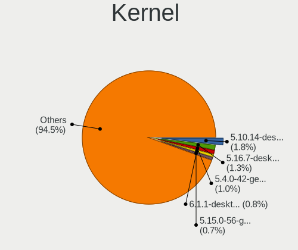
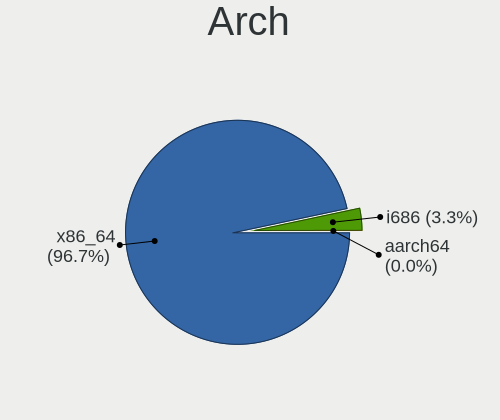
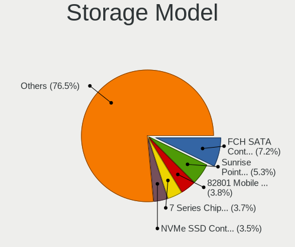
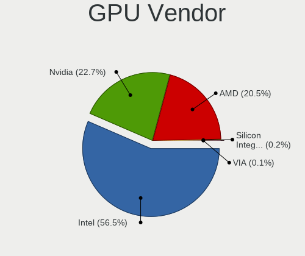
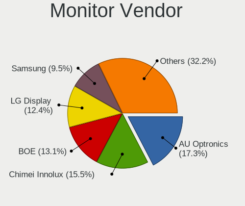
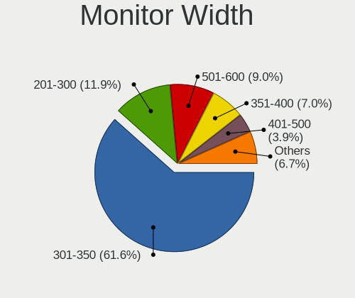
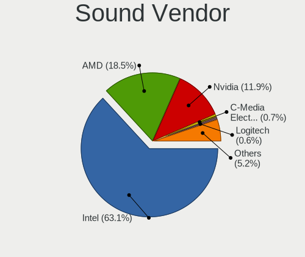
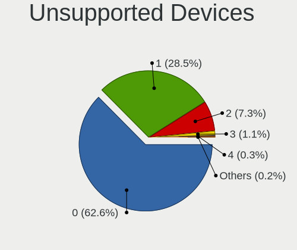

Linux in Spain - Tested Hardware & Statistics (Notebooks)
---------------------------------------------------------

A project to collect tested hardware configurations for Linux in Spain.

Anyone can contribute to this report by the [hw-probe](https://github.com/linuxhw/hw-probe) tool:

    sudo -E hw-probe -all -upload

Please contribute! Especially if your hardware is rare.

Contents
--------

* [ Test Cases ](#test-cases)

* [ System ](#system)
  - [ OS                       ](#os)
  - [ OS Family                ](#os-family)
  - [ Kernel                   ](#kernel)
  - [ Kernel Family            ](#kernel-family)
  - [ Kernel Major Ver.        ](#kernel-major-ver)
  - [ Arch                     ](#arch)
  - [ DE                       ](#de)
  - [ Display Server           ](#display-server)
  - [ Display Manager          ](#display-manager)
  - [ OS Lang                  ](#os-lang)
  - [ Boot Mode                ](#boot-mode)
  - [ Filesystem               ](#filesystem)
  - [ Part. scheme             ](#part-scheme)
  - [ Dual Boot with Linux/BSD ](#dual-boot-with-linuxbsd)
  - [ Dual Boot (Win)          ](#dual-boot-win)

* [ Board ](#board)
  - [ Vendor                   ](#vendor)
  - [ Model                    ](#model)
  - [ Model Family             ](#model-family)
  - [ MFG Year                 ](#mfg-year)
  - [ Form Factor              ](#form-factor)
  - [ Secure Boot              ](#secure-boot)
  - [ Coreboot                 ](#coreboot)
  - [ RAM Size                 ](#ram-size)
  - [ RAM Used                 ](#ram-used)
  - [ Total Drives             ](#total-drives)
  - [ Has CD-ROM               ](#has-cd-rom)
  - [ Has Ethernet             ](#has-ethernet)
  - [ Has WiFi                 ](#has-wifi)
  - [ Has Bluetooth            ](#has-bluetooth)

* [ Location ](#location)
  - [ Country                  ](#country)
  - [ City                     ](#city)

* [ Drives ](#drives)
  - [ Drive Vendor             ](#drive-vendor)
  - [ Drive Model              ](#drive-model)
  - [ HDD Vendor               ](#hdd-vendor)
  - [ SSD Vendor               ](#ssd-vendor)
  - [ Drive Kind               ](#drive-kind)
  - [ Drive Connector          ](#drive-connector)
  - [ Drive Size               ](#drive-size)
  - [ Space Total              ](#space-total)
  - [ Space Used               ](#space-used)
  - [ Malfunc. Drives          ](#malfunc-drives)
  - [ Malfunc. Drive Vendor    ](#malfunc-drive-vendor)
  - [ Malfunc. HDD Vendor      ](#malfunc-hdd-vendor)
  - [ Malfunc. Drive Kind      ](#malfunc-drive-kind)
  - [ Failed Drives            ](#failed-drives)
  - [ Failed Drive Vendor      ](#failed-drive-vendor)
  - [ Drive Status             ](#drive-status)

* [ Storage controller ](#storage-controller)
  - [ Storage Vendor           ](#storage-vendor)
  - [ Storage Model            ](#storage-model)
  - [ Storage Kind             ](#storage-kind)

* [ Processor ](#processor)
  - [ CPU Vendor               ](#cpu-vendor)
  - [ CPU Model                ](#cpu-model)
  - [ CPU Model Family         ](#cpu-model-family)
  - [ CPU Cores                ](#cpu-cores)
  - [ CPU Sockets              ](#cpu-sockets)
  - [ CPU Threads              ](#cpu-threads)
  - [ CPU Op-Modes             ](#cpu-op-modes)
  - [ CPU Microcode            ](#cpu-microcode)
  - [ CPU Microarch            ](#cpu-microarch)

* [ Graphics ](#graphics)
  - [ GPU Vendor               ](#gpu-vendor)
  - [ GPU Model                ](#gpu-model)
  - [ GPU Combo                ](#gpu-combo)
  - [ GPU Driver               ](#gpu-driver)
  - [ GPU Memory               ](#gpu-memory)

* [ Monitor ](#monitor)
  - [ Monitor Vendor           ](#monitor-vendor)
  - [ Monitor Model            ](#monitor-model)
  - [ Monitor Resolution       ](#monitor-resolution)
  - [ Monitor Diagonal         ](#monitor-diagonal)
  - [ Monitor Width            ](#monitor-width)
  - [ Aspect Ratio             ](#aspect-ratio)
  - [ Monitor Area             ](#monitor-area)
  - [ Pixel Density            ](#pixel-density)
  - [ Multiple Monitors        ](#multiple-monitors)

* [ Network ](#network)
  - [ Net Controller Vendor    ](#net-controller-vendor)
  - [ Net Controller Model     ](#net-controller-model)
  - [ Wireless Vendor          ](#wireless-vendor)
  - [ Wireless Model           ](#wireless-model)
  - [ Ethernet Vendor          ](#ethernet-vendor)
  - [ Ethernet Model           ](#ethernet-model)
  - [ Net Controller Kind      ](#net-controller-kind)
  - [ Used Controller          ](#used-controller)
  - [ NICs                     ](#nics)
  - [ IPv6                     ](#ipv6)

* [ Bluetooth ](#bluetooth)
  - [ Bluetooth Vendor         ](#bluetooth-vendor)
  - [ Bluetooth Model          ](#bluetooth-model)

* [ Sound ](#sound)
  - [ Sound Vendor             ](#sound-vendor)
  - [ Sound Model              ](#sound-model)

* [ Memory ](#memory)
  - [ Memory Vendor            ](#memory-vendor)
  - [ Memory Model             ](#memory-model)
  - [ Memory Kind              ](#memory-kind)
  - [ Memory Form Factor       ](#memory-form-factor)
  - [ Memory Size              ](#memory-size)
  - [ Memory Speed             ](#memory-speed)

* [ Printers & scanners ](#printers--scanners)
  - [ Printer Vendor           ](#printer-vendor)
  - [ Printer Model            ](#printer-model)
  - [ Scanner Vendor           ](#scanner-vendor)
  - [ Scanner Model            ](#scanner-model)

* [ Camera ](#camera)
  - [ Camera Vendor            ](#camera-vendor)
  - [ Camera Model             ](#camera-model)

* [ Security ](#security)
  - [ Fingerprint Vendor       ](#fingerprint-vendor)
  - [ Fingerprint Model        ](#fingerprint-model)
  - [ Chipcard Vendor          ](#chipcard-vendor)
  - [ Chipcard Model           ](#chipcard-model)

* [ Unsupported ](#unsupported)
  - [ Unsupported Devices      ](#unsupported-devices)
  - [ Unsupported Device Types ](#unsupported-device-types)

Test Cases
----------

Total: 3315

| Vendor        | Model                       | Probe                                                      | Date         |
|---------------|-----------------------------|------------------------------------------------------------|--------------|
| Chuwi         | HeroBook Air                | [8de9e9df4a](https://linux-hardware.org/?probe=8de9e9df4a) | Oct 01, 2022 |
| HP            | Laptop 15s-eq1xxx           | [a4252ba03a](https://linux-hardware.org/?probe=a4252ba03a) | Oct 01, 2022 |
| Lenovo        | IdeaPad S145-15AST 81N3     | [f50a823779](https://linux-hardware.org/?probe=f50a823779) | Oct 01, 2022 |
| Sony          | VPCEH2D0E                   | [a08d0148e2](https://linux-hardware.org/?probe=a08d0148e2) | Sep 30, 2022 |
| HP            | Pavilion dv5                | [9fd2d2169a](https://linux-hardware.org/?probe=9fd2d2169a) | Sep 30, 2022 |
| HP            | Pavilion dv5                | [1c42236e47](https://linux-hardware.org/?probe=1c42236e47) | Sep 30, 2022 |
| HP            | Victus by Laptop 16-e0xx... | [85b6d03edb](https://linux-hardware.org/?probe=85b6d03edb) | Sep 29, 2022 |
| HP            | Compaq 6730s                | [565b94d7f4](https://linux-hardware.org/?probe=565b94d7f4) | Sep 29, 2022 |
| HP            | Compaq 6730s                | [62fc1b721e](https://linux-hardware.org/?probe=62fc1b721e) | Sep 29, 2022 |
| Valve         | Jupiter                     | [9de5371096](https://linux-hardware.org/?probe=9de5371096) | Sep 28, 2022 |
| HP            | 250 G7 Notebook PC          | [6ad96a2beb](https://linux-hardware.org/?probe=6ad96a2beb) | Sep 28, 2022 |
| Lenovo        | ThinkPad T440s 20ARS06C0... | [a5aa60c709](https://linux-hardware.org/?probe=a5aa60c709) | Sep 28, 2022 |
| Valve         | Jupiter                     | [4c7799c515](https://linux-hardware.org/?probe=4c7799c515) | Sep 28, 2022 |
| Chuwi         | HeroBook Air                | [c31e327867](https://linux-hardware.org/?probe=c31e327867) | Sep 27, 2022 |
| Apple         | MacBookAir6,2               | [8c4c7f3dc1](https://linux-hardware.org/?probe=8c4c7f3dc1) | Sep 27, 2022 |
| Fujitsu       | LIFEBOOK E548               | [bf70c9dd7b](https://linux-hardware.org/?probe=bf70c9dd7b) | Sep 27, 2022 |
| Lenovo        | IdeaPad 3 14ADA05 81W0      | [e39766ed4d](https://linux-hardware.org/?probe=e39766ed4d) | Sep 26, 2022 |
| Lenovo        | G50-70 20351                | [77c0454f45](https://linux-hardware.org/?probe=77c0454f45) | Sep 26, 2022 |
| MSI           | Alpha 15 A4DEK              | [f3c74059d5](https://linux-hardware.org/?probe=f3c74059d5) | Sep 26, 2022 |
| HP            | OMEN Laptop 15-en1xxx       | [ac296ea23b](https://linux-hardware.org/?probe=ac296ea23b) | Sep 26, 2022 |
| Dell          | XPS 13 7390                 | [cfebe9461d](https://linux-hardware.org/?probe=cfebe9461d) | Sep 26, 2022 |
| HP            | 250 G8 Notebook PC          | [f4ea1372b7](https://linux-hardware.org/?probe=f4ea1372b7) | Sep 26, 2022 |
| Lenovo        | IdeaPad Gaming 3 15ACH6 ... | [dc6d36a0eb](https://linux-hardware.org/?probe=dc6d36a0eb) | Sep 26, 2022 |
| HP            | 250 G8 Notebook PC          | [ae83bec6ad](https://linux-hardware.org/?probe=ae83bec6ad) | Sep 26, 2022 |
| MSI           | Alpha 15 A4DEK              | [d2e3e7736c](https://linux-hardware.org/?probe=d2e3e7736c) | Sep 26, 2022 |
| HP            | OMEN Laptop 15-en1xxx       | [6527be1bb2](https://linux-hardware.org/?probe=6527be1bb2) | Sep 26, 2022 |
| MSI           | GF63 8RD                    | [f6ef1dbd07](https://linux-hardware.org/?probe=f6ef1dbd07) | Sep 25, 2022 |
| Intel         | H81U                        | [9e4458528b](https://linux-hardware.org/?probe=9e4458528b) | Sep 25, 2022 |
| HONOR         | BMH-WCX9                    | [49b0161bf0](https://linux-hardware.org/?probe=49b0161bf0) | Sep 25, 2022 |
| HONOR         | BMH-WCX9                    | [867da0c4b8](https://linux-hardware.org/?probe=867da0c4b8) | Sep 25, 2022 |
| ASUSTek       | TUF Gaming FX504GD_FX80G... | [f844479504](https://linux-hardware.org/?probe=f844479504) | Sep 25, 2022 |
| Apple         | MacBookPro6,2               | [be92ff8ffc](https://linux-hardware.org/?probe=be92ff8ffc) | Sep 25, 2022 |
| MSI           | GF75 Thin 10SC              | [0bda368d15](https://linux-hardware.org/?probe=0bda368d15) | Sep 24, 2022 |
| ASUSTek       | ROG Strix G713QM_G713QM     | [786063cdde](https://linux-hardware.org/?probe=786063cdde) | Sep 24, 2022 |
| Lenovo        | ThinkPad T450 20BV001CSP    | [9233c6db8f](https://linux-hardware.org/?probe=9233c6db8f) | Sep 24, 2022 |
| HP            | 15                          | [bd8fc32d19](https://linux-hardware.org/?probe=bd8fc32d19) | Sep 24, 2022 |
| Unknown       | Unknown                     | [4a1323c81e](https://linux-hardware.org/?probe=4a1323c81e) | Sep 24, 2022 |
| ASUSTek       | TUF Gaming FX504GD_FX80G... | [40b47d9065](https://linux-hardware.org/?probe=40b47d9065) | Sep 23, 2022 |
| ASUSTek       | VivoBook 15_ASUS Laptop ... | [b73b2224d1](https://linux-hardware.org/?probe=b73b2224d1) | Sep 23, 2022 |
| ASUSTek       | ROG Strix G513QM_G513QM     | [67ec6c656b](https://linux-hardware.org/?probe=67ec6c656b) | Sep 23, 2022 |
| Acer          | TravelMate P256-MG          | [0a7c58d00a](https://linux-hardware.org/?probe=0a7c58d00a) | Sep 23, 2022 |
| Sony          | VPCEB1Z1E                   | [37fea84df6](https://linux-hardware.org/?probe=37fea84df6) | Sep 22, 2022 |
| ASUSTek       | ROG Zephyrus G14 GA401II... | [2e36489a4b](https://linux-hardware.org/?probe=2e36489a4b) | Sep 22, 2022 |
| HP            | Presario CQ57               | [322f46c499](https://linux-hardware.org/?probe=322f46c499) | Sep 22, 2022 |
| HP            | Stream Notebook PC 13       | [a5dff5d1f6](https://linux-hardware.org/?probe=a5dff5d1f6) | Sep 22, 2022 |
| ASUSTek       | ROG Zephyrus G14 GA401II... | [8705683c6f](https://linux-hardware.org/?probe=8705683c6f) | Sep 22, 2022 |
| ASUSTek       | ROG Strix G513QM_G513QM     | [080fdb990e](https://linux-hardware.org/?probe=080fdb990e) | Sep 21, 2022 |
| Lenovo        | ThinkPad E15 Gen 2 20TD0... | [849246d9f3](https://linux-hardware.org/?probe=849246d9f3) | Sep 20, 2022 |
| Dell          | Latitude E7240              | [6db3839532](https://linux-hardware.org/?probe=6db3839532) | Sep 20, 2022 |
| Dell          | Latitude E7240              | [21dc4700da](https://linux-hardware.org/?probe=21dc4700da) | Sep 20, 2022 |
| ASUSTek       | VivoBook_ASUSLaptop X509... | [f03ae050eb](https://linux-hardware.org/?probe=f03ae050eb) | Sep 20, 2022 |
| Lenovo        | ThinkPad L15 Gen 1 20U30... | [317ff73ff5](https://linux-hardware.org/?probe=317ff73ff5) | Sep 20, 2022 |
| Chuwi         | CoreBook X                  | [4c963415cd](https://linux-hardware.org/?probe=4c963415cd) | Sep 20, 2022 |
| Lenovo        | IdeaPad Gaming 3 15ARH05... | [ba7800b231](https://linux-hardware.org/?probe=ba7800b231) | Sep 20, 2022 |
| ASUSTek       | VivoBook 15_ASUS Laptop ... | [0fa5921ddf](https://linux-hardware.org/?probe=0fa5921ddf) | Sep 20, 2022 |
| Lenovo        | IdeaPad S340-15IIL 81VW     | [d14a12b8ca](https://linux-hardware.org/?probe=d14a12b8ca) | Sep 20, 2022 |
| ASUSTek       | ROG Strix G513QM_G513QM     | [04252a0991](https://linux-hardware.org/?probe=04252a0991) | Sep 20, 2022 |
| ASUSTek       | ROG Strix G712LV_G712LV     | [1e7ca74f13](https://linux-hardware.org/?probe=1e7ca74f13) | Sep 20, 2022 |
| Acer          | TravelMate P414-51          | [2ebd8f21d3](https://linux-hardware.org/?probe=2ebd8f21d3) | Sep 20, 2022 |
| Lenovo        | ThinkPad L14 Gen 1 20U1S... | [e33202084e](https://linux-hardware.org/?probe=e33202084e) | Sep 20, 2022 |
| MSI           | Bravo 15 B5DD               | [3c51417d8f](https://linux-hardware.org/?probe=3c51417d8f) | Sep 19, 2022 |
| LG Electro... | P530-K.AE23B                | [329f95e326](https://linux-hardware.org/?probe=329f95e326) | Sep 19, 2022 |
| LG Electro... | P530-K.AE23B                | [5891712135](https://linux-hardware.org/?probe=5891712135) | Sep 19, 2022 |
| Dell          | Inspiron 7559               | [4abbaf3df9](https://linux-hardware.org/?probe=4abbaf3df9) | Sep 19, 2022 |
| Dell          | Inspiron 7559               | [f10501b259](https://linux-hardware.org/?probe=f10501b259) | Sep 19, 2022 |
| ASUSTek       | TUF Gaming FX504GD_FX80G... | [b415f7be91](https://linux-hardware.org/?probe=b415f7be91) | Sep 19, 2022 |
| HUAWEI        | HN-WX9X                     | [4a7bdd8ed1](https://linux-hardware.org/?probe=4a7bdd8ed1) | Sep 19, 2022 |
| HUAWEI        | HN-WX9X                     | [46e9732572](https://linux-hardware.org/?probe=46e9732572) | Sep 19, 2022 |
| Lenovo        | ThinkBook 16p Gen 2 20YM    | [4fcfd69ec1](https://linux-hardware.org/?probe=4fcfd69ec1) | Sep 19, 2022 |
| Dell          | Latitude 3420               | [5364b3d032](https://linux-hardware.org/?probe=5364b3d032) | Sep 18, 2022 |
| Chuwi         | HeroBook Air                | [26967f1d9e](https://linux-hardware.org/?probe=26967f1d9e) | Sep 17, 2022 |
| HP            | Stream Notebook PC 13       | [589078809b](https://linux-hardware.org/?probe=589078809b) | Sep 17, 2022 |
| ASUSTek       | UX430UAR                    | [a265f6053f](https://linux-hardware.org/?probe=a265f6053f) | Sep 17, 2022 |
| ASUSTek       | ROG Strix G513RM_G513RM     | [6b15cc63cc](https://linux-hardware.org/?probe=6b15cc63cc) | Sep 17, 2022 |
| HP            | Laptop 15-db0xxx            | [c4a7f1814f](https://linux-hardware.org/?probe=c4a7f1814f) | Sep 16, 2022 |
| MSI           | GF63 8RD                    | [197ccf755d](https://linux-hardware.org/?probe=197ccf755d) | Sep 16, 2022 |
| HP            | Compaq 6720s                | [75bc6df1df](https://linux-hardware.org/?probe=75bc6df1df) | Sep 16, 2022 |
| MSI           | GF63 8RD                    | [9e7ef8d86d](https://linux-hardware.org/?probe=9e7ef8d86d) | Sep 16, 2022 |
| HUAWEI        | HN-WX9X                     | [6f29359618](https://linux-hardware.org/?probe=6f29359618) | Sep 16, 2022 |
| Lenovo        | IdeaPad Gaming 3 15ARH05... | [2c97d43674](https://linux-hardware.org/?probe=2c97d43674) | Sep 16, 2022 |
| Chuwi         | CoreBook X                  | [d5a3bc0015](https://linux-hardware.org/?probe=d5a3bc0015) | Sep 16, 2022 |
| Valve         | Jupiter                     | [44056051c4](https://linux-hardware.org/?probe=44056051c4) | Sep 16, 2022 |
| AXDIA Inte... | WINPAD V10                  | [ef71c6cd50](https://linux-hardware.org/?probe=ef71c6cd50) | Sep 15, 2022 |
| Dell          | Latitude D630               | [b898e91e58](https://linux-hardware.org/?probe=b898e91e58) | Sep 15, 2022 |
| ASUSTek       | 1201N                       | [0a48f359f8](https://linux-hardware.org/?probe=0a48f359f8) | Sep 15, 2022 |
| INFINITY      | Unknown                     | [37d2d32628](https://linux-hardware.org/?probe=37d2d32628) | Sep 15, 2022 |
| Toshiba       | Satellite P50-B-11L         | [eba4212008](https://linux-hardware.org/?probe=eba4212008) | Sep 15, 2022 |
| Chuwi         | HeroBook Air                | [fdf38c7fb0](https://linux-hardware.org/?probe=fdf38c7fb0) | Sep 14, 2022 |
| Lenovo        | IdeaPad S145-15AST 81N3     | [b552f0482d](https://linux-hardware.org/?probe=b552f0482d) | Sep 14, 2022 |
| Apple         | MacBookAir7,2               | [eb169c543e](https://linux-hardware.org/?probe=eb169c543e) | Sep 14, 2022 |
| Acer          | Aspire A715-72G             | [60cbc2fb39](https://linux-hardware.org/?probe=60cbc2fb39) | Sep 14, 2022 |
| BESSTAR Te... | T3 MRD                      | [0b03396c93](https://linux-hardware.org/?probe=0b03396c93) | Sep 14, 2022 |
| Lenovo        | ThinkPad T14 Gen 2a 20XK... | [4aa3e2b6c2](https://linux-hardware.org/?probe=4aa3e2b6c2) | Sep 14, 2022 |
| Acer          | Aspire 5742                 | [9c37d390a7](https://linux-hardware.org/?probe=9c37d390a7) | Sep 13, 2022 |
| Samsung       | 305V4A/305V5A               | [ba2ad7bf06](https://linux-hardware.org/?probe=ba2ad7bf06) | Sep 13, 2022 |
| Dell          | Latitude 7420               | [84f0ebcfea](https://linux-hardware.org/?probe=84f0ebcfea) | Sep 13, 2022 |
| Lenovo        | ThinkPad E15 Gen 2 20TD0... | [aa9d57c27e](https://linux-hardware.org/?probe=aa9d57c27e) | Sep 13, 2022 |
| MSI           | Prestige 14 A11SCX          | [0c0264943f](https://linux-hardware.org/?probe=0c0264943f) | Sep 13, 2022 |
| ASUSTek       | ZenBook UX425EA_UX425EA     | [b6b3f2dce1](https://linux-hardware.org/?probe=b6b3f2dce1) | Sep 13, 2022 |
| ASUSTek       | X200LA                      | [e0947fe5c7](https://linux-hardware.org/?probe=e0947fe5c7) | Sep 13, 2022 |
| Medion        | E4251 MD61227               | [8b3475f65b](https://linux-hardware.org/?probe=8b3475f65b) | Sep 13, 2022 |
| Toshiba       | Satellite A500              | [0d96df6375](https://linux-hardware.org/?probe=0d96df6375) | Sep 13, 2022 |
| Toshiba       | Satellite L50D-B            | [2d09796251](https://linux-hardware.org/?probe=2d09796251) | Sep 12, 2022 |
| Lenovo        | B570e 521524G               | [c08fe13d14](https://linux-hardware.org/?probe=c08fe13d14) | Sep 12, 2022 |
| Lenovo        | ThinkPad T440 20B7A1P700    | [5be9f89a6f](https://linux-hardware.org/?probe=5be9f89a6f) | Sep 12, 2022 |
| HP            | Pavilion Laptop 15-ck0xx    | [390223e073](https://linux-hardware.org/?probe=390223e073) | Sep 11, 2022 |
| ASUSTek       | TUF Gaming FX504GM_FX80G... | [0d1c08d02b](https://linux-hardware.org/?probe=0d1c08d02b) | Sep 11, 2022 |
| MSI           | Modern 14 C12M              | [e523452a96](https://linux-hardware.org/?probe=e523452a96) | Sep 11, 2022 |
| Dell          | Latitude E7240              | [2976e9106e](https://linux-hardware.org/?probe=2976e9106e) | Sep 10, 2022 |
| Unknown       | Unknown                     | [6fb2f6034c](https://linux-hardware.org/?probe=6fb2f6034c) | Sep 10, 2022 |
| AXDIA Inte... | WINPAD V10                  | [b3e5abaf4b](https://linux-hardware.org/?probe=b3e5abaf4b) | Sep 09, 2022 |
| HP            | Compaq 8510w                | [a720eb1f63](https://linux-hardware.org/?probe=a720eb1f63) | Sep 09, 2022 |
| HP            | Laptop 15s-eq1xxx           | [efc8c6b2e7](https://linux-hardware.org/?probe=efc8c6b2e7) | Sep 08, 2022 |
| Lenovo        | B570e 521524G               | [1926ba3c2f](https://linux-hardware.org/?probe=1926ba3c2f) | Sep 07, 2022 |
| ASUSTek       | VivoBook 15_ASUS Laptop ... | [2959121934](https://linux-hardware.org/?probe=2959121934) | Sep 07, 2022 |
| ASUSTek       | ProArt StudioBook H7600H... | [2817268e91](https://linux-hardware.org/?probe=2817268e91) | Sep 07, 2022 |
| HP            | ProBook 430 G6              | [99de13d37c](https://linux-hardware.org/?probe=99de13d37c) | Sep 07, 2022 |
| Lenovo        | Legion 5 15ARH05 82B5       | [2850ddb81f](https://linux-hardware.org/?probe=2850ddb81f) | Sep 06, 2022 |
| Lenovo        | V145-15AST 81MT             | [90d59bf651](https://linux-hardware.org/?probe=90d59bf651) | Sep 06, 2022 |
| Lenovo        | Legion 5 15ARH05 82B5       | [c1cc348ec8](https://linux-hardware.org/?probe=c1cc348ec8) | Sep 06, 2022 |
| MSI           | Prestige 15 A10SC           | [adbe97d2f1](https://linux-hardware.org/?probe=adbe97d2f1) | Sep 05, 2022 |
| Lenovo        | IdeaPad 330-15IKB 81DE      | [cb809c935a](https://linux-hardware.org/?probe=cb809c935a) | Sep 05, 2022 |
| Chuwi         | Hi10 Go                     | [f0d55e8aea](https://linux-hardware.org/?probe=f0d55e8aea) | Sep 04, 2022 |
| Notebook      | N141CU                      | [9a03ce91af](https://linux-hardware.org/?probe=9a03ce91af) | Sep 04, 2022 |
| HP            | Compaq 8510w                | [a49dcb1261](https://linux-hardware.org/?probe=a49dcb1261) | Sep 03, 2022 |
| Lenovo        | IdeaPad 5 Pro 16ARH7 82S... | [6d1fcccbb8](https://linux-hardware.org/?probe=6d1fcccbb8) | Sep 03, 2022 |
| Lenovo        | IdeaPad 5 Pro 16ARH7 82S... | [088dad5cba](https://linux-hardware.org/?probe=088dad5cba) | Sep 02, 2022 |
| MSI           | Katana GF66 12UC            | [270a50ac4c](https://linux-hardware.org/?probe=270a50ac4c) | Sep 01, 2022 |
| ASUSTek       | ZenBook UX425IA_UM425IA     | [f25f0f5499](https://linux-hardware.org/?probe=f25f0f5499) | Sep 01, 2022 |
| Lenovo        | IdeaPad 5 Pro 16ARH7 82S... | [46e67b2b16](https://linux-hardware.org/?probe=46e67b2b16) | Sep 01, 2022 |
| Lenovo        | Y520-15IKBN 80WK            | [7b6028e52d](https://linux-hardware.org/?probe=7b6028e52d) | Sep 01, 2022 |
| LG Electro... | 14Z990-V.AP72B              | [8c67c188a1](https://linux-hardware.org/?probe=8c67c188a1) | Sep 01, 2022 |
| Lenovo        | Legion Y530-15ICH 81FV      | [c9fcbe9935](https://linux-hardware.org/?probe=c9fcbe9935) | Sep 01, 2022 |
| Lenovo        | Legion Y530-15ICH 81FV      | [52efef286f](https://linux-hardware.org/?probe=52efef286f) | Sep 01, 2022 |
| HP            | Laptop 15-db0xxx            | [42879ce5cf](https://linux-hardware.org/?probe=42879ce5cf) | Aug 31, 2022 |
| HP            | Laptop 15-db0xxx            | [3c7e97b769](https://linux-hardware.org/?probe=3c7e97b769) | Aug 31, 2022 |
| Notebook      | N24_25JU                    | [50f570f3d9](https://linux-hardware.org/?probe=50f570f3d9) | Aug 31, 2022 |
| Acer          | Aspire E5-521               | [9ce49fc3a3](https://linux-hardware.org/?probe=9ce49fc3a3) | Aug 31, 2022 |
| Acer          | Aspire E5-521               | [b9d306c31b](https://linux-hardware.org/?probe=b9d306c31b) | Aug 31, 2022 |
| HP            | Compaq 8510w                | [f7e1515654](https://linux-hardware.org/?probe=f7e1515654) | Aug 30, 2022 |
| ASUSTek       | F3F                         | [57c5732aaa](https://linux-hardware.org/?probe=57c5732aaa) | Aug 30, 2022 |
| HP            | Notebook                    | [b0b97c0ea3](https://linux-hardware.org/?probe=b0b97c0ea3) | Aug 30, 2022 |
| Chuwi         | GemiBook Pro                | [b85d2b0ec5](https://linux-hardware.org/?probe=b85d2b0ec5) | Aug 30, 2022 |
| Chuwi         | GemiBook                    | [abca00f582](https://linux-hardware.org/?probe=abca00f582) | Aug 30, 2022 |
| Lenovo        | ThinkBook 15 G2 ITL 20VE    | [52f02ff7f1](https://linux-hardware.org/?probe=52f02ff7f1) | Aug 29, 2022 |
| Apple         | MacBookPro5,5               | [97fdbc4a5b](https://linux-hardware.org/?probe=97fdbc4a5b) | Aug 29, 2022 |
| Notebook      | NL4x_NL5xLU                 | [df4630db27](https://linux-hardware.org/?probe=df4630db27) | Aug 28, 2022 |
| Notebook      | N2x0WU                      | [c7065dc0c9](https://linux-hardware.org/?probe=c7065dc0c9) | Aug 28, 2022 |
| Acer          | Aspire E5-521               | [a94da62004](https://linux-hardware.org/?probe=a94da62004) | Aug 28, 2022 |
| Acer          | Aspire E5-521               | [64cefbec58](https://linux-hardware.org/?probe=64cefbec58) | Aug 28, 2022 |
| Dell          | Vostro 3500                 | [e4cd019582](https://linux-hardware.org/?probe=e4cd019582) | Aug 27, 2022 |
| Dell          | Vostro 3500                 | [634c973e53](https://linux-hardware.org/?probe=634c973e53) | Aug 27, 2022 |
| speedmaste... | E131x series                | [69d287c029](https://linux-hardware.org/?probe=69d287c029) | Aug 26, 2022 |
| ASUSTek       | K52Jc                       | [5c10927d11](https://linux-hardware.org/?probe=5c10927d11) | Aug 25, 2022 |
| ASUSTek       | VivoBook_ASUSLaptop X570... | [292f932c92](https://linux-hardware.org/?probe=292f932c92) | Aug 25, 2022 |
| LG Electro... | 14Z90P-G.AA89B              | [bccfbd256c](https://linux-hardware.org/?probe=bccfbd256c) | Aug 24, 2022 |
| HUAWEI        | NBD-WXX9                    | [254b378771](https://linux-hardware.org/?probe=254b378771) | Aug 23, 2022 |
| Acer          | Aspire 5742                 | [97c61c3095](https://linux-hardware.org/?probe=97c61c3095) | Aug 22, 2022 |
| MSI           | PS63 Modern 8RC             | [ae3bcc6b88](https://linux-hardware.org/?probe=ae3bcc6b88) | Aug 22, 2022 |
| MSI           | PS63 Modern 8RC             | [b45c0fb9fa](https://linux-hardware.org/?probe=b45c0fb9fa) | Aug 22, 2022 |
| Dell          | Vostro 3550                 | [230033da23](https://linux-hardware.org/?probe=230033da23) | Aug 22, 2022 |
| Lenovo        | M30-70 80H8                 | [d254ca63b4](https://linux-hardware.org/?probe=d254ca63b4) | Aug 22, 2022 |
| Chuwi         | GemiBook Pro                | [03ed2d6805](https://linux-hardware.org/?probe=03ed2d6805) | Aug 22, 2022 |
| SLIMBOOK      | PROX14-AMD                  | [f01fb4784c](https://linux-hardware.org/?probe=f01fb4784c) | Aug 21, 2022 |
| Acer          | Aspire A517-52              | [b61f6861a6](https://linux-hardware.org/?probe=b61f6861a6) | Aug 21, 2022 |
| VANT          | MOOVE3-15                   | [2b5a36a1e6](https://linux-hardware.org/?probe=2b5a36a1e6) | Aug 20, 2022 |
| HP            | 250 G7 Notebook PC          | [ec15e7b0c5](https://linux-hardware.org/?probe=ec15e7b0c5) | Aug 19, 2022 |
| Apple         | MacBookPro5,5               | [f429863c5f](https://linux-hardware.org/?probe=f429863c5f) | Aug 19, 2022 |
| HP            | EliteBook 840 G6            | [8af519565f](https://linux-hardware.org/?probe=8af519565f) | Aug 18, 2022 |
| Apple         | MacBookPro11,3              | [4e9e089c1a](https://linux-hardware.org/?probe=4e9e089c1a) | Aug 18, 2022 |
| Chuwi         | HeroBook Air                | [6e13e6abe8](https://linux-hardware.org/?probe=6e13e6abe8) | Aug 18, 2022 |
| Lenovo        | ThinkPad P15 Gen 2i 20YQ... | [0887012e66](https://linux-hardware.org/?probe=0887012e66) | Aug 18, 2022 |
| ASUSTek       | N75SF                       | [3b6f89e145](https://linux-hardware.org/?probe=3b6f89e145) | Aug 17, 2022 |
| MSI           | Modern 14 A10RAS            | [f7102225ca](https://linux-hardware.org/?probe=f7102225ca) | Aug 17, 2022 |
| MSI           | Modern 14 A10RAS            | [3a57a6329f](https://linux-hardware.org/?probe=3a57a6329f) | Aug 17, 2022 |
| MSI           | Modern 14 A10RAS            | [1cdee0174f](https://linux-hardware.org/?probe=1cdee0174f) | Aug 16, 2022 |
| Valve         | Jupiter                     | [5f3785b334](https://linux-hardware.org/?probe=5f3785b334) | Aug 16, 2022 |
| ASUSTek       | TUF Gaming FX705GE_FX705... | [6132aea83b](https://linux-hardware.org/?probe=6132aea83b) | Aug 16, 2022 |
| Toshiba       | Satellite P50-B-103         | [26811058c5](https://linux-hardware.org/?probe=26811058c5) | Aug 15, 2022 |
| Valve         | Jupiter                     | [c3f38697a4](https://linux-hardware.org/?probe=c3f38697a4) | Aug 15, 2022 |
| GPD           | G1618-03                    | [64b056ddb1](https://linux-hardware.org/?probe=64b056ddb1) | Aug 14, 2022 |
| GPD           | G1618-03                    | [7316acf7a6](https://linux-hardware.org/?probe=7316acf7a6) | Aug 14, 2022 |
| Acer          | Aspire E5-521               | [c127df7597](https://linux-hardware.org/?probe=c127df7597) | Aug 13, 2022 |
| ASUSTek       | ZenBook UX431DA_UM431DA     | [40814201a2](https://linux-hardware.org/?probe=40814201a2) | Aug 12, 2022 |
| Lenovo        | ThinkPad X201 3626HMG       | [1d08c103c7](https://linux-hardware.org/?probe=1d08c103c7) | Aug 12, 2022 |
| Chuwi         | HeroBook Air                | [5640964630](https://linux-hardware.org/?probe=5640964630) | Aug 12, 2022 |
| HP            | Laptop 15-da0xxx            | [70ea8b51c8](https://linux-hardware.org/?probe=70ea8b51c8) | Aug 12, 2022 |
| Dell          | Latitude D630               | [3650f52bba](https://linux-hardware.org/?probe=3650f52bba) | Aug 11, 2022 |
| Toshiba       | TECRA R950                  | [d428bef65b](https://linux-hardware.org/?probe=d428bef65b) | Aug 10, 2022 |
| ASUSTek       | X555LAB                     | [9c41cf4c2c](https://linux-hardware.org/?probe=9c41cf4c2c) | Aug 10, 2022 |
| HP            | Laptop 15-da0xxx            | [0e35955798](https://linux-hardware.org/?probe=0e35955798) | Aug 07, 2022 |
| HP            | EliteBook 2540p             | [14e0900f42](https://linux-hardware.org/?probe=14e0900f42) | Aug 06, 2022 |
| Dell          | Latitude 5520               | [33888d0477](https://linux-hardware.org/?probe=33888d0477) | Aug 06, 2022 |
| Dynabook      | Satellite Pro C50-G         | [755f865912](https://linux-hardware.org/?probe=755f865912) | Aug 05, 2022 |
| Lenovo        | ThinkPad P14s Gen 1 20Y1... | [d975e76a17](https://linux-hardware.org/?probe=d975e76a17) | Aug 05, 2022 |
| Lenovo        | ThinkPad T440p 20AW007QM... | [ca0e99f941](https://linux-hardware.org/?probe=ca0e99f941) | Aug 05, 2022 |
| HP            | Laptop 15-da0xxx            | [75c4deee10](https://linux-hardware.org/?probe=75c4deee10) | Aug 05, 2022 |
| Acer          | Aspire 9410                 | [0d433f48f4](https://linux-hardware.org/?probe=0d433f48f4) | Aug 05, 2022 |
| Fujitsu Si... | AMILO Li1705                | [af83e534ff](https://linux-hardware.org/?probe=af83e534ff) | Aug 04, 2022 |
| Dell          | Latitude 5420               | [d4717e9bb1](https://linux-hardware.org/?probe=d4717e9bb1) | Aug 04, 2022 |
| ASUSTek       | GL752VW                     | [ff8fd29d96](https://linux-hardware.org/?probe=ff8fd29d96) | Aug 03, 2022 |
| MSI           | Pulse GL76 12UEK            | [5ab3e7f74f](https://linux-hardware.org/?probe=5ab3e7f74f) | Aug 03, 2022 |
| HP            | Pavilion Aero Laptop 13-... | [a6f7e6086b](https://linux-hardware.org/?probe=a6f7e6086b) | Aug 03, 2022 |
| MSI           | Pulse GL76 12UEK            | [02d4876457](https://linux-hardware.org/?probe=02d4876457) | Aug 03, 2022 |
| Lenovo        | ThinkPad E14 Gen 3 20Y70... | [f5d4fdde00](https://linux-hardware.org/?probe=f5d4fdde00) | Aug 02, 2022 |
| ASUSTek       | X540SA                      | [6adb003f2e](https://linux-hardware.org/?probe=6adb003f2e) | Aug 01, 2022 |
| ASUSTek       | X540SA                      | [4dbed1e983](https://linux-hardware.org/?probe=4dbed1e983) | Aug 01, 2022 |
| Dell          | Latitude 7420               | [d498af2db5](https://linux-hardware.org/?probe=d498af2db5) | Aug 01, 2022 |
| Acer          | Aspire E1-571               | [7102c56d5b](https://linux-hardware.org/?probe=7102c56d5b) | Aug 01, 2022 |
| Chuwi         | GemiBook Pro                | [458c2e644f](https://linux-hardware.org/?probe=458c2e644f) | Jul 31, 2022 |
| HP            | Compaq 8510p                | [2a005b06da](https://linux-hardware.org/?probe=2a005b06da) | Jul 28, 2022 |
| Toshiba       | Satellite P50-B-118         | [b46f72c280](https://linux-hardware.org/?probe=b46f72c280) | Jul 28, 2022 |
| ASUSTek       | ROG Zephyrus M15 GU502LW... | [a05f5dc510](https://linux-hardware.org/?probe=a05f5dc510) | Jul 28, 2022 |
| Chuwi         | GemiBook Pro                | [bfed86a5c4](https://linux-hardware.org/?probe=bfed86a5c4) | Jul 28, 2022 |
| Unknown       | Unknown                     | [4d9a472691](https://linux-hardware.org/?probe=4d9a472691) | Jul 27, 2022 |
| Unknown       | Unknown                     | [ded9f7587a](https://linux-hardware.org/?probe=ded9f7587a) | Jul 27, 2022 |
| Lenovo        | IdeaPad 330-15IKB 81DE      | [94f1822d11](https://linux-hardware.org/?probe=94f1822d11) | Jul 26, 2022 |
| Dell          | XPS 15 7590                 | [f1c4c81832](https://linux-hardware.org/?probe=f1c4c81832) | Jul 26, 2022 |
| eMachines     | D730                        | [4cba9849a0](https://linux-hardware.org/?probe=4cba9849a0) | Jul 26, 2022 |
| Alienware     | m15 R4                      | [2f80ebdd19](https://linux-hardware.org/?probe=2f80ebdd19) | Jul 26, 2022 |
| Acer          | Aspire 5749                 | [fa3b08453b](https://linux-hardware.org/?probe=fa3b08453b) | Jul 25, 2022 |
| Dell          | Latitude E6540              | [281f1b4a30](https://linux-hardware.org/?probe=281f1b4a30) | Jul 24, 2022 |
| HP            | Notebook                    | [d5802ce082](https://linux-hardware.org/?probe=d5802ce082) | Jul 24, 2022 |
| HP            | Stream Notebook             | [8422abef44](https://linux-hardware.org/?probe=8422abef44) | Jul 23, 2022 |
| Unknown       | Unknown                     | [0c4182ee0a](https://linux-hardware.org/?probe=0c4182ee0a) | Jul 23, 2022 |
| Unknown       | Unknown                     | [7a29580deb](https://linux-hardware.org/?probe=7a29580deb) | Jul 23, 2022 |
| Lenovo        | ThinkPad T450 20BUS04A0B    | [afc6d3d00a](https://linux-hardware.org/?probe=afc6d3d00a) | Jul 22, 2022 |
| Lenovo        | ThinkBook 16p Gen 2 20YM    | [447161e791](https://linux-hardware.org/?probe=447161e791) | Jul 21, 2022 |
| HP            | ProBook 640 G8 Notebook ... | [75f71928fe](https://linux-hardware.org/?probe=75f71928fe) | Jul 21, 2022 |
| Dell          | XPS 15 9510                 | [cf3548c6b4](https://linux-hardware.org/?probe=cf3548c6b4) | Jul 20, 2022 |
| Notebook      | W350STQ/W370ST              | [613b1f9d19](https://linux-hardware.org/?probe=613b1f9d19) | Jul 20, 2022 |
| Acer          | Aspire 5750G                | [08beab61a7](https://linux-hardware.org/?probe=08beab61a7) | Jul 18, 2022 |
| HUAWEI        | MateBook D                  | [5d7a616dd1](https://linux-hardware.org/?probe=5d7a616dd1) | Jul 18, 2022 |
| Toshiba       | Satellite Pro A50-C         | [a94461714d](https://linux-hardware.org/?probe=a94461714d) | Jul 18, 2022 |
| ASUSTek       | GL752VW                     | [b13a184720](https://linux-hardware.org/?probe=b13a184720) | Jul 18, 2022 |
| HONOR         | HYM-WXX                     | [654a2a5950](https://linux-hardware.org/?probe=654a2a5950) | Jul 17, 2022 |
| Dell          | Latitude 7390               | [fca3ed2ef5](https://linux-hardware.org/?probe=fca3ed2ef5) | Jul 17, 2022 |
| Toshiba       | Satellite L670              | [d753323f22](https://linux-hardware.org/?probe=d753323f22) | Jul 16, 2022 |
| ASUSTek       | K53U                        | [20120e258a](https://linux-hardware.org/?probe=20120e258a) | Jul 16, 2022 |
| Acer          | Aspire A315-23              | [5f1ff52baa](https://linux-hardware.org/?probe=5f1ff52baa) | Jul 16, 2022 |
| Valve         | Jupiter                     | [6c954fab9d](https://linux-hardware.org/?probe=6c954fab9d) | Jul 16, 2022 |
| Chuwi         | HeroBook Air                | [8f50476a9d](https://linux-hardware.org/?probe=8f50476a9d) | Jul 15, 2022 |
| Standard      | Unknown                     | [3b4805163d](https://linux-hardware.org/?probe=3b4805163d) | Jul 15, 2022 |
| Notebook      | W350STQ/W370ST              | [86daf7b30d](https://linux-hardware.org/?probe=86daf7b30d) | Jul 15, 2022 |
| ASUSTek       | VivoBook_ASUSLaptop X515... | [046794ca90](https://linux-hardware.org/?probe=046794ca90) | Jul 15, 2022 |
| Chuwi         | GemiBook Pro                | [383c62eca2](https://linux-hardware.org/?probe=383c62eca2) | Jul 14, 2022 |
| Apple         | MacBookAir7,2               | [19c5e2272a](https://linux-hardware.org/?probe=19c5e2272a) | Jul 14, 2022 |
| Dell          | Latitude E5540              | [d6a6448930](https://linux-hardware.org/?probe=d6a6448930) | Jul 14, 2022 |
| Chuwi         | HeroBook Air                | [d76b0db2ca](https://linux-hardware.org/?probe=d76b0db2ca) | Jul 13, 2022 |
| MSI           | Modern 15 A5M               | [40c6c77f2c](https://linux-hardware.org/?probe=40c6c77f2c) | Jul 13, 2022 |
| MSI           | Katana GF66 12UD            | [2822036910](https://linux-hardware.org/?probe=2822036910) | Jul 12, 2022 |
| ASUSTek       | VivoBook 15_ASUS Laptop ... | [6231802178](https://linux-hardware.org/?probe=6231802178) | Jul 12, 2022 |
| MSI           | Katana GF66 12UD            | [470a18c94b](https://linux-hardware.org/?probe=470a18c94b) | Jul 12, 2022 |
| Apple         | MacBookPro15,3              | [a8f8224853](https://linux-hardware.org/?probe=a8f8224853) | Jul 11, 2022 |
| MSI           | GL73 8SE                    | [b39d9f7404](https://linux-hardware.org/?probe=b39d9f7404) | Jul 11, 2022 |
| Lenovo        | IdeaPad 330-15ARR 81D2      | [f3de47ac1f](https://linux-hardware.org/?probe=f3de47ac1f) | Jul 10, 2022 |
| MSI           | GL75 Leopard 10SEK          | [532348a02c](https://linux-hardware.org/?probe=532348a02c) | Jul 10, 2022 |
| Lenovo        | IdeaPad 520-15IKB 81BF      | [bb736b4d03](https://linux-hardware.org/?probe=bb736b4d03) | Jul 08, 2022 |
| Dell          | Latitude 5285               | [1faeae7b00](https://linux-hardware.org/?probe=1faeae7b00) | Jul 07, 2022 |
| Chuwi         | GemiBook Pro                | [06b9f15824](https://linux-hardware.org/?probe=06b9f15824) | Jul 06, 2022 |
| Acer          | Aspire 5742G                | [3d76189da7](https://linux-hardware.org/?probe=3d76189da7) | Jul 06, 2022 |
| Chuwi         | GemiBook Pro                | [ab630b447f](https://linux-hardware.org/?probe=ab630b447f) | Jul 06, 2022 |
| Acer          | Aspire 5738                 | [3b93414575](https://linux-hardware.org/?probe=3b93414575) | Jul 05, 2022 |
| Chuwi         | GemiBook                    | [881c250e4f](https://linux-hardware.org/?probe=881c250e4f) | Jul 04, 2022 |
| Valve         | Jupiter                     | [766a3583f0](https://linux-hardware.org/?probe=766a3583f0) | Jul 04, 2022 |
| Fujitsu Si... | ESPRIMO Mobile V5535        | [60e5b2ef2c](https://linux-hardware.org/?probe=60e5b2ef2c) | Jul 04, 2022 |
| Lenovo        | ThinkBook 16p Gen 2 20YM    | [903fedb0aa](https://linux-hardware.org/?probe=903fedb0aa) | Jul 03, 2022 |
| Unknown       | Unknown                     | [f7dd6e9a70](https://linux-hardware.org/?probe=f7dd6e9a70) | Jul 02, 2022 |
| Lenovo        | V110-15IAP 80TG             | [05d0271371](https://linux-hardware.org/?probe=05d0271371) | Jul 01, 2022 |
| Lenovo        | V110-15IAP 80TG             | [23519c6427](https://linux-hardware.org/?probe=23519c6427) | Jul 01, 2022 |
| Razer         | Blade 14 (2022) - RZ09-0... | [927dbb8452](https://linux-hardware.org/?probe=927dbb8452) | Jul 01, 2022 |
| ASUSTek       | F3JR                        | [b56d8007d7](https://linux-hardware.org/?probe=b56d8007d7) | Jul 01, 2022 |
| Dell          | XPS 9320                    | [f04b491e6d](https://linux-hardware.org/?probe=f04b491e6d) | Jun 30, 2022 |
| Valve         | Jupiter                     | [bee9822ef6](https://linux-hardware.org/?probe=bee9822ef6) | Jun 30, 2022 |
| Acer          | Aspire 5740                 | [1db26fc575](https://linux-hardware.org/?probe=1db26fc575) | Jun 29, 2022 |
| Acer          | Aspire 5740                 | [44a72b9a94](https://linux-hardware.org/?probe=44a72b9a94) | Jun 29, 2022 |
| Lenovo        | ThinkPad E14 Gen 2 20TA0... | [6491230956](https://linux-hardware.org/?probe=6491230956) | Jun 27, 2022 |
| HP            | Pavilion Gaming Laptop 1... | [13c3e19573](https://linux-hardware.org/?probe=13c3e19573) | Jun 26, 2022 |
| Medion        | S6445 MD61351               | [c99e2d656f](https://linux-hardware.org/?probe=c99e2d656f) | Jun 26, 2022 |
| Medion        | S6445 MD61351               | [d0e2e3232c](https://linux-hardware.org/?probe=d0e2e3232c) | Jun 26, 2022 |
| HP            | 15                          | [3d3ad576a2](https://linux-hardware.org/?probe=3d3ad576a2) | Jun 26, 2022 |
| HP            | Pavilion dv6700             | [352a224c3f](https://linux-hardware.org/?probe=352a224c3f) | Jun 26, 2022 |
| HONOR         | BBR-WAX9                    | [0cffb17bc7](https://linux-hardware.org/?probe=0cffb17bc7) | Jun 25, 2022 |
| HP            | Laptop 15s-fq2xxx           | [170f5de9e2](https://linux-hardware.org/?probe=170f5de9e2) | Jun 25, 2022 |
| Samsung       | RF510/RF410/RF710           | [c68de3d559](https://linux-hardware.org/?probe=c68de3d559) | Jun 23, 2022 |
| HP            | OMEN by Laptop 16-c0xxx     | [e0dfa460b6](https://linux-hardware.org/?probe=e0dfa460b6) | Jun 23, 2022 |
| Dell          | Precision 5540              | [d4a5611433](https://linux-hardware.org/?probe=d4a5611433) | Jun 22, 2022 |
| Lenovo        | ThinkPad T495 20NKS01W06    | [d1a1093555](https://linux-hardware.org/?probe=d1a1093555) | Jun 22, 2022 |
| Toshiba       | Satellite L50D-B            | [500756a7e3](https://linux-hardware.org/?probe=500756a7e3) | Jun 21, 2022 |
| ASUSTek       | ASUS TUF Gaming F15 FX50... | [b248434bc6](https://linux-hardware.org/?probe=b248434bc6) | Jun 21, 2022 |
| Acer          | Ferrari One 200             | [52ba124048](https://linux-hardware.org/?probe=52ba124048) | Jun 21, 2022 |
| HP            | 250 G5 Notebook PC          | [0b40800023](https://linux-hardware.org/?probe=0b40800023) | Jun 21, 2022 |
| Dell          | Latitude E4310              | [180f09a85f](https://linux-hardware.org/?probe=180f09a85f) | Jun 20, 2022 |
| SLIMBOOK      | PROX15-AMD                  | [e281d05a2a](https://linux-hardware.org/?probe=e281d05a2a) | Jun 18, 2022 |
| ASUSTek       | ROG Zephyrus G14 GA401QM... | [65359ef780](https://linux-hardware.org/?probe=65359ef780) | Jun 18, 2022 |
| Acer          | Aspire V3-572G              | [efef888970](https://linux-hardware.org/?probe=efef888970) | Jun 18, 2022 |
| Lenovo        | ThinkPad X240 20AMS75900    | [e0eb6f7475](https://linux-hardware.org/?probe=e0eb6f7475) | Jun 18, 2022 |
| Dell          | Latitude E7270              | [bdf2e224f1](https://linux-hardware.org/?probe=bdf2e224f1) | Jun 18, 2022 |
| Dell          | Inspiron 15 5510            | [286f8505c9](https://linux-hardware.org/?probe=286f8505c9) | Jun 17, 2022 |
| HP            | OMEN by Laptop 15-dc1xxx    | [17077cf1d8](https://linux-hardware.org/?probe=17077cf1d8) | Jun 14, 2022 |
| Primux Tec... | Primux_1402F_W10            | [c3cf4149c9](https://linux-hardware.org/?probe=c3cf4149c9) | Jun 14, 2022 |
| Dynabook      | TECRA A50-J                 | [3f4449202f](https://linux-hardware.org/?probe=3f4449202f) | Jun 14, 2022 |
| HP            | EliteBook 8460p             | [e65bd18434](https://linux-hardware.org/?probe=e65bd18434) | Jun 12, 2022 |
| ASUSTek       | ASUS TUF Dash F15 FX516P... | [2599b4c75d](https://linux-hardware.org/?probe=2599b4c75d) | Jun 12, 2022 |
| Alienware     | m15 R4                      | [5299db8f70](https://linux-hardware.org/?probe=5299db8f70) | Jun 11, 2022 |
| Dell          | Latitude 7280               | [7900c8009a](https://linux-hardware.org/?probe=7900c8009a) | Jun 10, 2022 |
| HP            | Compaq 6715b (GR667ET#AB... | [44de2345bb](https://linux-hardware.org/?probe=44de2345bb) | Jun 09, 2022 |
| Lenovo        | V15 G2 ITL 82KB             | [e956f6b0b8](https://linux-hardware.org/?probe=e956f6b0b8) | Jun 09, 2022 |
| Dell          | Inspiron 13-7359            | [c46dcc9b6f](https://linux-hardware.org/?probe=c46dcc9b6f) | Jun 07, 2022 |
| HP            | Stream Notebook PC 13       | [47b55dbb68](https://linux-hardware.org/?probe=47b55dbb68) | Jun 06, 2022 |
| Toshiba       | Satellite M70               | [61617a3561](https://linux-hardware.org/?probe=61617a3561) | Jun 05, 2022 |
| ASUSTek       | 1000H                       | [b2ae36f165](https://linux-hardware.org/?probe=b2ae36f165) | Jun 05, 2022 |
| HUAWEI        | NBLB-WAX9N                  | [3dd8394bb5](https://linux-hardware.org/?probe=3dd8394bb5) | Jun 04, 2022 |
| eMachines     | eME732                      | [c6d57c850c](https://linux-hardware.org/?probe=c6d57c850c) | Jun 03, 2022 |
| Lenovo        | ThinkBook 16p Gen 2 20YM    | [605cbc489f](https://linux-hardware.org/?probe=605cbc489f) | Jun 03, 2022 |
| Lenovo        | IdeaPad 3 14ALC6 82KT       | [caf55e4146](https://linux-hardware.org/?probe=caf55e4146) | Jun 03, 2022 |
| ASUSTek       | TX201LA                     | [ba677dadab](https://linux-hardware.org/?probe=ba677dadab) | Jun 01, 2022 |
| TEKNOSERVI... | PORTATIL TTL 14             | [7af14493e8](https://linux-hardware.org/?probe=7af14493e8) | Jun 01, 2022 |
| ASUSTek       | ROG Strix G713QM_G713QM     | [185587d5e1](https://linux-hardware.org/?probe=185587d5e1) | Jun 01, 2022 |
| Acer          | Aspire 5742G                | [65f67bae3c](https://linux-hardware.org/?probe=65f67bae3c) | Jun 01, 2022 |
| Acer          | Aspire 5742G                | [41cad28720](https://linux-hardware.org/?probe=41cad28720) | Jun 01, 2022 |
| Lenovo        | ThinkPad X200s 74663RG      | [84efabac8f](https://linux-hardware.org/?probe=84efabac8f) | Jun 01, 2022 |
| HP            | Laptop 14-dk1xxx            | [c996bce6b5](https://linux-hardware.org/?probe=c996bce6b5) | Jun 01, 2022 |
| Dell          | Inspiron 7537               | [2861999420](https://linux-hardware.org/?probe=2861999420) | Jun 01, 2022 |
| Dell          | Inspiron 7537               | [103bb197fa](https://linux-hardware.org/?probe=103bb197fa) | Jun 01, 2022 |
| HUAWEI        | BOHK-WAX9X                  | [c4468417e9](https://linux-hardware.org/?probe=c4468417e9) | Jun 01, 2022 |
| Lenovo        | ThinkPad X200s 74663RG      | [460e11ebe2](https://linux-hardware.org/?probe=460e11ebe2) | May 31, 2022 |
| HP            | Laptop 15s-fq1xxx           | [08fe1f2d0f](https://linux-hardware.org/?probe=08fe1f2d0f) | May 31, 2022 |
| HP            | Pavilion Gaming Laptop 1... | [a1dfbe3337](https://linux-hardware.org/?probe=a1dfbe3337) | May 31, 2022 |
| Acer          | TravelMate P256-MG          | [22b617425d](https://linux-hardware.org/?probe=22b617425d) | May 31, 2022 |
| Acer          | TravelMate P256-MG          | [ab330f08f1](https://linux-hardware.org/?probe=ab330f08f1) | May 31, 2022 |
| Fujitsu       | LIFEBOOK E5511              | [32317d8883](https://linux-hardware.org/?probe=32317d8883) | May 30, 2022 |
| Toshiba       | Satellite L10W-B-101        | [4fadee73e4](https://linux-hardware.org/?probe=4fadee73e4) | May 29, 2022 |
| Chuwi         | GemiBook                    | [432c1135b8](https://linux-hardware.org/?probe=432c1135b8) | May 29, 2022 |
| Lenovo        | G580 20150                  | [60128f5782](https://linux-hardware.org/?probe=60128f5782) | May 29, 2022 |
| Valve         | Jupiter                     | [f3910c9796](https://linux-hardware.org/?probe=f3910c9796) | May 29, 2022 |
| Toshiba       | Satellite L10W-B-101        | [774d5a9eae](https://linux-hardware.org/?probe=774d5a9eae) | May 28, 2022 |
| MSI           | PR600                       | [09b736e706](https://linux-hardware.org/?probe=09b736e706) | May 27, 2022 |
| Medion        | S6421 MD60703               | [9fffed019c](https://linux-hardware.org/?probe=9fffed019c) | May 27, 2022 |
| Lenovo        | IdeaPad 3 15ITL6 82H8       | [53dc0937af](https://linux-hardware.org/?probe=53dc0937af) | May 26, 2022 |
| ASUSTek       | ASUS EXPERTBOOK B9400CEA... | [f5488ccb22](https://linux-hardware.org/?probe=f5488ccb22) | May 26, 2022 |
| HONOR         | HLYL-WXX9                   | [57d71fca8a](https://linux-hardware.org/?probe=57d71fca8a) | May 26, 2022 |
| Lenovo        | V145-15AST 81MT             | [86f00d534a](https://linux-hardware.org/?probe=86f00d534a) | May 26, 2022 |
| Lenovo        | V145-15AST 81MT             | [3929f17532](https://linux-hardware.org/?probe=3929f17532) | May 26, 2022 |
| HP            | Laptop 15-bw0xx             | [f71c048a96](https://linux-hardware.org/?probe=f71c048a96) | May 25, 2022 |
| MSI           | GP62MVR 6RF                 | [1dd5741ea8](https://linux-hardware.org/?probe=1dd5741ea8) | May 25, 2022 |
| ASUSTek       | ASUS TUF Gaming A15 FA50... | [93c67e62e7](https://linux-hardware.org/?probe=93c67e62e7) | May 24, 2022 |
| MSI           | Prestige 15 A11SCS          | [2433529434](https://linux-hardware.org/?probe=2433529434) | May 24, 2022 |
| Toshiba       | Satellite L10W-B-101        | [bb4ce9afdd](https://linux-hardware.org/?probe=bb4ce9afdd) | May 24, 2022 |
| Unknown       | Aspire E                    | [d437b15b97](https://linux-hardware.org/?probe=d437b15b97) | May 24, 2022 |
| Unknown       | Aspire E                    | [f46b38824f](https://linux-hardware.org/?probe=f46b38824f) | May 24, 2022 |
| HP            | Mini 5103                   | [aa7f4e957e](https://linux-hardware.org/?probe=aa7f4e957e) | May 23, 2022 |
| MSI           | GF63 Thin 9SC               | [a2a182a63e](https://linux-hardware.org/?probe=a2a182a63e) | May 23, 2022 |
| HP            | 15                          | [a61f6dd1eb](https://linux-hardware.org/?probe=a61f6dd1eb) | May 23, 2022 |
| ASUSTek       | VivoBook_ASUSLaptop X430... | [d972595598](https://linux-hardware.org/?probe=d972595598) | May 22, 2022 |
| Dell          | G15 5510                    | [0ca1f736f9](https://linux-hardware.org/?probe=0ca1f736f9) | May 22, 2022 |
| Samsung       | RF510/RF410/RF710           | [c146b79bd6](https://linux-hardware.org/?probe=c146b79bd6) | May 22, 2022 |
| Toshiba       | PORTEGE Z830                | [9a4ebfe8cf](https://linux-hardware.org/?probe=9a4ebfe8cf) | May 21, 2022 |
| Lenovo        | IdeaPad 3 15ITL6 82H8       | [48c8683aa8](https://linux-hardware.org/?probe=48c8683aa8) | May 21, 2022 |
| Lenovo        | IdeaPad 3 15ITL6 82H8       | [8d30966279](https://linux-hardware.org/?probe=8d30966279) | May 20, 2022 |
| Lenovo        | Legion 5 15ACH6H 82JU       | [c273310228](https://linux-hardware.org/?probe=c273310228) | May 20, 2022 |
| ASUSTek       | VivoBook_ASUSLaptop X430... | [8f9ca8d66b](https://linux-hardware.org/?probe=8f9ca8d66b) | May 20, 2022 |
| Toshiba       | PORTEGE Z830                | [8d4eb653b6](https://linux-hardware.org/?probe=8d4eb653b6) | May 19, 2022 |
| HP            | EliteBook 840 G5            | [48e5424ecb](https://linux-hardware.org/?probe=48e5424ecb) | May 19, 2022 |
| MSI           | Prestige 14 A12UC           | [189b62a372](https://linux-hardware.org/?probe=189b62a372) | May 19, 2022 |
| Dell          | Latitude E4310              | [79cda1608c](https://linux-hardware.org/?probe=79cda1608c) | May 19, 2022 |
| Valve         | Jupiter                     | [f849597120](https://linux-hardware.org/?probe=f849597120) | May 18, 2022 |
| Valve         | Jupiter                     | [48df6e5c71](https://linux-hardware.org/?probe=48df6e5c71) | May 18, 2022 |
| Lenovo        | V145-15AST 81MT             | [badf4d0a88](https://linux-hardware.org/?probe=badf4d0a88) | May 18, 2022 |
| Chuwi         | HeroBook Air                | [7d96e10672](https://linux-hardware.org/?probe=7d96e10672) | May 17, 2022 |
| ASUSTek       | VivoBook 15_ASUS Laptop ... | [61e58bea6c](https://linux-hardware.org/?probe=61e58bea6c) | May 17, 2022 |
| Lenovo        | G580 2189                   | [e7de790c8a](https://linux-hardware.org/?probe=e7de790c8a) | May 16, 2022 |
| HP            | Victus by Laptop 16-e0xx... | [a8fffad424](https://linux-hardware.org/?probe=a8fffad424) | May 16, 2022 |
| HP            | ENVY Notebook 13-ab0XX      | [26ed58e99a](https://linux-hardware.org/?probe=26ed58e99a) | May 16, 2022 |
| Dell          | Latitude 5480               | [bccdb55064](https://linux-hardware.org/?probe=bccdb55064) | May 16, 2022 |
| Lenovo        | IdeaPad 320-15IKB 80XL      | [70cde2437b](https://linux-hardware.org/?probe=70cde2437b) | May 15, 2022 |
| Lenovo        | ThinkPad X250 20CLS0LE00    | [59eecf466b](https://linux-hardware.org/?probe=59eecf466b) | May 15, 2022 |
| Acer          | Aspire E1-522               | [21a4fc80c7](https://linux-hardware.org/?probe=21a4fc80c7) | May 13, 2022 |
| Acer          | Aspire E1-522               | [77fdc036b0](https://linux-hardware.org/?probe=77fdc036b0) | May 13, 2022 |
| Dell          | Latitude 5420               | [ac04d4cb5b](https://linux-hardware.org/?probe=ac04d4cb5b) | May 12, 2022 |
| Samsung       | RF510/RF410/RF710           | [8134289438](https://linux-hardware.org/?probe=8134289438) | May 12, 2022 |
| HP            | Pavilion g6                 | [4f5ac891f4](https://linux-hardware.org/?probe=4f5ac891f4) | May 11, 2022 |
| Acer          | Aspire 5742G                | [f720d9e031](https://linux-hardware.org/?probe=f720d9e031) | May 11, 2022 |
| Lenovo        | Legion 5 Pro 16IAH7H 82R... | [e6d1749248](https://linux-hardware.org/?probe=e6d1749248) | May 10, 2022 |
| MSI           | Modern 14 B11MO             | [75bc7c18db](https://linux-hardware.org/?probe=75bc7c18db) | May 10, 2022 |
| HP            | ProBook 450 G8 Notebook ... | [02925e8fac](https://linux-hardware.org/?probe=02925e8fac) | May 10, 2022 |
| Acer          | TravelMate 6592             | [353516147d](https://linux-hardware.org/?probe=353516147d) | May 10, 2022 |
| HP            | Laptop 15s-eq2xxx           | [ae80aa69fe](https://linux-hardware.org/?probe=ae80aa69fe) | May 09, 2022 |
| HP            | Pavilion Gaming Laptop 1... | [ef9c4b3841](https://linux-hardware.org/?probe=ef9c4b3841) | May 09, 2022 |
| ASUSTek       | VivoBook_ASUSLaptop X509... | [65ef6677b9](https://linux-hardware.org/?probe=65ef6677b9) | May 09, 2022 |
| MSI           | GE62 6QE                    | [6a3161d4ee](https://linux-hardware.org/?probe=6a3161d4ee) | May 09, 2022 |
| HP            | Laptop 15s-eq2xxx           | [f269fd3294](https://linux-hardware.org/?probe=f269fd3294) | May 09, 2022 |
| Acer          | Aspire A515-54              | [1d37964706](https://linux-hardware.org/?probe=1d37964706) | May 08, 2022 |
| MSI           | GE62 2QD                    | [cef8637026](https://linux-hardware.org/?probe=cef8637026) | May 08, 2022 |
| SLIMBOOK      | Essential15L                | [1a244b5f4a](https://linux-hardware.org/?probe=1a244b5f4a) | May 07, 2022 |
| SLIMBOOK      | Essential15L                | [4f64e62082](https://linux-hardware.org/?probe=4f64e62082) | May 07, 2022 |
| Dell          | Inspiron 5515               | [aa0534d7af](https://linux-hardware.org/?probe=aa0534d7af) | May 07, 2022 |
| Chuwi         | HeroBook Air                | [255ff705ac](https://linux-hardware.org/?probe=255ff705ac) | May 07, 2022 |
| HP            | EliteBook 840 G5            | [a53b09a7f3](https://linux-hardware.org/?probe=a53b09a7f3) | May 07, 2022 |
| HP            | 340S G7 Notebook PC         | [c0d0f6435b](https://linux-hardware.org/?probe=c0d0f6435b) | May 06, 2022 |
| HP            | ProBook 6470b               | [7849fd57dc](https://linux-hardware.org/?probe=7849fd57dc) | May 06, 2022 |
| Dell          | Latitude 5420               | [dbe0cffc08](https://linux-hardware.org/?probe=dbe0cffc08) | May 06, 2022 |
| HP            | Compaq 6730s                | [d1902442d8](https://linux-hardware.org/?probe=d1902442d8) | May 06, 2022 |
| HP            | Compaq 6730s                | [2e53f00a60](https://linux-hardware.org/?probe=2e53f00a60) | May 06, 2022 |
| HP            | Compaq 15                   | [25db1ef15f](https://linux-hardware.org/?probe=25db1ef15f) | May 06, 2022 |
| Lenovo        | ThinkPad X270 W10DG 20K6... | [1467c3bb41](https://linux-hardware.org/?probe=1467c3bb41) | May 05, 2022 |
| SLIMBOOK      | EXECUTIVE-14                | [e8556f4acf](https://linux-hardware.org/?probe=e8556f4acf) | May 05, 2022 |
| SLIMBOOK      | EXECUTIVE-14                | [917add86ab](https://linux-hardware.org/?probe=917add86ab) | May 05, 2022 |
| Lenovo        | Y520-15IKBN 80WK            | [5cba3c93ba](https://linux-hardware.org/?probe=5cba3c93ba) | May 05, 2022 |
| ASUSTek       | N10Jc                       | [ae20ca4c7c](https://linux-hardware.org/?probe=ae20ca4c7c) | May 05, 2022 |
| ASUSTek       | N10Jc                       | [1f688a5b2d](https://linux-hardware.org/?probe=1f688a5b2d) | May 05, 2022 |
| Apple         | MacBookPro5,1               | [d6293e8334](https://linux-hardware.org/?probe=d6293e8334) | May 05, 2022 |
| Notebook      | PD5x_7xPNP_PNN_PNT          | [0afdbf373d](https://linux-hardware.org/?probe=0afdbf373d) | May 04, 2022 |
| Notebook      | PD5x_7xPNP_PNN_PNT          | [a30b11f1a0](https://linux-hardware.org/?probe=a30b11f1a0) | May 04, 2022 |
| Lenovo        | IdeaPad 330-15IKB 81DE      | [4f2714e3fe](https://linux-hardware.org/?probe=4f2714e3fe) | May 04, 2022 |
| HP            | ProBook 450 G8 Notebook ... | [ecc7f176ff](https://linux-hardware.org/?probe=ecc7f176ff) | May 03, 2022 |
| Chuwi         | Hi10 Go                     | [33ea61404a](https://linux-hardware.org/?probe=33ea61404a) | May 03, 2022 |
| Acer          | Aspire A315-56              | [4321ddf926](https://linux-hardware.org/?probe=4321ddf926) | May 03, 2022 |
| Acer          | Aspire one 1-131            | [ade813cf7f](https://linux-hardware.org/?probe=ade813cf7f) | May 03, 2022 |
| Acer          | Aspire 5742G                | [37dfe53a95](https://linux-hardware.org/?probe=37dfe53a95) | May 02, 2022 |
| Acer          | Aspire 5742G                | [aff42aff28](https://linux-hardware.org/?probe=aff42aff28) | May 02, 2022 |
| HP            | Notebook                    | [3bdd2a5e96](https://linux-hardware.org/?probe=3bdd2a5e96) | May 01, 2022 |
| HP            | Pavilion g6                 | [bc4107a3bf](https://linux-hardware.org/?probe=bc4107a3bf) | May 01, 2022 |
| HUAWEI        | KLVL-WXX9                   | [b152a1215a](https://linux-hardware.org/?probe=b152a1215a) | Apr 30, 2022 |
| HP            | 650                         | [1332a3196c](https://linux-hardware.org/?probe=1332a3196c) | Apr 30, 2022 |
| Lenovo        | ThinkPad X270 W10DG 20K5... | [e14a2c047d](https://linux-hardware.org/?probe=e14a2c047d) | Apr 30, 2022 |
| HP            | Stream Notebook PC 13       | [f4eb2d351c](https://linux-hardware.org/?probe=f4eb2d351c) | Apr 30, 2022 |
| Toshiba       | Satellite L10W-B-101        | [8383d306f3](https://linux-hardware.org/?probe=8383d306f3) | Apr 30, 2022 |
| Acer          | TravelMate 6592             | [7d4878ff33](https://linux-hardware.org/?probe=7d4878ff33) | Apr 29, 2022 |
| SLIMBOOK      | PROX15-AMD                  | [dc1c531e45](https://linux-hardware.org/?probe=dc1c531e45) | Apr 29, 2022 |
| Lenovo        | ThinkPad T480 20L6S29D02    | [1eb07120eb](https://linux-hardware.org/?probe=1eb07120eb) | Apr 29, 2022 |
| HP            | Compaq 6730b (GW687AV)      | [96ee86a3c6](https://linux-hardware.org/?probe=96ee86a3c6) | Apr 28, 2022 |
| SLIMBOOK      | PROX15-AMD                  | [c3dad3331c](https://linux-hardware.org/?probe=c3dad3331c) | Apr 28, 2022 |
| Dell          | XPS 13 9370                 | [349f8f5d64](https://linux-hardware.org/?probe=349f8f5d64) | Apr 27, 2022 |
| ASUSTek       | X550VX                      | [b72fe24642](https://linux-hardware.org/?probe=b72fe24642) | Apr 27, 2022 |
| ASUSTek       | X550VX                      | [4dc675b81c](https://linux-hardware.org/?probe=4dc675b81c) | Apr 27, 2022 |
| Lenovo        | Z50-70 20354                | [44714b01ff](https://linux-hardware.org/?probe=44714b01ff) | Apr 26, 2022 |
| Lenovo        | Z50-70 20354                | [75188b99b5](https://linux-hardware.org/?probe=75188b99b5) | Apr 26, 2022 |
| Dell          | G15 5510                    | [5126d58147](https://linux-hardware.org/?probe=5126d58147) | Apr 26, 2022 |
| Lenovo        | ThinkPad L15 Gen 2 20X3C... | [3fcb247b21](https://linux-hardware.org/?probe=3fcb247b21) | Apr 25, 2022 |
| Apple         | MacBookPro9,2               | [003f1099c2](https://linux-hardware.org/?probe=003f1099c2) | Apr 25, 2022 |
| MSI           | GX700                       | [b2cc52d381](https://linux-hardware.org/?probe=b2cc52d381) | Apr 24, 2022 |
| ASUSTek       | VivoBook_ASUSLaptop X512... | [44c8507975](https://linux-hardware.org/?probe=44c8507975) | Apr 24, 2022 |
| ASUSTek       | VivoBook_ASUSLaptop X512... | [19ef63f944](https://linux-hardware.org/?probe=19ef63f944) | Apr 24, 2022 |
| Lenovo        | ThinkBook 15 G2 ARE 20VG    | [99e25e855e](https://linux-hardware.org/?probe=99e25e855e) | Apr 23, 2022 |
| Chuwi         | AeroBook Pro                | [a123315898](https://linux-hardware.org/?probe=a123315898) | Apr 23, 2022 |
| Lenovo        | Yoga 300-11IBY 80M0         | [998ea03b05](https://linux-hardware.org/?probe=998ea03b05) | Apr 22, 2022 |
| Lenovo        | ThinkPad P53 20QN000ESP     | [16b3189bd8](https://linux-hardware.org/?probe=16b3189bd8) | Apr 22, 2022 |
| Dell          | XPS 13 7390                 | [b2cc2161d3](https://linux-hardware.org/?probe=b2cc2161d3) | Apr 21, 2022 |
| Lenovo        | ThinkBook 16p Gen 2 20YM    | [e0d5f104b9](https://linux-hardware.org/?probe=e0d5f104b9) | Apr 21, 2022 |
| Acer          | Aspire 9410                 | [f6c795c09a](https://linux-hardware.org/?probe=f6c795c09a) | Apr 20, 2022 |
| eMachines     | D730                        | [09350021b3](https://linux-hardware.org/?probe=09350021b3) | Apr 20, 2022 |
| Lenovo        | Z50-70 20354                | [a7fcc96eb5](https://linux-hardware.org/?probe=a7fcc96eb5) | Apr 19, 2022 |
| Toshiba       | Satellite Pro C660          | [678e3209cb](https://linux-hardware.org/?probe=678e3209cb) | Apr 18, 2022 |
| Chuwi         | Unknown                     | [a44bd392c5](https://linux-hardware.org/?probe=a44bd392c5) | Apr 18, 2022 |
| Lenovo        | Z50-70 20354                | [e693d05883](https://linux-hardware.org/?probe=e693d05883) | Apr 17, 2022 |
| HP            | 250 G7 Notebook PC          | [4058d0c1ca](https://linux-hardware.org/?probe=4058d0c1ca) | Apr 17, 2022 |
| Acer          | Aspire 5750                 | [4ce545cc86](https://linux-hardware.org/?probe=4ce545cc86) | Apr 16, 2022 |
| Toshiba       | Satellite L10W-B-101        | [65edd32378](https://linux-hardware.org/?probe=65edd32378) | Apr 16, 2022 |
| HP            | Pavilion dv6500             | [064748981e](https://linux-hardware.org/?probe=064748981e) | Apr 15, 2022 |
| HP            | Pavilion dv6500             | [48350ccc67](https://linux-hardware.org/?probe=48350ccc67) | Apr 15, 2022 |
| LG Electro... | 15Z95P-G.AA78B              | [f5ef9987a4](https://linux-hardware.org/?probe=f5ef9987a4) | Apr 15, 2022 |
| Toshiba       | Satellite U840              | [9468123a43](https://linux-hardware.org/?probe=9468123a43) | Apr 15, 2022 |
| Packard Be... | EasyNote TN36               | [23936e29bb](https://linux-hardware.org/?probe=23936e29bb) | Apr 15, 2022 |
| Packard Be... | EasyNote TN36               | [ae514187f2](https://linux-hardware.org/?probe=ae514187f2) | Apr 15, 2022 |
| Toshiba       | NB520                       | [105666a973](https://linux-hardware.org/?probe=105666a973) | Apr 15, 2022 |
| AMI           | Intel                       | [bfee32835f](https://linux-hardware.org/?probe=bfee32835f) | Apr 14, 2022 |
| AMI           | Intel                       | [b7c76035df](https://linux-hardware.org/?probe=b7c76035df) | Apr 14, 2022 |
| Acer          | TravelMate P256-MG          | [55b07b48b3](https://linux-hardware.org/?probe=55b07b48b3) | Apr 14, 2022 |
| HP            | Laptop 15s-fq1xxx           | [48794f7ff0](https://linux-hardware.org/?probe=48794f7ff0) | Apr 14, 2022 |
| SLIMBOOK      | PRO                         | [97f545c3d4](https://linux-hardware.org/?probe=97f545c3d4) | Apr 14, 2022 |
| Lenovo        | ThinkPad Edge E540 20C60... | [45b8eba74c](https://linux-hardware.org/?probe=45b8eba74c) | Apr 14, 2022 |
| Lenovo        | IdeaPad 510-15IKB 80SV      | [3e5c6ada15](https://linux-hardware.org/?probe=3e5c6ada15) | Apr 14, 2022 |
| Lenovo        | ThinkPad E14 Gen 3 20Y7C... | [4434290159](https://linux-hardware.org/?probe=4434290159) | Apr 14, 2022 |
| Lenovo        | IdeaPad S540-13ARE 82DL     | [17363a1a13](https://linux-hardware.org/?probe=17363a1a13) | Apr 14, 2022 |
| HP            | Presario C500 (RY512EA#A... | [558d84adac](https://linux-hardware.org/?probe=558d84adac) | Apr 13, 2022 |
| Toshiba       | Satellite U840              | [c6fe138c8f](https://linux-hardware.org/?probe=c6fe138c8f) | Apr 13, 2022 |
| Unknown       | Unknown                     | [63f76ffc2b](https://linux-hardware.org/?probe=63f76ffc2b) | Apr 13, 2022 |
| Unknown       | Unknown                     | [3a9245cdab](https://linux-hardware.org/?probe=3a9245cdab) | Apr 13, 2022 |
| Acer          | Aspire E5-573G              | [0fbee9d8dc](https://linux-hardware.org/?probe=0fbee9d8dc) | Apr 13, 2022 |
| Acer          | Nitro AN517-41              | [b10d1a135d](https://linux-hardware.org/?probe=b10d1a135d) | Apr 13, 2022 |
| HP            | Compaq Mini CQ10-100        | [1acc227c33](https://linux-hardware.org/?probe=1acc227c33) | Apr 13, 2022 |
| Sony          | VGN-NW21EF_S                | [4ade997baf](https://linux-hardware.org/?probe=4ade997baf) | Apr 13, 2022 |
| Lenovo        | IdeaPad 3 15ITL6 82H8       | [27cda229cc](https://linux-hardware.org/?probe=27cda229cc) | Apr 12, 2022 |
| MSI           | Prestige 15 A11SCX          | [a5bf5ddddf](https://linux-hardware.org/?probe=a5bf5ddddf) | Apr 12, 2022 |
| MSI           | Prestige 15 A11UC           | [20517e7efc](https://linux-hardware.org/?probe=20517e7efc) | Apr 11, 2022 |
| MSI           | Prestige 15 A11UC           | [3f8b7b11a5](https://linux-hardware.org/?probe=3f8b7b11a5) | Apr 11, 2022 |
| HP            | Pavilion g6                 | [19ccaef18f](https://linux-hardware.org/?probe=19ccaef18f) | Apr 11, 2022 |
| HP            | Pavilion g6                 | [dabfb4bb05](https://linux-hardware.org/?probe=dabfb4bb05) | Apr 11, 2022 |
| ASUSTek       | X540LJ                      | [2eb11881fa](https://linux-hardware.org/?probe=2eb11881fa) | Apr 09, 2022 |
| Dell          | Latitude D630               | [6c715d7619](https://linux-hardware.org/?probe=6c715d7619) | Apr 09, 2022 |
| HP            | Laptop 15s-fq2xxx           | [a0001e2492](https://linux-hardware.org/?probe=a0001e2492) | Apr 09, 2022 |
| HP            | Compaq 15                   | [e3c3ac6478](https://linux-hardware.org/?probe=e3c3ac6478) | Apr 09, 2022 |
| HP            | Presario C500 (RY512EA#A... | [4ef049d490](https://linux-hardware.org/?probe=4ef049d490) | Apr 09, 2022 |
| HP            | 250 G7 Notebook PC          | [6271f39c13](https://linux-hardware.org/?probe=6271f39c13) | Apr 08, 2022 |
| HP            | ProBook 650 G1              | [9bd404657b](https://linux-hardware.org/?probe=9bd404657b) | Apr 08, 2022 |
| HP            | Laptop 14s-dq1xxx           | [72c98b5e79](https://linux-hardware.org/?probe=72c98b5e79) | Apr 07, 2022 |
| Dell          | Studio 1749                 | [14d44c44fc](https://linux-hardware.org/?probe=14d44c44fc) | Apr 07, 2022 |
| Acer          | Nitro AN517-41              | [b7cc683cc7](https://linux-hardware.org/?probe=b7cc683cc7) | Apr 05, 2022 |
| Acer          | Extensa 2511                | [00d24bfb95](https://linux-hardware.org/?probe=00d24bfb95) | Apr 05, 2022 |
| Dell          | XPS 15 9570                 | [0437f62b89](https://linux-hardware.org/?probe=0437f62b89) | Apr 05, 2022 |
| ASUSTek       | ZenBook UX431DA_UM431DA     | [91bae7b644](https://linux-hardware.org/?probe=91bae7b644) | Apr 05, 2022 |
| Lenovo        | ThinkPad X250 20CLS2GD00    | [c5fcd04bc5](https://linux-hardware.org/?probe=c5fcd04bc5) | Apr 04, 2022 |
| HP            | Laptop 15-da0xxx            | [7894bcc256](https://linux-hardware.org/?probe=7894bcc256) | Apr 03, 2022 |
| Acer          | Aspire F5-571               | [68cb5f9f95](https://linux-hardware.org/?probe=68cb5f9f95) | Apr 03, 2022 |
| Lenovo        | G580 2189                   | [da5b37bf9f](https://linux-hardware.org/?probe=da5b37bf9f) | Apr 02, 2022 |
| Toshiba       | Satellite L300              | [d3d1814f5d](https://linux-hardware.org/?probe=d3d1814f5d) | Apr 01, 2022 |
| ASUSTek       | TUF Gaming FX505DV_FX505... | [afd4df967a](https://linux-hardware.org/?probe=afd4df967a) | Mar 29, 2022 |
| HP            | 355 G2                      | [5a5271a7df](https://linux-hardware.org/?probe=5a5271a7df) | Mar 29, 2022 |
| Lenovo        | IdeaPad 3 15ITL6 82H8       | [dddc946b70](https://linux-hardware.org/?probe=dddc946b70) | Mar 29, 2022 |
| HP            | EliteBook 850 G8 Noteboo... | [e2dcac3e1a](https://linux-hardware.org/?probe=e2dcac3e1a) | Mar 29, 2022 |
| Chuwi         | LapBook SE                  | [69b963a8c0](https://linux-hardware.org/?probe=69b963a8c0) | Mar 28, 2022 |
| LG Electro... | 14Z90N-V.AR55B              | [4942a692f0](https://linux-hardware.org/?probe=4942a692f0) | Mar 28, 2022 |
| Dell          | XPS 13 9360                 | [9579421df6](https://linux-hardware.org/?probe=9579421df6) | Mar 28, 2022 |
| Lenovo        | ThinkPad T61 6464W4J        | [5f73680acf](https://linux-hardware.org/?probe=5f73680acf) | Mar 28, 2022 |
| HP            | Pavilion g6                 | [954723d6f4](https://linux-hardware.org/?probe=954723d6f4) | Mar 27, 2022 |
| Notebook      | N85_N87,HJ,HJ1,HK1          | [078c1af4c3](https://linux-hardware.org/?probe=078c1af4c3) | Mar 27, 2022 |
| HP            | Stream Notebook PC 14       | [9fc309dcaf](https://linux-hardware.org/?probe=9fc309dcaf) | Mar 27, 2022 |
| ASUSTek       | ROG Strix G513QY_G513QY     | [ba743bbb3b](https://linux-hardware.org/?probe=ba743bbb3b) | Mar 27, 2022 |
| Apple         | MacBook10,1                 | [62a1f4a38b](https://linux-hardware.org/?probe=62a1f4a38b) | Mar 25, 2022 |
| Apple         | MacBook10,1                 | [b58112c801](https://linux-hardware.org/?probe=b58112c801) | Mar 25, 2022 |
| Acer          | Aspire 5750G                | [4a7e22384f](https://linux-hardware.org/?probe=4a7e22384f) | Mar 25, 2022 |
| Toshiba       | Satellite L50D-C            | [2782b13510](https://linux-hardware.org/?probe=2782b13510) | Mar 25, 2022 |
| Toshiba       | Satellite L50D-C            | [a0c9b5a952](https://linux-hardware.org/?probe=a0c9b5a952) | Mar 25, 2022 |
| Toshiba       | Satellite L10W-B-101        | [8064b23bf4](https://linux-hardware.org/?probe=8064b23bf4) | Mar 25, 2022 |
| HP            | Laptop 17-cn0xxx            | [9400fdbebf](https://linux-hardware.org/?probe=9400fdbebf) | Mar 24, 2022 |
| HP            | Laptop 15-da0xxx            | [794139f740](https://linux-hardware.org/?probe=794139f740) | Mar 24, 2022 |
| Lenovo        | ThinkPad P51 20HHCTO1WW     | [5a64dc1855](https://linux-hardware.org/?probe=5a64dc1855) | Mar 23, 2022 |
| Dell          | XPS 13 9360                 | [30003161fe](https://linux-hardware.org/?probe=30003161fe) | Mar 23, 2022 |
| Dell          | XPS 13 9305                 | [1fb70f4b83](https://linux-hardware.org/?probe=1fb70f4b83) | Mar 23, 2022 |
| ASUSTek       | N550LF                      | [5e5462ce64](https://linux-hardware.org/?probe=5e5462ce64) | Mar 23, 2022 |
| Dell          | Latitude E6330              | [a8d483108b](https://linux-hardware.org/?probe=a8d483108b) | Mar 22, 2022 |
| Acer          | TravelMate P256-MG          | [ec8aff9fc7](https://linux-hardware.org/?probe=ec8aff9fc7) | Mar 21, 2022 |
| Timi          | RedmiBook 16                | [0d8a2d4ea4](https://linux-hardware.org/?probe=0d8a2d4ea4) | Mar 21, 2022 |
| DIODE         | MS-N014                     | [0b95290c21](https://linux-hardware.org/?probe=0b95290c21) | Mar 21, 2022 |
| ASUSTek       | X553MA                      | [56d8c8496b](https://linux-hardware.org/?probe=56d8c8496b) | Mar 20, 2022 |
| HUAWEI        | HN-WX9X                     | [ee3842bc8f](https://linux-hardware.org/?probe=ee3842bc8f) | Mar 20, 2022 |
| Lenovo        | ThinkPad T450 20BUS06B00    | [dd40ec296a](https://linux-hardware.org/?probe=dd40ec296a) | Mar 20, 2022 |
| Lenovo        | ThinkPad T450 20BUS06B00    | [fb3591c2f8](https://linux-hardware.org/?probe=fb3591c2f8) | Mar 20, 2022 |
| Dell          | Latitude E5430 non-vPro     | [28d7818dd8](https://linux-hardware.org/?probe=28d7818dd8) | Mar 19, 2022 |
| HP            | EliteBook 2740p             | [b0fbd4018d](https://linux-hardware.org/?probe=b0fbd4018d) | Mar 18, 2022 |
| HP            | Presario CQ57               | [d5985051c5](https://linux-hardware.org/?probe=d5985051c5) | Mar 18, 2022 |
| HP            | Laptop 17-cn0xxx            | [cf2893ebfd](https://linux-hardware.org/?probe=cf2893ebfd) | Mar 16, 2022 |
| Acer          | Aspire SW3-016              | [6988255f00](https://linux-hardware.org/?probe=6988255f00) | Mar 14, 2022 |
| HP            | Laptop 15-bs0xx             | [2dd60fe836](https://linux-hardware.org/?probe=2dd60fe836) | Mar 13, 2022 |
| HP            | Pavilion Notebook           | [1de76aac69](https://linux-hardware.org/?probe=1de76aac69) | Mar 12, 2022 |
| HP            | EliteBook 2540p             | [d07352bf9a](https://linux-hardware.org/?probe=d07352bf9a) | Mar 12, 2022 |
| ASUSTek       | K53U                        | [7f78b941ce](https://linux-hardware.org/?probe=7f78b941ce) | Mar 11, 2022 |
| Acer          | Aspire A114-31              | [aa9bcbb679](https://linux-hardware.org/?probe=aa9bcbb679) | Mar 11, 2022 |
| HP            | Pavilion g6                 | [a7ca755c8e](https://linux-hardware.org/?probe=a7ca755c8e) | Mar 11, 2022 |
| HP            | ENVY Notebook               | [591f84e3bb](https://linux-hardware.org/?probe=591f84e3bb) | Mar 11, 2022 |
| Teclast       | F15S                        | [a92a5510ef](https://linux-hardware.org/?probe=a92a5510ef) | Mar 11, 2022 |
| Lenovo        | ThinkPad T440s 20ARS08Q0... | [10655c6e60](https://linux-hardware.org/?probe=10655c6e60) | Mar 11, 2022 |
| HP            | Pavilion g6                 | [570c07ee5c](https://linux-hardware.org/?probe=570c07ee5c) | Mar 10, 2022 |
| Acer          | Aspire S3                   | [6ae9c3b307](https://linux-hardware.org/?probe=6ae9c3b307) | Mar 10, 2022 |
| Dell          | Latitude 5520               | [bb234c5fd0](https://linux-hardware.org/?probe=bb234c5fd0) | Mar 10, 2022 |
| ASUSTek       | K55VD                       | [3df16e8d72](https://linux-hardware.org/?probe=3df16e8d72) | Mar 10, 2022 |
| ASUSTek       | K55VD                       | [a67d3468f1](https://linux-hardware.org/?probe=a67d3468f1) | Mar 10, 2022 |
| Quanta        | TW8/SW8/DW8                 | [463ca7f3a3](https://linux-hardware.org/?probe=463ca7f3a3) | Mar 10, 2022 |
| HP            | Pavilion Gaming Laptop 1... | [c7825c54fc](https://linux-hardware.org/?probe=c7825c54fc) | Mar 10, 2022 |
| ASUSTek       | K52F                        | [8e1b16c60b](https://linux-hardware.org/?probe=8e1b16c60b) | Mar 09, 2022 |
| Timi          | TM1703                      | [f9a954eea3](https://linux-hardware.org/?probe=f9a954eea3) | Mar 09, 2022 |
| MSI           | Creator Z16 A11UET          | [1804e5eb77](https://linux-hardware.org/?probe=1804e5eb77) | Mar 09, 2022 |
| Toshiba       | Satellite L10W-B-101        | [4425801f5c](https://linux-hardware.org/?probe=4425801f5c) | Mar 09, 2022 |
| HP            | Laptop 14s-dq2xxx           | [92db061239](https://linux-hardware.org/?probe=92db061239) | Mar 09, 2022 |
| Notebook      | W517GU1                     | [6a4971b810](https://linux-hardware.org/?probe=6a4971b810) | Mar 09, 2022 |
| MSI           | Prestige 15 A11SCS          | [20757cc7e0](https://linux-hardware.org/?probe=20757cc7e0) | Mar 08, 2022 |
| Dell          | System XPS L322X            | [2aa0c05f64](https://linux-hardware.org/?probe=2aa0c05f64) | Mar 06, 2022 |
| Lenovo        | IdeaPad 330-14AST 81D5      | [6e8e3f12d0](https://linux-hardware.org/?probe=6e8e3f12d0) | Mar 06, 2022 |
| Dell          | Latitude E5430 non-vPro     | [04d9923f43](https://linux-hardware.org/?probe=04d9923f43) | Mar 06, 2022 |
| Toshiba       | Satellite Pro P200          | [6a8be21d50](https://linux-hardware.org/?probe=6a8be21d50) | Mar 06, 2022 |
| Chuwi         | HeroBook Air                | [77ffb9a5a6](https://linux-hardware.org/?probe=77ffb9a5a6) | Mar 05, 2022 |
| Chuwi         | HeroBook Air                | [167b8de1e1](https://linux-hardware.org/?probe=167b8de1e1) | Mar 05, 2022 |
| HP            | Pavilion Notebook 15-bc5... | [2862f94170](https://linux-hardware.org/?probe=2862f94170) | Mar 05, 2022 |
| ASUSTek       | ROG Strix G513IC_G513IC     | [c480ac2c0f](https://linux-hardware.org/?probe=c480ac2c0f) | Mar 03, 2022 |
| Lenovo        | ThinkPad X220 Tablet 429... | [e8dd84a845](https://linux-hardware.org/?probe=e8dd84a845) | Mar 03, 2022 |
| Lenovo        | ThinkBook 16p Gen 2 20YM    | [89e8399104](https://linux-hardware.org/?probe=89e8399104) | Mar 03, 2022 |
| ASUSTek       | GL553VD                     | [b3c5530f89](https://linux-hardware.org/?probe=b3c5530f89) | Mar 03, 2022 |
| Dell          | Latitude E5430 non-vPro     | [3f1e43c90c](https://linux-hardware.org/?probe=3f1e43c90c) | Mar 01, 2022 |
| HONOR         | HLYL-WXX9                   | [c2de0e3f1c](https://linux-hardware.org/?probe=c2de0e3f1c) | Feb 28, 2022 |
| Apple         | MacBookAir7,2               | [e2bc04b6f4](https://linux-hardware.org/?probe=e2bc04b6f4) | Feb 27, 2022 |
| Apple         | MacBookAir7,2               | [592d42e16c](https://linux-hardware.org/?probe=592d42e16c) | Feb 27, 2022 |
| ASUSTek       | ZenBook UX450FDX_UX480FD    | [a7fbe4b7c8](https://linux-hardware.org/?probe=a7fbe4b7c8) | Feb 27, 2022 |
| Packard Be... | EasyNote TK85               | [97ab51b64a](https://linux-hardware.org/?probe=97ab51b64a) | Feb 26, 2022 |
| HP            | Notebook                    | [51dbbe9d8d](https://linux-hardware.org/?probe=51dbbe9d8d) | Feb 26, 2022 |
| HUAWEI        | KLVL-WXX9                   | [efd62e1ed7](https://linux-hardware.org/?probe=efd62e1ed7) | Feb 26, 2022 |
| ASUSTek       | VivoBook 15_ASUS Laptop ... | [0ac4073b44](https://linux-hardware.org/?probe=0ac4073b44) | Feb 26, 2022 |
| Teclast       | F15 Plus                    | [a14a5fd6eb](https://linux-hardware.org/?probe=a14a5fd6eb) | Feb 26, 2022 |
| MSI           | Bravo 15 B5DD               | [273737b3d7](https://linux-hardware.org/?probe=273737b3d7) | Feb 25, 2022 |
| Toshiba       | Satellite Pro C650          | [15fb8724cf](https://linux-hardware.org/?probe=15fb8724cf) | Feb 25, 2022 |
| HP            | ProBook 450 G8 Notebook ... | [928d2937db](https://linux-hardware.org/?probe=928d2937db) | Feb 25, 2022 |
| ASUSTek       | ROG Strix G531GV_G531GV     | [bee22eb4da](https://linux-hardware.org/?probe=bee22eb4da) | Feb 25, 2022 |
| ASUSTek       | X751LD                      | [7159c22bcd](https://linux-hardware.org/?probe=7159c22bcd) | Feb 25, 2022 |
| Teclast       | F15 Plus                    | [e8e8b2f6da](https://linux-hardware.org/?probe=e8e8b2f6da) | Feb 24, 2022 |
| ASUSTek       | ZenBook UX425UA_UM425UA     | [13b7868e73](https://linux-hardware.org/?probe=13b7868e73) | Feb 24, 2022 |
| ASUSTek       | X551MA                      | [4796f04ae9](https://linux-hardware.org/?probe=4796f04ae9) | Feb 24, 2022 |
| Packard Be... | DOT S                       | [e90543b727](https://linux-hardware.org/?probe=e90543b727) | Feb 24, 2022 |
| ASUSTek       | X551MA                      | [1a3cbf4e30](https://linux-hardware.org/?probe=1a3cbf4e30) | Feb 24, 2022 |
| Lenovo        | IdeaPad 3 14ITL6 82H7       | [15df5df598](https://linux-hardware.org/?probe=15df5df598) | Feb 24, 2022 |
| HP            | ProBook 4510s               | [83a16ef7f8](https://linux-hardware.org/?probe=83a16ef7f8) | Feb 23, 2022 |
| Acer          | Nitro AN517-41              | [47b906a661](https://linux-hardware.org/?probe=47b906a661) | Feb 23, 2022 |
| HP            | Pavilion Notebook 15-bc5... | [46b3194e02](https://linux-hardware.org/?probe=46b3194e02) | Feb 23, 2022 |
| Lenovo        | IdeaPad Gaming 3 15IMH05... | [2394a1f3a8](https://linux-hardware.org/?probe=2394a1f3a8) | Feb 23, 2022 |
| HP            | Pavilion g6                 | [1c1f4685eb](https://linux-hardware.org/?probe=1c1f4685eb) | Feb 22, 2022 |
| Dell          | Inspiron 5515               | [883e979d85](https://linux-hardware.org/?probe=883e979d85) | Feb 22, 2022 |
| HP            | Mini 210-1100               | [fabcf91b6c](https://linux-hardware.org/?probe=fabcf91b6c) | Feb 22, 2022 |
| HP            | Mini 210-1100               | [55d5641a6b](https://linux-hardware.org/?probe=55d5641a6b) | Feb 22, 2022 |
| HP            | Laptop 15-db0xxx            | [32942f112f](https://linux-hardware.org/?probe=32942f112f) | Feb 21, 2022 |
| HP            | Notebook                    | [d734cd43d3](https://linux-hardware.org/?probe=d734cd43d3) | Feb 21, 2022 |
| HP            | EliteBook 840 G7 Noteboo... | [26dbfadfe1](https://linux-hardware.org/?probe=26dbfadfe1) | Feb 21, 2022 |
| HP            | 250 G4 Notebook PC          | [7d3c0014c0](https://linux-hardware.org/?probe=7d3c0014c0) | Feb 20, 2022 |
| HP            | Pavilion g6                 | [77bcf6cc10](https://linux-hardware.org/?probe=77bcf6cc10) | Feb 19, 2022 |
| Lenovo        | ThinkPad T420 4180DY4       | [88c3891424](https://linux-hardware.org/?probe=88c3891424) | Feb 19, 2022 |
| ASUSTek       | VivoBook_ASUSLaptop M350... | [a551128b45](https://linux-hardware.org/?probe=a551128b45) | Feb 18, 2022 |
| Chuwi         | HeroBook Air                | [1955975178](https://linux-hardware.org/?probe=1955975178) | Feb 18, 2022 |
| Unknown       | Unknown                     | [e0ce842fa6](https://linux-hardware.org/?probe=e0ce842fa6) | Feb 18, 2022 |
| Dell          | Latitude E5410              | [c60f9e4a42](https://linux-hardware.org/?probe=c60f9e4a42) | Feb 17, 2022 |
| Chuwi         | GemiBook                    | [596102e73f](https://linux-hardware.org/?probe=596102e73f) | Feb 17, 2022 |
| ASUSTek       | ZenBook UX425UA_UM425UA     | [bda7853dd1](https://linux-hardware.org/?probe=bda7853dd1) | Feb 17, 2022 |
| Acer          | Aspire M3-581T              | [1229cec202](https://linux-hardware.org/?probe=1229cec202) | Feb 16, 2022 |
| Notebook      | N141CU                      | [029f48bc53](https://linux-hardware.org/?probe=029f48bc53) | Feb 16, 2022 |
| HP            | EliteBook 2740p             | [30d2deeb07](https://linux-hardware.org/?probe=30d2deeb07) | Feb 16, 2022 |
| eMachines     | D730                        | [b1b46f9a2f](https://linux-hardware.org/?probe=b1b46f9a2f) | Feb 16, 2022 |
| Lenovo        | IdeaPad 320-15ISK 80XH      | [64d19bc64f](https://linux-hardware.org/?probe=64d19bc64f) | Feb 13, 2022 |
| Acer          | Extensa 2519                | [4da8d63710](https://linux-hardware.org/?probe=4da8d63710) | Feb 13, 2022 |
| Toshiba       | Satellite L755              | [0c388987dc](https://linux-hardware.org/?probe=0c388987dc) | Feb 13, 2022 |
| Dell          | Latitude 14 Rugged (5404... | [c15ba7893e](https://linux-hardware.org/?probe=c15ba7893e) | Feb 13, 2022 |
| ASUSTek       | S550CM                      | [a6605f0fa3](https://linux-hardware.org/?probe=a6605f0fa3) | Feb 13, 2022 |
| Acer          | Aspire V5-122               | [d516569472](https://linux-hardware.org/?probe=d516569472) | Feb 13, 2022 |
| Dell          | Latitude 14 Rugged (5404... | [37267c6596](https://linux-hardware.org/?probe=37267c6596) | Feb 13, 2022 |
| HP            | Laptop 15s-eq1xxx           | [574d71e586](https://linux-hardware.org/?probe=574d71e586) | Feb 13, 2022 |
| Dell          | Inspiron 5515               | [3213a8a116](https://linux-hardware.org/?probe=3213a8a116) | Feb 12, 2022 |
| HP            | ProBook 640 G1              | [1aeb3957c5](https://linux-hardware.org/?probe=1aeb3957c5) | Feb 12, 2022 |
| Toshiba       | TECRA M10                   | [69dc5e3118](https://linux-hardware.org/?probe=69dc5e3118) | Feb 11, 2022 |
| HP            | Pavilion g6                 | [da04806287](https://linux-hardware.org/?probe=da04806287) | Feb 11, 2022 |
| MSI           | Katana GF66 11UC            | [6c784517e1](https://linux-hardware.org/?probe=6c784517e1) | Feb 11, 2022 |
| MSI           | Prestige 14 A10RB           | [7195cacd54](https://linux-hardware.org/?probe=7195cacd54) | Feb 10, 2022 |
| ASUSTek       | X550LD                      | [65d1ec0733](https://linux-hardware.org/?probe=65d1ec0733) | Feb 10, 2022 |
| ASUSTek       | VivoBook_ASUSLaptop M740... | [265a5ef9aa](https://linux-hardware.org/?probe=265a5ef9aa) | Feb 10, 2022 |
| Apple         | MacBookPro6,2               | [7208fba41e](https://linux-hardware.org/?probe=7208fba41e) | Feb 09, 2022 |
| ASUSTek       | VivoBook_ASUSLaptop X510... | [b3067b4ba2](https://linux-hardware.org/?probe=b3067b4ba2) | Feb 09, 2022 |
| HP            | Pavilion dv2000 (RR100EA... | [fc786f9d3f](https://linux-hardware.org/?probe=fc786f9d3f) | Feb 09, 2022 |
| Compal        | PBL21                       | [7a0b26892e](https://linux-hardware.org/?probe=7a0b26892e) | Feb 09, 2022 |
| Acer          | TravelMate 5720             | [d0756aac7e](https://linux-hardware.org/?probe=d0756aac7e) | Feb 09, 2022 |
| HP            | Notebook                    | [7900320935](https://linux-hardware.org/?probe=7900320935) | Feb 09, 2022 |
| Samsung       | X420/X520                   | [cd4b91a032](https://linux-hardware.org/?probe=cd4b91a032) | Feb 08, 2022 |
| HP            | ProBook 6475b               | [770340d4f9](https://linux-hardware.org/?probe=770340d4f9) | Feb 08, 2022 |
| Samsung       | Q310                        | [a558af5b07](https://linux-hardware.org/?probe=a558af5b07) | Feb 08, 2022 |
| HP            | 250 G6 Notebook PC          | [40b0583970](https://linux-hardware.org/?probe=40b0583970) | Feb 08, 2022 |
| Toshiba       | Satellite U500              | [a5e6d93704](https://linux-hardware.org/?probe=a5e6d93704) | Feb 07, 2022 |
| ASUSTek       | ROG Flow X13 GV301QH_GV3... | [f2719a9d26](https://linux-hardware.org/?probe=f2719a9d26) | Feb 07, 2022 |
| HP            | Victus by Laptop 16-e0xx... | [9c3722a690](https://linux-hardware.org/?probe=9c3722a690) | Feb 07, 2022 |
| ASUSTek       | K73SV                       | [d02cd235da](https://linux-hardware.org/?probe=d02cd235da) | Feb 06, 2022 |
| ASUSTek       | VivoBook_ASUSLaptop X509... | [e5f7c593d7](https://linux-hardware.org/?probe=e5f7c593d7) | Feb 06, 2022 |
| Medion        | E4241 MD60996               | [d89f5e4089](https://linux-hardware.org/?probe=d89f5e4089) | Feb 05, 2022 |
| HP            | Compaq Mini CQ10-100        | [5a471683f7](https://linux-hardware.org/?probe=5a471683f7) | Feb 05, 2022 |
| Acer          | Aspire 5715Z                | [378fec89b1](https://linux-hardware.org/?probe=378fec89b1) | Feb 04, 2022 |
| Lenovo        | Legion 5 15IMH05 82AU       | [cba975e95c](https://linux-hardware.org/?probe=cba975e95c) | Feb 02, 2022 |
| HP            | EliteBook 840 G7 Noteboo... | [4a5841b0dc](https://linux-hardware.org/?probe=4a5841b0dc) | Feb 02, 2022 |
| HUAWEI        | NBLB-WAX9N                  | [006670e3fd](https://linux-hardware.org/?probe=006670e3fd) | Feb 02, 2022 |
| HP            | OMEN by Laptop              | [196508f0aa](https://linux-hardware.org/?probe=196508f0aa) | Feb 01, 2022 |
| MSI           | GL73 8RC                    | [597e463fc8](https://linux-hardware.org/?probe=597e463fc8) | Feb 01, 2022 |
| HP            | Laptop 15-db0xxx            | [523a77cee7](https://linux-hardware.org/?probe=523a77cee7) | Feb 01, 2022 |
| Dell          | Inspiron 7352               | [f36de689e1](https://linux-hardware.org/?probe=f36de689e1) | Feb 01, 2022 |
| HP            | Pavilion Gaming Laptop 1... | [7beeaf4687](https://linux-hardware.org/?probe=7beeaf4687) | Jan 31, 2022 |
| Lenovo        | V14-ADA 82C6                | [e8c4b3dfce](https://linux-hardware.org/?probe=e8c4b3dfce) | Jan 31, 2022 |
| HP            | OMEN by Laptop              | [67f194f1e2](https://linux-hardware.org/?probe=67f194f1e2) | Jan 29, 2022 |
| Acer          | Aspire V5-571               | [9c1e6c6a9e](https://linux-hardware.org/?probe=9c1e6c6a9e) | Jan 29, 2022 |
| Toshiba       | TECRA R950                  | [53fc5e9542](https://linux-hardware.org/?probe=53fc5e9542) | Jan 29, 2022 |
| Lenovo        | IdeaPad 3 15ITL6 82H8       | [bc7f79d54b](https://linux-hardware.org/?probe=bc7f79d54b) | Jan 28, 2022 |
| Lenovo        | IdeaPad 3 15ITL6 82H8       | [a7df57bad0](https://linux-hardware.org/?probe=a7df57bad0) | Jan 28, 2022 |
| Dell          | XPS 15 7590                 | [39e13d6eeb](https://linux-hardware.org/?probe=39e13d6eeb) | Jan 27, 2022 |
| ASUSTek       | ROG Strix G513QM_G513QM     | [3c241e8e7f](https://linux-hardware.org/?probe=3c241e8e7f) | Jan 27, 2022 |
| HUAWEI        | NBLB-WAX9N                  | [9c8d4276ff](https://linux-hardware.org/?probe=9c8d4276ff) | Jan 27, 2022 |
| Lenovo        | ThinkPad T470s 20HF0000M... | [a760b631d0](https://linux-hardware.org/?probe=a760b631d0) | Jan 26, 2022 |
| MSI           | GE60 2OC\2OE                | [dee5b3e5a3](https://linux-hardware.org/?probe=dee5b3e5a3) | Jan 25, 2022 |
| Lenovo        | ThinkPad E590 20NB002AMH    | [a97c44b274](https://linux-hardware.org/?probe=a97c44b274) | Jan 25, 2022 |
| HP            | EliteBook 835 G8 Noteboo... | [df690ab5bd](https://linux-hardware.org/?probe=df690ab5bd) | Jan 25, 2022 |
| MSI           | Prestige 15 A11SC           | [71a31ddfac](https://linux-hardware.org/?probe=71a31ddfac) | Jan 25, 2022 |
| Fujitsu       | LIFEBOOK U748               | [cad36b0eba](https://linux-hardware.org/?probe=cad36b0eba) | Jan 24, 2022 |
| ASUSTek       | X550CC                      | [5fa0a123f4](https://linux-hardware.org/?probe=5fa0a123f4) | Jan 24, 2022 |
| MSI           | Summit E13FlipEvo A11MT     | [b59e4cbfef](https://linux-hardware.org/?probe=b59e4cbfef) | Jan 23, 2022 |
| Lenovo        | ThinkPad W541 20EG0005MS    | [f89a7895fc](https://linux-hardware.org/?probe=f89a7895fc) | Jan 23, 2022 |
| Toshiba       | TECRA A9                    | [7ba32a721d](https://linux-hardware.org/?probe=7ba32a721d) | Jan 23, 2022 |
| AZW           | SEi                         | [71b530bc33](https://linux-hardware.org/?probe=71b530bc33) | Jan 22, 2022 |
| Lenovo        | G50-45 80MQ                 | [6a21be0bff](https://linux-hardware.org/?probe=6a21be0bff) | Jan 22, 2022 |
| Acer          | Aspire VN7-791              | [2abf48de85](https://linux-hardware.org/?probe=2abf48de85) | Jan 21, 2022 |
| Lenovo        | G580 2189                   | [3f1adf101d](https://linux-hardware.org/?probe=3f1adf101d) | Jan 21, 2022 |
| ASUSTek       | E200HA                      | [0d0222d2e9](https://linux-hardware.org/?probe=0d0222d2e9) | Jan 21, 2022 |
| HP            | Laptop 15s-fq2xxx           | [172a8a48ad](https://linux-hardware.org/?probe=172a8a48ad) | Jan 21, 2022 |
| Lenovo        | ThinkPad 20FMCT01WW         | [4bd81196a0](https://linux-hardware.org/?probe=4bd81196a0) | Jan 21, 2022 |
| SLIMBOOK      | PROX15-AMD                  | [beb8fcc3cb](https://linux-hardware.org/?probe=beb8fcc3cb) | Jan 21, 2022 |
| ASUSTek       | X556UJ                      | [e45ce2cdc0](https://linux-hardware.org/?probe=e45ce2cdc0) | Jan 21, 2022 |
| ASUSTek       | X540YA                      | [99ff6cb58a](https://linux-hardware.org/?probe=99ff6cb58a) | Jan 20, 2022 |
| HP            | Laptop 15s-eq0xxx           | [ffedf62905](https://linux-hardware.org/?probe=ffedf62905) | Jan 20, 2022 |
| Lenovo        | Legion 5 15IMH05 82AU       | [e97b90d14b](https://linux-hardware.org/?probe=e97b90d14b) | Jan 20, 2022 |
| Dell          | Latitude E5430 vPro         | [279789817e](https://linux-hardware.org/?probe=279789817e) | Jan 20, 2022 |
| Lenovo        | ThinkBook 13s-IML 20RR      | [be84eb2443](https://linux-hardware.org/?probe=be84eb2443) | Jan 20, 2022 |
| Dell          | XPS 15 7590                 | [3bd2c0c4bf](https://linux-hardware.org/?probe=3bd2c0c4bf) | Jan 20, 2022 |
| Lenovo        | ThinkPad E560 20EVA02SSP    | [e9bebad8ef](https://linux-hardware.org/?probe=e9bebad8ef) | Jan 19, 2022 |
| HONOR         | HLYL-WXX9                   | [442f689118](https://linux-hardware.org/?probe=442f689118) | Jan 19, 2022 |
| MSI           | GL63 8RD                    | [86ea72af05](https://linux-hardware.org/?probe=86ea72af05) | Jan 17, 2022 |
| Lenovo        | IdeaPad 3 14ADA05 81W0      | [8a9370c34f](https://linux-hardware.org/?probe=8a9370c34f) | Jan 16, 2022 |
| HP            | 250 G4                      | [4de0cf1eb0](https://linux-hardware.org/?probe=4de0cf1eb0) | Jan 16, 2022 |
| Dell          | Inspiron 15-3573            | [306c4cc1ae](https://linux-hardware.org/?probe=306c4cc1ae) | Jan 16, 2022 |
| Acer          | Extensa 2510G               | [0e581165b2](https://linux-hardware.org/?probe=0e581165b2) | Jan 15, 2022 |
| HP            | 250 G4 Notebook PC          | [62299ae38a](https://linux-hardware.org/?probe=62299ae38a) | Jan 15, 2022 |
| HP            | Victus by Laptop 16-e0xx... | [d19a03f3b4](https://linux-hardware.org/?probe=d19a03f3b4) | Jan 14, 2022 |
| HP            | Victus by Laptop 16-e0xx... | [31cd8dd167](https://linux-hardware.org/?probe=31cd8dd167) | Jan 14, 2022 |
| Packard Be... | EasyNote MH36               | [6095b5edd5](https://linux-hardware.org/?probe=6095b5edd5) | Jan 14, 2022 |
| Lenovo        | V510-15IKB 80WQ             | [53c16c3d57](https://linux-hardware.org/?probe=53c16c3d57) | Jan 14, 2022 |
| Dell          | XPS 15 9570                 | [7d322f1491](https://linux-hardware.org/?probe=7d322f1491) | Jan 14, 2022 |
| ASUSTek       | X550CC                      | [0607e7f57e](https://linux-hardware.org/?probe=0607e7f57e) | Jan 14, 2022 |
| MSI           | GE60 2PE                    | [d74dcddae6](https://linux-hardware.org/?probe=d74dcddae6) | Jan 13, 2022 |
| MSI           | Creator Z16 A11UE           | [b37a0927fe](https://linux-hardware.org/?probe=b37a0927fe) | Jan 13, 2022 |
| Lenovo        | ThinkBook 16p Gen 2 20YM    | [3f856caf75](https://linux-hardware.org/?probe=3f856caf75) | Jan 12, 2022 |
| Lenovo        | G50-70 20351                | [fb5417c823](https://linux-hardware.org/?probe=fb5417c823) | Jan 12, 2022 |
| Lenovo        | G50-70 20351                | [d0e05a158d](https://linux-hardware.org/?probe=d0e05a158d) | Jan 11, 2022 |
| MSI           | Prestige 14 A10SC           | [252cf46efb](https://linux-hardware.org/?probe=252cf46efb) | Jan 11, 2022 |
| Lenovo        | IdeaPad 330-17ICH 81FL      | [4013d5dc28](https://linux-hardware.org/?probe=4013d5dc28) | Jan 11, 2022 |
| HP            | ENVY 15                     | [30b86e16bf](https://linux-hardware.org/?probe=30b86e16bf) | Jan 10, 2022 |
| Unknown       | Unknown                     | [cc748aab6a](https://linux-hardware.org/?probe=cc748aab6a) | Jan 09, 2022 |
| HP            | Laptop 17-cn0xxx            | [3d5989c45f](https://linux-hardware.org/?probe=3d5989c45f) | Jan 08, 2022 |
| HP            | EliteBook 2740p             | [eaaa9e2ef5](https://linux-hardware.org/?probe=eaaa9e2ef5) | Jan 07, 2022 |
| MSI           | GE66 Raider 11UH            | [afb3d72f66](https://linux-hardware.org/?probe=afb3d72f66) | Jan 07, 2022 |
| MSI           | GE66 Raider 11UH            | [d189bf2b8c](https://linux-hardware.org/?probe=d189bf2b8c) | Jan 07, 2022 |
| ASUSTek       | VivoBook_ASUSLaptop X409... | [ca2b9fac6f](https://linux-hardware.org/?probe=ca2b9fac6f) | Jan 07, 2022 |
| Dynabook      | Satellite Pro A50-J         | [264714a784](https://linux-hardware.org/?probe=264714a784) | Jan 07, 2022 |
| MSI           | GE75 Raider 8SF             | [23aab4b14f](https://linux-hardware.org/?probe=23aab4b14f) | Jan 06, 2022 |
| HP            | Victus by Laptop 16-e0xx... | [bab91e3b63](https://linux-hardware.org/?probe=bab91e3b63) | Jan 06, 2022 |
| HP            | Pavilion Gaming Laptop 1... | [14039ef983](https://linux-hardware.org/?probe=14039ef983) | Jan 05, 2022 |
| ASUSTek       | ZenBook UX431DA_UM431DA     | [1533754d35](https://linux-hardware.org/?probe=1533754d35) | Jan 05, 2022 |
| LG Electro... | E500-S.AP17B                | [675eb28882](https://linux-hardware.org/?probe=675eb28882) | Jan 05, 2022 |
| LG Electro... | E500-S.AP17B                | [203577c78f](https://linux-hardware.org/?probe=203577c78f) | Jan 05, 2022 |
| ASUSTek       | X550CL                      | [129864c44e](https://linux-hardware.org/?probe=129864c44e) | Jan 05, 2022 |
| Unknown       | 1.0                         | [9a4ec4a899](https://linux-hardware.org/?probe=9a4ec4a899) | Jan 05, 2022 |
| ASUSTek       | K50AF                       | [b9dfc28776](https://linux-hardware.org/?probe=b9dfc28776) | Jan 04, 2022 |
| HP            | EliteBook 2740p             | [339900943a](https://linux-hardware.org/?probe=339900943a) | Jan 04, 2022 |
| Lenovo        | G50-70 20351                | [04b904c594](https://linux-hardware.org/?probe=04b904c594) | Jan 04, 2022 |
| Medion        | S6421 MD61010               | [88c3c7c11b](https://linux-hardware.org/?probe=88c3c7c11b) | Jan 03, 2022 |
| AZW           | SEi                         | [99d54c937c](https://linux-hardware.org/?probe=99d54c937c) | Jan 02, 2022 |
| ASUSTek       | F5RL                        | [a11c531cb9](https://linux-hardware.org/?probe=a11c531cb9) | Jan 02, 2022 |
| ASUSTek       | ZenBook UX431DA_UM431DA     | [4e5ce73412](https://linux-hardware.org/?probe=4e5ce73412) | Jan 02, 2022 |
| Fujitsu       | LIFEBOOK U748               | [9eb9340d47](https://linux-hardware.org/?probe=9eb9340d47) | Jan 02, 2022 |
| ASUSTek       | VivoBook_ASUSLaptop X509... | [0d6aab7930](https://linux-hardware.org/?probe=0d6aab7930) | Jan 01, 2022 |
| ASUSTek       | F5RL                        | [d391bef603](https://linux-hardware.org/?probe=d391bef603) | Jan 01, 2022 |
| Jumper        | EZbook                      | [aed28b71f9](https://linux-hardware.org/?probe=aed28b71f9) | Jan 01, 2022 |
| Lenovo        | Flex 2-14 20404             | [1ddb6e11fb](https://linux-hardware.org/?probe=1ddb6e11fb) | Jan 01, 2022 |
| MSI           | Modern 14 A10RB             | [cd1279f86a](https://linux-hardware.org/?probe=cd1279f86a) | Dec 31, 2021 |
| Lenovo        | ThinkPad L15 Gen 2 20X30... | [b93b965f55](https://linux-hardware.org/?probe=b93b965f55) | Dec 30, 2021 |
| ASUSTek       | K52JB                       | [0fbc72f8ae](https://linux-hardware.org/?probe=0fbc72f8ae) | Dec 30, 2021 |
| Lenovo        | ThinkPad E15 Gen 3 20YGC... | [80f7308b7e](https://linux-hardware.org/?probe=80f7308b7e) | Dec 29, 2021 |
| Lenovo        | ThinkPad T520 4243B96       | [9ba0058839](https://linux-hardware.org/?probe=9ba0058839) | Dec 29, 2021 |
| Lenovo        | ThinkPad T520 4243B96       | [dbcf70aced](https://linux-hardware.org/?probe=dbcf70aced) | Dec 29, 2021 |
| Samsung       | RV420/RV520/RV720/E3530/... | [f6bb9a1802](https://linux-hardware.org/?probe=f6bb9a1802) | Dec 28, 2021 |
| Lenovo        | IdeaPad 330-15IKB 81DE      | [fa46d4f41a](https://linux-hardware.org/?probe=fa46d4f41a) | Dec 28, 2021 |
| Lenovo        | IdeaPad 330-15IKB 81DE      | [22fb358e03](https://linux-hardware.org/?probe=22fb358e03) | Dec 28, 2021 |
| HP            | Notebook                    | [e9244b8df5](https://linux-hardware.org/?probe=e9244b8df5) | Dec 28, 2021 |
| Toshiba       | Satellite L12-C-104         | [fae8f8e1f9](https://linux-hardware.org/?probe=fae8f8e1f9) | Dec 27, 2021 |
| Lenovo        | ThinkBook 15-IIL 20SM       | [86651ee07a](https://linux-hardware.org/?probe=86651ee07a) | Dec 26, 2021 |
| HP            | EliteBook 840 G2            | [fc8a9ce141](https://linux-hardware.org/?probe=fc8a9ce141) | Dec 26, 2021 |
| HP            | Victus by Laptop 16-e0xx... | [6cd5ebfce7](https://linux-hardware.org/?probe=6cd5ebfce7) | Dec 25, 2021 |
| MSI           | GP76 Leopard 11UG           | [a14e38d07e](https://linux-hardware.org/?probe=a14e38d07e) | Dec 24, 2021 |
| Dell          | Latitude E6410              | [04c36dc9c3](https://linux-hardware.org/?probe=04c36dc9c3) | Dec 24, 2021 |
| Dell          | Latitude E7470              | [60e3743a3c](https://linux-hardware.org/?probe=60e3743a3c) | Dec 23, 2021 |
| Dynabook      | TECRA A50-J                 | [b400d3ecc0](https://linux-hardware.org/?probe=b400d3ecc0) | Dec 23, 2021 |
| MSI           | GE66 Raider 10SFS           | [4ec46a91e4](https://linux-hardware.org/?probe=4ec46a91e4) | Dec 23, 2021 |
| Lenovo        | IdeaPad 3 15ALC6 82KU       | [8701ef7cd1](https://linux-hardware.org/?probe=8701ef7cd1) | Dec 23, 2021 |
| Timi          | RedmiBook 16                | [c9cd395256](https://linux-hardware.org/?probe=c9cd395256) | Dec 23, 2021 |
| SLIMBOOK      | PROX14-10                   | [d841e4d8aa](https://linux-hardware.org/?probe=d841e4d8aa) | Dec 23, 2021 |
| HP            | Laptop 15-da0xxx            | [7e520450ed](https://linux-hardware.org/?probe=7e520450ed) | Dec 22, 2021 |
| Lenovo        | IdeaPad 530S-15IKB 81EV     | [f92d9c0315](https://linux-hardware.org/?probe=f92d9c0315) | Dec 20, 2021 |
| Acer          | Aspire 5750                 | [ef0cdc90a5](https://linux-hardware.org/?probe=ef0cdc90a5) | Dec 19, 2021 |
| Samsung       | RV410/RV510/S3510/E3510     | [9c38b95aa0](https://linux-hardware.org/?probe=9c38b95aa0) | Dec 19, 2021 |
| Acer          | Aspire VN7-791              | [6a9cdea468](https://linux-hardware.org/?probe=6a9cdea468) | Dec 19, 2021 |
| HP            | ProBook 6460b               | [37d39f8c88](https://linux-hardware.org/?probe=37d39f8c88) | Dec 18, 2021 |
| Chuwi         | GemiBook Pro                | [09acae6206](https://linux-hardware.org/?probe=09acae6206) | Dec 18, 2021 |
| ASUSTek       | VivoBook 15_ASUS Laptop ... | [ce1a1eb460](https://linux-hardware.org/?probe=ce1a1eb460) | Dec 17, 2021 |
| ASUSTek       | VivoBook 15_ASUS Laptop ... | [bfdb06c0ae](https://linux-hardware.org/?probe=bfdb06c0ae) | Dec 17, 2021 |
| Lenovo        | ThinkPad T14s Gen 1 20T1... | [6bf6c57117](https://linux-hardware.org/?probe=6bf6c57117) | Dec 17, 2021 |
| Acer          | Aspire ES1-571              | [972c765b35](https://linux-hardware.org/?probe=972c765b35) | Dec 17, 2021 |
| Toshiba       | TECRA A9                    | [53cba6b9d1](https://linux-hardware.org/?probe=53cba6b9d1) | Dec 16, 2021 |
| Lenovo        | ThinkPad L15 Gen 1 20U70... | [90bcb2d802](https://linux-hardware.org/?probe=90bcb2d802) | Dec 15, 2021 |
| Acer          | AOD255                      | [08a007120e](https://linux-hardware.org/?probe=08a007120e) | Dec 14, 2021 |
| Lenovo        | ThinkPad L15 Gen 2 20X3C... | [48b6785452](https://linux-hardware.org/?probe=48b6785452) | Dec 14, 2021 |
| Lenovo        | ThinkPad L15 Gen 2 20X3C... | [0705e530b4](https://linux-hardware.org/?probe=0705e530b4) | Dec 14, 2021 |
| Acer          | Aspire one                  | [32fd744f46](https://linux-hardware.org/?probe=32fd744f46) | Dec 14, 2021 |
| HUAWEI        | NBLK-WAX9X                  | [a0a907bbb9](https://linux-hardware.org/?probe=a0a907bbb9) | Dec 13, 2021 |
| HP            | Pavilion g6                 | [71beb2c4f4](https://linux-hardware.org/?probe=71beb2c4f4) | Dec 13, 2021 |
| HP            | Pavilion g6                 | [f3bba6973b](https://linux-hardware.org/?probe=f3bba6973b) | Dec 13, 2021 |
| Lenovo        | V15 G2 ALC 82KD             | [d391c926e7](https://linux-hardware.org/?probe=d391c926e7) | Dec 13, 2021 |
| HP            | Pavilion x2 Detachable      | [2639de91f7](https://linux-hardware.org/?probe=2639de91f7) | Dec 12, 2021 |
| HP            | Pavilion x2 Detachable      | [4d39f71d78](https://linux-hardware.org/?probe=4d39f71d78) | Dec 12, 2021 |
| MSI           | PS42 8RB                    | [539899e0d0](https://linux-hardware.org/?probe=539899e0d0) | Dec 12, 2021 |
| Lenovo        | Y520-15IKBN 80WK            | [0fb07d458a](https://linux-hardware.org/?probe=0fb07d458a) | Dec 12, 2021 |
| Dell          | XPS 15 7590                 | [c6cd419023](https://linux-hardware.org/?probe=c6cd419023) | Dec 10, 2021 |
| Razer         | Blade                       | [4fb43417d3](https://linux-hardware.org/?probe=4fb43417d3) | Dec 09, 2021 |
| Lenovo        | ThinkPad X201 Tablet 311... | [31e281d91b](https://linux-hardware.org/?probe=31e281d91b) | Dec 09, 2021 |
| HP            | 620                         | [7612676b9a](https://linux-hardware.org/?probe=7612676b9a) | Dec 08, 2021 |
| Lenovo        | IdeaPad 110-15ISK 80UD      | [993ad702ec](https://linux-hardware.org/?probe=993ad702ec) | Dec 08, 2021 |
| LG Electro... | 15Z95N-G.AA78B              | [b1dc899c99](https://linux-hardware.org/?probe=b1dc899c99) | Dec 07, 2021 |
| Unknown       | Unknown                     | [2070780ca9](https://linux-hardware.org/?probe=2070780ca9) | Dec 07, 2021 |
| ASUSTek       | VivoBook_ASUSLaptop X430... | [8ef0bff5e1](https://linux-hardware.org/?probe=8ef0bff5e1) | Dec 07, 2021 |
| Lenovo        | ThinkPad T14 Gen 1 20S0S... | [027f8c5de6](https://linux-hardware.org/?probe=027f8c5de6) | Dec 06, 2021 |
| Lenovo        | ThinkPad L390 20NR0013SP    | [493a0cc63e](https://linux-hardware.org/?probe=493a0cc63e) | Dec 06, 2021 |
| Acer          | TravelMate 5720             | [8ce02488c4](https://linux-hardware.org/?probe=8ce02488c4) | Dec 06, 2021 |
| Acer          | TravelMate 5720             | [b68e789e42](https://linux-hardware.org/?probe=b68e789e42) | Dec 06, 2021 |
| Acer          | Aspire V3-571G              | [3acb23e27c](https://linux-hardware.org/?probe=3acb23e27c) | Dec 05, 2021 |
| Chuwi         | GemiBook Pro                | [664d1dc278](https://linux-hardware.org/?probe=664d1dc278) | Dec 04, 2021 |
| HP            | ENVY Laptop 17-ce1xxx       | [dfc664e15c](https://linux-hardware.org/?probe=dfc664e15c) | Dec 03, 2021 |
| ASUSTek       | ROG Strix G513IH_G513IH     | [0bf68cd7ca](https://linux-hardware.org/?probe=0bf68cd7ca) | Dec 03, 2021 |
| ASUSTek       | ROG Strix G513IH_G513IH     | [a662735265](https://linux-hardware.org/?probe=a662735265) | Dec 03, 2021 |
| MSI           | Prestige 14 A11SCX          | [4a80117f70](https://linux-hardware.org/?probe=4a80117f70) | Dec 03, 2021 |
| HP            | Notebook                    | [0582d239e9](https://linux-hardware.org/?probe=0582d239e9) | Dec 03, 2021 |
| Medion        | Akoya E1317T                | [0d8103d7b7](https://linux-hardware.org/?probe=0d8103d7b7) | Dec 02, 2021 |
| Toshiba       | Satellite L870-196          | [15ed850b16](https://linux-hardware.org/?probe=15ed850b16) | Dec 02, 2021 |
| ASUSTek       | ASUS TUF Dash F15 FX516P... | [1a9657cd2d](https://linux-hardware.org/?probe=1a9657cd2d) | Dec 02, 2021 |
| ASUSTek       | ASUS TUF Dash F15 FX516P... | [f5bb8c7988](https://linux-hardware.org/?probe=f5bb8c7988) | Dec 02, 2021 |
| ASUSTek       | ROG Strix G513IH_G513IH     | [2f41cc3d6c](https://linux-hardware.org/?probe=2f41cc3d6c) | Dec 02, 2021 |
| Primux        | 15R5A                       | [3aef7d25e8](https://linux-hardware.org/?probe=3aef7d25e8) | Dec 01, 2021 |
| MSI           | Prestige 15 A11SCS          | [1de5756d09](https://linux-hardware.org/?probe=1de5756d09) | Dec 01, 2021 |
| ASUSTek       | ZenBook UX325EA_UX325EA     | [933ffd0145](https://linux-hardware.org/?probe=933ffd0145) | Dec 01, 2021 |
| Lenovo        | ThinkPad L15 Gen 2 20X30... | [6728a312c9](https://linux-hardware.org/?probe=6728a312c9) | Dec 01, 2021 |
| Lenovo        | ThinkPad L15 Gen 2 20X30... | [c178662e84](https://linux-hardware.org/?probe=c178662e84) | Dec 01, 2021 |
| HP            | Laptop 15s-eq1xxx           | [9b11575394](https://linux-hardware.org/?probe=9b11575394) | Dec 01, 2021 |
| Lenovo        | IdeaPad 3 14ALC6 82KT       | [ecec60b455](https://linux-hardware.org/?probe=ecec60b455) | Dec 01, 2021 |
| Acer          | Aspire 5610                 | [853aee060d](https://linux-hardware.org/?probe=853aee060d) | Nov 28, 2021 |
| Acer          | Extensa 5635ZG              | [cb88e7d734](https://linux-hardware.org/?probe=cb88e7d734) | Nov 28, 2021 |
| Chuwi         | GemiBook                    | [911b855817](https://linux-hardware.org/?probe=911b855817) | Nov 28, 2021 |
| Chuwi         | GemiBook                    | [b8f87029fa](https://linux-hardware.org/?probe=b8f87029fa) | Nov 28, 2021 |
| Apple         | MacBookPro9,2               | [65ba69012d](https://linux-hardware.org/?probe=65ba69012d) | Nov 28, 2021 |
| HP            | Laptop 15s-fq2xxx           | [d559f82ee3](https://linux-hardware.org/?probe=d559f82ee3) | Nov 28, 2021 |
| Sony          | VGN-FE31B                   | [9c79f90f8d](https://linux-hardware.org/?probe=9c79f90f8d) | Nov 27, 2021 |
| Notebook      | NL4x_NL5xLU                 | [f9dae7585e](https://linux-hardware.org/?probe=f9dae7585e) | Nov 27, 2021 |
| Apple         | MacBookPro8,2               | [d9d656a35c](https://linux-hardware.org/?probe=d9d656a35c) | Nov 27, 2021 |
| MSI           | GF63 Thin 9SC               | [c3a2a79baa](https://linux-hardware.org/?probe=c3a2a79baa) | Nov 26, 2021 |
| Dell          | Studio 1555                 | [7de9da3676](https://linux-hardware.org/?probe=7de9da3676) | Nov 26, 2021 |
| Toshiba       | Satellite A300              | [fc12a71dfe](https://linux-hardware.org/?probe=fc12a71dfe) | Nov 26, 2021 |
| Lenovo        | B50-10 80QR                 | [5e57df0c06](https://linux-hardware.org/?probe=5e57df0c06) | Nov 26, 2021 |
| HP            | Presario CQ57               | [3d75609ad0](https://linux-hardware.org/?probe=3d75609ad0) | Nov 26, 2021 |
| Lenovo        | ThinkPad L15 Gen 2 20X3C... | [56195a9398](https://linux-hardware.org/?probe=56195a9398) | Nov 26, 2021 |
| Lenovo        | ThinkPad L15 Gen 2 20X3C... | [02d3578274](https://linux-hardware.org/?probe=02d3578274) | Nov 26, 2021 |
| Lenovo        | ThinkPad L15 Gen 2 20X3C... | [7959daf419](https://linux-hardware.org/?probe=7959daf419) | Nov 26, 2021 |
| Acer          | Aspire A315-41              | [377c2f032d](https://linux-hardware.org/?probe=377c2f032d) | Nov 24, 2021 |
| Unknown       | Unknown                     | [b862ee20d9](https://linux-hardware.org/?probe=b862ee20d9) | Nov 24, 2021 |
| Unknown       | Unknown                     | [0555569b70](https://linux-hardware.org/?probe=0555569b70) | Nov 24, 2021 |
| HP            | OMEN by Laptop              | [54c37833db](https://linux-hardware.org/?probe=54c37833db) | Nov 23, 2021 |
| Acer          | Aspire 5610                 | [8fa3c5f33c](https://linux-hardware.org/?probe=8fa3c5f33c) | Nov 23, 2021 |
| Lenovo        | ThinkPad T530 2392AHG       | [b0bd22b9b3](https://linux-hardware.org/?probe=b0bd22b9b3) | Nov 23, 2021 |
| Lenovo        | IdeaPad 330-15IKB 81DE      | [f1620f693d](https://linux-hardware.org/?probe=f1620f693d) | Nov 22, 2021 |
| Dell          | Precision 5560              | [aa3dbdc6bb](https://linux-hardware.org/?probe=aa3dbdc6bb) | Nov 22, 2021 |
| Acer          | Predator PH315-52           | [ce6d0a4e47](https://linux-hardware.org/?probe=ce6d0a4e47) | Nov 22, 2021 |
| Lenovo        | V145-15AST 81MT             | [941396daf4](https://linux-hardware.org/?probe=941396daf4) | Nov 22, 2021 |
| Lenovo        | ThinkBook 16p Gen 2 20YM    | [b7acd26b0b](https://linux-hardware.org/?probe=b7acd26b0b) | Nov 22, 2021 |
| Dell          | Vostro 1700                 | [86f23cb2f4](https://linux-hardware.org/?probe=86f23cb2f4) | Nov 22, 2021 |
| Toshiba       | PORTEGE R705                | [47688cd36a](https://linux-hardware.org/?probe=47688cd36a) | Nov 21, 2021 |
| HP            | ZBook Firefly 14 G7 Mobi... | [0dc4672364](https://linux-hardware.org/?probe=0dc4672364) | Nov 21, 2021 |
| Packard Be... | EasyNote TK85               | [84c8b3cd54](https://linux-hardware.org/?probe=84c8b3cd54) | Nov 21, 2021 |
| Medion        | P6687 MD60815               | [228a05b70f](https://linux-hardware.org/?probe=228a05b70f) | Nov 21, 2021 |
| Lenovo        | IdeaPad 3 15ITL6 82H8       | [08b2395aa0](https://linux-hardware.org/?probe=08b2395aa0) | Nov 21, 2021 |
| Dell          | Vostro 1700                 | [2aee39d91c](https://linux-hardware.org/?probe=2aee39d91c) | Nov 21, 2021 |
| Notebook      | NL4x_NL5xLU                 | [c92420f30b](https://linux-hardware.org/?probe=c92420f30b) | Nov 20, 2021 |
| Apple         | MacBookPro5,4               | [ccd5a782d0](https://linux-hardware.org/?probe=ccd5a782d0) | Nov 20, 2021 |
| Toshiba       | Satellite A300              | [d07c2a84f3](https://linux-hardware.org/?probe=d07c2a84f3) | Nov 19, 2021 |
| Dell          | Inspiron 14 5410            | [4d36ab3db6](https://linux-hardware.org/?probe=4d36ab3db6) | Nov 19, 2021 |
| Dell          | Latitude 3510               | [9d4db04732](https://linux-hardware.org/?probe=9d4db04732) | Nov 19, 2021 |
| Chuwi         | CoreBook XPro               | [0052e1b593](https://linux-hardware.org/?probe=0052e1b593) | Nov 19, 2021 |
| Acer          | Aspire VN7-791              | [e99650cf11](https://linux-hardware.org/?probe=e99650cf11) | Nov 18, 2021 |
| Acer          | Aspire VN7-791              | [1a82a6615b](https://linux-hardware.org/?probe=1a82a6615b) | Nov 18, 2021 |
| Acer          | Aspire ES1-111M             | [7b2d514d80](https://linux-hardware.org/?probe=7b2d514d80) | Nov 18, 2021 |
| Lenovo        | ThinkPad X1 Carbon Gen 9... | [427ee1a6de](https://linux-hardware.org/?probe=427ee1a6de) | Nov 17, 2021 |
| Acer          | Swift SF315-41              | [6720bdb10e](https://linux-hardware.org/?probe=6720bdb10e) | Nov 16, 2021 |
| HP            | 250 G4 Notebook PC          | [795371d9ce](https://linux-hardware.org/?probe=795371d9ce) | Nov 15, 2021 |
| Acer          | Aspire 5733Z                | [4ad1aba70f](https://linux-hardware.org/?probe=4ad1aba70f) | Nov 15, 2021 |
| MSI           | GE75 Raider 10SF            | [140e781aa9](https://linux-hardware.org/?probe=140e781aa9) | Nov 14, 2021 |
| Timi          | A35S                        | [68a0b2e6bd](https://linux-hardware.org/?probe=68a0b2e6bd) | Nov 14, 2021 |
| HP            | Pavilion dv6                | [0f0cd3dd6d](https://linux-hardware.org/?probe=0f0cd3dd6d) | Nov 11, 2021 |
| Lenovo        | ThinkBook 16p Gen 2 20YM    | [ce33b6d1ca](https://linux-hardware.org/?probe=ce33b6d1ca) | Nov 10, 2021 |
| HP            | Laptop 15s-fq2xxx           | [c8fb558bb7](https://linux-hardware.org/?probe=c8fb558bb7) | Nov 09, 2021 |
| Dell          | Vostro 5568                 | [8efc2ed27a](https://linux-hardware.org/?probe=8efc2ed27a) | Nov 08, 2021 |
| Dell          | Vostro 5568                 | [b247ac9f61](https://linux-hardware.org/?probe=b247ac9f61) | Nov 08, 2021 |
| Lenovo        | ThinkBook 16p Gen 2 20YM    | [c8b67f9143](https://linux-hardware.org/?probe=c8b67f9143) | Nov 08, 2021 |
| ASUSTek       | ASUS TUF Gaming F15 FX50... | [b6fee79f67](https://linux-hardware.org/?probe=b6fee79f67) | Nov 07, 2021 |
| HP            | Pavilion Gaming Laptop 1... | [3f7d56c8c6](https://linux-hardware.org/?probe=3f7d56c8c6) | Nov 07, 2021 |
| Lenovo        | ThinkBook 14-IIL 20SL       | [ade3eca2bc](https://linux-hardware.org/?probe=ade3eca2bc) | Nov 07, 2021 |
| HP            | Pavilion Gaming Laptop 1... | [af116b7c35](https://linux-hardware.org/?probe=af116b7c35) | Nov 06, 2021 |
| Acer          | TravelMate 5720             | [8e19effec8](https://linux-hardware.org/?probe=8e19effec8) | Nov 06, 2021 |
| Apple         | MacBookPro6,2               | [bde89fd503](https://linux-hardware.org/?probe=bde89fd503) | Nov 06, 2021 |
| HP            | ENVY Notebook               | [bd814d20f6](https://linux-hardware.org/?probe=bd814d20f6) | Nov 05, 2021 |
| HP            | ZBook 14u G5                | [ec192642ba](https://linux-hardware.org/?probe=ec192642ba) | Nov 05, 2021 |
| HP            | Pavilion dv7                | [a271e1ffce](https://linux-hardware.org/?probe=a271e1ffce) | Nov 04, 2021 |
| Lenovo        | ThinkBook 14 G3 ACL 21A2    | [cee62f51d7](https://linux-hardware.org/?probe=cee62f51d7) | Nov 03, 2021 |
| ASUSTek       | X550VX                      | [5718178f4b](https://linux-hardware.org/?probe=5718178f4b) | Nov 03, 2021 |
| Acer          | AOA150                      | [dfb785e90a](https://linux-hardware.org/?probe=dfb785e90a) | Nov 03, 2021 |
| HUAWEI        | BOHK-WAX9X                  | [54b32173dd](https://linux-hardware.org/?probe=54b32173dd) | Nov 03, 2021 |
| Lenovo        | ThinkBook 14 G3 ACL 21A2    | [bbb421a462](https://linux-hardware.org/?probe=bbb421a462) | Nov 03, 2021 |
| Acer          | Aspire 7750G                | [03654ef318](https://linux-hardware.org/?probe=03654ef318) | Nov 02, 2021 |
| HP            | ProBook 450 G8 Notebook ... | [f5a1f78297](https://linux-hardware.org/?probe=f5a1f78297) | Nov 02, 2021 |
| Samsung       | R40/R41                     | [5c44d1e88b](https://linux-hardware.org/?probe=5c44d1e88b) | Nov 01, 2021 |
| Samsung       | R40/R41                     | [186644e32e](https://linux-hardware.org/?probe=186644e32e) | Nov 01, 2021 |
| Packard Be... | EasyNote TJ66               | [9b324d7185](https://linux-hardware.org/?probe=9b324d7185) | Oct 31, 2021 |
| eMachines     | E720                        | [82e0c7193f](https://linux-hardware.org/?probe=82e0c7193f) | Oct 31, 2021 |
| Lenovo        | IdeaPad 700-15ISK 80RU      | [cfa4e16d46](https://linux-hardware.org/?probe=cfa4e16d46) | Oct 31, 2021 |
| Lenovo        | IdeaPad 700-15ISK 80RU      | [35234144fa](https://linux-hardware.org/?probe=35234144fa) | Oct 30, 2021 |
| HP            | Compaq 15                   | [22807cb857](https://linux-hardware.org/?probe=22807cb857) | Oct 30, 2021 |
| HP            | 250 G3                      | [870a2260ff](https://linux-hardware.org/?probe=870a2260ff) | Oct 30, 2021 |
| Unknown       | Unknown                     | [dd20de340c](https://linux-hardware.org/?probe=dd20de340c) | Oct 30, 2021 |
| HP            | Laptop 17-cn0xxx            | [78304b1155](https://linux-hardware.org/?probe=78304b1155) | Oct 29, 2021 |
| ASUSTek       | X550LD                      | [50b1b1a6c5](https://linux-hardware.org/?probe=50b1b1a6c5) | Oct 29, 2021 |
| HP            | OMEN Laptop 15-en1xxx       | [9f4e0e6da5](https://linux-hardware.org/?probe=9f4e0e6da5) | Oct 29, 2021 |
| HP            | EliteBook 850 G3            | [71f0d8f5bb](https://linux-hardware.org/?probe=71f0d8f5bb) | Oct 29, 2021 |
| MSI           | GE62 6QF                    | [1c48df3fa2](https://linux-hardware.org/?probe=1c48df3fa2) | Oct 29, 2021 |
| Medion        | S15449                      | [391bcf92b2](https://linux-hardware.org/?probe=391bcf92b2) | Oct 27, 2021 |
| HP            | Laptop 15-bs0xx             | [d9cb962295](https://linux-hardware.org/?probe=d9cb962295) | Oct 26, 2021 |
| Lenovo        | ThinkPad T420 4236VHV       | [a75ffd5203](https://linux-hardware.org/?probe=a75ffd5203) | Oct 26, 2021 |
| HUAWEI        | NBLB-WAX9N                  | [325f630dff](https://linux-hardware.org/?probe=325f630dff) | Oct 26, 2021 |
| Acer          | Aspire 5737Z                | [9bbf3befab](https://linux-hardware.org/?probe=9bbf3befab) | Oct 26, 2021 |
| Lenovo        | ThinkPad T530 2392AHG       | [d4c1acc1ed](https://linux-hardware.org/?probe=d4c1acc1ed) | Oct 26, 2021 |
| Toshiba       | Satellite L750D             | [e24684255d](https://linux-hardware.org/?probe=e24684255d) | Oct 26, 2021 |
| Dell          | Precision 7520              | [83df635945](https://linux-hardware.org/?probe=83df635945) | Oct 26, 2021 |
| Acer          | Aspire ES1-523              | [59ab566702](https://linux-hardware.org/?probe=59ab566702) | Oct 25, 2021 |
| Acer          | Aspire ES1-523              | [d215eb8353](https://linux-hardware.org/?probe=d215eb8353) | Oct 25, 2021 |
| Toshiba       | Satellite A200              | [1bf61c0698](https://linux-hardware.org/?probe=1bf61c0698) | Oct 25, 2021 |
| HUAWEI        | KLVL-WXX9                   | [336d9d575f](https://linux-hardware.org/?probe=336d9d575f) | Oct 25, 2021 |
| Dell          | Latitude E6540              | [df9262f810](https://linux-hardware.org/?probe=df9262f810) | Oct 25, 2021 |
| HP            | Pavilion Gaming Laptop 1... | [394501ab2e](https://linux-hardware.org/?probe=394501ab2e) | Oct 23, 2021 |
| Acer          | Nitro AN515-54              | [b6be115eec](https://linux-hardware.org/?probe=b6be115eec) | Oct 23, 2021 |
| Clevo         | M740TU(N)/M760TU(N)/W7X0... | [85ccf0afc5](https://linux-hardware.org/?probe=85ccf0afc5) | Oct 22, 2021 |
| Dell          | Latitude 7420               | [a4ff2480e6](https://linux-hardware.org/?probe=a4ff2480e6) | Oct 22, 2021 |
| Lenovo        | ThinkPad E15 Gen 2 20TD0... | [1b5cd08b30](https://linux-hardware.org/?probe=1b5cd08b30) | Oct 21, 2021 |
| Toshiba       | Satellite Pro C850-1G8      | [37b87b5c45](https://linux-hardware.org/?probe=37b87b5c45) | Oct 21, 2021 |
| Acer          | TravelMate P257-MG          | [216d1da088](https://linux-hardware.org/?probe=216d1da088) | Oct 21, 2021 |
| Acer          | TravelMate 5720             | [aab5a9c849](https://linux-hardware.org/?probe=aab5a9c849) | Oct 20, 2021 |
| Acer          | Nitro AN515-43              | [ac5870ab3d](https://linux-hardware.org/?probe=ac5870ab3d) | Oct 20, 2021 |
| Toshiba       | Satellite Pro C850-1G8      | [8ad9f2f898](https://linux-hardware.org/?probe=8ad9f2f898) | Oct 20, 2021 |
| Lenovo        | ThinkPad E14 20RA0016SP     | [1221048e12](https://linux-hardware.org/?probe=1221048e12) | Oct 20, 2021 |
| ASUSTek       | VivoBook_ASUSLaptop X430... | [05fb4b3bb3](https://linux-hardware.org/?probe=05fb4b3bb3) | Oct 20, 2021 |
| ASUSTek       | X556UJ                      | [a68861943e](https://linux-hardware.org/?probe=a68861943e) | Oct 18, 2021 |
| MSI           | GF63 Thin 10SCSR            | [8e8e289ba8](https://linux-hardware.org/?probe=8e8e289ba8) | Oct 18, 2021 |
| Acer          | Extensa 5630                | [4823b348aa](https://linux-hardware.org/?probe=4823b348aa) | Oct 18, 2021 |
| MSI           | GF75 Thin 9SC               | [1f4a66b99a](https://linux-hardware.org/?probe=1f4a66b99a) | Oct 18, 2021 |
| ASUSTek       | VivoBook_ASUSLaptop X421... | [235e8c9537](https://linux-hardware.org/?probe=235e8c9537) | Oct 18, 2021 |
| Toshiba       | Satellite Pro C50-A-1C8     | [bb444038cf](https://linux-hardware.org/?probe=bb444038cf) | Oct 18, 2021 |
| Lenovo        | ThinkPad E15 Gen 2 20T80... | [ff566c77ce](https://linux-hardware.org/?probe=ff566c77ce) | Oct 17, 2021 |
| ASUSTek       | ROG Strix G531GT_G531GT     | [10f8e5f5cf](https://linux-hardware.org/?probe=10f8e5f5cf) | Oct 17, 2021 |
| HP            | ENVY Laptop 17-ce1xxx       | [4c643fc684](https://linux-hardware.org/?probe=4c643fc684) | Oct 17, 2021 |
| ASUSTek       | TUF Gaming FX505DT_FX505... | [6a7baac937](https://linux-hardware.org/?probe=6a7baac937) | Oct 17, 2021 |
| Lenovo        | G50-70 20351                | [d0d0d99be6](https://linux-hardware.org/?probe=d0d0d99be6) | Oct 16, 2021 |
| Apple         | MacBookPro5,4               | [b69ea5af99](https://linux-hardware.org/?probe=b69ea5af99) | Oct 15, 2021 |
| HP            | Pavilion g6                 | [3848ab4bb0](https://linux-hardware.org/?probe=3848ab4bb0) | Oct 13, 2021 |
| Acer          | Nitro AN515-55              | [218b9b7c2e](https://linux-hardware.org/?probe=218b9b7c2e) | Oct 13, 2021 |
| American M... | 255/259 Series              | [e8761321aa](https://linux-hardware.org/?probe=e8761321aa) | Oct 13, 2021 |
| MSI           | GF75 Thin 9SC               | [db0ef927e0](https://linux-hardware.org/?probe=db0ef927e0) | Oct 13, 2021 |
| Medion        | P6670 MD99960               | [eaa186d207](https://linux-hardware.org/?probe=eaa186d207) | Oct 12, 2021 |
| Medion        | P6670 MD99960               | [d42f345fc5](https://linux-hardware.org/?probe=d42f345fc5) | Oct 12, 2021 |
| ASUSTek       | X555LAB                     | [858657e291](https://linux-hardware.org/?probe=858657e291) | Oct 12, 2021 |
| Dell          | Vostro 1720                 | [8eafdc5be9](https://linux-hardware.org/?probe=8eafdc5be9) | Oct 12, 2021 |
| Lenovo        | IdeaPad S340-14IIL 81VV     | [7b592089b2](https://linux-hardware.org/?probe=7b592089b2) | Oct 12, 2021 |
| MSI           | GL65 9SEK                   | [adf9179f71](https://linux-hardware.org/?probe=adf9179f71) | Oct 11, 2021 |
| Sony          | VPCEA3S1E                   | [dec993fe87](https://linux-hardware.org/?probe=dec993fe87) | Oct 11, 2021 |
| Lenovo        | IdeaPad 330-15IKB 81DE      | [ea290c0520](https://linux-hardware.org/?probe=ea290c0520) | Oct 11, 2021 |
| Acer          | Predator G3-572             | [c774653cd2](https://linux-hardware.org/?probe=c774653cd2) | Oct 11, 2021 |
| Acer          | Predator G3-572             | [a0d3f7ab22](https://linux-hardware.org/?probe=a0d3f7ab22) | Oct 11, 2021 |
| HP            | Notebook                    | [41dd55250d](https://linux-hardware.org/?probe=41dd55250d) | Oct 11, 2021 |
| HP            | EliteBook 830 G8 Noteboo... | [26a075831a](https://linux-hardware.org/?probe=26a075831a) | Oct 11, 2021 |
| Unknown       | Z3735F-T02 V1.2             | [6ef4e9edf6](https://linux-hardware.org/?probe=6ef4e9edf6) | Oct 11, 2021 |
| Acer          | TravelMate P648-M           | [03350be971](https://linux-hardware.org/?probe=03350be971) | Oct 11, 2021 |
| Lenovo        | ThinkPad T60 1952W97        | [17678957ea](https://linux-hardware.org/?probe=17678957ea) | Oct 11, 2021 |
| Acer          | TravelMate P648-M           | [6e6d3fe55c](https://linux-hardware.org/?probe=6e6d3fe55c) | Oct 10, 2021 |
| Lenovo        | IdeaPad 3 15ADA05 81W1      | [ff57de0ffa](https://linux-hardware.org/?probe=ff57de0ffa) | Oct 10, 2021 |
| Lenovo        | ThinkBook 14 G2 ITL 20VD    | [ae918f4fcd](https://linux-hardware.org/?probe=ae918f4fcd) | Oct 10, 2021 |
| Acer          | TravelMate 6592             | [c6db94809c](https://linux-hardware.org/?probe=c6db94809c) | Oct 09, 2021 |
| HP            | OMEN Laptop 15-en0xxx       | [e86f1d275c](https://linux-hardware.org/?probe=e86f1d275c) | Oct 08, 2021 |
| Acer          | TravelMate 6592             | [3abd62843a](https://linux-hardware.org/?probe=3abd62843a) | Oct 08, 2021 |
| HP            | Laptop 15s-fq1xxx           | [b81ab61049](https://linux-hardware.org/?probe=b81ab61049) | Oct 07, 2021 |
| Lenovo        | ThinkPad T60 1952W97        | [babe5f02f0](https://linux-hardware.org/?probe=babe5f02f0) | Oct 07, 2021 |
| HP            | OMEN Laptop 15-en1xxx       | [44878f7936](https://linux-hardware.org/?probe=44878f7936) | Oct 07, 2021 |
| MSI           | GF63 8RD                    | [42dfecd0fb](https://linux-hardware.org/?probe=42dfecd0fb) | Oct 06, 2021 |
| Apple         | MacBookPro11,3              | [f89146e255](https://linux-hardware.org/?probe=f89146e255) | Oct 06, 2021 |
| MSI           | GE72 2QD                    | [9432a6e386](https://linux-hardware.org/?probe=9432a6e386) | Oct 06, 2021 |
| Apple         | MacBookPro11,3              | [c25cd8207a](https://linux-hardware.org/?probe=c25cd8207a) | Oct 06, 2021 |
| HUAWEI        | KLVL-WXX9                   | [4fbeef1699](https://linux-hardware.org/?probe=4fbeef1699) | Oct 06, 2021 |
| ASUSTek       | TUF Gaming FX504GM_FX80G... | [d4b69cd83e](https://linux-hardware.org/?probe=d4b69cd83e) | Oct 05, 2021 |
| ASUSTek       | TUF Gaming FX504GM_FX80G... | [d8d3dbe4a2](https://linux-hardware.org/?probe=d8d3dbe4a2) | Oct 05, 2021 |
| MSI           | Bravo 15 A4DDR              | [3c8835ecc1](https://linux-hardware.org/?probe=3c8835ecc1) | Oct 05, 2021 |
| HP            | Pavilion Gaming Laptop 1... | [97be3fb7f0](https://linux-hardware.org/?probe=97be3fb7f0) | Oct 05, 2021 |
| HP            | Pavilion Gaming Laptop 1... | [84ac45681c](https://linux-hardware.org/?probe=84ac45681c) | Oct 05, 2021 |
| ASUSTek       | ZenBook UX431DA_UM431DA     | [e1d941008f](https://linux-hardware.org/?probe=e1d941008f) | Oct 04, 2021 |
| ASUSTek       | ZenBook UX431DA_UM431DA     | [a7f212e6ad](https://linux-hardware.org/?probe=a7f212e6ad) | Oct 04, 2021 |
| HP            | 250 G7 Notebook PC          | [7368bcaf0a](https://linux-hardware.org/?probe=7368bcaf0a) | Oct 04, 2021 |
| Dell          | XPS M1330                   | [1dd9f4c258](https://linux-hardware.org/?probe=1dd9f4c258) | Oct 03, 2021 |
| Dell          | XPS M1330                   | [7111a1c227](https://linux-hardware.org/?probe=7111a1c227) | Oct 03, 2021 |
| ASUSTek       | VivoBook_ASUSLaptop X509... | [de1fa7c989](https://linux-hardware.org/?probe=de1fa7c989) | Oct 03, 2021 |
| ASUSTek       | VivoBook_ASUSLaptop X509... | [44813d71e9](https://linux-hardware.org/?probe=44813d71e9) | Oct 03, 2021 |
| Acer          | Aspire ES1-512              | [9ee3933960](https://linux-hardware.org/?probe=9ee3933960) | Oct 03, 2021 |
| HP            | Laptop 15s-eq2xxx           | [8363468c44](https://linux-hardware.org/?probe=8363468c44) | Oct 02, 2021 |
| Lenovo        | ThinkPad T61 8895WFJ        | [73c9758f35](https://linux-hardware.org/?probe=73c9758f35) | Oct 02, 2021 |
| Lenovo        | ThinkPad L15 Gen 1 20U3C... | [90641fec15](https://linux-hardware.org/?probe=90641fec15) | Oct 02, 2021 |
| ASUSTek       | Unknown                     | [9b357ee9bb](https://linux-hardware.org/?probe=9b357ee9bb) | Oct 01, 2021 |
| HP            | 250 G7 Notebook PC          | [c7ae2849cc](https://linux-hardware.org/?probe=c7ae2849cc) | Sep 30, 2021 |
| Gigabyte      | AERO 15 KD                  | [d2f4637fa6](https://linux-hardware.org/?probe=d2f4637fa6) | Sep 30, 2021 |

...

See full list of test cases in the file [Test_Cases.md](</Location/Spain/Notebook/Test_Cases.md>).

System
------

OS
--

Installed operating systems

| Name               | Notebooks | Percent |
|--------------------|-----------|---------|
| Ubuntu 20.04       | 374       | 15.45%  |
| Ubuntu 18.04       | 250       | 10.33%  |
| Debian 11          | 100       | 4.13%   |
| OpenMandriva 4.2   | 83        | 3.43%   |
| KDE neon 20.04     | 59        | 2.44%   |
| Ubuntu 22.04       | 49        | 2.02%   |
| OpenMandriva 4.3   | 43        | 1.78%   |
| Arch               | 41        | 1.69%   |
| Ubuntu 20.10       | 39        | 1.61%   |
| Zorin 16           | 37        | 1.53%   |
| Xubuntu 20.04      | 36        | 1.49%   |
| Linux Mint 19.3    | 36        | 1.49%   |
| Debian 10          | 35        | 1.45%   |
| Ubuntu 19.10       | 34        | 1.4%    |
| Linux Mint 20.3    | 34        | 1.4%    |
| Ubuntu 21.04       | 32        | 1.32%   |
| Ubuntu 19.04       | 32        | 1.32%   |
| Linux Mint 20.1    | 31        | 1.28%   |
| Manjaro            | 30        | 1.24%   |
| Ubuntu 21.10       | 29        | 1.2%    |
| Linux Mint 20      | 29        | 1.2%    |
| Kubuntu 20.04      | 28        | 1.16%   |
| Xubuntu 18.04      | 27        | 1.12%   |
| Linux Mint 20.2    | 26        | 1.07%   |
| Zorin 15           | 25        | 1.03%   |
| Fedora 35          | 25        | 1.03%   |
| Fedora 34          | 24        | 0.99%   |
| Fedora 33          | 23        | 0.95%   |
| ROSA R10           | 22        | 0.91%   |
| Fedora 36          | 22        | 0.91%   |
| Ubuntu 18.10       | 21        | 0.87%   |
| Pop!_OS 20.04      | 21        | 0.87%   |
| Pop!_OS 20.10      | 19        | 0.78%   |
| Arch Rolling       | 19        | 0.78%   |
| Linux Mint 19.2    | 17        | 0.7%    |
| Ubuntu 16.04       | 16        | 0.66%   |
| Debian Testing     | 16        | 0.66%   |
| Ubuntu MATE 20.04  | 15        | 0.62%   |
| BlackPanther 18.1  | 15        | 0.62%   |
| Ubuntu Unity 16.04 | 13        | 0.54%   |

OS Family
---------

OS without a version

| Name          | Notebooks | Percent |
|---------------|-----------|---------|
| Ubuntu        | 842       | 36.47%  |
| Linux Mint    | 183       | 7.93%   |
| Debian        | 159       | 6.89%   |
| OpenMandriva  | 137       | 5.93%   |
| Fedora        | 114       | 4.94%   |
| Endless       | 97        | 4.2%    |
| Manjaro       | 82        | 3.55%   |
| Xubuntu       | 71        | 3.07%   |
| Zorin         | 65        | 2.82%   |
| KDE neon      | 64        | 2.77%   |
| Pop!_OS       | 62        | 2.69%   |
| Arch          | 59        | 2.56%   |
| Kubuntu       | 55        | 2.38%   |
| ROSA          | 54        | 2.34%   |
| Ubuntu MATE   | 28        | 1.21%   |
| Elementary    | 22        | 0.95%   |
| Ubuntu Unity  | 21        | 0.91%   |
| openSUSE      | 19        | 0.82%   |
| BlackPanther  | 16        | 0.69%   |
| Lubuntu       | 14        | 0.61%   |
| Gentoo        | 13        | 0.56%   |
| Parrot        | 11        | 0.48%   |
| LMDE          | 11        | 0.48%   |
| Kali          | 11        | 0.48%   |
| ArcoLinux     | 11        | 0.48%   |
| SteamOS       | 7         | 0.3%    |
| MX            | 7         | 0.3%    |
| Ubuntu Budgie | 6         | 0.26%   |
| EndeavourOS   | 6         | 0.26%   |
| Clear Linux   | 6         | 0.26%   |
| Deepin        | 5         | 0.22%   |
| CentOS        | 5         | 0.22%   |
| RHEL          | 4         | 0.17%   |
| Solus         | 3         | 0.13%   |
| Reborn OS     | 3         | 0.13%   |
| Q4OS          | 3         | 0.13%   |
| Peppermint    | 3         | 0.13%   |
| Linux Lite    | 3         | 0.13%   |
| UbuntuDDE     | 2         | 0.09%   |
| LinuxFX       | 2         | 0.09%   |

Kernel
------

Version of the Linux kernel

| Version                         | Notebooks | Percent |
|---------------------------------|-----------|---------|
| 5.10.14-desktop-1omv4002        | 81        | 3.1%    |
| 5.4.0-42-generic                | 48        | 1.83%   |
| 5.16.7-desktop-1omv4003         | 43        | 1.64%   |
| 5.10.0-8-amd64                  | 34        | 1.3%    |
| 5.4.0-58-generic                | 33        | 1.26%   |
| 5.3.0-28-generic                | 31        | 1.18%   |
| 5.4.0-54-generic                | 27        | 1.03%   |
| 5.4.0-52-generic                | 26        | 0.99%   |
| 5.4.0-26-generic                | 26        | 0.99%   |
| 5.0.0-37-generic                | 22        | 0.84%   |
| 5.3.0-46-generic                | 21        | 0.8%    |
| 5.3.0-40-generic                | 21        | 0.8%    |
| 5.11.0-27-generic               | 21        | 0.8%    |
| 5.4.0-48-generic                | 20        | 0.76%   |
| 5.4.0-65-generic                | 19        | 0.73%   |
| 5.11.0-41-generic               | 19        | 0.73%   |
| 5.10.0-18-amd64                 | 19        | 0.73%   |
| 5.4.0-72-generic                | 18        | 0.69%   |
| 5.4.0-40-generic                | 18        | 0.69%   |
| 5.11.0-43-generic               | 18        | 0.69%   |
| 5.0.0-32-generic                | 18        | 0.69%   |
| 5.8.0-44-generic                | 17        | 0.65%   |
| 5.4.0-19-generic                | 16        | 0.61%   |
| 5.3.0-45-generic                | 16        | 0.61%   |
| 5.8.0-14-generic                | 15        | 0.57%   |
| 5.4.0-29-generic                | 15        | 0.57%   |
| 5.15.0-47-generic               | 15        | 0.57%   |
| 5.13.0-28-generic               | 15        | 0.57%   |
| 5.8.0-43-generic                | 14        | 0.53%   |
| 5.4.0-70-generic                | 14        | 0.53%   |
| 5.4.0-53-generic                | 14        | 0.53%   |
| 5.3.0-51-generic                | 14        | 0.53%   |
| 5.3.0-42-generic                | 14        | 0.53%   |
| 4.9.60-nrj-desktop-1rosa-x86_64 | 14        | 0.53%   |
| 5.4.0-91-generic                | 13        | 0.5%    |
| 5.4.0-37-generic                | 13        | 0.5%    |
| 5.13.0-27-generic               | 13        | 0.5%    |
| 5.8.0-48-generic                | 12        | 0.46%   |
| 5.4.0-74-generic                | 12        | 0.46%   |
| 5.4.0-66-generic                | 12        | 0.46%   |

Kernel Family
-------------

Linux kernel without a distro release

| Version | Notebooks | Percent |
|---------|-----------|---------|
| 5.4.0   | 520       | 21.05%  |
| 4.15.0  | 199       | 8.06%   |
| 5.11.0  | 162       | 6.56%   |
| 5.3.0   | 153       | 6.19%   |
| 5.8.0   | 150       | 6.07%   |
| 5.10.0  | 124       | 5.02%   |
| 5.13.0  | 117       | 4.74%   |
| 5.0.0   | 109       | 4.41%   |
| 5.15.0  | 88        | 3.56%   |
| 5.10.14 | 82        | 3.32%   |
| 4.18.0  | 71        | 2.87%   |
| 5.16.7  | 47        | 1.9%    |
| 4.19.0  | 40        | 1.62%   |
| 4.9.60  | 15        | 0.61%   |
| 5.14.0  | 13        | 0.53%   |
| 4.4.0   | 13        | 0.53%   |
| 4.18.16 | 13        | 0.53%   |
| 5.9.16  | 10        | 0.4%    |
| 5.19.0  | 9         | 0.36%   |
| 5.18.0  | 8         | 0.32%   |
| 5.3.18  | 7         | 0.28%   |
| 5.17.5  | 7         | 0.28%   |
| 5.17.1  | 7         | 0.28%   |
| 5.16.0  | 7         | 0.28%   |
| 5.13.12 | 7         | 0.28%   |
| 5.11.12 | 7         | 0.28%   |
| 5.9.0   | 6         | 0.24%   |
| 5.16.11 | 6         | 0.24%   |
| 5.12.4  | 6         | 0.24%   |
| 5.7.0   | 5         | 0.2%    |
| 5.19.2  | 5         | 0.2%    |
| 5.16.9  | 5         | 0.2%    |
| 5.15.12 | 5         | 0.2%    |
| 5.10.7  | 5         | 0.2%    |
| 4.9.20  | 5         | 0.2%    |
| 4.9.0   | 5         | 0.2%    |
| 4.16.0  | 5         | 0.2%    |
| 5.7.9   | 4         | 0.16%   |
| 5.7.1   | 4         | 0.16%   |
| 5.6.14  | 4         | 0.16%   |

Kernel Major Ver.
-----------------

Linux kernel major version

| Version | Notebooks | Percent |
|---------|-----------|---------|
| 5.4     | 551       | 22.53%  |
| 5.10    | 243       | 9.93%   |
| 4.15    | 199       | 8.14%   |
| 5.11    | 190       | 7.77%   |
| 5.8     | 176       | 7.2%    |
| 5.3     | 168       | 6.87%   |
| 5.13    | 137       | 5.6%    |
| 5.15    | 132       | 5.4%    |
| 5.0     | 111       | 4.54%   |
| 4.18    | 84        | 3.43%   |
| 5.16    | 82        | 3.35%   |
| 4.19    | 48        | 1.96%   |
| 4.9     | 38        | 1.55%   |
| 5.14    | 37        | 1.51%   |
| 5.19    | 33        | 1.35%   |
| 5.18    | 30        | 1.23%   |
| 5.9     | 29        | 1.19%   |
| 5.17    | 28        | 1.14%   |
| 5.6     | 25        | 1.02%   |
| 5.7     | 24        | 0.98%   |
| 5.12    | 23        | 0.94%   |
| 5.5     | 14        | 0.57%   |
| 4.4     | 14        | 0.57%   |
| 4.16    | 5         | 0.2%    |
| 5.2     | 4         | 0.16%   |
| 4.1     | 4         | 0.16%   |
| 3.10    | 4         | 0.16%   |
| 5.1     | 3         | 0.12%   |
| 4.20    | 3         | 0.12%   |
| 4.13    | 3         | 0.12%   |
| 6.0     | 1         | 0.04%   |
| 4.8     | 1         | 0.04%   |
| 4.17    | 1         | 0.04%   |
| 3.16    | 1         | 0.04%   |

Arch
----

OS architecture (x86_64, i586, etc.)

| Name   | Notebooks | Percent |
|--------|-----------|---------|
| x86_64 | 2127      | 94.87%  |
| i686   | 115       | 5.13%   |

DE
--

Desktop Environment

| Name            | Notebooks | Percent |
|-----------------|-----------|---------|
| GNOME           | 1026      | 43.72%  |
| KDE5            | 353       | 15.04%  |
| Unknown         | 318       | 13.55%  |
| XFCE            | 183       | 7.8%    |
| X-Cinnamon      | 138       | 5.88%   |
| KDE             | 76        | 3.24%   |
| MATE            | 72        | 3.07%   |
| Cinnamon        | 28        | 1.19%   |
| KDE4            | 22        | 0.94%   |
| Pantheon        | 21        | 0.89%   |
| Unity           | 20        | 0.85%   |
| LXQt            | 18        | 0.77%   |
| LXDE            | 14        | 0.6%    |
| i3              | 13        | 0.55%   |
| GNOME Flashback | 10        | 0.43%   |
| Deepin          | 9         | 0.38%   |
| Budgie          | 9         | 0.38%   |
| openbox         | 4         | 0.17%   |
| GNOME Classic   | 2         | 0.09%   |
| DWM             | 2         | 0.09%   |
| bspwm           | 2         | 0.09%   |
| trinity         | 1         | 0.04%   |
| river           | 1         | 0.04%   |
| qtile           | 1         | 0.04%   |
| Lubuntu         | 1         | 0.04%   |
| i3-with-shmlog  | 1         | 0.04%   |
| enlightenment   | 1         | 0.04%   |
| Cutefish        | 1         | 0.04%   |

Display Server
--------------

X11 or Wayland

| Name    | Notebooks | Percent |
|---------|-----------|---------|
| X11     | 1842      | 80.09%  |
| Wayland | 263       | 11.43%  |
| Unknown | 181       | 7.87%   |
| Tty     | 14        | 0.61%   |

Display Manager
---------------

SDDM, LightDM, etc.

| Name    | Notebooks | Percent |
|---------|-----------|---------|
| Unknown | 1281      | 55.33%  |
| SDDM    | 315       | 13.61%  |
| GDM     | 308       | 13.3%   |
| LightDM | 159       | 6.87%   |
| GDM3    | 127       | 5.49%   |
| TDM     | 90        | 3.89%   |
| KDM     | 23        | 0.99%   |
| XDM     | 7         | 0.3%    |
| Ly      | 3         | 0.13%   |
| SLiM    | 2         | 0.09%   |

OS Lang
-------

Language

| Lang           | Notebooks | Percent |
|----------------|-----------|---------|
| es_ES          | 1311      | 57.02%  |
| en_US          | 378       | 16.44%  |
| Unknown        | 331       | 14.4%   |
| ca_ES          | 90        | 3.91%   |
| en_GB          | 55        | 2.39%   |
| C              | 23        | 1%      |
| de_DE          | 17        | 0.74%   |
| gl_ES          | 11        | 0.48%   |
| fr_FR          | 9         | 0.39%   |
| eu_ES          | 9         | 0.39%   |
| ru_RU          | 8         | 0.35%   |
| it_IT          | 6         | 0.26%   |
| an_ES          | 6         | 0.26%   |
| es_MX          | 5         | 0.22%   |
| es_AR          | 5         | 0.22%   |
| pt_BR          | 4         | 0.17%   |
| fr_BE          | 3         | 0.13%   |
| ca_AD          | 3         | 0.13%   |
| pl_PL          | 2         | 0.09%   |
| nl_NL          | 2         | 0.09%   |
| es_US          | 2         | 0.09%   |
| es_BO          | 2         | 0.09%   |
| en_IE          | 2         | 0.09%   |
| sp_SP          | 1         | 0.04%   |
| POSIX          | 1         | 0.04%   |
| nb_NO          | 1         | 0.04%   |
| fr_CH          | 1         | 0.04%   |
| et_EE          | 1         | 0.04%   |
| es_VE          | 1         | 0.04%   |
| es_PE          | 1         | 0.04%   |
| en_NZ          | 1         | 0.04%   |
| en_HK          | 1         | 0.04%   |
| en_CA          | 1         | 0.04%   |
| en_AU          | 1         | 0.04%   |
| en_AG          | 1         | 0.04%   |
| de_CH          | 1         | 0.04%   |
| ca_ES@valencia | 1         | 0.04%   |
| C.UTF8         | 1         | 0.04%   |

Boot Mode
---------

EFI or BIOS

| Mode | Notebooks | Percent |
|------|-----------|---------|
| EFI  | 1214      | 53.18%  |
| BIOS | 1069      | 46.82%  |

Filesystem
----------

Type of filesystem

| Type    | Notebooks | Percent |
|---------|-----------|---------|
| Ext4    | 1833      | 80.18%  |
| Overlay | 156       | 6.82%   |
| Btrfs   | 123       | 5.38%   |
| Unknown | 111       | 4.86%   |
| Xfs     | 29        | 1.27%   |
| Zfs     | 13        | 0.57%   |
| Ext2    | 9         | 0.39%   |
| Tmpfs   | 4         | 0.17%   |
| Ext3    | 3         | 0.13%   |
| Jfs     | 2         | 0.09%   |
| Aufs    | 2         | 0.09%   |
| F2fs    | 1         | 0.04%   |

Part. scheme
------------

Scheme of partitioning

| Type    | Notebooks | Percent |
|---------|-----------|---------|
| Unknown | 1383      | 60.66%  |
| GPT     | 669       | 29.34%  |
| MBR     | 228       | 10%     |

Dual Boot with Linux/BSD
------------------------

Hosting more than one Linux/BSD

| Dual boot | Notebooks | Percent |
|-----------|-----------|---------|
| No        | 2031      | 89.27%  |
| Yes       | 244       | 10.73%  |

Dual Boot (Win)
---------------

Hosting Linux and Windows

| Dual boot | Notebooks | Percent |
|-----------|-----------|---------|
| No        | 1600      | 70.3%   |
| Yes       | 676       | 29.7%   |

Board
-----

Vendor
------

Motherboard manufacturer

| Name                | Notebooks | Percent |
|---------------------|-----------|---------|
| Hewlett-Packard     | 432       | 19.28%  |
| Lenovo              | 379       | 16.91%  |
| ASUSTek Computer    | 341       | 15.22%  |
| Acer                | 228       | 10.17%  |
| Dell                | 187       | 8.34%   |
| MSI                 | 136       | 6.07%   |
| Toshiba             | 94        | 4.19%   |
| Apple               | 53        | 2.37%   |
| Sony                | 35        | 1.56%   |
| Packard Bell        | 31        | 1.38%   |
| Unknown             | 27        | 1.2%    |
| HUAWEI              | 26        | 1.16%   |
| Chuwi               | 24        | 1.07%   |
| SLIMBOOK            | 23        | 1.03%   |
| Samsung Electronics | 23        | 1.03%   |
| Notebook            | 22        | 0.98%   |
| LG Electronics      | 18        | 0.8%    |
| Medion              | 13        | 0.58%   |
| Timi                | 11        | 0.49%   |
| Fujitsu Siemens     | 11        | 0.49%   |
| Fujitsu             | 10        | 0.45%   |
| eMachines           | 9         | 0.4%    |
| Valve               | 7         | 0.31%   |
| Teclast             | 7         | 0.31%   |
| Clevo               | 7         | 0.31%   |
| Dynabook            | 5         | 0.22%   |
| HONOR               | 4         | 0.18%   |
| Gigabyte Technology | 4         | 0.18%   |
| Intel               | 3         | 0.13%   |
| IBM                 | 3         | 0.13%   |
| Compal              | 3         | 0.13%   |
| TUXEDO              | 2         | 0.09%   |
| Thomson             | 2         | 0.09%   |
| TEKNOSERVICE        | 2         | 0.09%   |
| Razer               | 2         | 0.09%   |
| PC Specialist       | 2         | 0.09%   |
| OEM                 | 2         | 0.09%   |
| Minix               | 2         | 0.09%   |
| INFINITY            | 2         | 0.09%   |
| Hampoo              | 2         | 0.09%   |

Model
-----

Motherboard model

| Name                                       | Notebooks | Percent |
|--------------------------------------------|-----------|---------|
| Unknown                                    | 46        | 2.05%   |
| HP Pavilion g6                             | 19        | 0.85%   |
| HP Pavilion dv6                            | 19        | 0.85%   |
| ASUS ZenBook UX431DA_UM431DA               | 18        | 0.8%    |
| HP Notebook                                | 16        | 0.71%   |
| ASUS VivoBook 15_ASUS Laptop X540MA_R540MA | 15        | 0.67%   |
| Lenovo IdeaPad 330-15IKB 81DE              | 14        | 0.62%   |
| HP Laptop 15-da0xxx                        | 10        | 0.45%   |
| HP G62                                     | 10        | 0.45%   |
| Dell XPS 13 7390                           | 10        | 0.45%   |
| HP Laptop 15s-eq1xxx                       | 9         | 0.4%    |
| MSI Prestige 15 A11SCS                     | 8         | 0.36%   |
| HP Pavilion 15                             | 8         | 0.36%   |
| ASUS X540NA                                | 8         | 0.36%   |
| Valve Jupiter                              | 7         | 0.31%   |
| Lenovo IdeaPad S145-15AST 81N3             | 7         | 0.31%   |
| Lenovo IdeaPad 3 15ITL6 82H8               | 7         | 0.31%   |
| Lenovo G50-70 20351                        | 7         | 0.31%   |
| HP Pavilion dv7                            | 7         | 0.31%   |
| HP Laptop 15s-fq1xxx                       | 7         | 0.31%   |
| ASUS X555LAB                               | 7         | 0.31%   |
| ASUS VivoBook 15_ASUS Laptop X540BA        | 7         | 0.31%   |
| Acer Aspire 5750G                          | 7         | 0.31%   |
| Acer Aspire 5738                           | 7         | 0.31%   |
| Lenovo Y520-15IKBN 80WK                    | 6         | 0.27%   |
| HP ProBook 450 G8 Notebook PC              | 6         | 0.27%   |
| HP OMEN by Laptop                          | 6         | 0.27%   |
| HP Laptop 15-bw0xx                         | 6         | 0.27%   |
| HP 250 G7 Notebook PC                      | 6         | 0.27%   |
| HP 250 G6 Notebook PC                      | 6         | 0.27%   |
| ASUS X550VX                                | 6         | 0.27%   |
| SLIMBOOK PROX15-AMD                        | 5         | 0.22%   |
| MSI Prestige 15 A10SC                      | 5         | 0.22%   |
| Lenovo Z50-70 20354                        | 5         | 0.22%   |
| Lenovo IdeaPad 3 15ADA05 81W1              | 5         | 0.22%   |
| HUAWEI NBLK-WAX9X                          | 5         | 0.22%   |
| HUAWEI BOHK-WAX9X                          | 5         | 0.22%   |
| HP Stream Notebook PC 13                   | 5         | 0.22%   |
| HP Pavilion Notebook 15-bc5xxx             | 5         | 0.22%   |
| HP Pavilion Gaming Laptop 15-ec1xxx        | 5         | 0.22%   |

Model Family
------------

Motherboard model prefix

| Name                  | Notebooks | Percent |
|-----------------------|-----------|---------|
| Acer Aspire           | 166       | 7.41%   |
| Lenovo ThinkPad       | 143       | 6.38%   |
| Lenovo IdeaPad        | 109       | 4.86%   |
| HP Pavilion           | 109       | 4.86%   |
| Dell Latitude         | 77        | 3.44%   |
| Toshiba Satellite     | 74        | 3.3%    |
| HP Laptop             | 63        | 2.81%   |
| ASUS VivoBook         | 63        | 2.81%   |
| HP EliteBook          | 49        | 2.19%   |
| Dell XPS              | 46        | 2.05%   |
| Unknown               | 46        | 2.05%   |
| HP Compaq             | 36        | 1.61%   |
| HP ProBook            | 33        | 1.47%   |
| Dell Inspiron         | 31        | 1.38%   |
| ASUS ZenBook          | 29        | 1.29%   |
| Packard Bell EasyNote | 28        | 1.25%   |
| HP 250                | 28        | 1.25%   |
| MSI Prestige          | 24        | 1.07%   |
| ASUS ROG              | 22        | 0.98%   |
| HP OMEN               | 16        | 0.71%   |
| HP Notebook           | 16        | 0.71%   |
| Acer TravelMate       | 16        | 0.71%   |
| MSI Modern            | 15        | 0.67%   |
| Lenovo Legion         | 15        | 0.67%   |
| Acer Extensa          | 15        | 0.67%   |
| Lenovo ThinkBook      | 13        | 0.58%   |
| HP ENVY               | 13        | 0.58%   |
| ASUS TUF              | 13        | 0.58%   |
| Lenovo Yoga           | 10        | 0.45%   |
| HP G62                | 10        | 0.45%   |
| Dell Vostro           | 10        | 0.45%   |
| Fujitsu LIFEBOOK      | 9         | 0.4%    |
| ASUS ASUS             | 9         | 0.4%    |
| Toshiba PORTEGE       | 8         | 0.36%   |
| Chuwi GemiBook        | 8         | 0.36%   |
| ASUS X540NA           | 8         | 0.36%   |
| Apple MacBookPro8     | 8         | 0.36%   |
| Apple MacBookPro11    | 8         | 0.36%   |
| Valve Jupiter         | 7         | 0.31%   |
| Toshiba TECRA         | 7         | 0.31%   |

MFG Year
--------

Motherboard manufacture year

| Year    | Notebooks | Percent |
|---------|-----------|---------|
| 2018    | 246       | 10.98%  |
| 2019    | 229       | 10.22%  |
| 2020    | 218       | 9.73%   |
| 2014    | 160       | 7.14%   |
| 2015    | 145       | 6.47%   |
| 2011    | 145       | 6.47%   |
| 2021    | 141       | 6.29%   |
| 2017    | 136       | 6.07%   |
| 2010    | 123       | 5.49%   |
| 2008    | 123       | 5.49%   |
| 2013    | 117       | 5.22%   |
| 2012    | 109       | 4.86%   |
| 2016    | 103       | 4.6%    |
| 2009    | 97        | 4.33%   |
| 2007    | 75        | 3.35%   |
| 2006    | 28        | 1.25%   |
| 2022    | 23        | 1.03%   |
| 2005    | 10        | 0.45%   |
| 2004    | 5         | 0.22%   |
| 2003    | 3         | 0.13%   |
| Unknown | 3         | 0.13%   |
| 2002    | 1         | 0.04%   |
| 2001    | 1         | 0.04%   |

Form Factor
-----------

Physical design of the computer

| Name     | Notebooks | Percent |
|----------|-----------|---------|
| Notebook | 2241      | 100%    |

Secure Boot
-----------

Enabled or disabled

| State    | Notebooks | Percent |
|----------|-----------|---------|
| Disabled | 2060      | 91.27%  |
| Enabled  | 197       | 8.73%   |

Coreboot
--------

Have coreboot on board

| Used | Notebooks | Percent |
|------|-----------|---------|
| No   | 2237      | 99.82%  |
| Yes  | 4         | 0.18%   |

RAM Size
--------

Total RAM memory

| Size in GB  | Notebooks | Percent |
|-------------|-----------|---------|
| 4.01-8.0    | 570       | 25.21%  |
| 3.01-4.0    | 537       | 23.75%  |
| 8.01-16.0   | 408       | 18.05%  |
| 16.01-24.0  | 400       | 17.69%  |
| 1.01-2.0    | 124       | 5.48%   |
| 32.01-64.0  | 115       | 5.09%   |
| 2.01-3.0    | 44        | 1.95%   |
| 0.51-1.0    | 40        | 1.77%   |
| 64.01-256.0 | 12        | 0.53%   |
| 24.01-32.0  | 9         | 0.4%    |
| 0.01-0.5    | 2         | 0.09%   |

RAM Used
--------

Used RAM memory

| Used GB    | Notebooks | Percent |
|------------|-----------|---------|
| 1.01-2.0   | 988       | 40.13%  |
| 2.01-3.0   | 635       | 25.79%  |
| 4.01-8.0   | 281       | 11.41%  |
| 3.01-4.0   | 248       | 10.07%  |
| 0.51-1.0   | 206       | 8.37%   |
| 8.01-16.0  | 77        | 3.13%   |
| 0.01-0.5   | 23        | 0.93%   |
| 24.01-32.0 | 2         | 0.08%   |
| 16.01-24.0 | 2         | 0.08%   |

Total Drives
------------

Number of drives on board

| Drives | Notebooks | Percent |
|--------|-----------|---------|
| 1      | 1727      | 75.98%  |
| 2      | 472       | 20.77%  |
| 3      | 48        | 2.11%   |
| 0      | 21        | 0.92%   |
| 4      | 3         | 0.13%   |
| 5      | 2         | 0.09%   |

Has CD-ROM
----------

Has CD-ROM on board

| Presented | Notebooks | Percent |
|-----------|-----------|---------|
| No        | 1403      | 62.38%  |
| Yes       | 846       | 37.62%  |

Has Ethernet
------------

Has Ethernet on board

| Presented | Notebooks | Percent |
|-----------|-----------|---------|
| Yes       | 1817      | 80.76%  |
| No        | 433       | 19.24%  |

Has WiFi
--------

Has WiFi module

| Presented | Notebooks | Percent |
|-----------|-----------|---------|
| Yes       | 2192      | 97.81%  |
| No        | 49        | 2.19%   |

Has Bluetooth
-------------

Has Bluetooth module

| Presented | Notebooks | Percent |
|-----------|-----------|---------|
| Yes       | 1631      | 72.14%  |
| No        | 630       | 27.86%  |

Location
--------

Country
-------

Geographic location (country)

| Country | Notebooks | Percent |
|---------|-----------|---------|
| Spain   | 2241      | 100%    |

City
----

Geographic location (city)

| City                       | Notebooks | Percent |
|----------------------------|-----------|---------|
| Madrid                     | 365       | 15.01%  |
| Barcelona                  | 259       | 10.65%  |
| Seville                    | 85        | 3.5%    |
| Valencia                   | 73        | 3%      |
| Zaragoza                   | 40        | 1.65%   |
| Granada                    | 36        | 1.48%   |
| Mlaga                    | 29        | 1.19%   |
| Palma                      | 28        | 1.15%   |
| Alcobendas                 | 27        | 1.11%   |
| Sabadell                   | 26        | 1.07%   |
| Vigo                       | 23        | 0.95%   |
| Crdoba                   | 22        | 0.9%    |
| Valladolid                 | 21        | 0.86%   |
| Pamplona                   | 19        | 0.78%   |
| Bilbao                     | 19        | 0.78%   |
| Alcal de Henares         | 19        | 0.78%   |
| Las Palmas de Gran Canaria | 18        | 0.74%   |
| Santiago de Compostela     | 17        | 0.7%    |
| Donostia / San Sebastian   | 16        | 0.66%   |
| Alicante                   | 16        | 0.66%   |
| A Corua                  | 16        | 0.66%   |
| Len                      | 15        | 0.62%   |
| Gijn                     | 15        | 0.62%   |
| Mostoles                   | 14        | 0.58%   |
| Murcia                     | 13        | 0.53%   |
| Burgos                     | 13        | 0.53%   |
| Barakaldo                  | 13        | 0.53%   |
| Vitoria-Gasteiz            | 12        | 0.49%   |
| Reus                       | 12        | 0.49%   |
| Oviedo                     | 12        | 0.49%   |
| Getxo                      | 11        | 0.45%   |
| Salamanca                  | 10        | 0.41%   |
| Pontevedra                 | 10        | 0.41%   |
| Ourense                    | 10        | 0.41%   |
| Cartagena                  | 10        | 0.41%   |
| Almera                   | 10        | 0.41%   |
| Alcorcn                  | 10        | 0.41%   |
| Albacete                   | 10        | 0.41%   |
| Montorns del Valls     | 9         | 0.37%   |
| Ibiza Town                 | 9         | 0.37%   |

Drives
------

Drive Vendor
------------

Hard drive vendors

| Vendor                    | Notebooks | Drives | Percent |
|---------------------------|-----------|--------|---------|
| Samsung Electronics       | 367       | 445    | 13.65%  |
| WDC                       | 308       | 382    | 11.45%  |
| Seagate                   | 293       | 350    | 10.9%   |
| Kingston                  | 279       | 355    | 10.38%  |
| Toshiba                   | 253       | 310    | 9.41%   |
| SanDisk                   | 175       | 220    | 6.51%   |
| Unknown                   | 133       | 171    | 4.95%   |
| SK hynix                  | 121       | 145    | 4.5%    |
| Hitachi                   | 105       | 125    | 3.9%    |
| HGST                      | 86        | 106    | 3.2%    |
| Intel                     | 81        | 109    | 3.01%   |
| Crucial                   | 77        | 91     | 2.86%   |
| Micron Technology         | 68        | 77     | 2.53%   |
| Fujitsu                   | 31        | 35     | 1.15%   |
| KIOXIA                    | 27        | 31     | 1%      |
| Phison                    | 23        | 25     | 0.86%   |
| China                     | 22        | 33     | 0.82%   |
| Apple                     | 17        | 24     | 0.63%   |
| LITEON                    | 16        | 17     | 0.6%    |
| KingSpec                  | 14        | 18     | 0.52%   |
| Netac                     | 12        | 18     | 0.45%   |
| A-DATA Technology         | 11        | 13     | 0.41%   |
| OCZ                       | 8         | 9      | 0.3%    |
| Micron/Crucial Technology | 8         | 9      | 0.3%    |
| JMicron Technology        | 8         | 8      | 0.3%    |
| Transcend                 | 7         | 13     | 0.26%   |
| USB30                     | 6         | 7      | 0.22%   |
| PNY                       | 6         | 10     | 0.22%   |
| FORESEE                   | 6         | 7      | 0.22%   |
| Teclast                   | 5         | 5      | 0.19%   |
| Patriot                   | 5         | 6      | 0.19%   |
| KingDian                  | 5         | 5      | 0.19%   |
| Unknown                   | 5         | 5      | 0.19%   |
| LITEONIT                  | 4         | 5      | 0.15%   |
| EMTEC                     | 4         | 4      | 0.15%   |
| Corsair                   | 4         | 5      | 0.15%   |
| USB3.0                    | 3         | 3      | 0.11%   |
| Union Memory (Shenzhen)   | 3         | 3      | 0.11%   |
| Union Memory              | 3         | 3      | 0.11%   |
| TCSUNBOW                  | 3         | 3      | 0.11%   |

Drive Model
-----------

Hard drive models

| Model                                | Notebooks | Percent |
|--------------------------------------|-----------|---------|
| Kingston SA400S37240G 240GB SSD      | 101       | 3.65%   |
| Unknown MMC Card  32GB               | 34        | 1.23%   |
| SK hynix NVMe SSD Drive 512GB        | 34        | 1.23%   |
| Seagate ST500LT012-1DG142 500GB      | 34        | 1.23%   |
| Kingston SA400S37480G 480GB SSD      | 33        | 1.19%   |
| Samsung NVMe SSD Drive 512GB         | 31        | 1.12%   |
| HGST HTS721010A9E630 1TB             | 30        | 1.08%   |
| Toshiba MQ01ABF050 500GB             | 29        | 1.05%   |
| Toshiba MQ01ABD100 1TB               | 28        | 1.01%   |
| Seagate ST9500325AS 500GB            | 28        | 1.01%   |
| Unknown MMC Card  64GB               | 27        | 0.98%   |
| Toshiba MQ04ABF100 1TB               | 26        | 0.94%   |
| Seagate ST1000LM024 HN-M101MBB 1TB   | 26        | 0.94%   |
| SanDisk NVMe SSD Drive 512GB         | 26        | 0.94%   |
| Seagate ST1000LM035-1RK172 1TB       | 25        | 0.9%    |
| Samsung NVMe SSD Drive 256GB         | 22        | 0.8%    |
| Intel NVMe SSD Drive 512GB           | 21        | 0.76%   |
| Kingston RBUSC180DS37256GJ 256GB SSD | 19        | 0.69%   |
| Toshiba MQ01ABD050 500GB             | 18        | 0.65%   |
| Samsung SSD 860 EVO 500GB            | 18        | 0.65%   |
| Samsung SSD 850 EVO 250GB            | 18        | 0.65%   |
| Kingston SUV400S37240G 240GB SSD     | 17        | 0.61%   |
| Kingston SA400S37120G 120GB SSD      | 17        | 0.61%   |
| WDC WD10JPVX-22JC3T0 1TB             | 16        | 0.58%   |
| SanDisk NVMe SSD Drive 256GB         | 16        | 0.58%   |
| HGST HTS545050A7E680 500GB           | 16        | 0.58%   |
| SanDisk SSD PLUS 480GB               | 15        | 0.54%   |
| HGST HTS541010A9E680 1TB             | 15        | 0.54%   |
| Seagate ST1000LM049-2GH172 1TB       | 13        | 0.47%   |
| Samsung SSD 850 EVO 500GB            | 13        | 0.47%   |
| Micron NVMe SSD Drive 512GB          | 13        | 0.47%   |
| Unknown MMC Card  128GB              | 12        | 0.43%   |
| Crucial CT500MX500SSD1 500GB         | 12        | 0.43%   |
| SK hynix NVMe SSD Drive 256GB        | 11        | 0.4%    |
| Seagate Expansion 1TB                | 11        | 0.4%    |
| SanDisk SSD PLUS 1000GB              | 11        | 0.4%    |
| SanDisk NVMe SSD Drive 1024GB        | 11        | 0.4%    |
| Samsung NVMe SSD Drive 1024GB        | 11        | 0.4%    |
| Seagate ST9500420AS 500GB            | 10        | 0.36%   |
| WDC WD5000LPVX-22V0TT0 500GB         | 9         | 0.33%   |

HDD Vendor
----------

Hard disk drive vendors

| Vendor              | Notebooks | Drives | Percent |
|---------------------|-----------|--------|---------|
| Seagate             | 291       | 348    | 31.46%  |
| WDC                 | 201       | 246    | 21.73%  |
| Toshiba             | 173       | 201    | 18.7%   |
| Hitachi             | 105       | 125    | 11.35%  |
| HGST                | 86        | 106    | 9.3%    |
| Fujitsu             | 31        | 35     | 3.35%   |
| Samsung Electronics | 22        | 23     | 2.38%   |
| Unknown             | 5         | 8      | 0.54%   |
| USB3.0              | 3         | 3      | 0.32%   |
| Apple               | 2         | 2      | 0.22%   |
| USB                 | 1         | 1      | 0.11%   |
| PHD 3.0             | 1         | 1      | 0.11%   |
| OEM                 | 1         | 1      | 0.11%   |
| Maxone              | 1         | 1      | 0.11%   |
| LaCie               | 1         | 1      | 0.11%   |
| IBM                 | 1         | 1      | 0.11%   |

SSD Vendor
----------

Solid state drive vendors

| Vendor              | Notebooks | Drives | Percent |
|---------------------|-----------|--------|---------|
| Kingston            | 242       | 308    | 27.13%  |
| Samsung Electronics | 147       | 176    | 16.48%  |
| SanDisk             | 104       | 126    | 11.66%  |
| Crucial             | 69        | 81     | 7.74%   |
| Toshiba             | 38        | 47     | 4.26%   |
| WDC                 | 33        | 42     | 3.7%    |
| SK hynix            | 30        | 32     | 3.36%   |
| Micron Technology   | 29        | 35     | 3.25%   |
| China               | 22        | 33     | 2.47%   |
| Intel               | 19        | 32     | 2.13%   |
| LITEON              | 15        | 15     | 1.68%   |
| KingSpec            | 14        | 18     | 1.57%   |
| Netac               | 12        | 18     | 1.35%   |
| Apple               | 11        | 13     | 1.23%   |
| A-DATA Technology   | 9         | 11     | 1.01%   |
| OCZ                 | 8         | 9      | 0.9%    |
| USB30               | 6         | 7      | 0.67%   |
| Transcend           | 6         | 12     | 0.67%   |
| FORESEE             | 6         | 7      | 0.67%   |
| Teclast             | 5         | 5      | 0.56%   |
| PNY                 | 5         | 9      | 0.56%   |
| Patriot             | 4         | 5      | 0.45%   |
| LITEONIT            | 4         | 5      | 0.45%   |
| KingDian            | 4         | 4      | 0.45%   |
| Corsair             | 4         | 5      | 0.45%   |
| Unknown             | 3         | 3      | 0.34%   |
| Emtec               | 3         | 3      | 0.34%   |
| ASMT                | 3         | 3      | 0.34%   |
| TCSUNBOW            | 2         | 2      | 0.22%   |
| ShanDianZhe         | 2         | 2      | 0.22%   |
| Plextor             | 2         | 3      | 0.22%   |
| KIOXIA-EXCERIA      | 2         | 3      | 0.22%   |
| Dogfish             | 2         | 2      | 0.22%   |
| Unknown             | 2         | 2      | 0.22%   |
| Yeyian              | 1         | 1      | 0.11%   |
| W800S               | 1         | 2      | 0.11%   |
| Vaseky              | 1         | 1      | 0.11%   |
| Union Memory        | 1         | 1      | 0.11%   |
| SOLIDATA            | 1         | 3      | 0.11%   |
| RDM-II              | 1         | 1      | 0.11%   |

Drive Kind
----------

HDD or SSD

| Kind    | Notebooks | Drives | Percent |
|---------|-----------|--------|---------|
| HDD     | 905       | 1103   | 35.04%  |
| SSD     | 838       | 1114   | 32.44%  |
| NVMe    | 681       | 887    | 26.36%  |
| MMC     | 131       | 168    | 5.07%   |
| Unknown | 28        | 33     | 1.08%   |

Drive Connector
---------------

SATA, SAS, NVMe, etc.

| Type | Notebooks | Drives | Percent |
|------|-----------|--------|---------|
| SATA | 1560      | 2162   | 63.62%  |
| NVMe | 678       | 880    | 27.65%  |
| MMC  | 131       | 168    | 5.34%   |
| SAS  | 83        | 95     | 3.38%   |

Drive Size
----------

Size of hard drive

| Size in TB | Notebooks | Drives | Percent |
|------------|-----------|--------|---------|
| 0.01-0.5   | 1266      | 1688   | 74.43%  |
| 0.51-1.0   | 398       | 484    | 23.4%   |
| 1.01-2.0   | 31        | 38     | 1.82%   |
| 3.01-4.0   | 3         | 4      | 0.18%   |
| 2.01-3.0   | 2         | 2      | 0.12%   |
| 4.01-10.0  | 1         | 1      | 0.06%   |

Space Total
-----------

Amount of disk space available on the file system

| Size in GB     | Notebooks | Percent |
|----------------|-----------|---------|
| 101-250        | 735       | 31.61%  |
| 251-500        | 660       | 28.39%  |
| 501-1000       | 275       | 11.83%  |
| 51-100         | 179       | 7.7%    |
| 1-20           | 166       | 7.14%   |
| 21-50          | 116       | 4.99%   |
| 1001-2000      | 93        | 4%      |
| Unknown        | 48        | 2.06%   |
| 2001-3000      | 31        | 1.33%   |
| More than 3000 | 22        | 0.95%   |

Space Used
----------

Amount of used disk space

| Used GB        | Notebooks | Percent |
|----------------|-----------|---------|
| 1-20           | 1035      | 42.47%  |
| 21-50          | 456       | 18.71%  |
| 101-250        | 330       | 13.54%  |
| 51-100         | 274       | 11.24%  |
| 251-500        | 167       | 6.85%   |
| 501-1000       | 87        | 3.57%   |
| Unknown        | 48        | 1.97%   |
| 1001-2000      | 25        | 1.03%   |
| 2001-3000      | 8         | 0.33%   |
| More than 3000 | 5         | 0.21%   |
| 0              | 2         | 0.08%   |

Malfunc. Drives
---------------

Drive models with a malfunction

| Model                                    | Notebooks | Drives | Percent |
|------------------------------------------|-----------|--------|---------|
| Seagate ST9500325AS 500GB                | 6         | 7      | 4.65%   |
| Seagate ST9500420AS 500GB                | 4         | 4      | 3.1%    |
| Seagate ST9250827AS 250GB                | 4         | 4      | 3.1%    |
| Seagate ST500LT012-1DG142 500GB          | 4         | 4      | 3.1%    |
| SanDisk SSD PLUS 480GB                   | 4         | 5      | 3.1%    |
| HGST HTS545050A7E680 500GB               | 4         | 6      | 3.1%    |
| Seagate ST1000LM035-1RK172 1TB           | 3         | 3      | 2.33%   |
| HGST HTS721010A9E630 1TB                 | 3         | 3      | 2.33%   |
| HGST HTS541010A9E680 1TB                 | 3         | 3      | 2.33%   |
| WDC WD5000BPVT-60HXZT3 500GB             | 2         | 2      | 1.55%   |
| Toshiba Q300. 240GB SSD                  | 2         | 2      | 1.55%   |
| Toshiba MK5076GSX 500GB                  | 2         | 2      | 1.55%   |
| Seagate ST500LM021-1KJ152 500GB          | 2         | 2      | 1.55%   |
| Seagate ST320LT012-9WS14C 320GB          | 2         | 2      | 1.55%   |
| Seagate ST1000LM024 HN-M101MBB 1TB       | 2         | 2      | 1.55%   |
| Intel SSDSC2BF180A5H SED 180GB           | 2         | 2      | 1.55%   |
| Hitachi HTS545050A7E380 500GB            | 2         | 2      | 1.55%   |
| Fujitsu MHZ2250BH G2 250GB               | 2         | 2      | 1.55%   |
| WDC WDS240G2G0A-00JH30 240GB SSD         | 1         | 1      | 0.78%   |
| WDC WD7500BPVT-60HXZT1 752GB             | 1         | 1      | 0.78%   |
| WDC WD5000BEVT-22ZAT0 500GB              | 1         | 1      | 0.78%   |
| WDC WD3200BEVT-00A0RT0 320GB             | 1         | 1      | 0.78%   |
| WDC WD3200BEKT-60F3T1 320GB              | 1         | 2      | 0.78%   |
| WDC WD2500BEVS-60UST0 250GB              | 1         | 1      | 0.78%   |
| WDC WD2500BEVS-22UST0 250GB              | 1         | 1      | 0.78%   |
| WDC WD1600BEVT-60ZCT0 160GB              | 1         | 1      | 0.78%   |
| WDC WD1600BEVS-60RST0 160GB              | 1         | 1      | 0.78%   |
| WDC WD1600BEVS-22RST0 160GB              | 1         | 1      | 0.78%   |
| WDC WD1200BEVS-60UST0 120GB              | 1         | 1      | 0.78%   |
| WDC WD10JPCX-24UE4T0 1TB                 | 1         | 1      | 0.78%   |
| Toshiba THNSNK256GVN8 M.2 2280 256GB SSD | 1         | 1      | 0.78%   |
| Toshiba THNSNK256GCS8 SATA 256GB SSD     | 1         | 1      | 0.78%   |
| Toshiba THNSNJ256G8NY 256GB SSD          | 1         | 1      | 0.78%   |
| Toshiba MQ04ABF100 1TB                   | 1         | 1      | 0.78%   |
| Toshiba MQ01ABD100 1TB                   | 1         | 1      | 0.78%   |
| Toshiba MQ01ABD075 752GB                 | 1         | 2      | 0.78%   |
| Toshiba MK8052GSX 80GB                   | 1         | 1      | 0.78%   |
| Toshiba MK5065GSXN 500GB                 | 1         | 1      | 0.78%   |
| Toshiba MK3256GSY 320GB                  | 1         | 1      | 0.78%   |
| Toshiba MK2575GSX 250GB                  | 1         | 1      | 0.78%   |

Malfunc. Drive Vendor
---------------------

Vendors of faulty drives

| Vendor              | Notebooks | Drives | Percent |
|---------------------|-----------|--------|---------|
| Seagate             | 38        | 40     | 29.46%  |
| Toshiba             | 17        | 18     | 13.18%  |
| Hitachi             | 15        | 16     | 11.63%  |
| WDC                 | 14        | 15     | 10.85%  |
| HGST                | 12        | 15     | 9.3%    |
| Samsung Electronics | 8         | 8      | 6.2%    |
| Intel               | 6         | 6      | 4.65%   |
| SanDisk             | 5         | 6      | 3.88%   |
| Fujitsu             | 4         | 4      | 3.1%    |
| Kingston            | 3         | 4      | 2.33%   |
| Micron Technology   | 2         | 2      | 1.55%   |
| Crucial             | 2         | 3      | 1.55%   |
| SK hynix            | 1         | 1      | 0.78%   |
| OCZ                 | 1         | 1      | 0.78%   |
| IBM                 | 1         | 1      | 0.78%   |

Malfunc. HDD Vendor
-------------------

Vendors of faulty HDD drives

| Vendor              | Notebooks | Drives | Percent |
|---------------------|-----------|--------|---------|
| Seagate             | 38        | 40     | 38.38%  |
| Hitachi             | 15        | 16     | 15.15%  |
| WDC                 | 13        | 14     | 13.13%  |
| Toshiba             | 12        | 13     | 12.12%  |
| HGST                | 12        | 15     | 12.12%  |
| Samsung Electronics | 4         | 4      | 4.04%   |
| Fujitsu             | 4         | 4      | 4.04%   |
| IBM                 | 1         | 1      | 1.01%   |

Malfunc. Drive Kind
-------------------

Kinds of faulty drives

| Kind | Notebooks | Drives | Percent |
|------|-----------|--------|---------|
| HDD  | 97        | 107    | 76.98%  |
| SSD  | 27        | 31     | 21.43%  |
| NVMe | 2         | 2      | 1.59%   |

Failed Drives
-------------

Failed drive models

| Model                           | Notebooks | Drives | Percent |
|---------------------------------|-----------|--------|---------|
| Seagate ST500LT012-1DG142 500GB | 1         | 1      | 100%    |

Failed Drive Vendor
-------------------

Failed drive vendors

| Vendor  | Notebooks | Drives | Percent |
|---------|-----------|--------|---------|
| Seagate | 1         | 1      | 100%    |

Drive Status
------------

Number of failed and malfunc. drives

| Status   | Notebooks | Drives | Percent |
|----------|-----------|--------|---------|
| Detected | 1430      | 2154   | 60.67%  |
| Works    | 801       | 1010   | 33.98%  |
| Malfunc  | 125       | 140    | 5.3%    |
| Failed   | 1         | 1      | 0.04%   |

Storage controller
------------------

Storage Vendor
--------------

Storage controller vendors

| Vendor                           | Notebooks | Percent |
|----------------------------------|-----------|---------|
| Intel                            | 1603      | 62.52%  |
| AMD                              | 249       | 9.71%   |
| Samsung Electronics              | 222       | 8.66%   |
| SanDisk                          | 138       | 5.38%   |
| SK hynix                         | 85        | 3.32%   |
| Toshiba America Info Systems     | 43        | 1.68%   |
| Micron Technology                | 39        | 1.52%   |
| Kingston Technology Company      | 38        | 1.48%   |
| KIOXIA                           | 32        | 1.25%   |
| Phison Electronics               | 28        | 1.09%   |
| Nvidia                           | 23        | 0.9%    |
| Micron/Crucial Technology        | 15        | 0.59%   |
| Silicon Integrated Systems [SiS] | 13        | 0.51%   |
| VIA Technologies                 | 5         | 0.2%    |
| Silicon Motion                   | 5         | 0.2%    |
| JMicron Technology               | 5         | 0.2%    |
| Union Memory (Shenzhen)          | 4         | 0.16%   |
| Apple                            | 4         | 0.16%   |
| Solid State Storage Technology   | 3         | 0.12%   |
| MAXIO Technology (Hangzhou)      | 2         | 0.08%   |
| Lite-On Technology               | 2         | 0.08%   |
| ADATA Technology                 | 2         | 0.08%   |
| Silicon Image                    | 1         | 0.04%   |
| O2 Micro                         | 1         | 0.04%   |
| Lenovo                           | 1         | 0.04%   |
| Biwin Storage Technology         | 1         | 0.04%   |

Storage Model
-------------

Storage controller models

| Model                                                                          | Notebooks | Percent |
|--------------------------------------------------------------------------------|-----------|---------|
| AMD FCH SATA Controller [AHCI mode]                                            | 211       | 7.57%   |
| Intel Sunrise Point-LP SATA Controller [AHCI mode]                             | 182       | 6.53%   |
| Intel 82801 Mobile SATA Controller [RAID mode]                                 | 120       | 4.31%   |
| Intel 6 Series/C200 Series Chipset Family 6 port Mobile SATA AHCI Controller   | 114       | 4.09%   |
| Intel 7 Series Chipset Family 6-port SATA Controller [AHCI mode]               | 113       | 4.05%   |
| Intel 82801IBM/IEM (ICH9M/ICH9M-E) 4 port SATA Controller [AHCI mode]          | 111       | 3.98%   |
| Samsung NVMe SSD Controller SM981/PM981/PM983                                  | 110       | 3.95%   |
| Intel 8 Series SATA Controller 1 [AHCI mode]                                   | 92        | 3.3%    |
| Intel Cannon Lake Mobile PCH SATA AHCI Controller                              | 79        | 2.83%   |
| Intel 5 Series/3400 Series Chipset 4 port SATA AHCI Controller                 | 76        | 2.73%   |
| Intel 82801HM/HEM (ICH8M/ICH8M-E) IDE Controller                               | 70        | 2.51%   |
| Intel 8 Series/C220 Series Chipset Family 6-port SATA Controller 1 [AHCI mode] | 63        | 2.26%   |
| Intel Wildcat Point-LP SATA Controller [AHCI Mode]                             | 61        | 2.19%   |
| Intel Celeron/Pentium Silver Processor SATA Controller                         | 59        | 2.12%   |
| Intel 82801HM/HEM (ICH8M/ICH8M-E) SATA Controller [AHCI mode]                  | 57        | 2.05%   |
| Intel HM170/QM170 Chipset SATA Controller [AHCI Mode]                          | 56        | 2.01%   |
| Intel Volume Management Device NVMe RAID Controller                            | 52        | 1.87%   |
| Samsung NVMe SSD Controller 980                                                | 49        | 1.76%   |
| Intel SSD 660P Series                                                          | 43        | 1.54%   |
| SanDisk WD Black SN750 / PC SN730 NVMe SSD                                     | 40        | 1.44%   |
| Micron Non-Volatile memory controller                                          | 39        | 1.4%    |
| SanDisk WD Blue SN550 NVMe SSD                                                 | 35        | 1.26%   |
| Intel Atom Processor E3800 Series SATA AHCI Controller                         | 34        | 1.22%   |
| SK hynix BC501 NVMe Solid State Drive                                          | 29        | 1.04%   |
| KIOXIA NVMe SSD Controller BG4                                                 | 29        | 1.04%   |
| Intel 82801GBM/GHM (ICH7-M Family) SATA Controller [AHCI mode]                 | 28        | 1%      |
| Intel 82801G (ICH7 Family) IDE Controller                                      | 27        | 0.97%   |
| Intel 82801GBM/GHM (ICH7-M Family) SATA Controller [IDE mode]                  | 26        | 0.93%   |
| Intel 5 Series/3400 Series Chipset 6 port SATA AHCI Controller                 | 26        | 0.93%   |
| AMD SB7x0/SB8x0/SB9x0 SATA Controller [AHCI mode]                              | 26        | 0.93%   |
| Intel NM10/ICH7 Family SATA Controller [AHCI mode]                             | 25        | 0.9%    |
| Intel Celeron N3350/Pentium N4200/Atom E3900 Series SATA AHCI Controller       | 25        | 0.9%    |
| SK hynix Gold P31 SSD                                                          | 24        | 0.86%   |
| Samsung NVMe SSD Controller SM961/PM961/SM963                                  | 23        | 0.83%   |
| Intel Tiger Lake-LP SATA Controller                                            | 23        | 0.83%   |
| SanDisk WD Blue SN500 / PC SN520 NVMe SSD                                      | 22        | 0.79%   |
| Kingston Company U-SNS8154P3 NVMe SSD                                          | 21        | 0.75%   |
| Intel Comet Lake SATA AHCI Controller                                          | 21        | 0.75%   |
| Intel Cannon Point-LP SATA Controller [AHCI Mode]                              | 21        | 0.75%   |
| Intel Ice Lake-LP SATA Controller [AHCI mode]                                  | 20        | 0.72%   |

Storage Kind
------------

Kind of storage controller (IDE, SATA, NVMe, SAS, ...)

| Kind | Notebooks | Percent |
|------|-----------|---------|
| SATA | 1606      | 59.72%  |
| NVMe | 687       | 25.55%  |
| IDE  | 220       | 8.18%   |
| RAID | 176       | 6.55%   |

Processor
---------

CPU Vendor
----------

Processor vendors

| Vendor       | Notebooks | Percent |
|--------------|-----------|---------|
| Intel        | 1879      | 83.85%  |
| AMD          | 361       | 16.11%  |
| CentaurHauls | 1         | 0.04%   |

CPU Model
---------

Processor models

| Model                                         | Notebooks | Percent |
|-----------------------------------------------|-----------|---------|
| Intel Core i7-8750H CPU @ 2.20GHz             | 53        | 2.36%   |
| Intel Core i7-8550U CPU @ 1.80GHz             | 48        | 2.14%   |
| Intel Core i7-10510U CPU @ 1.80GHz            | 45        | 2.01%   |
| Intel 11th Gen Core i7-1165G7 @ 2.80GHz       | 37        | 1.65%   |
| Intel Core i5-7200U CPU @ 2.50GHz             | 36        | 1.61%   |
| Intel Core i7-9750H CPU @ 2.60GHz             | 33        | 1.47%   |
| Intel Core i5-6200U CPU @ 2.30GHz             | 33        | 1.47%   |
| Intel Core i5-8250U CPU @ 1.60GHz             | 31        | 1.38%   |
| AMD Ryzen 7 4800H with Radeon Graphics        | 31        | 1.38%   |
| Intel Celeron N4000 CPU @ 1.10GHz             | 30        | 1.34%   |
| Intel 11th Gen Core i5-1135G7 @ 2.40GHz       | 30        | 1.34%   |
| AMD Ryzen 5 3500U with Radeon Vega Mobile Gfx | 30        | 1.34%   |
| Intel Core i7-8565U CPU @ 1.80GHz             | 29        | 1.29%   |
| Intel Core i7-6700HQ CPU @ 2.60GHz            | 27        | 1.2%    |
| Intel Core i7-7700HQ CPU @ 2.80GHz            | 25        | 1.12%   |
| Intel Celeron CPU N2840 @ 2.16GHz             | 23        | 1.03%   |
| Intel Core i7-7500U CPU @ 2.70GHz             | 22        | 0.98%   |
| Intel Core i7-10750H CPU @ 2.60GHz            | 22        | 0.98%   |
| Intel 11th Gen Core i7-1185G7 @ 3.00GHz       | 22        | 0.98%   |
| Intel Core i5-5200U CPU @ 2.20GHz             | 21        | 0.94%   |
| Intel Core i5-1035G1 CPU @ 1.00GHz            | 21        | 0.94%   |
| Intel Core i7-4510U CPU @ 2.00GHz             | 20        | 0.89%   |
| AMD Ryzen 7 5800H with Radeon Graphics        | 20        | 0.89%   |
| Intel Core i7-2670QM CPU @ 2.20GHz            | 17        | 0.76%   |
| Intel Core i5-4210U CPU @ 1.70GHz             | 17        | 0.76%   |
| Intel Core i5-2410M CPU @ 2.30GHz             | 17        | 0.76%   |
| Intel Celeron CPU N3350 @ 1.10GHz             | 17        | 0.76%   |
| Intel Atom CPU N270 @ 1.60GHz                 | 17        | 0.76%   |
| AMD Ryzen 7 3700U with Radeon Vega Mobile Gfx | 17        | 0.76%   |
| Intel Core 2 Duo CPU P8600 @ 2.40GHz          | 16        | 0.71%   |
| Intel Atom x5-Z8350 CPU @ 1.44GHz             | 16        | 0.71%   |
| Intel Core i5-10210U CPU @ 1.60GHz            | 15        | 0.67%   |
| Intel Core i3-6006U CPU @ 2.00GHz             | 15        | 0.67%   |
| Intel Core i7-5500U CPU @ 2.40GHz             | 14        | 0.62%   |
| Intel Core i5-4200U CPU @ 1.60GHz             | 14        | 0.62%   |
| Intel Core i5 CPU M 520 @ 2.40GHz             | 14        | 0.62%   |
| Intel Core i7-6500U CPU @ 2.50GHz             | 13        | 0.58%   |
| Intel Core i5-8265U CPU @ 1.60GHz             | 13        | 0.58%   |
| Intel Core i5-2520M CPU @ 2.50GHz             | 13        | 0.58%   |
| Intel Core i5-2450M CPU @ 2.50GHz             | 13        | 0.58%   |

CPU Model Family
----------------

Processor model prefix

| Model                   | Notebooks | Percent |
|-------------------------|-----------|---------|
| Intel Core i7           | 553       | 24.67%  |
| Intel Core i5           | 458       | 20.43%  |
| Intel Celeron           | 174       | 7.76%   |
| Intel Core i3           | 165       | 7.36%   |
| Other                   | 153       | 6.82%   |
| Intel Core 2 Duo        | 146       | 6.51%   |
| AMD Ryzen 7             | 100       | 4.46%   |
| Intel Atom              | 88        | 3.93%   |
| AMD Ryzen 5             | 67        | 2.99%   |
| Intel Pentium           | 29        | 1.29%   |
| Intel Pentium Dual-Core | 28        | 1.25%   |
| Intel Pentium Dual      | 27        | 1.2%    |
| AMD A4                  | 24        | 1.07%   |
| Intel Core 2            | 22        | 0.98%   |
| AMD A6                  | 22        | 0.98%   |
| Intel Genuine           | 21        | 0.94%   |
| AMD E1                  | 18        | 0.8%    |
| AMD A8                  | 14        | 0.62%   |
| AMD Ryzen 7 PRO         | 10        | 0.45%   |
| Intel Pentium M         | 9         | 0.4%    |
| AMD Ryzen 3             | 9         | 0.4%    |
| AMD E                   | 9         | 0.4%    |
| AMD Athlon              | 9         | 0.4%    |
| AMD A10                 | 8         | 0.36%   |
| Intel Celeron M         | 7         | 0.31%   |
| Intel Core i9           | 6         | 0.27%   |
| AMD Ryzen 9             | 6         | 0.27%   |
| Intel Core m3           | 5         | 0.22%   |
| Intel Pentium 4         | 4         | 0.18%   |
| AMD Turion II Dual-Core | 4         | 0.18%   |
| AMD Turion 64 X2 Mobile | 4         | 0.18%   |
| AMD Turion 64 Mobile    | 3         | 0.13%   |
| AMD FX                  | 3         | 0.13%   |
| AMD Athlon II           | 3         | 0.13%   |
| AMD A12                 | 3         | 0.13%   |
| Intel Xeon              | 2         | 0.09%   |
| Intel Pentium Silver    | 2         | 0.09%   |
| Intel Core Duo          | 2         | 0.09%   |
| AMD Ryzen 5 PRO         | 2         | 0.09%   |
| AMD C-60                | 2         | 0.09%   |

CPU Cores
---------

Number of processor cores

| Number  | Notebooks | Percent |
|---------|-----------|---------|
| 2       | 1165      | 51.94%  |
| 4       | 703       | 31.34%  |
| 6       | 146       | 6.51%   |
| 8       | 117       | 5.22%   |
| 1       | 99        | 4.41%   |
| 14      | 7         | 0.31%   |
| Unknown | 4         | 0.18%   |
| 12      | 1         | 0.04%   |
| 10      | 1         | 0.04%   |

CPU Sockets
-----------

Number of sockets

| Number | Notebooks | Percent |
|--------|-----------|---------|
| 1      | 2240      | 99.96%  |
| 2      | 1         | 0.04%   |

CPU Threads
-----------

Threads per core (Hyper-Threading)

| Number  | Notebooks | Percent |
|---------|-----------|---------|
| 2       | 1557      | 69.42%  |
| 1       | 682       | 30.41%  |
| Unknown | 4         | 0.18%   |

CPU Op-Modes
------------

CPU Operation Modes (32-bit, 64-bit)

| Op mode        | Notebooks | Percent |
|----------------|-----------|---------|
| 32-bit, 64-bit | 2131      | 94.5%   |
| 32-bit         | 56        | 2.48%   |
| Unknown        | 54        | 2.39%   |
| 64-bit         | 14        | 0.62%   |

CPU Microcode
-------------

Microcode number

| Number     | Notebooks | Percent |
|------------|-----------|---------|
| Unknown    | 378       | 16.4%   |
| 0x206a7    | 124       | 5.38%   |
| 0x306a9    | 101       | 4.38%   |
| 0x906ea    | 86        | 3.73%   |
| 0x806c1    | 85        | 3.69%   |
| 0x40651    | 83        | 3.6%    |
| 0x806ea    | 82        | 3.56%   |
| 0x806ec    | 76        | 3.3%    |
| 0x1067a    | 71        | 3.08%   |
| 0x20655    | 70        | 3.04%   |
| 0x6fd      | 68        | 2.95%   |
| 0x406e3    | 67        | 2.91%   |
| 0x806e9    | 65        | 2.82%   |
| 0x306d4    | 62        | 2.69%   |
| 0x306c3    | 57        | 2.47%   |
| 0x30678    | 44        | 1.91%   |
| 0x706e5    | 35        | 1.52%   |
| 0x10676    | 35        | 1.52%   |
| 0x706a1    | 34        | 1.48%   |
| 0x08108109 | 33        | 1.43%   |
| 0xa0652    | 32        | 1.39%   |
| 0x08108102 | 29        | 1.26%   |
| 0x20652    | 28        | 1.21%   |
| 0x06006705 | 28        | 1.21%   |
| 0x506e3    | 26        | 1.13%   |
| 0x0a50000c | 25        | 1.08%   |
| 0x806eb    | 24        | 1.04%   |
| 0x906e9    | 23        | 1%      |
| 0x406c4    | 23        | 1%      |
| 0x08600106 | 23        | 1%      |
| 0x506c9    | 20        | 0.87%   |
| 0x406c3    | 20        | 0.87%   |
| 0x106ca    | 19        | 0.82%   |
| 0x106c2    | 19        | 0.82%   |
| 0x08600103 | 19        | 0.82%   |
| 0x6f6      | 17        | 0.74%   |
| 0x706a8    | 16        | 0.69%   |
| 0x08600104 | 13        | 0.56%   |
| 0x10661    | 12        | 0.52%   |
| 0x08608103 | 12        | 0.52%   |

CPU Microarch
-------------

Microarchitecture

| Name             | Notebooks | Percent |
|------------------|-----------|---------|
| KabyLake         | 419       | 18.7%   |
| Haswell          | 174       | 7.76%   |
| SandyBridge      | 141       | 6.29%   |
| Penryn           | 129       | 5.76%   |
| Core             | 125       | 5.58%   |
| Skylake          | 111       | 4.95%   |
| IvyBridge        | 111       | 4.95%   |
| Westmere         | 107       | 4.77%   |
| TigerLake        | 106       | 4.73%   |
| Silvermont       | 104       | 4.64%   |
| Broadwell        | 74        | 3.3%    |
| Zen+             | 69        | 3.08%   |
| Zen 2            | 65        | 2.9%    |
| Goldmont plus    | 59        | 2.63%   |
| Excavator        | 51        | 2.28%   |
| Bonnell          | 50        | 2.23%   |
| IceLake          | 45        | 2.01%   |
| CometLake        | 45        | 2.01%   |
| Zen 3            | 35        | 1.56%   |
| Unknown          | 31        | 1.38%   |
| P6               | 27        | 1.2%    |
| Goldmont         | 25        | 1.12%   |
| Puma             | 22        | 0.98%   |
| Jaguar           | 20        | 0.89%   |
| Zen              | 18        | 0.8%    |
| Bobcat           | 15        | 0.67%   |
| K8 Hammer        | 14        | 0.62%   |
| K10              | 12        | 0.54%   |
| Nehalem          | 8         | 0.36%   |
| Piledriver       | 6         | 0.27%   |
| Alderlake Hybrid | 6         | 0.27%   |
| NetBurst         | 5         | 0.22%   |
| Tremont          | 3         | 0.13%   |
| Steamroller      | 3         | 0.13%   |
| K8 & K10 hybrid  | 3         | 0.13%   |
| K10 Llano        | 3         | 0.13%   |

Graphics
--------

GPU Vendor
----------

Vendors of graphics cards

| Vendor                           | Notebooks | Percent |
|----------------------------------|-----------|---------|
| Intel                            | 1663      | 58.31%  |
| Nvidia                           | 654       | 22.93%  |
| AMD                              | 522       | 18.3%   |
| Silicon Integrated Systems [SiS] | 8         | 0.28%   |
| VIA Technologies                 | 5         | 0.18%   |

GPU Model
---------

Graphics card models

| Model                                                                                    | Notebooks | Percent |
|------------------------------------------------------------------------------------------|-----------|---------|
| Intel 2nd Generation Core Processor Family Integrated Graphics Controller                | 126       | 4.25%   |
| Intel 3rd Gen Core processor Graphics Controller                                         | 106       | 3.58%   |
| Intel Haswell-ULT Integrated Graphics Controller                                         | 103       | 3.48%   |
| Intel TigerLake-LP GT2 [Iris Xe Graphics]                                                | 100       | 3.37%   |
| Intel CoffeeLake-H GT2 [UHD Graphics 630]                                                | 96        | 3.24%   |
| Intel UHD Graphics 620                                                                   | 89        | 3%      |
| Intel Mobile 4 Series Chipset Integrated Graphics Controller                             | 80        | 2.7%    |
| Intel Core Processor Integrated Graphics Controller                                      | 75        | 2.53%   |
| AMD Picasso/Raven 2 [Radeon Vega Series / Radeon Vega Mobile Series]                     | 74        | 2.5%    |
| Intel HD Graphics 620                                                                    | 70        | 2.36%   |
| Intel Skylake GT2 [HD Graphics 520]                                                      | 68        | 2.29%   |
| Intel CometLake-U GT2 [UHD Graphics]                                                     | 65        | 2.19%   |
| Intel HD Graphics 5500                                                                   | 63        | 2.13%   |
| AMD Renoir                                                                               | 63        | 2.13%   |
| Intel 4th Gen Core Processor Integrated Graphics Controller                              | 62        | 2.09%   |
| Intel GeminiLake [UHD Graphics 600]                                                      | 57        | 1.92%   |
| Intel Atom Processor Z36xxx/Z37xxx Series Graphics & Display                             | 57        | 1.92%   |
| Intel WhiskeyLake-U GT2 [UHD Graphics 620]                                               | 52        | 1.75%   |
| Nvidia GP107M [GeForce GTX 1050 Mobile]                                                  | 48        | 1.62%   |
| Intel Atom/Celeron/Pentium Processor x5-E8000/J3xxx/N3xxx Integrated Graphics Controller | 47        | 1.59%   |
| Intel Mobile GM965/GL960 Integrated Graphics Controller (secondary)                      | 41        | 1.38%   |
| Intel Mobile GM965/GL960 Integrated Graphics Controller (primary)                        | 41        | 1.38%   |
| AMD Stoney [Radeon R2/R3/R4/R5 Graphics]                                                 | 41        | 1.38%   |
| Nvidia GF117M [GeForce 610M/710M/810M/820M / GT 620M/625M/630M/720M]                     | 40        | 1.35%   |
| Nvidia TU117M [GeForce GTX 1650 Mobile / Max-Q]                                          | 37        | 1.25%   |
| Intel Mobile 945GM/GMS/GME, 943/940GML Express Integrated Graphics Controller            | 36        | 1.21%   |
| AMD Cezanne                                                                              | 34        | 1.15%   |
| Intel HD Graphics 530                                                                    | 33        | 1.11%   |
| Intel CometLake-H GT2 [UHD Graphics]                                                     | 33        | 1.11%   |
| Intel Iris Plus Graphics G1 (Ice Lake)                                                   | 28        | 0.94%   |
| Intel HD Graphics 630                                                                    | 27        | 0.91%   |
| Intel HD Graphics 500                                                                    | 24        | 0.81%   |
| Nvidia GP107M [GeForce GTX 1050 Ti Mobile]                                               | 23        | 0.78%   |
| Nvidia TU106M [GeForce RTX 2060 Mobile]                                                  | 22        | 0.74%   |
| Nvidia GA106M [GeForce RTX 3060 Mobile / Max-Q]                                          | 21        | 0.71%   |
| Intel Atom Processor D4xx/D5xx/N4xx/N5xx Integrated Graphics Controller                  | 21        | 0.71%   |
| AMD Sun XT [Radeon HD 8670A/8670M/8690M / R5 M330 / M430 / Radeon 520 Mobile]            | 21        | 0.71%   |
| AMD Park [Mobility Radeon HD 5430/5450/5470]                                             | 21        | 0.71%   |
| Nvidia GK208BM [GeForce 920M]                                                            | 20        | 0.67%   |
| AMD RV710/M92 [Mobility Radeon HD 4530/4570/545v]                                        | 20        | 0.67%   |

GPU Combo
---------

Combinations of graphics cards

| Name           | Notebooks | Percent |
|----------------|-----------|---------|
| 1 x Intel      | 1109      | 49.42%  |
| Intel + Nvidia | 476       | 21.21%  |
| 1 x AMD        | 358       | 15.95%  |
| 1 x Nvidia     | 119       | 5.3%    |
| Intel + AMD    | 77        | 3.43%   |
| AMD + Nvidia   | 56        | 2.5%    |
| 2 x AMD        | 30        | 1.34%   |
| 1 x SiS        | 8         | 0.36%   |
| 1 x VIA        | 5         | 0.22%   |
| 2 x Nvidia     | 4         | 0.18%   |
| Other          | 2         | 0.09%   |

GPU Driver
----------

Free vs proprietary

| Driver      | Notebooks | Percent |
|-------------|-----------|---------|
| Free        | 1891      | 83.41%  |
| Proprietary | 304       | 13.41%  |
| Unknown     | 72        | 3.18%   |

GPU Memory
----------

Total video memory

| Size in GB | Notebooks | Percent |
|------------|-----------|---------|
| Unknown    | 1356      | 59.08%  |
| 1.01-2.0   | 294       | 12.81%  |
| 0.01-0.5   | 294       | 12.81%  |
| 3.01-4.0   | 166       | 7.23%   |
| 0.51-1.0   | 133       | 5.8%    |
| 5.01-6.0   | 33        | 1.44%   |
| 7.01-8.0   | 16        | 0.7%    |
| 2.01-3.0   | 2         | 0.09%   |
| 8.01-16.0  | 1         | 0.04%   |

Monitor
-------

Monitor Vendor
--------------

Monitor vendors

| Vendor                  | Notebooks | Percent |
|-------------------------|-----------|---------|
| AU Optronics            | 452       | 18.09%  |
| Chimei Innolux          | 400       | 16.01%  |
| LG Display              | 367       | 14.69%  |
| BOE                     | 257       | 10.28%  |
| Samsung Electronics     | 248       | 9.92%   |
| Chi Mei Optoelectronics | 76        | 3.04%   |
| Sharp                   | 69        | 2.76%   |
| Goldstar                | 61        | 2.44%   |
| Dell                    | 56        | 2.24%   |
| Hewlett-Packard         | 53        | 2.12%   |
| Apple                   | 51        | 2.04%   |
| PANDA                   | 49        | 1.96%   |
| LG Philips              | 38        | 1.52%   |
| Lenovo                  | 37        | 1.48%   |
| BenQ                    | 33        | 1.32%   |
| Acer                    | 24        | 0.96%   |
| Philips                 | 22        | 0.88%   |
| Ancor Communications    | 18        | 0.72%   |
| HannStar                | 17        | 0.68%   |
| AOC                     | 17        | 0.68%   |
| Sony                    | 14        | 0.56%   |
| InfoVision              | 13        | 0.52%   |
| CPT                     | 9         | 0.36%   |
| ASUSTek Computer        | 9         | 0.36%   |
| Quanta Display          | 7         | 0.28%   |
| Unknown                 | 6         | 0.24%   |
| CSO                     | 6         | 0.24%   |
| Seiko/Epson             | 5         | 0.2%    |
| Panasonic               | 5         | 0.2%    |
| ANX                     | 5         | 0.2%    |
| ViewSonic               | 3         | 0.12%   |
| Toshiba                 | 3         | 0.12%   |
| TMX                     | 3         | 0.12%   |
| MSI                     | 3         | 0.12%   |
| Hitachi                 | 3         | 0.12%   |
| AGO                     | 3         | 0.12%   |
| ___                     | 2         | 0.08%   |
| Unknown (XXX)           | 2         | 0.08%   |
| Plain Tree Systems      | 2         | 0.08%   |
| NEC Computers           | 2         | 0.08%   |

Monitor Model
-------------

Monitor models

| Model                                                                    | Notebooks | Percent |
|--------------------------------------------------------------------------|-----------|---------|
| Chimei Innolux LCD Monitor CMN15DB 1366x768 344x193mm 15.5-inch          | 62        | 2.45%   |
| Chimei Innolux LCD Monitor CMN15F5 1920x1080 344x193mm 15.5-inch         | 30        | 1.19%   |
| BOE LCD Monitor BOE06A5 1366x768 344x194mm 15.5-inch                     | 26        | 1.03%   |
| AU Optronics LCD Monitor AUO26EC 1366x768 344x193mm 15.5-inch            | 24        | 0.95%   |
| Chimei Innolux LCD Monitor CMN14D5 1920x1080 309x173mm 13.9-inch         | 23        | 0.91%   |
| AU Optronics LCD Monitor AUO61ED 1920x1080 344x194mm 15.5-inch           | 21        | 0.83%   |
| PANDA LCD Monitor NCP0035 1920x1080 309x174mm 14.0-inch                  | 20        | 0.79%   |
| BOE LCD Monitor BOE06A4 1366x768 344x194mm 15.5-inch                     | 18        | 0.71%   |
| AU Optronics LCD Monitor AUO38ED 1920x1080 344x193mm 15.5-inch           | 18        | 0.71%   |
| Chi Mei Optoelectronics LCD Monitor CMO15A7 1366x768 344x193mm 15.5-inch | 16        | 0.63%   |
| AU Optronics LCD Monitor AUO22EC 1366x768 344x193mm 15.5-inch            | 16        | 0.63%   |
| Chimei Innolux LCD Monitor CMN15E8 1920x1080 344x193mm 15.5-inch         | 14        | 0.55%   |
| AU Optronics LCD Monitor AUO71EC 1366x768 344x193mm 15.5-inch            | 14        | 0.55%   |
| AU Optronics LCD Monitor AUO21ED 1920x1080 344x193mm 15.5-inch           | 14        | 0.55%   |
| LG Display LCD Monitor LGD033A 1366x768 344x194mm 15.5-inch              | 13        | 0.51%   |
| LG Display LCD Monitor LGD045C 1366x768 345x194mm 15.6-inch              | 12        | 0.47%   |
| LG Display LCD Monitor LGD0456 1366x768 344x194mm 15.5-inch              | 12        | 0.47%   |
| AU Optronics LCD Monitor AUO45EC 1366x768 344x193mm 15.5-inch            | 12        | 0.47%   |
| AU Optronics LCD Monitor AUO20EC 1366x768 344x193mm 15.5-inch            | 12        | 0.47%   |
| Samsung Electronics LCD Monitor SEC5441 1366x768 353x198mm 15.9-inch     | 11        | 0.44%   |
| LG Display LCD Monitor LGD02DC 1366x768 344x194mm 15.5-inch              | 11        | 0.44%   |
| Chimei Innolux LCD Monitor CMN1735 1920x1080 382x215mm 17.3-inch         | 11        | 0.44%   |
| Chimei Innolux LCD Monitor CMN14D4 1920x1080 309x173mm 13.9-inch         | 11        | 0.44%   |
| AU Optronics LCD Monitor AUO70EC 1366x768 344x193mm 15.5-inch            | 11        | 0.44%   |
| HannStar LCD Monitor HSD03E9 1024x600 220x129mm 10.0-inch                | 10        | 0.4%    |
| Chimei Innolux LCD Monitor CMN15F4 1920x1080 344x193mm 15.5-inch         | 10        | 0.4%    |
| Chimei Innolux LCD Monitor CMN15E7 1920x1080 344x193mm 15.5-inch         | 10        | 0.4%    |
| Chimei Innolux LCD Monitor CMN15DC 1366x768 344x193mm 15.5-inch          | 10        | 0.4%    |
| Chimei Innolux LCD Monitor CMN15CA 1366x768 344x193mm 15.5-inch          | 10        | 0.4%    |
| Chimei Innolux LCD Monitor CMN15C4 1920x1080 344x193mm 15.5-inch         | 10        | 0.4%    |
| BOE LCD Monitor BOE0687 1920x1080 344x193mm 15.5-inch                    | 10        | 0.4%    |
| Samsung Electronics LCD Monitor SEC3945 1280x800 331x207mm 15.4-inch     | 9         | 0.36%   |
| LG Display LCD Monitor LGD05E5 1920x1080 344x194mm 15.5-inch             | 9         | 0.36%   |
| LG Display LCD Monitor LGD039F 1366x768 345x194mm 15.6-inch              | 9         | 0.36%   |
| LG Display LCD Monitor LGD0259 1920x1080 345x194mm 15.6-inch             | 9         | 0.36%   |
| LG Display LCD Monitor LGD046F 1920x1080 345x194mm 15.6-inch             | 8         | 0.32%   |
| Goldstar FULL HD GSM5B55 1920x1080 480x270mm 21.7-inch                   | 8         | 0.32%   |
| Chimei Innolux LCD Monitor CMN15AB 1366x768 344x193mm 15.5-inch          | 8         | 0.32%   |
| BOE LCD Monitor BOE0812 1920x1080 344x194mm 15.5-inch                    | 8         | 0.32%   |
| AU Optronics LCD Monitor AUO8174 1280x800 331x207mm 15.4-inch            | 8         | 0.32%   |

Monitor Resolution
------------------

Monitor screen resolution

| Resolution         | Notebooks | Percent |
|--------------------|-----------|---------|
| 1920x1080 (FHD)    | 931       | 39.94%  |
| 1366x768 (WXGA)    | 803       | 34.45%  |
| 1280x800 (WXGA)    | 144       | 6.18%   |
| 1600x900 (HD+)     | 66        | 2.83%   |
| 3840x2160 (4K)     | 60        | 2.57%   |
| 1440x900 (WXGA+)   | 56        | 2.4%    |
| 2560x1440 (QHD)    | 37        | 1.59%   |
| 1024x600           | 37        | 1.59%   |
| 1280x1024 (SXGA)   | 25        | 1.07%   |
| 1680x1050 (WSXGA+) | 21        | 0.9%    |
| 1920x1200 (WUXGA)  | 19        | 0.82%   |
| 2560x1600          | 16        | 0.69%   |
| 2160x1440          | 16        | 0.69%   |
| 2880x1800          | 11        | 0.47%   |
| 2560x1080          | 11        | 0.47%   |
| 3440x1440          | 10        | 0.43%   |
| 800x1280           | 7         | 0.3%    |
| 1360x768           | 7         | 0.3%    |
| 1024x768 (XGA)     | 7         | 0.3%    |
| 3200x1800 (QHD+)   | 6         | 0.26%   |
| 3840x2400          | 4         | 0.17%   |
| Unknown            | 4         | 0.17%   |
| 2288x1287          | 3         | 0.13%   |
| 1920x540           | 3         | 0.13%   |
| 1400x1050          | 3         | 0.13%   |
| 1280x768           | 3         | 0.13%   |
| 3840x1080          | 2         | 0.09%   |
| 3456x2160          | 2         | 0.09%   |
| 3200x2000          | 2         | 0.09%   |
| 1600x1200          | 2         | 0.09%   |
| 3840x1600          | 1         | 0.04%   |
| 3200x1080          | 1         | 0.04%   |
| 3000x2000          | 1         | 0.04%   |
| 2880x1920          | 1         | 0.04%   |
| 2736x1824          | 1         | 0.04%   |
| 2304x1440          | 1         | 0.04%   |
| 2240x1400          | 1         | 0.04%   |
| 1920x1440          | 1         | 0.04%   |
| 1920x1280          | 1         | 0.04%   |
| 1680x945           | 1         | 0.04%   |

Monitor Diagonal
----------------

Diagonal size in inches

| Inches  | Notebooks | Percent |
|---------|-----------|---------|
| 15      | 1255      | 50.18%  |
| 13      | 289       | 11.56%  |
| 14      | 197       | 7.88%   |
| 17      | 141       | 5.64%   |
| 24      | 81        | 3.24%   |
| 27      | 70        | 2.8%    |
| 21      | 64        | 2.56%   |
| 23      | 63        | 2.52%   |
| 12      | 50        | 2%      |
| 10      | 41        | 1.64%   |
| Unknown | 41        | 1.64%   |
| 11      | 40        | 1.6%    |
| 34      | 21        | 0.84%   |
| 31      | 21        | 0.84%   |
| 16      | 20        | 0.8%    |
| 19      | 17        | 0.68%   |
| 18      | 14        | 0.56%   |
| 20      | 12        | 0.48%   |
| 84      | 10        | 0.4%    |
| 72      | 6         | 0.24%   |
| 54      | 6         | 0.24%   |
| 40      | 5         | 0.2%    |
| 25      | 5         | 0.2%    |
| 22      | 5         | 0.2%    |
| 52      | 3         | 0.12%   |
| 46      | 3         | 0.12%   |
| 26      | 3         | 0.12%   |
| 8       | 3         | 0.12%   |
| 142     | 2         | 0.08%   |
| 32      | 2         | 0.08%   |
| 65      | 1         | 0.04%   |
| 57      | 1         | 0.04%   |
| 47      | 1         | 0.04%   |
| 42      | 1         | 0.04%   |
| 37      | 1         | 0.04%   |
| 36      | 1         | 0.04%   |
| 35      | 1         | 0.04%   |
| 33      | 1         | 0.04%   |
| 28      | 1         | 0.04%   |
| 7       | 1         | 0.04%   |

Monitor Width
-------------

Physical width

| Width in mm    | Notebooks | Percent |
|----------------|-----------|---------|
| 301-350        | 1563      | 62.97%  |
| 201-300        | 304       | 12.25%  |
| 501-600        | 208       | 8.38%   |
| 351-400        | 169       | 6.81%   |
| 401-500        | 102       | 4.11%   |
| Unknown        | 41        | 1.65%   |
| 601-700        | 26        | 1.05%   |
| 701-800        | 23        | 0.93%   |
| 1501-2000      | 16        | 0.64%   |
| 1001-1500      | 15        | 0.6%    |
| 801-900        | 7         | 0.28%   |
| 101-200        | 3         | 0.12%   |
| More than 2000 | 2         | 0.08%   |
| 1-100          | 2         | 0.08%   |
| 901-1000       | 1         | 0.04%   |

Aspect Ratio
------------

Proportional relationship between the width and the height

| Ratio   | Notebooks | Percent |
|---------|-----------|---------|
| 16/9    | 1809      | 81.93%  |
| 16/10   | 272       | 12.32%  |
| 3/2     | 27        | 1.22%   |
| Unknown | 27        | 1.22%   |
| 5/4     | 24        | 1.09%   |
| 21/9    | 21        | 0.95%   |
| 4/3     | 14        | 0.63%   |
| 0.62    | 8         | 0.36%   |
| 1.00    | 2         | 0.09%   |
| 32/9    | 1         | 0.05%   |
| 1.03    | 1         | 0.05%   |
| 0.67    | 1         | 0.05%   |
| 0.56    | 1         | 0.05%   |

Monitor Area
------------

Area in inch

| Area in inch | Notebooks | Percent |
|----------------|-----------|---------|
| 101-110        | 1259      | 50.4%   |
| 81-90          | 342       | 13.69%  |
| 201-250        | 177       | 7.09%   |
| 71-80          | 141       | 5.64%   |
| 121-130        | 98        | 3.92%   |
| 301-350        | 70        | 2.8%    |
| 61-70          | 47        | 1.88%   |
| 151-200        | 45        | 1.8%    |
| 351-500        | 43        | 1.72%   |
| 41-50          | 41        | 1.64%   |
| Unknown        | 41        | 1.64%   |
| 51-60          | 40        | 1.6%    |
| 131-140        | 31        | 1.24%   |
| More than 1000 | 29        | 1.16%   |
| 251-300        | 27        | 1.08%   |
| 141-150        | 26        | 1.04%   |
| 501-1000       | 13        | 0.52%   |
| 91-100         | 13        | 0.52%   |
| 111-120        | 10        | 0.4%    |
| 1-40           | 5         | 0.2%    |

Pixel Density
-------------

Pixels per inch

| Density       | Notebooks | Percent |
|---------------|-----------|---------|
| 121-160       | 871       | 35.59%  |
| 101-120       | 826       | 33.76%  |
| 51-100        | 487       | 19.9%   |
| 161-240       | 141       | 5.76%   |
| More than 240 | 47        | 1.92%   |
| Unknown       | 41        | 1.68%   |
| 1-50          | 34        | 1.39%   |

Multiple Monitors
-----------------

Total monitors connected

| Total | Notebooks | Percent |
|-------|-----------|---------|
| 1     | 1816      | 79.37%  |
| 2     | 349       | 15.25%  |
| 0     | 78        | 3.41%   |
| 3     | 42        | 1.84%   |
| 4     | 3         | 0.13%   |

Network
-------

Net Controller Vendor
---------------------

Controller vendors

| Vendor                                 | Notebooks | Percent |
|----------------------------------------|-----------|---------|
| Realtek Semiconductor                  | 1233      | 33.98%  |
| Intel                                  | 1059      | 29.18%  |
| Qualcomm Atheros                       | 604       | 16.64%  |
| Broadcom                               | 280       | 7.72%   |
| Broadcom Limited                       | 65        | 1.79%   |
| Marvell Technology Group               | 57        | 1.57%   |
| Ralink                                 | 40        | 1.1%    |
| TP-Link                                | 36        | 0.99%   |
| Ralink Technology                      | 34        | 0.94%   |
| MediaTek                               | 22        | 0.61%   |
| Nvidia                                 | 17        | 0.47%   |
| Samsung Electronics                    | 16        | 0.44%   |
| Xiaomi                                 | 14        | 0.39%   |
| Silicon Integrated Systems [SiS]       | 13        | 0.36%   |
| Dell                                   | 11        | 0.3%    |
| ASIX Electronics                       | 11        | 0.3%    |
| Lenovo                                 | 9         | 0.25%   |
| JMicron Technology                     | 9         | 0.25%   |
| Hewlett-Packard                        | 9         | 0.25%   |
| Ericsson Business Mobile Networks      | 9         | 0.25%   |
| Qualcomm Atheros Communications        | 8         | 0.22%   |
| Qualcomm                               | 8         | 0.22%   |
| Sierra Wireless                        | 7         | 0.19%   |
| DisplayLink                            | 6         | 0.17%   |
| D-Link                                 | 5         | 0.14%   |
| VIA Technologies                       | 4         | 0.11%   |
| LSI                                    | 4         | 0.11%   |
| Huawei Technologies                    | 4         | 0.11%   |
| Attansic Technology                    | 4         | 0.11%   |
| ASUSTek Computer                       | 4         | 0.11%   |
| Toshiba                                | 3         | 0.08%   |
| Edimax Technology                      | 3         | 0.08%   |
| OnePlus Technology (Shenzhen)          | 2         | 0.06%   |
| Google                                 | 2         | 0.06%   |
| Arduino SA                             | 2         | 0.06%   |
| Sony Ericsson Mobile Communications AB | 1         | 0.03%   |
| Sitecom Europe                         | 1         | 0.03%   |
| OPPO Electronics                       | 1         | 0.03%   |
| National Semiconductor                 | 1         | 0.03%   |
| Microchip Technology                   | 1         | 0.03%   |

Net Controller Model
--------------------

Controller models

| Model                                                                   | Notebooks | Percent |
|-------------------------------------------------------------------------|-----------|---------|
| Realtek RTL8111/8168/8411 PCI Express Gigabit Ethernet Controller       | 716       | 16.79%  |
| Realtek RTL810xE PCI Express Fast Ethernet controller                   | 237       | 5.56%   |
| Intel Wi-Fi 6 AX200                                                     | 99        | 2.32%   |
| Realtek RTL8153 Gigabit Ethernet Adapter                                | 95        | 2.23%   |
| Qualcomm Atheros QCA9565 / AR9565 Wireless Network Adapter              | 91        | 2.13%   |
| Qualcomm Atheros AR9285 Wireless Network Adapter (PCI-Express)          | 86        | 2.02%   |
| Intel Wireless 8265 / 8275                                              | 86        | 2.02%   |
| Realtek RTL8822CE 802.11ac PCIe Wireless Network Adapter                | 82        | 1.92%   |
| Qualcomm Atheros QCA9377 802.11ac Wireless Network Adapter              | 81        | 1.9%    |
| Intel Wi-Fi 6 AX201                                                     | 80        | 1.88%   |
| Realtek RTL8821CE 802.11ac PCIe Wireless Network Adapter                | 79        | 1.85%   |
| Intel Cannon Lake PCH CNVi WiFi                                         | 70        | 1.64%   |
| Qualcomm Atheros AR9485 Wireless Network Adapter                        | 67        | 1.57%   |
| Intel Wireless 7265                                                     | 64        | 1.5%    |
| Intel PRO/Wireless 3945ABG [Golan] Network Connection                   | 54        | 1.27%   |
| Realtek RTL8723BE PCIe Wireless Network Adapter                         | 52        | 1.22%   |
| Qualcomm Atheros QCA6174 802.11ac Wireless Network Adapter              | 52        | 1.22%   |
| Intel Comet Lake PCH-LP CNVi WiFi                                       | 50        | 1.17%   |
| Intel Wireless 7260                                                     | 49        | 1.15%   |
| Intel 82579LM Gigabit Network Connection (Lewisville)                   | 48        | 1.13%   |
| Intel Wireless 3165                                                     | 45        | 1.06%   |
| Broadcom BCM4313 802.11bgn Wireless Network Adapter                     | 42        | 0.98%   |
| Qualcomm Atheros AR242x / AR542x Wireless Network Adapter (PCI-Express) | 41        | 0.96%   |
| Broadcom BCM43142 802.11b/g/n                                           | 40        | 0.94%   |
| Intel WiFi Link 5100                                                    | 37        | 0.87%   |
| Intel Centrino Advanced-N 6205 [Taylor Peak]                            | 35        | 0.82%   |
| Qualcomm Atheros AR928X Wireless Network Adapter (PCI-Express)          | 30        | 0.7%    |
| Intel Wireless 8260                                                     | 30        | 0.7%    |
| Intel Cannon Point-LP CNVi [Wireless-AC]                                | 30        | 0.7%    |
| Broadcom NetLink BCM57780 Gigabit Ethernet PCIe                         | 30        | 0.7%    |
| Intel Wireless 3160                                                     | 29        | 0.68%   |
| Intel Comet Lake PCH CNVi WiFi                                          | 28        | 0.66%   |
| Realtek RTL8822BE 802.11a/b/g/n/ac WiFi adapter                         | 27        | 0.63%   |
| Qualcomm Atheros AR9287 Wireless Network Adapter (PCI-Express)          | 25        | 0.59%   |
| Broadcom NetLink BCM57785 Gigabit Ethernet PCIe                         | 25        | 0.59%   |
| Qualcomm Atheros AR8151 v2.0 Gigabit Ethernet                           | 24        | 0.56%   |
| Intel Centrino Advanced-N 6200                                          | 24        | 0.56%   |
| Intel 82577LM Gigabit Network Connection                                | 24        | 0.56%   |
| Broadcom BCM4312 802.11b/g LP-PHY                                       | 23        | 0.54%   |
| Intel Dual Band Wireless-AC 3165 Plus Bluetooth                         | 22        | 0.52%   |

Wireless Vendor
---------------

Wireless vendors

| Vendor                            | Notebooks | Percent |
|-----------------------------------|-----------|---------|
| Intel                             | 1019      | 43.88%  |
| Qualcomm Atheros                  | 506       | 21.79%  |
| Realtek Semiconductor             | 399       | 17.18%  |
| Broadcom                          | 185       | 7.97%   |
| Broadcom Limited                  | 46        | 1.98%   |
| Ralink                            | 40        | 1.72%   |
| Ralink Technology                 | 34        | 1.46%   |
| TP-Link                           | 23        | 0.99%   |
| MediaTek                          | 22        | 0.95%   |
| Qualcomm Atheros Communications   | 8         | 0.34%   |
| Sierra Wireless                   | 7         | 0.3%    |
| Dell                              | 6         | 0.26%   |
| D-Link                            | 5         | 0.22%   |
| Qualcomm                          | 4         | 0.17%   |
| ASUSTek Computer                  | 4         | 0.17%   |
| Edimax Technology                 | 3         | 0.13%   |
| Hewlett-Packard                   | 2         | 0.09%   |
| Ericsson Business Mobile Networks | 2         | 0.09%   |
| Sitecom Europe                    | 1         | 0.04%   |
| Linksys                           | 1         | 0.04%   |
| Gemtek                            | 1         | 0.04%   |
| D-Link System                     | 1         | 0.04%   |
| Belkin Components                 | 1         | 0.04%   |
| AirTies Wireless Networks         | 1         | 0.04%   |
| Accton Technology                 | 1         | 0.04%   |

Wireless Model
--------------

Wireless models

| Model                                                                   | Notebooks | Percent |
|-------------------------------------------------------------------------|-----------|---------|
| Intel Wi-Fi 6 AX200                                                     | 99        | 4.25%   |
| Qualcomm Atheros QCA9565 / AR9565 Wireless Network Adapter              | 91        | 3.9%    |
| Qualcomm Atheros AR9285 Wireless Network Adapter (PCI-Express)          | 86        | 3.69%   |
| Intel Wireless 8265 / 8275                                              | 86        | 3.69%   |
| Realtek RTL8822CE 802.11ac PCIe Wireless Network Adapter                | 82        | 3.52%   |
| Qualcomm Atheros QCA9377 802.11ac Wireless Network Adapter              | 81        | 3.47%   |
| Intel Wi-Fi 6 AX201                                                     | 80        | 3.43%   |
| Realtek RTL8821CE 802.11ac PCIe Wireless Network Adapter                | 79        | 3.39%   |
| Intel Cannon Lake PCH CNVi WiFi                                         | 70        | 3%      |
| Qualcomm Atheros AR9485 Wireless Network Adapter                        | 67        | 2.87%   |
| Intel Wireless 7265                                                     | 64        | 2.74%   |
| Intel PRO/Wireless 3945ABG [Golan] Network Connection                   | 54        | 2.32%   |
| Realtek RTL8723BE PCIe Wireless Network Adapter                         | 52        | 2.23%   |
| Qualcomm Atheros QCA6174 802.11ac Wireless Network Adapter              | 52        | 2.23%   |
| Intel Comet Lake PCH-LP CNVi WiFi                                       | 50        | 2.14%   |
| Intel Wireless 7260                                                     | 49        | 2.1%    |
| Intel Wireless 3165                                                     | 45        | 1.93%   |
| Broadcom BCM4313 802.11bgn Wireless Network Adapter                     | 42        | 1.8%    |
| Qualcomm Atheros AR242x / AR542x Wireless Network Adapter (PCI-Express) | 41        | 1.76%   |
| Broadcom BCM43142 802.11b/g/n                                           | 40        | 1.72%   |
| Intel WiFi Link 5100                                                    | 37        | 1.59%   |
| Intel Centrino Advanced-N 6205 [Taylor Peak]                            | 35        | 1.5%    |
| Qualcomm Atheros AR928X Wireless Network Adapter (PCI-Express)          | 30        | 1.29%   |
| Intel Wireless 8260                                                     | 30        | 1.29%   |
| Intel Cannon Point-LP CNVi [Wireless-AC]                                | 30        | 1.29%   |
| Intel Wireless 3160                                                     | 29        | 1.24%   |
| Intel Comet Lake PCH CNVi WiFi                                          | 28        | 1.2%    |
| Realtek RTL8822BE 802.11a/b/g/n/ac WiFi adapter                         | 27        | 1.16%   |
| Qualcomm Atheros AR9287 Wireless Network Adapter (PCI-Express)          | 25        | 1.07%   |
| Intel Centrino Advanced-N 6200                                          | 24        | 1.03%   |
| Broadcom BCM4312 802.11b/g LP-PHY                                       | 23        | 0.99%   |
| Intel Dual Band Wireless-AC 3165 Plus Bluetooth                         | 22        | 0.94%   |
| Realtek RTL8723DE Wireless Network Adapter                              | 21        | 0.9%    |
| Realtek 802.11ac NIC                                                    | 21        | 0.9%    |
| Intel PRO/Wireless 4965 AG or AGN [Kedron] Network Connection           | 21        | 0.9%    |
| MediaTek MT7921 802.11ax PCI Express Wireless Network Adapter           | 20        | 0.86%   |
| Realtek RTL8821AE 802.11ac PCIe Wireless Network Adapter                | 19        | 0.81%   |
| Intel Dual Band Wireless-AC 3168NGW [Stone Peak]                        | 18        | 0.77%   |
| Ralink RT3290 Wireless 802.11n 1T/1R PCIe                               | 16        | 0.69%   |
| Qualcomm Atheros AR9462 Wireless Network Adapter                        | 16        | 0.69%   |

Ethernet Vendor
---------------

Ethernet vendors

| Vendor                                 | Notebooks | Percent |
|----------------------------------------|-----------|---------|
| Realtek Semiconductor                  | 1067      | 57.21%  |
| Intel                                  | 288       | 15.44%  |
| Qualcomm Atheros                       | 165       | 8.85%   |
| Broadcom                               | 129       | 6.92%   |
| Marvell Technology Group               | 57        | 3.06%   |
| Broadcom Limited                       | 21        | 1.13%   |
| Nvidia                                 | 17        | 0.91%   |
| Samsung Electronics                    | 16        | 0.86%   |
| Xiaomi                                 | 14        | 0.75%   |
| TP-Link                                | 13        | 0.7%    |
| Silicon Integrated Systems [SiS]       | 13        | 0.7%    |
| ASIX Electronics                       | 11        | 0.59%   |
| Lenovo                                 | 9         | 0.48%   |
| JMicron Technology                     | 9         | 0.48%   |
| DisplayLink                            | 6         | 0.32%   |
| VIA Technologies                       | 4         | 0.21%   |
| Qualcomm                               | 4         | 0.21%   |
| LSI                                    | 4         | 0.21%   |
| Attansic Technology                    | 4         | 0.21%   |
| Hewlett-Packard                        | 3         | 0.16%   |
| Google                                 | 2         | 0.11%   |
| Sony Ericsson Mobile Communications AB | 1         | 0.05%   |
| OPPO Electronics                       | 1         | 0.05%   |
| OnePlus Technology (Shenzhen)          | 1         | 0.05%   |
| National Semiconductor                 | 1         | 0.05%   |
| Microchip Technology                   | 1         | 0.05%   |
| Huawei Technologies                    | 1         | 0.05%   |
| Davicom Semiconductor                  | 1         | 0.05%   |
| Apple                                  | 1         | 0.05%   |
| ADMtek                                 | 1         | 0.05%   |

Ethernet Model
--------------

Ethernet models

| Model                                                             | Notebooks | Percent |
|-------------------------------------------------------------------|-----------|---------|
| Realtek RTL8111/8168/8411 PCI Express Gigabit Ethernet Controller | 716       | 37.82%  |
| Realtek RTL810xE PCI Express Fast Ethernet controller             | 237       | 12.52%  |
| Realtek RTL8153 Gigabit Ethernet Adapter                          | 95        | 5.02%   |
| Intel 82579LM Gigabit Network Connection (Lewisville)             | 48        | 2.54%   |
| Broadcom NetLink BCM57780 Gigabit Ethernet PCIe                   | 30        | 1.58%   |
| Broadcom NetLink BCM57785 Gigabit Ethernet PCIe                   | 25        | 1.32%   |
| Qualcomm Atheros AR8151 v2.0 Gigabit Ethernet                     | 24        | 1.27%   |
| Intel 82577LM Gigabit Network Connection                          | 24        | 1.27%   |
| Qualcomm Atheros AR8132 Fast Ethernet                             | 20        | 1.06%   |
| Realtek RTL-8100/8101L/8139 PCI Fast Ethernet Adapter             | 19        | 1%      |
| Qualcomm Atheros Killer E220x Gigabit Ethernet Controller         | 16        | 0.85%   |
| Intel Ethernet Connection I218-LM                                 | 16        | 0.85%   |
| Qualcomm Atheros Killer E2500 Gigabit Ethernet Controller         | 15        | 0.79%   |
| Intel Ethernet Connection (4) I219-LM                             | 15        | 0.79%   |
| Intel Ethernet Connection (3) I218-LM                             | 15        | 0.79%   |
| Qualcomm Atheros QCA8171 Gigabit Ethernet                         | 14        | 0.74%   |
| Qualcomm Atheros AR8131 Gigabit Ethernet                          | 14        | 0.74%   |
| Intel Ethernet Connection (4) I219-V                              | 14        | 0.74%   |
| Broadcom NetLink BCM5784M Gigabit Ethernet PCIe                   | 14        | 0.74%   |
| TP-Link UE300 10/100/1000 LAN (ethernet mode) [Realtek RTL8153]   | 13        | 0.69%   |
| Qualcomm Atheros Killer E2400 Gigabit Ethernet Controller         | 13        | 0.69%   |
| Intel Ethernet Connection (13) I219-V                             | 13        | 0.69%   |
| Intel 82567LM Gigabit Network Connection                          | 13        | 0.69%   |
| Realtek RTL8152 Fast Ethernet Adapter                             | 12        | 0.63%   |
| Nvidia MCP79 Ethernet                                             | 12        | 0.63%   |
| Broadcom NetXtreme BCM57765 Gigabit Ethernet PCIe                 | 12        | 0.63%   |
| Qualcomm Atheros AR8161 Gigabit Ethernet                          | 11        | 0.58%   |
| Marvell Group 88E8055 PCI-E Gigabit Ethernet Controller           | 11        | 0.58%   |
| Intel 82579V Gigabit Network Connection                           | 11        | 0.58%   |
| Xiaomi Mi/Redmi series (RNDIS)                                    | 10        | 0.53%   |
| Silicon Integrated Systems [SiS] 191 Gigabit Ethernet Adapter     | 10        | 0.53%   |
| Qualcomm Atheros AR8152 v2.0 Fast Ethernet                        | 10        | 0.53%   |
| Intel Ethernet Connection I219-V                                  | 10        | 0.53%   |
| Samsung Galaxy series, misc. (tethering mode)                     | 9         | 0.48%   |
| Qualcomm Atheros QCA8172 Fast Ethernet                            | 9         | 0.48%   |
| Intel Ethernet Connection I219-LM                                 | 9         | 0.48%   |
| Intel 82566MM Gigabit Network Connection                          | 9         | 0.48%   |
| Broadcom NetXtreme BCM5764M Gigabit Ethernet PCIe                 | 9         | 0.48%   |
| Broadcom NetLink BCM5787M Gigabit Ethernet PCI Express            | 9         | 0.48%   |
| ASIX AX88179 Gigabit Ethernet                                     | 9         | 0.48%   |

Net Controller Kind
-------------------

Ethernet, WiFi or modem

| Kind     | Notebooks | Percent |
|----------|-----------|---------|
| WiFi     | 2192      | 54.15%  |
| Ethernet | 1817      | 44.89%  |
| Modem    | 38        | 0.94%   |
| Unknown  | 1         | 0.02%   |

Used Controller
---------------

Currently used network controller

| Kind     | Notebooks | Percent |
|----------|-----------|---------|
| WiFi     | 1791      | 75.7%   |
| Ethernet | 575       | 24.3%   |

NICs
----

Total network controllers on board

| Total | Notebooks | Percent |
|-------|-----------|---------|
| 2     | 1648      | 73.47%  |
| 1     | 536       | 23.9%   |
| 0     | 47        | 2.1%    |
| 3     | 11        | 0.49%   |
| 4     | 1         | 0.04%   |

IPv6
----

IPv6 vs IPv4

| Used | Notebooks | Percent |
|------|-----------|---------|
| No   | 2188      | 97.2%   |
| Yes  | 63        | 2.8%    |

Bluetooth
---------

Bluetooth Vendor
----------------

Controller vendors

| Vendor                          | Notebooks | Percent |
|---------------------------------|-----------|---------|
| Intel                           | 748       | 45.47%  |
| Realtek Semiconductor           | 201       | 12.22%  |
| Qualcomm Atheros Communications | 122       | 7.42%   |
| IMC Networks                    | 116       | 7.05%   |
| Lite-On Technology              | 76        | 4.62%   |
| Broadcom                        | 76        | 4.62%   |
| Foxconn / Hon Hai               | 66        | 4.01%   |
| Apple                           | 50        | 3.04%   |
| Cambridge Silicon Radio         | 34        | 2.07%   |
| Toshiba                         | 33        | 2.01%   |
| Realtek                         | 26        | 1.58%   |
| Dell                            | 23        | 1.4%    |
| Hewlett-Packard                 | 22        | 1.34%   |
| Ralink                          | 16        | 0.97%   |
| ASUSTek Computer                | 12        | 0.73%   |
| Alps Electric                   | 12        | 0.73%   |
| Foxconn International           | 5         | 0.3%    |
| Ralink Technology               | 3         | 0.18%   |
| Askey Computer                  | 2         | 0.12%   |
| Taiyo Yuden                     | 1         | 0.06%   |
| Chicony Electronics             | 1         | 0.06%   |

Bluetooth Model
---------------

Controller models

| Model                                               | Notebooks | Percent |
|-----------------------------------------------------|-----------|---------|
| Intel Bluetooth wireless interface                  | 295       | 17.93%  |
| Intel AX201 Bluetooth                               | 143       | 8.69%   |
| Intel Bluetooth 9460/9560 Jefferson Peak (JfP)      | 142       | 8.63%   |
| Realtek Bluetooth Radio                             | 139       | 8.45%   |
| Intel AX200 Bluetooth                               | 97        | 5.9%    |
| Qualcomm Atheros  Bluetooth Device                  | 50        | 3.04%   |
| IMC Networks Bluetooth Radio                        | 48        | 2.92%   |
| Realtek  Bluetooth 4.2 Adapter                      | 42        | 2.55%   |
| IMC Networks Bluetooth Device                       | 37        | 2.25%   |
| Cambridge Silicon Radio Bluetooth Dongle (HCI mode) | 34        | 2.07%   |
| Foxconn / Hon Hai Bluetooth Device                  | 32        | 1.95%   |
| Apple Bluetooth Host Controller                     | 31        | 1.88%   |
| Qualcomm Atheros QCA61x4 Bluetooth 4.0              | 27        | 1.64%   |
| Qualcomm Atheros AR3012 Bluetooth 4.0               | 27        | 1.64%   |
| Realtek Bluetooth Radio                             | 26        | 1.58%   |
| Lite-On Bluetooth Device                            | 22        | 1.34%   |
| Lite-On Atheros AR3012 Bluetooth                    | 19        | 1.16%   |
| Intel Wireless-AC 3168 Bluetooth                    | 17        | 1.03%   |
| Ralink RT3290 Bluetooth                             | 16        | 0.97%   |
| Lite-On Qualcomm Atheros QCA9377 Bluetooth          | 16        | 0.97%   |
| Intel Centrino Bluetooth Wireless Transceiver       | 15        | 0.91%   |
| Intel Wireless-AC 9260 Bluetooth Adapter            | 14        | 0.85%   |
| Qualcomm Atheros AR3011 Bluetooth                   | 13        | 0.79%   |
| Intel AX210 Bluetooth                               | 13        | 0.79%   |
| Broadcom BCM43142A0 Bluetooth 4.0                   | 13        | 0.79%   |
| IMC Networks Wireless_Device                        | 12        | 0.73%   |
| Apple Bluetooth USB Host Controller                 | 12        | 0.73%   |
| HP Broadcom 2070 Bluetooth Combo                    | 11        | 0.67%   |
| Realtek RTL8723B Bluetooth                          | 10        | 0.61%   |
| HP Bluetooth 2.0 Interface [Broadcom BCM2045]       | 10        | 0.61%   |
| Broadcom BCM2045B (BDC-2.1)                         | 10        | 0.61%   |
| Toshiba Integrated Bluetooth HCI                    | 9         | 0.55%   |
| Intel Centrino Advanced-N 6230 Bluetooth adapter    | 8         | 0.49%   |
| Foxconn / Hon Hai BCM20702A0                        | 8         | 0.49%   |
| Broadcom BCM2045 Bluetooth                          | 8         | 0.49%   |
| Realtek RTL8822BE Bluetooth 4.2 Adapter             | 7         | 0.43%   |
| IMC Networks 802.11ac WLAN Adapter                  | 7         | 0.43%   |
| Foxconn / Hon Hai Wireless_Device                   | 7         | 0.43%   |
| Dell DW375 Bluetooth Module                         | 7         | 0.43%   |
| Alps Electric BCM2046 Bluetooth Device              | 7         | 0.43%   |

Sound
-----

Sound Vendor
------------

Sound card vendors

| Vendor                               | Notebooks | Percent |
|--------------------------------------|-----------|---------|
| Intel                                | 1801      | 67.53%  |
| AMD                                  | 436       | 16.35%  |
| Nvidia                               | 282       | 10.57%  |
| C-Media Electronics                  | 21        | 0.79%   |
| Logitech                             | 15        | 0.56%   |
| Silicon Integrated Systems [SiS]     | 13        | 0.49%   |
| Lenovo                               | 9         | 0.34%   |
| Plantronics                          | 7         | 0.26%   |
| GN Netcom                            | 7         | 0.26%   |
| VIA Technologies                     | 5         | 0.19%   |
| Realtek Semiconductor                | 5         | 0.19%   |
| JMTek                                | 5         | 0.19%   |
| Corsair                              | 4         | 0.15%   |
| SteelSeries ApS                      | 3         | 0.11%   |
| Kingston Technology                  | 3         | 0.11%   |
| Hewlett-Packard                      | 3         | 0.11%   |
| Generalplus Technology               | 3         | 0.11%   |
| Creative Technology                  | 3         | 0.11%   |
| Thesycon Systemsoftware & Consulting | 2         | 0.07%   |
| Texas Instruments                    | 2         | 0.07%   |
| No brand                             | 2         | 0.07%   |
| Guillemot                            | 2         | 0.07%   |
| CMX Systems                          | 2         | 0.07%   |
| Blue Microphones                     | 2         | 0.07%   |
| BEHRINGER International              | 2         | 0.07%   |
| Vestax                               | 1         | 0.04%   |
| Veho                                 | 1         | 0.04%   |
| Trust                                | 1         | 0.04%   |
| ThrustMaster                         | 1         | 0.04%   |
| Tenx Technology                      | 1         | 0.04%   |
| Sony                                 | 1         | 0.04%   |
| Signalpath International             | 1         | 0.04%   |
| Sennheiser Communications            | 1         | 0.04%   |
| PreSonus Audio Electronics           | 1         | 0.04%   |
| Nordic Semiconductor ASA             | 1         | 0.04%   |
| Native Instruments                   | 1         | 0.04%   |
| LG Electronics                       | 1         | 0.04%   |
| KORG                                 | 1         | 0.04%   |
| Huawei Technologies                  | 1         | 0.04%   |
| GYROCOM C&C                          | 1         | 0.04%   |

Sound Model
-----------

Sound card models

| Model                                                                                             | Notebooks | Percent |
|---------------------------------------------------------------------------------------------------|-----------|---------|
| Intel Sunrise Point-LP HD Audio                                                                   | 243       | 7.55%   |
| AMD Family 17h/19h HD Audio Controller                                                            | 201       | 6.24%   |
| Intel 7 Series/C216 Chipset Family High Definition Audio Controller                               | 131       | 4.07%   |
| Intel 82801I (ICH9 Family) HD Audio Controller                                                    | 125       | 3.88%   |
| Intel 6 Series/C200 Series Chipset Family High Definition Audio Controller                        | 121       | 3.76%   |
| Intel 5 Series/3400 Series Chipset High Definition Audio                                          | 115       | 3.57%   |
| Intel Tiger Lake-LP Smart Sound Technology Audio Controller                                       | 106       | 3.29%   |
| Intel Haswell-ULT HD Audio Controller                                                             | 104       | 3.23%   |
| Intel 8 Series HD Audio Controller                                                                | 104       | 3.23%   |
| Intel Cannon Lake PCH cAVS                                                                        | 102       | 3.17%   |
| AMD Renoir Radeon High Definition Audio Controller                                                | 87        | 2.7%    |
| Intel NM10/ICH7 Family High Definition Audio Controller                                           | 84        | 2.61%   |
| AMD Raven/Raven2/Fenghuang HDMI/DP Audio Controller                                               | 82        | 2.55%   |
| Intel Broadwell-U Audio Controller                                                                | 74        | 2.3%    |
| Intel 82801H (ICH8 Family) HD Audio Controller                                                    | 74        | 2.3%    |
| Intel 8 Series/C220 Series Chipset High Definition Audio Controller                               | 74        | 2.3%    |
| Intel Comet Lake PCH-LP cAVS                                                                      | 73        | 2.27%   |
| Intel Wildcat Point-LP High Definition Audio Controller                                           | 69        | 2.14%   |
| Intel Xeon E3-1200 v3/4th Gen Core Processor HD Audio Controller                                  | 61        | 1.89%   |
| Intel Celeron/Pentium Silver Processor High Definition Audio                                      | 59        | 1.83%   |
| AMD FCH Azalia Controller                                                                         | 59        | 1.83%   |
| Intel Cannon Point-LP High Definition Audio Controller                                            | 55        | 1.71%   |
| AMD Kabini HDMI/DP Audio                                                                          | 52        | 1.62%   |
| AMD Family 15h (Models 60h-6fh) Audio Controller                                                  | 51        | 1.58%   |
| Intel Atom Processor Z36xxx/Z37xxx Series High Definition Audio Controller                        | 43        | 1.34%   |
| AMD High Definition Audio Controller                                                              | 41        | 1.27%   |
| Nvidia TU107 GeForce GTX 1650 High Definition Audio Controller                                    | 38        | 1.18%   |
| Intel Comet Lake PCH cAVS                                                                         | 37        | 1.15%   |
| Intel Ice Lake-LP Smart Sound Technology Audio Controller                                         | 35        | 1.09%   |
| Intel 100 Series/C230 Series Chipset Family HD Audio Controller                                   | 34        | 1.06%   |
| AMD SBx00 Azalia (Intel HDA)                                                                      | 33        | 1.03%   |
| Nvidia TU106 High Definition Audio Controller                                                     | 30        | 0.93%   |
| Intel CM238 HD Audio Controller                                                                   | 30        | 0.93%   |
| Nvidia GP107GL High Definition Audio Controller                                                   | 26        | 0.81%   |
| Nvidia GF108 High Definition Audio Controller                                                     | 26        | 0.81%   |
| Intel Celeron N3350/Pentium N4200/Atom E3900 Series Audio Cluster                                 | 25        | 0.78%   |
| AMD RV710/730 HDMI Audio [Radeon HD 4000 series]                                                  | 25        | 0.78%   |
| Intel Atom/Celeron/Pentium Processor x5-E8000/J3xxx/N3xxx Series High Definition Audio Controller | 23        | 0.71%   |
| Nvidia GA106 High Definition Audio Controller                                                     | 21        | 0.65%   |
| AMD Cedar HDMI Audio [Radeon HD 5400/6300/7300 Series]                                            | 20        | 0.62%   |

Memory
------

Memory Vendor
-------------

Memory module vendors

| Vendor                       | Notebooks | Percent |
|------------------------------|-----------|---------|
| Samsung Electronics          | 404       | 30.47%  |
| SK hynix                     | 282       | 21.27%  |
| Micron Technology            | 162       | 12.22%  |
| Kingston                     | 126       | 9.5%    |
| Unknown                      | 108       | 8.14%   |
| Crucial                      | 61        | 4.6%    |
| Ramaxel Technology           | 46        | 3.47%   |
| Unknown (ABCD)               | 22        | 1.66%   |
| Elpida                       | 21        | 1.58%   |
| A-DATA Technology            | 15        | 1.13%   |
| Nanya Technology             | 13        | 0.98%   |
| G.Skill                      | 10        | 0.75%   |
| Corsair                      | 10        | 0.75%   |
| Silicon Power                | 6         | 0.45%   |
| Transcend                    | 5         | 0.38%   |
| GOODRAM                      | 5         | 0.38%   |
| Unknown                      | 4         | 0.3%    |
| Wilk                         | 3         | 0.23%   |
| Apacer                       | 3         | 0.23%   |
| SHARETRONIC                  | 2         | 0.15%   |
| Patriot                      | 2         | 0.15%   |
| KomputerBay                  | 2         | 0.15%   |
| Avant                        | 2         | 0.15%   |
| Unifosa                      | 1         | 0.08%   |
| Toshiba                      | 1         | 0.08%   |
| Team                         | 1         | 0.08%   |
| Qimonda                      | 1         | 0.08%   |
| PNY                          | 1         | 0.08%   |
| Patriot Memory (PDP Systems) | 1         | 0.08%   |
| Netlist                      | 1         | 0.08%   |
| Kllisre                      | 1         | 0.08%   |
| Kembona                      | 1         | 0.08%   |
| CSX                          | 1         | 0.08%   |
| Atermiter                    | 1         | 0.08%   |
| ASint Technology             | 1         | 0.08%   |

Memory Model
------------

Memory module models

| Model                                                            | Notebooks | Percent |
|------------------------------------------------------------------|-----------|---------|
| Samsung RAM M471A2K43CB1-CTD 16384MB SODIMM DDR4 8400MT/s        | 26        | 1.87%   |
| SK hynix RAM HMA81GS6AFR8N-UH 8192MB SODIMM DDR4 2667MT/s        | 21        | 1.51%   |
| Unknown (ABCD) RAM 123456789012345678 1GB SODIMM LPDDR4 2400MT/s | 18        | 1.29%   |
| Samsung RAM M471A1K43DB1-CWE 8192MB SODIMM DDR4 3200MT/s         | 18        | 1.29%   |
| Samsung RAM M471A1G44AB0-CWE 8GB SODIMM DDR4 3200MT/s            | 18        | 1.29%   |
| Samsung RAM M471B1G73QH0-YK0 8192MB SODIMM DDR3 1600MT/s         | 17        | 1.22%   |
| Samsung RAM M471B5273DH0-CH9 4GB SODIMM DDR3 1334MT/s            | 16        | 1.15%   |
| Samsung RAM M471B5173QH0-YK0 4GB SODIMM DDR3 1600MT/s            | 16        | 1.15%   |
| Samsung RAM M471B5173DB0-YK0 4GB SODIMM DDR3 1600MT/s            | 15        | 1.08%   |
| Samsung RAM M471B1G73DB0-YK0 8GB SODIMM DDR3 1600MT/s            | 14        | 1.01%   |
| SK hynix RAM HMA81GS6DJR8N-XN 8GB SODIMM DDR4 3200MT/s           | 13        | 0.94%   |
| Samsung RAM M471A5244CB0-CTD 4GB SODIMM DDR4 3266MT/s            | 13        | 0.94%   |
| Samsung RAM M471A5244CB0-CRC 4GB SODIMM DDR4 2667MT/s            | 13        | 0.94%   |
| SK hynix RAM HMT351S6CFR8C-PB 4GB SODIMM DDR3 1600MT/s           | 11        | 0.79%   |
| SK hynix RAM HMA41GS6AFR8N-TF 8GB SODIMM DDR4 2667MT/s           | 11        | 0.79%   |
| SK hynix RAM H9CCNNNCLGALAR-NVD 8GB Row Of Chips LPDDR3 2133MT/s | 11        | 0.79%   |
| Samsung RAM M471B5173EB0-YK0 4GB SODIMM DDR3 1600MT/s            | 11        | 0.79%   |
| Samsung RAM M471A1K43DB1-CTD 8GB SODIMM DDR4 2667MT/s            | 11        | 0.79%   |
| Unknown RAM Module 2GB SODIMM DDR2 667MT/s                       | 10        | 0.72%   |
| Samsung RAM M471B5273CH0-CH9 4GB SODIMM DDR3 1334MT/s            | 10        | 0.72%   |
| Micron RAM 4ATF1G64HZ-3G2E2 8GB SODIMM DDR4 3200MT/s             | 10        | 0.72%   |
| Micron RAM 4ATF1G64HZ-3G2E1 8192MB SODIMM DDR4 3200MT/s          | 10        | 0.72%   |
| Samsung RAM M471A5244CB0-CWE 4GB SODIMM DDR4 3200MT/s            | 9         | 0.65%   |
| Samsung RAM M471A2G43AB2-CWE 16GB SODIMM DDR4 3200MT/s           | 9         | 0.65%   |
| Samsung RAM M471A1K43CB1-CTD 8GB SODIMM DDR4 2667MT/s            | 8         | 0.58%   |
| Samsung RAM M471A1K43CB1-CRC 8GB SODIMM DDR4 2667MT/s            | 8         | 0.58%   |
| Samsung RAM M471A1G44AB0-CWE 8GB Row Of Chips DDR4 3200MT/s      | 8         | 0.58%   |
| Micron RAM 8ATF1G64HZ-3G2J1 8GB SODIMM DDR4 3200MT/s             | 8         | 0.58%   |
| Micron RAM 4ATF51264HZ-2G6E1 4GB SODIMM DDR4 2667MT/s            | 8         | 0.58%   |
| Unknown RAM Module 1024MB SODIMM DDR2 667MT/s                    | 7         | 0.5%    |
| SK hynix RAM HMT451S6BFR8A-PB 4GB SODIMM DDR3 1600MT/s           | 7         | 0.5%    |
| SK hynix RAM HMT351S6BFR8C-H9 4GB SODIMM DDR3 1333MT/s           | 7         | 0.5%    |
| SK hynix RAM HMAA1GS6CJR6N-XN 8GB SODIMM DDR4 3200MT/s           | 7         | 0.5%    |
| SK hynix RAM HMA851S6CJR6N-VK 4GB SODIMM DDR4 2667MT/s           | 7         | 0.5%    |
| SK hynix RAM HMA81GS6JJR8N-VK 8GB SODIMM DDR4 2667MT/s           | 7         | 0.5%    |
| Samsung RAM M471A2K43EB1-CWE 16GB SODIMM DDR4 3200MT/s           | 7         | 0.5%    |
| Samsung RAM M471A2K43DB1-CWE 16GB SODIMM DDR4 3200MT/s           | 7         | 0.5%    |
| Samsung RAM M471A2K43DB1-CTD 16GB SODIMM DDR4 2667MT/s           | 7         | 0.5%    |
| Samsung RAM M471A2K43CB1-CRC 16GB SODIMM DDR4 2667MT/s           | 7         | 0.5%    |
| Ramaxel RAM RMSA3270ME86H9F-2666 4GB SODIMM DDR4 2667MT/s        | 7         | 0.5%    |

Memory Kind
-----------

Memory module kinds

| Kind    | Notebooks | Percent |
|---------|-----------|---------|
| DDR4    | 535       | 47.9%   |
| DDR3    | 371       | 33.21%  |
| DDR2    | 70        | 6.27%   |
| LPDDR4  | 53        | 4.74%   |
| LPDDR3  | 41        | 3.67%   |
| SDRAM   | 26        | 2.33%   |
| DDR     | 7         | 0.63%   |
| Unknown | 7         | 0.63%   |
| DRAM    | 6         | 0.54%   |
| DDR5    | 1         | 0.09%   |

Memory Form Factor
------------------

Physical design of the memory module

| Name         | Notebooks | Percent |
|--------------|-----------|---------|
| SODIMM       | 1011      | 89.47%  |
| Row Of Chips | 102       | 9.03%   |
| DIMM         | 9         | 0.8%    |
| Chip         | 8         | 0.71%   |

Memory Size
-----------

Memory module size

| Size  | Notebooks | Percent |
|-------|-----------|---------|
| 8192  | 451       | 36.85%  |
| 4096  | 375       | 30.64%  |
| 16384 | 171       | 13.97%  |
| 2048  | 148       | 12.09%  |
| 1024  | 49        | 4%      |
| 32768 | 23        | 1.88%   |
| 512   | 4         | 0.33%   |
| 256   | 2         | 0.16%   |
| 3072  | 1         | 0.08%   |

Memory Speed
------------

Memory module speed

| Speed   | Notebooks | Percent |
|---------|-----------|---------|
| 2667    | 252       | 20.84%  |
| 1600    | 247       | 20.43%  |
| 3200    | 209       | 17.29%  |
| 2400    | 91        | 7.53%   |
| 1334    | 60        | 4.96%   |
| 2133    | 57        | 4.71%   |
| 667     | 50        | 4.14%   |
| 1333    | 46        | 3.8%    |
| Unknown | 36        | 2.98%   |
| 8400    | 26        | 2.15%   |
| 1067    | 22        | 1.82%   |
| 4267    | 21        | 1.74%   |
| 3266    | 13        | 1.08%   |
| 1867    | 12        | 0.99%   |
| 800     | 12        | 0.99%   |
| 4199    | 10        | 0.83%   |
| 533     | 10        | 0.83%   |
| 2048    | 8         | 0.66%   |
| 1066    | 6         | 0.5%    |
| 975     | 5         | 0.41%   |
| 4266    | 3         | 0.25%   |
| 2933    | 2         | 0.17%   |
| 6400    | 1         | 0.08%   |
| 4800    | 1         | 0.08%   |
| 3733    | 1         | 0.08%   |
| 3000    | 1         | 0.08%   |
| 1777    | 1         | 0.08%   |
| 1776    | 1         | 0.08%   |
| 1639    | 1         | 0.08%   |
| 1200    | 1         | 0.08%   |
| 666     | 1         | 0.08%   |
| 333     | 1         | 0.08%   |
| 266     | 1         | 0.08%   |

Printers & scanners
-------------------

Printer Vendor
--------------

Printer device vendors

| Vendor             | Notebooks | Percent |
|--------------------|-----------|---------|
| Hewlett-Packard    | 9         | 47.37%  |
| Canon              | 4         | 21.05%  |
| Seiko Epson        | 3         | 15.79%  |
| Brother Industries | 3         | 15.79%  |

Printer Model
-------------

Printer device models

| Model                            | Notebooks | Percent |
|----------------------------------|-----------|---------|
| Canon PIXMA MG2500 Series        | 3         | 15.79%  |
| Seiko Epson XP-230 Series        | 1         | 5.26%   |
| Seiko Epson Printer              | 1         | 5.26%   |
| Seiko Epson L555 Series          | 1         | 5.26%   |
| HP PSC 1500 series               | 1         | 5.26%   |
| HP Printing Support              | 1         | 5.26%   |
| HP LaserJet Professional P 1102w | 1         | 5.26%   |
| HP LaserJet Pro M404-M405        | 1         | 5.26%   |
| HP LaserJet 1320                 | 1         | 5.26%   |
| HP LaserJet 1020                 | 1         | 5.26%   |
| HP LaserJet 1018                 | 1         | 5.26%   |
| HP LaserJet 1000                 | 1         | 5.26%   |
| HP DeskJet F300 series           | 1         | 5.26%   |
| Canon TS3100 series              | 1         | 5.26%   |
| Brother MFC-J5330DW              | 1         | 5.26%   |
| Brother HL-2030 Laser Printer    | 1         | 5.26%   |
| Brother HL-1210W series          | 1         | 5.26%   |

Scanner Vendor
--------------

Scanner device vendors

| Vendor          | Notebooks | Percent |
|-----------------|-----------|---------|
| Canon           | 2         | 66.67%  |
| Hewlett-Packard | 1         | 33.33%  |

Scanner Model
-------------

Scanner device models

| Model                         | Notebooks | Percent |
|-------------------------------|-----------|---------|
| HP ScanJet 4300c              | 1         | 33.33%  |
| Canon CanoScan N1240U/LiDE 30 | 1         | 33.33%  |
| Canon CanoScan LiDE 210       | 1         | 33.33%  |

Camera
------

Camera Vendor
-------------

Camera device vendors

| Vendor                                 | Notebooks | Percent |
|----------------------------------------|-----------|---------|
| Chicony Electronics                    | 513       | 26.58%  |
| IMC Networks                           | 239       | 12.38%  |
| Acer                                   | 207       | 10.73%  |
| Realtek Semiconductor                  | 128       | 6.63%   |
| Microdia                               | 127       | 6.58%   |
| Suyin                                  | 108       | 5.6%    |
| Quanta                                 | 96        | 4.97%   |
| Sunplus Innovation Technology          | 82        | 4.25%   |
| Cheng Uei Precision Industry (Foxlink) | 76        | 3.94%   |
| Syntek                                 | 55        | 2.85%   |
| Alcor Micro                            | 36        | 1.87%   |
| Lite-On Technology                     | 31        | 1.61%   |
| Apple                                  | 30        | 1.55%   |
| Ricoh                                  | 28        | 1.45%   |
| Luxvisions Innotech Limited            | 21        | 1.09%   |
| Silicon Motion                         | 18        | 0.93%   |
| Logitech                               | 15        | 0.78%   |
| Samsung Electronics                    | 11        | 0.57%   |
| Importek                               | 9         | 0.47%   |
| Lenovo                                 | 8         | 0.41%   |
| ALi                                    | 8         | 0.41%   |
| GEMBIRD                                | 7         | 0.36%   |
| Z-Star Microelectronics                | 6         | 0.31%   |
| Sunplus Technology                     | 5         | 0.26%   |
| Primax Electronics                     | 5         | 0.26%   |
| KYE Systems (Mouse Systems)            | 5         | 0.26%   |
| Intel                                  | 5         | 0.26%   |
| icSpring                               | 5         | 0.26%   |
| Sonix Technology                       | 4         | 0.21%   |
| OmniVision Technologies                | 4         | 0.21%   |
| Genesys Logic                          | 4         | 0.21%   |
| ARC International                      | 4         | 0.21%   |
| DigiTech                               | 3         | 0.16%   |
| Trust                                  | 2         | 0.1%    |
| Novatek Microelectronics               | 2         | 0.1%    |
| Microsoft                              | 2         | 0.1%    |
| Creative Technology                    | 2         | 0.1%    |
| 2M UVC CAMERA                          | 2         | 0.1%    |
| Xiaomi                                 | 1         | 0.05%   |
| WaveRider Communications               | 1         | 0.05%   |

Camera Model
------------

Camera device models

| Model                                    | Notebooks | Percent |
|------------------------------------------|-----------|---------|
| IMC Networks USB2.0 HD UVC WebCam        | 63        | 3.25%   |
| IMC Networks USB2.0 VGA UVC WebCam       | 61        | 3.15%   |
| Chicony HD WebCam                        | 58        | 2.99%   |
| Microdia Integrated_Webcam_HD            | 50        | 2.58%   |
| Chicony Integrated Camera                | 46        | 2.37%   |
| Acer Integrated Camera                   | 44        | 2.27%   |
| Acer HD Webcam                           | 44        | 2.27%   |
| Chicony USB2.0 VGA UVC WebCam            | 37        | 1.91%   |
| IMC Networks Integrated Camera           | 35        | 1.81%   |
| Suyin Acer/HP Integrated Webcam [CN0314] | 29        | 1.5%    |
| Quanta HP TrueVision HD Camera           | 29        | 1.5%    |
| Realtek Integrated_Webcam_HD             | 26        | 1.34%   |
| Chicony TOSHIBA Web Camera - HD          | 24        | 1.24%   |
| Realtek USB Camera                       | 23        | 1.19%   |
| Sunplus HD WebCam                        | 21        | 1.08%   |
| Chicony USB 2.0 Camera                   | 21        | 1.08%   |
| Chicony EasyCamera                       | 21        | 1.08%   |
| Acer EasyCamera                          | 18        | 0.93%   |
| Chicony USB2.0 HD UVC WebCam             | 17        | 0.88%   |
| Acer HD Camera                           | 17        | 0.88%   |
| Syntek Integrated Camera                 | 16        | 0.83%   |
| Chicony HP Truevision HD                 | 16        | 0.83%   |
| Acer Lenovo EasyCamera                   | 16        | 0.83%   |
| Syntek EasyCamera                        | 15        | 0.77%   |
| Lite-On Integrated Camera                | 15        | 0.77%   |
| Syntek Lenovo EasyCamera                 | 14        | 0.72%   |
| Realtek Lenovo EasyCamera                | 14        | 0.72%   |
| Chicony Integrated Camera (1280x720@30)  | 14        | 0.72%   |
| Apple Built-in iSight                    | 14        | 0.72%   |
| Suyin HP Truevision HD                   | 13        | 0.67%   |
| Quanta HP Webcam                         | 13        | 0.67%   |
| Quanta HP HD Camera                      | 13        | 0.67%   |
| Chicony VGA WebCam                       | 13        | 0.67%   |
| Chicony USB2.0 Camera                    | 13        | 0.67%   |
| Chicony HP HD Camera                     | 13        | 0.67%   |
| Sunplus Integrated_Webcam_HD             | 12        | 0.62%   |
| Microdia Webcam Vitade AF                | 12        | 0.62%   |
| Microdia USB 2.0 Camera                  | 12        | 0.62%   |
| Microdia Integrated Webcam               | 12        | 0.62%   |
| Chicony HP Webcam                        | 12        | 0.62%   |

Security
--------

Fingerprint Vendor
------------------

Fingerprint sensor vendors

| Vendor                     | Notebooks | Percent |
|----------------------------|-----------|---------|
| Synaptics                  | 83        | 26.86%  |
| Validity Sensors           | 76        | 24.6%   |
| Shenzhen Goodix Technology | 48        | 15.53%  |
| Elan Microelectronics      | 34        | 11%     |
| AuthenTec                  | 33        | 10.68%  |
| Upek                       | 21        | 6.8%    |
| LighTuning Technology      | 8         | 2.59%   |
| STMicroelectronics         | 6         | 1.94%   |

Fingerprint Model
-----------------

Fingerprint sensor models

| Model                                                                      | Notebooks | Percent |
|----------------------------------------------------------------------------|-----------|---------|
| Unknown                                                                    | 38        | 12.3%   |
| Shenzhen Goodix  Fingerprint Device                                        | 33        | 10.68%  |
| Elan ELAN:Fingerprint                                                      | 32        | 10.36%  |
| Synaptics Prometheus MIS Touch Fingerprint Reader                          | 23        | 7.44%   |
| Upek Biometric Touchchip/Touchstrip Fingerprint Sensor                     | 17        | 5.5%    |
| Validity Sensors VFS495 Fingerprint Reader                                 | 15        | 4.85%   |
| Validity Sensors VFS5011 Fingerprint Reader                                | 14        | 4.53%   |
| Shenzhen Goodix Fingerprint Reader                                         | 12        | 3.88%   |
| Validity Sensors VFS 5011 fingerprint sensor                               | 11        | 3.56%   |
| AuthenTec AES2501 Fingerprint Sensor                                       | 11        | 3.56%   |
| Validity Sensors Swipe Fingerprint Sensor                                  | 8         | 2.59%   |
| Synaptics  FS7604 Touch Fingerprint Sensor with PurePrint                  | 6         | 1.94%   |
| Synaptics Metallica MOH Touch Fingerprint Reader                           | 6         | 1.94%   |
| STMicroelectronics Fingerprint Reader                                      | 6         | 1.94%   |
| AuthenTec AES1600                                                          | 6         | 1.94%   |
| Validity Sensors VFS471 Fingerprint Reader                                 | 5         | 1.62%   |
| Validity Sensors Synaptics VFS7552 Touch Fingerprint Sensor with PurePrint | 5         | 1.62%   |
| Synaptics Metallica MIS Touch Fingerprint Reader                           | 5         | 1.62%   |
| AuthenTec Fingerprint Sensor                                               | 5         | 1.62%   |
| AuthenTec AES2810                                                          | 5         | 1.62%   |
| Validity Sensors VFS491                                                    | 4         | 1.29%   |
| Validity Sensors VFS451 Fingerprint Reader                                 | 4         | 1.29%   |
| Validity Sensors Synaptics WBDI                                            | 4         | 1.29%   |
| Upek TCS5B Fingerprint sensor                                              | 4         | 1.29%   |
| LighTuning ES603 Swipe Fingerprint Sensor                                  | 4         | 1.29%   |
| AuthenTec AES2550 Fingerprint Sensor                                       | 4         | 1.29%   |
| Synaptics  WBDI                                                            | 3         | 0.97%   |
| Shenzhen Goodix FingerPrint                                                | 3         | 0.97%   |
| Validity Sensors VFS Fingerprint sensor                                    | 2         | 0.65%   |
| Validity Sensors Fingerprint scanner                                       | 2         | 0.65%   |
| Synaptics  VFS7552 Touch Fingerprint Sensor with PurePrint                 | 2         | 0.65%   |
| LighTuning Fingerprint Reader                                              | 2         | 0.65%   |
| LighTuning EgisTec Touch Fingerprint Sensor                                | 2         | 0.65%   |
| Elan ELAN:ARM-M4                                                           | 2         | 0.65%   |
| AuthenTec AES1660 Fingerprint Sensor                                       | 2         | 0.65%   |
| Validity Sensors VFS7552 Touch Fingerprint Sensor                          | 1         | 0.32%   |
| Validity Sensors VFS301 Fingerprint Reader                                 | 1         | 0.32%   |

Chipcard Vendor
---------------

Chipcard module vendors

| Vendor                | Notebooks | Percent |
|-----------------------|-----------|---------|
| Alcor Micro           | 48        | 34.53%  |
| Broadcom              | 45        | 32.37%  |
| O2 Micro              | 22        | 15.83%  |
| Lenovo                | 7         | 5.04%   |
| Upek                  | 4         | 2.88%   |
| Cherry                | 3         | 2.16%   |
| C3PO                  | 3         | 2.16%   |
| Realtek Semiconductor | 2         | 1.44%   |
| Gemalto (was Gemplus) | 2         | 1.44%   |
| In Focus Systems      | 1         | 0.72%   |
| Chicony Electronics   | 1         | 0.72%   |
| Advanced Card Systems | 1         | 0.72%   |

Chipcard Model
--------------

Chipcard module models

| Model                                                                        | Notebooks | Percent |
|------------------------------------------------------------------------------|-----------|---------|
| Alcor Micro AU9540 Smartcard Reader                                          | 48        | 34.53%  |
| O2 Micro OZ776 CCID Smartcard Reader                                         | 21        | 15.11%  |
| Broadcom BCM5880 Secure Applications Processor                               | 16        | 11.51%  |
| Broadcom 5880                                                                | 12        | 8.63%   |
| Broadcom BCM5880 Secure Applications Processor with fingerprint swipe sensor | 9         | 6.47%   |
| Broadcom 58200                                                               | 8         | 5.76%   |
| Lenovo Integrated Smart Card Reader                                          | 7         | 5.04%   |
| Upek TouchChip Fingerprint Coprocessor (WBF advanced mode)                   | 4         | 2.88%   |
| Cherry SmartTerminal XX1X                                                    | 3         | 2.16%   |
| Realtek Semiconductor Smart Card Reader Interface                            | 2         | 1.44%   |
| Gemalto (was Gemplus) Compact Smart Card Reader Writer                       | 2         | 1.44%   |
| C3PO LTC31v2                                                                 | 2         | 1.44%   |
| O2 Micro Oz776 SmartCard Reader                                              | 1         | 0.72%   |
| In Focus Systems EMV Smartcard Reader                                        | 1         | 0.72%   |
| Chicony Electronics HP Skylab USB Smartcard Keyboard                         | 1         | 0.72%   |
| C3PO USB SMART CARD READER                                                   | 1         | 0.72%   |
| Advanced Card Systems ACR38 SmartCard Reader                                 | 1         | 0.72%   |

Unsupported
-----------

Unsupported Devices
-------------------

Total unsupported devices on board

| Total | Notebooks | Percent |
|-------|-----------|---------|
| 0     | 1496      | 65.07%  |
| 1     | 628       | 27.32%  |
| 2     | 147       | 6.39%   |
| 3     | 20        | 0.87%   |
| 4     | 5         | 0.22%   |
| 5     | 2         | 0.09%   |
| 8     | 1         | 0.04%   |

Unsupported Device Types
------------------------

Types of unsupported devices

| Type                     | Notebooks | Percent |
|--------------------------|-----------|---------|
| Fingerprint reader       | 303       | 31.01%  |
| Graphics card            | 223       | 22.82%  |
| Net/wireless             | 129       | 13.2%   |
| Chipcard                 | 121       | 12.38%  |
| Multimedia controller    | 61        | 6.24%   |
| Camera                   | 24        | 2.46%   |
| Bluetooth                | 24        | 2.46%   |
| Storage                  | 19        | 1.94%   |
| Communication controller | 19        | 1.94%   |
| Card reader              | 14        | 1.43%   |
| Net/ethernet             | 10        | 1.02%   |
| Flash memory             | 10        | 1.02%   |
| Modem                    | 8         | 0.82%   |
| Sound                    | 7         | 0.72%   |
| Dvb card                 | 3         | 0.31%   |
| Network                  | 2         | 0.2%    |

