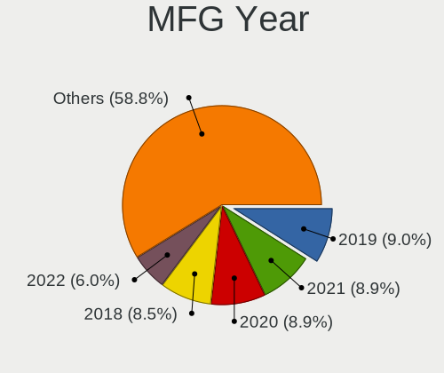
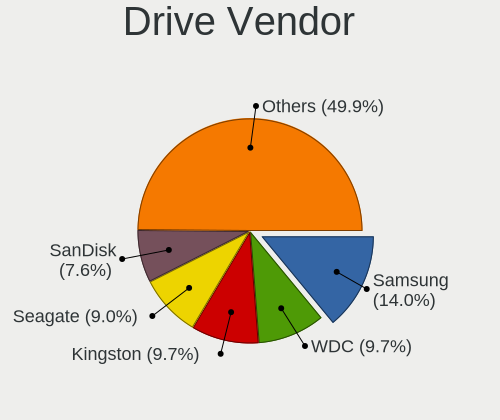
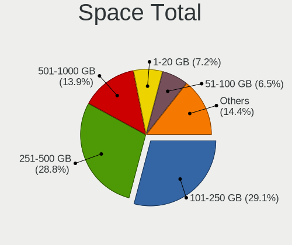
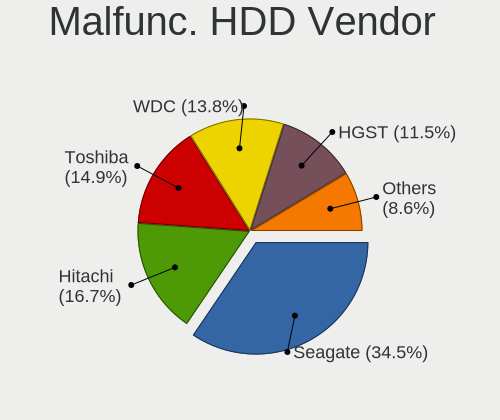
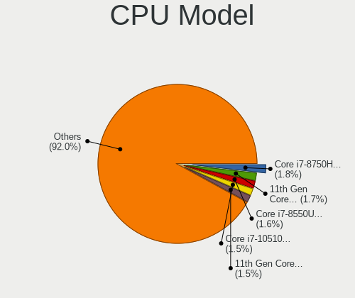
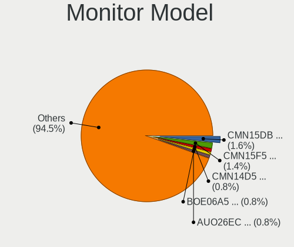
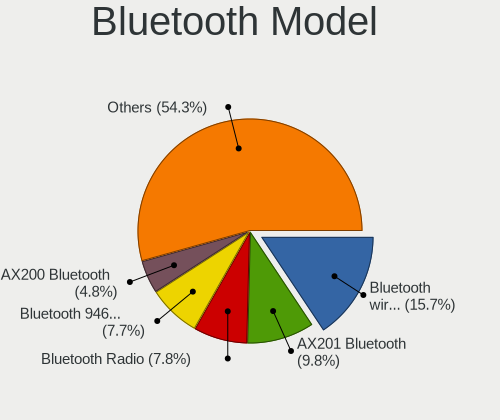
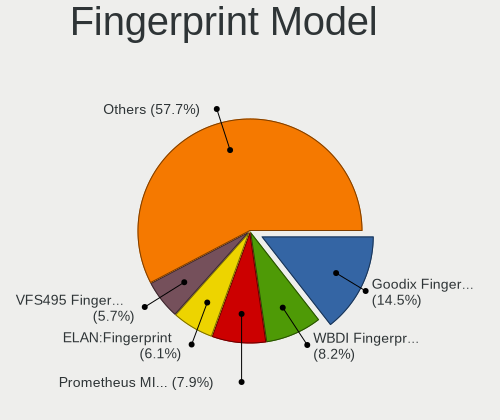

Linux in Spain - Tested Hardware & Statistics (Notebooks)
---------------------------------------------------------

A project to collect tested hardware configurations for Linux in Spain.

Anyone can contribute to this report by the [hw-probe](https://github.com/linuxhw/hw-probe) tool:

    sudo -E hw-probe -all -upload

Please contribute! Especially if your hardware is rare.

Contents
--------

* [ Test Cases ](#test-cases)

* [ System ](#system)
  - [ OS                       ](#os)
  - [ OS Family                ](#os-family)
  - [ Kernel                   ](#kernel)
  - [ Kernel Family            ](#kernel-family)
  - [ Kernel Major Ver.        ](#kernel-major-ver)
  - [ Arch                     ](#arch)
  - [ DE                       ](#de)
  - [ Display Server           ](#display-server)
  - [ Display Manager          ](#display-manager)
  - [ OS Lang                  ](#os-lang)
  - [ Boot Mode                ](#boot-mode)
  - [ Filesystem               ](#filesystem)
  - [ Part. scheme             ](#part-scheme)
  - [ Dual Boot with Linux/BSD ](#dual-boot-with-linuxbsd)
  - [ Dual Boot (Win)          ](#dual-boot-win)

* [ Board ](#board)
  - [ Vendor                   ](#vendor)
  - [ Model                    ](#model)
  - [ Model Family             ](#model-family)
  - [ MFG Year                 ](#mfg-year)
  - [ Form Factor              ](#form-factor)
  - [ Secure Boot              ](#secure-boot)
  - [ Coreboot                 ](#coreboot)
  - [ RAM Size                 ](#ram-size)
  - [ RAM Used                 ](#ram-used)
  - [ Total Drives             ](#total-drives)
  - [ Has CD-ROM               ](#has-cd-rom)
  - [ Has Ethernet             ](#has-ethernet)
  - [ Has WiFi                 ](#has-wifi)
  - [ Has Bluetooth            ](#has-bluetooth)

* [ Location ](#location)
  - [ Country                  ](#country)
  - [ City                     ](#city)

* [ Drives ](#drives)
  - [ Drive Vendor             ](#drive-vendor)
  - [ Drive Model              ](#drive-model)
  - [ HDD Vendor               ](#hdd-vendor)
  - [ SSD Vendor               ](#ssd-vendor)
  - [ Drive Kind               ](#drive-kind)
  - [ Drive Connector          ](#drive-connector)
  - [ Drive Size               ](#drive-size)
  - [ Space Total              ](#space-total)
  - [ Space Used               ](#space-used)
  - [ Malfunc. Drives          ](#malfunc-drives)
  - [ Malfunc. Drive Vendor    ](#malfunc-drive-vendor)
  - [ Malfunc. HDD Vendor      ](#malfunc-hdd-vendor)
  - [ Malfunc. Drive Kind      ](#malfunc-drive-kind)
  - [ Failed Drives            ](#failed-drives)
  - [ Failed Drive Vendor      ](#failed-drive-vendor)
  - [ Drive Status             ](#drive-status)

* [ Storage controller ](#storage-controller)
  - [ Storage Vendor           ](#storage-vendor)
  - [ Storage Model            ](#storage-model)
  - [ Storage Kind             ](#storage-kind)

* [ Processor ](#processor)
  - [ CPU Vendor               ](#cpu-vendor)
  - [ CPU Model                ](#cpu-model)
  - [ CPU Model Family         ](#cpu-model-family)
  - [ CPU Cores                ](#cpu-cores)
  - [ CPU Sockets              ](#cpu-sockets)
  - [ CPU Threads              ](#cpu-threads)
  - [ CPU Op-Modes             ](#cpu-op-modes)
  - [ CPU Microcode            ](#cpu-microcode)
  - [ CPU Microarch            ](#cpu-microarch)

* [ Graphics ](#graphics)
  - [ GPU Vendor               ](#gpu-vendor)
  - [ GPU Model                ](#gpu-model)
  - [ GPU Combo                ](#gpu-combo)
  - [ GPU Driver               ](#gpu-driver)
  - [ GPU Memory               ](#gpu-memory)

* [ Monitor ](#monitor)
  - [ Monitor Vendor           ](#monitor-vendor)
  - [ Monitor Model            ](#monitor-model)
  - [ Monitor Resolution       ](#monitor-resolution)
  - [ Monitor Diagonal         ](#monitor-diagonal)
  - [ Monitor Width            ](#monitor-width)
  - [ Aspect Ratio             ](#aspect-ratio)
  - [ Monitor Area             ](#monitor-area)
  - [ Pixel Density            ](#pixel-density)
  - [ Multiple Monitors        ](#multiple-monitors)

* [ Network ](#network)
  - [ Net Controller Vendor    ](#net-controller-vendor)
  - [ Net Controller Model     ](#net-controller-model)
  - [ Wireless Vendor          ](#wireless-vendor)
  - [ Wireless Model           ](#wireless-model)
  - [ Ethernet Vendor          ](#ethernet-vendor)
  - [ Ethernet Model           ](#ethernet-model)
  - [ Net Controller Kind      ](#net-controller-kind)
  - [ Used Controller          ](#used-controller)
  - [ NICs                     ](#nics)
  - [ IPv6                     ](#ipv6)

* [ Bluetooth ](#bluetooth)
  - [ Bluetooth Vendor         ](#bluetooth-vendor)
  - [ Bluetooth Model          ](#bluetooth-model)

* [ Sound ](#sound)
  - [ Sound Vendor             ](#sound-vendor)
  - [ Sound Model              ](#sound-model)

* [ Memory ](#memory)
  - [ Memory Vendor            ](#memory-vendor)
  - [ Memory Model             ](#memory-model)
  - [ Memory Kind              ](#memory-kind)
  - [ Memory Form Factor       ](#memory-form-factor)
  - [ Memory Size              ](#memory-size)
  - [ Memory Speed             ](#memory-speed)

* [ Printers & scanners ](#printers--scanners)
  - [ Printer Vendor           ](#printer-vendor)
  - [ Printer Model            ](#printer-model)
  - [ Scanner Vendor           ](#scanner-vendor)
  - [ Scanner Model            ](#scanner-model)

* [ Camera ](#camera)
  - [ Camera Vendor            ](#camera-vendor)
  - [ Camera Model             ](#camera-model)

* [ Security ](#security)
  - [ Fingerprint Vendor       ](#fingerprint-vendor)
  - [ Fingerprint Model        ](#fingerprint-model)
  - [ Chipcard Vendor          ](#chipcard-vendor)
  - [ Chipcard Model           ](#chipcard-model)

* [ Unsupported ](#unsupported)
  - [ Unsupported Devices      ](#unsupported-devices)
  - [ Unsupported Device Types ](#unsupported-device-types)

Test Cases
----------

Total: 6151

| Vendor        | Model                       | Probe                                                      | Date         |
|---------------|-----------------------------|------------------------------------------------------------|--------------|
| Lenovo        | ThinkPad L15 Gen 2 20X4S... | [928b89625a](https://linux-hardware.org/?probe=928b89625a) | Jan 06, 2025 |
| Medion        | X782X/X783X                 | [2d9cb07d4e](https://linux-hardware.org/?probe=2d9cb07d4e) | Jan 06, 2025 |
| Acer          | Aspire E1-571               | [1be16a65ff](https://linux-hardware.org/?probe=1be16a65ff) | Jan 05, 2025 |
| HP            | Pavilion g6                 | [909d7c69b5](https://linux-hardware.org/?probe=909d7c69b5) | Jan 05, 2025 |
| ASUSTek       | ROG Zephyrus G16 GU605MV... | [b360a75763](https://linux-hardware.org/?probe=b360a75763) | Jan 05, 2025 |
| Lenovo        | LOQ 15IRH8 82XV             | [8844fc8d14](https://linux-hardware.org/?probe=8844fc8d14) | Jan 05, 2025 |
| HP            | Laptop 15-db0xxx            | [df331d8cb3](https://linux-hardware.org/?probe=df331d8cb3) | Jan 05, 2025 |
| HP            | Pavilion g6                 | [ef9ad1fe50](https://linux-hardware.org/?probe=ef9ad1fe50) | Jan 05, 2025 |
| Lenovo        | IdeaPad 110-15ISK 80UD      | [fefd4c63ee](https://linux-hardware.org/?probe=fefd4c63ee) | Jan 04, 2025 |
| Lenovo        | ThinkPad Z16 Gen 1 21D4C... | [3c9cd9e73c](https://linux-hardware.org/?probe=3c9cd9e73c) | Jan 04, 2025 |
| Dell          | Inspiron 15 3515            | [ca2cc3e4ae](https://linux-hardware.org/?probe=ca2cc3e4ae) | Jan 02, 2025 |
| Lenovo        | G50-70 20351                | [9043dbb9a9](https://linux-hardware.org/?probe=9043dbb9a9) | Jan 01, 2025 |
| Sony          | VGN-FZ11M                   | [25ec238dec](https://linux-hardware.org/?probe=25ec238dec) | Dec 31, 2024 |
| Samsung       | 300E4A/300E5A/300E7A/343... | [c66eaf3382](https://linux-hardware.org/?probe=c66eaf3382) | Dec 31, 2024 |
| Acer          | Nitro ANV15-41              | [00953a17b5](https://linux-hardware.org/?probe=00953a17b5) | Dec 31, 2024 |
| HP            | Pavilion Sleekbook 15       | [eb0ead6c49](https://linux-hardware.org/?probe=eb0ead6c49) | Dec 31, 2024 |
| Dell          | Latitude E6410              | [ce431d6def](https://linux-hardware.org/?probe=ce431d6def) | Dec 31, 2024 |
| Dell          | Latitude E6410              | [e5ad6fdba6](https://linux-hardware.org/?probe=e5ad6fdba6) | Dec 31, 2024 |
| Acer          | TravelMate 5335             | [178a9c1abe](https://linux-hardware.org/?probe=178a9c1abe) | Dec 31, 2024 |
| Lenovo        | ThinkPad T450 20BUS35B00    | [f1f91c5a93](https://linux-hardware.org/?probe=f1f91c5a93) | Dec 31, 2024 |
| Lenovo        | ThinkPad T470p 20J6CTO1W... | [b255d3c686](https://linux-hardware.org/?probe=b255d3c686) | Dec 31, 2024 |
| ASUSTek       | VivoBook_ASUSLaptop X170... | [cba1e94ceb](https://linux-hardware.org/?probe=cba1e94ceb) | Dec 30, 2024 |
| Unknown       | Unknown                     | [03c104eecb](https://linux-hardware.org/?probe=03c104eecb) | Dec 30, 2024 |
| HP            | Laptop 15s-fq1xxx           | [1de7d2e8fb](https://linux-hardware.org/?probe=1de7d2e8fb) | Dec 30, 2024 |
| HP            | 255 G7 Notebook PC          | [c4f95fe88f](https://linux-hardware.org/?probe=c4f95fe88f) | Dec 29, 2024 |
| ASUSTek       | 1015PN                      | [f84154f736](https://linux-hardware.org/?probe=f84154f736) | Dec 29, 2024 |
| HP            | Pavilion Laptop 14-dv1xx... | [00ff33fe24](https://linux-hardware.org/?probe=00ff33fe24) | Dec 29, 2024 |
| ASUSTek       | X555LDB                     | [f11b5b7320](https://linux-hardware.org/?probe=f11b5b7320) | Dec 29, 2024 |
| HUAWEI        | KLVL-WXXW                   | [2ce7175d0a](https://linux-hardware.org/?probe=2ce7175d0a) | Dec 28, 2024 |
| Toshiba       | TECRA A10                   | [49714d63c9](https://linux-hardware.org/?probe=49714d63c9) | Dec 28, 2024 |
| Lenovo        | IdeaPad Slim 5 14IRL8 82... | [eb4bdf954b](https://linux-hardware.org/?probe=eb4bdf954b) | Dec 28, 2024 |
| ASUSTek       | ASUS TUF Gaming A15 FA50... | [6d267dc1e6](https://linux-hardware.org/?probe=6d267dc1e6) | Dec 27, 2024 |
| HP            | 15 TouchSmart               | [dbea1582fb](https://linux-hardware.org/?probe=dbea1582fb) | Dec 27, 2024 |
| Lenovo        | ThinkPad X240 20AL009CUS    | [6441794672](https://linux-hardware.org/?probe=6441794672) | Dec 27, 2024 |
| Apple         | MacBook5,1                  | [c3f162d658](https://linux-hardware.org/?probe=c3f162d658) | Dec 27, 2024 |
| Dell          | Latitude E5430 non-vPro     | [4e9074a386](https://linux-hardware.org/?probe=4e9074a386) | Dec 26, 2024 |
| Acer          | Aspire A315-59              | [1808c0b1a3](https://linux-hardware.org/?probe=1808c0b1a3) | Dec 26, 2024 |
| Lenovo        | ThinkPad T480s 20L7CTO1W... | [e79ac6d419](https://linux-hardware.org/?probe=e79ac6d419) | Dec 25, 2024 |
| ASUSTek       | ProArt P16 H7606WI_H7606... | [3fbdcb99b5](https://linux-hardware.org/?probe=3fbdcb99b5) | Dec 25, 2024 |
| ASUSTek       | VivoBook_ASUSLaptop X513... | [c551a96671](https://linux-hardware.org/?probe=c551a96671) | Dec 25, 2024 |
| Lenovo        | ThinkPad L460 20FVS2LC00    | [0ad5ec9e46](https://linux-hardware.org/?probe=0ad5ec9e46) | Dec 24, 2024 |
| PC Special... | P65xRP                      | [36a98584dd](https://linux-hardware.org/?probe=36a98584dd) | Dec 24, 2024 |
| HUAWEI        | KLVL-WXX9                   | [8c5b06dd77](https://linux-hardware.org/?probe=8c5b06dd77) | Dec 23, 2024 |
| SLIMBOOK      | EVO14-A8                    | [d6d1869563](https://linux-hardware.org/?probe=d6d1869563) | Dec 23, 2024 |
| HP            | Pavilion Gaming Laptop 1... | [20525b8729](https://linux-hardware.org/?probe=20525b8729) | Dec 23, 2024 |
| HP            | Pavilion Gaming Laptop 1... | [fcf87bc874](https://linux-hardware.org/?probe=fcf87bc874) | Dec 23, 2024 |
| Dell          | Latitude E4300              | [cfcc3cbd9f](https://linux-hardware.org/?probe=cfcc3cbd9f) | Dec 23, 2024 |
| Dell          | Latitude E4300              | [e67d828b77](https://linux-hardware.org/?probe=e67d828b77) | Dec 23, 2024 |
| Lenovo        | ThinkPad X240 20AL009CUS    | [9fdd4ef9fc](https://linux-hardware.org/?probe=9fdd4ef9fc) | Dec 23, 2024 |
| HP            | Laptop 15s-eq2xxx           | [75bf43b349](https://linux-hardware.org/?probe=75bf43b349) | Dec 23, 2024 |
| MSI           | Alpha 17 C7VF               | [dc79106cf5](https://linux-hardware.org/?probe=dc79106cf5) | Dec 22, 2024 |
| Notebook      | W510LU                      | [040c49871b](https://linux-hardware.org/?probe=040c49871b) | Dec 22, 2024 |
| Schenker      | XMG PRO 16 Studio (M24)     | [cb7a4908df](https://linux-hardware.org/?probe=cb7a4908df) | Dec 21, 2024 |
| MACHINIST     | X99-RS9 V1.11               | [6bab23707b](https://linux-hardware.org/?probe=6bab23707b) | Dec 21, 2024 |
| Lenovo        | ThinkPad T14s Gen 6 21M1... | [f05b1b8a31](https://linux-hardware.org/?probe=f05b1b8a31) | Dec 21, 2024 |
| ASUSTek       | X555LDB                     | [783e6ed502](https://linux-hardware.org/?probe=783e6ed502) | Dec 20, 2024 |
| Lenovo        | LOQ 15IRH8 82XV             | [e31581514e](https://linux-hardware.org/?probe=e31581514e) | Dec 20, 2024 |
| Chuwi         | CoreBook X                  | [de4d92e726](https://linux-hardware.org/?probe=de4d92e726) | Dec 20, 2024 |
| ASUSTek       | TP300LAB                    | [4c0a5e121b](https://linux-hardware.org/?probe=4c0a5e121b) | Dec 20, 2024 |
| HP            | Pavilion 17                 | [4afca04089](https://linux-hardware.org/?probe=4afca04089) | Dec 19, 2024 |
| Medion        | S6421 MD60703               | [609c73a176](https://linux-hardware.org/?probe=609c73a176) | Dec 19, 2024 |
| Dell          | XPS 13 9360                 | [99fbc60562](https://linux-hardware.org/?probe=99fbc60562) | Dec 19, 2024 |
| Acer          | Aspire 5750G                | [f4a8bd7c14](https://linux-hardware.org/?probe=f4a8bd7c14) | Dec 17, 2024 |
| HP            | Compaq Presario CQ60        | [1cf492f425](https://linux-hardware.org/?probe=1cf492f425) | Dec 17, 2024 |
| Acer          | Aspire E5-774G              | [19077cd048](https://linux-hardware.org/?probe=19077cd048) | Dec 17, 2024 |
| HP            | Compaq Presario CQ60        | [ec93e32825](https://linux-hardware.org/?probe=ec93e32825) | Dec 17, 2024 |
| Chuwi         | CoreBook X                  | [6f354f73aa](https://linux-hardware.org/?probe=6f354f73aa) | Dec 16, 2024 |
| ASUSTek       | ASUS TUF Gaming F15 FX50... | [c955d4b757](https://linux-hardware.org/?probe=c955d4b757) | Dec 16, 2024 |
| HP            | Laptop 15-fd0xxx            | [c4d820bd6f](https://linux-hardware.org/?probe=c4d820bd6f) | Dec 16, 2024 |
| MSI           | GL65 9SFK                   | [07dc9dfdfd](https://linux-hardware.org/?probe=07dc9dfdfd) | Dec 16, 2024 |
| ASUSTek       | GL552VW                     | [baff3ba8b4](https://linux-hardware.org/?probe=baff3ba8b4) | Dec 16, 2024 |
| ASUSTek       | GL552VW                     | [f8f78759d9](https://linux-hardware.org/?probe=f8f78759d9) | Dec 16, 2024 |
| Lenovo        | ThinkPad T14 Gen 3 21CGS... | [d9a6f919aa](https://linux-hardware.org/?probe=d9a6f919aa) | Dec 15, 2024 |
| Lenovo        | ThinkBook 15 G4 IAP 21DJ    | [d5184c7a52](https://linux-hardware.org/?probe=d5184c7a52) | Dec 15, 2024 |
| Acer          | Aspire ES1-571              | [91918bcc8e](https://linux-hardware.org/?probe=91918bcc8e) | Dec 15, 2024 |
| Apple         | MacBookPro9,2               | [89667736f7](https://linux-hardware.org/?probe=89667736f7) | Dec 15, 2024 |
| LG Electro... | 15Z90R-G.AP55B              | [cc84dbc880](https://linux-hardware.org/?probe=cc84dbc880) | Dec 14, 2024 |
| Apple         | MacBookPro14,2              | [ec7f9ccc97](https://linux-hardware.org/?probe=ec7f9ccc97) | Dec 14, 2024 |
| Dell          | Latitude E6420              | [6d4d0b3ad2](https://linux-hardware.org/?probe=6d4d0b3ad2) | Dec 14, 2024 |
| Lenovo        | ThinkPad E14 Gen 5 21JKC... | [3cfbdc1929](https://linux-hardware.org/?probe=3cfbdc1929) | Dec 14, 2024 |
| Lenovo        | LOQ 15IRH8 82XV             | [e9cba9e18e](https://linux-hardware.org/?probe=e9cba9e18e) | Dec 13, 2024 |
| Chuwi         | GemiBook Pro                | [a7ba503bce](https://linux-hardware.org/?probe=a7ba503bce) | Dec 13, 2024 |
| ASUSTek       | GL553VD                     | [02f586555d](https://linux-hardware.org/?probe=02f586555d) | Dec 13, 2024 |
| Lenovo        | IdeaPad 330-17ICH 81FL      | [5a6473c245](https://linux-hardware.org/?probe=5a6473c245) | Dec 13, 2024 |
| Lenovo        | IdeaPad 320-15ISK 80XH      | [c32e429bab](https://linux-hardware.org/?probe=c32e429bab) | Dec 12, 2024 |
| Lenovo        | IdeaPad 320-15ISK 80XH      | [6a39708a5f](https://linux-hardware.org/?probe=6a39708a5f) | Dec 12, 2024 |
| HP            | ProBook 630 G8 Notebook ... | [f9d8eff9f1](https://linux-hardware.org/?probe=f9d8eff9f1) | Dec 12, 2024 |
| Lenovo        | ThinkPad X250 20CLS35P00    | [1e756b4f02](https://linux-hardware.org/?probe=1e756b4f02) | Dec 12, 2024 |
| Lenovo        | ThinkPad SL500 274678G      | [c42768093f](https://linux-hardware.org/?probe=c42768093f) | Dec 12, 2024 |
| Lenovo        | ThinkPad X250 20CLS35P00    | [f07bee115e](https://linux-hardware.org/?probe=f07bee115e) | Dec 12, 2024 |
| HP            | ProBook 630 G8 Notebook ... | [8acb70e4b4](https://linux-hardware.org/?probe=8acb70e4b4) | Dec 11, 2024 |
| HP            | Laptop 15-fd0xxx            | [642094775c](https://linux-hardware.org/?probe=642094775c) | Dec 11, 2024 |
| HONOR         | HYM-WXX                     | [5175d23a1b](https://linux-hardware.org/?probe=5175d23a1b) | Dec 11, 2024 |
| ASUSTek       | X550JX                      | [825a9b88c3](https://linux-hardware.org/?probe=825a9b88c3) | Dec 11, 2024 |
| Dell          | Inspiron 7773               | [5da57642cd](https://linux-hardware.org/?probe=5da57642cd) | Dec 11, 2024 |
| HP            | ProBook 450 G8 Notebook ... | [54e889ddda](https://linux-hardware.org/?probe=54e889ddda) | Dec 11, 2024 |
| Acer          | Aspire SW5-014              | [1a577ada9a](https://linux-hardware.org/?probe=1a577ada9a) | Dec 09, 2024 |
| Apple         | MacBook5,1                  | [69acdd8a14](https://linux-hardware.org/?probe=69acdd8a14) | Dec 09, 2024 |
| HP            | Laptop 15s-eq2xxx           | [acb2794fe0](https://linux-hardware.org/?probe=acb2794fe0) | Dec 09, 2024 |
| Apple         | MacBook5,1                  | [0089011766](https://linux-hardware.org/?probe=0089011766) | Dec 08, 2024 |
| HP            | 250 G7 Notebook PC          | [c40248a5a1](https://linux-hardware.org/?probe=c40248a5a1) | Dec 08, 2024 |
| HP            | Laptop 15-bs0xx             | [03a9b913af](https://linux-hardware.org/?probe=03a9b913af) | Dec 08, 2024 |
| HUAWEI        | KLVL-WXX9                   | [b858296fef](https://linux-hardware.org/?probe=b858296fef) | Dec 07, 2024 |
| HP            | 250 G7 Notebook PC          | [4bd0c9c32f](https://linux-hardware.org/?probe=4bd0c9c32f) | Dec 07, 2024 |
| Apple         | MacBookPro9,1               | [9ff091de62](https://linux-hardware.org/?probe=9ff091de62) | Dec 05, 2024 |
| ASUSTek       | ASUS TUF Dash F15 FX516P... | [638c1123d0](https://linux-hardware.org/?probe=638c1123d0) | Dec 05, 2024 |
| Acer          | Aspire A315-41              | [de445fbbb8](https://linux-hardware.org/?probe=de445fbbb8) | Dec 05, 2024 |
| MSI           | Modern 15 B7M               | [06b55f5533](https://linux-hardware.org/?probe=06b55f5533) | Dec 05, 2024 |
| ASUSTek       | ZenBook Pro Duo UX581LV_... | [e169ffa11a](https://linux-hardware.org/?probe=e169ffa11a) | Dec 04, 2024 |
| Lenovo        | IdeaPad Slim 3 15AMN8 82... | [3635d82d65](https://linux-hardware.org/?probe=3635d82d65) | Dec 03, 2024 |
| Chuwi         | GemiBook Pro                | [e556a40293](https://linux-hardware.org/?probe=e556a40293) | Dec 03, 2024 |
| Notebook      | N13_N140ZU                  | [5a52d28de3](https://linux-hardware.org/?probe=5a52d28de3) | Dec 03, 2024 |
| Toshiba       | Satellite L50-B             | [f0195c6929](https://linux-hardware.org/?probe=f0195c6929) | Dec 02, 2024 |
| HP            | Pavilion Laptop 15-eg2xx... | [5a58c16bba](https://linux-hardware.org/?probe=5a58c16bba) | Dec 02, 2024 |
| Lenovo        | ThinkPad S1 Yoga 12 20DK... | [12e5cc51f6](https://linux-hardware.org/?probe=12e5cc51f6) | Dec 01, 2024 |
| HP            | Pavilion Laptop 14-dv1xx... | [6a5dd9d520](https://linux-hardware.org/?probe=6a5dd9d520) | Dec 01, 2024 |
| ASUSTek       | VivoBook_ASUSLaptop X509... | [fd60ccd21f](https://linux-hardware.org/?probe=fd60ccd21f) | Dec 01, 2024 |
| Apple         | MacBookAir6,2               | [95e149cabd](https://linux-hardware.org/?probe=95e149cabd) | Dec 01, 2024 |
| Toshiba       | Satellite L50-B             | [344eaec320](https://linux-hardware.org/?probe=344eaec320) | Nov 29, 2024 |
| HP            | 340S G7 Notebook PC         | [1b0bce07cc](https://linux-hardware.org/?probe=1b0bce07cc) | Nov 29, 2024 |
| Lenovo        | ThinkPad X260 20F5S39S03    | [84b5466fd5](https://linux-hardware.org/?probe=84b5466fd5) | Nov 29, 2024 |
| Lenovo        | ThinkPad X260 20F5S39S03    | [85ba713a0d](https://linux-hardware.org/?probe=85ba713a0d) | Nov 28, 2024 |
| Lenovo        | Legion Slim 5 16IRH8 82Y... | [3e09b39c66](https://linux-hardware.org/?probe=3e09b39c66) | Nov 28, 2024 |
| MSI           | Cyborg 15 A12UCX            | [e75ffb4bf5](https://linux-hardware.org/?probe=e75ffb4bf5) | Nov 28, 2024 |
| SLIMBOOK      | PROX-AMD5                   | [f4ac814ea4](https://linux-hardware.org/?probe=f4ac814ea4) | Nov 28, 2024 |
| Lenovo        | LOQ 15IRH8 82XV             | [96a747160d](https://linux-hardware.org/?probe=96a747160d) | Nov 28, 2024 |
| Lenovo        | ThinkPad P14s Gen 5 AMD ... | [c8d5a11077](https://linux-hardware.org/?probe=c8d5a11077) | Nov 27, 2024 |
| Teclast       | F15 Plus                    | [d3115c0e4f](https://linux-hardware.org/?probe=d3115c0e4f) | Nov 26, 2024 |
| HP            | Pavilion g6                 | [1e390a1633](https://linux-hardware.org/?probe=1e390a1633) | Nov 25, 2024 |
| HP            | EliteBook 2560p             | [54d07de40f](https://linux-hardware.org/?probe=54d07de40f) | Nov 25, 2024 |
| HP            | EliteBook 2560p             | [98af34c213](https://linux-hardware.org/?probe=98af34c213) | Nov 25, 2024 |
| MSI           | Bravo 15 C7UDX              | [0711ea8cc7](https://linux-hardware.org/?probe=0711ea8cc7) | Nov 24, 2024 |
| HP            | ProBook 450 G8              | [7cffac8f5b](https://linux-hardware.org/?probe=7cffac8f5b) | Nov 24, 2024 |
| Apple         | MacBookPro9,1               | [63a95fc1b1](https://linux-hardware.org/?probe=63a95fc1b1) | Nov 24, 2024 |
| HP            | ProBook 450 G8              | [2d282337d2](https://linux-hardware.org/?probe=2d282337d2) | Nov 24, 2024 |
| Lenovo        | IdeaPad Slim 3 15AMN8 82... | [3736516c3b](https://linux-hardware.org/?probe=3736516c3b) | Nov 24, 2024 |
| HP            | Laptop 15-db0xxx            | [f8201ecab7](https://linux-hardware.org/?probe=f8201ecab7) | Nov 24, 2024 |
| Dell          | Latitude 7300               | [6371109a3f](https://linux-hardware.org/?probe=6371109a3f) | Nov 23, 2024 |
| Notebook      | W54_55SU1,SUW               | [068d865846](https://linux-hardware.org/?probe=068d865846) | Nov 23, 2024 |
| MSI           | GF75 Thin 10UE              | [b6764cacc8](https://linux-hardware.org/?probe=b6764cacc8) | Nov 23, 2024 |
| MSI           | GF75 Thin 10UE              | [90559a82e1](https://linux-hardware.org/?probe=90559a82e1) | Nov 22, 2024 |
| HP            | Compaq 6820s                | [3980eb67c5](https://linux-hardware.org/?probe=3980eb67c5) | Nov 22, 2024 |
| HUAWEI        | KLVL-WXX9                   | [1bf31c491c](https://linux-hardware.org/?probe=1bf31c491c) | Nov 22, 2024 |
| Lenovo        | ThinkPad E16 Gen 2 21M5C... | [07a826ec9b](https://linux-hardware.org/?probe=07a826ec9b) | Nov 22, 2024 |
| Lenovo        | ThinkPad E16 Gen 2 21M5C... | [da6f85c9fb](https://linux-hardware.org/?probe=da6f85c9fb) | Nov 22, 2024 |
| ASUSTek       | ASUS Zenbook S 16 UM5606... | [bdcf6c541a](https://linux-hardware.org/?probe=bdcf6c541a) | Nov 21, 2024 |
| Lenovo        | ThinkPad X260 20F5S39S03    | [4d8f0f1f80](https://linux-hardware.org/?probe=4d8f0f1f80) | Nov 21, 2024 |
| HP            | Laptop 15s-fq5xxx           | [f62f6ec257](https://linux-hardware.org/?probe=f62f6ec257) | Nov 21, 2024 |
| HP            | ProBook 450 G8              | [5f49362c72](https://linux-hardware.org/?probe=5f49362c72) | Nov 21, 2024 |
| Lenovo        | ThinkPad P1 Gen 2 20QTCT... | [acdced4028](https://linux-hardware.org/?probe=acdced4028) | Nov 20, 2024 |
| Lenovo        | ThinkPad P16s Gen 2 21K9... | [50e8894feb](https://linux-hardware.org/?probe=50e8894feb) | Nov 19, 2024 |
| Lenovo        | ThinkPad P1 Gen 2 20QTCT... | [c412825153](https://linux-hardware.org/?probe=c412825153) | Nov 19, 2024 |
| Lenovo        | ThinkPad X1 Carbon Gen 1... | [4546b30b47](https://linux-hardware.org/?probe=4546b30b47) | Nov 19, 2024 |
| MSI           | Alpha 15 A4DEK              | [3712d8cab2](https://linux-hardware.org/?probe=3712d8cab2) | Nov 19, 2024 |
| MSI           | Alpha 15 A4DEK              | [6fce0dbd22](https://linux-hardware.org/?probe=6fce0dbd22) | Nov 19, 2024 |
| HUAWEI        | NBLB-WAX9N                  | [63467331fb](https://linux-hardware.org/?probe=63467331fb) | Nov 19, 2024 |
| Acer          | Aspire 3810T                | [71d5b52553](https://linux-hardware.org/?probe=71d5b52553) | Nov 18, 2024 |
| ASUSTek       | VivoBook_ASUSLaptop M150... | [3e09dbf345](https://linux-hardware.org/?probe=3e09dbf345) | Nov 15, 2024 |
| Apple         | MacBookPro8,1               | [06cde81990](https://linux-hardware.org/?probe=06cde81990) | Nov 15, 2024 |
| Lenovo        | ThinkBook 13x G4 IMH 21K... | [81736715eb](https://linux-hardware.org/?probe=81736715eb) | Nov 15, 2024 |
| Lenovo        | Legion Slim 5 16IRH8 82Y... | [1b14f28242](https://linux-hardware.org/?probe=1b14f28242) | Nov 13, 2024 |
| ASUSTek       | 1018P                       | [eef1555906](https://linux-hardware.org/?probe=eef1555906) | Nov 13, 2024 |
| Lenovo        | ThinkBook 15-IIL 20SM       | [70007038ab](https://linux-hardware.org/?probe=70007038ab) | Nov 13, 2024 |
| MSI           | Alpha 15 A3DDK              | [93abeb5a68](https://linux-hardware.org/?probe=93abeb5a68) | Nov 13, 2024 |
| ASUSTek       | K52F                        | [b060379c4a](https://linux-hardware.org/?probe=b060379c4a) | Nov 12, 2024 |
| Lenovo        | IdeaPad C340-14API 81N6     | [a7b1ed8a82](https://linux-hardware.org/?probe=a7b1ed8a82) | Nov 12, 2024 |
| Lenovo        | IdeaPad 3 15ITL6 82H8       | [59877579f0](https://linux-hardware.org/?probe=59877579f0) | Nov 12, 2024 |
| Toshiba       | Satellite L50-B             | [d15ac8736c](https://linux-hardware.org/?probe=d15ac8736c) | Nov 12, 2024 |
| Toshiba       | Satellite L50-B             | [8b3bf12d0c](https://linux-hardware.org/?probe=8b3bf12d0c) | Nov 12, 2024 |
| Schenker      | XMG PRO 16 Studio (M24)     | [3863c274d8](https://linux-hardware.org/?probe=3863c274d8) | Nov 12, 2024 |
| Schenker      | XMG PRO 16 Studio (M24)     | [ecdba16ed1](https://linux-hardware.org/?probe=ecdba16ed1) | Nov 12, 2024 |
| Apple         | MacBookPro11,4              | [4cf83bb804](https://linux-hardware.org/?probe=4cf83bb804) | Nov 10, 2024 |
| Alurin        | ALU-BAR-R555-000-156        | [946a4bbb98](https://linux-hardware.org/?probe=946a4bbb98) | Nov 10, 2024 |
| Alurin        | ALU-BAR-R555-000-156        | [c528868479](https://linux-hardware.org/?probe=c528868479) | Nov 10, 2024 |
| ASUSTek       | X551CA                      | [32c5d62c2c](https://linux-hardware.org/?probe=32c5d62c2c) | Nov 10, 2024 |
| ASUSTek       | X551CA                      | [6816290e91](https://linux-hardware.org/?probe=6816290e91) | Nov 09, 2024 |
| Lenovo        | ThinkPad T410 2537LV1       | [f98463af64](https://linux-hardware.org/?probe=f98463af64) | Nov 08, 2024 |
| Dell          | Latitude 7450               | [88f08a3dff](https://linux-hardware.org/?probe=88f08a3dff) | Nov 08, 2024 |
| ASUSTek       | X550WAK                     | [79d418f17b](https://linux-hardware.org/?probe=79d418f17b) | Nov 08, 2024 |
| Toshiba       | Satellite S50D-B            | [ce49220a67](https://linux-hardware.org/?probe=ce49220a67) | Nov 08, 2024 |
| Toshiba       | Satellite S50D-B            | [1f56de68ff](https://linux-hardware.org/?probe=1f56de68ff) | Nov 08, 2024 |
| HP            | Pavilion Laptop 14-dv1xx... | [05c250783f](https://linux-hardware.org/?probe=05c250783f) | Nov 07, 2024 |
| ASUSTek       | X550WAK                     | [92d61da167](https://linux-hardware.org/?probe=92d61da167) | Nov 04, 2024 |
| HP            | EliteBook 8560w             | [dcd30fd3d0](https://linux-hardware.org/?probe=dcd30fd3d0) | Nov 04, 2024 |
| Dell          | Latitude 5480               | [050c59108b](https://linux-hardware.org/?probe=050c59108b) | Nov 04, 2024 |
| Toshiba       | Satellite L300              | [d155ee5eff](https://linux-hardware.org/?probe=d155ee5eff) | Nov 04, 2024 |
| Acer          | Aspire A315-44P             | [c1acd872a4](https://linux-hardware.org/?probe=c1acd872a4) | Nov 04, 2024 |
| Lenovo        | Legion Y540-15IRH-PG0 81... | [0c39eccedf](https://linux-hardware.org/?probe=0c39eccedf) | Nov 04, 2024 |
| Dell          | XPS 13 9305                 | [32bad4719b](https://linux-hardware.org/?probe=32bad4719b) | Nov 04, 2024 |
| Dell          | Latitude 5420               | [e72850fdae](https://linux-hardware.org/?probe=e72850fdae) | Nov 03, 2024 |
| Toshiba       | Satellite C850D-117         | [705f1e2ec9](https://linux-hardware.org/?probe=705f1e2ec9) | Nov 02, 2024 |
| ASUSTek       | ASUS EXPERTBOOK B1502CBA... | [2831ff1766](https://linux-hardware.org/?probe=2831ff1766) | Nov 02, 2024 |
| GEEKOM        | A8                          | [0c71662747](https://linux-hardware.org/?probe=0c71662747) | Nov 02, 2024 |
| HP            | ZBook Studio 16 inch G10... | [ea022eb326](https://linux-hardware.org/?probe=ea022eb326) | Nov 02, 2024 |
| GEEKOM        | A8                          | [68e6597e28](https://linux-hardware.org/?probe=68e6597e28) | Nov 01, 2024 |
| Acer          | Aspire A315-56              | [906eadb97b](https://linux-hardware.org/?probe=906eadb97b) | Nov 01, 2024 |
| Acer          | Aspire A315-56              | [1f38b58ff7](https://linux-hardware.org/?probe=1f38b58ff7) | Nov 01, 2024 |
| Lenovo        | Legion Slim 5 16AHP9 83D... | [aec9e868cb](https://linux-hardware.org/?probe=aec9e868cb) | Oct 31, 2024 |
| HP            | Laptop 15s-fq5xxx           | [71ff049fdd](https://linux-hardware.org/?probe=71ff049fdd) | Oct 31, 2024 |
| Lenovo        | ThinkPad S1 Yoga 12 20DK... | [d882851a03](https://linux-hardware.org/?probe=d882851a03) | Oct 31, 2024 |
| Google        | Drobit                      | [2f2e33668c](https://linux-hardware.org/?probe=2f2e33668c) | Oct 31, 2024 |
| HP            | Laptop 15s-eq2xxx           | [a06eab93a5](https://linux-hardware.org/?probe=a06eab93a5) | Oct 30, 2024 |
| ASUSTek       | VivoBook_ASUSLaptop X150... | [fca42f5d04](https://linux-hardware.org/?probe=fca42f5d04) | Oct 30, 2024 |
| Lenovo        | ThinkPad X1 Carbon Gen 1... | [f711c82c48](https://linux-hardware.org/?probe=f711c82c48) | Oct 30, 2024 |
| Apple         | MacBookAir7,2               | [ed7617cf02](https://linux-hardware.org/?probe=ed7617cf02) | Oct 30, 2024 |
| HP            | Laptop 15s-eq2xxx           | [1755d407c9](https://linux-hardware.org/?probe=1755d407c9) | Oct 29, 2024 |
| Acer          | Aspire 5741Z                | [d2cf18c835](https://linux-hardware.org/?probe=d2cf18c835) | Oct 29, 2024 |
| Apple         | MacBookPro8,1               | [f8111d2bcb](https://linux-hardware.org/?probe=f8111d2bcb) | Oct 29, 2024 |
| ASUSTek       | ASUS TUF Dash F15 FX517Z... | [2f2a65dd93](https://linux-hardware.org/?probe=2f2a65dd93) | Oct 29, 2024 |
| Dell          | Latitude 7520               | [25268ed392](https://linux-hardware.org/?probe=25268ed392) | Oct 29, 2024 |
| Lenovo        | Yoga Pro 7 14APH8 82Y8      | [b6011566de](https://linux-hardware.org/?probe=b6011566de) | Oct 29, 2024 |
| HP            | ProBook 450 15.6 inch G9... | [9552f01581](https://linux-hardware.org/?probe=9552f01581) | Oct 29, 2024 |
| HP            | Victus by Gaming Laptop ... | [b9cfe6503d](https://linux-hardware.org/?probe=b9cfe6503d) | Oct 29, 2024 |
| HP            | Victus by Gaming Laptop ... | [9ba7320167](https://linux-hardware.org/?probe=9ba7320167) | Oct 29, 2024 |
| HP            | Pavilion Aero Laptop 13-... | [7e5bbb938b](https://linux-hardware.org/?probe=7e5bbb938b) | Oct 28, 2024 |
| Google        | Magolor                     | [948d5ce4be](https://linux-hardware.org/?probe=948d5ce4be) | Oct 27, 2024 |
| HP            | Laptop 15-db0xxx            | [fe596bfb55](https://linux-hardware.org/?probe=fe596bfb55) | Oct 26, 2024 |
| Unknown       | CherryTrail                 | [be2389a1f2](https://linux-hardware.org/?probe=be2389a1f2) | Oct 26, 2024 |
| HP            | 250 G5 Notebook PC          | [29b5752381](https://linux-hardware.org/?probe=29b5752381) | Oct 25, 2024 |
| MSI           | Alpha 15 A3DDK              | [43126100f1](https://linux-hardware.org/?probe=43126100f1) | Oct 25, 2024 |
| ASUSTek       | G73Sw                       | [0ff1e91524](https://linux-hardware.org/?probe=0ff1e91524) | Oct 24, 2024 |
| HUAWEI        | FLMH-XX                     | [d247f55df9](https://linux-hardware.org/?probe=d247f55df9) | Oct 24, 2024 |
| HP            | 250 G8 Notebook PC          | [338df85e2c](https://linux-hardware.org/?probe=338df85e2c) | Oct 23, 2024 |
| Lenovo        | ThinkPad P15v Gen 3 21D9... | [3256d7f820](https://linux-hardware.org/?probe=3256d7f820) | Oct 23, 2024 |
| Lenovo        | ThinkPad P15v Gen 3 21D9... | [37b34d5541](https://linux-hardware.org/?probe=37b34d5541) | Oct 23, 2024 |
| Lenovo        | ThinkPad E15 Gen 2 20TD0... | [ca0d12638d](https://linux-hardware.org/?probe=ca0d12638d) | Oct 23, 2024 |
| HP            | Victus by Gaming Laptop ... | [975b858e28](https://linux-hardware.org/?probe=975b858e28) | Oct 23, 2024 |
| ASUSTek       | VivoBook_ASUSLaptop X509... | [372ce92f90](https://linux-hardware.org/?probe=372ce92f90) | Oct 22, 2024 |
| HP            | Pavilion dv9700             | [dcc460dd1c](https://linux-hardware.org/?probe=dcc460dd1c) | Oct 22, 2024 |
| HP            | Pavilion dv9700             | [ffc2fed98e](https://linux-hardware.org/?probe=ffc2fed98e) | Oct 22, 2024 |
| Lenovo        | ThinkPad P1 Gen 6 21FWS9... | [4dad6a065d](https://linux-hardware.org/?probe=4dad6a065d) | Oct 22, 2024 |
| Lenovo        | V15-ADA 82C7                | [76d8c86d01](https://linux-hardware.org/?probe=76d8c86d01) | Oct 22, 2024 |
| Medion        | S6421 MD60703               | [c92c3514b3](https://linux-hardware.org/?probe=c92c3514b3) | Oct 22, 2024 |
| HP            | 620                         | [5770270596](https://linux-hardware.org/?probe=5770270596) | Oct 22, 2024 |
| SLIMBOOK      | PROX-AMD5                   | [cfed3dc7f9](https://linux-hardware.org/?probe=cfed3dc7f9) | Oct 21, 2024 |
| HP            | 250 15.6 inch G10 Notebo... | [9e94170315](https://linux-hardware.org/?probe=9e94170315) | Oct 21, 2024 |
| HUAWEI        | KLVL-WXX9                   | [faeb5479f8](https://linux-hardware.org/?probe=faeb5479f8) | Oct 21, 2024 |
| HP            | Laptop 15-db0xxx            | [9cd14c1c33](https://linux-hardware.org/?probe=9cd14c1c33) | Oct 21, 2024 |
| Lenovo        | G500 20236                  | [bf956aac4d](https://linux-hardware.org/?probe=bf956aac4d) | Oct 21, 2024 |
| Toshiba       | PORTEGE Z830                | [1d5f4bb615](https://linux-hardware.org/?probe=1d5f4bb615) | Oct 20, 2024 |
| HP            | Pavilion Laptop 14-dv1xx... | [8886e7de9c](https://linux-hardware.org/?probe=8886e7de9c) | Oct 20, 2024 |
| Acer          | Aspire E5-521               | [f086192ce5](https://linux-hardware.org/?probe=f086192ce5) | Oct 20, 2024 |
| Lenovo        | B50-10 80QR                 | [6b27d730b2](https://linux-hardware.org/?probe=6b27d730b2) | Oct 20, 2024 |
| Lenovo        | IdeaPad 3 15ITL6 82H8       | [e3c6880a2d](https://linux-hardware.org/?probe=e3c6880a2d) | Oct 19, 2024 |
| HP            | Pavilion g6                 | [a6a9d7daa7](https://linux-hardware.org/?probe=a6a9d7daa7) | Oct 19, 2024 |
| HP            | Laptop 15-bs1xx             | [41cc638e5f](https://linux-hardware.org/?probe=41cc638e5f) | Oct 19, 2024 |
| HP            | Laptop 15-bs1xx             | [bdca8c343d](https://linux-hardware.org/?probe=bdca8c343d) | Oct 19, 2024 |
| HP            | Pavilion g6                 | [e00c3b3199](https://linux-hardware.org/?probe=e00c3b3199) | Oct 19, 2024 |
| Chuwi         | GemiBook Pro                | [bf00a67abe](https://linux-hardware.org/?probe=bf00a67abe) | Oct 19, 2024 |
| HP            | Laptop 15s-eq2xxx           | [339f546673](https://linux-hardware.org/?probe=339f546673) | Oct 18, 2024 |
| Lenovo        | ThinkPad T420 4236PN3       | [245ac91564](https://linux-hardware.org/?probe=245ac91564) | Oct 18, 2024 |
| ASUSTek       | ASUS TUF Gaming A14 FA40... | [54f11d9d18](https://linux-hardware.org/?probe=54f11d9d18) | Oct 18, 2024 |
| ASUSTek       | X540YA                      | [717f10e863](https://linux-hardware.org/?probe=717f10e863) | Oct 17, 2024 |
| BAKED         | P65xRP                      | [9d26712e83](https://linux-hardware.org/?probe=9d26712e83) | Oct 17, 2024 |
| BAKED         | P65xRP                      | [b843af1c15](https://linux-hardware.org/?probe=b843af1c15) | Oct 17, 2024 |
| Lenovo        | ThinkPad Edge 25453BG       | [1b7e79796e](https://linux-hardware.org/?probe=1b7e79796e) | Oct 17, 2024 |
| Sony          | VGN-AR41S                   | [d41cbf35f9](https://linux-hardware.org/?probe=d41cbf35f9) | Oct 16, 2024 |
| HP            | Compaq CQ58                 | [745f176ea5](https://linux-hardware.org/?probe=745f176ea5) | Oct 16, 2024 |
| Chuwi         | GemiBook Pro                | [ffc8702d4a](https://linux-hardware.org/?probe=ffc8702d4a) | Oct 16, 2024 |
| ASUSTek       | VivoBook_ASUSLaptop X150... | [6062104c08](https://linux-hardware.org/?probe=6062104c08) | Oct 16, 2024 |
| ASUSTek       | ROG Strix G513RW_G513RW     | [e9c8a9f007](https://linux-hardware.org/?probe=e9c8a9f007) | Oct 15, 2024 |
| HP            | Compaq CQ58                 | [129913dcc6](https://linux-hardware.org/?probe=129913dcc6) | Oct 14, 2024 |
| SLIMBOOK      | Unknown                     | [a45b75d9ec](https://linux-hardware.org/?probe=a45b75d9ec) | Oct 14, 2024 |
| Lenovo        | G550 2958                   | [2a260624d2](https://linux-hardware.org/?probe=2a260624d2) | Oct 14, 2024 |
| MSI           | Delta 15 A5EFK              | [1ea4bbf550](https://linux-hardware.org/?probe=1ea4bbf550) | Oct 14, 2024 |
| ASUSTek       | K52F                        | [06a8fb0fc9](https://linux-hardware.org/?probe=06a8fb0fc9) | Oct 13, 2024 |
| ASUSTek       | ROG Strix G713IE_G713IE     | [ab3c9c93ba](https://linux-hardware.org/?probe=ab3c9c93ba) | Oct 13, 2024 |
| Toshiba       | Satellite Pro C50-A-1C8     | [cda39f5171](https://linux-hardware.org/?probe=cda39f5171) | Oct 13, 2024 |
| Dell          | Precision M4500             | [61cc876a50](https://linux-hardware.org/?probe=61cc876a50) | Oct 13, 2024 |
| ASUSTek       | K54HR                       | [0dab9d79b6](https://linux-hardware.org/?probe=0dab9d79b6) | Oct 13, 2024 |
| Acer          | Aspire E5-573G              | [5849ebaf14](https://linux-hardware.org/?probe=5849ebaf14) | Oct 12, 2024 |
| HP            | ENVY 15                     | [a34064cb9a](https://linux-hardware.org/?probe=a34064cb9a) | Oct 12, 2024 |
| Acer          | Aspire A315-44P             | [2233631987](https://linux-hardware.org/?probe=2233631987) | Oct 12, 2024 |
| Lenovo        | ThinkPad X220 429136G       | [048e1b5215](https://linux-hardware.org/?probe=048e1b5215) | Oct 12, 2024 |
| Dell          | Latitude E6430              | [c6f34c26ee](https://linux-hardware.org/?probe=c6f34c26ee) | Oct 11, 2024 |
| Dell          | Latitude E6430              | [5234a5aabf](https://linux-hardware.org/?probe=5234a5aabf) | Oct 11, 2024 |
| HP            | ProBook 650 G1              | [1b1df91d0e](https://linux-hardware.org/?probe=1b1df91d0e) | Oct 11, 2024 |
| Acer          | Nitro AN517-41              | [be206ecaa3](https://linux-hardware.org/?probe=be206ecaa3) | Oct 11, 2024 |
| Dell          | Inspiron 5521               | [fadf78306d](https://linux-hardware.org/?probe=fadf78306d) | Oct 11, 2024 |
| Lenovo        | ThinkPad S1 Yoga 12 20DK... | [59c4c502f1](https://linux-hardware.org/?probe=59c4c502f1) | Oct 10, 2024 |
| MSI           | Modern 14 A10RB             | [148147f2d5](https://linux-hardware.org/?probe=148147f2d5) | Oct 10, 2024 |
| Lenovo        | IdeaPad 100-15IBY 80MJ      | [8aa63aadfe](https://linux-hardware.org/?probe=8aa63aadfe) | Oct 09, 2024 |
| Lenovo        | ThinkPad T470 W10DG 20JN... | [47a7874878](https://linux-hardware.org/?probe=47a7874878) | Oct 09, 2024 |
| Acer          | Aspire A315-44P             | [8131f1506d](https://linux-hardware.org/?probe=8131f1506d) | Oct 09, 2024 |
| MSI           | Modern 14 A10RB             | [f1b16a12ac](https://linux-hardware.org/?probe=f1b16a12ac) | Oct 09, 2024 |
| Acer          | Nitro AN515-58              | [cc74ccf112](https://linux-hardware.org/?probe=cc74ccf112) | Oct 09, 2024 |
| HP            | Victus by Laptop 16-e1xx... | [0801bc5d6b](https://linux-hardware.org/?probe=0801bc5d6b) | Oct 09, 2024 |
| Acer          | Aspire A315-44P             | [65b854b6d3](https://linux-hardware.org/?probe=65b854b6d3) | Oct 08, 2024 |
| HP            | 2230s                       | [c75480284b](https://linux-hardware.org/?probe=c75480284b) | Oct 08, 2024 |
| HP            | 2230s                       | [8beefca2cb](https://linux-hardware.org/?probe=8beefca2cb) | Oct 08, 2024 |
| ASUSTek       | VivoBook_ASUSLaptop X509... | [243cf71860](https://linux-hardware.org/?probe=243cf71860) | Oct 08, 2024 |
| Lenovo        | V14 G5 IRL 83HD             | [d4d195ccc7](https://linux-hardware.org/?probe=d4d195ccc7) | Oct 08, 2024 |
| ASUSTek       | ASUS TUF Dash F15 FX517Z... | [aa172a6169](https://linux-hardware.org/?probe=aa172a6169) | Oct 07, 2024 |
| Samsung       | RC530/RC730                 | [6b0bed93f7](https://linux-hardware.org/?probe=6b0bed93f7) | Oct 07, 2024 |
| Dell          | Latitude D630               | [329c0abded](https://linux-hardware.org/?probe=329c0abded) | Oct 05, 2024 |
| ASUSTek       | X550CL                      | [c561d0fe5b](https://linux-hardware.org/?probe=c561d0fe5b) | Oct 05, 2024 |
| Lenovo        | ThinkPad X201 3323BSG       | [f1d6f061f1](https://linux-hardware.org/?probe=f1d6f061f1) | Oct 05, 2024 |
| HP            | Victus by Gaming Laptop ... | [cbaef26810](https://linux-hardware.org/?probe=cbaef26810) | Oct 04, 2024 |
| Lenovo        | Legion Y530-15ICH 81FV      | [0f527314f8](https://linux-hardware.org/?probe=0f527314f8) | Oct 03, 2024 |
| Acer          | Aspire A315-44P             | [3aaeee6d1b](https://linux-hardware.org/?probe=3aaeee6d1b) | Oct 03, 2024 |
| Unknown       | Unknown                     | [724da43eb0](https://linux-hardware.org/?probe=724da43eb0) | Oct 03, 2024 |
| Fujitsu       | LIFEBOOK AH532              | [288e1c2e47](https://linux-hardware.org/?probe=288e1c2e47) | Oct 03, 2024 |
| HP            | 250 G7 Notebook PC          | [30f5ea4c3f](https://linux-hardware.org/?probe=30f5ea4c3f) | Oct 02, 2024 |
| ASUSTek       | X551CA                      | [a81efba7dd](https://linux-hardware.org/?probe=a81efba7dd) | Oct 01, 2024 |
| Acer          | Aspire A315-58              | [50a08b9a0d](https://linux-hardware.org/?probe=50a08b9a0d) | Oct 01, 2024 |
| Lenovo        | IdeaPad Gaming 3 15IAH7 ... | [73a8aa24f1](https://linux-hardware.org/?probe=73a8aa24f1) | Sep 30, 2024 |
| Dell          | XPS 13 9350                 | [becb205c67](https://linux-hardware.org/?probe=becb205c67) | Sep 30, 2024 |
| ASUSTek       | VivoBook_ASUSLaptop X150... | [b0994d2547](https://linux-hardware.org/?probe=b0994d2547) | Sep 30, 2024 |
| HP            | Laptop 15-bw0xx             | [1046a844db](https://linux-hardware.org/?probe=1046a844db) | Sep 30, 2024 |
| Toshiba       | Satellite L645              | [d02b70c5ca](https://linux-hardware.org/?probe=d02b70c5ca) | Sep 29, 2024 |
| Notebook      | N2x0WU                      | [7e061af782](https://linux-hardware.org/?probe=7e061af782) | Sep 29, 2024 |
| Lenovo        | ThinkPad P15v Gen 2i 21A... | [7efd1669e4](https://linux-hardware.org/?probe=7efd1669e4) | Sep 28, 2024 |
| ASUSTek       | X551CA                      | [6351930333](https://linux-hardware.org/?probe=6351930333) | Sep 27, 2024 |
| HP            | Laptop 15-fd0xxx            | [d267d17389](https://linux-hardware.org/?probe=d267d17389) | Sep 27, 2024 |
| Acer          | Aspire 5551                 | [ec24805769](https://linux-hardware.org/?probe=ec24805769) | Sep 27, 2024 |
| Lenovo        | ThinkPad P14s Gen 4 21K5... | [85fb0924d3](https://linux-hardware.org/?probe=85fb0924d3) | Sep 27, 2024 |
| LG Electro... | R510                        | [a37143fb1e](https://linux-hardware.org/?probe=a37143fb1e) | Sep 26, 2024 |
| Lenovo        | IdeaPad 320-15IKB 80XL      | [a48a57eec3](https://linux-hardware.org/?probe=a48a57eec3) | Sep 26, 2024 |
| Lenovo        | ThinkBook 14 G4 ABA 21DK    | [eb33c31279](https://linux-hardware.org/?probe=eb33c31279) | Sep 26, 2024 |
| Lenovo        | ThinkBook 14 G4 ABA 21DK    | [3b9fd6ff26](https://linux-hardware.org/?probe=3b9fd6ff26) | Sep 26, 2024 |
| MSI           | GF63 Thin 9SC               | [1803b90b56](https://linux-hardware.org/?probe=1803b90b56) | Sep 25, 2024 |
| Dell          | Inspiron 14 Plus 7440       | [6f05ef66d7](https://linux-hardware.org/?probe=6f05ef66d7) | Sep 25, 2024 |
| Sony          | VGN-FW31J                   | [4abb461451](https://linux-hardware.org/?probe=4abb461451) | Sep 25, 2024 |
| Lenovo        | ThinkPad T480s 20L8S2330... | [6109441a72](https://linux-hardware.org/?probe=6109441a72) | Sep 25, 2024 |
| HP            | 255 15.6 inch G10 Notebo... | [0f06130867](https://linux-hardware.org/?probe=0f06130867) | Sep 25, 2024 |
| HP            | Compaq 6730s                | [41a3ea4580](https://linux-hardware.org/?probe=41a3ea4580) | Sep 24, 2024 |
| MSI           | GF63 Thin 10SCSR            | [a20e2bb3c3](https://linux-hardware.org/?probe=a20e2bb3c3) | Sep 24, 2024 |
| MSI           | GF63 Thin 10SCSR            | [83783f2d70](https://linux-hardware.org/?probe=83783f2d70) | Sep 24, 2024 |
| Lenovo        | ThinkPad T480s 20L8S2330... | [2e5db39f9a](https://linux-hardware.org/?probe=2e5db39f9a) | Sep 24, 2024 |
| Sony          | SVF1521W1EB                 | [a1ccef7b48](https://linux-hardware.org/?probe=a1ccef7b48) | Sep 23, 2024 |
| Lenovo        | IdeaPad Gaming 3 15IAH7 ... | [2900d034f3](https://linux-hardware.org/?probe=2900d034f3) | Sep 22, 2024 |
| Lenovo        | Legion Y530-15ICH 81FV      | [ada9824b2e](https://linux-hardware.org/?probe=ada9824b2e) | Sep 22, 2024 |
| Acer          | Extensa 215-55              | [2d1f251fc7](https://linux-hardware.org/?probe=2d1f251fc7) | Sep 22, 2024 |
| ASUSTek       | X550CL                      | [81e41b1e3a](https://linux-hardware.org/?probe=81e41b1e3a) | Sep 22, 2024 |
| Lenovo        | ThinkPad P15v Gen 2i 21A... | [91c64d17ea](https://linux-hardware.org/?probe=91c64d17ea) | Sep 22, 2024 |
| HP            | Pavilion 15                 | [315c114fef](https://linux-hardware.org/?probe=315c114fef) | Sep 22, 2024 |
| MSI           | GF63 Thin 10SCXR            | [ab5c8330d5](https://linux-hardware.org/?probe=ab5c8330d5) | Sep 21, 2024 |
| HP            | Victus by Gaming Laptop ... | [6a8043a39f](https://linux-hardware.org/?probe=6a8043a39f) | Sep 21, 2024 |
| HP            | Victus by Gaming Laptop ... | [17fd2f1a0d](https://linux-hardware.org/?probe=17fd2f1a0d) | Sep 21, 2024 |
| ASUSTek       | VivoBook_ASUSLaptop X420... | [71da8d4236](https://linux-hardware.org/?probe=71da8d4236) | Sep 21, 2024 |
| Alienware     | M14xR1                      | [4226c0c57a](https://linux-hardware.org/?probe=4226c0c57a) | Sep 20, 2024 |
| Google        | Markarth                    | [d2d281ffc3](https://linux-hardware.org/?probe=d2d281ffc3) | Sep 20, 2024 |
| Lenovo        | Unknown                     | [fb2e9dc537](https://linux-hardware.org/?probe=fb2e9dc537) | Sep 20, 2024 |
| MSI           | Prestige 14 A10RB           | [f8b0fb37bc](https://linux-hardware.org/?probe=f8b0fb37bc) | Sep 20, 2024 |
| HP            | Victus by Gaming Laptop ... | [cf14ae652e](https://linux-hardware.org/?probe=cf14ae652e) | Sep 20, 2024 |
| HP            | Victus by Laptop 16-e1xx... | [374c9a1244](https://linux-hardware.org/?probe=374c9a1244) | Sep 20, 2024 |
| HP            | Laptop 15-da2xxx            | [26458ab9f0](https://linux-hardware.org/?probe=26458ab9f0) | Sep 19, 2024 |
| Packard Be... | EasyNote TN65               | [08791fd1e4](https://linux-hardware.org/?probe=08791fd1e4) | Sep 19, 2024 |
| Lenovo        | IdeaPad 100-15IBD 80QQ      | [e6a4fd809a](https://linux-hardware.org/?probe=e6a4fd809a) | Sep 18, 2024 |
| HP            | Laptop 15-fd0xxx            | [75cd2354f1](https://linux-hardware.org/?probe=75cd2354f1) | Sep 18, 2024 |
| ASUSTek       | VivoBook_ASUSLaptop M150... | [68510859ab](https://linux-hardware.org/?probe=68510859ab) | Sep 18, 2024 |
| ASUSTek       | Zenbook 15 UM3504DA_UM35... | [97073460e5](https://linux-hardware.org/?probe=97073460e5) | Sep 18, 2024 |
| HP            | ProBook 4530s               | [d80120206b](https://linux-hardware.org/?probe=d80120206b) | Sep 18, 2024 |
| HP            | Pavilion Gaming Laptop 1... | [244e320daa](https://linux-hardware.org/?probe=244e320daa) | Sep 17, 2024 |
| ASUSTek       | X550JX                      | [6d52e722d2](https://linux-hardware.org/?probe=6d52e722d2) | Sep 17, 2024 |
| HP            | 15                          | [a28b36fa32](https://linux-hardware.org/?probe=a28b36fa32) | Sep 16, 2024 |
| HP            | 15                          | [7a3501c59b](https://linux-hardware.org/?probe=7a3501c59b) | Sep 16, 2024 |
| Acer          | Extensa 215-55              | [85adf1479d](https://linux-hardware.org/?probe=85adf1479d) | Sep 16, 2024 |
| Medion        | Akoya E1317T                | [7ad74493a9](https://linux-hardware.org/?probe=7ad74493a9) | Sep 16, 2024 |
| Acer          | Aspire 5551                 | [0308878360](https://linux-hardware.org/?probe=0308878360) | Sep 16, 2024 |
| Google        | Markarth                    | [1b54ca967e](https://linux-hardware.org/?probe=1b54ca967e) | Sep 15, 2024 |
| Schenker      | XMG PRO 16 Studio (M24)     | [e85cafa493](https://linux-hardware.org/?probe=e85cafa493) | Sep 15, 2024 |
| Schenker      | XMG PRO 16 Studio (M24)     | [33570a61a7](https://linux-hardware.org/?probe=33570a61a7) | Sep 15, 2024 |
| ASUSTek       | Zenbook UM3402YAR_UM3402... | [391c193148](https://linux-hardware.org/?probe=391c193148) | Sep 15, 2024 |
| Notebook      | NL4x_NL5xLU                 | [caa9591aa5](https://linux-hardware.org/?probe=caa9591aa5) | Sep 15, 2024 |
| ASUSTek       | ASUS TUF Gaming A16 FA61... | [534cd1f202](https://linux-hardware.org/?probe=534cd1f202) | Sep 14, 2024 |
| Lenovo        | IdeaPad 3 15ITL6 82H8       | [a369256243](https://linux-hardware.org/?probe=a369256243) | Sep 14, 2024 |
| Lenovo        | IdeaPad 3 15ITL6 82H8       | [b202a66ec3](https://linux-hardware.org/?probe=b202a66ec3) | Sep 14, 2024 |
| Dell          | Vostro 5391                 | [76f0d14eba](https://linux-hardware.org/?probe=76f0d14eba) | Sep 14, 2024 |
| Lenovo        | IdeaPad 100-15IBY 80MJ      | [5ea056f887](https://linux-hardware.org/?probe=5ea056f887) | Sep 14, 2024 |
| Dell          | Vostro 5391                 | [6e1469cdc7](https://linux-hardware.org/?probe=6e1469cdc7) | Sep 13, 2024 |
| MSI           | Vector GP77 13VG            | [0ed7fec538](https://linux-hardware.org/?probe=0ed7fec538) | Sep 13, 2024 |
| Lenovo        | ThinkPad E14 20RA001BUK     | [8cc1cfd629](https://linux-hardware.org/?probe=8cc1cfd629) | Sep 13, 2024 |
| Lenovo        | ThinkPad E14 20RA001BUK     | [ce710ab20c](https://linux-hardware.org/?probe=ce710ab20c) | Sep 13, 2024 |
| Valve         | Galileo                     | [0bd0a69491](https://linux-hardware.org/?probe=0bd0a69491) | Sep 12, 2024 |
| ASUSTek       | X55U                        | [ce77419d34](https://linux-hardware.org/?probe=ce77419d34) | Sep 12, 2024 |
| ASUSTek       | VivoBook_ASUSLaptop X515... | [8206f3715c](https://linux-hardware.org/?probe=8206f3715c) | Sep 12, 2024 |
| Sony          | SVF15A1B4E                  | [ac200a966e](https://linux-hardware.org/?probe=ac200a966e) | Sep 12, 2024 |
| ASUSTek       | VivoBook_ASUSLaptop X150... | [fde4a39ca8](https://linux-hardware.org/?probe=fde4a39ca8) | Sep 11, 2024 |
| HP            | EliteBook 850 G4            | [b2ee876695](https://linux-hardware.org/?probe=b2ee876695) | Sep 11, 2024 |
| HP            | Laptop 15s-eq2xxx           | [1d019808fa](https://linux-hardware.org/?probe=1d019808fa) | Sep 11, 2024 |
| MSI           | PL62 7RC                    | [2ec8ea7a02](https://linux-hardware.org/?probe=2ec8ea7a02) | Sep 11, 2024 |
| ASUSTek       | X550JX                      | [a19d7dbbc7](https://linux-hardware.org/?probe=a19d7dbbc7) | Sep 11, 2024 |
| Acer          | Aspire 5750                 | [0c7144d06b](https://linux-hardware.org/?probe=0c7144d06b) | Sep 10, 2024 |
| HUAWEI        | KLVL-WXX9                   | [ce88062d16](https://linux-hardware.org/?probe=ce88062d16) | Sep 10, 2024 |
| HP            | ZBook 15u G6                | [c40d711030](https://linux-hardware.org/?probe=c40d711030) | Sep 10, 2024 |
| Acer          | Predator PH315-54           | [c781f9222b](https://linux-hardware.org/?probe=c781f9222b) | Sep 10, 2024 |
| Acer          | Aspire A515-51              | [f0f834f25a](https://linux-hardware.org/?probe=f0f834f25a) | Sep 09, 2024 |
| Dell          | Precision 5680              | [bb7e125b99](https://linux-hardware.org/?probe=bb7e125b99) | Sep 09, 2024 |
| Lenovo        | G50-30 80G0                 | [ee69b44d21](https://linux-hardware.org/?probe=ee69b44d21) | Sep 09, 2024 |
| Sony          | SVF15A1B4E                  | [08c43f2d50](https://linux-hardware.org/?probe=08c43f2d50) | Sep 09, 2024 |
| MSI           | Summit E16Flip A12UDT       | [d839fcca1e](https://linux-hardware.org/?probe=d839fcca1e) | Sep 09, 2024 |
| ASUSTek       | PRIME B550M-K               | [941a87d145](https://linux-hardware.org/?probe=941a87d145) | Sep 09, 2024 |
| Acer          | Aspire A515-58GM            | [88dac3efc7](https://linux-hardware.org/?probe=88dac3efc7) | Sep 08, 2024 |
| ASUSTek       | PRIME B550M-K               | [d23b83473c](https://linux-hardware.org/?probe=d23b83473c) | Sep 08, 2024 |
| HP            | Pavilion Notebook 15-bc5... | [9ff8e499fb](https://linux-hardware.org/?probe=9ff8e499fb) | Sep 08, 2024 |
| HP            | ProBook 450 G8              | [b0ffe6c485](https://linux-hardware.org/?probe=b0ffe6c485) | Sep 08, 2024 |
| ASUSTek       | Zenbook UM3402YA_UM3402Y... | [ff0be3265d](https://linux-hardware.org/?probe=ff0be3265d) | Sep 08, 2024 |
| Lenovo        | IdeaPad Slim 3 15IAH8 83... | [e2ee1933ca](https://linux-hardware.org/?probe=e2ee1933ca) | Sep 08, 2024 |
| ASUSTek       | Zenbook UM3402YA_UM3402Y... | [cb423957d2](https://linux-hardware.org/?probe=cb423957d2) | Sep 08, 2024 |
| Lenovo        | IdeaPad Slim 3 15IAH8 83... | [f806802db1](https://linux-hardware.org/?probe=f806802db1) | Sep 08, 2024 |
| Lenovo        | G580 20150                  | [9dc4c7e993](https://linux-hardware.org/?probe=9dc4c7e993) | Sep 08, 2024 |
| eMachines     | eME528                      | [644e28f53a](https://linux-hardware.org/?probe=644e28f53a) | Sep 08, 2024 |
| ASUSTek       | ZenBook UX425QA_UM425QA     | [c0aad47f70](https://linux-hardware.org/?probe=c0aad47f70) | Sep 07, 2024 |
| ASUSTek       | K52Jc                       | [c98eab26fb](https://linux-hardware.org/?probe=c98eab26fb) | Sep 07, 2024 |
| HP            | ProBook 450 G8              | [d573dacb7a](https://linux-hardware.org/?probe=d573dacb7a) | Sep 07, 2024 |
| Dell          | Inspiron 1545               | [d73e968592](https://linux-hardware.org/?probe=d73e968592) | Sep 07, 2024 |
| Acer          | Aspire 5738                 | [7a3a65b876](https://linux-hardware.org/?probe=7a3a65b876) | Sep 07, 2024 |
| HP            | Pavilion dv6                | [eb8af19800](https://linux-hardware.org/?probe=eb8af19800) | Sep 06, 2024 |
| Acer          | Aspire 7250                 | [fcf41d5a9d](https://linux-hardware.org/?probe=fcf41d5a9d) | Sep 05, 2024 |
| HP            | Pavilion g6                 | [f3bedec4ea](https://linux-hardware.org/?probe=f3bedec4ea) | Sep 05, 2024 |
| Lenovo        | G500 20236                  | [c8085c16a3](https://linux-hardware.org/?probe=c8085c16a3) | Sep 05, 2024 |
| Lenovo        | ThinkPad T450 20BVCTO1WW    | [5374036b1a](https://linux-hardware.org/?probe=5374036b1a) | Sep 05, 2024 |
| Lenovo        | ThinkPad T450 20BVCTO1WW    | [0b6dee8212](https://linux-hardware.org/?probe=0b6dee8212) | Sep 05, 2024 |
| ASUSTek       | VivoBook_ASUSLaptop X515... | [da9a9487f7](https://linux-hardware.org/?probe=da9a9487f7) | Sep 05, 2024 |
| Acer          | Extensa 215-33              | [1b723d9f22](https://linux-hardware.org/?probe=1b723d9f22) | Sep 05, 2024 |
| HP            | Pavilion Laptop 14-dv1xx... | [063e9a37bb](https://linux-hardware.org/?probe=063e9a37bb) | Sep 05, 2024 |
| Dell          | Inspiron 5565               | [d62762d89f](https://linux-hardware.org/?probe=d62762d89f) | Sep 04, 2024 |
| Acer          | Aspire A515-58GM            | [d275608712](https://linux-hardware.org/?probe=d275608712) | Sep 04, 2024 |
| Acer          | Aspire 5738                 | [39a33bafc0](https://linux-hardware.org/?probe=39a33bafc0) | Sep 03, 2024 |
| Lenovo        | ThinkPad X230 2325Z7D       | [d396ee5c80](https://linux-hardware.org/?probe=d396ee5c80) | Sep 03, 2024 |
| Lenovo        | ThinkBook 14-IIL 20SL       | [f17487b135](https://linux-hardware.org/?probe=f17487b135) | Sep 03, 2024 |
| Acer          | Extensa 215-55              | [fe50fe409e](https://linux-hardware.org/?probe=fe50fe409e) | Sep 02, 2024 |
| Acer          | Predator PH315-53           | [cd63dce82d](https://linux-hardware.org/?probe=cd63dce82d) | Sep 02, 2024 |
| Acer          | Predator PH315-53           | [724c1abd48](https://linux-hardware.org/?probe=724c1abd48) | Sep 02, 2024 |
| Sony          | VGN-FW21M                   | [05588e0fcb](https://linux-hardware.org/?probe=05588e0fcb) | Sep 01, 2024 |
| HP            | 255 G7 Notebook PC          | [4519bc4d0b](https://linux-hardware.org/?probe=4519bc4d0b) | Sep 01, 2024 |
| HP            | OMEN by Laptop 17-cb1xxx    | [89cc968d14](https://linux-hardware.org/?probe=89cc968d14) | Sep 01, 2024 |
| HUAWEI        | BOHK-WAX9X                  | [4ea0f3ea8e](https://linux-hardware.org/?probe=4ea0f3ea8e) | Sep 01, 2024 |
| Apple         | MacBookPro8,1               | [62edf6c10f](https://linux-hardware.org/?probe=62edf6c10f) | Sep 01, 2024 |
| HP            | Notebook                    | [ac2eaa0e44](https://linux-hardware.org/?probe=ac2eaa0e44) | Aug 31, 2024 |
| Lenovo        | G50-70 20351                | [70a8142274](https://linux-hardware.org/?probe=70a8142274) | Aug 31, 2024 |
| HP            | EliteBook 840 G1            | [1aad792034](https://linux-hardware.org/?probe=1aad792034) | Aug 31, 2024 |
| Acer          | Aspire A515-58GM            | [8ee96d6d93](https://linux-hardware.org/?probe=8ee96d6d93) | Aug 31, 2024 |
| Lenovo        | ThinkPad T490 20N3S9UH0L    | [c02f70d601](https://linux-hardware.org/?probe=c02f70d601) | Aug 31, 2024 |
| HP            | Pavilion 15                 | [da1921fca9](https://linux-hardware.org/?probe=da1921fca9) | Aug 31, 2024 |
| Lenovo        | ThinkPad X201 3680U6V       | [aba6c8353b](https://linux-hardware.org/?probe=aba6c8353b) | Aug 30, 2024 |
| HP            | ProBook 440 14 inch G11 ... | [a8bbe5ce41](https://linux-hardware.org/?probe=a8bbe5ce41) | Aug 30, 2024 |
| ASUSTek       | GL553VD                     | [0e7c60fcdd](https://linux-hardware.org/?probe=0e7c60fcdd) | Aug 30, 2024 |
| Dell          | Precision 5520              | [2dbe2ff4f6](https://linux-hardware.org/?probe=2dbe2ff4f6) | Aug 29, 2024 |
| HP            | ProBook 450 G8              | [01c461d8b5](https://linux-hardware.org/?probe=01c461d8b5) | Aug 29, 2024 |
| HP            | Victus by Laptop 16-e0xx... | [87f3ae7450](https://linux-hardware.org/?probe=87f3ae7450) | Aug 28, 2024 |
| Lenovo        | ThinkPad L14 Gen 4 21H6S... | [dbb4ba53ea](https://linux-hardware.org/?probe=dbb4ba53ea) | Aug 28, 2024 |
| Acer          | Nitro ANV15-51              | [92d870eeea](https://linux-hardware.org/?probe=92d870eeea) | Aug 27, 2024 |
| Acer          | Nitro ANV15-51              | [04f6d40047](https://linux-hardware.org/?probe=04f6d40047) | Aug 27, 2024 |
| Sony          | VGN-FW21M                   | [8b318a2f42](https://linux-hardware.org/?probe=8b318a2f42) | Aug 27, 2024 |
| Lenovo        | Legion 5 Pro 16ACH6H 82J... | [ed97ff0bc3](https://linux-hardware.org/?probe=ed97ff0bc3) | Aug 26, 2024 |
| Alurin        | ALU-BAR-R757-000-156        | [c33dddd779](https://linux-hardware.org/?probe=c33dddd779) | Aug 26, 2024 |
| Lenovo        | ThinkPad E15 Gen 4 21EDC... | [5fd9e885bc](https://linux-hardware.org/?probe=5fd9e885bc) | Aug 24, 2024 |
| Lenovo        | ThinkPad E15 Gen 4 21EDC... | [9fff9d0f5e](https://linux-hardware.org/?probe=9fff9d0f5e) | Aug 24, 2024 |
| Valve         | Jupiter                     | [eec8a2799b](https://linux-hardware.org/?probe=eec8a2799b) | Aug 24, 2024 |
| Lenovo        | Legion 5 15ARH05 82B5       | [dc8af29759](https://linux-hardware.org/?probe=dc8af29759) | Aug 23, 2024 |
| Lenovo        | Legion Y540-15IRH 81SX      | [aebff54b72](https://linux-hardware.org/?probe=aebff54b72) | Aug 23, 2024 |
| SLIMBOOK      | HERO-S-TGL-RTX              | [94e71beebe](https://linux-hardware.org/?probe=94e71beebe) | Aug 23, 2024 |
| Lenovo        | ThinkBook 14 G4 ABA 21DK    | [06865e4709](https://linux-hardware.org/?probe=06865e4709) | Aug 22, 2024 |
| Lenovo        | ThinkBook 16p Gen 2 20YM    | [8ef0c5b8fb](https://linux-hardware.org/?probe=8ef0c5b8fb) | Aug 22, 2024 |
| Lenovo        | ThinkPad E16 Gen 1 21JTC... | [8cc040cae3](https://linux-hardware.org/?probe=8cc040cae3) | Aug 22, 2024 |
| Lenovo        | ThinkPad E16 Gen 1 21JTC... | [7e5e83f998](https://linux-hardware.org/?probe=7e5e83f998) | Aug 22, 2024 |
| HP            | Victus by Gaming Laptop ... | [a24709998d](https://linux-hardware.org/?probe=a24709998d) | Aug 21, 2024 |
| Dell          | Inspiron 16 5630            | [b27d8b76c7](https://linux-hardware.org/?probe=b27d8b76c7) | Aug 21, 2024 |
| Valve         | Jupiter                     | [9682fb547b](https://linux-hardware.org/?probe=9682fb547b) | Aug 19, 2024 |
| Acer          | Aspire E5-771G              | [806535f037](https://linux-hardware.org/?probe=806535f037) | Aug 19, 2024 |
| Valve         | Galileo                     | [7f06be1644](https://linux-hardware.org/?probe=7f06be1644) | Aug 18, 2024 |
| HP            | OMEN by Laptop 16-b1xxx     | [edeb3f02dc](https://linux-hardware.org/?probe=edeb3f02dc) | Aug 18, 2024 |
| HP            | Pavilion Laptop 14-dv1xx... | [0d3fd20eba](https://linux-hardware.org/?probe=0d3fd20eba) | Aug 17, 2024 |
| HP            | Dragonfly Pro ONE           | [1678a6224f](https://linux-hardware.org/?probe=1678a6224f) | Aug 17, 2024 |
| Apple         | MacBookPro11,4              | [eda7f45dd3](https://linux-hardware.org/?probe=eda7f45dd3) | Aug 16, 2024 |
| Apple         | MacBookPro11,4              | [8c01a14993](https://linux-hardware.org/?probe=8c01a14993) | Aug 16, 2024 |
| System76      | Darter Pro                  | [1fbb688f8e](https://linux-hardware.org/?probe=1fbb688f8e) | Aug 16, 2024 |
| Toshiba       | Satellite Pro S500          | [18f4fab323](https://linux-hardware.org/?probe=18f4fab323) | Aug 16, 2024 |
| Acer          | Aspire ES1-521              | [0bf4ceae1a](https://linux-hardware.org/?probe=0bf4ceae1a) | Aug 16, 2024 |
| Acer          | Aspire ES1-521              | [334bc1ef3f](https://linux-hardware.org/?probe=334bc1ef3f) | Aug 16, 2024 |
| HP            | Laptop 15s-eq1xxx           | [706160f830](https://linux-hardware.org/?probe=706160f830) | Aug 16, 2024 |
| HP            | Victus by Laptop 16-d1xx... | [ebb90795e6](https://linux-hardware.org/?probe=ebb90795e6) | Aug 15, 2024 |
| HP            | 250 G6 Notebook PC          | [39778150fd](https://linux-hardware.org/?probe=39778150fd) | Aug 14, 2024 |
| Lenovo        | B590 62743PG                | [af14a666d3](https://linux-hardware.org/?probe=af14a666d3) | Aug 14, 2024 |
| Apple         | MacBookPro5,5               | [2d6399a5b2](https://linux-hardware.org/?probe=2d6399a5b2) | Aug 14, 2024 |
| Lenovo        | ThinkPad X1 Carbon 6th 2... | [75132eee8a](https://linux-hardware.org/?probe=75132eee8a) | Aug 13, 2024 |
| Lenovo        | G50-70 20351                | [b7cfbf4166](https://linux-hardware.org/?probe=b7cfbf4166) | Aug 13, 2024 |
| ASUSTek       | VivoBook_ASUSLaptop X509... | [f2d570b30f](https://linux-hardware.org/?probe=f2d570b30f) | Aug 11, 2024 |
| ASUSTek       | VivoBook_ASUSLaptop X509... | [8fc9cef1d2](https://linux-hardware.org/?probe=8fc9cef1d2) | Aug 11, 2024 |
| ASUSTek       | ASUS TUF Dash F15 FX517Z... | [cba265097a](https://linux-hardware.org/?probe=cba265097a) | Aug 10, 2024 |
| Medion        | Unknown                     | [4858654f26](https://linux-hardware.org/?probe=4858654f26) | Aug 10, 2024 |
| HP            | EliteBook 850 G2            | [f10cc323c5](https://linux-hardware.org/?probe=f10cc323c5) | Aug 10, 2024 |
| HP            | ProBook 640 G1              | [ed3cc3cf48](https://linux-hardware.org/?probe=ed3cc3cf48) | Aug 10, 2024 |
| HP            | Pavilion Laptop 14-dv1xx... | [b17bc38220](https://linux-hardware.org/?probe=b17bc38220) | Aug 09, 2024 |
| Lenovo        | ThinkPad X240 20AL007YGE    | [966d15e5f8](https://linux-hardware.org/?probe=966d15e5f8) | Aug 09, 2024 |
| Lenovo        | ThinkPad E14 Gen 5 21JK0... | [096fc9182f](https://linux-hardware.org/?probe=096fc9182f) | Aug 08, 2024 |
| Lenovo        | ThinkPad T14 Gen 3 21AJS... | [030d2da71b](https://linux-hardware.org/?probe=030d2da71b) | Aug 07, 2024 |
| Dell          | Latitude 7275               | [5d825db6b5](https://linux-hardware.org/?probe=5d825db6b5) | Aug 06, 2024 |
| ASUSTek       | VivoBook_ASUSLaptop X421... | [72eb587dcc](https://linux-hardware.org/?probe=72eb587dcc) | Aug 06, 2024 |
| HP            | Victus by Laptop 16-e0xx... | [43bd4dfa35](https://linux-hardware.org/?probe=43bd4dfa35) | Aug 05, 2024 |
| ASUSTek       | VivoBook_ASUSLaptop X150... | [b95d352ec0](https://linux-hardware.org/?probe=b95d352ec0) | Aug 05, 2024 |
| Lenovo        | ThinkPad P14s Gen 1 20Y1... | [bcba8a683c](https://linux-hardware.org/?probe=bcba8a683c) | Aug 05, 2024 |
| Apple         | MacBookAir9,1               | [591d016977](https://linux-hardware.org/?probe=591d016977) | Aug 05, 2024 |
| HP            | OMEN by Gaming Laptop 16... | [1026aa944a](https://linux-hardware.org/?probe=1026aa944a) | Aug 04, 2024 |
| Chuwi         | GemiBook Pro                | [f20f2b491d](https://linux-hardware.org/?probe=f20f2b491d) | Aug 04, 2024 |
| HP            | EliteBook 840 G6            | [9632023d2a](https://linux-hardware.org/?probe=9632023d2a) | Aug 04, 2024 |
| Lenovo        | IdeaPad 3 15ITL6 82H8       | [2558c6f690](https://linux-hardware.org/?probe=2558c6f690) | Aug 03, 2024 |
| Quanta        | QL8 TBD                     | [9829080eca](https://linux-hardware.org/?probe=9829080eca) | Aug 03, 2024 |
| Lenovo        | IdeaPad 310-15IKB 80TV      | [3c0bf98172](https://linux-hardware.org/?probe=3c0bf98172) | Aug 03, 2024 |
| HP            | EliteBook 2760p             | [a6b3404a6b](https://linux-hardware.org/?probe=a6b3404a6b) | Aug 02, 2024 |
| Dell          | G3 3579                     | [7251ad1d36](https://linux-hardware.org/?probe=7251ad1d36) | Aug 01, 2024 |
| LG Electro... | 17Z90Q-G.AD78B              | [1f16333414](https://linux-hardware.org/?probe=1f16333414) | Jul 31, 2024 |
| Acer          | Aspire A515-51G             | [9496937131](https://linux-hardware.org/?probe=9496937131) | Jul 30, 2024 |
| HP            | 250 G2                      | [056a1d00e3](https://linux-hardware.org/?probe=056a1d00e3) | Jul 30, 2024 |
| HP            | Laptop 15-db0xxx            | [a8ee53866e](https://linux-hardware.org/?probe=a8ee53866e) | Jul 29, 2024 |
| Dell          | Latitude 3510               | [2d31ee6b88](https://linux-hardware.org/?probe=2d31ee6b88) | Jul 29, 2024 |
| HP            | G70                         | [62cb43930d](https://linux-hardware.org/?probe=62cb43930d) | Jul 29, 2024 |
| Fujitsu       | LIFEBOOK U748               | [8b17202e4d](https://linux-hardware.org/?probe=8b17202e4d) | Jul 29, 2024 |
| TUXEDO        | InfinityBook Pro Gen8 (M... | [2534745345](https://linux-hardware.org/?probe=2534745345) | Jul 29, 2024 |
| ASUSTek       | TUF Gaming FX505GT_FX505... | [8ec0bcd37b](https://linux-hardware.org/?probe=8ec0bcd37b) | Jul 28, 2024 |
| Lenovo        | IdeaPad Gaming 3 15ACH6 ... | [dda053a3cc](https://linux-hardware.org/?probe=dda053a3cc) | Jul 28, 2024 |
| Notebook      | NL40_50CU                   | [8298c29f96](https://linux-hardware.org/?probe=8298c29f96) | Jul 26, 2024 |
| ASUSTek       | X550LD                      | [5cc7127ad9](https://linux-hardware.org/?probe=5cc7127ad9) | Jul 26, 2024 |
| ASUSTek       | ProArt StudioBook W700G1... | [0c8aa4943b](https://linux-hardware.org/?probe=0c8aa4943b) | Jul 26, 2024 |
| ASUSTek       | K53SD                       | [ae42160a71](https://linux-hardware.org/?probe=ae42160a71) | Jul 25, 2024 |
| Toshiba       | PORTEGE Z930                | [0818704a46](https://linux-hardware.org/?probe=0818704a46) | Jul 25, 2024 |
| HP            | Laptop 15s-eq1xxx           | [8936eea25d](https://linux-hardware.org/?probe=8936eea25d) | Jul 25, 2024 |
| ASUSTek       | X550JK                      | [409864c3b3](https://linux-hardware.org/?probe=409864c3b3) | Jul 23, 2024 |
| Acer          | Aspire 7720Z                | [22b713dcde](https://linux-hardware.org/?probe=22b713dcde) | Jul 23, 2024 |
| ALLDOCUBE     | i1506S                      | [86c70fe18b](https://linux-hardware.org/?probe=86c70fe18b) | Jul 23, 2024 |
| Acer          | Aspire E5-573G              | [063c27b460](https://linux-hardware.org/?probe=063c27b460) | Jul 23, 2024 |
| MSI           | GL73 8RC                    | [03ef3f3e3c](https://linux-hardware.org/?probe=03ef3f3e3c) | Jul 23, 2024 |
| Fujitsu Si... | LIFEBOOK T5010              | [2f92a5877b](https://linux-hardware.org/?probe=2f92a5877b) | Jul 23, 2024 |
| Fujitsu Si... | LIFEBOOK T5010              | [77e142d10e](https://linux-hardware.org/?probe=77e142d10e) | Jul 23, 2024 |
| HP            | Victus by Laptop 16-e0xx... | [852f811389](https://linux-hardware.org/?probe=852f811389) | Jul 22, 2024 |
| HP            | Victus by Laptop 16-e0xx... | [6381a4f11e](https://linux-hardware.org/?probe=6381a4f11e) | Jul 22, 2024 |
| Dell          | Latitude 5420               | [a233f27a0f](https://linux-hardware.org/?probe=a233f27a0f) | Jul 21, 2024 |
| Lenovo        | IdeaPad L340-15IRH Gamin... | [5b698c614a](https://linux-hardware.org/?probe=5b698c614a) | Jul 20, 2024 |
| ASUSTek       | ASUS TUF Gaming A15 FA50... | [301af4ea4b](https://linux-hardware.org/?probe=301af4ea4b) | Jul 20, 2024 |
| HP            | ProBook 450 15.6 inch G1... | [82f8235d1f](https://linux-hardware.org/?probe=82f8235d1f) | Jul 19, 2024 |
| Sony          | VPCF12E1E                   | [898e270b9c](https://linux-hardware.org/?probe=898e270b9c) | Jul 19, 2024 |
| HP            | 250 G5 Notebook PC          | [f6a276229f](https://linux-hardware.org/?probe=f6a276229f) | Jul 19, 2024 |
| Lenovo        | V130-15IGM 81HL             | [af6e4e0234](https://linux-hardware.org/?probe=af6e4e0234) | Jul 18, 2024 |
| Lenovo        | Yoga Slim 7 Pro 16ARH7 8... | [e8d8da1e41](https://linux-hardware.org/?probe=e8d8da1e41) | Jul 18, 2024 |
| Acer          | Aspire 7736                 | [ed1290592b](https://linux-hardware.org/?probe=ed1290592b) | Jul 17, 2024 |
| Acer          | Aspire 7736                 | [5cb33c1038](https://linux-hardware.org/?probe=5cb33c1038) | Jul 17, 2024 |
| HP            | Pavilion Laptop 14-dv1xx... | [537cf590b0](https://linux-hardware.org/?probe=537cf590b0) | Jul 17, 2024 |
| HP            | ProBook 650 G2              | [0f1d9f1114](https://linux-hardware.org/?probe=0f1d9f1114) | Jul 17, 2024 |
| HP            | Laptop 15s-eq1xxx           | [98c27bdbdf](https://linux-hardware.org/?probe=98c27bdbdf) | Jul 16, 2024 |
| HP            | 250 G5 Notebook PC          | [755a8559cd](https://linux-hardware.org/?probe=755a8559cd) | Jul 15, 2024 |
| ASUSTek       | VivoBook_ASUSLaptop X170... | [5352be789a](https://linux-hardware.org/?probe=5352be789a) | Jul 15, 2024 |
| Medion        | Unknown                     | [d70e4741b2](https://linux-hardware.org/?probe=d70e4741b2) | Jul 14, 2024 |
| Chuwi         | GemiBook                    | [9abe995d47](https://linux-hardware.org/?probe=9abe995d47) | Jul 14, 2024 |
| Acer          | Aspire A315-44P             | [8659ba2a56](https://linux-hardware.org/?probe=8659ba2a56) | Jul 14, 2024 |
| Apple         | MacBookAir6,2               | [c57020bf53](https://linux-hardware.org/?probe=c57020bf53) | Jul 14, 2024 |
| Acer          | Extensa 215-23              | [e25108f050](https://linux-hardware.org/?probe=e25108f050) | Jul 14, 2024 |
| Lenovo        | ThinkPad E15 Gen 4 21EDC... | [df123831be](https://linux-hardware.org/?probe=df123831be) | Jul 13, 2024 |
| Apple         | MacBookPro14,1              | [669f32ac83](https://linux-hardware.org/?probe=669f32ac83) | Jul 13, 2024 |
| Lenovo        | IdeaPad Slim 5 16AHP9 83... | [a9316293af](https://linux-hardware.org/?probe=a9316293af) | Jul 12, 2024 |
| Lenovo        | IdeaPad Slim 5 16AHP9 83... | [9889c5c46a](https://linux-hardware.org/?probe=9889c5c46a) | Jul 12, 2024 |
| Lenovo        | ThinkPad E14 20RA001BUK     | [3a2745c020](https://linux-hardware.org/?probe=3a2745c020) | Jul 12, 2024 |
| Dell          | Inspiron 1501               | [a104915eb6](https://linux-hardware.org/?probe=a104915eb6) | Jul 11, 2024 |
| Sony          | VPCF23Z1E                   | [d6499f456e](https://linux-hardware.org/?probe=d6499f456e) | Jul 11, 2024 |
| Apple         | MacBookPro14,1              | [00a1de1ac4](https://linux-hardware.org/?probe=00a1de1ac4) | Jul 11, 2024 |
| Lenovo        | ThinkPad P52 20M9001FSP     | [efb953cae4](https://linux-hardware.org/?probe=efb953cae4) | Jul 10, 2024 |
| HP            | Compaq 610                  | [ef1ea8c326](https://linux-hardware.org/?probe=ef1ea8c326) | Jul 10, 2024 |
| HP            | Compaq 610                  | [b985574688](https://linux-hardware.org/?probe=b985574688) | Jul 10, 2024 |
| Acidanther... | MacBookPro16,1              | [bf5642784f](https://linux-hardware.org/?probe=bf5642784f) | Jul 10, 2024 |
| Apple         | MacBookPro9,1               | [5e25885998](https://linux-hardware.org/?probe=5e25885998) | Jul 09, 2024 |
| Acer          | TravelMate B115-M           | [685e710ace](https://linux-hardware.org/?probe=685e710ace) | Jul 09, 2024 |
| Acer          | TravelMate B115-M           | [9ddf7444dc](https://linux-hardware.org/?probe=9ddf7444dc) | Jul 09, 2024 |
| Unknown       | G13                         | [ac710043ec](https://linux-hardware.org/?probe=ac710043ec) | Jul 09, 2024 |
| Acer          | Aspire A315-59              | [5888954b43](https://linux-hardware.org/?probe=5888954b43) | Jul 09, 2024 |
| Medion        | E15415                      | [3c5278496c](https://linux-hardware.org/?probe=3c5278496c) | Jul 08, 2024 |
| HP            | OMEN by Laptop 16-c0xxx     | [e96641d4fa](https://linux-hardware.org/?probe=e96641d4fa) | Jul 07, 2024 |
| Lenovo        | IdeaPad 3 15ITL6 82H8       | [7372ae8430](https://linux-hardware.org/?probe=7372ae8430) | Jul 07, 2024 |
| Lenovo        | ThinkPad L14 Gen 3 21C2S... | [215f40d904](https://linux-hardware.org/?probe=215f40d904) | Jul 07, 2024 |
| Lenovo        | ThinkPad P52 20M9001FSP     | [2442c78c2c](https://linux-hardware.org/?probe=2442c78c2c) | Jul 07, 2024 |
| HP            | Compaq Presario CQ71        | [ffbcb2cf5a](https://linux-hardware.org/?probe=ffbcb2cf5a) | Jul 07, 2024 |
| HP            | Pavilion Laptop 14-dv1xx... | [4b9f15c056](https://linux-hardware.org/?probe=4b9f15c056) | Jul 07, 2024 |
| Dell          | XPS 13 9310                 | [2e29dd878c](https://linux-hardware.org/?probe=2e29dd878c) | Jul 07, 2024 |
| Medion        | Unknown                     | [1a6f991fa1](https://linux-hardware.org/?probe=1a6f991fa1) | Jul 06, 2024 |
| Lenovo        | IdeaPad 3 15ITL6 82H8       | [5a6b089778](https://linux-hardware.org/?probe=5a6b089778) | Jul 06, 2024 |
| ASUSTek       | VivoBook_ASUSLaptop X160... | [a7f11f9e53](https://linux-hardware.org/?probe=a7f11f9e53) | Jul 06, 2024 |
| Lenovo        | ThinkPad P52 20M9001FSP     | [298263f7c2](https://linux-hardware.org/?probe=298263f7c2) | Jul 06, 2024 |
| Lenovo        | ThinkPad P52 20M9001FSP     | [e137922184](https://linux-hardware.org/?probe=e137922184) | Jul 06, 2024 |
| Dell          | XPS M1330                   | [a01b178b3a](https://linux-hardware.org/?probe=a01b178b3a) | Jul 06, 2024 |
| HP            | Pavilion 15                 | [d5012fb143](https://linux-hardware.org/?probe=d5012fb143) | Jul 05, 2024 |
| HP            | ZBook 15                    | [04909dd152](https://linux-hardware.org/?probe=04909dd152) | Jul 04, 2024 |
| Valve         | Jupiter                     | [d7c3a3e7a5](https://linux-hardware.org/?probe=d7c3a3e7a5) | Jul 04, 2024 |
| Packard Be... | EasyNote ENTG71BM           | [30895ceae1](https://linux-hardware.org/?probe=30895ceae1) | Jul 03, 2024 |
| Lenovo        | ThinkPad Edge E320 1298R... | [81792930df](https://linux-hardware.org/?probe=81792930df) | Jul 03, 2024 |
| Lenovo        | ThinkPad E520 1143GVG       | [8e6c137639](https://linux-hardware.org/?probe=8e6c137639) | Jul 02, 2024 |
| HP            | Pavilion Gaming Laptop 1... | [8f7463bc2d](https://linux-hardware.org/?probe=8f7463bc2d) | Jul 01, 2024 |
| Dell          | Latitude E7240              | [58a9597dd3](https://linux-hardware.org/?probe=58a9597dd3) | Jul 01, 2024 |
| HP            | ProBook 430 G2              | [8154fe5323](https://linux-hardware.org/?probe=8154fe5323) | Jun 30, 2024 |
| HP            | ProBook 430 G2              | [3785d04daf](https://linux-hardware.org/?probe=3785d04daf) | Jun 30, 2024 |
| HP            | OMEN by Laptop 16-c0xxx     | [231dbddba0](https://linux-hardware.org/?probe=231dbddba0) | Jun 30, 2024 |
| HP            | OMEN by Laptop 16-c0xxx     | [0b7c44baf1](https://linux-hardware.org/?probe=0b7c44baf1) | Jun 29, 2024 |
| HP            | EliteBook 640 14 inch G9... | [afd0f3fa38](https://linux-hardware.org/?probe=afd0f3fa38) | Jun 29, 2024 |
| HP            | EliteBook 640 14 inch G9... | [86775a999b](https://linux-hardware.org/?probe=86775a999b) | Jun 29, 2024 |
| Acer          | Aspire 5732Z                | [f5558867a5](https://linux-hardware.org/?probe=f5558867a5) | Jun 29, 2024 |
| Dell          | XPS 13 9310                 | [127ed5c2b4](https://linux-hardware.org/?probe=127ed5c2b4) | Jun 29, 2024 |
| MSI           | GP62M 7RD                   | [f7fc713d82](https://linux-hardware.org/?probe=f7fc713d82) | Jun 28, 2024 |
| HP            | 630                         | [c73bef144a](https://linux-hardware.org/?probe=c73bef144a) | Jun 28, 2024 |
| HP            | Notebook                    | [6b9de4c63e](https://linux-hardware.org/?probe=6b9de4c63e) | Jun 28, 2024 |
| Acer          | Aspire E5-575               | [0a6f9cc236](https://linux-hardware.org/?probe=0a6f9cc236) | Jun 28, 2024 |
| Fujitsu Si... | LIFEBOOK E8410              | [e6f3c56007](https://linux-hardware.org/?probe=e6f3c56007) | Jun 28, 2024 |
| HP            | Pavilion g6                 | [20b7af4147](https://linux-hardware.org/?probe=20b7af4147) | Jun 28, 2024 |
| MSI           | GP62M 7RD                   | [7eaf8587d4](https://linux-hardware.org/?probe=7eaf8587d4) | Jun 27, 2024 |
| Lenovo        | ThinkPad T440p 20AWS0VN0... | [1be9865c73](https://linux-hardware.org/?probe=1be9865c73) | Jun 27, 2024 |
| Lenovo        | IdeaPad 3 15ITL6 82H8       | [d7f614455b](https://linux-hardware.org/?probe=d7f614455b) | Jun 27, 2024 |
| ASUSTek       | VivoBook_ASUSLaptop K660... | [15c20c2740](https://linux-hardware.org/?probe=15c20c2740) | Jun 26, 2024 |
| ASUSTek       | VivoBook_ASUSLaptop K660... | [ce2cdf41f8](https://linux-hardware.org/?probe=ce2cdf41f8) | Jun 26, 2024 |
| Acer          | Aspire 8920                 | [0b53a33342](https://linux-hardware.org/?probe=0b53a33342) | Jun 24, 2024 |
| HP            | Laptop 15-fd0xxx            | [1ba00876ff](https://linux-hardware.org/?probe=1ba00876ff) | Jun 24, 2024 |
| HP            | Laptop 15-fd0xxx            | [70b7b0a4dd](https://linux-hardware.org/?probe=70b7b0a4dd) | Jun 24, 2024 |
| MSI           | PE70 7RD                    | [26556b06ad](https://linux-hardware.org/?probe=26556b06ad) | Jun 24, 2024 |
| Acer          | Aspire E5-573               | [3f4ae6f873](https://linux-hardware.org/?probe=3f4ae6f873) | Jun 23, 2024 |
| MSI           | PR200                       | [4b6ef74ee5](https://linux-hardware.org/?probe=4b6ef74ee5) | Jun 23, 2024 |
| HP            | Victus by Laptop 16-e0xx... | [8e9f4c066b](https://linux-hardware.org/?probe=8e9f4c066b) | Jun 23, 2024 |
| Acer          | Aspire E1-571               | [554884bafe](https://linux-hardware.org/?probe=554884bafe) | Jun 23, 2024 |
| Acer          | Aspire A315-44P             | [054f4e68b3](https://linux-hardware.org/?probe=054f4e68b3) | Jun 22, 2024 |
| Chuwi         | GemiBook                    | [baa0bf9309](https://linux-hardware.org/?probe=baa0bf9309) | Jun 22, 2024 |
| Razer         | Blade 14 (2022) - RZ09-0... | [a9a2504ad1](https://linux-hardware.org/?probe=a9a2504ad1) | Jun 21, 2024 |
| Toshiba       | Satellite L10W-B-101        | [7e50ffbd15](https://linux-hardware.org/?probe=7e50ffbd15) | Jun 21, 2024 |
| Lenovo        | ThinkPad T440p 20AWS0VN0... | [2ff66b43cd](https://linux-hardware.org/?probe=2ff66b43cd) | Jun 21, 2024 |
| HP            | Laptop 15s-fq1xxx           | [9cc57cd7ff](https://linux-hardware.org/?probe=9cc57cd7ff) | Jun 20, 2024 |
| ASUSTek       | X551CA                      | [8aeaa8972d](https://linux-hardware.org/?probe=8aeaa8972d) | Jun 19, 2024 |
| HP            | 255 G6 Notebook PC          | [224c4063c9](https://linux-hardware.org/?probe=224c4063c9) | Jun 19, 2024 |
| Apple         | MacBookPro16,1              | [f100d832a9](https://linux-hardware.org/?probe=f100d832a9) | Jun 18, 2024 |
| ASUSTek       | X550LA                      | [ac61446c8b](https://linux-hardware.org/?probe=ac61446c8b) | Jun 18, 2024 |
| Apple         | MacBookPro8,3               | [4304f547a5](https://linux-hardware.org/?probe=4304f547a5) | Jun 17, 2024 |
| Apple         | MacBookPro8,3               | [f412e157e7](https://linux-hardware.org/?probe=f412e157e7) | Jun 17, 2024 |
| ASUSTek       | ASUS TUF Gaming A15 FA50... | [cb5593ed57](https://linux-hardware.org/?probe=cb5593ed57) | Jun 17, 2024 |
| ASUSTek       | TUF Gaming FX505GT_FX505... | [f27eb6502c](https://linux-hardware.org/?probe=f27eb6502c) | Jun 17, 2024 |
| Lenovo        | ThinkPad L14 Gen 3 21C2S... | [d20875c6c5](https://linux-hardware.org/?probe=d20875c6c5) | Jun 17, 2024 |
| Lenovo        | ThinkPad L14 Gen 3 21C2S... | [e17081e29b](https://linux-hardware.org/?probe=e17081e29b) | Jun 17, 2024 |
| Medion        | E15423                      | [105d71c8ab](https://linux-hardware.org/?probe=105d71c8ab) | Jun 17, 2024 |
| ASUSTek       | X551CA                      | [48170f0b88](https://linux-hardware.org/?probe=48170f0b88) | Jun 16, 2024 |
| Acer          | Aspire A515-45              | [ce77b32be1](https://linux-hardware.org/?probe=ce77b32be1) | Jun 16, 2024 |
| Lenovo        | Legion Slim 7 16APH8 82Y... | [6b0cc29b90](https://linux-hardware.org/?probe=6b0cc29b90) | Jun 15, 2024 |
| HP            | Victus by Laptop 16-e0xx... | [a68cea8750](https://linux-hardware.org/?probe=a68cea8750) | Jun 15, 2024 |
| HP            | ENVY Laptop 17-ae1xx        | [e3e68fbf69](https://linux-hardware.org/?probe=e3e68fbf69) | Jun 15, 2024 |
| Lenovo        | B70-80 80MR                 | [18443a9202](https://linux-hardware.org/?probe=18443a9202) | Jun 15, 2024 |
| Dell          | Latitude 5320               | [382630a193](https://linux-hardware.org/?probe=382630a193) | Jun 14, 2024 |
| Valve         | Galileo                     | [adf863c3a8](https://linux-hardware.org/?probe=adf863c3a8) | Jun 14, 2024 |
| Lenovo        | ThinkPad E14 Gen 5 21JK0... | [36a13f6183](https://linux-hardware.org/?probe=36a13f6183) | Jun 13, 2024 |
| Lenovo        | ThinkPad E14 Gen 6 21M3C... | [1b5cea4570](https://linux-hardware.org/?probe=1b5cea4570) | Jun 13, 2024 |
| Lenovo        | ThinkPad E14 Gen 5 21JK0... | [87d4e18888](https://linux-hardware.org/?probe=87d4e18888) | Jun 13, 2024 |
| ASUSTek       | ZenBook UX325EA_UX325EA     | [edb630e774](https://linux-hardware.org/?probe=edb630e774) | Jun 12, 2024 |
| Acer          | Nitro AN515-43              | [c2df7bae2b](https://linux-hardware.org/?probe=c2df7bae2b) | Jun 12, 2024 |
| Sony          | SVE14A2X1EW                 | [2048f499be](https://linux-hardware.org/?probe=2048f499be) | Jun 11, 2024 |
| Acer          | Aspire ES1-571              | [ff33fc4c7d](https://linux-hardware.org/?probe=ff33fc4c7d) | Jun 11, 2024 |
| Acer          | Nitro AN515-43              | [909592fb24](https://linux-hardware.org/?probe=909592fb24) | Jun 11, 2024 |
| HP            | OMEN by Laptop 16-c0xxx     | [c56f3fc677](https://linux-hardware.org/?probe=c56f3fc677) | Jun 11, 2024 |
| Dell          | Inspiron 5405               | [06d71841e4](https://linux-hardware.org/?probe=06d71841e4) | Jun 10, 2024 |
| Dell          | Latitude 5520               | [c1a7e532c9](https://linux-hardware.org/?probe=c1a7e532c9) | Jun 10, 2024 |
| Dell          | XPS 9320                    | [5621b848e7](https://linux-hardware.org/?probe=5621b848e7) | Jun 10, 2024 |
| HP            | Laptop 15-da0xxx            | [7862d2c7e7](https://linux-hardware.org/?probe=7862d2c7e7) | Jun 09, 2024 |
| ASUSTek       | X550CL                      | [838015cd75](https://linux-hardware.org/?probe=838015cd75) | Jun 09, 2024 |
| ASUSTek       | X550CL                      | [838202b217](https://linux-hardware.org/?probe=838202b217) | Jun 09, 2024 |
| Gigabyte      | Z690 UD DDR4                | [79ef3851bf](https://linux-hardware.org/?probe=79ef3851bf) | Jun 08, 2024 |
| Lenovo        | IdeaPad 3 15ADA05 81W1      | [8c44fcfe24](https://linux-hardware.org/?probe=8c44fcfe24) | Jun 08, 2024 |
| HP            | EliteBook 840 G1            | [c197b954a9](https://linux-hardware.org/?probe=c197b954a9) | Jun 07, 2024 |
| Lenovo        | ThinkPad S1 Yoga 20C0004... | [d7138a34a8](https://linux-hardware.org/?probe=d7138a34a8) | Jun 07, 2024 |
| Valve         | Jupiter                     | [f5acb21b8a](https://linux-hardware.org/?probe=f5acb21b8a) | Jun 07, 2024 |
| Lenovo        | ThinkPad T470s W10DG 20J... | [1301423385](https://linux-hardware.org/?probe=1301423385) | Jun 06, 2024 |
| HUAWEI        | KLVL-WXXW                   | [beca655132](https://linux-hardware.org/?probe=beca655132) | Jun 05, 2024 |
| Lenovo        | ThinkPad P16v Gen 1 21FD... | [1771d94414](https://linux-hardware.org/?probe=1771d94414) | Jun 05, 2024 |
| HP            | EliteBook 2560p             | [cd002e2999](https://linux-hardware.org/?probe=cd002e2999) | Jun 05, 2024 |
| HP            | Laptop 15-fd0xxx            | [2872328582](https://linux-hardware.org/?probe=2872328582) | Jun 05, 2024 |
| Lenovo        | Legion R7000 2020 82B6      | [408dcfd3f3](https://linux-hardware.org/?probe=408dcfd3f3) | Jun 05, 2024 |
| Acer          | Aspire A515-54              | [4964dddf37](https://linux-hardware.org/?probe=4964dddf37) | Jun 04, 2024 |
| Toshiba       | Satellite L500              | [3c1a04fce7](https://linux-hardware.org/?probe=3c1a04fce7) | Jun 04, 2024 |
| HP            | ZBook 15 G3                 | [cd77480ab2](https://linux-hardware.org/?probe=cd77480ab2) | Jun 04, 2024 |
| Acer          | Extensa 5230                | [d970a30968](https://linux-hardware.org/?probe=d970a30968) | Jun 03, 2024 |
| HP            | Victus by Laptop 16-e0xx... | [12da1bae40](https://linux-hardware.org/?probe=12da1bae40) | Jun 03, 2024 |
| ASUSTek       | VivoBook_ASUSLaptop X170... | [10890eb1b0](https://linux-hardware.org/?probe=10890eb1b0) | Jun 03, 2024 |
| Apple         | MacBook5,1                  | [2a39067c1b](https://linux-hardware.org/?probe=2a39067c1b) | Jun 03, 2024 |
| ASUSTek       | VivoBook_ASUSLaptop X510... | [67a58a3548](https://linux-hardware.org/?probe=67a58a3548) | Jun 03, 2024 |
| HP            | Victus by Laptop 16-e0xx... | [c666076608](https://linux-hardware.org/?probe=c666076608) | Jun 02, 2024 |
| Lenovo        | ThinkPad T440p 20AWS1XU1... | [270eab9b46](https://linux-hardware.org/?probe=270eab9b46) | Jun 02, 2024 |
| ASUSTek       | VivoBook_ASUSLaptop X150... | [25226d086b](https://linux-hardware.org/?probe=25226d086b) | Jun 02, 2024 |
| HP            | Pavilion g6                 | [824387472c](https://linux-hardware.org/?probe=824387472c) | Jun 01, 2024 |
| ASUSTek       | ASUS TUF Dash F15 FX517Z... | [4191d36d9f](https://linux-hardware.org/?probe=4191d36d9f) | Jun 01, 2024 |
| Lenovo        | ThinkPad E16 Gen 1 21JN0... | [12df9c0f8e](https://linux-hardware.org/?probe=12df9c0f8e) | Jun 01, 2024 |
| MSI           | Alpha 17 A4DEK              | [35b8eb325a](https://linux-hardware.org/?probe=35b8eb325a) | May 31, 2024 |
| HP            | Pavilion 15                 | [b217cf57f0](https://linux-hardware.org/?probe=b217cf57f0) | May 30, 2024 |
| Lenovo        | ThinkPad P16s Gen 1 21CK... | [60eb1e0ee5](https://linux-hardware.org/?probe=60eb1e0ee5) | May 30, 2024 |
| HP            | 255 G7 Notebook PC          | [15ea1e3e92](https://linux-hardware.org/?probe=15ea1e3e92) | May 29, 2024 |
| Lenovo        | IdeaPad 1 15AMN7 82VG       | [7f82339a98](https://linux-hardware.org/?probe=7f82339a98) | May 29, 2024 |
| HP            | EliteBook 2540p             | [e9d6597fc4](https://linux-hardware.org/?probe=e9d6597fc4) | May 29, 2024 |
| Acer          | Extensa 215-55              | [dcc70fde6d](https://linux-hardware.org/?probe=dcc70fde6d) | May 29, 2024 |
| Lenovo        | IdeaPad 3 15ADA05 81W1      | [5d9d51e2c4](https://linux-hardware.org/?probe=5d9d51e2c4) | May 28, 2024 |
| ASUSTek       | VivoBook_ASUSLaptop K360... | [e4401cfb64](https://linux-hardware.org/?probe=e4401cfb64) | May 28, 2024 |
| Purism        | Librem 5r4                  | [e1a4890c78](https://linux-hardware.org/?probe=e1a4890c78) | May 28, 2024 |
| Lenovo        | ThinkPad T440p 20AWS1XU1... | [f69ed33084](https://linux-hardware.org/?probe=f69ed33084) | May 28, 2024 |
| Lenovo        | ThinkPad E14 20RA001BUK     | [1417cf33b5](https://linux-hardware.org/?probe=1417cf33b5) | May 28, 2024 |
| HP            | EliteBook 840 G2            | [bb03f952a1](https://linux-hardware.org/?probe=bb03f952a1) | May 28, 2024 |
| HP            | Compaq 6910p                | [c16cb9bd5a](https://linux-hardware.org/?probe=c16cb9bd5a) | May 28, 2024 |
| Lenovo        | ThinkPad P15s Gen 1 20T4... | [0e128aa40a](https://linux-hardware.org/?probe=0e128aa40a) | May 27, 2024 |
| Lenovo        | ThinkPad X280 20KE001NSP    | [efafb5ba9c](https://linux-hardware.org/?probe=efafb5ba9c) | May 27, 2024 |
| Google        | Delbin                      | [f1f5976a68](https://linux-hardware.org/?probe=f1f5976a68) | May 26, 2024 |
| Apple         | MacBook5,1                  | [5da257b9d8](https://linux-hardware.org/?probe=5da257b9d8) | May 26, 2024 |
| HUAWEI        | KLVL-WXX9                   | [d184e07364](https://linux-hardware.org/?probe=d184e07364) | May 26, 2024 |
| HP            | Pavilion Laptop 14-dv1xx... | [2e7f40d00f](https://linux-hardware.org/?probe=2e7f40d00f) | May 26, 2024 |
| MSI           | GT80S 6QE                   | [4465f95769](https://linux-hardware.org/?probe=4465f95769) | May 25, 2024 |
| HP            | EliteBook 840 G2            | [e70d5c433b](https://linux-hardware.org/?probe=e70d5c433b) | May 24, 2024 |
| Lenovo        | ThinkPad L490 20Q5002DGE    | [53bcde2625](https://linux-hardware.org/?probe=53bcde2625) | May 24, 2024 |
| Apple         | MacBook4,1                  | [29ebda2c17](https://linux-hardware.org/?probe=29ebda2c17) | May 23, 2024 |
| Notebook      | W94_W95BU                   | [d252bada3c](https://linux-hardware.org/?probe=d252bada3c) | May 23, 2024 |
| Lenovo        | ThinkPad E520 1143GVG       | [664d4b217f](https://linux-hardware.org/?probe=664d4b217f) | May 23, 2024 |
| ASUSTek       | Vivobook Go E1504FA_E150... | [17a6ebf71e](https://linux-hardware.org/?probe=17a6ebf71e) | May 23, 2024 |
| HP            | Victus by Laptop 16-e0xx... | [b290848f4e](https://linux-hardware.org/?probe=b290848f4e) | May 22, 2024 |
| HP            | Victus by Laptop 16-e0xx... | [a4d11d8797](https://linux-hardware.org/?probe=a4d11d8797) | May 22, 2024 |
| Dell          | XPS 13 9333                 | [d87371987c](https://linux-hardware.org/?probe=d87371987c) | May 21, 2024 |
| HUAWEI        | BOM-WXX9                    | [3adafcaa10](https://linux-hardware.org/?probe=3adafcaa10) | May 21, 2024 |
| HUAWEI        | KLVL-WXX9                   | [75b3d6cd33](https://linux-hardware.org/?probe=75b3d6cd33) | May 21, 2024 |
| HP            | EliteBook 840 G4            | [c5422188fc](https://linux-hardware.org/?probe=c5422188fc) | May 21, 2024 |
| HP            | EliteBook 840 G4            | [5f9ec5ef3c](https://linux-hardware.org/?probe=5f9ec5ef3c) | May 21, 2024 |
| Dell          | Latitude E5430 non-vPro     | [2101f14aa7](https://linux-hardware.org/?probe=2101f14aa7) | May 20, 2024 |
| Matsushita... | CF-19HH205NW                | [3671ae4823](https://linux-hardware.org/?probe=3671ae4823) | May 20, 2024 |
| MSI           | Prestige 15 A10SC           | [be65aec8b2](https://linux-hardware.org/?probe=be65aec8b2) | May 20, 2024 |
| HP            | ProBook 440 G8 Notebook ... | [e010a46aaa](https://linux-hardware.org/?probe=e010a46aaa) | May 20, 2024 |
| Lenovo        | Legion 5 15ACH6H 82JU       | [e510cac2a5](https://linux-hardware.org/?probe=e510cac2a5) | May 19, 2024 |
| Valve         | Jupiter                     | [d84cfa7d7f](https://linux-hardware.org/?probe=d84cfa7d7f) | May 18, 2024 |
| HP            | Laptop 15-bw0xx             | [db046ca073](https://linux-hardware.org/?probe=db046ca073) | May 18, 2024 |
| ASUSTek       | ASUS TUF Gaming A15 FA50... | [5ee91eaf54](https://linux-hardware.org/?probe=5ee91eaf54) | May 18, 2024 |
| Acer          | Aspire ES1-521              | [be73520416](https://linux-hardware.org/?probe=be73520416) | May 18, 2024 |
| LG Electro... | 17ZD90R-G.AX75B             | [2659fa814d](https://linux-hardware.org/?probe=2659fa814d) | May 17, 2024 |
| HONOR         | HLYL-WXX9                   | [db77a0fef5](https://linux-hardware.org/?probe=db77a0fef5) | May 16, 2024 |
| ASUSTek       | VivoBook_ASUSLaptop X570... | [2521e5e116](https://linux-hardware.org/?probe=2521e5e116) | May 16, 2024 |
| HP            | Laptop 15s-fq1xxx           | [760c95f432](https://linux-hardware.org/?probe=760c95f432) | May 15, 2024 |
| HUAWEI        | BOM-WXX9                    | [296445096d](https://linux-hardware.org/?probe=296445096d) | May 15, 2024 |
| Acer          | Extensa 215-23              | [ab443088cd](https://linux-hardware.org/?probe=ab443088cd) | May 15, 2024 |
| Lenovo        | ThinkPad P15v Gen 2i 21A... | [2bd0de26ea](https://linux-hardware.org/?probe=2bd0de26ea) | May 15, 2024 |
| Dell          | Latitude E5470              | [f242a2a3a9](https://linux-hardware.org/?probe=f242a2a3a9) | May 14, 2024 |
| MSI           | Alpha 17 C7VG               | [5d37277994](https://linux-hardware.org/?probe=5d37277994) | May 13, 2024 |
| ASUSTek       | ROG Zephyrus G14 GA402RK... | [cd098a307e](https://linux-hardware.org/?probe=cd098a307e) | May 13, 2024 |
| HP            | EliteBook 2540p             | [6739394696](https://linux-hardware.org/?probe=6739394696) | May 13, 2024 |
| Valve         | Jupiter                     | [9523a351f6](https://linux-hardware.org/?probe=9523a351f6) | May 13, 2024 |
| HP            | Pavilion Laptop 15-cw1xx... | [0d67e41561](https://linux-hardware.org/?probe=0d67e41561) | May 12, 2024 |
| HP            | Pavilion Laptop 15-cw1xx... | [730d1c58f8](https://linux-hardware.org/?probe=730d1c58f8) | May 12, 2024 |
| Lenovo        | ThinkPad E15 Gen 4 21EDC... | [d82561567a](https://linux-hardware.org/?probe=d82561567a) | May 12, 2024 |
| Acer          | Aspire ES1-520              | [cb5d4acf16](https://linux-hardware.org/?probe=cb5d4acf16) | May 12, 2024 |
| Dell          | Latitude E5470              | [ed05c242c3](https://linux-hardware.org/?probe=ed05c242c3) | May 12, 2024 |
| ASUSTek       | GL503VD                     | [9ded01b3cc](https://linux-hardware.org/?probe=9ded01b3cc) | May 11, 2024 |
| Acer          | Aspire F5-571               | [e448ae2f62](https://linux-hardware.org/?probe=e448ae2f62) | May 11, 2024 |
| Lenovo        | ThinkPad E15 Gen 4 21EDC... | [fcf41b1676](https://linux-hardware.org/?probe=fcf41b1676) | May 11, 2024 |
| HP            | Pavilion g6                 | [d98e0e08c5](https://linux-hardware.org/?probe=d98e0e08c5) | May 10, 2024 |
| MSI           | GE66 Raider 10UG            | [d19e5447f5](https://linux-hardware.org/?probe=d19e5447f5) | May 08, 2024 |
| Acer          | Aspire A315-21              | [a838a7101f](https://linux-hardware.org/?probe=a838a7101f) | May 08, 2024 |
| HP            | Laptop 15s-eq2xxx           | [2786d2f8f8](https://linux-hardware.org/?probe=2786d2f8f8) | May 08, 2024 |
| Sony          | VGN-CR31S_W                 | [7e7d96c020](https://linux-hardware.org/?probe=7e7d96c020) | May 08, 2024 |
| Razer         | Blade 14 (2022) - RZ09-0... | [eab2642002](https://linux-hardware.org/?probe=eab2642002) | May 08, 2024 |
| HP            | TouchSmart tm2              | [b180e1388d](https://linux-hardware.org/?probe=b180e1388d) | May 07, 2024 |
| Lenovo        | G710 20252                  | [a7579b63a0](https://linux-hardware.org/?probe=a7579b63a0) | May 07, 2024 |
| Razer         | Blade 14 (2022) - RZ09-0... | [94766b9a5d](https://linux-hardware.org/?probe=94766b9a5d) | May 07, 2024 |
| Dell          | Latitude E6540              | [634735e1da](https://linux-hardware.org/?probe=634735e1da) | May 06, 2024 |
| Alurin        | ALU-BAR-I511-000-140        | [04578b9c4b](https://linux-hardware.org/?probe=04578b9c4b) | May 06, 2024 |
| ASUSTek       | VivoBook_ASUSLaptop K360... | [5a788054ec](https://linux-hardware.org/?probe=5a788054ec) | May 06, 2024 |
| HP            | EliteBook 840 G2            | [616bda869b](https://linux-hardware.org/?probe=616bda869b) | May 04, 2024 |
| Apple         | MacBookPro8,1               | [221d8e684d](https://linux-hardware.org/?probe=221d8e684d) | May 04, 2024 |
| HP            | OMEN by Laptop 16-c0xxx     | [44e9f4946e](https://linux-hardware.org/?probe=44e9f4946e) | May 03, 2024 |
| HP            | OMEN by Laptop 16-c0xxx     | [02a14960a9](https://linux-hardware.org/?probe=02a14960a9) | May 03, 2024 |
| ASUSTek       | X751SA                      | [7dadfc10b4](https://linux-hardware.org/?probe=7dadfc10b4) | May 03, 2024 |
| Apple         | MacBookPro11,1              | [a493ee87d2](https://linux-hardware.org/?probe=a493ee87d2) | May 02, 2024 |
| Google        | Delbin                      | [a0ed0beb73](https://linux-hardware.org/?probe=a0ed0beb73) | May 02, 2024 |
| Dell          | XPS 13 9310                 | [50ea9a7b8e](https://linux-hardware.org/?probe=50ea9a7b8e) | May 01, 2024 |
| Dell          | XPS 13 9310                 | [39ab9869d2](https://linux-hardware.org/?probe=39ab9869d2) | May 01, 2024 |
| Lenovo        | ThinkPad X260 20F5S3J301    | [d373de3608](https://linux-hardware.org/?probe=d373de3608) | May 01, 2024 |
| MSI           | GP62 6QF                    | [1c3538dce8](https://linux-hardware.org/?probe=1c3538dce8) | May 01, 2024 |
| HP            | EliteBook 840 G5            | [ea3b78a648](https://linux-hardware.org/?probe=ea3b78a648) | May 01, 2024 |
| MSI           | GP62 6QF                    | [4ed895c3e2](https://linux-hardware.org/?probe=4ed895c3e2) | May 01, 2024 |
| HP            | Laptop 15s-fq5xxx           | [dfeb38ca05](https://linux-hardware.org/?probe=dfeb38ca05) | Apr 30, 2024 |
| HP            | ProBook 445 14 inch G10 ... | [944346cb24](https://linux-hardware.org/?probe=944346cb24) | Apr 30, 2024 |
| HUAWEI        | BoDE-WXX9                   | [3777b80728](https://linux-hardware.org/?probe=3777b80728) | Apr 30, 2024 |
| HP            | OMEN by Laptop              | [90a616a0ca](https://linux-hardware.org/?probe=90a616a0ca) | Apr 30, 2024 |
| Lenovo        | ThinkPad E16 Gen 1 21JTC... | [cec886e488](https://linux-hardware.org/?probe=cec886e488) | Apr 29, 2024 |
| Lenovo        | Legion Y530-15ICH 81FV      | [2ffec4cb68](https://linux-hardware.org/?probe=2ffec4cb68) | Apr 29, 2024 |
| Apple         | MacBookAir6,2               | [f64a8cacbe](https://linux-hardware.org/?probe=f64a8cacbe) | Apr 29, 2024 |
| Acer          | Aspire A515-56              | [ebb78c775c](https://linux-hardware.org/?probe=ebb78c775c) | Apr 29, 2024 |
| Acer          | Aspire A515-56              | [55b3ada50c](https://linux-hardware.org/?probe=55b3ada50c) | Apr 29, 2024 |
| MSI           | Stealth 15M B12UE           | [5a6ea85213](https://linux-hardware.org/?probe=5a6ea85213) | Apr 28, 2024 |
| HP            | 250 G3                      | [3b043693a3](https://linux-hardware.org/?probe=3b043693a3) | Apr 27, 2024 |
| Apple         | MacBook5,1                  | [23d81317e7](https://linux-hardware.org/?probe=23d81317e7) | Apr 27, 2024 |
| ASUSTek       | Vivobook Go E1504FA_E150... | [831c732b79](https://linux-hardware.org/?probe=831c732b79) | Apr 27, 2024 |
| HP            | Laptop 15s-fq1xxx           | [b71d197185](https://linux-hardware.org/?probe=b71d197185) | Apr 27, 2024 |
| Acer          | Extensa 5230                | [3a0381ce01](https://linux-hardware.org/?probe=3a0381ce01) | Apr 27, 2024 |
| ASUSTek       | UX32VD                      | [abf6c0658a](https://linux-hardware.org/?probe=abf6c0658a) | Apr 26, 2024 |
| HP            | ProBook 445 14 inch G10 ... | [63b4e0ea31](https://linux-hardware.org/?probe=63b4e0ea31) | Apr 26, 2024 |
| Lenovo        | IdeaPad 3 15ITL6 82H8       | [25997dad2f](https://linux-hardware.org/?probe=25997dad2f) | Apr 25, 2024 |
| Lenovo        | IdeaPad S145-15AST 81N3     | [68a7e21bcb](https://linux-hardware.org/?probe=68a7e21bcb) | Apr 25, 2024 |
| Apple         | MacBookPro11,1              | [b27f71816a](https://linux-hardware.org/?probe=b27f71816a) | Apr 24, 2024 |
| HUAWEI        | KLVL-WXX9                   | [34fe2bdfdd](https://linux-hardware.org/?probe=34fe2bdfdd) | Apr 24, 2024 |
| HP            | Compaq Presario C700        | [062cdaa3a3](https://linux-hardware.org/?probe=062cdaa3a3) | Apr 24, 2024 |
| HP            | 255 G6 Notebook PC          | [8388259ad7](https://linux-hardware.org/?probe=8388259ad7) | Apr 24, 2024 |
| Acer          | Aspire A315-24P             | [e25a1d0676](https://linux-hardware.org/?probe=e25a1d0676) | Apr 24, 2024 |
| Dell          | XPS 13 9370                 | [f5d49e0d32](https://linux-hardware.org/?probe=f5d49e0d32) | Apr 23, 2024 |
| ASUSTek       | VivoBook_ASUSLaptop X570... | [cda9b90e74](https://linux-hardware.org/?probe=cda9b90e74) | Apr 23, 2024 |
| ASUSTek       | VivoBook_ASUSLaptop X570... | [922e4ea114](https://linux-hardware.org/?probe=922e4ea114) | Apr 23, 2024 |
| Lenovo        | B575e 36852BG               | [c2c9ec964e](https://linux-hardware.org/?probe=c2c9ec964e) | Apr 23, 2024 |
| Lenovo        | B575e 36852BG               | [d168fb33c4](https://linux-hardware.org/?probe=d168fb33c4) | Apr 23, 2024 |
| HP            | ZBook 15 G5                 | [3d51da60b9](https://linux-hardware.org/?probe=3d51da60b9) | Apr 22, 2024 |
| Acer          | Aspire 5750                 | [9e2621b213](https://linux-hardware.org/?probe=9e2621b213) | Apr 21, 2024 |
| Apple         | MacBookAir7,2               | [4aabe77962](https://linux-hardware.org/?probe=4aabe77962) | Apr 20, 2024 |
| Lenovo        | IdeaPad 330-15ICH 81FK      | [d96460dbea](https://linux-hardware.org/?probe=d96460dbea) | Apr 20, 2024 |
| Packard Be... | EasyNote LJ65               | [083f367ee6](https://linux-hardware.org/?probe=083f367ee6) | Apr 17, 2024 |
| Dell          | XPS 9320                    | [572e9a9030](https://linux-hardware.org/?probe=572e9a9030) | Apr 17, 2024 |
| Dell          | XPS 9320                    | [ba5e5d3733](https://linux-hardware.org/?probe=ba5e5d3733) | Apr 17, 2024 |
| HP            | ZBook 15u G6                | [1b1982023c](https://linux-hardware.org/?probe=1b1982023c) | Apr 17, 2024 |
| ASUSTek       | M51Va                       | [2279fdf28b](https://linux-hardware.org/?probe=2279fdf28b) | Apr 17, 2024 |
| ASUSTek       | M51Va                       | [e2aa27e175](https://linux-hardware.org/?probe=e2aa27e175) | Apr 17, 2024 |
| Packard Be... | EasyNote TM86               | [05f38c567b](https://linux-hardware.org/?probe=05f38c567b) | Apr 17, 2024 |
| Acer          | Aspire A515-57              | [f66938d1f9](https://linux-hardware.org/?probe=f66938d1f9) | Apr 16, 2024 |
| Acer          | Aspire E1-572G              | [5428a93214](https://linux-hardware.org/?probe=5428a93214) | Apr 16, 2024 |
| HP            | Compaq 6730b (GW687AV)      | [42dd367de3](https://linux-hardware.org/?probe=42dd367de3) | Apr 16, 2024 |
| ASUSTek       | ZenBook UX325EA_UX325EA     | [f50417f34e](https://linux-hardware.org/?probe=f50417f34e) | Apr 15, 2024 |
| Sony          | VPCCB4Q1E                   | [0aac47ae91](https://linux-hardware.org/?probe=0aac47ae91) | Apr 15, 2024 |
| ASUSTek       | ROG Zephyrus G14 GA401II... | [00c4bda850](https://linux-hardware.org/?probe=00c4bda850) | Apr 14, 2024 |
| HP            | Pavilion 13 x2 PC           | [684e30a2e3](https://linux-hardware.org/?probe=684e30a2e3) | Apr 13, 2024 |
| HP            | Pavilion 13 x2 PC           | [60d693276a](https://linux-hardware.org/?probe=60d693276a) | Apr 13, 2024 |
| HP            | Laptop 15-fc0xxx            | [1f7e129afd](https://linux-hardware.org/?probe=1f7e129afd) | Apr 13, 2024 |
| Apple         | MacBookAir6,2               | [4b92f0d2d3](https://linux-hardware.org/?probe=4b92f0d2d3) | Apr 13, 2024 |
| Acer          | Aspire 5715Z                | [25a3bb97f8](https://linux-hardware.org/?probe=25a3bb97f8) | Apr 13, 2024 |
| Acer          | Aspire 5750                 | [f64263bd19](https://linux-hardware.org/?probe=f64263bd19) | Apr 12, 2024 |
| ASUSTek       | UX32VD                      | [a063aa7aef](https://linux-hardware.org/?probe=a063aa7aef) | Apr 12, 2024 |
| Acer          | Aspire 5920                 | [fc886ce6a0](https://linux-hardware.org/?probe=fc886ce6a0) | Apr 11, 2024 |
| MSI           | PRO B650-S WIFI             | [7353811789](https://linux-hardware.org/?probe=7353811789) | Apr 11, 2024 |
| MSI           | PRO B650-S WIFI             | [03c4c4cd5a](https://linux-hardware.org/?probe=03c4c4cd5a) | Apr 11, 2024 |
| MSI           | GE72 2QD                    | [4918e63b82](https://linux-hardware.org/?probe=4918e63b82) | Apr 11, 2024 |
| Apple         | MacBook4,1                  | [d6304d794d](https://linux-hardware.org/?probe=d6304d794d) | Apr 11, 2024 |
| Lenovo        | ThinkPad E16 Gen 1 21JTC... | [38d04908c1](https://linux-hardware.org/?probe=38d04908c1) | Apr 10, 2024 |
| HP            | Pavilion Laptop 15-ck0xx    | [94f56fe502](https://linux-hardware.org/?probe=94f56fe502) | Apr 10, 2024 |
| HP            | EliteBook 840 G3            | [cbc8162b5a](https://linux-hardware.org/?probe=cbc8162b5a) | Apr 10, 2024 |
| MSI           | Katana 15 B13VGK            | [a4a53a031a](https://linux-hardware.org/?probe=a4a53a031a) | Apr 09, 2024 |
| Lenovo        | ThinkPad L13 Gen 2 20VJS... | [747b239a5e](https://linux-hardware.org/?probe=747b239a5e) | Apr 08, 2024 |
| MSI           | Stealth 15M B12UE           | [041874d8e0](https://linux-hardware.org/?probe=041874d8e0) | Apr 08, 2024 |
| HUAWEI        | BoDE-WXX9                   | [535c311c9f](https://linux-hardware.org/?probe=535c311c9f) | Apr 08, 2024 |
| HP            | ProBook 430 G8 Notebook ... | [b0578be1af](https://linux-hardware.org/?probe=b0578be1af) | Apr 08, 2024 |
| Acer          | Nitro AN515-52              | [b36f589241](https://linux-hardware.org/?probe=b36f589241) | Apr 06, 2024 |
| Medion        | E1210                       | [bff743af58](https://linux-hardware.org/?probe=bff743af58) | Apr 06, 2024 |
| MSI           | Summit E13FlipEvo A11MT     | [3c1bd6247c](https://linux-hardware.org/?probe=3c1bd6247c) | Apr 06, 2024 |
| HP            | Laptop 15-fc0xxx            | [40e0009de2](https://linux-hardware.org/?probe=40e0009de2) | Apr 06, 2024 |
| ASUSTek       | X550VX                      | [11705e787a](https://linux-hardware.org/?probe=11705e787a) | Apr 06, 2024 |
| ASUSTek       | VivoBook_ASUSLaptop X170... | [91f5cb01b9](https://linux-hardware.org/?probe=91f5cb01b9) | Apr 06, 2024 |
| Acer          | Aspire 5750                 | [27d64e5b3c](https://linux-hardware.org/?probe=27d64e5b3c) | Apr 05, 2024 |
| Apple         | MacBookAir7,2               | [a9d0144188](https://linux-hardware.org/?probe=a9d0144188) | Apr 05, 2024 |
| ASUSTek       | X550LD                      | [8684e69182](https://linux-hardware.org/?probe=8684e69182) | Apr 05, 2024 |
| HP            | Pavilion Laptop 14-dv1xx... | [f9add792f1](https://linux-hardware.org/?probe=f9add792f1) | Apr 05, 2024 |
| MSI           | Katana 15 B13VGK            | [c5099db6ec](https://linux-hardware.org/?probe=c5099db6ec) | Apr 05, 2024 |
| AMI           | Unknown                     | [e52668ee27](https://linux-hardware.org/?probe=e52668ee27) | Apr 05, 2024 |
| HUAWEI        | BoDE-WXX9                   | [1715f410ff](https://linux-hardware.org/?probe=1715f410ff) | Apr 04, 2024 |
| HUAWEI        | BoDE-WXX9                   | [331447abcd](https://linux-hardware.org/?probe=331447abcd) | Apr 04, 2024 |
| Acer          | Aspire 5750                 | [e2cef27ef8](https://linux-hardware.org/?probe=e2cef27ef8) | Apr 03, 2024 |
| ASUSTek       | VivoBook_ASUSLaptop X512... | [5aacb1afe9](https://linux-hardware.org/?probe=5aacb1afe9) | Apr 03, 2024 |
| Toshiba       | NB520                       | [d347b22da0](https://linux-hardware.org/?probe=d347b22da0) | Apr 03, 2024 |
| Apple         | MacBook6,1                  | [224f00ec38](https://linux-hardware.org/?probe=224f00ec38) | Apr 03, 2024 |
| Apple         | MacBook6,1                  | [32e57190de](https://linux-hardware.org/?probe=32e57190de) | Apr 02, 2024 |
| HUAWEI        | NBLB-WAX9N                  | [dbba317b72](https://linux-hardware.org/?probe=dbba317b72) | Apr 02, 2024 |
| Lenovo        | IdeaPad 320-15IKB 80XL      | [0cad66eb7a](https://linux-hardware.org/?probe=0cad66eb7a) | Apr 02, 2024 |
| Acer          | Aspire F5-573G              | [7822798a8a](https://linux-hardware.org/?probe=7822798a8a) | Apr 02, 2024 |
| Acer          | Nitro AN517-54              | [85318c4993](https://linux-hardware.org/?probe=85318c4993) | Apr 02, 2024 |
| MSI           | GE66 Raider 10UG            | [5342089fd7](https://linux-hardware.org/?probe=5342089fd7) | Apr 02, 2024 |
| Lenovo        | IdeaPad 1 15AMN7 82VG       | [0df7a90dcd](https://linux-hardware.org/?probe=0df7a90dcd) | Apr 01, 2024 |
| Apple         | MacBookAir6,2               | [6c8467a122](https://linux-hardware.org/?probe=6c8467a122) | Apr 01, 2024 |
| HP            | ProBook 4510s               | [5fc5645b74](https://linux-hardware.org/?probe=5fc5645b74) | Apr 01, 2024 |
| MSI           | GE72 2QD                    | [f2d2aa4c21](https://linux-hardware.org/?probe=f2d2aa4c21) | Apr 01, 2024 |
| ASUSTek       | GL553VD                     | [cdb08c255c](https://linux-hardware.org/?probe=cdb08c255c) | Mar 30, 2024 |
| HP            | Laptop 15-fd0xxx            | [5babc725b2](https://linux-hardware.org/?probe=5babc725b2) | Mar 30, 2024 |
| HP            | ENVY 6                      | [578fc6fcbe](https://linux-hardware.org/?probe=578fc6fcbe) | Mar 29, 2024 |
| ASUSTek       | N53SV                       | [bc6e236fda](https://linux-hardware.org/?probe=bc6e236fda) | Mar 29, 2024 |
| HUAWEI        | KLVL-WXX9                   | [437c5e9953](https://linux-hardware.org/?probe=437c5e9953) | Mar 29, 2024 |
| ASUSTek       | K54HR                       | [ac57c0b465](https://linux-hardware.org/?probe=ac57c0b465) | Mar 29, 2024 |
| ASUSTek       | VivoBook_ASUSLaptop M150... | [568697e488](https://linux-hardware.org/?probe=568697e488) | Mar 28, 2024 |
| Apple         | MacBookPro11,3              | [b36db98ee9](https://linux-hardware.org/?probe=b36db98ee9) | Mar 27, 2024 |
| Dell          | Inspiron 5593               | [1630ab92c1](https://linux-hardware.org/?probe=1630ab92c1) | Mar 26, 2024 |
| HP            | Pavilion 15                 | [e4aeecb147](https://linux-hardware.org/?probe=e4aeecb147) | Mar 26, 2024 |
| Acer          | Aspire E5-421G              | [f16af02ed4](https://linux-hardware.org/?probe=f16af02ed4) | Mar 26, 2024 |
| Lenovo        | IdeaPad 3 15ITL6 82H8       | [97fd197cc6](https://linux-hardware.org/?probe=97fd197cc6) | Mar 26, 2024 |
| HUAWEI        | KLVL-WXX9                   | [f4276dd02c](https://linux-hardware.org/?probe=f4276dd02c) | Mar 25, 2024 |
| Acer          | Aspire 5750G                | [eb093627c5](https://linux-hardware.org/?probe=eb093627c5) | Mar 25, 2024 |
| Packard Be... | EasyNote ENTG71BM           | [5084e58bdf](https://linux-hardware.org/?probe=5084e58bdf) | Mar 24, 2024 |
| Lenovo        | ThinkBook 13x G2 IAP 21A... | [ebf2ce6969](https://linux-hardware.org/?probe=ebf2ce6969) | Mar 24, 2024 |
| MSI           | Katana 15 B13VGK            | [c2e73852fd](https://linux-hardware.org/?probe=c2e73852fd) | Mar 24, 2024 |
| Acer          | Aspire 5738                 | [536eec363e](https://linux-hardware.org/?probe=536eec363e) | Mar 23, 2024 |
| Acer          | Aspire 5738                 | [f54f1540a6](https://linux-hardware.org/?probe=f54f1540a6) | Mar 23, 2024 |
| Primux Tec... | Primux ioxbook 1402FX       | [53e6d67001](https://linux-hardware.org/?probe=53e6d67001) | Mar 23, 2024 |
| Sony          | SVE1511C5E                  | [f262bbafc7](https://linux-hardware.org/?probe=f262bbafc7) | Mar 23, 2024 |
| Packard Be... | EasyNote TM98               | [e6c48ef91f](https://linux-hardware.org/?probe=e6c48ef91f) | Mar 22, 2024 |
| ASUSTek       | Zenbook UM5302TA_UM5302T... | [88d382ec33](https://linux-hardware.org/?probe=88d382ec33) | Mar 22, 2024 |
| SLIMBOOK      | TITAN                       | [a0b40ac666](https://linux-hardware.org/?probe=a0b40ac666) | Mar 21, 2024 |
| Acer          | Aspire 5742                 | [5bac0d5211](https://linux-hardware.org/?probe=5bac0d5211) | Mar 21, 2024 |
| Acer          | Aspire 5750G                | [8fce303fb3](https://linux-hardware.org/?probe=8fce303fb3) | Mar 20, 2024 |
| HP            | ProBook 640 G1              | [83fb273295](https://linux-hardware.org/?probe=83fb273295) | Mar 20, 2024 |
| Apple         | MacBookAir5,1               | [f1e5e55e2c](https://linux-hardware.org/?probe=f1e5e55e2c) | Mar 20, 2024 |
| Unknown       | Unknown                     | [f2d92ae386](https://linux-hardware.org/?probe=f2d92ae386) | Mar 18, 2024 |
| ASUSTek       | ASUS TUF Gaming A15 FA50... | [b62cd0cdeb](https://linux-hardware.org/?probe=b62cd0cdeb) | Mar 17, 2024 |
| Lenovo        | Y520-15IKBN 80WK            | [1ce88ca0ff](https://linux-hardware.org/?probe=1ce88ca0ff) | Mar 17, 2024 |
| Lenovo        | Y520-15IKBN 80WK            | [e7b96ba325](https://linux-hardware.org/?probe=e7b96ba325) | Mar 17, 2024 |
| ASUSTek       | X541UAK                     | [4b33512569](https://linux-hardware.org/?probe=4b33512569) | Mar 16, 2024 |
| Apple         | MacBookPro11,3              | [6130454352](https://linux-hardware.org/?probe=6130454352) | Mar 16, 2024 |
| HUAWEI        | KLVL-WXX9                   | [076c34493c](https://linux-hardware.org/?probe=076c34493c) | Mar 15, 2024 |
| Apple         | MacBookAir5,1               | [ae670d563a](https://linux-hardware.org/?probe=ae670d563a) | Mar 15, 2024 |
| ASUSTek       | ZenBook UX431DA_UM431DA     | [721d5ddfe6](https://linux-hardware.org/?probe=721d5ddfe6) | Mar 14, 2024 |
| Dell          | Precision 7730              | [8b863ed391](https://linux-hardware.org/?probe=8b863ed391) | Mar 14, 2024 |
| Google        | Vilboz                      | [613311d6d7](https://linux-hardware.org/?probe=613311d6d7) | Mar 14, 2024 |
| Lenovo        | ThinkPad E16 Gen 1 21JTC... | [a17c2cb5e6](https://linux-hardware.org/?probe=a17c2cb5e6) | Mar 13, 2024 |
| ASUSTek       | VivoBook_ASUSLaptop M150... | [32c04343f9](https://linux-hardware.org/?probe=32c04343f9) | Mar 13, 2024 |
| Teknoservi... | TTL Portatil 14             | [72c545ddbb](https://linux-hardware.org/?probe=72c545ddbb) | Mar 13, 2024 |
| MSI           | Stealth 15M B12UE           | [a731c5f5eb](https://linux-hardware.org/?probe=a731c5f5eb) | Mar 13, 2024 |
| Lenovo        | B590 62742BG                | [5e3e316020](https://linux-hardware.org/?probe=5e3e316020) | Mar 12, 2024 |
| HP            | ProBook 450 G1              | [3bfd1620fe](https://linux-hardware.org/?probe=3bfd1620fe) | Mar 12, 2024 |
| Apple         | MacBookAir5,1               | [d928c71a48](https://linux-hardware.org/?probe=d928c71a48) | Mar 12, 2024 |
| ASUSTek       | VivoBook_ASUSLaptop X170... | [1c5fd2d212](https://linux-hardware.org/?probe=1c5fd2d212) | Mar 11, 2024 |
| HUAWEI        | NBLK-WAX9X                  | [a64c6e1955](https://linux-hardware.org/?probe=a64c6e1955) | Mar 11, 2024 |
| HP            | Laptop 15s-fq2xxx           | [2cbb5c3c0d](https://linux-hardware.org/?probe=2cbb5c3c0d) | Mar 11, 2024 |
| Chuwi         | GemiBook Pro                | [a8eb8bc1dc](https://linux-hardware.org/?probe=a8eb8bc1dc) | Mar 10, 2024 |
| ASUSTek       | VivoBook_ASUSLaptop X570... | [a56ff930d5](https://linux-hardware.org/?probe=a56ff930d5) | Mar 10, 2024 |
| Lenovo        | IdeaPad Y460                | [0af494c148](https://linux-hardware.org/?probe=0af494c148) | Mar 10, 2024 |
| ASUSTek       | TP301UA                     | [1f8c7b7644](https://linux-hardware.org/?probe=1f8c7b7644) | Mar 09, 2024 |
| ASUSTek       | TP301UA                     | [90f550ea4c](https://linux-hardware.org/?probe=90f550ea4c) | Mar 09, 2024 |
| MSI           | Stealth GS77 12UH           | [892a9a5e88](https://linux-hardware.org/?probe=892a9a5e88) | Mar 09, 2024 |
| HUAWEI        | BOM-WXX9                    | [c3b38c2e5c](https://linux-hardware.org/?probe=c3b38c2e5c) | Mar 09, 2024 |
| ASUSTek       | X541UAK                     | [8b527dc9c9](https://linux-hardware.org/?probe=8b527dc9c9) | Mar 09, 2024 |
| Lenovo        | IdeaPad Gaming 3 15ACH6 ... | [34dc8eb985](https://linux-hardware.org/?probe=34dc8eb985) | Mar 09, 2024 |
| MSI           | Modern 14 B5M               | [585c473256](https://linux-hardware.org/?probe=585c473256) | Mar 08, 2024 |
| Notebook      | P7xxDM(-G)                  | [29b862f789](https://linux-hardware.org/?probe=29b862f789) | Mar 08, 2024 |
| HP            | Pavilion Notebook           | [6c1a3e7d24](https://linux-hardware.org/?probe=6c1a3e7d24) | Mar 08, 2024 |
| HP            | Pavilion Notebook           | [71fa9b9d2e](https://linux-hardware.org/?probe=71fa9b9d2e) | Mar 08, 2024 |
| Toshiba       | Satellite A200              | [7197835980](https://linux-hardware.org/?probe=7197835980) | Mar 08, 2024 |
| HP            | ENVY Notebook               | [6ab7868737](https://linux-hardware.org/?probe=6ab7868737) | Mar 08, 2024 |
| Apple         | MacBook7,1                  | [942bc3410e](https://linux-hardware.org/?probe=942bc3410e) | Mar 07, 2024 |
| Dell          | Latitude E6520              | [3a8f9b7a0a](https://linux-hardware.org/?probe=3a8f9b7a0a) | Mar 06, 2024 |
| Acer          | Aspire M3-581G              | [7ab92d79ee](https://linux-hardware.org/?probe=7ab92d79ee) | Mar 06, 2024 |
| Apple         | MacBook7,1                  | [e6500f99bb](https://linux-hardware.org/?probe=e6500f99bb) | Mar 06, 2024 |
| MSI           | GL73 8RC                    | [18e3ecc518](https://linux-hardware.org/?probe=18e3ecc518) | Mar 06, 2024 |
| MSI           | GL73 8RC                    | [7081f4b3e7](https://linux-hardware.org/?probe=7081f4b3e7) | Mar 06, 2024 |
| Packard Be... | EasyNote TS11HR             | [5eb3213d99](https://linux-hardware.org/?probe=5eb3213d99) | Mar 05, 2024 |
| HP            | Laptop 15s-fq1xxx           | [3e8a7d8c6e](https://linux-hardware.org/?probe=3e8a7d8c6e) | Mar 04, 2024 |
| MSI           | Prestige 15 A10SC           | [f95e0198ba](https://linux-hardware.org/?probe=f95e0198ba) | Mar 04, 2024 |
| Google        | Magolor                     | [f990ca633c](https://linux-hardware.org/?probe=f990ca633c) | Mar 03, 2024 |
| Lenovo        | 3000 V200 0764A46           | [99fd163eb7](https://linux-hardware.org/?probe=99fd163eb7) | Mar 03, 2024 |
| Dell          | Latitude E6520              | [e254077eb1](https://linux-hardware.org/?probe=e254077eb1) | Mar 03, 2024 |
| HUAWEI        | CREM-WXX9                   | [eeb2d3dcd6](https://linux-hardware.org/?probe=eeb2d3dcd6) | Mar 02, 2024 |
| Lenovo        | IdeaPad S145-15AST 81N3     | [c6dbf5f3c5](https://linux-hardware.org/?probe=c6dbf5f3c5) | Mar 02, 2024 |
| Lenovo        | ThinkPad T400 6475ZBK       | [e6c5bba3eb](https://linux-hardware.org/?probe=e6c5bba3eb) | Mar 02, 2024 |
| Acer          | Swift SF315-41              | [e87aea2d37](https://linux-hardware.org/?probe=e87aea2d37) | Mar 02, 2024 |
| HP            | 510 Notebook PC (RU962AA... | [94571f879e](https://linux-hardware.org/?probe=94571f879e) | Mar 02, 2024 |
| Valve         | Jupiter                     | [b2228e6857](https://linux-hardware.org/?probe=b2228e6857) | Mar 02, 2024 |
| SLIMBOOK      | PROX15-AMD                  | [b50ca64146](https://linux-hardware.org/?probe=b50ca64146) | Mar 01, 2024 |
| Lenovo        | IdeaPad Gaming 3 15IAH7 ... | [204971811b](https://linux-hardware.org/?probe=204971811b) | Mar 01, 2024 |
| HP            | Pavilion Gaming Notebook    | [e0277e4684](https://linux-hardware.org/?probe=e0277e4684) | Feb 29, 2024 |
| Acer          | Extensa 2511                | [0f4bcc7a0f](https://linux-hardware.org/?probe=0f4bcc7a0f) | Feb 29, 2024 |
| ASUSTek       | VivoBook_ASUSLaptop M150... | [96b542d67c](https://linux-hardware.org/?probe=96b542d67c) | Feb 29, 2024 |
| ASUSTek       | VivoBook_ASUSLaptop X430... | [907e9cecbc](https://linux-hardware.org/?probe=907e9cecbc) | Feb 29, 2024 |
| Packard Be... | EasyNote TM86               | [dcf4f4a88e](https://linux-hardware.org/?probe=dcf4f4a88e) | Feb 28, 2024 |
| MSI           | Stealth 15M B12UE           | [59afccdc44](https://linux-hardware.org/?probe=59afccdc44) | Feb 28, 2024 |
| Lenovo        | ThinkPad E15 Gen 4 21E60... | [47785deb15](https://linux-hardware.org/?probe=47785deb15) | Feb 28, 2024 |
| ASUSTek       | VivoBook_ASUSLaptop M150... | [faaa8d2d52](https://linux-hardware.org/?probe=faaa8d2d52) | Feb 28, 2024 |
| HP            | Pavilion Sleekbook 14       | [9727db31ca](https://linux-hardware.org/?probe=9727db31ca) | Feb 28, 2024 |
| Lenovo        | ThinkPad X1 Carbon Gen 1... | [d254263eb9](https://linux-hardware.org/?probe=d254263eb9) | Feb 28, 2024 |
| Lenovo        | ThinkPad X1 Carbon Gen 1... | [52199ec5cb](https://linux-hardware.org/?probe=52199ec5cb) | Feb 28, 2024 |
| HP            | EliteBook Folio 1040 G3     | [74e42de463](https://linux-hardware.org/?probe=74e42de463) | Feb 28, 2024 |
| HP            | EliteBook Folio 1040 G3     | [f8ca8ffa74](https://linux-hardware.org/?probe=f8ca8ffa74) | Feb 27, 2024 |
| VANT          | MOOVE2-14                   | [9d5df13f40](https://linux-hardware.org/?probe=9d5df13f40) | Feb 27, 2024 |
| ASUSTek       | N53SN                       | [c628351d6c](https://linux-hardware.org/?probe=c628351d6c) | Feb 27, 2024 |
| HP            | ZBook Studio 16 inch G9 ... | [97741aa467](https://linux-hardware.org/?probe=97741aa467) | Feb 26, 2024 |
| HP            | ZBook Studio 16 inch G9 ... | [a07f8097b9](https://linux-hardware.org/?probe=a07f8097b9) | Feb 26, 2024 |
| MSI           | GF63 8RD                    | [b933a88005](https://linux-hardware.org/?probe=b933a88005) | Feb 26, 2024 |
| ASUSTek       | Vivobook Go E1504FA_E150... | [f553a48a66](https://linux-hardware.org/?probe=f553a48a66) | Feb 26, 2024 |
| ASUSTek       | N53SV                       | [9cdde393d0](https://linux-hardware.org/?probe=9cdde393d0) | Feb 25, 2024 |
| Toshiba       | Satellite Pro C50-A-1EM     | [a0d0bf0a80](https://linux-hardware.org/?probe=a0d0bf0a80) | Feb 25, 2024 |
| HP            | Pavilion Gaming Laptop 1... | [e8bc13baa1](https://linux-hardware.org/?probe=e8bc13baa1) | Feb 25, 2024 |
| Lenovo        | IdeaPad 330-15IKB 81DE      | [69dbcf14df](https://linux-hardware.org/?probe=69dbcf14df) | Feb 25, 2024 |
| ASUSTek       | Zenbook 15 UM3504DA_UM35... | [c294c681f6](https://linux-hardware.org/?probe=c294c681f6) | Feb 25, 2024 |
| Lenovo        | G500 20236                  | [414d89413c](https://linux-hardware.org/?probe=414d89413c) | Feb 24, 2024 |
| Dell          | Vostro 3550                 | [a00b765356](https://linux-hardware.org/?probe=a00b765356) | Feb 24, 2024 |
| Toshiba       | Satellite Pro C50-A-1EM     | [c398b93c14](https://linux-hardware.org/?probe=c398b93c14) | Feb 24, 2024 |
| MACHENIKE     | T90-V                       | [01cb379c2e](https://linux-hardware.org/?probe=01cb379c2e) | Feb 24, 2024 |
| ASUSTek       | VivoBook_ASUSLaptop X512... | [b2b0390778](https://linux-hardware.org/?probe=b2b0390778) | Feb 24, 2024 |
| ASUSTek       | VivoBook_ASUSLaptop X512... | [954d71af91](https://linux-hardware.org/?probe=954d71af91) | Feb 23, 2024 |
| Apple         | MacBookAir7,2               | [0c045a229d](https://linux-hardware.org/?probe=0c045a229d) | Feb 23, 2024 |
| ASUSTek       | K52JU                       | [f545d028a1](https://linux-hardware.org/?probe=f545d028a1) | Feb 23, 2024 |
| Acer          | Aspire A315-24P             | [7c8a8743da](https://linux-hardware.org/?probe=7c8a8743da) | Feb 23, 2024 |
| Medion        | ERAZER P6705 MD61409        | [1acf80df5e](https://linux-hardware.org/?probe=1acf80df5e) | Feb 23, 2024 |
| Medion        | ERAZER P6705 MD61409        | [7ae2637aad](https://linux-hardware.org/?probe=7ae2637aad) | Feb 23, 2024 |
| Lenovo        | ThinkPad Edge 03285EG       | [aa07998977](https://linux-hardware.org/?probe=aa07998977) | Feb 23, 2024 |
| ASUSTek       | Zenbook 15 UM3504DA_UM35... | [50af5fcffb](https://linux-hardware.org/?probe=50af5fcffb) | Feb 23, 2024 |
| ASUSTek       | VivoBook_ASUSLaptop X150... | [69c45a9701](https://linux-hardware.org/?probe=69c45a9701) | Feb 23, 2024 |
| Acer          | Aspire A315-24P             | [9925fee177](https://linux-hardware.org/?probe=9925fee177) | Feb 23, 2024 |
| Lenovo        | ThinkPad E16 Gen 1 21JTC... | [d3b0041d5d](https://linux-hardware.org/?probe=d3b0041d5d) | Feb 22, 2024 |
| Lenovo        | ThinkPad T14 Gen 4 21HDS... | [5d5cbe01b3](https://linux-hardware.org/?probe=5d5cbe01b3) | Feb 22, 2024 |
| HP            | Pavilion Gaming Laptop 1... | [81a8e729cc](https://linux-hardware.org/?probe=81a8e729cc) | Feb 22, 2024 |
| Packard Be... | EasyNote TM85               | [6ba78b34a3](https://linux-hardware.org/?probe=6ba78b34a3) | Feb 22, 2024 |
| MSI           | GE66 Raider 10UG            | [52b83c6fae](https://linux-hardware.org/?probe=52b83c6fae) | Feb 21, 2024 |
| Lenovo        | Legion R7000 2020 82B6      | [ff1f295b85](https://linux-hardware.org/?probe=ff1f295b85) | Feb 21, 2024 |
| MSI           | Prestige 15 A12UD           | [394b529b94](https://linux-hardware.org/?probe=394b529b94) | Feb 21, 2024 |
| Dell          | Inspiron 1501               | [bf3777bf7a](https://linux-hardware.org/?probe=bf3777bf7a) | Feb 21, 2024 |
| Dell          | Inspiron 1501               | [f131c871fb](https://linux-hardware.org/?probe=f131c871fb) | Feb 21, 2024 |
| ASUSTek       | K56CA                       | [e18e214565](https://linux-hardware.org/?probe=e18e214565) | Feb 20, 2024 |
| ASUSTek       | K56CA                       | [44620dbc2a](https://linux-hardware.org/?probe=44620dbc2a) | Feb 20, 2024 |
| HP            | Pavilion Laptop 14-dv1xx... | [bb645eacf5](https://linux-hardware.org/?probe=bb645eacf5) | Feb 19, 2024 |
| HUAWEI        | KLVL-WXX9                   | [ab395da879](https://linux-hardware.org/?probe=ab395da879) | Feb 19, 2024 |
| Acer          | Aspire A315-24P             | [b76bdbcd5d](https://linux-hardware.org/?probe=b76bdbcd5d) | Feb 18, 2024 |
| Slimbook      | Essential 14                | [05c319f707](https://linux-hardware.org/?probe=05c319f707) | Feb 18, 2024 |
| Acidanther... | MacBookPro16,1              | [6d127f30eb](https://linux-hardware.org/?probe=6d127f30eb) | Feb 18, 2024 |
| Acer          | Aspire A315-24P             | [4abd6b79ce](https://linux-hardware.org/?probe=4abd6b79ce) | Feb 17, 2024 |

...

See full list of test cases in the file [Test_Cases.md](</Location/Spain/Notebook/Test_Cases.md>).

System
------

OS
--

Installed operating systems

| Name               | Notebooks | Percent |
|--------------------|-----------|---------|
| Ubuntu 20.04       | 414       | 9.3%    |
| Ubuntu 22.04       | 324       | 7.28%   |
| Ubuntu 18.04       | 257       | 5.78%   |
| Debian 11          | 146       | 3.28%   |
| Debian 12          | 124       | 2.79%   |
| Zorin 16           | 90        | 2.02%   |
| OpenMandriva 4.2   | 88        | 1.98%   |
| Arch Rolling       | 81        | 1.82%   |
| Ubuntu 24.04       | 80        | 1.8%    |
| Pop!_OS 22.04      | 63        | 1.42%   |
| OpenMandriva 4.3   | 63        | 1.42%   |
| KDE neon 20.04     | 63        | 1.42%   |
| Manjaro            | 51        | 1.15%   |
| Fedora 38          | 51        | 1.15%   |
| Zorin 17           | 49        | 1.1%    |
| Linux Mint 20.3    | 47        | 1.06%   |
| Fedora 40          | 46        | 1.03%   |
| Fedora 39          | 44        | 0.99%   |
| OpenMandriva 23.08 | 43        | 0.97%   |
| Linux Mint 21.1    | 43        | 0.97%   |
| ArcoLinux Rolling  | 43        | 0.97%   |
| Arch               | 41        | 0.92%   |
| OpenMandriva 23.01 | 40        | 0.9%    |
| Xubuntu 20.04      | 39        | 0.88%   |
| Ubuntu 20.10       | 39        | 0.88%   |
| Linux Mint 19.3    | 38        | 0.85%   |
| Debian 10          | 36        | 0.81%   |
| Linux Mint 21.2    | 35        | 0.79%   |
| Ubuntu 19.10       | 34        | 0.76%   |
| Ubuntu 19.04       | 33        | 0.74%   |
| Kubuntu 22.04      | 33        | 0.74%   |
| Ubuntu 21.04       | 32        | 0.72%   |
| Linux Mint 20.1    | 32        | 0.72%   |
| Kubuntu 20.04      | 32        | 0.72%   |
| Fedora 36          | 32        | 0.72%   |
| Linux Mint 20      | 31        | 0.7%    |
| Fedora 37          | 31        | 0.7%    |
| Ubuntu 22.10       | 30        | 0.67%   |
| Ubuntu 21.10       | 30        | 0.67%   |
| Zorin 15           | 28        | 0.63%   |

OS Family
---------

OS without a version

| Name          | Notebooks | Percent |
|---------------|-----------|---------|
| Ubuntu        | 1309      | 31.15%  |
| Debian        | 337       | 8.02%   |
| Linux Mint    | 335       | 7.97%   |
| OpenMandriva  | 312       | 7.43%   |
| Fedora        | 286       | 6.81%   |
| Zorin         | 168       | 4%      |
| Manjaro       | 125       | 2.97%   |
| Arch          | 121       | 2.88%   |
| Pop!_OS       | 116       | 2.76%   |
| Kubuntu       | 115       | 2.74%   |
| Endless       | 106       | 2.52%   |
| KDE neon      | 101       | 2.4%    |
| Xubuntu       | 91        | 2.17%   |
| ROSA          | 62        | 1.48%   |
| ArcoLinux     | 49        | 1.17%   |
| Elementary    | 48        | 1.14%   |
| Kali          | 47        | 1.12%   |
| openSUSE      | 46        | 1.09%   |
| SteamOS       | 45        | 1.07%   |
| Ubuntu MATE   | 39        | 0.93%   |
| Ubuntu Unity  | 27        | 0.64%   |
| Gentoo        | 25        | 0.59%   |
| Lubuntu       | 22        | 0.52%   |
| EndeavourOS   | 21        | 0.5%    |
| LMDE          | 20        | 0.48%   |
| Nobara        | 19        | 0.45%   |
| BlackPanther  | 17        | 0.4%    |
| Parrot        | 14        | 0.33%   |
| MX            | 14        | 0.33%   |
| Ubuntu Budgie | 13        | 0.31%   |
| Clear Linux   | 10        | 0.24%   |
| NixOS         | 8         | 0.19%   |
| Garuda Linux  | 8         | 0.19%   |
| Xero          | 6         | 0.14%   |
| Sparky        | 6         | 0.14%   |
| RHEL          | 6         | 0.14%   |
| Devuan        | 6         | 0.14%   |
| Deepin        | 5         | 0.12%   |
| CentOS        | 5         | 0.12%   |
| BunsenLabs    | 5         | 0.12%   |

Kernel
------

Version of the Linux kernel

| Version                  | Notebooks | Percent |
|--------------------------|-----------|---------|
| 5.10.14-desktop-1omv4002 | 86        | 1.76%   |
| 5.16.7-desktop-1omv4003  | 62        | 1.27%   |
| 5.4.0-42-generic         | 48        | 0.98%   |
| 6.1.1-desktop-1omv2290   | 37        | 0.76%   |
| 5.15.0-56-generic        | 36        | 0.74%   |
| 5.10.0-8-amd64           | 34        | 0.7%    |
| 5.4.0-58-generic         | 33        | 0.68%   |
| 5.15.0-52-generic        | 32        | 0.66%   |
| 6.4.11-desktop-1omv2390  | 31        | 0.63%   |
| 5.3.0-28-generic         | 31        | 0.63%   |
| 6.8.0-45-generic         | 27        | 0.55%   |
| 5.4.0-54-generic         | 27        | 0.55%   |
| 5.4.0-52-generic         | 26        | 0.53%   |
| 5.4.0-26-generic         | 26        | 0.53%   |
| 5.10.0-18-amd64          | 26        | 0.53%   |
| 6.2.6-desktop-1omv2390   | 25        | 0.51%   |
| 5.15.0-58-generic        | 24        | 0.49%   |
| 6.5.0-14-generic         | 22        | 0.45%   |
| 5.15.0-53-generic        | 22        | 0.45%   |
| 5.11.0-27-generic        | 22        | 0.45%   |
| 5.0.0-37-generic         | 22        | 0.45%   |
| 6.8.0-41-generic         | 21        | 0.43%   |
| 5.3.0-46-generic         | 21        | 0.43%   |
| 5.3.0-40-generic         | 21        | 0.43%   |
| 5.15.0-48-generic        | 21        | 0.43%   |
| 6.8.0-47-generic         | 20        | 0.41%   |
| 6.6.2-desktop-1omv2390   | 20        | 0.41%   |
| 5.4.0-65-generic         | 20        | 0.41%   |
| 5.4.0-48-generic         | 20        | 0.41%   |
| 6.5.0-26-generic         | 19        | 0.39%   |
| 5.19.0-35-generic        | 19        | 0.39%   |
| 5.15.0-91-generic        | 19        | 0.39%   |
| 5.15.0-47-generic        | 19        | 0.39%   |
| 5.13.0-valve36-1-neptune | 19        | 0.39%   |
| 5.11.0-43-generic        | 19        | 0.39%   |
| 5.11.0-41-generic        | 19        | 0.39%   |
| 6.8.0-49-generic         | 18        | 0.37%   |
| 6.2.0-37-generic         | 18        | 0.37%   |
| 6.2.0-26-generic         | 18        | 0.37%   |
| 6.10.0-desktop-1omv2490  | 18        | 0.37%   |

Kernel Family
-------------

Linux kernel without a distro release

| Version | Notebooks | Percent |
|---------|-----------|---------|
| 5.4.0   | 552       | 11.91%  |
| 5.15.0  | 417       | 8.99%   |
| 4.15.0  | 206       | 4.44%   |
| 6.8.0   | 178       | 3.84%   |
| 5.10.0  | 172       | 3.71%   |
| 5.11.0  | 170       | 3.67%   |
| 6.5.0   | 159       | 3.43%   |
| 5.3.0   | 153       | 3.3%    |
| 5.8.0   | 152       | 3.28%   |
| 6.1.0   | 151       | 3.26%   |
| 5.13.0  | 147       | 3.17%   |
| 5.19.0  | 124       | 2.67%   |
| 6.2.0   | 123       | 2.65%   |
| 5.0.0   | 110       | 2.37%   |
| 5.10.14 | 87        | 1.88%   |
| 4.18.0  | 71        | 1.53%   |
| 5.16.7  | 66        | 1.42%   |
| 6.1.1   | 42        | 0.91%   |
| 4.19.0  | 42        | 0.91%   |
| 6.2.6   | 39        | 0.84%   |
| 6.4.11  | 34        | 0.73%   |
| 5.14.0  | 24        | 0.52%   |
| 6.6.2   | 22        | 0.47%   |
| 6.10.0  | 19        | 0.41%   |
| 6.9.3   | 17        | 0.37%   |
| 6.12.1  | 17        | 0.37%   |
| 6.0.0   | 17        | 0.37%   |
| 6.4.8   | 15        | 0.32%   |
| 4.9.60  | 15        | 0.32%   |
| 4.18.16 | 14        | 0.3%    |
| 6.5.5   | 13        | 0.28%   |
| 6.11.0  | 13        | 0.28%   |
| 6.1.52  | 13        | 0.28%   |
| 6.0.12  | 13        | 0.28%   |
| 5.18.0  | 13        | 0.28%   |
| 4.4.0   | 13        | 0.28%   |
| 6.1.11  | 11        | 0.24%   |
| 6.9.7   | 10        | 0.22%   |
| 6.6.1   | 10        | 0.22%   |
| 6.4.6   | 10        | 0.22%   |

Kernel Major Ver.
-----------------

Linux kernel major version

| Version | Notebooks | Percent |
|---------|-----------|---------|
| 5.4     | 586       | 12.86%  |
| 5.15    | 478       | 10.49%  |
| 5.10    | 299       | 6.56%   |
| 6.1     | 267       | 5.86%   |
| 6.8     | 221       | 4.85%   |
| 6.5     | 217       | 4.76%   |
| 4.15    | 206       | 4.52%   |
| 6.2     | 204       | 4.48%   |
| 5.11    | 199       | 4.37%   |
| 5.8     | 178       | 3.91%   |
| 5.3     | 168       | 3.69%   |
| 5.13    | 167       | 3.67%   |
| 5.19    | 158       | 3.47%   |
| 6.6     | 114       | 2.5%    |
| 5.0     | 112       | 2.46%   |
| 5.16    | 104       | 2.28%   |
| 6.4     | 98        | 2.15%   |
| 4.18    | 85        | 1.87%   |
| 6.10    | 64        | 1.41%   |
| 6.0     | 60        | 1.32%   |
| 5.14    | 55        | 1.21%   |
| 4.19    | 50        | 1.1%    |
| 6.11    | 49        | 1.08%   |
| 6.9     | 47        | 1.03%   |
| 4.9     | 39        | 0.86%   |
| 6.7     | 38        | 0.83%   |
| 5.18    | 37        | 0.81%   |
| 6.12    | 35        | 0.77%   |
| 6.3     | 31        | 0.68%   |
| 5.17    | 31        | 0.68%   |
| 5.9     | 29        | 0.64%   |
| 5.6     | 25        | 0.55%   |
| 5.7     | 24        | 0.53%   |
| 5.12    | 23        | 0.5%    |
| 5.5     | 14        | 0.31%   |
| 4.4     | 14        | 0.31%   |
| 4.16    | 5         | 0.11%   |
| 5.2     | 4         | 0.09%   |
| 4.1     | 4         | 0.09%   |
| 3.10    | 4         | 0.09%   |

Arch
----

OS architecture (x86_64, i586, etc.)

| Name    | Notebooks | Percent |
|---------|-----------|---------|
| x86_64  | 3912      | 96.66%  |
| i686    | 134       | 3.31%   |
| aarch64 | 1         | 0.02%   |

DE
--

Desktop Environment

| Name             | Notebooks | Percent |
|------------------|-----------|---------|
| GNOME            | 1918      | 45.16%  |
| KDE5             | 739       | 17.4%   |
| Unknown          | 391       | 9.21%   |
| XFCE             | 332       | 7.82%   |
| X-Cinnamon       | 271       | 6.38%   |
| MATE             | 115       | 2.71%   |
| KDE              | 85        | 2%      |
| KDE6             | 61        | 1.44%   |
| Pantheon         | 47        | 1.11%   |
| LXQt             | 45        | 1.06%   |
| Cinnamon         | 35        | 0.82%   |
| i3               | 28        | 0.66%   |
| Unity            | 26        | 0.61%   |
| KDE4             | 24        | 0.57%   |
| Budgie           | 22        | 0.52%   |
| LXDE             | 18        | 0.42%   |
| GNOME Flashback  | 15        | 0.35%   |
| Deepin           | 10        | 0.24%   |
| GNOME Classic    | 7         | 0.16%   |
| openbox          | 5         | 0.12%   |
| lightdm-xsession | 5         | 0.12%   |
| Hyprland         | 5         | 0.12%   |
| Endless:GNOME    | 5         | 0.12%   |
| bspwm            | 5         | 0.12%   |
| sway             | 4         | 0.09%   |
| DWM              | 4         | 0.09%   |
| LeftWM           | 3         | 0.07%   |
| icewm            | 2         | 0.05%   |
| Cutefish         | 2         | 0.05%   |
| BunsenLabs       | 2         | 0.05%   |
| xmonad           | 1         | 0.02%   |
| X-Generic        | 1         | 0.02%   |
| trinity          | 1         | 0.02%   |
| river            | 1         | 0.02%   |
| qtile            | 1         | 0.02%   |
| Phosh:GNOME      | 1         | 0.02%   |
| none+qtile       | 1         | 0.02%   |
| none+i3          | 1         | 0.02%   |
| Lubuntu          | 1         | 0.02%   |
| i3-with-shmlog   | 1         | 0.02%   |

Display Server
--------------

X11 or Wayland

| Name    | Notebooks | Percent |
|---------|-----------|---------|
| X11     | 2900      | 68.98%  |
| Wayland | 1062      | 25.26%  |
| Unknown | 207       | 4.92%   |
| Tty     | 35        | 0.83%   |

Display Manager
---------------

SDDM, LightDM, etc.

| Name    | Notebooks | Percent |
|---------|-----------|---------|
| Unknown | 1874      | 44.38%  |
| SDDM    | 692       | 16.39%  |
| GDM3    | 634       | 15.01%  |
| GDM     | 448       | 10.61%  |
| LightDM | 440       | 10.42%  |
| TDM     | 90        | 2.13%   |
| KDM     | 24        | 0.57%   |
| XDM     | 8         | 0.19%   |
| SLiM    | 3         | 0.07%   |
| Ly      | 3         | 0.07%   |
| SLIMSKI | 2         | 0.05%   |
| LXDM    | 2         | 0.05%   |
| GREETD  | 2         | 0.05%   |
| LY-DM   | 1         | 0.02%   |

OS Lang
-------

Language

| Lang           | Notebooks | Percent |
|----------------|-----------|---------|
| es_ES          | 2433      | 58.43%  |
| en_US          | 850       | 20.41%  |
| Unknown        | 348       | 8.36%   |
| ca_ES          | 152       | 3.65%   |
| en_GB          | 115       | 2.76%   |
| C              | 53        | 1.27%   |
| de_DE          | 29        | 0.7%    |
| eu_ES          | 20        | 0.48%   |
| gl_ES          | 18        | 0.43%   |
| fr_FR          | 15        | 0.36%   |
| ru_RU          | 14        | 0.34%   |
| it_IT          | 12        | 0.29%   |
| an_ES          | 10        | 0.24%   |
| POSIX          | 8         | 0.19%   |
| es_AR          | 8         | 0.19%   |
| en_IE          | 7         | 0.17%   |
| ca_AD          | 7         | 0.17%   |
| pt_BR          | 6         | 0.14%   |
| es_MX          | 6         | 0.14%   |
| en_AG          | 5         | 0.12%   |
| pl_PL          | 3         | 0.07%   |
| nl_NL          | 3         | 0.07%   |
| fr_BE          | 3         | 0.07%   |
| de_CH          | 3         | 0.07%   |
| ca_ES@valencia | 3         | 0.07%   |
| es_US          | 2         | 0.05%   |
| es_BO          | 2         | 0.05%   |
| en_CA          | 2         | 0.05%   |
| de_AT          | 2         | 0.05%   |
| zh_CN          | 1         | 0.02%   |
| uk_UA          | 1         | 0.02%   |
| sv_SE          | 1         | 0.02%   |
| sp_SP          | 1         | 0.02%   |
| ru_UA          | 1         | 0.02%   |
| ro_RO          | 1         | 0.02%   |
| pt_PT          | 1         | 0.02%   |
| nb_NO          | 1         | 0.02%   |
| fr_CH          | 1         | 0.02%   |
| et_EE          | 1         | 0.02%   |
| es_VE          | 1         | 0.02%   |

Boot Mode
---------

EFI or BIOS

| Mode | Notebooks | Percent |
|------|-----------|---------|
| EFI  | 2221      | 53.61%  |
| BIOS | 1922      | 46.39%  |

Filesystem
----------

Type of filesystem

| Type    | Notebooks | Percent |
|---------|-----------|---------|
| Ext4    | 3017      | 72.26%  |
| Btrfs   | 425       | 10.18%  |
| Overlay | 294       | 7.04%   |
| Tmpfs   | 230       | 5.51%   |
| Unknown | 111       | 2.66%   |
| Xfs     | 54        | 1.29%   |
| Zfs     | 23        | 0.55%   |
| Ext2    | 10        | 0.24%   |
| Ext3    | 4         | 0.1%    |
| Aufs    | 4         | 0.1%    |
| Jfs     | 2         | 0.05%   |
| F2fs    | 1         | 0.02%   |

Part. scheme
------------

Scheme of partitioning

| Type    | Notebooks | Percent |
|---------|-----------|---------|
| Unknown | 1945      | 46.77%  |
| GPT     | 1800      | 43.28%  |
| MBR     | 414       | 9.95%   |

Dual Boot with Linux/BSD
------------------------

Hosting more than one Linux/BSD

| Dual boot | Notebooks | Percent |
|-----------|-----------|---------|
| No        | 3640      | 88.29%  |
| Yes       | 483       | 11.71%  |

Dual Boot (Win)
---------------

Hosting Linux and Windows

| Dual boot | Notebooks | Percent |
|-----------|-----------|---------|
| No        | 2909      | 70.64%  |
| Yes       | 1209      | 29.36%  |

Board
-----

Vendor
------

Motherboard manufacturer

| Name                | Notebooks | Percent |
|---------------------|-----------|---------|
| Hewlett-Packard     | 762       | 18.83%  |
| Lenovo              | 713       | 17.62%  |
| ASUSTek Computer    | 600       | 14.83%  |
| Acer                | 395       | 9.76%   |
| Dell                | 316       | 7.81%   |
| MSI                 | 257       | 6.35%   |
| Toshiba             | 141       | 3.48%   |
| Apple               | 113       | 2.79%   |
| HUAWEI              | 73        | 1.8%    |
| Sony                | 62        | 1.53%   |
| Packard Bell        | 47        | 1.16%   |
| Valve               | 45        | 1.11%   |
| Notebook            | 42        | 1.04%   |
| Unknown             | 42        | 1.04%   |
| Chuwi               | 40        | 0.99%   |
| Samsung Electronics | 38        | 0.94%   |
| SLIMBOOK            | 37        | 0.91%   |
| LG Electronics      | 27        | 0.67%   |
| Medion              | 26        | 0.64%   |
| Fujitsu Siemens     | 15        | 0.37%   |
| Fujitsu             | 15        | 0.37%   |
| Gigabyte Technology | 14        | 0.35%   |
| Timi                | 13        | 0.32%   |
| eMachines           | 13        | 0.32%   |
| Teclast             | 11        | 0.27%   |
| Google              | 11        | 0.27%   |
| Dynabook            | 10        | 0.25%   |
| Clevo               | 10        | 0.25%   |
| ALURIN              | 10        | 0.25%   |
| Intel               | 8         | 0.2%    |
| VANT                | 5         | 0.12%   |
| TUXEDO              | 5         | 0.12%   |
| PC Specialist       | 5         | 0.12%   |
| HONOR               | 5         | 0.12%   |
| Alienware           | 5         | 0.12%   |
| Razer               | 4         | 0.1%    |
| Qilive              | 4         | 0.1%    |
| Primux Tech         | 4         | 0.1%    |
| AZW                 | 4         | 0.1%    |
| AMI                 | 4         | 0.1%    |

Model
-----

Motherboard model

| Name                                       | Notebooks | Percent |
|--------------------------------------------|-----------|---------|
| Unknown                                    | 68        | 1.68%   |
| Valve Jupiter                              | 41        | 1.01%   |
| HP Pavilion g6                             | 30        | 0.74%   |
| HP Pavilion dv6                            | 24        | 0.59%   |
| HP Notebook                                | 24        | 0.59%   |
| ASUS ZenBook UX431DA_UM431DA               | 20        | 0.49%   |
| Lenovo IdeaPad 330-15IKB 81DE              | 18        | 0.44%   |
| Lenovo IdeaPad 3 15ITL6 82H8               | 16        | 0.4%    |
| ASUS VivoBook 15_ASUS Laptop X540MA_R540MA | 16        | 0.4%    |
| HP Pavilion 15                             | 14        | 0.35%   |
| HUAWEI KLVL-WXX9                           | 13        | 0.32%   |
| HP Laptop 15-da0xxx                        | 13        | 0.32%   |
| HP G62                                     | 13        | 0.32%   |
| HUAWEI BOHK-WAX9X                          | 12        | 0.3%    |
| HP Laptop 15s-fq1xxx                       | 12        | 0.3%    |
| Chuwi GemiBook Pro                         | 12        | 0.3%    |
| HP Laptop 15s-eq1xxx                       | 11        | 0.27%   |
| HP Laptop 15-fd0xxx                        | 11        | 0.27%   |
| Apple MacBookPro8,1                        | 11        | 0.27%   |
| HP Victus by Laptop 16-e0xxx               | 10        | 0.25%   |
| HP Laptop 15-db0xxx                        | 10        | 0.25%   |
| HP Laptop 15-bw0xx                         | 10        | 0.25%   |
| HP Laptop 15-bs0xx                         | 10        | 0.25%   |
| Dell XPS 13 7390                           | 10        | 0.25%   |
| Lenovo IdeaPad S145-15AST 81N3             | 9         | 0.22%   |
| Lenovo IdeaPad Gaming 3 15ACH6 82K2        | 9         | 0.22%   |
| Lenovo G50-70 20351                        | 9         | 0.22%   |
| HP ProBook 450 G8 Notebook PC              | 9         | 0.22%   |
| HP Laptop 15s-eq2xxx                       | 9         | 0.22%   |
| HP EliteBook 840 G5                        | 9         | 0.22%   |
| Dell XPS 15 7590                           | 9         | 0.22%   |
| ASUS X550VX                                | 9         | 0.22%   |
| Acer Aspire 5750G                          | 9         | 0.22%   |
| Acer Aspire 5738                           | 9         | 0.22%   |
| MSI Prestige 15 A11SCS                     | 8         | 0.2%    |
| MSI Prestige 15 A10SC                      | 8         | 0.2%    |
| MSI Modern 14 A10M                         | 8         | 0.2%    |
| Lenovo Y520-15IKBN 80WK                    | 8         | 0.2%    |
| Lenovo Legion Y530-15ICH 81FV              | 8         | 0.2%    |
| Lenovo Legion 5 15ACH6H 82JU               | 8         | 0.2%    |

Model Family
------------

Motherboard model prefix

| Name                  | Notebooks | Percent |
|-----------------------|-----------|---------|
| Lenovo ThinkPad       | 291       | 7.19%   |
| Acer Aspire           | 277       | 6.85%   |
| Lenovo IdeaPad        | 192       | 4.75%   |
| HP Pavilion           | 173       | 4.28%   |
| ASUS VivoBook         | 135       | 3.34%   |
| HP Laptop             | 128       | 3.16%   |
| Dell Latitude         | 125       | 3.09%   |
| Toshiba Satellite     | 106       | 2.62%   |
| HP EliteBook          | 83        | 2.05%   |
| Dell XPS              | 77        | 1.9%    |
| Unknown               | 68        | 1.68%   |
| HP ProBook            | 64        | 1.58%   |
| ASUS ZenBook          | 59        | 1.46%   |
| Dell Inspiron         | 56        | 1.38%   |
| HP Compaq             | 48        | 1.19%   |
| ASUS ROG              | 46        | 1.14%   |
| Lenovo Legion         | 44        | 1.09%   |
| Packard Bell EasyNote | 43        | 1.06%   |
| MSI Prestige          | 43        | 1.06%   |
| Valve Jupiter         | 41        | 1.01%   |
| HP 250                | 41        | 1.01%   |
| MSI Modern            | 40        | 0.99%   |
| ASUS ASUS             | 39        | 0.96%   |
| Acer TravelMate       | 34        | 0.84%   |
| Acer Extensa          | 32        | 0.79%   |
| HP OMEN               | 27        | 0.67%   |
| Lenovo ThinkBook      | 26        | 0.64%   |
| HP Victus             | 26        | 0.64%   |
| HP Notebook           | 24        | 0.59%   |
| HP ENVY               | 21        | 0.52%   |
| HP 255                | 18        | 0.44%   |
| Dell Precision        | 18        | 0.44%   |
| Chuwi GemiBook        | 18        | 0.44%   |
| ASUS TUF              | 18        | 0.44%   |
| Acer Nitro            | 18        | 0.44%   |
| Lenovo Yoga           | 17        | 0.42%   |
| HP ZBook              | 16        | 0.4%    |
| Dell Vostro           | 16        | 0.4%    |
| Apple MacBookPro8     | 16        | 0.4%    |
| Apple MacBookPro11    | 16        | 0.4%    |

MFG Year
--------

Motherboard manufacture year

| Year    | Notebooks | Percent |
|---------|-----------|---------|
| 2019    | 364       | 9%      |
| 2021    | 360       | 8.9%    |
| 2020    | 360       | 8.9%    |
| 2018    | 342       | 8.45%   |
| 2022    | 242       | 5.98%   |
| 2014    | 241       | 5.96%   |
| 2017    | 231       | 5.71%   |
| 2011    | 224       | 5.54%   |
| 2013    | 215       | 5.31%   |
| 2015    | 214       | 5.29%   |
| 2010    | 195       | 4.82%   |
| 2012    | 189       | 4.67%   |
| 2008    | 176       | 4.35%   |
| 2023    | 175       | 4.33%   |
| 2016    | 155       | 3.83%   |
| 2009    | 155       | 3.83%   |
| 2007    | 119       | 2.94%   |
| 2006    | 34        | 0.84%   |
| 2024    | 30        | 0.74%   |
| 2005    | 10        | 0.25%   |
| 2004    | 5         | 0.12%   |
| Unknown | 5         | 0.12%   |
| 2003    | 3         | 0.07%   |
| 2002    | 1         | 0.02%   |
| 2001    | 1         | 0.02%   |

Form Factor
-----------

Physical design of the computer

| Name     | Notebooks | Percent |
|----------|-----------|---------|
| Notebook | 4046      | 100%    |

Secure Boot
-----------

Enabled or disabled

| State    | Notebooks | Percent |
|----------|-----------|---------|
| Disabled | 3706      | 90.83%  |
| Enabled  | 374       | 9.17%   |

Coreboot
--------

Have coreboot on board

| Used | Notebooks | Percent |
|------|-----------|---------|
| No   | 4029      | 99.58%  |
| Yes  | 17        | 0.42%   |

RAM Size
--------

Total RAM memory

| Size in GB  | Notebooks | Percent |
|-------------|-----------|---------|
| 4.01-8.0    | 1053      | 25.73%  |
| 8.01-16.0   | 827       | 20.21%  |
| 3.01-4.0    | 817       | 19.96%  |
| 16.01-24.0  | 726       | 17.74%  |
| 32.01-64.0  | 313       | 7.65%   |
| 1.01-2.0    | 161       | 3.93%   |
| 2.01-3.0    | 66        | 1.61%   |
| 0.51-1.0    | 50        | 1.22%   |
| 24.01-32.0  | 46        | 1.12%   |
| 64.01-256.0 | 31        | 0.76%   |
| 0.01-0.5    | 3         | 0.07%   |

RAM Used
--------

Used RAM memory

| Used GB    | Notebooks | Percent |
|------------|-----------|---------|
| 1.01-2.0   | 1512      | 33.65%  |
| 2.01-3.0   | 1197      | 26.64%  |
| 4.01-8.0   | 658       | 14.65%  |
| 3.01-4.0   | 608       | 13.53%  |
| 0.51-1.0   | 288       | 6.41%   |
| 8.01-16.0  | 172       | 3.83%   |
| 0.01-0.5   | 35        | 0.78%   |
| 16.01-24.0 | 17        | 0.38%   |
| 32.01-64.0 | 3         | 0.07%   |
| 24.01-32.0 | 3         | 0.07%   |

Total Drives
------------

Number of drives on board

| Drives | Notebooks | Percent |
|--------|-----------|---------|
| 1      | 3130      | 75.79%  |
| 2      | 868       | 21.02%  |
| 3      | 87        | 2.11%   |
| 0      | 28        | 0.68%   |
| 4      | 12        | 0.29%   |
| 5      | 4         | 0.1%    |
| 6      | 1         | 0.02%   |

Has CD-ROM
----------

Has CD-ROM on board

| Presented | Notebooks | Percent |
|-----------|-----------|---------|
| No        | 2776      | 68.22%  |
| Yes       | 1293      | 31.78%  |

Has Ethernet
------------

Has Ethernet on board

| Presented | Notebooks | Percent |
|-----------|-----------|---------|
| Yes       | 3187      | 78.25%  |
| No        | 886       | 21.75%  |

Has WiFi
--------

Has WiFi module

| Presented | Notebooks | Percent |
|-----------|-----------|---------|
| Yes       | 3947      | 97.5%   |
| No        | 101       | 2.5%    |

Has Bluetooth
-------------

Has Bluetooth module

| Presented | Notebooks | Percent |
|-----------|-----------|---------|
| Yes       | 3139      | 76.86%  |
| No        | 945       | 23.14%  |

Location
--------

Country
-------

Geographic location (country)

| Country | Notebooks | Percent |
|---------|-----------|---------|
| Spain   | 4046      | 100%    |

City
----

Geographic location (city)

| City                       | Notebooks | Percent |
|----------------------------|-----------|---------|
| Madrid                     | 695       | 15.72%  |
| Barcelona                  | 468       | 10.58%  |
| Valencia                   | 153       | 3.46%   |
| Seville                    | 144       | 3.26%   |
| Zaragoza                   | 81        | 1.83%   |
| Granada                    | 68        | 1.54%   |
| Mlaga                    | 67        | 1.52%   |
| Valladolid                 | 54        | 1.22%   |
| Palma                      | 50        | 1.13%   |
| Alcobendas                 | 49        | 1.11%   |
| Vigo                       | 48        | 1.09%   |
| Alicante                   | 45        | 1.02%   |
| Sabadell                   | 40        | 0.9%    |
| A Corua                  | 40        | 0.9%    |
| Bilbao                     | 36        | 0.81%   |
| Murcia                     | 35        | 0.79%   |
| Pamplona                   | 33        | 0.75%   |
| Las Palmas de Gran Canaria | 30        | 0.68%   |
| Crdoba                   | 30        | 0.68%   |
| Alcal de Henares         | 26        | 0.59%   |
| Vitoria-Gasteiz            | 25        | 0.57%   |
| Oviedo                     | 25        | 0.57%   |
| Donostia / San Sebastian   | 25        | 0.57%   |
| Santiago de Compostela     | 24        | 0.54%   |
| Gijn                     | 22        | 0.5%    |
| Len                      | 20        | 0.45%   |
| Burgos                     | 20        | 0.45%   |
| Santander                  | 18        | 0.41%   |
| Santa Cruz de Tenerife     | 18        | 0.41%   |
| Tarragona                  | 17        | 0.38%   |
| Mostoles                   | 17        | 0.38%   |
| Jerez de la Frontera       | 17        | 0.38%   |
| Barakaldo                  | 17        | 0.38%   |
| Tres Cantos                | 16        | 0.36%   |
| Salamanca                  | 16        | 0.36%   |
| Reus                       | 16        | 0.36%   |
| Getxo                      | 16        | 0.36%   |
| Elche                      | 16        | 0.36%   |
| Badalona                   | 16        | 0.36%   |
| Almera                   | 15        | 0.34%   |

Drives
------

Drive Vendor
------------

Hard drive vendors

| Vendor                      | Notebooks | Drives | Percent |
|-----------------------------|-----------|--------|---------|
| Samsung Electronics         | 693       | 853    | 14.02%  |
| WDC                         | 482       | 606    | 9.75%   |
| Kingston                    | 482       | 614    | 9.75%   |
| Seagate                     | 447       | 534    | 9.04%   |
| SanDisk                     | 375       | 485    | 7.58%   |
| Toshiba                     | 373       | 477    | 7.54%   |
| Unknown                     | 240       | 319    | 4.85%   |
| Micron Technology           | 223       | 282    | 4.51%   |
| SK hynix                    | 216       | 263    | 4.37%   |
| Intel                       | 173       | 255    | 3.5%    |
| Hitachi                     | 156       | 184    | 3.16%   |
| Crucial                     | 144       | 178    | 2.91%   |
| HGST                        | 135       | 162    | 2.73%   |
| KIOXIA                      | 62        | 87     | 1.25%   |
| China                       | 56        | 78     | 1.13%   |
| Apple                       | 54        | 75     | 1.09%   |
| Phison Electronics          | 50        | 61     | 1.01%   |
| Kingston Technology Company | 43        | 66     | 0.87%   |
| Phison                      | 42        | 47     | 0.85%   |
| Fujitsu                     | 36        | 40     | 0.73%   |
| Micron/Crucial Technology   | 30        | 37     | 0.61%   |
| Netac                       | 25        | 38     | 0.51%   |
| LITEON                      | 22        | 24     | 0.44%   |
| Unknown                     | 19        | 21     | 0.38%   |
| JMicron Technology          | 18        | 18     | 0.36%   |
| KingSpec                    | 17        | 23     | 0.34%   |
| Emtec                       | 16        | 19     | 0.32%   |
| A-DATA Technology           | 15        | 19     | 0.3%    |
| Transcend                   | 12        | 18     | 0.24%   |
| Silicon Motion              | 12        | 14     | 0.24%   |
| Teclast                     | 11        | 12     | 0.22%   |
| FORESEE                     | 10        | 16     | 0.2%    |
| OCZ                         | 9         | 10     | 0.18%   |
| SPCC                        | 8         | 9      | 0.16%   |
| PNY                         | 8         | 14     | 0.16%   |
| LITEONIT                    | 8         | 9      | 0.16%   |
| KIOXIA-EXCERIA              | 8         | 11     | 0.16%   |
| Intenso                     | 8         | 17     | 0.16%   |
| USB30                       | 7         | 8      | 0.14%   |
| USB                         | 6         | 6      | 0.12%   |

Drive Model
-----------

Hard drive models

| Model                                                | Notebooks | Percent |
|------------------------------------------------------|-----------|---------|
| Kingston SA400S37240G 240GB SSD                      | 148       | 2.9%    |
| Kingston SA400S37480G 480GB SSD                      | 83        | 1.63%   |
| Seagate ST500LT012-1DG142 500GB                      | 56        | 1.1%    |
| HGST HTS721010A9E630 1TB                             | 48        | 0.94%   |
| Unknown MMC Card  64GB                               | 44        | 0.86%   |
| Unknown MMC Card  32GB                               | 43        | 0.84%   |
| Toshiba MQ01ABD100 1TB                               | 43        | 0.84%   |
| Seagate ST1000LM024 HN-M101MBB 1TB                   | 39        | 0.76%   |
| SanDisk NVMe SSD Drive 512GB                         | 39        | 0.76%   |
| Toshiba MQ01ABF050 500GB                             | 38        | 0.74%   |
| Seagate ST1000LM035-1RK172 1TB                       | 37        | 0.73%   |
| Toshiba MQ04ABF100 1TB                               | 36        | 0.71%   |
| Seagate ST9500325AS 500GB                            | 36        | 0.71%   |
| Samsung NVMe SSD Controller SM981/PM981/PM983 512GB  | 35        | 0.69%   |
| SK hynix NVMe SSD Drive 512GB                        | 34        | 0.67%   |
| Kingston SA400S37120G 120GB SSD                      | 32        | 0.63%   |
| Unknown MMC Card  128GB                              | 31        | 0.61%   |
| Samsung NVMe SSD Drive 512GB                         | 31        | 0.61%   |
| HGST HTS545050A7E680 500GB                           | 28        | 0.55%   |
| SanDisk SSD PLUS 480GB                               | 26        | 0.51%   |
| Samsung SSD 850 EVO 250GB                            | 26        | 0.51%   |
| Phison PS5013 E13 NVMe Controller 512GB              | 26        | 0.51%   |
| Toshiba MQ01ABD050 500GB                             | 25        | 0.49%   |
| Sandisk WD Black SN750 / PC SN730 NVMe SSD 512GB     | 24        | 0.47%   |
| Samsung SSD 860 EVO 500GB                            | 24        | 0.47%   |
| Kingston SUV400S37240G 240GB SSD                     | 24        | 0.47%   |
| Sandisk WD Blue SN550 NVMe SSD 256GB                 | 23        | 0.45%   |
| Samsung NVMe SSD Controller PM9A1/PM9A3/980PRO 512GB | 23        | 0.45%   |
| Kingston SA400S37960G 960GB SSD                      | 23        | 0.45%   |
| Samsung NVMe SSD Drive 256GB                         | 22        | 0.43%   |
| WDC WD10JPVX-22JC3T0 1TB                             | 21        | 0.41%   |
| SanDisk NVMe SSD Drive 256GB                         | 21        | 0.41%   |
| Intel SSDPEKNU512GZ 512GB                            | 21        | 0.41%   |
| Intel NVMe SSD Drive 512GB                           | 21        | 0.41%   |
| HGST HTS541010A9E680 1TB                             | 21        | 0.41%   |
| Crucial CT500MX500SSD1 500GB                         | 21        | 0.41%   |
| Seagate Expansion 1TB                                | 20        | 0.39%   |
| Micron/Crucial P2 NVMe PCIe SSD 500GB                | 20        | 0.39%   |
| Kingston RBUSC180DS37256GJ 256GB SSD                 | 20        | 0.39%   |
| SanDisk NVMe SSD Drive 1TB                           | 19        | 0.37%   |

HDD Vendor
----------

Hard disk drive vendors

| Vendor              | Notebooks | Drives | Percent |
|---------------------|-----------|--------|---------|
| Seagate             | 438       | 523    | 31.13%  |
| WDC                 | 307       | 375    | 21.82%  |
| Toshiba             | 250       | 307    | 17.77%  |
| Hitachi             | 156       | 184    | 11.09%  |
| HGST                | 135       | 162    | 9.59%   |
| Samsung Electronics | 38        | 39     | 2.7%    |
| Fujitsu             | 36        | 40     | 2.56%   |
| Unknown             | 11        | 15     | 0.78%   |
| JMicron Technology  | 10        | 10     | 0.71%   |
| Apple               | 6         | 6      | 0.43%   |
| USB                 | 5         | 5      | 0.36%   |
| ASMT                | 4         | 4      | 0.28%   |
| SABRENT             | 2         | 3      | 0.14%   |
| LaCie               | 2         | 2      | 0.14%   |
| USB3.0              | 1         | 1      | 0.07%   |
| TO Exter            | 1         | 2      | 0.07%   |
| OEM                 | 1         | 1      | 0.07%   |
| Maxone              | 1         | 1      | 0.07%   |
| Inateck             | 1         | 1      | 0.07%   |
| IBM                 | 1         | 1      | 0.07%   |
| External            | 1         | 1      | 0.07%   |

SSD Vendor
----------

Solid state drive vendors

| Vendor              | Notebooks | Drives | Percent |
|---------------------|-----------|--------|---------|
| Kingston            | 411       | 523    | 26.95%  |
| Samsung Electronics | 243       | 306    | 15.93%  |
| SanDisk             | 160       | 199    | 10.49%  |
| Crucial             | 127       | 158    | 8.33%   |
| WDC                 | 59        | 76     | 3.87%   |
| Toshiba             | 58        | 80     | 3.8%    |
| China               | 56        | 78     | 3.67%   |
| Micron Technology   | 45        | 58     | 2.95%   |
| SK hynix            | 44        | 49     | 2.89%   |
| Apple               | 29        | 37     | 1.9%    |
| Intel               | 26        | 41     | 1.7%    |
| Netac               | 24        | 37     | 1.57%   |
| LITEON              | 19        | 20     | 1.25%   |
| KingSpec            | 17        | 23     | 1.11%   |
| Emtec               | 13        | 15     | 0.85%   |
| A-DATA Technology   | 12        | 14     | 0.79%   |
| Transcend           | 11        | 17     | 0.72%   |
| Teclast             | 11        | 12     | 0.72%   |
| FORESEE             | 10        | 16     | 0.66%   |
| OCZ                 | 9         | 10     | 0.59%   |
| LITEONIT            | 8         | 9      | 0.52%   |
| USB30               | 7         | 8      | 0.46%   |
| Intenso             | 7         | 15     | 0.46%   |
| SPCC                | 6         | 7      | 0.39%   |
| PNY                 | 6         | 12     | 0.39%   |
| KIOXIA-EXCERIA      | 6         | 9      | 0.39%   |
| KingDian            | 6         | 6      | 0.39%   |
| Unknown             | 6         | 6      | 0.39%   |
| Patriot             | 5         | 7      | 0.33%   |
| Drevo               | 4         | 4      | 0.26%   |
| Dogfish             | 4         | 4      | 0.26%   |
| Corsair             | 4         | 5      | 0.26%   |
| BAITITON            | 4         | 10     | 0.26%   |
| Verbatim            | 3         | 4      | 0.2%    |
| USB3.0              | 3         | 3      | 0.2%    |
| Unknown             | 3         | 3      | 0.2%    |
| TCSUNBOW            | 3         | 4      | 0.2%    |
| Phison              | 3         | 4      | 0.2%    |
| Lexar               | 3         | 4      | 0.2%    |
| Union Memory        | 2         | 2      | 0.13%   |

Drive Kind
----------

HDD or SSD

| Kind    | Notebooks | Drives | Percent |
|---------|-----------|--------|---------|
| NVMe    | 1637      | 2235   | 34.8%   |
| SSD     | 1423      | 1958   | 30.25%  |
| HDD     | 1367      | 1683   | 29.06%  |
| MMC     | 224       | 300    | 4.76%   |
| Unknown | 53        | 63     | 1.13%   |

Drive Connector
---------------

SATA, SAS, NVMe, etc.

| Type | Notebooks | Drives | Percent |
|------|-----------|--------|---------|
| SATA | 2447      | 3501   | 54.61%  |
| NVMe | 1635      | 2222   | 36.49%  |
| MMC  | 224       | 300    | 5%      |
| SAS  | 175       | 216    | 3.91%   |

Drive Size
----------

Size of hard drive

| Size in TB | Notebooks | Drives | Percent |
|------------|-----------|--------|---------|
| 0.01-0.5   | 1987      | 2699   | 72.65%  |
| 0.51-1.0   | 671       | 843    | 24.53%  |
| 1.01-2.0   | 53        | 70     | 1.94%   |
| 3.01-4.0   | 11        | 13     | 0.4%    |
| 4.01-10.0  | 8         | 11     | 0.29%   |
| 10.01-20.0 | 3         | 3      | 0.11%   |
| 2.01-3.0   | 2         | 2      | 0.07%   |

Space Total
-----------

Amount of disk space available on the file system

| Size in GB     | Notebooks | Percent |
|----------------|-----------|---------|
| 101-250        | 1246      | 29.11%  |
| 251-500        | 1234      | 28.83%  |
| 501-1000       | 597       | 13.95%  |
| 1-20           | 309       | 7.22%   |
| 51-100         | 278       | 6.5%    |
| 1001-2000      | 220       | 5.14%   |
| 21-50          | 166       | 3.88%   |
| Unknown        | 91        | 2.13%   |
| More than 3000 | 71        | 1.66%   |
| 2001-3000      | 68        | 1.59%   |

Space Used
----------

Amount of used disk space

| Used GB        | Notebooks | Percent |
|----------------|-----------|---------|
| 1-20           | 1763      | 39.34%  |
| 21-50          | 845       | 18.85%  |
| 101-250        | 626       | 13.97%  |
| 51-100         | 522       | 11.65%  |
| 251-500        | 356       | 7.94%   |
| 501-1000       | 185       | 4.13%   |
| Unknown        | 91        | 2.03%   |
| 1001-2000      | 57        | 1.27%   |
| More than 3000 | 17        | 0.38%   |
| 2001-3000      | 16        | 0.36%   |
| 0              | 4         | 0.09%   |

Malfunc. Drives
---------------

Drive models with a malfunction

| Model                                               | Notebooks | Drives | Percent |
|-----------------------------------------------------|-----------|--------|---------|
| Seagate ST500LT012-1DG142 500GB                     | 11        | 11     | 4.45%   |
| HGST HTS545050A7E680 500GB                          | 8         | 10     | 3.24%   |
| Seagate ST9500325AS 500GB                           | 7         | 8      | 2.83%   |
| SanDisk SSD PLUS 480GB                              | 6         | 7      | 2.43%   |
| China G521N256GB                                    | 6         | 7      | 2.43%   |
| Seagate ST9250827AS 250GB                           | 5         | 5      | 2.02%   |
| HGST HTS721010A9E630 1TB                            | 5         | 5      | 2.02%   |
| Toshiba MQ01ABD100 1TB                              | 4         | 4      | 1.62%   |
| Seagate ST9500420AS 500GB                           | 4         | 4      | 1.62%   |
| Seagate ST500LT012-9WS142 500GB                     | 4         | 4      | 1.62%   |
| Seagate ST500LM021-1KJ152 500GB                     | 4         | 4      | 1.62%   |
| Seagate ST1000LM035-1RK172 1TB                      | 4         | 4      | 1.62%   |
| Micron Technology MTFDDAV256TDL-1AW1ZABHA 256GB SSD | 4         | 4      | 1.62%   |
| Kingston SA400S37480G 480GB SSD                     | 4         | 4      | 1.62%   |
| Hitachi HTS545050A7E380 500GB                       | 4         | 4      | 1.62%   |
| WDC WD1200BEVS-60UST0 120GB                         | 3         | 4      | 1.21%   |
| Seagate ST1000LM024 HN-M101MBB 1TB                  | 3         | 3      | 1.21%   |
| Hitachi HTS545050B9A300 500GB                       | 3         | 3      | 1.21%   |
| HGST HTS541010A9E680 1TB                            | 3         | 3      | 1.21%   |
| WDC WD5000BPVT-60HXZT3 500GB                        | 2         | 3      | 0.81%   |
| WDC WD5000BEVT-22ZAT0 500GB                         | 2         | 2      | 0.81%   |
| Toshiba Q300. 240GB SSD                             | 2         | 2      | 0.81%   |
| Toshiba MQ01ABF050 500GB                            | 2         | 2      | 0.81%   |
| Toshiba MQ01ABD050 500GB                            | 2         | 2      | 0.81%   |
| Toshiba MK5076GSX 500GB                             | 2         | 2      | 0.81%   |
| SK hynix PC711 HFS512GDE9X073N 512GB                | 2         | 3      | 0.81%   |
| SK hynix HFS256G39TND-N210A 256GB SSD               | 2         | 2      | 0.81%   |
| Seagate ST9500420ASG 500GB                          | 2         | 2      | 0.81%   |
| Seagate ST320LT012-9WS14C 320GB                     | 2         | 2      | 0.81%   |
| Samsung Electronics HM160HI 160GB                   | 2         | 2      | 0.81%   |
| Kingston SV300S37A120G 120GB SSD                    | 2         | 2      | 0.81%   |
| Kingston SUV400S37240G 240GB SSD                    | 2         | 3      | 0.81%   |
| Intel SSDSC2BF180A5H SED 180GB                      | 2         | 2      | 0.81%   |
| Hitachi HTS723232A7A364 320GB                       | 2         | 2      | 0.81%   |
| Hitachi HTS547550A9E384 500GB                       | 2         | 2      | 0.81%   |
| Hitachi HTS543232L9A300 320GB                       | 2         | 3      | 0.81%   |
| Hitachi HTS543232A7A384 320GB                       | 2         | 2      | 0.81%   |
| Hitachi HTS543216L9A300 160GB                       | 2         | 2      | 0.81%   |
| HGST HTS545050A7E380 500GB                          | 2         | 2      | 0.81%   |
| Fujitsu MHZ2250BH G2 250GB                          | 2         | 2      | 0.81%   |

Malfunc. Drive Vendor
---------------------

Vendors of faulty drives

| Vendor              | Notebooks | Drives | Percent |
|---------------------|-----------|--------|---------|
| Seagate             | 60        | 62     | 24.29%  |
| Toshiba             | 31        | 33     | 12.55%  |
| Hitachi             | 29        | 32     | 11.74%  |
| WDC                 | 25        | 29     | 10.12%  |
| HGST                | 20        | 23     | 8.1%    |
| Samsung Electronics | 17        | 18     | 6.88%   |
| SK hynix            | 10        | 11     | 4.05%   |
| Kingston            | 9         | 10     | 3.64%   |
| China               | 9         | 10     | 3.64%   |
| SanDisk             | 8         | 9      | 3.24%   |
| Micron Technology   | 7         | 10     | 2.83%   |
| Intel               | 6         | 6      | 2.43%   |
| Fujitsu             | 6         | 6      | 2.43%   |
| Crucial             | 5         | 7      | 2.02%   |
| OCZ                 | 1         | 1      | 0.4%    |
| IBM                 | 1         | 1      | 0.4%    |
| Dogfish             | 1         | 1      | 0.4%    |
| BAITITON            | 1         | 1      | 0.4%    |
| Apple               | 1         | 1      | 0.4%    |

Malfunc. HDD Vendor
-------------------

Vendors of faulty HDD drives

| Vendor              | Notebooks | Drives | Percent |
|---------------------|-----------|--------|---------|
| Seagate             | 60        | 62     | 34.48%  |
| Hitachi             | 29        | 32     | 16.67%  |
| Toshiba             | 26        | 28     | 14.94%  |
| WDC                 | 24        | 28     | 13.79%  |
| HGST                | 20        | 23     | 11.49%  |
| Samsung Electronics | 8         | 8      | 4.6%    |
| Fujitsu             | 6         | 6      | 3.45%   |
| IBM                 | 1         | 1      | 0.57%   |

Malfunc. Drive Kind
-------------------

Kinds of faulty drives

| Kind | Notebooks | Drives | Percent |
|------|-----------|--------|---------|
| HDD  | 172       | 188    | 70.49%  |
| SSD  | 62        | 72     | 25.41%  |
| NVMe | 10        | 11     | 4.1%    |

Failed Drives
-------------

Failed drive models

| Model                           | Notebooks | Drives | Percent |
|---------------------------------|-----------|--------|---------|
| Toshiba MK7575GSX 752GB         | 1         | 1      | 33.33%  |
| Seagate ST500LT012-1DG142 500GB | 1         | 1      | 33.33%  |
| HGST HTS725050A7E630 500GB      | 1         | 1      | 33.33%  |

Failed Drive Vendor
-------------------

Failed drive vendors

| Vendor  | Notebooks | Drives | Percent |
|---------|-----------|--------|---------|
| Toshiba | 1         | 1      | 33.33%  |
| Seagate | 1         | 1      | 33.33%  |
| HGST    | 1         | 1      | 33.33%  |

Drive Status
------------

Number of failed and malfunc. drives

| Status   | Notebooks | Drives | Percent |
|----------|-----------|--------|---------|
| Detected | 2382      | 3714   | 55.45%  |
| Works    | 1670      | 2251   | 38.87%  |
| Malfunc  | 241       | 271    | 5.61%   |
| Failed   | 3         | 3      | 0.07%   |

Storage controller
------------------

Storage Vendor
--------------

Storage controller vendors

| Vendor                                  | Notebooks | Percent |
|-----------------------------------------|-----------|---------|
| Intel                                   | 2669      | 55.99%  |
| Samsung Electronics                     | 452       | 9.48%   |
| AMD                                     | 426       | 8.94%   |
| SanDisk                                 | 325       | 6.82%   |
| Micron Technology                       | 180       | 3.78%   |
| SK hynix                                | 166       | 3.48%   |
| Kingston Technology Company             | 111       | 2.33%   |
| Phison Electronics                      | 96        | 2.01%   |
| Toshiba America Info Systems            | 69        | 1.45%   |
| KIOXIA                                  | 64        | 1.34%   |
| Micron/Crucial Technology               | 42        | 0.88%   |
| Nvidia                                  | 36        | 0.76%   |
| Apple                                   | 16        | 0.34%   |
| Silicon Integrated Systems [SiS]        | 15        | 0.31%   |
| Silicon Motion                          | 14        | 0.29%   |
| Solidigm                                | 12        | 0.25%   |
| Union Memory (Shenzhen)                 | 8         | 0.17%   |
| Shenzhen Longsys Electronics            | 8         | 0.17%   |
| VIA Technologies                        | 7         | 0.15%   |
| MAXIO Technology (Hangzhou)             | 7         | 0.15%   |
| Solid State Storage Technology          | 6         | 0.13%   |
| O2 Micro                                | 5         | 0.1%    |
| JMicron Technology                      | 5         | 0.1%    |
| Marvell Technology Group                | 4         | 0.08%   |
| Lite-On Technology                      | 4         | 0.08%   |
| ADATA Technology                        | 4         | 0.08%   |
| Realtek Semiconductor                   | 3         | 0.06%   |
| Silicon Image                           | 2         | 0.04%   |
| Netac Technology                        | 2         | 0.04%   |
| Lenovo                                  | 2         | 0.04%   |
| ASMedia Technology                      | 2         | 0.04%   |
| Yangtze Memory Technologies             | 1         | 0.02%   |
| Shenzhen Unionmemory Information System | 1         | 0.02%   |
| Seagate Technology                      | 1         | 0.02%   |
| INNOGRIT                                | 1         | 0.02%   |
| Biwin Storage Technology                | 1         | 0.02%   |

Storage Model
-------------

Storage controller models

| Model                                                                          | Notebooks | Percent |
|--------------------------------------------------------------------------------|-----------|---------|
| AMD FCH SATA Controller [AHCI mode]                                            | 371       | 7.22%   |
| Intel Sunrise Point-LP SATA Controller [AHCI mode]                             | 273       | 5.31%   |
| Intel 82801 Mobile SATA Controller [RAID mode]                                 | 196       | 3.81%   |
| Intel 7 Series Chipset Family 6-port SATA Controller [AHCI mode]               | 189       | 3.68%   |
| Samsung NVMe SSD Controller SM981/PM981/PM983                                  | 181       | 3.52%   |
| Intel 82801IBM/IEM (ICH9M/ICH9M-E) 4 port SATA Controller [AHCI mode]          | 175       | 3.4%    |
| Intel 6 Series/C200 Series Chipset Family 6 port Mobile SATA AHCI Controller   | 174       | 3.38%   |
| Intel Volume Management Device NVMe RAID Controller                            | 154       | 3%      |
| Intel 8 Series SATA Controller 1 [AHCI mode]                                   | 150       | 2.92%   |
| Intel Cannon Lake Mobile PCH SATA AHCI Controller                              | 124       | 2.41%   |
| Intel 5 Series/3400 Series Chipset 4 port SATA AHCI Controller                 | 116       | 2.26%   |
| Samsung NVMe SSD Controller 980 (DRAM-less)                                    | 107       | 2.08%   |
| Intel 82801HM/HEM (ICH8M/ICH8M-E) IDE Controller                               | 104       | 2.02%   |
| Intel 8 Series/C220 Series Chipset Family 6-port SATA Controller 1 [AHCI mode] | 103       | 2%      |
| Intel Wildcat Point-LP SATA Controller [AHCI Mode]                             | 100       | 1.95%   |
| Intel Celeron/Pentium Silver Processor SATA Controller                         | 98        | 1.91%   |
| Intel HM170/QM170 Chipset SATA Controller [AHCI Mode]                          | 86        | 1.67%   |
| Intel 82801HM/HEM (ICH8M/ICH8M-E) SATA Controller [AHCI mode]                  | 83        | 1.61%   |
| SanDisk Extreme Pro / WD Black SN750 / PC SN730 / Red SN700 NVMe SSD           | 76        | 1.48%   |
| SanDisk Ultra 3D / WD PC SN530, IX SN530, Blue SN550 NVMe SSD (DRAM-less)      | 69        | 1.34%   |
| Intel SSD 660P Series                                                          | 69        | 1.34%   |
| Samsung NVMe SSD Controller PM9A1/PM9A3/980PRO                                 | 62        | 1.21%   |
| Intel SSD 670p Series [Keystone Harbor]                                        | 58        | 1.13%   |
| Intel Tiger Lake-LP SATA Controller                                            | 57        | 1.11%   |
| SK hynix Gold P31/BC711/PC711 NVMe Solid State Drive                           | 55        | 1.07%   |
| Intel Atom Processor E3800 Series SATA AHCI Controller                         | 52        | 1.01%   |
| Phison PS5013-E13 PCIe3 NVMe Controller (DRAM-less)                            | 46        | 0.89%   |
| KIOXIA NVMe SSD Controller BG4 (DRAM-less)                                     | 45        | 0.88%   |
| SK hynix BC501 NVMe Solid State Drive                                          | 44        | 0.86%   |
| Micron 2450 NVMe SSD [HendrixV] (DRAM-less)                                    | 43        | 0.84%   |
| Intel NM10/ICH7 Family SATA Controller [AHCI mode]                             | 43        | 0.84%   |
| Intel Comet Lake SATA AHCI Controller                                          | 43        | 0.84%   |
| SanDisk WD Black SN770 / PC SN740 256GB / PC SN560 (DRAM-less) NVMe SSD        | 39        | 0.76%   |
| AMD SB7x0/SB8x0/SB9x0 SATA Controller [AHCI mode]                              | 37        | 0.72%   |
| Micron 2210 NVMe SSD [Cobain]                                                  | 36        | 0.7%    |
| Intel Celeron N3350/Pentium N4200/Atom E3900 Series SATA AHCI Controller       | 36        | 0.7%    |
| Intel 5 Series/3400 Series Chipset 6 port SATA AHCI Controller                 | 36        | 0.7%    |
| Samsung NVMe SSD Controller SM961/PM961/SM963                                  | 35        | 0.68%   |
| Toshiba America Info Systems XG6 NVMe SSD Controller                           | 34        | 0.66%   |
| Intel Alder Lake-P SATA AHCI Controller                                        | 34        | 0.66%   |

Storage Kind
------------

Kind of storage controller (IDE, SATA, NVMe, SAS, ...)

| Kind | Notebooks | Percent |
|------|-----------|---------|
| SATA | 2638      | 53.27%  |
| NVMe | 1642      | 33.16%  |
| RAID | 376       | 7.59%   |
| IDE  | 296       | 5.98%   |

Processor
---------

CPU Vendor
----------

Processor vendors

| Vendor       | Notebooks | Percent |
|--------------|-----------|---------|
| Intel        | 3238      | 80.03%  |
| AMD          | 806       | 19.92%  |
| CentaurHauls | 1         | 0.02%   |
| Unknown      | 1         | 0.02%   |

CPU Model
---------

Processor models

| Model                                         | Notebooks | Percent |
|-----------------------------------------------|-----------|---------|
| Intel Core i7-8750H CPU @ 2.20GHz             | 72        | 1.78%   |
| Intel 11th Gen Core i5-1135G7 @ 2.40GHz       | 67        | 1.66%   |
| Intel Core i7-8550U CPU @ 1.80GHz             | 64        | 1.58%   |
| Intel Core i7-10510U CPU @ 1.80GHz            | 60        | 1.48%   |
| Intel 11th Gen Core i7-1165G7 @ 2.80GHz       | 60        | 1.48%   |
| Intel Core i7-9750H CPU @ 2.60GHz             | 57        | 1.41%   |
| AMD Ryzen 5 3500U with Radeon Vega Mobile Gfx | 54        | 1.33%   |
| AMD Ryzen 7 4800H with Radeon Graphics        | 52        | 1.28%   |
| Intel Core i5-7200U CPU @ 2.50GHz             | 50        | 1.24%   |
| Intel Core i5-8250U CPU @ 1.60GHz             | 49        | 1.21%   |
| AMD Ryzen 7 5800H with Radeon Graphics        | 49        | 1.21%   |
| Intel Core i7-6700HQ CPU @ 2.60GHz            | 47        | 1.16%   |
| Intel Core i5-6200U CPU @ 2.30GHz             | 45        | 1.11%   |
| AMD Custom APU 0405                           | 43        | 1.06%   |
| Intel Core i7-7700HQ CPU @ 2.80GHz            | 39        | 0.96%   |
| Intel Core i7-10750H CPU @ 2.60GHz            | 39        | 0.96%   |
| Intel Core i5-10210U CPU @ 1.60GHz            | 39        | 0.96%   |
| AMD Ryzen 7 5700U with Radeon Graphics        | 39        | 0.96%   |
| Intel Celeron N4000 CPU @ 1.10GHz             | 38        | 0.94%   |
| Intel Core i7-8565U CPU @ 1.80GHz             | 36        | 0.89%   |
| Intel Core i7-7500U CPU @ 2.70GHz             | 34        | 0.84%   |
| Intel Celeron CPU N2840 @ 2.16GHz             | 33        | 0.82%   |
| Intel 12th Gen Core i7-12700H                 | 33        | 0.82%   |
| Intel 11th Gen Core i7-1185G7 @ 3.00GHz       | 33        | 0.82%   |
| Intel Core i5-1035G1 CPU @ 1.00GHz            | 32        | 0.79%   |
| Intel Core i5-5200U CPU @ 2.20GHz             | 31        | 0.77%   |
| Intel Core i7-4510U CPU @ 2.00GHz             | 28        | 0.69%   |
| Intel Celeron N4020 CPU @ 1.10GHz             | 28        | 0.69%   |
| Intel Core i5-4210U CPU @ 1.70GHz             | 26        | 0.64%   |
| Intel Core i7-5500U CPU @ 2.40GHz             | 25        | 0.62%   |
| AMD Ryzen 5 5500U with Radeon Graphics        | 25        | 0.62%   |
| Intel Core i5-8265U CPU @ 1.60GHz             | 24        | 0.59%   |
| Intel Core i3-4005U CPU @ 1.70GHz             | 24        | 0.59%   |
| Intel Core 2 Duo CPU P8600 @ 2.40GHz          | 24        | 0.59%   |
| Intel Celeron CPU N3350 @ 1.10GHz             | 23        | 0.57%   |
| Intel Core i7-2670QM CPU @ 2.20GHz            | 22        | 0.54%   |
| Intel Core i5-4200U CPU @ 1.60GHz             | 22        | 0.54%   |
| Intel Core i7-6500U CPU @ 2.50GHz             | 21        | 0.52%   |
| Intel Core i5 CPU M 520 @ 2.40GHz             | 21        | 0.52%   |
| Intel Core i3-6006U CPU @ 2.00GHz             | 21        | 0.52%   |

CPU Model Family
----------------

Processor model prefix

| Model                   | Notebooks | Percent |
|-------------------------|-----------|---------|
| Intel Core i7           | 871       | 21.52%  |
| Intel Core i5           | 751       | 18.56%  |
| Other                   | 546       | 13.49%  |
| Intel Core i3           | 290       | 7.17%   |
| Intel Celeron           | 270       | 6.67%   |
| AMD Ryzen 7             | 252       | 6.23%   |
| Intel Core 2 Duo        | 222       | 5.49%   |
| AMD Ryzen 5             | 181       | 4.47%   |
| Intel Atom              | 117       | 2.89%   |
| Intel Pentium Dual-Core | 51        | 1.26%   |
| Intel Pentium           | 46        | 1.14%   |
| Intel Pentium Dual      | 37        | 0.91%   |
| AMD A4                  | 35        | 0.86%   |
| AMD A6                  | 32        | 0.79%   |
| AMD E1                  | 30        | 0.74%   |
| Intel Genuine           | 28        | 0.69%   |
| Intel Core 2            | 26        | 0.64%   |
| AMD Ryzen 9             | 25        | 0.62%   |
| AMD A8                  | 25        | 0.62%   |
| AMD Ryzen 7 PRO         | 21        | 0.52%   |
| AMD Ryzen 3             | 17        | 0.42%   |
| AMD E                   | 15        | 0.37%   |
| AMD A10                 | 13        | 0.32%   |
| Intel Core i9           | 11        | 0.27%   |
| AMD Athlon              | 11        | 0.27%   |
| Intel Core              | 10        | 0.25%   |
| Intel Celeron M         | 10        | 0.25%   |
| Intel Pentium M         | 9         | 0.22%   |
| AMD Turion 64 X2 Mobile | 8         | 0.2%    |
| Intel Core m3           | 7         | 0.17%   |
| AMD Ryzen 5 PRO         | 6         | 0.15%   |
| AMD E2                  | 6         | 0.15%   |
| AMD FX                  | 5         | 0.12%   |
| AMD Athlon II           | 5         | 0.12%   |
| AMD A12                 | 5         | 0.12%   |
| Intel Pentium Silver    | 4         | 0.1%    |
| Intel Pentium 4         | 4         | 0.1%    |
| Intel Core m5           | 4         | 0.1%    |
| AMD Turion II Dual-Core | 4         | 0.1%    |
| Intel Xeon              | 3         | 0.07%   |

CPU Cores
---------

Number of processor cores

| Number  | Notebooks | Percent |
|---------|-----------|---------|
| 2       | 1854      | 45.78%  |
| 4       | 1220      | 30.12%  |
| 8       | 329       | 8.12%   |
| 6       | 300       | 7.41%   |
| 1       | 132       | 3.26%   |
| 10      | 84        | 2.07%   |
| 14      | 73        | 1.8%    |
| 12      | 38        | 0.94%   |
| 16      | 11        | 0.27%   |
| Unknown | 4         | 0.1%    |
| 24      | 3         | 0.07%   |
| 20      | 2         | 0.05%   |

CPU Sockets
-----------

Number of sockets

| Number | Notebooks | Percent |
|--------|-----------|---------|
| 1      | 4043      | 99.93%  |
| 2      | 3         | 0.07%   |

CPU Threads
-----------

Threads per core (Hyper-Threading)

| Number  | Notebooks | Percent |
|---------|-----------|---------|
| 2       | 2973      | 73.39%  |
| 1       | 1074      | 26.51%  |
| Unknown | 4         | 0.1%    |

CPU Op-Modes
------------

CPU Operation Modes (32-bit, 64-bit)

| Op mode        | Notebooks | Percent |
|----------------|-----------|---------|
| 32-bit, 64-bit | 3932      | 96.82%  |
| 32-bit         | 60        | 1.48%   |
| Unknown        | 55        | 1.35%   |
| 64-bit         | 14        | 0.34%   |

CPU Microcode
-------------

Microcode number

| Number     | Notebooks | Percent |
|------------|-----------|---------|
| Unknown    | 1523      | 36.11%  |
| 0x206a7    | 150       | 3.56%   |
| 0x306a9    | 130       | 3.08%   |
| 0x806c1    | 119       | 2.82%   |
| 0x806ea    | 107       | 2.54%   |
| 0x40651    | 105       | 2.49%   |
| 0x806ec    | 100       | 2.37%   |
| 0x906ea    | 99        | 2.35%   |
| 0x1067a    | 93        | 2.2%    |
| 0x406e3    | 91        | 2.16%   |
| 0x806e9    | 86        | 2.04%   |
| 0x6fd      | 86        | 2.04%   |
| 0x20655    | 80        | 1.9%    |
| 0x306d4    | 75        | 1.78%   |
| 0x306c3    | 72        | 1.71%   |
| 0x08108109 | 57        | 1.35%   |
| 0x30678    | 54        | 1.28%   |
| 0x0a50000c | 54        | 1.28%   |
| 0x10676    | 46        | 1.09%   |
| 0x706e5    | 45        | 1.07%   |
| 0xa0652    | 42        | 1%      |
| 0x06006705 | 42        | 1%      |
| 0x20652    | 41        | 0.97%   |
| 0x706a1    | 38        | 0.9%    |
| 0x906a3    | 37        | 0.88%   |
| 0x08600106 | 37        | 0.88%   |
| 0x506e3    | 35        | 0.83%   |
| 0x106ca    | 33        | 0.78%   |
| 0x906e9    | 31        | 0.73%   |
| 0x706a8    | 31        | 0.73%   |
| 0x08608103 | 29        | 0.69%   |
| 0x08108102 | 29        | 0.69%   |
| 0x806eb    | 28        | 0.66%   |
| 0x0a50000d | 28        | 0.66%   |
| 0x806d1    | 27        | 0.64%   |
| 0x506c9    | 27        | 0.64%   |
| 0x406c4    | 26        | 0.62%   |
| 0x08600104 | 24        | 0.57%   |
| 0x406c3    | 22        | 0.52%   |
| 0x6f6      | 20        | 0.47%   |

CPU Microarch
-------------

Microarchitecture

| Name              | Notebooks | Percent |
|-------------------|-----------|---------|
| KabyLake          | 667       | 16.47%  |
| Haswell           | 293       | 7.23%   |
| Unknown           | 288       | 7.11%   |
| SandyBridge       | 221       | 5.46%   |
| TigerLake         | 208       | 5.14%   |
| Penryn            | 204       | 5.04%   |
| IvyBridge         | 182       | 4.49%   |
| Skylake           | 181       | 4.47%   |
| Core              | 177       | 4.37%   |
| Westmere          | 164       | 4.05%   |
| Alderlake Hybrid  | 142       | 3.51%   |
| Silvermont        | 139       | 3.43%   |
| Broadwell         | 126       | 3.11%   |
| Zen 3             | 123       | 3.04%   |
| Zen+              | 108       | 2.67%   |
| Zen 2             | 106       | 2.62%   |
| Goldmont plus     | 100       | 2.47%   |
| IceLake           | 92        | 2.27%   |
| Excavator         | 82        | 2.02%   |
| CometLake         | 80        | 1.98%   |
| Bonnell           | 71        | 1.75%   |
| Goldmont          | 37        | 0.91%   |
| Zen               | 35        | 0.86%   |
| Puma              | 35        | 0.86%   |
| P6                | 29        | 0.72%   |
| Jaguar            | 29        | 0.72%   |
| Bobcat            | 28        | 0.69%   |
| K8 Hammer         | 19        | 0.47%   |
| K10               | 16        | 0.4%    |
| Tremont           | 15        | 0.37%   |
| Piledriver        | 12        | 0.3%    |
| Nehalem           | 10        | 0.25%   |
| Steamroller       | 7         | 0.17%   |
| Meteorlake Hybrid | 6         | 0.15%   |
| K10 Llano         | 6         | 0.15%   |
| NetBurst          | 5         | 0.12%   |
| K8 & K10 hybrid   | 4         | 0.1%    |
| Gracemont         | 3         | 0.07%   |

Graphics
--------

GPU Vendor
----------

Vendors of graphics cards

| Vendor                           | Notebooks | Percent |
|----------------------------------|-----------|---------|
| Intel                            | 2913      | 56.5%   |
| Nvidia                           | 1168      | 22.65%  |
| AMD                              | 1058      | 20.52%  |
| Silicon Integrated Systems [SiS] | 10        | 0.19%   |
| VIA Technologies                 | 7         | 0.14%   |

GPU Model
---------

Graphics card models

| Model                                                                                    | Notebooks | Percent |
|------------------------------------------------------------------------------------------|-----------|---------|
| Intel 2nd Generation Core Processor Family Integrated Graphics Controller                | 200       | 3.75%   |
| Intel TigerLake-LP GT2 [Iris Xe Graphics]                                                | 196       | 3.68%   |
| Intel 3rd Gen Core processor Graphics Controller                                         | 176       | 3.3%    |
| Intel Haswell-ULT Integrated Graphics Controller                                         | 170       | 3.19%   |
| Intel CoffeeLake-H GT2 [UHD Graphics 630]                                                | 152       | 2.85%   |
| Intel UHD Graphics 620                                                                   | 132       | 2.48%   |
| Intel Mobile 4 Series Chipset Integrated Graphics Controller                             | 122       | 2.29%   |
| AMD Picasso/Raven 2 [Radeon Vega Series / Radeon Vega Mobile Series]                     | 119       | 2.23%   |
| Intel HD Graphics 620                                                                    | 114       | 2.14%   |
| Intel Core Processor Integrated Graphics Controller                                      | 114       | 2.14%   |
| Intel CometLake-U GT2 [UHD Graphics]                                                     | 110       | 2.06%   |
| Intel Skylake GT2 [HD Graphics 520]                                                      | 106       | 1.99%   |
| Intel HD Graphics 5500                                                                   | 103       | 1.93%   |
| Intel 4th Gen Core Processor Integrated Graphics Controller                              | 103       | 1.93%   |
| Nvidia TU117M [GeForce GTX 1650 Mobile / Max-Q]                                          | 101       | 1.9%    |
| AMD Renoir [Radeon Vega Series / Radeon Vega Mobile Series]                              | 100       | 1.88%   |
| Intel GeminiLake [UHD Graphics 600]                                                      | 96        | 1.8%    |
| AMD Cezanne [Radeon Vega Series / Radeon Vega Mobile Series]                             | 85        | 1.6%    |
| Intel WhiskeyLake-U GT2 [UHD Graphics 620]                                               | 78        | 1.46%   |
| Intel Atom Processor Z36xxx/Z37xxx Series Graphics & Display                             | 78        | 1.46%   |
| Nvidia GP107M [GeForce GTX 1050 Mobile]                                                  | 76        | 1.43%   |
| Intel Alder Lake-P GT2 [Iris Xe Graphics]                                                | 67        | 1.26%   |
| AMD Stoney [Radeon R2/R3/R4/R5 Graphics]                                                 | 67        | 1.26%   |
| AMD Lucienne                                                                             | 65        | 1.22%   |
| Intel CometLake-H GT2 [UHD Graphics]                                                     | 63        | 1.18%   |
| Nvidia GF117M [GeForce 610M/710M/810M/820M / GT 620M/625M/630M/720M]                     | 61        | 1.15%   |
| Intel Mobile GM965/GL960 Integrated Graphics Controller (secondary)                      | 61        | 1.15%   |
| Intel Mobile GM965/GL960 Integrated Graphics Controller (primary)                        | 61        | 1.15%   |
| Intel Atom/Celeron/Pentium Processor x5-E8000/J3xxx/N3xxx Integrated Graphics Controller | 61        | 1.15%   |
| Nvidia GA106M [GeForce RTX 3060 Mobile / Max-Q]                                          | 57        | 1.07%   |
| Intel HD Graphics 530                                                                    | 52        | 0.98%   |
| Intel Iris Plus Graphics G1 (Ice Lake)                                                   | 47        | 0.88%   |
| Intel HD Graphics 630                                                                    | 47        | 0.88%   |
| Intel Raptor Lake-P [Iris Xe Graphics]                                                   | 43        | 0.81%   |
| Nvidia GA107M [GeForce RTX 3050 Mobile]                                                  | 42        | 0.79%   |
| AMD VanGogh [AMD Custom GPU 0405]                                                        | 41        | 0.77%   |
| Intel Mobile 945GM/GMS/GME, 943/940GML Express Integrated Graphics Controller            | 40        | 0.75%   |
| AMD Rembrandt [Radeon 680M]                                                              | 40        | 0.75%   |
| Intel TigerLake-H GT1 [UHD Graphics]                                                     | 36        | 0.68%   |
| Intel Atom Processor D4xx/D5xx/N4xx/N5xx Integrated Graphics Controller                  | 36        | 0.68%   |

GPU Combo
---------

Combinations of graphics cards

| Name           | Notebooks | Percent |
|----------------|-----------|---------|
| 1 x Intel      | 1914      | 47.2%   |
| Intel + Nvidia | 839       | 20.69%  |
| 1 x AMD        | 723       | 17.83%  |
| 1 x Nvidia     | 195       | 4.81%   |
| Intel + AMD    | 135       | 3.33%   |
| AMD + Nvidia   | 133       | 3.28%   |
| 2 x AMD        | 66        | 1.63%   |
| 2 x Intel      | 25        | 0.62%   |
| 1 x SiS        | 10        | 0.25%   |
| 1 x VIA        | 7         | 0.17%   |
| Other          | 4         | 0.1%    |
| 2 x Nvidia     | 4         | 0.1%    |

GPU Driver
----------

Free vs proprietary

| Driver      | Notebooks | Percent |
|-------------|-----------|---------|
| Free        | 3386      | 82.55%  |
| Proprietary | 550       | 13.41%  |
| Unknown     | 166       | 4.05%   |

GPU Memory
----------

Total video memory

| Size in GB | Notebooks | Percent |
|------------|-----------|---------|
| Unknown    | 2711      | 65.17%  |
| 0.01-0.5   | 523       | 12.57%  |
| 1.01-2.0   | 391       | 9.4%    |
| 3.01-4.0   | 247       | 5.94%   |
| 0.51-1.0   | 190       | 4.57%   |
| 5.01-6.0   | 52        | 1.25%   |
| 7.01-8.0   | 38        | 0.91%   |
| 2.01-3.0   | 5         | 0.12%   |
| 8.01-16.0  | 3         | 0.07%   |

Monitor
-------

Monitor Vendor
--------------

Monitor vendors

| Vendor                  | Notebooks | Percent |
|-------------------------|-----------|---------|
| AU Optronics            | 793       | 17.35%  |
| Chimei Innolux          | 707       | 15.47%  |
| BOE                     | 598       | 13.08%  |
| LG Display              | 565       | 12.36%  |
| Samsung Electronics     | 435       | 9.52%   |
| Goldstar                | 125       | 2.73%   |
| Sharp                   | 115       | 2.52%   |
| Chi Mei Optoelectronics | 115       | 2.52%   |
| Apple                   | 113       | 2.47%   |
| Dell                    | 98        | 2.14%   |
| PANDA                   | 94        | 2.06%   |
| Hewlett-Packard         | 88        | 1.93%   |
| BenQ                    | 71        | 1.55%   |
| Lenovo                  | 66        | 1.44%   |
| LG Philips              | 52        | 1.14%   |
| Philips                 | 47        | 1.03%   |
| Acer                    | 37        | 0.81%   |
| Valve                   | 35        | 0.77%   |
| AOC                     | 31        | 0.68%   |
| Ancor Communications    | 31        | 0.68%   |
| InfoVision              | 30        | 0.66%   |
| ASUSTek Computer        | 28        | 0.61%   |
| CSO                     | 25        | 0.55%   |
| HannStar                | 24        | 0.53%   |
| Sony                    | 20        | 0.44%   |
| CPT                     | 17        | 0.37%   |
| MSI                     | 12        | 0.26%   |
| ViewSonic               | 10        | 0.22%   |
| Unknown                 | 9         | 0.2%    |
| TMX                     | 9         | 0.2%    |
| Quanta Display          | 8         | 0.18%   |
| Mi                      | 8         | 0.18%   |
| HKC                     | 8         | 0.18%   |
| Analogix                | 7         | 0.15%   |
| Toshiba                 | 6         | 0.13%   |
| Panasonic               | 6         | 0.13%   |
| Vestel Elektronik       | 5         | 0.11%   |
| Seiko/Epson             | 5         | 0.11%   |
| AGO                     | 5         | 0.11%   |
| ___                     | 4         | 0.09%   |

Monitor Model
-------------

Monitor models

| Model                                                                    | Notebooks | Percent |
|--------------------------------------------------------------------------|-----------|---------|
| Chimei Innolux LCD Monitor CMN15DB 1366x768 344x193mm 15.5-inch          | 76        | 1.64%   |
| Chimei Innolux LCD Monitor CMN15F5 1920x1080 344x193mm 15.5-inch         | 67        | 1.45%   |
| Chimei Innolux LCD Monitor CMN14D5 1920x1080 309x173mm 13.9-inch         | 39        | 0.84%   |
| BOE LCD Monitor BOE06A5 1366x768 344x194mm 15.5-inch                     | 36        | 0.78%   |
| AU Optronics LCD Monitor AUO26EC 1366x768 344x193mm 15.5-inch            | 35        | 0.76%   |
| Valve ANX7530 U VLV3001 800x1280 100x150mm 7.1-inch                      | 31        | 0.67%   |
| AU Optronics LCD Monitor AUO21ED 1920x1080 344x193mm 15.5-inch           | 27        | 0.58%   |
| Chimei Innolux LCD Monitor CMN15E8 1920x1080 344x193mm 15.5-inch         | 26        | 0.56%   |
| Chimei Innolux LCD Monitor CMN14D4 1920x1080 309x173mm 13.9-inch         | 26        | 0.56%   |
| AU Optronics LCD Monitor AUO38ED 1920x1080 344x193mm 15.5-inch           | 26        | 0.56%   |
| PANDA LCD Monitor NCP0035 1920x1080 309x174mm 14.0-inch                  | 25        | 0.54%   |
| BOE LCD Monitor BOE0893 2160x1440 296x197mm 14.0-inch                    | 25        | 0.54%   |
| AU Optronics LCD Monitor AUO22EC 1366x768 344x193mm 15.5-inch            | 25        | 0.54%   |
| BOE LCD Monitor BOE06A4 1366x768 344x194mm 15.5-inch                     | 24        | 0.52%   |
| Chi Mei Optoelectronics LCD Monitor CMO15A7 1366x768 344x193mm 15.5-inch | 23        | 0.5%    |
| LG Display LCD Monitor LGD033A 1366x768 340x190mm 15.3-inch              | 22        | 0.48%   |
| Chimei Innolux LCD Monitor CMN15E7 1920x1080 344x193mm 15.5-inch         | 22        | 0.48%   |
| AU Optronics LCD Monitor AUO71EC 1366x768 344x193mm 15.5-inch            | 22        | 0.48%   |
| AU Optronics LCD Monitor AUO70EC 1366x768 344x193mm 15.5-inch            | 21        | 0.45%   |
| AU Optronics LCD Monitor AUO45EC 1366x768 344x193mm 15.5-inch            | 21        | 0.45%   |
| Chimei Innolux LCD Monitor CMN1735 1920x1080 382x215mm 17.3-inch         | 20        | 0.43%   |
| LG Display LCD Monitor LGD02DC 1366x768 344x194mm 15.5-inch              | 19        | 0.41%   |
| LG Display LCD Monitor LGD0456 1366x768 344x194mm 15.5-inch              | 18        | 0.39%   |
| Chimei Innolux LCD Monitor CMN15CA 1366x768 344x193mm 15.5-inch          | 18        | 0.39%   |
| Samsung Electronics LCD Monitor SEC5441 1280x800 286x179mm 13.3-inch     | 17        | 0.37%   |
| PANDA LCD Monitor NCP004D 1920x1080 344x194mm 15.5-inch                  | 17        | 0.37%   |
| LG Display LCD Monitor LGD05E5 1920x1080 344x194mm 15.5-inch             | 17        | 0.37%   |
| AU Optronics LCD Monitor AUO20EC 1366x768 344x193mm 15.5-inch            | 17        | 0.37%   |
| LG Display LCD Monitor LGD045C 1366x768 345x194mm 15.6-inch              | 16        | 0.35%   |
| Chimei Innolux LCD Monitor CMN15C4 1920x1080 344x193mm 15.5-inch         | 16        | 0.35%   |
| BOE LCD Monitor BOE0872 1920x1080 344x194mm 15.5-inch                    | 16        | 0.35%   |
| BOE LCD Monitor BOE0687 1920x1080 344x193mm 15.5-inch                    | 16        | 0.35%   |
| Goldstar FULL HD GSM5B55 1920x1080 480x270mm 21.7-inch                   | 15        | 0.32%   |
| Chimei Innolux LCD Monitor CMN15DC 1366x768 344x193mm 15.5-inch          | 15        | 0.32%   |
| AU Optronics LCD Monitor AUOAF90 1920x1080 344x193mm 15.5-inch           | 15        | 0.32%   |
| AU Optronics LCD Monitor AUO403D 1920x1080 309x174mm 14.0-inch           | 15        | 0.32%   |
| LG Display LCD Monitor LGD039F 1366x768 345x194mm 15.6-inch              | 14        | 0.3%    |
| HannStar LCD Monitor HSD03E9 1024x600 220x129mm 10.0-inch                | 14        | 0.3%    |
| BOE LCD Monitor BOE06DF 1920x1080 309x173mm 13.9-inch                    | 14        | 0.3%    |
| LG Display LCD Monitor LGD046F 1920x1080 344x194mm 15.5-inch             | 13        | 0.28%   |

Monitor Resolution
------------------

Monitor screen resolution

| Resolution         | Notebooks | Percent |
|--------------------|-----------|---------|
| 1920x1080 (FHD)    | 1787      | 42.09%  |
| 1366x768 (WXGA)    | 1242      | 29.25%  |
| 1280x800 (WXGA)    | 213       | 5.02%   |
| 3840x2160 (4K)     | 131       | 3.09%   |
| 1600x900 (HD+)     | 109       | 2.57%   |
| 1920x1200 (WUXGA)  | 102       | 2.4%    |
| 2560x1440 (QHD)    | 98        | 2.31%   |
| 1440x900 (WXGA+)   | 80        | 1.88%   |
| 2560x1600          | 64        | 1.51%   |
| 1024x600           | 50        | 1.18%   |
| 2880x1800          | 45        | 1.06%   |
| 2160x1440          | 42        | 0.99%   |
| 800x1280           | 41        | 0.97%   |
| 1680x1050 (WSXGA+) | 36        | 0.85%   |
| 1280x1024 (SXGA)   | 35        | 0.82%   |
| 2560x1080          | 25        | 0.59%   |
| 3440x1440          | 21        | 0.49%   |
| 3840x2400          | 12        | 0.28%   |
| 1360x768           | 12        | 0.28%   |
| 3200x1800 (QHD+)   | 10        | 0.24%   |
| Unknown            | 9         | 0.21%   |
| 1024x768 (XGA)     | 8         | 0.19%   |
| 3200x2000          | 5         | 0.12%   |
| 2288x1287          | 5         | 0.12%   |
| 1920x540           | 5         | 0.12%   |
| 3072x1920          | 4         | 0.09%   |
| 2880x1620          | 4         | 0.09%   |
| 2520x1680          | 4         | 0.09%   |
| 1920x1280          | 4         | 0.09%   |
| 1600x1200          | 4         | 0.09%   |
| 1280x768           | 4         | 0.09%   |
| 3840x1080          | 3         | 0.07%   |
| 3456x2160          | 3         | 0.07%   |
| 2304x1440          | 3         | 0.07%   |
| 1400x1050          | 3         | 0.07%   |
| 5760x1080          | 2         | 0.05%   |
| 3840x1600          | 2         | 0.05%   |
| 2880x1920          | 2         | 0.05%   |
| 2256x1504          | 2         | 0.05%   |
| 2240x1400          | 2         | 0.05%   |

Monitor Diagonal
----------------

Diagonal size in inches

| Inches  | Notebooks | Percent |
|---------|-----------|---------|
| 15      | 2135      | 46.77%  |
| 13      | 519       | 11.37%  |
| 14      | 406       | 8.89%   |
| 17      | 242       | 5.3%    |
| 24      | 164       | 3.59%   |
| 27      | 151       | 3.31%   |
| 16      | 119       | 2.61%   |
| 21      | 112       | 2.45%   |
| 23      | 109       | 2.39%   |
| 12      | 93        | 2.04%   |
| 11      | 64        | 1.4%    |
| 10      | 58        | 1.27%   |
| 31      | 57        | 1.25%   |
| Unknown | 49        | 1.07%   |
| 34      | 47        | 1.03%   |
| 7       | 35        | 0.77%   |
| 19      | 29        | 0.64%   |
| 84      | 22        | 0.48%   |
| 18      | 22        | 0.48%   |
| 20      | 18        | 0.39%   |
| 22      | 14        | 0.31%   |
| 72      | 10        | 0.22%   |
| 54      | 9         | 0.2%    |
| 40      | 9         | 0.2%    |
| 26      | 8         | 0.18%   |
| 25      | 8         | 0.18%   |
| 32      | 7         | 0.15%   |
| 3       | 7         | 0.15%   |
| 46      | 6         | 0.13%   |
| 142     | 4         | 0.09%   |
| 52      | 4         | 0.09%   |
| 8       | 4         | 0.09%   |
| 38      | 3         | 0.07%   |
| 37      | 3         | 0.07%   |
| 47      | 2         | 0.04%   |
| 35      | 2         | 0.04%   |
| 28      | 2         | 0.04%   |
| 86      | 1         | 0.02%   |
| 75      | 1         | 0.02%   |
| 65      | 1         | 0.02%   |

Monitor Width
-------------

Physical width

| Width in mm    | Notebooks | Percent |
|----------------|-----------|---------|
| 301-350        | 2788      | 61.6%   |
| 201-300        | 539       | 11.91%  |
| 501-600        | 406       | 8.97%   |
| 351-400        | 315       | 6.96%   |
| 401-500        | 176       | 3.89%   |
| 601-700        | 69        | 1.52%   |
| 701-800        | 55        | 1.22%   |
| Unknown        | 49        | 1.08%   |
| 1-100          | 42        | 0.93%   |
| 1501-2000      | 33        | 0.73%   |
| 1001-1500      | 26        | 0.57%   |
| 801-900        | 17        | 0.38%   |
| More than 2000 | 4         | 0.09%   |
| 101-200        | 4         | 0.09%   |
| 901-1000       | 3         | 0.07%   |

Aspect Ratio
------------

Proportional relationship between the width and the height

| Ratio   | Notebooks | Percent |
|---------|-----------|---------|
| 16/9    | 3194      | 79.67%  |
| 16/10   | 559       | 13.94%  |
| 3/2     | 64        | 1.6%    |
| 21/9    | 49        | 1.22%   |
| 5/4     | 35        | 0.87%   |
| Unknown | 34        | 0.85%   |
| 0.67    | 31        | 0.77%   |
| 4/3     | 20        | 0.5%    |
| 6/5     | 7         | 0.17%   |
| 0.62    | 5         | 0.12%   |
| 1.00    | 4         | 0.1%    |
| 0.56    | 2         | 0.05%   |
| 32/9    | 1         | 0.02%   |
| 3.40    | 1         | 0.02%   |
| 1.03    | 1         | 0.02%   |
| 0.89    | 1         | 0.02%   |
| 0.65    | 1         | 0.02%   |

Monitor Area
------------

Area in inch

| Area in inch | Notebooks | Percent |
|----------------|-----------|---------|
| 101-110        | 2167      | 47.62%  |
| 81-90          | 685       | 15.05%  |
| 201-250        | 331       | 7.27%   |
| 71-80          | 232       | 5.1%    |
| 121-130        | 183       | 4.02%   |
| 301-350        | 155       | 3.41%   |
| 351-500        | 112       | 2.46%   |
| 61-70          | 88        | 1.93%   |
| 111-120        | 78        | 1.71%   |
| 151-200        | 75        | 1.65%   |
| 51-60          | 65        | 1.43%   |
| 41-50          | 58        | 1.27%   |
| More than 1000 | 55        | 1.21%   |
| Unknown        | 49        | 1.08%   |
| 1-40           | 46        | 1.01%   |
| 131-140        | 43        | 0.94%   |
| 251-300        | 40        | 0.88%   |
| 141-150        | 39        | 0.86%   |
| 501-1000       | 29        | 0.64%   |
| 91-100         | 21        | 0.46%   |

Pixel Density
-------------

Pixels per inch

| Density       | Notebooks | Percent |
|---------------|-----------|---------|
| 121-160       | 1687      | 37.82%  |
| 101-120       | 1340      | 30.04%  |
| 51-100        | 832       | 18.65%  |
| 161-240       | 390       | 8.74%   |
| More than 240 | 109       | 2.44%   |
| 1-50          | 54        | 1.21%   |
| Unknown       | 49        | 1.1%    |

Multiple Monitors
-----------------

Total monitors connected

| Total | Notebooks | Percent |
|-------|-----------|---------|
| 1     | 3242      | 78.05%  |
| 2     | 669       | 16.1%   |
| 0     | 139       | 3.35%   |
| 3     | 96        | 2.31%   |
| 4     | 7         | 0.17%   |
| 5     | 1         | 0.02%   |

Network
-------

Net Controller Vendor
---------------------

Controller vendors

| Vendor                            | Notebooks | Percent |
|-----------------------------------|-----------|---------|
| Realtek Semiconductor             | 2258      | 34.68%  |
| Intel                             | 1901      | 29.2%   |
| Qualcomm Atheros                  | 890       | 13.67%  |
| Broadcom                          | 465       | 7.14%   |
| MediaTek                          | 186       | 2.86%   |
| Broadcom Limited                  | 101       | 1.55%   |
| Marvell Technology Group          | 93        | 1.43%   |
| TP-Link                           | 71        | 1.09%   |
| Ralink                            | 67        | 1.03%   |
| ASIX Electronics                  | 65        | 1%      |
| Ralink Technology                 | 45        | 0.69%   |
| Xiaomi                            | 31        | 0.48%   |
| Nvidia                            | 29        | 0.45%   |
| Qualcomm                          | 24        | 0.37%   |
| Samsung Electronics               | 22        | 0.34%   |
| DisplayLink                       | 21        | 0.32%   |
| Lenovo                            | 19        | 0.29%   |
| JMicron Technology                | 19        | 0.29%   |
| Ericsson Business Mobile Networks | 19        | 0.29%   |
| Hewlett-Packard                   | 17        | 0.26%   |
| Dell                              | 17        | 0.26%   |
| Silicon Integrated Systems [SiS]  | 15        | 0.23%   |
| Sierra Wireless                   | 15        | 0.23%   |
| Qualcomm Atheros Communications   | 13        | 0.2%    |
| Huawei Technologies               | 9         | 0.14%   |
| D-Link                            | 8         | 0.12%   |
| VIA Technologies                  | 6         | 0.09%   |
| OPPO Electronics                  | 6         | 0.09%   |
| Google                            | 6         | 0.09%   |
| Edimax Technology                 | 6         | 0.09%   |
| ASUSTek Computer                  | 6         | 0.09%   |
| Qualcomm Technologies             | 4         | 0.06%   |
| NetGear                           | 4         | 0.06%   |
| LSI                               | 4         | 0.06%   |
| Attansic Technology               | 4         | 0.06%   |
| Apple                             | 4         | 0.06%   |
| Toshiba                           | 3         | 0.05%   |
| D-Link System                     | 3         | 0.05%   |
| Arduino SA                        | 3         | 0.05%   |
| ZyDAS                             | 2         | 0.03%   |

Net Controller Model
--------------------

Controller models

| Model                                                                   | Notebooks | Percent |
|-------------------------------------------------------------------------|-----------|---------|
| Realtek RTL8111/8168/8211/8411 PCI Express Gigabit Ethernet Controller  | 1282      | 16.73%  |
| Realtek RTL810xE PCI Express Fast Ethernet controller                   | 358       | 4.67%   |
| Realtek RTL8153 Gigabit Ethernet Adapter                                | 198       | 2.58%   |
| Realtek RTL8822CE 802.11ac PCIe Wireless Network Adapter                | 192       | 2.51%   |
| Intel Wi-Fi 6 AX200                                                     | 154       | 2.01%   |
| Intel Wi-Fi 6 AX201                                                     | 153       | 2%      |
| Realtek RTL8821CE 802.11ac PCIe Wireless Network Adapter                | 135       | 1.76%   |
| Qualcomm Atheros QCA9565 / AR9565 Wireless Network Adapter              | 134       | 1.75%   |
| Intel Wireless 8265 / 8275                                              | 130       | 1.7%    |
| Qualcomm Atheros QCA9377 802.11ac Wireless Network Adapter              | 128       | 1.67%   |
| Qualcomm Atheros AR9285 Wireless Network Adapter (PCI-Express)          | 127       | 1.66%   |
| Intel Wireless 7265                                                     | 107       | 1.4%    |
| Intel Alder Lake-P PCH CNVi WiFi                                        | 107       | 1.4%    |
| Intel Cannon Lake PCH CNVi WiFi                                         | 103       | 1.34%   |
| Qualcomm Atheros AR9485 Wireless Network Adapter                        | 96        | 1.25%   |
| Intel Comet Lake PCH-LP CNVi WiFi                                       | 91        | 1.19%   |
| Intel Wireless 7260                                                     | 88        | 1.15%   |
| MediaTek MT7921 802.11ax PCI Express Wireless Network Adapter           | 85        | 1.11%   |
| Realtek RTL8723BE PCIe Wireless Network Adapter                         | 83        | 1.08%   |
| Qualcomm Atheros QCA6174 802.11ac Wireless Network Adapter              | 77        | 1.01%   |
| Broadcom BCM43142 802.11b/g/n                                           | 71        | 0.93%   |
| Intel Wireless 3165                                                     | 68        | 0.89%   |
| Intel PRO/Wireless 3945ABG [Golan] Network Connection                   | 67        | 0.87%   |
| Broadcom BCM4313 802.11bgn Wireless Network Adapter                     | 67        | 0.87%   |
| Intel 82579LM Gigabit Network Connection (Lewisville)                   | 65        | 0.85%   |
| Intel WiFi Link 5100                                                    | 59        | 0.77%   |
| ASIX AX88179 Gigabit Ethernet                                           | 59        | 0.77%   |
| Intel Wireless 3160                                                     | 54        | 0.7%    |
| Qualcomm Atheros AR242x / AR542x Wireless Network Adapter (PCI-Express) | 53        | 0.69%   |
| Intel Wireless 8260                                                     | 52        | 0.68%   |
| Qualcomm Atheros AR928X Wireless Network Adapter (PCI-Express)          | 51        | 0.67%   |
| Intel Comet Lake PCH CNVi WiFi                                          | 51        | 0.67%   |
| Intel Centrino Advanced-N 6205 [Taylor Peak]                            | 51        | 0.67%   |
| Realtek RTL8822BE 802.11a/b/g/n/ac WiFi adapter                         | 48        | 0.63%   |
| Intel Cannon Point-LP CNVi [Wireless-AC]                                | 45        | 0.59%   |
| MediaTek MT7922 802.11ax PCI Express Wireless Network Adapter           | 42        | 0.55%   |
| Broadcom NetLink BCM57780 Gigabit Ethernet PCIe                         | 42        | 0.55%   |
| Intel Raptor Lake PCH CNVi WiFi                                         | 40        | 0.52%   |
| Broadcom NetLink BCM57785 Gigabit Ethernet PCIe                         | 40        | 0.52%   |
| Realtek RTL8852AE 802.11ax PCIe Wireless Network Adapter                | 39        | 0.51%   |

Wireless Vendor
---------------

Wireless vendors

| Vendor                          | Notebooks | Percent |
|---------------------------------|-----------|---------|
| Intel                           | 1833      | 43.76%  |
| Realtek Semiconductor           | 780       | 18.62%  |
| Qualcomm Atheros                | 745       | 17.78%  |
| Broadcom                        | 327       | 7.81%   |
| MediaTek                        | 167       | 3.99%   |
| Broadcom Limited                | 68        | 1.62%   |
| Ralink                          | 67        | 1.6%    |
| TP-Link                         | 52        | 1.24%   |
| Ralink Technology               | 45        | 1.07%   |
| Qualcomm                        | 18        | 0.43%   |
| Sierra Wireless                 | 15        | 0.36%   |
| Qualcomm Atheros Communications | 13        | 0.31%   |
| Dell                            | 10        | 0.24%   |
| D-Link                          | 8         | 0.19%   |
| Edimax Technology               | 6         | 0.14%   |
| ASUSTek Computer                | 6         | 0.14%   |
| Hewlett-Packard                 | 5         | 0.12%   |
| Qualcomm Technologies           | 4         | 0.1%    |
| NetGear                         | 4         | 0.1%    |
| D-Link System                   | 3         | 0.07%   |
| ZyDAS                           | 2         | 0.05%   |
| Fibocom                         | 2         | 0.05%   |
| Belkin Components               | 2         | 0.05%   |
| Accton Technology               | 2         | 0.05%   |
| Sitecom Europe                  | 1         | 0.02%   |
| Microsoft                       | 1         | 0.02%   |
| Linksys                         | 1         | 0.02%   |
| Gemtek                          | 1         | 0.02%   |
| AirTies Wireless Networks       | 1         | 0.02%   |

Wireless Model
--------------

Wireless models

| Model                                                                   | Notebooks | Percent |
|-------------------------------------------------------------------------|-----------|---------|
| Realtek RTL8822CE 802.11ac PCIe Wireless Network Adapter                | 192       | 4.55%   |
| Intel Wi-Fi 6 AX200                                                     | 154       | 3.65%   |
| Intel Wi-Fi 6 AX201                                                     | 153       | 3.63%   |
| Realtek RTL8821CE 802.11ac PCIe Wireless Network Adapter                | 135       | 3.2%    |
| Qualcomm Atheros QCA9565 / AR9565 Wireless Network Adapter              | 134       | 3.18%   |
| Intel Wireless 8265 / 8275                                              | 130       | 3.08%   |
| Qualcomm Atheros QCA9377 802.11ac Wireless Network Adapter              | 128       | 3.04%   |
| Qualcomm Atheros AR9285 Wireless Network Adapter (PCI-Express)          | 127       | 3.01%   |
| Intel Wireless 7265                                                     | 107       | 2.54%   |
| Intel Alder Lake-P PCH CNVi WiFi                                        | 105       | 2.49%   |
| Intel Cannon Lake PCH CNVi WiFi                                         | 103       | 2.44%   |
| Qualcomm Atheros AR9485 Wireless Network Adapter                        | 96        | 2.28%   |
| Intel Comet Lake PCH-LP CNVi WiFi                                       | 91        | 2.16%   |
| Intel Wireless 7260                                                     | 88        | 2.09%   |
| MediaTek MT7921 802.11ax PCI Express Wireless Network Adapter           | 85        | 2.02%   |
| Realtek RTL8723BE PCIe Wireless Network Adapter                         | 83        | 1.97%   |
| Qualcomm Atheros QCA6174 802.11ac Wireless Network Adapter              | 77        | 1.83%   |
| Broadcom BCM43142 802.11b/g/n                                           | 71        | 1.68%   |
| Intel Wireless 3165                                                     | 68        | 1.61%   |
| Intel PRO/Wireless 3945ABG [Golan] Network Connection                   | 67        | 1.59%   |
| Broadcom BCM4313 802.11bgn Wireless Network Adapter                     | 67        | 1.59%   |
| Intel WiFi Link 5100                                                    | 59        | 1.4%    |
| Intel Wireless 3160                                                     | 54        | 1.28%   |
| Qualcomm Atheros AR242x / AR542x Wireless Network Adapter (PCI-Express) | 53        | 1.26%   |
| Intel Wireless 8260                                                     | 52        | 1.23%   |
| Qualcomm Atheros AR928X Wireless Network Adapter (PCI-Express)          | 51        | 1.21%   |
| Intel Comet Lake PCH CNVi WiFi                                          | 51        | 1.21%   |
| Intel Centrino Advanced-N 6205 [Taylor Peak]                            | 51        | 1.21%   |
| Realtek RTL8822BE 802.11a/b/g/n/ac WiFi adapter                         | 48        | 1.14%   |
| Intel Cannon Point-LP CNVi [Wireless-AC]                                | 45        | 1.07%   |
| Intel Raptor Lake PCH CNVi WiFi                                         | 40        | 0.95%   |
| Realtek RTL8852AE 802.11ax PCIe Wireless Network Adapter                | 39        | 0.92%   |
| MediaTek Wi-Fi 6E MT7902 Wireless Network Adapter                       | 36        | 0.85%   |
| Intel Wi-Fi 6E(802.11ax) AX210/AX1675* 2x2 [Typhoon Peak]               | 36        | 0.85%   |
| Intel Centrino Advanced-N 6200                                          | 36        | 0.85%   |
| Qualcomm Atheros AR9287 Wireless Network Adapter (PCI-Express)          | 35        | 0.83%   |
| Intel Dual Band Wireless-AC 3165 Plus Bluetooth                         | 33        | 0.78%   |
| Intel PRO/Wireless 4965 AG or AGN [Kedron] Network Connection           | 32        | 0.76%   |
| Intel Ice Lake-LP PCH CNVi WiFi                                         | 32        | 0.76%   |
| Ralink RT3290 Wireless 802.11n 1T/1R PCIe                               | 31        | 0.74%   |

Ethernet Vendor
---------------

Ethernet vendors

| Vendor                                 | Notebooks | Percent |
|----------------------------------------|-----------|---------|
| Realtek Semiconductor                  | 1906      | 57.57%  |
| Intel                                  | 518       | 15.64%  |
| Qualcomm Atheros                       | 241       | 7.28%   |
| Broadcom                               | 202       | 6.1%    |
| Marvell Technology Group               | 93        | 2.81%   |
| ASIX Electronics                       | 65        | 1.96%   |
| Broadcom Limited                       | 35        | 1.06%   |
| Xiaomi                                 | 31        | 0.94%   |
| Nvidia                                 | 29        | 0.88%   |
| TP-Link                                | 21        | 0.63%   |
| DisplayLink                            | 21        | 0.63%   |
| MediaTek                               | 19        | 0.57%   |
| Lenovo                                 | 19        | 0.57%   |
| JMicron Technology                     | 19        | 0.57%   |
| Silicon Integrated Systems [SiS]       | 15        | 0.45%   |
| Samsung Electronics                    | 12        | 0.36%   |
| Hewlett-Packard                        | 8         | 0.24%   |
| VIA Technologies                       | 6         | 0.18%   |
| Qualcomm                               | 6         | 0.18%   |
| OPPO Electronics                       | 6         | 0.18%   |
| Google                                 | 6         | 0.18%   |
| Huawei Technologies                    | 5         | 0.15%   |
| LSI                                    | 4         | 0.12%   |
| Attansic Technology                    | 4         | 0.12%   |
| Apple                                  | 4         | 0.12%   |
| Microchip Technology                   | 2         | 0.06%   |
| ZTE WCDMA Technologies MSM             | 1         | 0.03%   |
| T & A Mobile Phones                    | 1         | 0.03%   |
| Suzhou Motorcomm Electronic Technology | 1         | 0.03%   |
| Sony Ericsson Mobile Communications AB | 1         | 0.03%   |
| QinHeng Electronics                    | 1         | 0.03%   |
| OnePlus Technology (Shenzhen)          | 1         | 0.03%   |
| National Semiconductor                 | 1         | 0.03%   |
| Motorola PCS                           | 1         | 0.03%   |
| Linksys                                | 1         | 0.03%   |
| ICS Advent                             | 1         | 0.03%   |
| Davicom Semiconductor                  | 1         | 0.03%   |
| Aquantia                               | 1         | 0.03%   |
| ADMtek                                 | 1         | 0.03%   |
| Unknown                                | 1         | 0.03%   |

Ethernet Model
--------------

Ethernet models

| Model                                                                  | Notebooks | Percent |
|------------------------------------------------------------------------|-----------|---------|
| Realtek RTL8111/8168/8211/8411 PCI Express Gigabit Ethernet Controller | 1282      | 38%     |
| Realtek RTL810xE PCI Express Fast Ethernet controller                  | 358       | 10.61%  |
| Realtek RTL8153 Gigabit Ethernet Adapter                               | 198       | 5.87%   |
| Intel 82579LM Gigabit Network Connection (Lewisville)                  | 65        | 1.93%   |
| ASIX AX88179 Gigabit Ethernet                                          | 59        | 1.75%   |
| Broadcom NetLink BCM57780 Gigabit Ethernet PCIe                        | 42        | 1.24%   |
| Broadcom NetLink BCM57785 Gigabit Ethernet PCIe                        | 40        | 1.19%   |
| Realtek RTL8152 Fast Ethernet Adapter                                  | 36        | 1.07%   |
| Qualcomm Atheros AR8151 v2.0 Gigabit Ethernet                          | 35        | 1.04%   |
| Intel 82577LM Gigabit Network Connection                               | 35        | 1.04%   |
| Intel Ethernet Connection I218-LM                                      | 32        | 0.95%   |
| Qualcomm Atheros AR8132 Fast Ethernet                                  | 28        | 0.83%   |
| Intel Ethernet Connection (4) I219-LM                                  | 28        | 0.83%   |
| Broadcom NetXtreme BCM57765 Gigabit Ethernet PCIe                      | 26        | 0.77%   |
| Intel Ethernet Connection (4) I219-V                                   | 25        | 0.74%   |
| Intel Ethernet Connection (3) I218-LM                                  | 25        | 0.74%   |
| Realtek RTL8125 2.5GbE Controller                                      | 24        | 0.71%   |
| Qualcomm Atheros Killer E220x Gigabit Ethernet Controller              | 24        | 0.71%   |
| Qualcomm Atheros QCA8171 Gigabit Ethernet                              | 23        | 0.68%   |
| Qualcomm Atheros AR8131 Gigabit Ethernet                               | 22        | 0.65%   |
| Intel Ethernet Connection I219-LM                                      | 22        | 0.65%   |
| Intel 82567LM Gigabit Network Connection                               | 22        | 0.65%   |
| Xiaomi Mi/Redmi series (RNDIS)                                         | 21        | 0.62%   |
| TP-Link UE300 10/100/1000 LAN (ethernet mode) [Realtek RTL8153]        | 21        | 0.62%   |
| Realtek RTL-8100/8101L/8139 PCI Fast Ethernet Adapter                  | 21        | 0.62%   |
| Realtek Killer E2600 GbE Controller                                    | 21        | 0.62%   |
| Nvidia MCP79 Ethernet                                                  | 21        | 0.62%   |
| Marvell Group 88E8055 PCI-E Gigabit Ethernet Controller                | 20        | 0.59%   |
| Qualcomm Atheros Killer E2500 Gigabit Ethernet Controller              | 19        | 0.56%   |
| Intel Ethernet Connection (13) I219-V                                  | 19        | 0.56%   |
| Qualcomm Atheros Killer E2400 Gigabit Ethernet Controller              | 18        | 0.53%   |
| Broadcom NetLink BCM5784M Gigabit Ethernet PCIe                        | 18        | 0.53%   |
| Qualcomm Atheros QCA8172 Fast Ethernet                                 | 17        | 0.5%    |
| Intel Ethernet Connection (16) I219-V                                  | 17        | 0.5%    |
| Broadcom NetLink BCM5787M Gigabit Ethernet PCI Express                 | 17        | 0.5%    |
| Intel Ethernet Connection I217-LM                                      | 16        | 0.47%   |
| Intel 82579V Gigabit Network Connection                                | 16        | 0.47%   |
| Marvell Group 88E8040 PCI-E Fast Ethernet Controller                   | 15        | 0.44%   |
| JMicron JMC250 PCI Express Gigabit Ethernet Controller                 | 15        | 0.44%   |
| Qualcomm Atheros AR8161 Gigabit Ethernet                               | 14        | 0.41%   |

Net Controller Kind
-------------------

Ethernet, WiFi or modem

| Kind     | Notebooks | Percent |
|----------|-----------|---------|
| WiFi     | 3946      | 54.83%  |
| Ethernet | 3181      | 44.2%   |
| Modem    | 64        | 0.89%   |
| Unknown  | 6         | 0.08%   |

Used Controller
---------------

Currently used network controller

| Kind     | Notebooks | Percent |
|----------|-----------|---------|
| WiFi     | 3215      | 75.08%  |
| Ethernet | 1067      | 24.92%  |

NICs
----

Total network controllers on board

| Total | Notebooks | Percent |
|-------|-----------|---------|
| 2     | 2803      | 69.23%  |
| 1     | 1150      | 28.4%   |
| 0     | 78        | 1.93%   |
| 3     | 17        | 0.42%   |
| 4     | 1         | 0.02%   |

IPv6
----

IPv6 vs IPv4

| Used | Notebooks | Percent |
|------|-----------|---------|
| No   | 3817      | 93.42%  |
| Yes  | 269       | 6.58%   |

Bluetooth
---------

Bluetooth Vendor
----------------

Controller vendors

| Vendor                          | Notebooks | Percent |
|---------------------------------|-----------|---------|
| Intel                           | 1437      | 45.35%  |
| Realtek Semiconductor           | 402       | 12.69%  |
| IMC Networks                    | 275       | 8.68%   |
| Qualcomm Atheros Communications | 184       | 5.81%   |
| Foxconn / Hon Hai               | 146       | 4.61%   |
| Lite-On Technology              | 142       | 4.48%   |
| Broadcom                        | 125       | 3.94%   |
| Apple                           | 96        | 3.03%   |
| Realtek                         | 57        | 1.8%    |
| Toshiba                         | 47        | 1.48%   |
| Cambridge Silicon Radio         | 46        | 1.45%   |
| Hewlett-Packard                 | 36        | 1.14%   |
| Dell                            | 35        | 1.1%    |
| Ralink                          | 31        | 0.98%   |
| MediaTek                        | 21        | 0.66%   |
| ASUSTek Computer                | 21        | 0.66%   |
| Alps Electric                   | 21        | 0.66%   |
| Foxconn International           | 13        | 0.41%   |
| USI                             | 9         | 0.28%   |
| Taiyo Yuden                     | 5         | 0.16%   |
| Ralink Technology               | 4         | 0.13%   |
| TP-Link                         | 3         | 0.09%   |
| Askey Computer                  | 3         | 0.09%   |
| Qcom                            | 2         | 0.06%   |
| Chicony Electronics             | 2         | 0.06%   |
| Actions                         | 2         | 0.06%   |
| SiW                             | 1         | 0.03%   |
| Opticis                         | 1         | 0.03%   |
| Micro Star International        | 1         | 0.03%   |
| Fujitsu                         | 1         | 0.03%   |

Bluetooth Model
---------------

Controller models

| Model                                               | Notebooks | Percent |
|-----------------------------------------------------|-----------|---------|
| Intel Bluetooth wireless interface                  | 496       | 15.65%  |
| Intel AX201 Bluetooth                               | 309       | 9.75%   |
| Realtek Bluetooth Radio                             | 247       | 7.79%   |
| Intel Bluetooth 9460/9560 Jefferson Peak (JfP)      | 243       | 7.67%   |
| Intel AX200 Bluetooth                               | 152       | 4.8%    |
| IMC Networks Bluetooth Radio                        | 120       | 3.79%   |
| Intel AX211 Bluetooth                               | 106       | 3.34%   |
| IMC Networks Wireless_Device                        | 86        | 2.71%   |
| Qualcomm Atheros  Bluetooth Device                  | 78        | 2.46%   |
| Realtek  Bluetooth 4.2 Adapter                      | 76        | 2.4%    |
| Apple Bluetooth Host Controller                     | 59        | 1.86%   |
| Realtek Bluetooth Radio                             | 57        | 1.8%    |
| IMC Networks Bluetooth Device                       | 51        | 1.61%   |
| Foxconn / Hon Hai Bluetooth Device                  | 49        | 1.55%   |
| Cambridge Silicon Radio Bluetooth Dongle (HCI mode) | 46        | 1.45%   |
| Qualcomm Atheros QCA61x4 Bluetooth 4.0              | 40        | 1.26%   |
| Lite-On Qualcomm Atheros QCA9377 Bluetooth          | 38        | 1.2%    |
| Realtek 802.11ac WLAN Adapter                       | 37        | 1.17%   |
| Intel AX210 Bluetooth                               | 36        | 1.14%   |
| Qualcomm Atheros AR3012 Bluetooth 4.0               | 34        | 1.07%   |
| Ralink RT3290 Bluetooth                             | 31        | 0.98%   |
| Lite-On Atheros AR3012 Bluetooth                    | 30        | 0.95%   |
| Intel Wireless-AC 3168 Bluetooth                    | 30        | 0.95%   |
| Lite-On Bluetooth Device                            | 29        | 0.92%   |
| Intel Centrino Bluetooth Wireless Transceiver       | 29        | 0.92%   |
| Foxconn / Hon Hai Wireless_Device                   | 26        | 0.82%   |
| Foxconn / Hon Hai MediaTek Bluetooth Adapter        | 26        | 0.82%   |
| Apple Bluetooth USB Host Controller                 | 26        | 0.82%   |
| Qualcomm Atheros AR3011 Bluetooth                   | 23        | 0.73%   |
| Intel Wireless-AC 9260 Bluetooth Adapter            | 22        | 0.69%   |
| MediaTek Wireless_Device                            | 21        | 0.66%   |
| Broadcom BCM2045B (BDC-2.1)                         | 20        | 0.63%   |
| HP Broadcom 2070 Bluetooth Combo                    | 19        | 0.6%    |
| Lite-On Wireless_Device                             | 18        | 0.57%   |
| Broadcom BCM43142A0 Bluetooth 4.0                   | 18        | 0.57%   |
| Realtek RTL8723B Bluetooth                          | 16        | 0.5%    |
| HP Bluetooth 2.0 Interface [Broadcom BCM2045]       | 15        | 0.47%   |
| Foxconn International BCM43142A0 Bluetooth module   | 13        | 0.41%   |
| Dell DW375 Bluetooth Module                         | 13        | 0.41%   |
| Broadcom HP Portable Bumble Bee                     | 13        | 0.41%   |

Sound
-----

Sound Vendor
------------

Sound card vendors

| Vendor                               | Notebooks | Percent |
|--------------------------------------|-----------|---------|
| Intel                                | 3133      | 63.13%  |
| AMD                                  | 918       | 18.5%   |
| Nvidia                               | 590       | 11.89%  |
| C-Media Electronics                  | 34        | 0.69%   |
| Logitech                             | 29        | 0.58%   |
| Lenovo                               | 23        | 0.46%   |
| Silicon Integrated Systems [SiS]     | 15        | 0.3%    |
| Plantronics                          | 15        | 0.3%    |
| GN Netcom                            | 15        | 0.3%    |
| Texas Instruments                    | 11        | 0.22%   |
| JMTek                                | 11        | 0.22%   |
| ASUSTek Computer                     | 11        | 0.22%   |
| Apple                                | 10        | 0.2%    |
| Realtek Semiconductor                | 9         | 0.18%   |
| Kingston Technology                  | 9         | 0.18%   |
| VIA Technologies                     | 7         | 0.14%   |
| SteelSeries ApS                      | 7         | 0.14%   |
| Sony                                 | 7         | 0.14%   |
| Hewlett-Packard                      | 7         | 0.14%   |
| Creative Technology                  | 7         | 0.14%   |
| Generalplus Technology               | 6         | 0.12%   |
| Corsair                              | 5         | 0.1%    |
| BEHRINGER International              | 5         | 0.1%    |
| Trust                                | 4         | 0.08%   |
| DSEA A/S                             | 4         | 0.08%   |
| Razer USA                            | 3         | 0.06%   |
| No brand                             | 3         | 0.06%   |
| Guillemot                            | 3         | 0.06%   |
| Dell                                 | 3         | 0.06%   |
| CMX Systems                          | 3         | 0.06%   |
| Walmart                              | 2         | 0.04%   |
| Thesycon Systemsoftware & Consulting | 2         | 0.04%   |
| Silicon Motion                       | 2         | 0.04%   |
| Sennheiser Communications            | 2         | 0.04%   |
| Nordic Semiconductor ASA             | 2         | 0.04%   |
| Huawei Technologies                  | 2         | 0.04%   |
| Conexant Systems                     | 2         | 0.04%   |
| Blue Microphones                     | 2         | 0.04%   |
| Alesis                               | 2         | 0.04%   |
| Unknown                              | 2         | 0.04%   |

Sound Model
-----------

Sound card models

| Model                                                                      | Notebooks | Percent |
|----------------------------------------------------------------------------|-----------|---------|
| AMD Family 17h/19h/1ah HD Audio Controller                                 | 501       | 8.31%   |
| Intel Sunrise Point-LP HD Audio                                            | 380       | 6.3%    |
| AMD Renoir Radeon High Definition Audio Controller                         | 233       | 3.86%   |
| Intel 7 Series/C216 Chipset Family High Definition Audio Controller        | 220       | 3.65%   |
| Intel Tiger Lake-LP Smart Sound Technology Audio Controller                | 208       | 3.45%   |
| Intel 82801I (ICH9 Family) HD Audio Controller                             | 196       | 3.25%   |
| Intel 6 Series/C200 Series Chipset Family High Definition Audio Controller | 183       | 3.03%   |
| Intel 5 Series/3400 Series Chipset High Definition Audio                   | 174       | 2.88%   |
| Intel Haswell-ULT HD Audio Controller                                      | 171       | 2.83%   |
| Intel 8 Series HD Audio Controller                                         | 171       | 2.83%   |
| Intel Cannon Lake PCH cAVS                                                 | 162       | 2.69%   |
| Intel Alder Lake PCH-P High Definition Audio Controller                    | 144       | 2.39%   |
| AMD Raven/Raven2/Fenghuang HDMI/DP Audio Controller                        | 132       | 2.19%   |
| Intel 8 Series/C220 Series Chipset High Definition Audio Controller        | 128       | 2.12%   |
| Intel Broadwell-U Audio Controller                                         | 125       | 2.07%   |
| Intel Comet Lake PCH-LP cAVS                                               | 122       | 2.02%   |
| Intel Wildcat Point-LP High Definition Audio Controller                    | 118       | 1.96%   |
| AMD Rembrandt Radeon High Definition Audio Controller                      | 118       | 1.96%   |
| Intel 82801H (ICH8 Family) HD Audio Controller                             | 112       | 1.86%   |
| Intel NM10/ICH7 Family High Definition Audio Controller                    | 108       | 1.79%   |
| AMD FCH Azalia Controller                                                  | 101       | 1.67%   |
| Intel Celeron/Pentium Silver Processor High Definition Audio               | 100       | 1.66%   |
| Intel Xeon E3-1200 v3/4th Gen Core Processor HD Audio Controller           | 99        | 1.64%   |
| Intel Cannon Point-LP High Definition Audio Controller                     | 83        | 1.38%   |
| AMD Family 15h (Models 60h-6fh) Audio Controller                           | 81        | 1.34%   |
| AMD Kabini HDMI/DP Audio                                                   | 79        | 1.31%   |
| Nvidia TU107 GeForce GTX 1650 High Definition Audio Controller             | 74        | 1.23%   |
| Intel Comet Lake PCH cAVS                                                  | 68        | 1.13%   |
| AMD High Definition Audio Controller                                       | 67        | 1.11%   |
| Intel Ice Lake-LP Smart Sound Technology Audio Controller                  | 64        | 1.06%   |
| Intel Atom Processor Z36xxx/Z37xxx Series High Definition Audio Controller | 63        | 1.04%   |
| Intel Raptor Lake-P/U/H cAVS                                               | 59        | 0.98%   |
| Intel 100 Series/C230 Series Chipset Family HD Audio Controller            | 58        | 0.96%   |
| Nvidia GA106 High Definition Audio Controller                              | 56        | 0.93%   |
| Nvidia GA107 High Definition Audio Controller                              | 50        | 0.83%   |
| Intel CM238 HD Audio Controller                                            | 50        | 0.83%   |
| Nvidia GP107GL High Definition Audio Controller                            | 49        | 0.81%   |
| AMD SBx00 Azalia (Intel HDA)                                               | 47        | 0.78%   |
| Nvidia TU106 High Definition Audio Controller                              | 45        | 0.75%   |
| Nvidia GF108 High Definition Audio Controller                              | 38        | 0.63%   |

Memory
------

Memory Vendor
-------------

Memory module vendors

| Vendor                                           | Notebooks | Percent |
|--------------------------------------------------|-----------|---------|
| Samsung Electronics                              | 781       | 30.15%  |
| SK hynix                                         | 561       | 21.66%  |
| Micron Technology                                | 352       | 13.59%  |
| Kingston                                         | 245       | 9.46%   |
| Unknown                                          | 168       | 6.49%   |
| Crucial                                          | 134       | 5.17%   |
| Ramaxel Technology                               | 73        | 2.82%   |
| Elpida                                           | 38        | 1.47%   |
| Unknown (ABCD)                                   | 34        | 1.31%   |
| A-DATA Technology                                | 31        | 1.2%    |
| Nanya Technology                                 | 28        | 1.08%   |
| Unknown                                          | 23        | 0.89%   |
| Corsair                                          | 21        | 0.81%   |
| G.Skill                                          | 16        | 0.62%   |
| Silicon Power                                    | 15        | 0.58%   |
| Transcend                                        | 9         | 0.35%   |
| GOODRAM                                          | 9         | 0.35%   |
| Timetec                                          | 4         | 0.15%   |
| Apacer                                           | 4         | 0.15%   |
| Wilk                                             | 3         | 0.12%   |
| ChangXin Memory                                  | 3         | 0.12%   |
| Toshiba                                          | 2         | 0.08%   |
| Team                                             | 2         | 0.08%   |
| SHARETRONIC                                      | 2         | 0.08%   |
| Patriot                                          | 2         | 0.08%   |
| Micron/Elpida                                    | 2         | 0.08%   |
| KomputerBay                                      | 2         | 0.08%   |
| Kllisre                                          | 2         | 0.08%   |
| Avant                                            | 2         | 0.08%   |
| Unknown (0x202020202020202020202020202020202020) | 1         | 0.04%   |
| Unknown (0x0FB6)                                 | 1         | 0.04%   |
| Unifosa                                          | 1         | 0.04%   |
| Qimonda                                          | 1         | 0.04%   |
| PUSKILL                                          | 1         | 0.04%   |
| PNY                                              | 1         | 0.04%   |
| Patriot Memory (PDP Systems)                     | 1         | 0.04%   |
| Netlist                                          | 1         | 0.04%   |
| Netac                                            | 1         | 0.04%   |
| Neo Forza                                        | 1         | 0.04%   |
| Lexar Co Limited                                 | 1         | 0.04%   |

Memory Model
------------

Memory module models

| Model                                                               | Notebooks | Percent |
|---------------------------------------------------------------------|-----------|---------|
| Samsung RAM M471A1G44AB0-CWE 8GB SODIMM DDR4 3200MT/s               | 39        | 1.44%   |
| Samsung RAM M471A2K43CB1-CTD 16GB SODIMM DDR4 8400MT/s              | 36        | 1.33%   |
| Samsung RAM M471A1K43EB1-CWE 8GB SODIMM DDR4 3200MT/s               | 33        | 1.22%   |
| Unknown (ABCD) RAM 123456789012345678 2GB SODIMM LPDDR3 2400MT/s    | 30        | 1.11%   |
| SK hynix RAM HMA81GS6AFR8N-UH 8GB SODIMM DDR4 2667MT/s              | 27        | 1%      |
| Samsung RAM M471B5273DH0-CH9 4GB SODIMM DDR3 1334MT/s               | 27        | 1%      |
| SK hynix RAM HMA81GS6DJR8N-XN 8GB SODIMM DDR4 3200MT/s              | 26        | 0.96%   |
| Samsung RAM M471A1K43DB1-CWE 8GB SODIMM DDR4 3200MT/s               | 26        | 0.96%   |
| Samsung RAM M471B5173QH0-YK0 4GB SODIMM DDR3 1600MT/s               | 25        | 0.92%   |
| Samsung RAM M471B1G73QH0-YK0 8GB SODIMM DDR3 1600MT/s               | 25        | 0.92%   |
| Samsung RAM M471A5244CB0-CTD 4GB SODIMM DDR4 3266MT/s               | 25        | 0.92%   |
| SK hynix RAM HMAA1GS6CJR6N-XN 8GB SODIMM DDR4 3200MT/s              | 24        | 0.89%   |
| Samsung RAM M471B5173DB0-YK0 4GB SODIMM DDR3 1600MT/s               | 24        | 0.89%   |
| Unknown                                                             | 23        | 0.85%   |
| Samsung RAM M471A1K43DB1-CTD 8GB SODIMM DDR4 2667MT/s               | 22        | 0.81%   |
| Samsung RAM M471A1K43CB1-CRC 8GB SODIMM DDR4 2667MT/s               | 22        | 0.81%   |
| Samsung RAM M471B1G73DB0-YK0 8GB SODIMM DDR3 1600MT/s               | 21        | 0.78%   |
| Samsung RAM M471A5244CB0-CRC 4GB SODIMM DDR4 2667MT/s               | 21        | 0.78%   |
| Samsung RAM M471A1G44BB0-CWE 8GB SODIMM DDR4 3200MT/s               | 21        | 0.78%   |
| Samsung RAM M471A1G44AB0-CWE 8GB Row Of Chips DDR4 3200MT/s         | 21        | 0.78%   |
| SK hynix RAM HMT351S6CFR8C-PB 4GB SODIMM DDR3 1600MT/s              | 19        | 0.7%    |
| SK hynix RAM HMA41GS6AFR8N-TF 8GB SODIMM DDR4 2667MT/s              | 19        | 0.7%    |
| Unknown RAM Module 2GB SODIMM DDR2 667MT/s                          | 18        | 0.66%   |
| Samsung RAM M471A5244CB0-CWE 4096MB SODIMM DDR4 3200MT/s            | 18        | 0.66%   |
| Micron RAM 8ATF1G64HZ-3G2R1 8GB SODIMM DDR4 3200MT/s                | 18        | 0.66%   |
| SK hynix RAM HMA81GS6JJR8N-VK 8GB SODIMM DDR4 2667MT/s              | 17        | 0.63%   |
| Samsung RAM M471B5173EB0-YK0 4GB SODIMM DDR3 1600MT/s               | 17        | 0.63%   |
| Micron RAM 4ATF1G64HZ-3G2F1 8GB SODIMM DDR4 3200MT/s                | 17        | 0.63%   |
| SK hynix RAM HMAA2GS6AJR8N-XN 16GB SODIMM DDR4 3200MT/s             | 16        | 0.59%   |
| SK hynix RAM H9CCNNNCLGALAR-NVD 8192MB Row Of Chips LPDDR3 2133MT/s | 16        | 0.59%   |
| Samsung RAM M471A2K43EB1-CWE 16GB SODIMM DDR4 3200MT/s              | 15        | 0.55%   |
| Samsung RAM M471A1K43CB1-CTD 8GB SODIMM DDR4 2667MT/s               | 15        | 0.55%   |
| Micron RAM 4ATF1G64HZ-3G2E1 8GB SODIMM DDR4 3200MT/s                | 14        | 0.52%   |
| Micron RAM 4ATF1G64HZ-3G2E1 8GB Row Of Chips DDR4 3200MT/s          | 14        | 0.52%   |
| SK hynix RAM HMT451S6BFR8A-PB 4096MB SODIMM DDR3 1600MT/s           | 13        | 0.48%   |
| SK hynix RAM HMAA2GS6CJR8N-XN 16GB SODIMM DDR4 3200MT/s             | 13        | 0.48%   |
| Samsung RAM M471B5273CH0-CH9 4GB SODIMM DDR3 1334MT/s               | 13        | 0.48%   |
| Samsung RAM M471A2G43AB2-CWE 16GB SODIMM DDR4 3200MT/s              | 13        | 0.48%   |
| Samsung RAM M425R1GB4BB0-CQKOL 8GB SODIMM DDR5 4800MT/s             | 13        | 0.48%   |
| Micron RAM 8ATF1G64HZ-2G6E1 8GB SODIMM DDR4 2667MT/s                | 13        | 0.48%   |

Memory Kind
-----------

Memory module kinds

| Kind    | Notebooks | Percent |
|---------|-----------|---------|
| DDR4    | 1090      | 49.17%  |
| DDR3    | 616       | 27.79%  |
| DDR2    | 118       | 5.32%   |
| LPDDR4  | 115       | 5.19%   |
| DDR5    | 74        | 3.34%   |
| LPDDR5  | 66        | 2.98%   |
| LPDDR3  | 65        | 2.93%   |
| SDRAM   | 40        | 1.8%    |
| Unknown | 15        | 0.68%   |
| DRAM    | 9         | 0.41%   |
| DDR     | 9         | 0.41%   |

Memory Form Factor
------------------

Physical design of the memory module

| Name            | Notebooks | Percent |
|-----------------|-----------|---------|
| SODIMM          | 1956      | 87.52%  |
| Row Of Chips    | 249       | 11.14%  |
| DIMM            | 12        | 0.54%   |
| Chip            | 11        | 0.49%   |
| Unknown         | 6         | 0.27%   |
| Proprietary Car | 1         | 0.04%   |

Memory Size
-----------

Memory module size

| Size    | Notebooks | Percent |
|---------|-----------|---------|
| 8192    | 997       | 41.33%  |
| 4096    | 588       | 24.38%  |
| 16384   | 422       | 17.5%   |
| 2048    | 250       | 10.36%  |
| 1024    | 76        | 3.15%   |
| 32768   | 66        | 2.74%   |
| 512     | 7         | 0.29%   |
| 256     | 3         | 0.12%   |
| 49152   | 1         | 0.04%   |
| 3072    | 1         | 0.04%   |
| Unknown | 1         | 0.04%   |

Memory Speed
------------

Memory module speed

| Speed   | Notebooks | Percent |
|---------|-----------|---------|
| 3200    | 540       | 22.79%  |
| 2667    | 450       | 19%     |
| 1600    | 415       | 17.52%  |
| 2400    | 146       | 6.16%   |
| 1334    | 102       | 4.31%   |
| 2133    | 93        | 3.93%   |
| 667     | 77        | 3.25%   |
| 1333    | 68        | 2.87%   |
| 6400    | 54        | 2.28%   |
| Unknown | 54        | 2.28%   |
| 4800    | 52        | 2.2%    |
| 4267    | 39        | 1.65%   |
| 8400    | 36        | 1.52%   |
| 1067    | 33        | 1.39%   |
| 3266    | 25        | 1.06%   |
| 800     | 25        | 1.06%   |
| 5600    | 24        | 1.01%   |
| 1867    | 23        | 0.97%   |
| 2048    | 17        | 0.72%   |
| 533     | 15        | 0.63%   |
| 4266    | 13        | 0.55%   |
| 4199    | 12        | 0.51%   |
| 1066    | 12        | 0.51%   |
| 7500    | 10        | 0.42%   |
| 975     | 8         | 0.34%   |
| 3733    | 6         | 0.25%   |
| 2933    | 3         | 0.13%   |
| 7467    | 2         | 0.08%   |
| 2267    | 2         | 0.08%   |
| 1639    | 2         | 0.08%   |
| 1200    | 2         | 0.08%   |
| 333     | 2         | 0.08%   |
| 8533    | 1         | 0.04%   |
| 3000    | 1         | 0.04%   |
| 2800    | 1         | 0.04%   |
| 1866    | 1         | 0.04%   |
| 1776    | 1         | 0.04%   |
| 666     | 1         | 0.04%   |
| 266     | 1         | 0.04%   |

Printers & scanners
-------------------

Printer Vendor
--------------

Printer device vendors

| Vendor             | Notebooks | Percent |
|--------------------|-----------|---------|
| Hewlett-Packard    | 19        | 52.78%  |
| Brother Industries | 7         | 19.44%  |
| Seiko Epson        | 4         | 11.11%  |
| Canon              | 4         | 11.11%  |
| Zebra Technologies | 1         | 2.78%   |
| STMicroelectronics | 1         | 2.78%   |

Printer Model
-------------

Printer device models

| Model                                                    | Notebooks | Percent |
|----------------------------------------------------------|-----------|---------|
| Canon PIXMA MG2500 Series                                | 3         | 8.33%   |
| HP Printing Support                                      | 2         | 5.56%   |
| HP LaserJet 1020                                         | 2         | 5.56%   |
| HP DeskJet 2620 All-in-One Printer                       | 2         | 5.56%   |
| Brother HL-2030 Laser Printer                            | 2         | 5.56%   |
| Zebra ZTC ZD220-203dpi ZPL                               | 1         | 2.78%   |
| STMicroelectronics YICHIP3121 Virtual ComPort in FS Mode | 1         | 2.78%   |
| Seiko Epson XP-235 Series                                | 1         | 2.78%   |
| Seiko Epson Printer                                      | 1         | 2.78%   |
| Seiko Epson L555 Series                                  | 1         | 2.78%   |
| Seiko Epson ET-2700 Series                               | 1         | 2.78%   |
| HP PSC 1500 series                                       | 1         | 2.78%   |
| HP Officejet 7110 series                                 | 1         | 2.78%   |
| HP Officejet 4500 G510n-z                                | 1         | 2.78%   |
| HP LaserJet Professional P 1102w                         | 1         | 2.78%   |
| HP LaserJet 1320                                         | 1         | 2.78%   |
| HP LaserJet 1018                                         | 1         | 2.78%   |
| HP LaserJet 1000                                         | 1         | 2.78%   |
| HP HP LaserJet Pro M404-M405                             | 1         | 2.78%   |
| HP HP LaserJet M14-M17                                   | 1         | 2.78%   |
| HP DeskJet F300 series                                   | 1         | 2.78%   |
| HP DeskJet F2492 All-in-One                              | 1         | 2.78%   |
| HP DeskJet 3630 series                                   | 1         | 2.78%   |
| HP Deskjet 2050 J510                                     | 1         | 2.78%   |
| Canon TS3100 series                                      | 1         | 2.78%   |
| Brother MFC-J5330DW                                      | 1         | 2.78%   |
| Brother HL-L3270CDW series                               | 1         | 2.78%   |
| Brother HL-2240D series                                  | 1         | 2.78%   |
| Brother HL-1210W series                                  | 1         | 2.78%   |
| Brother DCP-L2520DW                                      | 1         | 2.78%   |

Scanner Vendor
--------------

Scanner device vendors

| Vendor          | Notebooks | Percent |
|-----------------|-----------|---------|
| Canon           | 4         | 57.14%  |
| Sagem           | 1         | 14.29%  |
| Mustek Systems  | 1         | 14.29%  |
| Hewlett-Packard | 1         | 14.29%  |

Scanner Model
-------------

Scanner device models

| Model                               | Notebooks | Percent |
|-------------------------------------|-----------|---------|
| Canon CanoScan LiDE 210             | 2         | 28.57%  |
| Sagem 600dpi USB Scanner            | 1         | 14.29%  |
| Mustek Systems BearPaw 1200 CU Plus | 1         | 14.29%  |
| HP ScanJet 4300c                    | 1         | 14.29%  |
| Canon CanoScan N1240U/LiDE 30       | 1         | 14.29%  |
| Canon CanoScan LiDE 220             | 1         | 14.29%  |

Camera
------

Camera Vendor
-------------

Camera device vendors

| Vendor                                 | Notebooks | Percent |
|----------------------------------------|-----------|---------|
| Chicony Electronics                    | 867       | 24.5%   |
| IMC Networks                           | 423       | 11.95%  |
| Bison Electronics                      | 285       | 8.05%   |
| Quanta                                 | 227       | 6.41%   |
| Realtek Semiconductor                  | 217       | 6.13%   |
| Microdia                               | 212       | 5.99%   |
| Sunplus Innovation Technology          | 150       | 4.24%   |
| Cheng Uei Precision Industry (Foxlink) | 149       | 4.21%   |
| Suyin                                  | 148       | 4.18%   |
| Syntek                                 | 107       | 3.02%   |
| Luxvisions Innotech Limited            | 83        | 2.35%   |
| Acer                                   | 79        | 2.23%   |
| Apple                                  | 74        | 2.09%   |
| Alcor Micro                            | 60        | 1.7%    |
| Lite-On Technology                     | 57        | 1.61%   |
| Logitech                               | 48        | 1.36%   |
| Ricoh                                  | 45        | 1.27%   |
| Sonix Technology                       | 35        | 0.99%   |
| Silicon Motion                         | 26        | 0.73%   |
| ShineTech                              | 23        | 0.65%   |
| Samsung Electronics                    | 18        | 0.51%   |
| icSpring                               | 15        | 0.42%   |
| Lenovo                                 | 14        | 0.4%    |
| Z-Star Microelectronics                | 13        | 0.37%   |
| Importek                               | 13        | 0.37%   |
| SunplusIT                              | 12        | 0.34%   |
| ALi                                    | 11        | 0.31%   |
| Sunplus Technology                     | 9         | 0.25%   |
| Intel                                  | 9         | 0.25%   |
| DigiTech                               | 9         | 0.25%   |
| Primax Electronics                     | 8         | 0.23%   |
| GEMBIRD                                | 8         | 0.23%   |
| Creative Technology                    | 7         | 0.2%    |
| OmniVision Technologies                | 6         | 0.17%   |
| Genesys Logic                          | 6         | 0.17%   |
| Trust                                  | 5         | 0.14%   |
| KYE Systems (Mouse Systems)            | 5         | 0.14%   |
| Generalplus Technology                 | 4         | 0.11%   |
| ARC International                      | 4         | 0.11%   |
| Unknown                                | 4         | 0.11%   |

Camera Model
------------

Camera device models

| Model                                                   | Notebooks | Percent |
|---------------------------------------------------------|-----------|---------|
| IMC Networks USB2.0 HD UVC WebCam                       | 124       | 3.49%   |
| Chicony Integrated Camera                               | 119       | 3.35%   |
| Bison HD Webcam                                         | 89        | 2.51%   |
| Chicony HD WebCam                                       | 86        | 2.42%   |
| Microdia Integrated_Webcam_HD                           | 82        | 2.31%   |
| IMC Networks USB2.0 VGA UVC WebCam                      | 79        | 2.23%   |
| IMC Networks Integrated Camera                          | 77        | 2.17%   |
| Bison Integrated Camera                                 | 60        | 1.69%   |
| Chicony USB2.0 VGA UVC WebCam                           | 49        | 1.38%   |
| Realtek Integrated_Webcam_HD                            | 46        | 1.3%    |
| Syntek Integrated Camera                                | 45        | 1.27%   |
| Sunplus HD WebCam                                       | 44        | 1.24%   |
| Quanta HP TrueVision HD Camera                          | 44        | 1.24%   |
| Suyin Acer/HP Integrated Webcam [CN0314]                | 40        | 1.13%   |
| Realtek USB Camera                                      | 35        | 0.99%   |
| Chicony TOSHIBA Web Camera - HD                         | 33        | 0.93%   |
| Chicony HP Truevision HD camera                         | 32        | 0.9%    |
| Chicony USB2.0 HD UVC WebCam                            | 29        | 0.82%   |
| Chicony USB 2.0 Camera                                  | 28        | 0.79%   |
| Chicony EasyCamera                                      | 28        | 0.79%   |
| Sonix USB2.0 HD UVC WebCam                              | 26        | 0.73%   |
| Lite-On Integrated Camera                               | 26        | 0.73%   |
| Bison HD Camera                                         | 26        | 0.73%   |
| Apple FaceTime HD Camera                                | 26        | 0.73%   |
| Apple Built-in iSight                                   | 25        | 0.7%    |
| Luxvisions Innotech Limited HP TrueVision HD Camera     | 24        | 0.68%   |
| Chicony HP Truevision HD                                | 24        | 0.68%   |
| Chicony HP HD Camera                                    | 24        | 0.68%   |
| Realtek Lenovo EasyCamera                               | 23        | 0.65%   |
| Quanta HD User Facing                                   | 23        | 0.65%   |
| Chicony VGA Webcam                                      | 23        | 0.65%   |
| Chicony USB2.0 Camera                                   | 23        | 0.65%   |
| Acer Integrated Camera                                  | 23        | 0.65%   |
| Syntek EasyCamera                                       | 22        | 0.62%   |
| Quanta ACER HD User Facing                              | 22        | 0.62%   |
| Cheng Uei Precision Industry (Foxlink) HP Truevision HD | 22        | 0.62%   |
| Syntek Lenovo EasyCamera                                | 21        | 0.59%   |
| Sunplus Integrated_Webcam_HD                            | 21        | 0.59%   |
| Quanta HP Wide Vision HD Camera                         | 21        | 0.59%   |
| Microdia Webcam Vitade AF                               | 21        | 0.59%   |

Security
--------

Fingerprint Vendor
------------------

Fingerprint sensor vendors

| Vendor                             | Notebooks | Percent |
|------------------------------------|-----------|---------|
| Synaptics                          | 160       | 28.57%  |
| Validity Sensors                   | 139       | 24.82%  |
| Shenzhen Goodix Technology         | 102       | 18.21%  |
| AuthenTec                          | 53        | 9.46%   |
| Elan Microelectronics              | 45        | 8.04%   |
| Upek                               | 32        | 5.71%   |
| LighTuning Technology              | 15        | 2.68%   |
| STMicroelectronics                 | 8         | 1.43%   |
| Realtek USB2.0 Finger Print Bridge | 3         | 0.54%   |
| Focal-systems.Corp                 | 3         | 0.54%   |

Fingerprint Model
-----------------

Fingerprint sensor models

| Model                                                                      | Notebooks | Percent |
|----------------------------------------------------------------------------|-----------|---------|
| Shenzhen Goodix  Fingerprint Device                                        | 81        | 14.46%  |
| Synaptics WBDI Fingerprint Reader USB 086                                  | 46        | 8.21%   |
| Synaptics Prometheus MIS Touch Fingerprint Reader                          | 44        | 7.86%   |
| Elan ELAN:Fingerprint                                                      | 34        | 6.07%   |
| Validity Sensors VFS495 Fingerprint Reader                                 | 32        | 5.71%   |
| Upek Biometric Touchchip/Touchstrip Fingerprint Sensor                     | 26        | 4.64%   |
| Validity Sensors VFS5011 Fingerprint Reader                                | 19        | 3.39%   |
| Validity Sensors VFS 5011 fingerprint sensor                               | 17        | 3.04%   |
| Synaptics Metallica MIS Touch Fingerprint Reader                           | 15        | 2.68%   |
| Shenzhen Goodix Fingerprint Reader                                         | 15        | 2.68%   |
| AuthenTec AES2501 Fingerprint Sensor                                       | 13        | 2.32%   |
| Validity Sensors Synaptics WBDI                                            | 12        | 2.14%   |
| Validity Sensors VFS471 Fingerprint Reader                                 | 11        | 1.96%   |
| Validity Sensors Swipe Fingerprint Sensor                                  | 11        | 1.96%   |
| AuthenTec AES1600                                                          | 11        | 1.96%   |
| AuthenTec Fingerprint Sensor                                               | 10        | 1.79%   |
| Validity Sensors Synaptics VFS7552 Touch Fingerprint Sensor with PurePrint | 9         | 1.61%   |
| Synaptics FS7604 Touch Fingerprint Sensor with PurePrint                   | 9         | 1.61%   |
| Elan ELAN:ARM-M4                                                           | 9         | 1.61%   |
| Synaptics UWP WBDI Device                                                  | 8         | 1.43%   |
| Synaptics Metallica MOH Touch Fingerprint Reader                           | 8         | 1.43%   |
| STMicroelectronics Fingerprint Reader                                      | 8         | 1.43%   |
| LighTuning ES603 Swipe Fingerprint Sensor                                  | 8         | 1.43%   |
| AuthenTec AES2810                                                          | 8         | 1.43%   |
| Validity Sensors VFS451 Fingerprint Reader                                 | 7         | 1.25%   |
| Synaptics Prometheus Fingerprint Reader                                    | 7         | 1.25%   |
| AuthenTec AES2550 Fingerprint Sensor                                       | 7         | 1.25%   |
| Validity Sensors VFS491                                                    | 6         | 1.07%   |
| Upek TCS5B Fingerprint sensor                                              | 6         | 1.07%   |
| Synaptics  FS7604 Touch Fingerprint Sensor with PurePrint                  | 6         | 1.07%   |
| Shenzhen Goodix FingerPrint                                                | 6         | 1.07%   |
| Validity Sensors Fingerprint scanner                                       | 5         | 0.89%   |
| LighTuning EgisTec Touch Fingerprint Sensor                                | 5         | 0.89%   |
| Validity Sensors VFS301 Fingerprint Reader                                 | 4         | 0.71%   |
| Synaptics WBDI                                                             | 4         | 0.71%   |
| Synaptics  WBDI                                                            | 4         | 0.71%   |
| Synaptics Fingerprint reader [HP G6]                                       | 4         | 0.71%   |
| AuthenTec AES1660 Fingerprint Sensor                                       | 4         | 0.71%   |
| Validity Sensors VFS Fingerprint sensor                                    | 3         | 0.54%   |
| Realtek USB2.0 Finger Print Bridge FocalTech Fingerprint Device            | 3         | 0.54%   |

Chipcard Vendor
---------------

Chipcard module vendors

| Vendor                | Notebooks | Percent |
|-----------------------|-----------|---------|
| Alcor Micro           | 84        | 37.33%  |
| Broadcom              | 75        | 33.33%  |
| O2 Micro              | 29        | 12.89%  |
| Lenovo                | 12        | 5.33%   |
| Upek                  | 6         | 2.67%   |
| C3PO                  | 5         | 2.22%   |
| CHERRY                | 4         | 1.78%   |
| Realtek Semiconductor | 3         | 1.33%   |
| Gemalto (was Gemplus) | 3         | 1.33%   |
| Advanced Card Systems | 2         | 0.89%   |
| In Focus Systems      | 1         | 0.44%   |
| Chicony Electronics   | 1         | 0.44%   |

Chipcard Model
--------------

Chipcard module models

| Model                                                                        | Notebooks | Percent |
|------------------------------------------------------------------------------|-----------|---------|
| Alcor Micro AU9540 Smartcard Reader                                          | 84        | 37.33%  |
| O2 Micro OZ776 CCID Smartcard Reader                                         | 28        | 12.44%  |
| Broadcom BCM5880 Secure Applications Processor                               | 24        | 10.67%  |
| Broadcom 5880                                                                | 19        | 8.44%   |
| Broadcom 58200                                                               | 18        | 8%      |
| Broadcom BCM5880 Secure Applications Processor with fingerprint swipe sensor | 13        | 5.78%   |
| Lenovo Integrated Smart Card Reader                                          | 12        | 5.33%   |
| Upek TouchChip Fingerprint Coprocessor (WBF advanced mode)                   | 6         | 2.67%   |
| Realtek Semiconductor Smart Card Reader Interface                            | 3         | 1.33%   |
| Gemalto (was Gemplus) Compact Smart Card Reader Writer                       | 3         | 1.33%   |
| Cherry SmartTerminal XX1X                                                    | 3         | 1.33%   |
| C3PO LTC31v2                                                                 | 3         | 1.33%   |
| Advanced Card Systems ACR38 SmartCard Reader                                 | 2         | 0.89%   |
| O2 Micro Oz776 SmartCard Reader                                              | 1         | 0.44%   |
| In Focus Systems EMV Smartcard Reader                                        | 1         | 0.44%   |
| Chicony Electronics HP Skylab USB Smartcard Keyboard                         | 1         | 0.44%   |
| CHERRY SmartCard Reader Keyboard KC 1000 SC                                  | 1         | 0.44%   |
| C3PO USB SMART CARD READER                                                   | 1         | 0.44%   |
| C3PO KBR36                                                                   | 1         | 0.44%   |
| Broadcom BCM5880 Secure Applications Processor with fingerprint touch sensor | 1         | 0.44%   |

Unsupported
-----------

Unsupported Devices
-------------------

Total unsupported devices on board

| Total | Notebooks | Percent |
|-------|-----------|---------|
| 0     | 2608      | 62.56%  |
| 1     | 1189      | 28.52%  |
| 2     | 305       | 7.32%   |
| 3     | 44        | 1.06%   |
| 4     | 13        | 0.31%   |
| 5     | 6         | 0.14%   |
| 8     | 2         | 0.05%   |
| 9     | 1         | 0.02%   |
| 6     | 1         | 0.02%   |

Unsupported Device Types
------------------------

Types of unsupported devices

| Type                     | Notebooks | Percent |
|--------------------------|-----------|---------|
| Fingerprint reader       | 549       | 28.17%  |
| Graphics card            | 502       | 25.76%  |
| Net/wireless             | 270       | 13.85%  |
| Chipcard                 | 195       | 10.01%  |
| Multimedia controller    | 126       | 6.46%   |
| Camera                   | 82        | 4.21%   |
| Bluetooth                | 52        | 2.67%   |
| Storage                  | 36        | 1.85%   |
| Communication controller | 34        | 1.74%   |
| Card reader              | 26        | 1.33%   |
| Sound                    | 21        | 1.08%   |
| Net/ethernet             | 15        | 0.77%   |
| Flash memory             | 12        | 0.62%   |
| Network                  | 10        | 0.51%   |
| Modem                    | 10        | 0.51%   |
| Dvb card                 | 5         | 0.26%   |
| Storage/ide              | 2         | 0.1%    |
| Storage/raid             | 1         | 0.05%   |
| Storage/nvme             | 1         | 0.05%   |

