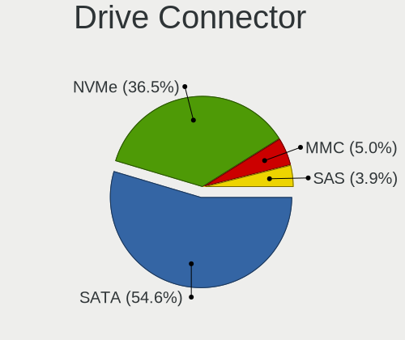
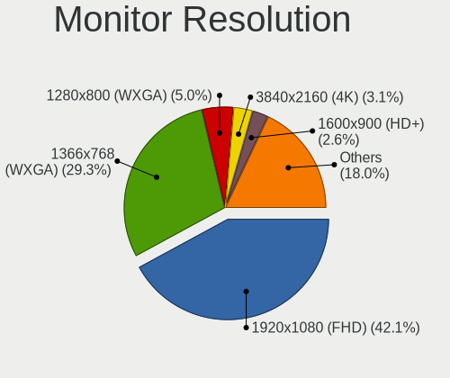
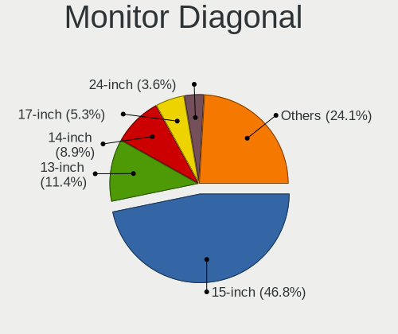
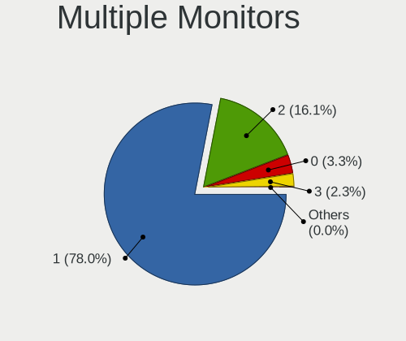
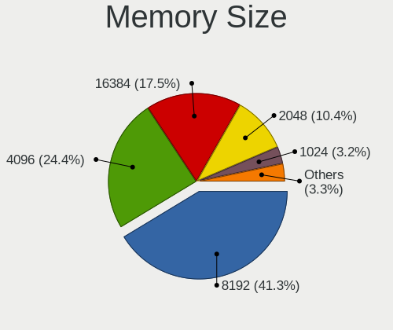
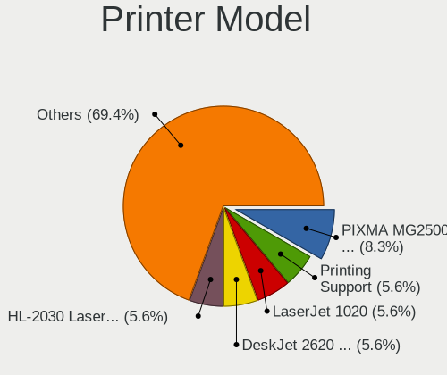

Linux in Spain - Tested Hardware & Statistics (Notebooks)
---------------------------------------------------------

A project to collect tested hardware configurations for Linux in Spain.

Anyone can contribute to this report by the [hw-probe](https://github.com/linuxhw/hw-probe) tool:

    sudo -E hw-probe -all -upload

Please contribute! Especially if your hardware is rare.

Contents
--------

* [ Test Cases ](#test-cases)

* [ System ](#system)
  - [ OS                       ](#os)
  - [ OS Family                ](#os-family)
  - [ Kernel                   ](#kernel)
  - [ Kernel Family            ](#kernel-family)
  - [ Kernel Major Ver.        ](#kernel-major-ver)
  - [ Arch                     ](#arch)
  - [ DE                       ](#de)
  - [ Display Server           ](#display-server)
  - [ Display Manager          ](#display-manager)
  - [ OS Lang                  ](#os-lang)
  - [ Boot Mode                ](#boot-mode)
  - [ Filesystem               ](#filesystem)
  - [ Part. scheme             ](#part-scheme)
  - [ Dual Boot with Linux/BSD ](#dual-boot-with-linuxbsd)
  - [ Dual Boot (Win)          ](#dual-boot-win)

* [ Board ](#board)
  - [ Vendor                   ](#vendor)
  - [ Model                    ](#model)
  - [ Model Family             ](#model-family)
  - [ MFG Year                 ](#mfg-year)
  - [ Form Factor              ](#form-factor)
  - [ Secure Boot              ](#secure-boot)
  - [ Coreboot                 ](#coreboot)
  - [ RAM Size                 ](#ram-size)
  - [ RAM Used                 ](#ram-used)
  - [ Total Drives             ](#total-drives)
  - [ Has CD-ROM               ](#has-cd-rom)
  - [ Has Ethernet             ](#has-ethernet)
  - [ Has WiFi                 ](#has-wifi)
  - [ Has Bluetooth            ](#has-bluetooth)

* [ Location ](#location)
  - [ Country                  ](#country)
  - [ City                     ](#city)

* [ Drives ](#drives)
  - [ Drive Vendor             ](#drive-vendor)
  - [ Drive Model              ](#drive-model)
  - [ HDD Vendor               ](#hdd-vendor)
  - [ SSD Vendor               ](#ssd-vendor)
  - [ Drive Kind               ](#drive-kind)
  - [ Drive Connector          ](#drive-connector)
  - [ Drive Size               ](#drive-size)
  - [ Space Total              ](#space-total)
  - [ Space Used               ](#space-used)
  - [ Malfunc. Drives          ](#malfunc-drives)
  - [ Malfunc. Drive Vendor    ](#malfunc-drive-vendor)
  - [ Malfunc. HDD Vendor      ](#malfunc-hdd-vendor)
  - [ Malfunc. Drive Kind      ](#malfunc-drive-kind)
  - [ Failed Drives            ](#failed-drives)
  - [ Failed Drive Vendor      ](#failed-drive-vendor)
  - [ Drive Status             ](#drive-status)

* [ Storage controller ](#storage-controller)
  - [ Storage Vendor           ](#storage-vendor)
  - [ Storage Model            ](#storage-model)
  - [ Storage Kind             ](#storage-kind)

* [ Processor ](#processor)
  - [ CPU Vendor               ](#cpu-vendor)
  - [ CPU Model                ](#cpu-model)
  - [ CPU Model Family         ](#cpu-model-family)
  - [ CPU Cores                ](#cpu-cores)
  - [ CPU Sockets              ](#cpu-sockets)
  - [ CPU Threads              ](#cpu-threads)
  - [ CPU Op-Modes             ](#cpu-op-modes)
  - [ CPU Microcode            ](#cpu-microcode)
  - [ CPU Microarch            ](#cpu-microarch)

* [ Graphics ](#graphics)
  - [ GPU Vendor               ](#gpu-vendor)
  - [ GPU Model                ](#gpu-model)
  - [ GPU Combo                ](#gpu-combo)
  - [ GPU Driver               ](#gpu-driver)
  - [ GPU Memory               ](#gpu-memory)

* [ Monitor ](#monitor)
  - [ Monitor Vendor           ](#monitor-vendor)
  - [ Monitor Model            ](#monitor-model)
  - [ Monitor Resolution       ](#monitor-resolution)
  - [ Monitor Diagonal         ](#monitor-diagonal)
  - [ Monitor Width            ](#monitor-width)
  - [ Aspect Ratio             ](#aspect-ratio)
  - [ Monitor Area             ](#monitor-area)
  - [ Pixel Density            ](#pixel-density)
  - [ Multiple Monitors        ](#multiple-monitors)

* [ Network ](#network)
  - [ Net Controller Vendor    ](#net-controller-vendor)
  - [ Net Controller Model     ](#net-controller-model)
  - [ Wireless Vendor          ](#wireless-vendor)
  - [ Wireless Model           ](#wireless-model)
  - [ Ethernet Vendor          ](#ethernet-vendor)
  - [ Ethernet Model           ](#ethernet-model)
  - [ Net Controller Kind      ](#net-controller-kind)
  - [ Used Controller          ](#used-controller)
  - [ NICs                     ](#nics)
  - [ IPv6                     ](#ipv6)

* [ Bluetooth ](#bluetooth)
  - [ Bluetooth Vendor         ](#bluetooth-vendor)
  - [ Bluetooth Model          ](#bluetooth-model)

* [ Sound ](#sound)
  - [ Sound Vendor             ](#sound-vendor)
  - [ Sound Model              ](#sound-model)

* [ Memory ](#memory)
  - [ Memory Vendor            ](#memory-vendor)
  - [ Memory Model             ](#memory-model)
  - [ Memory Kind              ](#memory-kind)
  - [ Memory Form Factor       ](#memory-form-factor)
  - [ Memory Size              ](#memory-size)
  - [ Memory Speed             ](#memory-speed)

* [ Printers & scanners ](#printers--scanners)
  - [ Printer Vendor           ](#printer-vendor)
  - [ Printer Model            ](#printer-model)
  - [ Scanner Vendor           ](#scanner-vendor)
  - [ Scanner Model            ](#scanner-model)

* [ Camera ](#camera)
  - [ Camera Vendor            ](#camera-vendor)
  - [ Camera Model             ](#camera-model)

* [ Security ](#security)
  - [ Fingerprint Vendor       ](#fingerprint-vendor)
  - [ Fingerprint Model        ](#fingerprint-model)
  - [ Chipcard Vendor          ](#chipcard-vendor)
  - [ Chipcard Model           ](#chipcard-model)

* [ Unsupported ](#unsupported)
  - [ Unsupported Devices      ](#unsupported-devices)
  - [ Unsupported Device Types ](#unsupported-device-types)

Test Cases
----------

Total: 4961

| Vendor        | Model                       | Probe                                                      | Date         |
|---------------|-----------------------------|------------------------------------------------------------|--------------|
| Lenovo        | IdeaPad 3 15ITL6 82H8       | [720ff4cf67](https://linux-hardware.org/?probe=720ff4cf67) | Dec 24, 2023 |
| HP            | Unknown                     | [3bc06ba7d3](https://linux-hardware.org/?probe=3bc06ba7d3) | Dec 24, 2023 |
| Lenovo        | G50-80 80L0                 | [21df7039b9](https://linux-hardware.org/?probe=21df7039b9) | Dec 23, 2023 |
| XIAOMI        | Redmi Book Pro 15 2023      | [36492390fd](https://linux-hardware.org/?probe=36492390fd) | Dec 22, 2023 |
| Acer          | Aspire VX5-591G             | [2268342e9f](https://linux-hardware.org/?probe=2268342e9f) | Dec 22, 2023 |
| HP            | Pavilion Laptop 14-dv1xx... | [7148cd104d](https://linux-hardware.org/?probe=7148cd104d) | Dec 22, 2023 |
| HP            | EliteBook 650 15.6 inch ... | [2e9f8a97e5](https://linux-hardware.org/?probe=2e9f8a97e5) | Dec 21, 2023 |
| HP            | Victus by Laptop 16-e0xx... | [a102e5839d](https://linux-hardware.org/?probe=a102e5839d) | Dec 21, 2023 |
| Panasonic     | CF-19RDRCHH7                | [0e67081368](https://linux-hardware.org/?probe=0e67081368) | Dec 21, 2023 |
| Fujitsu Si... | ESPRIMO Mobile V5535        | [664d34d04d](https://linux-hardware.org/?probe=664d34d04d) | Dec 20, 2023 |
| ASUSTek       | VivoBook_ASUS Laptop X50... | [6f7295809b](https://linux-hardware.org/?probe=6f7295809b) | Dec 20, 2023 |
| MSI           | Alpha 17 C7VF               | [34b3014f66](https://linux-hardware.org/?probe=34b3014f66) | Dec 19, 2023 |
| Clevo         | W760/M770CU                 | [fdde778b3c](https://linux-hardware.org/?probe=fdde778b3c) | Dec 19, 2023 |
| ASUSTek       | VivoBook_ASUSLaptop K340... | [1b5268d64f](https://linux-hardware.org/?probe=1b5268d64f) | Dec 19, 2023 |
| ASUSTek       | VivoBook_ASUSLaptop K340... | [1290fe8e5a](https://linux-hardware.org/?probe=1290fe8e5a) | Dec 19, 2023 |
| HUAWEI        | KLVL-WXX9                   | [12f149be7f](https://linux-hardware.org/?probe=12f149be7f) | Dec 18, 2023 |
| HP            | Pavilion Gaming Laptop 1... | [9afec278e2](https://linux-hardware.org/?probe=9afec278e2) | Dec 18, 2023 |
| Lenovo        | IdeaPad 3 15ITL6 82H8       | [1d8ddbcb75](https://linux-hardware.org/?probe=1d8ddbcb75) | Dec 18, 2023 |
| ASUSTek       | X550EA                      | [a874ac5799](https://linux-hardware.org/?probe=a874ac5799) | Dec 18, 2023 |
| HP            | Victus by Gaming Laptop ... | [fd092daf92](https://linux-hardware.org/?probe=fd092daf92) | Dec 18, 2023 |
| HP            | EliteBook 8440p             | [4a83771100](https://linux-hardware.org/?probe=4a83771100) | Dec 18, 2023 |
| HP            | 255 G6 Notebook PC          | [f4412027d4](https://linux-hardware.org/?probe=f4412027d4) | Dec 18, 2023 |
| Lenovo        | IdeaPad Gaming 3 15IAH7 ... | [26503ce57e](https://linux-hardware.org/?probe=26503ce57e) | Dec 17, 2023 |
| Notebook      | W65_67SR                    | [8f970e8d4c](https://linux-hardware.org/?probe=8f970e8d4c) | Dec 17, 2023 |
| ASUSTek       | K53SD                       | [7962dd075b](https://linux-hardware.org/?probe=7962dd075b) | Dec 17, 2023 |
| Lenovo        | IdeaPad 3 15ITL6 82H8       | [299d6ae362](https://linux-hardware.org/?probe=299d6ae362) | Dec 17, 2023 |
| Allview       | Allbook H                   | [2da4fcb35c](https://linux-hardware.org/?probe=2da4fcb35c) | Dec 16, 2023 |
| HP            | G62                         | [fd110d99fd](https://linux-hardware.org/?probe=fd110d99fd) | Dec 15, 2023 |
| Lenovo        | IdeaPad Pro 5 16APH8 83A... | [d438fe20ff](https://linux-hardware.org/?probe=d438fe20ff) | Dec 15, 2023 |
| Lenovo        | IdeaPad 3 15ITL6 82H8       | [cde85f7526](https://linux-hardware.org/?probe=cde85f7526) | Dec 15, 2023 |
| Lenovo        | B590 62742QG                | [edb1cd89f6](https://linux-hardware.org/?probe=edb1cd89f6) | Dec 15, 2023 |
| TUXEDO        | InfinityBook Pro Gen8 (M... | [5ae09c04d4](https://linux-hardware.org/?probe=5ae09c04d4) | Dec 14, 2023 |
| Lenovo        | ThinkPad E16 Gen 1 21JNC... | [46fbc450b5](https://linux-hardware.org/?probe=46fbc450b5) | Dec 14, 2023 |
| HP            | Laptop 15-fc0xxx            | [74030d2ce6](https://linux-hardware.org/?probe=74030d2ce6) | Dec 14, 2023 |
| MSI           | GS66 Stealth 10SE           | [7f045bdc89](https://linux-hardware.org/?probe=7f045bdc89) | Dec 14, 2023 |
| HP            | Pavilion Aero Laptop 13-... | [c4e3486e91](https://linux-hardware.org/?probe=c4e3486e91) | Dec 13, 2023 |
| Lenovo        | IdeaPad Slim 3 15IAH8 83... | [f942d9c43e](https://linux-hardware.org/?probe=f942d9c43e) | Dec 13, 2023 |
| Lenovo        | IdeaPad Gaming 3 15ACH6 ... | [8339b9aa1a](https://linux-hardware.org/?probe=8339b9aa1a) | Dec 13, 2023 |
| Apple         | MacBookPro11,3              | [c5d4eabc9b](https://linux-hardware.org/?probe=c5d4eabc9b) | Dec 12, 2023 |
| Apple         | MacBookPro11,3              | [87fa57a3af](https://linux-hardware.org/?probe=87fa57a3af) | Dec 12, 2023 |
| Acer          | Aspire A515-45              | [089a40a6f2](https://linux-hardware.org/?probe=089a40a6f2) | Dec 12, 2023 |
| Acer          | Aspire one                  | [fb1f2ccd2e](https://linux-hardware.org/?probe=fb1f2ccd2e) | Dec 12, 2023 |
| HP            | Laptop 15-fd0xxx            | [f5b7104728](https://linux-hardware.org/?probe=f5b7104728) | Dec 11, 2023 |
| Acer          | Aspire ES1-512              | [40438b3cd0](https://linux-hardware.org/?probe=40438b3cd0) | Dec 11, 2023 |
| HUAWEI        | KLVL-WXX9                   | [2abe635055](https://linux-hardware.org/?probe=2abe635055) | Dec 10, 2023 |
| HP            | Laptop 15-fc0xxx            | [a668492169](https://linux-hardware.org/?probe=a668492169) | Dec 10, 2023 |
| Dell          | Latitude 7490               | [d9f20ad453](https://linux-hardware.org/?probe=d9f20ad453) | Dec 10, 2023 |
| HP            | 240 G8 Notebook PC          | [e5f4045026](https://linux-hardware.org/?probe=e5f4045026) | Dec 10, 2023 |
| Packard Be... | EasyNote TE11BZ             | [514899b0b9](https://linux-hardware.org/?probe=514899b0b9) | Dec 10, 2023 |
| Lenovo        | Legion 5 15ARH05H 82B1      | [215b8bc94a](https://linux-hardware.org/?probe=215b8bc94a) | Dec 09, 2023 |
| ASUSTek       | X540SA                      | [71c6b35d56](https://linux-hardware.org/?probe=71c6b35d56) | Dec 09, 2023 |
| Dell          | Vostro 3550                 | [21131b7844](https://linux-hardware.org/?probe=21131b7844) | Dec 09, 2023 |
| Dell          | Vostro 3560                 | [d2abe7128b](https://linux-hardware.org/?probe=d2abe7128b) | Dec 09, 2023 |
| Notebook      | N24_25JU                    | [48dc91498c](https://linux-hardware.org/?probe=48dc91498c) | Dec 09, 2023 |
| Notebook      | N24_25JU                    | [170b205714](https://linux-hardware.org/?probe=170b205714) | Dec 09, 2023 |
| Lenovo        | ThinkPad L15 Gen 4 21H3C... | [2c3c1f7ad2](https://linux-hardware.org/?probe=2c3c1f7ad2) | Dec 08, 2023 |
| HP            | Victus by Laptop 16-e1xx... | [9b973fc192](https://linux-hardware.org/?probe=9b973fc192) | Dec 08, 2023 |
| Lenovo        | ThinkPad L15 Gen 4 21H3C... | [f463c790b4](https://linux-hardware.org/?probe=f463c790b4) | Dec 08, 2023 |
| Lenovo        | ThinkPad T550 20CJS1VD01    | [a7dccd5888](https://linux-hardware.org/?probe=a7dccd5888) | Dec 08, 2023 |
| HP            | 630                         | [b6c4bc59c1](https://linux-hardware.org/?probe=b6c4bc59c1) | Dec 08, 2023 |
| Apple         | MacBook5,1                  | [e6e9d305e9](https://linux-hardware.org/?probe=e6e9d305e9) | Dec 08, 2023 |
| ASUSTek       | ASUS EXPERTBOOK B1502CBA    | [b46d0490b6](https://linux-hardware.org/?probe=b46d0490b6) | Dec 08, 2023 |
| Lenovo        | ThinkPad X1 Carbon 6th 2... | [2cc6eaff05](https://linux-hardware.org/?probe=2cc6eaff05) | Dec 08, 2023 |
| HP            | Pavilion Gaming Laptop 1... | [69e785cddb](https://linux-hardware.org/?probe=69e785cddb) | Dec 07, 2023 |
| ASUSTek       | VivoBook_ASUSLaptop X415... | [82fd570b21](https://linux-hardware.org/?probe=82fd570b21) | Dec 07, 2023 |
| ASUSTek       | VivoBook_ASUSLaptop X415... | [b706d26f30](https://linux-hardware.org/?probe=b706d26f30) | Dec 07, 2023 |
| ASUSTek       | VivoBook_ASUSLaptop X515... | [18d69df8d2](https://linux-hardware.org/?probe=18d69df8d2) | Dec 07, 2023 |
| HP            | Laptop 15-fd0xxx            | [6bdc66013b](https://linux-hardware.org/?probe=6bdc66013b) | Dec 07, 2023 |
| HP            | Laptop 17-by3xxx            | [d124640ef5](https://linux-hardware.org/?probe=d124640ef5) | Dec 06, 2023 |
| HP            | EliteBook 840 G1            | [923f26e8d8](https://linux-hardware.org/?probe=923f26e8d8) | Dec 06, 2023 |
| Lenovo        | ThinkPad SL500 274678G      | [3cfa60a8bb](https://linux-hardware.org/?probe=3cfa60a8bb) | Dec 06, 2023 |
| Lenovo        | Legion 5 15ARH05H 82B1      | [7317dc8b5c](https://linux-hardware.org/?probe=7317dc8b5c) | Dec 06, 2023 |
| Alurin        | Go Notebook                 | [197598d3dd](https://linux-hardware.org/?probe=197598d3dd) | Dec 05, 2023 |
| HP            | Pavilion 13 x360 PC         | [3eba272feb](https://linux-hardware.org/?probe=3eba272feb) | Dec 05, 2023 |
| HP            | 630                         | [7d372bb7da](https://linux-hardware.org/?probe=7d372bb7da) | Dec 04, 2023 |
| Lenovo        | B50-50 80S2                 | [6150907e1e](https://linux-hardware.org/?probe=6150907e1e) | Dec 04, 2023 |
| MSI           | Prestige 15 A12UD           | [b19937fb48](https://linux-hardware.org/?probe=b19937fb48) | Dec 04, 2023 |
| MSI           | Prestige 15 A12UD           | [0c9a3a5cae](https://linux-hardware.org/?probe=0c9a3a5cae) | Dec 04, 2023 |
| Adreamer      | PN1308P                     | [b503469408](https://linux-hardware.org/?probe=b503469408) | Dec 04, 2023 |
| Lenovo        | ThinkPad X1 Carbon 6th 2... | [db9e1baffe](https://linux-hardware.org/?probe=db9e1baffe) | Dec 04, 2023 |
| Acer          | Aspire 5750G                | [8bca63eb54](https://linux-hardware.org/?probe=8bca63eb54) | Dec 03, 2023 |
| Dell          | Vostro 3550                 | [0926acf98a](https://linux-hardware.org/?probe=0926acf98a) | Dec 03, 2023 |
| Acer          | Aspire A315-24P             | [b8af3ee6d5](https://linux-hardware.org/?probe=b8af3ee6d5) | Dec 03, 2023 |
| Acer          | Aspire A315-24P             | [67efae847f](https://linux-hardware.org/?probe=67efae847f) | Dec 03, 2023 |
| Acer          | Aspire 5750G                | [f04a8e4722](https://linux-hardware.org/?probe=f04a8e4722) | Dec 03, 2023 |
| Lenovo        | IdeaPad 320S-15IKB 81BQ     | [9cedc35586](https://linux-hardware.org/?probe=9cedc35586) | Dec 03, 2023 |
| Lenovo        | IdeaPad Gaming 3 15ACH6 ... | [3753de5af1](https://linux-hardware.org/?probe=3753de5af1) | Dec 03, 2023 |
| Lenovo        | ThinkPad W500 40624DG       | [920dc046a3](https://linux-hardware.org/?probe=920dc046a3) | Dec 03, 2023 |
| ASUSTek       | ROG Zephyrus G14 GA401II... | [426263e458](https://linux-hardware.org/?probe=426263e458) | Dec 03, 2023 |
| Acer          | Nitro AN515-58              | [e2d48a6b41](https://linux-hardware.org/?probe=e2d48a6b41) | Dec 03, 2023 |
| SLIMBOOK      | PROX-AMD5                   | [3a6eb27098](https://linux-hardware.org/?probe=3a6eb27098) | Dec 02, 2023 |
| ASUSTek       | ZenBook UX433FN_UX433FN     | [3b3d0cb740](https://linux-hardware.org/?probe=3b3d0cb740) | Dec 02, 2023 |
| Apple         | MacBookPro11,1              | [bb033837d5](https://linux-hardware.org/?probe=bb033837d5) | Dec 02, 2023 |
| ASUSTek       | ZenBook UX431DA_UM431DA     | [7eb86d01c5](https://linux-hardware.org/?probe=7eb86d01c5) | Dec 01, 2023 |
| Samsung       | R530/R730                   | [cdda254219](https://linux-hardware.org/?probe=cdda254219) | Dec 01, 2023 |
| HP            | OMEN Laptop 15-en1xxx       | [a828388299](https://linux-hardware.org/?probe=a828388299) | Nov 30, 2023 |
| MSI           | Prestige 16Studio A13VF     | [dc93bfeb80](https://linux-hardware.org/?probe=dc93bfeb80) | Nov 30, 2023 |
| ASUSTek       | ASUS TUF Gaming A15 FA50... | [d92b5d4caf](https://linux-hardware.org/?probe=d92b5d4caf) | Nov 30, 2023 |
| Lenovo        | G50-80 80E5                 | [75dcedad41](https://linux-hardware.org/?probe=75dcedad41) | Nov 30, 2023 |
| Alurin        | ALU-LPT-N4020-8256-156      | [0524ad397b](https://linux-hardware.org/?probe=0524ad397b) | Nov 29, 2023 |
| HP            | EliteBook 640 14 inch G9... | [a9f36d870b](https://linux-hardware.org/?probe=a9f36d870b) | Nov 28, 2023 |
| HONOR         | HLYL-WXX9                   | [fa6847a75b](https://linux-hardware.org/?probe=fa6847a75b) | Nov 28, 2023 |
| Lenovo        | ThinkPad X1 Carbon 34603... | [edb57fe6c8](https://linux-hardware.org/?probe=edb57fe6c8) | Nov 28, 2023 |
| HP            | EliteBook 640 14 inch G9... | [f5f1058473](https://linux-hardware.org/?probe=f5f1058473) | Nov 27, 2023 |
| HP            | Elite x2 1012 G1            | [388c6ba69d](https://linux-hardware.org/?probe=388c6ba69d) | Nov 27, 2023 |
| HP            | 250 G6 Notebook PC          | [936970029f](https://linux-hardware.org/?probe=936970029f) | Nov 27, 2023 |
| SHENZHEN Y... | XBOOK-3                     | [beeefc2461](https://linux-hardware.org/?probe=beeefc2461) | Nov 26, 2023 |
| HP            | ENVY m6                     | [41cff88708](https://linux-hardware.org/?probe=41cff88708) | Nov 26, 2023 |
| ASUSTek       | Zenbook UM3402YA_UM3402Y... | [7359fe59a4](https://linux-hardware.org/?probe=7359fe59a4) | Nov 25, 2023 |
| Dell          | Latitude 3510               | [0ebe37e56d](https://linux-hardware.org/?probe=0ebe37e56d) | Nov 25, 2023 |
| Lenovo        | IdeaPad Pro 5 16APH8 83A... | [2b5e71ca1e](https://linux-hardware.org/?probe=2b5e71ca1e) | Nov 24, 2023 |
| Lenovo        | IdeaPad Gaming 3 15ACH6 ... | [ac2895b3d7](https://linux-hardware.org/?probe=ac2895b3d7) | Nov 24, 2023 |
| ASUSTek       | VivoBook_ASUSLaptop M150... | [d262dd65d4](https://linux-hardware.org/?probe=d262dd65d4) | Nov 24, 2023 |
| ASUSTek       | Vivobook Go E1504FA_E150... | [94886bc9d7](https://linux-hardware.org/?probe=94886bc9d7) | Nov 24, 2023 |
| Lenovo        | ThinkPad T460 20FMS57C00    | [adabeb3e91](https://linux-hardware.org/?probe=adabeb3e91) | Nov 23, 2023 |
| MSI           | Prestige 15 A10SC           | [3b9404eda4](https://linux-hardware.org/?probe=3b9404eda4) | Nov 23, 2023 |
| Lenovo        | ThinkPad T460 20FMS57C00    | [467b2f3c4e](https://linux-hardware.org/?probe=467b2f3c4e) | Nov 23, 2023 |
| ASUSTek       | Vivobook Go E1504FA_E150... | [6791592808](https://linux-hardware.org/?probe=6791592808) | Nov 22, 2023 |
| ASUSTek       | Vivobook Go E1504FA_E150... | [69d5dcd30b](https://linux-hardware.org/?probe=69d5dcd30b) | Nov 22, 2023 |
| Valve         | Jupiter                     | [2fa43c6f3d](https://linux-hardware.org/?probe=2fa43c6f3d) | Nov 22, 2023 |
| ASUSTek       | VivoBook_ASUSLaptop X415... | [28af744237](https://linux-hardware.org/?probe=28af744237) | Nov 21, 2023 |
| Dell          | Latitude E6430              | [7fb0b53d1c](https://linux-hardware.org/?probe=7fb0b53d1c) | Nov 21, 2023 |
| MSI           | Pulse GL76 12UEK            | [def3f12e81](https://linux-hardware.org/?probe=def3f12e81) | Nov 21, 2023 |
| Allview       | Allbook H                   | [8c23eb07ac](https://linux-hardware.org/?probe=8c23eb07ac) | Nov 21, 2023 |
| Lenovo        | Legion Pro 7 16ARX8H 82W... | [43d2b6b8b6](https://linux-hardware.org/?probe=43d2b6b8b6) | Nov 21, 2023 |
| MSI           | Bravo 15 A4DDR              | [d678fe79f8](https://linux-hardware.org/?probe=d678fe79f8) | Nov 20, 2023 |
| Lenovo        | V15 G4 AMN 82YU             | [ba43f46e34](https://linux-hardware.org/?probe=ba43f46e34) | Nov 20, 2023 |
| HP            | Laptop 15-bs0xx             | [3982d2c377](https://linux-hardware.org/?probe=3982d2c377) | Nov 20, 2023 |
| HP            | Stream Laptop 11-ak0xxx     | [f91d973bab](https://linux-hardware.org/?probe=f91d973bab) | Nov 19, 2023 |
| Alurin        | ALU-BAR-R555-000-156        | [ce453601f1](https://linux-hardware.org/?probe=ce453601f1) | Nov 19, 2023 |
| HP            | ProBook 650 G1              | [80d502e7c1](https://linux-hardware.org/?probe=80d502e7c1) | Nov 19, 2023 |
| Lenovo        | Z50-75 80EC                 | [6876ff8fc6](https://linux-hardware.org/?probe=6876ff8fc6) | Nov 19, 2023 |
| HP            | Laptop 15-da0xxx            | [fa116d20dc](https://linux-hardware.org/?probe=fa116d20dc) | Nov 19, 2023 |
| Lenovo        | ThinkPad X13 Gen 3 21CMC... | [e25caef1f8](https://linux-hardware.org/?probe=e25caef1f8) | Nov 18, 2023 |
| Star Labs     | Lite                        | [715761cc4e](https://linux-hardware.org/?probe=715761cc4e) | Nov 18, 2023 |
| Lenovo        | ThinkPad T470s W10DG 20J... | [66a57a819b](https://linux-hardware.org/?probe=66a57a819b) | Nov 17, 2023 |
| ASUSTek       | X540YA                      | [ffdc6b121c](https://linux-hardware.org/?probe=ffdc6b121c) | Nov 17, 2023 |
| Lenovo        | Legion 5 15ARH05H 82B1      | [0c9b59ab03](https://linux-hardware.org/?probe=0c9b59ab03) | Nov 17, 2023 |
| MSI           | Pulse GL66 12UEK            | [9421ac824c](https://linux-hardware.org/?probe=9421ac824c) | Nov 17, 2023 |
| Sony          | VPCEB1J8E                   | [961e0e701d](https://linux-hardware.org/?probe=961e0e701d) | Nov 17, 2023 |
| Dell          | Precision 5680              | [a2957d2ece](https://linux-hardware.org/?probe=a2957d2ece) | Nov 16, 2023 |
| Dell          | Precision 5680              | [2c6c6027a6](https://linux-hardware.org/?probe=2c6c6027a6) | Nov 16, 2023 |
| MSI           | GF75 Thin 10SC              | [5388f8cbdd](https://linux-hardware.org/?probe=5388f8cbdd) | Nov 16, 2023 |
| Lenovo        | ThinkPad Edge E320 1298R... | [535d92743c](https://linux-hardware.org/?probe=535d92743c) | Nov 16, 2023 |
| Lenovo        | ThinkPad Edge E320 1298R... | [331f7da246](https://linux-hardware.org/?probe=331f7da246) | Nov 16, 2023 |
| Lenovo        | G580 2189                   | [552aa58bee](https://linux-hardware.org/?probe=552aa58bee) | Nov 16, 2023 |
| ASUSTek       | K52Jr                       | [142c6a9c61](https://linux-hardware.org/?probe=142c6a9c61) | Nov 15, 2023 |
| Adreamer      | PN1308P                     | [8c4d2fca5a](https://linux-hardware.org/?probe=8c4d2fca5a) | Nov 14, 2023 |
| Adreamer      | PN1308P                     | [5efc66eebc](https://linux-hardware.org/?probe=5efc66eebc) | Nov 14, 2023 |
| HP            | Laptop 15-bs0xx             | [1606b9e027](https://linux-hardware.org/?probe=1606b9e027) | Nov 14, 2023 |
| MSI           | Prestige 14 A10SC           | [59ad7e7e27](https://linux-hardware.org/?probe=59ad7e7e27) | Nov 14, 2023 |
| MSI           | Prestige 14 A10SC           | [6b1a5452f8](https://linux-hardware.org/?probe=6b1a5452f8) | Nov 14, 2023 |
| HP            | ENVY Laptop 13-aq0xxx       | [db881a2b07](https://linux-hardware.org/?probe=db881a2b07) | Nov 13, 2023 |
| HP            | ENVY Laptop 13-aq0xxx       | [b43a43b268](https://linux-hardware.org/?probe=b43a43b268) | Nov 13, 2023 |
| ASUSTek       | K52Jr                       | [7e34d5b70b](https://linux-hardware.org/?probe=7e34d5b70b) | Nov 13, 2023 |
| Toshiba       | PORTEGE Z30-B               | [2cd609dfe0](https://linux-hardware.org/?probe=2cd609dfe0) | Nov 12, 2023 |
| Lenovo        | IdeaPad 3 15ITL6 82H8       | [78b909aa81](https://linux-hardware.org/?probe=78b909aa81) | Nov 12, 2023 |
| Lenovo        | ThinkPad L540 20AUS11P00    | [593d2114d9](https://linux-hardware.org/?probe=593d2114d9) | Nov 12, 2023 |
| HP            | 630                         | [ccc318ee31](https://linux-hardware.org/?probe=ccc318ee31) | Nov 12, 2023 |
| HP            | 630                         | [df3b4ec5db](https://linux-hardware.org/?probe=df3b4ec5db) | Nov 12, 2023 |
| Unknown       | Unknown                     | [be77c5477d](https://linux-hardware.org/?probe=be77c5477d) | Nov 12, 2023 |
| Unknown       | Unknown                     | [d93ab747bb](https://linux-hardware.org/?probe=d93ab747bb) | Nov 12, 2023 |
| Dell          | Latitude 7440               | [5c19a02292](https://linux-hardware.org/?probe=5c19a02292) | Nov 11, 2023 |
| ASUSTek       | ROG Strix G531GT_G531GT     | [1ce5868093](https://linux-hardware.org/?probe=1ce5868093) | Nov 11, 2023 |
| Toshiba       | PORTEGE Z30-A               | [1b3661590f](https://linux-hardware.org/?probe=1b3661590f) | Nov 11, 2023 |
| Apple         | MacBookPro8,1               | [3da6dfb4b3](https://linux-hardware.org/?probe=3da6dfb4b3) | Nov 11, 2023 |
| ALLDOCUBE     | i1405C                      | [8f63b8af98](https://linux-hardware.org/?probe=8f63b8af98) | Nov 10, 2023 |
| Lenovo        | IdeaPad 3 15ITL6 82H8       | [9f3d17b672](https://linux-hardware.org/?probe=9f3d17b672) | Nov 10, 2023 |
| MSI           | Prestige 15 A10SC           | [e2f423f938](https://linux-hardware.org/?probe=e2f423f938) | Nov 10, 2023 |
| HP            | Pavilion Gaming Laptop 1... | [0bf36ad434](https://linux-hardware.org/?probe=0bf36ad434) | Nov 09, 2023 |
| HP            | Compaq Presario CQ70        | [1c495f3402](https://linux-hardware.org/?probe=1c495f3402) | Nov 09, 2023 |
| Lenovo        | G580 2189                   | [e6ceb0d192](https://linux-hardware.org/?probe=e6ceb0d192) | Nov 09, 2023 |
| LG Electro... | 15Z90RT-G.AD75B             | [2ec6124055](https://linux-hardware.org/?probe=2ec6124055) | Nov 09, 2023 |
| HP            | Pavilion dv6                | [919942c11f](https://linux-hardware.org/?probe=919942c11f) | Nov 08, 2023 |
| ASUSTek       | VivoBook_ASUSLaptop X515... | [193098a1ea](https://linux-hardware.org/?probe=193098a1ea) | Nov 08, 2023 |
| ASUSTek       | ROG Strix G513RM_G513RM     | [ab1a7393ef](https://linux-hardware.org/?probe=ab1a7393ef) | Nov 08, 2023 |
| HP            | Pavilion dm4                | [93ee8aa87c](https://linux-hardware.org/?probe=93ee8aa87c) | Nov 08, 2023 |
| Lenovo        | ThinkPad E14 Gen 4 21EBC... | [0fceea6321](https://linux-hardware.org/?probe=0fceea6321) | Nov 08, 2023 |
| Lenovo        | ThinkPad E15 Gen 4 21EDC... | [c0f28da2b7](https://linux-hardware.org/?probe=c0f28da2b7) | Nov 07, 2023 |
| ASUSTek       | VivoBook_ASUSLaptop M150... | [18a292fb51](https://linux-hardware.org/?probe=18a292fb51) | Nov 07, 2023 |
| Lenovo        | ThinkPad E15 Gen 4 21EDC... | [24cd0b58d3](https://linux-hardware.org/?probe=24cd0b58d3) | Nov 07, 2023 |
| Unknown       | Unknown                     | [1545b5a7bb](https://linux-hardware.org/?probe=1545b5a7bb) | Nov 06, 2023 |
| Dell          | Inspiron 15 3511            | [27381bdf35](https://linux-hardware.org/?probe=27381bdf35) | Nov 06, 2023 |
| HP            | ProBook 640 G1              | [1cc495d15b](https://linux-hardware.org/?probe=1cc495d15b) | Nov 05, 2023 |
| HP            | Spectre Pro G1              | [78bce56071](https://linux-hardware.org/?probe=78bce56071) | Nov 05, 2023 |
| Toshiba       | TECRA R950                  | [864877692e](https://linux-hardware.org/?probe=864877692e) | Nov 05, 2023 |
| HP            | Pavilion dm4                | [ed4309477f](https://linux-hardware.org/?probe=ed4309477f) | Nov 05, 2023 |
| HP            | Pavilion dv6                | [60ff7a74af](https://linux-hardware.org/?probe=60ff7a74af) | Nov 05, 2023 |
| Lenovo        | ThinkPad T470s W10DG 20J... | [ae9fcece31](https://linux-hardware.org/?probe=ae9fcece31) | Nov 05, 2023 |
| MSI           | Modern 15 B7M               | [b4a588e60e](https://linux-hardware.org/?probe=b4a588e60e) | Nov 04, 2023 |
| Lenovo        | G580 2189                   | [29a529e02c](https://linux-hardware.org/?probe=29a529e02c) | Nov 03, 2023 |
| Lenovo        | ThinkBook 14 G3 ACL 21A2    | [8b855ce4f4](https://linux-hardware.org/?probe=8b855ce4f4) | Nov 03, 2023 |
| Lenovo        | IdeaPad 3 15ITL6 82H8       | [b724ede64d](https://linux-hardware.org/?probe=b724ede64d) | Nov 02, 2023 |
| MSI           | Prestige 14 A11SCS          | [e114e8ae5b](https://linux-hardware.org/?probe=e114e8ae5b) | Nov 02, 2023 |
| Lenovo        | Yoga Slim 9 14IAP7 82T0     | [11e373f762](https://linux-hardware.org/?probe=11e373f762) | Nov 02, 2023 |
| Lenovo        | ThinkPad X240 20AMS2EC00    | [820620d5c4](https://linux-hardware.org/?probe=820620d5c4) | Nov 01, 2023 |
| Dell          | G3 3579                     | [0b33f63284](https://linux-hardware.org/?probe=0b33f63284) | Nov 01, 2023 |
| Lenovo        | ThinkPad E560 20EVA02SSP    | [165be504bf](https://linux-hardware.org/?probe=165be504bf) | Nov 01, 2023 |
| HP            | ZBook 15u G6                | [b74e35da2b](https://linux-hardware.org/?probe=b74e35da2b) | Nov 01, 2023 |
| Acer          | Aspire E1-572G              | [d347dc93b5](https://linux-hardware.org/?probe=d347dc93b5) | Nov 01, 2023 |
| ASUSTek       | X550LD                      | [2d0fae2241](https://linux-hardware.org/?probe=2d0fae2241) | Nov 01, 2023 |
| ASUSTek       | X555QG                      | [f047c1d264](https://linux-hardware.org/?probe=f047c1d264) | Nov 01, 2023 |
| VANT          | MOOVE3-15                   | [5fc04a6d0a](https://linux-hardware.org/?probe=5fc04a6d0a) | Oct 31, 2023 |
| Toshiba       | Satellite C55-C             | [859d23eed0](https://linux-hardware.org/?probe=859d23eed0) | Oct 31, 2023 |
| VANT          | MOOVE3-15                   | [7e12621e6d](https://linux-hardware.org/?probe=7e12621e6d) | Oct 31, 2023 |
| Lenovo        | IdeaPad Gaming 3 15ACH6 ... | [0eae5ed294](https://linux-hardware.org/?probe=0eae5ed294) | Oct 31, 2023 |
| Timi          | RedmiBook Pro 14S           | [780e721e24](https://linux-hardware.org/?probe=780e721e24) | Oct 30, 2023 |
| Unknown       | Unknown                     | [43e6db0023](https://linux-hardware.org/?probe=43e6db0023) | Oct 30, 2023 |
| ASUSTek       | VivoBook_ASUSLaptop E410... | [bb991098d1](https://linux-hardware.org/?probe=bb991098d1) | Oct 30, 2023 |
| MSI           | GF75 Thin 10SC              | [7aa47ebfa1](https://linux-hardware.org/?probe=7aa47ebfa1) | Oct 30, 2023 |
| ASUSTek       | Zenbook UM3402YA_UM3402Y... | [794edd04ea](https://linux-hardware.org/?probe=794edd04ea) | Oct 30, 2023 |
| Lenovo        | ZIWB2                       | [9e6bd45db9](https://linux-hardware.org/?probe=9e6bd45db9) | Oct 29, 2023 |
| ASUSTek       | VivoBook 15_ASUS Laptop ... | [d443352482](https://linux-hardware.org/?probe=d443352482) | Oct 29, 2023 |
| Apple         | MacBookPro15,4              | [09ee918b60](https://linux-hardware.org/?probe=09ee918b60) | Oct 29, 2023 |
| Allview       | Allbook H                   | [e56046d262](https://linux-hardware.org/?probe=e56046d262) | Oct 29, 2023 |
| Allview       | Allbook H                   | [3f2fc29d49](https://linux-hardware.org/?probe=3f2fc29d49) | Oct 29, 2023 |
| Lenovo        | ThinkPad X270 20HMS1T600    | [97fbe59dd7](https://linux-hardware.org/?probe=97fbe59dd7) | Oct 29, 2023 |
| SLIMBOOK      | TITAN                       | [8697e4de09](https://linux-hardware.org/?probe=8697e4de09) | Oct 29, 2023 |
| HP            | Laptop 15-da0xxx            | [39d06d7acf](https://linux-hardware.org/?probe=39d06d7acf) | Oct 28, 2023 |
| HP            | Notebook                    | [715435e533](https://linux-hardware.org/?probe=715435e533) | Oct 28, 2023 |
| Toshiba       | TECRA R950                  | [afa984b0d3](https://linux-hardware.org/?probe=afa984b0d3) | Oct 28, 2023 |
| Packard Be... | EasyNote MH36               | [6d73774152](https://linux-hardware.org/?probe=6d73774152) | Oct 28, 2023 |
| SLIMBOOK      | PROX14-10                   | [4ffcd3ced8](https://linux-hardware.org/?probe=4ffcd3ced8) | Oct 28, 2023 |
| Lenovo        | ThinkPad L540 20AUS11P00    | [d59d45eb50](https://linux-hardware.org/?probe=d59d45eb50) | Oct 27, 2023 |
| MSI           | Modern 15 A10M              | [79b0d0252f](https://linux-hardware.org/?probe=79b0d0252f) | Oct 27, 2023 |
| Acer          | TravelMate P259-M           | [7c1c04b9b2](https://linux-hardware.org/?probe=7c1c04b9b2) | Oct 26, 2023 |
| Acer          | TravelMate P259-M           | [670cd56ea3](https://linux-hardware.org/?probe=670cd56ea3) | Oct 26, 2023 |
| Lenovo        | ZIWB2                       | [2537a6e7b9](https://linux-hardware.org/?probe=2537a6e7b9) | Oct 26, 2023 |
| Lenovo        | G580 2189                   | [bba412f376](https://linux-hardware.org/?probe=bba412f376) | Oct 26, 2023 |
| Unknown       | Unknown                     | [7d25c7409a](https://linux-hardware.org/?probe=7d25c7409a) | Oct 26, 2023 |
| Apple         | MacBookPro15,4              | [751e98cb04](https://linux-hardware.org/?probe=751e98cb04) | Oct 26, 2023 |
| MSI           | Prestige 15 A10SC           | [796a2f6a53](https://linux-hardware.org/?probe=796a2f6a53) | Oct 25, 2023 |
| ASUSTek       | GL752VW                     | [a11cf1d28d](https://linux-hardware.org/?probe=a11cf1d28d) | Oct 25, 2023 |
| Acer          | Aspire 9300                 | [3094b549c5](https://linux-hardware.org/?probe=3094b549c5) | Oct 25, 2023 |
| HP            | 14                          | [5e8b808f2f](https://linux-hardware.org/?probe=5e8b808f2f) | Oct 24, 2023 |
| TUXEDO        | InfinityBook Pro Gen8 (M... | [3907a62f64](https://linux-hardware.org/?probe=3907a62f64) | Oct 24, 2023 |
| rocky         | ASUS EXPERTBOOK B1402CBA... | [e7dc573b01](https://linux-hardware.org/?probe=e7dc573b01) | Oct 23, 2023 |
| ASUSTek       | ASUS EXPERTBOOK B2502CBA... | [823dcebef0](https://linux-hardware.org/?probe=823dcebef0) | Oct 23, 2023 |
| ASUSTek       | ASUS EXPERTBOOK B2502CBA... | [b7e1e895b9](https://linux-hardware.org/?probe=b7e1e895b9) | Oct 23, 2023 |
| Lenovo        | Yoga Slim 7 ProX 14IAH7 ... | [f4375f7115](https://linux-hardware.org/?probe=f4375f7115) | Oct 23, 2023 |
| Acer          | TravelMate P259-M           | [d6096c6736](https://linux-hardware.org/?probe=d6096c6736) | Oct 23, 2023 |
| ASUSTek       | X551CA                      | [43c37fb1fe](https://linux-hardware.org/?probe=43c37fb1fe) | Oct 22, 2023 |
| ASUSTek       | X551CA                      | [e9a381c722](https://linux-hardware.org/?probe=e9a381c722) | Oct 22, 2023 |
| AZW           | SEi                         | [94602bd41b](https://linux-hardware.org/?probe=94602bd41b) | Oct 22, 2023 |
| Acer          | Aspire A715-76G             | [448723995f](https://linux-hardware.org/?probe=448723995f) | Oct 22, 2023 |
| Lenovo        | IdeaPad 3 15ITL6 82H8       | [c5027da111](https://linux-hardware.org/?probe=c5027da111) | Oct 22, 2023 |
| Lenovo        | ThinkBook 15 G4 IAP 21DJ    | [59d8c7186d](https://linux-hardware.org/?probe=59d8c7186d) | Oct 21, 2023 |
| HP            | Pavilion Laptop 15-cs3xx... | [f2ee678da1](https://linux-hardware.org/?probe=f2ee678da1) | Oct 21, 2023 |
| Lenovo        | IdeaPad 3 15ITL6 82H8       | [37cdbd73b0](https://linux-hardware.org/?probe=37cdbd73b0) | Oct 21, 2023 |
| HP            | TouchSmart tm2              | [a79b82edd3](https://linux-hardware.org/?probe=a79b82edd3) | Oct 21, 2023 |
| Lenovo        | IdeaPad 3 15ITL6 82H8       | [56621ceace](https://linux-hardware.org/?probe=56621ceace) | Oct 20, 2023 |
| ASUSTek       | Zenbook UM3402YAR_UM3402... | [7323684232](https://linux-hardware.org/?probe=7323684232) | Oct 20, 2023 |
| Sony          | VPCSB2L1R                   | [153440d631](https://linux-hardware.org/?probe=153440d631) | Oct 20, 2023 |
| Razer         | Blade 14 (2022) - RZ09-0... | [64929e25f7](https://linux-hardware.org/?probe=64929e25f7) | Oct 20, 2023 |
| Chuwi         | MiniBook                    | [baaf33908c](https://linux-hardware.org/?probe=baaf33908c) | Oct 20, 2023 |
| Lenovo        | G500 20236                  | [6e5d214cb8](https://linux-hardware.org/?probe=6e5d214cb8) | Oct 20, 2023 |
| Razer         | Blade 14 (2022) - RZ09-0... | [da8f06a8e0](https://linux-hardware.org/?probe=da8f06a8e0) | Oct 19, 2023 |
| Toshiba       | Satellite P50t-B-118        | [5237c0866e](https://linux-hardware.org/?probe=5237c0866e) | Oct 19, 2023 |
| Dell          | Precision 7760              | [30e33a33c3](https://linux-hardware.org/?probe=30e33a33c3) | Oct 19, 2023 |
| ASUSTek       | X555QG                      | [e2e11a852f](https://linux-hardware.org/?probe=e2e11a852f) | Oct 19, 2023 |
| ASUSTek       | K46CB                       | [58573f017a](https://linux-hardware.org/?probe=58573f017a) | Oct 19, 2023 |
| HP            | TouchSmart tm2              | [f72f6a43b5](https://linux-hardware.org/?probe=f72f6a43b5) | Oct 19, 2023 |
| HP            | Laptop 15s-eq2xxx           | [9c9781a7ee](https://linux-hardware.org/?probe=9c9781a7ee) | Oct 19, 2023 |
| ASUSTek       | Vivobook Go E1504FA_E150... | [a25bc084fc](https://linux-hardware.org/?probe=a25bc084fc) | Oct 19, 2023 |
| MSI           | Modern 15 A5M               | [cb9366b6ae](https://linux-hardware.org/?probe=cb9366b6ae) | Oct 18, 2023 |
| HP            | 250 G3                      | [e4e0140eb3](https://linux-hardware.org/?probe=e4e0140eb3) | Oct 18, 2023 |
| Lenovo        | IdeaPad 3 15ITL6 82H8       | [b99a873ab7](https://linux-hardware.org/?probe=b99a873ab7) | Oct 18, 2023 |
| ASUSTek       | K46CB                       | [f524007ed7](https://linux-hardware.org/?probe=f524007ed7) | Oct 18, 2023 |
| HUAWEI        | KLVL-WXX9                   | [0ca9b4c2bd](https://linux-hardware.org/?probe=0ca9b4c2bd) | Oct 17, 2023 |
| HP            | Pavilion dv6                | [0846a94456](https://linux-hardware.org/?probe=0846a94456) | Oct 17, 2023 |
| Lenovo        | ThinkPad S1 Yoga 12 20DL... | [060a9c66c5](https://linux-hardware.org/?probe=060a9c66c5) | Oct 17, 2023 |
| Dell          | XPS 13 9310                 | [295c6b08bd](https://linux-hardware.org/?probe=295c6b08bd) | Oct 17, 2023 |
| ASUSTek       | N61Jv                       | [cb8a1ca22a](https://linux-hardware.org/?probe=cb8a1ca22a) | Oct 17, 2023 |
| MSI           | Prestige 14H B12UCX         | [81dac6f109](https://linux-hardware.org/?probe=81dac6f109) | Oct 17, 2023 |
| HP            | ProBook 440 G6              | [5860734f3a](https://linux-hardware.org/?probe=5860734f3a) | Oct 16, 2023 |
| Allview       | Allbook H                   | [456afe3921](https://linux-hardware.org/?probe=456afe3921) | Oct 16, 2023 |
| MSI           | Modern 14 A10RAS            | [571e9b4e91](https://linux-hardware.org/?probe=571e9b4e91) | Oct 15, 2023 |
| ASUSTek       | UX550VD                     | [a58d0c5f1c](https://linux-hardware.org/?probe=a58d0c5f1c) | Oct 15, 2023 |
| ASUSTek       | UX550VD                     | [c29e83963a](https://linux-hardware.org/?probe=c29e83963a) | Oct 15, 2023 |
| Teclast       | F7 Plus                     | [8c4d203e84](https://linux-hardware.org/?probe=8c4d203e84) | Oct 15, 2023 |
| Google        | Dratini                     | [0c74e4ac18](https://linux-hardware.org/?probe=0c74e4ac18) | Oct 15, 2023 |
| Google        | Dratini                     | [bc181ae269](https://linux-hardware.org/?probe=bc181ae269) | Oct 15, 2023 |
| Dell          | XPS 13 9343                 | [97a3c4d92d](https://linux-hardware.org/?probe=97a3c4d92d) | Oct 15, 2023 |
| MSI           | Prestige 14H B12UCX         | [ddc0082c22](https://linux-hardware.org/?probe=ddc0082c22) | Oct 14, 2023 |
| Dell          | Latitude E4200              | [2a5bbc07aa](https://linux-hardware.org/?probe=2a5bbc07aa) | Oct 14, 2023 |
| ASUSTek       | ASUS TUF Gaming F15 FX50... | [11d91a0246](https://linux-hardware.org/?probe=11d91a0246) | Oct 14, 2023 |
| Medion        | E15415                      | [b9a4ecdc97](https://linux-hardware.org/?probe=b9a4ecdc97) | Oct 14, 2023 |
| Lenovo        | IdeaPad Gaming 3 15ARH05... | [584433cc95](https://linux-hardware.org/?probe=584433cc95) | Oct 14, 2023 |
| MSI           | Prestige 14H B12UCX         | [63a132c897](https://linux-hardware.org/?probe=63a132c897) | Oct 13, 2023 |
| Panasonic     | CF-C1AD06GDE                | [473265139b](https://linux-hardware.org/?probe=473265139b) | Oct 13, 2023 |
| Lenovo        | IdeaPad 3 15ADA05 81W1      | [b53da36041](https://linux-hardware.org/?probe=b53da36041) | Oct 12, 2023 |
| HP            | Unknown                     | [c64a37f28f](https://linux-hardware.org/?probe=c64a37f28f) | Oct 12, 2023 |
| Lenovo        | ThinkPad L14 Gen 1 20U50... | [ba690b36a3](https://linux-hardware.org/?probe=ba690b36a3) | Oct 12, 2023 |
| MSI           | PS42 Modern 8MO             | [be9a0659d4](https://linux-hardware.org/?probe=be9a0659d4) | Oct 11, 2023 |
| HP            | EliteBook 840 G5            | [0baddc9010](https://linux-hardware.org/?probe=0baddc9010) | Oct 11, 2023 |
| HP            | 240 G8 Notebook PC          | [0a98dcd952](https://linux-hardware.org/?probe=0a98dcd952) | Oct 11, 2023 |
| Toshiba       | QOSMIO X70-B                | [fc0abd191f](https://linux-hardware.org/?probe=fc0abd191f) | Oct 11, 2023 |
| HP            | Laptop 15-fc0xxx            | [670b2194c0](https://linux-hardware.org/?probe=670b2194c0) | Oct 11, 2023 |
| Lenovo        | IdeaPad 3 15ITL6 82H8       | [046e552e27](https://linux-hardware.org/?probe=046e552e27) | Oct 11, 2023 |
| Lenovo        | ThinkBook 13s G4 ARB 21A... | [d7d6c74d55](https://linux-hardware.org/?probe=d7d6c74d55) | Oct 11, 2023 |
| Lenovo        | G580 2189                   | [ea46e68be2](https://linux-hardware.org/?probe=ea46e68be2) | Oct 11, 2023 |
| Valve         | Jupiter                     | [2bde49db66](https://linux-hardware.org/?probe=2bde49db66) | Oct 11, 2023 |
| ASUSTek       | S550CM                      | [ad1b08de66](https://linux-hardware.org/?probe=ad1b08de66) | Oct 10, 2023 |
| HP            | Pavilion 11 x360 PC         | [947e4c6b2f](https://linux-hardware.org/?probe=947e4c6b2f) | Oct 10, 2023 |
| HUAWEI        | KLVL-WXXW                   | [3f6528d99d](https://linux-hardware.org/?probe=3f6528d99d) | Oct 10, 2023 |
| Lenovo        | ThinkPad L540 20AUS11P00    | [ec64651cec](https://linux-hardware.org/?probe=ec64651cec) | Oct 10, 2023 |
| Teclast       | F7S                         | [92c51af32a](https://linux-hardware.org/?probe=92c51af32a) | Oct 10, 2023 |
| Lenovo        | IdeaPad 3 15ADA05 81W1      | [6d2a6c2a6f](https://linux-hardware.org/?probe=6d2a6c2a6f) | Oct 09, 2023 |
| Apple         | MacBookAir5,1               | [e4f9055fce](https://linux-hardware.org/?probe=e4f9055fce) | Oct 09, 2023 |
| Lenovo        | ThinkPad T14 Gen 3 21AH0... | [a41b75e081](https://linux-hardware.org/?probe=a41b75e081) | Oct 09, 2023 |
| Lenovo        | ThinkPad T14 Gen 3 21AH0... | [ac6149e371](https://linux-hardware.org/?probe=ac6149e371) | Oct 08, 2023 |
| Valve         | Jupiter                     | [86be8c226a](https://linux-hardware.org/?probe=86be8c226a) | Oct 08, 2023 |
| HP            | Notebook                    | [a181ec12af](https://linux-hardware.org/?probe=a181ec12af) | Oct 08, 2023 |
| HP            | Notebook                    | [039a70e9ce](https://linux-hardware.org/?probe=039a70e9ce) | Oct 07, 2023 |
| Dell          | Inspiron 16 Plus 7630       | [51571d43df](https://linux-hardware.org/?probe=51571d43df) | Oct 07, 2023 |
| VANT          | MOOVE14_2023                | [d9379b5405](https://linux-hardware.org/?probe=d9379b5405) | Oct 06, 2023 |
| Dell          | Latitude 7275               | [f1892c721d](https://linux-hardware.org/?probe=f1892c721d) | Oct 06, 2023 |
| Allview       | Allbook H                   | [9c1933c4eb](https://linux-hardware.org/?probe=9c1933c4eb) | Oct 06, 2023 |
| MSI           | GE63 Raider RGB 8RE         | [39b9855097](https://linux-hardware.org/?probe=39b9855097) | Oct 05, 2023 |
| MSI           | GE63 Raider RGB 8RE         | [74bb875f9f](https://linux-hardware.org/?probe=74bb875f9f) | Oct 05, 2023 |
| Lenovo        | G580 2189                   | [bd7f2d9d03](https://linux-hardware.org/?probe=bd7f2d9d03) | Oct 05, 2023 |
| MSI           | Prestige 15 A11SCX          | [9a4bc722e5](https://linux-hardware.org/?probe=9a4bc722e5) | Oct 05, 2023 |
| Lenovo        | B50-80 80LT                 | [74b54d0f3f](https://linux-hardware.org/?probe=74b54d0f3f) | Oct 05, 2023 |
| Acer          | Aspire M3-581G              | [040dc9b84b](https://linux-hardware.org/?probe=040dc9b84b) | Oct 04, 2023 |
| HP            | EliteBook 745 G6            | [77cfc34723](https://linux-hardware.org/?probe=77cfc34723) | Oct 04, 2023 |
| Apple         | MacBookPro14,2              | [49a295d5f0](https://linux-hardware.org/?probe=49a295d5f0) | Oct 04, 2023 |
| HP            | ENVY 15                     | [589ff0a0af](https://linux-hardware.org/?probe=589ff0a0af) | Oct 03, 2023 |
| Acer          | TravelMate P414-51          | [520fe0b494](https://linux-hardware.org/?probe=520fe0b494) | Oct 03, 2023 |
| HP            | EliteBook 840 G5            | [6615883de3](https://linux-hardware.org/?probe=6615883de3) | Oct 03, 2023 |
| Dynabook      | Satellite Pro C50-G         | [36e6d60078](https://linux-hardware.org/?probe=36e6d60078) | Oct 02, 2023 |
| ASUSTek       | ROG Strix G513IH_G513IH     | [7d076d124e](https://linux-hardware.org/?probe=7d076d124e) | Oct 02, 2023 |
| Dynabook      | Satellite Pro C50-E-11H     | [29d9d8dd30](https://linux-hardware.org/?probe=29d9d8dd30) | Oct 02, 2023 |
| Shuttle       | DS47D                       | [d4c27bdf9e](https://linux-hardware.org/?probe=d4c27bdf9e) | Oct 02, 2023 |
| MSI           | Vector GP68HX 12VH          | [e582127237](https://linux-hardware.org/?probe=e582127237) | Oct 02, 2023 |
| ASUSTek       | ROG Zephyrus G14 GA401II... | [6fb4d2a754](https://linux-hardware.org/?probe=6fb4d2a754) | Oct 01, 2023 |
| HP            | Presario CQ57               | [e83f052dc8](https://linux-hardware.org/?probe=e83f052dc8) | Oct 01, 2023 |
| Lenovo        | G500 20236                  | [96ce4b8060](https://linux-hardware.org/?probe=96ce4b8060) | Oct 01, 2023 |
| Packard Be... | DOT S                       | [5fd6d403d1](https://linux-hardware.org/?probe=5fd6d403d1) | Oct 01, 2023 |
| Acer          | Aspire E1-571               | [2e7aba6432](https://linux-hardware.org/?probe=2e7aba6432) | Oct 01, 2023 |
| HP            | Pavilion Laptop 14-dv1xx... | [085fbda5a6](https://linux-hardware.org/?probe=085fbda5a6) | Sep 30, 2023 |
| MSI           | Prestige 14H B12UCX         | [b3a006adc7](https://linux-hardware.org/?probe=b3a006adc7) | Sep 30, 2023 |
| MSI           | Prestige 15 A10SC           | [6e53cd8a65](https://linux-hardware.org/?probe=6e53cd8a65) | Sep 30, 2023 |
| MSI           | Prestige 14H B12UCX         | [1c1f35d1c8](https://linux-hardware.org/?probe=1c1f35d1c8) | Sep 30, 2023 |
| Lenovo        | Legion 5 Pro 16ACH6H 82J... | [3421ba07f9](https://linux-hardware.org/?probe=3421ba07f9) | Sep 30, 2023 |
| Lenovo        | Legion 5 Pro 16ACH6H 82J... | [480316a0da](https://linux-hardware.org/?probe=480316a0da) | Sep 30, 2023 |
| HP            | 250 G7 Notebook PC          | [2fc3f16671](https://linux-hardware.org/?probe=2fc3f16671) | Sep 30, 2023 |
| Packard Be... | EasyNote TK85               | [0c62f48dda](https://linux-hardware.org/?probe=0c62f48dda) | Sep 30, 2023 |
| Lenovo        | Z50-70 20354                | [eb33abdaae](https://linux-hardware.org/?probe=eb33abdaae) | Sep 29, 2023 |
| HP            | Laptop 15s-fq1xxx           | [08fb652352](https://linux-hardware.org/?probe=08fb652352) | Sep 29, 2023 |
| HP            | Laptop 15-fd0xxx            | [0a548c4390](https://linux-hardware.org/?probe=0a548c4390) | Sep 28, 2023 |
| HP            | Pavilion 11 x360 PC         | [b6316ea4df](https://linux-hardware.org/?probe=b6316ea4df) | Sep 28, 2023 |
| HP            | Pavilion 11 x360 PC         | [f75ab187aa](https://linux-hardware.org/?probe=f75ab187aa) | Sep 28, 2023 |
| Lenovo        | IdeaPad Gaming 3 15ACH6 ... | [426e8bd9c0](https://linux-hardware.org/?probe=426e8bd9c0) | Sep 28, 2023 |
| HP            | Victus by Gaming Laptop ... | [3c4c65947a](https://linux-hardware.org/?probe=3c4c65947a) | Sep 28, 2023 |
| Packard Be... | EasyNote TK85               | [79e6dd1302](https://linux-hardware.org/?probe=79e6dd1302) | Sep 27, 2023 |
| Dell          | XPS 9315                    | [6fa1beb451](https://linux-hardware.org/?probe=6fa1beb451) | Sep 26, 2023 |
| LG Electro... | 13U70Q-G.AA75B              | [f38b79055b](https://linux-hardware.org/?probe=f38b79055b) | Sep 26, 2023 |
| Lenovo        | IdeaPad 3 15ITL6 82H8       | [dd48e0075b](https://linux-hardware.org/?probe=dd48e0075b) | Sep 26, 2023 |
| Lenovo        | V15 G2 ALC 82KD             | [21c3145a6a](https://linux-hardware.org/?probe=21c3145a6a) | Sep 26, 2023 |
| MSI           | GF75 Thin 10SC              | [f19700e7b0](https://linux-hardware.org/?probe=f19700e7b0) | Sep 26, 2023 |
| MSI           | GF75 Thin 10SC              | [a7610be494](https://linux-hardware.org/?probe=a7610be494) | Sep 26, 2023 |
| Lenovo        | IdeaPad 5 14ARE05 81YM      | [786338b217](https://linux-hardware.org/?probe=786338b217) | Sep 26, 2023 |
| Sony          | VPCSB2L1R                   | [9395b9347e](https://linux-hardware.org/?probe=9395b9347e) | Sep 26, 2023 |
| Acer          | Extensa 5635Z               | [19afe08920](https://linux-hardware.org/?probe=19afe08920) | Sep 25, 2023 |
| Lenovo        | ThinkPad X270 W10DG 20K5... | [1deb55b03b](https://linux-hardware.org/?probe=1deb55b03b) | Sep 25, 2023 |
| Sony          | SVF14A15CXB                 | [cbce21a887](https://linux-hardware.org/?probe=cbce21a887) | Sep 25, 2023 |
| ASUSTek       | ROG Zephyrus G14 GA401II... | [7d4c2dc8f6](https://linux-hardware.org/?probe=7d4c2dc8f6) | Sep 25, 2023 |
| Lenovo        | G580 2189                   | [7ddc30adc9](https://linux-hardware.org/?probe=7ddc30adc9) | Sep 23, 2023 |
| Lenovo        | IdeaPad 3 15IGL05 81WQ      | [a579fd2872](https://linux-hardware.org/?probe=a579fd2872) | Sep 23, 2023 |
| Lenovo        | G580 2189                   | [fe1c9060da](https://linux-hardware.org/?probe=fe1c9060da) | Sep 23, 2023 |
| Packard Be... | EasyNote TK85               | [c970ee5a12](https://linux-hardware.org/?probe=c970ee5a12) | Sep 23, 2023 |
| HP            | Pavilion g6                 | [226a590989](https://linux-hardware.org/?probe=226a590989) | Sep 23, 2023 |
| Lenovo        | IdeaPad 3 15ALC6 82KU       | [347b768d57](https://linux-hardware.org/?probe=347b768d57) | Sep 22, 2023 |
| Lenovo        | IdeaPad 3 15ALC6 82KU       | [6ae9f9d9f2](https://linux-hardware.org/?probe=6ae9f9d9f2) | Sep 22, 2023 |
| Toshiba       | Satellite Pro R40-D         | [d33d1b7b77](https://linux-hardware.org/?probe=d33d1b7b77) | Sep 22, 2023 |
| Lenovo        | IdeaPad 3 15ITL6 82H8       | [7b093ed910](https://linux-hardware.org/?probe=7b093ed910) | Sep 22, 2023 |
| Primux Tec... | Primux_1406F_W10            | [a1911e4e9a](https://linux-hardware.org/?probe=a1911e4e9a) | Sep 22, 2023 |
| ASUSTek       | ZenBook Pro 15 UX550GEX_... | [aee02d5429](https://linux-hardware.org/?probe=aee02d5429) | Sep 22, 2023 |
| Dell          | XPS 9320                    | [1fe2e34799](https://linux-hardware.org/?probe=1fe2e34799) | Sep 22, 2023 |
| Primux Tec... | Primux_1406F_W10            | [c267e8d9a3](https://linux-hardware.org/?probe=c267e8d9a3) | Sep 22, 2023 |
| Dell          | XPS 15 7590                 | [146d33a16d](https://linux-hardware.org/?probe=146d33a16d) | Sep 22, 2023 |
| HP            | Pavilion Gaming Laptop 1... | [7c5cc5e0ab](https://linux-hardware.org/?probe=7c5cc5e0ab) | Sep 22, 2023 |
| HP            | Pavilion Gaming Laptop 1... | [74fa7aed8b](https://linux-hardware.org/?probe=74fa7aed8b) | Sep 22, 2023 |
| Lenovo        | ThinkPad T14s Gen 1 20UJ... | [28c84c64c1](https://linux-hardware.org/?probe=28c84c64c1) | Sep 21, 2023 |
| Acer          | Aspire F5-571               | [21bcc4a506](https://linux-hardware.org/?probe=21bcc4a506) | Sep 21, 2023 |
| Lenovo        | Legion 5 15ACH6H 82JU       | [f9430fd075](https://linux-hardware.org/?probe=f9430fd075) | Sep 21, 2023 |
| MSI           | Prestige 14 A10SC           | [6f81167a6c](https://linux-hardware.org/?probe=6f81167a6c) | Sep 20, 2023 |
| Toshiba       | PORTEGE X30-E               | [2225b3687d](https://linux-hardware.org/?probe=2225b3687d) | Sep 20, 2023 |
| MSI           | Prestige 14 A10SC           | [e0ee68b1a7](https://linux-hardware.org/?probe=e0ee68b1a7) | Sep 20, 2023 |
| ASUSTek       | X556UQ                      | [c34d9b9514](https://linux-hardware.org/?probe=c34d9b9514) | Sep 20, 2023 |
| ASUSTek       | X556UQ                      | [7ec3567855](https://linux-hardware.org/?probe=7ec3567855) | Sep 20, 2023 |
| ASUSTek       | X556UQ                      | [676dd13401](https://linux-hardware.org/?probe=676dd13401) | Sep 20, 2023 |
| Lenovo        | IdeaPad 3 15ALC6 82KU       | [911f7b8df2](https://linux-hardware.org/?probe=911f7b8df2) | Sep 19, 2023 |
| Apple         | MacBookAir7,2               | [6edec4d045](https://linux-hardware.org/?probe=6edec4d045) | Sep 19, 2023 |
| ASUSTek       | TUF Gaming FX505DD_FX505... | [b858f753b2](https://linux-hardware.org/?probe=b858f753b2) | Sep 19, 2023 |
| HP            | Laptop 15-fc0xxx            | [bb3c1bf2b9](https://linux-hardware.org/?probe=bb3c1bf2b9) | Sep 18, 2023 |
| HP            | Laptop 15-fc0xxx            | [4e845095f4](https://linux-hardware.org/?probe=4e845095f4) | Sep 18, 2023 |
| HP            | ProBook 4530s               | [251e7cc45b](https://linux-hardware.org/?probe=251e7cc45b) | Sep 18, 2023 |
| ASUSTek       | ROG Zephyrus G14 GA401II... | [1e40d8e0b9](https://linux-hardware.org/?probe=1e40d8e0b9) | Sep 18, 2023 |
| HP            | Pavilion Laptop 14-dv1xx... | [178981670d](https://linux-hardware.org/?probe=178981670d) | Sep 17, 2023 |
| HP            | Pavilion g6                 | [158b6f4df9](https://linux-hardware.org/?probe=158b6f4df9) | Sep 17, 2023 |
| Google        | Droid                       | [e0a0628d0a](https://linux-hardware.org/?probe=e0a0628d0a) | Sep 17, 2023 |
| Lenovo        | IdeaPad 3 15ITL6 82H8       | [d37d40b74c](https://linux-hardware.org/?probe=d37d40b74c) | Sep 16, 2023 |
| Valve         | Jupiter                     | [3bd1c975cc](https://linux-hardware.org/?probe=3bd1c975cc) | Sep 16, 2023 |
| Chuwi         | GemiBook Pro                | [add3c0be93](https://linux-hardware.org/?probe=add3c0be93) | Sep 15, 2023 |
| HP            | Laptop 15-fc0xxx            | [c8ac03221f](https://linux-hardware.org/?probe=c8ac03221f) | Sep 15, 2023 |
| Lenovo        | IdeaPad 3 15IGL05 81WQ      | [1322cd195f](https://linux-hardware.org/?probe=1322cd195f) | Sep 15, 2023 |
| Lenovo        | V15 G2 ALC 82KD             | [b76ae8f9db](https://linux-hardware.org/?probe=b76ae8f9db) | Sep 15, 2023 |
| HP            | EliteBook 840 14 inch G9... | [9390e3d243](https://linux-hardware.org/?probe=9390e3d243) | Sep 15, 2023 |
| HP            | EliteBook 840 14 inch G9... | [9fc334d8b3](https://linux-hardware.org/?probe=9fc334d8b3) | Sep 15, 2023 |
| ASUSTek       | ROG Strix G713IC_G713IC     | [fd2d28b8af](https://linux-hardware.org/?probe=fd2d28b8af) | Sep 14, 2023 |
| Dell          | XPS 15 9560                 | [b0702745f5](https://linux-hardware.org/?probe=b0702745f5) | Sep 14, 2023 |
| Dell          | Inspiron N5110              | [e2454dd5b9](https://linux-hardware.org/?probe=e2454dd5b9) | Sep 14, 2023 |
| Toshiba       | PORTEGE Z830                | [a3e1ac295c](https://linux-hardware.org/?probe=a3e1ac295c) | Sep 14, 2023 |
| ASUSTek       | ROG Strix G713IC_G713IC     | [1cf96bfa0e](https://linux-hardware.org/?probe=1cf96bfa0e) | Sep 14, 2023 |
| Toshiba       | PORTEGE Z830                | [6f4c4a4120](https://linux-hardware.org/?probe=6f4c4a4120) | Sep 14, 2023 |
| Chuwi         | GemiBook Pro                | [9b982600ce](https://linux-hardware.org/?probe=9b982600ce) | Sep 14, 2023 |
| HP            | Laptop 15-bw0xx             | [c0bcb5b2c6](https://linux-hardware.org/?probe=c0bcb5b2c6) | Sep 14, 2023 |
| ASUSTek       | ZenBook UX325UA_UM325UA     | [262209b6a0](https://linux-hardware.org/?probe=262209b6a0) | Sep 13, 2023 |
| HP            | Pavilion Aero Laptop 13-... | [d334b8fcd2](https://linux-hardware.org/?probe=d334b8fcd2) | Sep 13, 2023 |
| Lenovo        | ThinkPad E490 20N8000YUK    | [df9271331c](https://linux-hardware.org/?probe=df9271331c) | Sep 12, 2023 |
| MSI           | Katana GF66 12UC            | [0191ff7bb8](https://linux-hardware.org/?probe=0191ff7bb8) | Sep 12, 2023 |
| Acer          | Aspire A315-21              | [a7fca90eab](https://linux-hardware.org/?probe=a7fca90eab) | Sep 12, 2023 |
| SLIMBOOK      | Essential15L                | [92dbc92137](https://linux-hardware.org/?probe=92dbc92137) | Sep 12, 2023 |
| Lenovo        | Legion 5 Pro 16ACH6H 82J... | [84f6190c40](https://linux-hardware.org/?probe=84f6190c40) | Sep 11, 2023 |
| MSI           | GE70 2PE                    | [335798b8c9](https://linux-hardware.org/?probe=335798b8c9) | Sep 11, 2023 |
| MSI           | GE62 7RD                    | [ff590de77d](https://linux-hardware.org/?probe=ff590de77d) | Sep 11, 2023 |
| ASUSTek       | ZenBook UX325EA_UX325EA     | [24e256ad9e](https://linux-hardware.org/?probe=24e256ad9e) | Sep 11, 2023 |
| HP            | Laptop 15s-fq2xxx           | [366932ee55](https://linux-hardware.org/?probe=366932ee55) | Sep 11, 2023 |
| HP            | 240 G8 Notebook PC          | [6fec1bd640](https://linux-hardware.org/?probe=6fec1bd640) | Sep 11, 2023 |
| ASUSTek       | ASUS TUF Gaming F15 FX50... | [7809da04f1](https://linux-hardware.org/?probe=7809da04f1) | Sep 10, 2023 |
| MSI           | Modern 14 A10M              | [978f30c076](https://linux-hardware.org/?probe=978f30c076) | Sep 10, 2023 |
| Acer          | Aspire E1-572G              | [9f3f71e147](https://linux-hardware.org/?probe=9f3f71e147) | Sep 10, 2023 |
| Acer          | Aspire E1-572G              | [f56c6e875b](https://linux-hardware.org/?probe=f56c6e875b) | Sep 10, 2023 |
| Fujitsu       | LIFEBOOK S752               | [de16eeb9ef](https://linux-hardware.org/?probe=de16eeb9ef) | Sep 09, 2023 |
| ASUSTek       | ZenBook UX431FLC_UX431FL    | [3865278574](https://linux-hardware.org/?probe=3865278574) | Sep 09, 2023 |
| Lenovo        | ThinkPad L14 Gen 1 20U10... | [2e9fbd4683](https://linux-hardware.org/?probe=2e9fbd4683) | Sep 08, 2023 |
| HUAWEI        | KLVL-WXX9                   | [ff8e50a7ea](https://linux-hardware.org/?probe=ff8e50a7ea) | Sep 08, 2023 |
| ASUSTek       | UX430UAR                    | [dbd0ea122b](https://linux-hardware.org/?probe=dbd0ea122b) | Sep 08, 2023 |
| ASUSTek       | UX430UAR                    | [34601ced54](https://linux-hardware.org/?probe=34601ced54) | Sep 08, 2023 |
| HP            | 630                         | [11393e1391](https://linux-hardware.org/?probe=11393e1391) | Sep 08, 2023 |
| Lenovo        | ThinkPad E14 20RA001BUK     | [6bd319be4e](https://linux-hardware.org/?probe=6bd319be4e) | Sep 08, 2023 |
| Lenovo        | V15 G3 ABA 82TV             | [b906e23303](https://linux-hardware.org/?probe=b906e23303) | Sep 08, 2023 |
| Lenovo        | ThinkPad T15p Gen 3 21DA... | [7be90edf82](https://linux-hardware.org/?probe=7be90edf82) | Sep 08, 2023 |
| Notebook      | W65_67SR                    | [7169bc1dbb](https://linux-hardware.org/?probe=7169bc1dbb) | Sep 07, 2023 |
| Gigabyte      | Z97X-Gaming 5               | [a3cdc2345d](https://linux-hardware.org/?probe=a3cdc2345d) | Sep 07, 2023 |
| HP            | Pavilion dv6                | [9ffcb827b4](https://linux-hardware.org/?probe=9ffcb827b4) | Sep 07, 2023 |
| MSI           | Alpha 15 A3DDK              | [9a87dfb80b](https://linux-hardware.org/?probe=9a87dfb80b) | Sep 07, 2023 |
| Lenovo        | IdeaPad 530S-14IKB 81EU     | [0ca7d43ae9](https://linux-hardware.org/?probe=0ca7d43ae9) | Sep 07, 2023 |
| ASUSTek       | Zenbook UM3402YAR_UM3402... | [a4fb146fe8](https://linux-hardware.org/?probe=a4fb146fe8) | Sep 06, 2023 |
| Sony          | VGN-AW41MF_H                | [d3a3262a6e](https://linux-hardware.org/?probe=d3a3262a6e) | Sep 06, 2023 |
| Lenovo        | ThinkPad X390 20Q0002UUS    | [aab185ac48](https://linux-hardware.org/?probe=aab185ac48) | Sep 06, 2023 |
| Valve         | Jupiter                     | [8209a15afb](https://linux-hardware.org/?probe=8209a15afb) | Sep 06, 2023 |
| ASUSTek       | ROG Strix G713PV_G713PV     | [cac93ead6f](https://linux-hardware.org/?probe=cac93ead6f) | Sep 05, 2023 |
| Lenovo        | Legion 5 Pro 16IAH7H 82R... | [9d86c0f6e5](https://linux-hardware.org/?probe=9d86c0f6e5) | Sep 05, 2023 |
| ASUSTek       | X751LD                      | [ed90b83cc0](https://linux-hardware.org/?probe=ed90b83cc0) | Sep 05, 2023 |
| Dell          | Precision 7670              | [42788bf2c7](https://linux-hardware.org/?probe=42788bf2c7) | Sep 05, 2023 |
| MSI           | Prestige 14H B12UCX         | [75d602c66f](https://linux-hardware.org/?probe=75d602c66f) | Sep 05, 2023 |
| Dell          | Precision 7670              | [41bb07b203](https://linux-hardware.org/?probe=41bb07b203) | Sep 05, 2023 |
| Valve         | Jupiter                     | [8ae585f958](https://linux-hardware.org/?probe=8ae585f958) | Sep 05, 2023 |
| Dell          | Inspiron 3482               | [078746577b](https://linux-hardware.org/?probe=078746577b) | Sep 05, 2023 |
| HUAWEI        | KLVL-WXX9                   | [d3cde5f4c5](https://linux-hardware.org/?probe=d3cde5f4c5) | Sep 04, 2023 |
| Acer          | Aspire E1-571               | [032fca9d1d](https://linux-hardware.org/?probe=032fca9d1d) | Sep 04, 2023 |
| Chuwi         | GemiBook                    | [cfdc48e9f6](https://linux-hardware.org/?probe=cfdc48e9f6) | Sep 04, 2023 |
| SLIMBOOK      | PROX14-AMD                  | [c2da44c04f](https://linux-hardware.org/?probe=c2da44c04f) | Sep 04, 2023 |
| Lenovo        | ThinkPad X220 Tablet 429... | [8e29b0ae51](https://linux-hardware.org/?probe=8e29b0ae51) | Sep 04, 2023 |
| HUAWEI        | KLVL-WXX9                   | [c3e4035d47](https://linux-hardware.org/?probe=c3e4035d47) | Sep 03, 2023 |
| IP3 Techno... | ARN59P                      | [493a986305](https://linux-hardware.org/?probe=493a986305) | Sep 03, 2023 |
| Lenovo        | ThinkPad T15p Gen 3 21DA... | [ba5eecca4c](https://linux-hardware.org/?probe=ba5eecca4c) | Sep 03, 2023 |
| Lenovo        | ThinkPad T15p Gen 3 21DA... | [6f9a36245f](https://linux-hardware.org/?probe=6f9a36245f) | Sep 03, 2023 |
| Toshiba       | Satellite L50-A-1DL         | [d46487843e](https://linux-hardware.org/?probe=d46487843e) | Sep 03, 2023 |
| HP            | Laptop 15-bs0xx             | [9651a05c1d](https://linux-hardware.org/?probe=9651a05c1d) | Sep 03, 2023 |
| ASUSTek       | VivoBook_ASUSLaptop X513... | [1458b372fd](https://linux-hardware.org/?probe=1458b372fd) | Sep 03, 2023 |
| Toshiba       | Satellite L10W-B-101        | [1865cdf1ad](https://linux-hardware.org/?probe=1865cdf1ad) | Sep 02, 2023 |
| HP            | ZBook 15 G2                 | [d20f8f324d](https://linux-hardware.org/?probe=d20f8f324d) | Sep 02, 2023 |
| HP            | Pavilion dv6                | [9190ad12c2](https://linux-hardware.org/?probe=9190ad12c2) | Sep 02, 2023 |
| Lenovo        | V145-15AST 81MT             | [741ffec692](https://linux-hardware.org/?probe=741ffec692) | Sep 01, 2023 |
| Lenovo        | G70-70 80HW                 | [f8ac18ebd1](https://linux-hardware.org/?probe=f8ac18ebd1) | Sep 01, 2023 |
| Fujitsu       | LIFEBOOK S760               | [b7439f4404](https://linux-hardware.org/?probe=b7439f4404) | Sep 01, 2023 |
| Lenovo        | ThinkBook 14 G3 ACL 21A2    | [0a715ba5aa](https://linux-hardware.org/?probe=0a715ba5aa) | Sep 01, 2023 |
| Medion        | E15301                      | [7f6c4eb814](https://linux-hardware.org/?probe=7f6c4eb814) | Aug 31, 2023 |
| Acer          | Extensa 5230                | [e4877c4cd7](https://linux-hardware.org/?probe=e4877c4cd7) | Aug 31, 2023 |
| Acer          | Aspire E1-571               | [62b0ee9c60](https://linux-hardware.org/?probe=62b0ee9c60) | Aug 31, 2023 |
| Acer          | Aspire E1-530               | [39c2df1a0b](https://linux-hardware.org/?probe=39c2df1a0b) | Aug 30, 2023 |
| Lenovo        | ThinkPad X230 2325AJG       | [fa550a5ea1](https://linux-hardware.org/?probe=fa550a5ea1) | Aug 30, 2023 |
| UMAX          | N14R                        | [d07fd99df0](https://linux-hardware.org/?probe=d07fd99df0) | Aug 30, 2023 |
| HP            | Laptop 15s-fq2xxx           | [6d85c1d397](https://linux-hardware.org/?probe=6d85c1d397) | Aug 30, 2023 |
| Dell          | Precision 7680              | [90240d0ffd](https://linux-hardware.org/?probe=90240d0ffd) | Aug 30, 2023 |
| Dell          | Precision 7680              | [065ed91451](https://linux-hardware.org/?probe=065ed91451) | Aug 30, 2023 |
| Dell          | Latitude 5330               | [7e63575d10](https://linux-hardware.org/?probe=7e63575d10) | Aug 29, 2023 |
| Acer          | Aspire E1-571               | [3208c59e9c](https://linux-hardware.org/?probe=3208c59e9c) | Aug 29, 2023 |
| Dell          | Latitude 5530               | [151de667a5](https://linux-hardware.org/?probe=151de667a5) | Aug 28, 2023 |
| MSI           | Katana GF66 12UGS           | [ca352a81f4](https://linux-hardware.org/?probe=ca352a81f4) | Aug 28, 2023 |
| Dell          | XPS 15 7590                 | [9abe07288a](https://linux-hardware.org/?probe=9abe07288a) | Aug 28, 2023 |
| Dell          | XPS 15 9560                 | [8288d35dff](https://linux-hardware.org/?probe=8288d35dff) | Aug 28, 2023 |
| HP            | ProBook 4540s               | [a477892896](https://linux-hardware.org/?probe=a477892896) | Aug 27, 2023 |
| Dell          | Latitude E5470              | [582c495a92](https://linux-hardware.org/?probe=582c495a92) | Aug 27, 2023 |
| Dell          | Latitude E5470              | [63816a7b5f](https://linux-hardware.org/?probe=63816a7b5f) | Aug 27, 2023 |
| Notebook      | NL4x_NL5xLU                 | [22c5b125e0](https://linux-hardware.org/?probe=22c5b125e0) | Aug 25, 2023 |
| ASUSTek       | VivoBook_ASUSLaptop X340... | [d0de544ecd](https://linux-hardware.org/?probe=d0de544ecd) | Aug 25, 2023 |
| HP            | Laptop                      | [94fd1a7af2](https://linux-hardware.org/?probe=94fd1a7af2) | Aug 25, 2023 |
| HP            | Laptop 15s-fq4xxx           | [e2c530b9fd](https://linux-hardware.org/?probe=e2c530b9fd) | Aug 25, 2023 |
| Acer          | TravelMate P215-53          | [113a5418ca](https://linux-hardware.org/?probe=113a5418ca) | Aug 25, 2023 |
| Acer          | TravelMate P215-53          | [b2579f594d](https://linux-hardware.org/?probe=b2579f594d) | Aug 25, 2023 |
| Lenovo        | ThinkPad Edge 25453BG       | [188af952b0](https://linux-hardware.org/?probe=188af952b0) | Aug 24, 2023 |
| HP            | Pavilion Laptop 14-dv1xx... | [7fdfaacf03](https://linux-hardware.org/?probe=7fdfaacf03) | Aug 24, 2023 |
| Acer          | TravelMate P214-52          | [6d7eeef62a](https://linux-hardware.org/?probe=6d7eeef62a) | Aug 23, 2023 |
| Acer          | TravelMate P214-52          | [0a000435ae](https://linux-hardware.org/?probe=0a000435ae) | Aug 23, 2023 |
| Apple         | MacBookPro8,1               | [06b5fb7c7f](https://linux-hardware.org/?probe=06b5fb7c7f) | Aug 22, 2023 |
| Dynabook      | Satellite Pro C50-E-11F     | [b8955c7cf1](https://linux-hardware.org/?probe=b8955c7cf1) | Aug 22, 2023 |
| ASUSTek       | ASUS TUF Dash F15 FX516P... | [b66d308d42](https://linux-hardware.org/?probe=b66d308d42) | Aug 21, 2023 |
| Packard Be... | EasyNote TJ66               | [7e5e1655a6](https://linux-hardware.org/?probe=7e5e1655a6) | Aug 20, 2023 |
| MSI           | GF75 Thin 10SC              | [f50df27008](https://linux-hardware.org/?probe=f50df27008) | Aug 20, 2023 |
| Lenovo        | Unknown                     | [fbbadac782](https://linux-hardware.org/?probe=fbbadac782) | Aug 20, 2023 |
| Lenovo        | IdeaPad 110-15AST 80TR      | [60385dd9f0](https://linux-hardware.org/?probe=60385dd9f0) | Aug 20, 2023 |
| Lenovo        | IdeaPad Z500 20202          | [d93165e8a9](https://linux-hardware.org/?probe=d93165e8a9) | Aug 19, 2023 |
| HP            | EliteBook 850 G3            | [a6a7224d63](https://linux-hardware.org/?probe=a6a7224d63) | Aug 17, 2023 |
| Chuwi         | GemiBook Pro                | [6a2e05ff64](https://linux-hardware.org/?probe=6a2e05ff64) | Aug 17, 2023 |
| Valve         | Jupiter                     | [2981eb04ba](https://linux-hardware.org/?probe=2981eb04ba) | Aug 16, 2023 |
| HP            | Pavilion Laptop 14-dv1xx... | [bf65b5fe16](https://linux-hardware.org/?probe=bf65b5fe16) | Aug 16, 2023 |
| HP            | Pavilion Laptop 15-ck0xx    | [97ced089bf](https://linux-hardware.org/?probe=97ced089bf) | Aug 15, 2023 |
| Acer          | Aspire A315-59              | [901f34e440](https://linux-hardware.org/?probe=901f34e440) | Aug 15, 2023 |
| Packard Be... | EasyNote TK85               | [214e2092c6](https://linux-hardware.org/?probe=214e2092c6) | Aug 15, 2023 |
| System76      | Galago Pro                  | [54348f9c55](https://linux-hardware.org/?probe=54348f9c55) | Aug 14, 2023 |
| Medion        | E15301                      | [e42771be29](https://linux-hardware.org/?probe=e42771be29) | Aug 14, 2023 |
| Dynabook      | Satellite Pro C50-E-11H     | [589af795e9](https://linux-hardware.org/?probe=589af795e9) | Aug 14, 2023 |
| MSI           | GE60 2OC\2OD\2OE            | [f99741ec7f](https://linux-hardware.org/?probe=f99741ec7f) | Aug 14, 2023 |
| Lenovo        | B50-50 80S2                 | [6c897e0c63](https://linux-hardware.org/?probe=6c897e0c63) | Aug 14, 2023 |
| Packard Be... | EasyNote TK85               | [da059008eb](https://linux-hardware.org/?probe=da059008eb) | Aug 14, 2023 |
| Acer          | Aspire 5742                 | [ebc3e37c86](https://linux-hardware.org/?probe=ebc3e37c86) | Aug 13, 2023 |
| Acer          | Extensa 5635Z               | [e1a35ce655](https://linux-hardware.org/?probe=e1a35ce655) | Aug 13, 2023 |
| Lenovo        | ThinkBook 16p Gen 2 20YM    | [1632c89b98](https://linux-hardware.org/?probe=1632c89b98) | Aug 13, 2023 |
| AXDIA Inte... | WINPAD V10                  | [4dc8c20191](https://linux-hardware.org/?probe=4dc8c20191) | Aug 13, 2023 |
| MSI           | Summit E16Flip A13VET       | [c8d4dbcf88](https://linux-hardware.org/?probe=c8d4dbcf88) | Aug 13, 2023 |
| Valve         | Jupiter                     | [441be5ab4d](https://linux-hardware.org/?probe=441be5ab4d) | Aug 13, 2023 |
| Lenovo        | G505s 20255                 | [9e0052d329](https://linux-hardware.org/?probe=9e0052d329) | Aug 12, 2023 |
| Lenovo        | ThinkPad L13 20R3CTO1WW     | [6ac135c81c](https://linux-hardware.org/?probe=6ac135c81c) | Aug 12, 2023 |
| HP            | Laptop 15-db0xxx            | [3d875407fc](https://linux-hardware.org/?probe=3d875407fc) | Aug 12, 2023 |
| Dell          | G7 7588                     | [48faf46c2c](https://linux-hardware.org/?probe=48faf46c2c) | Aug 12, 2023 |
| HP            | Pavilion Laptop 14-dv1xx... | [72899a615b](https://linux-hardware.org/?probe=72899a615b) | Aug 12, 2023 |
| Intel Clie... | LAPQC71A                    | [c87bff1d43](https://linux-hardware.org/?probe=c87bff1d43) | Aug 11, 2023 |
| MSI           | Creator Z16 A11UET          | [7883e9a69d](https://linux-hardware.org/?probe=7883e9a69d) | Aug 11, 2023 |
| HP            | Pavilion Laptop 14-dv1xx... | [c083cb5f2f](https://linux-hardware.org/?probe=c083cb5f2f) | Aug 11, 2023 |
| Lenovo        | IdeaPad 330-15IKB 81DE      | [a708832571](https://linux-hardware.org/?probe=a708832571) | Aug 11, 2023 |
| ASUSTek       | 1005PE                      | [088a155ec9](https://linux-hardware.org/?probe=088a155ec9) | Aug 10, 2023 |
| PC Special... | NH5xAx                      | [891b5ec398](https://linux-hardware.org/?probe=891b5ec398) | Aug 10, 2023 |
| HP            | Victus by Gaming Laptop ... | [8b57037d50](https://linux-hardware.org/?probe=8b57037d50) | Aug 09, 2023 |
| ASUSTek       | ROG Zephyrus G14 GA401QC... | [afa02e4c02](https://linux-hardware.org/?probe=afa02e4c02) | Aug 09, 2023 |
| Dell          | Latitude 5520               | [478f0a6a07](https://linux-hardware.org/?probe=478f0a6a07) | Aug 09, 2023 |
| ASUSTek       | ROG Strix G614JV_G614JV     | [a8fc44190a](https://linux-hardware.org/?probe=a8fc44190a) | Aug 09, 2023 |
| ASUSTek       | ROG Strix G614JV_G614JV     | [766e35e920](https://linux-hardware.org/?probe=766e35e920) | Aug 09, 2023 |
| Acer          | Ferrari One 200             | [be688aa584](https://linux-hardware.org/?probe=be688aa584) | Aug 08, 2023 |
| Lenovo        | IdeaPad 330-15IKB 81DE      | [de86921bce](https://linux-hardware.org/?probe=de86921bce) | Aug 08, 2023 |
| MSI           | Creator Z16 A11UET          | [ea05388cf5](https://linux-hardware.org/?probe=ea05388cf5) | Aug 08, 2023 |
| HP            | Victus by Laptop 16-e0xx... | [b73a01acaf](https://linux-hardware.org/?probe=b73a01acaf) | Aug 07, 2023 |
| SGIN          | laptop                      | [d80389ea87](https://linux-hardware.org/?probe=d80389ea87) | Aug 07, 2023 |
| HP            | 255 G3                      | [d4e6fedb82](https://linux-hardware.org/?probe=d4e6fedb82) | Aug 07, 2023 |
| HP            | 255 G3                      | [0861b2330b](https://linux-hardware.org/?probe=0861b2330b) | Aug 07, 2023 |
| ASUSTek       | ROG Strix G513RC_G513RC     | [77840c201a](https://linux-hardware.org/?probe=77840c201a) | Aug 07, 2023 |
| Lenovo        | ThinkPad E15 Gen 3 20YGC... | [804851c490](https://linux-hardware.org/?probe=804851c490) | Aug 07, 2023 |
| Acer          | Aspire V5-121               | [4b8b0f132d](https://linux-hardware.org/?probe=4b8b0f132d) | Aug 07, 2023 |
| Notebook      | NS5x_NS7xPU                 | [d71ac9524e](https://linux-hardware.org/?probe=d71ac9524e) | Aug 06, 2023 |
| HUAWEI        | BOHK-WAX9X                  | [56c7715a6d](https://linux-hardware.org/?probe=56c7715a6d) | Aug 06, 2023 |
| HUAWEI        | BOHK-WAX9X                  | [6a9e7cc3e2](https://linux-hardware.org/?probe=6a9e7cc3e2) | Aug 06, 2023 |
| HP            | Victus by Laptop 16-d1xx... | [74c80ca51b](https://linux-hardware.org/?probe=74c80ca51b) | Aug 06, 2023 |
| ASUSTek       | R2H                         | [a2972dc454](https://linux-hardware.org/?probe=a2972dc454) | Aug 06, 2023 |
| ASUSTek       | R2H                         | [c32b5889aa](https://linux-hardware.org/?probe=c32b5889aa) | Aug 06, 2023 |
| Acer          | Aspire A315-59              | [fc1d6007aa](https://linux-hardware.org/?probe=fc1d6007aa) | Aug 05, 2023 |
| Acer          | Aspire A315-59              | [deff4c99b6](https://linux-hardware.org/?probe=deff4c99b6) | Aug 05, 2023 |
| ASUSTek       | VivoBook_ASUSLaptop X415... | [1d6bf926f6](https://linux-hardware.org/?probe=1d6bf926f6) | Aug 05, 2023 |
| HP            | Pavilion Laptop 14-dv1xx... | [e815f65a97](https://linux-hardware.org/?probe=e815f65a97) | Aug 05, 2023 |
| Sony          | VGN-NS11S_S                 | [8ad31bd20c](https://linux-hardware.org/?probe=8ad31bd20c) | Aug 05, 2023 |
| Chuwi         | GemiBook Pro                | [87ecdcb4bd](https://linux-hardware.org/?probe=87ecdcb4bd) | Aug 04, 2023 |
| Toshiba       | PORTEGE R700                | [f0df061bb2](https://linux-hardware.org/?probe=f0df061bb2) | Aug 04, 2023 |
| ASUSTek       | VivoBook 15_ASUS Laptop ... | [ee147b0313](https://linux-hardware.org/?probe=ee147b0313) | Aug 03, 2023 |
| ASUSTek       | VivoBook_ASUSLaptop X515... | [7f601fe313](https://linux-hardware.org/?probe=7f601fe313) | Aug 03, 2023 |
| HP            | Laptop 15s-fq1xxx           | [f495796fe8](https://linux-hardware.org/?probe=f495796fe8) | Aug 03, 2023 |
| Acer          | Aspire M3-581G              | [82814fbe1e](https://linux-hardware.org/?probe=82814fbe1e) | Aug 02, 2023 |
| Chuwi         | GemiBook Pro                | [eb2554dce9](https://linux-hardware.org/?probe=eb2554dce9) | Aug 02, 2023 |
| MSI           | Modern 15 A10M              | [bab451a11e](https://linux-hardware.org/?probe=bab451a11e) | Aug 02, 2023 |
| Sony          | VPCSB2L1R                   | [582f50ea25](https://linux-hardware.org/?probe=582f50ea25) | Aug 02, 2023 |
| ASUSTek       | ROG Zephyrus G14 GA401II... | [839698eb4c](https://linux-hardware.org/?probe=839698eb4c) | Aug 01, 2023 |
| HP            | OMEN by Laptop 16-c0xxx     | [8e7e80c44e](https://linux-hardware.org/?probe=8e7e80c44e) | Aug 01, 2023 |
| HP            | Laptop 15-db0xxx            | [2d7cbca56b](https://linux-hardware.org/?probe=2d7cbca56b) | Aug 01, 2023 |
| Chuwi         | GemiBook Pro                | [be8a59432a](https://linux-hardware.org/?probe=be8a59432a) | Aug 01, 2023 |
| ASUSTek       | VivoBook_ASUS Laptop E41... | [2dcefa3349](https://linux-hardware.org/?probe=2dcefa3349) | Aug 01, 2023 |
| Valve         | Jupiter                     | [6ea9f908cb](https://linux-hardware.org/?probe=6ea9f908cb) | Aug 01, 2023 |
| Acer          | Aspire E5-573G              | [7e3e1a7ee9](https://linux-hardware.org/?probe=7e3e1a7ee9) | Jul 31, 2023 |
| SHENZHEN Y... | A8S PRO                     | [829a4178a5](https://linux-hardware.org/?probe=829a4178a5) | Jul 30, 2023 |
| Panasonic     | CFMX4-1                     | [925f36396d](https://linux-hardware.org/?probe=925f36396d) | Jul 30, 2023 |
| VANT          | MOOVE15_2023                | [6943d341c4](https://linux-hardware.org/?probe=6943d341c4) | Jul 29, 2023 |
| ASUSTek       | VivoBook_ASUS Laptop E41... | [ce140941bc](https://linux-hardware.org/?probe=ce140941bc) | Jul 29, 2023 |
| ASUSTek       | VivoBook_ASUS Laptop E41... | [19850c3ad1](https://linux-hardware.org/?probe=19850c3ad1) | Jul 29, 2023 |
| SHENZHEN Y... | A8S PRO                     | [08a6feda0e](https://linux-hardware.org/?probe=08a6feda0e) | Jul 28, 2023 |
| HP            | Victus by Gaming Laptop ... | [7595472fb4](https://linux-hardware.org/?probe=7595472fb4) | Jul 28, 2023 |
| HP            | g14                         | [39d4ce09a1](https://linux-hardware.org/?probe=39d4ce09a1) | Jul 28, 2023 |
| ASUSTek       | VivoBook_ASUS Laptop E41... | [61321e569d](https://linux-hardware.org/?probe=61321e569d) | Jul 28, 2023 |
| ASUSTek       | VivoBook_ASUSLaptop X570... | [4bd819d37b](https://linux-hardware.org/?probe=4bd819d37b) | Jul 28, 2023 |
| Lenovo        | Yoga 3 Pro-1370 80HE        | [0a1ef2aa5b](https://linux-hardware.org/?probe=0a1ef2aa5b) | Jul 27, 2023 |
| Lenovo        | Yoga 3 Pro-1370 80HE        | [d4914d5e5d](https://linux-hardware.org/?probe=d4914d5e5d) | Jul 27, 2023 |
| Samsung       | 700T                        | [a6c83540ad](https://linux-hardware.org/?probe=a6c83540ad) | Jul 27, 2023 |
| Acer          | Extensa 2510                | [b276a715eb](https://linux-hardware.org/?probe=b276a715eb) | Jul 27, 2023 |
| Acer          | Aspire V3-571G              | [88f60930be](https://linux-hardware.org/?probe=88f60930be) | Jul 26, 2023 |
| Samsung       | 700T                        | [881cb15d92](https://linux-hardware.org/?probe=881cb15d92) | Jul 25, 2023 |
| Acer          | Extensa 2530                | [6691e96edf](https://linux-hardware.org/?probe=6691e96edf) | Jul 25, 2023 |
| AXDIA Inte... | WINPAD V10                  | [0e7e712860](https://linux-hardware.org/?probe=0e7e712860) | Jul 24, 2023 |
| Apple         | MacBookAir4,2               | [e220379405](https://linux-hardware.org/?probe=e220379405) | Jul 24, 2023 |
| Medion        | E15301                      | [e20403ff58](https://linux-hardware.org/?probe=e20403ff58) | Jul 22, 2023 |
| Toshiba       | Satellite L50-B             | [5e7da1cf33](https://linux-hardware.org/?probe=5e7da1cf33) | Jul 22, 2023 |
| AMI           | Cherry Trail CR             | [42d75ac45a](https://linux-hardware.org/?probe=42d75ac45a) | Jul 21, 2023 |
| Packard Be... | EasyNote SL65               | [f66a4415f3](https://linux-hardware.org/?probe=f66a4415f3) | Jul 21, 2023 |
| HUAWEI        | BOHK-WAX9X                  | [fe0c696d47](https://linux-hardware.org/?probe=fe0c696d47) | Jul 21, 2023 |
| Lenovo        | ThinkPad X1 Nano Gen 1 2... | [b541d17031](https://linux-hardware.org/?probe=b541d17031) | Jul 21, 2023 |
| Dell          | XPS 15 7590                 | [714d6a38d3](https://linux-hardware.org/?probe=714d6a38d3) | Jul 20, 2023 |
| Dell          | XPS 15 7590                 | [f7edcc8364](https://linux-hardware.org/?probe=f7edcc8364) | Jul 20, 2023 |
| Lenovo        | Z50-70 20354                | [f92f9065bc](https://linux-hardware.org/?probe=f92f9065bc) | Jul 19, 2023 |
| ASUSTek       | ASUS TUF Gaming F15 FX50... | [ec673415b4](https://linux-hardware.org/?probe=ec673415b4) | Jul 19, 2023 |
| Lenovo        | ThinkBook 16p Gen 2 20YM    | [35944db669](https://linux-hardware.org/?probe=35944db669) | Jul 19, 2023 |
| Apple         | MacBookPro16,1              | [dd5d384a71](https://linux-hardware.org/?probe=dd5d384a71) | Jul 18, 2023 |
| ASUSTek       | Zenbook UM3402YA_UM3402Y... | [dc76c90236](https://linux-hardware.org/?probe=dc76c90236) | Jul 18, 2023 |
| Lenovo        | IdeaPad 330-15IKB 81DE      | [1cffa4bad9](https://linux-hardware.org/?probe=1cffa4bad9) | Jul 18, 2023 |
| Lenovo        | ThinkBook 16p Gen 2 20YM    | [cdaad6fa25](https://linux-hardware.org/?probe=cdaad6fa25) | Jul 18, 2023 |
| Lenovo        | IdeaPad 3 15ADA05 81W1      | [fdbbd2b641](https://linux-hardware.org/?probe=fdbbd2b641) | Jul 18, 2023 |
| HP            | Victus by Laptop 16-e0xx... | [b0c8aaef19](https://linux-hardware.org/?probe=b0c8aaef19) | Jul 16, 2023 |
| HP            | Laptop 15s-fq1xxx           | [10e24627b0](https://linux-hardware.org/?probe=10e24627b0) | Jul 16, 2023 |
| HP            | Victus by Laptop 16-e0xx... | [5e43c9d869](https://linux-hardware.org/?probe=5e43c9d869) | Jul 15, 2023 |
| HP            | Laptop 15-bw0xx             | [56448b6dd8](https://linux-hardware.org/?probe=56448b6dd8) | Jul 15, 2023 |
| Lenovo        | IdeaPad Gaming 3 15IAH7 ... | [bcf8e9f2c3](https://linux-hardware.org/?probe=bcf8e9f2c3) | Jul 14, 2023 |
| ASUSTek       | VivoBook_ASUSLaptop X421... | [f1bbc61bb6](https://linux-hardware.org/?probe=f1bbc61bb6) | Jul 14, 2023 |
| Dell          | XPS 15 7590                 | [28b21d099f](https://linux-hardware.org/?probe=28b21d099f) | Jul 14, 2023 |
| Acer          | TravelMate P246-MG          | [62348fa6ed](https://linux-hardware.org/?probe=62348fa6ed) | Jul 13, 2023 |
| Acer          | Aspire 5749                 | [fc6d20a364](https://linux-hardware.org/?probe=fc6d20a364) | Jul 13, 2023 |
| Chuwi         | GemiBook Pro                | [f73994358d](https://linux-hardware.org/?probe=f73994358d) | Jul 13, 2023 |
| ASUSTek       | VivoBook_ASUSLaptop X150... | [d7c5b64bcb](https://linux-hardware.org/?probe=d7c5b64bcb) | Jul 12, 2023 |
| Dell          | XPS 13 9380                 | [e40c69408d](https://linux-hardware.org/?probe=e40c69408d) | Jul 11, 2023 |
| Dell          | Latitude 7275               | [0647894f7f](https://linux-hardware.org/?probe=0647894f7f) | Jul 11, 2023 |
| ASUSTek       | X555LAB                     | [464293fd0e](https://linux-hardware.org/?probe=464293fd0e) | Jul 11, 2023 |
| Clevo         | M550SE/M660SE               | [65697a4412](https://linux-hardware.org/?probe=65697a4412) | Jul 10, 2023 |
| Acer          | Extensa 5635Z               | [4967fbddb9](https://linux-hardware.org/?probe=4967fbddb9) | Jul 10, 2023 |
| Lenovo        | IdeaPad 510-15IKB 80SV      | [4ee2490bde](https://linux-hardware.org/?probe=4ee2490bde) | Jul 10, 2023 |
| Dell          | Latitude E5420              | [6dba8e523b](https://linux-hardware.org/?probe=6dba8e523b) | Jul 09, 2023 |
| Notebook      | V1x0PNPx                    | [5a37402681](https://linux-hardware.org/?probe=5a37402681) | Jul 09, 2023 |
| Apple         | MacBookPro14,1              | [62bbadc762](https://linux-hardware.org/?probe=62bbadc762) | Jul 08, 2023 |
| Valve         | Jupiter                     | [7fc70add85](https://linux-hardware.org/?probe=7fc70add85) | Jul 08, 2023 |
| Acer          | Nitro AN515-46              | [010208e38d](https://linux-hardware.org/?probe=010208e38d) | Jul 08, 2023 |
| Valve         | Jupiter                     | [fd3d1bc540](https://linux-hardware.org/?probe=fd3d1bc540) | Jul 08, 2023 |
| Apple         | MacBookPro12,1              | [8877b51b89](https://linux-hardware.org/?probe=8877b51b89) | Jul 08, 2023 |
| Lenovo        | G580 2189                   | [a783ca495d](https://linux-hardware.org/?probe=a783ca495d) | Jul 06, 2023 |
| Acer          | Aspire 5749                 | [c4bea06a7d](https://linux-hardware.org/?probe=c4bea06a7d) | Jul 06, 2023 |
| HP            | OMEN by Laptop 16-c0xxx     | [f603fed65f](https://linux-hardware.org/?probe=f603fed65f) | Jul 05, 2023 |
| Apple         | MacBookPro8,1               | [d25474786c](https://linux-hardware.org/?probe=d25474786c) | Jul 05, 2023 |
| Acer          | TravelMate P246-MG          | [e1e4548a49](https://linux-hardware.org/?probe=e1e4548a49) | Jul 05, 2023 |
| HUAWEI        | BOD-WXX9                    | [8121ccc8a9](https://linux-hardware.org/?probe=8121ccc8a9) | Jul 05, 2023 |
| HUAWEI        | BOD-WXX9                    | [656b411052](https://linux-hardware.org/?probe=656b411052) | Jul 05, 2023 |
| Medion        | X782X                       | [7369e18cc2](https://linux-hardware.org/?probe=7369e18cc2) | Jul 05, 2023 |
| HP            | Pavilion dv5                | [8064b5c083](https://linux-hardware.org/?probe=8064b5c083) | Jul 04, 2023 |
| ASUSTek       | VivoBook_ASUSLaptop X515... | [54a88e79d1](https://linux-hardware.org/?probe=54a88e79d1) | Jul 04, 2023 |
| ASUSTek       | ROG Zephyrus G14 GA401QM... | [c3098317a7](https://linux-hardware.org/?probe=c3098317a7) | Jul 04, 2023 |
| Lenovo        | G580 2189                   | [4c68104591](https://linux-hardware.org/?probe=4c68104591) | Jul 03, 2023 |
| Dell          | Latitude 5520               | [acb3fdea1b](https://linux-hardware.org/?probe=acb3fdea1b) | Jul 03, 2023 |
| Dell          | Latitude 5520               | [4bbef448c9](https://linux-hardware.org/?probe=4bbef448c9) | Jul 03, 2023 |
| HP            | ENVY m6                     | [748e336af0](https://linux-hardware.org/?probe=748e336af0) | Jul 02, 2023 |
| HP            | Pavilion Gaming Laptop 1... | [5daabbcd55](https://linux-hardware.org/?probe=5daabbcd55) | Jul 02, 2023 |
| Valve         | Jupiter                     | [7863106765](https://linux-hardware.org/?probe=7863106765) | Jul 02, 2023 |
| HP            | Pavilion Gaming Laptop 1... | [1eb1ecf3a9](https://linux-hardware.org/?probe=1eb1ecf3a9) | Jul 02, 2023 |
| Lenovo        | IdeaPad Gaming 3 15ACH6 ... | [f78c4a1930](https://linux-hardware.org/?probe=f78c4a1930) | Jul 01, 2023 |
| ASUSTek       | VivoBook_ASUSLaptop E510... | [27c53e1152](https://linux-hardware.org/?probe=27c53e1152) | Jul 01, 2023 |
| Lenovo        | Legion 5 Pro 16ACH6H 82J... | [c1051d3ef0](https://linux-hardware.org/?probe=c1051d3ef0) | Jul 01, 2023 |
| Apple         | MacBookAir9,1               | [d5e55f9e7d](https://linux-hardware.org/?probe=d5e55f9e7d) | Jul 01, 2023 |
| Lenovo        | IdeaPad 3 15ADA05 81W1      | [546fe2b3ab](https://linux-hardware.org/?probe=546fe2b3ab) | Jul 01, 2023 |
| Apple         | MacBookAir9,1               | [bd5c030739](https://linux-hardware.org/?probe=bd5c030739) | Jun 30, 2023 |
| Apple         | MacBookAir9,1               | [ce486a5063](https://linux-hardware.org/?probe=ce486a5063) | Jun 30, 2023 |
| MSI           | Modern 14 B5M               | [cb0eb574da](https://linux-hardware.org/?probe=cb0eb574da) | Jun 29, 2023 |
| HP            | Pavilion Gaming Laptop 1... | [06212dc183](https://linux-hardware.org/?probe=06212dc183) | Jun 29, 2023 |
| Acer          | TravelMate P648-G2-M        | [1bb728e7dd](https://linux-hardware.org/?probe=1bb728e7dd) | Jun 29, 2023 |
| ASUSTek       | X541UAK                     | [83d0d28a2a](https://linux-hardware.org/?probe=83d0d28a2a) | Jun 29, 2023 |
| Acer          | TravelMate P648-G2-M        | [d1ade76136](https://linux-hardware.org/?probe=d1ade76136) | Jun 29, 2023 |
| Chuwi         | GemiBook                    | [90f0de1460](https://linux-hardware.org/?probe=90f0de1460) | Jun 28, 2023 |
| Acer          | Nitro AN515-54              | [b30ff15571](https://linux-hardware.org/?probe=b30ff15571) | Jun 28, 2023 |
| HP            | ENVY m6                     | [715d68bfc0](https://linux-hardware.org/?probe=715d68bfc0) | Jun 28, 2023 |
| HP            | Laptop 15s-eq2xxx           | [5922b4d31f](https://linux-hardware.org/?probe=5922b4d31f) | Jun 27, 2023 |
| ASUSTek       | VivoBook 15_ASUS Laptop ... | [18c2eb78d4](https://linux-hardware.org/?probe=18c2eb78d4) | Jun 26, 2023 |
| MSI           | Prestige 14H B12UCX         | [abf425c8d7](https://linux-hardware.org/?probe=abf425c8d7) | Jun 26, 2023 |
| Acer          | TravelMate 6493             | [490906b996](https://linux-hardware.org/?probe=490906b996) | Jun 25, 2023 |
| Dell          | Inspiron MM061              | [8152698df7](https://linux-hardware.org/?probe=8152698df7) | Jun 25, 2023 |
| Toshiba       | Satellite U400              | [58b2ad81eb](https://linux-hardware.org/?probe=58b2ad81eb) | Jun 25, 2023 |
| Acer          | Aspire M3-581G              | [0c348c2570](https://linux-hardware.org/?probe=0c348c2570) | Jun 25, 2023 |
| Lenovo        | IdeaPad Y700-15ISK 80NV     | [f14b9f6ce5](https://linux-hardware.org/?probe=f14b9f6ce5) | Jun 25, 2023 |
| HUAWEI        | HKD-WXX                     | [433d7b4f7e](https://linux-hardware.org/?probe=433d7b4f7e) | Jun 24, 2023 |
| Toshiba       | Satellite U400              | [aa6254ebd2](https://linux-hardware.org/?probe=aa6254ebd2) | Jun 24, 2023 |
| HP            | Compaq 610                  | [f312ec5ede](https://linux-hardware.org/?probe=f312ec5ede) | Jun 23, 2023 |
| Lenovo        | ThinkPad X270 W10DG 20K5... | [6c3a0a7fe0](https://linux-hardware.org/?probe=6c3a0a7fe0) | Jun 23, 2023 |
| Dell          | XPS 9320                    | [2dcfa6718b](https://linux-hardware.org/?probe=2dcfa6718b) | Jun 23, 2023 |
| MSI           | Alpha 15 A3DDK              | [410b20161b](https://linux-hardware.org/?probe=410b20161b) | Jun 23, 2023 |
| ASUSTek       | TUF Gaming FX505GD_FX505... | [69dfee1765](https://linux-hardware.org/?probe=69dfee1765) | Jun 22, 2023 |
| Lenovo        | ThinkPad T480 20L6S3H102    | [4a8bd602ff](https://linux-hardware.org/?probe=4a8bd602ff) | Jun 21, 2023 |
| HUAWEI        | NBLB-WAX9N                  | [014c851c43](https://linux-hardware.org/?probe=014c851c43) | Jun 21, 2023 |
| Lenovo        | IdeaPad Gaming 3 15ACH6 ... | [291796e3e4](https://linux-hardware.org/?probe=291796e3e4) | Jun 21, 2023 |
| HP            | ENVY m6                     | [ea4c3aca13](https://linux-hardware.org/?probe=ea4c3aca13) | Jun 20, 2023 |
| win elemen... | MoreFine S500+              | [32b221a438](https://linux-hardware.org/?probe=32b221a438) | Jun 20, 2023 |
| Dell          | Latitude 7430               | [84f66041f9](https://linux-hardware.org/?probe=84f66041f9) | Jun 19, 2023 |
| Samsung       | RF510/RF410/RF710           | [6131e6746c](https://linux-hardware.org/?probe=6131e6746c) | Jun 19, 2023 |
| Toshiba       | TECRA M10                   | [37f232dce0](https://linux-hardware.org/?probe=37f232dce0) | Jun 19, 2023 |
| Lenovo        | IdeaPad Gaming 3 15IAH7 ... | [2b32ca2d11](https://linux-hardware.org/?probe=2b32ca2d11) | Jun 18, 2023 |
| Toshiba       | NB510                       | [a66bda9742](https://linux-hardware.org/?probe=a66bda9742) | Jun 18, 2023 |
| HP            | Pavilion Notebook           | [5d417b3d76](https://linux-hardware.org/?probe=5d417b3d76) | Jun 18, 2023 |
| Samsung       | RV415/RV515/E3415           | [b17c80df83](https://linux-hardware.org/?probe=b17c80df83) | Jun 17, 2023 |
| HP            | OMEN by Laptop 16-c0xxx     | [9cdeeb06de](https://linux-hardware.org/?probe=9cdeeb06de) | Jun 16, 2023 |
| Acer          | Aspire E1-571               | [19e270cab0](https://linux-hardware.org/?probe=19e270cab0) | Jun 16, 2023 |
| Acer          | Aspire E1-571               | [e4b27c6a92](https://linux-hardware.org/?probe=e4b27c6a92) | Jun 16, 2023 |
| MSI           | Modern 14 B5M               | [21bd3b8234](https://linux-hardware.org/?probe=21bd3b8234) | Jun 16, 2023 |
| MSI           | MPG Z490 GAMING PLUS        | [3ea85763dc](https://linux-hardware.org/?probe=3ea85763dc) | Jun 16, 2023 |
| HP            | G62                         | [2e1e964887](https://linux-hardware.org/?probe=2e1e964887) | Jun 16, 2023 |
| Lenovo        | ThinkPad T470 20HES2SH2B    | [2c6d49788f](https://linux-hardware.org/?probe=2c6d49788f) | Jun 16, 2023 |
| Valve         | Jupiter                     | [28dc5a83fe](https://linux-hardware.org/?probe=28dc5a83fe) | Jun 16, 2023 |
| Beelink       | Gemini X                    | [f95615a561](https://linux-hardware.org/?probe=f95615a561) | Jun 15, 2023 |
| Beelink       | Gemini X                    | [3f69d07a3e](https://linux-hardware.org/?probe=3f69d07a3e) | Jun 15, 2023 |
| Lenovo        | ThinkPad P15v Gen 3 21D8... | [b9eac1e0b6](https://linux-hardware.org/?probe=b9eac1e0b6) | Jun 15, 2023 |
| HP            | Notebook                    | [dc40bd89f8](https://linux-hardware.org/?probe=dc40bd89f8) | Jun 15, 2023 |
| HUAWEI        | NBLB-WAX9N                  | [f616cb77b5](https://linux-hardware.org/?probe=f616cb77b5) | Jun 13, 2023 |
| Alurin        | ALU-LPT-N4020-8256-156      | [542a1217bd](https://linux-hardware.org/?probe=542a1217bd) | Jun 13, 2023 |
| Alurin        | ALU-LPT-N4020-8256-156      | [0b717c2785](https://linux-hardware.org/?probe=0b717c2785) | Jun 13, 2023 |
| HP            | ENVY m6                     | [b3c165b329](https://linux-hardware.org/?probe=b3c165b329) | Jun 12, 2023 |
| MSI           | Stealth 15M B12UE           | [aabb8192ee](https://linux-hardware.org/?probe=aabb8192ee) | Jun 12, 2023 |
| ASUSTek       | Zenbook UM3402YA_UM3402Y... | [7b48584062](https://linux-hardware.org/?probe=7b48584062) | Jun 11, 2023 |
| HUAWEI        | BOD-WXX9                    | [e6079c9659](https://linux-hardware.org/?probe=e6079c9659) | Jun 11, 2023 |
| HUAWEI        | BOD-WXX9                    | [5a7c331645](https://linux-hardware.org/?probe=5a7c331645) | Jun 11, 2023 |
| HUAWEI        | BoDE-WXX9                   | [8bc28cc12c](https://linux-hardware.org/?probe=8bc28cc12c) | Jun 11, 2023 |
| Lenovo        | G580 2189                   | [eac7ae2f7a](https://linux-hardware.org/?probe=eac7ae2f7a) | Jun 11, 2023 |
| Sony          | VGN-FW41J_H                 | [0d419f2c9d](https://linux-hardware.org/?probe=0d419f2c9d) | Jun 11, 2023 |
| Valve         | Jupiter                     | [c7e458735d](https://linux-hardware.org/?probe=c7e458735d) | Jun 11, 2023 |
| Valve         | Jupiter                     | [3e31827529](https://linux-hardware.org/?probe=3e31827529) | Jun 11, 2023 |
| Sony          | VGN-FW41J_H                 | [afc5d143fe](https://linux-hardware.org/?probe=afc5d143fe) | Jun 11, 2023 |
| MSI           | Prestige 15 A10SC           | [ceb7680734](https://linux-hardware.org/?probe=ceb7680734) | Jun 11, 2023 |
| Lenovo        | ThinkPad T450 20BU000BIX    | [d82c175e3e](https://linux-hardware.org/?probe=d82c175e3e) | Jun 10, 2023 |
| Beelink       | Gemini X                    | [adcb5e774d](https://linux-hardware.org/?probe=adcb5e774d) | Jun 10, 2023 |
| Packard Be... | EasyNote TE11BZ             | [a8f9a31f17](https://linux-hardware.org/?probe=a8f9a31f17) | Jun 10, 2023 |
| Lenovo        | ThinkPad T61 7660A25        | [e1617105e0](https://linux-hardware.org/?probe=e1617105e0) | Jun 10, 2023 |
| Dell          | Latitude E5500              | [41ad12c465](https://linux-hardware.org/?probe=41ad12c465) | Jun 10, 2023 |
| Apple         | MacBookPro5,5               | [1b3630b25a](https://linux-hardware.org/?probe=1b3630b25a) | Jun 10, 2023 |
| Apple         | MacBookPro11,4              | [6d70667d42](https://linux-hardware.org/?probe=6d70667d42) | Jun 09, 2023 |
| MSI           | GE66 Raider 10UE            | [38a5122d9c](https://linux-hardware.org/?probe=38a5122d9c) | Jun 08, 2023 |
| Micro Comp... | NUCXI7                      | [3b930f4e22](https://linux-hardware.org/?probe=3b930f4e22) | Jun 08, 2023 |
| Beelink       | Gemini X                    | [49aca69972](https://linux-hardware.org/?probe=49aca69972) | Jun 07, 2023 |
| MSI           | Stealth 15M B12UE           | [ff2ebbb0ae](https://linux-hardware.org/?probe=ff2ebbb0ae) | Jun 07, 2023 |
| Lenovo        | Yoga Slim 7 Pro 16ARH7 8... | [265c19be27](https://linux-hardware.org/?probe=265c19be27) | Jun 07, 2023 |
| MSI           | GT72 2QE                    | [211494a051](https://linux-hardware.org/?probe=211494a051) | Jun 07, 2023 |
| MSI           | Stealth 15M B12UE           | [acae4ee06e](https://linux-hardware.org/?probe=acae4ee06e) | Jun 06, 2023 |
| MSI           | Modern 14 C12M              | [a5d1a0e656](https://linux-hardware.org/?probe=a5d1a0e656) | Jun 04, 2023 |
| HUAWEI        | BOHK-WAX9X                  | [1352a1d7c7](https://linux-hardware.org/?probe=1352a1d7c7) | Jun 04, 2023 |
| Acer          | Aspire E1-572P              | [a90316cac7](https://linux-hardware.org/?probe=a90316cac7) | Jun 04, 2023 |
| ASUSTek       | ROG Strix G712LW_G712LW     | [04fdc3c3b8](https://linux-hardware.org/?probe=04fdc3c3b8) | Jun 03, 2023 |
| Valve         | Jupiter                     | [8c33873318](https://linux-hardware.org/?probe=8c33873318) | Jun 03, 2023 |
| MSI           | Prestige 16 A12UD           | [b13e4f0242](https://linux-hardware.org/?probe=b13e4f0242) | Jun 02, 2023 |
| Notebook      | NL40_50CU                   | [47b838db36](https://linux-hardware.org/?probe=47b838db36) | Jun 02, 2023 |
| Notebook      | N141CU                      | [4af09bd0c3](https://linux-hardware.org/?probe=4af09bd0c3) | Jun 02, 2023 |
| Valve         | Jupiter                     | [762287e555](https://linux-hardware.org/?probe=762287e555) | Jun 02, 2023 |
| HP            | Pavilion Gaming Laptop 1... | [c9e1edde25](https://linux-hardware.org/?probe=c9e1edde25) | Jun 02, 2023 |
| ASUSTek       | K70IJ                       | [5b877dfec5](https://linux-hardware.org/?probe=5b877dfec5) | Jun 02, 2023 |
| Lenovo        | ThinkPad T530 2392AHG       | [05c41c8464](https://linux-hardware.org/?probe=05c41c8464) | Jun 01, 2023 |
| HUAWEI        | CREM-WXX9                   | [c33f531350](https://linux-hardware.org/?probe=c33f531350) | Jun 01, 2023 |
| Lenovo        | G580 2189                   | [3138d92b76](https://linux-hardware.org/?probe=3138d92b76) | Jun 01, 2023 |
| MSI           | Modern 14 B4MW              | [2c4acbbad3](https://linux-hardware.org/?probe=2c4acbbad3) | May 31, 2023 |
| Acer          | Nitro AN515-54              | [7c031081c5](https://linux-hardware.org/?probe=7c031081c5) | May 31, 2023 |
| ASUSTek       | ROG Strix G712LW_G712LW     | [5e96e1c54e](https://linux-hardware.org/?probe=5e96e1c54e) | May 31, 2023 |
| Chuwi         | HeroBook Air                | [80afc31c99](https://linux-hardware.org/?probe=80afc31c99) | May 30, 2023 |
| Lenovo        | Legion 5 15IMH05 82AU       | [2ac99b8909](https://linux-hardware.org/?probe=2ac99b8909) | May 30, 2023 |
| ASUSTek       | ROG Strix G712LW_G712LW     | [7de5857b40](https://linux-hardware.org/?probe=7de5857b40) | May 29, 2023 |
| Lenovo        | Y520-15IKBN 80WK            | [e9830d0123](https://linux-hardware.org/?probe=e9830d0123) | May 29, 2023 |
| Lenovo        | V145-15AST 81MT             | [bf9c082ee0](https://linux-hardware.org/?probe=bf9c082ee0) | May 28, 2023 |
| Lenovo        | V15 G2 ALC 82KD             | [dc2b5e538f](https://linux-hardware.org/?probe=dc2b5e538f) | May 27, 2023 |
| HP            | Laptop 15-bs0xx             | [9605e313ac](https://linux-hardware.org/?probe=9605e313ac) | May 27, 2023 |
| HP            | Laptop 15-bs0xx             | [0a8ae92c13](https://linux-hardware.org/?probe=0a8ae92c13) | May 27, 2023 |
| HP            | OMEN by Laptop 15-ce0xx     | [f7f07e78d5](https://linux-hardware.org/?probe=f7f07e78d5) | May 27, 2023 |
| Lenovo        | IdeaPad 330-15IKB 81DE      | [0ccc456c4e](https://linux-hardware.org/?probe=0ccc456c4e) | May 27, 2023 |
| HP            | 255 G8 Notebook PC          | [9ecbba0aaa](https://linux-hardware.org/?probe=9ecbba0aaa) | May 26, 2023 |
| Toshiba       | TECRA M10                   | [3ce97963e7](https://linux-hardware.org/?probe=3ce97963e7) | May 26, 2023 |
| Toshiba       | TECRA M10                   | [2c574f9677](https://linux-hardware.org/?probe=2c574f9677) | May 26, 2023 |
| ASUSTek       | TUF Gaming FX505GD_FX505... | [89b7c17d00](https://linux-hardware.org/?probe=89b7c17d00) | May 26, 2023 |
| MSI           | Alpha 15 A3DDK              | [722e709153](https://linux-hardware.org/?probe=722e709153) | May 25, 2023 |
| Acer          | TravelMate 5720             | [1066a7a5c5](https://linux-hardware.org/?probe=1066a7a5c5) | May 25, 2023 |
| HP            | Laptop 15s-fq4xxx           | [810c2ac411](https://linux-hardware.org/?probe=810c2ac411) | May 24, 2023 |
| HP            | 250 15.6 inch G9 Noteboo... | [428a152134](https://linux-hardware.org/?probe=428a152134) | May 23, 2023 |
| Notebook      | W54_55SU1,SUW               | [25b79c51e2](https://linux-hardware.org/?probe=25b79c51e2) | May 23, 2023 |
| Lenovo        | ThinkPad Helix 36986DG      | [77f092da32](https://linux-hardware.org/?probe=77f092da32) | May 23, 2023 |
| ASUSTek       | ROG Zephyrus G14 GA401II... | [cd94cacffb](https://linux-hardware.org/?probe=cd94cacffb) | May 23, 2023 |
| Acer          | Extensa 5635Z               | [dcff2c30c6](https://linux-hardware.org/?probe=dcff2c30c6) | May 22, 2023 |
| MSI           | Modern 14 B10MW             | [895bca272b](https://linux-hardware.org/?probe=895bca272b) | May 22, 2023 |
| ASUSTek       | ROG Zephyrus G14 GA401II... | [c720d7e316](https://linux-hardware.org/?probe=c720d7e316) | May 22, 2023 |
| Lenovo        | ThinkPad L13 Gen 2 20VH0... | [21f52b0bc9](https://linux-hardware.org/?probe=21f52b0bc9) | May 22, 2023 |
| MSI           | Stealth 15M B12UE           | [4051f4b27d](https://linux-hardware.org/?probe=4051f4b27d) | May 22, 2023 |
| Dell          | Inspiron 5770               | [4c16a00ef6](https://linux-hardware.org/?probe=4c16a00ef6) | May 22, 2023 |
| Acer          | Aspire E5-575G              | [d27d5d547e](https://linux-hardware.org/?probe=d27d5d547e) | May 21, 2023 |
| Lenovo        | ThinkPad Helix 36986DG      | [a6b4b230da](https://linux-hardware.org/?probe=a6b4b230da) | May 21, 2023 |
| Lenovo        | G580 2189                   | [8e7dbefb51](https://linux-hardware.org/?probe=8e7dbefb51) | May 21, 2023 |
| Apple         | MacBookPro8,1               | [43c5b0db78](https://linux-hardware.org/?probe=43c5b0db78) | May 20, 2023 |
| Apple         | MacBookAir7,2               | [7687732509](https://linux-hardware.org/?probe=7687732509) | May 20, 2023 |
| HP            | 350 G1                      | [7629c78328](https://linux-hardware.org/?probe=7629c78328) | May 20, 2023 |
| HP            | Victus by Laptop 16-e0xx... | [e464ddd1b6](https://linux-hardware.org/?probe=e464ddd1b6) | May 20, 2023 |
| Chuwi         | GemiBook Pro                | [a8553d6ad6](https://linux-hardware.org/?probe=a8553d6ad6) | May 20, 2023 |
| HP            | 255 G8 Notebook PC          | [c1f679b4d4](https://linux-hardware.org/?probe=c1f679b4d4) | May 20, 2023 |
| HP            | 255 G8 Notebook PC          | [0c163f5c69](https://linux-hardware.org/?probe=0c163f5c69) | May 20, 2023 |
| Lenovo        | ThinkPad E14 Gen 3 20Y7C... | [42e009b3c5](https://linux-hardware.org/?probe=42e009b3c5) | May 19, 2023 |
| Lenovo        | ThinkBook 15-IIL 20SM       | [7f2ca00e36](https://linux-hardware.org/?probe=7f2ca00e36) | May 18, 2023 |
| Lenovo        | IdeaPad 3 15ITL6 82H8       | [161776168b](https://linux-hardware.org/?probe=161776168b) | May 18, 2023 |
| HP            | Victus by Laptop 16-e0xx... | [d4fc64a451](https://linux-hardware.org/?probe=d4fc64a451) | May 18, 2023 |
| HP            | Laptop 15-db0xxx            | [0c6bb22a24](https://linux-hardware.org/?probe=0c6bb22a24) | May 18, 2023 |
| HP            | Laptop 15-db0xxx            | [e042bb19ba](https://linux-hardware.org/?probe=e042bb19ba) | May 18, 2023 |
| ASUSTek       | TP300LA                     | [e2e6bc0209](https://linux-hardware.org/?probe=e2e6bc0209) | May 17, 2023 |
| MSI           | Stealth 15M B12UE           | [8517139acb](https://linux-hardware.org/?probe=8517139acb) | May 16, 2023 |
| AZW           | GT-R                        | [e156c5b105](https://linux-hardware.org/?probe=e156c5b105) | May 16, 2023 |
| HP            | 630                         | [3527caae6f](https://linux-hardware.org/?probe=3527caae6f) | May 16, 2023 |
| HP            | 630                         | [f34f960671](https://linux-hardware.org/?probe=f34f960671) | May 16, 2023 |
| ASUSTek       | X541UJ                      | [923f447e90](https://linux-hardware.org/?probe=923f447e90) | May 15, 2023 |
| Acer          | TravelMate P215-41-G2       | [84d5e196da](https://linux-hardware.org/?probe=84d5e196da) | May 15, 2023 |
| ASUSTek       | VivoBook_ASUSLaptop X515... | [a54f1f4e15](https://linux-hardware.org/?probe=a54f1f4e15) | May 15, 2023 |
| ASUSTek       | VivoBook_ASUSLaptop X515... | [c01a4de2f3](https://linux-hardware.org/?probe=c01a4de2f3) | May 15, 2023 |
| HP            | Presario CQ61               | [0967999006](https://linux-hardware.org/?probe=0967999006) | May 14, 2023 |
| Lenovo        | ThinkPad A275 20KCS0FT02    | [d697ec6804](https://linux-hardware.org/?probe=d697ec6804) | May 14, 2023 |
| HP            | OMEN Laptop 15-en0xxx       | [8d819952c9](https://linux-hardware.org/?probe=8d819952c9) | May 14, 2023 |
| HP            | 630                         | [40e895a75a](https://linux-hardware.org/?probe=40e895a75a) | May 14, 2023 |
| ASUSTek       | VivoBook_ASUSLaptop X421... | [dc1c717240](https://linux-hardware.org/?probe=dc1c717240) | May 13, 2023 |
| ASUSTek       | X551CA                      | [df0583682c](https://linux-hardware.org/?probe=df0583682c) | May 13, 2023 |
| Lenovo        | ThinkPad P1 Gen 4i 20Y4S... | [9dda4f6b83](https://linux-hardware.org/?probe=9dda4f6b83) | May 13, 2023 |
| Valve         | Jupiter                     | [02275a9849](https://linux-hardware.org/?probe=02275a9849) | May 13, 2023 |
| Apple         | MacBookPro11,4              | [576d66cba7](https://linux-hardware.org/?probe=576d66cba7) | May 12, 2023 |
| HP            | Pavilion Sleekbook 15       | [db2c740451](https://linux-hardware.org/?probe=db2c740451) | May 12, 2023 |
| Valve         | Jupiter                     | [4b2b4bf799](https://linux-hardware.org/?probe=4b2b4bf799) | May 12, 2023 |
| Valve         | Jupiter                     | [e89eb08b8d](https://linux-hardware.org/?probe=e89eb08b8d) | May 11, 2023 |
| Acer          | Aspire 5253G                | [c5cae82cf1](https://linux-hardware.org/?probe=c5cae82cf1) | May 11, 2023 |
| ASUSTek       | ASUS TUF Dash F15 FX517Z... | [30d9e5ca7d](https://linux-hardware.org/?probe=30d9e5ca7d) | May 11, 2023 |
| ASUSTek       | ROG Zephyrus G14 GA401II... | [d3655e5453](https://linux-hardware.org/?probe=d3655e5453) | May 11, 2023 |
| Dell          | XPS 15 9560                 | [62abfc3d83](https://linux-hardware.org/?probe=62abfc3d83) | May 11, 2023 |
| Dell          | XPS 15 9560                 | [4c714fc6ea](https://linux-hardware.org/?probe=4c714fc6ea) | May 11, 2023 |
| ASUSTek       | VivoBook_ASUSLaptop X512... | [7d19994aa2](https://linux-hardware.org/?probe=7d19994aa2) | May 11, 2023 |
| Toshiba       | TECRA M10                   | [cf43cf62c7](https://linux-hardware.org/?probe=cf43cf62c7) | May 10, 2023 |
| Toshiba       | TECRA M10                   | [d2be66b23b](https://linux-hardware.org/?probe=d2be66b23b) | May 10, 2023 |
| Samsung       | X420/X520                   | [aec20f5b38](https://linux-hardware.org/?probe=aec20f5b38) | May 10, 2023 |
| Razer         | Blade 14 (2022) - RZ09-0... | [2e58ce6bd7](https://linux-hardware.org/?probe=2e58ce6bd7) | May 10, 2023 |
| HP            | Compaq Mini CQ10-500        | [4b9087625d](https://linux-hardware.org/?probe=4b9087625d) | May 09, 2023 |
| HP            | 630                         | [69a6753dab](https://linux-hardware.org/?probe=69a6753dab) | May 09, 2023 |
| HP            | 630                         | [d729f66fa2](https://linux-hardware.org/?probe=d729f66fa2) | May 09, 2023 |
| Lenovo        | IdeaPad 330-15ICH 81FK      | [7b102d2ecc](https://linux-hardware.org/?probe=7b102d2ecc) | May 08, 2023 |
| TerraQue      | W65_W67RB                   | [842f203ec5](https://linux-hardware.org/?probe=842f203ec5) | May 07, 2023 |
| Lenovo        | Legion 5 15ACH6H 82JU       | [acd4c4af90](https://linux-hardware.org/?probe=acd4c4af90) | May 07, 2023 |
| eMachines     | eME728                      | [031e24359e](https://linux-hardware.org/?probe=031e24359e) | May 06, 2023 |
| HP            | 630                         | [20d6860e43](https://linux-hardware.org/?probe=20d6860e43) | May 05, 2023 |
| HP            | 630                         | [57d5ffbec9](https://linux-hardware.org/?probe=57d5ffbec9) | May 05, 2023 |
| Lenovo        | IdeaPad 110-15ISK 80UD      | [6069763b68](https://linux-hardware.org/?probe=6069763b68) | May 05, 2023 |
| Acer          | Nitro AN515-55              | [6264cfc1e6](https://linux-hardware.org/?probe=6264cfc1e6) | May 04, 2023 |
| Gigabyte      | G5 KD                       | [15f1eb707f](https://linux-hardware.org/?probe=15f1eb707f) | May 04, 2023 |
| MSI           | Stealth 15M B12UE           | [9e3dbb15ed](https://linux-hardware.org/?probe=9e3dbb15ed) | May 04, 2023 |
| Acer          | Aspire 5732Z                | [f9868f3430](https://linux-hardware.org/?probe=f9868f3430) | May 04, 2023 |
| Notebook      | W54_55SU1,SUW               | [fbcadee14f](https://linux-hardware.org/?probe=fbcadee14f) | May 03, 2023 |
| Notebook      | W54_55SU1,SUW               | [f9071ed10e](https://linux-hardware.org/?probe=f9071ed10e) | May 03, 2023 |
| Framework     | Laptop (12th Gen Intel C... | [2509256cea](https://linux-hardware.org/?probe=2509256cea) | May 03, 2023 |
| Framework     | Laptop (12th Gen Intel C... | [3e7b117db0](https://linux-hardware.org/?probe=3e7b117db0) | May 03, 2023 |
| Acer          | TravelMate 5720             | [ad56dc6f51](https://linux-hardware.org/?probe=ad56dc6f51) | May 03, 2023 |
| Lenovo        | Legion 5 15ACH6H 82JU       | [f2c18c96df](https://linux-hardware.org/?probe=f2c18c96df) | May 02, 2023 |
| Lenovo        | V15-ADA 82C7                | [b11670d60d](https://linux-hardware.org/?probe=b11670d60d) | May 02, 2023 |
| Lenovo        | ThinkPad T14s Gen 3 21BR... | [4fbbf7e453](https://linux-hardware.org/?probe=4fbbf7e453) | May 02, 2023 |
| Lenovo        | ThinkPad T14s Gen 3 21BR... | [cfe1d4ffab](https://linux-hardware.org/?probe=cfe1d4ffab) | May 02, 2023 |
| Toshiba       | Satellite L50-B             | [fb815bb11c](https://linux-hardware.org/?probe=fb815bb11c) | May 02, 2023 |
| Toshiba       | Satellite L755              | [20fdcbe744](https://linux-hardware.org/?probe=20fdcbe744) | May 02, 2023 |
| ASUSTek       | VivoBook_ASUSLaptop M650... | [000c0450b9](https://linux-hardware.org/?probe=000c0450b9) | May 02, 2023 |
| HP            | 240 G6 Notebook PC          | [3ca97c367a](https://linux-hardware.org/?probe=3ca97c367a) | May 01, 2023 |
| Acer          | Aspire A315-21              | [f2c5618e4d](https://linux-hardware.org/?probe=f2c5618e4d) | May 01, 2023 |
| Dell          | Inspiron 7548               | [15fe439a9a](https://linux-hardware.org/?probe=15fe439a9a) | Apr 30, 2023 |
| ASUSTek       | X555QG                      | [5263b174b2](https://linux-hardware.org/?probe=5263b174b2) | Apr 30, 2023 |
| ASUSTek       | ROG Zephyrus G14 GA401II... | [70e92668aa](https://linux-hardware.org/?probe=70e92668aa) | Apr 30, 2023 |
| MSI           | GF63 Thin 9SC               | [f6a250b3e2](https://linux-hardware.org/?probe=f6a250b3e2) | Apr 29, 2023 |
| MSI           | Modern 14 A10M              | [22ad1f6bfb](https://linux-hardware.org/?probe=22ad1f6bfb) | Apr 29, 2023 |
| Chuwi         | HeroBook Air                | [123f6df9f8](https://linux-hardware.org/?probe=123f6df9f8) | Apr 29, 2023 |
| Sony          | VPCZ13M9E                   | [caf336efc3](https://linux-hardware.org/?probe=caf336efc3) | Apr 28, 2023 |
| ASUSTek       | X555QG                      | [b33f41d3c3](https://linux-hardware.org/?probe=b33f41d3c3) | Apr 28, 2023 |
| Lenovo        | IdeaPad 3 15ALC6 82KU       | [61151daf36](https://linux-hardware.org/?probe=61151daf36) | Apr 28, 2023 |
| Lenovo        | ThinkPad Edge 25453BG       | [2b5c6e2ded](https://linux-hardware.org/?probe=2b5c6e2ded) | Apr 28, 2023 |
| ASUSTek       | S550CM                      | [068365f788](https://linux-hardware.org/?probe=068365f788) | Apr 28, 2023 |
| Toshiba       | TECRA Z40-C                 | [a72fdebd89](https://linux-hardware.org/?probe=a72fdebd89) | Apr 28, 2023 |
| MSI           | Stealth 15M B12UE           | [ca70475f8a](https://linux-hardware.org/?probe=ca70475f8a) | Apr 28, 2023 |
| HP            | OMEN by Laptop 16-b1xxx     | [beca0f768b](https://linux-hardware.org/?probe=beca0f768b) | Apr 27, 2023 |
| Gigabyte      | G5 GD                       | [d09d6fb712](https://linux-hardware.org/?probe=d09d6fb712) | Apr 27, 2023 |
| Lenovo        | Legion Y540-15IRH-PG0 81... | [0e403fcd17](https://linux-hardware.org/?probe=0e403fcd17) | Apr 27, 2023 |
| Valve         | Jupiter                     | [72f64e795a](https://linux-hardware.org/?probe=72f64e795a) | Apr 27, 2023 |
| Lenovo        | Legion Y540-15IRH-PG0 81... | [018ade4782](https://linux-hardware.org/?probe=018ade4782) | Apr 26, 2023 |
| HUAWEI        | KLVL-WXXW                   | [de95ac0857](https://linux-hardware.org/?probe=de95ac0857) | Apr 26, 2023 |
| HUAWEI        | KLVL-WXXW                   | [07906a30e3](https://linux-hardware.org/?probe=07906a30e3) | Apr 26, 2023 |
| MSI           | Stealth 15M B12UE           | [312db1147a](https://linux-hardware.org/?probe=312db1147a) | Apr 26, 2023 |
| ASUSTek       | ZenBook UX425EA_UX425EA     | [8a88263cea](https://linux-hardware.org/?probe=8a88263cea) | Apr 26, 2023 |
| ASUSTek       | ZenBook UX425EA_UX425EA     | [2f7f2efd4f](https://linux-hardware.org/?probe=2f7f2efd4f) | Apr 26, 2023 |
| MSI           | Modern 14 A10M              | [dc3595e3cc](https://linux-hardware.org/?probe=dc3595e3cc) | Apr 25, 2023 |
| HP            | Compaq 15                   | [4799b2a649](https://linux-hardware.org/?probe=4799b2a649) | Apr 25, 2023 |
| Toshiba       | Satellite L350D             | [911ac6edf0](https://linux-hardware.org/?probe=911ac6edf0) | Apr 25, 2023 |
| INSYS         | PT1-140C                    | [902536abce](https://linux-hardware.org/?probe=902536abce) | Apr 24, 2023 |
| ASUSTek       | TUF Gaming FX705GD_FX705... | [b1c3492700](https://linux-hardware.org/?probe=b1c3492700) | Apr 24, 2023 |
| ASUSTek       | TUF Gaming FX705GD_FX705... | [db8e950d12](https://linux-hardware.org/?probe=db8e950d12) | Apr 24, 2023 |
| Acer          | Aspire E1-571G              | [0e2671ee2e](https://linux-hardware.org/?probe=0e2671ee2e) | Apr 23, 2023 |
| Lenovo        | Legion 5 Pro 16ACH6H 82J... | [e682d7b9dd](https://linux-hardware.org/?probe=e682d7b9dd) | Apr 22, 2023 |
| HP            | Notebook                    | [1d975dfc4f](https://linux-hardware.org/?probe=1d975dfc4f) | Apr 22, 2023 |
| ASUSTek       | VivoBook_ASUSLaptop X570... | [694966dbd7](https://linux-hardware.org/?probe=694966dbd7) | Apr 22, 2023 |
| Toshiba       | Satellite L50-C             | [11f0485b1a](https://linux-hardware.org/?probe=11f0485b1a) | Apr 21, 2023 |
| Toshiba       | Satellite L50-C             | [969bbe5df0](https://linux-hardware.org/?probe=969bbe5df0) | Apr 21, 2023 |
| MSI           | Stealth 15M B12UE           | [d26a12b2e3](https://linux-hardware.org/?probe=d26a12b2e3) | Apr 21, 2023 |
| HP            | OMEN Laptop 15-en1xxx       | [3caa3d5076](https://linux-hardware.org/?probe=3caa3d5076) | Apr 21, 2023 |
| Dell          | Inspiron MM061              | [aaecae8f5a](https://linux-hardware.org/?probe=aaecae8f5a) | Apr 20, 2023 |
| MSI           | Stealth 15M B12UE           | [7631901c7a](https://linux-hardware.org/?probe=7631901c7a) | Apr 20, 2023 |
| Lenovo        | ThinkPad T420 4180FP9       | [655c151267](https://linux-hardware.org/?probe=655c151267) | Apr 20, 2023 |
| Acer          | TravelMate B115-M           | [178dbe3693](https://linux-hardware.org/?probe=178dbe3693) | Apr 19, 2023 |
| MSI           | Bravo 15 B5DD               | [433c482314](https://linux-hardware.org/?probe=433c482314) | Apr 19, 2023 |
| Acer          | TravelMate B115-M           | [973070ca0e](https://linux-hardware.org/?probe=973070ca0e) | Apr 19, 2023 |
| HP            | ZBook Firefly 16 inch G9... | [194535b314](https://linux-hardware.org/?probe=194535b314) | Apr 19, 2023 |
| Toshiba       | Satellite L500              | [0896195ea4](https://linux-hardware.org/?probe=0896195ea4) | Apr 18, 2023 |
| Toshiba       | Satellite L500              | [7105145a87](https://linux-hardware.org/?probe=7105145a87) | Apr 18, 2023 |
| MSI           | Prestige 15 A12UC           | [0f4c1e1ac3](https://linux-hardware.org/?probe=0f4c1e1ac3) | Apr 18, 2023 |
| HP            | Pavilion Laptop 15-ck0xx    | [e9278fb49b](https://linux-hardware.org/?probe=e9278fb49b) | Apr 18, 2023 |
| MSI           | PS42 Modern 8RC             | [459a84f65e](https://linux-hardware.org/?probe=459a84f65e) | Apr 17, 2023 |
| HP            | Laptop 15s-eq2xxx           | [879e47fc04](https://linux-hardware.org/?probe=879e47fc04) | Apr 17, 2023 |
| HUAWEI        | BOHK-WAX9X                  | [8b6a2af9ce](https://linux-hardware.org/?probe=8b6a2af9ce) | Apr 16, 2023 |
| Medion        | E15415                      | [fb905ef988](https://linux-hardware.org/?probe=fb905ef988) | Apr 15, 2023 |
| HUAWEI        | MRC-WX0                     | [5b446c43f3](https://linux-hardware.org/?probe=5b446c43f3) | Apr 15, 2023 |
| Lenovo        | ThinkPad T490 20N20008US    | [f365509651](https://linux-hardware.org/?probe=f365509651) | Apr 15, 2023 |
| Dell          | Inspiron 5759               | [f3bbb04052](https://linux-hardware.org/?probe=f3bbb04052) | Apr 15, 2023 |
| Dell          | Precision 5560              | [b6d20ef4bf](https://linux-hardware.org/?probe=b6d20ef4bf) | Apr 14, 2023 |
| Dell          | Precision 5560              | [b76f840bd9](https://linux-hardware.org/?probe=b76f840bd9) | Apr 14, 2023 |
| HUAWEI        | HVY-WXX9                    | [e6b0deb213](https://linux-hardware.org/?probe=e6b0deb213) | Apr 14, 2023 |
| Lenovo        | ThinkPad T410 2537NY6       | [977014ae11](https://linux-hardware.org/?probe=977014ae11) | Apr 13, 2023 |
| MiTAC         | Notebook PC                 | [a9b7cf3c18](https://linux-hardware.org/?probe=a9b7cf3c18) | Apr 13, 2023 |
| MiTAC         | Notebook PC                 | [b2259951b5](https://linux-hardware.org/?probe=b2259951b5) | Apr 13, 2023 |
| ASUSTek       | VivoBook_ASUSLaptop X510... | [af4ccb91b1](https://linux-hardware.org/?probe=af4ccb91b1) | Apr 12, 2023 |
| Lenovo        | IdeaPad 5 15ITL05 82FG      | [406c02acb0](https://linux-hardware.org/?probe=406c02acb0) | Apr 12, 2023 |
| Gigabyte      | G5 GD                       | [d914c2a179](https://linux-hardware.org/?probe=d914c2a179) | Apr 12, 2023 |
| Gigabyte      | G5 GD                       | [5b861c968e](https://linux-hardware.org/?probe=5b861c968e) | Apr 12, 2023 |
| ASUSTek       | GL752VW                     | [8abf9b082b](https://linux-hardware.org/?probe=8abf9b082b) | Apr 12, 2023 |
| Valve         | Jupiter                     | [8fdb71aed1](https://linux-hardware.org/?probe=8fdb71aed1) | Apr 12, 2023 |
| Dell          | XPS 15 9520                 | [5b01d0eda1](https://linux-hardware.org/?probe=5b01d0eda1) | Apr 11, 2023 |
| ASUSTek       | VivoBook_ASUSLaptop X570... | [27688332ee](https://linux-hardware.org/?probe=27688332ee) | Apr 11, 2023 |
| ASUSTek       | X550JF                      | [dff4654bd2](https://linux-hardware.org/?probe=dff4654bd2) | Apr 11, 2023 |
| Acer          | Aspire E1-571G              | [45a3503764](https://linux-hardware.org/?probe=45a3503764) | Apr 11, 2023 |
| HP            | Laptop 15-bw0xx             | [0cef536369](https://linux-hardware.org/?probe=0cef536369) | Apr 10, 2023 |
| Lenovo        | Legion 5 15ACH6H 82JU       | [ac983c99b9](https://linux-hardware.org/?probe=ac983c99b9) | Apr 10, 2023 |
| Lenovo        | Legion 5 15ACH6H 82JU       | [a2dcc97485](https://linux-hardware.org/?probe=a2dcc97485) | Apr 09, 2023 |
| HP            | Laptop 15s-eq1xxx           | [eab5adc4e6](https://linux-hardware.org/?probe=eab5adc4e6) | Apr 09, 2023 |
| Lenovo        | Legion 5 15ACH6H 82JU       | [7033d674d8](https://linux-hardware.org/?probe=7033d674d8) | Apr 09, 2023 |
| HP            | Pavilion dv6                | [10eeff8916](https://linux-hardware.org/?probe=10eeff8916) | Apr 08, 2023 |
| ASUSTek       | X540LA                      | [38299d8248](https://linux-hardware.org/?probe=38299d8248) | Apr 08, 2023 |
| Dell          | Latitude E5550              | [b0e2c2e0d5](https://linux-hardware.org/?probe=b0e2c2e0d5) | Apr 07, 2023 |
| Gigabyte      | G5 GD                       | [d492c2eca8](https://linux-hardware.org/?probe=d492c2eca8) | Apr 06, 2023 |
| Dell          | Latitude E7250              | [e5fe0c7962](https://linux-hardware.org/?probe=e5fe0c7962) | Apr 06, 2023 |
| HP            | Compaq Presario CQ70        | [11cd73fbce](https://linux-hardware.org/?probe=11cd73fbce) | Apr 06, 2023 |
| Lenovo        | IdeaPad 330-15ICH 81FK      | [62b5ed7cdf](https://linux-hardware.org/?probe=62b5ed7cdf) | Apr 06, 2023 |
| Dynabook      | Satellite Pro C50-E-11H     | [705d5f2396](https://linux-hardware.org/?probe=705d5f2396) | Apr 05, 2023 |
| Dell          | Latitude E4200              | [6dae8e5ff4](https://linux-hardware.org/?probe=6dae8e5ff4) | Apr 05, 2023 |
| Lenovo        | ThinkPad T14 Gen 1 20S1S... | [80bd0aed09](https://linux-hardware.org/?probe=80bd0aed09) | Apr 05, 2023 |
| ASUSTek       | X58C                        | [ff580ffa57](https://linux-hardware.org/?probe=ff580ffa57) | Apr 05, 2023 |
| ASUSTek       | X58C                        | [ae9888c407](https://linux-hardware.org/?probe=ae9888c407) | Apr 05, 2023 |
| MSI           | Modern 15 A11SBU            | [269c7d638e](https://linux-hardware.org/?probe=269c7d638e) | Apr 05, 2023 |
| ASUSTek       | ASUS TUF Gaming F15 FX50... | [d006e94e8f](https://linux-hardware.org/?probe=d006e94e8f) | Apr 04, 2023 |
| Valve         | Jupiter                     | [70eb6c0ec1](https://linux-hardware.org/?probe=70eb6c0ec1) | Apr 04, 2023 |
| Timi          | RedmiBook 16                | [681c9f1403](https://linux-hardware.org/?probe=681c9f1403) | Apr 03, 2023 |
| ASUSTek       | ROG Zephyrus G14 GA401II... | [10e0075b35](https://linux-hardware.org/?probe=10e0075b35) | Apr 03, 2023 |
| ASUSTek       | ASUS TUF Gaming A15 FA50... | [89d4ef9333](https://linux-hardware.org/?probe=89d4ef9333) | Apr 02, 2023 |
| Thomson       | SPNEOX13-4RD64              | [bf3eb39804](https://linux-hardware.org/?probe=bf3eb39804) | Apr 02, 2023 |
| HP            | 255 G7 Notebook PC          | [f7f0d77f00](https://linux-hardware.org/?probe=f7f0d77f00) | Apr 02, 2023 |
| ASUSTek       | ROG Zephyrus G14 GA401II... | [92c94ff8a5](https://linux-hardware.org/?probe=92c94ff8a5) | Apr 02, 2023 |
| Google        | Snappy                      | [6ca49159d2](https://linux-hardware.org/?probe=6ca49159d2) | Apr 01, 2023 |
| Chuwi         | GemiBook Pro                | [41b51a471d](https://linux-hardware.org/?probe=41b51a471d) | Apr 01, 2023 |
| Chuwi         | GemiBook Pro                | [fc4116204b](https://linux-hardware.org/?probe=fc4116204b) | Apr 01, 2023 |
| Lenovo        | IdeaPad 510-15IKB 80SV      | [6ab0a0226d](https://linux-hardware.org/?probe=6ab0a0226d) | Apr 01, 2023 |
| Intel         | Kabylake Platform           | [2b0fd79264](https://linux-hardware.org/?probe=2b0fd79264) | Mar 31, 2023 |
| Acer          | Aspire E5-571               | [45887eb5f3](https://linux-hardware.org/?probe=45887eb5f3) | Mar 31, 2023 |
| HP            | Pavilion Aero Laptop 13-... | [59b2b4e152](https://linux-hardware.org/?probe=59b2b4e152) | Mar 31, 2023 |
| MSI           | Modern 15 A5M               | [2a00bed043](https://linux-hardware.org/?probe=2a00bed043) | Mar 31, 2023 |
| ASUSTek       | X551MA                      | [5ea823d079](https://linux-hardware.org/?probe=5ea823d079) | Mar 31, 2023 |
| Apple         | MacBookPro9,2               | [8c60cf0ec1](https://linux-hardware.org/?probe=8c60cf0ec1) | Mar 31, 2023 |
| Dell          | G15 5515                    | [7bb6311632](https://linux-hardware.org/?probe=7bb6311632) | Mar 30, 2023 |
| Lenovo        | IdeaPad 3 15ITL6 82H8       | [faa3d2b7ad](https://linux-hardware.org/?probe=faa3d2b7ad) | Mar 30, 2023 |
| ASUSTek       | ZenBook UX333FA_UX333FA     | [e7e49e22ba](https://linux-hardware.org/?probe=e7e49e22ba) | Mar 30, 2023 |
| ASUSTek       | K53SD                       | [81710aaa51](https://linux-hardware.org/?probe=81710aaa51) | Mar 30, 2023 |
| Lenovo        | ThinkPad T14s Gen 2i 20W... | [a9e7ad7ecd](https://linux-hardware.org/?probe=a9e7ad7ecd) | Mar 29, 2023 |
| HUAWEI        | BOHK-WAX9X                  | [3836173aad](https://linux-hardware.org/?probe=3836173aad) | Mar 29, 2023 |
| Lenovo        | ThinkPad T480 20L6S3H102    | [cf75eeabd5](https://linux-hardware.org/?probe=cf75eeabd5) | Mar 29, 2023 |
| HUAWEI        | BOHK-WAX9X                  | [46a8636dfd](https://linux-hardware.org/?probe=46a8636dfd) | Mar 29, 2023 |
| Lenovo        | Legion 5 15ACH6H 82JU       | [ccb2d60f5c](https://linux-hardware.org/?probe=ccb2d60f5c) | Mar 29, 2023 |
| ASUSTek       | N550JX                      | [a505a62a71](https://linux-hardware.org/?probe=a505a62a71) | Mar 28, 2023 |
| TEKNOSERVI... | NJ5x_NJ7xLU                 | [2a0feae3f9](https://linux-hardware.org/?probe=2a0feae3f9) | Mar 28, 2023 |
| Notebook      | L140CU                      | [98b71e9790](https://linux-hardware.org/?probe=98b71e9790) | Mar 28, 2023 |
| Dell          | Precision 5540              | [f9e20de07f](https://linux-hardware.org/?probe=f9e20de07f) | Mar 28, 2023 |
| Lenovo        | IdeaPad 330-15ICH 81FK      | [66a10dc91a](https://linux-hardware.org/?probe=66a10dc91a) | Mar 27, 2023 |
| Lenovo        | IdeaPad 330-15ICH 81FK      | [ef962f373f](https://linux-hardware.org/?probe=ef962f373f) | Mar 27, 2023 |
| HUAWEI        | KLVD-WXX9                   | [574bb4272c](https://linux-hardware.org/?probe=574bb4272c) | Mar 27, 2023 |
| Dell          | Precision 3571              | [13d1ce389d](https://linux-hardware.org/?probe=13d1ce389d) | Mar 27, 2023 |
| Lenovo        | ThinkPad X1 Carbon Gen 9... | [bddc9116d1](https://linux-hardware.org/?probe=bddc9116d1) | Mar 27, 2023 |
| Lenovo        | ThinkPad L14 Gen 3 21C10... | [6a8962feba](https://linux-hardware.org/?probe=6a8962feba) | Mar 27, 2023 |
| Samsung       | N150P/N210P/N220P           | [70d943698c](https://linux-hardware.org/?probe=70d943698c) | Mar 27, 2023 |
| HUAWEI        | KLVD-WXX9                   | [ca83615d40](https://linux-hardware.org/?probe=ca83615d40) | Mar 26, 2023 |
| HUAWEI        | KLVD-WXX9                   | [285462b197](https://linux-hardware.org/?probe=285462b197) | Mar 26, 2023 |
| HUAWEI        | KLVD-WXX9                   | [fc40632056](https://linux-hardware.org/?probe=fc40632056) | Mar 26, 2023 |
| Dell          | G15 5515                    | [3af5157823](https://linux-hardware.org/?probe=3af5157823) | Mar 26, 2023 |
| ASUSTek       | Zephyrus M GM501GS          | [68017924d7](https://linux-hardware.org/?probe=68017924d7) | Mar 26, 2023 |
| HUAWEI        | BOD-WXX9                    | [bee83a6b50](https://linux-hardware.org/?probe=bee83a6b50) | Mar 26, 2023 |
| Chuwi         | HeroBook Air                | [836112a53f](https://linux-hardware.org/?probe=836112a53f) | Mar 26, 2023 |

...

See full list of test cases in the file [Test_Cases.md](</Location/Spain/Notebook/Test_Cases.md>).

System
------

OS
--

Installed operating systems

| Name               | Notebooks | Percent |
|--------------------|-----------|---------|
| Ubuntu 20.04       | 404       | 11.24%  |
| Ubuntu 18.04       | 256       | 7.12%   |
| Ubuntu 22.04       | 250       | 6.96%   |
| Debian 11          | 139       | 3.87%   |
| OpenMandriva 4.2   | 87        | 2.42%   |
| Zorin 16           | 84        | 2.34%   |
| KDE neon 20.04     | 63        | 1.75%   |
| OpenMandriva 4.3   | 62        | 1.73%   |
| Arch Rolling       | 53        | 1.48%   |
| Fedora 38          | 51        | 1.42%   |
| Debian 12          | 50        | 1.39%   |
| Linux Mint 20.3    | 46        | 1.28%   |
| Pop!_OS 22.04      | 41        | 1.14%   |
| Manjaro            | 41        | 1.14%   |
| Arch               | 41        | 1.14%   |
| Xubuntu 20.04      | 39        | 1.09%   |
| Ubuntu 20.10       | 39        | 1.09%   |
| Linux Mint 21.1    | 39        | 1.09%   |
| OpenMandriva 23.01 | 38        | 1.06%   |
| Linux Mint 19.3    | 37        | 1.03%   |
| Debian 10          | 36        | 1%      |
| Ubuntu 19.10       | 34        | 0.95%   |
| Ubuntu 21.04       | 32        | 0.89%   |
| Ubuntu 19.04       | 32        | 0.89%   |
| Linux Mint 20.1    | 32        | 0.89%   |
| Kubuntu 20.04      | 32        | 0.89%   |
| Fedora 36          | 32        | 0.89%   |
| Fedora 37          | 31        | 0.86%   |
| Ubuntu 21.10       | 30        | 0.83%   |
| Linux Mint 20      | 30        | 0.83%   |
| ArcoLinux Rolling  | 30        | 0.83%   |
| Ubuntu 22.10       | 29        | 0.81%   |
| Xubuntu 18.04      | 28        | 0.78%   |
| Zorin 15           | 27        | 0.75%   |
| Linux Mint 21.2    | 27        | 0.75%   |
| Linux Mint 21      | 27        | 0.75%   |
| Linux Mint 20.2    | 27        | 0.75%   |
| Ubuntu 23.04       | 25        | 0.7%    |
| OpenMandriva 23.08 | 25        | 0.7%    |
| OpenMandriva 23.03 | 25        | 0.7%    |

OS Family
---------

OS without a version

| Name          | Notebooks | Percent |
|---------------|-----------|---------|
| Ubuntu        | 1130      | 33.26%  |
| Linux Mint    | 279       | 8.21%   |
| Debian        | 249       | 7.33%   |
| OpenMandriva  | 246       | 7.24%   |
| Fedora        | 205       | 6.03%   |
| Zorin         | 114       | 3.36%   |
| Manjaro       | 106       | 3.12%   |
| Endless       | 104       | 3.06%   |
| Pop!_OS       | 94        | 2.77%   |
| Arch          | 93        | 2.74%   |
| Kubuntu       | 84        | 2.47%   |
| KDE neon      | 82        | 2.41%   |
| Xubuntu       | 81        | 2.38%   |
| ROSA          | 57        | 1.68%   |
| ArcoLinux     | 36        | 1.06%   |
| Ubuntu MATE   | 35        | 1.03%   |
| SteamOS       | 35        | 1.03%   |
| Kali          | 33        | 0.97%   |
| Elementary    | 33        | 0.97%   |
| openSUSE      | 29        | 0.85%   |
| Ubuntu Unity  | 23        | 0.68%   |
| Gentoo        | 21        | 0.62%   |
| Lubuntu       | 18        | 0.53%   |
| EndeavourOS   | 17        | 0.5%    |
| BlackPanther  | 16        | 0.47%   |
| LMDE          | 15        | 0.44%   |
| Parrot        | 14        | 0.41%   |
| Nobara        | 14        | 0.41%   |
| MX            | 10        | 0.29%   |
| Clear Linux   | 9         | 0.26%   |
| Ubuntu Budgie | 8         | 0.24%   |
| Xero          | 5         | 0.15%   |
| Sparky        | 5         | 0.15%   |
| Garuda Linux  | 5         | 0.15%   |
| Deepin        | 5         | 0.15%   |
| CentOS        | 5         | 0.15%   |
| BunsenLabs    | 5         | 0.15%   |
| Ubuntu Studio | 4         | 0.12%   |
| RHEL          | 4         | 0.12%   |
| Artix         | 4         | 0.12%   |

Kernel
------

Version of the Linux kernel

| Version                  | Notebooks | Percent |
|--------------------------|-----------|---------|
| 5.10.14-desktop-1omv4002 | 85        | 2.16%   |
| 5.16.7-desktop-1omv4003  | 61        | 1.55%   |
| 5.4.0-42-generic         | 48        | 1.22%   |
| 5.15.0-56-generic        | 36        | 0.92%   |
| 6.1.1-desktop-1omv2290   | 35        | 0.89%   |
| 5.10.0-8-amd64           | 34        | 0.87%   |
| 5.4.0-58-generic         | 33        | 0.84%   |
| 5.15.0-52-generic        | 32        | 0.81%   |
| 5.3.0-28-generic         | 31        | 0.79%   |
| 5.4.0-54-generic         | 27        | 0.69%   |
| 5.4.0-52-generic         | 26        | 0.66%   |
| 5.4.0-26-generic         | 26        | 0.66%   |
| 5.10.0-18-amd64          | 26        | 0.66%   |
| 6.2.6-desktop-1omv2390   | 25        | 0.64%   |
| 5.15.0-58-generic        | 24        | 0.61%   |
| 5.15.0-53-generic        | 22        | 0.56%   |
| 5.11.0-27-generic        | 22        | 0.56%   |
| 5.0.0-37-generic         | 22        | 0.56%   |
| 5.3.0-46-generic         | 21        | 0.53%   |
| 5.3.0-40-generic         | 21        | 0.53%   |
| 5.15.0-48-generic        | 21        | 0.53%   |
| 6.4.11-desktop-1omv2390  | 20        | 0.51%   |
| 5.4.0-65-generic         | 20        | 0.51%   |
| 5.4.0-48-generic         | 20        | 0.51%   |
| 5.19.0-35-generic        | 19        | 0.48%   |
| 5.13.0-valve36-1-neptune | 19        | 0.48%   |
| 5.11.0-43-generic        | 19        | 0.48%   |
| 5.11.0-41-generic        | 19        | 0.48%   |
| 6.2.0-37-generic         | 18        | 0.46%   |
| 5.4.0-72-generic         | 18        | 0.46%   |
| 5.4.0-40-generic         | 18        | 0.46%   |
| 5.15.0-47-generic        | 18        | 0.46%   |
| 5.0.0-32-generic         | 18        | 0.46%   |
| 6.1.0-13-amd64           | 17        | 0.43%   |
| 5.8.0-44-generic         | 17        | 0.43%   |
| 5.4.0-19-generic         | 16        | 0.41%   |
| 5.3.0-45-generic         | 16        | 0.41%   |
| 6.2.0-26-generic         | 15        | 0.38%   |
| 5.8.0-14-generic         | 15        | 0.38%   |
| 5.4.0-91-generic         | 15        | 0.38%   |

Kernel Family
-------------

Linux kernel without a distro release

| Version | Notebooks | Percent |
|---------|-----------|---------|
| 5.4.0   | 548       | 14.74%  |
| 5.15.0  | 362       | 9.74%   |
| 4.15.0  | 205       | 5.51%   |
| 5.11.0  | 169       | 4.55%   |
| 5.10.0  | 163       | 4.38%   |
| 5.3.0   | 153       | 4.12%   |
| 5.8.0   | 151       | 4.06%   |
| 5.13.0  | 147       | 3.95%   |
| 5.19.0  | 122       | 3.28%   |
| 5.0.0   | 109       | 2.93%   |
| 6.2.0   | 108       | 2.9%    |
| 5.10.14 | 86        | 2.31%   |
| 6.1.0   | 76        | 2.04%   |
| 4.18.0  | 71        | 1.91%   |
| 5.16.7  | 65        | 1.75%   |
| 4.19.0  | 42        | 1.13%   |
| 6.1.1   | 41        | 1.1%    |
| 6.2.6   | 39        | 1.05%   |
| 6.4.11  | 23        | 0.62%   |
| 5.14.0  | 19        | 0.51%   |
| 6.5.0   | 18        | 0.48%   |
| 6.0.0   | 16        | 0.43%   |
| 4.9.60  | 15        | 0.4%    |
| 6.5.5   | 13        | 0.35%   |
| 6.0.12  | 13        | 0.35%   |
| 5.18.0  | 13        | 0.35%   |
| 4.4.0   | 13        | 0.35%   |
| 4.18.16 | 13        | 0.35%   |
| 6.6.2   | 12        | 0.32%   |
| 6.1.11  | 11        | 0.3%    |
| 6.4.6   | 10        | 0.27%   |
| 5.9.16  | 10        | 0.27%   |
| 5.17.5  | 10        | 0.27%   |
| 6.2.9   | 8         | 0.22%   |
| 6.1.12  | 8         | 0.22%   |
| 5.16.0  | 8         | 0.22%   |
| 6.6.1   | 7         | 0.19%   |
| 6.5.6   | 7         | 0.19%   |
| 6.0.10  | 7         | 0.19%   |
| 5.3.18  | 7         | 0.19%   |

Kernel Major Ver.
-----------------

Linux kernel major version

| Version | Notebooks | Percent |
|---------|-----------|---------|
| 5.4     | 581       | 15.88%  |
| 5.15    | 421       | 11.51%  |
| 5.10    | 289       | 7.9%    |
| 4.15    | 205       | 5.6%    |
| 5.11    | 197       | 5.39%   |
| 6.2     | 189       | 5.17%   |
| 6.1     | 179       | 4.89%   |
| 5.8     | 177       | 4.84%   |
| 5.3     | 168       | 4.59%   |
| 5.13    | 167       | 4.57%   |
| 5.19    | 156       | 4.26%   |
| 5.0     | 111       | 3.03%   |
| 5.16    | 102       | 2.79%   |
| 4.18    | 84        | 2.3%    |
| 6.4     | 71        | 1.94%   |
| 6.5     | 70        | 1.91%   |
| 6.0     | 59        | 1.61%   |
| 4.19    | 50        | 1.37%   |
| 5.14    | 48        | 1.31%   |
| 4.9     | 39        | 1.07%   |
| 6.6     | 38        | 1.04%   |
| 5.18    | 37        | 1.01%   |
| 6.3     | 31        | 0.85%   |
| 5.17    | 31        | 0.85%   |
| 5.9     | 29        | 0.79%   |
| 5.6     | 25        | 0.68%   |
| 5.7     | 24        | 0.66%   |
| 5.12    | 23        | 0.63%   |
| 5.5     | 14        | 0.38%   |
| 4.4     | 14        | 0.38%   |
| 4.16    | 5         | 0.14%   |
| 5.2     | 4         | 0.11%   |
| 4.1     | 4         | 0.11%   |
| 3.10    | 4         | 0.11%   |
| 5.1     | 3         | 0.08%   |
| 4.20    | 3         | 0.08%   |
| 4.13    | 3         | 0.08%   |
| 4.8     | 1         | 0.03%   |
| 4.17    | 1         | 0.03%   |
| 3.16    | 1         | 0.03%   |

Arch
----

OS architecture (x86_64, i586, etc.)

| Name   | Notebooks | Percent |
|--------|-----------|---------|
| x86_64 | 3149      | 96.09%  |
| i686   | 128       | 3.91%   |

DE
--

Desktop Environment

| Name             | Notebooks | Percent |
|------------------|-----------|---------|
| GNOME            | 1543      | 45.02%  |
| KDE5             | 614       | 17.92%  |
| Unknown          | 341       | 9.95%   |
| XFCE             | 269       | 7.85%   |
| X-Cinnamon       | 217       | 6.33%   |
| MATE             | 93        | 2.71%   |
| KDE              | 78        | 2.28%   |
| LXQt             | 37        | 1.08%   |
| Cinnamon         | 34        | 0.99%   |
| Pantheon         | 32        | 0.93%   |
| i3               | 24        | 0.7%    |
| Unity            | 22        | 0.64%   |
| KDE4             | 22        | 0.64%   |
| LXDE             | 16        | 0.47%   |
| Budgie           | 16        | 0.47%   |
| GNOME Flashback  | 12        | 0.35%   |
| Deepin           | 10        | 0.29%   |
| openbox          | 6         | 0.18%   |
| GNOME Classic    | 5         | 0.15%   |
| bspwm            | 5         | 0.15%   |
| lightdm-xsession | 4         | 0.12%   |
| Dwm              | 4         | 0.12%   |
| Endless:GNOME    | 3         | 0.09%   |
| LeftWM           | 2         | 0.06%   |
| icewm            | 2         | 0.06%   |
| Hyprland         | 2         | 0.06%   |
| Cutefish         | 2         | 0.06%   |
| BunsenLabs       | 2         | 0.06%   |
| awesome          | 2         | 0.06%   |
| xmonad           | 1         | 0.03%   |
| trinity          | 1         | 0.03%   |
| sway             | 1         | 0.03%   |
| river            | 1         | 0.03%   |
| qtile            | 1         | 0.03%   |
| Lubuntu          | 1         | 0.03%   |
| i3-with-shmlog   | 1         | 0.03%   |
| enlightenment    | 1         | 0.03%   |

Display Server
--------------

X11 or Wayland

| Name    | Notebooks | Percent |
|---------|-----------|---------|
| X11     | 2514      | 74.09%  |
| Wayland | 658       | 19.39%  |
| Unknown | 196       | 5.78%   |
| Tty     | 25        | 0.74%   |

Display Manager
---------------

SDDM, LightDM, etc.

| Name    | Notebooks | Percent |
|---------|-----------|---------|
| Unknown | 1623      | 47.67%  |
| SDDM    | 518       | 15.21%  |
| GDM3    | 427       | 12.54%  |
| GDM     | 396       | 11.63%  |
| LightDM | 311       | 9.13%   |
| TDM     | 90        | 2.64%   |
| KDM     | 24        | 0.7%    |
| XDM     | 7         | 0.21%   |
| SLiM    | 3         | 0.09%   |
| Ly      | 3         | 0.09%   |
| SLIMSKI | 1         | 0.03%   |
| LY-DM   | 1         | 0.03%   |
| LXDM    | 1         | 0.03%   |

OS Lang
-------

Language

| Lang           | Notebooks | Percent |
|----------------|-----------|---------|
| es_ES          | 1948      | 57.8%   |
| en_US          | 670       | 19.88%  |
| Unknown        | 345       | 10.24%  |
| ca_ES          | 129       | 3.83%   |
| en_GB          | 83        | 2.46%   |
| C              | 34        | 1.01%   |
| de_DE          | 24        | 0.71%   |
| gl_ES          | 14        | 0.42%   |
| eu_ES          | 13        | 0.39%   |
| ru_RU          | 11        | 0.33%   |
| it_IT          | 11        | 0.33%   |
| fr_FR          | 11        | 0.33%   |
| an_ES          | 9         | 0.27%   |
| es_AR          | 7         | 0.21%   |
| pt_BR          | 6         | 0.18%   |
| es_MX          | 6         | 0.18%   |
| en_AG          | 5         | 0.15%   |
| ca_AD          | 4         | 0.12%   |
| pl_PL          | 3         | 0.09%   |
| fr_BE          | 3         | 0.09%   |
| en_IE          | 3         | 0.09%   |
| POSIX          | 2         | 0.06%   |
| nl_NL          | 2         | 0.06%   |
| es_US          | 2         | 0.06%   |
| es_BO          | 2         | 0.06%   |
| en_CA          | 2         | 0.06%   |
| de_CH          | 2         | 0.06%   |
| de_AT          | 2         | 0.06%   |
| ca_ES@valencia | 2         | 0.06%   |
| sp_SP          | 1         | 0.03%   |
| ru_UA          | 1         | 0.03%   |
| ro_RO          | 1         | 0.03%   |
| nb_NO          | 1         | 0.03%   |
| fr_CH          | 1         | 0.03%   |
| et_EE          | 1         | 0.03%   |
| es_VE          | 1         | 0.03%   |
| es_PE          | 1         | 0.03%   |
| eo             | 1         | 0.03%   |
| en_NZ          | 1         | 0.03%   |
| en_HK          | 1         | 0.03%   |

Boot Mode
---------

EFI or BIOS

| Mode | Notebooks | Percent |
|------|-----------|---------|
| EFI  | 1835      | 54.74%  |
| BIOS | 1517      | 45.26%  |

Filesystem
----------

Type of filesystem

| Type    | Notebooks | Percent |
|---------|-----------|---------|
| Ext4    | 2537      | 75.17%  |
| Btrfs   | 296       | 8.77%   |
| Overlay | 242       | 7.17%   |
| Unknown | 111       | 3.29%   |
| Tmpfs   | 103       | 3.05%   |
| Xfs     | 46        | 1.36%   |
| Zfs     | 20        | 0.59%   |
| Ext2    | 10        | 0.3%    |
| Ext3    | 4         | 0.12%   |
| Aufs    | 3         | 0.09%   |
| Jfs     | 2         | 0.06%   |
| F2fs    | 1         | 0.03%   |

Part. scheme
------------

Scheme of partitioning

| Type    | Notebooks | Percent |
|---------|-----------|---------|
| Unknown | 1701      | 50.67%  |
| GPT     | 1324      | 39.44%  |
| MBR     | 332       | 9.89%   |

Dual Boot with Linux/BSD
------------------------

Hosting more than one Linux/BSD

| Dual boot | Notebooks | Percent |
|-----------|-----------|---------|
| No        | 2951      | 88.38%  |
| Yes       | 388       | 11.62%  |

Dual Boot (Win)
---------------

Hosting Linux and Windows

| Dual boot | Notebooks | Percent |
|-----------|-----------|---------|
| No        | 2321      | 69.6%   |
| Yes       | 1014      | 30.4%   |

Board
-----

Vendor
------

Motherboard manufacturer

| Name                | Notebooks | Percent |
|---------------------|-----------|---------|
| Hewlett-Packard     | 606       | 18.5%   |
| Lenovo              | 570       | 17.4%   |
| ASUSTek Computer    | 485       | 14.8%   |
| Acer                | 315       | 9.62%   |
| Dell                | 262       | 8%      |
| MSI                 | 218       | 6.65%   |
| Toshiba             | 122       | 3.72%   |
| Apple               | 85        | 2.59%   |
| HUAWEI              | 55        | 1.68%   |
| Sony                | 47        | 1.43%   |
| Packard Bell        | 39        | 1.19%   |
| Chuwi               | 38        | 1.16%   |
| Valve               | 35        | 1.07%   |
| Notebook            | 35        | 1.07%   |
| Samsung Electronics | 34        | 1.04%   |
| Unknown             | 33        | 1.01%   |
| SLIMBOOK            | 29        | 0.89%   |
| LG Electronics      | 22        | 0.67%   |
| Medion              | 18        | 0.55%   |
| Fujitsu             | 15        | 0.46%   |
| Timi                | 13        | 0.4%    |
| Fujitsu Siemens     | 13        | 0.4%    |
| Gigabyte Technology | 12        | 0.37%   |
| eMachines           | 11        | 0.34%   |
| Teclast             | 10        | 0.31%   |
| Dynabook            | 10        | 0.31%   |
| Clevo               | 10        | 0.31%   |
| Intel               | 8         | 0.24%   |
| Google              | 6         | 0.18%   |
| Alurin              | 5         | 0.15%   |
| VANT                | 4         | 0.12%   |
| TUXEDO              | 4         | 0.12%   |
| Razer               | 4         | 0.12%   |
| PC Specialist       | 4         | 0.12%   |
| HONOR               | 4         | 0.12%   |
| Thomson             | 3         | 0.09%   |
| Qilive              | 3         | 0.09%   |
| Panasonic           | 3         | 0.09%   |
| IBM                 | 3         | 0.09%   |
| Compal              | 3         | 0.09%   |

Model
-----

Motherboard model

| Name                                       | Notebooks | Percent |
|--------------------------------------------|-----------|---------|
| Unknown                                    | 55        | 1.68%   |
| Valve Jupiter                              | 35        | 1.07%   |
| HP Pavilion g6                             | 24        | 0.73%   |
| HP Pavilion dv6                            | 22        | 0.67%   |
| HP Notebook                                | 21        | 0.64%   |
| ASUS ZenBook UX431DA_UM431DA               | 18        | 0.55%   |
| Lenovo IdeaPad 330-15IKB 81DE              | 17        | 0.52%   |
| ASUS VivoBook 15_ASUS Laptop X540MA_R540MA | 16        | 0.49%   |
| HP G62                                     | 13        | 0.4%    |
| Lenovo IdeaPad 3 15ITL6 82H8               | 12        | 0.37%   |
| HUAWEI BOHK-WAX9X                          | 12        | 0.37%   |
| HP Laptop 15-da0xxx                        | 12        | 0.37%   |
| Chuwi GemiBook Pro                         | 11        | 0.34%   |
| HP Pavilion 15                             | 10        | 0.31%   |
| Dell XPS 13 7390                           | 10        | 0.31%   |
| HP Laptop 15s-fq1xxx                       | 9         | 0.27%   |
| HP Laptop 15s-eq1xxx                       | 9         | 0.27%   |
| Acer Aspire 5750G                          | 9         | 0.27%   |
| MSI Prestige 15 A11SCS                     | 8         | 0.24%   |
| MSI Prestige 15 A10SC                      | 8         | 0.24%   |
| MSI Modern 14 A10M                         | 8         | 0.24%   |
| Lenovo IdeaPad Gaming 3 15ACH6 82K2        | 8         | 0.24%   |
| HP Victus by Laptop 16-e0xxx               | 8         | 0.24%   |
| HP Laptop 15-bw0xx                         | 8         | 0.24%   |
| HP Laptop 15-bs0xx                         | 8         | 0.24%   |
| Dell XPS 15 7590                           | 8         | 0.24%   |
| ASUS X555LAB                               | 8         | 0.24%   |
| ASUS X550VX                                | 8         | 0.24%   |
| ASUS X540NA                                | 8         | 0.24%   |
| ASUS VivoBook 15_ASUS Laptop X540BA        | 8         | 0.24%   |
| Apple MacBookPro8,1                        | 8         | 0.24%   |
| Acer TravelMate 5720                       | 8         | 0.24%   |
| Lenovo Z50-70 20354                        | 7         | 0.21%   |
| Lenovo Y520-15IKBN 80WK                    | 7         | 0.21%   |
| Lenovo Legion 5 15ACH6H 82JU               | 7         | 0.21%   |
| Lenovo IdeaPad S145-15AST 81N3             | 7         | 0.21%   |
| Lenovo IdeaPad 3 15ADA05 81W1              | 7         | 0.21%   |
| Lenovo G50-70 20351                        | 7         | 0.21%   |
| HUAWEI NBLK-WAX9X                          | 7         | 0.21%   |
| HUAWEI KLVL-WXX9                           | 7         | 0.21%   |

Model Family
------------

Motherboard model prefix

| Name                  | Notebooks | Percent |
|-----------------------|-----------|---------|
| Acer Aspire           | 223       | 6.81%   |
| Lenovo ThinkPad       | 220       | 6.72%   |
| Lenovo IdeaPad        | 160       | 4.88%   |
| HP Pavilion           | 144       | 4.4%    |
| Dell Latitude         | 104       | 3.17%   |
| ASUS VivoBook         | 98        | 2.99%   |
| HP Laptop             | 94        | 2.87%   |
| Toshiba Satellite     | 93        | 2.84%   |
| HP EliteBook          | 67        | 2.05%   |
| Dell XPS              | 64        | 1.95%   |
| Unknown               | 55        | 1.68%   |
| HP ProBook            | 44        | 1.34%   |
| Dell Inspiron         | 43        | 1.31%   |
| ASUS ZenBook          | 43        | 1.31%   |
| MSI Prestige          | 40        | 1.22%   |
| HP Compaq             | 40        | 1.22%   |
| ASUS ROG              | 40        | 1.22%   |
| Valve Jupiter         | 35        | 1.07%   |
| Packard Bell EasyNote | 35        | 1.07%   |
| MSI Modern            | 33        | 1.01%   |
| HP 250                | 33        | 1.01%   |
| Lenovo Legion         | 32        | 0.98%   |
| Acer TravelMate       | 29        | 0.89%   |
| HP OMEN               | 24        | 0.73%   |
| ASUS ASUS             | 24        | 0.73%   |
| Acer Extensa          | 22        | 0.67%   |
| HP Notebook           | 21        | 0.64%   |
| Lenovo ThinkBook      | 20        | 0.61%   |
| HP Victus             | 17        | 0.52%   |
| HP ENVY               | 17        | 0.52%   |
| Chuwi GemiBook        | 17        | 0.52%   |
| ASUS TUF              | 17        | 0.52%   |
| Lenovo Yoga           | 15        | 0.46%   |
| Fujitsu LIFEBOOK      | 14        | 0.43%   |
| Dell Vostro           | 14        | 0.43%   |
| Dell Precision        | 14        | 0.43%   |
| HP G62                | 13        | 0.4%    |
| HP 255                | 13        | 0.4%    |
| Apple MacBookPro11    | 13        | 0.4%    |
| Toshiba PORTEGE       | 12        | 0.37%   |

MFG Year
--------

Motherboard manufacture year

| Year    | Notebooks | Percent |
|---------|-----------|---------|
| 2019    | 320       | 9.77%   |
| 2018    | 311       | 9.49%   |
| 2021    | 302       | 9.22%   |
| 2020    | 300       | 9.16%   |
| 2014    | 214       | 6.53%   |
| 2011    | 190       | 5.8%    |
| 2015    | 188       | 5.74%   |
| 2017    | 183       | 5.59%   |
| 2022    | 165       | 5.04%   |
| 2013    | 164       | 5.01%   |
| 2010    | 163       | 4.98%   |
| 2012    | 161       | 4.91%   |
| 2008    | 144       | 4.4%    |
| 2009    | 134       | 4.09%   |
| 2016    | 128       | 3.91%   |
| 2007    | 98        | 2.99%   |
| 2023    | 56        | 1.71%   |
| 2006    | 32        | 0.98%   |
| 2005    | 10        | 0.31%   |
| 2004    | 5         | 0.15%   |
| 2003    | 3         | 0.09%   |
| Unknown | 3         | 0.09%   |
| 2002    | 1         | 0.03%   |
| 2001    | 1         | 0.03%   |

Form Factor
-----------

Physical design of the computer

| Name     | Notebooks | Percent |
|----------|-----------|---------|
| Notebook | 3276      | 100%    |

Secure Boot
-----------

Enabled or disabled

| State    | Notebooks | Percent |
|----------|-----------|---------|
| Disabled | 2995      | 90.76%  |
| Enabled  | 305       | 9.24%   |

Coreboot
--------

Have coreboot on board

| Used | Notebooks | Percent |
|------|-----------|---------|
| No   | 3267      | 99.73%  |
| Yes  | 9         | 0.27%   |

RAM Size
--------

Total RAM memory

| Size in GB  | Notebooks | Percent |
|-------------|-----------|---------|
| 4.01-8.0    | 869       | 26.2%   |
| 3.01-4.0    | 701       | 21.13%  |
| 8.01-16.0   | 643       | 19.38%  |
| 16.01-24.0  | 585       | 17.64%  |
| 32.01-64.0  | 224       | 6.75%   |
| 1.01-2.0    | 145       | 4.37%   |
| 2.01-3.0    | 57        | 1.72%   |
| 0.51-1.0    | 48        | 1.45%   |
| 24.01-32.0  | 23        | 0.69%   |
| 64.01-256.0 | 20        | 0.6%    |
| 0.01-0.5    | 2         | 0.06%   |

RAM Used
--------

Used RAM memory

| Used GB    | Notebooks | Percent |
|------------|-----------|---------|
| 1.01-2.0   | 1300      | 35.74%  |
| 2.01-3.0   | 968       | 26.62%  |
| 4.01-8.0   | 486       | 13.36%  |
| 3.01-4.0   | 446       | 12.26%  |
| 0.51-1.0   | 262       | 7.2%    |
| 8.01-16.0  | 128       | 3.52%   |
| 0.01-0.5   | 31        | 0.85%   |
| 16.01-24.0 | 11        | 0.3%    |
| 24.01-32.0 | 3         | 0.08%   |
| 32.01-64.0 | 2         | 0.05%   |

Total Drives
------------

Number of drives on board

| Drives | Notebooks | Percent |
|--------|-----------|---------|
| 1      | 2526      | 75.61%  |
| 2      | 704       | 21.07%  |
| 3      | 75        | 2.24%   |
| 0      | 26        | 0.78%   |
| 4      | 7         | 0.21%   |
| 5      | 3         | 0.09%   |

Has CD-ROM
----------

Has CD-ROM on board

| Presented | Notebooks | Percent |
|-----------|-----------|---------|
| No        | 2189      | 66.41%  |
| Yes       | 1107      | 33.59%  |

Has Ethernet
------------

Has Ethernet on board

| Presented | Notebooks | Percent |
|-----------|-----------|---------|
| Yes       | 2587      | 78.49%  |
| No        | 709       | 21.51%  |

Has WiFi
--------

Has WiFi module

| Presented | Notebooks | Percent |
|-----------|-----------|---------|
| Yes       | 3213      | 98.05%  |
| No        | 64        | 1.95%   |

Has Bluetooth
-------------

Has Bluetooth module

| Presented | Notebooks | Percent |
|-----------|-----------|---------|
| Yes       | 2485      | 75.26%  |
| No        | 817       | 24.74%  |

Location
--------

Country
-------

Geographic location (country)

| Country | Notebooks | Percent |
|---------|-----------|---------|
| Spain   | 3276      | 100%    |

City
----

Geographic location (city)

| City                       | Notebooks | Percent |
|----------------------------|-----------|---------|
| Madrid                     | 569       | 15.89%  |
| Barcelona                  | 394       | 11%     |
| Seville                    | 127       | 3.55%   |
| Valencia                   | 116       | 3.24%   |
| Zaragoza                   | 60        | 1.68%   |
| Granada                    | 56        | 1.56%   |
| Mlaga                    | 49        | 1.37%   |
| Alcobendas                 | 44        | 1.23%   |
| Palma                      | 43        | 1.2%    |
| Vigo                       | 38        | 1.06%   |
| Valladolid                 | 36        | 1.01%   |
| Sabadell                   | 33        | 0.92%   |
| Alicante                   | 31        | 0.87%   |
| Bilbao                     | 30        | 0.84%   |
| Pamplona                   | 27        | 0.75%   |
| Las Palmas de Gran Canaria | 26        | 0.73%   |
| Crdoba                   | 26        | 0.73%   |
| Oviedo                     | 24        | 0.67%   |
| A Corua                  | 24        | 0.67%   |
| Santiago de Compostela     | 23        | 0.64%   |
| Murcia                     | 23        | 0.64%   |
| Donostia / San Sebastian   | 23        | 0.64%   |
| Alcal de Henares         | 23        | 0.64%   |
| Burgos                     | 19        | 0.53%   |
| Len                      | 17        | 0.47%   |
| Vitoria-Gasteiz            | 16        | 0.45%   |
| Mostoles                   | 16        | 0.45%   |
| Gijn                     | 16        | 0.45%   |
| Barakaldo                  | 16        | 0.45%   |
| Salamanca                  | 15        | 0.42%   |
| Reus                       | 15        | 0.42%   |
| Girona                     | 14        | 0.39%   |
| Getxo                      | 14        | 0.39%   |
| Almera                   | 14        | 0.39%   |
| Santander                  | 13        | 0.36%   |
| Jerez de la Frontera       | 13        | 0.36%   |
| Tarragona                  | 12        | 0.34%   |
| Santa Cruz de Tenerife     | 12        | 0.34%   |
| Ourense                    | 12        | 0.34%   |
| Dos Hermanas               | 12        | 0.34%   |

Drives
------

Drive Vendor
------------

Hard drive vendors

| Vendor                      | Notebooks | Drives | Percent |
|-----------------------------|-----------|--------|---------|
| Samsung Electronics         | 567       | 703    | 14.24%  |
| WDC                         | 407       | 513    | 10.22%  |
| Seagate                     | 394       | 467    | 9.9%    |
| Kingston                    | 393       | 501    | 9.87%   |
| Toshiba                     | 317       | 407    | 7.96%   |
| SanDisk                     | 270       | 358    | 6.78%   |
| Unknown                     | 198       | 272    | 4.97%   |
| SK hynix                    | 181       | 219    | 4.55%   |
| Micron Technology           | 155       | 197    | 3.89%   |
| Intel                       | 136       | 189    | 3.42%   |
| Hitachi                     | 136       | 161    | 3.42%   |
| Crucial                     | 117       | 146    | 2.94%   |
| HGST                        | 112       | 135    | 2.81%   |
| China                       | 41        | 59     | 1.03%   |
| KIOXIA                      | 38        | 49     | 0.95%   |
| Apple                       | 37        | 46     | 0.93%   |
| Phison                      | 33        | 36     | 0.83%   |
| Fujitsu                     | 33        | 37     | 0.83%   |
| Phison Electronics          | 32        | 36     | 0.8%    |
| Kingston Technology Company | 28        | 41     | 0.7%    |
| Netac                       | 21        | 34     | 0.53%   |
| Micron/Crucial Technology   | 19        | 22     | 0.48%   |
| LITEON                      | 19        | 20     | 0.48%   |
| KingSpec                    | 15        | 21     | 0.38%   |
| JMicron Technology          | 13        | 13     | 0.33%   |
| A-DATA Technology           | 13        | 15     | 0.33%   |
| Unknown                     | 12        | 13     | 0.3%    |
| FORESEE                     | 10        | 16     | 0.25%   |
| Transcend                   | 9         | 15     | 0.23%   |
| Teclast                     | 9         | 9      | 0.23%   |
| Silicon Motion              | 9         | 9      | 0.23%   |
| PNY                         | 8         | 14     | 0.2%    |
| OCZ                         | 8         | 9      | 0.2%    |
| Emtec                       | 8         | 9      | 0.2%    |
| USB30                       | 7         | 8      | 0.18%   |
| LITEONIT                    | 7         | 8      | 0.18%   |
| Patriot                     | 6         | 8      | 0.15%   |
| KIOXIA-EXCERIA              | 6         | 9      | 0.15%   |
| KingDian                    | 6         | 6      | 0.15%   |
| Intenso                     | 6         | 13     | 0.15%   |

Drive Model
-----------

Hard drive models

| Model                                               | Notebooks | Percent |
|-----------------------------------------------------|-----------|---------|
| Kingston SA400S37240G 240GB SSD                     | 134       | 3.26%   |
| Kingston SA400S37480G 480GB SSD                     | 58        | 1.41%   |
| Seagate ST500LT012-1DG142 500GB                     | 50        | 1.22%   |
| Unknown MMC Card  32GB                              | 39        | 0.95%   |
| Toshiba MQ01ABD100 1TB                              | 38        | 0.92%   |
| Unknown MMC Card  64GB                              | 37        | 0.9%    |
| HGST HTS721010A9E630 1TB                            | 37        | 0.9%    |
| Seagate ST1000LM035-1RK172 1TB                      | 36        | 0.88%   |
| Seagate ST9500325AS 500GB                           | 35        | 0.85%   |
| SK hynix NVMe SSD Drive 512GB                       | 34        | 0.83%   |
| Toshiba MQ01ABF050 500GB                            | 33        | 0.8%    |
| Seagate ST1000LM024 HN-M101MBB 1TB                  | 33        | 0.8%    |
| Samsung NVMe SSD Drive 512GB                        | 31        | 0.75%   |
| Toshiba MQ04ABF100 1TB                              | 29        | 0.71%   |
| SanDisk NVMe SSD Drive 512GB                        | 29        | 0.71%   |
| Unknown MMC Card  128GB                             | 25        | 0.61%   |
| Samsung NVMe SSD Controller SM981/PM981/PM983 250GB | 24        | 0.58%   |
| SanDisk SSD PLUS 480GB                              | 23        | 0.56%   |
| Kingston SUV400S37240G 240GB SSD                    | 23        | 0.56%   |
| Kingston SA400S37120G 120GB SSD                     | 23        | 0.56%   |
| HGST HTS545050A7E680 500GB                          | 23        | 0.56%   |
| Toshiba MQ01ABD050 500GB                            | 22        | 0.53%   |
| Samsung SSD 860 EVO 500GB                           | 22        | 0.53%   |
| Samsung SSD 850 EVO 250GB                           | 22        | 0.53%   |
| Samsung PM963 2.5" NVMe PCIe SSD 256GB              | 22        | 0.53%   |
| Intel NVMe SSD Drive 512GB                          | 21        | 0.51%   |
| WDC WD10JPVX-22JC3T0 1TB                            | 20        | 0.49%   |
| Kingston RBUSC180DS37256GJ 256GB SSD                | 20        | 0.49%   |
| HGST HTS541010A9E680 1TB                            | 19        | 0.46%   |
| Seagate Expansion 1TB                               | 18        | 0.44%   |
| SanDisk NVMe SSD Drive 256GB                        | 18        | 0.44%   |
| Sandisk WD Black SN750 / PC SN730 NVMe SSD 500GB    | 17        | 0.41%   |
| Crucial CT500MX500SSD1 500GB                        | 17        | 0.41%   |
| Sandisk WD Blue SN550 NVMe SSD 512GB                | 16        | 0.39%   |
| Samsung SSD 850 EVO 500GB                           | 16        | 0.39%   |
| Samsung NVMe SSD Controller PM9A1/PM9A3/980PRO 2TB  | 16        | 0.39%   |
| Kingston SA400S37960G 960GB SSD                     | 16        | 0.39%   |
| Seagate ST1000LM049-2GH172 1TB                      | 15        | 0.36%   |
| Phison PS5013 E13 NVMe Controller 512GB             | 14        | 0.34%   |
| Intel SSDPEKNU512GZ 512GB                           | 14        | 0.34%   |

HDD Vendor
----------

Hard disk drive vendors

| Vendor              | Notebooks | Drives | Percent |
|---------------------|-----------|--------|---------|
| Seagate             | 387       | 459    | 32.36%  |
| WDC                 | 257       | 314    | 21.49%  |
| Toshiba             | 208       | 257    | 17.39%  |
| Hitachi             | 136       | 161    | 11.37%  |
| HGST                | 112       | 135    | 9.36%   |
| Samsung Electronics | 33        | 34     | 2.76%   |
| Fujitsu             | 33        | 37     | 2.76%   |
| Unknown             | 10        | 14     | 0.84%   |
| Apple               | 4         | 4      | 0.33%   |
| USB3.0              | 3         | 3      | 0.25%   |
| USB                 | 3         | 3      | 0.25%   |
| SSK                 | 2         | 2      | 0.17%   |
| LaCie               | 2         | 2      | 0.17%   |
| TO Exter            | 1         | 2      | 0.08%   |
| SABRENT             | 1         | 2      | 0.08%   |
| OEM                 | 1         | 1      | 0.08%   |
| Maxone              | 1         | 1      | 0.08%   |
| Inateck             | 1         | 1      | 0.08%   |
| IBM                 | 1         | 1      | 0.08%   |

SSD Vendor
----------

Solid state drive vendors

| Vendor              | Notebooks | Drives | Percent |
|---------------------|-----------|--------|---------|
| Kingston            | 336       | 429    | 26.54%  |
| Samsung Electronics | 209       | 261    | 16.51%  |
| SanDisk             | 131       | 166    | 10.35%  |
| Crucial             | 105       | 131    | 8.29%   |
| Toshiba             | 52        | 71     | 4.11%   |
| WDC                 | 47        | 63     | 3.71%   |
| China               | 41        | 59     | 3.24%   |
| SK hynix            | 39        | 43     | 3.08%   |
| Micron Technology   | 38        | 49     | 3%      |
| Intel               | 23        | 37     | 1.82%   |
| Netac               | 20        | 33     | 1.58%   |
| Apple               | 20        | 22     | 1.58%   |
| LITEON              | 17        | 17     | 1.34%   |
| KingSpec            | 15        | 21     | 1.18%   |
| A-DATA Technology   | 11        | 13     | 0.87%   |
| FORESEE             | 10        | 16     | 0.79%   |
| Teclast             | 9         | 9      | 0.71%   |
| Transcend           | 8         | 14     | 0.63%   |
| OCZ                 | 8         | 9      | 0.63%   |
| USB30               | 7         | 8      | 0.55%   |
| LITEONIT            | 7         | 8      | 0.55%   |
| JMicron Technology  | 7         | 7      | 0.55%   |
| Emtec               | 7         | 7      | 0.55%   |
| PNY                 | 6         | 12     | 0.47%   |
| Patriot             | 5         | 7      | 0.39%   |
| KingDian            | 5         | 5      | 0.39%   |
| Intenso             | 5         | 11     | 0.39%   |
| KIOXIA-EXCERIA      | 4         | 7      | 0.32%   |
| Dogfish             | 4         | 4      | 0.32%   |
| Corsair             | 4         | 5      | 0.32%   |
| ASMT                | 4         | 4      | 0.32%   |
| Unknown             | 4         | 4      | 0.32%   |
| Unknown             | 3         | 3      | 0.24%   |
| TCSUNBOW            | 3         | 4      | 0.24%   |
| Phison              | 3         | 4      | 0.24%   |
| Drevo               | 3         | 3      | 0.24%   |
| BAITITON            | 3         | 8      | 0.24%   |
| Verbatim            | 2         | 3      | 0.16%   |
| SPCC                | 2         | 2      | 0.16%   |
| ShanDianZhe         | 2         | 2      | 0.16%   |

Drive Kind
----------

HDD or SSD

| Kind    | Notebooks | Drives | Percent |
|---------|-----------|--------|---------|
| NVMe    | 1222      | 1640   | 32.09%  |
| SSD     | 1185      | 1632   | 31.12%  |
| HDD     | 1167      | 1433   | 30.65%  |
| MMC     | 192       | 263    | 5.04%   |
| Unknown | 42        | 50     | 1.1%    |

Drive Connector
---------------

SATA, SAS, NVMe, etc.

| Type | Notebooks | Drives | Percent |
|------|-----------|--------|---------|
| SATA | 2068      | 2949   | 57.14%  |
| NVMe | 1220      | 1632   | 33.71%  |
| MMC  | 192       | 263    | 5.31%   |
| SAS  | 139       | 174    | 3.84%   |

Drive Size
----------

Size of hard drive

| Size in TB | Notebooks | Drives | Percent |
|------------|-----------|--------|---------|
| 0.01-0.5   | 1679      | 2288   | 73.19%  |
| 0.51-1.0   | 566       | 709    | 24.67%  |
| 1.01-2.0   | 41        | 56     | 1.79%   |
| 3.01-4.0   | 5         | 6      | 0.22%   |
| 4.01-10.0  | 2         | 5      | 0.09%   |
| 2.01-3.0   | 1         | 1      | 0.04%   |

Space Total
-----------

Amount of disk space available on the file system

| Size in GB     | Notebooks | Percent |
|----------------|-----------|---------|
| 101-250        | 1040      | 30.09%  |
| 251-500        | 981       | 28.39%  |
| 501-1000       | 450       | 13.02%  |
| 1-20           | 248       | 7.18%   |
| 51-100         | 245       | 7.09%   |
| 1001-2000      | 177       | 5.12%   |
| 21-50          | 151       | 4.37%   |
| Unknown        | 74        | 2.14%   |
| More than 3000 | 45        | 1.3%    |
| 2001-3000      | 45        | 1.3%    |

Space Used
----------

Amount of used disk space

| Used GB        | Notebooks | Percent |
|----------------|-----------|---------|
| 1-20           | 1457      | 40.19%  |
| 21-50          | 679       | 18.73%  |
| 101-250        | 508       | 14.01%  |
| 51-100         | 421       | 11.61%  |
| 251-500        | 273       | 7.53%   |
| 501-1000       | 145       | 4%      |
| Unknown        | 74        | 2.04%   |
| 1001-2000      | 44        | 1.21%   |
| 2001-3000      | 11        | 0.3%    |
| More than 3000 | 10        | 0.28%   |
| 0              | 3         | 0.08%   |

Malfunc. Drives
---------------

Drive models with a malfunction

| Model                                               | Notebooks | Drives | Percent |
|-----------------------------------------------------|-----------|--------|---------|
| Seagate ST9500325AS 500GB                           | 7         | 8      | 3.32%   |
| Seagate ST500LT012-1DG142 500GB                     | 7         | 7      | 3.32%   |
| HGST HTS545050A7E680 500GB                          | 7         | 9      | 3.32%   |
| SanDisk SSD PLUS 480GB                              | 6         | 7      | 2.84%   |
| Seagate ST9250827AS 250GB                           | 5         | 5      | 2.37%   |
| China G521N256GB SSD                                | 5         | 6      | 2.37%   |
| Seagate ST9500420AS 500GB                           | 4         | 4      | 1.9%    |
| Seagate ST500LM021-1KJ152 500GB                     | 4         | 4      | 1.9%    |
| Seagate ST1000LM035-1RK172 1TB                      | 4         | 4      | 1.9%    |
| Kingston SA400S37480G 480GB SSD                     | 4         | 4      | 1.9%    |
| Hitachi HTS545050A7E380 500GB                       | 4         | 4      | 1.9%    |
| HGST HTS721010A9E630 1TB                            | 4         | 4      | 1.9%    |
| Toshiba MQ01ABD100 1TB                              | 3         | 3      | 1.42%   |
| Seagate ST1000LM024 HN-M101MBB 1TB                  | 3         | 3      | 1.42%   |
| HGST HTS541010A9E680 1TB                            | 3         | 3      | 1.42%   |
| WDC WD5000BPVT-60HXZT3 500GB                        | 2         | 3      | 0.95%   |
| Toshiba Q300. 240GB SSD                             | 2         | 2      | 0.95%   |
| Toshiba MQ01ABD050 500GB                            | 2         | 2      | 0.95%   |
| Toshiba MK5076GSX 500GB                             | 2         | 2      | 0.95%   |
| SK hynix HFS256G39TND-N210A 256GB SSD               | 2         | 2      | 0.95%   |
| Seagate ST9500420ASG 500GB                          | 2         | 2      | 0.95%   |
| Seagate ST500LT012-9WS142 500GB                     | 2         | 2      | 0.95%   |
| Seagate ST320LT012-9WS14C 320GB                     | 2         | 2      | 0.95%   |
| Micron Technology MTFDDAV256TDL-1AW1ZABHA 256GB SSD | 2         | 2      | 0.95%   |
| Kingston SV300S37A120G 120GB SSD                    | 2         | 2      | 0.95%   |
| Kingston SUV400S37240G 240GB SSD                    | 2         | 3      | 0.95%   |
| Intel SSDSC2BF180A5H SED 180GB                      | 2         | 2      | 0.95%   |
| Hitachi HTS723232A7A364 320GB                       | 2         | 2      | 0.95%   |
| Hitachi HTS547550A9E384 500GB                       | 2         | 2      | 0.95%   |
| Hitachi HTS545050B9A300 500GB                       | 2         | 2      | 0.95%   |
| Hitachi HTS543232L9A300 320GB                       | 2         | 3      | 0.95%   |
| Hitachi HTS543232A7A384 320GB                       | 2         | 2      | 0.95%   |
| Hitachi HTS543216L9A300 160GB                       | 2         | 2      | 0.95%   |
| HGST HTS545050A7E380 500GB                          | 2         | 2      | 0.95%   |
| Fujitsu MHZ2250BH G2 250GB                          | 2         | 2      | 0.95%   |
| WDC WDS240G2G0A-00JH30 240GB SSD                    | 1         | 1      | 0.47%   |
| WDC WD7500BPVT-60HXZT1 752GB                        | 1         | 1      | 0.47%   |
| WDC WD6400BEVT-22A0RT0 640GB                        | 1         | 2      | 0.47%   |
| WDC WD5000LPCX-24VHAT0 500GB                        | 1         | 1      | 0.47%   |
| WDC WD5000LPCX-24C6HT0 500GB                        | 1         | 1      | 0.47%   |

Malfunc. Drive Vendor
---------------------

Vendors of faulty drives

| Vendor              | Notebooks | Drives | Percent |
|---------------------|-----------|--------|---------|
| Seagate             | 54        | 56     | 25.59%  |
| Hitachi             | 26        | 28     | 12.32%  |
| Toshiba             | 24        | 26     | 11.37%  |
| WDC                 | 20        | 23     | 9.48%   |
| HGST                | 18        | 21     | 8.53%   |
| Samsung Electronics | 14        | 15     | 6.64%   |
| Kingston            | 9         | 10     | 4.27%   |
| SK hynix            | 8         | 8      | 3.79%   |
| SanDisk             | 8         | 9      | 3.79%   |
| China               | 7         | 8      | 3.32%   |
| Intel               | 6         | 6      | 2.84%   |
| Micron Technology   | 5         | 6      | 2.37%   |
| Fujitsu             | 5         | 5      | 2.37%   |
| Crucial             | 4         | 6      | 1.9%    |
| OCZ                 | 1         | 1      | 0.47%   |
| IBM                 | 1         | 1      | 0.47%   |
| Dogfish             | 1         | 1      | 0.47%   |

Malfunc. HDD Vendor
-------------------

Vendors of faulty HDD drives

| Vendor              | Notebooks | Drives | Percent |
|---------------------|-----------|--------|---------|
| Seagate             | 54        | 56     | 36.24%  |
| Hitachi             | 26        | 28     | 17.45%  |
| WDC                 | 19        | 22     | 12.75%  |
| Toshiba             | 19        | 21     | 12.75%  |
| HGST                | 18        | 21     | 12.08%  |
| Samsung Electronics | 7         | 7      | 4.7%    |
| Fujitsu             | 5         | 5      | 3.36%   |
| IBM                 | 1         | 1      | 0.67%   |

Malfunc. Drive Kind
-------------------

Kinds of faulty drives

| Kind | Notebooks | Drives | Percent |
|------|-----------|--------|---------|
| HDD  | 147       | 161    | 70.67%  |
| SSD  | 53        | 61     | 25.48%  |
| NVMe | 8         | 8      | 3.85%   |

Failed Drives
-------------

Failed drive models

| Model                           | Notebooks | Drives | Percent |
|---------------------------------|-----------|--------|---------|
| Seagate ST500LT012-1DG142 500GB | 1         | 1      | 100%    |

Failed Drive Vendor
-------------------

Failed drive vendors

| Vendor  | Notebooks | Drives | Percent |
|---------|-----------|--------|---------|
| Seagate | 1         | 1      | 100%    |

Drive Status
------------

Number of failed and malfunc. drives

| Status   | Notebooks | Drives | Percent |
|----------|-----------|--------|---------|
| Detected | 1969      | 3068   | 56.68%  |
| Works    | 1299      | 1719   | 37.39%  |
| Malfunc  | 205       | 230    | 5.9%    |
| Failed   | 1         | 1      | 0.03%   |

Storage controller
------------------

Storage Vendor
--------------

Storage controller vendors

| Vendor                           | Notebooks | Percent |
|----------------------------------|-----------|---------|
| Intel                            | 2223      | 58.01%  |
| Samsung Electronics              | 359       | 9.37%   |
| AMD                              | 358       | 9.34%   |
| SanDisk                          | 237       | 6.18%   |
| SK hynix                         | 136       | 3.55%   |
| Micron Technology                | 118       | 3.08%   |
| Kingston Technology Company      | 83        | 2.17%   |
| Phison Electronics               | 67        | 1.75%   |
| Toshiba America Info Systems     | 58        | 1.51%   |
| KIOXIA                           | 44        | 1.15%   |
| Nvidia                           | 29        | 0.76%   |
| Micron/Crucial Technology        | 28        | 0.73%   |
| Silicon Integrated Systems [SiS] | 15        | 0.39%   |
| Silicon Motion                   | 12        | 0.31%   |
| Apple                            | 11        | 0.29%   |
| VIA Technologies                 | 7         | 0.18%   |
| Union Memory (Shenzhen)          | 7         | 0.18%   |
| Solid State Storage Technology   | 5         | 0.13%   |
| O2 Micro                         | 5         | 0.13%   |
| JMicron Technology               | 5         | 0.13%   |
| Shenzhen Longsys Electronics     | 3         | 0.08%   |
| MAXIO Technology (Hangzhou)      | 3         | 0.08%   |
| Lite-On Technology               | 3         | 0.08%   |
| Solidigm                         | 2         | 0.05%   |
| Silicon Image                    | 2         | 0.05%   |
| Netac Technology                 | 2         | 0.05%   |
| Marvell Technology Group         | 2         | 0.05%   |
| Lenovo                           | 2         | 0.05%   |
| ADATA Technology                 | 2         | 0.05%   |
| Yangtze Memory Technologies      | 1         | 0.03%   |
| Seagate Technology               | 1         | 0.03%   |
| Biwin Storage Technology         | 1         | 0.03%   |
| ASMedia Technology               | 1         | 0.03%   |

Storage Model
-------------

Storage controller models

| Model                                                                          | Notebooks | Percent |
|--------------------------------------------------------------------------------|-----------|---------|
| AMD FCH SATA Controller [AHCI mode]                                            | 309       | 7.47%   |
| Intel Sunrise Point-LP SATA Controller [AHCI mode]                             | 236       | 5.71%   |
| Samsung NVMe SSD Controller SM981/PM981/PM983                                  | 161       | 3.89%   |
| Intel 7 Series Chipset Family 6-port SATA Controller [AHCI mode]               | 159       | 3.85%   |
| Intel 82801 Mobile SATA Controller [RAID mode]                                 | 157       | 3.8%    |
| Intel 82801IBM/IEM (ICH9M/ICH9M-E) 4 port SATA Controller [AHCI mode]          | 147       | 3.56%   |
| Intel 6 Series/C200 Series Chipset Family 6 port Mobile SATA AHCI Controller   | 144       | 3.48%   |
| Intel 8 Series SATA Controller 1 [AHCI mode]                                   | 128       | 3.1%    |
| Intel Cannon Lake Mobile PCH SATA AHCI Controller                              | 106       | 2.56%   |
| Intel Volume Management Device NVMe RAID Controller                            | 104       | 2.52%   |
| Intel 5 Series/3400 Series Chipset 4 port SATA AHCI Controller                 | 98        | 2.37%   |
| Intel Celeron/Pentium Silver Processor SATA Controller                         | 90        | 2.18%   |
| Intel 8 Series/C220 Series Chipset Family 6-port SATA Controller 1 [AHCI mode] | 86        | 2.08%   |
| Intel 82801HM/HEM (ICH8M/ICH8M-E) IDE Controller                               | 85        | 2.06%   |
| Intel Wildcat Point-LP SATA Controller [AHCI Mode]                             | 84        | 2.03%   |
| Samsung NVMe SSD Controller 980 (DRAM-less)                                    | 82        | 1.98%   |
| Intel HM170/QM170 Chipset SATA Controller [AHCI Mode]                          | 74        | 1.79%   |
| Intel 82801HM/HEM (ICH8M/ICH8M-E) SATA Controller [AHCI mode]                  | 68        | 1.64%   |
| SanDisk Extreme Pro / WD Black SN750 / PC SN730 / Red SN700 NVMe SSD           | 66        | 1.6%    |
| Intel SSD 660P Series                                                          | 59        | 1.43%   |
| SanDisk Ultra 3D / WD Blue SN550 NVMe SSD                                      | 56        | 1.35%   |
| Samsung NVMe SSD Controller PM9A1/PM9A3/980PRO                                 | 49        | 1.19%   |
| SK hynix Gold P31/BC711/PC711 NVMe Solid State Drive                           | 48        | 1.16%   |
| Intel Atom Processor E3800 Series SATA AHCI Controller                         | 43        | 1.04%   |
| Intel Tiger Lake-LP SATA Controller                                            | 42        | 1.02%   |
| KIOXIA NVMe SSD Controller BG4 (DRAM-less)                                     | 40        | 0.97%   |
| Intel NM10/ICH7 Family SATA Controller [AHCI mode]                             | 40        | 0.97%   |
| Intel SSD 670p Series [Keystone Harbor]                                        | 38        | 0.92%   |
| SK hynix BC501 NVMe Solid State Drive                                          | 37        | 0.9%    |
| Intel Comet Lake SATA AHCI Controller                                          | 37        | 0.9%    |
| AMD SB7x0/SB8x0/SB9x0 SATA Controller [AHCI mode]                              | 35        | 0.85%   |
| Intel Celeron N3350/Pentium N4200/Atom E3900 Series SATA AHCI Controller       | 34        | 0.82%   |
| Micron 2210 NVMe SSD [Cobain]                                                  | 31        | 0.75%   |
| Intel 5 Series/3400 Series Chipset 6 port SATA AHCI Controller                 | 31        | 0.75%   |
| Samsung NVMe SSD Controller SM961/PM961/SM963                                  | 30        | 0.73%   |
| Intel Cannon Point-LP SATA Controller [AHCI Mode]                              | 29        | 0.7%    |
| Intel 82801GBM/GHM (ICH7-M Family) SATA Controller [IDE mode]                  | 29        | 0.7%    |
| Intel 82801GBM/GHM (ICH7-M Family) SATA Controller [AHCI mode]                 | 29        | 0.7%    |
| SanDisk WD Blue SN500 / PC SN520 x2 M.2 2280 NVMe SSD                          | 28        | 0.68%   |
| Kingston Company A1000/U-SNS8154P3 x2 NVMe SSD                                 | 28        | 0.68%   |

Storage Kind
------------

Kind of storage controller (IDE, SATA, NVMe, SAS, ...)

| Kind | Notebooks | Percent |
|------|-----------|---------|
| SATA | 2222      | 55.79%  |
| NVMe | 1228      | 30.83%  |
| RAID | 274       | 6.88%   |
| IDE  | 259       | 6.5%    |

Processor
---------

CPU Vendor
----------

Processor vendors

| Vendor       | Notebooks | Percent |
|--------------|-----------|---------|
| Intel        | 2665      | 81.35%  |
| AMD          | 610       | 18.62%  |
| CentaurHauls | 1         | 0.03%   |

CPU Model
---------

Processor models

| Model                                         | Notebooks | Percent |
|-----------------------------------------------|-----------|---------|
| Intel Core i7-8750H CPU @ 2.20GHz             | 64        | 1.95%   |
| Intel Core i7-8550U CPU @ 1.80GHz             | 57        | 1.74%   |
| Intel Core i7-10510U CPU @ 1.80GHz            | 56        | 1.71%   |
| Intel 11th Gen Core i5-1135G7 @ 2.40GHz       | 52        | 1.59%   |
| Intel 11th Gen Core i7-1165G7 @ 2.80GHz       | 51        | 1.56%   |
| Intel Core i7-9750H CPU @ 2.60GHz             | 49        | 1.49%   |
| AMD Ryzen 5 3500U with Radeon Vega Mobile Gfx | 47        | 1.43%   |
| AMD Ryzen 7 4800H with Radeon Graphics        | 43        | 1.31%   |
| Intel Core i5-8250U CPU @ 1.60GHz             | 42        | 1.28%   |
| AMD Ryzen 7 5800H with Radeon Graphics        | 42        | 1.28%   |
| Intel Core i5-7200U CPU @ 2.50GHz             | 41        | 1.25%   |
| Intel Core i5-6200U CPU @ 2.30GHz             | 40        | 1.22%   |
| Intel Core i7-6700HQ CPU @ 2.60GHz            | 39        | 1.19%   |
| Intel Core i7-8565U CPU @ 1.80GHz             | 36        | 1.1%    |
| Intel Celeron N4000 CPU @ 1.10GHz             | 36        | 1.1%    |
| AMD Custom APU 0405                           | 35        | 1.07%   |
| Intel Core i7-7700HQ CPU @ 2.80GHz            | 34        | 1.04%   |
| Intel Core i5-10210U CPU @ 1.60GHz            | 31        | 0.95%   |
| Intel Core i7-10750H CPU @ 2.60GHz            | 30        | 0.92%   |
| Intel 12th Gen Core i7-12700H                 | 29        | 0.88%   |
| Intel Celeron CPU N2840 @ 2.16GHz             | 28        | 0.85%   |
| Intel 11th Gen Core i7-1185G7 @ 3.00GHz       | 28        | 0.85%   |
| Intel Core i5-5200U CPU @ 2.20GHz             | 26        | 0.79%   |
| Intel Core i5-1035G1 CPU @ 1.00GHz            | 26        | 0.79%   |
| Intel Celeron N4020 CPU @ 1.10GHz             | 26        | 0.79%   |
| AMD Ryzen 7 5700U with Radeon Graphics        | 26        | 0.79%   |
| Intel Core i7-4510U CPU @ 2.00GHz             | 25        | 0.76%   |
| Intel Core i7-7500U CPU @ 2.70GHz             | 24        | 0.73%   |
| Intel Core i5-4210U CPU @ 1.70GHz             | 22        | 0.67%   |
| Intel Core i3-4005U CPU @ 1.70GHz             | 22        | 0.67%   |
| Intel Celeron CPU N3350 @ 1.10GHz             | 22        | 0.67%   |
| Intel Core i7-5500U CPU @ 2.40GHz             | 21        | 0.64%   |
| Intel Core i5-8265U CPU @ 1.60GHz             | 21        | 0.64%   |
| Intel Core i7-2670QM CPU @ 2.20GHz            | 20        | 0.61%   |
| Intel Core i7-6500U CPU @ 2.50GHz             | 19        | 0.58%   |
| Intel Core i3-6006U CPU @ 2.00GHz             | 19        | 0.58%   |
| Intel Core 2 Duo CPU P8600 @ 2.40GHz          | 19        | 0.58%   |
| Intel Atom CPU N450 @ 1.66GHz                 | 19        | 0.58%   |
| Intel Core i5-4200U CPU @ 1.60GHz             | 18        | 0.55%   |
| Intel Core i5-2410M CPU @ 2.30GHz             | 18        | 0.55%   |

CPU Model Family
----------------

Processor model prefix

| Model                   | Notebooks | Percent |
|-------------------------|-----------|---------|
| Intel Core i7           | 735       | 22.43%  |
| Intel Core i5           | 632       | 19.29%  |
| Other                   | 370       | 11.29%  |
| Intel Celeron           | 244       | 7.45%   |
| Intel Core i3           | 238       | 7.26%   |
| AMD Ryzen 7             | 186       | 5.68%   |
| Intel Core 2 Duo        | 183       | 5.58%   |
| AMD Ryzen 5             | 129       | 3.94%   |
| Intel Atom              | 107       | 3.27%   |
| Intel Pentium Dual-Core | 41        | 1.25%   |
| Intel Pentium           | 40        | 1.22%   |
| Intel Pentium Dual      | 33        | 1.01%   |
| AMD A4                  | 30        | 0.92%   |
| AMD A6                  | 28        | 0.85%   |
| Intel Genuine           | 26        | 0.79%   |
| Intel Core 2            | 26        | 0.79%   |
| AMD E1                  | 24        | 0.73%   |
| AMD A8                  | 21        | 0.64%   |
| AMD Ryzen 9             | 17        | 0.52%   |
| AMD Ryzen 3             | 15        | 0.46%   |
| AMD Ryzen 7 PRO         | 14        | 0.43%   |
| AMD E                   | 14        | 0.43%   |
| Intel Core i9           | 10        | 0.31%   |
| Intel Pentium M         | 9         | 0.27%   |
| Intel Celeron M         | 9         | 0.27%   |
| AMD Athlon              | 9         | 0.27%   |
| AMD A10                 | 9         | 0.27%   |
| Intel Core m3           | 6         | 0.18%   |
| AMD Turion 64 X2 Mobile | 6         | 0.18%   |
| AMD FX                  | 5         | 0.15%   |
| Intel Pentium 4         | 4         | 0.12%   |
| Intel Core m5           | 4         | 0.12%   |
| AMD Turion II Dual-Core | 4         | 0.12%   |
| AMD Athlon II           | 4         | 0.12%   |
| Intel Pentium Silver    | 3         | 0.09%   |
| AMD Turion 64 Mobile    | 3         | 0.09%   |
| AMD E2                  | 3         | 0.09%   |
| AMD Athlon X2           | 3         | 0.09%   |
| AMD A12                 | 3         | 0.09%   |
| Intel Xeon              | 2         | 0.06%   |

CPU Cores
---------

Number of processor cores

| Number  | Notebooks | Percent |
|---------|-----------|---------|
| 2       | 1562      | 47.62%  |
| 4       | 1018      | 31.04%  |
| 8       | 238       | 7.26%   |
| 6       | 227       | 6.92%   |
| 1       | 122       | 3.72%   |
| 14      | 51        | 1.55%   |
| 10      | 33        | 1.01%   |
| 12      | 19        | 0.58%   |
| 16      | 4         | 0.12%   |
| Unknown | 4         | 0.12%   |
| 24      | 1         | 0.03%   |
| 20      | 1         | 0.03%   |

CPU Sockets
-----------

Number of sockets

| Number | Notebooks | Percent |
|--------|-----------|---------|
| 1      | 3275      | 99.97%  |
| 2      | 1         | 0.03%   |

CPU Threads
-----------

Threads per core (Hyper-Threading)

| Number  | Notebooks | Percent |
|---------|-----------|---------|
| 2       | 2360      | 71.95%  |
| 1       | 916       | 27.93%  |
| Unknown | 4         | 0.12%   |

CPU Op-Modes
------------

CPU Operation Modes (32-bit, 64-bit)

| Op mode        | Notebooks | Percent |
|----------------|-----------|---------|
| 32-bit, 64-bit | 3165      | 96.17%  |
| 32-bit         | 58        | 1.76%   |
| Unknown        | 54        | 1.64%   |
| 64-bit         | 14        | 0.43%   |

CPU Microcode
-------------

Microcode number

| Number     | Notebooks | Percent |
|------------|-----------|---------|
| Unknown    | 884       | 25.89%  |
| 0x206a7    | 146       | 4.28%   |
| 0x306a9    | 124       | 3.63%   |
| 0x806c1    | 112       | 3.28%   |
| 0x806ea    | 104       | 3.05%   |
| 0x40651    | 104       | 3.05%   |
| 0x906ea    | 97        | 2.84%   |
| 0x806ec    | 97        | 2.84%   |
| 0x406e3    | 88        | 2.58%   |
| 0x1067a    | 86        | 2.52%   |
| 0x806e9    | 79        | 2.31%   |
| 0x6fd      | 79        | 2.31%   |
| 0x20655    | 77        | 2.25%   |
| 0x306d4    | 71        | 2.08%   |
| 0x306c3    | 67        | 1.96%   |
| 0x30678    | 53        | 1.55%   |
| 0x0a50000c | 52        | 1.52%   |
| 0x08108109 | 50        | 1.46%   |
| 0x10676    | 43        | 1.26%   |
| 0xa0652    | 42        | 1.23%   |
| 0x706e5    | 42        | 1.23%   |
| 0x706a1    | 38        | 1.11%   |
| 0x06006705 | 38        | 1.11%   |
| 0x20652    | 37        | 1.08%   |
| 0x506e3    | 35        | 1.02%   |
| 0x906a3    | 34        | 1%      |
| 0x08600106 | 33        | 0.97%   |
| 0x106ca    | 31        | 0.91%   |
| 0x706a8    | 30        | 0.88%   |
| 0x08108102 | 30        | 0.88%   |
| 0x906e9    | 29        | 0.85%   |
| 0x806eb    | 28        | 0.82%   |
| 0x506c9    | 26        | 0.76%   |
| 0x406c4    | 25        | 0.73%   |
| 0x08608103 | 25        | 0.73%   |
| 0x806d1    | 24        | 0.7%    |
| 0x08600104 | 24        | 0.7%    |
| 0x406c3    | 22        | 0.64%   |
| 0x6f6      | 20        | 0.59%   |
| 0x106c2    | 19        | 0.56%   |

CPU Microarch
-------------

Microarchitecture

| Name             | Notebooks | Percent |
|------------------|-----------|---------|
| KabyLake         | 576       | 17.58%  |
| Haswell          | 245       | 7.48%   |
| SandyBridge      | 183       | 5.58%   |
| Penryn           | 168       | 5.13%   |
| TigerLake        | 165       | 5.04%   |
| Unknown          | 155       | 4.73%   |
| Core             | 154       | 4.7%    |
| Skylake          | 153       | 4.67%   |
| IvyBridge        | 152       | 4.64%   |
| Westmere         | 137       | 4.18%   |
| Silvermont       | 123       | 3.75%   |
| Broadwell        | 104       | 3.17%   |
| Zen+             | 94        | 2.87%   |
| Goldmont plus    | 92        | 2.81%   |
| Zen 3            | 91        | 2.78%   |
| Zen 2            | 89        | 2.72%   |
| Alderlake Hybrid | 75        | 2.29%   |
| IceLake          | 70        | 2.14%   |
| CometLake        | 68        | 2.08%   |
| Excavator        | 66        | 2.01%   |
| Bonnell          | 66        | 2.01%   |
| Goldmont         | 35        | 1.07%   |
| Puma             | 29        | 0.88%   |
| Zen              | 28        | 0.85%   |
| P6               | 28        | 0.85%   |
| Jaguar           | 25        | 0.76%   |
| Bobcat           | 23        | 0.7%    |
| K8 Hammer        | 17        | 0.52%   |
| K10              | 15        | 0.46%   |
| Tremont          | 12        | 0.37%   |
| Piledriver       | 10        | 0.31%   |
| Nehalem          | 10        | 0.31%   |
| Steamroller      | 6         | 0.18%   |
| NetBurst         | 5         | 0.15%   |
| K10 Llano        | 4         | 0.12%   |
| K8 & K10 hybrid  | 3         | 0.09%   |
| Gracemont        | 1         | 0.03%   |

Graphics
--------

GPU Vendor
----------

Vendors of graphics cards

| Vendor                           | Notebooks | Percent |
|----------------------------------|-----------|---------|
| Intel                            | 2391      | 56.85%  |
| Nvidia                           | 973       | 23.13%  |
| AMD                              | 825       | 19.61%  |
| Silicon Integrated Systems [SiS] | 10        | 0.24%   |
| VIA Technologies                 | 7         | 0.17%   |

GPU Model
---------

Graphics card models

| Model                                                                                    | Notebooks | Percent |
|------------------------------------------------------------------------------------------|-----------|---------|
| Intel 2nd Generation Core Processor Family Integrated Graphics Controller                | 167       | 3.84%   |
| Intel TigerLake-LP GT2 [Iris Xe Graphics]                                                | 155       | 3.57%   |
| Intel 3rd Gen Core processor Graphics Controller                                         | 147       | 3.38%   |
| Intel Haswell-ULT Integrated Graphics Controller                                         | 144       | 3.31%   |
| Intel CoffeeLake-H GT2 [UHD Graphics 630]                                                | 130       | 2.99%   |
| Intel UHD Graphics 620                                                                   | 118       | 2.71%   |
| Intel Mobile 4 Series Chipset Integrated Graphics Controller                             | 103       | 2.37%   |
| AMD Picasso/Raven 2 [Radeon Vega Series / Radeon Vega Mobile Series]                     | 102       | 2.35%   |
| Intel CometLake-U GT2 [UHD Graphics]                                                     | 97        | 2.23%   |
| Intel Core Processor Integrated Graphics Controller                                      | 94        | 2.16%   |
| Intel Skylake GT2 [HD Graphics 520]                                                      | 92        | 2.12%   |
| Intel HD Graphics 620                                                                    | 91        | 2.09%   |
| Intel GeminiLake [UHD Graphics 600]                                                      | 89        | 2.05%   |
| Nvidia TU117M [GeForce GTX 1650 Mobile / Max-Q]                                          | 88        | 2.02%   |
| Intel HD Graphics 5500                                                                   | 87        | 2%      |
| Intel 4th Gen Core Processor Integrated Graphics Controller                              | 86        | 1.98%   |
| AMD Renoir [Radeon RX Vega 6 (Ryzen 4000/5000 Mobile Series)]                            | 86        | 1.98%   |
| AMD Cezanne [Radeon Vega Series / Radeon Vega Mobile Series]                             | 73        | 1.68%   |
| Intel WhiskeyLake-U GT2 [UHD Graphics 620]                                               | 72        | 1.66%   |
| Intel Atom Processor Z36xxx/Z37xxx Series Graphics & Display                             | 69        | 1.59%   |
| Nvidia GP107M [GeForce GTX 1050 Mobile]                                                  | 68        | 1.56%   |
| AMD Stoney [Radeon R2/R3/R4/R5 Graphics]                                                 | 55        | 1.27%   |
| Intel Atom/Celeron/Pentium Processor x5-E8000/J3xxx/N3xxx Integrated Graphics Controller | 54        | 1.24%   |
| Nvidia GF117M [GeForce 610M/710M/810M/820M / GT 620M/625M/630M/720M]                     | 53        | 1.22%   |
| Intel CometLake-H GT2 [UHD Graphics]                                                     | 51        | 1.17%   |
| Intel Alder Lake-P GT2 [Iris Xe Graphics]                                                | 50        | 1.15%   |
| Nvidia GA106M [GeForce RTX 3060 Mobile / Max-Q]                                          | 49        | 1.13%   |
| Intel Mobile GM965/GL960 Integrated Graphics Controller (secondary)                      | 47        | 1.08%   |
| Intel Mobile GM965/GL960 Integrated Graphics Controller (primary)                        | 47        | 1.08%   |
| Intel HD Graphics 530                                                                    | 46        | 1.06%   |
| AMD Lucienne                                                                             | 44        | 1.01%   |
| Intel Mobile 945GM/GMS/GME, 943/940GML Express Integrated Graphics Controller            | 39        | 0.9%    |
| Intel HD Graphics 630                                                                    | 39        | 0.9%    |
| Nvidia GA107M [GeForce RTX 3050 Mobile]                                                  | 37        | 0.85%   |
| Intel Iris Plus Graphics G1 (Ice Lake)                                                   | 36        | 0.83%   |
| AMD VanGogh [AMD Custom GPU 0405]                                                        | 35        | 0.81%   |
| Intel Atom Processor D4xx/D5xx/N4xx/N5xx Integrated Graphics Controller                  | 34        | 0.78%   |
| Intel HD Graphics 500                                                                    | 31        | 0.71%   |
| AMD Sun XT [Radeon HD 8670A/8670M/8690M / R5 M330 / M430 / Radeon 520 Mobile]            | 30        | 0.69%   |
| Nvidia TU106M [GeForce RTX 2060 Mobile]                                                  | 29        | 0.67%   |

GPU Combo
---------

Combinations of graphics cards

| Name           | Notebooks | Percent |
|----------------|-----------|---------|
| 1 x Intel      | 1562      | 47.55%  |
| Intel + Nvidia | 702       | 21.37%  |
| 1 x AMD        | 550       | 16.74%  |
| 1 x Nvidia     | 161       | 4.9%    |
| Intel + AMD    | 114       | 3.47%   |
| AMD + Nvidia   | 110       | 3.35%   |
| 2 x AMD        | 50        | 1.52%   |
| 2 x Intel      | 12        | 0.37%   |
| 1 x SiS        | 10        | 0.3%    |
| 1 x VIA        | 7         | 0.21%   |
| 2 x Nvidia     | 4         | 0.12%   |
| Other          | 3         | 0.09%   |

GPU Driver
----------

Free vs proprietary

| Driver      | Notebooks | Percent |
|-------------|-----------|---------|
| Free        | 2751      | 82.96%  |
| Proprietary | 461       | 13.9%   |
| Unknown     | 104       | 3.14%   |

GPU Memory
----------

Total video memory

| Size in GB | Notebooks | Percent |
|------------|-----------|---------|
| Unknown    | 2113      | 62.7%   |
| 0.01-0.5   | 430       | 12.76%  |
| 1.01-2.0   | 363       | 10.77%  |
| 3.01-4.0   | 209       | 6.2%    |
| 0.51-1.0   | 172       | 5.1%    |
| 5.01-6.0   | 45        | 1.34%   |
| 7.01-8.0   | 30        | 0.89%   |
| 2.01-3.0   | 5         | 0.15%   |
| 8.01-16.0  | 3         | 0.09%   |

Monitor
-------

Monitor Vendor
--------------

Monitor vendors

| Vendor                  | Notebooks | Percent |
|-------------------------|-----------|---------|
| AU Optronics            | 635       | 17.25%  |
| Chimei Innolux          | 585       | 15.89%  |
| LG Display              | 474       | 12.88%  |
| BOE                     | 457       | 12.42%  |
| Samsung Electronics     | 346       | 9.4%    |
| Sharp                   | 100       | 2.72%   |
| Chi Mei Optoelectronics | 97        | 2.64%   |
| Goldstar                | 96        | 2.61%   |
| Dell                    | 90        | 2.44%   |
| Apple                   | 85        | 2.31%   |
| PANDA                   | 77        | 2.09%   |
| Hewlett-Packard         | 72        | 1.96%   |
| BenQ                    | 55        | 1.49%   |
| Lenovo                  | 51        | 1.39%   |
| LG Philips              | 45        | 1.22%   |
| Philips                 | 35        | 0.95%   |
| Acer                    | 33        | 0.9%    |
| AOC                     | 27        | 0.73%   |
| Valve                   | 26        | 0.71%   |
| Ancor Communications    | 26        | 0.71%   |
| HannStar                | 22        | 0.6%    |
| Sony                    | 19        | 0.52%   |
| InfoVision              | 18        | 0.49%   |
| ASUSTek Computer        | 18        | 0.49%   |
| CSO                     | 17        | 0.46%   |
| CPT                     | 15        | 0.41%   |
| TMX                     | 8         | 0.22%   |
| Quanta Display          | 8         | 0.22%   |
| ViewSonic               | 7         | 0.19%   |
| Unknown                 | 7         | 0.19%   |
| MSI                     | 7         | 0.19%   |
| Analogix                | 7         | 0.19%   |
| Mi                      | 6         | 0.16%   |
| Toshiba                 | 5         | 0.14%   |
| Seiko/Epson             | 5         | 0.14%   |
| Panasonic               | 5         | 0.14%   |
| AGO                     | 5         | 0.14%   |
| ___                     | 4         | 0.11%   |
| NEC Computers           | 4         | 0.11%   |
| HUAWEI                  | 4         | 0.11%   |

Monitor Model
-------------

Monitor models

| Model                                                                    | Notebooks | Percent |
|--------------------------------------------------------------------------|-----------|---------|
| Chimei Innolux LCD Monitor CMN15DB 1366x768 344x193mm 15.5-inch          | 69        | 1.85%   |
| Chimei Innolux LCD Monitor CMN15F5 1920x1080 344x193mm 15.5-inch         | 45        | 1.21%   |
| Chimei Innolux LCD Monitor CMN14D5 1920x1080 309x173mm 13.9-inch         | 35        | 0.94%   |
| AU Optronics LCD Monitor AUO26EC 1366x768 344x193mm 15.5-inch            | 33        | 0.89%   |
| BOE LCD Monitor BOE06A5 1366x768 344x194mm 15.5-inch                     | 32        | 0.86%   |
| Valve ANX7530 U VLV3001 800x1280 100x150mm 7.1-inch                      | 26        | 0.7%    |
| AU Optronics LCD Monitor AUO21ED 1920x1080 344x194mm 15.5-inch           | 25        | 0.67%   |
| Chimei Innolux LCD Monitor CMN15E8 1920x1080 344x193mm 15.5-inch         | 23        | 0.62%   |
| PANDA LCD Monitor NCP0035 1920x1080 309x174mm 14.0-inch                  | 22        | 0.59%   |
| Chimei Innolux LCD Monitor CMN14D4 1920x1080 309x173mm 13.9-inch         | 22        | 0.59%   |
| AU Optronics LCD Monitor AUO38ED 1920x1080 344x193mm 15.5-inch           | 22        | 0.59%   |
| AU Optronics LCD Monitor AUO22EC 1366x768 344x193mm 15.5-inch            | 22        | 0.59%   |
| BOE LCD Monitor BOE06A4 1366x768 344x194mm 15.5-inch                     | 21        | 0.56%   |
| LG Display LCD Monitor LGD033A 1366x768 344x194mm 15.5-inch              | 20        | 0.54%   |
| Chi Mei Optoelectronics LCD Monitor CMO15A7 1366x768 344x193mm 15.5-inch | 18        | 0.48%   |
| AU Optronics LCD Monitor AUO71EC 1366x768 344x193mm 15.5-inch            | 18        | 0.48%   |
| AU Optronics LCD Monitor AUO45EC 1366x768 344x193mm 15.5-inch            | 17        | 0.46%   |
| LG Display LCD Monitor LGD045C 1366x768 345x194mm 15.6-inch              | 16        | 0.43%   |
| Chimei Innolux LCD Monitor CMN15E7 1920x1080 344x193mm 15.5-inch         | 16        | 0.43%   |
| Chimei Innolux LCD Monitor CMN15CA 1366x768 344x193mm 15.5-inch          | 16        | 0.43%   |
| BOE LCD Monitor BOE0893 2160x1440 296x197mm 14.0-inch                    | 16        | 0.43%   |
| AU Optronics LCD Monitor AUO70EC 1366x768 344x193mm 15.5-inch            | 16        | 0.43%   |
| Samsung Electronics LCD Monitor SEC5441 1366x768 309x174mm 14.0-inch     | 15        | 0.4%    |
| LG Display LCD Monitor LGD0456 1366x768 344x194mm 15.5-inch              | 15        | 0.4%    |
| LG Display LCD Monitor LGD02DC 1366x768 344x194mm 15.5-inch              | 15        | 0.4%    |
| Chimei Innolux LCD Monitor CMN1735 1920x1080 382x215mm 17.3-inch         | 15        | 0.4%    |
| AU Optronics LCD Monitor AUO20EC 1366x768 344x193mm 15.5-inch            | 14        | 0.38%   |
| LG Display LCD Monitor LGD05E5 1920x1080 344x194mm 15.5-inch             | 13        | 0.35%   |
| HannStar LCD Monitor HSD03E9 1024x600 220x129mm 10.0-inch                | 13        | 0.35%   |
| Chimei Innolux LCD Monitor CMN15C4 1920x1080 344x193mm 15.5-inch         | 13        | 0.35%   |
| BOE LCD Monitor BOE0872 1920x1080 344x194mm 15.5-inch                    | 13        | 0.35%   |
| BOE LCD Monitor BOE0687 1920x1080 344x193mm 15.5-inch                    | 13        | 0.35%   |
| AU Optronics LCD Monitor AUOAF90 1920x1080 344x193mm 15.5-inch           | 13        | 0.35%   |
| PANDA LCD Monitor NCP004D 1920x1080 344x194mm 15.5-inch                  | 12        | 0.32%   |
| LG Display LCD Monitor LGD039F 1366x768 345x194mm 15.6-inch              | 12        | 0.32%   |
| Chimei Innolux LCD Monitor CMN15DC 1366x768 344x193mm 15.5-inch          | 12        | 0.32%   |
| BOE LCD Monitor BOE06DF 1920x1080 309x173mm 13.9-inch                    | 12        | 0.32%   |
| AU Optronics LCD Monitor AUO403D 1920x1080 309x174mm 14.0-inch           | 12        | 0.32%   |
| LG Display LCD Monitor LGD0259 1920x1080 345x194mm 15.6-inch             | 11        | 0.3%    |
| Goldstar FULL HD GSM5B55 1920x1080 480x270mm 21.7-inch                   | 11        | 0.3%    |

Monitor Resolution
------------------

Monitor screen resolution

| Resolution         | Notebooks | Percent |
|--------------------|-----------|---------|
| 1920x1080 (FHD)    | 1416      | 41.45%  |
| 1366x768 (WXGA)    | 1063      | 31.12%  |
| 1280x800 (WXGA)    | 178       | 5.21%   |
| 3840x2160 (4K)     | 102       | 2.99%   |
| 1600x900 (HD+)     | 84        | 2.46%   |
| 2560x1440 (QHD)    | 74        | 2.17%   |
| 1440x900 (WXGA+)   | 69        | 2.02%   |
| 1920x1200 (WUXGA)  | 56        | 1.64%   |
| 2560x1600          | 46        | 1.35%   |
| 1024x600           | 46        | 1.35%   |
| 1680x1050 (WSXGA+) | 34        | 1%      |
| 800x1280           | 32        | 0.94%   |
| 2160x1440          | 32        | 0.94%   |
| 1280x1024 (SXGA)   | 32        | 0.94%   |
| 2880x1800          | 27        | 0.79%   |
| 3440x1440          | 17        | 0.5%    |
| 2560x1080          | 17        | 0.5%    |
| 3200x1800 (QHD+)   | 9         | 0.26%   |
| 1360x768           | 9         | 0.26%   |
| 1024x768 (XGA)     | 8         | 0.23%   |
| 3840x2400          | 7         | 0.2%    |
| Unknown            | 5         | 0.15%   |
| 1920x1280          | 4         | 0.12%   |
| 1280x768           | 4         | 0.12%   |
| 3456x2160          | 3         | 0.09%   |
| 3200x2000          | 3         | 0.09%   |
| 3072x1920          | 3         | 0.09%   |
| 2520x1680          | 3         | 0.09%   |
| 2288x1287          | 3         | 0.09%   |
| 1920x540           | 3         | 0.09%   |
| 1600x1200          | 3         | 0.09%   |
| 1400x1050          | 3         | 0.09%   |
| 3840x1600          | 2         | 0.06%   |
| 3840x1080          | 2         | 0.06%   |
| 2304x1440          | 2         | 0.06%   |
| 5760x1080          | 1         | 0.03%   |
| 3200x1080          | 1         | 0.03%   |
| 3000x2000          | 1         | 0.03%   |
| 2880x1920          | 1         | 0.03%   |
| 2736x1824          | 1         | 0.03%   |

Monitor Diagonal
----------------

Diagonal size in inches

| Inches  | Notebooks | Percent |
|---------|-----------|---------|
| 15      | 1745      | 47.41%  |
| 13      | 435       | 11.82%  |
| 14      | 316       | 8.58%   |
| 17      | 192       | 5.22%   |
| 24      | 130       | 3.53%   |
| 27      | 113       | 3.07%   |
| 23      | 98        | 2.66%   |
| 21      | 97        | 2.64%   |
| 12      | 72        | 1.96%   |
| 16      | 68        | 1.85%   |
| 11      | 58        | 1.58%   |
| 10      | 53        | 1.44%   |
| Unknown | 41        | 1.11%   |
| 34      | 35        | 0.95%   |
| 31      | 31        | 0.84%   |
| 7       | 26        | 0.71%   |
| 19      | 25        | 0.68%   |
| 84      | 17        | 0.46%   |
| 20      | 17        | 0.46%   |
| 18      | 17        | 0.46%   |
| 22      | 11        | 0.3%    |
| 72      | 9         | 0.24%   |
| 40      | 9         | 0.24%   |
| 54      | 8         | 0.22%   |
| 25      | 8         | 0.22%   |
| 3       | 7         | 0.19%   |
| 26      | 6         | 0.16%   |
| 52      | 4         | 0.11%   |
| 46      | 4         | 0.11%   |
| 32      | 4         | 0.11%   |
| 8       | 4         | 0.11%   |
| 38      | 3         | 0.08%   |
| 37      | 3         | 0.08%   |
| 142     | 2         | 0.05%   |
| 36      | 2         | 0.05%   |
| 35      | 2         | 0.05%   |
| 28      | 2         | 0.05%   |
| 86      | 1         | 0.03%   |
| 65      | 1         | 0.03%   |
| 57      | 1         | 0.03%   |

Monitor Width
-------------

Physical width

| Width in mm    | Notebooks | Percent |
|----------------|-----------|---------|
| 301-350        | 2256      | 61.94%  |
| 201-300        | 443       | 12.16%  |
| 501-600        | 322       | 8.84%   |
| 351-400        | 244       | 6.7%    |
| 401-500        | 152       | 4.17%   |
| 601-700        | 41        | 1.13%   |
| Unknown        | 41        | 1.13%   |
| 701-800        | 40        | 1.1%    |
| 1-100          | 33        | 0.91%   |
| 1501-2000      | 26        | 0.71%   |
| 1001-1500      | 20        | 0.55%   |
| 801-900        | 17        | 0.47%   |
| 101-200        | 4         | 0.11%   |
| More than 2000 | 2         | 0.05%   |
| 901-1000       | 1         | 0.03%   |

Aspect Ratio
------------

Proportional relationship between the width and the height

| Ratio   | Notebooks | Percent |
|---------|-----------|---------|
| 16/9    | 2600      | 80.52%  |
| 16/10   | 423       | 13.1%   |
| 3/2     | 50        | 1.55%   |
| 21/9    | 36        | 1.11%   |
| 5/4     | 31        | 0.96%   |
| Unknown | 29        | 0.9%    |
| 0.67    | 26        | 0.81%   |
| 4/3     | 18        | 0.56%   |
| 6/5     | 7         | 0.22%   |
| 1.00    | 2         | 0.06%   |
| 0.56    | 2         | 0.06%   |
| 32/9    | 1         | 0.03%   |
| 1.03    | 1         | 0.03%   |
| 0.89    | 1         | 0.03%   |
| 0.65    | 1         | 0.03%   |
| 0.62    | 1         | 0.03%   |

Monitor Area
------------

Area in inch

| Area in inch | Notebooks | Percent |
|----------------|-----------|---------|
| 101-110        | 1763      | 48.09%  |
| 81-90          | 551       | 15.03%  |
| 201-250        | 279       | 7.61%   |
| 71-80          | 196       | 5.35%   |
| 121-130        | 139       | 3.79%   |
| 301-350        | 115       | 3.14%   |
| 351-500        | 71        | 1.94%   |
| 61-70          | 67        | 1.83%   |
| 151-200        | 65        | 1.77%   |
| 51-60          | 58        | 1.58%   |
| 41-50          | 53        | 1.45%   |
| More than 1000 | 44        | 1.2%    |
| 111-120        | 42        | 1.15%   |
| Unknown        | 41        | 1.12%   |
| 131-140        | 38        | 1.04%   |
| 1-40           | 37        | 1.01%   |
| 251-300        | 33        | 0.9%    |
| 141-150        | 32        | 0.87%   |
| 501-1000       | 24        | 0.65%   |
| 91-100         | 18        | 0.49%   |

Pixel Density
-------------

Pixels per inch

| Density       | Notebooks | Percent |
|---------------|-----------|---------|
| 121-160       | 1321      | 36.74%  |
| 101-120       | 1122      | 31.2%   |
| 51-100        | 687       | 19.1%   |
| 161-240       | 292       | 8.12%   |
| More than 240 | 89        | 2.47%   |
| 1-50          | 44        | 1.22%   |
| Unknown       | 41        | 1.14%   |

Multiple Monitors
-----------------

Total monitors connected

| Total | Notebooks | Percent |
|-------|-----------|---------|
| 1     | 2629      | 78.17%  |
| 2     | 533       | 15.85%  |
| 0     | 118       | 3.51%   |
| 3     | 76        | 2.26%   |
| 4     | 6         | 0.18%   |
| 5     | 1         | 0.03%   |

Network
-------

Net Controller Vendor
---------------------

Controller vendors

| Vendor                            | Notebooks | Percent |
|-----------------------------------|-----------|---------|
| Realtek Semiconductor             | 1830      | 34.63%  |
| Intel                             | 1560      | 29.52%  |
| Qualcomm Atheros                  | 772       | 14.61%  |
| Broadcom                          | 386       | 7.31%   |
| MediaTek                          | 92        | 1.74%   |
| Broadcom Limited                  | 83        | 1.57%   |
| Marvell Technology Group          | 78        | 1.48%   |
| TP-Link                           | 58        | 1.1%    |
| Ralink                            | 54        | 1.02%   |
| Ralink Technology                 | 42        | 0.79%   |
| ASIX Electronics                  | 38        | 0.72%   |
| Xiaomi                            | 25        | 0.47%   |
| Nvidia                            | 22        | 0.42%   |
| Samsung Electronics               | 20        | 0.38%   |
| JMicron Technology                | 16        | 0.3%    |
| Ericsson Business Mobile Networks | 16        | 0.3%    |
| Dell                              | 16        | 0.3%    |
| Silicon Integrated Systems [SiS]  | 15        | 0.28%   |
| Lenovo                            | 15        | 0.28%   |
| DisplayLink                       | 15        | 0.28%   |
| Hewlett-Packard                   | 14        | 0.26%   |
| Sierra Wireless                   | 12        | 0.23%   |
| Qualcomm                          | 12        | 0.23%   |
| Qualcomm Atheros Communications   | 9         | 0.17%   |
| Huawei Technologies               | 8         | 0.15%   |
| D-Link                            | 7         | 0.13%   |
| VIA Technologies                  | 6         | 0.11%   |
| Edimax Technology                 | 5         | 0.09%   |
| ASUSTek Computer                  | 5         | 0.09%   |
| LSI                               | 4         | 0.08%   |
| Google                            | 4         | 0.08%   |
| Attansic Technology               | 4         | 0.08%   |
| Toshiba                           | 3         | 0.06%   |
| NetGear                           | 3         | 0.06%   |
| D-Link System                     | 3         | 0.06%   |
| Arduino SA                        | 3         | 0.06%   |
| Apple                             | 3         | 0.06%   |
| OPPO Electronics                  | 2         | 0.04%   |
| OnePlus Technology (Shenzhen)     | 2         | 0.04%   |
| Microchip Technology              | 2         | 0.04%   |

Net Controller Model
--------------------

Controller models

| Model                                                                   | Notebooks | Percent |
|-------------------------------------------------------------------------|-----------|---------|
| Realtek RTL8111/8168/8411 PCI Express Gigabit Ethernet Controller       | 1042      | 16.78%  |
| Realtek RTL810xE PCI Express Fast Ethernet controller                   | 303       | 4.88%   |
| Realtek RTL8822CE 802.11ac PCIe Wireless Network Adapter                | 152       | 2.45%   |
| Realtek RTL8153 Gigabit Ethernet Adapter                                | 148       | 2.38%   |
| Intel Wi-Fi 6 AX200                                                     | 137       | 2.21%   |
| Intel Wi-Fi 6 AX201                                                     | 119       | 1.92%   |
| Qualcomm Atheros QCA9565 / AR9565 Wireless Network Adapter              | 117       | 1.88%   |
| Realtek RTL8821CE 802.11ac PCIe Wireless Network Adapter                | 114       | 1.84%   |
| Intel Wireless 8265 / 8275                                              | 114       | 1.84%   |
| Qualcomm Atheros AR9285 Wireless Network Adapter (PCI-Express)          | 110       | 1.77%   |
| Qualcomm Atheros QCA9377 802.11ac Wireless Network Adapter              | 108       | 1.74%   |
| Intel Cannon Lake PCH CNVi WiFi                                         | 91        | 1.47%   |
| Intel Wireless 7265                                                     | 87        | 1.4%    |
| Qualcomm Atheros AR9485 Wireless Network Adapter                        | 85        | 1.37%   |
| Intel Comet Lake PCH-LP CNVi WiFi                                       | 81        | 1.3%    |
| Intel Alder Lake-P PCH CNVi WiFi                                        | 79        | 1.27%   |
| Realtek RTL8723BE PCIe Wireless Network Adapter                         | 69        | 1.11%   |
| Qualcomm Atheros QCA6174 802.11ac Wireless Network Adapter              | 68        | 1.09%   |
| Intel Wireless 7260                                                     | 68        | 1.09%   |
| Intel Wireless 3165                                                     | 63        | 1.01%   |
| Broadcom BCM4313 802.11bgn Wireless Network Adapter                     | 61        | 0.98%   |
| Intel PRO/Wireless 3945ABG [Golan] Network Connection                   | 59        | 0.95%   |
| MediaTek MT7921 802.11ax PCI Express Wireless Network Adapter           | 57        | 0.92%   |
| Intel 82579LM Gigabit Network Connection (Lewisville)                   | 57        | 0.92%   |
| Broadcom BCM43142 802.11b/g/n                                           | 57        | 0.92%   |
| Intel WiFi Link 5100                                                    | 50        | 0.81%   |
| Qualcomm Atheros AR242x / AR542x Wireless Network Adapter (PCI-Express) | 47        | 0.76%   |
| Intel Wireless 3160                                                     | 46        | 0.74%   |
| Intel Centrino Advanced-N 6205 [Taylor Peak]                            | 44        | 0.71%   |
| Intel Wireless 8260                                                     | 43        | 0.69%   |
| Intel Cannon Point-LP CNVi [Wireless-AC]                                | 42        | 0.68%   |
| Qualcomm Atheros AR928X Wireless Network Adapter (PCI-Express)          | 41        | 0.66%   |
| Intel Comet Lake PCH CNVi WiFi                                          | 41        | 0.66%   |
| Realtek RTL8822BE 802.11a/b/g/n/ac WiFi adapter                         | 39        | 0.63%   |
| Broadcom NetLink BCM57785 Gigabit Ethernet PCIe                         | 36        | 0.58%   |
| Broadcom NetLink BCM57780 Gigabit Ethernet PCIe                         | 36        | 0.58%   |
| ASIX AX88179 Gigabit Ethernet                                           | 35        | 0.56%   |
| Realtek RTL8852AE 802.11ax PCIe Wireless Network Adapter                | 34        | 0.55%   |
| Qualcomm Atheros AR8151 v2.0 Gigabit Ethernet                           | 31        | 0.5%    |
| Qualcomm Atheros AR9287 Wireless Network Adapter (PCI-Express)          | 30        | 0.48%   |

Wireless Vendor
---------------

Wireless vendors

| Vendor                            | Notebooks | Percent |
|-----------------------------------|-----------|---------|
| Intel                             | 1506      | 44.15%  |
| Qualcomm Atheros                  | 645       | 18.91%  |
| Realtek Semiconductor             | 634       | 18.59%  |
| Broadcom                          | 266       | 7.8%    |
| MediaTek                          | 88        | 2.58%   |
| Broadcom Limited                  | 58        | 1.7%    |
| Ralink                            | 54        | 1.58%   |
| Ralink Technology                 | 42        | 1.23%   |
| TP-Link                           | 40        | 1.17%   |
| Sierra Wireless                   | 12        | 0.35%   |
| Qualcomm Atheros Communications   | 9         | 0.26%   |
| Dell                              | 9         | 0.26%   |
| D-Link                            | 7         | 0.21%   |
| Qualcomm                          | 6         | 0.18%   |
| Edimax Technology                 | 5         | 0.15%   |
| ASUSTek Computer                  | 5         | 0.15%   |
| Hewlett-Packard                   | 4         | 0.12%   |
| Ericsson Business Mobile Networks | 4         | 0.12%   |
| NetGear                           | 3         | 0.09%   |
| D-Link System                     | 3         | 0.09%   |
| Fibocom                           | 2         | 0.06%   |
| Belkin Components                 | 2         | 0.06%   |
| Accton Technology                 | 2         | 0.06%   |
| Sitecom Europe                    | 1         | 0.03%   |
| Linksys                           | 1         | 0.03%   |
| Gemtek                            | 1         | 0.03%   |
| AirTies Wireless Networks         | 1         | 0.03%   |
| Unknown                           | 1         | 0.03%   |

Wireless Model
--------------

Wireless models

| Model                                                                   | Notebooks | Percent |
|-------------------------------------------------------------------------|-----------|---------|
| Realtek RTL8822CE 802.11ac PCIe Wireless Network Adapter                | 152       | 4.43%   |
| Intel Wi-Fi 6 AX200                                                     | 137       | 3.99%   |
| Intel Wi-Fi 6 AX201                                                     | 119       | 3.47%   |
| Qualcomm Atheros QCA9565 / AR9565 Wireless Network Adapter              | 117       | 3.41%   |
| Realtek RTL8821CE 802.11ac PCIe Wireless Network Adapter                | 114       | 3.32%   |
| Intel Wireless 8265 / 8275                                              | 114       | 3.32%   |
| Qualcomm Atheros AR9285 Wireless Network Adapter (PCI-Express)          | 110       | 3.2%    |
| Qualcomm Atheros QCA9377 802.11ac Wireless Network Adapter              | 108       | 3.15%   |
| Intel Cannon Lake PCH CNVi WiFi                                         | 91        | 2.65%   |
| Intel Wireless 7265                                                     | 87        | 2.53%   |
| Qualcomm Atheros AR9485 Wireless Network Adapter                        | 85        | 2.48%   |
| Intel Comet Lake PCH-LP CNVi WiFi                                       | 81        | 2.36%   |
| Intel Alder Lake-P PCH CNVi WiFi                                        | 79        | 2.3%    |
| Realtek RTL8723BE PCIe Wireless Network Adapter                         | 69        | 2.01%   |
| Qualcomm Atheros QCA6174 802.11ac Wireless Network Adapter              | 68        | 1.98%   |
| Intel Wireless 7260                                                     | 68        | 1.98%   |
| Intel Wireless 3165                                                     | 63        | 1.83%   |
| Broadcom BCM4313 802.11bgn Wireless Network Adapter                     | 61        | 1.78%   |
| Intel PRO/Wireless 3945ABG [Golan] Network Connection                   | 59        | 1.72%   |
| MediaTek MT7921 802.11ax PCI Express Wireless Network Adapter           | 57        | 1.66%   |
| Broadcom BCM43142 802.11b/g/n                                           | 57        | 1.66%   |
| Intel WiFi Link 5100                                                    | 50        | 1.46%   |
| Qualcomm Atheros AR242x / AR542x Wireless Network Adapter (PCI-Express) | 47        | 1.37%   |
| Intel Wireless 3160                                                     | 46        | 1.34%   |
| Intel Centrino Advanced-N 6205 [Taylor Peak]                            | 44        | 1.28%   |
| Intel Wireless 8260                                                     | 43        | 1.25%   |
| Intel Cannon Point-LP CNVi [Wireless-AC]                                | 42        | 1.22%   |
| Qualcomm Atheros AR928X Wireless Network Adapter (PCI-Express)          | 41        | 1.19%   |
| Intel Comet Lake PCH CNVi WiFi                                          | 41        | 1.19%   |
| Realtek RTL8822BE 802.11a/b/g/n/ac WiFi adapter                         | 39        | 1.14%   |
| Realtek RTL8852AE 802.11ax PCIe Wireless Network Adapter                | 34        | 0.99%   |
| Qualcomm Atheros AR9287 Wireless Network Adapter (PCI-Express)          | 30        | 0.87%   |
| Intel Centrino Advanced-N 6200                                          | 29        | 0.84%   |
| Intel Wi-Fi 6 AX210/AX211/AX411 160MHz                                  | 28        | 0.82%   |
| Intel PRO/Wireless 4965 AG or AGN [Kedron] Network Connection           | 28        | 0.82%   |
| Intel Dual Band Wireless-AC 3165 Plus Bluetooth                         | 28        | 0.82%   |
| Realtek RTL8723DE Wireless Network Adapter                              | 27        | 0.79%   |
| Broadcom BCM4312 802.11b/g LP-PHY                                       | 27        | 0.79%   |
| Ralink RT3290 Wireless 802.11n 1T/1R PCIe                               | 25        | 0.73%   |
| Realtek RTL8821AE 802.11ac PCIe Wireless Network Adapter                | 24        | 0.7%    |

Ethernet Vendor
---------------

Ethernet vendors

| Vendor                                 | Notebooks | Percent |
|----------------------------------------|-----------|---------|
| Realtek Semiconductor                  | 1546      | 57.77%  |
| Intel                                  | 418       | 15.62%  |
| Qualcomm Atheros                       | 209       | 7.81%   |
| Broadcom                               | 170       | 6.35%   |
| Marvell Technology Group               | 78        | 2.91%   |
| ASIX Electronics                       | 38        | 1.42%   |
| Broadcom Limited                       | 27        | 1.01%   |
| Xiaomi                                 | 25        | 0.93%   |
| Nvidia                                 | 22        | 0.82%   |
| TP-Link                                | 19        | 0.71%   |
| JMicron Technology                     | 16        | 0.6%    |
| Silicon Integrated Systems [SiS]       | 15        | 0.56%   |
| Lenovo                                 | 15        | 0.56%   |
| DisplayLink                            | 15        | 0.56%   |
| Samsung Electronics                    | 12        | 0.45%   |
| VIA Technologies                       | 6         | 0.22%   |
| Qualcomm                               | 6         | 0.22%   |
| Hewlett-Packard                        | 6         | 0.22%   |
| MediaTek                               | 4         | 0.15%   |
| LSI                                    | 4         | 0.15%   |
| Huawei Technologies                    | 4         | 0.15%   |
| Google                                 | 4         | 0.15%   |
| Attansic Technology                    | 4         | 0.15%   |
| Apple                                  | 3         | 0.11%   |
| OPPO Electronics                       | 2         | 0.07%   |
| Microchip Technology                   | 2         | 0.07%   |
| T & A Mobile Phones                    | 1         | 0.04%   |
| Sony Ericsson Mobile Communications AB | 1         | 0.04%   |
| OnePlus Technology (Shenzhen)          | 1         | 0.04%   |
| National Semiconductor                 | 1         | 0.04%   |
| Davicom Semiconductor                  | 1         | 0.04%   |
| ADMtek                                 | 1         | 0.04%   |

Ethernet Model
--------------

Ethernet models

| Model                                                             | Notebooks | Percent |
|-------------------------------------------------------------------|-----------|---------|
| Realtek RTL8111/8168/8411 PCI Express Gigabit Ethernet Controller | 1042      | 38.38%  |
| Realtek RTL810xE PCI Express Fast Ethernet controller             | 303       | 11.16%  |
| Realtek RTL8153 Gigabit Ethernet Adapter                          | 148       | 5.45%   |
| Intel 82579LM Gigabit Network Connection (Lewisville)             | 57        | 2.1%    |
| Broadcom NetLink BCM57785 Gigabit Ethernet PCIe                   | 36        | 1.33%   |
| Broadcom NetLink BCM57780 Gigabit Ethernet PCIe                   | 36        | 1.33%   |
| ASIX AX88179 Gigabit Ethernet                                     | 35        | 1.29%   |
| Qualcomm Atheros AR8151 v2.0 Gigabit Ethernet                     | 31        | 1.14%   |
| Intel 82577LM Gigabit Network Connection                          | 29        | 1.07%   |
| Realtek RTL8152 Fast Ethernet Adapter                             | 27        | 0.99%   |
| Qualcomm Atheros AR8132 Fast Ethernet                             | 26        | 0.96%   |
| Intel Ethernet Connection (4) I219-LM                             | 26        | 0.96%   |
| Intel Ethernet Connection I218-LM                                 | 24        | 0.88%   |
| Intel Ethernet Connection (3) I218-LM                             | 23        | 0.85%   |
| Qualcomm Atheros Killer E220x Gigabit Ethernet Controller         | 21        | 0.77%   |
| Realtek RTL-8100/8101L/8139 PCI Fast Ethernet Adapter             | 20        | 0.74%   |
| TP-Link UE300 10/100/1000 LAN (ethernet mode) [Realtek RTL8153]   | 19        | 0.7%    |
| Qualcomm Atheros AR8131 Gigabit Ethernet                          | 19        | 0.7%    |
| Intel 82567LM Gigabit Network Connection                          | 18        | 0.66%   |
| Broadcom NetXtreme BCM57765 Gigabit Ethernet PCIe                 | 18        | 0.66%   |
| Xiaomi Mi/Redmi series (RNDIS)                                    | 17        | 0.63%   |
| Qualcomm Atheros QCA8171 Gigabit Ethernet                         | 17        | 0.63%   |
| Qualcomm Atheros Killer E2500 Gigabit Ethernet Controller         | 17        | 0.63%   |
| Intel Ethernet Connection (4) I219-V                              | 17        | 0.63%   |
| Intel Ethernet Connection (13) I219-V                             | 17        | 0.63%   |
| Realtek RTL8125 2.5GbE Controller                                 | 16        | 0.59%   |
| Nvidia MCP79 Ethernet                                             | 16        | 0.59%   |
| Intel Ethernet Connection I219-LM                                 | 16        | 0.59%   |
| Qualcomm Atheros QCA8172 Fast Ethernet                            | 15        | 0.55%   |
| Qualcomm Atheros Killer E2400 Gigabit Ethernet Controller         | 15        | 0.55%   |
| Marvell Group 88E8055 PCI-E Gigabit Ethernet Controller           | 15        | 0.55%   |
| Broadcom NetLink BCM5784M Gigabit Ethernet PCIe                   | 15        | 0.55%   |
| Intel 82579V Gigabit Network Connection                           | 14        | 0.52%   |
| Broadcom NetLink BCM5787M Gigabit Ethernet PCI Express            | 14        | 0.52%   |
| Realtek Killer E2600 Gigabit Ethernet Controller                  | 13        | 0.48%   |
| Marvell Group 88E8040 PCI-E Fast Ethernet Controller              | 13        | 0.48%   |
| Intel Ethernet Connection I217-LM                                 | 13        | 0.48%   |
| Silicon Integrated Systems [SiS] 191 Gigabit Ethernet Adapter     | 12        | 0.44%   |
| Samsung Galaxy series, misc. (tethering mode)                     | 12        | 0.44%   |
| Qualcomm Atheros AR8161 Gigabit Ethernet                          | 12        | 0.44%   |

Net Controller Kind
-------------------

Ethernet, WiFi or modem

| Kind     | Notebooks | Percent |
|----------|-----------|---------|
| WiFi     | 3213      | 54.83%  |
| Ethernet | 2585      | 44.11%  |
| Modem    | 55        | 0.94%   |
| Unknown  | 7         | 0.12%   |

Used Controller
---------------

Currently used network controller

| Kind     | Notebooks | Percent |
|----------|-----------|---------|
| WiFi     | 2624      | 75.77%  |
| Ethernet | 839       | 24.23%  |

NICs
----

Total network controllers on board

| Total | Notebooks | Percent |
|-------|-----------|---------|
| 2     | 2303      | 70.23%  |
| 1     | 893       | 27.23%  |
| 0     | 67        | 2.04%   |
| 3     | 15        | 0.46%   |
| 4     | 1         | 0.03%   |

IPv6
----

IPv6 vs IPv4

| Used | Notebooks | Percent |
|------|-----------|---------|
| No   | 3136      | 94.97%  |
| Yes  | 166       | 5.03%   |

Bluetooth
---------

Bluetooth Vendor
----------------

Controller vendors

| Vendor                          | Notebooks | Percent |
|---------------------------------|-----------|---------|
| Intel                           | 1162      | 46.31%  |
| Realtek Semiconductor           | 315       | 12.55%  |
| IMC Networks                    | 202       | 8.05%   |
| Qualcomm Atheros Communications | 160       | 6.38%   |
| Foxconn / Hon Hai               | 114       | 4.54%   |
| Lite-On Technology              | 110       | 4.38%   |
| Broadcom                        | 103       | 4.11%   |
| Apple                           | 73        | 2.91%   |
| Realtek                         | 45        | 1.79%   |
| Toshiba                         | 41        | 1.63%   |
| Cambridge Silicon Radio         | 39        | 1.55%   |
| Dell                            | 28        | 1.12%   |
| Hewlett-Packard                 | 27        | 1.08%   |
| Ralink                          | 25        | 1%      |
| ASUSTek Computer                | 18        | 0.72%   |
| Alps Electric                   | 16        | 0.64%   |
| Foxconn International           | 11        | 0.44%   |
| MediaTek                        | 6         | 0.24%   |
| Ralink Technology               | 4         | 0.16%   |
| Askey Computer                  | 3         | 0.12%   |
| Taiyo Yuden                     | 2         | 0.08%   |
| Actions                         | 2         | 0.08%   |
| USI                             | 1         | 0.04%   |
| Opticis                         | 1         | 0.04%   |
| Chicony Electronics             | 1         | 0.04%   |

Bluetooth Model
---------------

Controller models

| Model                                               | Notebooks | Percent |
|-----------------------------------------------------|-----------|---------|
| Intel Bluetooth wireless interface                  | 414       | 16.5%   |
| Intel AX201 Bluetooth                               | 240       | 9.57%   |
| Intel Bluetooth 9460/9560 Jefferson Peak (JfP)      | 208       | 8.29%   |
| Realtek Bluetooth Radio                             | 186       | 7.41%   |
| Intel AX200 Bluetooth                               | 135       | 5.38%   |
| IMC Networks Bluetooth Radio                        | 102       | 4.07%   |
| Qualcomm Atheros  Bluetooth Device                  | 66        | 2.63%   |
| Realtek  Bluetooth 4.2 Adapter                      | 62        | 2.47%   |
| Intel Bluetooth Device                              | 60        | 2.39%   |
| IMC Networks Bluetooth Device                       | 46        | 1.83%   |
| Apple Bluetooth Host Controller                     | 45        | 1.79%   |
| Foxconn / Hon Hai Bluetooth Device                  | 42        | 1.67%   |
| Realtek 802.11ac WLAN Adapter                       | 39        | 1.55%   |
| Cambridge Silicon Radio Bluetooth Dongle (HCI mode) | 39        | 1.55%   |
| IMC Networks Wireless_Device                        | 38        | 1.51%   |
| Qualcomm Atheros QCA61x4 Bluetooth 4.0              | 36        | 1.43%   |
| Realtek 802.11ac WLAN Adapter                       | 35        | 1.39%   |
| Qualcomm Atheros AR3012 Bluetooth 4.0               | 31        | 1.24%   |
| Lite-On Qualcomm Atheros QCA9377 Bluetooth          | 28        | 1.12%   |
| Lite-On Atheros AR3012 Bluetooth                    | 28        | 1.12%   |
| Intel AX210 Bluetooth                               | 28        | 1.12%   |
| Lite-On Bluetooth Device                            | 26        | 1.04%   |
| Ralink RT3290 Bluetooth                             | 25        | 1%      |
| Intel Centrino Bluetooth Wireless Transceiver       | 24        | 0.96%   |
| Intel Wireless-AC 3168 Bluetooth                    | 23        | 0.92%   |
| Foxconn / Hon Hai MediaTek Bluetooth Adapter        | 21        | 0.84%   |
| Qualcomm Atheros AR3011 Bluetooth                   | 20        | 0.8%    |
| Intel Wireless-AC 9260 Bluetooth Adapter            | 19        | 0.76%   |
| Apple Bluetooth USB Host Controller                 | 18        | 0.72%   |
| Broadcom BCM43142A0 Bluetooth 4.0                   | 16        | 0.64%   |
| HP Broadcom 2070 Bluetooth Combo                    | 15        | 0.6%    |
| Broadcom BCM2045B (BDC-2.1)                         | 15        | 0.6%    |
| Realtek RTL8723B Bluetooth                          | 13        | 0.52%   |
| Toshiba Integrated Bluetooth HCI                    | 11        | 0.44%   |
| Intel Centrino Advanced-N 6230 Bluetooth adapter    | 11        | 0.44%   |
| HP Bluetooth 2.0 Interface [Broadcom BCM2045]       | 11        | 0.44%   |
| Foxconn International BCM43142A0 Bluetooth module   | 11        | 0.44%   |
| Foxconn / Hon Hai Wireless_Device                   | 11        | 0.44%   |
| Realtek Bluetooth Radio                             | 10        | 0.4%    |
| Broadcom BCM2045 Bluetooth                          | 10        | 0.4%    |

Sound
-----

Sound Vendor
------------

Sound card vendors

| Vendor                               | Notebooks | Percent |
|--------------------------------------|-----------|---------|
| Intel                                | 2573      | 64.6%   |
| AMD                                  | 706       | 17.73%  |
| Nvidia                               | 466       | 11.7%   |
| C-Media Electronics                  | 26        | 0.65%   |
| Logitech                             | 21        | 0.53%   |
| Lenovo                               | 20        | 0.5%    |
| Silicon Integrated Systems [SiS]     | 15        | 0.38%   |
| Plantronics                          | 12        | 0.3%    |
| GN Netcom                            | 11        | 0.28%   |
| Texas Instruments                    | 8         | 0.2%    |
| JMTek                                | 8         | 0.2%    |
| VIA Technologies                     | 7         | 0.18%   |
| Realtek Semiconductor                | 7         | 0.18%   |
| Apple                                | 7         | 0.18%   |
| SteelSeries ApS                      | 6         | 0.15%   |
| ASUSTek Computer                     | 6         | 0.15%   |
| Kingston Technology                  | 5         | 0.13%   |
| Generalplus Technology               | 5         | 0.13%   |
| Corsair                              | 5         | 0.13%   |
| Hewlett-Packard                      | 4         | 0.1%    |
| Creative Technology                  | 4         | 0.1%    |
| BEHRINGER International              | 4         | 0.1%    |
| Sony                                 | 3         | 0.08%   |
| Dell                                 | 3         | 0.08%   |
| Trust                                | 2         | 0.05%   |
| Thesycon Systemsoftware & Consulting | 2         | 0.05%   |
| No brand                             | 2         | 0.05%   |
| Huawei Technologies                  | 2         | 0.05%   |
| Guillemot                            | 2         | 0.05%   |
| DSEA A/S                             | 2         | 0.05%   |
| Conexant Systems                     | 2         | 0.05%   |
| CMX Systems                          | 2         | 0.05%   |
| Blue Microphones                     | 2         | 0.05%   |
| Alesis                               | 2         | 0.05%   |
| Vestax                               | 1         | 0.03%   |
| Veho                                 | 1         | 0.03%   |
| ThrustMaster                         | 1         | 0.03%   |
| Tenx Technology                      | 1         | 0.03%   |
| Signalpath International             | 1         | 0.03%   |
| Sennheiser Communications            | 1         | 0.03%   |

Sound Model
-----------

Sound card models

| Model                                                                      | Notebooks | Percent |
|----------------------------------------------------------------------------|-----------|---------|
| AMD Family 17h/19h HD Audio Controller                                     | 365       | 7.58%   |
| Intel Sunrise Point-LP HD Audio                                            | 324       | 6.72%   |
| Intel 7 Series/C216 Chipset Family High Definition Audio Controller        | 184       | 3.82%   |
| AMD Renoir Radeon High Definition Audio Controller                         | 172       | 3.57%   |
| Intel Tiger Lake-LP Smart Sound Technology Audio Controller                | 165       | 3.42%   |
| Intel 82801I (ICH9 Family) HD Audio Controller                             | 165       | 3.42%   |
| Intel 6 Series/C200 Series Chipset Family High Definition Audio Controller | 151       | 3.13%   |
| Intel 5 Series/3400 Series Chipset High Definition Audio                   | 147       | 3.05%   |
| Intel Haswell-ULT HD Audio Controller                                      | 145       | 3.01%   |
| Intel 8 Series HD Audio Controller                                         | 145       | 3.01%   |
| Intel Cannon Lake PCH cAVS                                                 | 138       | 2.86%   |
| AMD Raven/Raven2/Fenghuang HDMI/DP Audio Controller                        | 112       | 2.32%   |
| Intel Comet Lake PCH-LP cAVS                                               | 109       | 2.26%   |
| Intel Broadwell-U Audio Controller                                         | 104       | 2.16%   |
| Intel NM10/ICH7 Family High Definition Audio Controller                    | 103       | 2.14%   |
| Intel 8 Series/C220 Series Chipset High Definition Audio Controller        | 103       | 2.14%   |
| Intel Wildcat Point-LP High Definition Audio Controller                    | 99        | 2.05%   |
| Intel Celeron/Pentium Silver Processor High Definition Audio               | 92        | 1.91%   |
| Intel 82801H (ICH8 Family) HD Audio Controller                             | 90        | 1.87%   |
| Intel Alder Lake PCH-P High Definition Audio Controller                    | 89        | 1.85%   |
| Intel Xeon E3-1200 v3/4th Gen Core Processor HD Audio Controller           | 84        | 1.74%   |
| AMD FCH Azalia Controller                                                  | 82        | 1.7%    |
| Intel Cannon Point-LP High Definition Audio Controller                     | 77        | 1.6%    |
| AMD Kabini HDMI/DP Audio                                                   | 65        | 1.35%   |
| AMD Family 15h (Models 60h-6fh) Audio Controller                           | 65        | 1.35%   |
| Nvidia TU107 GeForce GTX 1650 High Definition Audio Controller             | 59        | 1.22%   |
| AMD Rembrandt Radeon High Definition Audio Controller                      | 57        | 1.18%   |
| Intel Comet Lake PCH cAVS                                                  | 56        | 1.16%   |
| AMD High Definition Audio Controller                                       | 55        | 1.14%   |
| Intel Atom Processor Z36xxx/Z37xxx Series High Definition Audio Controller | 54        | 1.12%   |
| Nvidia GA106 High Definition Audio Controller                              | 49        | 1.02%   |
| Intel 100 Series/C230 Series Chipset Family HD Audio Controller            | 48        | 1%      |
| Nvidia Audio device                                                        | 46        | 0.95%   |
| Intel Ice Lake-LP Smart Sound Technology Audio Controller                  | 45        | 0.93%   |
| AMD SBx00 Azalia (Intel HDA)                                               | 43        | 0.89%   |
| Nvidia TU106 High Definition Audio Controller                              | 42        | 0.87%   |
| Intel CM238 HD Audio Controller                                            | 42        | 0.87%   |
| Nvidia GP107GL High Definition Audio Controller                            | 41        | 0.85%   |
| Intel Celeron N3350/Pentium N4200/Atom E3900 Series Audio Cluster          | 35        | 0.73%   |
| Nvidia GF108 High Definition Audio Controller                              | 33        | 0.68%   |

Memory
------

Memory Vendor
-------------

Memory module vendors

| Vendor                                           | Notebooks | Percent |
|--------------------------------------------------|-----------|---------|
| Samsung Electronics                              | 628       | 30.6%   |
| SK hynix                                         | 441       | 21.49%  |
| Micron Technology                                | 268       | 13.06%  |
| Kingston                                         | 188       | 9.16%   |
| Unknown                                          | 144       | 7.02%   |
| Crucial                                          | 102       | 4.97%   |
| Ramaxel Technology                               | 64        | 3.12%   |
| Elpida                                           | 32        | 1.56%   |
| Unknown (ABCD)                                   | 30        | 1.46%   |
| A-DATA Technology                                | 24        | 1.17%   |
| Nanya Technology                                 | 21        | 1.02%   |
| Corsair                                          | 18        | 0.88%   |
| G.Skill                                          | 13        | 0.63%   |
| Unknown                                          | 12        | 0.58%   |
| Silicon Power                                    | 11        | 0.54%   |
| GOODRAM                                          | 7         | 0.34%   |
| Transcend                                        | 5         | 0.24%   |
| Wilk                                             | 3         | 0.15%   |
| Timetec                                          | 3         | 0.15%   |
| Apacer                                           | 3         | 0.15%   |
| Toshiba                                          | 2         | 0.1%    |
| SHARETRONIC                                      | 2         | 0.1%    |
| Patriot                                          | 2         | 0.1%    |
| Micron/Elpida                                    | 2         | 0.1%    |
| KomputerBay                                      | 2         | 0.1%    |
| Kllisre                                          | 2         | 0.1%    |
| ChangXin Memory                                  | 2         | 0.1%    |
| Avant                                            | 2         | 0.1%    |
| Unknown (0x202020202020202020202020202020202020) | 1         | 0.05%   |
| Unifosa                                          | 1         | 0.05%   |
| Team                                             | 1         | 0.05%   |
| Qimonda                                          | 1         | 0.05%   |
| PUSKILL                                          | 1         | 0.05%   |
| PNY                                              | 1         | 0.05%   |
| Patriot Memory (PDP Systems)                     | 1         | 0.05%   |
| Netlist                                          | 1         | 0.05%   |
| Netac                                            | 1         | 0.05%   |
| Neo Forza                                        | 1         | 0.05%   |
| Kembona                                          | 1         | 0.05%   |
| Goldkey                                          | 1         | 0.05%   |

Memory Model
------------

Memory module models

| Model                                                            | Notebooks | Percent |
|------------------------------------------------------------------|-----------|---------|
| Samsung RAM M471A1G44AB0-CWE 8GB SODIMM DDR4 3200MT/s            | 36        | 1.68%   |
| Samsung RAM M471A2K43CB1-CTD 16GB SODIMM DDR4 8400MT/s           | 34        | 1.59%   |
| Unknown (ABCD) RAM 123456789012345678 2GB SODIMM LPDDR4 2400MT/s | 26        | 1.21%   |
| Samsung RAM M471A1K43DB1-CWE 8GB SODIMM DDR4 3200MT/s            | 26        | 1.21%   |
| SK hynix RAM HMA81GS6AFR8N-UH 8GB SODIMM DDR4 2667MT/s           | 24        | 1.12%   |
| Samsung RAM M471B5273DH0-CH9 4GB SODIMM DDR3 1334MT/s            | 23        | 1.07%   |
| Samsung RAM M471B1G73QH0-YK0 8GB SODIMM DDR3 1867MT/s            | 23        | 1.07%   |
| Samsung RAM M471B5173QH0-YK0 4GB SODIMM DDR3 1600MT/s            | 22        | 1.03%   |
| SK hynix RAM HMAA1GS6CJR6N-XN 8GB SODIMM DDR4 3200MT/s           | 20        | 0.93%   |
| SK hynix RAM HMA81GS6DJR8N-XN 8GB SODIMM DDR4 3200MT/s           | 20        | 0.93%   |
| SK hynix RAM HMT451S6BFR8A-PB 4GB SODIMM DDR3 1600MT/s           | 19        | 0.89%   |
| Samsung RAM M471A1K43EB1-CWE 8GB SODIMM DDR4 3200MT/s            | 19        | 0.89%   |
| Samsung RAM M471A1K43DB1-CTD 8GB SODIMM DDR4 2667MT/s            | 19        | 0.89%   |
| Samsung RAM M471B5173DB0-YK0 4GB SODIMM DDR3 1600MT/s            | 18        | 0.84%   |
| Samsung RAM M471A5244CB0-CTD 4GB SODIMM DDR4 3266MT/s            | 18        | 0.84%   |
| Samsung RAM M471A5244CB0-CRC 4096MB SODIMM DDR4 2667MT/s         | 18        | 0.84%   |
| SK hynix RAM HMT351S6CFR8C-PB 4GB SODIMM DDR3 1600MT/s           | 17        | 0.79%   |
| SK hynix RAM HMA41GS6AFR8N-TF 8GB SODIMM DDR4 2667MT/s           | 17        | 0.79%   |
| Samsung RAM M471B1G73DB0-YK0 8GB SODIMM DDR3 1600MT/s            | 17        | 0.79%   |
| Unknown RAM Module 2GB SODIMM DDR2 667MT/s                       | 16        | 0.75%   |
| SK hynix RAM HMAA2GS6AJR8N-XN 16GB SODIMM DDR4 3200MT/s          | 15        | 0.7%    |
| SK hynix RAM H9CCNNNCLGALAR-NVD 8GB Row Of Chips LPDDR3 2133MT/s | 15        | 0.7%    |
| Samsung RAM M471B5173EB0-YK0 4GB SODIMM DDR3 1600MT/s            | 15        | 0.7%    |
| Samsung RAM M471A1G44AB0-CWE 8GB Row Of Chips DDR4 3200MT/s      | 15        | 0.7%    |
| Samsung RAM M471A1K43CB1-CTD 8GB SODIMM DDR4 2667MT/s            | 14        | 0.65%   |
| Samsung RAM M471A2K43EB1-CWE 16GB SODIMM DDR4 3200MT/s           | 13        | 0.61%   |
| Samsung RAM M471A1K43CB1-CRC 8GB SODIMM DDR4 2667MT/s            | 13        | 0.61%   |
| SK hynix RAM HMA81GS6JJR8N-VK 8GB SODIMM DDR4 2667MT/s           | 12        | 0.56%   |
| Samsung RAM M471A5244CB0-CWE 4GB SODIMM DDR4 3200MT/s            | 12        | 0.56%   |
| Samsung RAM M471A2K43DB1-CWE 16GB SODIMM DDR4 3200MT/s           | 12        | 0.56%   |
| Samsung RAM M471A2G43AB2-CWE 16GB SODIMM DDR4 3200MT/s           | 12        | 0.56%   |
| Micron RAM 8ATF1G64HZ-3G2R1 8GB SODIMM DDR4 3200MT/s             | 12        | 0.56%   |
| Micron RAM 8ATF1G64HZ-3G2J1 8GB SODIMM DDR4 3200MT/s             | 12        | 0.56%   |
| Micron RAM 4ATF1G64HZ-3G2E1 8GB SODIMM DDR4 3200MT/s             | 12        | 0.56%   |
| Crucial RAM CT102464BF160B.C16 8GB SODIMM DDR3 1600MT/s          | 12        | 0.56%   |
| Unknown                                                          | 12        | 0.56%   |
| Samsung RAM M471B5273CH0-CH9 4GB SODIMM DDR3 1334MT/s            | 11        | 0.51%   |
| Micron RAM 4ATF1G64HZ-3G2E2 8GB SODIMM DDR4 3200MT/s             | 11        | 0.51%   |
| Micron RAM 4ATF1G64HZ-3G2E1 8GB Row Of Chips DDR4 3200MT/s       | 11        | 0.51%   |
| Unknown RAM Module 1024MB SODIMM DDR2 667MT/s                    | 10        | 0.47%   |

Memory Kind
-----------

Memory module kinds

| Kind    | Notebooks | Percent |
|---------|-----------|---------|
| DDR4    | 863       | 49.37%  |
| DDR3    | 512       | 29.29%  |
| DDR2    | 98        | 5.61%   |
| LPDDR4  | 94        | 5.38%   |
| LPDDR3  | 61        | 3.49%   |
| SDRAM   | 36        | 2.06%   |
| DDR5    | 36        | 2.06%   |
| LPDDR5  | 22        | 1.26%   |
| Unknown | 11        | 0.63%   |
| DDR     | 8         | 0.46%   |
| DRAM    | 7         | 0.4%    |

Memory Form Factor
------------------

Physical design of the memory module

| Name            | Notebooks | Percent |
|-----------------|-----------|---------|
| SODIMM          | 1552      | 87.83%  |
| Row Of Chips    | 192       | 10.87%  |
| DIMM            | 11        | 0.62%   |
| Chip            | 9         | 0.51%   |
| Unknown         | 2         | 0.11%   |
| Proprietary Car | 1         | 0.06%   |

Memory Size
-----------

Memory module size

| Size  | Notebooks | Percent |
|-------|-----------|---------|
| 8192  | 789       | 41.53%  |
| 4096  | 488       | 25.68%  |
| 16384 | 299       | 15.74%  |
| 2048  | 207       | 10.89%  |
| 1024  | 65        | 3.42%   |
| 32768 | 42        | 2.21%   |
| 512   | 6         | 0.32%   |
| 256   | 3         | 0.16%   |
| 3072  | 1         | 0.05%   |

Memory Speed
------------

Memory module speed

| Speed   | Notebooks | Percent |
|---------|-----------|---------|
| 3200    | 404       | 21.6%   |
| 2667    | 374       | 20%     |
| 1600    | 344       | 18.4%   |
| 2400    | 118       | 6.31%   |
| 1334    | 87        | 4.65%   |
| 2133    | 82        | 4.39%   |
| 667     | 67        | 3.58%   |
| 1333    | 59        | 3.16%   |
| Unknown | 44        | 2.35%   |
| 8400    | 34        | 1.82%   |
| 4800    | 33        | 1.76%   |
| 4267    | 32        | 1.71%   |
| 1067    | 28        | 1.5%    |
| 6400    | 23        | 1.23%   |
| 1867    | 20        | 1.07%   |
| 800     | 20        | 1.07%   |
| 3266    | 18        | 0.96%   |
| 2048    | 14        | 0.75%   |
| 533     | 12        | 0.64%   |
| 4199    | 11        | 0.59%   |
| 4266    | 9         | 0.48%   |
| 1066    | 9         | 0.48%   |
| 975     | 7         | 0.37%   |
| 5600    | 5         | 0.27%   |
| 3733    | 3         | 0.16%   |
| 2933    | 2         | 0.11%   |
| 1639    | 2         | 0.11%   |
| 1200    | 2         | 0.11%   |
| 3600    | 1         | 0.05%   |
| 3000    | 1         | 0.05%   |
| 1866    | 1         | 0.05%   |
| 1776    | 1         | 0.05%   |
| 666     | 1         | 0.05%   |
| 333     | 1         | 0.05%   |
| 266     | 1         | 0.05%   |

Printers & scanners
-------------------

Printer Vendor
--------------

Printer device vendors

| Vendor             | Notebooks | Percent |
|--------------------|-----------|---------|
| Hewlett-Packard    | 16        | 51.61%  |
| Brother Industries | 7         | 22.58%  |
| Seiko Epson        | 4         | 12.9%   |
| Canon              | 4         | 12.9%   |

Printer Model
-------------

Printer device models

| Model                              | Notebooks | Percent |
|------------------------------------|-----------|---------|
| Canon PIXMA MG2500 Series          | 3         | 9.68%   |
| HP Printing Support                | 2         | 6.45%   |
| HP DeskJet 2620 All-in-One Printer | 2         | 6.45%   |
| Brother HL-2030 Laser Printer      | 2         | 6.45%   |
| Seiko Epson XP-235 Series          | 1         | 3.23%   |
| Seiko Epson Printer                | 1         | 3.23%   |
| Seiko Epson L555 Series            | 1         | 3.23%   |
| Seiko Epson ET-2700 Series         | 1         | 3.23%   |
| HP PSC 1500 series                 | 1         | 3.23%   |
| HP Officejet 7110 series           | 1         | 3.23%   |
| HP LaserJet Professional P 1102w   | 1         | 3.23%   |
| HP LaserJet Pro M404-M405          | 1         | 3.23%   |
| HP LaserJet M14-M17                | 1         | 3.23%   |
| HP LaserJet 1320                   | 1         | 3.23%   |
| HP LaserJet 1020                   | 1         | 3.23%   |
| HP LaserJet 1018                   | 1         | 3.23%   |
| HP LaserJet 1000                   | 1         | 3.23%   |
| HP DeskJet F300 series             | 1         | 3.23%   |
| HP DeskJet F2492 All-in-One        | 1         | 3.23%   |
| HP Deskjet 2050 J510               | 1         | 3.23%   |
| Canon TS3100 series                | 1         | 3.23%   |
| Brother MFC-J5330DW                | 1         | 3.23%   |
| Brother HL-L3270CDW series         | 1         | 3.23%   |
| Brother HL-2240D series            | 1         | 3.23%   |
| Brother HL-1210W series            | 1         | 3.23%   |
| Brother DCP-L2520DW                | 1         | 3.23%   |

Scanner Vendor
--------------

Scanner device vendors

| Vendor          | Notebooks | Percent |
|-----------------|-----------|---------|
| Canon           | 3         | 75%     |
| Hewlett-Packard | 1         | 25%     |

Scanner Model
-------------

Scanner device models

| Model                         | Notebooks | Percent |
|-------------------------------|-----------|---------|
| Canon CanoScan LiDE 210       | 2         | 50%     |
| HP ScanJet 4300c              | 1         | 25%     |
| Canon CanoScan N1240U/LiDE 30 | 1         | 25%     |

Camera
------

Camera Vendor
-------------

Camera device vendors

| Vendor                                 | Notebooks | Percent |
|----------------------------------------|-----------|---------|
| Chicony Electronics                    | 711       | 25.14%  |
| IMC Networks                           | 353       | 12.48%  |
| Bison Electronics                      | 265       | 9.37%   |
| Microdia                               | 190       | 6.72%   |
| Realtek Semiconductor                  | 176       | 6.22%   |
| Quanta                                 | 154       | 5.45%   |
| Suyin                                  | 127       | 4.49%   |
| Sunplus Innovation Technology          | 117       | 4.14%   |
| Cheng Uei Precision Industry (Foxlink) | 113       | 4%      |
| Syntek                                 | 81        | 2.86%   |
| Apple                                  | 54        | 1.91%   |
| Alcor Micro                            | 52        | 1.84%   |
| Luxvisions Innotech Limited            | 48        | 1.7%    |
| Lite-On Technology                     | 44        | 1.56%   |
| Acer                                   | 43        | 1.52%   |
| Ricoh                                  | 35        | 1.24%   |
| Logitech                               | 32        | 1.13%   |
| Sonix Technology                       | 25        | 0.88%   |
| Silicon Motion                         | 24        | 0.85%   |
| Samsung Electronics                    | 15        | 0.53%   |
| icSpring                               | 13        | 0.46%   |
| Lenovo                                 | 12        | 0.42%   |
| Importek                               | 12        | 0.42%   |
| ALi                                    | 10        | 0.35%   |
| Z-Star Microelectronics                | 9         | 0.32%   |
| Sunplus Technology                     | 8         | 0.28%   |
| GEMBIRD                                | 8         | 0.28%   |
| DigiTech                               | 8         | 0.28%   |
| Primax Electronics                     | 7         | 0.25%   |
| Intel                                  | 7         | 0.25%   |
| Genesys Logic                          | 6         | 0.21%   |
| SunplusIT                              | 5         | 0.18%   |
| OmniVision Technologies                | 5         | 0.18%   |
| KYE Systems (Mouse Systems)            | 5         | 0.18%   |
| Creative Technology                    | 4         | 0.14%   |
| ARC International                      | 4         | 0.14%   |
| Trust                                  | 3         | 0.11%   |
| ShineTech                              | 3         | 0.11%   |
| HDR webcam                             | 3         | 0.11%   |
| Generalplus Technology                 | 3         | 0.11%   |

Camera Model
------------

Camera device models

| Model                                    | Notebooks | Percent |
|------------------------------------------|-----------|---------|
| IMC Networks USB2.0 HD UVC WebCam        | 95        | 3.35%   |
| Chicony Integrated Camera                | 85        | 3%      |
| Chicony HD WebCam                        | 80        | 2.82%   |
| Microdia Integrated_Webcam_HD            | 76        | 2.68%   |
| Bison HD Webcam                          | 74        | 2.61%   |
| IMC Networks USB2.0 VGA UVC WebCam       | 73        | 2.57%   |
| Bison Integrated Camera                  | 66        | 2.33%   |
| IMC Networks Integrated Camera           | 62        | 2.19%   |
| Chicony USB2.0 VGA UVC WebCam            | 45        | 1.59%   |
| Realtek USB Camera                       | 36        | 1.27%   |
| Suyin Acer/HP Integrated Webcam [CN0314] | 34        | 1.2%    |
| Quanta HP TrueVision HD Camera           | 34        | 1.2%    |
| Realtek Integrated_Webcam_HD             | 32        | 1.13%   |
| Sunplus HD WebCam                        | 31        | 1.09%   |
| Chicony TOSHIBA Web Camera - HD          | 29        | 1.02%   |
| Syntek Integrated Camera                 | 28        | 0.99%   |
| Chicony EasyCamera                       | 26        | 0.92%   |
| Chicony USB 2.0 Camera                   | 25        | 0.88%   |
| Chicony USB2.0 HD UVC WebCam             | 24        | 0.85%   |
| Chicony HP TrueVision HD Camera          | 24        | 0.85%   |
| Bison Lenovo EasyCamera                  | 23        | 0.81%   |
| Sonix USB2.0 HD UVC WebCam               | 22        | 0.78%   |
| Realtek Lenovo EasyCamera                | 21        | 0.74%   |
| Chicony HP TrueVision HD                 | 21        | 0.74%   |
| Bison EasyCamera                         | 21        | 0.74%   |
| Microdia Webcam Vitade AF                | 20        | 0.7%    |
| IMC Networks ov9734_azurewave_camera     | 20        | 0.7%    |
| Bison HD Camera                          | 20        | 0.7%    |
| Syntek Lenovo EasyCamera                 | 19        | 0.67%   |
| Syntek EasyCamera                        | 19        | 0.67%   |
| Lite-On Integrated Camera                | 19        | 0.67%   |
| Chicony VGA Webcam                       | 19        | 0.67%   |
| Apple Built-in iSight                    | 19        | 0.67%   |
| Alcor Micro USB 2.0 Camera               | 19        | 0.67%   |
| Quanta HP Wide Vision HD Camera          | 18        | 0.63%   |
| Quanta HP Webcam                         | 18        | 0.63%   |
| Chicony Integrated Camera (1280x720@30)  | 18        | 0.63%   |
| Apple FaceTime HD Camera                 | 18        | 0.63%   |
| Alcor Micro Asus Integrated Webcam       | 18        | 0.63%   |
| Sunplus Integrated_Webcam_HD             | 17        | 0.6%    |

Security
--------

Fingerprint Vendor
------------------

Fingerprint sensor vendors

| Vendor                             | Notebooks | Percent |
|------------------------------------|-----------|---------|
| Synaptics                          | 129       | 28.48%  |
| Validity Sensors                   | 109       | 24.06%  |
| Shenzhen Goodix Technology         | 80        | 17.66%  |
| AuthenTec                          | 44        | 9.71%   |
| Elan Microelectronics              | 42        | 9.27%   |
| Upek                               | 28        | 6.18%   |
| LighTuning Technology              | 11        | 2.43%   |
| STMicroelectronics                 | 7         | 1.55%   |
| Realtek USB2.0 Finger Print Bridge | 2         | 0.44%   |
| Focal-systems.Corp                 | 1         | 0.22%   |

Fingerprint Model
-----------------

Fingerprint sensor models

| Model                                                                      | Notebooks | Percent |
|----------------------------------------------------------------------------|-----------|---------|
| Shenzhen Goodix  Fingerprint Device                                        | 62        | 13.69%  |
| Synaptics WBDI Fingerprint Reader USB 086                                  | 44        | 9.71%   |
| Synaptics Prometheus MIS Touch Fingerprint Reader                          | 35        | 7.73%   |
| Elan ELAN:Fingerprint                                                      | 35        | 7.73%   |
| Upek Biometric Touchchip/Touchstrip Fingerprint Sensor                     | 23        | 5.08%   |
| Validity Sensors VFS495 Fingerprint Reader                                 | 21        | 4.64%   |
| Validity Sensors VFS5011 Fingerprint Reader                                | 18        | 3.97%   |
| Validity Sensors VFS 5011 fingerprint sensor                               | 14        | 3.09%   |
| Shenzhen Goodix Fingerprint Reader                                         | 14        | 3.09%   |
| AuthenTec AES2501 Fingerprint Sensor                                       | 12        | 2.65%   |
| Synaptics Metallica MIS Touch Fingerprint Reader                           | 10        | 2.21%   |
| Validity Sensors Synaptics WBDI                                            | 9         | 1.99%   |
| Validity Sensors Swipe Fingerprint Sensor                                  | 9         | 1.99%   |
| Synaptics Metallica MOH Touch Fingerprint Reader                           | 8         | 1.77%   |
| AuthenTec Fingerprint Sensor                                               | 8         | 1.77%   |
| AuthenTec AES1600                                                          | 8         | 1.77%   |
| Validity Sensors Synaptics VFS7552 Touch Fingerprint Sensor with PurePrint | 7         | 1.55%   |
| STMicroelectronics Fingerprint Reader                                      | 7         | 1.55%   |
| Elan ELAN:ARM-M4                                                           | 7         | 1.55%   |
| Validity Sensors VFS491                                                    | 6         | 1.32%   |
| Validity Sensors VFS471 Fingerprint Reader                                 | 6         | 1.32%   |
| Validity Sensors VFS451 Fingerprint Reader                                 | 6         | 1.32%   |
| Synaptics  FS7604 Touch Fingerprint Sensor with PurePrint                  | 6         | 1.32%   |
| Synaptics FS7604 Touch Fingerprint Sensor with PurePrint                   | 6         | 1.32%   |
| AuthenTec AES2810                                                          | 6         | 1.32%   |
| AuthenTec AES2550 Fingerprint Sensor                                       | 6         | 1.32%   |
| Upek TCS5B Fingerprint sensor                                              | 5         | 1.1%    |
| LighTuning ES603 Swipe Fingerprint Sensor                                  | 5         | 1.1%    |
| Validity Sensors VFS301 Fingerprint Reader                                 | 4         | 0.88%   |
| Validity Sensors Fingerprint scanner                                       | 4         | 0.88%   |
| Synaptics UWP WBDI Device                                                  | 4         | 0.88%   |
| Synaptics  WBDI                                                            | 4         | 0.88%   |
| Synaptics Fingerprint reader [HP G6]                                       | 4         | 0.88%   |
| Shenzhen Goodix FingerPrint                                                | 4         | 0.88%   |
| LighTuning EgisTec Touch Fingerprint Sensor                                | 4         | 0.88%   |
| AuthenTec AES1660 Fingerprint Sensor                                       | 4         | 0.88%   |
| Validity Sensors VFS Fingerprint sensor                                    | 3         | 0.66%   |
| Synaptics WBDI                                                             | 3         | 0.66%   |
| Synaptics UWP WBDI                                                         | 2         | 0.44%   |
| Synaptics TouchPad                                                         | 2         | 0.44%   |

Chipcard Vendor
---------------

Chipcard module vendors

| Vendor                | Notebooks | Percent |
|-----------------------|-----------|---------|
| Alcor Micro           | 69        | 36.7%   |
| Broadcom              | 61        | 32.45%  |
| O2 Micro              | 26        | 13.83%  |
| Lenovo                | 10        | 5.32%   |
| Upek                  | 5         | 2.66%   |
| Cherry                | 4         | 2.13%   |
| C3PO                  | 4         | 2.13%   |
| Realtek Semiconductor | 3         | 1.6%    |
| Gemalto (was Gemplus) | 3         | 1.6%    |
| In Focus Systems      | 1         | 0.53%   |
| Chicony Electronics   | 1         | 0.53%   |
| Advanced Card Systems | 1         | 0.53%   |

Chipcard Model
--------------

Chipcard module models

| Model                                                                        | Notebooks | Percent |
|------------------------------------------------------------------------------|-----------|---------|
| Alcor Micro AU9540 Smartcard Reader                                          | 69        | 36.7%   |
| O2 Micro OZ776 CCID Smartcard Reader                                         | 25        | 13.3%   |
| Broadcom BCM5880 Secure Applications Processor                               | 20        | 10.64%  |
| Broadcom 5880                                                                | 17        | 9.04%   |
| Broadcom 58200                                                               | 12        | 6.38%   |
| Broadcom BCM5880 Secure Applications Processor with fingerprint swipe sensor | 11        | 5.85%   |
| Lenovo Integrated Smart Card Reader                                          | 10        | 5.32%   |
| Upek TouchChip Fingerprint Coprocessor (WBF advanced mode)                   | 5         | 2.66%   |
| Realtek Semiconductor Smart Card Reader Interface                            | 3         | 1.6%    |
| Gemalto (was Gemplus) Compact Smart Card Reader Writer                       | 3         | 1.6%    |
| Cherry SmartTerminal XX1X                                                    | 3         | 1.6%    |
| C3PO LTC31v2                                                                 | 3         | 1.6%    |
| O2 Micro Oz776 SmartCard Reader                                              | 1         | 0.53%   |
| In Focus Systems EMV Smartcard Reader                                        | 1         | 0.53%   |
| Chicony Electronics HP Skylab USB Smartcard Keyboard                         | 1         | 0.53%   |
| Cherry SmartCard Reader Keyboard KC 1000 SC                                  | 1         | 0.53%   |
| C3PO USB SMART CARD READER                                                   | 1         | 0.53%   |
| Broadcom BCM5880 Secure Applications Processor with fingerprint touch sensor | 1         | 0.53%   |
| Advanced Card Systems ACR38 SmartCard Reader                                 | 1         | 0.53%   |

Unsupported
-----------

Unsupported Devices
-------------------

Total unsupported devices on board

| Total | Notebooks | Percent |
|-------|-----------|---------|
| 0     | 2134      | 63.32%  |
| 1     | 943       | 27.98%  |
| 2     | 238       | 7.06%   |
| 3     | 37        | 1.1%    |
| 4     | 10        | 0.3%    |
| 5     | 5         | 0.15%   |
| 6     | 2         | 0.06%   |
| 8     | 1         | 0.03%   |

Unsupported Device Types
------------------------

Types of unsupported devices

| Type                     | Notebooks | Percent |
|--------------------------|-----------|---------|
| Fingerprint reader       | 443       | 28.78%  |
| Graphics card            | 382       | 24.82%  |
| Net/wireless             | 199       | 12.93%  |
| Chipcard                 | 164       | 10.66%  |
| Multimedia controller    | 105       | 6.82%   |
| Camera                   | 60        | 3.9%    |
| Bluetooth                | 44        | 2.86%   |
| Storage                  | 30        | 1.95%   |
| Communication controller | 26        | 1.69%   |
| Card reader              | 22        | 1.43%   |
| Sound                    | 16        | 1.04%   |
| Net/ethernet             | 13        | 0.84%   |
| Flash memory             | 11        | 0.71%   |
| Network                  | 9         | 0.58%   |
| Modem                    | 9         | 0.58%   |
| Dvb card                 | 4         | 0.26%   |
| Storage/raid             | 1         | 0.06%   |
| Storage/ide              | 1         | 0.06%   |

