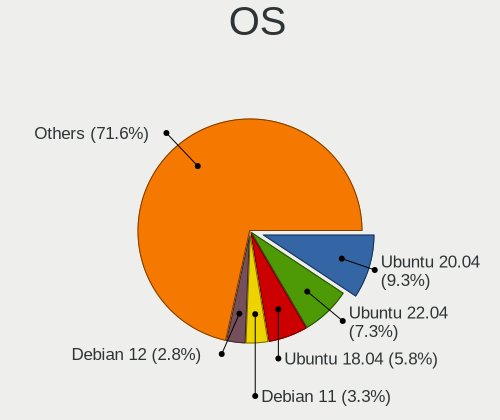
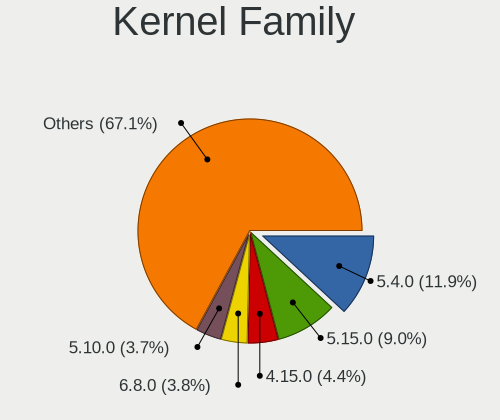
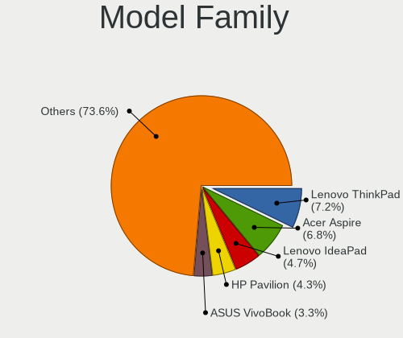
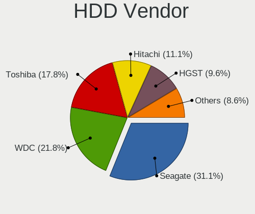
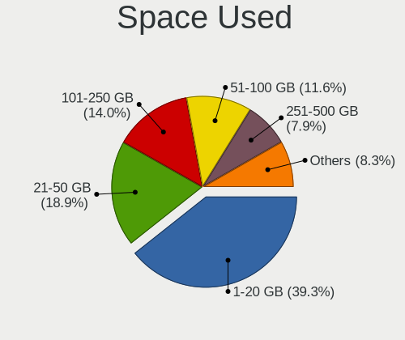
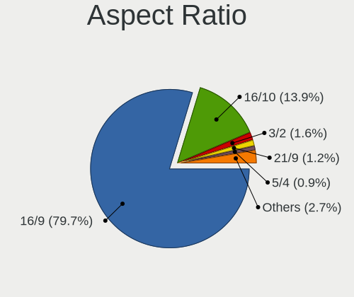
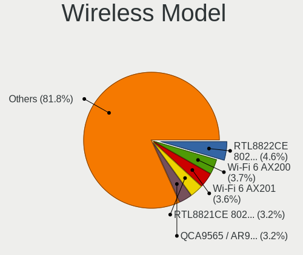

Linux in Spain - Tested Hardware & Statistics (Notebooks)
---------------------------------------------------------

A project to collect tested hardware configurations for Linux in Spain.

Anyone can contribute to this report by the [hw-probe](https://github.com/linuxhw/hw-probe) tool:

    sudo -E hw-probe -all -upload

Please contribute! Especially if your hardware is rare.

Contents
--------

* [ Test Cases ](#test-cases)

* [ System ](#system)
  - [ OS                       ](#os)
  - [ OS Family                ](#os-family)
  - [ Kernel                   ](#kernel)
  - [ Kernel Family            ](#kernel-family)
  - [ Kernel Major Ver.        ](#kernel-major-ver)
  - [ Arch                     ](#arch)
  - [ DE                       ](#de)
  - [ Display Server           ](#display-server)
  - [ Display Manager          ](#display-manager)
  - [ OS Lang                  ](#os-lang)
  - [ Boot Mode                ](#boot-mode)
  - [ Filesystem               ](#filesystem)
  - [ Part. scheme             ](#part-scheme)
  - [ Dual Boot with Linux/BSD ](#dual-boot-with-linuxbsd)
  - [ Dual Boot (Win)          ](#dual-boot-win)

* [ Board ](#board)
  - [ Vendor                   ](#vendor)
  - [ Model                    ](#model)
  - [ Model Family             ](#model-family)
  - [ MFG Year                 ](#mfg-year)
  - [ Form Factor              ](#form-factor)
  - [ Secure Boot              ](#secure-boot)
  - [ Coreboot                 ](#coreboot)
  - [ RAM Size                 ](#ram-size)
  - [ RAM Used                 ](#ram-used)
  - [ Total Drives             ](#total-drives)
  - [ Has CD-ROM               ](#has-cd-rom)
  - [ Has Ethernet             ](#has-ethernet)
  - [ Has WiFi                 ](#has-wifi)
  - [ Has Bluetooth            ](#has-bluetooth)

* [ Location ](#location)
  - [ Country                  ](#country)
  - [ City                     ](#city)

* [ Drives ](#drives)
  - [ Drive Vendor             ](#drive-vendor)
  - [ Drive Model              ](#drive-model)
  - [ HDD Vendor               ](#hdd-vendor)
  - [ SSD Vendor               ](#ssd-vendor)
  - [ Drive Kind               ](#drive-kind)
  - [ Drive Connector          ](#drive-connector)
  - [ Drive Size               ](#drive-size)
  - [ Space Total              ](#space-total)
  - [ Space Used               ](#space-used)
  - [ Malfunc. Drives          ](#malfunc-drives)
  - [ Malfunc. Drive Vendor    ](#malfunc-drive-vendor)
  - [ Malfunc. HDD Vendor      ](#malfunc-hdd-vendor)
  - [ Malfunc. Drive Kind      ](#malfunc-drive-kind)
  - [ Failed Drives            ](#failed-drives)
  - [ Failed Drive Vendor      ](#failed-drive-vendor)
  - [ Drive Status             ](#drive-status)

* [ Storage controller ](#storage-controller)
  - [ Storage Vendor           ](#storage-vendor)
  - [ Storage Model            ](#storage-model)
  - [ Storage Kind             ](#storage-kind)

* [ Processor ](#processor)
  - [ CPU Vendor               ](#cpu-vendor)
  - [ CPU Model                ](#cpu-model)
  - [ CPU Model Family         ](#cpu-model-family)
  - [ CPU Cores                ](#cpu-cores)
  - [ CPU Sockets              ](#cpu-sockets)
  - [ CPU Threads              ](#cpu-threads)
  - [ CPU Op-Modes             ](#cpu-op-modes)
  - [ CPU Microcode            ](#cpu-microcode)
  - [ CPU Microarch            ](#cpu-microarch)

* [ Graphics ](#graphics)
  - [ GPU Vendor               ](#gpu-vendor)
  - [ GPU Model                ](#gpu-model)
  - [ GPU Combo                ](#gpu-combo)
  - [ GPU Driver               ](#gpu-driver)
  - [ GPU Memory               ](#gpu-memory)

* [ Monitor ](#monitor)
  - [ Monitor Vendor           ](#monitor-vendor)
  - [ Monitor Model            ](#monitor-model)
  - [ Monitor Resolution       ](#monitor-resolution)
  - [ Monitor Diagonal         ](#monitor-diagonal)
  - [ Monitor Width            ](#monitor-width)
  - [ Aspect Ratio             ](#aspect-ratio)
  - [ Monitor Area             ](#monitor-area)
  - [ Pixel Density            ](#pixel-density)
  - [ Multiple Monitors        ](#multiple-monitors)

* [ Network ](#network)
  - [ Net Controller Vendor    ](#net-controller-vendor)
  - [ Net Controller Model     ](#net-controller-model)
  - [ Wireless Vendor          ](#wireless-vendor)
  - [ Wireless Model           ](#wireless-model)
  - [ Ethernet Vendor          ](#ethernet-vendor)
  - [ Ethernet Model           ](#ethernet-model)
  - [ Net Controller Kind      ](#net-controller-kind)
  - [ Used Controller          ](#used-controller)
  - [ NICs                     ](#nics)
  - [ IPv6                     ](#ipv6)

* [ Bluetooth ](#bluetooth)
  - [ Bluetooth Vendor         ](#bluetooth-vendor)
  - [ Bluetooth Model          ](#bluetooth-model)

* [ Sound ](#sound)
  - [ Sound Vendor             ](#sound-vendor)
  - [ Sound Model              ](#sound-model)

* [ Memory ](#memory)
  - [ Memory Vendor            ](#memory-vendor)
  - [ Memory Model             ](#memory-model)
  - [ Memory Kind              ](#memory-kind)
  - [ Memory Form Factor       ](#memory-form-factor)
  - [ Memory Size              ](#memory-size)
  - [ Memory Speed             ](#memory-speed)

* [ Printers & scanners ](#printers--scanners)
  - [ Printer Vendor           ](#printer-vendor)
  - [ Printer Model            ](#printer-model)
  - [ Scanner Vendor           ](#scanner-vendor)
  - [ Scanner Model            ](#scanner-model)

* [ Camera ](#camera)
  - [ Camera Vendor            ](#camera-vendor)
  - [ Camera Model             ](#camera-model)

* [ Security ](#security)
  - [ Fingerprint Vendor       ](#fingerprint-vendor)
  - [ Fingerprint Model        ](#fingerprint-model)
  - [ Chipcard Vendor          ](#chipcard-vendor)
  - [ Chipcard Model           ](#chipcard-model)

* [ Unsupported ](#unsupported)
  - [ Unsupported Devices      ](#unsupported-devices)
  - [ Unsupported Device Types ](#unsupported-device-types)

Test Cases
----------

Total: 4093

| Vendor        | Model                       | Probe                                                      | Date         |
|---------------|-----------------------------|------------------------------------------------------------|--------------|
| Dell          | Inspiron 7548               | [15fe439a9a](https://linux-hardware.org/?probe=15fe439a9a) | Apr 30, 2023 |
| ASUSTek       | X555QG                      | [5263b174b2](https://linux-hardware.org/?probe=5263b174b2) | Apr 30, 2023 |
| ASUSTek       | ROG Zephyrus G14 GA401II... | [70e92668aa](https://linux-hardware.org/?probe=70e92668aa) | Apr 30, 2023 |
| MSI           | GF63 Thin 9SC               | [f6a250b3e2](https://linux-hardware.org/?probe=f6a250b3e2) | Apr 29, 2023 |
| MSI           | Modern 14 A10M              | [22ad1f6bfb](https://linux-hardware.org/?probe=22ad1f6bfb) | Apr 29, 2023 |
| Chuwi         | HeroBook Air                | [123f6df9f8](https://linux-hardware.org/?probe=123f6df9f8) | Apr 29, 2023 |
| Sony          | VPCZ13M9E                   | [caf336efc3](https://linux-hardware.org/?probe=caf336efc3) | Apr 28, 2023 |
| ASUSTek       | X555QG                      | [b33f41d3c3](https://linux-hardware.org/?probe=b33f41d3c3) | Apr 28, 2023 |
| Lenovo        | IdeaPad 3 15ALC6 82KU       | [61151daf36](https://linux-hardware.org/?probe=61151daf36) | Apr 28, 2023 |
| Lenovo        | ThinkPad Edge 25453BG       | [2b5c6e2ded](https://linux-hardware.org/?probe=2b5c6e2ded) | Apr 28, 2023 |
| ASUSTek       | S550CM                      | [068365f788](https://linux-hardware.org/?probe=068365f788) | Apr 28, 2023 |
| Toshiba       | TECRA Z40-C                 | [a72fdebd89](https://linux-hardware.org/?probe=a72fdebd89) | Apr 28, 2023 |
| MSI           | Stealth 15M B12UE           | [ca70475f8a](https://linux-hardware.org/?probe=ca70475f8a) | Apr 28, 2023 |
| HP            | OMEN by Laptop 16-b1xxx     | [beca0f768b](https://linux-hardware.org/?probe=beca0f768b) | Apr 27, 2023 |
| Gigabyte      | G5 GD                       | [d09d6fb712](https://linux-hardware.org/?probe=d09d6fb712) | Apr 27, 2023 |
| Lenovo        | Legion Y540-15IRH-PG0 81... | [0e403fcd17](https://linux-hardware.org/?probe=0e403fcd17) | Apr 27, 2023 |
| Valve         | Jupiter                     | [72f64e795a](https://linux-hardware.org/?probe=72f64e795a) | Apr 27, 2023 |
| Lenovo        | Legion Y540-15IRH-PG0 81... | [018ade4782](https://linux-hardware.org/?probe=018ade4782) | Apr 26, 2023 |
| HUAWEI        | KLVL-WXXW                   | [de95ac0857](https://linux-hardware.org/?probe=de95ac0857) | Apr 26, 2023 |
| HUAWEI        | KLVL-WXXW                   | [07906a30e3](https://linux-hardware.org/?probe=07906a30e3) | Apr 26, 2023 |
| MSI           | Stealth 15M B12UE           | [312db1147a](https://linux-hardware.org/?probe=312db1147a) | Apr 26, 2023 |
| ASUSTek       | ZenBook UX425EA_UX425EA     | [8a88263cea](https://linux-hardware.org/?probe=8a88263cea) | Apr 26, 2023 |
| ASUSTek       | ZenBook UX425EA_UX425EA     | [2f7f2efd4f](https://linux-hardware.org/?probe=2f7f2efd4f) | Apr 26, 2023 |
| MSI           | Modern 14 A10M              | [dc3595e3cc](https://linux-hardware.org/?probe=dc3595e3cc) | Apr 25, 2023 |
| HP            | Compaq 15                   | [4799b2a649](https://linux-hardware.org/?probe=4799b2a649) | Apr 25, 2023 |
| Toshiba       | Satellite L350D             | [911ac6edf0](https://linux-hardware.org/?probe=911ac6edf0) | Apr 25, 2023 |
| INSYS         | PT1-140C                    | [902536abce](https://linux-hardware.org/?probe=902536abce) | Apr 24, 2023 |
| ASUSTek       | TUF Gaming FX705GD_FX705... | [b1c3492700](https://linux-hardware.org/?probe=b1c3492700) | Apr 24, 2023 |
| Acer          | Aspire E1-571G              | [0e2671ee2e](https://linux-hardware.org/?probe=0e2671ee2e) | Apr 23, 2023 |
| Lenovo        | Legion 5 Pro 16ACH6H 82J... | [e682d7b9dd](https://linux-hardware.org/?probe=e682d7b9dd) | Apr 22, 2023 |
| HP            | Notebook                    | [1d975dfc4f](https://linux-hardware.org/?probe=1d975dfc4f) | Apr 22, 2023 |
| ASUSTek       | VivoBook_ASUSLaptop X570... | [694966dbd7](https://linux-hardware.org/?probe=694966dbd7) | Apr 22, 2023 |
| Toshiba       | Satellite L50-C             | [11f0485b1a](https://linux-hardware.org/?probe=11f0485b1a) | Apr 21, 2023 |
| Toshiba       | Satellite L50-C             | [969bbe5df0](https://linux-hardware.org/?probe=969bbe5df0) | Apr 21, 2023 |
| MSI           | Stealth 15M B12UE           | [d26a12b2e3](https://linux-hardware.org/?probe=d26a12b2e3) | Apr 21, 2023 |
| HP            | OMEN Laptop 15-en1xxx       | [3caa3d5076](https://linux-hardware.org/?probe=3caa3d5076) | Apr 21, 2023 |
| Dell          | Inspiron MM061              | [aaecae8f5a](https://linux-hardware.org/?probe=aaecae8f5a) | Apr 20, 2023 |
| MSI           | Stealth 15M B12UE           | [7631901c7a](https://linux-hardware.org/?probe=7631901c7a) | Apr 20, 2023 |
| Lenovo        | ThinkPad T420 4180FP9       | [655c151267](https://linux-hardware.org/?probe=655c151267) | Apr 20, 2023 |
| Acer          | TravelMate B115-M           | [178dbe3693](https://linux-hardware.org/?probe=178dbe3693) | Apr 19, 2023 |
| MSI           | Bravo 15 B5DD               | [433c482314](https://linux-hardware.org/?probe=433c482314) | Apr 19, 2023 |
| Acer          | TravelMate B115-M           | [973070ca0e](https://linux-hardware.org/?probe=973070ca0e) | Apr 19, 2023 |
| HP            | ZBook Firefly 16 inch G9... | [194535b314](https://linux-hardware.org/?probe=194535b314) | Apr 19, 2023 |
| Toshiba       | Satellite L500              | [0896195ea4](https://linux-hardware.org/?probe=0896195ea4) | Apr 18, 2023 |
| Toshiba       | Satellite L500              | [7105145a87](https://linux-hardware.org/?probe=7105145a87) | Apr 18, 2023 |
| MSI           | Prestige 15 A12UC           | [0f4c1e1ac3](https://linux-hardware.org/?probe=0f4c1e1ac3) | Apr 18, 2023 |
| HP            | Pavilion Laptop 15-ck0xx    | [e9278fb49b](https://linux-hardware.org/?probe=e9278fb49b) | Apr 18, 2023 |
| MSI           | PS42 Modern 8RC             | [459a84f65e](https://linux-hardware.org/?probe=459a84f65e) | Apr 17, 2023 |
| HP            | Laptop 15s-eq2xxx           | [879e47fc04](https://linux-hardware.org/?probe=879e47fc04) | Apr 17, 2023 |
| HUAWEI        | BOHK-WAX9X                  | [8b6a2af9ce](https://linux-hardware.org/?probe=8b6a2af9ce) | Apr 16, 2023 |
| Medion        | E15415                      | [fb905ef988](https://linux-hardware.org/?probe=fb905ef988) | Apr 15, 2023 |
| HUAWEI        | MRC-WX0                     | [5b446c43f3](https://linux-hardware.org/?probe=5b446c43f3) | Apr 15, 2023 |
| Lenovo        | ThinkPad T490 20N20008US    | [f365509651](https://linux-hardware.org/?probe=f365509651) | Apr 15, 2023 |
| Dell          | Inspiron 5759               | [f3bbb04052](https://linux-hardware.org/?probe=f3bbb04052) | Apr 15, 2023 |
| Dell          | Precision 5560              | [b6d20ef4bf](https://linux-hardware.org/?probe=b6d20ef4bf) | Apr 14, 2023 |
| Dell          | Precision 5560              | [b76f840bd9](https://linux-hardware.org/?probe=b76f840bd9) | Apr 14, 2023 |
| HUAWEI        | HVY-WXX9                    | [e6b0deb213](https://linux-hardware.org/?probe=e6b0deb213) | Apr 14, 2023 |
| Lenovo        | ThinkPad T410 2537NY6       | [977014ae11](https://linux-hardware.org/?probe=977014ae11) | Apr 13, 2023 |
| MiTAC         | Notebook PC                 | [a9b7cf3c18](https://linux-hardware.org/?probe=a9b7cf3c18) | Apr 13, 2023 |
| MiTAC         | Notebook PC                 | [b2259951b5](https://linux-hardware.org/?probe=b2259951b5) | Apr 13, 2023 |
| ASUSTek       | VivoBook_ASUSLaptop X510... | [af4ccb91b1](https://linux-hardware.org/?probe=af4ccb91b1) | Apr 12, 2023 |
| Lenovo        | IdeaPad 5 15ITL05 82FG      | [406c02acb0](https://linux-hardware.org/?probe=406c02acb0) | Apr 12, 2023 |
| Gigabyte      | G5 GD                       | [d914c2a179](https://linux-hardware.org/?probe=d914c2a179) | Apr 12, 2023 |
| Gigabyte      | G5 GD                       | [5b861c968e](https://linux-hardware.org/?probe=5b861c968e) | Apr 12, 2023 |
| ASUSTek       | GL752VW                     | [8abf9b082b](https://linux-hardware.org/?probe=8abf9b082b) | Apr 12, 2023 |
| Valve         | Jupiter                     | [8fdb71aed1](https://linux-hardware.org/?probe=8fdb71aed1) | Apr 12, 2023 |
| Dell          | XPS 15 9520                 | [5b01d0eda1](https://linux-hardware.org/?probe=5b01d0eda1) | Apr 11, 2023 |
| ASUSTek       | VivoBook_ASUSLaptop X570... | [27688332ee](https://linux-hardware.org/?probe=27688332ee) | Apr 11, 2023 |
| ASUSTek       | X550JF                      | [dff4654bd2](https://linux-hardware.org/?probe=dff4654bd2) | Apr 11, 2023 |
| Acer          | Aspire E1-571G              | [45a3503764](https://linux-hardware.org/?probe=45a3503764) | Apr 11, 2023 |
| HP            | Laptop 15-bw0xx             | [0cef536369](https://linux-hardware.org/?probe=0cef536369) | Apr 10, 2023 |
| Lenovo        | Legion 5 15ACH6H 82JU       | [ac983c99b9](https://linux-hardware.org/?probe=ac983c99b9) | Apr 10, 2023 |
| Lenovo        | Legion 5 15ACH6H 82JU       | [a2dcc97485](https://linux-hardware.org/?probe=a2dcc97485) | Apr 09, 2023 |
| HP            | Laptop 15s-eq1xxx           | [eab5adc4e6](https://linux-hardware.org/?probe=eab5adc4e6) | Apr 09, 2023 |
| Lenovo        | Legion 5 15ACH6H 82JU       | [7033d674d8](https://linux-hardware.org/?probe=7033d674d8) | Apr 09, 2023 |
| HP            | Pavilion dv6                | [10eeff8916](https://linux-hardware.org/?probe=10eeff8916) | Apr 08, 2023 |
| ASUSTek       | X540LA                      | [38299d8248](https://linux-hardware.org/?probe=38299d8248) | Apr 08, 2023 |
| Dell          | Latitude E5550              | [b0e2c2e0d5](https://linux-hardware.org/?probe=b0e2c2e0d5) | Apr 07, 2023 |
| Gigabyte      | G5 GD                       | [d492c2eca8](https://linux-hardware.org/?probe=d492c2eca8) | Apr 06, 2023 |
| Dell          | Latitude E7250              | [e5fe0c7962](https://linux-hardware.org/?probe=e5fe0c7962) | Apr 06, 2023 |
| HP            | Compaq Presario CQ70        | [11cd73fbce](https://linux-hardware.org/?probe=11cd73fbce) | Apr 06, 2023 |
| Lenovo        | IdeaPad 330-15ICH 81FK      | [62b5ed7cdf](https://linux-hardware.org/?probe=62b5ed7cdf) | Apr 06, 2023 |
| Dynabook      | Satellite Pro C50-E-11H     | [705d5f2396](https://linux-hardware.org/?probe=705d5f2396) | Apr 05, 2023 |
| Dell          | Latitude E4200              | [6dae8e5ff4](https://linux-hardware.org/?probe=6dae8e5ff4) | Apr 05, 2023 |
| Lenovo        | ThinkPad T14 Gen 1 20S1S... | [80bd0aed09](https://linux-hardware.org/?probe=80bd0aed09) | Apr 05, 2023 |
| ASUSTek       | X58C                        | [ff580ffa57](https://linux-hardware.org/?probe=ff580ffa57) | Apr 05, 2023 |
| ASUSTek       | X58C                        | [ae9888c407](https://linux-hardware.org/?probe=ae9888c407) | Apr 05, 2023 |
| MSI           | Modern 15 A11SBU            | [269c7d638e](https://linux-hardware.org/?probe=269c7d638e) | Apr 05, 2023 |
| ASUSTek       | ASUS TUF Gaming F15 FX50... | [d006e94e8f](https://linux-hardware.org/?probe=d006e94e8f) | Apr 04, 2023 |
| Valve         | Jupiter                     | [70eb6c0ec1](https://linux-hardware.org/?probe=70eb6c0ec1) | Apr 04, 2023 |
| Timi          | RedmiBook 16                | [681c9f1403](https://linux-hardware.org/?probe=681c9f1403) | Apr 03, 2023 |
| ASUSTek       | ROG Zephyrus G14 GA401II... | [10e0075b35](https://linux-hardware.org/?probe=10e0075b35) | Apr 03, 2023 |
| ASUSTek       | ASUS TUF Gaming A15 FA50... | [89d4ef9333](https://linux-hardware.org/?probe=89d4ef9333) | Apr 02, 2023 |
| Thomson       | SPNEOX13-4RD64              | [bf3eb39804](https://linux-hardware.org/?probe=bf3eb39804) | Apr 02, 2023 |
| HP            | 255 G7 Notebook PC          | [f7f0d77f00](https://linux-hardware.org/?probe=f7f0d77f00) | Apr 02, 2023 |
| ASUSTek       | ROG Zephyrus G14 GA401II... | [92c94ff8a5](https://linux-hardware.org/?probe=92c94ff8a5) | Apr 02, 2023 |
| Google        | Snappy                      | [6ca49159d2](https://linux-hardware.org/?probe=6ca49159d2) | Apr 01, 2023 |
| Chuwi         | GemiBook Pro                | [41b51a471d](https://linux-hardware.org/?probe=41b51a471d) | Apr 01, 2023 |
| Chuwi         | GemiBook Pro                | [fc4116204b](https://linux-hardware.org/?probe=fc4116204b) | Apr 01, 2023 |
| Lenovo        | IdeaPad 510-15IKB 80SV      | [6ab0a0226d](https://linux-hardware.org/?probe=6ab0a0226d) | Apr 01, 2023 |
| Intel         | Kabylake Platform           | [2b0fd79264](https://linux-hardware.org/?probe=2b0fd79264) | Mar 31, 2023 |
| Acer          | Aspire E5-571               | [45887eb5f3](https://linux-hardware.org/?probe=45887eb5f3) | Mar 31, 2023 |
| HP            | Pavilion Aero Laptop 13-... | [59b2b4e152](https://linux-hardware.org/?probe=59b2b4e152) | Mar 31, 2023 |
| MSI           | Modern 15 A5M               | [2a00bed043](https://linux-hardware.org/?probe=2a00bed043) | Mar 31, 2023 |
| ASUSTek       | X551MA                      | [5ea823d079](https://linux-hardware.org/?probe=5ea823d079) | Mar 31, 2023 |
| Apple         | MacBookPro9,2               | [8c60cf0ec1](https://linux-hardware.org/?probe=8c60cf0ec1) | Mar 31, 2023 |
| Dell          | G15 5515                    | [7bb6311632](https://linux-hardware.org/?probe=7bb6311632) | Mar 30, 2023 |
| Lenovo        | IdeaPad 3 15ITL6 82H8       | [faa3d2b7ad](https://linux-hardware.org/?probe=faa3d2b7ad) | Mar 30, 2023 |
| ASUSTek       | ZenBook UX333FA_UX333FA     | [e7e49e22ba](https://linux-hardware.org/?probe=e7e49e22ba) | Mar 30, 2023 |
| ASUSTek       | K53SD                       | [81710aaa51](https://linux-hardware.org/?probe=81710aaa51) | Mar 30, 2023 |
| Lenovo        | ThinkPad T14s Gen 2i 20W... | [a9e7ad7ecd](https://linux-hardware.org/?probe=a9e7ad7ecd) | Mar 29, 2023 |
| HUAWEI        | BOHK-WAX9X                  | [3836173aad](https://linux-hardware.org/?probe=3836173aad) | Mar 29, 2023 |
| Lenovo        | ThinkPad T480 20L6S3H102    | [cf75eeabd5](https://linux-hardware.org/?probe=cf75eeabd5) | Mar 29, 2023 |
| HUAWEI        | BOHK-WAX9X                  | [46a8636dfd](https://linux-hardware.org/?probe=46a8636dfd) | Mar 29, 2023 |
| Lenovo        | Legion 5 15ACH6H 82JU       | [ccb2d60f5c](https://linux-hardware.org/?probe=ccb2d60f5c) | Mar 29, 2023 |
| ASUSTek       | N550JX                      | [a505a62a71](https://linux-hardware.org/?probe=a505a62a71) | Mar 28, 2023 |
| TEKNOSERVI... | NJ5x_NJ7xLU                 | [2a0feae3f9](https://linux-hardware.org/?probe=2a0feae3f9) | Mar 28, 2023 |
| Notebook      | L140CU                      | [98b71e9790](https://linux-hardware.org/?probe=98b71e9790) | Mar 28, 2023 |
| Dell          | Precision 5540              | [f9e20de07f](https://linux-hardware.org/?probe=f9e20de07f) | Mar 28, 2023 |
| Lenovo        | IdeaPad 330-15ICH 81FK      | [66a10dc91a](https://linux-hardware.org/?probe=66a10dc91a) | Mar 27, 2023 |
| Lenovo        | IdeaPad 330-15ICH 81FK      | [ef962f373f](https://linux-hardware.org/?probe=ef962f373f) | Mar 27, 2023 |
| HUAWEI        | KLVD-WXX9                   | [574bb4272c](https://linux-hardware.org/?probe=574bb4272c) | Mar 27, 2023 |
| Dell          | Precision 3571              | [13d1ce389d](https://linux-hardware.org/?probe=13d1ce389d) | Mar 27, 2023 |
| Lenovo        | ThinkPad X1 Carbon Gen 9... | [bddc9116d1](https://linux-hardware.org/?probe=bddc9116d1) | Mar 27, 2023 |
| Lenovo        | ThinkPad L14 Gen 3 21C10... | [6a8962feba](https://linux-hardware.org/?probe=6a8962feba) | Mar 27, 2023 |
| Samsung       | N150P/N210P/N220P           | [70d943698c](https://linux-hardware.org/?probe=70d943698c) | Mar 27, 2023 |
| HUAWEI        | KLVD-WXX9                   | [ca83615d40](https://linux-hardware.org/?probe=ca83615d40) | Mar 26, 2023 |
| HUAWEI        | KLVD-WXX9                   | [285462b197](https://linux-hardware.org/?probe=285462b197) | Mar 26, 2023 |
| HUAWEI        | KLVD-WXX9                   | [fc40632056](https://linux-hardware.org/?probe=fc40632056) | Mar 26, 2023 |
| Dell          | G15 5515                    | [3af5157823](https://linux-hardware.org/?probe=3af5157823) | Mar 26, 2023 |
| ASUSTek       | Zephyrus M GM501GS          | [68017924d7](https://linux-hardware.org/?probe=68017924d7) | Mar 26, 2023 |
| HUAWEI        | BOD-WXX9                    | [bee83a6b50](https://linux-hardware.org/?probe=bee83a6b50) | Mar 26, 2023 |
| Chuwi         | HeroBook Air                | [836112a53f](https://linux-hardware.org/?probe=836112a53f) | Mar 26, 2023 |
| Lenovo        | Y520-15IKBN 80WK            | [8a6705ba5a](https://linux-hardware.org/?probe=8a6705ba5a) | Mar 26, 2023 |
| Lenovo        | Y520-15IKBN 80WK            | [d1427e69b3](https://linux-hardware.org/?probe=d1427e69b3) | Mar 26, 2023 |
| Notebook      | NL40_50CU                   | [4870d52d1e](https://linux-hardware.org/?probe=4870d52d1e) | Mar 25, 2023 |
| Gigabyte      | AERO 15 XD                  | [51fd5b8510](https://linux-hardware.org/?probe=51fd5b8510) | Mar 25, 2023 |
| Lenovo        | IdeaPad 3 15ITL6 82H8       | [05b2003fc0](https://linux-hardware.org/?probe=05b2003fc0) | Mar 25, 2023 |
| MSI           | PE62 7RD                    | [de18d40d94](https://linux-hardware.org/?probe=de18d40d94) | Mar 25, 2023 |
| Lenovo        | G580 2189                   | [edba6da5b6](https://linux-hardware.org/?probe=edba6da5b6) | Mar 25, 2023 |
| HP            | 255 G7 Notebook PC          | [2097578b64](https://linux-hardware.org/?probe=2097578b64) | Mar 25, 2023 |
| Dynabook      | PORTEGE X40L-K              | [9f4a50bc98](https://linux-hardware.org/?probe=9f4a50bc98) | Mar 25, 2023 |
| Lenovo        | IdeaPad Gaming 3 15ARH05... | [548c06032b](https://linux-hardware.org/?probe=548c06032b) | Mar 24, 2023 |
| ASUSTek       | K52Jr                       | [a88997ecfd](https://linux-hardware.org/?probe=a88997ecfd) | Mar 24, 2023 |
| Dell          | G15 5515                    | [3510cdb4cf](https://linux-hardware.org/?probe=3510cdb4cf) | Mar 24, 2023 |
| HP            | 2000                        | [9820715e60](https://linux-hardware.org/?probe=9820715e60) | Mar 24, 2023 |
| ASUSTek       | GL752VW                     | [8e1cd2ea46](https://linux-hardware.org/?probe=8e1cd2ea46) | Mar 24, 2023 |
| Chuwi         | GemiBook Pro                | [4054877ef0](https://linux-hardware.org/?probe=4054877ef0) | Mar 24, 2023 |
| Chuwi         | GemiBook Pro                | [da37222f12](https://linux-hardware.org/?probe=da37222f12) | Mar 24, 2023 |
| HP            | 2000                        | [87ba6d3696](https://linux-hardware.org/?probe=87ba6d3696) | Mar 24, 2023 |
| Lenovo        | Legion 5 15ACH6H 82JU       | [ca7d9a9342](https://linux-hardware.org/?probe=ca7d9a9342) | Mar 24, 2023 |
| ASUSTek       | ASUS TUF Gaming F15 FX50... | [e4a3f70cbf](https://linux-hardware.org/?probe=e4a3f70cbf) | Mar 23, 2023 |
| ASUSTek       | ASUS TUF Gaming F15 FX50... | [d55de052b1](https://linux-hardware.org/?probe=d55de052b1) | Mar 23, 2023 |
| Lenovo        | G500 20236                  | [8688a57db6](https://linux-hardware.org/?probe=8688a57db6) | Mar 22, 2023 |
| Packard Be... | EasyNote LJ75               | [1a3b095372](https://linux-hardware.org/?probe=1a3b095372) | Mar 22, 2023 |
| HP            | OMEN by Laptop 16-c0xxx     | [4ee498d9fc](https://linux-hardware.org/?probe=4ee498d9fc) | Mar 22, 2023 |
| Dell          | G3 3579                     | [b6f8dd5ffe](https://linux-hardware.org/?probe=b6f8dd5ffe) | Mar 22, 2023 |
| Acer          | Aspire ES1-512              | [901b9b1b6b](https://linux-hardware.org/?probe=901b9b1b6b) | Mar 21, 2023 |
| Acer          | Extensa 2510G               | [1ac79f58a4](https://linux-hardware.org/?probe=1ac79f58a4) | Mar 21, 2023 |
| Lenovo        | IdeaPad 330-15ARR 81D2      | [48de9eb9e3](https://linux-hardware.org/?probe=48de9eb9e3) | Mar 20, 2023 |
| Lenovo        | IdeaPad 100-15IBY 80MJ      | [e7344d03c0](https://linux-hardware.org/?probe=e7344d03c0) | Mar 20, 2023 |
| HP            | 250 G4                      | [46e0314fb1](https://linux-hardware.org/?probe=46e0314fb1) | Mar 20, 2023 |
| MSI           | Pulse GL66 12UEK            | [9790d0bb28](https://linux-hardware.org/?probe=9790d0bb28) | Mar 20, 2023 |
| ASUSTek       | ASUS TUF Dash F15 FX516P... | [4223bbbf7e](https://linux-hardware.org/?probe=4223bbbf7e) | Mar 19, 2023 |
| Lenovo        | IdeaPad 330-15IKB 81DE      | [77b7fd07a4](https://linux-hardware.org/?probe=77b7fd07a4) | Mar 19, 2023 |
| Acer          | Aspire M3-581G              | [1434607f7e](https://linux-hardware.org/?probe=1434607f7e) | Mar 19, 2023 |
| HUAWEI        | NBLK-WAX9X                  | [5c0e12ebd0](https://linux-hardware.org/?probe=5c0e12ebd0) | Mar 19, 2023 |
| Acer          | Aspire E1-532               | [ed3693c1c8](https://linux-hardware.org/?probe=ed3693c1c8) | Mar 18, 2023 |
| Chuwi         | HeroBook Air                | [e9d0a5dd9a](https://linux-hardware.org/?probe=e9d0a5dd9a) | Mar 18, 2023 |
| Chuwi         | GemiBook Pro                | [7bd3a3e64c](https://linux-hardware.org/?probe=7bd3a3e64c) | Mar 18, 2023 |
| HP            | 250 G8 Notebook PC          | [aade64a567](https://linux-hardware.org/?probe=aade64a567) | Mar 18, 2023 |
| Chuwi         | HeroBook                    | [7a70fa6c57](https://linux-hardware.org/?probe=7a70fa6c57) | Mar 17, 2023 |
| MSI           | GF63 Thin 9SC               | [88dcbd2740](https://linux-hardware.org/?probe=88dcbd2740) | Mar 17, 2023 |
| Apple         | MacBook8,1                  | [a3ef4e5a56](https://linux-hardware.org/?probe=a3ef4e5a56) | Mar 16, 2023 |
| Valve         | Jupiter                     | [0a2038deed](https://linux-hardware.org/?probe=0a2038deed) | Mar 16, 2023 |
| HP            | Laptop 15-db0xxx            | [56b19568ce](https://linux-hardware.org/?probe=56b19568ce) | Mar 16, 2023 |
| HP            | Pavilion Notebook           | [db96098c80](https://linux-hardware.org/?probe=db96098c80) | Mar 15, 2023 |
| Razer         | Blade 14 (2022) - RZ09-0... | [428ea81050](https://linux-hardware.org/?probe=428ea81050) | Mar 15, 2023 |
| Acer          | Aspire E5-573G              | [a24986d87d](https://linux-hardware.org/?probe=a24986d87d) | Mar 15, 2023 |
| HP            | Mini 210-1000               | [cccfcdba22](https://linux-hardware.org/?probe=cccfcdba22) | Mar 15, 2023 |
| MSI           | Katana GF66 12UC            | [8307fbf791](https://linux-hardware.org/?probe=8307fbf791) | Mar 14, 2023 |
| Intel         | powered classmate PC        | [891664a0ae](https://linux-hardware.org/?probe=891664a0ae) | Mar 14, 2023 |
| Dell          | Inspiron 14 5410            | [54ff309c3d](https://linux-hardware.org/?probe=54ff309c3d) | Mar 14, 2023 |
| MSI           | Stealth GS77 12UHS          | [fe00606a03](https://linux-hardware.org/?probe=fe00606a03) | Mar 14, 2023 |
| Chuwi         | GemiBook Pro                | [f30cf91b1c](https://linux-hardware.org/?probe=f30cf91b1c) | Mar 13, 2023 |
| Valve         | Jupiter                     | [95598d1841](https://linux-hardware.org/?probe=95598d1841) | Mar 13, 2023 |
| ASUSTek       | ZenBook UX431FLC_UX431FL    | [fc75288cce](https://linux-hardware.org/?probe=fc75288cce) | Mar 12, 2023 |
| Acer          | TravelMate B113             | [e5f001172d](https://linux-hardware.org/?probe=e5f001172d) | Mar 12, 2023 |
| Chuwi         | GemiBook Pro                | [a421f89675](https://linux-hardware.org/?probe=a421f89675) | Mar 12, 2023 |
| Chuwi         | GemiBook Pro                | [4708653fb3](https://linux-hardware.org/?probe=4708653fb3) | Mar 12, 2023 |
| Acer          | TravelMate B113             | [ba6dc5dcb5](https://linux-hardware.org/?probe=ba6dc5dcb5) | Mar 11, 2023 |
| Dynabook      | Satellite Pro C50-E-11H     | [1a37e14422](https://linux-hardware.org/?probe=1a37e14422) | Mar 11, 2023 |
| Toshiba       | Satellite Pro L300          | [7c5e811612](https://linux-hardware.org/?probe=7c5e811612) | Mar 11, 2023 |
| Valve         | Jupiter                     | [07f6e9ed10](https://linux-hardware.org/?probe=07f6e9ed10) | Mar 10, 2023 |
| Dynabook      | Satellite Pro C50-G         | [835785f6a7](https://linux-hardware.org/?probe=835785f6a7) | Mar 10, 2023 |
| MSI           | GL75 Leopard 10SEK          | [9fdc1bd5c4](https://linux-hardware.org/?probe=9fdc1bd5c4) | Mar 10, 2023 |
| MSI           | CX61 2PC                    | [cb9f5fa992](https://linux-hardware.org/?probe=cb9f5fa992) | Mar 10, 2023 |
| Dell          | Latitude E5420              | [9b346e0658](https://linux-hardware.org/?probe=9b346e0658) | Mar 10, 2023 |
| Acer          | Aspire 5750G                | [b4af1eb2cb](https://linux-hardware.org/?probe=b4af1eb2cb) | Mar 10, 2023 |
| Acer          | Aspire M3-581G              | [65b41dc560](https://linux-hardware.org/?probe=65b41dc560) | Mar 09, 2023 |
| Dell          | Latitude E6540              | [3bf25841b3](https://linux-hardware.org/?probe=3bf25841b3) | Mar 09, 2023 |
| Chuwi         | GemiBook Pro                | [23a97367b7](https://linux-hardware.org/?probe=23a97367b7) | Mar 09, 2023 |
| Intel         | powered classmate PC        | [c25d03cf3f](https://linux-hardware.org/?probe=c25d03cf3f) | Mar 09, 2023 |
| Intel         | powered classmate PC        | [8c62787a5b](https://linux-hardware.org/?probe=8c62787a5b) | Mar 09, 2023 |
| Lenovo        | ThinkPad E15 Gen 4 21EDC... | [fd15fc475a](https://linux-hardware.org/?probe=fd15fc475a) | Mar 08, 2023 |
| Lenovo        | ThinkPad E15 Gen 4 21EDC... | [0e054a9861](https://linux-hardware.org/?probe=0e054a9861) | Mar 08, 2023 |
| HP            | Pavilion g6                 | [35f93de82d](https://linux-hardware.org/?probe=35f93de82d) | Mar 08, 2023 |
| ASUSTek       | K53SC                       | [bd182b6d80](https://linux-hardware.org/?probe=bd182b6d80) | Mar 08, 2023 |
| Sony          | SVF1521B1EW                 | [5b5a9dbc40](https://linux-hardware.org/?probe=5b5a9dbc40) | Mar 08, 2023 |
| Acer          | Aspire 5740                 | [37c0c0602c](https://linux-hardware.org/?probe=37c0c0602c) | Mar 08, 2023 |
| ASUSTek       | K54HR                       | [a7c688e9be](https://linux-hardware.org/?probe=a7c688e9be) | Mar 08, 2023 |
| Lenovo        | ThinkPad P1 Gen 2 20QUS1... | [798d6e74da](https://linux-hardware.org/?probe=798d6e74da) | Mar 06, 2023 |
| HP            | EliteBook 830 G7 Noteboo... | [cee8496315](https://linux-hardware.org/?probe=cee8496315) | Mar 06, 2023 |
| Notebook      | N2x0WU                      | [4948392f03](https://linux-hardware.org/?probe=4948392f03) | Mar 06, 2023 |
| Fujitsu Si... | STYLISTIC ST6012            | [0d9314f673](https://linux-hardware.org/?probe=0d9314f673) | Mar 06, 2023 |
| Lenovo        | ThinkPad T15p Gen 1 20TN... | [0811163639](https://linux-hardware.org/?probe=0811163639) | Mar 05, 2023 |
| Lenovo        | Legion 5 15ACH6H 82JU       | [42469e8f5d](https://linux-hardware.org/?probe=42469e8f5d) | Mar 05, 2023 |
| Lenovo        | IdeaPad Gaming 3 15IAH7 ... | [b73251069c](https://linux-hardware.org/?probe=b73251069c) | Mar 05, 2023 |
| Intel         | powered classmate PC        | [bfd724fd2f](https://linux-hardware.org/?probe=bfd724fd2f) | Mar 04, 2023 |
| Acer          | Aspire A315-43              | [c9efc71e60](https://linux-hardware.org/?probe=c9efc71e60) | Mar 04, 2023 |
| Chuwi         | HeroBook Air                | [43248e0ae9](https://linux-hardware.org/?probe=43248e0ae9) | Mar 03, 2023 |
| Lenovo        | ThinkPad E490 20N8002ASP    | [9b91ef4633](https://linux-hardware.org/?probe=9b91ef4633) | Mar 02, 2023 |
| ASUSTek       | T100HAN                     | [5729d41d01](https://linux-hardware.org/?probe=5729d41d01) | Mar 02, 2023 |
| Toshiba       | Satellite A100              | [51e1183b15](https://linux-hardware.org/?probe=51e1183b15) | Mar 02, 2023 |
| Acer          | TravelMate 5720             | [2e0c5ff8f1](https://linux-hardware.org/?probe=2e0c5ff8f1) | Mar 01, 2023 |
| MSI           | P65 Creator 8RD             | [ea8be773a9](https://linux-hardware.org/?probe=ea8be773a9) | Mar 01, 2023 |
| MSI           | P65 Creator 8RD             | [2b97507181](https://linux-hardware.org/?probe=2b97507181) | Mar 01, 2023 |
| Lenovo        | ThinkPad X1 Carbon 5th 2... | [3a2e77122d](https://linux-hardware.org/?probe=3a2e77122d) | Mar 01, 2023 |
| ASUSTek       | GL752VW                     | [a3e7201f2e](https://linux-hardware.org/?probe=a3e7201f2e) | Mar 01, 2023 |
| HP            | OMEN by Laptop 16-c0xxx     | [1c09e468d0](https://linux-hardware.org/?probe=1c09e468d0) | Mar 01, 2023 |
| ASUSTek       | T100HAN                     | [a8b1a02128](https://linux-hardware.org/?probe=a8b1a02128) | Mar 01, 2023 |
| Lenovo        | IdeaPad 330-15ICH 81FK      | [08f2d1cca5](https://linux-hardware.org/?probe=08f2d1cca5) | Feb 28, 2023 |
| ASUSTek       | T100HAN                     | [4f835a4f35](https://linux-hardware.org/?probe=4f835a4f35) | Feb 28, 2023 |
| Dell          | G5 5590                     | [75f2235434](https://linux-hardware.org/?probe=75f2235434) | Feb 28, 2023 |
| ASUSTek       | X550JD                      | [6804351029](https://linux-hardware.org/?probe=6804351029) | Feb 28, 2023 |
| HP            | OMEN by Laptop 16-c0xxx     | [c829e9e0b8](https://linux-hardware.org/?probe=c829e9e0b8) | Feb 27, 2023 |
| Apple         | MacBookPro6,2               | [3696f0b49e](https://linux-hardware.org/?probe=3696f0b49e) | Feb 27, 2023 |
| HP            | 250 G7 Notebook PC          | [9e587033a4](https://linux-hardware.org/?probe=9e587033a4) | Feb 26, 2023 |
| HP            | Notebook                    | [06dba3c8b3](https://linux-hardware.org/?probe=06dba3c8b3) | Feb 26, 2023 |
| Lenovo        | IdeaPad 5 15ITL05 82FG      | [5d17500c5d](https://linux-hardware.org/?probe=5d17500c5d) | Feb 25, 2023 |
| ASUSTek       | ZenBook UX425QA_UM425QA     | [02608a8288](https://linux-hardware.org/?probe=02608a8288) | Feb 25, 2023 |
| HP            | EliteBook Folio 9470m       | [8cc1fdf5b4](https://linux-hardware.org/?probe=8cc1fdf5b4) | Feb 24, 2023 |
| HP            | 250 G7 Notebook PC          | [182cdb3772](https://linux-hardware.org/?probe=182cdb3772) | Feb 24, 2023 |
| HP            | Pavilion g6                 | [602cac9f15](https://linux-hardware.org/?probe=602cac9f15) | Feb 24, 2023 |
| Acer          | AOD255                      | [f5f5ed9b36](https://linux-hardware.org/?probe=f5f5ed9b36) | Feb 24, 2023 |
| Acer          | Aspire S3                   | [9d0301c490](https://linux-hardware.org/?probe=9d0301c490) | Feb 24, 2023 |
| Valve         | Jupiter                     | [08585b6c97](https://linux-hardware.org/?probe=08585b6c97) | Feb 24, 2023 |
| Lenovo        | ThinkPad X201 3680U6V       | [abcf384939](https://linux-hardware.org/?probe=abcf384939) | Feb 23, 2023 |
| Acer          | AOD255                      | [b4ccf00506](https://linux-hardware.org/?probe=b4ccf00506) | Feb 23, 2023 |
| MSI           | Alpha 15 A3DDK              | [c4ef9294ef](https://linux-hardware.org/?probe=c4ef9294ef) | Feb 23, 2023 |
| MSI           | Alpha 15 A3DDK              | [219483f968](https://linux-hardware.org/?probe=219483f968) | Feb 23, 2023 |
| Toshiba       | Satellite C855-1T5          | [8a96579c89](https://linux-hardware.org/?probe=8a96579c89) | Feb 23, 2023 |
| ASUSTek       | ZenBook UX431FLC_UX431FL    | [53d46c67f9](https://linux-hardware.org/?probe=53d46c67f9) | Feb 23, 2023 |
| HP            | Compaq 6720s                | [48cbefb8f6](https://linux-hardware.org/?probe=48cbefb8f6) | Feb 23, 2023 |
| HP            | Compaq 6720s                | [0dac92bb9d](https://linux-hardware.org/?probe=0dac92bb9d) | Feb 23, 2023 |
| HP            | Pavilion 15                 | [48439104ea](https://linux-hardware.org/?probe=48439104ea) | Feb 23, 2023 |
| Gigabyte      | G5 KD                       | [65c50530c8](https://linux-hardware.org/?probe=65c50530c8) | Feb 22, 2023 |
| Sony          | SVF1521N6EW                 | [41e45075c4](https://linux-hardware.org/?probe=41e45075c4) | Feb 22, 2023 |
| Acer          | Swift SF514-54T             | [ebbff689ba](https://linux-hardware.org/?probe=ebbff689ba) | Feb 22, 2023 |
| Acer          | TravelMate P256-MG          | [4dbdb229c5](https://linux-hardware.org/?probe=4dbdb229c5) | Feb 21, 2023 |
| ASUSTek       | VivoBook_ASUSLaptop X513... | [50f5c21eeb](https://linux-hardware.org/?probe=50f5c21eeb) | Feb 21, 2023 |
| HP            | EliteBook 640 14 inch G9... | [1c0772ccd7](https://linux-hardware.org/?probe=1c0772ccd7) | Feb 21, 2023 |
| Toshiba       | PORTEGE Z30-A               | [882e2c977d](https://linux-hardware.org/?probe=882e2c977d) | Feb 20, 2023 |
| Notebook      | W54_55SU1,SUW               | [5a296bed7f](https://linux-hardware.org/?probe=5a296bed7f) | Feb 19, 2023 |
| Dell          | XPS 13 9370                 | [e710561f68](https://linux-hardware.org/?probe=e710561f68) | Feb 19, 2023 |
| Chuwi         | HeroBook Air                | [c669fff700](https://linux-hardware.org/?probe=c669fff700) | Feb 19, 2023 |
| Unknown       | Unknown                     | [e48cf758d0](https://linux-hardware.org/?probe=e48cf758d0) | Feb 19, 2023 |
| Dell          | XPS M1530                   | [c2f2509941](https://linux-hardware.org/?probe=c2f2509941) | Feb 19, 2023 |
| ASUSTek       | VivoBook_ASUSLaptop X513... | [84d8598da2](https://linux-hardware.org/?probe=84d8598da2) | Feb 18, 2023 |
| Sony          | VPCZ13M9E                   | [b3db404e91](https://linux-hardware.org/?probe=b3db404e91) | Feb 17, 2023 |
| Chuwi         | GemiBook Pro                | [af76238a5c](https://linux-hardware.org/?probe=af76238a5c) | Feb 17, 2023 |
| Unknown       | Unknown                     | [8cdf723a7d](https://linux-hardware.org/?probe=8cdf723a7d) | Feb 17, 2023 |
| SLIMBOOK      | TITAN                       | [4638729e72](https://linux-hardware.org/?probe=4638729e72) | Feb 17, 2023 |
| HP            | G61                         | [52bb3c7afb](https://linux-hardware.org/?probe=52bb3c7afb) | Feb 17, 2023 |
| Lenovo        | Legion 5 15ACH6H 82JU       | [09aefeb3d6](https://linux-hardware.org/?probe=09aefeb3d6) | Feb 17, 2023 |
| Lenovo        | IdeaPad S145-15AST 81N3     | [ffd622d65f](https://linux-hardware.org/?probe=ffd622d65f) | Feb 17, 2023 |
| ASUSTek       | GL553VD                     | [97f3fd27fa](https://linux-hardware.org/?probe=97f3fd27fa) | Feb 16, 2023 |
| Acer          | Aspire V3-372               | [bde68b3ed7](https://linux-hardware.org/?probe=bde68b3ed7) | Feb 16, 2023 |
| Lenovo        | IdeaPad 310-15ISK 80SM      | [abc91903be](https://linux-hardware.org/?probe=abc91903be) | Feb 16, 2023 |
| Lenovo        | ThinkPad E560 20EV003DSP    | [535eda0feb](https://linux-hardware.org/?probe=535eda0feb) | Feb 16, 2023 |
| Lenovo        | ThinkPad T510 43147VG       | [16b032ccc3](https://linux-hardware.org/?probe=16b032ccc3) | Feb 16, 2023 |
| Acer          | Aspire ES1-512              | [a21a70af4c](https://linux-hardware.org/?probe=a21a70af4c) | Feb 15, 2023 |
| Unknown       | Unknown                     | [7fd524ac5b](https://linux-hardware.org/?probe=7fd524ac5b) | Feb 15, 2023 |
| Lenovo        | ThinkPad P50 20EQS64N09     | [72fad631b7](https://linux-hardware.org/?probe=72fad631b7) | Feb 15, 2023 |
| Lenovo        | ThinkPad T14s Gen 1 20T1... | [70885f1dfd](https://linux-hardware.org/?probe=70885f1dfd) | Feb 15, 2023 |
| Acer          | Extensa 5230                | [2716bcf519](https://linux-hardware.org/?probe=2716bcf519) | Feb 15, 2023 |
| Lenovo        | ThinkPad Edge E530 62724... | [fcf87be002](https://linux-hardware.org/?probe=fcf87be002) | Feb 15, 2023 |
| HUAWEI        | KLVL-WXX9                   | [a4f13f23ce](https://linux-hardware.org/?probe=a4f13f23ce) | Feb 15, 2023 |
| Lenovo        | IdeaPad 320-15IKB 80XL      | [9368822d6a](https://linux-hardware.org/?probe=9368822d6a) | Feb 14, 2023 |
| HP            | OMEN by Laptop 16-c0xxx     | [cbcadcf80a](https://linux-hardware.org/?probe=cbcadcf80a) | Feb 14, 2023 |
| Dell          | Latitude 5480               | [ab1652f0da](https://linux-hardware.org/?probe=ab1652f0da) | Feb 14, 2023 |
| Gigabyte      | RC14UD                      | [cce1ca1ac5](https://linux-hardware.org/?probe=cce1ca1ac5) | Feb 14, 2023 |
| Acer          | Extensa 5220                | [87682be3fd](https://linux-hardware.org/?probe=87682be3fd) | Feb 13, 2023 |
| HUAWEI        | BOHK-WAX9X                  | [9b84a7339e](https://linux-hardware.org/?probe=9b84a7339e) | Feb 13, 2023 |
| HUAWEI        | BOHK-WAX9X                  | [20428fc0ed](https://linux-hardware.org/?probe=20428fc0ed) | Feb 13, 2023 |
| Lenovo        | V14-ADA 82C6                | [3bd522dc2c](https://linux-hardware.org/?probe=3bd522dc2c) | Feb 13, 2023 |
| Lenovo        | V14-ADA 82C6                | [cfa774a092](https://linux-hardware.org/?probe=cfa774a092) | Feb 13, 2023 |
| Google        | Droid                       | [435ab67598](https://linux-hardware.org/?probe=435ab67598) | Feb 12, 2023 |
| Acer          | Extensa 5230                | [f27f478fa5](https://linux-hardware.org/?probe=f27f478fa5) | Feb 12, 2023 |
| ASUSTek       | VivoBook_ASUSLaptop X760... | [96dfdd671c](https://linux-hardware.org/?probe=96dfdd671c) | Feb 12, 2023 |
| Lenovo        | ThinkPad E560 20EV003DSP    | [97bf2aa6a5](https://linux-hardware.org/?probe=97bf2aa6a5) | Feb 12, 2023 |
| MSI           | Prestige 15 A12UD           | [9688180ef7](https://linux-hardware.org/?probe=9688180ef7) | Feb 11, 2023 |
| Dell          | Latitude 5290 2-in-1        | [cb03f9e72e](https://linux-hardware.org/?probe=cb03f9e72e) | Feb 10, 2023 |
| Dell          | Latitude 5290 2-in-1        | [c56001eede](https://linux-hardware.org/?probe=c56001eede) | Feb 10, 2023 |
| HP            | Pavilion 15                 | [408fd874e7](https://linux-hardware.org/?probe=408fd874e7) | Feb 10, 2023 |
| ASUSTek       | VivoBook_ASUSLaptop X415... | [b3eaee0a71](https://linux-hardware.org/?probe=b3eaee0a71) | Feb 10, 2023 |
| Acer          | Aspire A515-51              | [d68fb933eb](https://linux-hardware.org/?probe=d68fb933eb) | Feb 09, 2023 |
| Lenovo        | ThinkPad P53s 20N6CTO1WW    | [6b74ce317f](https://linux-hardware.org/?probe=6b74ce317f) | Feb 09, 2023 |
| Lenovo        | ThinkPad E560 20EV003DSP    | [27731362e2](https://linux-hardware.org/?probe=27731362e2) | Feb 09, 2023 |
| Acer          | Aspire E5-573G              | [8400619736](https://linux-hardware.org/?probe=8400619736) | Feb 09, 2023 |
| Lenovo        | Legion Y520-15IKBN 80WK     | [ec17af9e06](https://linux-hardware.org/?probe=ec17af9e06) | Feb 09, 2023 |
| Unknown       | Unknown                     | [b541173c03](https://linux-hardware.org/?probe=b541173c03) | Feb 09, 2023 |
| Samsung       | R530/R730                   | [f212e58647](https://linux-hardware.org/?probe=f212e58647) | Feb 07, 2023 |
| Samsung       | R530/R730                   | [9ccb976ccd](https://linux-hardware.org/?probe=9ccb976ccd) | Feb 07, 2023 |
| Lenovo        | B50-70 80EU                 | [637336f0d0](https://linux-hardware.org/?probe=637336f0d0) | Feb 07, 2023 |
| HUAWEI        | BOHK-WAX9X                  | [3b6bf45c6b](https://linux-hardware.org/?probe=3b6bf45c6b) | Feb 07, 2023 |
| Unknown       | Unknown                     | [556a341257](https://linux-hardware.org/?probe=556a341257) | Feb 06, 2023 |
| Acer          | Aspire ES1-512              | [75b3a6b384](https://linux-hardware.org/?probe=75b3a6b384) | Feb 06, 2023 |
| MSI           | Stealth 15M B12UE           | [44de7ac1aa](https://linux-hardware.org/?probe=44de7ac1aa) | Feb 06, 2023 |
| SLIMBOOK      | Essential15L                | [e2af97d5d3](https://linux-hardware.org/?probe=e2af97d5d3) | Feb 06, 2023 |
| ASUSTek       | ROG Strix G713QM_G713QM     | [97421f92a6](https://linux-hardware.org/?probe=97421f92a6) | Feb 05, 2023 |
| VANT          | MOOVE3-14                   | [5c2bd1284d](https://linux-hardware.org/?probe=5c2bd1284d) | Feb 05, 2023 |
| Lenovo        | ThinkPad P1 Gen 4i 20Y4S... | [a0fea9707e](https://linux-hardware.org/?probe=a0fea9707e) | Feb 05, 2023 |
| VANT          | MOOVE3-14                   | [b5ac9ebd7c](https://linux-hardware.org/?probe=b5ac9ebd7c) | Feb 05, 2023 |
| WinPAD 110... | I102A                       | [0619bb5a8d](https://linux-hardware.org/?probe=0619bb5a8d) | Feb 04, 2023 |
| Teclast       | F7S                         | [d4384ca831](https://linux-hardware.org/?probe=d4384ca831) | Feb 04, 2023 |
| Lenovo        | ThinkPad X250 20CLS2GD00    | [b80bfcae04](https://linux-hardware.org/?probe=b80bfcae04) | Feb 04, 2023 |
| HP            | Pavilion dv6700             | [d3755b3636](https://linux-hardware.org/?probe=d3755b3636) | Feb 04, 2023 |
| MSI           | Stealth 15M B12UE           | [c0434c976e](https://linux-hardware.org/?probe=c0434c976e) | Feb 04, 2023 |
| Acer          | Aspire ES1-512              | [278fbf008f](https://linux-hardware.org/?probe=278fbf008f) | Feb 03, 2023 |
| Valve         | Jupiter                     | [75208bbb30](https://linux-hardware.org/?probe=75208bbb30) | Feb 03, 2023 |
| Acer          | Aspire A315-58              | [32563eeffc](https://linux-hardware.org/?probe=32563eeffc) | Feb 03, 2023 |
| Unknown       | Unknown                     | [8a95ab4f06](https://linux-hardware.org/?probe=8a95ab4f06) | Feb 03, 2023 |
| Acer          | AOD255                      | [1b65896663](https://linux-hardware.org/?probe=1b65896663) | Feb 03, 2023 |
| HUAWEI        | BOHK-WAX9X                  | [50d19e4206](https://linux-hardware.org/?probe=50d19e4206) | Feb 03, 2023 |
| MSI           | Stealth 15M B12UE           | [6bb85ebe8a](https://linux-hardware.org/?probe=6bb85ebe8a) | Feb 02, 2023 |
| Apple         | MacBookPro11,1              | [44f90bc9ab](https://linux-hardware.org/?probe=44f90bc9ab) | Feb 01, 2023 |
| HP            | Presario CQ57               | [0e34caefa3](https://linux-hardware.org/?probe=0e34caefa3) | Feb 01, 2023 |
| MSI           | Bravo 15 B5DD               | [b3c357b53b](https://linux-hardware.org/?probe=b3c357b53b) | Jan 30, 2023 |
| ASUSTek       | ROG Strix G513RW_G513RW     | [942c001b11](https://linux-hardware.org/?probe=942c001b11) | Jan 30, 2023 |
| HP            | EliteBook 840 G5            | [7b2b210afd](https://linux-hardware.org/?probe=7b2b210afd) | Jan 30, 2023 |
| Fujitsu       | LIFEBOOK AH532              | [cf200b9cf1](https://linux-hardware.org/?probe=cf200b9cf1) | Jan 30, 2023 |
| MSI           | GF75 Thin 10UE              | [1177ccc150](https://linux-hardware.org/?probe=1177ccc150) | Jan 30, 2023 |
| Toshiba       | PORTEGE X30-E               | [01f74415b0](https://linux-hardware.org/?probe=01f74415b0) | Jan 30, 2023 |
| HP            | G62                         | [166ddbe627](https://linux-hardware.org/?probe=166ddbe627) | Jan 29, 2023 |
| HP            | ProBook 5320m               | [b8fc81e61c](https://linux-hardware.org/?probe=b8fc81e61c) | Jan 29, 2023 |
| ASUSTek       | ROG Strix G513RW_G513RW     | [2f0ffeb3be](https://linux-hardware.org/?probe=2f0ffeb3be) | Jan 29, 2023 |
| Lenovo        | ThinkPad T420 4236PN3       | [3b5c51e8b8](https://linux-hardware.org/?probe=3b5c51e8b8) | Jan 29, 2023 |
| Intel         | powered classmate PC        | [a3e602934b](https://linux-hardware.org/?probe=a3e602934b) | Jan 29, 2023 |
| Lenovo        | Legion 5 15ACH6H 82JU       | [dd07a46c6a](https://linux-hardware.org/?probe=dd07a46c6a) | Jan 29, 2023 |
| Lenovo        | IdeaPad 3 14ITL6 82H7       | [086e08a04b](https://linux-hardware.org/?probe=086e08a04b) | Jan 29, 2023 |
| ASUSTek       | X555LD                      | [3a3e1fafdf](https://linux-hardware.org/?probe=3a3e1fafdf) | Jan 28, 2023 |
| Valve         | Jupiter                     | [4a823b2eef](https://linux-hardware.org/?probe=4a823b2eef) | Jan 28, 2023 |
| ASUSTek       | ProArt StudioBook H7600H... | [8e9b78c0e8](https://linux-hardware.org/?probe=8e9b78c0e8) | Jan 28, 2023 |
| ASUSTek       | X751LB                      | [54094ae0a7](https://linux-hardware.org/?probe=54094ae0a7) | Jan 28, 2023 |
| Lenovo        | Legion 5 15ACH6H 82JU       | [4a82904f14](https://linux-hardware.org/?probe=4a82904f14) | Jan 28, 2023 |
| Samsung       | R520/R522/R620              | [8c5c4fecfe](https://linux-hardware.org/?probe=8c5c4fecfe) | Jan 28, 2023 |
| Notebook      | N13_N140ZU                  | [94396ecebc](https://linux-hardware.org/?probe=94396ecebc) | Jan 27, 2023 |
| Dell          | Latitude E5430 non-vPro     | [c83903fdc8](https://linux-hardware.org/?probe=c83903fdc8) | Jan 27, 2023 |
| MSI           | Stealth 15M B12UE           | [463c397bb0](https://linux-hardware.org/?probe=463c397bb0) | Jan 26, 2023 |
| ASUSTek       | K55VD                       | [b2b19ec3f1](https://linux-hardware.org/?probe=b2b19ec3f1) | Jan 26, 2023 |
| MSI           | Stealth 15M B12UE           | [ff3fd2b8f1](https://linux-hardware.org/?probe=ff3fd2b8f1) | Jan 26, 2023 |
| Packard Be... | EasyNote TS44HR             | [2902a743da](https://linux-hardware.org/?probe=2902a743da) | Jan 26, 2023 |
| MSI           | Raider GE76 12UHS           | [95138f2861](https://linux-hardware.org/?probe=95138f2861) | Jan 26, 2023 |
| Acer          | Nitro AN515-52              | [6f06d51c7a](https://linux-hardware.org/?probe=6f06d51c7a) | Jan 25, 2023 |
| Dell          | Latitude E5430 non-vPro     | [3b96eac8a9](https://linux-hardware.org/?probe=3b96eac8a9) | Jan 25, 2023 |
| HP            | Pavilion g6                 | [a247cbd6d4](https://linux-hardware.org/?probe=a247cbd6d4) | Jan 25, 2023 |
| Lenovo        | IdeaPad 3 15ITL6 82H8       | [07d5199d1c](https://linux-hardware.org/?probe=07d5199d1c) | Jan 25, 2023 |
| Lenovo        | IdeaPad Slim 1-14AST-05 ... | [a1a1be6b56](https://linux-hardware.org/?probe=a1a1be6b56) | Jan 24, 2023 |
| Acer          | Aspire 5920G                | [89a2c7dc0f](https://linux-hardware.org/?probe=89a2c7dc0f) | Jan 24, 2023 |
| Samsung       | 305V4A/305V5A               | [0f78cdd47e](https://linux-hardware.org/?probe=0f78cdd47e) | Jan 23, 2023 |
| Chuwi         | GemiBook Pro                | [3c2d563718](https://linux-hardware.org/?probe=3c2d563718) | Jan 23, 2023 |
| MSI           | Stealth 15M B12UE           | [5c24095f67](https://linux-hardware.org/?probe=5c24095f67) | Jan 23, 2023 |
| MSI           | Stealth 15M B12UE           | [c3c2743dd0](https://linux-hardware.org/?probe=c3c2743dd0) | Jan 22, 2023 |
| Acer          | Aspire E1-571               | [8d5c313d43](https://linux-hardware.org/?probe=8d5c313d43) | Jan 22, 2023 |
| HP            | Laptop 15-da1xxx            | [8e4b1011d8](https://linux-hardware.org/?probe=8e4b1011d8) | Jan 22, 2023 |
| Qilive        | QW2214SP                    | [2dba516c91](https://linux-hardware.org/?probe=2dba516c91) | Jan 22, 2023 |
| Clevo         | W150ER                      | [ba5d06437c](https://linux-hardware.org/?probe=ba5d06437c) | Jan 21, 2023 |
| MSI           | Stealth 15M B12UE           | [a24b19a2e7](https://linux-hardware.org/?probe=a24b19a2e7) | Jan 21, 2023 |
| Chuwi         | GemiBook Pro                | [00d43f76e1](https://linux-hardware.org/?probe=00d43f76e1) | Jan 21, 2023 |
| Acer          | Aspire E1-530               | [af5f0b7f58](https://linux-hardware.org/?probe=af5f0b7f58) | Jan 21, 2023 |
| HP            | Victus by Laptop 16-e1xx... | [65919b95b4](https://linux-hardware.org/?probe=65919b95b4) | Jan 20, 2023 |
| Toshiba       | NB520                       | [0252e3bec1](https://linux-hardware.org/?probe=0252e3bec1) | Jan 20, 2023 |
| HP            | Stream Notebook PC 11       | [be652213f6](https://linux-hardware.org/?probe=be652213f6) | Jan 19, 2023 |
| HP            | Stream Notebook PC 11       | [f92fcd0382](https://linux-hardware.org/?probe=f92fcd0382) | Jan 19, 2023 |
| ASUSTek       | VivoBook_ASUSLaptop X512... | [0efa802a32](https://linux-hardware.org/?probe=0efa802a32) | Jan 19, 2023 |
| Dell          | Latitude 5410               | [da523f9f4c](https://linux-hardware.org/?probe=da523f9f4c) | Jan 18, 2023 |
| HUAWEI        | BOD-WXX9                    | [0d3da58e45](https://linux-hardware.org/?probe=0d3da58e45) | Jan 18, 2023 |
| MSI           | Alpha 15 A3DDK              | [832ee11e43](https://linux-hardware.org/?probe=832ee11e43) | Jan 18, 2023 |
| Lenovo        | Legion 5 15ACH6H 82JU       | [a81a940d33](https://linux-hardware.org/?probe=a81a940d33) | Jan 17, 2023 |
| Dell          | Latitude 7490               | [390dc07426](https://linux-hardware.org/?probe=390dc07426) | Jan 17, 2023 |
| ASUSTek       | 1018P                       | [45cdf08df5](https://linux-hardware.org/?probe=45cdf08df5) | Jan 16, 2023 |
| HP            | EliteBook 840 G6            | [5a622c4769](https://linux-hardware.org/?probe=5a622c4769) | Jan 16, 2023 |
| MSI           | GE66 Raider 10SF            | [55f5300c59](https://linux-hardware.org/?probe=55f5300c59) | Jan 16, 2023 |
| Acer          | Aspire 5742G                | [5cda575387](https://linux-hardware.org/?probe=5cda575387) | Jan 16, 2023 |
| HUAWEI        | BOD-WXX9                    | [c854a01151](https://linux-hardware.org/?probe=c854a01151) | Jan 16, 2023 |
| Apple         | MacBookPro9,2               | [b0abb21613](https://linux-hardware.org/?probe=b0abb21613) | Jan 16, 2023 |
| Apple         | MacBookPro9,2               | [623477fd9e](https://linux-hardware.org/?probe=623477fd9e) | Jan 16, 2023 |
| HP            | Victus by Laptop 16-d0xx... | [a8ab10ee00](https://linux-hardware.org/?probe=a8ab10ee00) | Jan 16, 2023 |
| ASUSTek       | K55DR                       | [0dde03d33e](https://linux-hardware.org/?probe=0dde03d33e) | Jan 16, 2023 |
| Lenovo        | Legion 5 15ACH6H 82JU       | [a38eb750aa](https://linux-hardware.org/?probe=a38eb750aa) | Jan 16, 2023 |
| Sony          | VGN-AR51J                   | [ff9806f1ac](https://linux-hardware.org/?probe=ff9806f1ac) | Jan 15, 2023 |
| Dell          | Latitude E5550              | [ccbb0c484f](https://linux-hardware.org/?probe=ccbb0c484f) | Jan 15, 2023 |
| Dell          | Latitude E5550              | [28471496b4](https://linux-hardware.org/?probe=28471496b4) | Jan 15, 2023 |
| ASUSTek       | K53SC                       | [9816c00c67](https://linux-hardware.org/?probe=9816c00c67) | Jan 15, 2023 |
| HP            | Presario CQ57               | [f223ceb77a](https://linux-hardware.org/?probe=f223ceb77a) | Jan 15, 2023 |
| ASUSTek       | K53SC                       | [812b55536d](https://linux-hardware.org/?probe=812b55536d) | Jan 15, 2023 |
| Apple         | MacBookAir6,2               | [2931eab7f7](https://linux-hardware.org/?probe=2931eab7f7) | Jan 15, 2023 |
| Chuwi         | GemiBook Pro                | [37d6076330](https://linux-hardware.org/?probe=37d6076330) | Jan 15, 2023 |
| MSI           | Stealth GS77 12UHS          | [0dba4d0126](https://linux-hardware.org/?probe=0dba4d0126) | Jan 14, 2023 |
| Lenovo        | B51-80 80LM                 | [0c5b712b3e](https://linux-hardware.org/?probe=0c5b712b3e) | Jan 14, 2023 |
| MSI           | Stealth GS77 12UHS          | [6a6636d3ba](https://linux-hardware.org/?probe=6a6636d3ba) | Jan 14, 2023 |
| eMachines     | E725                        | [048d832cef](https://linux-hardware.org/?probe=048d832cef) | Jan 13, 2023 |
| MSI           | Katana GF66 11UC            | [39b5188695](https://linux-hardware.org/?probe=39b5188695) | Jan 12, 2023 |
| HP            | Mini 110-3100               | [e6f11256b8](https://linux-hardware.org/?probe=e6f11256b8) | Jan 12, 2023 |
| Samsung       | RF510/RF410/RF710           | [9d63c96c7a](https://linux-hardware.org/?probe=9d63c96c7a) | Jan 12, 2023 |
| Acer          | Aspire A315-56              | [6ea0b8eab9](https://linux-hardware.org/?probe=6ea0b8eab9) | Jan 12, 2023 |
| HP            | 255 G8 Notebook PC          | [1b1fee733e](https://linux-hardware.org/?probe=1b1fee733e) | Jan 12, 2023 |
| ALLDOCUBE     | i1405C                      | [0713c94107](https://linux-hardware.org/?probe=0713c94107) | Jan 11, 2023 |
| Dell          | Inspiron 15-3552            | [e4ca0a9947](https://linux-hardware.org/?probe=e4ca0a9947) | Jan 11, 2023 |
| ASUSTek       | X541UV                      | [41358ca49b](https://linux-hardware.org/?probe=41358ca49b) | Jan 11, 2023 |
| Lenovo        | V110-15ISK 80TL             | [c00918a4c8](https://linux-hardware.org/?probe=c00918a4c8) | Jan 11, 2023 |
| SLIMBOOK      | PRO                         | [551a4bd378](https://linux-hardware.org/?probe=551a4bd378) | Jan 11, 2023 |
| Toshiba       | Satellite Pro NB10-A-12Q    | [f0c82d2046](https://linux-hardware.org/?probe=f0c82d2046) | Jan 11, 2023 |
| ASUSTek       | ROG Strix G513RM_G513RM     | [5076e36526](https://linux-hardware.org/?probe=5076e36526) | Jan 11, 2023 |
| Acer          | Aspire 5253G                | [930e997f3a](https://linux-hardware.org/?probe=930e997f3a) | Jan 11, 2023 |
| ASUSTek       | K53U                        | [c7c4beb8cb](https://linux-hardware.org/?probe=c7c4beb8cb) | Jan 10, 2023 |
| Sony          | VPCCW1S1E                   | [5cc5248e94](https://linux-hardware.org/?probe=5cc5248e94) | Jan 10, 2023 |
| HP            | Notebook                    | [8df5d522da](https://linux-hardware.org/?probe=8df5d522da) | Jan 10, 2023 |
| HP            | Notebook                    | [c58dde8021](https://linux-hardware.org/?probe=c58dde8021) | Jan 10, 2023 |
| MSI           | Bravo 17 A4DDK              | [ca27b9dd46](https://linux-hardware.org/?probe=ca27b9dd46) | Jan 10, 2023 |
| Razer         | Blade 14 (2022) - RZ09-0... | [be6a0a28e1](https://linux-hardware.org/?probe=be6a0a28e1) | Jan 10, 2023 |
| HP            | OMEN by Laptop 16-c0xxx     | [62ddf88d2d](https://linux-hardware.org/?probe=62ddf88d2d) | Jan 10, 2023 |
| MSI           | Modern 14 B10RBSW           | [3dea4fbc97](https://linux-hardware.org/?probe=3dea4fbc97) | Jan 10, 2023 |
| Acer          | Aspire E1-531G              | [2476cc24c1](https://linux-hardware.org/?probe=2476cc24c1) | Jan 10, 2023 |
| ASUSTek       | K53SC                       | [002a8bdf0c](https://linux-hardware.org/?probe=002a8bdf0c) | Jan 09, 2023 |
| Acer          | Aspire E5-551G              | [dc659db065](https://linux-hardware.org/?probe=dc659db065) | Jan 09, 2023 |
| ASUSTek       | K54L                        | [5c67103146](https://linux-hardware.org/?probe=5c67103146) | Jan 09, 2023 |
| Lenovo        | G480 20150                  | [31f01e01fe](https://linux-hardware.org/?probe=31f01e01fe) | Jan 09, 2023 |
| HP            | 255 G7 Notebook PC          | [532f3544a2](https://linux-hardware.org/?probe=532f3544a2) | Jan 09, 2023 |
| HP            | OMEN by Laptop 16-c0xxx     | [ad39556257](https://linux-hardware.org/?probe=ad39556257) | Jan 09, 2023 |
| Dell          | Studio 1558                 | [0e01a19694](https://linux-hardware.org/?probe=0e01a19694) | Jan 09, 2023 |
| HP            | OMEN by Laptop              | [84aa790d17](https://linux-hardware.org/?probe=84aa790d17) | Jan 09, 2023 |
| MSI           | Bravo 17 A4DDK              | [cf73810d98](https://linux-hardware.org/?probe=cf73810d98) | Jan 08, 2023 |
| HP            | OMEN Laptop 15-en0xxx       | [6af51bc93d](https://linux-hardware.org/?probe=6af51bc93d) | Jan 08, 2023 |
| Dynabook      | Satellite Pro C50-G         | [978b828ce6](https://linux-hardware.org/?probe=978b828ce6) | Jan 08, 2023 |
| ASUSTek       | X540YA                      | [b7021632b6](https://linux-hardware.org/?probe=b7021632b6) | Jan 08, 2023 |
| ASUSTek       | VivoBook_ASUSLaptop E510... | [333358164d](https://linux-hardware.org/?probe=333358164d) | Jan 08, 2023 |
| MSI           | Stealth 15M B12UE           | [c272167e6a](https://linux-hardware.org/?probe=c272167e6a) | Jan 08, 2023 |
| Acer          | TravelMate P256-MG          | [e090a2b61c](https://linux-hardware.org/?probe=e090a2b61c) | Jan 07, 2023 |
| ASUSTek       | K53U                        | [46610b735e](https://linux-hardware.org/?probe=46610b735e) | Jan 07, 2023 |
| Google        | Candy                       | [1b955d9847](https://linux-hardware.org/?probe=1b955d9847) | Jan 07, 2023 |
| Chuwi         | HeroBook Air                | [58434d2c3c](https://linux-hardware.org/?probe=58434d2c3c) | Jan 06, 2023 |
| ASUSTek       | VivoBook 15_ASUS Laptop ... | [6e3d10ba74](https://linux-hardware.org/?probe=6e3d10ba74) | Jan 06, 2023 |
| Apple         | MacBookPro4,1               | [9fd9040304](https://linux-hardware.org/?probe=9fd9040304) | Jan 05, 2023 |
| Lenovo        | Legion 5 15ACH6H 82JU       | [31f9cd0972](https://linux-hardware.org/?probe=31f9cd0972) | Jan 05, 2023 |
| MSI           | Stealth 15M B12UE           | [9e01a37071](https://linux-hardware.org/?probe=9e01a37071) | Jan 04, 2023 |
| Chuwi         | GemiBook Pro                | [2ede2771be](https://linux-hardware.org/?probe=2ede2771be) | Jan 03, 2023 |
| HP            | 250 G2                      | [430425dd1c](https://linux-hardware.org/?probe=430425dd1c) | Jan 03, 2023 |
| Lenovo        | ThinkPad X220 4291QZ1       | [9ba40bc6b5](https://linux-hardware.org/?probe=9ba40bc6b5) | Jan 03, 2023 |
| ASUSTek       | Zenbook UM5401QAB_UM5401... | [c0a7ecae1a](https://linux-hardware.org/?probe=c0a7ecae1a) | Jan 03, 2023 |
| Chuwi         | GemiBook Pro                | [893d1002f6](https://linux-hardware.org/?probe=893d1002f6) | Jan 02, 2023 |
| Samsung       | RF510/RF410/RF710           | [3da2c535f7](https://linux-hardware.org/?probe=3da2c535f7) | Jan 02, 2023 |
| Lenovo        | ThinkPad X220 4291QZ1       | [31a0bdb593](https://linux-hardware.org/?probe=31a0bdb593) | Jan 02, 2023 |
| ASUSTek       | X550VX                      | [e83ccf9576](https://linux-hardware.org/?probe=e83ccf9576) | Jan 01, 2023 |
| Samsung       | RF510/RF410/RF710           | [220854be2e](https://linux-hardware.org/?probe=220854be2e) | Jan 01, 2023 |
| Lenovo        | ThinkBook 13s G4 IAP 21A... | [5ada77ec03](https://linux-hardware.org/?probe=5ada77ec03) | Jan 01, 2023 |
| Lenovo        | ThinkBook 13s G4 IAP 21A... | [817985e5bf](https://linux-hardware.org/?probe=817985e5bf) | Jan 01, 2023 |
| ASUSTek       | K53SC                       | [25912a6795](https://linux-hardware.org/?probe=25912a6795) | Dec 31, 2022 |
| ASUSTek       | VivoBook_ASUSLaptop X509... | [fb22f9430c](https://linux-hardware.org/?probe=fb22f9430c) | Dec 31, 2022 |
| Acer          | Aspire A315-41              | [9cddb65ac1](https://linux-hardware.org/?probe=9cddb65ac1) | Dec 30, 2022 |
| MSI           | Stealth 15M B12UE           | [45ef7b8ac9](https://linux-hardware.org/?probe=45ef7b8ac9) | Dec 30, 2022 |
| HP            | 250 G8 Notebook PC          | [6b8db26ab8](https://linux-hardware.org/?probe=6b8db26ab8) | Dec 30, 2022 |
| Dell          | Latitude 9420               | [3c43afbd50](https://linux-hardware.org/?probe=3c43afbd50) | Dec 29, 2022 |
| Lenovo        | ThinkBook 14-IIL 20SL       | [8e201646a8](https://linux-hardware.org/?probe=8e201646a8) | Dec 29, 2022 |
| HP            | ZBook 15 G2                 | [6d1ae8a0c9](https://linux-hardware.org/?probe=6d1ae8a0c9) | Dec 29, 2022 |
| Lenovo        | IdeaPad 330-15IKB 81DE      | [2ea31ca86e](https://linux-hardware.org/?probe=2ea31ca86e) | Dec 29, 2022 |
| HP            | Pavilion Notebook 15-bc5... | [f2ea0a18c8](https://linux-hardware.org/?probe=f2ea0a18c8) | Dec 28, 2022 |
| HP            | Pavilion Notebook 15-bc5... | [2e62e57e1c](https://linux-hardware.org/?probe=2e62e57e1c) | Dec 28, 2022 |
| HP            | Mini 100e                   | [dd184e04ad](https://linux-hardware.org/?probe=dd184e04ad) | Dec 28, 2022 |
| Gigabyte      | AERO 17 XE5                 | [979483f168](https://linux-hardware.org/?probe=979483f168) | Dec 28, 2022 |
| HP            | Pavilion Notebook 15-bc5... | [9cc79e51c0](https://linux-hardware.org/?probe=9cc79e51c0) | Dec 28, 2022 |
| Valve         | Jupiter                     | [15cbe24d03](https://linux-hardware.org/?probe=15cbe24d03) | Dec 28, 2022 |
| Lenovo        | ThinkBook 15-IIL 20SM       | [d579ff34ee](https://linux-hardware.org/?probe=d579ff34ee) | Dec 27, 2022 |
| Lenovo        | IdeaPad Gaming 3 15ACH6 ... | [9dec6385d7](https://linux-hardware.org/?probe=9dec6385d7) | Dec 27, 2022 |
| ASUSTek       | VivoBook 15_ASUS Laptop ... | [d702a6b606](https://linux-hardware.org/?probe=d702a6b606) | Dec 27, 2022 |
| Acer          | Aspire 7741                 | [5ef8e01957](https://linux-hardware.org/?probe=5ef8e01957) | Dec 27, 2022 |
| MSI           | MS-7A34                     | [4668f06370](https://linux-hardware.org/?probe=4668f06370) | Dec 26, 2022 |
| HP            | Mini 100e                   | [bf749ac406](https://linux-hardware.org/?probe=bf749ac406) | Dec 26, 2022 |
| Dynabook      | Satellite Pro C50-J         | [9b26454313](https://linux-hardware.org/?probe=9b26454313) | Dec 26, 2022 |
| Dynabook      | Satellite Pro C50-J         | [ee842c64a3](https://linux-hardware.org/?probe=ee842c64a3) | Dec 26, 2022 |
| ASUSTek       | Zenbook UM5401QAB_UM5401... | [0de58e9b07](https://linux-hardware.org/?probe=0de58e9b07) | Dec 26, 2022 |
| Acer          | Aspire 5732Z                | [96bc08bcbd](https://linux-hardware.org/?probe=96bc08bcbd) | Dec 26, 2022 |
| ASUSTek       | K55VD                       | [52df2ba00b](https://linux-hardware.org/?probe=52df2ba00b) | Dec 25, 2022 |
| Chuwi         | HeroBook Air                | [1f96a04f20](https://linux-hardware.org/?probe=1f96a04f20) | Dec 25, 2022 |
| ASUSTek       | ROG Strix G713IC_G713IC     | [72fa60782d](https://linux-hardware.org/?probe=72fa60782d) | Dec 25, 2022 |
| Acer          | Aspire M3-581G              | [67071376c6](https://linux-hardware.org/?probe=67071376c6) | Dec 25, 2022 |
| HP            | Victus by Laptop 16-e1xx... | [419580e899](https://linux-hardware.org/?probe=419580e899) | Dec 24, 2022 |
| MSI           | Stealth 15M B12UE           | [a8e294154b](https://linux-hardware.org/?probe=a8e294154b) | Dec 24, 2022 |
| ASUSTek       | K52JT                       | [915e35ba2b](https://linux-hardware.org/?probe=915e35ba2b) | Dec 24, 2022 |
| Lenovo        | Legion 7 16ITHg6 82K6       | [2c6f47974f](https://linux-hardware.org/?probe=2c6f47974f) | Dec 23, 2022 |
| Valve         | Jupiter                     | [fc52b9e656](https://linux-hardware.org/?probe=fc52b9e656) | Dec 23, 2022 |
| Toshiba       | Satellite L10W-B-101        | [54d5cca493](https://linux-hardware.org/?probe=54d5cca493) | Dec 23, 2022 |
| Acer          | Predator PH315-54           | [84bdb8f2eb](https://linux-hardware.org/?probe=84bdb8f2eb) | Dec 23, 2022 |
| Lenovo        | Legion Y540-15IRH-PG0 81... | [c47eaa75b3](https://linux-hardware.org/?probe=c47eaa75b3) | Dec 23, 2022 |
| Lenovo        | ThinkPad X220 Tablet 429... | [791ace450e](https://linux-hardware.org/?probe=791ace450e) | Dec 23, 2022 |
| Lenovo        | Legion 5 15ACH6H 82JU       | [2505eabeaf](https://linux-hardware.org/?probe=2505eabeaf) | Dec 22, 2022 |
| MSI           | Stealth 15M B12UE           | [65d1cc61ba](https://linux-hardware.org/?probe=65d1cc61ba) | Dec 22, 2022 |
| Acer          | Aspire A315-54              | [c603811f9a](https://linux-hardware.org/?probe=c603811f9a) | Dec 22, 2022 |
| HP            | Victus by Laptop 16-e0xx... | [4fc06d2c89](https://linux-hardware.org/?probe=4fc06d2c89) | Dec 22, 2022 |
| HP            | Victus by Laptop 16-e0xx... | [3c22afd21b](https://linux-hardware.org/?probe=3c22afd21b) | Dec 22, 2022 |
| Lenovo        | B590 62743PG                | [622f5d6e45](https://linux-hardware.org/?probe=622f5d6e45) | Dec 21, 2022 |
| MSI           | Stealth 15M B12UE           | [6f7a27c8c5](https://linux-hardware.org/?probe=6f7a27c8c5) | Dec 21, 2022 |
| MSI           | Stealth 15M B12UE           | [ce6c271622](https://linux-hardware.org/?probe=ce6c271622) | Dec 21, 2022 |
| HUAWEI        | BOHB-WAX9                   | [2e63730e46](https://linux-hardware.org/?probe=2e63730e46) | Dec 21, 2022 |
| Apple         | MacBookPro12,1              | [debd2eb829](https://linux-hardware.org/?probe=debd2eb829) | Dec 21, 2022 |
| Dell          | Inspiron 5515               | [b0df20f3d1](https://linux-hardware.org/?probe=b0df20f3d1) | Dec 21, 2022 |
| Acer          | Aspire E5-575G              | [56a3b5ff2b](https://linux-hardware.org/?probe=56a3b5ff2b) | Dec 21, 2022 |
| Lenovo        | Yoga 300-11IBR 80M1         | [06c3b647be](https://linux-hardware.org/?probe=06c3b647be) | Dec 21, 2022 |
| ASUSTek       | ASUS TUF Dash F15 FX517Z... | [d2e0ceb9a5](https://linux-hardware.org/?probe=d2e0ceb9a5) | Dec 20, 2022 |
| Acer          | Predator PH315-54           | [c291063360](https://linux-hardware.org/?probe=c291063360) | Dec 20, 2022 |
| HP            | OMEN Laptop 15-en1xxx       | [1e53c20bdd](https://linux-hardware.org/?probe=1e53c20bdd) | Dec 20, 2022 |
| MSI           | GE62 6QD                    | [20d959e778](https://linux-hardware.org/?probe=20d959e778) | Dec 19, 2022 |
| Dell          | Latitude E5420              | [c9a7b379e6](https://linux-hardware.org/?probe=c9a7b379e6) | Dec 19, 2022 |
| Toshiba       | Satellite L10W-B-101        | [94e7515168](https://linux-hardware.org/?probe=94e7515168) | Dec 19, 2022 |
| ASUSTek       | X556UJ                      | [256957850d](https://linux-hardware.org/?probe=256957850d) | Dec 19, 2022 |
| Alienware     | x17 R1                      | [a5ff52a7ce](https://linux-hardware.org/?probe=a5ff52a7ce) | Dec 19, 2022 |
| HP            | OMEN by Laptop 16-c0xxx     | [ab3b4786ea](https://linux-hardware.org/?probe=ab3b4786ea) | Dec 19, 2022 |
| MSI           | PS42 8RB                    | [42422af633](https://linux-hardware.org/?probe=42422af633) | Dec 19, 2022 |
| HP            | ENVY Laptop 13-ad1xx        | [756263bf48](https://linux-hardware.org/?probe=756263bf48) | Dec 18, 2022 |
| Lenovo        | Legion 5 15ACH6H 82JU       | [c94cd1a926](https://linux-hardware.org/?probe=c94cd1a926) | Dec 17, 2022 |
| Acer          | Aspire E5-551G              | [56f5130537](https://linux-hardware.org/?probe=56f5130537) | Dec 17, 2022 |
| Sony          | VPCEB2M1E                   | [2505ff8962](https://linux-hardware.org/?probe=2505ff8962) | Dec 17, 2022 |
| Sony          | VPCEB2M1E                   | [72bcddb15e](https://linux-hardware.org/?probe=72bcddb15e) | Dec 17, 2022 |
| HUAWEI        | KLVL-WXXW                   | [1deb35f268](https://linux-hardware.org/?probe=1deb35f268) | Dec 17, 2022 |
| Lenovo        | ThinkPad L15 Gen 2 20X4S... | [be60ec8881](https://linux-hardware.org/?probe=be60ec8881) | Dec 17, 2022 |
| Valve         | Jupiter                     | [4a37142af9](https://linux-hardware.org/?probe=4a37142af9) | Dec 16, 2022 |
| Packard Be... | EasyNote TK85               | [a0a0296ca4](https://linux-hardware.org/?probe=a0a0296ca4) | Dec 16, 2022 |
| ASUSTek       | TUF Gaming FX505DT_FX505... | [35d2e25287](https://linux-hardware.org/?probe=35d2e25287) | Dec 15, 2022 |
| HP            | EliteBook 850 G1            | [d923d3def3](https://linux-hardware.org/?probe=d923d3def3) | Dec 14, 2022 |
| ASUSTek       | X550VX                      | [0ee46688fb](https://linux-hardware.org/?probe=0ee46688fb) | Dec 14, 2022 |
| MSI           | GF63 Thin 9SC               | [e8dcf65234](https://linux-hardware.org/?probe=e8dcf65234) | Dec 14, 2022 |
| Dell          | Vostro 14 5410              | [d858d468cc](https://linux-hardware.org/?probe=d858d468cc) | Dec 14, 2022 |
| Lenovo        | Legion 5 15ARH05 82B5       | [f62b69abcb](https://linux-hardware.org/?probe=f62b69abcb) | Dec 14, 2022 |
| Lenovo        | IdeaPad 330-15ARR 81D2      | [d623f983cd](https://linux-hardware.org/?probe=d623f983cd) | Dec 13, 2022 |
| Dell          | XPS 15 9550                 | [61905b4fac](https://linux-hardware.org/?probe=61905b4fac) | Dec 13, 2022 |
| Acer          | Nitro AN515-58              | [9c13949220](https://linux-hardware.org/?probe=9c13949220) | Dec 13, 2022 |
| Dell          | Inspiron 3493               | [8ee8a5a64c](https://linux-hardware.org/?probe=8ee8a5a64c) | Dec 13, 2022 |
| Lenovo        | Legion 5 15ACH6H 82JU       | [6177c6a156](https://linux-hardware.org/?probe=6177c6a156) | Dec 13, 2022 |
| HP            | Notebook                    | [07b9e8995f](https://linux-hardware.org/?probe=07b9e8995f) | Dec 12, 2022 |
| ASUSTek       | VivoBook_ASUSLaptop X409... | [d262eae22d](https://linux-hardware.org/?probe=d262eae22d) | Dec 12, 2022 |
| Unknown       | Unknown                     | [a6efa9c8ab](https://linux-hardware.org/?probe=a6efa9c8ab) | Dec 12, 2022 |
| Unknown       | Unknown                     | [b9b1bab552](https://linux-hardware.org/?probe=b9b1bab552) | Dec 12, 2022 |
| Lenovo        | Yoga Slim 7 ProX 14IAH7 ... | [dc916ac78c](https://linux-hardware.org/?probe=dc916ac78c) | Dec 12, 2022 |
| Lenovo        | Yoga Slim 7 ProX 14IAH7 ... | [2bfcc16f6b](https://linux-hardware.org/?probe=2bfcc16f6b) | Dec 12, 2022 |
| MSI           | Modern 14 A10RB             | [849203accb](https://linux-hardware.org/?probe=849203accb) | Dec 12, 2022 |
| Lenovo        | Legion 5 15ACH6H 82JU       | [fd0700b7ae](https://linux-hardware.org/?probe=fd0700b7ae) | Dec 12, 2022 |
| ASUSTek       | K55VD                       | [f74382c966](https://linux-hardware.org/?probe=f74382c966) | Dec 12, 2022 |
| HP            | Laptop 15-bw0xx             | [1d2ea30fb2](https://linux-hardware.org/?probe=1d2ea30fb2) | Dec 11, 2022 |
| Intel         | Kabylake Platform           | [b5c2316016](https://linux-hardware.org/?probe=b5c2316016) | Dec 11, 2022 |
| Acer          | Aspire M3-581G              | [25b27d5b17](https://linux-hardware.org/?probe=25b27d5b17) | Dec 11, 2022 |
| HP            | 620                         | [65ef44647a](https://linux-hardware.org/?probe=65ef44647a) | Dec 11, 2022 |
| Lenovo        | G710                        | [e1c54d8bc8](https://linux-hardware.org/?probe=e1c54d8bc8) | Dec 10, 2022 |
| Lenovo        | G710                        | [b2231f4343](https://linux-hardware.org/?probe=b2231f4343) | Dec 10, 2022 |
| Valve         | Jupiter                     | [e8e7f4358d](https://linux-hardware.org/?probe=e8e7f4358d) | Dec 10, 2022 |
| HP            | ProBook 650 G2              | [ad7c0195e5](https://linux-hardware.org/?probe=ad7c0195e5) | Dec 10, 2022 |
| Toshiba       | TECRA A11                   | [766f95a2dd](https://linux-hardware.org/?probe=766f95a2dd) | Dec 10, 2022 |
| HP            | OMEN by Laptop 16-c0xxx     | [d7b8344d86](https://linux-hardware.org/?probe=d7b8344d86) | Dec 09, 2022 |
| Dell          | Latitude E6500              | [291fbde8c4](https://linux-hardware.org/?probe=291fbde8c4) | Dec 08, 2022 |
| Lenovo        | Legion 5 15ACH6H 82JU       | [9122edaf0a](https://linux-hardware.org/?probe=9122edaf0a) | Dec 08, 2022 |
| HUAWEI        | BOHB-WAX9                   | [0db55b0eea](https://linux-hardware.org/?probe=0db55b0eea) | Dec 08, 2022 |
| Lenovo        | IdeaPad 5 14ABA7 82SE       | [659b20c9b8](https://linux-hardware.org/?probe=659b20c9b8) | Dec 06, 2022 |
| Lenovo        | ThinkPad P17 Gen 1 20SN0... | [3327de3dc5](https://linux-hardware.org/?probe=3327de3dc5) | Dec 06, 2022 |
| Lenovo        | IdeaPad 700-15ISK 80RU      | [4e43c26029](https://linux-hardware.org/?probe=4e43c26029) | Dec 06, 2022 |
| Packard Be... | EasyNote TE11BZ             | [b243114de5](https://linux-hardware.org/?probe=b243114de5) | Dec 06, 2022 |
| Lenovo        | ThinkPad T440s 20ARS2A50... | [082e17aab7](https://linux-hardware.org/?probe=082e17aab7) | Dec 05, 2022 |
| Lenovo        | ThinkPad E15 Gen 2 20TD0... | [302b36a67e](https://linux-hardware.org/?probe=302b36a67e) | Dec 05, 2022 |
| Toshiba       | PORTEGE M800                | [baf04ad2b3](https://linux-hardware.org/?probe=baf04ad2b3) | Dec 05, 2022 |
| ASUSTek       | ASUS TUF Dash F15 FX517Z... | [d69f4daaa6](https://linux-hardware.org/?probe=d69f4daaa6) | Dec 05, 2022 |
| MSI           | GF63 Thin 9SC               | [5ae5166847](https://linux-hardware.org/?probe=5ae5166847) | Dec 05, 2022 |
| MSI           | GF63 Thin 9SC               | [1a52a1c699](https://linux-hardware.org/?probe=1a52a1c699) | Dec 05, 2022 |
| Valve         | Jupiter                     | [a1975d14f5](https://linux-hardware.org/?probe=a1975d14f5) | Dec 04, 2022 |
| Acer          | Aspire E5-573               | [30f8bd2ae9](https://linux-hardware.org/?probe=30f8bd2ae9) | Dec 04, 2022 |
| MSI           | GE72 6QD                    | [257a807435](https://linux-hardware.org/?probe=257a807435) | Dec 04, 2022 |
| ASUSTek       | VivoBook 15_ASUS Laptop ... | [d64272e554](https://linux-hardware.org/?probe=d64272e554) | Dec 03, 2022 |
| Lenovo        | ThinkPad X1 Carbon 6th 2... | [c544d40ecb](https://linux-hardware.org/?probe=c544d40ecb) | Dec 02, 2022 |
| Lenovo        | Legion 5 15ACH6H 82JU       | [2cf7f9ab67](https://linux-hardware.org/?probe=2cf7f9ab67) | Dec 01, 2022 |
| ASUSTek       | K55VD                       | [149d517fa5](https://linux-hardware.org/?probe=149d517fa5) | Dec 01, 2022 |
| Lenovo        | ThinkPad X1 Carbon Gen 1... | [0aa3ec7616](https://linux-hardware.org/?probe=0aa3ec7616) | Nov 30, 2022 |
| Acer          | Aspire A315-34              | [6bf371252b](https://linux-hardware.org/?probe=6bf371252b) | Nov 30, 2022 |
| ASUSTek       | UX550VD                     | [a3f2aafbf1](https://linux-hardware.org/?probe=a3f2aafbf1) | Nov 30, 2022 |
| Lenovo        | ThinkPad X1 Carbon Gen 9... | [b4aeee5799](https://linux-hardware.org/?probe=b4aeee5799) | Nov 30, 2022 |
| HP            | EliteBook 860 16 inch G9... | [dda393ca54](https://linux-hardware.org/?probe=dda393ca54) | Nov 30, 2022 |
| Lenovo        | Legion 5 15ACH6H 82JU       | [944ace565b](https://linux-hardware.org/?probe=944ace565b) | Nov 30, 2022 |
| HP            | Laptop 15s-fq4xxx           | [19b00c186f](https://linux-hardware.org/?probe=19b00c186f) | Nov 30, 2022 |
| HP            | Laptop 15s-fq4xxx           | [18ec3bc77e](https://linux-hardware.org/?probe=18ec3bc77e) | Nov 30, 2022 |
| Lenovo        | ThinkPad T16 Gen 1 21BWS... | [3f19147b70](https://linux-hardware.org/?probe=3f19147b70) | Nov 29, 2022 |
| Acer          | Aspire A315-34              | [56bb76fb28](https://linux-hardware.org/?probe=56bb76fb28) | Nov 29, 2022 |
| Apple         | MacBookAir6,2               | [e0187bc636](https://linux-hardware.org/?probe=e0187bc636) | Nov 29, 2022 |
| HUAWEI        | CREM-WXX9                   | [ddad96715a](https://linux-hardware.org/?probe=ddad96715a) | Nov 29, 2022 |
| Apple         | MacBookAir6,2               | [99eb1cfce0](https://linux-hardware.org/?probe=99eb1cfce0) | Nov 29, 2022 |
| HP            | Notebook                    | [79929c5c49](https://linux-hardware.org/?probe=79929c5c49) | Nov 29, 2022 |
| HP            | ProBook 450 G5              | [e94fd64204](https://linux-hardware.org/?probe=e94fd64204) | Nov 28, 2022 |
| Acer          | Aspire 5742G                | [d5f03d47ba](https://linux-hardware.org/?probe=d5f03d47ba) | Nov 28, 2022 |
| Acer          | Aspire 5742G                | [e0701bc81d](https://linux-hardware.org/?probe=e0701bc81d) | Nov 28, 2022 |
| PC Special... | NH5xAx                      | [8bd9aae635](https://linux-hardware.org/?probe=8bd9aae635) | Nov 28, 2022 |
| ASUSTek       | ZenBook UX325UA_UM325UA     | [c95bbb16de](https://linux-hardware.org/?probe=c95bbb16de) | Nov 28, 2022 |
| PC Special... | NH5xAx                      | [3be194cb8a](https://linux-hardware.org/?probe=3be194cb8a) | Nov 28, 2022 |
| ASUSTek       | X555LAB                     | [d62cc93587](https://linux-hardware.org/?probe=d62cc93587) | Nov 28, 2022 |
| ASUSTek       | X555LAB                     | [8d8fc0d4d4](https://linux-hardware.org/?probe=8d8fc0d4d4) | Nov 28, 2022 |
| ASUSTek       | X555YA                      | [0e9bb436b5](https://linux-hardware.org/?probe=0e9bb436b5) | Nov 27, 2022 |
| Lenovo        | IdeaPad 320-15AST 80XV      | [76087ad674](https://linux-hardware.org/?probe=76087ad674) | Nov 27, 2022 |
| Lenovo        | IdeaPad Gaming 3 15IAH7 ... | [935c9528be](https://linux-hardware.org/?probe=935c9528be) | Nov 26, 2022 |
| Lenovo        | IdeaPad Gaming 3 15ACH6 ... | [419b7f448b](https://linux-hardware.org/?probe=419b7f448b) | Nov 26, 2022 |
| HP            | OMEN by Laptop 16-c0xxx     | [5bd5bcabdb](https://linux-hardware.org/?probe=5bd5bcabdb) | Nov 26, 2022 |
| HP            | Pavilion Laptop 15-ck0xx    | [4393448090](https://linux-hardware.org/?probe=4393448090) | Nov 25, 2022 |
| HP            | ProBook 430 G3              | [0fa29b61e3](https://linux-hardware.org/?probe=0fa29b61e3) | Nov 24, 2022 |
| ASUSTek       | 1001PX                      | [9626b2b4c5](https://linux-hardware.org/?probe=9626b2b4c5) | Nov 24, 2022 |
| Apple         | MacBookAir6,2               | [1f43ba0436](https://linux-hardware.org/?probe=1f43ba0436) | Nov 24, 2022 |
| Lenovo        | ThinkPad T420 4180GH5       | [8dba4b2123](https://linux-hardware.org/?probe=8dba4b2123) | Nov 23, 2022 |
| MSI           | Modern 14 A10M              | [0545f4e38b](https://linux-hardware.org/?probe=0545f4e38b) | Nov 23, 2022 |
| ASUSTek       | ZenBook UX431FLC_UX431FL    | [df91e2d404](https://linux-hardware.org/?probe=df91e2d404) | Nov 23, 2022 |
| Apple         | MacBook5,1                  | [f2ecb3f4a8](https://linux-hardware.org/?probe=f2ecb3f4a8) | Nov 22, 2022 |
| Acer          | Aspire A715-74G             | [347af27c05](https://linux-hardware.org/?probe=347af27c05) | Nov 21, 2022 |
| ASUSTek       | VivoBook_ASUSLaptop X509... | [437c6e491d](https://linux-hardware.org/?probe=437c6e491d) | Nov 21, 2022 |
| Lenovo        | IdeaPad 3 15ITL6 82H8       | [8bd0cdff15](https://linux-hardware.org/?probe=8bd0cdff15) | Nov 19, 2022 |
| HP            | EliteBook 840 G1            | [45a5881e61](https://linux-hardware.org/?probe=45a5881e61) | Nov 19, 2022 |
| Apple         | MacBook5,1                  | [9311687e42](https://linux-hardware.org/?probe=9311687e42) | Nov 19, 2022 |
| Toshiba       | Satellite P50-B-10Z         | [c5413ac393](https://linux-hardware.org/?probe=c5413ac393) | Nov 19, 2022 |
| Lenovo        | IdeaPad 720S-13IKB 81BV     | [b39151a5a7](https://linux-hardware.org/?probe=b39151a5a7) | Nov 19, 2022 |
| Lenovo        | IdeaPad 720S-13IKB 81BV     | [b0babeaa2b](https://linux-hardware.org/?probe=b0babeaa2b) | Nov 19, 2022 |
| Acer          | Extensa 5220                | [0bf5f727ac](https://linux-hardware.org/?probe=0bf5f727ac) | Nov 19, 2022 |
| Acer          | Aspire E1-572G              | [36c1e37d05](https://linux-hardware.org/?probe=36c1e37d05) | Nov 18, 2022 |
| ASUSTek       | ASUS TUF Gaming F15 FX50... | [ea12bf4774](https://linux-hardware.org/?probe=ea12bf4774) | Nov 18, 2022 |
| HP            | Elite x2 1012 G1            | [ef366c64fe](https://linux-hardware.org/?probe=ef366c64fe) | Nov 18, 2022 |
| Samsung       | R610                        | [b6c7aa2939](https://linux-hardware.org/?probe=b6c7aa2939) | Nov 18, 2022 |
| HP            | EliteBook 820 G2            | [1c76975e0e](https://linux-hardware.org/?probe=1c76975e0e) | Nov 17, 2022 |
| ALLDOCUBE     | i1405S                      | [fc1628983b](https://linux-hardware.org/?probe=fc1628983b) | Nov 17, 2022 |
| ALLDOCUBE     | i1405S                      | [0b61421847](https://linux-hardware.org/?probe=0b61421847) | Nov 17, 2022 |
| Apple         | MacBookPro14,1              | [248fcb5f13](https://linux-hardware.org/?probe=248fcb5f13) | Nov 17, 2022 |
| Acer          | Extensa 5220                | [8e9441be64](https://linux-hardware.org/?probe=8e9441be64) | Nov 17, 2022 |
| Toshiba       | Satellite L10W-B-101        | [544ad40774](https://linux-hardware.org/?probe=544ad40774) | Nov 16, 2022 |
| ASUSTek       | ZenBook UX431FLC_UX431FL    | [5ea39eac4c](https://linux-hardware.org/?probe=5ea39eac4c) | Nov 16, 2022 |
| Lenovo        | Legion 5 15ACH6H 82JU       | [be72c5d9db](https://linux-hardware.org/?probe=be72c5d9db) | Nov 16, 2022 |
| Lenovo        | IdeaPad Y510P 20217         | [c38c6ddff6](https://linux-hardware.org/?probe=c38c6ddff6) | Nov 16, 2022 |
| Lenovo        | IdeaPad 320-15IKB 80XL      | [b139741f4f](https://linux-hardware.org/?probe=b139741f4f) | Nov 15, 2022 |
| Dell          | Latitude E5470              | [ae3d91be5a](https://linux-hardware.org/?probe=ae3d91be5a) | Nov 15, 2022 |
| HUAWEI        | BOHK-WAX9X                  | [ee5852d273](https://linux-hardware.org/?probe=ee5852d273) | Nov 15, 2022 |
| HUAWEI        | BOHK-WAX9X                  | [1604955bcb](https://linux-hardware.org/?probe=1604955bcb) | Nov 15, 2022 |
| ALURIN        | PR1-M146                    | [124eefce98](https://linux-hardware.org/?probe=124eefce98) | Nov 14, 2022 |
| Lenovo        | ThinkBook 16p Gen 2 20YM    | [31cf057099](https://linux-hardware.org/?probe=31cf057099) | Nov 14, 2022 |
| Lenovo        | IdeaPad 320-15IAP 80XR      | [722455f99d](https://linux-hardware.org/?probe=722455f99d) | Nov 14, 2022 |
| Lenovo        | V14-ADA 82C6                | [7971c5cda7](https://linux-hardware.org/?probe=7971c5cda7) | Nov 14, 2022 |
| Lenovo        | Legion 5 15ACH6H 82JU       | [465bc481e2](https://linux-hardware.org/?probe=465bc481e2) | Nov 14, 2022 |
| Toshiba       | PORTEGE Z30-A               | [9e70e7fc3a](https://linux-hardware.org/?probe=9e70e7fc3a) | Nov 13, 2022 |
| MSI           | GF63 8RD                    | [0ca4cc20c5](https://linux-hardware.org/?probe=0ca4cc20c5) | Nov 13, 2022 |
| Lenovo        | ThinkBook 15-IIL 20SM       | [be61d3792c](https://linux-hardware.org/?probe=be61d3792c) | Nov 13, 2022 |
| ALURIN        | PR1-M146                    | [8d9345b655](https://linux-hardware.org/?probe=8d9345b655) | Nov 12, 2022 |
| Dell          | G3 3579                     | [a2e410da57](https://linux-hardware.org/?probe=a2e410da57) | Nov 12, 2022 |
| Dell          | XPS 13 9343                 | [fed6627c3e](https://linux-hardware.org/?probe=fed6627c3e) | Nov 12, 2022 |
| ASUSTek       | VivoBook_ASUSLaptop X415... | [76609a3bd3](https://linux-hardware.org/?probe=76609a3bd3) | Nov 12, 2022 |
| HP            | Pavilion 15                 | [f6125d7605](https://linux-hardware.org/?probe=f6125d7605) | Nov 11, 2022 |
| HP            | Pavilion 15                 | [a598e64905](https://linux-hardware.org/?probe=a598e64905) | Nov 11, 2022 |
| Timi          | TM1703                      | [b59fbfd729](https://linux-hardware.org/?probe=b59fbfd729) | Nov 11, 2022 |
| LG Electro... | 16Z90Q-G.AD78B              | [e5129b607e](https://linux-hardware.org/?probe=e5129b607e) | Nov 09, 2022 |
| HP            | Pavilion g7                 | [3a18145808](https://linux-hardware.org/?probe=3a18145808) | Nov 09, 2022 |
| HP            | Pavilion Laptop 14-ec0xx... | [94746f0b72](https://linux-hardware.org/?probe=94746f0b72) | Nov 09, 2022 |
| HP            | Pavilion Laptop 14-ec0xx... | [61bf21f7dd](https://linux-hardware.org/?probe=61bf21f7dd) | Nov 09, 2022 |
| Valve         | Jupiter                     | [3e3e947f9e](https://linux-hardware.org/?probe=3e3e947f9e) | Nov 08, 2022 |
| HUAWEI        | BOD-WXX9                    | [c36ab935b5](https://linux-hardware.org/?probe=c36ab935b5) | Nov 08, 2022 |
| Lenovo        | ThinkPad X270 W10DG 20K6... | [bbb94242ec](https://linux-hardware.org/?probe=bbb94242ec) | Nov 07, 2022 |
| HP            | ZBook Studio 15.6 inch G... | [000b225d22](https://linux-hardware.org/?probe=000b225d22) | Nov 07, 2022 |
| ASUSTek       | ASUS TUF Dash F15 FX517Z... | [80dc1502e1](https://linux-hardware.org/?probe=80dc1502e1) | Nov 06, 2022 |
| LG Electro... | 15Z990-V.AA78B              | [5ca4c426d8](https://linux-hardware.org/?probe=5ca4c426d8) | Nov 05, 2022 |
| HP            | Laptop 15-bs0xx             | [431f0124a5](https://linux-hardware.org/?probe=431f0124a5) | Nov 05, 2022 |
| PC Special... | PB50_70RF,RD,RC             | [c2e0841c46](https://linux-hardware.org/?probe=c2e0841c46) | Nov 05, 2022 |
| Valve         | Jupiter                     | [5c5b229108](https://linux-hardware.org/?probe=5c5b229108) | Nov 05, 2022 |
| MSI           | Modern 14 B11SB             | [61543eb00f](https://linux-hardware.org/?probe=61543eb00f) | Nov 04, 2022 |
| HP            | Compaq Presario A900        | [4c48500597](https://linux-hardware.org/?probe=4c48500597) | Nov 04, 2022 |
| Toshiba       | Satellite Pro A200          | [09ae3b0b13](https://linux-hardware.org/?probe=09ae3b0b13) | Nov 04, 2022 |
| ASUSTek       | VivoBook_ASUSLaptop X509... | [5881bdde3a](https://linux-hardware.org/?probe=5881bdde3a) | Nov 04, 2022 |
| HP            | Pavilion Gaming Laptop 1... | [bd3b4f723e](https://linux-hardware.org/?probe=bd3b4f723e) | Nov 04, 2022 |
| HP            | EliteBook Folio 1040 G1     | [1582ffa7f2](https://linux-hardware.org/?probe=1582ffa7f2) | Nov 04, 2022 |
| ASUSTek       | K50IN                       | [8c069a1707](https://linux-hardware.org/?probe=8c069a1707) | Nov 03, 2022 |
| Packard Be... | EasyNote MZ45               | [93dada1577](https://linux-hardware.org/?probe=93dada1577) | Nov 03, 2022 |
| Valve         | Jupiter                     | [62160ec2e5](https://linux-hardware.org/?probe=62160ec2e5) | Nov 03, 2022 |
| HP            | G62                         | [a00ba1aae7](https://linux-hardware.org/?probe=a00ba1aae7) | Nov 03, 2022 |
| HP            | 250 G4                      | [ff497e0d4c](https://linux-hardware.org/?probe=ff497e0d4c) | Nov 02, 2022 |
| HP            | ProBook 450 G8 Notebook ... | [44e281e52c](https://linux-hardware.org/?probe=44e281e52c) | Nov 02, 2022 |
| Valve         | Jupiter                     | [99521b7f24](https://linux-hardware.org/?probe=99521b7f24) | Nov 02, 2022 |
| HP            | Pavilion Gaming Laptop 1... | [690e088c8e](https://linux-hardware.org/?probe=690e088c8e) | Nov 02, 2022 |
| Samsung       | 305V4A/305V5A               | [5df933ddda](https://linux-hardware.org/?probe=5df933ddda) | Nov 01, 2022 |
| HP            | ProBook 650 G1              | [85f1aa7b6d](https://linux-hardware.org/?probe=85f1aa7b6d) | Nov 01, 2022 |
| Lenovo        | ThinkPad T480 20L6S3H108    | [1ed803ae94](https://linux-hardware.org/?probe=1ed803ae94) | Nov 01, 2022 |
| Toshiba       | Satellite L50-C             | [b3e0ff9849](https://linux-hardware.org/?probe=b3e0ff9849) | Nov 01, 2022 |
| ASUSTek       | ProArt StudioBook H7600H... | [3db734a533](https://linux-hardware.org/?probe=3db734a533) | Nov 01, 2022 |
| Lenovo        | ThinkPad Edge 25453BG       | [dc7fa9ac1e](https://linux-hardware.org/?probe=dc7fa9ac1e) | Oct 31, 2022 |
| Lenovo        | ThinkPad Edge 25453BG       | [ba67d47c9c](https://linux-hardware.org/?probe=ba67d47c9c) | Oct 31, 2022 |
| MSI           | Pulse GL76 12UEK            | [76a2d8c304](https://linux-hardware.org/?probe=76a2d8c304) | Oct 31, 2022 |
| HP            | 250 G7 Notebook PC          | [7433eae90a](https://linux-hardware.org/?probe=7433eae90a) | Oct 31, 2022 |
| Panasonic     | CF-19RDRCHH7                | [99e94a7708](https://linux-hardware.org/?probe=99e94a7708) | Oct 31, 2022 |
| Fujitsu       | LIFEBOOK T904               | [4591ea2ad6](https://linux-hardware.org/?probe=4591ea2ad6) | Oct 30, 2022 |
| Fujitsu       | LIFEBOOK T904               | [5dd8b365d6](https://linux-hardware.org/?probe=5dd8b365d6) | Oct 30, 2022 |
| Lenovo        | IdeaPad 3 15ADA05 81W1      | [6bf9e760ca](https://linux-hardware.org/?probe=6bf9e760ca) | Oct 30, 2022 |
| Lenovo        | IdeaPad 3 15ADA05 81W1      | [1ca9fe180c](https://linux-hardware.org/?probe=1ca9fe180c) | Oct 30, 2022 |
| Lenovo        | ThinkBook 15p 20V3          | [8dfb7265a9](https://linux-hardware.org/?probe=8dfb7265a9) | Oct 30, 2022 |
| Toshiba       | Satellite C855-1T5          | [c07f6a167a](https://linux-hardware.org/?probe=c07f6a167a) | Oct 30, 2022 |
| Notebook      | W230SD                      | [76ae019222](https://linux-hardware.org/?probe=76ae019222) | Oct 29, 2022 |
| Dell          | XPS 13 9370                 | [7bf374b38a](https://linux-hardware.org/?probe=7bf374b38a) | Oct 29, 2022 |
| ASUSTek       | ASUS TUF Gaming F15 FX50... | [b8cfddfcbf](https://linux-hardware.org/?probe=b8cfddfcbf) | Oct 29, 2022 |
| Lenovo        | ThinkPad X1 Carbon Gen 1... | [8440ee2b2a](https://linux-hardware.org/?probe=8440ee2b2a) | Oct 29, 2022 |
| Apple         | MacBookPro16,1              | [eba036175b](https://linux-hardware.org/?probe=eba036175b) | Oct 28, 2022 |
| ASUSTek       | ZenBook UX431FLC_UX431FL    | [e34c4fde2c](https://linux-hardware.org/?probe=e34c4fde2c) | Oct 28, 2022 |
| ASUSTek       | ASUS TUF Gaming F15 FX50... | [8429395d7d](https://linux-hardware.org/?probe=8429395d7d) | Oct 28, 2022 |
| ASUSTek       | ASUS TUF Gaming F15 FX50... | [366e5edec9](https://linux-hardware.org/?probe=366e5edec9) | Oct 28, 2022 |
| HP            | EliteBook 820 G2            | [7056cf1574](https://linux-hardware.org/?probe=7056cf1574) | Oct 28, 2022 |
| HP            | Pavilion Gaming Laptop 1... | [9986b4ff02](https://linux-hardware.org/?probe=9986b4ff02) | Oct 27, 2022 |
| MSI           | GE66 Raider 10UE            | [334d883dd3](https://linux-hardware.org/?probe=334d883dd3) | Oct 27, 2022 |
| Acer          | Aspire A315-21              | [14f5f5ceeb](https://linux-hardware.org/?probe=14f5f5ceeb) | Oct 26, 2022 |
| Lenovo        | G500 20236                  | [b5508a855e](https://linux-hardware.org/?probe=b5508a855e) | Oct 26, 2022 |
| Lenovo        | IdeaPad 5 14ALC05 82LM      | [56c91f99e7](https://linux-hardware.org/?probe=56c91f99e7) | Oct 26, 2022 |
| Dell          | Latitude E6440              | [81a4c0f5d5](https://linux-hardware.org/?probe=81a4c0f5d5) | Oct 26, 2022 |
| Acer          | Aspire ES1-511              | [0db2597f65](https://linux-hardware.org/?probe=0db2597f65) | Oct 26, 2022 |
| Apple         | MacBook5,1                  | [a7fa475b56](https://linux-hardware.org/?probe=a7fa475b56) | Oct 25, 2022 |
| ALURIN        | PR1-M146                    | [af492a458f](https://linux-hardware.org/?probe=af492a458f) | Oct 25, 2022 |
| Acer          | Aspire ES1-571              | [f9f7926da2](https://linux-hardware.org/?probe=f9f7926da2) | Oct 25, 2022 |
| Lenovo        | ThinkPad T490s 20NYS6FL0... | [ef0cad4118](https://linux-hardware.org/?probe=ef0cad4118) | Oct 25, 2022 |
| ASUSTek       | X550EA                      | [6a7b7a70a5](https://linux-hardware.org/?probe=6a7b7a70a5) | Oct 23, 2022 |
| ASUSTek       | X550EA                      | [e2c2ac571f](https://linux-hardware.org/?probe=e2c2ac571f) | Oct 23, 2022 |
| MSI           | Modern 14 C12M              | [2991b1a2cf](https://linux-hardware.org/?probe=2991b1a2cf) | Oct 23, 2022 |
| MSI           | Modern 14 C12M              | [2015c6f7fc](https://linux-hardware.org/?probe=2015c6f7fc) | Oct 23, 2022 |
| HP            | Pavilion g6                 | [55a5d78e1c](https://linux-hardware.org/?probe=55a5d78e1c) | Oct 22, 2022 |
| HUAWEI        | RLEF-XX                     | [5bebcbd76d](https://linux-hardware.org/?probe=5bebcbd76d) | Oct 22, 2022 |
| Fujitsu       | LIFEBOOK AH532              | [d806b92948](https://linux-hardware.org/?probe=d806b92948) | Oct 22, 2022 |
| Lenovo        | Legion Y530-15ICH 81FV      | [1227d6561e](https://linux-hardware.org/?probe=1227d6561e) | Oct 22, 2022 |
| HP            | 15                          | [937cf874b0](https://linux-hardware.org/?probe=937cf874b0) | Oct 21, 2022 |
| Toshiba       | Satellite P50-B-103         | [011581fdbf](https://linux-hardware.org/?probe=011581fdbf) | Oct 21, 2022 |
| Lenovo        | ThinkPad X1 Carbon Gen 9... | [85a58721ed](https://linux-hardware.org/?probe=85a58721ed) | Oct 21, 2022 |
| Lenovo        | IdeaPad Gaming 3 15ACH6 ... | [1e4d67ad76](https://linux-hardware.org/?probe=1e4d67ad76) | Oct 21, 2022 |
| Lenovo        | ThinkPad X1 Carbon Gen 1... | [3dd060400b](https://linux-hardware.org/?probe=3dd060400b) | Oct 21, 2022 |
| ASUSTek       | TUF Gaming FX505GT_FX505... | [1a99b642cc](https://linux-hardware.org/?probe=1a99b642cc) | Oct 20, 2022 |
| ASUSTek       | K54C                        | [124cad3faf](https://linux-hardware.org/?probe=124cad3faf) | Oct 20, 2022 |
| Valve         | Jupiter                     | [982d4175a3](https://linux-hardware.org/?probe=982d4175a3) | Oct 19, 2022 |
| MSI           | Modern 14 C12M              | [33c0e4861e](https://linux-hardware.org/?probe=33c0e4861e) | Oct 18, 2022 |
| HP            | Pavilion Notebook           | [462a0f1d13](https://linux-hardware.org/?probe=462a0f1d13) | Oct 18, 2022 |
| Chuwi         | HeroBook Air                | [21c0a75b93](https://linux-hardware.org/?probe=21c0a75b93) | Oct 17, 2022 |
| Dell          | Latitude E6330              | [d4d6ca7ae9](https://linux-hardware.org/?probe=d4d6ca7ae9) | Oct 17, 2022 |
| SLIMBOOK      | TITAN                       | [87177b2371](https://linux-hardware.org/?probe=87177b2371) | Oct 17, 2022 |
| Lenovo        | ThinkBook 15 G2 ITL 20VE    | [7b5da7d635](https://linux-hardware.org/?probe=7b5da7d635) | Oct 17, 2022 |
| Lenovo        | IdeaPad 330-15IKB 81DE      | [c1bad579af](https://linux-hardware.org/?probe=c1bad579af) | Oct 17, 2022 |
| MSI           | Stealth GS66 12UGS          | [10f52ac957](https://linux-hardware.org/?probe=10f52ac957) | Oct 16, 2022 |
| ASUSTek       | ROG Strix G512LV_G512LV     | [53a9eb1420](https://linux-hardware.org/?probe=53a9eb1420) | Oct 16, 2022 |
| Notebook      | N2x0WU                      | [bc1072e527](https://linux-hardware.org/?probe=bc1072e527) | Oct 16, 2022 |
| ASUSTek       | X540LA                      | [1680f919c8](https://linux-hardware.org/?probe=1680f919c8) | Oct 15, 2022 |
| Google        | Liara                       | [8e2b131f8f](https://linux-hardware.org/?probe=8e2b131f8f) | Oct 14, 2022 |
| Lenovo        | IdeaPad S340-15IIL 81VW     | [4e29271bab](https://linux-hardware.org/?probe=4e29271bab) | Oct 14, 2022 |
| Qilive        | QW20141BSP                  | [a497e419fe](https://linux-hardware.org/?probe=a497e419fe) | Oct 13, 2022 |
| ASUSTek       | ASUS TUF Gaming F15 FX50... | [0ce5415fa5](https://linux-hardware.org/?probe=0ce5415fa5) | Oct 13, 2022 |
| VANT          | MOOVE3-15                   | [ed3f1f2728](https://linux-hardware.org/?probe=ed3f1f2728) | Oct 13, 2022 |
| HP            | Laptop 17-cn2xxx            | [55bdfc4aef](https://linux-hardware.org/?probe=55bdfc4aef) | Oct 11, 2022 |
| Lenovo        | IdeaPad 3 15ITL6 82H8       | [3e43886af3](https://linux-hardware.org/?probe=3e43886af3) | Oct 11, 2022 |
| Dell          | Vostro 5490                 | [8263bf7d5b](https://linux-hardware.org/?probe=8263bf7d5b) | Oct 11, 2022 |
| Dell          | Latitude E7240              | [3f9f9c38d1](https://linux-hardware.org/?probe=3f9f9c38d1) | Oct 10, 2022 |
| ASUSTek       | VivoBook_ASUSLaptop X570... | [a0833e04a4](https://linux-hardware.org/?probe=a0833e04a4) | Oct 10, 2022 |
| Fujitsu       | LIFEBOOK AH532              | [dc29e6568f](https://linux-hardware.org/?probe=dc29e6568f) | Oct 10, 2022 |
| ASUSTek       | VivoBook_ASUSLaptop X509... | [6ccdbecf19](https://linux-hardware.org/?probe=6ccdbecf19) | Oct 10, 2022 |
| Lenovo        | ThinkBook 14-IIL 20SL       | [71ef13e7f5](https://linux-hardware.org/?probe=71ef13e7f5) | Oct 09, 2022 |
| Chuwi         | HeroBook Air                | [b188c7c0dc](https://linux-hardware.org/?probe=b188c7c0dc) | Oct 09, 2022 |
| ASUSTek       | K55VM                       | [d17d1273de](https://linux-hardware.org/?probe=d17d1273de) | Oct 09, 2022 |
| Chuwi         | HeroBook Air                | [4b263aaaae](https://linux-hardware.org/?probe=4b263aaaae) | Oct 09, 2022 |
| Notebook      | W65_W67RB                   | [dc57cb32d4](https://linux-hardware.org/?probe=dc57cb32d4) | Oct 07, 2022 |
| HP            | Victus by Laptop 16-e1xx... | [e2b4876c6e](https://linux-hardware.org/?probe=e2b4876c6e) | Oct 07, 2022 |
| HUAWEI        | RLEF-XX                     | [81f1574f73](https://linux-hardware.org/?probe=81f1574f73) | Oct 07, 2022 |
| HUAWEI        | NBLK-WAX9X                  | [84aa1dcbb2](https://linux-hardware.org/?probe=84aa1dcbb2) | Oct 07, 2022 |
| SLIMBOOK      | PROX-AMD5                   | [3ade8f820b](https://linux-hardware.org/?probe=3ade8f820b) | Oct 07, 2022 |
| Lenovo        | IdeaPad S145-15IWL 81MV     | [c3ecfbe57b](https://linux-hardware.org/?probe=c3ecfbe57b) | Oct 07, 2022 |
| Toshiba       | Satellite R830              | [0a5299f7e0](https://linux-hardware.org/?probe=0a5299f7e0) | Oct 06, 2022 |
| MSI           | Creator Z16 A11UE           | [ad24aa79d7](https://linux-hardware.org/?probe=ad24aa79d7) | Oct 06, 2022 |
| Acer          | Aspire E1-522               | [769baa3828](https://linux-hardware.org/?probe=769baa3828) | Oct 05, 2022 |
| Valve         | Jupiter                     | [471bd7e244](https://linux-hardware.org/?probe=471bd7e244) | Oct 05, 2022 |
| Toshiba       | Satellite L10W-B-101        | [403446f5ce](https://linux-hardware.org/?probe=403446f5ce) | Oct 05, 2022 |
| MSI           | Raider GE76 12UGS           | [4586e7ece8](https://linux-hardware.org/?probe=4586e7ece8) | Oct 05, 2022 |
| HP            | Pavilion Notebook           | [17c8e22c3b](https://linux-hardware.org/?probe=17c8e22c3b) | Oct 05, 2022 |
| Acer          | Aspire E1-571               | [602710e8d3](https://linux-hardware.org/?probe=602710e8d3) | Oct 04, 2022 |
| HP            | Notebook                    | [58dd536d7d](https://linux-hardware.org/?probe=58dd536d7d) | Oct 04, 2022 |
| Acer          | Extensa 5230                | [8154485976](https://linux-hardware.org/?probe=8154485976) | Oct 04, 2022 |
| Acer          | Aspire 5253G                | [6bd00aec7a](https://linux-hardware.org/?probe=6bd00aec7a) | Oct 04, 2022 |
| Lenovo        | ThinkPad T470 20HES2SH2B    | [50d641ecf9](https://linux-hardware.org/?probe=50d641ecf9) | Oct 03, 2022 |
| Lenovo        | ThinkPad T470 20HES2SH2B    | [8d405f5135](https://linux-hardware.org/?probe=8d405f5135) | Oct 02, 2022 |
| Samsung       | N248P/N143P                 | [56e4d025af](https://linux-hardware.org/?probe=56e4d025af) | Oct 02, 2022 |
| Chuwi         | HeroBook Air                | [8de9e9df4a](https://linux-hardware.org/?probe=8de9e9df4a) | Oct 01, 2022 |
| HP            | Laptop 15s-eq1xxx           | [a4252ba03a](https://linux-hardware.org/?probe=a4252ba03a) | Oct 01, 2022 |
| Lenovo        | IdeaPad S145-15AST 81N3     | [f50a823779](https://linux-hardware.org/?probe=f50a823779) | Oct 01, 2022 |
| Sony          | VPCEH2D0E                   | [a08d0148e2](https://linux-hardware.org/?probe=a08d0148e2) | Sep 30, 2022 |
| HP            | Pavilion dv5                | [9fd2d2169a](https://linux-hardware.org/?probe=9fd2d2169a) | Sep 30, 2022 |
| HP            | Pavilion dv5                | [1c42236e47](https://linux-hardware.org/?probe=1c42236e47) | Sep 30, 2022 |
| HP            | Victus by Laptop 16-e0xx... | [85b6d03edb](https://linux-hardware.org/?probe=85b6d03edb) | Sep 29, 2022 |
| HP            | Compaq 6730s                | [565b94d7f4](https://linux-hardware.org/?probe=565b94d7f4) | Sep 29, 2022 |
| HP            | Compaq 6730s                | [62fc1b721e](https://linux-hardware.org/?probe=62fc1b721e) | Sep 29, 2022 |
| Valve         | Jupiter                     | [9de5371096](https://linux-hardware.org/?probe=9de5371096) | Sep 28, 2022 |
| HP            | 250 G7 Notebook PC          | [6ad96a2beb](https://linux-hardware.org/?probe=6ad96a2beb) | Sep 28, 2022 |
| Lenovo        | ThinkPad T440s 20ARS06C0... | [a5aa60c709](https://linux-hardware.org/?probe=a5aa60c709) | Sep 28, 2022 |
| Valve         | Jupiter                     | [4c7799c515](https://linux-hardware.org/?probe=4c7799c515) | Sep 28, 2022 |
| Chuwi         | HeroBook Air                | [c31e327867](https://linux-hardware.org/?probe=c31e327867) | Sep 27, 2022 |
| Apple         | MacBookAir6,2               | [8c4c7f3dc1](https://linux-hardware.org/?probe=8c4c7f3dc1) | Sep 27, 2022 |
| Fujitsu       | LIFEBOOK E548               | [bf70c9dd7b](https://linux-hardware.org/?probe=bf70c9dd7b) | Sep 27, 2022 |
| Lenovo        | IdeaPad 3 14ADA05 81W0      | [e39766ed4d](https://linux-hardware.org/?probe=e39766ed4d) | Sep 26, 2022 |
| Lenovo        | G50-70 20351                | [77c0454f45](https://linux-hardware.org/?probe=77c0454f45) | Sep 26, 2022 |
| MSI           | Alpha 15 A4DEK              | [f3c74059d5](https://linux-hardware.org/?probe=f3c74059d5) | Sep 26, 2022 |
| HP            | OMEN Laptop 15-en1xxx       | [ac296ea23b](https://linux-hardware.org/?probe=ac296ea23b) | Sep 26, 2022 |
| Dell          | XPS 13 7390                 | [cfebe9461d](https://linux-hardware.org/?probe=cfebe9461d) | Sep 26, 2022 |
| HP            | 250 G8 Notebook PC          | [f4ea1372b7](https://linux-hardware.org/?probe=f4ea1372b7) | Sep 26, 2022 |
| Lenovo        | IdeaPad Gaming 3 15ACH6 ... | [dc6d36a0eb](https://linux-hardware.org/?probe=dc6d36a0eb) | Sep 26, 2022 |
| HP            | 250 G8 Notebook PC          | [ae83bec6ad](https://linux-hardware.org/?probe=ae83bec6ad) | Sep 26, 2022 |
| MSI           | Alpha 15 A4DEK              | [d2e3e7736c](https://linux-hardware.org/?probe=d2e3e7736c) | Sep 26, 2022 |
| HP            | OMEN Laptop 15-en1xxx       | [6527be1bb2](https://linux-hardware.org/?probe=6527be1bb2) | Sep 26, 2022 |
| MSI           | GF63 8RD                    | [f6ef1dbd07](https://linux-hardware.org/?probe=f6ef1dbd07) | Sep 25, 2022 |
| Intel         | H81U                        | [9e4458528b](https://linux-hardware.org/?probe=9e4458528b) | Sep 25, 2022 |
| HONOR         | BMH-WCX9                    | [49b0161bf0](https://linux-hardware.org/?probe=49b0161bf0) | Sep 25, 2022 |
| HONOR         | BMH-WCX9                    | [867da0c4b8](https://linux-hardware.org/?probe=867da0c4b8) | Sep 25, 2022 |
| ASUSTek       | TUF Gaming FX504GD_FX80G... | [f844479504](https://linux-hardware.org/?probe=f844479504) | Sep 25, 2022 |
| Apple         | MacBookPro6,2               | [be92ff8ffc](https://linux-hardware.org/?probe=be92ff8ffc) | Sep 25, 2022 |
| MSI           | GF75 Thin 10SC              | [0bda368d15](https://linux-hardware.org/?probe=0bda368d15) | Sep 24, 2022 |
| ASUSTek       | ROG Strix G713QM_G713QM     | [786063cdde](https://linux-hardware.org/?probe=786063cdde) | Sep 24, 2022 |
| Lenovo        | ThinkPad T450 20BV001CSP    | [9233c6db8f](https://linux-hardware.org/?probe=9233c6db8f) | Sep 24, 2022 |
| HP            | 15                          | [bd8fc32d19](https://linux-hardware.org/?probe=bd8fc32d19) | Sep 24, 2022 |
| Unknown       | Unknown                     | [4a1323c81e](https://linux-hardware.org/?probe=4a1323c81e) | Sep 24, 2022 |
| ASUSTek       | VivoBook 15_ASUS Laptop ... | [b73b2224d1](https://linux-hardware.org/?probe=b73b2224d1) | Sep 23, 2022 |
| ASUSTek       | ROG Strix G513QM_G513QM     | [67ec6c656b](https://linux-hardware.org/?probe=67ec6c656b) | Sep 23, 2022 |
| Acer          | TravelMate P256-MG          | [0a7c58d00a](https://linux-hardware.org/?probe=0a7c58d00a) | Sep 23, 2022 |
| Sony          | VPCEB1Z1E                   | [37fea84df6](https://linux-hardware.org/?probe=37fea84df6) | Sep 22, 2022 |
| ASUSTek       | ROG Zephyrus G14 GA401II... | [2e36489a4b](https://linux-hardware.org/?probe=2e36489a4b) | Sep 22, 2022 |
| HP            | Presario CQ57               | [322f46c499](https://linux-hardware.org/?probe=322f46c499) | Sep 22, 2022 |
| HP            | Stream Notebook PC 13       | [a5dff5d1f6](https://linux-hardware.org/?probe=a5dff5d1f6) | Sep 22, 2022 |
| ASUSTek       | ROG Zephyrus G14 GA401II... | [8705683c6f](https://linux-hardware.org/?probe=8705683c6f) | Sep 22, 2022 |
| ASUSTek       | ROG Strix G513QM_G513QM     | [080fdb990e](https://linux-hardware.org/?probe=080fdb990e) | Sep 21, 2022 |
| Lenovo        | ThinkPad E15 Gen 2 20TD0... | [849246d9f3](https://linux-hardware.org/?probe=849246d9f3) | Sep 20, 2022 |
| Dell          | Latitude E7240              | [6db3839532](https://linux-hardware.org/?probe=6db3839532) | Sep 20, 2022 |
| Dell          | Latitude E7240              | [21dc4700da](https://linux-hardware.org/?probe=21dc4700da) | Sep 20, 2022 |
| ASUSTek       | VivoBook_ASUSLaptop X509... | [f03ae050eb](https://linux-hardware.org/?probe=f03ae050eb) | Sep 20, 2022 |
| Lenovo        | ThinkPad L15 Gen 1 20U30... | [317ff73ff5](https://linux-hardware.org/?probe=317ff73ff5) | Sep 20, 2022 |
| Chuwi         | CoreBook X                  | [4c963415cd](https://linux-hardware.org/?probe=4c963415cd) | Sep 20, 2022 |
| Lenovo        | IdeaPad Gaming 3 15ARH05... | [ba7800b231](https://linux-hardware.org/?probe=ba7800b231) | Sep 20, 2022 |
| ASUSTek       | VivoBook 15_ASUS Laptop ... | [0fa5921ddf](https://linux-hardware.org/?probe=0fa5921ddf) | Sep 20, 2022 |
| Lenovo        | IdeaPad S340-15IIL 81VW     | [d14a12b8ca](https://linux-hardware.org/?probe=d14a12b8ca) | Sep 20, 2022 |
| ASUSTek       | ROG Strix G513QM_G513QM     | [04252a0991](https://linux-hardware.org/?probe=04252a0991) | Sep 20, 2022 |
| ASUSTek       | ROG Strix G712LV_G712LV     | [1e7ca74f13](https://linux-hardware.org/?probe=1e7ca74f13) | Sep 20, 2022 |
| Acer          | TravelMate P414-51          | [2ebd8f21d3](https://linux-hardware.org/?probe=2ebd8f21d3) | Sep 20, 2022 |
| Lenovo        | ThinkPad L14 Gen 1 20U1S... | [e33202084e](https://linux-hardware.org/?probe=e33202084e) | Sep 20, 2022 |
| MSI           | Bravo 15 B5DD               | [3c51417d8f](https://linux-hardware.org/?probe=3c51417d8f) | Sep 19, 2022 |
| LG Electro... | P530-K.AE23B                | [329f95e326](https://linux-hardware.org/?probe=329f95e326) | Sep 19, 2022 |
| LG Electro... | P530-K.AE23B                | [5891712135](https://linux-hardware.org/?probe=5891712135) | Sep 19, 2022 |
| Dell          | Inspiron 7559               | [4abbaf3df9](https://linux-hardware.org/?probe=4abbaf3df9) | Sep 19, 2022 |
| ASUSTek       | TUF Gaming FX504GD_FX80G... | [b415f7be91](https://linux-hardware.org/?probe=b415f7be91) | Sep 19, 2022 |
| HUAWEI        | HN-WX9X                     | [4a7bdd8ed1](https://linux-hardware.org/?probe=4a7bdd8ed1) | Sep 19, 2022 |
| HUAWEI        | HN-WX9X                     | [46e9732572](https://linux-hardware.org/?probe=46e9732572) | Sep 19, 2022 |
| Lenovo        | ThinkBook 16p Gen 2 20YM    | [4fcfd69ec1](https://linux-hardware.org/?probe=4fcfd69ec1) | Sep 19, 2022 |
| Dell          | Latitude 3420               | [5364b3d032](https://linux-hardware.org/?probe=5364b3d032) | Sep 18, 2022 |
| Chuwi         | HeroBook Air                | [26967f1d9e](https://linux-hardware.org/?probe=26967f1d9e) | Sep 17, 2022 |
| HP            | Stream Notebook PC 13       | [589078809b](https://linux-hardware.org/?probe=589078809b) | Sep 17, 2022 |
| ASUSTek       | UX430UAR                    | [a265f6053f](https://linux-hardware.org/?probe=a265f6053f) | Sep 17, 2022 |
| ASUSTek       | ROG Strix G513RM_G513RM     | [6b15cc63cc](https://linux-hardware.org/?probe=6b15cc63cc) | Sep 17, 2022 |
| HP            | Laptop 15-db0xxx            | [c4a7f1814f](https://linux-hardware.org/?probe=c4a7f1814f) | Sep 16, 2022 |
| MSI           | GF63 8RD                    | [197ccf755d](https://linux-hardware.org/?probe=197ccf755d) | Sep 16, 2022 |
| HP            | Compaq 6720s                | [75bc6df1df](https://linux-hardware.org/?probe=75bc6df1df) | Sep 16, 2022 |
| MSI           | GF63 8RD                    | [9e7ef8d86d](https://linux-hardware.org/?probe=9e7ef8d86d) | Sep 16, 2022 |
| HUAWEI        | HN-WX9X                     | [6f29359618](https://linux-hardware.org/?probe=6f29359618) | Sep 16, 2022 |
| Lenovo        | IdeaPad Gaming 3 15ARH05... | [2c97d43674](https://linux-hardware.org/?probe=2c97d43674) | Sep 16, 2022 |
| Chuwi         | CoreBook X                  | [d5a3bc0015](https://linux-hardware.org/?probe=d5a3bc0015) | Sep 16, 2022 |
| Valve         | Jupiter                     | [44056051c4](https://linux-hardware.org/?probe=44056051c4) | Sep 16, 2022 |
| AXDIA Inte... | WINPAD V10                  | [ef71c6cd50](https://linux-hardware.org/?probe=ef71c6cd50) | Sep 15, 2022 |
| Dell          | Latitude D630               | [b898e91e58](https://linux-hardware.org/?probe=b898e91e58) | Sep 15, 2022 |
| ASUSTek       | 1201N                       | [0a48f359f8](https://linux-hardware.org/?probe=0a48f359f8) | Sep 15, 2022 |
| INFINITY      | Unknown                     | [37d2d32628](https://linux-hardware.org/?probe=37d2d32628) | Sep 15, 2022 |
| Toshiba       | Satellite P50-B-11L         | [eba4212008](https://linux-hardware.org/?probe=eba4212008) | Sep 15, 2022 |
| Chuwi         | HeroBook Air                | [fdf38c7fb0](https://linux-hardware.org/?probe=fdf38c7fb0) | Sep 14, 2022 |
| Lenovo        | IdeaPad S145-15AST 81N3     | [b552f0482d](https://linux-hardware.org/?probe=b552f0482d) | Sep 14, 2022 |
| Apple         | MacBookAir7,2               | [eb169c543e](https://linux-hardware.org/?probe=eb169c543e) | Sep 14, 2022 |
| Acer          | Aspire A715-72G             | [60cbc2fb39](https://linux-hardware.org/?probe=60cbc2fb39) | Sep 14, 2022 |
| Lenovo        | ThinkPad T14 Gen 2a 20XK... | [4aa3e2b6c2](https://linux-hardware.org/?probe=4aa3e2b6c2) | Sep 14, 2022 |
| Acer          | Aspire 5742                 | [9c37d390a7](https://linux-hardware.org/?probe=9c37d390a7) | Sep 13, 2022 |
| Samsung       | 305V4A/305V5A               | [ba2ad7bf06](https://linux-hardware.org/?probe=ba2ad7bf06) | Sep 13, 2022 |
| Dell          | Latitude 7420               | [84f0ebcfea](https://linux-hardware.org/?probe=84f0ebcfea) | Sep 13, 2022 |
| Lenovo        | ThinkPad E15 Gen 2 20TD0... | [aa9d57c27e](https://linux-hardware.org/?probe=aa9d57c27e) | Sep 13, 2022 |
| MSI           | Prestige 14 A11SCX          | [0c0264943f](https://linux-hardware.org/?probe=0c0264943f) | Sep 13, 2022 |
| ASUSTek       | ZenBook UX425EA_UX425EA     | [b6b3f2dce1](https://linux-hardware.org/?probe=b6b3f2dce1) | Sep 13, 2022 |
| ASUSTek       | X200LA                      | [e0947fe5c7](https://linux-hardware.org/?probe=e0947fe5c7) | Sep 13, 2022 |
| Medion        | E4251 MD61227               | [8b3475f65b](https://linux-hardware.org/?probe=8b3475f65b) | Sep 13, 2022 |
| Toshiba       | Satellite A500              | [0d96df6375](https://linux-hardware.org/?probe=0d96df6375) | Sep 13, 2022 |
| Toshiba       | Satellite L50D-B            | [2d09796251](https://linux-hardware.org/?probe=2d09796251) | Sep 12, 2022 |
| Lenovo        | B570e 521524G               | [c08fe13d14](https://linux-hardware.org/?probe=c08fe13d14) | Sep 12, 2022 |
| Lenovo        | ThinkPad T440 20B7A1P700    | [5be9f89a6f](https://linux-hardware.org/?probe=5be9f89a6f) | Sep 12, 2022 |
| HP            | Pavilion Laptop 15-ck0xx    | [390223e073](https://linux-hardware.org/?probe=390223e073) | Sep 11, 2022 |
| ASUSTek       | TUF Gaming FX504GM_FX80G... | [0d1c08d02b](https://linux-hardware.org/?probe=0d1c08d02b) | Sep 11, 2022 |
| MSI           | Modern 14 C12M              | [e523452a96](https://linux-hardware.org/?probe=e523452a96) | Sep 11, 2022 |
| Dell          | Latitude E7240              | [2976e9106e](https://linux-hardware.org/?probe=2976e9106e) | Sep 10, 2022 |
| AXDIA Inte... | WINPAD V10                  | [b3e5abaf4b](https://linux-hardware.org/?probe=b3e5abaf4b) | Sep 09, 2022 |
| HP            | Compaq 8510w                | [a720eb1f63](https://linux-hardware.org/?probe=a720eb1f63) | Sep 09, 2022 |
| HP            | Laptop 15s-eq1xxx           | [efc8c6b2e7](https://linux-hardware.org/?probe=efc8c6b2e7) | Sep 08, 2022 |
| Lenovo        | B570e 521524G               | [1926ba3c2f](https://linux-hardware.org/?probe=1926ba3c2f) | Sep 07, 2022 |
| ASUSTek       | VivoBook 15_ASUS Laptop ... | [2959121934](https://linux-hardware.org/?probe=2959121934) | Sep 07, 2022 |
| ASUSTek       | ProArt StudioBook H7600H... | [2817268e91](https://linux-hardware.org/?probe=2817268e91) | Sep 07, 2022 |
| HP            | ProBook 430 G6              | [99de13d37c](https://linux-hardware.org/?probe=99de13d37c) | Sep 07, 2022 |
| Lenovo        | Legion 5 15ARH05 82B5       | [2850ddb81f](https://linux-hardware.org/?probe=2850ddb81f) | Sep 06, 2022 |
| Lenovo        | V145-15AST 81MT             | [90d59bf651](https://linux-hardware.org/?probe=90d59bf651) | Sep 06, 2022 |
| Lenovo        | Legion 5 15ARH05 82B5       | [c1cc348ec8](https://linux-hardware.org/?probe=c1cc348ec8) | Sep 06, 2022 |
| MSI           | Prestige 15 A10SC           | [adbe97d2f1](https://linux-hardware.org/?probe=adbe97d2f1) | Sep 05, 2022 |
| Lenovo        | IdeaPad 330-15IKB 81DE      | [cb809c935a](https://linux-hardware.org/?probe=cb809c935a) | Sep 05, 2022 |
| Chuwi         | Hi10 Go                     | [f0d55e8aea](https://linux-hardware.org/?probe=f0d55e8aea) | Sep 04, 2022 |
| Notebook      | N141CU                      | [9a03ce91af](https://linux-hardware.org/?probe=9a03ce91af) | Sep 04, 2022 |
| HP            | Compaq 8510w                | [a49dcb1261](https://linux-hardware.org/?probe=a49dcb1261) | Sep 03, 2022 |
| Lenovo        | IdeaPad 5 Pro 16ARH7 82S... | [6d1fcccbb8](https://linux-hardware.org/?probe=6d1fcccbb8) | Sep 03, 2022 |
| MSI           | Katana GF66 12UC            | [270a50ac4c](https://linux-hardware.org/?probe=270a50ac4c) | Sep 01, 2022 |
| ASUSTek       | ZenBook UX425IA_UM425IA     | [f25f0f5499](https://linux-hardware.org/?probe=f25f0f5499) | Sep 01, 2022 |
| Lenovo        | IdeaPad 5 Pro 16ARH7 82S... | [46e67b2b16](https://linux-hardware.org/?probe=46e67b2b16) | Sep 01, 2022 |
| Lenovo        | Y520-15IKBN 80WK            | [7b6028e52d](https://linux-hardware.org/?probe=7b6028e52d) | Sep 01, 2022 |
| LG Electro... | 14Z990-V.AP72B              | [8c67c188a1](https://linux-hardware.org/?probe=8c67c188a1) | Sep 01, 2022 |
| Lenovo        | Legion Y530-15ICH 81FV      | [c9fcbe9935](https://linux-hardware.org/?probe=c9fcbe9935) | Sep 01, 2022 |
| Lenovo        | Legion Y530-15ICH 81FV      | [52efef286f](https://linux-hardware.org/?probe=52efef286f) | Sep 01, 2022 |
| HP            | Laptop 15-db0xxx            | [42879ce5cf](https://linux-hardware.org/?probe=42879ce5cf) | Aug 31, 2022 |
| HP            | Laptop 15-db0xxx            | [3c7e97b769](https://linux-hardware.org/?probe=3c7e97b769) | Aug 31, 2022 |
| Notebook      | N24_25JU                    | [50f570f3d9](https://linux-hardware.org/?probe=50f570f3d9) | Aug 31, 2022 |
| Acer          | Aspire E5-521               | [9ce49fc3a3](https://linux-hardware.org/?probe=9ce49fc3a3) | Aug 31, 2022 |
| HP            | Compaq 8510w                | [f7e1515654](https://linux-hardware.org/?probe=f7e1515654) | Aug 30, 2022 |
| ASUSTek       | F3F                         | [57c5732aaa](https://linux-hardware.org/?probe=57c5732aaa) | Aug 30, 2022 |
| HP            | Notebook                    | [b0b97c0ea3](https://linux-hardware.org/?probe=b0b97c0ea3) | Aug 30, 2022 |
| Chuwi         | GemiBook Pro                | [b85d2b0ec5](https://linux-hardware.org/?probe=b85d2b0ec5) | Aug 30, 2022 |
| Chuwi         | GemiBook                    | [abca00f582](https://linux-hardware.org/?probe=abca00f582) | Aug 30, 2022 |
| Lenovo        | ThinkBook 15 G2 ITL 20VE    | [52f02ff7f1](https://linux-hardware.org/?probe=52f02ff7f1) | Aug 29, 2022 |
| Apple         | MacBookPro5,5               | [97fdbc4a5b](https://linux-hardware.org/?probe=97fdbc4a5b) | Aug 29, 2022 |
| Notebook      | NL4x_NL5xLU                 | [df4630db27](https://linux-hardware.org/?probe=df4630db27) | Aug 28, 2022 |
| Notebook      | N2x0WU                      | [c7065dc0c9](https://linux-hardware.org/?probe=c7065dc0c9) | Aug 28, 2022 |
| Acer          | Aspire E5-521               | [a94da62004](https://linux-hardware.org/?probe=a94da62004) | Aug 28, 2022 |
| Dell          | Vostro 3500                 | [e4cd019582](https://linux-hardware.org/?probe=e4cd019582) | Aug 27, 2022 |
| Dell          | Vostro 3500                 | [634c973e53](https://linux-hardware.org/?probe=634c973e53) | Aug 27, 2022 |
| speedmaste... | E131x series                | [69d287c029](https://linux-hardware.org/?probe=69d287c029) | Aug 26, 2022 |
| ASUSTek       | K52Jc                       | [5c10927d11](https://linux-hardware.org/?probe=5c10927d11) | Aug 25, 2022 |
| ASUSTek       | VivoBook_ASUSLaptop X570... | [292f932c92](https://linux-hardware.org/?probe=292f932c92) | Aug 25, 2022 |
| LG Electro... | 14Z90P-G.AA89B              | [bccfbd256c](https://linux-hardware.org/?probe=bccfbd256c) | Aug 24, 2022 |
| HUAWEI        | NBD-WXX9                    | [254b378771](https://linux-hardware.org/?probe=254b378771) | Aug 23, 2022 |
| Acer          | Aspire 5742                 | [97c61c3095](https://linux-hardware.org/?probe=97c61c3095) | Aug 22, 2022 |
| MSI           | PS63 Modern 8RC             | [ae3bcc6b88](https://linux-hardware.org/?probe=ae3bcc6b88) | Aug 22, 2022 |
| MSI           | PS63 Modern 8RC             | [b45c0fb9fa](https://linux-hardware.org/?probe=b45c0fb9fa) | Aug 22, 2022 |
| Dell          | Vostro 3550                 | [230033da23](https://linux-hardware.org/?probe=230033da23) | Aug 22, 2022 |
| Lenovo        | M30-70 80H8                 | [d254ca63b4](https://linux-hardware.org/?probe=d254ca63b4) | Aug 22, 2022 |
| Chuwi         | GemiBook Pro                | [03ed2d6805](https://linux-hardware.org/?probe=03ed2d6805) | Aug 22, 2022 |
| SLIMBOOK      | PROX14-AMD                  | [f01fb4784c](https://linux-hardware.org/?probe=f01fb4784c) | Aug 21, 2022 |
| Acer          | Aspire A517-52              | [b61f6861a6](https://linux-hardware.org/?probe=b61f6861a6) | Aug 21, 2022 |
| VANT          | MOOVE3-15                   | [2b5a36a1e6](https://linux-hardware.org/?probe=2b5a36a1e6) | Aug 20, 2022 |
| HP            | 250 G7 Notebook PC          | [ec15e7b0c5](https://linux-hardware.org/?probe=ec15e7b0c5) | Aug 19, 2022 |
| Apple         | MacBookPro5,5               | [f429863c5f](https://linux-hardware.org/?probe=f429863c5f) | Aug 19, 2022 |
| HP            | EliteBook 840 G6            | [8af519565f](https://linux-hardware.org/?probe=8af519565f) | Aug 18, 2022 |
| Apple         | MacBookPro11,3              | [4e9e089c1a](https://linux-hardware.org/?probe=4e9e089c1a) | Aug 18, 2022 |
| Chuwi         | HeroBook Air                | [6e13e6abe8](https://linux-hardware.org/?probe=6e13e6abe8) | Aug 18, 2022 |
| Lenovo        | ThinkPad P15 Gen 2i 20YQ... | [0887012e66](https://linux-hardware.org/?probe=0887012e66) | Aug 18, 2022 |
| ASUSTek       | N75SF                       | [3b6f89e145](https://linux-hardware.org/?probe=3b6f89e145) | Aug 17, 2022 |
| MSI           | Modern 14 A10RAS            | [f7102225ca](https://linux-hardware.org/?probe=f7102225ca) | Aug 17, 2022 |
| MSI           | Modern 14 A10RAS            | [3a57a6329f](https://linux-hardware.org/?probe=3a57a6329f) | Aug 17, 2022 |
| MSI           | Modern 14 A10RAS            | [1cdee0174f](https://linux-hardware.org/?probe=1cdee0174f) | Aug 16, 2022 |
| Valve         | Jupiter                     | [5f3785b334](https://linux-hardware.org/?probe=5f3785b334) | Aug 16, 2022 |
| ASUSTek       | TUF Gaming FX705GE_FX705... | [6132aea83b](https://linux-hardware.org/?probe=6132aea83b) | Aug 16, 2022 |
| Valve         | Jupiter                     | [c3f38697a4](https://linux-hardware.org/?probe=c3f38697a4) | Aug 15, 2022 |
| GPD           | G1618-03                    | [64b056ddb1](https://linux-hardware.org/?probe=64b056ddb1) | Aug 14, 2022 |
| GPD           | G1618-03                    | [7316acf7a6](https://linux-hardware.org/?probe=7316acf7a6) | Aug 14, 2022 |
| Acer          | Aspire E5-521               | [c127df7597](https://linux-hardware.org/?probe=c127df7597) | Aug 13, 2022 |
| ASUSTek       | ZenBook UX431DA_UM431DA     | [40814201a2](https://linux-hardware.org/?probe=40814201a2) | Aug 12, 2022 |
| Lenovo        | ThinkPad X201 3626HMG       | [1d08c103c7](https://linux-hardware.org/?probe=1d08c103c7) | Aug 12, 2022 |
| Chuwi         | HeroBook Air                | [5640964630](https://linux-hardware.org/?probe=5640964630) | Aug 12, 2022 |
| HP            | Laptop 15-da0xxx            | [70ea8b51c8](https://linux-hardware.org/?probe=70ea8b51c8) | Aug 12, 2022 |
| Dell          | Latitude D630               | [3650f52bba](https://linux-hardware.org/?probe=3650f52bba) | Aug 11, 2022 |
| Toshiba       | TECRA R950                  | [d428bef65b](https://linux-hardware.org/?probe=d428bef65b) | Aug 10, 2022 |
| ASUSTek       | X555LAB                     | [9c41cf4c2c](https://linux-hardware.org/?probe=9c41cf4c2c) | Aug 10, 2022 |
| HP            | Laptop 15-da0xxx            | [0e35955798](https://linux-hardware.org/?probe=0e35955798) | Aug 07, 2022 |
| HP            | EliteBook 2540p             | [14e0900f42](https://linux-hardware.org/?probe=14e0900f42) | Aug 06, 2022 |
| Dell          | Latitude 5520               | [33888d0477](https://linux-hardware.org/?probe=33888d0477) | Aug 06, 2022 |
| Dynabook      | Satellite Pro C50-G         | [755f865912](https://linux-hardware.org/?probe=755f865912) | Aug 05, 2022 |
| Lenovo        | ThinkPad P14s Gen 1 20Y1... | [d975e76a17](https://linux-hardware.org/?probe=d975e76a17) | Aug 05, 2022 |
| Lenovo        | ThinkPad T440p 20AW007QM... | [ca0e99f941](https://linux-hardware.org/?probe=ca0e99f941) | Aug 05, 2022 |
| HP            | Laptop 15-da0xxx            | [75c4deee10](https://linux-hardware.org/?probe=75c4deee10) | Aug 05, 2022 |
| Acer          | Aspire 9410                 | [0d433f48f4](https://linux-hardware.org/?probe=0d433f48f4) | Aug 05, 2022 |
| Fujitsu Si... | AMILO Li1705                | [af83e534ff](https://linux-hardware.org/?probe=af83e534ff) | Aug 04, 2022 |
| Dell          | Latitude 5420               | [d4717e9bb1](https://linux-hardware.org/?probe=d4717e9bb1) | Aug 04, 2022 |
| ASUSTek       | GL752VW                     | [ff8fd29d96](https://linux-hardware.org/?probe=ff8fd29d96) | Aug 03, 2022 |
| MSI           | Pulse GL76 12UEK            | [5ab3e7f74f](https://linux-hardware.org/?probe=5ab3e7f74f) | Aug 03, 2022 |
| HP            | Pavilion Aero Laptop 13-... | [a6f7e6086b](https://linux-hardware.org/?probe=a6f7e6086b) | Aug 03, 2022 |
| MSI           | Pulse GL76 12UEK            | [02d4876457](https://linux-hardware.org/?probe=02d4876457) | Aug 03, 2022 |
| Lenovo        | ThinkPad E14 Gen 3 20Y70... | [f5d4fdde00](https://linux-hardware.org/?probe=f5d4fdde00) | Aug 02, 2022 |
| ASUSTek       | X540SA                      | [6adb003f2e](https://linux-hardware.org/?probe=6adb003f2e) | Aug 01, 2022 |
| ASUSTek       | X540SA                      | [4dbed1e983](https://linux-hardware.org/?probe=4dbed1e983) | Aug 01, 2022 |
| Dell          | Latitude 7420               | [d498af2db5](https://linux-hardware.org/?probe=d498af2db5) | Aug 01, 2022 |
| Acer          | Aspire E1-571               | [7102c56d5b](https://linux-hardware.org/?probe=7102c56d5b) | Aug 01, 2022 |
| Chuwi         | GemiBook Pro                | [458c2e644f](https://linux-hardware.org/?probe=458c2e644f) | Jul 31, 2022 |
| HP            | Compaq 8510p                | [2a005b06da](https://linux-hardware.org/?probe=2a005b06da) | Jul 28, 2022 |
| Toshiba       | Satellite P50-B-118         | [b46f72c280](https://linux-hardware.org/?probe=b46f72c280) | Jul 28, 2022 |
| ASUSTek       | ROG Zephyrus M15 GU502LW... | [a05f5dc510](https://linux-hardware.org/?probe=a05f5dc510) | Jul 28, 2022 |
| Chuwi         | GemiBook Pro                | [bfed86a5c4](https://linux-hardware.org/?probe=bfed86a5c4) | Jul 28, 2022 |
| Unknown       | Unknown                     | [4d9a472691](https://linux-hardware.org/?probe=4d9a472691) | Jul 27, 2022 |
| Unknown       | Unknown                     | [ded9f7587a](https://linux-hardware.org/?probe=ded9f7587a) | Jul 27, 2022 |
| Lenovo        | IdeaPad 330-15IKB 81DE      | [94f1822d11](https://linux-hardware.org/?probe=94f1822d11) | Jul 26, 2022 |
| Dell          | XPS 15 7590                 | [f1c4c81832](https://linux-hardware.org/?probe=f1c4c81832) | Jul 26, 2022 |
| eMachines     | D730                        | [4cba9849a0](https://linux-hardware.org/?probe=4cba9849a0) | Jul 26, 2022 |

...

See full list of test cases in the file [Test_Cases.md](</Location/Spain/Notebook/Test_Cases.md>).

System
------

OS
--

Installed operating systems

| Name               | Notebooks | Percent |
|--------------------|-----------|---------|
| Ubuntu 20.04       | 387       | 12.99%  |
| Ubuntu 18.04       | 254       | 8.52%   |
| Ubuntu 22.04       | 141       | 4.73%   |
| Debian 11          | 129       | 4.33%   |
| OpenMandriva 4.2   | 84        | 2.82%   |
| KDE neon 20.04     | 63        | 2.11%   |
| Zorin 16           | 59        | 1.98%   |
| OpenMandriva 4.3   | 59        | 1.98%   |
| Linux Mint 20.3    | 44        | 1.48%   |
| Arch               | 41        | 1.38%   |
| Ubuntu 20.10       | 39        | 1.31%   |
| Xubuntu 20.04      | 38        | 1.28%   |
| Linux Mint 19.3    | 37        | 1.24%   |
| Manjaro            | 36        | 1.21%   |
| Debian 10          | 36        | 1.21%   |
| OpenMandriva 23.01 | 35        | 1.17%   |
| Ubuntu 19.10       | 34        | 1.14%   |
| Arch Rolling       | 33        | 1.11%   |
| Ubuntu 21.04       | 32        | 1.07%   |
| Ubuntu 19.04       | 32        | 1.07%   |
| Linux Mint 20.1    | 32        | 1.07%   |
| Linux Mint 20      | 30        | 1.01%   |
| Ubuntu 21.10       | 29        | 0.97%   |
| Fedora 37          | 29        | 0.97%   |
| Fedora 36          | 29        | 0.97%   |
| Kubuntu 20.04      | 28        | 0.94%   |
| Xubuntu 18.04      | 27        | 0.91%   |
| Ubuntu 22.10       | 27        | 0.91%   |
| Linux Mint 20.2    | 27        | 0.91%   |
| Zorin 15           | 25        | 0.84%   |
| Fedora 35          | 25        | 0.84%   |
| Pop!_OS 22.04      | 24        | 0.81%   |
| Fedora 34          | 24        | 0.81%   |
| Fedora 33          | 24        | 0.81%   |
| Linux Mint 21.1    | 23        | 0.77%   |
| ROSA R10           | 22        | 0.74%   |
| Linux Mint 21      | 22        | 0.74%   |
| Ubuntu 18.10       | 21        | 0.7%    |
| Pop!_OS 20.04      | 21        | 0.7%    |
| Pop!_OS 20.10      | 19        | 0.64%   |

OS Family
---------

OS without a version

| Name          | Notebooks | Percent |
|---------------|-----------|---------|
| Ubuntu        | 976       | 34.45%  |
| Linux Mint    | 234       | 8.26%   |
| Debian        | 199       | 7.02%   |
| OpenMandriva  | 198       | 6.99%   |
| Fedora        | 149       | 5.26%   |
| Endless       | 100       | 3.53%   |
| Manjaro       | 97        | 3.42%   |
| Zorin         | 87        | 3.07%   |
| KDE neon      | 79        | 2.79%   |
| Xubuntu       | 77        | 2.72%   |
| Pop!_OS       | 77        | 2.72%   |
| Arch          | 73        | 2.58%   |
| Kubuntu       | 66        | 2.33%   |
| ROSA          | 55        | 1.94%   |
| Ubuntu MATE   | 31        | 1.09%   |
| Elementary    | 29        | 1.02%   |
| Kali          | 26        | 0.92%   |
| openSUSE      | 24        | 0.85%   |
| Ubuntu Unity  | 23        | 0.81%   |
| SteamOS       | 20        | 0.71%   |
| ArcoLinux     | 18        | 0.64%   |
| Lubuntu       | 17        | 0.6%    |
| Gentoo        | 16        | 0.56%   |
| BlackPanther  | 16        | 0.56%   |
| LMDE          | 14        | 0.49%   |
| Parrot        | 13        | 0.46%   |
| Nobara        | 11        | 0.39%   |
| EndeavourOS   | 11        | 0.39%   |
| Ubuntu Budgie | 7         | 0.25%   |
| MX            | 7         | 0.25%   |
| Clear Linux   | 7         | 0.25%   |
| Garuda Linux  | 5         | 0.18%   |
| Deepin        | 5         | 0.18%   |
| CentOS        | 5         | 0.18%   |
| RHEL          | 4         | 0.14%   |
| Ubuntu Studio | 3         | 0.11%   |
| Solus         | 3         | 0.11%   |
| Reborn OS     | 3         | 0.11%   |
| Q4OS          | 3         | 0.11%   |
| Peppermint    | 3         | 0.11%   |

Kernel
------

Version of the Linux kernel

| Version                  | Notebooks | Percent |
|--------------------------|-----------|---------|
| 5.10.14-desktop-1omv4002 | 82        | 2.53%   |
| 5.16.7-desktop-1omv4003  | 58        | 1.79%   |
| 5.4.0-42-generic         | 48        | 1.48%   |
| 5.15.0-56-generic        | 35        | 1.08%   |
| 5.10.0-8-amd64           | 34        | 1.05%   |
| 6.1.1-desktop-1omv2290   | 33        | 1.02%   |
| 5.4.0-58-generic         | 33        | 1.02%   |
| 5.15.0-52-generic        | 32        | 0.99%   |
| 5.3.0-28-generic         | 31        | 0.96%   |
| 5.4.0-54-generic         | 27        | 0.83%   |
| 5.4.0-52-generic         | 26        | 0.8%    |
| 5.4.0-26-generic         | 26        | 0.8%    |
| 5.10.0-18-amd64          | 26        | 0.8%    |
| 5.15.0-58-generic        | 23        | 0.71%   |
| 5.15.0-53-generic        | 22        | 0.68%   |
| 5.0.0-37-generic         | 22        | 0.68%   |
| 5.3.0-46-generic         | 21        | 0.65%   |
| 5.3.0-40-generic         | 21        | 0.65%   |
| 5.15.0-48-generic        | 21        | 0.65%   |
| 5.11.0-27-generic        | 21        | 0.65%   |
| 5.4.0-65-generic         | 20        | 0.62%   |
| 5.4.0-48-generic         | 20        | 0.62%   |
| 5.19.0-35-generic        | 19        | 0.59%   |
| 5.11.0-43-generic        | 19        | 0.59%   |
| 5.11.0-41-generic        | 19        | 0.59%   |
| 5.4.0-72-generic         | 18        | 0.55%   |
| 5.4.0-40-generic         | 18        | 0.55%   |
| 5.0.0-32-generic         | 18        | 0.55%   |
| 5.8.0-44-generic         | 17        | 0.52%   |
| 5.4.0-19-generic         | 16        | 0.49%   |
| 5.3.0-45-generic         | 16        | 0.49%   |
| 5.8.0-14-generic         | 15        | 0.46%   |
| 5.4.0-53-generic         | 15        | 0.46%   |
| 5.4.0-29-generic         | 15        | 0.46%   |
| 5.15.0-47-generic        | 15        | 0.46%   |
| 5.13.0-28-generic        | 15        | 0.46%   |
| 5.8.0-43-generic         | 14        | 0.43%   |
| 5.4.0-91-generic         | 14        | 0.43%   |
| 5.4.0-70-generic         | 14        | 0.43%   |
| 5.3.0-51-generic         | 14        | 0.43%   |

Kernel Family
-------------

Linux kernel without a distro release

| Version | Notebooks | Percent |
|---------|-----------|---------|
| 5.4.0   | 537       | 17.52%  |
| 5.15.0  | 259       | 8.45%   |
| 4.15.0  | 203       | 6.62%   |
| 5.11.0  | 167       | 5.45%   |
| 5.3.0   | 153       | 4.99%   |
| 5.10.0  | 153       | 4.99%   |
| 5.8.0   | 150       | 4.89%   |
| 5.13.0  | 134       | 4.37%   |
| 5.0.0   | 109       | 3.56%   |
| 5.19.0  | 85        | 2.77%   |
| 5.10.14 | 83        | 2.71%   |
| 4.18.0  | 71        | 2.32%   |
| 5.16.7  | 62        | 2.02%   |
| 4.19.0  | 41        | 1.34%   |
| 6.1.1   | 39        | 1.27%   |
| 6.2.6   | 15        | 0.49%   |
| 6.1.0   | 15        | 0.49%   |
| 6.0.0   | 15        | 0.49%   |
| 5.14.0  | 15        | 0.49%   |
| 4.9.60  | 15        | 0.49%   |
| 6.0.12  | 13        | 0.42%   |
| 5.18.0  | 13        | 0.42%   |
| 4.4.0   | 13        | 0.42%   |
| 4.18.16 | 13        | 0.42%   |
| 6.1.11  | 11        | 0.36%   |
| 5.9.16  | 10        | 0.33%   |
| 5.17.5  | 8         | 0.26%   |
| 6.1.12  | 7         | 0.23%   |
| 6.0.10  | 7         | 0.23%   |
| 5.3.18  | 7         | 0.23%   |
| 5.17.1  | 7         | 0.23%   |
| 5.16.0  | 7         | 0.23%   |
| 5.13.12 | 7         | 0.23%   |
| 5.11.12 | 7         | 0.23%   |
| 6.0.6   | 6         | 0.2%    |
| 5.9.0   | 6         | 0.2%    |
| 5.16.11 | 6         | 0.2%    |
| 5.12.4  | 6         | 0.2%    |
| 4.9.0   | 6         | 0.2%    |
| 6.2.8   | 5         | 0.16%   |

Kernel Major Ver.
-----------------

Linux kernel major version

| Version | Notebooks | Percent |
|---------|-----------|---------|
| 5.4     | 570       | 18.86%  |
| 5.15    | 318       | 10.52%  |
| 5.10    | 274       | 9.06%   |
| 4.15    | 203       | 6.72%   |
| 5.11    | 195       | 6.45%   |
| 5.8     | 176       | 5.82%   |
| 5.3     | 168       | 5.56%   |
| 5.13    | 154       | 5.09%   |
| 5.19    | 118       | 3.9%    |
| 5.0     | 111       | 3.67%   |
| 6.1     | 99        | 3.27%   |
| 5.16    | 98        | 3.24%   |
| 4.18    | 84        | 2.78%   |
| 6.0     | 58        | 1.92%   |
| 4.19    | 49        | 1.62%   |
| 6.2     | 44        | 1.46%   |
| 5.14    | 41        | 1.36%   |
| 4.9     | 39        | 1.29%   |
| 5.18    | 37        | 1.22%   |
| 5.9     | 29        | 0.96%   |
| 5.17    | 29        | 0.96%   |
| 5.6     | 25        | 0.83%   |
| 5.7     | 24        | 0.79%   |
| 5.12    | 23        | 0.76%   |
| 5.5     | 14        | 0.46%   |
| 4.4     | 14        | 0.46%   |
| 4.16    | 5         | 0.17%   |
| 5.2     | 4         | 0.13%   |
| 4.1     | 4         | 0.13%   |
| 3.10    | 4         | 0.13%   |
| 5.1     | 3         | 0.1%    |
| 4.20    | 3         | 0.1%    |
| 4.13    | 3         | 0.1%    |
| 4.8     | 1         | 0.03%   |
| 4.17    | 1         | 0.03%   |
| 3.16    | 1         | 0.03%   |

Arch
----

OS architecture (x86_64, i586, etc.)

| Name   | Notebooks | Percent |
|--------|-----------|---------|
| x86_64 | 2622      | 95.59%  |
| i686   | 121       | 4.41%   |

DE
--

Desktop Environment

| Name             | Notebooks | Percent |
|------------------|-----------|---------|
| GNOME            | 1258      | 43.79%  |
| KDE5             | 491       | 17.09%  |
| Unknown          | 333       | 11.59%  |
| XFCE             | 230       | 8.01%   |
| X-Cinnamon       | 177       | 6.16%   |
| MATE             | 81        | 2.82%   |
| KDE              | 76        | 2.65%   |
| Cinnamon         | 33        | 1.15%   |
| Pantheon         | 28        | 0.97%   |
| LXQt             | 23        | 0.8%    |
| Unity            | 22        | 0.77%   |
| KDE4             | 22        | 0.77%   |
| i3               | 19        | 0.66%   |
| LXDE             | 14        | 0.49%   |
| Budgie           | 13        | 0.45%   |
| GNOME Flashback  | 12        | 0.42%   |
| Deepin           | 9         | 0.31%   |
| openbox          | 6         | 0.21%   |
| GNOME Classic    | 5         | 0.17%   |
| bspwm            | 5         | 0.17%   |
| DWM              | 3         | 0.1%    |
| xmonad           | 1         | 0.03%   |
| trinity          | 1         | 0.03%   |
| river            | 1         | 0.03%   |
| qtile            | 1         | 0.03%   |
| Lubuntu          | 1         | 0.03%   |
| lightdm-xsession | 1         | 0.03%   |
| LeftWM           | 1         | 0.03%   |
| icewm            | 1         | 0.03%   |
| i3-with-shmlog   | 1         | 0.03%   |
| enlightenment    | 1         | 0.03%   |
| Cutefish         | 1         | 0.03%   |
| BunsenLabs       | 1         | 0.03%   |
| awesome          | 1         | 0.03%   |

Display Server
--------------

X11 or Wayland

| Name    | Notebooks | Percent |
|---------|-----------|---------|
| X11     | 2199      | 77.92%  |
| Wayland | 413       | 14.64%  |
| Unknown | 190       | 6.73%   |
| Tty     | 20        | 0.71%   |

Display Manager
---------------

SDDM, LightDM, etc.

| Name    | Notebooks | Percent |
|---------|-----------|---------|
| Unknown | 1444      | 50.77%  |
| SDDM    | 414       | 14.56%  |
| GDM     | 356       | 12.52%  |
| GDM3    | 268       | 9.42%   |
| LightDM | 235       | 8.26%   |
| TDM     | 90        | 3.16%   |
| KDM     | 24        | 0.84%   |
| XDM     | 7         | 0.25%   |
| SLiM    | 3         | 0.11%   |
| Ly      | 3         | 0.11%   |

OS Lang
-------

Language

| Lang           | Notebooks | Percent |
|----------------|-----------|---------|
| es_ES          | 1620      | 57.43%  |
| en_US          | 518       | 18.36%  |
| Unknown        | 340       | 12.05%  |
| ca_ES          | 111       | 3.93%   |
| en_GB          | 69        | 2.45%   |
| C              | 28        | 0.99%   |
| de_DE          | 20        | 0.71%   |
| gl_ES          | 12        | 0.43%   |
| eu_ES          | 11        | 0.39%   |
| fr_FR          | 10        | 0.35%   |
| ru_RU          | 9         | 0.32%   |
| an_ES          | 9         | 0.32%   |
| it_IT          | 8         | 0.28%   |
| es_MX          | 6         | 0.21%   |
| es_AR          | 6         | 0.21%   |
| en_AG          | 5         | 0.18%   |
| pt_BR          | 4         | 0.14%   |
| ca_AD          | 4         | 0.14%   |
| pl_PL          | 3         | 0.11%   |
| fr_BE          | 3         | 0.11%   |
| POSIX          | 2         | 0.07%   |
| nl_NL          | 2         | 0.07%   |
| es_US          | 2         | 0.07%   |
| es_BO          | 2         | 0.07%   |
| en_IE          | 2         | 0.07%   |
| de_AT          | 2         | 0.07%   |
| sp_SP          | 1         | 0.04%   |
| nb_NO          | 1         | 0.04%   |
| fr_CH          | 1         | 0.04%   |
| et_EE          | 1         | 0.04%   |
| es_VE          | 1         | 0.04%   |
| es_PE          | 1         | 0.04%   |
| en_NZ          | 1         | 0.04%   |
| en_HK          | 1         | 0.04%   |
| en_CA          | 1         | 0.04%   |
| en_AU          | 1         | 0.04%   |
| de_CH          | 1         | 0.04%   |
| ca_ES@valencia | 1         | 0.04%   |
| C.UTF8         | 1         | 0.04%   |

Boot Mode
---------

EFI or BIOS

| Mode | Notebooks | Percent |
|------|-----------|---------|
| EFI  | 1502      | 53.7%   |
| BIOS | 1295      | 46.3%   |

Filesystem
----------

Type of filesystem

| Type    | Notebooks | Percent |
|---------|-----------|---------|
| Ext4    | 2209      | 78.58%  |
| Overlay | 213       | 7.58%   |
| Btrfs   | 194       | 6.9%    |
| Unknown | 111       | 3.95%   |
| Xfs     | 33        | 1.17%   |
| Zfs     | 18        | 0.64%   |
| Tmpfs   | 13        | 0.46%   |
| Ext2    | 10        | 0.36%   |
| Ext3    | 4         | 0.14%   |
| Aufs    | 3         | 0.11%   |
| Jfs     | 2         | 0.07%   |
| F2fs    | 1         | 0.04%   |

Part. scheme
------------

Scheme of partitioning

| Type    | Notebooks | Percent |
|---------|-----------|---------|
| Unknown | 1531      | 54.62%  |
| GPT     | 979       | 34.93%  |
| MBR     | 293       | 10.45%  |

Dual Boot with Linux/BSD
------------------------

Hosting more than one Linux/BSD

| Dual boot | Notebooks | Percent |
|-----------|-----------|---------|
| No        | 2473      | 88.7%   |
| Yes       | 315       | 11.3%   |

Dual Boot (Win)
---------------

Hosting Linux and Windows

| Dual boot | Notebooks | Percent |
|-----------|-----------|---------|
| No        | 1930      | 69.25%  |
| Yes       | 857       | 30.75%  |

Board
-----

Vendor
------

Motherboard manufacturer

| Name                | Notebooks | Percent |
|---------------------|-----------|---------|
| Hewlett-Packard     | 509       | 18.56%  |
| Lenovo              | 470       | 17.14%  |
| ASUSTek Computer    | 411       | 14.99%  |
| Acer                | 274       | 9.99%   |
| Dell                | 224       | 8.17%   |
| MSI                 | 177       | 6.46%   |
| Toshiba             | 108       | 3.94%   |
| Apple               | 65        | 2.37%   |
| HUAWEI              | 44        | 1.6%    |
| Sony                | 41        | 1.5%    |
| Packard Bell        | 35        | 1.28%   |
| Chuwi               | 31        | 1.13%   |
| Unknown             | 31        | 1.13%   |
| Notebook            | 30        | 1.09%   |
| Samsung Electronics | 29        | 1.06%   |
| SLIMBOOK            | 26        | 0.95%   |
| Valve               | 20        | 0.73%   |
| LG Electronics      | 20        | 0.73%   |
| Medion              | 14        | 0.51%   |
| Fujitsu             | 13        | 0.47%   |
| Timi                | 12        | 0.44%   |
| Fujitsu Siemens     | 12        | 0.44%   |
| Gigabyte Technology | 11        | 0.4%    |
| eMachines           | 10        | 0.36%   |
| Teclast             | 8         | 0.29%   |
| Intel               | 8         | 0.29%   |
| Dynabook            | 8         | 0.29%   |
| Clevo               | 8         | 0.29%   |
| Google              | 5         | 0.18%   |
| Razer               | 4         | 0.15%   |
| PC Specialist       | 4         | 0.15%   |
| HONOR               | 4         | 0.15%   |
| Thomson             | 3         | 0.11%   |
| Qilive              | 3         | 0.11%   |
| IBM                 | 3         | 0.11%   |
| Compal              | 3         | 0.11%   |
| Alienware           | 3         | 0.11%   |
| VANT                | 2         | 0.07%   |
| TUXEDO              | 2         | 0.07%   |
| TEKNOSERVICE        | 2         | 0.07%   |

Model
-----

Motherboard model

| Name                                       | Notebooks | Percent |
|--------------------------------------------|-----------|---------|
| Unknown                                    | 50        | 1.82%   |
| HP Pavilion g6                             | 22        | 0.8%    |
| Valve Jupiter                              | 20        | 0.73%   |
| HP Pavilion dv6                            | 20        | 0.73%   |
| HP Notebook                                | 19        | 0.69%   |
| ASUS ZenBook UX431DA_UM431DA               | 18        | 0.66%   |
| Lenovo IdeaPad 330-15IKB 81DE              | 15        | 0.55%   |
| ASUS VivoBook 15_ASUS Laptop X540MA_R540MA | 15        | 0.55%   |
| HP G62                                     | 11        | 0.4%    |
| Lenovo IdeaPad 3 15ITL6 82H8               | 10        | 0.36%   |
| HP Pavilion 15                             | 10        | 0.36%   |
| HP Laptop 15-da0xxx                        | 10        | 0.36%   |
| Dell XPS 13 7390                           | 10        | 0.36%   |
| HUAWEI BOHK-WAX9X                          | 9         | 0.33%   |
| HP Laptop 15s-eq1xxx                       | 9         | 0.33%   |
| MSI Prestige 15 A11SCS                     | 8         | 0.29%   |
| HP Laptop 15-bw0xx                         | 8         | 0.29%   |
| Chuwi GemiBook Pro                         | 8         | 0.29%   |
| ASUS X555LAB                               | 8         | 0.29%   |
| ASUS X550VX                                | 8         | 0.29%   |
| ASUS X540NA                                | 8         | 0.29%   |
| ASUS VivoBook 15_ASUS Laptop X540BA        | 8         | 0.29%   |
| Acer Aspire 5750G                          | 8         | 0.29%   |
| MSI Modern 14 A10M                         | 7         | 0.26%   |
| Lenovo Y520-15IKBN 80WK                    | 7         | 0.26%   |
| Lenovo Legion 5 15ACH6H 82JU               | 7         | 0.26%   |
| Lenovo IdeaPad S145-15AST 81N3             | 7         | 0.26%   |
| Lenovo G50-70 20351                        | 7         | 0.26%   |
| HUAWEI NBLK-WAX9X                          | 7         | 0.26%   |
| HP ProBook 450 G8 Notebook PC              | 7         | 0.26%   |
| HP Pavilion dv7                            | 7         | 0.26%   |
| HP OMEN by Laptop                          | 7         | 0.26%   |
| HP Laptop 15s-fq1xxx                       | 7         | 0.26%   |
| Dell XPS 13 9370                           | 7         | 0.26%   |
| Acer Aspire 5738                           | 7         | 0.26%   |
| MSI GF63 Thin 9SC                          | 6         | 0.22%   |
| Lenovo IdeaPad 3 15ADA05 81W1              | 6         | 0.22%   |
| HP Pavilion Notebook 15-bc5xxx             | 6         | 0.22%   |
| HP Pavilion Notebook                       | 6         | 0.22%   |
| HP Pavilion Gaming Laptop 15-ec1xxx        | 6         | 0.22%   |

Model Family
------------

Motherboard model prefix

| Name                  | Notebooks | Percent |
|-----------------------|-----------|---------|
| Acer Aspire           | 200       | 7.29%   |
| Lenovo ThinkPad       | 181       | 6.6%    |
| Lenovo IdeaPad        | 135       | 4.92%   |
| HP Pavilion           | 125       | 4.56%   |
| Dell Latitude         | 92        | 3.36%   |
| Toshiba Satellite     | 85        | 3.1%    |
| ASUS VivoBook         | 74        | 2.7%    |
| HP Laptop             | 71        | 2.59%   |
| HP EliteBook          | 60        | 2.19%   |
| Dell XPS              | 52        | 1.9%    |
| Unknown               | 50        | 1.82%   |
| HP ProBook            | 39        | 1.42%   |
| HP Compaq             | 38        | 1.39%   |
| Dell Inspiron         | 37        | 1.35%   |
| ASUS ZenBook          | 35        | 1.28%   |
| Packard Bell EasyNote | 32        | 1.17%   |
| HP 250                | 31        | 1.13%   |
| ASUS ROG              | 28        | 1.02%   |
| MSI Prestige          | 26        | 0.95%   |
| Lenovo Legion         | 25        | 0.91%   |
| MSI Modern            | 24        | 0.88%   |
| HP OMEN               | 21        | 0.77%   |
| Valve Jupiter         | 20        | 0.73%   |
| HP Notebook           | 19        | 0.69%   |
| Acer TravelMate       | 19        | 0.69%   |
| Acer Extensa          | 19        | 0.69%   |
| Lenovo ThinkBook      | 17        | 0.62%   |
| ASUS TUF              | 16        | 0.58%   |
| ASUS ASUS             | 16        | 0.58%   |
| HP ENVY               | 14        | 0.51%   |
| Lenovo Yoga           | 12        | 0.44%   |
| Fujitsu LIFEBOOK      | 12        | 0.44%   |
| Dell Vostro           | 12        | 0.44%   |
| Chuwi GemiBook        | 12        | 0.44%   |
| HP G62                | 11        | 0.4%    |
| Toshiba PORTEGE       | 10        | 0.36%   |
| Dell Precision        | 10        | 0.36%   |
| HUAWEI BOHK-WAX9X     | 9         | 0.33%   |
| HP ZBook              | 9         | 0.33%   |
| HP Victus             | 9         | 0.33%   |

MFG Year
--------

Motherboard manufacture year

| Year    | Notebooks | Percent |
|---------|-----------|---------|
| 2019    | 284       | 10.36%  |
| 2018    | 283       | 10.32%  |
| 2020    | 249       | 9.08%   |
| 2021    | 226       | 8.24%   |
| 2015    | 183       | 6.67%   |
| 2014    | 177       | 6.46%   |
| 2011    | 170       | 6.2%    |
| 2017    | 159       | 5.8%    |
| 2010    | 144       | 5.25%   |
| 2013    | 139       | 5.07%   |
| 2012    | 135       | 4.92%   |
| 2008    | 134       | 4.89%   |
| 2016    | 116       | 4.23%   |
| 2009    | 115       | 4.19%   |
| 2022    | 89        | 3.25%   |
| 2007    | 85        | 3.1%    |
| 2006    | 30        | 1.09%   |
| 2005    | 10        | 0.36%   |
| 2004    | 5         | 0.18%   |
| 2003    | 3         | 0.11%   |
| Unknown | 3         | 0.11%   |
| 2023    | 1         | 0.04%   |
| 2002    | 1         | 0.04%   |
| 2001    | 1         | 0.04%   |

Form Factor
-----------

Physical design of the computer

| Name     | Notebooks | Percent |
|----------|-----------|---------|
| Notebook | 2742      | 100%    |

Secure Boot
-----------

Enabled or disabled

| State    | Notebooks | Percent |
|----------|-----------|---------|
| Disabled | 2515      | 91.12%  |
| Enabled  | 245       | 8.88%   |

Coreboot
--------

Have coreboot on board

| Used | Notebooks | Percent |
|------|-----------|---------|
| No   | 2734      | 99.71%  |
| Yes  | 8         | 0.29%   |

RAM Size
--------

Total RAM memory

| Size in GB  | Notebooks | Percent |
|-------------|-----------|---------|
| 4.01-8.0    | 719       | 25.93%  |
| 3.01-4.0    | 615       | 22.18%  |
| 8.01-16.0   | 505       | 18.21%  |
| 16.01-24.0  | 499       | 17.99%  |
| 32.01-64.0  | 164       | 5.91%   |
| 1.01-2.0    | 139       | 5.01%   |
| 2.01-3.0    | 52        | 1.88%   |
| 0.51-1.0    | 46        | 1.66%   |
| 24.01-32.0  | 16        | 0.58%   |
| 64.01-256.0 | 16        | 0.58%   |
| 0.01-0.5    | 2         | 0.07%   |

RAM Used
--------

Used RAM memory

| Used GB    | Notebooks | Percent |
|------------|-----------|---------|
| 1.01-2.0   | 1148      | 37.9%   |
| 2.01-3.0   | 796       | 26.28%  |
| 4.01-8.0   | 378       | 12.48%  |
| 3.01-4.0   | 331       | 10.93%  |
| 0.51-1.0   | 242       | 7.99%   |
| 8.01-16.0  | 100       | 3.3%    |
| 0.01-0.5   | 25        | 0.83%   |
| 16.01-24.0 | 6         | 0.2%    |
| 24.01-32.0 | 3         | 0.1%    |

Total Drives
------------

Number of drives on board

| Drives | Notebooks | Percent |
|--------|-----------|---------|
| 1      | 2108      | 75.56%  |
| 2      | 588       | 21.08%  |
| 3      | 63        | 2.26%   |
| 0      | 25        | 0.9%    |
| 4      | 4         | 0.14%   |
| 5      | 2         | 0.07%   |

Has CD-ROM
----------

Has CD-ROM on board

| Presented | Notebooks | Percent |
|-----------|-----------|---------|
| No        | 1779      | 64.55%  |
| Yes       | 977       | 35.45%  |

Has Ethernet
------------

Has Ethernet on board

| Presented | Notebooks | Percent |
|-----------|-----------|---------|
| Yes       | 2202      | 79.93%  |
| No        | 553       | 20.07%  |

Has WiFi
--------

Has WiFi module

| Presented | Notebooks | Percent |
|-----------|-----------|---------|
| Yes       | 2686      | 97.96%  |
| No        | 56        | 2.04%   |

Has Bluetooth
-------------

Has Bluetooth module

| Presented | Notebooks | Percent |
|-----------|-----------|---------|
| Yes       | 2034      | 73.56%  |
| No        | 731       | 26.44%  |

Location
--------

Country
-------

Geographic location (country)

| Country | Notebooks | Percent |
|---------|-----------|---------|
| Spain   | 2742      | 100%    |

City
----

Geographic location (city)

| City                       | Notebooks | Percent |
|----------------------------|-----------|---------|
| Madrid                     | 476       | 15.89%  |
| Barcelona                  | 327       | 10.91%  |
| Seville                    | 109       | 3.64%   |
| Valencia                   | 89        | 2.97%   |
| Zaragoza                   | 47        | 1.57%   |
| Granada                    | 46        | 1.54%   |
| Mlaga                    | 43        | 1.44%   |
| Alcobendas                 | 38        | 1.27%   |
| Palma                      | 33        | 1.1%    |
| Vigo                       | 30        | 1%      |
| Valladolid                 | 30        | 1%      |
| Sabadell                   | 29        | 0.97%   |
| Bilbao                     | 25        | 0.83%   |
| Crdoba                   | 24        | 0.8%    |
| Las Palmas de Gran Canaria | 22        | 0.73%   |
| Alcal de Henares         | 22        | 0.73%   |
| Pamplona                   | 20        | 0.67%   |
| Donostia / San Sebastian   | 20        | 0.67%   |
| Alicante                   | 20        | 0.67%   |
| Santiago de Compostela     | 19        | 0.63%   |
| A Corua                  | 18        | 0.6%    |
| Oviedo                     | 17        | 0.57%   |
| Mostoles                   | 17        | 0.57%   |
| Len                      | 17        | 0.57%   |
| Murcia                     | 16        | 0.53%   |
| Gijn                     | 15        | 0.5%    |
| Burgos                     | 15        | 0.5%    |
| Salamanca                  | 14        | 0.47%   |
| Reus                       | 13        | 0.43%   |
| Barakaldo                  | 13        | 0.43%   |
| Vitoria-Gasteiz            | 12        | 0.4%    |
| Terrassa                   | 12        | 0.4%    |
| Ourense                    | 12        | 0.4%    |
| Getxo                      | 12        | 0.4%    |
| Almera                   | 12        | 0.4%    |
| Dos Hermanas               | 11        | 0.37%   |
| Cartagena                  | 11        | 0.37%   |
| Alcorcn                  | 11        | 0.37%   |
| Albacete                   | 11        | 0.37%   |
| Tarragona                  | 10        | 0.33%   |

Drives
------

Drive Vendor
------------

Hard drive vendors

| Vendor                      | Notebooks | Drives | Percent |
|-----------------------------|-----------|--------|---------|
| Samsung Electronics         | 473       | 583    | 14.24%  |
| WDC                         | 368       | 456    | 11.08%  |
| Seagate                     | 346       | 409    | 10.42%  |
| Kingston                    | 338       | 425    | 10.18%  |
| Toshiba                     | 280       | 347    | 8.43%   |
| SanDisk                     | 214       | 273    | 6.44%   |
| Unknown                     | 164       | 217    | 4.94%   |
| SK hynix                    | 144       | 176    | 4.34%   |
| Hitachi                     | 121       | 142    | 3.64%   |
| Intel                       | 104       | 142    | 3.13%   |
| Micron Technology           | 102       | 128    | 3.07%   |
| HGST                        | 101       | 124    | 3.04%   |
| Crucial                     | 99        | 121    | 2.98%   |
| KIOXIA                      | 33        | 39     | 0.99%   |
| Fujitsu                     | 33        | 37     | 0.99%   |
| China                       | 31        | 44     | 0.93%   |
| Phison                      | 30        | 32     | 0.9%    |
| Apple                       | 24        | 31     | 0.72%   |
| Phison Electronics          | 18        | 19     | 0.54%   |
| Netac                       | 16        | 27     | 0.48%   |
| LITEON                      | 16        | 17     | 0.48%   |
| Kingston Technology Company | 16        | 22     | 0.48%   |
| KingSpec                    | 15        | 19     | 0.45%   |
| Micron/Crucial Technology   | 13        | 15     | 0.39%   |
| A-DATA Technology           | 12        | 14     | 0.36%   |
| JMicron Technology          | 10        | 10     | 0.3%    |
| Transcend                   | 9         | 15     | 0.27%   |
| PNY                         | 8         | 14     | 0.24%   |
| OCZ                         | 8         | 9      | 0.24%   |
| FORESEE                     | 8         | 12     | 0.24%   |
| Unknown                     | 8         | 8      | 0.24%   |
| USB30                       | 7         | 8      | 0.21%   |
| Teclast                     | 7         | 7      | 0.21%   |
| Patriot                     | 6         | 7      | 0.18%   |
| LITEONIT                    | 6         | 7      | 0.18%   |
| Emtec                       | 6         | 6      | 0.18%   |
| KingDian                    | 5         | 5      | 0.15%   |
| Intenso                     | 5         | 8      | 0.15%   |
| Union Memory                | 4         | 6      | 0.12%   |
| TCSUNBOW                    | 4         | 4      | 0.12%   |

Drive Model
-----------

Hard drive models

| Model                                             | Notebooks | Percent |
|---------------------------------------------------|-----------|---------|
| Kingston SA400S37240G 240GB SSD                   | 120       | 3.51%   |
| Kingston SA400S37480G 480GB SSD                   | 45        | 1.31%   |
| Seagate ST500LT012-1DG142 500GB                   | 42        | 1.23%   |
| Unknown MMC Card  32GB                            | 37        | 1.08%   |
| SK hynix NVMe SSD Drive 512GB                     | 34        | 0.99%   |
| HGST HTS721010A9E630 1TB                          | 34        | 0.99%   |
| Unknown MMC Card  64GB                            | 31        | 0.91%   |
| Toshiba MQ01ABD100 1TB                            | 31        | 0.91%   |
| Seagate ST9500325AS 500GB                         | 31        | 0.91%   |
| Seagate ST1000LM035-1RK172 970GB                  | 31        | 0.91%   |
| Seagate ST1000LM024 HN-M101MBB 1TB                | 31        | 0.91%   |
| Samsung NVMe SSD Drive 512GB                      | 31        | 0.91%   |
| Toshiba MQ01ABF050 500GB                          | 30        | 0.88%   |
| Toshiba MQ04ABF100 1TB                            | 27        | 0.79%   |
| SanDisk NVMe SSD Drive 512GB                      | 26        | 0.76%   |
| Samsung NVMe SSD Drive 256GB                      | 22        | 0.64%   |
| Toshiba MQ01ABD050 500GB                          | 21        | 0.61%   |
| Samsung SSD 850 EVO 250GB                         | 21        | 0.61%   |
| Kingston SUV400S37240G 240GB SSD                  | 21        | 0.61%   |
| Intel NVMe SSD Drive 512GB                        | 21        | 0.61%   |
| WDC WD10JPVX-22JC3T0 1TB                          | 20        | 0.58%   |
| Kingston SA400S37120G 120GB SSD                   | 20        | 0.58%   |
| Samsung SSD 860 EVO 500GB                         | 19        | 0.56%   |
| Kingston RBUSC180DS37256GJ 256GB SSD              | 19        | 0.56%   |
| Unknown MMC Card  128GB                           | 18        | 0.53%   |
| HGST HTS545050A7E680 500GB                        | 18        | 0.53%   |
| HGST HTS541010A9E680 1TB                          | 18        | 0.53%   |
| SanDisk SSD PLUS 480GB                            | 17        | 0.5%    |
| SanDisk NVMe SSD Drive 256GB                      | 17        | 0.5%    |
| Crucial CT500MX500SSD1 500GB                      | 16        | 0.47%   |
| Seagate ST1000LM049-2GH172 1TB                    | 15        | 0.44%   |
| Samsung SSD 850 EVO 500GB                         | 15        | 0.44%   |
| Seagate Expansion 4TB                             | 14        | 0.41%   |
| Samsung NVMe SSD Controller SM981/PM981/PM983 1TB | 14        | 0.41%   |
| Kingston SA400S37960G 960GB SSD                   | 14        | 0.41%   |
| Micron NVMe SSD Drive 512GB                       | 13        | 0.38%   |
| SK hynix NVMe SSD Drive 256GB                     | 11        | 0.32%   |
| Sandisk WD Black SN750 / PC SN730 NVMe SSD 512GB  | 11        | 0.32%   |
| SanDisk SSD PLUS 1000GB                           | 11        | 0.32%   |
| SanDisk NVMe SSD Drive 1024GB                     | 11        | 0.32%   |

HDD Vendor
----------

Hard disk drive vendors

| Vendor              | Notebooks | Drives | Percent |
|---------------------|-----------|--------|---------|
| Seagate             | 342       | 405    | 31.9%   |
| WDC                 | 234       | 281    | 21.83%  |
| Toshiba             | 187       | 224    | 17.44%  |
| Hitachi             | 121       | 142    | 11.29%  |
| HGST                | 101       | 124    | 9.42%   |
| Fujitsu             | 33        | 37     | 3.08%   |
| Samsung Electronics | 28        | 29     | 2.61%   |
| Unknown             | 7         | 10     | 0.65%   |
| JMicron Technology  | 6         | 6      | 0.56%   |
| Apple               | 4         | 4      | 0.37%   |
| USB3.0              | 3         | 3      | 0.28%   |
| USB                 | 1         | 1      | 0.09%   |
| PHD 3.0             | 1         | 1      | 0.09%   |
| OEM                 | 1         | 1      | 0.09%   |
| Maxone              | 1         | 1      | 0.09%   |
| LaCie               | 1         | 1      | 0.09%   |
| IBM                 | 1         | 1      | 0.09%   |

SSD Vendor
----------

Solid state drive vendors

| Vendor              | Notebooks | Drives | Percent |
|---------------------|-----------|--------|---------|
| Kingston            | 292       | 369    | 27.24%  |
| Samsung Electronics | 181       | 225    | 16.88%  |
| SanDisk             | 111       | 137    | 10.35%  |
| Crucial             | 90        | 110    | 8.4%    |
| WDC                 | 44        | 59     | 4.1%    |
| Toshiba             | 42        | 52     | 3.92%   |
| SK hynix            | 35        | 38     | 3.26%   |
| Micron Technology   | 31        | 40     | 2.89%   |
| China               | 31        | 44     | 2.89%   |
| Intel               | 21        | 34     | 1.96%   |
| Netac               | 16        | 27     | 1.49%   |
| LITEON              | 15        | 15     | 1.4%    |
| KingSpec            | 15        | 19     | 1.4%    |
| Apple               | 13        | 15     | 1.21%   |
| A-DATA Technology   | 10        | 12     | 0.93%   |
| Transcend           | 8         | 14     | 0.75%   |
| OCZ                 | 8         | 9      | 0.75%   |
| FORESEE             | 8         | 12     | 0.75%   |
| USB30               | 7         | 8      | 0.65%   |
| Teclast             | 7         | 7      | 0.65%   |
| PNY                 | 6         | 12     | 0.56%   |
| LITEONIT            | 6         | 7      | 0.56%   |
| Patriot             | 5         | 6      | 0.47%   |
| Emtec               | 5         | 5      | 0.47%   |
| KingDian            | 4         | 4      | 0.37%   |
| Intenso             | 4         | 6      | 0.37%   |
| Corsair             | 4         | 5      | 0.37%   |
| Unknown             | 3         | 3      | 0.28%   |
| Dogfish             | 3         | 3      | 0.28%   |
| ASMT                | 3         | 3      | 0.28%   |
| Unknown             | 3         | 3      | 0.28%   |
| TCSUNBOW            | 2         | 2      | 0.19%   |
| ShanDianZhe         | 2         | 2      | 0.19%   |
| Plextor             | 2         | 3      | 0.19%   |
| KIOXIA-EXCERIA      | 2         | 3      | 0.19%   |
| BAITITON            | 2         | 2      | 0.19%   |
| Yeyian              | 1         | 1      | 0.09%   |
| W800S               | 1         | 2      | 0.09%   |
| Verbatim            | 1         | 1      | 0.09%   |
| Vaseky              | 1         | 1      | 0.09%   |

Drive Kind
----------

HDD or SSD

| Kind    | Notebooks | Drives | Percent |
|---------|-----------|--------|---------|
| HDD     | 1046      | 1271   | 32.9%   |
| SSD     | 1002      | 1358   | 31.52%  |
| NVMe    | 931       | 1227   | 29.29%  |
| MMC     | 163       | 214    | 5.13%   |
| Unknown | 37        | 43     | 1.16%   |

Drive Connector
---------------

SATA, SAS, NVMe, etc.

| Type | Notebooks | Drives | Percent |
|------|-----------|--------|---------|
| SATA | 1818      | 2552   | 60.22%  |
| NVMe | 929       | 1222   | 30.77%  |
| MMC  | 163       | 214    | 5.4%    |
| SAS  | 109       | 125    | 3.61%   |

Drive Size
----------

Size of hard drive

| Size in TB | Notebooks | Drives | Percent |
|------------|-----------|--------|---------|
| 0.01-0.5   | 1460      | 1973   | 73.07%  |
| 0.51-1.0   | 478       | 584    | 23.92%  |
| 1.01-2.0   | 36        | 46     | 1.8%    |
| 3.01-4.0   | 18        | 20     | 0.9%    |
| 4.01-10.0  | 4         | 4      | 0.2%    |
| 2.01-3.0   | 1         | 1      | 0.05%   |
| 10.01-20.0 | 1         | 1      | 0.05%   |

Space Total
-----------

Amount of disk space available on the file system

| Size in GB     | Notebooks | Percent |
|----------------|-----------|---------|
| 101-250        | 896       | 31.18%  |
| 251-500        | 811       | 28.22%  |
| 501-1000       | 354       | 12.32%  |
| 1-20           | 217       | 7.55%   |
| 51-100         | 206       | 7.17%   |
| 21-50          | 134       | 4.66%   |
| 1001-2000      | 127       | 4.42%   |
| Unknown        | 62        | 2.16%   |
| 2001-3000      | 36        | 1.25%   |
| More than 3000 | 31        | 1.08%   |

Space Used
----------

Amount of used disk space

| Used GB        | Notebooks | Percent |
|----------------|-----------|---------|
| 1-20           | 1241      | 41.3%   |
| 21-50          | 557       | 18.54%  |
| 101-250        | 421       | 14.01%  |
| 51-100         | 341       | 11.35%  |
| 251-500        | 225       | 7.49%   |
| 501-1000       | 110       | 3.66%   |
| Unknown        | 62        | 2.06%   |
| 1001-2000      | 30        | 1%      |
| 2001-3000      | 9         | 0.3%    |
| More than 3000 | 7         | 0.23%   |
| 0              | 2         | 0.07%   |

Malfunc. Drives
---------------

Drive models with a malfunction

| Model                              | Notebooks | Drives | Percent |
|------------------------------------|-----------|--------|---------|
| Seagate ST9500325AS 500GB          | 6         | 7      | 3.59%   |
| Seagate ST500LT012-1DG142 500GB    | 5         | 5      | 2.99%   |
| SanDisk SSD PLUS 480GB             | 5         | 6      | 2.99%   |
| HGST HTS545050A7E680 500GB         | 5         | 7      | 2.99%   |
| Seagate ST9500420AS 500GB          | 4         | 4      | 2.4%    |
| Seagate ST9250827AS 250GB          | 4         | 4      | 2.4%    |
| Seagate ST1000LM035-1RK172 970GB   | 4         | 4      | 2.4%    |
| HGST HTS721010A9E630 1TB           | 4         | 4      | 2.4%    |
| Seagate ST1000LM024 HN-M101MBB 1TB | 3         | 3      | 1.8%    |
| Hitachi HTS545050A7E380 500GB      | 3         | 3      | 1.8%    |
| HGST HTS541010A9E680 1TB           | 3         | 3      | 1.8%    |
| China G521N256GB                   | 3         | 4      | 1.8%    |
| WDC WD5000BPVT-60HXZT3 500GB       | 2         | 2      | 1.2%    |
| Toshiba Q300. 240GB SSD            | 2         | 2      | 1.2%    |
| Toshiba MK5076GSX 500GB            | 2         | 2      | 1.2%    |
| Seagate ST9500420ASG 500GB         | 2         | 2      | 1.2%    |
| Seagate ST500LM021-1KJ152 500GB    | 2         | 2      | 1.2%    |
| Seagate ST320LT012-9WS14C 320GB    | 2         | 2      | 1.2%    |
| Kingston SV300S37A120G 120GB SSD   | 2         | 2      | 1.2%    |
| Kingston SA400S37480G 480GB SSD    | 2         | 2      | 1.2%    |
| Intel SSDSC2BF180A5H SED 180GB     | 2         | 2      | 1.2%    |
| Hitachi HTS723232A7A364 320GB      | 2         | 2      | 1.2%    |
| Hitachi HTS545050B9A300 500GB      | 2         | 2      | 1.2%    |
| Hitachi HTS543232A7A384 320GB      | 2         | 2      | 1.2%    |
| HGST HTS545050A7E380 500GB         | 2         | 2      | 1.2%    |
| Fujitsu MHZ2250BH G2 250GB         | 2         | 2      | 1.2%    |
| WDC WDS240G2G0A-00JH30 240GB SSD   | 1         | 1      | 0.6%    |
| WDC WD7500BPVT-60HXZT1 752GB       | 1         | 1      | 0.6%    |
| WDC WD6400BEVT-22A0RT0 640GB       | 1         | 1      | 0.6%    |
| WDC WD5000BEVT-22ZAT0 500GB        | 1         | 1      | 0.6%    |
| WDC WD5000BEVT-22A0RT0 500GB       | 1         | 1      | 0.6%    |
| WDC WD3200BEVT-00A0RT0 320GB       | 1         | 1      | 0.6%    |
| WDC WD3200BEKT-60V5T1 320GB        | 1         | 1      | 0.6%    |
| WDC WD3200BEKT-60F3T1 320GB        | 1         | 2      | 0.6%    |
| WDC WD2500BEVS-60UST0 250GB        | 1         | 1      | 0.6%    |
| WDC WD2500BEVS-22UST0 250GB        | 1         | 1      | 0.6%    |
| WDC WD1600BEVT-60ZCT0 160GB        | 1         | 1      | 0.6%    |
| WDC WD1600BEVS-60RST0 160GB        | 1         | 1      | 0.6%    |
| WDC WD1600BEVS-22RST0 160GB        | 1         | 1      | 0.6%    |
| WDC WD1200BEVS-60UST0 120GB        | 1         | 1      | 0.6%    |

Malfunc. Drive Vendor
---------------------

Vendors of faulty drives

| Vendor              | Notebooks | Drives | Percent |
|---------------------|-----------|--------|---------|
| Seagate             | 46        | 48     | 27.54%  |
| Hitachi             | 21        | 22     | 12.57%  |
| Toshiba             | 20        | 21     | 11.98%  |
| WDC                 | 17        | 18     | 10.18%  |
| HGST                | 16        | 19     | 9.58%   |
| Samsung Electronics | 10        | 10     | 5.99%   |
| SanDisk             | 6         | 7      | 3.59%   |
| Kingston            | 6         | 7      | 3.59%   |
| Intel               | 6         | 6      | 3.59%   |
| Fujitsu             | 5         | 5      | 2.99%   |
| SK hynix            | 3         | 3      | 1.8%    |
| Micron Technology   | 3         | 4      | 1.8%    |
| Crucial             | 3         | 5      | 1.8%    |
| China               | 3         | 4      | 1.8%    |
| OCZ                 | 1         | 1      | 0.6%    |
| IBM                 | 1         | 1      | 0.6%    |

Malfunc. HDD Vendor
-------------------

Vendors of faulty HDD drives

| Vendor              | Notebooks | Drives | Percent |
|---------------------|-----------|--------|---------|
| Seagate             | 46        | 48     | 36.8%   |
| Hitachi             | 21        | 22     | 16.8%   |
| WDC                 | 16        | 17     | 12.8%   |
| HGST                | 16        | 19     | 12.8%   |
| Toshiba             | 15        | 16     | 12%     |
| Samsung Electronics | 5         | 5      | 4%      |
| Fujitsu             | 5         | 5      | 4%      |
| IBM                 | 1         | 1      | 0.8%    |

Malfunc. Drive Kind
-------------------

Kinds of faulty drives

| Kind | Notebooks | Drives | Percent |
|------|-----------|--------|---------|
| HDD  | 123       | 133    | 75%     |
| SSD  | 36        | 43     | 21.95%  |
| NVMe | 5         | 5      | 3.05%   |

Failed Drives
-------------

Failed drive models

| Model                           | Notebooks | Drives | Percent |
|---------------------------------|-----------|--------|---------|
| Seagate ST500LT012-1DG142 500GB | 1         | 1      | 100%    |

Failed Drive Vendor
-------------------

Failed drive vendors

| Vendor  | Notebooks | Drives | Percent |
|---------|-----------|--------|---------|
| Seagate | 1         | 1      | 100%    |

Drive Status
------------

Number of failed and malfunc. drives

| Status   | Notebooks | Drives | Percent |
|----------|-----------|--------|---------|
| Detected | 1686      | 2583   | 58.16%  |
| Works    | 1049      | 1348   | 36.18%  |
| Malfunc  | 163       | 181    | 5.62%   |
| Failed   | 1         | 1      | 0.03%   |

Storage controller
------------------

Storage Vendor
--------------

Storage controller vendors

| Vendor                           | Notebooks | Percent |
|----------------------------------|-----------|---------|
| Intel                            | 1906      | 60.09%  |
| AMD                              | 305       | 9.62%   |
| Samsung Electronics              | 292       | 9.21%   |
| SanDisk                          | 186       | 5.86%   |
| SK hynix                         | 103       | 3.25%   |
| Micron Technology                | 71        | 2.24%   |
| Kingston Technology Company      | 60        | 1.89%   |
| Toshiba America Info Systems     | 52        | 1.64%   |
| Phison Electronics               | 51        | 1.61%   |
| KIOXIA                           | 38        | 1.2%    |
| Nvidia                           | 26        | 0.82%   |
| Micron/Crucial Technology        | 19        | 0.6%    |
| Silicon Integrated Systems [SiS] | 14        | 0.44%   |
| Silicon Motion                   | 7         | 0.22%   |
| VIA Technologies                 | 6         | 0.19%   |
| Union Memory (Shenzhen)          | 6         | 0.19%   |
| Apple                            | 6         | 0.19%   |
| JMicron Technology               | 5         | 0.16%   |
| Solid State Storage Technology   | 3         | 0.09%   |
| O2 Micro                         | 3         | 0.09%   |
| MAXIO Technology (Hangzhou)      | 2         | 0.06%   |
| Marvell Technology Group         | 2         | 0.06%   |
| Lite-On Technology               | 2         | 0.06%   |
| Lenovo                           | 2         | 0.06%   |
| ADATA Technology                 | 2         | 0.06%   |
| Silicon Image                    | 1         | 0.03%   |
| Shenzhen Longsys Electronics     | 1         | 0.03%   |
| Biwin Storage Technology         | 1         | 0.03%   |

Storage Model
-------------

Storage controller models

| Model                                                                          | Notebooks | Percent |
|--------------------------------------------------------------------------------|-----------|---------|
| AMD FCH SATA Controller [AHCI mode]                                            | 259       | 7.53%   |
| Intel Sunrise Point-LP SATA Controller [AHCI mode]                             | 211       | 6.14%   |
| Samsung NVMe SSD Controller SM981/PM981/PM983                                  | 139       | 4.04%   |
| Intel 82801 Mobile SATA Controller [RAID mode]                                 | 139       | 4.04%   |
| Intel 7 Series Chipset Family 6-port SATA Controller [AHCI mode]               | 139       | 4.04%   |
| Intel 6 Series/C200 Series Chipset Family 6 port Mobile SATA AHCI Controller   | 127       | 3.69%   |
| Intel 82801IBM/IEM (ICH9M/ICH9M-E) 4 port SATA Controller [AHCI mode]          | 124       | 3.61%   |
| Intel 8 Series SATA Controller 1 [AHCI mode]                                   | 109       | 3.17%   |
| Intel Cannon Lake Mobile PCH SATA AHCI Controller                              | 96        | 2.79%   |
| Intel 5 Series/3400 Series Chipset 4 port SATA AHCI Controller                 | 87        | 2.53%   |
| Intel 82801HM/HEM (ICH8M/ICH8M-E) IDE Controller                               | 81        | 2.36%   |
| Intel 8 Series/C220 Series Chipset Family 6-port SATA Controller 1 [AHCI mode] | 75        | 2.18%   |
| Intel Volume Management Device NVMe RAID Controller                            | 73        | 2.12%   |
| Intel Wildcat Point-LP SATA Controller [AHCI Mode]                             | 71        | 2.07%   |
| Micron NVMe Storage Controller                                                 | 69        | 2.01%   |
| Samsung NVMe SSD Controller 980                                                | 67        | 1.95%   |
| Intel HM170/QM170 Chipset SATA Controller [AHCI Mode]                          | 67        | 1.95%   |
| Intel Celeron/Pentium Silver Processor SATA Controller                         | 67        | 1.95%   |
| Intel 82801HM/HEM (ICH8M/ICH8M-E) SATA Controller [AHCI mode]                  | 67        | 1.95%   |
| SanDisk WD Black SN750 / PC SN730 NVMe SSD                                     | 56        | 1.63%   |
| Intel SSD 660P Series                                                          | 52        | 1.51%   |
| SanDisk WD Blue SN550 NVMe SSD                                                 | 42        | 1.22%   |
| Intel Atom Processor E3800 Series SATA AHCI Controller                         | 39        | 1.13%   |
| Samsung NVMe SSD Controller PM9A1/PM9A3/980PRO                                 | 36        | 1.05%   |
| Intel NM10/ICH7 Family SATA Controller [AHCI mode]                             | 36        | 1.05%   |
| SK hynix Gold P31/PC711 NVMe Solid State Drive                                 | 35        | 1.02%   |
| KIOXIA NVMe SSD Controller BG4                                                 | 35        | 1.02%   |
| Intel Tiger Lake-LP SATA Controller                                            | 34        | 0.99%   |
| SK hynix BC501 NVMe Solid State Drive                                          | 32        | 0.93%   |
| AMD SB7x0/SB8x0/SB9x0 SATA Controller [AHCI mode]                              | 32        | 0.93%   |
| Intel Celeron N3350/Pentium N4200/Atom E3900 Series SATA AHCI Controller       | 30        | 0.87%   |
| Samsung NVMe SSD Controller SM961/PM961/SM963                                  | 28        | 0.81%   |
| Intel Comet Lake SATA AHCI Controller                                          | 28        | 0.81%   |
| Intel 82801GBM/GHM (ICH7-M Family) SATA Controller [IDE mode]                  | 28        | 0.81%   |
| Intel 82801GBM/GHM (ICH7-M Family) SATA Controller [AHCI mode]                 | 28        | 0.81%   |
| Intel 5 Series/3400 Series Chipset 6 port SATA AHCI Controller                 | 28        | 0.81%   |
| Intel 82801G (ICH7 Family) IDE Controller                                      | 27        | 0.79%   |
| SanDisk WD Blue SN500 / PC SN520 NVMe SSD                                      | 26        | 0.76%   |
| Kingston Company U-SNS8154P3 NVMe SSD                                          | 26        | 0.76%   |
| Intel Cannon Point-LP SATA Controller [AHCI Mode]                              | 24        | 0.7%    |

Storage Kind
------------

Kind of storage controller (IDE, SATA, NVMe, SAS, ...)

| Kind | Notebooks | Percent |
|------|-----------|---------|
| SATA | 1921      | 57.88%  |
| NVMe | 938       | 28.26%  |
| IDE  | 243       | 7.32%   |
| RAID | 217       | 6.54%   |

Processor
---------

CPU Vendor
----------

Processor vendors

| Vendor       | Notebooks | Percent |
|--------------|-----------|---------|
| Intel        | 2269      | 82.75%  |
| AMD          | 472       | 17.21%  |
| CentaurHauls | 1         | 0.04%   |

CPU Model
---------

Processor models

| Model                                         | Notebooks | Percent |
|-----------------------------------------------|-----------|---------|
| Intel Core i7-8750H CPU @ 2.20GHz             | 61        | 2.22%   |
| Intel Core i7-8550U CPU @ 1.80GHz             | 54        | 1.97%   |
| Intel Core i7-10510U CPU @ 1.80GHz            | 48        | 1.75%   |
| Intel 11th Gen Core i7-1165G7 @ 2.80GHz       | 46        | 1.68%   |
| Intel 11th Gen Core i5-1135G7 @ 2.40GHz       | 44        | 1.6%    |
| Intel Core i7-9750H CPU @ 2.60GHz             | 42        | 1.53%   |
| AMD Ryzen 5 3500U with Radeon Vega Mobile Gfx | 39        | 1.42%   |
| Intel Core i5-8250U CPU @ 1.60GHz             | 38        | 1.39%   |
| Intel Core i5-7200U CPU @ 2.50GHz             | 37        | 1.35%   |
| Intel Core i5-6200U CPU @ 2.30GHz             | 37        | 1.35%   |
| Intel Core i7-6700HQ CPU @ 2.60GHz            | 36        | 1.31%   |
| AMD Ryzen 7 4800H with Radeon Graphics        | 36        | 1.31%   |
| Intel Core i7-8565U CPU @ 1.80GHz             | 32        | 1.17%   |
| AMD Ryzen 7 5800H with Radeon Graphics        | 31        | 1.13%   |
| Intel Celeron N4000 CPU @ 1.10GHz             | 30        | 1.09%   |
| Intel Core i7-7700HQ CPU @ 2.80GHz            | 28        | 1.02%   |
| Intel Core i7-10750H CPU @ 2.60GHz            | 27        | 0.98%   |
| Intel Core i5-10210U CPU @ 1.60GHz            | 26        | 0.95%   |
| Intel Celeron CPU N2840 @ 2.16GHz             | 26        | 0.95%   |
| Intel Core i5-5200U CPU @ 2.20GHz             | 25        | 0.91%   |
| Intel 11th Gen Core i7-1185G7 @ 3.00GHz       | 25        | 0.91%   |
| Intel Core i7-7500U CPU @ 2.70GHz             | 23        | 0.84%   |
| Intel Core i5-1035G1 CPU @ 1.00GHz            | 23        | 0.84%   |
| Intel Core i7-4510U CPU @ 2.00GHz             | 21        | 0.77%   |
| Intel Celeron CPU N3350 @ 1.10GHz             | 21        | 0.77%   |
| AMD Custom APU 0405                           | 20        | 0.73%   |
| Intel Core i7-6500U CPU @ 2.50GHz             | 18        | 0.66%   |
| Intel Core i7-2670QM CPU @ 2.20GHz            | 18        | 0.66%   |
| Intel Core i5-8265U CPU @ 1.60GHz             | 18        | 0.66%   |
| Intel Core i5-4210U CPU @ 1.70GHz             | 18        | 0.66%   |
| Intel Core i5-2410M CPU @ 2.30GHz             | 18        | 0.66%   |
| Intel Core i3-4005U CPU @ 1.70GHz             | 18        | 0.66%   |
| Intel Core 2 Duo CPU P8600 @ 2.40GHz          | 18        | 0.66%   |
| Intel Atom CPU N450 @ 1.66GHz                 | 18        | 0.66%   |
| Intel Atom CPU N270 @ 1.60GHz                 | 17        | 0.62%   |
| AMD Ryzen 7 3700U with Radeon Vega Mobile Gfx | 17        | 0.62%   |
| Intel Core i7-5500U CPU @ 2.40GHz             | 16        | 0.58%   |
| Intel Core i5-4200U CPU @ 1.60GHz             | 16        | 0.58%   |
| Intel Core i3-6006U CPU @ 2.00GHz             | 16        | 0.58%   |
| Intel 12th Gen Core i7-12700H                 | 16        | 0.58%   |

CPU Model Family
----------------

Processor model prefix

| Model                   | Notebooks | Percent |
|-------------------------|-----------|---------|
| Intel Core i7           | 644       | 23.48%  |
| Intel Core i5           | 546       | 19.91%  |
| Other                   | 254       | 9.26%   |
| Intel Celeron           | 208       | 7.58%   |
| Intel Core i3           | 202       | 7.36%   |
| Intel Core 2 Duo        | 162       | 5.91%   |
| AMD Ryzen 7             | 132       | 4.81%   |
| Intel Atom              | 100       | 3.65%   |
| AMD Ryzen 5             | 94        | 3.43%   |
| Intel Pentium Dual-Core | 37        | 1.35%   |
| Intel Pentium           | 37        | 1.35%   |
| Intel Pentium Dual      | 30        | 1.09%   |
| AMD A4                  | 28        | 1.02%   |
| AMD A6                  | 27        | 0.98%   |
| Intel Core 2            | 24        | 0.87%   |
| Intel Genuine           | 23        | 0.84%   |
| AMD E1                  | 21        | 0.77%   |
| AMD A8                  | 17        | 0.62%   |
| AMD E                   | 13        | 0.47%   |
| AMD Ryzen 9             | 12        | 0.44%   |
| AMD Ryzen 3             | 11        | 0.4%    |
| AMD Ryzen 7 PRO         | 10        | 0.36%   |
| Intel Pentium M         | 9         | 0.33%   |
| Intel Core i9           | 9         | 0.33%   |
| AMD Athlon              | 9         | 0.33%   |
| AMD A10                 | 9         | 0.33%   |
| Intel Celeron M         | 8         | 0.29%   |
| Intel Core m3           | 5         | 0.18%   |
| AMD Turion 64 X2 Mobile | 5         | 0.18%   |
| Intel Pentium 4         | 4         | 0.15%   |
| AMD Turion II Dual-Core | 4         | 0.15%   |
| AMD FX                  | 4         | 0.15%   |
| AMD Athlon II           | 4         | 0.15%   |
| AMD Turion 64 Mobile    | 3         | 0.11%   |
| AMD A12                 | 3         | 0.11%   |
| Intel Xeon              | 2         | 0.07%   |
| Intel Pentium Silver    | 2         | 0.07%   |
| Intel Core m5           | 2         | 0.07%   |
| Intel Core Duo          | 2         | 0.07%   |
| AMD Ryzen 5 PRO         | 2         | 0.07%   |

CPU Cores
---------

Number of processor cores

| Number  | Notebooks | Percent |
|---------|-----------|---------|
| 2       | 1358      | 49.47%  |
| 4       | 868       | 31.62%  |
| 6       | 191       | 6.96%   |
| 8       | 167       | 6.08%   |
| 1       | 116       | 4.23%   |
| 14      | 24        | 0.87%   |
| 10      | 9         | 0.33%   |
| 12      | 8         | 0.29%   |
| Unknown | 4         | 0.15%   |

CPU Sockets
-----------

Number of sockets

| Number | Notebooks | Percent |
|--------|-----------|---------|
| 1      | 2741      | 99.96%  |
| 2      | 1         | 0.04%   |

CPU Threads
-----------

Threads per core (Hyper-Threading)

| Number  | Notebooks | Percent |
|---------|-----------|---------|
| 2       | 1939      | 70.64%  |
| 1       | 802       | 29.22%  |
| Unknown | 4         | 0.15%   |

CPU Op-Modes
------------

CPU Operation Modes (32-bit, 64-bit)

| Op mode        | Notebooks | Percent |
|----------------|-----------|---------|
| 32-bit, 64-bit | 2633      | 95.5%   |
| 32-bit         | 56        | 2.03%   |
| Unknown        | 54        | 1.96%   |
| 64-bit         | 14        | 0.51%   |

CPU Microcode
-------------

Microcode number

| Number     | Notebooks | Percent |
|------------|-----------|---------|
| Unknown    | 554       | 19.56%  |
| 0x206a7    | 138       | 4.87%   |
| 0x306a9    | 114       | 4.03%   |
| 0x806c1    | 102       | 3.6%    |
| 0x806ea    | 98        | 3.46%   |
| 0x906ea    | 96        | 3.39%   |
| 0x40651    | 95        | 3.35%   |
| 0x806ec    | 89        | 3.14%   |
| 0x1067a    | 80        | 2.82%   |
| 0x406e3    | 78        | 2.75%   |
| 0x6fd      | 76        | 2.68%   |
| 0x20655    | 76        | 2.68%   |
| 0x806e9    | 71        | 2.51%   |
| 0x306d4    | 67        | 2.37%   |
| 0x306c3    | 60        | 2.12%   |
| 0x30678    | 51        | 1.8%    |
| 0x08108109 | 43        | 1.52%   |
| 0xa0652    | 40        | 1.41%   |
| 0x10676    | 40        | 1.41%   |
| 0x706e5    | 39        | 1.38%   |
| 0x0a50000c | 39        | 1.38%   |
| 0x20652    | 35        | 1.24%   |
| 0x706a1    | 34        | 1.2%    |
| 0x06006705 | 34        | 1.2%    |
| 0x506e3    | 33        | 1.17%   |
| 0x106ca    | 29        | 1.02%   |
| 0x08108102 | 29        | 1.02%   |
| 0x906e9    | 28        | 0.99%   |
| 0x806eb    | 27        | 0.95%   |
| 0x08600106 | 26        | 0.92%   |
| 0x906a3    | 25        | 0.88%   |
| 0x506c9    | 25        | 0.88%   |
| 0x406c4    | 24        | 0.85%   |
| 0x806d1    | 23        | 0.81%   |
| 0x706a8    | 23        | 0.81%   |
| 0x406c3    | 22        | 0.78%   |
| 0x106c2    | 19        | 0.67%   |
| 0x08600103 | 19        | 0.67%   |
| 0x6f6      | 18        | 0.64%   |
| 0x08608103 | 18        | 0.64%   |

CPU Microarch
-------------

Microarchitecture

| Name             | Notebooks | Percent |
|------------------|-----------|---------|
| KabyLake         | 507       | 18.49%  |
| Haswell          | 208       | 7.59%   |
| SandyBridge      | 162       | 5.91%   |
| Penryn           | 149       | 5.43%   |
| Core             | 140       | 5.11%   |
| TigerLake        | 138       | 5.03%   |
| Skylake          | 135       | 4.92%   |
| IvyBridge        | 129       | 4.7%    |
| Westmere         | 123       | 4.49%   |
| Silvermont       | 116       | 4.23%   |
| Broadwell        | 88        | 3.21%   |
| Zen+             | 83        | 3.03%   |
| Unknown          | 80        | 2.92%   |
| Zen 2            | 76        | 2.77%   |
| Goldmont plus    | 68        | 2.48%   |
| Bonnell          | 61        | 2.22%   |
| IceLake          | 60        | 2.19%   |
| Excavator        | 59        | 2.15%   |
| CometLake        | 55        | 2.01%   |
| Zen 3            | 54        | 1.97%   |
| Goldmont         | 31        | 1.13%   |
| P6               | 27        | 0.98%   |
| Alderlake Hybrid | 27        | 0.98%   |
| Puma             | 26        | 0.95%   |
| Zen              | 24        | 0.88%   |
| Jaguar           | 23        | 0.84%   |
| Bobcat           | 21        | 0.77%   |
| K8 Hammer        | 15        | 0.55%   |
| K10              | 14        | 0.51%   |
| Tremont          | 9         | 0.33%   |
| Nehalem          | 9         | 0.33%   |
| Piledriver       | 8         | 0.29%   |
| Steamroller      | 5         | 0.18%   |
| NetBurst         | 5         | 0.18%   |
| K10 Llano        | 4         | 0.15%   |
| K8 & K10 hybrid  | 3         | 0.11%   |

Graphics
--------

GPU Vendor
----------

Vendors of graphics cards

| Vendor                           | Notebooks | Percent |
|----------------------------------|-----------|---------|
| Intel                            | 2021      | 57.5%   |
| Nvidia                           | 824       | 23.44%  |
| AMD                              | 655       | 18.63%  |
| Silicon Integrated Systems [SiS] | 9         | 0.26%   |
| VIA Technologies                 | 6         | 0.17%   |

GPU Model
---------

Graphics card models

| Model                                                                                    | Notebooks | Percent |
|------------------------------------------------------------------------------------------|-----------|---------|
| Intel 2nd Generation Core Processor Family Integrated Graphics Controller                | 146       | 4.01%   |
| Intel TigerLake-LP GT2 [Iris Xe Graphics]                                                | 132       | 3.62%   |
| Intel 3rd Gen Core processor Graphics Controller                                         | 124       | 3.4%    |
| Intel Haswell-ULT Integrated Graphics Controller                                         | 123       | 3.37%   |
| Intel CoffeeLake-H GT2 [UHD Graphics 630]                                                | 119       | 3.26%   |
| Intel UHD Graphics 620                                                                   | 107       | 2.94%   |
| Intel Mobile 4 Series Chipset Integrated Graphics Controller                             | 90        | 2.47%   |
| AMD Picasso/Raven 2 [Radeon Vega Series / Radeon Vega Mobile Series]                     | 90        | 2.47%   |
| Intel Core Processor Integrated Graphics Controller                                      | 83        | 2.28%   |
| Intel HD Graphics 620                                                                    | 82        | 2.25%   |
| Intel CometLake-U GT2 [UHD Graphics]                                                     | 82        | 2.25%   |
| Intel Skylake GT2 [HD Graphics 520]                                                      | 80        | 2.19%   |
| Intel 4th Gen Core Processor Integrated Graphics Controller                              | 76        | 2.09%   |
| Intel HD Graphics 5500                                                                   | 75        | 2.06%   |
| AMD Renoir                                                                               | 73        | 2%      |
| Intel GeminiLake [UHD Graphics 600]                                                      | 66        | 1.81%   |
| Intel Atom Processor Z36xxx/Z37xxx Series Graphics & Display                             | 65        | 1.78%   |
| Intel WhiskeyLake-U GT2 [UHD Graphics 620]                                               | 62        | 1.7%    |
| Nvidia GP107M [GeForce GTX 1050 Mobile]                                                  | 61        | 1.67%   |
| Intel Atom/Celeron/Pentium Processor x5-E8000/J3xxx/N3xxx Integrated Graphics Controller | 51        | 1.4%    |
| AMD Stoney [Radeon R2/R3/R4/R5 Graphics]                                                 | 49        | 1.34%   |
| AMD Cezanne [Radeon Vega Series / Radeon Vega Mobile Series]                             | 49        | 1.34%   |
| Nvidia TU117M [GeForce GTX 1650 Mobile / Max-Q]                                          | 47        | 1.29%   |
| Nvidia GF117M [GeForce 610M/710M/810M/820M / GT 620M/625M/630M/720M]                     | 47        | 1.29%   |
| Intel Mobile GM965/GL960 Integrated Graphics Controller (secondary)                      | 46        | 1.26%   |
| Intel Mobile GM965/GL960 Integrated Graphics Controller (primary)                        | 46        | 1.26%   |
| Intel CometLake-H GT2 [UHD Graphics]                                                     | 43        | 1.18%   |
| Intel HD Graphics 530                                                                    | 42        | 1.15%   |
| Nvidia GA106M [GeForce RTX 3060 Mobile / Max-Q]                                          | 39        | 1.07%   |
| Intel Mobile 945GM/GMS/GME, 943/940GML Express Integrated Graphics Controller            | 37        | 1.02%   |
| Intel HD Graphics 630                                                                    | 33        | 0.91%   |
| Intel Atom Processor D4xx/D5xx/N4xx/N5xx Integrated Graphics Controller                  | 32        | 0.88%   |
| Intel Iris Plus Graphics G1 (Ice Lake)                                                   | 31        | 0.85%   |
| Intel Alder Lake-P Integrated Graphics Controller                                        | 31        | 0.85%   |
| Intel HD Graphics 500                                                                    | 29        | 0.8%    |
| Intel TigerLake-H GT1 [UHD Graphics]                                                     | 28        | 0.77%   |
| AMD Sun XT [Radeon HD 8670A/8670M/8690M / R5 M330 / M430 / Radeon 520 Mobile]            | 27        | 0.74%   |
| AMD Park [Mobility Radeon HD 5430/5450/5470]                                             | 27        | 0.74%   |
| Nvidia TU106M [GeForce RTX 2060 Mobile]                                                  | 26        | 0.71%   |
| Nvidia GA107M [GeForce RTX 3050 Mobile]                                                  | 26        | 0.71%   |

GPU Combo
---------

Combinations of graphics cards

| Name           | Notebooks | Percent |
|----------------|-----------|---------|
| 1 x Intel      | 1325      | 48.22%  |
| Intel + Nvidia | 600       | 21.83%  |
| 1 x AMD        | 441       | 16.05%  |
| 1 x Nvidia     | 142       | 5.17%   |
| Intel + AMD    | 90        | 3.28%   |
| AMD + Nvidia   | 80        | 2.91%   |
| 2 x AMD        | 42        | 1.53%   |
| 1 x SiS        | 9         | 0.33%   |
| 2 x Intel      | 6         | 0.22%   |
| 1 x VIA        | 6         | 0.22%   |
| 2 x Nvidia     | 4         | 0.15%   |
| Other          | 3         | 0.11%   |

GPU Driver
----------

Free vs proprietary

| Driver      | Notebooks | Percent |
|-------------|-----------|---------|
| Free        | 2307      | 83.14%  |
| Proprietary | 381       | 13.73%  |
| Unknown     | 87        | 3.14%   |

GPU Memory
----------

Total video memory

| Size in GB | Notebooks | Percent |
|------------|-----------|---------|
| Unknown    | 1714      | 60.89%  |
| 0.01-0.5   | 357       | 12.68%  |
| 1.01-2.0   | 330       | 11.72%  |
| 3.01-4.0   | 186       | 6.61%   |
| 0.51-1.0   | 157       | 5.58%   |
| 5.01-6.0   | 41        | 1.46%   |
| 7.01-8.0   | 24        | 0.85%   |
| 2.01-3.0   | 3         | 0.11%   |
| 8.01-16.0  | 3         | 0.11%   |

Monitor
-------

Monitor Vendor
--------------

Monitor vendors

| Vendor                  | Notebooks | Percent |
|-------------------------|-----------|---------|
| AU Optronics            | 526       | 17.19%  |
| Chimei Innolux          | 489       | 15.98%  |
| LG Display              | 420       | 13.73%  |
| BOE                     | 362       | 11.83%  |
| Samsung Electronics     | 288       | 9.41%   |
| Chi Mei Optoelectronics | 89        | 2.91%   |
| Sharp                   | 85        | 2.78%   |
| Goldstar                | 78        | 2.55%   |
| Dell                    | 76        | 2.48%   |
| Apple                   | 64        | 2.09%   |
| PANDA                   | 62        | 2.03%   |
| Hewlett-Packard         | 61        | 1.99%   |
| Lenovo                  | 45        | 1.47%   |
| BenQ                    | 45        | 1.47%   |
| LG Philips              | 43        | 1.41%   |
| Acer                    | 28        | 0.92%   |
| Philips                 | 26        | 0.85%   |
| AOC                     | 23        | 0.75%   |
| Ancor Communications    | 22        | 0.72%   |
| HannStar                | 20        | 0.65%   |
| Sony                    | 18        | 0.59%   |
| InfoVision              | 16        | 0.52%   |
| CPT                     | 14        | 0.46%   |
| ASUSTek Computer        | 13        | 0.42%   |
| Valve                   | 11        | 0.36%   |
| CSO                     | 10        | 0.33%   |
| Quanta Display          | 8         | 0.26%   |
| Analogix                | 7         | 0.23%   |
| ViewSonic               | 6         | 0.2%    |
| Unknown                 | 6         | 0.2%    |
| Seiko/Epson             | 5         | 0.16%   |
| Panasonic               | 5         | 0.16%   |
| MSI                     | 5         | 0.16%   |
| NEC Computers           | 4         | 0.13%   |
| Mi                      | 4         | 0.13%   |
| Toshiba                 | 3         | 0.1%    |
| TMX                     | 3         | 0.1%    |
| HUAWEI                  | 3         | 0.1%    |
| HKC                     | 3         | 0.1%    |
| Hitachi                 | 3         | 0.1%    |

Monitor Model
-------------

Monitor models

| Model                                                                    | Notebooks | Percent |
|--------------------------------------------------------------------------|-----------|---------|
| Chimei Innolux LCD Monitor CMN15DB 1366x768 344x193mm 15.5-inch          | 65        | 2.1%    |
| Chimei Innolux LCD Monitor CMN15F5 1920x1080 344x193mm 15.5-inch         | 37        | 1.2%    |
| Chimei Innolux LCD Monitor CMN14D5 1920x1080 309x173mm 13.9-inch         | 31        | 1%      |
| BOE LCD Monitor BOE06A5 1366x768 344x194mm 15.5-inch                     | 31        | 1%      |
| AU Optronics LCD Monitor AUO26EC 1366x768 344x193mm 15.5-inch            | 30        | 0.97%   |
| PANDA LCD Monitor NCP0035 1920x1080 309x174mm 14.0-inch                  | 21        | 0.68%   |
| AU Optronics LCD Monitor AUO38ED 1920x1080 344x193mm 15.5-inch           | 21        | 0.68%   |
| BOE LCD Monitor BOE06A4 1366x768 344x194mm 15.5-inch                     | 19        | 0.61%   |
| AU Optronics LCD Monitor AUO21ED 1920x1080 344x193mm 15.5-inch           | 19        | 0.61%   |
| Chimei Innolux LCD Monitor CMN15E8 1920x1080 344x193mm 15.5-inch         | 18        | 0.58%   |
| AU Optronics LCD Monitor AUO22EC 1366x768 344x193mm 15.5-inch            | 18        | 0.58%   |
| LG Display LCD Monitor LGD033A 1366x768 344x194mm 15.5-inch              | 17        | 0.55%   |
| Chi Mei Optoelectronics LCD Monitor CMO15A7 1366x768 344x193mm 15.5-inch | 17        | 0.55%   |
| AU Optronics LCD Monitor AUO71EC 1366x768 344x193mm 15.5-inch            | 16        | 0.52%   |
| LG Display LCD Monitor LGD045C 1366x768 345x194mm 15.6-inch              | 15        | 0.48%   |
| LG Display LCD Monitor LGD02DC 1366x768 344x194mm 15.5-inch              | 14        | 0.45%   |
| Chimei Innolux LCD Monitor CMN1735 1920x1080 381x214mm 17.2-inch         | 14        | 0.45%   |
| Chimei Innolux LCD Monitor CMN15CA 1366x768 344x193mm 15.5-inch          | 14        | 0.45%   |
| Chimei Innolux LCD Monitor CMN14D4 1920x1080 309x173mm 13.9-inch         | 14        | 0.45%   |
| AU Optronics LCD Monitor AUO70EC 1366x768 344x193mm 15.5-inch            | 14        | 0.45%   |
| AU Optronics LCD Monitor AUO45EC 1366x768 344x193mm 15.5-inch            | 14        | 0.45%   |
| LG Display LCD Monitor LGD0456 1366x768 344x194mm 15.5-inch              | 13        | 0.42%   |
| Chimei Innolux LCD Monitor CMN15E7 1920x1080 344x193mm 15.5-inch         | 13        | 0.42%   |
| BOE LCD Monitor BOE0687 1920x1080 344x193mm 15.5-inch                    | 13        | 0.42%   |
| AU Optronics LCD Monitor AUO20EC 1366x768 344x193mm 15.5-inch            | 13        | 0.42%   |
| Samsung Electronics LCD Monitor SEC5441 1366x768 344x194mm 15.5-inch     | 12        | 0.39%   |
| HannStar LCD Monitor HSD03E9 1024x600 220x129mm 10.0-inch                | 12        | 0.39%   |
| Chimei Innolux LCD Monitor CMN15DC 1366x768 344x193mm 15.5-inch          | 12        | 0.39%   |
| Chimei Innolux LCD Monitor CMN15C4 1920x1080 344x193mm 15.5-inch         | 12        | 0.39%   |
| Valve ANX7530 U VLV3001 800x1280 100x150mm 7.1-inch                      | 11        | 0.36%   |
| LG Display LCD Monitor LGD0259 1920x1080 345x194mm 15.6-inch             | 11        | 0.36%   |
| LG Display LCD Monitor LGD05E5 1920x1080 344x194mm 15.5-inch             | 10        | 0.32%   |
| LG Display LCD Monitor LGD039F 1366x768 345x194mm 15.6-inch              | 10        | 0.32%   |
| Chimei Innolux LCD Monitor CMN15F4 1920x1080 344x193mm 15.5-inch         | 10        | 0.32%   |
| BOE LCD Monitor BOE0893 2160x1440 296x197mm 14.0-inch                    | 10        | 0.32%   |
| BOE LCD Monitor BOE06DF 1920x1080 309x173mm 13.9-inch                    | 10        | 0.32%   |
| Samsung Electronics LCD Monitor SEC3945 1280x800 331x207mm 15.4-inch     | 9         | 0.29%   |
| PANDA LCD Monitor NCP004D 1920x1080 344x194mm 15.5-inch                  | 9         | 0.29%   |
| LG Display LCD Monitor LGD046F 1920x1080 345x194mm 15.6-inch             | 9         | 0.29%   |
| Lenovo LCD Monitor LEN40BA 1920x1080 344x194mm 15.5-inch                 | 9         | 0.29%   |

Monitor Resolution
------------------

Monitor screen resolution

| Resolution         | Notebooks | Percent |
|--------------------|-----------|---------|
| 1920x1080 (FHD)    | 1161      | 40.79%  |
| 1366x768 (WXGA)    | 941       | 33.06%  |
| 1280x800 (WXGA)    | 162       | 5.69%   |
| 3840x2160 (4K)     | 79        | 2.78%   |
| 1600x900 (HD+)     | 75        | 2.64%   |
| 1440x900 (WXGA+)   | 59        | 2.07%   |
| 2560x1440 (QHD)    | 53        | 1.86%   |
| 1024x600           | 43        | 1.51%   |
| 1920x1200 (WUXGA)  | 35        | 1.23%   |
| 1280x1024 (SXGA)   | 31        | 1.09%   |
| 1680x1050 (WSXGA+) | 26        | 0.91%   |
| 2560x1600          | 25        | 0.88%   |
| 2160x1440          | 24        | 0.84%   |
| 800x1280           | 17        | 0.6%    |
| 3440x1440          | 16        | 0.56%   |
| 2880x1800          | 13        | 0.46%   |
| 2560x1080          | 13        | 0.46%   |
| 3200x1800 (QHD+)   | 7         | 0.25%   |
| 1360x768           | 7         | 0.25%   |
| 1024x768 (XGA)     | 7         | 0.25%   |
| 3840x2400          | 6         | 0.21%   |
| Unknown            | 5         | 0.18%   |
| 2288x1287          | 3         | 0.11%   |
| 1920x540           | 3         | 0.11%   |
| 1920x1280          | 3         | 0.11%   |
| 1600x1200          | 3         | 0.11%   |
| 1400x1050          | 3         | 0.11%   |
| 1280x768           | 3         | 0.11%   |
| 3840x1080          | 2         | 0.07%   |
| 3456x2160          | 2         | 0.07%   |
| 3200x2000          | 2         | 0.07%   |
| 3072x1920          | 2         | 0.07%   |
| 2304x1440          | 2         | 0.07%   |
| 5760x1080          | 1         | 0.04%   |
| 3840x1600          | 1         | 0.04%   |
| 3200x1080          | 1         | 0.04%   |
| 3000x2000          | 1         | 0.04%   |
| 2880x1920          | 1         | 0.04%   |
| 2736x1824          | 1         | 0.04%   |
| 2520x1680          | 1         | 0.04%   |

Monitor Diagonal
----------------

Diagonal size in inches

| Inches  | Notebooks | Percent |
|---------|-----------|---------|
| 15      | 1492      | 48.77%  |
| 13      | 351       | 11.47%  |
| 14      | 254       | 8.3%    |
| 17      | 170       | 5.56%   |
| 24      | 103       | 3.37%   |
| 27      | 90        | 2.94%   |
| 23      | 81        | 2.65%   |
| 21      | 81        | 2.65%   |
| 12      | 58        | 1.9%    |
| 10      | 50        | 1.63%   |
| 11      | 48        | 1.57%   |
| Unknown | 45        | 1.47%   |
| 16      | 42        | 1.37%   |
| 34      | 29        | 0.95%   |
| 31      | 25        | 0.82%   |
| 19      | 20        | 0.65%   |
| 18      | 16        | 0.52%   |
| 84      | 14        | 0.46%   |
| 20      | 14        | 0.46%   |
| 7       | 11        | 0.36%   |
| 22      | 8         | 0.26%   |
| 72      | 7         | 0.23%   |
| 40      | 7         | 0.23%   |
| 25      | 7         | 0.23%   |
| 54      | 5         | 0.16%   |
| 52      | 3         | 0.1%    |
| 46      | 3         | 0.1%    |
| 38      | 3         | 0.1%    |
| 26      | 3         | 0.1%    |
| 8       | 3         | 0.1%    |
| 142     | 2         | 0.07%   |
| 35      | 2         | 0.07%   |
| 32      | 2         | 0.07%   |
| 65      | 1         | 0.03%   |
| 57      | 1         | 0.03%   |
| 48      | 1         | 0.03%   |
| 47      | 1         | 0.03%   |
| 42      | 1         | 0.03%   |
| 37      | 1         | 0.03%   |
| 36      | 1         | 0.03%   |

Monitor Width
-------------

Physical width

| Width in mm    | Notebooks | Percent |
|----------------|-----------|---------|
| 301-350        | 1895      | 62.52%  |
| 201-300        | 365       | 12.04%  |
| 501-600        | 261       | 8.61%   |
| 351-400        | 209       | 6.9%    |
| 401-500        | 125       | 4.12%   |
| Unknown        | 45        | 1.48%   |
| 601-700        | 33        | 1.09%   |
| 701-800        | 31        | 1.02%   |
| 1501-2000      | 21        | 0.69%   |
| 1001-1500      | 15        | 0.49%   |
| 801-900        | 13        | 0.43%   |
| 1-100          | 12        | 0.4%    |
| 101-200        | 3         | 0.1%    |
| More than 2000 | 2         | 0.07%   |
| 901-1000       | 1         | 0.03%   |

Aspect Ratio
------------

Proportional relationship between the width and the height

| Ratio   | Notebooks | Percent |
|---------|-----------|---------|
| 16/9    | 2197      | 81.55%  |
| 16/10   | 331       | 12.29%  |
| 3/2     | 38        | 1.41%   |
| 5/4     | 30        | 1.11%   |
| 21/9    | 30        | 1.11%   |
| Unknown | 29        | 1.08%   |
| 4/3     | 15        | 0.56%   |
| 0.67    | 11        | 0.41%   |
| 0.62    | 8         | 0.3%    |
| 1.00    | 2         | 0.07%   |
| 32/9    | 1         | 0.04%   |
| 1.03    | 1         | 0.04%   |
| 0.56    | 1         | 0.04%   |

Monitor Area
------------

Area in inch

| Area in inch | Notebooks | Percent |
|----------------|-----------|---------|
| 101-110        | 1503      | 49.25%  |
| 81-90          | 438       | 14.35%  |
| 201-250        | 230       | 7.54%   |
| 71-80          | 162       | 5.31%   |
| 121-130        | 120       | 3.93%   |
| 301-350        | 90        | 2.95%   |
| 351-500        | 56        | 1.83%   |
| 61-70          | 55        | 1.8%    |
| 151-200        | 54        | 1.77%   |
| 41-50          | 50        | 1.64%   |
| 51-60          | 48        | 1.57%   |
| Unknown        | 45        | 1.47%   |
| 131-140        | 35        | 1.15%   |
| More than 1000 | 34        | 1.11%   |
| 141-150        | 31        | 1.02%   |
| 251-300        | 28        | 0.92%   |
| 111-120        | 23        | 0.75%   |
| 501-1000       | 18        | 0.59%   |
| 91-100         | 17        | 0.56%   |
| 1-40           | 15        | 0.49%   |

Pixel Density
-------------

Pixels per inch

| Density       | Notebooks | Percent |
|---------------|-----------|---------|
| 121-160       | 1082      | 36.21%  |
| 101-120       | 985       | 32.97%  |
| 51-100        | 585       | 19.58%  |
| 161-240       | 196       | 6.56%   |
| More than 240 | 60        | 2.01%   |
| Unknown       | 45        | 1.51%   |
| 1-50          | 35        | 1.17%   |

Multiple Monitors
-----------------

Total monitors connected

| Total | Notebooks | Percent |
|-------|-----------|---------|
| 1     | 2211      | 78.74%  |
| 2     | 443       | 15.78%  |
| 0     | 94        | 3.35%   |
| 3     | 55        | 1.96%   |
| 4     | 5         | 0.18%   |

Network
-------

Net Controller Vendor
---------------------

Controller vendors

| Vendor                                 | Notebooks | Percent |
|----------------------------------------|-----------|---------|
| Realtek Semiconductor                  | 1531      | 34.54%  |
| Intel                                  | 1306      | 29.46%  |
| Qualcomm Atheros                       | 696       | 15.7%   |
| Broadcom                               | 332       | 7.49%   |
| Broadcom Limited                       | 75        | 1.69%   |
| Marvell Technology Group               | 69        | 1.56%   |
| TP-Link                                | 46        | 1.04%   |
| Ralink                                 | 45        | 1.02%   |
| MediaTek                               | 44        | 0.99%   |
| Ralink Technology                      | 36        | 0.81%   |
| ASIX Electronics                       | 21        | 0.47%   |
| Xiaomi                                 | 19        | 0.43%   |
| Nvidia                                 | 19        | 0.43%   |
| Samsung Electronics                    | 18        | 0.41%   |
| Silicon Integrated Systems [SiS]       | 14        | 0.32%   |
| JMicron Technology                     | 14        | 0.32%   |
| Dell                                   | 14        | 0.32%   |
| Hewlett-Packard                        | 12        | 0.27%   |
| Lenovo                                 | 11        | 0.25%   |
| Ericsson Business Mobile Networks      | 11        | 0.25%   |
| Sierra Wireless                        | 10        | 0.23%   |
| Qualcomm Atheros Communications        | 9         | 0.2%    |
| Qualcomm                               | 9         | 0.2%    |
| DisplayLink                            | 9         | 0.2%    |
| Huawei Technologies                    | 6         | 0.14%   |
| VIA Technologies                       | 5         | 0.11%   |
| D-Link                                 | 5         | 0.11%   |
| LSI                                    | 4         | 0.09%   |
| Edimax Technology                      | 4         | 0.09%   |
| Attansic Technology                    | 4         | 0.09%   |
| ASUSTek Computer                       | 4         | 0.09%   |
| Toshiba                                | 3         | 0.07%   |
| OnePlus Technology (Shenzhen)          | 2         | 0.05%   |
| Google                                 | 2         | 0.05%   |
| FIBOCOM                                | 2         | 0.05%   |
| D-Link System                          | 2         | 0.05%   |
| Arduino SA                             | 2         | 0.05%   |
| Accton Technology                      | 2         | 0.05%   |
| T & A Mobile Phones                    | 1         | 0.02%   |
| Sony Ericsson Mobile Communications AB | 1         | 0.02%   |

Net Controller Model
--------------------

Controller models

| Model                                                                   | Notebooks | Percent |
|-------------------------------------------------------------------------|-----------|---------|
| Realtek RTL8111/8168/8411 PCI Express Gigabit Ethernet Controller       | 876       | 16.81%  |
| Realtek RTL810xE PCI Express Fast Ethernet controller                   | 271       | 5.2%    |
| Realtek RTL8153 Gigabit Ethernet Adapter                                | 120       | 2.3%    |
| Realtek RTL8822CE 802.11ac PCIe Wireless Network Adapter                | 116       | 2.23%   |
| Intel Wi-Fi 6 AX200                                                     | 115       | 2.21%   |
| Qualcomm Atheros QCA9565 / AR9565 Wireless Network Adapter              | 104       | 2%      |
| Intel Wi-Fi 6 AX201                                                     | 104       | 2%      |
| Intel Wireless 8265 / 8275                                              | 102       | 1.96%   |
| Qualcomm Atheros AR9285 Wireless Network Adapter (PCI-Express)          | 98        | 1.88%   |
| Realtek RTL8821CE 802.11ac PCIe Wireless Network Adapter                | 94        | 1.8%    |
| Qualcomm Atheros QCA9377 802.11ac Wireless Network Adapter              | 93        | 1.78%   |
| Intel Cannon Lake PCH CNVi WiFi                                         | 85        | 1.63%   |
| Qualcomm Atheros AR9485 Wireless Network Adapter                        | 78        | 1.5%    |
| Intel Wireless 7265                                                     | 78        | 1.5%    |
| Intel Comet Lake PCH-LP CNVi WiFi                                       | 65        | 1.25%   |
| Realtek RTL8723BE PCIe Wireless Network Adapter                         | 61        | 1.17%   |
| Qualcomm Atheros QCA6174 802.11ac Wireless Network Adapter              | 61        | 1.17%   |
| Intel Wireless 7260                                                     | 61        | 1.17%   |
| Intel PRO/Wireless 3945ABG [Golan] Network Connection                   | 56        | 1.07%   |
| Intel 82579LM Gigabit Network Connection (Lewisville)                   | 55        | 1.06%   |
| Intel Wireless 3165                                                     | 53        | 1.02%   |
| Broadcom BCM4313 802.11bgn Wireless Network Adapter                     | 52        | 1%      |
| Broadcom BCM43142 802.11b/g/n                                           | 51        | 0.98%   |
| Qualcomm Atheros AR242x / AR542x Wireless Network Adapter (PCI-Express) | 46        | 0.88%   |
| Intel WiFi Link 5100                                                    | 41        | 0.79%   |
| Intel Centrino Advanced-N 6205 [Taylor Peak]                            | 41        | 0.79%   |
| Qualcomm Atheros AR928X Wireless Network Adapter (PCI-Express)          | 38        | 0.73%   |
| Intel Alder Lake-P PCH CNVi WiFi                                        | 38        | 0.73%   |
| Intel Cannon Point-LP CNVi [Wireless-AC]                                | 36        | 0.69%   |
| Intel Wireless 8260                                                     | 35        | 0.67%   |
| Intel Wireless 3160                                                     | 35        | 0.67%   |
| Intel Comet Lake PCH CNVi WiFi                                          | 35        | 0.67%   |
| Broadcom NetLink BCM57780 Gigabit Ethernet PCIe                         | 34        | 0.65%   |
| Realtek RTL8822BE 802.11a/b/g/n/ac WiFi adapter                         | 33        | 0.63%   |
| MediaTek MT7921 802.11ax PCI Express Wireless Network Adapter           | 33        | 0.63%   |
| Broadcom NetLink BCM57785 Gigabit Ethernet PCIe                         | 31        | 0.59%   |
| Qualcomm Atheros AR8151 v2.0 Gigabit Ethernet                           | 29        | 0.56%   |
| Qualcomm Atheros AR9287 Wireless Network Adapter (PCI-Express)          | 28        | 0.54%   |
| Intel Dual Band Wireless-AC 3165 Plus Bluetooth                         | 27        | 0.52%   |
| Intel Centrino Advanced-N 6200                                          | 27        | 0.52%   |

Wireless Vendor
---------------

Wireless vendors

| Vendor                          | Notebooks | Percent |
|---------------------------------|-----------|---------|
| Intel                           | 1261      | 44.35%  |
| Qualcomm Atheros                | 584       | 20.54%  |
| Realtek Semiconductor           | 515       | 18.11%  |
| Broadcom                        | 222       | 7.81%   |
| Broadcom Limited                | 51        | 1.79%   |
| Ralink                          | 45        | 1.58%   |
| MediaTek                        | 43        | 1.51%   |
| Ralink Technology               | 36        | 1.27%   |
| TP-Link                         | 31        | 1.09%   |
| Qualcomm Atheros Communications | 9         | 0.32%   |
| Dell                            | 8         | 0.28%   |
| Sierra Wireless                 | 5         | 0.18%   |
| D-Link                          | 5         | 0.18%   |
| Qualcomm                        | 4         | 0.14%   |
| Hewlett-Packard                 | 4         | 0.14%   |
| Edimax Technology               | 4         | 0.14%   |
| ASUSTek Computer                | 4         | 0.14%   |
| FIBOCOM                         | 2         | 0.07%   |
| D-Link System                   | 2         | 0.07%   |
| Accton Technology               | 2         | 0.07%   |
| Sitecom Europe                  | 1         | 0.04%   |
| NetGear                         | 1         | 0.04%   |
| Linksys                         | 1         | 0.04%   |
| Gemtek                          | 1         | 0.04%   |
| Belkin Components               | 1         | 0.04%   |
| AirTies Wireless Networks       | 1         | 0.04%   |

Wireless Model
--------------

Wireless models

| Model                                                                   | Notebooks | Percent |
|-------------------------------------------------------------------------|-----------|---------|
| Realtek RTL8822CE 802.11ac PCIe Wireless Network Adapter                | 116       | 4.06%   |
| Intel Wi-Fi 6 AX200                                                     | 115       | 4.02%   |
| Qualcomm Atheros QCA9565 / AR9565 Wireless Network Adapter              | 104       | 3.64%   |
| Intel Wi-Fi 6 AX201                                                     | 104       | 3.64%   |
| Intel Wireless 8265 / 8275                                              | 102       | 3.57%   |
| Qualcomm Atheros AR9285 Wireless Network Adapter (PCI-Express)          | 98        | 3.43%   |
| Realtek RTL8821CE 802.11ac PCIe Wireless Network Adapter                | 94        | 3.29%   |
| Qualcomm Atheros QCA9377 802.11ac Wireless Network Adapter              | 93        | 3.25%   |
| Intel Cannon Lake PCH CNVi WiFi                                         | 85        | 2.97%   |
| Qualcomm Atheros AR9485 Wireless Network Adapter                        | 78        | 2.73%   |
| Intel Wireless 7265                                                     | 78        | 2.73%   |
| Intel Comet Lake PCH-LP CNVi WiFi                                       | 65        | 2.27%   |
| Realtek RTL8723BE PCIe Wireless Network Adapter                         | 61        | 2.13%   |
| Qualcomm Atheros QCA6174 802.11ac Wireless Network Adapter              | 61        | 2.13%   |
| Intel Wireless 7260                                                     | 61        | 2.13%   |
| Intel PRO/Wireless 3945ABG [Golan] Network Connection                   | 56        | 1.96%   |
| Intel Wireless 3165                                                     | 53        | 1.85%   |
| Broadcom BCM4313 802.11bgn Wireless Network Adapter                     | 52        | 1.82%   |
| Broadcom BCM43142 802.11b/g/n                                           | 51        | 1.78%   |
| Qualcomm Atheros AR242x / AR542x Wireless Network Adapter (PCI-Express) | 46        | 1.61%   |
| Intel WiFi Link 5100                                                    | 41        | 1.43%   |
| Intel Centrino Advanced-N 6205 [Taylor Peak]                            | 41        | 1.43%   |
| Qualcomm Atheros AR928X Wireless Network Adapter (PCI-Express)          | 38        | 1.33%   |
| Intel Alder Lake-P PCH CNVi WiFi                                        | 38        | 1.33%   |
| Intel Cannon Point-LP CNVi [Wireless-AC]                                | 36        | 1.26%   |
| Intel Wireless 8260                                                     | 35        | 1.22%   |
| Intel Wireless 3160                                                     | 35        | 1.22%   |
| Intel Comet Lake PCH CNVi WiFi                                          | 35        | 1.22%   |
| Realtek RTL8822BE 802.11a/b/g/n/ac WiFi adapter                         | 33        | 1.15%   |
| MediaTek MT7921 802.11ax PCI Express Wireless Network Adapter           | 33        | 1.15%   |
| Qualcomm Atheros AR9287 Wireless Network Adapter (PCI-Express)          | 28        | 0.98%   |
| Intel Dual Band Wireless-AC 3165 Plus Bluetooth                         | 27        | 0.94%   |
| Intel Centrino Advanced-N 6200                                          | 27        | 0.94%   |
| Intel PRO/Wireless 4965 AG or AGN [Kedron] Network Connection           | 25        | 0.87%   |
| Realtek RTL8821AE 802.11ac PCIe Wireless Network Adapter                | 24        | 0.84%   |
| Realtek RTL8723DE Wireless Network Adapter                              | 24        | 0.84%   |
| Broadcom BCM4312 802.11b/g LP-PHY                                       | 24        | 0.84%   |
| Realtek RTL8852AE 802.11ax PCIe Wireless Network Adapter                | 23        | 0.8%    |
| Intel Dual Band Wireless-AC 3168NGW [Stone Peak]                        | 21        | 0.73%   |
| Qualcomm Atheros AR9462 Wireless Network Adapter                        | 19        | 0.66%   |

Ethernet Vendor
---------------

Ethernet vendors

| Vendor                                 | Notebooks | Percent |
|----------------------------------------|-----------|---------|
| Realtek Semiconductor                  | 1307      | 57.58%  |
| Intel                                  | 358       | 15.77%  |
| Qualcomm Atheros                       | 185       | 8.15%   |
| Broadcom                               | 150       | 6.61%   |
| Marvell Technology Group               | 69        | 3.04%   |
| Broadcom Limited                       | 26        | 1.15%   |
| ASIX Electronics                       | 21        | 0.93%   |
| Xiaomi                                 | 19        | 0.84%   |
| Nvidia                                 | 19        | 0.84%   |
| TP-Link                                | 16        | 0.7%    |
| Silicon Integrated Systems [SiS]       | 14        | 0.62%   |
| JMicron Technology                     | 14        | 0.62%   |
| Samsung Electronics                    | 11        | 0.48%   |
| Lenovo                                 | 11        | 0.48%   |
| DisplayLink                            | 9         | 0.4%    |
| VIA Technologies                       | 5         | 0.22%   |
| Sierra Wireless                        | 5         | 0.22%   |
| Qualcomm                               | 5         | 0.22%   |
| LSI                                    | 4         | 0.18%   |
| Hewlett-Packard                        | 4         | 0.18%   |
| Attansic Technology                    | 4         | 0.18%   |
| Huawei Technologies                    | 3         | 0.13%   |
| Google                                 | 2         | 0.09%   |
| Sony Ericsson Mobile Communications AB | 1         | 0.04%   |
| OPPO Electronics                       | 1         | 0.04%   |
| OnePlus Technology (Shenzhen)          | 1         | 0.04%   |
| National Semiconductor                 | 1         | 0.04%   |
| Microchip Technology                   | 1         | 0.04%   |
| MediaTek                               | 1         | 0.04%   |
| Davicom Semiconductor                  | 1         | 0.04%   |
| Apple                                  | 1         | 0.04%   |
| ADMtek                                 | 1         | 0.04%   |

Ethernet Model
--------------

Ethernet models

| Model                                                             | Notebooks | Percent |
|-------------------------------------------------------------------|-----------|---------|
| Realtek RTL8111/8168/8411 PCI Express Gigabit Ethernet Controller | 876       | 38.09%  |
| Realtek RTL810xE PCI Express Fast Ethernet controller             | 271       | 11.78%  |
| Realtek RTL8153 Gigabit Ethernet Adapter                          | 120       | 5.22%   |
| Intel 82579LM Gigabit Network Connection (Lewisville)             | 55        | 2.39%   |
| Broadcom NetLink BCM57780 Gigabit Ethernet PCIe                   | 34        | 1.48%   |
| Broadcom NetLink BCM57785 Gigabit Ethernet PCIe                   | 31        | 1.35%   |
| Qualcomm Atheros AR8151 v2.0 Gigabit Ethernet                     | 29        | 1.26%   |
| Intel 82577LM Gigabit Network Connection                          | 26        | 1.13%   |
| Qualcomm Atheros AR8132 Fast Ethernet                             | 23        | 1%      |
| Intel Ethernet Connection I218-LM                                 | 22        | 0.96%   |
| Realtek RTL-8100/8101L/8139 PCI Fast Ethernet Adapter             | 20        | 0.87%   |
| Intel Ethernet Connection (4) I219-LM                             | 20        | 0.87%   |
| Intel Ethernet Connection (3) I218-LM                             | 20        | 0.87%   |
| ASIX AX88179 Gigabit Ethernet                                     | 19        | 0.83%   |
| Realtek RTL8152 Fast Ethernet Adapter                             | 18        | 0.78%   |
| TP-Link UE300 10/100/1000 LAN (ethernet mode) [Realtek RTL8153]   | 16        | 0.7%    |
| Qualcomm Atheros QCA8171 Gigabit Ethernet                         | 16        | 0.7%    |
| Qualcomm Atheros Killer E220x Gigabit Ethernet Controller         | 16        | 0.7%    |
| Intel Ethernet Connection (4) I219-V                              | 16        | 0.7%    |
| Intel Ethernet Connection (13) I219-V                             | 16        | 0.7%    |
| Qualcomm Atheros Killer E2500 Gigabit Ethernet Controller         | 15        | 0.65%   |
| Qualcomm Atheros Killer E2400 Gigabit Ethernet Controller         | 15        | 0.65%   |
| Qualcomm Atheros AR8131 Gigabit Ethernet                          | 15        | 0.65%   |
| Intel 82567LM Gigabit Network Connection                          | 15        | 0.65%   |
| Nvidia MCP79 Ethernet                                             | 14        | 0.61%   |
| Broadcom NetXtreme BCM57765 Gigabit Ethernet PCIe                 | 14        | 0.61%   |
| Broadcom NetLink BCM5784M Gigabit Ethernet PCIe                   | 14        | 0.61%   |
| Xiaomi Mi/Redmi series (RNDIS)                                    | 13        | 0.57%   |
| Qualcomm Atheros QCA8172 Fast Ethernet                            | 12        | 0.52%   |
| Qualcomm Atheros AR8161 Gigabit Ethernet                          | 12        | 0.52%   |
| Marvell Group 88E8055 PCI-E Gigabit Ethernet Controller           | 12        | 0.52%   |
| Marvell Group 88E8040 PCI-E Fast Ethernet Controller              | 12        | 0.52%   |
| Intel Ethernet Connection I219-V                                  | 12        | 0.52%   |
| Intel Ethernet Connection I217-LM                                 | 12        | 0.52%   |
| Intel 82579V Gigabit Network Connection                           | 12        | 0.52%   |
| Broadcom NetLink BCM5787M Gigabit Ethernet PCI Express            | 12        | 0.52%   |
| Silicon Integrated Systems [SiS] 191 Gigabit Ethernet Adapter     | 11        | 0.48%   |
| Samsung Galaxy series, misc. (tethering mode)                     | 11        | 0.48%   |
| Intel Ethernet Connection I219-LM                                 | 11        | 0.48%   |
| Broadcom NetXtreme BCM5764M Gigabit Ethernet PCIe                 | 11        | 0.48%   |

Net Controller Kind
-------------------

Ethernet, WiFi or modem

| Kind     | Notebooks | Percent |
|----------|-----------|---------|
| WiFi     | 2686      | 54.39%  |
| Ethernet | 2199      | 44.53%  |
| Modem    | 50        | 1.01%   |
| Unknown  | 3         | 0.06%   |

Used Controller
---------------

Currently used network controller

| Kind     | Notebooks | Percent |
|----------|-----------|---------|
| WiFi     | 2192      | 75.59%  |
| Ethernet | 708       | 24.41%  |

NICs
----

Total network controllers on board

| Total | Notebooks | Percent |
|-------|-----------|---------|
| 2     | 1986      | 72.38%  |
| 1     | 687       | 25.04%  |
| 0     | 58        | 2.11%   |
| 3     | 12        | 0.44%   |
| 4     | 1         | 0.04%   |

IPv6
----

IPv6 vs IPv4

| Used | Notebooks | Percent |
|------|-----------|---------|
| No   | 2657      | 96.37%  |
| Yes  | 100       | 3.63%   |

Bluetooth
---------

Bluetooth Vendor
----------------

Controller vendors

| Vendor                          | Notebooks | Percent |
|---------------------------------|-----------|---------|
| Intel                           | 956       | 46.61%  |
| Realtek Semiconductor           | 250       | 12.19%  |
| IMC Networks                    | 156       | 7.61%   |
| Qualcomm Atheros Communications | 136       | 6.63%   |
| Lite-On Technology              | 95        | 4.63%   |
| Broadcom                        | 91        | 4.44%   |
| Foxconn / Hon Hai               | 86        | 4.19%   |
| Apple                           | 58        | 2.83%   |
| Realtek                         | 38        | 1.85%   |
| Cambridge Silicon Radio         | 37        | 1.8%    |
| Toshiba                         | 36        | 1.76%   |
| Dell                            | 27        | 1.32%   |
| Hewlett-Packard                 | 23        | 1.12%   |
| Ralink                          | 17        | 0.83%   |
| ASUSTek Computer                | 14        | 0.68%   |
| Alps Electric                   | 13        | 0.63%   |
| Foxconn International           | 8         | 0.39%   |
| Ralink Technology               | 4         | 0.2%    |
| Taiyo Yuden                     | 2         | 0.1%    |
| Askey Computer                  | 2         | 0.1%    |
| MediaTek                        | 1         | 0.05%   |
| Chicony Electronics             | 1         | 0.05%   |

Bluetooth Model
---------------

Controller models

| Model                                               | Notebooks | Percent |
|-----------------------------------------------------|-----------|---------|
| Intel Bluetooth wireless interface                  | 359       | 17.5%   |
| Intel AX201 Bluetooth                               | 199       | 9.7%    |
| Intel Bluetooth 9460/9560 Jefferson Peak (JfP)      | 177       | 8.63%   |
| Realtek Bluetooth Radio                             | 167       | 8.14%   |
| Intel AX200 Bluetooth                               | 113       | 5.51%   |
| Qualcomm Atheros  Bluetooth Device                  | 86        | 4.19%   |
| IMC Networks Bluetooth Radio                        | 78        | 3.8%    |
| Realtek  Bluetooth 4.2 Adapter                      | 50        | 2.44%   |
| IMC Networks Bluetooth Device                       | 41        | 2%      |
| Foxconn / Hon Hai Bluetooth Device                  | 40        | 1.95%   |
| Cambridge Silicon Radio Bluetooth Dongle (HCI mode) | 37        | 1.8%    |
| Apple Bluetooth Host Controller                     | 34        | 1.66%   |
| Realtek 802.11ac WLAN Adapter                       | 28        | 1.37%   |
| Qualcomm Atheros AR3012 Bluetooth 4.0               | 28        | 1.37%   |
| Lite-On Qualcomm Atheros QCA9377 Bluetooth          | 24        | 1.17%   |
| Lite-On Bluetooth Device                            | 24        | 1.17%   |
| Lite-On Atheros AR3012 Bluetooth                    | 24        | 1.17%   |
| Intel Bluetooth Device                              | 22        | 1.07%   |
| Intel Centrino Bluetooth Wireless Transceiver       | 21        | 1.02%   |
| IMC Networks Wireless_Device                        | 21        | 1.02%   |
| Intel Wireless-AC 3168 Bluetooth                    | 20        | 0.98%   |
| Intel AX210 Bluetooth                               | 19        | 0.93%   |
| Intel Wireless-AC 9260 Bluetooth Adapter            | 18        | 0.88%   |
| Ralink RT3290 Bluetooth                             | 17        | 0.83%   |
| Qualcomm Atheros AR3011 Bluetooth                   | 17        | 0.83%   |
| Apple Bluetooth USB Host Controller                 | 16        | 0.78%   |
| Foxconn / Hon Hai Wireless_Device                   | 15        | 0.73%   |
| Broadcom BCM43142A0 Bluetooth 4.0                   | 15        | 0.73%   |
| Broadcom BCM2045B (BDC-2.1)                         | 14        | 0.68%   |
| Toshiba Integrated Bluetooth HCI                    | 11        | 0.54%   |
| Realtek RTL8723B Bluetooth                          | 11        | 0.54%   |
| HP Broadcom 2070 Bluetooth Combo                    | 11        | 0.54%   |
| HP Bluetooth 2.0 Interface [Broadcom BCM2045]       | 11        | 0.54%   |
| Realtek RTL8821A Bluetooth                          | 10        | 0.49%   |
| Realtek Bluetooth Radio                             | 10        | 0.49%   |
| Broadcom BCM2045 Bluetooth                          | 9         | 0.44%   |
| Realtek RTL8822BE Bluetooth 4.2 Adapter             | 8         | 0.39%   |
| Intel Centrino Advanced-N 6230 Bluetooth adapter    | 8         | 0.39%   |
| Foxconn International BCM43142A0 Bluetooth module   | 8         | 0.39%   |
| Dell DW375 Bluetooth Module                         | 8         | 0.39%   |

Sound
-----

Sound Vendor
------------

Sound card vendors

| Vendor                               | Notebooks | Percent |
|--------------------------------------|-----------|---------|
| Intel                                | 2184      | 65.9%   |
| AMD                                  | 559       | 16.87%  |
| Nvidia                               | 381       | 11.5%   |
| C-Media Electronics                  | 23        | 0.69%   |
| Logitech                             | 17        | 0.51%   |
| Silicon Integrated Systems [SiS]     | 14        | 0.42%   |
| Lenovo                               | 13        | 0.39%   |
| GN Netcom                            | 11        | 0.33%   |
| Plantronics                          | 9         | 0.27%   |
| Realtek Semiconductor                | 7         | 0.21%   |
| JMTek                                | 7         | 0.21%   |
| VIA Technologies                     | 6         | 0.18%   |
| Texas Instruments                    | 5         | 0.15%   |
| Kingston Technology                  | 5         | 0.15%   |
| Generalplus Technology               | 5         | 0.15%   |
| SteelSeries ApS                      | 4         | 0.12%   |
| Corsair                              | 4         | 0.12%   |
| Sennheiser Communications            | 3         | 0.09%   |
| Hewlett-Packard                      | 3         | 0.09%   |
| Creative Technology                  | 3         | 0.09%   |
| BEHRINGER International              | 3         | 0.09%   |
| ASUSTek Computer                     | 3         | 0.09%   |
| Thesycon Systemsoftware & Consulting | 2         | 0.06%   |
| No brand                             | 2         | 0.06%   |
| Huawei Technologies                  | 2         | 0.06%   |
| Guillemot                            | 2         | 0.06%   |
| CMX Systems                          | 2         | 0.06%   |
| Blue Microphones                     | 2         | 0.06%   |
| Apple                                | 2         | 0.06%   |
| Alesis                               | 2         | 0.06%   |
| Vestax                               | 1         | 0.03%   |
| Veho                                 | 1         | 0.03%   |
| Trust                                | 1         | 0.03%   |
| ThrustMaster                         | 1         | 0.03%   |
| Tenx Technology                      | 1         | 0.03%   |
| Sony                                 | 1         | 0.03%   |
| Signalpath International             | 1         | 0.03%   |
| Samsung Electronics                  | 1         | 0.03%   |
| Razer USA                            | 1         | 0.03%   |
| PreSonus Audio Electronics           | 1         | 0.03%   |

Sound Model
-----------

Sound card models

| Model                                                                      | Notebooks | Percent |
|----------------------------------------------------------------------------|-----------|---------|
| Intel Sunrise Point-LP HD Audio                                            | 286       | 7.16%   |
| AMD Family 17h/19h HD Audio Controller                                     | 265       | 6.63%   |
| Intel 7 Series/C216 Chipset Family High Definition Audio Controller        | 157       | 3.93%   |
| Intel 82801I (ICH9 Family) HD Audio Controller                             | 142       | 3.55%   |
| Intel Tiger Lake-LP Smart Sound Technology Audio Controller                | 138       | 3.45%   |
| Intel 6 Series/C200 Series Chipset Family High Definition Audio Controller | 134       | 3.35%   |
| Intel 5 Series/3400 Series Chipset High Definition Audio                   | 132       | 3.3%    |
| Intel Cannon Lake PCH cAVS                                                 | 127       | 3.18%   |
| Intel Haswell-ULT HD Audio Controller                                      | 124       | 3.1%    |
| Intel 8 Series HD Audio Controller                                         | 124       | 3.1%    |
| AMD Renoir Radeon High Definition Audio Controller                         | 116       | 2.9%    |
| AMD Raven/Raven2/Fenghuang HDMI/DP Audio Controller                        | 98        | 2.45%   |
| Intel NM10/ICH7 Family High Definition Audio Controller                    | 97        | 2.43%   |
| Intel Comet Lake PCH-LP cAVS                                               | 90        | 2.25%   |
| Intel Broadwell-U Audio Controller                                         | 88        | 2.2%    |
| Intel 8 Series/C220 Series Chipset High Definition Audio Controller        | 88        | 2.2%    |
| Intel 82801H (ICH8 Family) HD Audio Controller                             | 85        | 2.13%   |
| Intel Wildcat Point-LP High Definition Audio Controller                    | 83        | 2.08%   |
| Intel Xeon E3-1200 v3/4th Gen Core Processor HD Audio Controller           | 74        | 1.85%   |
| AMD FCH Azalia Controller                                                  | 73        | 1.83%   |
| Intel Celeron/Pentium Silver Processor High Definition Audio               | 68        | 1.7%    |
| Intel Cannon Point-LP High Definition Audio Controller                     | 65        | 1.63%   |
| AMD Kabini HDMI/DP Audio                                                   | 59        | 1.48%   |
| AMD Family 15h (Models 60h-6fh) Audio Controller                           | 58        | 1.45%   |
| Intel Atom Processor Z36xxx/Z37xxx Series High Definition Audio Controller | 50        | 1.25%   |
| Nvidia TU107 GeForce GTX 1650 High Definition Audio Controller             | 49        | 1.23%   |
| AMD High Definition Audio Controller                                       | 49        | 1.23%   |
| Intel Comet Lake PCH cAVS                                                  | 47        | 1.18%   |
| Intel 100 Series/C230 Series Chipset Family HD Audio Controller            | 44        | 1.1%    |
| Intel Alder Lake PCH-P High Definition Audio Controller                    | 41        | 1.03%   |
| AMD SBx00 Azalia (Intel HDA)                                               | 40        | 1%      |
| Nvidia GA106 High Definition Audio Controller                              | 39        | 0.98%   |
| Intel Ice Lake-LP Smart Sound Technology Audio Controller                  | 39        | 0.98%   |
| Nvidia TU106 High Definition Audio Controller                              | 37        | 0.93%   |
| Intel CM238 HD Audio Controller                                            | 36        | 0.9%    |
| Nvidia GP107GL High Definition Audio Controller                            | 35        | 0.88%   |
| Nvidia GF108 High Definition Audio Controller                              | 31        | 0.78%   |
| Intel Celeron N3350/Pentium N4200/Atom E3900 Series Audio Cluster          | 31        | 0.78%   |
| Intel Tiger Lake-H HD Audio Controller                                     | 29        | 0.73%   |
| AMD RV710/730 HDMI Audio [Radeon HD 4000 series]                           | 28        | 0.7%    |

Memory
------

Memory Vendor
-------------

Memory module vendors

| Vendor                                           | Notebooks | Percent |
|--------------------------------------------------|-----------|---------|
| Samsung Electronics                              | 513       | 30.36%  |
| SK hynix                                         | 361       | 21.36%  |
| Micron Technology                                | 215       | 12.72%  |
| Kingston                                         | 157       | 9.29%   |
| Unknown                                          | 130       | 7.69%   |
| Crucial                                          | 84        | 4.97%   |
| Ramaxel Technology                               | 55        | 3.25%   |
| Elpida                                           | 26        | 1.54%   |
| Unknown (ABCD)                                   | 25        | 1.48%   |
| A-DATA Technology                                | 19        | 1.12%   |
| Nanya Technology                                 | 16        | 0.95%   |
| Corsair                                          | 15        | 0.89%   |
| G.Skill                                          | 11        | 0.65%   |
| Silicon Power                                    | 9         | 0.53%   |
| Unknown                                          | 7         | 0.41%   |
| Goodram                                          | 6         | 0.36%   |
| Transcend                                        | 5         | 0.3%    |
| Wilk                                             | 3         | 0.18%   |
| Apacer                                           | 3         | 0.18%   |
| Toshiba                                          | 2         | 0.12%   |
| SHARETRONIC                                      | 2         | 0.12%   |
| Patriot                                          | 2         | 0.12%   |
| KomputerBay                                      | 2         | 0.12%   |
| Avant                                            | 2         | 0.12%   |
| Unknown (0x202020202020202020202020202020202020) | 1         | 0.06%   |
| Unifosa                                          | 1         | 0.06%   |
| Timetec                                          | 1         | 0.06%   |
| Team                                             | 1         | 0.06%   |
| Qimonda                                          | 1         | 0.06%   |
| PUSKILL                                          | 1         | 0.06%   |
| PNY                                              | 1         | 0.06%   |
| Patriot Memory (PDP Systems)                     | 1         | 0.06%   |
| Netlist                                          | 1         | 0.06%   |
| Netac                                            | 1         | 0.06%   |
| Neo Forza                                        | 1         | 0.06%   |
| Micron/Elpida                                    | 1         | 0.06%   |
| Kllisre                                          | 1         | 0.06%   |
| Kembona                                          | 1         | 0.06%   |
| ff                                               | 1         | 0.06%   |
| fef5                                             | 1         | 0.06%   |

Memory Model
------------

Memory module models

| Model                                                            | Notebooks | Percent |
|------------------------------------------------------------------|-----------|---------|
| Samsung RAM M471A2K43CB1-CTD 16384MB SODIMM DDR4 8400MT/s        | 31        | 1.76%   |
| Samsung RAM M471A1K43DB1-CWE 8GB SODIMM DDR4 3200MT/s            | 25        | 1.42%   |
| Samsung RAM M471A1G44AB0-CWE 8GB SODIMM DDR4 3200MT/s            | 25        | 1.42%   |
| SK hynix RAM HMA81GS6AFR8N-UH 8GB SODIMM DDR4 2667MT/s           | 22        | 1.25%   |
| Unknown (ABCD) RAM 123456789012345678 3GB SODIMM LPDDR4 2400MT/s | 21        | 1.19%   |
| Samsung RAM M471B5273DH0-CH9 4GB SODIMM DDR3 1334MT/s            | 20        | 1.13%   |
| Samsung RAM M471B5173QH0-YK0 4GB SODIMM DDR3 1600MT/s            | 20        | 1.13%   |
| Samsung RAM M471B1G73QH0-YK0 8GB SODIMM DDR3 1867MT/s            | 20        | 1.13%   |
| SK hynix RAM HMT451S6BFR8A-PB 4GB SODIMM DDR3 1600MT/s           | 17        | 0.96%   |
| SK hynix RAM HMA81GS6DJR8N-XN 8GB SODIMM DDR4 3200MT/s           | 16        | 0.91%   |
| Samsung RAM M471B1G73DB0-YK0 8GB SODIMM DDR3 1600MT/s            | 16        | 0.91%   |
| Samsung RAM M471A5244CB0-CTD 4GB SODIMM DDR4 3266MT/s            | 16        | 0.91%   |
| Samsung RAM M471A5244CB0-CRC 4GB SODIMM DDR4 2667MT/s            | 16        | 0.91%   |
| SK hynix RAM HMA41GS6AFR8N-TF 8GB SODIMM DDR4 2667MT/s           | 15        | 0.85%   |
| Samsung RAM M471B5173DB0-YK0 4GB SODIMM DDR3 1600MT/s            | 15        | 0.85%   |
| Samsung RAM M471A1K43DB1-CTD 8GB SODIMM DDR4 2667MT/s            | 15        | 0.85%   |
| SK hynix RAM HMT351S6CFR8C-PB 4GB SODIMM DDR3 1600MT/s           | 14        | 0.79%   |
| Samsung RAM M471A1K43CB1-CTD 8GB SODIMM DDR4 2667MT/s            | 14        | 0.79%   |
| Unknown RAM Module 2GB SODIMM DDR2 667MT/s                       | 13        | 0.74%   |
| SK hynix RAM H9CCNNNCLGALAR-NVD 8GB Row Of Chips LPDDR3 2133MT/s | 13        | 0.74%   |
| Samsung RAM M471B5173EB0-YK0 4GB SODIMM DDR3 1600MT/s            | 13        | 0.74%   |
| Samsung RAM M471A1G44AB0-CWE 8GB Row Of Chips DDR4 3200MT/s      | 12        | 0.68%   |
| SK hynix RAM HMA81GS6JJR8N-VK 8GB SODIMM DDR4 2667MT/s           | 11        | 0.62%   |
| Samsung RAM M471B5273CH0-CH9 4GB SODIMM DDR3 1334MT/s            | 11        | 0.62%   |
| Samsung RAM M471A5244CB0-CWE 4GB SODIMM DDR4 3200MT/s            | 11        | 0.62%   |
| Unknown RAM Module 1024MB SODIMM DDR2 667MT/s                    | 10        | 0.57%   |
| SK hynix RAM HMAA2GS6AJR8N-XN 16GB SODIMM DDR4 3200MT/s          | 10        | 0.57%   |
| SK hynix RAM HMAA1GS6CJR6N-XN 8GB SODIMM DDR4 3200MT/s           | 10        | 0.57%   |
| Samsung RAM M471A2K43EB1-CWE 16GB SODIMM DDR4 3200MT/s           | 10        | 0.57%   |
| Samsung RAM M471A2G43AB2-CWE 16GB SODIMM DDR4 3200MT/s           | 10        | 0.57%   |
| Samsung RAM M471A1K43CB1-CRC 8GB SODIMM DDR4 2667MT/s            | 10        | 0.57%   |
| Micron RAM 8ATF1G64HZ-3G2J1 8GB SODIMM DDR4 3200MT/s             | 10        | 0.57%   |
| Micron RAM 8ATF1G64HZ-2G6E1 8GB SODIMM DDR4 2667MT/s             | 10        | 0.57%   |
| Micron RAM 4ATF51264HZ-2G6E1 4GB SODIMM DDR4 2667MT/s            | 10        | 0.57%   |
| Micron RAM 4ATF1G64HZ-3G2E2 8GB SODIMM DDR4 3200MT/s             | 10        | 0.57%   |
| Micron RAM 4ATF1G64HZ-3G2E1 8GB SODIMM DDR4 3200MT/s             | 10        | 0.57%   |
| SK hynix RAM HMT451S6AFR8A-PB 4GB SODIMM DDR3 1600MT/s           | 9         | 0.51%   |
| SK hynix RAM HMT41GS6BFR8A-PB 8GB SODIMM DDR3 1600MT/s           | 9         | 0.51%   |
| SK hynix RAM HMT351S6BFR8C-H9 4GB SODIMM DDR3 1333MT/s           | 9         | 0.51%   |
| Samsung RAM M471A2K43DB1-CWE 16GB SODIMM DDR4 3200MT/s           | 9         | 0.51%   |

Memory Kind
-----------

Memory module kinds

| Kind    | Notebooks | Percent |
|---------|-----------|---------|
| DDR4    | 695       | 48.57%  |
| DDR3    | 441       | 30.82%  |
| DDR2    | 86        | 6.01%   |
| LPDDR4  | 77        | 5.38%   |
| LPDDR3  | 51        | 3.56%   |
| SDRAM   | 32        | 2.24%   |
| DDR5    | 20        | 1.4%    |
| Unknown | 10        | 0.7%    |
| DDR     | 8         | 0.56%   |
| DRAM    | 6         | 0.42%   |
| LPDDR5  | 5         | 0.35%   |

Memory Form Factor
------------------

Physical design of the memory module

| Name         | Notebooks | Percent |
|--------------|-----------|---------|
| SODIMM       | 1277      | 88.43%  |
| Row Of Chips | 147       | 10.18%  |
| DIMM         | 10        | 0.69%   |
| Chip         | 8         | 0.55%   |
| Unknown      | 2         | 0.14%   |

Memory Size
-----------

Memory module size

| Size  | Notebooks | Percent |
|-------|-----------|---------|
| 8192  | 604       | 38.94%  |
| 4096  | 447       | 28.82%  |
| 16384 | 225       | 14.51%  |
| 2048  | 178       | 11.48%  |
| 1024  | 60        | 3.87%   |
| 32768 | 30        | 1.93%   |
| 512   | 4         | 0.26%   |
| 256   | 2         | 0.13%   |
| 3072  | 1         | 0.06%   |

Memory Speed
------------

Memory module speed

| Speed   | Notebooks | Percent |
|---------|-----------|---------|
| 2667    | 321       | 20.79%  |
| 1600    | 296       | 19.17%  |
| 3200    | 290       | 18.78%  |
| 2400    | 109       | 7.06%   |
| 1334    | 72        | 4.66%   |
| 2133    | 71        | 4.6%    |
| 667     | 61        | 3.95%   |
| 1333    | 54        | 3.5%    |
| Unknown | 40        | 2.59%   |
| 8400    | 31        | 2.01%   |
| 4267    | 29        | 1.88%   |
| 1067    | 26        | 1.68%   |
| 4800    | 21        | 1.36%   |
| 1867    | 18        | 1.17%   |
| 3266    | 16        | 1.04%   |
| 800     | 16        | 1.04%   |
| 533     | 12        | 0.78%   |
| 4199    | 11        | 0.71%   |
| 2048    | 11        | 0.71%   |
| 1066    | 8         | 0.52%   |
| 6400    | 6         | 0.39%   |
| 4266    | 6         | 0.39%   |
| 975     | 5         | 0.32%   |
| 2933    | 2         | 0.13%   |
| 1639    | 2         | 0.13%   |
| 1200    | 2         | 0.13%   |
| 3733    | 1         | 0.06%   |
| 3600    | 1         | 0.06%   |
| 3000    | 1         | 0.06%   |
| 1866    | 1         | 0.06%   |
| 1776    | 1         | 0.06%   |
| 666     | 1         | 0.06%   |
| 333     | 1         | 0.06%   |
| 266     | 1         | 0.06%   |

Printers & scanners
-------------------

Printer Vendor
--------------

Printer device vendors

| Vendor             | Notebooks | Percent |
|--------------------|-----------|---------|
| Hewlett-Packard    | 12        | 52.17%  |
| Seiko Epson        | 4         | 17.39%  |
| Canon              | 4         | 17.39%  |
| Brother Industries | 3         | 13.04%  |

Printer Model
-------------

Printer device models

| Model                              | Notebooks | Percent |
|------------------------------------|-----------|---------|
| Canon PIXMA MG2500 Series          | 3         | 13.04%  |
| Seiko Epson XP-230 Series          | 1         | 4.35%   |
| Seiko Epson Printer                | 1         | 4.35%   |
| Seiko Epson L555 Series            | 1         | 4.35%   |
| Seiko Epson ET-2700 Series         | 1         | 4.35%   |
| HP PSC 1500 series                 | 1         | 4.35%   |
| HP Printing Support                | 1         | 4.35%   |
| HP LaserJet Professional P 1102w   | 1         | 4.35%   |
| HP LaserJet Pro M404-M405          | 1         | 4.35%   |
| HP LaserJet 1320                   | 1         | 4.35%   |
| HP LaserJet 1020                   | 1         | 4.35%   |
| HP LaserJet 1018                   | 1         | 4.35%   |
| HP LaserJet 1000                   | 1         | 4.35%   |
| HP DeskJet F300 series             | 1         | 4.35%   |
| HP DeskJet F2492 All-in-One        | 1         | 4.35%   |
| HP DeskJet 2620 All-in-One Printer | 1         | 4.35%   |
| HP Deskjet 2050 J510               | 1         | 4.35%   |
| Canon TS3100 series                | 1         | 4.35%   |
| Brother MFC-J5330DW                | 1         | 4.35%   |
| Brother HL-2030 Laser Printer      | 1         | 4.35%   |
| Brother HL-1210W series            | 1         | 4.35%   |

Scanner Vendor
--------------

Scanner device vendors

| Vendor          | Notebooks | Percent |
|-----------------|-----------|---------|
| Canon           | 2         | 66.67%  |
| Hewlett-Packard | 1         | 33.33%  |

Scanner Model
-------------

Scanner device models

| Model                         | Notebooks | Percent |
|-------------------------------|-----------|---------|
| HP ScanJet 4300c              | 1         | 33.33%  |
| Canon CanoScan N1240U/LiDE 30 | 1         | 33.33%  |
| Canon CanoScan LiDE 210       | 1         | 33.33%  |

Camera
------

Camera Vendor
-------------

Camera device vendors

| Vendor                                 | Notebooks | Percent |
|----------------------------------------|-----------|---------|
| Chicony Electronics                    | 618       | 26.11%  |
| IMC Networks                           | 292       | 12.34%  |
| Realtek Semiconductor                  | 157       | 6.63%   |
| Microdia                               | 154       | 6.51%   |
| Bison Electronics                      | 132       | 5.58%   |
| Quanta                                 | 122       | 5.15%   |
| Acer                                   | 122       | 5.15%   |
| Suyin                                  | 119       | 5.03%   |
| Sunplus Innovation Technology          | 100       | 4.22%   |
| Cheng Uei Precision Industry (Foxlink) | 94        | 3.97%   |
| Syntek                                 | 71        | 3%      |
| Alcor Micro                            | 45        | 1.9%    |
| Apple                                  | 38        | 1.61%   |
| Lite-On Technology                     | 36        | 1.52%   |
| Luxvisions Innotech Limited            | 35        | 1.48%   |
| Ricoh                                  | 31        | 1.31%   |
| Logitech                               | 22        | 0.93%   |
| Silicon Motion                         | 20        | 0.84%   |
| Sonix Technology                       | 12        | 0.51%   |
| Samsung Electronics                    | 12        | 0.51%   |
| Lenovo                                 | 10        | 0.42%   |
| icSpring                               | 10        | 0.42%   |
| Z-Star Microelectronics                | 9         | 0.38%   |
| Importek                               | 9         | 0.38%   |
| ALi                                    | 9         | 0.38%   |
| GEMBIRD                                | 8         | 0.34%   |
| Intel                                  | 7         | 0.3%    |
| Sunplus Technology                     | 6         | 0.25%   |
| Primax Electronics                     | 6         | 0.25%   |
| OmniVision Technologies                | 5         | 0.21%   |
| KYE Systems (Mouse Systems)            | 5         | 0.21%   |
| Genesys Logic                          | 5         | 0.21%   |
| DigiTech                               | 5         | 0.21%   |
| ARC International                      | 4         | 0.17%   |
| Trust                                  | 3         | 0.13%   |
| Generalplus Technology                 | 3         | 0.13%   |
| Novatek Microelectronics               | 2         | 0.08%   |
| Microsoft                              | 2         | 0.08%   |
| Creative Technology                    | 2         | 0.08%   |
| 2M UVC CAMERA                          | 2         | 0.08%   |

Camera Model
------------

Camera device models

| Model                                                   | Notebooks | Percent |
|---------------------------------------------------------|-----------|---------|
| IMC Networks USB2.0 HD UVC WebCam                       | 76        | 3.2%    |
| Chicony HD WebCam                                       | 72        | 3.03%   |
| IMC Networks USB2.0 VGA UVC WebCam                      | 66        | 2.78%   |
| Chicony integrated camera                               | 64        | 2.7%    |
| Microdia Integrated_Webcam_HD                           | 60        | 2.53%   |
| Bison HD Webcam                                         | 51        | 2.15%   |
| IMC Networks Integrated Camera                          | 45        | 1.9%    |
| Chicony USB2.0 VGA UVC WebCam                           | 41        | 1.73%   |
| Acer Integrated Camera                                  | 41        | 1.73%   |
| Suyin Acer/HP Integrated Webcam [CN0314]                | 32        | 1.35%   |
| Sunplus HD WebCam                                       | 31        | 1.31%   |
| Realtek Integrated_Webcam_HD                            | 31        | 1.31%   |
| Quanta HP TrueVision HD Camera                          | 30        | 1.26%   |
| Realtek USB Camera                                      | 27        | 1.14%   |
| Chicony TOSHIBA Web Camera - HD                         | 26        | 1.1%    |
| Chicony EasyCamera                                      | 25        | 1.05%   |
| Syntek Integrated Camera                                | 24        | 1.01%   |
| Chicony USB 2.0 Camera                                  | 23        | 0.97%   |
| Chicony USB2.0 Camera                                   | 22        | 0.93%   |
| Chicony USB2.0 HD UVC WebCam                            | 19        | 0.8%    |
| Bison HD Camera                                         | 19        | 0.8%    |
| Syntek Lenovo EasyCamera                                | 18        | 0.76%   |
| Syntek EasyCamera                                       | 18        | 0.76%   |
| Chicony VGA Webcam                                      | 18        | 0.76%   |
| Chicony Integrated Camera (1280x720@30)                 | 18        | 0.76%   |
| Chicony HP Truevision HD                                | 18        | 0.76%   |
| Realtek Lenovo EasyCamera                               | 17        | 0.72%   |
| Lite-On Integrated Camera                               | 17        | 0.72%   |
| IMC Networks ov9734_azurewave_camera                    | 17        | 0.72%   |
| Apple Built-in iSight                                   | 17        | 0.72%   |
| Alcor Micro Asus Integrated Webcam                      | 17        | 0.72%   |
| Sunplus Integrated_Webcam_HD                            | 16        | 0.67%   |
| Chicony HP HD Camera                                    | 16        | 0.67%   |
| Cheng Uei Precision Industry (Foxlink) HP Truevision HD | 16        | 0.67%   |
| Quanta HP HD Camera                                     | 15        | 0.63%   |
| Microdia Webcam Vitade AF                               | 15        | 0.63%   |
| Microdia Integrated Webcam                              | 15        | 0.63%   |
| Chicony HP TrueVision HD Camera                         | 15        | 0.63%   |
| Realtek USB2.0 VGA UVC WebCam                           | 14        | 0.59%   |
| Quanta HP Wide Vision HD Camera                         | 14        | 0.59%   |

Security
--------

Fingerprint Vendor
------------------

Fingerprint sensor vendors

| Vendor                     | Notebooks | Percent |
|----------------------------|-----------|---------|
| Synaptics                  | 107       | 28.53%  |
| Validity Sensors           | 87        | 23.2%   |
| Shenzhen Goodix Technology | 64        | 17.07%  |
| Elan Microelectronics      | 38        | 10.13%  |
| AuthenTec                  | 36        | 9.6%    |
| Upek                       | 26        | 6.93%   |
| LighTuning Technology      | 10        | 2.67%   |
| STMicroelectronics         | 7         | 1.87%   |

Fingerprint Model
-----------------

Fingerprint sensor models

| Model                                                                      | Notebooks | Percent |
|----------------------------------------------------------------------------|-----------|---------|
| Shenzhen Goodix  Fingerprint Device                                        | 49        | 13.07%  |
| Synaptics WBDI Fingerprint Reader USB 086                                  | 36        | 9.6%    |
| Elan ELAN:Fingerprint                                                      | 34        | 9.07%   |
| Synaptics Prometheus MIS Touch Fingerprint Reader                          | 29        | 7.73%   |
| Upek Biometric Touchchip/Touchstrip Fingerprint Sensor                     | 21        | 5.6%    |
| Validity Sensors VFS495 Fingerprint Reader                                 | 19        | 5.07%   |
| Validity Sensors VFS5011 Fingerprint Reader                                | 15        | 4%      |
| Shenzhen Goodix Fingerprint Reader                                         | 12        | 3.2%    |
| Validity Sensors VFS 5011 fingerprint sensor                               | 11        | 2.93%   |
| AuthenTec AES2501 Fingerprint Sensor                                       | 11        | 2.93%   |
| Validity Sensors Swipe Fingerprint Sensor                                  | 8         | 2.13%   |
| Synaptics Metallica MIS Touch Fingerprint Reader                           | 8         | 2.13%   |
| Synaptics Metallica MOH Touch Fingerprint Reader                           | 7         | 1.87%   |
| STMicroelectronics Fingerprint Reader                                      | 7         | 1.87%   |
| Validity Sensors Synaptics WBDI                                            | 6         | 1.6%    |
| Validity Sensors Synaptics VFS7552 Touch Fingerprint Sensor with PurePrint | 6         | 1.6%    |
| Synaptics  FS7604 Touch Fingerprint Sensor with PurePrint                  | 6         | 1.6%    |
| AuthenTec Fingerprint Sensor                                               | 6         | 1.6%    |
| AuthenTec AES1600                                                          | 6         | 1.6%    |
| Validity Sensors VFS491                                                    | 5         | 1.33%   |
| Validity Sensors VFS471 Fingerprint Reader                                 | 5         | 1.33%   |
| Validity Sensors VFS451 Fingerprint Reader                                 | 5         | 1.33%   |
| Upek TCS5B Fingerprint sensor                                              | 5         | 1.33%   |
| Synaptics FS7604 Touch Fingerprint Sensor with PurePrint                   | 5         | 1.33%   |
| AuthenTec AES2810                                                          | 5         | 1.33%   |
| AuthenTec AES2550 Fingerprint Sensor                                       | 5         | 1.33%   |
| Synaptics  WBDI                                                            | 4         | 1.07%   |
| LighTuning ES603 Swipe Fingerprint Sensor                                  | 4         | 1.07%   |
| LighTuning EgisTec Touch Fingerprint Sensor                                | 4         | 1.07%   |
| Elan ELAN:ARM-M4                                                           | 4         | 1.07%   |
| Synaptics UWP WBDI Device                                                  | 3         | 0.8%    |
| Synaptics UWP WBDI                                                         | 3         | 0.8%    |
| Synaptics  VFS7552 Touch Fingerprint Sensor with PurePrint                 | 3         | 0.8%    |
| Shenzhen Goodix FingerPrint                                                | 3         | 0.8%    |
| AuthenTec AES1660 Fingerprint Sensor                                       | 3         | 0.8%    |
| Validity Sensors VFS Fingerprint sensor                                    | 2         | 0.53%   |
| Validity Sensors Fingerprint scanner                                       | 2         | 0.53%   |
| Synaptics WBDI                                                             | 2         | 0.53%   |
| LighTuning Fingerprint Reader                                              | 2         | 0.53%   |
| Validity Sensors VFS7552 Touch Fingerprint Sensor                          | 1         | 0.27%   |

Chipcard Vendor
---------------

Chipcard module vendors

| Vendor                | Notebooks | Percent |
|-----------------------|-----------|---------|
| Broadcom              | 56        | 34.36%  |
| Alcor Micro           | 56        | 34.36%  |
| O2 Micro              | 23        | 14.11%  |
| Lenovo                | 9         | 5.52%   |
| Upek                  | 4         | 2.45%   |
| C3PO                  | 4         | 2.45%   |
| Realtek Semiconductor | 3         | 1.84%   |
| Cherry                | 3         | 1.84%   |
| Gemalto (was Gemplus) | 2         | 1.23%   |
| In Focus Systems      | 1         | 0.61%   |
| Chicony Electronics   | 1         | 0.61%   |
| Advanced Card Systems | 1         | 0.61%   |

Chipcard Model
--------------

Chipcard module models

| Model                                                                        | Notebooks | Percent |
|------------------------------------------------------------------------------|-----------|---------|
| Alcor Micro AU9540 Smartcard Reader                                          | 56        | 34.36%  |
| O2 Micro OZ776 CCID Smartcard Reader                                         | 22        | 13.5%   |
| Broadcom BCM5880 Secure Applications Processor                               | 20        | 12.27%  |
| Broadcom 5880                                                                | 16        | 9.82%   |
| Broadcom BCM5880 Secure Applications Processor with fingerprint swipe sensor | 10        | 6.13%   |
| Lenovo Integrated Smart Card Reader                                          | 9         | 5.52%   |
| Broadcom 58200                                                               | 9         | 5.52%   |
| Upek TouchChip Fingerprint Coprocessor (WBF advanced mode)                   | 4         | 2.45%   |
| Realtek Semiconductor Smart Card Reader Interface                            | 3         | 1.84%   |
| Cherry SmartTerminal XX1X                                                    | 3         | 1.84%   |
| C3PO LTC31v2                                                                 | 3         | 1.84%   |
| Gemalto (was Gemplus) Compact Smart Card Reader Writer                       | 2         | 1.23%   |
| O2 Micro Oz776 SmartCard Reader                                              | 1         | 0.61%   |
| In Focus Systems EMV Smartcard Reader                                        | 1         | 0.61%   |
| Chicony Electronics HP Skylab USB Smartcard Keyboard                         | 1         | 0.61%   |
| C3PO USB SMART CARD READER                                                   | 1         | 0.61%   |
| Broadcom BCM5880 Secure Applications Processor with fingerprint touch sensor | 1         | 0.61%   |
| Advanced Card Systems ACR38 SmartCard Reader                                 | 1         | 0.61%   |

Unsupported
-----------

Unsupported Devices
-------------------

Total unsupported devices on board

| Total | Notebooks | Percent |
|-------|-----------|---------|
| 0     | 1809      | 64.19%  |
| 1     | 783       | 27.79%  |
| 2     | 190       | 6.74%   |
| 3     | 23        | 0.82%   |
| 4     | 8         | 0.28%   |
| 5     | 3         | 0.11%   |
| 8     | 1         | 0.04%   |
| 6     | 1         | 0.04%   |

Unsupported Device Types
------------------------

Types of unsupported devices

| Type                     | Notebooks | Percent |
|--------------------------|-----------|---------|
| Fingerprint reader       | 366       | 29.49%  |
| Graphics card            | 311       | 25.06%  |
| Net/wireless             | 160       | 12.89%  |
| Chipcard                 | 142       | 11.44%  |
| Multimedia controller    | 74        | 5.96%   |
| Camera                   | 44        | 3.55%   |
| Bluetooth                | 29        | 2.34%   |
| Storage                  | 25        | 2.01%   |
| Communication controller | 24        | 1.93%   |
| Card reader              | 17        | 1.37%   |
| Net/ethernet             | 12        | 0.97%   |
| Sound                    | 11        | 0.89%   |
| Flash memory             | 10        | 0.81%   |
| Modem                    | 8         | 0.64%   |
| Network                  | 5         | 0.4%    |
| Dvb card                 | 3         | 0.24%   |

