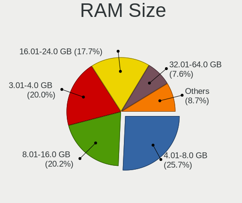
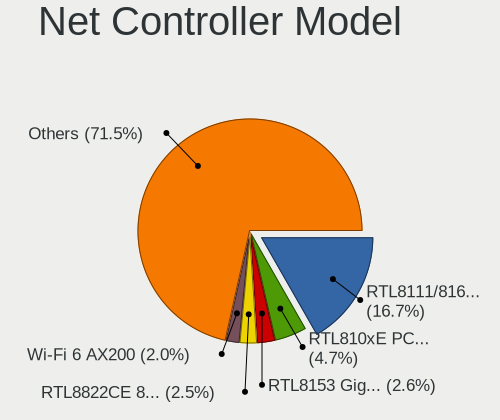
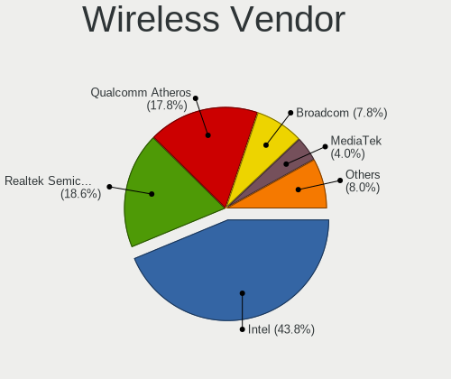
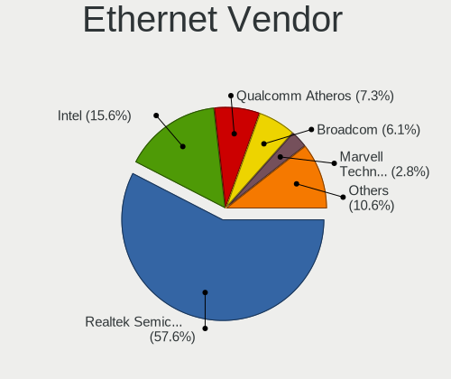

Linux in Spain - Tested Hardware & Statistics (Notebooks)
---------------------------------------------------------

A project to collect tested hardware configurations for Linux in Spain.

Anyone can contribute to this report by the [hw-probe](https://github.com/linuxhw/hw-probe) tool:

    sudo -E hw-probe -all -upload

Please contribute! Especially if your hardware is rare.

Contents
--------

* [ Test Cases ](#test-cases)

* [ System ](#system)
  - [ OS                       ](#os)
  - [ OS Family                ](#os-family)
  - [ Kernel                   ](#kernel)
  - [ Kernel Family            ](#kernel-family)
  - [ Kernel Major Ver.        ](#kernel-major-ver)
  - [ Arch                     ](#arch)
  - [ DE                       ](#de)
  - [ Display Server           ](#display-server)
  - [ Display Manager          ](#display-manager)
  - [ OS Lang                  ](#os-lang)
  - [ Boot Mode                ](#boot-mode)
  - [ Filesystem               ](#filesystem)
  - [ Part. scheme             ](#part-scheme)
  - [ Dual Boot with Linux/BSD ](#dual-boot-with-linuxbsd)
  - [ Dual Boot (Win)          ](#dual-boot-win)

* [ Board ](#board)
  - [ Vendor                   ](#vendor)
  - [ Model                    ](#model)
  - [ Model Family             ](#model-family)
  - [ MFG Year                 ](#mfg-year)
  - [ Form Factor              ](#form-factor)
  - [ Secure Boot              ](#secure-boot)
  - [ Coreboot                 ](#coreboot)
  - [ RAM Size                 ](#ram-size)
  - [ RAM Used                 ](#ram-used)
  - [ Total Drives             ](#total-drives)
  - [ Has CD-ROM               ](#has-cd-rom)
  - [ Has Ethernet             ](#has-ethernet)
  - [ Has WiFi                 ](#has-wifi)
  - [ Has Bluetooth            ](#has-bluetooth)

* [ Location ](#location)
  - [ Country                  ](#country)
  - [ City                     ](#city)

* [ Drives ](#drives)
  - [ Drive Vendor             ](#drive-vendor)
  - [ Drive Model              ](#drive-model)
  - [ HDD Vendor               ](#hdd-vendor)
  - [ SSD Vendor               ](#ssd-vendor)
  - [ Drive Kind               ](#drive-kind)
  - [ Drive Connector          ](#drive-connector)
  - [ Drive Size               ](#drive-size)
  - [ Space Total              ](#space-total)
  - [ Space Used               ](#space-used)
  - [ Malfunc. Drives          ](#malfunc-drives)
  - [ Malfunc. Drive Vendor    ](#malfunc-drive-vendor)
  - [ Malfunc. HDD Vendor      ](#malfunc-hdd-vendor)
  - [ Malfunc. Drive Kind      ](#malfunc-drive-kind)
  - [ Failed Drives            ](#failed-drives)
  - [ Failed Drive Vendor      ](#failed-drive-vendor)
  - [ Drive Status             ](#drive-status)

* [ Storage controller ](#storage-controller)
  - [ Storage Vendor           ](#storage-vendor)
  - [ Storage Model            ](#storage-model)
  - [ Storage Kind             ](#storage-kind)

* [ Processor ](#processor)
  - [ CPU Vendor               ](#cpu-vendor)
  - [ CPU Model                ](#cpu-model)
  - [ CPU Model Family         ](#cpu-model-family)
  - [ CPU Cores                ](#cpu-cores)
  - [ CPU Sockets              ](#cpu-sockets)
  - [ CPU Threads              ](#cpu-threads)
  - [ CPU Op-Modes             ](#cpu-op-modes)
  - [ CPU Microcode            ](#cpu-microcode)
  - [ CPU Microarch            ](#cpu-microarch)

* [ Graphics ](#graphics)
  - [ GPU Vendor               ](#gpu-vendor)
  - [ GPU Model                ](#gpu-model)
  - [ GPU Combo                ](#gpu-combo)
  - [ GPU Driver               ](#gpu-driver)
  - [ GPU Memory               ](#gpu-memory)

* [ Monitor ](#monitor)
  - [ Monitor Vendor           ](#monitor-vendor)
  - [ Monitor Model            ](#monitor-model)
  - [ Monitor Resolution       ](#monitor-resolution)
  - [ Monitor Diagonal         ](#monitor-diagonal)
  - [ Monitor Width            ](#monitor-width)
  - [ Aspect Ratio             ](#aspect-ratio)
  - [ Monitor Area             ](#monitor-area)
  - [ Pixel Density            ](#pixel-density)
  - [ Multiple Monitors        ](#multiple-monitors)

* [ Network ](#network)
  - [ Net Controller Vendor    ](#net-controller-vendor)
  - [ Net Controller Model     ](#net-controller-model)
  - [ Wireless Vendor          ](#wireless-vendor)
  - [ Wireless Model           ](#wireless-model)
  - [ Ethernet Vendor          ](#ethernet-vendor)
  - [ Ethernet Model           ](#ethernet-model)
  - [ Net Controller Kind      ](#net-controller-kind)
  - [ Used Controller          ](#used-controller)
  - [ NICs                     ](#nics)
  - [ IPv6                     ](#ipv6)

* [ Bluetooth ](#bluetooth)
  - [ Bluetooth Vendor         ](#bluetooth-vendor)
  - [ Bluetooth Model          ](#bluetooth-model)

* [ Sound ](#sound)
  - [ Sound Vendor             ](#sound-vendor)
  - [ Sound Model              ](#sound-model)

* [ Memory ](#memory)
  - [ Memory Vendor            ](#memory-vendor)
  - [ Memory Model             ](#memory-model)
  - [ Memory Kind              ](#memory-kind)
  - [ Memory Form Factor       ](#memory-form-factor)
  - [ Memory Size              ](#memory-size)
  - [ Memory Speed             ](#memory-speed)

* [ Printers & scanners ](#printers--scanners)
  - [ Printer Vendor           ](#printer-vendor)
  - [ Printer Model            ](#printer-model)
  - [ Scanner Vendor           ](#scanner-vendor)
  - [ Scanner Model            ](#scanner-model)

* [ Camera ](#camera)
  - [ Camera Vendor            ](#camera-vendor)
  - [ Camera Model             ](#camera-model)

* [ Security ](#security)
  - [ Fingerprint Vendor       ](#fingerprint-vendor)
  - [ Fingerprint Model        ](#fingerprint-model)
  - [ Chipcard Vendor          ](#chipcard-vendor)
  - [ Chipcard Model           ](#chipcard-model)

* [ Unsupported ](#unsupported)
  - [ Unsupported Devices      ](#unsupported-devices)
  - [ Unsupported Device Types ](#unsupported-device-types)

Test Cases
----------

Total: 5420

| Vendor        | Model                       | Probe                                                      | Date         |
|---------------|-----------------------------|------------------------------------------------------------|--------------|
| MSI           | GE66 Raider 10UG            | [d19e5447f5](https://linux-hardware.org/?probe=d19e5447f5) | May 08, 2024 |
| Acer          | Aspire A315-21              | [a838a7101f](https://linux-hardware.org/?probe=a838a7101f) | May 08, 2024 |
| HP            | Laptop 15s-eq2xxx           | [2786d2f8f8](https://linux-hardware.org/?probe=2786d2f8f8) | May 08, 2024 |
| Sony          | VGN-CR31S_W                 | [7e7d96c020](https://linux-hardware.org/?probe=7e7d96c020) | May 08, 2024 |
| Razer         | Blade 14 (2022) - RZ09-0... | [eab2642002](https://linux-hardware.org/?probe=eab2642002) | May 08, 2024 |
| HP            | TouchSmart tm2              | [b180e1388d](https://linux-hardware.org/?probe=b180e1388d) | May 07, 2024 |
| Lenovo        | G710 20252                  | [a7579b63a0](https://linux-hardware.org/?probe=a7579b63a0) | May 07, 2024 |
| Razer         | Blade 14 (2022) - RZ09-0... | [94766b9a5d](https://linux-hardware.org/?probe=94766b9a5d) | May 07, 2024 |
| Dell          | Latitude E6540              | [634735e1da](https://linux-hardware.org/?probe=634735e1da) | May 06, 2024 |
| Alurin        | ALU-BAR-I511-000-140        | [04578b9c4b](https://linux-hardware.org/?probe=04578b9c4b) | May 06, 2024 |
| ASUSTek       | VivoBook_ASUSLaptop K360... | [5a788054ec](https://linux-hardware.org/?probe=5a788054ec) | May 06, 2024 |
| HP            | EliteBook 840 G2            | [616bda869b](https://linux-hardware.org/?probe=616bda869b) | May 04, 2024 |
| Apple         | MacBookPro8,1               | [221d8e684d](https://linux-hardware.org/?probe=221d8e684d) | May 04, 2024 |
| HP            | OMEN by Laptop 16-c0xxx     | [44e9f4946e](https://linux-hardware.org/?probe=44e9f4946e) | May 03, 2024 |
| HP            | OMEN by Laptop 16-c0xxx     | [02a14960a9](https://linux-hardware.org/?probe=02a14960a9) | May 03, 2024 |
| ASUSTek       | X751SA                      | [7dadfc10b4](https://linux-hardware.org/?probe=7dadfc10b4) | May 03, 2024 |
| Apple         | MacBookPro11,1              | [a493ee87d2](https://linux-hardware.org/?probe=a493ee87d2) | May 02, 2024 |
| Google        | Delbin                      | [a0ed0beb73](https://linux-hardware.org/?probe=a0ed0beb73) | May 02, 2024 |
| Dell          | XPS 13 9310                 | [50ea9a7b8e](https://linux-hardware.org/?probe=50ea9a7b8e) | May 01, 2024 |
| Dell          | XPS 13 9310                 | [39ab9869d2](https://linux-hardware.org/?probe=39ab9869d2) | May 01, 2024 |
| Lenovo        | ThinkPad X260 20F5S3J301    | [d373de3608](https://linux-hardware.org/?probe=d373de3608) | May 01, 2024 |
| MSI           | GP62 6QF                    | [1c3538dce8](https://linux-hardware.org/?probe=1c3538dce8) | May 01, 2024 |
| HP            | EliteBook 840 G5            | [ea3b78a648](https://linux-hardware.org/?probe=ea3b78a648) | May 01, 2024 |
| MSI           | GP62 6QF                    | [4ed895c3e2](https://linux-hardware.org/?probe=4ed895c3e2) | May 01, 2024 |
| HP            | Laptop 15s-fq5xxx           | [dfeb38ca05](https://linux-hardware.org/?probe=dfeb38ca05) | Apr 30, 2024 |
| HP            | ProBook 445 14 inch G10 ... | [944346cb24](https://linux-hardware.org/?probe=944346cb24) | Apr 30, 2024 |
| HUAWEI        | BoDE-WXX9                   | [3777b80728](https://linux-hardware.org/?probe=3777b80728) | Apr 30, 2024 |
| HP            | OMEN by Laptop              | [90a616a0ca](https://linux-hardware.org/?probe=90a616a0ca) | Apr 30, 2024 |
| Lenovo        | ThinkPad E16 Gen 1 21JTC... | [cec886e488](https://linux-hardware.org/?probe=cec886e488) | Apr 29, 2024 |
| Lenovo        | Legion Y530-15ICH 81FV      | [2ffec4cb68](https://linux-hardware.org/?probe=2ffec4cb68) | Apr 29, 2024 |
| Apple         | MacBookAir6,2               | [f64a8cacbe](https://linux-hardware.org/?probe=f64a8cacbe) | Apr 29, 2024 |
| Acer          | Aspire A515-56              | [ebb78c775c](https://linux-hardware.org/?probe=ebb78c775c) | Apr 29, 2024 |
| Acer          | Aspire A515-56              | [55b3ada50c](https://linux-hardware.org/?probe=55b3ada50c) | Apr 29, 2024 |
| MSI           | Stealth 15M B12UE           | [5a6ea85213](https://linux-hardware.org/?probe=5a6ea85213) | Apr 28, 2024 |
| HP            | 250 G3                      | [3b043693a3](https://linux-hardware.org/?probe=3b043693a3) | Apr 27, 2024 |
| Apple         | MacBook5,1                  | [23d81317e7](https://linux-hardware.org/?probe=23d81317e7) | Apr 27, 2024 |
| ASUSTek       | Vivobook Go E1504FA_E150... | [831c732b79](https://linux-hardware.org/?probe=831c732b79) | Apr 27, 2024 |
| HP            | Laptop 15s-fq1xxx           | [b71d197185](https://linux-hardware.org/?probe=b71d197185) | Apr 27, 2024 |
| Acer          | Extensa 5230                | [3a0381ce01](https://linux-hardware.org/?probe=3a0381ce01) | Apr 27, 2024 |
| ASUSTek       | UX32VD                      | [abf6c0658a](https://linux-hardware.org/?probe=abf6c0658a) | Apr 26, 2024 |
| HP            | ProBook 445 14 inch G10 ... | [63b4e0ea31](https://linux-hardware.org/?probe=63b4e0ea31) | Apr 26, 2024 |
| Lenovo        | IdeaPad 3 15ITL6 82H8       | [25997dad2f](https://linux-hardware.org/?probe=25997dad2f) | Apr 25, 2024 |
| Lenovo        | IdeaPad S145-15AST 81N3     | [68a7e21bcb](https://linux-hardware.org/?probe=68a7e21bcb) | Apr 25, 2024 |
| Apple         | MacBookPro11,1              | [b27f71816a](https://linux-hardware.org/?probe=b27f71816a) | Apr 24, 2024 |
| HUAWEI        | KLVL-WXX9                   | [34fe2bdfdd](https://linux-hardware.org/?probe=34fe2bdfdd) | Apr 24, 2024 |
| HP            | Compaq Presario C700        | [062cdaa3a3](https://linux-hardware.org/?probe=062cdaa3a3) | Apr 24, 2024 |
| HP            | 255 G6 Notebook PC          | [8388259ad7](https://linux-hardware.org/?probe=8388259ad7) | Apr 24, 2024 |
| Acer          | Aspire A315-24P             | [e25a1d0676](https://linux-hardware.org/?probe=e25a1d0676) | Apr 24, 2024 |
| Dell          | XPS 13 9370                 | [f5d49e0d32](https://linux-hardware.org/?probe=f5d49e0d32) | Apr 23, 2024 |
| ASUSTek       | VivoBook_ASUSLaptop X570... | [cda9b90e74](https://linux-hardware.org/?probe=cda9b90e74) | Apr 23, 2024 |
| ASUSTek       | VivoBook_ASUSLaptop X570... | [922e4ea114](https://linux-hardware.org/?probe=922e4ea114) | Apr 23, 2024 |
| Lenovo        | B575e 36852BG               | [c2c9ec964e](https://linux-hardware.org/?probe=c2c9ec964e) | Apr 23, 2024 |
| Lenovo        | B575e 36852BG               | [d168fb33c4](https://linux-hardware.org/?probe=d168fb33c4) | Apr 23, 2024 |
| HP            | ZBook 15 G5                 | [3d51da60b9](https://linux-hardware.org/?probe=3d51da60b9) | Apr 22, 2024 |
| Acer          | Aspire 5750                 | [9e2621b213](https://linux-hardware.org/?probe=9e2621b213) | Apr 21, 2024 |
| Apple         | MacBookAir7,2               | [4aabe77962](https://linux-hardware.org/?probe=4aabe77962) | Apr 20, 2024 |
| Lenovo        | IdeaPad 330-15ICH 81FK      | [d96460dbea](https://linux-hardware.org/?probe=d96460dbea) | Apr 20, 2024 |
| Packard Be... | EasyNote LJ65               | [083f367ee6](https://linux-hardware.org/?probe=083f367ee6) | Apr 17, 2024 |
| Dell          | XPS 9320                    | [572e9a9030](https://linux-hardware.org/?probe=572e9a9030) | Apr 17, 2024 |
| Dell          | XPS 9320                    | [ba5e5d3733](https://linux-hardware.org/?probe=ba5e5d3733) | Apr 17, 2024 |
| HP            | ZBook 15u G6                | [1b1982023c](https://linux-hardware.org/?probe=1b1982023c) | Apr 17, 2024 |
| ASUSTek       | M51Va                       | [2279fdf28b](https://linux-hardware.org/?probe=2279fdf28b) | Apr 17, 2024 |
| ASUSTek       | M51Va                       | [e2aa27e175](https://linux-hardware.org/?probe=e2aa27e175) | Apr 17, 2024 |
| Packard Be... | EasyNote TM86               | [05f38c567b](https://linux-hardware.org/?probe=05f38c567b) | Apr 17, 2024 |
| Acer          | Aspire A515-57              | [f66938d1f9](https://linux-hardware.org/?probe=f66938d1f9) | Apr 16, 2024 |
| Acer          | Aspire E1-572G              | [5428a93214](https://linux-hardware.org/?probe=5428a93214) | Apr 16, 2024 |
| HP            | Compaq 6730b (GW687AV)      | [42dd367de3](https://linux-hardware.org/?probe=42dd367de3) | Apr 16, 2024 |
| ASUSTek       | ZenBook UX325EA_UX325EA     | [f50417f34e](https://linux-hardware.org/?probe=f50417f34e) | Apr 15, 2024 |
| Sony          | VPCCB4Q1E                   | [0aac47ae91](https://linux-hardware.org/?probe=0aac47ae91) | Apr 15, 2024 |
| ASUSTek       | ROG Zephyrus G14 GA401II... | [00c4bda850](https://linux-hardware.org/?probe=00c4bda850) | Apr 14, 2024 |
| HP            | Pavilion 13 x2 PC           | [684e30a2e3](https://linux-hardware.org/?probe=684e30a2e3) | Apr 13, 2024 |
| HP            | Pavilion 13 x2 PC           | [60d693276a](https://linux-hardware.org/?probe=60d693276a) | Apr 13, 2024 |
| HP            | Laptop 15-fc0xxx            | [1f7e129afd](https://linux-hardware.org/?probe=1f7e129afd) | Apr 13, 2024 |
| Apple         | MacBookAir6,2               | [4b92f0d2d3](https://linux-hardware.org/?probe=4b92f0d2d3) | Apr 13, 2024 |
| Acer          | Aspire 5715Z                | [25a3bb97f8](https://linux-hardware.org/?probe=25a3bb97f8) | Apr 13, 2024 |
| Acer          | Aspire 5750                 | [f64263bd19](https://linux-hardware.org/?probe=f64263bd19) | Apr 12, 2024 |
| ASUSTek       | UX32VD                      | [a063aa7aef](https://linux-hardware.org/?probe=a063aa7aef) | Apr 12, 2024 |
| Acer          | Aspire 5920                 | [fc886ce6a0](https://linux-hardware.org/?probe=fc886ce6a0) | Apr 11, 2024 |
| MSI           | PRO B650-S WIFI             | [7353811789](https://linux-hardware.org/?probe=7353811789) | Apr 11, 2024 |
| MSI           | PRO B650-S WIFI             | [03c4c4cd5a](https://linux-hardware.org/?probe=03c4c4cd5a) | Apr 11, 2024 |
| MSI           | GE72 2QD                    | [4918e63b82](https://linux-hardware.org/?probe=4918e63b82) | Apr 11, 2024 |
| Apple         | MacBook4,1                  | [d6304d794d](https://linux-hardware.org/?probe=d6304d794d) | Apr 11, 2024 |
| Lenovo        | ThinkPad E16 Gen 1 21JTC... | [38d04908c1](https://linux-hardware.org/?probe=38d04908c1) | Apr 10, 2024 |
| HP            | Pavilion Laptop 15-ck0xx    | [94f56fe502](https://linux-hardware.org/?probe=94f56fe502) | Apr 10, 2024 |
| HP            | EliteBook 840 G3            | [cbc8162b5a](https://linux-hardware.org/?probe=cbc8162b5a) | Apr 10, 2024 |
| MSI           | Katana 15 B13VGK            | [a4a53a031a](https://linux-hardware.org/?probe=a4a53a031a) | Apr 09, 2024 |
| ASUSTek       | ROG Zephyrus G14 GA401II... | [44ed4afea3](https://linux-hardware.org/?probe=44ed4afea3) | Apr 09, 2024 |
| Lenovo        | ThinkPad L13 Gen 2 20VJS... | [747b239a5e](https://linux-hardware.org/?probe=747b239a5e) | Apr 08, 2024 |
| MSI           | Stealth 15M B12UE           | [041874d8e0](https://linux-hardware.org/?probe=041874d8e0) | Apr 08, 2024 |
| HUAWEI        | BoDE-WXX9                   | [535c311c9f](https://linux-hardware.org/?probe=535c311c9f) | Apr 08, 2024 |
| HP            | ProBook 430 G8 Notebook ... | [b0578be1af](https://linux-hardware.org/?probe=b0578be1af) | Apr 08, 2024 |
| Acer          | Nitro AN515-52              | [b36f589241](https://linux-hardware.org/?probe=b36f589241) | Apr 06, 2024 |
| Medion        | E1210                       | [bff743af58](https://linux-hardware.org/?probe=bff743af58) | Apr 06, 2024 |
| MSI           | Summit E13FlipEvo A11MT     | [3c1bd6247c](https://linux-hardware.org/?probe=3c1bd6247c) | Apr 06, 2024 |
| HP            | Laptop 15-fc0xxx            | [40e0009de2](https://linux-hardware.org/?probe=40e0009de2) | Apr 06, 2024 |
| ASUSTek       | X550VX                      | [11705e787a](https://linux-hardware.org/?probe=11705e787a) | Apr 06, 2024 |
| ASUSTek       | VivoBook_ASUSLaptop X170... | [91f5cb01b9](https://linux-hardware.org/?probe=91f5cb01b9) | Apr 06, 2024 |
| Acer          | Aspire 5750                 | [27d64e5b3c](https://linux-hardware.org/?probe=27d64e5b3c) | Apr 05, 2024 |
| Apple         | MacBookAir7,2               | [a9d0144188](https://linux-hardware.org/?probe=a9d0144188) | Apr 05, 2024 |
| ASUSTek       | X550LD                      | [8684e69182](https://linux-hardware.org/?probe=8684e69182) | Apr 05, 2024 |
| HP            | Pavilion Laptop 14-dv1xx... | [f9add792f1](https://linux-hardware.org/?probe=f9add792f1) | Apr 05, 2024 |
| MSI           | Katana 15 B13VGK            | [c5099db6ec](https://linux-hardware.org/?probe=c5099db6ec) | Apr 05, 2024 |
| AMI           | Unknown                     | [e52668ee27](https://linux-hardware.org/?probe=e52668ee27) | Apr 05, 2024 |
| HUAWEI        | BoDE-WXX9                   | [1715f410ff](https://linux-hardware.org/?probe=1715f410ff) | Apr 04, 2024 |
| HUAWEI        | BoDE-WXX9                   | [331447abcd](https://linux-hardware.org/?probe=331447abcd) | Apr 04, 2024 |
| Acer          | Aspire 5750                 | [e2cef27ef8](https://linux-hardware.org/?probe=e2cef27ef8) | Apr 03, 2024 |
| ASUSTek       | VivoBook_ASUSLaptop X512... | [5aacb1afe9](https://linux-hardware.org/?probe=5aacb1afe9) | Apr 03, 2024 |
| Toshiba       | NB520                       | [d347b22da0](https://linux-hardware.org/?probe=d347b22da0) | Apr 03, 2024 |
| Apple         | MacBook6,1                  | [224f00ec38](https://linux-hardware.org/?probe=224f00ec38) | Apr 03, 2024 |
| Apple         | MacBook6,1                  | [32e57190de](https://linux-hardware.org/?probe=32e57190de) | Apr 02, 2024 |
| HUAWEI        | NBLB-WAX9N                  | [dbba317b72](https://linux-hardware.org/?probe=dbba317b72) | Apr 02, 2024 |
| Lenovo        | IdeaPad 320-15IKB 80XL      | [0cad66eb7a](https://linux-hardware.org/?probe=0cad66eb7a) | Apr 02, 2024 |
| Acer          | Aspire F5-573G              | [7822798a8a](https://linux-hardware.org/?probe=7822798a8a) | Apr 02, 2024 |
| Acer          | Nitro AN517-54              | [85318c4993](https://linux-hardware.org/?probe=85318c4993) | Apr 02, 2024 |
| MSI           | GE66 Raider 10UG            | [5342089fd7](https://linux-hardware.org/?probe=5342089fd7) | Apr 02, 2024 |
| Lenovo        | IdeaPad 1 15AMN7 82VG       | [0df7a90dcd](https://linux-hardware.org/?probe=0df7a90dcd) | Apr 01, 2024 |
| Apple         | MacBookAir6,2               | [6c8467a122](https://linux-hardware.org/?probe=6c8467a122) | Apr 01, 2024 |
| HP            | ProBook 4510s               | [5fc5645b74](https://linux-hardware.org/?probe=5fc5645b74) | Apr 01, 2024 |
| MSI           | GE72 2QD                    | [f2d2aa4c21](https://linux-hardware.org/?probe=f2d2aa4c21) | Apr 01, 2024 |
| ASUSTek       | GL553VD                     | [cdb08c255c](https://linux-hardware.org/?probe=cdb08c255c) | Mar 30, 2024 |
| HP            | Laptop 15-fd0xxx            | [5babc725b2](https://linux-hardware.org/?probe=5babc725b2) | Mar 30, 2024 |
| HP            | ENVY 6                      | [578fc6fcbe](https://linux-hardware.org/?probe=578fc6fcbe) | Mar 29, 2024 |
| ASUSTek       | N53SV                       | [bc6e236fda](https://linux-hardware.org/?probe=bc6e236fda) | Mar 29, 2024 |
| HUAWEI        | KLVL-WXX9                   | [437c5e9953](https://linux-hardware.org/?probe=437c5e9953) | Mar 29, 2024 |
| ASUSTek       | K54HR                       | [ac57c0b465](https://linux-hardware.org/?probe=ac57c0b465) | Mar 29, 2024 |
| ASUSTek       | VivoBook_ASUSLaptop M150... | [568697e488](https://linux-hardware.org/?probe=568697e488) | Mar 28, 2024 |
| Apple         | MacBookPro11,3              | [b36db98ee9](https://linux-hardware.org/?probe=b36db98ee9) | Mar 27, 2024 |
| Dell          | Inspiron 5593               | [1630ab92c1](https://linux-hardware.org/?probe=1630ab92c1) | Mar 26, 2024 |
| HP            | Pavilion 15                 | [e4aeecb147](https://linux-hardware.org/?probe=e4aeecb147) | Mar 26, 2024 |
| Acer          | Aspire E5-421G              | [f16af02ed4](https://linux-hardware.org/?probe=f16af02ed4) | Mar 26, 2024 |
| Lenovo        | IdeaPad 3 15ITL6 82H8       | [97fd197cc6](https://linux-hardware.org/?probe=97fd197cc6) | Mar 26, 2024 |
| HUAWEI        | KLVL-WXX9                   | [f4276dd02c](https://linux-hardware.org/?probe=f4276dd02c) | Mar 25, 2024 |
| Acer          | Aspire 5750G                | [eb093627c5](https://linux-hardware.org/?probe=eb093627c5) | Mar 25, 2024 |
| Packard Be... | EasyNote ENTG71BM           | [5084e58bdf](https://linux-hardware.org/?probe=5084e58bdf) | Mar 24, 2024 |
| Lenovo        | ThinkBook 13x G2 IAP 21A... | [ebf2ce6969](https://linux-hardware.org/?probe=ebf2ce6969) | Mar 24, 2024 |
| MSI           | Katana 15 B13VGK            | [c2e73852fd](https://linux-hardware.org/?probe=c2e73852fd) | Mar 24, 2024 |
| Acer          | Aspire 5738                 | [536eec363e](https://linux-hardware.org/?probe=536eec363e) | Mar 23, 2024 |
| Acer          | Aspire 5738                 | [f54f1540a6](https://linux-hardware.org/?probe=f54f1540a6) | Mar 23, 2024 |
| Primux Tec... | Primux ioxbook 1402FX       | [53e6d67001](https://linux-hardware.org/?probe=53e6d67001) | Mar 23, 2024 |
| Sony          | SVE1511C5E                  | [f262bbafc7](https://linux-hardware.org/?probe=f262bbafc7) | Mar 23, 2024 |
| Packard Be... | EasyNote TM98               | [e6c48ef91f](https://linux-hardware.org/?probe=e6c48ef91f) | Mar 22, 2024 |
| ASUSTek       | Zenbook UM5302TA_UM5302T... | [88d382ec33](https://linux-hardware.org/?probe=88d382ec33) | Mar 22, 2024 |
| SLIMBOOK      | TITAN                       | [a0b40ac666](https://linux-hardware.org/?probe=a0b40ac666) | Mar 21, 2024 |
| Acer          | Aspire 5742                 | [5bac0d5211](https://linux-hardware.org/?probe=5bac0d5211) | Mar 21, 2024 |
| Acer          | Aspire 5750G                | [8fce303fb3](https://linux-hardware.org/?probe=8fce303fb3) | Mar 20, 2024 |
| HP            | ProBook 640 G1              | [83fb273295](https://linux-hardware.org/?probe=83fb273295) | Mar 20, 2024 |
| Apple         | MacBookAir5,1               | [f1e5e55e2c](https://linux-hardware.org/?probe=f1e5e55e2c) | Mar 20, 2024 |
| Unknown       | Unknown                     | [f2d92ae386](https://linux-hardware.org/?probe=f2d92ae386) | Mar 18, 2024 |
| ASUSTek       | ASUS TUF Gaming A15 FA50... | [b62cd0cdeb](https://linux-hardware.org/?probe=b62cd0cdeb) | Mar 17, 2024 |
| Lenovo        | Y520-15IKBN 80WK            | [1ce88ca0ff](https://linux-hardware.org/?probe=1ce88ca0ff) | Mar 17, 2024 |
| Lenovo        | Y520-15IKBN 80WK            | [e7b96ba325](https://linux-hardware.org/?probe=e7b96ba325) | Mar 17, 2024 |
| ASUSTek       | X541UAK                     | [4b33512569](https://linux-hardware.org/?probe=4b33512569) | Mar 16, 2024 |
| Apple         | MacBookPro11,3              | [6130454352](https://linux-hardware.org/?probe=6130454352) | Mar 16, 2024 |
| HUAWEI        | KLVL-WXX9                   | [076c34493c](https://linux-hardware.org/?probe=076c34493c) | Mar 15, 2024 |
| Apple         | MacBookAir5,1               | [ae670d563a](https://linux-hardware.org/?probe=ae670d563a) | Mar 15, 2024 |
| ASUSTek       | ZenBook UX431DA_UM431DA     | [721d5ddfe6](https://linux-hardware.org/?probe=721d5ddfe6) | Mar 14, 2024 |
| Dell          | Precision 7730              | [8b863ed391](https://linux-hardware.org/?probe=8b863ed391) | Mar 14, 2024 |
| Google        | Vilboz                      | [613311d6d7](https://linux-hardware.org/?probe=613311d6d7) | Mar 14, 2024 |
| Lenovo        | ThinkPad E16 Gen 1 21JTC... | [a17c2cb5e6](https://linux-hardware.org/?probe=a17c2cb5e6) | Mar 13, 2024 |
| ASUSTek       | VivoBook_ASUSLaptop M150... | [32c04343f9](https://linux-hardware.org/?probe=32c04343f9) | Mar 13, 2024 |
| Teknoservi... | TTL Portatil 14             | [72c545ddbb](https://linux-hardware.org/?probe=72c545ddbb) | Mar 13, 2024 |
| MSI           | Stealth 15M B12UE           | [a731c5f5eb](https://linux-hardware.org/?probe=a731c5f5eb) | Mar 13, 2024 |
| Lenovo        | B590 62742BG                | [5e3e316020](https://linux-hardware.org/?probe=5e3e316020) | Mar 12, 2024 |
| HP            | ProBook 450 G1              | [3bfd1620fe](https://linux-hardware.org/?probe=3bfd1620fe) | Mar 12, 2024 |
| Apple         | MacBookAir5,1               | [d928c71a48](https://linux-hardware.org/?probe=d928c71a48) | Mar 12, 2024 |
| ASUSTek       | VivoBook_ASUSLaptop X170... | [1c5fd2d212](https://linux-hardware.org/?probe=1c5fd2d212) | Mar 11, 2024 |
| HUAWEI        | NBLK-WAX9X                  | [a64c6e1955](https://linux-hardware.org/?probe=a64c6e1955) | Mar 11, 2024 |
| HP            | Laptop 15s-fq2xxx           | [2cbb5c3c0d](https://linux-hardware.org/?probe=2cbb5c3c0d) | Mar 11, 2024 |
| Chuwi         | GemiBook Pro                | [a8eb8bc1dc](https://linux-hardware.org/?probe=a8eb8bc1dc) | Mar 10, 2024 |
| ASUSTek       | VivoBook_ASUSLaptop X570... | [a56ff930d5](https://linux-hardware.org/?probe=a56ff930d5) | Mar 10, 2024 |
| Lenovo        | IdeaPad Y460                | [0af494c148](https://linux-hardware.org/?probe=0af494c148) | Mar 10, 2024 |
| ASUSTek       | TP301UA                     | [1f8c7b7644](https://linux-hardware.org/?probe=1f8c7b7644) | Mar 09, 2024 |
| ASUSTek       | TP301UA                     | [90f550ea4c](https://linux-hardware.org/?probe=90f550ea4c) | Mar 09, 2024 |
| MSI           | Stealth GS77 12UH           | [892a9a5e88](https://linux-hardware.org/?probe=892a9a5e88) | Mar 09, 2024 |
| HUAWEI        | BOM-WXX9                    | [c3b38c2e5c](https://linux-hardware.org/?probe=c3b38c2e5c) | Mar 09, 2024 |
| ASUSTek       | X541UAK                     | [8b527dc9c9](https://linux-hardware.org/?probe=8b527dc9c9) | Mar 09, 2024 |
| Lenovo        | IdeaPad Gaming 3 15ACH6 ... | [34dc8eb985](https://linux-hardware.org/?probe=34dc8eb985) | Mar 09, 2024 |
| MSI           | Modern 14 B5M               | [585c473256](https://linux-hardware.org/?probe=585c473256) | Mar 08, 2024 |
| Notebook      | P7xxDM(-G)                  | [29b862f789](https://linux-hardware.org/?probe=29b862f789) | Mar 08, 2024 |
| HP            | Pavilion Notebook           | [6c1a3e7d24](https://linux-hardware.org/?probe=6c1a3e7d24) | Mar 08, 2024 |
| HP            | Pavilion Notebook           | [71fa9b9d2e](https://linux-hardware.org/?probe=71fa9b9d2e) | Mar 08, 2024 |
| Toshiba       | Satellite A200              | [7197835980](https://linux-hardware.org/?probe=7197835980) | Mar 08, 2024 |
| HP            | ENVY Notebook               | [6ab7868737](https://linux-hardware.org/?probe=6ab7868737) | Mar 08, 2024 |
| Apple         | MacBook7,1                  | [942bc3410e](https://linux-hardware.org/?probe=942bc3410e) | Mar 07, 2024 |
| Dell          | Latitude E6520              | [3a8f9b7a0a](https://linux-hardware.org/?probe=3a8f9b7a0a) | Mar 06, 2024 |
| Acer          | Aspire M3-581G              | [7ab92d79ee](https://linux-hardware.org/?probe=7ab92d79ee) | Mar 06, 2024 |
| Apple         | MacBook7,1                  | [e6500f99bb](https://linux-hardware.org/?probe=e6500f99bb) | Mar 06, 2024 |
| MSI           | GL73 8RC                    | [18e3ecc518](https://linux-hardware.org/?probe=18e3ecc518) | Mar 06, 2024 |
| MSI           | GL73 8RC                    | [7081f4b3e7](https://linux-hardware.org/?probe=7081f4b3e7) | Mar 06, 2024 |
| Packard Be... | EasyNote TS11HR             | [5eb3213d99](https://linux-hardware.org/?probe=5eb3213d99) | Mar 05, 2024 |
| HP            | Laptop 15s-fq1xxx           | [3e8a7d8c6e](https://linux-hardware.org/?probe=3e8a7d8c6e) | Mar 04, 2024 |
| MSI           | Prestige 15 A10SC           | [f95e0198ba](https://linux-hardware.org/?probe=f95e0198ba) | Mar 04, 2024 |
| Google        | Magolor                     | [f990ca633c](https://linux-hardware.org/?probe=f990ca633c) | Mar 03, 2024 |
| Lenovo        | 3000 V200 0764A46           | [99fd163eb7](https://linux-hardware.org/?probe=99fd163eb7) | Mar 03, 2024 |
| Dell          | Latitude E6520              | [e254077eb1](https://linux-hardware.org/?probe=e254077eb1) | Mar 03, 2024 |
| HUAWEI        | CREM-WXX9                   | [eeb2d3dcd6](https://linux-hardware.org/?probe=eeb2d3dcd6) | Mar 02, 2024 |
| Lenovo        | IdeaPad S145-15AST 81N3     | [c6dbf5f3c5](https://linux-hardware.org/?probe=c6dbf5f3c5) | Mar 02, 2024 |
| Lenovo        | ThinkPad T400 6475ZBK       | [e6c5bba3eb](https://linux-hardware.org/?probe=e6c5bba3eb) | Mar 02, 2024 |
| Acer          | Swift SF315-41              | [e87aea2d37](https://linux-hardware.org/?probe=e87aea2d37) | Mar 02, 2024 |
| HP            | 510 Notebook PC (RU962AA... | [94571f879e](https://linux-hardware.org/?probe=94571f879e) | Mar 02, 2024 |
| Valve         | Jupiter                     | [b2228e6857](https://linux-hardware.org/?probe=b2228e6857) | Mar 02, 2024 |
| SLIMBOOK      | PROX15-AMD                  | [b50ca64146](https://linux-hardware.org/?probe=b50ca64146) | Mar 01, 2024 |
| Lenovo        | IdeaPad Gaming 3 15IAH7 ... | [204971811b](https://linux-hardware.org/?probe=204971811b) | Mar 01, 2024 |
| HP            | Pavilion Gaming Notebook    | [e0277e4684](https://linux-hardware.org/?probe=e0277e4684) | Feb 29, 2024 |
| Acer          | Extensa 2511                | [0f4bcc7a0f](https://linux-hardware.org/?probe=0f4bcc7a0f) | Feb 29, 2024 |
| ASUSTek       | VivoBook_ASUSLaptop M150... | [96b542d67c](https://linux-hardware.org/?probe=96b542d67c) | Feb 29, 2024 |
| ASUSTek       | ROG Zephyrus G14 GA401II... | [9d279afdd2](https://linux-hardware.org/?probe=9d279afdd2) | Feb 29, 2024 |
| ASUSTek       | ROG Zephyrus G14 GA401II... | [4e7241b44f](https://linux-hardware.org/?probe=4e7241b44f) | Feb 29, 2024 |
| ASUSTek       | VivoBook_ASUSLaptop X430... | [907e9cecbc](https://linux-hardware.org/?probe=907e9cecbc) | Feb 29, 2024 |
| Packard Be... | EasyNote TM86               | [dcf4f4a88e](https://linux-hardware.org/?probe=dcf4f4a88e) | Feb 28, 2024 |
| MSI           | Stealth 15M B12UE           | [59afccdc44](https://linux-hardware.org/?probe=59afccdc44) | Feb 28, 2024 |
| Lenovo        | ThinkPad E15 Gen 4 21E60... | [47785deb15](https://linux-hardware.org/?probe=47785deb15) | Feb 28, 2024 |
| ASUSTek       | VivoBook_ASUSLaptop M150... | [faaa8d2d52](https://linux-hardware.org/?probe=faaa8d2d52) | Feb 28, 2024 |
| HP            | Pavilion Sleekbook 14       | [9727db31ca](https://linux-hardware.org/?probe=9727db31ca) | Feb 28, 2024 |
| Lenovo        | ThinkPad X1 Carbon Gen 1... | [d254263eb9](https://linux-hardware.org/?probe=d254263eb9) | Feb 28, 2024 |
| Lenovo        | ThinkPad X1 Carbon Gen 1... | [52199ec5cb](https://linux-hardware.org/?probe=52199ec5cb) | Feb 28, 2024 |
| HP            | EliteBook Folio 1040 G3     | [74e42de463](https://linux-hardware.org/?probe=74e42de463) | Feb 28, 2024 |
| HP            | EliteBook Folio 1040 G3     | [f8ca8ffa74](https://linux-hardware.org/?probe=f8ca8ffa74) | Feb 27, 2024 |
| VANT          | MOOVE2-14                   | [9d5df13f40](https://linux-hardware.org/?probe=9d5df13f40) | Feb 27, 2024 |
| ASUSTek       | N53SN                       | [c628351d6c](https://linux-hardware.org/?probe=c628351d6c) | Feb 27, 2024 |
| HP            | ZBook Studio 16 inch G9 ... | [97741aa467](https://linux-hardware.org/?probe=97741aa467) | Feb 26, 2024 |
| HP            | ZBook Studio 16 inch G9 ... | [a07f8097b9](https://linux-hardware.org/?probe=a07f8097b9) | Feb 26, 2024 |
| MSI           | GF63 8RD                    | [b933a88005](https://linux-hardware.org/?probe=b933a88005) | Feb 26, 2024 |
| ASUSTek       | Vivobook Go E1504FA_E150... | [f553a48a66](https://linux-hardware.org/?probe=f553a48a66) | Feb 26, 2024 |
| ASUSTek       | N53SV                       | [9cdde393d0](https://linux-hardware.org/?probe=9cdde393d0) | Feb 25, 2024 |
| Toshiba       | Satellite Pro C50-A-1EM     | [a0d0bf0a80](https://linux-hardware.org/?probe=a0d0bf0a80) | Feb 25, 2024 |
| HP            | Pavilion Gaming Laptop 1... | [e8bc13baa1](https://linux-hardware.org/?probe=e8bc13baa1) | Feb 25, 2024 |
| Lenovo        | IdeaPad 330-15IKB 81DE      | [69dbcf14df](https://linux-hardware.org/?probe=69dbcf14df) | Feb 25, 2024 |
| ASUSTek       | Zenbook 15 UM3504DA_UM35... | [c294c681f6](https://linux-hardware.org/?probe=c294c681f6) | Feb 25, 2024 |
| Lenovo        | G500 20236                  | [414d89413c](https://linux-hardware.org/?probe=414d89413c) | Feb 24, 2024 |
| Dell          | Vostro 3550                 | [a00b765356](https://linux-hardware.org/?probe=a00b765356) | Feb 24, 2024 |
| Toshiba       | Satellite Pro C50-A-1EM     | [c398b93c14](https://linux-hardware.org/?probe=c398b93c14) | Feb 24, 2024 |
| MACHENIKE     | T90-V                       | [01cb379c2e](https://linux-hardware.org/?probe=01cb379c2e) | Feb 24, 2024 |
| ASUSTek       | VivoBook_ASUSLaptop X512... | [b2b0390778](https://linux-hardware.org/?probe=b2b0390778) | Feb 24, 2024 |
| ASUSTek       | VivoBook_ASUSLaptop X512... | [954d71af91](https://linux-hardware.org/?probe=954d71af91) | Feb 23, 2024 |
| Apple         | MacBookAir7,2               | [0c045a229d](https://linux-hardware.org/?probe=0c045a229d) | Feb 23, 2024 |
| ASUSTek       | K52JU                       | [f545d028a1](https://linux-hardware.org/?probe=f545d028a1) | Feb 23, 2024 |
| Acer          | Aspire A315-24P             | [7c8a8743da](https://linux-hardware.org/?probe=7c8a8743da) | Feb 23, 2024 |
| Medion        | ERAZER P6705 MD61409        | [1acf80df5e](https://linux-hardware.org/?probe=1acf80df5e) | Feb 23, 2024 |
| Medion        | ERAZER P6705 MD61409        | [7ae2637aad](https://linux-hardware.org/?probe=7ae2637aad) | Feb 23, 2024 |
| Lenovo        | ThinkPad Edge 03285EG       | [aa07998977](https://linux-hardware.org/?probe=aa07998977) | Feb 23, 2024 |
| ASUSTek       | Zenbook 15 UM3504DA_UM35... | [50af5fcffb](https://linux-hardware.org/?probe=50af5fcffb) | Feb 23, 2024 |
| ASUSTek       | VivoBook_ASUSLaptop X150... | [69c45a9701](https://linux-hardware.org/?probe=69c45a9701) | Feb 23, 2024 |
| Acer          | Aspire A315-24P             | [9925fee177](https://linux-hardware.org/?probe=9925fee177) | Feb 23, 2024 |
| Lenovo        | ThinkPad E16 Gen 1 21JTC... | [d3b0041d5d](https://linux-hardware.org/?probe=d3b0041d5d) | Feb 22, 2024 |
| Lenovo        | ThinkPad T14 Gen 4 21HDS... | [5d5cbe01b3](https://linux-hardware.org/?probe=5d5cbe01b3) | Feb 22, 2024 |
| HP            | Pavilion Gaming Laptop 1... | [81a8e729cc](https://linux-hardware.org/?probe=81a8e729cc) | Feb 22, 2024 |
| Packard Be... | EasyNote TM85               | [6ba78b34a3](https://linux-hardware.org/?probe=6ba78b34a3) | Feb 22, 2024 |
| MSI           | GE66 Raider 10UG            | [52b83c6fae](https://linux-hardware.org/?probe=52b83c6fae) | Feb 21, 2024 |
| Lenovo        | Legion R7000 2020 82B6      | [ff1f295b85](https://linux-hardware.org/?probe=ff1f295b85) | Feb 21, 2024 |
| MSI           | Prestige 15 A12UD           | [394b529b94](https://linux-hardware.org/?probe=394b529b94) | Feb 21, 2024 |
| Dell          | Inspiron 1501               | [bf3777bf7a](https://linux-hardware.org/?probe=bf3777bf7a) | Feb 21, 2024 |
| Dell          | Inspiron 1501               | [f131c871fb](https://linux-hardware.org/?probe=f131c871fb) | Feb 21, 2024 |
| ASUSTek       | K56CA                       | [e18e214565](https://linux-hardware.org/?probe=e18e214565) | Feb 20, 2024 |
| ASUSTek       | K56CA                       | [44620dbc2a](https://linux-hardware.org/?probe=44620dbc2a) | Feb 20, 2024 |
| HP            | Pavilion Laptop 14-dv1xx... | [bb645eacf5](https://linux-hardware.org/?probe=bb645eacf5) | Feb 19, 2024 |
| HUAWEI        | KLVL-WXX9                   | [ab395da879](https://linux-hardware.org/?probe=ab395da879) | Feb 19, 2024 |
| Acer          | Aspire A315-24P             | [b76bdbcd5d](https://linux-hardware.org/?probe=b76bdbcd5d) | Feb 18, 2024 |
| Slimbook      | Essential 14                | [05c319f707](https://linux-hardware.org/?probe=05c319f707) | Feb 18, 2024 |
| Acer          | Nitro AN515-54              | [6d127f30eb](https://linux-hardware.org/?probe=6d127f30eb) | Feb 18, 2024 |
| Acer          | Aspire A315-24P             | [4abd6b79ce](https://linux-hardware.org/?probe=4abd6b79ce) | Feb 17, 2024 |
| Lenovo        | IdeaPad 320-15IKB 80XL      | [2c04300a71](https://linux-hardware.org/?probe=2c04300a71) | Feb 16, 2024 |
| HP            | Pavilion Laptop 14-dv1xx... | [d394cbccba](https://linux-hardware.org/?probe=d394cbccba) | Feb 16, 2024 |
| HP            | Pavilion dv6                | [87e8fb2190](https://linux-hardware.org/?probe=87e8fb2190) | Feb 15, 2024 |
| Samsung       | N150/N210/N220              | [cf3126113e](https://linux-hardware.org/?probe=cf3126113e) | Feb 15, 2024 |
| Lenovo        | ThinkPad E14 Gen 4 21E30... | [29eacec4ab](https://linux-hardware.org/?probe=29eacec4ab) | Feb 14, 2024 |
| ASUSTek       | ZenBook UX425UAZ_UM425UA... | [bfcafffd57](https://linux-hardware.org/?probe=bfcafffd57) | Feb 14, 2024 |
| Acer          | Extensa 215-22              | [a7faa9b520](https://linux-hardware.org/?probe=a7faa9b520) | Feb 14, 2024 |
| Lenovo        | ThinkPad E14 Gen 4 21E30... | [7f08e6599f](https://linux-hardware.org/?probe=7f08e6599f) | Feb 14, 2024 |
| Dell          | XPS 9320                    | [374764892b](https://linux-hardware.org/?probe=374764892b) | Feb 14, 2024 |
| Acer          | Aspire E1-571               | [ef7cd90556](https://linux-hardware.org/?probe=ef7cd90556) | Feb 14, 2024 |
| ASUSTek       | ZenBook UX425UAZ_UM425UA... | [008d9c1471](https://linux-hardware.org/?probe=008d9c1471) | Feb 13, 2024 |
| Dell          | Inspiron 7720               | [d9409c4dec](https://linux-hardware.org/?probe=d9409c4dec) | Feb 12, 2024 |
| HP            | Pavilion dv6                | [7231812438](https://linux-hardware.org/?probe=7231812438) | Feb 12, 2024 |
| Dell          | XPS 17 9700                 | [552e3782d2](https://linux-hardware.org/?probe=552e3782d2) | Feb 12, 2024 |
| Dell          | XPS 17 9700                 | [4ee378b8b7](https://linux-hardware.org/?probe=4ee378b8b7) | Feb 12, 2024 |
| Lenovo        | IdeaPad Pro 5 14IRH8 83A... | [8206bb1823](https://linux-hardware.org/?probe=8206bb1823) | Feb 12, 2024 |
| Apple         | MacBookPro11,1              | [e74eab29ce](https://linux-hardware.org/?probe=e74eab29ce) | Feb 12, 2024 |
| ASUSTek       | VivoBook_ASUSLaptop X170... | [db0817dc9c](https://linux-hardware.org/?probe=db0817dc9c) | Feb 12, 2024 |
| HP            | Pavilion Laptop 14-dv1xx... | [f3fc087084](https://linux-hardware.org/?probe=f3fc087084) | Feb 11, 2024 |
| Acer          | Swift SFE16-43              | [b389c520a1](https://linux-hardware.org/?probe=b389c520a1) | Feb 11, 2024 |
| Alurin        | ALU-BAR-I511-000-140        | [728bea2ea1](https://linux-hardware.org/?probe=728bea2ea1) | Feb 10, 2024 |
| Dell          | Inspiron 5405               | [c8d1280435](https://linux-hardware.org/?probe=c8d1280435) | Feb 10, 2024 |
| Apple         | MacBookPro11,1              | [9a6d21a18d](https://linux-hardware.org/?probe=9a6d21a18d) | Feb 10, 2024 |
| ASUSTek       | X551CA                      | [73861da234](https://linux-hardware.org/?probe=73861da234) | Feb 10, 2024 |
| Sony          | VPCZ12L9E                   | [605ead27d8](https://linux-hardware.org/?probe=605ead27d8) | Feb 10, 2024 |
| Alurin        | ALU-BAR-I511-000-140        | [f296e03155](https://linux-hardware.org/?probe=f296e03155) | Feb 09, 2024 |
| Lenovo        | ThinkPad X1 Carbon Gen 1... | [7c6b0fe047](https://linux-hardware.org/?probe=7c6b0fe047) | Feb 08, 2024 |
| Acer          | Nitro AN515-54              | [d02234ea6e](https://linux-hardware.org/?probe=d02234ea6e) | Feb 08, 2024 |
| Acer          | Aspire 5742                 | [8ae2b73d2e](https://linux-hardware.org/?probe=8ae2b73d2e) | Feb 07, 2024 |
| Acer          | Aspire A315-59              | [e0205f108f](https://linux-hardware.org/?probe=e0205f108f) | Feb 07, 2024 |
| SLIMBOOK      | PRO                         | [6c5464763d](https://linux-hardware.org/?probe=6c5464763d) | Feb 07, 2024 |
| ASUSTek       | VivoBook_ASUSLaptop X170... | [498af1a9a2](https://linux-hardware.org/?probe=498af1a9a2) | Feb 06, 2024 |
| Apple         | MacBook9,1                  | [5d18887e25](https://linux-hardware.org/?probe=5d18887e25) | Feb 06, 2024 |
| Lenovo        | ThinkPad P16v Gen 1 21FC... | [317aa3baff](https://linux-hardware.org/?probe=317aa3baff) | Feb 05, 2024 |
| HP            | 650                         | [1787878b4c](https://linux-hardware.org/?probe=1787878b4c) | Feb 05, 2024 |
| HP            | Pavilion Laptop 15-ck0xx    | [957684670e](https://linux-hardware.org/?probe=957684670e) | Feb 05, 2024 |
| ASUSTek       | X541UAK                     | [16efcf2e0f](https://linux-hardware.org/?probe=16efcf2e0f) | Feb 04, 2024 |
| Dell          | Inspiron 1501               | [2413df7d71](https://linux-hardware.org/?probe=2413df7d71) | Feb 04, 2024 |
| MSI           | Stealth 15M B12UE           | [b5d23740cc](https://linux-hardware.org/?probe=b5d23740cc) | Feb 04, 2024 |
| ASUSTek       | Vivobook Go E1504FA_E150... | [ca68c3eaf6](https://linux-hardware.org/?probe=ca68c3eaf6) | Feb 04, 2024 |
| LG Electro... | E500-GP58B                  | [285528274f](https://linux-hardware.org/?probe=285528274f) | Feb 03, 2024 |
| Acer          | Extensa 5635ZG              | [04e9911d43](https://linux-hardware.org/?probe=04e9911d43) | Feb 03, 2024 |
| HP            | EliteBook 840 G4            | [77c952e410](https://linux-hardware.org/?probe=77c952e410) | Feb 03, 2024 |
| eMachines     | E520                        | [3e024cc89d](https://linux-hardware.org/?probe=3e024cc89d) | Feb 03, 2024 |
| MSI           | Modern 15 B7M               | [fd2a8cddd9](https://linux-hardware.org/?probe=fd2a8cddd9) | Feb 03, 2024 |
| Apple         | MacBookAir5,1               | [4851418e61](https://linux-hardware.org/?probe=4851418e61) | Feb 03, 2024 |
| Dell          | XPS 15 7590                 | [293e2aa334](https://linux-hardware.org/?probe=293e2aa334) | Feb 03, 2024 |
| Apple         | MacBook6,1                  | [d844007d2d](https://linux-hardware.org/?probe=d844007d2d) | Feb 03, 2024 |
| Unknown       | Unknown                     | [8c03bd946c](https://linux-hardware.org/?probe=8c03bd946c) | Feb 02, 2024 |
| HP            | ProBook 450 G8 Notebook ... | [0bbbc51a52](https://linux-hardware.org/?probe=0bbbc51a52) | Feb 02, 2024 |
| SLIMBOOK      | HERO-S-TGL-RTX              | [1260457422](https://linux-hardware.org/?probe=1260457422) | Feb 02, 2024 |
| Apple         | MacBookAir5,1               | [e25bf95ccb](https://linux-hardware.org/?probe=e25bf95ccb) | Feb 02, 2024 |
| Apple         | MacBookAir5,1               | [058a447435](https://linux-hardware.org/?probe=058a447435) | Feb 02, 2024 |
| ASUSTek       | Zenbook UM3402YAR_UM3402... | [f0b3157a23](https://linux-hardware.org/?probe=f0b3157a23) | Feb 01, 2024 |
| Lenovo        | ThinkPad E16 Gen 1 21JTC... | [e91ff8608c](https://linux-hardware.org/?probe=e91ff8608c) | Jan 31, 2024 |
| Apple         | MacBookPro11,1              | [3f6fe6218f](https://linux-hardware.org/?probe=3f6fe6218f) | Jan 31, 2024 |
| ASUSTek       | TUF Gaming FX505GD_FX505... | [9c0cf210c3](https://linux-hardware.org/?probe=9c0cf210c3) | Jan 31, 2024 |
| Dell          | Latitude E5410              | [d91781267c](https://linux-hardware.org/?probe=d91781267c) | Jan 31, 2024 |
| HP            | Pavilion Laptop 15-ck0xx    | [573d69639e](https://linux-hardware.org/?probe=573d69639e) | Jan 31, 2024 |
| Samsung       | 530U3BI/530U4BI/530U4BH     | [e26a562041](https://linux-hardware.org/?probe=e26a562041) | Jan 30, 2024 |
| Acer          | Nitro AN515-54              | [51116cec97](https://linux-hardware.org/?probe=51116cec97) | Jan 30, 2024 |
| Acer          | Nitro AN515-54              | [3b5313811c](https://linux-hardware.org/?probe=3b5313811c) | Jan 30, 2024 |
| Toshiba       | NB250                       | [f6694e7f86](https://linux-hardware.org/?probe=f6694e7f86) | Jan 30, 2024 |
| Toshiba       | NB250                       | [635c466f5f](https://linux-hardware.org/?probe=635c466f5f) | Jan 30, 2024 |
| HP            | ProBook 640 G1              | [7bbe891072](https://linux-hardware.org/?probe=7bbe891072) | Jan 29, 2024 |
| ASUSTek       | VivoBook_ASUSLaptop X150... | [3819e0c97d](https://linux-hardware.org/?probe=3819e0c97d) | Jan 29, 2024 |
| HP            | Laptop 15s-eq2xxx           | [0bba02c4c8](https://linux-hardware.org/?probe=0bba02c4c8) | Jan 29, 2024 |
| ASUSTek       | N550JK                      | [097f96652f](https://linux-hardware.org/?probe=097f96652f) | Jan 29, 2024 |
| Acer          | Nitro AN515-58              | [20b00f9064](https://linux-hardware.org/?probe=20b00f9064) | Jan 28, 2024 |
| HP            | Pavilion Laptop 14-dv1xx... | [21e149d013](https://linux-hardware.org/?probe=21e149d013) | Jan 28, 2024 |
| Acer          | Aspire M3-581G              | [b91416ad7c](https://linux-hardware.org/?probe=b91416ad7c) | Jan 28, 2024 |
| MSI           | Modern 15 H B13M            | [53eae9905c](https://linux-hardware.org/?probe=53eae9905c) | Jan 27, 2024 |
| HP            | Laptop 14s-fq0xxx           | [96bce63bad](https://linux-hardware.org/?probe=96bce63bad) | Jan 27, 2024 |
| Dell          | Inspiron 5405               | [c9256b244b](https://linux-hardware.org/?probe=c9256b244b) | Jan 27, 2024 |
| Acer          | Aspire A315-58              | [c85674acbd](https://linux-hardware.org/?probe=c85674acbd) | Jan 26, 2024 |
| ASUSTek       | VivoBook_ASUSLaptop X150... | [516ae40374](https://linux-hardware.org/?probe=516ae40374) | Jan 25, 2024 |
| Sony          | VPCEB3B4E                   | [afa1b50b5a](https://linux-hardware.org/?probe=afa1b50b5a) | Jan 25, 2024 |
| Lenovo        | IdeaPad Pro 5 14IMH9 83D... | [2915b21d64](https://linux-hardware.org/?probe=2915b21d64) | Jan 25, 2024 |
| Lenovo        | ThinkPad X1 Carbon 34604... | [8add6b9229](https://linux-hardware.org/?probe=8add6b9229) | Jan 24, 2024 |
| MSI           | Modern 15 B7M               | [f04098f192](https://linux-hardware.org/?probe=f04098f192) | Jan 23, 2024 |
| MSI           | Modern 15 B7M               | [1caccbdf16](https://linux-hardware.org/?probe=1caccbdf16) | Jan 23, 2024 |
| AZW           | Z83 V                       | [eed16e1e68](https://linux-hardware.org/?probe=eed16e1e68) | Jan 23, 2024 |
| AZW           | Z83 V                       | [b9b8c82621](https://linux-hardware.org/?probe=b9b8c82621) | Jan 23, 2024 |
| Unknown       | Unknown                     | [dd7b17439f](https://linux-hardware.org/?probe=dd7b17439f) | Jan 22, 2024 |
| Acer          | TravelMate B115-M           | [e91da1c312](https://linux-hardware.org/?probe=e91da1c312) | Jan 22, 2024 |
| Lenovo        | IdeaPad Gaming 3 15ACH6 ... | [871f86a545](https://linux-hardware.org/?probe=871f86a545) | Jan 21, 2024 |
| Apple         | MacBookPro11,5              | [f3fe3777b0](https://linux-hardware.org/?probe=f3fe3777b0) | Jan 21, 2024 |
| Lenovo        | ThinkPad L15 Gen 1 20U3C... | [354671b848](https://linux-hardware.org/?probe=354671b848) | Jan 20, 2024 |
| Lenovo        | IdeaPad 3 15IAU7 82RK       | [fa6a332180](https://linux-hardware.org/?probe=fa6a332180) | Jan 20, 2024 |
| Sony          | VGN-NS11Z_S                 | [64fa921691](https://linux-hardware.org/?probe=64fa921691) | Jan 20, 2024 |
| Lenovo        | ThinkPad L15 Gen 1 20U3C... | [3e339aec48](https://linux-hardware.org/?probe=3e339aec48) | Jan 20, 2024 |
| Toshiba       | PORTEGE R700                | [9783d3e6f7](https://linux-hardware.org/?probe=9783d3e6f7) | Jan 20, 2024 |
| MSI           | Prestige 16Studio A13VF     | [c345bf4b85](https://linux-hardware.org/?probe=c345bf4b85) | Jan 20, 2024 |
| Lenovo        | ThinkPad E16 Gen 1 21JTC... | [9f7b8c991a](https://linux-hardware.org/?probe=9f7b8c991a) | Jan 20, 2024 |
| Lenovo        | IdeaPad Gaming 3 15ACH6 ... | [e07a558ed5](https://linux-hardware.org/?probe=e07a558ed5) | Jan 20, 2024 |
| Notebook      | W350STQ/W370ST              | [a61e368a41](https://linux-hardware.org/?probe=a61e368a41) | Jan 19, 2024 |
| Acer          | TravelMate 5744Z            | [b03213c22c](https://linux-hardware.org/?probe=b03213c22c) | Jan 19, 2024 |
| HP            | Pavilion Gaming Laptop 1... | [363f712134](https://linux-hardware.org/?probe=363f712134) | Jan 19, 2024 |
| ASUSTek       | ASUS TUF Dash F15 FX517Z... | [dd3153283a](https://linux-hardware.org/?probe=dd3153283a) | Jan 19, 2024 |
| HP            | Laptop 15-bs0xx             | [8cd9ebc60f](https://linux-hardware.org/?probe=8cd9ebc60f) | Jan 18, 2024 |
| MSI           | Stealth 15M B12UE           | [64561711ef](https://linux-hardware.org/?probe=64561711ef) | Jan 18, 2024 |
| HP            | Laptop 15-fd0xxx            | [577019511f](https://linux-hardware.org/?probe=577019511f) | Jan 17, 2024 |
| HP            | Laptop 15-fd0xxx            | [fa7b8cb83e](https://linux-hardware.org/?probe=fa7b8cb83e) | Jan 17, 2024 |
| Lenovo        | ThinkPad X240 20AMS31700    | [d5d3c69c94](https://linux-hardware.org/?probe=d5d3c69c94) | Jan 17, 2024 |
| Lenovo        | ThinkPad X260 20F5S3J301    | [90905d3416](https://linux-hardware.org/?probe=90905d3416) | Jan 17, 2024 |
| Dell          | XPS 9315                    | [2271aed5c7](https://linux-hardware.org/?probe=2271aed5c7) | Jan 17, 2024 |
| HONOR         | HLYL-WXX9                   | [de76a39d7b](https://linux-hardware.org/?probe=de76a39d7b) | Jan 17, 2024 |
| Unknown       | Unknown                     | [40de727301](https://linux-hardware.org/?probe=40de727301) | Jan 16, 2024 |
| Lenovo        | ThinkPad T16 Gen 1 21CHC... | [323c35348f](https://linux-hardware.org/?probe=323c35348f) | Jan 16, 2024 |
| Apple         | MacBookPro9,1               | [3b43ca4be8](https://linux-hardware.org/?probe=3b43ca4be8) | Jan 16, 2024 |
| Unknown       | Unknown                     | [7cb9c4ae9a](https://linux-hardware.org/?probe=7cb9c4ae9a) | Jan 15, 2024 |
| HP            | 630                         | [15cea68071](https://linux-hardware.org/?probe=15cea68071) | Jan 15, 2024 |
| Jumper        | EZpad .A002                 | [165b30453c](https://linux-hardware.org/?probe=165b30453c) | Jan 15, 2024 |
| Lenovo        | G580 2189                   | [9f78e2fda0](https://linux-hardware.org/?probe=9f78e2fda0) | Jan 15, 2024 |
| Apple         | MacBookPro12,1              | [1a33b5b4c6](https://linux-hardware.org/?probe=1a33b5b4c6) | Jan 14, 2024 |
| Gigabyte      | G5 KD                       | [1f4984ff1a](https://linux-hardware.org/?probe=1f4984ff1a) | Jan 14, 2024 |
| Apple         | MacBookPro12,1              | [6e1b95e72e](https://linux-hardware.org/?probe=6e1b95e72e) | Jan 14, 2024 |
| HUAWEI        | BOD-WXX9                    | [9000ce06e8](https://linux-hardware.org/?probe=9000ce06e8) | Jan 14, 2024 |
| Acer          | TravelMate P259-G2-M        | [24d3ae9a88](https://linux-hardware.org/?probe=24d3ae9a88) | Jan 14, 2024 |
| Sony          | VGN-NS11Z_S                 | [863785eef9](https://linux-hardware.org/?probe=863785eef9) | Jan 13, 2024 |
| HUAWEI        | BOD-WXX9                    | [fe4ed2794f](https://linux-hardware.org/?probe=fe4ed2794f) | Jan 13, 2024 |
| HUAWEI        | BOD-WXX9                    | [b5c9600b1e](https://linux-hardware.org/?probe=b5c9600b1e) | Jan 13, 2024 |
| HP            | EliteBook 840 G5            | [60f88b1f3f](https://linux-hardware.org/?probe=60f88b1f3f) | Jan 13, 2024 |
| Alurin        | ALU-LPT-N4020-8256-140      | [61fdeffbaf](https://linux-hardware.org/?probe=61fdeffbaf) | Jan 12, 2024 |
| Apple         | MacBookPro14,3              | [3b0c274172](https://linux-hardware.org/?probe=3b0c274172) | Jan 12, 2024 |
| Lenovo        | ThinkPad T440 20B7S1M20F    | [41dcda72fa](https://linux-hardware.org/?probe=41dcda72fa) | Jan 12, 2024 |
| ASUSTek       | Zenbook 15 UM3504DA_UM35... | [c913eb2c1b](https://linux-hardware.org/?probe=c913eb2c1b) | Jan 12, 2024 |
| Alienware     | 17 R5                       | [4588195d7c](https://linux-hardware.org/?probe=4588195d7c) | Jan 12, 2024 |
| HP            | 650                         | [9c5b3c57f6](https://linux-hardware.org/?probe=9c5b3c57f6) | Jan 11, 2024 |
| ASUSTek       | ZenBook UX431DA_UM431DA     | [da41d1e19b](https://linux-hardware.org/?probe=da41d1e19b) | Jan 11, 2024 |
| Toshiba       | Satellite L750              | [44ec4c7459](https://linux-hardware.org/?probe=44ec4c7459) | Jan 11, 2024 |
| Apple         | MacBookPro9,2               | [7cf8b59aee](https://linux-hardware.org/?probe=7cf8b59aee) | Jan 10, 2024 |
| Dell          | Latitude 5580               | [d97f97cf29](https://linux-hardware.org/?probe=d97f97cf29) | Jan 10, 2024 |
| HP            | Pavilion Sleekbook 14       | [9f54d91b95](https://linux-hardware.org/?probe=9f54d91b95) | Jan 10, 2024 |
| Toshiba       | PORTEGE R700                | [3322fd81c6](https://linux-hardware.org/?probe=3322fd81c6) | Jan 10, 2024 |
| Toshiba       | PORTEGE R700                | [dd25b116ff](https://linux-hardware.org/?probe=dd25b116ff) | Jan 10, 2024 |
| Primux Tec... | Primux_1406F_W10            | [30587bf7e5](https://linux-hardware.org/?probe=30587bf7e5) | Jan 10, 2024 |
| Lenovo        | ThinkPad E15 Gen 2 20TD0... | [1ed7bf40d8](https://linux-hardware.org/?probe=1ed7bf40d8) | Jan 10, 2024 |
| Lenovo        | ThinkPad E15 Gen 2 20TD0... | [e8e7b87b69](https://linux-hardware.org/?probe=e8e7b87b69) | Jan 10, 2024 |
| Lenovo        | IdeaPad 3 15ITL6 82H8       | [6c8905667e](https://linux-hardware.org/?probe=6c8905667e) | Jan 09, 2024 |
| Primux Tec... | Primux_1406F_W10            | [8df3356415](https://linux-hardware.org/?probe=8df3356415) | Jan 09, 2024 |
| ASUSTek       | K52F                        | [0b3d88eb7e](https://linux-hardware.org/?probe=0b3d88eb7e) | Jan 09, 2024 |
| HP            | Notebook                    | [ae9cfe9cc7](https://linux-hardware.org/?probe=ae9cfe9cc7) | Jan 09, 2024 |
| Valve         | Galileo                     | [4032bdfc39](https://linux-hardware.org/?probe=4032bdfc39) | Jan 08, 2024 |
| MSI           | Modern 15 A5M               | [1032489aa7](https://linux-hardware.org/?probe=1032489aa7) | Jan 08, 2024 |
| Acer          | Aspire A315-24P             | [716c2f37dd](https://linux-hardware.org/?probe=716c2f37dd) | Jan 08, 2024 |
| Lenovo        | ThinkPad P1 Gen 3 20TJS2... | [9ee22790e4](https://linux-hardware.org/?probe=9ee22790e4) | Jan 08, 2024 |
| Acer          | Aspire A315-24P             | [ba75fc0540](https://linux-hardware.org/?probe=ba75fc0540) | Jan 08, 2024 |
| HP            | Laptop                      | [0fce2e2603](https://linux-hardware.org/?probe=0fce2e2603) | Jan 08, 2024 |
| Lenovo        | G710 20252                  | [ec645bc6c5](https://linux-hardware.org/?probe=ec645bc6c5) | Jan 08, 2024 |
| Valve         | Jupiter                     | [67ec614b0e](https://linux-hardware.org/?probe=67ec614b0e) | Jan 07, 2024 |
| HP            | 350 G2                      | [75e4063ce8](https://linux-hardware.org/?probe=75e4063ce8) | Jan 07, 2024 |
| Valve         | Galileo                     | [7365f742df](https://linux-hardware.org/?probe=7365f742df) | Jan 06, 2024 |
| Dell          | Inspiron 1501               | [65d521ef7c](https://linux-hardware.org/?probe=65d521ef7c) | Jan 06, 2024 |
| Acer          | Aspire 5750G                | [f013b4abc7](https://linux-hardware.org/?probe=f013b4abc7) | Jan 05, 2024 |
| Lenovo        | IdeaPad 3 15ITL6 82H8       | [cc89127000](https://linux-hardware.org/?probe=cc89127000) | Jan 05, 2024 |
| HP            | 83E9                        | [5794eaa509](https://linux-hardware.org/?probe=5794eaa509) | Jan 05, 2024 |
| HP            | 83E9                        | [ca6565530d](https://linux-hardware.org/?probe=ca6565530d) | Jan 05, 2024 |
| HP            | Laptop 15s-fq4xxx           | [11a2efcfc6](https://linux-hardware.org/?probe=11a2efcfc6) | Jan 05, 2024 |
| Valve         | Jupiter                     | [da56767d30](https://linux-hardware.org/?probe=da56767d30) | Jan 05, 2024 |
| ASUSTek       | K53SV                       | [c5f4f5d73b](https://linux-hardware.org/?probe=c5f4f5d73b) | Jan 04, 2024 |
| ASUSTek       | K53SV                       | [0dd63031cf](https://linux-hardware.org/?probe=0dd63031cf) | Jan 04, 2024 |
| Toshiba       | Satellite L50t-A            | [1067ec305c](https://linux-hardware.org/?probe=1067ec305c) | Jan 04, 2024 |
| Toshiba       | Satellite L50t-A            | [e5bd2a0ab7](https://linux-hardware.org/?probe=e5bd2a0ab7) | Jan 04, 2024 |
| HP            | Pavilion Laptop 14-dv1xx... | [0b2828413f](https://linux-hardware.org/?probe=0b2828413f) | Jan 03, 2024 |
| Dell          | Latitude 5511               | [3b186725e3](https://linux-hardware.org/?probe=3b186725e3) | Jan 01, 2024 |
| Lenovo        | IdeaPad 3 15ITL6 82H8       | [4eb26f2685](https://linux-hardware.org/?probe=4eb26f2685) | Jan 01, 2024 |
| Lenovo        | IdeaPad 3 15ITL6 82H8       | [47e1e3c766](https://linux-hardware.org/?probe=47e1e3c766) | Dec 31, 2023 |
| HP            | Laptop 17-cn3xxx            | [3a84122c5a](https://linux-hardware.org/?probe=3a84122c5a) | Dec 30, 2023 |
| HP            | Pavilion g6                 | [6adc1110b8](https://linux-hardware.org/?probe=6adc1110b8) | Dec 30, 2023 |
| HP            | Pavilion 17                 | [d6e11fbd64](https://linux-hardware.org/?probe=d6e11fbd64) | Dec 30, 2023 |
| Alurin        | ALU-BAR-I511-000-140        | [04ce6d9f2e](https://linux-hardware.org/?probe=04ce6d9f2e) | Dec 30, 2023 |
| Lenovo        | Yoga Slim 7 14APU8 83AA     | [8fe9261232](https://linux-hardware.org/?probe=8fe9261232) | Dec 30, 2023 |
| Lenovo        | IdeaPad Y700-15ISK 80NV     | [a353b43ac0](https://linux-hardware.org/?probe=a353b43ac0) | Dec 29, 2023 |
| ASUSTek       | G750JS                      | [1164f5c600](https://linux-hardware.org/?probe=1164f5c600) | Dec 29, 2023 |
| ASUSTek       | ROG Strix G712LV_G712LV     | [c2d6079fe7](https://linux-hardware.org/?probe=c2d6079fe7) | Dec 28, 2023 |
| Framework     | Laptop 13 (AMD Ryzen 704... | [4e1a45dee6](https://linux-hardware.org/?probe=4e1a45dee6) | Dec 28, 2023 |
| Qilive        | QW20141BSP                  | [3f2d1e03c3](https://linux-hardware.org/?probe=3f2d1e03c3) | Dec 28, 2023 |
| Apple         | MacBookPro15,4              | [b3691ac681](https://linux-hardware.org/?probe=b3691ac681) | Dec 28, 2023 |
| BAKED         | P65xRP                      | [4bd66fa9db](https://linux-hardware.org/?probe=4bd66fa9db) | Dec 28, 2023 |
| Packard Be... | EasyNote TN36               | [2b83138160](https://linux-hardware.org/?probe=2b83138160) | Dec 28, 2023 |
| Apple         | MacBookPro15,4              | [1d368b7c25](https://linux-hardware.org/?probe=1d368b7c25) | Dec 28, 2023 |
| ASUSTek       | VivoBook_ASUSLaptop K340... | [1fc3f917f2](https://linux-hardware.org/?probe=1fc3f917f2) | Dec 27, 2023 |
| Unknown       | Unknown                     | [0f40cd177e](https://linux-hardware.org/?probe=0f40cd177e) | Dec 27, 2023 |
| Unknown       | Unknown                     | [5965d25e5a](https://linux-hardware.org/?probe=5965d25e5a) | Dec 27, 2023 |
| Unknown       | Unknown                     | [0d550e2115](https://linux-hardware.org/?probe=0d550e2115) | Dec 27, 2023 |
| ASUSTek       | VivoBook_ASUSLaptop X170... | [8af95757fe](https://linux-hardware.org/?probe=8af95757fe) | Dec 27, 2023 |
| Unknown       | Unknown                     | [2bb2a6cd8b](https://linux-hardware.org/?probe=2bb2a6cd8b) | Dec 27, 2023 |
| ASUSTek       | ROG Strix G713RW_G713RW     | [44db3755d8](https://linux-hardware.org/?probe=44db3755d8) | Dec 26, 2023 |
| Acer          | Nitro ANV15-51              | [0e1146871b](https://linux-hardware.org/?probe=0e1146871b) | Dec 26, 2023 |
| ASUSTek       | Zenbook UM3402YAR_UM3402... | [4fb309a12a](https://linux-hardware.org/?probe=4fb309a12a) | Dec 26, 2023 |
| ASUSTek       | VivoBook_ASUSLaptop X415... | [229d71f583](https://linux-hardware.org/?probe=229d71f583) | Dec 26, 2023 |
| Unknown       | Unknown                     | [d382bd5980](https://linux-hardware.org/?probe=d382bd5980) | Dec 26, 2023 |
| Unknown       | Unknown                     | [c701a5ce22](https://linux-hardware.org/?probe=c701a5ce22) | Dec 26, 2023 |
| Lenovo        | IdeaPad 3 15ITL6 82H8       | [5b4d3b8b68](https://linux-hardware.org/?probe=5b4d3b8b68) | Dec 25, 2023 |
| HP            | Laptop 17-bs1xx             | [736cd905c8](https://linux-hardware.org/?probe=736cd905c8) | Dec 25, 2023 |
| Clevo         | W760/M770CU                 | [c64bdf2349](https://linux-hardware.org/?probe=c64bdf2349) | Dec 24, 2023 |
| Lenovo        | IdeaPad 3 15ITL6 82H8       | [720ff4cf67](https://linux-hardware.org/?probe=720ff4cf67) | Dec 24, 2023 |
| HP            | Unknown                     | [3bc06ba7d3](https://linux-hardware.org/?probe=3bc06ba7d3) | Dec 24, 2023 |
| Lenovo        | G50-80 80L0                 | [21df7039b9](https://linux-hardware.org/?probe=21df7039b9) | Dec 23, 2023 |
| XIAOMI        | Redmi Book Pro 15 2023      | [36492390fd](https://linux-hardware.org/?probe=36492390fd) | Dec 22, 2023 |
| Acer          | Aspire VX5-591G             | [2268342e9f](https://linux-hardware.org/?probe=2268342e9f) | Dec 22, 2023 |
| HP            | Pavilion Laptop 14-dv1xx... | [7148cd104d](https://linux-hardware.org/?probe=7148cd104d) | Dec 22, 2023 |
| HP            | EliteBook 650 15.6 inch ... | [2e9f8a97e5](https://linux-hardware.org/?probe=2e9f8a97e5) | Dec 21, 2023 |
| HP            | Victus by Laptop 16-e0xx... | [a102e5839d](https://linux-hardware.org/?probe=a102e5839d) | Dec 21, 2023 |
| Panasonic     | CF-19RDRCHH7                | [0e67081368](https://linux-hardware.org/?probe=0e67081368) | Dec 21, 2023 |
| Fujitsu Si... | ESPRIMO Mobile V5535        | [664d34d04d](https://linux-hardware.org/?probe=664d34d04d) | Dec 20, 2023 |
| ASUSTek       | VivoBook_ASUS Laptop X50... | [6f7295809b](https://linux-hardware.org/?probe=6f7295809b) | Dec 20, 2023 |
| MSI           | Alpha 17 C7VF               | [34b3014f66](https://linux-hardware.org/?probe=34b3014f66) | Dec 19, 2023 |
| Clevo         | W760/M770CU                 | [fdde778b3c](https://linux-hardware.org/?probe=fdde778b3c) | Dec 19, 2023 |
| ASUSTek       | VivoBook_ASUSLaptop K340... | [1b5268d64f](https://linux-hardware.org/?probe=1b5268d64f) | Dec 19, 2023 |
| ASUSTek       | VivoBook_ASUSLaptop K340... | [1290fe8e5a](https://linux-hardware.org/?probe=1290fe8e5a) | Dec 19, 2023 |
| HUAWEI        | KLVL-WXX9                   | [12f149be7f](https://linux-hardware.org/?probe=12f149be7f) | Dec 18, 2023 |
| HP            | Pavilion Gaming Laptop 1... | [9afec278e2](https://linux-hardware.org/?probe=9afec278e2) | Dec 18, 2023 |
| Lenovo        | IdeaPad 3 15ITL6 82H8       | [1d8ddbcb75](https://linux-hardware.org/?probe=1d8ddbcb75) | Dec 18, 2023 |
| ASUSTek       | X550EA                      | [a874ac5799](https://linux-hardware.org/?probe=a874ac5799) | Dec 18, 2023 |
| HP            | Victus by Gaming Laptop ... | [fd092daf92](https://linux-hardware.org/?probe=fd092daf92) | Dec 18, 2023 |
| HP            | EliteBook 8440p             | [4a83771100](https://linux-hardware.org/?probe=4a83771100) | Dec 18, 2023 |
| HP            | 255 G6 Notebook PC          | [f4412027d4](https://linux-hardware.org/?probe=f4412027d4) | Dec 18, 2023 |
| Lenovo        | IdeaPad Gaming 3 15IAH7 ... | [26503ce57e](https://linux-hardware.org/?probe=26503ce57e) | Dec 17, 2023 |
| Notebook      | W65_67SR                    | [8f970e8d4c](https://linux-hardware.org/?probe=8f970e8d4c) | Dec 17, 2023 |
| ASUSTek       | K53SD                       | [7962dd075b](https://linux-hardware.org/?probe=7962dd075b) | Dec 17, 2023 |
| Lenovo        | IdeaPad 3 15ITL6 82H8       | [299d6ae362](https://linux-hardware.org/?probe=299d6ae362) | Dec 17, 2023 |
| Allview       | Allbook H                   | [2da4fcb35c](https://linux-hardware.org/?probe=2da4fcb35c) | Dec 16, 2023 |
| HP            | G62                         | [fd110d99fd](https://linux-hardware.org/?probe=fd110d99fd) | Dec 15, 2023 |
| Lenovo        | IdeaPad Pro 5 16APH8 83A... | [d438fe20ff](https://linux-hardware.org/?probe=d438fe20ff) | Dec 15, 2023 |
| Lenovo        | IdeaPad 3 15ITL6 82H8       | [cde85f7526](https://linux-hardware.org/?probe=cde85f7526) | Dec 15, 2023 |
| Lenovo        | B590 62742QG                | [edb1cd89f6](https://linux-hardware.org/?probe=edb1cd89f6) | Dec 15, 2023 |
| TUXEDO        | InfinityBook Pro Gen8 (M... | [5ae09c04d4](https://linux-hardware.org/?probe=5ae09c04d4) | Dec 14, 2023 |
| Lenovo        | ThinkPad E16 Gen 1 21JNC... | [46fbc450b5](https://linux-hardware.org/?probe=46fbc450b5) | Dec 14, 2023 |
| HP            | Laptop 15-fc0xxx            | [74030d2ce6](https://linux-hardware.org/?probe=74030d2ce6) | Dec 14, 2023 |
| MSI           | GS66 Stealth 10SE           | [7f045bdc89](https://linux-hardware.org/?probe=7f045bdc89) | Dec 14, 2023 |
| HP            | Pavilion Aero Laptop 13-... | [c4e3486e91](https://linux-hardware.org/?probe=c4e3486e91) | Dec 13, 2023 |
| Lenovo        | IdeaPad Slim 3 15IAH8 83... | [f942d9c43e](https://linux-hardware.org/?probe=f942d9c43e) | Dec 13, 2023 |
| Lenovo        | IdeaPad Gaming 3 15ACH6 ... | [8339b9aa1a](https://linux-hardware.org/?probe=8339b9aa1a) | Dec 13, 2023 |
| Apple         | MacBookPro11,3              | [c5d4eabc9b](https://linux-hardware.org/?probe=c5d4eabc9b) | Dec 12, 2023 |
| Apple         | MacBookPro11,3              | [87fa57a3af](https://linux-hardware.org/?probe=87fa57a3af) | Dec 12, 2023 |
| Acer          | Aspire A515-45              | [089a40a6f2](https://linux-hardware.org/?probe=089a40a6f2) | Dec 12, 2023 |
| Acer          | Aspire one                  | [fb1f2ccd2e](https://linux-hardware.org/?probe=fb1f2ccd2e) | Dec 12, 2023 |
| HP            | Laptop 15-fd0xxx            | [f5b7104728](https://linux-hardware.org/?probe=f5b7104728) | Dec 11, 2023 |
| Acer          | Aspire ES1-512              | [40438b3cd0](https://linux-hardware.org/?probe=40438b3cd0) | Dec 11, 2023 |
| HUAWEI        | KLVL-WXX9                   | [2abe635055](https://linux-hardware.org/?probe=2abe635055) | Dec 10, 2023 |
| HP            | Laptop 15-fc0xxx            | [a668492169](https://linux-hardware.org/?probe=a668492169) | Dec 10, 2023 |
| Dell          | Latitude 7490               | [d9f20ad453](https://linux-hardware.org/?probe=d9f20ad453) | Dec 10, 2023 |
| HP            | 240 G8 Notebook PC          | [e5f4045026](https://linux-hardware.org/?probe=e5f4045026) | Dec 10, 2023 |
| Packard Be... | EasyNote TE11BZ             | [514899b0b9](https://linux-hardware.org/?probe=514899b0b9) | Dec 10, 2023 |
| Lenovo        | Legion 5 15ARH05H 82B1      | [215b8bc94a](https://linux-hardware.org/?probe=215b8bc94a) | Dec 09, 2023 |
| ASUSTek       | X540SA                      | [71c6b35d56](https://linux-hardware.org/?probe=71c6b35d56) | Dec 09, 2023 |
| Dell          | Vostro 3550                 | [21131b7844](https://linux-hardware.org/?probe=21131b7844) | Dec 09, 2023 |
| Dell          | Vostro 3560                 | [d2abe7128b](https://linux-hardware.org/?probe=d2abe7128b) | Dec 09, 2023 |
| Notebook      | N24_25JU                    | [48dc91498c](https://linux-hardware.org/?probe=48dc91498c) | Dec 09, 2023 |
| Notebook      | N24_25JU                    | [170b205714](https://linux-hardware.org/?probe=170b205714) | Dec 09, 2023 |
| Lenovo        | ThinkPad L15 Gen 4 21H3C... | [2c3c1f7ad2](https://linux-hardware.org/?probe=2c3c1f7ad2) | Dec 08, 2023 |
| HP            | Victus by Laptop 16-e1xx... | [9b973fc192](https://linux-hardware.org/?probe=9b973fc192) | Dec 08, 2023 |
| Lenovo        | ThinkPad L15 Gen 4 21H3C... | [f463c790b4](https://linux-hardware.org/?probe=f463c790b4) | Dec 08, 2023 |
| Lenovo        | ThinkPad T550 20CJS1VD01    | [a7dccd5888](https://linux-hardware.org/?probe=a7dccd5888) | Dec 08, 2023 |
| HP            | 630                         | [b6c4bc59c1](https://linux-hardware.org/?probe=b6c4bc59c1) | Dec 08, 2023 |
| Apple         | MacBook5,1                  | [e6e9d305e9](https://linux-hardware.org/?probe=e6e9d305e9) | Dec 08, 2023 |
| ASUSTek       | ASUS EXPERTBOOK B1502CBA    | [b46d0490b6](https://linux-hardware.org/?probe=b46d0490b6) | Dec 08, 2023 |
| Lenovo        | ThinkPad X1 Carbon 6th 2... | [2cc6eaff05](https://linux-hardware.org/?probe=2cc6eaff05) | Dec 08, 2023 |
| HP            | Pavilion Gaming Laptop 1... | [69e785cddb](https://linux-hardware.org/?probe=69e785cddb) | Dec 07, 2023 |
| ASUSTek       | VivoBook_ASUSLaptop X415... | [82fd570b21](https://linux-hardware.org/?probe=82fd570b21) | Dec 07, 2023 |
| ASUSTek       | VivoBook_ASUSLaptop X415... | [b706d26f30](https://linux-hardware.org/?probe=b706d26f30) | Dec 07, 2023 |
| ASUSTek       | VivoBook_ASUSLaptop X515... | [18d69df8d2](https://linux-hardware.org/?probe=18d69df8d2) | Dec 07, 2023 |
| HP            | Laptop 15-fd0xxx            | [6bdc66013b](https://linux-hardware.org/?probe=6bdc66013b) | Dec 07, 2023 |
| HP            | Laptop 17-by3xxx            | [d124640ef5](https://linux-hardware.org/?probe=d124640ef5) | Dec 06, 2023 |
| HP            | EliteBook 840 G1            | [923f26e8d8](https://linux-hardware.org/?probe=923f26e8d8) | Dec 06, 2023 |
| Lenovo        | ThinkPad SL500 274678G      | [3cfa60a8bb](https://linux-hardware.org/?probe=3cfa60a8bb) | Dec 06, 2023 |
| Lenovo        | Legion 5 15ARH05H 82B1      | [7317dc8b5c](https://linux-hardware.org/?probe=7317dc8b5c) | Dec 06, 2023 |
| Alurin        | Go Notebook                 | [197598d3dd](https://linux-hardware.org/?probe=197598d3dd) | Dec 05, 2023 |
| HP            | Pavilion 13 x360 PC         | [3eba272feb](https://linux-hardware.org/?probe=3eba272feb) | Dec 05, 2023 |
| HP            | 630                         | [7d372bb7da](https://linux-hardware.org/?probe=7d372bb7da) | Dec 04, 2023 |
| Lenovo        | B50-50 80S2                 | [6150907e1e](https://linux-hardware.org/?probe=6150907e1e) | Dec 04, 2023 |
| MSI           | Prestige 15 A12UD           | [b19937fb48](https://linux-hardware.org/?probe=b19937fb48) | Dec 04, 2023 |
| MSI           | Prestige 15 A12UD           | [0c9a3a5cae](https://linux-hardware.org/?probe=0c9a3a5cae) | Dec 04, 2023 |
| Adreamer      | PN1308P                     | [b503469408](https://linux-hardware.org/?probe=b503469408) | Dec 04, 2023 |
| Lenovo        | ThinkPad X1 Carbon 6th 2... | [db9e1baffe](https://linux-hardware.org/?probe=db9e1baffe) | Dec 04, 2023 |
| Acer          | Aspire 5750G                | [8bca63eb54](https://linux-hardware.org/?probe=8bca63eb54) | Dec 03, 2023 |
| Dell          | Vostro 3550                 | [0926acf98a](https://linux-hardware.org/?probe=0926acf98a) | Dec 03, 2023 |
| Acer          | Aspire A315-24P             | [b8af3ee6d5](https://linux-hardware.org/?probe=b8af3ee6d5) | Dec 03, 2023 |
| Acer          | Aspire A315-24P             | [67efae847f](https://linux-hardware.org/?probe=67efae847f) | Dec 03, 2023 |
| Acer          | Aspire 5750G                | [f04a8e4722](https://linux-hardware.org/?probe=f04a8e4722) | Dec 03, 2023 |
| Lenovo        | IdeaPad 320S-15IKB 81BQ     | [9cedc35586](https://linux-hardware.org/?probe=9cedc35586) | Dec 03, 2023 |
| Lenovo        | IdeaPad Gaming 3 15ACH6 ... | [3753de5af1](https://linux-hardware.org/?probe=3753de5af1) | Dec 03, 2023 |
| Lenovo        | ThinkPad W500 40624DG       | [920dc046a3](https://linux-hardware.org/?probe=920dc046a3) | Dec 03, 2023 |
| ASUSTek       | ROG Zephyrus G14 GA401II... | [426263e458](https://linux-hardware.org/?probe=426263e458) | Dec 03, 2023 |
| Acer          | Nitro AN515-58              | [e2d48a6b41](https://linux-hardware.org/?probe=e2d48a6b41) | Dec 03, 2023 |
| SLIMBOOK      | PROX-AMD5                   | [3a6eb27098](https://linux-hardware.org/?probe=3a6eb27098) | Dec 02, 2023 |
| ASUSTek       | ZenBook UX433FN_UX433FN     | [3b3d0cb740](https://linux-hardware.org/?probe=3b3d0cb740) | Dec 02, 2023 |
| Apple         | MacBookPro11,1              | [bb033837d5](https://linux-hardware.org/?probe=bb033837d5) | Dec 02, 2023 |
| ASUSTek       | ZenBook UX431DA_UM431DA     | [7eb86d01c5](https://linux-hardware.org/?probe=7eb86d01c5) | Dec 01, 2023 |
| Samsung       | R530/R730                   | [cdda254219](https://linux-hardware.org/?probe=cdda254219) | Dec 01, 2023 |
| HP            | OMEN Laptop 15-en1xxx       | [a828388299](https://linux-hardware.org/?probe=a828388299) | Nov 30, 2023 |
| MSI           | Prestige 16Studio A13VF     | [dc93bfeb80](https://linux-hardware.org/?probe=dc93bfeb80) | Nov 30, 2023 |
| ASUSTek       | ASUS TUF Gaming A15 FA50... | [d92b5d4caf](https://linux-hardware.org/?probe=d92b5d4caf) | Nov 30, 2023 |
| Lenovo        | G50-80 80E5                 | [75dcedad41](https://linux-hardware.org/?probe=75dcedad41) | Nov 30, 2023 |
| Alurin        | ALU-LPT-N4020-8256-140      | [0524ad397b](https://linux-hardware.org/?probe=0524ad397b) | Nov 29, 2023 |
| HP            | EliteBook 640 14 inch G9... | [a9f36d870b](https://linux-hardware.org/?probe=a9f36d870b) | Nov 28, 2023 |
| HONOR         | HLYL-WXX9                   | [fa6847a75b](https://linux-hardware.org/?probe=fa6847a75b) | Nov 28, 2023 |
| Lenovo        | ThinkPad X1 Carbon 34603... | [edb57fe6c8](https://linux-hardware.org/?probe=edb57fe6c8) | Nov 28, 2023 |
| HP            | EliteBook 640 14 inch G9... | [f5f1058473](https://linux-hardware.org/?probe=f5f1058473) | Nov 27, 2023 |
| HP            | Elite x2 1012 G1            | [388c6ba69d](https://linux-hardware.org/?probe=388c6ba69d) | Nov 27, 2023 |
| HP            | 250 G6 Notebook PC          | [936970029f](https://linux-hardware.org/?probe=936970029f) | Nov 27, 2023 |
| SHENZHEN Y... | XBOOK-3                     | [beeefc2461](https://linux-hardware.org/?probe=beeefc2461) | Nov 26, 2023 |
| HP            | ENVY m6                     | [41cff88708](https://linux-hardware.org/?probe=41cff88708) | Nov 26, 2023 |
| ASUSTek       | Zenbook UM3402YA_UM3402Y... | [7359fe59a4](https://linux-hardware.org/?probe=7359fe59a4) | Nov 25, 2023 |
| Dell          | Latitude 3510               | [0ebe37e56d](https://linux-hardware.org/?probe=0ebe37e56d) | Nov 25, 2023 |
| Lenovo        | IdeaPad Pro 5 16APH8 83A... | [2b5e71ca1e](https://linux-hardware.org/?probe=2b5e71ca1e) | Nov 24, 2023 |
| Lenovo        | IdeaPad Gaming 3 15ACH6 ... | [ac2895b3d7](https://linux-hardware.org/?probe=ac2895b3d7) | Nov 24, 2023 |
| ASUSTek       | VivoBook_ASUSLaptop M150... | [d262dd65d4](https://linux-hardware.org/?probe=d262dd65d4) | Nov 24, 2023 |
| ASUSTek       | Vivobook Go E1504FA_E150... | [94886bc9d7](https://linux-hardware.org/?probe=94886bc9d7) | Nov 24, 2023 |
| Lenovo        | ThinkPad T460 20FMS57C00    | [adabeb3e91](https://linux-hardware.org/?probe=adabeb3e91) | Nov 23, 2023 |
| MSI           | Prestige 15 A10SC           | [3b9404eda4](https://linux-hardware.org/?probe=3b9404eda4) | Nov 23, 2023 |
| Lenovo        | ThinkPad T460 20FMS57C00    | [467b2f3c4e](https://linux-hardware.org/?probe=467b2f3c4e) | Nov 23, 2023 |
| ASUSTek       | Vivobook Go E1504FA_E150... | [6791592808](https://linux-hardware.org/?probe=6791592808) | Nov 22, 2023 |
| ASUSTek       | Vivobook Go E1504FA_E150... | [69d5dcd30b](https://linux-hardware.org/?probe=69d5dcd30b) | Nov 22, 2023 |
| Valve         | Jupiter                     | [2fa43c6f3d](https://linux-hardware.org/?probe=2fa43c6f3d) | Nov 22, 2023 |
| ASUSTek       | VivoBook_ASUSLaptop X415... | [28af744237](https://linux-hardware.org/?probe=28af744237) | Nov 21, 2023 |
| Dell          | Latitude E6430              | [7fb0b53d1c](https://linux-hardware.org/?probe=7fb0b53d1c) | Nov 21, 2023 |
| MSI           | Pulse GL76 12UEK            | [def3f12e81](https://linux-hardware.org/?probe=def3f12e81) | Nov 21, 2023 |
| Allview       | Allbook H                   | [8c23eb07ac](https://linux-hardware.org/?probe=8c23eb07ac) | Nov 21, 2023 |
| Lenovo        | Legion Pro 7 16ARX8H 82W... | [43d2b6b8b6](https://linux-hardware.org/?probe=43d2b6b8b6) | Nov 21, 2023 |
| MSI           | Bravo 15 A4DDR              | [d678fe79f8](https://linux-hardware.org/?probe=d678fe79f8) | Nov 20, 2023 |
| Lenovo        | V15 G4 AMN 82YU             | [ba43f46e34](https://linux-hardware.org/?probe=ba43f46e34) | Nov 20, 2023 |
| HP            | Laptop 15-bs0xx             | [3982d2c377](https://linux-hardware.org/?probe=3982d2c377) | Nov 20, 2023 |
| HP            | Stream Laptop 11-ak0xxx     | [f91d973bab](https://linux-hardware.org/?probe=f91d973bab) | Nov 19, 2023 |
| Alurin        | ALU-BAR-R555-000-156        | [ce453601f1](https://linux-hardware.org/?probe=ce453601f1) | Nov 19, 2023 |
| HP            | ProBook 650 G1              | [80d502e7c1](https://linux-hardware.org/?probe=80d502e7c1) | Nov 19, 2023 |
| Lenovo        | Z50-75 80EC                 | [6876ff8fc6](https://linux-hardware.org/?probe=6876ff8fc6) | Nov 19, 2023 |
| HP            | Laptop 15-da0xxx            | [fa116d20dc](https://linux-hardware.org/?probe=fa116d20dc) | Nov 19, 2023 |
| Lenovo        | ThinkPad X13 Gen 3 21CMC... | [e25caef1f8](https://linux-hardware.org/?probe=e25caef1f8) | Nov 18, 2023 |
| Star Labs     | Lite                        | [715761cc4e](https://linux-hardware.org/?probe=715761cc4e) | Nov 18, 2023 |
| Lenovo        | ThinkPad T470s W10DG 20J... | [66a57a819b](https://linux-hardware.org/?probe=66a57a819b) | Nov 17, 2023 |
| ASUSTek       | X540YA                      | [ffdc6b121c](https://linux-hardware.org/?probe=ffdc6b121c) | Nov 17, 2023 |
| Lenovo        | Legion 5 15ARH05H 82B1      | [0c9b59ab03](https://linux-hardware.org/?probe=0c9b59ab03) | Nov 17, 2023 |
| MSI           | Pulse GL66 12UEK            | [9421ac824c](https://linux-hardware.org/?probe=9421ac824c) | Nov 17, 2023 |
| Sony          | VPCEB1J8E                   | [961e0e701d](https://linux-hardware.org/?probe=961e0e701d) | Nov 17, 2023 |
| Dell          | Precision 5680              | [a2957d2ece](https://linux-hardware.org/?probe=a2957d2ece) | Nov 16, 2023 |
| Dell          | Precision 5680              | [2c6c6027a6](https://linux-hardware.org/?probe=2c6c6027a6) | Nov 16, 2023 |
| MSI           | GF75 Thin 10SC              | [5388f8cbdd](https://linux-hardware.org/?probe=5388f8cbdd) | Nov 16, 2023 |
| Lenovo        | ThinkPad Edge E320 1298R... | [535d92743c](https://linux-hardware.org/?probe=535d92743c) | Nov 16, 2023 |
| Lenovo        | ThinkPad Edge E320 1298R... | [331f7da246](https://linux-hardware.org/?probe=331f7da246) | Nov 16, 2023 |
| Lenovo        | G580 2189                   | [552aa58bee](https://linux-hardware.org/?probe=552aa58bee) | Nov 16, 2023 |
| ASUSTek       | K52Jr                       | [142c6a9c61](https://linux-hardware.org/?probe=142c6a9c61) | Nov 15, 2023 |
| Adreamer      | PN1308P                     | [8c4d2fca5a](https://linux-hardware.org/?probe=8c4d2fca5a) | Nov 14, 2023 |
| Adreamer      | PN1308P                     | [5efc66eebc](https://linux-hardware.org/?probe=5efc66eebc) | Nov 14, 2023 |
| HP            | Laptop 15-bs0xx             | [1606b9e027](https://linux-hardware.org/?probe=1606b9e027) | Nov 14, 2023 |
| MSI           | Prestige 14 A10SC           | [59ad7e7e27](https://linux-hardware.org/?probe=59ad7e7e27) | Nov 14, 2023 |
| MSI           | Prestige 14 A10SC           | [6b1a5452f8](https://linux-hardware.org/?probe=6b1a5452f8) | Nov 14, 2023 |
| HP            | ENVY Laptop 13-aq0xxx       | [db881a2b07](https://linux-hardware.org/?probe=db881a2b07) | Nov 13, 2023 |
| HP            | ENVY Laptop 13-aq0xxx       | [b43a43b268](https://linux-hardware.org/?probe=b43a43b268) | Nov 13, 2023 |
| ASUSTek       | K52Jr                       | [7e34d5b70b](https://linux-hardware.org/?probe=7e34d5b70b) | Nov 13, 2023 |
| Toshiba       | PORTEGE Z30-B               | [2cd609dfe0](https://linux-hardware.org/?probe=2cd609dfe0) | Nov 12, 2023 |
| Lenovo        | IdeaPad 3 15ITL6 82H8       | [78b909aa81](https://linux-hardware.org/?probe=78b909aa81) | Nov 12, 2023 |
| Lenovo        | ThinkPad L540 20AUS11P00    | [593d2114d9](https://linux-hardware.org/?probe=593d2114d9) | Nov 12, 2023 |
| HP            | 630                         | [ccc318ee31](https://linux-hardware.org/?probe=ccc318ee31) | Nov 12, 2023 |
| HP            | 630                         | [df3b4ec5db](https://linux-hardware.org/?probe=df3b4ec5db) | Nov 12, 2023 |
| Unknown       | Unknown                     | [be77c5477d](https://linux-hardware.org/?probe=be77c5477d) | Nov 12, 2023 |
| Unknown       | Unknown                     | [d93ab747bb](https://linux-hardware.org/?probe=d93ab747bb) | Nov 12, 2023 |
| Dell          | Latitude 7440               | [5c19a02292](https://linux-hardware.org/?probe=5c19a02292) | Nov 11, 2023 |
| ASUSTek       | ROG Strix G531GT_G531GT     | [1ce5868093](https://linux-hardware.org/?probe=1ce5868093) | Nov 11, 2023 |
| Toshiba       | PORTEGE Z30-A               | [1b3661590f](https://linux-hardware.org/?probe=1b3661590f) | Nov 11, 2023 |
| Apple         | MacBookPro8,1               | [3da6dfb4b3](https://linux-hardware.org/?probe=3da6dfb4b3) | Nov 11, 2023 |
| ALLDOCUBE     | i1405C                      | [8f63b8af98](https://linux-hardware.org/?probe=8f63b8af98) | Nov 10, 2023 |
| Lenovo        | IdeaPad 3 15ITL6 82H8       | [9f3d17b672](https://linux-hardware.org/?probe=9f3d17b672) | Nov 10, 2023 |
| MSI           | Prestige 15 A10SC           | [e2f423f938](https://linux-hardware.org/?probe=e2f423f938) | Nov 10, 2023 |
| HP            | Pavilion Gaming Laptop 1... | [0bf36ad434](https://linux-hardware.org/?probe=0bf36ad434) | Nov 09, 2023 |
| HP            | Compaq Presario CQ70        | [1c495f3402](https://linux-hardware.org/?probe=1c495f3402) | Nov 09, 2023 |
| Lenovo        | G580 2189                   | [e6ceb0d192](https://linux-hardware.org/?probe=e6ceb0d192) | Nov 09, 2023 |
| LG Electro... | 15Z90RT-G.AD75B             | [2ec6124055](https://linux-hardware.org/?probe=2ec6124055) | Nov 09, 2023 |
| HP            | Pavilion dv6                | [919942c11f](https://linux-hardware.org/?probe=919942c11f) | Nov 08, 2023 |
| ASUSTek       | VivoBook_ASUSLaptop X515... | [193098a1ea](https://linux-hardware.org/?probe=193098a1ea) | Nov 08, 2023 |
| ASUSTek       | ROG Strix G513RM_G513RM     | [ab1a7393ef](https://linux-hardware.org/?probe=ab1a7393ef) | Nov 08, 2023 |
| HP            | Pavilion dm4                | [93ee8aa87c](https://linux-hardware.org/?probe=93ee8aa87c) | Nov 08, 2023 |
| Lenovo        | ThinkPad E14 Gen 4 21EBC... | [0fceea6321](https://linux-hardware.org/?probe=0fceea6321) | Nov 08, 2023 |
| Lenovo        | ThinkPad E15 Gen 4 21EDC... | [c0f28da2b7](https://linux-hardware.org/?probe=c0f28da2b7) | Nov 07, 2023 |
| ASUSTek       | VivoBook_ASUSLaptop M150... | [18a292fb51](https://linux-hardware.org/?probe=18a292fb51) | Nov 07, 2023 |
| Lenovo        | ThinkPad E15 Gen 4 21EDC... | [24cd0b58d3](https://linux-hardware.org/?probe=24cd0b58d3) | Nov 07, 2023 |
| Unknown       | Unknown                     | [1545b5a7bb](https://linux-hardware.org/?probe=1545b5a7bb) | Nov 06, 2023 |
| Dell          | Inspiron 15 3511            | [27381bdf35](https://linux-hardware.org/?probe=27381bdf35) | Nov 06, 2023 |
| HP            | ProBook 640 G1              | [1cc495d15b](https://linux-hardware.org/?probe=1cc495d15b) | Nov 05, 2023 |
| HP            | Spectre Pro G1              | [78bce56071](https://linux-hardware.org/?probe=78bce56071) | Nov 05, 2023 |
| Toshiba       | TECRA R950                  | [864877692e](https://linux-hardware.org/?probe=864877692e) | Nov 05, 2023 |
| HP            | Pavilion dm4                | [ed4309477f](https://linux-hardware.org/?probe=ed4309477f) | Nov 05, 2023 |
| HP            | Pavilion dv6                | [60ff7a74af](https://linux-hardware.org/?probe=60ff7a74af) | Nov 05, 2023 |
| Lenovo        | ThinkPad T470s W10DG 20J... | [ae9fcece31](https://linux-hardware.org/?probe=ae9fcece31) | Nov 05, 2023 |
| MSI           | Modern 15 B7M               | [b4a588e60e](https://linux-hardware.org/?probe=b4a588e60e) | Nov 04, 2023 |
| Lenovo        | G580 2189                   | [29a529e02c](https://linux-hardware.org/?probe=29a529e02c) | Nov 03, 2023 |
| Lenovo        | ThinkBook 14 G3 ACL 21A2    | [8b855ce4f4](https://linux-hardware.org/?probe=8b855ce4f4) | Nov 03, 2023 |
| Lenovo        | IdeaPad 3 15ITL6 82H8       | [b724ede64d](https://linux-hardware.org/?probe=b724ede64d) | Nov 02, 2023 |
| MSI           | Prestige 14 A11SCS          | [e114e8ae5b](https://linux-hardware.org/?probe=e114e8ae5b) | Nov 02, 2023 |
| Lenovo        | Yoga Slim 9 14IAP7 82T0     | [11e373f762](https://linux-hardware.org/?probe=11e373f762) | Nov 02, 2023 |
| Lenovo        | ThinkPad X240 20AMS2EC00    | [820620d5c4](https://linux-hardware.org/?probe=820620d5c4) | Nov 01, 2023 |
| Dell          | G3 3579                     | [0b33f63284](https://linux-hardware.org/?probe=0b33f63284) | Nov 01, 2023 |
| Lenovo        | ThinkPad E560 20EVA02SSP    | [165be504bf](https://linux-hardware.org/?probe=165be504bf) | Nov 01, 2023 |
| HP            | ZBook 15u G6                | [b74e35da2b](https://linux-hardware.org/?probe=b74e35da2b) | Nov 01, 2023 |
| Acer          | Aspire E1-572G              | [d347dc93b5](https://linux-hardware.org/?probe=d347dc93b5) | Nov 01, 2023 |
| ASUSTek       | X550LD                      | [2d0fae2241](https://linux-hardware.org/?probe=2d0fae2241) | Nov 01, 2023 |
| ASUSTek       | X555QG                      | [f047c1d264](https://linux-hardware.org/?probe=f047c1d264) | Nov 01, 2023 |
| VANT          | MOOVE3-15                   | [5fc04a6d0a](https://linux-hardware.org/?probe=5fc04a6d0a) | Oct 31, 2023 |
| Toshiba       | Satellite C55-C             | [859d23eed0](https://linux-hardware.org/?probe=859d23eed0) | Oct 31, 2023 |
| VANT          | MOOVE3-15                   | [7e12621e6d](https://linux-hardware.org/?probe=7e12621e6d) | Oct 31, 2023 |
| Lenovo        | IdeaPad Gaming 3 15ACH6 ... | [0eae5ed294](https://linux-hardware.org/?probe=0eae5ed294) | Oct 31, 2023 |
| Timi          | RedmiBook Pro 14S           | [780e721e24](https://linux-hardware.org/?probe=780e721e24) | Oct 30, 2023 |
| Unknown       | Unknown                     | [43e6db0023](https://linux-hardware.org/?probe=43e6db0023) | Oct 30, 2023 |
| ASUSTek       | VivoBook_ASUSLaptop E410... | [bb991098d1](https://linux-hardware.org/?probe=bb991098d1) | Oct 30, 2023 |
| MSI           | GF75 Thin 10SC              | [7aa47ebfa1](https://linux-hardware.org/?probe=7aa47ebfa1) | Oct 30, 2023 |
| ASUSTek       | Zenbook UM3402YA_UM3402Y... | [794edd04ea](https://linux-hardware.org/?probe=794edd04ea) | Oct 30, 2023 |
| Lenovo        | ZIWB2                       | [9e6bd45db9](https://linux-hardware.org/?probe=9e6bd45db9) | Oct 29, 2023 |
| ASUSTek       | VivoBook 15_ASUS Laptop ... | [d443352482](https://linux-hardware.org/?probe=d443352482) | Oct 29, 2023 |
| Apple         | MacBookPro15,4              | [09ee918b60](https://linux-hardware.org/?probe=09ee918b60) | Oct 29, 2023 |
| Allview       | Allbook H                   | [e56046d262](https://linux-hardware.org/?probe=e56046d262) | Oct 29, 2023 |
| Allview       | Allbook H                   | [3f2fc29d49](https://linux-hardware.org/?probe=3f2fc29d49) | Oct 29, 2023 |
| Lenovo        | ThinkPad X270 20HMS1T600    | [97fbe59dd7](https://linux-hardware.org/?probe=97fbe59dd7) | Oct 29, 2023 |
| SLIMBOOK      | TITAN                       | [8697e4de09](https://linux-hardware.org/?probe=8697e4de09) | Oct 29, 2023 |
| HP            | Laptop 15-da0xxx            | [39d06d7acf](https://linux-hardware.org/?probe=39d06d7acf) | Oct 28, 2023 |
| HP            | Notebook                    | [715435e533](https://linux-hardware.org/?probe=715435e533) | Oct 28, 2023 |
| Toshiba       | TECRA R950                  | [afa984b0d3](https://linux-hardware.org/?probe=afa984b0d3) | Oct 28, 2023 |
| Packard Be... | EasyNote MH36               | [6d73774152](https://linux-hardware.org/?probe=6d73774152) | Oct 28, 2023 |
| SLIMBOOK      | PROX14-10                   | [4ffcd3ced8](https://linux-hardware.org/?probe=4ffcd3ced8) | Oct 28, 2023 |
| Lenovo        | ThinkPad L540 20AUS11P00    | [d59d45eb50](https://linux-hardware.org/?probe=d59d45eb50) | Oct 27, 2023 |
| MSI           | Modern 15 A10M              | [79b0d0252f](https://linux-hardware.org/?probe=79b0d0252f) | Oct 27, 2023 |
| Acer          | TravelMate P259-M           | [7c1c04b9b2](https://linux-hardware.org/?probe=7c1c04b9b2) | Oct 26, 2023 |
| Acer          | TravelMate P259-M           | [670cd56ea3](https://linux-hardware.org/?probe=670cd56ea3) | Oct 26, 2023 |
| Lenovo        | ZIWB2                       | [2537a6e7b9](https://linux-hardware.org/?probe=2537a6e7b9) | Oct 26, 2023 |
| Lenovo        | G580 2189                   | [bba412f376](https://linux-hardware.org/?probe=bba412f376) | Oct 26, 2023 |
| Unknown       | Unknown                     | [7d25c7409a](https://linux-hardware.org/?probe=7d25c7409a) | Oct 26, 2023 |
| Apple         | MacBookPro15,4              | [751e98cb04](https://linux-hardware.org/?probe=751e98cb04) | Oct 26, 2023 |
| MSI           | Prestige 15 A10SC           | [796a2f6a53](https://linux-hardware.org/?probe=796a2f6a53) | Oct 25, 2023 |
| ASUSTek       | GL752VW                     | [a11cf1d28d](https://linux-hardware.org/?probe=a11cf1d28d) | Oct 25, 2023 |
| Acer          | Aspire 9300                 | [3094b549c5](https://linux-hardware.org/?probe=3094b549c5) | Oct 25, 2023 |
| HP            | 14                          | [5e8b808f2f](https://linux-hardware.org/?probe=5e8b808f2f) | Oct 24, 2023 |
| TUXEDO        | InfinityBook Pro Gen8 (M... | [3907a62f64](https://linux-hardware.org/?probe=3907a62f64) | Oct 24, 2023 |
| rocky         | ASUS EXPERTBOOK B1402CBA... | [e7dc573b01](https://linux-hardware.org/?probe=e7dc573b01) | Oct 23, 2023 |
| ASUSTek       | ASUS EXPERTBOOK B2502CBA... | [823dcebef0](https://linux-hardware.org/?probe=823dcebef0) | Oct 23, 2023 |
| ASUSTek       | ASUS EXPERTBOOK B2502CBA... | [b7e1e895b9](https://linux-hardware.org/?probe=b7e1e895b9) | Oct 23, 2023 |
| Lenovo        | Yoga Slim 7 ProX 14IAH7 ... | [f4375f7115](https://linux-hardware.org/?probe=f4375f7115) | Oct 23, 2023 |
| Acer          | TravelMate P259-M           | [d6096c6736](https://linux-hardware.org/?probe=d6096c6736) | Oct 23, 2023 |
| ASUSTek       | X551CA                      | [43c37fb1fe](https://linux-hardware.org/?probe=43c37fb1fe) | Oct 22, 2023 |
| ASUSTek       | X551CA                      | [e9a381c722](https://linux-hardware.org/?probe=e9a381c722) | Oct 22, 2023 |
| AZW           | SEi                         | [94602bd41b](https://linux-hardware.org/?probe=94602bd41b) | Oct 22, 2023 |
| Acer          | Aspire A715-76G             | [448723995f](https://linux-hardware.org/?probe=448723995f) | Oct 22, 2023 |
| Lenovo        | IdeaPad 3 15ITL6 82H8       | [c5027da111](https://linux-hardware.org/?probe=c5027da111) | Oct 22, 2023 |
| Lenovo        | ThinkBook 15 G4 IAP 21DJ    | [59d8c7186d](https://linux-hardware.org/?probe=59d8c7186d) | Oct 21, 2023 |
| HP            | Pavilion Laptop 15-cs3xx... | [f2ee678da1](https://linux-hardware.org/?probe=f2ee678da1) | Oct 21, 2023 |
| Lenovo        | IdeaPad 3 15ITL6 82H8       | [37cdbd73b0](https://linux-hardware.org/?probe=37cdbd73b0) | Oct 21, 2023 |
| HP            | TouchSmart tm2              | [a79b82edd3](https://linux-hardware.org/?probe=a79b82edd3) | Oct 21, 2023 |
| Lenovo        | IdeaPad 3 15ITL6 82H8       | [56621ceace](https://linux-hardware.org/?probe=56621ceace) | Oct 20, 2023 |
| ASUSTek       | Zenbook UM3402YAR_UM3402... | [7323684232](https://linux-hardware.org/?probe=7323684232) | Oct 20, 2023 |
| Sony          | VPCSB2L1R                   | [153440d631](https://linux-hardware.org/?probe=153440d631) | Oct 20, 2023 |
| Razer         | Blade 14 (2022) - RZ09-0... | [64929e25f7](https://linux-hardware.org/?probe=64929e25f7) | Oct 20, 2023 |
| Chuwi         | MiniBook                    | [baaf33908c](https://linux-hardware.org/?probe=baaf33908c) | Oct 20, 2023 |
| Lenovo        | G500 20236                  | [6e5d214cb8](https://linux-hardware.org/?probe=6e5d214cb8) | Oct 20, 2023 |
| Razer         | Blade 14 (2022) - RZ09-0... | [da8f06a8e0](https://linux-hardware.org/?probe=da8f06a8e0) | Oct 19, 2023 |
| Toshiba       | Satellite P50t-B-118        | [5237c0866e](https://linux-hardware.org/?probe=5237c0866e) | Oct 19, 2023 |
| Dell          | Precision 7760              | [30e33a33c3](https://linux-hardware.org/?probe=30e33a33c3) | Oct 19, 2023 |
| ASUSTek       | X555QG                      | [e2e11a852f](https://linux-hardware.org/?probe=e2e11a852f) | Oct 19, 2023 |
| ASUSTek       | K46CB                       | [58573f017a](https://linux-hardware.org/?probe=58573f017a) | Oct 19, 2023 |
| HP            | TouchSmart tm2              | [f72f6a43b5](https://linux-hardware.org/?probe=f72f6a43b5) | Oct 19, 2023 |
| HP            | Laptop 15s-eq2xxx           | [9c9781a7ee](https://linux-hardware.org/?probe=9c9781a7ee) | Oct 19, 2023 |
| ASUSTek       | Vivobook Go E1504FA_E150... | [a25bc084fc](https://linux-hardware.org/?probe=a25bc084fc) | Oct 19, 2023 |
| MSI           | Modern 15 A5M               | [cb9366b6ae](https://linux-hardware.org/?probe=cb9366b6ae) | Oct 18, 2023 |
| HP            | 250 G3                      | [e4e0140eb3](https://linux-hardware.org/?probe=e4e0140eb3) | Oct 18, 2023 |
| Lenovo        | IdeaPad 3 15ITL6 82H8       | [b99a873ab7](https://linux-hardware.org/?probe=b99a873ab7) | Oct 18, 2023 |
| ASUSTek       | K46CB                       | [f524007ed7](https://linux-hardware.org/?probe=f524007ed7) | Oct 18, 2023 |
| HUAWEI        | KLVL-WXX9                   | [0ca9b4c2bd](https://linux-hardware.org/?probe=0ca9b4c2bd) | Oct 17, 2023 |
| HP            | Pavilion dv6                | [0846a94456](https://linux-hardware.org/?probe=0846a94456) | Oct 17, 2023 |
| Lenovo        | ThinkPad S1 Yoga 12 20DL... | [060a9c66c5](https://linux-hardware.org/?probe=060a9c66c5) | Oct 17, 2023 |
| Dell          | XPS 13 9310                 | [295c6b08bd](https://linux-hardware.org/?probe=295c6b08bd) | Oct 17, 2023 |
| ASUSTek       | N61Jv                       | [cb8a1ca22a](https://linux-hardware.org/?probe=cb8a1ca22a) | Oct 17, 2023 |
| MSI           | Prestige 14H B12UCX         | [81dac6f109](https://linux-hardware.org/?probe=81dac6f109) | Oct 17, 2023 |
| HP            | ProBook 440 G6              | [5860734f3a](https://linux-hardware.org/?probe=5860734f3a) | Oct 16, 2023 |
| Allview       | Allbook H                   | [456afe3921](https://linux-hardware.org/?probe=456afe3921) | Oct 16, 2023 |
| MSI           | Modern 14 A10RAS            | [571e9b4e91](https://linux-hardware.org/?probe=571e9b4e91) | Oct 15, 2023 |
| ASUSTek       | UX550VD                     | [a58d0c5f1c](https://linux-hardware.org/?probe=a58d0c5f1c) | Oct 15, 2023 |
| ASUSTek       | UX550VD                     | [c29e83963a](https://linux-hardware.org/?probe=c29e83963a) | Oct 15, 2023 |
| Teclast       | F7 Plus                     | [8c4d203e84](https://linux-hardware.org/?probe=8c4d203e84) | Oct 15, 2023 |
| Google        | Dratini                     | [0c74e4ac18](https://linux-hardware.org/?probe=0c74e4ac18) | Oct 15, 2023 |
| Google        | Dratini                     | [bc181ae269](https://linux-hardware.org/?probe=bc181ae269) | Oct 15, 2023 |
| Dell          | XPS 13 9343                 | [97a3c4d92d](https://linux-hardware.org/?probe=97a3c4d92d) | Oct 15, 2023 |
| MSI           | Prestige 14H B12UCX         | [ddc0082c22](https://linux-hardware.org/?probe=ddc0082c22) | Oct 14, 2023 |
| Dell          | Latitude E4200              | [2a5bbc07aa](https://linux-hardware.org/?probe=2a5bbc07aa) | Oct 14, 2023 |
| ASUSTek       | ASUS TUF Gaming F15 FX50... | [11d91a0246](https://linux-hardware.org/?probe=11d91a0246) | Oct 14, 2023 |
| Medion        | E15415                      | [b9a4ecdc97](https://linux-hardware.org/?probe=b9a4ecdc97) | Oct 14, 2023 |
| Lenovo        | IdeaPad Gaming 3 15ARH05... | [584433cc95](https://linux-hardware.org/?probe=584433cc95) | Oct 14, 2023 |
| MSI           | Prestige 14H B12UCX         | [63a132c897](https://linux-hardware.org/?probe=63a132c897) | Oct 13, 2023 |
| Panasonic     | CF-C1AD06GDE                | [473265139b](https://linux-hardware.org/?probe=473265139b) | Oct 13, 2023 |
| Lenovo        | IdeaPad 3 15ADA05 81W1      | [b53da36041](https://linux-hardware.org/?probe=b53da36041) | Oct 12, 2023 |
| HP            | Unknown                     | [c64a37f28f](https://linux-hardware.org/?probe=c64a37f28f) | Oct 12, 2023 |
| Lenovo        | ThinkPad L14 Gen 1 20U50... | [ba690b36a3](https://linux-hardware.org/?probe=ba690b36a3) | Oct 12, 2023 |
| MSI           | PS42 Modern 8MO             | [be9a0659d4](https://linux-hardware.org/?probe=be9a0659d4) | Oct 11, 2023 |
| HP            | EliteBook 840 G5            | [0baddc9010](https://linux-hardware.org/?probe=0baddc9010) | Oct 11, 2023 |
| HP            | 240 G8 Notebook PC          | [0a98dcd952](https://linux-hardware.org/?probe=0a98dcd952) | Oct 11, 2023 |
| Toshiba       | QOSMIO X70-B                | [fc0abd191f](https://linux-hardware.org/?probe=fc0abd191f) | Oct 11, 2023 |
| HP            | Laptop 15-fc0xxx            | [670b2194c0](https://linux-hardware.org/?probe=670b2194c0) | Oct 11, 2023 |
| Lenovo        | IdeaPad 3 15ITL6 82H8       | [046e552e27](https://linux-hardware.org/?probe=046e552e27) | Oct 11, 2023 |
| Lenovo        | ThinkBook 13s G4 ARB 21A... | [d7d6c74d55](https://linux-hardware.org/?probe=d7d6c74d55) | Oct 11, 2023 |
| Lenovo        | G580 2189                   | [ea46e68be2](https://linux-hardware.org/?probe=ea46e68be2) | Oct 11, 2023 |
| Valve         | Jupiter                     | [2bde49db66](https://linux-hardware.org/?probe=2bde49db66) | Oct 11, 2023 |
| ASUSTek       | S550CM                      | [ad1b08de66](https://linux-hardware.org/?probe=ad1b08de66) | Oct 10, 2023 |
| HP            | Pavilion 11 x360 PC         | [947e4c6b2f](https://linux-hardware.org/?probe=947e4c6b2f) | Oct 10, 2023 |
| HUAWEI        | KLVL-WXXW                   | [3f6528d99d](https://linux-hardware.org/?probe=3f6528d99d) | Oct 10, 2023 |
| Lenovo        | ThinkPad L540 20AUS11P00    | [ec64651cec](https://linux-hardware.org/?probe=ec64651cec) | Oct 10, 2023 |
| Teclast       | F7S                         | [92c51af32a](https://linux-hardware.org/?probe=92c51af32a) | Oct 10, 2023 |
| Lenovo        | IdeaPad 3 15ADA05 81W1      | [6d2a6c2a6f](https://linux-hardware.org/?probe=6d2a6c2a6f) | Oct 09, 2023 |
| Apple         | MacBookAir5,1               | [e4f9055fce](https://linux-hardware.org/?probe=e4f9055fce) | Oct 09, 2023 |
| Lenovo        | ThinkPad T14 Gen 3 21AH0... | [a41b75e081](https://linux-hardware.org/?probe=a41b75e081) | Oct 09, 2023 |
| Lenovo        | ThinkPad T14 Gen 3 21AH0... | [ac6149e371](https://linux-hardware.org/?probe=ac6149e371) | Oct 08, 2023 |
| Valve         | Jupiter                     | [86be8c226a](https://linux-hardware.org/?probe=86be8c226a) | Oct 08, 2023 |
| HP            | Notebook                    | [a181ec12af](https://linux-hardware.org/?probe=a181ec12af) | Oct 08, 2023 |
| HP            | Notebook                    | [039a70e9ce](https://linux-hardware.org/?probe=039a70e9ce) | Oct 07, 2023 |
| Dell          | Inspiron 16 Plus 7630       | [51571d43df](https://linux-hardware.org/?probe=51571d43df) | Oct 07, 2023 |
| VANT          | MOOVE14_2023                | [d9379b5405](https://linux-hardware.org/?probe=d9379b5405) | Oct 06, 2023 |
| Dell          | Latitude 7275               | [f1892c721d](https://linux-hardware.org/?probe=f1892c721d) | Oct 06, 2023 |
| Allview       | Allbook H                   | [9c1933c4eb](https://linux-hardware.org/?probe=9c1933c4eb) | Oct 06, 2023 |
| MSI           | GE63 Raider RGB 8RE         | [39b9855097](https://linux-hardware.org/?probe=39b9855097) | Oct 05, 2023 |
| MSI           | GE63 Raider RGB 8RE         | [74bb875f9f](https://linux-hardware.org/?probe=74bb875f9f) | Oct 05, 2023 |
| Lenovo        | G580 2189                   | [bd7f2d9d03](https://linux-hardware.org/?probe=bd7f2d9d03) | Oct 05, 2023 |
| MSI           | Prestige 15 A11SCX          | [9a4bc722e5](https://linux-hardware.org/?probe=9a4bc722e5) | Oct 05, 2023 |
| Lenovo        | B50-80 80LT                 | [74b54d0f3f](https://linux-hardware.org/?probe=74b54d0f3f) | Oct 05, 2023 |
| Acer          | Aspire M3-581G              | [040dc9b84b](https://linux-hardware.org/?probe=040dc9b84b) | Oct 04, 2023 |
| HP            | EliteBook 745 G6            | [77cfc34723](https://linux-hardware.org/?probe=77cfc34723) | Oct 04, 2023 |
| Apple         | MacBookPro14,2              | [49a295d5f0](https://linux-hardware.org/?probe=49a295d5f0) | Oct 04, 2023 |
| HP            | ENVY 15                     | [589ff0a0af](https://linux-hardware.org/?probe=589ff0a0af) | Oct 03, 2023 |
| Acer          | TravelMate P414-51          | [520fe0b494](https://linux-hardware.org/?probe=520fe0b494) | Oct 03, 2023 |
| HP            | EliteBook 840 G5            | [6615883de3](https://linux-hardware.org/?probe=6615883de3) | Oct 03, 2023 |
| Dynabook      | Satellite Pro C50-G         | [36e6d60078](https://linux-hardware.org/?probe=36e6d60078) | Oct 02, 2023 |
| ASUSTek       | ROG Strix G513IH_G513IH     | [7d076d124e](https://linux-hardware.org/?probe=7d076d124e) | Oct 02, 2023 |
| Dynabook      | Satellite Pro C50-E-11H     | [29d9d8dd30](https://linux-hardware.org/?probe=29d9d8dd30) | Oct 02, 2023 |
| Shuttle       | DS47D                       | [d4c27bdf9e](https://linux-hardware.org/?probe=d4c27bdf9e) | Oct 02, 2023 |
| MSI           | Vector GP68HX 12VH          | [e582127237](https://linux-hardware.org/?probe=e582127237) | Oct 02, 2023 |
| ASUSTek       | ROG Zephyrus G14 GA401II... | [6fb4d2a754](https://linux-hardware.org/?probe=6fb4d2a754) | Oct 01, 2023 |
| HP            | Presario CQ57               | [e83f052dc8](https://linux-hardware.org/?probe=e83f052dc8) | Oct 01, 2023 |
| Lenovo        | G500 20236                  | [96ce4b8060](https://linux-hardware.org/?probe=96ce4b8060) | Oct 01, 2023 |
| Packard Be... | DOT S                       | [5fd6d403d1](https://linux-hardware.org/?probe=5fd6d403d1) | Oct 01, 2023 |
| Acer          | Aspire E1-571               | [2e7aba6432](https://linux-hardware.org/?probe=2e7aba6432) | Oct 01, 2023 |
| HP            | Pavilion Laptop 14-dv1xx... | [085fbda5a6](https://linux-hardware.org/?probe=085fbda5a6) | Sep 30, 2023 |
| MSI           | Prestige 14H B12UCX         | [b3a006adc7](https://linux-hardware.org/?probe=b3a006adc7) | Sep 30, 2023 |
| MSI           | Prestige 15 A10SC           | [6e53cd8a65](https://linux-hardware.org/?probe=6e53cd8a65) | Sep 30, 2023 |
| MSI           | Prestige 14H B12UCX         | [1c1f35d1c8](https://linux-hardware.org/?probe=1c1f35d1c8) | Sep 30, 2023 |
| Lenovo        | Legion 5 Pro 16ACH6H 82J... | [3421ba07f9](https://linux-hardware.org/?probe=3421ba07f9) | Sep 30, 2023 |
| Lenovo        | Legion 5 Pro 16ACH6H 82J... | [480316a0da](https://linux-hardware.org/?probe=480316a0da) | Sep 30, 2023 |
| HP            | 250 G7 Notebook PC          | [2fc3f16671](https://linux-hardware.org/?probe=2fc3f16671) | Sep 30, 2023 |
| Packard Be... | EasyNote TK85               | [0c62f48dda](https://linux-hardware.org/?probe=0c62f48dda) | Sep 30, 2023 |
| Lenovo        | Z50-70 20354                | [eb33abdaae](https://linux-hardware.org/?probe=eb33abdaae) | Sep 29, 2023 |
| HP            | Laptop 15s-fq1xxx           | [08fb652352](https://linux-hardware.org/?probe=08fb652352) | Sep 29, 2023 |
| HP            | Laptop 15-fd0xxx            | [0a548c4390](https://linux-hardware.org/?probe=0a548c4390) | Sep 28, 2023 |
| HP            | Pavilion 11 x360 PC         | [b6316ea4df](https://linux-hardware.org/?probe=b6316ea4df) | Sep 28, 2023 |
| HP            | Pavilion 11 x360 PC         | [f75ab187aa](https://linux-hardware.org/?probe=f75ab187aa) | Sep 28, 2023 |
| Lenovo        | IdeaPad Gaming 3 15ACH6 ... | [426e8bd9c0](https://linux-hardware.org/?probe=426e8bd9c0) | Sep 28, 2023 |
| HP            | Victus by Gaming Laptop ... | [3c4c65947a](https://linux-hardware.org/?probe=3c4c65947a) | Sep 28, 2023 |
| Packard Be... | EasyNote TK85               | [79e6dd1302](https://linux-hardware.org/?probe=79e6dd1302) | Sep 27, 2023 |
| Dell          | XPS 9315                    | [6fa1beb451](https://linux-hardware.org/?probe=6fa1beb451) | Sep 26, 2023 |
| LG Electro... | 13U70Q-G.AA75B              | [f38b79055b](https://linux-hardware.org/?probe=f38b79055b) | Sep 26, 2023 |
| Lenovo        | IdeaPad 3 15ITL6 82H8       | [dd48e0075b](https://linux-hardware.org/?probe=dd48e0075b) | Sep 26, 2023 |
| Lenovo        | V15 G2 ALC 82KD             | [21c3145a6a](https://linux-hardware.org/?probe=21c3145a6a) | Sep 26, 2023 |
| MSI           | GF75 Thin 10SC              | [f19700e7b0](https://linux-hardware.org/?probe=f19700e7b0) | Sep 26, 2023 |
| MSI           | GF75 Thin 10SC              | [a7610be494](https://linux-hardware.org/?probe=a7610be494) | Sep 26, 2023 |
| Lenovo        | IdeaPad 5 14ARE05 81YM      | [786338b217](https://linux-hardware.org/?probe=786338b217) | Sep 26, 2023 |
| Sony          | VPCSB2L1R                   | [9395b9347e](https://linux-hardware.org/?probe=9395b9347e) | Sep 26, 2023 |
| Acer          | Extensa 5635Z               | [19afe08920](https://linux-hardware.org/?probe=19afe08920) | Sep 25, 2023 |
| Lenovo        | ThinkPad X270 W10DG 20K5... | [1deb55b03b](https://linux-hardware.org/?probe=1deb55b03b) | Sep 25, 2023 |
| Sony          | SVF14A15CXB                 | [cbce21a887](https://linux-hardware.org/?probe=cbce21a887) | Sep 25, 2023 |
| ASUSTek       | ROG Zephyrus G14 GA401II... | [7d4c2dc8f6](https://linux-hardware.org/?probe=7d4c2dc8f6) | Sep 25, 2023 |
| Lenovo        | G580 2189                   | [7ddc30adc9](https://linux-hardware.org/?probe=7ddc30adc9) | Sep 23, 2023 |
| Lenovo        | IdeaPad 3 15IGL05 81WQ      | [a579fd2872](https://linux-hardware.org/?probe=a579fd2872) | Sep 23, 2023 |
| Lenovo        | G580 2189                   | [fe1c9060da](https://linux-hardware.org/?probe=fe1c9060da) | Sep 23, 2023 |
| Packard Be... | EasyNote TK85               | [c970ee5a12](https://linux-hardware.org/?probe=c970ee5a12) | Sep 23, 2023 |
| HP            | Pavilion g6                 | [226a590989](https://linux-hardware.org/?probe=226a590989) | Sep 23, 2023 |
| Lenovo        | IdeaPad 3 15ALC6 82KU       | [347b768d57](https://linux-hardware.org/?probe=347b768d57) | Sep 22, 2023 |
| Lenovo        | IdeaPad 3 15ALC6 82KU       | [6ae9f9d9f2](https://linux-hardware.org/?probe=6ae9f9d9f2) | Sep 22, 2023 |
| Toshiba       | Satellite Pro R40-D         | [d33d1b7b77](https://linux-hardware.org/?probe=d33d1b7b77) | Sep 22, 2023 |
| Lenovo        | IdeaPad 3 15ITL6 82H8       | [7b093ed910](https://linux-hardware.org/?probe=7b093ed910) | Sep 22, 2023 |
| Primux Tec... | Primux_1406F_W10            | [a1911e4e9a](https://linux-hardware.org/?probe=a1911e4e9a) | Sep 22, 2023 |
| ASUSTek       | ZenBook Pro 15 UX550GEX_... | [aee02d5429](https://linux-hardware.org/?probe=aee02d5429) | Sep 22, 2023 |
| Dell          | XPS 9320                    | [1fe2e34799](https://linux-hardware.org/?probe=1fe2e34799) | Sep 22, 2023 |
| Primux Tec... | Primux_1406F_W10            | [c267e8d9a3](https://linux-hardware.org/?probe=c267e8d9a3) | Sep 22, 2023 |
| Dell          | XPS 15 7590                 | [146d33a16d](https://linux-hardware.org/?probe=146d33a16d) | Sep 22, 2023 |
| HP            | Pavilion Gaming Laptop 1... | [7c5cc5e0ab](https://linux-hardware.org/?probe=7c5cc5e0ab) | Sep 22, 2023 |
| HP            | Pavilion Gaming Laptop 1... | [74fa7aed8b](https://linux-hardware.org/?probe=74fa7aed8b) | Sep 22, 2023 |
| Lenovo        | ThinkPad T14s Gen 1 20UJ... | [28c84c64c1](https://linux-hardware.org/?probe=28c84c64c1) | Sep 21, 2023 |
| Acer          | Aspire F5-571               | [21bcc4a506](https://linux-hardware.org/?probe=21bcc4a506) | Sep 21, 2023 |
| Lenovo        | Legion 5 15ACH6H 82JU       | [f9430fd075](https://linux-hardware.org/?probe=f9430fd075) | Sep 21, 2023 |
| MSI           | Prestige 14 A10SC           | [6f81167a6c](https://linux-hardware.org/?probe=6f81167a6c) | Sep 20, 2023 |
| Toshiba       | PORTEGE X30-E               | [2225b3687d](https://linux-hardware.org/?probe=2225b3687d) | Sep 20, 2023 |
| MSI           | Prestige 14 A10SC           | [e0ee68b1a7](https://linux-hardware.org/?probe=e0ee68b1a7) | Sep 20, 2023 |
| ASUSTek       | X556UQ                      | [c34d9b9514](https://linux-hardware.org/?probe=c34d9b9514) | Sep 20, 2023 |
| ASUSTek       | X556UQ                      | [7ec3567855](https://linux-hardware.org/?probe=7ec3567855) | Sep 20, 2023 |
| ASUSTek       | X556UQ                      | [676dd13401](https://linux-hardware.org/?probe=676dd13401) | Sep 20, 2023 |
| Lenovo        | IdeaPad 3 15ALC6 82KU       | [911f7b8df2](https://linux-hardware.org/?probe=911f7b8df2) | Sep 19, 2023 |
| Apple         | MacBookAir7,2               | [6edec4d045](https://linux-hardware.org/?probe=6edec4d045) | Sep 19, 2023 |
| ASUSTek       | TUF Gaming FX505DD_FX505... | [b858f753b2](https://linux-hardware.org/?probe=b858f753b2) | Sep 19, 2023 |
| HP            | Laptop 15-fc0xxx            | [bb3c1bf2b9](https://linux-hardware.org/?probe=bb3c1bf2b9) | Sep 18, 2023 |
| HP            | Laptop 15-fc0xxx            | [4e845095f4](https://linux-hardware.org/?probe=4e845095f4) | Sep 18, 2023 |
| HP            | ProBook 4530s               | [251e7cc45b](https://linux-hardware.org/?probe=251e7cc45b) | Sep 18, 2023 |
| ASUSTek       | ROG Zephyrus G14 GA401II... | [1e40d8e0b9](https://linux-hardware.org/?probe=1e40d8e0b9) | Sep 18, 2023 |
| HP            | Pavilion Laptop 14-dv1xx... | [178981670d](https://linux-hardware.org/?probe=178981670d) | Sep 17, 2023 |
| HP            | Pavilion g6                 | [158b6f4df9](https://linux-hardware.org/?probe=158b6f4df9) | Sep 17, 2023 |
| Google        | Droid                       | [e0a0628d0a](https://linux-hardware.org/?probe=e0a0628d0a) | Sep 17, 2023 |
| Lenovo        | IdeaPad 3 15ITL6 82H8       | [d37d40b74c](https://linux-hardware.org/?probe=d37d40b74c) | Sep 16, 2023 |
| Valve         | Jupiter                     | [3bd1c975cc](https://linux-hardware.org/?probe=3bd1c975cc) | Sep 16, 2023 |
| Chuwi         | GemiBook Pro                | [add3c0be93](https://linux-hardware.org/?probe=add3c0be93) | Sep 15, 2023 |
| HP            | Laptop 15-fc0xxx            | [c8ac03221f](https://linux-hardware.org/?probe=c8ac03221f) | Sep 15, 2023 |
| Lenovo        | IdeaPad 3 15IGL05 81WQ      | [1322cd195f](https://linux-hardware.org/?probe=1322cd195f) | Sep 15, 2023 |
| Lenovo        | V15 G2 ALC 82KD             | [b76ae8f9db](https://linux-hardware.org/?probe=b76ae8f9db) | Sep 15, 2023 |
| HP            | EliteBook 840 14 inch G9... | [9390e3d243](https://linux-hardware.org/?probe=9390e3d243) | Sep 15, 2023 |
| HP            | EliteBook 840 14 inch G9... | [9fc334d8b3](https://linux-hardware.org/?probe=9fc334d8b3) | Sep 15, 2023 |
| ASUSTek       | ROG Strix G713IC_G713IC     | [fd2d28b8af](https://linux-hardware.org/?probe=fd2d28b8af) | Sep 14, 2023 |
| Dell          | XPS 15 9560                 | [b0702745f5](https://linux-hardware.org/?probe=b0702745f5) | Sep 14, 2023 |
| Dell          | Inspiron N5110              | [e2454dd5b9](https://linux-hardware.org/?probe=e2454dd5b9) | Sep 14, 2023 |
| Toshiba       | PORTEGE Z830                | [a3e1ac295c](https://linux-hardware.org/?probe=a3e1ac295c) | Sep 14, 2023 |
| ASUSTek       | ROG Strix G713IC_G713IC     | [1cf96bfa0e](https://linux-hardware.org/?probe=1cf96bfa0e) | Sep 14, 2023 |
| Toshiba       | PORTEGE Z830                | [6f4c4a4120](https://linux-hardware.org/?probe=6f4c4a4120) | Sep 14, 2023 |
| Chuwi         | GemiBook Pro                | [9b982600ce](https://linux-hardware.org/?probe=9b982600ce) | Sep 14, 2023 |
| HP            | Laptop 15-bw0xx             | [c0bcb5b2c6](https://linux-hardware.org/?probe=c0bcb5b2c6) | Sep 14, 2023 |
| ASUSTek       | ZenBook UX325UA_UM325UA     | [262209b6a0](https://linux-hardware.org/?probe=262209b6a0) | Sep 13, 2023 |
| HP            | Pavilion Aero Laptop 13-... | [d334b8fcd2](https://linux-hardware.org/?probe=d334b8fcd2) | Sep 13, 2023 |
| Lenovo        | ThinkPad E490 20N8000YUK    | [df9271331c](https://linux-hardware.org/?probe=df9271331c) | Sep 12, 2023 |
| MSI           | Katana GF66 12UC            | [0191ff7bb8](https://linux-hardware.org/?probe=0191ff7bb8) | Sep 12, 2023 |
| Acer          | Aspire A315-21              | [a7fca90eab](https://linux-hardware.org/?probe=a7fca90eab) | Sep 12, 2023 |
| SLIMBOOK      | Essential15L                | [92dbc92137](https://linux-hardware.org/?probe=92dbc92137) | Sep 12, 2023 |
| Lenovo        | Legion 5 Pro 16ACH6H 82J... | [84f6190c40](https://linux-hardware.org/?probe=84f6190c40) | Sep 11, 2023 |
| MSI           | GE70 2PE                    | [335798b8c9](https://linux-hardware.org/?probe=335798b8c9) | Sep 11, 2023 |
| MSI           | GE62 7RD                    | [ff590de77d](https://linux-hardware.org/?probe=ff590de77d) | Sep 11, 2023 |
| ASUSTek       | ZenBook UX325EA_UX325EA     | [24e256ad9e](https://linux-hardware.org/?probe=24e256ad9e) | Sep 11, 2023 |
| HP            | Laptop 15s-fq2xxx           | [366932ee55](https://linux-hardware.org/?probe=366932ee55) | Sep 11, 2023 |
| HP            | 240 G8 Notebook PC          | [6fec1bd640](https://linux-hardware.org/?probe=6fec1bd640) | Sep 11, 2023 |
| ASUSTek       | ASUS TUF Gaming F15 FX50... | [7809da04f1](https://linux-hardware.org/?probe=7809da04f1) | Sep 10, 2023 |
| MSI           | Modern 14 A10M              | [978f30c076](https://linux-hardware.org/?probe=978f30c076) | Sep 10, 2023 |
| Acer          | Aspire E1-572G              | [9f3f71e147](https://linux-hardware.org/?probe=9f3f71e147) | Sep 10, 2023 |
| Acer          | Aspire E1-572G              | [f56c6e875b](https://linux-hardware.org/?probe=f56c6e875b) | Sep 10, 2023 |
| Fujitsu       | LIFEBOOK S752               | [de16eeb9ef](https://linux-hardware.org/?probe=de16eeb9ef) | Sep 09, 2023 |
| ASUSTek       | ZenBook UX431FLC_UX431FL    | [3865278574](https://linux-hardware.org/?probe=3865278574) | Sep 09, 2023 |
| Lenovo        | ThinkPad L14 Gen 1 20U10... | [2e9fbd4683](https://linux-hardware.org/?probe=2e9fbd4683) | Sep 08, 2023 |
| HUAWEI        | KLVL-WXX9                   | [ff8e50a7ea](https://linux-hardware.org/?probe=ff8e50a7ea) | Sep 08, 2023 |
| ASUSTek       | UX430UAR                    | [dbd0ea122b](https://linux-hardware.org/?probe=dbd0ea122b) | Sep 08, 2023 |
| ASUSTek       | UX430UAR                    | [34601ced54](https://linux-hardware.org/?probe=34601ced54) | Sep 08, 2023 |
| HP            | 630                         | [11393e1391](https://linux-hardware.org/?probe=11393e1391) | Sep 08, 2023 |
| Lenovo        | ThinkPad E14 20RA001BUK     | [6bd319be4e](https://linux-hardware.org/?probe=6bd319be4e) | Sep 08, 2023 |
| Lenovo        | V15 G3 ABA 82TV             | [b906e23303](https://linux-hardware.org/?probe=b906e23303) | Sep 08, 2023 |
| Lenovo        | ThinkPad T15p Gen 3 21DA... | [7be90edf82](https://linux-hardware.org/?probe=7be90edf82) | Sep 08, 2023 |
| Notebook      | W65_67SR                    | [7169bc1dbb](https://linux-hardware.org/?probe=7169bc1dbb) | Sep 07, 2023 |
| Gigabyte      | Z97X-Gaming 5               | [a3cdc2345d](https://linux-hardware.org/?probe=a3cdc2345d) | Sep 07, 2023 |
| HP            | Pavilion dv6                | [9ffcb827b4](https://linux-hardware.org/?probe=9ffcb827b4) | Sep 07, 2023 |
| MSI           | Alpha 15 A3DDK              | [9a87dfb80b](https://linux-hardware.org/?probe=9a87dfb80b) | Sep 07, 2023 |
| Lenovo        | IdeaPad 530S-14IKB 81EU     | [0ca7d43ae9](https://linux-hardware.org/?probe=0ca7d43ae9) | Sep 07, 2023 |
| ASUSTek       | Zenbook UM3402YAR_UM3402... | [a4fb146fe8](https://linux-hardware.org/?probe=a4fb146fe8) | Sep 06, 2023 |
| Sony          | VGN-AW41MF_H                | [d3a3262a6e](https://linux-hardware.org/?probe=d3a3262a6e) | Sep 06, 2023 |
| Lenovo        | ThinkPad X390 20Q0002UUS    | [aab185ac48](https://linux-hardware.org/?probe=aab185ac48) | Sep 06, 2023 |
| Valve         | Jupiter                     | [8209a15afb](https://linux-hardware.org/?probe=8209a15afb) | Sep 06, 2023 |
| ASUSTek       | ROG Strix G713PV_G713PV     | [cac93ead6f](https://linux-hardware.org/?probe=cac93ead6f) | Sep 05, 2023 |
| Lenovo        | Legion 5 Pro 16IAH7H 82R... | [9d86c0f6e5](https://linux-hardware.org/?probe=9d86c0f6e5) | Sep 05, 2023 |
| ASUSTek       | X751LD                      | [ed90b83cc0](https://linux-hardware.org/?probe=ed90b83cc0) | Sep 05, 2023 |
| Dell          | Precision 7670              | [42788bf2c7](https://linux-hardware.org/?probe=42788bf2c7) | Sep 05, 2023 |
| MSI           | Prestige 14H B12UCX         | [75d602c66f](https://linux-hardware.org/?probe=75d602c66f) | Sep 05, 2023 |
| Dell          | Precision 7670              | [41bb07b203](https://linux-hardware.org/?probe=41bb07b203) | Sep 05, 2023 |
| Valve         | Jupiter                     | [8ae585f958](https://linux-hardware.org/?probe=8ae585f958) | Sep 05, 2023 |
| Dell          | Inspiron 3482               | [078746577b](https://linux-hardware.org/?probe=078746577b) | Sep 05, 2023 |
| HUAWEI        | KLVL-WXX9                   | [d3cde5f4c5](https://linux-hardware.org/?probe=d3cde5f4c5) | Sep 04, 2023 |
| Acer          | Aspire E1-571               | [032fca9d1d](https://linux-hardware.org/?probe=032fca9d1d) | Sep 04, 2023 |
| Chuwi         | GemiBook                    | [cfdc48e9f6](https://linux-hardware.org/?probe=cfdc48e9f6) | Sep 04, 2023 |
| SLIMBOOK      | PROX14-AMD                  | [c2da44c04f](https://linux-hardware.org/?probe=c2da44c04f) | Sep 04, 2023 |
| Lenovo        | ThinkPad X220 Tablet 429... | [8e29b0ae51](https://linux-hardware.org/?probe=8e29b0ae51) | Sep 04, 2023 |
| HUAWEI        | KLVL-WXX9                   | [c3e4035d47](https://linux-hardware.org/?probe=c3e4035d47) | Sep 03, 2023 |
| IP3 Techno... | ARN59P                      | [493a986305](https://linux-hardware.org/?probe=493a986305) | Sep 03, 2023 |
| Lenovo        | ThinkPad T15p Gen 3 21DA... | [ba5eecca4c](https://linux-hardware.org/?probe=ba5eecca4c) | Sep 03, 2023 |
| Lenovo        | ThinkPad T15p Gen 3 21DA... | [6f9a36245f](https://linux-hardware.org/?probe=6f9a36245f) | Sep 03, 2023 |
| Toshiba       | Satellite L50-A-1DL         | [d46487843e](https://linux-hardware.org/?probe=d46487843e) | Sep 03, 2023 |
| HP            | Laptop 15-bs0xx             | [9651a05c1d](https://linux-hardware.org/?probe=9651a05c1d) | Sep 03, 2023 |
| ASUSTek       | VivoBook_ASUSLaptop X513... | [1458b372fd](https://linux-hardware.org/?probe=1458b372fd) | Sep 03, 2023 |
| Toshiba       | Satellite L10W-B-101        | [1865cdf1ad](https://linux-hardware.org/?probe=1865cdf1ad) | Sep 02, 2023 |
| HP            | ZBook 15 G2                 | [d20f8f324d](https://linux-hardware.org/?probe=d20f8f324d) | Sep 02, 2023 |
| HP            | Pavilion dv6                | [9190ad12c2](https://linux-hardware.org/?probe=9190ad12c2) | Sep 02, 2023 |
| Lenovo        | V145-15AST 81MT             | [741ffec692](https://linux-hardware.org/?probe=741ffec692) | Sep 01, 2023 |
| Lenovo        | G70-70 80HW                 | [f8ac18ebd1](https://linux-hardware.org/?probe=f8ac18ebd1) | Sep 01, 2023 |
| Fujitsu       | LIFEBOOK S760               | [b7439f4404](https://linux-hardware.org/?probe=b7439f4404) | Sep 01, 2023 |
| Lenovo        | ThinkBook 14 G3 ACL 21A2    | [0a715ba5aa](https://linux-hardware.org/?probe=0a715ba5aa) | Sep 01, 2023 |
| Medion        | E15301                      | [7f6c4eb814](https://linux-hardware.org/?probe=7f6c4eb814) | Aug 31, 2023 |
| Acer          | Extensa 5230                | [e4877c4cd7](https://linux-hardware.org/?probe=e4877c4cd7) | Aug 31, 2023 |
| Acer          | Aspire E1-571               | [62b0ee9c60](https://linux-hardware.org/?probe=62b0ee9c60) | Aug 31, 2023 |
| Acer          | Aspire E1-530               | [39c2df1a0b](https://linux-hardware.org/?probe=39c2df1a0b) | Aug 30, 2023 |
| Lenovo        | ThinkPad X230 2325AJG       | [fa550a5ea1](https://linux-hardware.org/?probe=fa550a5ea1) | Aug 30, 2023 |
| UMAX          | VisionBook 14Wr Plus        | [d07fd99df0](https://linux-hardware.org/?probe=d07fd99df0) | Aug 30, 2023 |
| HP            | Laptop 15s-fq2xxx           | [6d85c1d397](https://linux-hardware.org/?probe=6d85c1d397) | Aug 30, 2023 |
| Dell          | Precision 7680              | [90240d0ffd](https://linux-hardware.org/?probe=90240d0ffd) | Aug 30, 2023 |
| Dell          | Precision 7680              | [065ed91451](https://linux-hardware.org/?probe=065ed91451) | Aug 30, 2023 |
| Dell          | Latitude 5330               | [7e63575d10](https://linux-hardware.org/?probe=7e63575d10) | Aug 29, 2023 |
| Acer          | Aspire E1-571               | [3208c59e9c](https://linux-hardware.org/?probe=3208c59e9c) | Aug 29, 2023 |
| Dell          | Latitude 5530               | [151de667a5](https://linux-hardware.org/?probe=151de667a5) | Aug 28, 2023 |
| MSI           | Katana GF66 12UGS           | [ca352a81f4](https://linux-hardware.org/?probe=ca352a81f4) | Aug 28, 2023 |
| Dell          | XPS 15 7590                 | [9abe07288a](https://linux-hardware.org/?probe=9abe07288a) | Aug 28, 2023 |
| Dell          | XPS 15 9560                 | [8288d35dff](https://linux-hardware.org/?probe=8288d35dff) | Aug 28, 2023 |
| HP            | ProBook 4540s               | [a477892896](https://linux-hardware.org/?probe=a477892896) | Aug 27, 2023 |
| Dell          | Latitude E5470              | [582c495a92](https://linux-hardware.org/?probe=582c495a92) | Aug 27, 2023 |
| Dell          | Latitude E5470              | [63816a7b5f](https://linux-hardware.org/?probe=63816a7b5f) | Aug 27, 2023 |
| Notebook      | NL4x_NL5xLU                 | [22c5b125e0](https://linux-hardware.org/?probe=22c5b125e0) | Aug 25, 2023 |
| ASUSTek       | VivoBook_ASUSLaptop X340... | [d0de544ecd](https://linux-hardware.org/?probe=d0de544ecd) | Aug 25, 2023 |
| HP            | Laptop                      | [94fd1a7af2](https://linux-hardware.org/?probe=94fd1a7af2) | Aug 25, 2023 |
| HP            | Laptop 15s-fq4xxx           | [e2c530b9fd](https://linux-hardware.org/?probe=e2c530b9fd) | Aug 25, 2023 |
| Acer          | TravelMate P215-53          | [113a5418ca](https://linux-hardware.org/?probe=113a5418ca) | Aug 25, 2023 |
| Acer          | TravelMate P215-53          | [b2579f594d](https://linux-hardware.org/?probe=b2579f594d) | Aug 25, 2023 |
| Lenovo        | ThinkPad Edge 25453BG       | [188af952b0](https://linux-hardware.org/?probe=188af952b0) | Aug 24, 2023 |
| HP            | Pavilion Laptop 14-dv1xx... | [7fdfaacf03](https://linux-hardware.org/?probe=7fdfaacf03) | Aug 24, 2023 |
| Acer          | TravelMate P214-52          | [6d7eeef62a](https://linux-hardware.org/?probe=6d7eeef62a) | Aug 23, 2023 |
| Acer          | TravelMate P214-52          | [0a000435ae](https://linux-hardware.org/?probe=0a000435ae) | Aug 23, 2023 |
| Apple         | MacBookPro8,1               | [06b5fb7c7f](https://linux-hardware.org/?probe=06b5fb7c7f) | Aug 22, 2023 |
| Dynabook      | Satellite Pro C50-E-11F     | [b8955c7cf1](https://linux-hardware.org/?probe=b8955c7cf1) | Aug 22, 2023 |
| ASUSTek       | ASUS TUF Dash F15 FX516P... | [b66d308d42](https://linux-hardware.org/?probe=b66d308d42) | Aug 21, 2023 |
| Packard Be... | EasyNote TJ66               | [7e5e1655a6](https://linux-hardware.org/?probe=7e5e1655a6) | Aug 20, 2023 |
| MSI           | GF75 Thin 10SC              | [f50df27008](https://linux-hardware.org/?probe=f50df27008) | Aug 20, 2023 |
| Lenovo        | Unknown                     | [fbbadac782](https://linux-hardware.org/?probe=fbbadac782) | Aug 20, 2023 |
| Lenovo        | IdeaPad 110-15AST 80TR      | [60385dd9f0](https://linux-hardware.org/?probe=60385dd9f0) | Aug 20, 2023 |
| Lenovo        | IdeaPad Z500 20202          | [d93165e8a9](https://linux-hardware.org/?probe=d93165e8a9) | Aug 19, 2023 |
| HP            | EliteBook 850 G3            | [a6a7224d63](https://linux-hardware.org/?probe=a6a7224d63) | Aug 17, 2023 |
| Chuwi         | GemiBook Pro                | [6a2e05ff64](https://linux-hardware.org/?probe=6a2e05ff64) | Aug 17, 2023 |
| Valve         | Jupiter                     | [2981eb04ba](https://linux-hardware.org/?probe=2981eb04ba) | Aug 16, 2023 |
| HP            | Pavilion Laptop 14-dv1xx... | [bf65b5fe16](https://linux-hardware.org/?probe=bf65b5fe16) | Aug 16, 2023 |
| HP            | Pavilion Laptop 15-ck0xx    | [97ced089bf](https://linux-hardware.org/?probe=97ced089bf) | Aug 15, 2023 |
| Acer          | Aspire A315-59              | [901f34e440](https://linux-hardware.org/?probe=901f34e440) | Aug 15, 2023 |
| Packard Be... | EasyNote TK85               | [214e2092c6](https://linux-hardware.org/?probe=214e2092c6) | Aug 15, 2023 |
| System76      | Galago Pro                  | [54348f9c55](https://linux-hardware.org/?probe=54348f9c55) | Aug 14, 2023 |
| Medion        | E15301                      | [e42771be29](https://linux-hardware.org/?probe=e42771be29) | Aug 14, 2023 |
| Dynabook      | Satellite Pro C50-E-11H     | [589af795e9](https://linux-hardware.org/?probe=589af795e9) | Aug 14, 2023 |
| MSI           | GE60 2OC\2OD\2OE            | [f99741ec7f](https://linux-hardware.org/?probe=f99741ec7f) | Aug 14, 2023 |
| Lenovo        | B50-50 80S2                 | [6c897e0c63](https://linux-hardware.org/?probe=6c897e0c63) | Aug 14, 2023 |
| Packard Be... | EasyNote TK85               | [da059008eb](https://linux-hardware.org/?probe=da059008eb) | Aug 14, 2023 |
| Acer          | Aspire 5742                 | [ebc3e37c86](https://linux-hardware.org/?probe=ebc3e37c86) | Aug 13, 2023 |
| Acer          | Extensa 5635Z               | [e1a35ce655](https://linux-hardware.org/?probe=e1a35ce655) | Aug 13, 2023 |
| Lenovo        | ThinkBook 16p Gen 2 20YM    | [1632c89b98](https://linux-hardware.org/?probe=1632c89b98) | Aug 13, 2023 |
| AXDIA Inte... | WINPAD V10                  | [4dc8c20191](https://linux-hardware.org/?probe=4dc8c20191) | Aug 13, 2023 |
| MSI           | Summit E16Flip A13VET       | [c8d4dbcf88](https://linux-hardware.org/?probe=c8d4dbcf88) | Aug 13, 2023 |
| Valve         | Jupiter                     | [441be5ab4d](https://linux-hardware.org/?probe=441be5ab4d) | Aug 13, 2023 |
| Lenovo        | G505s 20255                 | [9e0052d329](https://linux-hardware.org/?probe=9e0052d329) | Aug 12, 2023 |
| Lenovo        | ThinkPad L13 20R3CTO1WW     | [6ac135c81c](https://linux-hardware.org/?probe=6ac135c81c) | Aug 12, 2023 |
| HP            | Laptop 15-db0xxx            | [3d875407fc](https://linux-hardware.org/?probe=3d875407fc) | Aug 12, 2023 |
| Dell          | G7 7588                     | [48faf46c2c](https://linux-hardware.org/?probe=48faf46c2c) | Aug 12, 2023 |
| HP            | Pavilion Laptop 14-dv1xx... | [72899a615b](https://linux-hardware.org/?probe=72899a615b) | Aug 12, 2023 |
| Intel Clie... | LAPQC71A                    | [c87bff1d43](https://linux-hardware.org/?probe=c87bff1d43) | Aug 11, 2023 |
| MSI           | Creator Z16 A11UET          | [7883e9a69d](https://linux-hardware.org/?probe=7883e9a69d) | Aug 11, 2023 |
| HP            | Pavilion Laptop 14-dv1xx... | [c083cb5f2f](https://linux-hardware.org/?probe=c083cb5f2f) | Aug 11, 2023 |

...

See full list of test cases in the file [Test_Cases.md](</Location/Spain/Notebook/Test_Cases.md>).

System
------

OS
--

Installed operating systems

| Name               | Notebooks | Percent |
|--------------------|-----------|---------|
| Ubuntu 20.04       | 410       | 10.5%   |
| Ubuntu 22.04       | 307       | 7.86%   |
| Ubuntu 18.04       | 256       | 6.56%   |
| Debian 11          | 143       | 3.66%   |
| Zorin 16           | 88        | 2.25%   |
| OpenMandriva 4.2   | 87        | 2.23%   |
| Debian 12          | 72        | 1.84%   |
| OpenMandriva 4.3   | 63        | 1.61%   |
| KDE neon 20.04     | 63        | 1.61%   |
| Arch Rolling       | 62        | 1.59%   |
| Fedora 38          | 51        | 1.31%   |
| Pop!_OS 22.04      | 47        | 1.2%    |
| Linux Mint 20.3    | 47        | 1.2%    |
| Manjaro            | 45        | 1.15%   |
| Linux Mint 21.1    | 43        | 1.1%    |
| Fedora 39          | 42        | 1.08%   |
| Arch               | 41        | 1.05%   |
| Xubuntu 20.04      | 39        | 1%      |
| Ubuntu 20.10       | 39        | 1%      |
| OpenMandriva 23.01 | 39        | 1%      |
| Linux Mint 19.3    | 38        | 0.97%   |
| Debian 10          | 36        | 0.92%   |
| ArcoLinux Rolling  | 36        | 0.92%   |
| Ubuntu 19.10       | 34        | 0.87%   |
| Linux Mint 21.2    | 33        | 0.85%   |
| Ubuntu 21.04       | 32        | 0.82%   |
| Ubuntu 19.04       | 32        | 0.82%   |
| Linux Mint 20.1    | 32        | 0.82%   |
| Kubuntu 20.04      | 32        | 0.82%   |
| Fedora 36          | 32        | 0.82%   |
| OpenMandriva 23.08 | 31        | 0.79%   |
| Linux Mint 20      | 31        | 0.79%   |
| Fedora 37          | 31        | 0.79%   |
| Ubuntu 22.10       | 30        | 0.77%   |
| Ubuntu 21.10       | 30        | 0.77%   |
| Zorin 15           | 28        | 0.72%   |
| Xubuntu 18.04      | 28        | 0.72%   |
| Linux Mint 21      | 27        | 0.69%   |
| Linux Mint 20.2    | 27        | 0.69%   |
| Fedora 35          | 26        | 0.67%   |

OS Family
---------

OS without a version

| Name          | Notebooks | Percent |
|---------------|-----------|---------|
| Ubuntu        | 1208      | 32.74%  |
| Linux Mint    | 303       | 8.21%   |
| Debian        | 279       | 7.56%   |
| OpenMandriva  | 258       | 6.99%   |
| Fedora        | 236       | 6.4%    |
| Zorin         | 134       | 3.63%   |
| Manjaro       | 113       | 3.06%   |
| Endless       | 105       | 2.85%   |
| Arch          | 102       | 2.76%   |
| Pop!_OS       | 100       | 2.71%   |
| Kubuntu       | 89        | 2.41%   |
| KDE neon      | 89        | 2.41%   |
| Xubuntu       | 85        | 2.3%    |
| ROSA          | 59        | 1.6%    |
| ArcoLinux     | 42        | 1.14%   |
| Elementary    | 39        | 1.06%   |
| Ubuntu MATE   | 38        | 1.03%   |
| SteamOS       | 38        | 1.03%   |
| Kali          | 38        | 1.03%   |
| openSUSE      | 36        | 0.98%   |
| Ubuntu Unity  | 23        | 0.62%   |
| Gentoo        | 22        | 0.6%    |
| Lubuntu       | 20        | 0.54%   |
| EndeavourOS   | 19        | 0.51%   |
| LMDE          | 18        | 0.49%   |
| BlackPanther  | 16        | 0.43%   |
| Nobara        | 15        | 0.41%   |
| Parrot        | 14        | 0.38%   |
| MX            | 12        | 0.33%   |
| Ubuntu Budgie | 11        | 0.3%    |
| Clear Linux   | 10        | 0.27%   |
| Garuda Linux  | 7         | 0.19%   |
| Xero          | 6         | 0.16%   |
| Sparky        | 6         | 0.16%   |
| Deepin        | 5         | 0.14%   |
| CentOS        | 5         | 0.14%   |
| BunsenLabs    | 5         | 0.14%   |
| Ubuntu Studio | 4         | 0.11%   |
| RHEL          | 4         | 0.11%   |
| Lilidog       | 4         | 0.11%   |

Kernel
------

Version of the Linux kernel

| Version                  | Notebooks | Percent |
|--------------------------|-----------|---------|
| 5.10.14-desktop-1omv4002 | 85        | 1.99%   |
| 5.16.7-desktop-1omv4003  | 62        | 1.45%   |
| 5.4.0-42-generic         | 48        | 1.12%   |
| 6.1.1-desktop-1omv2290   | 36        | 0.84%   |
| 5.15.0-56-generic        | 36        | 0.84%   |
| 5.10.0-8-amd64           | 34        | 0.79%   |
| 5.4.0-58-generic         | 33        | 0.77%   |
| 5.15.0-52-generic        | 32        | 0.75%   |
| 5.3.0-28-generic         | 31        | 0.72%   |
| 5.4.0-54-generic         | 27        | 0.63%   |
| 5.4.0-52-generic         | 26        | 0.61%   |
| 5.4.0-26-generic         | 26        | 0.61%   |
| 5.10.0-18-amd64          | 26        | 0.61%   |
| 6.4.11-desktop-1omv2390  | 25        | 0.58%   |
| 6.2.6-desktop-1omv2390   | 25        | 0.58%   |
| 5.15.0-58-generic        | 24        | 0.56%   |
| 6.5.0-14-generic         | 22        | 0.51%   |
| 5.15.0-53-generic        | 22        | 0.51%   |
| 5.11.0-27-generic        | 22        | 0.51%   |
| 5.0.0-37-generic         | 22        | 0.51%   |
| 5.3.0-46-generic         | 21        | 0.49%   |
| 5.3.0-40-generic         | 21        | 0.49%   |
| 5.15.0-48-generic        | 21        | 0.49%   |
| 5.4.0-65-generic         | 20        | 0.47%   |
| 5.4.0-48-generic         | 20        | 0.47%   |
| 6.5.0-26-generic         | 19        | 0.44%   |
| 5.19.0-35-generic        | 19        | 0.44%   |
| 5.15.0-47-generic        | 19        | 0.44%   |
| 5.13.0-valve36-1-neptune | 19        | 0.44%   |
| 5.11.0-43-generic        | 19        | 0.44%   |
| 5.11.0-41-generic        | 19        | 0.44%   |
| 6.2.0-37-generic         | 18        | 0.42%   |
| 6.2.0-26-generic         | 18        | 0.42%   |
| 5.4.0-72-generic         | 18        | 0.42%   |
| 5.4.0-40-generic         | 18        | 0.42%   |
| 5.15.0-91-generic        | 18        | 0.42%   |
| 5.0.0-32-generic         | 18        | 0.42%   |
| 6.1.0-13-amd64           | 17        | 0.4%    |
| 5.8.0-44-generic         | 17        | 0.4%    |
| 6.2.0-39-generic         | 16        | 0.37%   |

Kernel Family
-------------

Linux kernel without a distro release

| Version | Notebooks | Percent |
|---------|-----------|---------|
| 5.4.0   | 550       | 13.58%  |
| 5.15.0  | 392       | 9.68%   |
| 4.15.0  | 205       | 5.06%   |
| 5.11.0  | 170       | 4.2%    |
| 5.10.0  | 169       | 4.17%   |
| 5.3.0   | 153       | 3.78%   |
| 5.8.0   | 151       | 3.73%   |
| 5.13.0  | 147       | 3.63%   |
| 5.19.0  | 124       | 3.06%   |
| 6.2.0   | 123       | 3.04%   |
| 6.5.0   | 115       | 2.84%   |
| 5.0.0   | 109       | 2.69%   |
| 6.1.0   | 101       | 2.49%   |
| 5.10.14 | 86        | 2.12%   |
| 4.18.0  | 71        | 1.75%   |
| 5.16.7  | 66        | 1.63%   |
| 4.19.0  | 42        | 1.04%   |
| 6.1.1   | 41        | 1.01%   |
| 6.2.6   | 39        | 0.96%   |
| 6.4.11  | 28        | 0.69%   |
| 5.14.0  | 20        | 0.49%   |
| 6.6.2   | 16        | 0.4%    |
| 6.0.0   | 16        | 0.4%    |
| 4.9.60  | 15        | 0.37%   |
| 6.5.5   | 13        | 0.32%   |
| 6.0.12  | 13        | 0.32%   |
| 5.18.0  | 13        | 0.32%   |
| 4.4.0   | 13        | 0.32%   |
| 4.18.16 | 13        | 0.32%   |
| 6.1.11  | 11        | 0.27%   |
| 6.8.0   | 10        | 0.25%   |
| 6.4.6   | 10        | 0.25%   |
| 5.9.16  | 10        | 0.25%   |
| 5.17.5  | 10        | 0.25%   |
| 6.6.8   | 9         | 0.22%   |
| 6.6.6   | 9         | 0.22%   |
| 6.6.1   | 9         | 0.22%   |
| 6.5.6   | 9         | 0.22%   |
| 6.8.7   | 8         | 0.2%    |
| 6.6.9   | 8         | 0.2%    |

Kernel Major Ver.
-----------------

Linux kernel major version

| Version | Notebooks | Percent |
|---------|-----------|---------|
| 5.4     | 584       | 14.68%  |
| 5.15    | 454       | 11.41%  |
| 5.10    | 295       | 7.41%   |
| 6.1     | 210       | 5.28%   |
| 4.15    | 205       | 5.15%   |
| 6.2     | 204       | 5.13%   |
| 5.11    | 199       | 5%      |
| 5.8     | 177       | 4.45%   |
| 6.5     | 172       | 4.32%   |
| 5.3     | 168       | 4.22%   |
| 5.13    | 167       | 4.2%    |
| 5.19    | 158       | 3.97%   |
| 5.0     | 111       | 2.79%   |
| 5.16    | 104       | 2.61%   |
| 6.6     | 87        | 2.19%   |
| 4.18    | 84        | 2.11%   |
| 6.4     | 80        | 2.01%   |
| 6.0     | 59        | 1.48%   |
| 4.19    | 50        | 1.26%   |
| 5.14    | 49        | 1.23%   |
| 4.9     | 39        | 0.98%   |
| 5.18    | 37        | 0.93%   |
| 6.7     | 36        | 0.9%    |
| 6.3     | 31        | 0.78%   |
| 5.17    | 31        | 0.78%   |
| 6.8     | 30        | 0.75%   |
| 5.9     | 29        | 0.73%   |
| 5.6     | 25        | 0.63%   |
| 5.7     | 24        | 0.6%    |
| 5.12    | 23        | 0.58%   |
| 5.5     | 14        | 0.35%   |
| 4.4     | 14        | 0.35%   |
| 4.16    | 5         | 0.13%   |
| 5.2     | 4         | 0.1%    |
| 4.1     | 4         | 0.1%    |
| 3.10    | 4         | 0.1%    |
| 5.1     | 3         | 0.08%   |
| 4.20    | 3         | 0.08%   |
| 4.13    | 3         | 0.08%   |
| 4.8     | 1         | 0.03%   |

Arch
----

OS architecture (x86_64, i586, etc.)

| Name   | Notebooks | Percent |
|--------|-----------|---------|
| x86_64 | 3422      | 96.31%  |
| i686   | 131       | 3.69%   |

DE
--

Desktop Environment

| Name             | Notebooks | Percent |
|------------------|-----------|---------|
| GNOME            | 1683      | 45.23%  |
| KDE5             | 667       | 17.93%  |
| Unknown          | 350       | 9.41%   |
| XFCE             | 295       | 7.93%   |
| X-Cinnamon       | 238       | 6.4%    |
| MATE             | 104       | 2.79%   |
| KDE              | 79        | 2.12%   |
| LXQt             | 41        | 1.1%    |
| Pantheon         | 38        | 1.02%   |
| Cinnamon         | 34        | 0.91%   |
| i3               | 27        | 0.73%   |
| Unity            | 22        | 0.59%   |
| KDE4             | 22        | 0.59%   |
| Budgie           | 19        | 0.51%   |
| LXDE             | 17        | 0.46%   |
| GNOME Flashback  | 14        | 0.38%   |
| Deepin           | 10        | 0.27%   |
| KDE6             | 8         | 0.21%   |
| GNOME Classic    | 6         | 0.16%   |
| openbox          | 5         | 0.13%   |
| lightdm-xsession | 5         | 0.13%   |
| bspwm            | 5         | 0.13%   |
| sway             | 4         | 0.11%   |
| Endless:GNOME    | 4         | 0.11%   |
| DWM              | 4         | 0.11%   |
| LeftWM           | 2         | 0.05%   |
| icewm            | 2         | 0.05%   |
| Hyprland         | 2         | 0.05%   |
| Cutefish         | 2         | 0.05%   |
| BunsenLabs       | 2         | 0.05%   |
| xmonad           | 1         | 0.03%   |
| trinity          | 1         | 0.03%   |
| river            | 1         | 0.03%   |
| qtile            | 1         | 0.03%   |
| Lubuntu          | 1         | 0.03%   |
| i3-with-shmlog   | 1         | 0.03%   |
| fluxbox          | 1         | 0.03%   |
| enlightenment    | 1         | 0.03%   |
| awesome          | 1         | 0.03%   |
| /usr/bin/i3      | 1         | 0.03%   |

Display Server
--------------

X11 or Wayland

| Name    | Notebooks | Percent |
|---------|-----------|---------|
| X11     | 2659      | 72.2%   |
| Wayland | 797       | 21.64%  |
| Unknown | 200       | 5.43%   |
| Tty     | 27        | 0.73%   |

Display Manager
---------------

SDDM, LightDM, etc.

| Name    | Notebooks | Percent |
|---------|-----------|---------|
| Unknown | 1710      | 46.23%  |
| SDDM    | 561       | 15.17%  |
| GDM3    | 509       | 13.76%  |
| GDM     | 419       | 11.33%  |
| LightDM | 367       | 9.92%   |
| TDM     | 90        | 2.43%   |
| KDM     | 24        | 0.65%   |
| XDM     | 8         | 0.22%   |
| SLiM    | 3         | 0.08%   |
| Ly      | 3         | 0.08%   |
| SLIMSKI | 2         | 0.05%   |
| LXDM    | 2         | 0.05%   |
| LY-DM   | 1         | 0.03%   |

OS Lang
-------

Language

| Lang           | Notebooks | Percent |
|----------------|-----------|---------|
| es_ES          | 2117      | 57.87%  |
| en_US          | 740       | 20.23%  |
| Unknown        | 348       | 9.51%   |
| ca_ES          | 138       | 3.77%   |
| en_GB          | 100       | 2.73%   |
| C              | 39        | 1.07%   |
| de_DE          | 24        | 0.66%   |
| eu_ES          | 16        | 0.44%   |
| gl_ES          | 15        | 0.41%   |
| fr_FR          | 13        | 0.36%   |
| ru_RU          | 11        | 0.3%    |
| it_IT          | 11        | 0.3%    |
| an_ES          | 9         | 0.25%   |
| es_AR          | 7         | 0.19%   |
| pt_BR          | 6         | 0.16%   |
| es_MX          | 6         | 0.16%   |
| en_AG          | 5         | 0.14%   |
| ca_AD          | 5         | 0.14%   |
| POSIX          | 3         | 0.08%   |
| pl_PL          | 3         | 0.08%   |
| fr_BE          | 3         | 0.08%   |
| en_IE          | 3         | 0.08%   |
| de_CH          | 3         | 0.08%   |
| nl_NL          | 2         | 0.05%   |
| es_US          | 2         | 0.05%   |
| es_BO          | 2         | 0.05%   |
| en_CA          | 2         | 0.05%   |
| de_AT          | 2         | 0.05%   |
| ca_ES@valencia | 2         | 0.05%   |
| uk_UA          | 1         | 0.03%   |
| sv_SE          | 1         | 0.03%   |
| sp_SP          | 1         | 0.03%   |
| ru_UA          | 1         | 0.03%   |
| ro_RO          | 1         | 0.03%   |
| nb_NO          | 1         | 0.03%   |
| fr_CH          | 1         | 0.03%   |
| et_EE          | 1         | 0.03%   |
| es_VE          | 1         | 0.03%   |
| es_PE          | 1         | 0.03%   |
| es_EC          | 1         | 0.03%   |

Boot Mode
---------

EFI or BIOS

| Mode | Notebooks | Percent |
|------|-----------|---------|
| EFI  | 1983      | 54.57%  |
| BIOS | 1651      | 45.43%  |

Filesystem
----------

Type of filesystem

| Type    | Notebooks | Percent |
|---------|-----------|---------|
| Ext4    | 2708      | 73.93%  |
| Btrfs   | 344       | 9.39%   |
| Overlay | 256       | 6.99%   |
| Tmpfs   | 154       | 4.2%    |
| Unknown | 111       | 3.03%   |
| Xfs     | 47        | 1.28%   |
| Zfs     | 22        | 0.6%    |
| Ext2    | 10        | 0.27%   |
| Ext3    | 4         | 0.11%   |
| Aufs    | 4         | 0.11%   |
| Jfs     | 2         | 0.05%   |
| F2fs    | 1         | 0.03%   |

Part. scheme
------------

Scheme of partitioning

| Type    | Notebooks | Percent |
|---------|-----------|---------|
| Unknown | 1782      | 48.92%  |
| GPT     | 1502      | 41.23%  |
| MBR     | 359       | 9.85%   |

Dual Boot with Linux/BSD
------------------------

Hosting more than one Linux/BSD

| Dual boot | Notebooks | Percent |
|-----------|-----------|---------|
| No        | 3203      | 88.41%  |
| Yes       | 420       | 11.59%  |

Dual Boot (Win)
---------------

Hosting Linux and Windows

| Dual boot | Notebooks | Percent |
|-----------|-----------|---------|
| No        | 2526      | 69.86%  |
| Yes       | 1090      | 30.14%  |

Board
-----

Vendor
------

Motherboard manufacturer

| Name                | Notebooks | Percent |
|---------------------|-----------|---------|
| Hewlett-Packard     | 653       | 18.38%  |
| Lenovo              | 608       | 17.12%  |
| ASUSTek Computer    | 533       | 15.01%  |
| Acer                | 344       | 9.68%   |
| Dell                | 280       | 7.88%   |
| MSI                 | 235       | 6.62%   |
| Toshiba             | 129       | 3.63%   |
| Apple               | 98        | 2.76%   |
| HUAWEI              | 63        | 1.77%   |
| Sony                | 53        | 1.49%   |
| Packard Bell        | 46        | 1.3%    |
| Valve               | 38        | 1.07%   |
| Chuwi               | 38        | 1.07%   |
| Unknown             | 38        | 1.07%   |
| Samsung Electronics | 36        | 1.01%   |
| Notebook            | 36        | 1.01%   |
| SLIMBOOK            | 33        | 0.93%   |
| LG Electronics      | 23        | 0.65%   |
| Medion              | 20        | 0.56%   |
| Fujitsu             | 15        | 0.42%   |
| Timi                | 13        | 0.37%   |
| Gigabyte Technology | 13        | 0.37%   |
| Fujitsu Siemens     | 13        | 0.37%   |
| eMachines           | 12        | 0.34%   |
| Teclast             | 10        | 0.28%   |
| Dynabook            | 10        | 0.28%   |
| Clevo               | 10        | 0.28%   |
| Google              | 9         | 0.25%   |
| Intel               | 8         | 0.23%   |
| Alurin              | 8         | 0.23%   |
| VANT                | 5         | 0.14%   |
| TUXEDO              | 4         | 0.11%   |
| Razer               | 4         | 0.11%   |
| Qilive              | 4         | 0.11%   |
| Primux Tech         | 4         | 0.11%   |
| PC Specialist       | 4         | 0.11%   |
| HONOR               | 4         | 0.11%   |
| AZW                 | 4         | 0.11%   |
| AMI                 | 4         | 0.11%   |
| Alienware           | 4         | 0.11%   |

Model
-----

Motherboard model

| Name                                       | Notebooks | Percent |
|--------------------------------------------|-----------|---------|
| Unknown                                    | 61        | 1.72%   |
| Valve Jupiter                              | 36        | 1.01%   |
| HP Pavilion g6                             | 24        | 0.68%   |
| HP Pavilion dv6                            | 23        | 0.65%   |
| HP Notebook                                | 22        | 0.62%   |
| ASUS ZenBook UX431DA_UM431DA               | 20        | 0.56%   |
| Lenovo IdeaPad 330-15IKB 81DE              | 18        | 0.51%   |
| ASUS VivoBook 15_ASUS Laptop X540MA_R540MA | 16        | 0.45%   |
| Lenovo IdeaPad 3 15ITL6 82H8               | 13        | 0.37%   |
| HP G62                                     | 13        | 0.37%   |
| HUAWEI BOHK-WAX9X                          | 12        | 0.34%   |
| HP Laptop 15-da0xxx                        | 12        | 0.34%   |
| HP Pavilion 15                             | 11        | 0.31%   |
| HP Laptop 15s-fq1xxx                       | 11        | 0.31%   |
| Chuwi GemiBook Pro                         | 11        | 0.31%   |
| Dell XPS 13 7390                           | 10        | 0.28%   |
| Lenovo IdeaPad S145-15AST 81N3             | 9         | 0.25%   |
| HP Laptop 15s-eq1xxx                       | 9         | 0.25%   |
| HP Laptop 15-bs0xx                         | 9         | 0.25%   |
| HP EliteBook 840 G5                        | 9         | 0.25%   |
| Dell XPS 15 7590                           | 9         | 0.25%   |
| ASUS X550VX                                | 9         | 0.25%   |
| Apple MacBookPro8,1                        | 9         | 0.25%   |
| Acer Aspire 5750G                          | 9         | 0.25%   |
| MSI Prestige 15 A11SCS                     | 8         | 0.23%   |
| MSI Prestige 15 A10SC                      | 8         | 0.23%   |
| MSI Modern 14 A10M                         | 8         | 0.23%   |
| Lenovo Y520-15IKBN 80WK                    | 8         | 0.23%   |
| Lenovo IdeaPad Gaming 3 15ACH6 82K2        | 8         | 0.23%   |
| HUAWEI NBLK-WAX9X                          | 8         | 0.23%   |
| HUAWEI KLVL-WXX9                           | 8         | 0.23%   |
| HP Victus by Laptop 16-e0xxx               | 8         | 0.23%   |
| HP ProBook 450 G8 Notebook PC              | 8         | 0.23%   |
| HP Pavilion Notebook                       | 8         | 0.23%   |
| HP Laptop 15-bw0xx                         | 8         | 0.23%   |
| Dell XPS 13 9370                           | 8         | 0.23%   |
| ASUS X555LAB                               | 8         | 0.23%   |
| ASUS X540NA                                | 8         | 0.23%   |
| ASUS VivoBook 15_ASUS Laptop X540BA        | 8         | 0.23%   |
| Acer TravelMate 5720                       | 8         | 0.23%   |

Model Family
------------

Motherboard model prefix

| Name                  | Notebooks | Percent |
|-----------------------|-----------|---------|
| Acer Aspire           | 239       | 6.73%   |
| Lenovo ThinkPad       | 236       | 6.64%   |
| Lenovo IdeaPad        | 173       | 4.87%   |
| HP Pavilion           | 153       | 4.31%   |
| ASUS VivoBook         | 113       | 3.18%   |
| Dell Latitude         | 109       | 3.07%   |
| HP Laptop             | 106       | 2.98%   |
| Toshiba Satellite     | 97        | 2.73%   |
| HP EliteBook          | 73        | 2.06%   |
| Dell XPS              | 70        | 1.97%   |
| Unknown               | 61        | 1.72%   |
| ASUS ZenBook          | 53        | 1.49%   |
| HP ProBook            | 51        | 1.44%   |
| Dell Inspiron         | 48        | 1.35%   |
| ASUS ROG              | 43        | 1.21%   |
| Packard Bell EasyNote | 42        | 1.18%   |
| MSI Prestige          | 42        | 1.18%   |
| HP Compaq             | 41        | 1.15%   |
| MSI Modern            | 38        | 1.07%   |
| Valve Jupiter         | 36        | 1.01%   |
| Lenovo Legion         | 34        | 0.96%   |
| HP 250                | 34        | 0.96%   |
| Acer TravelMate       | 32        | 0.9%    |
| ASUS ASUS             | 26        | 0.73%   |
| Acer Extensa          | 25        | 0.7%    |
| HP OMEN               | 24        | 0.68%   |
| HP Notebook           | 22        | 0.62%   |
| Lenovo ThinkBook      | 21        | 0.59%   |
| HP ENVY               | 19        | 0.53%   |
| HP Victus             | 17        | 0.48%   |
| Chuwi GemiBook        | 17        | 0.48%   |
| ASUS TUF              | 17        | 0.48%   |
| Lenovo Yoga           | 16        | 0.45%   |
| Acer Nitro            | 16        | 0.45%   |
| Dell Vostro           | 15        | 0.42%   |
| Dell Precision        | 15        | 0.42%   |
| HP 255                | 14        | 0.39%   |
| Fujitsu LIFEBOOK      | 14        | 0.39%   |
| Apple MacBookPro11    | 14        | 0.39%   |
| Toshiba PORTEGE       | 13        | 0.37%   |

MFG Year
--------

Motherboard manufacture year

| Year    | Notebooks | Percent |
|---------|-----------|---------|
| 2019    | 333       | 9.38%   |
| 2021    | 326       | 9.18%   |
| 2018    | 324       | 9.12%   |
| 2020    | 321       | 9.04%   |
| 2014    | 223       | 6.28%   |
| 2017    | 201       | 5.66%   |
| 2011    | 201       | 5.66%   |
| 2015    | 194       | 5.46%   |
| 2022    | 192       | 5.41%   |
| 2010    | 180       | 5.07%   |
| 2013    | 179       | 5.04%   |
| 2012    | 173       | 4.87%   |
| 2008    | 161       | 4.53%   |
| 2009    | 142       | 4%      |
| 2016    | 141       | 3.97%   |
| 2007    | 106       | 2.98%   |
| 2023    | 95        | 2.67%   |
| 2006    | 34        | 0.96%   |
| 2005    | 10        | 0.28%   |
| 2004    | 5         | 0.14%   |
| Unknown | 4         | 0.11%   |
| 2003    | 3         | 0.08%   |
| 2024    | 2         | 0.06%   |
| 2002    | 1         | 0.03%   |
| 2001    | 1         | 0.03%   |

Form Factor
-----------

Physical design of the computer

| Name     | Notebooks | Percent |
|----------|-----------|---------|
| Notebook | 3552      | 100%    |

Secure Boot
-----------

Enabled or disabled

| State    | Notebooks | Percent |
|----------|-----------|---------|
| Disabled | 3241      | 90.58%  |
| Enabled  | 337       | 9.42%   |

Coreboot
--------

Have coreboot on board

| Used | Notebooks | Percent |
|------|-----------|---------|
| No   | 3539      | 99.63%  |
| Yes  | 13        | 0.37%   |

RAM Size
--------

Total RAM memory

| Size in GB  | Notebooks | Percent |
|-------------|-----------|---------|
| 4.01-8.0    | 940       | 26.15%  |
| 3.01-4.0    | 747       | 20.78%  |
| 8.01-16.0   | 706       | 19.64%  |
| 16.01-24.0  | 632       | 17.58%  |
| 32.01-64.0  | 250       | 6.96%   |
| 1.01-2.0    | 154       | 4.28%   |
| 2.01-3.0    | 60        | 1.67%   |
| 0.51-1.0    | 50        | 1.39%   |
| 24.01-32.0  | 29        | 0.81%   |
| 64.01-256.0 | 23        | 0.64%   |
| 0.01-0.5    | 3         | 0.08%   |

RAM Used
--------

Used RAM memory

| Used GB    | Notebooks | Percent |
|------------|-----------|---------|
| 1.01-2.0   | 1376      | 34.82%  |
| 2.01-3.0   | 1055      | 26.7%   |
| 4.01-8.0   | 546       | 13.82%  |
| 3.01-4.0   | 506       | 12.8%   |
| 0.51-1.0   | 275       | 6.96%   |
| 8.01-16.0  | 143       | 3.62%   |
| 0.01-0.5   | 34        | 0.86%   |
| 16.01-24.0 | 12        | 0.3%    |
| 24.01-32.0 | 3         | 0.08%   |
| 32.01-64.0 | 2         | 0.05%   |

Total Drives
------------

Number of drives on board

| Drives | Notebooks | Percent |
|--------|-----------|---------|
| 1      | 2735      | 75.39%  |
| 2      | 772       | 21.28%  |
| 3      | 81        | 2.23%   |
| 0      | 26        | 0.72%   |
| 4      | 10        | 0.28%   |
| 5      | 4         | 0.11%   |

Has CD-ROM
----------

Has CD-ROM on board

| Presented | Notebooks | Percent |
|-----------|-----------|---------|
| No        | 2396      | 67.08%  |
| Yes       | 1176      | 32.92%  |

Has Ethernet
------------

Has Ethernet on board

| Presented | Notebooks | Percent |
|-----------|-----------|---------|
| Yes       | 2792      | 77.99%  |
| No        | 788       | 22.01%  |

Has WiFi
--------

Has WiFi module

| Presented | Notebooks | Percent |
|-----------|-----------|---------|
| Yes       | 3488      | 98.14%  |
| No        | 66        | 1.86%   |

Has Bluetooth
-------------

Has Bluetooth module

| Presented | Notebooks | Percent |
|-----------|-----------|---------|
| Yes       | 2710      | 75.63%  |
| No        | 873       | 24.37%  |

Location
--------

Country
-------

Geographic location (country)

| Country | Notebooks | Percent |
|---------|-----------|---------|
| Spain   | 3552      | 100%    |

City
----

Geographic location (city)

| City                       | Notebooks | Percent |
|----------------------------|-----------|---------|
| Madrid                     | 609       | 15.67%  |
| Barcelona                  | 422       | 10.86%  |
| Seville                    | 133       | 3.42%   |
| Valencia                   | 131       | 3.37%   |
| Zaragoza                   | 68        | 1.75%   |
| Granada                    | 62        | 1.6%    |
| Mlaga                    | 57        | 1.47%   |
| Alcobendas                 | 48        | 1.23%   |
| Palma                      | 46        | 1.18%   |
| Valladolid                 | 43        | 1.11%   |
| Vigo                       | 41        | 1.05%   |
| Alicante                   | 39        | 1%      |
| Sabadell                   | 36        | 0.93%   |
| Bilbao                     | 33        | 0.85%   |
| A Corua                  | 33        | 0.85%   |
| Pamplona                   | 31        | 0.8%    |
| Murcia                     | 30        | 0.77%   |
| Las Palmas de Gran Canaria | 28        | 0.72%   |
| Crdoba                   | 28        | 0.72%   |
| Alcal de Henares         | 26        | 0.67%   |
| Oviedo                     | 24        | 0.62%   |
| Santiago de Compostela     | 23        | 0.59%   |
| Donostia / San Sebastian   | 23        | 0.59%   |
| Vitoria-Gasteiz            | 19        | 0.49%   |
| Burgos                     | 19        | 0.49%   |
| Len                      | 18        | 0.46%   |
| Mostoles                   | 17        | 0.44%   |
| Gijn                     | 17        | 0.44%   |
| Barakaldo                  | 16        | 0.41%   |
| Santander                  | 15        | 0.39%   |
| Salamanca                  | 15        | 0.39%   |
| Reus                       | 15        | 0.39%   |
| Jerez de la Frontera       | 15        | 0.39%   |
| Getxo                      | 15        | 0.39%   |
| Girona                     | 14        | 0.36%   |
| Badalona                   | 14        | 0.36%   |
| Almera                   | 14        | 0.36%   |
| Santa Cruz de Tenerife     | 13        | 0.33%   |
| Cartagena                  | 13        | 0.33%   |
| Tres Cantos                | 12        | 0.31%   |

Drives
------

Drive Vendor
------------

Hard drive vendors

| Vendor                      | Notebooks | Drives | Percent |
|-----------------------------|-----------|--------|---------|
| Samsung Electronics         | 606       | 753    | 13.97%  |
| WDC                         | 438       | 555    | 10.1%   |
| Kingston                    | 424       | 541    | 9.78%   |
| Seagate                     | 413       | 493    | 9.52%   |
| Toshiba                     | 338       | 432    | 7.79%   |
| SanDisk                     | 305       | 405    | 7.03%   |
| Unknown                     | 217       | 293    | 5%      |
| SK hynix                    | 194       | 233    | 4.47%   |
| Micron Technology           | 179       | 232    | 4.13%   |
| Intel                       | 154       | 221    | 3.55%   |
| Hitachi                     | 147       | 172    | 3.39%   |
| Crucial                     | 125       | 154    | 2.88%   |
| HGST                        | 119       | 143    | 2.74%   |
| China                       | 47        | 67     | 1.08%   |
| KIOXIA                      | 45        | 59     | 1.04%   |
| Apple                       | 44        | 61     | 1.01%   |
| Phison Electronics          | 43        | 50     | 0.99%   |
| Phison                      | 34        | 37     | 0.78%   |
| Fujitsu                     | 34        | 38     | 0.78%   |
| Kingston Technology Company | 32        | 50     | 0.74%   |
| Netac                       | 22        | 35     | 0.51%   |
| Micron/Crucial Technology   | 21        | 24     | 0.48%   |
| LITEON                      | 21        | 23     | 0.48%   |
| JMicron Technology          | 17        | 17     | 0.39%   |
| KingSpec                    | 15        | 21     | 0.35%   |
| A-DATA Technology           | 15        | 18     | 0.35%   |
| Unknown                     | 15        | 16     | 0.35%   |
| Emtec                       | 11        | 12     | 0.25%   |
| Transcend                   | 10        | 16     | 0.23%   |
| Teclast                     | 10        | 11     | 0.23%   |
| Silicon Motion              | 10        | 11     | 0.23%   |
| FORESEE                     | 10        | 16     | 0.23%   |
| OCZ                         | 9         | 10     | 0.21%   |
| PNY                         | 8         | 14     | 0.18%   |
| USB30                       | 7         | 8      | 0.16%   |
| LITEONIT                    | 7         | 8      | 0.16%   |
| KIOXIA-EXCERIA              | 7         | 10     | 0.16%   |
| Patriot                     | 6         | 8      | 0.14%   |
| KingDian                    | 6         | 6      | 0.14%   |
| Intenso                     | 6         | 14     | 0.14%   |

Drive Model
-----------

Hard drive models

| Model                                              | Notebooks | Percent |
|----------------------------------------------------|-----------|---------|
| Kingston SA400S37240G 240GB SSD                    | 140       | 3.13%   |
| Kingston SA400S37480G 480GB SSD                    | 66        | 1.47%   |
| Seagate ST500LT012-1DG142 500GB                    | 52        | 1.16%   |
| Unknown MMC Card  64GB                             | 42        | 0.94%   |
| Unknown MMC Card  32GB                             | 41        | 0.92%   |
| HGST HTS721010A9E630 1TB                           | 41        | 0.92%   |
| Toshiba MQ01ABD100 1TB                             | 40        | 0.89%   |
| Seagate ST1000LM035-1RK172 1TB                     | 37        | 0.83%   |
| Toshiba MQ01ABF050 500GB                           | 36        | 0.8%    |
| Seagate ST9500325AS 500GB                          | 35        | 0.78%   |
| Toshiba MQ04ABF100 1TB                             | 34        | 0.76%   |
| SK hynix NVMe SSD Drive 512GB                      | 34        | 0.76%   |
| Seagate ST1000LM024 HN-M101MBB 1TB                 | 33        | 0.74%   |
| SanDisk NVMe SSD Drive 512GB                       | 33        | 0.74%   |
| Samsung NVMe SSD Drive 512GB                       | 31        | 0.69%   |
| Unknown MMC Card  128GB                            | 28        | 0.63%   |
| Samsung NVMe SSD Controller SM981/PM981/PM983 1TB  | 28        | 0.63%   |
| Kingston SA400S37120G 120GB SSD                    | 26        | 0.58%   |
| Toshiba MQ01ABD050 500GB                           | 25        | 0.56%   |
| SanDisk SSD PLUS 480GB                             | 25        | 0.56%   |
| Samsung SSD 850 EVO 250GB                          | 24        | 0.54%   |
| HGST HTS545050A7E680 500GB                         | 24        | 0.54%   |
| Kingston SUV400S37240G 240GB SSD                   | 23        | 0.51%   |
| Samsung SSD 860 EVO 500GB                          | 22        | 0.49%   |
| Samsung PM963 2.5" NVMe PCIe SSD 256GB             | 22        | 0.49%   |
| Phison PS5013 E13 NVMe Controller 512GB            | 22        | 0.49%   |
| WDC WD10JPVX-22JC3T0 1TB                           | 21        | 0.47%   |
| Intel NVMe SSD Drive 512GB                         | 21        | 0.47%   |
| Kingston RBUSC180DS37256GJ 256GB SSD               | 20        | 0.45%   |
| Sandisk WD Blue SN550 NVMe SSD 2TB                 | 19        | 0.42%   |
| Sandisk WD Black SN750 / PC SN730 NVMe SSD 512GB   | 19        | 0.42%   |
| HGST HTS541010A9E680 1TB                           | 19        | 0.42%   |
| Seagate Expansion 2TB                              | 18        | 0.4%    |
| SanDisk NVMe SSD Drive 256GB                       | 18        | 0.4%    |
| Samsung NVMe SSD Controller PM9A1/PM9A3/980PRO 1TB | 18        | 0.4%    |
| Kingston SA400S37960G 960GB SSD                    | 18        | 0.4%    |
| Intel SSDPEKNU512GZ 512GB                          | 18        | 0.4%    |
| Seagate ST1000LM049-2GH172 1TB                     | 17        | 0.38%   |
| Crucial CT500MX500SSD1 500GB                       | 17        | 0.38%   |
| SanDisk NVMe SSD Drive 1TB                         | 16        | 0.36%   |

HDD Vendor
----------

Hard disk drive vendors

| Vendor              | Notebooks | Drives | Percent |
|---------------------|-----------|--------|---------|
| Seagate             | 406       | 485    | 31.67%  |
| WDC                 | 277       | 341    | 21.61%  |
| Toshiba             | 227       | 279    | 17.71%  |
| Hitachi             | 147       | 172    | 11.47%  |
| HGST                | 119       | 143    | 9.28%   |
| Samsung Electronics | 36        | 37     | 2.81%   |
| Fujitsu             | 34        | 38     | 2.65%   |
| Unknown             | 10        | 14     | 0.78%   |
| JMicron Technology  | 10        | 10     | 0.78%   |
| Apple               | 5         | 5      | 0.39%   |
| SABRENT             | 2         | 3      | 0.16%   |
| LaCie               | 2         | 2      | 0.16%   |
| USB3.0              | 1         | 1      | 0.08%   |
| USB                 | 1         | 1      | 0.08%   |
| TO Exter            | 1         | 2      | 0.08%   |
| OEM                 | 1         | 1      | 0.08%   |
| Maxone              | 1         | 1      | 0.08%   |
| Inateck             | 1         | 1      | 0.08%   |
| IBM                 | 1         | 1      | 0.08%   |

SSD Vendor
----------

Solid state drive vendors

| Vendor              | Notebooks | Drives | Percent |
|---------------------|-----------|--------|---------|
| Kingston            | 362       | 463    | 26.42%  |
| Samsung Electronics | 221       | 278    | 16.13%  |
| SanDisk             | 144       | 180    | 10.51%  |
| Crucial             | 113       | 139    | 8.25%   |
| WDC                 | 53        | 69     | 3.87%   |
| Toshiba             | 53        | 73     | 3.87%   |
| China               | 47        | 67     | 3.43%   |
| SK hynix            | 41        | 45     | 2.99%   |
| Micron Technology   | 41        | 54     | 2.99%   |
| Intel               | 25        | 40     | 1.82%   |
| Apple               | 24        | 32     | 1.75%   |
| Netac               | 21        | 34     | 1.53%   |
| LITEON              | 19        | 20     | 1.39%   |
| KingSpec            | 15        | 21     | 1.09%   |
| A-DATA Technology   | 12        | 14     | 0.88%   |
| Teclast             | 10        | 11     | 0.73%   |
| FORESEE             | 10        | 16     | 0.73%   |
| Transcend           | 9         | 15     | 0.66%   |
| OCZ                 | 9         | 10     | 0.66%   |
| Emtec               | 9         | 9      | 0.66%   |
| USB30               | 7         | 8      | 0.51%   |
| LITEONIT            | 7         | 8      | 0.51%   |
| PNY                 | 6         | 12     | 0.44%   |
| KingDian            | 6         | 6      | 0.44%   |
| Patriot             | 5         | 7      | 0.36%   |
| KIOXIA-EXCERIA      | 5         | 8      | 0.36%   |
| Intenso             | 5         | 12     | 0.36%   |
| Unknown             | 5         | 5      | 0.36%   |
| Dogfish             | 4         | 4      | 0.29%   |
| Corsair             | 4         | 5      | 0.29%   |
| BAITITON            | 4         | 10     | 0.29%   |
| ASMT                | 4         | 4      | 0.29%   |
| USB3.0              | 3         | 3      | 0.22%   |
| USB                 | 3         | 3      | 0.22%   |
| Unknown             | 3         | 3      | 0.22%   |
| TCSUNBOW            | 3         | 4      | 0.22%   |
| SSK                 | 3         | 3      | 0.22%   |
| Phison              | 3         | 4      | 0.22%   |
| Lexar               | 3         | 3      | 0.22%   |
| Drevo               | 3         | 3      | 0.22%   |

Drive Kind
----------

HDD or SSD

| Kind    | Notebooks | Drives | Percent |
|---------|-----------|--------|---------|
| NVMe    | 1357      | 1846   | 32.79%  |
| SSD     | 1278      | 1766   | 30.88%  |
| HDD     | 1249      | 1537   | 30.18%  |
| MMC     | 210       | 283    | 5.07%   |
| Unknown | 44        | 52     | 1.06%   |

Drive Connector
---------------

SATA, SAS, NVMe, etc.

| Type | Notebooks | Drives | Percent |
|------|-----------|--------|---------|
| SATA | 2214      | 3170   | 56.26%  |
| NVMe | 1356      | 1838   | 34.46%  |
| MMC  | 210       | 283    | 5.34%   |
| SAS  | 155       | 193    | 3.94%   |

Drive Size
----------

Size of hard drive

| Size in TB | Notebooks | Drives | Percent |
|------------|-----------|--------|---------|
| 0.01-0.5   | 1799      | 2457   | 72.8%   |
| 0.51-1.0   | 591       | 745    | 23.92%  |
| 1.01-2.0   | 64        | 79     | 2.59%   |
| 3.01-4.0   | 8         | 10     | 0.32%   |
| 4.01-10.0  | 6         | 9      | 0.24%   |
| 10.01-20.0 | 2         | 2      | 0.08%   |
| 2.01-3.0   | 1         | 1      | 0.04%   |

Space Total
-----------

Amount of disk space available on the file system

| Size in GB     | Notebooks | Percent |
|----------------|-----------|---------|
| 101-250        | 1117      | 29.75%  |
| 251-500        | 1070      | 28.5%   |
| 501-1000       | 503       | 13.4%   |
| 1-20           | 265       | 7.06%   |
| 51-100         | 258       | 6.87%   |
| 1001-2000      | 195       | 5.19%   |
| 21-50          | 157       | 4.18%   |
| Unknown        | 82        | 2.18%   |
| More than 3000 | 54        | 1.44%   |
| 2001-3000      | 53        | 1.41%   |

Space Used
----------

Amount of used disk space

| Used GB        | Notebooks | Percent |
|----------------|-----------|---------|
| 1-20           | 1553      | 39.48%  |
| 21-50          | 740       | 18.81%  |
| 101-250        | 556       | 14.13%  |
| 51-100         | 465       | 11.82%  |
| 251-500        | 301       | 7.65%   |
| 501-1000       | 163       | 4.14%   |
| Unknown        | 82        | 2.08%   |
| 1001-2000      | 45        | 1.14%   |
| 2001-3000      | 14        | 0.36%   |
| More than 3000 | 12        | 0.31%   |
| 0              | 3         | 0.08%   |

Malfunc. Drives
---------------

Drive models with a malfunction

| Model                                               | Notebooks | Drives | Percent |
|-----------------------------------------------------|-----------|--------|---------|
| Seagate ST500LT012-1DG142 500GB                     | 8         | 8      | 3.54%   |
| Seagate ST9500325AS 500GB                           | 7         | 8      | 3.1%    |
| HGST HTS545050A7E680 500GB                          | 7         | 9      | 3.1%    |
| SanDisk SSD PLUS 480GB                              | 6         | 7      | 2.65%   |
| Seagate ST9250827AS 250GB                           | 5         | 5      | 2.21%   |
| China G521N256GB SSD                                | 5         | 6      | 2.21%   |
| Seagate ST9500420AS 500GB                           | 4         | 4      | 1.77%   |
| Seagate ST500LM021-1KJ152 500GB                     | 4         | 4      | 1.77%   |
| Seagate ST1000LM035-1RK172 1TB                      | 4         | 4      | 1.77%   |
| Kingston SA400S37480G 480GB SSD                     | 4         | 4      | 1.77%   |
| Hitachi HTS545050A7E380 500GB                       | 4         | 4      | 1.77%   |
| HGST HTS721010A9E630 1TB                            | 4         | 4      | 1.77%   |
| Toshiba MQ01ABD100 1TB                              | 3         | 3      | 1.33%   |
| Seagate ST500LT012-9WS142 500GB                     | 3         | 3      | 1.33%   |
| Seagate ST1000LM024 HN-M101MBB 1TB                  | 3         | 3      | 1.33%   |
| Hitachi HTS545050B9A300 500GB                       | 3         | 3      | 1.33%   |
| HGST HTS541010A9E680 1TB                            | 3         | 3      | 1.33%   |
| WDC WD5000BPVT-60HXZT3 500GB                        | 2         | 3      | 0.88%   |
| Toshiba Q300. 240GB SSD                             | 2         | 2      | 0.88%   |
| Toshiba MQ01ABD050 500GB                            | 2         | 2      | 0.88%   |
| Toshiba MK5076GSX 500GB                             | 2         | 2      | 0.88%   |
| SK hynix HFS256G39TND-N210A 256GB SSD               | 2         | 2      | 0.88%   |
| Seagate ST9500420ASG 500GB                          | 2         | 2      | 0.88%   |
| Seagate ST320LT012-9WS14C 320GB                     | 2         | 2      | 0.88%   |
| Samsung Electronics HM160HI 160GB                   | 2         | 2      | 0.88%   |
| Micron Technology MTFDDAV256TDL-1AW1ZABHA 256GB SSD | 2         | 2      | 0.88%   |
| Kingston SV300S37A120G 120GB SSD                    | 2         | 2      | 0.88%   |
| Kingston SUV400S37240G 240GB SSD                    | 2         | 3      | 0.88%   |
| Intel SSDSC2BF180A5H SED 180GB                      | 2         | 2      | 0.88%   |
| Hitachi HTS723232A7A364 320GB                       | 2         | 2      | 0.88%   |
| Hitachi HTS547550A9E384 500GB                       | 2         | 2      | 0.88%   |
| Hitachi HTS543232L9A300 320GB                       | 2         | 3      | 0.88%   |
| Hitachi HTS543232A7A384 320GB                       | 2         | 2      | 0.88%   |
| Hitachi HTS543216L9A300 160GB                       | 2         | 2      | 0.88%   |
| HGST HTS545050A7E380 500GB                          | 2         | 2      | 0.88%   |
| Fujitsu MHZ2250BH G2 250GB                          | 2         | 2      | 0.88%   |
| WDC WDS240G2G0A-00JH30 240GB SSD                    | 1         | 1      | 0.44%   |
| WDC WD7500BPVT-60HXZT1 752GB                        | 1         | 1      | 0.44%   |
| WDC WD6400BEVT-22A0RT0 640GB                        | 1         | 2      | 0.44%   |
| WDC WD5000LPVX-22V0TT0 500GB                        | 1         | 1      | 0.44%   |

Malfunc. Drive Vendor
---------------------

Vendors of faulty drives

| Vendor              | Notebooks | Drives | Percent |
|---------------------|-----------|--------|---------|
| Seagate             | 56        | 58     | 24.78%  |
| Hitachi             | 29        | 31     | 12.83%  |
| Toshiba             | 26        | 28     | 11.5%   |
| WDC                 | 22        | 25     | 9.73%   |
| HGST                | 18        | 21     | 7.96%   |
| Samsung Electronics | 16        | 17     | 7.08%   |
| SK hynix            | 9         | 9      | 3.98%   |
| Kingston            | 9         | 10     | 3.98%   |
| SanDisk             | 8         | 9      | 3.54%   |
| China               | 7         | 8      | 3.1%    |
| Intel               | 6         | 6      | 2.65%   |
| Fujitsu             | 6         | 6      | 2.65%   |
| Micron Technology   | 5         | 8      | 2.21%   |
| Crucial             | 4         | 6      | 1.77%   |
| OCZ                 | 1         | 1      | 0.44%   |
| IBM                 | 1         | 1      | 0.44%   |
| Dogfish             | 1         | 1      | 0.44%   |
| BAITITON            | 1         | 1      | 0.44%   |
| Apple               | 1         | 1      | 0.44%   |

Malfunc. HDD Vendor
-------------------

Vendors of faulty HDD drives

| Vendor              | Notebooks | Drives | Percent |
|---------------------|-----------|--------|---------|
| Seagate             | 56        | 58     | 35%     |
| Hitachi             | 29        | 31     | 18.13%  |
| WDC                 | 21        | 24     | 13.13%  |
| Toshiba             | 21        | 23     | 13.13%  |
| HGST                | 18        | 21     | 11.25%  |
| Samsung Electronics | 8         | 8      | 5%      |
| Fujitsu             | 6         | 6      | 3.75%   |
| IBM                 | 1         | 1      | 0.63%   |

Malfunc. Drive Kind
-------------------

Kinds of faulty drives

| Kind | Notebooks | Drives | Percent |
|------|-----------|--------|---------|
| HDD  | 158       | 172    | 70.85%  |
| SSD  | 56        | 66     | 25.11%  |
| NVMe | 9         | 9      | 4.04%   |

Failed Drives
-------------

Failed drive models

| Model                           | Notebooks | Drives | Percent |
|---------------------------------|-----------|--------|---------|
| Seagate ST500LT012-1DG142 500GB | 1         | 1      | 100%    |

Failed Drive Vendor
-------------------

Failed drive vendors

| Vendor  | Notebooks | Drives | Percent |
|---------|-----------|--------|---------|
| Seagate | 1         | 1      | 100%    |

Drive Status
------------

Number of failed and malfunc. drives

| Status   | Notebooks | Drives | Percent |
|----------|-----------|--------|---------|
| Detected | 2127      | 3319   | 56.36%  |
| Works    | 1426      | 1917   | 37.78%  |
| Malfunc  | 220       | 247    | 5.83%   |
| Failed   | 1         | 1      | 0.03%   |

Storage controller
------------------

Storage Vendor
--------------

Storage controller vendors

| Vendor                           | Notebooks | Percent |
|----------------------------------|-----------|---------|
| Intel                            | 2396      | 57.54%  |
| Samsung Electronics              | 386       | 9.27%   |
| AMD                              | 381       | 9.15%   |
| SanDisk                          | 263       | 6.32%   |
| SK hynix                         | 147       | 3.53%   |
| Micron Technology                | 139       | 3.34%   |
| Kingston Technology Company      | 92        | 2.21%   |
| Phison Electronics               | 81        | 1.95%   |
| Toshiba America Info Systems     | 60        | 1.44%   |
| KIOXIA                           | 50        | 1.2%    |
| Nvidia                           | 33        | 0.79%   |
| Micron/Crucial Technology        | 30        | 0.72%   |
| Silicon Integrated Systems [SiS] | 15        | 0.36%   |
| Silicon Motion                   | 13        | 0.31%   |
| Apple                            | 12        | 0.29%   |
| VIA Technologies                 | 7         | 0.17%   |
| Union Memory (Shenzhen)          | 7         | 0.17%   |
| Solid State Storage Technology   | 6         | 0.14%   |
| Shenzhen Longsys Electronics     | 6         | 0.14%   |
| Solidigm                         | 5         | 0.12%   |
| O2 Micro                         | 5         | 0.12%   |
| MAXIO Technology (Hangzhou)      | 5         | 0.12%   |
| JMicron Technology               | 5         | 0.12%   |
| Marvell Technology Group         | 3         | 0.07%   |
| Lite-On Technology               | 3         | 0.07%   |
| ADATA Technology                 | 3         | 0.07%   |
| Silicon Image                    | 2         | 0.05%   |
| Netac Technology                 | 2         | 0.05%   |
| Lenovo                           | 2         | 0.05%   |
| Yangtze Memory Technologies      | 1         | 0.02%   |
| Seagate Technology               | 1         | 0.02%   |
| Realtek Semiconductor            | 1         | 0.02%   |
| Biwin Storage Technology         | 1         | 0.02%   |
| ASMedia Technology               | 1         | 0.02%   |

Storage Model
-------------

Storage controller models

| Model                                                                          | Notebooks | Percent |
|--------------------------------------------------------------------------------|-----------|---------|
| AMD FCH SATA Controller [AHCI mode]                                            | 329       | 7.31%   |
| Intel Sunrise Point-LP SATA Controller [AHCI mode]                             | 251       | 5.58%   |
| Intel 82801 Mobile SATA Controller [RAID mode]                                 | 172       | 3.82%   |
| Intel 7 Series Chipset Family 6-port SATA Controller [AHCI mode]               | 169       | 3.76%   |
| Samsung NVMe SSD Controller SM981/PM981/PM983                                  | 168       | 3.73%   |
| Intel 82801IBM/IEM (ICH9M/ICH9M-E) 4 port SATA Controller [AHCI mode]          | 156       | 3.47%   |
| Intel 6 Series/C200 Series Chipset Family 6 port Mobile SATA AHCI Controller   | 155       | 3.45%   |
| Intel 8 Series SATA Controller 1 [AHCI mode]                                   | 132       | 2.93%   |
| Intel Volume Management Device NVMe RAID Controller                            | 120       | 2.67%   |
| Intel Cannon Lake Mobile PCH SATA AHCI Controller                              | 115       | 2.56%   |
| Intel 5 Series/3400 Series Chipset 4 port SATA AHCI Controller                 | 110       | 2.45%   |
| Intel Celeron/Pentium Silver Processor SATA Controller                         | 95        | 2.11%   |
| Intel 82801HM/HEM (ICH8M/ICH8M-E) IDE Controller                               | 91        | 2.02%   |
| Intel 8 Series/C220 Series Chipset Family 6-port SATA Controller 1 [AHCI mode] | 91        | 2.02%   |
| Samsung NVMe SSD Controller 980 (DRAM-less)                                    | 88        | 1.96%   |
| Intel Wildcat Point-LP SATA Controller [AHCI Mode]                             | 87        | 1.93%   |
| Intel HM170/QM170 Chipset SATA Controller [AHCI Mode]                          | 81        | 1.8%    |
| Intel 82801HM/HEM (ICH8M/ICH8M-E) SATA Controller [AHCI mode]                  | 73        | 1.62%   |
| SanDisk Extreme Pro / WD Black SN750 / PC SN730 / Red SN700 NVMe SSD           | 69        | 1.53%   |
| Intel SSD 660P Series                                                          | 63        | 1.4%    |
| SanDisk Ultra 3D / WD Blue SN550 NVMe SSD                                      | 60        | 1.33%   |
| Samsung NVMe SSD Controller PM9A1/PM9A3/980PRO                                 | 53        | 1.18%   |
| SK hynix Gold P31/BC711/PC711 NVMe Solid State Drive                           | 49        | 1.09%   |
| Intel Tiger Lake-LP SATA Controller                                            | 49        | 1.09%   |
| Intel SSD 670p Series [Keystone Harbor]                                        | 49        | 1.09%   |
| Intel Atom Processor E3800 Series SATA AHCI Controller                         | 45        | 1%      |
| KIOXIA NVMe SSD Controller BG4 (DRAM-less)                                     | 42        | 0.93%   |
| Intel NM10/ICH7 Family SATA Controller [AHCI mode]                             | 42        | 0.93%   |
| SK hynix BC501 NVMe Solid State Drive                                          | 41        | 0.91%   |
| Phison PS5013-E13 PCIe3 NVMe Controller (DRAM-less)                            | 38        | 0.84%   |
| Intel Comet Lake SATA AHCI Controller                                          | 38        | 0.84%   |
| Intel Celeron N3350/Pentium N4200/Atom E3900 Series SATA AHCI Controller       | 36        | 0.8%    |
| AMD SB7x0/SB8x0/SB9x0 SATA Controller [AHCI mode]                              | 35        | 0.78%   |
| Samsung NVMe SSD Controller SM961/PM961/SM963                                  | 33        | 0.73%   |
| Micron 2210 NVMe SSD [Cobain]                                                  | 33        | 0.73%   |
| Micron 2450 NVMe SSD [HendrixV] (DRAM-less)                                    | 32        | 0.71%   |
| Intel 5 Series/3400 Series Chipset 6 port SATA AHCI Controller                 | 32        | 0.71%   |
| Intel 82801GBM/GHM (ICH7-M Family) SATA Controller [AHCI mode]                 | 30        | 0.67%   |
| Intel Cannon Point-LP SATA Controller [AHCI Mode]                              | 29        | 0.64%   |
| Intel 82801GBM/GHM (ICH7-M Family) SATA Controller [IDE mode]                  | 29        | 0.64%   |

Storage Kind
------------

Kind of storage controller (IDE, SATA, NVMe, SAS, ...)

| Kind | Notebooks | Percent |
|------|-----------|---------|
| SATA | 2379      | 54.94%  |
| NVMe | 1363      | 31.48%  |
| RAID | 312       | 7.21%   |
| IDE  | 276       | 6.37%   |

Processor
---------

CPU Vendor
----------

Processor vendors

| Vendor       | Notebooks | Percent |
|--------------|-----------|---------|
| Intel        | 2880      | 81.08%  |
| AMD          | 671       | 18.89%  |
| CentaurHauls | 1         | 0.03%   |

CPU Model
---------

Processor models

| Model                                         | Notebooks | Percent |
|-----------------------------------------------|-----------|---------|
| Intel Core i7-8750H CPU @ 2.20GHz             | 69        | 1.94%   |
| Intel Core i7-8550U CPU @ 1.80GHz             | 60        | 1.69%   |
| Intel 11th Gen Core i5-1135G7 @ 2.40GHz       | 58        | 1.63%   |
| Intel Core i7-10510U CPU @ 1.80GHz            | 56        | 1.58%   |
| Intel 11th Gen Core i7-1165G7 @ 2.80GHz       | 54        | 1.52%   |
| Intel Core i7-9750H CPU @ 2.60GHz             | 50        | 1.41%   |
| AMD Ryzen 5 3500U with Radeon Vega Mobile Gfx | 50        | 1.41%   |
| Intel Core i5-7200U CPU @ 2.50GHz             | 45        | 1.27%   |
| AMD Ryzen 7 4800H with Radeon Graphics        | 45        | 1.27%   |
| Intel Core i7-6700HQ CPU @ 2.60GHz            | 44        | 1.24%   |
| Intel Core i5-8250U CPU @ 1.60GHz             | 44        | 1.24%   |
| AMD Ryzen 7 5800H with Radeon Graphics        | 44        | 1.24%   |
| Intel Core i5-6200U CPU @ 2.30GHz             | 43        | 1.21%   |
| AMD Custom APU 0405                           | 38        | 1.07%   |
| Intel Celeron N4000 CPU @ 1.10GHz             | 37        | 1.04%   |
| Intel Core i7-8565U CPU @ 1.80GHz             | 36        | 1.01%   |
| Intel Core i7-7700HQ CPU @ 2.80GHz            | 36        | 1.01%   |
| Intel Core i7-10750H CPU @ 2.60GHz            | 33        | 0.93%   |
| Intel Core i5-10210U CPU @ 1.60GHz            | 32        | 0.9%    |
| Intel 12th Gen Core i7-12700H                 | 31        | 0.87%   |
| Intel 11th Gen Core i7-1185G7 @ 3.00GHz       | 30        | 0.84%   |
| Intel Core i5-1035G1 CPU @ 1.00GHz            | 29        | 0.82%   |
| Intel Celeron CPU N2840 @ 2.16GHz             | 29        | 0.82%   |
| Intel Core i7-7500U CPU @ 2.70GHz             | 28        | 0.79%   |
| Intel Celeron N4020 CPU @ 1.10GHz             | 28        | 0.79%   |
| AMD Ryzen 7 5700U with Radeon Graphics        | 28        | 0.79%   |
| Intel Core i5-5200U CPU @ 2.20GHz             | 27        | 0.76%   |
| Intel Core i7-4510U CPU @ 2.00GHz             | 25        | 0.7%    |
| Intel Core i3-4005U CPU @ 1.70GHz             | 23        | 0.65%   |
| Intel Celeron CPU N3350 @ 1.10GHz             | 23        | 0.65%   |
| Intel Core i7-5500U CPU @ 2.40GHz             | 22        | 0.62%   |
| Intel Core i5-8265U CPU @ 1.60GHz             | 22        | 0.62%   |
| Intel Core i5-4210U CPU @ 1.70GHz             | 22        | 0.62%   |
| Intel Core 2 Duo CPU P8600 @ 2.40GHz          | 22        | 0.62%   |
| Intel Core i7-2670QM CPU @ 2.20GHz            | 21        | 0.59%   |
| Intel Core i7-6500U CPU @ 2.50GHz             | 20        | 0.56%   |
| Intel Core i5-4200U CPU @ 1.60GHz             | 20        | 0.56%   |
| Intel Atom CPU N450 @ 1.66GHz                 | 20        | 0.56%   |
| AMD Ryzen 5 5500U with Radeon Graphics        | 20        | 0.56%   |
| Intel Core i5-3210M CPU @ 2.50GHz             | 19        | 0.53%   |

CPU Model Family
----------------

Processor model prefix

| Model                   | Notebooks | Percent |
|-------------------------|-----------|---------|
| Intel Core i7           | 785       | 22.09%  |
| Intel Core i5           | 677       | 19.05%  |
| Other                   | 432       | 12.16%  |
| Intel Core i3           | 257       | 7.23%   |
| Intel Celeron           | 255       | 7.18%   |
| AMD Ryzen 7             | 205       | 5.77%   |
| Intel Core 2 Duo        | 197       | 5.54%   |
| AMD Ryzen 5             | 151       | 4.25%   |
| Intel Atom              | 114       | 3.21%   |
| Intel Pentium Dual-Core | 44        | 1.24%   |
| Intel Pentium           | 44        | 1.24%   |
| Intel Pentium Dual      | 35        | 0.99%   |
| AMD A4                  | 31        | 0.87%   |
| AMD A6                  | 30        | 0.84%   |
| Intel Genuine           | 27        | 0.76%   |
| Intel Core 2            | 26        | 0.73%   |
| AMD E1                  | 25        | 0.7%    |
| AMD A8                  | 22        | 0.62%   |
| AMD Ryzen 9             | 18        | 0.51%   |
| AMD Ryzen 3             | 16        | 0.45%   |
| AMD Ryzen 7 PRO         | 15        | 0.42%   |
| AMD E                   | 14        | 0.39%   |
| Intel Core i9           | 10        | 0.28%   |
| Intel Celeron M         | 10        | 0.28%   |
| AMD A10                 | 10        | 0.28%   |
| Intel Pentium M         | 9         | 0.25%   |
| AMD Athlon              | 9         | 0.25%   |
| AMD Turion 64 X2 Mobile | 8         | 0.23%   |
| Intel Core m3           | 7         | 0.2%    |
| AMD FX                  | 5         | 0.14%   |
| Intel Pentium Silver    | 4         | 0.11%   |
| Intel Pentium 4         | 4         | 0.11%   |
| Intel Core m5           | 4         | 0.11%   |
| AMD Turion II Dual-Core | 4         | 0.11%   |
| AMD E2                  | 4         | 0.11%   |
| AMD Athlon II           | 4         | 0.11%   |
| AMD Turion 64 Mobile    | 3         | 0.08%   |
| AMD Ryzen 5 PRO         | 3         | 0.08%   |
| AMD Athlon X2           | 3         | 0.08%   |
| AMD A12                 | 3         | 0.08%   |

CPU Cores
---------

Number of processor cores

| Number  | Notebooks | Percent |
|---------|-----------|---------|
| 2       | 1669      | 46.93%  |
| 4       | 1099      | 30.91%  |
| 8       | 263       | 7.4%    |
| 6       | 253       | 7.11%   |
| 1       | 128       | 3.6%    |
| 14      | 61        | 1.72%   |
| 10      | 52        | 1.46%   |
| 12      | 20        | 0.56%   |
| 16      | 5         | 0.14%   |
| Unknown | 4         | 0.11%   |
| 24      | 1         | 0.03%   |
| 20      | 1         | 0.03%   |

CPU Sockets
-----------

Number of sockets

| Number | Notebooks | Percent |
|--------|-----------|---------|
| 1      | 3551      | 99.97%  |
| 2      | 1         | 0.03%   |

CPU Threads
-----------

Threads per core (Hyper-Threading)

| Number  | Notebooks | Percent |
|---------|-----------|---------|
| 2       | 2577      | 72.47%  |
| 1       | 975       | 27.42%  |
| Unknown | 4         | 0.11%   |

CPU Op-Modes
------------

CPU Operation Modes (32-bit, 64-bit)

| Op mode        | Notebooks | Percent |
|----------------|-----------|---------|
| 32-bit, 64-bit | 3438      | 96.38%  |
| 32-bit         | 60        | 1.68%   |
| Unknown        | 55        | 1.54%   |
| 64-bit         | 14        | 0.39%   |

CPU Microcode
-------------

Microcode number

| Number     | Notebooks | Percent |
|------------|-----------|---------|
| Unknown    | 1088      | 29.36%  |
| 0x206a7    | 147       | 3.97%   |
| 0x306a9    | 127       | 3.43%   |
| 0x806c1    | 115       | 3.1%    |
| 0x806ea    | 105       | 2.83%   |
| 0x40651    | 104       | 2.81%   |
| 0x906ea    | 98        | 2.64%   |
| 0x806ec    | 97        | 2.62%   |
| 0x406e3    | 90        | 2.43%   |
| 0x1067a    | 90        | 2.43%   |
| 0x806e9    | 82        | 2.21%   |
| 0x6fd      | 82        | 2.21%   |
| 0x20655    | 80        | 2.16%   |
| 0x306d4    | 74        | 2%      |
| 0x306c3    | 69        | 1.86%   |
| 0x30678    | 53        | 1.43%   |
| 0x0a50000c | 53        | 1.43%   |
| 0x08108109 | 53        | 1.43%   |
| 0x706e5    | 44        | 1.19%   |
| 0x10676    | 44        | 1.19%   |
| 0xa0652    | 42        | 1.13%   |
| 0x20652    | 41        | 1.11%   |
| 0x706a1    | 38        | 1.03%   |
| 0x06006705 | 38        | 1.03%   |
| 0x906a3    | 36        | 0.97%   |
| 0x506e3    | 35        | 0.94%   |
| 0x08600106 | 35        | 0.94%   |
| 0x106ca    | 33        | 0.89%   |
| 0x706a8    | 31        | 0.84%   |
| 0x906e9    | 30        | 0.81%   |
| 0x08108102 | 30        | 0.81%   |
| 0x08608103 | 29        | 0.78%   |
| 0x806eb    | 28        | 0.76%   |
| 0x506c9    | 27        | 0.73%   |
| 0x406c4    | 26        | 0.7%    |
| 0x0a50000d | 25        | 0.67%   |
| 0x08600104 | 25        | 0.67%   |
| 0x806d1    | 24        | 0.65%   |
| 0x406c3    | 22        | 0.59%   |
| 0x6f6      | 20        | 0.54%   |

CPU Microarch
-------------

Microarchitecture

| Name             | Notebooks | Percent |
|------------------|-----------|---------|
| KabyLake         | 606       | 17.06%  |
| Haswell          | 259       | 7.29%   |
| SandyBridge      | 200       | 5.63%   |
| Unknown          | 189       | 5.32%   |
| TigerLake        | 184       | 5.18%   |
| Penryn           | 181       | 5.09%   |
| Skylake          | 167       | 4.7%    |
| IvyBridge        | 162       | 4.56%   |
| Core             | 162       | 4.56%   |
| Westmere         | 152       | 4.28%   |
| Silvermont       | 129       | 3.63%   |
| Broadwell        | 111       | 3.12%   |
| Zen 3            | 102       | 2.87%   |
| Alderlake Hybrid | 100       | 2.81%   |
| Zen+             | 98        | 2.76%   |
| Goldmont plus    | 97        | 2.73%   |
| Zen 2            | 95        | 2.67%   |
| Icelake          | 78        | 2.2%    |
| CometLake        | 74        | 2.08%   |
| Excavator        | 71        | 2%      |
| Bonnell          | 70        | 1.97%   |
| Goldmont         | 37        | 1.04%   |
| Zen              | 33        | 0.93%   |
| Puma             | 31        | 0.87%   |
| P6               | 29        | 0.82%   |
| Jaguar           | 26        | 0.73%   |
| Bobcat           | 24        | 0.68%   |
| K8 Hammer        | 19        | 0.53%   |
| K10              | 15        | 0.42%   |
| Tremont          | 13        | 0.37%   |
| Piledriver       | 10        | 0.28%   |
| Nehalem          | 10        | 0.28%   |
| Steamroller      | 6         | 0.17%   |
| NetBurst         | 5         | 0.14%   |
| K10 Llano        | 4         | 0.11%   |
| K8 & K10 hybrid  | 3         | 0.08%   |
| Gracemont        | 1         | 0.03%   |

Graphics
--------

GPU Vendor
----------

Vendors of graphics cards

| Vendor                           | Notebooks | Percent |
|----------------------------------|-----------|---------|
| Intel                            | 2586      | 56.89%  |
| Nvidia                           | 1039      | 22.86%  |
| AMD                              | 904       | 19.89%  |
| Silicon Integrated Systems [SiS] | 10        | 0.22%   |
| VIA Technologies                 | 7         | 0.15%   |

GPU Model
---------

Graphics card models

| Model                                                                                    | Notebooks | Percent |
|------------------------------------------------------------------------------------------|-----------|---------|
| Intel 2nd Generation Core Processor Family Integrated Graphics Controller                | 182       | 3.87%   |
| Intel TigerLake-LP GT2 [Iris Xe Graphics]                                                | 173       | 3.68%   |
| Intel 3rd Gen Core processor Graphics Controller                                         | 157       | 3.34%   |
| Intel Haswell-ULT Integrated Graphics Controller                                         | 149       | 3.17%   |
| Intel CoffeeLake-H GT2 [UHD Graphics 630]                                                | 141       | 3%      |
| Intel UHD Graphics 620                                                                   | 123       | 2.62%   |
| Intel Mobile 4 Series Chipset Integrated Graphics Controller                             | 109       | 2.32%   |
| AMD Picasso/Raven 2 [Radeon Vega Series / Radeon Vega Mobile Series]                     | 108       | 2.3%    |
| Intel Core Processor Integrated Graphics Controller                                      | 104       | 2.21%   |
| Intel HD Graphics 620                                                                    | 101       | 2.15%   |
| Intel Skylake GT2 [HD Graphics 520]                                                      | 98        | 2.09%   |
| Intel CometLake-U GT2 [UHD Graphics]                                                     | 98        | 2.09%   |
| Intel 4th Gen Core Processor Integrated Graphics Controller                              | 94        | 2%      |
| Intel GeminiLake [UHD Graphics 600]                                                      | 93        | 1.98%   |
| Nvidia TU117M [GeForce GTX 1650 Mobile / Max-Q]                                          | 92        | 1.96%   |
| AMD Renoir [Radeon RX Vega 6 (Ryzen 4000/5000 Mobile Series)]                            | 91        | 1.94%   |
| Intel HD Graphics 5500                                                                   | 90        | 1.92%   |
| AMD Cezanne [Radeon Vega Series / Radeon Vega Mobile Series]                             | 75        | 1.6%    |
| Nvidia GP107M [GeForce GTX 1050 Mobile]                                                  | 73        | 1.55%   |
| Intel WhiskeyLake-U GT2 [UHD Graphics 620]                                               | 73        | 1.55%   |
| Intel Atom Processor Z36xxx/Z37xxx Series Graphics & Display                             | 71        | 1.51%   |
| AMD Stoney [Radeon R2/R3/R4/R5 Graphics]                                                 | 59        | 1.26%   |
| Intel Atom/Celeron/Pentium Processor x5-E8000/J3xxx/N3xxx Integrated Graphics Controller | 58        | 1.23%   |
| Intel CometLake-H GT2 [UHD Graphics]                                                     | 57        | 1.21%   |
| Nvidia GF117M [GeForce 610M/710M/810M/820M / GT 620M/625M/630M/720M]                     | 56        | 1.19%   |
| Intel Alder Lake-P GT2 [Iris Xe Graphics]                                                | 56        | 1.19%   |
| Intel Mobile GM965/GL960 Integrated Graphics Controller (secondary)                      | 54        | 1.15%   |
| Intel Mobile GM965/GL960 Integrated Graphics Controller (primary)                        | 54        | 1.15%   |
| Nvidia GA106M [GeForce RTX 3060 Mobile / Max-Q]                                          | 51        | 1.09%   |
| Intel HD Graphics 530                                                                    | 50        | 1.06%   |
| AMD Lucienne                                                                             | 49        | 1.04%   |
| Intel HD Graphics 630                                                                    | 41        | 0.87%   |
| Intel Mobile 945GM/GMS/GME, 943/940GML Express Integrated Graphics Controller            | 40        | 0.85%   |
| Intel Iris Plus Graphics G1 (Ice Lake)                                                   | 39        | 0.83%   |
| Nvidia GA107M [GeForce RTX 3050 Mobile]                                                  | 38        | 0.81%   |
| Intel Atom Processor D4xx/D5xx/N4xx/N5xx Integrated Graphics Controller                  | 36        | 0.77%   |
| AMD VanGogh [AMD Custom GPU 0405]                                                        | 36        | 0.77%   |
| Intel HD Graphics 500                                                                    | 33        | 0.7%    |
| Intel TigerLake-H GT1 [UHD Graphics]                                                     | 32        | 0.68%   |
| AMD Sun XT [Radeon HD 8670A/8670M/8690M / R5 M330 / M430 / Radeon 520 Mobile]            | 32        | 0.68%   |

GPU Combo
---------

Combinations of graphics cards

| Name           | Notebooks | Percent |
|----------------|-----------|---------|
| 1 x Intel      | 1691      | 47.49%  |
| Intel + Nvidia | 752       | 21.12%  |
| 1 x AMD        | 613       | 17.21%  |
| 1 x Nvidia     | 173       | 4.86%   |
| Intel + AMD    | 124       | 3.48%   |
| AMD + Nvidia   | 114       | 3.2%    |
| 2 x AMD        | 52        | 1.46%   |
| 2 x Intel      | 18        | 0.51%   |
| 1 x SiS        | 10        | 0.28%   |
| 1 x VIA        | 7         | 0.2%    |
| 2 x Nvidia     | 4         | 0.11%   |
| Other          | 3         | 0.08%   |

GPU Driver
----------

Free vs proprietary

| Driver      | Notebooks | Percent |
|-------------|-----------|---------|
| Free        | 2992      | 83.16%  |
| Proprietary | 493       | 13.7%   |
| Unknown     | 113       | 3.14%   |

GPU Memory
----------

Total video memory

| Size in GB | Notebooks | Percent |
|------------|-----------|---------|
| Unknown    | 2327      | 63.7%   |
| 0.01-0.5   | 467       | 12.78%  |
| 1.01-2.0   | 371       | 10.16%  |
| 3.01-4.0   | 221       | 6.05%   |
| 0.51-1.0   | 180       | 4.93%   |
| 5.01-6.0   | 47        | 1.29%   |
| 7.01-8.0   | 32        | 0.88%   |
| 2.01-3.0   | 5         | 0.14%   |
| 8.01-16.0  | 3         | 0.08%   |

Monitor
-------

Monitor Vendor
--------------

Monitor vendors

| Vendor                  | Notebooks | Percent |
|-------------------------|-----------|---------|
| AU Optronics            | 686       | 17.17%  |
| Chimei Innolux          | 626       | 15.67%  |
| LG Display              | 505       | 12.64%  |
| BOE                     | 503       | 12.59%  |
| Samsung Electronics     | 378       | 9.46%   |
| Sharp                   | 109       | 2.73%   |
| Goldstar                | 107       | 2.68%   |
| Chi Mei Optoelectronics | 103       | 2.58%   |
| Apple                   | 98        | 2.45%   |
| Dell                    | 95        | 2.38%   |
| PANDA                   | 84        | 2.1%    |
| Hewlett-Packard         | 78        | 1.95%   |
| BenQ                    | 60        | 1.5%    |
| Lenovo                  | 55        | 1.38%   |
| LG Philips              | 47        | 1.18%   |
| Philips                 | 36        | 0.9%    |
| Acer                    | 33        | 0.83%   |
| Valve                   | 29        | 0.73%   |
| AOC                     | 28        | 0.7%    |
| Ancor Communications    | 28        | 0.7%    |
| InfoVision              | 24        | 0.6%    |
| HannStar                | 22        | 0.55%   |
| ASUSTek Computer        | 21        | 0.53%   |
| Sony                    | 20        | 0.5%    |
| CSO                     | 20        | 0.5%    |
| CPT                     | 17        | 0.43%   |
| MSI                     | 10        | 0.25%   |
| ViewSonic               | 8         | 0.2%    |
| TMX                     | 8         | 0.2%    |
| Quanta Display          | 8         | 0.2%    |
| Unknown                 | 7         | 0.18%   |
| Mi                      | 7         | 0.18%   |
| Analogix                | 7         | 0.18%   |
| Toshiba                 | 6         | 0.15%   |
| Seiko/Epson             | 5         | 0.13%   |
| Panasonic               | 5         | 0.13%   |
| HKC                     | 5         | 0.13%   |
| AGO                     | 5         | 0.13%   |
| ___                     | 4         | 0.1%    |
| NEC Computers           | 4         | 0.1%    |

Monitor Model
-------------

Monitor models

| Model                                                                    | Notebooks | Percent |
|--------------------------------------------------------------------------|-----------|---------|
| Chimei Innolux LCD Monitor CMN15DB 1366x768 344x193mm 15.5-inch          | 72        | 1.78%   |
| Chimei Innolux LCD Monitor CMN15F5 1920x1080 344x193mm 15.5-inch         | 54        | 1.34%   |
| Chimei Innolux LCD Monitor CMN14D5 1920x1080 309x173mm 13.9-inch         | 36        | 0.89%   |
| AU Optronics LCD Monitor AUO26EC 1366x768 344x193mm 15.5-inch            | 34        | 0.84%   |
| BOE LCD Monitor BOE06A5 1366x768 344x194mm 15.5-inch                     | 33        | 0.82%   |
| Valve ANX7530 U VLV3001 800x1280 100x150mm 7.1-inch                      | 27        | 0.67%   |
| AU Optronics LCD Monitor AUO21ED 1920x1080 344x193mm 15.5-inch           | 25        | 0.62%   |
| PANDA LCD Monitor NCP0035 1920x1080 309x174mm 14.0-inch                  | 24        | 0.59%   |
| Chimei Innolux LCD Monitor CMN15E8 1920x1080 344x193mm 15.5-inch         | 24        | 0.59%   |
| Chimei Innolux LCD Monitor CMN14D4 1920x1080 309x173mm 13.9-inch         | 24        | 0.59%   |
| AU Optronics LCD Monitor AUO38ED 1920x1080 344x193mm 15.5-inch           | 23        | 0.57%   |
| AU Optronics LCD Monitor AUO22EC 1366x768 344x193mm 15.5-inch            | 23        | 0.57%   |
| BOE LCD Monitor BOE06A4 1366x768 344x194mm 15.5-inch                     | 21        | 0.52%   |
| LG Display LCD Monitor LGD033A 1366x768 344x194mm 15.5-inch              | 20        | 0.49%   |
| Chi Mei Optoelectronics LCD Monitor CMO15A7 1366x768 344x193mm 15.5-inch | 20        | 0.49%   |
| Chimei Innolux LCD Monitor CMN15E7 1920x1080 344x193mm 15.5-inch         | 19        | 0.47%   |
| AU Optronics LCD Monitor AUO71EC 1366x768 344x193mm 15.5-inch            | 19        | 0.47%   |
| AU Optronics LCD Monitor AUO70EC 1366x768 344x193mm 15.5-inch            | 19        | 0.47%   |
| Chimei Innolux LCD Monitor CMN1735 1920x1080 382x215mm 17.3-inch         | 18        | 0.45%   |
| LG Display LCD Monitor LGD02DC 1366x768 344x194mm 15.5-inch              | 17        | 0.42%   |
| BOE LCD Monitor BOE0893 2160x1440 296x197mm 14.0-inch                    | 17        | 0.42%   |
| AU Optronics LCD Monitor AUO45EC 1366x768 344x193mm 15.5-inch            | 17        | 0.42%   |
| Samsung Electronics LCD Monitor SEC5441 1366x768 344x194mm 15.5-inch     | 16        | 0.4%    |
| LG Display LCD Monitor LGD045C 1366x768 345x194mm 15.6-inch              | 16        | 0.4%    |
| Chimei Innolux LCD Monitor CMN15CA 1366x768 344x193mm 15.5-inch          | 16        | 0.4%    |
| BOE LCD Monitor BOE0872 1920x1080 344x194mm 15.5-inch                    | 16        | 0.4%    |
| LG Display LCD Monitor LGD0456 1366x768 344x194mm 15.5-inch              | 15        | 0.37%   |
| AU Optronics LCD Monitor AUO20EC 1366x768 344x193mm 15.5-inch            | 15        | 0.37%   |
| LG Display LCD Monitor LGD05E5 1920x1080 344x194mm 15.5-inch             | 14        | 0.35%   |
| Chimei Innolux LCD Monitor CMN15C4 1920x1080 344x193mm 15.5-inch         | 14        | 0.35%   |
| AU Optronics LCD Monitor AUOAF90 1920x1080 344x193mm 15.5-inch           | 14        | 0.35%   |
| AU Optronics LCD Monitor AUO403D 1920x1080 309x174mm 14.0-inch           | 14        | 0.35%   |
| PANDA LCD Monitor NCP004D 1920x1080 344x194mm 15.5-inch                  | 13        | 0.32%   |
| HannStar LCD Monitor HSD03E9 1024x600 220x129mm 10.0-inch                | 13        | 0.32%   |
| Goldstar FULL HD GSM5B55 1920x1080 480x270mm 21.7-inch                   | 13        | 0.32%   |
| Chimei Innolux LCD Monitor CMN15DC 1366x768 344x193mm 15.5-inch          | 13        | 0.32%   |
| BOE LCD Monitor BOE06DF 1920x1080 309x173mm 13.9-inch                    | 13        | 0.32%   |
| BOE LCD Monitor BOE0687 1920x1080 344x193mm 15.5-inch                    | 13        | 0.32%   |
| LG Display LCD Monitor LGD039F 1366x768 345x194mm 15.6-inch              | 12        | 0.3%    |
| Chimei Innolux LCD Monitor CMN15E6 1366x768 344x193mm 15.5-inch          | 12        | 0.3%    |

Monitor Resolution
------------------

Monitor screen resolution

| Resolution         | Notebooks | Percent |
|--------------------|-----------|---------|
| 1920x1080 (FHD)    | 1545      | 41.67%  |
| 1366x768 (WXGA)    | 1124      | 30.31%  |
| 1280x800 (WXGA)    | 198       | 5.34%   |
| 3840x2160 (4K)     | 109       | 2.94%   |
| 1600x900 (HD+)     | 94        | 2.54%   |
| 2560x1440 (QHD)    | 84        | 2.27%   |
| 1440x900 (WXGA+)   | 72        | 1.94%   |
| 1920x1200 (WUXGA)  | 68        | 1.83%   |
| 2560x1600          | 51        | 1.38%   |
| 1024x600           | 49        | 1.32%   |
| 800x1280           | 35        | 0.94%   |
| 1680x1050 (WSXGA+) | 35        | 0.94%   |
| 1280x1024 (SXGA)   | 34        | 0.92%   |
| 2880x1800          | 33        | 0.89%   |
| 2160x1440          | 33        | 0.89%   |
| 3440x1440          | 20        | 0.54%   |
| 2560x1080          | 18        | 0.49%   |
| 1360x768           | 11        | 0.3%    |
| 3200x1800 (QHD+)   | 9         | 0.24%   |
| 3840x2400          | 8         | 0.22%   |
| 1024x768 (XGA)     | 8         | 0.22%   |
| Unknown            | 6         | 0.16%   |
| 3200x2000          | 4         | 0.11%   |
| 2520x1680          | 4         | 0.11%   |
| 1920x540           | 4         | 0.11%   |
| 1920x1280          | 4         | 0.11%   |
| 1600x1200          | 4         | 0.11%   |
| 1280x768           | 4         | 0.11%   |
| 3840x1080          | 3         | 0.08%   |
| 3456x2160          | 3         | 0.08%   |
| 3072x1920          | 3         | 0.08%   |
| 2880x1620          | 3         | 0.08%   |
| 2304x1440          | 3         | 0.08%   |
| 2288x1287          | 3         | 0.08%   |
| 1400x1050          | 3         | 0.08%   |
| 3840x1600          | 2         | 0.05%   |
| 2256x1504          | 2         | 0.05%   |
| 5760x1080          | 1         | 0.03%   |
| 3200x1080          | 1         | 0.03%   |
| 3000x2000          | 1         | 0.03%   |

Monitor Diagonal
----------------

Diagonal size in inches

| Inches  | Notebooks | Percent |
|---------|-----------|---------|
| 15      | 1882      | 47.11%  |
| 13      | 473       | 11.84%  |
| 14      | 343       | 8.59%   |
| 17      | 216       | 5.41%   |
| 24      | 148       | 3.7%    |
| 27      | 119       | 2.98%   |
| 21      | 114       | 2.85%   |
| 23      | 100       | 2.5%    |
| 12      | 78        | 1.95%   |
| 16      | 76        | 1.9%    |
| 11      | 61        | 1.53%   |
| 10      | 56        | 1.4%    |
| Unknown | 44        | 1.1%    |
| 34      | 39        | 0.98%   |
| 31      | 33        | 0.83%   |
| 7       | 29        | 0.73%   |
| 19      | 27        | 0.68%   |
| 18      | 19        | 0.48%   |
| 20      | 18        | 0.45%   |
| 84      | 17        | 0.43%   |
| 22      | 12        | 0.3%    |
| 72      | 10        | 0.25%   |
| 54      | 8         | 0.2%    |
| 40      | 8         | 0.2%    |
| 25      | 8         | 0.2%    |
| 26      | 7         | 0.18%   |
| 3       | 7         | 0.18%   |
| 32      | 6         | 0.15%   |
| 52      | 4         | 0.1%    |
| 46      | 4         | 0.1%    |
| 8       | 4         | 0.1%    |
| 38      | 3         | 0.08%   |
| 37      | 3         | 0.08%   |
| 142     | 2         | 0.05%   |
| 47      | 2         | 0.05%   |
| 36      | 2         | 0.05%   |
| 35      | 2         | 0.05%   |
| 28      | 2         | 0.05%   |
| 86      | 1         | 0.03%   |
| 75      | 1         | 0.03%   |

Monitor Width
-------------

Physical width

| Width in mm    | Notebooks | Percent |
|----------------|-----------|---------|
| 301-350        | 2439      | 61.67%  |
| 201-300        | 480       | 12.14%  |
| 501-600        | 349       | 8.82%   |
| 351-400        | 273       | 6.9%    |
| 401-500        | 171       | 4.32%   |
| 701-800        | 46        | 1.16%   |
| Unknown        | 44        | 1.11%   |
| 601-700        | 43        | 1.09%   |
| 1-100          | 36        | 0.91%   |
| 1501-2000      | 28        | 0.71%   |
| 1001-1500      | 23        | 0.58%   |
| 801-900        | 16        | 0.4%    |
| 101-200        | 4         | 0.1%    |
| More than 2000 | 2         | 0.05%   |
| 901-1000       | 1         | 0.03%   |

Aspect Ratio
------------

Proportional relationship between the width and the height

| Ratio   | Notebooks | Percent |
|---------|-----------|---------|
| 16/9    | 2810      | 80.24%  |
| 16/10   | 470       | 13.42%  |
| 3/2     | 53        | 1.51%   |
| 21/9    | 40        | 1.14%   |
| 5/4     | 34        | 0.97%   |
| Unknown | 30        | 0.86%   |
| 0.67    | 27        | 0.77%   |
| 4/3     | 20        | 0.57%   |
| 6/5     | 7         | 0.2%    |
| 0.62    | 3         | 0.09%   |
| 1.00    | 2         | 0.06%   |
| 0.56    | 2         | 0.06%   |
| 32/9    | 1         | 0.03%   |
| 1.03    | 1         | 0.03%   |
| 0.89    | 1         | 0.03%   |
| 0.65    | 1         | 0.03%   |

Monitor Area
------------

Area in inch

| Area in inch | Notebooks | Percent |
|----------------|-----------|---------|
| 101-110        | 1901      | 47.78%  |
| 81-90          | 600       | 15.08%  |
| 201-250        | 306       | 7.69%   |
| 71-80          | 211       | 5.3%    |
| 121-130        | 161       | 4.05%   |
| 301-350        | 122       | 3.07%   |
| 351-500        | 79        | 1.99%   |
| 61-70          | 73        | 1.83%   |
| 151-200        | 71        | 1.78%   |
| 51-60          | 61        | 1.53%   |
| 41-50          | 56        | 1.41%   |
| 111-120        | 49        | 1.23%   |
| More than 1000 | 47        | 1.18%   |
| Unknown        | 44        | 1.11%   |
| 1-40           | 40        | 1.01%   |
| 251-300        | 40        | 1.01%   |
| 131-140        | 39        | 0.98%   |
| 141-150        | 35        | 0.88%   |
| 501-1000       | 25        | 0.63%   |
| 91-100         | 19        | 0.48%   |

Pixel Density
-------------

Pixels per inch

| Density       | Notebooks | Percent |
|---------------|-----------|---------|
| 121-160       | 1445      | 37.01%  |
| 101-120       | 1217      | 31.17%  |
| 51-100        | 732       | 18.75%  |
| 161-240       | 322       | 8.25%   |
| More than 240 | 96        | 2.46%   |
| 1-50          | 48        | 1.23%   |
| Unknown       | 44        | 1.13%   |

Multiple Monitors
-----------------

Total monitors connected

| Total | Notebooks | Percent |
|-------|-----------|---------|
| 1     | 2851      | 78.11%  |
| 2     | 583       | 15.97%  |
| 0     | 127       | 3.48%   |
| 3     | 82        | 2.25%   |
| 4     | 6         | 0.16%   |
| 5     | 1         | 0.03%   |

Network
-------

Net Controller Vendor
---------------------

Controller vendors

| Vendor                            | Notebooks | Percent |
|-----------------------------------|-----------|---------|
| Realtek Semiconductor             | 1969      | 34.29%  |
| Intel                             | 1678      | 29.22%  |
| Qualcomm Atheros                  | 832       | 14.49%  |
| Broadcom                          | 427       | 7.44%   |
| MediaTek                          | 127       | 2.21%   |
| Broadcom Limited                  | 90        | 1.57%   |
| Marvell Technology Group          | 83        | 1.45%   |
| TP-Link                           | 64        | 1.11%   |
| Ralink                            | 60        | 1.04%   |
| ASIX Electronics                  | 47        | 0.82%   |
| Ralink Technology                 | 44        | 0.77%   |
| Xiaomi                            | 29        | 0.51%   |
| Nvidia                            | 26        | 0.45%   |
| Samsung Electronics               | 21        | 0.37%   |
| DisplayLink                       | 20        | 0.35%   |
| JMicron Technology                | 18        | 0.31%   |
| Ericsson Business Mobile Networks | 18        | 0.31%   |
| Hewlett-Packard                   | 17        | 0.3%    |
| Lenovo                            | 16        | 0.28%   |
| Dell                              | 16        | 0.28%   |
| Silicon Integrated Systems [SiS]  | 15        | 0.26%   |
| Qualcomm                          | 15        | 0.26%   |
| Sierra Wireless                   | 12        | 0.21%   |
| Qualcomm Atheros Communications   | 10        | 0.17%   |
| Huawei Technologies               | 8         | 0.14%   |
| D-Link                            | 8         | 0.14%   |
| VIA Technologies                  | 6         | 0.1%    |
| Edimax Technology                 | 6         | 0.1%    |
| ASUSTek Computer                  | 5         | 0.09%   |
| LSI                               | 4         | 0.07%   |
| Google                            | 4         | 0.07%   |
| Attansic Technology               | 4         | 0.07%   |
| Toshiba                           | 3         | 0.05%   |
| NetGear                           | 3         | 0.05%   |
| D-Link System                     | 3         | 0.05%   |
| Arduino SA                        | 3         | 0.05%   |
| Apple                             | 3         | 0.05%   |
| OPPO Electronics                  | 2         | 0.03%   |
| OnePlus Technology (Shenzhen)     | 2         | 0.03%   |
| Microchip Technology              | 2         | 0.03%   |

Net Controller Model
--------------------

Controller models

| Model                                                                   | Notebooks | Percent |
|-------------------------------------------------------------------------|-----------|---------|
| Realtek RTL8111/8168/8211/8411 PCI Express Gigabit Ethernet Controller  | 1112      | 16.52%  |
| Realtek RTL810xE PCI Express Fast Ethernet controller                   | 320       | 4.75%   |
| Realtek RTL8153 Gigabit Ethernet Adapter                                | 173       | 2.57%   |
| Realtek RTL8822CE 802.11ac PCIe Wireless Network Adapter                | 162       | 2.41%   |
| Intel Wi-Fi 6 AX200                                                     | 143       | 2.12%   |
| Intel Wi-Fi 6 AX201                                                     | 135       | 2.01%   |
| Qualcomm Atheros QCA9565 / AR9565 Wireless Network Adapter              | 126       | 1.87%   |
| Intel Wireless 8265 / 8275                                              | 120       | 1.78%   |
| Qualcomm Atheros AR9285 Wireless Network Adapter (PCI-Express)          | 119       | 1.77%   |
| Realtek RTL8821CE 802.11ac PCIe Wireless Network Adapter                | 118       | 1.75%   |
| Qualcomm Atheros QCA9377 802.11ac Wireless Network Adapter              | 115       | 1.71%   |
| Intel Cannon Lake PCH CNVi WiFi                                         | 97        | 1.44%   |
| Intel Wireless 7265                                                     | 95        | 1.41%   |
| Intel Alder Lake-P PCH CNVi WiFi                                        | 92        | 1.37%   |
| Qualcomm Atheros AR9485 Wireless Network Adapter                        | 90        | 1.34%   |
| Intel Comet Lake PCH-LP CNVi WiFi                                       | 82        | 1.22%   |
| Realtek RTL8723BE PCIe Wireless Network Adapter                         | 73        | 1.08%   |
| Qualcomm Atheros QCA6174 802.11ac Wireless Network Adapter              | 73        | 1.08%   |
| Intel Wireless 7260                                                     | 73        | 1.08%   |
| MediaTek MT7921 802.11ax PCI Express Wireless Network Adapter           | 66        | 0.98%   |
| Intel Wireless 3165                                                     | 66        | 0.98%   |
| Broadcom BCM4313 802.11bgn Wireless Network Adapter                     | 64        | 0.95%   |
| Broadcom BCM43142 802.11b/g/n                                           | 62        | 0.92%   |
| Intel PRO/Wireless 3945ABG [Golan] Network Connection                   | 61        | 0.91%   |
| Intel 82579LM Gigabit Network Connection (Lewisville)                   | 58        | 0.86%   |
| Intel WiFi Link 5100                                                    | 52        | 0.77%   |
| Qualcomm Atheros AR242x / AR542x Wireless Network Adapter (PCI-Express) | 51        | 0.76%   |
| Intel Wireless 3160                                                     | 49        | 0.73%   |
| Qualcomm Atheros AR928X Wireless Network Adapter (PCI-Express)          | 46        | 0.68%   |
| Intel Wireless 8260                                                     | 46        | 0.68%   |
| Intel Comet Lake PCH CNVi WiFi                                          | 46        | 0.68%   |
| Intel Centrino Advanced-N 6205 [Taylor Peak]                            | 45        | 0.67%   |
| ASIX AX88179 Gigabit Ethernet                                           | 44        | 0.65%   |
| Intel Cannon Point-LP CNVi [Wireless-AC]                                | 42        | 0.62%   |
| Realtek RTL8822BE 802.11a/b/g/n/ac WiFi adapter                         | 41        | 0.61%   |
| Broadcom NetLink BCM57780 Gigabit Ethernet PCIe                         | 41        | 0.61%   |
| Broadcom NetLink BCM57785 Gigabit Ethernet PCIe                         | 38        | 0.56%   |
| Realtek RTL8852AE 802.11ax PCIe Wireless Network Adapter                | 34        | 0.5%    |
| Qualcomm Atheros AR9287 Wireless Network Adapter (PCI-Express)          | 34        | 0.5%    |
| Qualcomm Atheros AR8151 v2.0 Gigabit Ethernet                           | 33        | 0.49%   |

Wireless Vendor
---------------

Wireless vendors

| Vendor                          | Notebooks | Percent |
|---------------------------------|-----------|---------|
| Intel                           | 1620      | 43.7%   |
| Qualcomm Atheros                | 697       | 18.8%   |
| Realtek Semiconductor           | 678       | 18.29%  |
| Broadcom                        | 294       | 7.93%   |
| MediaTek                        | 124       | 3.35%   |
| Broadcom Limited                | 61        | 1.65%   |
| Ralink                          | 60        | 1.62%   |
| TP-Link                         | 45        | 1.21%   |
| Ralink Technology               | 44        | 1.19%   |
| Sierra Wireless                 | 12        | 0.32%   |
| Qualcomm Atheros Communications | 10        | 0.27%   |
| Qualcomm                        | 9         | 0.24%   |
| Dell                            | 9         | 0.24%   |
| D-Link                          | 8         | 0.22%   |
| Edimax Technology               | 6         | 0.16%   |
| Hewlett-Packard                 | 5         | 0.13%   |
| ASUSTek Computer                | 5         | 0.13%   |
| NetGear                         | 3         | 0.08%   |
| D-Link System                   | 3         | 0.08%   |
| FIBOCOM                         | 2         | 0.05%   |
| Belkin Components               | 2         | 0.05%   |
| Accton Technology               | 2         | 0.05%   |
| ZyDAS                           | 1         | 0.03%   |
| Sitecom Europe                  | 1         | 0.03%   |
| Qualcomm Technologies           | 1         | 0.03%   |
| Microsoft                       | 1         | 0.03%   |
| Linksys                         | 1         | 0.03%   |
| Gemtek                          | 1         | 0.03%   |
| AirTies Wireless Networks       | 1         | 0.03%   |
| Unknown                         | 1         | 0.03%   |

Wireless Model
--------------

Wireless models

| Model                                                                   | Notebooks | Percent |
|-------------------------------------------------------------------------|-----------|---------|
| Realtek RTL8822CE 802.11ac PCIe Wireless Network Adapter                | 162       | 4.34%   |
| Intel Wi-Fi 6 AX200                                                     | 143       | 3.83%   |
| Intel Wi-Fi 6 AX201                                                     | 135       | 3.62%   |
| Qualcomm Atheros QCA9565 / AR9565 Wireless Network Adapter              | 126       | 3.38%   |
| Intel Wireless 8265 / 8275                                              | 120       | 3.21%   |
| Qualcomm Atheros AR9285 Wireless Network Adapter (PCI-Express)          | 119       | 3.19%   |
| Realtek RTL8821CE 802.11ac PCIe Wireless Network Adapter                | 118       | 3.16%   |
| Qualcomm Atheros QCA9377 802.11ac Wireless Network Adapter              | 115       | 3.08%   |
| Intel Cannon Lake PCH CNVi WiFi                                         | 97        | 2.6%    |
| Intel Wireless 7265                                                     | 95        | 2.54%   |
| Intel Alder Lake-P PCH CNVi WiFi                                        | 92        | 2.46%   |
| Qualcomm Atheros AR9485 Wireless Network Adapter                        | 90        | 2.41%   |
| Intel Comet Lake PCH-LP CNVi WiFi                                       | 82        | 2.2%    |
| Realtek RTL8723BE PCIe Wireless Network Adapter                         | 73        | 1.96%   |
| Qualcomm Atheros QCA6174 802.11ac Wireless Network Adapter              | 73        | 1.96%   |
| Intel Wireless 7260                                                     | 73        | 1.96%   |
| MediaTek MT7921 802.11ax PCI Express Wireless Network Adapter           | 66        | 1.77%   |
| Intel Wireless 3165                                                     | 66        | 1.77%   |
| Broadcom BCM4313 802.11bgn Wireless Network Adapter                     | 64        | 1.71%   |
| Broadcom BCM43142 802.11b/g/n                                           | 62        | 1.66%   |
| Intel PRO/Wireless 3945ABG [Golan] Network Connection                   | 61        | 1.63%   |
| Intel WiFi Link 5100                                                    | 52        | 1.39%   |
| Qualcomm Atheros AR242x / AR542x Wireless Network Adapter (PCI-Express) | 51        | 1.37%   |
| Intel Wireless 3160                                                     | 49        | 1.31%   |
| Qualcomm Atheros AR928X Wireless Network Adapter (PCI-Express)          | 46        | 1.23%   |
| Intel Wireless 8260                                                     | 46        | 1.23%   |
| Intel Comet Lake PCH CNVi WiFi                                          | 46        | 1.23%   |
| Intel Centrino Advanced-N 6205 [Taylor Peak]                            | 45        | 1.21%   |
| Intel Cannon Point-LP CNVi [Wireless-AC]                                | 42        | 1.13%   |
| Realtek RTL8822BE 802.11a/b/g/n/ac WiFi adapter                         | 41        | 1.1%    |
| Realtek RTL8852AE 802.11ax PCIe Wireless Network Adapter                | 34        | 0.91%   |
| Qualcomm Atheros AR9287 Wireless Network Adapter (PCI-Express)          | 34        | 0.91%   |
| Intel Centrino Advanced-N 6200                                          | 32        | 0.86%   |
| Intel Wi-Fi 6E(802.11ax) AX210/AX1675* 2x2 [Typhoon Peak]               | 31        | 0.83%   |
| Intel PRO/Wireless 4965 AG or AGN [Kedron] Network Connection           | 29        | 0.78%   |
| Broadcom BCM4312 802.11b/g LP-PHY                                       | 29        | 0.78%   |
| Ralink RT3290 Wireless 802.11n 1T/1R PCIe                               | 28        | 0.75%   |
| Intel Dual Band Wireless-AC 3165 Plus Bluetooth                         | 28        | 0.75%   |
| Realtek RTL8723DE Wireless Network Adapter                              | 27        | 0.72%   |
| Realtek RTL8821AE 802.11ac PCIe Wireless Network Adapter                | 26        | 0.7%    |

Ethernet Vendor
---------------

Ethernet vendors

| Vendor                                 | Notebooks | Percent |
|----------------------------------------|-----------|---------|
| Realtek Semiconductor                  | 1659      | 57.31%  |
| Intel                                  | 445       | 15.37%  |
| Qualcomm Atheros                       | 224       | 7.74%   |
| Broadcom                               | 189       | 6.53%   |
| Marvell Technology Group               | 83        | 2.87%   |
| ASIX Electronics                       | 47        | 1.62%   |
| Broadcom Limited                       | 31        | 1.07%   |
| Xiaomi                                 | 29        | 1%      |
| Nvidia                                 | 26        | 0.9%    |
| Samsung Electronics                    | 21        | 0.73%   |
| TP-Link                                | 20        | 0.69%   |
| DisplayLink                            | 20        | 0.69%   |
| JMicron Technology                     | 18        | 0.62%   |
| Lenovo                                 | 16        | 0.55%   |
| Silicon Integrated Systems [SiS]       | 15        | 0.52%   |
| Hewlett-Packard                        | 8         | 0.28%   |
| VIA Technologies                       | 6         | 0.21%   |
| Qualcomm                               | 6         | 0.21%   |
| LSI                                    | 4         | 0.14%   |
| Huawei Technologies                    | 4         | 0.14%   |
| Google                                 | 4         | 0.14%   |
| Attansic Technology                    | 4         | 0.14%   |
| MediaTek                               | 3         | 0.1%    |
| Apple                                  | 3         | 0.1%    |
| OPPO Electronics                       | 2         | 0.07%   |
| Microchip Technology                   | 2         | 0.07%   |
| T & A Mobile Phones                    | 1         | 0.03%   |
| Sony Ericsson Mobile Communications AB | 1         | 0.03%   |
| OnePlus Technology (Shenzhen)          | 1         | 0.03%   |
| National Semiconductor                 | 1         | 0.03%   |
| Davicom Semiconductor                  | 1         | 0.03%   |
| ADMtek                                 | 1         | 0.03%   |

Ethernet Model
--------------

Ethernet models

| Model                                                                          | Notebooks | Percent |
|--------------------------------------------------------------------------------|-----------|---------|
| Realtek RTL8111/8168/8211/8411 PCI Express Gigabit Ethernet Controller         | 1112      | 37.82%  |
| Realtek RTL810xE PCI Express Fast Ethernet controller                          | 320       | 10.88%  |
| Realtek RTL8153 Gigabit Ethernet Adapter                                       | 173       | 5.88%   |
| Intel 82579LM Gigabit Network Connection (Lewisville)                          | 58        | 1.97%   |
| ASIX AX88179 Gigabit Ethernet                                                  | 44        | 1.5%    |
| Broadcom NetLink BCM57780 Gigabit Ethernet PCIe                                | 41        | 1.39%   |
| Broadcom NetLink BCM57785 Gigabit Ethernet PCIe                                | 38        | 1.29%   |
| Qualcomm Atheros AR8151 v2.0 Gigabit Ethernet                                  | 33        | 1.12%   |
| Intel 82577LM Gigabit Network Connection                                       | 30        | 1.02%   |
| Realtek RTL8152 Fast Ethernet Adapter                                          | 29        | 0.99%   |
| Intel Ethernet Connection (4) I219-LM                                          | 27        | 0.92%   |
| Qualcomm Atheros AR8132 Fast Ethernet                                          | 26        | 0.88%   |
| Intel Ethernet Connection I218-LM                                              | 26        | 0.88%   |
| Intel Ethernet Connection (3) I218-LM                                          | 24        | 0.82%   |
| Qualcomm Atheros Killer E220x Gigabit Ethernet Controller                      | 23        | 0.78%   |
| Realtek RTL-8100/8101L/8139 PCI Fast Ethernet Adapter                          | 21        | 0.71%   |
| Qualcomm Atheros QCA8171 Gigabit Ethernet                                      | 21        | 0.71%   |
| Broadcom NetXtreme BCM57765 Gigabit Ethernet PCIe                              | 21        | 0.71%   |
| TP-Link UE300 10/100/1000 LAN (ethernet mode) [Realtek RTL8153]                | 20        | 0.68%   |
| Qualcomm Atheros AR8131 Gigabit Ethernet                                       | 20        | 0.68%   |
| Xiaomi Mi/Redmi series (RNDIS)                                                 | 19        | 0.65%   |
| Nvidia MCP79 Ethernet                                                          | 19        | 0.65%   |
| Intel Ethernet Connection I219-LM                                              | 19        | 0.65%   |
| Intel Ethernet Connection (4) I219-V                                           | 19        | 0.65%   |
| Intel 82567LM Gigabit Network Connection                                       | 19        | 0.65%   |
| Realtek RTL8125 2.5GbE Controller                                              | 18        | 0.61%   |
| Qualcomm Atheros Killer E2500 Gigabit Ethernet Controller                      | 18        | 0.61%   |
| Intel Ethernet Connection (13) I219-V                                          | 18        | 0.61%   |
| Qualcomm Atheros Killer E2400 Gigabit Ethernet Controller                      | 17        | 0.58%   |
| Qualcomm Atheros QCA8172 Fast Ethernet                                         | 16        | 0.54%   |
| Marvell Group 88E8055 PCI-E Gigabit Ethernet Controller                        | 16        | 0.54%   |
| Broadcom NetLink BCM5787M Gigabit Ethernet PCI Express                         | 16        | 0.54%   |
| Broadcom NetLink BCM5784M Gigabit Ethernet PCIe                                | 16        | 0.54%   |
| Realtek Killer E2600 GbE Controller                                            | 14        | 0.48%   |
| Marvell Group 88E8040 PCI-E Fast Ethernet Controller                           | 14        | 0.48%   |
| JMicron JMC250 PCI Express Gigabit Ethernet Controller                         | 14        | 0.48%   |
| Intel Ethernet Connection (16) I219-V                                          | 14        | 0.48%   |
| Intel 82579V Gigabit Network Connection                                        | 14        | 0.48%   |
| Qualcomm Atheros AR8161 Gigabit Ethernet                                       | 13        | 0.44%   |
| Marvell Group Yukon Optima 88E8059 [PCIe Gigabit Ethernet Controller with AVB] | 13        | 0.44%   |

Net Controller Kind
-------------------

Ethernet, WiFi or modem

| Kind     | Notebooks | Percent |
|----------|-----------|---------|
| WiFi     | 3487      | 55.04%  |
| Ethernet | 2788      | 44.01%  |
| Modem    | 54        | 0.85%   |
| Unknown  | 6         | 0.09%   |

Used Controller
---------------

Currently used network controller

| Kind     | Notebooks | Percent |
|----------|-----------|---------|
| WiFi     | 2853      | 75.92%  |
| Ethernet | 905       | 24.08%  |

NICs
----

Total network controllers on board

| Total | Notebooks | Percent |
|-------|-----------|---------|
| 2     | 2469      | 69.45%  |
| 1     | 996       | 28.02%  |
| 0     | 74        | 2.08%   |
| 3     | 15        | 0.42%   |
| 4     | 1         | 0.03%   |

IPv6
----

IPv6 vs IPv4

| Used | Notebooks | Percent |
|------|-----------|---------|
| No   | 3382      | 94.39%  |
| Yes  | 201       | 5.61%   |

Bluetooth
---------

Bluetooth Vendor
----------------

Controller vendors

| Vendor                          | Notebooks | Percent |
|---------------------------------|-----------|---------|
| Intel                           | 1263      | 46.16%  |
| Realtek Semiconductor           | 336       | 12.28%  |
| IMC Networks                    | 224       | 8.19%   |
| Qualcomm Atheros Communications | 171       | 6.25%   |
| Foxconn / Hon Hai               | 123       | 4.5%    |
| Lite-On Technology              | 121       | 4.42%   |
| Broadcom                        | 113       | 4.13%   |
| Apple                           | 85        | 3.11%   |
| Realtek                         | 49        | 1.79%   |
| Toshiba                         | 44        | 1.61%   |
| Cambridge Silicon Radio         | 42        | 1.54%   |
| Hewlett-Packard                 | 29        | 1.06%   |
| Ralink                          | 28        | 1.02%   |
| Dell                            | 28        | 1.02%   |
| ASUSTek Computer                | 19        | 0.69%   |
| Alps Electric                   | 17        | 0.62%   |
| MediaTek                        | 14        | 0.51%   |
| Foxconn International           | 12        | 0.44%   |
| Ralink Technology               | 4         | 0.15%   |
| Askey Computer                  | 3         | 0.11%   |
| USI                             | 2         | 0.07%   |
| TP-Link                         | 2         | 0.07%   |
| Taiyo Yuden                     | 2         | 0.07%   |
| Actions                         | 2         | 0.07%   |
| SiW                             | 1         | 0.04%   |
| Opticis                         | 1         | 0.04%   |
| Chicony Electronics             | 1         | 0.04%   |

Bluetooth Model
---------------

Controller models

| Model                                               | Notebooks | Percent |
|-----------------------------------------------------|-----------|---------|
| Intel Bluetooth wireless interface                  | 289       | 10.56%  |
| Intel AX201 Bluetooth                               | 265       | 9.69%   |
| Intel Bluetooth 9460/9560 Jefferson Peak (JfP)      | 223       | 8.15%   |
| Realtek Bluetooth Radio                             | 217       | 7.93%   |
| Intel Bluetooth Device                              | 154       | 5.63%   |
| Intel AX200 Bluetooth                               | 141       | 5.15%   |
| IMC Networks Bluetooth Radio                        | 104       | 3.8%    |
| Intel AX211 Bluetooth                               | 77        | 2.81%   |
| Qualcomm Atheros  Bluetooth Device                  | 71        | 2.6%    |
| IMC Networks Wireless_Device                        | 55        | 2.01%   |
| Apple Bluetooth Host Controller                     | 52        | 1.9%    |
| Realtek Bluetooth Radio                             | 49        | 1.79%   |
| IMC Networks Bluetooth Device                       | 48        | 1.75%   |
| Foxconn / Hon Hai Bluetooth Device                  | 44        | 1.61%   |
| Realtek  Bluetooth 4.2 Adapter                      | 42        | 1.54%   |
| Cambridge Silicon Radio Bluetooth Dongle (HCI mode) | 42        | 1.54%   |
| Realtek 802.11ac WLAN Adapter                       | 41        | 1.5%    |
| Qualcomm Atheros QCA61x4 Bluetooth 4.0              | 38        | 1.39%   |
| Qualcomm Atheros AR3012 Bluetooth 4.0               | 32        | 1.17%   |
| Intel AX210 Bluetooth                               | 31        | 1.13%   |
| Lite-On Qualcomm Atheros QCA9377 Bluetooth          | 30        | 1.1%    |
| Lite-On Bluetooth Device                            | 29        | 1.06%   |
| Lite-On Atheros AR3012 Bluetooth                    | 29        | 1.06%   |
| Ralink RT3290 Bluetooth                             | 28        | 1.02%   |
| Intel Centrino Bluetooth Wireless Transceiver       | 27        | 0.99%   |
| Intel Wireless-AC 3168 Bluetooth                    | 25        | 0.91%   |
| Foxconn / Hon Hai MediaTek Bluetooth Adapter        | 22        | 0.8%    |
| Apple Bluetooth USB Host Controller                 | 22        | 0.8%    |
| Qualcomm Atheros AR3011 Bluetooth                   | 21        | 0.77%   |
| Intel Wireless-AC 9260 Bluetooth Adapter            | 20        | 0.73%   |
| Broadcom BCM43142A0 Bluetooth 4.0                   | 18        | 0.66%   |
| Broadcom BCM2045B (BDC-2.1)                         | 16        | 0.58%   |
| HP Broadcom 2070 Bluetooth Combo                    | 15        | 0.55%   |
| Foxconn / Hon Hai Wireless_Device                   | 15        | 0.55%   |
| MediaTek Wireless_Device                            | 14        | 0.51%   |
| Realtek RTL8723B Bluetooth                          | 13        | 0.48%   |
| Lite-On Wireless_Device                             | 12        | 0.44%   |
| HP Bluetooth 2.0 Interface [Broadcom BCM2045]       | 12        | 0.44%   |
| Foxconn International BCM43142A0 Bluetooth module   | 12        | 0.44%   |
| Toshiba Integrated Bluetooth HCI                    | 11        | 0.4%    |

Sound
-----

Sound Vendor
------------

Sound card vendors

| Vendor                               | Notebooks | Percent |
|--------------------------------------|-----------|---------|
| Intel                                | 2780      | 64.16%  |
| AMD                                  | 775       | 17.89%  |
| Nvidia                               | 507       | 11.7%   |
| C-Media Electronics                  | 29        | 0.67%   |
| Logitech                             | 27        | 0.62%   |
| Lenovo                               | 21        | 0.48%   |
| Silicon Integrated Systems [SiS]     | 15        | 0.35%   |
| Plantronics                          | 13        | 0.3%    |
| GN Netcom                            | 11        | 0.25%   |
| Texas Instruments                    | 10        | 0.23%   |
| Realtek Semiconductor                | 9         | 0.21%   |
| JMTek                                | 8         | 0.18%   |
| VIA Technologies                     | 7         | 0.16%   |
| SteelSeries ApS                      | 7         | 0.16%   |
| ASUSTek Computer                     | 7         | 0.16%   |
| Apple                                | 7         | 0.16%   |
| Kingston Technology                  | 6         | 0.14%   |
| Generalplus Technology               | 6         | 0.14%   |
| Sony                                 | 5         | 0.12%   |
| Creative Technology                  | 5         | 0.12%   |
| Corsair                              | 5         | 0.12%   |
| BEHRINGER International              | 5         | 0.12%   |
| Hewlett-Packard                      | 4         | 0.09%   |
| Razer USA                            | 3         | 0.07%   |
| Guillemot                            | 3         | 0.07%   |
| Dell                                 | 3         | 0.07%   |
| CMX Systems                          | 3         | 0.07%   |
| Trust                                | 2         | 0.05%   |
| Thesycon Systemsoftware & Consulting | 2         | 0.05%   |
| No brand                             | 2         | 0.05%   |
| Huawei Technologies                  | 2         | 0.05%   |
| DSEA A/S                             | 2         | 0.05%   |
| Conexant Systems                     | 2         | 0.05%   |
| Blue Microphones                     | 2         | 0.05%   |
| Alesis                               | 2         | 0.05%   |
| Vestax                               | 1         | 0.02%   |
| Veho                                 | 1         | 0.02%   |
| TX                                   | 1         | 0.02%   |
| ThrustMaster                         | 1         | 0.02%   |
| Tenx Technology                      | 1         | 0.02%   |

Sound Model
-----------

Sound card models

| Model                                                                      | Notebooks | Percent |
|----------------------------------------------------------------------------|-----------|---------|
| AMD Family 17h/19h HD Audio Controller                                     | 410       | 7.82%   |
| Intel Sunrise Point-LP HD Audio                                            | 346       | 6.6%    |
| Intel 7 Series/C216 Chipset Family High Definition Audio Controller        | 198       | 3.78%   |
| AMD Renoir Radeon High Definition Audio Controller                         | 192       | 3.66%   |
| Intel Tiger Lake-LP Smart Sound Technology Audio Controller                | 184       | 3.51%   |
| Intel 82801I (ICH9 Family) HD Audio Controller                             | 174       | 3.32%   |
| Intel 6 Series/C200 Series Chipset Family High Definition Audio Controller | 164       | 3.13%   |
| Intel 5 Series/3400 Series Chipset High Definition Audio                   | 162       | 3.09%   |
| Intel Haswell-ULT HD Audio Controller                                      | 150       | 2.86%   |
| Intel 8 Series HD Audio Controller                                         | 150       | 2.86%   |
| Intel Cannon Lake PCH cAVS                                                 | 149       | 2.84%   |
| AMD Raven/Raven2/Fenghuang HDMI/DP Audio Controller                        | 121       | 2.31%   |
| Intel 8 Series/C220 Series Chipset High Definition Audio Controller        | 114       | 2.18%   |
| Intel Broadwell-U Audio Controller                                         | 111       | 2.12%   |
| Intel Comet Lake PCH-LP cAVS                                               | 110       | 2.1%    |
| Intel NM10/ICH7 Family High Definition Audio Controller                    | 107       | 2.04%   |
| Intel Alder Lake PCH-P High Definition Audio Controller                    | 107       | 2.04%   |
| Intel Wildcat Point-LP High Definition Audio Controller                    | 104       | 1.98%   |
| Intel 82801H (ICH8 Family) HD Audio Controller                             | 98        | 1.87%   |
| Intel Celeron/Pentium Silver Processor High Definition Audio               | 97        | 1.85%   |
| Intel Xeon E3-1200 v3/4th Gen Core Processor HD Audio Controller           | 92        | 1.76%   |
| AMD FCH Azalia Controller                                                  | 86        | 1.64%   |
| Intel Cannon Point-LP High Definition Audio Controller                     | 78        | 1.49%   |
| AMD Rembrandt Radeon High Definition Audio Controller                      | 75        | 1.43%   |
| AMD Family 15h (Models 60h-6fh) Audio Controller                           | 70        | 1.34%   |
| AMD Kabini HDMI/DP Audio                                                   | 69        | 1.32%   |
| Nvidia TU107 GeForce GTX 1650 High Definition Audio Controller             | 63        | 1.2%    |
| Intel Comet Lake PCH cAVS                                                  | 62        | 1.18%   |
| AMD High Definition Audio Controller                                       | 59        | 1.13%   |
| Intel Atom Processor Z36xxx/Z37xxx Series High Definition Audio Controller | 56        | 1.07%   |
| Intel 100 Series/C230 Series Chipset Family HD Audio Controller            | 54        | 1.03%   |
| Nvidia Audio device                                                        | 53        | 1.01%   |
| Nvidia GA106 High Definition Audio Controller                              | 51        | 0.97%   |
| Intel Ice Lake-LP Smart Sound Technology Audio Controller                  | 51        | 0.97%   |
| Nvidia GP107GL High Definition Audio Controller                            | 46        | 0.88%   |
| AMD SBx00 Azalia (Intel HDA)                                               | 45        | 0.86%   |
| Intel CM238 HD Audio Controller                                            | 44        | 0.84%   |
| Nvidia TU106 High Definition Audio Controller                              | 43        | 0.82%   |
| Intel Celeron N3350/Pentium N4200/Atom E3900 Series Audio Cluster          | 37        | 0.71%   |
| Nvidia GF108 High Definition Audio Controller                              | 35        | 0.67%   |

Memory
------

Memory Vendor
-------------

Memory module vendors

| Vendor                                           | Notebooks | Percent |
|--------------------------------------------------|-----------|---------|
| Samsung Electronics                              | 681       | 30.31%  |
| SK hynix                                         | 478       | 21.27%  |
| Micron Technology                                | 299       | 13.31%  |
| Kingston                                         | 213       | 9.48%   |
| Unknown                                          | 153       | 6.81%   |
| Crucial                                          | 113       | 5.03%   |
| Ramaxel Technology                               | 67        | 2.98%   |
| Elpida                                           | 35        | 1.56%   |
| Unknown (ABCD)                                   | 34        | 1.51%   |
| A-DATA Technology                                | 27        | 1.2%    |
| Nanya Technology                                 | 25        | 1.11%   |
| Corsair                                          | 20        | 0.89%   |
| Unknown                                          | 15        | 0.67%   |
| G.Skill                                          | 14        | 0.62%   |
| Silicon Power                                    | 11        | 0.49%   |
| GOODRAM                                          | 8         | 0.36%   |
| Transcend                                        | 6         | 0.27%   |
| Apacer                                           | 4         | 0.18%   |
| Wilk                                             | 3         | 0.13%   |
| Timetec                                          | 3         | 0.13%   |
| ChangXin Memory                                  | 3         | 0.13%   |
| Toshiba                                          | 2         | 0.09%   |
| Team                                             | 2         | 0.09%   |
| SHARETRONIC                                      | 2         | 0.09%   |
| Patriot                                          | 2         | 0.09%   |
| Micron/Elpida                                    | 2         | 0.09%   |
| KomputerBay                                      | 2         | 0.09%   |
| Kllisre                                          | 2         | 0.09%   |
| Avant                                            | 2         | 0.09%   |
| Unknown (0x202020202020202020202020202020202020) | 1         | 0.04%   |
| Unifosa                                          | 1         | 0.04%   |
| Qimonda                                          | 1         | 0.04%   |
| PUSKILL                                          | 1         | 0.04%   |
| PNY                                              | 1         | 0.04%   |
| Patriot Memory (PDP Systems)                     | 1         | 0.04%   |
| Netlist                                          | 1         | 0.04%   |
| Netac                                            | 1         | 0.04%   |
| Neo Forza                                        | 1         | 0.04%   |
| Kembona                                          | 1         | 0.04%   |
| Goldkey                                          | 1         | 0.04%   |

Memory Model
------------

Memory module models

| Model                                                            | Notebooks | Percent |
|------------------------------------------------------------------|-----------|---------|
| Samsung RAM M471A1G44AB0-CWE 8192MB SODIMM DDR4 3200MT/s         | 36        | 1.53%   |
| Samsung RAM M471A2K43CB1-CTD 16GB SODIMM DDR4 8400MT/s           | 35        | 1.49%   |
| Unknown (ABCD) RAM 123456789012345678 2GB SODIMM LPDDR4 2400MT/s | 30        | 1.28%   |
| Samsung RAM M471A1K43EB1-CWE 8GB SODIMM DDR4 3200MT/s            | 28        | 1.19%   |
| SK hynix RAM HMA81GS6AFR8N-UH 8GB SODIMM DDR4 2667MT/s           | 26        | 1.11%   |
| Samsung RAM M471A1K43DB1-CWE 8GB SODIMM DDR4 3200MT/s            | 26        | 1.11%   |
| Samsung RAM M471B1G73QH0-YK0 8GB SODIMM DDR3 1600MT/s            | 25        | 1.07%   |
| Samsung RAM M471B5273DH0-CH9 4GB SODIMM DDR3 1334MT/s            | 24        | 1.02%   |
| Samsung RAM M471B5173QH0-YK0 4GB SODIMM DDR3 1600MT/s            | 24        | 1.02%   |
| SK hynix RAM HMT451S6BFR8A-PB 4GB SODIMM DDR3 1600MT/s           | 22        | 0.94%   |
| SK hynix RAM HMAA1GS6CJR6N-XN 8GB SODIMM DDR4 3200MT/s           | 21        | 0.89%   |
| Samsung RAM M471A5244CB0-CTD 4GB SODIMM DDR4 3266MT/s            | 21        | 0.89%   |
| Samsung RAM M471B5173DB0-YK0 4GB SODIMM DDR3 1600MT/s            | 20        | 0.85%   |
| Samsung RAM M471A5244CB0-CRC 4GB SODIMM DDR4 2667MT/s            | 20        | 0.85%   |
| Samsung RAM M471B1G73DB0-YK0 8GB SODIMM DDR3 1600MT/s            | 19        | 0.81%   |
| Samsung RAM M471A1K43DB1-CTD 8GB SODIMM DDR4 2667MT/s            | 19        | 0.81%   |
| Unknown RAM Module 2GB SODIMM DDR2 667MT/s                       | 17        | 0.72%   |
| SK hynix RAM HMT351S6CFR8C-PB 4GB SODIMM DDR3 1600MT/s           | 17        | 0.72%   |
| SK hynix RAM HMA41GS6AFR8N-TF 8GB SODIMM DDR4 2667MT/s           | 17        | 0.72%   |
| SK hynix RAM HMAA2GS6AJR8N-XN 16GB SODIMM DDR4 3200MT/s          | 16        | 0.68%   |
| SK hynix RAM H9CCNNNCLGALAR-NVD 8GB Row Of Chips LPDDR3 2133MT/s | 16        | 0.68%   |
| Samsung RAM M471B5173EB0-YK0 4GB SODIMM DDR3 1600MT/s            | 16        | 0.68%   |
| Samsung RAM M471A1K43CB1-CRC 8GB SODIMM DDR4 2667MT/s            | 16        | 0.68%   |
| Samsung RAM M471A1G44BB0-CWE 8GB SODIMM DDR4 3200MT/s            | 16        | 0.68%   |
| SK hynix RAM HMA81GS6DJR8N-XN 8192MB SODIMM DDR4 3200MT/s        | 15        | 0.64%   |
| Samsung RAM M471A2K43EB1-CWE 16GB SODIMM DDR4 3200MT/s           | 15        | 0.64%   |
| Samsung RAM M471A1G44AB0-CWE 8GB Row Of Chips DDR4 3200MT/s      | 15        | 0.64%   |
| Unknown                                                          | 15        | 0.64%   |
| Samsung RAM M471A5244CB0-CWE 4GB SODIMM DDR4 3200MT/s            | 14        | 0.6%    |
| Samsung RAM M471A1K43CB1-CTD 8GB SODIMM DDR4 2667MT/s            | 14        | 0.6%    |
| Micron RAM 8ATF1G64HZ-3G2R1 8GB SODIMM DDR4 3200MT/s             | 14        | 0.6%    |
| Micron RAM 4ATF1G64HZ-3G2E1 8GB SODIMM DDR4 3200MT/s             | 14        | 0.6%    |
| SK hynix RAM HMA81GS6JJR8N-VK 8GB SODIMM DDR4 2667MT/s           | 13        | 0.55%   |
| Micron RAM 8ATF1G64HZ-3G2J1 8GB SODIMM DDR4 3200MT/s             | 13        | 0.55%   |
| Micron RAM 4ATF1G64HZ-3G2E1 8GB Row Of Chips DDR4 3200MT/s       | 13        | 0.55%   |
| Samsung RAM M471B5273CH0-CH9 4GB SODIMM DDR3 1334MT/s            | 12        | 0.51%   |
| Samsung RAM M471A2K43DB1-CWE 16GB SODIMM DDR4 3200MT/s           | 12        | 0.51%   |
| Samsung RAM M471A2G43AB2-CWE 16GB SODIMM DDR4 3200MT/s           | 12        | 0.51%   |
| Micron RAM 4ATF1G64HZ-3G2E2 8GB SODIMM DDR4 3200MT/s             | 12        | 0.51%   |
| Crucial RAM CT102464BF160B.C16 8GB SODIMM DDR3 1600MT/s          | 12        | 0.51%   |

Memory Kind
-----------

Memory module kinds

| Kind    | Notebooks | Percent |
|---------|-----------|---------|
| DDR4    | 941       | 49.06%  |
| DDR3    | 558       | 29.09%  |
| LPDDR4  | 105       | 5.47%   |
| DDR2    | 104       | 5.42%   |
| LPDDR3  | 63        | 3.28%   |
| DDR5    | 43        | 2.24%   |
| SDRAM   | 37        | 1.93%   |
| LPDDR5  | 37        | 1.93%   |
| Unknown | 14        | 0.73%   |
| DRAM    | 8         | 0.42%   |
| DDR     | 8         | 0.42%   |

Memory Form Factor
------------------

Physical design of the memory module

| Name            | Notebooks | Percent |
|-----------------|-----------|---------|
| SODIMM          | 1701      | 87.82%  |
| Row Of Chips    | 210       | 10.84%  |
| DIMM            | 12        | 0.62%   |
| Chip            | 10        | 0.52%   |
| Unknown         | 3         | 0.15%   |
| Proprietary Car | 1         | 0.05%   |

Memory Size
-----------

Memory module size

| Size    | Notebooks | Percent |
|---------|-----------|---------|
| 8192    | 867       | 41.52%  |
| 4096    | 524       | 25.1%   |
| 16384   | 336       | 16.09%  |
| 2048    | 227       | 10.87%  |
| 1024    | 70        | 3.35%   |
| 32768   | 52        | 2.49%   |
| 512     | 7         | 0.34%   |
| 256     | 3         | 0.14%   |
| 3072    | 1         | 0.05%   |
| Unknown | 1         | 0.05%   |

Memory Speed
------------

Memory module speed

| Speed   | Notebooks | Percent |
|---------|-----------|---------|
| 3200    | 452       | 22.05%  |
| 2667    | 397       | 19.37%  |
| 1600    | 374       | 18.24%  |
| 2400    | 126       | 6.15%   |
| 1334    | 94        | 4.59%   |
| 2133    | 88        | 4.29%   |
| 667     | 71        | 3.46%   |
| 1333    | 63        | 3.07%   |
| Unknown | 48        | 2.34%   |
| 6400    | 37        | 1.8%    |
| 4800    | 37        | 1.8%    |
| 8400    | 35        | 1.71%   |
| 4267    | 35        | 1.71%   |
| 1067    | 32        | 1.56%   |
| 800     | 22        | 1.07%   |
| 3266    | 21        | 1.02%   |
| 1867    | 21        | 1.02%   |
| 2048    | 15        | 0.73%   |
| 533     | 13        | 0.63%   |
| 4266    | 11        | 0.54%   |
| 4199    | 11        | 0.54%   |
| 1066    | 11        | 0.54%   |
| 5600    | 8         | 0.39%   |
| 975     | 7         | 0.34%   |
| 3733    | 5         | 0.24%   |
| 2933    | 3         | 0.15%   |
| 1639    | 2         | 0.1%    |
| 1200    | 2         | 0.1%    |
| 7467    | 1         | 0.05%   |
| 3600    | 1         | 0.05%   |
| 3000    | 1         | 0.05%   |
| 2800    | 1         | 0.05%   |
| 1866    | 1         | 0.05%   |
| 1776    | 1         | 0.05%   |
| 666     | 1         | 0.05%   |
| 333     | 1         | 0.05%   |
| 266     | 1         | 0.05%   |

Printers & scanners
-------------------

Printer Vendor
--------------

Printer device vendors

| Vendor             | Notebooks | Percent |
|--------------------|-----------|---------|
| Hewlett-Packard    | 17        | 53.13%  |
| Brother Industries | 7         | 21.88%  |
| Seiko Epson        | 4         | 12.5%   |
| Canon              | 4         | 12.5%   |

Printer Model
-------------

Printer device models

| Model                            | Notebooks | Percent |
|----------------------------------|-----------|---------|
| Canon PIXMA MG2500 Series        | 3         | 9.38%   |
| HP Printing Support              | 2         | 6.25%   |
| HP LaserJet 1020                 | 2         | 6.25%   |
| HP DeskJet 2600 series           | 2         | 6.25%   |
| Brother HL-2030 Laser Printer    | 2         | 6.25%   |
| Seiko Epson XP-235 Series        | 1         | 3.13%   |
| Seiko Epson Printer              | 1         | 3.13%   |
| Seiko Epson L555 Series          | 1         | 3.13%   |
| Seiko Epson ET-2700 Series       | 1         | 3.13%   |
| HP PSC 1500 series               | 1         | 3.13%   |
| HP Officejet 7110 series         | 1         | 3.13%   |
| HP LaserJet Professional P 1102w | 1         | 3.13%   |
| HP LaserJet Pro M404-M405        | 1         | 3.13%   |
| HP LaserJet 1320                 | 1         | 3.13%   |
| HP LaserJet 1018                 | 1         | 3.13%   |
| HP LaserJet 1000                 | 1         | 3.13%   |
| HP HP LaserJet M14-M17           | 1         | 3.13%   |
| HP DeskJet F300 series           | 1         | 3.13%   |
| HP DeskJet F2492 All-in-One      | 1         | 3.13%   |
| HP Deskjet 2050 J510             | 1         | 3.13%   |
| Canon TS3100 series              | 1         | 3.13%   |
| Brother MFC-J5330DW              | 1         | 3.13%   |
| Brother HL-L3270CDW series       | 1         | 3.13%   |
| Brother HL-2240D series          | 1         | 3.13%   |
| Brother HL-1210W series          | 1         | 3.13%   |
| Brother DCP-L2520DW              | 1         | 3.13%   |

Scanner Vendor
--------------

Scanner device vendors

| Vendor          | Notebooks | Percent |
|-----------------|-----------|---------|
| Canon           | 4         | 80%     |
| Hewlett-Packard | 1         | 20%     |

Scanner Model
-------------

Scanner device models

| Model                         | Notebooks | Percent |
|-------------------------------|-----------|---------|
| Canon CanoScan LiDE 210       | 2         | 40%     |
| HP ScanJet 4300c              | 1         | 20%     |
| Canon CanoScan N1240U/LiDE 30 | 1         | 20%     |
| Canon CanoScan LiDE 220       | 1         | 20%     |

Camera
------

Camera Vendor
-------------

Camera device vendors

| Vendor                                 | Notebooks | Percent |
|----------------------------------------|-----------|---------|
| Chicony Electronics                    | 764       | 24.84%  |
| IMC Networks                           | 389       | 12.65%  |
| Bison Electronics                      | 246       | 8%      |
| Microdia                               | 195       | 6.34%   |
| Realtek Semiconductor                  | 190       | 6.18%   |
| Quanta                                 | 178       | 5.79%   |
| Suyin                                  | 135       | 4.39%   |
| Sunplus Innovation Technology          | 126       | 4.1%    |
| Cheng Uei Precision Industry (Foxlink) | 124       | 4.03%   |
| Syntek                                 | 88        | 2.86%   |
| Acer                                   | 86        | 2.8%    |
| Apple                                  | 63        | 2.05%   |
| Alcor Micro                            | 59        | 1.92%   |
| Luxvisions Innotech Limited            | 55        | 1.79%   |
| Lite-On Technology                     | 47        | 1.53%   |
| Ricoh                                  | 38        | 1.24%   |
| Logitech                               | 37        | 1.2%    |
| Sonix Technology                       | 27        | 0.88%   |
| Silicon Motion                         | 25        | 0.81%   |
| Samsung Electronics                    | 16        | 0.52%   |
| Importek                               | 13        | 0.42%   |
| icSpring                               | 13        | 0.42%   |
| Lenovo                                 | 12        | 0.39%   |
| Z-Star Microelectronics                | 11        | 0.36%   |
| ALi                                    | 11        | 0.36%   |
| Shinetech                              | 10        | 0.33%   |
| Sunplus Technology                     | 9         | 0.29%   |
| Intel                                  | 9         | 0.29%   |
| SunplusIT                              | 8         | 0.26%   |
| GEMBIRD                                | 8         | 0.26%   |
| DigiTech                               | 8         | 0.26%   |
| Primax Electronics                     | 7         | 0.23%   |
| Genesys Logic                          | 6         | 0.2%    |
| OmniVision Technologies                | 5         | 0.16%   |
| KYE Systems (Mouse Systems)            | 5         | 0.16%   |
| Creative Technology                    | 5         | 0.16%   |
| Trust                                  | 4         | 0.13%   |
| Generalplus Technology                 | 4         | 0.13%   |
| ARC International                      | 4         | 0.13%   |
| 2M UVC CAMERA                          | 3         | 0.1%    |

Camera Model
------------

Camera device models

| Model                                                   | Notebooks | Percent |
|---------------------------------------------------------|-----------|---------|
| IMC Networks USB2.0 HD UVC WebCam                       | 111       | 3.6%    |
| Chicony Integrated Camera                               | 96        | 3.11%   |
| Chicony HD Webcam                                       | 82        | 2.66%   |
| Bison HD Webcam                                         | 82        | 2.66%   |
| Microdia Integrated_Webcam_HD                           | 78        | 2.53%   |
| IMC Networks USB2.0 VGA UVC WebCam                      | 76        | 2.46%   |
| IMC Networks Integrated Camera                          | 67        | 2.17%   |
| Chicony USB2.0 VGA UVC WebCam                           | 46        | 1.49%   |
| Bison Integrated Camera                                 | 45        | 1.46%   |
| Realtek Integrated_Webcam_HD                            | 40        | 1.3%    |
| Quanta HP TrueVision HD Camera                          | 38        | 1.23%   |
| Realtek USB Camera                                      | 37        | 1.2%    |
| Suyin Acer/HP Integrated Webcam [CN0314]                | 36        | 1.17%   |
| Sunplus HD WebCam                                       | 32        | 1.04%   |
| Syntek Integrated Camera                                | 31        | 1%      |
| Acer Integrated Camera                                  | 31        | 1%      |
| Chicony TOSHIBA Web Camera - HD                         | 30        | 0.97%   |
| Chicony HP TrueVision HD Camera                         | 28        | 0.91%   |
| Chicony EasyCamera                                      | 27        | 0.88%   |
| Chicony USB2.0 HD UVC WebCam                            | 25        | 0.81%   |
| Chicony USB 2.0 Camera                                  | 24        | 0.78%   |
| Apple Built-in iSight                                   | 23        | 0.75%   |
| Sonix USB2.0 HD UVC WebCam                              | 22        | 0.71%   |
| Chicony HP Truevision HD                                | 22        | 0.71%   |
| Chicony HP HD Camera                                    | 22        | 0.71%   |
| Bison EasyCamera                                        | 22        | 0.71%   |
| Realtek Lenovo EasyCamera                               | 21        | 0.68%   |
| Chicony USB2.0 Camera                                   | 21        | 0.68%   |
| Apple FaceTime HD Camera                                | 21        | 0.68%   |
| Acer HD Camera                                          | 21        | 0.68%   |
| Syntek EasyCamera                                       | 20        | 0.65%   |
| Quanta HD User Facing                                   | 20        | 0.65%   |
| Microdia Webcam Vitade AF                               | 20        | 0.65%   |
| Lite-On Integrated Camera                               | 20        | 0.65%   |
| Chicony VGA Webcam                                      | 20        | 0.65%   |
| Cheng Uei Precision Industry (Foxlink) HP Truevision HD | 20        | 0.65%   |
| Alcor Micro USB 2.0 PC cam                              | 20        | 0.65%   |
| Syntek Lenovo EasyCamera                                | 19        | 0.62%   |
| IMC Networks ov9734_azurewave_camera                    | 19        | 0.62%   |
| Alcor Micro Asus Integrated Webcam                      | 19        | 0.62%   |

Security
--------

Fingerprint Vendor
------------------

Fingerprint sensor vendors

| Vendor                             | Notebooks | Percent |
|------------------------------------|-----------|---------|
| Synaptics                          | 133       | 27.54%  |
| Validity Sensors                   | 117       | 24.22%  |
| Shenzhen Goodix Technology         | 88        | 18.22%  |
| AuthenTec                          | 48        | 9.94%   |
| Elan Microelectronics              | 43        | 8.9%    |
| Upek                               | 29        | 6%      |
| LighTuning Technology              | 14        | 2.9%    |
| STMicroelectronics                 | 7         | 1.45%   |
| Realtek USB2.0 Finger Print Bridge | 3         | 0.62%   |
| Focal-systems.Corp                 | 1         | 0.21%   |

Fingerprint Model
-----------------

Fingerprint sensor models

| Model                                                                      | Notebooks | Percent |
|----------------------------------------------------------------------------|-----------|---------|
| Shenzhen Goodix  Fingerprint Device                                        | 69        | 14.29%  |
| Synaptics WBDI Fingerprint Reader USB 086                                  | 45        | 9.32%   |
| Synaptics Prometheus MIS Touch Fingerprint Reader                          | 37        | 7.66%   |
| Elan ELAN:Fingerprint                                                      | 36        | 7.45%   |
| Validity Sensors VFS495 Fingerprint Reader                                 | 24        | 4.97%   |
| Upek Biometric Touchchip/Touchstrip Fingerprint Sensor                     | 23        | 4.76%   |
| Validity Sensors VFS5011 Fingerprint Reader                                | 19        | 3.93%   |
| Validity Sensors VFS 5011 fingerprint sensor                               | 14        | 2.9%    |
| Shenzhen Goodix Fingerprint Reader                                         | 14        | 2.9%    |
| AuthenTec AES2501 Fingerprint Sensor                                       | 12        | 2.48%   |
| Validity Sensors Swipe Fingerprint Sensor                                  | 10        | 2.07%   |
| Synaptics Metallica MIS Touch Fingerprint Reader                           | 10        | 2.07%   |
| AuthenTec AES1600                                                          | 10        | 2.07%   |
| Validity Sensors Synaptics WBDI                                            | 9         | 1.86%   |
| Validity Sensors Synaptics VFS7552 Touch Fingerprint Sensor with PurePrint | 9         | 1.86%   |
| AuthenTec Fingerprint Sensor                                               | 9         | 1.86%   |
| Synaptics Metallica MOH Touch Fingerprint Reader                           | 8         | 1.66%   |
| Synaptics FS7604 Touch Fingerprint Sensor with PurePrint                   | 7         | 1.45%   |
| STMicroelectronics Fingerprint Reader                                      | 7         | 1.45%   |
| LighTuning ES603 Swipe Fingerprint Sensor                                  | 7         | 1.45%   |
| Elan ELAN:ARM-M4                                                           | 7         | 1.45%   |
| AuthenTec AES2810                                                          | 7         | 1.45%   |
| Validity Sensors VFS491                                                    | 6         | 1.24%   |
| Validity Sensors VFS471 Fingerprint Reader                                 | 6         | 1.24%   |
| Validity Sensors VFS451 Fingerprint Reader                                 | 6         | 1.24%   |
| Upek TCS5B Fingerprint sensor                                              | 6         | 1.24%   |
| Synaptics  FS7604 Touch Fingerprint Sensor with PurePrint                  | 6         | 1.24%   |
| AuthenTec AES2550 Fingerprint Sensor                                       | 6         | 1.24%   |
| Validity Sensors Fingerprint scanner                                       | 5         | 1.04%   |
| Shenzhen Goodix FingerPrint                                                | 5         | 1.04%   |
| LighTuning EgisTec Touch Fingerprint Sensor                                | 5         | 1.04%   |
| Validity Sensors VFS301 Fingerprint Reader                                 | 4         | 0.83%   |
| Synaptics UWP WBDI Device                                                  | 4         | 0.83%   |
| Synaptics  WBDI                                                            | 4         | 0.83%   |
| Synaptics Fingerprint reader [HP G6]                                       | 4         | 0.83%   |
| AuthenTec AES1660 Fingerprint Sensor                                       | 4         | 0.83%   |
| Validity Sensors VFS Fingerprint sensor                                    | 3         | 0.62%   |
| Synaptics WBDI                                                             | 3         | 0.62%   |
| Realtek USB2.0 Finger Print Bridge FocalTech Fingerprint Device            | 3         | 0.62%   |
| Synaptics UWP WBDI                                                         | 2         | 0.41%   |

Chipcard Vendor
---------------

Chipcard module vendors

| Vendor                | Notebooks | Percent |
|-----------------------|-----------|---------|
| Alcor Micro           | 70        | 35.53%  |
| Broadcom              | 65        | 32.99%  |
| O2 Micro              | 26        | 13.2%   |
| Lenovo                | 11        | 5.58%   |
| Upek                  | 6         | 3.05%   |
| C3PO                  | 5         | 2.54%   |
| Cherry                | 4         | 2.03%   |
| Realtek Semiconductor | 3         | 1.52%   |
| Gemalto (was Gemplus) | 3         | 1.52%   |
| Advanced Card Systems | 2         | 1.02%   |
| In Focus Systems      | 1         | 0.51%   |
| Chicony Electronics   | 1         | 0.51%   |

Chipcard Model
--------------

Chipcard module models

| Model                                                                        | Notebooks | Percent |
|------------------------------------------------------------------------------|-----------|---------|
| Alcor Micro AU9540 Smartcard Reader                                          | 70        | 35.53%  |
| O2 Micro OZ776 CCID Smartcard Reader                                         | 25        | 12.69%  |
| Broadcom BCM5880 Secure Applications Processor                               | 20        | 10.15%  |
| Broadcom 5880                                                                | 19        | 9.64%   |
| Broadcom 58200                                                               | 13        | 6.6%    |
| Broadcom BCM5880 Secure Applications Processor with fingerprint swipe sensor | 12        | 6.09%   |
| Lenovo Integrated Smart Card Reader                                          | 11        | 5.58%   |
| Upek TouchChip Fingerprint Coprocessor (WBF advanced mode)                   | 6         | 3.05%   |
| Realtek Semiconductor Smart Card Reader Interface                            | 3         | 1.52%   |
| Gemalto (was Gemplus) Compact Smart Card Reader Writer                       | 3         | 1.52%   |
| Cherry SmartTerminal XX1X                                                    | 3         | 1.52%   |
| C3PO LTC31v2                                                                 | 3         | 1.52%   |
| Advanced Card Systems ACR38 SmartCard Reader                                 | 2         | 1.02%   |
| O2 Micro Oz776 SmartCard Reader                                              | 1         | 0.51%   |
| In Focus Systems EMV Smartcard Reader                                        | 1         | 0.51%   |
| Chicony Electronics HP Skylab USB Smartcard Keyboard                         | 1         | 0.51%   |
| CHERRY SmartCard Reader Keyboard KC 1000 SC                                  | 1         | 0.51%   |
| C3PO USB SMART CARD READER                                                   | 1         | 0.51%   |
| C3PO KBR36                                                                   | 1         | 0.51%   |
| Broadcom BCM5880 Secure Applications Processor with fingerprint touch sensor | 1         | 0.51%   |

Unsupported
-----------

Unsupported Devices
-------------------

Total unsupported devices on board

| Total | Notebooks | Percent |
|-------|-----------|---------|
| 0     | 2324      | 63.6%   |
| 1     | 1015      | 27.78%  |
| 2     | 255       | 6.98%   |
| 3     | 37        | 1.01%   |
| 4     | 14        | 0.38%   |
| 5     | 5         | 0.14%   |
| 6     | 2         | 0.05%   |
| 9     | 1         | 0.03%   |
| 8     | 1         | 0.03%   |

Unsupported Device Types
------------------------

Types of unsupported devices

| Type                     | Notebooks | Percent |
|--------------------------|-----------|---------|
| Fingerprint reader       | 473       | 28.46%  |
| Graphics card            | 403       | 24.25%  |
| Net/wireless             | 226       | 13.6%   |
| Chipcard                 | 171       | 10.29%  |
| Multimedia controller    | 112       | 6.74%   |
| Camera                   | 70        | 4.21%   |
| Bluetooth                | 49        | 2.95%   |
| Storage                  | 33        | 1.99%   |
| Communication controller | 32        | 1.93%   |
| Card reader              | 23        | 1.38%   |
| Sound                    | 20        | 1.2%    |
| Net/ethernet             | 13        | 0.78%   |
| Flash memory             | 11        | 0.66%   |
| Modem                    | 10        | 0.6%    |
| Network                  | 9         | 0.54%   |
| Dvb card                 | 4         | 0.24%   |
| Storage/ide              | 2         | 0.12%   |
| Storage/raid             | 1         | 0.06%   |

