Linux in Spain - Tested Hardware & Statistics
---------------------------------------------

A project to collect tested hardware configurations for Linux in Spain.

Anyone can contribute to this report by the [hw-probe](https://github.com/linuxhw/hw-probe) tool:

    sudo -E hw-probe -all -upload

Please contribute! Especially if your hardware is rare.

This is a report for all computer types. See also reports for [desktops](/Location/Spain/Desktop/README.md) and [notebooks](/Location/Spain/Notebook/README.md).

Contents
--------

* [ Test Cases ](#test-cases)

* [ System ](#system)
  - [ OS                       ](#os)
  - [ OS Family                ](#os-family)
  - [ Kernel                   ](#kernel)
  - [ Kernel Family            ](#kernel-family)
  - [ Kernel Major Ver.        ](#kernel-major-ver)
  - [ Arch                     ](#arch)
  - [ DE                       ](#de)
  - [ Display Server           ](#display-server)
  - [ Display Manager          ](#display-manager)
  - [ OS Lang                  ](#os-lang)
  - [ Boot Mode                ](#boot-mode)
  - [ Filesystem               ](#filesystem)
  - [ Part. scheme             ](#part-scheme)
  - [ Dual Boot with Linux/BSD ](#dual-boot-with-linuxbsd)
  - [ Dual Boot (Win)          ](#dual-boot-win)

* [ Board ](#board)
  - [ Vendor                   ](#vendor)
  - [ Model                    ](#model)
  - [ Model Family             ](#model-family)
  - [ MFG Year                 ](#mfg-year)
  - [ Form Factor              ](#form-factor)
  - [ Secure Boot              ](#secure-boot)
  - [ Coreboot                 ](#coreboot)
  - [ RAM Size                 ](#ram-size)
  - [ RAM Used                 ](#ram-used)
  - [ Total Drives             ](#total-drives)
  - [ Has CD-ROM               ](#has-cd-rom)
  - [ Has Ethernet             ](#has-ethernet)
  - [ Has WiFi                 ](#has-wifi)
  - [ Has Bluetooth            ](#has-bluetooth)

* [ Location ](#location)
  - [ Country                  ](#country)
  - [ City                     ](#city)

* [ Drives ](#drives)
  - [ Drive Vendor             ](#drive-vendor)
  - [ Drive Model              ](#drive-model)
  - [ HDD Vendor               ](#hdd-vendor)
  - [ SSD Vendor               ](#ssd-vendor)
  - [ Drive Kind               ](#drive-kind)
  - [ Drive Connector          ](#drive-connector)
  - [ Drive Size               ](#drive-size)
  - [ Space Total              ](#space-total)
  - [ Space Used               ](#space-used)
  - [ Malfunc. Drives          ](#malfunc-drives)
  - [ Malfunc. Drive Vendor    ](#malfunc-drive-vendor)
  - [ Malfunc. HDD Vendor      ](#malfunc-hdd-vendor)
  - [ Malfunc. Drive Kind      ](#malfunc-drive-kind)
  - [ Failed Drives            ](#failed-drives)
  - [ Failed Drive Vendor      ](#failed-drive-vendor)
  - [ Drive Status             ](#drive-status)

* [ Storage controller ](#storage-controller)
  - [ Storage Vendor           ](#storage-vendor)
  - [ Storage Model            ](#storage-model)
  - [ Storage Kind             ](#storage-kind)

* [ Processor ](#processor)
  - [ CPU Vendor               ](#cpu-vendor)
  - [ CPU Model                ](#cpu-model)
  - [ CPU Model Family         ](#cpu-model-family)
  - [ CPU Cores                ](#cpu-cores)
  - [ CPU Sockets              ](#cpu-sockets)
  - [ CPU Threads              ](#cpu-threads)
  - [ CPU Op-Modes             ](#cpu-op-modes)
  - [ CPU Microcode            ](#cpu-microcode)
  - [ CPU Microarch            ](#cpu-microarch)

* [ Graphics ](#graphics)
  - [ GPU Vendor               ](#gpu-vendor)
  - [ GPU Model                ](#gpu-model)
  - [ GPU Combo                ](#gpu-combo)
  - [ GPU Driver               ](#gpu-driver)
  - [ GPU Memory               ](#gpu-memory)

* [ Monitor ](#monitor)
  - [ Monitor Vendor           ](#monitor-vendor)
  - [ Monitor Model            ](#monitor-model)
  - [ Monitor Resolution       ](#monitor-resolution)
  - [ Monitor Diagonal         ](#monitor-diagonal)
  - [ Monitor Width            ](#monitor-width)
  - [ Aspect Ratio             ](#aspect-ratio)
  - [ Monitor Area             ](#monitor-area)
  - [ Pixel Density            ](#pixel-density)
  - [ Multiple Monitors        ](#multiple-monitors)

* [ Network ](#network)
  - [ Net Controller Vendor    ](#net-controller-vendor)
  - [ Net Controller Model     ](#net-controller-model)
  - [ Wireless Vendor          ](#wireless-vendor)
  - [ Wireless Model           ](#wireless-model)
  - [ Ethernet Vendor          ](#ethernet-vendor)
  - [ Ethernet Model           ](#ethernet-model)
  - [ Net Controller Kind      ](#net-controller-kind)
  - [ Used Controller          ](#used-controller)
  - [ NICs                     ](#nics)
  - [ IPv6                     ](#ipv6)

* [ Bluetooth ](#bluetooth)
  - [ Bluetooth Vendor         ](#bluetooth-vendor)
  - [ Bluetooth Model          ](#bluetooth-model)

* [ Sound ](#sound)
  - [ Sound Vendor             ](#sound-vendor)
  - [ Sound Model              ](#sound-model)

* [ Memory ](#memory)
  - [ Memory Vendor            ](#memory-vendor)
  - [ Memory Model             ](#memory-model)
  - [ Memory Kind              ](#memory-kind)
  - [ Memory Form Factor       ](#memory-form-factor)
  - [ Memory Size              ](#memory-size)
  - [ Memory Speed             ](#memory-speed)

* [ Printers & scanners ](#printers--scanners)
  - [ Printer Vendor           ](#printer-vendor)
  - [ Printer Model            ](#printer-model)
  - [ Scanner Vendor           ](#scanner-vendor)
  - [ Scanner Model            ](#scanner-model)

* [ Camera ](#camera)
  - [ Camera Vendor            ](#camera-vendor)
  - [ Camera Model             ](#camera-model)

* [ Security ](#security)
  - [ Fingerprint Vendor       ](#fingerprint-vendor)
  - [ Fingerprint Model        ](#fingerprint-model)
  - [ Chipcard Vendor          ](#chipcard-vendor)
  - [ Chipcard Model           ](#chipcard-model)

* [ Unsupported ](#unsupported)
  - [ Unsupported Devices      ](#unsupported-devices)
  - [ Unsupported Device Types ](#unsupported-device-types)

Test Cases
----------

Total: 13158

| Vendor        | Model                       | Form-Factor | Probe                                                      | Date         |
|---------------|-----------------------------|-------------|------------------------------------------------------------|--------------|
| Lenovo        | ThinkPad E14 Gen 7 21U2C... | Notebook    | [51d91615d7](https://linux-hardware.org/?probe=51d91615d7) | Jan 03, 2026 |
| Gigabyte      | B460M DS3H AC               | Desktop     | [7b64769457](https://linux-hardware.org/?probe=7b64769457) | Jan 03, 2026 |
| HUAWEI        | VGHH-XX                     | Notebook    | [9e8448417b](https://linux-hardware.org/?probe=9e8448417b) | Jan 03, 2026 |
| AOKZOE        | A1X                         | Notebook    | [674ada4c8f](https://linux-hardware.org/?probe=674ada4c8f) | Jan 03, 2026 |
| Lenovo        | Yoga Slim 7 Pro 14ACH5 8... | Notebook    | [1b6ae3b46f](https://linux-hardware.org/?probe=1b6ae3b46f) | Jan 03, 2026 |
| HP            | Laptop                      | Notebook    | [74f04603cd](https://linux-hardware.org/?probe=74f04603cd) | Jan 02, 2026 |
| Gigabyte      | Z690 UD DDR4                | Desktop     | [23e2fced0b](https://linux-hardware.org/?probe=23e2fced0b) | Jan 02, 2026 |
| Lenovo        | Legion 5 15ARH05 82B5       | Notebook    | [7ecd0dca06](https://linux-hardware.org/?probe=7ecd0dca06) | Jan 02, 2026 |
| Lenovo        | Legion 5 15ARH05 82B5       | Notebook    | [4f3b3cafc3](https://linux-hardware.org/?probe=4f3b3cafc3) | Jan 02, 2026 |
| Lenovo        | Yoga Slim 7 14IMH9 83CV     | Notebook    | [5081e783b0](https://linux-hardware.org/?probe=5081e783b0) | Jan 02, 2026 |
| Gigabyte      | H67A-UD3H-B3                | Desktop     | [0ba3258f3e](https://linux-hardware.org/?probe=0ba3258f3e) | Jan 02, 2026 |
| Packard Be... | EasyNote TE11BZ             | Notebook    | [1c9c91b785](https://linux-hardware.org/?probe=1c9c91b785) | Jan 02, 2026 |
| HP            | EliteBook 820 G1            | Notebook    | [1913ee9bb6](https://linux-hardware.org/?probe=1913ee9bb6) | Jan 02, 2026 |
| ASUSTek       | TUF Gaming B550-PLUS        | Desktop     | [265e1560dc](https://linux-hardware.org/?probe=265e1560dc) | Jan 01, 2026 |
| Toshiba       | Satellite P50-C             | Notebook    | [e71ac65e13](https://linux-hardware.org/?probe=e71ac65e13) | Dec 31, 2025 |
| HP            | Elite x2 1012 G2            | Tablet      | [fe860c5406](https://linux-hardware.org/?probe=fe860c5406) | Dec 31, 2025 |
| Acer          | Aspire 5610Z                | Notebook    | [f71a36d120](https://linux-hardware.org/?probe=f71a36d120) | Dec 31, 2025 |
| ASUSTek       | ZenBook UX481FL_UX481FL     | Notebook    | [327399c089](https://linux-hardware.org/?probe=327399c089) | Dec 31, 2025 |
| Acer          | Aspire 5610Z                | Notebook    | [65b9e7d9f1](https://linux-hardware.org/?probe=65b9e7d9f1) | Dec 31, 2025 |
| HP            | Pavilion g6                 | Notebook    | [53050c8e69](https://linux-hardware.org/?probe=53050c8e69) | Dec 31, 2025 |
| Acer          | Aspire V3-572G              | Notebook    | [25d883bb85](https://linux-hardware.org/?probe=25d883bb85) | Dec 30, 2025 |
| HP            | Victus by Gaming Laptop ... | Notebook    | [a29cb63a60](https://linux-hardware.org/?probe=a29cb63a60) | Dec 30, 2025 |
| HP            | Elite x2 G8 Tablet          | Tablet      | [a15e65f4e8](https://linux-hardware.org/?probe=a15e65f4e8) | Dec 30, 2025 |
| ASUSTek       | TP501UAM                    | Notebook    | [cfd3a9aecb](https://linux-hardware.org/?probe=cfd3a9aecb) | Dec 30, 2025 |
| HP            | Elite x2 G8 Tablet          | Tablet      | [dda06a0e10](https://linux-hardware.org/?probe=dda06a0e10) | Dec 30, 2025 |
| Gigabyte      | B650 AORUS ELITE AX V2      | Desktop     | [f3e3376311](https://linux-hardware.org/?probe=f3e3376311) | Dec 30, 2025 |
| HP            | ENVY Laptop 15-ep0xxx       | Notebook    | [2ca9657781](https://linux-hardware.org/?probe=2ca9657781) | Dec 30, 2025 |
| ASUSTek       | K53SJ                       | Notebook    | [701597645a](https://linux-hardware.org/?probe=701597645a) | Dec 30, 2025 |
| Samsung       | 750QFG                      | Convertible | [8e759860b6](https://linux-hardware.org/?probe=8e759860b6) | Dec 30, 2025 |
| Dell          | Inspiron 5570               | Notebook    | [0efac634e7](https://linux-hardware.org/?probe=0efac634e7) | Dec 29, 2025 |
| MSI           | Z370 PC PRO                 | Desktop     | [98c880cf34](https://linux-hardware.org/?probe=98c880cf34) | Dec 29, 2025 |
| Gigabyte      | B460M DS3H                  | Desktop     | [37a5b0983a](https://linux-hardware.org/?probe=37a5b0983a) | Dec 29, 2025 |
| Intel         | NUC8BEB J72692-308          | Mini pc     | [f5e3e3b60a](https://linux-hardware.org/?probe=f5e3e3b60a) | Dec 29, 2025 |
| Gigabyte      | Z390 GAMING X-CF            | Desktop     | [484a38530c](https://linux-hardware.org/?probe=484a38530c) | Dec 29, 2025 |
| Acer          | Aspire E1-572G              | Notebook    | [c6ecd95a1b](https://linux-hardware.org/?probe=c6ecd95a1b) | Dec 28, 2025 |
| HP            | Notebook                    | Notebook    | [5a780707fb](https://linux-hardware.org/?probe=5a780707fb) | Dec 28, 2025 |
| Acer          | Aspire A515-51G             | Notebook    | [04d35727f9](https://linux-hardware.org/?probe=04d35727f9) | Dec 28, 2025 |
| ASUSTek       | ROG CROSSHAIR VIII HERO     | Desktop     | [7fcf32812d](https://linux-hardware.org/?probe=7fcf32812d) | Dec 28, 2025 |
| Unknown       | AD18                        | Desktop     | [6e02243bdc](https://linux-hardware.org/?probe=6e02243bdc) | Dec 28, 2025 |
| ASUSTek       | K53SJ                       | Notebook    | [f31db14b8b](https://linux-hardware.org/?probe=f31db14b8b) | Dec 28, 2025 |
| AMI           | Intel                       | Notebook    | [5052d2c935](https://linux-hardware.org/?probe=5052d2c935) | Dec 27, 2025 |
| Mllse         | Unknown                     | Mini pc     | [9fd2805541](https://linux-hardware.org/?probe=9fd2805541) | Dec 27, 2025 |
| ASUSTek       | Z87-PLUS                    | Desktop     | [b8a3b40012](https://linux-hardware.org/?probe=b8a3b40012) | Dec 27, 2025 |
| ASRock        | H110M-ITX/ac                | Desktop     | [8b27cfafb1](https://linux-hardware.org/?probe=8b27cfafb1) | Dec 27, 2025 |
| Gigabyte      | P55M-UD2                    | Desktop     | [1f36f1a991](https://linux-hardware.org/?probe=1f36f1a991) | Dec 27, 2025 |
| Unknown       | AD18                        | Desktop     | [6bc892c67c](https://linux-hardware.org/?probe=6bc892c67c) | Dec 27, 2025 |
| Lenovo        | IdeaPad 3 15ITL6 82H8       | Notebook    | [b01ad086ad](https://linux-hardware.org/?probe=b01ad086ad) | Dec 26, 2025 |
| Gigabyte      | H61M-USB3H                  | Desktop     | [582b37b5d3](https://linux-hardware.org/?probe=582b37b5d3) | Dec 26, 2025 |
| ASUSTek       | K55VD                       | Notebook    | [b3e9b63b39](https://linux-hardware.org/?probe=b3e9b63b39) | Dec 26, 2025 |
| ASUSTek       | K55VD                       | Notebook    | [4cb38b17e5](https://linux-hardware.org/?probe=4cb38b17e5) | Dec 26, 2025 |
| Lenovo        | IdeaPad Gaming 3 15ARH05... | Notebook    | [1f71fd6fae](https://linux-hardware.org/?probe=1f71fd6fae) | Dec 26, 2025 |
| Lenovo        | IdeaPad Gaming 3 15ACH6 ... | Notebook    | [e96ca891e9](https://linux-hardware.org/?probe=e96ca891e9) | Dec 26, 2025 |
| Gigabyte      | B365M DS3H                  | Desktop     | [a4988ae67f](https://linux-hardware.org/?probe=a4988ae67f) | Dec 26, 2025 |
| Gigabyte      | Z390 UD                     | Desktop     | [3f58a2f673](https://linux-hardware.org/?probe=3f58a2f673) | Dec 26, 2025 |
| Dell          | Latitude 5580               | Notebook    | [b89d57b7b3](https://linux-hardware.org/?probe=b89d57b7b3) | Dec 26, 2025 |
| Gigabyte      | Z390 UD                     | Desktop     | [a39d636d40](https://linux-hardware.org/?probe=a39d636d40) | Dec 26, 2025 |
| MSI           | B650 GAMING PLUS WIFI       | Desktop     | [fd99f23103](https://linux-hardware.org/?probe=fd99f23103) | Dec 26, 2025 |
| HP            | 650                         | Notebook    | [b319584109](https://linux-hardware.org/?probe=b319584109) | Dec 26, 2025 |
| Huanan        | X99-F8 GAMING V5.0          | Desktop     | [b73e8a3f3a](https://linux-hardware.org/?probe=b73e8a3f3a) | Dec 25, 2025 |
| ASUSTek       | X555QG                      | Notebook    | [4a1da159ff](https://linux-hardware.org/?probe=4a1da159ff) | Dec 25, 2025 |
| HP            | Laptop 15s-fq1xxx           | Notebook    | [83007b87a1](https://linux-hardware.org/?probe=83007b87a1) | Dec 25, 2025 |
| HP            | Laptop 17-ca0xxx            | Notebook    | [ed95fed7b6](https://linux-hardware.org/?probe=ed95fed7b6) | Dec 25, 2025 |
| MSI           | B450 TOMAHAWK MAX II        | Desktop     | [c2707fae9a](https://linux-hardware.org/?probe=c2707fae9a) | Dec 24, 2025 |
| HP            | Laptop 17-ca0xxx            | Notebook    | [3a0d8733c7](https://linux-hardware.org/?probe=3a0d8733c7) | Dec 24, 2025 |
| Gigabyte      | GA-MA78GM-UD2H              | Desktop     | [eb3f285ff5](https://linux-hardware.org/?probe=eb3f285ff5) | Dec 24, 2025 |
| HP            | Pro x2 612 G2               | Tablet      | [0b4c32bbd5](https://linux-hardware.org/?probe=0b4c32bbd5) | Dec 24, 2025 |
| Apple         | Mac-27ADBB7B4CEE8E61 iMa... | All in one  | [bb9dd8e4e2](https://linux-hardware.org/?probe=bb9dd8e4e2) | Dec 23, 2025 |
| Unknown       | Unknown                     | Desktop     | [b02a16a82d](https://linux-hardware.org/?probe=b02a16a82d) | Dec 23, 2025 |
| Acer          | Aspire ES1-520              | Notebook    | [83c3ef9e7a](https://linux-hardware.org/?probe=83c3ef9e7a) | Dec 23, 2025 |
| Lenovo        | G50-45 80E3                 | Notebook    | [effe44e9b0](https://linux-hardware.org/?probe=effe44e9b0) | Dec 22, 2025 |
| ASUSTek       | ROG Strix G512LW_G512LW     | Notebook    | [7c9d3963c7](https://linux-hardware.org/?probe=7c9d3963c7) | Dec 22, 2025 |
| ASUSTek       | ROG Strix G512LW_G512LW     | Notebook    | [5271307a60](https://linux-hardware.org/?probe=5271307a60) | Dec 22, 2025 |
| HP            | ENVY Laptop 15-ep0xxx       | Notebook    | [38188b53e0](https://linux-hardware.org/?probe=38188b53e0) | Dec 22, 2025 |
| HP            | Laptop 15-fc0xxx            | Notebook    | [091f0afb02](https://linux-hardware.org/?probe=091f0afb02) | Dec 22, 2025 |
| Acer          | Predator PTN16-51           | Notebook    | [bcbabbdcdf](https://linux-hardware.org/?probe=bcbabbdcdf) | Dec 21, 2025 |
| Acer          | Swift SF314-52G             | Notebook    | [5d60f2d70a](https://linux-hardware.org/?probe=5d60f2d70a) | Dec 21, 2025 |
| Acer          | Swift SF314-52G             | Notebook    | [932f33986c](https://linux-hardware.org/?probe=932f33986c) | Dec 21, 2025 |
| ASUSTek       | ROG Strix G513IC_G513IC     | Notebook    | [82689b9206](https://linux-hardware.org/?probe=82689b9206) | Dec 21, 2025 |
| HUAWEI        | VGHH-XX                     | Notebook    | [89f78dbc4e](https://linux-hardware.org/?probe=89f78dbc4e) | Dec 21, 2025 |
| Lenovo        | LOQ 15ARP9 83JC             | Notebook    | [0a0e77aeff](https://linux-hardware.org/?probe=0a0e77aeff) | Dec 21, 2025 |
| HP            | Elite x2 1012 G1            | Notebook    | [5decac5398](https://linux-hardware.org/?probe=5decac5398) | Dec 20, 2025 |
| HP            | Elite x2 1012 G1            | Notebook    | [be0836c523](https://linux-hardware.org/?probe=be0836c523) | Dec 20, 2025 |
| Gigabyte      | B660M DS3H DDR4             | Desktop     | [1ba68bf835](https://linux-hardware.org/?probe=1ba68bf835) | Dec 20, 2025 |
| Lenovo        | IdeaPad 3 14ITL6 82H7       | Notebook    | [b0aa711a06](https://linux-hardware.org/?probe=b0aa711a06) | Dec 19, 2025 |
| Gigabyte      | X670 AORUS ELITE AX         | Desktop     | [b38150588f](https://linux-hardware.org/?probe=b38150588f) | Dec 19, 2025 |
| VANT          | MOOVE3-15                   | Notebook    | [c36e437662](https://linux-hardware.org/?probe=c36e437662) | Dec 19, 2025 |
| Dell          | XPS 13 9343                 | Notebook    | [2532464d1c](https://linux-hardware.org/?probe=2532464d1c) | Dec 19, 2025 |
| ASUSTek       | ASUS Zenbook Duo UX8406M... | Tablet      | [0cdaa52375](https://linux-hardware.org/?probe=0cdaa52375) | Dec 19, 2025 |
| ASUSTek       | ASUS Zenbook Duo UX8406M... | Tablet      | [048e8e21e2](https://linux-hardware.org/?probe=048e8e21e2) | Dec 19, 2025 |
| MSI           | MPG B550 GAMING PLUS        | Desktop     | [8ffafc8bb3](https://linux-hardware.org/?probe=8ffafc8bb3) | Dec 19, 2025 |
| MSI           | MPG B550 GAMING PLUS        | Desktop     | [a054a77f52](https://linux-hardware.org/?probe=a054a77f52) | Dec 18, 2025 |
| Acer          | Aspire VN7-791              | Notebook    | [b53d19c451](https://linux-hardware.org/?probe=b53d19c451) | Dec 18, 2025 |
| Acer          | Aspire E5-573               | Notebook    | [5760348aab](https://linux-hardware.org/?probe=5760348aab) | Dec 18, 2025 |
| GEEKOM        | A7                          | Desktop     | [c5234f6d27](https://linux-hardware.org/?probe=c5234f6d27) | Dec 18, 2025 |
| GEEKOM        | A7                          | Desktop     | [637da2bb1c](https://linux-hardware.org/?probe=637da2bb1c) | Dec 18, 2025 |
| ASUSTek       | ROG STRIX B550-E GAMING     | Desktop     | [13fbb3e02b](https://linux-hardware.org/?probe=13fbb3e02b) | Dec 17, 2025 |
| HP            | 1998                        | Desktop     | [3ecbc3c907](https://linux-hardware.org/?probe=3ecbc3c907) | Dec 17, 2025 |
| HP            | ProBook 4520s               | Notebook    | [a5168e84e1](https://linux-hardware.org/?probe=a5168e84e1) | Dec 17, 2025 |
| Packard Be... | EasyNote TS11HR             | Notebook    | [d8972da40e](https://linux-hardware.org/?probe=d8972da40e) | Dec 17, 2025 |
| Apple         | Mac-F42C88C8 Proto1         | Desktop     | [9369e483ab](https://linux-hardware.org/?probe=9369e483ab) | Dec 17, 2025 |
| ASUSTek       | H61M-E                      | Desktop     | [0d33696ad7](https://linux-hardware.org/?probe=0d33696ad7) | Dec 16, 2025 |
| HP            | Presario CQ57               | Notebook    | [e188bc0c3b](https://linux-hardware.org/?probe=e188bc0c3b) | Dec 16, 2025 |
| Acer          | Veriton X2640G V:1.0        | Desktop     | [65d519bdac](https://linux-hardware.org/?probe=65d519bdac) | Dec 16, 2025 |
| Lenovo        | V15 G2 ALC 82KD             | Notebook    | [0d7c1aa881](https://linux-hardware.org/?probe=0d7c1aa881) | Dec 16, 2025 |
| HUAWEI        | FLMH-XX                     | Notebook    | [aa574281bb](https://linux-hardware.org/?probe=aa574281bb) | Dec 16, 2025 |
| HC Technol... | HCAR5000-MI                 | Desktop     | [bc0afcc787](https://linux-hardware.org/?probe=bc0afcc787) | Dec 16, 2025 |
| ASUSTek       | TUF Gaming X570-PLUS        | Desktop     | [933c4e984f](https://linux-hardware.org/?probe=933c4e984f) | Dec 16, 2025 |
| Lenovo        | V130-15IKB 81HN             | Notebook    | [53d52ab6f4](https://linux-hardware.org/?probe=53d52ab6f4) | Dec 15, 2025 |
| Lenovo        | V130-15IKB 81HN             | Notebook    | [b0a374b4a4](https://linux-hardware.org/?probe=b0a374b4a4) | Dec 15, 2025 |
| PC Compone... | PcCom Revolt                | Notebook    | [7f4f7bdf31](https://linux-hardware.org/?probe=7f4f7bdf31) | Dec 15, 2025 |
| Apple         | MacBookPro12,1              | Notebook    | [bef201d666](https://linux-hardware.org/?probe=bef201d666) | Dec 15, 2025 |
| HP            | Pavilion 15                 | Notebook    | [3b5b17cf33](https://linux-hardware.org/?probe=3b5b17cf33) | Dec 15, 2025 |
| Samsung       | Galaxy TabPro S             | Tablet      | [36cf0ccda4](https://linux-hardware.org/?probe=36cf0ccda4) | Dec 14, 2025 |
| Samsung       | Galaxy TabPro S             | Tablet      | [4157b66a74](https://linux-hardware.org/?probe=4157b66a74) | Dec 14, 2025 |
| Sony          | VGN-FW41J_H                 | Notebook    | [2115e3ab1a](https://linux-hardware.org/?probe=2115e3ab1a) | Dec 14, 2025 |
| Acer          | Spin SP513-54N              | Convertible | [aaef33ef9a](https://linux-hardware.org/?probe=aaef33ef9a) | Dec 14, 2025 |
| Lenovo        | ThinkPad X1 Carbon 7th 2... | Notebook    | [cfbcc6797a](https://linux-hardware.org/?probe=cfbcc6797a) | Dec 14, 2025 |
| MSI           | Thin 15 B13VE               | Notebook    | [811eb9a274](https://linux-hardware.org/?probe=811eb9a274) | Dec 14, 2025 |
| ASUSTek       | H61M-E                      | Desktop     | [fe93648279](https://linux-hardware.org/?probe=fe93648279) | Dec 14, 2025 |
| HP            | Pavilion x360 Convertibl... | Convertible | [5adaa620b9](https://linux-hardware.org/?probe=5adaa620b9) | Dec 13, 2025 |
| Samsung       | 750QFG                      | Convertible | [8d458ef214](https://linux-hardware.org/?probe=8d458ef214) | Dec 13, 2025 |
| Foxconn       | 2ABF                        | Desktop     | [600d3645b5](https://linux-hardware.org/?probe=600d3645b5) | Dec 13, 2025 |
| Toshiba       | Satellite U300              | Notebook    | [d6f5df7bb7](https://linux-hardware.org/?probe=d6f5df7bb7) | Dec 13, 2025 |
| Packard Be... | EasyNote TS11HR             | Notebook    | [6d13776c01](https://linux-hardware.org/?probe=6d13776c01) | Dec 13, 2025 |
| HP            | EliteBook 840 G5            | Notebook    | [4d2816af98](https://linux-hardware.org/?probe=4d2816af98) | Dec 13, 2025 |
| ASUSTek       | Z97-PRO GAMER               | Desktop     | [fd70413747](https://linux-hardware.org/?probe=fd70413747) | Dec 13, 2025 |
| MSI           | X370 GAMING PRO CARBON      | Desktop     | [d44c74126f](https://linux-hardware.org/?probe=d44c74126f) | Dec 13, 2025 |
| MSI           | X370 GAMING PRO CARBON      | Desktop     | [1bbe24ab8f](https://linux-hardware.org/?probe=1bbe24ab8f) | Dec 13, 2025 |
| ASUSTek       | P5KPL-AM IN/ROEM/SI         | Desktop     | [001adb5c62](https://linux-hardware.org/?probe=001adb5c62) | Dec 13, 2025 |
| ASUSTek       | M32CD_A_F_K20CD_K31CD       | Desktop     | [e3405a28d2](https://linux-hardware.org/?probe=e3405a28d2) | Dec 13, 2025 |
| HP            | Pavilion dv6                | Notebook    | [eff37a462b](https://linux-hardware.org/?probe=eff37a462b) | Dec 12, 2025 |
| Intel         | DG31PR AAD97573-205         | Desktop     | [e2dd66c4ee](https://linux-hardware.org/?probe=e2dd66c4ee) | Dec 12, 2025 |
| Intel         | DG31PR AAD97573-205         | Desktop     | [ba7f5e0a5d](https://linux-hardware.org/?probe=ba7f5e0a5d) | Dec 12, 2025 |
| Intel         | NUC5CPYB H61145-408         | Mini pc     | [d6903c002a](https://linux-hardware.org/?probe=d6903c002a) | Dec 12, 2025 |
| Intel         | E5-A99 V1.2                 | Desktop     | [eaf4374c3a](https://linux-hardware.org/?probe=eaf4374c3a) | Dec 12, 2025 |
| MSI           | Katana 15 B12VFK            | Notebook    | [76822b5ea3](https://linux-hardware.org/?probe=76822b5ea3) | Dec 11, 2025 |
| Acer          | Spin SP513-54N              | Convertible | [b88c00f18e](https://linux-hardware.org/?probe=b88c00f18e) | Dec 11, 2025 |
| HP            | 84EE 1100                   | All in one  | [134c00948d](https://linux-hardware.org/?probe=134c00948d) | Dec 11, 2025 |
| HP            | 3032h                       | Desktop     | [7160f6541f](https://linux-hardware.org/?probe=7160f6541f) | Dec 11, 2025 |
| Unknown       | NY-01                       | Notebook    | [252d431720](https://linux-hardware.org/?probe=252d431720) | Dec 11, 2025 |
| MSI           | Z97 GAMING 5                | Desktop     | [9ea9bce953](https://linux-hardware.org/?probe=9ea9bce953) | Dec 11, 2025 |
| MSI           | Z890 GAMING PLUS WIFI       | Desktop     | [a60bba1706](https://linux-hardware.org/?probe=a60bba1706) | Dec 10, 2025 |
| MSI           | 2A9C                        | Desktop     | [bc5e5c731f](https://linux-hardware.org/?probe=bc5e5c731f) | Dec 10, 2025 |
| ASUSTek       | TUF Gaming A620M-PLUS WI... | Desktop     | [c103994b47](https://linux-hardware.org/?probe=c103994b47) | Dec 10, 2025 |
| Dell          | Latitude 7300               | Notebook    | [a93a650f89](https://linux-hardware.org/?probe=a93a650f89) | Dec 09, 2025 |
| Lenovo        | ThinkPad L430 24663N1       | Notebook    | [a6b37eec4a](https://linux-hardware.org/?probe=a6b37eec4a) | Dec 09, 2025 |
| MSI           | Stealth 15M B12UE           | Notebook    | [49c3dbc190](https://linux-hardware.org/?probe=49c3dbc190) | Dec 09, 2025 |
| VANT          | MOOVE3-15                   | Notebook    | [8194e9afdd](https://linux-hardware.org/?probe=8194e9afdd) | Dec 09, 2025 |
| ASUSTek       | TUF Gaming X570-PLUS        | Desktop     | [ca6c2fe3f6](https://linux-hardware.org/?probe=ca6c2fe3f6) | Dec 08, 2025 |
| Gigabyte      | H61M-S2PV                   | Desktop     | [66075d2559](https://linux-hardware.org/?probe=66075d2559) | Dec 08, 2025 |
| ASUSTek       | PRIME B450-PLUS             | Desktop     | [67875a89e2](https://linux-hardware.org/?probe=67875a89e2) | Dec 08, 2025 |
| Lenovo        | IdeaPad Slim 3 15ABR8 82... | Notebook    | [ce717e19dd](https://linux-hardware.org/?probe=ce717e19dd) | Dec 08, 2025 |
| Acer          | Aspire 5730                 | Notebook    | [c1af26938a](https://linux-hardware.org/?probe=c1af26938a) | Dec 08, 2025 |
| Raspberry ... | Raspberry Pi                | Soc         | [d6b6bf60ad](https://linux-hardware.org/?probe=d6b6bf60ad) | Dec 08, 2025 |
| Gigabyte      | H610M S2H V3 DDR4           | Desktop     | [10234075f0](https://linux-hardware.org/?probe=10234075f0) | Dec 08, 2025 |
| Gigabyte      | H610M S2H V3 DDR4           | Desktop     | [fd2a8bed46](https://linux-hardware.org/?probe=fd2a8bed46) | Dec 08, 2025 |
| Lenovo        | V15 G2 IJL 82QY             | Notebook    | [394f2b5df0](https://linux-hardware.org/?probe=394f2b5df0) | Dec 07, 2025 |
| MSI           | B550-A PRO                  | Desktop     | [d25ee5b6b3](https://linux-hardware.org/?probe=d25ee5b6b3) | Dec 07, 2025 |
| Gigabyte      | Z97-HD3                     | Desktop     | [519718abad](https://linux-hardware.org/?probe=519718abad) | Dec 07, 2025 |
| Lenovo        | IdeaPad Slim 5 14IRL8 82... | Notebook    | [fc349433d9](https://linux-hardware.org/?probe=fc349433d9) | Dec 07, 2025 |
| Lenovo        | Legion 5 15IRX10 83LY       | Notebook    | [823ebbb5d3](https://linux-hardware.org/?probe=823ebbb5d3) | Dec 07, 2025 |
| HP            | 3047h                       | Desktop     | [e8545755c8](https://linux-hardware.org/?probe=e8545755c8) | Dec 07, 2025 |
| MSI           | MPG X870E EDGE TI WIFI      | Desktop     | [06247c9fc6](https://linux-hardware.org/?probe=06247c9fc6) | Dec 07, 2025 |
| Gigabyte      | X570 GAMING X               | Desktop     | [70535ffba7](https://linux-hardware.org/?probe=70535ffba7) | Dec 06, 2025 |
| Acer          | Nitro AN515-45              | Notebook    | [0fe5be90d4](https://linux-hardware.org/?probe=0fe5be90d4) | Dec 06, 2025 |
| Gigabyte      | B550 AORUS ELITE V2         | Desktop     | [6681a5584d](https://linux-hardware.org/?probe=6681a5584d) | Dec 06, 2025 |
| Gigabyte      | B560M DS3H V2               | Desktop     | [56f60572d5](https://linux-hardware.org/?probe=56f60572d5) | Dec 06, 2025 |
| ASUSTek       | ZenBook Pro 15 UX550GEX_... | Notebook    | [e1c33d79ca](https://linux-hardware.org/?probe=e1c33d79ca) | Dec 06, 2025 |
| ASUSTek       | PRIME H610M-R D4            | Desktop     | [ff8d627c92](https://linux-hardware.org/?probe=ff8d627c92) | Dec 06, 2025 |
| HP            | Laptop 15-fd0xxx            | Notebook    | [0d22376822](https://linux-hardware.org/?probe=0d22376822) | Dec 06, 2025 |
| ASRock        | Z68 Extreme4 Gen3           | Desktop     | [f0dd054ab1](https://linux-hardware.org/?probe=f0dd054ab1) | Dec 06, 2025 |
| Unknown       | Unknown                     | Notebook    | [840bce527d](https://linux-hardware.org/?probe=840bce527d) | Dec 06, 2025 |
| Unknown       | Unknown                     | Notebook    | [21c24604a8](https://linux-hardware.org/?probe=21c24604a8) | Dec 06, 2025 |
| Lenovo        | ThinkPad T14 Gen 1 20S1S... | Notebook    | [a3b105c0ae](https://linux-hardware.org/?probe=a3b105c0ae) | Dec 06, 2025 |
| Lenovo        | SHARKBAY 0B98401 PRO        | Desktop     | [557e72b286](https://linux-hardware.org/?probe=557e72b286) | Dec 05, 2025 |
| MSI           | X670E GAMING PLUS WIFI      | Desktop     | [9fcc5f9975](https://linux-hardware.org/?probe=9fcc5f9975) | Dec 05, 2025 |
| Dell          | 08K1X8 A01                  | All in one  | [363678a190](https://linux-hardware.org/?probe=363678a190) | Dec 05, 2025 |
| Dell          | Latitude 5420               | Notebook    | [c74459328d](https://linux-hardware.org/?probe=c74459328d) | Dec 05, 2025 |
| XMG           | P65_P67RGRERA               | Notebook    | [5995aa4379](https://linux-hardware.org/?probe=5995aa4379) | Dec 04, 2025 |
| Apple         | MacBookPro8,1               | Notebook    | [eb6e2fa808](https://linux-hardware.org/?probe=eb6e2fa808) | Dec 04, 2025 |
| SLIMBOOK      | EVO15-A8                    | Notebook    | [d25993dbbc](https://linux-hardware.org/?probe=d25993dbbc) | Dec 04, 2025 |
| ASUSTek       | ROG STRIX B450-F GAMING     | Desktop     | [6f8c02ccaa](https://linux-hardware.org/?probe=6f8c02ccaa) | Dec 04, 2025 |
| ASUSTek       | ROG STRIX B550-F GAMING     | Desktop     | [9539838f81](https://linux-hardware.org/?probe=9539838f81) | Dec 04, 2025 |
| ASUSTek       | VivoBook_ASUSLaptop X150... | Notebook    | [9d574cd7dc](https://linux-hardware.org/?probe=9d574cd7dc) | Dec 03, 2025 |
| ASUSTek       | NUC15CRBU5 60AS00K0-MBJA... | Mini pc     | [0613fcf1aa](https://linux-hardware.org/?probe=0613fcf1aa) | Dec 03, 2025 |
| Raspberry ... | Raspberry Pi 4 Model B R... | Soc         | [fb4d126e76](https://linux-hardware.org/?probe=fb4d126e76) | Dec 03, 2025 |
| Lenovo        | IdeaPad S145-15AST 81N3     | Notebook    | [ac47a556b8](https://linux-hardware.org/?probe=ac47a556b8) | Dec 03, 2025 |
| Apple         | Mac-7BA5B2794B2CDB12 Mac... | Mini pc     | [4bbc97aff2](https://linux-hardware.org/?probe=4bbc97aff2) | Dec 03, 2025 |
| Apple         | Mac-7BA5B2794B2CDB12 Mac... | Mini pc     | [1f3530d0d1](https://linux-hardware.org/?probe=1f3530d0d1) | Dec 03, 2025 |
| Lenovo        | Legion Pro 5 16IAX10H 83... | Notebook    | [578a437a17](https://linux-hardware.org/?probe=578a437a17) | Dec 02, 2025 |
| HP            | Notebook                    | Notebook    | [577a760655](https://linux-hardware.org/?probe=577a760655) | Dec 02, 2025 |
| HP            | ProBook 4340s               | Notebook    | [733b7ca7cb](https://linux-hardware.org/?probe=733b7ca7cb) | Dec 02, 2025 |
| Lenovo        | ThinkPad X260 20F5S3J301    | Notebook    | [e96661907a](https://linux-hardware.org/?probe=e96661907a) | Dec 02, 2025 |
| ASUSTek       | Vivobook Go E1504FA_E150... | Notebook    | [cc293fe638](https://linux-hardware.org/?probe=cc293fe638) | Dec 02, 2025 |
| HUAWEI        | BOHB-WAX9                   | Notebook    | [cdece91992](https://linux-hardware.org/?probe=cdece91992) | Dec 01, 2025 |
| Timi          | TM1703                      | Notebook    | [7fb7d49b36](https://linux-hardware.org/?probe=7fb7d49b36) | Dec 01, 2025 |
| HP            | ProLiant DL380 Gen9         | Server      | [834aa70be7](https://linux-hardware.org/?probe=834aa70be7) | Dec 01, 2025 |
| HP            | ProLiant DL380 Gen9         | Server      | [9f4b1d22a1](https://linux-hardware.org/?probe=9f4b1d22a1) | Dec 01, 2025 |
| HP            | Pavilion Notebook 15-bc5... | Notebook    | [d39ebb22c5](https://linux-hardware.org/?probe=d39ebb22c5) | Dec 01, 2025 |
| Lenovo        | V15 G2 ITL 82KB             | Notebook    | [8497f78d85](https://linux-hardware.org/?probe=8497f78d85) | Nov 30, 2025 |
| Lenovo        | V15 G2 ITL 82KB             | Notebook    | [db838979fc](https://linux-hardware.org/?probe=db838979fc) | Nov 30, 2025 |
| MSI           | A520M-A PRO                 | Desktop     | [b526d46b11](https://linux-hardware.org/?probe=b526d46b11) | Nov 30, 2025 |
| ASUSTek       | X550CL                      | Notebook    | [eefc41f906](https://linux-hardware.org/?probe=eefc41f906) | Nov 29, 2025 |
| Acer          | Swift SFG16-72              | Notebook    | [e8d131ac23](https://linux-hardware.org/?probe=e8d131ac23) | Nov 29, 2025 |
| ASUSTek       | TUF Gaming B650M-PLUS       | Desktop     | [616f7f09cd](https://linux-hardware.org/?probe=616f7f09cd) | Nov 29, 2025 |
| Lenovo        | IdeaPad 3 14ITL6 82H7       | Notebook    | [a87ccfc228](https://linux-hardware.org/?probe=a87ccfc228) | Nov 29, 2025 |
| TICNOVA Qu... | E70 SFF ORJ2                | Desktop     | [34344d2da0](https://linux-hardware.org/?probe=34344d2da0) | Nov 29, 2025 |
| ASRock        | G41C-GS R2.0                | Desktop     | [5001d9c983](https://linux-hardware.org/?probe=5001d9c983) | Nov 29, 2025 |
| ASUSTek       | TUF X299 MARK 2             | Desktop     | [964f0bcefc](https://linux-hardware.org/?probe=964f0bcefc) | Nov 28, 2025 |
| ASUSTek       | ASUS Zenbook S 14 UX5406... | Notebook    | [56e8f97e47](https://linux-hardware.org/?probe=56e8f97e47) | Nov 28, 2025 |
| Lenovo        | ThinkPad L14 Gen 5 21L50... | Notebook    | [e305664b12](https://linux-hardware.org/?probe=e305664b12) | Nov 28, 2025 |
| Lenovo        | ThinkPad E14 Gen 6 21M3C... | Notebook    | [7d807ea58e](https://linux-hardware.org/?probe=7d807ea58e) | Nov 27, 2025 |
| HP            | Pavilion Gaming Laptop 1... | Notebook    | [5abae0c70c](https://linux-hardware.org/?probe=5abae0c70c) | Nov 27, 2025 |
| MSI           | B450 GAMING PLUS            | Desktop     | [7b871440cf](https://linux-hardware.org/?probe=7b871440cf) | Nov 27, 2025 |
| MSI           | Prestige 16Studio A13VE     | Notebook    | [04bbb70610](https://linux-hardware.org/?probe=04bbb70610) | Nov 27, 2025 |
| Lenovo        | IdeaPad Gaming 3 15IHU6 ... | Notebook    | [66f3f8bb71](https://linux-hardware.org/?probe=66f3f8bb71) | Nov 26, 2025 |
| Lenovo        | ThinkBook 16p G6 ADR 21U... | Notebook    | [8ebfa91bdc](https://linux-hardware.org/?probe=8ebfa91bdc) | Nov 26, 2025 |
| Lenovo        | Legion 5 Pro 16IAH7H 82R... | Notebook    | [831d769062](https://linux-hardware.org/?probe=831d769062) | Nov 25, 2025 |
| HP            | 8597                        | Desktop     | [a653e93d72](https://linux-hardware.org/?probe=a653e93d72) | Nov 25, 2025 |
| Lenovo        | ThinkPad P1 Gen 5 21DDS8... | Notebook    | [2000fd4f8b](https://linux-hardware.org/?probe=2000fd4f8b) | Nov 24, 2025 |
| HP            | Laptop 15s-fq1xxx           | Notebook    | [3a4824ed1a](https://linux-hardware.org/?probe=3a4824ed1a) | Nov 24, 2025 |
| Lenovo        | Legion Pro 7 16AFR10H 83... | Notebook    | [f9476530de](https://linux-hardware.org/?probe=f9476530de) | Nov 24, 2025 |
| Lenovo        | Legion Pro 7 16IRX9H 83D... | Notebook    | [e9da8ebd4f](https://linux-hardware.org/?probe=e9da8ebd4f) | Nov 24, 2025 |
| HP            | Victus by Gaming Laptop ... | Notebook    | [d4abf7977e](https://linux-hardware.org/?probe=d4abf7977e) | Nov 24, 2025 |
| MSI           | MacBookPro15,1              | Notebook    | [132d94c40e](https://linux-hardware.org/?probe=132d94c40e) | Nov 24, 2025 |
| Notebook      | E7210                       | Notebook    | [555410663f](https://linux-hardware.org/?probe=555410663f) | Nov 24, 2025 |
| Gigabyte      | B85M-D3H                    | Desktop     | [31b2a1f884](https://linux-hardware.org/?probe=31b2a1f884) | Nov 23, 2025 |
| ASUSTek       | ROG STRIX X870E-E GAMING... | Desktop     | [2364d1426d](https://linux-hardware.org/?probe=2364d1426d) | Nov 23, 2025 |
| ASUSTek       | ROG STRIX X870E-E GAMING... | Desktop     | [5abdb520b1](https://linux-hardware.org/?probe=5abdb520b1) | Nov 23, 2025 |
| HP            | Victus by Gaming Laptop ... | Notebook    | [a9b052d5b9](https://linux-hardware.org/?probe=a9b052d5b9) | Nov 22, 2025 |
| ASUSTek       | UX303LA                     | Notebook    | [353c012763](https://linux-hardware.org/?probe=353c012763) | Nov 22, 2025 |
| ASUSTek       | UX303LA                     | Notebook    | [dd140e19fd](https://linux-hardware.org/?probe=dd140e19fd) | Nov 22, 2025 |
| Acer          | Extensa 5635                | Notebook    | [8c85d02fea](https://linux-hardware.org/?probe=8c85d02fea) | Nov 22, 2025 |
| HP            | Pavilion Laptop 15-eg0xx... | Notebook    | [7d3695c683](https://linux-hardware.org/?probe=7d3695c683) | Nov 21, 2025 |
| ASUSTek       | H81M-K                      | Desktop     | [1a3c2a26d4](https://linux-hardware.org/?probe=1a3c2a26d4) | Nov 21, 2025 |
| Lenovo        | ThinkPad E14 Gen 4 21EBC... | Notebook    | [cd3261a1b6](https://linux-hardware.org/?probe=cd3261a1b6) | Nov 21, 2025 |
| Lenovo        | IdeaPad Slim 3 15IRH8 83... | Notebook    | [8c0e4768ab](https://linux-hardware.org/?probe=8c0e4768ab) | Nov 20, 2025 |
| ASUSTek       | B85M-G                      | Desktop     | [3a2e07fc2c](https://linux-hardware.org/?probe=3a2e07fc2c) | Nov 20, 2025 |
| ASUSTek       | B85M-G                      | Desktop     | [ff2a759598](https://linux-hardware.org/?probe=ff2a759598) | Nov 20, 2025 |
| Unknown       | AB07H                       | Desktop     | [a3ec2faf1d](https://linux-hardware.org/?probe=a3ec2faf1d) | Nov 20, 2025 |
| HP            | Pavilion Laptop 15-eh1xx... | Notebook    | [48afe7dc29](https://linux-hardware.org/?probe=48afe7dc29) | Nov 20, 2025 |
| Dell          | Latitude 5480               | Notebook    | [a59e9636f1](https://linux-hardware.org/?probe=a59e9636f1) | Nov 19, 2025 |
| Acer          | Veriton N6710G              | Desktop     | [1efa158117](https://linux-hardware.org/?probe=1efa158117) | Nov 19, 2025 |
| ASUSTek       | ProArt X870E-CREATOR WIF... | Desktop     | [6b050dbc73](https://linux-hardware.org/?probe=6b050dbc73) | Nov 19, 2025 |
| Acer          | Veriton N6710G              | Desktop     | [b97eec8ccf](https://linux-hardware.org/?probe=b97eec8ccf) | Nov 18, 2025 |
| MSI           | X99A SLI Krait Edition      | Desktop     | [24d4e26243](https://linux-hardware.org/?probe=24d4e26243) | Nov 18, 2025 |
| Lenovo        | G500 20236                  | Notebook    | [2003a5a76a](https://linux-hardware.org/?probe=2003a5a76a) | Nov 18, 2025 |
| HP            | 2AF7                        | Desktop     | [ef6b749ca3](https://linux-hardware.org/?probe=ef6b749ca3) | Nov 18, 2025 |
| Gigabyte      | Z87X-D3H-CF                 | Desktop     | [db98b36afc](https://linux-hardware.org/?probe=db98b36afc) | Nov 18, 2025 |
| Apple         | Mac-81E3E92DD6088272 iMa... | All in one  | [4ea7f45904](https://linux-hardware.org/?probe=4ea7f45904) | Nov 17, 2025 |
| Fujitsu       | D3221-A1 S26361-D3221-A1    | Desktop     | [c6f0defcbb](https://linux-hardware.org/?probe=c6f0defcbb) | Nov 17, 2025 |
| Lenovo        | ThinkPad L13 Yoga 20R6S0... | Convertible | [505be2bc63](https://linux-hardware.org/?probe=505be2bc63) | Nov 17, 2025 |
| ASUSTek       | ROG STRIX B365-G GAMING     | Desktop     | [69874d8cab](https://linux-hardware.org/?probe=69874d8cab) | Nov 17, 2025 |
| Chuwi         | CoreBook X                  | Notebook    | [e938f7de5a](https://linux-hardware.org/?probe=e938f7de5a) | Nov 16, 2025 |
| HUAWEI        | BOHK-WAX9X                  | Notebook    | [73d78fd5ec](https://linux-hardware.org/?probe=73d78fd5ec) | Nov 16, 2025 |
| MSI           | MS-7E62                     | Notebook    | [53eb8afa11](https://linux-hardware.org/?probe=53eb8afa11) | Nov 16, 2025 |
| HUAWEI        | BOHK-WAX9X                  | Notebook    | [2cd636dc17](https://linux-hardware.org/?probe=2cd636dc17) | Nov 16, 2025 |
| ASUSTek       | Z170I PRO GAMING            | Desktop     | [29e9ed3e0a](https://linux-hardware.org/?probe=29e9ed3e0a) | Nov 15, 2025 |
| ASUSTek       | Z170I PRO GAMING            | Desktop     | [5258a3ad4b](https://linux-hardware.org/?probe=5258a3ad4b) | Nov 15, 2025 |
| Sony          | VPCEA2S1E                   | Notebook    | [6266070ce8](https://linux-hardware.org/?probe=6266070ce8) | Nov 15, 2025 |
| ASUSTek       | PRIME B650-PLUS             | Desktop     | [c76707d18b](https://linux-hardware.org/?probe=c76707d18b) | Nov 15, 2025 |
| MSI           | MPG X570 GAMING EDGE WIF... | Desktop     | [acf3543886](https://linux-hardware.org/?probe=acf3543886) | Nov 15, 2025 |
| Apple         | Mac-AA95B1DDAB278B95 iMa... | All in one  | [8c43b85d90](https://linux-hardware.org/?probe=8c43b85d90) | Nov 15, 2025 |
| HP            | ENVY 17                     | Notebook    | [a39fb5296c](https://linux-hardware.org/?probe=a39fb5296c) | Nov 15, 2025 |
| Packard Be... | AAXSKB-VA                   | All in one  | [206c057cfc](https://linux-hardware.org/?probe=206c057cfc) | Nov 15, 2025 |
| Intel         | E5-A99 V1.2                 | Desktop     | [ba75691b51](https://linux-hardware.org/?probe=ba75691b51) | Nov 15, 2025 |
| Acer          | Nitro AN16-51-78L7          | Notebook    | [6cb2dc3d82](https://linux-hardware.org/?probe=6cb2dc3d82) | Nov 14, 2025 |
| Intel         | E5-A99 V1.2                 | Desktop     | [ffed1db0df](https://linux-hardware.org/?probe=ffed1db0df) | Nov 14, 2025 |
| ASRock        | AB350M Pro4                 | Desktop     | [cd49d3863e](https://linux-hardware.org/?probe=cd49d3863e) | Nov 14, 2025 |
| ASUSTek       | TUF Gaming B650M-PLUS WI... | Desktop     | [cd4aa6b554](https://linux-hardware.org/?probe=cd4aa6b554) | Nov 14, 2025 |
| Sony          | SVE1511C5E                  | Notebook    | [823f15bd78](https://linux-hardware.org/?probe=823f15bd78) | Nov 14, 2025 |
| HP            | Laptop 15s-fq5xxx           | Notebook    | [9e3a545642](https://linux-hardware.org/?probe=9e3a545642) | Nov 14, 2025 |
| HP            | Laptop 15s-fq5xxx           | Notebook    | [2b5df41404](https://linux-hardware.org/?probe=2b5df41404) | Nov 14, 2025 |
| Lenovo        | ThinkPad P1 Gen 5 21DDS8... | Notebook    | [7b452a10c1](https://linux-hardware.org/?probe=7b452a10c1) | Nov 14, 2025 |
| HP            | ProLiant DL360p Gen8        | Server      | [db4e342473](https://linux-hardware.org/?probe=db4e342473) | Nov 14, 2025 |
| Acer          | Aspire 5742                 | Notebook    | [5232d2fb79](https://linux-hardware.org/?probe=5232d2fb79) | Nov 14, 2025 |
| Lenovo        | ThinkPad T510 4384V3Y       | Notebook    | [a519747eab](https://linux-hardware.org/?probe=a519747eab) | Nov 14, 2025 |
| Acer          | Aspire C24-865              | All in one  | [7da6d73c05](https://linux-hardware.org/?probe=7da6d73c05) | Nov 14, 2025 |
| HP            | EliteBook 6930p             | Notebook    | [e96a10fd50](https://linux-hardware.org/?probe=e96a10fd50) | Nov 13, 2025 |
| HP            | 1998                        | Desktop     | [ba6c06c31c](https://linux-hardware.org/?probe=ba6c06c31c) | Nov 13, 2025 |
| HP            | EliteBook 6930p             | Notebook    | [dc94bc9670](https://linux-hardware.org/?probe=dc94bc9670) | Nov 13, 2025 |
| ASUSTek       | ASUS TUF Gaming A15 FA50... | Notebook    | [c344077a27](https://linux-hardware.org/?probe=c344077a27) | Nov 13, 2025 |
| Lenovo        | LENB590                     | Notebook    | [998727d94a](https://linux-hardware.org/?probe=998727d94a) | Nov 12, 2025 |
| Lenovo        | LENB590                     | Notebook    | [cfdcc55092](https://linux-hardware.org/?probe=cfdcc55092) | Nov 12, 2025 |
| MSI           | B450-A PRO MAX              | Desktop     | [7636daf17d](https://linux-hardware.org/?probe=7636daf17d) | Nov 12, 2025 |
| ASUSTek       | ASUS TUF Gaming A16 FA61... | Notebook    | [47d4bab996](https://linux-hardware.org/?probe=47d4bab996) | Nov 12, 2025 |
| SLIMBOOK      | EVO14-A8                    | Notebook    | [c1d260c6d4](https://linux-hardware.org/?probe=c1d260c6d4) | Nov 12, 2025 |
| Lenovo        | ThinkPad S1 Yoga 12 20DK... | Notebook    | [1659201ff8](https://linux-hardware.org/?probe=1659201ff8) | Nov 12, 2025 |
| Acer          | Nitro AN16-51-78L7          | Notebook    | [169e990dfa](https://linux-hardware.org/?probe=169e990dfa) | Nov 11, 2025 |
| Dell          | XPS L421X                   | Notebook    | [cd192ab593](https://linux-hardware.org/?probe=cd192ab593) | Nov 11, 2025 |
| ASUSTek       | F5SL                        | Notebook    | [87809e3461](https://linux-hardware.org/?probe=87809e3461) | Nov 11, 2025 |
| ASUSTek       | P5K SE                      | Desktop     | [7f30af0bdd](https://linux-hardware.org/?probe=7f30af0bdd) | Nov 11, 2025 |
| Unknown       | Intel X79                   | Desktop     | [3d33068029](https://linux-hardware.org/?probe=3d33068029) | Nov 11, 2025 |
| Foxconn       | 2A8C                        | Desktop     | [801e4af1f3](https://linux-hardware.org/?probe=801e4af1f3) | Nov 10, 2025 |
| Lenovo        | ThinkPad P16s Gen 3 21KS... | Notebook    | [f8193d86d2](https://linux-hardware.org/?probe=f8193d86d2) | Nov 10, 2025 |
| MSI           | Bravo 15 C7VF               | Notebook    | [3a4b6bb7ad](https://linux-hardware.org/?probe=3a4b6bb7ad) | Nov 10, 2025 |
| Unknown       | Intel X79                   | Desktop     | [e420eba484](https://linux-hardware.org/?probe=e420eba484) | Nov 10, 2025 |
| Unknown       | Unknown                     | Notebook    | [faf5eed9b4](https://linux-hardware.org/?probe=faf5eed9b4) | Nov 10, 2025 |
| Lenovo        | ThinkPad X260 20F5S20X08    | Notebook    | [20b6a74bbb](https://linux-hardware.org/?probe=20b6a74bbb) | Nov 09, 2025 |
| ASUSTek       | K52Jc                       | Notebook    | [3c86c642d8](https://linux-hardware.org/?probe=3c86c642d8) | Nov 09, 2025 |
| Lenovo        | ThinkPad L14 Gen 5 21L50... | Notebook    | [a575ac7cb8](https://linux-hardware.org/?probe=a575ac7cb8) | Nov 09, 2025 |
| Unknown       | Unknown                     | Notebook    | [b7b4005bca](https://linux-hardware.org/?probe=b7b4005bca) | Nov 09, 2025 |
| Gigabyte      | Z390 AORUS MASTER-CF        | Desktop     | [3d38f70c02](https://linux-hardware.org/?probe=3d38f70c02) | Nov 08, 2025 |
| ASUSTek       | TUF Gaming A520M-PLUS WI... | Desktop     | [2ce77c15b7](https://linux-hardware.org/?probe=2ce77c15b7) | Nov 08, 2025 |
| HUAWEI        | VGHH-XX                     | Notebook    | [c7c6f897c3](https://linux-hardware.org/?probe=c7c6f897c3) | Nov 08, 2025 |
| Apple         | Mac-F42C88C8 Proto1         | Desktop     | [aac0546a3d](https://linux-hardware.org/?probe=aac0546a3d) | Nov 08, 2025 |
| ASUSTek       | K53SJ                       | Notebook    | [dd13cfb0d6](https://linux-hardware.org/?probe=dd13cfb0d6) | Nov 07, 2025 |
| ASUSTek       | N751JK                      | Notebook    | [d15df2a8ba](https://linux-hardware.org/?probe=d15df2a8ba) | Nov 07, 2025 |
| MSI           | Thin 15 B13VE               | Notebook    | [cbf74107ef](https://linux-hardware.org/?probe=cbf74107ef) | Nov 07, 2025 |
| MSI           | Thin 15 B13VE               | Notebook    | [67a2732731](https://linux-hardware.org/?probe=67a2732731) | Nov 07, 2025 |
| Fujitsu Si... | ESPRIMO Mobile V5535        | Notebook    | [d698294883](https://linux-hardware.org/?probe=d698294883) | Nov 07, 2025 |
| Fujitsu Si... | ESPRIMO Mobile V5535        | Notebook    | [c11fa9e759](https://linux-hardware.org/?probe=c11fa9e759) | Nov 07, 2025 |
| Lenovo        | 3098 NOK                    | Desktop     | [e5599695aa](https://linux-hardware.org/?probe=e5599695aa) | Nov 07, 2025 |
| Dell          | Latitude E7250              | Notebook    | [1508893afb](https://linux-hardware.org/?probe=1508893afb) | Nov 07, 2025 |
| HP            | Pavilion 15                 | Notebook    | [d3cfba0d9c](https://linux-hardware.org/?probe=d3cfba0d9c) | Nov 06, 2025 |
| HP            | 339A                        | Desktop     | [214f0e1da1](https://linux-hardware.org/?probe=214f0e1da1) | Nov 06, 2025 |
| Gigabyte      | B560M DS3H V2               | Desktop     | [47b94c57ac](https://linux-hardware.org/?probe=47b94c57ac) | Nov 06, 2025 |
| JGINYUE       | X99M GAMING D4/ARGB V2.1    | Desktop     | [1aeb51f8a7](https://linux-hardware.org/?probe=1aeb51f8a7) | Nov 06, 2025 |
| ASUSTek       | VivoBook_ASUSLaptop TP42... | Convertible | [5c865ae8a2](https://linux-hardware.org/?probe=5c865ae8a2) | Nov 05, 2025 |
| Lenovo        | ThinkPad L14 Gen 6 21S7S... | Notebook    | [799732d9d3](https://linux-hardware.org/?probe=799732d9d3) | Nov 05, 2025 |
| Samsung       | 300E4C/300E5C/300E7C        | Notebook    | [c7a52957bb](https://linux-hardware.org/?probe=c7a52957bb) | Nov 05, 2025 |
| HP            | Compaq nc8430 (EM741AV)     | Notebook    | [cfed7a98f6](https://linux-hardware.org/?probe=cfed7a98f6) | Nov 05, 2025 |
| HP            | OMEN by Laptop 16-c0xxx     | Notebook    | [bdde02557a](https://linux-hardware.org/?probe=bdde02557a) | Nov 04, 2025 |
| Lenovo        | G50-80 80E5                 | Notebook    | [c63af6a818](https://linux-hardware.org/?probe=c63af6a818) | Nov 04, 2025 |
| ASUSTek       | GL502VMK                    | Notebook    | [73078c8249](https://linux-hardware.org/?probe=73078c8249) | Nov 04, 2025 |
| ASUSTek       | TUF Gaming X670E-PLUS WI... | Desktop     | [57b36a2cac](https://linux-hardware.org/?probe=57b36a2cac) | Nov 04, 2025 |
| Toshiba       | Satellite C50D-A-13P        | Notebook    | [adfc47a19f](https://linux-hardware.org/?probe=adfc47a19f) | Nov 03, 2025 |
| Lenovo        | ThinkPad T480S 20L8S52P0... | Notebook    | [8648f09c6e](https://linux-hardware.org/?probe=8648f09c6e) | Nov 03, 2025 |
| MSI           | B450M PRO-VDH MAX           | Desktop     | [f511e95d22](https://linux-hardware.org/?probe=f511e95d22) | Nov 03, 2025 |
| Apple         | Mac-F227BEC8 PVT            | All in one  | [eeff4be396](https://linux-hardware.org/?probe=eeff4be396) | Nov 02, 2025 |
| Intel         | DN2820FYK H24582-204        | Desktop     | [0fbe6088f9](https://linux-hardware.org/?probe=0fbe6088f9) | Nov 02, 2025 |
| HUAWEI        | VGHH-XX                     | Notebook    | [0456802d78](https://linux-hardware.org/?probe=0456802d78) | Nov 02, 2025 |
| ASUSTek       | VivoBook_ASUSLaptop X150... | Notebook    | [5480309cbd](https://linux-hardware.org/?probe=5480309cbd) | Nov 02, 2025 |
| Lenovo        | 3308 SDK0T76538 WIN 3556... | Mini pc     | [24197026b3](https://linux-hardware.org/?probe=24197026b3) | Nov 02, 2025 |
| HP            | 255R 15.6 inch G10 Noteb... | Notebook    | [98e59fc506](https://linux-hardware.org/?probe=98e59fc506) | Nov 02, 2025 |
| ASUSTek       | H87-PRO                     | Desktop     | [450b301202](https://linux-hardware.org/?probe=450b301202) | Nov 01, 2025 |
| Foxconn       | 2ABF                        | Desktop     | [23dd35604e](https://linux-hardware.org/?probe=23dd35604e) | Nov 01, 2025 |
| MSI           | Thin A15 B7VF               | Notebook    | [dc6cfa3d49](https://linux-hardware.org/?probe=dc6cfa3d49) | Nov 01, 2025 |
| Intel         | NUC7JYB M37316-601          | Mini pc     | [361e6aec1b](https://linux-hardware.org/?probe=361e6aec1b) | Nov 01, 2025 |
| AZW           | U55                         | Mini pc     | [931b3c4023](https://linux-hardware.org/?probe=931b3c4023) | Nov 01, 2025 |
| ASRock        | H110M-DGS R3.0              | Desktop     | [674402c6eb](https://linux-hardware.org/?probe=674402c6eb) | Nov 01, 2025 |
| Gigabyte      | H370M D3H GSM-CF            | Desktop     | [c83f367116](https://linux-hardware.org/?probe=c83f367116) | Nov 01, 2025 |
| Lenovo        | ThinkPad L14 Gen 5 21L50... | Notebook    | [55e231624a](https://linux-hardware.org/?probe=55e231624a) | Nov 01, 2025 |
| HP            | EliteBook 840 G2            | Notebook    | [96877891bc](https://linux-hardware.org/?probe=96877891bc) | Nov 01, 2025 |
| Pegatron      | 2AD4                        | Desktop     | [ac2d686827](https://linux-hardware.org/?probe=ac2d686827) | Nov 01, 2025 |
| ASUSTek       | ROG Maximus Z790 HERO       | Desktop     | [6a27d29c9e](https://linux-hardware.org/?probe=6a27d29c9e) | Oct 31, 2025 |
| Lenovo        | IdeaPad 3 14ITL6 82H7       | Notebook    | [cd326ef233](https://linux-hardware.org/?probe=cd326ef233) | Oct 31, 2025 |
| Lenovo        | 3098 NOK                    | Desktop     | [a53c93bd71](https://linux-hardware.org/?probe=a53c93bd71) | Oct 31, 2025 |
| MSI           | 2A9C                        | Desktop     | [3bb5de891f](https://linux-hardware.org/?probe=3bb5de891f) | Oct 31, 2025 |
| ASUSTek       | VivoBook_ASUSLaptop X512... | Notebook    | [4736ca1f29](https://linux-hardware.org/?probe=4736ca1f29) | Oct 31, 2025 |
| Intel         | NUC8BEB J72688-307          | Mini pc     | [5228d5656a](https://linux-hardware.org/?probe=5228d5656a) | Oct 30, 2025 |
| Gigabyte      | B365M DS3H                  | Desktop     | [e7929fe22e](https://linux-hardware.org/?probe=e7929fe22e) | Oct 30, 2025 |
| Apple         | MacBookPro12,1              | Notebook    | [bea709ce54](https://linux-hardware.org/?probe=bea709ce54) | Oct 30, 2025 |
| Acer          | Aspire E5-571               | Notebook    | [7568b2c5cb](https://linux-hardware.org/?probe=7568b2c5cb) | Oct 29, 2025 |
| Gigabyte      | B550I AORUS PRO AX          | Desktop     | [0b60fa7d1e](https://linux-hardware.org/?probe=0b60fa7d1e) | Oct 29, 2025 |
| Toshiba       | Satellite C55-C             | Notebook    | [629e148d6d](https://linux-hardware.org/?probe=629e148d6d) | Oct 29, 2025 |
| Apple         | MacBookPro8,1               | Notebook    | [494a06c913](https://linux-hardware.org/?probe=494a06c913) | Oct 29, 2025 |
| Alurin        | Go Notebook                 | Notebook    | [cd09d342c2](https://linux-hardware.org/?probe=cd09d342c2) | Oct 29, 2025 |
| Firebat_Co... | ZY-AK2PLUS                  | Desktop     | [119def07a9](https://linux-hardware.org/?probe=119def07a9) | Oct 29, 2025 |
| Lenovo        | 313C SDK0J40697 WIN 3305... | Desktop     | [c0adcc49ce](https://linux-hardware.org/?probe=c0adcc49ce) | Oct 29, 2025 |
| Lenovo        | ThinkServer TS140           | Desktop     | [b465839c1a](https://linux-hardware.org/?probe=b465839c1a) | Oct 29, 2025 |
| Lenovo        | 310B SDK0J40697 WIN 3305... | Desktop     | [ccbbc4aed2](https://linux-hardware.org/?probe=ccbbc4aed2) | Oct 29, 2025 |
| HP            | Laptop 15s-fq5xxx           | Notebook    | [60ccedd3ae](https://linux-hardware.org/?probe=60ccedd3ae) | Oct 28, 2025 |
| ASUSTek       | TP201SA                     | Notebook    | [ccd7f6ad72](https://linux-hardware.org/?probe=ccd7f6ad72) | Oct 28, 2025 |
| HP            | Unknown                     | Notebook    | [c1bcec261f](https://linux-hardware.org/?probe=c1bcec261f) | Oct 28, 2025 |
| HP            | Unknown                     | Notebook    | [319661c322](https://linux-hardware.org/?probe=319661c322) | Oct 28, 2025 |
| Dell          | Inspiron 910                | Notebook    | [b2302b81b4](https://linux-hardware.org/?probe=b2302b81b4) | Oct 28, 2025 |
| Gigabyte      | H61M-S2V-B3                 | Desktop     | [99aac373cf](https://linux-hardware.org/?probe=99aac373cf) | Oct 28, 2025 |
| SLIMBOOK      | EVO15-A8                    | Notebook    | [5380745d5c](https://linux-hardware.org/?probe=5380745d5c) | Oct 27, 2025 |
| HP            | Compaq nc8430 (EM741AV)     | Notebook    | [e04f7413ab](https://linux-hardware.org/?probe=e04f7413ab) | Oct 27, 2025 |
| PRIXTON       | Flex_Pro_F100               | Convertible | [d772c37b87](https://linux-hardware.org/?probe=d772c37b87) | Oct 27, 2025 |
| HP            | Notebook                    | Notebook    | [9b3b271834](https://linux-hardware.org/?probe=9b3b271834) | Oct 27, 2025 |
| ASUSTek       | TUF B450M-PLUS GAMING       | Desktop     | [2f41ad1bda](https://linux-hardware.org/?probe=2f41ad1bda) | Oct 27, 2025 |
| ASUSTek       | VivoBook_ASUSLaptop X170... | Notebook    | [b72f40e9d3](https://linux-hardware.org/?probe=b72f40e9d3) | Oct 26, 2025 |
| Acer          | Aspire E5-571G              | Notebook    | [b1a8be9b38](https://linux-hardware.org/?probe=b1a8be9b38) | Oct 26, 2025 |
| HP            | Compaq nc8430 (EM741AV)     | Notebook    | [2e1266fe8f](https://linux-hardware.org/?probe=2e1266fe8f) | Oct 26, 2025 |
| Morshow       | Cherry Trail CR V100        | Notebook    | [18ead50f37](https://linux-hardware.org/?probe=18ead50f37) | Oct 26, 2025 |
| HP            | Laptop 15-da0xxx            | Notebook    | [6fab2aa1c5](https://linux-hardware.org/?probe=6fab2aa1c5) | Oct 26, 2025 |
| Acer          | Aspire E5-575G              | Notebook    | [90863367f6](https://linux-hardware.org/?probe=90863367f6) | Oct 26, 2025 |
| Dell          | Latitude 7430               | Notebook    | [7bec4cb8d2](https://linux-hardware.org/?probe=7bec4cb8d2) | Oct 25, 2025 |
| Notebook      | W65_W67RB                   | Notebook    | [84116284d4](https://linux-hardware.org/?probe=84116284d4) | Oct 25, 2025 |
| Unknown       | Unknown                     | Desktop     | [7572b20242](https://linux-hardware.org/?probe=7572b20242) | Oct 25, 2025 |
| Apple         | MacBook6,1                  | Notebook    | [2bef6bf5c4](https://linux-hardware.org/?probe=2bef6bf5c4) | Oct 25, 2025 |
| Apple         | MacBook6,1                  | Notebook    | [31a819f840](https://linux-hardware.org/?probe=31a819f840) | Oct 25, 2025 |
| HP            | Pavilion dv5                | Notebook    | [65b5201201](https://linux-hardware.org/?probe=65b5201201) | Oct 25, 2025 |
| MSI           | Katana 15 B12VFK            | Notebook    | [52f3baf222](https://linux-hardware.org/?probe=52f3baf222) | Oct 24, 2025 |
| ASRock        | 4Core1600Twins-P35          | Desktop     | [774adb9139](https://linux-hardware.org/?probe=774adb9139) | Oct 24, 2025 |
| Lenovo        | ThinkPad T420s 4173AM4      | Notebook    | [a87320ea24](https://linux-hardware.org/?probe=a87320ea24) | Oct 24, 2025 |
| HP            | Pavilion dv6                | Notebook    | [61e4c5e46d](https://linux-hardware.org/?probe=61e4c5e46d) | Oct 24, 2025 |
| Dell          | Latitude D531               | Notebook    | [1d0865a60f](https://linux-hardware.org/?probe=1d0865a60f) | Oct 24, 2025 |
| ASUSTek       | ZenBook UX431DA_UM431DA     | Notebook    | [ca7d1af455](https://linux-hardware.org/?probe=ca7d1af455) | Oct 24, 2025 |
| Gigabyte      | H510M S2H V2                | Desktop     | [ff113c15d0](https://linux-hardware.org/?probe=ff113c15d0) | Oct 24, 2025 |
| HP            | OMEN by Laptop 16-c0xxx     | Notebook    | [82f27546e9](https://linux-hardware.org/?probe=82f27546e9) | Oct 24, 2025 |
| Unknown       | Unknown                     | Mini pc     | [a802e1cd41](https://linux-hardware.org/?probe=a802e1cd41) | Oct 23, 2025 |
| HP            | Unknown                     | Notebook    | [8d5192b77c](https://linux-hardware.org/?probe=8d5192b77c) | Oct 23, 2025 |
| Gigabyte      | B550M DS3H                  | Desktop     | [708d4a4e20](https://linux-hardware.org/?probe=708d4a4e20) | Oct 23, 2025 |
| Acer          | Aspire AG15-71P             | Notebook    | [e148f0f20c](https://linux-hardware.org/?probe=e148f0f20c) | Oct 23, 2025 |
| Samsung       | 530U3C/530U4C/532U3C        | Notebook    | [7b2d4ac1b6](https://linux-hardware.org/?probe=7b2d4ac1b6) | Oct 23, 2025 |
| ASUSTek       | Pro WS W790-ACE             | Desktop     | [2e0f05a7d9](https://linux-hardware.org/?probe=2e0f05a7d9) | Oct 23, 2025 |
| ELSKY         | QM9700/QM9600-6C            | Desktop     | [e2841d3d9a](https://linux-hardware.org/?probe=e2841d3d9a) | Oct 23, 2025 |
| Intel         | NUC6CAYB J23203-402         | Mini pc     | [7c06a08f24](https://linux-hardware.org/?probe=7c06a08f24) | Oct 23, 2025 |
| ELSKY         | QM9700/QM9600-6C            | Desktop     | [2470cf6931](https://linux-hardware.org/?probe=2470cf6931) | Oct 23, 2025 |
| Lenovo        | IdeaPad 110-15IBR 80T7      | Notebook    | [0f8ba57b61](https://linux-hardware.org/?probe=0f8ba57b61) | Oct 23, 2025 |
| HP            | Laptop 15s-eq2xxx           | Notebook    | [3100589d6c](https://linux-hardware.org/?probe=3100589d6c) | Oct 22, 2025 |
| HP            | Laptop 15s-eq2xxx           | Notebook    | [0b5cede7d3](https://linux-hardware.org/?probe=0b5cede7d3) | Oct 22, 2025 |
| ASUSTek       | ROG Zephyrus G14 GA402RJ... | Notebook    | [171a0144b8](https://linux-hardware.org/?probe=171a0144b8) | Oct 22, 2025 |
| Lenovo        | ThinkPad T14s Gen 4 21F8... | Notebook    | [7b6b56eeaa](https://linux-hardware.org/?probe=7b6b56eeaa) | Oct 22, 2025 |
| Dell          | 0PU052                      | Desktop     | [2a0b09e0be](https://linux-hardware.org/?probe=2a0b09e0be) | Oct 22, 2025 |
| Intel         | NUC6CAYB J23203-402         | Mini pc     | [20ed34bde5](https://linux-hardware.org/?probe=20ed34bde5) | Oct 21, 2025 |
| Dell          | Latitude D531               | Notebook    | [072c6e8cd9](https://linux-hardware.org/?probe=072c6e8cd9) | Oct 21, 2025 |
| ASUSTek       | ROG STRIX B365-G GAMING     | Desktop     | [f63cde7a6e](https://linux-hardware.org/?probe=f63cde7a6e) | Oct 21, 2025 |
| HP            | ProBook 6470b               | Notebook    | [2ca5949480](https://linux-hardware.org/?probe=2ca5949480) | Oct 21, 2025 |
| Dell          | Latitude 7275               | Notebook    | [7f37b4132b](https://linux-hardware.org/?probe=7f37b4132b) | Oct 21, 2025 |
| HP            | ProBook 6470b               | Notebook    | [f4878c42d6](https://linux-hardware.org/?probe=f4878c42d6) | Oct 21, 2025 |
| ASUSTek       | X555LA                      | Notebook    | [f0dd8342e0](https://linux-hardware.org/?probe=f0dd8342e0) | Oct 20, 2025 |
| Lenovo        | IdeaPad 310-15ISK 80SM      | Notebook    | [2b549e975d](https://linux-hardware.org/?probe=2b549e975d) | Oct 20, 2025 |
| ASUSTek       | P8H77-M LE                  | Desktop     | [e812152efe](https://linux-hardware.org/?probe=e812152efe) | Oct 20, 2025 |
| Lenovo        | IdeaPad S145-15AST 81N3     | Notebook    | [8886a81fa1](https://linux-hardware.org/?probe=8886a81fa1) | Oct 20, 2025 |
| XIAOMI        | Redmi Book Pro 14 2024      | Notebook    | [b579f09738](https://linux-hardware.org/?probe=b579f09738) | Oct 20, 2025 |
| ASUSTek       | F2A85-M PRO                 | Desktop     | [6a3b4c64ef](https://linux-hardware.org/?probe=6a3b4c64ef) | Oct 20, 2025 |
| ASUSTek       | ROG STRIX X570-I GAMING     | Desktop     | [e320e2641d](https://linux-hardware.org/?probe=e320e2641d) | Oct 20, 2025 |
| ASUSTek       | B75M-A                      | Desktop     | [8e7c93da73](https://linux-hardware.org/?probe=8e7c93da73) | Oct 20, 2025 |
| ASUSTek       | B75M-A                      | Desktop     | [964963fff6](https://linux-hardware.org/?probe=964963fff6) | Oct 20, 2025 |
| ASUSTek       | ZenBook UX425EA_UX425EA     | Notebook    | [2fd54bdb64](https://linux-hardware.org/?probe=2fd54bdb64) | Oct 20, 2025 |
| HUAWEI        | KLVL-WXX9                   | Notebook    | [59f3ee6c39](https://linux-hardware.org/?probe=59f3ee6c39) | Oct 19, 2025 |
| PRIXTON       | Flex_Pro_F100               | Convertible | [38ba929f2a](https://linux-hardware.org/?probe=38ba929f2a) | Oct 19, 2025 |
| Acer          | TravelMate B117-M           | Notebook    | [c99cf12119](https://linux-hardware.org/?probe=c99cf12119) | Oct 19, 2025 |
| Dell          | Precision 7560              | Notebook    | [97812a282a](https://linux-hardware.org/?probe=97812a282a) | Oct 19, 2025 |
| Acer          | Aspire ES1-523              | Notebook    | [40193c5597](https://linux-hardware.org/?probe=40193c5597) | Oct 19, 2025 |
| LG Electro... | 17ZD90R-G.AX75B             | Notebook    | [465c581cd0](https://linux-hardware.org/?probe=465c581cd0) | Oct 19, 2025 |
| LG Electro... | 17ZD90R-G.AX75B             | Notebook    | [a56c7b295c](https://linux-hardware.org/?probe=a56c7b295c) | Oct 19, 2025 |
| ASUSTek       | X550VX                      | Notebook    | [2bdc4eeaa7](https://linux-hardware.org/?probe=2bdc4eeaa7) | Oct 19, 2025 |
| ASUSTek       | X550VX                      | Notebook    | [4d0e60483c](https://linux-hardware.org/?probe=4d0e60483c) | Oct 19, 2025 |
| ASRock        | B450 Gaming-ITX/ac          | Desktop     | [b5d3212478](https://linux-hardware.org/?probe=b5d3212478) | Oct 18, 2025 |
| ASUSTek       | ROG STRIX B365-G GAMING     | Desktop     | [c82ab3c030](https://linux-hardware.org/?probe=c82ab3c030) | Oct 18, 2025 |
| MSI           | CR61 2M/CX61 2OC/CX61 2O... | Notebook    | [54a49b82fe](https://linux-hardware.org/?probe=54a49b82fe) | Oct 18, 2025 |
| MSI           | MS-7E62                     | Notebook    | [e3ad13db87](https://linux-hardware.org/?probe=e3ad13db87) | Oct 18, 2025 |
| Dell          | XPS 13 9370                 | Notebook    | [8057b8be20](https://linux-hardware.org/?probe=8057b8be20) | Oct 18, 2025 |
| AZW           | SER9                        | Desktop     | [f5658d7680](https://linux-hardware.org/?probe=f5658d7680) | Oct 17, 2025 |
| Sony          | SVE1512R1EW                 | Notebook    | [bdd8b7f79f](https://linux-hardware.org/?probe=bdd8b7f79f) | Oct 17, 2025 |
| ASUSTek       | Zenbook UM3402YA_UM3402Y... | Notebook    | [9f0fa06a57](https://linux-hardware.org/?probe=9f0fa06a57) | Oct 17, 2025 |
| BESSTAR Te... | Cherry Trail CR             | Mini pc     | [1738879181](https://linux-hardware.org/?probe=1738879181) | Oct 16, 2025 |
| HP            | ENVY 15                     | Notebook    | [875bfe8f3d](https://linux-hardware.org/?probe=875bfe8f3d) | Oct 16, 2025 |
| Acer          | Aspire AG15-71P             | Notebook    | [2c9ce011fa](https://linux-hardware.org/?probe=2c9ce011fa) | Oct 16, 2025 |
| Alurin        | ALU-BAR-R757-000-156-N24    | Notebook    | [22026c5f14](https://linux-hardware.org/?probe=22026c5f14) | Oct 16, 2025 |
| Dell          | Latitude E6420              | Notebook    | [cc8615e103](https://linux-hardware.org/?probe=cc8615e103) | Oct 16, 2025 |
| Dell          | Latitude E6420              | Notebook    | [4bf9005e5c](https://linux-hardware.org/?probe=4bf9005e5c) | Oct 15, 2025 |
| ASUSTek       | P5GC-MX/1333                | Desktop     | [12d7422668](https://linux-hardware.org/?probe=12d7422668) | Oct 15, 2025 |
| Dell          | 0X231R A01                  | Desktop     | [bd4819e151](https://linux-hardware.org/?probe=bd4819e151) | Oct 15, 2025 |
| TongFang      | GX5HRXG                     | Notebook    | [ea52c6a754](https://linux-hardware.org/?probe=ea52c6a754) | Oct 15, 2025 |
| Shenzhen M... | AHBNB OEM                   | Desktop     | [37ba5745e8](https://linux-hardware.org/?probe=37ba5745e8) | Oct 15, 2025 |
| ASUSTek       | ROG STRIX B365-G GAMING     | Desktop     | [037661bc9d](https://linux-hardware.org/?probe=037661bc9d) | Oct 15, 2025 |
| Gigabyte      | H61M-S2V-B3                 | Desktop     | [c017d997f7](https://linux-hardware.org/?probe=c017d997f7) | Oct 14, 2025 |
| BESSTAR Te... | Cherry Trail CR             | Mini pc     | [bf79dbd5ba](https://linux-hardware.org/?probe=bf79dbd5ba) | Oct 14, 2025 |
| MSI           | MPG B550 GAMING EDGE WIF... | Desktop     | [5e4a8bfb97](https://linux-hardware.org/?probe=5e4a8bfb97) | Oct 14, 2025 |
| HP            | Elite x2 1012 G2            | Tablet      | [904bfbcee8](https://linux-hardware.org/?probe=904bfbcee8) | Oct 13, 2025 |
| AZW           | S5 V1.0                     | Mini pc     | [c4704a3a5c](https://linux-hardware.org/?probe=c4704a3a5c) | Oct 13, 2025 |
| Gigabyte      | X570 AORUS ELITE            | Desktop     | [0b624382cb](https://linux-hardware.org/?probe=0b624382cb) | Oct 13, 2025 |
| Lenovo        | IdeaPad 110-15IBR 80T7      | Notebook    | [dc67040791](https://linux-hardware.org/?probe=dc67040791) | Oct 13, 2025 |
| Lenovo        | ThinkPad T14 Gen 1 20S1S... | Notebook    | [02d4780543](https://linux-hardware.org/?probe=02d4780543) | Oct 13, 2025 |
| MSI           | MAG Z790 TOMAHAWK WIFI      | Desktop     | [21b74b8683](https://linux-hardware.org/?probe=21b74b8683) | Oct 13, 2025 |
| Apple         | Mac-35C5E08120C7EEAF Mac... | Mini pc     | [6ca187e13f](https://linux-hardware.org/?probe=6ca187e13f) | Oct 12, 2025 |
| Raspberry ... | Raspberry Pi 3 Model B R... | Soc         | [6426e51db4](https://linux-hardware.org/?probe=6426e51db4) | Oct 12, 2025 |
| HP            | Pavilion Gaming Laptop 1... | Notebook    | [1f33515f5a](https://linux-hardware.org/?probe=1f33515f5a) | Oct 12, 2025 |
| Lenovo        | IdeaPad 110-15IBR 80T7      | Notebook    | [1574ac52c7](https://linux-hardware.org/?probe=1574ac52c7) | Oct 12, 2025 |
| ASRock        | B450M-HDV R4.0              | Desktop     | [0cce75afa7](https://linux-hardware.org/?probe=0cce75afa7) | Oct 12, 2025 |
| Dell          | XPS 13 9370                 | Notebook    | [55f4e64cfc](https://linux-hardware.org/?probe=55f4e64cfc) | Oct 11, 2025 |
| HP            | Laptop 15-fd0xxx            | Notebook    | [f932f23172](https://linux-hardware.org/?probe=f932f23172) | Oct 11, 2025 |
| Gigabyte      | H610M H V2 DDR4             | Desktop     | [ec69027df2](https://linux-hardware.org/?probe=ec69027df2) | Oct 11, 2025 |
| HP            | Laptop 15-fd0xxx            | Notebook    | [0ef0d79385](https://linux-hardware.org/?probe=0ef0d79385) | Oct 11, 2025 |
| Dell          | Latitude 5410               | Notebook    | [c9c1d61125](https://linux-hardware.org/?probe=c9c1d61125) | Oct 11, 2025 |
| ASUSTek       | ASUS TUF Gaming F15 FX50... | Notebook    | [7c45c79a4f](https://linux-hardware.org/?probe=7c45c79a4f) | Oct 11, 2025 |
| ASUSTek       | ASUS TUF Gaming F15 FX50... | Notebook    | [678ea6a795](https://linux-hardware.org/?probe=678ea6a795) | Oct 11, 2025 |
| Apple         | MacBookAir8,2               | Notebook    | [94a09cd072](https://linux-hardware.org/?probe=94a09cd072) | Oct 10, 2025 |
| Shenzhen M... | AHBNB OEM                   | Desktop     | [60b4555e46](https://linux-hardware.org/?probe=60b4555e46) | Oct 10, 2025 |
| Gigabyte      | B550M AORUS ELITE           | Desktop     | [799ec01add](https://linux-hardware.org/?probe=799ec01add) | Oct 10, 2025 |
| SLIMBOOK      | EVO15-A8                    | Notebook    | [740ff6a30f](https://linux-hardware.org/?probe=740ff6a30f) | Oct 10, 2025 |
| ASUSTek       | ASUS TUF Gaming F15 FX50... | Notebook    | [cf04e44d33](https://linux-hardware.org/?probe=cf04e44d33) | Oct 10, 2025 |
| Gigabyte      | H110M-S2H-CF                | Desktop     | [5d7ca181cb](https://linux-hardware.org/?probe=5d7ca181cb) | Oct 09, 2025 |
| ASUSTek       | ASUS TUF Gaming F15 FX50... | Notebook    | [f853eb0502](https://linux-hardware.org/?probe=f853eb0502) | Oct 09, 2025 |
| Lenovo        | G50-80 80E5                 | Notebook    | [fc2ed3abe7](https://linux-hardware.org/?probe=fc2ed3abe7) | Oct 09, 2025 |
| Shenzhen M... | AHBNB OEM                   | Desktop     | [aedc960c44](https://linux-hardware.org/?probe=aedc960c44) | Oct 09, 2025 |
| ASUSTek       | ROG STRIX X570-E GAMING     | Desktop     | [ad91c431ed](https://linux-hardware.org/?probe=ad91c431ed) | Oct 09, 2025 |
| Gigabyte      | B75-D3V                     | Desktop     | [d3515f03ad](https://linux-hardware.org/?probe=d3515f03ad) | Oct 09, 2025 |
| GMKtec        | NucBox G3                   | Other       | [61ca165d3e](https://linux-hardware.org/?probe=61ca165d3e) | Oct 08, 2025 |
| ASRock        | H110M-ITX                   | Desktop     | [4c352b8f89](https://linux-hardware.org/?probe=4c352b8f89) | Oct 07, 2025 |
| MSI           | MPG B850 EDGE TI WIFI       | Desktop     | [beff19b2ae](https://linux-hardware.org/?probe=beff19b2ae) | Oct 07, 2025 |
| Medion        | P2A4-EM                     | Desktop     | [bf15365366](https://linux-hardware.org/?probe=bf15365366) | Oct 07, 2025 |
| MSI           | MPG B850 EDGE TI WIFI       | Desktop     | [e4c4015107](https://linux-hardware.org/?probe=e4c4015107) | Oct 07, 2025 |
| Valve         | Galileo                     | Notebook    | [5fb5e35cb8](https://linux-hardware.org/?probe=5fb5e35cb8) | Oct 07, 2025 |
| Acer          | Aspire A315-59              | Notebook    | [67e53aacab](https://linux-hardware.org/?probe=67e53aacab) | Oct 07, 2025 |
| MSI           | Prestige 16 AI Studio B1... | Notebook    | [fdca6cc0d5](https://linux-hardware.org/?probe=fdca6cc0d5) | Oct 07, 2025 |
| Acer          | Aspire A315-59              | Notebook    | [27fce8b69e](https://linux-hardware.org/?probe=27fce8b69e) | Oct 06, 2025 |
| HP            | Laptop 15s-fq1xxx           | Notebook    | [a54f167e56](https://linux-hardware.org/?probe=a54f167e56) | Oct 06, 2025 |
| HP            | Laptop 15s-fq1xxx           | Notebook    | [11541f7d00](https://linux-hardware.org/?probe=11541f7d00) | Oct 06, 2025 |
| Dell          | 0X8DXD A01                  | Desktop     | [d235d4a259](https://linux-hardware.org/?probe=d235d4a259) | Oct 05, 2025 |
| Apple         | Mac-FC02E91DDD3FA6A4 iMa... | All in one  | [c1a93be780](https://linux-hardware.org/?probe=c1a93be780) | Oct 05, 2025 |
| Acer          | TravelMate B115-M           | Notebook    | [f8a5960803](https://linux-hardware.org/?probe=f8a5960803) | Oct 05, 2025 |
| Fusion5       | FWIN232_PRO                 | Tablet      | [0d41ef4902](https://linux-hardware.org/?probe=0d41ef4902) | Oct 05, 2025 |
| Valve         | Jupiter                     | Notebook    | [403d1ddc4d](https://linux-hardware.org/?probe=403d1ddc4d) | Oct 05, 2025 |
| Notebook      | NLxxPUx                     | Notebook    | [477cea6ee4](https://linux-hardware.org/?probe=477cea6ee4) | Oct 05, 2025 |
| Fusion5       | FWIN232_PRO                 | Tablet      | [47d21296ed](https://linux-hardware.org/?probe=47d21296ed) | Oct 05, 2025 |
| Lenovo        | IdeaPad 330-17AST 81D7      | Notebook    | [ddc59ae9f7](https://linux-hardware.org/?probe=ddc59ae9f7) | Oct 05, 2025 |
| Valve         | Galileo                     | Notebook    | [25afccadd5](https://linux-hardware.org/?probe=25afccadd5) | Oct 05, 2025 |
| ASRock        | X570M Pro4                  | Desktop     | [6cbce09c52](https://linux-hardware.org/?probe=6cbce09c52) | Oct 05, 2025 |
| ASUSTek       | N61Jq                       | Notebook    | [e76f3c35d0](https://linux-hardware.org/?probe=e76f3c35d0) | Oct 05, 2025 |
| Shenzhen M... | F8BAC                       | Mini pc     | [bdb4bea919](https://linux-hardware.org/?probe=bdb4bea919) | Oct 05, 2025 |
| Intel         | NUC7i3DNB J57625-513        | Mini pc     | [22565cd1ae](https://linux-hardware.org/?probe=22565cd1ae) | Oct 04, 2025 |
| MSI           | PRO B760M-P DDR4            | Desktop     | [ee9066d921](https://linux-hardware.org/?probe=ee9066d921) | Oct 04, 2025 |
| MSI           | PRO B760M-P DDR4            | Desktop     | [f7b430ab8c](https://linux-hardware.org/?probe=f7b430ab8c) | Oct 04, 2025 |
| HP            | 2B2C                        | Desktop     | [4db249d94f](https://linux-hardware.org/?probe=4db249d94f) | Oct 04, 2025 |
| ASUSTek       | Zenbook UM3402YA_UM3402Y... | Notebook    | [790f9f7167](https://linux-hardware.org/?probe=790f9f7167) | Oct 04, 2025 |
| Notebook      | W65_W67RB                   | Notebook    | [b6ea81cb80](https://linux-hardware.org/?probe=b6ea81cb80) | Oct 02, 2025 |
| SLIMBOOK      | Unknown                     | Notebook    | [7bdaac0e1d](https://linux-hardware.org/?probe=7bdaac0e1d) | Oct 02, 2025 |
| Lenovo        | IdeaPad S145-15AST 81N3     | Notebook    | [e89bd02f22](https://linux-hardware.org/?probe=e89bd02f22) | Oct 02, 2025 |
| LG Electro... | 16Z90Q-G.AP7BB              | Notebook    | [7ba27b35ec](https://linux-hardware.org/?probe=7ba27b35ec) | Oct 02, 2025 |
| LG Electro... | 16Z90Q-G.AP7BB              | Notebook    | [260d20352a](https://linux-hardware.org/?probe=260d20352a) | Oct 02, 2025 |
| Fujitsu       | LIFEBOOK AH512              | Notebook    | [5252f83071](https://linux-hardware.org/?probe=5252f83071) | Oct 02, 2025 |
| Gigabyte      | H370M D3H GSM-CF            | Desktop     | [fd7e4d8e98](https://linux-hardware.org/?probe=fd7e4d8e98) | Oct 01, 2025 |
| Medion        | H110H4-CM2                  | Desktop     | [5e5dbeb2bd](https://linux-hardware.org/?probe=5e5dbeb2bd) | Oct 01, 2025 |
| Hampoo        | I1D6_C109K                  | Tablet      | [d2cffa994f](https://linux-hardware.org/?probe=d2cffa994f) | Oct 01, 2025 |
| HP            | Laptop 15-fd0xxx            | Notebook    | [28fd142370](https://linux-hardware.org/?probe=28fd142370) | Sep 30, 2025 |
| Acer          | Aspire M3-581G              | Notebook    | [d0d5df8199](https://linux-hardware.org/?probe=d0d5df8199) | Sep 30, 2025 |
| Lenovo        | IdeaPad 3 15IIL05 81WE      | Notebook    | [8513873547](https://linux-hardware.org/?probe=8513873547) | Sep 30, 2025 |
| Gigabyte      | B550 AORUS ELITE AX V2      | Desktop     | [7ab9084d69](https://linux-hardware.org/?probe=7ab9084d69) | Sep 30, 2025 |
| HP            | Victus by Gaming Laptop ... | Notebook    | [6a6c99ceb5](https://linux-hardware.org/?probe=6a6c99ceb5) | Sep 30, 2025 |
| Dell          | 0PU052                      | Desktop     | [5b93a29d57](https://linux-hardware.org/?probe=5b93a29d57) | Sep 29, 2025 |
| Acer          | Aspire A114-31              | Notebook    | [4f622c02dd](https://linux-hardware.org/?probe=4f622c02dd) | Sep 28, 2025 |
| Gigabyte      | B550 AORUS ELITE            | Desktop     | [708eefc5f3](https://linux-hardware.org/?probe=708eefc5f3) | Sep 28, 2025 |
| Chuwi         | LarkBox X                   | Mini pc     | [11f6b57435](https://linux-hardware.org/?probe=11f6b57435) | Sep 28, 2025 |
| MSI           | PRO Z790-S WIFI             | Desktop     | [d778eb921b](https://linux-hardware.org/?probe=d778eb921b) | Sep 27, 2025 |
| Lenovo        | ThinkPad T14 Gen 1 20S1S... | Notebook    | [23cbdfaf08](https://linux-hardware.org/?probe=23cbdfaf08) | Sep 27, 2025 |
| Dell          | Latitude 5175               | Tablet      | [6cb8014c19](https://linux-hardware.org/?probe=6cb8014c19) | Sep 27, 2025 |
| ASUSTek       | PRIME Z690-P WIFI           | Desktop     | [ac04925304](https://linux-hardware.org/?probe=ac04925304) | Sep 26, 2025 |
| Gigabyte      | H81ND2H                     | Desktop     | [e82e1bbe01](https://linux-hardware.org/?probe=e82e1bbe01) | Sep 25, 2025 |
| ASUSTek       | VivoBook_ASUSLaptop M150... | Notebook    | [15870cccd9](https://linux-hardware.org/?probe=15870cccd9) | Sep 25, 2025 |
| ASUSTek       | VivoBook_ASUSLaptop X509... | Notebook    | [be48f41c90](https://linux-hardware.org/?probe=be48f41c90) | Sep 25, 2025 |
| Acer          | Aspire AG15-42P             | Notebook    | [7b26632074](https://linux-hardware.org/?probe=7b26632074) | Sep 25, 2025 |
| Lenovo        | ThinkPad T14 Gen 1 20S1S... | Notebook    | [a0c90e3b94](https://linux-hardware.org/?probe=a0c90e3b94) | Sep 25, 2025 |
| Lenovo        | ThinkPad T14 Gen 1 20S1S... | Notebook    | [5cc56d9be2](https://linux-hardware.org/?probe=5cc56d9be2) | Sep 25, 2025 |
| Packard Be... | EasyNote ENTF71BM           | Notebook    | [81d70e9c83](https://linux-hardware.org/?probe=81d70e9c83) | Sep 25, 2025 |
| Lenovo        | V110-17IKB 80V2             | Notebook    | [971fed6d81](https://linux-hardware.org/?probe=971fed6d81) | Sep 24, 2025 |
| ASUSTek       | TUF Gaming X570-PLUS        | Desktop     | [e058146aa9](https://linux-hardware.org/?probe=e058146aa9) | Sep 24, 2025 |
| Intel         | B75                         | Desktop     | [eb6bc0894b](https://linux-hardware.org/?probe=eb6bc0894b) | Sep 24, 2025 |
| Samsung       | 940XHA                      | Notebook    | [23f446bca2](https://linux-hardware.org/?probe=23f446bca2) | Sep 24, 2025 |
| ASUSTek       | VivoBook_ASUSLaptop M150... | Notebook    | [fe738f5131](https://linux-hardware.org/?probe=fe738f5131) | Sep 24, 2025 |
| HP            | Victus by Gaming Laptop ... | Notebook    | [5ba0ffe0f5](https://linux-hardware.org/?probe=5ba0ffe0f5) | Sep 24, 2025 |
| Acer          | Aspire E1-572G              | Notebook    | [a996f0ecab](https://linux-hardware.org/?probe=a996f0ecab) | Sep 24, 2025 |
| Toshiba       | PORTEGE Z830                | Notebook    | [1f8c0085ee](https://linux-hardware.org/?probe=1f8c0085ee) | Sep 24, 2025 |
| ASUSTek       | ROG Strix G732LXS_G732LX... | Notebook    | [9a9ad41f99](https://linux-hardware.org/?probe=9a9ad41f99) | Sep 24, 2025 |
| GPD           | G1617-02                    | Notebook    | [5c7fda6021](https://linux-hardware.org/?probe=5c7fda6021) | Sep 24, 2025 |
| ASRock        | B650M-H/M.2+                | Desktop     | [6073c6fef6](https://linux-hardware.org/?probe=6073c6fef6) | Sep 23, 2025 |
| HP            | Laptop 15-da0xxx            | Notebook    | [b4c5879565](https://linux-hardware.org/?probe=b4c5879565) | Sep 23, 2025 |
| Acer          | Aspire R3-131T              | Notebook    | [8d5243fab0](https://linux-hardware.org/?probe=8d5243fab0) | Sep 23, 2025 |
| ASRock        | H81M-HDS R2.0               | Desktop     | [8ef6b66d7c](https://linux-hardware.org/?probe=8ef6b66d7c) | Sep 23, 2025 |
| HP            | 250 G7 Notebook PC          | Notebook    | [4e966285f5](https://linux-hardware.org/?probe=4e966285f5) | Sep 23, 2025 |
| HP            | 2B13 A01                    | All in one  | [05fe2a1f95](https://linux-hardware.org/?probe=05fe2a1f95) | Sep 23, 2025 |
| Apple         | MacBookPro10,1              | Notebook    | [fa2463d236](https://linux-hardware.org/?probe=fa2463d236) | Sep 22, 2025 |
| Apple         | MacBookPro10,1              | Notebook    | [fdb60b1e09](https://linux-hardware.org/?probe=fdb60b1e09) | Sep 22, 2025 |
| Dell          | Latitude 5175               | Tablet      | [f900608d5c](https://linux-hardware.org/?probe=f900608d5c) | Sep 22, 2025 |
| Lenovo        | ThinkPad E14 Gen 4 21EBC... | Notebook    | [d4dc8f3b53](https://linux-hardware.org/?probe=d4dc8f3b53) | Sep 22, 2025 |
| HP            | 894A 10                     | Notebook    | [8088421b09](https://linux-hardware.org/?probe=8088421b09) | Sep 22, 2025 |
| Lenovo        | IdeaPad Gaming 3 15ACH6 ... | Notebook    | [9d6b28fe89](https://linux-hardware.org/?probe=9d6b28fe89) | Sep 22, 2025 |
| Lenovo        | 30D0 SDK0J40697 WIN 3305... | Desktop     | [078d11d2de](https://linux-hardware.org/?probe=078d11d2de) | Sep 21, 2025 |
| HP            | Laptop 14s-dq1xxx           | Notebook    | [443eaf6dd0](https://linux-hardware.org/?probe=443eaf6dd0) | Sep 21, 2025 |
| Acer          | Aspire M3-581G              | Notebook    | [47e195eeed](https://linux-hardware.org/?probe=47e195eeed) | Sep 21, 2025 |
| Lenovo        | Yoga 910-13IKB 80VF         | Convertible | [50176b0adf](https://linux-hardware.org/?probe=50176b0adf) | Sep 21, 2025 |
| MSI           | Z97 XPOWER AC               | Desktop     | [3ad838c80e](https://linux-hardware.org/?probe=3ad838c80e) | Sep 21, 2025 |
| Gigabyte      | EP45-UD3LR                  | Desktop     | [48abfdb813](https://linux-hardware.org/?probe=48abfdb813) | Sep 21, 2025 |
| ASUSTek       | ASUS TUF Gaming A15 FA50... | Notebook    | [3b0e86a27b](https://linux-hardware.org/?probe=3b0e86a27b) | Sep 20, 2025 |
| MSI           | B560M PRO-VDH               | Desktop     | [2d762fe157](https://linux-hardware.org/?probe=2d762fe157) | Sep 20, 2025 |
| HP            | 2B13 A01                    | All in one  | [c40e71c79e](https://linux-hardware.org/?probe=c40e71c79e) | Sep 20, 2025 |
| Medion        | MS-7848                     | Desktop     | [7717a88b13](https://linux-hardware.org/?probe=7717a88b13) | Sep 20, 2025 |
| SLIMBOOK      | HERO-RPL-RTX                | Notebook    | [c8b23b79d6](https://linux-hardware.org/?probe=c8b23b79d6) | Sep 20, 2025 |
| Unknown       | Unknown                     | Desktop     | [900f673409](https://linux-hardware.org/?probe=900f673409) | Sep 19, 2025 |
| MSI           | PRO B650M-P                 | Desktop     | [53f88f875f](https://linux-hardware.org/?probe=53f88f875f) | Sep 19, 2025 |
| ASUSTek       | VivoBook_ASUSLaptop X509... | Notebook    | [ec6d391c13](https://linux-hardware.org/?probe=ec6d391c13) | Sep 19, 2025 |
| Quanta        | TW8/SW8/DW8                 | Notebook    | [f9607e4fbb](https://linux-hardware.org/?probe=f9607e4fbb) | Sep 19, 2025 |
| Medion        | MS-7848                     | Desktop     | [cef063cc91](https://linux-hardware.org/?probe=cef063cc91) | Sep 19, 2025 |
| LG Electro... | 17Z90SP-E.AD88B             | Notebook    | [12ed312105](https://linux-hardware.org/?probe=12ed312105) | Sep 19, 2025 |
| Unknown       | Unknown                     | Desktop     | [983dc76e31](https://linux-hardware.org/?probe=983dc76e31) | Sep 19, 2025 |
| Gigabyte      | G6 KF                       | Notebook    | [ca5f982edc](https://linux-hardware.org/?probe=ca5f982edc) | Sep 19, 2025 |
| Gigabyte      | G6 KF                       | Notebook    | [165e174dce](https://linux-hardware.org/?probe=165e174dce) | Sep 19, 2025 |
| Acer          | Nitro ANV15-51              | Notebook    | [e59b9d107c](https://linux-hardware.org/?probe=e59b9d107c) | Sep 19, 2025 |
| Lenovo        | LOQ 15ARP9 83JC             | Notebook    | [b2e3755d58](https://linux-hardware.org/?probe=b2e3755d58) | Sep 18, 2025 |
| MSI           | Modern 15 A5M               | Notebook    | [037f6ff5dc](https://linux-hardware.org/?probe=037f6ff5dc) | Sep 18, 2025 |
| HP            | ProBook 650 G1              | Notebook    | [7b131be4c8](https://linux-hardware.org/?probe=7b131be4c8) | Sep 18, 2025 |
| ASUSTek       | ASUS TUF Gaming F16 FX60... | Notebook    | [a5a78f1f78](https://linux-hardware.org/?probe=a5a78f1f78) | Sep 18, 2025 |
| ASUSTek       | X551CAP                     | Notebook    | [997ace8b60](https://linux-hardware.org/?probe=997ace8b60) | Sep 18, 2025 |
| ASUSTek       | ASUS TUF Gaming F15 FX50... | Notebook    | [a6c03fcc3f](https://linux-hardware.org/?probe=a6c03fcc3f) | Sep 18, 2025 |
| Lenovo        | IdeaPad 3 15ITL6 82H8       | Notebook    | [e8e5fdacc7](https://linux-hardware.org/?probe=e8e5fdacc7) | Sep 18, 2025 |
| Lenovo        | 30BC SDK0J40697 WIN 3305... | Desktop     | [7466f86356](https://linux-hardware.org/?probe=7466f86356) | Sep 18, 2025 |
| ASUSTek       | VivoBook_ASUSLaptop X509... | Notebook    | [32d409da18](https://linux-hardware.org/?probe=32d409da18) | Sep 18, 2025 |
| Acer          | Aspire A315-44P             | Notebook    | [cae61cf5c2](https://linux-hardware.org/?probe=cae61cf5c2) | Sep 18, 2025 |
| Lenovo        | IdeaPad Gaming 3 15ACH6 ... | Notebook    | [9498ae5318](https://linux-hardware.org/?probe=9498ae5318) | Sep 18, 2025 |
| HP            | Pavilion x360 Convertibl... | Convertible | [7e12f098f6](https://linux-hardware.org/?probe=7e12f098f6) | Sep 18, 2025 |
| MSI           | GF63 Thin 9SC               | Notebook    | [eae7e7b587](https://linux-hardware.org/?probe=eae7e7b587) | Sep 18, 2025 |
| HP            | 83EE                        | Desktop     | [7615d7e039](https://linux-hardware.org/?probe=7615d7e039) | Sep 18, 2025 |
| ASUSTek       | ASUS TUF Gaming F16 FX60... | Notebook    | [d7b521107d](https://linux-hardware.org/?probe=d7b521107d) | Sep 18, 2025 |
| Acer          | Nitro AN515-58              | Notebook    | [a5bb19a309](https://linux-hardware.org/?probe=a5bb19a309) | Sep 18, 2025 |
| HP            | Victus by Gaming Laptop ... | Notebook    | [540d04a925](https://linux-hardware.org/?probe=540d04a925) | Sep 18, 2025 |
| ASUSTek       | ASUS TUF Gaming A15 FA50... | Notebook    | [da21371ffe](https://linux-hardware.org/?probe=da21371ffe) | Sep 18, 2025 |
| Gigabyte      | H81M-D2V                    | Desktop     | [a531da4ab0](https://linux-hardware.org/?probe=a531da4ab0) | Sep 18, 2025 |
| MSI           | Z370 PC PRO                 | Desktop     | [4282c968d1](https://linux-hardware.org/?probe=4282c968d1) | Sep 18, 2025 |
| Foxconn       | 2A8C                        | Desktop     | [d9799d7e34](https://linux-hardware.org/?probe=d9799d7e34) | Sep 18, 2025 |
| ASUSTek       | PRIME B450-PLUS             | Desktop     | [ee1492d354](https://linux-hardware.org/?probe=ee1492d354) | Sep 18, 2025 |
| Acer          | Aspire A315-54K             | Notebook    | [52b878c802](https://linux-hardware.org/?probe=52b878c802) | Sep 17, 2025 |
| Acer          | Aspire A315-54K             | Notebook    | [e1284287b4](https://linux-hardware.org/?probe=e1284287b4) | Sep 17, 2025 |
| ASUSTek       | VivoBook_ASUSLaptop X150... | Notebook    | [80e76539ac](https://linux-hardware.org/?probe=80e76539ac) | Sep 16, 2025 |
| HP            | 8704                        | Desktop     | [48a14f2298](https://linux-hardware.org/?probe=48a14f2298) | Sep 16, 2025 |
| HP            | 8704                        | Desktop     | [ed1a3af5f5](https://linux-hardware.org/?probe=ed1a3af5f5) | Sep 16, 2025 |
| Lenovo        | ThinkPad X260 20F5S16B00    | Notebook    | [f5919c0b3f](https://linux-hardware.org/?probe=f5919c0b3f) | Sep 15, 2025 |
| Apple         | MacBookAir6,2               | Notebook    | [973ceea335](https://linux-hardware.org/?probe=973ceea335) | Sep 15, 2025 |
| Lenovo        | ThinkPad X260 20F5S16B00    | Notebook    | [753e1e6745](https://linux-hardware.org/?probe=753e1e6745) | Sep 15, 2025 |
| Gigabyte      | EP45-UD3LR                  | Desktop     | [9118ab199b](https://linux-hardware.org/?probe=9118ab199b) | Sep 14, 2025 |
| Dell          | Latitude 5175               | Tablet      | [22fb55c786](https://linux-hardware.org/?probe=22fb55c786) | Sep 14, 2025 |
| MSI           | GF63 Thin 9SC               | Notebook    | [944d288961](https://linux-hardware.org/?probe=944d288961) | Sep 14, 2025 |
| MSI           | GF63 Thin 9SC               | Notebook    | [c43505b996](https://linux-hardware.org/?probe=c43505b996) | Sep 14, 2025 |
| Dell          | Latitude 5175               | Tablet      | [aab285d569](https://linux-hardware.org/?probe=aab285d569) | Sep 14, 2025 |
| HP            | OMEN Gaming Laptop 16-ap... | Notebook    | [3fa803acd8](https://linux-hardware.org/?probe=3fa803acd8) | Sep 14, 2025 |
| Dell          | Latitude 7480               | Notebook    | [c2b7008e46](https://linux-hardware.org/?probe=c2b7008e46) | Sep 13, 2025 |
| Acer          | Aspire 5732Z                | Notebook    | [d5767ffbca](https://linux-hardware.org/?probe=d5767ffbca) | Sep 13, 2025 |
| MSI           | B560M PRO-VDH               | Desktop     | [59af32a535](https://linux-hardware.org/?probe=59af32a535) | Sep 13, 2025 |
| HP            | Notebook                    | Notebook    | [2f87f2209c](https://linux-hardware.org/?probe=2f87f2209c) | Sep 13, 2025 |
| HP            | Notebook                    | Notebook    | [764c396b15](https://linux-hardware.org/?probe=764c396b15) | Sep 13, 2025 |
| MSI           | GF63 8RD                    | Notebook    | [021fcd88fb](https://linux-hardware.org/?probe=021fcd88fb) | Sep 13, 2025 |
| Acer          | Aspire A515-51              | Notebook    | [0718e92243](https://linux-hardware.org/?probe=0718e92243) | Sep 13, 2025 |
| HP            | 8054                        | Desktop     | [a4a3588046](https://linux-hardware.org/?probe=a4a3588046) | Sep 13, 2025 |
| ASUSTek       | X550LA                      | Notebook    | [7fdaef5453](https://linux-hardware.org/?probe=7fdaef5453) | Sep 12, 2025 |
| Valve         | Jupiter                     | Notebook    | [9e56539e87](https://linux-hardware.org/?probe=9e56539e87) | Sep 12, 2025 |
| Lenovo        | IdeaPad 3 15ITL6 82H8       | Notebook    | [73cc613e11](https://linux-hardware.org/?probe=73cc613e11) | Sep 12, 2025 |
| ASUSTek       | X541UAK                     | Notebook    | [b2215a01fb](https://linux-hardware.org/?probe=b2215a01fb) | Sep 12, 2025 |
| Dell          | 0FDY5C A00                  | Desktop     | [fd27ddba9b](https://linux-hardware.org/?probe=fd27ddba9b) | Sep 11, 2025 |
| HP            | Laptop 15s-fq2xxx           | Notebook    | [a0f807ff68](https://linux-hardware.org/?probe=a0f807ff68) | Sep 11, 2025 |
| Lenovo        | 3102 SDK0J40697 WIN 3305... | Desktop     | [d63a9f0427](https://linux-hardware.org/?probe=d63a9f0427) | Sep 11, 2025 |
| Chuwi         | LarkBox X                   | Mini pc     | [61365a8390](https://linux-hardware.org/?probe=61365a8390) | Sep 11, 2025 |
| Google        | Marasov                     | Notebook    | [b77f6dd1ae](https://linux-hardware.org/?probe=b77f6dd1ae) | Sep 10, 2025 |
| Google        | Marasov                     | Notebook    | [0c0dbe9a67](https://linux-hardware.org/?probe=0c0dbe9a67) | Sep 10, 2025 |
| Google        | Marasov                     | Notebook    | [f9b6f2abcb](https://linux-hardware.org/?probe=f9b6f2abcb) | Sep 10, 2025 |
| ASUSTek       | ROG STRIX B365-G GAMING     | Desktop     | [ea3219f7bb](https://linux-hardware.org/?probe=ea3219f7bb) | Sep 10, 2025 |
| HP            | ProBook 4340s               | Notebook    | [1c395730dc](https://linux-hardware.org/?probe=1c395730dc) | Sep 10, 2025 |
| Lenovo        | LOQ 15ARP9 83JC             | Notebook    | [4a812b4b21](https://linux-hardware.org/?probe=4a812b4b21) | Sep 10, 2025 |
| Lenovo        | Yoga Slim 7 14ILL10 83JX    | Notebook    | [65ddcffab0](https://linux-hardware.org/?probe=65ddcffab0) | Sep 10, 2025 |
| Acer          | Aspire A517-52G             | Notebook    | [cca907404d](https://linux-hardware.org/?probe=cca907404d) | Sep 10, 2025 |
| Lenovo        | LOQ 15ARP9 83JC             | Notebook    | [72d87f20b2](https://linux-hardware.org/?probe=72d87f20b2) | Sep 10, 2025 |
| Dell          | Inspiron 5767               | Notebook    | [62a23473e3](https://linux-hardware.org/?probe=62a23473e3) | Sep 10, 2025 |
| Lenovo        | IdeaPad 110-15ISK 80UD      | Notebook    | [a65901f8fd](https://linux-hardware.org/?probe=a65901f8fd) | Sep 10, 2025 |
| Lenovo        | IdeaPad 3 15ITL6 82H8       | Notebook    | [ad24a25458](https://linux-hardware.org/?probe=ad24a25458) | Sep 10, 2025 |
| HP            | Pavilion 15                 | Notebook    | [34d636e553](https://linux-hardware.org/?probe=34d636e553) | Sep 09, 2025 |
| HP            | 2B2C                        | Desktop     | [239114d56d](https://linux-hardware.org/?probe=239114d56d) | Sep 09, 2025 |
| Valve         | Jupiter                     | Notebook    | [72954d6dd2](https://linux-hardware.org/?probe=72954d6dd2) | Sep 09, 2025 |
| ASUSTek       | ASUS TUF Gaming A15 FA50... | Notebook    | [8f5ba85a93](https://linux-hardware.org/?probe=8f5ba85a93) | Sep 09, 2025 |
| Dell          | XPS 15 7590                 | Notebook    | [bc59573164](https://linux-hardware.org/?probe=bc59573164) | Sep 09, 2025 |
| Lenovo        | ThinkPad L490 20Q6CTO1WW    | Notebook    | [5b2c155a6e](https://linux-hardware.org/?probe=5b2c155a6e) | Sep 08, 2025 |
| Gigabyte      | B365M H                     | Desktop     | [d156695bd8](https://linux-hardware.org/?probe=d156695bd8) | Sep 07, 2025 |
| Lenovo        | SKYBAY SDK0J40700 WIN 32... | All in one  | [246c2c2366](https://linux-hardware.org/?probe=246c2c2366) | Sep 07, 2025 |
| ASUSTek       | ROG STRIX B550-I GAMING     | Desktop     | [492dc776f5](https://linux-hardware.org/?probe=492dc776f5) | Sep 07, 2025 |
| Toshiba       | Satellite L735              | Notebook    | [5bf98fa9dc](https://linux-hardware.org/?probe=5bf98fa9dc) | Sep 07, 2025 |
| HP            | Laptop 15-fd0xxx            | Notebook    | [1febd25959](https://linux-hardware.org/?probe=1febd25959) | Sep 07, 2025 |
| ASRock        | J3455B-ITX                  | Desktop     | [788ff43f2e](https://linux-hardware.org/?probe=788ff43f2e) | Sep 07, 2025 |
| Lenovo        | 100w Gen 3 82J0             | Notebook    | [8949ed1313](https://linux-hardware.org/?probe=8949ed1313) | Sep 07, 2025 |
| MSI           | B550M PRO-VDH               | Desktop     | [aa8338730e](https://linux-hardware.org/?probe=aa8338730e) | Sep 07, 2025 |
| Shenzhen M... | AHBTB                       | Desktop     | [f41d19452b](https://linux-hardware.org/?probe=f41d19452b) | Sep 06, 2025 |
| HP            | 84DE 01100                  | All in one  | [afde077651](https://linux-hardware.org/?probe=afde077651) | Sep 06, 2025 |
| HP            | ProBook 440 G8 Notebook ... | Notebook    | [9ee8abc6c8](https://linux-hardware.org/?probe=9ee8abc6c8) | Sep 06, 2025 |
| Lenovo        | IdeaPad 3 15ITL6 82H8       | Notebook    | [af17f907bb](https://linux-hardware.org/?probe=af17f907bb) | Sep 06, 2025 |
| Acer          | Aspire AG15-42P             | Notebook    | [34db51d932](https://linux-hardware.org/?probe=34db51d932) | Sep 06, 2025 |
| Intel         | NUC7JYB J67967-406          | Mini pc     | [77c5dc5490](https://linux-hardware.org/?probe=77c5dc5490) | Sep 06, 2025 |
| Gigabyte      | B450 AORUS ELITE V2         | Desktop     | [d4550b24db](https://linux-hardware.org/?probe=d4550b24db) | Sep 06, 2025 |
| Lenovo        | IdeaPad 3 15ITL6 82H8       | Notebook    | [13151e5627](https://linux-hardware.org/?probe=13151e5627) | Sep 05, 2025 |
| MSI           | B560M PRO-VDH               | Desktop     | [7f29697138](https://linux-hardware.org/?probe=7f29697138) | Sep 05, 2025 |
| MSI           | Thin 15 B13VE               | Notebook    | [9b4da3c21f](https://linux-hardware.org/?probe=9b4da3c21f) | Sep 05, 2025 |
| HP            | Pavilion Gaming Laptop 1... | Notebook    | [2f933a10e1](https://linux-hardware.org/?probe=2f933a10e1) | Sep 05, 2025 |
| ASUSTek       | ASUS TUF Gaming A16 FA60... | Notebook    | [a19d628cf4](https://linux-hardware.org/?probe=a19d628cf4) | Sep 05, 2025 |
| Gigabyte      | B650M D3HP                  | Desktop     | [3465dba222](https://linux-hardware.org/?probe=3465dba222) | Sep 05, 2025 |
| Toshiba       | Satellite L755              | Notebook    | [c678d23e69](https://linux-hardware.org/?probe=c678d23e69) | Sep 05, 2025 |
| Dell          | 0D28YY A00                  | Desktop     | [61e7335e05](https://linux-hardware.org/?probe=61e7335e05) | Sep 05, 2025 |
| HUAWEI        | BOHK-WAX9X                  | Notebook    | [38ebb5198d](https://linux-hardware.org/?probe=38ebb5198d) | Sep 05, 2025 |
| Toshiba       | Satellite L735              | Notebook    | [413a15b1b9](https://linux-hardware.org/?probe=413a15b1b9) | Sep 05, 2025 |
| HONOR         | HLYL-WXX9                   | Notebook    | [ca007f0af8](https://linux-hardware.org/?probe=ca007f0af8) | Sep 04, 2025 |
| Unknown       | X99-D8                      | Desktop     | [42431a020f](https://linux-hardware.org/?probe=42431a020f) | Sep 04, 2025 |
| Gigabyte      | P35-DS3L                    | Desktop     | [83482d1be8](https://linux-hardware.org/?probe=83482d1be8) | Sep 04, 2025 |
| Alurin        | Flex Advance IA             | Notebook    | [823862c5fb](https://linux-hardware.org/?probe=823862c5fb) | Sep 04, 2025 |
| Fujitsu Si... | D2840-A1 S26361-D2840-A1    | Desktop     | [f5925caf3c](https://linux-hardware.org/?probe=f5925caf3c) | Sep 04, 2025 |
| HP            | Victus by Gaming Laptop ... | Notebook    | [96cd81e53e](https://linux-hardware.org/?probe=96cd81e53e) | Sep 04, 2025 |
| ASRock        | B550M-HDV                   | Desktop     | [723ccac180](https://linux-hardware.org/?probe=723ccac180) | Sep 04, 2025 |
| Toshiba       | Satellite L755              | Notebook    | [59ca2ff7fb](https://linux-hardware.org/?probe=59ca2ff7fb) | Sep 04, 2025 |
| ASUSTek       | ROG STRIX B365-G GAMING     | Desktop     | [2e49207ded](https://linux-hardware.org/?probe=2e49207ded) | Sep 04, 2025 |
| Toshiba       | Satellite L735              | Notebook    | [b5acac2639](https://linux-hardware.org/?probe=b5acac2639) | Sep 04, 2025 |
| Acer          | Aspire X3400                | Desktop     | [60fb792051](https://linux-hardware.org/?probe=60fb792051) | Sep 03, 2025 |
| ASUSTek       | X540LJ                      | Notebook    | [43ba35f7a4](https://linux-hardware.org/?probe=43ba35f7a4) | Sep 03, 2025 |
| ASUSTek       | X540LJ                      | Notebook    | [ee52434ee2](https://linux-hardware.org/?probe=ee52434ee2) | Sep 03, 2025 |
| ASUSTek       | TUF Gaming B550-PLUS WIF... | Desktop     | [fee795e46e](https://linux-hardware.org/?probe=fee795e46e) | Sep 03, 2025 |
| Gigabyte      | X670 GAMING X AX            | Desktop     | [1ae210c163](https://linux-hardware.org/?probe=1ae210c163) | Sep 03, 2025 |
| MSI           | Katana A15 AI B8VF          | Notebook    | [17ef7b7521](https://linux-hardware.org/?probe=17ef7b7521) | Sep 03, 2025 |
| HP            | ProBook 430 G8 Notebook ... | Notebook    | [374e91ce56](https://linux-hardware.org/?probe=374e91ce56) | Sep 02, 2025 |
| Gigabyte      | B365M DS3H                  | Desktop     | [b0dd558cbd](https://linux-hardware.org/?probe=b0dd558cbd) | Sep 02, 2025 |
| MSI           | Modern 14 B10RBSW           | Notebook    | [69064a5df4](https://linux-hardware.org/?probe=69064a5df4) | Sep 02, 2025 |
| Packard Be... | EasyNote TS11HR             | Notebook    | [4b033155c6](https://linux-hardware.org/?probe=4b033155c6) | Sep 01, 2025 |
| Packard Be... | IMEDIA S3840                | Desktop     | [b765052057](https://linux-hardware.org/?probe=b765052057) | Sep 01, 2025 |
| Lenovo        | IdeaPad 3 14ALC6 82KT       | Notebook    | [8efda9f516](https://linux-hardware.org/?probe=8efda9f516) | Sep 01, 2025 |
| HP            | Laptop 15-fc0xxx            | Notebook    | [95af2e4bc7](https://linux-hardware.org/?probe=95af2e4bc7) | Aug 31, 2025 |
| Gigabyte      | H61M-S2PV                   | Desktop     | [b00c16c354](https://linux-hardware.org/?probe=b00c16c354) | Aug 31, 2025 |
| Topgro        | X800                        | Desktop     | [0c5cfbddc8](https://linux-hardware.org/?probe=0c5cfbddc8) | Aug 31, 2025 |
| Acer          | TravelMate B117-M           | Notebook    | [3c9cfceca4](https://linux-hardware.org/?probe=3c9cfceca4) | Aug 30, 2025 |
| Biostar       | A320MH                      | Desktop     | [4d6ea21736](https://linux-hardware.org/?probe=4d6ea21736) | Aug 30, 2025 |
| ASUSTek       | M5A78L-M PLUS/USB3          | Desktop     | [92095e9d91](https://linux-hardware.org/?probe=92095e9d91) | Aug 30, 2025 |
| Dell          | 0KWVT8 A03                  | Desktop     | [37f71b1193](https://linux-hardware.org/?probe=37f71b1193) | Aug 30, 2025 |
| MSI           | B550M PRO-VDH               | Desktop     | [6beaa2b372](https://linux-hardware.org/?probe=6beaa2b372) | Aug 30, 2025 |
| ASUSTek       | PRIME H410M-E               | Desktop     | [81a210e554](https://linux-hardware.org/?probe=81a210e554) | Aug 29, 2025 |
| ASUSTek       | VivoBook_ASUSLaptop X421... | Notebook    | [d30a7018bf](https://linux-hardware.org/?probe=d30a7018bf) | Aug 29, 2025 |
| ASUSTek       | X550VX                      | Notebook    | [e5f45b3da9](https://linux-hardware.org/?probe=e5f45b3da9) | Aug 29, 2025 |
| HP            | ProLiant DL360 Gen9         | Server      | [dd3b5ee7e3](https://linux-hardware.org/?probe=dd3b5ee7e3) | Aug 28, 2025 |
| HP            | 3397                        | Desktop     | [895d1fdfd7](https://linux-hardware.org/?probe=895d1fdfd7) | Aug 28, 2025 |
| HP            | ProBook 445 G8 Notebook ... | Notebook    | [f6c0311cbf](https://linux-hardware.org/?probe=f6c0311cbf) | Aug 28, 2025 |
| Lenovo        | SKYBAY SDK0J40700 WIN 32... | All in one  | [afc985ae26](https://linux-hardware.org/?probe=afc985ae26) | Aug 28, 2025 |
| HP            | OMEN by Gaming Laptop 16... | Notebook    | [bf0da5fe72](https://linux-hardware.org/?probe=bf0da5fe72) | Aug 27, 2025 |
| Toshiba       | Satellite C855-1T5          | Notebook    | [ba335ba25f](https://linux-hardware.org/?probe=ba335ba25f) | Aug 27, 2025 |
| MSI           | B150 PC MATE                | Desktop     | [a6404ed96d](https://linux-hardware.org/?probe=a6404ed96d) | Aug 27, 2025 |
| MSI           | MPG X570 GAMING PLUS        | Desktop     | [e4ae4b1995](https://linux-hardware.org/?probe=e4ae4b1995) | Aug 26, 2025 |
| ASUSTek       | GL502VMK                    | Notebook    | [ef7e5dbd9f](https://linux-hardware.org/?probe=ef7e5dbd9f) | Aug 26, 2025 |
| Chuwi         | CoreBook X                  | Notebook    | [bf41dcae5d](https://linux-hardware.org/?probe=bf41dcae5d) | Aug 26, 2025 |
| ASUSTek       | PRIME B360M-A               | Desktop     | [f452a4da64](https://linux-hardware.org/?probe=f452a4da64) | Aug 25, 2025 |
| HP            | ProBook 440 G7              | Notebook    | [7050da2b24](https://linux-hardware.org/?probe=7050da2b24) | Aug 25, 2025 |
| Acer          | TP-SW3-016-13YY             | Notebook    | [f02cb4e528](https://linux-hardware.org/?probe=f02cb4e528) | Aug 25, 2025 |
| ASUSTek       | PRIME A320M-K               | Desktop     | [cbb2bcf84b](https://linux-hardware.org/?probe=cbb2bcf84b) | Aug 24, 2025 |
| Gigabyte      | 970A-DS3P                   | Desktop     | [17edb96ce5](https://linux-hardware.org/?probe=17edb96ce5) | Aug 24, 2025 |
| Lenovo        | ThinkPad T420 4236BD5       | Notebook    | [f4d3e11081](https://linux-hardware.org/?probe=f4d3e11081) | Aug 24, 2025 |
| Lenovo        | ThinkPad T420 4236BD5       | Notebook    | [b5ad65ff22](https://linux-hardware.org/?probe=b5ad65ff22) | Aug 24, 2025 |
| HP            | Compaq 6710b (KE121ET#AB... | Notebook    | [97c30e0b1a](https://linux-hardware.org/?probe=97c30e0b1a) | Aug 23, 2025 |
| MSI           | MAG Z490 TOMAHAWK           | Desktop     | [999b0eb6a6](https://linux-hardware.org/?probe=999b0eb6a6) | Aug 23, 2025 |
| Lenovo        | ThinkPad P16s Gen 1 21CK... | Notebook    | [543b0bfc84](https://linux-hardware.org/?probe=543b0bfc84) | Aug 22, 2025 |
| MSI           | MAG Z490 TOMAHAWK           | Desktop     | [8708ce0aea](https://linux-hardware.org/?probe=8708ce0aea) | Aug 22, 2025 |
| Gigabyte      | Z890 UD WIFI6E              | Desktop     | [ca3a3fae51](https://linux-hardware.org/?probe=ca3a3fae51) | Aug 22, 2025 |
| Gigabyte      | Z890 UD WIFI6E              | Desktop     | [97a4bd0408](https://linux-hardware.org/?probe=97a4bd0408) | Aug 22, 2025 |
| HP            | EliteBook 840 G5            | Notebook    | [21d4288276](https://linux-hardware.org/?probe=21d4288276) | Aug 22, 2025 |
| Acer          | EX215-22                    | Notebook    | [09a827fc9e](https://linux-hardware.org/?probe=09a827fc9e) | Aug 22, 2025 |
| Unknown       | Unknown                     | Soc         | [0c16da1d4e](https://linux-hardware.org/?probe=0c16da1d4e) | Aug 22, 2025 |
| HP            | 240 G8 Notebook PC          | Notebook    | [83ff4d021c](https://linux-hardware.org/?probe=83ff4d021c) | Aug 22, 2025 |
| HP            | 2AF3                        | Desktop     | [858458146e](https://linux-hardware.org/?probe=858458146e) | Aug 22, 2025 |
| GEEKOM        | Mini IT13                   | Server      | [726e24a535](https://linux-hardware.org/?probe=726e24a535) | Aug 21, 2025 |
| HP            | 339A                        | Desktop     | [c616e58396](https://linux-hardware.org/?probe=c616e58396) | Aug 21, 2025 |
| HP            | ENVY 14                     | Notebook    | [90671a513b](https://linux-hardware.org/?probe=90671a513b) | Aug 21, 2025 |
| Lenovo        | IdeaPad 3 15ITL6 82H8       | Notebook    | [cdd93df696](https://linux-hardware.org/?probe=cdd93df696) | Aug 21, 2025 |
| Gigabyte      | B365M DS3H                  | Desktop     | [6a40601dd3](https://linux-hardware.org/?probe=6a40601dd3) | Aug 21, 2025 |
| Gigabyte      | X570S AORUS ELITE AX        | Desktop     | [6b05366d5c](https://linux-hardware.org/?probe=6b05366d5c) | Aug 20, 2025 |
| HP            | ProBook 450 G8 Notebook ... | Notebook    | [42210274ff](https://linux-hardware.org/?probe=42210274ff) | Aug 20, 2025 |
| Notebook      | W350SKQ/W370SK              | Notebook    | [0280e7c648](https://linux-hardware.org/?probe=0280e7c648) | Aug 20, 2025 |
| Acer          | Aspire 5742G                | Notebook    | [c22b1aa7ef](https://linux-hardware.org/?probe=c22b1aa7ef) | Aug 20, 2025 |
| MSI           | B360-A PRO                  | Desktop     | [2834a02b9f](https://linux-hardware.org/?probe=2834a02b9f) | Aug 20, 2025 |
| Acer          | Aspire 5750                 | Notebook    | [edab87f4d7](https://linux-hardware.org/?probe=edab87f4d7) | Aug 20, 2025 |
| HP            | 0AA8h                       | Desktop     | [0d1b9b1b9b](https://linux-hardware.org/?probe=0d1b9b1b9b) | Aug 19, 2025 |
| VANT          | MOOVE2-14                   | Notebook    | [9601ebcdfd](https://linux-hardware.org/?probe=9601ebcdfd) | Aug 19, 2025 |
| Samsung       | 750QFG                      | Convertible | [c2525ebf2d](https://linux-hardware.org/?probe=c2525ebf2d) | Aug 18, 2025 |
| HP            | Laptop 15-fd0xxx            | Notebook    | [2271632f9b](https://linux-hardware.org/?probe=2271632f9b) | Aug 18, 2025 |
| ASRock        | G31M-GS                     | Desktop     | [168d31154d](https://linux-hardware.org/?probe=168d31154d) | Aug 18, 2025 |
| HP            | Folio 13                    | Notebook    | [94c4c6a8d7](https://linux-hardware.org/?probe=94c4c6a8d7) | Aug 17, 2025 |
| Lenovo        | IdeaPad 720S-13IKB 81A8     | Notebook    | [5252795f55](https://linux-hardware.org/?probe=5252795f55) | Aug 17, 2025 |
| ASRock        | AB350M Pro4                 | Desktop     | [b4287283d2](https://linux-hardware.org/?probe=b4287283d2) | Aug 17, 2025 |
| Acer          | Aspire 5750                 | Notebook    | [6440a23c68](https://linux-hardware.org/?probe=6440a23c68) | Aug 17, 2025 |
| Dell          | Latitude 5480               | Notebook    | [3b19745cde](https://linux-hardware.org/?probe=3b19745cde) | Aug 16, 2025 |
| MSI           | PRO B850-S WIFI6E           | Notebook    | [0308a9b80a](https://linux-hardware.org/?probe=0308a9b80a) | Aug 16, 2025 |
| OEM           | B75 Ver:1.41                | Desktop     | [23535bc608](https://linux-hardware.org/?probe=23535bc608) | Aug 16, 2025 |
| HUAWEI        | MateBook D                  | Notebook    | [6b27c80779](https://linux-hardware.org/?probe=6b27c80779) | Aug 15, 2025 |
| Toshiba       | Satellite U840              | Notebook    | [5d9ded6b5e](https://linux-hardware.org/?probe=5d9ded6b5e) | Aug 15, 2025 |
| Pegatron      | 2A99                        | Desktop     | [9a9443d09c](https://linux-hardware.org/?probe=9a9443d09c) | Aug 13, 2025 |
| Apple         | Mac-031AEE4D24BFF0B1 Mac... | Mini pc     | [03e8b2c4eb](https://linux-hardware.org/?probe=03e8b2c4eb) | Aug 13, 2025 |
| ASRock        | 970 Pro3 R2.0               | Desktop     | [9a30010a8e](https://linux-hardware.org/?probe=9a30010a8e) | Aug 13, 2025 |
| Lenovo        | B50-10 80QR                 | Notebook    | [f0be692e10](https://linux-hardware.org/?probe=f0be692e10) | Aug 13, 2025 |
| Gigabyte      | B360 AORUS GAMING 3 WIFI... | Desktop     | [38b06db27b](https://linux-hardware.org/?probe=38b06db27b) | Aug 13, 2025 |
| HP            | 8055                        | Desktop     | [18120db295](https://linux-hardware.org/?probe=18120db295) | Aug 13, 2025 |
| ASUSTek       | K55VM                       | Notebook    | [3f688aaf0e](https://linux-hardware.org/?probe=3f688aaf0e) | Aug 13, 2025 |
| ASUSTek       | X550CL                      | Notebook    | [6c0f5e427c](https://linux-hardware.org/?probe=6c0f5e427c) | Aug 12, 2025 |
| ASUSTek       | H110M-K                     | Desktop     | [84679066c8](https://linux-hardware.org/?probe=84679066c8) | Aug 12, 2025 |
| ASUSTek       | VivoBook_ASUSLaptop X150... | Notebook    | [317fd27c87](https://linux-hardware.org/?probe=317fd27c87) | Aug 12, 2025 |
| Foxconn       | ETON                        | Desktop     | [8eb01d61fc](https://linux-hardware.org/?probe=8eb01d61fc) | Aug 12, 2025 |
| Chuwi         | GemiBook Pro                | Notebook    | [2d510e931b](https://linux-hardware.org/?probe=2d510e931b) | Aug 12, 2025 |
| Microsoft     | Surface Laptop              | Tablet      | [3ee8a8ae98](https://linux-hardware.org/?probe=3ee8a8ae98) | Aug 12, 2025 |
| Acer          | TravelMate B115-M           | Notebook    | [01d4976ed1](https://linux-hardware.org/?probe=01d4976ed1) | Aug 12, 2025 |
| Shenzhen M... | F8BAC                       | Mini pc     | [8003f9f939](https://linux-hardware.org/?probe=8003f9f939) | Aug 12, 2025 |
| ASRock        | J3455B-ITX                  | Desktop     | [181cb80281](https://linux-hardware.org/?probe=181cb80281) | Aug 11, 2025 |
| ASUSTek       | ROG STRIX X870E-E GAMING... | Desktop     | [09c59c3608](https://linux-hardware.org/?probe=09c59c3608) | Aug 10, 2025 |
| ASUSTek       | ROG STRIX X870E-E GAMING... | Desktop     | [fa2c270136](https://linux-hardware.org/?probe=fa2c270136) | Aug 10, 2025 |
| ASUSTek       | ROG STRIX X870E-E GAMING... | Desktop     | [485b9b814f](https://linux-hardware.org/?probe=485b9b814f) | Aug 10, 2025 |
| Dell          | Latitude E5450              | Notebook    | [2cbad68366](https://linux-hardware.org/?probe=2cbad68366) | Aug 10, 2025 |
| ASUSTek       | ROG STRIX Z790-F GAMING ... | Desktop     | [bdbcbbbef8](https://linux-hardware.org/?probe=bdbcbbbef8) | Aug 10, 2025 |
| MSI           | Sword 16 HX B14VFKG         | Notebook    | [cddd80986b](https://linux-hardware.org/?probe=cddd80986b) | Aug 10, 2025 |
| Gigabyte      | B650 EAGLE AX               | Desktop     | [728336e073](https://linux-hardware.org/?probe=728336e073) | Aug 10, 2025 |
| Gigabyte      | Z390 AORUS MASTER-CF        | Desktop     | [fcb0c94fdf](https://linux-hardware.org/?probe=fcb0c94fdf) | Aug 09, 2025 |
| Pegatron      | 2A99                        | Desktop     | [e69ed0fb2f](https://linux-hardware.org/?probe=e69ed0fb2f) | Aug 09, 2025 |
| HP            | EliteBook 860 16 inch G1... | Notebook    | [79af21d502](https://linux-hardware.org/?probe=79af21d502) | Aug 09, 2025 |
| Microsoft     | Surface 3                   | Tablet      | [0288a2cefe](https://linux-hardware.org/?probe=0288a2cefe) | Aug 09, 2025 |
| HP            | Pavilion Plus Laptop 14-... | Notebook    | [4206e3f09b](https://linux-hardware.org/?probe=4206e3f09b) | Aug 08, 2025 |
| Apple         | MacBookPro8,2               | Notebook    | [e0de259449](https://linux-hardware.org/?probe=e0de259449) | Aug 08, 2025 |
| Microsoft     | Surface Go 2                | Tablet      | [4f1b24a202](https://linux-hardware.org/?probe=4f1b24a202) | Aug 08, 2025 |
| ASRock        | B450M Pro4                  | Desktop     | [d4fb81bab2](https://linux-hardware.org/?probe=d4fb81bab2) | Aug 08, 2025 |
| SLIMBOOK      | PROX15-INTEL                | Notebook    | [806bccd8a8](https://linux-hardware.org/?probe=806bccd8a8) | Aug 08, 2025 |
| ASUSTek       | P7P55D                      | Desktop     | [70c6a61675](https://linux-hardware.org/?probe=70c6a61675) | Aug 08, 2025 |
| HP            | Laptop 15s-fq0xxx           | Notebook    | [e20796d98c](https://linux-hardware.org/?probe=e20796d98c) | Aug 07, 2025 |
| HP            | ProBook 6560b               | Notebook    | [f565116006](https://linux-hardware.org/?probe=f565116006) | Aug 07, 2025 |
| ASUSTek       | Vivobook Go E1504FA_E150... | Notebook    | [3e7c1682d1](https://linux-hardware.org/?probe=3e7c1682d1) | Aug 07, 2025 |
| Acer          | Aspire E5-521               | Notebook    | [8e3b8a69ca](https://linux-hardware.org/?probe=8e3b8a69ca) | Aug 07, 2025 |
| HP            | 2B31                        | All in one  | [c07d8ad2d7](https://linux-hardware.org/?probe=c07d8ad2d7) | Aug 06, 2025 |
| Lenovo        | ThinkPad X1 Carbon 6th 2... | Notebook    | [9934e7f5e2](https://linux-hardware.org/?probe=9934e7f5e2) | Aug 06, 2025 |
| Unknown       | Unknown                     | Notebook    | [11f4674743](https://linux-hardware.org/?probe=11f4674743) | Aug 05, 2025 |
| ASUSTek       | PRIME H510M-E               | Desktop     | [0a6202fd14](https://linux-hardware.org/?probe=0a6202fd14) | Aug 04, 2025 |
| MSI           | MAG B850M MORTAR WIFI       | Desktop     | [d5ed794d4e](https://linux-hardware.org/?probe=d5ed794d4e) | Aug 03, 2025 |
| Gigabyte      | H61M-S2V-B3                 | Desktop     | [9485098722](https://linux-hardware.org/?probe=9485098722) | Aug 02, 2025 |
| OEM           | B75 Ver:1.41                | Desktop     | [debfbbfd6c](https://linux-hardware.org/?probe=debfbbfd6c) | Aug 02, 2025 |
| Intel         | DP67BG AAG10491-305         | Desktop     | [fe3cc77a24](https://linux-hardware.org/?probe=fe3cc77a24) | Aug 01, 2025 |
| MSI           | Bravo 15 C7UDX              | Notebook    | [b752918720](https://linux-hardware.org/?probe=b752918720) | Aug 01, 2025 |
| Medion        | MS-7681                     | Desktop     | [80e606dde2](https://linux-hardware.org/?probe=80e606dde2) | Aug 01, 2025 |
| HP            | 340S G7 Notebook PC         | Notebook    | [d40ec2e50c](https://linux-hardware.org/?probe=d40ec2e50c) | Aug 01, 2025 |
| MSI           | MPG X570 GAMING PLUS        | Desktop     | [d40d779ac0](https://linux-hardware.org/?probe=d40d779ac0) | Aug 01, 2025 |
| ASUSTek       | ROG STRIX B365-G GAMING     | Desktop     | [f7e59a41f3](https://linux-hardware.org/?probe=f7e59a41f3) | Aug 01, 2025 |
| ASUSTek       | K5130                       | Desktop     | [24e9141b15](https://linux-hardware.org/?probe=24e9141b15) | Jul 31, 2025 |
| HP            | Pavilion dv6                | Notebook    | [452bf4e1c6](https://linux-hardware.org/?probe=452bf4e1c6) | Jul 31, 2025 |
| Dell          | 0FDY5C A00                  | Desktop     | [83598feedf](https://linux-hardware.org/?probe=83598feedf) | Jul 30, 2025 |
| Inter Sale... | NBD-11105ES                 | Notebook    | [9958d67e98](https://linux-hardware.org/?probe=9958d67e98) | Jul 30, 2025 |
| Gigabyte      | H510M S2H V3                | Desktop     | [0ea70e8a90](https://linux-hardware.org/?probe=0ea70e8a90) | Jul 30, 2025 |
| HP            | Laptop 15-bs0xx             | Notebook    | [253dd17671](https://linux-hardware.org/?probe=253dd17671) | Jul 30, 2025 |
| HUAWEI        | KLVD-WXX9                   | Notebook    | [0e6107ee90](https://linux-hardware.org/?probe=0e6107ee90) | Jul 30, 2025 |
| Lenovo        | ThinkPad T450 20BUS04A0B    | Notebook    | [3afb9f85e5](https://linux-hardware.org/?probe=3afb9f85e5) | Jul 30, 2025 |
| HUAWEI        | KLVD-WXX9                   | Notebook    | [ffbd950aac](https://linux-hardware.org/?probe=ffbd950aac) | Jul 30, 2025 |
| HP            | Laptop 15-fd0xxx            | Notebook    | [1cbe82910e](https://linux-hardware.org/?probe=1cbe82910e) | Jul 30, 2025 |
| Lenovo        | ThinkPad X1 Yoga 3rd 20L... | Convertible | [0879e1a0bd](https://linux-hardware.org/?probe=0879e1a0bd) | Jul 29, 2025 |
| ASUSTek       | X555LAB                     | Notebook    | [69ba7f2370](https://linux-hardware.org/?probe=69ba7f2370) | Jul 29, 2025 |
| HP            | 250 G5 Notebook PC          | Notebook    | [cd388125f7](https://linux-hardware.org/?probe=cd388125f7) | Jul 29, 2025 |
| Acer          | Predator G3620              | Desktop     | [8fd8400e87](https://linux-hardware.org/?probe=8fd8400e87) | Jul 29, 2025 |
| Acer          | Spin SP514-51N              | Convertible | [0c1b2eb8dd](https://linux-hardware.org/?probe=0c1b2eb8dd) | Jul 29, 2025 |
| PC Special... | Lafite Pro 15 AMD           | Notebook    | [1073c7f0f3](https://linux-hardware.org/?probe=1073c7f0f3) | Jul 29, 2025 |
| Chuwi         | RZBOX                       | Desktop     | [cf590d50ec](https://linux-hardware.org/?probe=cf590d50ec) | Jul 28, 2025 |
| Chuwi         | RZBOX                       | Desktop     | [85fe18cfdc](https://linux-hardware.org/?probe=85fe18cfdc) | Jul 28, 2025 |
| ASUSTek       | PRIME B860M-A WIFI          | Desktop     | [0fcc9f4c8c](https://linux-hardware.org/?probe=0fcc9f4c8c) | Jul 28, 2025 |
| ASUSTek       | PRIME B365M-K               | Desktop     | [324cfc5d68](https://linux-hardware.org/?probe=324cfc5d68) | Jul 28, 2025 |
| Acer          | Predator PHN16-71           | Notebook    | [ff273e2949](https://linux-hardware.org/?probe=ff273e2949) | Jul 27, 2025 |
| Acer          | Predator PHN16-71           | Notebook    | [95701d3465](https://linux-hardware.org/?probe=95701d3465) | Jul 27, 2025 |
| HP            | 3398                        | Desktop     | [e7b808d7b8](https://linux-hardware.org/?probe=e7b808d7b8) | Jul 27, 2025 |
| Apple         | Mac-F2238AC8                | All in one  | [8e8665fdd6](https://linux-hardware.org/?probe=8e8665fdd6) | Jul 27, 2025 |
| HP            | 3397                        | Desktop     | [c8786935fd](https://linux-hardware.org/?probe=c8786935fd) | Jul 27, 2025 |
| Acer          | Aspire E5-575G              | Notebook    | [ee7388e47d](https://linux-hardware.org/?probe=ee7388e47d) | Jul 27, 2025 |
| ASUSTek       | ProArt X870E-CREATOR WIF... | Desktop     | [00a55110ea](https://linux-hardware.org/?probe=00a55110ea) | Jul 27, 2025 |
| ASUSTek       | ProArt X870E-CREATOR WIF... | Desktop     | [f32d11836e](https://linux-hardware.org/?probe=f32d11836e) | Jul 27, 2025 |
| Gigabyte      | B85-HD3                     | Desktop     | [e48497e818](https://linux-hardware.org/?probe=e48497e818) | Jul 27, 2025 |
| Toshiba       | Satellite A500              | Notebook    | [6a398c2c99](https://linux-hardware.org/?probe=6a398c2c99) | Jul 27, 2025 |
| Gigabyte      | B85-HD3                     | Desktop     | [8463d1dafa](https://linux-hardware.org/?probe=8463d1dafa) | Jul 27, 2025 |
| ASUSTek       | B85M-G                      | Desktop     | [b57adc20ae](https://linux-hardware.org/?probe=b57adc20ae) | Jul 24, 2025 |
| VANT          | MOOVE2-14                   | Notebook    | [ffc1d9b714](https://linux-hardware.org/?probe=ffc1d9b714) | Jul 22, 2025 |
| Foxconn       | ETON                        | Desktop     | [098e3aee60](https://linux-hardware.org/?probe=098e3aee60) | Jul 22, 2025 |
| HP            | Pavilion Notebook           | Notebook    | [bab2667c1a](https://linux-hardware.org/?probe=bab2667c1a) | Jul 22, 2025 |
| Unknown       | MediaTek krane sku176       | Soc         | [3fa9181e0a](https://linux-hardware.org/?probe=3fa9181e0a) | Jul 22, 2025 |
| Shenzhen M... | F7BAA                       | Desktop     | [b7ec868f1a](https://linux-hardware.org/?probe=b7ec868f1a) | Jul 22, 2025 |
| Shenzhen M... | F7BAA                       | Desktop     | [fe6b38dcf2](https://linux-hardware.org/?probe=fe6b38dcf2) | Jul 22, 2025 |
| Unknown       | Unknown                     | Desktop     | [2d8ef16a26](https://linux-hardware.org/?probe=2d8ef16a26) | Jul 22, 2025 |
| MSI           | PS63 Modern 8RC             | Notebook    | [3877ff4481](https://linux-hardware.org/?probe=3877ff4481) | Jul 22, 2025 |
| HP            | Laptop                      | Notebook    | [6e1a0ff0fa](https://linux-hardware.org/?probe=6e1a0ff0fa) | Jul 21, 2025 |
| HP            | Laptop                      | Notebook    | [ae52779f47](https://linux-hardware.org/?probe=ae52779f47) | Jul 21, 2025 |
| SLIMBOOK      | PROX-AMD5                   | Notebook    | [36d3b66132](https://linux-hardware.org/?probe=36d3b66132) | Jul 21, 2025 |
| Intel         | X99                         | Desktop     | [493e12a8df](https://linux-hardware.org/?probe=493e12a8df) | Jul 21, 2025 |
| HP            | 0AA8h                       | Desktop     | [0b78068aaf](https://linux-hardware.org/?probe=0b78068aaf) | Jul 21, 2025 |
| HP            | 0AA8h                       | Desktop     | [29b192dc55](https://linux-hardware.org/?probe=29b192dc55) | Jul 21, 2025 |
| Lenovo        | Yoga Pro 7 14IMH9 83E2      | Notebook    | [de1dd864d7](https://linux-hardware.org/?probe=de1dd864d7) | Jul 21, 2025 |
| MSI           | B450 TOMAHAWK MAX II        | Desktop     | [c640ffd6ef](https://linux-hardware.org/?probe=c640ffd6ef) | Jul 21, 2025 |
| Lenovo        | ThinkPad T450s 20BWS2390... | Notebook    | [22de7d20a0](https://linux-hardware.org/?probe=22de7d20a0) | Jul 21, 2025 |
| Supermicro    | X10SL7-F                    | Server      | [9e88467553](https://linux-hardware.org/?probe=9e88467553) | Jul 21, 2025 |
| Lenovo        | ThinkPad X201 Tablet 309... | Notebook    | [4c53479b0d](https://linux-hardware.org/?probe=4c53479b0d) | Jul 20, 2025 |
| Acer          | Aspire 5750                 | Notebook    | [1548198924](https://linux-hardware.org/?probe=1548198924) | Jul 19, 2025 |
| ASUSTek       | A58M-A/USB3                 | Desktop     | [f824b4693d](https://linux-hardware.org/?probe=f824b4693d) | Jul 19, 2025 |
| Lenovo        | IdeaPad 3 15ITL6 82H8       | Notebook    | [7d60945031](https://linux-hardware.org/?probe=7d60945031) | Jul 19, 2025 |
| Acer          | Aspire XC-330               | Desktop     | [bb8249dd5e](https://linux-hardware.org/?probe=bb8249dd5e) | Jul 18, 2025 |
| ASUSTek       | X556UJ                      | Notebook    | [e7e55408d2](https://linux-hardware.org/?probe=e7e55408d2) | Jul 18, 2025 |
| MSI           | PRO B660M-A DDR4            | Desktop     | [00cd77befd](https://linux-hardware.org/?probe=00cd77befd) | Jul 18, 2025 |
| Unknown       | Unknown                     | Desktop     | [39ef429300](https://linux-hardware.org/?probe=39ef429300) | Jul 18, 2025 |
| HP            | OmniBook Ultra Flip Lapt... | Convertible | [6595c523ff](https://linux-hardware.org/?probe=6595c523ff) | Jul 17, 2025 |
| Shenzhen M... | F7BSI                       | Mini pc     | [5bc7c09390](https://linux-hardware.org/?probe=5bc7c09390) | Jul 17, 2025 |
| ASUSTek       | VivoBook_ASUSLaptop X150... | Notebook    | [f21ea458a6](https://linux-hardware.org/?probe=f21ea458a6) | Jul 17, 2025 |
| HP            | 250 G7 Notebook PC          | Notebook    | [944f8fa47f](https://linux-hardware.org/?probe=944f8fa47f) | Jul 17, 2025 |
| HP            | OmniBook Ultra Flip Lapt... | Convertible | [c5b3f4708d](https://linux-hardware.org/?probe=c5b3f4708d) | Jul 17, 2025 |
| MSI           | MPG X570 GAMING PLUS        | Desktop     | [998fd459f6](https://linux-hardware.org/?probe=998fd459f6) | Jul 16, 2025 |
| HP            | OMEN MAX Gaming Laptop 1... | Notebook    | [833023860a](https://linux-hardware.org/?probe=833023860a) | Jul 16, 2025 |
| Lenovo        | ThinkPad L390 Yoga 20NT0... | Convertible | [5c62ac0a1c](https://linux-hardware.org/?probe=5c62ac0a1c) | Jul 16, 2025 |
| Microsoft     | Surface Pro 4               | Tablet      | [399f2f9420](https://linux-hardware.org/?probe=399f2f9420) | Jul 16, 2025 |
| MSI           | B850 GAMING PLUS WIFI       | Desktop     | [a0e306ded2](https://linux-hardware.org/?probe=a0e306ded2) | Jul 16, 2025 |
| Gigabyte      | Z890 UD WIFI6E              | Desktop     | [17b304b544](https://linux-hardware.org/?probe=17b304b544) | Jul 15, 2025 |
| Microsoft     | Surface Pro 4               | Tablet      | [90a38571e4](https://linux-hardware.org/?probe=90a38571e4) | Jul 15, 2025 |
| Dell          | Inspiron 5566               | Notebook    | [354802b88a](https://linux-hardware.org/?probe=354802b88a) | Jul 15, 2025 |
| ASUSTek       | ROG STRIX B850-I GAMING ... | Desktop     | [a4fcf1c721](https://linux-hardware.org/?probe=a4fcf1c721) | Jul 15, 2025 |
| Acer          | Aspire ES1-571              | Notebook    | [f13e00af14](https://linux-hardware.org/?probe=f13e00af14) | Jul 15, 2025 |
| HP            | ProBook 460 16 inch G11 ... | Notebook    | [3c88730f25](https://linux-hardware.org/?probe=3c88730f25) | Jul 14, 2025 |
| TEKNOSERVI... | PORTATIL TTL 15             | Notebook    | [571536b036](https://linux-hardware.org/?probe=571536b036) | Jul 14, 2025 |
| Acer          | Extensa 215-51K             | Notebook    | [2aa76702be](https://linux-hardware.org/?probe=2aa76702be) | Jul 14, 2025 |
| HP            | Laptop 15-fd0xxx            | Notebook    | [b49ed91dc7](https://linux-hardware.org/?probe=b49ed91dc7) | Jul 13, 2025 |
| Gigabyte      | B550M DS3H                  | Desktop     | [8fc304d169](https://linux-hardware.org/?probe=8fc304d169) | Jul 13, 2025 |
| Apple         | Mac-942B5BF58194151B        | All in one  | [c6d988bf9e](https://linux-hardware.org/?probe=c6d988bf9e) | Jul 13, 2025 |
| OEM           | CedarTrail Platform         | Notebook    | [15b92d76c2](https://linux-hardware.org/?probe=15b92d76c2) | Jul 13, 2025 |
| GPD           | G1617-02                    | Notebook    | [29607236e5](https://linux-hardware.org/?probe=29607236e5) | Jul 12, 2025 |
| Acer          | Aspire 5737Z                | Notebook    | [7f0e1eb58a](https://linux-hardware.org/?probe=7f0e1eb58a) | Jul 12, 2025 |
| MECHREVO      | F7BSC V1.0                  | Mini pc     | [13831ad4e4](https://linux-hardware.org/?probe=13831ad4e4) | Jul 12, 2025 |
| Lenovo        | ThinkPad T480 20L6S01W00    | Notebook    | [e408cdc339](https://linux-hardware.org/?probe=e408cdc339) | Jul 12, 2025 |
| MSI           | B450 TOMAHAWK MAX II        | Desktop     | [cd0e8a453d](https://linux-hardware.org/?probe=cd0e8a453d) | Jul 12, 2025 |
| Acer          | Nitro AN16-51               | Notebook    | [811ed1705a](https://linux-hardware.org/?probe=811ed1705a) | Jul 11, 2025 |
| ASUSTek       | PRIME B650-PLUS             | Desktop     | [5676a6a4ab](https://linux-hardware.org/?probe=5676a6a4ab) | Jul 11, 2025 |
| ASUSTek       | TUF Gaming B850-PLUS WIF... | Desktop     | [6856c8066a](https://linux-hardware.org/?probe=6856c8066a) | Jul 11, 2025 |
| Acer          | Extensa 5635ZG              | Notebook    | [a375cc29cc](https://linux-hardware.org/?probe=a375cc29cc) | Jul 11, 2025 |
| Gigabyte      | A520M K V2                  | Desktop     | [049aa0cbaa](https://linux-hardware.org/?probe=049aa0cbaa) | Jul 11, 2025 |
| Lenovo        | NOK                         | Desktop     | [8c98e19a04](https://linux-hardware.org/?probe=8c98e19a04) | Jul 11, 2025 |
| Shenzhen M... | F7BAA                       | Desktop     | [91d638212e](https://linux-hardware.org/?probe=91d638212e) | Jul 11, 2025 |
| HP            | 1493                        | Desktop     | [6447b95d6c](https://linux-hardware.org/?probe=6447b95d6c) | Jul 11, 2025 |
| Colorful T... | C.H61U PRO V29              | Desktop     | [dd1793ed60](https://linux-hardware.org/?probe=dd1793ed60) | Jul 10, 2025 |
| Unknown       | Unknown                     | Desktop     | [f0fbca2cd7](https://linux-hardware.org/?probe=f0fbca2cd7) | Jul 10, 2025 |
| Colorful T... | C.H61U PRO V29              | Desktop     | [78c0fa0638](https://linux-hardware.org/?probe=78c0fa0638) | Jul 09, 2025 |
| HP            | 1493                        | Desktop     | [543dac0987](https://linux-hardware.org/?probe=543dac0987) | Jul 09, 2025 |
| Medion        | E6220                       | Notebook    | [b971b190b5](https://linux-hardware.org/?probe=b971b190b5) | Jul 09, 2025 |
| ELSKY         | QM9700/QM9600-6C            | Desktop     | [a85b8034e1](https://linux-hardware.org/?probe=a85b8034e1) | Jul 09, 2025 |
| ASUSTek       | N73SM                       | Notebook    | [cc5e9a5bf1](https://linux-hardware.org/?probe=cc5e9a5bf1) | Jul 09, 2025 |
| ASUSTek       | N73SM                       | Notebook    | [c670380d57](https://linux-hardware.org/?probe=c670380d57) | Jul 09, 2025 |
| MSI           | MAG B550 TOMAHAWK           | Desktop     | [a876b3ec7b](https://linux-hardware.org/?probe=a876b3ec7b) | Jul 09, 2025 |
| HP            | Laptop 15s-fq5xxx           | Notebook    | [e5e15d8145](https://linux-hardware.org/?probe=e5e15d8145) | Jul 08, 2025 |
| HP            | Pavilion g6                 | Notebook    | [806a52cc59](https://linux-hardware.org/?probe=806a52cc59) | Jul 08, 2025 |
| HP            | Pro x2 612 G2               | Tablet      | [d1cd41330c](https://linux-hardware.org/?probe=d1cd41330c) | Jul 08, 2025 |
| Gigabyte      | B450M DS3H-CF               | Desktop     | [5d428fd42d](https://linux-hardware.org/?probe=5d428fd42d) | Jul 08, 2025 |
| Acer          | Aspire E5-573G              | Notebook    | [74018c2a80](https://linux-hardware.org/?probe=74018c2a80) | Jul 08, 2025 |
| Acer          | Aspire E5-573G              | Notebook    | [26dfe17a85](https://linux-hardware.org/?probe=26dfe17a85) | Jul 08, 2025 |
| Lenovo        | IdeaPad Slim 5 14IRL8 82... | Notebook    | [1cc9959ee2](https://linux-hardware.org/?probe=1cc9959ee2) | Jul 07, 2025 |
| Dell          | Latitude XT3                | Notebook    | [bb7999da0b](https://linux-hardware.org/?probe=bb7999da0b) | Jul 07, 2025 |
| Valve         | Galileo                     | Notebook    | [6ad29371f4](https://linux-hardware.org/?probe=6ad29371f4) | Jul 07, 2025 |
| ASUSTek       | 1001PXD                     | Notebook    | [284725ddd5](https://linux-hardware.org/?probe=284725ddd5) | Jul 06, 2025 |
| Gigabyte      | X470 AORUS ULTRA GAMING-... | Desktop     | [f88d477f35](https://linux-hardware.org/?probe=f88d477f35) | Jul 06, 2025 |
| Gigabyte      | B550M DS3H                  | Desktop     | [377d472a2b](https://linux-hardware.org/?probe=377d472a2b) | Jul 06, 2025 |
| Acer          | Predator PTN16-51           | Notebook    | [6f2eddbc4c](https://linux-hardware.org/?probe=6f2eddbc4c) | Jul 06, 2025 |
| Apple         | MacBookPro6,2               | Notebook    | [122f22f4a9](https://linux-hardware.org/?probe=122f22f4a9) | Jul 06, 2025 |
| Apple         | MacBookPro15,4              | Notebook    | [24bc11657f](https://linux-hardware.org/?probe=24bc11657f) | Jul 06, 2025 |
| HP            | EliteBook 2540p             | Notebook    | [348828e683](https://linux-hardware.org/?probe=348828e683) | Jul 06, 2025 |
| Sony          | VPCEB3A4E                   | Notebook    | [2683e36413](https://linux-hardware.org/?probe=2683e36413) | Jul 06, 2025 |
| Dell          | Vostro V13                  | Notebook    | [347a9da0ac](https://linux-hardware.org/?probe=347a9da0ac) | Jul 05, 2025 |
| Dell          | Latitude 7330               | Notebook    | [a1913d2d46](https://linux-hardware.org/?probe=a1913d2d46) | Jul 05, 2025 |
| Lenovo        | Yoga 7 14ARB7 82QF          | Convertible | [5e46465ad4](https://linux-hardware.org/?probe=5e46465ad4) | Jul 05, 2025 |
| Lenovo        | Yoga 7 14ARB7 82QF          | Convertible | [ebb485f4b4](https://linux-hardware.org/?probe=ebb485f4b4) | Jul 05, 2025 |
| HP            | 894A 10                     | Notebook    | [3aa2c04a66](https://linux-hardware.org/?probe=3aa2c04a66) | Jul 05, 2025 |
| Dell          | Latitude 7330               | Notebook    | [d26b0ca645](https://linux-hardware.org/?probe=d26b0ca645) | Jul 05, 2025 |
| QIYIDA        | X99-D4 V3.01                | Desktop     | [74d47aa2ae](https://linux-hardware.org/?probe=74d47aa2ae) | Jul 05, 2025 |
| QIYIDA        | X99-D4 V3.01                | Desktop     | [8d15ef41dd](https://linux-hardware.org/?probe=8d15ef41dd) | Jul 04, 2025 |
| Gigabyte      | B550 AORUS ELITE AX V2      | Desktop     | [2369e9e7d5](https://linux-hardware.org/?probe=2369e9e7d5) | Jul 04, 2025 |
| Gigabyte      | Z68XP-UD3P                  | Desktop     | [2f6cd3acef](https://linux-hardware.org/?probe=2f6cd3acef) | Jul 03, 2025 |
| ASUSTek       | X540LA                      | Notebook    | [d735c03bbe](https://linux-hardware.org/?probe=d735c03bbe) | Jul 03, 2025 |
| MSI           | MAG B550 TOMAHAWK           | Desktop     | [89b49e54d4](https://linux-hardware.org/?probe=89b49e54d4) | Jul 03, 2025 |
| MSI           | B550M PRO-VDH               | Desktop     | [0d1acc43ef](https://linux-hardware.org/?probe=0d1acc43ef) | Jul 02, 2025 |
| MSI           | MAG X570 TOMAHAWK WIFI      | Desktop     | [5a7a2c03e5](https://linux-hardware.org/?probe=5a7a2c03e5) | Jul 02, 2025 |
| SLIMBOOK      | ONE-AMD8                    | Desktop     | [83f3f0e3ed](https://linux-hardware.org/?probe=83f3f0e3ed) | Jul 02, 2025 |
| ASUSTek       | Z97-C                       | Desktop     | [9e9d6f10d6](https://linux-hardware.org/?probe=9e9d6f10d6) | Jul 02, 2025 |
| ASUSTek       | ROG STRIX B550-A GAMING     | Desktop     | [4d63f0af3a](https://linux-hardware.org/?probe=4d63f0af3a) | Jul 02, 2025 |
| HP            | Victus by Gaming Laptop ... | Notebook    | [75ba7714d4](https://linux-hardware.org/?probe=75ba7714d4) | Jul 02, 2025 |
| HP            | OMEN by Laptop 16-c0xxx     | Notebook    | [7a623d15a2](https://linux-hardware.org/?probe=7a623d15a2) | Jul 02, 2025 |
| Foxconn       | 2ABF                        | Desktop     | [847e91169e](https://linux-hardware.org/?probe=847e91169e) | Jul 01, 2025 |
| HP            | Compaq Presario C700        | Notebook    | [5845fefbe9](https://linux-hardware.org/?probe=5845fefbe9) | Jul 01, 2025 |
| HP            | 82F1                        | Desktop     | [55f7e96236](https://linux-hardware.org/?probe=55f7e96236) | Jul 01, 2025 |
| XIAOMI        | Redmi Book Pro 14 2024      | Notebook    | [9e4b658393](https://linux-hardware.org/?probe=9e4b658393) | Jul 01, 2025 |
| MSI           | B450M-A PRO MAX             | Desktop     | [3636ac7be1](https://linux-hardware.org/?probe=3636ac7be1) | Jun 30, 2025 |
| Dell          | XPS 9320                    | Notebook    | [b47b947c27](https://linux-hardware.org/?probe=b47b947c27) | Jun 30, 2025 |
| Gigabyte      | MZBAYAP-00                  | Desktop     | [23e721fbd3](https://linux-hardware.org/?probe=23e721fbd3) | Jun 30, 2025 |
| ASUSTek       | ROG STRIX B365-G GAMING     | Desktop     | [03d580d6f9](https://linux-hardware.org/?probe=03d580d6f9) | Jun 30, 2025 |
| Shenzhen M... | F7BSI                       | Mini pc     | [56a725dcff](https://linux-hardware.org/?probe=56a725dcff) | Jun 30, 2025 |
| Dell          | Latitude E5470              | Notebook    | [26b6b13fea](https://linux-hardware.org/?probe=26b6b13fea) | Jun 30, 2025 |
| ASUSTek       | ROG Flow Z13 GZ302EA_GZ3... | Tablet      | [9c1a4fe95d](https://linux-hardware.org/?probe=9c1a4fe95d) | Jun 29, 2025 |
| Lenovo        | ThinkBook 16 G7 ARP 21MW    | Notebook    | [349944704f](https://linux-hardware.org/?probe=349944704f) | Jun 29, 2025 |
| HP            | ENVY Laptop 17-ae1xx        | Notebook    | [ff3b311468](https://linux-hardware.org/?probe=ff3b311468) | Jun 29, 2025 |
| MSI           | H310M PRO-M2 PLUS           | Desktop     | [7afbb94ac7](https://linux-hardware.org/?probe=7afbb94ac7) | Jun 29, 2025 |
| HP            | ProBook 4340s               | Notebook    | [4df567b748](https://linux-hardware.org/?probe=4df567b748) | Jun 29, 2025 |
| Alienware     | 15 R3                       | Notebook    | [1ef6979450](https://linux-hardware.org/?probe=1ef6979450) | Jun 29, 2025 |
| HP            | EliteBook 645 14 inch G1... | Notebook    | [c784d4651e](https://linux-hardware.org/?probe=c784d4651e) | Jun 28, 2025 |
| Lenovo        | IdeaPad 3 15ITL6 82H8       | Notebook    | [06af943ae7](https://linux-hardware.org/?probe=06af943ae7) | Jun 28, 2025 |
| Lenovo        | IdeaPad 3 15ITL6 82H8       | Notebook    | [787bdd4b18](https://linux-hardware.org/?probe=787bdd4b18) | Jun 28, 2025 |
| ASUSTek       | TUF B450M-PLUS GAMING       | Desktop     | [ec960e8b51](https://linux-hardware.org/?probe=ec960e8b51) | Jun 27, 2025 |
| HP            | Victus by Gaming Laptop ... | Notebook    | [4d1c2320fd](https://linux-hardware.org/?probe=4d1c2320fd) | Jun 26, 2025 |
| HP            | 838B 0100                   | All in one  | [3db446594c](https://linux-hardware.org/?probe=3db446594c) | Jun 26, 2025 |
| ASUSTek       | ASUS EXPERTBOOK B5404CMA... | Notebook    | [e856fc6ec3](https://linux-hardware.org/?probe=e856fc6ec3) | Jun 26, 2025 |
| Dell          | Latitude 3410               | Notebook    | [9327cf0a08](https://linux-hardware.org/?probe=9327cf0a08) | Jun 25, 2025 |
| HP            | Pavilion g6                 | Notebook    | [328790c061](https://linux-hardware.org/?probe=328790c061) | Jun 25, 2025 |
| Shenzhen M... | F6BFC                       | Desktop     | [de522121d1](https://linux-hardware.org/?probe=de522121d1) | Jun 24, 2025 |
| HP            | Pavilion g6                 | Notebook    | [6aa01ab287](https://linux-hardware.org/?probe=6aa01ab287) | Jun 24, 2025 |
| HP            | 250 G7 Notebook PC          | Notebook    | [bf56375396](https://linux-hardware.org/?probe=bf56375396) | Jun 24, 2025 |
| HP            | 250 G7 Notebook PC          | Notebook    | [04bcec9f75](https://linux-hardware.org/?probe=04bcec9f75) | Jun 24, 2025 |
| ASUSTek       | PRIME Z390-A                | Desktop     | [6cd7bbb2b4](https://linux-hardware.org/?probe=6cd7bbb2b4) | Jun 24, 2025 |
| Acer          | Aspire A515-57              | Notebook    | [743125800a](https://linux-hardware.org/?probe=743125800a) | Jun 24, 2025 |
| Pegatron      | 2AE2                        | Desktop     | [1833069135](https://linux-hardware.org/?probe=1833069135) | Jun 24, 2025 |
| Gigabyte      | H410M S2H V3                | Desktop     | [839b1ff6dd](https://linux-hardware.org/?probe=839b1ff6dd) | Jun 24, 2025 |
| MSI           | Pulse 16 AI C1VFKG          | Notebook    | [0fc8fb63ba](https://linux-hardware.org/?probe=0fc8fb63ba) | Jun 23, 2025 |
| Unknown       | X MINI                      | Mini pc     | [d7cd6bbb18](https://linux-hardware.org/?probe=d7cd6bbb18) | Jun 23, 2025 |
| ASUSTek       | Z272SD                      | All in one  | [dad612d060](https://linux-hardware.org/?probe=dad612d060) | Jun 23, 2025 |
| ASUSTek       | K52F                        | Notebook    | [e7c50b365f](https://linux-hardware.org/?probe=e7c50b365f) | Jun 22, 2025 |
| GMKtec        | NucBox K6                   | Desktop     | [b4f177de46](https://linux-hardware.org/?probe=b4f177de46) | Jun 22, 2025 |
| MSI           | Pulse 16 AI C1VFKG          | Notebook    | [e9386a16a1](https://linux-hardware.org/?probe=e9386a16a1) | Jun 22, 2025 |
| ASUSTek       | ASUS TUF Gaming A15 FA50... | Notebook    | [8f9798a68a](https://linux-hardware.org/?probe=8f9798a68a) | Jun 22, 2025 |
| Acer          | Swift SF113-31              | Notebook    | [0b6588e99f](https://linux-hardware.org/?probe=0b6588e99f) | Jun 21, 2025 |
| Chuwi         | UBook XPro                  | Notebook    | [33c8fb31f4](https://linux-hardware.org/?probe=33c8fb31f4) | Jun 21, 2025 |
| GMKtec        | NucBox K6                   | Desktop     | [17f18e4aa0](https://linux-hardware.org/?probe=17f18e4aa0) | Jun 21, 2025 |
| ASUSTek       | ASUS Zenbook 14 UX3405CA... | Notebook    | [40b9cb159e](https://linux-hardware.org/?probe=40b9cb159e) | Jun 20, 2025 |
| SU            | ARB19D                      | Mini pc     | [e0faee8bcf](https://linux-hardware.org/?probe=e0faee8bcf) | Jun 20, 2025 |
| ASRock        | B450 Pro4 R2.0              | Desktop     | [9a7b62ea75](https://linux-hardware.org/?probe=9a7b62ea75) | Jun 20, 2025 |
| ASUSTek       | X550VX                      | Notebook    | [4a01d745ac](https://linux-hardware.org/?probe=4a01d745ac) | Jun 19, 2025 |
| HUAWEI        | KLVL-WXX9                   | Notebook    | [a00260a95b](https://linux-hardware.org/?probe=a00260a95b) | Jun 19, 2025 |

...

See full list of test cases in the file [Test_Cases.md](</Location/Spain/All/Test_Cases.md>).

System
------

OS
--

Installed operating systems

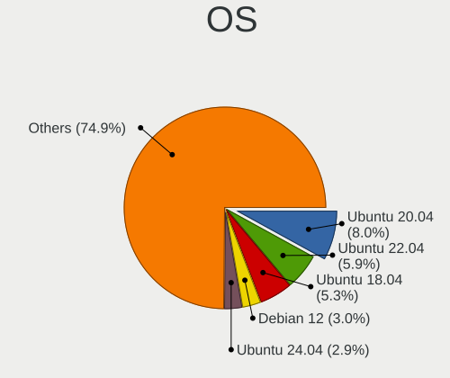

| Name                         | Computers | Percent |
|------------------------------|-----------|---------|
| Ubuntu 20.04                 | 773       | 7.99%   |
| Ubuntu 22.04                 | 569       | 5.88%   |
| Ubuntu 18.04                 | 517       | 5.35%   |
| Debian 12                    | 292       | 3.02%   |
| Ubuntu 24.04                 | 280       | 2.9%    |
| Debian 11                    | 280       | 2.9%    |
| Arch Rolling                 | 204       | 2.11%   |
| OpenMandriva 4.2             | 192       | 1.99%   |
| Zorin 17                     | 167       | 1.73%   |
| Zorin 16                     | 140       | 1.45%   |
| OpenMandriva 4.3             | 127       | 1.31%   |
| Manjaro                      | 125       | 1.29%   |
| Pop!_OS 22.04                | 121       | 1.25%   |
| KDE neon 20.04               | 112       | 1.16%   |
| Linux Mint 22.1              | 98        | 1.01%   |
| OpenMandriva 24.12           | 94        | 0.97%   |
| OpenMandriva 23.01           | 92        | 0.95%   |
| Fedora 40                    | 91        | 0.94%   |
| OpenMandriva 23.08           | 88        | 0.91%   |
| Fedora 41                    | 87        | 0.9%    |
| Linux Mint 20.3              | 86        | 0.89%   |
| Fedora 38                    | 86        | 0.89%   |
| Debian 10                    | 85        | 0.88%   |
| Linux Mint 21.1              | 83        | 0.86%   |
| ArcoLinux Rolling            | 82        | 0.85%   |
| OpenMandriva 25.90           | 80        | 0.83%   |
| Fedora 42                    | 74        | 0.77%   |
| Linux Mint 19.3              | 73        | 0.75%   |
| Fedora 39                    | 73        | 0.75%   |
| Ubuntu 20.10                 | 72        | 0.74%   |
| Debian 13                    | 70        | 0.72%   |
| openSUSE Tumbleweed-XXXXXXXX | 65        | 0.67%   |
| Arch                         | 65        | 0.67%   |
| Xubuntu 20.04                | 63        | 0.65%   |
| Linux Mint 21.2              | 63        | 0.65%   |
| Ubuntu 19.04                 | 62        | 0.64%   |
| Kubuntu 22.04                | 62        | 0.64%   |
| Linux Mint 20.1              | 59        | 0.61%   |
| Ubuntu 19.10                 | 58        | 0.6%    |
| KDE neon 22.04               | 58        | 0.6%    |

OS Family
---------

OS without a version

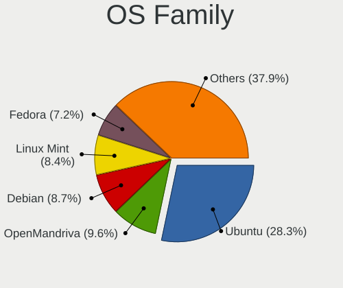

| Name          | Computers | Percent |
|---------------|-----------|---------|
| Ubuntu        | 2558      | 28.29%  |
| OpenMandriva  | 865       | 9.57%   |
| Debian        | 784       | 8.67%   |
| Linux Mint    | 759       | 8.4%    |
| Fedora        | 651       | 7.2%    |
| Zorin         | 398       | 4.4%    |
| Manjaro       | 274       | 3.03%   |
| Arch          | 267       | 2.95%   |
| Kubuntu       | 228       | 2.52%   |
| Pop!_OS       | 215       | 2.38%   |
| KDE neon      | 203       | 2.25%   |
| Xubuntu       | 166       | 1.84%   |
| Endless       | 130       | 1.44%   |
| ROSA          | 125       | 1.38%   |
| openSUSE      | 112       | 1.24%   |
| Elementary    | 104       | 1.15%   |
| ArcoLinux     | 95        | 1.05%   |
| Kali          | 85        | 0.94%   |
| Ubuntu MATE   | 81        | 0.9%    |
| Gentoo        | 70        | 0.77%   |
| SteamOS       | 62        | 0.69%   |
| EndeavourOS   | 56        | 0.62%   |
| Nobara        | 55        | 0.61%   |
| Lubuntu       | 53        | 0.59%   |
| Bazzite       | 48        | 0.53%   |
| Ubuntu Unity  | 46        | 0.51%   |
| LMDE          | 44        | 0.49%   |
| MX            | 40        | 0.44%   |
| BlackPanther  | 31        | 0.34%   |
| Garuda Linux  | 27        | 0.3%    |
| Parrot        | 25        | 0.28%   |
| CachyOS       | 22        | 0.24%   |
| Ubuntu Budgie | 21        | 0.23%   |
| Clear Linux   | 20        | 0.22%   |
| NixOS         | 19        | 0.21%   |
| Devuan        | 16        | 0.18%   |
| Deepin        | 11        | 0.12%   |
| CentOS        | 11        | 0.12%   |
| Xero          | 10        | 0.11%   |
| Ubuntu Studio | 10        | 0.11%   |

Kernel
------

Version of the Linux kernel

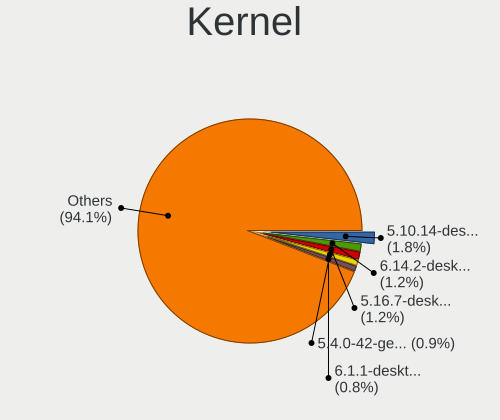

| Version                  | Computers | Percent |
|--------------------------|-----------|---------|
| 5.10.14-desktop-1omv4002 | 188       | 1.78%   |
| 6.14.2-desktop-3omv2590  | 125       | 1.18%   |
| 5.16.7-desktop-1omv4003  | 124       | 1.17%   |
| 5.4.0-42-generic         | 96        | 0.91%   |
| 6.1.1-desktop-1omv2290   | 87        | 0.82%   |
| 6.12.1-desktop-1omv2490  | 83        | 0.79%   |
| 6.8.0-51-generic         | 70        | 0.66%   |
| 5.15.0-56-generic        | 68        | 0.64%   |
| 6.4.11-desktop-1omv2390  | 63        | 0.6%    |
| 5.4.0-58-generic         | 60        | 0.57%   |
| 5.10.0-8-amd64           | 56        | 0.53%   |
| 6.8.0-45-generic         | 54        | 0.51%   |
| 6.2.6-desktop-1omv2390   | 53        | 0.5%    |
| 5.4.0-52-generic         | 49        | 0.46%   |
| 5.4.0-54-generic         | 48        | 0.45%   |
| 6.6.2-desktop-1omv2390   | 47        | 0.44%   |
| 5.4.0-26-generic         | 47        | 0.44%   |
| 5.15.0-52-generic        | 44        | 0.42%   |
| 6.8.0-52-generic         | 43        | 0.41%   |
| 5.15.0-58-generic        | 43        | 0.41%   |
| 5.3.0-28-generic         | 42        | 0.4%    |
| 6.8.0-49-generic         | 39        | 0.37%   |
| 6.8.0-41-generic         | 39        | 0.37%   |
| 5.4.0-48-generic         | 39        | 0.37%   |
| 5.11.0-27-generic        | 38        | 0.36%   |
| 6.5.0-14-generic         | 37        | 0.35%   |
| 6.10.0-desktop-1omv2490  | 37        | 0.35%   |
| 5.3.0-40-generic         | 37        | 0.35%   |
| 5.0.0-37-generic         | 36        | 0.34%   |
| 5.4.0-29-generic         | 35        | 0.33%   |
| 6.5.0-26-generic         | 34        | 0.32%   |
| 6.9.3-76060903-generic   | 33        | 0.31%   |
| 6.8.0-40-generic         | 33        | 0.31%   |
| 6.14.0-33-generic        | 32        | 0.3%    |
| 5.4.0-65-generic         | 32        | 0.3%    |
| 5.3.0-46-generic         | 32        | 0.3%    |
| 5.19.0-35-generic        | 32        | 0.3%    |
| 5.15.0-60-generic        | 32        | 0.3%    |
| 5.13.0-30-generic        | 32        | 0.3%    |
| 5.11.0-43-generic        | 32        | 0.3%    |

Kernel Family
-------------

Linux kernel without a distro release

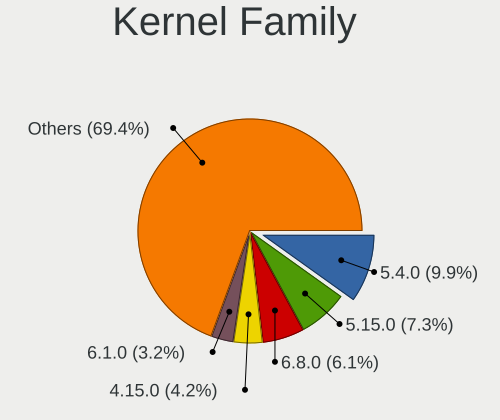

| Version | Computers | Percent |
|---------|-----------|---------|
| 5.4.0   | 989       | 9.88%   |
| 5.15.0  | 726       | 7.25%   |
| 6.8.0   | 606       | 6.05%   |
| 4.15.0  | 420       | 4.2%    |
| 6.1.0   | 322       | 3.22%   |
| 5.10.0  | 318       | 3.18%   |
| 6.5.0   | 301       | 3.01%   |
| 5.11.0  | 279       | 2.79%   |
| 5.8.0   | 268       | 2.68%   |
| 5.13.0  | 255       | 2.55%   |
| 5.3.0   | 254       | 2.54%   |
| 5.19.0  | 214       | 2.14%   |
| 5.0.0   | 199       | 1.99%   |
| 6.2.0   | 197       | 1.97%   |
| 5.10.14 | 190       | 1.9%    |
| 6.14.0  | 182       | 1.82%   |
| 6.11.0  | 139       | 1.39%   |
| 6.14.2  | 136       | 1.36%   |
| 5.16.7  | 128       | 1.28%   |
| 4.18.0  | 114       | 1.14%   |
| 6.1.1   | 96        | 0.96%   |
| 4.19.0  | 88        | 0.88%   |
| 6.12.1  | 87        | 0.87%   |
| 6.2.6   | 72        | 0.72%   |
| 6.4.11  | 68        | 0.68%   |
| 6.6.2   | 51        | 0.51%   |
| 6.9.3   | 39        | 0.39%   |
| 6.10.0  | 39        | 0.39%   |
| 5.14.0  | 35        | 0.35%   |
| 6.4.8   | 34        | 0.34%   |
| 4.9.60  | 33        | 0.33%   |
| 6.12.10 | 28        | 0.28%   |
| 6.0.0   | 28        | 0.28%   |
| 6.4.0   | 26        | 0.26%   |
| 6.12.43 | 26        | 0.26%   |
| 4.18.16 | 25        | 0.25%   |
| 6.17.7  | 23        | 0.23%   |
| 4.4.0   | 22        | 0.22%   |
| 6.12.48 | 21        | 0.21%   |
| 5.18.0  | 21        | 0.21%   |

Kernel Major Ver.
-----------------

Linux kernel major version

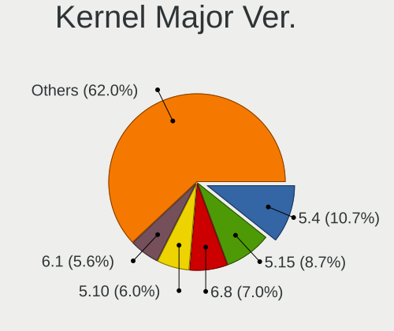

| Version | Computers | Percent |
|---------|-----------|---------|
| 5.4     | 1055      | 10.7%   |
| 5.15    | 854       | 8.66%   |
| 6.8     | 693       | 7.03%   |
| 5.10    | 596       | 6.05%   |
| 6.1     | 548       | 5.56%   |
| 4.15    | 420       | 4.26%   |
| 6.5     | 406       | 4.12%   |
| 6.14    | 382       | 3.88%   |
| 6.12    | 352       | 3.57%   |
| 6.2     | 340       | 3.45%   |
| 5.11    | 337       | 3.42%   |
| 5.8     | 328       | 3.33%   |
| 5.13    | 294       | 2.98%   |
| 5.3     | 282       | 2.86%   |
| 5.19    | 276       | 2.8%    |
| 6.6     | 231       | 2.34%   |
| 6.11    | 223       | 2.26%   |
| 5.0     | 203       | 2.06%   |
| 5.16    | 197       | 2%      |
| 6.4     | 193       | 1.96%   |
| 4.18    | 140       | 1.42%   |
| 6.10    | 127       | 1.29%   |
| 6.0     | 111       | 1.13%   |
| 4.19    | 104       | 1.05%   |
| 6.9     | 102       | 1.03%   |
| 6.17    | 100       | 1.01%   |
| 5.14    | 100       | 1.01%   |
| 4.9     | 81        | 0.82%   |
| 6.3     | 76        | 0.77%   |
| 6.13    | 70        | 0.71%   |
| 5.18    | 68        | 0.69%   |
| 6.7     | 64        | 0.65%   |
| 6.15    | 63        | 0.64%   |
| 6.16    | 57        | 0.58%   |
| 5.17    | 53        | 0.54%   |
| 5.9     | 52        | 0.53%   |
| 5.6     | 51        | 0.52%   |
| 5.7     | 45        | 0.46%   |
| 5.12    | 44        | 0.45%   |
| 5.5     | 26        | 0.26%   |

Arch
----

OS architecture (x86_64, i586, etc.)

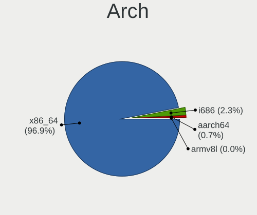

| Name    | Computers | Percent |
|---------|-----------|---------|
| x86_64  | 8365      | 96.88%  |
| i686    | 199       | 2.3%    |
| aarch64 | 57        | 0.66%   |
| armv7l  | 12        | 0.14%   |
| armv8l  | 1         | 0.01%   |

DE
--

Desktop Environment

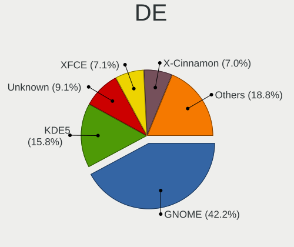

| Name             | Computers | Percent |
|------------------|-----------|---------|
| GNOME            | 3852      | 42.17%  |
| KDE5             | 1446      | 15.83%  |
| Unknown          | 832       | 9.11%   |
| XFCE             | 650       | 7.12%   |
| X-Cinnamon       | 637       | 6.97%   |
| KDE6             | 539       | 5.9%    |
| MATE             | 244       | 2.67%   |
| KDE              | 189       | 2.07%   |
| LXQt             | 134       | 1.47%   |
| Pantheon         | 101       | 1.11%   |
| Cinnamon         | 62        | 0.68%   |
| i3               | 55        | 0.6%    |
| KDE4             | 54        | 0.59%   |
| Unity            | 45        | 0.49%   |
| Budgie           | 41        | 0.45%   |
| LXDE             | 32        | 0.35%   |
| Deepin           | 28        | 0.31%   |
| Hyprland         | 25        | 0.27%   |
| GNOME Flashback  | 25        | 0.27%   |
| GNOME Classic    | 19        | 0.21%   |
| openbox          | 16        | 0.18%   |
| bspwm            | 10        | 0.11%   |
| COSMIC           | 9         | 0.1%    |
| sway             | 8         | 0.09%   |
| icewm            | 8         | 0.09%   |
| DWM              | 7         | 0.08%   |
| qtile            | 6         | 0.07%   |
| Endless:GNOME    | 6         | 0.07%   |
| lightdm-xsession | 5         | 0.05%   |
| xmonad           | 4         | 0.04%   |
| trinity          | 4         | 0.04%   |
| LeftWM           | 4         | 0.04%   |
| Phosh:GNOME      | 3         | 0.03%   |
| i3-with-shmlog   | 3         | 0.03%   |
| enlightenment    | 3         | 0.03%   |
| chadwm           | 3         | 0.03%   |
| BunsenLabs       | 3         | 0.03%   |
| LXDE-pi-wayfire  | 2         | 0.02%   |
| fluxbox          | 2         | 0.02%   |
| DDE              | 2         | 0.02%   |

Display Server
--------------

X11 or Wayland

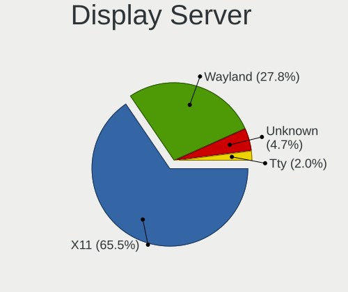

| Name    | Computers | Percent |
|---------|-----------|---------|
| X11     | 5901      | 65.49%  |
| Wayland | 2503      | 27.78%  |
| Unknown | 422       | 4.68%   |
| Tty     | 184       | 2.04%   |

Display Manager
---------------

SDDM, LightDM, etc.

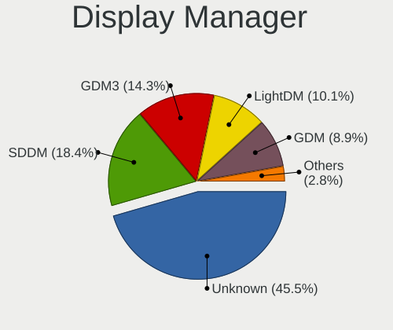

| Name           | Computers | Percent |
|----------------|-----------|---------|
| Unknown        | 4109      | 45.52%  |
| SDDM           | 1661      | 18.4%   |
| GDM3           | 1290      | 14.29%  |
| LightDM        | 908       | 10.06%  |
| GDM            | 804       | 8.91%   |
| TDM            | 150       | 1.66%   |
| KDM            | 48        | 0.53%   |
| XDM            | 14        | 0.16%   |
| LXDM           | 11        | 0.12%   |
| SLiM           | 8         | 0.09%   |
| GREETD         | 8         | 0.09%   |
| Ly             | 5         | 0.06%   |
| SLIMSKI        | 4         | 0.04%   |
| LY-DM          | 2         | 0.02%   |
| COSMIC-GREETER | 2         | 0.02%   |
| WDM            | 1         | 0.01%   |
| NODM           | 1         | 0.01%   |

OS Lang
-------

Language

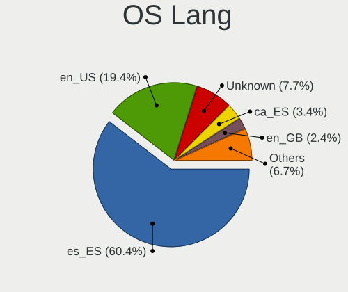

| Lang           | Computers | Percent |
|----------------|-----------|---------|
| es_ES          | 5378      | 60.45%  |
| en_US          | 1722      | 19.35%  |
| Unknown        | 681       | 7.65%   |
| ca_ES          | 304       | 3.42%   |
| en_GB          | 213       | 2.39%   |
| C              | 130       | 1.46%   |
| de_DE          | 61        | 0.69%   |
| gl_ES          | 56        | 0.63%   |
| eu_ES          | 41        | 0.46%   |
| fr_FR          | 36        | 0.4%    |
| ru_RU          | 31        | 0.35%   |
| it_IT          | 23        | 0.26%   |
| POSIX          | 21        | 0.24%   |
| es_AR          | 17        | 0.19%   |
| an_ES          | 15        | 0.17%   |
| en_IE          | 13        | 0.15%   |
| ca_AD          | 13        | 0.15%   |
| ca_ES@valencia | 12        | 0.13%   |
| es_MX          | 11        | 0.12%   |
| pt_BR          | 10        | 0.11%   |
| C.UTF8         | 8         | 0.09%   |
| pt_PT          | 6         | 0.07%   |
| pl_PL          | 6         | 0.07%   |
| es_ES.UTF8     | 6         | 0.07%   |
| ro_RO          | 5         | 0.06%   |
| nl_NL          | 5         | 0.06%   |
| en_AG          | 5         | 0.06%   |
| zh_CN          | 4         | 0.04%   |
| bg_BG          | 4         | 0.04%   |
| ru_UA          | 3         | 0.03%   |
| fr_BE          | 3         | 0.03%   |
| es_US          | 3         | 0.03%   |
| en_DK          | 3         | 0.03%   |
| en_AU          | 3         | 0.03%   |
| de_CH          | 3         | 0.03%   |
| de_AT          | 3         | 0.03%   |
| ast_ES         | 3         | 0.03%   |
| fr_CH          | 2         | 0.02%   |
| es_EC          | 2         | 0.02%   |
| es_BO          | 2         | 0.02%   |

Boot Mode
---------

EFI or BIOS

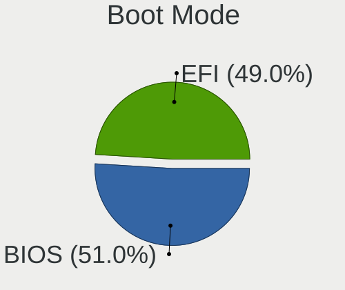

| Mode | Computers | Percent |
|------|-----------|---------|
| BIOS | 4521      | 50.97%  |
| EFI  | 4349      | 49.03%  |

Filesystem
----------

Type of filesystem

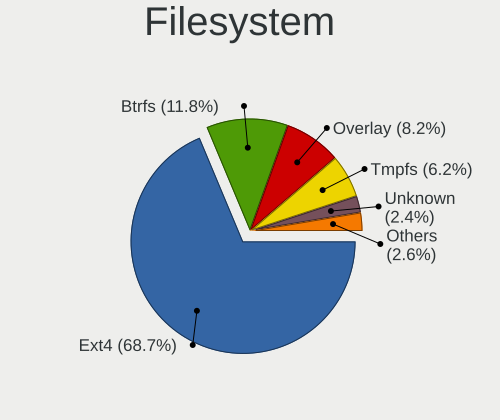

| Type     | Computers | Percent |
|----------|-----------|---------|
| Ext4     | 6147      | 68.69%  |
| Btrfs    | 1054      | 11.78%  |
| Overlay  | 738       | 8.25%   |
| Tmpfs    | 559       | 6.25%   |
| Unknown  | 214       | 2.39%   |
| Xfs      | 118       | 1.32%   |
| Zfs      | 46        | 0.51%   |
| Ext3     | 36        | 0.4%    |
| Ext2     | 19        | 0.21%   |
| Aufs     | 6         | 0.07%   |
| Reiserfs | 4         | 0.04%   |
| F2fs     | 4         | 0.04%   |
| Jfs      | 3         | 0.03%   |
| Rootfs   | 1         | 0.01%   |

Part. scheme
------------

Scheme of partitioning

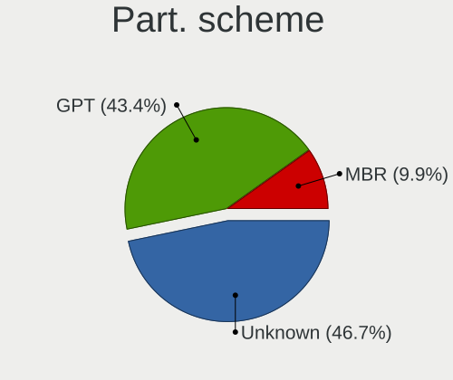

| Type    | Computers | Percent |
|---------|-----------|---------|
| Unknown | 4167      | 46.75%  |
| GPT     | 3868      | 43.39%  |
| MBR     | 879       | 9.86%   |

Dual Boot with Linux/BSD
------------------------

Hosting more than one Linux/BSD

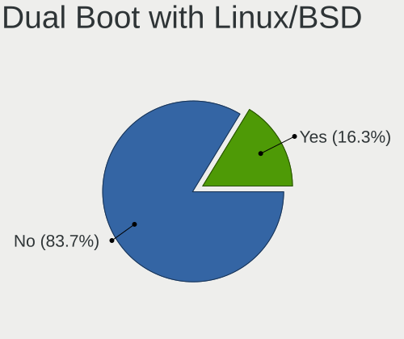

| Dual boot | Computers | Percent |
|-----------|-----------|---------|
| No        | 7412      | 83.71%  |
| Yes       | 1442      | 16.29%  |

Dual Boot (Win)
---------------

Hosting Linux and Windows

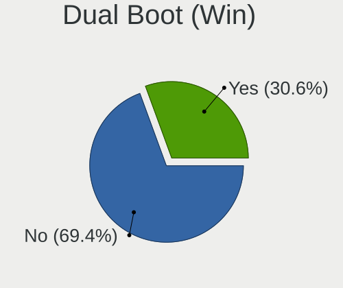

| Dual boot | Computers | Percent |
|-----------|-----------|---------|
| No        | 6132      | 69.42%  |
| Yes       | 2701      | 30.58%  |

Board
-----

Vendor
------

Motherboard manufacturer

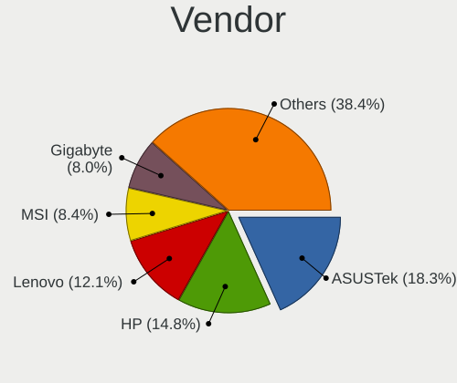

| Name                                 | Computers | Percent |
|--------------------------------------|-----------|---------|
| ASUSTek Computer                     | 1577      | 18.27%  |
| Hewlett-Packard                      | 1279      | 14.82%  |
| Lenovo                               | 1047      | 12.13%  |
| MSI                                  | 723       | 8.38%   |
| Gigabyte Technology                  | 694       | 8.04%   |
| Acer                                 | 548       | 6.35%   |
| Dell                                 | 509       | 5.9%    |
| Apple                                | 248       | 2.87%   |
| ASRock                               | 217       | 2.51%   |
| Toshiba                              | 162       | 1.88%   |
| Intel                                | 134       | 1.55%   |
| Unknown                              | 134       | 1.55%   |
| HUAWEI                               | 84        | 0.97%   |
| Sony                                 | 76        | 0.88%   |
| Packard Bell                         | 70        | 0.81%   |
| Medion                               | 69        | 0.8%    |
| Chuwi                                | 66        | 0.76%   |
| Valve                                | 52        | 0.6%    |
| Samsung Electronics                  | 52        | 0.6%    |
| SLIMBOOK                             | 49        | 0.57%   |
| Notebook                             | 48        | 0.56%   |
| Raspberry Pi Foundation              | 36        | 0.42%   |
| LG Electronics                       | 35        | 0.41%   |
| AMI                                  | 34        | 0.39%   |
| Pegatron                             | 32        | 0.37%   |
| Fujitsu                              | 31        | 0.36%   |
| Microsoft                            | 27        | 0.31%   |
| BESSTAR Tech                         | 26        | 0.3%    |
| AZW                                  | 26        | 0.3%    |
| Foxconn                              | 22        | 0.25%   |
| eMachines                            | 22        | 0.25%   |
| Teclast                              | 20        | 0.23%   |
| Shenzhen Meigao Electronic Equipment | 19        | 0.22%   |
| Supermicro                           | 18        | 0.21%   |
| Fujitsu Siemens                      | 18        | 0.21%   |
| Huanan                               | 17        | 0.2%    |
| ECS                                  | 17        | 0.2%    |
| ALURIN                               | 17        | 0.2%    |
| Timi                                 | 16        | 0.19%   |
| Google                               | 13        | 0.15%   |

Model
-----

Motherboard model

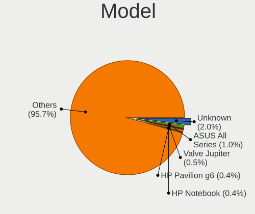

| Name                                       | Computers | Percent |
|--------------------------------------------|-----------|---------|
| Unknown                                    | 175       | 2.03%   |
| ASUS All Series                            | 84        | 0.97%   |
| Valve Jupiter                              | 43        | 0.5%    |
| HP Pavilion g6                             | 36        | 0.42%   |
| HP Notebook                                | 33        | 0.38%   |
| HP Pavilion dv6                            | 29        | 0.34%   |
| Lenovo ThinkCentre E73 10DR0033SP          | 22        | 0.25%   |
| Gigabyte B450M DS3H                        | 22        | 0.25%   |
| ASUS ZenBook UX431DA_UM431DA               | 22        | 0.25%   |
| Lenovo IdeaPad 3 15ITL6 82H8               | 21        | 0.24%   |
| HP Laptop 15-fd0xxx                        | 20        | 0.23%   |
| MSI MS-7B86                                | 19        | 0.22%   |
| HP Compaq Elite 8300 SFF                   | 19        | 0.22%   |
| AMI Intel                                  | 19        | 0.22%   |
| MSI MS-7C37                                | 18        | 0.21%   |
| Lenovo IdeaPad 330-15IKB 81DE              | 18        | 0.21%   |
| MSI MS-7817                                | 16        | 0.19%   |
| HP Pavilion 15                             | 16        | 0.19%   |
| ASUS VivoBook 15_ASUS Laptop X540MA_R540MA | 16        | 0.19%   |
| HP Laptop 15-da0xxx                        | 15        | 0.17%   |
| Gigabyte 970A-DS3P                         | 15        | 0.17%   |
| MSI MS-7B79                                | 14        | 0.16%   |
| HP Laptop 15s-fq1xxx                       | 14        | 0.16%   |
| HP EliteDesk 800 G1 SFF                    | 14        | 0.16%   |
| ASUS TUF Gaming X570-PLUS                  | 14        | 0.16%   |
| ASUS H110M-D                               | 14        | 0.16%   |
| HUAWEI KLVL-WXX9                           | 13        | 0.15%   |
| HP G62                                     | 13        | 0.15%   |
| Chuwi GemiBook Pro                         | 13        | 0.15%   |
| ASUS PRIME B450M-A                         | 13        | 0.15%   |
| MSI MS-7C91                                | 12        | 0.14%   |
| HUAWEI BOHK-WAX9X                          | 12        | 0.14%   |
| HP Laptop 15s-eq2xxx                       | 12        | 0.14%   |
| HP Laptop 15s-eq1xxx                       | 12        | 0.14%   |
| HP Laptop 15-db0xxx                        | 12        | 0.14%   |
| Gigabyte H81M-S2H                          | 12        | 0.14%   |
| ASUS X550VX                                | 12        | 0.14%   |
| ASUS P5G41T-M LX                           | 12        | 0.14%   |
| Apple MacBookPro8,1                        | 12        | 0.14%   |
| RPi Raspberry Pi                           | 11        | 0.13%   |

Model Family
------------

Motherboard model prefix

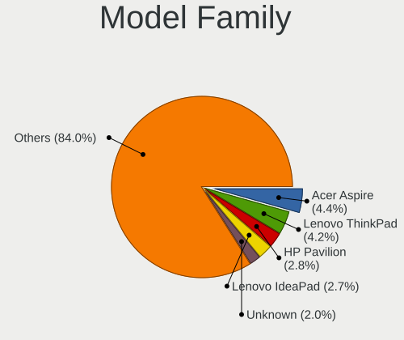

| Name                  | Computers | Percent |
|-----------------------|-----------|---------|
| Acer Aspire           | 376       | 4.36%   |
| Lenovo ThinkPad       | 364       | 4.22%   |
| HP Pavilion           | 238       | 2.76%   |
| Lenovo IdeaPad        | 229       | 2.65%   |
| Unknown               | 175       | 2.03%   |
| ASUS PRIME            | 166       | 1.92%   |
| ASUS VivoBook         | 165       | 1.91%   |
| HP Laptop             | 159       | 1.84%   |
| Dell Latitude         | 157       | 1.82%   |
| HP Compaq             | 150       | 1.74%   |
| ASUS ROG              | 150       | 1.74%   |
| Toshiba Satellite     | 122       | 1.41%   |
| ASUS TUF              | 115       | 1.33%   |
| HP EliteBook          | 113       | 1.31%   |
| Dell XPS              | 96        | 1.11%   |
| Lenovo ThinkCentre    | 91        | 1.05%   |
| HP ProBook            | 90        | 1.04%   |
| ASUS All              | 84        | 0.97%   |
| Dell OptiPlex         | 81        | 0.94%   |
| Dell Inspiron         | 79        | 0.92%   |
| ASUS ZenBook          | 71        | 0.82%   |
| ASUS ASUS             | 66        | 0.76%   |
| Lenovo Legion         | 57        | 0.66%   |
| MSI Prestige          | 49        | 0.57%   |
| HP EliteDesk          | 47        | 0.54%   |
| Packard Bell EasyNote | 46        | 0.53%   |
| MSI Modern            | 46        | 0.53%   |
| Lenovo Yoga           | 45        | 0.52%   |
| Valve Jupiter         | 43        | 0.5%    |
| HP Victus             | 42        | 0.49%   |
| HP 250                | 41        | 0.48%   |
| HP OMEN               | 40        | 0.46%   |
| Gigabyte B450M        | 39        | 0.45%   |
| Acer TravelMate       | 38        | 0.44%   |
| Acer Extensa          | 38        | 0.44%   |
| Dell Precision        | 37        | 0.43%   |
| RPi Raspberry         | 35        | 0.41%   |
| HP Notebook           | 33        | 0.38%   |
| HP ENVY               | 33        | 0.38%   |
| Gigabyte X570         | 31        | 0.36%   |

MFG Year
--------

Motherboard manufacture year

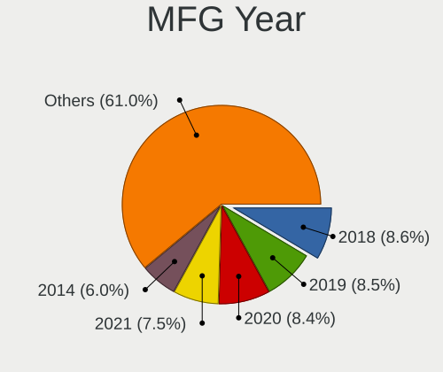

| Year    | Computers | Percent |
|---------|-----------|---------|
| 2018    | 740       | 8.57%   |
| 2019    | 731       | 8.47%   |
| 2020    | 727       | 8.42%   |
| 2021    | 646       | 7.48%   |
| 2014    | 521       | 6.04%   |
| 2013    | 504       | 5.84%   |
| 2012    | 501       | 5.8%    |
| 2017    | 484       | 5.61%   |
| 2022    | 445       | 5.16%   |
| 2011    | 438       | 5.07%   |
| 2015    | 425       | 4.92%   |
| 2016    | 384       | 4.45%   |
| 2010    | 370       | 4.29%   |
| 2023    | 368       | 4.26%   |
| 2009    | 349       | 4.04%   |
| 2008    | 320       | 3.71%   |
| 2007    | 228       | 2.64%   |
| 2024    | 191       | 2.21%   |
| 2006    | 110       | 1.27%   |
| Unknown | 63        | 0.73%   |
| 2025    | 47        | 0.54%   |
| 2005    | 24        | 0.28%   |
| 2004    | 8         | 0.09%   |
| 2003    | 3         | 0.03%   |
| 2002    | 2         | 0.02%   |
| 2001    | 2         | 0.02%   |

Form Factor
-----------

Physical design of the computer

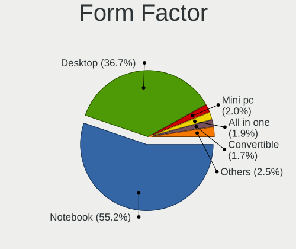

| Name           | Computers | Percent |
|----------------|-----------|---------|
| Notebook       | 4767      | 55.23%  |
| Desktop        | 3167      | 36.69%  |
| Mini pc        | 172       | 1.99%   |
| All in one     | 161       | 1.87%   |
| Convertible    | 150       | 1.74%   |
| Tablet         | 95        | 1.1%    |
| System on chip | 63        | 0.73%   |
| Server         | 50        | 0.58%   |
| Phone          | 3         | 0.03%   |
| Other          | 2         | 0.02%   |
| Stick pc       | 1         | 0.01%   |

Secure Boot
-----------

Enabled or disabled

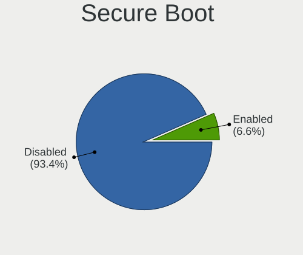

| State    | Computers | Percent |
|----------|-----------|---------|
| Disabled | 8123      | 93.44%  |
| Enabled  | 570       | 6.56%   |

Coreboot
--------

Have coreboot on board

| Used | Computers | Percent |
|------|-----------|---------|
| No   | 8610      | 99.76%  |
| Yes  | 21        | 0.24%   |

RAM Size
--------

Total RAM memory

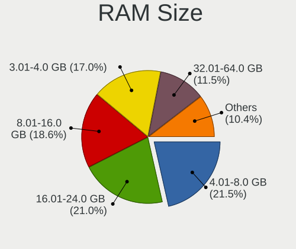

| Size in GB      | Computers | Percent |
|-----------------|-----------|---------|
| 4.01-8.0        | 1890      | 21.47%  |
| 16.01-24.0      | 1852      | 21.04%  |
| 8.01-16.0       | 1634      | 18.56%  |
| 3.01-4.0        | 1498      | 17.02%  |
| 32.01-64.0      | 1012      | 11.5%   |
| 1.01-2.0        | 290       | 3.29%   |
| 64.01-256.0     | 224       | 2.54%   |
| 24.01-32.0      | 193       | 2.19%   |
| 2.01-3.0        | 111       | 1.26%   |
| 0.51-1.0        | 71        | 0.81%   |
| More than 256.0 | 22        | 0.25%   |
| 0.01-0.5        | 5         | 0.06%   |
| Unknown         | 1         | 0.01%   |

RAM Used
--------

Used RAM memory

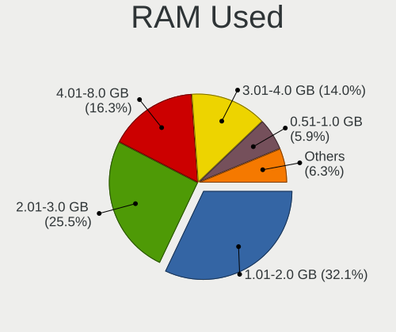

| Used GB     | Computers | Percent |
|-------------|-----------|---------|
| 1.01-2.0    | 3102      | 32.06%  |
| 2.01-3.0    | 2470      | 25.52%  |
| 4.01-8.0    | 1575      | 16.28%  |
| 3.01-4.0    | 1356      | 14.01%  |
| 0.51-1.0    | 569       | 5.88%   |
| 8.01-16.0   | 414       | 4.28%   |
| 0.01-0.5    | 100       | 1.03%   |
| 16.01-24.0  | 43        | 0.44%   |
| 24.01-32.0  | 20        | 0.21%   |
| 64.01-256.0 | 14        | 0.14%   |
| 32.01-64.0  | 13        | 0.13%   |
| Unknown     | 1         | 0.01%   |

Total Drives
------------

Number of drives on board

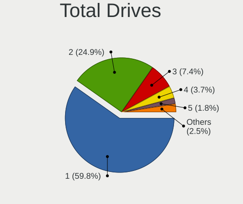

| Drives  | Computers | Percent |
|---------|-----------|---------|
| 1       | 5358      | 59.79%  |
| 2       | 2231      | 24.9%   |
| 3       | 665       | 7.42%   |
| 4       | 328       | 3.66%   |
| 5       | 157       | 1.75%   |
| 6       | 68        | 0.76%   |
| 0       | 62        | 0.69%   |
| 7       | 30        | 0.33%   |
| 9       | 18        | 0.2%    |
| 8       | 15        | 0.17%   |
| 13      | 8         | 0.09%   |
| 10      | 5         | 0.06%   |
| 11      | 4         | 0.04%   |
| 12      | 3         | 0.03%   |
| 15      | 2         | 0.02%   |
| 36      | 1         | 0.01%   |
| 35      | 1         | 0.01%   |
| 21      | 1         | 0.01%   |
| 18      | 1         | 0.01%   |
| 16      | 1         | 0.01%   |
| 14      | 1         | 0.01%   |
| Unknown | 1         | 0.01%   |

Has CD-ROM
----------

Has CD-ROM on board

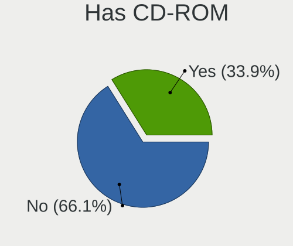

| Presented | Computers | Percent |
|-----------|-----------|---------|
| No        | 5763      | 66.08%  |
| Yes       | 2958      | 33.92%  |

Has Ethernet
------------

Has Ethernet on board

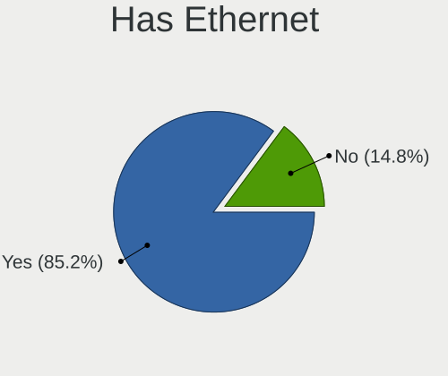

| Presented | Computers | Percent |
|-----------|-----------|---------|
| Yes       | 7383      | 85.18%  |
| No        | 1285      | 14.82%  |

Has WiFi
--------

Has WiFi module

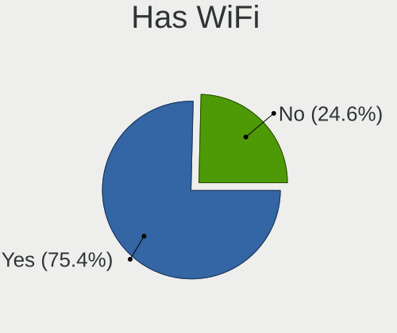

| Presented | Computers | Percent |
|-----------|-----------|---------|
| Yes       | 6558      | 75.39%  |
| No        | 2141      | 24.61%  |

Has Bluetooth
-------------

Has Bluetooth module

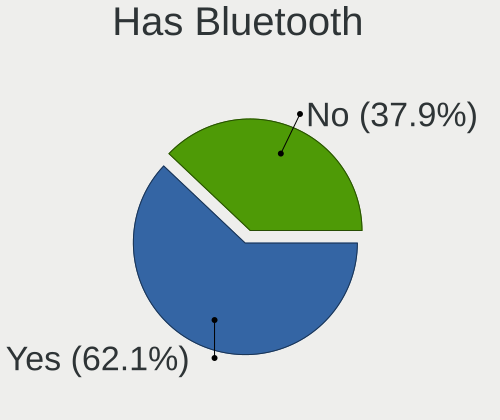

| Presented | Computers | Percent |
|-----------|-----------|---------|
| Yes       | 5434      | 62.06%  |
| No        | 3322      | 37.94%  |

Location
--------

Country
-------

Geographic location (country)

| Country | Computers | Percent |
|---------|-----------|---------|
| Spain   | 8631      | 100%    |

City
----

Geographic location (city)

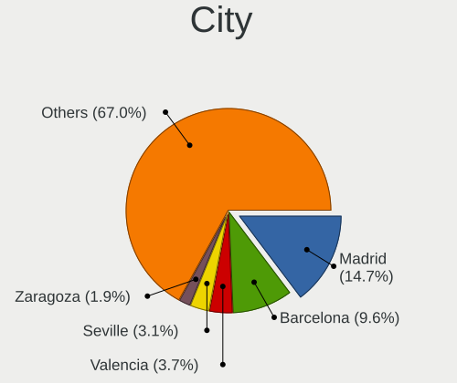

| City                       | Computers | Percent |
|----------------------------|-----------|---------|
| Madrid                     | 1398      | 14.74%  |
| Barcelona                  | 910       | 9.6%    |
| Valencia                   | 350       | 3.69%   |
| Seville                    | 293       | 3.09%   |
| Zaragoza                   | 177       | 1.87%   |
| Málaga                    | 165       | 1.74%   |
| Granada                    | 126       | 1.33%   |
| Vigo                       | 104       | 1.1%    |
| Valladolid                 | 103       | 1.09%   |
| Alicante                   | 101       | 1.07%   |
| A Coruña                  | 93        | 0.98%   |
| Palma                      | 91        | 0.96%   |
| Bilbao                     | 84        | 0.89%   |
| Las Palmas de Gran Canaria | 83        | 0.88%   |
| Murcia                     | 77        | 0.81%   |
| Alcobendas                 | 77        | 0.81%   |
| Sabadell                   | 75        | 0.79%   |
| Córdoba                   | 71        | 0.75%   |
| Pamplona                   | 66        | 0.7%    |
| Oviedo                     | 65        | 0.69%   |
| Donostia / San Sebastian   | 56        | 0.59%   |
| Santa Cruz de Tenerife     | 52        | 0.55%   |
| Ourense                    | 52        | 0.55%   |
| Gijón                     | 49        | 0.52%   |
| Almería                   | 48        | 0.51%   |
| Santiago de Compostela     | 47        | 0.5%    |
| Alcalá de Henares         | 47        | 0.5%    |
| Vitoria-Gasteiz            | 46        | 0.49%   |
| Terrassa                   | 43        | 0.45%   |
| Burgos                     | 42        | 0.44%   |
| Santander                  | 41        | 0.43%   |
| Salamanca                  | 41        | 0.43%   |
| León                      | 41        | 0.43%   |
| Barakaldo                  | 41        | 0.43%   |
| Mostoles                   | 39        | 0.41%   |
| Badalona                   | 38        | 0.4%    |
| Girona                     | 36        | 0.38%   |
| Tarragona                  | 35        | 0.37%   |
| Jerez de la Frontera       | 34        | 0.36%   |
| Getxo                      | 33        | 0.35%   |

Drives
------

Drive Vendor
------------

Hard drive vendors

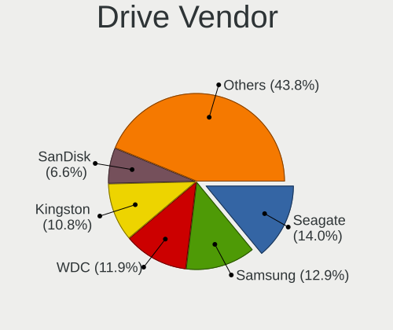

| Vendor                      | Computers | Drives | Percent |
|-----------------------------|-----------|--------|---------|
| Seagate                     | 1802      | 2939   | 14.03%  |
| Samsung Electronics         | 1655      | 2461   | 12.89%  |
| WDC                         | 1532      | 2369   | 11.93%  |
| Kingston                    | 1382      | 1966   | 10.76%  |
| SanDisk                     | 846       | 1162   | 6.59%   |
| Toshiba                     | 799       | 1224   | 6.22%   |
| Crucial                     | 512       | 768    | 3.99%   |
| Unknown                     | 481       | 637    | 3.75%   |
| Micron Technology           | 333       | 418    | 2.59%   |
| Hitachi                     | 329       | 408    | 2.56%   |
| SK hynix                    | 318       | 398    | 2.48%   |
| Intel                       | 278       | 397    | 2.17%   |
| HGST                        | 182       | 222    | 1.42%   |
| China                       | 152       | 213    | 1.18%   |
| KIOXIA                      | 138       | 180    | 1.07%   |
| Kingston Technology Company | 135       | 180    | 1.05%   |
| Phison Electronics          | 128       | 175    | 1%      |
| Micron/Crucial Technology   | 126       | 168    | 0.98%   |
| Apple                       | 103       | 143    | 0.8%    |
| Phison                      | 84        | 140    | 0.65%   |
| Silicon Motion              | 67        | 82     | 0.52%   |
| MAXIO Technology (Hangzhou) | 56        | 75     | 0.44%   |
| Fujitsu                     | 56        | 66     | 0.44%   |
| KIOXIA-EXCERIA              | 53        | 77     | 0.41%   |
| JMicron Technology          | 52        | 57     | 0.4%    |
| Emtec                       | 52        | 71     | 0.4%    |
| Unknown                     | 51        | 60     | 0.4%    |
| Maxtor                      | 50        | 76     | 0.39%   |
| OCZ                         | 48        | 69     | 0.37%   |
| Netac                       | 44        | 62     | 0.34%   |
| PNY                         | 41        | 58     | 0.32%   |
| KingSpec                    | 38        | 48     | 0.3%    |
| A-DATA Technology           | 38        | 57     | 0.3%    |
| Transcend                   | 34        | 60     | 0.26%   |
| Intenso                     | 33        | 50     | 0.26%   |
| Corsair                     | 30        | 37     | 0.23%   |
| LITEON                      | 28        | 36     | 0.22%   |
| Patriot                     | 26        | 39     | 0.2%    |
| Hewlett-Packard             | 26        | 42     | 0.2%    |
| KingDian                    | 21        | 31     | 0.16%   |

Drive Model
-----------

Hard drive models

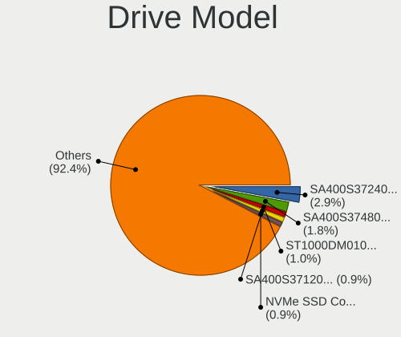

| Model                                              | Computers | Percent |
|----------------------------------------------------|-----------|---------|
| Kingston SA400S37240G 240GB SSD                    | 412       | 2.92%   |
| Kingston SA400S37480G 480GB SSD                    | 260       | 1.84%   |
| Seagate ST1000DM010-2EP102 1TB                     | 144       | 1.02%   |
| Kingston SA400S37120G 120GB SSD                    | 132       | 0.94%   |
| Samsung NVMe SSD Controller SM981/PM981/PM983 1TB  | 121       | 0.86%   |
| Seagate ST500DM002-1BD142 500GB                    | 111       | 0.79%   |
| Kingston SV300S37A120G 120GB SSD                   | 100       | 0.71%   |
| Unknown MMC Card  64GB                             | 94        | 0.67%   |
| Seagate ST3500418AS 500GB                          | 86        | 0.61%   |
| Crucial CT500MX500SSD1 500GB                       | 83        | 0.59%   |
| Seagate ST2000DM008-2FR102 2TB                     | 82        | 0.58%   |
| Samsung SSD 860 EVO 500GB                          | 82        | 0.58%   |
| Toshiba DT01ACA100 1TB                             | 75        | 0.53%   |
| Samsung SSD 850 EVO 250GB                          | 74        | 0.52%   |
| Seagate ST1000DM003-1ER162 1TB                     | 72        | 0.51%   |
| Toshiba MQ01ABD100 1TB                             | 70        | 0.5%    |
| Seagate ST500LT012-1DG142 500GB                    | 70        | 0.5%    |
| Unknown MMC Card  32GB                             | 69        | 0.49%   |
| Micron/Crucial P2 NVMe PCIe SSD 2TB                | 69        | 0.49%   |
| Kingston SA400S37960G 960GB SSD                    | 69        | 0.49%   |
| Samsung NVMe SSD Controller PM9A1/PM9A3/980PRO 1TB | 67        | 0.47%   |
| Samsung SSD 850 EVO 500GB                          | 66        | 0.47%   |
| Unknown MMC Card  128GB                            | 65        | 0.46%   |
| Seagate ST1000DM003-1CH162 1TB                     | 62        | 0.44%   |
| SanDisk SSD PLUS 480GB                             | 61        | 0.43%   |
| Crucial CT480BX500SSD1 480GB                       | 61        | 0.43%   |
| SanDisk NVMe SSD Drive 1TB                         | 60        | 0.43%   |
| HGST HTS721010A9E630 1TB                           | 60        | 0.43%   |
| Seagate ST1000LM024 HN-M101MBB 1TB                 | 59        | 0.42%   |
| Kingston SUV400S37240G 240GB SSD                   | 58        | 0.41%   |
| Seagate ST9500325AS 500GB                          | 57        | 0.4%    |
| Seagate ST1000LM035-1RK172 1TB                     | 54        | 0.38%   |
| Unknown SD/MMC/MS PRO 2GB                          | 52        | 0.37%   |
| Sandisk WD Black SN750 / PC SN730 NVMe SSD 500GB   | 51        | 0.36%   |
| SanDisk NVMe SSD Drive 512GB                       | 51        | 0.36%   |
| Kingston SV300S37A240G 240GB SSD                   | 51        | 0.36%   |
| Crucial CT1000MX500SSD1 1TB                        | 51        | 0.36%   |
| Unknown                                            | 51        | 0.36%   |
| Sandisk WD Blue SN550 NVMe SSD 1024GB              | 49        | 0.35%   |
| Toshiba MQ01ABF050 500GB                           | 48        | 0.34%   |

HDD Vendor
----------

Hard disk drive vendors

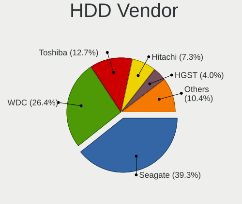

| Vendor              | Computers | Drives | Percent |
|---------------------|-----------|--------|---------|
| Seagate             | 1781      | 2895   | 39.34%  |
| WDC                 | 1193      | 1836   | 26.35%  |
| Toshiba             | 573       | 844    | 12.66%  |
| Hitachi             | 329       | 408    | 7.27%   |
| HGST                | 182       | 222    | 4.02%   |
| Samsung Electronics | 164       | 209    | 3.62%   |
| Unknown             | 57        | 68     | 1.26%   |
| Fujitsu             | 55        | 65     | 1.21%   |
| Maxtor              | 43        | 62     | 0.95%   |
| Apple               | 37        | 46     | 0.82%   |
| JMicron Technology  | 31        | 34     | 0.68%   |
| Hewlett-Packard     | 16        | 23     | 0.35%   |
| USB3.0              | 9         | 9      | 0.2%    |
| ASMT                | 9         | 13     | 0.2%    |
| USB                 | 6         | 6      | 0.13%   |
| TO Exter            | 4         | 5      | 0.09%   |
| SSK                 | 3         | 3      | 0.07%   |
| SABRENT             | 3         | 4      | 0.07%   |
| Maxone              | 2         | 3      | 0.04%   |
| LaCie               | 2         | 2      | 0.04%   |
| JetFlash            | 2         | 2      | 0.04%   |
| Intenso             | 2         | 3      | 0.04%   |
| Inateck             | 2         | 2      | 0.04%   |
| IBM                 | 2         | 5      | 0.04%   |
| HPE                 | 2         | 3      | 0.04%   |
| HGST HTS            | 2         | 2      | 0.04%   |
| External            | 2         | 2      | 0.04%   |
| TPH01203000GB       | 1         | 1      | 0.02%   |
| Synology            | 1         | 1      | 0.02%   |
| Sony                | 1         | 1      | 0.02%   |
| Shenzhen            | 1         | 1      | 0.02%   |
| Quantum             | 1         | 1      | 0.02%   |
| OEM                 | 1         | 1      | 0.02%   |
| KIOXIA              | 1         | 1      | 0.02%   |
| IET                 | 1         | 1      | 0.02%   |
| IBM-207x            | 1         | 8      | 0.02%   |
| Generic-            | 1         | 1      | 0.02%   |
| CIRAGO              | 1         | 2      | 0.02%   |
| China               | 1         | 1      | 0.02%   |
| ASMedia             | 1         | 1      | 0.02%   |

SSD Vendor
----------

Solid state drive vendors

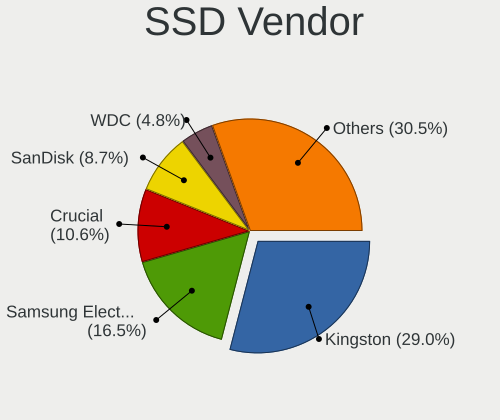

| Vendor              | Computers | Drives | Percent |
|---------------------|-----------|--------|---------|
| Kingston            | 1240      | 1748   | 29.04%  |
| Samsung Electronics | 704       | 1012   | 16.49%  |
| Crucial             | 451       | 643    | 10.56%  |
| SanDisk             | 370       | 474    | 8.67%   |
| WDC                 | 203       | 303    | 4.75%   |
| China               | 150       | 210    | 3.51%   |
| Toshiba             | 140       | 251    | 3.28%   |
| Micron Technology   | 62        | 77     | 1.45%   |
| SK hynix            | 57        | 63     | 1.33%   |
| Intel               | 54        | 80     | 1.26%   |
| OCZ                 | 48        | 69     | 1.12%   |
| Emtec               | 47        | 64     | 1.1%    |
| Apple               | 43        | 55     | 1.01%   |
| Netac               | 41        | 58     | 0.96%   |
| KingSpec            | 37        | 47     | 0.87%   |
| Transcend           | 33        | 59     | 0.77%   |
| KIOXIA-EXCERIA      | 33        | 44     | 0.77%   |
| A-DATA Technology   | 33        | 50     | 0.77%   |
| Intenso             | 30        | 44     | 0.7%    |
| LITEON              | 25        | 32     | 0.59%   |
| PNY                 | 21        | 34     | 0.49%   |
| Patriot             | 21        | 34     | 0.49%   |
| KingDian            | 21        | 31     | 0.49%   |
| Unknown             | 19        | 23     | 0.44%   |
| USB30               | 18        | 36     | 0.42%   |
| FORESEE             | 17        | 23     | 0.4%    |
| Teclast             | 16        | 19     | 0.37%   |
| Fanxiang            | 15        | 17     | 0.35%   |
| Corsair             | 14        | 18     | 0.33%   |
| SPCC                | 13        | 16     | 0.3%    |
| Drevo               | 13        | 16     | 0.3%    |
| LITEONIT            | 11        | 13     | 0.26%   |
| BAITITON            | 11        | 20     | 0.26%   |
| SABRENT             | 9         | 10     | 0.21%   |
| Lexar               | 8         | 9      | 0.19%   |
| Hewlett-Packard     | 8         | 17     | 0.19%   |
| Dogfish             | 8         | 10     | 0.19%   |
| Maxtor              | 7         | 14     | 0.16%   |
| KODAK               | 7         | 7      | 0.16%   |
| GOODRAM             | 7         | 9      | 0.16%   |

Drive Kind
----------

HDD or SSD

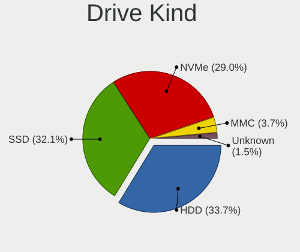

| Kind    | Computers | Drives | Percent |
|---------|-----------|--------|---------|
| HDD     | 3836      | 6800   | 33.74%  |
| SSD     | 3651      | 6010   | 32.11%  |
| NVMe    | 3292      | 4983   | 28.96%  |
| MMC     | 425       | 582    | 3.74%   |
| Unknown | 165       | 200    | 1.45%   |

Drive Connector
---------------

SATA, SAS, NVMe, etc.

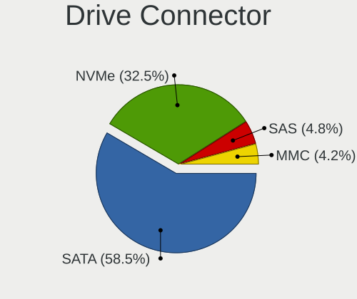

| Type | Computers | Drives | Percent |
|------|-----------|--------|---------|
| SATA | 5909      | 12387  | 58.46%  |
| NVMe | 3286      | 4953   | 32.51%  |
| SAS  | 488       | 653    | 4.83%   |
| MMC  | 425       | 582    | 4.2%    |

Drive Size
----------

Size of hard drive

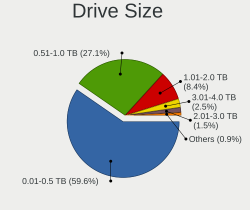

| Size in TB | Computers | Drives | Percent |
|------------|-----------|--------|---------|
| 0.01-0.5   | 4640      | 7681   | 59.63%  |
| 0.51-1.0   | 2112      | 3192   | 27.14%  |
| 1.01-2.0   | 652       | 1177   | 8.38%   |
| 3.01-4.0   | 195       | 334    | 2.51%   |
| 2.01-3.0   | 113       | 205    | 1.45%   |
| 4.01-10.0  | 62        | 204    | 0.8%    |
| 10.01-20.0 | 7         | 17     | 0.09%   |

Space Total
-----------

Amount of disk space available on the file system

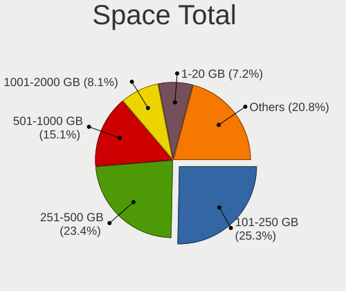

| Size in GB     | Computers | Percent |
|----------------|-----------|---------|
| 101-250        | 2352      | 25.33%  |
| 251-500        | 2170      | 23.37%  |
| 501-1000       | 1400      | 15.08%  |
| 1001-2000      | 756       | 8.14%   |
| 1-20           | 671       | 7.23%   |
| 51-100         | 541       | 5.83%   |
| More than 3000 | 487       | 5.25%   |
| 2001-3000      | 327       | 3.52%   |
| 21-50          | 300       | 3.23%   |
| Unknown        | 280       | 3.02%   |

Space Used
----------

Amount of used disk space

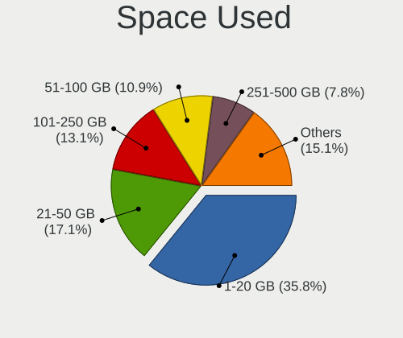

| Used GB        | Computers | Percent |
|----------------|-----------|---------|
| 1-20           | 3456      | 35.85%  |
| 21-50          | 1650      | 17.11%  |
| 101-250        | 1264      | 13.11%  |
| 51-100         | 1055      | 10.94%  |
| 251-500        | 756       | 7.84%   |
| 501-1000       | 545       | 5.65%   |
| 1001-2000      | 329       | 3.41%   |
| Unknown        | 280       | 2.9%    |
| More than 3000 | 167       | 1.73%   |
| 2001-3000      | 120       | 1.24%   |
| 0              | 19        | 0.2%    |

Malfunc. Drives
---------------

Drive models with a malfunction

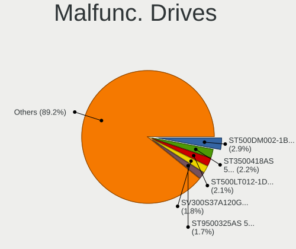

| Model                                               | Computers | Drives | Percent |
|-----------------------------------------------------|-----------|--------|---------|
| Seagate ST500DM002-1BD142 500GB                     | 24        | 25     | 2.93%   |
| Seagate ST3500418AS 500GB                           | 18        | 25     | 2.2%    |
| Seagate ST500LT012-1DG142 500GB                     | 17        | 18     | 2.08%   |
| Kingston SV300S37A120G 120GB SSD                    | 15        | 22     | 1.83%   |
| Seagate ST9500325AS 500GB                           | 14        | 16     | 1.71%   |
| SanDisk SSD PLUS 480GB                              | 12        | 14     | 1.47%   |
| Kingston SA400S37480G 480GB SSD                     | 10        | 13     | 1.22%   |
| Seagate ST31000528AS 1TB                            | 9         | 10     | 1.1%    |
| Toshiba DT01ACA100 1TB                              | 8         | 16     | 0.98%   |
| Seagate ST1000DM010-2EP102 1TB                      | 8         | 11     | 0.98%   |
| Seagate ST1000DM003-1CH162 1TB                      | 8         | 9      | 0.98%   |
| HGST HTS545050A7E680 500GB                          | 8         | 10     | 0.98%   |
| Toshiba MQ01ABD100 1TB                              | 7         | 7      | 0.86%   |
| Seagate ST1000LM024 HN-M101MBB 1TB                  | 7         | 7      | 0.86%   |
| WDC WD5000BEVT-22ZAT0 500GB                         | 6         | 6      | 0.73%   |
| WDC WD20EARX-00PASB0 2TB                            | 6         | 11     | 0.73%   |
| Seagate ST3500320AS 500GB                           | 6         | 10     | 0.73%   |
| Kingston SA400S37240G 240GB SSD                     | 6         | 7      | 0.73%   |
| HGST HTS721010A9E630 1TB                            | 6         | 6      | 0.73%   |
| China G521N256GB                                    | 6         | 7      | 0.73%   |
| WDC WD20EFRX-68EUZN0 2TB                            | 5         | 16     | 0.61%   |
| Seagate ST9250827AS 250GB                           | 5         | 5      | 0.61%   |
| Seagate ST500LM021-1KJ152 500GB                     | 5         | 5      | 0.61%   |
| Seagate ST2000DL003-9VT166 2TB                      | 5         | 6      | 0.61%   |
| Seagate ST1000LM035-1RK172 1TB                      | 5         | 5      | 0.61%   |
| Seagate ST1000DM003-1ER162 1TB                      | 5         | 9      | 0.61%   |
| Samsung Electronics SSD 870 EVO 500GB               | 5         | 5      | 0.61%   |
| Samsung Electronics SSD 870 EVO 1TB                 | 5         | 6      | 0.61%   |
| Kingston SUV400S37240G 240GB SSD                    | 5         | 8      | 0.61%   |
| Hitachi HTS545050A7E380 500GB                       | 5         | 5      | 0.61%   |
| WDC WD5000AAKX-001CA0 500GB                         | 4         | 6      | 0.49%   |
| WDC WD1200BEVS-60UST0 120GB                         | 4         | 5      | 0.49%   |
| Toshiba DT01ACA050 500GB                            | 4         | 5      | 0.49%   |
| Seagate ST9500420AS 500GB                           | 4         | 4      | 0.49%   |
| Seagate ST500LT012-9WS142 500GB                     | 4         | 4      | 0.49%   |
| Seagate ST31500341AS 1TB                            | 4         | 4      | 0.49%   |
| Micron Technology MTFDDAV256TDL-1AW1ZABHA 256GB SSD | 4         | 4      | 0.49%   |
| Hitachi HTS545050B9A300 500GB                       | 4         | 4      | 0.49%   |
| HGST HTS541010A9E680 1TB                            | 4         | 4      | 0.49%   |
| Drevo X1 SSD 240GB                                  | 4         | 6      | 0.49%   |

Malfunc. Drive Vendor
---------------------

Vendors of faulty drives

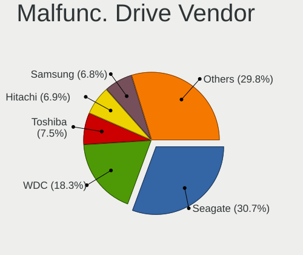

| Vendor              | Computers | Drives | Percent |
|---------------------|-----------|--------|---------|
| Seagate             | 244       | 306    | 30.65%  |
| WDC                 | 146       | 205    | 18.34%  |
| Toshiba             | 60        | 71     | 7.54%   |
| Hitachi             | 55        | 60     | 6.91%   |
| Samsung Electronics | 54        | 59     | 6.78%   |
| Kingston            | 45        | 60     | 5.65%   |
| SanDisk             | 25        | 29     | 3.14%   |
| HGST                | 25        | 29     | 3.14%   |
| Crucial             | 20        | 23     | 2.51%   |
| China               | 16        | 18     | 2.01%   |
| Intel               | 15        | 17     | 1.88%   |
| SK hynix            | 12        | 13     | 1.51%   |
| Maxtor              | 11        | 13     | 1.38%   |
| Micron Technology   | 10        | 13     | 1.26%   |
| Fujitsu             | 8         | 9      | 1.01%   |
| Drevo               | 5         | 7      | 0.63%   |
| OCZ                 | 4         | 4      | 0.5%    |
| Intenso             | 3         | 3      | 0.38%   |
| Apple               | 3         | 3      | 0.38%   |
| A-DATA Technology   | 3         | 4      | 0.38%   |
| Transcend           | 2         | 10     | 0.25%   |
| SPCC                | 2         | 2      | 0.25%   |
| Patriot             | 2         | 2      | 0.25%   |
| Netac               | 2         | 2      | 0.25%   |
| KingDian            | 2         | 3      | 0.25%   |
| HPE                 | 2         | 3      | 0.25%   |
| Dogfish             | 2         | 3      | 0.25%   |
| Corsair             | 2         | 2      | 0.25%   |
| USB 3.1             | 1         | 1      | 0.13%   |
| Unknown             | 1         | 1      | 0.13%   |
| TPH01203000GB       | 1         | 1      | 0.13%   |
| LDLC                | 1         | 1      | 0.13%   |
| KODAK               | 1         | 1      | 0.13%   |
| KingSpec            | 1         | 1      | 0.13%   |
| JMicron Technology  | 1         | 1      | 0.13%   |
| IBM                 | 1         | 1      | 0.13%   |
| Hypertec            | 1         | 1      | 0.13%   |
| Hewlett-Packard     | 1         | 1      | 0.13%   |
| G521N               | 1         | 1      | 0.13%   |
| Emtec               | 1         | 1      | 0.13%   |

Malfunc. HDD Vendor
-------------------

Vendors of faulty HDD drives

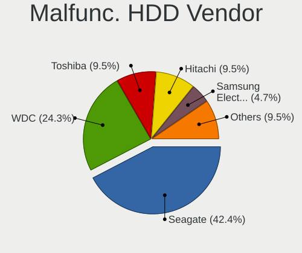

| Vendor              | Computers | Drives | Percent |
|---------------------|-----------|--------|---------|
| Seagate             | 244       | 306    | 42.36%  |
| WDC                 | 140       | 199    | 24.31%  |
| Toshiba             | 55        | 66     | 9.55%   |
| Hitachi             | 55        | 60     | 9.55%   |
| Samsung Electronics | 27        | 29     | 4.69%   |
| HGST                | 25        | 29     | 4.34%   |
| Maxtor              | 11        | 13     | 1.91%   |
| Fujitsu             | 8         | 9      | 1.39%   |
| HPE                 | 2         | 3      | 0.35%   |
| Apple               | 2         | 2      | 0.35%   |
| Unknown             | 1         | 1      | 0.17%   |
| TPH01203000GB       | 1         | 1      | 0.17%   |
| JMicron Technology  | 1         | 1      | 0.17%   |
| IBM                 | 1         | 1      | 0.17%   |
| Hewlett-Packard     | 1         | 1      | 0.17%   |
| China               | 1         | 1      | 0.17%   |
| ASMT                | 1         | 2      | 0.17%   |

Malfunc. Drive Kind
-------------------

Kinds of faulty drives

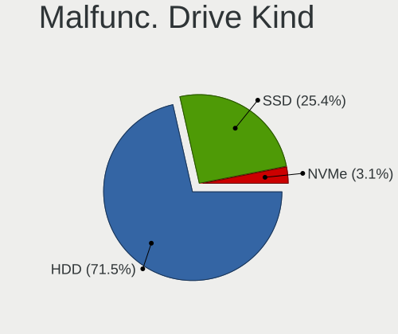

| Kind | Computers | Drives | Percent |
|------|-----------|--------|---------|
| HDD  | 534       | 724    | 71.49%  |
| SSD  | 190       | 241    | 25.44%  |
| NVMe | 23        | 25     | 3.08%   |

Failed Drives
-------------

Failed drive models

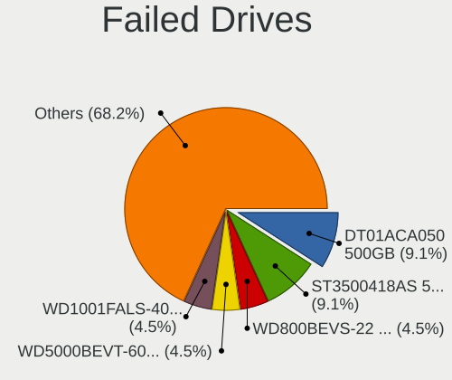

| Model                              | Computers | Drives | Percent |
|------------------------------------|-----------|--------|---------|
| Toshiba DT01ACA050 500GB           | 2         | 2      | 9.09%   |
| Seagate ST3500418AS 500GB          | 2         | 2      | 9.09%   |
| WDC WD800BEVS-22 80GB              | 1         | 1      | 4.55%   |
| WDC WD5000BEVT-60ZAT1 500GB        | 1         | 1      | 4.55%   |
| WDC WD1001FALS-40K1B0 1TB          | 1         | 1      | 4.55%   |
| Toshiba MQ04ABF100 1TB             | 1         | 1      | 4.55%   |
| Toshiba MK7575GSX 752GB            | 1         | 1      | 4.55%   |
| Toshiba DT01ACA200 2TB             | 1         | 1      | 4.55%   |
| Seagate ST500LT012-1DG142 500GB    | 1         | 1      | 4.55%   |
| Seagate ST3500830AS 500GB          | 1         | 1      | 4.55%   |
| Seagate ST31000528AS 1TB           | 1         | 1      | 4.55%   |
| Seagate ST31000520AS 1TB           | 1         | 1      | 4.55%   |
| Seagate ST31000333AS 1TB           | 1         | 1      | 4.55%   |
| Seagate ST1000LM024 HN-M101MBB 1TB | 1         | 1      | 4.55%   |
| Samsung Electronics SSD 980 500GB  | 1         | 1      | 4.55%   |
| Samsung Electronics SSD 980 1TB    | 1         | 1      | 4.55%   |
| Samsung Electronics HD253GJ 250GB  | 1         | 1      | 4.55%   |
| Samsung Electronics HD103SJ 1TB    | 1         | 2      | 4.55%   |
| Hitachi HDS721010DLE630 1TB        | 1         | 1      | 4.55%   |
| HGST HTS725050A7E630 500GB         | 1         | 1      | 4.55%   |

Failed Drive Vendor
-------------------

Failed drive vendors

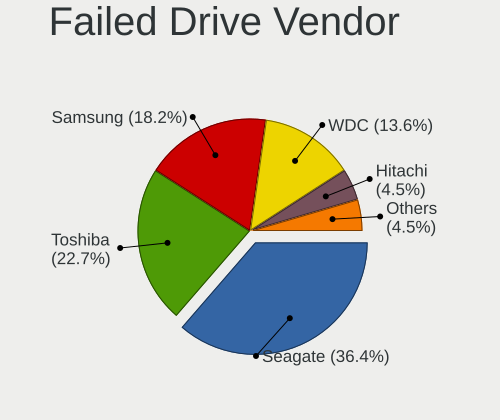

| Vendor              | Computers | Drives | Percent |
|---------------------|-----------|--------|---------|
| Seagate             | 8         | 8      | 36.36%  |
| Toshiba             | 5         | 5      | 22.73%  |
| Samsung Electronics | 4         | 5      | 18.18%  |
| WDC                 | 3         | 3      | 13.64%  |
| Hitachi             | 1         | 1      | 4.55%   |
| HGST                | 1         | 1      | 4.55%   |

Drive Status
------------

Number of failed and malfunc. drives

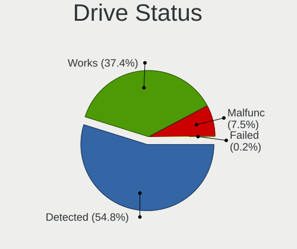

| Status   | Computers | Drives | Percent |
|----------|-----------|--------|---------|
| Detected | 5206      | 10714  | 54.83%  |
| Works    | 3551      | 6848   | 37.4%   |
| Malfunc  | 715       | 990    | 7.53%   |
| Failed   | 22        | 23     | 0.23%   |

Storage controller
------------------

Storage Vendor
--------------

Storage controller vendors

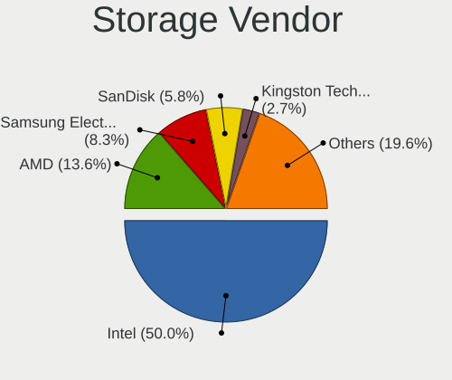

| Vendor                           | Computers | Percent |
|----------------------------------|-----------|---------|
| Intel                            | 5527      | 50%     |
| AMD                              | 1501      | 13.58%  |
| Samsung Electronics              | 912       | 8.25%   |
| SanDisk                          | 645       | 5.84%   |
| Kingston Technology Company      | 299       | 2.71%   |
| Micron Technology                | 279       | 2.52%   |
| SK hynix                         | 250       | 2.26%   |
| Phison Electronics               | 242       | 2.19%   |
| Micron/Crucial Technology        | 183       | 1.66%   |
| KIOXIA                           | 159       | 1.44%   |
| Nvidia                           | 145       | 1.31%   |
| ASMedia Technology               | 139       | 1.26%   |
| JMicron Technology               | 110       | 1%      |
| Toshiba America Info Systems     | 100       | 0.9%    |
| Marvell Technology Group         | 99        | 0.9%    |
| Silicon Motion                   | 82        | 0.74%   |
| MAXIO Technology (Hangzhou)      | 64        | 0.58%   |
| VIA Technologies                 | 38        | 0.34%   |
| Silicon Integrated Systems [SiS] | 27        | 0.24%   |
| Union Memory (Shenzhen)          | 24        | 0.22%   |
| Shenzhen Longsys Electronics     | 23        | 0.21%   |
| Realtek Semiconductor            | 21        | 0.19%   |
| Apple                            | 21        | 0.19%   |
| LSI Logic / Symbios Logic        | 18        | 0.16%   |
| ADATA Technology                 | 18        | 0.16%   |
| Solidigm                         | 17        | 0.15%   |
| Hewlett-Packard                  | 12        | 0.11%   |
| Seagate Technology               | 10        | 0.09%   |
| Broadcom / LSI                   | 10        | 0.09%   |
| HighPoint Technologies           | 8         | 0.07%   |
| Solid State Storage Technology   | 7         | 0.06%   |
| INNOGRIT                         | 7         | 0.06%   |
| Silicon Image                    | 6         | 0.05%   |
| O2 Micro                         | 6         | 0.05%   |
| Lite-On Technology               | 5         | 0.05%   |
| Adaptec                          | 5         | 0.05%   |
| Yangtze Memory Technologies      | 4         | 0.04%   |
| Netac Technology                 | 4         | 0.04%   |
| Lenovo                           | 4         | 0.04%   |
| Biwin Storage Technology         | 4         | 0.04%   |

Storage Model
-------------

Storage controller models

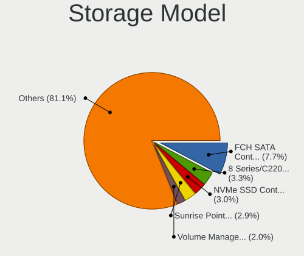

| Model                                                                          | Computers | Percent |
|--------------------------------------------------------------------------------|-----------|---------|
| AMD FCH SATA Controller [AHCI mode]                                            | 976       | 7.7%    |
| Intel 8 Series/C220 Series Chipset Family 6-port SATA Controller 1 [AHCI mode] | 421       | 3.32%   |
| Samsung NVMe SSD Controller SM981/PM981/PM983                                  | 381       | 3.01%   |
| Intel Sunrise Point-LP SATA Controller [AHCI mode]                             | 368       | 2.9%    |
| Intel Volume Management Device NVMe RAID Controller                            | 248       | 1.96%   |
| Intel 7 Series Chipset Family 6-port SATA Controller [AHCI mode]               | 242       | 1.91%   |
| Intel 82801 Mobile SATA Controller [RAID mode]                                 | 237       | 1.87%   |
| AMD 400 Series Chipset SATA Controller                                         | 224       | 1.77%   |
| Intel 6 Series/C200 Series Chipset Family 6 port Mobile SATA AHCI Controller   | 205       | 1.62%   |
| Intel 82801IBM/IEM (ICH9M/ICH9M-E) 4 port SATA Controller [AHCI mode]          | 200       | 1.58%   |
| Intel Q170/Q150/B150/H170/H110/Z170/CM236 Chipset SATA Controller [AHCI Mode]  | 193       | 1.52%   |
| Intel 8 Series SATA Controller 1 [AHCI mode]                                   | 191       | 1.51%   |
| Samsung NVMe SSD Controller 980 (DRAM-less)                                    | 187       | 1.48%   |
| Intel Celeron/Pentium Silver Processor SATA Controller                         | 162       | 1.28%   |
| Intel 200 Series PCH SATA controller [AHCI mode]                               | 162       | 1.28%   |
| Intel NM10/ICH7 Family SATA Controller [IDE mode]                              | 152       | 1.2%    |
| Intel 82801G (ICH7 Family) IDE Controller                                      | 152       | 1.2%    |
| AMD 500 Series Chipset SATA Controller                                         | 146       | 1.15%   |
| Samsung NVMe SSD Controller PM9A1/PM9A3/980PRO                                 | 142       | 1.12%   |
| Intel 6 Series/C200 Series Chipset Family 6 port Desktop SATA AHCI Controller  | 141       | 1.11%   |
| Intel Wildcat Point-LP SATA Controller [AHCI Mode]                             | 138       | 1.09%   |
| Intel Cannon Lake Mobile PCH SATA AHCI Controller                              | 135       | 1.07%   |
| Intel 5 Series/3400 Series Chipset 4 port SATA AHCI Controller                 | 133       | 1.05%   |
| ASMedia ASM1061/ASM1062 Serial ATA Controller                                  | 125       | 0.99%   |
| Intel 82801HM/HEM (ICH8M/ICH8M-E) IDE Controller                               | 122       | 0.96%   |
| AMD SB7x0/SB8x0/SB9x0 SATA Controller [AHCI mode]                              | 122       | 0.96%   |
| SanDisk Ultra 3D / WD PC SN530, IX SN530, Blue SN550 NVMe SSD (DRAM-less)      | 119       | 0.94%   |
| SanDisk Extreme Pro / WD Black SN750 / PC SN730 / Red SN700 NVMe SSD           | 118       | 0.93%   |
| Intel SATA Controller [RAID mode]                                              | 111       | 0.88%   |
| Micron/Crucial P2 [Nick P2] / P3 / P3 Plus NVMe PCIe SSD (DRAM-less)           | 109       | 0.86%   |
| Intel Cannon Lake PCH SATA AHCI Controller                                     | 109       | 0.86%   |
| AMD SB7x0/SB8x0/SB9x0 IDE Controller                                           | 108       | 0.85%   |
| Intel 7 Series/C210 Series Chipset Family 6-port SATA Controller [AHCI mode]   | 106       | 0.84%   |
| SanDisk WD SN560/SN740/SN770/SN5000 NVMe SSD                                   | 104       | 0.82%   |
| Intel HM170/QM170 Chipset SATA Controller [AHCI Mode]                          | 104       | 0.82%   |
| Intel Comet Lake SATA AHCI Controller                                          | 103       | 0.81%   |
| Intel 82801HM/HEM (ICH8M/ICH8M-E) SATA Controller [AHCI mode]                  | 100       | 0.79%   |
| Intel SSD 660P Series                                                          | 96        | 0.76%   |
| Intel 5 Series/3400 Series Chipset 6 port SATA AHCI Controller                 | 88        | 0.69%   |
| Intel SSD 670p Series [Keystone Harbor]                                        | 83        | 0.65%   |

Storage Kind
------------

Kind of storage controller (IDE, SATA, NVMe, SAS, ...)

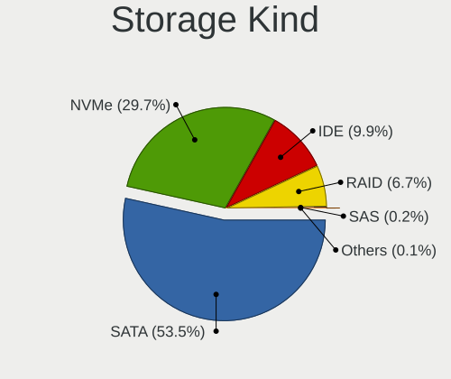

| Kind | Computers | Percent |
|------|-----------|---------|
| SATA | 5947      | 53.46%  |
| NVMe | 3299      | 29.66%  |
| IDE  | 1106      | 9.94%   |
| RAID | 740       | 6.65%   |
| SAS  | 18        | 0.16%   |
| SCSI | 14        | 0.13%   |

Processor
---------

CPU Vendor
----------

Processor vendors

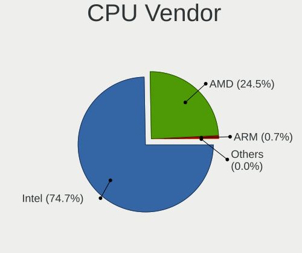

| Vendor       | Computers | Percent |
|--------------|-----------|---------|
| Intel        | 6449      | 74.71%  |
| AMD          | 2112      | 24.47%  |
| ARM          | 62        | 0.72%   |
| Qualcomm     | 6         | 0.07%   |
| Unknown      | 2         | 0.02%   |
| CentaurHauls | 1         | 0.01%   |

CPU Model
---------

Processor models

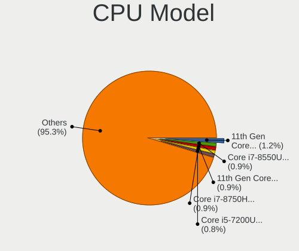

| Model                                         | Computers | Percent |
|-----------------------------------------------|-----------|---------|
| Intel 11th Gen Core i5-1135G7 @ 2.40GHz       | 100       | 1.16%   |
| Intel Core i7-8550U CPU @ 1.80GHz             | 80        | 0.92%   |
| Intel 11th Gen Core i7-1165G7 @ 2.80GHz       | 77        | 0.89%   |
| Intel Core i7-8750H CPU @ 2.20GHz             | 76        | 0.88%   |
| Intel Core i5-7200U CPU @ 2.50GHz             | 70        | 0.81%   |
| Intel Core i7-10510U CPU @ 1.80GHz            | 68        | 0.79%   |
| AMD Ryzen 7 5800H with Radeon Graphics        | 63        | 0.73%   |
| Intel Core i7-9750H CPU @ 2.60GHz             | 62        | 0.72%   |
| Intel Core i5-8250U CPU @ 1.60GHz             | 62        | 0.72%   |
| AMD Ryzen 7 4800H with Radeon Graphics        | 60        | 0.69%   |
| Intel Core i5-10210U CPU @ 1.60GHz            | 59        | 0.68%   |
| AMD Ryzen 5 3500U with Radeon Vega Mobile Gfx | 58        | 0.67%   |
| AMD Ryzen 7 5700U with Radeon Graphics        | 57        | 0.66%   |
| AMD Ryzen 5 3600 6-Core Processor             | 56        | 0.65%   |
| Intel Core i5-6200U CPU @ 2.30GHz             | 55        | 0.64%   |
| Intel Atom x5-Z8350 CPU @ 1.44GHz             | 54        | 0.62%   |
| Intel Core i7-6700HQ CPU @ 2.60GHz            | 52        | 0.6%    |
| ARM Processor                                 | 49        | 0.57%   |
| Intel Core i7-7700HQ CPU @ 2.80GHz            | 47        | 0.54%   |
| Intel Core i5-4460 CPU @ 3.20GHz              | 47        | 0.54%   |
| AMD Custom APU 0405                           | 45        | 0.52%   |
| Intel Core i7-8565U CPU @ 1.80GHz             | 44        | 0.51%   |
| Intel Core i7-10750H CPU @ 2.60GHz            | 43        | 0.5%    |
| Intel Core i5-1035G1 CPU @ 1.00GHz            | 42        | 0.49%   |
| Intel Celeron N4000 CPU @ 1.10GHz             | 42        | 0.49%   |
| AMD Ryzen 7 3700X 8-Core Processor            | 40        | 0.46%   |
| Intel Core i7-7500U CPU @ 2.70GHz             | 39        | 0.45%   |
| Intel Core i5-5200U CPU @ 2.20GHz             | 39        | 0.45%   |
| Intel 12th Gen Core i7-12700H                 | 39        | 0.45%   |
| Intel Celeron CPU N3350 @ 1.10GHz             | 37        | 0.43%   |
| AMD Ryzen 5 5500U with Radeon Graphics        | 37        | 0.43%   |
| Intel Celeron CPU N2840 @ 2.16GHz             | 36        | 0.42%   |
| Intel Core i7-4790 CPU @ 3.60GHz              | 35        | 0.4%    |
| Intel Core 2 Quad CPU Q6600 @ 2.40GHz         | 35        | 0.4%    |
| Intel 11th Gen Core i7-1185G7 @ 3.00GHz       | 35        | 0.4%    |
| Intel Core i7-5500U CPU @ 2.40GHz             | 34        | 0.39%   |
| Intel Core i7-4510U CPU @ 2.00GHz             | 34        | 0.39%   |
| Intel Core i7-3770 CPU @ 3.40GHz              | 34        | 0.39%   |
| Intel Celeron N4020 CPU @ 1.10GHz             | 34        | 0.39%   |
| AMD Ryzen 7 5800X 8-Core Processor            | 34        | 0.39%   |

CPU Model Family
----------------

Processor model prefix

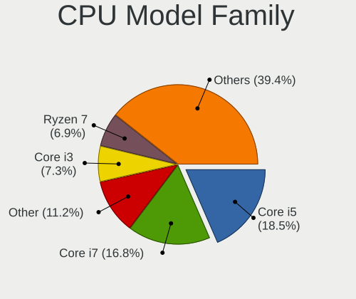

| Model                   | Computers | Percent |
|-------------------------|-----------|---------|
| Intel Core i5           | 1598      | 18.47%  |
| Intel Core i7           | 1456      | 16.83%  |
| Other                   | 968       | 11.19%  |
| Intel Core i3           | 630       | 7.28%   |
| AMD Ryzen 7             | 594       | 6.87%   |
| AMD Ryzen 5             | 527       | 6.09%   |
| Intel Celeron           | 478       | 5.53%   |
| Intel Core 2 Duo        | 356       | 4.12%   |
| Intel Atom              | 192       | 2.22%   |
| Intel Xeon              | 180       | 2.08%   |
| AMD Ryzen 9             | 151       | 1.75%   |
| Intel Pentium           | 138       | 1.6%    |
| Intel Pentium Dual-Core | 117       | 1.35%   |
| Intel Core 2 Quad       | 99        | 1.14%   |
| AMD FX                  | 83        | 0.96%   |
| AMD Ryzen 3             | 71        | 0.82%   |
| Intel Pentium Dual      | 68        | 0.79%   |
| Intel Core 2            | 67        | 0.77%   |
| Intel Core              | 60        | 0.69%   |
| AMD A4                  | 60        | 0.69%   |
| Intel Core i9           | 53        | 0.61%   |
| AMD A6                  | 53        | 0.61%   |
| AMD A10                 | 51        | 0.59%   |
| AMD A8                  | 47        | 0.54%   |
| Intel Genuine           | 42        | 0.49%   |
| AMD E1                  | 39        | 0.45%   |
| AMD Athlon 64 X2        | 33        | 0.38%   |
| AMD Ryzen 7 PRO         | 28        | 0.32%   |
| Intel Pentium 4         | 26        | 0.3%    |
| AMD Ryzen Threadripper  | 25        | 0.29%   |
| AMD Athlon II X2        | 25        | 0.29%   |
| AMD Athlon              | 25        | 0.29%   |
| AMD Phenom II X4        | 19        | 0.22%   |
| AMD E                   | 18        | 0.21%   |
| Intel Pentium Silver    | 17        | 0.2%    |
| AMD Ryzen 5 PRO         | 17        | 0.2%    |
| Intel Core m3           | 16        | 0.18%   |
| AMD Phenom              | 13        | 0.15%   |
| Intel Pentium Gold      | 12        | 0.14%   |
| AMD Phenom II X6        | 11        | 0.13%   |

CPU Cores
---------

Number of processor cores

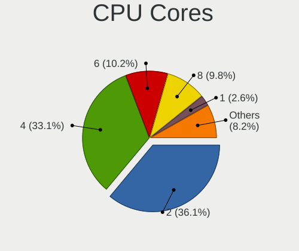

| Number  | Computers | Percent |
|---------|-----------|---------|
| 2       | 3125      | 36.07%  |
| 4       | 2871      | 33.14%  |
| 6       | 884       | 10.2%   |
| 8       | 853       | 9.85%   |
| 1       | 222       | 2.56%   |
| 12      | 188       | 2.17%   |
| 10      | 172       | 1.99%   |
| 14      | 122       | 1.41%   |
| 16      | 102       | 1.18%   |
| Unknown | 29        | 0.33%   |
| 3       | 27        | 0.31%   |
| 24      | 26        | 0.3%    |
| 20      | 18        | 0.21%   |
| 64      | 15        | 0.17%   |
| 32      | 3         | 0.03%   |
| 40      | 2         | 0.02%   |
| 48      | 1         | 0.01%   |
| 36      | 1         | 0.01%   |
| 28      | 1         | 0.01%   |
| 18      | 1         | 0.01%   |
| 5       | 1         | 0.01%   |

CPU Sockets
-----------

Number of sockets

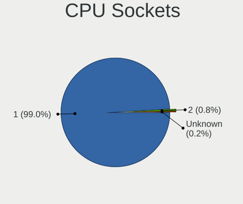

| Number  | Computers | Percent |
|---------|-----------|---------|
| 1       | 8550      | 99.03%  |
| 2       | 65        | 0.75%   |
| Unknown | 19        | 0.22%   |

CPU Threads
-----------

Threads per core (Hyper-Threading)

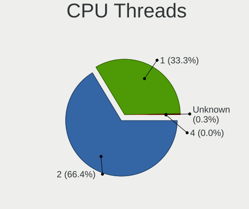

| Number  | Computers | Percent |
|---------|-----------|---------|
| 2       | 5751      | 66.36%  |
| 1       | 2884      | 33.28%  |
| Unknown | 29        | 0.33%   |
| 12      | 1         | 0.01%   |
| 4       | 1         | 0.01%   |

CPU Op-Modes
------------

CPU Operation Modes (32-bit, 64-bit)

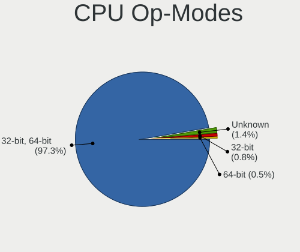

| Op mode        | Computers | Percent |
|----------------|-----------|---------|
| 32-bit, 64-bit | 8427      | 97.3%   |
| Unknown        | 122       | 1.41%   |
| 32-bit         | 72        | 0.83%   |
| 64-bit         | 40        | 0.46%   |

CPU Microcode
-------------

Microcode number

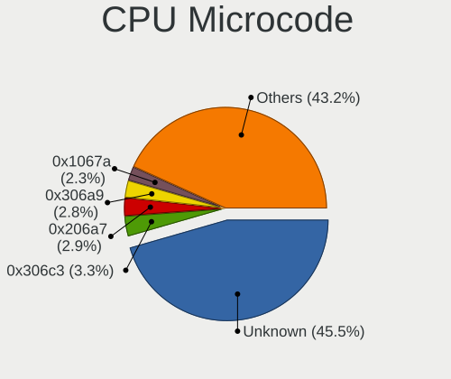

| Number     | Computers | Percent |
|------------|-----------|---------|
| Unknown    | 4121      | 45.55%  |
| 0x306c3    | 295       | 3.26%   |
| 0x206a7    | 265       | 2.93%   |
| 0x306a9    | 249       | 2.75%   |
| 0x1067a    | 206       | 2.28%   |
| 0x906ea    | 160       | 1.77%   |
| 0x806ea    | 140       | 1.55%   |
| 0x806c1    | 134       | 1.48%   |
| 0x506e3    | 127       | 1.4%    |
| 0x6fd      | 118       | 1.3%    |
| 0x806ec    | 116       | 1.28%   |
| 0x40651    | 113       | 1.25%   |
| 0x806e9    | 109       | 1.2%    |
| 0x406e3    | 108       | 1.19%   |
| 0x20655    | 106       | 1.17%   |
| 0x08108109 | 99        | 1.09%   |
| 0x906e9    | 91        | 1.01%   |
| 0x306d4    | 88        | 0.97%   |
| 0x0a50000c | 72        | 0.8%    |
| 0x10676    | 66        | 0.73%   |
| 0x30678    | 65        | 0.72%   |
| 0x6fb      | 64        | 0.71%   |
| 0x08701021 | 62        | 0.69%   |
| 0x20652    | 58        | 0.64%   |
| 0x0800820d | 58        | 0.64%   |
| 0x706a1    | 53        | 0.59%   |
| 0x08600106 | 51        | 0.56%   |
| 0x506c9    | 50        | 0.55%   |
| 0x706e5    | 49        | 0.54%   |
| 0x406c4    | 49        | 0.54%   |
| 0x06006705 | 48        | 0.53%   |
| 0xa0652    | 45        | 0.5%    |
| 0x706a8    | 45        | 0.5%    |
| 0x6f6      | 42        | 0.46%   |
| 0x0a50000d | 41        | 0.45%   |
| 0x06000852 | 40        | 0.44%   |
| 0x106ca    | 39        | 0.43%   |
| 0x906a3    | 38        | 0.42%   |
| 0x08108102 | 36        | 0.4%    |
| 0x06001119 | 36        | 0.4%    |

CPU Microarch
-------------

Microarchitecture

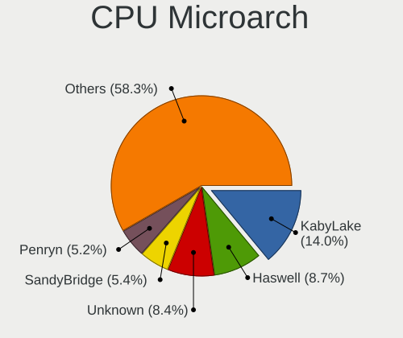

| Name              | Computers | Percent |
|-------------------|-----------|---------|
| KabyLake          | 1214      | 14.01%  |
| Haswell           | 756       | 8.72%   |
| Unknown           | 724       | 8.35%   |
| SandyBridge       | 468       | 5.4%    |
| Penryn            | 452       | 5.22%   |
| IvyBridge         | 431       | 4.97%   |
| Skylake           | 412       | 4.75%   |
| Zen 3             | 358       | 4.13%   |
| Core              | 342       | 3.95%   |
| Zen 2             | 323       | 3.73%   |
| Zen+              | 286       | 3.3%    |
| TigerLake         | 277       | 3.2%    |
| Alderlake Hybrid  | 275       | 3.17%   |
| Westmere          | 263       | 3.03%   |
| Silvermont        | 247       | 2.85%   |
| Broadwell         | 210       | 2.42%   |
| CometLake         | 181       | 2.09%   |
| Goldmont plus     | 166       | 1.92%   |
| Icelake           | 155       | 1.79%   |
| Zen               | 137       | 1.58%   |
| Piledriver        | 124       | 1.43%   |
| K10               | 111       | 1.28%   |
| Excavator         | 103       | 1.19%   |
| Bonnell           | 89        | 1.03%   |
| Goldmont          | 71        | 0.82%   |
| K8 Hammer         | 70        | 0.81%   |
| Nehalem           | 67        | 0.77%   |
| Puma              | 49        | 0.57%   |
| Steamroller       | 40        | 0.46%   |
| Jaguar            | 40        | 0.46%   |
| NetBurst          | 39        | 0.45%   |
| Bobcat            | 34        | 0.39%   |
| P6                | 33        | 0.38%   |
| Tremont           | 26        | 0.3%    |
| Meteorlake Hybrid | 26        | 0.3%    |
| Gracemont         | 23        | 0.27%   |
| K10 Llano         | 15        | 0.17%   |
| Lunarlake Hybrid  | 11        | 0.13%   |
| Bulldozer         | 11        | 0.13%   |
| K8 & K10 hybrid   | 4         | 0.05%   |

Graphics
--------

GPU Vendor
----------

Vendors of graphics cards

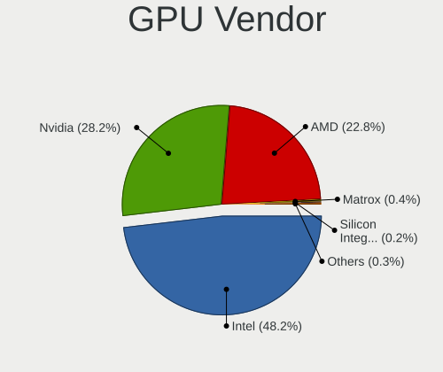

| Vendor                                       | Computers | Percent |
|----------------------------------------------|-----------|---------|
| Intel                                        | 4907      | 48.15%  |
| Nvidia                                       | 2870      | 28.16%  |
| AMD                                          | 2326      | 22.82%  |
| Matrox Electronics Systems                   | 37        | 0.36%   |
| Silicon Integrated Systems [SiS]             | 18        | 0.18%   |
| ASPEED Technology                            | 17        | 0.17%   |
| VIA Technologies                             | 13        | 0.13%   |
| XGI Technology (eXtreme Graphics Innovation) | 1         | 0.01%   |
| Silicon Motion                               | 1         | 0.01%   |
| ATI Technologies                             | 1         | 0.01%   |

GPU Model
---------

Graphics card models

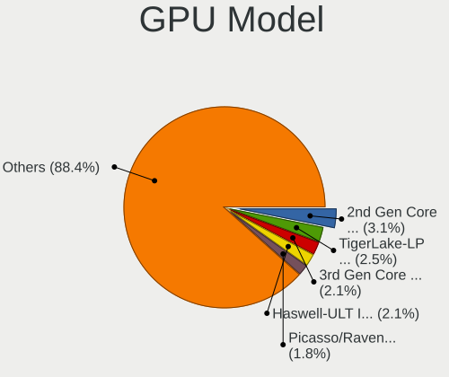

| Model                                                                                    | Computers | Percent |
|------------------------------------------------------------------------------------------|-----------|---------|
| Intel 2nd Generation Core Processor Family Integrated Graphics Controller                | 331       | 3.15%   |
| Intel TigerLake-LP GT2 [Iris Xe Graphics]                                                | 261       | 2.48%   |
| Intel 3rd Gen Core processor Graphics Controller                                         | 223       | 2.12%   |
| Intel Haswell-ULT Integrated Graphics Controller                                         | 216       | 2.05%   |
| AMD Picasso/Raven 2 [Radeon Vega Series / Radeon Vega Mobile Series]                     | 186       | 1.77%   |
| Intel Kaby Lake-R GT2 [UHD Graphics 620]                                                 | 181       | 1.72%   |
| Intel Xeon E3-1200 v3/4th Gen Core Processor Integrated Graphics Controller              | 170       | 1.62%   |
| Intel CoffeeLake-H GT2 [UHD Graphics 630]                                                | 166       | 1.58%   |
| AMD Ellesmere [Radeon RX 470/480/570/570X/580/580X/590]                                  | 163       | 1.55%   |
| Intel Kaby Lake-U GT2 [HD Graphics 620]                                                  | 159       | 1.51%   |
| Intel GeminiLake [UHD Graphics 600]                                                      | 150       | 1.43%   |
| Intel Core Processor Integrated Graphics Controller                                      | 149       | 1.42%   |
| Intel CometLake-U GT2 [UHD Graphics]                                                     | 149       | 1.42%   |
| AMD Cezanne [Radeon Vega Series / Radeon Vega Mobile Series]                             | 146       | 1.39%   |
| Intel Skylake-U GT2 [HD Graphics 520]                                                    | 143       | 1.36%   |
| AMD Renoir [Radeon Vega Series / Radeon Vega Mobile Series]                              | 139       | 1.32%   |
| Intel Atom/Celeron/Pentium Processor x5-E8000/J3xxx/N3xxx Integrated Graphics Controller | 137       | 1.3%    |
| Intel Broadwell-U GT2 [HD Graphics 5500]                                                 | 136       | 1.29%   |
| Intel Mobile 4 Series Chipset Integrated Graphics Controller                             | 134       | 1.27%   |
| Nvidia GK208B [GeForce GT 710]                                                           | 119       | 1.13%   |
| Intel 4th Gen Core Processor Integrated Graphics Controller                              | 116       | 1.1%    |
| Nvidia TU117M [GeForce GTX 1650 Mobile / Max-Q]                                          | 115       | 1.09%   |
| Intel Atom Processor Z36xxx/Z37xxx Series Graphics & Display                             | 109       | 1.04%   |
| AMD Lucienne                                                                             | 98        | 0.93%   |
| Intel WhiskeyLake-U GT2 [UHD Graphics 620]                                               | 95        | 0.9%    |
| Nvidia GT218 [GeForce 210]                                                               | 88        | 0.84%   |
| Nvidia GP107 [GeForce GTX 1050 Ti]                                                       | 88        | 0.84%   |
| Nvidia GP107M [GeForce GTX 1050 Mobile]                                                  | 85        | 0.81%   |
| Intel Alder Lake-P GT2 [Iris Xe Graphics]                                                | 85        | 0.81%   |
| Intel Raptor Lake-P [Iris Xe Graphics]                                                   | 82        | 0.78%   |
| Intel CoffeeLake-S GT2 [UHD Graphics 630]                                                | 79        | 0.75%   |
| AMD Stoney [Radeon R2/R3/R4/R5 Graphics]                                                 | 78        | 0.74%   |
| Intel Skylake-S GT2 [HD Graphics 530]                                                    | 76        | 0.72%   |
| AMD Rembrandt [Radeon 680M]                                                              | 74        | 0.7%    |
| Intel CometLake-H GT2 [UHD Graphics]                                                     | 71        | 0.68%   |
| Nvidia GF117M [GeForce 610M/710M/810M/820M / GT 620M/625M/630M/720M]                     | 70        | 0.67%   |
| Intel Mobile GM965/GL960 Integrated Graphics Controller (secondary)                      | 66        | 0.63%   |
| Intel Mobile GM965/GL960 Integrated Graphics Controller (primary)                        | 66        | 0.63%   |
| Intel Xeon E3-1200 v2/3rd Gen Core processor Graphics Controller                         | 65        | 0.62%   |
| Intel Apollo Lake GT1 [HD Graphics 500]                                                  | 65        | 0.62%   |

GPU Combo
---------

Combinations of graphics cards

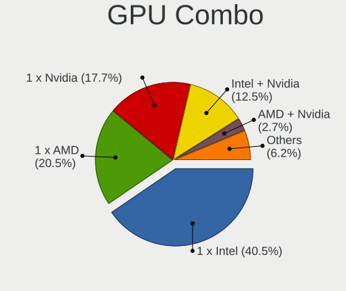

| Name                   | Computers | Percent |
|------------------------|-----------|---------|
| 1 x Intel              | 3526      | 40.48%  |
| 1 x AMD                | 1783      | 20.47%  |
| 1 x Nvidia             | 1539      | 17.67%  |
| Intel + Nvidia         | 1085      | 12.46%  |
| AMD + Nvidia           | 234       | 2.69%   |
| Intel + AMD            | 175       | 2.01%   |
| 2 x AMD                | 141       | 1.62%   |
| Other                  | 77        | 0.88%   |
| 2 x Intel              | 39        | 0.45%   |
| 1 x Matrox             | 33        | 0.38%   |
| 2 x Nvidia             | 19        | 0.22%   |
| 1 x SiS                | 18        | 0.21%   |
| 1 x VIA                | 13        | 0.15%   |
| 1 x ASPEED             | 12        | 0.14%   |
| Nvidia + ASPEED        | 5         | 0.06%   |
| Nvidia + Matrox        | 4         | 0.05%   |
| 3 x AMD                | 3         | 0.03%   |
| 2 x Intel + 1 x Nvidia | 1         | 0.01%   |
| 1 x XGI                | 1         | 0.01%   |
| 1 x Silicon Motion     | 1         | 0.01%   |
| 1 x Intel + 3 x Nvidia | 1         | 0.01%   |
| Intel + 2 x AMD        | 1         | 0.01%   |

GPU Driver
----------

Free vs proprietary

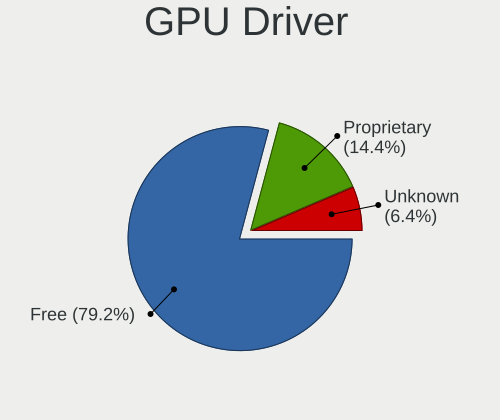

| Driver      | Computers | Percent |
|-------------|-----------|---------|
| Free        | 6953      | 79.16%  |
| Proprietary | 1265      | 14.4%   |
| Unknown     | 566       | 6.44%   |

GPU Memory
----------

Total video memory

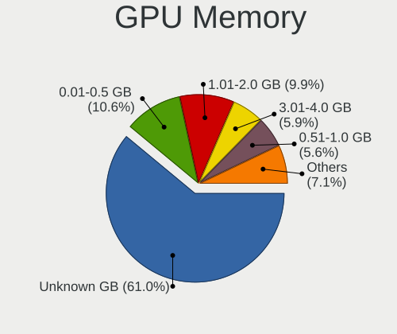

| Size in GB | Computers | Percent |
|------------|-----------|---------|
| Unknown    | 5455      | 61%     |
| 0.01-0.5   | 947       | 10.59%  |
| 1.01-2.0   | 887       | 9.92%   |
| 3.01-4.0   | 524       | 5.86%   |
| 0.51-1.0   | 497       | 5.56%   |
| 7.01-8.0   | 318       | 3.56%   |
| 5.01-6.0   | 146       | 1.63%   |
| 8.01-16.0  | 104       | 1.16%   |
| 2.01-3.0   | 41        | 0.46%   |
| 16.01-24.0 | 21        | 0.23%   |
| 32.01-64.0 | 1         | 0.01%   |
| 4.01-5.0   | 1         | 0.01%   |

Monitor
-------

Monitor Vendor
--------------

Monitor vendors

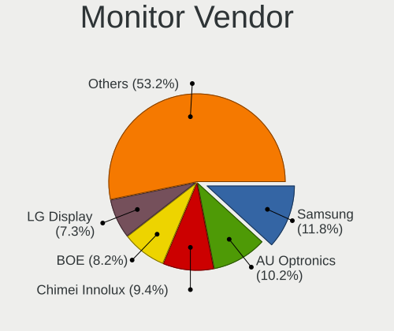

| Vendor                  | Computers | Percent |
|-------------------------|-----------|---------|
| Samsung Electronics     | 1110      | 11.77%  |
| AU Optronics            | 958       | 10.16%  |
| Chimei Innolux          | 883       | 9.36%   |
| BOE                     | 774       | 8.21%   |
| LG Display              | 688       | 7.29%   |
| Goldstar                | 651       | 6.9%    |
| Hewlett-Packard         | 461       | 4.89%   |
| BenQ                    | 380       | 4.03%   |
| Dell                    | 339       | 3.59%   |
| Acer                    | 299       | 3.17%   |
| Philips                 | 250       | 2.65%   |
| AOC                     | 221       | 2.34%   |
| Ancor Communications    | 215       | 2.28%   |
| Apple                   | 211       | 2.24%   |
| Lenovo                  | 162       | 1.72%   |
| Chi Mei Optoelectronics | 146       | 1.55%   |
| Sharp                   | 136       | 1.44%   |
| ASUSTek Computer        | 113       | 1.2%    |
| PANDA                   | 109       | 1.16%   |
| Sony                    | 75        | 0.8%    |
| Unknown                 | 73        | 0.77%   |
| MSI                     | 73        | 0.77%   |
| LG Electronics          | 63        | 0.67%   |
| LG Philips              | 58        | 0.61%   |
| HannStar                | 58        | 0.61%   |
| InfoVision              | 50        | 0.53%   |
| ViewSonic               | 48        | 0.51%   |
| Valve                   | 42        | 0.45%   |
| CSO                     | 27        | 0.29%   |
| Vestel Elektronik       | 24        | 0.25%   |
| Mi                      | 23        | 0.24%   |
| HKC                     | 23        | 0.24%   |
| Gigabyte Technology     | 23        | 0.24%   |
| RTK                     | 21        | 0.22%   |
| Panasonic               | 21        | 0.22%   |
| CPT                     | 21        | 0.22%   |
| Toshiba                 | 19        | 0.2%    |
| OEM                     | 19        | 0.2%    |
| Eizo                    | 18        | 0.19%   |
| Fujitsu Siemens         | 17        | 0.18%   |

Monitor Model
-------------

Monitor models

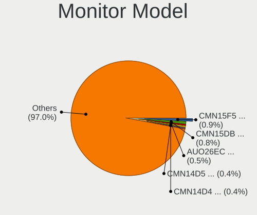

| Model                                                                    | Computers | Percent |
|--------------------------------------------------------------------------|-----------|---------|
| Chimei Innolux LCD Monitor CMN15F5 1920x1080 344x193mm 15.5-inch         | 84        | 0.86%   |
| Chimei Innolux LCD Monitor CMN15DB 1366x768 344x193mm 15.5-inch          | 79        | 0.81%   |
| AU Optronics LCD Monitor AUO26EC 1366x768 344x193mm 15.5-inch            | 44        | 0.45%   |
| Chimei Innolux LCD Monitor CMN14D5 1920x1080 309x173mm 13.9-inch         | 43        | 0.44%   |
| Chimei Innolux LCD Monitor CMN14D4 1920x1080 309x173mm 13.9-inch         | 43        | 0.44%   |
| BOE LCD Monitor BOE06A5 1366x768 344x194mm 15.5-inch                     | 39        | 0.4%    |
| Goldstar FULL HD GSM5B55 1920x1080 480x270mm 21.7-inch                   | 38        | 0.39%   |
| Valve ANX7530 U VLV3001 800x1280 100x150mm 7.1-inch                      | 33        | 0.34%   |
| AU Optronics LCD Monitor AUO21ED 1920x1080 344x193mm 15.5-inch           | 33        | 0.34%   |
| AU Optronics LCD Monitor AUO38ED 1920x1080 344x193mm 15.5-inch           | 30        | 0.31%   |
| AOC 24G2W1G3 AOC2402 1920x1080 527x296mm 23.8-inch                       | 29        | 0.3%    |
| Goldstar LG ULTRAWIDE GSM59F1 2560x1080 670x280mm 28.6-inch              | 28        | 0.29%   |
| Chimei Innolux LCD Monitor CMN15E7 1920x1080 344x193mm 15.5-inch         | 28        | 0.29%   |
| Chi Mei Optoelectronics LCD Monitor CMO15A7 1366x768 344x193mm 15.5-inch | 28        | 0.29%   |
| PANDA LCD Monitor NCP0035 1920x1080 344x194mm 15.5-inch                  | 27        | 0.28%   |
| Chimei Innolux LCD Monitor CMN15E8 1920x1080 344x193mm 15.5-inch         | 27        | 0.28%   |
| AU Optronics LCD Monitor AUO22EC 1366x768 344x193mm 15.5-inch            | 27        | 0.28%   |
| BOE LCD Monitor BOE0893 2160x1440 296x197mm 14.0-inch                    | 26        | 0.27%   |
| BOE LCD Monitor BOE06A4 1366x768 344x194mm 15.5-inch                     | 26        | 0.27%   |
| PANDA LCD Monitor NCP004D 1920x1080 344x194mm 15.5-inch                  | 25        | 0.26%   |
| Goldstar FULL HD GSM5ABB 1920x1080 480x270mm 21.7-inch                   | 25        | 0.26%   |
| AU Optronics LCD Monitor AUO70EC 1366x768 344x193mm 15.5-inch            | 25        | 0.26%   |
| Vestel Elektronik 40UHD_LCD_TV VES3700 3840x2160 880x500mm 39.8-inch     | 24        | 0.25%   |
| LG Display LCD Monitor LGD033A 1366x768 344x194mm 15.5-inch              | 24        | 0.25%   |
| Goldstar HDR 4K GSM7706 3840x2160 600x340mm 27.2-inch                    | 23        | 0.24%   |
| Chimei Innolux LCD Monitor CMN1735 1920x1080 381x214mm 17.2-inch         | 23        | 0.24%   |
| AU Optronics LCD Monitor AUO403D 1920x1080 309x174mm 14.0-inch           | 23        | 0.24%   |
| Ancor Communications VX239 ACI23E1 1920x1080 510x290mm 23.1-inch         | 23        | 0.24%   |
| LG Display LCD Monitor LGD02DC 1366x768 344x194mm 15.5-inch              | 22        | 0.23%   |
| Goldstar LG IPS FULLHD GSM5AB8 1920x1080 480x270mm 21.7-inch             | 22        | 0.23%   |
| AU Optronics LCD Monitor AUO71EC 1366x768 344x193mm 15.5-inch            | 22        | 0.23%   |
| AU Optronics LCD Monitor AUO45EC 1366x768 344x193mm 15.5-inch            | 22        | 0.23%   |
| Unknown LCD Monitor FFFF 2288x1287 2550x2550mm 142.0-inch                | 21        | 0.22%   |
| LG Display LCD Monitor LGD0456 1366x768 344x194mm 15.5-inch              | 21        | 0.22%   |
| AOC 27G2G4 AOC2702 1920x1080 598x336mm 27.0-inch                         | 21        | 0.22%   |
| Samsung Electronics S24D330 SAM0D92 1920x1080 531x299mm 24.0-inch        | 20        | 0.21%   |
| Philips PHL 243V7 PHLC155 1920x1080 527x296mm 23.8-inch                  | 20        | 0.21%   |
| Chimei Innolux LCD Monitor CMN15CA 1366x768 344x193mm 15.5-inch          | 20        | 0.21%   |
| Chimei Innolux LCD Monitor CMN1521 1920x1080 344x193mm 15.5-inch         | 20        | 0.21%   |
| BenQ GL2460 BNQ78CE 1920x1080 531x299mm 24.0-inch                        | 20        | 0.21%   |

Monitor Resolution
------------------

Monitor screen resolution

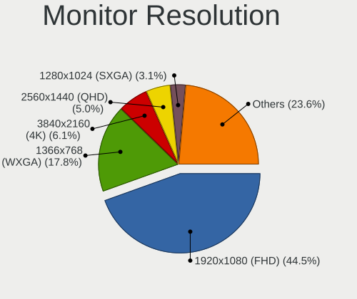

| Resolution         | Computers | Percent |
|--------------------|-----------|---------|
| 1920x1080 (FHD)    | 3987      | 44.51%  |
| 1366x768 (WXGA)    | 1593      | 17.78%  |
| 3840x2160 (4K)     | 546       | 6.1%    |
| 2560x1440 (QHD)    | 445       | 4.97%   |
| 1280x1024 (SXGA)   | 275       | 3.07%   |
| 1280x800 (WXGA)    | 238       | 2.66%   |
| 1920x1200 (WUXGA)  | 227       | 2.53%   |
| 1680x1050 (WSXGA+) | 210       | 2.34%   |
| 1440x900 (WXGA+)   | 204       | 2.28%   |
| 1600x900 (HD+)     | 193       | 2.15%   |
| 2560x1080          | 103       | 1.15%   |
| 2560x1600          | 96        | 1.07%   |
| Unknown            | 84        | 0.94%   |
| 3440x1440          | 80        | 0.89%   |
| 1360x768           | 79        | 0.88%   |
| 2880x1800          | 74        | 0.83%   |
| 2160x1440          | 56        | 0.63%   |
| 1024x600           | 52        | 0.58%   |
| 800x1280           | 48        | 0.54%   |
| 1024x768 (XGA)     | 36        | 0.4%    |
| 3840x1080          | 35        | 0.39%   |
| 1920x540           | 25        | 0.28%   |
| 2288x1287          | 22        | 0.25%   |
| 1600x1200          | 22        | 0.25%   |
| 3840x2400          | 19        | 0.21%   |
| 1920x1280          | 14        | 0.16%   |
| 3200x1800 (QHD+)   | 13        | 0.15%   |
| 2880x1920          | 11        | 0.12%   |
| 2736x1824          | 10        | 0.11%   |
| 2256x1504          | 8         | 0.09%   |
| 1280x768           | 8         | 0.09%   |
| 2240x1400          | 7         | 0.08%   |
| 1280x960           | 7         | 0.08%   |
| 3840x1600          | 6         | 0.07%   |
| 3456x2160          | 6         | 0.07%   |
| 3200x2000          | 6         | 0.07%   |
| 3200x1080          | 6         | 0.07%   |
| 3000x2120          | 5         | 0.06%   |
| 2880x1620          | 5         | 0.06%   |
| 2520x1680          | 5         | 0.06%   |

Monitor Diagonal
----------------

Diagonal size in inches

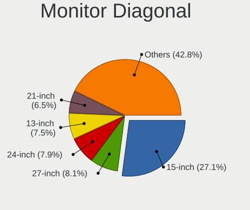

| Inches  | Computers | Percent |
|---------|-----------|---------|
| 15      | 2552      | 27.08%  |
| 27      | 767       | 8.14%   |
| 24      | 748       | 7.94%   |
| 13      | 709       | 7.52%   |
| 21      | 615       | 6.53%   |
| 14      | 551       | 5.85%   |
| 23      | 510       | 5.41%   |
| 17      | 418       | 4.44%   |
| Unknown | 396       | 4.2%    |
| 31      | 247       | 2.62%   |
| 19      | 233       | 2.47%   |
| 18      | 185       | 1.96%   |
| 16      | 182       | 1.93%   |
| 34      | 150       | 1.59%   |
| 12      | 135       | 1.43%   |
| 22      | 132       | 1.4%    |
| 20      | 118       | 1.25%   |
| 84      | 92        | 0.98%   |
| 11      | 89        | 0.94%   |
| 10      | 67        | 0.71%   |
| 32      | 49        | 0.52%   |
| 54      | 48        | 0.51%   |
| 7       | 43        | 0.46%   |
| 72      | 41        | 0.44%   |
| 25      | 37        | 0.39%   |
| 26      | 36        | 0.38%   |
| 63      | 26        | 0.28%   |
| 40      | 26        | 0.28%   |
| 142     | 21        | 0.22%   |
| 46      | 20        | 0.21%   |
| 28      | 19        | 0.2%    |
| 48      | 16        | 0.17%   |
| 52      | 15        | 0.16%   |
| 65      | 14        | 0.15%   |
| 43      | 9         | 0.1%    |
| 42      | 8         | 0.08%   |
| 36      | 8         | 0.08%   |
| 33      | 8         | 0.08%   |
| 3       | 8         | 0.08%   |
| 60      | 7         | 0.07%   |

Monitor Width
-------------

Physical width

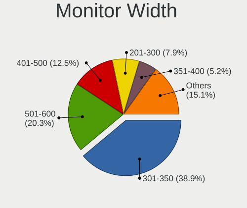

| Width in mm    | Computers | Percent |
|----------------|-----------|---------|
| 301-350        | 3597      | 38.94%  |
| 501-600        | 1872      | 20.27%  |
| 401-500        | 1155      | 12.5%   |
| 201-300        | 733       | 7.94%   |
| 351-400        | 484       | 5.24%   |
| Unknown        | 396       | 4.29%   |
| 601-700        | 336       | 3.64%   |
| 701-800        | 214       | 2.32%   |
| 1001-1500      | 163       | 1.76%   |
| 1501-2000      | 143       | 1.55%   |
| 1-100          | 50        | 0.54%   |
| 801-900        | 45        | 0.49%   |
| More than 2000 | 21        | 0.23%   |
| 901-1000       | 20        | 0.22%   |
| 101-200        | 8         | 0.09%   |

Aspect Ratio
------------

Proportional relationship between the width and the height

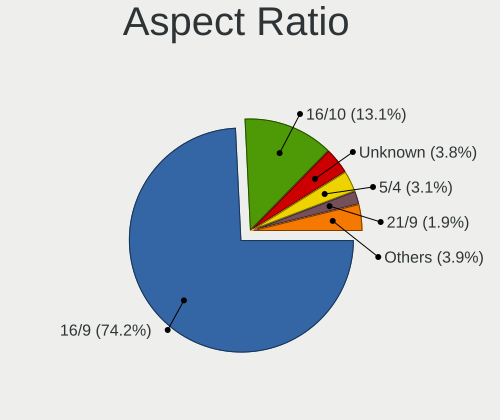

| Ratio   | Computers | Percent |
|---------|-----------|---------|
| 16/9    | 6266      | 74.22%  |
| 16/10   | 1107      | 13.11%  |
| Unknown | 321       | 3.8%    |
| 5/4     | 260       | 3.08%   |
| 21/9    | 162       | 1.92%   |
| 3/2     | 129       | 1.53%   |
| 4/3     | 85        | 1.01%   |
| 0.67    | 33        | 0.39%   |
| 1.00    | 21        | 0.25%   |
| 32/9    | 17        | 0.2%    |
| 6/5     | 15        | 0.18%   |
| 0.62    | 10        | 0.12%   |
| 0.45    | 5         | 0.06%   |
| 0.89    | 2         | 0.02%   |
| 0.56    | 2         | 0.02%   |
| 3.73    | 1         | 0.01%   |
| 3.40    | 1         | 0.01%   |
| 2.69    | 1         | 0.01%   |
| 2.00    | 1         | 0.01%   |
| 1.03    | 1         | 0.01%   |
| 0.65    | 1         | 0.01%   |
| 0.58    | 1         | 0.01%   |

Monitor Area
------------

Area in inch²

| Area in inch² | Computers | Percent |
|----------------|-----------|---------|
| 101-110        | 2581      | 27.62%  |
| 201-250        | 1624      | 17.38%  |
| 81-90          | 923       | 9.88%   |
| 301-350        | 789       | 8.44%   |
| 151-200        | 504       | 5.39%   |
| 351-500        | 466       | 4.99%   |
| Unknown        | 396       | 4.24%   |
| 71-80          | 332       | 3.55%   |
| 141-150        | 312       | 3.34%   |
| More than 1000 | 289       | 3.09%   |
| 251-300        | 243       | 2.6%    |
| 121-130        | 219       | 2.34%   |
| 111-120        | 142       | 1.52%   |
| 61-70          | 122       | 1.31%   |
| 501-1000       | 111       | 1.19%   |
| 51-60          | 94        | 1.01%   |
| 41-50          | 64        | 0.68%   |
| 1-40           | 58        | 0.62%   |
| 131-140        | 49        | 0.52%   |
| 91-100         | 26        | 0.28%   |

Pixel Density
-------------

Pixels per inch

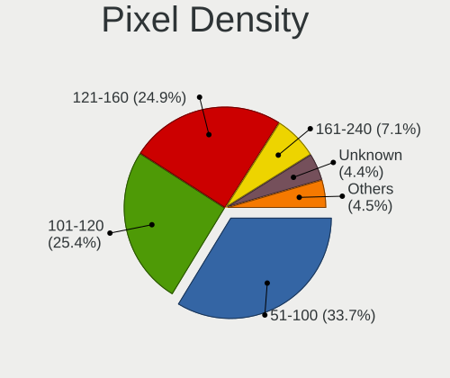

| Density       | Computers | Percent |
|---------------|-----------|---------|
| 51-100        | 3052      | 33.71%  |
| 101-120       | 2299      | 25.39%  |
| 121-160       | 2257      | 24.93%  |
| 161-240       | 644       | 7.11%   |
| Unknown       | 396       | 4.37%   |
| 1-50          | 229       | 2.53%   |
| More than 240 | 178       | 1.97%   |

Multiple Monitors
-----------------

Total monitors connected

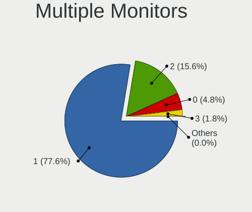

| Total | Computers | Percent |
|-------|-----------|---------|
| 1     | 6889      | 77.62%  |
| 2     | 1386      | 15.62%  |
| 0     | 423       | 4.77%   |
| 3     | 164       | 1.85%   |
| 4     | 12        | 0.14%   |
| 5     | 1         | 0.01%   |

Network
-------

Net Controller Vendor
---------------------

Controller vendors

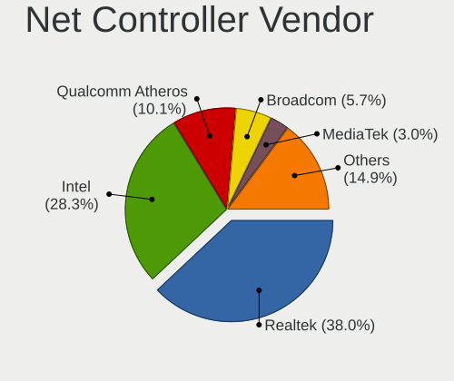

| Vendor                            | Computers | Percent |
|-----------------------------------|-----------|---------|
| Realtek Semiconductor             | 5002      | 37.99%  |
| Intel                             | 3726      | 28.3%   |
| Qualcomm Atheros                  | 1332      | 10.12%  |
| Broadcom                          | 755       | 5.73%   |
| MediaTek                          | 396       | 3.01%   |
| TP-Link                           | 230       | 1.75%   |
| Marvell Technology Group          | 172       | 1.31%   |
| Ralink Technology                 | 164       | 1.25%   |
| Broadcom Limited                  | 163       | 1.24%   |
| Ralink                            | 126       | 0.96%   |
| Nvidia                            | 126       | 0.96%   |
| ASIX Electronics                  | 99        | 0.75%   |
| Xiaomi                            | 63        | 0.48%   |
| Qualcomm Atheros Communications   | 57        | 0.43%   |
| Samsung Electronics               | 53        | 0.4%    |
| D-Link                            | 44        | 0.33%   |
| Shenzhen Goodix Technology        | 43        | 0.33%   |
| Qualcomm                          | 41        | 0.31%   |
| DisplayLink                       | 33        | 0.25%   |
| Microsoft                         | 32        | 0.24%   |
| Aquantia                          | 32        | 0.24%   |
| Hewlett-Packard                   | 29        | 0.22%   |
| Lenovo                            | 28        | 0.21%   |
| Silicon Integrated Systems [SiS]  | 24        | 0.18%   |
| ASUSTek Computer                  | 24        | 0.18%   |
| JMicron Technology                | 21        | 0.16%   |
| Ericsson Business Mobile Networks | 21        | 0.16%   |
| Dell                              | 21        | 0.16%   |
| D-Link System                     | 21        | 0.16%   |
| VIA Technologies                  | 20        | 0.15%   |
| Sierra Wireless                   | 20        | 0.15%   |
| Belkin Components                 | 18        | 0.14%   |
| Huawei Technologies               | 16        | 0.12%   |
| Qualcomm Technologies             | 13        | 0.1%    |
| Google                            | 12        | 0.09%   |
| Edimax Technology                 | 12        | 0.09%   |
| ZyDAS                             | 10        | 0.08%   |
| QinHeng Electronics               | 10        | 0.08%   |
| OPPO Electronics                  | 10        | 0.08%   |
| Microchip Technology              | 10        | 0.08%   |

Net Controller Model
--------------------

Controller models

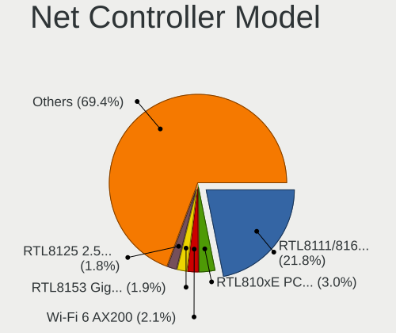

| Model                                                                  | Computers | Percent |
|------------------------------------------------------------------------|-----------|---------|
| Realtek RTL8111/8168/8211/8411 PCI Express Gigabit Ethernet Controller | 3335      | 21.85%  |
| Realtek RTL810xE PCI Express Fast Ethernet controller                  | 462       | 3.03%   |
| Intel Wi-Fi 6 AX200                                                    | 317       | 2.08%   |
| Realtek RTL8153 Gigabit Ethernet Adapter                               | 289       | 1.89%   |
| Realtek RTL8125 2.5GbE Controller                                      | 274       | 1.79%   |
| Realtek RTL8822CE 802.11ac PCIe Wireless Network Adapter               | 240       | 1.57%   |
| Realtek RTL8821CE 802.11ac PCIe Wireless Network Adapter               | 212       | 1.39%   |
| Intel Wireless 8265 / 8275                                             | 206       | 1.35%   |
| Intel Wi-Fi 6 AX201                                                    | 205       | 1.34%   |
| Qualcomm Atheros QCA9377 802.11ac Wireless Network Adapter             | 174       | 1.14%   |
| Intel Wireless 7265                                                    | 171       | 1.12%   |
| Intel 82579LM Gigabit Network Connection (Lewisville)                  | 170       | 1.11%   |
| Qualcomm Atheros QCA9565 / AR9565 Wireless Network Adapter             | 159       | 1.04%   |
| Qualcomm Atheros AR9285 Wireless Network Adapter (PCI-Express)         | 151       | 0.99%   |
| Qualcomm Atheros AR9485 Wireless Network Adapter                       | 146       | 0.96%   |
| MediaTek MT7921 802.11ax PCIe Wireless Network Adapter [Filogic 330]   | 143       | 0.94%   |
| Intel Alder Lake-P PCH CNVi WiFi                                       | 141       | 0.92%   |
| Intel I211 Gigabit Network Connection                                  | 140       | 0.92%   |
| Intel Cannon Lake PCH CNVi WiFi                                        | 129       | 0.85%   |
| Intel Wireless 3165                                                    | 128       | 0.84%   |
| Intel Comet Lake PCH-LP CNVi WiFi                                      | 125       | 0.82%   |
| Intel Ethernet Connection (2) I219-V                                   | 118       | 0.77%   |
| Intel Wireless 7260                                                    | 115       | 0.75%   |
| Realtek RTL8723BE PCIe Wireless Network Adapter                        | 111       | 0.73%   |
| Qualcomm Atheros QCA6174 802.11ac Wireless Network Adapter             | 101       | 0.66%   |
| MediaTek MT7922 802.11ax PCI Express Wireless Network Adapter          | 101       | 0.66%   |
| Intel Wi-Fi 6E(802.11ax) AX210/AX1675* 2x2 [Typhoon Peak]              | 97        | 0.64%   |
| Intel Ethernet Controller I225-V                                       | 87        | 0.57%   |
| ASIX AX88179 Gigabit Ethernet                                          | 87        | 0.57%   |
| Broadcom BCM43142 802.11b/g/n                                          | 81        | 0.53%   |
| Intel Dual Band Wireless-AC 3168NGW [Stone Peak]                       | 79        | 0.52%   |
| Intel Ethernet Connection I217-LM                                      | 78        | 0.51%   |
| Broadcom BCM4313 802.11bgn Wireless Network Adapter                    | 78        | 0.51%   |
| Intel Wireless 8260                                                    | 76        | 0.5%    |
| Realtek RTL8852BE PCIe 802.11ax Wireless Network Controller            | 73        | 0.48%   |
| Realtek 802.11ac NIC                                                   | 73        | 0.48%   |
| Qualcomm Atheros AR928X Wireless Network Adapter (PCI-Express)         | 73        | 0.48%   |
| Intel Raptor Lake PCH CNVi WiFi                                        | 72        | 0.47%   |
| Intel PRO/Wireless 3945ABG [Golan] Network Connection                  | 72        | 0.47%   |
| Intel Wireless 3160                                                    | 70        | 0.46%   |

Wireless Vendor
---------------

Wireless vendors

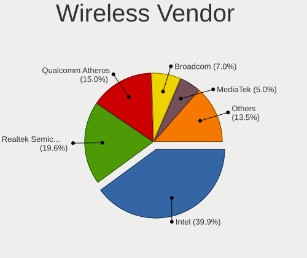

| Vendor                          | Computers | Percent |
|---------------------------------|-----------|---------|
| Intel                           | 2781      | 39.93%  |
| Realtek Semiconductor           | 1363      | 19.57%  |
| Qualcomm Atheros                | 1044      | 14.99%  |
| Broadcom                        | 487       | 6.99%   |
| MediaTek                        | 349       | 5.01%   |
| TP-Link                         | 206       | 2.96%   |
| Ralink Technology               | 164       | 2.35%   |
| Ralink                          | 126       | 1.81%   |
| Broadcom Limited                | 115       | 1.65%   |
| Qualcomm Atheros Communications | 57        | 0.82%   |
| D-Link                          | 41        | 0.59%   |
| Microsoft                       | 28        | 0.4%    |
| Qualcomm                        | 27        | 0.39%   |
| ASUSTek Computer                | 22        | 0.32%   |
| Sierra Wireless                 | 20        | 0.29%   |
| Belkin Components               | 17        | 0.24%   |
| Marvell Technology Group        | 16        | 0.23%   |
| Dell                            | 14        | 0.2%    |
| D-Link System                   | 13        | 0.19%   |
| Edimax Technology               | 12        | 0.17%   |
| ZyDAS                           | 10        | 0.14%   |
| NetGear                         | 8         | 0.11%   |
| Hewlett-Packard                 | 6         | 0.09%   |
| Gemtek                          | 4         | 0.06%   |
| Texas Instruments               | 3         | 0.04%   |
| Tenda                           | 3         | 0.04%   |
| Linksys                         | 3         | 0.04%   |
| Fibocom                         | 3         | 0.04%   |
| Accton Technology               | 3         | 0.04%   |
| Wilocity                        | 2         | 0.03%   |
| Sitecom Europe                  | 2         | 0.03%   |
| Qualcomm Technologies           | 2         | 0.03%   |
| ZyXEL Communications            | 1         | 0.01%   |
| Xiaomi                          | 1         | 0.01%   |
| Wacom                           | 1         | 0.01%   |
| TRENDnet                        | 1         | 0.01%   |
| Standard Microsystems           | 1         | 0.01%   |
| Samsung Electronics             | 1         | 0.01%   |
| Quectel Wireless Solutions      | 1         | 0.01%   |
| Micro Star International        | 1         | 0.01%   |

Wireless Model
--------------

Wireless models

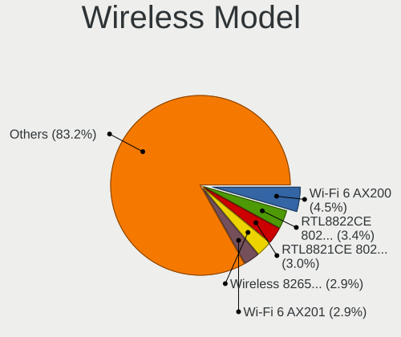

| Model                                                                   | Computers | Percent |
|-------------------------------------------------------------------------|-----------|---------|
| Intel Wi-Fi 6 AX200                                                     | 317       | 4.52%   |
| Realtek RTL8822CE 802.11ac PCIe Wireless Network Adapter                | 240       | 3.42%   |
| Realtek RTL8821CE 802.11ac PCIe Wireless Network Adapter                | 212       | 3.02%   |
| Intel Wireless 8265 / 8275                                              | 206       | 2.94%   |
| Intel Wi-Fi 6 AX201                                                     | 205       | 2.92%   |
| Qualcomm Atheros QCA9377 802.11ac Wireless Network Adapter              | 174       | 2.48%   |
| Intel Wireless 7265                                                     | 171       | 2.44%   |
| Qualcomm Atheros QCA9565 / AR9565 Wireless Network Adapter              | 159       | 2.27%   |
| Qualcomm Atheros AR9285 Wireless Network Adapter (PCI-Express)          | 151       | 2.15%   |
| Qualcomm Atheros AR9485 Wireless Network Adapter                        | 146       | 2.08%   |
| MediaTek MT7921 802.11ax PCIe Wireless Network Adapter [Filogic 330]    | 143       | 2.04%   |
| Intel Cannon Lake PCH CNVi WiFi                                         | 129       | 1.84%   |
| Intel Wireless 3165                                                     | 128       | 1.82%   |
| Intel Comet Lake PCH-LP CNVi WiFi                                       | 125       | 1.78%   |
| Intel Wireless 7260                                                     | 115       | 1.64%   |
| Realtek RTL8723BE PCIe Wireless Network Adapter                         | 111       | 1.58%   |
| Qualcomm Atheros QCA6174 802.11ac Wireless Network Adapter              | 101       | 1.44%   |
| Intel Wi-Fi 6E(802.11ax) AX210/AX1675* 2x2 [Typhoon Peak]               | 97        | 1.38%   |
| Intel Alder Lake-P PCH CNVi WiFi                                        | 82        | 1.17%   |
| Broadcom BCM43142 802.11b/g/n                                           | 81        | 1.15%   |
| Intel Dual Band Wireless-AC 3168NGW [Stone Peak]                        | 79        | 1.13%   |
| Broadcom BCM4313 802.11bgn Wireless Network Adapter                     | 78        | 1.11%   |
| Intel Wireless 8260                                                     | 76        | 1.08%   |
| Realtek 802.11ac NIC                                                    | 73        | 1.04%   |
| Qualcomm Atheros AR928X Wireless Network Adapter (PCI-Express)          | 73        | 1.04%   |
| MediaTek MT7922 802.11ax PCI Express Wireless Network Adapter           | 72        | 1.03%   |
| Intel Raptor Lake PCH CNVi WiFi                                         | 72        | 1.03%   |
| Intel PRO/Wireless 3945ABG [Golan] Network Connection                   | 72        | 1.03%   |
| Intel Wireless 3160                                                     | 70        | 1%      |
| Intel Comet Lake PCH CNVi WiFi                                          | 70        | 1%      |
| Intel Cannon Point-LP CNVi [Wireless-AC]                                | 69        | 0.98%   |
| Realtek RTL88x2bu [AC1200 Techkey]                                      | 67        | 0.95%   |
| Realtek RTL8822BE 802.11a/b/g/n/ac WiFi adapter                         | 65        | 0.93%   |
| MediaTek MT7902 802.11ax PCIe Wireless Network Adapter [Filogic 310]    | 65        | 0.93%   |
| Intel WiFi Link 5100                                                    | 64        | 0.91%   |
| Qualcomm Atheros AR9287 Wireless Network Adapter (PCI-Express)          | 63        | 0.9%    |
| Intel Centrino Advanced-N 6205 [Taylor Peak]                            | 61        | 0.87%   |
| Qualcomm Atheros AR242x / AR542x Wireless Network Adapter (PCI-Express) | 56        | 0.8%    |
| Intel Wi-Fi 5(802.11ac) Wireless-AC 9x6x [Thunder Peak]                 | 55        | 0.78%   |
| Realtek RTL8852BE PCIe 802.11ax Wireless Network Controller             | 54        | 0.77%   |

Ethernet Vendor
---------------

Ethernet vendors

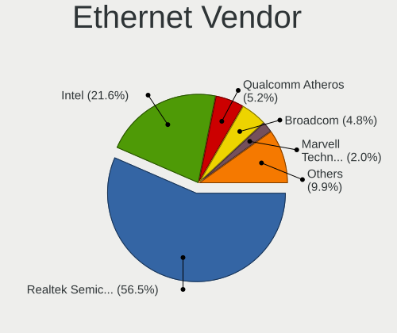

| Vendor                                 | Computers | Percent |
|----------------------------------------|-----------|---------|
| Realtek Semiconductor                  | 4443      | 56.53%  |
| Intel                                  | 1698      | 21.6%   |
| Qualcomm Atheros                       | 408       | 5.19%   |
| Broadcom                               | 376       | 4.78%   |
| Marvell Technology Group               | 157       | 2%      |
| Nvidia                                 | 126       | 1.6%    |
| ASIX Electronics                       | 99        | 1.26%   |
| Xiaomi                                 | 62        | 0.79%   |
| Samsung Electronics                    | 52        | 0.66%   |
| Broadcom Limited                       | 50        | 0.64%   |
| MediaTek                               | 43        | 0.55%   |
| DisplayLink                            | 33        | 0.42%   |
| Aquantia                               | 32        | 0.41%   |
| Lenovo                                 | 28        | 0.36%   |
| TP-Link                                | 26        | 0.33%   |
| Silicon Integrated Systems [SiS]       | 24        | 0.31%   |
| JMicron Technology                     | 21        | 0.27%   |
| VIA Technologies                       | 20        | 0.25%   |
| Hewlett-Packard                        | 15        | 0.19%   |
| Qualcomm                               | 14        | 0.18%   |
| Google                                 | 12        | 0.15%   |
| Qualcomm Technologies                  | 11        | 0.14%   |
| OPPO Electronics                       | 10        | 0.13%   |
| Huawei Technologies                    | 9         | 0.11%   |
| Microchip Technology                   | 8         | 0.1%    |
| D-Link System                          | 8         | 0.1%    |
| Attansic Technology                    | 6         | 0.08%   |
| Apple                                  | 6         | 0.08%   |
| Suzhou Motorcomm Electronic Technology | 5         | 0.06%   |
| ICS Advent                             | 5         | 0.06%   |
| Motorola PCS                           | 4         | 0.05%   |
| LSI                                    | 4         | 0.05%   |
| ZTE WCDMA Technologies MSM             | 3         | 0.04%   |
| Sony Ericsson Mobile Communications AB | 3         | 0.04%   |
| Raspberry Pi                           | 3         | 0.04%   |
| Insyde Software                        | 3         | 0.04%   |
| IBM                                    | 3         | 0.04%   |
| Davicom Semiconductor                  | 3         | 0.04%   |
| D-Link                                 | 3         | 0.04%   |
| Spreadtrum Communications              | 2         | 0.03%   |

Ethernet Model
--------------

Ethernet models

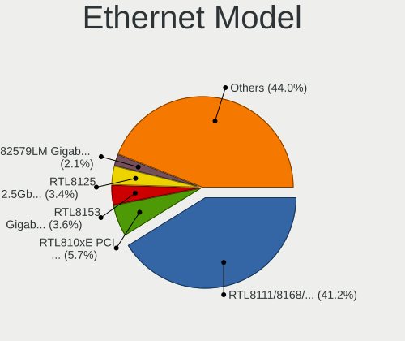

| Model                                                                  | Computers | Percent |
|------------------------------------------------------------------------|-----------|---------|
| Realtek RTL8111/8168/8211/8411 PCI Express Gigabit Ethernet Controller | 3335      | 41.19%  |
| Realtek RTL810xE PCI Express Fast Ethernet controller                  | 462       | 5.71%   |
| Realtek RTL8153 Gigabit Ethernet Adapter                               | 289       | 3.57%   |
| Realtek RTL8125 2.5GbE Controller                                      | 274       | 3.38%   |
| Intel 82579LM Gigabit Network Connection (Lewisville)                  | 170       | 2.1%    |
| Intel I211 Gigabit Network Connection                                  | 140       | 1.73%   |
| Intel Ethernet Connection (2) I219-V                                   | 118       | 1.46%   |
| Intel Ethernet Controller I225-V                                       | 87        | 1.07%   |
| ASIX AX88179 Gigabit Ethernet                                          | 87        | 1.07%   |
| Intel Ethernet Connection I217-LM                                      | 78        | 0.96%   |
| Intel Ethernet Connection (7) I219-V                                   | 61        | 0.75%   |
| Qualcomm Atheros AR8151 v2.0 Gigabit Ethernet                          | 60        | 0.74%   |
| Intel Alder Lake-P PCH CNVi WiFi                                       | 59        | 0.73%   |
| Intel 82579V Gigabit Network Connection                                | 56        | 0.69%   |
| Realtek RTL8152 Fast Ethernet Adapter                                  | 52        | 0.64%   |
| Broadcom NetLink BCM57780 Gigabit Ethernet PCIe                        | 52        | 0.64%   |
| Broadcom NetXtreme BCM57766 Gigabit Ethernet PCIe                      | 51        | 0.63%   |
| Intel Ethernet Connection (4) I219-LM                                  | 50        | 0.62%   |
| Realtek RTL-8100/8101L/8139 PCI Fast Ethernet Adapter                  | 47        | 0.58%   |
| Broadcom NetXtreme BCM57765 Gigabit Ethernet PCIe                      | 47        | 0.58%   |
| Xiaomi Mi/Redmi series (RNDIS)                                         | 46        | 0.57%   |
| Qualcomm Atheros Killer E220x Gigabit Ethernet Controller              | 46        | 0.57%   |
| Intel Ethernet Connection (2) I219-LM                                  | 45        | 0.56%   |
| Nvidia MCP79 Ethernet                                                  | 43        | 0.53%   |
| Broadcom NetLink BCM57785 Gigabit Ethernet PCIe                        | 43        | 0.53%   |
| Intel 82577LM Gigabit Network Connection                               | 41        | 0.51%   |
| Intel Ethernet Connection (6) I219-V                                   | 40        | 0.49%   |
| Intel Ethernet Connection I218-LM                                      | 39        | 0.48%   |
| Qualcomm Atheros AR8131 Gigabit Ethernet                               | 37        | 0.46%   |
| Intel Ethernet Connection (4) I219-V                                   | 37        | 0.46%   |
| Samsung Galaxy series, misc. (tethering mode)                          | 36        | 0.44%   |
| Nvidia MCP61 Ethernet                                                  | 36        | 0.44%   |
| Intel Ethernet Connection I217-V                                       | 36        | 0.44%   |
| Intel Ethernet Controller I226-V                                       | 35        | 0.43%   |
| Qualcomm Atheros AR8161 Gigabit Ethernet                               | 33        | 0.41%   |
| Intel Ethernet Connection (2) I218-V                                   | 33        | 0.41%   |
| Qualcomm Atheros AR8121/AR8113/AR8114 Gigabit or Fast Ethernet         | 32        | 0.4%    |
| Intel I210 Gigabit Network Connection                                  | 32        | 0.4%    |
| Intel Ethernet Connection (3) I218-LM                                  | 32        | 0.4%    |
| Realtek Killer E2600 GbE Controller                                    | 31        | 0.38%   |

Net Controller Kind
-------------------

Ethernet, WiFi or modem

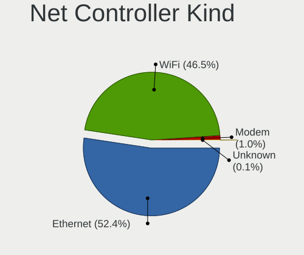

| Kind     | Computers | Percent |
|----------|-----------|---------|
| Ethernet | 7368      | 52.38%  |
| WiFi     | 6548      | 46.55%  |
| Modem    | 135       | 0.96%   |
| Unknown  | 16        | 0.11%   |

Used Controller
---------------

Currently used network controller

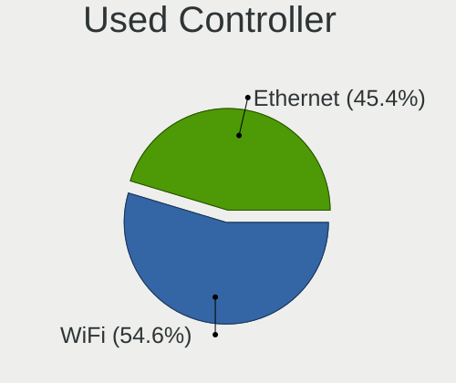

| Kind     | Computers | Percent |
|----------|-----------|---------|
| WiFi     | 4916      | 54.64%  |
| Ethernet | 4081      | 45.36%  |

NICs
----

Total network controllers on board

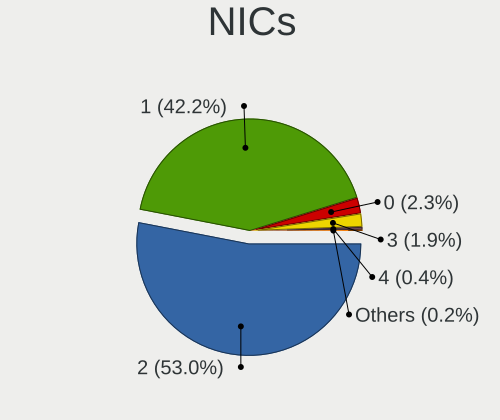

| Total | Computers | Percent |
|-------|-----------|---------|
| 2     | 4600      | 53.04%  |
| 1     | 3656      | 42.16%  |
| 0     | 198       | 2.28%   |
| 3     | 167       | 1.93%   |
| 4     | 37        | 0.43%   |
| 5     | 6         | 0.07%   |
| 6     | 5         | 0.06%   |
| 9     | 2         | 0.02%   |
| 8     | 1         | 0.01%   |

IPv6
----

IPv6 vs IPv4

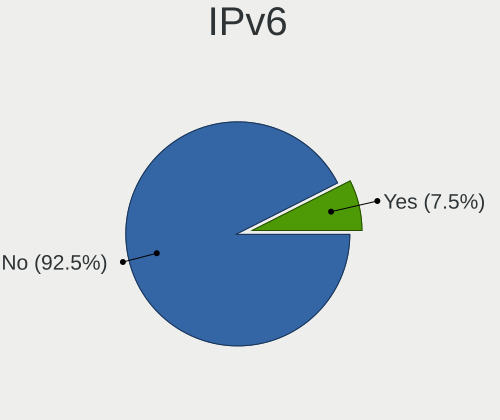

| Used | Computers | Percent |
|------|-----------|---------|
| No   | 8071      | 92.55%  |
| Yes  | 650       | 7.45%   |

Bluetooth
---------

Bluetooth Vendor
----------------

Controller vendors

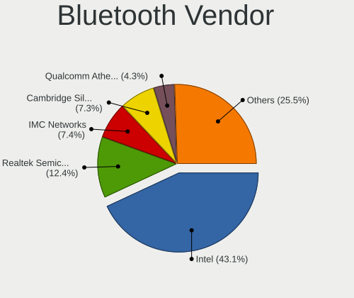

| Vendor                          | Computers | Percent |
|---------------------------------|-----------|---------|
| Intel                           | 2379      | 43.09%  |
| Realtek Semiconductor           | 687       | 12.44%  |
| IMC Networks                    | 409       | 7.41%   |
| Cambridge Silicon Radio         | 402       | 7.28%   |
| Qualcomm Atheros Communications | 235       | 4.26%   |
| Apple                           | 229       | 4.15%   |
| Foxconn / Hon Hai               | 222       | 4.02%   |
| Broadcom                        | 192       | 3.48%   |
| Lite-On Technology              | 184       | 3.33%   |
| MediaTek                        | 96        | 1.74%   |
| ASUSTek Computer                | 82        | 1.49%   |
| Realtek                         | 63        | 1.14%   |
| Toshiba                         | 50        | 0.91%   |
| Hewlett-Packard                 | 44        | 0.8%    |
| Dell                            | 44        | 0.8%    |
| Ralink                          | 36        | 0.65%   |
| TP-Link                         | 31        | 0.56%   |
| Alps Electric                   | 24        | 0.43%   |
| Foxconn International           | 15        | 0.27%   |
| USI                             | 13        | 0.24%   |
| Belkin Components               | 12        | 0.22%   |
| Marvell Semiconductor           | 11        | 0.2%    |
| Integrated System Solution      | 10        | 0.18%   |
| Actions                         | 8         | 0.14%   |
| Taiyo Yuden                     | 5         | 0.09%   |
| Ralink Technology               | 5         | 0.09%   |
| Mercucys                        | 5         | 0.09%   |
| Unknown                         | 5         | 0.09%   |
| Edimax Technology               | 3         | 0.05%   |
| Chicony Electronics             | 3         | 0.05%   |
| Askey Computer                  | 3         | 0.05%   |
| Roper                           | 2         | 0.04%   |
| Quectel Wireless Solutions      | 2         | 0.04%   |
| Qcom                            | 2         | 0.04%   |
| SiW                             | 1         | 0.02%   |
| Sitecom Europe                  | 1         | 0.02%   |
| Opticis                         | 1         | 0.02%   |
| Micro Star International        | 1         | 0.02%   |
| Logitech                        | 1         | 0.02%   |
| Fujitsu                         | 1         | 0.02%   |

Bluetooth Model
---------------

Controller models

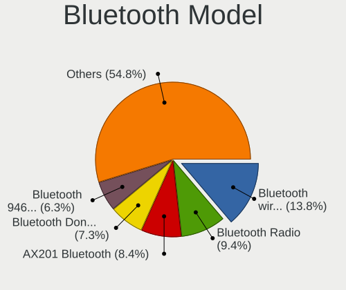

| Model                                               | Computers | Percent |
|-----------------------------------------------------|-----------|---------|
| Intel Bluetooth wireless interface                  | 763       | 13.81%  |
| Realtek Bluetooth Radio                             | 522       | 9.45%   |
| Intel AX201 Bluetooth                               | 465       | 8.42%   |
| Cambridge Silicon Radio Bluetooth Dongle (HCI mode) | 402       | 7.28%   |
| Intel Bluetooth 9460/9560 Jefferson Peak (JfP)      | 347       | 6.28%   |
| Intel AX200 Bluetooth                               | 307       | 5.56%   |
| Intel Bluetooth Device                              | 215       | 3.89%   |
| IMC Networks Bluetooth Radio                        | 163       | 2.95%   |
| IMC Networks Wireless_Device                        | 151       | 2.73%   |
| Realtek  Bluetooth 4.2 Adapter                      | 109       | 1.97%   |
| Apple Bluetooth Host Controller                     | 99        | 1.79%   |
| Qualcomm Atheros  Bluetooth Device                  | 98        | 1.77%   |
| MediaTek Wireless_Device                            | 96        | 1.74%   |
| Intel AX210 Bluetooth                               | 93        | 1.68%   |
| Intel Wireless-AC 3168 Bluetooth                    | 78        | 1.41%   |
| IMC Networks Bluetooth Device                       | 72        | 1.3%    |
| Foxconn / Hon Hai Bluetooth Device                  | 66        | 1.19%   |
| Realtek Bluetooth Radio                             | 63        | 1.14%   |
| Foxconn / Hon Hai Wireless_Device                   | 63        | 1.14%   |
| Apple Bluetooth USB Host Controller                 | 62        | 1.12%   |
| Qualcomm Atheros QCA61x4 Bluetooth 4.0              | 53        | 0.96%   |
| Intel Wireless-AC 9260 Bluetooth Adapter            | 53        | 0.96%   |
| Lite-On Qualcomm Atheros QCA9377 Bluetooth          | 51        | 0.92%   |
| Intel Centrino Bluetooth Wireless Transceiver       | 42        | 0.76%   |
| Qualcomm Atheros AR3012 Bluetooth 4.0               | 41        | 0.74%   |
| Lite-On Atheros AR3012 Bluetooth                    | 41        | 0.74%   |
| Apple Built-in Bluetooth 2.0+EDR HCI                | 40        | 0.72%   |
| Lite-On Bluetooth Device                            | 39        | 0.71%   |
| Foxconn / Hon Hai MediaTek Bluetooth Adapter        | 38        | 0.69%   |
| Ralink RT3290 Bluetooth                             | 36        | 0.65%   |
| TP-Link TP-T@- UB500 Adapter                        | 31        | 0.56%   |
| Qualcomm Atheros AR3011 Bluetooth                   | 30        | 0.54%   |
| Apple Bluetooth HCI                                 | 26        | 0.47%   |
| Lite-On Wireless_Device                             | 24        | 0.43%   |
| Broadcom BCM2045B (BDC-2.1)                         | 24        | 0.43%   |
| ASUS Broadcom BCM20702A0 Bluetooth                  | 24        | 0.43%   |
| HP Broadcom 2070 Bluetooth Combo                    | 23        | 0.42%   |
| Broadcom BCM43142A0 Bluetooth 4.0                   | 22        | 0.4%    |
| HP Bluetooth 2.0 Interface [Broadcom BCM2045]       | 19        | 0.34%   |
| Broadcom HP Portable Bumble Bee                     | 19        | 0.34%   |

Sound
-----

Sound Vendor
------------

Sound card vendors

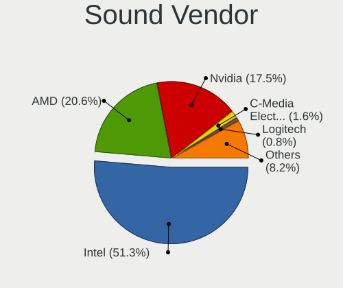

| Vendor                                       | Computers | Percent |
|----------------------------------------------|-----------|---------|
| Intel                                        | 6140      | 51.34%  |
| AMD                                          | 2468      | 20.64%  |
| Nvidia                                       | 2094      | 17.51%  |
| C-Media Electronics                          | 190       | 1.59%   |
| Logitech                                     | 90        | 0.75%   |
| Creative Labs                                | 59        | 0.49%   |
| Texas Instruments                            | 53        | 0.44%   |
| ASUSTek Computer                             | 49        | 0.41%   |
| JMTek                                        | 46        | 0.38%   |
| Corsair                                      | 41        | 0.34%   |
| Plantronics                                  | 34        | 0.28%   |
| Kingston Technology                          | 32        | 0.27%   |
| Lenovo                                       | 31        | 0.26%   |
| GN Netcom                                    | 31        | 0.26%   |
| Creative Technology                          | 29        | 0.24%   |
| Silicon Integrated Systems [SiS]             | 27        | 0.23%   |
| Generalplus Technology                       | 25        | 0.21%   |
| Focusrite-Novation                           | 25        | 0.21%   |
| VIA Technologies                             | 24        | 0.2%    |
| SteelSeries ApS                              | 22        | 0.18%   |
| Razer USA                                    | 22        | 0.18%   |
| Hewlett-Packard                              | 20        | 0.17%   |
| Zoran Co. Personal Media Division (Nogatech) | 19        | 0.16%   |
| Micro Star International                     | 19        | 0.16%   |
| Realtek Semiconductor                        | 18        | 0.15%   |
| BEHRINGER International                      | 16        | 0.13%   |
| Apple                                        | 15        | 0.13%   |
| DSEA A/S                                     | 14        | 0.12%   |
| Trust                                        | 13        | 0.11%   |
| Sony                                         | 12        | 0.1%    |
| Dell                                         | 12        | 0.1%    |
| Thesycon Systemsoftware & Consulting         | 11        | 0.09%   |
| M-Audio                                      | 9         | 0.08%   |
| Tenx Technology                              | 8         | 0.07%   |
| Giga-Byte Technology                         | 8         | 0.07%   |
| FiiO Electronics Technology                  | 7         | 0.06%   |
| Ensoniq                                      | 7         | 0.06%   |
| RODE Microphones                             | 6         | 0.05%   |
| Nordic Semiconductor ASA                     | 6         | 0.05%   |
| Cambridge Silicon Radio                      | 6         | 0.05%   |

Sound Model
-----------

Sound card models

| Model                                                                      | Computers | Percent |
|----------------------------------------------------------------------------|-----------|---------|
| AMD Ryzen HD Audio Controller                                              | 946       | 6.62%   |
| Intel Sunrise Point-LP HD Audio                                            | 548       | 3.83%   |
| Intel 8 Series/C220 Series Chipset High Definition Audio Controller        | 456       | 3.19%   |
| Intel 6 Series/C200 Series Chipset Family High Definition Audio Controller | 437       | 3.06%   |
| Intel 7 Series/C216 Chipset Family High Definition Audio Controller        | 417       | 2.92%   |
| AMD Renoir/Cezanne HDMI/DP Audio Controller                                | 399       | 2.79%   |
| Intel Xeon E3-1200 v3/4th Gen Core Processor HD Audio Controller           | 324       | 2.27%   |
| AMD Starship/Matisse HD Audio Controller                                   | 297       | 2.08%   |
| Intel Cannon Lake PCH cAVS                                                 | 292       | 2.04%   |
| Intel 82801I (ICH9 Family) HD Audio Controller                             | 292       | 2.04%   |
| Intel 5 Series/3400 Series Chipset High Definition Audio                   | 287       | 2.01%   |
| Intel NM10/ICH7 Family High Definition Audio Controller                    | 279       | 1.95%   |
| Intel Tiger Lake-LP Smart Sound Technology Audio Controller                | 277       | 1.94%   |
| AMD Radeon High Definition Audio Controller                                | 277       | 1.94%   |
| Intel 100 Series/C230 Series Chipset Family HD Audio Controller            | 247       | 1.73%   |
| AMD Raven/Raven2/Fenghuang HDMI/DP Audio Controller                        | 229       | 1.6%    |
| Intel 8 Series HD Audio Controller                                         | 218       | 1.53%   |
| Intel Haswell-ULT HD Audio Controller                                      | 217       | 1.52%   |
| Nvidia GK208 HDMI/DP Audio Controller                                      | 213       | 1.49%   |
| AMD FCH Azalia Controller                                                  | 212       | 1.48%   |
| AMD SBx00 Azalia (Intel HDA)                                               | 197       | 1.38%   |
| Intel Alder Lake PCH-P High Definition Audio Controller                    | 189       | 1.32%   |
| Nvidia GP107GL High Definition Audio Controller                            | 179       | 1.25%   |
| AMD Ellesmere HDMI Audio [Radeon RX 470/480 / 570/580/590]                 | 179       | 1.25%   |
| Intel Broadwell-U Audio Controller                                         | 177       | 1.24%   |
| Intel 200 Series PCH HD Audio                                              | 176       | 1.23%   |
| Intel Celeron/Pentium Silver Processor High Definition Audio               | 166       | 1.16%   |
| Intel Comet Lake PCH-LP cAVS                                               | 165       | 1.15%   |
| Intel Wildcat Point-LP High Definition Audio Controller                    | 164       | 1.15%   |
| AMD Family 17h (Models 00h-0fh) HD Audio Controller                        | 161       | 1.13%   |
| Intel 82801H (ICH8 Family) HD Audio Controller                             | 150       | 1.05%   |
| Nvidia High Definition Audio Controller                                    | 135       | 0.94%   |
| Intel Cannon Point-LP High Definition Audio Controller                     | 120       | 0.84%   |
| Intel Raptor Lake-P/U/H cAVS                                               | 115       | 0.8%    |
| Intel Comet Lake PCH cAVS                                                  | 115       | 0.8%    |
| Nvidia TU107 GeForce GTX 1650 High Definition Audio Controller             | 111       | 0.78%   |
| Nvidia GA106 High Definition Audio Controller                              | 110       | 0.77%   |
| AMD Kabini HDMI/DP Audio                                                   | 105       | 0.73%   |
| AMD Family 15h (Models 60h-6fh) Audio Controller                           | 100       | 0.7%    |
| Nvidia GA104 High Definition Audio Controller                              | 97        | 0.68%   |

Memory
------

Memory Vendor
-------------

Memory module vendors

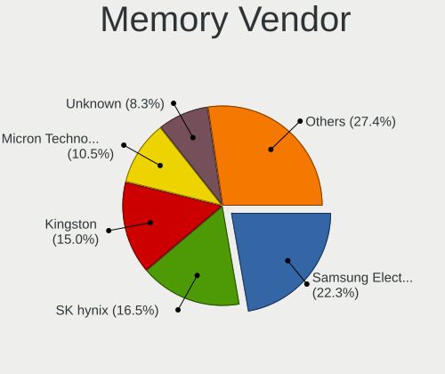

| Vendor              | Computers | Percent |
|---------------------|-----------|---------|
| Samsung Electronics | 1168      | 22.27%  |
| SK hynix            | 868       | 16.55%  |
| Kingston            | 788       | 15.02%  |
| Micron Technology   | 551       | 10.51%  |
| Unknown             | 434       | 8.27%   |
| Crucial             | 366       | 6.98%   |
| Corsair             | 270       | 5.15%   |
| G.Skill             | 139       | 2.65%   |
| Ramaxel Technology  | 112       | 2.14%   |
| Unknown             | 70        | 1.33%   |
| Unknown (ABCD)      | 69        | 1.32%   |
| Elpida              | 66        | 1.26%   |
| A-DATA Technology   | 56        | 1.07%   |
| Nanya Technology    | 48        | 0.92%   |
| Silicon Power       | 23        | 0.44%   |
| Team                | 20        | 0.38%   |
| GOODRAM             | 18        | 0.34%   |
| Transcend           | 17        | 0.32%   |
| Apacer              | 15        | 0.29%   |
| Timetec             | 11        | 0.21%   |
| Unifosa             | 8         | 0.15%   |
| Wilk                | 6         | 0.11%   |
| Patriot             | 6         | 0.11%   |
| ASint Technology    | 6         | 0.11%   |
| Kllisre             | 5         | 0.1%    |
| Hewlett-Packard     | 5         | 0.1%    |
| Avant               | 5         | 0.1%    |
| Unknown (0x0B45)    | 4         | 0.08%   |
| Micron/Elpida       | 4         | 0.08%   |
| Atermiter           | 4         | 0.08%   |
| 48spaces            | 4         | 0.08%   |
| Qimonda             | 3         | 0.06%   |
| Patriot Memory      | 3         | 0.06%   |
| KLEVV               | 3         | 0.06%   |
| ChangXin Memory     | 3         | 0.06%   |
| Wodposit            | 2         | 0.04%   |
| Unknown (AB)        | 2         | 0.04%   |
| Unknown (0x0E9D)    | 2         | 0.04%   |
| Unknown (07FB)      | 2         | 0.04%   |
| Toshiba             | 2         | 0.04%   |

Memory Model
------------

Memory module models

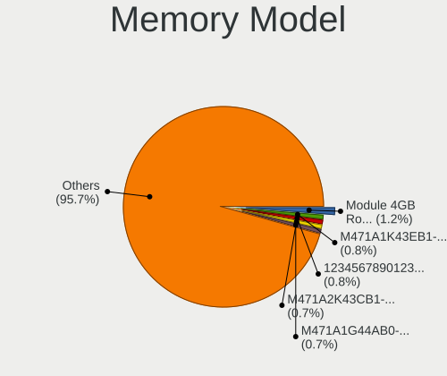

| Model                                                            | Computers | Percent |
|------------------------------------------------------------------|-----------|---------|
| Unknown                                                          | 70        | 1.25%   |
| Samsung RAM M471A1K43EB1-CWE 8GB SODIMM DDR4 3200MT/s            | 45        | 0.8%    |
| Unknown (ABCD) RAM 123456789012345678 2GB SODIMM LPDDR4 2400MT/s | 43        | 0.77%   |
| Samsung RAM M471A2K43CB1-CTD 16GB SODIMM DDR4 8400MT/s           | 42        | 0.75%   |
| Samsung RAM M471A1G44AB0-CWE 8GiB SODIMM DDR4 3200MT/s           | 42        | 0.75%   |
| SK hynix RAM HMA81GS6AFR8N-UH 8GB SODIMM DDR4 2667MT/s           | 35        | 0.62%   |
| Samsung RAM M471A5244CB0-CTD 4GB SODIMM DDR4 3266MT/s            | 34        | 0.61%   |
| Samsung RAM M471B5173QH0-YK0 4GB SODIMM DDR3 1600MT/s            | 33        | 0.59%   |
| Samsung RAM M471A1K43DB1-CWE 8GB SODIMM DDR4 3200MT/s            | 32        | 0.57%   |
| Samsung RAM M471B5273DH0-CH9 4GB SODIMM DDR3 1600MT/s            | 31        | 0.55%   |
| Micron RAM 4ATF1G64HZ-3G2F1 8GB SODIMM DDR4 3200MT/s             | 30        | 0.53%   |
| SK hynix RAM HMT451S6BFR8A-PB 4GB SODIMM DDR3 1600MT/s           | 29        | 0.52%   |
| SK hynix RAM HMA81GS6DJR8N-XN 8GB SODIMM DDR4 3200MT/s           | 29        | 0.52%   |
| Samsung RAM M471B1G73QH0-YK0 8GB SODIMM DDR3 1600MT/s            | 29        | 0.52%   |
| Samsung RAM M471A1K43DB1-CTD 8GB SODIMM DDR4 2667MT/s            | 28        | 0.5%    |
| Samsung RAM M471A1K43CB1-CRC 8GB SODIMM DDR4 8400MT/s            | 28        | 0.5%    |
| SK hynix RAM HMAA1GS6CJR6N-XN 8GB SODIMM DDR4 3200MT/s           | 27        | 0.48%   |
| Samsung RAM M471B5173DB0-YK0 4GB SODIMM DDR3 1600MT/s            | 27        | 0.48%   |
| Samsung RAM M471A1G44BB0-CWE 8GB SODIMM DDR4 3200MT/s            | 27        | 0.48%   |
| Unknown (ABCD) RAM 123456789012345678 2GB DIMM LPDDR4 2133MT/s   | 26        | 0.46%   |
| Samsung RAM M471A5244CB0-CRC 4GB SODIMM DDR4 2667MT/s            | 25        | 0.45%   |
| Samsung RAM M471A1G44AB0-CWE 8GB Row Of Chips DDR4 3200MT/s      | 25        | 0.45%   |
| Kingston RAM KHX3200C16D4/8GX 8GB DIMM DDR4 3733MT/s             | 25        | 0.45%   |
| SK hynix RAM HMA41GS6AFR8N-TF 8GB SODIMM DDR4 2667MT/s           | 24        | 0.43%   |
| Samsung RAM M471B1G73DB0-YK0 8GB SODIMM DDR3 1600MT/s            | 24        | 0.43%   |
| Kingston RAM KHX1600C10D3/8G 8GB DIMM DDR3 2133MT/s              | 24        | 0.43%   |
| Samsung RAM M471B5173EB0-YK0 4GB SODIMM DDR3 1600MT/s            | 23        | 0.41%   |
| Samsung RAM M471A5244CB0-CWE 4GB SODIMM DDR4 3200MT/s            | 23        | 0.41%   |
| Unknown RAM Module 2GB SODIMM DDR2 667MT/s                       | 22        | 0.39%   |
| Corsair RAM CMK16GX4M2B3200C16 8GB DIMM DDR4 3600MT/s            | 22        | 0.39%   |
| Corsair RAM CMK16GX4M2B3000C15 8GB DIMM DDR4 3600MT/s            | 22        | 0.39%   |
| Samsung RAM M471A1K43CB1-CTD 8GB SODIMM DDR4 3200MT/s            | 21        | 0.37%   |
| Micron RAM 8ATF1G64HZ-3G2R1 8GB SODIMM DDR4 3200MT/s             | 21        | 0.37%   |
| SK hynix RAM HMT351S6CFR8C-PB 4GB SODIMM DDR3 1600MT/s           | 20        | 0.36%   |
| Samsung RAM M471A2K43EB1-CWE 16GB SODIMM DDR4 3200MT/s           | 20        | 0.36%   |
| Kingston RAM KF3200C16D4/8GX 8GiB DIMM DDR4 3600MT/s             | 20        | 0.36%   |
| Corsair RAM CMK16GX4M2E3200C16 8GB DIMM DDR4 3466MT/s            | 19        | 0.34%   |
| Kingston RAM KHX1600C9D3/4GX 4GB DIMM DDR3 1867MT/s              | 18        | 0.32%   |
| Crucial RAM CT102464BF160B.C16 8GB SODIMM DDR3 1600MT/s          | 18        | 0.32%   |
| Corsair RAM CMK32GX4M2E3200C16 16GB DIMM DDR4 3600MT/s           | 18        | 0.32%   |

Memory Kind
-----------

Memory module kinds

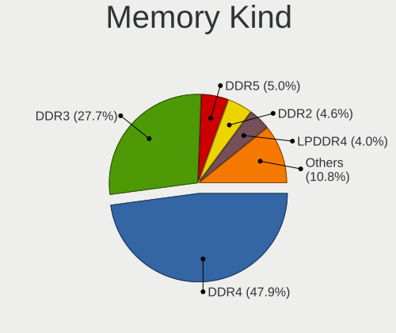

| Kind    | Computers | Percent |
|---------|-----------|---------|
| DDR4    | 2203      | 47.89%  |
| DDR3    | 1275      | 27.72%  |
| DDR5    | 228       | 4.96%   |
| DDR2    | 212       | 4.61%   |
| LPDDR4  | 186       | 4.04%   |
| LPDDR5  | 136       | 2.96%   |
| SDRAM   | 119       | 2.59%   |
| Unknown | 110       | 2.39%   |
| LPDDR3  | 95        | 2.07%   |
| DDR     | 22        | 0.48%   |
| DRAM    | 14        | 0.3%    |

Memory Form Factor
------------------

Physical design of the memory module

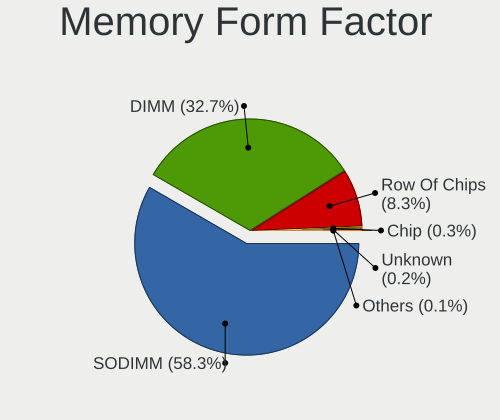

| Name            | Computers | Percent |
|-----------------|-----------|---------|
| SODIMM          | 2679      | 58.34%  |
| DIMM            | 1500      | 32.67%  |
| Row Of Chips    | 383       | 8.34%   |
| Chip            | 14        | 0.3%    |
| Unknown         | 10        | 0.22%   |
| FB-DIMM         | 3         | 0.07%   |
| RIMM            | 2         | 0.04%   |
| Proprietary Car | 1         | 0.02%   |

Memory Size
-----------

Memory module size

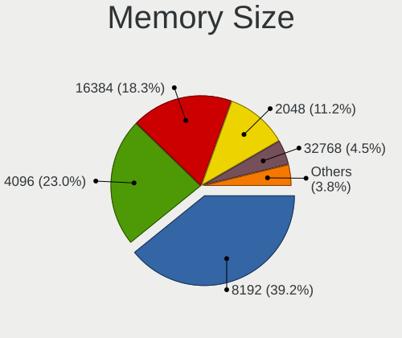

| Size    | Computers | Percent |
|---------|-----------|---------|
| 8192    | 1952      | 39.18%  |
| 4096    | 1148      | 23.04%  |
| 16384   | 911       | 18.29%  |
| 2048    | 556       | 11.16%  |
| 32768   | 224       | 4.5%    |
| 1024    | 154       | 3.09%   |
| 512     | 11        | 0.22%   |
| 3072    | 8         | 0.16%   |
| 65536   | 6         | 0.12%   |
| 49152   | 5         | 0.1%    |
| 12288   | 3         | 0.06%   |
| 256     | 3         | 0.06%   |
| Unknown | 1         | 0.02%   |

Memory Speed
------------

Memory module speed

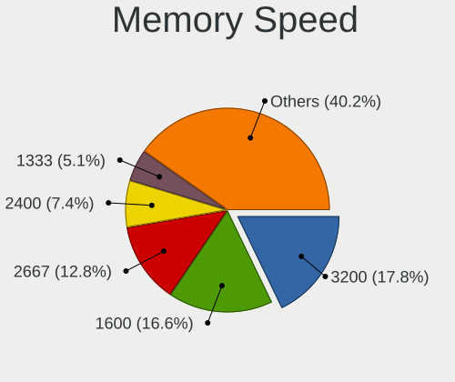

| Speed   | Computers | Percent |
|---------|-----------|---------|
| 3200    | 885       | 17.84%  |
| 1600    | 826       | 16.65%  |
| 2667    | 635       | 12.8%   |
| 2400    | 369       | 7.44%   |
| 1333    | 251       | 5.06%   |
| 2133    | 213       | 4.29%   |
| 3600    | 158       | 3.18%   |
| 667     | 129       | 2.6%    |
| 800     | 108       | 2.18%   |
| 1334    | 94        | 1.89%   |
| 5600    | 89        | 1.79%   |
| 6400    | 87        | 1.75%   |
| Unknown | 87        | 1.75%   |
| 4800    | 85        | 1.71%   |
| 8400    | 72        | 1.45%   |
| 1867    | 71        | 1.43%   |
| 3733    | 64        | 1.29%   |
| 4267    | 61        | 1.23%   |
| 1067    | 49        | 0.99%   |
| 3266    | 41        | 0.83%   |
| 1866    | 41        | 0.83%   |
| 3800    | 33        | 0.67%   |
| 3400    | 30        | 0.6%    |
| 1066    | 30        | 0.6%    |
| 6000    | 27        | 0.54%   |
| 3466    | 27        | 0.54%   |
| 3000    | 27        | 0.54%   |
| 2933    | 27        | 0.54%   |
| 7500    | 25        | 0.5%    |
| 4199    | 25        | 0.5%    |
| 2666    | 23        | 0.46%   |
| 2048    | 23        | 0.46%   |
| 533     | 22        | 0.44%   |
| 4266    | 16        | 0.32%   |
| 2733    | 16        | 0.32%   |
| 8533    | 14        | 0.28%   |
| 1800    | 13        | 0.26%   |
| 4000    | 12        | 0.24%   |
| 3933    | 10        | 0.2%    |
| 2800    | 10        | 0.2%    |

Printers & scanners
-------------------

Printer Vendor
--------------

Printer device vendors

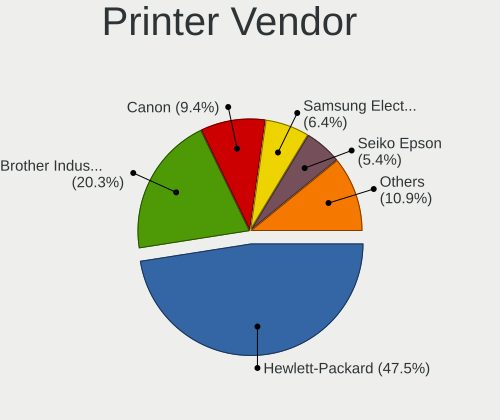

| Vendor                   | Computers | Percent |
|--------------------------|-----------|---------|
| Hewlett-Packard          | 96        | 47.52%  |
| Brother Industries       | 41        | 20.3%   |
| Canon                    | 19        | 9.41%   |
| Samsung Electronics      | 13        | 6.44%   |
| Seiko Epson              | 11        | 5.45%   |
| Oki Data                 | 4         | 1.98%   |
| Ricoh                    | 3         | 1.49%   |
| STMicroelectronics       | 2         | 0.99%   |
| QinHeng Electronics      | 2         | 0.99%   |
| Lexmark International    | 2         | 0.99%   |
| Dymo-CoStar              | 2         | 0.99%   |
| Zebra Technologies       | 1         | 0.5%    |
| Prolific Technology      | 1         | 0.5%    |
| Magic Control Technology | 1         | 0.5%    |
| Kyocera                  | 1         | 0.5%    |
| Konica Minolta           | 1         | 0.5%    |
| ICS Advent               | 1         | 0.5%    |
| Apple                    | 1         | 0.5%    |

Printer Model
-------------

Printer device models

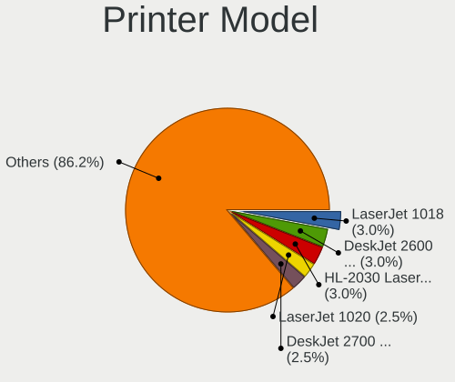

| Model                                                    | Computers | Percent |
|----------------------------------------------------------|-----------|---------|
| HP LaserJet 1018                                         | 6         | 2.96%   |
| HP DeskJet 2600 series                                   | 6         | 2.96%   |
| Brother HL-2030 Laser Printer                            | 6         | 2.96%   |
| HP LaserJet 1020                                         | 5         | 2.46%   |
| HP DeskJet 2700 series                                   | 5         | 2.46%   |
| Samsung M2070 Series                                     | 4         | 1.97%   |
| HP DeskJet 3630 series                                   | 4         | 1.97%   |
| Canon PIXMA MG2500 Series                                | 4         | 1.97%   |
| HP ENVY Photo 6200 series                                | 3         | 1.48%   |
| HP ENVY 5540 series                                      | 3         | 1.48%   |
| HP ENVY 5000 series                                      | 3         | 1.48%   |
| HP DeskJet F2492 All-in-One                              | 3         | 1.48%   |
| HP Deskjet 1050 J410                                     | 3         | 1.48%   |
| Canon LiDE 400                                           | 3         | 1.48%   |
| Canon LiDE 300                                           | 3         | 1.48%   |
| Brother MFC-L2710DW series                               | 3         | 1.48%   |
| Brother MFC-J5330DW                                      | 3         | 1.48%   |
| STMicroelectronics YICHIP3121 Virtual ComPort in FS Mode | 2         | 0.99%   |
| Seiko Epson ET-3750 Series                               | 2         | 0.99%   |
| Samsung M262x/M282x Xpress Series Laser Printer          | 2         | 0.99%   |
| Ricoh RICOH SP 211SU                                     | 2         | 0.99%   |
| QinHeng CH340S                                           | 2         | 0.99%   |
| Oki Data USB Device                                      | 2         | 0.99%   |
| Oki Data MC363 Multifunction Printer                     | 2         | 0.99%   |
| HP Printing Support                                      | 2         | 0.99%   |
| HP LaserJet M14-M17                                      | 2         | 0.99%   |
| HP LaserJet CP1025nw                                     | 2         | 0.99%   |
| HP LaserJet 1022                                         | 2         | 0.99%   |
| HP LaserJet 1010                                         | 2         | 0.99%   |
| HP ENVY 4520 series                                      | 2         | 0.99%   |
| HP ENVY 4500 series                                      | 2         | 0.99%   |
| HP DeskJet 930c                                          | 2         | 0.99%   |
| HP DeskJet 5550                                          | 2         | 0.99%   |
| HP DeskJet 5150c                                         | 2         | 0.99%   |
| HP Deskjet 3050A                                         | 2         | 0.99%   |
| HP Deskjet 2050 J510                                     | 2         | 0.99%   |
| Dymo-CoStar LabelWriter 450                              | 2         | 0.99%   |
| Brother Printer                                          | 2         | 0.99%   |
| Brother HL-L2300D series                                 | 2         | 0.99%   |
| Brother HL-2240D series                                  | 2         | 0.99%   |

Scanner Vendor
--------------

Scanner device vendors

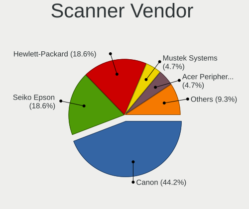

| Vendor                      | Computers | Percent |
|-----------------------------|-----------|---------|
| Canon                       | 19        | 44.19%  |
| Seiko Epson                 | 8         | 18.6%   |
| Hewlett-Packard             | 8         | 18.6%   |
| Mustek Systems              | 2         | 4.65%   |
| Acer Peripherals (now BenQ) | 2         | 4.65%   |
| Sagem                       | 1         | 2.33%   |
| Microtek International      | 1         | 2.33%   |
| KYE Systems (Mouse Systems) | 1         | 2.33%   |
| AGFA-Gevaert NV             | 1         | 2.33%   |

Scanner Model
-------------

Scanner device models

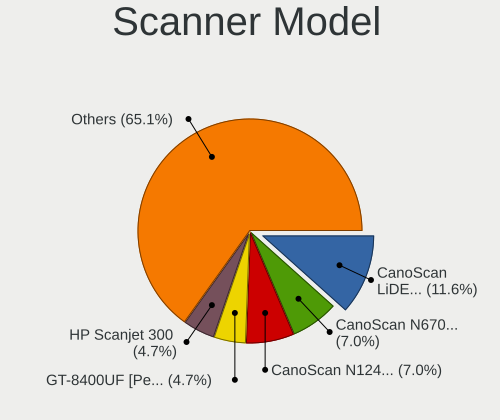

| Model                                                    | Computers | Percent |
|----------------------------------------------------------|-----------|---------|
| Canon CanoScan LiDE 210                                  | 5         | 11.63%  |
| Canon CanoScan N670U/N676U/LiDE 20                       | 3         | 6.98%   |
| Canon CanoScan N1240U/LiDE 30                            | 3         | 6.98%   |
| Seiko Epson GT-8400UF [Perfection 1670/1670 PHOTO]       | 2         | 4.65%   |
| HP HP Scanjet 300                                        | 2         | 4.65%   |
| Canon CanoScan N650U/N656U                               | 2         | 4.65%   |
| Canon CanoScan LiDE 700F                                 | 2         | 4.65%   |
| Canon CanoScan LiDE 220                                  | 2         | 4.65%   |
| Acer Peripherals (now BenQ) S2W 3300U/4300U              | 2         | 4.65%   |
| Seiko Epson GT-X800 [Perfection 4990 PHOTO]              | 1         | 2.33%   |
| Seiko Epson GT-X750 [Perfection 4490 Photo]              | 1         | 2.33%   |
| Seiko Epson GT-F650 [GT-S600/Perfection V10/V100]        | 1         | 2.33%   |
| Seiko Epson GT-F500/GT-F550 [Perfection 2480/2580 PHOTO] | 1         | 2.33%   |
| Seiko Epson GT-7300U [Perfection 1260/1260 PHOTO]        | 1         | 2.33%   |
| Seiko Epson GT-7200U [Perfection 1250/1250 PHOTO]        | 1         | 2.33%   |
| Sagem 600dpi USB Scanner                                 | 1         | 2.33%   |
| Mustek Systems ScanExpress 1200 CU                       | 1         | 2.33%   |
| Mustek Systems BearPaw 1200 CU Plus                      | 1         | 2.33%   |
| Microtek International Scanner                           | 1         | 2.33%   |
| KYE Systems (Mouse Systems) ColorPage-Vivid4             | 1         | 2.33%   |
| HP Scanjet N6010                                         | 1         | 2.33%   |
| HP ScanJet 5200c                                         | 1         | 2.33%   |
| HP ScanJet 4570c                                         | 1         | 2.33%   |
| HP ScanJet 4300c                                         | 1         | 2.33%   |
| HP ScanJet 3570c                                         | 1         | 2.33%   |
| HP ScanJet 3300c                                         | 1         | 2.33%   |
| Canon CanoScan LiDE 50/LiDE 35/LiDE 40                   | 1         | 2.33%   |
| Canon CanoScan LIDE 25                                   | 1         | 2.33%   |
| AGFA-Gevaert NV SnapScan 1212U                           | 1         | 2.33%   |

Camera
------

Camera Vendor
-------------

Camera device vendors

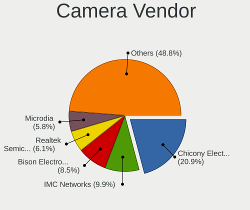

| Vendor                                 | Computers | Percent |
|----------------------------------------|-----------|---------|
| Chicony Electronics                    | 1060      | 20.89%  |
| IMC Networks                           | 504       | 9.93%   |
| Bison Electronics                      | 432       | 8.51%   |
| Realtek Semiconductor                  | 309       | 6.09%   |
| Microdia                               | 295       | 5.81%   |
| Quanta                                 | 294       | 5.79%   |
| Logitech                               | 244       | 4.81%   |
| Sunplus Innovation Technology          | 229       | 4.51%   |
| Cheng Uei Precision Industry (Foxlink) | 185       | 3.65%   |
| Suyin                                  | 173       | 3.41%   |
| Apple                                  | 173       | 3.41%   |
| Luxvisions Innotech Limited            | 151       | 2.98%   |
| Syntek                                 | 139       | 2.74%   |
| Lite-On Technology                     | 77        | 1.52%   |
| Alcor Micro                            | 77        | 1.52%   |
| Ricoh                                  | 53        | 1.04%   |
| Sonix Technology                       | 46        | 0.91%   |
| Shinetech                              | 42        | 0.83%   |
| Creative Technology                    | 40        | 0.79%   |
| Samsung Electronics                    | 34        | 0.67%   |
| Silicon Motion                         | 32        | 0.63%   |
| SunplusIT                              | 29        | 0.57%   |
| Z-Star Microelectronics                | 25        | 0.49%   |
| Acer                                   | 22        | 0.43%   |
| Microsoft                              | 21        | 0.41%   |
| Lenovo                                 | 20        | 0.39%   |
| icSpring                               | 20        | 0.39%   |
| Generalplus Technology                 | 20        | 0.39%   |
| Trust                                  | 18        | 0.35%   |
| GEMBIRD                                | 17        | 0.33%   |
| Importek                               | 16        | 0.32%   |
| KYE Systems (Mouse Systems)            | 14        | 0.28%   |
| ARC International                      | 13        | 0.26%   |
| ALi                                    | 13        | 0.26%   |
| Sunplus Technology                     | 11        | 0.22%   |
| Primax Electronics                     | 11        | 0.22%   |
| Intel                                  | 11        | 0.22%   |
| Genesys Logic                          | 11        | 0.22%   |
| webcam                                 | 10        | 0.2%    |
| DigiTech                               | 10        | 0.2%    |

Camera Model
------------

Camera device models

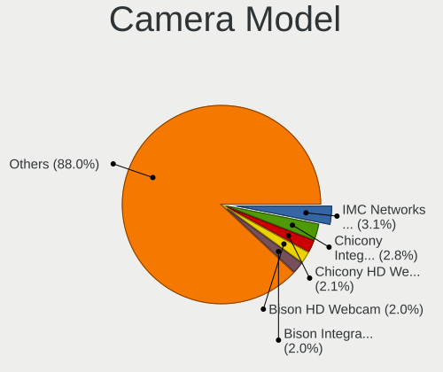

| Model                                                   | Computers | Percent |
|---------------------------------------------------------|-----------|---------|
| IMC Networks USB2.0 HD UVC WebCam                       | 158       | 3.1%    |
| Chicony Integrated Camera                               | 142       | 2.78%   |
| Chicony HD WebCam                                       | 106       | 2.08%   |
| Bison HD Webcam                                         | 103       | 2.02%   |
| Bison Integrated Camera                                 | 101       | 1.98%   |
| IMC Networks Integrated Camera                          | 98        | 1.92%   |
| Microdia Integrated_Webcam_HD                           | 93        | 1.82%   |
| IMC Networks USB2.0 VGA UVC WebCam                      | 84        | 1.65%   |
| Syntek Integrated Camera                                | 69        | 1.35%   |
| Apple Built-in iSight                                   | 63        | 1.23%   |
| Realtek Integrated_Webcam_HD                            | 58        | 1.14%   |
| Logitech Webcam C270                                    | 56        | 1.1%    |
| Chicony USB2.0 VGA UVC WebCam                           | 53        | 1.04%   |
| Quanta HP TrueVision HD Camera                          | 50        | 0.98%   |
| Apple FaceTime HD Camera (Built-in)                     | 49        | 0.96%   |
| Suyin Acer/HP Integrated Webcam [CN0314]                | 46        | 0.9%    |
| Realtek USB Camera                                      | 44        | 0.86%   |
| Sunplus HD WebCam                                       | 42        | 0.82%   |
| Microdia Webcam Vitade AF                               | 41        | 0.8%    |
| Chicony EasyCamera                                      | 40        | 0.78%   |
| Luxvisions Innotech Limited Integrated Camera           | 37        | 0.72%   |
| Luxvisions Innotech Limited HP TrueVision HD Camera     | 37        | 0.72%   |
| Chicony HP TrueVision HD Camera                         | 37        | 0.72%   |
| Chicony TOSHIBA Web Camera - HD                         | 36        | 0.71%   |
| Chicony USB2.0 HD UVC WebCam                            | 35        | 0.69%   |
| Sonix USB2.0 HD UVC WebCam                              | 33        | 0.65%   |
| Samsung Galaxy series, misc. (MTP mode)                 | 33        | 0.65%   |
| Bison Lenovo EasyCamera                                 | 32        | 0.63%   |
| Sunplus Integrated_Webcam_HD                            | 31        | 0.61%   |
| Chicony USB 2.0 Camera                                  | 31        | 0.61%   |
| Chicony HP TrueVision HD                                | 31        | 0.61%   |
| Lite-On Integrated Camera                               | 29        | 0.57%   |
| Chicony HP HD Camera                                    | 29        | 0.57%   |
| Quanta HD WebCam                                        | 28        | 0.55%   |
| Bison HD Camera                                         | 28        | 0.55%   |
| Apple FaceTime HD Camera                                | 28        | 0.55%   |
| Quanta HP HD Camera                                     | 27        | 0.53%   |
| Chicony Chicony USB2.0 Camera                           | 27        | 0.53%   |
| Cheng Uei Precision Industry (Foxlink) HP Truevision HD | 27        | 0.53%   |
| Alcor Micro USB 2.0 Camera                              | 27        | 0.53%   |

Security
--------

Fingerprint Vendor
------------------

Fingerprint sensor vendors

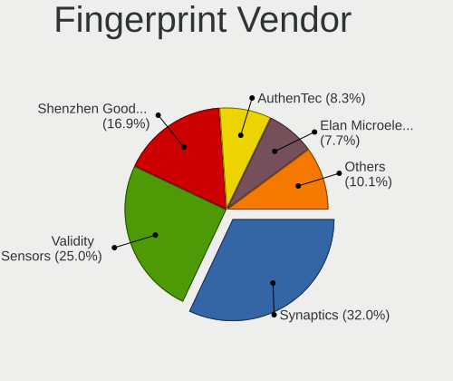

| Vendor                             | Computers | Percent |
|------------------------------------|-----------|---------|
| Synaptics                          | 228       | 32.02%  |
| Validity Sensors                   | 178       | 25%     |
| Shenzhen Goodix Technology         | 120       | 16.85%  |
| AuthenTec                          | 59        | 8.29%   |
| Elan Microelectronics              | 55        | 7.72%   |
| Upek                               | 34        | 4.78%   |
| LighTuning Technology              | 21        | 2.95%   |
| STMicroelectronics                 | 8         | 1.12%   |
| Focal-systems.Corp                 | 5         | 0.7%    |
| Realtek USB2.0 Finger Print Bridge | 3         | 0.42%   |
| DigitalPersona                     | 1         | 0.14%   |

Fingerprint Model
-----------------

Fingerprint sensor models

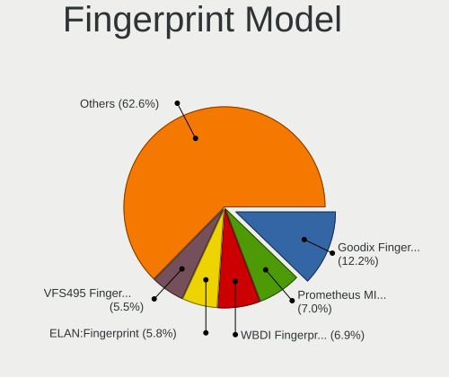

| Model                                                                      | Computers | Percent |
|----------------------------------------------------------------------------|-----------|---------|
| Shenzhen Goodix  Fingerprint Device                                        | 87        | 12.22%  |
| Synaptics Prometheus MIS Touch Fingerprint Reader                          | 50        | 7.02%   |
| Synaptics WBDI Fingerprint Reader USB 086                                  | 49        | 6.88%   |
| Elan ELAN:Fingerprint                                                      | 41        | 5.76%   |
| Validity Sensors VFS495 Fingerprint Reader                                 | 39        | 5.48%   |
| Upek Biometric Touchchip/Touchstrip Fingerprint Sensor                     | 28        | 3.93%   |
| Shenzhen Goodix Fingerprint Reader                                         | 26        | 3.65%   |
| Synaptics Metallica MIS Touch Fingerprint Reader                           | 25        | 3.51%   |
| Validity Sensors VFS5011 Fingerprint Reader                                | 21        | 2.95%   |
| Validity Sensors VFS 5011 fingerprint sensor                               | 20        | 2.81%   |
| Validity Sensors Synaptics WBDI                                            | 16        | 2.25%   |
| Synaptics FS7604 Touch Fingerprint Sensor with PurePrint                   | 16        | 2.25%   |
| Synaptics UWP WBDI Device                                                  | 15        | 2.11%   |
| Synaptics  WBDI                                                            | 15        | 2.11%   |
| AuthenTec AES2501 Fingerprint Sensor                                       | 15        | 2.11%   |
| Validity Sensors Synaptics VFS7552 Touch Fingerprint Sensor with PurePrint | 14        | 1.97%   |
| Elan ELAN:ARM-M4                                                           | 14        | 1.97%   |
| Validity Sensors Swipe Fingerprint Sensor                                  | 13        | 1.83%   |
| Validity Sensors VFS471 Fingerprint Reader                                 | 12        | 1.69%   |
| Synaptics Metallica MOH Touch Fingerprint Reader                           | 12        | 1.69%   |
| AuthenTec AES1600                                                          | 12        | 1.69%   |
| Synaptics WBDI                                                             | 11        | 1.54%   |
| AuthenTec Fingerprint Sensor                                               | 11        | 1.54%   |
| AuthenTec AES2810                                                          | 10        | 1.4%    |
| Validity Sensors VFS491                                                    | 9         | 1.26%   |
| Validity Sensors VFS451 Fingerprint Reader                                 | 9         | 1.26%   |
| Synaptics  FS7604 Touch Fingerprint Sensor with PurePrint                  | 9         | 1.26%   |
| Synaptics Prometheus Fingerprint Reader                                    | 9         | 1.26%   |
| LighTuning ES603 Swipe Fingerprint Sensor                                  | 9         | 1.26%   |
| STMicroelectronics Fingerprint Reader                                      | 8         | 1.12%   |
| Synaptics Fingerprint reader [HP G6]                                       | 7         | 0.98%   |
| Shenzhen Goodix FingerPrint                                                | 7         | 0.98%   |
| LighTuning EgisTec Touch Fingerprint Sensor                                | 7         | 0.98%   |
| AuthenTec AES2550 Fingerprint Sensor                                       | 7         | 0.98%   |
| Validity Sensors Synaptics VFS7552 Touch Fingerprint Sensor                | 6         | 0.84%   |
| Validity Sensors Fingerprint scanner                                       | 6         | 0.84%   |
| Upek TCS5B Fingerprint sensor                                              | 6         | 0.84%   |
| Validity Sensors VFS301 Fingerprint Reader                                 | 5         | 0.7%    |
| Focal-systems.Corp FT9201Fingerprint.                                      | 5         | 0.7%    |
| AuthenTec AES1660 Fingerprint Sensor                                       | 4         | 0.56%   |

Chipcard Vendor
---------------

Chipcard module vendors

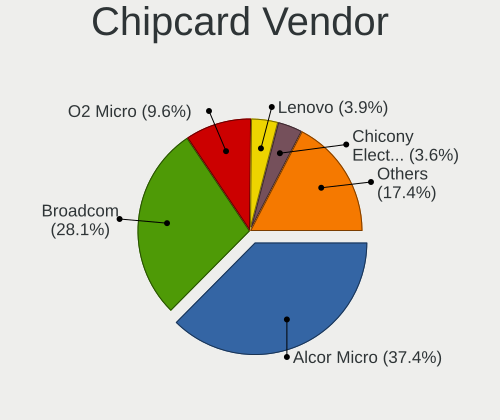

| Vendor                    | Computers | Percent |
|---------------------------|-----------|---------|
| Alcor Micro               | 125       | 37.43%  |
| Broadcom                  | 94        | 28.14%  |
| O2 Micro                  | 32        | 9.58%   |
| Lenovo                    | 13        | 3.89%   |
| Chicony Electronics       | 12        | 3.59%   |
| Cherry                    | 10        | 2.99%   |
| Advanced Card Systems     | 9         | 2.69%   |
| Upek                      | 7         | 2.1%    |
| C3PO                      | 7         | 2.1%    |
| SCM Microsystems          | 6         | 1.8%    |
| Realtek Semiconductor     | 6         | 1.8%    |
| Gemalto (was Gemplus)     | 5         | 1.5%    |
| OmniKey                   | 2         | 0.6%    |
| Hewlett-Packard           | 2         | 0.6%    |
| Thetis                    | 1         | 0.3%    |
| In Focus Systems          | 1         | 0.3%    |
| Fujitsu Siemens Computers | 1         | 0.3%    |
| Bit4id                    | 1         | 0.3%    |

Chipcard Model
--------------

Chipcard module models

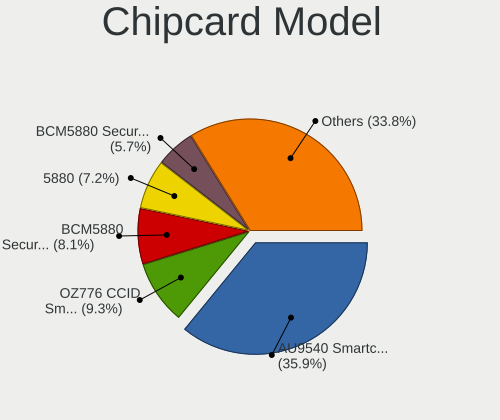

| Model                                                                        | Computers | Percent |
|------------------------------------------------------------------------------|-----------|---------|
| Alcor Micro AU9540 Smartcard Reader                                          | 120       | 35.93%  |
| O2 Micro OZ776 CCID Smartcard Reader                                         | 31        | 9.28%   |
| Broadcom BCM5880 Secure Applications Processor                               | 27        | 8.08%   |
| Broadcom 5880                                                                | 24        | 7.19%   |
| Broadcom BCM5880 Secure Applications Processor with fingerprint swipe sensor | 19        | 5.69%   |
| Broadcom BCM58200 ControlVault 3 (FingerPrint sensor + Contacted SmartCard)  | 18        | 5.39%   |
| Lenovo Integrated Smart Card Reader                                          | 13        | 3.89%   |
| Chicony Electronics HP Skylab USB Smartcard Keyboard                         | 12        | 3.59%   |
| Upek TouchChip Fingerprint Coprocessor (WBF advanced mode)                   | 7         | 2.1%    |
| Advanced Card Systems ACR38 SmartCard Reader                                 | 7         | 2.1%    |
| Realtek Semiconductor Smart Card Reader Interface                            | 6         | 1.8%    |
| Cherry SmartTerminal XX1X                                                    | 5         | 1.5%    |
| Cherry SmartCard Reader Keyboard KC 1000 SC                                  | 5         | 1.5%    |
| C3PO LTC31v2                                                                 | 5         | 1.5%    |
| Broadcom 58200                                                               | 5         | 1.5%    |
| Alcor Micro Watchdata W 1981                                                 | 5         | 1.5%    |
| SCM Microsystems SCR331-LC1 / SCR3310 SmartCard Reader                       | 4         | 1.2%    |
| Gemalto (was Gemplus) Compact Smart Card Reader Writer                       | 3         | 0.9%    |
| OmniKey CardMan 3021 / 3121                                                  | 2         | 0.6%    |
| Hewlett-Packard SC Keyboard - Apollo (Liteon)                                | 2         | 0.6%    |
| Gemalto (was Gemplus) GemPC Twin SmartCard Reader                            | 2         | 0.6%    |
| Thetis Security Key(F825)                                                    | 1         | 0.3%    |
| SCM Microsystems SCR35xx USB Smart Card Reader                               | 1         | 0.3%    |
| SCM Microsystems SCR35xx Smart Card Reader                                   | 1         | 0.3%    |
| O2 Micro Oz776 SmartCard Reader                                              | 1         | 0.3%    |
| In Focus Systems EMV Smartcard Reader                                        | 1         | 0.3%    |
| Fujitsu Siemens Computers SmartCard Reader 2A                                | 1         | 0.3%    |
| C3PO USB SMART CARD READER                                                   | 1         | 0.3%    |
| C3PO KBR36                                                                   | 1         | 0.3%    |
| Broadcom BCM5880 Secure Applications Processor with fingerprint touch sensor | 1         | 0.3%    |
| Bit4id miniLector-s                                                          | 1         | 0.3%    |
| Advanced Card Systems ACR39U                                                 | 1         | 0.3%    |
| Advanced Card Systems ACR122U                                                | 1         | 0.3%    |

Unsupported
-----------

Unsupported Devices
-------------------

Total unsupported devices on board

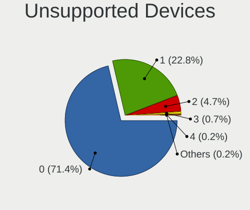

| Total | Computers | Percent |
|-------|-----------|---------|
| 0     | 6326      | 71.36%  |
| 1     | 2020      | 22.79%  |
| 2     | 414       | 4.67%   |
| 3     | 66        | 0.74%   |
| 4     | 19        | 0.21%   |
| 5     | 11        | 0.12%   |
| 6     | 4         | 0.05%   |
| 9     | 2         | 0.02%   |
| 8     | 2         | 0.02%   |
| 7     | 1         | 0.01%   |

Unsupported Device Types
------------------------

Types of unsupported devices

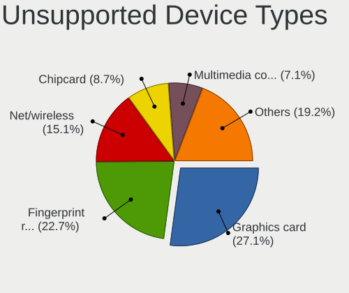

| Type                     | Computers | Percent |
|--------------------------|-----------|---------|
| Graphics card            | 835       | 27.14%  |
| Fingerprint reader       | 700       | 22.75%  |
| Net/wireless             | 466       | 15.14%  |
| Chipcard                 | 269       | 8.74%   |
| Multimedia controller    | 217       | 7.05%   |
| Camera                   | 104       | 3.38%   |
| Communication controller | 99        | 3.22%   |
| Bluetooth                | 77        | 2.5%    |
| Unassigned class         | 68        | 2.21%   |
| Sound                    | 47        | 1.53%   |
| Storage                  | 39        | 1.27%   |
| Card reader              | 35        | 1.14%   |
| Net/ethernet             | 32        | 1.04%   |
| Network                  | 30        | 0.97%   |
| Storage/raid             | 13        | 0.42%   |
| Flash memory             | 13        | 0.42%   |
| Modem                    | 11        | 0.36%   |
| Dvb card                 | 10        | 0.32%   |
| Firewire controller      | 5         | 0.16%   |
| Storage/nvme             | 3         | 0.1%    |
| Storage/ide              | 3         | 0.1%    |
| Tv card                  | 1         | 0.03%   |

