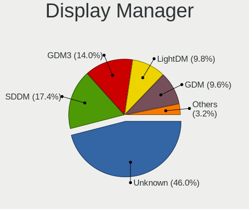
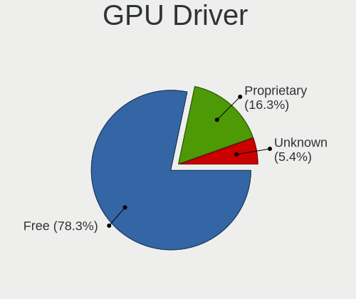

Linux in Spain - Tested Hardware & Statistics
---------------------------------------------

A project to collect tested hardware configurations for Linux in Spain.

Anyone can contribute to this report by the [hw-probe](https://github.com/linuxhw/hw-probe) tool:

    sudo -E hw-probe -all -upload

Please contribute! Especially if your hardware is rare.

This is a report for all computer types. See also reports for [desktops](/Location/Spain/Desktop/README.md) and [notebooks](/Location/Spain/Notebook/README.md).

Contents
--------

* [ Test Cases ](#test-cases)

* [ System ](#system)
  - [ OS                       ](#os)
  - [ OS Family                ](#os-family)
  - [ Kernel                   ](#kernel)
  - [ Kernel Family            ](#kernel-family)
  - [ Kernel Major Ver.        ](#kernel-major-ver)
  - [ Arch                     ](#arch)
  - [ DE                       ](#de)
  - [ Display Server           ](#display-server)
  - [ Display Manager          ](#display-manager)
  - [ OS Lang                  ](#os-lang)
  - [ Boot Mode                ](#boot-mode)
  - [ Filesystem               ](#filesystem)
  - [ Part. scheme             ](#part-scheme)
  - [ Dual Boot with Linux/BSD ](#dual-boot-with-linuxbsd)
  - [ Dual Boot (Win)          ](#dual-boot-win)

* [ Board ](#board)
  - [ Vendor                   ](#vendor)
  - [ Model                    ](#model)
  - [ Model Family             ](#model-family)
  - [ MFG Year                 ](#mfg-year)
  - [ Form Factor              ](#form-factor)
  - [ Secure Boot              ](#secure-boot)
  - [ Coreboot                 ](#coreboot)
  - [ RAM Size                 ](#ram-size)
  - [ RAM Used                 ](#ram-used)
  - [ Total Drives             ](#total-drives)
  - [ Has CD-ROM               ](#has-cd-rom)
  - [ Has Ethernet             ](#has-ethernet)
  - [ Has WiFi                 ](#has-wifi)
  - [ Has Bluetooth            ](#has-bluetooth)

* [ Location ](#location)
  - [ Country                  ](#country)
  - [ City                     ](#city)

* [ Drives ](#drives)
  - [ Drive Vendor             ](#drive-vendor)
  - [ Drive Model              ](#drive-model)
  - [ HDD Vendor               ](#hdd-vendor)
  - [ SSD Vendor               ](#ssd-vendor)
  - [ Drive Kind               ](#drive-kind)
  - [ Drive Connector          ](#drive-connector)
  - [ Drive Size               ](#drive-size)
  - [ Space Total              ](#space-total)
  - [ Space Used               ](#space-used)
  - [ Malfunc. Drives          ](#malfunc-drives)
  - [ Malfunc. Drive Vendor    ](#malfunc-drive-vendor)
  - [ Malfunc. HDD Vendor      ](#malfunc-hdd-vendor)
  - [ Malfunc. Drive Kind      ](#malfunc-drive-kind)
  - [ Failed Drives            ](#failed-drives)
  - [ Failed Drive Vendor      ](#failed-drive-vendor)
  - [ Drive Status             ](#drive-status)

* [ Storage controller ](#storage-controller)
  - [ Storage Vendor           ](#storage-vendor)
  - [ Storage Model            ](#storage-model)
  - [ Storage Kind             ](#storage-kind)

* [ Processor ](#processor)
  - [ CPU Vendor               ](#cpu-vendor)
  - [ CPU Model                ](#cpu-model)
  - [ CPU Model Family         ](#cpu-model-family)
  - [ CPU Cores                ](#cpu-cores)
  - [ CPU Sockets              ](#cpu-sockets)
  - [ CPU Threads              ](#cpu-threads)
  - [ CPU Op-Modes             ](#cpu-op-modes)
  - [ CPU Microcode            ](#cpu-microcode)
  - [ CPU Microarch            ](#cpu-microarch)

* [ Graphics ](#graphics)
  - [ GPU Vendor               ](#gpu-vendor)
  - [ GPU Model                ](#gpu-model)
  - [ GPU Combo                ](#gpu-combo)
  - [ GPU Driver               ](#gpu-driver)
  - [ GPU Memory               ](#gpu-memory)

* [ Monitor ](#monitor)
  - [ Monitor Vendor           ](#monitor-vendor)
  - [ Monitor Model            ](#monitor-model)
  - [ Monitor Resolution       ](#monitor-resolution)
  - [ Monitor Diagonal         ](#monitor-diagonal)
  - [ Monitor Width            ](#monitor-width)
  - [ Aspect Ratio             ](#aspect-ratio)
  - [ Monitor Area             ](#monitor-area)
  - [ Pixel Density            ](#pixel-density)
  - [ Multiple Monitors        ](#multiple-monitors)

* [ Network ](#network)
  - [ Net Controller Vendor    ](#net-controller-vendor)
  - [ Net Controller Model     ](#net-controller-model)
  - [ Wireless Vendor          ](#wireless-vendor)
  - [ Wireless Model           ](#wireless-model)
  - [ Ethernet Vendor          ](#ethernet-vendor)
  - [ Ethernet Model           ](#ethernet-model)
  - [ Net Controller Kind      ](#net-controller-kind)
  - [ Used Controller          ](#used-controller)
  - [ NICs                     ](#nics)
  - [ IPv6                     ](#ipv6)

* [ Bluetooth ](#bluetooth)
  - [ Bluetooth Vendor         ](#bluetooth-vendor)
  - [ Bluetooth Model          ](#bluetooth-model)

* [ Sound ](#sound)
  - [ Sound Vendor             ](#sound-vendor)
  - [ Sound Model              ](#sound-model)

* [ Memory ](#memory)
  - [ Memory Vendor            ](#memory-vendor)
  - [ Memory Model             ](#memory-model)
  - [ Memory Kind              ](#memory-kind)
  - [ Memory Form Factor       ](#memory-form-factor)
  - [ Memory Size              ](#memory-size)
  - [ Memory Speed             ](#memory-speed)

* [ Printers & scanners ](#printers--scanners)
  - [ Printer Vendor           ](#printer-vendor)
  - [ Printer Model            ](#printer-model)
  - [ Scanner Vendor           ](#scanner-vendor)
  - [ Scanner Model            ](#scanner-model)

* [ Camera ](#camera)
  - [ Camera Vendor            ](#camera-vendor)
  - [ Camera Model             ](#camera-model)

* [ Security ](#security)
  - [ Fingerprint Vendor       ](#fingerprint-vendor)
  - [ Fingerprint Model        ](#fingerprint-model)
  - [ Chipcard Vendor          ](#chipcard-vendor)
  - [ Chipcard Model           ](#chipcard-model)

* [ Unsupported ](#unsupported)
  - [ Unsupported Devices      ](#unsupported-devices)
  - [ Unsupported Device Types ](#unsupported-device-types)

Test Cases
----------

Total: 8650

| Vendor        | Model                       | Form-Factor | Probe                                                      | Date         |
|---------------|-----------------------------|-------------|------------------------------------------------------------|--------------|
| Dell          | Inspiron 15 3511            | Notebook    | [27381bdf35](https://linux-hardware.org/?probe=27381bdf35) | Nov 06, 2023 |
| ASUSTek       | TUF Gaming B450-PLUS II     | Desktop     | [9e50325ddd](https://linux-hardware.org/?probe=9e50325ddd) | Nov 06, 2023 |
| Gigabyte      | B450M S2H                   | Desktop     | [b40c43c829](https://linux-hardware.org/?probe=b40c43c829) | Nov 05, 2023 |
| Gigabyte      | B450M S2H                   | Desktop     | [67a1ec0ae8](https://linux-hardware.org/?probe=67a1ec0ae8) | Nov 05, 2023 |
| HP            | ProBook 640 G1              | Notebook    | [1cc495d15b](https://linux-hardware.org/?probe=1cc495d15b) | Nov 05, 2023 |
| HP            | Spectre Pro G1              | Notebook    | [78bce56071](https://linux-hardware.org/?probe=78bce56071) | Nov 05, 2023 |
| Toshiba       | TECRA R950                  | Notebook    | [864877692e](https://linux-hardware.org/?probe=864877692e) | Nov 05, 2023 |
| MSI           | MEG Z590 UNIFY              | Desktop     | [1f84fe45f8](https://linux-hardware.org/?probe=1f84fe45f8) | Nov 05, 2023 |
| MSI           | B560M PRO-VDH               | Desktop     | [82bf4f530a](https://linux-hardware.org/?probe=82bf4f530a) | Nov 05, 2023 |
| Shuttle       | FH87                        | Desktop     | [1488ef29c3](https://linux-hardware.org/?probe=1488ef29c3) | Nov 05, 2023 |
| HP            | Pavilion dm4                | Notebook    | [ed4309477f](https://linux-hardware.org/?probe=ed4309477f) | Nov 05, 2023 |
| HP            | Pavilion dv6                | Notebook    | [60ff7a74af](https://linux-hardware.org/?probe=60ff7a74af) | Nov 05, 2023 |
| Dell          | 062TCH A00                  | Desktop     | [b82fbd03d5](https://linux-hardware.org/?probe=b82fbd03d5) | Nov 05, 2023 |
| Lenovo        | ThinkPad T470s W10DG 20J... | Notebook    | [ae9fcece31](https://linux-hardware.org/?probe=ae9fcece31) | Nov 05, 2023 |
| Gigabyte      | B450M DS3H-CF               | Desktop     | [fefb7e12d2](https://linux-hardware.org/?probe=fefb7e12d2) | Nov 05, 2023 |
| MSI           | B560M PRO-VDH               | Desktop     | [04e96e2742](https://linux-hardware.org/?probe=04e96e2742) | Nov 04, 2023 |
| Lenovo        | 3102 SDK0J40697 WIN 3305... | Desktop     | [dade20f823](https://linux-hardware.org/?probe=dade20f823) | Nov 04, 2023 |
| MSI           | Modern 15 B7M               | Notebook    | [b4a588e60e](https://linux-hardware.org/?probe=b4a588e60e) | Nov 04, 2023 |
| MSI           | MPG X570 GAMING PLUS        | Desktop     | [20ffbbc165](https://linux-hardware.org/?probe=20ffbbc165) | Nov 04, 2023 |
| Dell          | 062TCH A00                  | Desktop     | [b964b2c6be](https://linux-hardware.org/?probe=b964b2c6be) | Nov 04, 2023 |
| ASUSTek       | H110M-D                     | Desktop     | [03303fa6ed](https://linux-hardware.org/?probe=03303fa6ed) | Nov 04, 2023 |
| Lenovo        | G580 2189                   | Notebook    | [29a529e02c](https://linux-hardware.org/?probe=29a529e02c) | Nov 03, 2023 |
| Lenovo        | ThinkPad X1 Fold Gen 1 2... | Tablet      | [a06677f6ea](https://linux-hardware.org/?probe=a06677f6ea) | Nov 03, 2023 |
| Lenovo        | ThinkPad X1 Fold Gen 1 2... | Tablet      | [d8c90f446f](https://linux-hardware.org/?probe=d8c90f446f) | Nov 03, 2023 |
| Lenovo        | ThinkBook 14 G3 ACL 21A2    | Notebook    | [8b855ce4f4](https://linux-hardware.org/?probe=8b855ce4f4) | Nov 03, 2023 |
| Lenovo        | IdeaPad 3 15ITL6 82H8       | Notebook    | [b724ede64d](https://linux-hardware.org/?probe=b724ede64d) | Nov 02, 2023 |
| ASUSTek       | ROG STRIX B365-G GAMING     | Desktop     | [89a9c53f3a](https://linux-hardware.org/?probe=89a9c53f3a) | Nov 02, 2023 |
| ASUSTek       | P5G41T-M LX                 | Desktop     | [ae6c835796](https://linux-hardware.org/?probe=ae6c835796) | Nov 02, 2023 |
| MSI           | Prestige 14 A11SCS          | Notebook    | [e114e8ae5b](https://linux-hardware.org/?probe=e114e8ae5b) | Nov 02, 2023 |
| Intel         | X99                         | Desktop     | [b740510fc0](https://linux-hardware.org/?probe=b740510fc0) | Nov 02, 2023 |
| Lenovo        | 318D                        | All in one  | [9936941c90](https://linux-hardware.org/?probe=9936941c90) | Nov 02, 2023 |
| Lenovo        | 318D                        | All in one  | [2774838df7](https://linux-hardware.org/?probe=2774838df7) | Nov 02, 2023 |
| MSI           | Z170A GAMING M7             | Desktop     | [9ba4f50201](https://linux-hardware.org/?probe=9ba4f50201) | Nov 02, 2023 |
| Lenovo        | Yoga Slim 9 14IAP7 82T0     | Notebook    | [11e373f762](https://linux-hardware.org/?probe=11e373f762) | Nov 02, 2023 |
| Lenovo        | ThinkPad X240 20AMS2EC00    | Notebook    | [820620d5c4](https://linux-hardware.org/?probe=820620d5c4) | Nov 01, 2023 |
| ASUSTek       | TUF Gaming X570-PRO         | Desktop     | [993d985e9e](https://linux-hardware.org/?probe=993d985e9e) | Nov 01, 2023 |
| Dell          | G3 3579                     | Notebook    | [0b33f63284](https://linux-hardware.org/?probe=0b33f63284) | Nov 01, 2023 |
| MSI           | Z170A GAMING M7             | Desktop     | [a613aa5a0f](https://linux-hardware.org/?probe=a613aa5a0f) | Nov 01, 2023 |
| Lenovo        | ThinkPad E560 20EVA02SSP    | Notebook    | [165be504bf](https://linux-hardware.org/?probe=165be504bf) | Nov 01, 2023 |
| HP            | ZBook 15u G6                | Notebook    | [b74e35da2b](https://linux-hardware.org/?probe=b74e35da2b) | Nov 01, 2023 |
| Acer          | Aspire E1-572G              | Notebook    | [d347dc93b5](https://linux-hardware.org/?probe=d347dc93b5) | Nov 01, 2023 |
| ASUSTek       | TUF Gaming X570-PRO         | Desktop     | [bb9a00e5b5](https://linux-hardware.org/?probe=bb9a00e5b5) | Nov 01, 2023 |
| ASUSTek       | X550LD                      | Notebook    | [2d0fae2241](https://linux-hardware.org/?probe=2d0fae2241) | Nov 01, 2023 |
| MSI           | H110M ECO                   | Desktop     | [d2f60e8bc9](https://linux-hardware.org/?probe=d2f60e8bc9) | Nov 01, 2023 |
| HP            | 8054                        | Desktop     | [b667e30b0e](https://linux-hardware.org/?probe=b667e30b0e) | Nov 01, 2023 |
| Gigabyte      | GA-MA770-DS3                | Desktop     | [968cf90d9a](https://linux-hardware.org/?probe=968cf90d9a) | Nov 01, 2023 |
| ASUSTek       | X555QG                      | Notebook    | [f047c1d264](https://linux-hardware.org/?probe=f047c1d264) | Nov 01, 2023 |
| Gigabyte      | P67A-D3-B3                  | Desktop     | [0c51ffc039](https://linux-hardware.org/?probe=0c51ffc039) | Nov 01, 2023 |
| VANT          | MOOVE3-15                   | Notebook    | [5fc04a6d0a](https://linux-hardware.org/?probe=5fc04a6d0a) | Oct 31, 2023 |
| Toshiba       | Satellite C55-C             | Notebook    | [859d23eed0](https://linux-hardware.org/?probe=859d23eed0) | Oct 31, 2023 |
| ASUSTek       | TUF Gaming B550-PLUS        | Desktop     | [7b6fe38982](https://linux-hardware.org/?probe=7b6fe38982) | Oct 31, 2023 |
| VANT          | MOOVE3-15                   | Notebook    | [7e12621e6d](https://linux-hardware.org/?probe=7e12621e6d) | Oct 31, 2023 |
| Lenovo        | IdeaPad Gaming 3 15ACH6 ... | Notebook    | [0eae5ed294](https://linux-hardware.org/?probe=0eae5ed294) | Oct 31, 2023 |
| Chuwi         | LarkBox X                   | Mini pc     | [d9518c52b4](https://linux-hardware.org/?probe=d9518c52b4) | Oct 30, 2023 |
| Timi          | RedmiBook Pro 14S           | Notebook    | [780e721e24](https://linux-hardware.org/?probe=780e721e24) | Oct 30, 2023 |
| ASUSTek       | B85M-G                      | Desktop     | [e4b4cf1229](https://linux-hardware.org/?probe=e4b4cf1229) | Oct 30, 2023 |
| Unknown       | Unknown                     | Notebook    | [43e6db0023](https://linux-hardware.org/?probe=43e6db0023) | Oct 30, 2023 |
| Lenovo        | IdeaPadFlex 5 14ARE05 81... | Convertible | [4254def277](https://linux-hardware.org/?probe=4254def277) | Oct 30, 2023 |
| MSI           | B550-A PRO                  | Desktop     | [d03daf3967](https://linux-hardware.org/?probe=d03daf3967) | Oct 30, 2023 |
| HP            | 8436                        | Desktop     | [4fe5c2e03c](https://linux-hardware.org/?probe=4fe5c2e03c) | Oct 30, 2023 |
| ASUSTek       | PN53-G                      | Mini pc     | [e64336b3cd](https://linux-hardware.org/?probe=e64336b3cd) | Oct 30, 2023 |
| ASUSTek       | VivoBook_ASUSLaptop E410... | Notebook    | [bb991098d1](https://linux-hardware.org/?probe=bb991098d1) | Oct 30, 2023 |
| MSI           | GF75 Thin 10SC              | Notebook    | [7aa47ebfa1](https://linux-hardware.org/?probe=7aa47ebfa1) | Oct 30, 2023 |
| Gigabyte      | H81M-HD3                    | Desktop     | [1be6955dfc](https://linux-hardware.org/?probe=1be6955dfc) | Oct 30, 2023 |
| ASUSTek       | Zenbook UM3402YA_UM3402Y... | Notebook    | [794edd04ea](https://linux-hardware.org/?probe=794edd04ea) | Oct 30, 2023 |
| ASUSTek       | P5G41T-M LX                 | Desktop     | [e741e073e0](https://linux-hardware.org/?probe=e741e073e0) | Oct 30, 2023 |
| Lenovo        | ZIWB2                       | Notebook    | [9e6bd45db9](https://linux-hardware.org/?probe=9e6bd45db9) | Oct 29, 2023 |
| Chuwi         | LarkBox X                   | Mini pc     | [9fc3537861](https://linux-hardware.org/?probe=9fc3537861) | Oct 29, 2023 |
| ASUSTek       | VivoBook 15_ASUS Laptop ... | Notebook    | [d443352482](https://linux-hardware.org/?probe=d443352482) | Oct 29, 2023 |
| Apple         | MacBookPro15,4              | Notebook    | [09ee918b60](https://linux-hardware.org/?probe=09ee918b60) | Oct 29, 2023 |
| Lenovo        | ThinkPad X1 Yoga Gen 6 2... | Convertible | [923dc22e28](https://linux-hardware.org/?probe=923dc22e28) | Oct 29, 2023 |
| Lenovo        | ThinkPad X1 Yoga Gen 6 2... | Convertible | [ab6738f16c](https://linux-hardware.org/?probe=ab6738f16c) | Oct 29, 2023 |
| Allview       | Allbook H                   | Notebook    | [e56046d262](https://linux-hardware.org/?probe=e56046d262) | Oct 29, 2023 |
| Allview       | Allbook H                   | Notebook    | [3f2fc29d49](https://linux-hardware.org/?probe=3f2fc29d49) | Oct 29, 2023 |
| Lenovo        | ThinkPad X270 20HMS1T600    | Notebook    | [97fbe59dd7](https://linux-hardware.org/?probe=97fbe59dd7) | Oct 29, 2023 |
| SLIMBOOK      | TITAN                       | Notebook    | [8697e4de09](https://linux-hardware.org/?probe=8697e4de09) | Oct 29, 2023 |
| Apple         | Mac-F221BEC8                | Desktop     | [4db0be5324](https://linux-hardware.org/?probe=4db0be5324) | Oct 29, 2023 |
| Koloe         | X58                         | Desktop     | [91fbabe04c](https://linux-hardware.org/?probe=91fbabe04c) | Oct 29, 2023 |
| MSI           | MPG B550 GAMING PLUS        | Desktop     | [dee4ef8a3b](https://linux-hardware.org/?probe=dee4ef8a3b) | Oct 29, 2023 |
| HP            | Laptop 15-da0xxx            | Notebook    | [39d06d7acf](https://linux-hardware.org/?probe=39d06d7acf) | Oct 28, 2023 |
| HP            | 18E4                        | Desktop     | [b192ce4f35](https://linux-hardware.org/?probe=b192ce4f35) | Oct 28, 2023 |
| HP            | Notebook                    | Notebook    | [715435e533](https://linux-hardware.org/?probe=715435e533) | Oct 28, 2023 |
| MSI           | H110M PRO-D                 | Desktop     | [96710ad70e](https://linux-hardware.org/?probe=96710ad70e) | Oct 28, 2023 |
| Toshiba       | TECRA R950                  | Notebook    | [afa984b0d3](https://linux-hardware.org/?probe=afa984b0d3) | Oct 28, 2023 |
| Packard Be... | EasyNote MH36               | Notebook    | [6d73774152](https://linux-hardware.org/?probe=6d73774152) | Oct 28, 2023 |
| SLIMBOOK      | PROX14-10                   | Notebook    | [4ffcd3ced8](https://linux-hardware.org/?probe=4ffcd3ced8) | Oct 28, 2023 |
| Lenovo        | ThinkPad L540 20AUS11P00    | Notebook    | [d59d45eb50](https://linux-hardware.org/?probe=d59d45eb50) | Oct 27, 2023 |
| Apple         | Mac-031B6874CF7F642A iMa... | All in one  | [fc29a80949](https://linux-hardware.org/?probe=fc29a80949) | Oct 27, 2023 |
| MSI           | Modern 15 A10M              | Notebook    | [79b0d0252f](https://linux-hardware.org/?probe=79b0d0252f) | Oct 27, 2023 |
| Acer          | TravelMate P259-M           | Notebook    | [7c1c04b9b2](https://linux-hardware.org/?probe=7c1c04b9b2) | Oct 26, 2023 |
| Acer          | TravelMate P259-M           | Notebook    | [670cd56ea3](https://linux-hardware.org/?probe=670cd56ea3) | Oct 26, 2023 |
| Lenovo        | ZIWB2                       | Notebook    | [2537a6e7b9](https://linux-hardware.org/?probe=2537a6e7b9) | Oct 26, 2023 |
| Lenovo        | G580 2189                   | Notebook    | [bba412f376](https://linux-hardware.org/?probe=bba412f376) | Oct 26, 2023 |
| Unknown       | Unknown                     | Notebook    | [7d25c7409a](https://linux-hardware.org/?probe=7d25c7409a) | Oct 26, 2023 |
| Apple         | MacBookPro15,4              | Notebook    | [751e98cb04](https://linux-hardware.org/?probe=751e98cb04) | Oct 26, 2023 |
| MSI           | Prestige 15 A10SC           | Notebook    | [796a2f6a53](https://linux-hardware.org/?probe=796a2f6a53) | Oct 25, 2023 |
| ASUSTek       | GL752VW                     | Notebook    | [a11cf1d28d](https://linux-hardware.org/?probe=a11cf1d28d) | Oct 25, 2023 |
| ASUSTek       | ROG CROSSHAIR X670E HERO    | Desktop     | [9207de9b44](https://linux-hardware.org/?probe=9207de9b44) | Oct 25, 2023 |
| Acer          | Aspire 9300                 | Notebook    | [3094b549c5](https://linux-hardware.org/?probe=3094b549c5) | Oct 25, 2023 |
| Foxconn       | 2ABF                        | Desktop     | [50abb592dd](https://linux-hardware.org/?probe=50abb592dd) | Oct 25, 2023 |
| MSI           | X470 GAMING PLUS MAX        | Desktop     | [61ec26bc75](https://linux-hardware.org/?probe=61ec26bc75) | Oct 24, 2023 |
| HP            | 14                          | Notebook    | [5e8b808f2f](https://linux-hardware.org/?probe=5e8b808f2f) | Oct 24, 2023 |
| TUXEDO        | InfinityBook Pro Gen8 (M... | Notebook    | [3907a62f64](https://linux-hardware.org/?probe=3907a62f64) | Oct 24, 2023 |
| Gigabyte      | B85M-D3V Plus               | Desktop     | [845b1f10ef](https://linux-hardware.org/?probe=845b1f10ef) | Oct 24, 2023 |
| rocky         | ASUS EXPERTBOOK B1402CBA... | Notebook    | [e7dc573b01](https://linux-hardware.org/?probe=e7dc573b01) | Oct 23, 2023 |
| ASUSTek       | ASUS EXPERTBOOK B2502CBA... | Notebook    | [823dcebef0](https://linux-hardware.org/?probe=823dcebef0) | Oct 23, 2023 |
| ASUSTek       | ASUS EXPERTBOOK B2502CBA... | Notebook    | [b7e1e895b9](https://linux-hardware.org/?probe=b7e1e895b9) | Oct 23, 2023 |
| Lenovo        | Yoga Slim 7 ProX 14IAH7 ... | Notebook    | [f4375f7115](https://linux-hardware.org/?probe=f4375f7115) | Oct 23, 2023 |
| Acer          | TravelMate P259-M           | Notebook    | [d6096c6736](https://linux-hardware.org/?probe=d6096c6736) | Oct 23, 2023 |
| ASUSTek       | T101HA                      | Tablet      | [7190f336e0](https://linux-hardware.org/?probe=7190f336e0) | Oct 23, 2023 |
| ASUSTek       | T101HA                      | Tablet      | [fc5437cf30](https://linux-hardware.org/?probe=fc5437cf30) | Oct 22, 2023 |
| ASUSTek       | ROG Flow X13 GV301RC_GV3... | Convertible | [2d3766505f](https://linux-hardware.org/?probe=2d3766505f) | Oct 22, 2023 |
| ASUSTek       | X551CA                      | Notebook    | [43c37fb1fe](https://linux-hardware.org/?probe=43c37fb1fe) | Oct 22, 2023 |
| ASUSTek       | X551CA                      | Notebook    | [e9a381c722](https://linux-hardware.org/?probe=e9a381c722) | Oct 22, 2023 |
| MSI           | MS-B0621 100                | All in one  | [f1b56a371d](https://linux-hardware.org/?probe=f1b56a371d) | Oct 22, 2023 |
| AZW           | SEi                         | Notebook    | [94602bd41b](https://linux-hardware.org/?probe=94602bd41b) | Oct 22, 2023 |
| MSI           | X470 GAMING PLUS MAX        | Desktop     | [918cd67301](https://linux-hardware.org/?probe=918cd67301) | Oct 22, 2023 |
| Acer          | Aspire A715-76G             | Notebook    | [448723995f](https://linux-hardware.org/?probe=448723995f) | Oct 22, 2023 |
| Lenovo        | IdeaPad 3 15ITL6 82H8       | Notebook    | [c5027da111](https://linux-hardware.org/?probe=c5027da111) | Oct 22, 2023 |
| Apple         | Mac-F65AE981FFA204ED Mac... | Mini pc     | [04a430e244](https://linux-hardware.org/?probe=04a430e244) | Oct 22, 2023 |
| Gigabyte      | GA-MA790XT-UD4P             | Desktop     | [ad17620d9f](https://linux-hardware.org/?probe=ad17620d9f) | Oct 21, 2023 |
| Gigabyte      | Z390 UD                     | Desktop     | [edf8acb455](https://linux-hardware.org/?probe=edf8acb455) | Oct 21, 2023 |
| ASRock        | N68C-S UCC                  | Desktop     | [6468bd6335](https://linux-hardware.org/?probe=6468bd6335) | Oct 21, 2023 |
| Lenovo        | ThinkBook 15 G4 IAP 21DJ    | Notebook    | [59d8c7186d](https://linux-hardware.org/?probe=59d8c7186d) | Oct 21, 2023 |
| HP            | Pavilion Laptop 15-cs3xx... | Notebook    | [f2ee678da1](https://linux-hardware.org/?probe=f2ee678da1) | Oct 21, 2023 |
| Gigabyte      | GA-MA790XT-UD4P             | Desktop     | [9286fa6477](https://linux-hardware.org/?probe=9286fa6477) | Oct 21, 2023 |
| Lenovo        | IdeaPad 3 15ITL6 82H8       | Notebook    | [37cdbd73b0](https://linux-hardware.org/?probe=37cdbd73b0) | Oct 21, 2023 |
| ASUSTek       | PRIME B250M-A               | Desktop     | [ff0d8bbab4](https://linux-hardware.org/?probe=ff0d8bbab4) | Oct 21, 2023 |
| HP            | TouchSmart tm2              | Notebook    | [a79b82edd3](https://linux-hardware.org/?probe=a79b82edd3) | Oct 21, 2023 |
| Packard Be... | IMEDIA S3840                | Desktop     | [3cc1398528](https://linux-hardware.org/?probe=3cc1398528) | Oct 21, 2023 |
| ASUSTek       | ROG STRIX B450-E GAMING     | Desktop     | [2d07542448](https://linux-hardware.org/?probe=2d07542448) | Oct 20, 2023 |
| Lenovo        | IdeaPad 3 15ITL6 82H8       | Notebook    | [56621ceace](https://linux-hardware.org/?probe=56621ceace) | Oct 20, 2023 |
| MSI           | B450-A PRO MAX              | Desktop     | [e02418f8c1](https://linux-hardware.org/?probe=e02418f8c1) | Oct 20, 2023 |
| ASUSTek       | Zenbook UM3402YAR_UM3402... | Notebook    | [7323684232](https://linux-hardware.org/?probe=7323684232) | Oct 20, 2023 |
| Sony          | VPCSB2L1R                   | Notebook    | [153440d631](https://linux-hardware.org/?probe=153440d631) | Oct 20, 2023 |
| MSI           | B450-A PRO MAX              | Desktop     | [17b8a78644](https://linux-hardware.org/?probe=17b8a78644) | Oct 20, 2023 |
| Razer         | Blade 14 (2022) - RZ09-0... | Notebook    | [64929e25f7](https://linux-hardware.org/?probe=64929e25f7) | Oct 20, 2023 |
| Chuwi         | MiniBook                    | Notebook    | [baaf33908c](https://linux-hardware.org/?probe=baaf33908c) | Oct 20, 2023 |
| Apple         | Mac-F65AE981FFA204ED Mac... | Mini pc     | [fe5af0991d](https://linux-hardware.org/?probe=fe5af0991d) | Oct 20, 2023 |
| Lenovo        | G500 20236                  | Notebook    | [6e5d214cb8](https://linux-hardware.org/?probe=6e5d214cb8) | Oct 20, 2023 |
| Razer         | Blade 14 (2022) - RZ09-0... | Notebook    | [da8f06a8e0](https://linux-hardware.org/?probe=da8f06a8e0) | Oct 19, 2023 |
| Toshiba       | Satellite P50t-B-118        | Notebook    | [5237c0866e](https://linux-hardware.org/?probe=5237c0866e) | Oct 19, 2023 |
| Dell          | Precision 7760              | Notebook    | [30e33a33c3](https://linux-hardware.org/?probe=30e33a33c3) | Oct 19, 2023 |
| ASUSTek       | ROG STRIX X570-I GAMING     | Desktop     | [0fa5f53ce0](https://linux-hardware.org/?probe=0fa5f53ce0) | Oct 19, 2023 |
| ASUSTek       | M4A78LT-M                   | Desktop     | [cc8d1f7fb2](https://linux-hardware.org/?probe=cc8d1f7fb2) | Oct 19, 2023 |
| ASUSTek       | X555QG                      | Notebook    | [e2e11a852f](https://linux-hardware.org/?probe=e2e11a852f) | Oct 19, 2023 |
| ASUSTek       | K46CB                       | Notebook    | [58573f017a](https://linux-hardware.org/?probe=58573f017a) | Oct 19, 2023 |
| HP            | TouchSmart tm2              | Notebook    | [f72f6a43b5](https://linux-hardware.org/?probe=f72f6a43b5) | Oct 19, 2023 |
| ASRock        | H110M-HDV R3.0              | Desktop     | [491538303f](https://linux-hardware.org/?probe=491538303f) | Oct 19, 2023 |
| HP            | Laptop 15s-eq2xxx           | Notebook    | [9c9781a7ee](https://linux-hardware.org/?probe=9c9781a7ee) | Oct 19, 2023 |
| ASUSTek       | Vivobook Go E1504FA_E150... | Notebook    | [a25bc084fc](https://linux-hardware.org/?probe=a25bc084fc) | Oct 19, 2023 |
| ASUSTek       | T101HA                      | Tablet      | [b3cd8983eb](https://linux-hardware.org/?probe=b3cd8983eb) | Oct 18, 2023 |
| MSI           | Modern 15 A5M               | Notebook    | [cb9366b6ae](https://linux-hardware.org/?probe=cb9366b6ae) | Oct 18, 2023 |
| HP            | 2B52                        | Desktop     | [b14a00a196](https://linux-hardware.org/?probe=b14a00a196) | Oct 18, 2023 |
| HP            | 250 G3                      | Notebook    | [e4e0140eb3](https://linux-hardware.org/?probe=e4e0140eb3) | Oct 18, 2023 |
| Lenovo        | IdeaPad 3 15ITL6 82H8       | Notebook    | [b99a873ab7](https://linux-hardware.org/?probe=b99a873ab7) | Oct 18, 2023 |
| ASUSTek       | K46CB                       | Notebook    | [f524007ed7](https://linux-hardware.org/?probe=f524007ed7) | Oct 18, 2023 |
| ASUSTek       | TUF Gaming B550M-PLUS WI... | Desktop     | [2530967a90](https://linux-hardware.org/?probe=2530967a90) | Oct 17, 2023 |
| HUAWEI        | KLVL-WXX9                   | Notebook    | [0ca9b4c2bd](https://linux-hardware.org/?probe=0ca9b4c2bd) | Oct 17, 2023 |
| HP            | Pavilion dv6                | Notebook    | [0846a94456](https://linux-hardware.org/?probe=0846a94456) | Oct 17, 2023 |
| ASUSTek       | TUF Gaming B450M-PLUS II    | Desktop     | [200b756e67](https://linux-hardware.org/?probe=200b756e67) | Oct 17, 2023 |
| Lenovo        | ThinkPad S1 Yoga 12 20DL... | Notebook    | [060a9c66c5](https://linux-hardware.org/?probe=060a9c66c5) | Oct 17, 2023 |
| Dell          | XPS 13 9310                 | Notebook    | [295c6b08bd](https://linux-hardware.org/?probe=295c6b08bd) | Oct 17, 2023 |
| ASUSTek       | N61Jv                       | Notebook    | [cb8a1ca22a](https://linux-hardware.org/?probe=cb8a1ca22a) | Oct 17, 2023 |
| ASUSTek       | X500MA                      | Desktop     | [2ffe0522e1](https://linux-hardware.org/?probe=2ffe0522e1) | Oct 17, 2023 |
| MSI           | Prestige 14H B12UCX         | Notebook    | [81dac6f109](https://linux-hardware.org/?probe=81dac6f109) | Oct 17, 2023 |
| HP            | ProBook 440 G6              | Notebook    | [5860734f3a](https://linux-hardware.org/?probe=5860734f3a) | Oct 16, 2023 |
| Allview       | Allbook H                   | Notebook    | [456afe3921](https://linux-hardware.org/?probe=456afe3921) | Oct 16, 2023 |
| ASUSTek       | ROG STRIX B550-F GAMING     | Desktop     | [d519c10989](https://linux-hardware.org/?probe=d519c10989) | Oct 16, 2023 |
| Pine Micro... | Pine64 PineTab2 v2.0        | Soc         | [8efa3d8f19](https://linux-hardware.org/?probe=8efa3d8f19) | Oct 16, 2023 |
| MSI           | Modern 14 A10RAS            | Notebook    | [571e9b4e91](https://linux-hardware.org/?probe=571e9b4e91) | Oct 15, 2023 |
| ASUSTek       | UX550VD                     | Notebook    | [a58d0c5f1c](https://linux-hardware.org/?probe=a58d0c5f1c) | Oct 15, 2023 |
| ASUSTek       | UX550VD                     | Notebook    | [c29e83963a](https://linux-hardware.org/?probe=c29e83963a) | Oct 15, 2023 |
| Teclast       | F7 Plus                     | Notebook    | [8c4d203e84](https://linux-hardware.org/?probe=8c4d203e84) | Oct 15, 2023 |
| Google        | Dratini                     | Notebook    | [0c74e4ac18](https://linux-hardware.org/?probe=0c74e4ac18) | Oct 15, 2023 |
| Google        | Dratini                     | Notebook    | [bc181ae269](https://linux-hardware.org/?probe=bc181ae269) | Oct 15, 2023 |
| Dell          | XPS 13 9343                 | Notebook    | [97a3c4d92d](https://linux-hardware.org/?probe=97a3c4d92d) | Oct 15, 2023 |
| Gigabyte      | B550I AORUS PRO AX          | Desktop     | [374a5bf116](https://linux-hardware.org/?probe=374a5bf116) | Oct 15, 2023 |
| Intel         | NUC7JYB M37316-600          | Mini pc     | [7919d1517f](https://linux-hardware.org/?probe=7919d1517f) | Oct 14, 2023 |
| MSI           | Prestige 14H B12UCX         | Notebook    | [ddc0082c22](https://linux-hardware.org/?probe=ddc0082c22) | Oct 14, 2023 |
| MSI           | MAG B550 TORPEDO            | Desktop     | [2bb3baf0f6](https://linux-hardware.org/?probe=2bb3baf0f6) | Oct 14, 2023 |
| Dell          | Latitude E4200              | Notebook    | [2a5bbc07aa](https://linux-hardware.org/?probe=2a5bbc07aa) | Oct 14, 2023 |
| ASUSTek       | ASUS TUF Gaming F15 FX50... | Notebook    | [11d91a0246](https://linux-hardware.org/?probe=11d91a0246) | Oct 14, 2023 |
| Medion        | E15415                      | Notebook    | [b9a4ecdc97](https://linux-hardware.org/?probe=b9a4ecdc97) | Oct 14, 2023 |
| Lenovo        | IdeaPad Gaming 3 15ARH05... | Notebook    | [584433cc95](https://linux-hardware.org/?probe=584433cc95) | Oct 14, 2023 |
| Intel         | JSL MRD                     | Desktop     | [a39b6e2f92](https://linux-hardware.org/?probe=a39b6e2f92) | Oct 14, 2023 |
| HP            | Pavilion x360 Convertibl... | Convertible | [36ce3b4e93](https://linux-hardware.org/?probe=36ce3b4e93) | Oct 13, 2023 |
| HP            | Pavilion x360 Convertibl... | Convertible | [b572583fd2](https://linux-hardware.org/?probe=b572583fd2) | Oct 13, 2023 |
| MSI           | Prestige 14H B12UCX         | Notebook    | [63a132c897](https://linux-hardware.org/?probe=63a132c897) | Oct 13, 2023 |
| ASUSTek       | TUF Gaming B550-PLUS WIF... | Desktop     | [5ee0d65118](https://linux-hardware.org/?probe=5ee0d65118) | Oct 13, 2023 |
| Panasonic     | CF-C1AD06GDE                | Notebook    | [473265139b](https://linux-hardware.org/?probe=473265139b) | Oct 13, 2023 |
| HP            | 1998                        | Desktop     | [e8d3c2b8ef](https://linux-hardware.org/?probe=e8d3c2b8ef) | Oct 12, 2023 |
| Lenovo        | IdeaPad 3 15ADA05 81W1      | Notebook    | [b53da36041](https://linux-hardware.org/?probe=b53da36041) | Oct 12, 2023 |
| HP            | Unknown                     | Notebook    | [c64a37f28f](https://linux-hardware.org/?probe=c64a37f28f) | Oct 12, 2023 |
| Lenovo        | ThinkPad L14 Gen 1 20U50... | Notebook    | [ba690b36a3](https://linux-hardware.org/?probe=ba690b36a3) | Oct 12, 2023 |
| Dell          | 00V62H A01                  | Desktop     | [4957e141ac](https://linux-hardware.org/?probe=4957e141ac) | Oct 12, 2023 |
| MSI           | PS42 Modern 8MO             | Notebook    | [be9a0659d4](https://linux-hardware.org/?probe=be9a0659d4) | Oct 11, 2023 |
| HP            | EliteBook 840 G5            | Notebook    | [0baddc9010](https://linux-hardware.org/?probe=0baddc9010) | Oct 11, 2023 |
| HP            | 240 G8 Notebook PC          | Notebook    | [0a98dcd952](https://linux-hardware.org/?probe=0a98dcd952) | Oct 11, 2023 |
| ASUSTek       | TUF Gaming X570-PLUS        | Desktop     | [0cbd266486](https://linux-hardware.org/?probe=0cbd266486) | Oct 11, 2023 |
| Toshiba       | QOSMIO X70-B                | Notebook    | [fc0abd191f](https://linux-hardware.org/?probe=fc0abd191f) | Oct 11, 2023 |
| HP            | Laptop 15-fc0xxx            | Notebook    | [670b2194c0](https://linux-hardware.org/?probe=670b2194c0) | Oct 11, 2023 |
| Lenovo        | IdeaPad 3 15ITL6 82H8       | Notebook    | [046e552e27](https://linux-hardware.org/?probe=046e552e27) | Oct 11, 2023 |
| Lenovo        | ThinkBook 13s G4 ARB 21A... | Notebook    | [d7d6c74d55](https://linux-hardware.org/?probe=d7d6c74d55) | Oct 11, 2023 |
| Dell          | 09CKT0 A03                  | Desktop     | [27c33c2ec5](https://linux-hardware.org/?probe=27c33c2ec5) | Oct 11, 2023 |
| ASRock        | X79 Extreme9                | Desktop     | [4a0805a07a](https://linux-hardware.org/?probe=4a0805a07a) | Oct 11, 2023 |
| Lenovo        | G580 2189                   | Notebook    | [ea46e68be2](https://linux-hardware.org/?probe=ea46e68be2) | Oct 11, 2023 |
| Valve         | Jupiter                     | Notebook    | [2bde49db66](https://linux-hardware.org/?probe=2bde49db66) | Oct 11, 2023 |
| Intel         | X99                         | Desktop     | [c025563ec2](https://linux-hardware.org/?probe=c025563ec2) | Oct 10, 2023 |
| Gigabyte      | X470 AORUS ULTRA GAMING-... | Desktop     | [68372adfc5](https://linux-hardware.org/?probe=68372adfc5) | Oct 10, 2023 |
| ASUSTek       | S550CM                      | Notebook    | [ad1b08de66](https://linux-hardware.org/?probe=ad1b08de66) | Oct 10, 2023 |
| AZW           | Green G5                    | Desktop     | [cb5efe1873](https://linux-hardware.org/?probe=cb5efe1873) | Oct 10, 2023 |
| HP            | 8054                        | Desktop     | [66ad5550d1](https://linux-hardware.org/?probe=66ad5550d1) | Oct 10, 2023 |
| HP            | Pavilion 11 x360 PC         | Notebook    | [947e4c6b2f](https://linux-hardware.org/?probe=947e4c6b2f) | Oct 10, 2023 |
| Apple         | Mac-F2268DAE                | All in one  | [fed7f26361](https://linux-hardware.org/?probe=fed7f26361) | Oct 10, 2023 |
| MSI           | MS-7125                     | Desktop     | [2e6837be6d](https://linux-hardware.org/?probe=2e6837be6d) | Oct 10, 2023 |
| HUAWEI        | KLVL-WXXW                   | Notebook    | [3f6528d99d](https://linux-hardware.org/?probe=3f6528d99d) | Oct 10, 2023 |
| HP            | 89B5 A                      | Desktop     | [746fef0fc7](https://linux-hardware.org/?probe=746fef0fc7) | Oct 10, 2023 |
| MSI           | B450M BAZOOKA V2            | Desktop     | [3b598550c2](https://linux-hardware.org/?probe=3b598550c2) | Oct 10, 2023 |
| Lenovo        | ThinkPad L540 20AUS11P00    | Notebook    | [ec64651cec](https://linux-hardware.org/?probe=ec64651cec) | Oct 10, 2023 |
| ASUSTek       | K30AD_M31AD_M51AD_M32AD     | Desktop     | [333535db5f](https://linux-hardware.org/?probe=333535db5f) | Oct 10, 2023 |
| Teclast       | F7S                         | Notebook    | [92c51af32a](https://linux-hardware.org/?probe=92c51af32a) | Oct 10, 2023 |
| Lenovo        | IdeaPad 3 15ADA05 81W1      | Notebook    | [6d2a6c2a6f](https://linux-hardware.org/?probe=6d2a6c2a6f) | Oct 09, 2023 |
| Apple         | MacBookAir5,1               | Notebook    | [e4f9055fce](https://linux-hardware.org/?probe=e4f9055fce) | Oct 09, 2023 |
| Lenovo        | ThinkPad T14 Gen 3 21AH0... | Notebook    | [a41b75e081](https://linux-hardware.org/?probe=a41b75e081) | Oct 09, 2023 |
| Lenovo        | ThinkPad T14 Gen 3 21AH0... | Notebook    | [ac6149e371](https://linux-hardware.org/?probe=ac6149e371) | Oct 08, 2023 |
| Gigabyte      | H310M S2H x.x               | Desktop     | [fd3c1d1196](https://linux-hardware.org/?probe=fd3c1d1196) | Oct 08, 2023 |
| Valve         | Jupiter                     | Notebook    | [86be8c226a](https://linux-hardware.org/?probe=86be8c226a) | Oct 08, 2023 |
| HP            | Notebook                    | Notebook    | [a181ec12af](https://linux-hardware.org/?probe=a181ec12af) | Oct 08, 2023 |
| HP            | Notebook                    | Notebook    | [039a70e9ce](https://linux-hardware.org/?probe=039a70e9ce) | Oct 07, 2023 |
| Dell          | Inspiron 16 Plus 7630       | Notebook    | [51571d43df](https://linux-hardware.org/?probe=51571d43df) | Oct 07, 2023 |
| Lenovo        | 370A SDK0J40709 WIN 3259... | Desktop     | [38c0c97684](https://linux-hardware.org/?probe=38c0c97684) | Oct 07, 2023 |
| Pegatron      | EVANS                       | Desktop     | [f798f24c90](https://linux-hardware.org/?probe=f798f24c90) | Oct 07, 2023 |
| VANT          | MOOVE14_2023                | Notebook    | [d9379b5405](https://linux-hardware.org/?probe=d9379b5405) | Oct 06, 2023 |
| Dell          | Latitude 7275               | Notebook    | [f1892c721d](https://linux-hardware.org/?probe=f1892c721d) | Oct 06, 2023 |
| Allview       | Allbook H                   | Notebook    | [9c1933c4eb](https://linux-hardware.org/?probe=9c1933c4eb) | Oct 06, 2023 |
| MSI           | GE63 Raider RGB 8RE         | Notebook    | [39b9855097](https://linux-hardware.org/?probe=39b9855097) | Oct 05, 2023 |
| MSI           | GE63 Raider RGB 8RE         | Notebook    | [74bb875f9f](https://linux-hardware.org/?probe=74bb875f9f) | Oct 05, 2023 |
| Packard Be... | MCP73PV                     | Desktop     | [dc24306f2f](https://linux-hardware.org/?probe=dc24306f2f) | Oct 05, 2023 |
| Lenovo        | Yoga 7 14ARB7 82QF          | Convertible | [2070a1032e](https://linux-hardware.org/?probe=2070a1032e) | Oct 05, 2023 |
| MSI           | X470 GAMING PLUS MAX        | Desktop     | [377e8e1994](https://linux-hardware.org/?probe=377e8e1994) | Oct 05, 2023 |
| Lenovo        | G580 2189                   | Notebook    | [bd7f2d9d03](https://linux-hardware.org/?probe=bd7f2d9d03) | Oct 05, 2023 |
| MSI           | Prestige 15 A11SCX          | Notebook    | [9a4bc722e5](https://linux-hardware.org/?probe=9a4bc722e5) | Oct 05, 2023 |
| Lenovo        | B50-80 80LT                 | Notebook    | [74b54d0f3f](https://linux-hardware.org/?probe=74b54d0f3f) | Oct 05, 2023 |
| Acer          | Aspire M3-581G              | Notebook    | [040dc9b84b](https://linux-hardware.org/?probe=040dc9b84b) | Oct 04, 2023 |
| HP            | EliteBook 745 G6            | Notebook    | [77cfc34723](https://linux-hardware.org/?probe=77cfc34723) | Oct 04, 2023 |
| ASUSTek       | A88XM-E                     | Desktop     | [cef182f4e0](https://linux-hardware.org/?probe=cef182f4e0) | Oct 04, 2023 |
| Apple         | MacBookPro14,2              | Notebook    | [49a295d5f0](https://linux-hardware.org/?probe=49a295d5f0) | Oct 04, 2023 |
| Gigabyte      | B550M DS3H                  | Desktop     | [6c95b1e3b2](https://linux-hardware.org/?probe=6c95b1e3b2) | Oct 04, 2023 |
| Packard Be... | MCP73PV                     | Desktop     | [2ecd860fef](https://linux-hardware.org/?probe=2ecd860fef) | Oct 03, 2023 |
| ASUSTek       | PRIME H510M-D               | Desktop     | [e583e35b95](https://linux-hardware.org/?probe=e583e35b95) | Oct 03, 2023 |
| ASUSTek       | PRIME H510M-D               | Desktop     | [538889d79f](https://linux-hardware.org/?probe=538889d79f) | Oct 03, 2023 |
| HP            | ENVY 15                     | Notebook    | [589ff0a0af](https://linux-hardware.org/?probe=589ff0a0af) | Oct 03, 2023 |
| ASUSTek       | TUF Gaming X570-PLUS        | Desktop     | [c77065abde](https://linux-hardware.org/?probe=c77065abde) | Oct 03, 2023 |
| Acer          | TravelMate P414-51          | Notebook    | [520fe0b494](https://linux-hardware.org/?probe=520fe0b494) | Oct 03, 2023 |
| HP            | EliteBook 840 G5            | Notebook    | [6615883de3](https://linux-hardware.org/?probe=6615883de3) | Oct 03, 2023 |
| Pegatron      | EVANS                       | Desktop     | [3f2a4fe53e](https://linux-hardware.org/?probe=3f2a4fe53e) | Oct 03, 2023 |
| ASUSTek       | TUF Gaming B550-PLUS        | Desktop     | [8fd9631bea](https://linux-hardware.org/?probe=8fd9631bea) | Oct 03, 2023 |
| Supermicro    | X10SL7-F                    | Server      | [5e6d01b044](https://linux-hardware.org/?probe=5e6d01b044) | Oct 03, 2023 |
| Dynabook      | Satellite Pro C50-G         | Notebook    | [36e6d60078](https://linux-hardware.org/?probe=36e6d60078) | Oct 02, 2023 |
| ASUSTek       | ROG Strix G513IH_G513IH     | Notebook    | [7d076d124e](https://linux-hardware.org/?probe=7d076d124e) | Oct 02, 2023 |
| Dynabook      | Satellite Pro C50-E-11H     | Notebook    | [29d9d8dd30](https://linux-hardware.org/?probe=29d9d8dd30) | Oct 02, 2023 |
| Shuttle       | DS47D                       | Notebook    | [d4c27bdf9e](https://linux-hardware.org/?probe=d4c27bdf9e) | Oct 02, 2023 |
| ASUSTek       | P8H77-M PRO                 | Desktop     | [bc03d7f758](https://linux-hardware.org/?probe=bc03d7f758) | Oct 02, 2023 |
| MSI           | Vector GP68HX 12VH          | Notebook    | [e582127237](https://linux-hardware.org/?probe=e582127237) | Oct 02, 2023 |
| ASUSTek       | ROG CROSSHAIR X670E HERO    | Desktop     | [76c5466daa](https://linux-hardware.org/?probe=76c5466daa) | Oct 02, 2023 |
| ASUSTek       | ROG Zephyrus G14 GA401II... | Notebook    | [6fb4d2a754](https://linux-hardware.org/?probe=6fb4d2a754) | Oct 01, 2023 |
| HP            | 3397                        | Desktop     | [fac50277cc](https://linux-hardware.org/?probe=fac50277cc) | Oct 01, 2023 |
| HP            | Presario CQ57               | Notebook    | [e83f052dc8](https://linux-hardware.org/?probe=e83f052dc8) | Oct 01, 2023 |
| Lenovo        | G500 20236                  | Notebook    | [96ce4b8060](https://linux-hardware.org/?probe=96ce4b8060) | Oct 01, 2023 |
| Packard Be... | DOT S                       | Notebook    | [5fd6d403d1](https://linux-hardware.org/?probe=5fd6d403d1) | Oct 01, 2023 |
| Acer          | Aspire E1-571               | Notebook    | [2e7aba6432](https://linux-hardware.org/?probe=2e7aba6432) | Oct 01, 2023 |
| ASUSTek       | PRIME B365M-A               | Desktop     | [279922964e](https://linux-hardware.org/?probe=279922964e) | Oct 01, 2023 |
| HP            | Pavilion Laptop 14-dv1xx... | Notebook    | [085fbda5a6](https://linux-hardware.org/?probe=085fbda5a6) | Sep 30, 2023 |
| MSI           | Prestige 14H B12UCX         | Notebook    | [b3a006adc7](https://linux-hardware.org/?probe=b3a006adc7) | Sep 30, 2023 |
| MSI           | Prestige 15 A10SC           | Notebook    | [6e53cd8a65](https://linux-hardware.org/?probe=6e53cd8a65) | Sep 30, 2023 |
| MSI           | Prestige 14H B12UCX         | Notebook    | [1c1f35d1c8](https://linux-hardware.org/?probe=1c1f35d1c8) | Sep 30, 2023 |
| Dell          | 0Y56T3 A01                  | Desktop     | [bfc1d1dd13](https://linux-hardware.org/?probe=bfc1d1dd13) | Sep 30, 2023 |
| Lenovo        | Legion 5 Pro 16ACH6H 82J... | Notebook    | [3421ba07f9](https://linux-hardware.org/?probe=3421ba07f9) | Sep 30, 2023 |
| Lenovo        | Legion 5 Pro 16ACH6H 82J... | Notebook    | [480316a0da](https://linux-hardware.org/?probe=480316a0da) | Sep 30, 2023 |
| HP            | 250 G7 Notebook PC          | Notebook    | [2fc3f16671](https://linux-hardware.org/?probe=2fc3f16671) | Sep 30, 2023 |
| Packard Be... | EasyNote TK85               | Notebook    | [0c62f48dda](https://linux-hardware.org/?probe=0c62f48dda) | Sep 30, 2023 |
| ASUSTek       | PRIME B450M-A               | Desktop     | [3c9f4d4aef](https://linux-hardware.org/?probe=3c9f4d4aef) | Sep 29, 2023 |
| Apple         | Mac-FFE5EF870D7BA81A iMa... | All in one  | [4d2f60a496](https://linux-hardware.org/?probe=4d2f60a496) | Sep 29, 2023 |
| Lenovo        | Z50-70 20354                | Notebook    | [eb33abdaae](https://linux-hardware.org/?probe=eb33abdaae) | Sep 29, 2023 |
| ASUSTek       | VivoBook_ASUSLaptop TP42... | Convertible | [4a6090c2f4](https://linux-hardware.org/?probe=4a6090c2f4) | Sep 29, 2023 |
| HP            | Laptop 15s-fq1xxx           | Notebook    | [08fb652352](https://linux-hardware.org/?probe=08fb652352) | Sep 29, 2023 |
| HP            | Laptop 15-fd0xxx            | Notebook    | [0a548c4390](https://linux-hardware.org/?probe=0a548c4390) | Sep 28, 2023 |
| HP            | Pavilion 11 x360 PC         | Notebook    | [b6316ea4df](https://linux-hardware.org/?probe=b6316ea4df) | Sep 28, 2023 |
| HP            | Pavilion 11 x360 PC         | Notebook    | [f75ab187aa](https://linux-hardware.org/?probe=f75ab187aa) | Sep 28, 2023 |
| Lenovo        | IdeaPad Gaming 3 15ACH6 ... | Notebook    | [426e8bd9c0](https://linux-hardware.org/?probe=426e8bd9c0) | Sep 28, 2023 |
| HP            | Victus by Gaming Laptop ... | Notebook    | [3c4c65947a](https://linux-hardware.org/?probe=3c4c65947a) | Sep 28, 2023 |
| ASUSTek       | ROG CROSSHAIR X670E HERO    | Desktop     | [41f0f8666c](https://linux-hardware.org/?probe=41f0f8666c) | Sep 27, 2023 |
| Packard Be... | EasyNote TK85               | Notebook    | [79e6dd1302](https://linux-hardware.org/?probe=79e6dd1302) | Sep 27, 2023 |
| Dell          | XPS 9315                    | Notebook    | [6fa1beb451](https://linux-hardware.org/?probe=6fa1beb451) | Sep 26, 2023 |
| Apple         | Mac-F226BEC8 PVT            | All in one  | [2bdd48e441](https://linux-hardware.org/?probe=2bdd48e441) | Sep 26, 2023 |
| ASUSTek       | ROG STRIX B365-G GAMING     | Desktop     | [14cbad7097](https://linux-hardware.org/?probe=14cbad7097) | Sep 26, 2023 |
| ASUSTek       | ROG STRIX B365-G GAMING     | Desktop     | [1e61c0fb6b](https://linux-hardware.org/?probe=1e61c0fb6b) | Sep 26, 2023 |
| LG Electro... | 13U70Q-G.AA75B              | Notebook    | [f38b79055b](https://linux-hardware.org/?probe=f38b79055b) | Sep 26, 2023 |
| Lenovo        | IdeaPad 3 15ITL6 82H8       | Notebook    | [dd48e0075b](https://linux-hardware.org/?probe=dd48e0075b) | Sep 26, 2023 |
| Lenovo        | V15 G2 ALC 82KD             | Notebook    | [21c3145a6a](https://linux-hardware.org/?probe=21c3145a6a) | Sep 26, 2023 |
| MSI           | GF75 Thin 10SC              | Notebook    | [f19700e7b0](https://linux-hardware.org/?probe=f19700e7b0) | Sep 26, 2023 |
| MSI           | GF75 Thin 10SC              | Notebook    | [a7610be494](https://linux-hardware.org/?probe=a7610be494) | Sep 26, 2023 |
| Lenovo        | IdeaPad 5 14ARE05 81YM      | Notebook    | [786338b217](https://linux-hardware.org/?probe=786338b217) | Sep 26, 2023 |
| Sony          | VPCSB2L1R                   | Notebook    | [9395b9347e](https://linux-hardware.org/?probe=9395b9347e) | Sep 26, 2023 |
| Acer          | Extensa 5635Z               | Notebook    | [19afe08920](https://linux-hardware.org/?probe=19afe08920) | Sep 25, 2023 |
| ASUSTek       | TUF B360-PRO GAMING WIFI    | Desktop     | [16c22d9ead](https://linux-hardware.org/?probe=16c22d9ead) | Sep 25, 2023 |
| Dell          | 0441XG A04                  | Server      | [60298ae886](https://linux-hardware.org/?probe=60298ae886) | Sep 25, 2023 |
| BESSTAR Te... | HM90                        | Desktop     | [a85d516a80](https://linux-hardware.org/?probe=a85d516a80) | Sep 25, 2023 |
| Lenovo        | ThinkPad X270 W10DG 20K5... | Notebook    | [1deb55b03b](https://linux-hardware.org/?probe=1deb55b03b) | Sep 25, 2023 |
| Fanless Mi... | PCG02 GLE                   | Stick pc    | [6dca52cc54](https://linux-hardware.org/?probe=6dca52cc54) | Sep 25, 2023 |
| Gigabyte      | X99-UD4-CF                  | Desktop     | [c50564e3bb](https://linux-hardware.org/?probe=c50564e3bb) | Sep 25, 2023 |
| ASRock        | 970 Extreme4                | Desktop     | [4b78e93dff](https://linux-hardware.org/?probe=4b78e93dff) | Sep 25, 2023 |
| ASRock        | 970 Extreme4                | Desktop     | [e05aa71be7](https://linux-hardware.org/?probe=e05aa71be7) | Sep 25, 2023 |
| Sony          | SVF14A15CXB                 | Notebook    | [cbce21a887](https://linux-hardware.org/?probe=cbce21a887) | Sep 25, 2023 |
| ASUSTek       | ROG Zephyrus G14 GA401II... | Notebook    | [7d4c2dc8f6](https://linux-hardware.org/?probe=7d4c2dc8f6) | Sep 25, 2023 |
| Biostar       | A68N-2100K                  | Desktop     | [38a92e23c8](https://linux-hardware.org/?probe=38a92e23c8) | Sep 24, 2023 |
| Dell          | 0T10XW A02                  | Desktop     | [5df1a942d9](https://linux-hardware.org/?probe=5df1a942d9) | Sep 24, 2023 |
| Raspberry ... | Raspberry Pi 2 Model B R... | Soc         | [1c09a9f9c9](https://linux-hardware.org/?probe=1c09a9f9c9) | Sep 23, 2023 |
| MSI           | MAG B550 TOMAHAWK           | Desktop     | [54ed40361d](https://linux-hardware.org/?probe=54ed40361d) | Sep 23, 2023 |
| Lenovo        | G580 2189                   | Notebook    | [7ddc30adc9](https://linux-hardware.org/?probe=7ddc30adc9) | Sep 23, 2023 |
| Lenovo        | IdeaPad 3 15IGL05 81WQ      | Notebook    | [a579fd2872](https://linux-hardware.org/?probe=a579fd2872) | Sep 23, 2023 |
| Microsoft     | Surface Pro 4               | Tablet      | [fdfd7f2e50](https://linux-hardware.org/?probe=fdfd7f2e50) | Sep 23, 2023 |
| Lenovo        | G580 2189                   | Notebook    | [fe1c9060da](https://linux-hardware.org/?probe=fe1c9060da) | Sep 23, 2023 |
| Packard Be... | EasyNote TK85               | Notebook    | [c970ee5a12](https://linux-hardware.org/?probe=c970ee5a12) | Sep 23, 2023 |
| ASUSTek       | H81M-K                      | Desktop     | [30a324bad7](https://linux-hardware.org/?probe=30a324bad7) | Sep 23, 2023 |
| HP            | Pavilion g6                 | Notebook    | [226a590989](https://linux-hardware.org/?probe=226a590989) | Sep 23, 2023 |
| Lenovo        | IdeaPad 3 15ALC6 82KU       | Notebook    | [347b768d57](https://linux-hardware.org/?probe=347b768d57) | Sep 22, 2023 |
| Lenovo        | IdeaPad 3 15ALC6 82KU       | Notebook    | [6ae9f9d9f2](https://linux-hardware.org/?probe=6ae9f9d9f2) | Sep 22, 2023 |
| Toshiba       | Satellite Pro R40-D         | Notebook    | [d33d1b7b77](https://linux-hardware.org/?probe=d33d1b7b77) | Sep 22, 2023 |
| Gigabyte      | H61M-S2PV                   | Desktop     | [fd5d5651ce](https://linux-hardware.org/?probe=fd5d5651ce) | Sep 22, 2023 |
| Apple         | Mac-FFE5EF870D7BA81A iMa... | All in one  | [81bf9d5194](https://linux-hardware.org/?probe=81bf9d5194) | Sep 22, 2023 |
| Lenovo        | IdeaPad 3 15ITL6 82H8       | Notebook    | [7b093ed910](https://linux-hardware.org/?probe=7b093ed910) | Sep 22, 2023 |
| Primux Tec... | Primux_1406F_W10            | Notebook    | [a1911e4e9a](https://linux-hardware.org/?probe=a1911e4e9a) | Sep 22, 2023 |
| ASUSTek       | ZenBook Pro 15 UX550GEX_... | Notebook    | [aee02d5429](https://linux-hardware.org/?probe=aee02d5429) | Sep 22, 2023 |
| Dell          | XPS 9320                    | Notebook    | [1fe2e34799](https://linux-hardware.org/?probe=1fe2e34799) | Sep 22, 2023 |
| Primux Tec... | Primux_1406F_W10            | Notebook    | [c267e8d9a3](https://linux-hardware.org/?probe=c267e8d9a3) | Sep 22, 2023 |
| Dell          | XPS 15 7590                 | Notebook    | [146d33a16d](https://linux-hardware.org/?probe=146d33a16d) | Sep 22, 2023 |
| HP            | Pavilion Gaming Laptop 1... | Notebook    | [7c5cc5e0ab](https://linux-hardware.org/?probe=7c5cc5e0ab) | Sep 22, 2023 |
| HP            | Pavilion Gaming Laptop 1... | Notebook    | [74fa7aed8b](https://linux-hardware.org/?probe=74fa7aed8b) | Sep 22, 2023 |
| Lenovo        | ThinkPad T14s Gen 1 20UJ... | Notebook    | [28c84c64c1](https://linux-hardware.org/?probe=28c84c64c1) | Sep 21, 2023 |
| HP            | 18E7                        | Desktop     | [ba0cb8996d](https://linux-hardware.org/?probe=ba0cb8996d) | Sep 21, 2023 |
| HP            | 1495                        | Desktop     | [ad97ea883d](https://linux-hardware.org/?probe=ad97ea883d) | Sep 21, 2023 |
| Acer          | Aspire F5-571               | Notebook    | [21bcc4a506](https://linux-hardware.org/?probe=21bcc4a506) | Sep 21, 2023 |
| Lenovo        | Legion 5 15ACH6H 82JU       | Notebook    | [f9430fd075](https://linux-hardware.org/?probe=f9430fd075) | Sep 21, 2023 |
| ASUSTek       | PRIME X670E-PRO WIFI        | Desktop     | [f87766b547](https://linux-hardware.org/?probe=f87766b547) | Sep 21, 2023 |
| ASUSTek       | B150M-A                     | Desktop     | [d2e741051e](https://linux-hardware.org/?probe=d2e741051e) | Sep 21, 2023 |
| ASUSTek       | H81M-K                      | Desktop     | [03c9da6c46](https://linux-hardware.org/?probe=03c9da6c46) | Sep 20, 2023 |
| MSI           | Indio                       | Desktop     | [330a2c9640](https://linux-hardware.org/?probe=330a2c9640) | Sep 20, 2023 |
| Intel         | DG31PR AAD97573-205         | Desktop     | [a25329cfdb](https://linux-hardware.org/?probe=a25329cfdb) | Sep 20, 2023 |
| MSI           | Prestige 14 A10SC           | Notebook    | [6f81167a6c](https://linux-hardware.org/?probe=6f81167a6c) | Sep 20, 2023 |
| Toshiba       | PORTEGE X30-E               | Notebook    | [2225b3687d](https://linux-hardware.org/?probe=2225b3687d) | Sep 20, 2023 |
| MSI           | Prestige 14 A10SC           | Notebook    | [e0ee68b1a7](https://linux-hardware.org/?probe=e0ee68b1a7) | Sep 20, 2023 |
| ASUSTek       | X556UQ                      | Notebook    | [c34d9b9514](https://linux-hardware.org/?probe=c34d9b9514) | Sep 20, 2023 |
| ASUSTek       | X556UQ                      | Notebook    | [7ec3567855](https://linux-hardware.org/?probe=7ec3567855) | Sep 20, 2023 |
| ASUSTek       | X556UQ                      | Notebook    | [676dd13401](https://linux-hardware.org/?probe=676dd13401) | Sep 20, 2023 |
| ASUSTek       | PRIME X570-PRO              | Desktop     | [8b6f78da91](https://linux-hardware.org/?probe=8b6f78da91) | Sep 20, 2023 |
| ASUSTek       | PRIME Z590-A                | Desktop     | [a2f44141ba](https://linux-hardware.org/?probe=a2f44141ba) | Sep 20, 2023 |
| Lenovo        | IdeaPad 3 15ALC6 82KU       | Notebook    | [911f7b8df2](https://linux-hardware.org/?probe=911f7b8df2) | Sep 19, 2023 |
| Apple         | MacBookAir7,2               | Notebook    | [6edec4d045](https://linux-hardware.org/?probe=6edec4d045) | Sep 19, 2023 |
| ASUSTek       | TUF Gaming FX505DD_FX505... | Notebook    | [b858f753b2](https://linux-hardware.org/?probe=b858f753b2) | Sep 19, 2023 |
| ASUSTek       | P5K-E                       | Desktop     | [233a59e640](https://linux-hardware.org/?probe=233a59e640) | Sep 18, 2023 |
| HP            | Laptop 15-fc0xxx            | Notebook    | [bb3c1bf2b9](https://linux-hardware.org/?probe=bb3c1bf2b9) | Sep 18, 2023 |
| HP            | Laptop 15-fc0xxx            | Notebook    | [4e845095f4](https://linux-hardware.org/?probe=4e845095f4) | Sep 18, 2023 |
| HP            | ProBook 4530s               | Notebook    | [251e7cc45b](https://linux-hardware.org/?probe=251e7cc45b) | Sep 18, 2023 |
| Biostar       | A68N-2100K                  | Desktop     | [56340d8ed4](https://linux-hardware.org/?probe=56340d8ed4) | Sep 18, 2023 |
| ASUSTek       | A88XM-PLUS                  | Desktop     | [ab79a26993](https://linux-hardware.org/?probe=ab79a26993) | Sep 18, 2023 |
| ASUSTek       | ROG Zephyrus G14 GA401II... | Notebook    | [1e40d8e0b9](https://linux-hardware.org/?probe=1e40d8e0b9) | Sep 18, 2023 |
| Samsung       | Galaxy Book 10.6            | Tablet      | [0866503148](https://linux-hardware.org/?probe=0866503148) | Sep 17, 2023 |
| HP            | Pavilion Laptop 14-dv1xx... | Notebook    | [178981670d](https://linux-hardware.org/?probe=178981670d) | Sep 17, 2023 |
| HP            | Pavilion g6                 | Notebook    | [158b6f4df9](https://linux-hardware.org/?probe=158b6f4df9) | Sep 17, 2023 |
| Google        | Droid                       | Notebook    | [e0a0628d0a](https://linux-hardware.org/?probe=e0a0628d0a) | Sep 17, 2023 |
| ASUSTek       | B85M-G                      | Desktop     | [1398fa87b2](https://linux-hardware.org/?probe=1398fa87b2) | Sep 17, 2023 |
| Lenovo        | IdeaPad 3 15ITL6 82H8       | Notebook    | [d37d40b74c](https://linux-hardware.org/?probe=d37d40b74c) | Sep 16, 2023 |
| ASRock        | 960GC-GS FX                 | Desktop     | [513b6982f2](https://linux-hardware.org/?probe=513b6982f2) | Sep 16, 2023 |
| Valve         | Jupiter                     | Notebook    | [3bd1c975cc](https://linux-hardware.org/?probe=3bd1c975cc) | Sep 16, 2023 |
| ASUSTek       | P5G41T-M LX                 | Desktop     | [020deea6d9](https://linux-hardware.org/?probe=020deea6d9) | Sep 15, 2023 |
| MSI           | MPG Z590 GAMING PLUS        | Desktop     | [cfa86cec4f](https://linux-hardware.org/?probe=cfa86cec4f) | Sep 15, 2023 |
| Gigabyte      | 970A-DS3P                   | Desktop     | [fa347b6b46](https://linux-hardware.org/?probe=fa347b6b46) | Sep 15, 2023 |
| Chuwi         | GemiBook Pro                | Notebook    | [add3c0be93](https://linux-hardware.org/?probe=add3c0be93) | Sep 15, 2023 |
| HP            | Laptop 15-fc0xxx            | Notebook    | [c8ac03221f](https://linux-hardware.org/?probe=c8ac03221f) | Sep 15, 2023 |
| Lenovo        | IdeaPad 3 15IGL05 81WQ      | Notebook    | [1322cd195f](https://linux-hardware.org/?probe=1322cd195f) | Sep 15, 2023 |
| Lenovo        | V15 G2 ALC 82KD             | Notebook    | [b76ae8f9db](https://linux-hardware.org/?probe=b76ae8f9db) | Sep 15, 2023 |
| Gigabyte      | B450M DS3H-CF               | Desktop     | [f48f6375b2](https://linux-hardware.org/?probe=f48f6375b2) | Sep 15, 2023 |
| HP            | EliteBook 840 14 inch G9... | Notebook    | [9390e3d243](https://linux-hardware.org/?probe=9390e3d243) | Sep 15, 2023 |
| HP            | EliteBook 840 14 inch G9... | Notebook    | [9fc334d8b3](https://linux-hardware.org/?probe=9fc334d8b3) | Sep 15, 2023 |
| ASUSTek       | ROG Strix G713IC_G713IC     | Notebook    | [fd2d28b8af](https://linux-hardware.org/?probe=fd2d28b8af) | Sep 14, 2023 |
| Dell          | XPS 15 9560                 | Notebook    | [b0702745f5](https://linux-hardware.org/?probe=b0702745f5) | Sep 14, 2023 |
| Dell          | Inspiron N5110              | Notebook    | [e2454dd5b9](https://linux-hardware.org/?probe=e2454dd5b9) | Sep 14, 2023 |
| ASUSTek       | M2N-E SLI                   | Desktop     | [21e27c3e56](https://linux-hardware.org/?probe=21e27c3e56) | Sep 14, 2023 |
| Toshiba       | PORTEGE Z830                | Notebook    | [a3e1ac295c](https://linux-hardware.org/?probe=a3e1ac295c) | Sep 14, 2023 |
| ASUSTek       | ROG Strix G713IC_G713IC     | Notebook    | [1cf96bfa0e](https://linux-hardware.org/?probe=1cf96bfa0e) | Sep 14, 2023 |
| Toshiba       | PORTEGE Z830                | Notebook    | [6f4c4a4120](https://linux-hardware.org/?probe=6f4c4a4120) | Sep 14, 2023 |
| Chuwi         | GemiBook Pro                | Notebook    | [9b982600ce](https://linux-hardware.org/?probe=9b982600ce) | Sep 14, 2023 |
| HP            | Laptop 15-bw0xx             | Notebook    | [c0bcb5b2c6](https://linux-hardware.org/?probe=c0bcb5b2c6) | Sep 14, 2023 |
| ASUSTek       | ZenBook UX325UA_UM325UA     | Notebook    | [262209b6a0](https://linux-hardware.org/?probe=262209b6a0) | Sep 13, 2023 |
| HP            | Pavilion Aero Laptop 13-... | Notebook    | [d334b8fcd2](https://linux-hardware.org/?probe=d334b8fcd2) | Sep 13, 2023 |
| Gigabyte      | B365M H                     | Desktop     | [b57846d1cb](https://linux-hardware.org/?probe=b57846d1cb) | Sep 12, 2023 |
| ZOTAC         | ZBOX-ID88/ID89/ID90         | Mini pc     | [c687b18168](https://linux-hardware.org/?probe=c687b18168) | Sep 12, 2023 |
| Gigabyte      | B450M S2H                   | Desktop     | [9099ebc0a7](https://linux-hardware.org/?probe=9099ebc0a7) | Sep 12, 2023 |
| Lenovo        | ThinkPad E490 20N8000YUK    | Notebook    | [df9271331c](https://linux-hardware.org/?probe=df9271331c) | Sep 12, 2023 |
| MSI           | Katana GF66 12UC            | Notebook    | [0191ff7bb8](https://linux-hardware.org/?probe=0191ff7bb8) | Sep 12, 2023 |
| Acer          | Aspire A315-21              | Notebook    | [a7fca90eab](https://linux-hardware.org/?probe=a7fca90eab) | Sep 12, 2023 |
| SLIMBOOK      | Essential15L                | Notebook    | [92dbc92137](https://linux-hardware.org/?probe=92dbc92137) | Sep 12, 2023 |
| Lenovo        | Legion 5 Pro 16ACH6H 82J... | Notebook    | [84f6190c40](https://linux-hardware.org/?probe=84f6190c40) | Sep 11, 2023 |
| Intel         | DG31PR AAD97573-205         | Desktop     | [486d89ed3a](https://linux-hardware.org/?probe=486d89ed3a) | Sep 11, 2023 |
| MSI           | MPG Z490 GAMING PLUS        | Desktop     | [f5b3cd74bc](https://linux-hardware.org/?probe=f5b3cd74bc) | Sep 11, 2023 |
| MSI           | GE70 2PE                    | Notebook    | [335798b8c9](https://linux-hardware.org/?probe=335798b8c9) | Sep 11, 2023 |
| MSI           | GE62 7RD                    | Notebook    | [ff590de77d](https://linux-hardware.org/?probe=ff590de77d) | Sep 11, 2023 |
| ASUSTek       | ZenBook UX325EA_UX325EA     | Notebook    | [24e256ad9e](https://linux-hardware.org/?probe=24e256ad9e) | Sep 11, 2023 |
| HP            | Laptop 15s-fq2xxx           | Notebook    | [366932ee55](https://linux-hardware.org/?probe=366932ee55) | Sep 11, 2023 |
| HP            | 240 G8 Notebook PC          | Notebook    | [6fec1bd640](https://linux-hardware.org/?probe=6fec1bd640) | Sep 11, 2023 |
| MSI           | B450M BAZOOKA V2            | Desktop     | [a98de00f8f](https://linux-hardware.org/?probe=a98de00f8f) | Sep 11, 2023 |
| ASUSTek       | ASUS TUF Gaming F15 FX50... | Notebook    | [7809da04f1](https://linux-hardware.org/?probe=7809da04f1) | Sep 10, 2023 |
| MSI           | Modern 14 A10M              | Notebook    | [978f30c076](https://linux-hardware.org/?probe=978f30c076) | Sep 10, 2023 |
| Acer          | Aspire E1-572G              | Notebook    | [9f3f71e147](https://linux-hardware.org/?probe=9f3f71e147) | Sep 10, 2023 |
| Acer          | Aspire E1-572G              | Notebook    | [f56c6e875b](https://linux-hardware.org/?probe=f56c6e875b) | Sep 10, 2023 |
| Fujitsu       | LIFEBOOK S752               | Notebook    | [de16eeb9ef](https://linux-hardware.org/?probe=de16eeb9ef) | Sep 09, 2023 |
| ASUSTek       | ZenBook UX431FLC_UX431FL    | Notebook    | [3865278574](https://linux-hardware.org/?probe=3865278574) | Sep 09, 2023 |
| Lenovo        | ThinkPad L14 Gen 1 20U10... | Notebook    | [2e9fbd4683](https://linux-hardware.org/?probe=2e9fbd4683) | Sep 08, 2023 |
| HUAWEI        | KLVL-WXX9                   | Notebook    | [ff8e50a7ea](https://linux-hardware.org/?probe=ff8e50a7ea) | Sep 08, 2023 |
| BESSTAR Te... | HX90                        | Desktop     | [f8c66085b0](https://linux-hardware.org/?probe=f8c66085b0) | Sep 08, 2023 |
| ASUSTek       | UX430UAR                    | Notebook    | [dbd0ea122b](https://linux-hardware.org/?probe=dbd0ea122b) | Sep 08, 2023 |
| ASUSTek       | UX430UAR                    | Notebook    | [34601ced54](https://linux-hardware.org/?probe=34601ced54) | Sep 08, 2023 |
| HP            | 630                         | Notebook    | [11393e1391](https://linux-hardware.org/?probe=11393e1391) | Sep 08, 2023 |
| Lenovo        | ThinkPad E14 20RA001BUK     | Notebook    | [6bd319be4e](https://linux-hardware.org/?probe=6bd319be4e) | Sep 08, 2023 |
| Lenovo        | V15 G3 ABA 82TV             | Notebook    | [b906e23303](https://linux-hardware.org/?probe=b906e23303) | Sep 08, 2023 |
| Lenovo        | ThinkPad T15p Gen 3 21DA... | Notebook    | [7be90edf82](https://linux-hardware.org/?probe=7be90edf82) | Sep 08, 2023 |
| SLIMBOOK      | ONE-AM5                     | Desktop     | [0c8c554ff5](https://linux-hardware.org/?probe=0c8c554ff5) | Sep 08, 2023 |
| Notebook      | W65_67SR                    | Notebook    | [7169bc1dbb](https://linux-hardware.org/?probe=7169bc1dbb) | Sep 07, 2023 |
| Gigabyte      | Z97X-Gaming 5               | Notebook    | [a3cdc2345d](https://linux-hardware.org/?probe=a3cdc2345d) | Sep 07, 2023 |
| HP            | Pavilion dv6                | Notebook    | [9ffcb827b4](https://linux-hardware.org/?probe=9ffcb827b4) | Sep 07, 2023 |
| MSI           | Alpha 15 A3DDK              | Notebook    | [9a87dfb80b](https://linux-hardware.org/?probe=9a87dfb80b) | Sep 07, 2023 |
| Lenovo        | IdeaPad 530S-14IKB 81EU     | Notebook    | [0ca7d43ae9](https://linux-hardware.org/?probe=0ca7d43ae9) | Sep 07, 2023 |
| HP            | 0B4Ch D                     | Desktop     | [1a2a0eef04](https://linux-hardware.org/?probe=1a2a0eef04) | Sep 06, 2023 |
| HP            | 0B4Ch D                     | Desktop     | [e6c990ad64](https://linux-hardware.org/?probe=e6c990ad64) | Sep 06, 2023 |
| MSI           | PRO B650-P WIFI             | Desktop     | [507d1bd39c](https://linux-hardware.org/?probe=507d1bd39c) | Sep 06, 2023 |
| ASUSTek       | Zenbook UM3402YAR_UM3402... | Notebook    | [a4fb146fe8](https://linux-hardware.org/?probe=a4fb146fe8) | Sep 06, 2023 |
| Sony          | VGN-AW41MF_H                | Notebook    | [d3a3262a6e](https://linux-hardware.org/?probe=d3a3262a6e) | Sep 06, 2023 |
| MSI           | Boston                      | Desktop     | [f4749c6ef7](https://linux-hardware.org/?probe=f4749c6ef7) | Sep 06, 2023 |
| Lenovo        | ThinkPad X390 20Q0002UUS    | Notebook    | [aab185ac48](https://linux-hardware.org/?probe=aab185ac48) | Sep 06, 2023 |
| Valve         | Jupiter                     | Notebook    | [8209a15afb](https://linux-hardware.org/?probe=8209a15afb) | Sep 06, 2023 |
| Gigabyte      | X99-UD4-CF                  | Desktop     | [ee70bf217a](https://linux-hardware.org/?probe=ee70bf217a) | Sep 06, 2023 |
| ASUSTek       | ROG Strix G713PV_G713PV     | Notebook    | [cac93ead6f](https://linux-hardware.org/?probe=cac93ead6f) | Sep 05, 2023 |
| Lenovo        | Legion 5 Pro 16IAH7H 82R... | Notebook    | [9d86c0f6e5](https://linux-hardware.org/?probe=9d86c0f6e5) | Sep 05, 2023 |
| ASUSTek       | X751LD                      | Notebook    | [ed90b83cc0](https://linux-hardware.org/?probe=ed90b83cc0) | Sep 05, 2023 |
| Dell          | Precision 7670              | Notebook    | [42788bf2c7](https://linux-hardware.org/?probe=42788bf2c7) | Sep 05, 2023 |
| MSI           | Prestige 14H B12UCX         | Notebook    | [75d602c66f](https://linux-hardware.org/?probe=75d602c66f) | Sep 05, 2023 |
| Dell          | Precision 7670              | Notebook    | [41bb07b203](https://linux-hardware.org/?probe=41bb07b203) | Sep 05, 2023 |
| Valve         | Jupiter                     | Notebook    | [8ae585f958](https://linux-hardware.org/?probe=8ae585f958) | Sep 05, 2023 |
| Acer          | Aspire C24-865              | All in one  | [62ba0d2a97](https://linux-hardware.org/?probe=62ba0d2a97) | Sep 05, 2023 |
| Dell          | Inspiron 3482               | Notebook    | [078746577b](https://linux-hardware.org/?probe=078746577b) | Sep 05, 2023 |
| Acer          | Aspire C24-865              | All in one  | [66f268deab](https://linux-hardware.org/?probe=66f268deab) | Sep 05, 2023 |
| Apple         | Mac-F2218EA9                | All in one  | [db9fa6ee49](https://linux-hardware.org/?probe=db9fa6ee49) | Sep 04, 2023 |
| HUAWEI        | KLVL-WXX9                   | Notebook    | [d3cde5f4c5](https://linux-hardware.org/?probe=d3cde5f4c5) | Sep 04, 2023 |
| Acer          | Aspire E1-571               | Notebook    | [032fca9d1d](https://linux-hardware.org/?probe=032fca9d1d) | Sep 04, 2023 |
| HP            | ProBook x360 435 G8 Note... | Convertible | [5a9932b3b8](https://linux-hardware.org/?probe=5a9932b3b8) | Sep 04, 2023 |
| HP            | ProBook x360 435 G8 Note... | Convertible | [def3f0d266](https://linux-hardware.org/?probe=def3f0d266) | Sep 04, 2023 |
| Gigabyte      | H310M S2H x.x               | Desktop     | [7c39e7227e](https://linux-hardware.org/?probe=7c39e7227e) | Sep 04, 2023 |
| Samsung       | 950QED                      | Convertible | [3d5bc9f8ca](https://linux-hardware.org/?probe=3d5bc9f8ca) | Sep 04, 2023 |
| Chuwi         | GemiBook                    | Notebook    | [cfdc48e9f6](https://linux-hardware.org/?probe=cfdc48e9f6) | Sep 04, 2023 |
| SLIMBOOK      | PROX14-AMD                  | Notebook    | [c2da44c04f](https://linux-hardware.org/?probe=c2da44c04f) | Sep 04, 2023 |
| Lenovo        | ThinkPad X220 Tablet 429... | Notebook    | [8e29b0ae51](https://linux-hardware.org/?probe=8e29b0ae51) | Sep 04, 2023 |
| HUAWEI        | KLVL-WXX9                   | Notebook    | [c3e4035d47](https://linux-hardware.org/?probe=c3e4035d47) | Sep 03, 2023 |
| IP3 Techno... | ARN59P                      | Notebook    | [493a986305](https://linux-hardware.org/?probe=493a986305) | Sep 03, 2023 |
| Lenovo        | ThinkPad T15p Gen 3 21DA... | Notebook    | [ba5eecca4c](https://linux-hardware.org/?probe=ba5eecca4c) | Sep 03, 2023 |
| Lenovo        | ThinkPad T15p Gen 3 21DA... | Notebook    | [6f9a36245f](https://linux-hardware.org/?probe=6f9a36245f) | Sep 03, 2023 |
| Toshiba       | Satellite L50-A-1DL         | Notebook    | [d46487843e](https://linux-hardware.org/?probe=d46487843e) | Sep 03, 2023 |
| HP            | Laptop 15-bs0xx             | Notebook    | [9651a05c1d](https://linux-hardware.org/?probe=9651a05c1d) | Sep 03, 2023 |
| Samsung       | Galaxy Book 10.6            | Tablet      | [1e52631ae6](https://linux-hardware.org/?probe=1e52631ae6) | Sep 03, 2023 |
| ASUSTek       | VivoBook_ASUSLaptop X513... | Notebook    | [1458b372fd](https://linux-hardware.org/?probe=1458b372fd) | Sep 03, 2023 |
| Toshiba       | Satellite L10W-B-101        | Notebook    | [1865cdf1ad](https://linux-hardware.org/?probe=1865cdf1ad) | Sep 02, 2023 |
| HP            | ZBook 15 G2                 | Notebook    | [d20f8f324d](https://linux-hardware.org/?probe=d20f8f324d) | Sep 02, 2023 |
| ASUSTek       | ROG STRIX B365-G GAMING     | Desktop     | [c4acf7ebb9](https://linux-hardware.org/?probe=c4acf7ebb9) | Sep 02, 2023 |
| ASUSTek       | ROG STRIX B365-G GAMING     | Desktop     | [1ae5cc8cf9](https://linux-hardware.org/?probe=1ae5cc8cf9) | Sep 02, 2023 |
| HP            | Pavilion dv6                | Notebook    | [9190ad12c2](https://linux-hardware.org/?probe=9190ad12c2) | Sep 02, 2023 |
| Gigabyte      | X570S AORUS ELITE AX        | Desktop     | [c03e79d6e1](https://linux-hardware.org/?probe=c03e79d6e1) | Sep 02, 2023 |
| Lenovo        | V145-15AST 81MT             | Notebook    | [741ffec692](https://linux-hardware.org/?probe=741ffec692) | Sep 01, 2023 |
| Lenovo        | G70-70 80HW                 | Notebook    | [f8ac18ebd1](https://linux-hardware.org/?probe=f8ac18ebd1) | Sep 01, 2023 |
| Fujitsu       | LIFEBOOK S760               | Notebook    | [b7439f4404](https://linux-hardware.org/?probe=b7439f4404) | Sep 01, 2023 |
| Lenovo        | ThinkBook 14 G3 ACL 21A2    | Notebook    | [0a715ba5aa](https://linux-hardware.org/?probe=0a715ba5aa) | Sep 01, 2023 |
| Intel         | SHARKBAY                    | Desktop     | [cc7fea9c3a](https://linux-hardware.org/?probe=cc7fea9c3a) | Sep 01, 2023 |
| ASUSTek       | H110M-D                     | Desktop     | [b0127b4bff](https://linux-hardware.org/?probe=b0127b4bff) | Sep 01, 2023 |
| Lenovo        | NOK                         | Desktop     | [3b2d750004](https://linux-hardware.org/?probe=3b2d750004) | Aug 31, 2023 |
| Lenovo        | NOK                         | Desktop     | [0e10fff36a](https://linux-hardware.org/?probe=0e10fff36a) | Aug 31, 2023 |
| HP            | 339A                        | Desktop     | [1ac5cd4af8](https://linux-hardware.org/?probe=1ac5cd4af8) | Aug 31, 2023 |
| Medion        | E15301                      | Notebook    | [7f6c4eb814](https://linux-hardware.org/?probe=7f6c4eb814) | Aug 31, 2023 |
| Intel         | HM570                       | Desktop     | [d7c97890f9](https://linux-hardware.org/?probe=d7c97890f9) | Aug 31, 2023 |
| Gigabyte      | MTGU5AB-00                  | Desktop     | [2501ea0755](https://linux-hardware.org/?probe=2501ea0755) | Aug 31, 2023 |
| Acer          | Extensa 5230                | Notebook    | [e4877c4cd7](https://linux-hardware.org/?probe=e4877c4cd7) | Aug 31, 2023 |
| MSI           | MS-B1421                    | Desktop     | [65d24e365e](https://linux-hardware.org/?probe=65d24e365e) | Aug 31, 2023 |
| MSI           | A520M-A PRO                 | Desktop     | [d672293a11](https://linux-hardware.org/?probe=d672293a11) | Aug 31, 2023 |
| HP            | 8768 A                      | Desktop     | [3b19eaee36](https://linux-hardware.org/?probe=3b19eaee36) | Aug 31, 2023 |
| Gigabyte      | X570 AORUS MASTER           | Desktop     | [17e971c3fb](https://linux-hardware.org/?probe=17e971c3fb) | Aug 31, 2023 |
| Acer          | Aspire E1-571               | Notebook    | [62b0ee9c60](https://linux-hardware.org/?probe=62b0ee9c60) | Aug 31, 2023 |
| Acer          | Aspire E1-530               | Notebook    | [39c2df1a0b](https://linux-hardware.org/?probe=39c2df1a0b) | Aug 30, 2023 |
| Lenovo        | ThinkPad X230 2325AJG       | Notebook    | [fa550a5ea1](https://linux-hardware.org/?probe=fa550a5ea1) | Aug 30, 2023 |
| Alurin        | Go Notebook                 | Notebook    | [d07fd99df0](https://linux-hardware.org/?probe=d07fd99df0) | Aug 30, 2023 |
| HP            | Laptop 15s-fq2xxx           | Notebook    | [6d85c1d397](https://linux-hardware.org/?probe=6d85c1d397) | Aug 30, 2023 |
| HP            | 876C SMVB                   | Desktop     | [25176eb482](https://linux-hardware.org/?probe=25176eb482) | Aug 30, 2023 |
| Dell          | Precision 7680              | Notebook    | [90240d0ffd](https://linux-hardware.org/?probe=90240d0ffd) | Aug 30, 2023 |
| Dell          | Precision 7680              | Notebook    | [065ed91451](https://linux-hardware.org/?probe=065ed91451) | Aug 30, 2023 |
| Dell          | Latitude 5330               | Notebook    | [7e63575d10](https://linux-hardware.org/?probe=7e63575d10) | Aug 29, 2023 |
| Acer          | Aspire E1-571               | Notebook    | [3208c59e9c](https://linux-hardware.org/?probe=3208c59e9c) | Aug 29, 2023 |
| Gigabyte      | H61M-DS2                    | Desktop     | [0817c6178e](https://linux-hardware.org/?probe=0817c6178e) | Aug 29, 2023 |
| Gigabyte      | H61M-DS2                    | Desktop     | [0a2adee694](https://linux-hardware.org/?probe=0a2adee694) | Aug 29, 2023 |
| ASUSTek       | ROG STRIX Z690-G GAMING ... | Desktop     | [5b896ea45c](https://linux-hardware.org/?probe=5b896ea45c) | Aug 29, 2023 |
| Huanan        | H97-ZD3 V2.1                | Desktop     | [0587a85214](https://linux-hardware.org/?probe=0587a85214) | Aug 28, 2023 |
| MSI           | Z170A GAMING M3             | Desktop     | [cdbff2ba81](https://linux-hardware.org/?probe=cdbff2ba81) | Aug 28, 2023 |
| Dell          | Latitude 5530               | Notebook    | [151de667a5](https://linux-hardware.org/?probe=151de667a5) | Aug 28, 2023 |
| Gigabyte      | EX58-UD5                    | Desktop     | [8c1bc17ecf](https://linux-hardware.org/?probe=8c1bc17ecf) | Aug 28, 2023 |
| ASUSTek       | ROG CROSSHAIR VIII IMPAC... | Desktop     | [b70096c6f9](https://linux-hardware.org/?probe=b70096c6f9) | Aug 28, 2023 |
| MSI           | Katana GF66 12UGS           | Notebook    | [ca352a81f4](https://linux-hardware.org/?probe=ca352a81f4) | Aug 28, 2023 |
| Dell          | XPS 15 7590                 | Notebook    | [9abe07288a](https://linux-hardware.org/?probe=9abe07288a) | Aug 28, 2023 |
| Dell          | XPS 15 9560                 | Notebook    | [8288d35dff](https://linux-hardware.org/?probe=8288d35dff) | Aug 28, 2023 |
| HP            | ProBook 4540s               | Notebook    | [a477892896](https://linux-hardware.org/?probe=a477892896) | Aug 27, 2023 |
| Chuwi         | UBook X                     | Tablet      | [e2281326e3](https://linux-hardware.org/?probe=e2281326e3) | Aug 27, 2023 |
| Dell          | Latitude E5470              | Notebook    | [582c495a92](https://linux-hardware.org/?probe=582c495a92) | Aug 27, 2023 |
| Dell          | Latitude E5470              | Notebook    | [63816a7b5f](https://linux-hardware.org/?probe=63816a7b5f) | Aug 27, 2023 |
| ASUSTek       | TUF Gaming X570-PRO         | Desktop     | [01a0f80107](https://linux-hardware.org/?probe=01a0f80107) | Aug 27, 2023 |
| MSI           | MPG Z490 GAMING EDGE WIF... | Desktop     | [d03d50ea3c](https://linux-hardware.org/?probe=d03d50ea3c) | Aug 27, 2023 |
| ASUSTek       | ROG CROSSHAIR VIII IMPAC... | Desktop     | [7a67556942](https://linux-hardware.org/?probe=7a67556942) | Aug 27, 2023 |
| MSI           | MAG B550 TORPEDO            | Desktop     | [01062889f6](https://linux-hardware.org/?probe=01062889f6) | Aug 26, 2023 |
| Notebook      | NL4x_NL5xLU                 | Notebook    | [22c5b125e0](https://linux-hardware.org/?probe=22c5b125e0) | Aug 25, 2023 |
| ASUSTek       | VivoBook_ASUSLaptop X340... | Notebook    | [d0de544ecd](https://linux-hardware.org/?probe=d0de544ecd) | Aug 25, 2023 |
| HP            | Laptop                      | Notebook    | [94fd1a7af2](https://linux-hardware.org/?probe=94fd1a7af2) | Aug 25, 2023 |
| HP            | Laptop 15s-fq4xxx           | Notebook    | [e2c530b9fd](https://linux-hardware.org/?probe=e2c530b9fd) | Aug 25, 2023 |
| Acer          | TravelMate P215-53          | Notebook    | [113a5418ca](https://linux-hardware.org/?probe=113a5418ca) | Aug 25, 2023 |
| Acer          | TravelMate P215-53          | Notebook    | [b2579f594d](https://linux-hardware.org/?probe=b2579f594d) | Aug 25, 2023 |
| HP            | 18E4                        | Desktop     | [e209d700ef](https://linux-hardware.org/?probe=e209d700ef) | Aug 25, 2023 |
| Packard Be... | GA-T671MG                   | Desktop     | [ba401056e8](https://linux-hardware.org/?probe=ba401056e8) | Aug 24, 2023 |
| Packard Be... | GA-T671MG                   | Desktop     | [d51fb378a1](https://linux-hardware.org/?probe=d51fb378a1) | Aug 24, 2023 |
| Lenovo        | ThinkPad Edge 25453BG       | Notebook    | [188af952b0](https://linux-hardware.org/?probe=188af952b0) | Aug 24, 2023 |
| HP            | Pavilion Laptop 14-dv1xx... | Notebook    | [7fdfaacf03](https://linux-hardware.org/?probe=7fdfaacf03) | Aug 24, 2023 |
| ASUSTek       | B85M-G                      | Desktop     | [5f108773ec](https://linux-hardware.org/?probe=5f108773ec) | Aug 24, 2023 |
| Acer          | Aspire TC-605               | Desktop     | [03cff37b1a](https://linux-hardware.org/?probe=03cff37b1a) | Aug 24, 2023 |
| Acer          | TravelMate P214-52          | Notebook    | [6d7eeef62a](https://linux-hardware.org/?probe=6d7eeef62a) | Aug 23, 2023 |
| Acer          | TravelMate P214-52          | Notebook    | [0a000435ae](https://linux-hardware.org/?probe=0a000435ae) | Aug 23, 2023 |
| HP            | 8835                        | Desktop     | [6d48f6a632](https://linux-hardware.org/?probe=6d48f6a632) | Aug 23, 2023 |
| HP            | 8835                        | Desktop     | [01d495ff7c](https://linux-hardware.org/?probe=01d495ff7c) | Aug 23, 2023 |
| GEEKOM        | GM08i3T                     | Desktop     | [36ea06968d](https://linux-hardware.org/?probe=36ea06968d) | Aug 23, 2023 |
| Apple         | MacBookPro8,1               | Notebook    | [06b5fb7c7f](https://linux-hardware.org/?probe=06b5fb7c7f) | Aug 22, 2023 |
| Dynabook      | Satellite Pro C50-E-11F     | Notebook    | [b8955c7cf1](https://linux-hardware.org/?probe=b8955c7cf1) | Aug 22, 2023 |
| Gigabyte      | A320M-S2H V2-CF             | Desktop     | [e9c7a12d52](https://linux-hardware.org/?probe=e9c7a12d52) | Aug 21, 2023 |
| ASUSTek       | ASUS TUF Dash F15 FX516P... | Notebook    | [b66d308d42](https://linux-hardware.org/?probe=b66d308d42) | Aug 21, 2023 |
| Packard Be... | EasyNote TJ66               | Notebook    | [7e5e1655a6](https://linux-hardware.org/?probe=7e5e1655a6) | Aug 20, 2023 |
| MSI           | GF75 Thin 10SC              | Notebook    | [f50df27008](https://linux-hardware.org/?probe=f50df27008) | Aug 20, 2023 |
| Lenovo        | Unknown                     | Notebook    | [fbbadac782](https://linux-hardware.org/?probe=fbbadac782) | Aug 20, 2023 |
| Lenovo        | IdeaPad 110-15AST 80TR      | Notebook    | [60385dd9f0](https://linux-hardware.org/?probe=60385dd9f0) | Aug 20, 2023 |
| Medion        | MS-7728                     | Desktop     | [f548540f0c](https://linux-hardware.org/?probe=f548540f0c) | Aug 19, 2023 |
| Lenovo        | IdeaPad Z500 20202          | Notebook    | [d93165e8a9](https://linux-hardware.org/?probe=d93165e8a9) | Aug 19, 2023 |
| AMI           | Aptio CRB                   | Mini pc     | [62ecbe2f01](https://linux-hardware.org/?probe=62ecbe2f01) | Aug 18, 2023 |
| HP            | EliteBook 850 G3            | Notebook    | [a6a7224d63](https://linux-hardware.org/?probe=a6a7224d63) | Aug 17, 2023 |
| ASUSTek       | PRIME H410M-R               | Desktop     | [809590bdb0](https://linux-hardware.org/?probe=809590bdb0) | Aug 17, 2023 |
| Chuwi         | GemiBook Pro                | Notebook    | [6a2e05ff64](https://linux-hardware.org/?probe=6a2e05ff64) | Aug 17, 2023 |
| Valve         | Jupiter                     | Notebook    | [2981eb04ba](https://linux-hardware.org/?probe=2981eb04ba) | Aug 16, 2023 |
| Dell          | 0M6C7G A00                  | Desktop     | [50731e7c54](https://linux-hardware.org/?probe=50731e7c54) | Aug 16, 2023 |
| Unknown       | Unknown                     | Desktop     | [d2b1d6e9ad](https://linux-hardware.org/?probe=d2b1d6e9ad) | Aug 16, 2023 |
| ASUSTek       | Pro B550M-C                 | Desktop     | [712bd65558](https://linux-hardware.org/?probe=712bd65558) | Aug 16, 2023 |
| HP            | Pavilion Laptop 14-dv1xx... | Notebook    | [bf65b5fe16](https://linux-hardware.org/?probe=bf65b5fe16) | Aug 16, 2023 |
| HP            | Pavilion Laptop 15-ck0xx    | Notebook    | [97ced089bf](https://linux-hardware.org/?probe=97ced089bf) | Aug 15, 2023 |
| Acer          | Aspire A315-59              | Notebook    | [901f34e440](https://linux-hardware.org/?probe=901f34e440) | Aug 15, 2023 |
| Packard Be... | EasyNote TK85               | Notebook    | [214e2092c6](https://linux-hardware.org/?probe=214e2092c6) | Aug 15, 2023 |
| Gigabyte      | X570 AORUS ELITE            | Desktop     | [4907b10657](https://linux-hardware.org/?probe=4907b10657) | Aug 15, 2023 |
| Gigabyte      | B550M DS3H                  | Desktop     | [e2a4a35103](https://linux-hardware.org/?probe=e2a4a35103) | Aug 15, 2023 |
| System76      | Galago Pro                  | Notebook    | [54348f9c55](https://linux-hardware.org/?probe=54348f9c55) | Aug 14, 2023 |
| Medion        | E15301                      | Notebook    | [e42771be29](https://linux-hardware.org/?probe=e42771be29) | Aug 14, 2023 |
| Gigabyte      | X299 AORUS Ultra Gaming ... | Desktop     | [5a3c9080d8](https://linux-hardware.org/?probe=5a3c9080d8) | Aug 14, 2023 |
| Dynabook      | Satellite Pro C50-E-11H     | Notebook    | [589af795e9](https://linux-hardware.org/?probe=589af795e9) | Aug 14, 2023 |
| MSI           | GE60 2OC\2OD\2OE            | Notebook    | [f99741ec7f](https://linux-hardware.org/?probe=f99741ec7f) | Aug 14, 2023 |
| Lenovo        | B50-50 80S2                 | Notebook    | [6c897e0c63](https://linux-hardware.org/?probe=6c897e0c63) | Aug 14, 2023 |
| Gigabyte      | GA-MA770T-UD3               | Desktop     | [4dc7a0831b](https://linux-hardware.org/?probe=4dc7a0831b) | Aug 14, 2023 |
| Packard Be... | EasyNote TK85               | Notebook    | [da059008eb](https://linux-hardware.org/?probe=da059008eb) | Aug 14, 2023 |
| Acer          | Aspire 5742                 | Notebook    | [ebc3e37c86](https://linux-hardware.org/?probe=ebc3e37c86) | Aug 13, 2023 |
| Acer          | Extensa 5635Z               | Notebook    | [e1a35ce655](https://linux-hardware.org/?probe=e1a35ce655) | Aug 13, 2023 |
| Lenovo        | ThinkBook 16p Gen 2 20YM    | Notebook    | [1632c89b98](https://linux-hardware.org/?probe=1632c89b98) | Aug 13, 2023 |
| AXDIA Inte... | WINPAD V10                  | Notebook    | [4dc8c20191](https://linux-hardware.org/?probe=4dc8c20191) | Aug 13, 2023 |
| MSI           | Summit E16Flip A13VET       | Notebook    | [c8d4dbcf88](https://linux-hardware.org/?probe=c8d4dbcf88) | Aug 13, 2023 |
| MSI           | A78M-E45                    | Desktop     | [2affb76a98](https://linux-hardware.org/?probe=2affb76a98) | Aug 13, 2023 |
| Valve         | Jupiter                     | Notebook    | [441be5ab4d](https://linux-hardware.org/?probe=441be5ab4d) | Aug 13, 2023 |
| Lenovo        | G505s 20255                 | Notebook    | [9e0052d329](https://linux-hardware.org/?probe=9e0052d329) | Aug 12, 2023 |
| Lenovo        | ThinkPad L13 20R3CTO1WW     | Notebook    | [6ac135c81c](https://linux-hardware.org/?probe=6ac135c81c) | Aug 12, 2023 |
| MSI           | 2AE0                        | Desktop     | [b8a2a0eb5c](https://linux-hardware.org/?probe=b8a2a0eb5c) | Aug 12, 2023 |
| HP            | Laptop 15-db0xxx            | Notebook    | [3d875407fc](https://linux-hardware.org/?probe=3d875407fc) | Aug 12, 2023 |
| Dell          | G7 7588                     | Notebook    | [48faf46c2c](https://linux-hardware.org/?probe=48faf46c2c) | Aug 12, 2023 |
| MSI           | MPG B650I EDGE WIFI         | Desktop     | [504746e40c](https://linux-hardware.org/?probe=504746e40c) | Aug 12, 2023 |
| HP            | ProBook x360 11 G5 EE       | Convertible | [9651bc99b0](https://linux-hardware.org/?probe=9651bc99b0) | Aug 12, 2023 |
| Apple         | Mac-FC02E91DDD3FA6A4 iMa... | All in one  | [ccf80c6f9a](https://linux-hardware.org/?probe=ccf80c6f9a) | Aug 12, 2023 |
| Apple         | Mac-FC02E91DDD3FA6A4 iMa... | All in one  | [b5604d9633](https://linux-hardware.org/?probe=b5604d9633) | Aug 12, 2023 |
| Gigabyte      | H61M-DS2                    | Desktop     | [3181a592ac](https://linux-hardware.org/?probe=3181a592ac) | Aug 12, 2023 |
| HP            | Pavilion Laptop 14-dv1xx... | Notebook    | [72899a615b](https://linux-hardware.org/?probe=72899a615b) | Aug 12, 2023 |
| Gigabyte      | Z170-HD3P-CF                | Desktop     | [7ef87af541](https://linux-hardware.org/?probe=7ef87af541) | Aug 12, 2023 |
| Lenovo        | Yoga 7 14ARB7 82QF          | Convertible | [1c2e98b598](https://linux-hardware.org/?probe=1c2e98b598) | Aug 11, 2023 |
| Apple         | Mac-F2238BAE iMac11,3       | All in one  | [b50bdc5845](https://linux-hardware.org/?probe=b50bdc5845) | Aug 11, 2023 |
| Apple         | Mac-F2238BAE iMac11,3       | All in one  | [8a3df803a6](https://linux-hardware.org/?probe=8a3df803a6) | Aug 11, 2023 |
| Intel Clie... | LAPQC71A                    | Notebook    | [c87bff1d43](https://linux-hardware.org/?probe=c87bff1d43) | Aug 11, 2023 |
| MSI           | Creator Z16 A11UET          | Notebook    | [7883e9a69d](https://linux-hardware.org/?probe=7883e9a69d) | Aug 11, 2023 |
| HP            | Pavilion Laptop 14-dv1xx... | Notebook    | [c083cb5f2f](https://linux-hardware.org/?probe=c083cb5f2f) | Aug 11, 2023 |
| Lenovo        | IdeaPad 330-15IKB 81DE      | Notebook    | [a708832571](https://linux-hardware.org/?probe=a708832571) | Aug 11, 2023 |
| ASUSTek       | 1005PE                      | Notebook    | [088a155ec9](https://linux-hardware.org/?probe=088a155ec9) | Aug 10, 2023 |
| Lenovo        | Yoga 7 14ARB7 82QF          | Convertible | [9ce8c0dd74](https://linux-hardware.org/?probe=9ce8c0dd74) | Aug 10, 2023 |
| PC Special... | NH5xAx                      | Notebook    | [891b5ec398](https://linux-hardware.org/?probe=891b5ec398) | Aug 10, 2023 |
| HP            | Victus by Gaming Laptop ... | Notebook    | [8b57037d50](https://linux-hardware.org/?probe=8b57037d50) | Aug 09, 2023 |
| ASUSTek       | ROG Zephyrus G14 GA401QC... | Notebook    | [afa02e4c02](https://linux-hardware.org/?probe=afa02e4c02) | Aug 09, 2023 |
| Unknown       | AB07H                       | Desktop     | [d0b6bc1fce](https://linux-hardware.org/?probe=d0b6bc1fce) | Aug 09, 2023 |
| Gigabyte      | H61M-DS2                    | Desktop     | [939205ed85](https://linux-hardware.org/?probe=939205ed85) | Aug 09, 2023 |
| MSI           | A78M-E45                    | Desktop     | [d39f224497](https://linux-hardware.org/?probe=d39f224497) | Aug 09, 2023 |
| Dell          | Latitude 5520               | Notebook    | [478f0a6a07](https://linux-hardware.org/?probe=478f0a6a07) | Aug 09, 2023 |
| ASUSTek       | ROG Strix G614JV_G614JV     | Notebook    | [a8fc44190a](https://linux-hardware.org/?probe=a8fc44190a) | Aug 09, 2023 |
| ASUSTek       | ROG Strix G614JV_G614JV     | Notebook    | [766e35e920](https://linux-hardware.org/?probe=766e35e920) | Aug 09, 2023 |
| Acidanther... | Mac-AA95B1DDAB278B95 iMa... | All in one  | [9c789edd52](https://linux-hardware.org/?probe=9c789edd52) | Aug 08, 2023 |
| Acer          | Ferrari One 200             | Notebook    | [be688aa584](https://linux-hardware.org/?probe=be688aa584) | Aug 08, 2023 |
| Lenovo        | IdeaPad 330-15IKB 81DE      | Notebook    | [de86921bce](https://linux-hardware.org/?probe=de86921bce) | Aug 08, 2023 |
| MSI           | B450 GAMING PLUS            | Desktop     | [c8553cabce](https://linux-hardware.org/?probe=c8553cabce) | Aug 08, 2023 |
| MSI           | Creator Z16 A11UET          | Notebook    | [ea05388cf5](https://linux-hardware.org/?probe=ea05388cf5) | Aug 08, 2023 |
| HP            | Victus by Laptop 16-e0xx... | Notebook    | [b73a01acaf](https://linux-hardware.org/?probe=b73a01acaf) | Aug 07, 2023 |
| ASUSTek       | M5A78L-M/USB3               | Desktop     | [e703e9ae63](https://linux-hardware.org/?probe=e703e9ae63) | Aug 07, 2023 |
| SGIN          | laptop                      | Notebook    | [d80389ea87](https://linux-hardware.org/?probe=d80389ea87) | Aug 07, 2023 |
| HP            | 255 G3                      | Notebook    | [d4e6fedb82](https://linux-hardware.org/?probe=d4e6fedb82) | Aug 07, 2023 |
| HP            | 255 G3                      | Notebook    | [0861b2330b](https://linux-hardware.org/?probe=0861b2330b) | Aug 07, 2023 |
| ASUSTek       | ROG Strix G513RC_G513RC     | Notebook    | [77840c201a](https://linux-hardware.org/?probe=77840c201a) | Aug 07, 2023 |
| Gigabyte      | H81M-S2H                    | Desktop     | [f895d0afe3](https://linux-hardware.org/?probe=f895d0afe3) | Aug 07, 2023 |
| ASUSTek       | P8H61-M LX3 PLUS R2.0       | Desktop     | [e6955ee04c](https://linux-hardware.org/?probe=e6955ee04c) | Aug 07, 2023 |
| Acer          | Aspire TC-605               | Desktop     | [f3bac278d5](https://linux-hardware.org/?probe=f3bac278d5) | Aug 07, 2023 |
| Lenovo        | ThinkPad E15 Gen 3 20YGC... | Notebook    | [804851c490](https://linux-hardware.org/?probe=804851c490) | Aug 07, 2023 |
| Acer          | Aspire V5-121               | Notebook    | [4b8b0f132d](https://linux-hardware.org/?probe=4b8b0f132d) | Aug 07, 2023 |
| ASRock        | N68C-S UCC                  | Desktop     | [ebe7ed3f69](https://linux-hardware.org/?probe=ebe7ed3f69) | Aug 07, 2023 |
| Notebook      | NS5x_NS7xPU                 | Notebook    | [d71ac9524e](https://linux-hardware.org/?probe=d71ac9524e) | Aug 06, 2023 |
| Acer          | Aspire XC-705               | Desktop     | [37bf6e8191](https://linux-hardware.org/?probe=37bf6e8191) | Aug 06, 2023 |
| ASUSTek       | PRIME H310T R2.0            | Desktop     | [458a26f70c](https://linux-hardware.org/?probe=458a26f70c) | Aug 06, 2023 |
| MSI           | Z490-A PRO                  | Desktop     | [151339db32](https://linux-hardware.org/?probe=151339db32) | Aug 06, 2023 |
| HUAWEI        | BOHK-WAX9X                  | Notebook    | [56c7715a6d](https://linux-hardware.org/?probe=56c7715a6d) | Aug 06, 2023 |
| HUAWEI        | BOHK-WAX9X                  | Notebook    | [6a9e7cc3e2](https://linux-hardware.org/?probe=6a9e7cc3e2) | Aug 06, 2023 |
| HP            | Victus by Laptop 16-d1xx... | Notebook    | [74c80ca51b](https://linux-hardware.org/?probe=74c80ca51b) | Aug 06, 2023 |
| ASUSTek       | R2H                         | Notebook    | [a2972dc454](https://linux-hardware.org/?probe=a2972dc454) | Aug 06, 2023 |
| ASUSTek       | R2H                         | Notebook    | [c32b5889aa](https://linux-hardware.org/?probe=c32b5889aa) | Aug 06, 2023 |
| Acer          | Aspire A315-59              | Notebook    | [fc1d6007aa](https://linux-hardware.org/?probe=fc1d6007aa) | Aug 05, 2023 |
| Acer          | Aspire A315-59              | Notebook    | [deff4c99b6](https://linux-hardware.org/?probe=deff4c99b6) | Aug 05, 2023 |
| ASUSTek       | VivoBook_ASUSLaptop X415... | Notebook    | [1d6bf926f6](https://linux-hardware.org/?probe=1d6bf926f6) | Aug 05, 2023 |
| ASUSTek       | TUF Gaming B660-PLUS WIF... | Desktop     | [7979e7ce95](https://linux-hardware.org/?probe=7979e7ce95) | Aug 05, 2023 |
| MSI           | A78M-E45                    | Desktop     | [988c1f5878](https://linux-hardware.org/?probe=988c1f5878) | Aug 05, 2023 |
| HP            | Pavilion Laptop 14-dv1xx... | Notebook    | [e815f65a97](https://linux-hardware.org/?probe=e815f65a97) | Aug 05, 2023 |
| Sony          | VGN-NS11S_S                 | Notebook    | [8ad31bd20c](https://linux-hardware.org/?probe=8ad31bd20c) | Aug 05, 2023 |
| Apple         | Mac-FC02E91DDD3FA6A4 iMa... | All in one  | [0b6f7a1d70](https://linux-hardware.org/?probe=0b6f7a1d70) | Aug 05, 2023 |
| Apple         | Mac-FC02E91DDD3FA6A4 iMa... | All in one  | [4fe47419ee](https://linux-hardware.org/?probe=4fe47419ee) | Aug 05, 2023 |
| ASUSTek       | ROG STRIX B365-G GAMING     | Desktop     | [eabd86788e](https://linux-hardware.org/?probe=eabd86788e) | Aug 04, 2023 |
| Chuwi         | GemiBook Pro                | Notebook    | [87ecdcb4bd](https://linux-hardware.org/?probe=87ecdcb4bd) | Aug 04, 2023 |
| HP            | 83E8                        | Desktop     | [0d285189b9](https://linux-hardware.org/?probe=0d285189b9) | Aug 04, 2023 |
| Toshiba       | PORTEGE R700                | Notebook    | [f0df061bb2](https://linux-hardware.org/?probe=f0df061bb2) | Aug 04, 2023 |
| Gigabyte      | B85M-D3H                    | Desktop     | [294dcce02b](https://linux-hardware.org/?probe=294dcce02b) | Aug 04, 2023 |
| MSI           | Z490-A PRO                  | Desktop     | [71e97069b6](https://linux-hardware.org/?probe=71e97069b6) | Aug 04, 2023 |
| Gigabyte      | F2A88XM-D3HP                | Desktop     | [42ac042892](https://linux-hardware.org/?probe=42ac042892) | Aug 03, 2023 |
| ASUSTek       | VivoBook 15_ASUS Laptop ... | Notebook    | [ee147b0313](https://linux-hardware.org/?probe=ee147b0313) | Aug 03, 2023 |
| ASUSTek       | VivoBook_ASUSLaptop X515... | Notebook    | [7f601fe313](https://linux-hardware.org/?probe=7f601fe313) | Aug 03, 2023 |
| HP            | Laptop 15s-fq1xxx           | Notebook    | [f495796fe8](https://linux-hardware.org/?probe=f495796fe8) | Aug 03, 2023 |
| Acer          | Aspire M3-581G              | Notebook    | [82814fbe1e](https://linux-hardware.org/?probe=82814fbe1e) | Aug 02, 2023 |
| Apple         | Mac-F65AE981FFA204ED Mac... | Mini pc     | [0e3cacbea1](https://linux-hardware.org/?probe=0e3cacbea1) | Aug 02, 2023 |
| ASUSTek       | H97-PLUS                    | Desktop     | [485793f801](https://linux-hardware.org/?probe=485793f801) | Aug 02, 2023 |
| ASUSTek       | TUF Gaming X570-PRO         | Desktop     | [a08886d394](https://linux-hardware.org/?probe=a08886d394) | Aug 02, 2023 |
| Chuwi         | GemiBook Pro                | Notebook    | [eb2554dce9](https://linux-hardware.org/?probe=eb2554dce9) | Aug 02, 2023 |
| MSI           | Modern 15 A10M              | Notebook    | [bab451a11e](https://linux-hardware.org/?probe=bab451a11e) | Aug 02, 2023 |
| Sony          | VPCSB2L1R                   | Notebook    | [582f50ea25](https://linux-hardware.org/?probe=582f50ea25) | Aug 02, 2023 |
| ASUSTek       | ROG Zephyrus G14 GA401II... | Notebook    | [839698eb4c](https://linux-hardware.org/?probe=839698eb4c) | Aug 01, 2023 |
| HP            | OMEN by Laptop 16-c0xxx     | Notebook    | [8e7e80c44e](https://linux-hardware.org/?probe=8e7e80c44e) | Aug 01, 2023 |
| HP            | Laptop 15-db0xxx            | Notebook    | [2d7cbca56b](https://linux-hardware.org/?probe=2d7cbca56b) | Aug 01, 2023 |
| Gigabyte      | Z370 AORUS Gaming 5-CF      | Desktop     | [13d25503d7](https://linux-hardware.org/?probe=13d25503d7) | Aug 01, 2023 |
| ASRock        | A320M-DVS R4.0              | Desktop     | [648421ac0a](https://linux-hardware.org/?probe=648421ac0a) | Aug 01, 2023 |
| Chuwi         | GemiBook Pro                | Notebook    | [be8a59432a](https://linux-hardware.org/?probe=be8a59432a) | Aug 01, 2023 |
| ASUSTek       | VivoBook_ASUS Laptop E41... | Notebook    | [2dcefa3349](https://linux-hardware.org/?probe=2dcefa3349) | Aug 01, 2023 |
| Valve         | Jupiter                     | Notebook    | [6ea9f908cb](https://linux-hardware.org/?probe=6ea9f908cb) | Aug 01, 2023 |
| Acer          | Aspire E5-573G              | Notebook    | [7e3e1a7ee9](https://linux-hardware.org/?probe=7e3e1a7ee9) | Jul 31, 2023 |
| ASUSTek       | ROG STRIX B365-G GAMING     | Desktop     | [2ca9767252](https://linux-hardware.org/?probe=2ca9767252) | Jul 31, 2023 |
| SHENZHEN Y... | A8S PRO                     | Notebook    | [829a4178a5](https://linux-hardware.org/?probe=829a4178a5) | Jul 30, 2023 |
| Panasonic     | CFMX4-1                     | Notebook    | [925f36396d](https://linux-hardware.org/?probe=925f36396d) | Jul 30, 2023 |
| Apple         | Mac-F65AE981FFA204ED Mac... | Mini pc     | [63b8471789](https://linux-hardware.org/?probe=63b8471789) | Jul 30, 2023 |
| VANT          | MOOVE15_2023                | Notebook    | [6943d341c4](https://linux-hardware.org/?probe=6943d341c4) | Jul 29, 2023 |
| ASUSTek       | H110M-D                     | Desktop     | [9669adfa57](https://linux-hardware.org/?probe=9669adfa57) | Jul 29, 2023 |
| ASUSTek       | VivoBook_ASUS Laptop E41... | Notebook    | [ce140941bc](https://linux-hardware.org/?probe=ce140941bc) | Jul 29, 2023 |
| ASUSTek       | VivoBook_ASUS Laptop E41... | Notebook    | [19850c3ad1](https://linux-hardware.org/?probe=19850c3ad1) | Jul 29, 2023 |
| SHENZHEN Y... | A8S PRO                     | Notebook    | [08a6feda0e](https://linux-hardware.org/?probe=08a6feda0e) | Jul 28, 2023 |
| ASUSTek       | PRIME H510M-K R2.0          | Desktop     | [7b5aebd006](https://linux-hardware.org/?probe=7b5aebd006) | Jul 28, 2023 |
| HP            | Victus by Gaming Laptop ... | Notebook    | [7595472fb4](https://linux-hardware.org/?probe=7595472fb4) | Jul 28, 2023 |
| Gigabyte      | A320M-H-CF                  | Desktop     | [2e2b9a12a6](https://linux-hardware.org/?probe=2e2b9a12a6) | Jul 28, 2023 |
| HP            | g14                         | Notebook    | [39d4ce09a1](https://linux-hardware.org/?probe=39d4ce09a1) | Jul 28, 2023 |
| Qualcomm T... | SM8150 V2 PM8150 VAYU       | Soc         | [42cf42a0d2](https://linux-hardware.org/?probe=42cf42a0d2) | Jul 28, 2023 |
| Unknown       | Unknown                     | Soc         | [dbb70e9c8b](https://linux-hardware.org/?probe=dbb70e9c8b) | Jul 28, 2023 |
| ASUSTek       | VivoBook_ASUS Laptop E41... | Notebook    | [61321e569d](https://linux-hardware.org/?probe=61321e569d) | Jul 28, 2023 |
| ASUSTek       | VivoBook_ASUSLaptop X570... | Notebook    | [4bd819d37b](https://linux-hardware.org/?probe=4bd819d37b) | Jul 28, 2023 |
| ASUSTek       | ROG STRIX B365-G GAMING     | Desktop     | [2af263d1b7](https://linux-hardware.org/?probe=2af263d1b7) | Jul 27, 2023 |
| Lenovo        | Yoga 3 Pro-1370 80HE        | Notebook    | [0a1ef2aa5b](https://linux-hardware.org/?probe=0a1ef2aa5b) | Jul 27, 2023 |
| Lenovo        | Yoga 3 Pro-1370 80HE        | Notebook    | [d4914d5e5d](https://linux-hardware.org/?probe=d4914d5e5d) | Jul 27, 2023 |
| Samsung       | 700T                        | Notebook    | [a6c83540ad](https://linux-hardware.org/?probe=a6c83540ad) | Jul 27, 2023 |
| Acer          | Extensa 2510                | Notebook    | [b276a715eb](https://linux-hardware.org/?probe=b276a715eb) | Jul 27, 2023 |
| ASUSTek       | ROG STRIX B450-F GAMING     | Desktop     | [60d9839bbe](https://linux-hardware.org/?probe=60d9839bbe) | Jul 27, 2023 |
| ASUSTek       | ROG STRIX B450-F GAMING     | Desktop     | [45149f899d](https://linux-hardware.org/?probe=45149f899d) | Jul 26, 2023 |
| Acer          | Aspire V3-571G              | Notebook    | [88f60930be](https://linux-hardware.org/?probe=88f60930be) | Jul 26, 2023 |
| ASUSTek       | PRIME H510M-K R2.0          | Desktop     | [c7ec8db97e](https://linux-hardware.org/?probe=c7ec8db97e) | Jul 26, 2023 |
| Samsung       | 700T                        | Notebook    | [881cb15d92](https://linux-hardware.org/?probe=881cb15d92) | Jul 25, 2023 |
| ASUSTek       | M5A78L-M/USB3               | Desktop     | [865eacc7bb](https://linux-hardware.org/?probe=865eacc7bb) | Jul 25, 2023 |
| Acer          | Extensa 2530                | Notebook    | [6691e96edf](https://linux-hardware.org/?probe=6691e96edf) | Jul 25, 2023 |
| Apple         | Mac-63001698E7A34814 iMa... | All in one  | [33c7ff96a8](https://linux-hardware.org/?probe=33c7ff96a8) | Jul 25, 2023 |
| HP            | 1495                        | Desktop     | [99072e94e8](https://linux-hardware.org/?probe=99072e94e8) | Jul 25, 2023 |
| HP            | 8719                        | Desktop     | [68870aa596](https://linux-hardware.org/?probe=68870aa596) | Jul 24, 2023 |
| ASUSTek       | PRIME H510M-K R2.0          | Desktop     | [ffee60fde7](https://linux-hardware.org/?probe=ffee60fde7) | Jul 24, 2023 |
| AXDIA Inte... | WINPAD V10                  | Notebook    | [0e7e712860](https://linux-hardware.org/?probe=0e7e712860) | Jul 24, 2023 |
| Apple         | MacBookAir4,2               | Notebook    | [e220379405](https://linux-hardware.org/?probe=e220379405) | Jul 24, 2023 |
| Unknown       | Huawei Y635                 | Soc         | [399a63d7fe](https://linux-hardware.org/?probe=399a63d7fe) | Jul 23, 2023 |
| Medion        | H110H4-EM2                  | Desktop     | [443b61cb44](https://linux-hardware.org/?probe=443b61cb44) | Jul 22, 2023 |
| ASUSTek       | Z77-A                       | Desktop     | [4c5a8d18b9](https://linux-hardware.org/?probe=4c5a8d18b9) | Jul 22, 2023 |
| Medion        | E15301                      | Notebook    | [e20403ff58](https://linux-hardware.org/?probe=e20403ff58) | Jul 22, 2023 |
| Toshiba       | Satellite L50-B             | Notebook    | [5e7da1cf33](https://linux-hardware.org/?probe=5e7da1cf33) | Jul 22, 2023 |
| AMI           | Cherry Trail CR             | Notebook    | [42d75ac45a](https://linux-hardware.org/?probe=42d75ac45a) | Jul 21, 2023 |
| Raspberry ... | Raspberry Pi 4 Model B      | Soc         | [e222d263f6](https://linux-hardware.org/?probe=e222d263f6) | Jul 21, 2023 |
| Packard Be... | EasyNote SL65               | Notebook    | [f66a4415f3](https://linux-hardware.org/?probe=f66a4415f3) | Jul 21, 2023 |
| Chuwi         | M01ALWR310-ADA90A           | Mini pc     | [0274c94523](https://linux-hardware.org/?probe=0274c94523) | Jul 21, 2023 |
| HUAWEI        | BOHK-WAX9X                  | Notebook    | [fe0c696d47](https://linux-hardware.org/?probe=fe0c696d47) | Jul 21, 2023 |
| Raspberry ... | Raspberry Pi 4 Model B      | Soc         | [fbd6b6197b](https://linux-hardware.org/?probe=fbd6b6197b) | Jul 21, 2023 |
| Unknown       | Unknown                     | Desktop     | [06099a3fdd](https://linux-hardware.org/?probe=06099a3fdd) | Jul 21, 2023 |
| Pegatron      | 2AB5                        | Desktop     | [0c95406e21](https://linux-hardware.org/?probe=0c95406e21) | Jul 21, 2023 |
| Pegatron      | 2AB5                        | Desktop     | [b3f1259905](https://linux-hardware.org/?probe=b3f1259905) | Jul 21, 2023 |
| Lenovo        | ThinkPad X1 Nano Gen 1 2... | Notebook    | [b541d17031](https://linux-hardware.org/?probe=b541d17031) | Jul 21, 2023 |
| Dell          | XPS 15 7590                 | Notebook    | [714d6a38d3](https://linux-hardware.org/?probe=714d6a38d3) | Jul 20, 2023 |
| Dell          | XPS 15 7590                 | Notebook    | [f7edcc8364](https://linux-hardware.org/?probe=f7edcc8364) | Jul 20, 2023 |
| Lenovo        | Z50-70 20354                | Notebook    | [f92f9065bc](https://linux-hardware.org/?probe=f92f9065bc) | Jul 19, 2023 |
| ASUSTek       | ASUS TUF Gaming F15 FX50... | Notebook    | [ec673415b4](https://linux-hardware.org/?probe=ec673415b4) | Jul 19, 2023 |
| Lenovo        | ThinkBook 16p Gen 2 20YM    | Notebook    | [35944db669](https://linux-hardware.org/?probe=35944db669) | Jul 19, 2023 |
| ASRock        | G41C-GS R2.0                | Desktop     | [3ed4a6a897](https://linux-hardware.org/?probe=3ed4a6a897) | Jul 19, 2023 |
| ASUSTek       | ROG STRIX B365-G GAMING     | Desktop     | [3428acceaf](https://linux-hardware.org/?probe=3428acceaf) | Jul 19, 2023 |
| MSI           | H81M-E33                    | Desktop     | [dc821e7080](https://linux-hardware.org/?probe=dc821e7080) | Jul 19, 2023 |
| Intel         | Skylake U DDR3L RVP7 1      | All in one  | [d1342e70a2](https://linux-hardware.org/?probe=d1342e70a2) | Jul 19, 2023 |
| Gigabyte      | B75-D3V                     | Desktop     | [ad01a23df5](https://linux-hardware.org/?probe=ad01a23df5) | Jul 19, 2023 |
| MSI           | B450M MORTAR MAX            | Desktop     | [22bbaa5937](https://linux-hardware.org/?probe=22bbaa5937) | Jul 19, 2023 |
| Apple         | MacBookPro16,1              | Notebook    | [dd5d384a71](https://linux-hardware.org/?probe=dd5d384a71) | Jul 18, 2023 |
| ASUSTek       | Zenbook UM3402YA_UM3402Y... | Notebook    | [dc76c90236](https://linux-hardware.org/?probe=dc76c90236) | Jul 18, 2023 |
| Lenovo        | IdeaPad 330-15IKB 81DE      | Notebook    | [1cffa4bad9](https://linux-hardware.org/?probe=1cffa4bad9) | Jul 18, 2023 |
| HP            | 889C                        | Desktop     | [3124074b5a](https://linux-hardware.org/?probe=3124074b5a) | Jul 18, 2023 |
| Lenovo        | ThinkBook 16p Gen 2 20YM    | Notebook    | [cdaad6fa25](https://linux-hardware.org/?probe=cdaad6fa25) | Jul 18, 2023 |
| Lenovo        | IdeaPad 3 15ADA05 81W1      | Notebook    | [fdbbd2b641](https://linux-hardware.org/?probe=fdbbd2b641) | Jul 18, 2023 |
| ZOTAC         | ZBOX                        | Mini pc     | [e5d8647d32](https://linux-hardware.org/?probe=e5d8647d32) | Jul 17, 2023 |
| HP            | Victus by Laptop 16-e0xx... | Notebook    | [b0c8aaef19](https://linux-hardware.org/?probe=b0c8aaef19) | Jul 16, 2023 |
| HP            | Laptop 15s-fq1xxx           | Notebook    | [10e24627b0](https://linux-hardware.org/?probe=10e24627b0) | Jul 16, 2023 |
| HP            | Victus by Laptop 16-e0xx... | Notebook    | [5e43c9d869](https://linux-hardware.org/?probe=5e43c9d869) | Jul 15, 2023 |
| Unknown       | Unknown                     | Soc         | [d69b7167f2](https://linux-hardware.org/?probe=d69b7167f2) | Jul 15, 2023 |
| Unknown       | Unknown                     | Soc         | [96ae9a1ca6](https://linux-hardware.org/?probe=96ae9a1ca6) | Jul 15, 2023 |
| Gigabyte      | B650M AORUS ELITE AX        | Desktop     | [649fb482b4](https://linux-hardware.org/?probe=649fb482b4) | Jul 15, 2023 |
| MSI           | Z97 GAMING 3                | Desktop     | [c8c107c355](https://linux-hardware.org/?probe=c8c107c355) | Jul 15, 2023 |
| Gigabyte      | B650M AORUS ELITE AX        | Desktop     | [b84898fc8a](https://linux-hardware.org/?probe=b84898fc8a) | Jul 15, 2023 |
| MSI           | Z97 GAMING 3                | Desktop     | [3841eb7ba0](https://linux-hardware.org/?probe=3841eb7ba0) | Jul 15, 2023 |
| HP            | Laptop 15-bw0xx             | Notebook    | [56448b6dd8](https://linux-hardware.org/?probe=56448b6dd8) | Jul 15, 2023 |
| Lenovo        | IdeaPad Gaming 3 15IAH7 ... | Notebook    | [bcf8e9f2c3](https://linux-hardware.org/?probe=bcf8e9f2c3) | Jul 14, 2023 |
| ASUSTek       | VivoBook_ASUSLaptop X421... | Notebook    | [f1bbc61bb6](https://linux-hardware.org/?probe=f1bbc61bb6) | Jul 14, 2023 |
| Dell          | XPS 15 7590                 | Notebook    | [28b21d099f](https://linux-hardware.org/?probe=28b21d099f) | Jul 14, 2023 |
| Acer          | TravelMate P246-MG          | Notebook    | [62348fa6ed](https://linux-hardware.org/?probe=62348fa6ed) | Jul 13, 2023 |
| Acer          | Aspire 5749                 | Notebook    | [fc6d20a364](https://linux-hardware.org/?probe=fc6d20a364) | Jul 13, 2023 |
| Chuwi         | GemiBook Pro                | Notebook    | [f73994358d](https://linux-hardware.org/?probe=f73994358d) | Jul 13, 2023 |
| Lenovo        | MIIX 310-10ICR 80SG         | Tablet      | [2bdf7534ad](https://linux-hardware.org/?probe=2bdf7534ad) | Jul 13, 2023 |
| Lenovo        | MIIX 310-10ICR 80SG         | Tablet      | [e3ad1f49b1](https://linux-hardware.org/?probe=e3ad1f49b1) | Jul 13, 2023 |
| Samsung       | Galaxy Book 10.6            | Tablet      | [59a6da64a7](https://linux-hardware.org/?probe=59a6da64a7) | Jul 13, 2023 |
| ASUSTek       | VivoBook_ASUSLaptop X150... | Notebook    | [d7c5b64bcb](https://linux-hardware.org/?probe=d7c5b64bcb) | Jul 12, 2023 |
| Lenovo        | SHARKBAY NOK                | Desktop     | [66c5696981](https://linux-hardware.org/?probe=66c5696981) | Jul 12, 2023 |
| Dell          | XPS 13 9380                 | Notebook    | [e40c69408d](https://linux-hardware.org/?probe=e40c69408d) | Jul 11, 2023 |
| Dell          | Latitude 7275               | Notebook    | [0647894f7f](https://linux-hardware.org/?probe=0647894f7f) | Jul 11, 2023 |
| Gigabyte      | B450 AORUS M                | Desktop     | [500fee1ce5](https://linux-hardware.org/?probe=500fee1ce5) | Jul 11, 2023 |
| Dell          | 0T10XW A01                  | Desktop     | [58fb207824](https://linux-hardware.org/?probe=58fb207824) | Jul 11, 2023 |
| ASUSTek       | X555LAB                     | Notebook    | [464293fd0e](https://linux-hardware.org/?probe=464293fd0e) | Jul 11, 2023 |
| Intel         | DG31PR AAD97573-205         | Desktop     | [0095feba57](https://linux-hardware.org/?probe=0095feba57) | Jul 10, 2023 |
| Clevo         | M550SE/M660SE               | Notebook    | [65697a4412](https://linux-hardware.org/?probe=65697a4412) | Jul 10, 2023 |
| Intel         | DG31PR AAD97573-205         | Desktop     | [6b4434fd14](https://linux-hardware.org/?probe=6b4434fd14) | Jul 10, 2023 |
| Gigabyte      | Z390 GAMING X-CF            | Desktop     | [ca812ae8ad](https://linux-hardware.org/?probe=ca812ae8ad) | Jul 10, 2023 |
| Acer          | Extensa 5635Z               | Notebook    | [4967fbddb9](https://linux-hardware.org/?probe=4967fbddb9) | Jul 10, 2023 |
| Lenovo        | IdeaPad 510-15IKB 80SV      | Notebook    | [4ee2490bde](https://linux-hardware.org/?probe=4ee2490bde) | Jul 10, 2023 |
| Gigabyte      | Z170X-Gaming 3              | Desktop     | [a4650f89f7](https://linux-hardware.org/?probe=a4650f89f7) | Jul 10, 2023 |
| Dell          | Latitude E5420              | Notebook    | [6dba8e523b](https://linux-hardware.org/?probe=6dba8e523b) | Jul 09, 2023 |
| Gigabyte      | B560 HD3                    | Desktop     | [437e2c44d9](https://linux-hardware.org/?probe=437e2c44d9) | Jul 09, 2023 |
| Microsoft     | Surface Laptop Go           | Tablet      | [41ede144c1](https://linux-hardware.org/?probe=41ede144c1) | Jul 09, 2023 |
| Notebook      | V1x0PNPx                    | Notebook    | [5a37402681](https://linux-hardware.org/?probe=5a37402681) | Jul 09, 2023 |
| ASUSTek       | P5Q PRO TURBO               | Desktop     | [362fd95251](https://linux-hardware.org/?probe=362fd95251) | Jul 08, 2023 |
| Apple         | MacBookPro14,1              | Notebook    | [62bbadc762](https://linux-hardware.org/?probe=62bbadc762) | Jul 08, 2023 |
| Valve         | Jupiter                     | Notebook    | [7fc70add85](https://linux-hardware.org/?probe=7fc70add85) | Jul 08, 2023 |
| Samsung       | Galaxy Book 10.6            | Tablet      | [352e4ef5e5](https://linux-hardware.org/?probe=352e4ef5e5) | Jul 08, 2023 |
| Acer          | Nitro AN515-46              | Notebook    | [010208e38d](https://linux-hardware.org/?probe=010208e38d) | Jul 08, 2023 |
| Valve         | Jupiter                     | Notebook    | [fd3d1bc540](https://linux-hardware.org/?probe=fd3d1bc540) | Jul 08, 2023 |
| Apple         | MacBookPro12,1              | Notebook    | [8877b51b89](https://linux-hardware.org/?probe=8877b51b89) | Jul 08, 2023 |
| ASRock        | A75M-HVS                    | Desktop     | [a0359f0f09](https://linux-hardware.org/?probe=a0359f0f09) | Jul 07, 2023 |
| ASRock        | A75M-HVS                    | Desktop     | [83bbe4315f](https://linux-hardware.org/?probe=83bbe4315f) | Jul 07, 2023 |
| AZW           | SER                         | Mini pc     | [1a93a70c6b](https://linux-hardware.org/?probe=1a93a70c6b) | Jul 07, 2023 |
| ASUSTek       | PRIME H310T R2.0            | Desktop     | [28b2f72ea7](https://linux-hardware.org/?probe=28b2f72ea7) | Jul 07, 2023 |
| Apple         | Mac-BE088AF8C5EB4FA2 iMa... | All in one  | [c4421f6f50](https://linux-hardware.org/?probe=c4421f6f50) | Jul 06, 2023 |
| Lenovo        | G580 2189                   | Notebook    | [a783ca495d](https://linux-hardware.org/?probe=a783ca495d) | Jul 06, 2023 |
| Acer          | Aspire 5749                 | Notebook    | [c4bea06a7d](https://linux-hardware.org/?probe=c4bea06a7d) | Jul 06, 2023 |
| HP            | OMEN by Laptop 16-c0xxx     | Notebook    | [f603fed65f](https://linux-hardware.org/?probe=f603fed65f) | Jul 05, 2023 |
| Apple         | MacBookPro8,1               | Notebook    | [d25474786c](https://linux-hardware.org/?probe=d25474786c) | Jul 05, 2023 |
| ASRock        | X399 Phantom Gaming 6       | Desktop     | [a2728115f2](https://linux-hardware.org/?probe=a2728115f2) | Jul 05, 2023 |
| Acer          | TravelMate P246-MG          | Notebook    | [e1e4548a49](https://linux-hardware.org/?probe=e1e4548a49) | Jul 05, 2023 |
| HUAWEI        | BOD-WXX9                    | Notebook    | [8121ccc8a9](https://linux-hardware.org/?probe=8121ccc8a9) | Jul 05, 2023 |
| Shenzhen M... | F6BFC                       | Desktop     | [f4f1e6f9ff](https://linux-hardware.org/?probe=f4f1e6f9ff) | Jul 05, 2023 |
| HUAWEI        | BOD-WXX9                    | Notebook    | [656b411052](https://linux-hardware.org/?probe=656b411052) | Jul 05, 2023 |
| Dell          | 0WK833                      | Desktop     | [bf1756a33c](https://linux-hardware.org/?probe=bf1756a33c) | Jul 05, 2023 |
| Medion        | X782X                       | Notebook    | [7369e18cc2](https://linux-hardware.org/?probe=7369e18cc2) | Jul 05, 2023 |
| Teclast       | X4                          | Tablet      | [6aab5b6610](https://linux-hardware.org/?probe=6aab5b6610) | Jul 05, 2023 |
| HP            | Pavilion dv5                | Notebook    | [8064b5c083](https://linux-hardware.org/?probe=8064b5c083) | Jul 04, 2023 |
| ASUSTek       | VivoBook_ASUSLaptop X515... | Notebook    | [54a88e79d1](https://linux-hardware.org/?probe=54a88e79d1) | Jul 04, 2023 |
| ASUSTek       | ROG Zephyrus G14 GA401QM... | Notebook    | [c3098317a7](https://linux-hardware.org/?probe=c3098317a7) | Jul 04, 2023 |
| ASUSTek       | SABERTOOTH P67              | Desktop     | [7acafd9528](https://linux-hardware.org/?probe=7acafd9528) | Jul 04, 2023 |
| MSI           | X470 GAMING PLUS MAX        | Desktop     | [293008463e](https://linux-hardware.org/?probe=293008463e) | Jul 03, 2023 |
| Lenovo        | G580 2189                   | Notebook    | [4c68104591](https://linux-hardware.org/?probe=4c68104591) | Jul 03, 2023 |
| Dell          | Latitude 5520               | Notebook    | [acb3fdea1b](https://linux-hardware.org/?probe=acb3fdea1b) | Jul 03, 2023 |
| Dell          | Latitude 5520               | Notebook    | [4bbef448c9](https://linux-hardware.org/?probe=4bbef448c9) | Jul 03, 2023 |
| Unknown       | AB07H                       | Desktop     | [868ad2b334](https://linux-hardware.org/?probe=868ad2b334) | Jul 03, 2023 |
| HP            | ENVY m6                     | Notebook    | [748e336af0](https://linux-hardware.org/?probe=748e336af0) | Jul 02, 2023 |
| Gigabyte      | X570 AORUS ELITE            | Desktop     | [ff0f73c325](https://linux-hardware.org/?probe=ff0f73c325) | Jul 02, 2023 |
| HP            | Pavilion Gaming Laptop 1... | Notebook    | [5daabbcd55](https://linux-hardware.org/?probe=5daabbcd55) | Jul 02, 2023 |
| Valve         | Jupiter                     | Notebook    | [7863106765](https://linux-hardware.org/?probe=7863106765) | Jul 02, 2023 |
| HP            | Pavilion Gaming Laptop 1... | Notebook    | [1eb1ecf3a9](https://linux-hardware.org/?probe=1eb1ecf3a9) | Jul 02, 2023 |
| Gigabyte      | 970A-DS3P                   | Desktop     | [97ebfed554](https://linux-hardware.org/?probe=97ebfed554) | Jul 02, 2023 |
| Teclast       | X4                          | Tablet      | [a7149387c0](https://linux-hardware.org/?probe=a7149387c0) | Jul 02, 2023 |
| Samsung       | Galaxy Book 10.6            | Tablet      | [a53eeb72a6](https://linux-hardware.org/?probe=a53eeb72a6) | Jul 02, 2023 |
| MSI           | B450 GAMING PLUS MAX        | Desktop     | [488ebd160a](https://linux-hardware.org/?probe=488ebd160a) | Jul 02, 2023 |
| Lenovo        | IdeaPad Gaming 3 15ACH6 ... | Notebook    | [f78c4a1930](https://linux-hardware.org/?probe=f78c4a1930) | Jul 01, 2023 |
| ASUSTek       | VivoBook_ASUSLaptop E510... | Notebook    | [27c53e1152](https://linux-hardware.org/?probe=27c53e1152) | Jul 01, 2023 |
| Lenovo        | Legion 5 Pro 16ACH6H 82J... | Notebook    | [c1051d3ef0](https://linux-hardware.org/?probe=c1051d3ef0) | Jul 01, 2023 |
| Apple         | MacBookAir9,1               | Notebook    | [d5e55f9e7d](https://linux-hardware.org/?probe=d5e55f9e7d) | Jul 01, 2023 |
| Lenovo        | IdeaPad 3 15ADA05 81W1      | Notebook    | [546fe2b3ab](https://linux-hardware.org/?probe=546fe2b3ab) | Jul 01, 2023 |
| HP            | 8054                        | Desktop     | [30c45def21](https://linux-hardware.org/?probe=30c45def21) | Jul 01, 2023 |
| HP            | 8054                        | Desktop     | [edf94b1f66](https://linux-hardware.org/?probe=edf94b1f66) | Jul 01, 2023 |
| Lenovo        | Yoga 530-14IKB 81EK         | Convertible | [4b57a18d9b](https://linux-hardware.org/?probe=4b57a18d9b) | Jun 30, 2023 |
| Lenovo        | Yoga 530-14IKB 81EK         | Convertible | [1abd7f9f95](https://linux-hardware.org/?probe=1abd7f9f95) | Jun 30, 2023 |
| MSI           | MPG B550 GAMING EDGE WIF... | Desktop     | [9f8e4c6a70](https://linux-hardware.org/?probe=9f8e4c6a70) | Jun 30, 2023 |
| Apple         | MacBookAir9,1               | Notebook    | [bd5c030739](https://linux-hardware.org/?probe=bd5c030739) | Jun 30, 2023 |
| Apple         | MacBookAir9,1               | Notebook    | [ce486a5063](https://linux-hardware.org/?probe=ce486a5063) | Jun 30, 2023 |
| Gigabyte      | GA-MA770-DS3                | Desktop     | [5b7bc3205d](https://linux-hardware.org/?probe=5b7bc3205d) | Jun 29, 2023 |
| ASUSTek       | P8Z68-V PRO                 | Desktop     | [a3de72d73c](https://linux-hardware.org/?probe=a3de72d73c) | Jun 29, 2023 |
| MSI           | Modern 14 B5M               | Notebook    | [cb0eb574da](https://linux-hardware.org/?probe=cb0eb574da) | Jun 29, 2023 |
| MSI           | H61M-P31                    | Desktop     | [9012219f61](https://linux-hardware.org/?probe=9012219f61) | Jun 29, 2023 |
| HP            | Pavilion Gaming Laptop 1... | Notebook    | [06212dc183](https://linux-hardware.org/?probe=06212dc183) | Jun 29, 2023 |
| Acer          | TravelMate P648-G2-M        | Notebook    | [1bb728e7dd](https://linux-hardware.org/?probe=1bb728e7dd) | Jun 29, 2023 |
| ASUSTek       | X541UAK                     | Notebook    | [83d0d28a2a](https://linux-hardware.org/?probe=83d0d28a2a) | Jun 29, 2023 |
| Acer          | TravelMate P648-G2-M        | Notebook    | [d1ade76136](https://linux-hardware.org/?probe=d1ade76136) | Jun 29, 2023 |
| Chuwi         | GemiBook                    | Notebook    | [90f0de1460](https://linux-hardware.org/?probe=90f0de1460) | Jun 28, 2023 |
| Dell          | 0WK833                      | Desktop     | [fd4a07e088](https://linux-hardware.org/?probe=fd4a07e088) | Jun 28, 2023 |
| Acer          | Nitro AN515-54              | Notebook    | [b30ff15571](https://linux-hardware.org/?probe=b30ff15571) | Jun 28, 2023 |
| Apple         | Mac-F2238AC8                | All in one  | [d73388baab](https://linux-hardware.org/?probe=d73388baab) | Jun 28, 2023 |
| HP            | ENVY m6                     | Notebook    | [715d68bfc0](https://linux-hardware.org/?probe=715d68bfc0) | Jun 28, 2023 |
| HP            | Laptop 15s-eq2xxx           | Notebook    | [5922b4d31f](https://linux-hardware.org/?probe=5922b4d31f) | Jun 27, 2023 |
| Dell          | 0WK833                      | Desktop     | [39a5ca93a7](https://linux-hardware.org/?probe=39a5ca93a7) | Jun 27, 2023 |
| MSI           | PRO B660M-B DDR4            | Desktop     | [09f4e0e86a](https://linux-hardware.org/?probe=09f4e0e86a) | Jun 27, 2023 |
| Pegatron      | 2AB5                        | Desktop     | [8aaaef4a62](https://linux-hardware.org/?probe=8aaaef4a62) | Jun 27, 2023 |
| MW            | NVR-N5105                   | Desktop     | [36ee490ef2](https://linux-hardware.org/?probe=36ee490ef2) | Jun 26, 2023 |
| ASUSTek       | VivoBook 15_ASUS Laptop ... | Notebook    | [18c2eb78d4](https://linux-hardware.org/?probe=18c2eb78d4) | Jun 26, 2023 |
| MSI           | Prestige 14H B12UCX         | Notebook    | [abf425c8d7](https://linux-hardware.org/?probe=abf425c8d7) | Jun 26, 2023 |
| Acer          | TravelMate 6493             | Notebook    | [490906b996](https://linux-hardware.org/?probe=490906b996) | Jun 25, 2023 |
| Dell          | 0KJCC5 A00                  | Desktop     | [3ec1b71f5c](https://linux-hardware.org/?probe=3ec1b71f5c) | Jun 25, 2023 |
| ASRock        | G31M-GS                     | Desktop     | [f58c462a34](https://linux-hardware.org/?probe=f58c462a34) | Jun 25, 2023 |
| Dell          | Inspiron MM061              | Notebook    | [8152698df7](https://linux-hardware.org/?probe=8152698df7) | Jun 25, 2023 |
| Toshiba       | Satellite U400              | Notebook    | [58b2ad81eb](https://linux-hardware.org/?probe=58b2ad81eb) | Jun 25, 2023 |
| Gigabyte      | X570 I AORUS PRO WIFI       | Desktop     | [a8c0f33ffe](https://linux-hardware.org/?probe=a8c0f33ffe) | Jun 25, 2023 |
| Acer          | Aspire M3-581G              | Notebook    | [0c348c2570](https://linux-hardware.org/?probe=0c348c2570) | Jun 25, 2023 |
| Gigabyte      | B550 AORUS ELITE V2         | Desktop     | [9a30b63c87](https://linux-hardware.org/?probe=9a30b63c87) | Jun 25, 2023 |
| Lenovo        | IdeaPad Y700-15ISK 80NV     | Notebook    | [f14b9f6ce5](https://linux-hardware.org/?probe=f14b9f6ce5) | Jun 25, 2023 |
| MSI           | A320M-A PRO                 | Desktop     | [2eeb463035](https://linux-hardware.org/?probe=2eeb463035) | Jun 25, 2023 |
| MSI           | A320M-A PRO                 | Desktop     | [ef129b5a6c](https://linux-hardware.org/?probe=ef129b5a6c) | Jun 25, 2023 |
| MSI           | B450 GAMING PLUS MAX        | Desktop     | [785d3130e7](https://linux-hardware.org/?probe=785d3130e7) | Jun 24, 2023 |
| HUAWEI        | HKD-WXX                     | Notebook    | [433d7b4f7e](https://linux-hardware.org/?probe=433d7b4f7e) | Jun 24, 2023 |
| MSI           | B550M-A PRO                 | Desktop     | [68b591e6d8](https://linux-hardware.org/?probe=68b591e6d8) | Jun 24, 2023 |
| Toshiba       | Satellite U400              | Notebook    | [aa6254ebd2](https://linux-hardware.org/?probe=aa6254ebd2) | Jun 24, 2023 |
| HP            | Compaq 610                  | Notebook    | [f312ec5ede](https://linux-hardware.org/?probe=f312ec5ede) | Jun 23, 2023 |
| ASUSTek       | PRIME H410M-A               | Desktop     | [39d5409264](https://linux-hardware.org/?probe=39d5409264) | Jun 23, 2023 |
| Lenovo        | ThinkPad X270 W10DG 20K5... | Notebook    | [6c3a0a7fe0](https://linux-hardware.org/?probe=6c3a0a7fe0) | Jun 23, 2023 |
| Dell          | XPS 9320                    | Notebook    | [2dcfa6718b](https://linux-hardware.org/?probe=2dcfa6718b) | Jun 23, 2023 |
| ASUSTek       | M5A88-V EVO                 | Desktop     | [3708ae400f](https://linux-hardware.org/?probe=3708ae400f) | Jun 23, 2023 |
| ASUSTek       | M5A88-V EVO                 | Desktop     | [d447bb1029](https://linux-hardware.org/?probe=d447bb1029) | Jun 23, 2023 |
| MSI           | Alpha 15 A3DDK              | Notebook    | [410b20161b](https://linux-hardware.org/?probe=410b20161b) | Jun 23, 2023 |
| Apple         | Mac-27ADBB7B4CEE8E61 iMa... | All in one  | [6e68a59ffb](https://linux-hardware.org/?probe=6e68a59ffb) | Jun 22, 2023 |
| Apple         | Mac-27ADBB7B4CEE8E61 iMa... | All in one  | [41a5a93ebb](https://linux-hardware.org/?probe=41a5a93ebb) | Jun 22, 2023 |
| ASUSTek       | TUF Gaming FX505GD_FX505... | Notebook    | [69dfee1765](https://linux-hardware.org/?probe=69dfee1765) | Jun 22, 2023 |
| Foxconn       | ETON                        | Desktop     | [ae0d87abfb](https://linux-hardware.org/?probe=ae0d87abfb) | Jun 21, 2023 |
| MSI           | X99A SLI Krait Edition      | Desktop     | [2e86965134](https://linux-hardware.org/?probe=2e86965134) | Jun 21, 2023 |
| Lenovo        | ThinkPad T480 20L6S3H102    | Notebook    | [4a8bd602ff](https://linux-hardware.org/?probe=4a8bd602ff) | Jun 21, 2023 |
| HUAWEI        | NBLB-WAX9N                  | Notebook    | [014c851c43](https://linux-hardware.org/?probe=014c851c43) | Jun 21, 2023 |
| MSI           | MAG B550 TOMAHAWK           | Desktop     | [5fbfa89321](https://linux-hardware.org/?probe=5fbfa89321) | Jun 21, 2023 |
| Lenovo        | IdeaPad Gaming 3 15ACH6 ... | Notebook    | [291796e3e4](https://linux-hardware.org/?probe=291796e3e4) | Jun 21, 2023 |
| Gigabyte      | Z370 AORUS Gaming 5-CF      | Desktop     | [a1e0b61e89](https://linux-hardware.org/?probe=a1e0b61e89) | Jun 20, 2023 |
| Apple         | Mac-F4238CC8 PVT            | All in one  | [2bd22135e0](https://linux-hardware.org/?probe=2bd22135e0) | Jun 20, 2023 |
| HP            | ENVY m6                     | Notebook    | [ea4c3aca13](https://linux-hardware.org/?probe=ea4c3aca13) | Jun 20, 2023 |
| ASRock        | Z590M-ITX/ax                | Desktop     | [5160dd29d0](https://linux-hardware.org/?probe=5160dd29d0) | Jun 20, 2023 |
| MSI           | MAG B550 TOMAHAWK           | Desktop     | [5cbbd51d7f](https://linux-hardware.org/?probe=5cbbd51d7f) | Jun 20, 2023 |
| win elemen... | MoreFine S500+              | Notebook    | [32b221a438](https://linux-hardware.org/?probe=32b221a438) | Jun 20, 2023 |
| ASUSTek       | Z170-P                      | Desktop     | [39ed83a165](https://linux-hardware.org/?probe=39ed83a165) | Jun 19, 2023 |
| MSI           | Z170A GAMING M7             | Desktop     | [49e7c6d51b](https://linux-hardware.org/?probe=49e7c6d51b) | Jun 19, 2023 |
| Dell          | Latitude 7430               | Notebook    | [84f66041f9](https://linux-hardware.org/?probe=84f66041f9) | Jun 19, 2023 |
| Samsung       | RF510/RF410/RF710           | Notebook    | [6131e6746c](https://linux-hardware.org/?probe=6131e6746c) | Jun 19, 2023 |
| Toshiba       | TECRA M10                   | Notebook    | [37f232dce0](https://linux-hardware.org/?probe=37f232dce0) | Jun 19, 2023 |
| Lenovo        | IdeaPad Gaming 3 15IAH7 ... | Notebook    | [2b32ca2d11](https://linux-hardware.org/?probe=2b32ca2d11) | Jun 18, 2023 |
| Toshiba       | NB510                       | Notebook    | [a66bda9742](https://linux-hardware.org/?probe=a66bda9742) | Jun 18, 2023 |
| HP            | Pavilion Notebook           | Notebook    | [5d417b3d76](https://linux-hardware.org/?probe=5d417b3d76) | Jun 18, 2023 |
| Gigabyte      | H110M-S2H-CF                | Desktop     | [e33558044f](https://linux-hardware.org/?probe=e33558044f) | Jun 18, 2023 |
| ASUSTek       | PRIME B550M-A               | Desktop     | [9b5c44b13a](https://linux-hardware.org/?probe=9b5c44b13a) | Jun 17, 2023 |
| Samsung       | RV415/RV515/E3415           | Notebook    | [b17c80df83](https://linux-hardware.org/?probe=b17c80df83) | Jun 17, 2023 |
| Lenovo        | 3140 SDK0J40700 WIN 3258... | Desktop     | [eebb6ba229](https://linux-hardware.org/?probe=eebb6ba229) | Jun 17, 2023 |
| HP            | OMEN by Laptop 16-c0xxx     | Notebook    | [9cdeeb06de](https://linux-hardware.org/?probe=9cdeeb06de) | Jun 16, 2023 |
| Acer          | Aspire E1-571               | Notebook    | [19e270cab0](https://linux-hardware.org/?probe=19e270cab0) | Jun 16, 2023 |
| Acer          | Aspire E1-571               | Notebook    | [e4b27c6a92](https://linux-hardware.org/?probe=e4b27c6a92) | Jun 16, 2023 |
| MSI           | Modern 14 B5M               | Notebook    | [21bd3b8234](https://linux-hardware.org/?probe=21bd3b8234) | Jun 16, 2023 |
| MSI           | MPG Z490 GAMING PLUS        | Notebook    | [3ea85763dc](https://linux-hardware.org/?probe=3ea85763dc) | Jun 16, 2023 |
| MSI           | B450 GAMING PLUS            | Desktop     | [8a480175f8](https://linux-hardware.org/?probe=8a480175f8) | Jun 16, 2023 |
| HP            | G62                         | Notebook    | [2e1e964887](https://linux-hardware.org/?probe=2e1e964887) | Jun 16, 2023 |
| Lenovo        | ThinkPad T470 20HES2SH2B    | Notebook    | [2c6d49788f](https://linux-hardware.org/?probe=2c6d49788f) | Jun 16, 2023 |
| Dell          | 00V62H A00                  | Desktop     | [da12f0d8e3](https://linux-hardware.org/?probe=da12f0d8e3) | Jun 16, 2023 |
| MSI           | B450 GAMING PLUS            | Desktop     | [8a3d74a5fa](https://linux-hardware.org/?probe=8a3d74a5fa) | Jun 16, 2023 |
| ASUSTek       | ROG STRIX B650E-E GAMING... | Desktop     | [f52a0ddf99](https://linux-hardware.org/?probe=f52a0ddf99) | Jun 16, 2023 |
| Valve         | Jupiter                     | Notebook    | [28dc5a83fe](https://linux-hardware.org/?probe=28dc5a83fe) | Jun 16, 2023 |
| ASUSTek       | ROG STRIX B650E-E GAMING... | Desktop     | [7b9388df1b](https://linux-hardware.org/?probe=7b9388df1b) | Jun 16, 2023 |
| Gigabyte      | H97-HD3                     | Desktop     | [24a487274f](https://linux-hardware.org/?probe=24a487274f) | Jun 16, 2023 |
| Pegatron      | 2A73h                       | Desktop     | [a96d9ae076](https://linux-hardware.org/?probe=a96d9ae076) | Jun 15, 2023 |
| Beelink       | Gemini X                    | Notebook    | [f95615a561](https://linux-hardware.org/?probe=f95615a561) | Jun 15, 2023 |
| Beelink       | Gemini X                    | Notebook    | [3f69d07a3e](https://linux-hardware.org/?probe=3f69d07a3e) | Jun 15, 2023 |
| ASUSTek       | ROG STRIX Z590-A GAMING ... | Desktop     | [851020a59f](https://linux-hardware.org/?probe=851020a59f) | Jun 15, 2023 |
| Lenovo        | ThinkPad P15v Gen 3 21D8... | Notebook    | [b9eac1e0b6](https://linux-hardware.org/?probe=b9eac1e0b6) | Jun 15, 2023 |
| HP            | Notebook                    | Notebook    | [dc40bd89f8](https://linux-hardware.org/?probe=dc40bd89f8) | Jun 15, 2023 |
| ASUSTek       | TUF Gaming X670E-PLUS       | Desktop     | [7ee7ee0f67](https://linux-hardware.org/?probe=7ee7ee0f67) | Jun 14, 2023 |
| HP            | 3397                        | Desktop     | [e67824996f](https://linux-hardware.org/?probe=e67824996f) | Jun 14, 2023 |
| AMI           | Intel                       | Desktop     | [72c570c2fa](https://linux-hardware.org/?probe=72c570c2fa) | Jun 14, 2023 |
| HUAWEI        | NBLB-WAX9N                  | Notebook    | [f616cb77b5](https://linux-hardware.org/?probe=f616cb77b5) | Jun 13, 2023 |
| Alurin        | ALU-LPT-N4020-8256-156      | Notebook    | [542a1217bd](https://linux-hardware.org/?probe=542a1217bd) | Jun 13, 2023 |
| Alurin        | ALU-LPT-N4020-8256-156      | Notebook    | [0b717c2785](https://linux-hardware.org/?probe=0b717c2785) | Jun 13, 2023 |
| MW            | NVR-N5105                   | Desktop     | [7481711a2f](https://linux-hardware.org/?probe=7481711a2f) | Jun 13, 2023 |
| ASUSTek       | K30AD_M31AD_M51AD_M32AD     | Desktop     | [1364983b69](https://linux-hardware.org/?probe=1364983b69) | Jun 12, 2023 |
| HP            | ENVY m6                     | Notebook    | [b3c165b329](https://linux-hardware.org/?probe=b3c165b329) | Jun 12, 2023 |
| MSI           | Stealth 15M B12UE           | Notebook    | [aabb8192ee](https://linux-hardware.org/?probe=aabb8192ee) | Jun 12, 2023 |
| ASUSTek       | Zenbook UM3402YA_UM3402Y... | Notebook    | [7b48584062](https://linux-hardware.org/?probe=7b48584062) | Jun 11, 2023 |
| HUAWEI        | BOD-WXX9                    | Notebook    | [e6079c9659](https://linux-hardware.org/?probe=e6079c9659) | Jun 11, 2023 |
| HUAWEI        | BOD-WXX9                    | Notebook    | [5a7c331645](https://linux-hardware.org/?probe=5a7c331645) | Jun 11, 2023 |
| HUAWEI        | BoDE-WXX9                   | Notebook    | [8bc28cc12c](https://linux-hardware.org/?probe=8bc28cc12c) | Jun 11, 2023 |
| Lenovo        | G580 2189                   | Notebook    | [eac7ae2f7a](https://linux-hardware.org/?probe=eac7ae2f7a) | Jun 11, 2023 |
| Sony          | VGN-FW41J_H                 | Notebook    | [0d419f2c9d](https://linux-hardware.org/?probe=0d419f2c9d) | Jun 11, 2023 |
| Valve         | Jupiter                     | Notebook    | [c7e458735d](https://linux-hardware.org/?probe=c7e458735d) | Jun 11, 2023 |
| Valve         | Jupiter                     | Notebook    | [3e31827529](https://linux-hardware.org/?probe=3e31827529) | Jun 11, 2023 |
| Sony          | VGN-FW41J_H                 | Notebook    | [afc5d143fe](https://linux-hardware.org/?probe=afc5d143fe) | Jun 11, 2023 |
| MSI           | PRO Z790-A WIFI DDR4        | Desktop     | [0e3bbb5b14](https://linux-hardware.org/?probe=0e3bbb5b14) | Jun 11, 2023 |
| MSI           | Prestige 15 A10SC           | Notebook    | [ceb7680734](https://linux-hardware.org/?probe=ceb7680734) | Jun 11, 2023 |
| Lenovo        | ThinkPad T450 20BU000BIX    | Notebook    | [d82c175e3e](https://linux-hardware.org/?probe=d82c175e3e) | Jun 10, 2023 |
| MSI           | B550M-A PRO                 | Desktop     | [c8e822d0d7](https://linux-hardware.org/?probe=c8e822d0d7) | Jun 10, 2023 |
| MSI           | MS-B0621 100                | All in one  | [aa67f8201a](https://linux-hardware.org/?probe=aa67f8201a) | Jun 10, 2023 |
| Beelink       | Gemini X                    | Notebook    | [adcb5e774d](https://linux-hardware.org/?probe=adcb5e774d) | Jun 10, 2023 |
| Packard Be... | EasyNote TE11BZ             | Notebook    | [a8f9a31f17](https://linux-hardware.org/?probe=a8f9a31f17) | Jun 10, 2023 |
| ASUSTek       | TUF B450M-PLUS GAMING       | Desktop     | [1f8c419c47](https://linux-hardware.org/?probe=1f8c419c47) | Jun 10, 2023 |
| Lenovo        | ThinkPad T61 7660A25        | Notebook    | [e1617105e0](https://linux-hardware.org/?probe=e1617105e0) | Jun 10, 2023 |
| Dell          | Latitude E5500              | Notebook    | [41ad12c465](https://linux-hardware.org/?probe=41ad12c465) | Jun 10, 2023 |
| HP            | ProBook x360 435 G8 Note... | Convertible | [264c056bf2](https://linux-hardware.org/?probe=264c056bf2) | Jun 10, 2023 |
| Apple         | MacBookPro5,5               | Notebook    | [1b3630b25a](https://linux-hardware.org/?probe=1b3630b25a) | Jun 10, 2023 |
| Apple         | MacBookPro11,4              | Notebook    | [6d70667d42](https://linux-hardware.org/?probe=6d70667d42) | Jun 09, 2023 |
| MSI           | Boston                      | Desktop     | [cc58f8cdf3](https://linux-hardware.org/?probe=cc58f8cdf3) | Jun 09, 2023 |
| Gigabyte      | H61M-DS2                    | Desktop     | [8b8c6949b6](https://linux-hardware.org/?probe=8b8c6949b6) | Jun 09, 2023 |
| HP            | 3397                        | Desktop     | [c754fea198](https://linux-hardware.org/?probe=c754fea198) | Jun 08, 2023 |
| Gigabyte      | H81M-S2H                    | Desktop     | [fc60082dfe](https://linux-hardware.org/?probe=fc60082dfe) | Jun 08, 2023 |
| ASUSTek       | TUF Gaming X570-PRO         | Desktop     | [b9e1c5e320](https://linux-hardware.org/?probe=b9e1c5e320) | Jun 08, 2023 |
| Gigabyte      | H81M-S2H                    | Desktop     | [5533070ec1](https://linux-hardware.org/?probe=5533070ec1) | Jun 08, 2023 |
| MSI           | GE66 Raider 10UE            | Notebook    | [38a5122d9c](https://linux-hardware.org/?probe=38a5122d9c) | Jun 08, 2023 |
| MSI           | B450M-A PRO MAX             | Desktop     | [230465c003](https://linux-hardware.org/?probe=230465c003) | Jun 08, 2023 |
| Micro Comp... | NUCXI7                      | Notebook    | [3b930f4e22](https://linux-hardware.org/?probe=3b930f4e22) | Jun 08, 2023 |
| Gigabyte      | Z370 AORUS Gaming 5-CF      | Desktop     | [74f55613b5](https://linux-hardware.org/?probe=74f55613b5) | Jun 08, 2023 |
| Beelink       | Gemini X                    | Notebook    | [49aca69972](https://linux-hardware.org/?probe=49aca69972) | Jun 07, 2023 |
| HP            | 3397                        | Desktop     | [d86a6fc258](https://linux-hardware.org/?probe=d86a6fc258) | Jun 07, 2023 |
| MSI           | Stealth 15M B12UE           | Notebook    | [ff2ebbb0ae](https://linux-hardware.org/?probe=ff2ebbb0ae) | Jun 07, 2023 |
| HP            | 3396                        | Desktop     | [ca540b449f](https://linux-hardware.org/?probe=ca540b449f) | Jun 07, 2023 |
| Gigabyte      | X670 GAMING X AX            | Desktop     | [05d49007a4](https://linux-hardware.org/?probe=05d49007a4) | Jun 07, 2023 |
| Lenovo        | Yoga Slim 7 Pro 16ARH7 8... | Notebook    | [265c19be27](https://linux-hardware.org/?probe=265c19be27) | Jun 07, 2023 |
| MSI           | GT72 2QE                    | Notebook    | [211494a051](https://linux-hardware.org/?probe=211494a051) | Jun 07, 2023 |
| MSI           | B550M-A PRO                 | Desktop     | [5fb7d63e80](https://linux-hardware.org/?probe=5fb7d63e80) | Jun 06, 2023 |
| MSI           | Stealth 15M B12UE           | Notebook    | [acae4ee06e](https://linux-hardware.org/?probe=acae4ee06e) | Jun 06, 2023 |
| Dell          | 0D24M8 A00                  | Desktop     | [92fe930ecf](https://linux-hardware.org/?probe=92fe930ecf) | Jun 05, 2023 |
| Gigabyte      | H470M DS3H                  | Desktop     | [e7bbac1b14](https://linux-hardware.org/?probe=e7bbac1b14) | Jun 04, 2023 |
| MSI           | Modern 14 C12M              | Notebook    | [a5d1a0e656](https://linux-hardware.org/?probe=a5d1a0e656) | Jun 04, 2023 |
| HUAWEI        | BOHK-WAX9X                  | Notebook    | [1352a1d7c7](https://linux-hardware.org/?probe=1352a1d7c7) | Jun 04, 2023 |
| SYWZ          | S200 Series                 | Desktop     | [577c490fb7](https://linux-hardware.org/?probe=577c490fb7) | Jun 04, 2023 |
| Acer          | Aspire E1-572P              | Notebook    | [a90316cac7](https://linux-hardware.org/?probe=a90316cac7) | Jun 04, 2023 |
| ASUSTek       | M4N72-E                     | Desktop     | [51d39945ec](https://linux-hardware.org/?probe=51d39945ec) | Jun 04, 2023 |
| ASUSTek       | ROG Strix G712LW_G712LW     | Notebook    | [04fdc3c3b8](https://linux-hardware.org/?probe=04fdc3c3b8) | Jun 03, 2023 |
| Intel         | X99 V102                    | Desktop     | [ed5a67e8a5](https://linux-hardware.org/?probe=ed5a67e8a5) | Jun 03, 2023 |
| Valve         | Jupiter                     | Notebook    | [8c33873318](https://linux-hardware.org/?probe=8c33873318) | Jun 03, 2023 |
| MSI           | X370 GAMING PRO CARBON      | Desktop     | [9966a3f6d1](https://linux-hardware.org/?probe=9966a3f6d1) | Jun 03, 2023 |
| HP            | 3397                        | Desktop     | [530b98edd5](https://linux-hardware.org/?probe=530b98edd5) | Jun 03, 2023 |
| ASUSTek       | PRIME Z390-P                | Desktop     | [64c321d474](https://linux-hardware.org/?probe=64c321d474) | Jun 03, 2023 |
| HP            | 3397                        | Desktop     | [046df77f81](https://linux-hardware.org/?probe=046df77f81) | Jun 02, 2023 |
| MSI           | B450M PRO-VDH PLUS          | Desktop     | [9a0f40789b](https://linux-hardware.org/?probe=9a0f40789b) | Jun 02, 2023 |
| MSI           | Prestige 16 A12UD           | Notebook    | [b13e4f0242](https://linux-hardware.org/?probe=b13e4f0242) | Jun 02, 2023 |
| Notebook      | NL40_50CU                   | Notebook    | [47b838db36](https://linux-hardware.org/?probe=47b838db36) | Jun 02, 2023 |
| Notebook      | N141CU                      | Notebook    | [4af09bd0c3](https://linux-hardware.org/?probe=4af09bd0c3) | Jun 02, 2023 |
| Valve         | Jupiter                     | Notebook    | [762287e555](https://linux-hardware.org/?probe=762287e555) | Jun 02, 2023 |
| HP            | Pavilion Gaming Laptop 1... | Notebook    | [c9e1edde25](https://linux-hardware.org/?probe=c9e1edde25) | Jun 02, 2023 |
| Lenovo        | SHARKBAY SDK0E50510 WIN     | Desktop     | [07e5342fb8](https://linux-hardware.org/?probe=07e5342fb8) | Jun 02, 2023 |
| ASUSTek       | K70IJ                       | Notebook    | [5b877dfec5](https://linux-hardware.org/?probe=5b877dfec5) | Jun 02, 2023 |
| Lenovo        | ThinkPad T530 2392AHG       | Notebook    | [05c41c8464](https://linux-hardware.org/?probe=05c41c8464) | Jun 01, 2023 |
| Teclast       | X4                          | Tablet      | [2392aa748a](https://linux-hardware.org/?probe=2392aa748a) | Jun 01, 2023 |
| MSI           | H81M-E33                    | Desktop     | [50f664d550](https://linux-hardware.org/?probe=50f664d550) | Jun 01, 2023 |
| MSI           | H81M-E33                    | Desktop     | [eb2a33204c](https://linux-hardware.org/?probe=eb2a33204c) | Jun 01, 2023 |
| Gigabyte      | H410M S2H V3                | Desktop     | [78e4d7a22b](https://linux-hardware.org/?probe=78e4d7a22b) | Jun 01, 2023 |
| HUAWEI        | CREM-WXX9                   | Notebook    | [c33f531350](https://linux-hardware.org/?probe=c33f531350) | Jun 01, 2023 |
| Lenovo        | G580 2189                   | Notebook    | [3138d92b76](https://linux-hardware.org/?probe=3138d92b76) | Jun 01, 2023 |
| MSI           | Modern 14 B4MW              | Notebook    | [2c4acbbad3](https://linux-hardware.org/?probe=2c4acbbad3) | May 31, 2023 |
| Acer          | Nitro AN515-54              | Notebook    | [7c031081c5](https://linux-hardware.org/?probe=7c031081c5) | May 31, 2023 |

...

See full list of test cases in the file [Test_Cases.md](</Location/Spain/All/Test_Cases.md>).

System
------

OS
--

Installed operating systems

| Name                         | Computers | Percent |
|------------------------------|-----------|---------|
| Ubuntu 20.04                 | 744       | 11.86%  |
| Ubuntu 18.04                 | 512       | 8.16%   |
| Ubuntu 22.04                 | 357       | 5.69%   |
| Debian 11                    | 253       | 4.03%   |
| OpenMandriva 4.2             | 184       | 2.93%   |
| OpenMandriva 4.3             | 125       | 1.99%   |
| Zorin 16                     | 122       | 1.94%   |
| KDE neon 20.04               | 112       | 1.79%   |
| Arch Rolling                 | 100       | 1.59%   |
| Manjaro                      | 89        | 1.42%   |
| OpenMandriva 23.01           | 87        | 1.39%   |
| Linux Mint 20.3              | 83        | 1.32%   |
| Debian 10                    | 83        | 1.32%   |
| Fedora 38                    | 82        | 1.31%   |
| Linux Mint 21.1              | 77        | 1.23%   |
| Ubuntu 20.10                 | 72        | 1.15%   |
| Linux Mint 19.3              | 71        | 1.13%   |
| Arch                         | 65        | 1.04%   |
| Xubuntu 20.04                | 62        | 0.99%   |
| Ubuntu 19.04                 | 61        | 0.97%   |
| Debian 12                    | 61        | 0.97%   |
| Ubuntu 19.10                 | 58        | 0.92%   |
| Linux Mint 20.1              | 58        | 0.92%   |
| Fedora 36                    | 58        | 0.92%   |
| Pop!_OS 22.04                | 56        | 0.89%   |
| OpenMandriva 23.03           | 55        | 0.88%   |
| Ubuntu 21.04                 | 53        | 0.84%   |
| Linux Mint 20                | 53        | 0.84%   |
| Fedora 37                    | 52        | 0.83%   |
| Ubuntu 21.10                 | 51        | 0.81%   |
| Linux Mint 20.2              | 48        | 0.77%   |
| Xubuntu 18.04                | 47        | 0.75%   |
| Kubuntu 20.04                | 47        | 0.75%   |
| Fedora 35                    | 47        | 0.75%   |
| ArcoLinux Rolling            | 46        | 0.73%   |
| Ubuntu 22.10                 | 44        | 0.7%    |
| Linux Mint 21                | 44        | 0.7%    |
| ROSA R10                     | 43        | 0.69%   |
| Zorin 15                     | 41        | 0.65%   |
| openSUSE Tumbleweed-XXXXXXXX | 40        | 0.64%   |

OS Family
---------

OS without a version

| Name          | Computers | Percent |
|---------------|-----------|---------|
| Ubuntu        | 1964      | 33.29%  |
| Linux Mint    | 495       | 8.39%   |
| OpenMandriva  | 494       | 8.37%   |
| Debian        | 446       | 7.56%   |
| Fedora        | 336       | 5.69%   |
| Manjaro       | 204       | 3.46%   |
| Zorin         | 168       | 2.85%   |
| Arch          | 163       | 2.76%   |
| KDE neon      | 153       | 2.59%   |
| Pop!_OS       | 140       | 2.37%   |
| Xubuntu       | 134       | 2.27%   |
| Kubuntu       | 128       | 2.17%   |
| Endless       | 125       | 2.12%   |
| ROSA          | 112       | 1.9%    |
| openSUSE      | 63        | 1.07%   |
| Ubuntu MATE   | 61        | 1.03%   |
| Elementary    | 59        | 1%      |
| ArcoLinux     | 58        | 0.98%   |
| Gentoo        | 54        | 0.92%   |
| Kali          | 50        | 0.85%   |
| Ubuntu Unity  | 40        | 0.68%   |
| SteamOS       | 39        | 0.66%   |
| Lubuntu       | 34        | 0.58%   |
| BlackPanther  | 30        | 0.51%   |
| EndeavourOS   | 27        | 0.46%   |
| Nobara        | 25        | 0.42%   |
| MX            | 25        | 0.42%   |
| LMDE          | 25        | 0.42%   |
| Parrot        | 21        | 0.36%   |
| Clear Linux   | 18        | 0.31%   |
| Ubuntu Budgie | 14        | 0.24%   |
| Garuda Linux  | 12        | 0.2%    |
| CentOS        | 10        | 0.17%   |
| Reborn OS     | 8         | 0.14%   |
| Ubuntu Studio | 7         | 0.12%   |
| Deepin        | 7         | 0.12%   |
| Xero          | 6         | 0.1%    |
| Sparky        | 6         | 0.1%    |
| RHEL          | 6         | 0.1%    |
| Solus         | 5         | 0.08%   |

Kernel
------

Version of the Linux kernel

| Version                         | Computers | Percent |
|---------------------------------|-----------|---------|
| 5.10.14-desktop-1omv4002        | 180       | 2.63%   |
| 5.16.7-desktop-1omv4003         | 122       | 1.78%   |
| 5.4.0-42-generic                | 96        | 1.4%    |
| 6.1.1-desktop-1omv2290          | 82        | 1.2%    |
| 5.15.0-56-generic               | 66        | 0.96%   |
| 5.4.0-58-generic                | 60        | 0.88%   |
| 5.10.0-8-amd64                  | 56        | 0.82%   |
| 6.2.6-desktop-1omv2390          | 53        | 0.77%   |
| 5.4.0-52-generic                | 49        | 0.71%   |
| 5.4.0-54-generic                | 48        | 0.7%    |
| 5.4.0-26-generic                | 47        | 0.69%   |
| 5.15.0-52-generic               | 44        | 0.64%   |
| 5.15.0-58-generic               | 43        | 0.63%   |
| 5.3.0-28-generic                | 42        | 0.61%   |
| 5.4.0-48-generic                | 39        | 0.57%   |
| 5.11.0-27-generic               | 38        | 0.55%   |
| 5.3.0-40-generic                | 37        | 0.54%   |
| 5.0.0-37-generic                | 36        | 0.53%   |
| 5.4.0-29-generic                | 34        | 0.5%    |
| 5.4.0-65-generic                | 32        | 0.47%   |
| 5.3.0-46-generic                | 32        | 0.47%   |
| 5.19.0-35-generic               | 32        | 0.47%   |
| 5.13.0-30-generic               | 32        | 0.47%   |
| 5.11.0-43-generic               | 32        | 0.47%   |
| 5.15.0-60-generic               | 31        | 0.45%   |
| 5.10.0-21-amd64                 | 31        | 0.45%   |
| 5.10.0-18-amd64                 | 31        | 0.45%   |
| 6.4.11-desktop-1omv2390         | 30        | 0.44%   |
| 5.0.0-32-generic                | 30        | 0.44%   |
| 5.4.0-72-generic                | 29        | 0.42%   |
| 5.4.0-40-generic                | 29        | 0.42%   |
| 5.15.0-48-generic               | 29        | 0.42%   |
| 4.9.60-nrj-desktop-1rosa-x86_64 | 29        | 0.42%   |
| 5.4.0-47-generic                | 27        | 0.39%   |
| 5.4.0-37-generic                | 27        | 0.39%   |
| 5.3.0-51-generic                | 27        | 0.39%   |
| 5.19.0-38-generic               | 26        | 0.38%   |
| 5.15.0-53-generic               | 26        | 0.38%   |
| 5.13.0-39-generic               | 26        | 0.38%   |
| 5.13.0-28-generic               | 26        | 0.38%   |

Kernel Family
-------------

Linux kernel without a distro release

| Version | Computers | Percent |
|---------|-----------|---------|
| 5.4.0   | 966       | 14.97%  |
| 5.15.0  | 560       | 8.68%   |
| 4.15.0  | 419       | 6.49%   |
| 5.10.0  | 294       | 4.56%   |
| 5.11.0  | 277       | 4.29%   |
| 5.8.0   | 267       | 4.14%   |
| 5.13.0  | 255       | 3.95%   |
| 5.3.0   | 254       | 3.94%   |
| 5.19.0  | 208       | 3.22%   |
| 5.0.0   | 198       | 3.07%   |
| 5.10.14 | 182       | 2.82%   |
| 5.16.7  | 126       | 1.95%   |
| 6.2.0   | 123       | 1.91%   |
| 4.18.0  | 114       | 1.77%   |
| 6.1.0   | 93        | 1.44%   |
| 6.1.1   | 92        | 1.43%   |
| 4.19.0  | 86        | 1.33%   |
| 6.2.6   | 72        | 1.12%   |
| 6.4.11  | 35        | 0.54%   |
| 4.9.60  | 33        | 0.51%   |
| 6.0.0   | 27        | 0.42%   |
| 5.14.0  | 26        | 0.4%    |
| 4.18.16 | 24        | 0.37%   |
| 4.4.0   | 22        | 0.34%   |
| 5.18.0  | 21        | 0.33%   |
| 6.5.5   | 19        | 0.29%   |
| 6.4.8   | 19        | 0.29%   |
| 5.17.5  | 18        | 0.28%   |
| 6.5.0   | 17        | 0.26%   |
| 6.3.5   | 16        | 0.25%   |
| 6.0.12  | 15        | 0.23%   |
| 5.9.16  | 15        | 0.23%   |
| 6.2.9   | 14        | 0.22%   |
| 5.16.0  | 14        | 0.22%   |
| 6.4.6   | 13        | 0.2%    |
| 6.1.11  | 13        | 0.2%    |
| 5.9.0   | 13        | 0.2%    |
| 5.16.11 | 13        | 0.2%    |
| 6.5.6   | 12        | 0.19%   |
| 6.1.12  | 12        | 0.19%   |

Kernel Major Ver.
-----------------

Linux kernel major version

| Version | Computers | Percent |
|---------|-----------|---------|
| 5.4     | 1030      | 16.17%  |
| 5.15    | 684       | 10.74%  |
| 5.10    | 558       | 8.76%   |
| 4.15    | 419       | 6.58%   |
| 5.11    | 334       | 5.24%   |
| 5.8     | 327       | 5.14%   |
| 5.13    | 293       | 4.6%    |
| 6.1     | 284       | 4.46%   |
| 5.3     | 282       | 4.43%   |
| 5.19    | 270       | 4.24%   |
| 6.2     | 262       | 4.11%   |
| 5.0     | 202       | 3.17%   |
| 5.16    | 193       | 3.03%   |
| 4.18    | 139       | 2.18%   |
| 6.4     | 123       | 1.93%   |
| 6.0     | 108       | 1.7%    |
| 4.19    | 102       | 1.6%    |
| 6.5     | 88        | 1.38%   |
| 5.14    | 84        | 1.32%   |
| 4.9     | 80        | 1.26%   |
| 6.3     | 75        | 1.18%   |
| 5.18    | 68        | 1.07%   |
| 5.9     | 52        | 0.82%   |
| 5.17    | 52        | 0.82%   |
| 5.6     | 51        | 0.8%    |
| 5.7     | 45        | 0.71%   |
| 5.12    | 44        | 0.69%   |
| 5.5     | 26        | 0.41%   |
| 4.4     | 26        | 0.41%   |
| 4.1     | 9         | 0.14%   |
| 5.2     | 8         | 0.13%   |
| 3.10    | 8         | 0.13%   |
| 5.1     | 7         | 0.11%   |
| 4.16    | 6         | 0.09%   |
| 4.14    | 5         | 0.08%   |
| 4.20    | 4         | 0.06%   |
| 4.17    | 4         | 0.06%   |
| 4.13    | 4         | 0.06%   |
| 4.8     | 3         | 0.05%   |
| 3.16    | 3         | 0.05%   |

Arch
----

OS architecture (x86_64, i586, etc.)

| Name    | Computers | Percent |
|---------|-----------|---------|
| x86_64  | 5453      | 96.05%  |
| i686    | 184       | 3.24%   |
| aarch64 | 31        | 0.55%   |
| armv7l  | 8         | 0.14%   |
| armv8l  | 1         | 0.02%   |

DE
--

Desktop Environment

| Name             | Computers | Percent |
|------------------|-----------|---------|
| GNOME            | 2554      | 42.79%  |
| KDE5             | 1098      | 18.4%   |
| Unknown          | 673       | 11.28%  |
| XFCE             | 453       | 7.59%   |
| X-Cinnamon       | 393       | 6.59%   |
| MATE             | 170       | 2.85%   |
| KDE              | 160       | 2.68%   |
| LXQt             | 69        | 1.16%   |
| Pantheon         | 55        | 0.92%   |
| Cinnamon         | 54        | 0.9%    |
| KDE4             | 48        | 0.8%    |
| Unity            | 39        | 0.65%   |
| i3               | 39        | 0.65%   |
| Budgie           | 29        | 0.49%   |
| LXDE             | 23        | 0.39%   |
| Deepin           | 22        | 0.37%   |
| GNOME Flashback  | 16        | 0.27%   |
| Openbox          | 10        | 0.17%   |
| bspwm            | 8         | 0.13%   |
| GNOME Classic    | 7         | 0.12%   |
| DWM              | 5         | 0.08%   |
| qtile            | 4         | 0.07%   |
| lightdm-xsession | 4         | 0.07%   |
| icewm            | 4         | 0.07%   |
| Hyprland         | 4         | 0.07%   |
| xmonad           | 3         | 0.05%   |
| LeftWM           | 3         | 0.05%   |
| Enlightenment    | 3         | 0.05%   |
| trinity          | 2         | 0.03%   |
| sway             | 2         | 0.03%   |
| i3-with-shmlog   | 2         | 0.03%   |
| Endless:GNOME    | 2         | 0.03%   |
| Cutefish         | 2         | 0.03%   |
| awesome          | 2         | 0.03%   |
| river            | 1         | 0.02%   |
| Phosh:GNOME      | 1         | 0.02%   |
| Lubuntu          | 1         | 0.02%   |
| fvwm             | 1         | 0.02%   |
| chadwm           | 1         | 0.02%   |
| BunsenLabs       | 1         | 0.02%   |

Display Server
--------------

X11 or Wayland

| Name    | Computers | Percent |
|---------|-----------|---------|
| X11     | 4459      | 75.87%  |
| Wayland | 966       | 16.44%  |
| Unknown | 360       | 6.13%   |
| Tty     | 92        | 1.57%   |

Display Manager
---------------

SDDM, LightDM, etc.

| Name    | Computers | Percent |
|---------|-----------|---------|
| Unknown | 2936      | 49.75%  |
| SDDM    | 954       | 16.16%  |
| GDM3    | 640       | 10.84%  |
| GDM     | 630       | 10.67%  |
| LightDM | 509       | 8.62%   |
| TDM     | 150       | 2.54%   |
| KDM     | 48        | 0.81%   |
| XDM     | 13        | 0.22%   |
| LXDM    | 8         | 0.14%   |
| SLiM    | 5         | 0.08%   |
| Ly      | 5         | 0.08%   |
| WDM     | 1         | 0.02%   |
| SLIMSKI | 1         | 0.02%   |
| LY-DM   | 1         | 0.02%   |
| GREETD  | 1         | 0.02%   |

OS Lang
-------

Language

| Lang           | Computers | Percent |
|----------------|-----------|---------|
| es_ES          | 3436      | 58.67%  |
| en_US          | 1051      | 17.95%  |
| Unknown        | 660       | 11.27%  |
| ca_ES          | 214       | 3.65%   |
| en_GB          | 127       | 2.17%   |
| C              | 64        | 1.09%   |
| gl_ES          | 39        | 0.67%   |
| de_DE          | 37        | 0.63%   |
| eu_ES          | 28        | 0.48%   |
| fr_FR          | 22        | 0.38%   |
| ru_RU          | 20        | 0.34%   |
| it_IT          | 17        | 0.29%   |
| an_ES          | 13        | 0.22%   |
| es_MX          | 10        | 0.17%   |
| es_AR          | 10        | 0.17%   |
| pt_BR          | 9         | 0.15%   |
| en_IE          | 7         | 0.12%   |
| ca_AD          | 7         | 0.12%   |
| ca_ES@valencia | 6         | 0.1%    |
| ro_RO          | 5         | 0.09%   |
| POSIX          | 5         | 0.09%   |
| pl_PL          | 5         | 0.09%   |
| es_ES.UTF8     | 5         | 0.09%   |
| en_AG          | 5         | 0.09%   |
| C.UTF8         | 5         | 0.09%   |
| pt_PT          | 3         | 0.05%   |
| nl_NL          | 3         | 0.05%   |
| fr_BE          | 3         | 0.05%   |
| de_AT          | 3         | 0.05%   |
| fr_CH          | 2         | 0.03%   |
| es_US          | 2         | 0.03%   |
| es_BO          | 2         | 0.03%   |
| eo             | 2         | 0.03%   |
| en_DK          | 2         | 0.03%   |
| en_CA          | 2         | 0.03%   |
| en_AU          | 2         | 0.03%   |
| de_CH          | 2         | 0.03%   |
| bg_BG          | 2         | 0.03%   |
| zh_CN          | 1         | 0.02%   |
| sp_SP          | 1         | 0.02%   |

Boot Mode
---------

EFI or BIOS

| Mode | Computers | Percent |
|------|-----------|---------|
| BIOS | 2913      | 50.09%  |
| EFI  | 2902      | 49.91%  |

Filesystem
----------

Type of filesystem

| Type     | Computers | Percent |
|----------|-----------|---------|
| Ext4     | 4346      | 74.28%  |
| Overlay  | 495       | 8.46%   |
| Btrfs    | 486       | 8.31%   |
| Unknown  | 212       | 3.62%   |
| Tmpfs    | 133       | 2.27%   |
| Xfs      | 87        | 1.49%   |
| Ext3     | 34        | 0.58%   |
| Zfs      | 28        | 0.48%   |
| Ext2     | 16        | 0.27%   |
| Reiserfs | 4         | 0.07%   |
| F2fs     | 4         | 0.07%   |
| Jfs      | 3         | 0.05%   |
| Aufs     | 3         | 0.05%   |

Part. scheme
------------

Scheme of partitioning

| Type    | Computers | Percent |
|---------|-----------|---------|
| Unknown | 3087      | 52.96%  |
| GPT     | 2123      | 36.42%  |
| MBR     | 619       | 10.62%  |

Dual Boot with Linux/BSD
------------------------

Hosting more than one Linux/BSD

| Dual boot | Computers | Percent |
|-----------|-----------|---------|
| No        | 4848      | 83.37%  |
| Yes       | 967       | 16.63%  |

Dual Boot (Win)
---------------

Hosting Linux and Windows

| Dual boot | Computers | Percent |
|-----------|-----------|---------|
| No        | 3878      | 66.95%  |
| Yes       | 1914      | 33.05%  |

Board
-----

Vendor
------

Motherboard manufacturer

| Name                    | Computers | Percent |
|-------------------------|-----------|---------|
| ASUSTek Computer        | 1072      | 18.89%  |
| Hewlett-Packard         | 801       | 14.11%  |
| Lenovo                  | 675       | 11.89%  |
| MSI                     | 510       | 8.99%   |
| Gigabyte Technology     | 461       | 8.12%   |
| Acer                    | 365       | 6.43%   |
| Dell                    | 354       | 6.24%   |
| Apple                   | 148       | 2.61%   |
| ASRock                  | 133       | 2.34%   |
| Toshiba                 | 122       | 2.15%   |
| Intel                   | 91        | 1.6%    |
| Unknown                 | 74        | 1.3%    |
| HUAWEI                  | 54        | 0.95%   |
| Packard Bell            | 52        | 0.92%   |
| Chuwi                   | 48        | 0.85%   |
| Sony                    | 46        | 0.81%   |
| Medion                  | 46        | 0.81%   |
| Samsung Electronics     | 36        | 0.63%   |
| Notebook                | 35        | 0.62%   |
| Valve                   | 34        | 0.6%    |
| SLIMBOOK                | 30        | 0.53%   |
| Raspberry Pi Foundation | 23        | 0.41%   |
| Fujitsu                 | 23        | 0.41%   |
| LG Electronics          | 22        | 0.39%   |
| Pegatron                | 21        | 0.37%   |
| eMachines               | 19        | 0.33%   |
| Teclast                 | 18        | 0.32%   |
| BESSTAR Tech            | 18        | 0.32%   |
| ECS                     | 17        | 0.3%    |
| AMI                     | 17        | 0.3%    |
| AZW                     | 14        | 0.25%   |
| Timi                    | 13        | 0.23%   |
| Fujitsu Siemens         | 13        | 0.23%   |
| Foxconn                 | 13        | 0.23%   |
| Supermicro              | 12        | 0.21%   |
| Huanan                  | 11        | 0.19%   |
| Microsoft               | 10        | 0.18%   |
| Dynabook                | 10        | 0.18%   |
| Shuttle                 | 9         | 0.16%   |
| Clevo                   | 9         | 0.16%   |

Model
-----

Motherboard model

| Name                                       | Computers | Percent |
|--------------------------------------------|-----------|---------|
| Unknown                                    | 102       | 1.8%    |
| ASUS All Series                            | 58        | 1.02%   |
| Valve Jupiter                              | 34        | 0.6%    |
| HP Pavilion g6                             | 24        | 0.42%   |
| Lenovo ThinkCentre E73 10DR0033SP          | 22        | 0.39%   |
| HP Pavilion dv6                            | 22        | 0.39%   |
| HP Notebook                                | 21        | 0.37%   |
| ASUS ZenBook UX431DA_UM431DA               | 18        | 0.32%   |
| Lenovo IdeaPad 330-15IKB 81DE              | 17        | 0.3%    |
| Gigabyte B450M DS3H                        | 16        | 0.28%   |
| ASUS VivoBook 15_ASUS Laptop X540MA_R540MA | 16        | 0.28%   |
| MSI MS-7817                                | 12        | 0.21%   |
| Lenovo IdeaPad 3 15ITL6 82H8               | 12        | 0.21%   |
| HUAWEI BOHK-WAX9X                          | 12        | 0.21%   |
| HP G62                                     | 12        | 0.21%   |
| Gigabyte 970A-DS3P                         | 12        | 0.21%   |
| ASUS P5G41T-M LX                           | 12        | 0.21%   |
| MSI MS-7C37                                | 11        | 0.19%   |
| MSI MS-7B79                                | 11        | 0.19%   |
| HP Laptop 15-da0xxx                        | 11        | 0.19%   |
| Chuwi GemiBook Pro                         | 11        | 0.19%   |
| RPi Raspberry Pi                           | 10        | 0.18%   |
| MSI MS-7C91                                | 10        | 0.18%   |
| HP Pavilion 15                             | 10        | 0.18%   |
| HP Compaq Elite 8300 SFF                   | 10        | 0.18%   |
| Dell XPS 13 7390                           | 10        | 0.18%   |
| ASUS H110M-D                               | 10        | 0.18%   |
| MSI MS-7B86                                | 9         | 0.16%   |
| HP Laptop 15s-fq1xxx                       | 9         | 0.16%   |
| HP Laptop 15s-eq1xxx                       | 9         | 0.16%   |
| HP EliteDesk 800 G1 SFF                    | 9         | 0.16%   |
| Gigabyte H81M-S2H                          | 9         | 0.16%   |
| Gigabyte H61M-DS2                          | 9         | 0.16%   |
| Gigabyte H110M-S2H                         | 9         | 0.16%   |
| Gigabyte B450 AORUS M                      | 9         | 0.16%   |
| ASUS TUF Gaming X570-PLUS                  | 9         | 0.16%   |
| ASUS PRIME A320M-K                         | 9         | 0.16%   |
| MSI Prestige 15 A11SCS                     | 8         | 0.14%   |
| MSI Prestige 15 A10SC                      | 8         | 0.14%   |
| MSI MS-7C02                                | 8         | 0.14%   |

Model Family
------------

Motherboard model prefix

| Name                  | Computers | Percent |
|-----------------------|-----------|---------|
| Acer Aspire           | 258       | 4.55%   |
| Lenovo ThinkPad       | 219       | 3.86%   |
| HP Pavilion           | 163       | 2.87%   |
| Lenovo IdeaPad        | 157       | 2.77%   |
| HP Compaq             | 103       | 1.81%   |
| Unknown               | 102       | 1.8%    |
| Dell Latitude         | 100       | 1.76%   |
| ASUS PRIME            | 97        | 1.71%   |
| ASUS VivoBook         | 96        | 1.69%   |
| Toshiba Satellite     | 93        | 1.64%   |
| HP Laptop             | 88        | 1.55%   |
| ASUS ROG              | 87        | 1.53%   |
| ASUS TUF              | 78        | 1.37%   |
| Dell XPS              | 71        | 1.25%   |
| HP EliteBook          | 69        | 1.22%   |
| Lenovo ThinkCentre    | 62        | 1.09%   |
| Dell OptiPlex         | 58        | 1.02%   |
| ASUS All              | 58        | 1.02%   |
| Dell Inspiron         | 49        | 0.86%   |
| HP ProBook            | 46        | 0.81%   |
| ASUS ZenBook          | 45        | 0.79%   |
| MSI Prestige          | 38        | 0.67%   |
| Packard Bell EasyNote | 35        | 0.62%   |
| Valve Jupiter         | 34        | 0.6%    |
| MSI Modern            | 33        | 0.58%   |
| HP 250                | 33        | 0.58%   |
| Lenovo Yoga           | 31        | 0.55%   |
| Lenovo Legion         | 30        | 0.53%   |
| Dell Precision        | 29        | 0.51%   |
| Acer TravelMate       | 29        | 0.51%   |
| HP OMEN               | 27        | 0.48%   |
| Gigabyte B450M        | 27        | 0.48%   |
| ASUS ASUS             | 26        | 0.46%   |
| HP EliteDesk          | 25        | 0.44%   |
| RPi Raspberry         | 23        | 0.41%   |
| Gigabyte X570         | 23        | 0.41%   |
| Acer Extensa          | 23        | 0.41%   |
| Lenovo ThinkBook      | 21        | 0.37%   |
| HP Notebook           | 21        | 0.37%   |
| HP ENVY               | 21        | 0.37%   |

MFG Year
--------

Motherboard manufacture year

| Year    | Computers | Percent |
|---------|-----------|---------|
| 2018    | 557       | 9.81%   |
| 2019    | 527       | 9.29%   |
| 2020    | 483       | 8.51%   |
| 2021    | 422       | 7.44%   |
| 2014    | 392       | 6.91%   |
| 2013    | 350       | 6.17%   |
| 2012    | 341       | 6.01%   |
| 2017    | 330       | 5.81%   |
| 2015    | 324       | 5.71%   |
| 2011    | 313       | 5.52%   |
| 2010    | 281       | 4.95%   |
| 2009    | 261       | 4.6%    |
| 2016    | 249       | 4.39%   |
| 2008    | 242       | 4.26%   |
| 2022    | 219       | 3.86%   |
| 2007    | 177       | 3.12%   |
| 2006    | 88        | 1.55%   |
| 2023    | 44        | 0.78%   |
| Unknown | 38        | 0.67%   |
| 2005    | 23        | 0.41%   |
| 2004    | 7         | 0.12%   |
| 2003    | 3         | 0.05%   |
| 2002    | 2         | 0.04%   |
| 2001    | 2         | 0.04%   |

Form Factor
-----------

Physical design of the computer

| Name           | Computers | Percent |
|----------------|-----------|---------|
| Notebook       | 3165      | 55.77%  |
| Desktop        | 2108      | 37.15%  |
| All in one     | 105       | 1.85%   |
| Mini pc        | 88        | 1.55%   |
| Convertible    | 87        | 1.53%   |
| Tablet         | 52        | 0.92%   |
| System on chip | 36        | 0.63%   |
| Server         | 30        | 0.53%   |
| Phone          | 3         | 0.05%   |
| Stick pc       | 1         | 0.02%   |

Secure Boot
-----------

Enabled or disabled

| State    | Computers | Percent |
|----------|-----------|---------|
| Disabled | 5323      | 93.19%  |
| Enabled  | 389       | 6.81%   |

Coreboot
--------

Have coreboot on board

| Used | Computers | Percent |
|------|-----------|---------|
| No   | 5666      | 99.84%  |
| Yes  | 9         | 0.16%   |

RAM Size
--------

Total RAM memory

| Size in GB      | Computers | Percent |
|-----------------|-----------|---------|
| 4.01-8.0        | 1283      | 22.19%  |
| 16.01-24.0      | 1194      | 20.65%  |
| 3.01-4.0        | 1140      | 19.72%  |
| 8.01-16.0       | 1079      | 18.66%  |
| 32.01-64.0      | 522       | 9.03%   |
| 1.01-2.0        | 237       | 4.1%    |
| 64.01-256.0     | 95        | 1.64%   |
| 2.01-3.0        | 89        | 1.54%   |
| 24.01-32.0      | 68        | 1.18%   |
| 0.51-1.0        | 64        | 1.11%   |
| More than 256.0 | 7         | 0.12%   |
| 0.01-0.5        | 2         | 0.03%   |
| Unknown         | 1         | 0.02%   |

RAM Used
--------

Used RAM memory

| Used GB    | Computers | Percent |
|------------|-----------|---------|
| 1.01-2.0   | 2320      | 36.69%  |
| 2.01-3.0   | 1619      | 25.6%   |
| 4.01-8.0   | 843       | 13.33%  |
| 3.01-4.0   | 765       | 12.1%   |
| 0.51-1.0   | 458       | 7.24%   |
| 8.01-16.0  | 216       | 3.42%   |
| 0.01-0.5   | 70        | 1.11%   |
| 16.01-24.0 | 17        | 0.27%   |
| 24.01-32.0 | 11        | 0.17%   |
| 32.01-64.0 | 4         | 0.06%   |
| Unknown    | 1         | 0.02%   |

Total Drives
------------

Number of drives on board

| Drives  | Computers | Percent |
|---------|-----------|---------|
| 1       | 3511      | 59.66%  |
| 2       | 1479      | 25.13%  |
| 3       | 466       | 7.92%   |
| 4       | 209       | 3.55%   |
| 5       | 87        | 1.48%   |
| 0       | 47        | 0.8%    |
| 6       | 41        | 0.7%    |
| 7       | 16        | 0.27%   |
| 9       | 9         | 0.15%   |
| 8       | 8         | 0.14%   |
| 10      | 4         | 0.07%   |
| 12      | 2         | 0.03%   |
| 11      | 2         | 0.03%   |
| 35      | 1         | 0.02%   |
| 18      | 1         | 0.02%   |
| 13      | 1         | 0.02%   |
| Unknown | 1         | 0.02%   |

Has CD-ROM
----------

Has CD-ROM on board

| Presented | Computers | Percent |
|-----------|-----------|---------|
| No        | 3545      | 61.87%  |
| Yes       | 2185      | 38.13%  |

Has Ethernet
------------

Has Ethernet on board

| Presented | Computers | Percent |
|-----------|-----------|---------|
| Yes       | 4866      | 85.37%  |
| No        | 834       | 14.63%  |

Has WiFi
--------

Has WiFi module

| Presented | Computers | Percent |
|-----------|-----------|---------|
| Yes       | 4324      | 75.61%  |
| No        | 1395      | 24.39%  |

Has Bluetooth
-------------

Has Bluetooth module

| Presented | Computers | Percent |
|-----------|-----------|---------|
| Yes       | 3354      | 58.38%  |
| No        | 2391      | 41.62%  |

Location
--------

Country
-------

Geographic location (country)

| Country | Computers | Percent |
|---------|-----------|---------|
| Spain   | 5675      | 100%    |

City
----

Geographic location (city)

| City                       | Computers | Percent |
|----------------------------|-----------|---------|
| Madrid                     | 942       | 15.17%  |
| Barcelona                  | 634       | 10.21%  |
| Valencia                   | 221       | 3.56%   |
| Seville                    | 208       | 3.35%   |
| Zaragoza                   | 102       | 1.64%   |
| Mlaga                    | 92        | 1.48%   |
| Granada                    | 86        | 1.39%   |
| Valladolid                 | 65        | 1.05%   |
| Palma                      | 63        | 1.01%   |
| Vigo                       | 61        | 0.98%   |
| Bilbao                     | 60        | 0.97%   |
| Alcobendas                 | 60        | 0.97%   |
| Sabadell                   | 58        | 0.93%   |
| Las Palmas de Gran Canaria | 54        | 0.87%   |
| Crdoba                   | 53        | 0.85%   |
| Pamplona                   | 43        | 0.69%   |
| Oviedo                     | 43        | 0.69%   |
| Murcia                     | 43        | 0.69%   |
| Alicante                   | 43        | 0.69%   |
| Ourense                    | 42        | 0.68%   |
| Donostia / San Sebastian   | 41        | 0.66%   |
| A Corua                  | 39        | 0.63%   |
| Santiago de Compostela     | 36        | 0.58%   |
| Santa Cruz de Tenerife     | 35        | 0.56%   |
| Alcal de Henares         | 35        | 0.56%   |
| Almera                   | 33        | 0.53%   |
| Gijn                     | 31        | 0.5%    |
| Burgos                     | 31        | 0.5%    |
| Salamanca                  | 27        | 0.43%   |
| Mostoles                   | 27        | 0.43%   |
| Len                      | 27        | 0.43%   |
| Vitoria-Gasteiz            | 25        | 0.4%    |
| Santander                  | 25        | 0.4%    |
| Barakaldo                  | 25        | 0.4%    |
| Girona                     | 24        | 0.39%   |
| Badalona                   | 24        | 0.39%   |
| Getxo                      | 23        | 0.37%   |
| Terrassa                   | 22        | 0.35%   |
| Albacete                   | 22        | 0.35%   |
| Reus                       | 21        | 0.34%   |

Drives
------

Drive Vendor
------------

Hard drive vendors

| Vendor                      | Computers | Drives | Percent |
|-----------------------------|-----------|--------|---------|
| Seagate                     | 1367      | 2111   | 16.4%   |
| WDC                         | 1114      | 1664   | 13.37%  |
| Samsung Electronics         | 1097      | 1607   | 13.16%  |
| Kingston                    | 923       | 1278   | 11.08%  |
| Toshiba                     | 577       | 894    | 6.92%   |
| SanDisk                     | 473       | 647    | 5.68%   |
| Unknown                     | 322       | 427    | 3.86%   |
| Crucial                     | 321       | 454    | 3.85%   |
| Hitachi                     | 249       | 303    | 2.99%   |
| SK hynix                    | 208       | 261    | 2.5%    |
| Intel                       | 184       | 245    | 2.21%   |
| Micron Technology           | 153       | 194    | 1.84%   |
| HGST                        | 134       | 166    | 1.61%   |
| China                       | 83        | 113    | 1%      |
| Phison                      | 58        | 65     | 0.7%    |
| Apple                       | 58        | 78     | 0.7%    |
| Micron/Crucial Technology   | 53        | 70     | 0.64%   |
| KIOXIA                      | 52        | 67     | 0.62%   |
| Phison Electronics          | 49        | 61     | 0.59%   |
| Fujitsu                     | 45        | 52     | 0.54%   |
| Maxtor                      | 41        | 59     | 0.49%   |
| Kingston Technology Company | 40        | 53     | 0.48%   |
| Silicon Motion              | 35        | 42     | 0.42%   |
| OCZ                         | 35        | 50     | 0.42%   |
| JMicron Technology          | 29        | 32     | 0.35%   |
| Netac                       | 27        | 40     | 0.32%   |
| KIOXIA-EXCERIA              | 27        | 37     | 0.32%   |
| Unknown                     | 26        | 29     | 0.31%   |
| Transcend                   | 24        | 49     | 0.29%   |
| A-DATA Technology           | 24        | 35     | 0.29%   |
| KingSpec                    | 23        | 31     | 0.28%   |
| LITEON                      | 22        | 24     | 0.26%   |
| Emtec                       | 22        | 27     | 0.26%   |
| PNY                         | 21        | 31     | 0.25%   |
| Corsair                     | 21        | 26     | 0.25%   |
| KingDian                    | 18        | 23     | 0.22%   |
| USB30                       | 16        | 34     | 0.19%   |
| Intenso                     | 16        | 26     | 0.19%   |
| Patriot                     | 15        | 24     | 0.18%   |
| Teclast                     | 14        | 16     | 0.17%   |

Drive Model
-----------

Hard drive models

| Model                                             | Computers | Percent |
|---------------------------------------------------|-----------|---------|
| Kingston SA400S37240G 240GB SSD                   | 298       | 3.25%   |
| Kingston SA400S37480G 480GB SSD                   | 146       | 1.59%   |
| Seagate ST1000DM010-2EP102 1TB                    | 105       | 1.15%   |
| Seagate ST500DM002-1BD142 500GB                   | 91        | 0.99%   |
| Kingston SA400S37120G 120GB SSD                   | 91        | 0.99%   |
| Kingston SV300S37A120G 120GB SSD                  | 79        | 0.86%   |
| Seagate ST3500418AS 500GB                         | 68        | 0.74%   |
| Samsung SSD 860 EVO 500GB                         | 68        | 0.74%   |
| Unknown MMC Card  64GB                            | 63        | 0.69%   |
| Seagate ST1000DM003-1ER162 1TB                    | 60        | 0.66%   |
| Seagate ST2000DM008-2FR102 2TB                    | 56        | 0.61%   |
| Crucial CT500MX500SSD1 500GB                      | 55        | 0.6%    |
| Unknown MMC Card  32GB                            | 54        | 0.59%   |
| Samsung SSD 850 EVO 250GB                         | 54        | 0.59%   |
| Seagate ST500LT012-1DG142 500GB                   | 52        | 0.57%   |
| Samsung NVMe SSD Controller SM981/PM981/PM983 1TB | 50        | 0.55%   |
| Samsung SSD 850 EVO 500GB                         | 49        | 0.53%   |
| Seagate ST1000DM003-1CH162 1TB                    | 48        | 0.52%   |
| Toshiba MQ01ABD100 1TB                            | 47        | 0.51%   |
| SanDisk SSD PLUS 480GB                            | 47        | 0.51%   |
| Toshiba DT01ACA100 1TB                            | 46        | 0.5%    |
| Seagate ST9500325AS 500GB                         | 46        | 0.5%    |
| Kingston SUV400S37240G 240GB SSD                  | 46        | 0.5%    |
| Seagate ST1000LM035-1RK172 1TB                    | 44        | 0.48%   |
| Seagate ST1000LM024 HN-M101MBB 1TB                | 43        | 0.47%   |
| HGST HTS721010A9E630 1TB                          | 41        | 0.45%   |
| Unknown MMC Card  128GB                           | 40        | 0.44%   |
| Toshiba MQ01ABF050 500GB                          | 38        | 0.41%   |
| Samsung NVMe SSD Drive 512GB                      | 36        | 0.39%   |
| Samsung NVMe SSD Drive 500GB                      | 36        | 0.39%   |
| Unknown SD/MMC/MS PRO 16GB                        | 35        | 0.38%   |
| Seagate ST31000528AS 1TB                          | 35        | 0.38%   |
| SanDisk NVMe SSD Drive 512GB                      | 35        | 0.38%   |
| Kingston SV300S37A240G 240GB SSD                  | 35        | 0.38%   |
| SK hynix NVMe SSD Drive 512GB                     | 34        | 0.37%   |
| Seagate Expansion 1TB                             | 33        | 0.36%   |
| Crucial CT480BX500SSD1 480GB                      | 33        | 0.36%   |
| Toshiba TR200 240GB SSD                           | 32        | 0.35%   |
| Toshiba MQ01ABD050 500GB                          | 32        | 0.35%   |
| WDC WD20EARX-00PASB0 2TB                          | 30        | 0.33%   |

HDD Vendor
----------

Hard disk drive vendors

| Vendor              | Computers | Drives | Percent |
|---------------------|-----------|--------|---------|
| Seagate             | 1352      | 2086   | 40.7%   |
| WDC                 | 868       | 1285   | 26.13%  |
| Toshiba             | 410       | 596    | 12.34%  |
| Hitachi             | 249       | 303    | 7.5%    |
| Samsung Electronics | 134       | 165    | 4.03%   |
| HGST                | 134       | 166    | 4.03%   |
| Fujitsu             | 44        | 51     | 1.32%   |
| Unknown             | 36        | 43     | 1.08%   |
| Maxtor              | 36        | 50     | 1.08%   |
| Apple               | 24        | 30     | 0.72%   |
| USB3.0              | 6         | 6      | 0.18%   |
| ASMT                | 5         | 9      | 0.15%   |
| Hewlett-Packard     | 3         | 4      | 0.09%   |
| USB                 | 2         | 2      | 0.06%   |
| SSK                 | 2         | 2      | 0.06%   |
| LaCie               | 2         | 2      | 0.06%   |
| Intenso             | 2         | 3      | 0.06%   |
| SABRENT             | 1         | 1      | 0.03%   |
| Quantum             | 1         | 1      | 0.03%   |
| OEM                 | 1         | 1      | 0.03%   |
| Maxone              | 1         | 1      | 0.03%   |
| JMicron Technology  | 1         | 1      | 0.03%   |
| IBM-207x            | 1         | 8      | 0.03%   |
| IBM                 | 1         | 1      | 0.03%   |
| HPE                 | 1         | 2      | 0.03%   |
| HGST HTS            | 1         | 1      | 0.03%   |
| Generic-            | 1         | 1      | 0.03%   |
| External            | 1         | 1      | 0.03%   |
| China               | 1         | 1      | 0.03%   |
| Unknown             | 1         | 3      | 0.03%   |

SSD Vendor
----------

Solid state drive vendors

| Vendor              | Computers | Drives | Percent |
|---------------------|-----------|--------|---------|
| Kingston            | 834       | 1152   | 29.57%  |
| Samsung Electronics | 494       | 695    | 17.52%  |
| Crucial             | 290       | 409    | 10.28%  |
| SanDisk             | 262       | 337    | 9.29%   |
| WDC                 | 140       | 205    | 4.96%   |
| Toshiba             | 107       | 205    | 3.79%   |
| China               | 81        | 111    | 2.87%   |
| SK hynix            | 45        | 50     | 1.6%    |
| Micron Technology   | 38        | 50     | 1.35%   |
| Intel               | 38        | 55     | 1.35%   |
| OCZ                 | 35        | 50     | 1.24%   |
| Netac               | 27        | 40     | 0.96%   |
| Transcend           | 23        | 48     | 0.82%   |
| KingSpec            | 23        | 31     | 0.82%   |
| Apple               | 21        | 25     | 0.74%   |
| A-DATA Technology   | 21        | 32     | 0.74%   |
| LITEON              | 20        | 21     | 0.71%   |
| KIOXIA-EXCERIA      | 20        | 26     | 0.71%   |
| Emtec               | 20        | 24     | 0.71%   |
| KingDian            | 17        | 22     | 0.6%    |
| USB30               | 16        | 34     | 0.57%   |
| PNY                 | 15        | 25     | 0.53%   |
| Teclast             | 14        | 16     | 0.5%    |
| Patriot             | 14        | 23     | 0.5%    |
| Intenso             | 14        | 21     | 0.5%    |
| FORESEE             | 12        | 18     | 0.43%   |
| Unknown             | 11        | 11     | 0.39%   |
| Drevo               | 10        | 12     | 0.35%   |
| Corsair             | 9         | 12     | 0.32%   |
| BAITITON            | 8         | 14     | 0.28%   |
| SABRENT             | 6         | 6      | 0.21%   |
| LITEONIT            | 6         | 7      | 0.21%   |
| GOODRAM             | 6         | 8      | 0.21%   |
| Maxtor              | 5         | 9      | 0.18%   |
| Dogfish             | 5         | 7      | 0.18%   |
| TCSUNBOW            | 4         | 5      | 0.14%   |
| SPCC                | 4         | 4      | 0.14%   |
| Phison              | 4         | 5      | 0.14%   |
| Hoodisk             | 4         | 5      | 0.14%   |
| Unknown             | 3         | 3      | 0.11%   |

Drive Kind
----------

HDD or SSD

| Kind    | Computers | Drives | Percent |
|---------|-----------|--------|---------|
| HDD     | 2827      | 4826   | 38.1%   |
| SSD     | 2422      | 3948   | 32.65%  |
| NVMe    | 1785      | 2554   | 24.06%  |
| MMC     | 294       | 399    | 3.96%   |
| Unknown | 91        | 109    | 1.23%   |

Drive Connector
---------------

SATA, SAS, NVMe, etc.

| Type | Computers | Drives | Percent |
|------|-----------|--------|---------|
| SATA | 4173      | 8531   | 63.99%  |
| NVMe | 1770      | 2525   | 27.14%  |
| MMC  | 294       | 399    | 4.51%   |
| SAS  | 284       | 381    | 4.36%   |

Drive Size
----------

Size of hard drive

| Size in TB      | Computers | Drives | Percent |
|-----------------|-----------|--------|---------|
| 0.01-0.5        | 3316      | 5516   | 61.29%  |
| 0.51-1.0        | 1466      | 2186   | 27.1%   |
| 1.01-2.0        | 389       | 640    | 7.19%   |
| 2.01-3.0        | 99        | 157    | 1.83%   |
| 3.01-4.0        | 95        | 165    | 1.76%   |
| 4.01-10.0       | 41        | 105    | 0.76%   |
| 10.01-20.0      | 3         | 3      | 0.06%   |
| More than 100.0 | 1         | 2      | 0.02%   |

Space Total
-----------

Amount of disk space available on the file system

| Size in GB     | Computers | Percent |
|----------------|-----------|---------|
| 101-250        | 1636      | 26.95%  |
| 251-500        | 1437      | 23.67%  |
| 501-1000       | 842       | 13.87%  |
| 1-20           | 463       | 7.63%   |
| 1001-2000      | 438       | 7.22%   |
| 51-100         | 395       | 6.51%   |
| More than 3000 | 251       | 4.14%   |
| 21-50          | 243       | 4%      |
| 2001-3000      | 208       | 3.43%   |
| Unknown        | 157       | 2.59%   |

Space Used
----------

Amount of used disk space

| Used GB        | Computers | Percent |
|----------------|-----------|---------|
| 1-20           | 2403      | 38.12%  |
| 21-50          | 1073      | 17.02%  |
| 101-250        | 819       | 12.99%  |
| 51-100         | 683       | 10.83%  |
| 251-500        | 479       | 7.6%    |
| 501-1000       | 333       | 5.28%   |
| 1001-2000      | 194       | 3.08%   |
| Unknown        | 157       | 2.49%   |
| More than 3000 | 94        | 1.49%   |
| 2001-3000      | 67        | 1.06%   |
| 0              | 2         | 0.03%   |

Malfunc. Drives
---------------

Drive models with a malfunction

| Model                               | Computers | Drives | Percent |
|-------------------------------------|-----------|--------|---------|
| Seagate ST500DM002-1BD142 500GB     | 18        | 18     | 3.22%   |
| Seagate ST3500418AS 500GB           | 16        | 22     | 2.86%   |
| Kingston SV300S37A120G 120GB SSD    | 14        | 20     | 2.5%    |
| Seagate ST9500325AS 500GB           | 12        | 14     | 2.15%   |
| Seagate ST500LT012-1DG142 500GB     | 9         | 9      | 1.61%   |
| SanDisk SSD PLUS 480GB              | 9         | 11     | 1.61%   |
| HGST HTS545050A7E680 500GB          | 7         | 9      | 1.25%   |
| Seagate ST3500320AS 500GB           | 6         | 10     | 1.07%   |
| Seagate ST31000528AS 1TB            | 6         | 7      | 1.07%   |
| Seagate ST1000DM010-2EP102 1TB      | 6         | 7      | 1.07%   |
| Seagate ST1000DM003-1CH162 1TB      | 6         | 7      | 1.07%   |
| Seagate ST500LM021-1KJ152 500GB     | 5         | 5      | 0.89%   |
| Kingston SA400S37480G 480GB SSD     | 5         | 8      | 0.89%   |
| China G521N256GB SSD                | 5         | 6      | 0.89%   |
| WDC WD5000BEVT-22ZAT0 500GB         | 4         | 4      | 0.72%   |
| WDC WD5000AAKX-001CA0 500GB         | 4         | 6      | 0.72%   |
| WDC WD20EARX-00PASB0 2TB            | 4         | 6      | 0.72%   |
| Seagate ST9500420AS 500GB           | 4         | 4      | 0.72%   |
| Seagate ST9250827AS 250GB           | 4         | 4      | 0.72%   |
| Seagate ST31500341AS 1TB            | 4         | 4      | 0.72%   |
| Seagate ST1000LM035-1RK172 1TB      | 4         | 4      | 0.72%   |
| Seagate ST1000LM024 HN-M101MBB 1TB  | 4         | 4      | 0.72%   |
| Seagate ST1000DM003-1ER162 1TB      | 4         | 7      | 0.72%   |
| Kingston SUV400S37240G 240GB SSD    | 4         | 6      | 0.72%   |
| Hitachi HTS545050A7E380 500GB       | 4         | 4      | 0.72%   |
| HGST HTS721010A9E630 1TB            | 4         | 4      | 0.72%   |
| Drevo X1 SSD 64GB                   | 4         | 6      | 0.72%   |
| WDC WD5000BPVT-60HXZT3 500GB        | 3         | 4      | 0.54%   |
| WDC WD20PURZ-85GU6Y0 2TB            | 3         | 4      | 0.54%   |
| WDC WD20EZRX-00DC0B0 2TB            | 3         | 3      | 0.54%   |
| WDC WD20EFRX-68EUZN0 2TB            | 3         | 6      | 0.54%   |
| Toshiba DT01ACA100 1TB              | 3         | 7      | 0.54%   |
| Seagate ST3500830AS 500GB           | 3         | 4      | 0.54%   |
| Seagate ST3250310AS 250GB           | 3         | 3      | 0.54%   |
| Seagate ST3200822A 200GB            | 3         | 3      | 0.54%   |
| Seagate ST2000DL003-9VT166 2TB      | 3         | 4      | 0.54%   |
| Samsung Electronics SSD 870 EVO 1TB | 3         | 4      | 0.54%   |
| Samsung Electronics HD501LJ 500GB   | 3         | 3      | 0.54%   |
| Hitachi HTS547550A9E384 500GB       | 3         | 4      | 0.54%   |
| HGST HTS541010A9E680 1TB            | 3         | 3      | 0.54%   |

Malfunc. Drive Vendor
---------------------

Vendors of faulty drives

| Vendor              | Computers | Drives | Percent |
|---------------------|-----------|--------|---------|
| Seagate             | 181       | 227    | 33.27%  |
| WDC                 | 98        | 127    | 18.01%  |
| Hitachi             | 38        | 41     | 6.99%   |
| Toshiba             | 36        | 43     | 6.62%   |
| Samsung Electronics | 36        | 40     | 6.62%   |
| Kingston            | 30        | 43     | 5.51%   |
| HGST                | 20        | 23     | 3.68%   |
| SanDisk             | 18        | 20     | 3.31%   |
| Crucial             | 12        | 14     | 2.21%   |
| Intel               | 10        | 12     | 1.84%   |
| China               | 10        | 12     | 1.84%   |
| Maxtor              | 9         | 11     | 1.65%   |
| SK hynix            | 7         | 7      | 1.29%   |
| Fujitsu             | 7         | 8      | 1.29%   |
| Drevo               | 5         | 7      | 0.92%   |
| Micron Technology   | 4         | 5      | 0.74%   |
| OCZ                 | 3         | 3      | 0.55%   |
| KingDian            | 2         | 3      | 0.37%   |
| Intenso             | 2         | 2      | 0.37%   |
| Transcend           | 1         | 8      | 0.18%   |
| SPCC                | 1         | 1      | 0.18%   |
| Patriot             | 1         | 1      | 0.18%   |
| Netac               | 1         | 1      | 0.18%   |
| KingSpec            | 1         | 1      | 0.18%   |
| JMicron Technology  | 1         | 1      | 0.18%   |
| IBM                 | 1         | 1      | 0.18%   |
| Hypertec            | 1         | 1      | 0.18%   |
| HPE                 | 1         | 2      | 0.18%   |
| G521N               | 1         | 1      | 0.18%   |
| Dogfish             | 1         | 2      | 0.18%   |
| Corsair             | 1         | 1      | 0.18%   |
| ASMT                | 1         | 2      | 0.18%   |
| Apple               | 1         | 1      | 0.18%   |
| A-DATA Technology   | 1         | 1      | 0.18%   |
| Unknown             | 1         | 1      | 0.18%   |

Malfunc. HDD Vendor
-------------------

Vendors of faulty HDD drives

| Vendor              | Computers | Drives | Percent |
|---------------------|-----------|--------|---------|
| Seagate             | 181       | 227    | 44.36%  |
| WDC                 | 96        | 125    | 23.53%  |
| Hitachi             | 38        | 41     | 9.31%   |
| Toshiba             | 31        | 38     | 7.6%    |
| Samsung Electronics | 21        | 23     | 5.15%   |
| HGST                | 20        | 23     | 4.9%    |
| Maxtor              | 9         | 11     | 2.21%   |
| Fujitsu             | 7         | 8      | 1.72%   |
| IBM                 | 1         | 1      | 0.25%   |
| HPE                 | 1         | 2      | 0.25%   |
| China               | 1         | 1      | 0.25%   |
| ASMT                | 1         | 2      | 0.25%   |
| Apple               | 1         | 1      | 0.25%   |

Malfunc. Drive Kind
-------------------

Kinds of faulty drives

| Kind | Computers | Drives | Percent |
|------|-----------|--------|---------|
| HDD  | 378       | 503    | 74.41%  |
| SSD  | 116       | 156    | 22.83%  |
| NVMe | 14        | 15     | 2.76%   |

Failed Drives
-------------

Failed drive models

| Model                             | Computers | Drives | Percent |
|-----------------------------------|-----------|--------|---------|
| Seagate ST3500418AS 500GB         | 2         | 2      | 13.33%  |
| WDC WD5000BEVT-60ZAT1 500GB       | 1         | 1      | 6.67%   |
| Toshiba DT01ACA200 2TB            | 1         | 1      | 6.67%   |
| Toshiba DT01ACA050 500GB          | 1         | 1      | 6.67%   |
| Seagate ST500LT012-1DG142 500GB   | 1         | 1      | 6.67%   |
| Seagate ST3500830AS 500GB         | 1         | 1      | 6.67%   |
| Seagate ST31000528AS 1TB          | 1         | 1      | 6.67%   |
| Seagate ST31000520AS 1TB          | 1         | 1      | 6.67%   |
| Seagate ST31000333AS 1TB          | 1         | 1      | 6.67%   |
| Samsung Electronics SSD 980 500GB | 1         | 1      | 6.67%   |
| Samsung Electronics SSD 980 1TB   | 1         | 1      | 6.67%   |
| Samsung Electronics HD253GJ 250GB | 1         | 1      | 6.67%   |
| Samsung Electronics HD103SJ 1TB   | 1         | 2      | 6.67%   |
| Hitachi HDS721010DLE630 1TB       | 1         | 1      | 6.67%   |

Failed Drive Vendor
-------------------

Failed drive vendors

| Vendor              | Computers | Drives | Percent |
|---------------------|-----------|--------|---------|
| Seagate             | 7         | 7      | 46.67%  |
| Samsung Electronics | 4         | 5      | 26.67%  |
| Toshiba             | 2         | 2      | 13.33%  |
| WDC                 | 1         | 1      | 6.67%   |
| Hitachi             | 1         | 1      | 6.67%   |

Drive Status
------------

Number of failed and malfunc. drives

| Status   | Computers | Drives | Percent |
|----------|-----------|--------|---------|
| Detected | 3523      | 7095   | 56.83%  |
| Works    | 2175      | 4051   | 35.09%  |
| Malfunc  | 486       | 674    | 7.84%   |
| Failed   | 15        | 16     | 0.24%   |

Storage controller
------------------

Storage Vendor
--------------

Storage controller vendors

| Vendor                           | Computers | Percent |
|----------------------------------|-----------|---------|
| Intel                            | 3795      | 54.11%  |
| AMD                              | 986       | 14.06%  |
| Samsung Electronics              | 553       | 7.88%   |
| SanDisk                          | 338       | 4.82%   |
| SK hynix                         | 154       | 2.2%    |
| Kingston Technology Company      | 139       | 1.98%   |
| Phison Electronics               | 126       | 1.8%    |
| Micron Technology                | 118       | 1.68%   |
| Nvidia                           | 113       | 1.61%   |
| JMicron Technology               | 92        | 1.31%   |
| ASMedia Technology               | 91        | 1.3%    |
| Micron/Crucial Technology        | 82        | 1.17%   |
| Marvell Technology Group         | 71        | 1.01%   |
| Toshiba America Info Systems     | 67        | 0.96%   |
| KIOXIA                           | 65        | 0.93%   |
| Silicon Motion                   | 45        | 0.64%   |
| VIA Technologies                 | 35        | 0.5%    |
| Silicon Integrated Systems [SiS] | 23        | 0.33%   |
| LSI Logic / Symbios Logic        | 14        | 0.2%    |
| Union Memory (Shenzhen)          | 12        | 0.17%   |
| Apple                            | 11        | 0.16%   |
| Shenzhen Longsys Electronics     | 7         | 0.1%    |
| MAXIO Technology (Hangzhou)      | 7         | 0.1%    |
| Silicon Image                    | 6         | 0.09%   |
| Seagate Technology               | 6         | 0.09%   |
| Realtek Semiconductor            | 6         | 0.09%   |
| Hewlett-Packard                  | 6         | 0.09%   |
| Broadcom / LSI                   | 6         | 0.09%   |
| Solid State Storage Technology   | 5         | 0.07%   |
| O2 Micro                         | 5         | 0.07%   |
| Lite-On Technology               | 4         | 0.06%   |
| ADATA Technology                 | 4         | 0.06%   |
| Integrated Technology Express    | 3         | 0.04%   |
| Adaptec                          | 3         | 0.04%   |
| 3ware                            | 3         | 0.04%   |
| Lenovo                           | 2         | 0.03%   |
| HighPoint Technologies           | 2         | 0.03%   |
| Yangtze Memory Technologies      | 1         | 0.01%   |
| ULi Electronics                  | 1         | 0.01%   |
| Swissbit                         | 1         | 0.01%   |

Storage Model
-------------

Storage controller models

| Model                                                                          | Computers | Percent |
|--------------------------------------------------------------------------------|-----------|---------|
| AMD FCH SATA Controller [AHCI mode]                                            | 692       | 8.47%   |
| Intel 8 Series/C220 Series Chipset Family 6-port SATA Controller 1 [AHCI mode] | 296       | 3.62%   |
| Samsung NVMe SSD Controller SM981/PM981/PM983                                  | 286       | 3.5%    |
| Intel Sunrise Point-LP SATA Controller [AHCI mode]                             | 269       | 3.29%   |
| Intel 7 Series Chipset Family 6-port SATA Controller [AHCI mode]               | 174       | 2.13%   |
| Intel 82801 Mobile SATA Controller [RAID mode]                                 | 156       | 1.91%   |
| AMD 400 Series Chipset SATA Controller                                         | 150       | 1.84%   |
| Intel 82801IBM/IEM (ICH9M/ICH9M-E) 4 port SATA Controller [AHCI mode]          | 144       | 1.76%   |
| Intel 6 Series/C200 Series Chipset Family 6 port Mobile SATA AHCI Controller   | 143       | 1.75%   |
| Intel 8 Series SATA Controller 1 [AHCI mode]                                   | 136       | 1.67%   |
| Intel Volume Management Device NVMe RAID Controller                            | 132       | 1.62%   |
| Intel Q170/Q150/B150/H170/H110/Z170/CM236 Chipset SATA Controller [AHCI Mode]  | 127       | 1.56%   |
| Intel 82801G (ICH7 Family) IDE Controller                                      | 126       | 1.54%   |
| Intel NM10/ICH7 Family SATA Controller [IDE mode]                              | 125       | 1.53%   |
| Intel Celeron/Pentium Silver Processor SATA Controller                         | 119       | 1.46%   |
| Samsung NVMe SSD Controller 980 (DRAM-less)                                    | 109       | 1.33%   |
| Intel 200 Series PCH SATA controller [AHCI mode]                               | 108       | 1.32%   |
| Intel Cannon Lake Mobile PCH SATA AHCI Controller                              | 105       | 1.29%   |
| Intel 6 Series/C200 Series Chipset Family 6 port Desktop SATA AHCI Controller  | 102       | 1.25%   |
| AMD SB7x0/SB8x0/SB9x0 SATA Controller [AHCI mode]                              | 102       | 1.25%   |
| Intel 5 Series/3400 Series Chipset 4 port SATA AHCI Controller                 | 96        | 1.18%   |
| Intel 82801HM/HEM (ICH8M/ICH8M-E) IDE Controller                               | 94        | 1.15%   |
| Intel Wildcat Point-LP SATA Controller [AHCI Mode]                             | 90        | 1.1%    |
| AMD SB7x0/SB8x0/SB9x0 IDE Controller                                           | 88        | 1.08%   |
| ASMedia ASM1062 Serial ATA Controller                                          | 87        | 1.07%   |
| Intel SATA Controller [RAID mode]                                              | 83        | 1.02%   |
| SanDisk Extreme Pro / WD Black SN750 / PC SN730 / Red SN700 NVMe SSD           | 78        | 0.96%   |
| Intel HM170/QM170 Chipset SATA Controller [AHCI Mode]                          | 77        | 0.94%   |
| Intel 82801HM/HEM (ICH8M/ICH8M-E) SATA Controller [AHCI mode]                  | 77        | 0.94%   |
| Intel 7 Series/C210 Series Chipset Family 6-port SATA Controller [AHCI mode]   | 74        | 0.91%   |
| SanDisk Ultra 3D / WD Blue SN550 NVMe SSD                                      | 73        | 0.89%   |
| Samsung NVMe SSD Controller PM9A1/PM9A3/980PRO                                 | 73        | 0.89%   |
| Intel SSD 660P Series                                                          | 72        | 0.88%   |
| Intel Cannon Lake PCH SATA AHCI Controller                                     | 68        | 0.83%   |
| Intel Comet Lake SATA AHCI Controller                                          | 67        | 0.82%   |
| AMD 500 Series Chipset SATA Controller                                         | 67        | 0.82%   |
| Intel 5 Series/3400 Series Chipset 6 port SATA AHCI Controller                 | 60        | 0.73%   |
| AMD SB7x0/SB8x0/SB9x0 SATA Controller [IDE mode]                               | 58        | 0.71%   |
| Samsung NVMe SSD Controller SM961/PM961/SM963                                  | 57        | 0.7%    |
| SK hynix Gold P31/BC711/PC711 NVMe Solid State Drive                           | 55        | 0.67%   |

Storage Kind
------------

Kind of storage controller (IDE, SATA, NVMe, SAS, ...)

| Kind | Computers | Percent |
|------|-----------|---------|
| SATA | 4023      | 56.31%  |
| NVMe | 1783      | 24.95%  |
| IDE  | 878       | 12.29%  |
| RAID | 439       | 6.14%   |
| SAS  | 13        | 0.18%   |
| SCSI | 9         | 0.13%   |

Processor
---------

CPU Vendor
----------

Processor vendors

| Vendor       | Computers | Percent |
|--------------|-----------|---------|
| Intel        | 4346      | 76.58%  |
| AMD          | 1288      | 22.7%   |
| ARM          | 36        | 0.63%   |
| QUALCOMM     | 4         | 0.07%   |
| CentaurHauls | 1         | 0.02%   |

CPU Model
---------

Processor models

| Model                                         | Computers | Percent |
|-----------------------------------------------|-----------|---------|
| Intel Core i7-8550U CPU @ 1.80GHz             | 65        | 1.14%   |
| Intel Core i7-8750H CPU @ 2.20GHz             | 64        | 1.12%   |
| Intel 11th Gen Core i5-1135G7 @ 2.40GHz       | 63        | 1.11%   |
| Intel Core i7-10510U CPU @ 1.80GHz            | 60        | 1.05%   |
| Intel 11th Gen Core i7-1165G7 @ 2.80GHz       | 59        | 1.04%   |
| Intel Core i7-9750H CPU @ 2.60GHz             | 48        | 0.84%   |
| Intel Core i5-7200U CPU @ 2.50GHz             | 48        | 0.84%   |
| AMD Ryzen 5 3500U with Radeon Vega Mobile Gfx | 48        | 0.84%   |
| Intel Core i5-8250U CPU @ 1.60GHz             | 45        | 0.79%   |
| Intel Core i5-6200U CPU @ 2.30GHz             | 43        | 0.76%   |
| AMD Ryzen 7 4800H with Radeon Graphics        | 42        | 0.74%   |
| Intel Core i7-8565U CPU @ 1.80GHz             | 40        | 0.7%    |
| Intel Atom x5-Z8350 CPU @ 1.44GHz             | 40        | 0.7%    |
| Intel Core i7-6700HQ CPU @ 2.60GHz            | 39        | 0.69%   |
| AMD Ryzen 7 5800H with Radeon Graphics        | 39        | 0.69%   |
| AMD Ryzen 5 3600 6-Core Processor             | 39        | 0.69%   |
| Intel Core i5-10210U CPU @ 1.60GHz            | 37        | 0.65%   |
| Intel Celeron N4000 CPU @ 1.10GHz             | 36        | 0.63%   |
| AMD Custom APU 0405                           | 34        | 0.6%    |
| Intel Core i7-7700HQ CPU @ 2.80GHz            | 33        | 0.58%   |
| Intel Core i5-4460 CPU @ 3.20GHz              | 33        | 0.58%   |
| Intel Core i7-10750H CPU @ 2.60GHz            | 30        | 0.53%   |
| Intel Core 2 Quad CPU Q6600 @ 2.40GHz         | 30        | 0.53%   |
| Intel Celeron CPU N3350 @ 1.10GHz             | 29        | 0.51%   |
| Intel 11th Gen Core i7-1185G7 @ 3.00GHz       | 29        | 0.51%   |
| Intel Celeron CPU N2840 @ 2.16GHz             | 28        | 0.49%   |
| AMD Ryzen 7 5700U with Radeon Graphics        | 28        | 0.49%   |
| Intel Core i5-1035G1 CPU @ 1.00GHz            | 27        | 0.47%   |
| Intel Core i3-4150 CPU @ 3.50GHz              | 27        | 0.47%   |
| Intel 12th Gen Core i7-12700H                 | 27        | 0.47%   |
| ARM Processor                                 | 27        | 0.47%   |
| Intel Core i5-5200U CPU @ 2.20GHz             | 26        | 0.46%   |
| AMD Ryzen 7 3700X 8-Core Processor            | 26        | 0.46%   |
| Intel Core i7-4790 CPU @ 3.60GHz              | 25        | 0.44%   |
| Intel Core i7-4510U CPU @ 2.00GHz             | 25        | 0.44%   |
| AMD Ryzen 5 3400G with Radeon Vega Graphics   | 25        | 0.44%   |
| AMD Ryzen 5 2600 Six-Core Processor           | 25        | 0.44%   |
| Intel Core i7-7500U CPU @ 2.70GHz             | 24        | 0.42%   |
| Intel Core i7-3770 CPU @ 3.40GHz              | 24        | 0.42%   |
| Intel Celeron N4020 CPU @ 1.10GHz             | 24        | 0.42%   |

CPU Model Family
----------------

Processor model prefix

| Model                   | Computers | Percent |
|-------------------------|-----------|---------|
| Intel Core i5           | 1073      | 18.87%  |
| Intel Core i7           | 1040      | 18.29%  |
| Other                   | 459       | 8.07%   |
| Intel Core i3           | 445       | 7.82%   |
| Intel Celeron           | 354       | 6.22%   |
| AMD Ryzen 5             | 318       | 5.59%   |
| AMD Ryzen 7             | 296       | 5.2%    |
| Intel Core 2 Duo        | 267       | 4.69%   |
| Intel Atom              | 155       | 2.73%   |
| Intel Xeon              | 119       | 2.09%   |
| Intel Pentium           | 98        | 1.72%   |
| Intel Pentium Dual-Core | 87        | 1.53%   |
| Intel Core 2 Quad       | 76        | 1.34%   |
| AMD Ryzen 9             | 65        | 1.14%   |
| AMD FX                  | 65        | 1.14%   |
| Intel Pentium Dual      | 55        | 0.97%   |
| Intel Core 2            | 55        | 0.97%   |
| AMD Ryzen 3             | 52        | 0.91%   |
| AMD A4                  | 50        | 0.88%   |
| AMD A6                  | 40        | 0.7%    |
| Intel Genuine           | 38        | 0.67%   |
| AMD A8                  | 37        | 0.65%   |
| AMD A10                 | 37        | 0.65%   |
| Intel Core i9           | 31        | 0.55%   |
| AMD Athlon 64 X2        | 27        | 0.47%   |
| Intel Pentium 4         | 25        | 0.44%   |
| AMD E1                  | 24        | 0.42%   |
| AMD Athlon II X2        | 23        | 0.4%    |
| AMD Athlon              | 20        | 0.35%   |
| AMD Phenom II X4        | 16        | 0.28%   |
| AMD Ryzen 7 PRO         | 15        | 0.26%   |
| AMD E                   | 15        | 0.26%   |
| AMD Phenom              | 12        | 0.21%   |
| Intel Pentium D         | 10        | 0.18%   |
| Intel Pentium Silver    | 9         | 0.16%   |
| Intel Pentium M         | 9         | 0.16%   |
| Intel Pentium Gold      | 9         | 0.16%   |
| Intel Core m3           | 9         | 0.16%   |
| Intel Celeron M         | 9         | 0.16%   |
| AMD Ryzen 5 PRO         | 9         | 0.16%   |

CPU Cores
---------

Number of processor cores

| Number  | Computers | Percent |
|---------|-----------|---------|
| 2       | 2260      | 39.69%  |
| 4       | 1994      | 35.02%  |
| 6       | 548       | 9.62%   |
| 8       | 444       | 7.8%    |
| 1       | 194       | 3.41%   |
| 12      | 76        | 1.33%   |
| 14      | 48        | 0.84%   |
| 10      | 44        | 0.77%   |
| 16      | 30        | 0.53%   |
| 3       | 23        | 0.4%    |
| Unknown | 17        | 0.3%    |
| 20      | 4         | 0.07%   |
| 24      | 3         | 0.05%   |
| 64      | 2         | 0.04%   |
| 32      | 2         | 0.04%   |
| 48      | 1         | 0.02%   |
| 40      | 1         | 0.02%   |
| 36      | 1         | 0.02%   |
| 28      | 1         | 0.02%   |
| 5       | 1         | 0.02%   |

CPU Sockets
-----------

Number of sockets

| Number  | Computers | Percent |
|---------|-----------|---------|
| 1       | 5622      | 99.05%  |
| 2       | 47        | 0.83%   |
| Unknown | 7         | 0.12%   |

CPU Threads
-----------

Threads per core (Hyper-Threading)

| Number  | Computers | Percent |
|---------|-----------|---------|
| 2       | 3624      | 63.67%  |
| 1       | 2050      | 36.02%  |
| Unknown | 17        | 0.3%    |
| 4       | 1         | 0.02%   |

CPU Op-Modes
------------

CPU Operation Modes (32-bit, 64-bit)

| Op mode        | Computers | Percent |
|----------------|-----------|---------|
| 32-bit, 64-bit | 5489      | 96.21%  |
| Unknown        | 115       | 2.02%   |
| 32-bit         | 67        | 1.17%   |
| 64-bit         | 34        | 0.6%    |

CPU Microcode
-------------

Microcode number

| Number     | Computers | Percent |
|------------|-----------|---------|
| Unknown    | 1477      | 24.93%  |
| 0x306c3    | 274       | 4.62%   |
| 0x206a7    | 247       | 4.17%   |
| 0x306a9    | 231       | 3.9%    |
| 0x1067a    | 190       | 3.21%   |
| 0x906ea    | 151       | 2.55%   |
| 0x806ea    | 130       | 2.19%   |
| 0x806c1    | 125       | 2.11%   |
| 0x506e3    | 117       | 1.97%   |
| 0x40651    | 111       | 1.87%   |
| 0x806ec    | 109       | 1.84%   |
| 0x6fd      | 108       | 1.82%   |
| 0x806e9    | 100       | 1.69%   |
| 0x406e3    | 100       | 1.69%   |
| 0x20655    | 98        | 1.65%   |
| 0x08108109 | 88        | 1.49%   |
| 0x906e9    | 82        | 1.38%   |
| 0x306d4    | 81        | 1.37%   |
| 0x0a50000c | 66        | 1.11%   |
| 0x30678    | 62        | 1.05%   |
| 0x10676    | 59        | 1%      |
| 0x08701021 | 58        | 0.98%   |
| 0x6fb      | 55        | 0.93%   |
| 0x20652    | 52        | 0.88%   |
| 0x706a1    | 49        | 0.83%   |
| 0x0800820d | 49        | 0.83%   |
| 0x706e5    | 45        | 0.76%   |
| 0x506c9    | 45        | 0.76%   |
| 0x406c4    | 45        | 0.76%   |
| 0x08600106 | 43        | 0.73%   |
| 0xa0652    | 42        | 0.71%   |
| 0x706a8    | 42        | 0.71%   |
| 0x06006705 | 42        | 0.71%   |
| 0x6f6      | 38        | 0.64%   |
| 0x106ca    | 36        | 0.61%   |
| 0x08108102 | 36        | 0.61%   |
| 0x906ed    | 35        | 0.59%   |
| 0x906a3    | 35        | 0.59%   |
| 0x06001119 | 35        | 0.59%   |
| 0x06000852 | 35        | 0.59%   |

CPU Microarch
-------------

Microarchitecture

| Name             | Computers | Percent |
|------------------|-----------|---------|
| KabyLake         | 861       | 15.13%  |
| Haswell          | 541       | 9.51%   |
| SandyBridge      | 333       | 5.85%   |
| Penryn           | 329       | 5.78%   |
| IvyBridge        | 298       | 5.24%   |
| Skylake          | 281       | 4.94%   |
| Core             | 278       | 4.89%   |
| Zen+             | 223       | 3.92%   |
| Unknown          | 220       | 3.87%   |
| Zen 2            | 215       | 3.78%   |
| Westmere         | 193       | 3.39%   |
| TigerLake        | 185       | 3.25%   |
| Silvermont       | 181       | 3.18%   |
| Zen 3            | 169       | 2.97%   |
| CometLake        | 129       | 2.27%   |
| Broadwell        | 124       | 2.18%   |
| Goldmont plus    | 121       | 2.13%   |
| Piledriver       | 100       | 1.76%   |
| K10              | 98        | 1.72%   |
| Zen              | 96        | 1.69%   |
| Icelake          | 94        | 1.65%   |
| Alderlake Hybrid | 84        | 1.48%   |
| Bonnell          | 76        | 1.34%   |
| Excavator        | 73        | 1.28%   |
| K8 Hammer        | 58        | 1.02%   |
| Goldmont         | 54        | 0.95%   |
| Nehalem          | 50        | 0.88%   |
| NetBurst         | 38        | 0.67%   |
| Puma             | 35        | 0.62%   |
| P6               | 31        | 0.54%   |
| Steamroller      | 29        | 0.51%   |
| Jaguar           | 28        | 0.49%   |
| Bobcat           | 25        | 0.44%   |
| Tremont          | 16        | 0.28%   |
| K10 Llano        | 12        | 0.21%   |
| Bulldozer        | 8         | 0.14%   |
| K8 & K10 hybrid  | 3         | 0.05%   |
| K6               | 1         | 0.02%   |

Graphics
--------

GPU Vendor
----------

Vendors of graphics cards

| Vendor                                       | Computers | Percent |
|----------------------------------------------|-----------|---------|
| Intel                                        | 3257      | 48.45%  |
| Nvidia                                       | 1940      | 28.86%  |
| AMD                                          | 1462      | 21.75%  |
| Matrox Electronics Systems                   | 23        | 0.34%   |
| Silicon Integrated Systems [SiS]             | 15        | 0.22%   |
| VIA Technologies                             | 12        | 0.18%   |
| ASPEED Technology                            | 11        | 0.16%   |
| XGI Technology (eXtreme Graphics Innovation) | 1         | 0.01%   |
| Silicon Motion                               | 1         | 0.01%   |
| ATI Technologies                             | 1         | 0.01%   |

GPU Model
---------

Graphics card models

| Model                                                                                    | Computers | Percent |
|------------------------------------------------------------------------------------------|-----------|---------|
| Intel 2nd Generation Core Processor Family Integrated Graphics Controller                | 228       | 3.29%   |
| Intel TigerLake-LP GT2 [Iris Xe Graphics]                                                | 176       | 2.54%   |
| Intel 3rd Gen Core processor Graphics Controller                                         | 159       | 2.29%   |
| Intel Haswell-ULT Integrated Graphics Controller                                         | 150       | 2.16%   |
| AMD Picasso/Raven 2 [Radeon Vega Series / Radeon Vega Mobile Series]                     | 142       | 2.05%   |
| Intel UHD Graphics 620                                                                   | 133       | 1.92%   |
| Intel CoffeeLake-H GT2 [UHD Graphics 630]                                                | 130       | 1.87%   |
| Intel Xeon E3-1200 v3/4th Gen Core Processor Integrated Graphics Controller              | 118       | 1.7%    |
| AMD Ellesmere [Radeon RX 470/480/570/570X/580/580X/590]                                  | 116       | 1.67%   |
| Intel GeminiLake [UHD Graphics 600]                                                      | 112       | 1.61%   |
| Intel CometLake-U GT2 [UHD Graphics]                                                     | 109       | 1.57%   |
| Intel Core Processor Integrated Graphics Controller                                      | 107       | 1.54%   |
| Intel HD Graphics 620                                                                    | 105       | 1.51%   |
| AMD Renoir [Radeon RX Vega 6 (Ryzen 4000/5000 Mobile Series)]                            | 103       | 1.48%   |
| Intel Mobile 4 Series Chipset Integrated Graphics Controller                             | 102       | 1.47%   |
| Intel Skylake GT2 [HD Graphics 520]                                                      | 100       | 1.44%   |
| Intel Atom/Celeron/Pentium Processor x5-E8000/J3xxx/N3xxx Integrated Graphics Controller | 95        | 1.37%   |
| AMD Cezanne [Radeon Vega Series / Radeon Vega Mobile Series]                             | 93        | 1.34%   |
| Intel HD Graphics 530                                                                    | 89        | 1.28%   |
| Nvidia TU117M [GeForce GTX 1650 Mobile / Max-Q]                                          | 87        | 1.25%   |
| Intel HD Graphics 5500                                                                   | 86        | 1.24%   |
| Intel Atom Processor Z36xxx/Z37xxx Series Graphics & Display                             | 86        | 1.24%   |
| Intel 4th Gen Core Processor Integrated Graphics Controller                              | 86        | 1.24%   |
| Nvidia GK208B [GeForce GT 710]                                                           | 80        | 1.15%   |
| Intel HD Graphics 630                                                                    | 78        | 1.12%   |
| Intel WhiskeyLake-U GT2 [UHD Graphics 620]                                               | 77        | 1.11%   |
| Nvidia GP107 [GeForce GTX 1050 Ti]                                                       | 71        | 1.02%   |
| Nvidia GT218 [GeForce 210]                                                               | 67        | 0.97%   |
| Nvidia GP107M [GeForce GTX 1050 Mobile]                                                  | 67        | 0.97%   |
| AMD Stoney [Radeon R2/R3/R4/R5 Graphics]                                                 | 59        | 0.85%   |
| Nvidia GF117M [GeForce 610M/710M/810M/820M / GT 620M/625M/630M/720M]                     | 55        | 0.79%   |
| Intel 4th Generation Core Processor Family Integrated Graphics Controller                | 53        | 0.76%   |
| Intel HD Graphics 500                                                                    | 51        | 0.74%   |
| Intel CometLake-H GT2 [UHD Graphics]                                                     | 49        | 0.71%   |
| Intel Alder Lake-P GT2 [Iris Xe Graphics]                                                | 49        | 0.71%   |
| Intel CoffeeLake-S GT2 [UHD Graphics 630]                                                | 48        | 0.69%   |
| Intel Mobile GM965/GL960 Integrated Graphics Controller (secondary)                      | 47        | 0.68%   |
| Intel Mobile GM965/GL960 Integrated Graphics Controller (primary)                        | 47        | 0.68%   |
| AMD Lucienne                                                                             | 47        | 0.68%   |
| Nvidia GA106M [GeForce RTX 3060 Mobile / Max-Q]                                          | 44        | 0.63%   |

GPU Combo
---------

Combinations of graphics cards

| Name                   | Computers | Percent |
|------------------------|-----------|---------|
| 1 x Intel              | 2317      | 40.51%  |
| 1 x AMD                | 1139      | 19.91%  |
| 1 x Nvidia             | 1058      | 18.5%   |
| Intel + Nvidia         | 744       | 13.01%  |
| AMD + Nvidia           | 122       | 2.13%   |
| Intel + AMD            | 121       | 2.12%   |
| 2 x AMD                | 81        | 1.42%   |
| Other                  | 44        | 0.77%   |
| 1 x Matrox             | 20        | 0.35%   |
| 2 x Nvidia             | 16        | 0.28%   |
| 1 x SiS                | 15        | 0.26%   |
| 2 x Intel              | 12        | 0.21%   |
| 1 x VIA                | 12        | 0.21%   |
| 1 x ASPEED             | 6         | 0.1%    |
| Nvidia + ASPEED        | 5         | 0.09%   |
| Nvidia + Matrox        | 3         | 0.05%   |
| 3 x AMD                | 1         | 0.02%   |
| 1 x XGI                | 1         | 0.02%   |
| 1 x Silicon Motion     | 1         | 0.02%   |
| 1 x Intel + 3 x Nvidia | 1         | 0.02%   |
| Intel + 2 x AMD        | 1         | 0.02%   |

GPU Driver
----------

Free vs proprietary

| Driver      | Computers | Percent |
|-------------|-----------|---------|
| Free        | 4559      | 79.04%  |
| Proprietary | 963       | 16.7%   |
| Unknown     | 246       | 4.26%   |

GPU Memory
----------

Total video memory

| Size in GB | Computers | Percent |
|------------|-----------|---------|
| Unknown    | 3198      | 54.59%  |
| 1.01-2.0   | 748       | 12.77%  |
| 0.01-0.5   | 687       | 11.73%  |
| 3.01-4.0   | 421       | 7.19%   |
| 0.51-1.0   | 401       | 6.85%   |
| 7.01-8.0   | 220       | 3.76%   |
| 5.01-6.0   | 105       | 1.79%   |
| 8.01-16.0  | 38        | 0.65%   |
| 2.01-3.0   | 31        | 0.53%   |
| 16.01-24.0 | 8         | 0.14%   |
| 32.01-64.0 | 1         | 0.02%   |

Monitor
-------

Monitor Vendor
--------------

Monitor vendors

| Vendor                  | Computers | Percent |
|-------------------------|-----------|---------|
| Samsung Electronics     | 711       | 11.65%  |
| AU Optronics            | 632       | 10.35%  |
| Chimei Innolux          | 592       | 9.7%    |
| LG Display              | 483       | 7.91%   |
| BOE                     | 457       | 7.49%   |
| Goldstar                | 423       | 6.93%   |
| Hewlett-Packard         | 302       | 4.95%   |
| Dell                    | 243       | 3.98%   |
| BenQ                    | 238       | 3.9%    |
| Acer                    | 206       | 3.37%   |
| Ancor Communications    | 168       | 2.75%   |
| Philips                 | 166       | 2.72%   |
| AOC                     | 133       | 2.18%   |
| Apple                   | 131       | 2.15%   |
| Sharp                   | 104       | 1.7%    |
| Chi Mei Optoelectronics | 104       | 1.7%    |
| Lenovo                  | 97        | 1.59%   |
| PANDA                   | 75        | 1.23%   |
| LG Electronics          | 58        | 0.95%   |
| Sony                    | 54        | 0.88%   |
| Unknown                 | 50        | 0.82%   |
| ASUSTek Computer        | 48        | 0.79%   |
| LG Philips              | 45        | 0.74%   |
| HannStar                | 45        | 0.74%   |
| ViewSonic               | 34        | 0.56%   |
| Valve                   | 25        | 0.41%   |
| InfoVision              | 24        | 0.39%   |
| MSI                     | 23        | 0.38%   |
| CPT                     | 15        | 0.25%   |
| CSO                     | 14        | 0.23%   |
| Toshiba                 | 13        | 0.21%   |
| OEM                     | 13        | 0.21%   |
| Eizo                    | 13        | 0.21%   |
| ___                     | 12        | 0.2%    |
| Fujitsu Siemens         | 12        | 0.2%    |
| Vestel Elektronik       | 11        | 0.18%   |
| NEC Computers           | 11        | 0.18%   |
| Mi                      | 11        | 0.18%   |
| Iiyama                  | 11        | 0.18%   |
| RTK                     | 10        | 0.16%   |

Monitor Model
-------------

Monitor models

| Model                                                                    | Computers | Percent |
|--------------------------------------------------------------------------|-----------|---------|
| Chimei Innolux LCD Monitor CMN15DB 1366x768 344x193mm 15.5-inch          | 68        | 1.08%   |
| Chimei Innolux LCD Monitor CMN15F5 1920x1080 344x193mm 15.5-inch         | 42        | 0.66%   |
| Chimei Innolux LCD Monitor CMN14D5 1920x1080 309x173mm 13.9-inch         | 35        | 0.55%   |
| Chimei Innolux LCD Monitor CMN14D4 1920x1080 309x173mm 13.9-inch         | 32        | 0.51%   |
| BOE LCD Monitor BOE06A5 1366x768 344x194mm 15.5-inch                     | 32        | 0.51%   |
| AU Optronics LCD Monitor AUO26EC 1366x768 344x193mm 15.5-inch            | 32        | 0.51%   |
| Valve ANX7530 U VLV3001 800x1280 100x150mm 7.1-inch                      | 25        | 0.4%    |
| AU Optronics LCD Monitor AUO21ED 1920x1080 344x194mm 15.5-inch           | 25        | 0.4%    |
| Goldstar FULL HD GSM5B55 1920x1080 480x270mm 21.7-inch                   | 24        | 0.38%   |
| Chimei Innolux LCD Monitor CMN15E8 1920x1080 344x193mm 15.5-inch         | 23        | 0.36%   |
| AU Optronics LCD Monitor AUO38ED 1920x1080 344x193mm 15.5-inch           | 22        | 0.35%   |
| PANDA LCD Monitor NCP0035 1920x1080 309x174mm 14.0-inch                  | 21        | 0.33%   |
| AU Optronics LCD Monitor AUO22EC 1366x768 344x193mm 15.5-inch            | 21        | 0.33%   |
| LG Display LCD Monitor LGD033A 1366x768 344x194mm 15.5-inch              | 20        | 0.32%   |
| Goldstar LG ULTRAWIDE GSM59F1 2560x1080 800x340mm 34.2-inch              | 20        | 0.32%   |
| Goldstar FULL HD GSM5ABB 1920x1080 480x270mm 21.7-inch                   | 20        | 0.32%   |
| BOE LCD Monitor BOE06A4 1366x768 344x194mm 15.5-inch                     | 20        | 0.32%   |
| Chi Mei Optoelectronics LCD Monitor CMO15A7 1366x768 344x193mm 15.5-inch | 18        | 0.28%   |
| AU Optronics LCD Monitor AUO71EC 1366x768 344x193mm 15.5-inch            | 17        | 0.27%   |
| Philips PHL 243V5 PHLC0D1 1920x1080 521x293mm 23.5-inch                  | 16        | 0.25%   |
| LG Display LCD Monitor LGD045C 1366x768 345x194mm 15.6-inch              | 16        | 0.25%   |
| Chimei Innolux LCD Monitor CMN15CA 1366x768 344x193mm 15.5-inch          | 16        | 0.25%   |
| AU Optronics LCD Monitor AUO70EC 1366x768 344x193mm 15.5-inch            | 16        | 0.25%   |
| AU Optronics LCD Monitor AUO45EC 1366x768 344x193mm 15.5-inch            | 16        | 0.25%   |
| AU Optronics LCD Monitor AUO403D 1920x1080 309x173mm 13.9-inch           | 16        | 0.25%   |
| AOC 24B2W1G5 AOC2402 1920x1080 527x296mm 23.8-inch                       | 16        | 0.25%   |
| Samsung Electronics LCD Monitor SEC5441 1366x768 309x174mm 14.0-inch     | 15        | 0.24%   |
| LG Display LCD Monitor LGD0456 1366x768 344x194mm 15.5-inch              | 15        | 0.24%   |
| LG Display LCD Monitor LGD02DC 1366x768 344x194mm 15.5-inch              | 15        | 0.24%   |
| Goldstar LG IPS FULLHD GSM5AB8 1920x1080 480x270mm 21.7-inch             | 15        | 0.24%   |
| Chimei Innolux LCD Monitor CMN1735 1920x1080 381x214mm 17.2-inch         | 15        | 0.24%   |
| Chimei Innolux LCD Monitor CMN15E7 1920x1080 344x193mm 15.5-inch         | 15        | 0.24%   |
| BOE LCD Monitor BOE0893 2160x1440 296x197mm 14.0-inch                    | 15        | 0.24%   |
| Ancor Communications ASUS VX239 ACI23E1 1920x1080 509x286mm 23.0-inch    | 15        | 0.24%   |
| Samsung Electronics S24D330 SAM0D92 1920x1080 530x300mm 24.0-inch        | 14        | 0.22%   |
| Goldstar HDR WFHD GSM7714 2560x1080 798x334mm 34.1-inch                  | 14        | 0.22%   |
| AU Optronics LCD Monitor AUO20EC 1366x768 344x193mm 15.5-inch            | 14        | 0.22%   |
| AOC 2270W AOC2270 1920x1080 477x268mm 21.5-inch                          | 14        | 0.22%   |
| Samsung Electronics S24F350 SAM0D20 1920x1080 521x293mm 23.5-inch        | 13        | 0.21%   |
| Philips PHL 243V7 PHLC155 1920x1080 530x300mm 24.0-inch                  | 13        | 0.21%   |

Monitor Resolution
------------------

Monitor screen resolution

| Resolution         | Computers | Percent |
|--------------------|-----------|---------|
| 1920x1080 (FHD)    | 2525      | 43.51%  |
| 1366x768 (WXGA)    | 1148      | 19.78%  |
| 3840x2160 (4K)     | 288       | 4.96%   |
| 2560x1440 (QHD)    | 236       | 4.07%   |
| 1280x1024 (SXGA)   | 235       | 4.05%   |
| 1280x800 (WXGA)    | 177       | 3.05%   |
| 1680x1050 (WSXGA+) | 169       | 2.91%   |
| 1440x900 (WXGA+)   | 160       | 2.76%   |
| 1600x900 (HD+)     | 127       | 2.19%   |
| 1920x1200 (WUXGA)  | 104       | 1.79%   |
| 2560x1080          | 69        | 1.19%   |
| Unknown            | 67        | 1.15%   |
| 1360x768           | 52        | 0.9%    |
| 1024x600           | 45        | 0.78%   |
| 2560x1600          | 44        | 0.76%   |
| 3440x1440          | 42        | 0.72%   |
| 2160x1440          | 35        | 0.6%    |
| 800x1280           | 31        | 0.53%   |
| 1024x768 (XGA)     | 27        | 0.47%   |
| 2880x1800          | 25        | 0.43%   |
| 3840x1080          | 24        | 0.41%   |
| 1600x1200          | 15        | 0.26%   |
| 1920x540           | 14        | 0.24%   |
| 3200x1800 (QHD+)   | 10        | 0.17%   |
| 2288x1287          | 8         | 0.14%   |
| 3840x2400          | 7         | 0.12%   |
| 3200x1080          | 6         | 0.1%    |
| 2736x1824          | 6         | 0.1%    |
| 3840x1600          | 5         | 0.09%   |
| 1920x1280          | 5         | 0.09%   |
| 1280x768           | 5         | 0.09%   |
| 4480x1080          | 4         | 0.07%   |
| 1280x720 (HD)      | 4         | 0.07%   |
| 3840x1200          | 3         | 0.05%   |
| 3600x1080          | 3         | 0.05%   |
| 3456x2160          | 3         | 0.05%   |
| 3360x1080          | 3         | 0.05%   |
| 3072x1920          | 3         | 0.05%   |
| 2960x1050          | 3         | 0.05%   |
| 2944x1080          | 3         | 0.05%   |

Monitor Diagonal
----------------

Diagonal size in inches

| Inches  | Computers | Percent |
|---------|-----------|---------|
| 15      | 1723      | 28.23%  |
| 13      | 477       | 7.82%   |
| 24      | 442       | 7.24%   |
| 21      | 426       | 6.98%   |
| 27      | 420       | 6.88%   |
| 23      | 355       | 5.82%   |
| 14      | 332       | 5.44%   |
| Unknown | 323       | 5.29%   |
| 17      | 301       | 4.93%   |
| 19      | 182       | 2.98%   |
| 18      | 136       | 2.23%   |
| 34      | 96        | 1.57%   |
| 22      | 96        | 1.57%   |
| 31      | 90        | 1.47%   |
| 20      | 88        | 1.44%   |
| 12      | 86        | 1.41%   |
| 16      | 63        | 1.03%   |
| 11      | 61        | 1%      |
| 10      | 56        | 0.92%   |
| 84      | 52        | 0.85%   |
| 54      | 30        | 0.49%   |
| 25      | 27        | 0.44%   |
| 32      | 26        | 0.43%   |
| 72      | 25        | 0.41%   |
| 26      | 25        | 0.41%   |
| 7       | 25        | 0.41%   |
| 40      | 23        | 0.38%   |
| 28      | 11        | 0.18%   |
| 48      | 10        | 0.16%   |
| 65      | 9         | 0.15%   |
| 46      | 9         | 0.15%   |
| 52      | 8         | 0.13%   |
| 3       | 8         | 0.13%   |
| 142     | 7         | 0.11%   |
| 33      | 6         | 0.1%    |
| 37      | 5         | 0.08%   |
| 29      | 5         | 0.08%   |
| 8       | 5         | 0.08%   |
| 60      | 4         | 0.07%   |
| 36      | 4         | 0.07%   |

Monitor Width
-------------

Physical width

| Width in mm    | Computers | Percent |
|----------------|-----------|---------|
| 301-350        | 2374      | 39.65%  |
| 501-600        | 1126      | 18.81%  |
| 401-500        | 832       | 13.9%   |
| 201-300        | 483       | 8.07%   |
| 351-400        | 327       | 5.46%   |
| Unknown        | 323       | 5.4%    |
| 601-700        | 150       | 2.51%   |
| 701-800        | 129       | 2.15%   |
| 1501-2000      | 80        | 1.34%   |
| 1001-1500      | 75        | 1.25%   |
| 801-900        | 37        | 0.62%   |
| 1-100          | 33        | 0.55%   |
| More than 2000 | 7         | 0.12%   |
| 901-1000       | 6         | 0.1%    |
| 101-200        | 5         | 0.08%   |

Aspect Ratio
------------

Proportional relationship between the width and the height

| Ratio   | Computers | Percent |
|---------|-----------|---------|
| 16/9    | 4030      | 73.23%  |
| 16/10   | 690       | 12.54%  |
| Unknown | 270       | 4.91%   |
| 5/4     | 214       | 3.89%   |
| 21/9    | 104       | 1.89%   |
| 3/2     | 71        | 1.29%   |
| 4/3     | 62        | 1.13%   |
| 0.67    | 25        | 0.45%   |
| 6/5     | 11        | 0.2%    |
| 32/9    | 8         | 0.15%   |
| 1.00    | 7         | 0.13%   |
| 0.45    | 3         | 0.05%   |
| 0.56    | 2         | 0.04%   |
| 2.00    | 1         | 0.02%   |
| 1.03    | 1         | 0.02%   |
| 0.89    | 1         | 0.02%   |
| 0.65    | 1         | 0.02%   |
| 0.62    | 1         | 0.02%   |
| 0.58    | 1         | 0.02%   |

Monitor Area
------------

Area in inch

| Area in inch | Computers | Percent |
|----------------|-----------|---------|
| 101-110        | 1730      | 28.61%  |
| 201-250        | 1083      | 17.91%  |
| 81-90          | 592       | 9.79%   |
| 301-350        | 433       | 7.16%   |
| 151-200        | 389       | 6.43%   |
| Unknown        | 323       | 5.34%   |
| 141-150        | 238       | 3.94%   |
| 351-500        | 224       | 3.7%    |
| 71-80          | 221       | 3.65%   |
| More than 1000 | 150       | 2.48%   |
| 121-130        | 140       | 2.32%   |
| 251-300        | 134       | 2.22%   |
| 61-70          | 73        | 1.21%   |
| 51-60          | 61        | 1.01%   |
| 501-1000       | 59        | 0.98%   |
| 41-50          | 56        | 0.93%   |
| 111-120        | 45        | 0.74%   |
| 1-40           | 38        | 0.63%   |
| 131-140        | 38        | 0.63%   |
| 91-100         | 20        | 0.33%   |

Pixel Density
-------------

Pixels per inch

| Density       | Computers | Percent |
|---------------|-----------|---------|
| 51-100        | 2027      | 34.49%  |
| 101-120       | 1562      | 26.58%  |
| 121-160       | 1405      | 23.91%  |
| 161-240       | 345       | 5.87%   |
| Unknown       | 323       | 5.5%    |
| 1-50          | 117       | 1.99%   |
| More than 240 | 98        | 1.67%   |

Multiple Monitors
-----------------

Total monitors connected

| Total | Computers | Percent |
|-------|-----------|---------|
| 1     | 4585      | 78.73%  |
| 2     | 860       | 14.77%  |
| 0     | 265       | 4.55%   |
| 3     | 105       | 1.8%    |
| 4     | 8         | 0.14%   |
| 5     | 1         | 0.02%   |

Network
-------

Net Controller Vendor
---------------------

Controller vendors

| Vendor                            | Computers | Percent |
|-----------------------------------|-----------|---------|
| Realtek Semiconductor             | 3254      | 37.89%  |
| Intel                             | 2449      | 28.51%  |
| Qualcomm Atheros                  | 1010      | 11.76%  |
| Broadcom                          | 527       | 6.14%   |
| TP-Link                           | 141       | 1.64%   |
| Ralink Technology                 | 129       | 1.5%    |
| Marvell Technology Group          | 125       | 1.46%   |
| MediaTek                          | 117       | 1.36%   |
| Broadcom Limited                  | 106       | 1.23%   |
| Nvidia                            | 96        | 1.12%   |
| Ralink                            | 90        | 1.05%   |
| Qualcomm Atheros Communications   | 44        | 0.51%   |
| ASIX Electronics                  | 44        | 0.51%   |
| Xiaomi                            | 38        | 0.44%   |
| Samsung Electronics               | 30        | 0.35%   |
| D-Link                            | 27        | 0.31%   |
| Silicon Integrated Systems [SiS]  | 20        | 0.23%   |
| VIA Technologies                  | 19        | 0.22%   |
| DisplayLink                       | 19        | 0.22%   |
| D-Link System                     | 18        | 0.21%   |
| ASUSTek Computer                  | 18        | 0.21%   |
| Qualcomm                          | 17        | 0.2%    |
| Dell                              | 16        | 0.19%   |
| Lenovo                            | 15        | 0.17%   |
| Ericsson Business Mobile Networks | 15        | 0.17%   |
| JMicron Technology                | 14        | 0.16%   |
| Sierra Wireless                   | 13        | 0.15%   |
| Microsoft                         | 13        | 0.15%   |
| Hewlett-Packard                   | 13        | 0.15%   |
| Belkin Components                 | 13        | 0.15%   |
| Huawei Technologies               | 12        | 0.14%   |
| Edimax Technology                 | 9         | 0.1%    |
| ZyDAS                             | 7         | 0.08%   |
| Microchip Technology              | 7         | 0.08%   |
| NetGear                           | 6         | 0.07%   |
| Google                            | 5         | 0.06%   |
| Arduino SA                        | 5         | 0.06%   |
| Aquantia                          | 5         | 0.06%   |
| Apple                             | 5         | 0.06%   |
| LSI                               | 4         | 0.05%   |

Net Controller Model
--------------------

Controller models

| Model                                                             | Computers | Percent |
|-------------------------------------------------------------------|-----------|---------|
| Realtek RTL8111/8168/8411 PCI Express Gigabit Ethernet Controller | 2196      | 22.16%  |
| Realtek RTL810xE PCI Express Fast Ethernet controller             | 337       | 3.4%    |
| Intel Wi-Fi 6 AX200                                               | 231       | 2.33%   |
| Realtek RTL8153 Gigabit Ethernet Adapter                          | 176       | 1.78%   |
| Realtek RTL8822CE 802.11ac PCIe Wireless Network Adapter          | 162       | 1.63%   |
| Intel Wi-Fi 6 AX201                                               | 136       | 1.37%   |
| Intel Wireless 8265 / 8275                                        | 134       | 1.35%   |
| Realtek RTL8821CE 802.11ac PCIe Wireless Network Adapter          | 131       | 1.32%   |
| Qualcomm Atheros QCA9377 802.11ac Wireless Network Adapter        | 125       | 1.26%   |
| Intel 82579LM Gigabit Network Connection (Lewisville)             | 122       | 1.23%   |
| Intel Wireless 7265                                               | 116       | 1.17%   |
| Qualcomm Atheros QCA9565 / AR9565 Wireless Network Adapter        | 114       | 1.15%   |
| Qualcomm Atheros AR9285 Wireless Network Adapter (PCI-Express)    | 112       | 1.13%   |
| Qualcomm Atheros AR9485 Wireless Network Adapter                  | 111       | 1.12%   |
| Realtek RTL8125 2.5GbE Controller                                 | 110       | 1.11%   |
| Intel Wireless 3165                                               | 106       | 1.07%   |
| Intel Cannon Lake PCH CNVi WiFi                                   | 101       | 1.02%   |
| Intel I211 Gigabit Network Connection                             | 93        | 0.94%   |
| Intel Ethernet Connection (2) I219-V                              | 92        | 0.93%   |
| Intel Comet Lake PCH-LP CNVi WiFi                                 | 92        | 0.93%   |
| Realtek RTL8723BE PCIe Wireless Network Adapter                   | 78        | 0.79%   |
| Qualcomm Atheros QCA6174 802.11ac Wireless Network Adapter        | 75        | 0.76%   |
| Intel Alder Lake-P PCH CNVi WiFi                                  | 74        | 0.75%   |
| Intel Wireless 7260                                               | 72        | 0.73%   |
| MediaTek MT7921 802.11ax PCI Express Wireless Network Adapter     | 62        | 0.63%   |
| Intel PRO/Wireless 3945ABG [Golan] Network Connection             | 60        | 0.61%   |
| Broadcom BCM4313 802.11bgn Wireless Network Adapter               | 60        | 0.61%   |
| Broadcom BCM43142 802.11b/g/n                                     | 58        | 0.59%   |
| Intel Ethernet Controller I225-V                                  | 55        | 0.56%   |
| Intel Ethernet Connection I217-LM                                 | 53        | 0.53%   |
| Intel Cannon Point-LP CNVi [Wireless-AC]                          | 52        | 0.52%   |
| Qualcomm Atheros AR928X Wireless Network Adapter (PCI-Express)    | 50        | 0.5%    |
| Intel WiFi Link 5100                                              | 50        | 0.5%    |
| Intel Dual Band Wireless-AC 3168NGW [Stone Peak]                  | 50        | 0.5%    |
| Realtek RTL8822BE 802.11a/b/g/n/ac WiFi adapter                   | 49        | 0.49%   |
| Intel Wireless 8260                                               | 49        | 0.49%   |
| Intel Wi-Fi 6 AX210/AX211/AX411 160MHz                            | 49        | 0.49%   |
| Qualcomm Atheros AR9287 Wireless Network Adapter (PCI-Express)    | 48        | 0.48%   |
| Intel Wireless 3160                                               | 48        | 0.48%   |
| Intel Comet Lake PCH CNVi WiFi                                    | 48        | 0.48%   |

Wireless Vendor
---------------

Wireless vendors

| Vendor                                | Computers | Percent |
|---------------------------------------|-----------|---------|
| Intel                                 | 1860      | 40.47%  |
| Realtek Semiconductor                 | 884       | 19.23%  |
| Qualcomm Atheros                      | 776       | 16.88%  |
| Broadcom                              | 335       | 7.29%   |
| Ralink Technology                     | 129       | 2.81%   |
| TP-Link                               | 119       | 2.59%   |
| MediaTek                              | 112       | 2.44%   |
| Ralink                                | 90        | 1.96%   |
| Broadcom Limited                      | 73        | 1.59%   |
| Qualcomm Atheros Communications       | 44        | 0.96%   |
| D-Link                                | 27        | 0.59%   |
| ASUSTek Computer                      | 18        | 0.39%   |
| Sierra Wireless                       | 13        | 0.28%   |
| Belkin Components                     | 13        | 0.28%   |
| Microsoft                             | 12        | 0.26%   |
| D-Link System                         | 12        | 0.26%   |
| Edimax Technology                     | 9         | 0.2%    |
| Dell                                  | 9         | 0.2%    |
| ZyDAS                                 | 7         | 0.15%   |
| Marvell Technology Group              | 7         | 0.15%   |
| NetGear                               | 6         | 0.13%   |
| Qualcomm                              | 5         | 0.11%   |
| Ericsson Business Mobile Networks     | 5         | 0.11%   |
| Hewlett-Packard                       | 4         | 0.09%   |
| Gemtek                                | 4         | 0.09%   |
| Texas Instruments                     | 3         | 0.07%   |
| Tenda                                 | 2         | 0.04%   |
| Sitecom Europe                        | 2         | 0.04%   |
| Linksys                               | 2         | 0.04%   |
| Fibocom                               | 2         | 0.04%   |
| Accton Technology                     | 2         | 0.04%   |
| ZyXEL Communications                  | 1         | 0.02%   |
| Xiaomi                                | 1         | 0.02%   |
| Wilocity                              | 1         | 0.02%   |
| Wacom                                 | 1         | 0.02%   |
| TRENDnet                              | 1         | 0.02%   |
| Standard Microsystems                 | 1         | 0.02%   |
| Samsung Electronics                   | 1         | 0.02%   |
| AirTies Wireless Networks             | 1         | 0.02%   |
| 802.11g Adapter [Linksys WUSB54GC v3] | 1         | 0.02%   |

Wireless Model
--------------

Wireless models

| Model                                                                   | Computers | Percent |
|-------------------------------------------------------------------------|-----------|---------|
| Intel Wi-Fi 6 AX200                                                     | 231       | 4.99%   |
| Realtek RTL8822CE 802.11ac PCIe Wireless Network Adapter                | 162       | 3.5%    |
| Intel Wi-Fi 6 AX201                                                     | 136       | 2.94%   |
| Intel Wireless 8265 / 8275                                              | 134       | 2.89%   |
| Realtek RTL8821CE 802.11ac PCIe Wireless Network Adapter                | 131       | 2.83%   |
| Qualcomm Atheros QCA9377 802.11ac Wireless Network Adapter              | 125       | 2.7%    |
| Intel Wireless 7265                                                     | 116       | 2.5%    |
| Qualcomm Atheros QCA9565 / AR9565 Wireless Network Adapter              | 114       | 2.46%   |
| Qualcomm Atheros AR9285 Wireless Network Adapter (PCI-Express)          | 112       | 2.42%   |
| Qualcomm Atheros AR9485 Wireless Network Adapter                        | 111       | 2.4%    |
| Intel Wireless 3165                                                     | 106       | 2.29%   |
| Intel Cannon Lake PCH CNVi WiFi                                         | 101       | 2.18%   |
| Intel Comet Lake PCH-LP CNVi WiFi                                       | 92        | 1.99%   |
| Realtek RTL8723BE PCIe Wireless Network Adapter                         | 78        | 1.68%   |
| Qualcomm Atheros QCA6174 802.11ac Wireless Network Adapter              | 75        | 1.62%   |
| Intel Alder Lake-P PCH CNVi WiFi                                        | 74        | 1.6%    |
| Intel Wireless 7260                                                     | 72        | 1.55%   |
| MediaTek MT7921 802.11ax PCI Express Wireless Network Adapter           | 62        | 1.34%   |
| Intel PRO/Wireless 3945ABG [Golan] Network Connection                   | 60        | 1.3%    |
| Broadcom BCM4313 802.11bgn Wireless Network Adapter                     | 60        | 1.3%    |
| Broadcom BCM43142 802.11b/g/n                                           | 58        | 1.25%   |
| Intel Cannon Point-LP CNVi [Wireless-AC]                                | 52        | 1.12%   |
| Qualcomm Atheros AR928X Wireless Network Adapter (PCI-Express)          | 50        | 1.08%   |
| Intel WiFi Link 5100                                                    | 50        | 1.08%   |
| Intel Dual Band Wireless-AC 3168NGW [Stone Peak]                        | 50        | 1.08%   |
| Realtek RTL8822BE 802.11a/b/g/n/ac WiFi adapter                         | 49        | 1.06%   |
| Intel Wireless 8260                                                     | 49        | 1.06%   |
| Intel Wi-Fi 6 AX210/AX211/AX411 160MHz                                  | 49        | 1.06%   |
| Qualcomm Atheros AR9287 Wireless Network Adapter (PCI-Express)          | 48        | 1.04%   |
| Intel Wireless 3160                                                     | 48        | 1.04%   |
| Intel Comet Lake PCH CNVi WiFi                                          | 48        | 1.04%   |
| Realtek RTL88x2bu [AC1200 Techkey]                                      | 47        | 1.01%   |
| Qualcomm Atheros AR242x / AR542x Wireless Network Adapter (PCI-Express) | 47        | 1.01%   |
| Realtek 802.11ac NIC                                                    | 44        | 0.95%   |
| Intel Centrino Advanced-N 6205 [Taylor Peak]                            | 44        | 0.95%   |
| Ralink RT2870/RT3070 Wireless Adapter                                   | 41        | 0.89%   |
| Qualcomm Atheros AR9271 802.11n                                         | 40        | 0.86%   |
| Intel Wireless-AC 9260                                                  | 40        | 0.86%   |
| Intel Dual Band Wireless-AC 3165 Plus Bluetooth                         | 39        | 0.84%   |
| Realtek RTL8821AE 802.11ac PCIe Wireless Network Adapter                | 35        | 0.76%   |

Ethernet Vendor
---------------

Ethernet vendors

| Vendor                                 | Computers | Percent |
|----------------------------------------|-----------|---------|
| Realtek Semiconductor                  | 2869      | 56.24%  |
| Intel                                  | 1086      | 21.29%  |
| Qualcomm Atheros                       | 326       | 6.39%   |
| Broadcom                               | 259       | 5.08%   |
| Marvell Technology Group               | 119       | 2.33%   |
| Nvidia                                 | 96        | 1.88%   |
| ASIX Electronics                       | 44        | 0.86%   |
| Xiaomi                                 | 37        | 0.73%   |
| Broadcom Limited                       | 35        | 0.69%   |
| Samsung Electronics                    | 29        | 0.57%   |
| TP-Link                                | 23        | 0.45%   |
| Silicon Integrated Systems [SiS]       | 20        | 0.39%   |
| VIA Technologies                       | 19        | 0.37%   |
| DisplayLink                            | 19        | 0.37%   |
| Lenovo                                 | 15        | 0.29%   |
| JMicron Technology                     | 14        | 0.27%   |
| Qualcomm                               | 12        | 0.24%   |
| Huawei Technologies                    | 6         | 0.12%   |
| D-Link System                          | 6         | 0.12%   |
| Microchip Technology                   | 5         | 0.1%    |
| Hewlett-Packard                        | 5         | 0.1%    |
| Google                                 | 5         | 0.1%    |
| Aquantia                               | 5         | 0.1%    |
| Apple                                  | 5         | 0.1%    |
| MediaTek                               | 4         | 0.08%   |
| LSI                                    | 4         | 0.08%   |
| Attansic Technology                    | 4         | 0.08%   |
| Sony Ericsson Mobile Communications AB | 3         | 0.06%   |
| OPPO Electronics                       | 3         | 0.06%   |
| IBM                                    | 3         | 0.06%   |
| ZTE WCDMA Technologies MSM             | 2         | 0.04%   |
| Davicom Semiconductor                  | 2         | 0.04%   |
| ADMtek                                 | 2         | 0.04%   |
| Accton Technology                      | 2         | 0.04%   |
| Tehuti Networks                        | 1         | 0.02%   |
| T & A Mobile Phones                    | 1         | 0.02%   |
| Spreadtrum Communications              | 1         | 0.02%   |
| OnePlus Technology (Shenzhen)          | 1         | 0.02%   |
| National Semiconductor                 | 1         | 0.02%   |
| Motorola PCS                           | 1         | 0.02%   |

Ethernet Model
--------------

Ethernet models

| Model                                                             | Computers | Percent |
|-------------------------------------------------------------------|-----------|---------|
| Realtek RTL8111/8168/8411 PCI Express Gigabit Ethernet Controller | 2196      | 42.16%  |
| Realtek RTL810xE PCI Express Fast Ethernet controller             | 337       | 6.47%   |
| Realtek RTL8153 Gigabit Ethernet Adapter                          | 176       | 3.38%   |
| Intel 82579LM Gigabit Network Connection (Lewisville)             | 122       | 2.34%   |
| Realtek RTL8125 2.5GbE Controller                                 | 110       | 2.11%   |
| Intel I211 Gigabit Network Connection                             | 93        | 1.79%   |
| Intel Ethernet Connection (2) I219-V                              | 92        | 1.77%   |
| Intel Ethernet Controller I225-V                                  | 55        | 1.06%   |
| Intel Ethernet Connection I217-LM                                 | 53        | 1.02%   |
| Qualcomm Atheros AR8151 v2.0 Gigabit Ethernet                     | 46        | 0.88%   |
| Intel 82579V Gigabit Network Connection                           | 44        | 0.84%   |
| Realtek RTL-8100/8101L/8139 PCI Fast Ethernet Adapter             | 43        | 0.83%   |
| Intel Ethernet Connection (7) I219-V                              | 40        | 0.77%   |
| Broadcom NetLink BCM57780 Gigabit Ethernet PCIe                   | 39        | 0.75%   |
| Qualcomm Atheros Killer E220x Gigabit Ethernet Controller         | 38        | 0.73%   |
| ASIX AX88179 Gigabit Ethernet                                     | 37        | 0.71%   |
| Broadcom NetLink BCM57785 Gigabit Ethernet PCIe                   | 35        | 0.67%   |
| Nvidia MCP79 Ethernet                                             | 30        | 0.58%   |
| Xiaomi Mi/Redmi series (RNDIS)                                    | 29        | 0.56%   |
| Realtek RTL8152 Fast Ethernet Adapter                             | 29        | 0.56%   |
| Qualcomm Atheros AR8131 Gigabit Ethernet                          | 29        | 0.56%   |
| Nvidia MCP61 Ethernet                                             | 29        | 0.56%   |
| Intel 82577LM Gigabit Network Connection                          | 29        | 0.56%   |
| Qualcomm Atheros Killer E2400 Gigabit Ethernet Controller         | 28        | 0.54%   |
| Intel Ethernet Connection (6) I219-V                              | 28        | 0.54%   |
| Intel Ethernet Connection (2) I219-LM                             | 28        | 0.54%   |
| Broadcom NetXtreme BCM57765 Gigabit Ethernet PCIe                 | 28        | 0.54%   |
| Broadcom NetXtreme BCM57766 Gigabit Ethernet PCIe                 | 27        | 0.52%   |
| Qualcomm Atheros AR8161 Gigabit Ethernet                          | 26        | 0.5%    |
| Qualcomm Atheros AR8121/AR8113/AR8114 Gigabit or Fast Ethernet    | 26        | 0.5%    |
| Intel Ethernet Connection (2) I218-V                              | 26        | 0.5%    |
| Qualcomm Atheros AR8132 Fast Ethernet                             | 25        | 0.48%   |
| Intel I210 Gigabit Network Connection                             | 25        | 0.48%   |
| Intel Ethernet Connection (4) I219-LM                             | 25        | 0.48%   |
| TP-Link UE300 10/100/1000 LAN (ethernet mode) [Realtek RTL8153]   | 23        | 0.44%   |
| Intel Ethernet Connection I218-LM                                 | 23        | 0.44%   |
| Intel Ethernet Connection (4) I219-V                              | 22        | 0.42%   |
| Intel Ethernet Connection (3) I218-LM                             | 22        | 0.42%   |
| Broadcom NetXtreme BCM5764M Gigabit Ethernet PCIe                 | 22        | 0.42%   |
| Qualcomm Atheros QCA8171 Gigabit Ethernet                         | 21        | 0.4%    |

Net Controller Kind
-------------------

Ethernet, WiFi or modem

| Kind     | Computers | Percent |
|----------|-----------|---------|
| Ethernet | 4862      | 52.57%  |
| WiFi     | 4319      | 46.7%   |
| Modem    | 59        | 0.64%   |
| Unknown  | 9         | 0.1%    |

Used Controller
---------------

Currently used network controller

| Kind     | Computers | Percent |
|----------|-----------|---------|
| WiFi     | 3273      | 55.22%  |
| Ethernet | 2654      | 44.78%  |

NICs
----

Total network controllers on board

| Total | Computers | Percent |
|-------|-----------|---------|
| 2     | 3034      | 53.22%  |
| 1     | 2423      | 42.5%   |
| 0     | 134       | 2.35%   |
| 3     | 83        | 1.46%   |
| 4     | 18        | 0.32%   |
| 5     | 5         | 0.09%   |
| 6     | 4         | 0.07%   |

IPv6
----

IPv6 vs IPv4

| Used | Computers | Percent |
|------|-----------|---------|
| No   | 5458      | 95.57%  |
| Yes  | 253       | 4.43%   |

Bluetooth
---------

Bluetooth Vendor
----------------

Controller vendors

| Vendor                          | Computers | Percent |
|---------------------------------|-----------|---------|
| Intel                           | 1504      | 44.16%  |
| Realtek Semiconductor           | 404       | 11.86%  |
| Cambridge Silicon Radio         | 277       | 8.13%   |
| IMC Networks                    | 226       | 6.64%   |
| Qualcomm Atheros Communications | 174       | 5.11%   |
| Apple                           | 140       | 4.11%   |
| Broadcom                        | 129       | 3.79%   |
| Foxconn / Hon Hai               | 117       | 3.44%   |
| Lite-On Technology              | 110       | 3.23%   |
| ASUSTek Computer                | 56        | 1.64%   |
| Realtek                         | 45        | 1.32%   |
| Toshiba                         | 41        | 1.2%    |
| Dell                            | 30        | 0.88%   |
| Hewlett-Packard                 | 26        | 0.76%   |
| Ralink                          | 25        | 0.73%   |
| MediaTek                        | 19        | 0.56%   |
| Alps Electric                   | 16        | 0.47%   |
| Foxconn International           | 11        | 0.32%   |
| Belkin Components               | 10        | 0.29%   |
| TP-Link                         | 9         | 0.26%   |
| Integrated System Solution      | 8         | 0.23%   |
| Marvell Semiconductor           | 5         | 0.15%   |
| Ralink Technology               | 4         | 0.12%   |
| Actions                         | 4         | 0.12%   |
| Edimax Technology               | 3         | 0.09%   |
| Askey Computer                  | 3         | 0.09%   |
| Taiyo Yuden                     | 2         | 0.06%   |
| Roper                           | 2         | 0.06%   |
| Sitecom Europe                  | 1         | 0.03%   |
| Opticis                         | 1         | 0.03%   |
| Logitech                        | 1         | 0.03%   |
| ISSC                            | 1         | 0.03%   |
| Corsair                         | 1         | 0.03%   |
| Chicony Electronics             | 1         | 0.03%   |

Bluetooth Model
---------------

Controller models

| Model                                               | Computers | Percent |
|-----------------------------------------------------|-----------|---------|
| Intel Bluetooth wireless interface                  | 527       | 15.47%  |
| Realtek Bluetooth Radio                             | 295       | 8.66%   |
| Intel AX201 Bluetooth                               | 278       | 8.16%   |
| Cambridge Silicon Radio Bluetooth Dongle (HCI mode) | 277       | 8.13%   |
| Intel Bluetooth 9460/9560 Jefferson Peak (JfP)      | 244       | 7.16%   |
| Intel AX200 Bluetooth                               | 223       | 6.55%   |
| IMC Networks Bluetooth Radio                        | 108       | 3.17%   |
| Realtek  Bluetooth 4.2 Adapter                      | 73        | 2.14%   |
| Qualcomm Atheros  Bluetooth Device                  | 72        | 2.11%   |
| Intel Bluetooth Device                              | 68        | 2%      |
| Apple Bluetooth Host Controller                     | 59        | 1.73%   |
| IMC Networks Bluetooth Device                       | 56        | 1.64%   |
| Intel Wireless-AC 3168 Bluetooth                    | 49        | 1.44%   |
| Intel AX210 Bluetooth                               | 48        | 1.41%   |
| Realtek Bluetooth Radio                             | 45        | 1.32%   |
| IMC Networks Wireless_Device                        | 43        | 1.26%   |
| Qualcomm Atheros QCA61x4 Bluetooth 4.0              | 42        | 1.23%   |
| Foxconn / Hon Hai Bluetooth Device                  | 41        | 1.2%    |
| Intel Wireless-AC 9260 Bluetooth Adapter            | 38        | 1.12%   |
| Foxconn / Hon Hai Wireless_Device                   | 36        | 1.06%   |
| Apple Bluetooth USB Host Controller                 | 36        | 1.06%   |
| Qualcomm Atheros AR3012 Bluetooth 4.0               | 30        | 0.88%   |
| Lite-On Qualcomm Atheros QCA9377 Bluetooth          | 29        | 0.85%   |
| Intel Centrino Bluetooth Wireless Transceiver       | 29        | 0.85%   |
| Lite-On Bluetooth Device                            | 28        | 0.82%   |
| Lite-On Atheros AR3012 Bluetooth                    | 27        | 0.79%   |
| Apple Built-in Bluetooth 2.0+EDR HCI                | 26        | 0.76%   |
| Ralink RT3290 Bluetooth                             | 25        | 0.73%   |
| Qualcomm Atheros AR3011 Bluetooth                   | 22        | 0.65%   |
| MediaTek Wireless_Device                            | 19        | 0.56%   |
| ASUS Broadcom BCM20702A0 Bluetooth                  | 18        | 0.53%   |
| Apple Bluetooth HCI                                 | 17        | 0.5%    |
| Broadcom BCM43142A0 Bluetooth 4.0                   | 16        | 0.47%   |
| HP Broadcom 2070 Bluetooth Combo                    | 14        | 0.41%   |
| Broadcom BCM2045B (BDC-2.1)                         | 14        | 0.41%   |
| Realtek RTL8723B Bluetooth                          | 13        | 0.38%   |
| Broadcom BCM20702A0 Bluetooth 4.0                   | 13        | 0.38%   |
| Broadcom BCM2045 Bluetooth                          | 13        | 0.38%   |
| Realtek RTL8821A Bluetooth                          | 12        | 0.35%   |
| Toshiba Integrated Bluetooth HCI                    | 11        | 0.32%   |

Sound
-----

Sound Vendor
------------

Sound card vendors

| Vendor                               | Computers | Percent |
|--------------------------------------|-----------|---------|
| Intel                                | 4116      | 53.43%  |
| AMD                                  | 1541      | 20%     |
| Nvidia                               | 1343      | 17.43%  |
| C-Media Electronics                  | 117       | 1.52%   |
| Logitech                             | 44        | 0.57%   |
| Creative Labs                        | 41        | 0.53%   |
| Texas Instruments                    | 32        | 0.42%   |
| JMTek                                | 31        | 0.4%    |
| Silicon Integrated Systems [SiS]     | 23        | 0.3%    |
| Plantronics                          | 23        | 0.3%    |
| ASUSTek Computer                     | 23        | 0.3%    |
| VIA Technologies                     | 21        | 0.27%   |
| GN Netcom                            | 20        | 0.26%   |
| Kingston Technology                  | 19        | 0.25%   |
| Lenovo                               | 18        | 0.23%   |
| Corsair                              | 18        | 0.23%   |
| Focusrite-Novation                   | 16        | 0.21%   |
| Creative Technology                  | 15        | 0.19%   |
| SteelSeries ApS                      | 14        | 0.18%   |
| Realtek Semiconductor                | 13        | 0.17%   |
| Generalplus Technology               | 13        | 0.17%   |
| Sennheiser Communications            | 11        | 0.14%   |
| Micro Star International             | 9         | 0.12%   |
| Dell                                 | 9         | 0.12%   |
| BEHRINGER International              | 9         | 0.12%   |
| Apple                                | 9         | 0.12%   |
| Hewlett-Packard                      | 7         | 0.09%   |
| Tenx Technology                      | 6         | 0.08%   |
| Razer USA                            | 6         | 0.08%   |
| M-Audio                              | 6         | 0.08%   |
| Ensoniq                              | 6         | 0.08%   |
| Thesycon Systemsoftware & Consulting | 5         | 0.06%   |
| Sony                                 | 5         | 0.06%   |
| Yamaha                               | 4         | 0.05%   |
| Blue Microphones                     | 4         | 0.05%   |
| XMOS                                 | 3         | 0.04%   |
| SAVITECH                             | 3         | 0.04%   |
| QinHeng Electronics                  | 3         | 0.04%   |
| PreSonus Audio Electronics           | 3         | 0.04%   |
| Guillemot                            | 3         | 0.04%   |

Sound Model
-----------

Sound card models

| Model                                                                      | Computers | Percent |
|----------------------------------------------------------------------------|-----------|---------|
| AMD Family 17h/19h HD Audio Controller                                     | 485       | 5.31%   |
| Intel Sunrise Point-LP HD Audio                                            | 373       | 4.08%   |
| Intel 8 Series/C220 Series Chipset High Definition Audio Controller        | 320       | 3.5%    |
| Intel 6 Series/C200 Series Chipset Family High Definition Audio Controller | 305       | 3.34%   |
| Intel 7 Series/C216 Chipset Family High Definition Audio Controller        | 293       | 3.21%   |
| Intel Xeon E3-1200 v3/4th Gen Core Processor HD Audio Controller           | 238       | 2.61%   |
| Intel NM10/ICH7 Family High Definition Audio Controller                    | 236       | 2.58%   |
| AMD Renoir Radeon High Definition Audio Controller                         | 219       | 2.4%    |
| Intel 82801I (ICH9 Family) HD Audio Controller                             | 214       | 2.34%   |
| Intel Cannon Lake PCH cAVS                                                 | 209       | 2.29%   |
| Intel 5 Series/3400 Series Chipset High Definition Audio                   | 207       | 2.27%   |
| Intel Tiger Lake-LP Smart Sound Technology Audio Controller                | 185       | 2.02%   |
| AMD Raven/Raven2/Fenghuang HDMI/DP Audio Controller                        | 177       | 1.94%   |
| Intel 100 Series/C230 Series Chipset Family HD Audio Controller            | 170       | 1.86%   |
| AMD SBx00 Azalia (Intel HDA)                                               | 166       | 1.82%   |
| AMD Starship/Matisse HD Audio Controller                                   | 159       | 1.74%   |
| AMD FCH Azalia Controller                                                  | 157       | 1.72%   |
| Nvidia GK208 HDMI/DP Audio Controller                                      | 152       | 1.66%   |
| Intel 8 Series HD Audio Controller                                         | 151       | 1.65%   |
| Intel Haswell-ULT HD Audio Controller                                      | 150       | 1.64%   |
| Nvidia GP107GL High Definition Audio Controller                            | 130       | 1.42%   |
| Intel Comet Lake PCH-LP cAVS                                               | 124       | 1.36%   |
| Intel 200 Series PCH HD Audio                                              | 122       | 1.34%   |
| Intel Celeron/Pentium Silver Processor High Definition Audio               | 121       | 1.32%   |
| AMD Family 17h (Models 00h-0fh) HD Audio Controller                        | 121       | 1.32%   |
| AMD Ellesmere HDMI Audio [Radeon RX 470/480 / 570/580/590]                 | 120       | 1.31%   |
| Intel Broadwell-U Audio Controller                                         | 114       | 1.25%   |
| Intel 82801H (ICH8 Family) HD Audio Controller                             | 113       | 1.24%   |
| Intel Wildcat Point-LP High Definition Audio Controller                    | 105       | 1.15%   |
| Nvidia High Definition Audio Controller                                    | 95        | 1.04%   |
| Intel Cannon Point-LP High Definition Audio Controller                     | 94        | 1.03%   |
| Intel Alder Lake PCH-P High Definition Audio Controller                    | 84        | 0.92%   |
| Intel Comet Lake PCH cAVS                                                  | 81        | 0.89%   |
| Nvidia TU107 GeForce GTX 1650 High Definition Audio Controller             | 77        | 0.84%   |
| AMD Kabini HDMI/DP Audio                                                   | 72        | 0.79%   |
| AMD Family 15h (Models 60h-6fh) Audio Controller                           | 71        | 0.78%   |
| Nvidia GP106 High Definition Audio Controller                              | 69        | 0.76%   |
| Intel Atom Processor Z36xxx/Z37xxx Series High Definition Audio Controller | 65        | 0.71%   |
| Nvidia TU106 High Definition Audio Controller                              | 64        | 0.7%    |
| Nvidia GF108 High Definition Audio Controller                              | 64        | 0.7%    |

Memory
------

Memory Vendor
-------------

Memory module vendors

| Vendor              | Computers | Percent |
|---------------------|-----------|---------|
| Samsung Electronics | 752       | 22.54%  |
| SK hynix            | 541       | 16.22%  |
| Kingston            | 512       | 15.35%  |
| Unknown             | 332       | 9.95%   |
| Micron Technology   | 321       | 9.62%   |
| Crucial             | 235       | 7.04%   |
| Corsair             | 152       | 4.56%   |
| G.Skill             | 96        | 2.88%   |
| Ramaxel Technology  | 75        | 2.25%   |
| Unknown (ABCD)      | 49        | 1.47%   |
| Elpida              | 47        | 1.41%   |
| A-DATA Technology   | 33        | 0.99%   |
| Nanya Technology    | 30        | 0.9%    |
| Unknown             | 20        | 0.6%    |
| Silicon Power       | 15        | 0.45%   |
| Goodram             | 13        | 0.39%   |
| Team                | 11        | 0.33%   |
| Transcend           | 9         | 0.27%   |
| Apacer              | 8         | 0.24%   |
| Unifosa             | 6         | 0.18%   |
| Kllisre             | 5         | 0.15%   |
| Wilk                | 4         | 0.12%   |
| Timetec             | 4         | 0.12%   |
| Patriot             | 4         | 0.12%   |
| Avant               | 4         | 0.12%   |
| ASint Technology    | 4         | 0.12%   |
| Atermiter           | 3         | 0.09%   |
| Wodposit            | 2         | 0.06%   |
| Unknown (AB)        | 2         | 0.06%   |
| Toshiba             | 2         | 0.06%   |
| SHARETRONIC         | 2         | 0.06%   |
| Qimonda             | 2         | 0.06%   |
| PNY                 | 2         | 0.06%   |
| Neo Forza           | 2         | 0.06%   |
| Micron/Elpida       | 2         | 0.06%   |
| KomputerBay         | 2         | 0.06%   |
| Innodisk            | 2         | 0.06%   |
| Goldkey             | 2         | 0.06%   |
| Exceleram           | 2         | 0.06%   |
| ChangXin Memory     | 2         | 0.06%   |

Memory Model
------------

Memory module models

| Model                                                            | Computers | Percent |
|------------------------------------------------------------------|-----------|---------|
| Samsung RAM M471A1G44AB0-CWE 8GB SODIMM DDR4 3200MT/s            | 37        | 1.03%   |
| Samsung RAM M471A2K43CB1-CTD 16GB SODIMM DDR4 8400MT/s           | 36        | 1.01%   |
| Unknown (ABCD) RAM 123456789012345678 2GB SODIMM LPDDR4 2400MT/s | 32        | 0.89%   |
| Samsung RAM M471A1K43DB1-CWE 8GB SODIMM DDR4 3200MT/s            | 26        | 0.73%   |
| SK hynix RAM HMA81GS6AFR8N-UH 8GB SODIMM DDR4 2667MT/s           | 25        | 0.7%    |
| Samsung RAM M471B5173QH0-YK0 4GB SODIMM DDR3 1600MT/s            | 25        | 0.7%    |
| Samsung RAM M471B5273DH0-CH9 4GB SODIMM DDR3 1334MT/s            | 22        | 0.62%   |
| Samsung RAM M471B1G73QH0-YK0 8GB SODIMM DDR3 1867MT/s            | 22        | 0.62%   |
| Samsung RAM M471A5244CB0-CTD 4GB SODIMM DDR4 3266MT/s            | 21        | 0.59%   |
| SK hynix RAM HMT451S6BFR8A-PB 4GB SODIMM DDR3 1600MT/s           | 20        | 0.56%   |
| SK hynix RAM HMA81GS6DJR8N-XN 8GB SODIMM DDR4 3200MT/s           | 20        | 0.56%   |
| Samsung RAM M471A1K43DB1-CTD 8GB SODIMM DDR4 2667MT/s            | 20        | 0.56%   |
| Corsair RAM CMK16GX4M2B3000C15 8GB DIMM DDR4 3533MT/s            | 20        | 0.56%   |
| Unknown                                                          | 20        | 0.56%   |
| SK hynix RAM HMA41GS6AFR8N-TF 8GB SODIMM DDR4 2667MT/s           | 18        | 0.5%    |
| Samsung RAM M471B1G73DB0-YK0 8GB SODIMM DDR3 1600MT/s            | 18        | 0.5%    |
| Samsung RAM M471A5244CB0-CRC 4GB SODIMM DDR4 2667MT/s            | 18        | 0.5%    |
| Samsung RAM M471A1K43CB1-CTD 8GB SODIMM DDR4 2667MT/s            | 18        | 0.5%    |
| Corsair RAM CMK16GX4M2B3200C16 8GB DIMM DDR4 3600MT/s            | 18        | 0.5%    |
| Unknown (ABCD) RAM 123456789012345678 2GB DIMM LPDDR4 2400MT/s   | 17        | 0.48%   |
| SK hynix RAM HMT351S6CFR8C-PB 4GB SODIMM DDR3 1600MT/s           | 17        | 0.48%   |
| SK hynix RAM HMAA1GS6CJR6N-XN 8GB SODIMM DDR4 3200MT/s           | 17        | 0.48%   |
| Samsung RAM M471B5173DB0-YK0 4GB SODIMM DDR3 1600MT/s            | 17        | 0.48%   |
| Samsung RAM M471A1G44AB0-CWE 8GB Row Of Chips DDR4 3200MT/s      | 17        | 0.48%   |
| Samsung RAM M471A1K43EB1-CWE 8GB SODIMM DDR4 3200MT/s            | 16        | 0.45%   |
| Kingston RAM KHX1600C10D3/8G 8GB DIMM DDR3 1648MT/s              | 16        | 0.45%   |
| Unknown RAM Module 2GB SODIMM DDR2 667MT/s                       | 15        | 0.42%   |
| Samsung RAM M471B5173EB0-YK0 4GB SODIMM DDR3 1600MT/s            | 15        | 0.42%   |
| Samsung RAM M471A5244CB0-CWE 4GB SODIMM DDR4 3200MT/s            | 15        | 0.42%   |
| Samsung RAM M471A1K43CB1-CRC 8GB SODIMM DDR4 2667MT/s            | 15        | 0.42%   |
| SK hynix RAM HMAA2GS6AJR8N-XN 16GB SODIMM DDR4 3200MT/s          | 14        | 0.39%   |
| SK hynix RAM H9CCNNNCLGALAR-NVD 8GB Row Of Chips LPDDR3 2133MT/s | 14        | 0.39%   |
| Crucial RAM CT102464BF160B.C16 8GB SODIMM DDR3 1600MT/s          | 14        | 0.39%   |
| Samsung RAM M471A2K43EB1-CWE 16GB SODIMM DDR4 3200MT/s           | 13        | 0.36%   |
| SK hynix RAM HMA81GS6JJR8N-VK 8GB SODIMM DDR4 2667MT/s           | 12        | 0.34%   |
| SK hynix RAM HMA81GS6CJR8N-VK 8GB SODIMM DDR4 2667MT/s           | 12        | 0.34%   |
| Samsung RAM M471A2K43DB1-CWE 16GB SODIMM DDR4 3200MT/s           | 12        | 0.34%   |
| Samsung RAM M471A2G43AB2-CWE 16GB SODIMM DDR4 3200MT/s           | 12        | 0.34%   |
| Micron RAM 8ATF1G64HZ-3G2R1 8GB SODIMM DDR4 3200MT/s             | 12        | 0.34%   |
| Micron RAM 8ATF1G64HZ-3G2J1 8GB SODIMM DDR4 3200MT/s             | 12        | 0.34%   |

Memory Kind
-----------

Memory module kinds

| Kind    | Computers | Percent |
|---------|-----------|---------|
| DDR4    | 1409      | 48.34%  |
| DDR3    | 889       | 30.5%   |
| DDR2    | 157       | 5.39%   |
| LPDDR4  | 126       | 4.32%   |
| Unknown | 86        | 2.95%   |
| SDRAM   | 85        | 2.92%   |
| LPDDR3  | 68        | 2.33%   |
| DDR5    | 50        | 1.72%   |
| DDR     | 19        | 0.65%   |
| LPDDR5  | 18        | 0.62%   |
| DRAM    | 8         | 0.27%   |

Memory Form Factor
------------------

Physical design of the memory module

| Name            | Computers | Percent |
|-----------------|-----------|---------|
| SODIMM          | 1710      | 58.7%   |
| DIMM            | 973       | 33.4%   |
| Row Of Chips    | 211       | 7.24%   |
| Chip            | 11        | 0.38%   |
| FB-DIMM         | 3         | 0.1%    |
| RIMM            | 2         | 0.07%   |
| Unknown         | 2         | 0.07%   |
| Proprietary Car | 1         | 0.03%   |

Memory Size
-----------

Memory module size

| Size  | Computers | Percent |
|-------|-----------|---------|
| 8192  | 1258      | 39.76%  |
| 4096  | 808       | 25.54%  |
| 16384 | 478       | 15.11%  |
| 2048  | 400       | 12.64%  |
| 1024  | 124       | 3.92%   |
| 32768 | 78        | 2.47%   |
| 512   | 10        | 0.32%   |
| 65536 | 4         | 0.13%   |
| 256   | 3         | 0.09%   |
| 3072  | 1         | 0.03%   |

Memory Speed
------------

Memory module speed

| Speed   | Computers | Percent |
|---------|-----------|---------|
| 1600    | 556       | 17.65%  |
| 3200    | 507       | 16.1%   |
| 2667    | 458       | 14.54%  |
| 2400    | 248       | 7.87%   |
| 1333    | 196       | 6.22%   |
| 2133    | 145       | 4.6%    |
| 667     | 98        | 3.11%   |
| 1334    | 95        | 3.02%   |
| 800     | 80        | 2.54%   |
| 3600    | 72        | 2.29%   |
| Unknown | 65        | 2.06%   |
| 1867    | 62        | 1.97%   |
| 4267    | 41        | 1.3%    |
| 4800    | 40        | 1.27%   |
| 8400    | 37        | 1.17%   |
| 1067    | 32        | 1.02%   |
| 3733    | 29        | 0.92%   |
| 1866    | 26        | 0.83%   |
| 3266    | 25        | 0.79%   |
| 3400    | 23        | 0.73%   |
| 2933    | 23        | 0.73%   |
| 1066    | 21        | 0.67%   |
| 6400    | 20        | 0.63%   |
| 3533    | 20        | 0.63%   |
| 2048    | 19        | 0.6%    |
| 3000    | 17        | 0.54%   |
| 533     | 17        | 0.54%   |
| 4199    | 14        | 0.44%   |
| 2733    | 13        | 0.41%   |
| 2666    | 13        | 0.41%   |
| 3800    | 12        | 0.38%   |
| 4266    | 10        | 0.32%   |
| 2800    | 9         | 0.29%   |
| 1800    | 9         | 0.29%   |
| 3466    | 7         | 0.22%   |
| 1639    | 7         | 0.22%   |
| 975     | 7         | 0.22%   |
| 3933    | 6         | 0.19%   |
| 400     | 6         | 0.19%   |
| 3534    | 5         | 0.16%   |

Printers & scanners
-------------------

Printer Vendor
--------------

Printer device vendors

| Vendor                   | Computers | Percent |
|--------------------------|-----------|---------|
| Hewlett-Packard          | 75        | 51.72%  |
| Brother Industries       | 27        | 18.62%  |
| Canon                    | 14        | 9.66%   |
| Samsung Electronics      | 9         | 6.21%   |
| Seiko Epson              | 8         | 5.52%   |
| Oki Data                 | 3         | 2.07%   |
| Dymo-CoStar              | 2         | 1.38%   |
| Ricoh                    | 1         | 0.69%   |
| Prolific Technology      | 1         | 0.69%   |
| Magic Control Technology | 1         | 0.69%   |
| Lexmark International    | 1         | 0.69%   |
| Kyocera                  | 1         | 0.69%   |
| Konica Minolta           | 1         | 0.69%   |
| Apple                    | 1         | 0.69%   |

Printer Model
-------------

Printer device models

| Model                                           | Computers | Percent |
|-------------------------------------------------|-----------|---------|
| HP LaserJet 1018                                | 6         | 4.11%   |
| HP DeskJet 2600 series                          | 6         | 4.11%   |
| Brother HL-2030 Laser Printer                   | 5         | 3.42%   |
| HP LaserJet 1020                                | 4         | 2.74%   |
| Canon PIXMA MG2500 Series                       | 4         | 2.74%   |
| Oki Data USB Device                             | 3         | 2.05%   |
| HP ENVY 5540 series                             | 3         | 2.05%   |
| HP DeskJet F2492 All-in-One                     | 3         | 2.05%   |
| HP DeskJet 2700 series                          | 3         | 2.05%   |
| HP Deskjet 1050 J410                            | 3         | 2.05%   |
| Canon LiDE 400                                  | 3         | 2.05%   |
| Samsung M262x/M282x Xpress Series Laser Printer | 2         | 1.37%   |
| Samsung M2070 Series                            | 2         | 1.37%   |
| HP Printing Support                             | 2         | 1.37%   |
| HP LaserJet M14-M17                             | 2         | 1.37%   |
| HP LaserJet 1010                                | 2         | 1.37%   |
| HP ENVY 5000 series                             | 2         | 1.37%   |
| HP ENVY 4520 series                             | 2         | 1.37%   |
| HP ENVY 4500 series                             | 2         | 1.37%   |
| HP DeskJet 5550                                 | 2         | 1.37%   |
| HP DeskJet 3630 series                          | 2         | 1.37%   |
| HP Deskjet 2050 J510                            | 2         | 1.37%   |
| Dymo-CoStar LabelWriter 450                     | 2         | 1.37%   |
| Brother Printer                                 | 2         | 1.37%   |
| Brother MFC-J5330DW                             | 2         | 1.37%   |
| Brother DCP-1510                                | 2         | 1.37%   |
| Seiko Epson XP-255 257 Series                   | 1         | 0.68%   |
| Seiko Epson XP-235 Series                       | 1         | 0.68%   |
| Seiko Epson XP-225 Series                       | 1         | 0.68%   |
| Seiko Epson WF-2830 Series                      | 1         | 0.68%   |
| Seiko Epson Printer                             | 1         | 0.68%   |
| Seiko Epson L555 Series                         | 1         | 0.68%   |
| Seiko Epson L1300 Series                        | 1         | 0.68%   |
| Seiko Epson ET-2700 Series                      | 1         | 0.68%   |
| Samsung SCX-4300 Series                         | 1         | 0.68%   |
| Samsung SCX-3400 Series                         | 1         | 0.68%   |
| Samsung SCX-3200 Series                         | 1         | 0.68%   |
| Samsung ML-1640 Series Laser Printer            | 1         | 0.68%   |
| Samsung M267x 287x Series                       | 1         | 0.68%   |
| Ricoh SP 112                                    | 1         | 0.68%   |

Scanner Vendor
--------------

Scanner device vendors

| Vendor                      | Computers | Percent |
|-----------------------------|-----------|---------|
| Canon                       | 17        | 47.22%  |
| Hewlett-Packard             | 8         | 22.22%  |
| Seiko Epson                 | 7         | 19.44%  |
| Acer Peripherals (now BenQ) | 2         | 5.56%   |
| Mustek Systems              | 1         | 2.78%   |
| KYE Systems (Mouse Systems) | 1         | 2.78%   |

Scanner Model
-------------

Scanner device models

| Model                                                    | Computers | Percent |
|----------------------------------------------------------|-----------|---------|
| Canon CanoScan LiDE 210                                  | 5         | 13.89%  |
| Canon CanoScan N670U/N676U/LiDE 20                       | 3         | 8.33%   |
| Canon CanoScan N1240U/LiDE 30                            | 3         | 8.33%   |
| Seiko Epson GT-8400UF [Perfection 1670/1670 PHOTO]       | 2         | 5.56%   |
| HP Scanjet 300                                           | 2         | 5.56%   |
| Canon CanoScan N650U/N656U                               | 2         | 5.56%   |
| Acer Peripherals (now BenQ) S2W 3300U/4300U              | 2         | 5.56%   |
| Seiko Epson GT-X750 [Perfection 4490 Photo]              | 1         | 2.78%   |
| Seiko Epson GT-F650 [GT-S600/Perfection V10/V100]        | 1         | 2.78%   |
| Seiko Epson GT-F500/GT-F550 [Perfection 2480/2580 PHOTO] | 1         | 2.78%   |
| Seiko Epson GT-7300U [Perfection 1260/1260 PHOTO]        | 1         | 2.78%   |
| Seiko Epson GT-7200U [Perfection 1250/1250 PHOTO]        | 1         | 2.78%   |
| Mustek Systems ScanExpress 1200 CU                       | 1         | 2.78%   |
| KYE Systems (Mouse Systems) ColorPage-Vivid4             | 1         | 2.78%   |
| HP Scanjet N6010                                         | 1         | 2.78%   |
| HP ScanJet 5200c                                         | 1         | 2.78%   |
| HP ScanJet 4570c                                         | 1         | 2.78%   |
| HP ScanJet 4300c                                         | 1         | 2.78%   |
| HP ScanJet 3570c                                         | 1         | 2.78%   |
| HP ScanJet 3300c                                         | 1         | 2.78%   |
| Canon CanoScan LiDE 700F                                 | 1         | 2.78%   |
| Canon CanoScan LiDE 50/LiDE 35/LiDE 40                   | 1         | 2.78%   |
| Canon CanoScan LIDE 25                                   | 1         | 2.78%   |
| Canon CanoScan LiDE 220                                  | 1         | 2.78%   |

Camera
------

Camera Vendor
-------------

Camera device vendors

| Vendor                                 | Computers | Percent |
|----------------------------------------|-----------|---------|
| Chicony Electronics                    | 723       | 21.94%  |
| IMC Networks                           | 362       | 10.99%  |
| Bison Electronics                      | 249       | 7.56%   |
| Microdia                               | 223       | 6.77%   |
| Realtek Semiconductor                  | 200       | 6.07%   |
| Logitech                               | 159       | 4.83%   |
| Quanta                                 | 153       | 4.64%   |
| Sunplus Innovation Technology          | 144       | 4.37%   |
| Suyin                                  | 129       | 3.92%   |
| Cheng Uei Precision Industry (Foxlink) | 114       | 3.46%   |
| Apple                                  | 102       | 3.1%    |
| Syntek                                 | 91        | 2.76%   |
| Acer                                   | 64        | 1.94%   |
| Alcor Micro                            | 58        | 1.76%   |
| Luxvisions Innotech Limited            | 51        | 1.55%   |
| Lite-On Technology                     | 50        | 1.52%   |
| Ricoh                                  | 34        | 1.03%   |
| Samsung Electronics                    | 26        | 0.79%   |
| Silicon Motion                         | 25        | 0.76%   |
| Sonix Technology                       | 23        | 0.7%    |
| Creative Technology                    | 21        | 0.64%   |
| Microsoft                              | 18        | 0.55%   |
| Z-Star Microelectronics                | 17        | 0.52%   |
| Generalplus Technology                 | 14        | 0.42%   |
| GEMBIRD                                | 14        | 0.42%   |
| Importek                               | 12        | 0.36%   |
| icSpring                               | 12        | 0.36%   |
| Lenovo                                 | 11        | 0.33%   |
| SunplusIT                              | 10        | 0.3%    |
| ARC International                      | 10        | 0.3%    |
| ALi                                    | 10        | 0.3%    |
| Sunplus Technology                     | 9         | 0.27%   |
| KYE Systems (Mouse Systems)            | 9         | 0.27%   |
| Trust                                  | 8         | 0.24%   |
| HD 2MP WEBCAM                          | 8         | 0.24%   |
| Cubeternet                             | 8         | 0.24%   |
| Primax Electronics                     | 7         | 0.21%   |
| Jieli Technology                       | 7         | 0.21%   |
| Intel                                  | 7         | 0.21%   |
| Genesys Logic                          | 7         | 0.21%   |

Camera Model
------------

Camera device models

| Model                                               | Computers | Percent |
|-----------------------------------------------------|-----------|---------|
| IMC Networks USB2.0 HD UVC WebCam                   | 100       | 3.01%   |
| Chicony Integrated Camera                           | 82        | 2.47%   |
| Chicony HD Webcam                                   | 78        | 2.35%   |
| Microdia Integrated_Webcam_HD                       | 77        | 2.32%   |
| IMC Networks USB2.0 VGA UVC WebCam                  | 72        | 2.17%   |
| Bison HD Webcam                                     | 71        | 2.14%   |
| IMC Networks Integrated Camera                      | 65        | 1.96%   |
| Chicony USB2.0 VGA UVC WebCam                       | 45        | 1.36%   |
| Bison Integrated Camera                             | 45        | 1.36%   |
| Apple Built-in iSight                               | 41        | 1.24%   |
| Realtek Integrated_Webcam_HD                        | 37        | 1.11%   |
| Sunplus HD WebCam                                   | 36        | 1.08%   |
| Logitech Webcam C270                                | 36        | 1.08%   |
| Syntek Integrated Camera                            | 35        | 1.05%   |
| Suyin Acer/HP Integrated Webcam [CN0314]            | 34        | 1.02%   |
| Microdia Webcam Vitade AF                           | 34        | 1.02%   |
| Quanta HP TrueVision HD Camera                      | 33        | 0.99%   |
| Realtek USB Camera                                  | 31        | 0.93%   |
| Chicony EasyCamera                                  | 30        | 0.9%    |
| Acer Integrated Camera                              | 30        | 0.9%    |
| Chicony TOSHIBA Web Camera - HD                     | 29        | 0.87%   |
| Apple FaceTime HD Camera (Built-in)                 | 28        | 0.84%   |
| Chicony USB 2.0 Camera                              | 27        | 0.81%   |
| Samsung Galaxy series, misc. (MTP mode)             | 26        | 0.78%   |
| Chicony USB2.0 HD UVC WebCam                        | 24        | 0.72%   |
| Chicony HP TrueVision HD Camera                     | 24        | 0.72%   |
| Chicony USB2.0 Camera                               | 23        | 0.69%   |
| Alcor Micro USB 2.0 Camera                          | 23        | 0.69%   |
| Chicony HP TrueVision HD                            | 22        | 0.66%   |
| Bison EasyCamera                                    | 22        | 0.66%   |
| Logitech HD Pro Webcam C920                         | 21        | 0.63%   |
| Bison Lenovo EasyCamera                             | 21        | 0.63%   |
| Syntek EasyCamera                                   | 20        | 0.6%    |
| Realtek Lenovo EasyCamera                           | 20        | 0.6%    |
| Microdia USB 2.0 Camera                             | 20        | 0.6%    |
| IMC Networks ov9734_azurewave_camera                | 20        | 0.6%    |
| Syntek Lenovo EasyCamera                            | 19        | 0.57%   |
| Sonix USB2.0 HD UVC WebCam                          | 19        | 0.57%   |
| Quanta HP Wide Vision HD Camera                     | 19        | 0.57%   |
| Luxvisions Innotech Limited HP TrueVision HD Camera | 19        | 0.57%   |

Security
--------

Fingerprint Vendor
------------------

Fingerprint sensor vendors

| Vendor                             | Computers | Percent |
|------------------------------------|-----------|---------|
| Synaptics                          | 147       | 30.82%  |
| Validity Sensors                   | 110       | 23.06%  |
| Shenzhen Goodix Technology         | 85        | 17.82%  |
| Elan Microelectronics              | 43        | 9.01%   |
| AuthenTec                          | 43        | 9.01%   |
| Upek                               | 27        | 5.66%   |
| LighTuning Technology              | 14        | 2.94%   |
| STMicroelectronics                 | 7         | 1.47%   |
| Realtek USB2.0 Finger Print Bridge | 1         | 0.21%   |

Fingerprint Model
-----------------

Fingerprint sensor models

| Model                                                                      | Computers | Percent |
|----------------------------------------------------------------------------|-----------|---------|
| Shenzhen Goodix  Fingerprint Device                                        | 62        | 13%     |
| Synaptics WBDI Fingerprint Reader USB 086                                  | 43        | 9.01%   |
| Synaptics Prometheus MIS Touch Fingerprint Reader                          | 36        | 7.55%   |
| Elan ELAN:Fingerprint                                                      | 36        | 7.55%   |
| Upek Biometric Touchchip/Touchstrip Fingerprint Sensor                     | 22        | 4.61%   |
| Validity Sensors VFS495 Fingerprint Reader                                 | 21        | 4.4%    |
| Shenzhen Goodix Fingerprint Reader                                         | 19        | 3.98%   |
| Validity Sensors VFS5011 Fingerprint Reader                                | 16        | 3.35%   |
| Validity Sensors VFS 5011 fingerprint sensor                               | 14        | 2.94%   |
| Synaptics  WBDI                                                            | 12        | 2.52%   |
| AuthenTec AES2501 Fingerprint Sensor                                       | 12        | 2.52%   |
| Validity Sensors Synaptics WBDI                                            | 10        | 2.1%    |
| Synaptics Metallica MOH Touch Fingerprint Reader                           | 10        | 2.1%    |
| Validity Sensors Synaptics VFS7552 Touch Fingerprint Sensor with PurePrint | 9         | 1.89%   |
| Validity Sensors Swipe Fingerprint Sensor                                  | 9         | 1.89%   |
| Synaptics  FS7604 Touch Fingerprint Sensor with PurePrint                  | 9         | 1.89%   |
| Synaptics Metallica MIS Touch Fingerprint Reader                           | 8         | 1.68%   |
| AuthenTec Fingerprint Sensor                                               | 8         | 1.68%   |
| AuthenTec AES1600                                                          | 8         | 1.68%   |
| STMicroelectronics Fingerprint Reader                                      | 7         | 1.47%   |
| Elan ELAN:ARM-M4                                                           | 7         | 1.47%   |
| Validity Sensors VFS491                                                    | 6         | 1.26%   |
| Validity Sensors VFS471 Fingerprint Reader                                 | 6         | 1.26%   |
| Synaptics WBDI                                                             | 6         | 1.26%   |
| Synaptics FS7604 Touch Fingerprint Sensor with PurePrint                   | 6         | 1.26%   |
| AuthenTec AES2550 Fingerprint Sensor                                       | 6         | 1.26%   |
| Validity Sensors VFS451 Fingerprint Reader                                 | 5         | 1.05%   |
| Upek TCS5B Fingerprint sensor                                              | 5         | 1.05%   |
| Synaptics Fingerprint reader [HP G6]                                       | 5         | 1.05%   |
| LighTuning ES603 Swipe Fingerprint Sensor                                  | 5         | 1.05%   |
| AuthenTec AES2810                                                          | 5         | 1.05%   |
| Validity Sensors VFS301 Fingerprint Reader                                 | 4         | 0.84%   |
| Validity Sensors Fingerprint scanner                                       | 4         | 0.84%   |
| Synaptics UWP WBDI Device                                                  | 4         | 0.84%   |
| Shenzhen Goodix FingerPrint                                                | 4         | 0.84%   |
| LighTuning EgisTec Touch Fingerprint Sensor                                | 4         | 0.84%   |
| AuthenTec AES1660 Fingerprint Sensor                                       | 4         | 0.84%   |
| LighTuning Fingerprint Sensor                                              | 3         | 0.63%   |
| Validity Sensors VFS7552 Touch Fingerprint Sensor                          | 2         | 0.42%   |
| Validity Sensors VFS Fingerprint sensor                                    | 2         | 0.42%   |

Chipcard Vendor
---------------

Chipcard module vendors

| Vendor                    | Computers | Percent |
|---------------------------|-----------|---------|
| Alcor Micro               | 85        | 36.32%  |
| Broadcom                  | 60        | 25.64%  |
| O2 Micro                  | 25        | 10.68%  |
| Lenovo                    | 10        | 4.27%   |
| Advanced Card Systems     | 8         | 3.42%   |
| Chicony Electronics       | 7         | 2.99%   |
| Cherry                    | 7         | 2.99%   |
| Realtek Semiconductor     | 6         | 2.56%   |
| C3PO                      | 6         | 2.56%   |
| Upek                      | 5         | 2.14%   |
| SCM Microsystems          | 4         | 1.71%   |
| Gemalto (was Gemplus)     | 4         | 1.71%   |
| OmniKey                   | 2         | 0.85%   |
| Hewlett-Packard           | 2         | 0.85%   |
| In Focus Systems          | 1         | 0.43%   |
| Fujitsu Siemens Computers | 1         | 0.43%   |
| Bit4id                    | 1         | 0.43%   |

Chipcard Model
--------------

Chipcard module models

| Model                                                                        | Computers | Percent |
|------------------------------------------------------------------------------|-----------|---------|
| Alcor Micro AU9540 Smartcard Reader                                          | 80        | 34.19%  |
| O2 Micro OZ776 CCID Smartcard Reader                                         | 24        | 10.26%  |
| Broadcom BCM5880 Secure Applications Processor                               | 20        | 8.55%   |
| Broadcom 5880                                                                | 17        | 7.26%   |
| Broadcom BCM5880 Secure Applications Processor with fingerprint swipe sensor | 11        | 4.7%    |
| Broadcom 58200                                                               | 11        | 4.7%    |
| Lenovo Integrated Smart Card Reader                                          | 10        | 4.27%   |
| Chicony Electronics HP Skylab USB Smartcard Keyboard                         | 7         | 2.99%   |
| Realtek Semiconductor Smart Card Reader Interface                            | 6         | 2.56%   |
| Advanced Card Systems ACR38 SmartCard Reader                                 | 6         | 2.56%   |
| Upek TouchChip Fingerprint Coprocessor (WBF advanced mode)                   | 5         | 2.14%   |
| C3PO LTC31v2                                                                 | 5         | 2.14%   |
| Alcor Micro Watchdata W 1981                                                 | 5         | 2.14%   |
| Cherry SmartTerminal XX1X                                                    | 4         | 1.71%   |
| Gemalto (was Gemplus) Compact Smart Card Reader Writer                       | 3         | 1.28%   |
| Cherry SmartCard Reader Keyboard KC 1000 SC                                  | 3         | 1.28%   |
| SCM Microsystems SCR331-LC1 / SCR3310 SmartCard Reader                       | 2         | 0.85%   |
| OmniKey CardMan 3021 / 3121                                                  | 2         | 0.85%   |
| Hewlett-Packard SC Keyboard - Apollo (Liteon)                                | 2         | 0.85%   |
| SCM Microsystems SCR35xx USB Smart Card Reader                               | 1         | 0.43%   |
| SCM Microsystems SCR35xx Smart Card Reader                                   | 1         | 0.43%   |
| O2 Micro Oz776 SmartCard Reader                                              | 1         | 0.43%   |
| In Focus Systems EMV Smartcard Reader                                        | 1         | 0.43%   |
| Gemalto (was Gemplus) GemPC Twin SmartCard Reader                            | 1         | 0.43%   |
| Fujitsu Siemens Computers SmartCard Reader 2A                                | 1         | 0.43%   |
| C3PO USB SMART CARD READER                                                   | 1         | 0.43%   |
| Broadcom BCM5880 Secure Applications Processor with fingerprint touch sensor | 1         | 0.43%   |
| Bit4id miniLector-s                                                          | 1         | 0.43%   |
| Advanced Card Systems ACR39U                                                 | 1         | 0.43%   |
| Advanced Card Systems ACR122U                                                | 1         | 0.43%   |

Unsupported
-----------

Unsupported Devices
-------------------

Total unsupported devices on board

| Total | Computers | Percent |
|-------|-----------|---------|
| 0     | 4214      | 72.38%  |
| 1     | 1264      | 21.71%  |
| 2     | 275       | 4.72%   |
| 3     | 45        | 0.77%   |
| 4     | 12        | 0.21%   |
| 5     | 7         | 0.12%   |
| 6     | 3         | 0.05%   |
| 9     | 1         | 0.02%   |
| 8     | 1         | 0.02%   |

Unsupported Device Types
------------------------

Types of unsupported devices

| Type                     | Computers | Percent |
|--------------------------|-----------|---------|
| Graphics card            | 506       | 25.84%  |
| Fingerprint reader       | 467       | 23.85%  |
| Net/wireless             | 282       | 14.4%   |
| Chipcard                 | 190       | 9.7%    |
| Multimedia controller    | 128       | 6.54%   |
| Camera                   | 67        | 3.42%   |
| Communication controller | 57        | 2.91%   |
| Bluetooth                | 55        | 2.81%   |
| Unassigned class         | 40        | 2.04%   |
| Sound                    | 32        | 1.63%   |
| Storage                  | 31        | 1.58%   |
| Card reader              | 26        | 1.33%   |
| Network                  | 18        | 0.92%   |
| Net/ethernet             | 18        | 0.92%   |
| Flash memory             | 11        | 0.56%   |
| Modem                    | 10        | 0.51%   |
| Dvb card                 | 7         | 0.36%   |
| Storage/raid             | 5         | 0.26%   |
| Firewire controller      | 4         | 0.2%    |
| Storage/ide              | 2         | 0.1%    |
| Tv card                  | 1         | 0.05%   |
| Storage/nvme             | 1         | 0.05%   |

