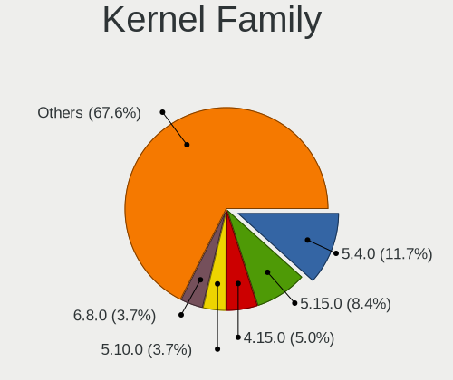
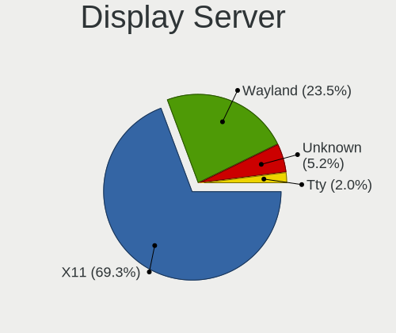
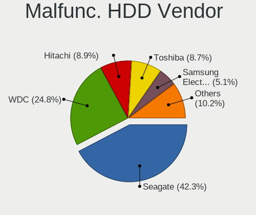

Linux in Spain - Tested Hardware & Statistics
---------------------------------------------

A project to collect tested hardware configurations for Linux in Spain.

Anyone can contribute to this report by the [hw-probe](https://github.com/linuxhw/hw-probe) tool:

    sudo -E hw-probe -all -upload

Please contribute! Especially if your hardware is rare.

This is a report for all computer types. See also reports for [desktops](/Location/Spain/Desktop/README.md) and [notebooks](/Location/Spain/Notebook/README.md).

Contents
--------

* [ Test Cases ](#test-cases)

* [ System ](#system)
  - [ OS                       ](#os)
  - [ OS Family                ](#os-family)
  - [ Kernel                   ](#kernel)
  - [ Kernel Family            ](#kernel-family)
  - [ Kernel Major Ver.        ](#kernel-major-ver)
  - [ Arch                     ](#arch)
  - [ DE                       ](#de)
  - [ Display Server           ](#display-server)
  - [ Display Manager          ](#display-manager)
  - [ OS Lang                  ](#os-lang)
  - [ Boot Mode                ](#boot-mode)
  - [ Filesystem               ](#filesystem)
  - [ Part. scheme             ](#part-scheme)
  - [ Dual Boot with Linux/BSD ](#dual-boot-with-linuxbsd)
  - [ Dual Boot (Win)          ](#dual-boot-win)

* [ Board ](#board)
  - [ Vendor                   ](#vendor)
  - [ Model                    ](#model)
  - [ Model Family             ](#model-family)
  - [ MFG Year                 ](#mfg-year)
  - [ Form Factor              ](#form-factor)
  - [ Secure Boot              ](#secure-boot)
  - [ Coreboot                 ](#coreboot)
  - [ RAM Size                 ](#ram-size)
  - [ RAM Used                 ](#ram-used)
  - [ Total Drives             ](#total-drives)
  - [ Has CD-ROM               ](#has-cd-rom)
  - [ Has Ethernet             ](#has-ethernet)
  - [ Has WiFi                 ](#has-wifi)
  - [ Has Bluetooth            ](#has-bluetooth)

* [ Location ](#location)
  - [ Country                  ](#country)
  - [ City                     ](#city)

* [ Drives ](#drives)
  - [ Drive Vendor             ](#drive-vendor)
  - [ Drive Model              ](#drive-model)
  - [ HDD Vendor               ](#hdd-vendor)
  - [ SSD Vendor               ](#ssd-vendor)
  - [ Drive Kind               ](#drive-kind)
  - [ Drive Connector          ](#drive-connector)
  - [ Drive Size               ](#drive-size)
  - [ Space Total              ](#space-total)
  - [ Space Used               ](#space-used)
  - [ Malfunc. Drives          ](#malfunc-drives)
  - [ Malfunc. Drive Vendor    ](#malfunc-drive-vendor)
  - [ Malfunc. HDD Vendor      ](#malfunc-hdd-vendor)
  - [ Malfunc. Drive Kind      ](#malfunc-drive-kind)
  - [ Failed Drives            ](#failed-drives)
  - [ Failed Drive Vendor      ](#failed-drive-vendor)
  - [ Drive Status             ](#drive-status)

* [ Storage controller ](#storage-controller)
  - [ Storage Vendor           ](#storage-vendor)
  - [ Storage Model            ](#storage-model)
  - [ Storage Kind             ](#storage-kind)

* [ Processor ](#processor)
  - [ CPU Vendor               ](#cpu-vendor)
  - [ CPU Model                ](#cpu-model)
  - [ CPU Model Family         ](#cpu-model-family)
  - [ CPU Cores                ](#cpu-cores)
  - [ CPU Sockets              ](#cpu-sockets)
  - [ CPU Threads              ](#cpu-threads)
  - [ CPU Op-Modes             ](#cpu-op-modes)
  - [ CPU Microcode            ](#cpu-microcode)
  - [ CPU Microarch            ](#cpu-microarch)

* [ Graphics ](#graphics)
  - [ GPU Vendor               ](#gpu-vendor)
  - [ GPU Model                ](#gpu-model)
  - [ GPU Combo                ](#gpu-combo)
  - [ GPU Driver               ](#gpu-driver)
  - [ GPU Memory               ](#gpu-memory)

* [ Monitor ](#monitor)
  - [ Monitor Vendor           ](#monitor-vendor)
  - [ Monitor Model            ](#monitor-model)
  - [ Monitor Resolution       ](#monitor-resolution)
  - [ Monitor Diagonal         ](#monitor-diagonal)
  - [ Monitor Width            ](#monitor-width)
  - [ Aspect Ratio             ](#aspect-ratio)
  - [ Monitor Area             ](#monitor-area)
  - [ Pixel Density            ](#pixel-density)
  - [ Multiple Monitors        ](#multiple-monitors)

* [ Network ](#network)
  - [ Net Controller Vendor    ](#net-controller-vendor)
  - [ Net Controller Model     ](#net-controller-model)
  - [ Wireless Vendor          ](#wireless-vendor)
  - [ Wireless Model           ](#wireless-model)
  - [ Ethernet Vendor          ](#ethernet-vendor)
  - [ Ethernet Model           ](#ethernet-model)
  - [ Net Controller Kind      ](#net-controller-kind)
  - [ Used Controller          ](#used-controller)
  - [ NICs                     ](#nics)
  - [ IPv6                     ](#ipv6)

* [ Bluetooth ](#bluetooth)
  - [ Bluetooth Vendor         ](#bluetooth-vendor)
  - [ Bluetooth Model          ](#bluetooth-model)

* [ Sound ](#sound)
  - [ Sound Vendor             ](#sound-vendor)
  - [ Sound Model              ](#sound-model)

* [ Memory ](#memory)
  - [ Memory Vendor            ](#memory-vendor)
  - [ Memory Model             ](#memory-model)
  - [ Memory Kind              ](#memory-kind)
  - [ Memory Form Factor       ](#memory-form-factor)
  - [ Memory Size              ](#memory-size)
  - [ Memory Speed             ](#memory-speed)

* [ Printers & scanners ](#printers--scanners)
  - [ Printer Vendor           ](#printer-vendor)
  - [ Printer Model            ](#printer-model)
  - [ Scanner Vendor           ](#scanner-vendor)
  - [ Scanner Model            ](#scanner-model)

* [ Camera ](#camera)
  - [ Camera Vendor            ](#camera-vendor)
  - [ Camera Model             ](#camera-model)

* [ Security ](#security)
  - [ Fingerprint Vendor       ](#fingerprint-vendor)
  - [ Fingerprint Model        ](#fingerprint-model)
  - [ Chipcard Vendor          ](#chipcard-vendor)
  - [ Chipcard Model           ](#chipcard-model)

* [ Unsupported ](#unsupported)
  - [ Unsupported Devices      ](#unsupported-devices)
  - [ Unsupported Device Types ](#unsupported-device-types)

Test Cases
----------

Total: 6451

| Vendor        | Model                       | Form-Factor | Probe                                                      | Date         |
|---------------|-----------------------------|-------------|------------------------------------------------------------|--------------|
| Lenovo        | Legion 5 15ACH6H 82JU       | Notebook    | [2cf7f9ab67](https://linux-hardware.org/?probe=2cf7f9ab67) | Dec 01, 2022 |
| ASUSTek       | ROG STRIX B550-F GAMING     | Desktop     | [0f27e558f3](https://linux-hardware.org/?probe=0f27e558f3) | Dec 01, 2022 |
| ASUSTek       | K55VD                       | Notebook    | [149d517fa5](https://linux-hardware.org/?probe=149d517fa5) | Dec 01, 2022 |
| Lenovo        | ThinkPad X1 Carbon Gen 1... | Notebook    | [0aa3ec7616](https://linux-hardware.org/?probe=0aa3ec7616) | Nov 30, 2022 |
| Acer          | Aspire A315-34              | Notebook    | [6bf371252b](https://linux-hardware.org/?probe=6bf371252b) | Nov 30, 2022 |
| ASUSTek       | UX550VD                     | Notebook    | [a3f2aafbf1](https://linux-hardware.org/?probe=a3f2aafbf1) | Nov 30, 2022 |
| Lenovo        | ThinkPad X1 Carbon Gen 9... | Notebook    | [b4aeee5799](https://linux-hardware.org/?probe=b4aeee5799) | Nov 30, 2022 |
| HP            | EliteBook 860 16 inch G9... | Notebook    | [dda393ca54](https://linux-hardware.org/?probe=dda393ca54) | Nov 30, 2022 |
| Lenovo        | Legion 5 15ACH6H 82JU       | Notebook    | [944ace565b](https://linux-hardware.org/?probe=944ace565b) | Nov 30, 2022 |
| HP            | Laptop 15s-fq4xxx           | Notebook    | [19b00c186f](https://linux-hardware.org/?probe=19b00c186f) | Nov 30, 2022 |
| HP            | Laptop 15s-fq4xxx           | Notebook    | [18ec3bc77e](https://linux-hardware.org/?probe=18ec3bc77e) | Nov 30, 2022 |
| Medion        | D3F3-EM                     | Desktop     | [ae428a6a6a](https://linux-hardware.org/?probe=ae428a6a6a) | Nov 29, 2022 |
| Lenovo        | ThinkPad T16 Gen 1 21BWS... | Notebook    | [3f19147b70](https://linux-hardware.org/?probe=3f19147b70) | Nov 29, 2022 |
| Acer          | Aspire A315-34              | Notebook    | [56bb76fb28](https://linux-hardware.org/?probe=56bb76fb28) | Nov 29, 2022 |
| Apple         | MacBookAir6,2               | Notebook    | [e0187bc636](https://linux-hardware.org/?probe=e0187bc636) | Nov 29, 2022 |
| HUAWEI        | CREM-WXX9                   | Notebook    | [ddad96715a](https://linux-hardware.org/?probe=ddad96715a) | Nov 29, 2022 |
| MSI           | B560M PRO-VDH               | Desktop     | [cee0622b1f](https://linux-hardware.org/?probe=cee0622b1f) | Nov 29, 2022 |
| Apple         | MacBookAir6,2               | Notebook    | [99eb1cfce0](https://linux-hardware.org/?probe=99eb1cfce0) | Nov 29, 2022 |
| Dell          | XPS 13 9365                 | Convertible | [9d7352a65d](https://linux-hardware.org/?probe=9d7352a65d) | Nov 29, 2022 |
| ASUSTek       | ROG STRIX B550-F GAMING     | Desktop     | [a95de3b373](https://linux-hardware.org/?probe=a95de3b373) | Nov 29, 2022 |
| HP            | Notebook                    | Notebook    | [79929c5c49](https://linux-hardware.org/?probe=79929c5c49) | Nov 29, 2022 |
| HP            | ProBook 450 G5              | Notebook    | [e94fd64204](https://linux-hardware.org/?probe=e94fd64204) | Nov 28, 2022 |
| Acer          | Aspire 5742G                | Notebook    | [d5f03d47ba](https://linux-hardware.org/?probe=d5f03d47ba) | Nov 28, 2022 |
| Acer          | Aspire 5742G                | Notebook    | [e0701bc81d](https://linux-hardware.org/?probe=e0701bc81d) | Nov 28, 2022 |
| PC Special... | NH5xAx                      | Notebook    | [8bd9aae635](https://linux-hardware.org/?probe=8bd9aae635) | Nov 28, 2022 |
| ASUSTek       | ZenBook UX325UA_UM325UA     | Notebook    | [c95bbb16de](https://linux-hardware.org/?probe=c95bbb16de) | Nov 28, 2022 |
| PC Special... | NH5xAx                      | Notebook    | [3be194cb8a](https://linux-hardware.org/?probe=3be194cb8a) | Nov 28, 2022 |
| ASUSTek       | X555LAB                     | Notebook    | [d62cc93587](https://linux-hardware.org/?probe=d62cc93587) | Nov 28, 2022 |
| ASUSTek       | X555LAB                     | Notebook    | [8d8fc0d4d4](https://linux-hardware.org/?probe=8d8fc0d4d4) | Nov 28, 2022 |
| ASUSTek       | X555YA                      | Notebook    | [0e9bb436b5](https://linux-hardware.org/?probe=0e9bb436b5) | Nov 27, 2022 |
| Lenovo        | IdeaPad 320-15AST 80XV      | Notebook    | [76087ad674](https://linux-hardware.org/?probe=76087ad674) | Nov 27, 2022 |
| Lenovo        | IdeaPad Gaming 3 15IAH7 ... | Notebook    | [935c9528be](https://linux-hardware.org/?probe=935c9528be) | Nov 26, 2022 |
| ASUSTek       | PRIME H410M-R               | Desktop     | [b680eec959](https://linux-hardware.org/?probe=b680eec959) | Nov 26, 2022 |
| Foxconn       | 2ABF                        | Desktop     | [d95233ff31](https://linux-hardware.org/?probe=d95233ff31) | Nov 26, 2022 |
| Gigabyte      | 970A-DS3P FX                | Desktop     | [4ded1fb943](https://linux-hardware.org/?probe=4ded1fb943) | Nov 26, 2022 |
| Lenovo        | IdeaPad Gaming 3 15ACH6 ... | Notebook    | [419b7f448b](https://linux-hardware.org/?probe=419b7f448b) | Nov 26, 2022 |
| HP            | OMEN by Laptop 16-c0xxx     | Notebook    | [5bd5bcabdb](https://linux-hardware.org/?probe=5bd5bcabdb) | Nov 26, 2022 |
| MSI           | Z170A GAMING M3             | Desktop     | [982d7f7d0b](https://linux-hardware.org/?probe=982d7f7d0b) | Nov 25, 2022 |
| ASUSTek       | ROG STRIX X670E-E GAMING... | Desktop     | [fc5f72597d](https://linux-hardware.org/?probe=fc5f72597d) | Nov 25, 2022 |
| HP            | Pavilion Laptop 15-ck0xx    | Notebook    | [4393448090](https://linux-hardware.org/?probe=4393448090) | Nov 25, 2022 |
| HP            | ProBook 430 G3              | Notebook    | [0fa29b61e3](https://linux-hardware.org/?probe=0fa29b61e3) | Nov 24, 2022 |
| ASUSTek       | 1001PX                      | Notebook    | [9626b2b4c5](https://linux-hardware.org/?probe=9626b2b4c5) | Nov 24, 2022 |
| ASUSTek       | PRIME Z270-K                | Desktop     | [e311874280](https://linux-hardware.org/?probe=e311874280) | Nov 24, 2022 |
| Lenovo        | 312A NOK                    | Desktop     | [94cdaff2c9](https://linux-hardware.org/?probe=94cdaff2c9) | Nov 24, 2022 |
| Apple         | MacBookAir6,2               | Notebook    | [1f43ba0436](https://linux-hardware.org/?probe=1f43ba0436) | Nov 24, 2022 |
| ASRock        | B75 Pro3                    | Desktop     | [e359d0bd70](https://linux-hardware.org/?probe=e359d0bd70) | Nov 24, 2022 |
| Lenovo        | ThinkPad T420 4180GH5       | Notebook    | [8dba4b2123](https://linux-hardware.org/?probe=8dba4b2123) | Nov 23, 2022 |
| MSI           | Modern 14 A10M              | Notebook    | [0545f4e38b](https://linux-hardware.org/?probe=0545f4e38b) | Nov 23, 2022 |
| ASUSTek       | ZenBook UX431FLC_UX431FL    | Notebook    | [df91e2d404](https://linux-hardware.org/?probe=df91e2d404) | Nov 23, 2022 |
| Lenovo        | 30BE SDK0J40697 WIN 3305... | Desktop     | [1deb081598](https://linux-hardware.org/?probe=1deb081598) | Nov 23, 2022 |
| Intel         | NUC8BEB J72692-303          | Mini pc     | [fc74dc1357](https://linux-hardware.org/?probe=fc74dc1357) | Nov 22, 2022 |
| Apple         | MacBook5,1                  | Notebook    | [f2ecb3f4a8](https://linux-hardware.org/?probe=f2ecb3f4a8) | Nov 22, 2022 |
| Acer          | Aspire A715-74G             | Notebook    | [347af27c05](https://linux-hardware.org/?probe=347af27c05) | Nov 21, 2022 |
| ASUSTek       | VivoBook_ASUSLaptop X509... | Notebook    | [437c6e491d](https://linux-hardware.org/?probe=437c6e491d) | Nov 21, 2022 |
| ASUSTek       | PRIME A320M-E               | Desktop     | [5f50e13ad0](https://linux-hardware.org/?probe=5f50e13ad0) | Nov 21, 2022 |
| ASUSTek       | PRIME A320M-E               | Desktop     | [81c02af38c](https://linux-hardware.org/?probe=81c02af38c) | Nov 21, 2022 |
| MSI           | MPG B550 GAMING PLUS        | Desktop     | [934f31fcac](https://linux-hardware.org/?probe=934f31fcac) | Nov 21, 2022 |
| Gigabyte      | B450M DS3H-CF               | Desktop     | [8de96e0012](https://linux-hardware.org/?probe=8de96e0012) | Nov 20, 2022 |
| Gigabyte      | H97M-D3H                    | Desktop     | [4e0102dff6](https://linux-hardware.org/?probe=4e0102dff6) | Nov 20, 2022 |
| Lenovo        | IdeaPad 3 15ITL6 82H8       | Notebook    | [8bd0cdff15](https://linux-hardware.org/?probe=8bd0cdff15) | Nov 19, 2022 |
| MSI           | MPG B550 GAMING PLUS        | Desktop     | [71b3224c4d](https://linux-hardware.org/?probe=71b3224c4d) | Nov 19, 2022 |
| HP            | EliteBook 840 G1            | Notebook    | [45a5881e61](https://linux-hardware.org/?probe=45a5881e61) | Nov 19, 2022 |
| Apple         | MacBook5,1                  | Notebook    | [9311687e42](https://linux-hardware.org/?probe=9311687e42) | Nov 19, 2022 |
| Toshiba       | Satellite P50-B-10Z         | Notebook    | [c5413ac393](https://linux-hardware.org/?probe=c5413ac393) | Nov 19, 2022 |
| ASUSTek       | PRIME H310M-E R2.0          | Desktop     | [9d276a36d8](https://linux-hardware.org/?probe=9d276a36d8) | Nov 19, 2022 |
| ASUSTek       | PRIME H310M-E R2.0          | Desktop     | [362cf69f1f](https://linux-hardware.org/?probe=362cf69f1f) | Nov 19, 2022 |
| Lenovo        | IdeaPad 720S-13IKB 81BV     | Notebook    | [b39151a5a7](https://linux-hardware.org/?probe=b39151a5a7) | Nov 19, 2022 |
| Lenovo        | IdeaPad 720S-13IKB 81BV     | Notebook    | [b0babeaa2b](https://linux-hardware.org/?probe=b0babeaa2b) | Nov 19, 2022 |
| Acer          | Extensa 5220                | Notebook    | [0bf5f727ac](https://linux-hardware.org/?probe=0bf5f727ac) | Nov 19, 2022 |
| Acer          | Aspire E1-572G              | Notebook    | [36c1e37d05](https://linux-hardware.org/?probe=36c1e37d05) | Nov 18, 2022 |
| ASUSTek       | ASUS TUF Gaming F15 FX50... | Notebook    | [ea12bf4774](https://linux-hardware.org/?probe=ea12bf4774) | Nov 18, 2022 |
| HP            | Elite x2 1012 G1            | Notebook    | [ef366c64fe](https://linux-hardware.org/?probe=ef366c64fe) | Nov 18, 2022 |
| Samsung       | R610                        | Notebook    | [b6c7aa2939](https://linux-hardware.org/?probe=b6c7aa2939) | Nov 18, 2022 |
| HP            | EliteBook 820 G2            | Notebook    | [1c76975e0e](https://linux-hardware.org/?probe=1c76975e0e) | Nov 17, 2022 |
| ALLDOCUBE     | i1405S                      | Notebook    | [fc1628983b](https://linux-hardware.org/?probe=fc1628983b) | Nov 17, 2022 |
| Gigabyte      | B550M DS3H                  | Desktop     | [469ead98f8](https://linux-hardware.org/?probe=469ead98f8) | Nov 17, 2022 |
| ALLDOCUBE     | i1405S                      | Notebook    | [0b61421847](https://linux-hardware.org/?probe=0b61421847) | Nov 17, 2022 |
| Apple         | MacBookPro14,1              | Notebook    | [248fcb5f13](https://linux-hardware.org/?probe=248fcb5f13) | Nov 17, 2022 |
| Acer          | Extensa 5220                | Notebook    | [8e9441be64](https://linux-hardware.org/?probe=8e9441be64) | Nov 17, 2022 |
| Toshiba       | Satellite L10W-B-101        | Notebook    | [544ad40774](https://linux-hardware.org/?probe=544ad40774) | Nov 16, 2022 |
| ASUSTek       | ZenBook UX431FLC_UX431FL    | Notebook    | [5ea39eac4c](https://linux-hardware.org/?probe=5ea39eac4c) | Nov 16, 2022 |
| Lenovo        | Legion 5 15ACH6H 82JU       | Notebook    | [be72c5d9db](https://linux-hardware.org/?probe=be72c5d9db) | Nov 16, 2022 |
| Lenovo        | IdeaPad Y510P 20217         | Notebook    | [c38c6ddff6](https://linux-hardware.org/?probe=c38c6ddff6) | Nov 16, 2022 |
| Lenovo        | IdeaPad 320-15IKB 80XL      | Notebook    | [b139741f4f](https://linux-hardware.org/?probe=b139741f4f) | Nov 15, 2022 |
| Dell          | Latitude E5470              | Notebook    | [ae3d91be5a](https://linux-hardware.org/?probe=ae3d91be5a) | Nov 15, 2022 |
| Gigabyte      | X570 AORUS ULTRA            | Desktop     | [567b81705d](https://linux-hardware.org/?probe=567b81705d) | Nov 15, 2022 |
| Gigabyte      | X570 AORUS ULTRA            | Desktop     | [389d8cf0e0](https://linux-hardware.org/?probe=389d8cf0e0) | Nov 15, 2022 |
| HUAWEI        | BOHK-WAX9X                  | Notebook    | [ee5852d273](https://linux-hardware.org/?probe=ee5852d273) | Nov 15, 2022 |
| HUAWEI        | BOHK-WAX9X                  | Notebook    | [1604955bcb](https://linux-hardware.org/?probe=1604955bcb) | Nov 15, 2022 |
| HP            | 0AA8h                       | Desktop     | [0f88d64eeb](https://linux-hardware.org/?probe=0f88d64eeb) | Nov 14, 2022 |
| ALURIN        | PR1-M146                    | Notebook    | [124eefce98](https://linux-hardware.org/?probe=124eefce98) | Nov 14, 2022 |
| Lenovo        | ThinkBook 16p Gen 2 20YM    | Notebook    | [31cf057099](https://linux-hardware.org/?probe=31cf057099) | Nov 14, 2022 |
| Lenovo        | IdeaPad 320-15IAP 80XR      | Notebook    | [722455f99d](https://linux-hardware.org/?probe=722455f99d) | Nov 14, 2022 |
| HP            | ENVY x360 Convertible 13... | Convertible | [c9e0bcd9d6](https://linux-hardware.org/?probe=c9e0bcd9d6) | Nov 14, 2022 |
| Lenovo        | V14-ADA 82C6                | Notebook    | [7971c5cda7](https://linux-hardware.org/?probe=7971c5cda7) | Nov 14, 2022 |
| HP            | 1495                        | Desktop     | [f588871a3a](https://linux-hardware.org/?probe=f588871a3a) | Nov 14, 2022 |
| HP            | 1495                        | Desktop     | [5086b0aa3e](https://linux-hardware.org/?probe=5086b0aa3e) | Nov 14, 2022 |
| Lenovo        | Legion 5 15ACH6H 82JU       | Notebook    | [465bc481e2](https://linux-hardware.org/?probe=465bc481e2) | Nov 14, 2022 |
| Toshiba       | PORTEGE Z30-A               | Notebook    | [9e70e7fc3a](https://linux-hardware.org/?probe=9e70e7fc3a) | Nov 13, 2022 |
| MSI           | GF63 8RD                    | Notebook    | [0ca4cc20c5](https://linux-hardware.org/?probe=0ca4cc20c5) | Nov 13, 2022 |
| Lenovo        | ThinkBook 15-IIL 20SM       | Notebook    | [be61d3792c](https://linux-hardware.org/?probe=be61d3792c) | Nov 13, 2022 |
| Gigabyte      | B550M DS3H                  | Desktop     | [c16c0f7d8f](https://linux-hardware.org/?probe=c16c0f7d8f) | Nov 13, 2022 |
| ASUSTek       | M4N72-E                     | Desktop     | [092c39d271](https://linux-hardware.org/?probe=092c39d271) | Nov 13, 2022 |
| ALURIN        | PR1-M146                    | Notebook    | [8d9345b655](https://linux-hardware.org/?probe=8d9345b655) | Nov 12, 2022 |
| Dell          | G3 3579                     | Notebook    | [a2e410da57](https://linux-hardware.org/?probe=a2e410da57) | Nov 12, 2022 |
| Dell          | XPS 13 9343                 | Notebook    | [fed6627c3e](https://linux-hardware.org/?probe=fed6627c3e) | Nov 12, 2022 |
| ASUSTek       | VivoBook_ASUSLaptop X415... | Notebook    | [76609a3bd3](https://linux-hardware.org/?probe=76609a3bd3) | Nov 12, 2022 |
| Gigabyte      | B550M S2H                   | Desktop     | [ea1d9a2fa4](https://linux-hardware.org/?probe=ea1d9a2fa4) | Nov 11, 2022 |
| HP            | Pavilion 15                 | Notebook    | [f6125d7605](https://linux-hardware.org/?probe=f6125d7605) | Nov 11, 2022 |
| HP            | Pavilion 15                 | Notebook    | [a598e64905](https://linux-hardware.org/?probe=a598e64905) | Nov 11, 2022 |
| Unknown       | Unknown                     | Desktop     | [e0b38a3d54](https://linux-hardware.org/?probe=e0b38a3d54) | Nov 11, 2022 |
| Timi          | TM1703                      | Notebook    | [b59fbfd729](https://linux-hardware.org/?probe=b59fbfd729) | Nov 11, 2022 |
| Gigabyte      | H110M-S2V-CF                | Desktop     | [1117e533c3](https://linux-hardware.org/?probe=1117e533c3) | Nov 11, 2022 |
| HP            | 805E                        | All in one  | [fdd688e64e](https://linux-hardware.org/?probe=fdd688e64e) | Nov 11, 2022 |
| HP            | 805E                        | All in one  | [c37ec12e5f](https://linux-hardware.org/?probe=c37ec12e5f) | Nov 11, 2022 |
| LG Electro... | 16Z90Q-G.AD78B              | Notebook    | [e5129b607e](https://linux-hardware.org/?probe=e5129b607e) | Nov 09, 2022 |
| HP            | Pavilion g7                 | Notebook    | [3a18145808](https://linux-hardware.org/?probe=3a18145808) | Nov 09, 2022 |
| Gigabyte      | Z390 GAMING X-CF            | Desktop     | [4b5ec389d9](https://linux-hardware.org/?probe=4b5ec389d9) | Nov 09, 2022 |
| MSI           | PRO B660M-A WIFI DDR4       | Desktop     | [292caf8ccf](https://linux-hardware.org/?probe=292caf8ccf) | Nov 09, 2022 |
| HP            | Pavilion Laptop 14-ec0xx... | Notebook    | [94746f0b72](https://linux-hardware.org/?probe=94746f0b72) | Nov 09, 2022 |
| HP            | Pavilion Laptop 14-ec0xx... | Notebook    | [61bf21f7dd](https://linux-hardware.org/?probe=61bf21f7dd) | Nov 09, 2022 |
| Acidanther... | Mac-CFF7D910A743CAAF iMa... | All in one  | [3900976672](https://linux-hardware.org/?probe=3900976672) | Nov 08, 2022 |
| ASUSTek       | A88XM-PLUS                  | Desktop     | [e6eee311ea](https://linux-hardware.org/?probe=e6eee311ea) | Nov 08, 2022 |
| Valve         | Jupiter                     | Notebook    | [3e3e947f9e](https://linux-hardware.org/?probe=3e3e947f9e) | Nov 08, 2022 |
| HUAWEI        | BOD-WXX9                    | Notebook    | [c36ab935b5](https://linux-hardware.org/?probe=c36ab935b5) | Nov 08, 2022 |
| MSI           | PRO B660M-A WIFI DDR4       | Desktop     | [0aad7f7578](https://linux-hardware.org/?probe=0aad7f7578) | Nov 07, 2022 |
| Lenovo        | ThinkPad X270 W10DG 20K6... | Notebook    | [bbb94242ec](https://linux-hardware.org/?probe=bbb94242ec) | Nov 07, 2022 |
| HP            | ZBook Studio 15.6 inch G... | Notebook    | [000b225d22](https://linux-hardware.org/?probe=000b225d22) | Nov 07, 2022 |
| ASUSTek       | ASUS TUF Dash F15 FX517Z... | Notebook    | [80dc1502e1](https://linux-hardware.org/?probe=80dc1502e1) | Nov 06, 2022 |
| LG Electro... | 15Z990-V.AA78B              | Notebook    | [5ca4c426d8](https://linux-hardware.org/?probe=5ca4c426d8) | Nov 05, 2022 |
| HP            | Laptop 15-bs0xx             | Notebook    | [431f0124a5](https://linux-hardware.org/?probe=431f0124a5) | Nov 05, 2022 |
| PC Special... | PB50_70RF,RD,RC             | Notebook    | [c2e0841c46](https://linux-hardware.org/?probe=c2e0841c46) | Nov 05, 2022 |
| Valve         | Jupiter                     | Notebook    | [5c5b229108](https://linux-hardware.org/?probe=5c5b229108) | Nov 05, 2022 |
| MSI           | Modern 14 B11SB             | Notebook    | [61543eb00f](https://linux-hardware.org/?probe=61543eb00f) | Nov 04, 2022 |
| HP            | Compaq Presario A900        | Notebook    | [4c48500597](https://linux-hardware.org/?probe=4c48500597) | Nov 04, 2022 |
| Toshiba       | Satellite Pro A200          | Notebook    | [09ae3b0b13](https://linux-hardware.org/?probe=09ae3b0b13) | Nov 04, 2022 |
| ASUSTek       | VivoBook_ASUSLaptop X509... | Notebook    | [5881bdde3a](https://linux-hardware.org/?probe=5881bdde3a) | Nov 04, 2022 |
| HP            | Pavilion Gaming Laptop 1... | Notebook    | [bd3b4f723e](https://linux-hardware.org/?probe=bd3b4f723e) | Nov 04, 2022 |
| ASUSTek       | X99-DELUXE                  | Desktop     | [ab4089c760](https://linux-hardware.org/?probe=ab4089c760) | Nov 04, 2022 |
| HP            | EliteBook Folio 1040 G1     | Notebook    | [1582ffa7f2](https://linux-hardware.org/?probe=1582ffa7f2) | Nov 04, 2022 |
| HP            | 8459                        | Desktop     | [378537c13c](https://linux-hardware.org/?probe=378537c13c) | Nov 04, 2022 |
| HP            | 1998                        | Desktop     | [ba48cbeebe](https://linux-hardware.org/?probe=ba48cbeebe) | Nov 04, 2022 |
| ASUSTek       | M3A78 PRO                   | Desktop     | [93b2e9aea5](https://linux-hardware.org/?probe=93b2e9aea5) | Nov 04, 2022 |
| ASUSTek       | K50IN                       | Notebook    | [8c069a1707](https://linux-hardware.org/?probe=8c069a1707) | Nov 03, 2022 |
| ASUSTek       | M3A78 PRO                   | Desktop     | [5466838c04](https://linux-hardware.org/?probe=5466838c04) | Nov 03, 2022 |
| Packard Be... | EasyNote MZ45               | Notebook    | [93dada1577](https://linux-hardware.org/?probe=93dada1577) | Nov 03, 2022 |
| Valve         | Jupiter                     | Notebook    | [62160ec2e5](https://linux-hardware.org/?probe=62160ec2e5) | Nov 03, 2022 |
| Dell          | 0X9M3X A04                  | Desktop     | [3bec3377a8](https://linux-hardware.org/?probe=3bec3377a8) | Nov 03, 2022 |
| Dell          | 0D24M8 A01                  | Desktop     | [347b32510b](https://linux-hardware.org/?probe=347b32510b) | Nov 03, 2022 |
| HP            | G62                         | Notebook    | [a00ba1aae7](https://linux-hardware.org/?probe=a00ba1aae7) | Nov 03, 2022 |
| HP            | 250 G4                      | Notebook    | [ff497e0d4c](https://linux-hardware.org/?probe=ff497e0d4c) | Nov 02, 2022 |
| Gigabyte      | Z270-HD3P-CF                | Desktop     | [8b8ec08876](https://linux-hardware.org/?probe=8b8ec08876) | Nov 02, 2022 |
| HP            | ProBook 450 G8 Notebook ... | Notebook    | [44e281e52c](https://linux-hardware.org/?probe=44e281e52c) | Nov 02, 2022 |
| Valve         | Jupiter                     | Notebook    | [99521b7f24](https://linux-hardware.org/?probe=99521b7f24) | Nov 02, 2022 |
| HP            | Pavilion Gaming Laptop 1... | Notebook    | [690e088c8e](https://linux-hardware.org/?probe=690e088c8e) | Nov 02, 2022 |
| Samsung       | 305V4A/305V5A               | Notebook    | [5df933ddda](https://linux-hardware.org/?probe=5df933ddda) | Nov 01, 2022 |
| ASUSTek       | Z170 PRO GAMING/AURA        | Desktop     | [f0db98f6bb](https://linux-hardware.org/?probe=f0db98f6bb) | Nov 01, 2022 |
| ASUSTek       | Z170 PRO GAMING/AURA        | Desktop     | [fc832e8881](https://linux-hardware.org/?probe=fc832e8881) | Nov 01, 2022 |
| HP            | ProBook 650 G1              | Notebook    | [85f1aa7b6d](https://linux-hardware.org/?probe=85f1aa7b6d) | Nov 01, 2022 |
| Lenovo        | ThinkPad T480 20L6S3H108    | Notebook    | [1ed803ae94](https://linux-hardware.org/?probe=1ed803ae94) | Nov 01, 2022 |
| Toshiba       | Satellite L50-C             | Notebook    | [b3e0ff9849](https://linux-hardware.org/?probe=b3e0ff9849) | Nov 01, 2022 |
| ASUSTek       | ProArt StudioBook H7600H... | Notebook    | [3db734a533](https://linux-hardware.org/?probe=3db734a533) | Nov 01, 2022 |
| Lenovo        | ThinkPad Edge 25453BG       | Notebook    | [dc7fa9ac1e](https://linux-hardware.org/?probe=dc7fa9ac1e) | Oct 31, 2022 |
| Lenovo        | ThinkPad Edge 25453BG       | Notebook    | [ba67d47c9c](https://linux-hardware.org/?probe=ba67d47c9c) | Oct 31, 2022 |
| MSI           | Pulse GL76 12UEK            | Notebook    | [76a2d8c304](https://linux-hardware.org/?probe=76a2d8c304) | Oct 31, 2022 |
| HP            | 250 G7 Notebook PC          | Notebook    | [7433eae90a](https://linux-hardware.org/?probe=7433eae90a) | Oct 31, 2022 |
| Panasonic     | CF-19RDRCHH7                | Notebook    | [99e94a7708](https://linux-hardware.org/?probe=99e94a7708) | Oct 31, 2022 |
| Gigabyte      | H410M S2H V3                | Desktop     | [202065a62d](https://linux-hardware.org/?probe=202065a62d) | Oct 30, 2022 |
| Fujitsu       | LIFEBOOK T904               | Notebook    | [4591ea2ad6](https://linux-hardware.org/?probe=4591ea2ad6) | Oct 30, 2022 |
| Fujitsu       | LIFEBOOK T904               | Notebook    | [5dd8b365d6](https://linux-hardware.org/?probe=5dd8b365d6) | Oct 30, 2022 |
| HP            | Spectre x360 Convertible... | Convertible | [1deed25a21](https://linux-hardware.org/?probe=1deed25a21) | Oct 30, 2022 |
| Apple         | Mac-F2218EA9                | All in one  | [9eec3492e9](https://linux-hardware.org/?probe=9eec3492e9) | Oct 30, 2022 |
| Lenovo        | IdeaPad 3 15ADA05 81W1      | Notebook    | [6bf9e760ca](https://linux-hardware.org/?probe=6bf9e760ca) | Oct 30, 2022 |
| Lenovo        | IdeaPad 3 15ADA05 81W1      | Notebook    | [1ca9fe180c](https://linux-hardware.org/?probe=1ca9fe180c) | Oct 30, 2022 |
| Lenovo        | ThinkBook 15p 20V3          | Notebook    | [8dfb7265a9](https://linux-hardware.org/?probe=8dfb7265a9) | Oct 30, 2022 |
| ASUSTek       | PRIME B560M-K               | Desktop     | [416db8870a](https://linux-hardware.org/?probe=416db8870a) | Oct 30, 2022 |
| Toshiba       | Satellite C855-1T5          | Notebook    | [c07f6a167a](https://linux-hardware.org/?probe=c07f6a167a) | Oct 30, 2022 |
| Notebook      | W230SD                      | Notebook    | [76ae019222](https://linux-hardware.org/?probe=76ae019222) | Oct 29, 2022 |
| ASUSTek       | ROG CROSSHAIR VIII HERO     | Desktop     | [7d6c392e74](https://linux-hardware.org/?probe=7d6c392e74) | Oct 29, 2022 |
| MSI           | B560M PRO-VDH               | Desktop     | [ab324c3cdd](https://linux-hardware.org/?probe=ab324c3cdd) | Oct 29, 2022 |
| Dell          | XPS 13 9370                 | Notebook    | [7bf374b38a](https://linux-hardware.org/?probe=7bf374b38a) | Oct 29, 2022 |
| ASUSTek       | ASUS TUF Gaming F15 FX50... | Notebook    | [b8cfddfcbf](https://linux-hardware.org/?probe=b8cfddfcbf) | Oct 29, 2022 |
| Lenovo        | ThinkPad X1 Carbon Gen 1... | Notebook    | [8440ee2b2a](https://linux-hardware.org/?probe=8440ee2b2a) | Oct 29, 2022 |
| Gigabyte      | B550M DS3H                  | Desktop     | [4234f1fe02](https://linux-hardware.org/?probe=4234f1fe02) | Oct 29, 2022 |
| Gigabyte      | B550M DS3H                  | Desktop     | [6ab822b64c](https://linux-hardware.org/?probe=6ab822b64c) | Oct 29, 2022 |
| MSI           | P45 Platinum                | Desktop     | [5507d45c35](https://linux-hardware.org/?probe=5507d45c35) | Oct 29, 2022 |
| Dell          | 0D24M8 A01                  | Desktop     | [55aa58c274](https://linux-hardware.org/?probe=55aa58c274) | Oct 29, 2022 |
| ASRock        | H81M-ITX                    | Desktop     | [56f93814ea](https://linux-hardware.org/?probe=56f93814ea) | Oct 28, 2022 |
| Apple         | MacBookPro16,1              | Notebook    | [eba036175b](https://linux-hardware.org/?probe=eba036175b) | Oct 28, 2022 |
| ASUSTek       | ZenBook UX431FLC_UX431FL    | Notebook    | [e34c4fde2c](https://linux-hardware.org/?probe=e34c4fde2c) | Oct 28, 2022 |
| ASUSTek       | ASUS TUF Gaming F15 FX50... | Notebook    | [8429395d7d](https://linux-hardware.org/?probe=8429395d7d) | Oct 28, 2022 |
| Unknown       | Unknown                     | Soc         | [44fc490d82](https://linux-hardware.org/?probe=44fc490d82) | Oct 28, 2022 |
| ASUSTek       | ASUS TUF Gaming F15 FX50... | Notebook    | [366e5edec9](https://linux-hardware.org/?probe=366e5edec9) | Oct 28, 2022 |
| HP            | EliteBook 820 G2            | Notebook    | [7056cf1574](https://linux-hardware.org/?probe=7056cf1574) | Oct 28, 2022 |
| Apple         | Mac-F2218EA9                | All in one  | [5b16264bea](https://linux-hardware.org/?probe=5b16264bea) | Oct 28, 2022 |
| ASUSTek       | Z170I PRO GAMING            | Desktop     | [2ae55c9228](https://linux-hardware.org/?probe=2ae55c9228) | Oct 27, 2022 |
| ASUSTek       | PRIME X570-PRO              | Desktop     | [ea04a21af7](https://linux-hardware.org/?probe=ea04a21af7) | Oct 27, 2022 |
| HP            | Pavilion Gaming Laptop 1... | Notebook    | [9986b4ff02](https://linux-hardware.org/?probe=9986b4ff02) | Oct 27, 2022 |
| MSI           | GE66 Raider 10UE            | Notebook    | [334d883dd3](https://linux-hardware.org/?probe=334d883dd3) | Oct 27, 2022 |
| Dell          | 09KPNV A00                  | Desktop     | [c25493f420](https://linux-hardware.org/?probe=c25493f420) | Oct 27, 2022 |
| Intel         | H410M-E                     | Desktop     | [854c3ec5b1](https://linux-hardware.org/?probe=854c3ec5b1) | Oct 27, 2022 |
| ASUSTek       | PRIME B660-PLUS D4          | Desktop     | [5b6d2d2922](https://linux-hardware.org/?probe=5b6d2d2922) | Oct 27, 2022 |
| Chuwi         | CoreBox                     | Mini pc     | [033d6281bd](https://linux-hardware.org/?probe=033d6281bd) | Oct 27, 2022 |
| Acer          | Aspire A315-21              | Notebook    | [14f5f5ceeb](https://linux-hardware.org/?probe=14f5f5ceeb) | Oct 26, 2022 |
| Lenovo        | G500 20236                  | Notebook    | [b5508a855e](https://linux-hardware.org/?probe=b5508a855e) | Oct 26, 2022 |
| Lenovo        | IdeaPad 5 14ALC05 82LM      | Notebook    | [56c91f99e7](https://linux-hardware.org/?probe=56c91f99e7) | Oct 26, 2022 |
| Dell          | Latitude E6440              | Notebook    | [81a4c0f5d5](https://linux-hardware.org/?probe=81a4c0f5d5) | Oct 26, 2022 |
| Gigabyte      | EP43-DS3L                   | Desktop     | [f9e114a7e9](https://linux-hardware.org/?probe=f9e114a7e9) | Oct 26, 2022 |
| Intel         | H410M-E                     | Desktop     | [69d7d07e13](https://linux-hardware.org/?probe=69d7d07e13) | Oct 26, 2022 |
| Acer          | Aspire ES1-511              | Notebook    | [0db2597f65](https://linux-hardware.org/?probe=0db2597f65) | Oct 26, 2022 |
| Apple         | MacBook5,1                  | Notebook    | [a7fa475b56](https://linux-hardware.org/?probe=a7fa475b56) | Oct 25, 2022 |
| ALURIN        | PR1-M146                    | Notebook    | [af492a458f](https://linux-hardware.org/?probe=af492a458f) | Oct 25, 2022 |
| Acer          | Aspire ES1-571              | Notebook    | [f9f7926da2](https://linux-hardware.org/?probe=f9f7926da2) | Oct 25, 2022 |
| MSI           | B550M PRO-VDH WIFI          | Desktop     | [696c30d8c3](https://linux-hardware.org/?probe=696c30d8c3) | Oct 25, 2022 |
| Lenovo        | ThinkPad T490s 20NYS6FL0... | Notebook    | [ef0cad4118](https://linux-hardware.org/?probe=ef0cad4118) | Oct 25, 2022 |
| MSI           | MAG X570S TOMAHAWK MAX W... | Desktop     | [c05a08e1af](https://linux-hardware.org/?probe=c05a08e1af) | Oct 25, 2022 |
| Unknown       | SKYBAY                      | Desktop     | [63f22191e8](https://linux-hardware.org/?probe=63f22191e8) | Oct 24, 2022 |
| MSI           | MAG X570S TOMAHAWK MAX W... | Desktop     | [936e43f0bc](https://linux-hardware.org/?probe=936e43f0bc) | Oct 24, 2022 |
| MSI           | B560M PRO-VDH               | Desktop     | [0a2cbff604](https://linux-hardware.org/?probe=0a2cbff604) | Oct 24, 2022 |
| ASUSTek       | X550EA                      | Notebook    | [6a7b7a70a5](https://linux-hardware.org/?probe=6a7b7a70a5) | Oct 23, 2022 |
| ASUSTek       | PRIME X570-P                | Desktop     | [5558f9e3f7](https://linux-hardware.org/?probe=5558f9e3f7) | Oct 23, 2022 |
| ASUSTek       | X550EA                      | Notebook    | [e2c2ac571f](https://linux-hardware.org/?probe=e2c2ac571f) | Oct 23, 2022 |
| MSI           | Modern 14 C12M              | Notebook    | [2991b1a2cf](https://linux-hardware.org/?probe=2991b1a2cf) | Oct 23, 2022 |
| MSI           | Modern 14 C12M              | Notebook    | [2015c6f7fc](https://linux-hardware.org/?probe=2015c6f7fc) | Oct 23, 2022 |
| Gigabyte      | Z97-HD3                     | Desktop     | [f79eb0cbb0](https://linux-hardware.org/?probe=f79eb0cbb0) | Oct 23, 2022 |
| Gigabyte      | B560M H                     | Desktop     | [cce3979970](https://linux-hardware.org/?probe=cce3979970) | Oct 22, 2022 |
| ASUSTek       | M32CD_A_F_K20CD_K31CD       | Desktop     | [6105b0d3a9](https://linux-hardware.org/?probe=6105b0d3a9) | Oct 22, 2022 |
| HP            | Pavilion g6                 | Notebook    | [55a5d78e1c](https://linux-hardware.org/?probe=55a5d78e1c) | Oct 22, 2022 |
| HUAWEI        | RLEF-XX                     | Notebook    | [5bebcbd76d](https://linux-hardware.org/?probe=5bebcbd76d) | Oct 22, 2022 |
| Fujitsu       | LIFEBOOK AH532              | Notebook    | [d806b92948](https://linux-hardware.org/?probe=d806b92948) | Oct 22, 2022 |
| Gigabyte      | B365M DS3H                  | Desktop     | [d5f16dde87](https://linux-hardware.org/?probe=d5f16dde87) | Oct 22, 2022 |
| Lenovo        | Legion Y530-15ICH 81FV      | Notebook    | [1227d6561e](https://linux-hardware.org/?probe=1227d6561e) | Oct 22, 2022 |
| HP            | 15                          | Notebook    | [937cf874b0](https://linux-hardware.org/?probe=937cf874b0) | Oct 21, 2022 |
| Toshiba       | Satellite P50-B-103         | Notebook    | [011581fdbf](https://linux-hardware.org/?probe=011581fdbf) | Oct 21, 2022 |
| Lenovo        | ThinkPad X1 Carbon Gen 9... | Notebook    | [85a58721ed](https://linux-hardware.org/?probe=85a58721ed) | Oct 21, 2022 |
| Lenovo        | IdeaPad Gaming 3 15ACH6 ... | Notebook    | [1e4d67ad76](https://linux-hardware.org/?probe=1e4d67ad76) | Oct 21, 2022 |
| Lenovo        | ThinkPad X1 Carbon Gen 1... | Notebook    | [3dd060400b](https://linux-hardware.org/?probe=3dd060400b) | Oct 21, 2022 |
| HP            | 8459                        | Desktop     | [c2ebcf9e20](https://linux-hardware.org/?probe=c2ebcf9e20) | Oct 21, 2022 |
| Shenzhen W... | AERO 2 Pro                  | Mini pc     | [95ca32a110](https://linux-hardware.org/?probe=95ca32a110) | Oct 21, 2022 |
| ASUSTek       | TUF Gaming FX505GT_FX505... | Notebook    | [1a99b642cc](https://linux-hardware.org/?probe=1a99b642cc) | Oct 20, 2022 |
| HP            | 8459                        | Desktop     | [d8ec2e7ee9](https://linux-hardware.org/?probe=d8ec2e7ee9) | Oct 20, 2022 |
| ASUSTek       | K54C                        | Notebook    | [124cad3faf](https://linux-hardware.org/?probe=124cad3faf) | Oct 20, 2022 |
| MSI           | MPG Z390 GAMING PLUS        | Desktop     | [18c1a4a04d](https://linux-hardware.org/?probe=18c1a4a04d) | Oct 19, 2022 |
| MSI           | H81M-E33                    | Desktop     | [ff6334ee8f](https://linux-hardware.org/?probe=ff6334ee8f) | Oct 19, 2022 |
| Valve         | Jupiter                     | Notebook    | [982d4175a3](https://linux-hardware.org/?probe=982d4175a3) | Oct 19, 2022 |
| ASUSTek       | A88XM-A                     | Desktop     | [9622704d8f](https://linux-hardware.org/?probe=9622704d8f) | Oct 18, 2022 |
| MSI           | Modern 14 C12M              | Notebook    | [33c0e4861e](https://linux-hardware.org/?probe=33c0e4861e) | Oct 18, 2022 |
| Gigabyte      | B450M GAMING                | Desktop     | [e1eacaa737](https://linux-hardware.org/?probe=e1eacaa737) | Oct 18, 2022 |
| Gigabyte      | X79-UP4                     | Desktop     | [c6e10b3bcb](https://linux-hardware.org/?probe=c6e10b3bcb) | Oct 18, 2022 |
| HP            | Pavilion Notebook           | Notebook    | [462a0f1d13](https://linux-hardware.org/?probe=462a0f1d13) | Oct 18, 2022 |
| MSI           | Z390-A PRO                  | Desktop     | [d79e9be41b](https://linux-hardware.org/?probe=d79e9be41b) | Oct 18, 2022 |
| Chuwi         | HeroBook Air                | Notebook    | [21c0a75b93](https://linux-hardware.org/?probe=21c0a75b93) | Oct 17, 2022 |
| Dell          | Latitude E6330              | Notebook    | [d4d6ca7ae9](https://linux-hardware.org/?probe=d4d6ca7ae9) | Oct 17, 2022 |
| MSI           | IONA                        | Desktop     | [7c164d5733](https://linux-hardware.org/?probe=7c164d5733) | Oct 17, 2022 |
| ASRock        | H110M-HDV                   | Desktop     | [3d1fde3114](https://linux-hardware.org/?probe=3d1fde3114) | Oct 17, 2022 |
| SLIMBOOK      | TITAN                       | Notebook    | [87177b2371](https://linux-hardware.org/?probe=87177b2371) | Oct 17, 2022 |
| Lenovo        | ThinkBook 15 G2 ITL 20VE    | Notebook    | [7b5da7d635](https://linux-hardware.org/?probe=7b5da7d635) | Oct 17, 2022 |
| Lenovo        | IdeaPad 330-15IKB 81DE      | Notebook    | [c1bad579af](https://linux-hardware.org/?probe=c1bad579af) | Oct 17, 2022 |
| Gigabyte      | X570 AORUS PRO              | Desktop     | [a7941186ab](https://linux-hardware.org/?probe=a7941186ab) | Oct 16, 2022 |
| MSI           | Stealth GS66 12UGS          | Notebook    | [10f52ac957](https://linux-hardware.org/?probe=10f52ac957) | Oct 16, 2022 |
| HP            | 1495                        | Desktop     | [109913631a](https://linux-hardware.org/?probe=109913631a) | Oct 16, 2022 |
| ASUSTek       | ROG Strix G512LV_G512LV     | Notebook    | [53a9eb1420](https://linux-hardware.org/?probe=53a9eb1420) | Oct 16, 2022 |
| Supermicro    | X10SL7-F                    | Server      | [8bfcad8486](https://linux-hardware.org/?probe=8bfcad8486) | Oct 16, 2022 |
| Notebook      | N2x0WU                      | Notebook    | [bc1072e527](https://linux-hardware.org/?probe=bc1072e527) | Oct 16, 2022 |
| MSI           | A320M PRO-VH PLUS           | Desktop     | [c3c46266d1](https://linux-hardware.org/?probe=c3c46266d1) | Oct 16, 2022 |
| ASUSTek       | PRIME X570-P                | Desktop     | [a7d6f0bd9e](https://linux-hardware.org/?probe=a7d6f0bd9e) | Oct 15, 2022 |
| ASUSTek       | X540LA                      | Notebook    | [1680f919c8](https://linux-hardware.org/?probe=1680f919c8) | Oct 15, 2022 |
| MSI           | Z97 GAMING 3                | Desktop     | [99fe717434](https://linux-hardware.org/?probe=99fe717434) | Oct 15, 2022 |
| MSI           | Z97 GAMING 3                | Desktop     | [b75b67267c](https://linux-hardware.org/?probe=b75b67267c) | Oct 14, 2022 |
| Google        | Liara                       | Notebook    | [8e2b131f8f](https://linux-hardware.org/?probe=8e2b131f8f) | Oct 14, 2022 |
| Gigabyte      | P55M-UD2                    | Desktop     | [0e3ba8fdb3](https://linux-hardware.org/?probe=0e3ba8fdb3) | Oct 14, 2022 |
| Lenovo        | IdeaPad S340-15IIL 81VW     | Notebook    | [4e29271bab](https://linux-hardware.org/?probe=4e29271bab) | Oct 14, 2022 |
| ASUSTek       | H81M-K                      | Desktop     | [57e988db9d](https://linux-hardware.org/?probe=57e988db9d) | Oct 14, 2022 |
| ASUSTek       | Z170-A                      | Desktop     | [78abe50673](https://linux-hardware.org/?probe=78abe50673) | Oct 14, 2022 |
| Qilive        | QW20141BSP                  | Notebook    | [a497e419fe](https://linux-hardware.org/?probe=a497e419fe) | Oct 13, 2022 |
| ASUSTek       | ASUS TUF Gaming F15 FX50... | Notebook    | [0ce5415fa5](https://linux-hardware.org/?probe=0ce5415fa5) | Oct 13, 2022 |
| VANT          | MOOVE3-15                   | Notebook    | [ed3f1f2728](https://linux-hardware.org/?probe=ed3f1f2728) | Oct 13, 2022 |
| Gigabyte      | P55A-UD3                    | Desktop     | [100f7e1b46](https://linux-hardware.org/?probe=100f7e1b46) | Oct 12, 2022 |
| Gigabyte      | EP43-DS3L                   | Desktop     | [5b1999a241](https://linux-hardware.org/?probe=5b1999a241) | Oct 12, 2022 |
| Microsoft     | Surface Pro 3               | Tablet      | [1a2fe5eeb4](https://linux-hardware.org/?probe=1a2fe5eeb4) | Oct 12, 2022 |
| ASUSTek       | B150I PRO GAMING/WIFI/AU... | Desktop     | [f3b5809fc9](https://linux-hardware.org/?probe=f3b5809fc9) | Oct 12, 2022 |
| HP            | 3397                        | Desktop     | [c374208e14](https://linux-hardware.org/?probe=c374208e14) | Oct 11, 2022 |
| HP            | Laptop 17-cn2xxx            | Notebook    | [55bdfc4aef](https://linux-hardware.org/?probe=55bdfc4aef) | Oct 11, 2022 |
| Lenovo        | IdeaPad 3 15ITL6 82H8       | Notebook    | [3e43886af3](https://linux-hardware.org/?probe=3e43886af3) | Oct 11, 2022 |
| Dell          | Vostro 5490                 | Notebook    | [8263bf7d5b](https://linux-hardware.org/?probe=8263bf7d5b) | Oct 11, 2022 |
| Gigabyte      | P55-US3L                    | Desktop     | [59843156e8](https://linux-hardware.org/?probe=59843156e8) | Oct 11, 2022 |
| Gigabyte      | X470 AORUS ULTRA GAMING-... | Desktop     | [dd9695948c](https://linux-hardware.org/?probe=dd9695948c) | Oct 11, 2022 |
| Intel         | D34010WYK H14771-304        | Desktop     | [b8c2a39217](https://linux-hardware.org/?probe=b8c2a39217) | Oct 10, 2022 |
| Intel         | D34010WYK H14771-304        | Desktop     | [c3a4a7983b](https://linux-hardware.org/?probe=c3a4a7983b) | Oct 10, 2022 |
| BESSTAR Te... | T3 MRD                      | Desktop     | [d223d492fe](https://linux-hardware.org/?probe=d223d492fe) | Oct 10, 2022 |
| Dell          | Latitude E7240              | Notebook    | [3f9f9c38d1](https://linux-hardware.org/?probe=3f9f9c38d1) | Oct 10, 2022 |
| ASUSTek       | VivoBook_ASUSLaptop X570... | Notebook    | [a0833e04a4](https://linux-hardware.org/?probe=a0833e04a4) | Oct 10, 2022 |
| Fujitsu       | LIFEBOOK AH532              | Notebook    | [dc29e6568f](https://linux-hardware.org/?probe=dc29e6568f) | Oct 10, 2022 |
| ASUSTek       | VivoBook_ASUSLaptop X509... | Notebook    | [6ccdbecf19](https://linux-hardware.org/?probe=6ccdbecf19) | Oct 10, 2022 |
| MSI           | MAG Z490 TOMAHAWK           | Desktop     | [97bbb3b52b](https://linux-hardware.org/?probe=97bbb3b52b) | Oct 09, 2022 |
| ASUSTek       | PRIME B450M-A               | Desktop     | [bef5f7f7d7](https://linux-hardware.org/?probe=bef5f7f7d7) | Oct 09, 2022 |
| Lenovo        | ThinkBook 14-IIL 20SL       | Notebook    | [71ef13e7f5](https://linux-hardware.org/?probe=71ef13e7f5) | Oct 09, 2022 |
| Chuwi         | HeroBook Air                | Notebook    | [b188c7c0dc](https://linux-hardware.org/?probe=b188c7c0dc) | Oct 09, 2022 |
| ASUSTek       | K55VM                       | Notebook    | [d17d1273de](https://linux-hardware.org/?probe=d17d1273de) | Oct 09, 2022 |
| Chuwi         | HeroBook Air                | Notebook    | [4b263aaaae](https://linux-hardware.org/?probe=4b263aaaae) | Oct 09, 2022 |
| Apple         | Mac-F65AE981FFA204ED Mac... | Mini pc     | [dd8bbe4068](https://linux-hardware.org/?probe=dd8bbe4068) | Oct 08, 2022 |
| Medion        | E2221T MD61083              | Convertible | [9f7f0f4ea8](https://linux-hardware.org/?probe=9f7f0f4ea8) | Oct 07, 2022 |
| Medion        | E2221T MD61083              | Convertible | [2eaf3df98c](https://linux-hardware.org/?probe=2eaf3df98c) | Oct 07, 2022 |
| Gigabyte      | GA-MA790XT-UD4P             | Desktop     | [5b30b0591e](https://linux-hardware.org/?probe=5b30b0591e) | Oct 07, 2022 |
| Notebook      | W65_W67RB                   | Notebook    | [dc57cb32d4](https://linux-hardware.org/?probe=dc57cb32d4) | Oct 07, 2022 |
| HP            | Victus by Laptop 16-e1xx... | Notebook    | [e2b4876c6e](https://linux-hardware.org/?probe=e2b4876c6e) | Oct 07, 2022 |
| HUAWEI        | RLEF-XX                     | Notebook    | [81f1574f73](https://linux-hardware.org/?probe=81f1574f73) | Oct 07, 2022 |
| HUAWEI        | NBLK-WAX9X                  | Notebook    | [84aa1dcbb2](https://linux-hardware.org/?probe=84aa1dcbb2) | Oct 07, 2022 |
| SLIMBOOK      | PROX-AMD5                   | Notebook    | [3ade8f820b](https://linux-hardware.org/?probe=3ade8f820b) | Oct 07, 2022 |
| Lenovo        | IdeaPad S145-15IWL 81MV     | Notebook    | [c3ecfbe57b](https://linux-hardware.org/?probe=c3ecfbe57b) | Oct 07, 2022 |
| Unknown       | Intel X79                   | Desktop     | [9c0ffde822](https://linux-hardware.org/?probe=9c0ffde822) | Oct 06, 2022 |
| Toshiba       | Satellite R830              | Notebook    | [0a5299f7e0](https://linux-hardware.org/?probe=0a5299f7e0) | Oct 06, 2022 |
| Apple         | Mac-942B59F58194171B iMa... | All in one  | [2550504760](https://linux-hardware.org/?probe=2550504760) | Oct 06, 2022 |
| Apple         | Mac-942B59F58194171B iMa... | All in one  | [6f0bd5a568](https://linux-hardware.org/?probe=6f0bd5a568) | Oct 06, 2022 |
| Medion        | MS-7797                     | Desktop     | [9137d0eacf](https://linux-hardware.org/?probe=9137d0eacf) | Oct 06, 2022 |
| MSI           | Creator Z16 A11UE           | Notebook    | [ad24aa79d7](https://linux-hardware.org/?probe=ad24aa79d7) | Oct 06, 2022 |
| Acer          | Aspire E1-522               | Notebook    | [769baa3828](https://linux-hardware.org/?probe=769baa3828) | Oct 05, 2022 |
| Valve         | Jupiter                     | Notebook    | [471bd7e244](https://linux-hardware.org/?probe=471bd7e244) | Oct 05, 2022 |
| Lenovo        | 1031 SDK0E50510 WIN 2625... | Desktop     | [771e19629c](https://linux-hardware.org/?probe=771e19629c) | Oct 05, 2022 |
| Toshiba       | Satellite L10W-B-101        | Notebook    | [403446f5ce](https://linux-hardware.org/?probe=403446f5ce) | Oct 05, 2022 |
| Acer          | EQ35M                       | Desktop     | [6a765c4673](https://linux-hardware.org/?probe=6a765c4673) | Oct 05, 2022 |
| MSI           | Raider GE76 12UGS           | Notebook    | [4586e7ece8](https://linux-hardware.org/?probe=4586e7ece8) | Oct 05, 2022 |
| Gigabyte      | GA-MA69VM-S2                | Desktop     | [c6dd3eef5d](https://linux-hardware.org/?probe=c6dd3eef5d) | Oct 05, 2022 |
| Acer          | EQ35M                       | Desktop     | [4ad6d2e719](https://linux-hardware.org/?probe=4ad6d2e719) | Oct 05, 2022 |
| HP            | Pavilion Notebook           | Notebook    | [17c8e22c3b](https://linux-hardware.org/?probe=17c8e22c3b) | Oct 05, 2022 |
| Acer          | Aspire E1-571               | Notebook    | [602710e8d3](https://linux-hardware.org/?probe=602710e8d3) | Oct 04, 2022 |
| HP            | Notebook                    | Notebook    | [58dd536d7d](https://linux-hardware.org/?probe=58dd536d7d) | Oct 04, 2022 |
| Acer          | Extensa 5230                | Notebook    | [8154485976](https://linux-hardware.org/?probe=8154485976) | Oct 04, 2022 |
| Acer          | Aspire 5253G                | Notebook    | [6bd00aec7a](https://linux-hardware.org/?probe=6bd00aec7a) | Oct 04, 2022 |
| Lenovo        | ThinkPad T470 20HES2SH2B    | Notebook    | [50d641ecf9](https://linux-hardware.org/?probe=50d641ecf9) | Oct 03, 2022 |
| ASUSTek       | P5W DH Deluxe               | Desktop     | [8d5a649ba5](https://linux-hardware.org/?probe=8d5a649ba5) | Oct 03, 2022 |
| Shuttle       | DH470                       | Desktop     | [408e44b18b](https://linux-hardware.org/?probe=408e44b18b) | Oct 03, 2022 |
| Lenovo        | ThinkPad T470 20HES2SH2B    | Notebook    | [8d405f5135](https://linux-hardware.org/?probe=8d405f5135) | Oct 02, 2022 |
| Samsung       | N248P/N143P                 | Notebook    | [56e4d025af](https://linux-hardware.org/?probe=56e4d025af) | Oct 02, 2022 |
| Intel         | D34010WYK H14771-304        | Desktop     | [fc1fb9966e](https://linux-hardware.org/?probe=fc1fb9966e) | Oct 02, 2022 |
| Chuwi         | HeroBook Air                | Notebook    | [8de9e9df4a](https://linux-hardware.org/?probe=8de9e9df4a) | Oct 01, 2022 |
| ASUSTek       | TUF Gaming X570-PRO         | Desktop     | [b902f5d873](https://linux-hardware.org/?probe=b902f5d873) | Oct 01, 2022 |
| HP            | Laptop 15s-eq1xxx           | Notebook    | [a4252ba03a](https://linux-hardware.org/?probe=a4252ba03a) | Oct 01, 2022 |
| HP            | 1632                        | Desktop     | [0f9387690b](https://linux-hardware.org/?probe=0f9387690b) | Oct 01, 2022 |
| Lenovo        | IdeaPad S145-15AST 81N3     | Notebook    | [f50a823779](https://linux-hardware.org/?probe=f50a823779) | Oct 01, 2022 |
| Sony          | VPCEH2D0E                   | Notebook    | [a08d0148e2](https://linux-hardware.org/?probe=a08d0148e2) | Sep 30, 2022 |
| Acer          | Batman A01                  | Desktop     | [f8ebe348e4](https://linux-hardware.org/?probe=f8ebe348e4) | Sep 30, 2022 |
| ASUSTek       | ROG STRIX B365-G GAMING     | Desktop     | [d19e0fb48b](https://linux-hardware.org/?probe=d19e0fb48b) | Sep 30, 2022 |
| HP            | Pavilion dv5                | Notebook    | [9fd2d2169a](https://linux-hardware.org/?probe=9fd2d2169a) | Sep 30, 2022 |
| HP            | Pavilion dv5                | Notebook    | [1c42236e47](https://linux-hardware.org/?probe=1c42236e47) | Sep 30, 2022 |
| Gigabyte      | H81M-D2V                    | Desktop     | [21a601e10a](https://linux-hardware.org/?probe=21a601e10a) | Sep 30, 2022 |
| ASUSTek       | ROG STRIX B365-G GAMING     | Desktop     | [4707a778dc](https://linux-hardware.org/?probe=4707a778dc) | Sep 30, 2022 |
| HP            | Victus by Laptop 16-e0xx... | Notebook    | [85b6d03edb](https://linux-hardware.org/?probe=85b6d03edb) | Sep 29, 2022 |
| HP            | Compaq 6730s                | Notebook    | [565b94d7f4](https://linux-hardware.org/?probe=565b94d7f4) | Sep 29, 2022 |
| HP            | Compaq 6730s                | Notebook    | [62fc1b721e](https://linux-hardware.org/?probe=62fc1b721e) | Sep 29, 2022 |
| ASUSTek       | M5A97 EVO R2.0              | Desktop     | [6d92b99f8e](https://linux-hardware.org/?probe=6d92b99f8e) | Sep 28, 2022 |
| Valve         | Jupiter                     | Notebook    | [9de5371096](https://linux-hardware.org/?probe=9de5371096) | Sep 28, 2022 |
| HP            | 250 G7 Notebook PC          | Notebook    | [6ad96a2beb](https://linux-hardware.org/?probe=6ad96a2beb) | Sep 28, 2022 |
| ASUSTek       | P5K                         | Desktop     | [2d278ddcdf](https://linux-hardware.org/?probe=2d278ddcdf) | Sep 28, 2022 |
| Lenovo        | ThinkPad T440s 20ARS06C0... | Notebook    | [a5aa60c709](https://linux-hardware.org/?probe=a5aa60c709) | Sep 28, 2022 |
| Valve         | Jupiter                     | Notebook    | [4c7799c515](https://linux-hardware.org/?probe=4c7799c515) | Sep 28, 2022 |
| Chuwi         | HeroBook Air                | Notebook    | [c31e327867](https://linux-hardware.org/?probe=c31e327867) | Sep 27, 2022 |
| Apple         | MacBookAir6,2               | Notebook    | [8c4c7f3dc1](https://linux-hardware.org/?probe=8c4c7f3dc1) | Sep 27, 2022 |
| ASUSTek       | M5A97 PRO                   | Desktop     | [255a0a928a](https://linux-hardware.org/?probe=255a0a928a) | Sep 27, 2022 |
| Fujitsu       | LIFEBOOK E548               | Notebook    | [bf70c9dd7b](https://linux-hardware.org/?probe=bf70c9dd7b) | Sep 27, 2022 |
| ASUSTek       | ROG STRIX Z590-E GAMING ... | Desktop     | [b3b8d3e04f](https://linux-hardware.org/?probe=b3b8d3e04f) | Sep 26, 2022 |
| Lenovo        | IdeaPad 3 14ADA05 81W0      | Notebook    | [e39766ed4d](https://linux-hardware.org/?probe=e39766ed4d) | Sep 26, 2022 |
| ASUSTek       | ROG STRIX Z590-E GAMING ... | Desktop     | [9795d4f9aa](https://linux-hardware.org/?probe=9795d4f9aa) | Sep 26, 2022 |
| Lenovo        | G50-70 20351                | Notebook    | [77c0454f45](https://linux-hardware.org/?probe=77c0454f45) | Sep 26, 2022 |
| MSI           | Alpha 15 A4DEK              | Notebook    | [f3c74059d5](https://linux-hardware.org/?probe=f3c74059d5) | Sep 26, 2022 |
| HP            | OMEN Laptop 15-en1xxx       | Notebook    | [ac296ea23b](https://linux-hardware.org/?probe=ac296ea23b) | Sep 26, 2022 |
| Dell          | XPS 13 7390                 | Notebook    | [cfebe9461d](https://linux-hardware.org/?probe=cfebe9461d) | Sep 26, 2022 |
| HP            | 250 G8 Notebook PC          | Notebook    | [f4ea1372b7](https://linux-hardware.org/?probe=f4ea1372b7) | Sep 26, 2022 |
| Lenovo        | IdeaPad Gaming 3 15ACH6 ... | Notebook    | [dc6d36a0eb](https://linux-hardware.org/?probe=dc6d36a0eb) | Sep 26, 2022 |
| HP            | 250 G8 Notebook PC          | Notebook    | [ae83bec6ad](https://linux-hardware.org/?probe=ae83bec6ad) | Sep 26, 2022 |
| MSI           | Alpha 15 A4DEK              | Notebook    | [d2e3e7736c](https://linux-hardware.org/?probe=d2e3e7736c) | Sep 26, 2022 |
| HP            | OMEN Laptop 15-en1xxx       | Notebook    | [6527be1bb2](https://linux-hardware.org/?probe=6527be1bb2) | Sep 26, 2022 |
| Raspberry ... | Raspberry Pi 4 Model B R... | Soc         | [77d108e391](https://linux-hardware.org/?probe=77d108e391) | Sep 26, 2022 |
| MSI           | GF63 8RD                    | Notebook    | [f6ef1dbd07](https://linux-hardware.org/?probe=f6ef1dbd07) | Sep 25, 2022 |
| Intel         | H81U                        | Notebook    | [9e4458528b](https://linux-hardware.org/?probe=9e4458528b) | Sep 25, 2022 |
| HONOR         | BMH-WCX9                    | Notebook    | [49b0161bf0](https://linux-hardware.org/?probe=49b0161bf0) | Sep 25, 2022 |
| HONOR         | BMH-WCX9                    | Notebook    | [867da0c4b8](https://linux-hardware.org/?probe=867da0c4b8) | Sep 25, 2022 |
| Lenovo        | 3098 NOK                    | Desktop     | [0f6ea5edfa](https://linux-hardware.org/?probe=0f6ea5edfa) | Sep 25, 2022 |
| HP            | 2B35                        | Desktop     | [724e0d61e3](https://linux-hardware.org/?probe=724e0d61e3) | Sep 25, 2022 |
| ASUSTek       | TUF Gaming FX504GD_FX80G... | Notebook    | [f844479504](https://linux-hardware.org/?probe=f844479504) | Sep 25, 2022 |
| Acer          | Aspire X1900                | Desktop     | [c7b768051b](https://linux-hardware.org/?probe=c7b768051b) | Sep 25, 2022 |
| Apple         | MacBookPro6,2               | Notebook    | [be92ff8ffc](https://linux-hardware.org/?probe=be92ff8ffc) | Sep 25, 2022 |
| ASRock        | Z170 Extreme4               | Desktop     | [e0ae893d39](https://linux-hardware.org/?probe=e0ae893d39) | Sep 25, 2022 |
| MSI           | GF75 Thin 10SC              | Notebook    | [0bda368d15](https://linux-hardware.org/?probe=0bda368d15) | Sep 24, 2022 |
| Apple         | Mac-F65AE981FFA204ED Mac... | Mini pc     | [173834876c](https://linux-hardware.org/?probe=173834876c) | Sep 24, 2022 |
| ASUSTek       | ROG Strix G713QM_G713QM     | Notebook    | [786063cdde](https://linux-hardware.org/?probe=786063cdde) | Sep 24, 2022 |
| MSI           | 970 GAMING                  | Desktop     | [015cd37f26](https://linux-hardware.org/?probe=015cd37f26) | Sep 24, 2022 |
| Lenovo        | ThinkPad T450 20BV001CSP    | Notebook    | [9233c6db8f](https://linux-hardware.org/?probe=9233c6db8f) | Sep 24, 2022 |
| HP            | 15                          | Notebook    | [bd8fc32d19](https://linux-hardware.org/?probe=bd8fc32d19) | Sep 24, 2022 |
| Unknown       | Unknown                     | Notebook    | [4a1323c81e](https://linux-hardware.org/?probe=4a1323c81e) | Sep 24, 2022 |
| AZW           | GTR V01                     | Mini pc     | [927faa3232](https://linux-hardware.org/?probe=927faa3232) | Sep 23, 2022 |
| Shuttle       | DH470                       | Desktop     | [d00d31309a](https://linux-hardware.org/?probe=d00d31309a) | Sep 23, 2022 |
| ASUSTek       | VivoBook 15_ASUS Laptop ... | Notebook    | [b73b2224d1](https://linux-hardware.org/?probe=b73b2224d1) | Sep 23, 2022 |
| Shuttle       | DH470                       | Desktop     | [cb519b4bfe](https://linux-hardware.org/?probe=cb519b4bfe) | Sep 23, 2022 |
| ASUSTek       | ROG Strix G513QM_G513QM     | Notebook    | [67ec6c656b](https://linux-hardware.org/?probe=67ec6c656b) | Sep 23, 2022 |
| Acer          | TravelMate P256-MG          | Notebook    | [0a7c58d00a](https://linux-hardware.org/?probe=0a7c58d00a) | Sep 23, 2022 |
| ASUSTek       | P5K                         | Desktop     | [0ddf0a48dd](https://linux-hardware.org/?probe=0ddf0a48dd) | Sep 22, 2022 |
| Sony          | VPCEB1Z1E                   | Notebook    | [37fea84df6](https://linux-hardware.org/?probe=37fea84df6) | Sep 22, 2022 |
| ASUSTek       | ROG Zephyrus G14 GA401II... | Notebook    | [2e36489a4b](https://linux-hardware.org/?probe=2e36489a4b) | Sep 22, 2022 |
| HP            | Presario CQ57               | Notebook    | [322f46c499](https://linux-hardware.org/?probe=322f46c499) | Sep 22, 2022 |
| HP            | Stream Notebook PC 13       | Notebook    | [a5dff5d1f6](https://linux-hardware.org/?probe=a5dff5d1f6) | Sep 22, 2022 |
| ASUSTek       | ROG Zephyrus G14 GA401II... | Notebook    | [8705683c6f](https://linux-hardware.org/?probe=8705683c6f) | Sep 22, 2022 |
| Gigabyte      | AX370-Gaming K5-CF          | Desktop     | [d79e046c6d](https://linux-hardware.org/?probe=d79e046c6d) | Sep 22, 2022 |
| ASUSTek       | ROG Strix G513QM_G513QM     | Notebook    | [080fdb990e](https://linux-hardware.org/?probe=080fdb990e) | Sep 21, 2022 |
| ASUSTek       | PRIME X570-P                | Desktop     | [6647dc20ac](https://linux-hardware.org/?probe=6647dc20ac) | Sep 21, 2022 |
| Lenovo        | ThinkPad E15 Gen 2 20TD0... | Notebook    | [849246d9f3](https://linux-hardware.org/?probe=849246d9f3) | Sep 20, 2022 |
| Dell          | Latitude E7240              | Notebook    | [6db3839532](https://linux-hardware.org/?probe=6db3839532) | Sep 20, 2022 |
| Dell          | Latitude E7240              | Notebook    | [21dc4700da](https://linux-hardware.org/?probe=21dc4700da) | Sep 20, 2022 |
| ASUSTek       | VivoBook_ASUSLaptop X509... | Notebook    | [f03ae050eb](https://linux-hardware.org/?probe=f03ae050eb) | Sep 20, 2022 |
| Minix         | NEO G41V-4 Max              | Desktop     | [a1640603ca](https://linux-hardware.org/?probe=a1640603ca) | Sep 20, 2022 |
| Lenovo        | ThinkPad L15 Gen 1 20U30... | Notebook    | [317ff73ff5](https://linux-hardware.org/?probe=317ff73ff5) | Sep 20, 2022 |
| Chuwi         | CoreBook X                  | Notebook    | [4c963415cd](https://linux-hardware.org/?probe=4c963415cd) | Sep 20, 2022 |
| Lenovo        | IdeaPad Gaming 3 15ARH05... | Notebook    | [ba7800b231](https://linux-hardware.org/?probe=ba7800b231) | Sep 20, 2022 |
| ASUSTek       | VivoBook 15_ASUS Laptop ... | Notebook    | [0fa5921ddf](https://linux-hardware.org/?probe=0fa5921ddf) | Sep 20, 2022 |
| Unknown       | 1.0                         | Desktop     | [1ef071c553](https://linux-hardware.org/?probe=1ef071c553) | Sep 20, 2022 |
| Lenovo        | IdeaPad S340-15IIL 81VW     | Notebook    | [d14a12b8ca](https://linux-hardware.org/?probe=d14a12b8ca) | Sep 20, 2022 |
| ASUSTek       | ROG Strix G513QM_G513QM     | Notebook    | [04252a0991](https://linux-hardware.org/?probe=04252a0991) | Sep 20, 2022 |
| MSI           | Z370 PC PRO                 | Desktop     | [7967e43f1d](https://linux-hardware.org/?probe=7967e43f1d) | Sep 20, 2022 |
| Lenovo        | SKYBAY SDK0J40700 WIN 32... | Desktop     | [37fcfc48c5](https://linux-hardware.org/?probe=37fcfc48c5) | Sep 20, 2022 |
| ASUSTek       | ROG Strix G712LV_G712LV     | Notebook    | [1e7ca74f13](https://linux-hardware.org/?probe=1e7ca74f13) | Sep 20, 2022 |
| Acer          | TravelMate P414-51          | Notebook    | [2ebd8f21d3](https://linux-hardware.org/?probe=2ebd8f21d3) | Sep 20, 2022 |
| Lenovo        | ThinkPad L14 Gen 1 20U1S... | Notebook    | [e33202084e](https://linux-hardware.org/?probe=e33202084e) | Sep 20, 2022 |
| MSI           | Bravo 15 B5DD               | Notebook    | [3c51417d8f](https://linux-hardware.org/?probe=3c51417d8f) | Sep 19, 2022 |
| LG Electro... | P530-K.AE23B                | Notebook    | [329f95e326](https://linux-hardware.org/?probe=329f95e326) | Sep 19, 2022 |
| LG Electro... | P530-K.AE23B                | Notebook    | [5891712135](https://linux-hardware.org/?probe=5891712135) | Sep 19, 2022 |
| ASRock        | X399 Phantom Gaming 6       | Desktop     | [94d45ff789](https://linux-hardware.org/?probe=94d45ff789) | Sep 19, 2022 |
| Dell          | Inspiron 7559               | Notebook    | [4abbaf3df9](https://linux-hardware.org/?probe=4abbaf3df9) | Sep 19, 2022 |
| ASUSTek       | TUF Gaming FX504GD_FX80G... | Notebook    | [b415f7be91](https://linux-hardware.org/?probe=b415f7be91) | Sep 19, 2022 |
| HUAWEI        | HN-WX9X                     | Notebook    | [4a7bdd8ed1](https://linux-hardware.org/?probe=4a7bdd8ed1) | Sep 19, 2022 |
| HUAWEI        | HN-WX9X                     | Notebook    | [46e9732572](https://linux-hardware.org/?probe=46e9732572) | Sep 19, 2022 |
| Lenovo        | ThinkBook 16p Gen 2 20YM    | Notebook    | [4fcfd69ec1](https://linux-hardware.org/?probe=4fcfd69ec1) | Sep 19, 2022 |
| Dell          | Latitude 3420               | Notebook    | [5364b3d032](https://linux-hardware.org/?probe=5364b3d032) | Sep 18, 2022 |
| ASUSTek       | H110M-D                     | Desktop     | [7ea35cc80a](https://linux-hardware.org/?probe=7ea35cc80a) | Sep 18, 2022 |
| ASRock        | A75M-HVS                    | Desktop     | [7f906bad42](https://linux-hardware.org/?probe=7f906bad42) | Sep 18, 2022 |
| Chuwi         | HeroBook Air                | Notebook    | [26967f1d9e](https://linux-hardware.org/?probe=26967f1d9e) | Sep 17, 2022 |
| HP            | Stream Notebook PC 13       | Notebook    | [589078809b](https://linux-hardware.org/?probe=589078809b) | Sep 17, 2022 |
| ASUSTek       | UX430UAR                    | Notebook    | [a265f6053f](https://linux-hardware.org/?probe=a265f6053f) | Sep 17, 2022 |
| ASUSTek       | ROG Strix G513RM_G513RM     | Notebook    | [6b15cc63cc](https://linux-hardware.org/?probe=6b15cc63cc) | Sep 17, 2022 |
| ASUSTek       | P5B-Deluxe                  | Desktop     | [0b32a9e842](https://linux-hardware.org/?probe=0b32a9e842) | Sep 17, 2022 |
| Gigabyte      | B365M DS3H                  | Desktop     | [e552983263](https://linux-hardware.org/?probe=e552983263) | Sep 17, 2022 |
| HP            | Laptop 15-db0xxx            | Notebook    | [c4a7f1814f](https://linux-hardware.org/?probe=c4a7f1814f) | Sep 16, 2022 |
| ASUSTek       | PRIME B560M-A               | Desktop     | [fab04fe2c7](https://linux-hardware.org/?probe=fab04fe2c7) | Sep 16, 2022 |
| MSI           | GF63 8RD                    | Notebook    | [197ccf755d](https://linux-hardware.org/?probe=197ccf755d) | Sep 16, 2022 |
| HP            | Compaq 6720s                | Notebook    | [75bc6df1df](https://linux-hardware.org/?probe=75bc6df1df) | Sep 16, 2022 |
| MSI           | GF63 8RD                    | Notebook    | [9e7ef8d86d](https://linux-hardware.org/?probe=9e7ef8d86d) | Sep 16, 2022 |
| HUAWEI        | HN-WX9X                     | Notebook    | [6f29359618](https://linux-hardware.org/?probe=6f29359618) | Sep 16, 2022 |
| Lenovo        | IdeaPad Gaming 3 15ARH05... | Notebook    | [2c97d43674](https://linux-hardware.org/?probe=2c97d43674) | Sep 16, 2022 |
| Chuwi         | CoreBook X                  | Notebook    | [d5a3bc0015](https://linux-hardware.org/?probe=d5a3bc0015) | Sep 16, 2022 |
| Valve         | Jupiter                     | Notebook    | [44056051c4](https://linux-hardware.org/?probe=44056051c4) | Sep 16, 2022 |
| AXDIA Inte... | WINPAD V10                  | Notebook    | [ef71c6cd50](https://linux-hardware.org/?probe=ef71c6cd50) | Sep 15, 2022 |
| Dell          | Latitude D630               | Notebook    | [b898e91e58](https://linux-hardware.org/?probe=b898e91e58) | Sep 15, 2022 |
| ASUSTek       | 1201N                       | Notebook    | [0a48f359f8](https://linux-hardware.org/?probe=0a48f359f8) | Sep 15, 2022 |
| INFINITY      | Unknown                     | Notebook    | [37d2d32628](https://linux-hardware.org/?probe=37d2d32628) | Sep 15, 2022 |
| Toshiba       | Satellite P50-B-11L         | Notebook    | [eba4212008](https://linux-hardware.org/?probe=eba4212008) | Sep 15, 2022 |
| Chuwi         | HeroBook Air                | Notebook    | [fdf38c7fb0](https://linux-hardware.org/?probe=fdf38c7fb0) | Sep 14, 2022 |
| Lenovo        | IdeaPad S145-15AST 81N3     | Notebook    | [b552f0482d](https://linux-hardware.org/?probe=b552f0482d) | Sep 14, 2022 |
| Apple         | MacBookAir7,2               | Notebook    | [eb169c543e](https://linux-hardware.org/?probe=eb169c543e) | Sep 14, 2022 |
| ASRock        | B550M Pro4                  | Desktop     | [7f6ce1e4ea](https://linux-hardware.org/?probe=7f6ce1e4ea) | Sep 14, 2022 |
| IP3 Tech      | GB3B                        | Mini pc     | [32884ec101](https://linux-hardware.org/?probe=32884ec101) | Sep 14, 2022 |
| Acer          | Aspire A715-72G             | Notebook    | [60cbc2fb39](https://linux-hardware.org/?probe=60cbc2fb39) | Sep 14, 2022 |
| BESSTAR Te... | T3 MRD                      | Desktop     | [0b03396c93](https://linux-hardware.org/?probe=0b03396c93) | Sep 14, 2022 |
| Lenovo        | ThinkPad T14 Gen 2a 20XK... | Notebook    | [4aa3e2b6c2](https://linux-hardware.org/?probe=4aa3e2b6c2) | Sep 14, 2022 |
| Acer          | Aspire 5742                 | Notebook    | [9c37d390a7](https://linux-hardware.org/?probe=9c37d390a7) | Sep 13, 2022 |
| Acer          | Aspire X3990                | Desktop     | [64cddc5f85](https://linux-hardware.org/?probe=64cddc5f85) | Sep 13, 2022 |
| Lenovo        | Yoga 510-14ISK 80S7         | Convertible | [c5ebccdc5d](https://linux-hardware.org/?probe=c5ebccdc5d) | Sep 13, 2022 |
| Samsung       | 305V4A/305V5A               | Notebook    | [ba2ad7bf06](https://linux-hardware.org/?probe=ba2ad7bf06) | Sep 13, 2022 |
| Gigabyte      | X570 AORUS PRO              | Desktop     | [7858c98403](https://linux-hardware.org/?probe=7858c98403) | Sep 13, 2022 |
| ASUSTek       | B85M-G                      | Desktop     | [74a9860a2e](https://linux-hardware.org/?probe=74a9860a2e) | Sep 13, 2022 |
| Dell          | Latitude 7420               | Notebook    | [84f0ebcfea](https://linux-hardware.org/?probe=84f0ebcfea) | Sep 13, 2022 |
| Lenovo        | ThinkPad E15 Gen 2 20TD0... | Notebook    | [aa9d57c27e](https://linux-hardware.org/?probe=aa9d57c27e) | Sep 13, 2022 |
| MSI           | Prestige 14 A11SCX          | Notebook    | [0c0264943f](https://linux-hardware.org/?probe=0c0264943f) | Sep 13, 2022 |
| ASUSTek       | ZenBook UX425EA_UX425EA     | Notebook    | [b6b3f2dce1](https://linux-hardware.org/?probe=b6b3f2dce1) | Sep 13, 2022 |
| ASUSTek       | X200LA                      | Notebook    | [e0947fe5c7](https://linux-hardware.org/?probe=e0947fe5c7) | Sep 13, 2022 |
| Apple         | Mac-942B5BF58194151B        | All in one  | [93a5a7089c](https://linux-hardware.org/?probe=93a5a7089c) | Sep 13, 2022 |
| Medion        | E4251 MD61227               | Notebook    | [8b3475f65b](https://linux-hardware.org/?probe=8b3475f65b) | Sep 13, 2022 |
| Toshiba       | Satellite A500              | Notebook    | [0d96df6375](https://linux-hardware.org/?probe=0d96df6375) | Sep 13, 2022 |
| ASUSTek       | P5Q SE2                     | Desktop     | [1552e587a8](https://linux-hardware.org/?probe=1552e587a8) | Sep 13, 2022 |
| Toshiba       | Satellite L50D-B            | Notebook    | [2d09796251](https://linux-hardware.org/?probe=2d09796251) | Sep 12, 2022 |
| Lenovo        | B570e 521524G               | Notebook    | [c08fe13d14](https://linux-hardware.org/?probe=c08fe13d14) | Sep 12, 2022 |
| Lenovo        | ThinkPad T440 20B7A1P700    | Notebook    | [5be9f89a6f](https://linux-hardware.org/?probe=5be9f89a6f) | Sep 12, 2022 |
| MSI           | MAG Z390M MORTAR            | Desktop     | [175f37281b](https://linux-hardware.org/?probe=175f37281b) | Sep 12, 2022 |
| HP            | Pavilion Laptop 15-ck0xx    | Notebook    | [390223e073](https://linux-hardware.org/?probe=390223e073) | Sep 11, 2022 |
| MSI           | B560M PRO                   | Desktop     | [6c43058545](https://linux-hardware.org/?probe=6c43058545) | Sep 11, 2022 |
| ASUSTek       | TUF Gaming FX504GM_FX80G... | Notebook    | [0d1c08d02b](https://linux-hardware.org/?probe=0d1c08d02b) | Sep 11, 2022 |
| MSI           | Modern 14 C12M              | Notebook    | [e523452a96](https://linux-hardware.org/?probe=e523452a96) | Sep 11, 2022 |
| MSI           | MAG B550 TORPEDO            | Desktop     | [841be89be6](https://linux-hardware.org/?probe=841be89be6) | Sep 10, 2022 |
| MSI           | MAG B550 TORPEDO            | Desktop     | [626cf13c17](https://linux-hardware.org/?probe=626cf13c17) | Sep 10, 2022 |
| Dell          | Latitude E7240              | Notebook    | [2976e9106e](https://linux-hardware.org/?probe=2976e9106e) | Sep 10, 2022 |
| Lenovo        | 314F SDK0J40697 WIN 3305... | Desktop     | [0caf1e7324](https://linux-hardware.org/?probe=0caf1e7324) | Sep 10, 2022 |
| ASUSTek       | H81M-P PLUS                 | Desktop     | [1ede09cb8a](https://linux-hardware.org/?probe=1ede09cb8a) | Sep 10, 2022 |
| AXDIA Inte... | WINPAD V10                  | Notebook    | [b3e5abaf4b](https://linux-hardware.org/?probe=b3e5abaf4b) | Sep 09, 2022 |
| ASUSTek       | M4N72-E                     | Desktop     | [83be030771](https://linux-hardware.org/?probe=83be030771) | Sep 09, 2022 |
| Lenovo        | 314F SDK0J40697 WIN 3305... | Desktop     | [06d3f051d1](https://linux-hardware.org/?probe=06d3f051d1) | Sep 09, 2022 |
| HP            | Compaq 8510w                | Notebook    | [a720eb1f63](https://linux-hardware.org/?probe=a720eb1f63) | Sep 09, 2022 |
| ASUSTek       | H110M-A                     | Desktop     | [dad38946f6](https://linux-hardware.org/?probe=dad38946f6) | Sep 08, 2022 |
| HP            | Laptop 15s-eq1xxx           | Notebook    | [efc8c6b2e7](https://linux-hardware.org/?probe=efc8c6b2e7) | Sep 08, 2022 |
| Lenovo        | B570e 521524G               | Notebook    | [1926ba3c2f](https://linux-hardware.org/?probe=1926ba3c2f) | Sep 07, 2022 |
| MSI           | IONA                        | Desktop     | [11d081dfc3](https://linux-hardware.org/?probe=11d081dfc3) | Sep 07, 2022 |
| ASUSTek       | VivoBook 15_ASUS Laptop ... | Notebook    | [2959121934](https://linux-hardware.org/?probe=2959121934) | Sep 07, 2022 |
| ASUSTek       | ProArt StudioBook H7600H... | Notebook    | [2817268e91](https://linux-hardware.org/?probe=2817268e91) | Sep 07, 2022 |
| HP            | ProBook 430 G6              | Notebook    | [99de13d37c](https://linux-hardware.org/?probe=99de13d37c) | Sep 07, 2022 |
| ASUSTek       | PRIME Z590-A                | Desktop     | [c8a237d75e](https://linux-hardware.org/?probe=c8a237d75e) | Sep 07, 2022 |
| ASRock        | J3355B-ITX                  | Desktop     | [1cf7076b74](https://linux-hardware.org/?probe=1cf7076b74) | Sep 07, 2022 |
| ASUSTek       | H81M-PLUS                   | Desktop     | [ca8d36ee7e](https://linux-hardware.org/?probe=ca8d36ee7e) | Sep 07, 2022 |
| ECS           | GeForce 8000 series         | Desktop     | [7a60cea111](https://linux-hardware.org/?probe=7a60cea111) | Sep 06, 2022 |
| Lenovo        | Legion 5 15ARH05 82B5       | Notebook    | [2850ddb81f](https://linux-hardware.org/?probe=2850ddb81f) | Sep 06, 2022 |
| Lenovo        | V145-15AST 81MT             | Notebook    | [90d59bf651](https://linux-hardware.org/?probe=90d59bf651) | Sep 06, 2022 |
| Lenovo        | Legion 5 15ARH05 82B5       | Notebook    | [c1cc348ec8](https://linux-hardware.org/?probe=c1cc348ec8) | Sep 06, 2022 |
| MSI           | Prestige 15 A10SC           | Notebook    | [adbe97d2f1](https://linux-hardware.org/?probe=adbe97d2f1) | Sep 05, 2022 |
| Medion        | H61H2-LM3 V1.0              | Desktop     | [96b497db35](https://linux-hardware.org/?probe=96b497db35) | Sep 05, 2022 |
| ASUSTek       | ROG STRIX B365-G GAMING     | Desktop     | [c0ad8b81fa](https://linux-hardware.org/?probe=c0ad8b81fa) | Sep 05, 2022 |
| Lenovo        | IdeaPad 330-15IKB 81DE      | Notebook    | [cb809c935a](https://linux-hardware.org/?probe=cb809c935a) | Sep 05, 2022 |
| ASUSTek       | ROG STRIX B365-G GAMING     | Desktop     | [9128ddb611](https://linux-hardware.org/?probe=9128ddb611) | Sep 05, 2022 |
| Chuwi         | Hi10 Go                     | Notebook    | [f0d55e8aea](https://linux-hardware.org/?probe=f0d55e8aea) | Sep 04, 2022 |
| Notebook      | N141CU                      | Notebook    | [9a03ce91af](https://linux-hardware.org/?probe=9a03ce91af) | Sep 04, 2022 |
| HP            | 8767 A                      | Desktop     | [33800541e3](https://linux-hardware.org/?probe=33800541e3) | Sep 04, 2022 |
| ASRock        | X399 Phantom Gaming 6       | Desktop     | [ea22a308c9](https://linux-hardware.org/?probe=ea22a308c9) | Sep 03, 2022 |
| ASRock        | X399 Phantom Gaming 6       | Desktop     | [bd2f18b5a5](https://linux-hardware.org/?probe=bd2f18b5a5) | Sep 03, 2022 |
| HP            | Compaq 8510w                | Notebook    | [a49dcb1261](https://linux-hardware.org/?probe=a49dcb1261) | Sep 03, 2022 |
| Lenovo        | IdeaPad 5 Pro 16ARH7 82S... | Notebook    | [6d1fcccbb8](https://linux-hardware.org/?probe=6d1fcccbb8) | Sep 03, 2022 |
| Raspberry ... | Raspberry Pi                | Soc         | [6596b0d415](https://linux-hardware.org/?probe=6596b0d415) | Sep 03, 2022 |
| MSI           | 970 GAMING                  | Desktop     | [296c04b276](https://linux-hardware.org/?probe=296c04b276) | Sep 02, 2022 |
| Gigabyte      | 945GCM-S2L                  | Desktop     | [99613365f5](https://linux-hardware.org/?probe=99613365f5) | Sep 01, 2022 |
| MSI           | Katana GF66 12UC            | Notebook    | [270a50ac4c](https://linux-hardware.org/?probe=270a50ac4c) | Sep 01, 2022 |
| ASUSTek       | ZenBook UX425IA_UM425IA     | Notebook    | [f25f0f5499](https://linux-hardware.org/?probe=f25f0f5499) | Sep 01, 2022 |
| Lenovo        | IdeaPad 5 Pro 16ARH7 82S... | Notebook    | [46e67b2b16](https://linux-hardware.org/?probe=46e67b2b16) | Sep 01, 2022 |
| Lenovo        | Y520-15IKBN 80WK            | Notebook    | [7b6028e52d](https://linux-hardware.org/?probe=7b6028e52d) | Sep 01, 2022 |
| Gigabyte      | Z590 GAMING X               | Desktop     | [b84d0acafb](https://linux-hardware.org/?probe=b84d0acafb) | Sep 01, 2022 |
| Dell          | 07PXPY A04                  | Server      | [f0b9cd86ef](https://linux-hardware.org/?probe=f0b9cd86ef) | Sep 01, 2022 |
| LG Electro... | 14Z990-V.AP72B              | Notebook    | [8c67c188a1](https://linux-hardware.org/?probe=8c67c188a1) | Sep 01, 2022 |
| HP            | ProLiant DL165 G7           | Server      | [3955b91269](https://linux-hardware.org/?probe=3955b91269) | Sep 01, 2022 |
| HP            | ProLiant DL165 G7           | Server      | [3148482797](https://linux-hardware.org/?probe=3148482797) | Sep 01, 2022 |
| Lenovo        | Legion Y530-15ICH 81FV      | Notebook    | [c9fcbe9935](https://linux-hardware.org/?probe=c9fcbe9935) | Sep 01, 2022 |
| Lenovo        | Legion Y530-15ICH 81FV      | Notebook    | [52efef286f](https://linux-hardware.org/?probe=52efef286f) | Sep 01, 2022 |
| ASUSTek       | PRIME H510T2/CSM            | Desktop     | [12033c4a8b](https://linux-hardware.org/?probe=12033c4a8b) | Aug 31, 2022 |
| HP            | Laptop 15-db0xxx            | Notebook    | [42879ce5cf](https://linux-hardware.org/?probe=42879ce5cf) | Aug 31, 2022 |
| HP            | Laptop 15-db0xxx            | Notebook    | [3c7e97b769](https://linux-hardware.org/?probe=3c7e97b769) | Aug 31, 2022 |
| MSI           | H97M-G43                    | Desktop     | [978d5b45be](https://linux-hardware.org/?probe=978d5b45be) | Aug 31, 2022 |
| Gigabyte      | P85-D3                      | Desktop     | [71ce0b707c](https://linux-hardware.org/?probe=71ce0b707c) | Aug 31, 2022 |
| HP            | Pavilion x360 Convertibl... | Convertible | [1f4a6a9ec3](https://linux-hardware.org/?probe=1f4a6a9ec3) | Aug 31, 2022 |
| Notebook      | N24_25JU                    | Notebook    | [50f570f3d9](https://linux-hardware.org/?probe=50f570f3d9) | Aug 31, 2022 |
| Acer          | Aspire E5-521               | Notebook    | [9ce49fc3a3](https://linux-hardware.org/?probe=9ce49fc3a3) | Aug 31, 2022 |
| HP            | Compaq 8510w                | Notebook    | [f7e1515654](https://linux-hardware.org/?probe=f7e1515654) | Aug 30, 2022 |
| sunxi         | Allwinner sun7i (A20) Fa... | Soc         | [632a8a0ad8](https://linux-hardware.org/?probe=632a8a0ad8) | Aug 30, 2022 |
| ASUSTek       | F3F                         | Notebook    | [57c5732aaa](https://linux-hardware.org/?probe=57c5732aaa) | Aug 30, 2022 |
| HP            | Notebook                    | Notebook    | [b0b97c0ea3](https://linux-hardware.org/?probe=b0b97c0ea3) | Aug 30, 2022 |
| Chuwi         | GemiBook Pro                | Notebook    | [b85d2b0ec5](https://linux-hardware.org/?probe=b85d2b0ec5) | Aug 30, 2022 |
| Chuwi         | GemiBook                    | Notebook    | [abca00f582](https://linux-hardware.org/?probe=abca00f582) | Aug 30, 2022 |
| Lenovo        | ThinkBook 15 G2 ITL 20VE    | Notebook    | [52f02ff7f1](https://linux-hardware.org/?probe=52f02ff7f1) | Aug 29, 2022 |
| Apple         | MacBookPro5,5               | Notebook    | [97fdbc4a5b](https://linux-hardware.org/?probe=97fdbc4a5b) | Aug 29, 2022 |
| IP3 Tech      | GB3B                        | Mini pc     | [99f7df96c2](https://linux-hardware.org/?probe=99f7df96c2) | Aug 29, 2022 |
| Notebook      | NL4x_NL5xLU                 | Notebook    | [df4630db27](https://linux-hardware.org/?probe=df4630db27) | Aug 28, 2022 |
| Dell          | 09KPNV A00                  | Desktop     | [7e03afa646](https://linux-hardware.org/?probe=7e03afa646) | Aug 28, 2022 |
| Notebook      | N2x0WU                      | Notebook    | [c7065dc0c9](https://linux-hardware.org/?probe=c7065dc0c9) | Aug 28, 2022 |
| Acer          | Aspire E5-521               | Notebook    | [a94da62004](https://linux-hardware.org/?probe=a94da62004) | Aug 28, 2022 |
| Dell          | Vostro 3500                 | Notebook    | [e4cd019582](https://linux-hardware.org/?probe=e4cd019582) | Aug 27, 2022 |
| Dell          | Vostro 3500                 | Notebook    | [634c973e53](https://linux-hardware.org/?probe=634c973e53) | Aug 27, 2022 |
| speedmaste... | E131x series                | Notebook    | [69d287c029](https://linux-hardware.org/?probe=69d287c029) | Aug 26, 2022 |
| Apple         | Mac-BE088AF8C5EB4FA2 iMa... | All in one  | [68248e8ec4](https://linux-hardware.org/?probe=68248e8ec4) | Aug 26, 2022 |
| Apple         | Mac-F2268DC8                | All in one  | [437b0cd64f](https://linux-hardware.org/?probe=437b0cd64f) | Aug 26, 2022 |
| ASUSTek       | K52Jc                       | Notebook    | [5c10927d11](https://linux-hardware.org/?probe=5c10927d11) | Aug 25, 2022 |
| Raspberry ... | Raspberry Pi                | Soc         | [28ebe8cc1f](https://linux-hardware.org/?probe=28ebe8cc1f) | Aug 25, 2022 |
| ASUSTek       | VivoBook_ASUSLaptop X570... | Notebook    | [292f932c92](https://linux-hardware.org/?probe=292f932c92) | Aug 25, 2022 |
| Gigabyte      | H81M-D3H                    | Desktop     | [89ced19bd4](https://linux-hardware.org/?probe=89ced19bd4) | Aug 25, 2022 |
| Fujitsu       | D3173-A1 S26361-D3173-A1    | Mini pc     | [273ce0954a](https://linux-hardware.org/?probe=273ce0954a) | Aug 25, 2022 |
| MSI           | H97M-G43                    | Desktop     | [3f781247f0](https://linux-hardware.org/?probe=3f781247f0) | Aug 25, 2022 |
| LG Electro... | 14Z90P-G.AA89B              | Notebook    | [bccfbd256c](https://linux-hardware.org/?probe=bccfbd256c) | Aug 24, 2022 |
| HP            | 3647h                       | Desktop     | [dc17a52501](https://linux-hardware.org/?probe=dc17a52501) | Aug 23, 2022 |
| HUAWEI        | NBD-WXX9                    | Notebook    | [254b378771](https://linux-hardware.org/?probe=254b378771) | Aug 23, 2022 |
| Acer          | Aspire 5742                 | Notebook    | [97c61c3095](https://linux-hardware.org/?probe=97c61c3095) | Aug 22, 2022 |
| Gigabyte      | B550 AORUS ELITE V2         | Desktop     | [a25c6f8d64](https://linux-hardware.org/?probe=a25c6f8d64) | Aug 22, 2022 |
| MSI           | PS63 Modern 8RC             | Notebook    | [ae3bcc6b88](https://linux-hardware.org/?probe=ae3bcc6b88) | Aug 22, 2022 |
| MSI           | PS63 Modern 8RC             | Notebook    | [b45c0fb9fa](https://linux-hardware.org/?probe=b45c0fb9fa) | Aug 22, 2022 |
| Dell          | Vostro 3550                 | Notebook    | [230033da23](https://linux-hardware.org/?probe=230033da23) | Aug 22, 2022 |
| Lenovo        | M30-70 80H8                 | Notebook    | [d254ca63b4](https://linux-hardware.org/?probe=d254ca63b4) | Aug 22, 2022 |
| Chuwi         | GemiBook Pro                | Notebook    | [03ed2d6805](https://linux-hardware.org/?probe=03ed2d6805) | Aug 22, 2022 |
| SLIMBOOK      | PROX14-AMD                  | Notebook    | [f01fb4784c](https://linux-hardware.org/?probe=f01fb4784c) | Aug 21, 2022 |
| Acer          | Aspire A517-52              | Notebook    | [b61f6861a6](https://linux-hardware.org/?probe=b61f6861a6) | Aug 21, 2022 |
| VANT          | MOOVE3-15                   | Notebook    | [2b5a36a1e6](https://linux-hardware.org/?probe=2b5a36a1e6) | Aug 20, 2022 |
| Apple         | Mac-F2268DC8                | All in one  | [216ea6f436](https://linux-hardware.org/?probe=216ea6f436) | Aug 20, 2022 |
| HP            | 250 G7 Notebook PC          | Notebook    | [ec15e7b0c5](https://linux-hardware.org/?probe=ec15e7b0c5) | Aug 19, 2022 |
| MSI           | X99A GAMING PRO CARBON      | Desktop     | [f526447f78](https://linux-hardware.org/?probe=f526447f78) | Aug 19, 2022 |
| Apple         | MacBookPro5,5               | Notebook    | [f429863c5f](https://linux-hardware.org/?probe=f429863c5f) | Aug 19, 2022 |
| HP            | EliteBook 840 G6            | Notebook    | [8af519565f](https://linux-hardware.org/?probe=8af519565f) | Aug 18, 2022 |
| Gateway       | DS50                        | Desktop     | [3d4faf13bb](https://linux-hardware.org/?probe=3d4faf13bb) | Aug 18, 2022 |
| Apple         | MacBookPro11,3              | Notebook    | [4e9e089c1a](https://linux-hardware.org/?probe=4e9e089c1a) | Aug 18, 2022 |
| Chuwi         | HeroBook Air                | Notebook    | [6e13e6abe8](https://linux-hardware.org/?probe=6e13e6abe8) | Aug 18, 2022 |
| Lenovo        | ThinkPad P15 Gen 2i 20YQ... | Notebook    | [0887012e66](https://linux-hardware.org/?probe=0887012e66) | Aug 18, 2022 |
| Lenovo        | 30BE SDK0J40705 WIN 3425... | Desktop     | [02f9463f2b](https://linux-hardware.org/?probe=02f9463f2b) | Aug 17, 2022 |
| ASUSTek       | N75SF                       | Notebook    | [3b6f89e145](https://linux-hardware.org/?probe=3b6f89e145) | Aug 17, 2022 |
| MSI           | Modern 14 A10RAS            | Notebook    | [f7102225ca](https://linux-hardware.org/?probe=f7102225ca) | Aug 17, 2022 |
| MSI           | Modern 14 A10RAS            | Notebook    | [3a57a6329f](https://linux-hardware.org/?probe=3a57a6329f) | Aug 17, 2022 |
| MSI           | Modern 14 A10RAS            | Notebook    | [1cdee0174f](https://linux-hardware.org/?probe=1cdee0174f) | Aug 16, 2022 |
| Valve         | Jupiter                     | Notebook    | [5f3785b334](https://linux-hardware.org/?probe=5f3785b334) | Aug 16, 2022 |
| ASUSTek       | TUF Gaming FX705GE_FX705... | Notebook    | [6132aea83b](https://linux-hardware.org/?probe=6132aea83b) | Aug 16, 2022 |
| sunxi         | Unknown                     | Soc         | [a57117f63f](https://linux-hardware.org/?probe=a57117f63f) | Aug 15, 2022 |
| Intel         | X79 (INTEL Xeon E5/Corei... | Desktop     | [f223d64d8f](https://linux-hardware.org/?probe=f223d64d8f) | Aug 15, 2022 |
| ASUSTek       | PRIME X570-P                | Desktop     | [fc5923b017](https://linux-hardware.org/?probe=fc5923b017) | Aug 15, 2022 |
| Valve         | Jupiter                     | Notebook    | [c3f38697a4](https://linux-hardware.org/?probe=c3f38697a4) | Aug 15, 2022 |
| MSI           | Z490-A PRO                  | Desktop     | [b69d60f568](https://linux-hardware.org/?probe=b69d60f568) | Aug 15, 2022 |
| GPD           | G1618-03                    | Notebook    | [64b056ddb1](https://linux-hardware.org/?probe=64b056ddb1) | Aug 14, 2022 |
| GPD           | G1618-03                    | Notebook    | [7316acf7a6](https://linux-hardware.org/?probe=7316acf7a6) | Aug 14, 2022 |
| ASUSTek       | PRIME X570-P                | Desktop     | [e53bbe7c1b](https://linux-hardware.org/?probe=e53bbe7c1b) | Aug 14, 2022 |
| Pegatron      | 2A94                        | Desktop     | [81b0cdd377](https://linux-hardware.org/?probe=81b0cdd377) | Aug 14, 2022 |
| MSI           | B450 TOMAHAWK MAX II        | Desktop     | [dcd9be004c](https://linux-hardware.org/?probe=dcd9be004c) | Aug 13, 2022 |
| Acer          | Aspire E5-521               | Notebook    | [c127df7597](https://linux-hardware.org/?probe=c127df7597) | Aug 13, 2022 |
| Unknown       | Unknown                     | Desktop     | [ed94063eb8](https://linux-hardware.org/?probe=ed94063eb8) | Aug 12, 2022 |
| ASUSTek       | ZenBook UX431DA_UM431DA     | Notebook    | [40814201a2](https://linux-hardware.org/?probe=40814201a2) | Aug 12, 2022 |
| Lenovo        | ThinkPad X201 3626HMG       | Notebook    | [1d08c103c7](https://linux-hardware.org/?probe=1d08c103c7) | Aug 12, 2022 |
| Chuwi         | HeroBook Air                | Notebook    | [5640964630](https://linux-hardware.org/?probe=5640964630) | Aug 12, 2022 |
| Gigabyte      | B365M DS3H                  | Desktop     | [fd9bae65fa](https://linux-hardware.org/?probe=fd9bae65fa) | Aug 12, 2022 |
| HP            | Laptop 15-da0xxx            | Notebook    | [70ea8b51c8](https://linux-hardware.org/?probe=70ea8b51c8) | Aug 12, 2022 |
| ASUSTek       | ROG STRIX B365-G GAMING     | Desktop     | [1840f48c85](https://linux-hardware.org/?probe=1840f48c85) | Aug 12, 2022 |
| Dell          | Latitude D630               | Notebook    | [3650f52bba](https://linux-hardware.org/?probe=3650f52bba) | Aug 11, 2022 |
| Gigabyte      | B550M DS3H                  | Desktop     | [be29e8b357](https://linux-hardware.org/?probe=be29e8b357) | Aug 11, 2022 |
| Toshiba       | TECRA R950                  | Notebook    | [d428bef65b](https://linux-hardware.org/?probe=d428bef65b) | Aug 10, 2022 |
| ASUSTek       | X555LAB                     | Notebook    | [9c41cf4c2c](https://linux-hardware.org/?probe=9c41cf4c2c) | Aug 10, 2022 |
| HP            | 3397                        | Desktop     | [9beccd0ca8](https://linux-hardware.org/?probe=9beccd0ca8) | Aug 10, 2022 |
| ASUSTek       | A68HM-K                     | Desktop     | [f04f6e3bed](https://linux-hardware.org/?probe=f04f6e3bed) | Aug 07, 2022 |
| Alienware     | 0PGRP5 A01                  | Desktop     | [305bf6182f](https://linux-hardware.org/?probe=305bf6182f) | Aug 07, 2022 |
| HP            | Laptop 15-da0xxx            | Notebook    | [0e35955798](https://linux-hardware.org/?probe=0e35955798) | Aug 07, 2022 |
| HP            | EliteBook 2540p             | Notebook    | [14e0900f42](https://linux-hardware.org/?probe=14e0900f42) | Aug 06, 2022 |
| Dell          | Latitude 5520               | Notebook    | [33888d0477](https://linux-hardware.org/?probe=33888d0477) | Aug 06, 2022 |
| Dynabook      | Satellite Pro C50-G         | Notebook    | [755f865912](https://linux-hardware.org/?probe=755f865912) | Aug 05, 2022 |
| Lenovo        | ThinkPad P14s Gen 1 20Y1... | Notebook    | [d975e76a17](https://linux-hardware.org/?probe=d975e76a17) | Aug 05, 2022 |
| Lenovo        | ThinkPad T440p 20AW007QM... | Notebook    | [ca0e99f941](https://linux-hardware.org/?probe=ca0e99f941) | Aug 05, 2022 |
| ASUSTek       | M3A78                       | Desktop     | [bda5207234](https://linux-hardware.org/?probe=bda5207234) | Aug 05, 2022 |
| HP            | Laptop 15-da0xxx            | Notebook    | [75c4deee10](https://linux-hardware.org/?probe=75c4deee10) | Aug 05, 2022 |
| Acer          | Aspire 9410                 | Notebook    | [0d433f48f4](https://linux-hardware.org/?probe=0d433f48f4) | Aug 05, 2022 |
| Fujitsu Si... | AMILO Li1705                | Notebook    | [af83e534ff](https://linux-hardware.org/?probe=af83e534ff) | Aug 04, 2022 |
| ASUSTek       | VivoBook_ASUSLaptop TP42... | Convertible | [ab497e8975](https://linux-hardware.org/?probe=ab497e8975) | Aug 04, 2022 |
| Unknown       | Intel X79                   | Desktop     | [f013fa996e](https://linux-hardware.org/?probe=f013fa996e) | Aug 04, 2022 |
| Dell          | Latitude 5420               | Notebook    | [d4717e9bb1](https://linux-hardware.org/?probe=d4717e9bb1) | Aug 04, 2022 |
| ASRock        | H97M Pro4                   | Desktop     | [c290aae7c6](https://linux-hardware.org/?probe=c290aae7c6) | Aug 04, 2022 |
| ASUSTek       | GL752VW                     | Notebook    | [ff8fd29d96](https://linux-hardware.org/?probe=ff8fd29d96) | Aug 03, 2022 |
| MSI           | Pulse GL76 12UEK            | Notebook    | [5ab3e7f74f](https://linux-hardware.org/?probe=5ab3e7f74f) | Aug 03, 2022 |
| HP            | Pavilion Aero Laptop 13-... | Notebook    | [a6f7e6086b](https://linux-hardware.org/?probe=a6f7e6086b) | Aug 03, 2022 |
| MSI           | Pulse GL76 12UEK            | Notebook    | [02d4876457](https://linux-hardware.org/?probe=02d4876457) | Aug 03, 2022 |
| Lenovo        | ThinkPad E14 Gen 3 20Y70... | Notebook    | [f5d4fdde00](https://linux-hardware.org/?probe=f5d4fdde00) | Aug 02, 2022 |
| Fanless Mi... | PCG02 GLE                   | Stick pc    | [19d2273e6b](https://linux-hardware.org/?probe=19d2273e6b) | Aug 01, 2022 |
| Gigabyte      | A320M-S2H V2-CF             | Desktop     | [8e83e6141d](https://linux-hardware.org/?probe=8e83e6141d) | Aug 01, 2022 |
| ASUSTek       | X540SA                      | Notebook    | [6adb003f2e](https://linux-hardware.org/?probe=6adb003f2e) | Aug 01, 2022 |
| ASUSTek       | X540SA                      | Notebook    | [4dbed1e983](https://linux-hardware.org/?probe=4dbed1e983) | Aug 01, 2022 |
| ASUSTek       | PRIME X570-P                | Desktop     | [405a75cb1d](https://linux-hardware.org/?probe=405a75cb1d) | Aug 01, 2022 |
| Dell          | Latitude 7420               | Notebook    | [d498af2db5](https://linux-hardware.org/?probe=d498af2db5) | Aug 01, 2022 |
| Acer          | Aspire E1-571               | Notebook    | [7102c56d5b](https://linux-hardware.org/?probe=7102c56d5b) | Aug 01, 2022 |
| Acer          | Aspire X3470                | Desktop     | [88ad041430](https://linux-hardware.org/?probe=88ad041430) | Jul 31, 2022 |
| Chuwi         | GemiBook Pro                | Notebook    | [458c2e644f](https://linux-hardware.org/?probe=458c2e644f) | Jul 31, 2022 |
| HP            | 2AF7                        | Desktop     | [da51487005](https://linux-hardware.org/?probe=da51487005) | Jul 31, 2022 |
| Gigabyte      | B450M DS3H-CF               | Desktop     | [e3a44e4c5b](https://linux-hardware.org/?probe=e3a44e4c5b) | Jul 30, 2022 |
| HP            | Compaq 8510p                | Notebook    | [2a005b06da](https://linux-hardware.org/?probe=2a005b06da) | Jul 28, 2022 |
| Gigabyte      | X570 AORUS ELITE            | Desktop     | [db241f583d](https://linux-hardware.org/?probe=db241f583d) | Jul 28, 2022 |
| Toshiba       | Satellite P50-B-118         | Notebook    | [b46f72c280](https://linux-hardware.org/?probe=b46f72c280) | Jul 28, 2022 |
| Gigabyte      | H67MA-USB3-B3               | Desktop     | [d29d943a24](https://linux-hardware.org/?probe=d29d943a24) | Jul 28, 2022 |
| ASUSTek       | ROG Zephyrus M15 GU502LW... | Notebook    | [a05f5dc510](https://linux-hardware.org/?probe=a05f5dc510) | Jul 28, 2022 |
| Chuwi         | GemiBook Pro                | Notebook    | [bfed86a5c4](https://linux-hardware.org/?probe=bfed86a5c4) | Jul 28, 2022 |
| Unknown       | Unknown                     | Notebook    | [4d9a472691](https://linux-hardware.org/?probe=4d9a472691) | Jul 27, 2022 |
| Unknown       | Unknown                     | Notebook    | [ded9f7587a](https://linux-hardware.org/?probe=ded9f7587a) | Jul 27, 2022 |
| Lenovo        | IdeaPad 330-15IKB 81DE      | Notebook    | [94f1822d11](https://linux-hardware.org/?probe=94f1822d11) | Jul 26, 2022 |
| Dell          | XPS 15 7590                 | Notebook    | [f1c4c81832](https://linux-hardware.org/?probe=f1c4c81832) | Jul 26, 2022 |
| eMachines     | D730                        | Notebook    | [4cba9849a0](https://linux-hardware.org/?probe=4cba9849a0) | Jul 26, 2022 |
| Alienware     | m15 R4                      | Notebook    | [2f80ebdd19](https://linux-hardware.org/?probe=2f80ebdd19) | Jul 26, 2022 |
| ONE-NETBOO... | ONE XPLAYER                 | Tablet      | [6b300beb70](https://linux-hardware.org/?probe=6b300beb70) | Jul 25, 2022 |
| Acer          | Aspire 5749                 | Notebook    | [fa3b08453b](https://linux-hardware.org/?probe=fa3b08453b) | Jul 25, 2022 |
| ASUSTek       | ROG STRIX Z370-F GAMING     | Desktop     | [c7c46e080e](https://linux-hardware.org/?probe=c7c46e080e) | Jul 25, 2022 |
| MSI           | B365M PRO-VH                | Desktop     | [f254ee30b7](https://linux-hardware.org/?probe=f254ee30b7) | Jul 25, 2022 |
| Gigabyte      | B365M DS3H                  | Desktop     | [571655453a](https://linux-hardware.org/?probe=571655453a) | Jul 24, 2022 |
| ASUSTek       | ROG STRIX B365-G GAMING     | Desktop     | [7cc616f3c8](https://linux-hardware.org/?probe=7cc616f3c8) | Jul 24, 2022 |
| ONE-NETBOO... | ONE XPLAYER                 | Tablet      | [ce14e41b96](https://linux-hardware.org/?probe=ce14e41b96) | Jul 24, 2022 |
| Dell          | Latitude E6540              | Notebook    | [281f1b4a30](https://linux-hardware.org/?probe=281f1b4a30) | Jul 24, 2022 |
| HP            | Notebook                    | Notebook    | [d5802ce082](https://linux-hardware.org/?probe=d5802ce082) | Jul 24, 2022 |
| Gigabyte      | F2A88XM-D3H                 | Desktop     | [7923ed68b5](https://linux-hardware.org/?probe=7923ed68b5) | Jul 24, 2022 |
| Gigabyte      | Z370 AORUS Gaming 5-CF      | Desktop     | [793c3d4e22](https://linux-hardware.org/?probe=793c3d4e22) | Jul 24, 2022 |
| Dell          | 0GM819                      | Desktop     | [8c617c1c3f](https://linux-hardware.org/?probe=8c617c1c3f) | Jul 23, 2022 |
| ASUSTek       | ROG STRIX B365-G GAMING     | Desktop     | [89fadaa563](https://linux-hardware.org/?probe=89fadaa563) | Jul 23, 2022 |
| HP            | Stream Notebook             | Notebook    | [8422abef44](https://linux-hardware.org/?probe=8422abef44) | Jul 23, 2022 |
| Unknown       | Unknown                     | Notebook    | [0c4182ee0a](https://linux-hardware.org/?probe=0c4182ee0a) | Jul 23, 2022 |
| Unknown       | Unknown                     | Notebook    | [7a29580deb](https://linux-hardware.org/?probe=7a29580deb) | Jul 23, 2022 |
| Intel         | STK1A32SC H95551-301        | Desktop     | [ea91c7805d](https://linux-hardware.org/?probe=ea91c7805d) | Jul 22, 2022 |
| Lenovo        | ThinkPad T450 20BUS04A0B    | Notebook    | [afc6d3d00a](https://linux-hardware.org/?probe=afc6d3d00a) | Jul 22, 2022 |
| IceWhale T... | ZimaBoard 832 ZMB           | Desktop     | [7cd95094de](https://linux-hardware.org/?probe=7cd95094de) | Jul 21, 2022 |
| IceWhale T... | ZimaBoard 832 ZMB           | Desktop     | [4655fe2442](https://linux-hardware.org/?probe=4655fe2442) | Jul 21, 2022 |
| Dell          | 0GM819                      | Desktop     | [373772e538](https://linux-hardware.org/?probe=373772e538) | Jul 21, 2022 |
| Lenovo        | ThinkBook 16p Gen 2 20YM    | Notebook    | [447161e791](https://linux-hardware.org/?probe=447161e791) | Jul 21, 2022 |
| HP            | ProBook 640 G8 Notebook ... | Notebook    | [75f71928fe](https://linux-hardware.org/?probe=75f71928fe) | Jul 21, 2022 |
| ASUSTek       | TUF Gaming B550-PLUS WIF... | Desktop     | [7ff3bd3639](https://linux-hardware.org/?probe=7ff3bd3639) | Jul 20, 2022 |
| Foxconn       | ETON                        | Desktop     | [1686897e74](https://linux-hardware.org/?probe=1686897e74) | Jul 20, 2022 |
| Dell          | XPS 15 9510                 | Notebook    | [cf3548c6b4](https://linux-hardware.org/?probe=cf3548c6b4) | Jul 20, 2022 |
| Notebook      | W350STQ/W370ST              | Notebook    | [613b1f9d19](https://linux-hardware.org/?probe=613b1f9d19) | Jul 20, 2022 |
| MACHINIST     | X79 V2.82H                  | Desktop     | [67faad589b](https://linux-hardware.org/?probe=67faad589b) | Jul 19, 2022 |
| Acer          | Aspire 5750G                | Notebook    | [08beab61a7](https://linux-hardware.org/?probe=08beab61a7) | Jul 18, 2022 |
| HUAWEI        | MateBook D                  | Notebook    | [5d7a616dd1](https://linux-hardware.org/?probe=5d7a616dd1) | Jul 18, 2022 |
| ASUSTek       | TUF Gaming X570-PRO         | Desktop     | [f2cda5634e](https://linux-hardware.org/?probe=f2cda5634e) | Jul 18, 2022 |
| Toshiba       | Satellite Pro A50-C         | Notebook    | [a94461714d](https://linux-hardware.org/?probe=a94461714d) | Jul 18, 2022 |
| ASUSTek       | GL752VW                     | Notebook    | [b13a184720](https://linux-hardware.org/?probe=b13a184720) | Jul 18, 2022 |
| ASUSTek       | TUF Z390-PLUS GAMING        | Desktop     | [b28f8248b4](https://linux-hardware.org/?probe=b28f8248b4) | Jul 17, 2022 |
| HONOR         | HYM-WXX                     | Notebook    | [654a2a5950](https://linux-hardware.org/?probe=654a2a5950) | Jul 17, 2022 |
| Dell          | Latitude 7390               | Notebook    | [fca3ed2ef5](https://linux-hardware.org/?probe=fca3ed2ef5) | Jul 17, 2022 |
| Pine Micro... | Pine64 PinePhonePro         | Phone       | [03fca40d38](https://linux-hardware.org/?probe=03fca40d38) | Jul 17, 2022 |
| Toshiba       | Satellite L670              | Notebook    | [d753323f22](https://linux-hardware.org/?probe=d753323f22) | Jul 16, 2022 |
| ASUSTek       | K53U                        | Notebook    | [20120e258a](https://linux-hardware.org/?probe=20120e258a) | Jul 16, 2022 |
| Acer          | Aspire A315-23              | Notebook    | [5f1ff52baa](https://linux-hardware.org/?probe=5f1ff52baa) | Jul 16, 2022 |
| Valve         | Jupiter                     | Notebook    | [6c954fab9d](https://linux-hardware.org/?probe=6c954fab9d) | Jul 16, 2022 |
| MSI           | Boston                      | Desktop     | [c1474f9d2f](https://linux-hardware.org/?probe=c1474f9d2f) | Jul 15, 2022 |
| Chuwi         | HeroBook Air                | Notebook    | [8f50476a9d](https://linux-hardware.org/?probe=8f50476a9d) | Jul 15, 2022 |
| Standard      | Unknown                     | Notebook    | [3b4805163d](https://linux-hardware.org/?probe=3b4805163d) | Jul 15, 2022 |
| Notebook      | W350STQ/W370ST              | Notebook    | [86daf7b30d](https://linux-hardware.org/?probe=86daf7b30d) | Jul 15, 2022 |
| ASUSTek       | VivoBook_ASUSLaptop X515... | Notebook    | [046794ca90](https://linux-hardware.org/?probe=046794ca90) | Jul 15, 2022 |
| AMI           | Aptio CRB                   | Mini pc     | [c7a2ebd9dc](https://linux-hardware.org/?probe=c7a2ebd9dc) | Jul 15, 2022 |
| Apple         | MacBookAir7,2               | Notebook    | [19c5e2272a](https://linux-hardware.org/?probe=19c5e2272a) | Jul 14, 2022 |
| Dell          | Latitude E5540              | Notebook    | [d6a6448930](https://linux-hardware.org/?probe=d6a6448930) | Jul 14, 2022 |
| Gigabyte      | Z390 AORUS PRO WIFI-CF      | Desktop     | [66efd060ca](https://linux-hardware.org/?probe=66efd060ca) | Jul 14, 2022 |
| Chuwi         | HeroBook Air                | Notebook    | [d76b0db2ca](https://linux-hardware.org/?probe=d76b0db2ca) | Jul 13, 2022 |
| Intel         | D34010WYK H14771-304        | Desktop     | [3fe93a38f6](https://linux-hardware.org/?probe=3fe93a38f6) | Jul 13, 2022 |
| MSI           | Modern 15 A5M               | Notebook    | [40c6c77f2c](https://linux-hardware.org/?probe=40c6c77f2c) | Jul 13, 2022 |
| Acer          | Aspire X3470                | Desktop     | [61b7216da0](https://linux-hardware.org/?probe=61b7216da0) | Jul 12, 2022 |
| MSI           | Katana GF66 12UD            | Notebook    | [2822036910](https://linux-hardware.org/?probe=2822036910) | Jul 12, 2022 |
| ASUSTek       | VivoBook 15_ASUS Laptop ... | Notebook    | [6231802178](https://linux-hardware.org/?probe=6231802178) | Jul 12, 2022 |
| MSI           | Katana GF66 12UD            | Notebook    | [470a18c94b](https://linux-hardware.org/?probe=470a18c94b) | Jul 12, 2022 |
| ASUSTek       | T102HA                      | Tablet      | [3ec331da1f](https://linux-hardware.org/?probe=3ec331da1f) | Jul 12, 2022 |
| Intel         | D34010WYK H14771-304        | Desktop     | [26c70348e9](https://linux-hardware.org/?probe=26c70348e9) | Jul 12, 2022 |
| Apple         | MacBookPro15,3              | Notebook    | [a8f8224853](https://linux-hardware.org/?probe=a8f8224853) | Jul 11, 2022 |
| MSI           | GL73 8SE                    | Notebook    | [b39d9f7404](https://linux-hardware.org/?probe=b39d9f7404) | Jul 11, 2022 |
| Lenovo        | IdeaPad 330-15ARR 81D2      | Notebook    | [f3de47ac1f](https://linux-hardware.org/?probe=f3de47ac1f) | Jul 10, 2022 |
| MSI           | H110M PRO-VH PLUS           | Desktop     | [02cbc3a4ae](https://linux-hardware.org/?probe=02cbc3a4ae) | Jul 10, 2022 |
| Gigabyte      | B365M DS3H                  | Desktop     | [8c2d8a89d0](https://linux-hardware.org/?probe=8c2d8a89d0) | Jul 10, 2022 |
| MSI           | GL75 Leopard 10SEK          | Notebook    | [532348a02c](https://linux-hardware.org/?probe=532348a02c) | Jul 10, 2022 |
| Lenovo        | 318D                        | All in one  | [6c8aa85c66](https://linux-hardware.org/?probe=6c8aa85c66) | Jul 10, 2022 |
| HP            | 805E                        | All in one  | [c7570f51e8](https://linux-hardware.org/?probe=c7570f51e8) | Jul 09, 2022 |
| ASRock        | Z170 Extreme4               | Desktop     | [34f14d654f](https://linux-hardware.org/?probe=34f14d654f) | Jul 09, 2022 |
| Gigabyte      | 970A-DS3P                   | Desktop     | [75f0ca97b8](https://linux-hardware.org/?probe=75f0ca97b8) | Jul 08, 2022 |
| Lenovo        | IdeaPad 520-15IKB 81BF      | Notebook    | [bb736b4d03](https://linux-hardware.org/?probe=bb736b4d03) | Jul 08, 2022 |
| MSI           | H510M PRO-E                 | Desktop     | [560e81bb64](https://linux-hardware.org/?probe=560e81bb64) | Jul 08, 2022 |
| MSI           | H510M PRO-E                 | Desktop     | [4f57a8d7f4](https://linux-hardware.org/?probe=4f57a8d7f4) | Jul 08, 2022 |
| Dell          | Latitude 5285               | Notebook    | [1faeae7b00](https://linux-hardware.org/?probe=1faeae7b00) | Jul 07, 2022 |
| HP            | 18E7                        | Desktop     | [68781cd22f](https://linux-hardware.org/?probe=68781cd22f) | Jul 07, 2022 |
| ASUSTek       | PRIME B550-PLUS             | Desktop     | [3a20826dbb](https://linux-hardware.org/?probe=3a20826dbb) | Jul 06, 2022 |
| Chuwi         | GemiBook Pro                | Notebook    | [06b9f15824](https://linux-hardware.org/?probe=06b9f15824) | Jul 06, 2022 |
| Acer          | Aspire 5742G                | Notebook    | [3d76189da7](https://linux-hardware.org/?probe=3d76189da7) | Jul 06, 2022 |
| Chuwi         | GemiBook Pro                | Notebook    | [ab630b447f](https://linux-hardware.org/?probe=ab630b447f) | Jul 06, 2022 |
| Unknown       | Unknown                     | Desktop     | [c22b57692e](https://linux-hardware.org/?probe=c22b57692e) | Jul 06, 2022 |
| Lenovo        | 3098 NOK                    | Desktop     | [0fb5f3cc66](https://linux-hardware.org/?probe=0fb5f3cc66) | Jul 06, 2022 |
| Acer          | Aspire 5738                 | Notebook    | [3b93414575](https://linux-hardware.org/?probe=3b93414575) | Jul 05, 2022 |
| Gigabyte      | B450M DS3H-CF               | Desktop     | [5636dc957a](https://linux-hardware.org/?probe=5636dc957a) | Jul 05, 2022 |
| ASUSTek       | P5KPL-AM IN/ROEM/SI         | Desktop     | [aed7de4f94](https://linux-hardware.org/?probe=aed7de4f94) | Jul 05, 2022 |
| ASUSTek       | ROG STRIX B365-G GAMING     | Desktop     | [8e5892c130](https://linux-hardware.org/?probe=8e5892c130) | Jul 05, 2022 |
| Chuwi         | GemiBook                    | Notebook    | [881c250e4f](https://linux-hardware.org/?probe=881c250e4f) | Jul 04, 2022 |
| Valve         | Jupiter                     | Notebook    | [766a3583f0](https://linux-hardware.org/?probe=766a3583f0) | Jul 04, 2022 |
| Fujitsu Si... | ESPRIMO Mobile V5535        | Notebook    | [60e5b2ef2c](https://linux-hardware.org/?probe=60e5b2ef2c) | Jul 04, 2022 |
| Lenovo        | ThinkBook 16p Gen 2 20YM    | Notebook    | [903fedb0aa](https://linux-hardware.org/?probe=903fedb0aa) | Jul 03, 2022 |
| Gigabyte      | 945GCM-S2L                  | Desktop     | [2d627ba67d](https://linux-hardware.org/?probe=2d627ba67d) | Jul 03, 2022 |
| Lenovo        | SHARKBAY SDK0J40700 WIN ... | Desktop     | [a1ca3ddb17](https://linux-hardware.org/?probe=a1ca3ddb17) | Jul 03, 2022 |
| Unknown       | Unknown                     | Notebook    | [f7dd6e9a70](https://linux-hardware.org/?probe=f7dd6e9a70) | Jul 02, 2022 |
| Lenovo        | V110-15IAP 80TG             | Notebook    | [05d0271371](https://linux-hardware.org/?probe=05d0271371) | Jul 01, 2022 |
| Lenovo        | V110-15IAP 80TG             | Notebook    | [23519c6427](https://linux-hardware.org/?probe=23519c6427) | Jul 01, 2022 |
| Razer         | Blade 14 (2022) - RZ09-0... | Notebook    | [927dbb8452](https://linux-hardware.org/?probe=927dbb8452) | Jul 01, 2022 |
| ASUSTek       | F3JR                        | Notebook    | [b56d8007d7](https://linux-hardware.org/?probe=b56d8007d7) | Jul 01, 2022 |
| MSI           | Z87 MPOWER                  | Desktop     | [ba26baf84a](https://linux-hardware.org/?probe=ba26baf84a) | Jun 30, 2022 |
| Dell          | XPS 9320                    | Notebook    | [f04b491e6d](https://linux-hardware.org/?probe=f04b491e6d) | Jun 30, 2022 |
| MSI           | MEG X570 ACE                | Desktop     | [6dff126482](https://linux-hardware.org/?probe=6dff126482) | Jun 30, 2022 |
| Valve         | Jupiter                     | Notebook    | [bee9822ef6](https://linux-hardware.org/?probe=bee9822ef6) | Jun 30, 2022 |
| Acer          | Aspire 5740                 | Notebook    | [1db26fc575](https://linux-hardware.org/?probe=1db26fc575) | Jun 29, 2022 |
| Acer          | Aspire 5740                 | Notebook    | [44a72b9a94](https://linux-hardware.org/?probe=44a72b9a94) | Jun 29, 2022 |
| HP            | 3647h                       | Desktop     | [3227f38f98](https://linux-hardware.org/?probe=3227f38f98) | Jun 28, 2022 |
| HP            | ProLiant ML110 G7           | Desktop     | [ace3582eee](https://linux-hardware.org/?probe=ace3582eee) | Jun 28, 2022 |
| HP            | 805E                        | All in one  | [efbad579d1](https://linux-hardware.org/?probe=efbad579d1) | Jun 27, 2022 |
| HP            | ProLiant ML110 G7           | Desktop     | [5d18d90cda](https://linux-hardware.org/?probe=5d18d90cda) | Jun 27, 2022 |
| Lenovo        | ThinkPad E14 Gen 2 20TA0... | Notebook    | [6491230956](https://linux-hardware.org/?probe=6491230956) | Jun 27, 2022 |
| ASUSTek       | H81M-P PLUS                 | Desktop     | [6c18625cb3](https://linux-hardware.org/?probe=6c18625cb3) | Jun 27, 2022 |
| ASUSTek       | P5K                         | Desktop     | [e401eb71bc](https://linux-hardware.org/?probe=e401eb71bc) | Jun 27, 2022 |
| Lenovo        | YB1-X91F                    | Convertible | [0a0f43a4af](https://linux-hardware.org/?probe=0a0f43a4af) | Jun 27, 2022 |
| ASUSTek       | P8B75-M LE                  | Desktop     | [48cbc869da](https://linux-hardware.org/?probe=48cbc869da) | Jun 27, 2022 |
| ASUSTek       | P8B75-M LE                  | Desktop     | [ea31080862](https://linux-hardware.org/?probe=ea31080862) | Jun 27, 2022 |
| HP            | Pavilion Gaming Laptop 1... | Notebook    | [13c3e19573](https://linux-hardware.org/?probe=13c3e19573) | Jun 26, 2022 |
| Medion        | S6445 MD61351               | Notebook    | [c99e2d656f](https://linux-hardware.org/?probe=c99e2d656f) | Jun 26, 2022 |
| Medion        | S6445 MD61351               | Notebook    | [d0e2e3232c](https://linux-hardware.org/?probe=d0e2e3232c) | Jun 26, 2022 |
| ASUSTek       | ROG STRIX B365-G GAMING     | Desktop     | [2d1c05fefc](https://linux-hardware.org/?probe=2d1c05fefc) | Jun 26, 2022 |
| HP            | 15                          | Notebook    | [3d3ad576a2](https://linux-hardware.org/?probe=3d3ad576a2) | Jun 26, 2022 |
| ASUSTek       | TUF B450M-PRO GAMING        | Desktop     | [5047471b41](https://linux-hardware.org/?probe=5047471b41) | Jun 26, 2022 |
| HP            | Pavilion dv6700             | Notebook    | [352a224c3f](https://linux-hardware.org/?probe=352a224c3f) | Jun 26, 2022 |
| HONOR         | BBR-WAX9                    | Notebook    | [0cffb17bc7](https://linux-hardware.org/?probe=0cffb17bc7) | Jun 25, 2022 |
| HP            | Laptop 15s-fq2xxx           | Notebook    | [170f5de9e2](https://linux-hardware.org/?probe=170f5de9e2) | Jun 25, 2022 |
| Samsung       | RF510/RF410/RF710           | Notebook    | [c68de3d559](https://linux-hardware.org/?probe=c68de3d559) | Jun 23, 2022 |
| Dell          | 0W0CHX A00                  | Desktop     | [874e7081c6](https://linux-hardware.org/?probe=874e7081c6) | Jun 23, 2022 |
| HP            | OMEN by Laptop 16-c0xxx     | Notebook    | [e0dfa460b6](https://linux-hardware.org/?probe=e0dfa460b6) | Jun 23, 2022 |
| ASUSTek       | H81M-P PLUS                 | Desktop     | [b91a1b0ded](https://linux-hardware.org/?probe=b91a1b0ded) | Jun 22, 2022 |
| Dell          | Precision 5540              | Notebook    | [d4a5611433](https://linux-hardware.org/?probe=d4a5611433) | Jun 22, 2022 |
| Lenovo        | ThinkPad T495 20NKS01W06    | Notebook    | [d1a1093555](https://linux-hardware.org/?probe=d1a1093555) | Jun 22, 2022 |
| Toshiba       | Satellite L50D-B            | Notebook    | [500756a7e3](https://linux-hardware.org/?probe=500756a7e3) | Jun 21, 2022 |
| Acer          | Aspire X1700                | Desktop     | [6a67f8cba0](https://linux-hardware.org/?probe=6a67f8cba0) | Jun 21, 2022 |
| ASUSTek       | ASUS TUF Gaming F15 FX50... | Notebook    | [b248434bc6](https://linux-hardware.org/?probe=b248434bc6) | Jun 21, 2022 |
| Acer          | Ferrari One 200             | Notebook    | [52ba124048](https://linux-hardware.org/?probe=52ba124048) | Jun 21, 2022 |
| HP            | 250 G5 Notebook PC          | Notebook    | [0b40800023](https://linux-hardware.org/?probe=0b40800023) | Jun 21, 2022 |
| ASUSTek       | TUF Z390-PLUS GAMING        | Desktop     | [0e6a585307](https://linux-hardware.org/?probe=0e6a585307) | Jun 21, 2022 |
| Dell          | Latitude E4310              | Notebook    | [180f09a85f](https://linux-hardware.org/?probe=180f09a85f) | Jun 20, 2022 |
| Gigabyte      | H61M-USB3H                  | Desktop     | [6b9dcbd952](https://linux-hardware.org/?probe=6b9dcbd952) | Jun 20, 2022 |
| SLIMBOOK      | PROX15-AMD                  | Notebook    | [e281d05a2a](https://linux-hardware.org/?probe=e281d05a2a) | Jun 18, 2022 |
| ASUSTek       | ROG Zephyrus G14 GA401QM... | Notebook    | [65359ef780](https://linux-hardware.org/?probe=65359ef780) | Jun 18, 2022 |
| Acer          | Aspire V3-572G              | Notebook    | [efef888970](https://linux-hardware.org/?probe=efef888970) | Jun 18, 2022 |
| Lenovo        | ThinkPad X240 20AMS75900    | Notebook    | [e0eb6f7475](https://linux-hardware.org/?probe=e0eb6f7475) | Jun 18, 2022 |
| Dell          | Latitude E7270              | Notebook    | [bdf2e224f1](https://linux-hardware.org/?probe=bdf2e224f1) | Jun 18, 2022 |
| Dell          | Inspiron 15 5510            | Notebook    | [286f8505c9](https://linux-hardware.org/?probe=286f8505c9) | Jun 17, 2022 |
| HP            | OMEN by Laptop 15-dc1xxx    | Notebook    | [17077cf1d8](https://linux-hardware.org/?probe=17077cf1d8) | Jun 14, 2022 |
| Primux Tec... | Primux_1402F_W10            | Notebook    | [c3cf4149c9](https://linux-hardware.org/?probe=c3cf4149c9) | Jun 14, 2022 |
| Dynabook      | TECRA A50-J                 | Notebook    | [3f4449202f](https://linux-hardware.org/?probe=3f4449202f) | Jun 14, 2022 |
| HP            | 18E7                        | Desktop     | [9f82638329](https://linux-hardware.org/?probe=9f82638329) | Jun 14, 2022 |
| ASUSTek       | M4A785TD-V EVO              | Desktop     | [5f5c3fcba9](https://linux-hardware.org/?probe=5f5c3fcba9) | Jun 13, 2022 |
| ASUSTek       | ASUS EXPERTBOOK B3302FEA... | Convertible | [a5d23b52d1](https://linux-hardware.org/?probe=a5d23b52d1) | Jun 13, 2022 |
| HP            | EliteBook 8460p             | Notebook    | [e65bd18434](https://linux-hardware.org/?probe=e65bd18434) | Jun 12, 2022 |
| Gigabyte      | 970A-DS3P                   | Desktop     | [d22ca1b39a](https://linux-hardware.org/?probe=d22ca1b39a) | Jun 12, 2022 |
| HP            | 1496                        | Desktop     | [d6fba97175](https://linux-hardware.org/?probe=d6fba97175) | Jun 12, 2022 |
| Lenovo        | ThinkPad Yoga 460 20EMCT... | Convertible | [2e1daf6e92](https://linux-hardware.org/?probe=2e1daf6e92) | Jun 12, 2022 |
| Gigabyte      | 970A-DS3P                   | Desktop     | [a3ca1ea153](https://linux-hardware.org/?probe=a3ca1ea153) | Jun 12, 2022 |
| ASUSTek       | ASUS TUF Dash F15 FX516P... | Notebook    | [2599b4c75d](https://linux-hardware.org/?probe=2599b4c75d) | Jun 12, 2022 |
| Alienware     | m15 R4                      | Notebook    | [5299db8f70](https://linux-hardware.org/?probe=5299db8f70) | Jun 11, 2022 |
| MSI           | H310M PRO-VDH PLUS          | Desktop     | [839663a1af](https://linux-hardware.org/?probe=839663a1af) | Jun 10, 2022 |
| ASUSTek       | P5B-Deluxe                  | Desktop     | [eb7ee3a693](https://linux-hardware.org/?probe=eb7ee3a693) | Jun 10, 2022 |
| Dell          | Latitude 7280               | Notebook    | [7900c8009a](https://linux-hardware.org/?probe=7900c8009a) | Jun 10, 2022 |
| HP            | Compaq 6715b (GR667ET#AB... | Notebook    | [44de2345bb](https://linux-hardware.org/?probe=44de2345bb) | Jun 09, 2022 |
| Lenovo        | V15 G2 ITL 82KB             | Notebook    | [e956f6b0b8](https://linux-hardware.org/?probe=e956f6b0b8) | Jun 09, 2022 |
| MSI           | MAG B550M MORTAR            | Desktop     | [40c1095611](https://linux-hardware.org/?probe=40c1095611) | Jun 08, 2022 |
| MSI           | H110M PRO-VH                | Desktop     | [ceae668577](https://linux-hardware.org/?probe=ceae668577) | Jun 07, 2022 |
| Gigabyte      | H81M-S2H                    | Desktop     | [4ca91078a2](https://linux-hardware.org/?probe=4ca91078a2) | Jun 07, 2022 |
| Dell          | Inspiron 13-7359            | Notebook    | [c46dcc9b6f](https://linux-hardware.org/?probe=c46dcc9b6f) | Jun 07, 2022 |
| HP            | Stream Notebook PC 13       | Notebook    | [47b55dbb68](https://linux-hardware.org/?probe=47b55dbb68) | Jun 06, 2022 |
| Toshiba       | Satellite M70               | Notebook    | [61617a3561](https://linux-hardware.org/?probe=61617a3561) | Jun 05, 2022 |
| HP            | 805E                        | All in one  | [68c1d719ea](https://linux-hardware.org/?probe=68c1d719ea) | Jun 05, 2022 |
| ASUSTek       | 1000H                       | Notebook    | [b2ae36f165](https://linux-hardware.org/?probe=b2ae36f165) | Jun 05, 2022 |
| Lenovo        | 318D                        | All in one  | [266c9dd651](https://linux-hardware.org/?probe=266c9dd651) | Jun 04, 2022 |
| HUAWEI        | NBLB-WAX9N                  | Notebook    | [3dd8394bb5](https://linux-hardware.org/?probe=3dd8394bb5) | Jun 04, 2022 |
| Gigabyte      | H61M-USB3H                  | Desktop     | [1f88a2c07c](https://linux-hardware.org/?probe=1f88a2c07c) | Jun 04, 2022 |
| Gigabyte      | H61M-USB3H                  | Desktop     | [3cc513c431](https://linux-hardware.org/?probe=3cc513c431) | Jun 04, 2022 |
| Acer          | F90M R01-D1                 | Desktop     | [ecc8d1f955](https://linux-hardware.org/?probe=ecc8d1f955) | Jun 03, 2022 |
| Gigabyte      | B450 AORUS M                | Desktop     | [bb96d40d38](https://linux-hardware.org/?probe=bb96d40d38) | Jun 03, 2022 |
| eMachines     | eME732                      | Notebook    | [c6d57c850c](https://linux-hardware.org/?probe=c6d57c850c) | Jun 03, 2022 |
| ASUSTek       | H81M-P PLUS                 | Desktop     | [8c60f1e8e0](https://linux-hardware.org/?probe=8c60f1e8e0) | Jun 03, 2022 |
| ASUSTek       | P5K                         | Desktop     | [2e621739e6](https://linux-hardware.org/?probe=2e621739e6) | Jun 03, 2022 |
| Lenovo        | ThinkBook 16p Gen 2 20YM    | Notebook    | [605cbc489f](https://linux-hardware.org/?probe=605cbc489f) | Jun 03, 2022 |
| Lenovo        | IdeaPad 3 14ALC6 82KT       | Notebook    | [caf55e4146](https://linux-hardware.org/?probe=caf55e4146) | Jun 03, 2022 |
| Gigabyte      | H81M-S1                     | Desktop     | [3210714de1](https://linux-hardware.org/?probe=3210714de1) | Jun 03, 2022 |
| Gigabyte      | H81M-S1                     | Desktop     | [9b01043ab8](https://linux-hardware.org/?probe=9b01043ab8) | Jun 03, 2022 |
| Chuwi         | UBOOK                       | Convertible | [6e2b3d6ee7](https://linux-hardware.org/?probe=6e2b3d6ee7) | Jun 03, 2022 |
| MSI           | MPG X570 GAMING PLUS        | Desktop     | [4a055cff40](https://linux-hardware.org/?probe=4a055cff40) | Jun 02, 2022 |
| AMI           | Aptio CRB A                 | Mini pc     | [8fe291470d](https://linux-hardware.org/?probe=8fe291470d) | Jun 02, 2022 |
| MSI           | B560M PRO-VDH               | Desktop     | [2e9996424a](https://linux-hardware.org/?probe=2e9996424a) | Jun 02, 2022 |
| ASUSTek       | P5QL-ASUS-SE                | Desktop     | [5c9f7b1ab9](https://linux-hardware.org/?probe=5c9f7b1ab9) | Jun 02, 2022 |
| ASUSTek       | TX201LA                     | Notebook    | [ba677dadab](https://linux-hardware.org/?probe=ba677dadab) | Jun 01, 2022 |
| ASUSTek       | P5QL-ASUS-SE                | Desktop     | [0e1e2765fc](https://linux-hardware.org/?probe=0e1e2765fc) | Jun 01, 2022 |
| TEKNOSERVI... | PORTATIL TTL 14             | Notebook    | [7af14493e8](https://linux-hardware.org/?probe=7af14493e8) | Jun 01, 2022 |
| ASUSTek       | ROG Strix G713QM_G713QM     | Notebook    | [185587d5e1](https://linux-hardware.org/?probe=185587d5e1) | Jun 01, 2022 |
| Acer          | Aspire 5742G                | Notebook    | [65f67bae3c](https://linux-hardware.org/?probe=65f67bae3c) | Jun 01, 2022 |
| Acer          | Aspire 5742G                | Notebook    | [41cad28720](https://linux-hardware.org/?probe=41cad28720) | Jun 01, 2022 |
| Lenovo        | ThinkPad X200s 74663RG      | Notebook    | [84efabac8f](https://linux-hardware.org/?probe=84efabac8f) | Jun 01, 2022 |
| HP            | Laptop 14-dk1xxx            | Notebook    | [c996bce6b5](https://linux-hardware.org/?probe=c996bce6b5) | Jun 01, 2022 |
| Dell          | Inspiron 7537               | Notebook    | [2861999420](https://linux-hardware.org/?probe=2861999420) | Jun 01, 2022 |
| Dell          | Inspiron 7537               | Notebook    | [103bb197fa](https://linux-hardware.org/?probe=103bb197fa) | Jun 01, 2022 |
| HUAWEI        | BOHK-WAX9X                  | Notebook    | [c4468417e9](https://linux-hardware.org/?probe=c4468417e9) | Jun 01, 2022 |
| Lenovo        | ThinkPad X200s 74663RG      | Notebook    | [460e11ebe2](https://linux-hardware.org/?probe=460e11ebe2) | May 31, 2022 |
| HP            | Laptop 15s-fq1xxx           | Notebook    | [08fe1f2d0f](https://linux-hardware.org/?probe=08fe1f2d0f) | May 31, 2022 |
| HP            | Pavilion Gaming Laptop 1... | Notebook    | [a1dfbe3337](https://linux-hardware.org/?probe=a1dfbe3337) | May 31, 2022 |
| Acer          | TravelMate P256-MG          | Notebook    | [22b617425d](https://linux-hardware.org/?probe=22b617425d) | May 31, 2022 |
| MSI           | MPG Z390 GAMING PRO CARB... | Desktop     | [580abb0cf9](https://linux-hardware.org/?probe=580abb0cf9) | May 30, 2022 |
| Fujitsu       | LIFEBOOK E5511              | Notebook    | [32317d8883](https://linux-hardware.org/?probe=32317d8883) | May 30, 2022 |
| Dell          | Inspiron 14 5410 2-in-1     | Convertible | [867e55cbfe](https://linux-hardware.org/?probe=867e55cbfe) | May 30, 2022 |
| Dell          | Inspiron 14 5410 2-in-1     | Convertible | [4c4e4e6690](https://linux-hardware.org/?probe=4c4e4e6690) | May 30, 2022 |
| HP            | ProLiant DL380p Gen8        | Server      | [23d012c738](https://linux-hardware.org/?probe=23d012c738) | May 30, 2022 |
| Toshiba       | Satellite L10W-B-101        | Notebook    | [4fadee73e4](https://linux-hardware.org/?probe=4fadee73e4) | May 29, 2022 |
| Chuwi         | GemiBook                    | Notebook    | [432c1135b8](https://linux-hardware.org/?probe=432c1135b8) | May 29, 2022 |
| Lenovo        | G580 20150                  | Notebook    | [60128f5782](https://linux-hardware.org/?probe=60128f5782) | May 29, 2022 |
| Valve         | Jupiter                     | Notebook    | [f3910c9796](https://linux-hardware.org/?probe=f3910c9796) | May 29, 2022 |
| ASUSTek       | TUF Z390-PRO GAMING         | Desktop     | [b0e56c97d2](https://linux-hardware.org/?probe=b0e56c97d2) | May 28, 2022 |
| Toshiba       | Satellite L10W-B-101        | Notebook    | [774d5a9eae](https://linux-hardware.org/?probe=774d5a9eae) | May 28, 2022 |
| ASUSTek       | P5K                         | Desktop     | [b816732403](https://linux-hardware.org/?probe=b816732403) | May 27, 2022 |
| ASRock        | AM2NF6G-VSTA                | Desktop     | [475179d795](https://linux-hardware.org/?probe=475179d795) | May 27, 2022 |
| MSI           | PR600                       | Notebook    | [09b736e706](https://linux-hardware.org/?probe=09b736e706) | May 27, 2022 |
| ASUSTek       | P5G41T-M LX                 | Desktop     | [5dbf3199e0](https://linux-hardware.org/?probe=5dbf3199e0) | May 27, 2022 |
| Medion        | S6421 MD60703               | Notebook    | [9fffed019c](https://linux-hardware.org/?probe=9fffed019c) | May 27, 2022 |
| AMI           | Aptio CRB A                 | Mini pc     | [c77f0f6328](https://linux-hardware.org/?probe=c77f0f6328) | May 27, 2022 |
| BESSTAR Te... | UM350                       | Desktop     | [e4082f489e](https://linux-hardware.org/?probe=e4082f489e) | May 27, 2022 |
| HP            | 8767 A                      | Desktop     | [553a8de02a](https://linux-hardware.org/?probe=553a8de02a) | May 26, 2022 |
| Lenovo        | IdeaPad 3 15ITL6 82H8       | Notebook    | [53dc0937af](https://linux-hardware.org/?probe=53dc0937af) | May 26, 2022 |
| ASUSTek       | 970 PRO GAMING/AURA         | Desktop     | [4673dbdffc](https://linux-hardware.org/?probe=4673dbdffc) | May 26, 2022 |
| ASUSTek       | ASUS EXPERTBOOK B9400CEA... | Notebook    | [f5488ccb22](https://linux-hardware.org/?probe=f5488ccb22) | May 26, 2022 |
| Lenovo        | IdeaPadFlex 5 14ALC05 82... | Convertible | [0d0af584d5](https://linux-hardware.org/?probe=0d0af584d5) | May 26, 2022 |
| HONOR         | HLYL-WXX9                   | Notebook    | [57d71fca8a](https://linux-hardware.org/?probe=57d71fca8a) | May 26, 2022 |
| Lenovo        | V145-15AST 81MT             | Notebook    | [86f00d534a](https://linux-hardware.org/?probe=86f00d534a) | May 26, 2022 |
| ASUSTek       | TUF Gaming B550M-PLUS       | Desktop     | [cca34ae407](https://linux-hardware.org/?probe=cca34ae407) | May 26, 2022 |
| ASUSTek       | TUF Gaming B550M-PLUS       | Desktop     | [d998776096](https://linux-hardware.org/?probe=d998776096) | May 26, 2022 |
| Lenovo        | V145-15AST 81MT             | Notebook    | [3929f17532](https://linux-hardware.org/?probe=3929f17532) | May 26, 2022 |
| HP            | Laptop 15-bw0xx             | Notebook    | [f71c048a96](https://linux-hardware.org/?probe=f71c048a96) | May 25, 2022 |
| ASUSTek       | M4A785TD-V EVO              | Desktop     | [29dd7760ba](https://linux-hardware.org/?probe=29dd7760ba) | May 25, 2022 |
| AMI           | Aptio CRB A                 | Mini pc     | [2ab0d31bce](https://linux-hardware.org/?probe=2ab0d31bce) | May 25, 2022 |
| MSI           | GP62MVR 6RF                 | Notebook    | [1dd5741ea8](https://linux-hardware.org/?probe=1dd5741ea8) | May 25, 2022 |
| ASUSTek       | ASUS TUF Gaming A15 FA50... | Notebook    | [93c67e62e7](https://linux-hardware.org/?probe=93c67e62e7) | May 24, 2022 |
| MACHINIST     | X99-RS9 V2.0                | Desktop     | [ca5eb0e4ff](https://linux-hardware.org/?probe=ca5eb0e4ff) | May 24, 2022 |
| MSI           | Prestige 15 A11SCS          | Notebook    | [2433529434](https://linux-hardware.org/?probe=2433529434) | May 24, 2022 |
| Toshiba       | Satellite L10W-B-101        | Notebook    | [bb4ce9afdd](https://linux-hardware.org/?probe=bb4ce9afdd) | May 24, 2022 |
| Unknown       | Aspire E                    | Notebook    | [d437b15b97](https://linux-hardware.org/?probe=d437b15b97) | May 24, 2022 |
| Unknown       | Aspire E                    | Notebook    | [f46b38824f](https://linux-hardware.org/?probe=f46b38824f) | May 24, 2022 |
| HP            | Mini 5103                   | Notebook    | [aa7f4e957e](https://linux-hardware.org/?probe=aa7f4e957e) | May 23, 2022 |
| MSI           | GF63 Thin 9SC               | Notebook    | [a2a182a63e](https://linux-hardware.org/?probe=a2a182a63e) | May 23, 2022 |
| MSI           | B450I GAMING PLUS AC        | Desktop     | [dbc555961b](https://linux-hardware.org/?probe=dbc555961b) | May 23, 2022 |
| ASUSTek       | TUF Gaming B550-PLUS        | Desktop     | [93700a286d](https://linux-hardware.org/?probe=93700a286d) | May 23, 2022 |
| HP            | 15                          | Notebook    | [a61f6dd1eb](https://linux-hardware.org/?probe=a61f6dd1eb) | May 23, 2022 |
| ASUSTek       | VivoBook_ASUSLaptop X430... | Notebook    | [d972595598](https://linux-hardware.org/?probe=d972595598) | May 22, 2022 |
| Lenovo        | ThinkBook 14s Yoga ITL 2... | Convertible | [8cd4fba0ca](https://linux-hardware.org/?probe=8cd4fba0ca) | May 22, 2022 |
| HP            | ENVY x360 Convertible 13... | Convertible | [c4c8431707](https://linux-hardware.org/?probe=c4c8431707) | May 22, 2022 |
| Foxconn       | 2A8C                        | Desktop     | [eda69f1faf](https://linux-hardware.org/?probe=eda69f1faf) | May 22, 2022 |
| HP            | ENVY x360 Convertible 13... | Convertible | [a8e1b16b1b](https://linux-hardware.org/?probe=a8e1b16b1b) | May 22, 2022 |
| Intel         | NUC8BEB J72693-305          | Mini pc     | [85fe027fff](https://linux-hardware.org/?probe=85fe027fff) | May 22, 2022 |
| Dell          | G15 5510                    | Notebook    | [0ca1f736f9](https://linux-hardware.org/?probe=0ca1f736f9) | May 22, 2022 |
| Samsung       | RF510/RF410/RF710           | Notebook    | [c146b79bd6](https://linux-hardware.org/?probe=c146b79bd6) | May 22, 2022 |
| Gigabyte      | B250M-D3H-CF                | Desktop     | [a4275c42f4](https://linux-hardware.org/?probe=a4275c42f4) | May 22, 2022 |
| Toshiba       | PORTEGE Z830                | Notebook    | [9a4ebfe8cf](https://linux-hardware.org/?probe=9a4ebfe8cf) | May 21, 2022 |
| ASUSTek       | Crosshair IV Formula        | Desktop     | [d6c9df82c6](https://linux-hardware.org/?probe=d6c9df82c6) | May 21, 2022 |
| Lenovo        | IdeaPad 3 15ITL6 82H8       | Notebook    | [48c8683aa8](https://linux-hardware.org/?probe=48c8683aa8) | May 21, 2022 |
| Lenovo        | IdeaPad 3 15ITL6 82H8       | Notebook    | [8d30966279](https://linux-hardware.org/?probe=8d30966279) | May 20, 2022 |
| Packard Be... | MCP73PV                     | Desktop     | [14085bdcf2](https://linux-hardware.org/?probe=14085bdcf2) | May 20, 2022 |
| Lenovo        | Legion 5 15ACH6H 82JU       | Notebook    | [c273310228](https://linux-hardware.org/?probe=c273310228) | May 20, 2022 |
| MSI           | B460M-A PRO                 | Desktop     | [2f1ec161d1](https://linux-hardware.org/?probe=2f1ec161d1) | May 20, 2022 |
| ASUSTek       | VivoBook_ASUSLaptop X430... | Notebook    | [8f9ca8d66b](https://linux-hardware.org/?probe=8f9ca8d66b) | May 20, 2022 |
| Gigabyte      | Z270-HD3P-CF                | Desktop     | [1efa62dcdb](https://linux-hardware.org/?probe=1efa62dcdb) | May 19, 2022 |
| HP            | ENVY x360 Convertible 13... | Convertible | [42315f5cab](https://linux-hardware.org/?probe=42315f5cab) | May 19, 2022 |
| Toshiba       | PORTEGE Z830                | Notebook    | [8d4eb653b6](https://linux-hardware.org/?probe=8d4eb653b6) | May 19, 2022 |
| HP            | EliteBook 840 G5            | Notebook    | [48e5424ecb](https://linux-hardware.org/?probe=48e5424ecb) | May 19, 2022 |
| ASUSTek       | ROG STRIX B365-G GAMING     | Desktop     | [a941ac6fa0](https://linux-hardware.org/?probe=a941ac6fa0) | May 19, 2022 |
| MSI           | Prestige 14 A12UC           | Notebook    | [189b62a372](https://linux-hardware.org/?probe=189b62a372) | May 19, 2022 |
| HP            | 8924 0100                   | All in one  | [67c69eba1d](https://linux-hardware.org/?probe=67c69eba1d) | May 19, 2022 |
| HP            | 8924 0100                   | All in one  | [496b64fffa](https://linux-hardware.org/?probe=496b64fffa) | May 19, 2022 |
| HP            | 8591                        | Desktop     | [60c5d4f8ca](https://linux-hardware.org/?probe=60c5d4f8ca) | May 19, 2022 |
| Dell          | Latitude E4310              | Notebook    | [79cda1608c](https://linux-hardware.org/?probe=79cda1608c) | May 19, 2022 |
| MSI           | B450M PRO-VDH MAX           | Desktop     | [b2eceeef6d](https://linux-hardware.org/?probe=b2eceeef6d) | May 19, 2022 |
| Valve         | Jupiter                     | Notebook    | [f849597120](https://linux-hardware.org/?probe=f849597120) | May 18, 2022 |
| HP            | 8591                        | Desktop     | [fd05ae27e7](https://linux-hardware.org/?probe=fd05ae27e7) | May 18, 2022 |
| Valve         | Jupiter                     | Notebook    | [48df6e5c71](https://linux-hardware.org/?probe=48df6e5c71) | May 18, 2022 |
| Lenovo        | V145-15AST 81MT             | Notebook    | [badf4d0a88](https://linux-hardware.org/?probe=badf4d0a88) | May 18, 2022 |
| ASUSTek       | PRIME A320M-K               | Desktop     | [cb6038cd9b](https://linux-hardware.org/?probe=cb6038cd9b) | May 18, 2022 |
| Chuwi         | HeroBook Air                | Notebook    | [7d96e10672](https://linux-hardware.org/?probe=7d96e10672) | May 17, 2022 |
| ASUSTek       | A8N32-SLI-Deluxe            | Desktop     | [78a9ab4d15](https://linux-hardware.org/?probe=78a9ab4d15) | May 17, 2022 |
| ASUSTek       | VivoBook 15_ASUS Laptop ... | Notebook    | [61e58bea6c](https://linux-hardware.org/?probe=61e58bea6c) | May 17, 2022 |
| HP            | 8924 0100                   | All in one  | [ba5d4617f9](https://linux-hardware.org/?probe=ba5d4617f9) | May 17, 2022 |
| Lenovo        | G580 2189                   | Notebook    | [e7de790c8a](https://linux-hardware.org/?probe=e7de790c8a) | May 16, 2022 |
| HP            | Victus by Laptop 16-e0xx... | Notebook    | [a8fffad424](https://linux-hardware.org/?probe=a8fffad424) | May 16, 2022 |
| HP            | 885E A01                    | All in one  | [6b6dd9140a](https://linux-hardware.org/?probe=6b6dd9140a) | May 16, 2022 |
| HP            | ENVY Notebook 13-ab0XX      | Notebook    | [26ed58e99a](https://linux-hardware.org/?probe=26ed58e99a) | May 16, 2022 |
| Dell          | Latitude 5480               | Notebook    | [bccdb55064](https://linux-hardware.org/?probe=bccdb55064) | May 16, 2022 |
| MSI           | MPG B550I GAMING EDGE WI... | Desktop     | [26f332bc9c](https://linux-hardware.org/?probe=26f332bc9c) | May 16, 2022 |
| Lenovo        | IdeaPad 320-15IKB 80XL      | Notebook    | [70cde2437b](https://linux-hardware.org/?probe=70cde2437b) | May 15, 2022 |
| Lenovo        | ThinkPad X250 20CLS0LE00    | Notebook    | [59eecf466b](https://linux-hardware.org/?probe=59eecf466b) | May 15, 2022 |
| ASUSTek       | SABERTOOTH 990FX            | Desktop     | [49a3292018](https://linux-hardware.org/?probe=49a3292018) | May 15, 2022 |
| ASUSTek       | B85M-G                      | Desktop     | [dd305c13de](https://linux-hardware.org/?probe=dd305c13de) | May 15, 2022 |
| ASUSTek       | Z8NR-D12                    | Desktop     | [e65adcd0da](https://linux-hardware.org/?probe=e65adcd0da) | May 14, 2022 |
| HP            | 8433 11                     | Desktop     | [d3f305a093](https://linux-hardware.org/?probe=d3f305a093) | May 14, 2022 |
| MSI           | B450M PRO-M2                | Desktop     | [0bb720a248](https://linux-hardware.org/?probe=0bb720a248) | May 14, 2022 |
| Chuwi         | CoreBox                     | Mini pc     | [f367f3bb66](https://linux-hardware.org/?probe=f367f3bb66) | May 14, 2022 |
| ECS           | Asterope                    | Desktop     | [a0c032d6f6](https://linux-hardware.org/?probe=a0c032d6f6) | May 14, 2022 |
| ASUSTek       | ROG STRIX B365-G GAMING     | Desktop     | [e1fc077918](https://linux-hardware.org/?probe=e1fc077918) | May 14, 2022 |
| Gigabyte      | GA-K8NF-9                   | Desktop     | [f9d59e3770](https://linux-hardware.org/?probe=f9d59e3770) | May 13, 2022 |
| Acer          | Aspire E1-522               | Notebook    | [21a4fc80c7](https://linux-hardware.org/?probe=21a4fc80c7) | May 13, 2022 |
| ASUSTek       | M5A78L-M/USB3               | Desktop     | [2ac5991afa](https://linux-hardware.org/?probe=2ac5991afa) | May 13, 2022 |
| Acer          | Aspire E1-522               | Notebook    | [77fdc036b0](https://linux-hardware.org/?probe=77fdc036b0) | May 13, 2022 |
| Medion        | Z370H4-EM                   | Desktop     | [2030abcd26](https://linux-hardware.org/?probe=2030abcd26) | May 12, 2022 |
| Dell          | Latitude 5420               | Notebook    | [ac04d4cb5b](https://linux-hardware.org/?probe=ac04d4cb5b) | May 12, 2022 |
| Samsung       | RF510/RF410/RF710           | Notebook    | [8134289438](https://linux-hardware.org/?probe=8134289438) | May 12, 2022 |
| Fanless Mi... | PCG02 GLE                   | Stick pc    | [8328bbecb9](https://linux-hardware.org/?probe=8328bbecb9) | May 12, 2022 |
| Raspberry ... | Raspberry Pi                | Soc         | [a6f3293aea](https://linux-hardware.org/?probe=a6f3293aea) | May 11, 2022 |
| HP            | Pavilion g6                 | Notebook    | [4f5ac891f4](https://linux-hardware.org/?probe=4f5ac891f4) | May 11, 2022 |
| ASUSTek       | B150-PLUS                   | Desktop     | [eb2447cec6](https://linux-hardware.org/?probe=eb2447cec6) | May 11, 2022 |
| Acer          | Aspire 5742G                | Notebook    | [f720d9e031](https://linux-hardware.org/?probe=f720d9e031) | May 11, 2022 |
| Gigabyte      | Z390 AORUS PRO-CF           | Desktop     | [1d4364ac51](https://linux-hardware.org/?probe=1d4364ac51) | May 10, 2022 |
| Lenovo        | Legion 5 Pro 16IAH7H 82R... | Notebook    | [e6d1749248](https://linux-hardware.org/?probe=e6d1749248) | May 10, 2022 |
| MSI           | Modern 14 B11MO             | Notebook    | [75bc7c18db](https://linux-hardware.org/?probe=75bc7c18db) | May 10, 2022 |
| HP            | ProBook 450 G8 Notebook ... | Notebook    | [02925e8fac](https://linux-hardware.org/?probe=02925e8fac) | May 10, 2022 |
| Acer          | TravelMate 6592             | Notebook    | [353516147d](https://linux-hardware.org/?probe=353516147d) | May 10, 2022 |
| HP            | Laptop 15s-eq2xxx           | Notebook    | [ae80aa69fe](https://linux-hardware.org/?probe=ae80aa69fe) | May 09, 2022 |
| Microsoft     | Surface Laptop 3            | Tablet      | [ceaf962cba](https://linux-hardware.org/?probe=ceaf962cba) | May 09, 2022 |
| HP            | Pavilion Gaming Laptop 1... | Notebook    | [ef9c4b3841](https://linux-hardware.org/?probe=ef9c4b3841) | May 09, 2022 |
| ASUSTek       | VivoBook_ASUSLaptop X509... | Notebook    | [65ef6677b9](https://linux-hardware.org/?probe=65ef6677b9) | May 09, 2022 |
| MSI           | GE62 6QE                    | Notebook    | [6a3161d4ee](https://linux-hardware.org/?probe=6a3161d4ee) | May 09, 2022 |
| ECS           | H81H3-I                     | Desktop     | [e184359c46](https://linux-hardware.org/?probe=e184359c46) | May 09, 2022 |
| ASUSTek       | P8H61-M LX                  | Desktop     | [9a00d24f58](https://linux-hardware.org/?probe=9a00d24f58) | May 09, 2022 |
| ASUSTek       | P8H61-M LX                  | Desktop     | [3f3089216f](https://linux-hardware.org/?probe=3f3089216f) | May 09, 2022 |
| HP            | Laptop 15s-eq2xxx           | Notebook    | [f269fd3294](https://linux-hardware.org/?probe=f269fd3294) | May 09, 2022 |
| MSI           | B460M-A PRO                 | Desktop     | [29c0818bcd](https://linux-hardware.org/?probe=29c0818bcd) | May 08, 2022 |
| ASUSTek       | CROSSHAIR                   | Desktop     | [39f623cf4d](https://linux-hardware.org/?probe=39f623cf4d) | May 08, 2022 |
| Acer          | Aspire A515-54              | Notebook    | [1d37964706](https://linux-hardware.org/?probe=1d37964706) | May 08, 2022 |
| MSI           | GE62 2QD                    | Notebook    | [cef8637026](https://linux-hardware.org/?probe=cef8637026) | May 08, 2022 |
| SLIMBOOK      | Essential15L                | Notebook    | [1a244b5f4a](https://linux-hardware.org/?probe=1a244b5f4a) | May 07, 2022 |
| SLIMBOOK      | Essential15L                | Notebook    | [4f64e62082](https://linux-hardware.org/?probe=4f64e62082) | May 07, 2022 |
| Dell          | Inspiron 5515               | Notebook    | [aa0534d7af](https://linux-hardware.org/?probe=aa0534d7af) | May 07, 2022 |
| Chuwi         | HeroBook Air                | Notebook    | [255ff705ac](https://linux-hardware.org/?probe=255ff705ac) | May 07, 2022 |
| Acer          | Aspire M1935                | Desktop     | [a679a25c13](https://linux-hardware.org/?probe=a679a25c13) | May 07, 2022 |
| Acer          | Aspire M1935                | Desktop     | [62424ad96d](https://linux-hardware.org/?probe=62424ad96d) | May 07, 2022 |
| HP            | EliteBook 840 G5            | Notebook    | [a53b09a7f3](https://linux-hardware.org/?probe=a53b09a7f3) | May 07, 2022 |
| HP            | 340S G7 Notebook PC         | Notebook    | [c0d0f6435b](https://linux-hardware.org/?probe=c0d0f6435b) | May 06, 2022 |
| HP            | 84FD                        | Desktop     | [f99c153a46](https://linux-hardware.org/?probe=f99c153a46) | May 06, 2022 |
| HP            | ProBook 6470b               | Notebook    | [7849fd57dc](https://linux-hardware.org/?probe=7849fd57dc) | May 06, 2022 |
| Dell          | Latitude 5420               | Notebook    | [dbe0cffc08](https://linux-hardware.org/?probe=dbe0cffc08) | May 06, 2022 |
| HP            | Compaq 6730s                | Notebook    | [d1902442d8](https://linux-hardware.org/?probe=d1902442d8) | May 06, 2022 |
| HP            | Compaq 6730s                | Notebook    | [2e53f00a60](https://linux-hardware.org/?probe=2e53f00a60) | May 06, 2022 |
| HP            | Compaq 15                   | Notebook    | [25db1ef15f](https://linux-hardware.org/?probe=25db1ef15f) | May 06, 2022 |

...

See full list of test cases in the file [Test_Cases.md](</Location/Spain/All/Test_Cases.md>).

System
------

OS
--

Installed operating systems

| Name                         | Computers | Percent |
|------------------------------|-----------|---------|
| Ubuntu 20.04                 | 705       | 15.04%  |
| Ubuntu 18.04                 | 502       | 10.71%  |
| OpenMandriva 4.2             | 181       | 3.86%   |
| Debian 11                    | 181       | 3.86%   |
| Ubuntu 22.04                 | 141       | 3.01%   |
| KDE neon 20.04               | 110       | 2.35%   |
| OpenMandriva 4.3             | 107       | 2.28%   |
| Debian 10                    | 81        | 1.73%   |
| Ubuntu 20.10                 | 72        | 1.54%   |
| Manjaro                      | 72        | 1.54%   |
| Zorin 16                     | 70        | 1.49%   |
| Linux Mint 19.3              | 70        | 1.49%   |
| Linux Mint 20.3              | 68        | 1.45%   |
| Arch                         | 65        | 1.39%   |
| Ubuntu 19.04                 | 61        | 1.3%    |
| Xubuntu 20.04                | 60        | 1.28%   |
| Ubuntu 19.10                 | 58        | 1.24%   |
| Linux Mint 20.1              | 57        | 1.22%   |
| Arch Rolling                 | 54        | 1.15%   |
| Ubuntu 21.04                 | 53        | 1.13%   |
| Linux Mint 20                | 52        | 1.11%   |
| Fedora 36                    | 52        | 1.11%   |
| Ubuntu 21.10                 | 50        | 1.07%   |
| Fedora 35                    | 47        | 1%      |
| Xubuntu 18.04                | 46        | 0.98%   |
| Linux Mint 20.2              | 46        | 0.98%   |
| ROSA R10                     | 43        | 0.92%   |
| Kubuntu 20.04                | 42        | 0.9%    |
| Fedora 34                    | 40        | 0.85%   |
| Zorin 15                     | 39        | 0.83%   |
| Fedora 33                    | 38        | 0.81%   |
| Pop!_OS 20.04                | 37        | 0.79%   |
| Ubuntu 18.10                 | 33        | 0.7%    |
| Linux Mint 19.2              | 30        | 0.64%   |
| Ubuntu 16.04                 | 29        | 0.62%   |
| Debian Testing               | 29        | 0.62%   |
| ROSA R11                     | 28        | 0.6%    |
| BlackPanther 18.1            | 26        | 0.55%   |
| Ubuntu MATE 20.04            | 25        | 0.53%   |
| openSUSE Tumbleweed-XXXXXXXX | 25        | 0.53%   |

OS Family
---------

OS without a version

| Name          | Computers | Percent |
|---------------|-----------|---------|
| Ubuntu        | 1636      | 36.73%  |
| Linux Mint    | 362       | 8.13%   |
| OpenMandriva  | 317       | 7.12%   |
| Debian        | 312       | 7%      |
| Fedora        | 217       | 4.87%   |
| Manjaro       | 172       | 3.86%   |
| KDE neon      | 124       | 2.78%   |
| Endless       | 121       | 2.72%   |
| Xubuntu       | 120       | 2.69%   |
| Arch          | 117       | 2.63%   |
| Zorin         | 114       | 2.56%   |
| Pop!_OS       | 107       | 2.4%    |
| ROSA          | 106       | 2.38%   |
| Kubuntu       | 91        | 2.04%   |
| Ubuntu MATE   | 51        | 1.15%   |
| Elementary    | 46        | 1.03%   |
| Gentoo        | 42        | 0.94%   |
| openSUSE      | 40        | 0.9%    |
| Ubuntu Unity  | 37        | 0.83%   |
| BlackPanther  | 28        | 0.63%   |
| ArcoLinux     | 28        | 0.63%   |
| Lubuntu       | 22        | 0.49%   |
| Kali          | 22        | 0.49%   |
| LMDE          | 18        | 0.4%    |
| Parrot        | 17        | 0.38%   |
| Clear Linux   | 15        | 0.34%   |
| SteamOS       | 14        | 0.31%   |
| MX            | 14        | 0.31%   |
| EndeavourOS   | 14        | 0.31%   |
| Ubuntu Budgie | 11        | 0.25%   |
| Reborn OS     | 8         | 0.18%   |
| CentOS        | 8         | 0.18%   |
| Garuda Linux  | 6         | 0.13%   |
| Deepin        | 6         | 0.13%   |
| Solus         | 5         | 0.11%   |
| RHEL          | 5         | 0.11%   |
| Peppermint    | 5         | 0.11%   |
| Nobara        | 4         | 0.09%   |
| UbuntuDDE     | 3         | 0.07%   |
| Ubuntu Studio | 3         | 0.07%   |

Kernel
------

Version of the Linux kernel

| Version                         | Computers | Percent |
|---------------------------------|-----------|---------|
| 5.10.14-desktop-1omv4002        | 177       | 3.46%   |
| 5.16.7-desktop-1omv4003         | 107       | 2.09%   |
| 5.4.0-42-generic                | 96        | 1.88%   |
| 5.4.0-58-generic                | 60        | 1.17%   |
| 5.10.0-8-amd64                  | 56        | 1.1%    |
| 5.4.0-52-generic                | 49        | 0.96%   |
| 5.4.0-54-generic                | 48        | 0.94%   |
| 5.4.0-26-generic                | 47        | 0.92%   |
| 5.15.0-52-generic               | 43        | 0.84%   |
| 5.3.0-28-generic                | 42        | 0.82%   |
| 5.4.0-48-generic                | 39        | 0.76%   |
| 5.3.0-40-generic                | 37        | 0.72%   |
| 5.11.0-27-generic               | 36        | 0.7%    |
| 5.0.0-37-generic                | 36        | 0.7%    |
| 5.4.0-29-generic                | 34        | 0.67%   |
| 5.3.0-46-generic                | 32        | 0.63%   |
| 5.4.0-65-generic                | 31        | 0.61%   |
| 5.11.0-43-generic               | 30        | 0.59%   |
| 5.0.0-32-generic                | 30        | 0.59%   |
| 5.4.0-72-generic                | 29        | 0.57%   |
| 5.4.0-40-generic                | 29        | 0.57%   |
| 5.13.0-30-generic               | 29        | 0.57%   |
| 4.9.60-nrj-desktop-1rosa-x86_64 | 29        | 0.57%   |
| 5.15.0-48-generic               | 28        | 0.55%   |
| 5.4.0-47-generic                | 27        | 0.53%   |
| 5.4.0-37-generic                | 27        | 0.53%   |
| 5.3.0-51-generic                | 27        | 0.53%   |
| 5.13.0-39-generic               | 26        | 0.51%   |
| 5.13.0-28-generic               | 26        | 0.51%   |
| 5.11.0-41-generic               | 26        | 0.51%   |
| 5.10.0-18-amd64                 | 26        | 0.51%   |
| 5.8.0-43-generic                | 25        | 0.49%   |
| 5.8.0-44-generic                | 24        | 0.47%   |
| 5.11.0-37-generic               | 24        | 0.47%   |
| 5.4.0-70-generic                | 23        | 0.45%   |
| 5.3.0-45-generic                | 23        | 0.45%   |
| 5.15.0-50-generic               | 23        | 0.45%   |
| 5.15.0-47-generic               | 23        | 0.45%   |
| 5.8.0-48-generic                | 22        | 0.43%   |
| 5.4.0-56-generic                | 22        | 0.43%   |

Kernel Family
-------------

Linux kernel without a distro release

| Version | Computers | Percent |
|---------|-----------|---------|
| 5.4.0   | 924       | 19.27%  |
| 4.15.0  | 413       | 8.61%   |
| 5.11.0  | 270       | 5.63%   |
| 5.8.0   | 266       | 5.55%   |
| 5.3.0   | 254       | 5.3%    |
| 5.15.0  | 254       | 5.3%    |
| 5.13.0  | 227       | 4.73%   |
| 5.10.0  | 217       | 4.53%   |
| 5.0.0   | 198       | 4.13%   |
| 5.10.14 | 179       | 3.73%   |
| 4.18.0  | 113       | 2.36%   |
| 5.16.7  | 111       | 2.31%   |
| 4.19.0  | 83        | 1.73%   |
| 4.9.60  | 33        | 0.69%   |
| 5.19.0  | 32        | 0.67%   |
| 4.4.0   | 22        | 0.46%   |
| 4.18.16 | 22        | 0.46%   |
| 5.18.0  | 19        | 0.4%    |
| 5.14.0  | 18        | 0.38%   |
| 5.9.16  | 15        | 0.31%   |
| 5.17.5  | 15        | 0.31%   |
| 5.9.0   | 13        | 0.27%   |
| 5.7.0   | 12        | 0.25%   |
| 5.3.18  | 12        | 0.25%   |
| 5.12.4  | 12        | 0.25%   |
| 4.9.20  | 12        | 0.25%   |
| 5.16.11 | 11        | 0.23%   |
| 5.16.0  | 11        | 0.23%   |
| 5.15.6  | 11        | 0.23%   |
| 5.8.11  | 10        | 0.21%   |
| 5.6.0   | 10        | 0.21%   |
| 5.15.32 | 10        | 0.21%   |
| 5.13.12 | 10        | 0.21%   |
| 5.11.12 | 10        | 0.21%   |
| 6.0.0   | 9         | 0.19%   |
| 5.17.1  | 9         | 0.19%   |
| 5.15.15 | 9         | 0.19%   |
| 5.14.14 | 9         | 0.19%   |
| 5.11.11 | 9         | 0.19%   |
| 4.9.0   | 9         | 0.19%   |

Kernel Major Ver.
-----------------

Linux kernel major version

| Version | Computers | Percent |
|---------|-----------|---------|
| 5.4     | 987       | 20.81%  |
| 5.10    | 476       | 10.03%  |
| 4.15    | 413       | 8.71%   |
| 5.15    | 363       | 7.65%   |
| 5.11    | 327       | 6.89%   |
| 5.8     | 326       | 6.87%   |
| 5.3     | 282       | 5.94%   |
| 5.13    | 265       | 5.59%   |
| 5.0     | 202       | 4.26%   |
| 5.16    | 170       | 3.58%   |
| 4.18    | 136       | 2.87%   |
| 4.19    | 98        | 2.07%   |
| 5.19    | 87        | 1.83%   |
| 4.9     | 79        | 1.67%   |
| 5.14    | 71        | 1.5%    |
| 5.18    | 63        | 1.33%   |
| 5.9     | 52        | 1.1%    |
| 5.6     | 51        | 1.08%   |
| 5.17    | 47        | 0.99%   |
| 6.0     | 46        | 0.97%   |
| 5.7     | 45        | 0.95%   |
| 5.12    | 44        | 0.93%   |
| 5.5     | 26        | 0.55%   |
| 4.4     | 26        | 0.55%   |
| 4.1     | 9         | 0.19%   |
| 5.2     | 8         | 0.17%   |
| 5.1     | 7         | 0.15%   |
| 4.16    | 6         | 0.13%   |
| 3.10    | 6         | 0.13%   |
| 4.20    | 4         | 0.08%   |
| 4.17    | 4         | 0.08%   |
| 4.13    | 4         | 0.08%   |
| 4.8     | 3         | 0.06%   |
| 4.14    | 3         | 0.06%   |
| 3.16    | 3         | 0.06%   |
| 4.12    | 2         | 0.04%   |
| 6.1     | 1         | 0.02%   |
| 3.18    | 1         | 0.02%   |
| Unknown | 1         | 0.02%   |

Arch
----

OS architecture (x86_64, i586, etc.)

| Name    | Computers | Percent |
|---------|-----------|---------|
| x86_64  | 4103      | 95.33%  |
| i686    | 171       | 3.97%   |
| aarch64 | 23        | 0.53%   |
| armv7l  | 6         | 0.14%   |
| armv8l  | 1         | 0.02%   |

DE
--

Desktop Environment

| Name            | Computers | Percent |
|-----------------|-----------|---------|
| GNOME           | 1936      | 42.72%  |
| KDE5            | 730       | 16.11%  |
| Unknown         | 621       | 13.7%   |
| XFCE            | 329       | 7.26%   |
| X-Cinnamon      | 276       | 6.09%   |
| KDE             | 157       | 3.46%   |
| MATE            | 142       | 3.13%   |
| KDE4            | 47        | 1.04%   |
| Cinnamon        | 46        | 1.02%   |
| Pantheon        | 42        | 0.93%   |
| Unity           | 36        | 0.79%   |
| LXQt            | 34        | 0.75%   |
| i3              | 26        | 0.57%   |
| Budgie          | 20        | 0.44%   |
| LXDE            | 19        | 0.42%   |
| Deepin          | 19        | 0.42%   |
| GNOME Flashback | 13        | 0.29%   |
| openbox         | 8         | 0.18%   |
| GNOME Classic   | 6         | 0.13%   |
| qtile           | 4         | 0.09%   |
| bspwm           | 4         | 0.09%   |
| Enlightenment   | 3         | 0.07%   |
| DWM             | 3         | 0.07%   |
| xmonad          | 2         | 0.04%   |
| trinity         | 2         | 0.04%   |
| river           | 1         | 0.02%   |
| Lubuntu         | 1         | 0.02%   |
| ICEWM           | 1         | 0.02%   |
| i3-with-shmlog  | 1         | 0.02%   |
| fvwm            | 1         | 0.02%   |
| Cutefish        | 1         | 0.02%   |
| awesome         | 1         | 0.02%   |

Display Server
--------------

X11 or Wayland

| Name    | Computers | Percent |
|---------|-----------|---------|
| X11     | 3536      | 79.87%  |
| Wayland | 496       | 11.2%   |
| Unknown | 331       | 7.48%   |
| Tty     | 64        | 1.45%   |

Display Manager
---------------

SDDM, LightDM, etc.

| Name    | Computers | Percent |
|---------|-----------|---------|
| Unknown | 2478      | 55.51%  |
| SDDM    | 649       | 14.54%  |
| GDM     | 510       | 11.42%  |
| GDM3    | 306       | 6.85%   |
| LightDM | 298       | 6.68%   |
| TDM     | 150       | 3.36%   |
| KDM     | 48        | 1.08%   |
| XDM     | 13        | 0.29%   |
| Ly      | 5         | 0.11%   |
| LXDM    | 4         | 0.09%   |
| SLiM    | 3         | 0.07%   |

OS Lang
-------

Language

| Lang           | Computers | Percent |
|----------------|-----------|---------|
| es_ES          | 2561      | 57.78%  |
| en_US          | 713       | 16.09%  |
| Unknown        | 633       | 14.28%  |
| ca_ES          | 157       | 3.54%   |
| en_GB          | 90        | 2.03%   |
| C              | 42        | 0.95%   |
| gl_ES          | 31        | 0.7%    |
| de_DE          | 28        | 0.63%   |
| eu_ES          | 21        | 0.47%   |
| fr_FR          | 18        | 0.41%   |
| ru_RU          | 16        | 0.36%   |
| it_IT          | 11        | 0.25%   |
| an_ES          | 11        | 0.25%   |
| es_MX          | 9         | 0.2%    |
| es_AR          | 8         | 0.18%   |
| pt_BR          | 6         | 0.14%   |
| en_IE          | 6         | 0.14%   |
| ca_AD          | 6         | 0.14%   |
| C.UTF8         | 5         | 0.11%   |
| ro_RO          | 4         | 0.09%   |
| pl_PL          | 4         | 0.09%   |
| en_AG          | 4         | 0.09%   |
| ca_ES@valencia | 4         | 0.09%   |
| nl_NL          | 3         | 0.07%   |
| fr_BE          | 3         | 0.07%   |
| es_ES.UTF8     | 3         | 0.07%   |
| pt_PT          | 2         | 0.05%   |
| POSIX          | 2         | 0.05%   |
| fr_CH          | 2         | 0.05%   |
| es_US          | 2         | 0.05%   |
| es_BO          | 2         | 0.05%   |
| en_DK          | 2         | 0.05%   |
| en_AU          | 2         | 0.05%   |
| de_AT          | 2         | 0.05%   |
| bg_BG          | 2         | 0.05%   |
| zh_CN          | 1         | 0.02%   |
| sp_SP          | 1         | 0.02%   |
| spanish        | 1         | 0.02%   |
| nb_NO          | 1         | 0.02%   |
| et_EE          | 1         | 0.02%   |

Boot Mode
---------

EFI or BIOS

| Mode | Computers | Percent |
|------|-----------|---------|
| BIOS | 2303      | 52.35%  |
| EFI  | 2096      | 47.65%  |

Filesystem
----------

Type of filesystem

| Type     | Computers | Percent |
|----------|-----------|---------|
| Ext4     | 3434      | 78.08%  |
| Overlay  | 354       | 8.05%   |
| Btrfs    | 257       | 5.84%   |
| Unknown  | 212       | 4.82%   |
| Xfs      | 58        | 1.32%   |
| Ext3     | 32        | 0.73%   |
| Zfs      | 19        | 0.43%   |
| Ext2     | 16        | 0.36%   |
| Tmpfs    | 7         | 0.16%   |
| Reiserfs | 4         | 0.09%   |
| Jfs      | 2         | 0.05%   |
| Aufs     | 2         | 0.05%   |
| F2fs     | 1         | 0.02%   |

Part. scheme
------------

Scheme of partitioning

| Type    | Computers | Percent |
|---------|-----------|---------|
| Unknown | 2677      | 60.83%  |
| GPT     | 1278      | 29.04%  |
| MBR     | 446       | 10.13%  |

Dual Boot with Linux/BSD
------------------------

Hosting more than one Linux/BSD

| Dual boot | Computers | Percent |
|-----------|-----------|---------|
| No        | 3691      | 83.92%  |
| Yes       | 707       | 16.08%  |

Dual Boot (Win)
---------------

Hosting Linux and Windows

| Dual boot | Computers | Percent |
|-----------|-----------|---------|
| No        | 2929      | 66.78%  |
| Yes       | 1457      | 33.22%  |

Board
-----

Vendor
------

Motherboard manufacturer

| Name                    | Computers | Percent |
|-------------------------|-----------|---------|
| ASUSTek Computer        | 840       | 19.53%  |
| Hewlett-Packard         | 619       | 14.39%  |
| Lenovo                  | 511       | 11.88%  |
| MSI                     | 363       | 8.44%   |
| Gigabyte Technology     | 356       | 8.28%   |
| Acer                    | 287       | 6.67%   |
| Dell                    | 271       | 6.3%    |
| ASRock                  | 112       | 2.6%    |
| Toshiba                 | 102       | 2.37%   |
| Apple                   | 98        | 2.28%   |
| Intel                   | 62        | 1.44%   |
| Unknown                 | 59        | 1.37%   |
| Packard Bell            | 41        | 0.95%   |
| Sony                    | 35        | 0.81%   |
| Medion                  | 35        | 0.81%   |
| HUAWEI                  | 31        | 0.72%   |
| Chuwi                   | 31        | 0.72%   |
| Samsung Electronics     | 27        | 0.63%   |
| Notebook                | 25        | 0.58%   |
| SLIMBOOK                | 24        | 0.56%   |
| LG Electronics          | 21        | 0.49%   |
| Fujitsu                 | 20        | 0.46%   |
| Raspberry Pi Foundation | 19        | 0.44%   |
| Pegatron                | 17        | 0.4%    |
| eMachines               | 17        | 0.4%    |
| ECS                     | 16        | 0.37%   |
| Timi                    | 12        | 0.28%   |
| Teclast                 | 12        | 0.28%   |
| Fujitsu Siemens         | 12        | 0.28%   |
| Foxconn                 | 12        | 0.28%   |
| BESSTAR Tech            | 12        | 0.28%   |
| Valve                   | 11        | 0.26%   |
| Huanan                  | 10        | 0.23%   |
| AMI                     | 10        | 0.23%   |
| Supermicro              | 7         | 0.16%   |
| Clevo                   | 7         | 0.16%   |
| Shuttle                 | 6         | 0.14%   |
| IBM                     | 6         | 0.14%   |
| AZW                     | 6         | 0.14%   |
| Microsoft               | 5         | 0.12%   |

Model
-----

Motherboard model

| Name                                       | Computers | Percent |
|--------------------------------------------|-----------|---------|
| Unknown                                    | 84        | 1.95%   |
| ASUS All Series                            | 51        | 1.19%   |
| Lenovo ThinkCentre E73 10DR0033SP          | 22        | 0.51%   |
| HP Pavilion g6                             | 20        | 0.46%   |
| HP Pavilion dv6                            | 19        | 0.44%   |
| ASUS ZenBook UX431DA_UM431DA               | 18        | 0.42%   |
| HP Notebook                                | 16        | 0.37%   |
| ASUS VivoBook 15_ASUS Laptop X540MA_R540MA | 15        | 0.35%   |
| Lenovo IdeaPad 330-15IKB 81DE              | 14        | 0.33%   |
| Valve Jupiter                              | 11        | 0.26%   |
| MSI MS-7C37                                | 11        | 0.26%   |
| HP G62                                     | 11        | 0.26%   |
| RPi Raspberry Pi                           | 10        | 0.23%   |
| MSI MS-7817                                | 10        | 0.23%   |
| HP Laptop 15-da0xxx                        | 10        | 0.23%   |
| Gigabyte B450M DS3H                        | 10        | 0.23%   |
| Gigabyte 970A-DS3P                         | 10        | 0.23%   |
| Dell XPS 13 7390                           | 10        | 0.23%   |
| ASUS P5G41T-M LX                           | 10        | 0.23%   |
| HP Pavilion 15                             | 9         | 0.21%   |
| HP Laptop 15s-eq1xxx                       | 9         | 0.21%   |
| MSI Prestige 15 A11SCS                     | 8         | 0.19%   |
| MSI MS-7B79                                | 8         | 0.19%   |
| Lenovo IdeaPad 3 15ITL6 82H8               | 8         | 0.19%   |
| Gigabyte H110M-S2H                         | 8         | 0.19%   |
| ASUS X555LAB                               | 8         | 0.19%   |
| ASUS X540NA                                | 8         | 0.19%   |
| ASUS PRIME B450M-A                         | 8         | 0.19%   |
| ASUS PRIME A320M-K                         | 8         | 0.19%   |
| MSI MS-7C02                                | 7         | 0.16%   |
| MSI MS-7B86                                | 7         | 0.16%   |
| Lenovo IdeaPad S145-15AST 81N3             | 7         | 0.16%   |
| Lenovo G50-70 20351                        | 7         | 0.16%   |
| HP ProBook 450 G8 Notebook PC              | 7         | 0.16%   |
| HP Pavilion dv7                            | 7         | 0.16%   |
| HP Laptop 15s-fq1xxx                       | 7         | 0.16%   |
| Gigabyte H61M-DS2                          | 7         | 0.16%   |
| Gigabyte B450 AORUS M                      | 7         | 0.16%   |
| ASUS VivoBook 15_ASUS Laptop X540BA        | 7         | 0.16%   |
| ASUS P5K                                   | 7         | 0.16%   |

Model Family
------------

Motherboard model prefix

| Name                  | Computers | Percent |
|-----------------------|-----------|---------|
| Acer Aspire           | 207       | 4.81%   |
| Lenovo ThinkPad       | 162       | 3.77%   |
| HP Pavilion           | 136       | 3.16%   |
| Lenovo IdeaPad        | 122       | 2.84%   |
| HP Compaq             | 85        | 1.98%   |
| Unknown               | 84        | 1.95%   |
| Toshiba Satellite     | 80        | 1.86%   |
| Dell Latitude         | 80        | 1.86%   |
| ASUS PRIME            | 72        | 1.67%   |
| ASUS VivoBook         | 69        | 1.6%    |
| HP Laptop             | 66        | 1.53%   |
| HP EliteBook          | 59        | 1.37%   |
| Dell XPS              | 55        | 1.28%   |
| ASUS ROG              | 55        | 1.28%   |
| ASUS TUF              | 54        | 1.26%   |
| ASUS All              | 51        | 1.19%   |
| Lenovo ThinkCentre    | 50        | 1.16%   |
| Dell OptiPlex         | 44        | 1.02%   |
| HP ProBook            | 38        | 0.88%   |
| Dell Inspiron         | 36        | 0.84%   |
| ASUS ZenBook          | 33        | 0.77%   |
| Packard Bell EasyNote | 29        | 0.67%   |
| HP 250                | 29        | 0.67%   |
| MSI Prestige          | 24        | 0.56%   |
| Lenovo Yoga           | 22        | 0.51%   |
| Gigabyte X570         | 21        | 0.49%   |
| RPi Raspberry         | 19        | 0.44%   |
| HP OMEN               | 19        | 0.44%   |
| MSI Modern            | 18        | 0.42%   |
| Lenovo Legion         | 18        | 0.42%   |
| Dell Precision        | 18        | 0.42%   |
| Acer Extensa          | 18        | 0.42%   |
| HP ENVY               | 17        | 0.4%    |
| Lenovo ThinkBook      | 16        | 0.37%   |
| HP Notebook           | 16        | 0.37%   |
| Gigabyte B450M        | 16        | 0.37%   |
| ASUS ASUS             | 16        | 0.37%   |
| Acer TravelMate       | 16        | 0.37%   |
| HP EliteDesk          | 14        | 0.33%   |
| Gigabyte B450         | 14        | 0.33%   |

MFG Year
--------

Motherboard manufacture year

| Year    | Computers | Percent |
|---------|-----------|---------|
| 2018    | 454       | 10.55%  |
| 2019    | 413       | 9.6%    |
| 2020    | 363       | 8.44%   |
| 2014    | 306       | 7.11%   |
| 2013    | 279       | 6.49%   |
| 2017    | 267       | 6.21%   |
| 2012    | 266       | 6.18%   |
| 2011    | 259       | 6.02%   |
| 2015    | 245       | 5.7%    |
| 2010    | 236       | 5.49%   |
| 2021    | 232       | 5.39%   |
| 2008    | 214       | 4.97%   |
| 2009    | 208       | 4.83%   |
| 2016    | 206       | 4.79%   |
| 2007    | 151       | 3.51%   |
| 2006    | 81        | 1.88%   |
| 2022    | 57        | 1.32%   |
| Unknown | 29        | 0.67%   |
| 2005    | 22        | 0.51%   |
| 2004    | 7         | 0.16%   |
| 2003    | 3         | 0.07%   |
| 2002    | 2         | 0.05%   |
| 2001    | 2         | 0.05%   |

Form Factor
-----------

Physical design of the computer

| Name           | Computers | Percent |
|----------------|-----------|---------|
| Notebook       | 2382      | 55.37%  |
| Desktop        | 1638      | 38.08%  |
| All in one     | 70        | 1.63%   |
| Convertible    | 63        | 1.46%   |
| Mini pc        | 59        | 1.37%   |
| Tablet         | 35        | 0.81%   |
| System on chip | 26        | 0.6%    |
| Server         | 25        | 0.58%   |
| Phone          | 3         | 0.07%   |
| Stick pc       | 1         | 0.02%   |

Secure Boot
-----------

Enabled or disabled

| State    | Computers | Percent |
|----------|-----------|---------|
| Disabled | 4044      | 93.44%  |
| Enabled  | 284       | 6.56%   |

Coreboot
--------

Have coreboot on board

| Used | Computers | Percent |
|------|-----------|---------|
| No   | 4297      | 99.88%  |
| Yes  | 5         | 0.12%   |

RAM Size
--------

Total RAM memory

| Size in GB      | Computers | Percent |
|-----------------|-----------|---------|
| 4.01-8.0        | 956       | 21.87%  |
| 3.01-4.0        | 944       | 21.6%   |
| 16.01-24.0      | 897       | 20.52%  |
| 8.01-16.0       | 795       | 18.19%  |
| 32.01-64.0      | 338       | 7.73%   |
| 1.01-2.0        | 214       | 4.9%    |
| 2.01-3.0        | 74        | 1.69%   |
| 64.01-256.0     | 56        | 1.28%   |
| 0.51-1.0        | 55        | 1.26%   |
| 24.01-32.0      | 35        | 0.8%    |
| More than 256.0 | 4         | 0.09%   |
| 0.01-0.5        | 2         | 0.05%   |
| Unknown         | 1         | 0.02%   |

RAM Used
--------

Used RAM memory

| Used GB    | Computers | Percent |
|------------|-----------|---------|
| 1.01-2.0   | 1893      | 39.77%  |
| 2.01-3.0   | 1197      | 25.15%  |
| 4.01-8.0   | 569       | 11.95%  |
| 3.01-4.0   | 496       | 10.42%  |
| 0.51-1.0   | 386       | 8.11%   |
| 8.01-16.0  | 148       | 3.11%   |
| 0.01-0.5   | 55        | 1.16%   |
| 24.01-32.0 | 7         | 0.15%   |
| 16.01-24.0 | 7         | 0.15%   |
| 32.01-64.0 | 1         | 0.02%   |
| Unknown    | 1         | 0.02%   |

Total Drives
------------

Number of drives on board

| Drives  | Computers | Percent |
|---------|-----------|---------|
| 1       | 2666      | 59.98%  |
| 2       | 1097      | 24.68%  |
| 3       | 366       | 8.23%   |
| 4       | 154       | 3.46%   |
| 5       | 63        | 1.42%   |
| 0       | 39        | 0.88%   |
| 6       | 30        | 0.67%   |
| 7       | 11        | 0.25%   |
| 8       | 6         | 0.13%   |
| 9       | 5         | 0.11%   |
| 11      | 2         | 0.04%   |
| 10      | 2         | 0.04%   |
| 35      | 1         | 0.02%   |
| 18      | 1         | 0.02%   |
| 12      | 1         | 0.02%   |
| Unknown | 1         | 0.02%   |

Has CD-ROM
----------

Has CD-ROM on board

| Presented | Computers | Percent |
|-----------|-----------|---------|
| No        | 2530      | 58.24%  |
| Yes       | 1814      | 41.76%  |

Has Ethernet
------------

Has Ethernet on board

| Presented | Computers | Percent |
|-----------|-----------|---------|
| Yes       | 3737      | 86.58%  |
| No        | 579       | 13.42%  |

Has WiFi
--------

Has WiFi module

| Presented | Computers | Percent |
|-----------|-----------|---------|
| Yes       | 3214      | 74.11%  |
| No        | 1123      | 25.89%  |

Has Bluetooth
-------------

Has Bluetooth module

| Presented | Computers | Percent |
|-----------|-----------|---------|
| Yes       | 2430      | 55.79%  |
| No        | 1926      | 44.21%  |

Location
--------

Country
-------

Geographic location (country)

| Country | Computers | Percent |
|---------|-----------|---------|
| Spain   | 4302      | 100%    |

City
----

Geographic location (city)

| City                       | Computers | Percent |
|----------------------------|-----------|---------|
| Madrid                     | 693       | 14.79%  |
| Barcelona                  | 480       | 10.25%  |
| Seville                    | 161       | 3.44%   |
| Valencia                   | 158       | 3.37%   |
| Zaragoza                   | 70        | 1.49%   |
| Mlaga                    | 65        | 1.39%   |
| Granada                    | 59        | 1.26%   |
| Sabadell                   | 47        | 1%      |
| Palma                      | 47        | 1%      |
| Alcobendas                 | 44        | 0.94%   |
| Valladolid                 | 43        | 0.92%   |
| Bilbao                     | 43        | 0.92%   |
| Vigo                       | 41        | 0.88%   |
| Las Palmas de Gran Canaria | 41        | 0.88%   |
| Crdoba                   | 38        | 0.81%   |
| Ourense                    | 37        | 0.79%   |
| Pamplona                   | 33        | 0.7%    |
| Murcia                     | 32        | 0.68%   |
| Donostia / San Sebastian   | 29        | 0.62%   |
| Alcal de Henares         | 29        | 0.62%   |
| Gijn                     | 27        | 0.58%   |
| Santa Cruz de Tenerife     | 26        | 0.55%   |
| A Corua                  | 26        | 0.55%   |
| Oviedo                     | 25        | 0.53%   |
| Almera                   | 25        | 0.53%   |
| Alicante                   | 25        | 0.53%   |
| Len                      | 24        | 0.51%   |
| Santiago de Compostela     | 23        | 0.49%   |
| Barakaldo                  | 23        | 0.49%   |
| Mostoles                   | 22        | 0.47%   |
| Vitoria-Gasteiz            | 21        | 0.45%   |
| Albacete                   | 21        | 0.45%   |
| Burgos                     | 20        | 0.43%   |
| Santander                  | 19        | 0.41%   |
| Salamanca                  | 19        | 0.41%   |
| Getxo                      | 18        | 0.38%   |
| Cartagena                  | 18        | 0.38%   |
| Reus                       | 17        | 0.36%   |
| Pontevedra                 | 17        | 0.36%   |
| Terrassa                   | 16        | 0.34%   |

Drives
------

Drive Vendor
------------

Hard drive vendors

| Vendor                      | Computers | Drives | Percent |
|-----------------------------|-----------|--------|---------|
| Seagate                     | 1092      | 1673   | 17.45%  |
| WDC                         | 896       | 1300   | 14.32%  |
| Samsung Electronics         | 821       | 1170   | 13.12%  |
| Kingston                    | 700       | 963    | 11.19%  |
| Toshiba                     | 478       | 708    | 7.64%   |
| SanDisk                     | 334       | 444    | 5.34%   |
| Unknown                     | 241       | 305    | 3.85%   |
| Crucial                     | 225       | 310    | 3.6%    |
| Hitachi                     | 202       | 242    | 3.23%   |
| SK hynix                    | 146       | 188    | 2.33%   |
| Intel                       | 133       | 172    | 2.13%   |
| HGST                        | 115       | 146    | 1.84%   |
| Micron Technology           | 85        | 98     | 1.36%   |
| China                       | 52        | 69     | 0.83%   |
| Phison                      | 48        | 54     | 0.77%   |
| Fujitsu                     | 43        | 49     | 0.69%   |
| Maxtor                      | 36        | 47     | 0.58%   |
| KIOXIA                      | 35        | 41     | 0.56%   |
| Apple                       | 34        | 48     | 0.54%   |
| OCZ                         | 29        | 37     | 0.46%   |
| Micron/Crucial Technology   | 26        | 33     | 0.42%   |
| Silicon Motion              | 22        | 28     | 0.35%   |
| Netac                       | 21        | 28     | 0.34%   |
| JMicron Technology          | 21        | 22     | 0.34%   |
| Transcend                   | 19        | 39     | 0.3%    |
| LITEON                      | 19        | 20     | 0.3%    |
| Corsair                     | 19        | 24     | 0.3%    |
| A-DATA Technology           | 19        | 24     | 0.3%    |
| KingSpec                    | 18        | 24     | 0.29%   |
| Unknown                     | 17        | 19     | 0.27%   |
| KingDian                    | 16        | 19     | 0.26%   |
| KIOXIA-EXCERIA              | 15        | 21     | 0.24%   |
| USB30                       | 14        | 28     | 0.22%   |
| PNY                         | 14        | 21     | 0.22%   |
| Emtec                       | 12        | 14     | 0.19%   |
| Patriot                     | 10        | 16     | 0.16%   |
| Intenso                     | 9         | 11     | 0.14%   |
| Drevo                       | 9         | 12     | 0.14%   |
| Teclast                     | 8         | 8      | 0.13%   |
| Kingston Technology Company | 8         | 10     | 0.13%   |

Drive Model
-----------

Hard drive models

| Model                                  | Computers | Percent |
|----------------------------------------|-----------|---------|
| Kingston SA400S37240G 240GB SSD        | 230       | 3.35%   |
| Kingston SA400S37480G 480GB SSD        | 91        | 1.33%   |
| Seagate ST1000DM010-2EP102 1TB         | 83        | 1.21%   |
| Kingston SA400S37120G 120GB SSD        | 75        | 1.09%   |
| Seagate ST500DM002-1BD142 500GB        | 69        | 1%      |
| Kingston SV300S37A120G 120GB SSD       | 66        | 0.96%   |
| Seagate ST3500418AS 500GB              | 57        | 0.83%   |
| Samsung SSD 860 EVO 500GB              | 55        | 0.8%    |
| Unknown MMC Card  64GB                 | 50        | 0.73%   |
| Unknown MMC Card  32GB                 | 44        | 0.64%   |
| Seagate ST1000DM003-1ER162 1TB         | 43        | 0.63%   |
| Seagate ST500LT012-1DG142 500GB        | 41        | 0.6%    |
| Samsung SSD 850 EVO 500GB              | 41        | 0.6%    |
| Samsung SSD 850 EVO 250GB              | 41        | 0.6%    |
| Toshiba DT01ACA100 1TB                 | 40        | 0.58%   |
| Seagate ST1000DM003-1CH162 1TB         | 40        | 0.58%   |
| Crucial CT500MX500SSD1 500GB           | 40        | 0.58%   |
| Toshiba MQ01ABD100 1TB                 | 39        | 0.57%   |
| Kingston SUV400S37240G 240GB SSD       | 37        | 0.54%   |
| Seagate ST9500325AS 500GB              | 36        | 0.52%   |
| Seagate ST2000DM008-2FR102 2TB         | 36        | 0.52%   |
| Samsung NVMe SSD Drive 512GB           | 36        | 0.52%   |
| Samsung NVMe SSD Drive 500GB           | 36        | 0.52%   |
| HGST HTS721010A9E630 1TB               | 35        | 0.51%   |
| SK hynix NVMe SSD Drive 512GB          | 34        | 0.5%    |
| Toshiba MQ01ABF050 500GB               | 33        | 0.48%   |
| Seagate ST1000LM024 HN-M101MBB 1TB     | 33        | 0.48%   |
| SanDisk SSD PLUS 480GB                 | 33        | 0.48%   |
| SanDisk NVMe SSD Drive 512GB           | 32        | 0.47%   |
| Kingston SV300S37A240G 240GB SSD       | 32        | 0.47%   |
| Seagate ST1000LM035-1RK172 1TB         | 31        | 0.45%   |
| Seagate ST31000528AS 1TB               | 30        | 0.44%   |
| Intel NVMe SSD Drive 512GB             | 30        | 0.44%   |
| Samsung SM963 2.5" NVMe PCIe SSD 256GB | 28        | 0.41%   |
| Unknown SD/MMC/MS PRO 8GB              | 27        | 0.39%   |
| Toshiba MQ04ABF100 1TB                 | 27        | 0.39%   |
| Toshiba MQ01ABD050 500GB               | 27        | 0.39%   |
| Toshiba TR200 240GB SSD                | 26        | 0.38%   |
| Seagate Expansion 1TB                  | 26        | 0.38%   |
| Unknown MMC Card  128GB                | 25        | 0.36%   |

HDD Vendor
----------

Hard disk drive vendors

| Vendor              | Computers | Drives | Percent |
|---------------------|-----------|--------|---------|
| Seagate             | 1083      | 1659   | 40.07%  |
| WDC                 | 706       | 1019   | 26.12%  |
| Toshiba             | 345       | 475    | 12.76%  |
| Hitachi             | 202       | 242    | 7.47%   |
| HGST                | 115       | 146    | 4.25%   |
| Samsung Electronics | 110       | 137    | 4.07%   |
| Fujitsu             | 42        | 48     | 1.55%   |
| Maxtor              | 31        | 41     | 1.15%   |
| Unknown             | 27        | 32     | 1%      |
| Apple               | 14        | 18     | 0.52%   |
| ASMT                | 7         | 10     | 0.26%   |
| Hewlett-Packard     | 3         | 4      | 0.11%   |
| USB3.0              | 2         | 2      | 0.07%   |
| USB                 | 2         | 2      | 0.07%   |
| Quantum             | 1         | 1      | 0.04%   |
| PHD 3.0             | 1         | 1      | 0.04%   |
| OEM                 | 1         | 1      | 0.04%   |
| Maxone              | 1         | 1      | 0.04%   |
| LaCie               | 1         | 1      | 0.04%   |
| JMicron Technology  | 1         | 1      | 0.04%   |
| Intenso             | 1         | 1      | 0.04%   |
| Inateck             | 1         | 1      | 0.04%   |
| IBM-207x            | 1         | 8      | 0.04%   |
| IBM                 | 1         | 1      | 0.04%   |
| HGST HTS            | 1         | 1      | 0.04%   |
| Generic-            | 1         | 1      | 0.04%   |
| China               | 1         | 1      | 0.04%   |
| ASMedia             | 1         | 1      | 0.04%   |

SSD Vendor
----------

Solid state drive vendors

| Vendor              | Computers | Drives | Percent |
|---------------------|-----------|--------|---------|
| Kingston            | 643       | 882    | 30.13%  |
| Samsung Electronics | 383       | 523    | 17.95%  |
| SanDisk             | 205       | 256    | 9.61%   |
| Crucial             | 203       | 279    | 9.51%   |
| WDC                 | 110       | 153    | 5.15%   |
| Toshiba             | 90        | 161    | 4.22%   |
| China               | 50        | 67     | 2.34%   |
| SK hynix            | 34        | 38     | 1.59%   |
| Intel               | 32        | 48     | 1.5%    |
| Micron Technology   | 30        | 36     | 1.41%   |
| OCZ                 | 29        | 37     | 1.36%   |
| Netac               | 21        | 28     | 0.98%   |
| Transcend           | 18        | 38     | 0.84%   |
| LITEON              | 18        | 18     | 0.84%   |
| KingSpec            | 18        | 24     | 0.84%   |
| A-DATA Technology   | 16        | 21     | 0.75%   |
| KingDian            | 15        | 18     | 0.7%    |
| USB30               | 14        | 28     | 0.66%   |
| JMicron Technology  | 14        | 15     | 0.66%   |
| Apple               | 14        | 17     | 0.66%   |
| KIOXIA-EXCERIA      | 10        | 14     | 0.47%   |
| Emtec               | 10        | 12     | 0.47%   |
| PNY                 | 9         | 16     | 0.42%   |
| Patriot             | 9         | 15     | 0.42%   |
| Unknown             | 9         | 9      | 0.42%   |
| Teclast             | 8         | 8      | 0.37%   |
| FORESEE             | 8         | 9      | 0.37%   |
| Corsair             | 8         | 11     | 0.37%   |
| Intenso             | 7         | 8      | 0.33%   |
| GOODRAM             | 6         | 7      | 0.28%   |
| Drevo               | 6         | 8      | 0.28%   |
| Maxtor              | 5         | 6      | 0.23%   |
| LITEONIT            | 5         | 6      | 0.23%   |
| Hoodisk             | 4         | 5      | 0.19%   |
| BAITITON            | 4         | 4      | 0.19%   |
| USB3.0              | 3         | 3      | 0.14%   |
| Unknown             | 3         | 3      | 0.14%   |
| TCSUNBOW            | 3         | 3      | 0.14%   |
| Plextor             | 3         | 4      | 0.14%   |
| Hewlett-Packard     | 3         | 9      | 0.14%   |

Drive Kind
----------

HDD or SSD

| Kind    | Computers | Drives | Percent |
|---------|-----------|--------|---------|
| HDD     | 2302      | 3856   | 41.31%  |
| SSD     | 1841      | 2911   | 33.04%  |
| NVMe    | 1145      | 1592   | 20.55%  |
| MMC     | 218       | 285    | 3.91%   |
| Unknown | 66        | 83     | 1.18%   |

Drive Connector
---------------

SATA, SAS, NVMe, etc.

| Type | Computers | Drives | Percent |
|------|-----------|--------|---------|
| SATA | 3321      | 6594   | 68.01%  |
| NVMe | 1142      | 1586   | 23.39%  |
| MMC  | 218       | 285    | 4.46%   |
| SAS  | 202       | 262    | 4.14%   |

Drive Size
----------

Size of hard drive

| Size in TB | Computers | Drives | Percent |
|------------|-----------|--------|---------|
| 0.01-0.5   | 2657      | 4343   | 62.58%  |
| 0.51-1.0   | 1140      | 1666   | 26.85%  |
| 1.01-2.0   | 276       | 451    | 6.5%    |
| 2.01-3.0   | 73        | 113    | 1.72%   |
| 3.01-4.0   | 67        | 113    | 1.58%   |
| 4.01-10.0  | 32        | 80     | 0.75%   |
| 10.01-20.0 | 1         | 1      | 0.02%   |

Space Total
-----------

Amount of disk space available on the file system

| Size in GB     | Computers | Percent |
|----------------|-----------|---------|
| 101-250        | 1290      | 28.28%  |
| 251-500        | 1072      | 23.5%   |
| 501-1000       | 594       | 13.02%  |
| 1-20           | 341       | 7.48%   |
| 51-100         | 322       | 7.06%   |
| 1001-2000      | 306       | 6.71%   |
| 21-50          | 199       | 4.36%   |
| More than 3000 | 168       | 3.68%   |
| 2001-3000      | 157       | 3.44%   |
| Unknown        | 112       | 2.46%   |

Space Used
----------

Amount of used disk space

| Used GB        | Computers | Percent |
|----------------|-----------|---------|
| 1-20           | 1871      | 39.41%  |
| 21-50          | 817       | 17.21%  |
| 101-250        | 609       | 12.83%  |
| 51-100         | 484       | 10.19%  |
| 251-500        | 349       | 7.35%   |
| 501-1000       | 247       | 5.2%    |
| 1001-2000      | 144       | 3.03%   |
| Unknown        | 112       | 2.36%   |
| More than 3000 | 64        | 1.35%   |
| 2001-3000      | 49        | 1.03%   |
| 0              | 2         | 0.04%   |

Malfunc. Drives
---------------

Drive models with a malfunction

| Model                              | Computers | Drives | Percent |
|------------------------------------|-----------|--------|---------|
| Seagate ST500DM002-1BD142 500GB    | 11        | 11     | 2.81%   |
| Kingston SV300S37A120G 120GB SSD   | 11        | 13     | 2.81%   |
| Seagate ST3500418AS 500GB          | 10        | 16     | 2.56%   |
| Seagate ST9500325AS 500GB          | 8         | 10     | 2.05%   |
| Seagate ST500LT012-1DG142 500GB    | 6         | 6      | 1.53%   |
| Seagate ST1000DM003-1CH162 1TB     | 6         | 7      | 1.53%   |
| SanDisk SSD PLUS 480GB             | 5         | 6      | 1.28%   |
| HGST HTS545050A7E680 500GB         | 5         | 7      | 1.28%   |
| WDC WD5000AAKX-001CA0 500GB        | 4         | 6      | 1.02%   |
| Seagate ST9500420AS 500GB          | 4         | 4      | 1.02%   |
| Seagate ST9250827AS 250GB          | 4         | 4      | 1.02%   |
| Seagate ST3500320AS 500GB          | 4         | 7      | 1.02%   |
| Seagate ST31000528AS 1TB           | 4         | 5      | 1.02%   |
| Seagate ST1000DM003-1ER162 1TB     | 4         | 7      | 1.02%   |
| Drevo X1 SSD 240GB                 | 4         | 6      | 1.02%   |
| WDC WD20EZRX-00DC0B0 2TB           | 3         | 3      | 0.77%   |
| Seagate ST500LM021-1KJ152 500GB    | 3         | 3      | 0.77%   |
| Seagate ST3250310AS 250GB          | 3         | 3      | 0.77%   |
| Seagate ST31500341AS 1TB           | 3         | 3      | 0.77%   |
| Seagate ST1000LM035-1RK172 1TB     | 3         | 3      | 0.77%   |
| Seagate ST1000LM024 HN-M101MBB 1TB | 3         | 3      | 0.77%   |
| Seagate ST1000DM010-2EP102 1TB     | 3         | 4      | 0.77%   |
| Samsung Electronics HD501LJ 500GB  | 3         | 3      | 0.77%   |
| Hitachi HTS545050A7E380 500GB      | 3         | 3      | 0.77%   |
| HGST HTS721010A9E630 1TB           | 3         | 3      | 0.77%   |
| HGST HTS541010A9E680 1TB           | 3         | 3      | 0.77%   |
| Fujitsu MHZ2250BH G2 250GB         | 3         | 4      | 0.77%   |
| WDC WD6400AAKS-22A7B0 640GB        | 2         | 2      | 0.51%   |
| WDC WD5000BPVT-60HXZT3 500GB       | 2         | 2      | 0.51%   |
| WDC WD5000BEVT-22ZAT0 500GB        | 2         | 2      | 0.51%   |
| WDC WD40EZRX-00SPEB0 4TB           | 2         | 3      | 0.51%   |
| WDC WD40EFRX-68WT0N0 4TB           | 2         | 2      | 0.51%   |
| WDC WD2500AAJS-00B4A0 250GB        | 2         | 2      | 0.51%   |
| WDC WD20EFRX-68EUZN0 2TB           | 2         | 3      | 0.51%   |
| WDC WD20EARX-00PASB0 2TB           | 2         | 3      | 0.51%   |
| WDC WD10EARS-00Y5B1 1TB            | 2         | 2      | 0.51%   |
| Toshiba Q300. 240GB SSD            | 2         | 2      | 0.51%   |
| Toshiba MQ01ABD075 752GB           | 2         | 3      | 0.51%   |
| Toshiba MK5076GSX 500GB            | 2         | 2      | 0.51%   |
| Seagate ST4000DM004-2CV104 4TB     | 2         | 2      | 0.51%   |

Malfunc. Drive Vendor
---------------------

Vendors of faulty drives

| Vendor              | Computers | Drives | Percent |
|---------------------|-----------|--------|---------|
| Seagate             | 131       | 168    | 34.2%   |
| WDC                 | 70        | 84     | 18.28%  |
| Samsung Electronics | 27        | 28     | 7.05%   |
| Hitachi             | 27        | 29     | 7.05%   |
| Toshiba             | 26        | 28     | 6.79%   |
| Kingston            | 20        | 26     | 5.22%   |
| HGST                | 16        | 19     | 4.18%   |
| SanDisk             | 10        | 11     | 2.61%   |
| Intel               | 9         | 9      | 2.35%   |
| Maxtor              | 8         | 8      | 2.09%   |
| Crucial             | 7         | 8      | 1.83%   |
| Fujitsu             | 6         | 7      | 1.57%   |
| Drevo               | 5         | 7      | 1.31%   |
| OCZ                 | 3         | 3      | 0.78%   |
| China               | 3         | 4      | 0.78%   |
| SK hynix            | 2         | 2      | 0.52%   |
| Micron Technology   | 2         | 2      | 0.52%   |
| KingDian            | 2         | 2      | 0.52%   |
| Transcend           | 1         | 4      | 0.26%   |
| Patriot             | 1         | 1      | 0.26%   |
| Intenso             | 1         | 1      | 0.26%   |
| IBM                 | 1         | 1      | 0.26%   |
| Hypertec            | 1         | 1      | 0.26%   |
| ASMT                | 1         | 2      | 0.26%   |
| Apple               | 1         | 1      | 0.26%   |
| A-DATA Technology   | 1         | 1      | 0.26%   |
| Unknown             | 1         | 1      | 0.26%   |

Malfunc. HDD Vendor
-------------------

Vendors of faulty HDD drives

| Vendor              | Computers | Drives | Percent |
|---------------------|-----------|--------|---------|
| Seagate             | 131       | 168    | 44.11%  |
| WDC                 | 68        | 82     | 22.9%   |
| Hitachi             | 27        | 29     | 9.09%   |
| Toshiba             | 21        | 23     | 7.07%   |
| Samsung Electronics | 16        | 17     | 5.39%   |
| HGST                | 16        | 19     | 5.39%   |
| Maxtor              | 8         | 8      | 2.69%   |
| Fujitsu             | 6         | 7      | 2.02%   |
| IBM                 | 1         | 1      | 0.34%   |
| China               | 1         | 1      | 0.34%   |
| ASMT                | 1         | 2      | 0.34%   |
| Apple               | 1         | 1      | 0.34%   |

Malfunc. Drive Kind
-------------------

Kinds of faulty drives

| Kind | Computers | Drives | Percent |
|------|-----------|--------|---------|
| HDD  | 277       | 358    | 77.37%  |
| SSD  | 75        | 94     | 20.95%  |
| NVMe | 6         | 6      | 1.68%   |

Failed Drives
-------------

Failed drive models

| Model                             | Computers | Drives | Percent |
|-----------------------------------|-----------|--------|---------|
| WDC WD5000BEVT-60ZAT1 500GB       | 1         | 1      | 9.09%   |
| Toshiba DT01ACA200 2TB            | 1         | 1      | 9.09%   |
| Seagate ST500LT012-1DG142 500GB   | 1         | 1      | 9.09%   |
| Seagate ST3500830AS 500GB         | 1         | 1      | 9.09%   |
| Seagate ST31000528AS 1TB          | 1         | 1      | 9.09%   |
| Seagate ST31000520AS 1TB          | 1         | 1      | 9.09%   |
| Seagate ST31000333AS 1TB          | 1         | 1      | 9.09%   |
| Samsung Electronics SSD 980 500GB | 1         | 1      | 9.09%   |
| Samsung Electronics HD253GJ 250GB | 1         | 1      | 9.09%   |
| Samsung Electronics HD103SJ 1TB   | 1         | 1      | 9.09%   |
| Hitachi HDS721010DLE630 1TB       | 1         | 1      | 9.09%   |

Failed Drive Vendor
-------------------

Failed drive vendors

| Vendor              | Computers | Drives | Percent |
|---------------------|-----------|--------|---------|
| Seagate             | 5         | 5      | 45.45%  |
| Samsung Electronics | 3         | 3      | 27.27%  |
| WDC                 | 1         | 1      | 9.09%   |
| Toshiba             | 1         | 1      | 9.09%   |
| Hitachi             | 1         | 1      | 9.09%   |

Drive Status
------------

Number of failed and malfunc. drives

| Status   | Computers | Drives | Percent |
|----------|-----------|--------|---------|
| Detected | 2821      | 5618   | 60.56%  |
| Works    | 1482      | 2640   | 31.82%  |
| Malfunc  | 344       | 458    | 7.39%   |
| Failed   | 11        | 11     | 0.24%   |

Storage controller
------------------

Storage Vendor
--------------

Storage controller vendors

| Vendor                           | Computers | Percent |
|----------------------------------|-----------|---------|
| Intel                            | 2952      | 56.69%  |
| AMD                              | 737       | 14.15%  |
| Samsung Electronics              | 387       | 7.43%   |
| SanDisk                          | 223       | 4.28%   |
| SK hynix                         | 103       | 1.98%   |
| Nvidia                           | 102       | 1.96%   |
| Phison Electronics               | 77        | 1.48%   |
| JMicron Technology               | 75        | 1.44%   |
| Kingston Technology Company      | 73        | 1.4%    |
| ASMedia Technology               | 72        | 1.38%   |
| Marvell Technology Group         | 58        | 1.11%   |
| Micron Technology                | 57        | 1.09%   |
| Toshiba America Info Systems     | 49        | 0.94%   |
| Micron/Crucial Technology        | 46        | 0.88%   |
| KIOXIA                           | 46        | 0.88%   |
| VIA Technologies                 | 31        | 0.6%    |
| Silicon Motion                   | 29        | 0.56%   |
| Silicon Integrated Systems [SiS] | 20        | 0.38%   |
| LSI Logic / Symbios Logic        | 11        | 0.21%   |
| Union Memory (Shenzhen)          | 7         | 0.13%   |
| Hewlett-Packard                  | 6         | 0.12%   |
| Silicon Image                    | 5         | 0.1%    |
| Apple                            | 5         | 0.1%    |
| Realtek Semiconductor            | 4         | 0.08%   |
| ADATA Technology                 | 4         | 0.08%   |
| Solid State Storage Technology   | 3         | 0.06%   |
| Broadcom / LSI                   | 3         | 0.06%   |
| Adaptec                          | 3         | 0.06%   |
| Seagate Technology               | 2         | 0.04%   |
| O2 Micro                         | 2         | 0.04%   |
| MAXIO Technology (Hangzhou)      | 2         | 0.04%   |
| Lite-On Technology               | 2         | 0.04%   |
| Integrated Technology Express    | 2         | 0.04%   |
| ULi Electronics                  | 1         | 0.02%   |
| Swissbit                         | 1         | 0.02%   |
| OCZ Technology Group             | 1         | 0.02%   |
| Lenovo                           | 1         | 0.02%   |
| INNOGRIT                         | 1         | 0.02%   |
| HighPoint Technologies           | 1         | 0.02%   |
| Dell                             | 1         | 0.02%   |

Storage Model
-------------

Storage controller models

| Model                                                                                   | Computers | Percent |
|-----------------------------------------------------------------------------------------|-----------|---------|
| AMD FCH SATA Controller [AHCI mode]                                                     | 516       | 8.4%    |
| Intel 8 Series/C220 Series Chipset Family 6-port SATA Controller 1 [AHCI mode]          | 236       | 3.84%   |
| Intel Sunrise Point-LP SATA Controller [AHCI mode]                                      | 220       | 3.58%   |
| Samsung NVMe SSD Controller SM981/PM981/PM983                                           | 214       | 3.48%   |
| Intel 7 Series Chipset Family 6-port SATA Controller [AHCI mode]                        | 133       | 2.16%   |
| Intel 82801 Mobile SATA Controller [RAID mode]                                          | 131       | 2.13%   |
| Intel 82801G (ICH7 Family) IDE Controller                                               | 120       | 1.95%   |
| Intel 6 Series/C200 Series Chipset Family 6 port Mobile SATA AHCI Controller            | 119       | 1.94%   |
| Intel NM10/ICH7 Family SATA Controller [IDE mode]                                       | 115       | 1.87%   |
| Intel 82801IBM/IEM (ICH9M/ICH9M-E) 4 port SATA Controller [AHCI mode]                   | 113       | 1.84%   |
| AMD 400 Series Chipset SATA Controller                                                  | 112       | 1.82%   |
| Intel 8 Series SATA Controller 1 [AHCI mode]                                            | 108       | 1.76%   |
| Intel Q170/Q150/B150/H170/H110/Z170/CM236 Chipset SATA Controller [AHCI Mode]           | 92        | 1.5%    |
| AMD SB7x0/SB8x0/SB9x0 SATA Controller [AHCI mode]                                       | 87        | 1.42%   |
| Intel Cannon Lake Mobile PCH SATA AHCI Controller                                       | 85        | 1.38%   |
| Intel Celeron/Pentium Silver Processor SATA Controller                                  | 84        | 1.37%   |
| Intel 82801HM/HEM (ICH8M/ICH8M-E) IDE Controller                                        | 78        | 1.27%   |
| Intel 5 Series/3400 Series Chipset 4 port SATA AHCI Controller                          | 77        | 1.25%   |
| Intel 200 Series PCH SATA controller [AHCI mode]                                        | 77        | 1.25%   |
| Intel Wildcat Point-LP SATA Controller [AHCI Mode]                                      | 76        | 1.24%   |
| Intel 6 Series/C200 Series Chipset Family 6 port Desktop SATA AHCI Controller           | 76        | 1.24%   |
| Intel Volume Management Device NVMe RAID Controller                                     | 74        | 1.2%    |
| Intel SATA Controller [RAID mode]                                                       | 74        | 1.2%    |
| Samsung NVMe SSD Controller 980                                                         | 71        | 1.16%   |
| ASMedia ASM1062 Serial ATA Controller                                                   | 71        | 1.16%   |
| AMD SB7x0/SB8x0/SB9x0 IDE Controller                                                    | 71        | 1.16%   |
| Intel 82801HM/HEM (ICH8M/ICH8M-E) SATA Controller [AHCI mode]                           | 64        | 1.04%   |
| Intel SSD 660P Series                                                                   | 61        | 0.99%   |
| Intel 7 Series/C210 Series Chipset Family 6-port SATA Controller [AHCI mode]            | 61        | 0.99%   |
| Intel HM170/QM170 Chipset SATA Controller [AHCI Mode]                                   | 60        | 0.98%   |
| Micron Non-Volatile memory controller                                                   | 57        | 0.93%   |
| Intel Cannon Lake PCH SATA AHCI Controller                                              | 54        | 0.88%   |
| SanDisk WD Blue SN550 NVMe SSD                                                          | 53        | 0.86%   |
| SanDisk WD Black SN750 / PC SN730 NVMe SSD                                              | 53        | 0.86%   |
| Samsung NVMe SSD Controller SM961/PM961/SM963                                           | 48        | 0.78%   |
| AMD SB7x0/SB8x0/SB9x0 SATA Controller [IDE mode]                                        | 48        | 0.78%   |
| Intel 5 Series/3400 Series Chipset 6 port SATA AHCI Controller                          | 47        | 0.76%   |
| Intel Atom Processor E3800 Series SATA AHCI Controller                                  | 44        | 0.72%   |
| Intel Celeron N3350/Pentium N4200/Atom E3900 Series SATA AHCI Controller                | 43        | 0.7%    |
| Intel 6 Series/C200 Series Chipset Family Desktop SATA Controller (IDE mode, ports 4-5) | 43        | 0.7%    |

Storage Kind
------------

Kind of storage controller (IDE, SATA, NVMe, SAS, ...)

| Kind | Computers | Percent |
|------|-----------|---------|
| SATA | 3069      | 57.56%  |
| NVMe | 1156      | 21.68%  |
| IDE  | 765       | 14.35%  |
| RAID | 327       | 6.13%   |
| SCSI | 9         | 0.17%   |
| SAS  | 6         | 0.11%   |

Processor
---------

CPU Vendor
----------

Processor vendors

| Vendor       | Computers | Percent |
|--------------|-----------|---------|
| Intel        | 3350      | 77.87%  |
| AMD          | 921       | 21.41%  |
| ARM          | 28        | 0.65%   |
| QUALCOMM     | 2         | 0.05%   |
| CentaurHauls | 1         | 0.02%   |

CPU Model
---------

Processor models

| Model                                         | Computers | Percent |
|-----------------------------------------------|-----------|---------|
| Intel Core i7-8550U CPU @ 1.80GHz             | 56        | 1.3%    |
| Intel Core i7-8750H CPU @ 2.20GHz             | 54        | 1.25%   |
| Intel Core i7-10510U CPU @ 1.80GHz            | 50        | 1.16%   |
| Intel 11th Gen Core i7-1165G7 @ 2.80GHz       | 46        | 1.07%   |
| Intel Core i5-7200U CPU @ 2.50GHz             | 44        | 1.02%   |
| Intel 11th Gen Core i5-1135G7 @ 2.40GHz       | 40        | 0.93%   |
| Intel Core i7-9750H CPU @ 2.60GHz             | 36        | 0.83%   |
| Intel Core i5-8250U CPU @ 1.60GHz             | 36        | 0.83%   |
| AMD Ryzen 5 3500U with Radeon Vega Mobile Gfx | 36        | 0.83%   |
| Intel Core i7-8565U CPU @ 1.80GHz             | 35        | 0.81%   |
| Intel Core i5-6200U CPU @ 2.30GHz             | 35        | 0.81%   |
| AMD Ryzen 7 4800H with Radeon Graphics        | 32        | 0.74%   |
| Intel Celeron N4000 CPU @ 1.10GHz             | 31        | 0.72%   |
| Intel Atom x5-Z8350 CPU @ 1.44GHz             | 31        | 0.72%   |
| AMD Ryzen 5 3600 6-Core Processor             | 29        | 0.67%   |
| Intel Core i7-6700HQ CPU @ 2.60GHz            | 28        | 0.65%   |
| Intel Core i7-7700HQ CPU @ 2.80GHz            | 26        | 0.6%    |
| Intel Core i3-4150 CPU @ 3.50GHz              | 26        | 0.6%    |
| Intel Core i5-4460 CPU @ 3.20GHz              | 25        | 0.58%   |
| Intel Core 2 Quad CPU Q6600 @ 2.40GHz         | 25        | 0.58%   |
| AMD Ryzen 7 5800H with Radeon Graphics        | 25        | 0.58%   |
| Intel Celeron CPU N2840 @ 2.16GHz             | 24        | 0.56%   |
| Intel 11th Gen Core i7-1185G7 @ 3.00GHz       | 24        | 0.56%   |
| Intel Core i7-7500U CPU @ 2.70GHz             | 23        | 0.53%   |
| Intel Core i7-10750H CPU @ 2.60GHz            | 23        | 0.53%   |
| Intel Core i5-5200U CPU @ 2.20GHz             | 22        | 0.51%   |
| Intel Core i5-1035G1 CPU @ 1.00GHz            | 22        | 0.51%   |
| AMD Ryzen 5 2600 Six-Core Processor           | 22        | 0.51%   |
| Intel Core i7-4790 CPU @ 3.60GHz              | 21        | 0.49%   |
| Intel Core i5-10210U CPU @ 1.60GHz            | 21        | 0.49%   |
| Intel Celeron CPU N3350 @ 1.10GHz             | 21        | 0.49%   |
| ARM Processor                                 | 21        | 0.49%   |
| AMD Ryzen 7 3700X 8-Core Processor            | 21        | 0.49%   |
| Intel Core i7-4510U CPU @ 2.00GHz             | 20        | 0.46%   |
| Intel Core i7-3770 CPU @ 3.40GHz              | 18        | 0.42%   |
| Intel Core i5-4210U CPU @ 1.70GHz             | 18        | 0.42%   |
| Intel Core i5-2410M CPU @ 2.30GHz             | 18        | 0.42%   |
| Intel Core 2 Duo CPU P8600 @ 2.40GHz          | 18        | 0.42%   |
| Intel Atom CPU N270 @ 1.60GHz                 | 18        | 0.42%   |
| AMD FX-8350 Eight-Core Processor              | 18        | 0.42%   |

CPU Model Family
----------------

Processor model prefix

| Model                   | Computers | Percent |
|-------------------------|-----------|---------|
| Intel Core i5           | 835       | 19.36%  |
| Intel Core i7           | 826       | 19.15%  |
| Intel Core i3           | 344       | 7.98%   |
| Intel Celeron           | 268       | 6.21%   |
| Other                   | 244       | 5.66%   |
| Intel Core 2 Duo        | 222       | 5.15%   |
| AMD Ryzen 5             | 215       | 4.98%   |
| AMD Ryzen 7             | 193       | 4.47%   |
| Intel Atom              | 125       | 2.9%    |
| Intel Xeon              | 91        | 2.11%   |
| Intel Pentium           | 78        | 1.81%   |
| Intel Pentium Dual-Core | 71        | 1.65%   |
| Intel Core 2 Quad       | 68        | 1.58%   |
| AMD FX                  | 57        | 1.32%   |
| Intel Pentium Dual      | 51        | 1.18%   |
| Intel Core 2            | 48        | 1.11%   |
| AMD A4                  | 42        | 0.97%   |
| AMD Ryzen 3             | 36        | 0.83%   |
| AMD Ryzen 9             | 34        | 0.79%   |
| AMD A6                  | 34        | 0.79%   |
| Intel Genuine           | 32        | 0.74%   |
| AMD A10                 | 30        | 0.7%    |
| AMD A8                  | 27        | 0.63%   |
| Intel Pentium 4         | 25        | 0.58%   |
| Intel Core i9           | 25        | 0.58%   |
| AMD Athlon 64 X2        | 24        | 0.56%   |
| AMD E1                  | 19        | 0.44%   |
| AMD Athlon              | 19        | 0.44%   |
| AMD Athlon II X2        | 18        | 0.42%   |
| AMD Phenom II X4        | 13        | 0.3%    |
| AMD Ryzen 7 PRO         | 11        | 0.26%   |
| AMD E                   | 11        | 0.26%   |
| Intel Pentium D         | 10        | 0.23%   |
| AMD Phenom              | 10        | 0.23%   |
| Intel Pentium M         | 9         | 0.21%   |
| Intel Pentium Silver    | 8         | 0.19%   |
| Intel Pentium Gold      | 7         | 0.16%   |
| Intel Core m3           | 7         | 0.16%   |
| Intel Celeron M         | 7         | 0.16%   |
| AMD Sempron             | 7         | 0.16%   |

CPU Cores
---------

Number of processor cores

| Number  | Computers | Percent |
|---------|-----------|---------|
| 2       | 1816      | 42.06%  |
| 4       | 1532      | 35.48%  |
| 6       | 387       | 8.96%   |
| 8       | 283       | 6.55%   |
| 1       | 170       | 3.94%   |
| 12      | 46        | 1.07%   |
| 3       | 19        | 0.44%   |
| 10      | 17        | 0.39%   |
| 16      | 15        | 0.35%   |
| Unknown | 13        | 0.3%    |
| 14      | 12        | 0.28%   |
| 20      | 2         | 0.05%   |
| 64      | 1         | 0.02%   |
| 48      | 1         | 0.02%   |
| 40      | 1         | 0.02%   |
| 32      | 1         | 0.02%   |
| 28      | 1         | 0.02%   |
| 24      | 1         | 0.02%   |

CPU Sockets
-----------

Number of sockets

| Number  | Computers | Percent |
|---------|-----------|---------|
| 1       | 4267      | 99.16%  |
| 2       | 33        | 0.77%   |
| Unknown | 3         | 0.07%   |

CPU Threads
-----------

Threads per core (Hyper-Threading)

| Number  | Computers | Percent |
|---------|-----------|---------|
| 2       | 2654      | 61.52%  |
| 1       | 1647      | 38.18%  |
| Unknown | 13        | 0.3%    |

CPU Op-Modes
------------

CPU Operation Modes (32-bit, 64-bit)

| Op mode        | Computers | Percent |
|----------------|-----------|---------|
| 32-bit, 64-bit | 4117      | 95.08%  |
| Unknown        | 113       | 2.61%   |
| 32-bit         | 66        | 1.52%   |
| 64-bit         | 34        | 0.79%   |

CPU Microcode
-------------

Microcode number

| Number     | Computers | Percent |
|------------|-----------|---------|
| Unknown    | 841       | 18.87%  |
| 0x306c3    | 244       | 5.47%   |
| 0x206a7    | 217       | 4.87%   |
| 0x306a9    | 196       | 4.4%    |
| 0x1067a    | 169       | 3.79%   |
| 0x906ea    | 135       | 3.03%   |
| 0x806ea    | 105       | 2.36%   |
| 0x6fd      | 103       | 2.31%   |
| 0x806c1    | 101       | 2.27%   |
| 0x506e3    | 96        | 2.15%   |
| 0x40651    | 94        | 2.11%   |
| 0x806ec    | 90        | 2.02%   |
| 0x20655    | 89        | 2%      |
| 0x806e9    | 84        | 1.88%   |
| 0x406e3    | 81        | 1.82%   |
| 0x306d4    | 74        | 1.66%   |
| 0x906e9    | 66        | 1.48%   |
| 0x08108109 | 60        | 1.35%   |
| 0x30678    | 53        | 1.19%   |
| 0x10676    | 50        | 1.12%   |
| 0x6fb      | 46        | 1.03%   |
| 0x20652    | 44        | 0.99%   |
| 0x706a1    | 43        | 0.96%   |
| 0x08701021 | 43        | 0.96%   |
| 0x0800820d | 41        | 0.92%   |
| 0x506c9    | 38        | 0.85%   |
| 0x706e5    | 37        | 0.83%   |
| 0x406c4    | 37        | 0.83%   |
| 0x6f6      | 35        | 0.79%   |
| 0x0a50000c | 35        | 0.79%   |
| 0xa0652    | 34        | 0.76%   |
| 0x06006705 | 34        | 0.76%   |
| 0x08600106 | 33        | 0.74%   |
| 0x08108102 | 33        | 0.74%   |
| 0x06000852 | 32        | 0.72%   |
| 0x010000c8 | 32        | 0.72%   |
| 0x06001119 | 31        | 0.7%    |
| 0x806eb    | 28        | 0.63%   |
| 0x706a8    | 28        | 0.63%   |
| 0x406c3    | 27        | 0.61%   |

CPU Microarch
-------------

Microarchitecture

| Name             | Computers | Percent |
|------------------|-----------|---------|
| KabyLake         | 668       | 15.49%  |
| Haswell          | 430       | 9.97%   |
| Penryn           | 276       | 6.4%    |
| SandyBridge      | 268       | 6.21%   |
| Core             | 242       | 5.61%   |
| IvyBridge        | 231       | 5.36%   |
| Skylake          | 214       | 4.96%   |
| Zen+             | 170       | 3.94%   |
| Zen 2            | 164       | 3.8%    |
| Westmere         | 159       | 3.69%   |
| Silvermont       | 150       | 3.48%   |
| TigerLake        | 129       | 2.99%   |
| Broadwell        | 98        | 2.27%   |
| CometLake        | 93        | 2.16%   |
| Unknown          | 93        | 2.16%   |
| Piledriver       | 87        | 2.02%   |
| Goldmont plus    | 85        | 1.97%   |
| Zen 3            | 83        | 1.92%   |
| K10              | 83        | 1.92%   |
| Zen              | 79        | 1.83%   |
| Bonnell          | 60        | 1.39%   |
| Icelake          | 59        | 1.37%   |
| Excavator        | 59        | 1.37%   |
| K8 Hammer        | 52        | 1.21%   |
| Goldmont         | 43        | 1%      |
| Nehalem          | 40        | 0.93%   |
| NetBurst         | 38        | 0.88%   |
| Puma             | 30        | 0.7%    |
| P6               | 30        | 0.7%    |
| Jaguar           | 25        | 0.58%   |
| Bobcat           | 18        | 0.42%   |
| Steamroller      | 17        | 0.39%   |
| Alderlake Hybrid | 15        | 0.35%   |
| K10 Llano        | 9         | 0.21%   |
| Bulldozer        | 7         | 0.16%   |
| Tremont          | 5         | 0.12%   |
| K8 & K10 hybrid  | 3         | 0.07%   |
| K6               | 1         | 0.02%   |

Graphics
--------

GPU Vendor
----------

Vendors of graphics cards

| Vendor                                       | Computers | Percent |
|----------------------------------------------|-----------|---------|
| Intel                                        | 2476      | 48.91%  |
| Nvidia                                       | 1481      | 29.26%  |
| AMD                                          | 1054      | 20.82%  |
| Matrox Electronics Systems                   | 17        | 0.34%   |
| Silicon Integrated Systems [SiS]             | 13        | 0.26%   |
| VIA Technologies                             | 10        | 0.2%    |
| ASPEED Technology                            | 8         | 0.16%   |
| XGI Technology (eXtreme Graphics Innovation) | 1         | 0.02%   |
| Silicon Motion                               | 1         | 0.02%   |
| ATI Technologies                             | 1         | 0.02%   |

GPU Model
---------

Graphics card models

| Model                                                                                    | Computers | Percent |
|------------------------------------------------------------------------------------------|-----------|---------|
| Intel 2nd Generation Core Processor Family Integrated Graphics Controller                | 183       | 3.49%   |
| Intel TigerLake-LP GT2 [Iris Xe Graphics]                                                | 123       | 2.35%   |
| Intel Haswell-ULT Integrated Graphics Controller                                         | 120       | 2.29%   |
| Intel 3rd Gen Core processor Graphics Controller                                         | 120       | 2.29%   |
| Intel UHD Graphics 620                                                                   | 106       | 2.02%   |
| AMD Picasso/Raven 2 [Radeon Vega Series / Radeon Vega Mobile Series]                     | 103       | 1.97%   |
| Intel CoffeeLake-H GT2 [UHD Graphics 630]                                                | 102       | 1.95%   |
| AMD Ellesmere [Radeon RX 470/480/570/570X/580/580X/590]                                  | 98        | 1.87%   |
| Intel Xeon E3-1200 v3/4th Gen Core Processor Integrated Graphics Controller              | 91        | 1.74%   |
| Intel Core Processor Integrated Graphics Controller                                      | 91        | 1.74%   |
| Intel HD Graphics 620                                                                    | 87        | 1.66%   |
| Intel Mobile 4 Series Chipset Integrated Graphics Controller                             | 82        | 1.57%   |
| Intel Skylake GT2 [HD Graphics 520]                                                      | 79        | 1.51%   |
| AMD Renoir                                                                               | 79        | 1.51%   |
| Intel CometLake-U GT2 [UHD Graphics]                                                     | 78        | 1.49%   |
| Intel Atom/Celeron/Pentium Processor x5-E8000/J3xxx/N3xxx Integrated Graphics Controller | 78        | 1.49%   |
| Intel GeminiLake [UHD Graphics 600]                                                      | 77        | 1.47%   |
| Intel Atom Processor Z36xxx/Z37xxx Series Graphics & Display                             | 72        | 1.37%   |
| Intel HD Graphics 5500                                                                   | 71        | 1.36%   |
| Intel 4th Gen Core Processor Integrated Graphics Controller                              | 68        | 1.3%    |
| Nvidia GK208B [GeForce GT 710]                                                           | 62        | 1.18%   |
| Intel HD Graphics 530                                                                    | 62        | 1.18%   |
| Intel WhiskeyLake-U GT2 [UHD Graphics 620]                                               | 61        | 1.16%   |
| Intel HD Graphics 630                                                                    | 59        | 1.13%   |
| Nvidia GP107 [GeForce GTX 1050 Ti]                                                       | 57        | 1.09%   |
| Nvidia GT218 [GeForce 210]                                                               | 54        | 1.03%   |
| Nvidia GP107M [GeForce GTX 1050 Mobile]                                                  | 52        | 0.99%   |
| Intel 4th Generation Core Processor Family Integrated Graphics Controller                | 48        | 0.92%   |
| AMD Stoney [Radeon R2/R3/R4/R5 Graphics]                                                 | 47        | 0.9%    |
| AMD Cezanne [Radeon Vega Series / Radeon Vega Mobile Series]                             | 47        | 0.9%    |
| Intel Mobile GM965/GL960 Integrated Graphics Controller (secondary)                      | 45        | 0.86%   |
| Intel Mobile GM965/GL960 Integrated Graphics Controller (primary)                        | 45        | 0.86%   |
| Nvidia GF117M [GeForce 610M/710M/810M/820M / GT 620M/625M/630M/720M]                     | 42        | 0.8%    |
| Intel HD Graphics 500                                                                    | 41        | 0.78%   |
| Intel CoffeeLake-S GT2 [UHD Graphics 630]                                                | 40        | 0.76%   |
| Intel 4 Series Chipset Integrated Graphics Controller                                    | 40        | 0.76%   |
| Nvidia TU117M [GeForce GTX 1650 Mobile / Max-Q]                                          | 38        | 0.73%   |
| Intel Mobile 945GM/GMS/GME, 943/940GML Express Integrated Graphics Controller            | 37        | 0.71%   |
| Intel CometLake-H GT2 [UHD Graphics]                                                     | 37        | 0.71%   |
| AMD Raven Ridge [Radeon Vega Series / Radeon Vega Mobile Series]                         | 35        | 0.67%   |

GPU Combo
---------

Combinations of graphics cards

| Name                   | Computers | Percent |
|------------------------|-----------|---------|
| 1 x Intel              | 1782      | 41.15%  |
| 1 x Nvidia             | 842       | 19.45%  |
| 1 x AMD                | 834       | 19.26%  |
| Intel + Nvidia         | 550       | 12.7%   |
| Intel + AMD            | 90        | 2.08%   |
| AMD + Nvidia           | 71        | 1.64%   |
| 2 x AMD                | 60        | 1.39%   |
| Other                  | 33        | 0.76%   |
| 2 x Nvidia             | 14        | 0.32%   |
| 1 x Matrox             | 14        | 0.32%   |
| 1 x SiS                | 13        | 0.3%    |
| 1 x VIA                | 10        | 0.23%   |
| 1 x ASPEED             | 5         | 0.12%   |
| Nvidia + Matrox        | 3         | 0.07%   |
| Nvidia + ASPEED        | 3         | 0.07%   |
| 3 x AMD                | 1         | 0.02%   |
| 2 x Intel              | 1         | 0.02%   |
| 1 x XGI                | 1         | 0.02%   |
| 1 x Silicon Motion     | 1         | 0.02%   |
| 1 x Intel + 3 x Nvidia | 1         | 0.02%   |
| Intel + 2 x AMD        | 1         | 0.02%   |

GPU Driver
----------

Free vs proprietary

| Driver      | Computers | Percent |
|-------------|-----------|---------|
| Free        | 3459      | 79.12%  |
| Proprietary | 727       | 16.63%  |
| Unknown     | 186       | 4.25%   |

GPU Memory
----------

Total video memory

| Size in GB | Computers | Percent |
|------------|-----------|---------|
| Unknown    | 2307      | 52.02%  |
| 1.01-2.0   | 619       | 13.96%  |
| 0.01-0.5   | 533       | 12.02%  |
| 3.01-4.0   | 346       | 7.8%    |
| 0.51-1.0   | 336       | 7.58%   |
| 7.01-8.0   | 161       | 3.63%   |
| 5.01-6.0   | 80        | 1.8%    |
| 2.01-3.0   | 26        | 0.59%   |
| 8.01-16.0  | 22        | 0.5%    |
| 16.01-24.0 | 5         | 0.11%   |

Monitor
-------

Monitor Vendor
--------------

Monitor vendors

| Vendor                  | Computers | Percent |
|-------------------------|-----------|---------|
| Samsung Electronics     | 557       | 12.03%  |
| AU Optronics            | 497       | 10.74%  |
| Chimei Innolux          | 442       | 9.55%   |
| LG Display              | 397       | 8.58%   |
| Goldstar                | 331       | 7.15%   |
| BOE                     | 306       | 6.61%   |
| Hewlett-Packard         | 228       | 4.93%   |
| BenQ                    | 186       | 4.02%   |
| Dell                    | 182       | 3.93%   |
| Acer                    | 160       | 3.46%   |
| Ancor Communications    | 143       | 3.09%   |
| Philips                 | 124       | 2.68%   |
| AOC                     | 90        | 1.94%   |
| Chi Mei Optoelectronics | 87        | 1.88%   |
| Apple                   | 87        | 1.88%   |
| Sharp                   | 80        | 1.73%   |
| Lenovo                  | 71        | 1.53%   |
| PANDA                   | 54        | 1.17%   |
| LG Electronics          | 52        | 1.12%   |
| Unknown                 | 45        | 0.97%   |
| Sony                    | 42        | 0.91%   |
| LG Philips              | 39        | 0.84%   |
| HannStar                | 38        | 0.82%   |
| ASUSTek Computer        | 28        | 0.6%    |
| ViewSonic               | 25        | 0.54%   |
| InfoVision              | 18        | 0.39%   |
| MSI                     | 15        | 0.32%   |
| Eizo                    | 12        | 0.26%   |
| OEM                     | 11        | 0.24%   |
| Toshiba                 | 10        | 0.22%   |
| ___                     | 9         | 0.19%   |
| Panasonic               | 9         | 0.19%   |
| Hitachi                 | 9         | 0.19%   |
| CPT                     | 9         | 0.19%   |
| Quanta Display          | 8         | 0.17%   |
| Packard Bell            | 8         | 0.17%   |
| Xiaomi                  | 7         | 0.15%   |
| Vestel Elektronik       | 7         | 0.15%   |
| NEC Computers           | 7         | 0.15%   |
| Iiyama                  | 7         | 0.15%   |

Monitor Model
-------------

Monitor models

| Model                                                                    | Computers | Percent |
|--------------------------------------------------------------------------|-----------|---------|
| Chimei Innolux LCD Monitor CMN15DB 1366x768 344x193mm 15.5-inch          | 63        | 1.32%   |
| Chimei Innolux LCD Monitor CMN15F5 1920x1080 344x193mm 15.5-inch         | 33        | 0.69%   |
| AU Optronics LCD Monitor AUO26EC 1366x768 344x193mm 15.5-inch            | 28        | 0.59%   |
| BOE LCD Monitor BOE06A5 1366x768 344x194mm 15.5-inch                     | 26        | 0.54%   |
| Chimei Innolux LCD Monitor CMN14D5 1920x1080 309x173mm 13.9-inch         | 23        | 0.48%   |
| PANDA LCD Monitor NCP0035 1920x1080 344x194mm 15.5-inch                  | 21        | 0.44%   |
| AU Optronics LCD Monitor AUO61ED 1920x1080 344x193mm 15.5-inch           | 21        | 0.44%   |
| Goldstar FULL HD GSM5B55 1920x1080 480x270mm 21.7-inch                   | 20        | 0.42%   |
| BOE LCD Monitor BOE06A4 1366x768 344x194mm 15.5-inch                     | 18        | 0.38%   |
| AU Optronics LCD Monitor AUO38ED 1920x1080 344x193mm 15.5-inch           | 18        | 0.38%   |
| Chimei Innolux LCD Monitor CMN14D4 1920x1080 309x173mm 13.9-inch         | 17        | 0.36%   |
| Chi Mei Optoelectronics LCD Monitor CMO15A7 1366x768 344x193mm 15.5-inch | 17        | 0.36%   |
| AU Optronics LCD Monitor AUO22EC 1366x768 344x193mm 15.5-inch            | 16        | 0.33%   |
| AU Optronics LCD Monitor AUO21ED 1920x1080 344x193mm 15.5-inch           | 16        | 0.33%   |
| LG Display LCD Monitor LGD033A 1366x768 344x194mm 15.5-inch              | 15        | 0.31%   |
| Goldstar LG ULTRAWIDE GSM59F1 2560x1080 670x280mm 28.6-inch              | 15        | 0.31%   |
| Chimei Innolux LCD Monitor CMN15E8 1920x1080 344x193mm 15.5-inch         | 15        | 0.31%   |
| AU Optronics LCD Monitor AUO71EC 1366x768 344x193mm 15.5-inch            | 15        | 0.31%   |
| Philips PHL 243V5 PHLC0D1 1920x1080 521x293mm 23.5-inch                  | 14        | 0.29%   |
| LG Display LCD Monitor LGD045C 1366x768 344x194mm 15.5-inch              | 13        | 0.27%   |
| AU Optronics LCD Monitor AUO70EC 1366x768 344x193mm 15.5-inch            | 13        | 0.27%   |
| LG Display LCD Monitor LGD0456 1366x768 344x194mm 15.5-inch              | 12        | 0.25%   |
| Goldstar IPS FULLHD GSM5AB8 1920x1080 480x270mm 21.7-inch                | 12        | 0.25%   |
| AU Optronics LCD Monitor AUO45EC 1366x768 344x193mm 15.5-inch            | 12        | 0.25%   |
| AU Optronics LCD Monitor AUO20EC 1366x768 344x193mm 15.5-inch            | 12        | 0.25%   |
| AOC 2270W AOC2270 1920x1080 477x268mm 21.5-inch                          | 12        | 0.25%   |
| Samsung Electronics LCD Monitor SEC5441 1366x768 344x194mm 15.5-inch     | 11        | 0.23%   |
| Philips PHL 243V7 PHLC155 1920x1080 527x296mm 23.8-inch                  | 11        | 0.23%   |
| LG Display LCD Monitor LGD02DC 1366x768 344x194mm 15.5-inch              | 11        | 0.23%   |
| HannStar HSD101PFW2 HSD03E9 1024x600 222x125mm 10.0-inch                 | 11        | 0.23%   |
| Goldstar FULL HD GSM5ABB 1920x1080 480x270mm 21.7-inch                   | 11        | 0.23%   |
| Goldstar FULL HD GSM5AB9 1920x1080 480x270mm 21.7-inch                   | 11        | 0.23%   |
| Chimei Innolux LCD Monitor CMN1735 1920x1080 382x215mm 17.3-inch         | 11        | 0.23%   |
| Chimei Innolux LCD Monitor CMN15DC 1366x768 344x193mm 15.5-inch          | 11        | 0.23%   |
| Chimei Innolux LCD Monitor CMN15CA 1366x768 344x193mm 15.5-inch          | 11        | 0.23%   |
| LG Display LCD Monitor LGD05E5 1920x1080 344x194mm 15.5-inch             | 10        | 0.21%   |
| Goldstar ULTRAWIDE GSM76F9 2560x1080 531x298mm 24.0-inch                 | 10        | 0.21%   |
| Chimei Innolux LCD Monitor CMN15F4 1920x1080 344x193mm 15.5-inch         | 10        | 0.21%   |
| Chimei Innolux LCD Monitor CMN15E7 1920x1080 344x193mm 15.5-inch         | 10        | 0.21%   |
| Chimei Innolux LCD Monitor CMN15C4 1920x1080 344x193mm 15.5-inch         | 10        | 0.21%   |

Monitor Resolution
------------------

Monitor screen resolution

| Resolution         | Computers | Percent |
|--------------------|-----------|---------|
| 1920x1080 (FHD)    | 1899      | 43.02%  |
| 1366x768 (WXGA)    | 932       | 21.11%  |
| 3840x2160 (4K)     | 200       | 4.53%   |
| 1280x1024 (SXGA)   | 193       | 4.37%   |
| 2560x1440 (QHD)    | 154       | 3.49%   |
| 1280x800 (WXGA)    | 153       | 3.47%   |
| 1440x900 (WXGA+)   | 137       | 3.1%    |
| 1680x1050 (WSXGA+) | 136       | 3.08%   |
| 1600x900 (HD+)     | 99        | 2.24%   |
| 1920x1200 (WUXGA)  | 72        | 1.63%   |
| Unknown            | 56        | 1.27%   |
| 2560x1080          | 47        | 1.06%   |
| 1360x768           | 43        | 0.97%   |
| 1024x600           | 38        | 0.86%   |
| 3440x1440          | 27        | 0.61%   |
| 1024x768 (XGA)     | 23        | 0.52%   |
| 2560x1600          | 22        | 0.5%    |
| 2160x1440          | 18        | 0.41%   |
| 3840x1080          | 15        | 0.34%   |
| 1920x540           | 13        | 0.29%   |
| 2880x1800          | 12        | 0.27%   |
| 1600x1200          | 12        | 0.27%   |
| 800x1280           | 11        | 0.25%   |
| 3200x1800 (QHD+)   | 8         | 0.18%   |
| 3200x1080          | 5         | 0.11%   |
| 2288x1287          | 5         | 0.11%   |
| 4480x1080          | 4         | 0.09%   |
| 3840x2400          | 4         | 0.09%   |
| 1280x768           | 4         | 0.09%   |
| 3840x1200          | 3         | 0.07%   |
| 3600x1080          | 3         | 0.07%   |
| 3360x1080          | 3         | 0.07%   |
| 2960x1050          | 3         | 0.07%   |
| 2048x1152          | 3         | 0.07%   |
| 1920x1280          | 3         | 0.07%   |
| 1400x1050          | 3         | 0.07%   |
| 5760x2160          | 2         | 0.05%   |
| 4480x1440          | 2         | 0.05%   |
| 3840x1600          | 2         | 0.05%   |
| 3456x2160          | 2         | 0.05%   |

Monitor Diagonal
----------------

Diagonal size in inches

| Inches  | Computers | Percent |
|---------|-----------|---------|
| 15      | 1359      | 29.43%  |
| 13      | 353       | 7.64%   |
| 24      | 332       | 7.19%   |
| 21      | 326       | 7.06%   |
| 27      | 297       | 6.43%   |
| Unknown | 280       | 6.06%   |
| 23      | 262       | 5.67%   |
| 17      | 240       | 5.2%    |
| 14      | 232       | 5.02%   |
| 19      | 146       | 3.16%   |
| 18      | 108       | 2.34%   |
| 22      | 78        | 1.69%   |
| 34      | 68        | 1.47%   |
| 20      | 65        | 1.41%   |
| 31      | 61        | 1.32%   |
| 12      | 61        | 1.32%   |
| 11      | 46        | 1%      |
| 10      | 46        | 1%      |
| 84      | 39        | 0.84%   |
| 16      | 28        | 0.61%   |
| 72      | 22        | 0.48%   |
| 26      | 21        | 0.45%   |
| 25      | 21        | 0.45%   |
| 54      | 20        | 0.43%   |
| 32      | 18        | 0.39%   |
| 40      | 11        | 0.24%   |
| 52      | 7         | 0.15%   |
| 28      | 7         | 0.15%   |
| 65      | 6         | 0.13%   |
| 46      | 6         | 0.13%   |
| 48      | 5         | 0.11%   |
| 142     | 4         | 0.09%   |
| 60      | 4         | 0.09%   |
| 33      | 4         | 0.09%   |
| 8       | 4         | 0.09%   |
| 47      | 3         | 0.06%   |
| 43      | 3         | 0.06%   |
| 42      | 3         | 0.06%   |
| 37      | 3         | 0.06%   |
| 29      | 3         | 0.06%   |

Monitor Width
-------------

Physical width

| Width in mm    | Computers | Percent |
|----------------|-----------|---------|
| 301-350        | 1828      | 40.29%  |
| 501-600        | 829       | 18.27%  |
| 401-500        | 651       | 14.35%  |
| 201-300        | 362       | 7.98%   |
| Unknown        | 280       | 6.17%   |
| 351-400        | 243       | 5.36%   |
| 601-700        | 104       | 2.29%   |
| 701-800        | 87        | 1.92%   |
| 1501-2000      | 63        | 1.39%   |
| 1001-1500      | 54        | 1.19%   |
| 801-900        | 19        | 0.42%   |
| 901-1000       | 6         | 0.13%   |
| More than 2000 | 4         | 0.09%   |
| 101-200        | 4         | 0.09%   |
| 1-100          | 3         | 0.07%   |

Aspect Ratio
------------

Proportional relationship between the width and the height

| Ratio   | Computers | Percent |
|---------|-----------|---------|
| 16/9    | 3062      | 73.06%  |
| 16/10   | 529       | 12.62%  |
| Unknown | 232       | 5.54%   |
| 5/4     | 178       | 4.25%   |
| 21/9    | 71        | 1.69%   |
| 4/3     | 49        | 1.17%   |
| 3/2     | 44        | 1.05%   |
| 0.62    | 12        | 0.29%   |
| 1.00    | 4         | 0.1%    |
| 32/9    | 3         | 0.07%   |
| 6/5     | 1         | 0.02%   |
| 2.00    | 1         | 0.02%   |
| 1.03    | 1         | 0.02%   |
| 0.67    | 1         | 0.02%   |
| 0.58    | 1         | 0.02%   |
| 0.56    | 1         | 0.02%   |
| 0.45    | 1         | 0.02%   |

Monitor Area
------------

Area in inch

| Area in inch | Computers | Percent |
|----------------|-----------|---------|
| 101-110        | 1356      | 29.56%  |
| 201-250        | 816       | 17.79%  |
| 81-90          | 408       | 8.89%   |
| 151-200        | 306       | 6.67%   |
| 301-350        | 304       | 6.63%   |
| Unknown        | 280       | 6.1%    |
| 141-150        | 194       | 4.23%   |
| 71-80          | 178       | 3.88%   |
| 351-500        | 153       | 3.34%   |
| 251-300        | 117       | 2.55%   |
| More than 1000 | 112       | 2.44%   |
| 121-130        | 103       | 2.25%   |
| 61-70          | 54        | 1.18%   |
| 51-60          | 46        | 1%      |
| 41-50          | 46        | 1%      |
| 501-1000       | 36        | 0.78%   |
| 131-140        | 32        | 0.7%    |
| 111-120        | 24        | 0.52%   |
| 91-100         | 15        | 0.33%   |
| 1-40           | 7         | 0.15%   |

Pixel Density
-------------

Pixels per inch

| Density       | Computers | Percent |
|---------------|-----------|---------|
| 51-100        | 1558      | 34.91%  |
| 101-120       | 1241      | 27.81%  |
| 121-160       | 1022      | 22.9%   |
| Unknown       | 280       | 6.27%   |
| 161-240       | 210       | 4.71%   |
| 1-50          | 95        | 2.13%   |
| More than 240 | 57        | 1.28%   |

Multiple Monitors
-----------------

Total monitors connected

| Total | Computers | Percent |
|-------|-----------|---------|
| 1     | 3503      | 79.56%  |
| 2     | 624       | 14.17%  |
| 0     | 199       | 4.52%   |
| 3     | 72        | 1.64%   |
| 4     | 5         | 0.11%   |

Network
-------

Net Controller Vendor
---------------------

Controller vendors

| Vendor                            | Computers | Percent |
|-----------------------------------|-----------|---------|
| Realtek Semiconductor             | 2453      | 37.77%  |
| Intel                             | 1805      | 27.79%  |
| Qualcomm Atheros                  | 847       | 13.04%  |
| Broadcom                          | 403       | 6.2%    |
| TP-Link                           | 105       | 1.62%   |
| Ralink Technology                 | 104       | 1.6%    |
| Marvell Technology Group          | 97        | 1.49%   |
| Broadcom Limited                  | 89        | 1.37%   |
| Nvidia                            | 85        | 1.31%   |
| Ralink                            | 68        | 1.05%   |
| Qualcomm Atheros Communications   | 40        | 0.62%   |
| MediaTek                          | 36        | 0.55%   |
| Xiaomi                            | 25        | 0.38%   |
| Samsung Electronics               | 25        | 0.38%   |
| D-Link                            | 23        | 0.35%   |
| ASIX Electronics                  | 21        | 0.32%   |
| Silicon Integrated Systems [SiS]  | 18        | 0.28%   |
| VIA Technologies                  | 17        | 0.26%   |
| D-Link System                     | 16        | 0.25%   |
| ASUSTek Computer                  | 16        | 0.25%   |
| Qualcomm                          | 13        | 0.2%    |
| Sierra Wireless                   | 12        | 0.18%   |
| Hewlett-Packard                   | 11        | 0.17%   |
| DisplayLink                       | 11        | 0.17%   |
| Dell                              | 11        | 0.17%   |
| Belkin Components                 | 11        | 0.17%   |
| Ericsson Business Mobile Networks | 10        | 0.15%   |
| Lenovo                            | 9         | 0.14%   |
| JMicron Technology                | 9         | 0.14%   |
| Microsoft                         | 7         | 0.11%   |
| Huawei Technologies               | 7         | 0.11%   |
| ZyDAS                             | 5         | 0.08%   |
| Microchip Technology              | 5         | 0.08%   |
| LSI                               | 4         | 0.06%   |
| Gemtek                            | 4         | 0.06%   |
| Edimax Technology                 | 4         | 0.06%   |
| Attansic Technology               | 4         | 0.06%   |
| Accton Technology                 | 4         | 0.06%   |
| Toshiba                           | 3         | 0.05%   |
| Texas Instruments                 | 3         | 0.05%   |

Net Controller Model
--------------------

Controller models

| Model                                                                   | Computers | Percent |
|-------------------------------------------------------------------------|-----------|---------|
| Realtek RTL8111/8168/8411 PCI Express Gigabit Ethernet Controller       | 1677      | 22.42%  |
| Realtek RTL810xE PCI Express Fast Ethernet controller                   | 282       | 3.77%   |
| Intel Wi-Fi 6 AX200                                                     | 171       | 2.29%   |
| Realtek RTL8153 Gigabit Ethernet Adapter                                | 129       | 1.72%   |
| Intel Wireless 8265 / 8275                                              | 109       | 1.46%   |
| Realtek RTL8822CE 802.11ac PCIe Wireless Network Adapter                | 106       | 1.42%   |
| Qualcomm Atheros QCA9377 802.11ac Wireless Network Adapter              | 100       | 1.34%   |
| Intel 82579LM Gigabit Network Connection (Lewisville)                   | 98        | 1.31%   |
| Intel Wi-Fi 6 AX201                                                     | 97        | 1.3%    |
| Realtek RTL8821CE 802.11ac PCIe Wireless Network Adapter                | 95        | 1.27%   |
| Qualcomm Atheros QCA9565 / AR9565 Wireless Network Adapter              | 95        | 1.27%   |
| Qualcomm Atheros AR9485 Wireless Network Adapter                        | 94        | 1.26%   |
| Qualcomm Atheros AR9285 Wireless Network Adapter (PCI-Express)          | 94        | 1.26%   |
| Intel Wireless 7265                                                     | 89        | 1.19%   |
| Intel Wireless 3165                                                     | 81        | 1.08%   |
| Intel Cannon Lake PCH CNVi WiFi                                         | 81        | 1.08%   |
| Intel I211 Gigabit Network Connection                                   | 77        | 1.03%   |
| Intel Ethernet Connection (2) I219-V                                    | 72        | 0.96%   |
| Realtek RTL8723BE PCIe Wireless Network Adapter                         | 66        | 0.88%   |
| Qualcomm Atheros QCA6174 802.11ac Wireless Network Adapter              | 65        | 0.87%   |
| Intel Comet Lake PCH-LP CNVi WiFi                                       | 60        | 0.8%    |
| Intel Wireless 7260                                                     | 59        | 0.79%   |
| Realtek RTL8125 2.5GbE Controller                                       | 55        | 0.74%   |
| Intel PRO/Wireless 3945ABG [Golan] Network Connection                   | 55        | 0.74%   |
| Qualcomm Atheros AR242x / AR542x Wireless Network Adapter (PCI-Express) | 44        | 0.59%   |
| Broadcom BCM43142 802.11b/g/n                                           | 44        | 0.59%   |
| Realtek RTL-8100/8101L/8139 PCI Fast Ethernet Adapter                   | 42        | 0.56%   |
| Qualcomm Atheros AR9287 Wireless Network Adapter (PCI-Express)          | 42        | 0.56%   |
| Broadcom BCM4313 802.11bgn Wireless Network Adapter                     | 42        | 0.56%   |
| Intel Cannon Point-LP CNVi [Wireless-AC]                                | 41        | 0.55%   |
| Realtek RTL8822BE 802.11a/b/g/n/ac WiFi adapter                         | 40        | 0.53%   |
| Qualcomm Atheros AR8151 v2.0 Gigabit Ethernet                           | 40        | 0.53%   |
| Intel Wireless 8260                                                     | 40        | 0.53%   |
| Intel Dual Band Wireless-AC 3168NGW [Stone Peak]                        | 39        | 0.52%   |
| Intel WiFi Link 5100                                                    | 38        | 0.51%   |
| Intel 82579V Gigabit Network Connection                                 | 38        | 0.51%   |
| Intel Centrino Advanced-N 6205 [Taylor Peak]                            | 37        | 0.49%   |
| Qualcomm Atheros AR9271 802.11n                                         | 36        | 0.48%   |
| Qualcomm Atheros AR928X Wireless Network Adapter (PCI-Express)          | 36        | 0.48%   |
| Intel Comet Lake PCH CNVi WiFi                                          | 36        | 0.48%   |

Wireless Vendor
---------------

Wireless vendors

| Vendor                          | Computers | Percent |
|---------------------------------|-----------|---------|
| Intel                           | 1352      | 39.5%   |
| Qualcomm Atheros                | 652       | 19.05%  |
| Realtek Semiconductor           | 642       | 18.76%  |
| Broadcom                        | 248       | 7.25%   |
| Ralink Technology               | 104       | 3.04%   |
| TP-Link                         | 88        | 2.57%   |
| Ralink                          | 68        | 1.99%   |
| Broadcom Limited                | 61        | 1.78%   |
| Qualcomm Atheros Communications | 40        | 1.17%   |
| MediaTek                        | 35        | 1.02%   |
| D-Link                          | 19        | 0.56%   |
| ASUSTek Computer                | 16        | 0.47%   |
| Sierra Wireless                 | 12        | 0.35%   |
| Belkin Components               | 11        | 0.32%   |
| D-Link System                   | 10        | 0.29%   |
| Microsoft                       | 7         | 0.2%    |
| Hewlett-Packard                 | 7         | 0.2%    |
| Dell                            | 6         | 0.18%   |
| ZyDAS                           | 5         | 0.15%   |
| Qualcomm                        | 4         | 0.12%   |
| Marvell Technology Group        | 4         | 0.12%   |
| Gemtek                          | 4         | 0.12%   |
| Edimax Technology               | 4         | 0.12%   |
| Texas Instruments               | 3         | 0.09%   |
| Linksys                         | 3         | 0.09%   |
| Sitecom Europe                  | 2         | 0.06%   |
| NetGear                         | 2         | 0.06%   |
| Fibocom                         | 2         | 0.06%   |
| Accton Technology               | 2         | 0.06%   |
| ZyXEL Communications            | 1         | 0.03%   |
| Xiaomi                          | 1         | 0.03%   |
| Wilocity                        | 1         | 0.03%   |
| Wacom                           | 1         | 0.03%   |
| TRENDnet                        | 1         | 0.03%   |
| Tenda                           | 1         | 0.03%   |
| Standard Microsystems           | 1         | 0.03%   |
| Samsung Electronics             | 1         | 0.03%   |
| AirTies Wireless Networks       | 1         | 0.03%   |
| 3Com                            | 1         | 0.03%   |

Wireless Model
--------------

Wireless models

| Model                                                                   | Computers | Percent |
|-------------------------------------------------------------------------|-----------|---------|
| Intel Wi-Fi 6 AX200                                                     | 171       | 4.96%   |
| Intel Wireless 8265 / 8275                                              | 109       | 3.16%   |
| Realtek RTL8822CE 802.11ac PCIe Wireless Network Adapter                | 106       | 3.08%   |
| Qualcomm Atheros QCA9377 802.11ac Wireless Network Adapter              | 100       | 2.9%    |
| Intel Wi-Fi 6 AX201                                                     | 97        | 2.81%   |
| Realtek RTL8821CE 802.11ac PCIe Wireless Network Adapter                | 95        | 2.76%   |
| Qualcomm Atheros QCA9565 / AR9565 Wireless Network Adapter              | 95        | 2.76%   |
| Qualcomm Atheros AR9485 Wireless Network Adapter                        | 94        | 2.73%   |
| Qualcomm Atheros AR9285 Wireless Network Adapter (PCI-Express)          | 94        | 2.73%   |
| Intel Wireless 7265                                                     | 89        | 2.58%   |
| Intel Wireless 3165                                                     | 81        | 2.35%   |
| Intel Cannon Lake PCH CNVi WiFi                                         | 81        | 2.35%   |
| Realtek RTL8723BE PCIe Wireless Network Adapter                         | 66        | 1.92%   |
| Qualcomm Atheros QCA6174 802.11ac Wireless Network Adapter              | 65        | 1.89%   |
| Intel Comet Lake PCH-LP CNVi WiFi                                       | 60        | 1.74%   |
| Intel Wireless 7260                                                     | 59        | 1.71%   |
| Intel PRO/Wireless 3945ABG [Golan] Network Connection                   | 55        | 1.6%    |
| Qualcomm Atheros AR242x / AR542x Wireless Network Adapter (PCI-Express) | 44        | 1.28%   |
| Broadcom BCM43142 802.11b/g/n                                           | 44        | 1.28%   |
| Qualcomm Atheros AR9287 Wireless Network Adapter (PCI-Express)          | 42        | 1.22%   |
| Broadcom BCM4313 802.11bgn Wireless Network Adapter                     | 42        | 1.22%   |
| Intel Cannon Point-LP CNVi [Wireless-AC]                                | 41        | 1.19%   |
| Realtek RTL8822BE 802.11a/b/g/n/ac WiFi adapter                         | 40        | 1.16%   |
| Intel Wireless 8260                                                     | 40        | 1.16%   |
| Intel Dual Band Wireless-AC 3168NGW [Stone Peak]                        | 39        | 1.13%   |
| Intel WiFi Link 5100                                                    | 38        | 1.1%    |
| Intel Centrino Advanced-N 6205 [Taylor Peak]                            | 37        | 1.07%   |
| Qualcomm Atheros AR9271 802.11n                                         | 36        | 1.04%   |
| Qualcomm Atheros AR928X Wireless Network Adapter (PCI-Express)          | 36        | 1.04%   |
| Intel Comet Lake PCH CNVi WiFi                                          | 36        | 1.04%   |
| Intel Wireless 3160                                                     | 35        | 1.02%   |
| Realtek RTL88x2bu [AC1200 Techkey]                                      | 32        | 0.93%   |
| Ralink RT2870/RT3070 Wireless Adapter                                   | 32        | 0.93%   |
| Intel Dual Band Wireless-AC 3165 Plus Bluetooth                         | 32        | 0.93%   |
| Realtek 802.11ac NIC                                                    | 29        | 0.84%   |
| MediaTek MT7921 802.11ax PCI Express Wireless Network Adapter           | 29        | 0.84%   |
| Intel Wireless-AC 9260                                                  | 28        | 0.81%   |
| Realtek RTL8821AE 802.11ac PCIe Wireless Network Adapter                | 26        | 0.75%   |
| Intel Centrino Advanced-N 6200                                          | 24        | 0.7%    |
| Broadcom BCM4312 802.11b/g LP-PHY                                       | 23        | 0.67%   |

Ethernet Vendor
---------------

Ethernet vendors

| Vendor                                 | Computers | Percent |
|----------------------------------------|-----------|---------|
| Realtek Semiconductor                  | 2186      | 56.07%  |
| Intel                                  | 822       | 21.08%  |
| Qualcomm Atheros                       | 271       | 6.95%   |
| Broadcom                               | 199       | 5.1%    |
| Marvell Technology Group               | 94        | 2.41%   |
| Nvidia                                 | 85        | 2.18%   |
| Broadcom Limited                       | 30        | 0.77%   |
| Xiaomi                                 | 24        | 0.62%   |
| Samsung Electronics                    | 24        | 0.62%   |
| ASIX Electronics                       | 21        | 0.54%   |
| Silicon Integrated Systems [SiS]       | 18        | 0.46%   |
| VIA Technologies                       | 17        | 0.44%   |
| TP-Link                                | 17        | 0.44%   |
| DisplayLink                            | 11        | 0.28%   |
| Qualcomm                               | 9         | 0.23%   |
| Lenovo                                 | 9         | 0.23%   |
| JMicron Technology                     | 9         | 0.23%   |
| D-Link System                          | 6         | 0.15%   |
| LSI                                    | 4         | 0.1%    |
| D-Link                                 | 4         | 0.1%    |
| Attansic Technology                    | 4         | 0.1%    |
| Microchip Technology                   | 3         | 0.08%   |
| IBM                                    | 3         | 0.08%   |
| Apple                                  | 3         | 0.08%   |
| ZTE WCDMA Technologies MSM             | 2         | 0.05%   |
| Sony Ericsson Mobile Communications AB | 2         | 0.05%   |
| Huawei Technologies                    | 2         | 0.05%   |
| Google                                 | 2         | 0.05%   |
| Davicom Semiconductor                  | 2         | 0.05%   |
| Aquantia                               | 2         | 0.05%   |
| ADMtek                                 | 2         | 0.05%   |
| Accton Technology                      | 2         | 0.05%   |
| Spreadtrum Communications              | 1         | 0.03%   |
| OPPO Electronics                       | 1         | 0.03%   |
| OnePlus Technology (Shenzhen)          | 1         | 0.03%   |
| National Semiconductor                 | 1         | 0.03%   |
| Motorola PCS                           | 1         | 0.03%   |
| Meizu                                  | 1         | 0.03%   |
| MediaTek                               | 1         | 0.03%   |
| ICS Advent                             | 1         | 0.03%   |

Ethernet Model
--------------

Ethernet models

| Model                                                             | Computers | Percent |
|-------------------------------------------------------------------|-----------|---------|
| Realtek RTL8111/8168/8411 PCI Express Gigabit Ethernet Controller | 1677      | 42.16%  |
| Realtek RTL810xE PCI Express Fast Ethernet controller             | 282       | 7.09%   |
| Realtek RTL8153 Gigabit Ethernet Adapter                          | 129       | 3.24%   |
| Intel 82579LM Gigabit Network Connection (Lewisville)             | 98        | 2.46%   |
| Intel I211 Gigabit Network Connection                             | 77        | 1.94%   |
| Intel Ethernet Connection (2) I219-V                              | 72        | 1.81%   |
| Realtek RTL8125 2.5GbE Controller                                 | 55        | 1.38%   |
| Realtek RTL-8100/8101L/8139 PCI Fast Ethernet Adapter             | 42        | 1.06%   |
| Qualcomm Atheros AR8151 v2.0 Gigabit Ethernet                     | 40        | 1.01%   |
| Intel 82579V Gigabit Network Connection                           | 38        | 0.96%   |
| Intel Ethernet Connection (7) I219-V                              | 35        | 0.88%   |
| Intel Ethernet Connection I217-LM                                 | 33        | 0.83%   |
| Qualcomm Atheros Killer E220x Gigabit Ethernet Controller         | 32        | 0.8%    |
| Broadcom NetLink BCM57780 Gigabit Ethernet PCIe                   | 32        | 0.8%    |
| Nvidia MCP79 Ethernet                                             | 26        | 0.65%   |
| Nvidia MCP61 Ethernet                                             | 26        | 0.65%   |
| Intel Ethernet Controller I225-V                                  | 26        | 0.65%   |
| Broadcom NetLink BCM57785 Gigabit Ethernet PCIe                   | 26        | 0.65%   |
| Intel 82577LM Gigabit Network Connection                          | 24        | 0.6%    |
| Qualcomm Atheros AR8121/AR8113/AR8114 Gigabit or Fast Ethernet    | 23        | 0.58%   |
| Intel Ethernet Connection (2) I218-V                              | 23        | 0.58%   |
| Qualcomm Atheros Killer E2400 Gigabit Ethernet Controller         | 22        | 0.55%   |
| Qualcomm Atheros AR8161 Gigabit Ethernet                          | 22        | 0.55%   |
| Qualcomm Atheros AR8131 Gigabit Ethernet                          | 22        | 0.55%   |
| Qualcomm Atheros AR8132 Fast Ethernet                             | 21        | 0.53%   |
| Xiaomi Mi/Redmi series (RNDIS)                                    | 20        | 0.5%    |
| Intel Ethernet Connection I218-LM                                 | 20        | 0.5%    |
| Intel Ethernet Connection (2) I219-LM                             | 20        | 0.5%    |
| Broadcom NetXtreme BCM57765 Gigabit Ethernet PCIe                 | 20        | 0.5%    |
| Intel I210 Gigabit Network Connection                             | 19        | 0.48%   |
| Intel Ethernet Connection (6) I219-V                              | 19        | 0.48%   |
| Intel Ethernet Connection (4) I219-V                              | 19        | 0.48%   |
| TP-Link UE300 10/100/1000 LAN (ethernet mode) [Realtek RTL8153]   | 17        | 0.43%   |
| Realtek RTL8152 Fast Ethernet Adapter                             | 17        | 0.43%   |
| Qualcomm Atheros QCA8171 Gigabit Ethernet                         | 17        | 0.43%   |
| Qualcomm Atheros Killer E2500 Gigabit Ethernet Controller         | 17        | 0.43%   |
| Intel Ethernet Connection (4) I219-LM                             | 17        | 0.43%   |
| Intel Ethernet Connection (3) I218-LM                             | 17        | 0.43%   |
| Samsung Galaxy series, misc. (tethering mode)                     | 16        | 0.4%    |
| Intel Ethernet Connection I217-V                                  | 16        | 0.4%    |

Net Controller Kind
-------------------

Ethernet, WiFi or modem

| Kind     | Computers | Percent |
|----------|-----------|---------|
| Ethernet | 3733      | 53.33%  |
| WiFi     | 3212      | 45.89%  |
| Modem    | 51        | 0.73%   |
| Unknown  | 4         | 0.06%   |

Used Controller
---------------

Currently used network controller

| Kind     | Computers | Percent |
|----------|-----------|---------|
| WiFi     | 2441      | 54.45%  |
| Ethernet | 2041      | 45.53%  |
| Modem    | 1         | 0.02%   |

NICs
----

Total network controllers on board

| Total | Computers | Percent |
|-------|-----------|---------|
| 2     | 2308      | 53.39%  |
| 1     | 1832      | 42.38%  |
| 0     | 102       | 2.36%   |
| 3     | 58        | 1.34%   |
| 4     | 15        | 0.35%   |
| 6     | 4         | 0.09%   |
| 5     | 4         | 0.09%   |

IPv6
----

IPv6 vs IPv4

| Used | Computers | Percent |
|------|-----------|---------|
| No   | 4190      | 96.97%  |
| Yes  | 131       | 3.03%   |

Bluetooth
---------

Bluetooth Vendor
----------------

Controller vendors

| Vendor                          | Computers | Percent |
|---------------------------------|-----------|---------|
| Intel                           | 1063      | 43.14%  |
| Realtek Semiconductor           | 291       | 11.81%  |
| Cambridge Silicon Radio         | 227       | 9.21%   |
| Qualcomm Atheros Communications | 147       | 5.97%   |
| IMC Networks                    | 147       | 5.97%   |
| Broadcom                        | 108       | 4.38%   |
| Apple                           | 95        | 3.86%   |
| Lite-On Technology              | 81        | 3.29%   |
| Foxconn / Hon Hai               | 73        | 2.96%   |
| ASUSTek Computer                | 45        | 1.83%   |
| Toshiba                         | 33        | 1.34%   |
| Realtek                         | 30        | 1.22%   |
| Dell                            | 26        | 1.06%   |
| Hewlett-Packard                 | 22        | 0.89%   |
| Ralink                          | 17        | 0.69%   |
| Alps Electric                   | 12        | 0.49%   |
| Belkin Components               | 9         | 0.37%   |
| Integrated System Solution      | 7         | 0.28%   |
| Foxconn International           | 7         | 0.28%   |
| TP-Link                         | 4         | 0.16%   |
| Ralink Technology               | 3         | 0.12%   |
| MediaTek                        | 3         | 0.12%   |
| Edimax Technology               | 3         | 0.12%   |
| Roper                           | 2         | 0.08%   |
| Marvell Semiconductor           | 2         | 0.08%   |
| Askey Computer                  | 2         | 0.08%   |
| Taiyo Yuden                     | 1         | 0.04%   |
| Sitecom Europe                  | 1         | 0.04%   |
| Logitech                        | 1         | 0.04%   |
| Corsair                         | 1         | 0.04%   |
| Chicony Electronics             | 1         | 0.04%   |

Bluetooth Model
---------------

Controller models

| Model                                               | Computers | Percent |
|-----------------------------------------------------|-----------|---------|
| Intel Bluetooth wireless interface                  | 411       | 16.68%  |
| Cambridge Silicon Radio Bluetooth Dongle (HCI mode) | 227       | 9.21%   |
| Realtek Bluetooth Radio                             | 212       | 8.6%    |
| Intel AX201 Bluetooth                               | 179       | 7.26%   |
| Intel Bluetooth 9460/9560 Jefferson Peak (JfP)      | 178       | 7.22%   |
| Intel AX200 Bluetooth                               | 166       | 6.74%   |
| IMC Networks Bluetooth Radio                        | 68        | 2.76%   |
| Qualcomm Atheros  Bluetooth Device                  | 61        | 2.48%   |
| Realtek  Bluetooth 4.2 Adapter                      | 56        | 2.27%   |
| IMC Networks Bluetooth Device                       | 47        | 1.91%   |
| Apple Bluetooth Host Controller                     | 39        | 1.58%   |
| Intel Wireless-AC 3168 Bluetooth                    | 38        | 1.54%   |
| Qualcomm Atheros QCA61x4 Bluetooth 4.0              | 35        | 1.42%   |
| Foxconn / Hon Hai Bluetooth Device                  | 34        | 1.38%   |
| Realtek Bluetooth Radio                             | 30        | 1.22%   |
| Intel Wireless-AC 9260 Bluetooth Adapter            | 28        | 1.14%   |
| Apple Bluetooth USB Host Controller                 | 28        | 1.14%   |
| Qualcomm Atheros AR3012 Bluetooth 4.0               | 27        | 1.1%    |
| Lite-On Bluetooth Device                            | 24        | 0.97%   |
| Intel AX210 Bluetooth                               | 23        | 0.93%   |
| Intel Centrino Bluetooth Wireless Transceiver       | 22        | 0.89%   |
| Lite-On Atheros AR3012 Bluetooth                    | 20        | 0.81%   |
| Lite-On Qualcomm Atheros QCA9377 Bluetooth          | 18        | 0.73%   |
| IMC Networks Wireless_Device                        | 18        | 0.73%   |
| Ralink RT3290 Bluetooth                             | 17        | 0.69%   |
| Qualcomm Atheros AR3011 Bluetooth                   | 17        | 0.69%   |
| Apple Built-in Bluetooth 2.0+EDR HCI                | 15        | 0.61%   |
| Broadcom BCM43142A0 Bluetooth 4.0                   | 14        | 0.57%   |
| ASUS Broadcom BCM20702A0 Bluetooth                  | 14        | 0.57%   |
| Realtek RTL8723B Bluetooth                          | 11        | 0.45%   |
| HP Broadcom 2070 Bluetooth Combo                    | 11        | 0.45%   |
| Foxconn / Hon Hai Wireless_Device                   | 11        | 0.45%   |
| Broadcom BCM20702A0 Bluetooth 4.0                   | 11        | 0.45%   |
| Broadcom BCM2045B (BDC-2.1)                         | 11        | 0.45%   |
| Broadcom BCM2045 Bluetooth                          | 11        | 0.45%   |
| Apple Bluetooth HCI                                 | 11        | 0.45%   |
| Intel Bluetooth Device                              | 10        | 0.41%   |
| HP Bluetooth 2.0 Interface [Broadcom BCM2045]       | 10        | 0.41%   |
| Toshiba Integrated Bluetooth HCI                    | 9         | 0.37%   |
| Realtek RTL8821A Bluetooth                          | 9         | 0.37%   |

Sound
-----

Sound Vendor
------------

Sound card vendors

| Vendor                               | Computers | Percent |
|--------------------------------------|-----------|---------|
| Intel                                | 3155      | 54.57%  |
| AMD                                  | 1116      | 19.3%   |
| Nvidia                               | 1005      | 17.38%  |
| C-Media Electronics                  | 95        | 1.64%   |
| Creative Labs                        | 35        | 0.61%   |
| Logitech                             | 33        | 0.57%   |
| Texas Instruments                    | 20        | 0.35%   |
| Silicon Integrated Systems [SiS]     | 20        | 0.35%   |
| JMTek                                | 20        | 0.35%   |
| VIA Technologies                     | 18        | 0.31%   |
| GN Netcom                            | 16        | 0.28%   |
| Kingston Technology                  | 15        | 0.26%   |
| Plantronics                          | 14        | 0.24%   |
| Corsair                              | 14        | 0.24%   |
| Focusrite-Novation                   | 11        | 0.19%   |
| Creative Technology                  | 11        | 0.19%   |
| Realtek Semiconductor                | 10        | 0.17%   |
| Generalplus Technology               | 10        | 0.17%   |
| Lenovo                               | 9         | 0.16%   |
| ASUSTek Computer                     | 9         | 0.16%   |
| SteelSeries ApS                      | 8         | 0.14%   |
| Sennheiser Communications            | 6         | 0.1%    |
| Ensoniq                              | 6         | 0.1%    |
| Thesycon Systemsoftware & Consulting | 5         | 0.09%   |
| M-Audio                              | 5         | 0.09%   |
| Hewlett-Packard                      | 5         | 0.09%   |
| BEHRINGER International              | 5         | 0.09%   |
| Yamaha                               | 4         | 0.07%   |
| Tenx Technology                      | 4         | 0.07%   |
| Razer USA                            | 4         | 0.07%   |
| Blue Microphones                     | 4         | 0.07%   |
| Apple                                | 4         | 0.07%   |
| SAVITECH                             | 3         | 0.05%   |
| QinHeng Electronics                  | 3         | 0.05%   |
| Guillemot                            | 3         | 0.05%   |
| Evolution Electronics                | 3         | 0.05%   |
| Elite Silicon                        | 3         | 0.05%   |
| Dell                                 | 3         | 0.05%   |
| XMOS                                 | 2         | 0.03%   |
| Unknown                              | 2         | 0.03%   |

Sound Model
-----------

Sound card models

| Model                                                                      | Computers | Percent |
|----------------------------------------------------------------------------|-----------|---------|
| AMD Family 17h/19h HD Audio Controller                                     | 301       | 4.4%    |
| Intel Sunrise Point-LP HD Audio                                            | 299       | 4.37%   |
| Intel 8 Series/C220 Series Chipset High Definition Audio Controller        | 254       | 3.72%   |
| Intel 6 Series/C200 Series Chipset Family High Definition Audio Controller | 246       | 3.6%    |
| Intel 7 Series/C216 Chipset Family High Definition Audio Controller        | 231       | 3.38%   |
| Intel NM10/ICH7 Family High Definition Audio Controller                    | 208       | 3.04%   |
| Intel Xeon E3-1200 v3/4th Gen Core Processor HD Audio Controller           | 193       | 2.82%   |
| Intel 82801I (ICH9 Family) HD Audio Controller                             | 175       | 2.56%   |
| Intel Cannon Lake PCH cAVS                                                 | 169       | 2.47%   |
| Intel 5 Series/3400 Series Chipset High Definition Audio                   | 169       | 2.47%   |
| AMD SBx00 Azalia (Intel HDA)                                               | 140       | 2.05%   |
| AMD Raven/Raven2/Fenghuang HDMI/DP Audio Controller                        | 134       | 1.96%   |
| Intel Tiger Lake-LP Smart Sound Technology Audio Controller                | 129       | 1.89%   |
| Intel 100 Series/C230 Series Chipset Family HD Audio Controller            | 125       | 1.83%   |
| AMD FCH Azalia Controller                                                  | 124       | 1.81%   |
| AMD Renoir Radeon High Definition Audio Controller                         | 123       | 1.8%    |
| Intel 8 Series HD Audio Controller                                         | 121       | 1.77%   |
| Nvidia GK208 HDMI/DP Audio Controller                                      | 120       | 1.76%   |
| Intel Haswell-ULT HD Audio Controller                                      | 120       | 1.76%   |
| AMD Starship/Matisse HD Audio Controller                                   | 110       | 1.61%   |
| Nvidia GP107GL High Definition Audio Controller                            | 103       | 1.51%   |
| AMD Family 17h (Models 00h-0fh) HD Audio Controller                        | 100       | 1.46%   |
| AMD Ellesmere HDMI Audio [Radeon RX 470/480 / 570/580/590]                 | 97        | 1.42%   |
| Intel 82801H (ICH8 Family) HD Audio Controller                             | 95        | 1.39%   |
| Intel Broadwell-U Audio Controller                                         | 92        | 1.35%   |
| Intel 200 Series PCH HD Audio                                              | 90        | 1.32%   |
| Intel Comet Lake PCH-LP cAVS                                               | 88        | 1.29%   |
| Intel Celeron/Pentium Silver Processor High Definition Audio               | 85        | 1.24%   |
| Intel Wildcat Point-LP High Definition Audio Controller                    | 84        | 1.23%   |
| Nvidia High Definition Audio Controller                                    | 79        | 1.16%   |
| Intel Cannon Point-LP High Definition Audio Controller                     | 73        | 1.07%   |
| AMD Kabini HDMI/DP Audio                                                   | 64        | 0.94%   |
| Intel Comet Lake PCH cAVS                                                  | 62        | 0.91%   |
| Nvidia TU107 GeForce GTX 1650 High Definition Audio Controller             | 58        | 0.85%   |
| Nvidia GF108 High Definition Audio Controller                              | 58        | 0.85%   |
| AMD Family 15h (Models 60h-6fh) Audio Controller                           | 58        | 0.85%   |
| Intel Atom Processor Z36xxx/Z37xxx Series High Definition Audio Controller | 54        | 0.79%   |
| Nvidia TU106 High Definition Audio Controller                              | 51        | 0.75%   |
| Nvidia GP106 High Definition Audio Controller                              | 50        | 0.73%   |
| AMD High Definition Audio Controller                                       | 47        | 0.69%   |

Memory
------

Memory Vendor
-------------

Memory module vendors

| Vendor                       | Computers | Percent |
|------------------------------|-----------|---------|
| Samsung Electronics          | 538       | 22.81%  |
| SK hynix                     | 377       | 15.98%  |
| Kingston                     | 364       | 15.43%  |
| Unknown                      | 268       | 11.36%  |
| Micron Technology            | 209       | 8.86%   |
| Crucial                      | 151       | 6.4%    |
| Corsair                      | 100       | 4.24%   |
| G.Skill                      | 78        | 3.31%   |
| Ramaxel Technology           | 61        | 2.59%   |
| Unknown (ABCD)               | 33        | 1.4%    |
| Elpida                       | 33        | 1.4%    |
| A-DATA Technology            | 21        | 0.89%   |
| Nanya Technology             | 20        | 0.85%   |
| Silicon Power                | 12        | 0.51%   |
| GOODRAM                      | 10        | 0.42%   |
| Transcend                    | 8         | 0.34%   |
| Unknown                      | 8         | 0.34%   |
| Unifosa                      | 6         | 0.25%   |
| Team                         | 5         | 0.21%   |
| Apacer                       | 5         | 0.21%   |
| Wilk                         | 4         | 0.17%   |
| Patriot                      | 4         | 0.17%   |
| ASint Technology             | 4         | 0.17%   |
| Kllisre                      | 3         | 0.13%   |
| Atermiter                    | 3         | 0.13%   |
| Timetec                      | 2         | 0.08%   |
| SHARETRONIC                  | 2         | 0.08%   |
| Qimonda                      | 2         | 0.08%   |
| PNY                          | 2         | 0.08%   |
| Micron/Elpida                | 2         | 0.08%   |
| KomputerBay                  | 2         | 0.08%   |
| Innodisk                     | 2         | 0.08%   |
| Exceleram                    | 2         | 0.08%   |
| Avant                        | 2         | 0.08%   |
| Unknown (AB)                 | 1         | 0.04%   |
| Unknown (07FB)               | 1         | 0.04%   |
| Toshiba                      | 1         | 0.04%   |
| Thermaltake                  | 1         | 0.04%   |
| Pioneer                      | 1         | 0.04%   |
| Patriot Memory (PDP Systems) | 1         | 0.04%   |

Memory Model
------------

Memory module models

| Model                                                            | Computers | Percent |
|------------------------------------------------------------------|-----------|---------|
| Samsung RAM M471A2K43CB1-CTD 16GB SODIMM DDR4 8400MT/s           | 28        | 1.1%    |
| SK hynix RAM HMA81GS6AFR8N-UH 8GB SODIMM DDR4 2667MT/s           | 22        | 0.87%   |
| Samsung RAM M471A1G44AB0-CWE 8GB SODIMM DDR4 3200MT/s            | 22        | 0.87%   |
| Unknown (ABCD) RAM 123456789012345678 2GB SODIMM LPDDR4 2400MT/s | 21        | 0.83%   |
| Samsung RAM M471A1K43DB1-CWE 8192MB SODIMM DDR4 3200MT/s         | 20        | 0.79%   |
| Samsung RAM M471B5173QH0-YK0 4GB SODIMM DDR3 1600MT/s            | 19        | 0.75%   |
| Samsung RAM M471B1G73QH0-YK0 8GB SODIMM DDR3 1600MT/s            | 17        | 0.67%   |
| Samsung RAM M471B1G73DB0-YK0 8GB SODIMM DDR3 1600MT/s            | 17        | 0.67%   |
| Corsair RAM CMK16GX4M2B3000C15 8GB DIMM DDR4 3200MT/s            | 17        | 0.67%   |
| SK hynix RAM HMT451S6BFR8A-PB 4GB SODIMM DDR3 1600MT/s           | 16        | 0.63%   |
| SK hynix RAM HMA81GS6DJR8N-XN 8GB SODIMM DDR4 3200MT/s           | 16        | 0.63%   |
| Samsung RAM M471B5273DH0-CH9 4GB SODIMM DDR3 1334MT/s            | 16        | 0.63%   |
| Samsung RAM M471B5173DB0-YK0 4096MB SODIMM DDR3 1600MT/s         | 15        | 0.59%   |
| Samsung RAM M471A5244CB0-CTD 4GB SODIMM DDR4 3266MT/s            | 15        | 0.59%   |
| Samsung RAM M471A5244CB0-CRC 4GB SODIMM DDR4 2667MT/s            | 15        | 0.59%   |
| Samsung RAM M471B5173EB0-YK0 4GB SODIMM DDR3 1600MT/s            | 13        | 0.51%   |
| Kingston RAM KHX1600C10D3/8G 8192MB DIMM DDR3 1600MT/s           | 13        | 0.51%   |
| Unknown (ABCD) RAM 123456789012345678 4GB DIMM DDR4 2400MT/s     | 12        | 0.47%   |
| SK hynix RAM HMT351S6CFR8C-PB 4GB SODIMM DDR3 1600MT/s           | 12        | 0.47%   |
| SK hynix RAM HMA41GS6AFR8N-TF 8GB SODIMM DDR4 2667MT/s           | 12        | 0.47%   |
| SK hynix RAM H9CCNNNCLGALAR-NVD 8GB Row Of Chips LPDDR3 2133MT/s | 12        | 0.47%   |
| Samsung RAM M471A1G44AB0-CWE 8GB Row Of Chips DDR4 3200MT/s      | 12        | 0.47%   |
| Unknown RAM Module 2GB SODIMM DDR2 667MT/s                       | 11        | 0.43%   |
| Samsung RAM M471B5273CH0-CH9 4GB SODIMM DDR3 1334MT/s            | 11        | 0.43%   |
| Samsung RAM M471A5244CB0-CWE 4096MB SODIMM DDR4 3200MT/s         | 11        | 0.43%   |
| Samsung RAM M471A1K43DB1-CTD 8GB SODIMM DDR4 2667MT/s            | 11        | 0.43%   |
| Micron RAM 4ATF1G64HZ-3G2E2 8GB SODIMM DDR4 3200MT/s             | 11        | 0.43%   |
| Kingston RAM 99U5584-005.A00LF 4GB DIMM DDR3 1600MT/s            | 11        | 0.43%   |
| Samsung RAM M471A2G43AB2-CWE 16GB SODIMM DDR4 3200MT/s           | 10        | 0.39%   |
| Samsung RAM M471A1K43CB1-CTD 8GB SODIMM DDR4 2667MT/s            | 10        | 0.39%   |
| Samsung RAM M471A1K43CB1-CRC 8GB SODIMM DDR4 2667MT/s            | 10        | 0.39%   |
| Micron RAM 4ATF1G64HZ-3G2E1 8GB SODIMM DDR4 3200MT/s             | 10        | 0.39%   |
| Kingston RAM KHX1600C9D3/4GX 4GB DIMM DDR3 2400MT/s              | 10        | 0.39%   |
| Corsair RAM CMK16GX4M2B3200C16 8GB DIMM DDR4 3600MT/s            | 10        | 0.39%   |
| Kingston RAM KHX3200C16D4/8GX 8192MB DIMM DDR4 3600MT/s          | 9         | 0.35%   |
| Unknown RAM Module 4096MB DIMM 1333MT/s                          | 8         | 0.31%   |
| Unknown RAM Module 2GB DIMM 800MT/s                              | 8         | 0.31%   |
| Unknown RAM Module 2048MB DIMM DDR2 800MT/s                      | 8         | 0.31%   |
| Unknown RAM Module 1024MB SODIMM DDR2 667MT/s                    | 8         | 0.31%   |
| SK hynix RAM HMT41GS6AFR8A-PB 8GB SODIMM DDR3 1600MT/s           | 8         | 0.31%   |

Memory Kind
-----------

Memory module kinds

| Kind    | Computers | Percent |
|---------|-----------|---------|
| DDR4    | 954       | 46.49%  |
| DDR3    | 684       | 33.33%  |
| DDR2    | 129       | 6.29%   |
| LPDDR4  | 75        | 3.65%   |
| Unknown | 68        | 3.31%   |
| SDRAM   | 61        | 2.97%   |
| LPDDR3  | 52        | 2.53%   |
| DDR     | 15        | 0.73%   |
| DRAM    | 6         | 0.29%   |
| DDR5    | 5         | 0.24%   |
| LPDDR5  | 3         | 0.15%   |

Memory Form Factor
------------------

Physical design of the memory module

| Name         | Computers | Percent |
|--------------|-----------|---------|
| SODIMM       | 1210      | 58.85%  |
| DIMM         | 700       | 34.05%  |
| Row Of Chips | 133       | 6.47%   |
| Chip         | 9         | 0.44%   |
| FB-DIMM      | 3         | 0.15%   |
| RIMM         | 1         | 0.05%   |

Memory Size
-----------

Memory module size

| Size  | Computers | Percent |
|-------|-----------|---------|
| 8192  | 843       | 37.68%  |
| 4096  | 624       | 27.89%  |
| 2048  | 313       | 13.99%  |
| 16384 | 301       | 13.46%  |
| 1024  | 104       | 4.65%   |
| 32768 | 39        | 1.74%   |
| 512   | 8         | 0.36%   |
| 65536 | 2         | 0.09%   |
| 256   | 2         | 0.09%   |
| 3072  | 1         | 0.04%   |

Memory Speed
------------

Memory module speed

| Speed   | Computers | Percent |
|---------|-----------|---------|
| 1600    | 429       | 19.26%  |
| 2667    | 334       | 15%     |
| 3200    | 304       | 13.65%  |
| 2400    | 178       | 7.99%   |
| 1333    | 152       | 6.83%   |
| 2133    | 116       | 5.21%   |
| 667     | 84        | 3.77%   |
| 1334    | 71        | 3.19%   |
| 800     | 66        | 2.96%   |
| 3600    | 59        | 2.65%   |
| Unknown | 52        | 2.33%   |
| 1867    | 49        | 2.2%    |
| 8400    | 29        | 1.3%    |
| 4267    | 27        | 1.21%   |
| 1067    | 23        | 1.03%   |
| 3466    | 22        | 0.99%   |
| 2933    | 18        | 0.81%   |
| 1866    | 17        | 0.76%   |
| 3266    | 16        | 0.72%   |
| 533     | 16        | 0.72%   |
| 1066    | 15        | 0.67%   |
| 3400    | 13        | 0.58%   |
| 2048    | 13        | 0.58%   |
| 4199    | 12        | 0.54%   |
| 2733    | 12        | 0.54%   |
| 3733    | 10        | 0.45%   |
| 3000    | 10        | 0.45%   |
| 2666    | 7         | 0.31%   |
| 4800    | 5         | 0.22%   |
| 975     | 5         | 0.22%   |
| 400     | 5         | 0.22%   |
| 6400    | 4         | 0.18%   |
| 4266    | 4         | 0.18%   |
| 3800    | 4         | 0.18%   |
| 3500    | 4         | 0.18%   |
| 2800    | 4         | 0.18%   |
| 1800    | 4         | 0.18%   |
| 1639    | 4         | 0.18%   |
| 333     | 3         | 0.13%   |
| 3866    | 2         | 0.09%   |

Printers & scanners
-------------------

Printer Vendor
--------------

Printer device vendors

| Vendor                   | Computers | Percent |
|--------------------------|-----------|---------|
| Hewlett-Packard          | 58        | 49.15%  |
| Brother Industries       | 23        | 19.49%  |
| Canon                    | 12        | 10.17%  |
| Samsung Electronics      | 9         | 7.63%   |
| Seiko Epson              | 7         | 5.93%   |
| Oki Data                 | 2         | 1.69%   |
| Dymo-CoStar              | 2         | 1.69%   |
| Ricoh                    | 1         | 0.85%   |
| Magic Control Technology | 1         | 0.85%   |
| Lexmark International    | 1         | 0.85%   |
| Kyocera                  | 1         | 0.85%   |
| Apple                    | 1         | 0.85%   |

Printer Model
-------------

Printer device models

| Model                                           | Computers | Percent |
|-------------------------------------------------|-----------|---------|
| HP LaserJet 1018                                | 5         | 4.2%    |
| Brother HL-2030 Laser Printer                   | 5         | 4.2%    |
| Canon PIXMA MG2500 Series                       | 4         | 3.36%   |
| HP LaserJet 1020                                | 3         | 2.52%   |
| HP DeskJet 2620 All-in-One Printer              | 3         | 2.52%   |
| HP Deskjet 1050 J410                            | 3         | 2.52%   |
| Samsung M262x/M282x Xpress Series Laser Printer | 2         | 1.68%   |
| Samsung M2070 Series                            | 2         | 1.68%   |
| Oki Data USB Device                             | 2         | 1.68%   |
| HP LaserJet 1010                                | 2         | 1.68%   |
| HP ENVY 5540 series                             | 2         | 1.68%   |
| HP ENVY 5000 series                             | 2         | 1.68%   |
| HP ENVY 4520 series                             | 2         | 1.68%   |
| HP DeskJet F2492 All-in-One                     | 2         | 1.68%   |
| HP DeskJet 5550                                 | 2         | 1.68%   |
| HP DeskJet 3630 series                          | 2         | 1.68%   |
| Dymo-CoStar LabelWriter 450                     | 2         | 1.68%   |
| Canon LiDE 400                                  | 2         | 1.68%   |
| Brother Printer                                 | 2         | 1.68%   |
| Brother MFC-J5330DW                             | 2         | 1.68%   |
| Brother DCP-1510                                | 2         | 1.68%   |
| Seiko Epson XP-255 257 Series                   | 1         | 0.84%   |
| Seiko Epson XP-230 Series                       | 1         | 0.84%   |
| Seiko Epson XP-225 Series                       | 1         | 0.84%   |
| Seiko Epson WF-2830 Series                      | 1         | 0.84%   |
| Seiko Epson Printer                             | 1         | 0.84%   |
| Seiko Epson L555 Series                         | 1         | 0.84%   |
| Seiko Epson L1300 Series                        | 1         | 0.84%   |
| Samsung SCX-4300 Series                         | 1         | 0.84%   |
| Samsung SCX-3400 Series                         | 1         | 0.84%   |
| Samsung SCX-3200 Series                         | 1         | 0.84%   |
| Samsung ML-1640 Series Laser Printer            | 1         | 0.84%   |
| Samsung M267x 287x Series                       | 1         | 0.84%   |
| Ricoh SP 112                                    | 1         | 0.84%   |
| Magic Control BAY-3U1S1P Parallel Port          | 1         | 0.84%   |
| Lexmark International B2236dw                   | 1         | 0.84%   |
| Kyocera ECOSYS M5521cdn                         | 1         | 0.84%   |
| HP PSC-1315/PSC-1317                            | 1         | 0.84%   |
| HP PSC 1500 series                              | 1         | 0.84%   |
| HP Printing Support                             | 1         | 0.84%   |

Scanner Vendor
--------------

Scanner device vendors

| Vendor                      | Computers | Percent |
|-----------------------------|-----------|---------|
| Canon                       | 14        | 45.16%  |
| Hewlett-Packard             | 8         | 25.81%  |
| Seiko Epson                 | 5         | 16.13%  |
| Acer Peripherals (now BenQ) | 2         | 6.45%   |
| Mustek Systems              | 1         | 3.23%   |
| KYE Systems (Mouse Systems) | 1         | 3.23%   |

Scanner Model
-------------

Scanner device models

| Model                                                    | Computers | Percent |
|----------------------------------------------------------|-----------|---------|
| Canon CanoScan LiDE 210                                  | 4         | 12.9%   |
| Seiko Epson GT-8400UF [Perfection 1670/1670 PHOTO]       | 2         | 6.45%   |
| HP Scanjet 300                                           | 2         | 6.45%   |
| Canon CanoScan N670U/N676U/LiDE 20                       | 2         | 6.45%   |
| Canon CanoScan N650U/N656U                               | 2         | 6.45%   |
| Canon CanoScan N1240U/LiDE 30                            | 2         | 6.45%   |
| Acer Peripherals (now BenQ) S2W 3300U/4300U              | 2         | 6.45%   |
| Seiko Epson GT-X750 [Perfection 4490 Photo]              | 1         | 3.23%   |
| Seiko Epson GT-F500/GT-F550 [Perfection 2480/2580 PHOTO] | 1         | 3.23%   |
| Seiko Epson GT-7200U [Perfection 1250/1250 PHOTO]        | 1         | 3.23%   |
| Mustek Systems ScanExpress 1200 CU                       | 1         | 3.23%   |
| KYE Systems (Mouse Systems) ColorPage-Vivid4             | 1         | 3.23%   |
| HP Scanjet N6010                                         | 1         | 3.23%   |
| HP ScanJet 5200c                                         | 1         | 3.23%   |
| HP ScanJet 4570c                                         | 1         | 3.23%   |
| HP ScanJet 4300c                                         | 1         | 3.23%   |
| HP ScanJet 3570c                                         | 1         | 3.23%   |
| HP ScanJet 3300c                                         | 1         | 3.23%   |
| Canon CanoScan LiDE 700F                                 | 1         | 3.23%   |
| Canon CanoScan LiDE 50/LiDE 35/LiDE 40                   | 1         | 3.23%   |
| Canon CanoScan LIDE 25                                   | 1         | 3.23%   |
| Canon CanoScan LiDE 220                                  | 1         | 3.23%   |

Camera
------

Camera Vendor
-------------

Camera device vendors

| Vendor                                 | Computers | Percent |
|----------------------------------------|-----------|---------|
| Chicony Electronics                    | 574       | 23.05%  |
| IMC Networks                           | 274       | 11%     |
| Acer                                   | 238       | 9.56%   |
| Realtek Semiconductor                  | 160       | 6.43%   |
| Microdia                               | 154       | 6.18%   |
| Logitech                               | 118       | 4.74%   |
| Suyin                                  | 111       | 4.46%   |
| Quanta                                 | 107       | 4.3%    |
| Sunplus Innovation Technology          | 105       | 4.22%   |
| Cheng Uei Precision Industry (Foxlink) | 89        | 3.57%   |
| Syntek                                 | 71        | 2.85%   |
| Apple                                  | 66        | 2.65%   |
| Alcor Micro                            | 44        | 1.77%   |
| Lite-On Technology                     | 40        | 1.61%   |
| Ricoh                                  | 28        | 1.12%   |
| Luxvisions Innotech Limited            | 25        | 1%      |
| Silicon Motion                         | 19        | 0.76%   |
| Samsung Electronics                    | 19        | 0.76%   |
| Creative Technology                    | 17        | 0.68%   |
| Z-Star Microelectronics                | 15        | 0.6%    |
| Microsoft                              | 14        | 0.56%   |
| GEMBIRD                                | 13        | 0.52%   |
| Generalplus Technology                 | 11        | 0.44%   |
| Sonix Technology                       | 9         | 0.36%   |
| Lenovo                                 | 9         | 0.36%   |
| Importek                               | 9         | 0.36%   |
| Sunplus Technology                     | 8         | 0.32%   |
| KYE Systems (Mouse Systems)            | 8         | 0.32%   |
| ARC International                      | 8         | 0.32%   |
| ALi                                    | 8         | 0.32%   |
| USB Camera                             | 7         | 0.28%   |
| Jieli Technology                       | 7         | 0.28%   |
| Genesys Logic                          | 6         | 0.24%   |
| Cubeternet                             | 6         | 0.24%   |
| 2M UVC CAMERA                          | 6         | 0.24%   |
| Primax Electronics                     | 5         | 0.2%    |
| Intel                                  | 5         | 0.2%    |
| SunplusIT                              | 4         | 0.16%   |
| OmniVision Technologies                | 4         | 0.16%   |
| DigiTech                               | 4         | 0.16%   |

Camera Model
------------

Camera device models

| Model                                                   | Computers | Percent |
|---------------------------------------------------------|-----------|---------|
| IMC Networks USB2.0 HD UVC WebCam                       | 71        | 2.83%   |
| IMC Networks USB2.0 VGA UVC WebCam                      | 65        | 2.59%   |
| Chicony HD Webcam                                       | 59        | 2.35%   |
| Chicony Integrated Camera                               | 57        | 2.27%   |
| Acer Integrated Camera                                  | 56        | 2.23%   |
| Microdia Integrated_Webcam_HD                           | 53        | 2.11%   |
| Acer HD Webcam                                          | 47        | 1.87%   |
| IMC Networks Integrated Camera                          | 44        | 1.76%   |
| Chicony USB2.0 VGA UVC WebCam                           | 38        | 1.52%   |
| Realtek Integrated_Webcam_HD                            | 34        | 1.36%   |
| Realtek USB Camera                                      | 31        | 1.24%   |
| Suyin Acer/HP Integrated Webcam [CN0314]                | 30        | 1.2%    |
| Quanta HP TrueVision HD Camera                          | 29        | 1.16%   |
| Logitech Webcam C270                                    | 29        | 1.16%   |
| Apple Built-in iSight                                   | 28        | 1.12%   |
| Syntek Integrated Camera                                | 27        | 1.08%   |
| Chicony TOSHIBA Web Camera - HD                         | 26        | 1.04%   |
| Chicony EasyCamera                                      | 26        | 1.04%   |
| Sunplus HD WebCam                                       | 24        | 0.96%   |
| Chicony USB 2.0 Camera                                  | 24        | 0.96%   |
| Microdia Webcam Vitade AF                               | 21        | 0.84%   |
| Acer EasyCamera                                         | 21        | 0.84%   |
| Samsung Galaxy series, misc. (MTP mode)                 | 19        | 0.76%   |
| Chicony USB2.0 HD UVC WebCam                            | 19        | 0.76%   |
| Acer HD Camera                                          | 19        | 0.76%   |
| Chicony HP TrueVision HD                                | 18        | 0.72%   |
| Syntek EasyCamera                                       | 17        | 0.68%   |
| Lite-On Integrated Camera                               | 17        | 0.68%   |
| Chicony HP TrueVision HD Camera                         | 16        | 0.64%   |
| Chicony HP HD Camera                                    | 16        | 0.64%   |
| Apple FaceTime HD Camera (Built-in)                     | 16        | 0.64%   |
| Acer Lenovo EasyCamera                                  | 16        | 0.64%   |
| Syntek Lenovo EasyCamera                                | 15        | 0.6%    |
| Realtek Lenovo EasyCamera                               | 15        | 0.6%    |
| Quanta HP HD Camera                                     | 15        | 0.6%    |
| Logitech HD Pro Webcam C920                             | 15        | 0.6%    |
| Chicony VGA WebCam                                      | 15        | 0.6%    |
| Chicony Integrated Camera (1280x720@30)                 | 15        | 0.6%    |
| Cheng Uei Precision Industry (Foxlink) HP Truevision HD | 15        | 0.6%    |
| Acer BisonCam, NB Pro                                   | 15        | 0.6%    |

Security
--------

Fingerprint Vendor
------------------

Fingerprint sensor vendors

| Vendor                     | Computers | Percent |
|----------------------------|-----------|---------|
| Synaptics                  | 107       | 29.81%  |
| Validity Sensors           | 85        | 23.68%  |
| Shenzhen Goodix Technology | 59        | 16.43%  |
| Elan Microelectronics      | 37        | 10.31%  |
| AuthenTec                  | 33        | 9.19%   |
| Upek                       | 21        | 5.85%   |
| LighTuning Technology      | 11        | 3.06%   |
| STMicroelectronics         | 6         | 1.67%   |

Fingerprint Model
-----------------

Fingerprint sensor models

| Model                                                                      | Computers | Percent |
|----------------------------------------------------------------------------|-----------|---------|
| Unknown                                                                    | 46        | 12.81%  |
| Shenzhen Goodix  Fingerprint Device                                        | 40        | 11.14%  |
| Elan ELAN:Fingerprint                                                      | 34        | 9.47%   |
| Synaptics Prometheus MIS Touch Fingerprint Reader                          | 25        | 6.96%   |
| Validity Sensors VFS495 Fingerprint Reader                                 | 17        | 4.74%   |
| Upek Biometric Touchchip/Touchstrip Fingerprint Sensor                     | 17        | 4.74%   |
| Shenzhen Goodix Fingerprint Reader                                         | 16        | 4.46%   |
| Validity Sensors VFS5011 Fingerprint Reader                                | 14        | 3.9%    |
| Validity Sensors VFS 5011 fingerprint sensor                               | 12        | 3.34%   |
| AuthenTec AES2501 Fingerprint Sensor                                       | 11        | 3.06%   |
| Synaptics  WBDI                                                            | 10        | 2.79%   |
| Validity Sensors Swipe Fingerprint Sensor                                  | 8         | 2.23%   |
| Synaptics  FS7604 Touch Fingerprint Sensor with PurePrint                  | 8         | 2.23%   |
| Synaptics Metallica MOH Touch Fingerprint Reader                           | 8         | 2.23%   |
| Validity Sensors Synaptics VFS7552 Touch Fingerprint Sensor with PurePrint | 7         | 1.95%   |
| Validity Sensors Synaptics WBDI                                            | 6         | 1.67%   |
| Synaptics Metallica MIS Touch Fingerprint Reader                           | 6         | 1.67%   |
| STMicroelectronics Fingerprint Reader                                      | 6         | 1.67%   |
| AuthenTec AES1600                                                          | 6         | 1.67%   |
| Validity Sensors VFS471 Fingerprint Reader                                 | 5         | 1.39%   |
| AuthenTec Fingerprint Sensor                                               | 5         | 1.39%   |
| AuthenTec AES2810                                                          | 5         | 1.39%   |
| Validity Sensors VFS491                                                    | 4         | 1.11%   |
| Validity Sensors VFS451 Fingerprint Reader                                 | 4         | 1.11%   |
| Upek TCS5B Fingerprint sensor                                              | 4         | 1.11%   |
| LighTuning ES603 Swipe Fingerprint Sensor                                  | 4         | 1.11%   |
| AuthenTec AES2550 Fingerprint Sensor                                       | 4         | 1.11%   |
| Synaptics  VFS7552 Touch Fingerprint Sensor with PurePrint                 | 3         | 0.84%   |
| Shenzhen Goodix FingerPrint                                                | 3         | 0.84%   |
| LighTuning EgisTec Touch Fingerprint Sensor                                | 3         | 0.84%   |
| Elan ELAN:ARM-M4                                                           | 3         | 0.84%   |
| Validity Sensors VFS7552 Touch Fingerprint Sensor                          | 2         | 0.56%   |
| Validity Sensors VFS Fingerprint sensor                                    | 2         | 0.56%   |
| Validity Sensors Fingerprint scanner                                       | 2         | 0.56%   |
| LighTuning Fingerprint Sensor                                              | 2         | 0.56%   |
| LighTuning Fingerprint Reader                                              | 2         | 0.56%   |
| AuthenTec AES1660 Fingerprint Sensor                                       | 2         | 0.56%   |
| Validity Sensors VFS301 Fingerprint Reader                                 | 1         | 0.28%   |
| Validity Sensors Synaptics VFS7552 Touch Fingerprint Sensor                | 1         | 0.28%   |
| Synaptics  WBDI Fingerprint Reader - USB 052                               | 1         | 0.28%   |

Chipcard Vendor
---------------

Chipcard module vendors

| Vendor                    | Computers | Percent |
|---------------------------|-----------|---------|
| Alcor Micro               | 64        | 34.78%  |
| Broadcom                  | 46        | 25%     |
| O2 Micro                  | 23        | 12.5%   |
| Lenovo                    | 8         | 4.35%   |
| Advanced Card Systems     | 8         | 4.35%   |
| Realtek Semiconductor     | 5         | 2.72%   |
| Chicony Electronics       | 5         | 2.72%   |
| Cherry                    | 5         | 2.72%   |
| C3PO                      | 5         | 2.72%   |
| Upek                      | 4         | 2.17%   |
| Gemalto (was Gemplus)     | 3         | 1.63%   |
| SCM Microsystems          | 2         | 1.09%   |
| OmniKey                   | 2         | 1.09%   |
| Hewlett-Packard           | 2         | 1.09%   |
| In Focus Systems          | 1         | 0.54%   |
| Fujitsu Siemens Computers | 1         | 0.54%   |

Chipcard Model
--------------

Chipcard module models

| Model                                                                        | Computers | Percent |
|------------------------------------------------------------------------------|-----------|---------|
| Alcor Micro AU9540 Smartcard Reader                                          | 60        | 32.61%  |
| O2 Micro OZ776 CCID Smartcard Reader                                         | 22        | 11.96%  |
| Broadcom BCM5880 Secure Applications Processor                               | 16        | 8.7%    |
| Broadcom 5880                                                                | 13        | 7.07%   |
| Broadcom BCM5880 Secure Applications Processor with fingerprint swipe sensor | 9         | 4.89%   |
| Lenovo Integrated Smart Card Reader                                          | 8         | 4.35%   |
| Broadcom 58200                                                               | 8         | 4.35%   |
| Advanced Card Systems ACR38 SmartCard Reader                                 | 6         | 3.26%   |
| Realtek Semiconductor Smart Card Reader Interface                            | 5         | 2.72%   |
| Chicony Electronics HP Skylab USB Smartcard Keyboard                         | 5         | 2.72%   |
| Upek TouchChip Fingerprint Coprocessor (WBF advanced mode)                   | 4         | 2.17%   |
| Cherry SmartTerminal XX1X                                                    | 4         | 2.17%   |
| C3PO LTC31v2                                                                 | 4         | 2.17%   |
| Alcor Micro Watchdata W 1981                                                 | 4         | 2.17%   |
| OmniKey CardMan 3021 / 3121                                                  | 2         | 1.09%   |
| Hewlett-Packard SC Keyboard - Apollo (Liteon)                                | 2         | 1.09%   |
| Gemalto (was Gemplus) Compact Smart Card Reader Writer                       | 2         | 1.09%   |
| SCM Microsystems SCR35xx Smart Card Reader                                   | 1         | 0.54%   |
| SCM Microsystems SCR331-LC1 / SCR3310 SmartCard Reader                       | 1         | 0.54%   |
| O2 Micro Oz776 SmartCard Reader                                              | 1         | 0.54%   |
| In Focus Systems EMV Smartcard Reader                                        | 1         | 0.54%   |
| Gemalto (was Gemplus) GemPC Twin SmartCard Reader                            | 1         | 0.54%   |
| Fujitsu Siemens Computers SmartCard Reader 2A                                | 1         | 0.54%   |
| Cherry SmartCard Reader Keyboard KC 1000 SC                                  | 1         | 0.54%   |
| C3PO USB SMART CARD READER                                                   | 1         | 0.54%   |
| Advanced Card Systems ACR39U                                                 | 1         | 0.54%   |
| Advanced Card Systems ACR122U                                                | 1         | 0.54%   |

Unsupported
-----------

Unsupported Devices
-------------------

Total unsupported devices on board

| Total | Computers | Percent |
|-------|-----------|---------|
| 0     | 3237      | 73.42%  |
| 1     | 937       | 21.25%  |
| 2     | 194       | 4.4%    |
| 3     | 28        | 0.64%   |
| 4     | 7         | 0.16%   |
| 5     | 3         | 0.07%   |
| 9     | 1         | 0.02%   |
| 8     | 1         | 0.02%   |
| 6     | 1         | 0.02%   |

Unsupported Device Types
------------------------

Types of unsupported devices

| Type                     | Computers | Percent |
|--------------------------|-----------|---------|
| Fingerprint reader       | 352       | 25.05%  |
| Graphics card            | 339       | 24.13%  |
| Net/wireless             | 214       | 15.23%  |
| Chipcard                 | 149       | 10.6%   |
| Multimedia controller    | 90        | 6.41%   |
| Communication controller | 44        | 3.13%   |
| Camera                   | 43        | 3.06%   |
| Bluetooth                | 37        | 2.63%   |
| Unassigned class         | 26        | 1.85%   |
| Storage                  | 21        | 1.49%   |
| Sound                    | 20        | 1.42%   |
| Card reader              | 19        | 1.35%   |
| Net/ethernet             | 13        | 0.93%   |
| Network                  | 10        | 0.71%   |
| Flash memory             | 10        | 0.71%   |
| Modem                    | 9         | 0.64%   |
| Dvb card                 | 5         | 0.36%   |
| Firewire controller      | 3         | 0.21%   |
| Storage/ide              | 1         | 0.07%   |

