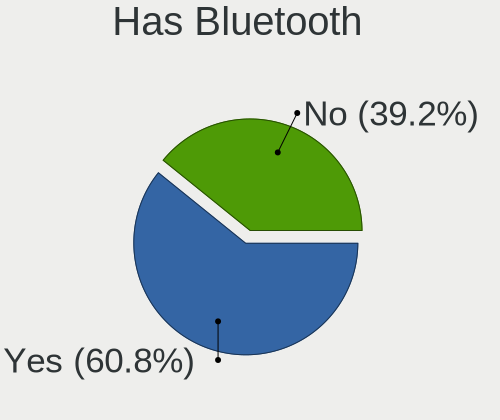
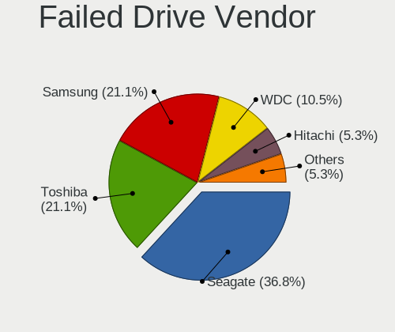
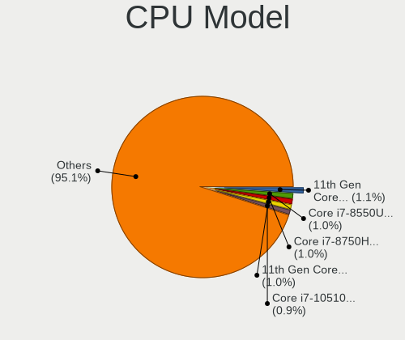

Linux in Spain - Tested Hardware & Statistics
---------------------------------------------

A project to collect tested hardware configurations for Linux in Spain.

Anyone can contribute to this report by the [hw-probe](https://github.com/linuxhw/hw-probe) tool:

    sudo -E hw-probe -all -upload

Please contribute! Especially if your hardware is rare.

This is a report for all computer types. See also reports for [desktops](/Location/Spain/Desktop/README.md) and [notebooks](/Location/Spain/Notebook/README.md).

Contents
--------

* [ Test Cases ](#test-cases)

* [ System ](#system)
  - [ OS                       ](#os)
  - [ OS Family                ](#os-family)
  - [ Kernel                   ](#kernel)
  - [ Kernel Family            ](#kernel-family)
  - [ Kernel Major Ver.        ](#kernel-major-ver)
  - [ Arch                     ](#arch)
  - [ DE                       ](#de)
  - [ Display Server           ](#display-server)
  - [ Display Manager          ](#display-manager)
  - [ OS Lang                  ](#os-lang)
  - [ Boot Mode                ](#boot-mode)
  - [ Filesystem               ](#filesystem)
  - [ Part. scheme             ](#part-scheme)
  - [ Dual Boot with Linux/BSD ](#dual-boot-with-linuxbsd)
  - [ Dual Boot (Win)          ](#dual-boot-win)

* [ Board ](#board)
  - [ Vendor                   ](#vendor)
  - [ Model                    ](#model)
  - [ Model Family             ](#model-family)
  - [ MFG Year                 ](#mfg-year)
  - [ Form Factor              ](#form-factor)
  - [ Secure Boot              ](#secure-boot)
  - [ Coreboot                 ](#coreboot)
  - [ RAM Size                 ](#ram-size)
  - [ RAM Used                 ](#ram-used)
  - [ Total Drives             ](#total-drives)
  - [ Has CD-ROM               ](#has-cd-rom)
  - [ Has Ethernet             ](#has-ethernet)
  - [ Has WiFi                 ](#has-wifi)
  - [ Has Bluetooth            ](#has-bluetooth)

* [ Location ](#location)
  - [ Country                  ](#country)
  - [ City                     ](#city)

* [ Drives ](#drives)
  - [ Drive Vendor             ](#drive-vendor)
  - [ Drive Model              ](#drive-model)
  - [ HDD Vendor               ](#hdd-vendor)
  - [ SSD Vendor               ](#ssd-vendor)
  - [ Drive Kind               ](#drive-kind)
  - [ Drive Connector          ](#drive-connector)
  - [ Drive Size               ](#drive-size)
  - [ Space Total              ](#space-total)
  - [ Space Used               ](#space-used)
  - [ Malfunc. Drives          ](#malfunc-drives)
  - [ Malfunc. Drive Vendor    ](#malfunc-drive-vendor)
  - [ Malfunc. HDD Vendor      ](#malfunc-hdd-vendor)
  - [ Malfunc. Drive Kind      ](#malfunc-drive-kind)
  - [ Failed Drives            ](#failed-drives)
  - [ Failed Drive Vendor      ](#failed-drive-vendor)
  - [ Drive Status             ](#drive-status)

* [ Storage controller ](#storage-controller)
  - [ Storage Vendor           ](#storage-vendor)
  - [ Storage Model            ](#storage-model)
  - [ Storage Kind             ](#storage-kind)

* [ Processor ](#processor)
  - [ CPU Vendor               ](#cpu-vendor)
  - [ CPU Model                ](#cpu-model)
  - [ CPU Model Family         ](#cpu-model-family)
  - [ CPU Cores                ](#cpu-cores)
  - [ CPU Sockets              ](#cpu-sockets)
  - [ CPU Threads              ](#cpu-threads)
  - [ CPU Op-Modes             ](#cpu-op-modes)
  - [ CPU Microcode            ](#cpu-microcode)
  - [ CPU Microarch            ](#cpu-microarch)

* [ Graphics ](#graphics)
  - [ GPU Vendor               ](#gpu-vendor)
  - [ GPU Model                ](#gpu-model)
  - [ GPU Combo                ](#gpu-combo)
  - [ GPU Driver               ](#gpu-driver)
  - [ GPU Memory               ](#gpu-memory)

* [ Monitor ](#monitor)
  - [ Monitor Vendor           ](#monitor-vendor)
  - [ Monitor Model            ](#monitor-model)
  - [ Monitor Resolution       ](#monitor-resolution)
  - [ Monitor Diagonal         ](#monitor-diagonal)
  - [ Monitor Width            ](#monitor-width)
  - [ Aspect Ratio             ](#aspect-ratio)
  - [ Monitor Area             ](#monitor-area)
  - [ Pixel Density            ](#pixel-density)
  - [ Multiple Monitors        ](#multiple-monitors)

* [ Network ](#network)
  - [ Net Controller Vendor    ](#net-controller-vendor)
  - [ Net Controller Model     ](#net-controller-model)
  - [ Wireless Vendor          ](#wireless-vendor)
  - [ Wireless Model           ](#wireless-model)
  - [ Ethernet Vendor          ](#ethernet-vendor)
  - [ Ethernet Model           ](#ethernet-model)
  - [ Net Controller Kind      ](#net-controller-kind)
  - [ Used Controller          ](#used-controller)
  - [ NICs                     ](#nics)
  - [ IPv6                     ](#ipv6)

* [ Bluetooth ](#bluetooth)
  - [ Bluetooth Vendor         ](#bluetooth-vendor)
  - [ Bluetooth Model          ](#bluetooth-model)

* [ Sound ](#sound)
  - [ Sound Vendor             ](#sound-vendor)
  - [ Sound Model              ](#sound-model)

* [ Memory ](#memory)
  - [ Memory Vendor            ](#memory-vendor)
  - [ Memory Model             ](#memory-model)
  - [ Memory Kind              ](#memory-kind)
  - [ Memory Form Factor       ](#memory-form-factor)
  - [ Memory Size              ](#memory-size)
  - [ Memory Speed             ](#memory-speed)

* [ Printers & scanners ](#printers--scanners)
  - [ Printer Vendor           ](#printer-vendor)
  - [ Printer Model            ](#printer-model)
  - [ Scanner Vendor           ](#scanner-vendor)
  - [ Scanner Model            ](#scanner-model)

* [ Camera ](#camera)
  - [ Camera Vendor            ](#camera-vendor)
  - [ Camera Model             ](#camera-model)

* [ Security ](#security)
  - [ Fingerprint Vendor       ](#fingerprint-vendor)
  - [ Fingerprint Model        ](#fingerprint-model)
  - [ Chipcard Vendor          ](#chipcard-vendor)
  - [ Chipcard Model           ](#chipcard-model)

* [ Unsupported ](#unsupported)
  - [ Unsupported Devices      ](#unsupported-devices)
  - [ Unsupported Device Types ](#unsupported-device-types)

Test Cases
----------

Total: 8064

| Vendor        | Model                       | Form-Factor | Probe                                                      | Date         |
|---------------|-----------------------------|-------------|------------------------------------------------------------|--------------|
| HP            | ProBook x360 11 G5 EE       | Convertible | [9651bc99b0](https://linux-hardware.org/?probe=9651bc99b0) | Aug 12, 2023 |
| Apple         | Mac-FC02E91DDD3FA6A4 iMa... | All in one  | [ccf80c6f9a](https://linux-hardware.org/?probe=ccf80c6f9a) | Aug 12, 2023 |
| Apple         | Mac-FC02E91DDD3FA6A4 iMa... | All in one  | [b5604d9633](https://linux-hardware.org/?probe=b5604d9633) | Aug 12, 2023 |
| Gigabyte      | H61M-DS2                    | Desktop     | [3181a592ac](https://linux-hardware.org/?probe=3181a592ac) | Aug 12, 2023 |
| HP            | Pavilion Laptop 14-dv1xx... | Notebook    | [72899a615b](https://linux-hardware.org/?probe=72899a615b) | Aug 12, 2023 |
| Gigabyte      | Z170-HD3P-CF                | Desktop     | [7ef87af541](https://linux-hardware.org/?probe=7ef87af541) | Aug 12, 2023 |
| Lenovo        | Yoga 7 14ARB7 82QF          | Convertible | [1c2e98b598](https://linux-hardware.org/?probe=1c2e98b598) | Aug 11, 2023 |
| Apple         | Mac-F2238BAE iMac11,3       | All in one  | [b50bdc5845](https://linux-hardware.org/?probe=b50bdc5845) | Aug 11, 2023 |
| Apple         | Mac-F2238BAE iMac11,3       | All in one  | [8a3df803a6](https://linux-hardware.org/?probe=8a3df803a6) | Aug 11, 2023 |
| Intel Clie... | LAPQC71A                    | Notebook    | [c87bff1d43](https://linux-hardware.org/?probe=c87bff1d43) | Aug 11, 2023 |
| MSI           | Creator Z16 A11UET          | Notebook    | [7883e9a69d](https://linux-hardware.org/?probe=7883e9a69d) | Aug 11, 2023 |
| HP            | Pavilion Laptop 14-dv1xx... | Notebook    | [c083cb5f2f](https://linux-hardware.org/?probe=c083cb5f2f) | Aug 11, 2023 |
| Lenovo        | IdeaPad 330-15IKB 81DE      | Notebook    | [a708832571](https://linux-hardware.org/?probe=a708832571) | Aug 11, 2023 |
| ASUSTek       | 1005PE                      | Notebook    | [088a155ec9](https://linux-hardware.org/?probe=088a155ec9) | Aug 10, 2023 |
| Lenovo        | Yoga 7 14ARB7 82QF          | Convertible | [9ce8c0dd74](https://linux-hardware.org/?probe=9ce8c0dd74) | Aug 10, 2023 |
| PC Special... | NH5xAx                      | Notebook    | [891b5ec398](https://linux-hardware.org/?probe=891b5ec398) | Aug 10, 2023 |
| HP            | Victus by Gaming Laptop ... | Notebook    | [8b57037d50](https://linux-hardware.org/?probe=8b57037d50) | Aug 09, 2023 |
| ASUSTek       | ROG Zephyrus G14 GA401QC... | Notebook    | [afa02e4c02](https://linux-hardware.org/?probe=afa02e4c02) | Aug 09, 2023 |
| Unknown       | AB07H                       | Desktop     | [d0b6bc1fce](https://linux-hardware.org/?probe=d0b6bc1fce) | Aug 09, 2023 |
| Gigabyte      | H61M-DS2                    | Desktop     | [939205ed85](https://linux-hardware.org/?probe=939205ed85) | Aug 09, 2023 |
| MSI           | A78M-E45                    | Desktop     | [d39f224497](https://linux-hardware.org/?probe=d39f224497) | Aug 09, 2023 |
| Dell          | Latitude 5520               | Notebook    | [478f0a6a07](https://linux-hardware.org/?probe=478f0a6a07) | Aug 09, 2023 |
| ASUSTek       | ROG Strix G614JV_G614JV     | Notebook    | [a8fc44190a](https://linux-hardware.org/?probe=a8fc44190a) | Aug 09, 2023 |
| ASUSTek       | ROG Strix G614JV_G614JV     | Notebook    | [766e35e920](https://linux-hardware.org/?probe=766e35e920) | Aug 09, 2023 |
| Acidanther... | Mac-AA95B1DDAB278B95 iMa... | All in one  | [9c789edd52](https://linux-hardware.org/?probe=9c789edd52) | Aug 08, 2023 |
| Acer          | Ferrari One 200             | Notebook    | [be688aa584](https://linux-hardware.org/?probe=be688aa584) | Aug 08, 2023 |
| Lenovo        | IdeaPad 330-15IKB 81DE      | Notebook    | [de86921bce](https://linux-hardware.org/?probe=de86921bce) | Aug 08, 2023 |
| MSI           | B450 GAMING PLUS            | Desktop     | [c8553cabce](https://linux-hardware.org/?probe=c8553cabce) | Aug 08, 2023 |
| MSI           | Creator Z16 A11UET          | Notebook    | [ea05388cf5](https://linux-hardware.org/?probe=ea05388cf5) | Aug 08, 2023 |
| HP            | Victus by Laptop 16-e0xx... | Notebook    | [b73a01acaf](https://linux-hardware.org/?probe=b73a01acaf) | Aug 07, 2023 |
| ASUSTek       | M5A78L-M/USB3               | Desktop     | [e703e9ae63](https://linux-hardware.org/?probe=e703e9ae63) | Aug 07, 2023 |
| SGIN          | laptop                      | Notebook    | [d80389ea87](https://linux-hardware.org/?probe=d80389ea87) | Aug 07, 2023 |
| HP            | 255 G3                      | Notebook    | [d4e6fedb82](https://linux-hardware.org/?probe=d4e6fedb82) | Aug 07, 2023 |
| HP            | 255 G3                      | Notebook    | [0861b2330b](https://linux-hardware.org/?probe=0861b2330b) | Aug 07, 2023 |
| ASUSTek       | ROG Strix G513RC_G513RC     | Notebook    | [77840c201a](https://linux-hardware.org/?probe=77840c201a) | Aug 07, 2023 |
| Gigabyte      | H81M-S2H                    | Desktop     | [f895d0afe3](https://linux-hardware.org/?probe=f895d0afe3) | Aug 07, 2023 |
| ASUSTek       | P8H61-M LX3 PLUS R2.0       | Desktop     | [e6955ee04c](https://linux-hardware.org/?probe=e6955ee04c) | Aug 07, 2023 |
| Acer          | Aspire TC-605               | Desktop     | [f3bac278d5](https://linux-hardware.org/?probe=f3bac278d5) | Aug 07, 2023 |
| Lenovo        | ThinkPad E15 Gen 3 20YGC... | Notebook    | [804851c490](https://linux-hardware.org/?probe=804851c490) | Aug 07, 2023 |
| Acer          | Aspire V5-121               | Notebook    | [4b8b0f132d](https://linux-hardware.org/?probe=4b8b0f132d) | Aug 07, 2023 |
| ASRock        | N68C-S UCC                  | Desktop     | [ebe7ed3f69](https://linux-hardware.org/?probe=ebe7ed3f69) | Aug 07, 2023 |
| Notebook      | NS5x_NS7xPU                 | Notebook    | [d71ac9524e](https://linux-hardware.org/?probe=d71ac9524e) | Aug 06, 2023 |
| Acer          | Aspire XC-705               | Desktop     | [37bf6e8191](https://linux-hardware.org/?probe=37bf6e8191) | Aug 06, 2023 |
| ASUSTek       | PRIME H310T R2.0            | Desktop     | [458a26f70c](https://linux-hardware.org/?probe=458a26f70c) | Aug 06, 2023 |
| MSI           | Z490-A PRO                  | Desktop     | [151339db32](https://linux-hardware.org/?probe=151339db32) | Aug 06, 2023 |
| HUAWEI        | BOHK-WAX9X                  | Notebook    | [56c7715a6d](https://linux-hardware.org/?probe=56c7715a6d) | Aug 06, 2023 |
| HUAWEI        | BOHK-WAX9X                  | Notebook    | [6a9e7cc3e2](https://linux-hardware.org/?probe=6a9e7cc3e2) | Aug 06, 2023 |
| HP            | Victus by Laptop 16-d1xx... | Notebook    | [74c80ca51b](https://linux-hardware.org/?probe=74c80ca51b) | Aug 06, 2023 |
| ASUSTek       | R2H                         | Notebook    | [a2972dc454](https://linux-hardware.org/?probe=a2972dc454) | Aug 06, 2023 |
| ASUSTek       | R2H                         | Notebook    | [c32b5889aa](https://linux-hardware.org/?probe=c32b5889aa) | Aug 06, 2023 |
| Acer          | Aspire A315-59              | Notebook    | [fc1d6007aa](https://linux-hardware.org/?probe=fc1d6007aa) | Aug 05, 2023 |
| Acer          | Aspire A315-59              | Notebook    | [deff4c99b6](https://linux-hardware.org/?probe=deff4c99b6) | Aug 05, 2023 |
| ASUSTek       | VivoBook_ASUSLaptop X415... | Notebook    | [1d6bf926f6](https://linux-hardware.org/?probe=1d6bf926f6) | Aug 05, 2023 |
| ASUSTek       | TUF Gaming B660-PLUS WIF... | Desktop     | [7979e7ce95](https://linux-hardware.org/?probe=7979e7ce95) | Aug 05, 2023 |
| MSI           | A78M-E45                    | Desktop     | [988c1f5878](https://linux-hardware.org/?probe=988c1f5878) | Aug 05, 2023 |
| HP            | Pavilion Laptop 14-dv1xx... | Notebook    | [e815f65a97](https://linux-hardware.org/?probe=e815f65a97) | Aug 05, 2023 |
| Sony          | VGN-NS11S_S                 | Notebook    | [8ad31bd20c](https://linux-hardware.org/?probe=8ad31bd20c) | Aug 05, 2023 |
| Apple         | Mac-FC02E91DDD3FA6A4 iMa... | All in one  | [0b6f7a1d70](https://linux-hardware.org/?probe=0b6f7a1d70) | Aug 05, 2023 |
| Apple         | Mac-FC02E91DDD3FA6A4 iMa... | All in one  | [4fe47419ee](https://linux-hardware.org/?probe=4fe47419ee) | Aug 05, 2023 |
| ASUSTek       | ROG STRIX B365-G GAMING     | Desktop     | [eabd86788e](https://linux-hardware.org/?probe=eabd86788e) | Aug 04, 2023 |
| Chuwi         | GemiBook Pro                | Notebook    | [87ecdcb4bd](https://linux-hardware.org/?probe=87ecdcb4bd) | Aug 04, 2023 |
| HP            | 83E8                        | Desktop     | [0d285189b9](https://linux-hardware.org/?probe=0d285189b9) | Aug 04, 2023 |
| Toshiba       | PORTEGE R700                | Notebook    | [f0df061bb2](https://linux-hardware.org/?probe=f0df061bb2) | Aug 04, 2023 |
| Dell          | 03KWTV A02                  | Desktop     | [294dcce02b](https://linux-hardware.org/?probe=294dcce02b) | Aug 04, 2023 |
| MSI           | Z490-A PRO                  | Desktop     | [71e97069b6](https://linux-hardware.org/?probe=71e97069b6) | Aug 04, 2023 |
| Gigabyte      | F2A88XM-D3HP                | Desktop     | [42ac042892](https://linux-hardware.org/?probe=42ac042892) | Aug 03, 2023 |
| ASUSTek       | VivoBook 15_ASUS Laptop ... | Notebook    | [ee147b0313](https://linux-hardware.org/?probe=ee147b0313) | Aug 03, 2023 |
| ASUSTek       | VivoBook_ASUSLaptop X515... | Notebook    | [7f601fe313](https://linux-hardware.org/?probe=7f601fe313) | Aug 03, 2023 |
| HP            | Laptop 15s-fq1xxx           | Notebook    | [f495796fe8](https://linux-hardware.org/?probe=f495796fe8) | Aug 03, 2023 |
| Acer          | Aspire M3-581G              | Notebook    | [82814fbe1e](https://linux-hardware.org/?probe=82814fbe1e) | Aug 02, 2023 |
| Apple         | Mac-F65AE981FFA204ED Mac... | Mini pc     | [0e3cacbea1](https://linux-hardware.org/?probe=0e3cacbea1) | Aug 02, 2023 |
| ASUSTek       | H97-PLUS                    | Desktop     | [485793f801](https://linux-hardware.org/?probe=485793f801) | Aug 02, 2023 |
| ASUSTek       | TUF Gaming X570-PRO         | Desktop     | [a08886d394](https://linux-hardware.org/?probe=a08886d394) | Aug 02, 2023 |
| Chuwi         | GemiBook Pro                | Notebook    | [eb2554dce9](https://linux-hardware.org/?probe=eb2554dce9) | Aug 02, 2023 |
| MSI           | Modern 15 A10M              | Notebook    | [bab451a11e](https://linux-hardware.org/?probe=bab451a11e) | Aug 02, 2023 |
| Sony          | VPCSB2L1R                   | Notebook    | [582f50ea25](https://linux-hardware.org/?probe=582f50ea25) | Aug 02, 2023 |
| ASUSTek       | ROG Zephyrus G14 GA401II... | Notebook    | [839698eb4c](https://linux-hardware.org/?probe=839698eb4c) | Aug 01, 2023 |
| HP            | OMEN by Laptop 16-c0xxx     | Notebook    | [8e7e80c44e](https://linux-hardware.org/?probe=8e7e80c44e) | Aug 01, 2023 |
| HP            | Laptop 15-db0xxx            | Notebook    | [2d7cbca56b](https://linux-hardware.org/?probe=2d7cbca56b) | Aug 01, 2023 |
| Gigabyte      | Z370 AORUS Gaming 5-CF      | Desktop     | [13d25503d7](https://linux-hardware.org/?probe=13d25503d7) | Aug 01, 2023 |
| ASRock        | A320M-DVS R4.0              | Desktop     | [648421ac0a](https://linux-hardware.org/?probe=648421ac0a) | Aug 01, 2023 |
| Chuwi         | GemiBook Pro                | Notebook    | [be8a59432a](https://linux-hardware.org/?probe=be8a59432a) | Aug 01, 2023 |
| ASUSTek       | VivoBook_ASUS Laptop E41... | Notebook    | [2dcefa3349](https://linux-hardware.org/?probe=2dcefa3349) | Aug 01, 2023 |
| Valve         | Jupiter                     | Notebook    | [6ea9f908cb](https://linux-hardware.org/?probe=6ea9f908cb) | Aug 01, 2023 |
| Acer          | Aspire E5-573G              | Notebook    | [7e3e1a7ee9](https://linux-hardware.org/?probe=7e3e1a7ee9) | Jul 31, 2023 |
| ASUSTek       | ROG STRIX B365-G GAMING     | Desktop     | [2ca9767252](https://linux-hardware.org/?probe=2ca9767252) | Jul 31, 2023 |
| SHENZHEN Y... | A8S PRO                     | Notebook    | [829a4178a5](https://linux-hardware.org/?probe=829a4178a5) | Jul 30, 2023 |
| Panasonic     | CFMX4-1                     | Notebook    | [925f36396d](https://linux-hardware.org/?probe=925f36396d) | Jul 30, 2023 |
| Apple         | Mac-F65AE981FFA204ED Mac... | Mini pc     | [63b8471789](https://linux-hardware.org/?probe=63b8471789) | Jul 30, 2023 |
| VANT          | MOOVE15_2023                | Notebook    | [6943d341c4](https://linux-hardware.org/?probe=6943d341c4) | Jul 29, 2023 |
| ASUSTek       | H110M-D                     | Desktop     | [9669adfa57](https://linux-hardware.org/?probe=9669adfa57) | Jul 29, 2023 |
| ASUSTek       | VivoBook_ASUS Laptop E41... | Notebook    | [ce140941bc](https://linux-hardware.org/?probe=ce140941bc) | Jul 29, 2023 |
| ASUSTek       | VivoBook_ASUS Laptop E41... | Notebook    | [19850c3ad1](https://linux-hardware.org/?probe=19850c3ad1) | Jul 29, 2023 |
| SHENZHEN Y... | A8S PRO                     | Notebook    | [08a6feda0e](https://linux-hardware.org/?probe=08a6feda0e) | Jul 28, 2023 |
| ASUSTek       | PRIME H510M-K R2.0          | Desktop     | [7b5aebd006](https://linux-hardware.org/?probe=7b5aebd006) | Jul 28, 2023 |
| HP            | Victus by Gaming Laptop ... | Notebook    | [7595472fb4](https://linux-hardware.org/?probe=7595472fb4) | Jul 28, 2023 |
| Gigabyte      | A320M-H-CF                  | Desktop     | [2e2b9a12a6](https://linux-hardware.org/?probe=2e2b9a12a6) | Jul 28, 2023 |
| HP            | g14                         | Notebook    | [39d4ce09a1](https://linux-hardware.org/?probe=39d4ce09a1) | Jul 28, 2023 |
| Qualcomm T... | SM8150 V2 PM8150 VAYU       | Soc         | [42cf42a0d2](https://linux-hardware.org/?probe=42cf42a0d2) | Jul 28, 2023 |
| Unknown       | Unknown                     | Soc         | [dbb70e9c8b](https://linux-hardware.org/?probe=dbb70e9c8b) | Jul 28, 2023 |
| ASUSTek       | VivoBook_ASUS Laptop E41... | Notebook    | [61321e569d](https://linux-hardware.org/?probe=61321e569d) | Jul 28, 2023 |
| ASUSTek       | VivoBook_ASUSLaptop X570... | Notebook    | [4bd819d37b](https://linux-hardware.org/?probe=4bd819d37b) | Jul 28, 2023 |
| ASUSTek       | ROG STRIX B365-G GAMING     | Desktop     | [2af263d1b7](https://linux-hardware.org/?probe=2af263d1b7) | Jul 27, 2023 |
| Lenovo        | Yoga 3 Pro-1370 80HE        | Notebook    | [0a1ef2aa5b](https://linux-hardware.org/?probe=0a1ef2aa5b) | Jul 27, 2023 |
| Lenovo        | Yoga 3 Pro-1370 80HE        | Notebook    | [d4914d5e5d](https://linux-hardware.org/?probe=d4914d5e5d) | Jul 27, 2023 |
| Samsung       | 700T                        | Notebook    | [a6c83540ad](https://linux-hardware.org/?probe=a6c83540ad) | Jul 27, 2023 |
| Acer          | Extensa 2510                | Notebook    | [b276a715eb](https://linux-hardware.org/?probe=b276a715eb) | Jul 27, 2023 |
| ASUSTek       | ROG STRIX B450-F GAMING     | Desktop     | [60d9839bbe](https://linux-hardware.org/?probe=60d9839bbe) | Jul 27, 2023 |
| ASUSTek       | ROG STRIX B450-F GAMING     | Desktop     | [45149f899d](https://linux-hardware.org/?probe=45149f899d) | Jul 26, 2023 |
| Acer          | Aspire V3-571G              | Notebook    | [88f60930be](https://linux-hardware.org/?probe=88f60930be) | Jul 26, 2023 |
| ASUSTek       | PRIME H510M-K R2.0          | Desktop     | [c7ec8db97e](https://linux-hardware.org/?probe=c7ec8db97e) | Jul 26, 2023 |
| Samsung       | 700T                        | Notebook    | [881cb15d92](https://linux-hardware.org/?probe=881cb15d92) | Jul 25, 2023 |
| ASUSTek       | M5A78L-M/USB3               | Desktop     | [865eacc7bb](https://linux-hardware.org/?probe=865eacc7bb) | Jul 25, 2023 |
| Acer          | Extensa 2530                | Notebook    | [6691e96edf](https://linux-hardware.org/?probe=6691e96edf) | Jul 25, 2023 |
| Apple         | Mac-63001698E7A34814 iMa... | All in one  | [33c7ff96a8](https://linux-hardware.org/?probe=33c7ff96a8) | Jul 25, 2023 |
| HP            | 1495                        | Desktop     | [99072e94e8](https://linux-hardware.org/?probe=99072e94e8) | Jul 25, 2023 |
| HP            | 8719                        | Desktop     | [68870aa596](https://linux-hardware.org/?probe=68870aa596) | Jul 24, 2023 |
| ASUSTek       | PRIME H510M-K R2.0          | Desktop     | [ffee60fde7](https://linux-hardware.org/?probe=ffee60fde7) | Jul 24, 2023 |
| AXDIA Inte... | WINPAD V10                  | Notebook    | [0e7e712860](https://linux-hardware.org/?probe=0e7e712860) | Jul 24, 2023 |
| Apple         | MacBookAir4,2               | Notebook    | [e220379405](https://linux-hardware.org/?probe=e220379405) | Jul 24, 2023 |
| Unknown       | Huawei Y635                 | Soc         | [399a63d7fe](https://linux-hardware.org/?probe=399a63d7fe) | Jul 23, 2023 |
| Medion        | H110H4-EM2                  | Desktop     | [443b61cb44](https://linux-hardware.org/?probe=443b61cb44) | Jul 22, 2023 |
| ASUSTek       | Z77-A                       | Desktop     | [4c5a8d18b9](https://linux-hardware.org/?probe=4c5a8d18b9) | Jul 22, 2023 |
| Medion        | E15301                      | Notebook    | [e20403ff58](https://linux-hardware.org/?probe=e20403ff58) | Jul 22, 2023 |
| Toshiba       | Satellite L50-B             | Notebook    | [5e7da1cf33](https://linux-hardware.org/?probe=5e7da1cf33) | Jul 22, 2023 |
| AMI           | Cherry Trail CR             | Notebook    | [42d75ac45a](https://linux-hardware.org/?probe=42d75ac45a) | Jul 21, 2023 |
| Raspberry ... | Raspberry Pi 4 Model B      | Soc         | [e222d263f6](https://linux-hardware.org/?probe=e222d263f6) | Jul 21, 2023 |
| Packard Be... | EasyNote SL65               | Notebook    | [f66a4415f3](https://linux-hardware.org/?probe=f66a4415f3) | Jul 21, 2023 |
| Chuwi         | M01ALWR310-ADA90A           | Mini pc     | [0274c94523](https://linux-hardware.org/?probe=0274c94523) | Jul 21, 2023 |
| HUAWEI        | BOHK-WAX9X                  | Notebook    | [fe0c696d47](https://linux-hardware.org/?probe=fe0c696d47) | Jul 21, 2023 |
| Raspberry ... | Raspberry Pi 4 Model B      | Soc         | [fbd6b6197b](https://linux-hardware.org/?probe=fbd6b6197b) | Jul 21, 2023 |
| Unknown       | Unknown                     | Desktop     | [06099a3fdd](https://linux-hardware.org/?probe=06099a3fdd) | Jul 21, 2023 |
| Pegatron      | 2AB5                        | Desktop     | [0c95406e21](https://linux-hardware.org/?probe=0c95406e21) | Jul 21, 2023 |
| Pegatron      | 2AB5                        | Desktop     | [b3f1259905](https://linux-hardware.org/?probe=b3f1259905) | Jul 21, 2023 |
| Lenovo        | ThinkPad X1 Nano Gen 1 2... | Notebook    | [b541d17031](https://linux-hardware.org/?probe=b541d17031) | Jul 21, 2023 |
| Dell          | XPS 15 7590                 | Notebook    | [714d6a38d3](https://linux-hardware.org/?probe=714d6a38d3) | Jul 20, 2023 |
| Dell          | XPS 15 7590                 | Notebook    | [f7edcc8364](https://linux-hardware.org/?probe=f7edcc8364) | Jul 20, 2023 |
| Lenovo        | Z50-70 20354                | Notebook    | [f92f9065bc](https://linux-hardware.org/?probe=f92f9065bc) | Jul 19, 2023 |
| ASUSTek       | ASUS TUF Gaming F15 FX50... | Notebook    | [ec673415b4](https://linux-hardware.org/?probe=ec673415b4) | Jul 19, 2023 |
| Lenovo        | ThinkBook 16p Gen 2 20YM    | Notebook    | [35944db669](https://linux-hardware.org/?probe=35944db669) | Jul 19, 2023 |
| ASRock        | G41C-GS R2.0                | Desktop     | [3ed4a6a897](https://linux-hardware.org/?probe=3ed4a6a897) | Jul 19, 2023 |
| ASUSTek       | ROG STRIX B365-G GAMING     | Desktop     | [3428acceaf](https://linux-hardware.org/?probe=3428acceaf) | Jul 19, 2023 |
| MSI           | H81M-E33                    | Desktop     | [dc821e7080](https://linux-hardware.org/?probe=dc821e7080) | Jul 19, 2023 |
| Intel         | Skylake U DDR3L RVP7 1      | All in one  | [d1342e70a2](https://linux-hardware.org/?probe=d1342e70a2) | Jul 19, 2023 |
| Gigabyte      | B75-D3V                     | Desktop     | [ad01a23df5](https://linux-hardware.org/?probe=ad01a23df5) | Jul 19, 2023 |
| MSI           | B450M MORTAR MAX            | Desktop     | [22bbaa5937](https://linux-hardware.org/?probe=22bbaa5937) | Jul 19, 2023 |
| Apple         | MacBookPro16,1              | Notebook    | [dd5d384a71](https://linux-hardware.org/?probe=dd5d384a71) | Jul 18, 2023 |
| ASUSTek       | Zenbook UM3402YA_UM3402Y... | Notebook    | [dc76c90236](https://linux-hardware.org/?probe=dc76c90236) | Jul 18, 2023 |
| Lenovo        | IdeaPad 330-15IKB 81DE      | Notebook    | [1cffa4bad9](https://linux-hardware.org/?probe=1cffa4bad9) | Jul 18, 2023 |
| HP            | 889C                        | Desktop     | [3124074b5a](https://linux-hardware.org/?probe=3124074b5a) | Jul 18, 2023 |
| Lenovo        | ThinkBook 16p Gen 2 20YM    | Notebook    | [cdaad6fa25](https://linux-hardware.org/?probe=cdaad6fa25) | Jul 18, 2023 |
| Lenovo        | IdeaPad 3 15ADA05 81W1      | Notebook    | [fdbbd2b641](https://linux-hardware.org/?probe=fdbbd2b641) | Jul 18, 2023 |
| ZOTAC         | ZBOX                        | Mini pc     | [e5d8647d32](https://linux-hardware.org/?probe=e5d8647d32) | Jul 17, 2023 |
| HP            | Victus by Laptop 16-e0xx... | Notebook    | [b0c8aaef19](https://linux-hardware.org/?probe=b0c8aaef19) | Jul 16, 2023 |
| HP            | Laptop 15s-fq1xxx           | Notebook    | [10e24627b0](https://linux-hardware.org/?probe=10e24627b0) | Jul 16, 2023 |
| HP            | Victus by Laptop 16-e0xx... | Notebook    | [5e43c9d869](https://linux-hardware.org/?probe=5e43c9d869) | Jul 15, 2023 |
| Unknown       | Unknown                     | Soc         | [d69b7167f2](https://linux-hardware.org/?probe=d69b7167f2) | Jul 15, 2023 |
| Unknown       | Unknown                     | Soc         | [96ae9a1ca6](https://linux-hardware.org/?probe=96ae9a1ca6) | Jul 15, 2023 |
| Gigabyte      | B650M AORUS ELITE AX        | Desktop     | [649fb482b4](https://linux-hardware.org/?probe=649fb482b4) | Jul 15, 2023 |
| MSI           | Z97 GAMING 3                | Desktop     | [c8c107c355](https://linux-hardware.org/?probe=c8c107c355) | Jul 15, 2023 |
| Gigabyte      | B650M AORUS ELITE AX        | Desktop     | [b84898fc8a](https://linux-hardware.org/?probe=b84898fc8a) | Jul 15, 2023 |
| MSI           | Z97 GAMING 3                | Desktop     | [3841eb7ba0](https://linux-hardware.org/?probe=3841eb7ba0) | Jul 15, 2023 |
| HP            | Laptop 15-bw0xx             | Notebook    | [56448b6dd8](https://linux-hardware.org/?probe=56448b6dd8) | Jul 15, 2023 |
| Lenovo        | IdeaPad Gaming 3 15IAH7 ... | Notebook    | [bcf8e9f2c3](https://linux-hardware.org/?probe=bcf8e9f2c3) | Jul 14, 2023 |
| ASUSTek       | VivoBook_ASUSLaptop X421... | Notebook    | [f1bbc61bb6](https://linux-hardware.org/?probe=f1bbc61bb6) | Jul 14, 2023 |
| Dell          | XPS 15 7590                 | Notebook    | [28b21d099f](https://linux-hardware.org/?probe=28b21d099f) | Jul 14, 2023 |
| Acer          | TravelMate P246-MG          | Notebook    | [62348fa6ed](https://linux-hardware.org/?probe=62348fa6ed) | Jul 13, 2023 |
| Acer          | Aspire 5749                 | Notebook    | [fc6d20a364](https://linux-hardware.org/?probe=fc6d20a364) | Jul 13, 2023 |
| Chuwi         | GemiBook Pro                | Notebook    | [f73994358d](https://linux-hardware.org/?probe=f73994358d) | Jul 13, 2023 |
| Lenovo        | MIIX 310-10ICR 80SG         | Tablet      | [2bdf7534ad](https://linux-hardware.org/?probe=2bdf7534ad) | Jul 13, 2023 |
| Lenovo        | MIIX 310-10ICR 80SG         | Tablet      | [e3ad1f49b1](https://linux-hardware.org/?probe=e3ad1f49b1) | Jul 13, 2023 |
| Samsung       | Galaxy TabPro S LTE         | Tablet      | [59a6da64a7](https://linux-hardware.org/?probe=59a6da64a7) | Jul 13, 2023 |
| ASUSTek       | VivoBook_ASUSLaptop X150... | Notebook    | [d7c5b64bcb](https://linux-hardware.org/?probe=d7c5b64bcb) | Jul 12, 2023 |
| Lenovo        | SHARKBAY NOK                | Desktop     | [66c5696981](https://linux-hardware.org/?probe=66c5696981) | Jul 12, 2023 |
| Dell          | XPS 13 9380                 | Notebook    | [e40c69408d](https://linux-hardware.org/?probe=e40c69408d) | Jul 11, 2023 |
| Dell          | Latitude 7275               | Notebook    | [0647894f7f](https://linux-hardware.org/?probe=0647894f7f) | Jul 11, 2023 |
| Gigabyte      | B450 AORUS M                | Desktop     | [500fee1ce5](https://linux-hardware.org/?probe=500fee1ce5) | Jul 11, 2023 |
| Dell          | 0T10XW A01                  | Desktop     | [58fb207824](https://linux-hardware.org/?probe=58fb207824) | Jul 11, 2023 |
| ASUSTek       | X555LAB                     | Notebook    | [464293fd0e](https://linux-hardware.org/?probe=464293fd0e) | Jul 11, 2023 |
| Intel         | DG31PR AAD97573-205         | Desktop     | [0095feba57](https://linux-hardware.org/?probe=0095feba57) | Jul 10, 2023 |
| Clevo         | M550SE/M660SE               | Notebook    | [65697a4412](https://linux-hardware.org/?probe=65697a4412) | Jul 10, 2023 |
| Intel         | DG31PR AAD97573-205         | Desktop     | [6b4434fd14](https://linux-hardware.org/?probe=6b4434fd14) | Jul 10, 2023 |
| Gigabyte      | Z390 GAMING X-CF            | Desktop     | [ca812ae8ad](https://linux-hardware.org/?probe=ca812ae8ad) | Jul 10, 2023 |
| Acer          | Extensa 5635Z               | Notebook    | [4967fbddb9](https://linux-hardware.org/?probe=4967fbddb9) | Jul 10, 2023 |
| Lenovo        | IdeaPad 510-15IKB 80SV      | Notebook    | [4ee2490bde](https://linux-hardware.org/?probe=4ee2490bde) | Jul 10, 2023 |
| Gigabyte      | Z170X-Gaming 3              | Desktop     | [a4650f89f7](https://linux-hardware.org/?probe=a4650f89f7) | Jul 10, 2023 |
| Dell          | Latitude E5420              | Notebook    | [6dba8e523b](https://linux-hardware.org/?probe=6dba8e523b) | Jul 09, 2023 |
| Gigabyte      | B560 HD3                    | Desktop     | [437e2c44d9](https://linux-hardware.org/?probe=437e2c44d9) | Jul 09, 2023 |
| Microsoft     | Surface Laptop Go           | Tablet      | [41ede144c1](https://linux-hardware.org/?probe=41ede144c1) | Jul 09, 2023 |
| Notebook      | V1x0PNPx                    | Notebook    | [5a37402681](https://linux-hardware.org/?probe=5a37402681) | Jul 09, 2023 |
| ASUSTek       | P5Q PRO TURBO               | Desktop     | [362fd95251](https://linux-hardware.org/?probe=362fd95251) | Jul 08, 2023 |
| Apple         | MacBookPro14,1              | Notebook    | [62bbadc762](https://linux-hardware.org/?probe=62bbadc762) | Jul 08, 2023 |
| Valve         | Jupiter                     | Notebook    | [7fc70add85](https://linux-hardware.org/?probe=7fc70add85) | Jul 08, 2023 |
| Samsung       | Galaxy TabPro S LTE         | Tablet      | [352e4ef5e5](https://linux-hardware.org/?probe=352e4ef5e5) | Jul 08, 2023 |
| Acer          | Nitro AN515-46              | Notebook    | [010208e38d](https://linux-hardware.org/?probe=010208e38d) | Jul 08, 2023 |
| Valve         | Jupiter                     | Notebook    | [fd3d1bc540](https://linux-hardware.org/?probe=fd3d1bc540) | Jul 08, 2023 |
| Apple         | MacBookPro12,1              | Notebook    | [8877b51b89](https://linux-hardware.org/?probe=8877b51b89) | Jul 08, 2023 |
| ASRock        | A75M-HVS                    | Desktop     | [a0359f0f09](https://linux-hardware.org/?probe=a0359f0f09) | Jul 07, 2023 |
| ASRock        | A75M-HVS                    | Desktop     | [83bbe4315f](https://linux-hardware.org/?probe=83bbe4315f) | Jul 07, 2023 |
| AZW           | SER                         | Mini pc     | [1a93a70c6b](https://linux-hardware.org/?probe=1a93a70c6b) | Jul 07, 2023 |
| ASUSTek       | PRIME H310T R2.0            | Desktop     | [28b2f72ea7](https://linux-hardware.org/?probe=28b2f72ea7) | Jul 07, 2023 |
| Apple         | Mac-BE088AF8C5EB4FA2 iMa... | All in one  | [c4421f6f50](https://linux-hardware.org/?probe=c4421f6f50) | Jul 06, 2023 |
| Lenovo        | G580 2189                   | Notebook    | [a783ca495d](https://linux-hardware.org/?probe=a783ca495d) | Jul 06, 2023 |
| Acer          | Aspire 5749                 | Notebook    | [c4bea06a7d](https://linux-hardware.org/?probe=c4bea06a7d) | Jul 06, 2023 |
| HP            | OMEN by Laptop 16-c0xxx     | Notebook    | [f603fed65f](https://linux-hardware.org/?probe=f603fed65f) | Jul 05, 2023 |
| Apple         | MacBookPro8,1               | Notebook    | [d25474786c](https://linux-hardware.org/?probe=d25474786c) | Jul 05, 2023 |
| ASRock        | X399 Phantom Gaming 6       | Desktop     | [a2728115f2](https://linux-hardware.org/?probe=a2728115f2) | Jul 05, 2023 |
| Acer          | TravelMate P246-MG          | Notebook    | [e1e4548a49](https://linux-hardware.org/?probe=e1e4548a49) | Jul 05, 2023 |
| HUAWEI        | BOD-WXX9                    | Notebook    | [8121ccc8a9](https://linux-hardware.org/?probe=8121ccc8a9) | Jul 05, 2023 |
| Shenzhen M... | F6BFC                       | Desktop     | [f4f1e6f9ff](https://linux-hardware.org/?probe=f4f1e6f9ff) | Jul 05, 2023 |
| HUAWEI        | BOD-WXX9                    | Notebook    | [656b411052](https://linux-hardware.org/?probe=656b411052) | Jul 05, 2023 |
| Dell          | 0WK833                      | Desktop     | [bf1756a33c](https://linux-hardware.org/?probe=bf1756a33c) | Jul 05, 2023 |
| Medion        | X782X                       | Notebook    | [7369e18cc2](https://linux-hardware.org/?probe=7369e18cc2) | Jul 05, 2023 |
| Teclast       | X4                          | Tablet      | [6aab5b6610](https://linux-hardware.org/?probe=6aab5b6610) | Jul 05, 2023 |
| HP            | Pavilion dv5                | Notebook    | [8064b5c083](https://linux-hardware.org/?probe=8064b5c083) | Jul 04, 2023 |
| ASUSTek       | VivoBook_ASUSLaptop X515... | Notebook    | [54a88e79d1](https://linux-hardware.org/?probe=54a88e79d1) | Jul 04, 2023 |
| ASUSTek       | ROG Zephyrus G14 GA401QM... | Notebook    | [c3098317a7](https://linux-hardware.org/?probe=c3098317a7) | Jul 04, 2023 |
| ASUSTek       | SABERTOOTH P67              | Desktop     | [7acafd9528](https://linux-hardware.org/?probe=7acafd9528) | Jul 04, 2023 |
| MSI           | X470 GAMING PLUS MAX        | Desktop     | [293008463e](https://linux-hardware.org/?probe=293008463e) | Jul 03, 2023 |
| Lenovo        | G580 2189                   | Notebook    | [4c68104591](https://linux-hardware.org/?probe=4c68104591) | Jul 03, 2023 |
| Dell          | Latitude 5520               | Notebook    | [acb3fdea1b](https://linux-hardware.org/?probe=acb3fdea1b) | Jul 03, 2023 |
| Dell          | Latitude 5520               | Notebook    | [4bbef448c9](https://linux-hardware.org/?probe=4bbef448c9) | Jul 03, 2023 |
| Unknown       | AB07H                       | Desktop     | [868ad2b334](https://linux-hardware.org/?probe=868ad2b334) | Jul 03, 2023 |
| HP            | ENVY m6                     | Notebook    | [748e336af0](https://linux-hardware.org/?probe=748e336af0) | Jul 02, 2023 |
| Gigabyte      | X570 AORUS ELITE            | Desktop     | [ff0f73c325](https://linux-hardware.org/?probe=ff0f73c325) | Jul 02, 2023 |
| HP            | Pavilion Gaming Laptop 1... | Notebook    | [5daabbcd55](https://linux-hardware.org/?probe=5daabbcd55) | Jul 02, 2023 |
| Valve         | Jupiter                     | Notebook    | [7863106765](https://linux-hardware.org/?probe=7863106765) | Jul 02, 2023 |
| HP            | Pavilion Gaming Laptop 1... | Notebook    | [1eb1ecf3a9](https://linux-hardware.org/?probe=1eb1ecf3a9) | Jul 02, 2023 |
| Gigabyte      | 970A-DS3P                   | Desktop     | [97ebfed554](https://linux-hardware.org/?probe=97ebfed554) | Jul 02, 2023 |
| Teclast       | X4                          | Tablet      | [a7149387c0](https://linux-hardware.org/?probe=a7149387c0) | Jul 02, 2023 |
| Samsung       | Galaxy TabPro S LTE         | Tablet      | [a53eeb72a6](https://linux-hardware.org/?probe=a53eeb72a6) | Jul 02, 2023 |
| MSI           | B450 GAMING PLUS MAX        | Desktop     | [488ebd160a](https://linux-hardware.org/?probe=488ebd160a) | Jul 02, 2023 |
| Lenovo        | IdeaPad Gaming 3 15ACH6 ... | Notebook    | [f78c4a1930](https://linux-hardware.org/?probe=f78c4a1930) | Jul 01, 2023 |
| ASUSTek       | VivoBook_ASUSLaptop E510... | Notebook    | [27c53e1152](https://linux-hardware.org/?probe=27c53e1152) | Jul 01, 2023 |
| Lenovo        | Legion 5 Pro 16ACH6H 82J... | Notebook    | [c1051d3ef0](https://linux-hardware.org/?probe=c1051d3ef0) | Jul 01, 2023 |
| Apple         | MacBookAir9,1               | Notebook    | [d5e55f9e7d](https://linux-hardware.org/?probe=d5e55f9e7d) | Jul 01, 2023 |
| Lenovo        | IdeaPad 3 15ADA05 81W1      | Notebook    | [546fe2b3ab](https://linux-hardware.org/?probe=546fe2b3ab) | Jul 01, 2023 |
| HP            | 8054                        | Desktop     | [30c45def21](https://linux-hardware.org/?probe=30c45def21) | Jul 01, 2023 |
| HP            | 8054                        | Desktop     | [edf94b1f66](https://linux-hardware.org/?probe=edf94b1f66) | Jul 01, 2023 |
| Lenovo        | Yoga 530-14IKB 81EK         | Convertible | [4b57a18d9b](https://linux-hardware.org/?probe=4b57a18d9b) | Jun 30, 2023 |
| Lenovo        | Yoga 530-14IKB 81EK         | Convertible | [1abd7f9f95](https://linux-hardware.org/?probe=1abd7f9f95) | Jun 30, 2023 |
| MSI           | MPG B550 GAMING EDGE WIF... | Desktop     | [9f8e4c6a70](https://linux-hardware.org/?probe=9f8e4c6a70) | Jun 30, 2023 |
| Apple         | MacBookAir9,1               | Notebook    | [bd5c030739](https://linux-hardware.org/?probe=bd5c030739) | Jun 30, 2023 |
| Apple         | MacBookAir9,1               | Notebook    | [ce486a5063](https://linux-hardware.org/?probe=ce486a5063) | Jun 30, 2023 |
| Gigabyte      | GA-MA770-DS3                | Desktop     | [5b7bc3205d](https://linux-hardware.org/?probe=5b7bc3205d) | Jun 29, 2023 |
| ASUSTek       | P8Z68-V PRO                 | Desktop     | [a3de72d73c](https://linux-hardware.org/?probe=a3de72d73c) | Jun 29, 2023 |
| MSI           | Modern 14 B5M               | Notebook    | [cb0eb574da](https://linux-hardware.org/?probe=cb0eb574da) | Jun 29, 2023 |
| MSI           | H61M-P31                    | Desktop     | [9012219f61](https://linux-hardware.org/?probe=9012219f61) | Jun 29, 2023 |
| HP            | Pavilion Gaming Laptop 1... | Notebook    | [06212dc183](https://linux-hardware.org/?probe=06212dc183) | Jun 29, 2023 |
| Acer          | TravelMate P648-G2-M        | Notebook    | [1bb728e7dd](https://linux-hardware.org/?probe=1bb728e7dd) | Jun 29, 2023 |
| ASUSTek       | X541UAK                     | Notebook    | [83d0d28a2a](https://linux-hardware.org/?probe=83d0d28a2a) | Jun 29, 2023 |
| Acer          | TravelMate P648-G2-M        | Notebook    | [d1ade76136](https://linux-hardware.org/?probe=d1ade76136) | Jun 29, 2023 |
| Chuwi         | GemiBook                    | Notebook    | [90f0de1460](https://linux-hardware.org/?probe=90f0de1460) | Jun 28, 2023 |
| Dell          | 0WK833                      | Desktop     | [fd4a07e088](https://linux-hardware.org/?probe=fd4a07e088) | Jun 28, 2023 |
| Acer          | Nitro AN515-54              | Notebook    | [b30ff15571](https://linux-hardware.org/?probe=b30ff15571) | Jun 28, 2023 |
| Apple         | Mac-F2238AC8                | All in one  | [d73388baab](https://linux-hardware.org/?probe=d73388baab) | Jun 28, 2023 |
| HP            | ENVY m6                     | Notebook    | [715d68bfc0](https://linux-hardware.org/?probe=715d68bfc0) | Jun 28, 2023 |
| HP            | Laptop 15s-eq2xxx           | Notebook    | [5922b4d31f](https://linux-hardware.org/?probe=5922b4d31f) | Jun 27, 2023 |
| Dell          | 0WK833                      | Desktop     | [39a5ca93a7](https://linux-hardware.org/?probe=39a5ca93a7) | Jun 27, 2023 |
| MSI           | PRO B660M-B DDR4            | Desktop     | [09f4e0e86a](https://linux-hardware.org/?probe=09f4e0e86a) | Jun 27, 2023 |
| Pegatron      | 2AB5                        | Desktop     | [8aaaef4a62](https://linux-hardware.org/?probe=8aaaef4a62) | Jun 27, 2023 |
| MW            | NVR-N5105                   | Desktop     | [36ee490ef2](https://linux-hardware.org/?probe=36ee490ef2) | Jun 26, 2023 |
| ASUSTek       | VivoBook 15_ASUS Laptop ... | Notebook    | [18c2eb78d4](https://linux-hardware.org/?probe=18c2eb78d4) | Jun 26, 2023 |
| MSI           | Prestige 14H B12UCX         | Notebook    | [abf425c8d7](https://linux-hardware.org/?probe=abf425c8d7) | Jun 26, 2023 |
| Acer          | TravelMate 6493             | Notebook    | [490906b996](https://linux-hardware.org/?probe=490906b996) | Jun 25, 2023 |
| Dell          | 0KJCC5 A00                  | Desktop     | [3ec1b71f5c](https://linux-hardware.org/?probe=3ec1b71f5c) | Jun 25, 2023 |
| ASRock        | G31M-GS                     | Desktop     | [f58c462a34](https://linux-hardware.org/?probe=f58c462a34) | Jun 25, 2023 |
| Dell          | Inspiron MM061              | Notebook    | [8152698df7](https://linux-hardware.org/?probe=8152698df7) | Jun 25, 2023 |
| Toshiba       | Satellite U400              | Notebook    | [58b2ad81eb](https://linux-hardware.org/?probe=58b2ad81eb) | Jun 25, 2023 |
| Gigabyte      | X570 I AORUS PRO WIFI       | Desktop     | [a8c0f33ffe](https://linux-hardware.org/?probe=a8c0f33ffe) | Jun 25, 2023 |
| Acer          | Aspire M3-581G              | Notebook    | [0c348c2570](https://linux-hardware.org/?probe=0c348c2570) | Jun 25, 2023 |
| Gigabyte      | B550 AORUS ELITE V2         | Desktop     | [9a30b63c87](https://linux-hardware.org/?probe=9a30b63c87) | Jun 25, 2023 |
| Lenovo        | IdeaPad Y700-15ISK 80NV     | Notebook    | [f14b9f6ce5](https://linux-hardware.org/?probe=f14b9f6ce5) | Jun 25, 2023 |
| MSI           | A320M-A PRO                 | Desktop     | [2eeb463035](https://linux-hardware.org/?probe=2eeb463035) | Jun 25, 2023 |
| MSI           | A320M-A PRO                 | Desktop     | [ef129b5a6c](https://linux-hardware.org/?probe=ef129b5a6c) | Jun 25, 2023 |
| MSI           | B450 GAMING PLUS MAX        | Desktop     | [785d3130e7](https://linux-hardware.org/?probe=785d3130e7) | Jun 24, 2023 |
| HUAWEI        | HKD-WXX                     | Notebook    | [433d7b4f7e](https://linux-hardware.org/?probe=433d7b4f7e) | Jun 24, 2023 |
| MSI           | B550M-A PRO                 | Desktop     | [68b591e6d8](https://linux-hardware.org/?probe=68b591e6d8) | Jun 24, 2023 |
| Toshiba       | Satellite U400              | Notebook    | [aa6254ebd2](https://linux-hardware.org/?probe=aa6254ebd2) | Jun 24, 2023 |
| HP            | Compaq 610                  | Notebook    | [f312ec5ede](https://linux-hardware.org/?probe=f312ec5ede) | Jun 23, 2023 |
| ASUSTek       | PRIME H410M-A               | Desktop     | [39d5409264](https://linux-hardware.org/?probe=39d5409264) | Jun 23, 2023 |
| Lenovo        | ThinkPad X270 W10DG 20K5... | Notebook    | [6c3a0a7fe0](https://linux-hardware.org/?probe=6c3a0a7fe0) | Jun 23, 2023 |
| Dell          | XPS 9320                    | Notebook    | [2dcfa6718b](https://linux-hardware.org/?probe=2dcfa6718b) | Jun 23, 2023 |
| ASUSTek       | M5A88-V EVO                 | Desktop     | [3708ae400f](https://linux-hardware.org/?probe=3708ae400f) | Jun 23, 2023 |
| ASUSTek       | M5A88-V EVO                 | Desktop     | [d447bb1029](https://linux-hardware.org/?probe=d447bb1029) | Jun 23, 2023 |
| MSI           | Alpha 15 A3DDK              | Notebook    | [410b20161b](https://linux-hardware.org/?probe=410b20161b) | Jun 23, 2023 |
| Apple         | Mac-27ADBB7B4CEE8E61 iMa... | All in one  | [6e68a59ffb](https://linux-hardware.org/?probe=6e68a59ffb) | Jun 22, 2023 |
| Apple         | Mac-27ADBB7B4CEE8E61 iMa... | All in one  | [41a5a93ebb](https://linux-hardware.org/?probe=41a5a93ebb) | Jun 22, 2023 |
| ASUSTek       | TUF Gaming FX505GD_FX505... | Notebook    | [69dfee1765](https://linux-hardware.org/?probe=69dfee1765) | Jun 22, 2023 |
| Foxconn       | ETON                        | Desktop     | [ae0d87abfb](https://linux-hardware.org/?probe=ae0d87abfb) | Jun 21, 2023 |
| MSI           | X99A SLI Krait Edition      | Desktop     | [2e86965134](https://linux-hardware.org/?probe=2e86965134) | Jun 21, 2023 |
| Lenovo        | ThinkPad T480 20L6S3H102    | Notebook    | [4a8bd602ff](https://linux-hardware.org/?probe=4a8bd602ff) | Jun 21, 2023 |
| HUAWEI        | NBLB-WAX9N                  | Notebook    | [014c851c43](https://linux-hardware.org/?probe=014c851c43) | Jun 21, 2023 |
| MSI           | MAG B550 TOMAHAWK           | Desktop     | [5fbfa89321](https://linux-hardware.org/?probe=5fbfa89321) | Jun 21, 2023 |
| Lenovo        | IdeaPad Gaming 3 15ACH6 ... | Notebook    | [291796e3e4](https://linux-hardware.org/?probe=291796e3e4) | Jun 21, 2023 |
| Gigabyte      | Z370 AORUS Gaming 5-CF      | Desktop     | [a1e0b61e89](https://linux-hardware.org/?probe=a1e0b61e89) | Jun 20, 2023 |
| Apple         | Mac-F4238CC8 PVT            | All in one  | [2bd22135e0](https://linux-hardware.org/?probe=2bd22135e0) | Jun 20, 2023 |
| HP            | ENVY m6                     | Notebook    | [ea4c3aca13](https://linux-hardware.org/?probe=ea4c3aca13) | Jun 20, 2023 |
| ASRock        | Z590M-ITX/ax                | Desktop     | [5160dd29d0](https://linux-hardware.org/?probe=5160dd29d0) | Jun 20, 2023 |
| MSI           | MAG B550 TOMAHAWK           | Desktop     | [5cbbd51d7f](https://linux-hardware.org/?probe=5cbbd51d7f) | Jun 20, 2023 |
| win elemen... | MoreFine S500+              | Notebook    | [32b221a438](https://linux-hardware.org/?probe=32b221a438) | Jun 20, 2023 |
| ASUSTek       | Z170-P                      | Desktop     | [39ed83a165](https://linux-hardware.org/?probe=39ed83a165) | Jun 19, 2023 |
| MSI           | Z170A GAMING M7             | Desktop     | [49e7c6d51b](https://linux-hardware.org/?probe=49e7c6d51b) | Jun 19, 2023 |
| Dell          | Latitude 7430               | Notebook    | [84f66041f9](https://linux-hardware.org/?probe=84f66041f9) | Jun 19, 2023 |
| Samsung       | RF510/RF410/RF710           | Notebook    | [6131e6746c](https://linux-hardware.org/?probe=6131e6746c) | Jun 19, 2023 |
| Toshiba       | TECRA M10                   | Notebook    | [37f232dce0](https://linux-hardware.org/?probe=37f232dce0) | Jun 19, 2023 |
| Lenovo        | IdeaPad Gaming 3 15IAH7 ... | Notebook    | [2b32ca2d11](https://linux-hardware.org/?probe=2b32ca2d11) | Jun 18, 2023 |
| Toshiba       | NB510                       | Notebook    | [a66bda9742](https://linux-hardware.org/?probe=a66bda9742) | Jun 18, 2023 |
| HP            | Pavilion Notebook           | Notebook    | [5d417b3d76](https://linux-hardware.org/?probe=5d417b3d76) | Jun 18, 2023 |
| Gigabyte      | H110M-S2H-CF                | Desktop     | [e33558044f](https://linux-hardware.org/?probe=e33558044f) | Jun 18, 2023 |
| ASUSTek       | PRIME B550M-A               | Desktop     | [9b5c44b13a](https://linux-hardware.org/?probe=9b5c44b13a) | Jun 17, 2023 |
| Samsung       | RV415/RV515/E3415           | Notebook    | [b17c80df83](https://linux-hardware.org/?probe=b17c80df83) | Jun 17, 2023 |
| Lenovo        | 3140 SDK0J40700 WIN 3258... | Desktop     | [eebb6ba229](https://linux-hardware.org/?probe=eebb6ba229) | Jun 17, 2023 |
| HP            | OMEN by Laptop 16-c0xxx     | Notebook    | [9cdeeb06de](https://linux-hardware.org/?probe=9cdeeb06de) | Jun 16, 2023 |
| Acer          | Aspire E1-571               | Notebook    | [19e270cab0](https://linux-hardware.org/?probe=19e270cab0) | Jun 16, 2023 |
| Acer          | Aspire E1-571               | Notebook    | [e4b27c6a92](https://linux-hardware.org/?probe=e4b27c6a92) | Jun 16, 2023 |
| MSI           | Modern 14 B5M               | Notebook    | [21bd3b8234](https://linux-hardware.org/?probe=21bd3b8234) | Jun 16, 2023 |
| MSI           | MPG Z490 GAMING PLUS        | Notebook    | [3ea85763dc](https://linux-hardware.org/?probe=3ea85763dc) | Jun 16, 2023 |
| MSI           | B450 GAMING PLUS            | Desktop     | [8a480175f8](https://linux-hardware.org/?probe=8a480175f8) | Jun 16, 2023 |
| HP            | G62                         | Notebook    | [2e1e964887](https://linux-hardware.org/?probe=2e1e964887) | Jun 16, 2023 |
| Lenovo        | ThinkPad T470 20HES2SH2B    | Notebook    | [2c6d49788f](https://linux-hardware.org/?probe=2c6d49788f) | Jun 16, 2023 |
| Dell          | 00V62H A00                  | Desktop     | [da12f0d8e3](https://linux-hardware.org/?probe=da12f0d8e3) | Jun 16, 2023 |
| MSI           | B450 GAMING PLUS            | Desktop     | [8a3d74a5fa](https://linux-hardware.org/?probe=8a3d74a5fa) | Jun 16, 2023 |
| ASUSTek       | ROG STRIX B650E-E GAMING... | Desktop     | [f52a0ddf99](https://linux-hardware.org/?probe=f52a0ddf99) | Jun 16, 2023 |
| Valve         | Jupiter                     | Notebook    | [28dc5a83fe](https://linux-hardware.org/?probe=28dc5a83fe) | Jun 16, 2023 |
| ASUSTek       | ROG STRIX B650E-E GAMING... | Desktop     | [7b9388df1b](https://linux-hardware.org/?probe=7b9388df1b) | Jun 16, 2023 |
| Gigabyte      | H97-HD3                     | Desktop     | [24a487274f](https://linux-hardware.org/?probe=24a487274f) | Jun 16, 2023 |
| Pegatron      | 2A73h                       | Desktop     | [a96d9ae076](https://linux-hardware.org/?probe=a96d9ae076) | Jun 15, 2023 |
| Beelink       | Gemini X                    | Notebook    | [f95615a561](https://linux-hardware.org/?probe=f95615a561) | Jun 15, 2023 |
| Beelink       | Gemini X                    | Notebook    | [3f69d07a3e](https://linux-hardware.org/?probe=3f69d07a3e) | Jun 15, 2023 |
| ASUSTek       | ROG STRIX Z590-A GAMING ... | Desktop     | [851020a59f](https://linux-hardware.org/?probe=851020a59f) | Jun 15, 2023 |
| Lenovo        | ThinkPad P15v Gen 3 21D8... | Notebook    | [b9eac1e0b6](https://linux-hardware.org/?probe=b9eac1e0b6) | Jun 15, 2023 |
| HP            | Notebook                    | Notebook    | [dc40bd89f8](https://linux-hardware.org/?probe=dc40bd89f8) | Jun 15, 2023 |
| ASUSTek       | TUF Gaming X670E-PLUS       | Desktop     | [7ee7ee0f67](https://linux-hardware.org/?probe=7ee7ee0f67) | Jun 14, 2023 |
| HP            | 3397                        | Desktop     | [e67824996f](https://linux-hardware.org/?probe=e67824996f) | Jun 14, 2023 |
| AMI           | Intel                       | Desktop     | [72c570c2fa](https://linux-hardware.org/?probe=72c570c2fa) | Jun 14, 2023 |
| HUAWEI        | NBLB-WAX9N                  | Notebook    | [f616cb77b5](https://linux-hardware.org/?probe=f616cb77b5) | Jun 13, 2023 |
| Alurin        | ALU-LPT-N4020-8256-156      | Notebook    | [542a1217bd](https://linux-hardware.org/?probe=542a1217bd) | Jun 13, 2023 |
| Alurin        | ALU-LPT-N4020-8256-156      | Notebook    | [0b717c2785](https://linux-hardware.org/?probe=0b717c2785) | Jun 13, 2023 |
| MW            | NVR-N5105                   | Desktop     | [7481711a2f](https://linux-hardware.org/?probe=7481711a2f) | Jun 13, 2023 |
| ASUSTek       | K30AD_M31AD_M51AD_M32AD     | Desktop     | [1364983b69](https://linux-hardware.org/?probe=1364983b69) | Jun 12, 2023 |
| HP            | ENVY m6                     | Notebook    | [b3c165b329](https://linux-hardware.org/?probe=b3c165b329) | Jun 12, 2023 |
| MSI           | Stealth 15M B12UE           | Notebook    | [aabb8192ee](https://linux-hardware.org/?probe=aabb8192ee) | Jun 12, 2023 |
| ASUSTek       | Zenbook UM3402YA_UM3402Y... | Notebook    | [7b48584062](https://linux-hardware.org/?probe=7b48584062) | Jun 11, 2023 |
| HUAWEI        | BOD-WXX9                    | Notebook    | [e6079c9659](https://linux-hardware.org/?probe=e6079c9659) | Jun 11, 2023 |
| HUAWEI        | BOD-WXX9                    | Notebook    | [5a7c331645](https://linux-hardware.org/?probe=5a7c331645) | Jun 11, 2023 |
| HUAWEI        | BoDE-WXX9                   | Notebook    | [8bc28cc12c](https://linux-hardware.org/?probe=8bc28cc12c) | Jun 11, 2023 |
| Lenovo        | G580 2189                   | Notebook    | [eac7ae2f7a](https://linux-hardware.org/?probe=eac7ae2f7a) | Jun 11, 2023 |
| Sony          | VGN-FW41J_H                 | Notebook    | [0d419f2c9d](https://linux-hardware.org/?probe=0d419f2c9d) | Jun 11, 2023 |
| Valve         | Jupiter                     | Notebook    | [c7e458735d](https://linux-hardware.org/?probe=c7e458735d) | Jun 11, 2023 |
| Valve         | Jupiter                     | Notebook    | [3e31827529](https://linux-hardware.org/?probe=3e31827529) | Jun 11, 2023 |
| Sony          | VGN-FW41J_H                 | Notebook    | [afc5d143fe](https://linux-hardware.org/?probe=afc5d143fe) | Jun 11, 2023 |
| MSI           | PRO Z790-A WIFI DDR4        | Desktop     | [0e3bbb5b14](https://linux-hardware.org/?probe=0e3bbb5b14) | Jun 11, 2023 |
| MSI           | Prestige 15 A10SC           | Notebook    | [ceb7680734](https://linux-hardware.org/?probe=ceb7680734) | Jun 11, 2023 |
| Lenovo        | ThinkPad T450 20BU000BIX    | Notebook    | [d82c175e3e](https://linux-hardware.org/?probe=d82c175e3e) | Jun 10, 2023 |
| MSI           | B550M-A PRO                 | Desktop     | [c8e822d0d7](https://linux-hardware.org/?probe=c8e822d0d7) | Jun 10, 2023 |
| MSI           | MS-B0621 100                | All in one  | [aa67f8201a](https://linux-hardware.org/?probe=aa67f8201a) | Jun 10, 2023 |
| Beelink       | Gemini X                    | Notebook    | [adcb5e774d](https://linux-hardware.org/?probe=adcb5e774d) | Jun 10, 2023 |
| Packard Be... | EasyNote TE11BZ             | Notebook    | [a8f9a31f17](https://linux-hardware.org/?probe=a8f9a31f17) | Jun 10, 2023 |
| ASUSTek       | TUF B450M-PLUS GAMING       | Desktop     | [1f8c419c47](https://linux-hardware.org/?probe=1f8c419c47) | Jun 10, 2023 |
| Lenovo        | ThinkPad T61 7660A25        | Notebook    | [e1617105e0](https://linux-hardware.org/?probe=e1617105e0) | Jun 10, 2023 |
| Dell          | Latitude E5500              | Notebook    | [41ad12c465](https://linux-hardware.org/?probe=41ad12c465) | Jun 10, 2023 |
| HP            | ProBook x360 435 G8 Note... | Convertible | [264c056bf2](https://linux-hardware.org/?probe=264c056bf2) | Jun 10, 2023 |
| Apple         | MacBookPro5,5               | Notebook    | [1b3630b25a](https://linux-hardware.org/?probe=1b3630b25a) | Jun 10, 2023 |
| Apple         | MacBookPro11,4              | Notebook    | [6d70667d42](https://linux-hardware.org/?probe=6d70667d42) | Jun 09, 2023 |
| MSI           | Boston                      | Desktop     | [cc58f8cdf3](https://linux-hardware.org/?probe=cc58f8cdf3) | Jun 09, 2023 |
| Gigabyte      | H61M-DS2                    | Desktop     | [8b8c6949b6](https://linux-hardware.org/?probe=8b8c6949b6) | Jun 09, 2023 |
| HP            | 3397                        | Desktop     | [c754fea198](https://linux-hardware.org/?probe=c754fea198) | Jun 08, 2023 |
| Gigabyte      | H81M-S2H                    | Desktop     | [fc60082dfe](https://linux-hardware.org/?probe=fc60082dfe) | Jun 08, 2023 |
| ASUSTek       | TUF Gaming X570-PRO         | Desktop     | [b9e1c5e320](https://linux-hardware.org/?probe=b9e1c5e320) | Jun 08, 2023 |
| Gigabyte      | H81M-S2H                    | Desktop     | [5533070ec1](https://linux-hardware.org/?probe=5533070ec1) | Jun 08, 2023 |
| MSI           | GE66 Raider 10UE            | Notebook    | [38a5122d9c](https://linux-hardware.org/?probe=38a5122d9c) | Jun 08, 2023 |
| MSI           | B450M-A PRO MAX             | Desktop     | [230465c003](https://linux-hardware.org/?probe=230465c003) | Jun 08, 2023 |
| Micro Comp... | NUCXI7                      | Notebook    | [3b930f4e22](https://linux-hardware.org/?probe=3b930f4e22) | Jun 08, 2023 |
| Gigabyte      | Z370 AORUS Gaming 5-CF      | Desktop     | [74f55613b5](https://linux-hardware.org/?probe=74f55613b5) | Jun 08, 2023 |
| Beelink       | Gemini X                    | Notebook    | [49aca69972](https://linux-hardware.org/?probe=49aca69972) | Jun 07, 2023 |
| HP            | 3397                        | Desktop     | [d86a6fc258](https://linux-hardware.org/?probe=d86a6fc258) | Jun 07, 2023 |
| MSI           | Stealth 15M B12UE           | Notebook    | [ff2ebbb0ae](https://linux-hardware.org/?probe=ff2ebbb0ae) | Jun 07, 2023 |
| HP            | 3396                        | Desktop     | [ca540b449f](https://linux-hardware.org/?probe=ca540b449f) | Jun 07, 2023 |
| Gigabyte      | X670 GAMING X AX            | Desktop     | [05d49007a4](https://linux-hardware.org/?probe=05d49007a4) | Jun 07, 2023 |
| Lenovo        | Yoga Slim 7 Pro 16ARH7 8... | Notebook    | [265c19be27](https://linux-hardware.org/?probe=265c19be27) | Jun 07, 2023 |
| MSI           | GT72 2QE                    | Notebook    | [211494a051](https://linux-hardware.org/?probe=211494a051) | Jun 07, 2023 |
| MSI           | B550M-A PRO                 | Desktop     | [5fb7d63e80](https://linux-hardware.org/?probe=5fb7d63e80) | Jun 06, 2023 |
| MSI           | Stealth 15M B12UE           | Notebook    | [acae4ee06e](https://linux-hardware.org/?probe=acae4ee06e) | Jun 06, 2023 |
| Dell          | 0D24M8 A00                  | Desktop     | [92fe930ecf](https://linux-hardware.org/?probe=92fe930ecf) | Jun 05, 2023 |
| Gigabyte      | H470M DS3H                  | Desktop     | [e7bbac1b14](https://linux-hardware.org/?probe=e7bbac1b14) | Jun 04, 2023 |
| MSI           | Modern 14 C12M              | Notebook    | [a5d1a0e656](https://linux-hardware.org/?probe=a5d1a0e656) | Jun 04, 2023 |
| HUAWEI        | BOHK-WAX9X                  | Notebook    | [1352a1d7c7](https://linux-hardware.org/?probe=1352a1d7c7) | Jun 04, 2023 |
| SYWZ          | S200 Series                 | Desktop     | [577c490fb7](https://linux-hardware.org/?probe=577c490fb7) | Jun 04, 2023 |
| Acer          | Aspire E1-572P              | Notebook    | [a90316cac7](https://linux-hardware.org/?probe=a90316cac7) | Jun 04, 2023 |
| ASUSTek       | M4N72-E                     | Desktop     | [51d39945ec](https://linux-hardware.org/?probe=51d39945ec) | Jun 04, 2023 |
| ASUSTek       | ROG Strix G712LW_G712LW     | Notebook    | [04fdc3c3b8](https://linux-hardware.org/?probe=04fdc3c3b8) | Jun 03, 2023 |
| Intel         | X99 V102                    | Desktop     | [ed5a67e8a5](https://linux-hardware.org/?probe=ed5a67e8a5) | Jun 03, 2023 |
| Valve         | Jupiter                     | Notebook    | [8c33873318](https://linux-hardware.org/?probe=8c33873318) | Jun 03, 2023 |
| MSI           | X370 GAMING PRO CARBON      | Desktop     | [9966a3f6d1](https://linux-hardware.org/?probe=9966a3f6d1) | Jun 03, 2023 |
| HP            | 3397                        | Desktop     | [530b98edd5](https://linux-hardware.org/?probe=530b98edd5) | Jun 03, 2023 |
| ASUSTek       | PRIME Z390-P                | Desktop     | [64c321d474](https://linux-hardware.org/?probe=64c321d474) | Jun 03, 2023 |
| HP            | 3397                        | Desktop     | [046df77f81](https://linux-hardware.org/?probe=046df77f81) | Jun 02, 2023 |
| MSI           | B450M PRO-VDH PLUS          | Desktop     | [9a0f40789b](https://linux-hardware.org/?probe=9a0f40789b) | Jun 02, 2023 |
| MSI           | Prestige 16 A12UD           | Notebook    | [b13e4f0242](https://linux-hardware.org/?probe=b13e4f0242) | Jun 02, 2023 |
| Notebook      | NL40_50CU                   | Notebook    | [47b838db36](https://linux-hardware.org/?probe=47b838db36) | Jun 02, 2023 |
| Notebook      | N141CU                      | Notebook    | [4af09bd0c3](https://linux-hardware.org/?probe=4af09bd0c3) | Jun 02, 2023 |
| Valve         | Jupiter                     | Notebook    | [762287e555](https://linux-hardware.org/?probe=762287e555) | Jun 02, 2023 |
| HP            | Pavilion Gaming Laptop 1... | Notebook    | [c9e1edde25](https://linux-hardware.org/?probe=c9e1edde25) | Jun 02, 2023 |
| Lenovo        | SHARKBAY SDK0E50510 WIN     | Desktop     | [07e5342fb8](https://linux-hardware.org/?probe=07e5342fb8) | Jun 02, 2023 |
| ASUSTek       | K70IJ                       | Notebook    | [5b877dfec5](https://linux-hardware.org/?probe=5b877dfec5) | Jun 02, 2023 |
| Lenovo        | ThinkPad T530 2392AHG       | Notebook    | [05c41c8464](https://linux-hardware.org/?probe=05c41c8464) | Jun 01, 2023 |
| Teclast       | X4                          | Tablet      | [2392aa748a](https://linux-hardware.org/?probe=2392aa748a) | Jun 01, 2023 |
| MSI           | H81M-E33                    | Desktop     | [50f664d550](https://linux-hardware.org/?probe=50f664d550) | Jun 01, 2023 |
| MSI           | H81M-E33                    | Desktop     | [eb2a33204c](https://linux-hardware.org/?probe=eb2a33204c) | Jun 01, 2023 |
| Gigabyte      | H410M S2H V3                | Desktop     | [78e4d7a22b](https://linux-hardware.org/?probe=78e4d7a22b) | Jun 01, 2023 |
| HUAWEI        | CREM-WXX9                   | Notebook    | [c33f531350](https://linux-hardware.org/?probe=c33f531350) | Jun 01, 2023 |
| Lenovo        | G580 2189                   | Notebook    | [3138d92b76](https://linux-hardware.org/?probe=3138d92b76) | Jun 01, 2023 |
| MSI           | Modern 14 B4MW              | Notebook    | [2c4acbbad3](https://linux-hardware.org/?probe=2c4acbbad3) | May 31, 2023 |
| Acer          | Nitro AN515-54              | Notebook    | [7c031081c5](https://linux-hardware.org/?probe=7c031081c5) | May 31, 2023 |
| Apple         | Mac-F2268DC8                | All in one  | [ecc39bf44b](https://linux-hardware.org/?probe=ecc39bf44b) | May 31, 2023 |
| ASUSTek       | ROG Strix G712LW_G712LW     | Notebook    | [5e96e1c54e](https://linux-hardware.org/?probe=5e96e1c54e) | May 31, 2023 |
| Chuwi         | HeroBook Air                | Notebook    | [80afc31c99](https://linux-hardware.org/?probe=80afc31c99) | May 30, 2023 |
| Lenovo        | Legion 5 15IMH05 82AU       | Notebook    | [2ac99b8909](https://linux-hardware.org/?probe=2ac99b8909) | May 30, 2023 |
| Lenovo        | Yoga 6 13ALC7 82UD          | Convertible | [4fbe93ecc5](https://linux-hardware.org/?probe=4fbe93ecc5) | May 30, 2023 |
| ASUSTek       | ROG Strix G712LW_G712LW     | Notebook    | [7de5857b40](https://linux-hardware.org/?probe=7de5857b40) | May 29, 2023 |
| Lenovo        | Y520-15IKBN 80WK            | Notebook    | [e9830d0123](https://linux-hardware.org/?probe=e9830d0123) | May 29, 2023 |
| HP            | ProBook x360 11 G5 EE       | Convertible | [15c734c665](https://linux-hardware.org/?probe=15c734c665) | May 29, 2023 |
| HP            | 2820h                       | Desktop     | [d326b49f48](https://linux-hardware.org/?probe=d326b49f48) | May 29, 2023 |
| ASUSTek       | PRIME Z590-A                | Desktop     | [b5e36f87e6](https://linux-hardware.org/?probe=b5e36f87e6) | May 28, 2023 |
| Lenovo        | V145-15AST 81MT             | Notebook    | [bf9c082ee0](https://linux-hardware.org/?probe=bf9c082ee0) | May 28, 2023 |
| Lenovo        | V15 G2 ALC 82KD             | Notebook    | [dc2b5e538f](https://linux-hardware.org/?probe=dc2b5e538f) | May 27, 2023 |
| HP            | Laptop 15-bs0xx             | Notebook    | [9605e313ac](https://linux-hardware.org/?probe=9605e313ac) | May 27, 2023 |
| HP            | Laptop 15-bs0xx             | Notebook    | [0a8ae92c13](https://linux-hardware.org/?probe=0a8ae92c13) | May 27, 2023 |
| ASRock        | A320M-HDV R4.0              | Desktop     | [3e43db6ab5](https://linux-hardware.org/?probe=3e43db6ab5) | May 27, 2023 |
| HP            | OMEN by Laptop 15-ce0xx     | Notebook    | [f7f07e78d5](https://linux-hardware.org/?probe=f7f07e78d5) | May 27, 2023 |
| Lenovo        | IdeaPad 330-15IKB 81DE      | Notebook    | [0ccc456c4e](https://linux-hardware.org/?probe=0ccc456c4e) | May 27, 2023 |
| HP            | 255 G8 Notebook PC          | Notebook    | [9ecbba0aaa](https://linux-hardware.org/?probe=9ecbba0aaa) | May 26, 2023 |
| Toshiba       | TECRA M10                   | Notebook    | [3ce97963e7](https://linux-hardware.org/?probe=3ce97963e7) | May 26, 2023 |
| Toshiba       | TECRA M10                   | Notebook    | [2c574f9677](https://linux-hardware.org/?probe=2c574f9677) | May 26, 2023 |
| ASUSTek       | TUF Gaming FX505GD_FX505... | Notebook    | [89b7c17d00](https://linux-hardware.org/?probe=89b7c17d00) | May 26, 2023 |
| MSI           | Alpha 15 A3DDK              | Notebook    | [722e709153](https://linux-hardware.org/?probe=722e709153) | May 25, 2023 |
| Acer          | TravelMate 5720             | Notebook    | [1066a7a5c5](https://linux-hardware.org/?probe=1066a7a5c5) | May 25, 2023 |
| Fanless Mi... | PCG02 GLE                   | Stick pc    | [d44b92320b](https://linux-hardware.org/?probe=d44b92320b) | May 25, 2023 |
| Lenovo        | SHARKBAY SDK0E50510 PRO ... | Desktop     | [24d62f2da3](https://linux-hardware.org/?probe=24d62f2da3) | May 25, 2023 |
| Fujitsu       | D3233-A1 S26361-D3233-A1    | Desktop     | [4f91b6897e](https://linux-hardware.org/?probe=4f91b6897e) | May 24, 2023 |
| Lenovo        | Yoga 530-14IKB 81EK         | Convertible | [701c6c3410](https://linux-hardware.org/?probe=701c6c3410) | May 24, 2023 |
| HP            | Laptop 15s-fq4xxx           | Notebook    | [810c2ac411](https://linux-hardware.org/?probe=810c2ac411) | May 24, 2023 |
| ASUSTek       | TUF Gaming X570-PLUS        | Desktop     | [5c4649a83e](https://linux-hardware.org/?probe=5c4649a83e) | May 24, 2023 |
| Lenovo        | SHARKBAY 0B98401 PRO        | Desktop     | [21ee588e1c](https://linux-hardware.org/?probe=21ee588e1c) | May 24, 2023 |
| HP            | 250 15.6 inch G9 Noteboo... | Notebook    | [428a152134](https://linux-hardware.org/?probe=428a152134) | May 23, 2023 |
| Acer          | Aspire XC-330               | Desktop     | [5d462a687d](https://linux-hardware.org/?probe=5d462a687d) | May 23, 2023 |
| Notebook      | W54_55SU1,SUW               | Notebook    | [25b79c51e2](https://linux-hardware.org/?probe=25b79c51e2) | May 23, 2023 |
| Lenovo        | ThinkPad Helix 36986DG      | Notebook    | [77f092da32](https://linux-hardware.org/?probe=77f092da32) | May 23, 2023 |
| ASUSTek       | PRIME X299-DELUXE           | Desktop     | [c13217076b](https://linux-hardware.org/?probe=c13217076b) | May 23, 2023 |
| ASUSTek       | Z170-PRO                    | Desktop     | [27819563b9](https://linux-hardware.org/?probe=27819563b9) | May 23, 2023 |
| ASUSTek       | ROG Zephyrus G14 GA401II... | Notebook    | [cd94cacffb](https://linux-hardware.org/?probe=cd94cacffb) | May 23, 2023 |
| Acer          | Extensa 5635Z               | Notebook    | [dcff2c30c6](https://linux-hardware.org/?probe=dcff2c30c6) | May 22, 2023 |
| MSI           | Modern 14 B10MW             | Notebook    | [895bca272b](https://linux-hardware.org/?probe=895bca272b) | May 22, 2023 |
| ASUSTek       | ROG Zephyrus G14 GA401II... | Notebook    | [c720d7e316](https://linux-hardware.org/?probe=c720d7e316) | May 22, 2023 |
| Lenovo        | ThinkPad L13 Gen 2 20VH0... | Notebook    | [21f52b0bc9](https://linux-hardware.org/?probe=21f52b0bc9) | May 22, 2023 |
| MSI           | Stealth 15M B12UE           | Notebook    | [4051f4b27d](https://linux-hardware.org/?probe=4051f4b27d) | May 22, 2023 |
| Unknown       | 1.0                         | Desktop     | [54d3a069a4](https://linux-hardware.org/?probe=54d3a069a4) | May 22, 2023 |
| ASRock        | X99 Extreme6/ac             | Desktop     | [8e255dc13b](https://linux-hardware.org/?probe=8e255dc13b) | May 22, 2023 |
| Dell          | Inspiron 5770               | Notebook    | [4c16a00ef6](https://linux-hardware.org/?probe=4c16a00ef6) | May 22, 2023 |
| Acer          | Aspire E5-575G              | Notebook    | [d27d5d547e](https://linux-hardware.org/?probe=d27d5d547e) | May 21, 2023 |
| Teclast       | X4                          | Tablet      | [9dc0b8fa7b](https://linux-hardware.org/?probe=9dc0b8fa7b) | May 21, 2023 |
| Lenovo        | ThinkPad Helix 36986DG      | Notebook    | [a6b4b230da](https://linux-hardware.org/?probe=a6b4b230da) | May 21, 2023 |
| Lenovo        | G580 2189                   | Notebook    | [8e7dbefb51](https://linux-hardware.org/?probe=8e7dbefb51) | May 21, 2023 |
| Apple         | MacBookPro8,1               | Notebook    | [43c5b0db78](https://linux-hardware.org/?probe=43c5b0db78) | May 20, 2023 |
| Apple         | MacBookAir7,2               | Notebook    | [7687732509](https://linux-hardware.org/?probe=7687732509) | May 20, 2023 |
| Gigabyte      | X99-UD4-CF                  | Desktop     | [89e6088290](https://linux-hardware.org/?probe=89e6088290) | May 20, 2023 |
| HP            | 350 G1                      | Notebook    | [7629c78328](https://linux-hardware.org/?probe=7629c78328) | May 20, 2023 |
| Dell          | 09KPNV A00                  | Desktop     | [118adf4d65](https://linux-hardware.org/?probe=118adf4d65) | May 20, 2023 |
| HP            | Victus by Laptop 16-e0xx... | Notebook    | [e464ddd1b6](https://linux-hardware.org/?probe=e464ddd1b6) | May 20, 2023 |
| Chuwi         | GemiBook Pro                | Notebook    | [a8553d6ad6](https://linux-hardware.org/?probe=a8553d6ad6) | May 20, 2023 |
| ASRock        | Z390 Phantom Gaming SLI     | Desktop     | [d17f4a61d7](https://linux-hardware.org/?probe=d17f4a61d7) | May 20, 2023 |
| ASRock        | Z390 Phantom Gaming SLI     | Desktop     | [0362a8829c](https://linux-hardware.org/?probe=0362a8829c) | May 20, 2023 |
| HP            | 255 G8 Notebook PC          | Notebook    | [c1f679b4d4](https://linux-hardware.org/?probe=c1f679b4d4) | May 20, 2023 |
| HP            | 255 G8 Notebook PC          | Notebook    | [0c163f5c69](https://linux-hardware.org/?probe=0c163f5c69) | May 20, 2023 |
| Lenovo        | ThinkPad E14 Gen 3 20Y7C... | Notebook    | [42e009b3c5](https://linux-hardware.org/?probe=42e009b3c5) | May 19, 2023 |
| Lenovo        | ThinkBook 15-IIL 20SM       | Notebook    | [7f2ca00e36](https://linux-hardware.org/?probe=7f2ca00e36) | May 18, 2023 |
| Lenovo        | IdeaPad 3 15ITL6 82H8       | Notebook    | [161776168b](https://linux-hardware.org/?probe=161776168b) | May 18, 2023 |
| MSI           | MAG X570S TOMAHAWK MAX W... | Desktop     | [2afc4ee693](https://linux-hardware.org/?probe=2afc4ee693) | May 18, 2023 |
| HP            | Victus by Laptop 16-e0xx... | Notebook    | [d4fc64a451](https://linux-hardware.org/?probe=d4fc64a451) | May 18, 2023 |
| HP            | Laptop 15-db0xxx            | Notebook    | [0c6bb22a24](https://linux-hardware.org/?probe=0c6bb22a24) | May 18, 2023 |
| HP            | Laptop 15-db0xxx            | Notebook    | [e042bb19ba](https://linux-hardware.org/?probe=e042bb19ba) | May 18, 2023 |
| ASUSTek       | TP300LA                     | Notebook    | [e2e6bc0209](https://linux-hardware.org/?probe=e2e6bc0209) | May 17, 2023 |
| MSI           | Stealth 15M B12UE           | Notebook    | [8517139acb](https://linux-hardware.org/?probe=8517139acb) | May 16, 2023 |
| AZW           | GT-R                        | Notebook    | [e156c5b105](https://linux-hardware.org/?probe=e156c5b105) | May 16, 2023 |
| HP            | 630                         | Notebook    | [3527caae6f](https://linux-hardware.org/?probe=3527caae6f) | May 16, 2023 |
| HP            | 630                         | Notebook    | [f34f960671](https://linux-hardware.org/?probe=f34f960671) | May 16, 2023 |
| Medion        | MS-7675                     | Desktop     | [4890b5bbf9](https://linux-hardware.org/?probe=4890b5bbf9) | May 16, 2023 |
| ASUSTek       | X541UJ                      | Notebook    | [923f447e90](https://linux-hardware.org/?probe=923f447e90) | May 15, 2023 |
| Acer          | TravelMate P215-41-G2       | Notebook    | [84d5e196da](https://linux-hardware.org/?probe=84d5e196da) | May 15, 2023 |
| Apple         | Mac-031B6874CF7F642A iMa... | All in one  | [9cb65eaaf2](https://linux-hardware.org/?probe=9cb65eaaf2) | May 15, 2023 |
| MSI           | H170A PC MATE               | Desktop     | [389ab53539](https://linux-hardware.org/?probe=389ab53539) | May 15, 2023 |
| Gigabyte      | H310M S2H x.x               | Desktop     | [8f36de95ee](https://linux-hardware.org/?probe=8f36de95ee) | May 15, 2023 |
| Gigabyte      | H310M S2H x.x               | Desktop     | [975de0cf0d](https://linux-hardware.org/?probe=975de0cf0d) | May 15, 2023 |
| ASUSTek       | VivoBook_ASUSLaptop X515... | Notebook    | [a54f1f4e15](https://linux-hardware.org/?probe=a54f1f4e15) | May 15, 2023 |
| ASUSTek       | VivoBook_ASUSLaptop X515... | Notebook    | [c01a4de2f3](https://linux-hardware.org/?probe=c01a4de2f3) | May 15, 2023 |
| HP            | Presario CQ61               | Notebook    | [0967999006](https://linux-hardware.org/?probe=0967999006) | May 14, 2023 |
| Intel         | NUC5CPYB H61145-407         | Mini pc     | [8e867c3cce](https://linux-hardware.org/?probe=8e867c3cce) | May 14, 2023 |
| Gigabyte      | GA-MA790XT-UD4P             | Desktop     | [dc1d9d7e15](https://linux-hardware.org/?probe=dc1d9d7e15) | May 14, 2023 |
| Lenovo        | ThinkPad A275 20KCS0FT02    | Notebook    | [d697ec6804](https://linux-hardware.org/?probe=d697ec6804) | May 14, 2023 |
| HP            | OMEN Laptop 15-en0xxx       | Notebook    | [8d819952c9](https://linux-hardware.org/?probe=8d819952c9) | May 14, 2023 |
| HP            | 630                         | Notebook    | [40e895a75a](https://linux-hardware.org/?probe=40e895a75a) | May 14, 2023 |
| Intel         | NUC5CPYB H61145-407         | Mini pc     | [bbb7537d59](https://linux-hardware.org/?probe=bbb7537d59) | May 13, 2023 |
| ASUSTek       | VivoBook_ASUSLaptop X421... | Notebook    | [dc1c717240](https://linux-hardware.org/?probe=dc1c717240) | May 13, 2023 |
| ASUSTek       | X551CA                      | Notebook    | [df0583682c](https://linux-hardware.org/?probe=df0583682c) | May 13, 2023 |
| Lenovo        | ThinkPad P1 Gen 4i 20Y4S... | Notebook    | [9dda4f6b83](https://linux-hardware.org/?probe=9dda4f6b83) | May 13, 2023 |
| Valve         | Jupiter                     | Notebook    | [02275a9849](https://linux-hardware.org/?probe=02275a9849) | May 13, 2023 |
| Apple         | MacBookPro11,4              | Notebook    | [576d66cba7](https://linux-hardware.org/?probe=576d66cba7) | May 12, 2023 |
| Acer          | Aspire TC-605               | Desktop     | [f9ccb88980](https://linux-hardware.org/?probe=f9ccb88980) | May 12, 2023 |
| Gigabyte      | X570 I AORUS PRO WIFI       | Desktop     | [3d43aab6fd](https://linux-hardware.org/?probe=3d43aab6fd) | May 12, 2023 |
| HP            | Pavilion Sleekbook 15       | Notebook    | [db2c740451](https://linux-hardware.org/?probe=db2c740451) | May 12, 2023 |
| Gigabyte      | MW51-HP0-00                 | Desktop     | [ed263fdd1b](https://linux-hardware.org/?probe=ed263fdd1b) | May 12, 2023 |
| Gigabyte      | X670 GAMING X AX            | Desktop     | [ebd2a32ce2](https://linux-hardware.org/?probe=ebd2a32ce2) | May 12, 2023 |
| Apple         | Mac-4BC72D62AD45599E Mac... | Mini pc     | [730cce9495](https://linux-hardware.org/?probe=730cce9495) | May 12, 2023 |
| Valve         | Jupiter                     | Notebook    | [4b2b4bf799](https://linux-hardware.org/?probe=4b2b4bf799) | May 12, 2023 |
| Valve         | Jupiter                     | Notebook    | [e89eb08b8d](https://linux-hardware.org/?probe=e89eb08b8d) | May 11, 2023 |
| Gigabyte      | X670 GAMING X AX            | Desktop     | [352c0902e9](https://linux-hardware.org/?probe=352c0902e9) | May 11, 2023 |
| Acer          | Aspire 5253G                | Notebook    | [c5cae82cf1](https://linux-hardware.org/?probe=c5cae82cf1) | May 11, 2023 |
| ASUSTek       | ASUS TUF Dash F15 FX517Z... | Notebook    | [30d9e5ca7d](https://linux-hardware.org/?probe=30d9e5ca7d) | May 11, 2023 |
| ASUSTek       | ROG Zephyrus G14 GA401II... | Notebook    | [d3655e5453](https://linux-hardware.org/?probe=d3655e5453) | May 11, 2023 |
| Dell          | XPS 15 9560                 | Notebook    | [62abfc3d83](https://linux-hardware.org/?probe=62abfc3d83) | May 11, 2023 |
| Dell          | XPS 15 9560                 | Notebook    | [4c714fc6ea](https://linux-hardware.org/?probe=4c714fc6ea) | May 11, 2023 |
| Medion        | MS-7848                     | Desktop     | [e5e1e75529](https://linux-hardware.org/?probe=e5e1e75529) | May 11, 2023 |
| ASUSTek       | VivoBook_ASUSLaptop X512... | Notebook    | [7d19994aa2](https://linux-hardware.org/?probe=7d19994aa2) | May 11, 2023 |
| Apple         | Mac-031B6874CF7F642A iMa... | All in one  | [30036be67b](https://linux-hardware.org/?probe=30036be67b) | May 10, 2023 |
| Toshiba       | TECRA M10                   | Notebook    | [cf43cf62c7](https://linux-hardware.org/?probe=cf43cf62c7) | May 10, 2023 |
| Toshiba       | TECRA M10                   | Notebook    | [d2be66b23b](https://linux-hardware.org/?probe=d2be66b23b) | May 10, 2023 |
| Apple         | Mac-031B6874CF7F642A iMa... | All in one  | [b93ef808c5](https://linux-hardware.org/?probe=b93ef808c5) | May 10, 2023 |
| Samsung       | X420/X520                   | Notebook    | [aec20f5b38](https://linux-hardware.org/?probe=aec20f5b38) | May 10, 2023 |
| Acer          | Aspire TC-605               | Desktop     | [d4846b3b14](https://linux-hardware.org/?probe=d4846b3b14) | May 10, 2023 |
| Razer         | Blade 14 (2022) - RZ09-0... | Notebook    | [2e58ce6bd7](https://linux-hardware.org/?probe=2e58ce6bd7) | May 10, 2023 |
| HP            | Compaq Mini CQ10-500        | Notebook    | [4b9087625d](https://linux-hardware.org/?probe=4b9087625d) | May 09, 2023 |
| HP            | 304Ah                       | Desktop     | [7c6a6b156f](https://linux-hardware.org/?probe=7c6a6b156f) | May 09, 2023 |
| ASUSTek       | ROG STRIX B365-G GAMING     | Desktop     | [83741a7884](https://linux-hardware.org/?probe=83741a7884) | May 09, 2023 |
| ASRock        | A55M-DGS                    | Desktop     | [528232ffb1](https://linux-hardware.org/?probe=528232ffb1) | May 09, 2023 |
| HP            | 630                         | Notebook    | [69a6753dab](https://linux-hardware.org/?probe=69a6753dab) | May 09, 2023 |
| HP            | 630                         | Notebook    | [d729f66fa2](https://linux-hardware.org/?probe=d729f66fa2) | May 09, 2023 |
| ASUSTek       | PRIME B550-PLUS             | Desktop     | [b76481d6a9](https://linux-hardware.org/?probe=b76481d6a9) | May 09, 2023 |
| ASUSTek       | K30AD_M31AD_M51AD_M32AD     | Desktop     | [228e778389](https://linux-hardware.org/?probe=228e778389) | May 09, 2023 |
| Lenovo        | IdeaPad 330-15ICH 81FK      | Notebook    | [7b102d2ecc](https://linux-hardware.org/?probe=7b102d2ecc) | May 08, 2023 |
| Intel         | NUC11TNBi5 M61235-402       | Mini pc     | [b85a510a03](https://linux-hardware.org/?probe=b85a510a03) | May 08, 2023 |
| Gigabyte      | X99-UD4-CF                  | Desktop     | [9e3f14cf8d](https://linux-hardware.org/?probe=9e3f14cf8d) | May 08, 2023 |
| TerraQue      | W65_W67RB                   | Notebook    | [842f203ec5](https://linux-hardware.org/?probe=842f203ec5) | May 07, 2023 |
| Acer          | Aspire XC-330               | Desktop     | [9369acb33c](https://linux-hardware.org/?probe=9369acb33c) | May 07, 2023 |
| Lenovo        | Legion 5 15ACH6H 82JU       | Notebook    | [acd4c4af90](https://linux-hardware.org/?probe=acd4c4af90) | May 07, 2023 |
| Gigabyte      | P43-ES3G                    | Desktop     | [1095d1ef7f](https://linux-hardware.org/?probe=1095d1ef7f) | May 06, 2023 |
| eMachines     | eME728                      | Notebook    | [031e24359e](https://linux-hardware.org/?probe=031e24359e) | May 06, 2023 |
| ASUSTek       | P8H61-M LX                  | Desktop     | [6c96dbe3f3](https://linux-hardware.org/?probe=6c96dbe3f3) | May 05, 2023 |
| Gigabyte      | Z370 AORUS Gaming 5-CF      | Desktop     | [421f2de1c3](https://linux-hardware.org/?probe=421f2de1c3) | May 05, 2023 |
| HP            | 630                         | Notebook    | [20d6860e43](https://linux-hardware.org/?probe=20d6860e43) | May 05, 2023 |
| HP            | 630                         | Notebook    | [57d5ffbec9](https://linux-hardware.org/?probe=57d5ffbec9) | May 05, 2023 |
| ASUSTek       | ROG STRIX B365-G GAMING     | Desktop     | [7dabc9fc5c](https://linux-hardware.org/?probe=7dabc9fc5c) | May 05, 2023 |
| Lenovo        | IdeaPad 110-15ISK 80UD      | Notebook    | [6069763b68](https://linux-hardware.org/?probe=6069763b68) | May 05, 2023 |
| ASUSTek       | ROG STRIX B365-G GAMING     | Desktop     | [18895a52d4](https://linux-hardware.org/?probe=18895a52d4) | May 05, 2023 |
| Gigabyte      | EX58-UD5                    | Desktop     | [1f8f3c96a5](https://linux-hardware.org/?probe=1f8f3c96a5) | May 05, 2023 |
| Gigabyte      | EX58-UD5                    | Desktop     | [43f32e7ed8](https://linux-hardware.org/?probe=43f32e7ed8) | May 05, 2023 |
| Acer          | Nitro AN515-55              | Notebook    | [6264cfc1e6](https://linux-hardware.org/?probe=6264cfc1e6) | May 04, 2023 |
| Gigabyte      | G5 KD                       | Notebook    | [15f1eb707f](https://linux-hardware.org/?probe=15f1eb707f) | May 04, 2023 |
| MSI           | Stealth 15M B12UE           | Notebook    | [9e3dbb15ed](https://linux-hardware.org/?probe=9e3dbb15ed) | May 04, 2023 |
| Acer          | Aspire 5732Z                | Notebook    | [f9868f3430](https://linux-hardware.org/?probe=f9868f3430) | May 04, 2023 |
| ASUSTek       | H81M-K                      | Desktop     | [e146c82a49](https://linux-hardware.org/?probe=e146c82a49) | May 03, 2023 |
| Notebook      | W54_55SU1,SUW               | Notebook    | [fbcadee14f](https://linux-hardware.org/?probe=fbcadee14f) | May 03, 2023 |
| Notebook      | W54_55SU1,SUW               | Notebook    | [f9071ed10e](https://linux-hardware.org/?probe=f9071ed10e) | May 03, 2023 |
| ASUSTek       | PRIME B550-PLUS             | Desktop     | [caf5cbc634](https://linux-hardware.org/?probe=caf5cbc634) | May 03, 2023 |
| Framework     | Laptop (12th Gen Intel C... | Notebook    | [2509256cea](https://linux-hardware.org/?probe=2509256cea) | May 03, 2023 |
| Framework     | Laptop (12th Gen Intel C... | Notebook    | [3e7b117db0](https://linux-hardware.org/?probe=3e7b117db0) | May 03, 2023 |
| ASUSTek       | B150M-A/M.2                 | Desktop     | [cd68a79e95](https://linux-hardware.org/?probe=cd68a79e95) | May 03, 2023 |
| Acer          | TravelMate 5720             | Notebook    | [ad56dc6f51](https://linux-hardware.org/?probe=ad56dc6f51) | May 03, 2023 |
| Unknown       | Intel X79                   | Desktop     | [6b1ddbd923](https://linux-hardware.org/?probe=6b1ddbd923) | May 03, 2023 |
| Lenovo        | Legion 5 15ACH6H 82JU       | Notebook    | [f2c18c96df](https://linux-hardware.org/?probe=f2c18c96df) | May 02, 2023 |
| Raspberry ... | Raspberry Pi 400 Rev 1.1    | Soc         | [2f16b0a530](https://linux-hardware.org/?probe=2f16b0a530) | May 02, 2023 |
| Lenovo        | V15-ADA 82C7                | Notebook    | [b11670d60d](https://linux-hardware.org/?probe=b11670d60d) | May 02, 2023 |
| Lenovo        | ThinkPad T14s Gen 3 21BR... | Notebook    | [4fbbf7e453](https://linux-hardware.org/?probe=4fbbf7e453) | May 02, 2023 |
| Lenovo        | ThinkPad T14s Gen 3 21BR... | Notebook    | [cfe1d4ffab](https://linux-hardware.org/?probe=cfe1d4ffab) | May 02, 2023 |
| Toshiba       | Satellite L50-B             | Notebook    | [fb815bb11c](https://linux-hardware.org/?probe=fb815bb11c) | May 02, 2023 |
| Toshiba       | Satellite L755              | Notebook    | [20fdcbe744](https://linux-hardware.org/?probe=20fdcbe744) | May 02, 2023 |
| ASUSTek       | VivoBook_ASUSLaptop M650... | Notebook    | [000c0450b9](https://linux-hardware.org/?probe=000c0450b9) | May 02, 2023 |
| Gigabyte      | X99-UD4-CF                  | Desktop     | [c2dcdb892d](https://linux-hardware.org/?probe=c2dcdb892d) | May 01, 2023 |
| Gigabyte      | H61M-D2H-USB3               | Desktop     | [9098e5d498](https://linux-hardware.org/?probe=9098e5d498) | May 01, 2023 |
| HP            | 240 G6 Notebook PC          | Notebook    | [3ca97c367a](https://linux-hardware.org/?probe=3ca97c367a) | May 01, 2023 |
| Acer          | Aspire A315-21              | Notebook    | [f2c5618e4d](https://linux-hardware.org/?probe=f2c5618e4d) | May 01, 2023 |
| NEC Comput... | ECS-945G                    | Desktop     | [5f6daf506f](https://linux-hardware.org/?probe=5f6daf506f) | May 01, 2023 |
| HP            | 1495                        | Desktop     | [d6e629523f](https://linux-hardware.org/?probe=d6e629523f) | May 01, 2023 |
| Dell          | Inspiron 7548               | Notebook    | [15fe439a9a](https://linux-hardware.org/?probe=15fe439a9a) | Apr 30, 2023 |
| ASUSTek       | X555QG                      | Notebook    | [5263b174b2](https://linux-hardware.org/?probe=5263b174b2) | Apr 30, 2023 |
| Medion        | D3F3-EM                     | Desktop     | [6b9e38ad6c](https://linux-hardware.org/?probe=6b9e38ad6c) | Apr 30, 2023 |
| ASUSTek       | ROG Zephyrus G14 GA401II... | Notebook    | [70e92668aa](https://linux-hardware.org/?probe=70e92668aa) | Apr 30, 2023 |
| MSI           | GF63 Thin 9SC               | Notebook    | [f6a250b3e2](https://linux-hardware.org/?probe=f6a250b3e2) | Apr 29, 2023 |
| Acidanther... | Mac-CFF7D910A743CAAF iMa... | All in one  | [88d774df0d](https://linux-hardware.org/?probe=88d774df0d) | Apr 29, 2023 |
| MSI           | Modern 14 A10M              | Notebook    | [22ad1f6bfb](https://linux-hardware.org/?probe=22ad1f6bfb) | Apr 29, 2023 |
| Gigabyte      | B365M D3H-CF                | Desktop     | [8c4352985e](https://linux-hardware.org/?probe=8c4352985e) | Apr 29, 2023 |
| Chuwi         | HeroBook Air                | Notebook    | [123f6df9f8](https://linux-hardware.org/?probe=123f6df9f8) | Apr 29, 2023 |
| ASUSTek       | H110M-D                     | Desktop     | [81cff8a578](https://linux-hardware.org/?probe=81cff8a578) | Apr 29, 2023 |
| Apple         | Mac-F2218EA9                | All in one  | [87d4b56fee](https://linux-hardware.org/?probe=87d4b56fee) | Apr 29, 2023 |
| Sony          | VPCZ13M9E                   | Notebook    | [caf336efc3](https://linux-hardware.org/?probe=caf336efc3) | Apr 28, 2023 |
| ASUSTek       | X555QG                      | Notebook    | [b33f41d3c3](https://linux-hardware.org/?probe=b33f41d3c3) | Apr 28, 2023 |
| Lenovo        | IdeaPad 3 15ALC6 82KU       | Notebook    | [61151daf36](https://linux-hardware.org/?probe=61151daf36) | Apr 28, 2023 |
| Lenovo        | ThinkPad Edge 25453BG       | Notebook    | [2b5c6e2ded](https://linux-hardware.org/?probe=2b5c6e2ded) | Apr 28, 2023 |
| ASUSTek       | S550CM                      | Notebook    | [068365f788](https://linux-hardware.org/?probe=068365f788) | Apr 28, 2023 |
| Gigabyte      | AX370-Gaming 5              | Desktop     | [a418b302b9](https://linux-hardware.org/?probe=a418b302b9) | Apr 28, 2023 |
| Toshiba       | TECRA Z40-C                 | Notebook    | [a72fdebd89](https://linux-hardware.org/?probe=a72fdebd89) | Apr 28, 2023 |
| MSI           | Z270 GAMING PRO CARBON      | Desktop     | [852dac1035](https://linux-hardware.org/?probe=852dac1035) | Apr 28, 2023 |
| MSI           | Stealth 15M B12UE           | Notebook    | [ca70475f8a](https://linux-hardware.org/?probe=ca70475f8a) | Apr 28, 2023 |
| HP            | OMEN by Laptop 16-b1xxx     | Notebook    | [beca0f768b](https://linux-hardware.org/?probe=beca0f768b) | Apr 27, 2023 |
| MSI           | 970 GAMING                  | Desktop     | [44c5943019](https://linux-hardware.org/?probe=44c5943019) | Apr 27, 2023 |
| Gigabyte      | G5 GD                       | Notebook    | [d09d6fb712](https://linux-hardware.org/?probe=d09d6fb712) | Apr 27, 2023 |
| Lenovo        | Legion Y540-15IRH-PG0 81... | Notebook    | [0e403fcd17](https://linux-hardware.org/?probe=0e403fcd17) | Apr 27, 2023 |
| Valve         | Jupiter                     | Notebook    | [72f64e795a](https://linux-hardware.org/?probe=72f64e795a) | Apr 27, 2023 |
| Apple         | Mac-F2218EA9                | All in one  | [00fe705be0](https://linux-hardware.org/?probe=00fe705be0) | Apr 27, 2023 |
| Lenovo        | 318D                        | All in one  | [8cf49b59a5](https://linux-hardware.org/?probe=8cf49b59a5) | Apr 27, 2023 |
| Lenovo        | Legion Y540-15IRH-PG0 81... | Notebook    | [018ade4782](https://linux-hardware.org/?probe=018ade4782) | Apr 26, 2023 |
| HUAWEI        | KLVL-WXXW                   | Notebook    | [de95ac0857](https://linux-hardware.org/?probe=de95ac0857) | Apr 26, 2023 |
| HUAWEI        | KLVL-WXXW                   | Notebook    | [07906a30e3](https://linux-hardware.org/?probe=07906a30e3) | Apr 26, 2023 |
| MSI           | Stealth 15M B12UE           | Notebook    | [312db1147a](https://linux-hardware.org/?probe=312db1147a) | Apr 26, 2023 |
| Acer          | Aspire TC-605               | Desktop     | [b9dcc7f752](https://linux-hardware.org/?probe=b9dcc7f752) | Apr 26, 2023 |
| ASUSTek       | ZenBook UX425EA_UX425EA     | Notebook    | [8a88263cea](https://linux-hardware.org/?probe=8a88263cea) | Apr 26, 2023 |
| ASUSTek       | ZenBook UX425EA_UX425EA     | Notebook    | [2f7f2efd4f](https://linux-hardware.org/?probe=2f7f2efd4f) | Apr 26, 2023 |
| HP            | 8055                        | Desktop     | [a897208085](https://linux-hardware.org/?probe=a897208085) | Apr 26, 2023 |
| MSI           | Modern 14 A10M              | Notebook    | [dc3595e3cc](https://linux-hardware.org/?probe=dc3595e3cc) | Apr 25, 2023 |
| MSI           | B250M PRO-VH                | Desktop     | [f132c966f5](https://linux-hardware.org/?probe=f132c966f5) | Apr 25, 2023 |
| HP            | Compaq 15                   | Notebook    | [4799b2a649](https://linux-hardware.org/?probe=4799b2a649) | Apr 25, 2023 |
| ASRock        | H81M-VG4 R2.0               | Desktop     | [09c7ae9819](https://linux-hardware.org/?probe=09c7ae9819) | Apr 25, 2023 |
| Intel         | NUC12WSBi5 M46425-302       | Mini pc     | [6d981e0d7c](https://linux-hardware.org/?probe=6d981e0d7c) | Apr 25, 2023 |
| Intel         | NUC12WSBi5 M46425-302       | Mini pc     | [2e4cd9799b](https://linux-hardware.org/?probe=2e4cd9799b) | Apr 25, 2023 |
| Toshiba       | Satellite L350D             | Notebook    | [911ac6edf0](https://linux-hardware.org/?probe=911ac6edf0) | Apr 25, 2023 |
| Gigabyte      | H61MA-D3V                   | Desktop     | [a37deef915](https://linux-hardware.org/?probe=a37deef915) | Apr 24, 2023 |
| INSYS         | PT1-140C                    | Notebook    | [902536abce](https://linux-hardware.org/?probe=902536abce) | Apr 24, 2023 |
| Gigabyte      | EX58-UD5                    | Desktop     | [3d8d7c49f8](https://linux-hardware.org/?probe=3d8d7c49f8) | Apr 24, 2023 |
| Dell          | 08HPGT A02                  | Desktop     | [04f68362d5](https://linux-hardware.org/?probe=04f68362d5) | Apr 24, 2023 |
| Dell          | 08HPGT A02                  | Desktop     | [d352ecf4ed](https://linux-hardware.org/?probe=d352ecf4ed) | Apr 24, 2023 |
| ASUSTek       | TUF Gaming FX705GD_FX705... | Notebook    | [b1c3492700](https://linux-hardware.org/?probe=b1c3492700) | Apr 24, 2023 |
| ASUSTek       | TUF Gaming FX705GD_FX705... | Notebook    | [db8e950d12](https://linux-hardware.org/?probe=db8e950d12) | Apr 24, 2023 |
| ASUSTek       | A88XM-A/USB                 | Desktop     | [f4a215fc46](https://linux-hardware.org/?probe=f4a215fc46) | Apr 24, 2023 |
| Gigabyte      | EX58-UD5                    | Desktop     | [e9a3b8f1d1](https://linux-hardware.org/?probe=e9a3b8f1d1) | Apr 24, 2023 |
| Gigabyte      | Z390 GAMING X-CF            | Desktop     | [c11ea1fc19](https://linux-hardware.org/?probe=c11ea1fc19) | Apr 23, 2023 |
| Gigabyte      | Z370 HD3P-CF                | Desktop     | [7609d632a4](https://linux-hardware.org/?probe=7609d632a4) | Apr 23, 2023 |
| Gigabyte      | Z390 GAMING X-CF            | Desktop     | [1a316c62a1](https://linux-hardware.org/?probe=1a316c62a1) | Apr 23, 2023 |
| HP            | 0AA8h                       | Desktop     | [b927834a03](https://linux-hardware.org/?probe=b927834a03) | Apr 23, 2023 |
| Acer          | Aspire E1-571G              | Notebook    | [0e2671ee2e](https://linux-hardware.org/?probe=0e2671ee2e) | Apr 23, 2023 |
| Apple         | Mac-F4238CC8 PVT            | All in one  | [49a0b005f8](https://linux-hardware.org/?probe=49a0b005f8) | Apr 23, 2023 |
| Apple         | Mac-4BC72D62AD45599E Mac... | Mini pc     | [401f407dae](https://linux-hardware.org/?probe=401f407dae) | Apr 23, 2023 |
| Intel         | NUC7i7DNB J83500-206        | Mini pc     | [b00fa62f7c](https://linux-hardware.org/?probe=b00fa62f7c) | Apr 22, 2023 |
| Lenovo        | Legion 5 Pro 16ACH6H 82J... | Notebook    | [e682d7b9dd](https://linux-hardware.org/?probe=e682d7b9dd) | Apr 22, 2023 |
| HP            | Notebook                    | Notebook    | [1d975dfc4f](https://linux-hardware.org/?probe=1d975dfc4f) | Apr 22, 2023 |
| ASUSTek       | VivoBook_ASUSLaptop X570... | Notebook    | [694966dbd7](https://linux-hardware.org/?probe=694966dbd7) | Apr 22, 2023 |
| Shuttle       | FG45 V10                    | Desktop     | [b5a9d7b1e4](https://linux-hardware.org/?probe=b5a9d7b1e4) | Apr 21, 2023 |
| Toshiba       | Satellite L50-C             | Notebook    | [11f0485b1a](https://linux-hardware.org/?probe=11f0485b1a) | Apr 21, 2023 |
| Toshiba       | Satellite L50-C             | Notebook    | [969bbe5df0](https://linux-hardware.org/?probe=969bbe5df0) | Apr 21, 2023 |
| MSI           | Stealth 15M B12UE           | Notebook    | [d26a12b2e3](https://linux-hardware.org/?probe=d26a12b2e3) | Apr 21, 2023 |
| HP            | OMEN Laptop 15-en1xxx       | Notebook    | [3caa3d5076](https://linux-hardware.org/?probe=3caa3d5076) | Apr 21, 2023 |
| ASUSTek       | VivoBook_ASUSLaptop TP47... | Convertible | [e76fb532be](https://linux-hardware.org/?probe=e76fb532be) | Apr 21, 2023 |
| Dell          | Inspiron MM061              | Notebook    | [aaecae8f5a](https://linux-hardware.org/?probe=aaecae8f5a) | Apr 20, 2023 |
| ASUSTek       | TUF B450-PLUS GAMING        | Desktop     | [81334f294e](https://linux-hardware.org/?probe=81334f294e) | Apr 20, 2023 |
| ASUSTek       | TUF B450-PLUS GAMING        | Desktop     | [cebfbef6d8](https://linux-hardware.org/?probe=cebfbef6d8) | Apr 20, 2023 |
| ASUSTek       | TUF Gaming B550-PLUS        | Desktop     | [5a9a6c553f](https://linux-hardware.org/?probe=5a9a6c553f) | Apr 20, 2023 |
| MSI           | Stealth 15M B12UE           | Notebook    | [7631901c7a](https://linux-hardware.org/?probe=7631901c7a) | Apr 20, 2023 |
| ASUSTek       | Z170-PRO                    | Desktop     | [970c4dfa6f](https://linux-hardware.org/?probe=970c4dfa6f) | Apr 20, 2023 |
| Lenovo        | ThinkPad T420 4180FP9       | Notebook    | [655c151267](https://linux-hardware.org/?probe=655c151267) | Apr 20, 2023 |
| Gigabyte      | B365M DS3H                  | Desktop     | [3193403ef5](https://linux-hardware.org/?probe=3193403ef5) | Apr 19, 2023 |
| Gigabyte      | B365M DS3H                  | Desktop     | [80ee2192b6](https://linux-hardware.org/?probe=80ee2192b6) | Apr 19, 2023 |
| Acer          | TravelMate B115-M           | Notebook    | [178dbe3693](https://linux-hardware.org/?probe=178dbe3693) | Apr 19, 2023 |
| MSI           | Bravo 15 B5DD               | Notebook    | [433c482314](https://linux-hardware.org/?probe=433c482314) | Apr 19, 2023 |
| Acer          | TravelMate B115-M           | Notebook    | [973070ca0e](https://linux-hardware.org/?probe=973070ca0e) | Apr 19, 2023 |
| ASUSTek       | TUF Gaming B450-PLUS II     | Desktop     | [8858427eed](https://linux-hardware.org/?probe=8858427eed) | Apr 19, 2023 |
| ASUSTek       | PRIME Z390-P                | Desktop     | [fdb308cd9f](https://linux-hardware.org/?probe=fdb308cd9f) | Apr 19, 2023 |
| HP            | ZBook Firefly 16 inch G9... | Notebook    | [194535b314](https://linux-hardware.org/?probe=194535b314) | Apr 19, 2023 |
| Raspberry ... | Raspberry Pi 4 Model B R... | Soc         | [d076bcd8a5](https://linux-hardware.org/?probe=d076bcd8a5) | Apr 19, 2023 |
| Toshiba       | Satellite L500              | Notebook    | [0896195ea4](https://linux-hardware.org/?probe=0896195ea4) | Apr 18, 2023 |
| Toshiba       | Satellite L500              | Notebook    | [7105145a87](https://linux-hardware.org/?probe=7105145a87) | Apr 18, 2023 |
| MSI           | Prestige 15 A12UC           | Notebook    | [0f4c1e1ac3](https://linux-hardware.org/?probe=0f4c1e1ac3) | Apr 18, 2023 |
| HP            | Pavilion Laptop 15-ck0xx    | Notebook    | [e9278fb49b](https://linux-hardware.org/?probe=e9278fb49b) | Apr 18, 2023 |
| MSI           | PS42 Modern 8RC             | Notebook    | [459a84f65e](https://linux-hardware.org/?probe=459a84f65e) | Apr 17, 2023 |
| HP            | Laptop 15s-eq2xxx           | Notebook    | [879e47fc04](https://linux-hardware.org/?probe=879e47fc04) | Apr 17, 2023 |
| HP            | 212A                        | Desktop     | [178f3b9c05](https://linux-hardware.org/?probe=178f3b9c05) | Apr 17, 2023 |
| MSI           | H310M PRO-VDH               | Desktop     | [01452c33d1](https://linux-hardware.org/?probe=01452c33d1) | Apr 16, 2023 |
| HUAWEI        | BOHK-WAX9X                  | Notebook    | [8b6a2af9ce](https://linux-hardware.org/?probe=8b6a2af9ce) | Apr 16, 2023 |
| Lenovo        | SHARKBAY SDK0J40700 WIN ... | Desktop     | [00b59d56cd](https://linux-hardware.org/?probe=00b59d56cd) | Apr 16, 2023 |
| ASUSTek       | TUF Gaming B550-PLUS        | Desktop     | [3faf4e88e1](https://linux-hardware.org/?probe=3faf4e88e1) | Apr 16, 2023 |
| Medion        | E15415                      | Notebook    | [fb905ef988](https://linux-hardware.org/?probe=fb905ef988) | Apr 15, 2023 |
| HUAWEI        | MRC-WX0                     | Notebook    | [5b446c43f3](https://linux-hardware.org/?probe=5b446c43f3) | Apr 15, 2023 |
| Lenovo        | ThinkPad T490 20N20008US    | Notebook    | [f365509651](https://linux-hardware.org/?probe=f365509651) | Apr 15, 2023 |
| AMI           | Intel                       | Desktop     | [b7a63bbfc7](https://linux-hardware.org/?probe=b7a63bbfc7) | Apr 15, 2023 |
| BESSTAR Te... | UM700                       | Desktop     | [8c450d2469](https://linux-hardware.org/?probe=8c450d2469) | Apr 15, 2023 |
| Dell          | Inspiron 5759               | Notebook    | [f3bbb04052](https://linux-hardware.org/?probe=f3bbb04052) | Apr 15, 2023 |
| AMI           | Intel                       | Desktop     | [ec0a5e657e](https://linux-hardware.org/?probe=ec0a5e657e) | Apr 14, 2023 |
| Dell          | Precision 5560              | Notebook    | [b6d20ef4bf](https://linux-hardware.org/?probe=b6d20ef4bf) | Apr 14, 2023 |
| Dell          | Precision 5560              | Notebook    | [b76f840bd9](https://linux-hardware.org/?probe=b76f840bd9) | Apr 14, 2023 |
| HUAWEI        | HVY-WXX9                    | Notebook    | [e6b0deb213](https://linux-hardware.org/?probe=e6b0deb213) | Apr 14, 2023 |
| ASRock        | H81M-VG4 R2.0               | Desktop     | [cc951809ed](https://linux-hardware.org/?probe=cc951809ed) | Apr 14, 2023 |
| Lenovo        | 30D2 SDK0J40705 WIN 3425... | Desktop     | [d5212d6298](https://linux-hardware.org/?probe=d5212d6298) | Apr 13, 2023 |
| Lenovo        | ThinkPad T410 2537NY6       | Notebook    | [977014ae11](https://linux-hardware.org/?probe=977014ae11) | Apr 13, 2023 |
| MiTAC         | Notebook PC                 | Notebook    | [a9b7cf3c18](https://linux-hardware.org/?probe=a9b7cf3c18) | Apr 13, 2023 |
| MiTAC         | Notebook PC                 | Notebook    | [b2259951b5](https://linux-hardware.org/?probe=b2259951b5) | Apr 13, 2023 |
| ASUSTek       | VivoBook_ASUSLaptop X510... | Notebook    | [af4ccb91b1](https://linux-hardware.org/?probe=af4ccb91b1) | Apr 12, 2023 |
| Lenovo        | IdeaPad 5 15ITL05 82FG      | Notebook    | [406c02acb0](https://linux-hardware.org/?probe=406c02acb0) | Apr 12, 2023 |
| Gigabyte      | G5 GD                       | Notebook    | [d914c2a179](https://linux-hardware.org/?probe=d914c2a179) | Apr 12, 2023 |
| Gigabyte      | G5 GD                       | Notebook    | [5b861c968e](https://linux-hardware.org/?probe=5b861c968e) | Apr 12, 2023 |
| ASUSTek       | GL752VW                     | Notebook    | [8abf9b082b](https://linux-hardware.org/?probe=8abf9b082b) | Apr 12, 2023 |
| Valve         | Jupiter                     | Notebook    | [8fdb71aed1](https://linux-hardware.org/?probe=8fdb71aed1) | Apr 12, 2023 |
| Gigabyte      | AX370-Gaming 5              | Desktop     | [0ba5f3a06e](https://linux-hardware.org/?probe=0ba5f3a06e) | Apr 12, 2023 |
| HP            | 3396                        | Desktop     | [25eac72561](https://linux-hardware.org/?probe=25eac72561) | Apr 12, 2023 |
| HP            | 1589                        | Desktop     | [c04488f359](https://linux-hardware.org/?probe=c04488f359) | Apr 11, 2023 |
| Dell          | XPS 15 9520                 | Notebook    | [5b01d0eda1](https://linux-hardware.org/?probe=5b01d0eda1) | Apr 11, 2023 |
| ASUSTek       | VivoBook_ASUSLaptop X570... | Notebook    | [27688332ee](https://linux-hardware.org/?probe=27688332ee) | Apr 11, 2023 |
| ASUSTek       | X550JF                      | Notebook    | [dff4654bd2](https://linux-hardware.org/?probe=dff4654bd2) | Apr 11, 2023 |
| Acer          | Aspire E1-571G              | Notebook    | [45a3503764](https://linux-hardware.org/?probe=45a3503764) | Apr 11, 2023 |
| Gigabyte      | B75-D3V                     | Desktop     | [fe025c9491](https://linux-hardware.org/?probe=fe025c9491) | Apr 11, 2023 |
| ASUSTek       | P5K                         | Desktop     | [36bc294c5b](https://linux-hardware.org/?probe=36bc294c5b) | Apr 11, 2023 |
| Gigabyte      | X299 AORUS Ultra Gaming ... | Desktop     | [415b7ce80b](https://linux-hardware.org/?probe=415b7ce80b) | Apr 10, 2023 |
| BESSTAR Te... | HX90                        | Desktop     | [2639d597e8](https://linux-hardware.org/?probe=2639d597e8) | Apr 10, 2023 |
| HP            | Laptop 15-bw0xx             | Notebook    | [0cef536369](https://linux-hardware.org/?probe=0cef536369) | Apr 10, 2023 |
| Lenovo        | Legion 5 15ACH6H 82JU       | Notebook    | [ac983c99b9](https://linux-hardware.org/?probe=ac983c99b9) | Apr 10, 2023 |
| Gigabyte      | AB350-Gaming 3-CF           | Desktop     | [7f052050d9](https://linux-hardware.org/?probe=7f052050d9) | Apr 10, 2023 |
| Lenovo        | Legion 5 15ACH6H 82JU       | Notebook    | [a2dcc97485](https://linux-hardware.org/?probe=a2dcc97485) | Apr 09, 2023 |
| HP            | 1998                        | Desktop     | [3974cfbb0c](https://linux-hardware.org/?probe=3974cfbb0c) | Apr 09, 2023 |
| HP            | Laptop 15s-eq1xxx           | Notebook    | [eab5adc4e6](https://linux-hardware.org/?probe=eab5adc4e6) | Apr 09, 2023 |
| Lenovo        | Legion 5 15ACH6H 82JU       | Notebook    | [7033d674d8](https://linux-hardware.org/?probe=7033d674d8) | Apr 09, 2023 |
| MSI           | A68HM-E33 V2                | Desktop     | [05fc2725cf](https://linux-hardware.org/?probe=05fc2725cf) | Apr 09, 2023 |
| HP            | Pavilion dv6                | Notebook    | [10eeff8916](https://linux-hardware.org/?probe=10eeff8916) | Apr 08, 2023 |
| ASUSTek       | X540LA                      | Notebook    | [38299d8248](https://linux-hardware.org/?probe=38299d8248) | Apr 08, 2023 |
| Dell          | 0M5DCD A00                  | Desktop     | [f65d106f65](https://linux-hardware.org/?probe=f65d106f65) | Apr 08, 2023 |
| HP            | Pavilion x360 Convertibl... | Convertible | [05aaab32ca](https://linux-hardware.org/?probe=05aaab32ca) | Apr 08, 2023 |
| AMI           | Intel                       | Desktop     | [48c620d141](https://linux-hardware.org/?probe=48c620d141) | Apr 08, 2023 |
| Gigabyte      | F2A68HM-H                   | Desktop     | [98bc626360](https://linux-hardware.org/?probe=98bc626360) | Apr 07, 2023 |
| Dell          | Latitude E5550              | Notebook    | [b0e2c2e0d5](https://linux-hardware.org/?probe=b0e2c2e0d5) | Apr 07, 2023 |
| HP            | 1998                        | Desktop     | [50421ddca5](https://linux-hardware.org/?probe=50421ddca5) | Apr 07, 2023 |
| Gigabyte      | G5 GD                       | Notebook    | [d492c2eca8](https://linux-hardware.org/?probe=d492c2eca8) | Apr 06, 2023 |
| Dell          | Latitude E7250              | Notebook    | [e5fe0c7962](https://linux-hardware.org/?probe=e5fe0c7962) | Apr 06, 2023 |
| HP            | Compaq Presario CQ70        | Notebook    | [11cd73fbce](https://linux-hardware.org/?probe=11cd73fbce) | Apr 06, 2023 |
| Lenovo        | IdeaPad 330-15ICH 81FK      | Notebook    | [62b5ed7cdf](https://linux-hardware.org/?probe=62b5ed7cdf) | Apr 06, 2023 |
| Packard Be... | IMEDIA S2870 V1.0           | Desktop     | [61e1ab6733](https://linux-hardware.org/?probe=61e1ab6733) | Apr 06, 2023 |
| ASUSTek       | PRIME Z490M-PLUS            | Desktop     | [1190aa9be8](https://linux-hardware.org/?probe=1190aa9be8) | Apr 06, 2023 |
| ASUSTek       | ROG STRIX B650E-I GAMING... | Desktop     | [03db223af4](https://linux-hardware.org/?probe=03db223af4) | Apr 06, 2023 |
| ASUSTek       | ROG STRIX B650E-I GAMING... | Desktop     | [f8c2ffcd09](https://linux-hardware.org/?probe=f8c2ffcd09) | Apr 06, 2023 |
| Dynabook      | Satellite Pro C50-E-11H     | Notebook    | [705d5f2396](https://linux-hardware.org/?probe=705d5f2396) | Apr 05, 2023 |
| ASUSTek       | PRIME A320M-K               | Desktop     | [6dbb59e2fc](https://linux-hardware.org/?probe=6dbb59e2fc) | Apr 05, 2023 |
| Dell          | Latitude E4200              | Notebook    | [6dae8e5ff4](https://linux-hardware.org/?probe=6dae8e5ff4) | Apr 05, 2023 |
| HP            | 1998                        | Desktop     | [4830678f31](https://linux-hardware.org/?probe=4830678f31) | Apr 05, 2023 |
| Lenovo        | ThinkPad T14 Gen 1 20S1S... | Notebook    | [80bd0aed09](https://linux-hardware.org/?probe=80bd0aed09) | Apr 05, 2023 |
| ASUSTek       | VM42                        | Desktop     | [84f848ea21](https://linux-hardware.org/?probe=84f848ea21) | Apr 05, 2023 |
| ASUSTek       | Z170-K                      | Desktop     | [d9ab0a1946](https://linux-hardware.org/?probe=d9ab0a1946) | Apr 05, 2023 |
| ASUSTek       | PRIME B250M-PLUS            | Desktop     | [6f4013d94e](https://linux-hardware.org/?probe=6f4013d94e) | Apr 05, 2023 |
| ASUSTek       | X58C                        | Notebook    | [ff580ffa57](https://linux-hardware.org/?probe=ff580ffa57) | Apr 05, 2023 |
| ASUSTek       | X58C                        | Notebook    | [ae9888c407](https://linux-hardware.org/?probe=ae9888c407) | Apr 05, 2023 |
| MSI           | Modern 15 A11SBU            | Notebook    | [269c7d638e](https://linux-hardware.org/?probe=269c7d638e) | Apr 05, 2023 |
| HP            | 3397                        | Desktop     | [175b460d57](https://linux-hardware.org/?probe=175b460d57) | Apr 05, 2023 |
| HP            | 3397                        | Desktop     | [b512b25055](https://linux-hardware.org/?probe=b512b25055) | Apr 05, 2023 |
| Dell          | 042P49 A02                  | Desktop     | [74a232499a](https://linux-hardware.org/?probe=74a232499a) | Apr 04, 2023 |
| ASUSTek       | PRIME B250M-PLUS            | Desktop     | [0401a50bac](https://linux-hardware.org/?probe=0401a50bac) | Apr 04, 2023 |
| ASUSTek       | ASUS TUF Gaming F15 FX50... | Notebook    | [d006e94e8f](https://linux-hardware.org/?probe=d006e94e8f) | Apr 04, 2023 |
| Apple         | Mac-F4238CC8 PVT            | All in one  | [0a39d6faec](https://linux-hardware.org/?probe=0a39d6faec) | Apr 04, 2023 |
| Medion        | E2221T MD61083              | Convertible | [daa63988bd](https://linux-hardware.org/?probe=daa63988bd) | Apr 04, 2023 |
| ASUSTek       | ROG STRIX B365-G GAMING     | Desktop     | [151ffca106](https://linux-hardware.org/?probe=151ffca106) | Apr 04, 2023 |
| ASUSTek       | ROG STRIX B365-G GAMING     | Desktop     | [fb78fdb60c](https://linux-hardware.org/?probe=fb78fdb60c) | Apr 04, 2023 |
| Valve         | Jupiter                     | Notebook    | [70eb6c0ec1](https://linux-hardware.org/?probe=70eb6c0ec1) | Apr 04, 2023 |
| ASUSTek       | TUF Gaming X570-PRO         | Desktop     | [849adee9bf](https://linux-hardware.org/?probe=849adee9bf) | Apr 03, 2023 |
| Timi          | RedmiBook 16                | Notebook    | [681c9f1403](https://linux-hardware.org/?probe=681c9f1403) | Apr 03, 2023 |
| ASUSTek       | ROG Zephyrus G14 GA401II... | Notebook    | [10e0075b35](https://linux-hardware.org/?probe=10e0075b35) | Apr 03, 2023 |
| ASUSTek       | ASUS TUF Gaming A15 FA50... | Notebook    | [89d4ef9333](https://linux-hardware.org/?probe=89d4ef9333) | Apr 02, 2023 |
| Thomson       | SPNEOX13-4RD64              | Notebook    | [bf3eb39804](https://linux-hardware.org/?probe=bf3eb39804) | Apr 02, 2023 |
| MSI           | A320M-A PRO MAX             | Desktop     | [54fbd647bc](https://linux-hardware.org/?probe=54fbd647bc) | Apr 02, 2023 |
| HP            | 255 G7 Notebook PC          | Notebook    | [f7f0d77f00](https://linux-hardware.org/?probe=f7f0d77f00) | Apr 02, 2023 |
| ASUSTek       | ROG Zephyrus G14 GA401II... | Notebook    | [92c94ff8a5](https://linux-hardware.org/?probe=92c94ff8a5) | Apr 02, 2023 |
| Gigabyte      | EX58-UD5                    | Desktop     | [0fbed59931](https://linux-hardware.org/?probe=0fbed59931) | Apr 02, 2023 |
| Google        | Snappy                      | Notebook    | [6ca49159d2](https://linux-hardware.org/?probe=6ca49159d2) | Apr 01, 2023 |
| Gigabyte      | Z390 UD                     | Desktop     | [fabc275714](https://linux-hardware.org/?probe=fabc275714) | Apr 01, 2023 |
| ASUSTek       | PRIME A320M-K               | Desktop     | [5919c1d671](https://linux-hardware.org/?probe=5919c1d671) | Apr 01, 2023 |
| HP            | Spectre x360 Convertible... | Convertible | [61b490cae8](https://linux-hardware.org/?probe=61b490cae8) | Apr 01, 2023 |
| Chuwi         | GemiBook Pro                | Notebook    | [41b51a471d](https://linux-hardware.org/?probe=41b51a471d) | Apr 01, 2023 |
| Chuwi         | GemiBook Pro                | Notebook    | [fc4116204b](https://linux-hardware.org/?probe=fc4116204b) | Apr 01, 2023 |
| Lenovo        | IdeaPad 510-15IKB 80SV      | Notebook    | [6ab0a0226d](https://linux-hardware.org/?probe=6ab0a0226d) | Apr 01, 2023 |
| MSI           | B550M PRO-VDH WIFI          | Desktop     | [e3a13c69ef](https://linux-hardware.org/?probe=e3a13c69ef) | Apr 01, 2023 |
| Gigabyte      | F2A88XM-HD3                 | Desktop     | [39bc576f7f](https://linux-hardware.org/?probe=39bc576f7f) | Apr 01, 2023 |
| MSI           | H310M PRO-VDH PLUS          | Desktop     | [369bd03522](https://linux-hardware.org/?probe=369bd03522) | Apr 01, 2023 |
| Intel         | Kabylake Platform           | Notebook    | [2b0fd79264](https://linux-hardware.org/?probe=2b0fd79264) | Mar 31, 2023 |
| Acer          | Aspire E5-571               | Notebook    | [45887eb5f3](https://linux-hardware.org/?probe=45887eb5f3) | Mar 31, 2023 |
| HP            | Pavilion Aero Laptop 13-... | Notebook    | [59b2b4e152](https://linux-hardware.org/?probe=59b2b4e152) | Mar 31, 2023 |
| MSI           | Modern 15 A5M               | Notebook    | [2a00bed043](https://linux-hardware.org/?probe=2a00bed043) | Mar 31, 2023 |
| ASUSTek       | X551MA                      | Notebook    | [5ea823d079](https://linux-hardware.org/?probe=5ea823d079) | Mar 31, 2023 |
| Apple         | Mac-F4238CC8 PVT            | All in one  | [c767575f27](https://linux-hardware.org/?probe=c767575f27) | Mar 31, 2023 |
| Apple         | MacBookPro9,2               | Notebook    | [8c60cf0ec1](https://linux-hardware.org/?probe=8c60cf0ec1) | Mar 31, 2023 |
| MSI           | PRO X670-P WIFI             | Desktop     | [bb72de54b6](https://linux-hardware.org/?probe=bb72de54b6) | Mar 31, 2023 |
| HP            | 1998                        | Desktop     | [c47c52dfc6](https://linux-hardware.org/?probe=c47c52dfc6) | Mar 31, 2023 |
| Gigabyte      | B250M-DS3H-CF               | Desktop     | [d72978731a](https://linux-hardware.org/?probe=d72978731a) | Mar 30, 2023 |
| Gigabyte      | A520 AORUS ELITE            | Desktop     | [f7f74305ba](https://linux-hardware.org/?probe=f7f74305ba) | Mar 30, 2023 |
| MSI           | B450M BAZOOKA V2            | Desktop     | [7888e091f7](https://linux-hardware.org/?probe=7888e091f7) | Mar 30, 2023 |
| Dell          | G15 5515                    | Notebook    | [7bb6311632](https://linux-hardware.org/?probe=7bb6311632) | Mar 30, 2023 |
| MSI           | PRO X670-P WIFI             | Desktop     | [ed35fbea6c](https://linux-hardware.org/?probe=ed35fbea6c) | Mar 30, 2023 |
| Lenovo        | IdeaPad 3 15ITL6 82H8       | Notebook    | [faa3d2b7ad](https://linux-hardware.org/?probe=faa3d2b7ad) | Mar 30, 2023 |
| ASUSTek       | ZenBook UX333FA_UX333FA     | Notebook    | [e7e49e22ba](https://linux-hardware.org/?probe=e7e49e22ba) | Mar 30, 2023 |
| ASUSTek       | ROG STRIX B550-F GAMING     | Desktop     | [244ffc8736](https://linux-hardware.org/?probe=244ffc8736) | Mar 30, 2023 |
| ASUSTek       | K53SD                       | Notebook    | [81710aaa51](https://linux-hardware.org/?probe=81710aaa51) | Mar 30, 2023 |
| Primux Tec... | A173                        | All in one  | [f31f5f63b9](https://linux-hardware.org/?probe=f31f5f63b9) | Mar 29, 2023 |
| Lenovo        | ThinkPad T14s Gen 2i 20W... | Notebook    | [a9e7ad7ecd](https://linux-hardware.org/?probe=a9e7ad7ecd) | Mar 29, 2023 |
| Primux Tec... | A173                        | All in one  | [95e3fd6b4b](https://linux-hardware.org/?probe=95e3fd6b4b) | Mar 29, 2023 |
| HUAWEI        | BOHK-WAX9X                  | Notebook    | [3836173aad](https://linux-hardware.org/?probe=3836173aad) | Mar 29, 2023 |
| Lenovo        | ThinkPad T480 20L6S3H102    | Notebook    | [cf75eeabd5](https://linux-hardware.org/?probe=cf75eeabd5) | Mar 29, 2023 |
| HP            | 1495                        | Desktop     | [75702f8b1d](https://linux-hardware.org/?probe=75702f8b1d) | Mar 29, 2023 |
| HP            | 1495                        | Desktop     | [c342260a77](https://linux-hardware.org/?probe=c342260a77) | Mar 29, 2023 |
| ASUSTek       | ROG STRIX B365-G GAMING     | Desktop     | [307a8bce3e](https://linux-hardware.org/?probe=307a8bce3e) | Mar 29, 2023 |
| HUAWEI        | BOHK-WAX9X                  | Notebook    | [46a8636dfd](https://linux-hardware.org/?probe=46a8636dfd) | Mar 29, 2023 |
| Lenovo        | Legion 5 15ACH6H 82JU       | Notebook    | [ccb2d60f5c](https://linux-hardware.org/?probe=ccb2d60f5c) | Mar 29, 2023 |
| ASUSTek       | N550JX                      | Notebook    | [a505a62a71](https://linux-hardware.org/?probe=a505a62a71) | Mar 28, 2023 |
| ASUSTek       | ROG STRIX B365-G GAMING     | Desktop     | [b924b0ff06](https://linux-hardware.org/?probe=b924b0ff06) | Mar 28, 2023 |
| TEKNOSERVI... | NJ5x_NJ7xLU                 | Notebook    | [2a0feae3f9](https://linux-hardware.org/?probe=2a0feae3f9) | Mar 28, 2023 |
| Notebook      | L140CU                      | Notebook    | [98b71e9790](https://linux-hardware.org/?probe=98b71e9790) | Mar 28, 2023 |
| Dell          | Precision 5540              | Notebook    | [f9e20de07f](https://linux-hardware.org/?probe=f9e20de07f) | Mar 28, 2023 |
| Lenovo        | IdeaPad 330-15ICH 81FK      | Notebook    | [66a10dc91a](https://linux-hardware.org/?probe=66a10dc91a) | Mar 27, 2023 |
| Lenovo        | IdeaPad 330-15ICH 81FK      | Notebook    | [ef962f373f](https://linux-hardware.org/?probe=ef962f373f) | Mar 27, 2023 |
| HUAWEI        | KLVD-WXX9                   | Notebook    | [574bb4272c](https://linux-hardware.org/?probe=574bb4272c) | Mar 27, 2023 |
| Dell          | Precision 3571              | Notebook    | [13d1ce389d](https://linux-hardware.org/?probe=13d1ce389d) | Mar 27, 2023 |
| MSI           | MS-AA8B 100                 | All in one  | [8f698075ee](https://linux-hardware.org/?probe=8f698075ee) | Mar 27, 2023 |
| Acer          | Veriton M4630G V:1.0        | Desktop     | [7fba52ef43](https://linux-hardware.org/?probe=7fba52ef43) | Mar 27, 2023 |
| IP3 Tech      | GB3B                        | Mini pc     | [58b3789af3](https://linux-hardware.org/?probe=58b3789af3) | Mar 27, 2023 |
| Lenovo        | ThinkPad X1 Carbon Gen 9... | Notebook    | [bddc9116d1](https://linux-hardware.org/?probe=bddc9116d1) | Mar 27, 2023 |
| Lenovo        | ThinkPad L14 Gen 3 21C10... | Notebook    | [6a8962feba](https://linux-hardware.org/?probe=6a8962feba) | Mar 27, 2023 |
| Samsung       | N150P/N210P/N220P           | Notebook    | [70d943698c](https://linux-hardware.org/?probe=70d943698c) | Mar 27, 2023 |
| HUAWEI        | KLVD-WXX9                   | Notebook    | [ca83615d40](https://linux-hardware.org/?probe=ca83615d40) | Mar 26, 2023 |
| HUAWEI        | KLVD-WXX9                   | Notebook    | [285462b197](https://linux-hardware.org/?probe=285462b197) | Mar 26, 2023 |
| HUAWEI        | KLVD-WXX9                   | Notebook    | [fc40632056](https://linux-hardware.org/?probe=fc40632056) | Mar 26, 2023 |
| Dell          | G15 5515                    | Notebook    | [3af5157823](https://linux-hardware.org/?probe=3af5157823) | Mar 26, 2023 |
| ASUSTek       | Zephyrus M GM501GS          | Notebook    | [68017924d7](https://linux-hardware.org/?probe=68017924d7) | Mar 26, 2023 |
| MSI           | G41M-P33 Combo              | Desktop     | [6a3fedcc68](https://linux-hardware.org/?probe=6a3fedcc68) | Mar 26, 2023 |
| HUAWEI        | BOD-WXX9                    | Notebook    | [bee83a6b50](https://linux-hardware.org/?probe=bee83a6b50) | Mar 26, 2023 |
| Chuwi         | HeroBook Air                | Notebook    | [836112a53f](https://linux-hardware.org/?probe=836112a53f) | Mar 26, 2023 |
| Lenovo        | Y520-15IKBN 80WK            | Notebook    | [8a6705ba5a](https://linux-hardware.org/?probe=8a6705ba5a) | Mar 26, 2023 |
| Lenovo        | Y520-15IKBN 80WK            | Notebook    | [d1427e69b3](https://linux-hardware.org/?probe=d1427e69b3) | Mar 26, 2023 |
| Notebook      | NL40_50CU                   | Notebook    | [4870d52d1e](https://linux-hardware.org/?probe=4870d52d1e) | Mar 25, 2023 |
| Gigabyte      | AERO 15 XD                  | Notebook    | [51fd5b8510](https://linux-hardware.org/?probe=51fd5b8510) | Mar 25, 2023 |
| Lenovo        | IdeaPad 3 15ITL6 82H8       | Notebook    | [05b2003fc0](https://linux-hardware.org/?probe=05b2003fc0) | Mar 25, 2023 |
| MSI           | PE62 7RD                    | Notebook    | [de18d40d94](https://linux-hardware.org/?probe=de18d40d94) | Mar 25, 2023 |
| Lenovo        | G580 2189                   | Notebook    | [edba6da5b6](https://linux-hardware.org/?probe=edba6da5b6) | Mar 25, 2023 |
| HP            | 255 G7 Notebook PC          | Notebook    | [2097578b64](https://linux-hardware.org/?probe=2097578b64) | Mar 25, 2023 |
| Dynabook      | PORTEGE X40L-K              | Notebook    | [9f4a50bc98](https://linux-hardware.org/?probe=9f4a50bc98) | Mar 25, 2023 |
| Lenovo        | IdeaPad Gaming 3 15ARH05... | Notebook    | [548c06032b](https://linux-hardware.org/?probe=548c06032b) | Mar 24, 2023 |
| Gigabyte      | GA-MA790XT-UD4P             | Desktop     | [8a0cc5a4cb](https://linux-hardware.org/?probe=8a0cc5a4cb) | Mar 24, 2023 |
| ASUSTek       | K52Jr                       | Notebook    | [a88997ecfd](https://linux-hardware.org/?probe=a88997ecfd) | Mar 24, 2023 |
| HP            | 1790                        | Desktop     | [1a468c1b1c](https://linux-hardware.org/?probe=1a468c1b1c) | Mar 24, 2023 |
| Dell          | G15 5515                    | Notebook    | [3510cdb4cf](https://linux-hardware.org/?probe=3510cdb4cf) | Mar 24, 2023 |
| ASRock        | H110M-HDV                   | Desktop     | [cfe369e6b8](https://linux-hardware.org/?probe=cfe369e6b8) | Mar 24, 2023 |
| Gigabyte      | B450M DS3H-CF               | Desktop     | [81273bd2b0](https://linux-hardware.org/?probe=81273bd2b0) | Mar 24, 2023 |
| Gigabyte      | B450M DS3H-CF               | Desktop     | [2db2fb4a5a](https://linux-hardware.org/?probe=2db2fb4a5a) | Mar 24, 2023 |
| Gigabyte      | B450M DS3H-CF               | Desktop     | [79cbdbc9c1](https://linux-hardware.org/?probe=79cbdbc9c1) | Mar 24, 2023 |
| HP            | 2000                        | Notebook    | [9820715e60](https://linux-hardware.org/?probe=9820715e60) | Mar 24, 2023 |
| ASUSTek       | GL752VW                     | Notebook    | [8e1cd2ea46](https://linux-hardware.org/?probe=8e1cd2ea46) | Mar 24, 2023 |
| Chuwi         | GemiBook Pro                | Notebook    | [4054877ef0](https://linux-hardware.org/?probe=4054877ef0) | Mar 24, 2023 |
| Chuwi         | GemiBook Pro                | Notebook    | [da37222f12](https://linux-hardware.org/?probe=da37222f12) | Mar 24, 2023 |
| HP            | 2000                        | Notebook    | [87ba6d3696](https://linux-hardware.org/?probe=87ba6d3696) | Mar 24, 2023 |
| Lenovo        | Legion 5 15ACH6H 82JU       | Notebook    | [ca7d9a9342](https://linux-hardware.org/?probe=ca7d9a9342) | Mar 24, 2023 |
| ASUSTek       | PRIME Z690-P                | Desktop     | [6b3cdb2b1a](https://linux-hardware.org/?probe=6b3cdb2b1a) | Mar 23, 2023 |
| ASUSTek       | PRIME H510M-E               | Desktop     | [fc5894dcb4](https://linux-hardware.org/?probe=fc5894dcb4) | Mar 23, 2023 |
| ASUSTek       | ASUS TUF Gaming F15 FX50... | Notebook    | [e4a3f70cbf](https://linux-hardware.org/?probe=e4a3f70cbf) | Mar 23, 2023 |
| ASUSTek       | ASUS TUF Gaming F15 FX50... | Notebook    | [d55de052b1](https://linux-hardware.org/?probe=d55de052b1) | Mar 23, 2023 |
| Lenovo        | G500 20236                  | Notebook    | [8688a57db6](https://linux-hardware.org/?probe=8688a57db6) | Mar 22, 2023 |
| ASUSTek       | PB60                        | Desktop     | [ec438486aa](https://linux-hardware.org/?probe=ec438486aa) | Mar 22, 2023 |
| Packard Be... | EasyNote LJ75               | Notebook    | [1a3b095372](https://linux-hardware.org/?probe=1a3b095372) | Mar 22, 2023 |
| MSI           | MEG X570 ACE                | Desktop     | [c2bab115eb](https://linux-hardware.org/?probe=c2bab115eb) | Mar 22, 2023 |
| HP            | OMEN by Laptop 16-c0xxx     | Notebook    | [4ee498d9fc](https://linux-hardware.org/?probe=4ee498d9fc) | Mar 22, 2023 |
| Dell          | G3 3579                     | Notebook    | [b6f8dd5ffe](https://linux-hardware.org/?probe=b6f8dd5ffe) | Mar 22, 2023 |
| Acer          | Aspire ES1-512              | Notebook    | [901b9b1b6b](https://linux-hardware.org/?probe=901b9b1b6b) | Mar 21, 2023 |
| Acer          | Extensa 2510G               | Notebook    | [1ac79f58a4](https://linux-hardware.org/?probe=1ac79f58a4) | Mar 21, 2023 |
| Gigabyte      | Z77X-D3H                    | Desktop     | [aab84f14ed](https://linux-hardware.org/?probe=aab84f14ed) | Mar 21, 2023 |
| ASUSTek       | Maximus VI HERO             | Desktop     | [deaf7b9049](https://linux-hardware.org/?probe=deaf7b9049) | Mar 21, 2023 |
| ASUSTek       | ROG STRIX B650-A GAMING ... | Desktop     | [293e9a941a](https://linux-hardware.org/?probe=293e9a941a) | Mar 20, 2023 |
| Lenovo        | IdeaPad 330-15ARR 81D2      | Notebook    | [48de9eb9e3](https://linux-hardware.org/?probe=48de9eb9e3) | Mar 20, 2023 |
| Lenovo        | IdeaPad 100-15IBY 80MJ      | Notebook    | [e7344d03c0](https://linux-hardware.org/?probe=e7344d03c0) | Mar 20, 2023 |
| MSI           | PRO Z790-P WIFI             | Desktop     | [038bd3a32b](https://linux-hardware.org/?probe=038bd3a32b) | Mar 20, 2023 |
| HP            | 250 G4                      | Notebook    | [46e0314fb1](https://linux-hardware.org/?probe=46e0314fb1) | Mar 20, 2023 |
| MSI           | Pulse GL66 12UEK            | Notebook    | [9790d0bb28](https://linux-hardware.org/?probe=9790d0bb28) | Mar 20, 2023 |
| HP            | 158A                        | Desktop     | [61467de4d5](https://linux-hardware.org/?probe=61467de4d5) | Mar 19, 2023 |
| ASUSTek       | ASUS TUF Dash F15 FX516P... | Notebook    | [4223bbbf7e](https://linux-hardware.org/?probe=4223bbbf7e) | Mar 19, 2023 |
| Lenovo        | IdeaPad 330-15IKB 81DE      | Notebook    | [77b7fd07a4](https://linux-hardware.org/?probe=77b7fd07a4) | Mar 19, 2023 |
| ASUSTek       | ROG STRIX Z590-E GAMING ... | Desktop     | [f048ae8dec](https://linux-hardware.org/?probe=f048ae8dec) | Mar 19, 2023 |
| Acer          | Aspire M3-581G              | Notebook    | [1434607f7e](https://linux-hardware.org/?probe=1434607f7e) | Mar 19, 2023 |
| HUAWEI        | NBLK-WAX9X                  | Notebook    | [5c0e12ebd0](https://linux-hardware.org/?probe=5c0e12ebd0) | Mar 19, 2023 |
| Supermicro    | X10SRL-F                    | Server      | [96e896465a](https://linux-hardware.org/?probe=96e896465a) | Mar 19, 2023 |
| Acer          | Aspire E1-532               | Notebook    | [ed3693c1c8](https://linux-hardware.org/?probe=ed3693c1c8) | Mar 18, 2023 |
| Chuwi         | HeroBook Air                | Notebook    | [e9d0a5dd9a](https://linux-hardware.org/?probe=e9d0a5dd9a) | Mar 18, 2023 |
| Chuwi         | GemiBook Pro                | Notebook    | [7bd3a3e64c](https://linux-hardware.org/?probe=7bd3a3e64c) | Mar 18, 2023 |
| HP            | 250 G8 Notebook PC          | Notebook    | [aade64a567](https://linux-hardware.org/?probe=aade64a567) | Mar 18, 2023 |
| Chuwi         | HeroBook                    | Notebook    | [7a70fa6c57](https://linux-hardware.org/?probe=7a70fa6c57) | Mar 17, 2023 |
| MSI           | GF63 Thin 9SC               | Notebook    | [88dcbd2740](https://linux-hardware.org/?probe=88dcbd2740) | Mar 17, 2023 |
| Lenovo        | MIIX 320-10ICR 80XF         | Tablet      | [09fac43b8e](https://linux-hardware.org/?probe=09fac43b8e) | Mar 17, 2023 |
| Lenovo        | MIIX 320-10ICR 80XF         | Tablet      | [c94efea21b](https://linux-hardware.org/?probe=c94efea21b) | Mar 17, 2023 |
| Apple         | MacBook8,1                  | Notebook    | [a3ef4e5a56](https://linux-hardware.org/?probe=a3ef4e5a56) | Mar 16, 2023 |
| Apple         | Mac-F65AE981FFA204ED Mac... | Mini pc     | [afd7547cd1](https://linux-hardware.org/?probe=afd7547cd1) | Mar 16, 2023 |
| ASRock        | H110M-HDV                   | Desktop     | [5228141efd](https://linux-hardware.org/?probe=5228141efd) | Mar 16, 2023 |
| Valve         | Jupiter                     | Notebook    | [0a2038deed](https://linux-hardware.org/?probe=0a2038deed) | Mar 16, 2023 |
| Acer          | FIH57                       | Desktop     | [ee8c95f841](https://linux-hardware.org/?probe=ee8c95f841) | Mar 16, 2023 |
| HP            | Laptop 15-db0xxx            | Notebook    | [56b19568ce](https://linux-hardware.org/?probe=56b19568ce) | Mar 16, 2023 |
| Intel         | Unknown                     | Desktop     | [b4b73aafa0](https://linux-hardware.org/?probe=b4b73aafa0) | Mar 15, 2023 |
| HP            | Pavilion Notebook           | Notebook    | [db96098c80](https://linux-hardware.org/?probe=db96098c80) | Mar 15, 2023 |
| Razer         | Blade 14 (2022) - RZ09-0... | Notebook    | [428ea81050](https://linux-hardware.org/?probe=428ea81050) | Mar 15, 2023 |
| Acer          | Aspire E5-573G              | Notebook    | [a24986d87d](https://linux-hardware.org/?probe=a24986d87d) | Mar 15, 2023 |
| HP            | Mini 210-1000               | Notebook    | [cccfcdba22](https://linux-hardware.org/?probe=cccfcdba22) | Mar 15, 2023 |
| MSI           | Katana GF66 12UC            | Notebook    | [8307fbf791](https://linux-hardware.org/?probe=8307fbf791) | Mar 14, 2023 |
| Intel         | powered classmate PC        | Notebook    | [891664a0ae](https://linux-hardware.org/?probe=891664a0ae) | Mar 14, 2023 |
| Dell          | Inspiron 14 5410            | Notebook    | [54ff309c3d](https://linux-hardware.org/?probe=54ff309c3d) | Mar 14, 2023 |
| MSI           | Stealth GS77 12UHS          | Notebook    | [fe00606a03](https://linux-hardware.org/?probe=fe00606a03) | Mar 14, 2023 |
| ASUSTek       | H110M-D                     | Desktop     | [c436834b30](https://linux-hardware.org/?probe=c436834b30) | Mar 14, 2023 |
| ZOTAC         | ZBOX-ID41                   | Mini pc     | [620812fe84](https://linux-hardware.org/?probe=620812fe84) | Mar 13, 2023 |
| Chuwi         | GemiBook Pro                | Notebook    | [f30cf91b1c](https://linux-hardware.org/?probe=f30cf91b1c) | Mar 13, 2023 |
| Valve         | Jupiter                     | Notebook    | [95598d1841](https://linux-hardware.org/?probe=95598d1841) | Mar 13, 2023 |
| ASUSTek       | P5Q PRO TURBO               | Desktop     | [44fc80c7d5](https://linux-hardware.org/?probe=44fc80c7d5) | Mar 13, 2023 |
| MSI           | B450 TOMAHAWK MAX           | Desktop     | [39d0e8595c](https://linux-hardware.org/?probe=39d0e8595c) | Mar 12, 2023 |
| ASUSTek       | ZenBook UX431FLC_UX431FL    | Notebook    | [fc75288cce](https://linux-hardware.org/?probe=fc75288cce) | Mar 12, 2023 |
| ASUSTek       | PRIME H510M-E               | Desktop     | [cf5cbabe11](https://linux-hardware.org/?probe=cf5cbabe11) | Mar 12, 2023 |
| ASUSTek       | PRIME Z590-A                | Desktop     | [751bedd6a9](https://linux-hardware.org/?probe=751bedd6a9) | Mar 12, 2023 |
| Acer          | TravelMate B113             | Notebook    | [e5f001172d](https://linux-hardware.org/?probe=e5f001172d) | Mar 12, 2023 |
| Chuwi         | GemiBook Pro                | Notebook    | [a421f89675](https://linux-hardware.org/?probe=a421f89675) | Mar 12, 2023 |
| Chuwi         | GemiBook Pro                | Notebook    | [4708653fb3](https://linux-hardware.org/?probe=4708653fb3) | Mar 12, 2023 |
| Gigabyte      | B760M AORUS ELITE AX        | Desktop     | [daf687f0a1](https://linux-hardware.org/?probe=daf687f0a1) | Mar 12, 2023 |
| Acer          | TravelMate B113             | Notebook    | [ba6dc5dcb5](https://linux-hardware.org/?probe=ba6dc5dcb5) | Mar 11, 2023 |
| Dynabook      | Satellite Pro C50-E-11H     | Notebook    | [1a37e14422](https://linux-hardware.org/?probe=1a37e14422) | Mar 11, 2023 |
| MSI           | MS-B1831                    | Desktop     | [a9bfb4f294](https://linux-hardware.org/?probe=a9bfb4f294) | Mar 11, 2023 |
| ASUSTek       | PRIME Z270-P                | Desktop     | [8f2b6b3bc1](https://linux-hardware.org/?probe=8f2b6b3bc1) | Mar 11, 2023 |
| Toshiba       | Satellite Pro L300          | Notebook    | [7c5e811612](https://linux-hardware.org/?probe=7c5e811612) | Mar 11, 2023 |
| AZW           | SER                         | Mini pc     | [86a3944105](https://linux-hardware.org/?probe=86a3944105) | Mar 11, 2023 |
| AZW           | SER                         | Mini pc     | [96c3aadd1e](https://linux-hardware.org/?probe=96c3aadd1e) | Mar 11, 2023 |
| Valve         | Jupiter                     | Notebook    | [07f6e9ed10](https://linux-hardware.org/?probe=07f6e9ed10) | Mar 10, 2023 |
| Dynabook      | Satellite Pro C50-G         | Notebook    | [835785f6a7](https://linux-hardware.org/?probe=835785f6a7) | Mar 10, 2023 |
| MSI           | GL75 Leopard 10SEK          | Notebook    | [9fdc1bd5c4](https://linux-hardware.org/?probe=9fdc1bd5c4) | Mar 10, 2023 |
| MSI           | CX61 2PC                    | Notebook    | [cb9f5fa992](https://linux-hardware.org/?probe=cb9f5fa992) | Mar 10, 2023 |
| Intel         | S2600WT2R H21573-372        | Server      | [18134c0dc1](https://linux-hardware.org/?probe=18134c0dc1) | Mar 10, 2023 |
| Intel         | S2600WT2R H21573-372        | Server      | [572cded7f3](https://linux-hardware.org/?probe=572cded7f3) | Mar 10, 2023 |
| Dell          | Latitude E5420              | Notebook    | [9b346e0658](https://linux-hardware.org/?probe=9b346e0658) | Mar 10, 2023 |
| Acer          | Aspire 5750G                | Notebook    | [b4af1eb2cb](https://linux-hardware.org/?probe=b4af1eb2cb) | Mar 10, 2023 |
| Acer          | Aspire M3-581G              | Notebook    | [65b41dc560](https://linux-hardware.org/?probe=65b41dc560) | Mar 09, 2023 |
| Gigabyte      | B760M DS3H DDR4             | Desktop     | [5df81d1297](https://linux-hardware.org/?probe=5df81d1297) | Mar 09, 2023 |
| Gigabyte      | H61M-DS2                    | Desktop     | [a40a70a964](https://linux-hardware.org/?probe=a40a70a964) | Mar 09, 2023 |
| Dell          | Latitude E6540              | Notebook    | [3bf25841b3](https://linux-hardware.org/?probe=3bf25841b3) | Mar 09, 2023 |
| Chuwi         | GemiBook Pro                | Notebook    | [23a97367b7](https://linux-hardware.org/?probe=23a97367b7) | Mar 09, 2023 |
| Dell          | 0JP3NX A01                  | Desktop     | [946f48cdf6](https://linux-hardware.org/?probe=946f48cdf6) | Mar 09, 2023 |
| FriendlyEl... | NanoPC-T4                   | Soc         | [901194d1e1](https://linux-hardware.org/?probe=901194d1e1) | Mar 09, 2023 |
| Intel         | powered classmate PC        | Notebook    | [c25d03cf3f](https://linux-hardware.org/?probe=c25d03cf3f) | Mar 09, 2023 |
| Intel         | powered classmate PC        | Notebook    | [8c62787a5b](https://linux-hardware.org/?probe=8c62787a5b) | Mar 09, 2023 |
| ASUSTek       | PRIME A320M-K               | Desktop     | [93875c7518](https://linux-hardware.org/?probe=93875c7518) | Mar 09, 2023 |
| Lenovo        | ThinkPad E15 Gen 4 21EDC... | Notebook    | [fd15fc475a](https://linux-hardware.org/?probe=fd15fc475a) | Mar 08, 2023 |
| Lenovo        | ThinkPad E15 Gen 4 21EDC... | Notebook    | [0e054a9861](https://linux-hardware.org/?probe=0e054a9861) | Mar 08, 2023 |
| HP            | Pavilion g6                 | Notebook    | [35f93de82d](https://linux-hardware.org/?probe=35f93de82d) | Mar 08, 2023 |
| ASUSTek       | K53SC                       | Notebook    | [bd182b6d80](https://linux-hardware.org/?probe=bd182b6d80) | Mar 08, 2023 |
| ASUSTek       | P5G41T-M LX                 | Desktop     | [4f55573ba6](https://linux-hardware.org/?probe=4f55573ba6) | Mar 08, 2023 |
| Sony          | SVF1521B1EW                 | Notebook    | [5b5a9dbc40](https://linux-hardware.org/?probe=5b5a9dbc40) | Mar 08, 2023 |
| Intel         | JSL MRD                     | Desktop     | [ac75dbf1f6](https://linux-hardware.org/?probe=ac75dbf1f6) | Mar 08, 2023 |
| HP            | 0AACh                       | Desktop     | [2f4ba72670](https://linux-hardware.org/?probe=2f4ba72670) | Mar 08, 2023 |
| Acer          | Aspire 5740                 | Notebook    | [37c0c0602c](https://linux-hardware.org/?probe=37c0c0602c) | Mar 08, 2023 |
| ASUSTek       | K54HR                       | Notebook    | [a7c688e9be](https://linux-hardware.org/?probe=a7c688e9be) | Mar 08, 2023 |
| ASUSTek       | ROG STRIX B365-G GAMING     | Desktop     | [7c17068a98](https://linux-hardware.org/?probe=7c17068a98) | Mar 08, 2023 |
| HP            | 0AA8h                       | Desktop     | [6552e8b371](https://linux-hardware.org/?probe=6552e8b371) | Mar 07, 2023 |
| Intel         | DH55TC AAE70932-303         | Desktop     | [4e2cd40175](https://linux-hardware.org/?probe=4e2cd40175) | Mar 07, 2023 |
| Lenovo        | ThinkPad P1 Gen 2 20QUS1... | Notebook    | [798d6e74da](https://linux-hardware.org/?probe=798d6e74da) | Mar 06, 2023 |
| HP            | EliteBook 830 G7 Noteboo... | Notebook    | [cee8496315](https://linux-hardware.org/?probe=cee8496315) | Mar 06, 2023 |
| HP            | 2B0A                        | All in one  | [35f88e8f33](https://linux-hardware.org/?probe=35f88e8f33) | Mar 06, 2023 |
| Notebook      | N2x0WU                      | Notebook    | [4948392f03](https://linux-hardware.org/?probe=4948392f03) | Mar 06, 2023 |
| Fujitsu Si... | STYLISTIC ST6012            | Notebook    | [0d9314f673](https://linux-hardware.org/?probe=0d9314f673) | Mar 06, 2023 |
| HP            | 87A4 10100                  | All in one  | [6b92aede76](https://linux-hardware.org/?probe=6b92aede76) | Mar 05, 2023 |
| ASUSTek       | K30AD_M31AD_M51AD_M32AD     | Desktop     | [c6bb0ba4a6](https://linux-hardware.org/?probe=c6bb0ba4a6) | Mar 05, 2023 |
| ASUSTek       | P8P67 DELUXE                | Desktop     | [31e4b3ada8](https://linux-hardware.org/?probe=31e4b3ada8) | Mar 05, 2023 |
| Lenovo        | ThinkPad T15p Gen 1 20TN... | Notebook    | [0811163639](https://linux-hardware.org/?probe=0811163639) | Mar 05, 2023 |
| Lenovo        | Legion 5 15ACH6H 82JU       | Notebook    | [42469e8f5d](https://linux-hardware.org/?probe=42469e8f5d) | Mar 05, 2023 |
| Lenovo        | IdeaPad Gaming 3 15IAH7 ... | Notebook    | [b73251069c](https://linux-hardware.org/?probe=b73251069c) | Mar 05, 2023 |
| Gigabyte      | EX58-UD5                    | Desktop     | [8805f0bce5](https://linux-hardware.org/?probe=8805f0bce5) | Mar 05, 2023 |
| ASUSTek       | Pro WS WRX80E-SAGE SE WI... | Desktop     | [f4cf2185ea](https://linux-hardware.org/?probe=f4cf2185ea) | Mar 04, 2023 |
| ASUSTek       | P7H55-M LX                  | Desktop     | [79e06d188d](https://linux-hardware.org/?probe=79e06d188d) | Mar 04, 2023 |
| Intel         | powered classmate PC        | Notebook    | [bfd724fd2f](https://linux-hardware.org/?probe=bfd724fd2f) | Mar 04, 2023 |
| Acer          | Aspire A315-43              | Notebook    | [c9efc71e60](https://linux-hardware.org/?probe=c9efc71e60) | Mar 04, 2023 |
| Gigabyte      | H61M-DS2                    | Desktop     | [49462bd855](https://linux-hardware.org/?probe=49462bd855) | Mar 04, 2023 |
| Gigabyte      | B85M-DS3H-A                 | Desktop     | [914a9990c4](https://linux-hardware.org/?probe=914a9990c4) | Mar 04, 2023 |
| Gigabyte      | H61M-DS2                    | Desktop     | [c7cee84058](https://linux-hardware.org/?probe=c7cee84058) | Mar 04, 2023 |
| Lenovo        | 310B SDK0J40697 WIN 3305... | Desktop     | [a9c39c2b82](https://linux-hardware.org/?probe=a9c39c2b82) | Mar 04, 2023 |
| MSI           | B250M MORTAR                | Desktop     | [a4e8543fe2](https://linux-hardware.org/?probe=a4e8543fe2) | Mar 03, 2023 |
| MSI           | MAG X570 TOMAHAWK WIFI      | Desktop     | [5033b7233d](https://linux-hardware.org/?probe=5033b7233d) | Mar 03, 2023 |
| Chuwi         | UBook                       | Tablet      | [6cbfc99f43](https://linux-hardware.org/?probe=6cbfc99f43) | Mar 03, 2023 |
| Chuwi         | HeroBook Air                | Notebook    | [43248e0ae9](https://linux-hardware.org/?probe=43248e0ae9) | Mar 03, 2023 |
| Lenovo        | ThinkPad E490 20N8002ASP    | Notebook    | [9b91ef4633](https://linux-hardware.org/?probe=9b91ef4633) | Mar 02, 2023 |
| ASUSTek       | M5A78L-M PLUS/USB3          | Desktop     | [8f61a5507b](https://linux-hardware.org/?probe=8f61a5507b) | Mar 02, 2023 |
| ASUSTek       | M5A97 R2.0                  | Desktop     | [0e66878368](https://linux-hardware.org/?probe=0e66878368) | Mar 02, 2023 |
| HPE           | ProLiant MicroServer Gen... | Desktop     | [11c1bf8316](https://linux-hardware.org/?probe=11c1bf8316) | Mar 02, 2023 |
| ASUSTek       | T100HAN                     | Notebook    | [5729d41d01](https://linux-hardware.org/?probe=5729d41d01) | Mar 02, 2023 |
| Intel         | X79 V2.72A                  | Desktop     | [ae4efdfbc5](https://linux-hardware.org/?probe=ae4efdfbc5) | Mar 02, 2023 |
| Toshiba       | Satellite A100              | Notebook    | [51e1183b15](https://linux-hardware.org/?probe=51e1183b15) | Mar 02, 2023 |
| Gigabyte      | H81M-S1                     | Desktop     | [0a38248462](https://linux-hardware.org/?probe=0a38248462) | Mar 02, 2023 |
| Acer          | TravelMate 5720             | Notebook    | [2e0c5ff8f1](https://linux-hardware.org/?probe=2e0c5ff8f1) | Mar 01, 2023 |
| ASRock        | Q1900M Pro3                 | Desktop     | [ef9e90045e](https://linux-hardware.org/?probe=ef9e90045e) | Mar 01, 2023 |
| MSI           | P65 Creator 8RD             | Notebook    | [ea8be773a9](https://linux-hardware.org/?probe=ea8be773a9) | Mar 01, 2023 |
| ASUSTek       | Z170 PRO GAMING             | Desktop     | [50520b2cf0](https://linux-hardware.org/?probe=50520b2cf0) | Mar 01, 2023 |
| MSI           | P65 Creator 8RD             | Notebook    | [2b97507181](https://linux-hardware.org/?probe=2b97507181) | Mar 01, 2023 |
| Lenovo        | ThinkPad X1 Carbon 5th 2... | Notebook    | [3a2e77122d](https://linux-hardware.org/?probe=3a2e77122d) | Mar 01, 2023 |
| ASUSTek       | GL752VW                     | Notebook    | [a3e7201f2e](https://linux-hardware.org/?probe=a3e7201f2e) | Mar 01, 2023 |
| Lenovo        | Bantry CRB 31900058 STD     | Desktop     | [268413a47c](https://linux-hardware.org/?probe=268413a47c) | Mar 01, 2023 |
| ASUSTek       | ROG STRIX Z370-E GAMING     | Desktop     | [84a1a2c71e](https://linux-hardware.org/?probe=84a1a2c71e) | Mar 01, 2023 |
| Lenovo        | Bantry CRB 31900058 STD     | Desktop     | [169e938f25](https://linux-hardware.org/?probe=169e938f25) | Mar 01, 2023 |
| HP            | OMEN by Laptop 16-c0xxx     | Notebook    | [1c09e468d0](https://linux-hardware.org/?probe=1c09e468d0) | Mar 01, 2023 |
| ASUSTek       | ROG STRIX Z590-E GAMING ... | Desktop     | [8f8eaa9d53](https://linux-hardware.org/?probe=8f8eaa9d53) | Mar 01, 2023 |
| ASUSTek       | T100HAN                     | Notebook    | [a8b1a02128](https://linux-hardware.org/?probe=a8b1a02128) | Mar 01, 2023 |
| ASUSTek       | Z170-A                      | Desktop     | [a4d77f98eb](https://linux-hardware.org/?probe=a4d77f98eb) | Feb 28, 2023 |
| ASUSTek       | AT4NM10T-I                  | Desktop     | [921aebe62a](https://linux-hardware.org/?probe=921aebe62a) | Feb 28, 2023 |
| Lenovo        | IdeaPad 330-15ICH 81FK      | Notebook    | [08f2d1cca5](https://linux-hardware.org/?probe=08f2d1cca5) | Feb 28, 2023 |
| ASUSTek       | T100HAN                     | Notebook    | [4f835a4f35](https://linux-hardware.org/?probe=4f835a4f35) | Feb 28, 2023 |
| Dell          | G5 5590                     | Notebook    | [75f2235434](https://linux-hardware.org/?probe=75f2235434) | Feb 28, 2023 |
| ASUSTek       | X550JD                      | Notebook    | [6804351029](https://linux-hardware.org/?probe=6804351029) | Feb 28, 2023 |

...

See full list of test cases in the file [Test_Cases.md](</Location/Spain/All/Test_Cases.md>).

System
------

OS
--

Installed operating systems

| Name                         | Computers | Percent |
|------------------------------|-----------|---------|
| Ubuntu 20.04                 | 734       | 12.55%  |
| Ubuntu 18.04                 | 512       | 8.76%   |
| Ubuntu 22.04                 | 284       | 4.86%   |
| Debian 11                    | 248       | 4.24%   |
| OpenMandriva 4.2             | 182       | 3.11%   |
| OpenMandriva 4.3             | 122       | 2.09%   |
| KDE neon 20.04               | 112       | 1.92%   |
| Zorin 16                     | 109       | 1.86%   |
| OpenMandriva 23.01           | 86        | 1.47%   |
| Manjaro                      | 86        | 1.47%   |
| Arch Rolling                 | 85        | 1.45%   |
| Debian 10                    | 83        | 1.42%   |
| Linux Mint 20.3              | 81        | 1.39%   |
| Linux Mint 21.1              | 75        | 1.28%   |
| Ubuntu 20.10                 | 72        | 1.23%   |
| Linux Mint 19.3              | 71        | 1.21%   |
| Arch                         | 65        | 1.11%   |
| Xubuntu 20.04                | 62        | 1.06%   |
| Ubuntu 19.04                 | 61        | 1.04%   |
| Ubuntu 19.10                 | 58        | 0.99%   |
| Linux Mint 20.1              | 58        | 0.99%   |
| Fedora 36                    | 56        | 0.96%   |
| Ubuntu 21.04                 | 53        | 0.91%   |
| OpenMandriva 23.03           | 53        | 0.91%   |
| Linux Mint 20                | 52        | 0.89%   |
| Fedora 37                    | 52        | 0.89%   |
| Ubuntu 21.10                 | 50        | 0.85%   |
| Linux Mint 20.2              | 48        | 0.82%   |
| Xubuntu 18.04                | 47        | 0.8%    |
| Pop!_OS 22.04                | 47        | 0.8%    |
| Fedora 35                    | 47        | 0.8%    |
| Kubuntu 20.04                | 45        | 0.77%   |
| ROSA R10                     | 43        | 0.74%   |
| Ubuntu 22.10                 | 42        | 0.72%   |
| Linux Mint 21                | 42        | 0.72%   |
| Zorin 15                     | 41        | 0.7%    |
| Fedora 34                    | 40        | 0.68%   |
| ArcoLinux Rolling            | 40        | 0.68%   |
| openSUSE Tumbleweed-XXXXXXXX | 39        | 0.67%   |
| Fedora 33                    | 38        | 0.65%   |

OS Family
---------

OS without a version

| Name          | Computers | Percent |
|---------------|-----------|---------|
| Ubuntu        | 1866      | 33.82%  |
| Linux Mint    | 466       | 8.45%   |
| OpenMandriva  | 450       | 8.16%   |
| Debian        | 413       | 7.48%   |
| Fedora        | 287       | 5.2%    |
| Manjaro       | 199       | 3.61%   |
| Zorin         | 155       | 2.81%   |
| KDE neon      | 152       | 2.75%   |
| Arch          | 148       | 2.68%   |
| Xubuntu       | 131       | 2.37%   |
| Pop!_OS       | 131       | 2.37%   |
| Endless       | 123       | 2.23%   |
| Kubuntu       | 117       | 2.12%   |
| ROSA          | 111       | 2.01%   |
| openSUSE      | 61        | 1.11%   |
| Ubuntu MATE   | 60        | 1.09%   |
| Elementary    | 57        | 1.03%   |
| ArcoLinux     | 51        | 0.92%   |
| Gentoo        | 50        | 0.91%   |
| Kali          | 47        | 0.85%   |
| Ubuntu Unity  | 40        | 0.72%   |
| SteamOS       | 33        | 0.6%    |
| Lubuntu       | 32        | 0.58%   |
| BlackPanther  | 29        | 0.53%   |
| LMDE          | 23        | 0.42%   |
| EndeavourOS   | 23        | 0.42%   |
| Parrot        | 21        | 0.38%   |
| Nobara        | 21        | 0.38%   |
| MX            | 21        | 0.38%   |
| Clear Linux   | 16        | 0.29%   |
| Ubuntu Budgie | 13        | 0.24%   |
| Garuda Linux  | 10        | 0.18%   |
| CentOS        | 10        | 0.18%   |
| Reborn OS     | 8         | 0.14%   |
| Ubuntu Studio | 6         | 0.11%   |
| RHEL          | 6         | 0.11%   |
| Deepin        | 6         | 0.11%   |
| Solus         | 5         | 0.09%   |
| Peppermint    | 5         | 0.09%   |
| Slackware     | 4         | 0.07%   |

Kernel
------

Version of the Linux kernel

| Version                         | Computers | Percent |
|---------------------------------|-----------|---------|
| 5.10.14-desktop-1omv4002        | 178       | 2.79%   |
| 5.16.7-desktop-1omv4003         | 119       | 1.86%   |
| 5.4.0-42-generic                | 96        | 1.5%    |
| 6.1.1-desktop-1omv2290          | 81        | 1.27%   |
| 5.15.0-56-generic               | 65        | 1.02%   |
| 5.4.0-58-generic                | 60        | 0.94%   |
| 5.10.0-8-amd64                  | 56        | 0.88%   |
| 6.2.6-desktop-1omv2390          | 51        | 0.8%    |
| 5.4.0-52-generic                | 49        | 0.77%   |
| 5.4.0-54-generic                | 48        | 0.75%   |
| 5.4.0-26-generic                | 47        | 0.74%   |
| 5.15.0-52-generic               | 44        | 0.69%   |
| 5.15.0-58-generic               | 43        | 0.67%   |
| 5.3.0-28-generic                | 42        | 0.66%   |
| 5.4.0-48-generic                | 39        | 0.61%   |
| 5.11.0-27-generic               | 38        | 0.6%    |
| 5.3.0-40-generic                | 37        | 0.58%   |
| 5.0.0-37-generic                | 36        | 0.56%   |
| 5.4.0-29-generic                | 34        | 0.53%   |
| 5.4.0-65-generic                | 32        | 0.5%    |
| 5.3.0-46-generic                | 32        | 0.5%    |
| 5.19.0-35-generic               | 32        | 0.5%    |
| 5.13.0-30-generic               | 32        | 0.5%    |
| 5.11.0-43-generic               | 32        | 0.5%    |
| 5.15.0-60-generic               | 31        | 0.49%   |
| 5.10.0-18-amd64                 | 31        | 0.49%   |
| 5.10.0-21-amd64                 | 30        | 0.47%   |
| 5.0.0-32-generic                | 30        | 0.47%   |
| 5.4.0-72-generic                | 29        | 0.45%   |
| 5.4.0-40-generic                | 29        | 0.45%   |
| 5.15.0-48-generic               | 29        | 0.45%   |
| 4.9.60-nrj-desktop-1rosa-x86_64 | 29        | 0.45%   |
| 5.4.0-47-generic                | 27        | 0.42%   |
| 5.4.0-37-generic                | 27        | 0.42%   |
| 5.3.0-51-generic                | 27        | 0.42%   |
| 5.19.0-38-generic               | 26        | 0.41%   |
| 5.15.0-53-generic               | 26        | 0.41%   |
| 5.13.0-39-generic               | 26        | 0.41%   |
| 5.13.0-28-generic               | 26        | 0.41%   |
| 5.11.0-41-generic               | 26        | 0.41%   |

Kernel Family
-------------

Linux kernel without a distro release

| Version | Computers | Percent |
|---------|-----------|---------|
| 5.4.0   | 959       | 15.97%  |
| 5.15.0  | 500       | 8.33%   |
| 4.15.0  | 419       | 6.98%   |
| 5.10.0  | 288       | 4.8%    |
| 5.11.0  | 277       | 4.61%   |
| 5.8.0   | 266       | 4.43%   |
| 5.3.0   | 254       | 4.23%   |
| 5.13.0  | 251       | 4.18%   |
| 5.19.0  | 202       | 3.36%   |
| 5.0.0   | 198       | 3.3%    |
| 5.10.14 | 180       | 3%      |
| 5.16.7  | 123       | 2.05%   |
| 4.18.0  | 114       | 1.9%    |
| 6.1.1   | 91        | 1.52%   |
| 4.19.0  | 86        | 1.43%   |
| 6.2.6   | 69        | 1.15%   |
| 6.1.0   | 54        | 0.9%    |
| 4.9.60  | 33        | 0.55%   |
| 6.2.0   | 32        | 0.53%   |
| 6.0.0   | 27        | 0.45%   |
| 4.18.16 | 23        | 0.38%   |
| 5.14.0  | 22        | 0.37%   |
| 4.4.0   | 22        | 0.37%   |
| 5.18.0  | 21        | 0.35%   |
| 5.17.5  | 17        | 0.28%   |
| 6.3.5   | 15        | 0.25%   |
| 6.0.12  | 15        | 0.25%   |
| 5.9.16  | 15        | 0.25%   |
| 5.16.0  | 14        | 0.23%   |
| 5.9.0   | 13        | 0.22%   |
| 6.1.12  | 12        | 0.2%    |
| 6.1.11  | 12        | 0.2%    |
| 5.7.0   | 12        | 0.2%    |
| 5.3.18  | 12        | 0.2%    |
| 5.16.11 | 12        | 0.2%    |
| 5.12.4  | 12        | 0.2%    |
| 4.9.20  | 12        | 0.2%    |
| 5.15.6  | 11        | 0.18%   |
| 6.2.12  | 10        | 0.17%   |
| 6.0.8   | 10        | 0.17%   |

Kernel Major Ver.
-----------------

Linux kernel major version

| Version | Computers | Percent |
|---------|-----------|---------|
| 5.4     | 1023      | 17.25%  |
| 5.15    | 624       | 10.52%  |
| 5.10    | 549       | 9.26%   |
| 4.15    | 419       | 7.07%   |
| 5.11    | 334       | 5.63%   |
| 5.8     | 326       | 5.5%    |
| 5.13    | 289       | 4.87%   |
| 5.3     | 282       | 4.76%   |
| 5.19    | 263       | 4.44%   |
| 6.1     | 233       | 3.93%   |
| 5.0     | 202       | 3.41%   |
| 5.16    | 189       | 3.19%   |
| 6.2     | 159       | 2.68%   |
| 4.18    | 138       | 2.33%   |
| 6.0     | 108       | 1.82%   |
| 4.19    | 102       | 1.72%   |
| 5.14    | 80        | 1.35%   |
| 4.9     | 80        | 1.35%   |
| 6.3     | 70        | 1.18%   |
| 5.18    | 67        | 1.13%   |
| 5.9     | 52        | 0.88%   |
| 5.6     | 51        | 0.86%   |
| 5.17    | 51        | 0.86%   |
| 5.7     | 45        | 0.76%   |
| 5.12    | 44        | 0.74%   |
| 6.4     | 33        | 0.56%   |
| 5.5     | 26        | 0.44%   |
| 4.4     | 26        | 0.44%   |
| 4.1     | 9         | 0.15%   |
| 5.2     | 8         | 0.13%   |
| 3.10    | 8         | 0.13%   |
| 5.1     | 7         | 0.12%   |
| 4.16    | 6         | 0.1%    |
| 4.14    | 5         | 0.08%   |
| 4.20    | 4         | 0.07%   |
| 4.17    | 4         | 0.07%   |
| 4.13    | 4         | 0.07%   |
| 4.8     | 3         | 0.05%   |
| 3.16    | 3         | 0.05%   |
| 4.12    | 2         | 0.03%   |

Arch
----

OS architecture (x86_64, i586, etc.)

| Name    | Computers | Percent |
|---------|-----------|---------|
| x86_64  | 5093      | 95.82%  |
| i686    | 184       | 3.46%   |
| aarch64 | 30        | 0.56%   |
| armv7l  | 7         | 0.13%   |
| armv8l  | 1         | 0.02%   |

DE
--

Desktop Environment

| Name             | Computers | Percent |
|------------------|-----------|---------|
| GNOME            | 2362      | 42.25%  |
| KDE5             | 1013      | 18.12%  |
| Unknown          | 664       | 11.88%  |
| XFCE             | 431       | 7.71%   |
| X-Cinnamon       | 366       | 6.55%   |
| MATE             | 166       | 2.97%   |
| KDE              | 158       | 2.83%   |
| LXQt             | 56        | 1%      |
| Pantheon         | 53        | 0.95%   |
| Cinnamon         | 53        | 0.95%   |
| KDE4             | 48        | 0.86%   |
| Unity            | 39        | 0.7%    |
| i3               | 34        | 0.61%   |
| Budgie           | 26        | 0.47%   |
| LXDE             | 21        | 0.38%   |
| Deepin           | 19        | 0.34%   |
| GNOME Flashback  | 16        | 0.29%   |
| openbox          | 10        | 0.18%   |
| bspwm            | 8         | 0.14%   |
| GNOME Classic    | 7         | 0.13%   |
| DWM              | 5         | 0.09%   |
| qtile            | 4         | 0.07%   |
| lightdm-xsession | 4         | 0.07%   |
| icewm            | 4         | 0.07%   |
| xmonad           | 3         | 0.05%   |
| LeftWM           | 3         | 0.05%   |
| Enlightenment    | 3         | 0.05%   |
| trinity          | 2         | 0.04%   |
| sway             | 2         | 0.04%   |
| i3-with-shmlog   | 2         | 0.04%   |
| Hyprland         | 2         | 0.04%   |
| river            | 1         | 0.02%   |
| Lubuntu          | 1         | 0.02%   |
| fvwm             | 1         | 0.02%   |
| Cutefish         | 1         | 0.02%   |
| chadwm           | 1         | 0.02%   |
| BunsenLabs       | 1         | 0.02%   |
| awesome          | 1         | 0.02%   |

Display Server
--------------

X11 or Wayland

| Name    | Computers | Percent |
|---------|-----------|---------|
| X11     | 4268      | 77.8%   |
| Wayland | 779       | 14.2%   |
| Unknown | 354       | 6.45%   |
| Tty     | 85        | 1.55%   |

Display Manager
---------------

SDDM, LightDM, etc.

| Name    | Computers | Percent |
|---------|-----------|---------|
| Unknown | 2816      | 50.96%  |
| SDDM    | 874       | 15.82%  |
| GDM     | 604       | 10.93%  |
| GDM3    | 537       | 9.72%   |
| LightDM | 463       | 8.38%   |
| TDM     | 150       | 2.71%   |
| KDM     | 48        | 0.87%   |
| XDM     | 13        | 0.24%   |
| LXDM    | 8         | 0.14%   |
| SLiM    | 5         | 0.09%   |
| Ly      | 5         | 0.09%   |
| WDM     | 1         | 0.02%   |
| SLIMSKI | 1         | 0.02%   |
| LY-DM   | 1         | 0.02%   |

OS Lang
-------

Language

| Lang           | Computers | Percent |
|----------------|-----------|---------|
| es_ES          | 3218      | 58.71%  |
| en_US          | 957       | 17.46%  |
| Unknown        | 655       | 11.95%  |
| ca_ES          | 195       | 3.56%   |
| en_GB          | 116       | 2.12%   |
| C              | 53        | 0.97%   |
| gl_ES          | 35        | 0.64%   |
| de_DE          | 35        | 0.64%   |
| eu_ES          | 27        | 0.49%   |
| fr_FR          | 20        | 0.36%   |
| ru_RU          | 19        | 0.35%   |
| it_IT          | 17        | 0.31%   |
| an_ES          | 13        | 0.24%   |
| es_MX          | 10        | 0.18%   |
| es_AR          | 10        | 0.18%   |
| pt_BR          | 8         | 0.15%   |
| en_IE          | 7         | 0.13%   |
| ca_AD          | 7         | 0.13%   |
| ro_RO          | 5         | 0.09%   |
| POSIX          | 5         | 0.09%   |
| pl_PL          | 5         | 0.09%   |
| en_AG          | 5         | 0.09%   |
| ca_ES@valencia | 5         | 0.09%   |
| C.UTF8         | 5         | 0.09%   |
| es_ES.UTF8     | 4         | 0.07%   |
| pt_PT          | 3         | 0.05%   |
| nl_NL          | 3         | 0.05%   |
| fr_BE          | 3         | 0.05%   |
| de_AT          | 3         | 0.05%   |
| fr_CH          | 2         | 0.04%   |
| es_US          | 2         | 0.04%   |
| es_BO          | 2         | 0.04%   |
| en_DK          | 2         | 0.04%   |
| en_AU          | 2         | 0.04%   |
| de_CH          | 2         | 0.04%   |
| bg_BG          | 2         | 0.04%   |
| zh_CN          | 1         | 0.02%   |
| sp_SP          | 1         | 0.02%   |
| spanish        | 1         | 0.02%   |
| nb_NO          | 1         | 0.02%   |

Boot Mode
---------

EFI or BIOS

| Mode | Computers | Percent |
|------|-----------|---------|
| BIOS | 2769      | 50.91%  |
| EFI  | 2670      | 49.09%  |

Filesystem
----------

Type of filesystem

| Type     | Computers | Percent |
|----------|-----------|---------|
| Ext4     | 4128      | 75.47%  |
| Overlay  | 469       | 8.57%   |
| Btrfs    | 415       | 7.59%   |
| Unknown  | 212       | 3.88%   |
| Xfs      | 78        | 1.43%   |
| Tmpfs    | 77        | 1.41%   |
| Ext3     | 34        | 0.62%   |
| Zfs      | 27        | 0.49%   |
| Ext2     | 16        | 0.29%   |
| Reiserfs | 4         | 0.07%   |
| F2fs     | 4         | 0.07%   |
| Jfs      | 3         | 0.05%   |
| Aufs     | 3         | 0.05%   |

Part. scheme
------------

Scheme of partitioning

| Type    | Computers | Percent |
|---------|-----------|---------|
| Unknown | 2976      | 54.54%  |
| GPT     | 1892      | 34.67%  |
| MBR     | 589       | 10.79%  |

Dual Boot with Linux/BSD
------------------------

Hosting more than one Linux/BSD

| Dual boot | Computers | Percent |
|-----------|-----------|---------|
| No        | 4540      | 83.47%  |
| Yes       | 899       | 16.53%  |

Dual Boot (Win)
---------------

Hosting Linux and Windows

| Dual boot | Computers | Percent |
|-----------|-----------|---------|
| No        | 3615      | 66.71%  |
| Yes       | 1804      | 33.29%  |

Board
-----

Vendor
------

Motherboard manufacturer

| Name                    | Computers | Percent |
|-------------------------|-----------|---------|
| ASUSTek Computer        | 1008      | 18.97%  |
| Hewlett-Packard         | 747       | 14.06%  |
| Lenovo                  | 624       | 11.74%  |
| MSI                     | 467       | 8.79%   |
| Gigabyte Technology     | 439       | 8.26%   |
| Acer                    | 351       | 6.61%   |
| Dell                    | 328       | 6.17%   |
| Apple                   | 139       | 2.62%   |
| ASRock                  | 129       | 2.43%   |
| Toshiba                 | 115       | 2.16%   |
| Intel                   | 85        | 1.6%    |
| Unknown                 | 73        | 1.37%   |
| HUAWEI                  | 52        | 0.98%   |
| Packard Bell            | 46        | 0.87%   |
| Sony                    | 44        | 0.83%   |
| Medion                  | 43        | 0.81%   |
| Chuwi                   | 43        | 0.81%   |
| Samsung Electronics     | 36        | 0.68%   |
| Notebook                | 34        | 0.64%   |
| Valve                   | 29        | 0.55%   |
| SLIMBOOK                | 27        | 0.51%   |
| Raspberry Pi Foundation | 22        | 0.41%   |
| LG Electronics          | 21        | 0.4%    |
| Fujitsu                 | 21        | 0.4%    |
| Pegatron                | 20        | 0.38%   |
| eMachines               | 19        | 0.36%   |
| ECS                     | 17        | 0.32%   |
| BESSTAR Tech            | 17        | 0.32%   |
| Teclast                 | 16        | 0.3%    |
| AMI                     | 16        | 0.3%    |
| Fujitsu Siemens         | 13        | 0.24%   |
| Timi                    | 12        | 0.23%   |
| Foxconn                 | 12        | 0.23%   |
| AZW                     | 12        | 0.23%   |
| Supermicro              | 11        | 0.21%   |
| Huanan                  | 10        | 0.19%   |
| Microsoft               | 9         | 0.17%   |
| Clevo                   | 9         | 0.17%   |
| Dynabook                | 8         | 0.15%   |
| Shuttle                 | 7         | 0.13%   |

Model
-----

Motherboard model

| Name                                       | Computers | Percent |
|--------------------------------------------|-----------|---------|
| Unknown                                    | 99        | 1.86%   |
| ASUS All Series                            | 55        | 1.04%   |
| Valve Jupiter                              | 29        | 0.55%   |
| Lenovo ThinkCentre E73 10DR0033SP          | 22        | 0.41%   |
| HP Pavilion g6                             | 22        | 0.41%   |
| HP Pavilion dv6                            | 20        | 0.38%   |
| HP Notebook                                | 20        | 0.38%   |
| ASUS ZenBook UX431DA_UM431DA               | 18        | 0.34%   |
| Lenovo IdeaPad 330-15IKB 81DE              | 17        | 0.32%   |
| ASUS VivoBook 15_ASUS Laptop X540MA_R540MA | 15        | 0.28%   |
| Gigabyte B450M DS3H                        | 14        | 0.26%   |
| MSI MS-7817                                | 12        | 0.23%   |
| HUAWEI BOHK-WAX9X                          | 12        | 0.23%   |
| HP G62                                     | 12        | 0.23%   |
| MSI MS-7C37                                | 11        | 0.21%   |
| Gigabyte 970A-DS3P                         | 11        | 0.21%   |
| ASUS P5G41T-M LX                           | 11        | 0.21%   |
| RPi Raspberry Pi                           | 10        | 0.19%   |
| Lenovo IdeaPad 3 15ITL6 82H8               | 10        | 0.19%   |
| HP Pavilion 15                             | 10        | 0.19%   |
| HP Laptop 15-da0xxx                        | 10        | 0.19%   |
| Dell XPS 13 7390                           | 10        | 0.19%   |
| Chuwi GemiBook Pro                         | 10        | 0.19%   |
| MSI MS-7B79                                | 9         | 0.17%   |
| HP Laptop 15s-eq1xxx                       | 9         | 0.17%   |
| HP Compaq Elite 8300 SFF                   | 9         | 0.17%   |
| Gigabyte H81M-S2H                          | 9         | 0.17%   |
| Gigabyte H61M-DS2                          | 9         | 0.17%   |
| Gigabyte H110M-S2H                         | 9         | 0.17%   |
| Gigabyte B450 AORUS M                      | 9         | 0.17%   |
| ASUS PRIME A320M-K                         | 9         | 0.17%   |
| MSI Prestige 15 A11SCS                     | 8         | 0.15%   |
| MSI MS-7C91                                | 8         | 0.15%   |
| MSI MS-7C02                                | 8         | 0.15%   |
| MSI MS-7B86                                | 8         | 0.15%   |
| HP Laptop 15s-fq1xxx                       | 8         | 0.15%   |
| HP Laptop 15-bw0xx                         | 8         | 0.15%   |
| HP EliteDesk 800 G1 SFF                    | 8         | 0.15%   |
| ASUS X555LAB                               | 8         | 0.15%   |
| ASUS X550VX                                | 8         | 0.15%   |

Model Family
------------

Motherboard model prefix

| Name                  | Computers | Percent |
|-----------------------|-----------|---------|
| Acer Aspire           | 249       | 4.69%   |
| Lenovo ThinkPad       | 202       | 3.8%    |
| HP Pavilion           | 152       | 2.86%   |
| Lenovo IdeaPad        | 146       | 2.75%   |
| HP Compaq             | 101       | 1.9%    |
| Unknown               | 99        | 1.86%   |
| Dell Latitude         | 96        | 1.81%   |
| ASUS PRIME            | 92        | 1.73%   |
| ASUS VivoBook         | 91        | 1.71%   |
| Toshiba Satellite     | 88        | 1.66%   |
| HP Laptop             | 77        | 1.45%   |
| ASUS ROG              | 77        | 1.45%   |
| ASUS TUF              | 70        | 1.32%   |
| HP EliteBook          | 66        | 1.24%   |
| Dell XPS              | 64        | 1.2%    |
| Lenovo ThinkCentre    | 60        | 1.13%   |
| Dell OptiPlex         | 55        | 1.04%   |
| ASUS All              | 55        | 1.04%   |
| Dell Inspiron         | 45        | 0.85%   |
| HP ProBook            | 42        | 0.79%   |
| ASUS ZenBook          | 40        | 0.75%   |
| Packard Bell EasyNote | 33        | 0.62%   |
| HP 250                | 32        | 0.6%    |
| Lenovo Yoga           | 30        | 0.56%   |
| Valve Jupiter         | 29        | 0.55%   |
| MSI Prestige          | 29        | 0.55%   |
| MSI Modern            | 28        | 0.53%   |
| Lenovo Legion         | 27        | 0.51%   |
| HP OMEN               | 27        | 0.51%   |
| Dell Precision        | 25        | 0.47%   |
| Acer TravelMate       | 25        | 0.47%   |
| Gigabyte B450M        | 23        | 0.43%   |
| RPi Raspberry         | 22        | 0.41%   |
| Gigabyte X570         | 22        | 0.41%   |
| Acer Extensa          | 22        | 0.41%   |
| HP EliteDesk          | 21        | 0.4%    |
| ASUS ASUS             | 21        | 0.4%    |
| HP Notebook           | 20        | 0.38%   |
| HP ENVY               | 20        | 0.38%   |
| Lenovo ThinkBook      | 18        | 0.34%   |

MFG Year
--------

Motherboard manufacture year

| Year    | Computers | Percent |
|---------|-----------|---------|
| 2018    | 534       | 10.05%  |
| 2019    | 493       | 9.28%   |
| 2020    | 449       | 8.45%   |
| 2021    | 369       | 6.95%   |
| 2014    | 366       | 6.89%   |
| 2012    | 324       | 6.1%    |
| 2013    | 323       | 6.08%   |
| 2017    | 318       | 5.99%   |
| 2015    | 305       | 5.74%   |
| 2011    | 303       | 5.7%    |
| 2010    | 267       | 5.03%   |
| 2009    | 251       | 4.72%   |
| 2016    | 244       | 4.59%   |
| 2008    | 239       | 4.5%    |
| 2022    | 183       | 3.44%   |
| 2007    | 173       | 3.26%   |
| 2006    | 86        | 1.62%   |
| Unknown | 36        | 0.68%   |
| 2005    | 22        | 0.41%   |
| 2023    | 14        | 0.26%   |
| 2004    | 7         | 0.13%   |
| 2003    | 3         | 0.06%   |
| 2002    | 2         | 0.04%   |
| 2001    | 2         | 0.04%   |

Form Factor
-----------

Physical design of the computer

| Name           | Computers | Percent |
|----------------|-----------|---------|
| Notebook       | 2946      | 55.45%  |
| Desktop        | 1987      | 37.4%   |
| All in one     | 101       | 1.9%    |
| Convertible    | 83        | 1.56%   |
| Mini pc        | 83        | 1.56%   |
| Tablet         | 47        | 0.88%   |
| System on chip | 34        | 0.64%   |
| Server         | 28        | 0.53%   |
| Phone          | 3         | 0.06%   |
| Stick pc       | 1         | 0.02%   |

Secure Boot
-----------

Enabled or disabled

| State    | Computers | Percent |
|----------|-----------|---------|
| Disabled | 4989      | 93.36%  |
| Enabled  | 355       | 6.64%   |

Coreboot
--------

Have coreboot on board

| Used | Computers | Percent |
|------|-----------|---------|
| No   | 5305      | 99.85%  |
| Yes  | 8         | 0.15%   |

RAM Size
--------

Total RAM memory

| Size in GB      | Computers | Percent |
|-----------------|-----------|---------|
| 4.01-8.0        | 1194      | 22.08%  |
| 16.01-24.0      | 1109      | 20.51%  |
| 3.01-4.0        | 1094      | 20.23%  |
| 8.01-16.0       | 998       | 18.45%  |
| 32.01-64.0      | 476       | 8.8%    |
| 1.01-2.0        | 235       | 4.35%   |
| 2.01-3.0        | 86        | 1.59%   |
| 64.01-256.0     | 82        | 1.52%   |
| 0.51-1.0        | 63        | 1.16%   |
| 24.01-32.0      | 62        | 1.15%   |
| More than 256.0 | 6         | 0.11%   |
| 0.01-0.5        | 2         | 0.04%   |
| Unknown         | 1         | 0.02%   |

RAM Used
--------

Used RAM memory

| Used GB    | Computers | Percent |
|------------|-----------|---------|
| 1.01-2.0   | 2219      | 37.53%  |
| 2.01-3.0   | 1498      | 25.34%  |
| 4.01-8.0   | 766       | 12.96%  |
| 3.01-4.0   | 683       | 11.55%  |
| 0.51-1.0   | 448       | 7.58%   |
| 8.01-16.0  | 200       | 3.38%   |
| 0.01-0.5   | 68        | 1.15%   |
| 16.01-24.0 | 15        | 0.25%   |
| 24.01-32.0 | 11        | 0.19%   |
| 32.01-64.0 | 3         | 0.05%   |
| Unknown    | 1         | 0.02%   |

Total Drives
------------

Number of drives on board

| Drives  | Computers | Percent |
|---------|-----------|---------|
| 1       | 3278      | 59.54%  |
| 2       | 1385      | 25.15%  |
| 3       | 438       | 7.95%   |
| 4       | 195       | 3.54%   |
| 5       | 80        | 1.45%   |
| 0       | 45        | 0.82%   |
| 6       | 41        | 0.74%   |
| 7       | 16        | 0.29%   |
| 9       | 8         | 0.15%   |
| 8       | 8         | 0.15%   |
| 10      | 4         | 0.07%   |
| 12      | 2         | 0.04%   |
| 11      | 2         | 0.04%   |
| 35      | 1         | 0.02%   |
| 18      | 1         | 0.02%   |
| 13      | 1         | 0.02%   |
| Unknown | 1         | 0.02%   |

Has CD-ROM
----------

Has CD-ROM on board

| Presented | Computers | Percent |
|-----------|-----------|---------|
| No        | 3266      | 60.84%  |
| Yes       | 2102      | 39.16%  |

Has Ethernet
------------

Has Ethernet on board

| Presented | Computers | Percent |
|-----------|-----------|---------|
| Yes       | 4575      | 85.77%  |
| No        | 759       | 14.23%  |

Has WiFi
--------

Has WiFi module

| Presented | Computers | Percent |
|-----------|-----------|---------|
| Yes       | 4021      | 75.1%   |
| No        | 1333      | 24.9%   |

Has Bluetooth
-------------

Has Bluetooth module

| Presented | Computers | Percent |
|-----------|-----------|---------|
| Yes       | 3086      | 57.39%  |
| No        | 2291      | 42.61%  |

Location
--------

Country
-------

Geographic location (country)

| Country | Computers | Percent |
|---------|-----------|---------|
| Spain   | 5313      | 100%    |

City
----

Geographic location (city)

| City                       | Computers | Percent |
|----------------------------|-----------|---------|
| Madrid                     | 886       | 15.24%  |
| Barcelona                  | 590       | 10.15%  |
| Valencia                   | 208       | 3.58%   |
| Seville                    | 198       | 3.41%   |
| Zaragoza                   | 91        | 1.57%   |
| Mlaga                    | 84        | 1.45%   |
| Granada                    | 78        | 1.34%   |
| Valladolid                 | 60        | 1.03%   |
| Alcobendas                 | 58        | 1%      |
| Palma                      | 57        | 0.98%   |
| Bilbao                     | 56        | 0.96%   |
| Vigo                       | 54        | 0.93%   |
| Sabadell                   | 54        | 0.93%   |
| Crdoba                   | 51        | 0.88%   |
| Las Palmas de Gran Canaria | 49        | 0.84%   |
| Pamplona                   | 40        | 0.69%   |
| Ourense                    | 40        | 0.69%   |
| Murcia                     | 40        | 0.69%   |
| Donostia / San Sebastian   | 40        | 0.69%   |
| Oviedo                     | 39        | 0.67%   |
| Alicante                   | 36        | 0.62%   |
| A Corua                  | 36        | 0.62%   |
| Alcal de Henares         | 35        | 0.6%    |
| Santiago de Compostela     | 32        | 0.55%   |
| Santa Cruz de Tenerife     | 31        | 0.53%   |
| Gijn                     | 30        | 0.52%   |
| Burgos                     | 29        | 0.5%    |
| Almera                   | 29        | 0.5%    |
| Len                      | 27        | 0.46%   |
| Mostoles                   | 26        | 0.45%   |
| Salamanca                  | 25        | 0.43%   |
| Barakaldo                  | 25        | 0.43%   |
| Vitoria-Gasteiz            | 23        | 0.4%    |
| Badalona                   | 23        | 0.4%    |
| Terrassa                   | 22        | 0.38%   |
| Santander                  | 22        | 0.38%   |
| Girona                     | 22        | 0.38%   |
| Albacete                   | 22        | 0.38%   |
| Getxo                      | 21        | 0.36%   |
| Logroo                   | 20        | 0.34%   |

Drives
------

Drive Vendor
------------

Hard drive vendors

| Vendor                      | Computers | Drives | Percent |
|-----------------------------|-----------|--------|---------|
| Seagate                     | 1303      | 2016   | 16.7%   |
| WDC                         | 1060      | 1564   | 13.59%  |
| Samsung Electronics         | 1025      | 1491   | 13.14%  |
| Kingston                    | 875       | 1205   | 11.22%  |
| Toshiba                     | 549       | 843    | 7.04%   |
| SanDisk                     | 436       | 590    | 5.59%   |
| Unknown                     | 304       | 392    | 3.9%    |
| Crucial                     | 300       | 422    | 3.85%   |
| Hitachi                     | 237       | 285    | 3.04%   |
| SK hynix                    | 184       | 234    | 2.36%   |
| Intel                       | 170       | 225    | 2.18%   |
| Micron Technology           | 133       | 168    | 1.7%    |
| HGST                        | 130       | 162    | 1.67%   |
| China                       | 76        | 105    | 0.97%   |
| Phison                      | 56        | 62     | 0.72%   |
| Apple                       | 52        | 70     | 0.67%   |
| Micron/Crucial Technology   | 48        | 62     | 0.62%   |
| KIOXIA                      | 45        | 59     | 0.58%   |
| Fujitsu                     | 44        | 50     | 0.56%   |
| Maxtor                      | 40        | 56     | 0.51%   |
| Phison Electronics          | 36        | 46     | 0.46%   |
| OCZ                         | 34        | 48     | 0.44%   |
| Silicon Motion              | 33        | 40     | 0.42%   |
| Kingston Technology Company | 31        | 40     | 0.4%    |
| JMicron Technology          | 27        | 29     | 0.35%   |
| Netac                       | 25        | 38     | 0.32%   |
| Transcend                   | 24        | 48     | 0.31%   |
| KIOXIA-EXCERIA              | 24        | 32     | 0.31%   |
| A-DATA Technology           | 24        | 35     | 0.31%   |
| KingSpec                    | 22        | 29     | 0.28%   |
| Unknown                     | 22        | 24     | 0.28%   |
| Corsair                     | 20        | 25     | 0.26%   |
| LITEON                      | 19        | 21     | 0.24%   |
| Emtec                       | 19        | 23     | 0.24%   |
| PNY                         | 18        | 28     | 0.23%   |
| KingDian                    | 17        | 21     | 0.22%   |
| USB30                       | 16        | 34     | 0.21%   |
| Intenso                     | 15        | 24     | 0.19%   |
| Patriot                     | 13        | 21     | 0.17%   |
| Teclast                     | 12        | 14     | 0.15%   |

Drive Model
-----------

Hard drive models

| Model                                               | Computers | Percent |
|-----------------------------------------------------|-----------|---------|
| Kingston SA400S37240G 240GB SSD                     | 285       | 3.32%   |
| Kingston SA400S37480G 480GB SSD                     | 131       | 1.53%   |
| Seagate ST1000DM010-2EP102 1TB                      | 101       | 1.18%   |
| Kingston SA400S37120G 120GB SSD                     | 88        | 1.03%   |
| Seagate ST500DM002-1BD142 500GB                     | 86        | 1%      |
| Kingston SV300S37A120G 120GB SSD                    | 76        | 0.89%   |
| Seagate ST3500418AS 500GB                           | 67        | 0.78%   |
| Samsung SSD 860 EVO 500GB                           | 61        | 0.71%   |
| Unknown MMC Card  64GB                              | 60        | 0.7%    |
| Seagate ST1000DM003-1ER162 1TB                      | 54        | 0.63%   |
| Unknown MMC Card  32GB                              | 53        | 0.62%   |
| Seagate ST2000DM008-2FR102 2TB                      | 52        | 0.61%   |
| Crucial CT500MX500SSD1 500GB                        | 52        | 0.61%   |
| Samsung SSD 850 EVO 250GB                           | 50        | 0.58%   |
| Samsung SSD 850 EVO 500GB                           | 48        | 0.56%   |
| Seagate ST1000DM003-1CH162 1TB                      | 47        | 0.55%   |
| Toshiba DT01ACA100 1TB                              | 46        | 0.54%   |
| Seagate ST500LT012-1DG142 500GB                     | 46        | 0.54%   |
| Toshiba MQ01ABD100 1TB                              | 45        | 0.52%   |
| Seagate ST9500325AS 500GB                           | 44        | 0.51%   |
| Kingston SUV400S37240G 240GB SSD                    | 44        | 0.51%   |
| Seagate ST1000LM035-1RK172 1TB                      | 43        | 0.5%    |
| SanDisk SSD PLUS 480GB                              | 43        | 0.5%    |
| Seagate ST1000LM024 HN-M101MBB 1TB                  | 41        | 0.48%   |
| Samsung NVMe SSD Controller SM981/PM981/PM983 500GB | 41        | 0.48%   |
| HGST HTS721010A9E630 1TB                            | 39        | 0.45%   |
| Samsung NVMe SSD Drive 512GB                        | 36        | 0.42%   |
| Samsung NVMe SSD Drive 500GB                        | 36        | 0.42%   |
| Unknown MMC Card  128GB                             | 35        | 0.41%   |
| Toshiba MQ01ABF050 500GB                            | 35        | 0.41%   |
| Seagate ST31000528AS 1TB                            | 35        | 0.41%   |
| SK hynix NVMe SSD Drive 512GB                       | 34        | 0.4%    |
| SanDisk NVMe SSD Drive 512GB                        | 34        | 0.4%    |
| Kingston SV300S37A240G 240GB SSD                    | 34        | 0.4%    |
| Unknown SD/MMC/MS PRO 128GB                         | 33        | 0.38%   |
| Toshiba TR200 240GB SSD                             | 32        | 0.37%   |
| Crucial CT480BX500SSD1 480GB                        | 32        | 0.37%   |
| Toshiba MQ01ABD050 500GB                            | 31        | 0.36%   |
| WDC WD20EARX-00PASB0 2TB                            | 30        | 0.35%   |
| Seagate Expansion 1TB                               | 30        | 0.35%   |

HDD Vendor
----------

Hard disk drive vendors

| Vendor              | Computers | Drives | Percent |
|---------------------|-----------|--------|---------|
| Seagate             | 1292      | 2000   | 40.45%  |
| WDC                 | 827       | 1208   | 25.89%  |
| Toshiba             | 389       | 565    | 12.18%  |
| Hitachi             | 237       | 285    | 7.42%   |
| Samsung Electronics | 130       | 161    | 4.07%   |
| HGST                | 130       | 162    | 4.07%   |
| Fujitsu             | 43        | 49     | 1.35%   |
| Maxtor              | 35        | 49     | 1.1%    |
| Unknown             | 33        | 39     | 1.03%   |
| Apple               | 21        | 26     | 0.66%   |
| JMicron Technology  | 18        | 19     | 0.56%   |
| ASMT                | 8         | 12     | 0.25%   |
| USB3.0              | 6         | 6      | 0.19%   |
| Hewlett-Packard     | 3         | 4      | 0.09%   |
| SSK                 | 2         | 2      | 0.06%   |
| Intenso             | 2         | 3      | 0.06%   |
| Inateck             | 2         | 2      | 0.06%   |
| ASMedia             | 2         | 2      | 0.06%   |
| USB                 | 1         | 1      | 0.03%   |
| Quantum             | 1         | 1      | 0.03%   |
| PHD 3.0             | 1         | 1      | 0.03%   |
| OEM                 | 1         | 1      | 0.03%   |
| Maxone              | 1         | 1      | 0.03%   |
| LaCie               | 1         | 1      | 0.03%   |
| IBM-207x            | 1         | 8      | 0.03%   |
| IBM                 | 1         | 1      | 0.03%   |
| HPE                 | 1         | 2      | 0.03%   |
| HGST HTS            | 1         | 1      | 0.03%   |
| Generic-            | 1         | 1      | 0.03%   |
| External            | 1         | 1      | 0.03%   |
| China               | 1         | 1      | 0.03%   |
| Unknown             | 1         | 3      | 0.03%   |

SSD Vendor
----------

Solid state drive vendors

| Vendor              | Computers | Drives | Percent |
|---------------------|-----------|--------|---------|
| Kingston            | 793       | 1093   | 30.07%  |
| Samsung Electronics | 463       | 648    | 17.56%  |
| Crucial             | 271       | 380    | 10.28%  |
| SanDisk             | 244       | 311    | 9.25%   |
| WDC                 | 134       | 196    | 5.08%   |
| Toshiba             | 104       | 191    | 3.94%   |
| China               | 74        | 103    | 2.81%   |
| SK hynix            | 42        | 46     | 1.59%   |
| Intel               | 38        | 55     | 1.44%   |
| OCZ                 | 34        | 48     | 1.29%   |
| Micron Technology   | 34        | 44     | 1.29%   |
| Netac               | 25        | 38     | 0.95%   |
| Transcend           | 23        | 47     | 0.87%   |
| KingSpec            | 22        | 29     | 0.83%   |
| A-DATA Technology   | 21        | 32     | 0.8%    |
| Apple               | 20        | 24     | 0.76%   |
| LITEON              | 18        | 19     | 0.68%   |
| KIOXIA-EXCERIA      | 17        | 21     | 0.64%   |
| Emtec               | 17        | 20     | 0.64%   |
| USB30               | 16        | 34     | 0.61%   |
| KingDian            | 16        | 20     | 0.61%   |
| Intenso             | 13        | 19     | 0.49%   |
| Teclast             | 12        | 14     | 0.46%   |
| PNY                 | 12        | 22     | 0.46%   |
| Patriot             | 12        | 20     | 0.46%   |
| FORESEE             | 10        | 14     | 0.38%   |
| Unknown             | 10        | 10     | 0.38%   |
| Drevo               | 9         | 11     | 0.34%   |
| Corsair             | 8         | 11     | 0.3%    |
| BAITITON            | 8         | 11     | 0.3%    |
| LITEONIT            | 6         | 7      | 0.23%   |
| GOODRAM             | 6         | 8      | 0.23%   |
| Maxtor              | 5         | 7      | 0.19%   |
| Dogfish             | 5         | 6      | 0.19%   |
| TCSUNBOW            | 4         | 4      | 0.15%   |
| SPCC                | 4         | 4      | 0.15%   |
| Hoodisk             | 4         | 5      | 0.15%   |
| Unknown             | 3         | 3      | 0.11%   |
| Plextor             | 3         | 4      | 0.11%   |
| Phison              | 3         | 3      | 0.11%   |

Drive Kind
----------

HDD or SSD

| Kind    | Computers | Drives | Percent |
|---------|-----------|--------|---------|
| HDD     | 2711      | 4618   | 39.06%  |
| SSD     | 2272      | 3675   | 32.74%  |
| NVMe    | 1594      | 2265   | 22.97%  |
| MMC     | 277       | 367    | 3.99%   |
| Unknown | 86        | 102    | 1.24%   |

Drive Connector
---------------

SATA, SAS, NVMe, etc.

| Type | Computers | Drives | Percent |
|------|-----------|--------|---------|
| SATA | 3960      | 8057   | 65.02%  |
| NVMe | 1590      | 2256   | 26.11%  |
| MMC  | 277       | 367    | 4.55%   |
| SAS  | 263       | 347    | 4.32%   |

Drive Size
----------

Size of hard drive

| Size in TB      | Computers | Drives | Percent |
|-----------------|-----------|--------|---------|
| 0.01-0.5        | 3165      | 5229   | 61.62%  |
| 0.51-1.0        | 1384      | 2064   | 26.95%  |
| 1.01-2.0        | 370       | 606    | 7.2%    |
| 3.01-4.0        | 88        | 152    | 1.71%   |
| 2.01-3.0        | 82        | 130    | 1.6%    |
| 4.01-10.0       | 45        | 109    | 0.88%   |
| More than 100.0 | 1         | 2      | 0.02%   |
| 10.01-20.0      | 1         | 1      | 0.02%   |

Space Total
-----------

Amount of disk space available on the file system

| Size in GB     | Computers | Percent |
|----------------|-----------|---------|
| 101-250        | 1554      | 27.41%  |
| 251-500        | 1325      | 23.37%  |
| 501-1000       | 768       | 13.54%  |
| 1-20           | 436       | 7.69%   |
| 1001-2000      | 399       | 7.04%   |
| 51-100         | 383       | 6.75%   |
| 21-50          | 235       | 4.14%   |
| More than 3000 | 231       | 4.07%   |
| 2001-3000      | 194       | 3.42%   |
| Unknown        | 145       | 2.56%   |

Space Used
----------

Amount of used disk space

| Used GB        | Computers | Percent |
|----------------|-----------|---------|
| 1-20           | 2263      | 38.45%  |
| 21-50          | 1002      | 17.03%  |
| 101-250        | 758       | 12.88%  |
| 51-100         | 636       | 10.81%  |
| 251-500        | 443       | 7.53%   |
| 501-1000       | 307       | 5.22%   |
| 1001-2000      | 177       | 3.01%   |
| Unknown        | 145       | 2.46%   |
| More than 3000 | 89        | 1.51%   |
| 2001-3000      | 63        | 1.07%   |
| 0              | 2         | 0.03%   |

Malfunc. Drives
---------------

Drive models with a malfunction

| Model                               | Computers | Drives | Percent |
|-------------------------------------|-----------|--------|---------|
| Seagate ST500DM002-1BD142 500GB     | 15        | 15     | 2.86%   |
| Seagate ST3500418AS 500GB           | 15        | 21     | 2.86%   |
| Kingston SV300S37A120G 120GB SSD    | 14        | 20     | 2.67%   |
| Seagate ST9500325AS 500GB           | 12        | 14     | 2.29%   |
| SanDisk SSD PLUS 480GB              | 8         | 10     | 1.53%   |
| Seagate ST500LT012-1DG142 500GB     | 7         | 7      | 1.34%   |
| Seagate ST3500320AS 500GB           | 6         | 9      | 1.15%   |
| Seagate ST31000528AS 1TB            | 6         | 7      | 1.15%   |
| Seagate ST1000DM010-2EP102 1TB      | 6         | 7      | 1.15%   |
| Seagate ST1000DM003-1CH162 1TB      | 6         | 7      | 1.15%   |
| HGST HTS545050A7E680 500GB          | 6         | 8      | 1.15%   |
| WDC WD5000AAKX-001CA0 500GB         | 4         | 6      | 0.76%   |
| WDC WD20EARX-00PASB0 2TB            | 4         | 6      | 0.76%   |
| Seagate ST9500420AS 500GB           | 4         | 4      | 0.76%   |
| Seagate ST9250827AS 250GB           | 4         | 4      | 0.76%   |
| Seagate ST500LM021-1KJ152 500GB     | 4         | 4      | 0.76%   |
| Seagate ST31500341AS 1TB            | 4         | 4      | 0.76%   |
| Seagate ST1000LM035-1RK172 1TB      | 4         | 4      | 0.76%   |
| Seagate ST1000LM024 HN-M101MBB 1TB  | 4         | 4      | 0.76%   |
| Seagate ST1000DM003-1ER162 1TB      | 4         | 7      | 0.76%   |
| Kingston SUV400S37240G 240GB SSD    | 4         | 6      | 0.76%   |
| Kingston SA400S37480G 480GB SSD     | 4         | 7      | 0.76%   |
| Hitachi HTS545050A7E380 500GB       | 4         | 4      | 0.76%   |
| HGST HTS721010A9E630 1TB            | 4         | 4      | 0.76%   |
| Drevo X1 SSD 120GB                  | 4         | 6      | 0.76%   |
| China G521N256GB SSD                | 4         | 5      | 0.76%   |
| WDC WD5000BEVT-22ZAT0 500GB         | 3         | 3      | 0.57%   |
| WDC WD20PURZ-85GU6Y0 2TB            | 3         | 4      | 0.57%   |
| WDC WD20EZRX-00DC0B0 2TB            | 3         | 3      | 0.57%   |
| Toshiba DT01ACA100 1TB              | 3         | 5      | 0.57%   |
| Seagate ST3250310AS 250GB           | 3         | 3      | 0.57%   |
| Seagate ST3200822A 200GB            | 3         | 3      | 0.57%   |
| Seagate ST2000DL003-9VT166 2TB      | 3         | 4      | 0.57%   |
| Samsung Electronics SSD 870 EVO 1TB | 3         | 4      | 0.57%   |
| Samsung Electronics HD501LJ 500GB   | 3         | 3      | 0.57%   |
| Hitachi HTS547550A9E384 500GB       | 3         | 4      | 0.57%   |
| HGST HTS541010A9E680 1TB            | 3         | 3      | 0.57%   |
| Fujitsu MHZ2250BH G2 250GB          | 3         | 4      | 0.57%   |
| WDC WD6400AAKS-22A7B0 640GB         | 2         | 2      | 0.38%   |
| WDC WD5000BPVT-60HXZT3 500GB        | 2         | 2      | 0.38%   |

Malfunc. Drive Vendor
---------------------

Vendors of faulty drives

| Vendor              | Computers | Drives | Percent |
|---------------------|-----------|--------|---------|
| Seagate             | 170       | 213    | 33.27%  |
| WDC                 | 93        | 114    | 18.2%   |
| Toshiba             | 36        | 41     | 7.05%   |
| Hitachi             | 35        | 38     | 6.85%   |
| Samsung Electronics | 34        | 37     | 6.65%   |
| Kingston            | 29        | 41     | 5.68%   |
| HGST                | 19        | 22     | 3.72%   |
| SanDisk             | 15        | 17     | 2.94%   |
| Crucial             | 12        | 14     | 2.35%   |
| Intel               | 10        | 12     | 1.96%   |
| Maxtor              | 9         | 11     | 1.76%   |
| China               | 9         | 11     | 1.76%   |
| Fujitsu             | 7         | 8      | 1.37%   |
| Drevo               | 5         | 7      | 0.98%   |
| SK hynix            | 4         | 4      | 0.78%   |
| OCZ                 | 3         | 3      | 0.59%   |
| Micron Technology   | 3         | 4      | 0.59%   |
| KingDian            | 2         | 2      | 0.39%   |
| Intenso             | 2         | 2      | 0.39%   |
| Transcend           | 1         | 7      | 0.2%    |
| SPCC                | 1         | 1      | 0.2%    |
| Patriot             | 1         | 1      | 0.2%    |
| Netac               | 1         | 1      | 0.2%    |
| KingSpec            | 1         | 1      | 0.2%    |
| IBM                 | 1         | 1      | 0.2%    |
| Hypertec            | 1         | 1      | 0.2%    |
| HPE                 | 1         | 2      | 0.2%    |
| Dogfish             | 1         | 1      | 0.2%    |
| Corsair             | 1         | 1      | 0.2%    |
| ASMT                | 1         | 2      | 0.2%    |
| Apple               | 1         | 1      | 0.2%    |
| A-DATA Technology   | 1         | 1      | 0.2%    |
| Unknown             | 1         | 1      | 0.2%    |

Malfunc. HDD Vendor
-------------------

Vendors of faulty HDD drives

| Vendor              | Computers | Drives | Percent |
|---------------------|-----------|--------|---------|
| Seagate             | 170       | 213    | 43.93%  |
| WDC                 | 91        | 112    | 23.51%  |
| Hitachi             | 35        | 38     | 9.04%   |
| Toshiba             | 31        | 36     | 8.01%   |
| Samsung Electronics | 20        | 22     | 5.17%   |
| HGST                | 19        | 22     | 4.91%   |
| Maxtor              | 9         | 11     | 2.33%   |
| Fujitsu             | 7         | 8      | 1.81%   |
| IBM                 | 1         | 1      | 0.26%   |
| HPE                 | 1         | 2      | 0.26%   |
| China               | 1         | 1      | 0.26%   |
| ASMT                | 1         | 2      | 0.26%   |
| Apple               | 1         | 1      | 0.26%   |

Malfunc. Drive Kind
-------------------

Kinds of faulty drives

| Kind | Computers | Drives | Percent |
|------|-----------|--------|---------|
| HDD  | 361       | 469    | 75.37%  |
| SSD  | 106       | 141    | 22.13%  |
| NVMe | 12        | 13     | 2.51%   |

Failed Drives
-------------

Failed drive models

| Model                             | Computers | Drives | Percent |
|-----------------------------------|-----------|--------|---------|
| Seagate ST3500418AS 500GB         | 2         | 2      | 14.29%  |
| WDC WD5000BEVT-60ZAT1 500GB       | 1         | 1      | 7.14%   |
| Toshiba DT01ACA200 2TB            | 1         | 1      | 7.14%   |
| Toshiba DT01ACA050 500GB          | 1         | 1      | 7.14%   |
| Seagate ST500LT012-1DG142 500GB   | 1         | 1      | 7.14%   |
| Seagate ST3500830AS 500GB         | 1         | 1      | 7.14%   |
| Seagate ST31000528AS 1TB          | 1         | 1      | 7.14%   |
| Seagate ST31000520AS 1TB          | 1         | 1      | 7.14%   |
| Seagate ST31000333AS 1TB          | 1         | 1      | 7.14%   |
| Samsung Electronics SSD 980 500GB | 1         | 1      | 7.14%   |
| Samsung Electronics HD253GJ 250GB | 1         | 1      | 7.14%   |
| Samsung Electronics HD103SJ 1TB   | 1         | 2      | 7.14%   |
| Hitachi HDS721010DLE630 1TB       | 1         | 1      | 7.14%   |

Failed Drive Vendor
-------------------

Failed drive vendors

| Vendor              | Computers | Drives | Percent |
|---------------------|-----------|--------|---------|
| Seagate             | 7         | 7      | 50%     |
| Samsung Electronics | 3         | 4      | 21.43%  |
| Toshiba             | 2         | 2      | 14.29%  |
| WDC                 | 1         | 1      | 7.14%   |
| Hitachi             | 1         | 1      | 7.14%   |

Drive Status
------------

Number of failed and malfunc. drives

| Status   | Computers | Drives | Percent |
|----------|-----------|--------|---------|
| Detected | 3331      | 6703   | 57.4%   |
| Works    | 2000      | 3686   | 34.46%  |
| Malfunc  | 458       | 623    | 7.89%   |
| Failed   | 14        | 15     | 0.24%   |

Storage controller
------------------

Storage Vendor
--------------

Storage controller vendors

| Vendor                           | Computers | Percent |
|----------------------------------|-----------|---------|
| Intel                            | 3580      | 54.84%  |
| AMD                              | 914       | 14%     |
| Samsung Electronics              | 510       | 7.81%   |
| SanDisk                          | 307       | 4.7%    |
| SK hynix                         | 133       | 2.04%   |
| Kingston Technology Company      | 123       | 1.88%   |
| Phison Electronics               | 111       | 1.7%    |
| Nvidia                           | 108       | 1.65%   |
| Micron Technology                | 101       | 1.55%   |
| JMicron Technology               | 90        | 1.38%   |
| ASMedia Technology               | 85        | 1.3%    |
| Micron/Crucial Technology        | 75        | 1.15%   |
| Marvell Technology Group         | 68        | 1.04%   |
| Toshiba America Info Systems     | 63        | 0.97%   |
| KIOXIA                           | 58        | 0.89%   |
| Silicon Motion                   | 43        | 0.66%   |
| VIA Technologies                 | 35        | 0.54%   |
| Silicon Integrated Systems [SiS] | 22        | 0.34%   |
| LSI Logic / Symbios Logic        | 14        | 0.21%   |
| Union Memory (Shenzhen)          | 11        | 0.17%   |
| Apple                            | 10        | 0.15%   |
| Realtek Semiconductor            | 6         | 0.09%   |
| Hewlett-Packard                  | 6         | 0.09%   |
| Silicon Image                    | 5         | 0.08%   |
| O2 Micro                         | 5         | 0.08%   |
| MAXIO Technology (Hangzhou)      | 5         | 0.08%   |
| Solid State Storage Technology   | 4         | 0.06%   |
| Broadcom / LSI                   | 4         | 0.06%   |
| ADATA Technology                 | 4         | 0.06%   |
| Shenzhen Longsys Electronics     | 3         | 0.05%   |
| Lite-On Technology               | 3         | 0.05%   |
| Integrated Technology Express    | 3         | 0.05%   |
| Adaptec                          | 3         | 0.05%   |
| 3ware                            | 3         | 0.05%   |
| Seagate Technology               | 2         | 0.03%   |
| Lenovo                           | 2         | 0.03%   |
| Yangtze Memory Technologies      | 1         | 0.02%   |
| ULi Electronics                  | 1         | 0.02%   |
| Swissbit                         | 1         | 0.02%   |
| OCZ Technology Group             | 1         | 0.02%   |

Storage Model
-------------

Storage controller models

| Model                                                                                   | Computers | Percent |
|-----------------------------------------------------------------------------------------|-----------|---------|
| AMD FCH SATA Controller [AHCI mode]                                                     | 644       | 8.44%   |
| Intel 8 Series/C220 Series Chipset Family 6-port SATA Controller 1 [AHCI mode]          | 277       | 3.63%   |
| Samsung NVMe SSD Controller SM981/PM981/PM983                                           | 272       | 3.57%   |
| Intel Sunrise Point-LP SATA Controller [AHCI mode]                                      | 258       | 3.38%   |
| Intel 7 Series Chipset Family 6-port SATA Controller [AHCI mode]                        | 159       | 2.08%   |
| Intel 82801 Mobile SATA Controller [RAID mode]                                          | 151       | 1.98%   |
| Intel 6 Series/C200 Series Chipset Family 6 port Mobile SATA AHCI Controller            | 139       | 1.82%   |
| AMD 400 Series Chipset SATA Controller                                                  | 139       | 1.82%   |
| Intel 82801IBM/IEM (ICH9M/ICH9M-E) 4 port SATA Controller [AHCI mode]                   | 137       | 1.8%    |
| Intel 8 Series SATA Controller 1 [AHCI mode]                                            | 126       | 1.65%   |
| Intel 82801G (ICH7 Family) IDE Controller                                               | 125       | 1.64%   |
| Intel NM10/ICH7 Family SATA Controller [IDE mode]                                       | 123       | 1.61%   |
| Intel Q170/Q150/B150/H170/H110/Z170/CM236 Chipset SATA Controller [AHCI Mode]           | 117       | 1.53%   |
| Intel Volume Management Device NVMe RAID Controller                                     | 112       | 1.47%   |
| Intel Celeron/Pentium Silver Processor SATA Controller                                  | 108       | 1.42%   |
| Intel 200 Series PCH SATA controller [AHCI mode]                                        | 101       | 1.32%   |
| Intel Cannon Lake Mobile PCH SATA AHCI Controller                                       | 100       | 1.31%   |
| AMD SB7x0/SB8x0/SB9x0 SATA Controller [AHCI mode]                                       | 96        | 1.26%   |
| Samsung NVMe SSD Controller 980                                                         | 95        | 1.25%   |
| Intel 6 Series/C200 Series Chipset Family 6 port Desktop SATA AHCI Controller           | 95        | 1.25%   |
| Intel 82801HM/HEM (ICH8M/ICH8M-E) IDE Controller                                        | 92        | 1.21%   |
| Intel 5 Series/3400 Series Chipset 4 port SATA AHCI Controller                          | 92        | 1.21%   |
| Intel Wildcat Point-LP SATA Controller [AHCI Mode]                                      | 85        | 1.11%   |
| ASMedia ASM1062 Serial ATA Controller                                                   | 83        | 1.09%   |
| AMD SB7x0/SB8x0/SB9x0 IDE Controller                                                    | 82        | 1.07%   |
| Intel SATA Controller [RAID mode]                                                       | 80        | 1.05%   |
| Intel 82801HM/HEM (ICH8M/ICH8M-E) SATA Controller [AHCI mode]                           | 76        | 1%      |
| SanDisk WD Black SN750 / PC SN730 NVMe SSD                                              | 74        | 0.97%   |
| Intel HM170/QM170 Chipset SATA Controller [AHCI Mode]                                   | 74        | 0.97%   |
| Intel 7 Series/C210 Series Chipset Family 6-port SATA Controller [AHCI mode]            | 73        | 0.96%   |
| Intel SSD 660P Series                                                                   | 70        | 0.92%   |
| SanDisk WD Blue SN550 NVMe SSD                                                          | 68        | 0.89%   |
| Intel Cannon Lake PCH SATA AHCI Controller                                              | 68        | 0.89%   |
| Samsung NVMe SSD Controller PM9A1/PM9A3/980PRO                                          | 64        | 0.84%   |
| Intel Comet Lake SATA AHCI Controller                                                   | 57        | 0.75%   |
| Intel 5 Series/3400 Series Chipset 6 port SATA AHCI Controller                          | 57        | 0.75%   |
| AMD SB7x0/SB8x0/SB9x0 SATA Controller [IDE mode]                                        | 57        | 0.75%   |
| Samsung NVMe SSD Controller SM961/PM961/SM963                                           | 55        | 0.72%   |
| AMD 500 Series Chipset SATA Controller                                                  | 53        | 0.69%   |
| Intel 6 Series/C200 Series Chipset Family Desktop SATA Controller (IDE mode, ports 4-5) | 52        | 0.68%   |

Storage Kind
------------

Kind of storage controller (IDE, SATA, NVMe, SAS, ...)

| Kind | Computers | Percent |
|------|-----------|---------|
| SATA | 3774      | 56.69%  |
| NVMe | 1604      | 24.09%  |
| IDE  | 853       | 12.81%  |
| RAID | 406       | 6.1%    |
| SAS  | 11        | 0.17%   |
| SCSI | 9         | 0.14%   |

Processor
---------

CPU Vendor
----------

Processor vendors

| Vendor       | Computers | Percent |
|--------------|-----------|---------|
| Intel        | 4092      | 77.02%  |
| AMD          | 1182      | 22.25%  |
| ARM          | 34        | 0.64%   |
| QUALCOMM     | 4         | 0.08%   |
| CentaurHauls | 1         | 0.02%   |

CPU Model
---------

Processor models

| Model                                         | Computers | Percent |
|-----------------------------------------------|-----------|---------|
| Intel Core i7-8550U CPU @ 1.80GHz             | 64        | 1.2%    |
| Intel Core i7-8750H CPU @ 2.20GHz             | 61        | 1.14%   |
| Intel 11th Gen Core i5-1135G7 @ 2.40GHz       | 58        | 1.09%   |
| Intel 11th Gen Core i7-1165G7 @ 2.80GHz       | 57        | 1.07%   |
| Intel Core i7-10510U CPU @ 1.80GHz            | 54        | 1.01%   |
| Intel Core i5-7200U CPU @ 2.50GHz             | 48        | 0.9%    |
| Intel Core i7-9750H CPU @ 2.60GHz             | 47        | 0.88%   |
| AMD Ryzen 5 3500U with Radeon Vega Mobile Gfx | 47        | 0.88%   |
| Intel Core i5-8250U CPU @ 1.60GHz             | 44        | 0.83%   |
| Intel Core i5-6200U CPU @ 2.30GHz             | 40        | 0.75%   |
| AMD Ryzen 7 4800H with Radeon Graphics        | 39        | 0.73%   |
| Intel Core i7-6700HQ CPU @ 2.60GHz            | 38        | 0.71%   |
| AMD Ryzen 5 3600 6-Core Processor             | 38        | 0.71%   |
| Intel Core i7-8565U CPU @ 1.80GHz             | 37        | 0.69%   |
| Intel Atom x5-Z8350 CPU @ 1.44GHz             | 37        | 0.69%   |
| AMD Ryzen 7 5800H with Radeon Graphics        | 35        | 0.66%   |
| Intel Core i5-10210U CPU @ 1.60GHz            | 33        | 0.62%   |
| Intel Core i5-4460 CPU @ 3.20GHz              | 32        | 0.6%    |
| Intel Celeron N4000 CPU @ 1.10GHz             | 32        | 0.6%    |
| Intel Core i7-7700HQ CPU @ 2.80GHz            | 30        | 0.56%   |
| Intel Core i7-10750H CPU @ 2.60GHz            | 30        | 0.56%   |
| Intel Core 2 Quad CPU Q6600 @ 2.40GHz         | 29        | 0.54%   |
| Intel Celeron CPU N3350 @ 1.10GHz             | 29        | 0.54%   |
| AMD Custom APU 0405                           | 29        | 0.54%   |
| Intel Core i3-4150 CPU @ 3.50GHz              | 27        | 0.51%   |
| Intel Celeron CPU N2840 @ 2.16GHz             | 27        | 0.51%   |
| Intel Core i5-1035G1 CPU @ 1.00GHz            | 26        | 0.49%   |
| Intel 11th Gen Core i7-1185G7 @ 3.00GHz       | 26        | 0.49%   |
| ARM Processor                                 | 26        | 0.49%   |
| Intel Core i7-4790 CPU @ 3.60GHz              | 25        | 0.47%   |
| Intel Core i5-5200U CPU @ 2.20GHz             | 25        | 0.47%   |
| AMD Ryzen 7 3700X 8-Core Processor            | 25        | 0.47%   |
| Intel Core i7-7500U CPU @ 2.70GHz             | 24        | 0.45%   |
| Intel Core i7-4510U CPU @ 2.00GHz             | 23        | 0.43%   |
| Intel Core i7-3770 CPU @ 3.40GHz              | 23        | 0.43%   |
| AMD Ryzen 5 2600 Six-Core Processor           | 23        | 0.43%   |
| Intel 12th Gen Core i7-12700H                 | 22        | 0.41%   |
| AMD Ryzen 5 3400G with Radeon Vega Graphics   | 22        | 0.41%   |
| Intel Celeron N4020 CPU @ 1.10GHz             | 21        | 0.39%   |
| AMD Ryzen 7 5700U with Radeon Graphics        | 21        | 0.39%   |

CPU Model Family
----------------

Processor model prefix

| Model                   | Computers | Percent |
|-------------------------|-----------|---------|
| Intel Core i5           | 1006      | 18.89%  |
| Intel Core i7           | 981       | 18.42%  |
| Intel Core i3           | 422       | 7.92%   |
| Other                   | 397       | 7.46%   |
| Intel Celeron           | 334       | 6.27%   |
| AMD Ryzen 5             | 295       | 5.54%   |
| Intel Core 2 Duo        | 260       | 4.88%   |
| AMD Ryzen 7             | 259       | 4.86%   |
| Intel Atom              | 150       | 2.82%   |
| Intel Xeon              | 113       | 2.12%   |
| Intel Pentium           | 96        | 1.8%    |
| Intel Pentium Dual-Core | 86        | 1.62%   |
| Intel Core 2 Quad       | 75        | 1.41%   |
| AMD FX                  | 62        | 1.16%   |
| AMD Ryzen 9             | 56        | 1.05%   |
| Intel Core 2            | 55        | 1.03%   |
| Intel Pentium Dual      | 54        | 1.01%   |
| AMD A4                  | 49        | 0.92%   |
| AMD Ryzen 3             | 45        | 0.85%   |
| AMD A6                  | 38        | 0.71%   |
| AMD A10                 | 36        | 0.68%   |
| Intel Genuine           | 34        | 0.64%   |
| AMD A8                  | 33        | 0.62%   |
| Intel Core i9           | 30        | 0.56%   |
| Intel Pentium 4         | 25        | 0.47%   |
| AMD Athlon 64 X2        | 25        | 0.47%   |
| AMD E1                  | 23        | 0.43%   |
| AMD Athlon II X2        | 22        | 0.41%   |
| AMD Athlon              | 20        | 0.38%   |
| AMD Phenom II X4        | 15        | 0.28%   |
| AMD E                   | 15        | 0.28%   |
| AMD Ryzen 7 PRO         | 13        | 0.24%   |
| AMD Phenom              | 11        | 0.21%   |
| Intel Pentium D         | 10        | 0.19%   |
| Intel Pentium Silver    | 9         | 0.17%   |
| Intel Pentium M         | 9         | 0.17%   |
| Intel Celeron M         | 9         | 0.17%   |
| Intel Pentium Gold      | 8         | 0.15%   |
| Intel Core m3           | 8         | 0.15%   |
| AMD Sempron             | 8         | 0.15%   |

CPU Cores
---------

Number of processor cores

| Number  | Computers | Percent |
|---------|-----------|---------|
| 2       | 2153      | 40.39%  |
| 4       | 1867      | 35.02%  |
| 6       | 517       | 9.7%    |
| 8       | 392       | 7.35%   |
| 1       | 191       | 3.58%   |
| 12      | 67        | 1.26%   |
| 14      | 37        | 0.69%   |
| 10      | 31        | 0.58%   |
| 16      | 25        | 0.47%   |
| 3       | 22        | 0.41%   |
| Unknown | 16        | 0.3%    |
| 24      | 3         | 0.06%   |
| 20      | 3         | 0.06%   |
| 64      | 2         | 0.04%   |
| 32      | 2         | 0.04%   |
| 48      | 1         | 0.02%   |
| 40      | 1         | 0.02%   |
| 28      | 1         | 0.02%   |

CPU Sockets
-----------

Number of sockets

| Number  | Computers | Percent |
|---------|-----------|---------|
| 1       | 5265      | 99.08%  |
| 2       | 43        | 0.81%   |
| Unknown | 6         | 0.11%   |

CPU Threads
-----------

Threads per core (Hyper-Threading)

| Number  | Computers | Percent |
|---------|-----------|---------|
| 2       | 3352      | 62.91%  |
| 1       | 1959      | 36.77%  |
| Unknown | 16        | 0.3%    |
| 4       | 1         | 0.02%   |

CPU Op-Modes
------------

CPU Operation Modes (32-bit, 64-bit)

| Op mode        | Computers | Percent |
|----------------|-----------|---------|
| 32-bit, 64-bit | 5128      | 95.98%  |
| Unknown        | 114       | 2.13%   |
| 32-bit         | 67        | 1.25%   |
| 64-bit         | 34        | 0.64%   |

CPU Microcode
-------------

Microcode number

| Number     | Computers | Percent |
|------------|-----------|---------|
| Unknown    | 1248      | 22.58%  |
| 0x306c3    | 265       | 4.79%   |
| 0x206a7    | 242       | 4.38%   |
| 0x306a9    | 226       | 4.09%   |
| 0x1067a    | 187       | 3.38%   |
| 0x906ea    | 150       | 2.71%   |
| 0x806ea    | 126       | 2.28%   |
| 0x806c1    | 120       | 2.17%   |
| 0x506e3    | 115       | 2.08%   |
| 0x6fd      | 108       | 1.95%   |
| 0x40651    | 107       | 1.94%   |
| 0x806ec    | 105       | 1.9%    |
| 0x806e9    | 98        | 1.77%   |
| 0x20655    | 98        | 1.77%   |
| 0x406e3    | 94        | 1.7%    |
| 0x08108109 | 83        | 1.5%    |
| 0x306d4    | 81        | 1.47%   |
| 0x906e9    | 79        | 1.43%   |
| 0x30678    | 60        | 1.09%   |
| 0x10676    | 58        | 1.05%   |
| 0x0a50000c | 58        | 1.05%   |
| 0x08701021 | 56        | 1.01%   |
| 0x6fb      | 53        | 0.96%   |
| 0x20652    | 52        | 0.94%   |
| 0x706a1    | 47        | 0.85%   |
| 0x506c9    | 45        | 0.81%   |
| 0x406c4    | 45        | 0.81%   |
| 0x0800820d | 45        | 0.81%   |
| 0x706e5    | 44        | 0.8%    |
| 0xa0652    | 42        | 0.76%   |
| 0x06006705 | 41        | 0.74%   |
| 0x706a8    | 38        | 0.69%   |
| 0x6f6      | 38        | 0.69%   |
| 0x08600106 | 38        | 0.69%   |
| 0x106ca    | 36        | 0.65%   |
| 0x08108102 | 35        | 0.63%   |
| 0x906ed    | 34        | 0.62%   |
| 0x06000852 | 34        | 0.62%   |
| 0x906a3    | 33        | 0.6%    |
| 0x010000c8 | 33        | 0.6%    |

CPU Microarch
-------------

Microarchitecture

| Name             | Computers | Percent |
|------------------|-----------|---------|
| KabyLake         | 815       | 15.3%   |
| Haswell          | 508       | 9.54%   |
| SandyBridge      | 318       | 5.97%   |
| Penryn           | 318       | 5.97%   |
| IvyBridge        | 278       | 5.22%   |
| Core             | 274       | 5.14%   |
| Skylake          | 264       | 4.96%   |
| Zen+             | 209       | 3.92%   |
| Zen 2            | 201       | 3.77%   |
| Westmere         | 185       | 3.47%   |
| Unknown          | 180       | 3.38%   |
| Silvermont       | 175       | 3.29%   |
| TigerLake        | 170       | 3.19%   |
| Zen 3            | 141       | 2.65%   |
| CometLake        | 120       | 2.25%   |
| Broadwell        | 116       | 2.18%   |
| Goldmont plus    | 110       | 2.06%   |
| Zen              | 93        | 1.75%   |
| Piledriver       | 93        | 1.75%   |
| K10              | 93        | 1.75%   |
| Icelake          | 85        | 1.6%    |
| Bonnell          | 75        | 1.41%   |
| Excavator        | 70        | 1.31%   |
| Alderlake Hybrid | 60        | 1.13%   |
| K8 Hammer        | 55        | 1.03%   |
| Goldmont         | 52        | 0.98%   |
| Nehalem          | 48        | 0.9%    |
| NetBurst         | 38        | 0.71%   |
| Puma             | 33        | 0.62%   |
| P6               | 31        | 0.58%   |
| Jaguar           | 28        | 0.53%   |
| Steamroller      | 27        | 0.51%   |
| Bobcat           | 25        | 0.47%   |
| Tremont          | 15        | 0.28%   |
| K10 Llano        | 12        | 0.23%   |
| Bulldozer        | 8         | 0.15%   |
| K8 & K10 hybrid  | 3         | 0.06%   |
| K6               | 1         | 0.02%   |

Graphics
--------

GPU Vendor
----------

Vendors of graphics cards

| Vendor                                       | Computers | Percent |
|----------------------------------------------|-----------|---------|
| Intel                                        | 3045      | 48.48%  |
| Nvidia                                       | 1824      | 29.04%  |
| AMD                                          | 1351      | 21.51%  |
| Matrox Electronics Systems                   | 22        | 0.35%   |
| Silicon Integrated Systems [SiS]             | 14        | 0.22%   |
| VIA Technologies                             | 12        | 0.19%   |
| ASPEED Technology                            | 10        | 0.16%   |
| XGI Technology (eXtreme Graphics Innovation) | 1         | 0.02%   |
| Silicon Motion                               | 1         | 0.02%   |
| ATI Technologies                             | 1         | 0.02%   |

GPU Model
---------

Graphics card models

| Model                                                                                    | Computers | Percent |
|------------------------------------------------------------------------------------------|-----------|---------|
| Intel 2nd Generation Core Processor Family Integrated Graphics Controller                | 217       | 3.35%   |
| Intel TigerLake-LP GT2 [Iris Xe Graphics]                                                | 163       | 2.51%   |
| Intel 3rd Gen Core processor Graphics Controller                                         | 143       | 2.2%    |
| Intel Haswell-ULT Integrated Graphics Controller                                         | 140       | 2.16%   |
| AMD Picasso/Raven 2 [Radeon Vega Series / Radeon Vega Mobile Series]                     | 136       | 2.1%    |
| Intel UHD Graphics 620                                                                   | 129       | 1.99%   |
| Intel CoffeeLake-H GT2 [UHD Graphics 630]                                                | 124       | 1.91%   |
| AMD Ellesmere [Radeon RX 470/480/570/570X/580/580X/590]                                  | 111       | 1.71%   |
| Intel Xeon E3-1200 v3/4th Gen Core Processor Integrated Graphics Controller              | 109       | 1.68%   |
| Intel HD Graphics 620                                                                    | 103       | 1.59%   |
| Intel Core Processor Integrated Graphics Controller                                      | 102       | 1.57%   |
| Intel GeminiLake [UHD Graphics 600]                                                      | 101       | 1.56%   |
| Intel Mobile 4 Series Chipset Integrated Graphics Controller                             | 98        | 1.51%   |
| Intel CometLake-U GT2 [UHD Graphics]                                                     | 98        | 1.51%   |
| AMD Renoir                                                                               | 93        | 1.43%   |
| Intel Skylake GT2 [HD Graphics 520]                                                      | 92        | 1.42%   |
| Intel Atom/Celeron/Pentium Processor x5-E8000/J3xxx/N3xxx Integrated Graphics Controller | 92        | 1.42%   |
| AMD Cezanne [Radeon Vega Series / Radeon Vega Mobile Series]                             | 85        | 1.31%   |
| Intel HD Graphics 530                                                                    | 84        | 1.3%    |
| Intel Atom Processor Z36xxx/Z37xxx Series Graphics & Display                             | 83        | 1.28%   |
| Intel HD Graphics 5500                                                                   | 81        | 1.25%   |
| Intel 4th Gen Core Processor Integrated Graphics Controller                              | 78        | 1.2%    |
| Nvidia GK208B [GeForce GT 710]                                                           | 73        | 1.13%   |
| Intel HD Graphics 630                                                                    | 73        | 1.13%   |
| Intel WhiskeyLake-U GT2 [UHD Graphics 620]                                               | 71        | 1.09%   |
| Nvidia GP107 [GeForce GTX 1050 Ti]                                                       | 69        | 1.06%   |
| Nvidia GT218 [GeForce 210]                                                               | 65        | 1%      |
| Nvidia GP107M [GeForce GTX 1050 Mobile]                                                  | 63        | 0.97%   |
| AMD Stoney [Radeon R2/R3/R4/R5 Graphics]                                                 | 56        | 0.86%   |
| Nvidia TU117M [GeForce GTX 1650 Mobile / Max-Q]                                          | 53        | 0.82%   |
| Intel 4th Generation Core Processor Family Integrated Graphics Controller                | 53        | 0.82%   |
| Nvidia GF117M [GeForce 610M/710M/810M/820M / GT 620M/625M/630M/720M]                     | 52        | 0.8%    |
| Intel HD Graphics 500                                                                    | 50        | 0.77%   |
| Intel CometLake-H GT2 [UHD Graphics]                                                     | 48        | 0.74%   |
| Intel Mobile GM965/GL960 Integrated Graphics Controller (secondary)                      | 47        | 0.72%   |
| Intel Mobile GM965/GL960 Integrated Graphics Controller (primary)                        | 47        | 0.72%   |
| Intel CoffeeLake-S GT2 [UHD Graphics 630]                                                | 46        | 0.71%   |
| Intel Alder Lake-P Integrated Graphics Controller                                        | 46        | 0.71%   |
| Nvidia GA106M [GeForce RTX 3060 Mobile / Max-Q]                                          | 44        | 0.68%   |
| AMD Raven Ridge [Radeon Vega Series / Radeon Vega Mobile Series]                         | 42        | 0.65%   |

GPU Combo
---------

Combinations of graphics cards

| Name                   | Computers | Percent |
|------------------------|-----------|---------|
| 1 x Intel              | 2175      | 40.6%   |
| 1 x AMD                | 1059      | 19.77%  |
| 1 x Nvidia             | 1009      | 18.84%  |
| Intel + Nvidia         | 690       | 12.88%  |
| AMD + Nvidia           | 110       | 2.05%   |
| Intel + AMD            | 107       | 2%      |
| 2 x AMD                | 76        | 1.42%   |
| Other                  | 42        | 0.78%   |
| 1 x Matrox             | 19        | 0.35%   |
| 2 x Nvidia             | 15        | 0.28%   |
| 1 x SiS                | 14        | 0.26%   |
| 1 x VIA                | 12        | 0.22%   |
| 2 x Intel              | 11        | 0.21%   |
| 1 x ASPEED             | 6         | 0.11%   |
| Nvidia + ASPEED        | 4         | 0.07%   |
| Nvidia + Matrox        | 3         | 0.06%   |
| 3 x AMD                | 1         | 0.02%   |
| 1 x XGI                | 1         | 0.02%   |
| 1 x Silicon Motion     | 1         | 0.02%   |
| 1 x Intel + 3 x Nvidia | 1         | 0.02%   |
| Intel + 2 x AMD        | 1         | 0.02%   |

GPU Driver
----------

Free vs proprietary

| Driver      | Computers | Percent |
|-------------|-----------|---------|
| Free        | 4271      | 79.08%  |
| Proprietary | 900       | 16.66%  |
| Unknown     | 230       | 4.26%   |

GPU Memory
----------

Total video memory

| Size in GB | Computers | Percent |
|------------|-----------|---------|
| Unknown    | 2960      | 53.99%  |
| 1.01-2.0   | 717       | 13.08%  |
| 0.01-0.5   | 648       | 11.82%  |
| 3.01-4.0   | 399       | 7.28%   |
| 0.51-1.0   | 386       | 7.04%   |
| 7.01-8.0   | 204       | 3.72%   |
| 5.01-6.0   | 98        | 1.79%   |
| 8.01-16.0  | 32        | 0.58%   |
| 2.01-3.0   | 31        | 0.57%   |
| 16.01-24.0 | 8         | 0.15%   |

Monitor
-------

Monitor Vendor
--------------

Monitor vendors

| Vendor                  | Computers | Percent |
|-------------------------|-----------|---------|
| Samsung Electronics     | 667       | 11.69%  |
| AU Optronics            | 585       | 10.25%  |
| Chimei Innolux          | 541       | 9.48%   |
| LG Display              | 458       | 8.03%   |
| BOE                     | 421       | 7.38%   |
| Goldstar                | 397       | 6.96%   |
| Hewlett-Packard         | 283       | 4.96%   |
| Dell                    | 230       | 4.03%   |
| BenQ                    | 227       | 3.98%   |
| Acer                    | 193       | 3.38%   |
| Ancor Communications    | 162       | 2.84%   |
| Philips                 | 154       | 2.7%    |
| AOC                     | 125       | 2.19%   |
| Apple                   | 123       | 2.16%   |
| Chi Mei Optoelectronics | 99        | 1.74%   |
| Sharp                   | 97        | 1.7%    |
| Lenovo                  | 87        | 1.52%   |
| PANDA                   | 69        | 1.21%   |
| LG Electronics          | 57        | 1%      |
| Sony                    | 54        | 0.95%   |
| Unknown                 | 47        | 0.82%   |
| LG Philips              | 44        | 0.77%   |
| HannStar                | 44        | 0.77%   |
| ASUSTek Computer        | 43        | 0.75%   |
| ViewSonic               | 32        | 0.56%   |
| InfoVision              | 24        | 0.42%   |
| MSI                     | 23        | 0.4%    |
| Valve                   | 20        | 0.35%   |
| CPT                     | 15        | 0.26%   |
| Eizo                    | 13        | 0.23%   |
| OEM                     | 12        | 0.21%   |
| CSO                     | 12        | 0.21%   |
| Vestel Elektronik       | 11        | 0.19%   |
| Toshiba                 | 11        | 0.19%   |
| Mi                      | 11        | 0.19%   |
| Iiyama                  | 11        | 0.19%   |
| Panasonic               | 10        | 0.18%   |
| NEC Computers           | 10        | 0.18%   |
| Fujitsu Siemens         | 10        | 0.18%   |
| ___                     | 9         | 0.16%   |

Monitor Model
-------------

Monitor models

| Model                                                                    | Computers | Percent |
|--------------------------------------------------------------------------|-----------|---------|
| Chimei Innolux LCD Monitor CMN15DB 1366x768 344x193mm 15.5-inch          | 66        | 1.12%   |
| Chimei Innolux LCD Monitor CMN15F5 1920x1080 344x193mm 15.5-inch         | 39        | 0.66%   |
| AU Optronics LCD Monitor AUO26EC 1366x768 344x193mm 15.5-inch            | 32        | 0.54%   |
| Chimei Innolux LCD Monitor CMN14D5 1920x1080 309x173mm 13.9-inch         | 31        | 0.53%   |
| BOE LCD Monitor BOE06A5 1366x768 344x194mm 15.5-inch                     | 31        | 0.53%   |
| Chimei Innolux LCD Monitor CMN14D4 1920x1080 309x173mm 13.9-inch         | 25        | 0.42%   |
| Goldstar FULL HD GSM5B55 1920x1080 480x270mm 21.7-inch                   | 23        | 0.39%   |
| AU Optronics LCD Monitor AUO21ED 1920x1080 344x194mm 15.5-inch           | 22        | 0.37%   |
| PANDA LCD Monitor NCP0035 1920x1080 309x174mm 14.0-inch                  | 21        | 0.36%   |
| AU Optronics LCD Monitor AUO38ED 1920x1080 344x193mm 15.5-inch           | 21        | 0.36%   |
| Valve ANX7530 U VLV3001 800x1280 100x150mm 7.1-inch                      | 20        | 0.34%   |
| BOE LCD Monitor BOE06A4 1366x768 344x194mm 15.5-inch                     | 20        | 0.34%   |
| Goldstar FULL HD GSM5ABB 1920x1080 480x270mm 21.7-inch                   | 19        | 0.32%   |
| LG Display LCD Monitor LGD033A 1366x768 344x194mm 15.5-inch              | 18        | 0.31%   |
| Goldstar ULTRAWIDE GSM59F1 2560x1080 673x284mm 28.8-inch                 | 18        | 0.31%   |
| Chimei Innolux LCD Monitor CMN15E8 1920x1080 344x193mm 15.5-inch         | 18        | 0.31%   |
| Chi Mei Optoelectronics LCD Monitor CMO15A7 1366x768 344x193mm 15.5-inch | 18        | 0.31%   |
| AU Optronics LCD Monitor AUO22EC 1366x768 344x193mm 15.5-inch            | 18        | 0.31%   |
| Philips PHL 243V5 PHLC0D1 1920x1080 521x293mm 23.5-inch                  | 16        | 0.27%   |
| LG Display LCD Monitor LGD045C 1366x768 345x194mm 15.6-inch              | 16        | 0.27%   |
| Chimei Innolux LCD Monitor CMN15CA 1366x768 344x193mm 15.5-inch          | 16        | 0.27%   |
| AU Optronics LCD Monitor AUO71EC 1366x768 344x193mm 15.5-inch            | 16        | 0.27%   |
| LG Display LCD Monitor LGD02DC 1366x768 344x194mm 15.5-inch              | 15        | 0.25%   |
| Goldstar LG IPS FULLHD GSM5AB8 1920x1080 480x270mm 21.7-inch             | 15        | 0.25%   |
| AU Optronics LCD Monitor AUO70EC 1366x768 344x193mm 15.5-inch            | 15        | 0.25%   |
| AU Optronics LCD Monitor AUO45EC 1366x768 344x193mm 15.5-inch            | 15        | 0.25%   |
| AU Optronics LCD Monitor AUO403D 1920x1080 309x174mm 14.0-inch           | 15        | 0.25%   |
| Samsung Electronics LCD Monitor SEC5441 1366x768 344x194mm 15.5-inch     | 14        | 0.24%   |
| Chimei Innolux LCD Monitor CMN1735 1920x1080 382x215mm 17.3-inch         | 14        | 0.24%   |
| AOC 2270W AOC2270 1920x1080 477x268mm 21.5-inch                          | 14        | 0.24%   |
| Ancor Communications ASUS VX239 ACI23E1 1920x1080 509x286mm 23.0-inch    | 14        | 0.24%   |
| Samsung Electronics S24D330 SAM0D92 1920x1080 531x299mm 24.0-inch        | 13        | 0.22%   |
| Philips PHL 243V7 PHLC155 1920x1080 530x300mm 24.0-inch                  | 13        | 0.22%   |
| LG Display LCD Monitor LGD0456 1366x768 344x194mm 15.5-inch              | 13        | 0.22%   |
| HannStar LCD Monitor HSD03E9 1024x600 220x129mm 10.0-inch                | 13        | 0.22%   |
| Chimei Innolux LCD Monitor CMN15E7 1920x1080 344x193mm 15.5-inch         | 13        | 0.22%   |
| BOE LCD Monitor BOE0872 1920x1080 344x194mm 15.5-inch                    | 13        | 0.22%   |
| BOE LCD Monitor BOE0687 1920x1080 344x193mm 15.5-inch                    | 13        | 0.22%   |
| AU Optronics LCD Monitor AUO20EC 1366x768 344x193mm 15.5-inch            | 13        | 0.22%   |
| AOC 24B2W1 AOC2402 1920x1080 527x296mm 23.8-inch                         | 13        | 0.22%   |

Monitor Resolution
------------------

Monitor screen resolution

| Resolution         | Computers | Percent |
|--------------------|-----------|---------|
| 1920x1080 (FHD)    | 2357      | 43.38%  |
| 1366x768 (WXGA)    | 1092      | 20.1%   |
| 3840x2160 (4K)     | 267       | 4.91%   |
| 1280x1024 (SXGA)   | 227       | 4.18%   |
| 2560x1440 (QHD)    | 214       | 3.94%   |
| 1280x800 (WXGA)    | 173       | 3.18%   |
| 1680x1050 (WSXGA+) | 157       | 2.89%   |
| 1440x900 (WXGA+)   | 152       | 2.8%    |
| 1600x900 (HD+)     | 122       | 2.25%   |
| 1920x1200 (WUXGA)  | 93        | 1.71%   |
| Unknown            | 65        | 1.2%    |
| 2560x1080          | 61        | 1.12%   |
| 1360x768           | 48        | 0.88%   |
| 1024x600           | 44        | 0.81%   |
| 3440x1440          | 41        | 0.75%   |
| 2560x1600          | 35        | 0.64%   |
| 2160x1440          | 30        | 0.55%   |
| 1024x768 (XGA)     | 27        | 0.5%    |
| 800x1280           | 26        | 0.48%   |
| 3840x1080          | 21        | 0.39%   |
| 2880x1800          | 18        | 0.33%   |
| 1600x1200          | 15        | 0.28%   |
| 1920x540           | 13        | 0.24%   |
| 3200x1800 (QHD+)   | 9         | 0.17%   |
| 2288x1287          | 7         | 0.13%   |
| 3840x2400          | 6         | 0.11%   |
| 3200x1080          | 6         | 0.11%   |
| 3840x1600          | 5         | 0.09%   |
| 2736x1824          | 5         | 0.09%   |
| 1920x1280          | 5         | 0.09%   |
| 4480x1080          | 4         | 0.07%   |
| 1280x768           | 4         | 0.07%   |
| 1280x720 (HD)      | 4         | 0.07%   |
| 3840x1200          | 3         | 0.06%   |
| 3600x1080          | 3         | 0.06%   |
| 3360x1080          | 3         | 0.06%   |
| 3072x1920          | 3         | 0.06%   |
| 2960x1050          | 3         | 0.06%   |
| 2944x1080          | 3         | 0.06%   |
| 2800x1752          | 3         | 0.06%   |

Monitor Diagonal
----------------

Diagonal size in inches

| Inches  | Computers | Percent |
|---------|-----------|---------|
| 15      | 1626      | 28.54%  |
| 13      | 430       | 7.55%   |
| 24      | 415       | 7.28%   |
| 21      | 403       | 7.07%   |
| 27      | 376       | 6.6%    |
| 23      | 330       | 5.79%   |
| Unknown | 308       | 5.41%   |
| 14      | 300       | 5.27%   |
| 17      | 288       | 5.06%   |
| 19      | 176       | 3.09%   |
| 18      | 130       | 2.28%   |
| 22      | 90        | 1.58%   |
| 34      | 88        | 1.54%   |
| 31      | 83        | 1.46%   |
| 20      | 83        | 1.46%   |
| 12      | 75        | 1.32%   |
| 11      | 58        | 1.02%   |
| 16      | 55        | 0.97%   |
| 10      | 55        | 0.97%   |
| 84      | 52        | 0.91%   |
| 25      | 27        | 0.47%   |
| 54      | 26        | 0.46%   |
| 32      | 26        | 0.46%   |
| 26      | 25        | 0.44%   |
| 72      | 24        | 0.42%   |
| 40      | 20        | 0.35%   |
| 7       | 20        | 0.35%   |
| 65      | 9         | 0.16%   |
| 46      | 9         | 0.16%   |
| 52      | 8         | 0.14%   |
| 48      | 8         | 0.14%   |
| 28      | 8         | 0.14%   |
| 3       | 8         | 0.14%   |
| 142     | 6         | 0.11%   |
| 33      | 6         | 0.11%   |
| 60      | 4         | 0.07%   |
| 37      | 4         | 0.07%   |
| 36      | 4         | 0.07%   |
| 29      | 4         | 0.07%   |
| 8       | 4         | 0.07%   |

Monitor Width
-------------

Physical width

| Width in mm    | Computers | Percent |
|----------------|-----------|---------|
| 301-350        | 2211      | 39.52%  |
| 501-600        | 1049      | 18.75%  |
| 401-500        | 790       | 14.12%  |
| 201-300        | 446       | 7.97%   |
| 351-400        | 312       | 5.58%   |
| Unknown        | 308       | 5.51%   |
| 601-700        | 132       | 2.36%   |
| 701-800        | 121       | 2.16%   |
| 1501-2000      | 79        | 1.41%   |
| 1001-1500      | 71        | 1.27%   |
| 801-900        | 33        | 0.59%   |
| 1-100          | 28        | 0.5%    |
| More than 2000 | 6         | 0.11%   |
| 101-200        | 4         | 0.07%   |
| 901-1000       | 4         | 0.07%   |

Aspect Ratio
------------

Proportional relationship between the width and the height

| Ratio   | Computers | Percent |
|---------|-----------|---------|
| 16/9    | 3768      | 73.22%  |
| 16/10   | 638       | 12.4%   |
| Unknown | 261       | 5.07%   |
| 5/4     | 208       | 4.04%   |
| 21/9    | 95        | 1.85%   |
| 3/2     | 65        | 1.26%   |
| 4/3     | 61        | 1.19%   |
| 0.67    | 20        | 0.39%   |
| 6/5     | 10        | 0.19%   |
| 32/9    | 6         | 0.12%   |
| 1.00    | 6         | 0.12%   |
| 0.45    | 3         | 0.06%   |
| 2.00    | 1         | 0.02%   |
| 1.03    | 1         | 0.02%   |
| 0.62    | 1         | 0.02%   |
| 0.58    | 1         | 0.02%   |
| 0.56    | 1         | 0.02%   |

Monitor Area
------------

Area in inch

| Area in inch | Computers | Percent |
|----------------|-----------|---------|
| 101-110        | 1633      | 28.92%  |
| 201-250        | 1014      | 17.96%  |
| 81-90          | 530       | 9.39%   |
| 301-350        | 389       | 6.89%   |
| 151-200        | 377       | 6.68%   |
| Unknown        | 308       | 5.45%   |
| 141-150        | 229       | 4.06%   |
| 351-500        | 207       | 3.67%   |
| 71-80          | 203       | 3.59%   |
| More than 1000 | 143       | 2.53%   |
| 121-130        | 133       | 2.36%   |
| 251-300        | 127       | 2.25%   |
| 61-70          | 63        | 1.12%   |
| 51-60          | 58        | 1.03%   |
| 41-50          | 55        | 0.97%   |
| 501-1000       | 53        | 0.94%   |
| 111-120        | 38        | 0.67%   |
| 131-140        | 36        | 0.64%   |
| 1-40           | 32        | 0.57%   |
| 91-100         | 19        | 0.34%   |

Pixel Density
-------------

Pixels per inch

| Density       | Computers | Percent |
|---------------|-----------|---------|
| 51-100        | 1913      | 34.86%  |
| 101-120       | 1485      | 27.06%  |
| 121-160       | 1288      | 23.47%  |
| Unknown       | 308       | 5.61%   |
| 161-240       | 299       | 5.45%   |
| 1-50          | 111       | 2.02%   |
| More than 240 | 84        | 1.53%   |

Multiple Monitors
-----------------

Total monitors connected

| Total | Computers | Percent |
|-------|-----------|---------|
| 1     | 4292      | 78.74%  |
| 2     | 806       | 14.79%  |
| 0     | 249       | 4.57%   |
| 3     | 97        | 1.78%   |
| 4     | 6         | 0.11%   |
| 5     | 1         | 0.02%   |

Network
-------

Net Controller Vendor
---------------------

Controller vendors

| Vendor                            | Computers | Percent |
|-----------------------------------|-----------|---------|
| Realtek Semiconductor             | 3043      | 37.85%  |
| Intel                             | 2277      | 28.32%  |
| Qualcomm Atheros                  | 973       | 12.1%   |
| Broadcom                          | 499       | 6.21%   |
| TP-Link                           | 135       | 1.68%   |
| Ralink Technology                 | 122       | 1.52%   |
| Marvell Technology Group          | 119       | 1.48%   |
| Broadcom Limited                  | 104       | 1.29%   |
| MediaTek                          | 92        | 1.14%   |
| Nvidia                            | 91        | 1.13%   |
| Ralink                            | 82        | 1.02%   |
| Qualcomm Atheros Communications   | 42        | 0.52%   |
| ASIX Electronics                  | 38        | 0.47%   |
| Xiaomi                            | 35        | 0.44%   |
| Samsung Electronics               | 29        | 0.36%   |
| D-Link                            | 25        | 0.31%   |
| Silicon Integrated Systems [SiS]  | 20        | 0.25%   |
| VIA Technologies                  | 19        | 0.24%   |
| DisplayLink                       | 18        | 0.22%   |
| ASUSTek Computer                  | 18        | 0.22%   |
| D-Link System                     | 17        | 0.21%   |
| Qualcomm                          | 16        | 0.2%    |
| Lenovo                            | 15        | 0.19%   |
| JMicron Technology                | 14        | 0.17%   |
| Ericsson Business Mobile Networks | 14        | 0.17%   |
| Dell                              | 14        | 0.17%   |
| Sierra Wireless                   | 12        | 0.15%   |
| Hewlett-Packard                   | 12        | 0.15%   |
| Belkin Components                 | 12        | 0.15%   |
| Huawei Technologies               | 11        | 0.14%   |
| Microsoft                         | 10        | 0.12%   |
| Edimax Technology                 | 8         | 0.1%    |
| ZyDAS                             | 6         | 0.07%   |
| NetGear                           | 5         | 0.06%   |
| Microchip Technology              | 5         | 0.06%   |
| LSI                               | 4         | 0.05%   |
| Gemtek                            | 4         | 0.05%   |
| Attansic Technology               | 4         | 0.05%   |
| Arduino SA                        | 4         | 0.05%   |
| Aquantia                          | 4         | 0.05%   |

Net Controller Model
--------------------

Controller models

| Model                                                                   | Computers | Percent |
|-------------------------------------------------------------------------|-----------|---------|
| Realtek RTL8111/8168/8411 PCI Express Gigabit Ethernet Controller       | 2058      | 22.21%  |
| Realtek RTL810xE PCI Express Fast Ethernet controller                   | 324       | 3.5%    |
| Intel Wi-Fi 6 AX200                                                     | 210       | 2.27%   |
| Realtek RTL8153 Gigabit Ethernet Adapter                                | 161       | 1.74%   |
| Realtek RTL8822CE 802.11ac PCIe Wireless Network Adapter                | 147       | 1.59%   |
| Intel Wi-Fi 6 AX201                                                     | 128       | 1.38%   |
| Intel Wireless 8265 / 8275                                              | 126       | 1.36%   |
| Realtek RTL8821CE 802.11ac PCIe Wireless Network Adapter                | 120       | 1.29%   |
| Qualcomm Atheros QCA9377 802.11ac Wireless Network Adapter              | 118       | 1.27%   |
| Intel 82579LM Gigabit Network Connection (Lewisville)                   | 117       | 1.26%   |
| Intel Wireless 7265                                                     | 111       | 1.2%    |
| Qualcomm Atheros QCA9565 / AR9565 Wireless Network Adapter              | 110       | 1.19%   |
| Qualcomm Atheros AR9285 Wireless Network Adapter (PCI-Express)          | 110       | 1.19%   |
| Qualcomm Atheros AR9485 Wireless Network Adapter                        | 106       | 1.14%   |
| Intel Wireless 3165                                                     | 99        | 1.07%   |
| Intel Cannon Lake PCH CNVi WiFi                                         | 97        | 1.05%   |
| Realtek RTL8125 2.5GbE Controller                                       | 93        | 1%      |
| Intel Ethernet Connection (2) I219-V                                    | 90        | 0.97%   |
| Intel I211 Gigabit Network Connection                                   | 87        | 0.94%   |
| Intel Comet Lake PCH-LP CNVi WiFi                                       | 79        | 0.85%   |
| Realtek RTL8723BE PCIe Wireless Network Adapter                         | 74        | 0.8%    |
| Qualcomm Atheros QCA6174 802.11ac Wireless Network Adapter              | 72        | 0.78%   |
| Intel Wireless 7260                                                     | 69        | 0.74%   |
| Intel PRO/Wireless 3945ABG [Golan] Network Connection                   | 60        | 0.65%   |
| Intel Alder Lake-P PCH CNVi WiFi                                        | 55        | 0.59%   |
| Broadcom BCM4313 802.11bgn Wireless Network Adapter                     | 55        | 0.59%   |
| Broadcom BCM43142 802.11b/g/n                                           | 54        | 0.58%   |
| MediaTek MT7921 802.11ax PCI Express Wireless Network Adapter           | 51        | 0.55%   |
| Qualcomm Atheros AR928X Wireless Network Adapter (PCI-Express)          | 48        | 0.52%   |
| Intel WiFi Link 5100                                                    | 48        | 0.52%   |
| Intel Dual Band Wireless-AC 3168NGW [Stone Peak]                        | 48        | 0.52%   |
| Realtek RTL8822BE 802.11a/b/g/n/ac WiFi adapter                         | 47        | 0.51%   |
| Qualcomm Atheros AR242x / AR542x Wireless Network Adapter (PCI-Express) | 47        | 0.51%   |
| Intel Ethernet Controller I225-V                                        | 47        | 0.51%   |
| Intel Ethernet Connection I217-LM                                       | 47        | 0.51%   |
| Intel Cannon Point-LP CNVi [Wireless-AC]                                | 47        | 0.51%   |
| Intel Comet Lake PCH CNVi WiFi                                          | 46        | 0.5%    |
| Qualcomm Atheros AR9287 Wireless Network Adapter (PCI-Express)          | 45        | 0.49%   |
| Qualcomm Atheros AR8151 v2.0 Gigabit Ethernet                           | 45        | 0.49%   |
| Intel Wireless 8260                                                     | 45        | 0.49%   |

Wireless Vendor
---------------

Wireless vendors

| Vendor                                | Computers | Percent |
|---------------------------------------|-----------|---------|
| Intel                                 | 1713      | 40.02%  |
| Realtek Semiconductor                 | 824       | 19.25%  |
| Qualcomm Atheros                      | 750       | 17.52%  |
| Broadcom                              | 315       | 7.36%   |
| Ralink Technology                     | 122       | 2.85%   |
| TP-Link                               | 115       | 2.69%   |
| MediaTek                              | 88        | 2.06%   |
| Ralink                                | 82        | 1.92%   |
| Broadcom Limited                      | 71        | 1.66%   |
| Qualcomm Atheros Communications       | 42        | 0.98%   |
| D-Link                                | 25        | 0.58%   |
| ASUSTek Computer                      | 18        | 0.42%   |
| Sierra Wireless                       | 12        | 0.28%   |
| Belkin Components                     | 12        | 0.28%   |
| D-Link System                         | 11        | 0.26%   |
| Microsoft                             | 9         | 0.21%   |
| Edimax Technology                     | 8         | 0.19%   |
| Dell                                  | 8         | 0.19%   |
| ZyDAS                                 | 6         | 0.14%   |
| Marvell Technology Group              | 6         | 0.14%   |
| NetGear                               | 5         | 0.12%   |
| Ericsson Business Mobile Networks     | 5         | 0.12%   |
| Qualcomm                              | 4         | 0.09%   |
| Hewlett-Packard                       | 4         | 0.09%   |
| Gemtek                                | 4         | 0.09%   |
| Texas Instruments                     | 3         | 0.07%   |
| Sitecom Europe                        | 2         | 0.05%   |
| Linksys                               | 2         | 0.05%   |
| Fibocom                               | 2         | 0.05%   |
| Accton Technology                     | 2         | 0.05%   |
| ZyXEL Communications                  | 1         | 0.02%   |
| Xiaomi                                | 1         | 0.02%   |
| Wilocity                              | 1         | 0.02%   |
| Wacom                                 | 1         | 0.02%   |
| TRENDnet                              | 1         | 0.02%   |
| Standard Microsystems                 | 1         | 0.02%   |
| Samsung Electronics                   | 1         | 0.02%   |
| AirTies Wireless Networks             | 1         | 0.02%   |
| 802.11g Adapter [Linksys WUSB54GC v3] | 1         | 0.02%   |
| 3Com                                  | 1         | 0.02%   |

Wireless Model
--------------

Wireless models

| Model                                                                   | Computers | Percent |
|-------------------------------------------------------------------------|-----------|---------|
| Intel Wi-Fi 6 AX200                                                     | 210       | 4.87%   |
| Realtek RTL8822CE 802.11ac PCIe Wireless Network Adapter                | 147       | 3.41%   |
| Intel Wi-Fi 6 AX201                                                     | 128       | 2.97%   |
| Intel Wireless 8265 / 8275                                              | 126       | 2.92%   |
| Realtek RTL8821CE 802.11ac PCIe Wireless Network Adapter                | 120       | 2.79%   |
| Qualcomm Atheros QCA9377 802.11ac Wireless Network Adapter              | 118       | 2.74%   |
| Intel Wireless 7265                                                     | 111       | 2.58%   |
| Qualcomm Atheros QCA9565 / AR9565 Wireless Network Adapter              | 110       | 2.55%   |
| Qualcomm Atheros AR9285 Wireless Network Adapter (PCI-Express)          | 110       | 2.55%   |
| Qualcomm Atheros AR9485 Wireless Network Adapter                        | 106       | 2.46%   |
| Intel Wireless 3165                                                     | 99        | 2.3%    |
| Intel Cannon Lake PCH CNVi WiFi                                         | 97        | 2.25%   |
| Intel Comet Lake PCH-LP CNVi WiFi                                       | 79        | 1.83%   |
| Realtek RTL8723BE PCIe Wireless Network Adapter                         | 74        | 1.72%   |
| Qualcomm Atheros QCA6174 802.11ac Wireless Network Adapter              | 72        | 1.67%   |
| Intel Wireless 7260                                                     | 69        | 1.6%    |
| Intel PRO/Wireless 3945ABG [Golan] Network Connection                   | 60        | 1.39%   |
| Intel Alder Lake-P PCH CNVi WiFi                                        | 55        | 1.28%   |
| Broadcom BCM4313 802.11bgn Wireless Network Adapter                     | 55        | 1.28%   |
| Broadcom BCM43142 802.11b/g/n                                           | 54        | 1.25%   |
| MediaTek MT7921 802.11ax PCI Express Wireless Network Adapter           | 51        | 1.18%   |
| Qualcomm Atheros AR928X Wireless Network Adapter (PCI-Express)          | 48        | 1.11%   |
| Intel WiFi Link 5100                                                    | 48        | 1.11%   |
| Intel Dual Band Wireless-AC 3168NGW [Stone Peak]                        | 48        | 1.11%   |
| Realtek RTL8822BE 802.11a/b/g/n/ac WiFi adapter                         | 47        | 1.09%   |
| Qualcomm Atheros AR242x / AR542x Wireless Network Adapter (PCI-Express) | 47        | 1.09%   |
| Intel Cannon Point-LP CNVi [Wireless-AC]                                | 47        | 1.09%   |
| Intel Comet Lake PCH CNVi WiFi                                          | 46        | 1.07%   |
| Qualcomm Atheros AR9287 Wireless Network Adapter (PCI-Express)          | 45        | 1.04%   |
| Intel Wireless 8260                                                     | 45        | 1.04%   |
| Intel Centrino Advanced-N 6205 [Taylor Peak]                            | 43        | 1%      |
| Intel Wireless 3160                                                     | 42        | 0.97%   |
| Realtek RTL88x2bu [AC1200 Techkey]                                      | 41        | 0.95%   |
| Intel Wi-Fi 6 AX210/AX211/AX411 160MHz                                  | 41        | 0.95%   |
| Ralink RT2870/RT3070 Wireless Adapter                                   | 40        | 0.93%   |
| Realtek 802.11ac NIC                                                    | 39        | 0.91%   |
| Qualcomm Atheros AR9271 802.11n                                         | 38        | 0.88%   |
| Intel Dual Band Wireless-AC 3165 Plus Bluetooth                         | 38        | 0.88%   |
| Intel Wireless-AC 9260                                                  | 36        | 0.84%   |
| Realtek RTL8821AE 802.11ac PCIe Wireless Network Adapter                | 34        | 0.79%   |

Ethernet Vendor
---------------

Ethernet vendors

| Vendor                                 | Computers | Percent |
|----------------------------------------|-----------|---------|
| Realtek Semiconductor                  | 2690      | 56.15%  |
| Intel                                  | 1026      | 21.42%  |
| Qualcomm Atheros                       | 311       | 6.49%   |
| Broadcom                               | 245       | 5.11%   |
| Marvell Technology Group               | 114       | 2.38%   |
| Nvidia                                 | 91        | 1.9%    |
| ASIX Electronics                       | 38        | 0.79%   |
| Broadcom Limited                       | 35        | 0.73%   |
| Xiaomi                                 | 34        | 0.71%   |
| TP-Link                                | 21        | 0.44%   |
| Silicon Integrated Systems [SiS]       | 20        | 0.42%   |
| VIA Technologies                       | 19        | 0.4%    |
| Samsung Electronics                    | 19        | 0.4%    |
| DisplayLink                            | 18        | 0.38%   |
| Lenovo                                 | 15        | 0.31%   |
| JMicron Technology                     | 14        | 0.29%   |
| Qualcomm                               | 12        | 0.25%   |
| D-Link System                          | 6         | 0.13%   |
| Huawei Technologies                    | 5         | 0.1%    |
| MediaTek                               | 4         | 0.08%   |
| LSI                                    | 4         | 0.08%   |
| Hewlett-Packard                        | 4         | 0.08%   |
| Attansic Technology                    | 4         | 0.08%   |
| Aquantia                               | 4         | 0.08%   |
| Sony Ericsson Mobile Communications AB | 3         | 0.06%   |
| Microchip Technology                   | 3         | 0.06%   |
| IBM                                    | 3         | 0.06%   |
| Apple                                  | 3         | 0.06%   |
| ZTE WCDMA Technologies MSM             | 2         | 0.04%   |
| Tenda                                  | 2         | 0.04%   |
| OPPO Electronics                       | 2         | 0.04%   |
| Google                                 | 2         | 0.04%   |
| Davicom Semiconductor                  | 2         | 0.04%   |
| ADMtek                                 | 2         | 0.04%   |
| Accton Technology                      | 2         | 0.04%   |
| T & A Mobile Phones                    | 1         | 0.02%   |
| Spreadtrum Communications              | 1         | 0.02%   |
| OnePlus Technology (Shenzhen)          | 1         | 0.02%   |
| National Semiconductor                 | 1         | 0.02%   |
| Motorola PCS                           | 1         | 0.02%   |

Ethernet Model
--------------

Ethernet models

| Model                                                             | Computers | Percent |
|-------------------------------------------------------------------|-----------|---------|
| Realtek RTL8111/8168/8411 PCI Express Gigabit Ethernet Controller | 2058      | 42.11%  |
| Realtek RTL810xE PCI Express Fast Ethernet controller             | 324       | 6.63%   |
| Realtek RTL8153 Gigabit Ethernet Adapter                          | 161       | 3.29%   |
| Intel 82579LM Gigabit Network Connection (Lewisville)             | 117       | 2.39%   |
| Realtek RTL8125 2.5GbE Controller                                 | 93        | 1.9%    |
| Intel Ethernet Connection (2) I219-V                              | 90        | 1.84%   |
| Intel I211 Gigabit Network Connection                             | 87        | 1.78%   |
| Intel Ethernet Controller I225-V                                  | 47        | 0.96%   |
| Intel Ethernet Connection I217-LM                                 | 47        | 0.96%   |
| Qualcomm Atheros AR8151 v2.0 Gigabit Ethernet                     | 45        | 0.92%   |
| Realtek RTL-8100/8101L/8139 PCI Fast Ethernet Adapter             | 42        | 0.86%   |
| Intel 82579V Gigabit Network Connection                           | 41        | 0.84%   |
| Intel Ethernet Connection (7) I219-V                              | 40        | 0.82%   |
| Broadcom NetLink BCM57780 Gigabit Ethernet PCIe                   | 37        | 0.76%   |
| Qualcomm Atheros Killer E220x Gigabit Ethernet Controller         | 35        | 0.72%   |
| Broadcom NetLink BCM57785 Gigabit Ethernet PCIe                   | 33        | 0.68%   |
| ASIX AX88179 Gigabit Ethernet                                     | 32        | 0.65%   |
| Nvidia MCP79 Ethernet                                             | 30        | 0.61%   |
| Nvidia MCP61 Ethernet                                             | 28        | 0.57%   |
| Xiaomi Mi/Redmi series (RNDIS)                                    | 27        | 0.55%   |
| Realtek RTL8152 Fast Ethernet Adapter                             | 27        | 0.55%   |
| Qualcomm Atheros AR8131 Gigabit Ethernet                          | 27        | 0.55%   |
| Intel 82577LM Gigabit Network Connection                          | 27        | 0.55%   |
| Broadcom NetXtreme BCM57765 Gigabit Ethernet PCIe                 | 27        | 0.55%   |
| Qualcomm Atheros Killer E2400 Gigabit Ethernet Controller         | 26        | 0.53%   |
| Qualcomm Atheros AR8121/AR8113/AR8114 Gigabit or Fast Ethernet    | 26        | 0.53%   |
| Intel Ethernet Connection (2) I219-LM                             | 26        | 0.53%   |
| Intel Ethernet Connection (2) I218-V                              | 26        | 0.53%   |
| Qualcomm Atheros AR8161 Gigabit Ethernet                          | 25        | 0.51%   |
| Qualcomm Atheros AR8132 Fast Ethernet                             | 25        | 0.51%   |
| Intel Ethernet Connection (6) I219-V                              | 25        | 0.51%   |
| Broadcom NetXtreme BCM57766 Gigabit Ethernet PCIe                 | 25        | 0.51%   |
| Intel I210 Gigabit Network Connection                             | 23        | 0.47%   |
| Intel Ethernet Connection (4) I219-LM                             | 23        | 0.47%   |
| Intel Ethernet Connection I218-LM                                 | 22        | 0.45%   |
| Intel Ethernet Connection (3) I218-LM                             | 22        | 0.45%   |
| TP-Link UE300 10/100/1000 LAN (ethernet mode) [Realtek RTL8153]   | 21        | 0.43%   |
| Intel Ethernet Connection (4) I219-V                              | 21        | 0.43%   |
| Qualcomm Atheros QCA8171 Gigabit Ethernet                         | 20        | 0.41%   |
| Intel Ethernet Connection I217-V                                  | 20        | 0.41%   |

Net Controller Kind
-------------------

Ethernet, WiFi or modem

| Kind     | Computers | Percent |
|----------|-----------|---------|
| Ethernet | 4570      | 52.78%  |
| WiFi     | 4017      | 46.39%  |
| Modem    | 65        | 0.75%   |
| Unknown  | 7         | 0.08%   |

Used Controller
---------------

Currently used network controller

| Kind     | Computers | Percent |
|----------|-----------|---------|
| WiFi     | 3035      | 54.72%  |
| Ethernet | 2510      | 45.26%  |
| Modem    | 1         | 0.02%   |

NICs
----

Total network controllers on board

| Total | Computers | Percent |
|-------|-----------|---------|
| 2     | 2847      | 53.34%  |
| 1     | 2260      | 42.35%  |
| 0     | 127       | 2.38%   |
| 3     | 77        | 1.44%   |
| 4     | 17        | 0.32%   |
| 5     | 5         | 0.09%   |
| 6     | 4         | 0.07%   |

IPv6
----

IPv6 vs IPv4

| Used | Computers | Percent |
|------|-----------|---------|
| No   | 5130      | 95.98%  |
| Yes  | 215       | 4.02%   |

Bluetooth
---------

Bluetooth Vendor
----------------

Controller vendors

| Vendor                          | Computers | Percent |
|---------------------------------|-----------|---------|
| Intel                           | 1372      | 43.79%  |
| Realtek Semiconductor           | 366       | 11.68%  |
| Cambridge Silicon Radio         | 260       | 8.3%    |
| IMC Networks                    | 206       | 6.58%   |
| Qualcomm Atheros Communications | 166       | 5.3%    |
| Apple                           | 132       | 4.21%   |
| Broadcom                        | 125       | 3.99%   |
| Foxconn / Hon Hai               | 106       | 3.38%   |
| Lite-On Technology              | 105       | 3.35%   |
| ASUSTek Computer                | 56        | 1.79%   |
| Realtek                         | 43        | 1.37%   |
| Toshiba                         | 39        | 1.24%   |
| Dell                            | 30        | 0.96%   |
| Hewlett-Packard                 | 24        | 0.77%   |
| Ralink                          | 19        | 0.61%   |
| Alps Electric                   | 14        | 0.45%   |
| MediaTek                        | 13        | 0.41%   |
| Foxconn International           | 9         | 0.29%   |
| Belkin Components               | 9         | 0.29%   |
| Integrated System Solution      | 8         | 0.26%   |
| TP-Link                         | 7         | 0.22%   |
| Ralink Technology               | 4         | 0.13%   |
| Marvell Semiconductor           | 4         | 0.13%   |
| Edimax Technology               | 3         | 0.1%    |
| Taiyo Yuden                     | 2         | 0.06%   |
| Roper                           | 2         | 0.06%   |
| Askey Computer                  | 2         | 0.06%   |
| Actions                         | 2         | 0.06%   |
| Sitecom Europe                  | 1         | 0.03%   |
| Logitech                        | 1         | 0.03%   |
| ISSC                            | 1         | 0.03%   |
| Corsair                         | 1         | 0.03%   |
| Chicony Electronics             | 1         | 0.03%   |

Bluetooth Model
---------------

Controller models

| Model                                               | Computers | Percent |
|-----------------------------------------------------|-----------|---------|
| Intel Bluetooth wireless interface                  | 493       | 15.73%  |
| Realtek Bluetooth Radio                             | 260       | 8.3%    |
| Cambridge Silicon Radio Bluetooth Dongle (HCI mode) | 260       | 8.3%    |
| Intel AX201 Bluetooth                               | 256       | 8.17%   |
| Intel Bluetooth 9460/9560 Jefferson Peak (JfP)      | 225       | 7.18%   |
| Intel AX200 Bluetooth                               | 203       | 6.48%   |
| IMC Networks Bluetooth Radio                        | 100       | 3.19%   |
| Qualcomm Atheros  Bluetooth Device                  | 69        | 2.2%    |
| Realtek  Bluetooth 4.2 Adapter                      | 66        | 2.11%   |
| IMC Networks Bluetooth Device                       | 52        | 1.66%   |
| Apple Bluetooth Host Controller                     | 48        | 1.53%   |
| Intel Wireless-AC 3168 Bluetooth                    | 47        | 1.5%    |
| Apple Bluetooth USB Host Controller                 | 43        | 1.37%   |
| Foxconn / Hon Hai Bluetooth Device                  | 41        | 1.31%   |
| Intel AX210 Bluetooth                               | 40        | 1.28%   |
| Qualcomm Atheros QCA61x4 Bluetooth 4.0              | 39        | 1.24%   |
| Intel Bluetooth Device                              | 36        | 1.15%   |
| Intel Wireless-AC 9260 Bluetooth Adapter            | 35        | 1.12%   |
| IMC Networks Wireless_Device                        | 35        | 1.12%   |
| Realtek 802.11ac WLAN Adapter                       | 32        | 1.02%   |
| Qualcomm Atheros AR3012 Bluetooth 4.0               | 29        | 0.93%   |
| Lite-On Bluetooth Device                            | 28        | 0.89%   |
| Lite-On Qualcomm Atheros QCA9377 Bluetooth          | 27        | 0.86%   |
| Lite-On Atheros AR3012 Bluetooth                    | 26        | 0.83%   |
| Intel Centrino Bluetooth Wireless Transceiver       | 26        | 0.83%   |
| Apple Built-in Bluetooth 2.0+EDR HCI                | 23        | 0.73%   |
| Qualcomm Atheros AR3011 Bluetooth                   | 21        | 0.67%   |
| Ralink RT3290 Bluetooth                             | 19        | 0.61%   |
| ASUS Broadcom BCM20702A0 Bluetooth                  | 18        | 0.57%   |
| Foxconn / Hon Hai MediaTek Bluetooth Adapter        | 17        | 0.54%   |
| Apple Bluetooth HCI                                 | 16        | 0.51%   |
| Broadcom BCM43142A0 Bluetooth 4.0                   | 15        | 0.48%   |
| Broadcom BCM2045B (BDC-2.1)                         | 14        | 0.45%   |
| MediaTek Wireless_Device                            | 13        | 0.41%   |
| Broadcom BCM2045 Bluetooth                          | 13        | 0.41%   |
| Realtek RTL8821A Bluetooth                          | 12        | 0.38%   |
| Realtek RTL8723B Bluetooth                          | 12        | 0.38%   |
| HP Broadcom 2070 Bluetooth Combo                    | 12        | 0.38%   |
| Broadcom BCM20702A0 Bluetooth 4.0                   | 12        | 0.38%   |
| Toshiba Integrated Bluetooth HCI                    | 11        | 0.35%   |

Sound
-----

Sound Vendor
------------

Sound card vendors

| Vendor                               | Computers | Percent |
|--------------------------------------|-----------|---------|
| Intel                                | 3868      | 53.68%  |
| AMD                                  | 1424      | 19.76%  |
| Nvidia                               | 1263      | 17.53%  |
| C-Media Electronics                  | 112       | 1.55%   |
| Logitech                             | 41        | 0.57%   |
| Creative Labs                        | 39        | 0.54%   |
| Texas Instruments                    | 29        | 0.4%    |
| JMTek                                | 26        | 0.36%   |
| Silicon Integrated Systems [SiS]     | 22        | 0.31%   |
| Plantronics                          | 22        | 0.31%   |
| VIA Technologies                     | 21        | 0.29%   |
| GN Netcom                            | 20        | 0.28%   |
| ASUSTek Computer                     | 19        | 0.26%   |
| Kingston Technology                  | 18        | 0.25%   |
| Corsair                              | 17        | 0.24%   |
| Lenovo                               | 16        | 0.22%   |
| Creative Technology                  | 15        | 0.21%   |
| Realtek Semiconductor                | 13        | 0.18%   |
| SteelSeries ApS                      | 12        | 0.17%   |
| Generalplus Technology               | 12        | 0.17%   |
| Dell                                 | 9         | 0.12%   |
| Sennheiser Communications            | 8         | 0.11%   |
| Focusrite-Novation                   | 8         | 0.11%   |
| BEHRINGER International              | 8         | 0.11%   |
| Apple                                | 8         | 0.11%   |
| Micro Star International             | 6         | 0.08%   |
| M-Audio                              | 6         | 0.08%   |
| Hewlett-Packard                      | 6         | 0.08%   |
| Ensoniq                              | 6         | 0.08%   |
| Thesycon Systemsoftware & Consulting | 5         | 0.07%   |
| Tenx Technology                      | 5         | 0.07%   |
| Scarlett                             | 5         | 0.07%   |
| Yamaha                               | 4         | 0.06%   |
| Sony                                 | 4         | 0.06%   |
| Razer USA                            | 4         | 0.06%   |
| Blue Microphones                     | 4         | 0.06%   |
| XMOS                                 | 3         | 0.04%   |
| SAVITECH                             | 3         | 0.04%   |
| QinHeng Electronics                  | 3         | 0.04%   |
| PreSonus Audio Electronics           | 3         | 0.04%   |

Sound Model
-----------

Sound card models

| Model                                                                      | Computers | Percent |
|----------------------------------------------------------------------------|-----------|---------|
| AMD Family 17h/19h HD Audio Controller                                     | 431       | 5.06%   |
| Intel Sunrise Point-LP HD Audio                                            | 356       | 4.18%   |
| Intel 8 Series/C220 Series Chipset High Definition Audio Controller        | 300       | 3.52%   |
| Intel 6 Series/C200 Series Chipset Family High Definition Audio Controller | 292       | 3.42%   |
| Intel 7 Series/C216 Chipset Family High Definition Audio Controller        | 273       | 3.2%    |
| Intel NM10/ICH7 Family High Definition Audio Controller                    | 233       | 2.73%   |
| Intel Xeon E3-1200 v3/4th Gen Core Processor HD Audio Controller           | 222       | 2.6%    |
| Intel 82801I (ICH9 Family) HD Audio Controller                             | 206       | 2.42%   |
| Intel Cannon Lake PCH cAVS                                                 | 203       | 2.38%   |
| Intel 5 Series/3400 Series Chipset High Definition Audio                   | 200       | 2.35%   |
| AMD Renoir Radeon High Definition Audio Controller                         | 185       | 2.17%   |
| AMD Raven/Raven2/Fenghuang HDMI/DP Audio Controller                        | 171       | 2.01%   |
| Intel Tiger Lake-LP Smart Sound Technology Audio Controller                | 170       | 1.99%   |
| Intel 100 Series/C230 Series Chipset Family HD Audio Controller            | 160       | 1.88%   |
| AMD SBx00 Azalia (Intel HDA)                                               | 159       | 1.86%   |
| AMD FCH Azalia Controller                                                  | 149       | 1.75%   |
| AMD Starship/Matisse HD Audio Controller                                   | 145       | 1.7%    |
| Nvidia GK208 HDMI/DP Audio Controller                                      | 144       | 1.69%   |
| Intel 8 Series HD Audio Controller                                         | 141       | 1.65%   |
| Intel Haswell-ULT HD Audio Controller                                      | 140       | 1.64%   |
| Nvidia GP107GL High Definition Audio Controller                            | 124       | 1.45%   |
| Intel 200 Series PCH HD Audio                                              | 114       | 1.34%   |
| AMD Family 17h (Models 00h-0fh) HD Audio Controller                        | 113       | 1.33%   |
| AMD Ellesmere HDMI Audio [Radeon RX 470/480 / 570/580/590]                 | 112       | 1.31%   |
| Intel 82801H (ICH8 Family) HD Audio Controller                             | 111       | 1.3%    |
| Intel Comet Lake PCH-LP cAVS                                               | 110       | 1.29%   |
| Intel Celeron/Pentium Silver Processor High Definition Audio               | 110       | 1.29%   |
| Intel Broadwell-U Audio Controller                                         | 107       | 1.25%   |
| Intel Wildcat Point-LP High Definition Audio Controller                    | 99        | 1.16%   |
| Nvidia High Definition Audio Controller                                    | 93        | 1.09%   |
| Intel Cannon Point-LP High Definition Audio Controller                     | 85        | 1%      |
| Intel Comet Lake PCH cAVS                                                  | 78        | 0.91%   |
| Nvidia TU107 GeForce GTX 1650 High Definition Audio Controller             | 73        | 0.86%   |
| AMD Kabini HDMI/DP Audio                                                   | 70        | 0.82%   |
| AMD Family 15h (Models 60h-6fh) Audio Controller                           | 68        | 0.8%    |
| Nvidia GF108 High Definition Audio Controller                              | 64        | 0.75%   |
| Intel Alder Lake PCH-P High Definition Audio Controller                    | 64        | 0.75%   |
| Nvidia TU106 High Definition Audio Controller                              | 63        | 0.74%   |
| Nvidia GP106 High Definition Audio Controller                              | 63        | 0.74%   |
| Intel Atom Processor Z36xxx/Z37xxx Series High Definition Audio Controller | 63        | 0.74%   |

Memory
------

Memory Vendor
-------------

Memory module vendors

| Vendor                                           | Computers | Percent |
|--------------------------------------------------|-----------|---------|
| Samsung Electronics                              | 687       | 22.32%  |
| SK hynix                                         | 490       | 15.92%  |
| Kingston                                         | 480       | 15.59%  |
| Unknown                                          | 318       | 10.33%  |
| Micron Technology                                | 291       | 9.45%   |
| Crucial                                          | 218       | 7.08%   |
| Corsair                                          | 141       | 4.58%   |
| G.Skill                                          | 90        | 2.92%   |
| Ramaxel Technology                               | 73        | 2.37%   |
| Unknown (ABCD)                                   | 46        | 1.49%   |
| Elpida                                           | 44        | 1.43%   |
| A-DATA Technology                                | 28        | 0.91%   |
| Nanya Technology                                 | 27        | 0.88%   |
| Silicon Power                                    | 15        | 0.49%   |
| Unknown                                          | 15        | 0.49%   |
| GOODRAM                                          | 12        | 0.39%   |
| Team                                             | 9         | 0.29%   |
| Transcend                                        | 8         | 0.26%   |
| Apacer                                           | 8         | 0.26%   |
| Unifosa                                          | 6         | 0.19%   |
| Wilk                                             | 4         | 0.13%   |
| Timetec                                          | 4         | 0.13%   |
| Patriot                                          | 4         | 0.13%   |
| Kllisre                                          | 4         | 0.13%   |
| Avant                                            | 4         | 0.13%   |
| ASint Technology                                 | 4         | 0.13%   |
| Atermiter                                        | 3         | 0.1%    |
| Unknown (AB)                                     | 2         | 0.06%   |
| Toshiba                                          | 2         | 0.06%   |
| SHARETRONIC                                      | 2         | 0.06%   |
| Qimonda                                          | 2         | 0.06%   |
| PNY                                              | 2         | 0.06%   |
| Neo Forza                                        | 2         | 0.06%   |
| Micron/Elpida                                    | 2         | 0.06%   |
| KomputerBay                                      | 2         | 0.06%   |
| Innodisk                                         | 2         | 0.06%   |
| Exceleram                                        | 2         | 0.06%   |
| ChangXin Memory                                  | 2         | 0.06%   |
| Unknown (0x5846)                                 | 1         | 0.03%   |
| Unknown (0x202020202020202020202020202020202020) | 1         | 0.03%   |

Memory Model
------------

Memory module models

| Model                                                             | Computers | Percent |
|-------------------------------------------------------------------|-----------|---------|
| Samsung RAM M471A2K43CB1-CTD 16GB SODIMM DDR4 8400MT/s            | 34        | 1.03%   |
| Samsung RAM M471A1G44AB0-CWE 8GB SODIMM DDR4 3200MT/s             | 32        | 0.97%   |
| Unknown (ABCD) RAM 123456789012345678 2GB SODIMM LPDDR4 2400MT/s  | 29        | 0.88%   |
| Samsung RAM M471A1K43DB1-CWE 8192MB SODIMM DDR4 3200MT/s          | 26        | 0.79%   |
| Samsung RAM M471B5173QH0-YK0 4096MB SODIMM DDR3 1600MT/s          | 25        | 0.76%   |
| SK hynix RAM HMA81GS6AFR8N-UH 8GB SODIMM DDR4 2667MT/s            | 24        | 0.73%   |
| SK hynix RAM HMA81GS6DJR8N-XN 8GB SODIMM DDR4 3200MT/s            | 20        | 0.61%   |
| Samsung RAM M471B5273DH0-CH9 4GB SODIMM DDR3 1334MT/s             | 20        | 0.61%   |
| Samsung RAM M471B1G73QH0-YK0 8GB SODIMM DDR3 1867MT/s             | 20        | 0.61%   |
| Samsung RAM M471A5244CB0-CTD 4GB SODIMM DDR4 3266MT/s             | 20        | 0.61%   |
| Corsair RAM CMK16GX4M2B3000C15 8GB DIMM DDR4 3533MT/s             | 20        | 0.61%   |
| SK hynix RAM HMT451S6BFR8A-PB 4GB SODIMM DDR3 1600MT/s            | 19        | 0.57%   |
| Samsung RAM M471B1G73DB0-YK0 8GB SODIMM DDR3 1600MT/s             | 18        | 0.54%   |
| Samsung RAM M471A1K43DB1-CTD 8GB SODIMM DDR4 2667MT/s             | 18        | 0.54%   |
| Samsung RAM M471A1K43CB1-CTD 8GB SODIMM DDR4 2667MT/s             | 18        | 0.54%   |
| Unknown (ABCD) RAM 123456789012345678 1536MB DIMM LPDDR4 2400MT/s | 17        | 0.51%   |
| Samsung RAM M471A5244CB0-CRC 4GB SODIMM DDR4 2667MT/s             | 17        | 0.51%   |
| SK hynix RAM HMA41GS6AFR8N-TF 8GB SODIMM DDR4 2667MT/s            | 16        | 0.48%   |
| Samsung RAM M471B5173DB0-YK0 4GB SODIMM DDR3 1600MT/s             | 16        | 0.48%   |
| Kingston RAM KHX1600C10D3/8G 8GB DIMM DDR3 1600MT/s               | 16        | 0.48%   |
| Corsair RAM CMK16GX4M2B3200C16 8GB DIMM DDR4 3600MT/s             | 16        | 0.48%   |
| Unknown RAM Module 2GB SODIMM DDR2 667MT/s                        | 15        | 0.45%   |
| Unknown                                                           | 15        | 0.45%   |
| SK hynix RAM HMT351S6CFR8C-PB 4GB SODIMM DDR3 1600MT/s            | 14        | 0.42%   |
| SK hynix RAM H9CCNNNCLGALAR-NVD 8GB Row Of Chips LPDDR3 2133MT/s  | 14        | 0.42%   |
| Samsung RAM M471B5173EB0-YK0 4GB SODIMM DDR3 1600MT/s             | 14        | 0.42%   |
| Samsung RAM M471A1K43EB1-CWE 8GB SODIMM DDR4 3200MT/s             | 14        | 0.42%   |
| Samsung RAM M471A1K43CB1-CRC 8GB SODIMM DDR4 2667MT/s             | 14        | 0.42%   |
| Samsung RAM M471A1G44AB0-CWE 8GB Row Of Chips DDR4 3200MT/s       | 14        | 0.42%   |
| Samsung RAM M471A5244CB0-CWE 4GB SODIMM DDR4 3200MT/s             | 13        | 0.39%   |
| SK hynix RAM HMAA2GS6AJR8N-XN 16GB SODIMM DDR4 3200MT/s           | 12        | 0.36%   |
| SK hynix RAM HMA81GS6JJR8N-VK 8GB SODIMM DDR4 2667MT/s            | 12        | 0.36%   |
| Micron RAM 4ATF1G64HZ-3G2E1 8GB SODIMM DDR4 3200MT/s              | 12        | 0.36%   |
| Crucial RAM CT102464BF160B.C16 8GB SODIMM DDR3 1600MT/s           | 12        | 0.36%   |
| SK hynix RAM HMT451S6AFR8A-PB 4GB SODIMM DDR3 1600MT/s            | 11        | 0.33%   |
| SK hynix RAM HMAA1GS6CJR6N-XN 8GB SODIMM DDR4 3200MT/s            | 11        | 0.33%   |
| Samsung RAM M471B5273CH0-CH9 4GB SODIMM DDR3 1334MT/s             | 11        | 0.33%   |
| Micron RAM 8ATF1G64HZ-3G2J1 8GB SODIMM DDR4 3200MT/s              | 11        | 0.33%   |
| Micron RAM 8ATF1G64HZ-2G6E1 8GB SODIMM DDR4 2667MT/s              | 11        | 0.33%   |
| Micron RAM 4ATF1G64HZ-3G2E2 8GB SODIMM DDR4 3200MT/s              | 11        | 0.33%   |

Memory Kind
-----------

Memory module kinds

| Kind    | Computers | Percent |
|---------|-----------|---------|
| DDR4    | 1287      | 47.77%  |
| DDR3    | 839       | 31.14%  |
| DDR2    | 153       | 5.68%   |
| LPDDR4  | 117       | 4.34%   |
| SDRAM   | 83        | 3.08%   |
| Unknown | 78        | 2.9%    |
| LPDDR3  | 64        | 2.38%   |
| DDR5    | 37        | 1.37%   |
| DDR     | 18        | 0.67%   |
| LPDDR5  | 11        | 0.41%   |
| DRAM    | 7         | 0.26%   |

Memory Form Factor
------------------

Physical design of the memory module

| Name         | Computers | Percent |
|--------------|-----------|---------|
| SODIMM       | 1571      | 58.44%  |
| DIMM         | 911       | 33.89%  |
| Row Of Chips | 189       | 7.03%   |
| Chip         | 10        | 0.37%   |
| FB-DIMM      | 3         | 0.11%   |
| RIMM         | 2         | 0.07%   |
| Unknown      | 2         | 0.07%   |

Memory Size
-----------

Memory module size

| Size  | Computers | Percent |
|-------|-----------|---------|
| 8192  | 1152      | 39.34%  |
| 4096  | 759       | 25.92%  |
| 16384 | 432       | 14.75%  |
| 2048  | 383       | 13.08%  |
| 1024  | 122       | 4.17%   |
| 32768 | 63        | 2.15%   |
| 512   | 9         | 0.31%   |
| 65536 | 4         | 0.14%   |
| 256   | 3         | 0.1%    |
| 3072  | 1         | 0.03%   |

Memory Speed
------------

Memory module speed

| Speed   | Computers | Percent |
|---------|-----------|---------|
| 1600    | 527       | 18.07%  |
| 3200    | 440       | 15.09%  |
| 2667    | 426       | 14.61%  |
| 2400    | 239       | 8.2%    |
| 1333    | 187       | 6.41%   |
| 2133    | 137       | 4.7%    |
| 667     | 99        | 3.4%    |
| 1334    | 86        | 2.95%   |
| 800     | 79        | 2.71%   |
| 3600    | 75        | 2.57%   |
| Unknown | 62        | 2.13%   |
| 1867    | 60        | 2.06%   |
| 4267    | 39        | 1.34%   |
| 8400    | 35        | 1.2%    |
| 1067    | 32        | 1.1%    |
| 4800    | 30        | 1.03%   |
| 1866    | 24        | 0.82%   |
| 3266    | 23        | 0.79%   |
| 3400    | 21        | 0.72%   |
| 3533    | 20        | 0.69%   |
| 2933    | 20        | 0.69%   |
| 1066    | 20        | 0.69%   |
| 2048    | 18        | 0.62%   |
| 533     | 17        | 0.58%   |
| 3733    | 16        | 0.55%   |
| 3000    | 16        | 0.55%   |
| 4199    | 14        | 0.48%   |
| 6400    | 13        | 0.45%   |
| 2733    | 13        | 0.45%   |
| 2666    | 11        | 0.38%   |
| 2800    | 9         | 0.31%   |
| 3800    | 8         | 0.27%   |
| 1800    | 8         | 0.27%   |
| 4266    | 7         | 0.24%   |
| 3466    | 7         | 0.24%   |
| 1639    | 7         | 0.24%   |
| 975     | 6         | 0.21%   |
| 400     | 6         | 0.21%   |
| 3933    | 5         | 0.17%   |
| 5200    | 4         | 0.14%   |

Printers & scanners
-------------------

Printer Vendor
--------------

Printer device vendors

| Vendor                   | Computers | Percent |
|--------------------------|-----------|---------|
| Hewlett-Packard          | 70        | 51.09%  |
| Brother Industries       | 25        | 18.25%  |
| Canon                    | 13        | 9.49%   |
| Samsung Electronics      | 9         | 6.57%   |
| Seiko Epson              | 8         | 5.84%   |
| Oki Data                 | 3         | 2.19%   |
| Dymo-CoStar              | 2         | 1.46%   |
| Ricoh                    | 1         | 0.73%   |
| Prolific Technology      | 1         | 0.73%   |
| Magic Control Technology | 1         | 0.73%   |
| Lexmark International    | 1         | 0.73%   |
| Kyocera                  | 1         | 0.73%   |
| Konica Minolta           | 1         | 0.73%   |
| Apple                    | 1         | 0.73%   |

Printer Model
-------------

Printer device models

| Model                                           | Computers | Percent |
|-------------------------------------------------|-----------|---------|
| HP LaserJet 1018                                | 6         | 4.35%   |
| Brother HL-2030 Laser Printer                   | 5         | 3.62%   |
| HP LaserJet 1020                                | 4         | 2.9%    |
| HP DeskJet 2620 All-in-One Printer              | 4         | 2.9%    |
| Canon PIXMA MG2500 Series                       | 4         | 2.9%    |
| Oki Data USB Device                             | 3         | 2.17%   |
| HP ENVY 5540 series                             | 3         | 2.17%   |
| HP DeskJet F2492 All-in-One                     | 3         | 2.17%   |
| HP DeskJet 2700 series                          | 3         | 2.17%   |
| HP Deskjet 1050 J410                            | 3         | 2.17%   |
| Canon LiDE 400                                  | 3         | 2.17%   |
| Samsung M262x/M282x Xpress Series Laser Printer | 2         | 1.45%   |
| Samsung M2070 Series                            | 2         | 1.45%   |
| HP LaserJet M14-M17                             | 2         | 1.45%   |
| HP LaserJet 1010                                | 2         | 1.45%   |
| HP ENVY 5000 series                             | 2         | 1.45%   |
| HP ENVY 4520 series                             | 2         | 1.45%   |
| HP ENVY 4500 series                             | 2         | 1.45%   |
| HP DeskJet 5550                                 | 2         | 1.45%   |
| HP DeskJet 3630 series                          | 2         | 1.45%   |
| Dymo-CoStar LabelWriter 450                     | 2         | 1.45%   |
| Brother Printer                                 | 2         | 1.45%   |
| Brother MFC-J5330DW                             | 2         | 1.45%   |
| Brother DCP-1510                                | 2         | 1.45%   |
| Seiko Epson XP-255 257 Series                   | 1         | 0.72%   |
| Seiko Epson XP-230 Series                       | 1         | 0.72%   |
| Seiko Epson XP-225 Series                       | 1         | 0.72%   |
| Seiko Epson WF-2830 Series                      | 1         | 0.72%   |
| Seiko Epson Printer                             | 1         | 0.72%   |
| Seiko Epson L555 Series                         | 1         | 0.72%   |
| Seiko Epson L1300 Series                        | 1         | 0.72%   |
| Seiko Epson ET-2700 Series                      | 1         | 0.72%   |
| Samsung SCX-4300 Series                         | 1         | 0.72%   |
| Samsung SCX-3400 Series                         | 1         | 0.72%   |
| Samsung SCX-3200 Series                         | 1         | 0.72%   |
| Samsung ML-1640 Series Laser Printer            | 1         | 0.72%   |
| Samsung M267x 287x Series                       | 1         | 0.72%   |
| Ricoh SP 112                                    | 1         | 0.72%   |
| Prolific PL2305 Parallel Port                   | 1         | 0.72%   |
| Magic Control BAY-3U1S1P Parallel Port          | 1         | 0.72%   |

Scanner Vendor
--------------

Scanner device vendors

| Vendor                      | Computers | Percent |
|-----------------------------|-----------|---------|
| Canon                       | 15        | 45.45%  |
| Hewlett-Packard             | 8         | 24.24%  |
| Seiko Epson                 | 6         | 18.18%  |
| Acer Peripherals (now BenQ) | 2         | 6.06%   |
| Mustek Systems              | 1         | 3.03%   |
| KYE Systems (Mouse Systems) | 1         | 3.03%   |

Scanner Model
-------------

Scanner device models

| Model                                                    | Computers | Percent |
|----------------------------------------------------------|-----------|---------|
| Canon CanoScan LiDE 210                                  | 4         | 12.12%  |
| Canon CanoScan N1240U/LiDE 30                            | 3         | 9.09%   |
| Seiko Epson GT-8400UF [Perfection 1670/1670 PHOTO]       | 2         | 6.06%   |
| HP Scanjet 300                                           | 2         | 6.06%   |
| Canon CanoScan N670U/N676U/LiDE 20                       | 2         | 6.06%   |
| Canon CanoScan N650U/N656U                               | 2         | 6.06%   |
| Acer Peripherals (now BenQ) S2W 3300U/4300U              | 2         | 6.06%   |
| Seiko Epson GT-X750 [Perfection 4490 Photo]              | 1         | 3.03%   |
| Seiko Epson GT-F500/GT-F550 [Perfection 2480/2580 PHOTO] | 1         | 3.03%   |
| Seiko Epson GT-7300U [Perfection 1260/1260 PHOTO]        | 1         | 3.03%   |
| Seiko Epson GT-7200U [Perfection 1250/1250 PHOTO]        | 1         | 3.03%   |
| Mustek Systems ScanExpress 1200 CU                       | 1         | 3.03%   |
| KYE Systems (Mouse Systems) ColorPage-Vivid4             | 1         | 3.03%   |
| HP Scanjet N6010                                         | 1         | 3.03%   |
| HP ScanJet 5200c                                         | 1         | 3.03%   |
| HP ScanJet 4570c                                         | 1         | 3.03%   |
| HP ScanJet 4300c                                         | 1         | 3.03%   |
| HP ScanJet 3570c                                         | 1         | 3.03%   |
| HP ScanJet 3300c                                         | 1         | 3.03%   |
| Canon CanoScan LiDE 700F                                 | 1         | 3.03%   |
| Canon CanoScan LiDE 50/LiDE 35/LiDE 40                   | 1         | 3.03%   |
| Canon CanoScan LIDE 25                                   | 1         | 3.03%   |
| Canon CanoScan LiDE 220                                  | 1         | 3.03%   |

Camera
------

Camera Vendor
-------------

Camera device vendors

| Vendor                                 | Computers | Percent |
|----------------------------------------|-----------|---------|
| Chicony Electronics                    | 687       | 22.36%  |
| IMC Networks                           | 336       | 10.93%  |
| Microdia                               | 200       | 6.51%   |
| Realtek Semiconductor                  | 190       | 6.18%   |
| Bison Electronics                      | 170       | 5.53%   |
| Quanta                                 | 146       | 4.75%   |
| Logitech                               | 144       | 4.69%   |
| Sunplus Innovation Technology          | 134       | 4.36%   |
| Suyin                                  | 125       | 4.07%   |
| Acer                                   | 116       | 3.77%   |
| Cheng Uei Precision Industry (Foxlink) | 105       | 3.42%   |
| Apple                                  | 93        | 3.03%   |
| Syntek                                 | 85        | 2.77%   |
| Alcor Micro                            | 55        | 1.79%   |
| Lite-On Technology                     | 47        | 1.53%   |
| Luxvisions Innotech Limited            | 45        | 1.46%   |
| Ricoh                                  | 33        | 1.07%   |
| Silicon Motion                         | 25        | 0.81%   |
| Samsung Electronics                    | 23        | 0.75%   |
| Sonix Technology                       | 19        | 0.62%   |
| Creative Technology                    | 19        | 0.62%   |
| Z-Star Microelectronics                | 17        | 0.55%   |
| Microsoft                              | 17        | 0.55%   |
| Generalplus Technology                 | 14        | 0.46%   |
| GEMBIRD                                | 14        | 0.46%   |
| Lenovo                                 | 11        | 0.36%   |
| icSpring                               | 11        | 0.36%   |
| Importek                               | 10        | 0.33%   |
| Sunplus Technology                     | 9         | 0.29%   |
| KYE Systems (Mouse Systems)            | 9         | 0.29%   |
| ARC International                      | 9         | 0.29%   |
| ALi                                    | 9         | 0.29%   |
| Cubeternet                             | 8         | 0.26%   |
| 2M UVC CAMERA                          | 8         | 0.26%   |
| Jieli Technology                       | 7         | 0.23%   |
| Intel                                  | 7         | 0.23%   |
| Genesys Logic                          | 7         | 0.23%   |
| DigiTech                               | 7         | 0.23%   |
| Trust                                  | 6         | 0.2%    |
| SunplusIT                              | 6         | 0.2%    |

Camera Model
------------

Camera device models

| Model                                    | Computers | Percent |
|------------------------------------------|-----------|---------|
| IMC Networks USB2.0 HD UVC WebCam        | 91        | 2.94%   |
| Chicony Integrated Camera                | 75        | 2.42%   |
| Chicony HD Webcam                        | 74        | 2.39%   |
| IMC Networks USB2.0 VGA UVC WebCam       | 70        | 2.26%   |
| Microdia Integrated_Webcam_HD            | 68        | 2.2%    |
| IMC Networks Integrated Camera           | 57        | 1.84%   |
| Chicony USB2.0 VGA UVC WebCam            | 43        | 1.39%   |
| Bison Integrated Camera                  | 39        | 1.26%   |
| Apple Built-in iSight                    | 39        | 1.26%   |
| Realtek USB Camera                       | 36        | 1.16%   |
| Sunplus HD WebCam                        | 35        | 1.13%   |
| Logitech Webcam C270                     | 35        | 1.13%   |
| Syntek Integrated Camera                 | 34        | 1.1%    |
| Realtek Integrated_Webcam_HD             | 34        | 1.1%    |
| Suyin Acer/HP Integrated Webcam [CN0314] | 33        | 1.07%   |
| Quanta HP TrueVision HD Camera           | 33        | 1.07%   |
| Acer HD Webcam                           | 32        | 1.03%   |
| Microdia Webcam Vitade AF                | 31        | 1%      |
| Chicony EasyCamera                       | 30        | 0.97%   |
| Bison HD Webcam                          | 30        | 0.97%   |
| Chicony USB 2.0 Camera                   | 28        | 0.9%    |
| Acer Integrated Camera                   | 28        | 0.9%    |
| Chicony TOSHIBA Web Camera - HD          | 27        | 0.87%   |
| Apple FaceTime HD Camera (Built-in)      | 25        | 0.81%   |
| Samsung Galaxy series, misc. (MTP mode)  | 23        | 0.74%   |
| Chicony USB2.0 Camera                    | 23        | 0.74%   |
| Chicony HP Truevision HD camera          | 22        | 0.71%   |
| Chicony USB2.0 HD UVC WebCam             | 21        | 0.68%   |
| Syntek EasyCamera                        | 20        | 0.65%   |
| Microdia USB 2.0 Camera                  | 20        | 0.65%   |
| Logitech HD Pro Webcam C920              | 20        | 0.65%   |
| Alcor Micro USB 2.0 Camera               | 20        | 0.65%   |
| Quanta HP Wide Vision HD Camera          | 19        | 0.61%   |
| Lite-On Integrated Camera                | 19        | 0.61%   |
| IMC Networks ov9734_azurewave_camera     | 19        | 0.61%   |
| Chicony HP Truevision HD                 | 19        | 0.61%   |
| Syntek Lenovo EasyCamera                 | 18        | 0.58%   |
| Chicony VGA Webcam                       | 18        | 0.58%   |
| Chicony Integrated Camera (1280x720@30)  | 18        | 0.58%   |
| Chicony HP HD Camera                     | 18        | 0.58%   |

Security
--------

Fingerprint Vendor
------------------

Fingerprint sensor vendors

| Vendor                             | Computers | Percent |
|------------------------------------|-----------|---------|
| Synaptics                          | 134       | 30.59%  |
| Validity Sensors                   | 97        | 22.15%  |
| Shenzhen Goodix Technology         | 79        | 18.04%  |
| Elan Microelectronics              | 40        | 9.13%   |
| AuthenTec                          | 39        | 8.9%    |
| Upek                               | 27        | 6.16%   |
| LighTuning Technology              | 14        | 3.2%    |
| STMicroelectronics                 | 7         | 1.6%    |
| Realtek USB2.0 Finger Print Bridge | 1         | 0.23%   |

Fingerprint Model
-----------------

Fingerprint sensor models

| Model                                                                      | Computers | Percent |
|----------------------------------------------------------------------------|-----------|---------|
| Shenzhen Goodix  Fingerprint Device                                        | 59        | 13.47%  |
| Synaptics WBDI Fingerprint Reader USB 086                                  | 37        | 8.45%   |
| Elan ELAN:Fingerprint                                                      | 35        | 7.99%   |
| Synaptics Prometheus MIS Touch Fingerprint Reader                          | 33        | 7.53%   |
| Upek Biometric Touchchip/Touchstrip Fingerprint Sensor                     | 22        | 5.02%   |
| Validity Sensors VFS495 Fingerprint Reader                                 | 19        | 4.34%   |
| Shenzhen Goodix Fingerprint Reader                                         | 17        | 3.88%   |
| Validity Sensors VFS5011 Fingerprint Reader                                | 15        | 3.42%   |
| Validity Sensors VFS 5011 fingerprint sensor                               | 13        | 2.97%   |
| Synaptics  WBDI                                                            | 12        | 2.74%   |
| AuthenTec AES2501 Fingerprint Sensor                                       | 11        | 2.51%   |
| Validity Sensors Synaptics WBDI                                            | 9         | 2.05%   |
| Synaptics  FS7604 Touch Fingerprint Sensor with PurePrint                  | 9         | 2.05%   |
| Synaptics Metallica MOH Touch Fingerprint Reader                           | 9         | 2.05%   |
| Validity Sensors Synaptics VFS7552 Touch Fingerprint Sensor with PurePrint | 8         | 1.83%   |
| Validity Sensors Swipe Fingerprint Sensor                                  | 8         | 1.83%   |
| Synaptics Metallica MIS Touch Fingerprint Reader                           | 8         | 1.83%   |
| AuthenTec AES1600                                                          | 8         | 1.83%   |
| STMicroelectronics Fingerprint Reader                                      | 7         | 1.6%    |
| AuthenTec Fingerprint Sensor                                               | 6         | 1.37%   |
| Validity Sensors VFS491                                                    | 5         | 1.14%   |
| Validity Sensors VFS471 Fingerprint Reader                                 | 5         | 1.14%   |
| Validity Sensors VFS451 Fingerprint Reader                                 | 5         | 1.14%   |
| Upek TCS5B Fingerprint sensor                                              | 5         | 1.14%   |
| Synaptics WBDI                                                             | 5         | 1.14%   |
| Synaptics FS7604 Touch Fingerprint Sensor with PurePrint                   | 5         | 1.14%   |
| LighTuning ES603 Swipe Fingerprint Sensor                                  | 5         | 1.14%   |
| Elan ELAN:ARM-M4                                                           | 5         | 1.14%   |
| AuthenTec AES2810                                                          | 5         | 1.14%   |
| AuthenTec AES2550 Fingerprint Sensor                                       | 5         | 1.14%   |
| Synaptics UWP WBDI Device                                                  | 4         | 0.91%   |
| Synaptics UWP WBDI                                                         | 4         | 0.91%   |
| Synaptics Fingerprint reader [HP G6]                                       | 4         | 0.91%   |
| LighTuning EgisTec Touch Fingerprint Sensor                                | 4         | 0.91%   |
| AuthenTec AES1660 Fingerprint Sensor                                       | 4         | 0.91%   |
| Validity Sensors Fingerprint scanner                                       | 3         | 0.68%   |
| Shenzhen Goodix FingerPrint                                                | 3         | 0.68%   |
| LighTuning Fingerprint Sensor                                              | 3         | 0.68%   |
| Validity Sensors VFS7552 Touch Fingerprint Sensor                          | 2         | 0.46%   |
| Validity Sensors VFS Fingerprint sensor                                    | 2         | 0.46%   |

Chipcard Vendor
---------------

Chipcard module vendors

| Vendor                    | Computers | Percent |
|---------------------------|-----------|---------|
| Alcor Micro               | 75        | 35.05%  |
| Broadcom                  | 56        | 26.17%  |
| O2 Micro                  | 24        | 11.21%  |
| Lenovo                    | 10        | 4.67%   |
| Advanced Card Systems     | 8         | 3.74%   |
| Realtek Semiconductor     | 6         | 2.8%    |
| Chicony Electronics       | 6         | 2.8%    |
| Cherry                    | 6         | 2.8%    |
| C3PO                      | 6         | 2.8%    |
| Upek                      | 4         | 1.87%   |
| SCM Microsystems          | 3         | 1.4%    |
| Gemalto (was Gemplus)     | 3         | 1.4%    |
| OmniKey                   | 2         | 0.93%   |
| Hewlett-Packard           | 2         | 0.93%   |
| In Focus Systems          | 1         | 0.47%   |
| Fujitsu Siemens Computers | 1         | 0.47%   |
| Bit4id                    | 1         | 0.47%   |

Chipcard Model
--------------

Chipcard module models

| Model                                                                        | Computers | Percent |
|------------------------------------------------------------------------------|-----------|---------|
| Alcor Micro AU9540 Smartcard Reader                                          | 71        | 33.18%  |
| O2 Micro OZ776 CCID Smartcard Reader                                         | 23        | 10.75%  |
| Broadcom BCM5880 Secure Applications Processor                               | 20        | 9.35%   |
| Broadcom 5880                                                                | 16        | 7.48%   |
| Lenovo Integrated Smart Card Reader                                          | 10        | 4.67%   |
| Broadcom BCM5880 Secure Applications Processor with fingerprint swipe sensor | 10        | 4.67%   |
| Broadcom 58200                                                               | 9         | 4.21%   |
| Realtek Semiconductor Smart Card Reader Interface                            | 6         | 2.8%    |
| Chicony Electronics HP Skylab USB Smartcard Keyboard                         | 6         | 2.8%    |
| Advanced Card Systems ACR38 SmartCard Reader                                 | 6         | 2.8%    |
| C3PO LTC31v2                                                                 | 5         | 2.34%   |
| Upek TouchChip Fingerprint Coprocessor (WBF advanced mode)                   | 4         | 1.87%   |
| Cherry SmartTerminal XX1X                                                    | 4         | 1.87%   |
| Alcor Micro Watchdata W 1981                                                 | 4         | 1.87%   |
| SCM Microsystems SCR331-LC1 / SCR3310 SmartCard Reader                       | 2         | 0.93%   |
| OmniKey CardMan 3021 / 3121                                                  | 2         | 0.93%   |
| Hewlett-Packard SC Keyboard - Apollo (Liteon)                                | 2         | 0.93%   |
| Gemalto (was Gemplus) Compact Smart Card Reader Writer                       | 2         | 0.93%   |
| Cherry SmartCard Reader Keyboard KC 1000 SC                                  | 2         | 0.93%   |
| SCM Microsystems SCR35xx Smart Card Reader                                   | 1         | 0.47%   |
| O2 Micro Oz776 SmartCard Reader                                              | 1         | 0.47%   |
| In Focus Systems EMV Smartcard Reader                                        | 1         | 0.47%   |
| Gemalto (was Gemplus) GemPC Twin SmartCard Reader                            | 1         | 0.47%   |
| Fujitsu Siemens Computers SmartCard Reader 2A                                | 1         | 0.47%   |
| C3PO USB SMART CARD READER                                                   | 1         | 0.47%   |
| Broadcom BCM5880 Secure Applications Processor with fingerprint touch sensor | 1         | 0.47%   |
| Bit4id miniLector-s                                                          | 1         | 0.47%   |
| Advanced Card Systems ACR39U                                                 | 1         | 0.47%   |
| Advanced Card Systems ACR122U                                                | 1         | 0.47%   |

Unsupported
-----------

Unsupported Devices
-------------------

Total unsupported devices on board

| Total | Computers | Percent |
|-------|-----------|---------|
| 0     | 3953      | 72.52%  |
| 1     | 1189      | 21.81%  |
| 2     | 251       | 4.6%    |
| 3     | 38        | 0.7%    |
| 4     | 9         | 0.17%   |
| 5     | 7         | 0.13%   |
| 6     | 2         | 0.04%   |
| 9     | 1         | 0.02%   |
| 8     | 1         | 0.02%   |

Unsupported Device Types
------------------------

Types of unsupported devices

| Type                     | Computers | Percent |
|--------------------------|-----------|---------|
| Graphics card            | 468       | 25.87%  |
| Fingerprint reader       | 429       | 23.71%  |
| Net/wireless             | 268       | 14.81%  |
| Chipcard                 | 174       | 9.62%   |
| Multimedia controller    | 115       | 6.36%   |
| Camera                   | 64        | 3.54%   |
| Communication controller | 54        | 2.99%   |
| Bluetooth                | 47        | 2.6%    |
| Unassigned class         | 37        | 2.05%   |
| Storage                  | 30        | 1.66%   |
| Sound                    | 29        | 1.6%    |
| Card reader              | 23        | 1.27%   |
| Network                  | 17        | 0.94%   |
| Net/ethernet             | 17        | 0.94%   |
| Flash memory             | 11        | 0.61%   |
| Modem                    | 10        | 0.55%   |
| Dvb card                 | 7         | 0.39%   |
| Firewire controller      | 4         | 0.22%   |
| Storage/raid             | 2         | 0.11%   |
| Tv card                  | 1         | 0.06%   |
| Storage/nvme             | 1         | 0.06%   |
| Storage/ide              | 1         | 0.06%   |

