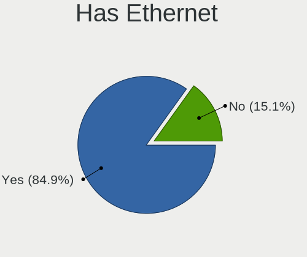
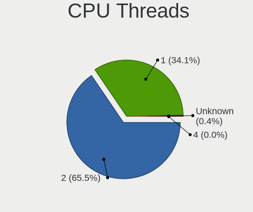
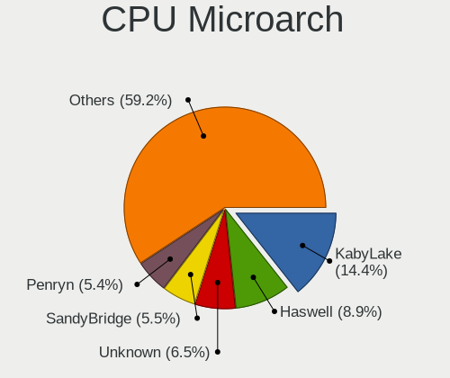
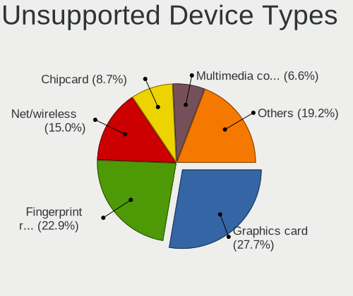

Linux in Spain - Tested Hardware & Statistics
---------------------------------------------

A project to collect tested hardware configurations for Linux in Spain.

Anyone can contribute to this report by the [hw-probe](https://github.com/linuxhw/hw-probe) tool:

    sudo -E hw-probe -all -upload

Please contribute! Especially if your hardware is rare.

This is a report for all computer types. See also reports for [desktops](/Location/Spain/Desktop/README.md) and [notebooks](/Location/Spain/Notebook/README.md).

Contents
--------

* [ Test Cases ](#test-cases)

* [ System ](#system)
  - [ OS                       ](#os)
  - [ OS Family                ](#os-family)
  - [ Kernel                   ](#kernel)
  - [ Kernel Family            ](#kernel-family)
  - [ Kernel Major Ver.        ](#kernel-major-ver)
  - [ Arch                     ](#arch)
  - [ DE                       ](#de)
  - [ Display Server           ](#display-server)
  - [ Display Manager          ](#display-manager)
  - [ OS Lang                  ](#os-lang)
  - [ Boot Mode                ](#boot-mode)
  - [ Filesystem               ](#filesystem)
  - [ Part. scheme             ](#part-scheme)
  - [ Dual Boot with Linux/BSD ](#dual-boot-with-linuxbsd)
  - [ Dual Boot (Win)          ](#dual-boot-win)

* [ Board ](#board)
  - [ Vendor                   ](#vendor)
  - [ Model                    ](#model)
  - [ Model Family             ](#model-family)
  - [ MFG Year                 ](#mfg-year)
  - [ Form Factor              ](#form-factor)
  - [ Secure Boot              ](#secure-boot)
  - [ Coreboot                 ](#coreboot)
  - [ RAM Size                 ](#ram-size)
  - [ RAM Used                 ](#ram-used)
  - [ Total Drives             ](#total-drives)
  - [ Has CD-ROM               ](#has-cd-rom)
  - [ Has Ethernet             ](#has-ethernet)
  - [ Has WiFi                 ](#has-wifi)
  - [ Has Bluetooth            ](#has-bluetooth)

* [ Location ](#location)
  - [ Country                  ](#country)
  - [ City                     ](#city)

* [ Drives ](#drives)
  - [ Drive Vendor             ](#drive-vendor)
  - [ Drive Model              ](#drive-model)
  - [ HDD Vendor               ](#hdd-vendor)
  - [ SSD Vendor               ](#ssd-vendor)
  - [ Drive Kind               ](#drive-kind)
  - [ Drive Connector          ](#drive-connector)
  - [ Drive Size               ](#drive-size)
  - [ Space Total              ](#space-total)
  - [ Space Used               ](#space-used)
  - [ Malfunc. Drives          ](#malfunc-drives)
  - [ Malfunc. Drive Vendor    ](#malfunc-drive-vendor)
  - [ Malfunc. HDD Vendor      ](#malfunc-hdd-vendor)
  - [ Malfunc. Drive Kind      ](#malfunc-drive-kind)
  - [ Failed Drives            ](#failed-drives)
  - [ Failed Drive Vendor      ](#failed-drive-vendor)
  - [ Drive Status             ](#drive-status)

* [ Storage controller ](#storage-controller)
  - [ Storage Vendor           ](#storage-vendor)
  - [ Storage Model            ](#storage-model)
  - [ Storage Kind             ](#storage-kind)

* [ Processor ](#processor)
  - [ CPU Vendor               ](#cpu-vendor)
  - [ CPU Model                ](#cpu-model)
  - [ CPU Model Family         ](#cpu-model-family)
  - [ CPU Cores                ](#cpu-cores)
  - [ CPU Sockets              ](#cpu-sockets)
  - [ CPU Threads              ](#cpu-threads)
  - [ CPU Op-Modes             ](#cpu-op-modes)
  - [ CPU Microcode            ](#cpu-microcode)
  - [ CPU Microarch            ](#cpu-microarch)

* [ Graphics ](#graphics)
  - [ GPU Vendor               ](#gpu-vendor)
  - [ GPU Model                ](#gpu-model)
  - [ GPU Combo                ](#gpu-combo)
  - [ GPU Driver               ](#gpu-driver)
  - [ GPU Memory               ](#gpu-memory)

* [ Monitor ](#monitor)
  - [ Monitor Vendor           ](#monitor-vendor)
  - [ Monitor Model            ](#monitor-model)
  - [ Monitor Resolution       ](#monitor-resolution)
  - [ Monitor Diagonal         ](#monitor-diagonal)
  - [ Monitor Width            ](#monitor-width)
  - [ Aspect Ratio             ](#aspect-ratio)
  - [ Monitor Area             ](#monitor-area)
  - [ Pixel Density            ](#pixel-density)
  - [ Multiple Monitors        ](#multiple-monitors)

* [ Network ](#network)
  - [ Net Controller Vendor    ](#net-controller-vendor)
  - [ Net Controller Model     ](#net-controller-model)
  - [ Wireless Vendor          ](#wireless-vendor)
  - [ Wireless Model           ](#wireless-model)
  - [ Ethernet Vendor          ](#ethernet-vendor)
  - [ Ethernet Model           ](#ethernet-model)
  - [ Net Controller Kind      ](#net-controller-kind)
  - [ Used Controller          ](#used-controller)
  - [ NICs                     ](#nics)
  - [ IPv6                     ](#ipv6)

* [ Bluetooth ](#bluetooth)
  - [ Bluetooth Vendor         ](#bluetooth-vendor)
  - [ Bluetooth Model          ](#bluetooth-model)

* [ Sound ](#sound)
  - [ Sound Vendor             ](#sound-vendor)
  - [ Sound Model              ](#sound-model)

* [ Memory ](#memory)
  - [ Memory Vendor            ](#memory-vendor)
  - [ Memory Model             ](#memory-model)
  - [ Memory Kind              ](#memory-kind)
  - [ Memory Form Factor       ](#memory-form-factor)
  - [ Memory Size              ](#memory-size)
  - [ Memory Speed             ](#memory-speed)

* [ Printers & scanners ](#printers--scanners)
  - [ Printer Vendor           ](#printer-vendor)
  - [ Printer Model            ](#printer-model)
  - [ Scanner Vendor           ](#scanner-vendor)
  - [ Scanner Model            ](#scanner-model)

* [ Camera ](#camera)
  - [ Camera Vendor            ](#camera-vendor)
  - [ Camera Model             ](#camera-model)

* [ Security ](#security)
  - [ Fingerprint Vendor       ](#fingerprint-vendor)
  - [ Fingerprint Model        ](#fingerprint-model)
  - [ Chipcard Vendor          ](#chipcard-vendor)
  - [ Chipcard Model           ](#chipcard-model)

* [ Unsupported ](#unsupported)
  - [ Unsupported Devices      ](#unsupported-devices)
  - [ Unsupported Device Types ](#unsupported-device-types)

Test Cases
----------

Total: 8962

| Vendor        | Model                       | Form-Factor | Probe                                                      | Date         |
|---------------|-----------------------------|-------------|------------------------------------------------------------|--------------|
| Lenovo        | IdeaPad 3 15ITL6 82H8       | Notebook    | [720ff4cf67](https://linux-hardware.org/?probe=720ff4cf67) | Dec 24, 2023 |
| HP            | Unknown                     | Notebook    | [3bc06ba7d3](https://linux-hardware.org/?probe=3bc06ba7d3) | Dec 24, 2023 |
| Lenovo        | G50-80 80L0                 | Notebook    | [21df7039b9](https://linux-hardware.org/?probe=21df7039b9) | Dec 23, 2023 |
| HP            | 1497                        | Desktop     | [9d5244b557](https://linux-hardware.org/?probe=9d5244b557) | Dec 23, 2023 |
| ASRock        | X370 Taichi                 | Desktop     | [689d51f57e](https://linux-hardware.org/?probe=689d51f57e) | Dec 23, 2023 |
| XIAOMI        | Redmi Book Pro 15 2023      | Notebook    | [36492390fd](https://linux-hardware.org/?probe=36492390fd) | Dec 22, 2023 |
| Acer          | Aspire VX5-591G             | Notebook    | [2268342e9f](https://linux-hardware.org/?probe=2268342e9f) | Dec 22, 2023 |
| HP            | Pavilion Laptop 14-dv1xx... | Notebook    | [7148cd104d](https://linux-hardware.org/?probe=7148cd104d) | Dec 22, 2023 |
| Huanan        | X58 V1.0                    | Desktop     | [ac62468ad1](https://linux-hardware.org/?probe=ac62468ad1) | Dec 21, 2023 |
| HP            | EliteBook 650 15.6 inch ... | Notebook    | [2e9f8a97e5](https://linux-hardware.org/?probe=2e9f8a97e5) | Dec 21, 2023 |
| HP            | Victus by Laptop 16-e0xx... | Notebook    | [a102e5839d](https://linux-hardware.org/?probe=a102e5839d) | Dec 21, 2023 |
| Foxconn       | 2ADA                        | Desktop     | [735572694e](https://linux-hardware.org/?probe=735572694e) | Dec 21, 2023 |
| Panasonic     | CF-19RDRCHH7                | Notebook    | [0e67081368](https://linux-hardware.org/?probe=0e67081368) | Dec 21, 2023 |
| Fujitsu Si... | ESPRIMO Mobile V5535        | Notebook    | [664d34d04d](https://linux-hardware.org/?probe=664d34d04d) | Dec 20, 2023 |
| ASUSTek       | PRIME B250M-A               | Desktop     | [11628f388e](https://linux-hardware.org/?probe=11628f388e) | Dec 20, 2023 |
| ASUSTek       | V6-P5G31E                   | Desktop     | [83a8408a7e](https://linux-hardware.org/?probe=83a8408a7e) | Dec 20, 2023 |
| ASUSTek       | VivoBook_ASUS Laptop X50... | Notebook    | [6f7295809b](https://linux-hardware.org/?probe=6f7295809b) | Dec 20, 2023 |
| ASUSTek       | Pro B550M-C                 | Desktop     | [4e3b422400](https://linux-hardware.org/?probe=4e3b422400) | Dec 19, 2023 |
| MSI           | Alpha 17 C7VF               | Notebook    | [34b3014f66](https://linux-hardware.org/?probe=34b3014f66) | Dec 19, 2023 |
| Clevo         | W760/M770CU                 | Notebook    | [fdde778b3c](https://linux-hardware.org/?probe=fdde778b3c) | Dec 19, 2023 |
| ASUSTek       | VivoBook_ASUSLaptop K340... | Notebook    | [1b5268d64f](https://linux-hardware.org/?probe=1b5268d64f) | Dec 19, 2023 |
| ASUSTek       | VivoBook_ASUSLaptop K340... | Notebook    | [1290fe8e5a](https://linux-hardware.org/?probe=1290fe8e5a) | Dec 19, 2023 |
| MSI           | MAG Z790 TOMAHAWK WIFI      | Desktop     | [619bbec719](https://linux-hardware.org/?probe=619bbec719) | Dec 19, 2023 |
| ASUSTek       | Pro B550M-C                 | Desktop     | [1cd7c1b629](https://linux-hardware.org/?probe=1cd7c1b629) | Dec 19, 2023 |
| HUAWEI        | KLVL-WXX9                   | Notebook    | [12f149be7f](https://linux-hardware.org/?probe=12f149be7f) | Dec 18, 2023 |
| HP            | Pavilion Gaming Laptop 1... | Notebook    | [9afec278e2](https://linux-hardware.org/?probe=9afec278e2) | Dec 18, 2023 |
| Lenovo        | IdeaPad 3 15ITL6 82H8       | Notebook    | [1d8ddbcb75](https://linux-hardware.org/?probe=1d8ddbcb75) | Dec 18, 2023 |
| ASUSTek       | X550EA                      | Notebook    | [a874ac5799](https://linux-hardware.org/?probe=a874ac5799) | Dec 18, 2023 |
| ASUSTek       | H110M-D                     | Desktop     | [c26e0d3896](https://linux-hardware.org/?probe=c26e0d3896) | Dec 18, 2023 |
| HP            | Victus by Gaming Laptop ... | Notebook    | [fd092daf92](https://linux-hardware.org/?probe=fd092daf92) | Dec 18, 2023 |
| HP            | EliteBook 8440p             | Notebook    | [4a83771100](https://linux-hardware.org/?probe=4a83771100) | Dec 18, 2023 |
| ASUSTek       | TUF Gaming B660M-E D4       | Desktop     | [ff5da894f9](https://linux-hardware.org/?probe=ff5da894f9) | Dec 18, 2023 |
| Gigabyte      | H510M H V2                  | Desktop     | [3228539880](https://linux-hardware.org/?probe=3228539880) | Dec 18, 2023 |
| HP            | 255 G6 Notebook PC          | Notebook    | [f4412027d4](https://linux-hardware.org/?probe=f4412027d4) | Dec 18, 2023 |
| ASUSTek       | ROG CROSSHAIR VIII HERO     | Desktop     | [def7de5871](https://linux-hardware.org/?probe=def7de5871) | Dec 17, 2023 |
| Lenovo        | IdeaPad Gaming 3 15IAH7 ... | Notebook    | [26503ce57e](https://linux-hardware.org/?probe=26503ce57e) | Dec 17, 2023 |
| Notebook      | W65_67SR                    | Notebook    | [8f970e8d4c](https://linux-hardware.org/?probe=8f970e8d4c) | Dec 17, 2023 |
| ASRock        | H310M-STX                   | Desktop     | [df11c23d7c](https://linux-hardware.org/?probe=df11c23d7c) | Dec 17, 2023 |
| ASUSTek       | K53SD                       | Notebook    | [7962dd075b](https://linux-hardware.org/?probe=7962dd075b) | Dec 17, 2023 |
| Lenovo        | IdeaPad 3 15ITL6 82H8       | Notebook    | [299d6ae362](https://linux-hardware.org/?probe=299d6ae362) | Dec 17, 2023 |
| ASUSTek       | PRIME B460M-A               | Desktop     | [28b95cc0b7](https://linux-hardware.org/?probe=28b95cc0b7) | Dec 16, 2023 |
| Allview       | Allbook H                   | Notebook    | [2da4fcb35c](https://linux-hardware.org/?probe=2da4fcb35c) | Dec 16, 2023 |
| HP            | 3647h                       | Desktop     | [4feaf76045](https://linux-hardware.org/?probe=4feaf76045) | Dec 16, 2023 |
| AMI           | Intel                       | Desktop     | [9564eaaec0](https://linux-hardware.org/?probe=9564eaaec0) | Dec 16, 2023 |
| HP            | G62                         | Notebook    | [fd110d99fd](https://linux-hardware.org/?probe=fd110d99fd) | Dec 15, 2023 |
| Lenovo        | IdeaPad Pro 5 16APH8 83A... | Notebook    | [d438fe20ff](https://linux-hardware.org/?probe=d438fe20ff) | Dec 15, 2023 |
| Lenovo        | IdeaPad 3 15ITL6 82H8       | Notebook    | [cde85f7526](https://linux-hardware.org/?probe=cde85f7526) | Dec 15, 2023 |
| Lenovo        | B590 62742QG                | Notebook    | [edb1cd89f6](https://linux-hardware.org/?probe=edb1cd89f6) | Dec 15, 2023 |
| Trigkey       | S5 V2.0                     | Mini pc     | [90a7a3db53](https://linux-hardware.org/?probe=90a7a3db53) | Dec 15, 2023 |
| TUXEDO        | InfinityBook Pro Gen8 (M... | Notebook    | [5ae09c04d4](https://linux-hardware.org/?probe=5ae09c04d4) | Dec 14, 2023 |
| Lenovo        | ThinkPad E16 Gen 1 21JNC... | Notebook    | [46fbc450b5](https://linux-hardware.org/?probe=46fbc450b5) | Dec 14, 2023 |
| HP            | Laptop 15-fc0xxx            | Notebook    | [74030d2ce6](https://linux-hardware.org/?probe=74030d2ce6) | Dec 14, 2023 |
| MSI           | GS66 Stealth 10SE           | Notebook    | [7f045bdc89](https://linux-hardware.org/?probe=7f045bdc89) | Dec 14, 2023 |
| HP            | Pavilion Aero Laptop 13-... | Notebook    | [c4e3486e91](https://linux-hardware.org/?probe=c4e3486e91) | Dec 13, 2023 |
| ASRock        | AB350M-HDV                  | Desktop     | [945274527c](https://linux-hardware.org/?probe=945274527c) | Dec 13, 2023 |
| Lenovo        | IdeaPad Slim 3 15IAH8 83... | Notebook    | [f942d9c43e](https://linux-hardware.org/?probe=f942d9c43e) | Dec 13, 2023 |
| Lenovo        | IdeaPad Gaming 3 15ACH6 ... | Notebook    | [8339b9aa1a](https://linux-hardware.org/?probe=8339b9aa1a) | Dec 13, 2023 |
| ASUSTek       | PRIME B450M-A               | Desktop     | [5a65590bed](https://linux-hardware.org/?probe=5a65590bed) | Dec 13, 2023 |
| Intel         | MIR1 RVP7                   | Desktop     | [eade46459a](https://linux-hardware.org/?probe=eade46459a) | Dec 13, 2023 |
| Apple         | MacBookPro11,3              | Notebook    | [c5d4eabc9b](https://linux-hardware.org/?probe=c5d4eabc9b) | Dec 12, 2023 |
| Apple         | MacBookPro11,3              | Notebook    | [87fa57a3af](https://linux-hardware.org/?probe=87fa57a3af) | Dec 12, 2023 |
| Acer          | Aspire A515-45              | Notebook    | [089a40a6f2](https://linux-hardware.org/?probe=089a40a6f2) | Dec 12, 2023 |
| Acer          | Aspire one                  | Notebook    | [fb1f2ccd2e](https://linux-hardware.org/?probe=fb1f2ccd2e) | Dec 12, 2023 |
| Lenovo        | 3130 SDK0J40697 WIN 3305... | Mini pc     | [e290fd161e](https://linux-hardware.org/?probe=e290fd161e) | Dec 12, 2023 |
| HP            | Laptop 15-fd0xxx            | Notebook    | [f5b7104728](https://linux-hardware.org/?probe=f5b7104728) | Dec 11, 2023 |
| Apple         | Mac-F2238BAE iMac11,3       | All in one  | [f932ad9551](https://linux-hardware.org/?probe=f932ad9551) | Dec 11, 2023 |
| Acer          | Aspire ES1-512              | Notebook    | [40438b3cd0](https://linux-hardware.org/?probe=40438b3cd0) | Dec 11, 2023 |
| ASUSTek       | M3A78                       | Desktop     | [d2c14973f1](https://linux-hardware.org/?probe=d2c14973f1) | Dec 10, 2023 |
| HUAWEI        | KLVL-WXX9                   | Notebook    | [2abe635055](https://linux-hardware.org/?probe=2abe635055) | Dec 10, 2023 |
| Gigabyte      | EP41-UD3L                   | Desktop     | [9b40e5889d](https://linux-hardware.org/?probe=9b40e5889d) | Dec 10, 2023 |
| MSI           | B560M PRO-VDH               | Desktop     | [4a2deac69b](https://linux-hardware.org/?probe=4a2deac69b) | Dec 10, 2023 |
| Packard Be... | MCP73PV                     | Desktop     | [9d707e64d4](https://linux-hardware.org/?probe=9d707e64d4) | Dec 10, 2023 |
| HP            | Laptop 15-fc0xxx            | Notebook    | [a668492169](https://linux-hardware.org/?probe=a668492169) | Dec 10, 2023 |
| Dell          | Latitude 7490               | Notebook    | [d9f20ad453](https://linux-hardware.org/?probe=d9f20ad453) | Dec 10, 2023 |
| Gigabyte      | B450 AORUS ELITE V2         | Desktop     | [505f85e4d4](https://linux-hardware.org/?probe=505f85e4d4) | Dec 10, 2023 |
| HP            | 240 G8 Notebook PC          | Notebook    | [e5f4045026](https://linux-hardware.org/?probe=e5f4045026) | Dec 10, 2023 |
| Packard Be... | EasyNote TE11BZ             | Notebook    | [514899b0b9](https://linux-hardware.org/?probe=514899b0b9) | Dec 10, 2023 |
| Lenovo        | Legion 5 15ARH05H 82B1      | Notebook    | [215b8bc94a](https://linux-hardware.org/?probe=215b8bc94a) | Dec 09, 2023 |
| ASUSTek       | X540SA                      | Notebook    | [71c6b35d56](https://linux-hardware.org/?probe=71c6b35d56) | Dec 09, 2023 |
| Dell          | Vostro 3550                 | Notebook    | [21131b7844](https://linux-hardware.org/?probe=21131b7844) | Dec 09, 2023 |
| Dell          | Vostro 3560                 | Notebook    | [d2abe7128b](https://linux-hardware.org/?probe=d2abe7128b) | Dec 09, 2023 |
| Notebook      | N24_25JU                    | Notebook    | [48dc91498c](https://linux-hardware.org/?probe=48dc91498c) | Dec 09, 2023 |
| Notebook      | N24_25JU                    | Notebook    | [170b205714](https://linux-hardware.org/?probe=170b205714) | Dec 09, 2023 |
| MSI           | B450-A PRO MAX              | Desktop     | [c576c4fbae](https://linux-hardware.org/?probe=c576c4fbae) | Dec 09, 2023 |
| Lenovo        | ThinkPad L15 Gen 4 21H3C... | Notebook    | [2c3c1f7ad2](https://linux-hardware.org/?probe=2c3c1f7ad2) | Dec 08, 2023 |
| HP            | Victus by Laptop 16-e1xx... | Notebook    | [9b973fc192](https://linux-hardware.org/?probe=9b973fc192) | Dec 08, 2023 |
| Lenovo        | ThinkPad L15 Gen 4 21H3C... | Notebook    | [f463c790b4](https://linux-hardware.org/?probe=f463c790b4) | Dec 08, 2023 |
| Lenovo        | ThinkPad T550 20CJS1VD01    | Notebook    | [a7dccd5888](https://linux-hardware.org/?probe=a7dccd5888) | Dec 08, 2023 |
| HP            | 630                         | Notebook    | [b6c4bc59c1](https://linux-hardware.org/?probe=b6c4bc59c1) | Dec 08, 2023 |
| Unknown       | Unknown                     | Desktop     | [c652e80145](https://linux-hardware.org/?probe=c652e80145) | Dec 08, 2023 |
| Apple         | MacBook5,1                  | Notebook    | [e6e9d305e9](https://linux-hardware.org/?probe=e6e9d305e9) | Dec 08, 2023 |
| ASUSTek       | ASUS EXPERTBOOK B1502CBA    | Notebook    | [b46d0490b6](https://linux-hardware.org/?probe=b46d0490b6) | Dec 08, 2023 |
| Lenovo        | ThinkPad X1 Carbon 6th 2... | Notebook    | [2cc6eaff05](https://linux-hardware.org/?probe=2cc6eaff05) | Dec 08, 2023 |
| Fanless Mi... | PCG02 GLE                   | Stick pc    | [7e738d8259](https://linux-hardware.org/?probe=7e738d8259) | Dec 08, 2023 |
| HP            | Pavilion Gaming Laptop 1... | Notebook    | [69e785cddb](https://linux-hardware.org/?probe=69e785cddb) | Dec 07, 2023 |
| ASUSTek       | VivoBook_ASUSLaptop X415... | Notebook    | [82fd570b21](https://linux-hardware.org/?probe=82fd570b21) | Dec 07, 2023 |
| ASUSTek       | VivoBook_ASUSLaptop X415... | Notebook    | [b706d26f30](https://linux-hardware.org/?probe=b706d26f30) | Dec 07, 2023 |
| ASUSTek       | VivoBook_ASUSLaptop X515... | Notebook    | [18d69df8d2](https://linux-hardware.org/?probe=18d69df8d2) | Dec 07, 2023 |
| Gigabyte      | GA-MA770-DS3                | Desktop     | [66917779ad](https://linux-hardware.org/?probe=66917779ad) | Dec 07, 2023 |
| AMI           | Intel                       | Desktop     | [d2e7be0ff3](https://linux-hardware.org/?probe=d2e7be0ff3) | Dec 07, 2023 |
| ASUSTek       | Pro B560M-C                 | Desktop     | [116dce4b93](https://linux-hardware.org/?probe=116dce4b93) | Dec 07, 2023 |
| HP            | Laptop 15-fd0xxx            | Notebook    | [6bdc66013b](https://linux-hardware.org/?probe=6bdc66013b) | Dec 07, 2023 |
| MSI           | Z490-A PRO                  | Desktop     | [8d3648a498](https://linux-hardware.org/?probe=8d3648a498) | Dec 07, 2023 |
| HP            | Laptop 17-by3xxx            | Notebook    | [d124640ef5](https://linux-hardware.org/?probe=d124640ef5) | Dec 06, 2023 |
| HP            | EliteBook 840 G1            | Notebook    | [923f26e8d8](https://linux-hardware.org/?probe=923f26e8d8) | Dec 06, 2023 |
| Lenovo        | ThinkPad SL500 274678G      | Notebook    | [3cfa60a8bb](https://linux-hardware.org/?probe=3cfa60a8bb) | Dec 06, 2023 |
| Lenovo        | Legion 5 15ARH05H 82B1      | Notebook    | [7317dc8b5c](https://linux-hardware.org/?probe=7317dc8b5c) | Dec 06, 2023 |
| ASRock        | A320M-HDV R4.0              | Desktop     | [ca5df22812](https://linux-hardware.org/?probe=ca5df22812) | Dec 06, 2023 |
| Apple         | Mac-F2238BAE iMac11,3       | All in one  | [1297909900](https://linux-hardware.org/?probe=1297909900) | Dec 05, 2023 |
| Apple         | Mac-F2238BAE iMac11,3       | All in one  | [0e8746ee4e](https://linux-hardware.org/?probe=0e8746ee4e) | Dec 05, 2023 |
| Alurin        | Go Notebook                 | Notebook    | [197598d3dd](https://linux-hardware.org/?probe=197598d3dd) | Dec 05, 2023 |
| MSI           | Z490-A PRO                  | Desktop     | [443436c7ab](https://linux-hardware.org/?probe=443436c7ab) | Dec 05, 2023 |
| MSI           | H510I PRO WIFI              | Desktop     | [b0e2df98b4](https://linux-hardware.org/?probe=b0e2df98b4) | Dec 05, 2023 |
| HP            | Pavilion 13 x360 PC         | Notebook    | [3eba272feb](https://linux-hardware.org/?probe=3eba272feb) | Dec 05, 2023 |
| Gigabyte      | B550M DS3H                  | Desktop     | [ddb2183d6c](https://linux-hardware.org/?probe=ddb2183d6c) | Dec 05, 2023 |
| HP            | 630                         | Notebook    | [7d372bb7da](https://linux-hardware.org/?probe=7d372bb7da) | Dec 04, 2023 |
| ASUSTek       | P8Z68-V PRO                 | Desktop     | [fde3c9253f](https://linux-hardware.org/?probe=fde3c9253f) | Dec 04, 2023 |
| ASUSTek       | ROG Maximus Z790 HERO       | Desktop     | [c492be4899](https://linux-hardware.org/?probe=c492be4899) | Dec 04, 2023 |
| Lenovo        | B50-50 80S2                 | Notebook    | [6150907e1e](https://linux-hardware.org/?probe=6150907e1e) | Dec 04, 2023 |
| MSI           | Prestige 15 A12UD           | Notebook    | [b19937fb48](https://linux-hardware.org/?probe=b19937fb48) | Dec 04, 2023 |
| MSI           | Prestige 15 A12UD           | Notebook    | [0c9a3a5cae](https://linux-hardware.org/?probe=0c9a3a5cae) | Dec 04, 2023 |
| Adreamer      | PN1308P                     | Notebook    | [b503469408](https://linux-hardware.org/?probe=b503469408) | Dec 04, 2023 |
| Lenovo        | ThinkPad X1 Carbon 6th 2... | Notebook    | [db9e1baffe](https://linux-hardware.org/?probe=db9e1baffe) | Dec 04, 2023 |
| HP            | 2B0A                        | All in one  | [94d8a9c118](https://linux-hardware.org/?probe=94d8a9c118) | Dec 04, 2023 |
| Acer          | Aspire 5750G                | Notebook    | [8bca63eb54](https://linux-hardware.org/?probe=8bca63eb54) | Dec 03, 2023 |
| Dell          | Vostro 3550                 | Notebook    | [0926acf98a](https://linux-hardware.org/?probe=0926acf98a) | Dec 03, 2023 |
| Acer          | Aspire A315-24P             | Notebook    | [b8af3ee6d5](https://linux-hardware.org/?probe=b8af3ee6d5) | Dec 03, 2023 |
| Acer          | Aspire A315-24P             | Notebook    | [67efae847f](https://linux-hardware.org/?probe=67efae847f) | Dec 03, 2023 |
| HP            | 2B46                        | Desktop     | [5bfce44b96](https://linux-hardware.org/?probe=5bfce44b96) | Dec 03, 2023 |
| Acer          | Aspire 5750G                | Notebook    | [f04a8e4722](https://linux-hardware.org/?probe=f04a8e4722) | Dec 03, 2023 |
| Lenovo        | IdeaPad 320S-15IKB 81BQ     | Notebook    | [9cedc35586](https://linux-hardware.org/?probe=9cedc35586) | Dec 03, 2023 |
| Lenovo        | IdeaPad Gaming 3 15ACH6 ... | Notebook    | [3753de5af1](https://linux-hardware.org/?probe=3753de5af1) | Dec 03, 2023 |
| Lenovo        | 312A SDK0J40697 WIN 3305... | Desktop     | [fb15da06c7](https://linux-hardware.org/?probe=fb15da06c7) | Dec 03, 2023 |
| Lenovo        | ThinkPad W500 40624DG       | Notebook    | [920dc046a3](https://linux-hardware.org/?probe=920dc046a3) | Dec 03, 2023 |
| ASUSTek       | ROG Zephyrus G14 GA401II... | Notebook    | [426263e458](https://linux-hardware.org/?probe=426263e458) | Dec 03, 2023 |
| Acer          | Nitro AN515-58              | Notebook    | [e2d48a6b41](https://linux-hardware.org/?probe=e2d48a6b41) | Dec 03, 2023 |
| Lenovo        | MAHOBAY NO DPK              | Desktop     | [ece8f86f29](https://linux-hardware.org/?probe=ece8f86f29) | Dec 02, 2023 |
| AMI           | Aptio CRB                   | Mini pc     | [89effd522f](https://linux-hardware.org/?probe=89effd522f) | Dec 02, 2023 |
| Acer          | IPXHW-RL                    | Desktop     | [aa0f30e67f](https://linux-hardware.org/?probe=aa0f30e67f) | Dec 02, 2023 |
| SLIMBOOK      | PROX-AMD5                   | Notebook    | [3a6eb27098](https://linux-hardware.org/?probe=3a6eb27098) | Dec 02, 2023 |
| ASUSTek       | ZenBook UX433FN_UX433FN     | Notebook    | [3b3d0cb740](https://linux-hardware.org/?probe=3b3d0cb740) | Dec 02, 2023 |
| ASUSTek       | TUF Gaming X570-PLUS        | Desktop     | [16215b0c85](https://linux-hardware.org/?probe=16215b0c85) | Dec 02, 2023 |
| Apple         | MacBookPro11,1              | Notebook    | [bb033837d5](https://linux-hardware.org/?probe=bb033837d5) | Dec 02, 2023 |
| HP            | 8459                        | Desktop     | [b7a22ecb3f](https://linux-hardware.org/?probe=b7a22ecb3f) | Dec 01, 2023 |
| Intel         | H61 V1.5                    | Desktop     | [45487af3d7](https://linux-hardware.org/?probe=45487af3d7) | Dec 01, 2023 |
| ASUSTek       | ZenBook UX431DA_UM431DA     | Notebook    | [7eb86d01c5](https://linux-hardware.org/?probe=7eb86d01c5) | Dec 01, 2023 |
| Samsung       | R530/R730                   | Notebook    | [cdda254219](https://linux-hardware.org/?probe=cdda254219) | Dec 01, 2023 |
| Acer          | Extensa M2610 V:1.0         | Desktop     | [e4c1bd6f51](https://linux-hardware.org/?probe=e4c1bd6f51) | Nov 30, 2023 |
| ASUSTek       | P5N-MX                      | Desktop     | [c586157333](https://linux-hardware.org/?probe=c586157333) | Nov 30, 2023 |
| HP            | OMEN Laptop 15-en1xxx       | Notebook    | [a828388299](https://linux-hardware.org/?probe=a828388299) | Nov 30, 2023 |
| MSI           | Prestige 16Studio A13VF     | Notebook    | [dc93bfeb80](https://linux-hardware.org/?probe=dc93bfeb80) | Nov 30, 2023 |
| ASUSTek       | ASUS TUF Gaming A15 FA50... | Notebook    | [d92b5d4caf](https://linux-hardware.org/?probe=d92b5d4caf) | Nov 30, 2023 |
| Lenovo        | G50-80 80E5                 | Notebook    | [75dcedad41](https://linux-hardware.org/?probe=75dcedad41) | Nov 30, 2023 |
| Gigabyte      | GA-73PVM-S2H                | Desktop     | [0d85f5e172](https://linux-hardware.org/?probe=0d85f5e172) | Nov 30, 2023 |
| HP            | 304Ah                       | Desktop     | [03437e0238](https://linux-hardware.org/?probe=03437e0238) | Nov 29, 2023 |
| Apple         | Mac-AA95B1DDAB278B95 iMa... | All in one  | [ebae1fe9c2](https://linux-hardware.org/?probe=ebae1fe9c2) | Nov 29, 2023 |
| HP            | 8298                        | Desktop     | [f66cb29dd1](https://linux-hardware.org/?probe=f66cb29dd1) | Nov 29, 2023 |
| Alurin        | ALU-LPT-N4020-8256-156      | Notebook    | [0524ad397b](https://linux-hardware.org/?probe=0524ad397b) | Nov 29, 2023 |
| MSI           | Z170A PC MATE               | Desktop     | [913553eac4](https://linux-hardware.org/?probe=913553eac4) | Nov 29, 2023 |
| HP            | EliteBook 640 14 inch G9... | Notebook    | [a9f36d870b](https://linux-hardware.org/?probe=a9f36d870b) | Nov 28, 2023 |
| HONOR         | HLYL-WXX9                   | Notebook    | [fa6847a75b](https://linux-hardware.org/?probe=fa6847a75b) | Nov 28, 2023 |
| MSI           | MS-B1591                    | Desktop     | [1f97b0b293](https://linux-hardware.org/?probe=1f97b0b293) | Nov 28, 2023 |
| HP            | 18E5                        | Desktop     | [a9c04bd2c7](https://linux-hardware.org/?probe=a9c04bd2c7) | Nov 28, 2023 |
| MSI           | MS-B1591                    | Desktop     | [d5ff2835f3](https://linux-hardware.org/?probe=d5ff2835f3) | Nov 28, 2023 |
| MSI           | B450 GAMING PLUS MAX        | Desktop     | [e5509bd1ba](https://linux-hardware.org/?probe=e5509bd1ba) | Nov 28, 2023 |
| Lenovo        | ThinkPad X1 Carbon 34603... | Notebook    | [edb57fe6c8](https://linux-hardware.org/?probe=edb57fe6c8) | Nov 28, 2023 |
| Lenovo        | 30BC SDK0J40705 WIN 3425... | Desktop     | [d16f76117d](https://linux-hardware.org/?probe=d16f76117d) | Nov 28, 2023 |
| HP            | EliteBook 640 14 inch G9... | Notebook    | [f5f1058473](https://linux-hardware.org/?probe=f5f1058473) | Nov 27, 2023 |
| Gigabyte      | Z590I VISION D              | Desktop     | [cb4704c5ba](https://linux-hardware.org/?probe=cb4704c5ba) | Nov 27, 2023 |
| HP            | Elite x2 1012 G1            | Notebook    | [388c6ba69d](https://linux-hardware.org/?probe=388c6ba69d) | Nov 27, 2023 |
| HP            | 250 G6 Notebook PC          | Notebook    | [936970029f](https://linux-hardware.org/?probe=936970029f) | Nov 27, 2023 |
| ASUSTek       | H81M-K                      | Desktop     | [121db7e081](https://linux-hardware.org/?probe=121db7e081) | Nov 27, 2023 |
| SHENZHEN Y... | XBOOK-3                     | Notebook    | [beeefc2461](https://linux-hardware.org/?probe=beeefc2461) | Nov 26, 2023 |
| HP            | ENVY m6                     | Notebook    | [41cff88708](https://linux-hardware.org/?probe=41cff88708) | Nov 26, 2023 |
| Lenovo        | Aptio CRB 31900058 STD      | Mini pc     | [bd08d681a3](https://linux-hardware.org/?probe=bd08d681a3) | Nov 26, 2023 |
| ASUSTek       | ROG CROSSHAIR VIII FORMU... | Desktop     | [d3e69f25a6](https://linux-hardware.org/?probe=d3e69f25a6) | Nov 26, 2023 |
| HP            | 339A                        | Desktop     | [5cad333081](https://linux-hardware.org/?probe=5cad333081) | Nov 26, 2023 |
| MSI           | B650 GAMING PLUS WIFI       | Desktop     | [c25e140976](https://linux-hardware.org/?probe=c25e140976) | Nov 26, 2023 |
| Gigabyte      | X58A-UD3R                   | Desktop     | [91001125ab](https://linux-hardware.org/?probe=91001125ab) | Nov 25, 2023 |
| Gigabyte      | X58A-UD3R                   | Desktop     | [c22007e726](https://linux-hardware.org/?probe=c22007e726) | Nov 25, 2023 |
| ASUSTek       | Zenbook UM3402YA_UM3402Y... | Notebook    | [7359fe59a4](https://linux-hardware.org/?probe=7359fe59a4) | Nov 25, 2023 |
| ASUSTek       | ROG STRIX B460-I GAMING     | Desktop     | [7a0adaf9f3](https://linux-hardware.org/?probe=7a0adaf9f3) | Nov 25, 2023 |
| ASUSTek       | ROG STRIX B460-I GAMING     | Desktop     | [b96e460a4f](https://linux-hardware.org/?probe=b96e460a4f) | Nov 25, 2023 |
| Dell          | Latitude 3510               | Notebook    | [0ebe37e56d](https://linux-hardware.org/?probe=0ebe37e56d) | Nov 25, 2023 |
| Lenovo        | IdeaPad Pro 5 16APH8 83A... | Notebook    | [2b5e71ca1e](https://linux-hardware.org/?probe=2b5e71ca1e) | Nov 24, 2023 |
| Lenovo        | IdeaPad Gaming 3 15ACH6 ... | Notebook    | [ac2895b3d7](https://linux-hardware.org/?probe=ac2895b3d7) | Nov 24, 2023 |
| ASUSTek       | VivoBook_ASUSLaptop M150... | Notebook    | [d262dd65d4](https://linux-hardware.org/?probe=d262dd65d4) | Nov 24, 2023 |
| ASUSTek       | P8H77-M LE                  | Desktop     | [39919b75ba](https://linux-hardware.org/?probe=39919b75ba) | Nov 24, 2023 |
| ASUSTek       | Vivobook Go E1504FA_E150... | Notebook    | [94886bc9d7](https://linux-hardware.org/?probe=94886bc9d7) | Nov 24, 2023 |
| ASUSTek       | M3A78                       | Desktop     | [c4895d59da](https://linux-hardware.org/?probe=c4895d59da) | Nov 23, 2023 |
| AZW           | SEi V1.0                    | Desktop     | [d18296a25c](https://linux-hardware.org/?probe=d18296a25c) | Nov 23, 2023 |
| Apple         | Mac-35C5E08120C7EEAF Mac... | Mini pc     | [7a59ed85d0](https://linux-hardware.org/?probe=7a59ed85d0) | Nov 23, 2023 |
| Lenovo        | ThinkPad T460 20FMS57C00    | Notebook    | [adabeb3e91](https://linux-hardware.org/?probe=adabeb3e91) | Nov 23, 2023 |
| MSI           | Prestige 15 A10SC           | Notebook    | [3b9404eda4](https://linux-hardware.org/?probe=3b9404eda4) | Nov 23, 2023 |
| Lenovo        | ThinkPad T460 20FMS57C00    | Notebook    | [467b2f3c4e](https://linux-hardware.org/?probe=467b2f3c4e) | Nov 23, 2023 |
| Gigabyte      | MZBAYAP-00                  | Desktop     | [101c96a0c0](https://linux-hardware.org/?probe=101c96a0c0) | Nov 22, 2023 |
| Gigabyte      | MZBAYAP-00                  | Desktop     | [f990b64367](https://linux-hardware.org/?probe=f990b64367) | Nov 22, 2023 |
| ASRock        | J4105-ITX                   | Desktop     | [d5a155c906](https://linux-hardware.org/?probe=d5a155c906) | Nov 22, 2023 |
| ASUSTek       | Vivobook Go E1504FA_E150... | Notebook    | [6791592808](https://linux-hardware.org/?probe=6791592808) | Nov 22, 2023 |
| ASUSTek       | Vivobook Go E1504FA_E150... | Notebook    | [69d5dcd30b](https://linux-hardware.org/?probe=69d5dcd30b) | Nov 22, 2023 |
| Valve         | Jupiter                     | Notebook    | [2fa43c6f3d](https://linux-hardware.org/?probe=2fa43c6f3d) | Nov 22, 2023 |
| ASUSTek       | VivoBook_ASUSLaptop X415... | Notebook    | [28af744237](https://linux-hardware.org/?probe=28af744237) | Nov 21, 2023 |
| Dell          | Latitude E6430              | Notebook    | [7fb0b53d1c](https://linux-hardware.org/?probe=7fb0b53d1c) | Nov 21, 2023 |
| ASUSTek       | PRIME X570-PRO              | Desktop     | [936b04414c](https://linux-hardware.org/?probe=936b04414c) | Nov 21, 2023 |
| MSI           | Pulse GL76 12UEK            | Notebook    | [def3f12e81](https://linux-hardware.org/?probe=def3f12e81) | Nov 21, 2023 |
| Allview       | Allbook H                   | Notebook    | [8c23eb07ac](https://linux-hardware.org/?probe=8c23eb07ac) | Nov 21, 2023 |
| Lenovo        | Aptio CRB 31900058 STD      | Mini pc     | [c99fb132a1](https://linux-hardware.org/?probe=c99fb132a1) | Nov 21, 2023 |
| Dell          | 062TCH A00                  | Desktop     | [6df960f264](https://linux-hardware.org/?probe=6df960f264) | Nov 21, 2023 |
| Lenovo        | Legion Pro 7 16ARX8H 82W... | Notebook    | [43d2b6b8b6](https://linux-hardware.org/?probe=43d2b6b8b6) | Nov 21, 2023 |
| MSI           | Bravo 15 A4DDR              | Notebook    | [d678fe79f8](https://linux-hardware.org/?probe=d678fe79f8) | Nov 20, 2023 |
| Shenzhen M... | F7BFC                       | Desktop     | [bd7cd76d26](https://linux-hardware.org/?probe=bd7cd76d26) | Nov 20, 2023 |
| Chuwi         | LarkBox X                   | Mini pc     | [a0915a9fe1](https://linux-hardware.org/?probe=a0915a9fe1) | Nov 20, 2023 |
| HP            | ProLiant MicroServer Gen... | Desktop     | [885444b8af](https://linux-hardware.org/?probe=885444b8af) | Nov 20, 2023 |
| Lenovo        | V15 G4 AMN 82YU             | Notebook    | [ba43f46e34](https://linux-hardware.org/?probe=ba43f46e34) | Nov 20, 2023 |
| HP            | Laptop 15-bs0xx             | Notebook    | [3982d2c377](https://linux-hardware.org/?probe=3982d2c377) | Nov 20, 2023 |
| Dell          | 062TCH A00                  | Desktop     | [895c93e639](https://linux-hardware.org/?probe=895c93e639) | Nov 20, 2023 |
| ASRock        | H81M-ITX/WiFi               | Desktop     | [e4b1bf4519](https://linux-hardware.org/?probe=e4b1bf4519) | Nov 20, 2023 |
| HP            | Stream Laptop 11-ak0xxx     | Notebook    | [f91d973bab](https://linux-hardware.org/?probe=f91d973bab) | Nov 19, 2023 |
| Alurin        | ALU-BAR-R555-000-156        | Notebook    | [ce453601f1](https://linux-hardware.org/?probe=ce453601f1) | Nov 19, 2023 |
| ASUSTek       | M3A78                       | Desktop     | [a6392d3aae](https://linux-hardware.org/?probe=a6392d3aae) | Nov 19, 2023 |
| ASRock        | B550M-ITX/ac                | Desktop     | [c9b5f09ea5](https://linux-hardware.org/?probe=c9b5f09ea5) | Nov 19, 2023 |
| ASRock        | B550M-ITX/ac                | Desktop     | [c76562a6ce](https://linux-hardware.org/?probe=c76562a6ce) | Nov 19, 2023 |
| Lenovo        | 314F SDK0J40697 WIN 3305... | Desktop     | [a4523c2cf4](https://linux-hardware.org/?probe=a4523c2cf4) | Nov 19, 2023 |
| HP            | 0A54h                       | Desktop     | [7b3cd2dc7a](https://linux-hardware.org/?probe=7b3cd2dc7a) | Nov 19, 2023 |
| HP            | ProBook 650 G1              | Notebook    | [80d502e7c1](https://linux-hardware.org/?probe=80d502e7c1) | Nov 19, 2023 |
| Lenovo        | Z50-75 80EC                 | Notebook    | [6876ff8fc6](https://linux-hardware.org/?probe=6876ff8fc6) | Nov 19, 2023 |
| Acer          | Extensa M2610 V:1.0         | Desktop     | [7b70ac1965](https://linux-hardware.org/?probe=7b70ac1965) | Nov 19, 2023 |
| HP            | Laptop 15-da0xxx            | Notebook    | [fa116d20dc](https://linux-hardware.org/?probe=fa116d20dc) | Nov 19, 2023 |
| MSI           | MPG X570 GAMING PRO CARB... | Desktop     | [beae506a63](https://linux-hardware.org/?probe=beae506a63) | Nov 18, 2023 |
| Lenovo        | ThinkPad X13 Gen 3 21CMC... | Notebook    | [e25caef1f8](https://linux-hardware.org/?probe=e25caef1f8) | Nov 18, 2023 |
| Trigkey       | S5 V2.0                     | Mini pc     | [b36fc50456](https://linux-hardware.org/?probe=b36fc50456) | Nov 18, 2023 |
| Star Labs     | Lite                        | Notebook    | [715761cc4e](https://linux-hardware.org/?probe=715761cc4e) | Nov 18, 2023 |
| Lenovo        | ThinkPad T470s W10DG 20J... | Notebook    | [66a57a819b](https://linux-hardware.org/?probe=66a57a819b) | Nov 17, 2023 |
| Acer          | Aspire TC-780               | Desktop     | [76cc38fcb0](https://linux-hardware.org/?probe=76cc38fcb0) | Nov 17, 2023 |
| ASUSTek       | X540YA                      | Notebook    | [ffdc6b121c](https://linux-hardware.org/?probe=ffdc6b121c) | Nov 17, 2023 |
| Lenovo        | Legion 5 15ARH05H 82B1      | Notebook    | [0c9b59ab03](https://linux-hardware.org/?probe=0c9b59ab03) | Nov 17, 2023 |
| Dell          | XPS 13 9365                 | Convertible | [b0fca6e283](https://linux-hardware.org/?probe=b0fca6e283) | Nov 17, 2023 |
| MSI           | Pulse GL66 12UEK            | Notebook    | [9421ac824c](https://linux-hardware.org/?probe=9421ac824c) | Nov 17, 2023 |
| Intel         | D34010WYK H14771-304        | Desktop     | [b3c1feb070](https://linux-hardware.org/?probe=b3c1feb070) | Nov 17, 2023 |
| AMI           | Intel                       | Desktop     | [36c0765b5c](https://linux-hardware.org/?probe=36c0765b5c) | Nov 17, 2023 |
| Sony          | VPCEB1J8E                   | Notebook    | [961e0e701d](https://linux-hardware.org/?probe=961e0e701d) | Nov 17, 2023 |
| Dell          | Precision 5680              | Notebook    | [a2957d2ece](https://linux-hardware.org/?probe=a2957d2ece) | Nov 16, 2023 |
| Dell          | Precision 5680              | Notebook    | [2c6c6027a6](https://linux-hardware.org/?probe=2c6c6027a6) | Nov 16, 2023 |
| MSI           | GF75 Thin 10SC              | Notebook    | [5388f8cbdd](https://linux-hardware.org/?probe=5388f8cbdd) | Nov 16, 2023 |
| Lenovo        | ThinkPad Edge E320 1298R... | Notebook    | [535d92743c](https://linux-hardware.org/?probe=535d92743c) | Nov 16, 2023 |
| Lenovo        | ThinkPad Edge E320 1298R... | Notebook    | [331f7da246](https://linux-hardware.org/?probe=331f7da246) | Nov 16, 2023 |
| Apple         | Mac-F221BEC8                | Desktop     | [23bd3ec971](https://linux-hardware.org/?probe=23bd3ec971) | Nov 16, 2023 |
| Lenovo        | G580 2189                   | Notebook    | [552aa58bee](https://linux-hardware.org/?probe=552aa58bee) | Nov 16, 2023 |
| Dell          | 062TCH A00                  | Desktop     | [5e674f81ca](https://linux-hardware.org/?probe=5e674f81ca) | Nov 15, 2023 |
| MSI           | B450 GAMING PRO CARBON A... | Desktop     | [2e59ea85e9](https://linux-hardware.org/?probe=2e59ea85e9) | Nov 15, 2023 |
| ASUSTek       | K52Jr                       | Notebook    | [142c6a9c61](https://linux-hardware.org/?probe=142c6a9c61) | Nov 15, 2023 |
| Adreamer      | PN1308P                     | Notebook    | [8c4d2fca5a](https://linux-hardware.org/?probe=8c4d2fca5a) | Nov 14, 2023 |
| Adreamer      | PN1308P                     | Notebook    | [5efc66eebc](https://linux-hardware.org/?probe=5efc66eebc) | Nov 14, 2023 |
| HP            | Laptop 15-bs0xx             | Notebook    | [1606b9e027](https://linux-hardware.org/?probe=1606b9e027) | Nov 14, 2023 |
| MSI           | Prestige 14 A10SC           | Notebook    | [59ad7e7e27](https://linux-hardware.org/?probe=59ad7e7e27) | Nov 14, 2023 |
| MSI           | Prestige 14 A10SC           | Notebook    | [6b1a5452f8](https://linux-hardware.org/?probe=6b1a5452f8) | Nov 14, 2023 |
| AMI           | Aptio CRB                   | Mini pc     | [7a178e1a0f](https://linux-hardware.org/?probe=7a178e1a0f) | Nov 14, 2023 |
| HP            | ENVY Laptop 13-aq0xxx       | Notebook    | [db881a2b07](https://linux-hardware.org/?probe=db881a2b07) | Nov 13, 2023 |
| HP            | ENVY Laptop 13-aq0xxx       | Notebook    | [b43a43b268](https://linux-hardware.org/?probe=b43a43b268) | Nov 13, 2023 |
| Shenzhen M... | F7BSC                       | Desktop     | [23cc4e28d3](https://linux-hardware.org/?probe=23cc4e28d3) | Nov 13, 2023 |
| ASUSTek       | K52Jr                       | Notebook    | [7e34d5b70b](https://linux-hardware.org/?probe=7e34d5b70b) | Nov 13, 2023 |
| Unknown       | T3 MRD                      | Desktop     | [ae1a1c1e9b](https://linux-hardware.org/?probe=ae1a1c1e9b) | Nov 13, 2023 |
| Toshiba       | PORTEGE Z30-B               | Notebook    | [2cd609dfe0](https://linux-hardware.org/?probe=2cd609dfe0) | Nov 12, 2023 |
| Lenovo        | IdeaPad 3 15ITL6 82H8       | Notebook    | [78b909aa81](https://linux-hardware.org/?probe=78b909aa81) | Nov 12, 2023 |
| Shenzhen M... | F7BFC                       | Desktop     | [b375ae991a](https://linux-hardware.org/?probe=b375ae991a) | Nov 12, 2023 |
| Lenovo        | ThinkPad L540 20AUS11P00    | Notebook    | [593d2114d9](https://linux-hardware.org/?probe=593d2114d9) | Nov 12, 2023 |
| MSI           | Z490-A PRO                  | Desktop     | [1291055857](https://linux-hardware.org/?probe=1291055857) | Nov 12, 2023 |
| HP            | 630                         | Notebook    | [ccc318ee31](https://linux-hardware.org/?probe=ccc318ee31) | Nov 12, 2023 |
| HP            | 630                         | Notebook    | [df3b4ec5db](https://linux-hardware.org/?probe=df3b4ec5db) | Nov 12, 2023 |
| Unknown       | Unknown                     | Notebook    | [be77c5477d](https://linux-hardware.org/?probe=be77c5477d) | Nov 12, 2023 |
| Unknown       | Unknown                     | Notebook    | [d93ab747bb](https://linux-hardware.org/?probe=d93ab747bb) | Nov 12, 2023 |
| Apple         | Mac-F221BEC8                | Desktop     | [e89b871c81](https://linux-hardware.org/?probe=e89b871c81) | Nov 12, 2023 |
| Dell          | Latitude 7440               | Notebook    | [5c19a02292](https://linux-hardware.org/?probe=5c19a02292) | Nov 11, 2023 |
| ASUSTek       | ROG Strix G531GT_G531GT     | Notebook    | [1ce5868093](https://linux-hardware.org/?probe=1ce5868093) | Nov 11, 2023 |
| Toshiba       | PORTEGE Z30-A               | Notebook    | [1b3661590f](https://linux-hardware.org/?probe=1b3661590f) | Nov 11, 2023 |
| Apple         | MacBookPro8,1               | Notebook    | [3da6dfb4b3](https://linux-hardware.org/?probe=3da6dfb4b3) | Nov 11, 2023 |
| ASUSTek       | Z170-A                      | Desktop     | [332413e83b](https://linux-hardware.org/?probe=332413e83b) | Nov 11, 2023 |
| Gigabyte      | H61M-DS2                    | Desktop     | [26a111bc63](https://linux-hardware.org/?probe=26a111bc63) | Nov 11, 2023 |
| ALLDOCUBE     | i1405C                      | Notebook    | [8f63b8af98](https://linux-hardware.org/?probe=8f63b8af98) | Nov 10, 2023 |
| MSI           | X470 GAMING PLUS MAX        | Desktop     | [ca677ba9c3](https://linux-hardware.org/?probe=ca677ba9c3) | Nov 10, 2023 |
| ASUSTek       | H110M-D                     | Desktop     | [6e0b13392e](https://linux-hardware.org/?probe=6e0b13392e) | Nov 10, 2023 |
| Lenovo        | IdeaPad 3 15ITL6 82H8       | Notebook    | [9f3d17b672](https://linux-hardware.org/?probe=9f3d17b672) | Nov 10, 2023 |
| MSI           | Prestige 15 A10SC           | Notebook    | [e2f423f938](https://linux-hardware.org/?probe=e2f423f938) | Nov 10, 2023 |
| ASUSTek       | H110M-D                     | Desktop     | [d4e6049883](https://linux-hardware.org/?probe=d4e6049883) | Nov 10, 2023 |
| HP            | Pavilion Gaming Laptop 1... | Notebook    | [0bf36ad434](https://linux-hardware.org/?probe=0bf36ad434) | Nov 09, 2023 |
| ASUSTek       | TUF Gaming X570-PRO         | Desktop     | [2adf99d3df](https://linux-hardware.org/?probe=2adf99d3df) | Nov 09, 2023 |
| MSI           | Z170-A PRO                  | Desktop     | [2bdf6b2a2f](https://linux-hardware.org/?probe=2bdf6b2a2f) | Nov 09, 2023 |
| Microsoft     | Surface Pro 4               | Tablet      | [9bb56dd3fd](https://linux-hardware.org/?probe=9bb56dd3fd) | Nov 09, 2023 |
| HP            | Compaq Presario CQ70        | Notebook    | [1c495f3402](https://linux-hardware.org/?probe=1c495f3402) | Nov 09, 2023 |
| Microsoft     | Surface Pro 4               | Tablet      | [9f34bb8f83](https://linux-hardware.org/?probe=9f34bb8f83) | Nov 09, 2023 |
| Lenovo        | G580 2189                   | Notebook    | [e6ceb0d192](https://linux-hardware.org/?probe=e6ceb0d192) | Nov 09, 2023 |
| LG Electro... | 15Z90RT-G.AD75B             | Notebook    | [2ec6124055](https://linux-hardware.org/?probe=2ec6124055) | Nov 09, 2023 |
| HP            | Pavilion dv6                | Notebook    | [919942c11f](https://linux-hardware.org/?probe=919942c11f) | Nov 08, 2023 |
| ASUSTek       | VivoBook_ASUSLaptop X515... | Notebook    | [193098a1ea](https://linux-hardware.org/?probe=193098a1ea) | Nov 08, 2023 |
| ASUSTek       | ROG Strix G513RM_G513RM     | Notebook    | [ab1a7393ef](https://linux-hardware.org/?probe=ab1a7393ef) | Nov 08, 2023 |
| HP            | Pavilion dm4                | Notebook    | [93ee8aa87c](https://linux-hardware.org/?probe=93ee8aa87c) | Nov 08, 2023 |
| MSI           | B360M PRO-VDH               | Desktop     | [536865249c](https://linux-hardware.org/?probe=536865249c) | Nov 08, 2023 |
| Lenovo        | ThinkPad E14 Gen 4 21EBC... | Notebook    | [0fceea6321](https://linux-hardware.org/?probe=0fceea6321) | Nov 08, 2023 |
| ASUSTek       | TUF Gaming B550-PLUS        | Desktop     | [7ecc25dda7](https://linux-hardware.org/?probe=7ecc25dda7) | Nov 08, 2023 |
| Gigabyte      | Z690 UD DDR4                | Desktop     | [ef9e91fdbf](https://linux-hardware.org/?probe=ef9e91fdbf) | Nov 08, 2023 |
| Lenovo        | ThinkPad E15 Gen 4 21EDC... | Notebook    | [c0f28da2b7](https://linux-hardware.org/?probe=c0f28da2b7) | Nov 07, 2023 |
| Gigabyte      | H61M-DS2                    | Desktop     | [5a6cfb8bce](https://linux-hardware.org/?probe=5a6cfb8bce) | Nov 07, 2023 |
| Dell          | 062TCH A00                  | Desktop     | [ac7ca2b01b](https://linux-hardware.org/?probe=ac7ca2b01b) | Nov 07, 2023 |
| ASUSTek       | VivoBook_ASUSLaptop M150... | Notebook    | [18a292fb51](https://linux-hardware.org/?probe=18a292fb51) | Nov 07, 2023 |
| ASUSTek       | H81M-K                      | Desktop     | [3de6cf8221](https://linux-hardware.org/?probe=3de6cf8221) | Nov 07, 2023 |
| Lenovo        | ThinkPad E15 Gen 4 21EDC... | Notebook    | [24cd0b58d3](https://linux-hardware.org/?probe=24cd0b58d3) | Nov 07, 2023 |
| AZW           | EQ                          | Desktop     | [50c0310d2e](https://linux-hardware.org/?probe=50c0310d2e) | Nov 06, 2023 |
| ASUSTek       | TUF Gaming B550-PLUS WIF... | Desktop     | [980eb7c13d](https://linux-hardware.org/?probe=980eb7c13d) | Nov 06, 2023 |
| Unknown       | Unknown                     | Notebook    | [1545b5a7bb](https://linux-hardware.org/?probe=1545b5a7bb) | Nov 06, 2023 |
| Lenovo        | Yoga 9 14IAP7 82LU          | Convertible | [51ed218597](https://linux-hardware.org/?probe=51ed218597) | Nov 06, 2023 |
| AZW           | EQ                          | Desktop     | [161d2abf24](https://linux-hardware.org/?probe=161d2abf24) | Nov 06, 2023 |
| MSI           | H55M-E33                    | Desktop     | [09ba697574](https://linux-hardware.org/?probe=09ba697574) | Nov 06, 2023 |
| Dell          | Inspiron 15 3511            | Notebook    | [27381bdf35](https://linux-hardware.org/?probe=27381bdf35) | Nov 06, 2023 |
| ASUSTek       | TUF Gaming B450-PLUS II     | Desktop     | [9e50325ddd](https://linux-hardware.org/?probe=9e50325ddd) | Nov 06, 2023 |
| Gigabyte      | B450M S2H                   | Desktop     | [b40c43c829](https://linux-hardware.org/?probe=b40c43c829) | Nov 05, 2023 |
| Gigabyte      | B450M S2H                   | Desktop     | [67a1ec0ae8](https://linux-hardware.org/?probe=67a1ec0ae8) | Nov 05, 2023 |
| HP            | ProBook 640 G1              | Notebook    | [1cc495d15b](https://linux-hardware.org/?probe=1cc495d15b) | Nov 05, 2023 |
| HP            | Spectre Pro G1              | Notebook    | [78bce56071](https://linux-hardware.org/?probe=78bce56071) | Nov 05, 2023 |
| Toshiba       | TECRA R950                  | Notebook    | [864877692e](https://linux-hardware.org/?probe=864877692e) | Nov 05, 2023 |
| MSI           | MEG Z590 UNIFY              | Desktop     | [1f84fe45f8](https://linux-hardware.org/?probe=1f84fe45f8) | Nov 05, 2023 |
| MSI           | B560M PRO-VDH               | Desktop     | [82bf4f530a](https://linux-hardware.org/?probe=82bf4f530a) | Nov 05, 2023 |
| Shuttle       | FH87                        | Desktop     | [1488ef29c3](https://linux-hardware.org/?probe=1488ef29c3) | Nov 05, 2023 |
| HP            | Pavilion dm4                | Notebook    | [ed4309477f](https://linux-hardware.org/?probe=ed4309477f) | Nov 05, 2023 |
| HP            | Pavilion dv6                | Notebook    | [60ff7a74af](https://linux-hardware.org/?probe=60ff7a74af) | Nov 05, 2023 |
| Dell          | 062TCH A00                  | Desktop     | [b82fbd03d5](https://linux-hardware.org/?probe=b82fbd03d5) | Nov 05, 2023 |
| Lenovo        | ThinkPad T470s W10DG 20J... | Notebook    | [ae9fcece31](https://linux-hardware.org/?probe=ae9fcece31) | Nov 05, 2023 |
| Gigabyte      | B450M DS3H-CF               | Desktop     | [fefb7e12d2](https://linux-hardware.org/?probe=fefb7e12d2) | Nov 05, 2023 |
| MSI           | B560M PRO-VDH               | Desktop     | [04e96e2742](https://linux-hardware.org/?probe=04e96e2742) | Nov 04, 2023 |
| Lenovo        | 3102 SDK0J40697 WIN 3305... | Desktop     | [dade20f823](https://linux-hardware.org/?probe=dade20f823) | Nov 04, 2023 |
| MSI           | Modern 15 B7M               | Notebook    | [b4a588e60e](https://linux-hardware.org/?probe=b4a588e60e) | Nov 04, 2023 |
| MSI           | MPG X570 GAMING PLUS        | Desktop     | [20ffbbc165](https://linux-hardware.org/?probe=20ffbbc165) | Nov 04, 2023 |
| Dell          | 062TCH A00                  | Desktop     | [b964b2c6be](https://linux-hardware.org/?probe=b964b2c6be) | Nov 04, 2023 |
| ASUSTek       | H110M-D                     | Desktop     | [03303fa6ed](https://linux-hardware.org/?probe=03303fa6ed) | Nov 04, 2023 |
| Lenovo        | G580 2189                   | Notebook    | [29a529e02c](https://linux-hardware.org/?probe=29a529e02c) | Nov 03, 2023 |
| Lenovo        | ThinkPad X1 Fold Gen 1 2... | Tablet      | [a06677f6ea](https://linux-hardware.org/?probe=a06677f6ea) | Nov 03, 2023 |
| Lenovo        | ThinkPad X1 Fold Gen 1 2... | Tablet      | [d8c90f446f](https://linux-hardware.org/?probe=d8c90f446f) | Nov 03, 2023 |
| Lenovo        | ThinkBook 14 G3 ACL 21A2    | Notebook    | [8b855ce4f4](https://linux-hardware.org/?probe=8b855ce4f4) | Nov 03, 2023 |
| Lenovo        | IdeaPad 3 15ITL6 82H8       | Notebook    | [b724ede64d](https://linux-hardware.org/?probe=b724ede64d) | Nov 02, 2023 |
| ASUSTek       | ROG STRIX B365-G GAMING     | Desktop     | [89a9c53f3a](https://linux-hardware.org/?probe=89a9c53f3a) | Nov 02, 2023 |
| ASUSTek       | P5G41T-M LX                 | Desktop     | [ae6c835796](https://linux-hardware.org/?probe=ae6c835796) | Nov 02, 2023 |
| MSI           | Prestige 14 A11SCS          | Notebook    | [e114e8ae5b](https://linux-hardware.org/?probe=e114e8ae5b) | Nov 02, 2023 |
| Intel         | X99                         | Desktop     | [b740510fc0](https://linux-hardware.org/?probe=b740510fc0) | Nov 02, 2023 |
| Lenovo        | 318D                        | All in one  | [9936941c90](https://linux-hardware.org/?probe=9936941c90) | Nov 02, 2023 |
| Lenovo        | 318D                        | All in one  | [2774838df7](https://linux-hardware.org/?probe=2774838df7) | Nov 02, 2023 |
| MSI           | Z170A GAMING M7             | Desktop     | [9ba4f50201](https://linux-hardware.org/?probe=9ba4f50201) | Nov 02, 2023 |
| Lenovo        | Yoga Slim 9 14IAP7 82T0     | Notebook    | [11e373f762](https://linux-hardware.org/?probe=11e373f762) | Nov 02, 2023 |
| Lenovo        | ThinkPad X240 20AMS2EC00    | Notebook    | [820620d5c4](https://linux-hardware.org/?probe=820620d5c4) | Nov 01, 2023 |
| ASUSTek       | TUF Gaming X570-PRO         | Desktop     | [993d985e9e](https://linux-hardware.org/?probe=993d985e9e) | Nov 01, 2023 |
| Dell          | G3 3579                     | Notebook    | [0b33f63284](https://linux-hardware.org/?probe=0b33f63284) | Nov 01, 2023 |
| MSI           | Z170A GAMING M7             | Desktop     | [a613aa5a0f](https://linux-hardware.org/?probe=a613aa5a0f) | Nov 01, 2023 |
| Lenovo        | ThinkPad E560 20EVA02SSP    | Notebook    | [165be504bf](https://linux-hardware.org/?probe=165be504bf) | Nov 01, 2023 |
| HP            | ZBook 15u G6                | Notebook    | [b74e35da2b](https://linux-hardware.org/?probe=b74e35da2b) | Nov 01, 2023 |
| Acer          | Aspire E1-572G              | Notebook    | [d347dc93b5](https://linux-hardware.org/?probe=d347dc93b5) | Nov 01, 2023 |
| ASUSTek       | TUF Gaming X570-PRO         | Desktop     | [bb9a00e5b5](https://linux-hardware.org/?probe=bb9a00e5b5) | Nov 01, 2023 |
| ASUSTek       | X550LD                      | Notebook    | [2d0fae2241](https://linux-hardware.org/?probe=2d0fae2241) | Nov 01, 2023 |
| MSI           | H110M ECO                   | Desktop     | [d2f60e8bc9](https://linux-hardware.org/?probe=d2f60e8bc9) | Nov 01, 2023 |
| HP            | 8054                        | Desktop     | [b667e30b0e](https://linux-hardware.org/?probe=b667e30b0e) | Nov 01, 2023 |
| Gigabyte      | GA-MA770-DS3                | Desktop     | [968cf90d9a](https://linux-hardware.org/?probe=968cf90d9a) | Nov 01, 2023 |
| ASUSTek       | X555QG                      | Notebook    | [f047c1d264](https://linux-hardware.org/?probe=f047c1d264) | Nov 01, 2023 |
| Gigabyte      | P67A-D3-B3                  | Desktop     | [0c51ffc039](https://linux-hardware.org/?probe=0c51ffc039) | Nov 01, 2023 |
| VANT          | MOOVE3-15                   | Notebook    | [5fc04a6d0a](https://linux-hardware.org/?probe=5fc04a6d0a) | Oct 31, 2023 |
| Toshiba       | Satellite C55-C             | Notebook    | [859d23eed0](https://linux-hardware.org/?probe=859d23eed0) | Oct 31, 2023 |
| ASUSTek       | TUF Gaming B550-PLUS        | Desktop     | [7b6fe38982](https://linux-hardware.org/?probe=7b6fe38982) | Oct 31, 2023 |
| VANT          | MOOVE3-15                   | Notebook    | [7e12621e6d](https://linux-hardware.org/?probe=7e12621e6d) | Oct 31, 2023 |
| Lenovo        | IdeaPad Gaming 3 15ACH6 ... | Notebook    | [0eae5ed294](https://linux-hardware.org/?probe=0eae5ed294) | Oct 31, 2023 |
| Chuwi         | LarkBox X                   | Mini pc     | [d9518c52b4](https://linux-hardware.org/?probe=d9518c52b4) | Oct 30, 2023 |
| Timi          | RedmiBook Pro 14S           | Notebook    | [780e721e24](https://linux-hardware.org/?probe=780e721e24) | Oct 30, 2023 |
| ASUSTek       | B85M-G                      | Desktop     | [e4b4cf1229](https://linux-hardware.org/?probe=e4b4cf1229) | Oct 30, 2023 |
| Unknown       | Unknown                     | Notebook    | [43e6db0023](https://linux-hardware.org/?probe=43e6db0023) | Oct 30, 2023 |
| Lenovo        | IdeaPadFlex 5 14ARE05 81... | Convertible | [4254def277](https://linux-hardware.org/?probe=4254def277) | Oct 30, 2023 |
| MSI           | B550-A PRO                  | Desktop     | [d03daf3967](https://linux-hardware.org/?probe=d03daf3967) | Oct 30, 2023 |
| HP            | 8436                        | Desktop     | [4fe5c2e03c](https://linux-hardware.org/?probe=4fe5c2e03c) | Oct 30, 2023 |
| ASUSTek       | PN53-G                      | Mini pc     | [e64336b3cd](https://linux-hardware.org/?probe=e64336b3cd) | Oct 30, 2023 |
| ASUSTek       | VivoBook_ASUSLaptop E410... | Notebook    | [bb991098d1](https://linux-hardware.org/?probe=bb991098d1) | Oct 30, 2023 |
| MSI           | GF75 Thin 10SC              | Notebook    | [7aa47ebfa1](https://linux-hardware.org/?probe=7aa47ebfa1) | Oct 30, 2023 |
| Gigabyte      | H81M-HD3                    | Desktop     | [1be6955dfc](https://linux-hardware.org/?probe=1be6955dfc) | Oct 30, 2023 |
| ASUSTek       | Zenbook UM3402YA_UM3402Y... | Notebook    | [794edd04ea](https://linux-hardware.org/?probe=794edd04ea) | Oct 30, 2023 |
| ASUSTek       | P5G41T-M LX                 | Desktop     | [e741e073e0](https://linux-hardware.org/?probe=e741e073e0) | Oct 30, 2023 |
| Lenovo        | ZIWB2                       | Notebook    | [9e6bd45db9](https://linux-hardware.org/?probe=9e6bd45db9) | Oct 29, 2023 |
| Chuwi         | LarkBox X                   | Mini pc     | [9fc3537861](https://linux-hardware.org/?probe=9fc3537861) | Oct 29, 2023 |
| ASUSTek       | VivoBook 15_ASUS Laptop ... | Notebook    | [d443352482](https://linux-hardware.org/?probe=d443352482) | Oct 29, 2023 |
| Apple         | MacBookPro15,4              | Notebook    | [09ee918b60](https://linux-hardware.org/?probe=09ee918b60) | Oct 29, 2023 |
| Lenovo        | ThinkPad X1 Yoga Gen 6 2... | Convertible | [923dc22e28](https://linux-hardware.org/?probe=923dc22e28) | Oct 29, 2023 |
| Lenovo        | ThinkPad X1 Yoga Gen 6 2... | Convertible | [ab6738f16c](https://linux-hardware.org/?probe=ab6738f16c) | Oct 29, 2023 |
| Allview       | Allbook H                   | Notebook    | [e56046d262](https://linux-hardware.org/?probe=e56046d262) | Oct 29, 2023 |
| Allview       | Allbook H                   | Notebook    | [3f2fc29d49](https://linux-hardware.org/?probe=3f2fc29d49) | Oct 29, 2023 |
| Lenovo        | ThinkPad X270 20HMS1T600    | Notebook    | [97fbe59dd7](https://linux-hardware.org/?probe=97fbe59dd7) | Oct 29, 2023 |
| SLIMBOOK      | TITAN                       | Notebook    | [8697e4de09](https://linux-hardware.org/?probe=8697e4de09) | Oct 29, 2023 |
| Apple         | Mac-F221BEC8                | Desktop     | [4db0be5324](https://linux-hardware.org/?probe=4db0be5324) | Oct 29, 2023 |
| Koloe         | X58                         | Desktop     | [91fbabe04c](https://linux-hardware.org/?probe=91fbabe04c) | Oct 29, 2023 |
| MSI           | MPG B550 GAMING PLUS        | Desktop     | [dee4ef8a3b](https://linux-hardware.org/?probe=dee4ef8a3b) | Oct 29, 2023 |
| HP            | Laptop 15-da0xxx            | Notebook    | [39d06d7acf](https://linux-hardware.org/?probe=39d06d7acf) | Oct 28, 2023 |
| HP            | 18E4                        | Desktop     | [b192ce4f35](https://linux-hardware.org/?probe=b192ce4f35) | Oct 28, 2023 |
| HP            | Notebook                    | Notebook    | [715435e533](https://linux-hardware.org/?probe=715435e533) | Oct 28, 2023 |
| MSI           | H110M PRO-D                 | Desktop     | [96710ad70e](https://linux-hardware.org/?probe=96710ad70e) | Oct 28, 2023 |
| Toshiba       | TECRA R950                  | Notebook    | [afa984b0d3](https://linux-hardware.org/?probe=afa984b0d3) | Oct 28, 2023 |
| Packard Be... | EasyNote MH36               | Notebook    | [6d73774152](https://linux-hardware.org/?probe=6d73774152) | Oct 28, 2023 |
| SLIMBOOK      | PROX14-10                   | Notebook    | [4ffcd3ced8](https://linux-hardware.org/?probe=4ffcd3ced8) | Oct 28, 2023 |
| Lenovo        | ThinkPad L540 20AUS11P00    | Notebook    | [d59d45eb50](https://linux-hardware.org/?probe=d59d45eb50) | Oct 27, 2023 |
| Apple         | Mac-031B6874CF7F642A iMa... | All in one  | [fc29a80949](https://linux-hardware.org/?probe=fc29a80949) | Oct 27, 2023 |
| MSI           | Modern 15 A10M              | Notebook    | [79b0d0252f](https://linux-hardware.org/?probe=79b0d0252f) | Oct 27, 2023 |
| Acer          | TravelMate P259-M           | Notebook    | [7c1c04b9b2](https://linux-hardware.org/?probe=7c1c04b9b2) | Oct 26, 2023 |
| Acer          | TravelMate P259-M           | Notebook    | [670cd56ea3](https://linux-hardware.org/?probe=670cd56ea3) | Oct 26, 2023 |
| Lenovo        | ZIWB2                       | Notebook    | [2537a6e7b9](https://linux-hardware.org/?probe=2537a6e7b9) | Oct 26, 2023 |
| Lenovo        | G580 2189                   | Notebook    | [bba412f376](https://linux-hardware.org/?probe=bba412f376) | Oct 26, 2023 |
| Unknown       | Unknown                     | Notebook    | [7d25c7409a](https://linux-hardware.org/?probe=7d25c7409a) | Oct 26, 2023 |
| Apple         | MacBookPro15,4              | Notebook    | [751e98cb04](https://linux-hardware.org/?probe=751e98cb04) | Oct 26, 2023 |
| MSI           | Prestige 15 A10SC           | Notebook    | [796a2f6a53](https://linux-hardware.org/?probe=796a2f6a53) | Oct 25, 2023 |
| ASUSTek       | GL752VW                     | Notebook    | [a11cf1d28d](https://linux-hardware.org/?probe=a11cf1d28d) | Oct 25, 2023 |
| ASUSTek       | ROG CROSSHAIR X670E HERO    | Desktop     | [9207de9b44](https://linux-hardware.org/?probe=9207de9b44) | Oct 25, 2023 |
| Acer          | Aspire 9300                 | Notebook    | [3094b549c5](https://linux-hardware.org/?probe=3094b549c5) | Oct 25, 2023 |
| Foxconn       | 2ABF                        | Desktop     | [50abb592dd](https://linux-hardware.org/?probe=50abb592dd) | Oct 25, 2023 |
| MSI           | X470 GAMING PLUS MAX        | Desktop     | [61ec26bc75](https://linux-hardware.org/?probe=61ec26bc75) | Oct 24, 2023 |
| HP            | 14                          | Notebook    | [5e8b808f2f](https://linux-hardware.org/?probe=5e8b808f2f) | Oct 24, 2023 |
| TUXEDO        | InfinityBook Pro Gen8 (M... | Notebook    | [3907a62f64](https://linux-hardware.org/?probe=3907a62f64) | Oct 24, 2023 |
| Gigabyte      | B85M-D3V Plus               | Desktop     | [845b1f10ef](https://linux-hardware.org/?probe=845b1f10ef) | Oct 24, 2023 |
| rocky         | ASUS EXPERTBOOK B1402CBA... | Notebook    | [e7dc573b01](https://linux-hardware.org/?probe=e7dc573b01) | Oct 23, 2023 |
| ASUSTek       | ASUS EXPERTBOOK B2502CBA... | Notebook    | [823dcebef0](https://linux-hardware.org/?probe=823dcebef0) | Oct 23, 2023 |
| ASUSTek       | ASUS EXPERTBOOK B2502CBA... | Notebook    | [b7e1e895b9](https://linux-hardware.org/?probe=b7e1e895b9) | Oct 23, 2023 |
| Lenovo        | Yoga Slim 7 ProX 14IAH7 ... | Notebook    | [f4375f7115](https://linux-hardware.org/?probe=f4375f7115) | Oct 23, 2023 |
| Acer          | TravelMate P259-M           | Notebook    | [d6096c6736](https://linux-hardware.org/?probe=d6096c6736) | Oct 23, 2023 |
| ASUSTek       | T101HA                      | Tablet      | [7190f336e0](https://linux-hardware.org/?probe=7190f336e0) | Oct 23, 2023 |
| ASUSTek       | T101HA                      | Tablet      | [fc5437cf30](https://linux-hardware.org/?probe=fc5437cf30) | Oct 22, 2023 |
| ASUSTek       | ROG Flow X13 GV301RC_GV3... | Convertible | [2d3766505f](https://linux-hardware.org/?probe=2d3766505f) | Oct 22, 2023 |
| ASUSTek       | X551CA                      | Notebook    | [43c37fb1fe](https://linux-hardware.org/?probe=43c37fb1fe) | Oct 22, 2023 |
| ASUSTek       | X551CA                      | Notebook    | [e9a381c722](https://linux-hardware.org/?probe=e9a381c722) | Oct 22, 2023 |
| MSI           | MS-B0621 100                | All in one  | [f1b56a371d](https://linux-hardware.org/?probe=f1b56a371d) | Oct 22, 2023 |
| AZW           | SEi                         | Notebook    | [94602bd41b](https://linux-hardware.org/?probe=94602bd41b) | Oct 22, 2023 |
| MSI           | X470 GAMING PLUS MAX        | Desktop     | [918cd67301](https://linux-hardware.org/?probe=918cd67301) | Oct 22, 2023 |
| Acer          | Aspire A715-76G             | Notebook    | [448723995f](https://linux-hardware.org/?probe=448723995f) | Oct 22, 2023 |
| Lenovo        | IdeaPad 3 15ITL6 82H8       | Notebook    | [c5027da111](https://linux-hardware.org/?probe=c5027da111) | Oct 22, 2023 |
| Apple         | Mac-F65AE981FFA204ED Mac... | Mini pc     | [04a430e244](https://linux-hardware.org/?probe=04a430e244) | Oct 22, 2023 |
| Gigabyte      | GA-MA790XT-UD4P             | Desktop     | [ad17620d9f](https://linux-hardware.org/?probe=ad17620d9f) | Oct 21, 2023 |
| Gigabyte      | Z390 UD                     | Desktop     | [edf8acb455](https://linux-hardware.org/?probe=edf8acb455) | Oct 21, 2023 |
| ASRock        | N68C-S UCC                  | Desktop     | [6468bd6335](https://linux-hardware.org/?probe=6468bd6335) | Oct 21, 2023 |
| Lenovo        | ThinkBook 15 G4 IAP 21DJ    | Notebook    | [59d8c7186d](https://linux-hardware.org/?probe=59d8c7186d) | Oct 21, 2023 |
| HP            | Pavilion Laptop 15-cs3xx... | Notebook    | [f2ee678da1](https://linux-hardware.org/?probe=f2ee678da1) | Oct 21, 2023 |
| Gigabyte      | GA-MA790XT-UD4P             | Desktop     | [9286fa6477](https://linux-hardware.org/?probe=9286fa6477) | Oct 21, 2023 |
| Lenovo        | IdeaPad 3 15ITL6 82H8       | Notebook    | [37cdbd73b0](https://linux-hardware.org/?probe=37cdbd73b0) | Oct 21, 2023 |
| ASUSTek       | PRIME B250M-A               | Desktop     | [ff0d8bbab4](https://linux-hardware.org/?probe=ff0d8bbab4) | Oct 21, 2023 |
| HP            | TouchSmart tm2              | Notebook    | [a79b82edd3](https://linux-hardware.org/?probe=a79b82edd3) | Oct 21, 2023 |
| Packard Be... | IMEDIA S3840                | Desktop     | [3cc1398528](https://linux-hardware.org/?probe=3cc1398528) | Oct 21, 2023 |
| ASUSTek       | ROG STRIX B450-E GAMING     | Desktop     | [2d07542448](https://linux-hardware.org/?probe=2d07542448) | Oct 20, 2023 |
| Lenovo        | IdeaPad 3 15ITL6 82H8       | Notebook    | [56621ceace](https://linux-hardware.org/?probe=56621ceace) | Oct 20, 2023 |
| MSI           | B450-A PRO MAX              | Desktop     | [e02418f8c1](https://linux-hardware.org/?probe=e02418f8c1) | Oct 20, 2023 |
| ASUSTek       | Zenbook UM3402YAR_UM3402... | Notebook    | [7323684232](https://linux-hardware.org/?probe=7323684232) | Oct 20, 2023 |
| Sony          | VPCSB2L1R                   | Notebook    | [153440d631](https://linux-hardware.org/?probe=153440d631) | Oct 20, 2023 |
| MSI           | B450-A PRO MAX              | Desktop     | [17b8a78644](https://linux-hardware.org/?probe=17b8a78644) | Oct 20, 2023 |
| Razer         | Blade 14 (2022) - RZ09-0... | Notebook    | [64929e25f7](https://linux-hardware.org/?probe=64929e25f7) | Oct 20, 2023 |
| Chuwi         | MiniBook                    | Notebook    | [baaf33908c](https://linux-hardware.org/?probe=baaf33908c) | Oct 20, 2023 |
| Apple         | Mac-F65AE981FFA204ED Mac... | Mini pc     | [fe5af0991d](https://linux-hardware.org/?probe=fe5af0991d) | Oct 20, 2023 |
| Lenovo        | G500 20236                  | Notebook    | [6e5d214cb8](https://linux-hardware.org/?probe=6e5d214cb8) | Oct 20, 2023 |
| Razer         | Blade 14 (2022) - RZ09-0... | Notebook    | [da8f06a8e0](https://linux-hardware.org/?probe=da8f06a8e0) | Oct 19, 2023 |
| Toshiba       | Satellite P50t-B-118        | Notebook    | [5237c0866e](https://linux-hardware.org/?probe=5237c0866e) | Oct 19, 2023 |
| Dell          | Precision 7760              | Notebook    | [30e33a33c3](https://linux-hardware.org/?probe=30e33a33c3) | Oct 19, 2023 |
| ASUSTek       | ROG STRIX X570-I GAMING     | Desktop     | [0fa5f53ce0](https://linux-hardware.org/?probe=0fa5f53ce0) | Oct 19, 2023 |
| ASUSTek       | M4A78LT-M                   | Desktop     | [cc8d1f7fb2](https://linux-hardware.org/?probe=cc8d1f7fb2) | Oct 19, 2023 |
| ASUSTek       | X555QG                      | Notebook    | [e2e11a852f](https://linux-hardware.org/?probe=e2e11a852f) | Oct 19, 2023 |
| ASUSTek       | K46CB                       | Notebook    | [58573f017a](https://linux-hardware.org/?probe=58573f017a) | Oct 19, 2023 |
| HP            | TouchSmart tm2              | Notebook    | [f72f6a43b5](https://linux-hardware.org/?probe=f72f6a43b5) | Oct 19, 2023 |
| ASRock        | H110M-HDV R3.0              | Desktop     | [491538303f](https://linux-hardware.org/?probe=491538303f) | Oct 19, 2023 |
| HP            | Laptop 15s-eq2xxx           | Notebook    | [9c9781a7ee](https://linux-hardware.org/?probe=9c9781a7ee) | Oct 19, 2023 |
| ASUSTek       | Vivobook Go E1504FA_E150... | Notebook    | [a25bc084fc](https://linux-hardware.org/?probe=a25bc084fc) | Oct 19, 2023 |
| ASUSTek       | T101HA                      | Tablet      | [b3cd8983eb](https://linux-hardware.org/?probe=b3cd8983eb) | Oct 18, 2023 |
| MSI           | Modern 15 A5M               | Notebook    | [cb9366b6ae](https://linux-hardware.org/?probe=cb9366b6ae) | Oct 18, 2023 |
| HP            | 2B52                        | Desktop     | [b14a00a196](https://linux-hardware.org/?probe=b14a00a196) | Oct 18, 2023 |
| HP            | 250 G3                      | Notebook    | [e4e0140eb3](https://linux-hardware.org/?probe=e4e0140eb3) | Oct 18, 2023 |
| Lenovo        | IdeaPad 3 15ITL6 82H8       | Notebook    | [b99a873ab7](https://linux-hardware.org/?probe=b99a873ab7) | Oct 18, 2023 |
| ASUSTek       | K46CB                       | Notebook    | [f524007ed7](https://linux-hardware.org/?probe=f524007ed7) | Oct 18, 2023 |
| ASUSTek       | TUF Gaming B550M-PLUS WI... | Desktop     | [2530967a90](https://linux-hardware.org/?probe=2530967a90) | Oct 17, 2023 |
| HUAWEI        | KLVL-WXX9                   | Notebook    | [0ca9b4c2bd](https://linux-hardware.org/?probe=0ca9b4c2bd) | Oct 17, 2023 |
| HP            | Pavilion dv6                | Notebook    | [0846a94456](https://linux-hardware.org/?probe=0846a94456) | Oct 17, 2023 |
| ASUSTek       | TUF Gaming B450M-PLUS II    | Desktop     | [200b756e67](https://linux-hardware.org/?probe=200b756e67) | Oct 17, 2023 |
| Lenovo        | ThinkPad S1 Yoga 12 20DL... | Notebook    | [060a9c66c5](https://linux-hardware.org/?probe=060a9c66c5) | Oct 17, 2023 |
| Dell          | XPS 13 9310                 | Notebook    | [295c6b08bd](https://linux-hardware.org/?probe=295c6b08bd) | Oct 17, 2023 |
| ASUSTek       | N61Jv                       | Notebook    | [cb8a1ca22a](https://linux-hardware.org/?probe=cb8a1ca22a) | Oct 17, 2023 |
| ASUSTek       | X500MA                      | Desktop     | [2ffe0522e1](https://linux-hardware.org/?probe=2ffe0522e1) | Oct 17, 2023 |
| MSI           | Prestige 14H B12UCX         | Notebook    | [81dac6f109](https://linux-hardware.org/?probe=81dac6f109) | Oct 17, 2023 |
| HP            | ProBook 440 G6              | Notebook    | [5860734f3a](https://linux-hardware.org/?probe=5860734f3a) | Oct 16, 2023 |
| Allview       | Allbook H                   | Notebook    | [456afe3921](https://linux-hardware.org/?probe=456afe3921) | Oct 16, 2023 |
| ASUSTek       | ROG STRIX B550-F GAMING     | Desktop     | [d519c10989](https://linux-hardware.org/?probe=d519c10989) | Oct 16, 2023 |
| Pine Micro... | Pine64 PineTab2 v2.0        | Soc         | [8efa3d8f19](https://linux-hardware.org/?probe=8efa3d8f19) | Oct 16, 2023 |
| MSI           | Modern 14 A10RAS            | Notebook    | [571e9b4e91](https://linux-hardware.org/?probe=571e9b4e91) | Oct 15, 2023 |
| ASUSTek       | UX550VD                     | Notebook    | [a58d0c5f1c](https://linux-hardware.org/?probe=a58d0c5f1c) | Oct 15, 2023 |
| ASUSTek       | UX550VD                     | Notebook    | [c29e83963a](https://linux-hardware.org/?probe=c29e83963a) | Oct 15, 2023 |
| Teclast       | F7 Plus                     | Notebook    | [8c4d203e84](https://linux-hardware.org/?probe=8c4d203e84) | Oct 15, 2023 |
| Google        | Dratini                     | Notebook    | [0c74e4ac18](https://linux-hardware.org/?probe=0c74e4ac18) | Oct 15, 2023 |
| Google        | Dratini                     | Notebook    | [bc181ae269](https://linux-hardware.org/?probe=bc181ae269) | Oct 15, 2023 |
| Dell          | XPS 13 9343                 | Notebook    | [97a3c4d92d](https://linux-hardware.org/?probe=97a3c4d92d) | Oct 15, 2023 |
| Gigabyte      | B550I AORUS PRO AX          | Desktop     | [374a5bf116](https://linux-hardware.org/?probe=374a5bf116) | Oct 15, 2023 |
| Intel         | NUC7JYB M37316-600          | Mini pc     | [7919d1517f](https://linux-hardware.org/?probe=7919d1517f) | Oct 14, 2023 |
| MSI           | Prestige 14H B12UCX         | Notebook    | [ddc0082c22](https://linux-hardware.org/?probe=ddc0082c22) | Oct 14, 2023 |
| MSI           | MAG B550 TORPEDO            | Desktop     | [2bb3baf0f6](https://linux-hardware.org/?probe=2bb3baf0f6) | Oct 14, 2023 |
| Dell          | Latitude E4200              | Notebook    | [2a5bbc07aa](https://linux-hardware.org/?probe=2a5bbc07aa) | Oct 14, 2023 |
| ASUSTek       | ASUS TUF Gaming F15 FX50... | Notebook    | [11d91a0246](https://linux-hardware.org/?probe=11d91a0246) | Oct 14, 2023 |
| Medion        | E15415                      | Notebook    | [b9a4ecdc97](https://linux-hardware.org/?probe=b9a4ecdc97) | Oct 14, 2023 |
| Lenovo        | IdeaPad Gaming 3 15ARH05... | Notebook    | [584433cc95](https://linux-hardware.org/?probe=584433cc95) | Oct 14, 2023 |
| Intel         | JSL MRD                     | Desktop     | [a39b6e2f92](https://linux-hardware.org/?probe=a39b6e2f92) | Oct 14, 2023 |
| HP            | Pavilion x360 Convertibl... | Convertible | [36ce3b4e93](https://linux-hardware.org/?probe=36ce3b4e93) | Oct 13, 2023 |
| HP            | Pavilion x360 Convertibl... | Convertible | [b572583fd2](https://linux-hardware.org/?probe=b572583fd2) | Oct 13, 2023 |
| MSI           | Prestige 14H B12UCX         | Notebook    | [63a132c897](https://linux-hardware.org/?probe=63a132c897) | Oct 13, 2023 |
| ASUSTek       | TUF Gaming B550-PLUS WIF... | Desktop     | [5ee0d65118](https://linux-hardware.org/?probe=5ee0d65118) | Oct 13, 2023 |
| Panasonic     | CF-C1AD06GDE                | Notebook    | [473265139b](https://linux-hardware.org/?probe=473265139b) | Oct 13, 2023 |
| HP            | 1998                        | Desktop     | [e8d3c2b8ef](https://linux-hardware.org/?probe=e8d3c2b8ef) | Oct 12, 2023 |
| Lenovo        | IdeaPad 3 15ADA05 81W1      | Notebook    | [b53da36041](https://linux-hardware.org/?probe=b53da36041) | Oct 12, 2023 |
| HP            | Unknown                     | Notebook    | [c64a37f28f](https://linux-hardware.org/?probe=c64a37f28f) | Oct 12, 2023 |
| Lenovo        | ThinkPad L14 Gen 1 20U50... | Notebook    | [ba690b36a3](https://linux-hardware.org/?probe=ba690b36a3) | Oct 12, 2023 |
| Dell          | 00V62H A01                  | Desktop     | [4957e141ac](https://linux-hardware.org/?probe=4957e141ac) | Oct 12, 2023 |
| MSI           | PS42 Modern 8MO             | Notebook    | [be9a0659d4](https://linux-hardware.org/?probe=be9a0659d4) | Oct 11, 2023 |
| HP            | EliteBook 840 G5            | Notebook    | [0baddc9010](https://linux-hardware.org/?probe=0baddc9010) | Oct 11, 2023 |
| HP            | 240 G8 Notebook PC          | Notebook    | [0a98dcd952](https://linux-hardware.org/?probe=0a98dcd952) | Oct 11, 2023 |
| ASUSTek       | TUF Gaming X570-PLUS        | Desktop     | [0cbd266486](https://linux-hardware.org/?probe=0cbd266486) | Oct 11, 2023 |
| Toshiba       | QOSMIO X70-B                | Notebook    | [fc0abd191f](https://linux-hardware.org/?probe=fc0abd191f) | Oct 11, 2023 |
| HP            | Laptop 15-fc0xxx            | Notebook    | [670b2194c0](https://linux-hardware.org/?probe=670b2194c0) | Oct 11, 2023 |
| Lenovo        | IdeaPad 3 15ITL6 82H8       | Notebook    | [046e552e27](https://linux-hardware.org/?probe=046e552e27) | Oct 11, 2023 |
| Lenovo        | ThinkBook 13s G4 ARB 21A... | Notebook    | [d7d6c74d55](https://linux-hardware.org/?probe=d7d6c74d55) | Oct 11, 2023 |
| Dell          | 09CKT0 A03                  | Desktop     | [27c33c2ec5](https://linux-hardware.org/?probe=27c33c2ec5) | Oct 11, 2023 |
| ASRock        | X79 Extreme9                | Desktop     | [4a0805a07a](https://linux-hardware.org/?probe=4a0805a07a) | Oct 11, 2023 |
| Lenovo        | G580 2189                   | Notebook    | [ea46e68be2](https://linux-hardware.org/?probe=ea46e68be2) | Oct 11, 2023 |
| Valve         | Jupiter                     | Notebook    | [2bde49db66](https://linux-hardware.org/?probe=2bde49db66) | Oct 11, 2023 |
| Intel         | X99                         | Desktop     | [c025563ec2](https://linux-hardware.org/?probe=c025563ec2) | Oct 10, 2023 |
| Gigabyte      | X470 AORUS ULTRA GAMING-... | Desktop     | [68372adfc5](https://linux-hardware.org/?probe=68372adfc5) | Oct 10, 2023 |
| ASUSTek       | S550CM                      | Notebook    | [ad1b08de66](https://linux-hardware.org/?probe=ad1b08de66) | Oct 10, 2023 |
| AZW           | Green G5                    | Desktop     | [cb5efe1873](https://linux-hardware.org/?probe=cb5efe1873) | Oct 10, 2023 |
| HP            | 8054                        | Desktop     | [66ad5550d1](https://linux-hardware.org/?probe=66ad5550d1) | Oct 10, 2023 |
| HP            | Pavilion 11 x360 PC         | Notebook    | [947e4c6b2f](https://linux-hardware.org/?probe=947e4c6b2f) | Oct 10, 2023 |
| Apple         | Mac-F2268DAE                | All in one  | [fed7f26361](https://linux-hardware.org/?probe=fed7f26361) | Oct 10, 2023 |
| MSI           | MS-7125                     | Desktop     | [2e6837be6d](https://linux-hardware.org/?probe=2e6837be6d) | Oct 10, 2023 |
| HUAWEI        | KLVL-WXXW                   | Notebook    | [3f6528d99d](https://linux-hardware.org/?probe=3f6528d99d) | Oct 10, 2023 |
| HP            | 89B5 A                      | Desktop     | [746fef0fc7](https://linux-hardware.org/?probe=746fef0fc7) | Oct 10, 2023 |
| MSI           | B450M BAZOOKA V2            | Desktop     | [3b598550c2](https://linux-hardware.org/?probe=3b598550c2) | Oct 10, 2023 |
| Lenovo        | ThinkPad L540 20AUS11P00    | Notebook    | [ec64651cec](https://linux-hardware.org/?probe=ec64651cec) | Oct 10, 2023 |
| ASUSTek       | K30AD_M31AD_M51AD_M32AD     | Desktop     | [333535db5f](https://linux-hardware.org/?probe=333535db5f) | Oct 10, 2023 |
| Teclast       | F7S                         | Notebook    | [92c51af32a](https://linux-hardware.org/?probe=92c51af32a) | Oct 10, 2023 |
| Lenovo        | IdeaPad 3 15ADA05 81W1      | Notebook    | [6d2a6c2a6f](https://linux-hardware.org/?probe=6d2a6c2a6f) | Oct 09, 2023 |
| Apple         | MacBookAir5,1               | Notebook    | [e4f9055fce](https://linux-hardware.org/?probe=e4f9055fce) | Oct 09, 2023 |
| Lenovo        | ThinkPad T14 Gen 3 21AH0... | Notebook    | [a41b75e081](https://linux-hardware.org/?probe=a41b75e081) | Oct 09, 2023 |
| Lenovo        | ThinkPad T14 Gen 3 21AH0... | Notebook    | [ac6149e371](https://linux-hardware.org/?probe=ac6149e371) | Oct 08, 2023 |
| Gigabyte      | H310M S2H x.x               | Desktop     | [fd3c1d1196](https://linux-hardware.org/?probe=fd3c1d1196) | Oct 08, 2023 |
| Valve         | Jupiter                     | Notebook    | [86be8c226a](https://linux-hardware.org/?probe=86be8c226a) | Oct 08, 2023 |
| HP            | Notebook                    | Notebook    | [a181ec12af](https://linux-hardware.org/?probe=a181ec12af) | Oct 08, 2023 |
| HP            | Notebook                    | Notebook    | [039a70e9ce](https://linux-hardware.org/?probe=039a70e9ce) | Oct 07, 2023 |
| Dell          | Inspiron 16 Plus 7630       | Notebook    | [51571d43df](https://linux-hardware.org/?probe=51571d43df) | Oct 07, 2023 |
| Lenovo        | 370A SDK0J40709 WIN 3259... | Desktop     | [38c0c97684](https://linux-hardware.org/?probe=38c0c97684) | Oct 07, 2023 |
| Pegatron      | EVANS                       | Desktop     | [f798f24c90](https://linux-hardware.org/?probe=f798f24c90) | Oct 07, 2023 |
| VANT          | MOOVE14_2023                | Notebook    | [d9379b5405](https://linux-hardware.org/?probe=d9379b5405) | Oct 06, 2023 |
| Dell          | Latitude 7275               | Notebook    | [f1892c721d](https://linux-hardware.org/?probe=f1892c721d) | Oct 06, 2023 |
| Allview       | Allbook H                   | Notebook    | [9c1933c4eb](https://linux-hardware.org/?probe=9c1933c4eb) | Oct 06, 2023 |
| MSI           | GE63 Raider RGB 8RE         | Notebook    | [39b9855097](https://linux-hardware.org/?probe=39b9855097) | Oct 05, 2023 |
| MSI           | GE63 Raider RGB 8RE         | Notebook    | [74bb875f9f](https://linux-hardware.org/?probe=74bb875f9f) | Oct 05, 2023 |
| Packard Be... | MCP73PV                     | Desktop     | [dc24306f2f](https://linux-hardware.org/?probe=dc24306f2f) | Oct 05, 2023 |
| Lenovo        | Yoga 7 14ARB7 82QF          | Convertible | [2070a1032e](https://linux-hardware.org/?probe=2070a1032e) | Oct 05, 2023 |
| MSI           | X470 GAMING PLUS MAX        | Desktop     | [377e8e1994](https://linux-hardware.org/?probe=377e8e1994) | Oct 05, 2023 |
| Lenovo        | G580 2189                   | Notebook    | [bd7f2d9d03](https://linux-hardware.org/?probe=bd7f2d9d03) | Oct 05, 2023 |
| MSI           | Prestige 15 A11SCX          | Notebook    | [9a4bc722e5](https://linux-hardware.org/?probe=9a4bc722e5) | Oct 05, 2023 |
| Lenovo        | B50-80 80LT                 | Notebook    | [74b54d0f3f](https://linux-hardware.org/?probe=74b54d0f3f) | Oct 05, 2023 |
| Acer          | Aspire M3-581G              | Notebook    | [040dc9b84b](https://linux-hardware.org/?probe=040dc9b84b) | Oct 04, 2023 |
| HP            | EliteBook 745 G6            | Notebook    | [77cfc34723](https://linux-hardware.org/?probe=77cfc34723) | Oct 04, 2023 |
| ASUSTek       | A88XM-E                     | Desktop     | [cef182f4e0](https://linux-hardware.org/?probe=cef182f4e0) | Oct 04, 2023 |
| Apple         | MacBookPro14,2              | Notebook    | [49a295d5f0](https://linux-hardware.org/?probe=49a295d5f0) | Oct 04, 2023 |
| Gigabyte      | B550M DS3H                  | Desktop     | [6c95b1e3b2](https://linux-hardware.org/?probe=6c95b1e3b2) | Oct 04, 2023 |
| Packard Be... | MCP73PV                     | Desktop     | [2ecd860fef](https://linux-hardware.org/?probe=2ecd860fef) | Oct 03, 2023 |
| ASUSTek       | PRIME H510M-D               | Desktop     | [e583e35b95](https://linux-hardware.org/?probe=e583e35b95) | Oct 03, 2023 |
| ASUSTek       | PRIME H510M-D               | Desktop     | [538889d79f](https://linux-hardware.org/?probe=538889d79f) | Oct 03, 2023 |
| HP            | ENVY 15                     | Notebook    | [589ff0a0af](https://linux-hardware.org/?probe=589ff0a0af) | Oct 03, 2023 |
| ASUSTek       | TUF Gaming X570-PLUS        | Desktop     | [c77065abde](https://linux-hardware.org/?probe=c77065abde) | Oct 03, 2023 |
| Acer          | TravelMate P414-51          | Notebook    | [520fe0b494](https://linux-hardware.org/?probe=520fe0b494) | Oct 03, 2023 |
| HP            | EliteBook 840 G5            | Notebook    | [6615883de3](https://linux-hardware.org/?probe=6615883de3) | Oct 03, 2023 |
| Pegatron      | EVANS                       | Desktop     | [3f2a4fe53e](https://linux-hardware.org/?probe=3f2a4fe53e) | Oct 03, 2023 |
| ASUSTek       | TUF Gaming B550-PLUS        | Desktop     | [8fd9631bea](https://linux-hardware.org/?probe=8fd9631bea) | Oct 03, 2023 |
| Supermicro    | X10SL7-F                    | Server      | [5e6d01b044](https://linux-hardware.org/?probe=5e6d01b044) | Oct 03, 2023 |
| Dynabook      | Satellite Pro C50-G         | Notebook    | [36e6d60078](https://linux-hardware.org/?probe=36e6d60078) | Oct 02, 2023 |
| ASUSTek       | ROG Strix G513IH_G513IH     | Notebook    | [7d076d124e](https://linux-hardware.org/?probe=7d076d124e) | Oct 02, 2023 |
| Dynabook      | Satellite Pro C50-E-11H     | Notebook    | [29d9d8dd30](https://linux-hardware.org/?probe=29d9d8dd30) | Oct 02, 2023 |
| Shuttle       | DS47D                       | Notebook    | [d4c27bdf9e](https://linux-hardware.org/?probe=d4c27bdf9e) | Oct 02, 2023 |
| ASUSTek       | P8H77-M PRO                 | Desktop     | [bc03d7f758](https://linux-hardware.org/?probe=bc03d7f758) | Oct 02, 2023 |
| MSI           | Vector GP68HX 12VH          | Notebook    | [e582127237](https://linux-hardware.org/?probe=e582127237) | Oct 02, 2023 |
| ASUSTek       | ROG CROSSHAIR X670E HERO    | Desktop     | [76c5466daa](https://linux-hardware.org/?probe=76c5466daa) | Oct 02, 2023 |
| ASUSTek       | ROG Zephyrus G14 GA401II... | Notebook    | [6fb4d2a754](https://linux-hardware.org/?probe=6fb4d2a754) | Oct 01, 2023 |
| HP            | 3397                        | Desktop     | [fac50277cc](https://linux-hardware.org/?probe=fac50277cc) | Oct 01, 2023 |
| HP            | Presario CQ57               | Notebook    | [e83f052dc8](https://linux-hardware.org/?probe=e83f052dc8) | Oct 01, 2023 |
| Lenovo        | G500 20236                  | Notebook    | [96ce4b8060](https://linux-hardware.org/?probe=96ce4b8060) | Oct 01, 2023 |
| Packard Be... | DOT S                       | Notebook    | [5fd6d403d1](https://linux-hardware.org/?probe=5fd6d403d1) | Oct 01, 2023 |
| Acer          | Aspire E1-571               | Notebook    | [2e7aba6432](https://linux-hardware.org/?probe=2e7aba6432) | Oct 01, 2023 |
| ASUSTek       | PRIME B365M-A               | Desktop     | [279922964e](https://linux-hardware.org/?probe=279922964e) | Oct 01, 2023 |
| HP            | Pavilion Laptop 14-dv1xx... | Notebook    | [085fbda5a6](https://linux-hardware.org/?probe=085fbda5a6) | Sep 30, 2023 |
| MSI           | Prestige 14H B12UCX         | Notebook    | [b3a006adc7](https://linux-hardware.org/?probe=b3a006adc7) | Sep 30, 2023 |
| MSI           | Prestige 15 A10SC           | Notebook    | [6e53cd8a65](https://linux-hardware.org/?probe=6e53cd8a65) | Sep 30, 2023 |
| MSI           | Prestige 14H B12UCX         | Notebook    | [1c1f35d1c8](https://linux-hardware.org/?probe=1c1f35d1c8) | Sep 30, 2023 |
| Dell          | 0Y56T3 A01                  | Desktop     | [bfc1d1dd13](https://linux-hardware.org/?probe=bfc1d1dd13) | Sep 30, 2023 |
| Lenovo        | Legion 5 Pro 16ACH6H 82J... | Notebook    | [3421ba07f9](https://linux-hardware.org/?probe=3421ba07f9) | Sep 30, 2023 |
| Lenovo        | Legion 5 Pro 16ACH6H 82J... | Notebook    | [480316a0da](https://linux-hardware.org/?probe=480316a0da) | Sep 30, 2023 |
| HP            | 250 G7 Notebook PC          | Notebook    | [2fc3f16671](https://linux-hardware.org/?probe=2fc3f16671) | Sep 30, 2023 |
| Packard Be... | EasyNote TK85               | Notebook    | [0c62f48dda](https://linux-hardware.org/?probe=0c62f48dda) | Sep 30, 2023 |
| ASUSTek       | PRIME B450M-A               | Desktop     | [3c9f4d4aef](https://linux-hardware.org/?probe=3c9f4d4aef) | Sep 29, 2023 |
| Apple         | Mac-FFE5EF870D7BA81A iMa... | All in one  | [4d2f60a496](https://linux-hardware.org/?probe=4d2f60a496) | Sep 29, 2023 |
| Lenovo        | Z50-70 20354                | Notebook    | [eb33abdaae](https://linux-hardware.org/?probe=eb33abdaae) | Sep 29, 2023 |
| ASUSTek       | VivoBook_ASUSLaptop TP42... | Convertible | [4a6090c2f4](https://linux-hardware.org/?probe=4a6090c2f4) | Sep 29, 2023 |
| HP            | Laptop 15s-fq1xxx           | Notebook    | [08fb652352](https://linux-hardware.org/?probe=08fb652352) | Sep 29, 2023 |
| HP            | Laptop 15-fd0xxx            | Notebook    | [0a548c4390](https://linux-hardware.org/?probe=0a548c4390) | Sep 28, 2023 |
| HP            | Pavilion 11 x360 PC         | Notebook    | [b6316ea4df](https://linux-hardware.org/?probe=b6316ea4df) | Sep 28, 2023 |
| HP            | Pavilion 11 x360 PC         | Notebook    | [f75ab187aa](https://linux-hardware.org/?probe=f75ab187aa) | Sep 28, 2023 |
| Lenovo        | IdeaPad Gaming 3 15ACH6 ... | Notebook    | [426e8bd9c0](https://linux-hardware.org/?probe=426e8bd9c0) | Sep 28, 2023 |
| HP            | Victus by Gaming Laptop ... | Notebook    | [3c4c65947a](https://linux-hardware.org/?probe=3c4c65947a) | Sep 28, 2023 |
| ASUSTek       | ROG CROSSHAIR X670E HERO    | Desktop     | [41f0f8666c](https://linux-hardware.org/?probe=41f0f8666c) | Sep 27, 2023 |
| Packard Be... | EasyNote TK85               | Notebook    | [79e6dd1302](https://linux-hardware.org/?probe=79e6dd1302) | Sep 27, 2023 |
| Dell          | XPS 9315                    | Notebook    | [6fa1beb451](https://linux-hardware.org/?probe=6fa1beb451) | Sep 26, 2023 |
| Apple         | Mac-F226BEC8 PVT            | All in one  | [2bdd48e441](https://linux-hardware.org/?probe=2bdd48e441) | Sep 26, 2023 |
| ASUSTek       | ROG STRIX B365-G GAMING     | Desktop     | [14cbad7097](https://linux-hardware.org/?probe=14cbad7097) | Sep 26, 2023 |
| ASUSTek       | ROG STRIX B365-G GAMING     | Desktop     | [1e61c0fb6b](https://linux-hardware.org/?probe=1e61c0fb6b) | Sep 26, 2023 |
| LG Electro... | 13U70Q-G.AA75B              | Notebook    | [f38b79055b](https://linux-hardware.org/?probe=f38b79055b) | Sep 26, 2023 |
| Lenovo        | IdeaPad 3 15ITL6 82H8       | Notebook    | [dd48e0075b](https://linux-hardware.org/?probe=dd48e0075b) | Sep 26, 2023 |
| Lenovo        | V15 G2 ALC 82KD             | Notebook    | [21c3145a6a](https://linux-hardware.org/?probe=21c3145a6a) | Sep 26, 2023 |
| MSI           | GF75 Thin 10SC              | Notebook    | [f19700e7b0](https://linux-hardware.org/?probe=f19700e7b0) | Sep 26, 2023 |
| MSI           | GF75 Thin 10SC              | Notebook    | [a7610be494](https://linux-hardware.org/?probe=a7610be494) | Sep 26, 2023 |
| Lenovo        | IdeaPad 5 14ARE05 81YM      | Notebook    | [786338b217](https://linux-hardware.org/?probe=786338b217) | Sep 26, 2023 |
| Sony          | VPCSB2L1R                   | Notebook    | [9395b9347e](https://linux-hardware.org/?probe=9395b9347e) | Sep 26, 2023 |
| Acer          | Extensa 5635Z               | Notebook    | [19afe08920](https://linux-hardware.org/?probe=19afe08920) | Sep 25, 2023 |
| ASUSTek       | TUF B360-PRO GAMING WIFI    | Desktop     | [16c22d9ead](https://linux-hardware.org/?probe=16c22d9ead) | Sep 25, 2023 |
| Dell          | 0441XG A04                  | Server      | [60298ae886](https://linux-hardware.org/?probe=60298ae886) | Sep 25, 2023 |
| BESSTAR Te... | HM90                        | Desktop     | [a85d516a80](https://linux-hardware.org/?probe=a85d516a80) | Sep 25, 2023 |
| Lenovo        | ThinkPad X270 W10DG 20K5... | Notebook    | [1deb55b03b](https://linux-hardware.org/?probe=1deb55b03b) | Sep 25, 2023 |
| Fanless Mi... | PCG02 GLE                   | Stick pc    | [6dca52cc54](https://linux-hardware.org/?probe=6dca52cc54) | Sep 25, 2023 |
| Gigabyte      | X99-UD4-CF                  | Desktop     | [c50564e3bb](https://linux-hardware.org/?probe=c50564e3bb) | Sep 25, 2023 |
| ASRock        | 970 Extreme4                | Desktop     | [4b78e93dff](https://linux-hardware.org/?probe=4b78e93dff) | Sep 25, 2023 |
| ASRock        | 970 Extreme4                | Desktop     | [e05aa71be7](https://linux-hardware.org/?probe=e05aa71be7) | Sep 25, 2023 |
| Sony          | SVF14A15CXB                 | Notebook    | [cbce21a887](https://linux-hardware.org/?probe=cbce21a887) | Sep 25, 2023 |
| ASUSTek       | ROG Zephyrus G14 GA401II... | Notebook    | [7d4c2dc8f6](https://linux-hardware.org/?probe=7d4c2dc8f6) | Sep 25, 2023 |
| Biostar       | A68N-2100K                  | Desktop     | [38a92e23c8](https://linux-hardware.org/?probe=38a92e23c8) | Sep 24, 2023 |
| Dell          | 0T10XW A02                  | Desktop     | [5df1a942d9](https://linux-hardware.org/?probe=5df1a942d9) | Sep 24, 2023 |
| Raspberry ... | Raspberry Pi 2 Model B R... | Soc         | [1c09a9f9c9](https://linux-hardware.org/?probe=1c09a9f9c9) | Sep 23, 2023 |
| MSI           | MAG B550 TOMAHAWK           | Desktop     | [54ed40361d](https://linux-hardware.org/?probe=54ed40361d) | Sep 23, 2023 |
| Lenovo        | G580 2189                   | Notebook    | [7ddc30adc9](https://linux-hardware.org/?probe=7ddc30adc9) | Sep 23, 2023 |
| Lenovo        | IdeaPad 3 15IGL05 81WQ      | Notebook    | [a579fd2872](https://linux-hardware.org/?probe=a579fd2872) | Sep 23, 2023 |
| Microsoft     | Surface Pro 4               | Tablet      | [fdfd7f2e50](https://linux-hardware.org/?probe=fdfd7f2e50) | Sep 23, 2023 |
| Lenovo        | G580 2189                   | Notebook    | [fe1c9060da](https://linux-hardware.org/?probe=fe1c9060da) | Sep 23, 2023 |
| Packard Be... | EasyNote TK85               | Notebook    | [c970ee5a12](https://linux-hardware.org/?probe=c970ee5a12) | Sep 23, 2023 |
| ASUSTek       | H81M-K                      | Desktop     | [30a324bad7](https://linux-hardware.org/?probe=30a324bad7) | Sep 23, 2023 |
| HP            | Pavilion g6                 | Notebook    | [226a590989](https://linux-hardware.org/?probe=226a590989) | Sep 23, 2023 |
| Lenovo        | IdeaPad 3 15ALC6 82KU       | Notebook    | [347b768d57](https://linux-hardware.org/?probe=347b768d57) | Sep 22, 2023 |
| Lenovo        | IdeaPad 3 15ALC6 82KU       | Notebook    | [6ae9f9d9f2](https://linux-hardware.org/?probe=6ae9f9d9f2) | Sep 22, 2023 |
| Toshiba       | Satellite Pro R40-D         | Notebook    | [d33d1b7b77](https://linux-hardware.org/?probe=d33d1b7b77) | Sep 22, 2023 |
| Gigabyte      | H61M-S2PV                   | Desktop     | [fd5d5651ce](https://linux-hardware.org/?probe=fd5d5651ce) | Sep 22, 2023 |
| Apple         | Mac-FFE5EF870D7BA81A iMa... | All in one  | [81bf9d5194](https://linux-hardware.org/?probe=81bf9d5194) | Sep 22, 2023 |
| Lenovo        | IdeaPad 3 15ITL6 82H8       | Notebook    | [7b093ed910](https://linux-hardware.org/?probe=7b093ed910) | Sep 22, 2023 |
| Primux Tec... | Primux_1406F_W10            | Notebook    | [a1911e4e9a](https://linux-hardware.org/?probe=a1911e4e9a) | Sep 22, 2023 |
| ASUSTek       | ZenBook Pro 15 UX550GEX_... | Notebook    | [aee02d5429](https://linux-hardware.org/?probe=aee02d5429) | Sep 22, 2023 |
| Dell          | XPS 9320                    | Notebook    | [1fe2e34799](https://linux-hardware.org/?probe=1fe2e34799) | Sep 22, 2023 |
| Primux Tec... | Primux_1406F_W10            | Notebook    | [c267e8d9a3](https://linux-hardware.org/?probe=c267e8d9a3) | Sep 22, 2023 |
| Dell          | XPS 15 7590                 | Notebook    | [146d33a16d](https://linux-hardware.org/?probe=146d33a16d) | Sep 22, 2023 |
| HP            | Pavilion Gaming Laptop 1... | Notebook    | [7c5cc5e0ab](https://linux-hardware.org/?probe=7c5cc5e0ab) | Sep 22, 2023 |
| HP            | Pavilion Gaming Laptop 1... | Notebook    | [74fa7aed8b](https://linux-hardware.org/?probe=74fa7aed8b) | Sep 22, 2023 |
| Lenovo        | ThinkPad T14s Gen 1 20UJ... | Notebook    | [28c84c64c1](https://linux-hardware.org/?probe=28c84c64c1) | Sep 21, 2023 |
| HP            | 18E7                        | Desktop     | [ba0cb8996d](https://linux-hardware.org/?probe=ba0cb8996d) | Sep 21, 2023 |
| HP            | 1495                        | Desktop     | [ad97ea883d](https://linux-hardware.org/?probe=ad97ea883d) | Sep 21, 2023 |
| Acer          | Aspire F5-571               | Notebook    | [21bcc4a506](https://linux-hardware.org/?probe=21bcc4a506) | Sep 21, 2023 |
| Lenovo        | Legion 5 15ACH6H 82JU       | Notebook    | [f9430fd075](https://linux-hardware.org/?probe=f9430fd075) | Sep 21, 2023 |
| ASUSTek       | PRIME X670E-PRO WIFI        | Desktop     | [f87766b547](https://linux-hardware.org/?probe=f87766b547) | Sep 21, 2023 |
| ASUSTek       | B150M-A                     | Desktop     | [d2e741051e](https://linux-hardware.org/?probe=d2e741051e) | Sep 21, 2023 |
| ASUSTek       | H81M-K                      | Desktop     | [03c9da6c46](https://linux-hardware.org/?probe=03c9da6c46) | Sep 20, 2023 |
| MSI           | Indio                       | Desktop     | [330a2c9640](https://linux-hardware.org/?probe=330a2c9640) | Sep 20, 2023 |
| Intel         | DG31PR AAD97573-205         | Desktop     | [a25329cfdb](https://linux-hardware.org/?probe=a25329cfdb) | Sep 20, 2023 |
| MSI           | Prestige 14 A10SC           | Notebook    | [6f81167a6c](https://linux-hardware.org/?probe=6f81167a6c) | Sep 20, 2023 |
| Toshiba       | PORTEGE X30-E               | Notebook    | [2225b3687d](https://linux-hardware.org/?probe=2225b3687d) | Sep 20, 2023 |
| MSI           | Prestige 14 A10SC           | Notebook    | [e0ee68b1a7](https://linux-hardware.org/?probe=e0ee68b1a7) | Sep 20, 2023 |
| ASUSTek       | X556UQ                      | Notebook    | [c34d9b9514](https://linux-hardware.org/?probe=c34d9b9514) | Sep 20, 2023 |
| ASUSTek       | X556UQ                      | Notebook    | [7ec3567855](https://linux-hardware.org/?probe=7ec3567855) | Sep 20, 2023 |
| ASUSTek       | X556UQ                      | Notebook    | [676dd13401](https://linux-hardware.org/?probe=676dd13401) | Sep 20, 2023 |
| ASUSTek       | PRIME X570-PRO              | Desktop     | [8b6f78da91](https://linux-hardware.org/?probe=8b6f78da91) | Sep 20, 2023 |
| ASUSTek       | PRIME Z590-A                | Desktop     | [a2f44141ba](https://linux-hardware.org/?probe=a2f44141ba) | Sep 20, 2023 |
| Lenovo        | IdeaPad 3 15ALC6 82KU       | Notebook    | [911f7b8df2](https://linux-hardware.org/?probe=911f7b8df2) | Sep 19, 2023 |
| Apple         | MacBookAir7,2               | Notebook    | [6edec4d045](https://linux-hardware.org/?probe=6edec4d045) | Sep 19, 2023 |
| ASUSTek       | TUF Gaming FX505DD_FX505... | Notebook    | [b858f753b2](https://linux-hardware.org/?probe=b858f753b2) | Sep 19, 2023 |
| ASUSTek       | P5K-E                       | Desktop     | [233a59e640](https://linux-hardware.org/?probe=233a59e640) | Sep 18, 2023 |
| HP            | Laptop 15-fc0xxx            | Notebook    | [bb3c1bf2b9](https://linux-hardware.org/?probe=bb3c1bf2b9) | Sep 18, 2023 |
| HP            | Laptop 15-fc0xxx            | Notebook    | [4e845095f4](https://linux-hardware.org/?probe=4e845095f4) | Sep 18, 2023 |
| HP            | ProBook 4530s               | Notebook    | [251e7cc45b](https://linux-hardware.org/?probe=251e7cc45b) | Sep 18, 2023 |
| Biostar       | A68N-2100K                  | Desktop     | [56340d8ed4](https://linux-hardware.org/?probe=56340d8ed4) | Sep 18, 2023 |
| ASUSTek       | A88XM-PLUS                  | Desktop     | [ab79a26993](https://linux-hardware.org/?probe=ab79a26993) | Sep 18, 2023 |
| ASUSTek       | ROG Zephyrus G14 GA401II... | Notebook    | [1e40d8e0b9](https://linux-hardware.org/?probe=1e40d8e0b9) | Sep 18, 2023 |
| Samsung       | Galaxy Book 12 LTE          | Tablet      | [0866503148](https://linux-hardware.org/?probe=0866503148) | Sep 17, 2023 |
| HP            | Pavilion Laptop 14-dv1xx... | Notebook    | [178981670d](https://linux-hardware.org/?probe=178981670d) | Sep 17, 2023 |
| HP            | Pavilion g6                 | Notebook    | [158b6f4df9](https://linux-hardware.org/?probe=158b6f4df9) | Sep 17, 2023 |
| Google        | Droid                       | Notebook    | [e0a0628d0a](https://linux-hardware.org/?probe=e0a0628d0a) | Sep 17, 2023 |
| ASUSTek       | B85M-G                      | Desktop     | [1398fa87b2](https://linux-hardware.org/?probe=1398fa87b2) | Sep 17, 2023 |
| Lenovo        | IdeaPad 3 15ITL6 82H8       | Notebook    | [d37d40b74c](https://linux-hardware.org/?probe=d37d40b74c) | Sep 16, 2023 |
| ASRock        | 960GC-GS FX                 | Desktop     | [513b6982f2](https://linux-hardware.org/?probe=513b6982f2) | Sep 16, 2023 |
| Valve         | Jupiter                     | Notebook    | [3bd1c975cc](https://linux-hardware.org/?probe=3bd1c975cc) | Sep 16, 2023 |
| ASUSTek       | P5G41T-M LX                 | Desktop     | [020deea6d9](https://linux-hardware.org/?probe=020deea6d9) | Sep 15, 2023 |
| MSI           | MPG Z590 GAMING PLUS        | Desktop     | [cfa86cec4f](https://linux-hardware.org/?probe=cfa86cec4f) | Sep 15, 2023 |
| Gigabyte      | 970A-DS3P                   | Desktop     | [fa347b6b46](https://linux-hardware.org/?probe=fa347b6b46) | Sep 15, 2023 |
| Chuwi         | GemiBook Pro                | Notebook    | [add3c0be93](https://linux-hardware.org/?probe=add3c0be93) | Sep 15, 2023 |
| HP            | Laptop 15-fc0xxx            | Notebook    | [c8ac03221f](https://linux-hardware.org/?probe=c8ac03221f) | Sep 15, 2023 |
| Lenovo        | IdeaPad 3 15IGL05 81WQ      | Notebook    | [1322cd195f](https://linux-hardware.org/?probe=1322cd195f) | Sep 15, 2023 |
| Lenovo        | V15 G2 ALC 82KD             | Notebook    | [b76ae8f9db](https://linux-hardware.org/?probe=b76ae8f9db) | Sep 15, 2023 |
| Gigabyte      | B450M DS3H-CF               | Desktop     | [f48f6375b2](https://linux-hardware.org/?probe=f48f6375b2) | Sep 15, 2023 |
| HP            | EliteBook 840 14 inch G9... | Notebook    | [9390e3d243](https://linux-hardware.org/?probe=9390e3d243) | Sep 15, 2023 |
| HP            | EliteBook 840 14 inch G9... | Notebook    | [9fc334d8b3](https://linux-hardware.org/?probe=9fc334d8b3) | Sep 15, 2023 |
| ASUSTek       | ROG Strix G713IC_G713IC     | Notebook    | [fd2d28b8af](https://linux-hardware.org/?probe=fd2d28b8af) | Sep 14, 2023 |
| Dell          | XPS 15 9560                 | Notebook    | [b0702745f5](https://linux-hardware.org/?probe=b0702745f5) | Sep 14, 2023 |
| Dell          | Inspiron N5110              | Notebook    | [e2454dd5b9](https://linux-hardware.org/?probe=e2454dd5b9) | Sep 14, 2023 |
| ASUSTek       | M2N-E SLI                   | Desktop     | [21e27c3e56](https://linux-hardware.org/?probe=21e27c3e56) | Sep 14, 2023 |
| Toshiba       | PORTEGE Z830                | Notebook    | [a3e1ac295c](https://linux-hardware.org/?probe=a3e1ac295c) | Sep 14, 2023 |
| ASUSTek       | ROG Strix G713IC_G713IC     | Notebook    | [1cf96bfa0e](https://linux-hardware.org/?probe=1cf96bfa0e) | Sep 14, 2023 |
| Toshiba       | PORTEGE Z830                | Notebook    | [6f4c4a4120](https://linux-hardware.org/?probe=6f4c4a4120) | Sep 14, 2023 |
| Chuwi         | GemiBook Pro                | Notebook    | [9b982600ce](https://linux-hardware.org/?probe=9b982600ce) | Sep 14, 2023 |
| HP            | Laptop 15-bw0xx             | Notebook    | [c0bcb5b2c6](https://linux-hardware.org/?probe=c0bcb5b2c6) | Sep 14, 2023 |
| ASUSTek       | ZenBook UX325UA_UM325UA     | Notebook    | [262209b6a0](https://linux-hardware.org/?probe=262209b6a0) | Sep 13, 2023 |
| HP            | Pavilion Aero Laptop 13-... | Notebook    | [d334b8fcd2](https://linux-hardware.org/?probe=d334b8fcd2) | Sep 13, 2023 |
| Gigabyte      | B365M H                     | Desktop     | [b57846d1cb](https://linux-hardware.org/?probe=b57846d1cb) | Sep 12, 2023 |
| ZOTAC         | ZBOX-ID88/ID89/ID90         | Mini pc     | [c687b18168](https://linux-hardware.org/?probe=c687b18168) | Sep 12, 2023 |
| Gigabyte      | B450M S2H                   | Desktop     | [9099ebc0a7](https://linux-hardware.org/?probe=9099ebc0a7) | Sep 12, 2023 |
| Lenovo        | ThinkPad E490 20N8000YUK    | Notebook    | [df9271331c](https://linux-hardware.org/?probe=df9271331c) | Sep 12, 2023 |
| MSI           | Katana GF66 12UC            | Notebook    | [0191ff7bb8](https://linux-hardware.org/?probe=0191ff7bb8) | Sep 12, 2023 |
| Acer          | Aspire A315-21              | Notebook    | [a7fca90eab](https://linux-hardware.org/?probe=a7fca90eab) | Sep 12, 2023 |
| SLIMBOOK      | Essential15L                | Notebook    | [92dbc92137](https://linux-hardware.org/?probe=92dbc92137) | Sep 12, 2023 |
| Lenovo        | Legion 5 Pro 16ACH6H 82J... | Notebook    | [84f6190c40](https://linux-hardware.org/?probe=84f6190c40) | Sep 11, 2023 |
| Intel         | DG31PR AAD97573-205         | Desktop     | [486d89ed3a](https://linux-hardware.org/?probe=486d89ed3a) | Sep 11, 2023 |
| MSI           | MPG Z490 GAMING PLUS        | Desktop     | [f5b3cd74bc](https://linux-hardware.org/?probe=f5b3cd74bc) | Sep 11, 2023 |
| MSI           | GE70 2PE                    | Notebook    | [335798b8c9](https://linux-hardware.org/?probe=335798b8c9) | Sep 11, 2023 |
| MSI           | GE62 7RD                    | Notebook    | [ff590de77d](https://linux-hardware.org/?probe=ff590de77d) | Sep 11, 2023 |
| ASUSTek       | ZenBook UX325EA_UX325EA     | Notebook    | [24e256ad9e](https://linux-hardware.org/?probe=24e256ad9e) | Sep 11, 2023 |
| HP            | Laptop 15s-fq2xxx           | Notebook    | [366932ee55](https://linux-hardware.org/?probe=366932ee55) | Sep 11, 2023 |
| HP            | 240 G8 Notebook PC          | Notebook    | [6fec1bd640](https://linux-hardware.org/?probe=6fec1bd640) | Sep 11, 2023 |
| MSI           | B450M BAZOOKA V2            | Desktop     | [a98de00f8f](https://linux-hardware.org/?probe=a98de00f8f) | Sep 11, 2023 |
| ASUSTek       | ASUS TUF Gaming F15 FX50... | Notebook    | [7809da04f1](https://linux-hardware.org/?probe=7809da04f1) | Sep 10, 2023 |
| MSI           | Modern 14 A10M              | Notebook    | [978f30c076](https://linux-hardware.org/?probe=978f30c076) | Sep 10, 2023 |
| Acer          | Aspire E1-572G              | Notebook    | [9f3f71e147](https://linux-hardware.org/?probe=9f3f71e147) | Sep 10, 2023 |
| Acer          | Aspire E1-572G              | Notebook    | [f56c6e875b](https://linux-hardware.org/?probe=f56c6e875b) | Sep 10, 2023 |
| Fujitsu       | LIFEBOOK S752               | Notebook    | [de16eeb9ef](https://linux-hardware.org/?probe=de16eeb9ef) | Sep 09, 2023 |
| ASUSTek       | ZenBook UX431FLC_UX431FL    | Notebook    | [3865278574](https://linux-hardware.org/?probe=3865278574) | Sep 09, 2023 |
| Lenovo        | ThinkPad L14 Gen 1 20U10... | Notebook    | [2e9fbd4683](https://linux-hardware.org/?probe=2e9fbd4683) | Sep 08, 2023 |
| HUAWEI        | KLVL-WXX9                   | Notebook    | [ff8e50a7ea](https://linux-hardware.org/?probe=ff8e50a7ea) | Sep 08, 2023 |
| BESSTAR Te... | HX90                        | Desktop     | [f8c66085b0](https://linux-hardware.org/?probe=f8c66085b0) | Sep 08, 2023 |
| ASUSTek       | UX430UAR                    | Notebook    | [dbd0ea122b](https://linux-hardware.org/?probe=dbd0ea122b) | Sep 08, 2023 |
| ASUSTek       | UX430UAR                    | Notebook    | [34601ced54](https://linux-hardware.org/?probe=34601ced54) | Sep 08, 2023 |
| HP            | 630                         | Notebook    | [11393e1391](https://linux-hardware.org/?probe=11393e1391) | Sep 08, 2023 |
| Lenovo        | ThinkPad E14 20RA001BUK     | Notebook    | [6bd319be4e](https://linux-hardware.org/?probe=6bd319be4e) | Sep 08, 2023 |
| Lenovo        | V15 G3 ABA 82TV             | Notebook    | [b906e23303](https://linux-hardware.org/?probe=b906e23303) | Sep 08, 2023 |
| Lenovo        | ThinkPad T15p Gen 3 21DA... | Notebook    | [7be90edf82](https://linux-hardware.org/?probe=7be90edf82) | Sep 08, 2023 |
| SLIMBOOK      | ONE-AM5                     | Desktop     | [0c8c554ff5](https://linux-hardware.org/?probe=0c8c554ff5) | Sep 08, 2023 |
| Notebook      | W65_67SR                    | Notebook    | [7169bc1dbb](https://linux-hardware.org/?probe=7169bc1dbb) | Sep 07, 2023 |
| Gigabyte      | Z97X-Gaming 5               | Notebook    | [a3cdc2345d](https://linux-hardware.org/?probe=a3cdc2345d) | Sep 07, 2023 |
| HP            | Pavilion dv6                | Notebook    | [9ffcb827b4](https://linux-hardware.org/?probe=9ffcb827b4) | Sep 07, 2023 |
| MSI           | Alpha 15 A3DDK              | Notebook    | [9a87dfb80b](https://linux-hardware.org/?probe=9a87dfb80b) | Sep 07, 2023 |
| Lenovo        | IdeaPad 530S-14IKB 81EU     | Notebook    | [0ca7d43ae9](https://linux-hardware.org/?probe=0ca7d43ae9) | Sep 07, 2023 |
| HP            | 0B4Ch D                     | Desktop     | [1a2a0eef04](https://linux-hardware.org/?probe=1a2a0eef04) | Sep 06, 2023 |
| HP            | 0B4Ch D                     | Desktop     | [e6c990ad64](https://linux-hardware.org/?probe=e6c990ad64) | Sep 06, 2023 |
| MSI           | PRO B650-P WIFI             | Desktop     | [507d1bd39c](https://linux-hardware.org/?probe=507d1bd39c) | Sep 06, 2023 |
| ASUSTek       | Zenbook UM3402YAR_UM3402... | Notebook    | [a4fb146fe8](https://linux-hardware.org/?probe=a4fb146fe8) | Sep 06, 2023 |
| Sony          | VGN-AW41MF_H                | Notebook    | [d3a3262a6e](https://linux-hardware.org/?probe=d3a3262a6e) | Sep 06, 2023 |
| MSI           | Boston                      | Desktop     | [f4749c6ef7](https://linux-hardware.org/?probe=f4749c6ef7) | Sep 06, 2023 |
| Lenovo        | ThinkPad X390 20Q0002UUS    | Notebook    | [aab185ac48](https://linux-hardware.org/?probe=aab185ac48) | Sep 06, 2023 |
| Valve         | Jupiter                     | Notebook    | [8209a15afb](https://linux-hardware.org/?probe=8209a15afb) | Sep 06, 2023 |
| Gigabyte      | X99-UD4-CF                  | Desktop     | [ee70bf217a](https://linux-hardware.org/?probe=ee70bf217a) | Sep 06, 2023 |
| ASUSTek       | ROG Strix G713PV_G713PV     | Notebook    | [cac93ead6f](https://linux-hardware.org/?probe=cac93ead6f) | Sep 05, 2023 |
| Lenovo        | Legion 5 Pro 16IAH7H 82R... | Notebook    | [9d86c0f6e5](https://linux-hardware.org/?probe=9d86c0f6e5) | Sep 05, 2023 |
| ASUSTek       | X751LD                      | Notebook    | [ed90b83cc0](https://linux-hardware.org/?probe=ed90b83cc0) | Sep 05, 2023 |
| Dell          | Precision 7670              | Notebook    | [42788bf2c7](https://linux-hardware.org/?probe=42788bf2c7) | Sep 05, 2023 |
| MSI           | Prestige 14H B12UCX         | Notebook    | [75d602c66f](https://linux-hardware.org/?probe=75d602c66f) | Sep 05, 2023 |
| Dell          | Precision 7670              | Notebook    | [41bb07b203](https://linux-hardware.org/?probe=41bb07b203) | Sep 05, 2023 |
| Valve         | Jupiter                     | Notebook    | [8ae585f958](https://linux-hardware.org/?probe=8ae585f958) | Sep 05, 2023 |
| Acer          | Aspire C24-865              | All in one  | [62ba0d2a97](https://linux-hardware.org/?probe=62ba0d2a97) | Sep 05, 2023 |
| Dell          | Inspiron 3482               | Notebook    | [078746577b](https://linux-hardware.org/?probe=078746577b) | Sep 05, 2023 |
| Acer          | Aspire C24-865              | All in one  | [66f268deab](https://linux-hardware.org/?probe=66f268deab) | Sep 05, 2023 |
| Apple         | Mac-F2218EA9                | All in one  | [db9fa6ee49](https://linux-hardware.org/?probe=db9fa6ee49) | Sep 04, 2023 |
| HUAWEI        | KLVL-WXX9                   | Notebook    | [d3cde5f4c5](https://linux-hardware.org/?probe=d3cde5f4c5) | Sep 04, 2023 |
| Acer          | Aspire E1-571               | Notebook    | [032fca9d1d](https://linux-hardware.org/?probe=032fca9d1d) | Sep 04, 2023 |
| HP            | ProBook x360 435 G8 Note... | Convertible | [5a9932b3b8](https://linux-hardware.org/?probe=5a9932b3b8) | Sep 04, 2023 |
| HP            | ProBook x360 435 G8 Note... | Convertible | [def3f0d266](https://linux-hardware.org/?probe=def3f0d266) | Sep 04, 2023 |
| Gigabyte      | H310M S2H x.x               | Desktop     | [7c39e7227e](https://linux-hardware.org/?probe=7c39e7227e) | Sep 04, 2023 |
| Samsung       | 950QED                      | Convertible | [3d5bc9f8ca](https://linux-hardware.org/?probe=3d5bc9f8ca) | Sep 04, 2023 |
| Chuwi         | GemiBook                    | Notebook    | [cfdc48e9f6](https://linux-hardware.org/?probe=cfdc48e9f6) | Sep 04, 2023 |
| SLIMBOOK      | PROX14-AMD                  | Notebook    | [c2da44c04f](https://linux-hardware.org/?probe=c2da44c04f) | Sep 04, 2023 |
| Lenovo        | ThinkPad X220 Tablet 429... | Notebook    | [8e29b0ae51](https://linux-hardware.org/?probe=8e29b0ae51) | Sep 04, 2023 |
| HUAWEI        | KLVL-WXX9                   | Notebook    | [c3e4035d47](https://linux-hardware.org/?probe=c3e4035d47) | Sep 03, 2023 |
| IP3 Techno... | ARN59P                      | Notebook    | [493a986305](https://linux-hardware.org/?probe=493a986305) | Sep 03, 2023 |
| Lenovo        | ThinkPad T15p Gen 3 21DA... | Notebook    | [ba5eecca4c](https://linux-hardware.org/?probe=ba5eecca4c) | Sep 03, 2023 |
| Lenovo        | ThinkPad T15p Gen 3 21DA... | Notebook    | [6f9a36245f](https://linux-hardware.org/?probe=6f9a36245f) | Sep 03, 2023 |
| Toshiba       | Satellite L50-A-1DL         | Notebook    | [d46487843e](https://linux-hardware.org/?probe=d46487843e) | Sep 03, 2023 |
| HP            | Laptop 15-bs0xx             | Notebook    | [9651a05c1d](https://linux-hardware.org/?probe=9651a05c1d) | Sep 03, 2023 |
| Samsung       | Galaxy Book 12 LTE          | Tablet      | [1e52631ae6](https://linux-hardware.org/?probe=1e52631ae6) | Sep 03, 2023 |
| ASUSTek       | VivoBook_ASUSLaptop X513... | Notebook    | [1458b372fd](https://linux-hardware.org/?probe=1458b372fd) | Sep 03, 2023 |
| Toshiba       | Satellite L10W-B-101        | Notebook    | [1865cdf1ad](https://linux-hardware.org/?probe=1865cdf1ad) | Sep 02, 2023 |
| HP            | ZBook 15 G2                 | Notebook    | [d20f8f324d](https://linux-hardware.org/?probe=d20f8f324d) | Sep 02, 2023 |
| ASUSTek       | ROG STRIX B365-G GAMING     | Desktop     | [c4acf7ebb9](https://linux-hardware.org/?probe=c4acf7ebb9) | Sep 02, 2023 |
| ASUSTek       | ROG STRIX B365-G GAMING     | Desktop     | [1ae5cc8cf9](https://linux-hardware.org/?probe=1ae5cc8cf9) | Sep 02, 2023 |
| HP            | Pavilion dv6                | Notebook    | [9190ad12c2](https://linux-hardware.org/?probe=9190ad12c2) | Sep 02, 2023 |
| Gigabyte      | X570S AORUS ELITE AX        | Desktop     | [c03e79d6e1](https://linux-hardware.org/?probe=c03e79d6e1) | Sep 02, 2023 |
| Lenovo        | V145-15AST 81MT             | Notebook    | [741ffec692](https://linux-hardware.org/?probe=741ffec692) | Sep 01, 2023 |
| Lenovo        | G70-70 80HW                 | Notebook    | [f8ac18ebd1](https://linux-hardware.org/?probe=f8ac18ebd1) | Sep 01, 2023 |
| Fujitsu       | LIFEBOOK S760               | Notebook    | [b7439f4404](https://linux-hardware.org/?probe=b7439f4404) | Sep 01, 2023 |
| Lenovo        | ThinkBook 14 G3 ACL 21A2    | Notebook    | [0a715ba5aa](https://linux-hardware.org/?probe=0a715ba5aa) | Sep 01, 2023 |
| Intel         | SHARKBAY                    | Desktop     | [cc7fea9c3a](https://linux-hardware.org/?probe=cc7fea9c3a) | Sep 01, 2023 |
| ASUSTek       | H110M-D                     | Desktop     | [b0127b4bff](https://linux-hardware.org/?probe=b0127b4bff) | Sep 01, 2023 |
| Lenovo        | NOK                         | Desktop     | [3b2d750004](https://linux-hardware.org/?probe=3b2d750004) | Aug 31, 2023 |
| Lenovo        | NOK                         | Desktop     | [0e10fff36a](https://linux-hardware.org/?probe=0e10fff36a) | Aug 31, 2023 |
| HP            | 339A                        | Desktop     | [1ac5cd4af8](https://linux-hardware.org/?probe=1ac5cd4af8) | Aug 31, 2023 |
| Medion        | E15301                      | Notebook    | [7f6c4eb814](https://linux-hardware.org/?probe=7f6c4eb814) | Aug 31, 2023 |
| Intel         | HM570                       | Desktop     | [d7c97890f9](https://linux-hardware.org/?probe=d7c97890f9) | Aug 31, 2023 |
| Gigabyte      | MTGU5AB-00                  | Desktop     | [2501ea0755](https://linux-hardware.org/?probe=2501ea0755) | Aug 31, 2023 |
| Acer          | Extensa 5230                | Notebook    | [e4877c4cd7](https://linux-hardware.org/?probe=e4877c4cd7) | Aug 31, 2023 |
| MSI           | MS-B1421                    | Desktop     | [65d24e365e](https://linux-hardware.org/?probe=65d24e365e) | Aug 31, 2023 |
| MSI           | A520M-A PRO                 | Desktop     | [d672293a11](https://linux-hardware.org/?probe=d672293a11) | Aug 31, 2023 |
| HP            | 8768 A                      | Desktop     | [3b19eaee36](https://linux-hardware.org/?probe=3b19eaee36) | Aug 31, 2023 |
| Gigabyte      | X570 AORUS MASTER           | Desktop     | [17e971c3fb](https://linux-hardware.org/?probe=17e971c3fb) | Aug 31, 2023 |
| Acer          | Aspire E1-571               | Notebook    | [62b0ee9c60](https://linux-hardware.org/?probe=62b0ee9c60) | Aug 31, 2023 |
| Acer          | Aspire E1-530               | Notebook    | [39c2df1a0b](https://linux-hardware.org/?probe=39c2df1a0b) | Aug 30, 2023 |
| Lenovo        | ThinkPad X230 2325AJG       | Notebook    | [fa550a5ea1](https://linux-hardware.org/?probe=fa550a5ea1) | Aug 30, 2023 |
| UMAX          | N14R                        | Notebook    | [d07fd99df0](https://linux-hardware.org/?probe=d07fd99df0) | Aug 30, 2023 |
| HP            | Laptop 15s-fq2xxx           | Notebook    | [6d85c1d397](https://linux-hardware.org/?probe=6d85c1d397) | Aug 30, 2023 |
| HP            | 876C SMVB                   | Desktop     | [25176eb482](https://linux-hardware.org/?probe=25176eb482) | Aug 30, 2023 |
| Dell          | Precision 7680              | Notebook    | [90240d0ffd](https://linux-hardware.org/?probe=90240d0ffd) | Aug 30, 2023 |
| Dell          | Precision 7680              | Notebook    | [065ed91451](https://linux-hardware.org/?probe=065ed91451) | Aug 30, 2023 |
| Dell          | Latitude 5330               | Notebook    | [7e63575d10](https://linux-hardware.org/?probe=7e63575d10) | Aug 29, 2023 |
| Acer          | Aspire E1-571               | Notebook    | [3208c59e9c](https://linux-hardware.org/?probe=3208c59e9c) | Aug 29, 2023 |
| Gigabyte      | H61M-DS2                    | Desktop     | [0817c6178e](https://linux-hardware.org/?probe=0817c6178e) | Aug 29, 2023 |
| Gigabyte      | H61M-DS2                    | Desktop     | [0a2adee694](https://linux-hardware.org/?probe=0a2adee694) | Aug 29, 2023 |
| ASUSTek       | ROG STRIX Z690-G GAMING ... | Desktop     | [5b896ea45c](https://linux-hardware.org/?probe=5b896ea45c) | Aug 29, 2023 |
| Huanan        | H97-ZD3 V2.1                | Desktop     | [0587a85214](https://linux-hardware.org/?probe=0587a85214) | Aug 28, 2023 |
| MSI           | Z170A GAMING M3             | Desktop     | [cdbff2ba81](https://linux-hardware.org/?probe=cdbff2ba81) | Aug 28, 2023 |
| Dell          | Latitude 5530               | Notebook    | [151de667a5](https://linux-hardware.org/?probe=151de667a5) | Aug 28, 2023 |
| Gigabyte      | EX58-UD5                    | Desktop     | [8c1bc17ecf](https://linux-hardware.org/?probe=8c1bc17ecf) | Aug 28, 2023 |
| ASUSTek       | ROG CROSSHAIR VIII IMPAC... | Desktop     | [b70096c6f9](https://linux-hardware.org/?probe=b70096c6f9) | Aug 28, 2023 |
| MSI           | Katana GF66 12UGS           | Notebook    | [ca352a81f4](https://linux-hardware.org/?probe=ca352a81f4) | Aug 28, 2023 |
| Dell          | XPS 15 7590                 | Notebook    | [9abe07288a](https://linux-hardware.org/?probe=9abe07288a) | Aug 28, 2023 |
| Dell          | XPS 15 9560                 | Notebook    | [8288d35dff](https://linux-hardware.org/?probe=8288d35dff) | Aug 28, 2023 |
| HP            | ProBook 4540s               | Notebook    | [a477892896](https://linux-hardware.org/?probe=a477892896) | Aug 27, 2023 |
| Chuwi         | UBook X                     | Tablet      | [e2281326e3](https://linux-hardware.org/?probe=e2281326e3) | Aug 27, 2023 |
| Dell          | Latitude E5470              | Notebook    | [582c495a92](https://linux-hardware.org/?probe=582c495a92) | Aug 27, 2023 |
| Dell          | Latitude E5470              | Notebook    | [63816a7b5f](https://linux-hardware.org/?probe=63816a7b5f) | Aug 27, 2023 |
| ASUSTek       | TUF Gaming X570-PRO         | Desktop     | [01a0f80107](https://linux-hardware.org/?probe=01a0f80107) | Aug 27, 2023 |
| MSI           | MPG Z490 GAMING EDGE WIF... | Desktop     | [d03d50ea3c](https://linux-hardware.org/?probe=d03d50ea3c) | Aug 27, 2023 |
| ASUSTek       | ROG CROSSHAIR VIII IMPAC... | Desktop     | [7a67556942](https://linux-hardware.org/?probe=7a67556942) | Aug 27, 2023 |
| MSI           | MAG B550 TORPEDO            | Desktop     | [01062889f6](https://linux-hardware.org/?probe=01062889f6) | Aug 26, 2023 |
| Notebook      | NL4x_NL5xLU                 | Notebook    | [22c5b125e0](https://linux-hardware.org/?probe=22c5b125e0) | Aug 25, 2023 |
| ASUSTek       | VivoBook_ASUSLaptop X340... | Notebook    | [d0de544ecd](https://linux-hardware.org/?probe=d0de544ecd) | Aug 25, 2023 |
| HP            | Laptop                      | Notebook    | [94fd1a7af2](https://linux-hardware.org/?probe=94fd1a7af2) | Aug 25, 2023 |
| HP            | Laptop 15s-fq4xxx           | Notebook    | [e2c530b9fd](https://linux-hardware.org/?probe=e2c530b9fd) | Aug 25, 2023 |
| Acer          | TravelMate P215-53          | Notebook    | [113a5418ca](https://linux-hardware.org/?probe=113a5418ca) | Aug 25, 2023 |
| Acer          | TravelMate P215-53          | Notebook    | [b2579f594d](https://linux-hardware.org/?probe=b2579f594d) | Aug 25, 2023 |
| HP            | 18E4                        | Desktop     | [e209d700ef](https://linux-hardware.org/?probe=e209d700ef) | Aug 25, 2023 |
| Packard Be... | GA-T671MG                   | Desktop     | [ba401056e8](https://linux-hardware.org/?probe=ba401056e8) | Aug 24, 2023 |
| Packard Be... | GA-T671MG                   | Desktop     | [d51fb378a1](https://linux-hardware.org/?probe=d51fb378a1) | Aug 24, 2023 |
| Lenovo        | ThinkPad Edge 25453BG       | Notebook    | [188af952b0](https://linux-hardware.org/?probe=188af952b0) | Aug 24, 2023 |
| HP            | Pavilion Laptop 14-dv1xx... | Notebook    | [7fdfaacf03](https://linux-hardware.org/?probe=7fdfaacf03) | Aug 24, 2023 |
| ASUSTek       | B85M-G                      | Desktop     | [5f108773ec](https://linux-hardware.org/?probe=5f108773ec) | Aug 24, 2023 |
| Acer          | Aspire TC-605               | Desktop     | [03cff37b1a](https://linux-hardware.org/?probe=03cff37b1a) | Aug 24, 2023 |
| Acer          | TravelMate P214-52          | Notebook    | [6d7eeef62a](https://linux-hardware.org/?probe=6d7eeef62a) | Aug 23, 2023 |
| Acer          | TravelMate P214-52          | Notebook    | [0a000435ae](https://linux-hardware.org/?probe=0a000435ae) | Aug 23, 2023 |
| HP            | 8835                        | Desktop     | [6d48f6a632](https://linux-hardware.org/?probe=6d48f6a632) | Aug 23, 2023 |
| HP            | 8835                        | Desktop     | [01d495ff7c](https://linux-hardware.org/?probe=01d495ff7c) | Aug 23, 2023 |
| GEEKOM        | GM08i3T                     | Desktop     | [36ea06968d](https://linux-hardware.org/?probe=36ea06968d) | Aug 23, 2023 |
| Apple         | MacBookPro8,1               | Notebook    | [06b5fb7c7f](https://linux-hardware.org/?probe=06b5fb7c7f) | Aug 22, 2023 |
| Dynabook      | Satellite Pro C50-E-11F     | Notebook    | [b8955c7cf1](https://linux-hardware.org/?probe=b8955c7cf1) | Aug 22, 2023 |
| Gigabyte      | A320M-S2H V2-CF             | Desktop     | [e9c7a12d52](https://linux-hardware.org/?probe=e9c7a12d52) | Aug 21, 2023 |
| ASUSTek       | ASUS TUF Dash F15 FX516P... | Notebook    | [b66d308d42](https://linux-hardware.org/?probe=b66d308d42) | Aug 21, 2023 |
| Packard Be... | EasyNote TJ66               | Notebook    | [7e5e1655a6](https://linux-hardware.org/?probe=7e5e1655a6) | Aug 20, 2023 |
| MSI           | GF75 Thin 10SC              | Notebook    | [f50df27008](https://linux-hardware.org/?probe=f50df27008) | Aug 20, 2023 |
| Lenovo        | Unknown                     | Notebook    | [fbbadac782](https://linux-hardware.org/?probe=fbbadac782) | Aug 20, 2023 |
| Lenovo        | IdeaPad 110-15AST 80TR      | Notebook    | [60385dd9f0](https://linux-hardware.org/?probe=60385dd9f0) | Aug 20, 2023 |
| Medion        | MS-7728                     | Desktop     | [f548540f0c](https://linux-hardware.org/?probe=f548540f0c) | Aug 19, 2023 |
| Lenovo        | IdeaPad Z500 20202          | Notebook    | [d93165e8a9](https://linux-hardware.org/?probe=d93165e8a9) | Aug 19, 2023 |
| AMI           | Aptio CRB                   | Mini pc     | [62ecbe2f01](https://linux-hardware.org/?probe=62ecbe2f01) | Aug 18, 2023 |
| HP            | EliteBook 850 G3            | Notebook    | [a6a7224d63](https://linux-hardware.org/?probe=a6a7224d63) | Aug 17, 2023 |
| ASUSTek       | PRIME H410M-R               | Desktop     | [809590bdb0](https://linux-hardware.org/?probe=809590bdb0) | Aug 17, 2023 |
| Chuwi         | GemiBook Pro                | Notebook    | [6a2e05ff64](https://linux-hardware.org/?probe=6a2e05ff64) | Aug 17, 2023 |
| Valve         | Jupiter                     | Notebook    | [2981eb04ba](https://linux-hardware.org/?probe=2981eb04ba) | Aug 16, 2023 |
| Dell          | 0M6C7G A00                  | Desktop     | [50731e7c54](https://linux-hardware.org/?probe=50731e7c54) | Aug 16, 2023 |
| Unknown       | Unknown                     | Desktop     | [d2b1d6e9ad](https://linux-hardware.org/?probe=d2b1d6e9ad) | Aug 16, 2023 |
| ASUSTek       | Pro B550M-C                 | Desktop     | [712bd65558](https://linux-hardware.org/?probe=712bd65558) | Aug 16, 2023 |
| HP            | Pavilion Laptop 14-dv1xx... | Notebook    | [bf65b5fe16](https://linux-hardware.org/?probe=bf65b5fe16) | Aug 16, 2023 |
| HP            | Pavilion Laptop 15-ck0xx    | Notebook    | [97ced089bf](https://linux-hardware.org/?probe=97ced089bf) | Aug 15, 2023 |
| Acer          | Aspire A315-59              | Notebook    | [901f34e440](https://linux-hardware.org/?probe=901f34e440) | Aug 15, 2023 |
| Packard Be... | EasyNote TK85               | Notebook    | [214e2092c6](https://linux-hardware.org/?probe=214e2092c6) | Aug 15, 2023 |
| Gigabyte      | X570 AORUS ELITE            | Desktop     | [4907b10657](https://linux-hardware.org/?probe=4907b10657) | Aug 15, 2023 |
| Gigabyte      | B550M DS3H                  | Desktop     | [e2a4a35103](https://linux-hardware.org/?probe=e2a4a35103) | Aug 15, 2023 |
| System76      | Galago Pro                  | Notebook    | [54348f9c55](https://linux-hardware.org/?probe=54348f9c55) | Aug 14, 2023 |
| Medion        | E15301                      | Notebook    | [e42771be29](https://linux-hardware.org/?probe=e42771be29) | Aug 14, 2023 |
| Gigabyte      | X299 AORUS Ultra Gaming ... | Desktop     | [5a3c9080d8](https://linux-hardware.org/?probe=5a3c9080d8) | Aug 14, 2023 |
| Dynabook      | Satellite Pro C50-E-11H     | Notebook    | [589af795e9](https://linux-hardware.org/?probe=589af795e9) | Aug 14, 2023 |
| MSI           | GE60 2OC\2OD\2OE            | Notebook    | [f99741ec7f](https://linux-hardware.org/?probe=f99741ec7f) | Aug 14, 2023 |
| Lenovo        | B50-50 80S2                 | Notebook    | [6c897e0c63](https://linux-hardware.org/?probe=6c897e0c63) | Aug 14, 2023 |
| Gigabyte      | GA-MA770T-UD3               | Desktop     | [4dc7a0831b](https://linux-hardware.org/?probe=4dc7a0831b) | Aug 14, 2023 |
| Packard Be... | EasyNote TK85               | Notebook    | [da059008eb](https://linux-hardware.org/?probe=da059008eb) | Aug 14, 2023 |
| Acer          | Aspire 5742                 | Notebook    | [ebc3e37c86](https://linux-hardware.org/?probe=ebc3e37c86) | Aug 13, 2023 |
| Acer          | Extensa 5635Z               | Notebook    | [e1a35ce655](https://linux-hardware.org/?probe=e1a35ce655) | Aug 13, 2023 |
| Lenovo        | ThinkBook 16p Gen 2 20YM    | Notebook    | [1632c89b98](https://linux-hardware.org/?probe=1632c89b98) | Aug 13, 2023 |
| AXDIA Inte... | WINPAD V10                  | Notebook    | [4dc8c20191](https://linux-hardware.org/?probe=4dc8c20191) | Aug 13, 2023 |
| MSI           | Summit E16Flip A13VET       | Notebook    | [c8d4dbcf88](https://linux-hardware.org/?probe=c8d4dbcf88) | Aug 13, 2023 |
| MSI           | A78M-E45                    | Desktop     | [2affb76a98](https://linux-hardware.org/?probe=2affb76a98) | Aug 13, 2023 |
| Valve         | Jupiter                     | Notebook    | [441be5ab4d](https://linux-hardware.org/?probe=441be5ab4d) | Aug 13, 2023 |
| Lenovo        | G505s 20255                 | Notebook    | [9e0052d329](https://linux-hardware.org/?probe=9e0052d329) | Aug 12, 2023 |
| Lenovo        | ThinkPad L13 20R3CTO1WW     | Notebook    | [6ac135c81c](https://linux-hardware.org/?probe=6ac135c81c) | Aug 12, 2023 |
| MSI           | 2AE0                        | Desktop     | [b8a2a0eb5c](https://linux-hardware.org/?probe=b8a2a0eb5c) | Aug 12, 2023 |
| HP            | Laptop 15-db0xxx            | Notebook    | [3d875407fc](https://linux-hardware.org/?probe=3d875407fc) | Aug 12, 2023 |
| Dell          | G7 7588                     | Notebook    | [48faf46c2c](https://linux-hardware.org/?probe=48faf46c2c) | Aug 12, 2023 |
| MSI           | MPG B650I EDGE WIFI         | Desktop     | [504746e40c](https://linux-hardware.org/?probe=504746e40c) | Aug 12, 2023 |
| HP            | ProBook x360 11 G5 EE       | Convertible | [9651bc99b0](https://linux-hardware.org/?probe=9651bc99b0) | Aug 12, 2023 |
| Apple         | Mac-FC02E91DDD3FA6A4 iMa... | All in one  | [ccf80c6f9a](https://linux-hardware.org/?probe=ccf80c6f9a) | Aug 12, 2023 |
| Apple         | Mac-FC02E91DDD3FA6A4 iMa... | All in one  | [b5604d9633](https://linux-hardware.org/?probe=b5604d9633) | Aug 12, 2023 |
| Gigabyte      | H61M-DS2                    | Desktop     | [3181a592ac](https://linux-hardware.org/?probe=3181a592ac) | Aug 12, 2023 |
| HP            | Pavilion Laptop 14-dv1xx... | Notebook    | [72899a615b](https://linux-hardware.org/?probe=72899a615b) | Aug 12, 2023 |
| Gigabyte      | Z170-HD3P-CF                | Desktop     | [7ef87af541](https://linux-hardware.org/?probe=7ef87af541) | Aug 12, 2023 |
| Lenovo        | Yoga 7 14ARB7 82QF          | Convertible | [1c2e98b598](https://linux-hardware.org/?probe=1c2e98b598) | Aug 11, 2023 |
| Apple         | Mac-F2238BAE iMac11,3       | All in one  | [b50bdc5845](https://linux-hardware.org/?probe=b50bdc5845) | Aug 11, 2023 |
| Apple         | Mac-F2238BAE iMac11,3       | All in one  | [8a3df803a6](https://linux-hardware.org/?probe=8a3df803a6) | Aug 11, 2023 |
| Intel Clie... | LAPQC71A                    | Notebook    | [c87bff1d43](https://linux-hardware.org/?probe=c87bff1d43) | Aug 11, 2023 |
| MSI           | Creator Z16 A11UET          | Notebook    | [7883e9a69d](https://linux-hardware.org/?probe=7883e9a69d) | Aug 11, 2023 |
| HP            | Pavilion Laptop 14-dv1xx... | Notebook    | [c083cb5f2f](https://linux-hardware.org/?probe=c083cb5f2f) | Aug 11, 2023 |
| Lenovo        | IdeaPad 330-15IKB 81DE      | Notebook    | [a708832571](https://linux-hardware.org/?probe=a708832571) | Aug 11, 2023 |
| ASUSTek       | 1005PE                      | Notebook    | [088a155ec9](https://linux-hardware.org/?probe=088a155ec9) | Aug 10, 2023 |
| Lenovo        | Yoga 7 14ARB7 82QF          | Convertible | [9ce8c0dd74](https://linux-hardware.org/?probe=9ce8c0dd74) | Aug 10, 2023 |
| PC Special... | NH5xAx                      | Notebook    | [891b5ec398](https://linux-hardware.org/?probe=891b5ec398) | Aug 10, 2023 |
| HP            | Victus by Gaming Laptop ... | Notebook    | [8b57037d50](https://linux-hardware.org/?probe=8b57037d50) | Aug 09, 2023 |
| ASUSTek       | ROG Zephyrus G14 GA401QC... | Notebook    | [afa02e4c02](https://linux-hardware.org/?probe=afa02e4c02) | Aug 09, 2023 |
| Unknown       | AB07H                       | Desktop     | [d0b6bc1fce](https://linux-hardware.org/?probe=d0b6bc1fce) | Aug 09, 2023 |
| Gigabyte      | H61M-DS2                    | Desktop     | [939205ed85](https://linux-hardware.org/?probe=939205ed85) | Aug 09, 2023 |
| MSI           | A78M-E45                    | Desktop     | [d39f224497](https://linux-hardware.org/?probe=d39f224497) | Aug 09, 2023 |
| Dell          | Latitude 5520               | Notebook    | [478f0a6a07](https://linux-hardware.org/?probe=478f0a6a07) | Aug 09, 2023 |
| ASUSTek       | ROG Strix G614JV_G614JV     | Notebook    | [a8fc44190a](https://linux-hardware.org/?probe=a8fc44190a) | Aug 09, 2023 |
| ASUSTek       | ROG Strix G614JV_G614JV     | Notebook    | [766e35e920](https://linux-hardware.org/?probe=766e35e920) | Aug 09, 2023 |
| Acidanther... | Mac-AA95B1DDAB278B95 iMa... | All in one  | [9c789edd52](https://linux-hardware.org/?probe=9c789edd52) | Aug 08, 2023 |
| Acer          | Ferrari One 200             | Notebook    | [be688aa584](https://linux-hardware.org/?probe=be688aa584) | Aug 08, 2023 |
| Lenovo        | IdeaPad 330-15IKB 81DE      | Notebook    | [de86921bce](https://linux-hardware.org/?probe=de86921bce) | Aug 08, 2023 |
| MSI           | B450 GAMING PLUS            | Desktop     | [c8553cabce](https://linux-hardware.org/?probe=c8553cabce) | Aug 08, 2023 |
| MSI           | Creator Z16 A11UET          | Notebook    | [ea05388cf5](https://linux-hardware.org/?probe=ea05388cf5) | Aug 08, 2023 |
| HP            | Victus by Laptop 16-e0xx... | Notebook    | [b73a01acaf](https://linux-hardware.org/?probe=b73a01acaf) | Aug 07, 2023 |
| ASUSTek       | M5A78L-M/USB3               | Desktop     | [e703e9ae63](https://linux-hardware.org/?probe=e703e9ae63) | Aug 07, 2023 |
| SGIN          | laptop                      | Notebook    | [d80389ea87](https://linux-hardware.org/?probe=d80389ea87) | Aug 07, 2023 |
| HP            | 255 G3                      | Notebook    | [d4e6fedb82](https://linux-hardware.org/?probe=d4e6fedb82) | Aug 07, 2023 |
| HP            | 255 G3                      | Notebook    | [0861b2330b](https://linux-hardware.org/?probe=0861b2330b) | Aug 07, 2023 |
| ASUSTek       | ROG Strix G513RC_G513RC     | Notebook    | [77840c201a](https://linux-hardware.org/?probe=77840c201a) | Aug 07, 2023 |
| Gigabyte      | H81M-S2H                    | Desktop     | [f895d0afe3](https://linux-hardware.org/?probe=f895d0afe3) | Aug 07, 2023 |
| ASUSTek       | P8H61-M LX3 PLUS R2.0       | Desktop     | [e6955ee04c](https://linux-hardware.org/?probe=e6955ee04c) | Aug 07, 2023 |
| Acer          | Aspire TC-605               | Desktop     | [f3bac278d5](https://linux-hardware.org/?probe=f3bac278d5) | Aug 07, 2023 |
| Lenovo        | ThinkPad E15 Gen 3 20YGC... | Notebook    | [804851c490](https://linux-hardware.org/?probe=804851c490) | Aug 07, 2023 |
| Acer          | Aspire V5-121               | Notebook    | [4b8b0f132d](https://linux-hardware.org/?probe=4b8b0f132d) | Aug 07, 2023 |
| ASRock        | N68C-S UCC                  | Desktop     | [ebe7ed3f69](https://linux-hardware.org/?probe=ebe7ed3f69) | Aug 07, 2023 |
| Notebook      | NS5x_NS7xPU                 | Notebook    | [d71ac9524e](https://linux-hardware.org/?probe=d71ac9524e) | Aug 06, 2023 |
| Acer          | Aspire XC-705               | Desktop     | [37bf6e8191](https://linux-hardware.org/?probe=37bf6e8191) | Aug 06, 2023 |
| ASUSTek       | PRIME H310T R2.0            | Desktop     | [458a26f70c](https://linux-hardware.org/?probe=458a26f70c) | Aug 06, 2023 |
| MSI           | Z490-A PRO                  | Desktop     | [151339db32](https://linux-hardware.org/?probe=151339db32) | Aug 06, 2023 |
| HUAWEI        | BOHK-WAX9X                  | Notebook    | [56c7715a6d](https://linux-hardware.org/?probe=56c7715a6d) | Aug 06, 2023 |
| HUAWEI        | BOHK-WAX9X                  | Notebook    | [6a9e7cc3e2](https://linux-hardware.org/?probe=6a9e7cc3e2) | Aug 06, 2023 |
| HP            | Victus by Laptop 16-d1xx... | Notebook    | [74c80ca51b](https://linux-hardware.org/?probe=74c80ca51b) | Aug 06, 2023 |
| ASUSTek       | R2H                         | Notebook    | [a2972dc454](https://linux-hardware.org/?probe=a2972dc454) | Aug 06, 2023 |
| ASUSTek       | R2H                         | Notebook    | [c32b5889aa](https://linux-hardware.org/?probe=c32b5889aa) | Aug 06, 2023 |
| Acer          | Aspire A315-59              | Notebook    | [fc1d6007aa](https://linux-hardware.org/?probe=fc1d6007aa) | Aug 05, 2023 |
| Acer          | Aspire A315-59              | Notebook    | [deff4c99b6](https://linux-hardware.org/?probe=deff4c99b6) | Aug 05, 2023 |
| ASUSTek       | VivoBook_ASUSLaptop X415... | Notebook    | [1d6bf926f6](https://linux-hardware.org/?probe=1d6bf926f6) | Aug 05, 2023 |
| ASUSTek       | TUF Gaming B660-PLUS WIF... | Desktop     | [7979e7ce95](https://linux-hardware.org/?probe=7979e7ce95) | Aug 05, 2023 |
| MSI           | A78M-E45                    | Desktop     | [988c1f5878](https://linux-hardware.org/?probe=988c1f5878) | Aug 05, 2023 |
| HP            | Pavilion Laptop 14-dv1xx... | Notebook    | [e815f65a97](https://linux-hardware.org/?probe=e815f65a97) | Aug 05, 2023 |
| Sony          | VGN-NS11S_S                 | Notebook    | [8ad31bd20c](https://linux-hardware.org/?probe=8ad31bd20c) | Aug 05, 2023 |
| Apple         | Mac-FC02E91DDD3FA6A4 iMa... | All in one  | [0b6f7a1d70](https://linux-hardware.org/?probe=0b6f7a1d70) | Aug 05, 2023 |
| Apple         | Mac-FC02E91DDD3FA6A4 iMa... | All in one  | [4fe47419ee](https://linux-hardware.org/?probe=4fe47419ee) | Aug 05, 2023 |
| ASUSTek       | ROG STRIX B365-G GAMING     | Desktop     | [eabd86788e](https://linux-hardware.org/?probe=eabd86788e) | Aug 04, 2023 |
| Chuwi         | GemiBook Pro                | Notebook    | [87ecdcb4bd](https://linux-hardware.org/?probe=87ecdcb4bd) | Aug 04, 2023 |
| HP            | 83E8                        | Desktop     | [0d285189b9](https://linux-hardware.org/?probe=0d285189b9) | Aug 04, 2023 |
| Toshiba       | PORTEGE R700                | Notebook    | [f0df061bb2](https://linux-hardware.org/?probe=f0df061bb2) | Aug 04, 2023 |
| HP            | 886C                        | Desktop     | [294dcce02b](https://linux-hardware.org/?probe=294dcce02b) | Aug 04, 2023 |
| MSI           | Z490-A PRO                  | Desktop     | [71e97069b6](https://linux-hardware.org/?probe=71e97069b6) | Aug 04, 2023 |
| Gigabyte      | F2A88XM-D3HP                | Desktop     | [42ac042892](https://linux-hardware.org/?probe=42ac042892) | Aug 03, 2023 |
| ASUSTek       | VivoBook 15_ASUS Laptop ... | Notebook    | [ee147b0313](https://linux-hardware.org/?probe=ee147b0313) | Aug 03, 2023 |
| ASUSTek       | VivoBook_ASUSLaptop X515... | Notebook    | [7f601fe313](https://linux-hardware.org/?probe=7f601fe313) | Aug 03, 2023 |
| HP            | Laptop 15s-fq1xxx           | Notebook    | [f495796fe8](https://linux-hardware.org/?probe=f495796fe8) | Aug 03, 2023 |
| Acer          | Aspire M3-581G              | Notebook    | [82814fbe1e](https://linux-hardware.org/?probe=82814fbe1e) | Aug 02, 2023 |
| Apple         | Mac-F65AE981FFA204ED Mac... | Mini pc     | [0e3cacbea1](https://linux-hardware.org/?probe=0e3cacbea1) | Aug 02, 2023 |
| ASUSTek       | H97-PLUS                    | Desktop     | [485793f801](https://linux-hardware.org/?probe=485793f801) | Aug 02, 2023 |
| ASUSTek       | TUF Gaming X570-PRO         | Desktop     | [a08886d394](https://linux-hardware.org/?probe=a08886d394) | Aug 02, 2023 |
| Chuwi         | GemiBook Pro                | Notebook    | [eb2554dce9](https://linux-hardware.org/?probe=eb2554dce9) | Aug 02, 2023 |
| MSI           | Modern 15 A10M              | Notebook    | [bab451a11e](https://linux-hardware.org/?probe=bab451a11e) | Aug 02, 2023 |
| Sony          | VPCSB2L1R                   | Notebook    | [582f50ea25](https://linux-hardware.org/?probe=582f50ea25) | Aug 02, 2023 |
| ASUSTek       | ROG Zephyrus G14 GA401II... | Notebook    | [839698eb4c](https://linux-hardware.org/?probe=839698eb4c) | Aug 01, 2023 |
| HP            | OMEN by Laptop 16-c0xxx     | Notebook    | [8e7e80c44e](https://linux-hardware.org/?probe=8e7e80c44e) | Aug 01, 2023 |
| HP            | Laptop 15-db0xxx            | Notebook    | [2d7cbca56b](https://linux-hardware.org/?probe=2d7cbca56b) | Aug 01, 2023 |
| Gigabyte      | Z370 AORUS Gaming 5-CF      | Desktop     | [13d25503d7](https://linux-hardware.org/?probe=13d25503d7) | Aug 01, 2023 |
| ASRock        | A320M-DVS R4.0              | Desktop     | [648421ac0a](https://linux-hardware.org/?probe=648421ac0a) | Aug 01, 2023 |
| Chuwi         | GemiBook Pro                | Notebook    | [be8a59432a](https://linux-hardware.org/?probe=be8a59432a) | Aug 01, 2023 |
| ASUSTek       | VivoBook_ASUS Laptop E41... | Notebook    | [2dcefa3349](https://linux-hardware.org/?probe=2dcefa3349) | Aug 01, 2023 |
| Valve         | Jupiter                     | Notebook    | [6ea9f908cb](https://linux-hardware.org/?probe=6ea9f908cb) | Aug 01, 2023 |
| Acer          | Aspire E5-573G              | Notebook    | [7e3e1a7ee9](https://linux-hardware.org/?probe=7e3e1a7ee9) | Jul 31, 2023 |
| ASUSTek       | ROG STRIX B365-G GAMING     | Desktop     | [2ca9767252](https://linux-hardware.org/?probe=2ca9767252) | Jul 31, 2023 |
| SHENZHEN Y... | A8S PRO                     | Notebook    | [829a4178a5](https://linux-hardware.org/?probe=829a4178a5) | Jul 30, 2023 |
| Panasonic     | CFMX4-1                     | Notebook    | [925f36396d](https://linux-hardware.org/?probe=925f36396d) | Jul 30, 2023 |
| Apple         | Mac-F65AE981FFA204ED Mac... | Mini pc     | [63b8471789](https://linux-hardware.org/?probe=63b8471789) | Jul 30, 2023 |
| VANT          | MOOVE15_2023                | Notebook    | [6943d341c4](https://linux-hardware.org/?probe=6943d341c4) | Jul 29, 2023 |
| ASUSTek       | H110M-D                     | Desktop     | [9669adfa57](https://linux-hardware.org/?probe=9669adfa57) | Jul 29, 2023 |
| ASUSTek       | VivoBook_ASUS Laptop E41... | Notebook    | [ce140941bc](https://linux-hardware.org/?probe=ce140941bc) | Jul 29, 2023 |
| ASUSTek       | VivoBook_ASUS Laptop E41... | Notebook    | [19850c3ad1](https://linux-hardware.org/?probe=19850c3ad1) | Jul 29, 2023 |
| SHENZHEN Y... | A8S PRO                     | Notebook    | [08a6feda0e](https://linux-hardware.org/?probe=08a6feda0e) | Jul 28, 2023 |
| ASUSTek       | PRIME H510M-K R2.0          | Desktop     | [7b5aebd006](https://linux-hardware.org/?probe=7b5aebd006) | Jul 28, 2023 |
| HP            | Victus by Gaming Laptop ... | Notebook    | [7595472fb4](https://linux-hardware.org/?probe=7595472fb4) | Jul 28, 2023 |
| Gigabyte      | A320M-H-CF                  | Desktop     | [2e2b9a12a6](https://linux-hardware.org/?probe=2e2b9a12a6) | Jul 28, 2023 |
| HP            | g14                         | Notebook    | [39d4ce09a1](https://linux-hardware.org/?probe=39d4ce09a1) | Jul 28, 2023 |
| Qualcomm T... | SM8150 V2 PM8150 VAYU       | Soc         | [42cf42a0d2](https://linux-hardware.org/?probe=42cf42a0d2) | Jul 28, 2023 |
| Unknown       | Unknown                     | Soc         | [dbb70e9c8b](https://linux-hardware.org/?probe=dbb70e9c8b) | Jul 28, 2023 |
| ASUSTek       | VivoBook_ASUS Laptop E41... | Notebook    | [61321e569d](https://linux-hardware.org/?probe=61321e569d) | Jul 28, 2023 |
| ASUSTek       | VivoBook_ASUSLaptop X570... | Notebook    | [4bd819d37b](https://linux-hardware.org/?probe=4bd819d37b) | Jul 28, 2023 |
| ASUSTek       | ROG STRIX B365-G GAMING     | Desktop     | [2af263d1b7](https://linux-hardware.org/?probe=2af263d1b7) | Jul 27, 2023 |

...

See full list of test cases in the file [Test_Cases.md](</Location/Spain/All/Test_Cases.md>).

System
------

OS
--

Installed operating systems

| Name               | Computers | Percent |
|--------------------|-----------|---------|
| Ubuntu 20.04       | 746       | 11.49%  |
| Ubuntu 18.04       | 512       | 7.88%   |
| Ubuntu 22.04       | 403       | 6.2%    |
| Debian 11          | 257       | 3.96%   |
| OpenMandriva 4.2   | 187       | 2.88%   |
| Zorin 16           | 128       | 1.97%   |
| OpenMandriva 4.3   | 125       | 1.92%   |
| KDE neon 20.04     | 112       | 1.72%   |
| Arch Rolling       | 107       | 1.65%   |
| Manjaro            | 91        | 1.4%    |
| OpenMandriva 23.01 | 88        | 1.35%   |
| Fedora 38          | 84        | 1.29%   |
| Linux Mint 20.3    | 83        | 1.28%   |
| Debian 10          | 83        | 1.28%   |
| Debian 12          | 82        | 1.26%   |
| Linux Mint 21.1    | 78        | 1.2%    |
| Ubuntu 20.10       | 72        | 1.11%   |
| Linux Mint 19.3    | 71        | 1.09%   |
| Arch               | 65        | 1%      |
| Xubuntu 20.04      | 62        | 0.95%   |
| Ubuntu 19.04       | 61        | 0.94%   |
| Ubuntu 19.10       | 58        | 0.89%   |
| Linux Mint 20.1    | 58        | 0.89%   |
| Fedora 36          | 58        | 0.89%   |
| Pop!_OS 22.04      | 57        | 0.88%   |
| OpenMandriva 23.03 | 55        | 0.85%   |
| ArcoLinux Rolling  | 54        | 0.83%   |
| Ubuntu 21.04       | 53        | 0.82%   |
| Linux Mint 20      | 53        | 0.82%   |
| Fedora 37          | 53        | 0.82%   |
| Ubuntu 21.10       | 51        | 0.79%   |
| OpenMandriva 23.08 | 50        | 0.77%   |
| Linux Mint 20.2    | 48        | 0.74%   |
| Xubuntu 18.04      | 47        | 0.72%   |
| Linux Mint 21.2    | 47        | 0.72%   |
| Kubuntu 20.04      | 47        | 0.72%   |
| Fedora 35          | 47        | 0.72%   |
| Ubuntu 22.10       | 45        | 0.69%   |
| Linux Mint 21      | 45        | 0.69%   |
| ROSA R10           | 43        | 0.66%   |

OS Family
---------

OS without a version

| Name          | Computers | Percent |
|---------------|-----------|---------|
| Ubuntu        | 2025      | 33.16%  |
| OpenMandriva  | 522       | 8.55%   |
| Linux Mint    | 508       | 8.32%   |
| Debian        | 474       | 7.76%   |
| Fedora        | 356       | 5.83%   |
| Manjaro       | 209       | 3.42%   |
| Zorin         | 174       | 2.85%   |
| Arch          | 170       | 2.78%   |
| KDE neon      | 155       | 2.54%   |
| Pop!_OS       | 141       | 2.31%   |
| Xubuntu       | 134       | 2.19%   |
| Kubuntu       | 134       | 2.19%   |
| Endless       | 127       | 2.08%   |
| ROSA          | 112       | 1.83%   |
| openSUSE      | 67        | 1.1%    |
| ArcoLinux     | 66        | 1.08%   |
| Ubuntu MATE   | 62        | 1.02%   |
| Elementary    | 59        | 0.97%   |
| Gentoo        | 56        | 0.92%   |
| Kali          | 51        | 0.84%   |
| Ubuntu Unity  | 40        | 0.66%   |
| SteamOS       | 40        | 0.66%   |
| Lubuntu       | 34        | 0.56%   |
| BlackPanther  | 30        | 0.49%   |
| EndeavourOS   | 29        | 0.47%   |
| LMDE          | 26        | 0.43%   |
| Nobara        | 25        | 0.41%   |
| MX            | 25        | 0.41%   |
| Parrot        | 21        | 0.34%   |
| Clear Linux   | 18        | 0.29%   |
| Ubuntu Budgie | 14        | 0.23%   |
| Garuda Linux  | 12        | 0.2%    |
| CentOS        | 10        | 0.16%   |
| Xero          | 8         | 0.13%   |
| Reborn OS     | 8         | 0.13%   |
| Ubuntu Studio | 7         | 0.11%   |
| RHEL          | 7         | 0.11%   |
| Deepin        | 7         | 0.11%   |
| Sparky        | 6         | 0.1%    |
| Solus         | 5         | 0.08%   |

Kernel
------

Version of the Linux kernel

| Version                         | Computers | Percent |
|---------------------------------|-----------|---------|
| 5.10.14-desktop-1omv4002        | 183       | 2.58%   |
| 5.16.7-desktop-1omv4003         | 122       | 1.72%   |
| 5.4.0-42-generic                | 96        | 1.35%   |
| 6.1.1-desktop-1omv2290          | 83        | 1.17%   |
| 5.15.0-56-generic               | 68        | 0.96%   |
| 5.4.0-58-generic                | 60        | 0.84%   |
| 5.10.0-8-amd64                  | 56        | 0.79%   |
| 6.2.6-desktop-1omv2390          | 53        | 0.75%   |
| 5.4.0-52-generic                | 49        | 0.69%   |
| 5.4.0-54-generic                | 48        | 0.68%   |
| 5.4.0-26-generic                | 47        | 0.66%   |
| 5.15.0-52-generic               | 44        | 0.62%   |
| 5.15.0-58-generic               | 43        | 0.61%   |
| 5.3.0-28-generic                | 42        | 0.59%   |
| 6.4.11-desktop-1omv2390         | 40        | 0.56%   |
| 5.4.0-48-generic                | 39        | 0.55%   |
| 5.11.0-27-generic               | 38        | 0.53%   |
| 5.3.0-40-generic                | 37        | 0.52%   |
| 5.0.0-37-generic                | 36        | 0.51%   |
| 5.4.0-29-generic                | 34        | 0.48%   |
| 5.4.0-65-generic                | 32        | 0.45%   |
| 5.3.0-46-generic                | 32        | 0.45%   |
| 5.19.0-35-generic               | 32        | 0.45%   |
| 5.13.0-30-generic               | 32        | 0.45%   |
| 5.11.0-43-generic               | 32        | 0.45%   |
| 5.15.0-60-generic               | 31        | 0.44%   |
| 5.10.0-21-amd64                 | 31        | 0.44%   |
| 5.10.0-18-amd64                 | 31        | 0.44%   |
| 6.1.0-13-amd64                  | 30        | 0.42%   |
| 5.0.0-32-generic                | 30        | 0.42%   |
| 5.4.0-72-generic                | 29        | 0.41%   |
| 5.4.0-40-generic                | 29        | 0.41%   |
| 5.15.0-48-generic               | 29        | 0.41%   |
| 4.9.60-nrj-desktop-1rosa-x86_64 | 29        | 0.41%   |
| 5.4.0-47-generic                | 27        | 0.38%   |
| 5.4.0-37-generic                | 27        | 0.38%   |
| 5.3.0-51-generic                | 27        | 0.38%   |
| 6.2.0-36-generic                | 26        | 0.37%   |
| 5.19.0-38-generic               | 26        | 0.37%   |
| 5.15.0-53-generic               | 26        | 0.37%   |

Kernel Family
-------------

Linux kernel without a distro release

| Version | Computers | Percent |
|---------|-----------|---------|
| 5.4.0   | 966       | 14.43%  |
| 5.15.0  | 588       | 8.79%   |
| 4.15.0  | 419       | 6.26%   |
| 5.10.0  | 298       | 4.45%   |
| 5.11.0  | 278       | 4.15%   |
| 5.8.0   | 267       | 3.99%   |
| 5.13.0  | 255       | 3.81%   |
| 5.3.0   | 254       | 3.8%    |
| 5.19.0  | 209       | 3.12%   |
| 5.0.0   | 198       | 2.96%   |
| 5.10.14 | 185       | 2.76%   |
| 6.2.0   | 171       | 2.55%   |
| 5.16.7  | 126       | 1.88%   |
| 6.1.0   | 118       | 1.76%   |
| 4.18.0  | 114       | 1.7%    |
| 6.1.1   | 93        | 1.39%   |
| 4.19.0  | 86        | 1.28%   |
| 6.2.6   | 72        | 1.08%   |
| 6.4.11  | 45        | 0.67%   |
| 6.5.0   | 37        | 0.55%   |
| 4.9.60  | 33        | 0.49%   |
| 5.14.0  | 28        | 0.42%   |
| 6.0.0   | 27        | 0.4%    |
| 4.18.16 | 24        | 0.36%   |
| 6.6.2   | 23        | 0.34%   |
| 4.4.0   | 22        | 0.33%   |
| 5.18.0  | 21        | 0.31%   |
| 6.5.5   | 20        | 0.3%    |
| 6.4.8   | 19        | 0.28%   |
| 5.17.5  | 18        | 0.27%   |
| 6.3.5   | 16        | 0.24%   |
| 6.5.6   | 15        | 0.22%   |
| 6.0.12  | 15        | 0.22%   |
| 5.9.16  | 15        | 0.22%   |
| 6.2.9   | 14        | 0.21%   |
| 5.16.0  | 14        | 0.21%   |
| 6.4.6   | 13        | 0.19%   |
| 6.1.11  | 13        | 0.19%   |
| 5.9.0   | 13        | 0.19%   |
| 5.16.11 | 13        | 0.19%   |

Kernel Major Ver.
-----------------

Linux kernel major version

| Version | Computers | Percent |
|---------|-----------|---------|
| 5.4     | 1030      | 15.6%   |
| 5.15    | 712       | 10.78%  |
| 5.10    | 565       | 8.56%   |
| 4.15    | 419       | 6.35%   |
| 5.11    | 335       | 5.07%   |
| 5.8     | 327       | 4.95%   |
| 6.1     | 316       | 4.79%   |
| 6.2     | 310       | 4.69%   |
| 5.13    | 293       | 4.44%   |
| 5.3     | 282       | 4.27%   |
| 5.19    | 271       | 4.1%    |
| 5.0     | 202       | 3.06%   |
| 5.16    | 193       | 2.92%   |
| 4.18    | 139       | 2.11%   |
| 6.4     | 133       | 2.01%   |
| 6.5     | 130       | 1.97%   |
| 6.0     | 108       | 1.64%   |
| 4.19    | 102       | 1.54%   |
| 5.14    | 88        | 1.33%   |
| 4.9     | 80        | 1.21%   |
| 6.3     | 75        | 1.14%   |
| 5.18    | 68        | 1.03%   |
| 6.6     | 62        | 0.94%   |
| 5.9     | 52        | 0.79%   |
| 5.17    | 52        | 0.79%   |
| 5.6     | 51        | 0.77%   |
| 5.7     | 45        | 0.68%   |
| 5.12    | 44        | 0.67%   |
| 5.5     | 26        | 0.39%   |
| 4.4     | 26        | 0.39%   |
| 4.1     | 9         | 0.14%   |
| 5.2     | 8         | 0.12%   |
| 3.10    | 8         | 0.12%   |
| 5.1     | 7         | 0.11%   |
| 4.16    | 6         | 0.09%   |
| 4.14    | 5         | 0.08%   |
| 4.20    | 4         | 0.06%   |
| 4.17    | 4         | 0.06%   |
| 4.13    | 4         | 0.06%   |
| 4.8     | 3         | 0.05%   |

Arch
----

OS architecture (x86_64, i586, etc.)

| Name    | Computers | Percent |
|---------|-----------|---------|
| x86_64  | 5647      | 96.17%  |
| i686    | 185       | 3.15%   |
| aarch64 | 31        | 0.53%   |
| armv7l  | 8         | 0.14%   |
| armv8l  | 1         | 0.02%   |

DE
--

Desktop Environment

| Name             | Computers | Percent |
|------------------|-----------|---------|
| GNOME            | 2657      | 43.08%  |
| KDE5             | 1154      | 18.71%  |
| Unknown          | 674       | 10.93%  |
| XFCE             | 463       | 7.51%   |
| X-Cinnamon       | 403       | 6.53%   |
| MATE             | 176       | 2.85%   |
| KDE              | 161       | 2.61%   |
| LXQt             | 71        | 1.15%   |
| Pantheon         | 55        | 0.89%   |
| Cinnamon         | 55        | 0.89%   |
| KDE4             | 48        | 0.78%   |
| i3               | 41        | 0.66%   |
| Unity            | 39        | 0.63%   |
| Budgie           | 30        | 0.49%   |
| LXDE             | 25        | 0.41%   |
| Deepin           | 23        | 0.37%   |
| GNOME Flashback  | 16        | 0.26%   |
| openbox          | 11        | 0.18%   |
| GNOME Classic    | 8         | 0.13%   |
| bspwm            | 8         | 0.13%   |
| DWM              | 5         | 0.08%   |
| qtile            | 4         | 0.06%   |
| lightdm-xsession | 4         | 0.06%   |
| ICEWM            | 4         | 0.06%   |
| hyprland         | 4         | 0.06%   |
| xmonad           | 3         | 0.05%   |
| LeftWM           | 3         | 0.05%   |
| Enlightenment    | 3         | 0.05%   |
| Endless:GNOME    | 3         | 0.05%   |
| Trinity          | 2         | 0.03%   |
| sway             | 2         | 0.03%   |
| i3-with-shmlog   | 2         | 0.03%   |
| Cutefish         | 2         | 0.03%   |
| BunsenLabs       | 2         | 0.03%   |
| awesome          | 2         | 0.03%   |
| river            | 1         | 0.02%   |
| Phosh:GNOME      | 1         | 0.02%   |
| Lubuntu          | 1         | 0.02%   |
| fvwm             | 1         | 0.02%   |
| chadwm           | 1         | 0.02%   |

Display Server
--------------

X11 or Wayland

| Name    | Computers | Percent |
|---------|-----------|---------|
| X11     | 4560      | 74.88%  |
| Wayland | 1070      | 17.57%  |
| Unknown | 363       | 5.96%   |
| Tty     | 97        | 1.59%   |

Display Manager
---------------

SDDM, LightDM, etc.

| Name    | Computers | Percent |
|---------|-----------|---------|
| Unknown | 2993      | 48.98%  |
| SDDM    | 1002      | 16.4%   |
| GDM3    | 705       | 11.54%  |
| GDM     | 641       | 10.49%  |
| LightDM | 535       | 8.75%   |
| TDM     | 150       | 2.45%   |
| KDM     | 48        | 0.79%   |
| XDM     | 13        | 0.21%   |
| LXDM    | 9         | 0.15%   |
| SLiM    | 5         | 0.08%   |
| Ly      | 5         | 0.08%   |
| WDM     | 1         | 0.02%   |
| SLIMSKI | 1         | 0.02%   |
| NODM    | 1         | 0.02%   |
| LY-DM   | 1         | 0.02%   |
| GREETD  | 1         | 0.02%   |

OS Lang
-------

Language

| Lang           | Computers | Percent |
|----------------|-----------|---------|
| es_ES          | 3575      | 58.99%  |
| en_US          | 1097      | 18.1%   |
| Unknown        | 661       | 10.91%  |
| ca_ES          | 216       | 3.56%   |
| en_GB          | 130       | 2.15%   |
| C              | 66        | 1.09%   |
| gl_ES          | 40        | 0.66%   |
| de_DE          | 39        | 0.64%   |
| eu_ES          | 28        | 0.46%   |
| fr_FR          | 22        | 0.36%   |
| ru_RU          | 20        | 0.33%   |
| it_IT          | 18        | 0.3%    |
| es_AR          | 13        | 0.21%   |
| an_ES          | 13        | 0.21%   |
| es_MX          | 10        | 0.17%   |
| pt_BR          | 9         | 0.15%   |
| en_IE          | 7         | 0.12%   |
| ca_ES@valencia | 7         | 0.12%   |
| ca_AD          | 7         | 0.12%   |
| ro_RO          | 5         | 0.08%   |
| POSIX          | 5         | 0.08%   |
| pl_PL          | 5         | 0.08%   |
| es_ES.UTF8     | 5         | 0.08%   |
| en_AG          | 5         | 0.08%   |
| C.UTF8         | 5         | 0.08%   |
| pt_PT          | 4         | 0.07%   |
| nl_NL          | 3         | 0.05%   |
| fr_BE          | 3         | 0.05%   |
| de_AT          | 3         | 0.05%   |
| bg_BG          | 3         | 0.05%   |
| fr_CH          | 2         | 0.03%   |
| es_US          | 2         | 0.03%   |
| es_BO          | 2         | 0.03%   |
| eo             | 2         | 0.03%   |
| en_DK          | 2         | 0.03%   |
| en_CA          | 2         | 0.03%   |
| en_AU          | 2         | 0.03%   |
| de_CH          | 2         | 0.03%   |
| zh_CN          | 1         | 0.02%   |
| sp_SP          | 1         | 0.02%   |

Boot Mode
---------

EFI or BIOS

| Mode | Computers | Percent |
|------|-----------|---------|
| EFI  | 3016      | 50.12%  |
| BIOS | 3002      | 49.88%  |

Filesystem
----------

Type of filesystem

| Type     | Computers | Percent |
|----------|-----------|---------|
| Ext4     | 4459      | 73.62%  |
| Btrfs    | 516       | 8.52%   |
| Overlay  | 512       | 8.45%   |
| Unknown  | 212       | 3.5%    |
| Tmpfs    | 172       | 2.84%   |
| Xfs      | 93        | 1.54%   |
| Ext3     | 34        | 0.56%   |
| Zfs      | 29        | 0.48%   |
| Ext2     | 16        | 0.26%   |
| Reiserfs | 4         | 0.07%   |
| F2fs     | 4         | 0.07%   |
| Jfs      | 3         | 0.05%   |
| Aufs     | 3         | 0.05%   |

Part. scheme
------------

Scheme of partitioning

| Type    | Computers | Percent |
|---------|-----------|---------|
| Unknown | 3141      | 52.03%  |
| GPT     | 2255      | 37.35%  |
| MBR     | 641       | 10.62%  |

Dual Boot with Linux/BSD
------------------------

Hosting more than one Linux/BSD

| Dual boot | Computers | Percent |
|-----------|-----------|---------|
| No        | 5024      | 83.51%  |
| Yes       | 992       | 16.49%  |

Dual Boot (Win)
---------------

Hosting Linux and Windows

| Dual boot | Computers | Percent |
|-----------|-----------|---------|
| No        | 4013      | 66.94%  |
| Yes       | 1982      | 33.06%  |

Board
-----

Vendor
------

Motherboard manufacturer

| Name                    | Computers | Percent |
|-------------------------|-----------|---------|
| ASUSTek Computer        | 1110      | 18.91%  |
| Hewlett-Packard         | 837       | 14.26%  |
| Lenovo                  | 705       | 12.01%  |
| MSI                     | 528       | 8.99%   |
| Gigabyte Technology     | 468       | 7.97%   |
| Acer                    | 375       | 6.39%   |
| Dell                    | 362       | 6.17%   |
| Apple                   | 156       | 2.66%   |
| ASRock                  | 139       | 2.37%   |
| Toshiba                 | 123       | 2.1%    |
| Intel                   | 93        | 1.58%   |
| Unknown                 | 77        | 1.31%   |
| HUAWEI                  | 55        | 0.94%   |
| Packard Bell            | 52        | 0.89%   |
| Chuwi                   | 48        | 0.82%   |
| Sony                    | 47        | 0.8%    |
| Medion                  | 46        | 0.78%   |
| Samsung Electronics     | 37        | 0.63%   |
| Valve                   | 35        | 0.6%    |
| Notebook                | 35        | 0.6%    |
| SLIMBOOK                | 31        | 0.53%   |
| Raspberry Pi Foundation | 23        | 0.39%   |
| LG Electronics          | 23        | 0.39%   |
| Fujitsu                 | 23        | 0.39%   |
| AMI                     | 22        | 0.37%   |
| Pegatron                | 21        | 0.36%   |
| eMachines               | 19        | 0.32%   |
| Teclast                 | 18        | 0.31%   |
| BESSTAR Tech            | 18        | 0.31%   |
| ECS                     | 17        | 0.29%   |
| AZW                     | 16        | 0.27%   |
| Fujitsu Siemens         | 14        | 0.24%   |
| Foxconn                 | 14        | 0.24%   |
| Timi                    | 13        | 0.22%   |
| Supermicro              | 12        | 0.2%    |
| Huanan                  | 12        | 0.2%    |
| Microsoft               | 11        | 0.19%   |
| Dynabook                | 10        | 0.17%   |
| Clevo                   | 10        | 0.17%   |
| Shuttle                 | 9         | 0.15%   |

Model
-----

Motherboard model

| Name                                       | Computers | Percent |
|--------------------------------------------|-----------|---------|
| Unknown                                    | 106       | 1.81%   |
| ASUS All Series                            | 60        | 1.02%   |
| Valve Jupiter                              | 35        | 0.6%    |
| HP Pavilion g6                             | 24        | 0.41%   |
| Lenovo ThinkCentre E73 10DR0033SP          | 22        | 0.37%   |
| HP Pavilion dv6                            | 22        | 0.37%   |
| HP Notebook                                | 21        | 0.36%   |
| ASUS ZenBook UX431DA_UM431DA               | 18        | 0.31%   |
| Lenovo IdeaPad 330-15IKB 81DE              | 17        | 0.29%   |
| Gigabyte B450M DS3H                        | 16        | 0.27%   |
| ASUS VivoBook 15_ASUS Laptop X540MA_R540MA | 16        | 0.27%   |
| HP G62                                     | 13        | 0.22%   |
| MSI MS-7B79                                | 12        | 0.2%    |
| MSI MS-7817                                | 12        | 0.2%    |
| Lenovo IdeaPad 3 15ITL6 82H8               | 12        | 0.2%    |
| HUAWEI BOHK-WAX9X                          | 12        | 0.2%    |
| HP Laptop 15-da0xxx                        | 12        | 0.2%    |
| Gigabyte 970A-DS3P                         | 12        | 0.2%    |
| ASUS P5G41T-M LX                           | 12        | 0.2%    |
| ASUS H110M-D                               | 12        | 0.2%    |
| MSI MS-7C37                                | 11        | 0.19%   |
| Chuwi GemiBook Pro                         | 11        | 0.19%   |
| RPi Raspberry Pi                           | 10        | 0.17%   |
| MSI MS-7C91                                | 10        | 0.17%   |
| MSI MS-7B86                                | 10        | 0.17%   |
| HP Pavilion 15                             | 10        | 0.17%   |
| HP Compaq Elite 8300 SFF                   | 10        | 0.17%   |
| Gigabyte H61M-DS2                          | 10        | 0.17%   |
| Dell XPS 13 7390                           | 10        | 0.17%   |
| ASUS TUF Gaming X570-PLUS                  | 10        | 0.17%   |
| HP Laptop 15s-fq1xxx                       | 9         | 0.15%   |
| HP Laptop 15s-eq1xxx                       | 9         | 0.15%   |
| HP EliteDesk 800 G1 SFF                    | 9         | 0.15%   |
| Gigabyte H81M-S2H                          | 9         | 0.15%   |
| Gigabyte H110M-S2H                         | 9         | 0.15%   |
| Gigabyte B450 AORUS M                      | 9         | 0.15%   |
| ASUS PRIME B450M-A                         | 9         | 0.15%   |
| ASUS PRIME A320M-K                         | 9         | 0.15%   |
| Acer Aspire 5750G                          | 9         | 0.15%   |
| MSI Prestige 15 A11SCS                     | 8         | 0.14%   |

Model Family
------------

Motherboard model prefix

| Name                  | Computers | Percent |
|-----------------------|-----------|---------|
| Acer Aspire           | 265       | 4.51%   |
| Lenovo ThinkPad       | 231       | 3.94%   |
| HP Pavilion           | 167       | 2.84%   |
| Lenovo IdeaPad        | 162       | 2.76%   |
| HP Compaq             | 108       | 1.84%   |
| Unknown               | 106       | 1.81%   |
| ASUS VivoBook         | 105       | 1.79%   |
| Dell Latitude         | 104       | 1.77%   |
| ASUS PRIME            | 99        | 1.69%   |
| HP Laptop             | 94        | 1.6%    |
| Toshiba Satellite     | 93        | 1.58%   |
| ASUS ROG              | 93        | 1.58%   |
| ASUS TUF              | 81        | 1.38%   |
| HP EliteBook          | 73        | 1.24%   |
| Dell XPS              | 72        | 1.23%   |
| Lenovo ThinkCentre    | 65        | 1.11%   |
| ASUS All              | 60        | 1.02%   |
| Dell OptiPlex         | 58        | 0.99%   |
| Dell Inspiron         | 49        | 0.83%   |
| HP ProBook            | 47        | 0.8%    |
| ASUS Zenbook          | 46        | 0.78%   |
| MSI Prestige          | 40        | 0.68%   |
| Valve Jupiter         | 35        | 0.6%    |
| Packard Bell EasyNote | 35        | 0.6%    |
| MSI Modern            | 33        | 0.56%   |
| HP 250                | 33        | 0.56%   |
| Lenovo Yoga           | 32        | 0.55%   |
| Lenovo Legion         | 32        | 0.55%   |
| Dell Precision        | 30        | 0.51%   |
| Acer TravelMate       | 29        | 0.49%   |
| HP OMEN               | 28        | 0.48%   |
| ASUS ASUS             | 28        | 0.48%   |
| HP EliteDesk          | 27        | 0.46%   |
| Gigabyte B450M        | 27        | 0.46%   |
| Acer Extensa          | 24        | 0.41%   |
| RPi Raspberry         | 23        | 0.39%   |
| Gigabyte X570         | 23        | 0.39%   |
| HP ENVY               | 22        | 0.37%   |
| Lenovo ThinkBook      | 21        | 0.36%   |
| HP Notebook           | 21        | 0.36%   |

MFG Year
--------

Motherboard manufacture year

| Year    | Computers | Percent |
|---------|-----------|---------|
| 2018    | 573       | 9.76%   |
| 2019    | 537       | 9.15%   |
| 2020    | 500       | 8.52%   |
| 2021    | 439       | 7.48%   |
| 2014    | 402       | 6.85%   |
| 2013    | 356       | 6.06%   |
| 2012    | 356       | 6.06%   |
| 2017    | 337       | 5.74%   |
| 2015    | 325       | 5.54%   |
| 2011    | 320       | 5.45%   |
| 2010    | 288       | 4.91%   |
| 2009    | 273       | 4.65%   |
| 2016    | 255       | 4.34%   |
| 2008    | 243       | 4.14%   |
| 2022    | 240       | 4.09%   |
| 2007    | 185       | 3.15%   |
| 2006    | 89        | 1.52%   |
| 2023    | 77        | 1.31%   |
| Unknown | 38        | 0.65%   |
| 2005    | 23        | 0.39%   |
| 2004    | 7         | 0.12%   |
| 2003    | 3         | 0.05%   |
| 2002    | 2         | 0.03%   |
| 2001    | 2         | 0.03%   |

Form Factor
-----------

Physical design of the computer

| Name           | Computers | Percent |
|----------------|-----------|---------|
| Notebook       | 3276      | 55.81%  |
| Desktop        | 2179      | 37.12%  |
| All in one     | 109       | 1.86%   |
| Mini pc        | 94        | 1.6%    |
| Convertible    | 89        | 1.52%   |
| Tablet         | 53        | 0.9%    |
| System on chip | 36        | 0.61%   |
| Server         | 30        | 0.51%   |
| Phone          | 3         | 0.05%   |
| Stick pc       | 1         | 0.02%   |

Secure Boot
-----------

Enabled or disabled

| State    | Computers | Percent |
|----------|-----------|---------|
| Disabled | 5504      | 93.18%  |
| Enabled  | 403       | 6.82%   |

Coreboot
--------

Have coreboot on board

| Used | Computers | Percent |
|------|-----------|---------|
| No   | 5861      | 99.85%  |
| Yes  | 9         | 0.15%   |

RAM Size
--------

Total RAM memory

| Size in GB      | Computers | Percent |
|-----------------|-----------|---------|
| 4.01-8.0        | 1340      | 22.4%   |
| 16.01-24.0      | 1227      | 20.51%  |
| 3.01-4.0        | 1167      | 19.51%  |
| 8.01-16.0       | 1121      | 18.74%  |
| 32.01-64.0      | 551       | 9.21%   |
| 1.01-2.0        | 239       | 4%      |
| 64.01-256.0     | 100       | 1.67%   |
| 2.01-3.0        | 89        | 1.49%   |
| 24.01-32.0      | 74        | 1.24%   |
| 0.51-1.0        | 64        | 1.07%   |
| More than 256.0 | 7         | 0.12%   |
| 0.01-0.5        | 2         | 0.03%   |
| Unknown         | 1         | 0.02%   |

RAM Used
--------

Used RAM memory

| Used GB    | Computers | Percent |
|------------|-----------|---------|
| 1.01-2.0   | 2376      | 36.29%  |
| 2.01-3.0   | 1674      | 25.57%  |
| 4.01-8.0   | 891       | 13.61%  |
| 3.01-4.0   | 804       | 12.28%  |
| 0.51-1.0   | 463       | 7.07%   |
| 8.01-16.0  | 226       | 3.45%   |
| 0.01-0.5   | 73        | 1.12%   |
| 16.01-24.0 | 22        | 0.34%   |
| 24.01-32.0 | 12        | 0.18%   |
| 32.01-64.0 | 5         | 0.08%   |
| Unknown    | 1         | 0.02%   |

Total Drives
------------

Number of drives on board

| Drives  | Computers | Percent |
|---------|-----------|---------|
| 1       | 3638      | 59.77%  |
| 2       | 1524      | 25.04%  |
| 3       | 483       | 7.93%   |
| 4       | 215       | 3.53%   |
| 5       | 90        | 1.48%   |
| 0       | 48        | 0.79%   |
| 6       | 42        | 0.69%   |
| 7       | 16        | 0.26%   |
| 9       | 10        | 0.16%   |
| 8       | 8         | 0.13%   |
| 10      | 5         | 0.08%   |
| 12      | 2         | 0.03%   |
| 11      | 2         | 0.03%   |
| 35      | 1         | 0.02%   |
| 18      | 1         | 0.02%   |
| 13      | 1         | 0.02%   |
| Unknown | 1         | 0.02%   |

Has CD-ROM
----------

Has CD-ROM on board

| Presented | Computers | Percent |
|-----------|-----------|---------|
| No        | 3661      | 61.71%  |
| Yes       | 2272      | 38.29%  |

Has Ethernet
------------

Has Ethernet on board

| Presented | Computers | Percent |
|-----------|-----------|---------|
| Yes       | 5024      | 85.22%  |
| No        | 871       | 14.78%  |

Has WiFi
--------

Has WiFi module

| Presented | Computers | Percent |
|-----------|-----------|---------|
| Yes       | 4480      | 75.73%  |
| No        | 1436      | 24.27%  |

Has Bluetooth
-------------

Has Bluetooth module

| Presented | Computers | Percent |
|-----------|-----------|---------|
| Yes       | 3492      | 58.76%  |
| No        | 2451      | 41.24%  |

Location
--------

Country
-------

Geographic location (country)

| Country | Computers | Percent |
|---------|-----------|---------|
| Spain   | 5870      | 100%    |

City
----

Geographic location (city)

| City                       | Computers | Percent |
|----------------------------|-----------|---------|
| Madrid                     | 970       | 15.1%   |
| Barcelona                  | 658       | 10.24%  |
| Valencia                   | 234       | 3.64%   |
| Seville                    | 214       | 3.33%   |
| Zaragoza                   | 105       | 1.63%   |
| Mlaga                    | 93        | 1.45%   |
| Granada                    | 90        | 1.4%    |
| Palma                      | 68        | 1.06%   |
| Valladolid                 | 67        | 1.04%   |
| Vigo                       | 62        | 0.96%   |
| Alcobendas                 | 62        | 0.96%   |
| Bilbao                     | 61        | 0.95%   |
| Sabadell                   | 60        | 0.93%   |
| Las Palmas de Gran Canaria | 55        | 0.86%   |
| Crdoba                   | 55        | 0.86%   |
| Alicante                   | 50        | 0.78%   |
| Murcia                     | 45        | 0.7%    |
| Pamplona                   | 44        | 0.68%   |
| Oviedo                     | 44        | 0.68%   |
| Ourense                    | 42        | 0.65%   |
| Donostia / San Sebastian   | 42        | 0.65%   |
| A Corua                  | 42        | 0.65%   |
| Santiago de Compostela     | 38        | 0.59%   |
| Santa Cruz de Tenerife     | 35        | 0.54%   |
| Alcal de Henares         | 35        | 0.54%   |
| Almera                   | 33        | 0.51%   |
| Gijn                     | 31        | 0.48%   |
| Burgos                     | 31        | 0.48%   |
| Vitoria-Gasteiz            | 27        | 0.42%   |
| Salamanca                  | 27        | 0.42%   |
| Mostoles                   | 27        | 0.42%   |
| Len                      | 27        | 0.42%   |
| Barakaldo                  | 27        | 0.42%   |
| Girona                     | 26        | 0.4%    |
| Santander                  | 25        | 0.39%   |
| Badalona                   | 25        | 0.39%   |
| Getxo                      | 23        | 0.36%   |
| Terrassa                   | 22        | 0.34%   |
| Jerez de la Frontera       | 22        | 0.34%   |
| Albacete                   | 22        | 0.34%   |

Drives
------

Drive Vendor
------------

Hard drive vendors

| Vendor                      | Computers | Drives | Percent |
|-----------------------------|-----------|--------|---------|
| Seagate                     | 1399      | 2163   | 16.22%  |
| WDC                         | 1144      | 1709   | 13.27%  |
| Samsung Electronics         | 1136      | 1666   | 13.17%  |
| Kingston                    | 952       | 1315   | 11.04%  |
| Toshiba                     | 592       | 912    | 6.86%   |
| Sandisk                     | 491       | 682    | 5.69%   |
| Unknown                     | 335       | 445    | 3.88%   |
| Crucial                     | 335       | 471    | 3.88%   |
| Hitachi                     | 255       | 312    | 2.96%   |
| SK hynix                    | 213       | 268    | 2.47%   |
| Intel                       | 190       | 255    | 2.2%    |
| Micron Technology           | 170       | 216    | 1.97%   |
| HGST                        | 137       | 169    | 1.59%   |
| China                       | 87        | 122    | 1.01%   |
| Apple                       | 61        | 81     | 0.71%   |
| Phison                      | 58        | 65     | 0.67%   |
| Micron/Crucial Technology   | 57        | 76     | 0.66%   |
| KIOXIA                      | 56        | 72     | 0.65%   |
| Phison Electronics          | 53        | 69     | 0.61%   |
| Fujitsu                     | 45        | 52     | 0.52%   |
| Kingston Technology Company | 43        | 59     | 0.5%    |
| Maxtor                      | 42        | 61     | 0.49%   |
| Silicon Motion              | 38        | 45     | 0.44%   |
| OCZ                         | 35        | 50     | 0.41%   |
| JMicron Technology          | 32        | 36     | 0.37%   |
| KIOXIA-EXCERIA              | 30        | 41     | 0.35%   |
| Netac                       | 28        | 43     | 0.32%   |
| Unknown                     | 28        | 31     | 0.32%   |
| A-DATA Technology           | 26        | 37     | 0.3%    |
| Transcend                   | 24        | 49     | 0.28%   |
| LITEON                      | 23        | 25     | 0.27%   |
| KingSpec                    | 23        | 31     | 0.27%   |
| Emtec                       | 22        | 29     | 0.26%   |
| PNY                         | 21        | 32     | 0.24%   |
| Corsair                     | 21        | 26     | 0.24%   |
| KingDian                    | 19        | 24     | 0.22%   |
| Intenso                     | 17        | 28     | 0.2%    |
| USB30                       | 16        | 34     | 0.19%   |
| Patriot                     | 16        | 27     | 0.19%   |
| Teclast                     | 14        | 16     | 0.16%   |

Drive Model
-----------

Hard drive models

| Model                                               | Computers | Percent |
|-----------------------------------------------------|-----------|---------|
| Kingston SA400S37240G 240GB SSD                     | 305       | 3.22%   |
| Kingston SA400S37480G 480GB SSD                     | 153       | 1.61%   |
| Seagate ST1000DM010-2EP102 1TB                      | 109       | 1.15%   |
| Seagate ST500DM002-1BD142 500GB                     | 92        | 0.97%   |
| Kingston SA400S37120G 120GB SSD                     | 92        | 0.97%   |
| Kingston SV300S37A120G 120GB SSD                    | 79        | 0.83%   |
| Seagate ST3500418AS 500GB                           | 70        | 0.74%   |
| Samsung SSD 860 EVO 500GB                           | 70        | 0.74%   |
| Unknown MMC Card  64GB                              | 64        | 0.67%   |
| Seagate ST1000DM003-1ER162 1TB                      | 61        | 0.64%   |
| Seagate ST2000DM008-2FR102 2TB                      | 59        | 0.62%   |
| Samsung NVMe SSD Controller SM981/PM981/PM983 250GB | 56        | 0.59%   |
| Crucial CT500MX500SSD1 500GB                        | 56        | 0.59%   |
| Unknown MMC Card  32GB                              | 55        | 0.58%   |
| Samsung SSD 850 EVO 250GB                           | 55        | 0.58%   |
| Seagate ST500LT012-1DG142 500GB                     | 54        | 0.57%   |
| Seagate ST1000DM003-1CH162 1TB                      | 51        | 0.54%   |
| Samsung SSD 850 EVO 500GB                           | 51        | 0.54%   |
| Toshiba MQ01ABD100 1TB                              | 49        | 0.52%   |
| Toshiba DT01ACA100 1TB                              | 47        | 0.5%    |
| Seagate ST9500325AS 500GB                           | 47        | 0.5%    |
| SanDisk SSD PLUS 480GB                              | 47        | 0.5%    |
| Kingston SUV400S37240G 240GB SSD                    | 47        | 0.5%    |
| Seagate ST1000LM035-1RK172 1TB                      | 45        | 0.47%   |
| Unknown MMC Card  128GB                             | 43        | 0.45%   |
| Seagate ST1000LM024 HN-M101MBB 1TB                  | 43        | 0.45%   |
| HGST HTS721010A9E630 1TB                            | 42        | 0.44%   |
| Unknown SD/MMC/MS PRO 128GB                         | 38        | 0.4%    |
| Toshiba MQ01ABF050 500GB                            | 38        | 0.4%    |
| Kingston SV300S37A240G 240GB SSD                    | 38        | 0.4%    |
| Seagate ST31000528AS 1TB                            | 36        | 0.38%   |
| SanDisk NVMe SSD Drive 512GB                        | 36        | 0.38%   |
| Samsung NVMe SSD Drive 512GB                        | 36        | 0.38%   |
| Samsung NVMe SSD Drive 500GB                        | 36        | 0.38%   |
| Toshiba MQ01ABD050 500GB                            | 34        | 0.36%   |
| SK hynix NVMe SSD Drive 512GB                       | 34        | 0.36%   |
| Crucial CT480BX500SSD1 480GB                        | 34        | 0.36%   |
| Seagate Expansion 1TB                               | 33        | 0.35%   |
| Crucial CT1000MX500SSD1 1TB                         | 33        | 0.35%   |
| Toshiba TR200 240GB SSD                             | 32        | 0.34%   |

HDD Vendor
----------

Hard disk drive vendors

| Vendor              | Computers | Drives | Percent |
|---------------------|-----------|--------|---------|
| Seagate             | 1384      | 2138   | 40.56%  |
| WDC                 | 892       | 1321   | 26.14%  |
| Toshiba             | 421       | 609    | 12.34%  |
| Hitachi             | 255       | 312    | 7.47%   |
| Samsung Electronics | 137       | 168    | 4.02%   |
| HGST                | 137       | 169    | 4.02%   |
| Fujitsu             | 44        | 51     | 1.29%   |
| Unknown             | 39        | 46     | 1.14%   |
| Maxtor              | 37        | 52     | 1.08%   |
| Apple               | 25        | 31     | 0.73%   |
| USB3.0              | 6         | 6      | 0.18%   |
| ASMT                | 5         | 9      | 0.15%   |
| USB                 | 3         | 3      | 0.09%   |
| Hewlett-Packard     | 3         | 4      | 0.09%   |
| TO Exter            | 2         | 3      | 0.06%   |
| SSK                 | 2         | 2      | 0.06%   |
| LaCie               | 2         | 2      | 0.06%   |
| Intenso             | 2         | 3      | 0.06%   |
| Inateck             | 2         | 2      | 0.06%   |
| SABRENT             | 1         | 2      | 0.03%   |
| Quantum             | 1         | 1      | 0.03%   |
| OEM                 | 1         | 1      | 0.03%   |
| Maxone              | 1         | 1      | 0.03%   |
| JMicron Technology  | 1         | 1      | 0.03%   |
| IBM-207x            | 1         | 8      | 0.03%   |
| IBM                 | 1         | 1      | 0.03%   |
| HPE                 | 1         | 2      | 0.03%   |
| HGST HTS            | 1         | 1      | 0.03%   |
| Generic-            | 1         | 1      | 0.03%   |
| External            | 1         | 1      | 0.03%   |
| CIRAGO              | 1         | 1      | 0.03%   |
| China               | 1         | 1      | 0.03%   |
| Unknown             | 1         | 3      | 0.03%   |

SSD Vendor
----------

Solid state drive vendors

| Vendor              | Computers | Drives | Percent |
|---------------------|-----------|--------|---------|
| Kingston            | 859       | 1183   | 29.4%   |
| Samsung Electronics | 505       | 711    | 17.28%  |
| Crucial             | 300       | 422    | 10.27%  |
| SanDisk             | 266       | 349    | 9.1%    |
| WDC                 | 143       | 208    | 4.89%   |
| Toshiba             | 110       | 209    | 3.76%   |
| China               | 85        | 120    | 2.91%   |
| SK hynix            | 45        | 50     | 1.54%   |
| Micron Technology   | 41        | 54     | 1.4%    |
| Intel               | 39        | 57     | 1.33%   |
| OCZ                 | 35        | 50     | 1.2%    |
| Netac               | 27        | 42     | 0.92%   |
| Transcend           | 23        | 48     | 0.79%   |
| KingSpec            | 23        | 31     | 0.79%   |
| Apple               | 23        | 27     | 0.79%   |
| A-DATA Technology   | 23        | 34     | 0.79%   |
| LITEON              | 21        | 22     | 0.72%   |
| KIOXIA-EXCERIA      | 21        | 28     | 0.72%   |
| JMicron Technology  | 21        | 23     | 0.72%   |
| Emtec               | 20        | 25     | 0.68%   |
| KingDian            | 18        | 23     | 0.62%   |
| USB30               | 16        | 34     | 0.55%   |
| PNY                 | 15        | 26     | 0.51%   |
| Patriot             | 15        | 26     | 0.51%   |
| Intenso             | 15        | 23     | 0.51%   |
| Teclast             | 14        | 16     | 0.48%   |
| FORESEE             | 12        | 18     | 0.41%   |
| Unknown             | 12        | 12     | 0.41%   |
| Drevo               | 10        | 12     | 0.34%   |
| Corsair             | 9         | 12     | 0.31%   |
| BAITITON            | 8         | 14     | 0.27%   |
| LITEONIT            | 7         | 8      | 0.24%   |
| GOODRAM             | 7         | 9      | 0.24%   |
| Dogfish             | 7         | 9      | 0.24%   |
| SPCC                | 5         | 5      | 0.17%   |
| Maxtor              | 5         | 9      | 0.17%   |
| Fanxiang            | 5         | 7      | 0.17%   |
| Unknown             | 4         | 4      | 0.14%   |
| TCSUNBOW            | 4         | 5      | 0.14%   |
| Phison              | 4         | 5      | 0.14%   |

Drive Kind
----------

HDD or SSD

| Kind    | Computers | Drives | Percent |
|---------|-----------|--------|---------|
| HDD     | 2898      | 4956   | 37.76%  |
| SSD     | 2508      | 4093   | 32.68%  |
| NVMe    | 1870      | 2684   | 24.37%  |
| MMC     | 303       | 414    | 3.95%   |
| Unknown | 95        | 116    | 1.24%   |

Drive Connector
---------------

SATA, SAS, NVMe, etc.

| Type | Computers | Drives | Percent |
|------|-----------|--------|---------|
| SATA | 4290      | 8780   | 63.52%  |
| NVMe | 1864      | 2669   | 27.6%   |
| MMC  | 303       | 414    | 4.49%   |
| SAS  | 297       | 400    | 4.4%    |

Drive Size
----------

Size of hard drive

| Size in TB      | Computers | Drives | Percent |
|-----------------|-----------|--------|---------|
| 0.01-0.5        | 3415      | 5682   | 61.3%   |
| 0.51-1.0        | 1513      | 2260   | 27.16%  |
| 1.01-2.0        | 399       | 664    | 7.16%   |
| 3.01-4.0        | 100       | 173    | 1.8%    |
| 2.01-3.0        | 89        | 143    | 1.6%    |
| 4.01-10.0       | 51        | 122    | 0.92%   |
| 10.01-20.0      | 3         | 3      | 0.05%   |
| More than 100.0 | 1         | 2      | 0.02%   |

Space Total
-----------

Amount of disk space available on the file system

| Size in GB     | Computers | Percent |
|----------------|-----------|---------|
| 101-250        | 1681      | 26.74%  |
| 251-500        | 1490      | 23.7%   |
| 501-1000       | 882       | 14.03%  |
| 1-20           | 478       | 7.6%    |
| 1001-2000      | 461       | 7.33%   |
| 51-100         | 410       | 6.52%   |
| More than 3000 | 263       | 4.18%   |
| 21-50          | 246       | 3.91%   |
| 2001-3000      | 213       | 3.39%   |
| Unknown        | 162       | 2.58%   |

Space Used
----------

Amount of used disk space

| Used GB        | Computers | Percent |
|----------------|-----------|---------|
| 1-20           | 2481      | 38.02%  |
| 21-50          | 1107      | 16.96%  |
| 101-250        | 847       | 12.98%  |
| 51-100         | 707       | 10.83%  |
| 251-500        | 500       | 7.66%   |
| 501-1000       | 349       | 5.35%   |
| 1001-2000      | 202       | 3.1%    |
| Unknown        | 162       | 2.48%   |
| More than 3000 | 97        | 1.49%   |
| 2001-3000      | 70        | 1.07%   |
| 0              | 4         | 0.06%   |

Malfunc. Drives
---------------

Drive models with a malfunction

| Model                               | Computers | Drives | Percent |
|-------------------------------------|-----------|--------|---------|
| Seagate ST500DM002-1BD142 500GB     | 18        | 18     | 3.06%   |
| Seagate ST3500418AS 500GB           | 17        | 23     | 2.89%   |
| Kingston SV300S37A120G 120GB SSD    | 14        | 20     | 2.38%   |
| Seagate ST9500325AS 500GB           | 12        | 14     | 2.04%   |
| Seagate ST500LT012-1DG142 500GB     | 10        | 10     | 1.7%    |
| SanDisk SSD PLUS 480GB              | 9         | 11     | 1.53%   |
| Seagate ST31000528AS 1TB            | 8         | 9      | 1.36%   |
| HGST HTS545050A7E680 500GB          | 7         | 9      | 1.19%   |
| Seagate ST3500320AS 500GB           | 6         | 10     | 1.02%   |
| Seagate ST1000DM010-2EP102 1TB      | 6         | 7      | 1.02%   |
| Seagate ST1000DM003-1CH162 1TB      | 6         | 7      | 1.02%   |
| Seagate ST9250827AS 250GB           | 5         | 5      | 0.85%   |
| Seagate ST500LM021-1KJ152 500GB     | 5         | 5      | 0.85%   |
| Kingston SUV400S37240G 240GB SSD    | 5         | 7      | 0.85%   |
| Kingston SA400S37480G 480GB SSD     | 5         | 8      | 0.85%   |
| HGST HTS721010A9E630 1TB            | 5         | 5      | 0.85%   |
| China G521N256GB SSD                | 5         | 6      | 0.85%   |
| WDC WD5000BEVT-22ZAT0 500GB         | 4         | 4      | 0.68%   |
| WDC WD5000AAKX-001CA0 500GB         | 4         | 6      | 0.68%   |
| WDC WD20EARX-00PASB0 2TB            | 4         | 6      | 0.68%   |
| Seagate ST9500420AS 500GB           | 4         | 4      | 0.68%   |
| Seagate ST31500341AS 1TB            | 4         | 4      | 0.68%   |
| Seagate ST1000LM035-1RK172 1TB      | 4         | 4      | 0.68%   |
| Seagate ST1000LM024 HN-M101MBB 1TB  | 4         | 4      | 0.68%   |
| Seagate ST1000DM003-1ER162 1TB      | 4         | 7      | 0.68%   |
| Hitachi HTS545050A7E380 500GB       | 4         | 4      | 0.68%   |
| Drevo X1 SSD 64GB                   | 4         | 6      | 0.68%   |
| WDC WD5000BPVT-60HXZT3 500GB        | 3         | 4      | 0.51%   |
| WDC WD20PURZ-85GU6Y0 2TB            | 3         | 5      | 0.51%   |
| WDC WD20EZRX-00DC0B0 2TB            | 3         | 3      | 0.51%   |
| WDC WD20EFRX-68EUZN0 2TB            | 3         | 6      | 0.51%   |
| Toshiba MQ01ABD100 1TB              | 3         | 3      | 0.51%   |
| Toshiba DT01ACA100 1TB              | 3         | 7      | 0.51%   |
| Seagate ST3500830AS 500GB           | 3         | 4      | 0.51%   |
| Seagate ST3250310AS 250GB           | 3         | 3      | 0.51%   |
| Seagate ST3200822A 200GB            | 3         | 3      | 0.51%   |
| Seagate ST2000DL003-9VT166 2TB      | 3         | 4      | 0.51%   |
| Samsung Electronics SSD 870 EVO 1TB | 3         | 4      | 0.51%   |
| Samsung Electronics HD501LJ 500GB   | 3         | 3      | 0.51%   |
| Hitachi HTS547550A9E384 500GB       | 3         | 4      | 0.51%   |

Malfunc. Drive Vendor
---------------------

Vendors of faulty drives

| Vendor              | Computers | Drives | Percent |
|---------------------|-----------|--------|---------|
| Seagate             | 189       | 237    | 33.16%  |
| WDC                 | 104       | 135    | 18.25%  |
| Samsung Electronics | 39        | 43     | 6.84%   |
| Hitachi             | 38        | 41     | 6.67%   |
| Toshiba             | 37        | 44     | 6.49%   |
| Kingston            | 31        | 44     | 5.44%   |
| HGST                | 21        | 24     | 3.68%   |
| SanDisk             | 18        | 20     | 3.16%   |
| Crucial             | 14        | 16     | 2.46%   |
| China               | 11        | 13     | 1.93%   |
| Intel               | 10        | 12     | 1.75%   |
| Maxtor              | 9         | 11     | 1.58%   |
| SK hynix            | 8         | 8      | 1.4%    |
| Fujitsu             | 7         | 8      | 1.23%   |
| Micron Technology   | 5         | 6      | 0.88%   |
| Drevo               | 5         | 7      | 0.88%   |
| OCZ                 | 3         | 3      | 0.53%   |
| KingDian            | 2         | 3      | 0.35%   |
| Intenso             | 2         | 2      | 0.35%   |
| Dogfish             | 2         | 3      | 0.35%   |
| Transcend           | 1         | 8      | 0.18%   |
| SPCC                | 1         | 1      | 0.18%   |
| Patriot             | 1         | 1      | 0.18%   |
| Netac               | 1         | 1      | 0.18%   |
| KingSpec            | 1         | 1      | 0.18%   |
| JMicron Technology  | 1         | 1      | 0.18%   |
| IBM                 | 1         | 1      | 0.18%   |
| Hypertec            | 1         | 1      | 0.18%   |
| HPE                 | 1         | 2      | 0.18%   |
| G521N               | 1         | 1      | 0.18%   |
| Corsair             | 1         | 1      | 0.18%   |
| ASMT                | 1         | 2      | 0.18%   |
| Apple               | 1         | 1      | 0.18%   |
| A-DATA Technology   | 1         | 1      | 0.18%   |
| Unknown             | 1         | 1      | 0.18%   |

Malfunc. HDD Vendor
-------------------

Vendors of faulty HDD drives

| Vendor              | Computers | Drives | Percent |
|---------------------|-----------|--------|---------|
| Seagate             | 189       | 237    | 44.47%  |
| WDC                 | 102       | 133    | 24%     |
| Hitachi             | 38        | 41     | 8.94%   |
| Toshiba             | 32        | 39     | 7.53%   |
| Samsung Electronics | 22        | 24     | 5.18%   |
| HGST                | 21        | 24     | 4.94%   |
| Maxtor              | 9         | 11     | 2.12%   |
| Fujitsu             | 7         | 8      | 1.65%   |
| IBM                 | 1         | 1      | 0.24%   |
| HPE                 | 1         | 2      | 0.24%   |
| China               | 1         | 1      | 0.24%   |
| ASMT                | 1         | 2      | 0.24%   |
| Apple               | 1         | 1      | 0.24%   |

Malfunc. Drive Kind
-------------------

Kinds of faulty drives

| Kind | Computers | Drives | Percent |
|------|-----------|--------|---------|
| HDD  | 395       | 524    | 73.97%  |
| SSD  | 124       | 164    | 23.22%  |
| NVMe | 15        | 16     | 2.81%   |

Failed Drives
-------------

Failed drive models

| Model                             | Computers | Drives | Percent |
|-----------------------------------|-----------|--------|---------|
| Seagate ST3500418AS 500GB         | 2         | 2      | 13.33%  |
| WDC WD5000BEVT-60ZAT1 500GB       | 1         | 1      | 6.67%   |
| Toshiba DT01ACA200 2TB            | 1         | 1      | 6.67%   |
| Toshiba DT01ACA050 500GB          | 1         | 1      | 6.67%   |
| Seagate ST500LT012-1DG142 500GB   | 1         | 1      | 6.67%   |
| Seagate ST3500830AS 500GB         | 1         | 1      | 6.67%   |
| Seagate ST31000528AS 1TB          | 1         | 1      | 6.67%   |
| Seagate ST31000520AS 1TB          | 1         | 1      | 6.67%   |
| Seagate ST31000333AS 1TB          | 1         | 1      | 6.67%   |
| Samsung Electronics SSD 980 500GB | 1         | 1      | 6.67%   |
| Samsung Electronics SSD 980 1TB   | 1         | 1      | 6.67%   |
| Samsung Electronics HD253GJ 250GB | 1         | 1      | 6.67%   |
| Samsung Electronics HD103SJ 1TB   | 1         | 2      | 6.67%   |
| Hitachi HDS721010DLE630 1TB       | 1         | 1      | 6.67%   |

Failed Drive Vendor
-------------------

Failed drive vendors

| Vendor              | Computers | Drives | Percent |
|---------------------|-----------|--------|---------|
| Seagate             | 7         | 7      | 46.67%  |
| Samsung Electronics | 4         | 5      | 26.67%  |
| Toshiba             | 2         | 2      | 13.33%  |
| WDC                 | 1         | 1      | 6.67%   |
| Hitachi             | 1         | 1      | 6.67%   |

Drive Status
------------

Number of failed and malfunc. drives

| Status   | Computers | Drives | Percent |
|----------|-----------|--------|---------|
| Detected | 3629      | 7327   | 56.49%  |
| Works    | 2270      | 4216   | 35.34%  |
| Malfunc  | 510       | 704    | 7.94%   |
| Failed   | 15        | 16     | 0.23%   |

Storage controller
------------------

Storage Vendor
--------------

Storage controller vendors

| Vendor                           | Computers | Percent |
|----------------------------------|-----------|---------|
| Intel                            | 3916      | 53.84%  |
| AMD                              | 1015      | 13.96%  |
| Samsung Electronics              | 580       | 7.97%   |
| SanDisk                          | 356       | 4.89%   |
| SK hynix                         | 159       | 2.19%   |
| Kingston Technology Company      | 146       | 2.01%   |
| Micron Technology                | 133       | 1.83%   |
| Phison Electronics               | 130       | 1.79%   |
| Nvidia                           | 115       | 1.58%   |
| ASMedia Technology               | 96        | 1.32%   |
| JMicron Technology               | 94        | 1.29%   |
| Micron/Crucial Technology        | 90        | 1.24%   |
| Marvell Technology Group         | 72        | 0.99%   |
| KIOXIA                           | 71        | 0.98%   |
| Toshiba America Info Systems     | 68        | 0.93%   |
| Silicon Motion                   | 48        | 0.66%   |
| VIA Technologies                 | 35        | 0.48%   |
| Silicon Integrated Systems [SiS] | 24        | 0.33%   |
| LSI Logic / Symbios Logic        | 14        | 0.19%   |
| Union Memory (Shenzhen)          | 12        | 0.16%   |
| Apple                            | 11        | 0.15%   |
| MAXIO Technology (Hangzhou)      | 8         | 0.11%   |
| Shenzhen Longsys Electronics     | 7         | 0.1%    |
| Realtek Semiconductor            | 7         | 0.1%    |
| Silicon Image                    | 6         | 0.08%   |
| Seagate Technology               | 6         | 0.08%   |
| Hewlett-Packard                  | 6         | 0.08%   |
| Broadcom / LSI                   | 6         | 0.08%   |
| Solid State Storage Technology   | 5         | 0.07%   |
| O2 Micro                         | 5         | 0.07%   |
| Lite-On Technology               | 4         | 0.05%   |
| ADATA Technology                 | 4         | 0.05%   |
| Integrated Technology Express    | 3         | 0.04%   |
| Adaptec                          | 3         | 0.04%   |
| 3ware                            | 3         | 0.04%   |
| Solidigm                         | 2         | 0.03%   |
| Netac Technology                 | 2         | 0.03%   |
| Lenovo                           | 2         | 0.03%   |
| HighPoint Technologies           | 2         | 0.03%   |
| Yangtze Memory Technologies      | 1         | 0.01%   |

Storage Model
-------------

Storage controller models

| Model                                                                          | Computers | Percent |
|--------------------------------------------------------------------------------|-----------|---------|
| AMD FCH SATA Controller [AHCI mode]                                            | 717       | 8.49%   |
| Intel 8 Series/C220 Series Chipset Family 6-port SATA Controller 1 [AHCI mode] | 302       | 3.57%   |
| Samsung NVMe SSD Controller SM981/PM981/PM983                                  | 295       | 3.49%   |
| Intel Sunrise Point-LP SATA Controller [AHCI mode]                             | 275       | 3.25%   |
| Intel 7 Series Chipset Family 6-port SATA Controller [AHCI mode]               | 175       | 2.07%   |
| Intel 82801 Mobile SATA Controller [RAID mode]                                 | 164       | 1.94%   |
| AMD 400 Series Chipset SATA Controller                                         | 155       | 1.83%   |
| Intel 82801IBM/IEM (ICH9M/ICH9M-E) 4 port SATA Controller [AHCI mode]          | 148       | 1.75%   |
| Intel 6 Series/C200 Series Chipset Family 6 port Mobile SATA AHCI Controller   | 148       | 1.75%   |
| Intel 8 Series SATA Controller 1 [AHCI mode]                                   | 139       | 1.65%   |
| Intel Volume Management Device NVMe RAID Controller                            | 135       | 1.6%    |
| Intel Q170/Q150/B150/H170/H110/Z170/CM236 Chipset SATA Controller [AHCI Mode]  | 134       | 1.59%   |
| Intel NM10/ICH7 Family SATA Controller [IDE mode]                              | 127       | 1.5%    |
| Intel 82801G (ICH7 Family) IDE Controller                                      | 127       | 1.5%    |
| Intel Celeron/Pentium Silver Processor SATA Controller                         | 126       | 1.49%   |
| Samsung NVMe SSD Controller 980 (DRAM-less)                                    | 113       | 1.34%   |
| Intel 200 Series PCH SATA controller [AHCI mode]                               | 110       | 1.3%    |
| Intel 6 Series/C200 Series Chipset Family 6 port Desktop SATA AHCI Controller  | 107       | 1.27%   |
| Intel Cannon Lake Mobile PCH SATA AHCI Controller                              | 106       | 1.25%   |
| AMD SB7x0/SB8x0/SB9x0 SATA Controller [AHCI mode]                              | 102       | 1.21%   |
| Intel 5 Series/3400 Series Chipset 4 port SATA AHCI Controller                 | 99        | 1.17%   |
| Intel Wildcat Point-LP SATA Controller [AHCI Mode]                             | 95        | 1.12%   |
| Intel 82801HM/HEM (ICH8M/ICH8M-E) IDE Controller                               | 94        | 1.11%   |
| ASMedia ASM1062 Serial ATA Controller                                          | 91        | 1.08%   |
| AMD SB7x0/SB8x0/SB9x0 IDE Controller                                           | 88        | 1.04%   |
| Intel SATA Controller [RAID mode]                                              | 83        | 0.98%   |
| SanDisk Extreme Pro / WD Black SN750 / PC SN730 / Red SN700 NVMe SSD           | 81        | 0.96%   |
| Samsung NVMe SSD Controller PM9A1/PM9A3/980PRO                                 | 80        | 0.95%   |
| SanDisk Ultra 3D / WD Blue SN550 NVMe SSD                                      | 78        | 0.92%   |
| Intel HM170/QM170 Chipset SATA Controller [AHCI Mode]                          | 78        | 0.92%   |
| Intel 82801HM/HEM (ICH8M/ICH8M-E) SATA Controller [AHCI mode]                  | 77        | 0.91%   |
| Intel SSD 660P Series                                                          | 74        | 0.88%   |
| Intel 7 Series/C210 Series Chipset Family 6-port SATA Controller [AHCI mode]   | 74        | 0.88%   |
| Intel Cannon Lake PCH SATA AHCI Controller                                     | 72        | 0.85%   |
| Intel Comet Lake SATA AHCI Controller                                          | 69        | 0.82%   |
| AMD 500 Series Chipset SATA Controller                                         | 69        | 0.82%   |
| Intel 5 Series/3400 Series Chipset 6 port SATA AHCI Controller                 | 65        | 0.77%   |
| Samsung NVMe SSD Controller SM961/PM961/SM963                                  | 58        | 0.69%   |
| AMD SB7x0/SB8x0/SB9x0 SATA Controller [IDE mode]                               | 58        | 0.69%   |
| Intel Celeron N3350/Pentium N4200/Atom E3900 Series SATA AHCI Controller       | 56        | 0.66%   |

Storage Kind
------------

Kind of storage controller (IDE, SATA, NVMe, SAS, ...)

| Kind | Computers | Percent |
|------|-----------|---------|
| SATA | 4154      | 56.14%  |
| NVMe | 1878      | 25.38%  |
| IDE  | 888       | 12%     |
| RAID | 458       | 6.19%   |
| SAS  | 13        | 0.18%   |
| SCSI | 9         | 0.12%   |

Processor
---------

CPU Vendor
----------

Processor vendors

| Vendor       | Computers | Percent |
|--------------|-----------|---------|
| Intel        | 4490      | 76.49%  |
| AMD          | 1339      | 22.81%  |
| ARM          | 36        | 0.61%   |
| Qualcomm     | 4         | 0.07%   |
| CentaurHauls | 1         | 0.02%   |

CPU Model
---------

Processor models

| Model                                         | Computers | Percent |
|-----------------------------------------------|-----------|---------|
| Intel Core i7-8550U CPU @ 1.80GHz             | 66        | 1.12%   |
| Intel Core i7-8750H CPU @ 2.20GHz             | 64        | 1.09%   |
| Intel 11th Gen Core i5-1135G7 @ 2.40GHz       | 63        | 1.07%   |
| Intel Core i7-10510U CPU @ 1.80GHz            | 60        | 1.02%   |
| Intel 11th Gen Core i7-1165G7 @ 2.80GHz       | 59        | 1%      |
| Intel Core i7-9750H CPU @ 2.60GHz             | 49        | 0.83%   |
| AMD Ryzen 5 3500U with Radeon Vega Mobile Gfx | 49        | 0.83%   |
| Intel Core i5-7200U CPU @ 2.50GHz             | 48        | 0.82%   |
| Intel Core i5-8250U CPU @ 1.60GHz             | 47        | 0.8%    |
| AMD Ryzen 7 4800H with Radeon Graphics        | 45        | 0.76%   |
| Intel Core i5-6200U CPU @ 2.30GHz             | 43        | 0.73%   |
| AMD Ryzen 7 5800H with Radeon Graphics        | 42        | 0.71%   |
| Intel Core i7-8565U CPU @ 1.80GHz             | 41        | 0.7%    |
| Intel Atom x5-Z8350 CPU @ 1.44GHz             | 41        | 0.7%    |
| AMD Ryzen 5 3600 6-Core Processor             | 41        | 0.7%    |
| Intel Core i7-6700HQ CPU @ 2.60GHz            | 39        | 0.66%   |
| Intel Core i5-10210U CPU @ 1.60GHz            | 37        | 0.63%   |
| Intel Celeron N4000 CPU @ 1.10GHz             | 37        | 0.63%   |
| AMD Custom APU 0405                           | 35        | 0.59%   |
| Intel Core i7-7700HQ CPU @ 2.80GHz            | 34        | 0.58%   |
| Intel Core i5-4460 CPU @ 3.20GHz              | 33        | 0.56%   |
| AMD Ryzen 7 5700U with Radeon Graphics        | 31        | 0.53%   |
| Intel Core i7-10750H CPU @ 2.60GHz            | 30        | 0.51%   |
| Intel Core 2 Quad CPU Q6600 @ 2.40GHz         | 30        | 0.51%   |
| Intel Celeron CPU N3350 @ 1.10GHz             | 30        | 0.51%   |
| Intel 12th Gen Core i7-12700H                 | 30        | 0.51%   |
| Intel Celeron CPU N2840 @ 2.16GHz             | 29        | 0.49%   |
| Intel 11th Gen Core i7-1185G7 @ 3.00GHz       | 29        | 0.49%   |
| Intel Core i5-1035G1 CPU @ 1.00GHz            | 28        | 0.48%   |
| Intel Core i3-4150 CPU @ 3.50GHz              | 28        | 0.48%   |
| Intel Core i5-5200U CPU @ 2.20GHz             | 27        | 0.46%   |
| Intel Celeron N4020 CPU @ 1.10GHz             | 27        | 0.46%   |
| ARM Processor                                 | 27        | 0.46%   |
| AMD Ryzen 7 3700X 8-Core Processor            | 26        | 0.44%   |
| AMD Ryzen 5 3400G with Radeon Vega Graphics   | 26        | 0.44%   |
| Intel Core i7-4790 CPU @ 3.60GHz              | 25        | 0.42%   |
| Intel Core i7-4510U CPU @ 2.00GHz             | 25        | 0.42%   |
| AMD Ryzen 5 2600 Six-Core Processor           | 25        | 0.42%   |
| Intel Core i7-7500U CPU @ 2.70GHz             | 24        | 0.41%   |
| Intel Core i7-3770 CPU @ 3.40GHz              | 24        | 0.41%   |

CPU Model Family
----------------

Processor model prefix

| Model                   | Computers | Percent |
|-------------------------|-----------|---------|
| Intel Core i5           | 1108      | 18.84%  |
| Intel Core i7           | 1062      | 18.06%  |
| Other                   | 489       | 8.31%   |
| Intel Core i3           | 464       | 7.89%   |
| Intel Celeron           | 369       | 6.27%   |
| AMD Ryzen 5             | 329       | 5.59%   |
| AMD Ryzen 7             | 320       | 5.44%   |
| Intel Core 2 Duo        | 272       | 4.62%   |
| Intel Atom              | 157       | 2.67%   |
| Intel Xeon              | 122       | 2.07%   |
| Intel Pentium           | 102       | 1.73%   |
| Intel Pentium Dual-Core | 87        | 1.48%   |
| Intel Core 2 Quad       | 77        | 1.31%   |
| AMD Ryzen 9             | 70        | 1.19%   |
| AMD FX                  | 66        | 1.12%   |
| Intel Pentium Dual      | 58        | 0.99%   |
| Intel Core 2            | 56        | 0.95%   |
| AMD Ryzen 3             | 54        | 0.92%   |
| AMD A4                  | 51        | 0.87%   |
| AMD A6                  | 40        | 0.68%   |
| Intel Genuine           | 38        | 0.65%   |
| AMD A8                  | 37        | 0.63%   |
| AMD A10                 | 37        | 0.63%   |
| Intel Core i9           | 34        | 0.58%   |
| AMD E1                  | 27        | 0.46%   |
| AMD Athlon 64 X2        | 27        | 0.46%   |
| Intel Pentium 4         | 25        | 0.43%   |
| AMD Athlon II X2        | 23        | 0.39%   |
| AMD Athlon              | 20        | 0.34%   |
| AMD Ryzen 7 PRO         | 16        | 0.27%   |
| AMD Phenom II X4        | 16        | 0.27%   |
| AMD E                   | 15        | 0.26%   |
| AMD Phenom              | 12        | 0.2%    |
| Intel Pentium Silver    | 10        | 0.17%   |
| Intel Pentium D         | 10        | 0.17%   |
| AMD Ryzen 5 PRO         | 10        | 0.17%   |
| Intel Pentium M         | 9         | 0.15%   |
| Intel Pentium Gold      | 9         | 0.15%   |
| Intel Core m3           | 9         | 0.15%   |
| Intel Celeron M         | 9         | 0.15%   |

CPU Cores
---------

Number of processor cores

| Number  | Computers | Percent |
|---------|-----------|---------|
| 2       | 2325      | 39.48%  |
| 4       | 2051      | 34.83%  |
| 6       | 563       | 9.56%   |
| 8       | 476       | 8.08%   |
| 1       | 195       | 3.31%   |
| 12      | 81        | 1.38%   |
| 14      | 56        | 0.95%   |
| 10      | 51        | 0.87%   |
| 16      | 34        | 0.58%   |
| 3       | 23        | 0.39%   |
| Unknown | 17        | 0.29%   |
| 24      | 4         | 0.07%   |
| 20      | 4         | 0.07%   |
| 64      | 2         | 0.03%   |
| 32      | 2         | 0.03%   |
| 48      | 1         | 0.02%   |
| 40      | 1         | 0.02%   |
| 36      | 1         | 0.02%   |
| 28      | 1         | 0.02%   |
| 5       | 1         | 0.02%   |

CPU Sockets
-----------

Number of sockets

| Number  | Computers | Percent |
|---------|-----------|---------|
| 1       | 5817      | 99.08%  |
| 2       | 47        | 0.8%    |
| Unknown | 7         | 0.12%   |

CPU Threads
-----------

Threads per core (Hyper-Threading)

| Number  | Computers | Percent |
|---------|-----------|---------|
| 2       | 3761      | 63.89%  |
| 1       | 2108      | 35.81%  |
| Unknown | 17        | 0.29%   |
| 4       | 1         | 0.02%   |

CPU Op-Modes
------------

CPU Operation Modes (32-bit, 64-bit)

| Op mode        | Computers | Percent |
|----------------|-----------|---------|
| 32-bit, 64-bit | 5683      | 96.32%  |
| Unknown        | 115       | 1.95%   |
| 32-bit         | 68        | 1.15%   |
| 64-bit         | 34        | 0.58%   |

CPU Microcode
-------------

Microcode number

| Number     | Computers | Percent |
|------------|-----------|---------|
| Unknown    | 1613      | 26.28%  |
| 0x306c3    | 276       | 4.5%    |
| 0x206a7    | 250       | 4.07%   |
| 0x306a9    | 232       | 3.78%   |
| 0x1067a    | 191       | 3.11%   |
| 0x906ea    | 152       | 2.48%   |
| 0x806ea    | 133       | 2.17%   |
| 0x806c1    | 125       | 2.04%   |
| 0x506e3    | 118       | 1.92%   |
| 0x40651    | 111       | 1.81%   |
| 0x806ec    | 110       | 1.79%   |
| 0x6fd      | 110       | 1.79%   |
| 0x406e3    | 102       | 1.66%   |
| 0x806e9    | 101       | 1.65%   |
| 0x20655    | 98        | 1.6%    |
| 0x08108109 | 89        | 1.45%   |
| 0x906e9    | 84        | 1.37%   |
| 0x306d4    | 81        | 1.32%   |
| 0x0a50000c | 67        | 1.09%   |
| 0x30678    | 62        | 1.01%   |
| 0x10676    | 61        | 0.99%   |
| 0x08701021 | 59        | 0.96%   |
| 0x6fb      | 55        | 0.9%    |
| 0x20652    | 53        | 0.86%   |
| 0x706a1    | 51        | 0.83%   |
| 0x0800820d | 50        | 0.81%   |
| 0x506c9    | 47        | 0.77%   |
| 0x706e5    | 46        | 0.75%   |
| 0x406c4    | 45        | 0.73%   |
| 0x08600106 | 44        | 0.72%   |
| 0x706a8    | 43        | 0.7%    |
| 0x06006705 | 43        | 0.7%    |
| 0xa0652    | 42        | 0.68%   |
| 0x6f6      | 39        | 0.64%   |
| 0x906a3    | 36        | 0.59%   |
| 0x106ca    | 36        | 0.59%   |
| 0x08108102 | 36        | 0.59%   |
| 0x906ed    | 35        | 0.57%   |
| 0x06001119 | 35        | 0.57%   |
| 0x06000852 | 35        | 0.57%   |

CPU Microarch
-------------

Microarchitecture

| Name             | Computers | Percent |
|------------------|-----------|---------|
| KabyLake         | 881       | 14.97%  |
| Haswell          | 553       | 9.4%    |
| SandyBridge      | 341       | 5.79%   |
| Penryn           | 335       | 5.69%   |
| IvyBridge        | 305       | 5.18%   |
| Skylake          | 291       | 4.94%   |
| Core             | 283       | 4.81%   |
| Unknown          | 245       | 4.16%   |
| Zen+             | 227       | 3.86%   |
| Zen 2            | 221       | 3.76%   |
| Westmere         | 199       | 3.38%   |
| TigerLake        | 188       | 3.19%   |
| Silvermont       | 188       | 3.19%   |
| Zen 3            | 181       | 3.08%   |
| CometLake        | 135       | 2.29%   |
| Goldmont plus    | 129       | 2.19%   |
| Broadwell        | 129       | 2.19%   |
| Alderlake Hybrid | 101       | 1.72%   |
| Zen              | 100       | 1.7%    |
| Piledriver       | 100       | 1.7%    |
| Icelake          | 99        | 1.68%   |
| K10              | 98        | 1.67%   |
| Bonnell          | 77        | 1.31%   |
| Excavator        | 75        | 1.27%   |
| K8 Hammer        | 58        | 0.99%   |
| Goldmont         | 57        | 0.97%   |
| Nehalem          | 56        | 0.95%   |
| NetBurst         | 38        | 0.65%   |
| Puma             | 36        | 0.61%   |
| P6               | 31        | 0.53%   |
| Steamroller      | 30        | 0.51%   |
| Jaguar           | 30        | 0.51%   |
| Bobcat           | 25        | 0.42%   |
| Tremont          | 17        | 0.29%   |
| K10 Llano        | 12        | 0.2%    |
| Bulldozer        | 8         | 0.14%   |
| K8 & K10 hybrid  | 3         | 0.05%   |
| Gracemont        | 2         | 0.03%   |
| K6               | 1         | 0.02%   |

Graphics
--------

GPU Vendor
----------

Vendors of graphics cards

| Vendor                                       | Computers | Percent |
|----------------------------------------------|-----------|---------|
| Intel                                        | 3367      | 48.43%  |
| Nvidia                                       | 2001      | 28.78%  |
| AMD                                          | 1518      | 21.84%  |
| Matrox Electronics Systems                   | 24        | 0.35%   |
| Silicon Integrated Systems [SiS]             | 16        | 0.23%   |
| VIA Technologies                             | 12        | 0.17%   |
| ASPEED Technology                            | 11        | 0.16%   |
| XGI Technology (eXtreme Graphics Innovation) | 1         | 0.01%   |
| Silicon Motion                               | 1         | 0.01%   |
| ATI Technologies                             | 1         | 0.01%   |

GPU Model
---------

Graphics card models

| Model                                                                                    | Computers | Percent |
|------------------------------------------------------------------------------------------|-----------|---------|
| Intel 2nd Generation Core Processor Family Integrated Graphics Controller                | 235       | 3.28%   |
| Intel TigerLake-LP GT2 [Iris Xe Graphics]                                                | 178       | 2.48%   |
| Intel 3rd Gen Core processor Graphics Controller                                         | 161       | 2.25%   |
| Intel Haswell-ULT Integrated Graphics Controller                                         | 155       | 2.16%   |
| AMD Picasso/Raven 2 [Radeon Vega Series / Radeon Vega Mobile Series]                     | 144       | 2.01%   |
| Intel UHD Graphics 620                                                                   | 138       | 1.92%   |
| Intel CoffeeLake-H GT2 [UHD Graphics 630]                                                | 131       | 1.83%   |
| Intel Xeon E3-1200 v3/4th Gen Core Processor Integrated Graphics Controller              | 120       | 1.67%   |
| Intel GeminiLake [UHD Graphics 600]                                                      | 119       | 1.66%   |
| AMD Ellesmere [Radeon RX 470/480/570/570X/580/580X/590]                                  | 119       | 1.66%   |
| Intel Core Processor Integrated Graphics Controller                                      | 111       | 1.55%   |
| Intel CometLake-U GT2 [UHD Graphics]                                                     | 110       | 1.53%   |
| Intel HD Graphics 620                                                                    | 107       | 1.49%   |
| AMD Renoir [Radeon RX Vega 6 (Ryzen 4000/5000 Mobile Series)]                            | 106       | 1.48%   |
| Intel Mobile 4 Series Chipset Integrated Graphics Controller                             | 104       | 1.45%   |
| Intel Skylake GT2 [HD Graphics 520]                                                      | 103       | 1.44%   |
| Intel Atom/Celeron/Pentium Processor x5-E8000/J3xxx/N3xxx Integrated Graphics Controller | 99        | 1.38%   |
| AMD Cezanne [Radeon Vega Series / Radeon Vega Mobile Series]                             | 98        | 1.37%   |
| Intel HD Graphics 530                                                                    | 92        | 1.28%   |
| Intel HD Graphics 5500                                                                   | 91        | 1.27%   |
| Nvidia TU117M [GeForce GTX 1650 Mobile / Max-Q]                                          | 89        | 1.24%   |
| Intel Atom Processor Z36xxx/Z37xxx Series Graphics & Display                             | 89        | 1.24%   |
| Intel 4th Gen Core Processor Integrated Graphics Controller                              | 87        | 1.21%   |
| Nvidia GK208B [GeForce GT 710]                                                           | 81        | 1.13%   |
| Intel HD Graphics 630                                                                    | 80        | 1.12%   |
| Intel WhiskeyLake-U GT2 [UHD Graphics 620]                                               | 79        | 1.1%    |
| Nvidia GP107 [GeForce GTX 1050 Ti]                                                       | 73        | 1.02%   |
| Nvidia GT218 [GeForce 210]                                                               | 69        | 0.96%   |
| Nvidia GP107M [GeForce GTX 1050 Mobile]                                                  | 68        | 0.95%   |
| AMD Stoney [Radeon R2/R3/R4/R5 Graphics]                                                 | 61        | 0.85%   |
| Nvidia GF117M [GeForce 610M/710M/810M/820M / GT 620M/625M/630M/720M]                     | 55        | 0.77%   |
| Intel 4th Generation Core Processor Family Integrated Graphics Controller                | 54        | 0.75%   |
| Intel HD Graphics 500                                                                    | 53        | 0.74%   |
| Intel Alder Lake-P GT2 [Iris Xe Graphics]                                                | 53        | 0.74%   |
| Intel CometLake-H GT2 [UHD Graphics]                                                     | 51        | 0.71%   |
| AMD Lucienne                                                                             | 51        | 0.71%   |
| Intel CoffeeLake-S GT2 [UHD Graphics 630]                                                | 50        | 0.7%    |
| Nvidia GA106M [GeForce RTX 3060 Mobile / Max-Q]                                          | 49        | 0.68%   |
| Intel Mobile GM965/GL960 Integrated Graphics Controller (secondary)                      | 47        | 0.66%   |
| Intel Mobile GM965/GL960 Integrated Graphics Controller (primary)                        | 47        | 0.66%   |

GPU Combo
---------

Combinations of graphics cards

| Name                   | Computers | Percent |
|------------------------|-----------|---------|
| 1 x Intel              | 2399      | 40.56%  |
| 1 x AMD                | 1181      | 19.97%  |
| 1 x Nvidia             | 1091      | 18.44%  |
| Intel + Nvidia         | 765       | 12.93%  |
| AMD + Nvidia           | 129       | 2.18%   |
| Intel + AMD            | 125       | 2.11%   |
| 2 x AMD                | 84        | 1.42%   |
| Other                  | 44        | 0.74%   |
| 1 x Matrox             | 21        | 0.36%   |
| 2 x Nvidia             | 16        | 0.27%   |
| 1 x SiS                | 16        | 0.27%   |
| 2 x Intel              | 13        | 0.22%   |
| 1 x VIA                | 12        | 0.2%    |
| 1 x ASPEED             | 6         | 0.1%    |
| Nvidia + ASPEED        | 5         | 0.08%   |
| Nvidia + Matrox        | 3         | 0.05%   |
| 3 x AMD                | 1         | 0.02%   |
| 1 x XGI                | 1         | 0.02%   |
| 1 x Silicon Motion     | 1         | 0.02%   |
| 1 x Intel + 3 x Nvidia | 1         | 0.02%   |
| Intel + 2 x AMD        | 1         | 0.02%   |

GPU Driver
----------

Free vs proprietary

| Driver      | Computers | Percent |
|-------------|-----------|---------|
| Free        | 4708      | 78.94%  |
| Proprietary | 1002      | 16.8%   |
| Unknown     | 254       | 4.26%   |

GPU Memory
----------

Total video memory

| Size in GB | Computers | Percent |
|------------|-----------|---------|
| Unknown    | 3345      | 55.15%  |
| 1.01-2.0   | 758       | 12.5%   |
| 0.01-0.5   | 708       | 11.67%  |
| 3.01-4.0   | 429       | 7.07%   |
| 0.51-1.0   | 408       | 6.73%   |
| 7.01-8.0   | 225       | 3.71%   |
| 5.01-6.0   | 109       | 1.8%    |
| 8.01-16.0  | 39        | 0.64%   |
| 2.01-3.0   | 33        | 0.54%   |
| 16.01-24.0 | 10        | 0.16%   |
| 32.01-64.0 | 1         | 0.02%   |

Monitor
-------

Monitor Vendor
--------------

Monitor vendors

| Vendor                  | Computers | Percent |
|-------------------------|-----------|---------|
| Samsung Electronics     | 741       | 11.72%  |
| AU Optronics            | 658       | 10.41%  |
| Chimei Innolux          | 613       | 9.7%    |
| LG Display              | 492       | 7.78%   |
| BOE                     | 479       | 7.58%   |
| Goldstar                | 434       | 6.87%   |
| Hewlett-Packard         | 311       | 4.92%   |
| Dell                    | 252       | 3.99%   |
| BenQ                    | 241       | 3.81%   |
| Acer                    | 212       | 3.35%   |
| Philips                 | 172       | 2.72%   |
| Ancor Communications    | 169       | 2.67%   |
| AOC                     | 139       | 2.2%    |
| Apple                   | 137       | 2.17%   |
| Sharp                   | 108       | 1.71%   |
| Chi Mei Optoelectronics | 106       | 1.68%   |
| Lenovo                  | 101       | 1.6%    |
| PANDA                   | 77        | 1.22%   |
| LG Electronics          | 59        | 0.93%   |
| Sony                    | 55        | 0.87%   |
| Unknown                 | 51        | 0.81%   |
| ASUSTek Computer        | 51        | 0.81%   |
| HannStar                | 47        | 0.74%   |
| LG Philips              | 45        | 0.71%   |
| ViewSonic               | 34        | 0.54%   |
| Valve                   | 26        | 0.41%   |
| MSI                     | 25        | 0.4%    |
| InfoVision              | 24        | 0.38%   |
| CSO                     | 17        | 0.27%   |
| OEM                     | 15        | 0.24%   |
| CPT                     | 15        | 0.24%   |
| Toshiba                 | 13        | 0.21%   |
| Eizo                    | 13        | 0.21%   |
| ___                     | 12        | 0.19%   |
| Vestel Elektronik       | 12        | 0.19%   |
| NEC Computers           | 12        | 0.19%   |
| Iiyama                  | 12        | 0.19%   |
| Fujitsu Siemens         | 12        | 0.19%   |
| Unknown                 | 12        | 0.19%   |
| Mi                      | 11        | 0.17%   |

Monitor Model
-------------

Monitor models

| Model                                                                    | Computers | Percent |
|--------------------------------------------------------------------------|-----------|---------|
| Chimei Innolux LCD Monitor CMN15DB 1366x768 344x193mm 15.5-inch          | 69        | 1.06%   |
| Chimei Innolux LCD Monitor CMN15F5 1920x1080 344x193mm 15.5-inch         | 45        | 0.69%   |
| Chimei Innolux LCD Monitor CMN14D5 1920x1080 309x173mm 13.9-inch         | 35        | 0.54%   |
| Chimei Innolux LCD Monitor CMN14D4 1920x1080 309x173mm 13.9-inch         | 33        | 0.5%    |
| AU Optronics LCD Monitor AUO26EC 1366x768 344x193mm 15.5-inch            | 33        | 0.5%    |
| BOE LCD Monitor BOE06A5 1366x768 344x194mm 15.5-inch                     | 32        | 0.49%   |
| Valve ANX7530 U VLV3001 800x1280 100x150mm 7.1-inch                      | 26        | 0.4%    |
| AU Optronics LCD Monitor AUO21ED 1920x1080 344x194mm 15.5-inch           | 25        | 0.38%   |
| Goldstar FULL HD GSM5B55 1920x1080 480x270mm 21.7-inch                   | 24        | 0.37%   |
| Chimei Innolux LCD Monitor CMN15E8 1920x1080 344x193mm 15.5-inch         | 23        | 0.35%   |
| PANDA LCD Monitor NCP0035 1920x1080 309x174mm 14.0-inch                  | 22        | 0.34%   |
| AU Optronics LCD Monitor AUO38ED 1920x1080 344x193mm 15.5-inch           | 22        | 0.34%   |
| AU Optronics LCD Monitor AUO22EC 1366x768 344x193mm 15.5-inch            | 22        | 0.34%   |
| BOE LCD Monitor BOE06A4 1366x768 344x194mm 15.5-inch                     | 21        | 0.32%   |
| LG Display LCD Monitor LGD033A 1366x768 344x194mm 15.5-inch              | 20        | 0.31%   |
| Goldstar ULTRAWIDE GSM59F1 2560x1080 798x334mm 34.1-inch                 | 20        | 0.31%   |
| Goldstar FULL HD GSM5ABB 1920x1080 480x270mm 21.7-inch                   | 20        | 0.31%   |
| Chi Mei Optoelectronics LCD Monitor CMO15A7 1366x768 344x193mm 15.5-inch | 19        | 0.29%   |
| AU Optronics LCD Monitor AUO71EC 1366x768 344x193mm 15.5-inch            | 18        | 0.28%   |
| Goldstar LG IPS FULLHD GSM5AB8 1920x1080 480x270mm 21.7-inch             | 17        | 0.26%   |
| AU Optronics LCD Monitor AUO45EC 1366x768 344x193mm 15.5-inch            | 17        | 0.26%   |
| AOC 24G2W1G4 AOC2402 1920x1080 527x296mm 23.8-inch                       | 17        | 0.26%   |
| Philips PHL 243V5 PHLC0D1 1920x1080 521x293mm 23.5-inch                  | 16        | 0.24%   |
| LG Display LCD Monitor LGD045C 1366x768 345x194mm 15.6-inch              | 16        | 0.24%   |
| Chimei Innolux LCD Monitor CMN15E7 1920x1080 344x193mm 15.5-inch         | 16        | 0.24%   |
| Chimei Innolux LCD Monitor CMN15CA 1366x768 344x193mm 15.5-inch          | 16        | 0.24%   |
| BOE LCD Monitor BOE0893 2160x1440 296x197mm 14.0-inch                    | 16        | 0.24%   |
| AU Optronics LCD Monitor AUO70EC 1366x768 344x193mm 15.5-inch            | 16        | 0.24%   |
| AU Optronics LCD Monitor AUO403D 1920x1080 309x174mm 14.0-inch           | 16        | 0.24%   |
| Ancor Communications VX239 ACI23E1 1920x1080 510x290mm 23.1-inch         | 16        | 0.24%   |
| Samsung Electronics LCD Monitor SEC5441 1366x768 309x174mm 14.0-inch     | 15        | 0.23%   |
| LG Display LCD Monitor LGD0456 1366x768 344x194mm 15.5-inch              | 15        | 0.23%   |
| LG Display LCD Monitor LGD02DC 1366x768 344x194mm 15.5-inch              | 15        | 0.23%   |
| Chimei Innolux LCD Monitor CMN1735 1920x1080 382x215mm 17.3-inch         | 15        | 0.23%   |
| Samsung Electronics S24D330 SAM0D92 1920x1080 531x299mm 24.0-inch        | 14        | 0.21%   |
| Goldstar HDR WFHD GSM7714 2560x1080 798x334mm 34.1-inch                  | 14        | 0.21%   |
| AU Optronics LCD Monitor AUO20EC 1366x768 344x193mm 15.5-inch            | 14        | 0.21%   |
| AOC 2270W AOC2270 1920x1080 477x268mm 21.5-inch                          | 14        | 0.21%   |
| Samsung Electronics S24F350 SAM0D20 1920x1080 521x293mm 23.5-inch        | 13        | 0.2%    |
| Philips PHL 243V7 PHLC155 1920x1080 527x296mm 23.8-inch                  | 13        | 0.2%    |

Monitor Resolution
------------------

Monitor screen resolution

| Resolution         | Computers | Percent |
|--------------------|-----------|---------|
| 1920x1080 (FHD)    | 2620      | 43.6%   |
| 1366x768 (WXGA)    | 1173      | 19.52%  |
| 3840x2160 (4K)     | 305       | 5.08%   |
| 2560x1440 (QHD)    | 249       | 4.14%   |
| 1280x1024 (SXGA)   | 241       | 4.01%   |
| 1280x800 (WXGA)    | 181       | 3.01%   |
| 1680x1050 (WSXGA+) | 171       | 2.85%   |
| 1440x900 (WXGA+)   | 162       | 2.7%    |
| 1600x900 (HD+)     | 131       | 2.18%   |
| 1920x1200 (WUXGA)  | 112       | 1.86%   |
| 2560x1080          | 72        | 1.2%    |
| Unknown            | 67        | 1.11%   |
| 1360x768           | 54        | 0.9%    |
| 2560x1600          | 50        | 0.83%   |
| 1024x600           | 46        | 0.77%   |
| 3440x1440          | 44        | 0.73%   |
| 2160x1440          | 36        | 0.6%    |
| 800x1280           | 32        | 0.53%   |
| 1024x768 (XGA)     | 29        | 0.48%   |
| 2880x1800          | 27        | 0.45%   |
| 3840x1080          | 26        | 0.43%   |
| 1920x540           | 16        | 0.27%   |
| 1600x1200          | 15        | 0.25%   |
| 3200x1800 (QHD+)   | 11        | 0.18%   |
| 2288x1287          | 9         | 0.15%   |
| 3840x2400          | 8         | 0.13%   |
| 2736x1824          | 7         | 0.12%   |
| 3200x1080          | 6         | 0.1%    |
| 1920x1280          | 6         | 0.1%    |
| 3840x1600          | 5         | 0.08%   |
| 1280x768           | 5         | 0.08%   |
| 4480x1080          | 4         | 0.07%   |
| 1280x720 (HD)      | 4         | 0.07%   |
| 3840x1200          | 3         | 0.05%   |
| 3600x1080          | 3         | 0.05%   |
| 3456x2160          | 3         | 0.05%   |
| 3360x1080          | 3         | 0.05%   |
| 3200x2000          | 3         | 0.05%   |
| 3072x1920          | 3         | 0.05%   |
| 2960x1050          | 3         | 0.05%   |

Monitor Diagonal
----------------

Diagonal size in inches

| Inches  | Computers | Percent |
|---------|-----------|---------|
| 15      | 1787      | 28.29%  |
| 13      | 496       | 7.85%   |
| 24      | 463       | 7.33%   |
| 27      | 441       | 6.98%   |
| 21      | 435       | 6.89%   |
| 23      | 364       | 5.76%   |
| 14      | 342       | 5.41%   |
| Unknown | 330       | 5.22%   |
| 17      | 309       | 4.89%   |
| 19      | 187       | 2.96%   |
| 18      | 137       | 2.17%   |
| 34      | 102       | 1.61%   |
| 22      | 97        | 1.54%   |
| 31      | 94        | 1.49%   |
| 20      | 89        | 1.41%   |
| 12      | 88        | 1.39%   |
| 16      | 70        | 1.11%   |
| 11      | 63        | 1%      |
| 10      | 57        | 0.9%    |
| 84      | 54        | 0.85%   |
| 54      | 33        | 0.52%   |
| 32      | 27        | 0.43%   |
| 25      | 27        | 0.43%   |
| 26      | 26        | 0.41%   |
| 7       | 26        | 0.41%   |
| 72      | 25        | 0.4%    |
| 40      | 24        | 0.38%   |
| 28      | 11        | 0.17%   |
| 48      | 10        | 0.16%   |
| 46      | 10        | 0.16%   |
| 65      | 9         | 0.14%   |
| 52      | 9         | 0.14%   |
| 142     | 8         | 0.13%   |
| 3       | 8         | 0.13%   |
| 33      | 6         | 0.09%   |
| 42      | 5         | 0.08%   |
| 37      | 5         | 0.08%   |
| 36      | 5         | 0.08%   |
| 29      | 5         | 0.08%   |
| 8       | 5         | 0.08%   |

Monitor Width
-------------

Physical width

| Width in mm    | Computers | Percent |
|----------------|-----------|---------|
| 301-350        | 2464      | 39.74%  |
| 501-600        | 1175      | 18.95%  |
| 401-500        | 847       | 13.66%  |
| 201-300        | 500       | 8.06%   |
| 351-400        | 335       | 5.4%    |
| Unknown        | 330       | 5.32%   |
| 601-700        | 156       | 2.52%   |
| 701-800        | 137       | 2.21%   |
| 1501-2000      | 82        | 1.32%   |
| 1001-1500      | 81        | 1.31%   |
| 801-900        | 38        | 0.61%   |
| 1-100          | 34        | 0.55%   |
| More than 2000 | 8         | 0.13%   |
| 901-1000       | 8         | 0.13%   |
| 101-200        | 5         | 0.08%   |

Aspect Ratio
------------

Proportional relationship between the width and the height

| Ratio   | Computers | Percent |
|---------|-----------|---------|
| 16/9    | 4175      | 73.28%  |
| 16/10   | 714       | 12.53%  |
| Unknown | 276       | 4.84%   |
| 5/4     | 220       | 3.86%   |
| 21/9    | 109       | 1.91%   |
| 3/2     | 74        | 1.3%    |
| 4/3     | 64        | 1.12%   |
| 0.67    | 26        | 0.46%   |
| 6/5     | 11        | 0.19%   |
| 32/9    | 9         | 0.16%   |
| 1.00    | 8         | 0.14%   |
| 0.45    | 3         | 0.05%   |
| 0.56    | 2         | 0.04%   |
| 2.00    | 1         | 0.02%   |
| 1.03    | 1         | 0.02%   |
| 0.89    | 1         | 0.02%   |
| 0.65    | 1         | 0.02%   |
| 0.62    | 1         | 0.02%   |
| 0.58    | 1         | 0.02%   |

Monitor Area
------------

Area in inch

| Area in inch | Computers | Percent |
|----------------|-----------|---------|
| 101-110        | 1796      | 28.69%  |
| 201-250        | 1116      | 17.83%  |
| 81-90          | 611       | 9.76%   |
| 301-350        | 455       | 7.27%   |
| 151-200        | 397       | 6.34%   |
| Unknown        | 330       | 5.27%   |
| 141-150        | 243       | 3.88%   |
| 351-500        | 233       | 3.72%   |
| 71-80          | 231       | 3.69%   |
| More than 1000 | 157       | 2.51%   |
| 121-130        | 144       | 2.3%    |
| 251-300        | 138       | 2.2%    |
| 61-70          | 75        | 1.2%    |
| 501-1000       | 67        | 1.07%   |
| 51-60          | 63        | 1.01%   |
| 41-50          | 57        | 0.91%   |
| 111-120        | 50        | 0.8%    |
| 1-40           | 39        | 0.62%   |
| 131-140        | 38        | 0.61%   |
| 91-100         | 20        | 0.32%   |

Pixel Density
-------------

Pixels per inch

| Density       | Computers | Percent |
|---------------|-----------|---------|
| 51-100        | 2092      | 34.38%  |
| 101-120       | 1604      | 26.36%  |
| 121-160       | 1463      | 24.04%  |
| 161-240       | 368       | 6.05%   |
| Unknown       | 330       | 5.42%   |
| 1-50          | 125       | 2.05%   |
| More than 240 | 103       | 1.69%   |

Multiple Monitors
-----------------

Total monitors connected

| Total | Computers | Percent |
|-------|-----------|---------|
| 1     | 4735      | 78.6%   |
| 2     | 892       | 14.81%  |
| 0     | 279       | 4.63%   |
| 3     | 109       | 1.81%   |
| 4     | 8         | 0.13%   |
| 5     | 1         | 0.02%   |

Network
-------

Net Controller Vendor
---------------------

Controller vendors

| Vendor                            | Computers | Percent |
|-----------------------------------|-----------|---------|
| Realtek Semiconductor             | 3370      | 37.92%  |
| Intel                             | 2528      | 28.45%  |
| Qualcomm Atheros                  | 1034      | 11.64%  |
| Broadcom                          | 540       | 6.08%   |
| TP-Link                           | 147       | 1.65%   |
| MediaTek                          | 132       | 1.49%   |
| Ralink Technology                 | 131       | 1.47%   |
| Marvell Technology Group          | 128       | 1.44%   |
| Broadcom Limited                  | 110       | 1.24%   |
| Nvidia                            | 98        | 1.1%    |
| Ralink                            | 92        | 1.04%   |
| ASIX Electronics                  | 49        | 0.55%   |
| Qualcomm Atheros Communications   | 45        | 0.51%   |
| Xiaomi                            | 40        | 0.45%   |
| Samsung Electronics               | 33        | 0.37%   |
| D-Link                            | 27        | 0.3%    |
| DisplayLink                       | 24        | 0.27%   |
| Silicon Integrated Systems [SiS]  | 21        | 0.24%   |
| VIA Technologies                  | 19        | 0.21%   |
| D-Link System                     | 19        | 0.21%   |
| Qualcomm                          | 18        | 0.2%    |
| ASUSTek Computer                  | 18        | 0.2%    |
| Ericsson Business Mobile Networks | 17        | 0.19%   |
| Lenovo                            | 16        | 0.18%   |
| JMicron Technology                | 16        | 0.18%   |
| Dell                              | 16        | 0.18%   |
| Sierra Wireless                   | 14        | 0.16%   |
| Hewlett-Packard                   | 14        | 0.16%   |
| Belkin Components                 | 14        | 0.16%   |
| Microsoft                         | 13        | 0.15%   |
| Huawei Technologies               | 12        | 0.14%   |
| Edimax Technology                 | 9         | 0.1%    |
| ZyDAS                             | 7         | 0.08%   |
| Microchip Technology              | 7         | 0.08%   |
| NetGear                           | 6         | 0.07%   |
| Aquantia                          | 6         | 0.07%   |
| Google                            | 5         | 0.06%   |
| Arduino SA                        | 5         | 0.06%   |
| Apple                             | 5         | 0.06%   |
| LSI                               | 4         | 0.05%   |

Net Controller Model
--------------------

Controller models

| Model                                                             | Computers | Percent |
|-------------------------------------------------------------------|-----------|---------|
| Realtek RTL8111/8168/8411 PCI Express Gigabit Ethernet Controller | 2275      | 22.16%  |
| Realtek RTL810xE PCI Express Fast Ethernet controller             | 344       | 3.35%   |
| Intel Wi-Fi 6 AX200                                               | 240       | 2.34%   |
| Realtek RTL8153 Gigabit Ethernet Adapter                          | 182       | 1.77%   |
| Realtek RTL8822CE 802.11ac PCIe Wireless Network Adapter          | 167       | 1.63%   |
| Realtek RTL8821CE 802.11ac PCIe Wireless Network Adapter          | 139       | 1.35%   |
| Intel Wireless 8265 / 8275                                        | 139       | 1.35%   |
| Intel Wi-Fi 6 AX201                                               | 138       | 1.34%   |
| Qualcomm Atheros QCA9377 802.11ac Wireless Network Adapter        | 128       | 1.25%   |
| Intel 82579LM Gigabit Network Connection (Lewisville)             | 125       | 1.22%   |
| Realtek RTL8125 2.5GbE Controller                                 | 119       | 1.16%   |
| Qualcomm Atheros QCA9565 / AR9565 Wireless Network Adapter        | 118       | 1.15%   |
| Intel Wireless 7265                                               | 117       | 1.14%   |
| Qualcomm Atheros AR9285 Wireless Network Adapter (PCI-Express)    | 116       | 1.13%   |
| Qualcomm Atheros AR9485 Wireless Network Adapter                  | 114       | 1.11%   |
| Intel Wireless 3165                                               | 107       | 1.04%   |
| Intel Cannon Lake PCH CNVi WiFi                                   | 102       | 0.99%   |
| Intel I211 Gigabit Network Connection                             | 97        | 0.95%   |
| Intel Ethernet Connection (2) I219-V                              | 93        | 0.91%   |
| Intel Comet Lake PCH-LP CNVi WiFi                                 | 92        | 0.9%    |
| Intel Alder Lake-P PCH CNVi WiFi                                  | 84        | 0.82%   |
| Realtek RTL8723BE PCIe Wireless Network Adapter                   | 82        | 0.8%    |
| Qualcomm Atheros QCA6174 802.11ac Wireless Network Adapter        | 77        | 0.75%   |
| Intel Wireless 7260                                               | 74        | 0.72%   |
| MediaTek MT7921 802.11ax PCI Express Wireless Network Adapter     | 69        | 0.67%   |
| Broadcom BCM4313 802.11bgn Wireless Network Adapter               | 62        | 0.6%    |
| Intel PRO/Wireless 3945ABG [Golan] Network Connection             | 60        | 0.58%   |
| Intel Ethernet Controller I225-V                                  | 58        | 0.57%   |
| Broadcom BCM43142 802.11b/g/n                                     | 58        | 0.57%   |
| Intel Ethernet Connection I217-LM                                 | 54        | 0.53%   |
| Intel Dual Band Wireless-AC 3168NGW [Stone Peak]                  | 54        | 0.53%   |
| Intel Cannon Point-LP CNVi [Wireless-AC]                          | 54        | 0.53%   |
| Qualcomm Atheros AR928X Wireless Network Adapter (PCI-Express)    | 52        | 0.51%   |
| Intel Wi-Fi 6 AX210/AX211/AX411 160MHz                            | 52        | 0.51%   |
| Intel Wireless 8260                                               | 51        | 0.5%    |
| Intel Wireless 3160                                               | 51        | 0.5%    |
| Intel WiFi Link 5100                                              | 51        | 0.5%    |
| Realtek RTL8822BE 802.11a/b/g/n/ac WiFi adapter                   | 50        | 0.49%   |
| Intel Comet Lake PCH CNVi WiFi                                    | 49        | 0.48%   |
| Realtek RTL88x2bu [AC1200 Techkey]                                | 48        | 0.47%   |

Wireless Vendor
---------------

Wireless vendors

| Vendor                                | Computers | Percent |
|---------------------------------------|-----------|---------|
| Intel                                 | 1926      | 40.44%  |
| Realtek Semiconductor                 | 922       | 19.36%  |
| Qualcomm Atheros                      | 796       | 16.71%  |
| Broadcom                              | 344       | 7.22%   |
| Ralink Technology                     | 131       | 2.75%   |
| MediaTek                              | 126       | 2.65%   |
| TP-Link                               | 125       | 2.62%   |
| Ralink                                | 92        | 1.93%   |
| Broadcom Limited                      | 77        | 1.62%   |
| Qualcomm Atheros Communications       | 45        | 0.94%   |
| D-Link                                | 27        | 0.57%   |
| ASUSTek Computer                      | 18        | 0.38%   |
| Sierra Wireless                       | 14        | 0.29%   |
| Belkin Components                     | 14        | 0.29%   |
| Microsoft                             | 12        | 0.25%   |
| D-Link System                         | 12        | 0.25%   |
| Edimax Technology                     | 9         | 0.19%   |
| Dell                                  | 9         | 0.19%   |
| Marvell Technology Group              | 8         | 0.17%   |
| ZyDAS                                 | 7         | 0.15%   |
| Qualcomm                              | 6         | 0.13%   |
| NetGear                               | 6         | 0.13%   |
| Ericsson Business Mobile Networks     | 5         | 0.1%    |
| Hewlett-Packard                       | 4         | 0.08%   |
| Gemtek                                | 4         | 0.08%   |
| Texas Instruments                     | 3         | 0.06%   |
| Tenda                                 | 2         | 0.04%   |
| Sitecom Europe                        | 2         | 0.04%   |
| Linksys                               | 2         | 0.04%   |
| Fibocom                               | 2         | 0.04%   |
| Accton Technology                     | 2         | 0.04%   |
| ZyXEL Communications                  | 1         | 0.02%   |
| Xiaomi                                | 1         | 0.02%   |
| Wilocity                              | 1         | 0.02%   |
| Wacom                                 | 1         | 0.02%   |
| TRENDnet                              | 1         | 0.02%   |
| Standard Microsystems                 | 1         | 0.02%   |
| Samsung Electronics                   | 1         | 0.02%   |
| AirTies Wireless Networks             | 1         | 0.02%   |
| 802.11g Adapter [Linksys WUSB54GC v3] | 1         | 0.02%   |

Wireless Model
--------------

Wireless models

| Model                                                                   | Computers | Percent |
|-------------------------------------------------------------------------|-----------|---------|
| Intel Wi-Fi 6 AX200                                                     | 240       | 5%      |
| Realtek RTL8822CE 802.11ac PCIe Wireless Network Adapter                | 167       | 3.48%   |
| Realtek RTL8821CE 802.11ac PCIe Wireless Network Adapter                | 139       | 2.9%    |
| Intel Wireless 8265 / 8275                                              | 139       | 2.9%    |
| Intel Wi-Fi 6 AX201                                                     | 138       | 2.88%   |
| Qualcomm Atheros QCA9377 802.11ac Wireless Network Adapter              | 128       | 2.67%   |
| Qualcomm Atheros QCA9565 / AR9565 Wireless Network Adapter              | 118       | 2.46%   |
| Intel Wireless 7265                                                     | 117       | 2.44%   |
| Qualcomm Atheros AR9285 Wireless Network Adapter (PCI-Express)          | 116       | 2.42%   |
| Qualcomm Atheros AR9485 Wireless Network Adapter                        | 114       | 2.38%   |
| Intel Wireless 3165                                                     | 107       | 2.23%   |
| Intel Cannon Lake PCH CNVi WiFi                                         | 102       | 2.13%   |
| Intel Comet Lake PCH-LP CNVi WiFi                                       | 92        | 1.92%   |
| Intel Alder Lake-P PCH CNVi WiFi                                        | 84        | 1.75%   |
| Realtek RTL8723BE PCIe Wireless Network Adapter                         | 82        | 1.71%   |
| Qualcomm Atheros QCA6174 802.11ac Wireless Network Adapter              | 77        | 1.6%    |
| Intel Wireless 7260                                                     | 74        | 1.54%   |
| MediaTek MT7921 802.11ax PCI Express Wireless Network Adapter           | 69        | 1.44%   |
| Broadcom BCM4313 802.11bgn Wireless Network Adapter                     | 62        | 1.29%   |
| Intel PRO/Wireless 3945ABG [Golan] Network Connection                   | 60        | 1.25%   |
| Broadcom BCM43142 802.11b/g/n                                           | 58        | 1.21%   |
| Intel Dual Band Wireless-AC 3168NGW [Stone Peak]                        | 54        | 1.13%   |
| Intel Cannon Point-LP CNVi [Wireless-AC]                                | 54        | 1.13%   |
| Qualcomm Atheros AR928X Wireless Network Adapter (PCI-Express)          | 52        | 1.08%   |
| Intel Wi-Fi 6 AX210/AX211/AX411 160MHz                                  | 52        | 1.08%   |
| Intel Wireless 8260                                                     | 51        | 1.06%   |
| Intel Wireless 3160                                                     | 51        | 1.06%   |
| Intel WiFi Link 5100                                                    | 51        | 1.06%   |
| Realtek RTL8822BE 802.11a/b/g/n/ac WiFi adapter                         | 50        | 1.04%   |
| Intel Comet Lake PCH CNVi WiFi                                          | 49        | 1.02%   |
| Realtek RTL88x2bu [AC1200 Techkey]                                      | 48        | 1%      |
| Qualcomm Atheros AR9287 Wireless Network Adapter (PCI-Express)          | 48        | 1%      |
| Qualcomm Atheros AR242x / AR542x Wireless Network Adapter (PCI-Express) | 48        | 1%      |
| Realtek 802.11ac NIC                                                    | 45        | 0.94%   |
| Intel Centrino Advanced-N 6205 [Taylor Peak]                            | 45        | 0.94%   |
| Intel Wireless-AC 9260                                                  | 43        | 0.9%    |
| Ralink RT2870/RT3070 Wireless Adapter                                   | 41        | 0.85%   |
| Qualcomm Atheros AR9271 802.11n                                         | 41        | 0.85%   |
| Intel Dual Band Wireless-AC 3165 Plus Bluetooth                         | 39        | 0.81%   |
| Realtek RTL8852AE 802.11ax PCIe Wireless Network Adapter                | 37        | 0.77%   |

Ethernet Vendor
---------------

Ethernet vendors

| Vendor                                 | Computers | Percent |
|----------------------------------------|-----------|---------|
| Realtek Semiconductor                  | 2972      | 56.41%  |
| Intel                                  | 1123      | 21.31%  |
| Qualcomm Atheros                       | 330       | 6.26%   |
| Broadcom                               | 266       | 5.05%   |
| Marvell Technology Group               | 121       | 2.3%    |
| Nvidia                                 | 98        | 1.86%   |
| ASIX Electronics                       | 49        | 0.93%   |
| Xiaomi                                 | 39        | 0.74%   |
| Broadcom Limited                       | 35        | 0.66%   |
| DisplayLink                            | 24        | 0.46%   |
| TP-Link                                | 23        | 0.44%   |
| Samsung Electronics                    | 22        | 0.42%   |
| Silicon Integrated Systems [SiS]       | 21        | 0.4%    |
| VIA Technologies                       | 19        | 0.36%   |
| Lenovo                                 | 16        | 0.3%    |
| JMicron Technology                     | 16        | 0.3%    |
| Qualcomm                               | 12        | 0.23%   |
| D-Link System                          | 7         | 0.13%   |
| Huawei Technologies                    | 6         | 0.11%   |
| Hewlett-Packard                        | 6         | 0.11%   |
| Aquantia                               | 6         | 0.11%   |
| Microchip Technology                   | 5         | 0.09%   |
| MediaTek                               | 5         | 0.09%   |
| Google                                 | 5         | 0.09%   |
| Apple                                  | 5         | 0.09%   |
| LSI                                    | 4         | 0.08%   |
| Attansic Technology                    | 4         | 0.08%   |
| Sony Ericsson Mobile Communications AB | 3         | 0.06%   |
| OPPO Electronics                       | 3         | 0.06%   |
| IBM                                    | 3         | 0.06%   |
| ZTE WCDMA Technologies MSM             | 2         | 0.04%   |
| Davicom Semiconductor                  | 2         | 0.04%   |
| ADMtek                                 | 2         | 0.04%   |
| Accton Technology                      | 2         | 0.04%   |
| Tehuti Networks                        | 1         | 0.02%   |
| T & A Mobile Phones                    | 1         | 0.02%   |
| Spreadtrum Communications              | 1         | 0.02%   |
| OnePlus Technology (Shenzhen)          | 1         | 0.02%   |
| National Semiconductor                 | 1         | 0.02%   |
| Motorola PCS                           | 1         | 0.02%   |

Ethernet Model
--------------

Ethernet models

| Model                                                             | Computers | Percent |
|-------------------------------------------------------------------|-----------|---------|
| Realtek RTL8111/8168/8411 PCI Express Gigabit Ethernet Controller | 2275      | 42.28%  |
| Realtek RTL810xE PCI Express Fast Ethernet controller             | 344       | 6.39%   |
| Realtek RTL8153 Gigabit Ethernet Adapter                          | 182       | 3.38%   |
| Intel 82579LM Gigabit Network Connection (Lewisville)             | 125       | 2.32%   |
| Realtek RTL8125 2.5GbE Controller                                 | 119       | 2.21%   |
| Intel I211 Gigabit Network Connection                             | 97        | 1.8%    |
| Intel Ethernet Connection (2) I219-V                              | 93        | 1.73%   |
| Intel Ethernet Controller I225-V                                  | 58        | 1.08%   |
| Intel Ethernet Connection I217-LM                                 | 54        | 1%      |
| Qualcomm Atheros AR8151 v2.0 Gigabit Ethernet                     | 48        | 0.89%   |
| Intel 82579V Gigabit Network Connection                           | 44        | 0.82%   |
| Realtek RTL-8100/8101L/8139 PCI Fast Ethernet Adapter             | 43        | 0.8%    |
| Intel Ethernet Connection (7) I219-V                              | 42        | 0.78%   |
| ASIX AX88179 Gigabit Ethernet                                     | 42        | 0.78%   |
| Broadcom NetLink BCM57780 Gigabit Ethernet PCIe                   | 39        | 0.72%   |
| Qualcomm Atheros Killer E220x Gigabit Ethernet Controller         | 38        | 0.71%   |
| Broadcom NetLink BCM57785 Gigabit Ethernet PCIe                   | 36        | 0.67%   |
| Xiaomi Mi/Redmi series (RNDIS)                                    | 31        | 0.58%   |
| Realtek RTL8152 Fast Ethernet Adapter                             | 31        | 0.58%   |
| Nvidia MCP79 Ethernet                                             | 31        | 0.58%   |
| Intel 82577LM Gigabit Network Connection                          | 30        | 0.56%   |
| Qualcomm Atheros AR8131 Gigabit Ethernet                          | 29        | 0.54%   |
| Nvidia MCP61 Ethernet                                             | 29        | 0.54%   |
| Intel Ethernet Connection (2) I219-LM                             | 29        | 0.54%   |
| Broadcom NetXtreme BCM57766 Gigabit Ethernet PCIe                 | 29        | 0.54%   |
| Broadcom NetXtreme BCM57765 Gigabit Ethernet PCIe                 | 29        | 0.54%   |
| Qualcomm Atheros Killer E2400 Gigabit Ethernet Controller         | 28        | 0.52%   |
| Intel Ethernet Connection (6) I219-V                              | 28        | 0.52%   |
| Qualcomm Atheros AR8121/AR8113/AR8114 Gigabit or Fast Ethernet    | 27        | 0.5%    |
| Intel Ethernet Connection (4) I219-LM                             | 27        | 0.5%    |
| Qualcomm Atheros AR8161 Gigabit Ethernet                          | 26        | 0.48%   |
| Qualcomm Atheros AR8132 Fast Ethernet                             | 26        | 0.48%   |
| Intel Ethernet Connection (2) I218-V                              | 26        | 0.48%   |
| Intel I210 Gigabit Network Connection                             | 25        | 0.46%   |
| Intel Ethernet Connection I218-LM                                 | 24        | 0.45%   |
| Broadcom NetXtreme BCM5764M Gigabit Ethernet PCIe                 | 24        | 0.45%   |
| TP-Link UE300 10/100/1000 LAN (ethernet mode) [Realtek RTL8153]   | 23        | 0.43%   |
| Intel Ethernet Connection (3) I218-LM                             | 23        | 0.43%   |
| Samsung Galaxy series, misc. (tethering mode)                     | 22        | 0.41%   |
| Intel Ethernet Connection I217-V                                  | 22        | 0.41%   |

Net Controller Kind
-------------------

Ethernet, WiFi or modem

| Kind     | Computers | Percent |
|----------|-----------|---------|
| Ethernet | 5020      | 52.42%  |
| WiFi     | 4475      | 46.73%  |
| Modem    | 72        | 0.75%   |
| Unknown  | 10        | 0.1%    |

Used Controller
---------------

Currently used network controller

| Kind     | Computers | Percent |
|----------|-----------|---------|
| WiFi     | 3388      | 55.28%  |
| Ethernet | 2740      | 44.71%  |
| Modem    | 1         | 0.02%   |

NICs
----

Total network controllers on board

| Total | Computers | Percent |
|-------|-----------|---------|
| 2     | 3145      | 53.32%  |
| 1     | 2503      | 42.44%  |
| 0     | 138       | 2.34%   |
| 3     | 85        | 1.44%   |
| 4     | 18        | 0.31%   |
| 5     | 5         | 0.08%   |
| 6     | 4         | 0.07%   |

IPv6
----

IPv6 vs IPv4

| Used | Computers | Percent |
|------|-----------|---------|
| No   | 5631      | 95.26%  |
| Yes  | 280       | 4.74%   |

Bluetooth
---------

Bluetooth Vendor
----------------

Controller vendors

| Vendor                          | Computers | Percent |
|---------------------------------|-----------|---------|
| Intel                           | 1561      | 44.01%  |
| Realtek Semiconductor           | 426       | 12.01%  |
| Cambridge Silicon Radio         | 286       | 8.06%   |
| IMC Networks                    | 239       | 6.74%   |
| Qualcomm Atheros Communications | 180       | 5.07%   |
| Apple                           | 147       | 4.14%   |
| Broadcom                        | 136       | 3.83%   |
| Foxconn / Hon Hai               | 123       | 3.47%   |
| Lite-On Technology              | 115       | 3.24%   |
| ASUSTek Computer                | 58        | 1.64%   |
| Realtek                         | 46        | 1.3%    |
| Toshiba                         | 41        | 1.16%   |
| Dell                            | 30        | 0.85%   |
| Hewlett-Packard                 | 27        | 0.76%   |
| Ralink                          | 25        | 0.7%    |
| MediaTek                        | 23        | 0.65%   |
| Alps Electric                   | 16        | 0.45%   |
| Foxconn International           | 11        | 0.31%   |
| Belkin Components               | 11        | 0.31%   |
| TP-Link                         | 9         | 0.25%   |
| Integrated System Solution      | 8         | 0.23%   |
| Marvell Semiconductor           | 5         | 0.14%   |
| Ralink Technology               | 4         | 0.11%   |
| Actions                         | 4         | 0.11%   |
| Edimax Technology               | 3         | 0.08%   |
| Askey Computer                  | 3         | 0.08%   |
| Taiyo Yuden                     | 2         | 0.06%   |
| Roper                           | 2         | 0.06%   |
| USI                             | 1         | 0.03%   |
| Sitecom Europe                  | 1         | 0.03%   |
| Opticis                         | 1         | 0.03%   |
| Logitech                        | 1         | 0.03%   |
| Corsair                         | 1         | 0.03%   |
| Chicony Electronics             | 1         | 0.03%   |

Bluetooth Model
---------------

Controller models

| Model                                               | Computers | Percent |
|-----------------------------------------------------|-----------|---------|
| Intel Bluetooth wireless interface                  | 539       | 15.19%  |
| Intel AX201 Bluetooth                               | 288       | 8.11%   |
| Cambridge Silicon Radio Bluetooth Dongle (HCI mode) | 286       | 8.06%   |
| Realtek Bluetooth Radio                             | 264       | 7.44%   |
| Intel Bluetooth 9460/9560 Jefferson Peak (JfP)      | 250       | 7.04%   |
| Intel AX200 Bluetooth                               | 231       | 6.51%   |
| IMC Networks Bluetooth Radio                        | 113       | 3.18%   |
| Realtek  Bluetooth 4.2 Adapter                      | 78        | 2.2%    |
| Qualcomm Atheros  Bluetooth Device                  | 75        | 2.11%   |
| Intel Bluetooth Device                              | 70        | 1.97%   |
| Apple Bluetooth Host Controller                     | 64        | 1.8%    |
| IMC Networks Bluetooth Device                       | 58        | 1.63%   |
| Intel Wireless-AC 3168 Bluetooth                    | 53        | 1.49%   |
| Intel AX210 Bluetooth                               | 50        | 1.41%   |
| Realtek 802.11ac WLAN Adapter                       | 49        | 1.38%   |
| IMC Networks Wireless_Device                        | 49        | 1.38%   |
| Qualcomm Atheros QCA61x4 Bluetooth 4.0              | 42        | 1.18%   |
| Foxconn / Hon Hai Bluetooth Device                  | 42        | 1.18%   |
| Intel Wireless-AC 9260 Bluetooth Adapter            | 41        | 1.16%   |
| Apple Bluetooth USB Host Controller                 | 36        | 1.01%   |
| Realtek 802.11ac WLAN Adapter                       | 35        | 0.99%   |
| Qualcomm Atheros AR3012 Bluetooth 4.0               | 31        | 0.87%   |
| Lite-On Qualcomm Atheros QCA9377 Bluetooth          | 30        | 0.85%   |
| Lite-On Bluetooth Device                            | 29        | 0.82%   |
| Intel Centrino Bluetooth Wireless Transceiver       | 29        | 0.82%   |
| Lite-On Atheros AR3012 Bluetooth                    | 28        | 0.79%   |
| Apple Built-in Bluetooth 2.0+EDR HCI                | 28        | 0.79%   |
| Ralink RT3290 Bluetooth                             | 25        | 0.7%    |
| Qualcomm Atheros AR3011 Bluetooth                   | 23        | 0.65%   |
| MediaTek Wireless_Device                            | 23        | 0.65%   |
| Foxconn / Hon Hai MediaTek Bluetooth Adapter        | 23        | 0.65%   |
| ASUS Broadcom BCM20702A0 Bluetooth                  | 18        | 0.51%   |
| Apple Bluetooth HCI                                 | 17        | 0.48%   |
| Broadcom BCM43142A0 Bluetooth 4.0                   | 16        | 0.45%   |
| HP Broadcom 2070 Bluetooth Combo                    | 15        | 0.42%   |
| Foxconn / Hon Hai Wireless_Device                   | 15        | 0.42%   |
| Broadcom BCM2045B (BDC-2.1)                         | 15        | 0.42%   |
| Realtek RTL8723B Bluetooth                          | 14        | 0.39%   |
| Broadcom BCM20702A0 Bluetooth 4.0                   | 13        | 0.37%   |
| Broadcom BCM2045 Bluetooth                          | 13        | 0.37%   |

Sound
-----

Sound Vendor
------------

Sound card vendors

| Vendor                               | Computers | Percent |
|--------------------------------------|-----------|---------|
| Intel                                | 4255      | 53.26%  |
| AMD                                  | 1598      | 20%     |
| Nvidia                               | 1394      | 17.45%  |
| C-Media Electronics                  | 121       | 1.51%   |
| Logitech                             | 50        | 0.63%   |
| Creative Labs                        | 42        | 0.53%   |
| Texas Instruments                    | 33        | 0.41%   |
| JMTek                                | 32        | 0.4%    |
| ASUSTek Computer                     | 25        | 0.31%   |
| Silicon Integrated Systems [SiS]     | 24        | 0.3%    |
| Plantronics                          | 23        | 0.29%   |
| VIA Technologies                     | 21        | 0.26%   |
| Lenovo                               | 21        | 0.26%   |
| GN Netcom                            | 20        | 0.25%   |
| Corsair                              | 20        | 0.25%   |
| Kingston Technology                  | 19        | 0.24%   |
| Focusrite-Novation                   | 16        | 0.2%    |
| Creative Technology                  | 16        | 0.2%    |
| SteelSeries ApS                      | 15        | 0.19%   |
| Realtek Semiconductor                | 13        | 0.16%   |
| Generalplus Technology               | 13        | 0.16%   |
| Dell                                 | 11        | 0.14%   |
| Micro Star International             | 10        | 0.13%   |
| BEHRINGER International              | 10        | 0.13%   |
| Apple                                | 10        | 0.13%   |
| Hewlett-Packard                      | 8         | 0.1%    |
| Razer USA                            | 7         | 0.09%   |
| DSEA A/S                             | 7         | 0.09%   |
| Tenx Technology                      | 6         | 0.08%   |
| M-Audio                              | 6         | 0.08%   |
| Ensoniq                              | 6         | 0.08%   |
| Thesycon Systemsoftware & Consulting | 5         | 0.06%   |
| Sony                                 | 5         | 0.06%   |
| Yamaha                               | 4         | 0.05%   |
| Sennheiser Communications            | 4         | 0.05%   |
| Blue Microphones                     | 4         | 0.05%   |
| XMOS                                 | 3         | 0.04%   |
| SAVITECH                             | 3         | 0.04%   |
| RODE Microphones                     | 3         | 0.04%   |
| QinHeng Electronics                  | 3         | 0.04%   |

Sound Model
-----------

Sound card models

| Model                                                                      | Computers | Percent |
|----------------------------------------------------------------------------|-----------|---------|
| AMD Family 17h/19h HD Audio Controller                                     | 518       | 5.47%   |
| Intel Sunrise Point-LP HD Audio                                            | 385       | 4.06%   |
| Intel 8 Series/C220 Series Chipset High Definition Audio Controller        | 327       | 3.45%   |
| Intel 6 Series/C200 Series Chipset Family High Definition Audio Controller | 314       | 3.31%   |
| Intel 7 Series/C216 Chipset Family High Definition Audio Controller        | 298       | 3.15%   |
| Intel Xeon E3-1200 v3/4th Gen Core Processor HD Audio Controller           | 241       | 2.54%   |
| Intel NM10/ICH7 Family High Definition Audio Controller                    | 239       | 2.52%   |
| AMD Renoir Radeon High Definition Audio Controller                         | 231       | 2.44%   |
| Intel 82801I (ICH9 Family) HD Audio Controller                             | 218       | 2.3%    |
| Intel 5 Series/3400 Series Chipset High Definition Audio                   | 217       | 2.29%   |
| Intel Cannon Lake PCH cAVS                                                 | 214       | 2.26%   |
| Intel Tiger Lake-LP Smart Sound Technology Audio Controller                | 188       | 1.98%   |
| AMD Raven/Raven2/Fenghuang HDMI/DP Audio Controller                        | 181       | 1.91%   |
| Intel 100 Series/C230 Series Chipset Family HD Audio Controller            | 177       | 1.87%   |
| AMD SBx00 Azalia (Intel HDA)                                               | 166       | 1.75%   |
| AMD Starship/Matisse HD Audio Controller                                   | 163       | 1.72%   |
| AMD FCH Azalia Controller                                                  | 161       | 1.7%    |
| Intel 8 Series HD Audio Controller                                         | 156       | 1.65%   |
| Intel Haswell-ULT HD Audio Controller                                      | 155       | 1.64%   |
| Nvidia GK208 HDMI/DP Audio Controller                                      | 154       | 1.63%   |
| Nvidia GP107GL High Definition Audio Controller                            | 135       | 1.43%   |
| Intel Celeron/Pentium Silver Processor High Definition Audio               | 129       | 1.36%   |
| Intel Comet Lake PCH-LP cAVS                                               | 125       | 1.32%   |
| AMD Family 17h (Models 00h-0fh) HD Audio Controller                        | 125       | 1.32%   |
| Intel 200 Series PCH HD Audio                                              | 124       | 1.31%   |
| AMD Ellesmere HDMI Audio [Radeon RX 470/480 / 570/580/590]                 | 124       | 1.31%   |
| Intel Broadwell-U Audio Controller                                         | 119       | 1.26%   |
| Intel 82801H (ICH8 Family) HD Audio Controller                             | 114       | 1.2%    |
| Intel Wildcat Point-LP High Definition Audio Controller                    | 110       | 1.16%   |
| Nvidia High Definition Audio Controller                                    | 98        | 1.03%   |
| Intel Cannon Point-LP High Definition Audio Controller                     | 96        | 1.01%   |
| Intel Alder Lake PCH-P High Definition Audio Controller                    | 95        | 1%      |
| Intel Comet Lake PCH cAVS                                                  | 83        | 0.88%   |
| Nvidia TU107 GeForce GTX 1650 High Definition Audio Controller             | 79        | 0.83%   |
| AMD Rembrandt Radeon High Definition Audio Controller                      | 76        | 0.8%    |
| AMD Kabini HDMI/DP Audio                                                   | 75        | 0.79%   |
| AMD Family 15h (Models 60h-6fh) Audio Controller                           | 73        | 0.77%   |
| Nvidia GP106 High Definition Audio Controller                              | 69        | 0.73%   |
| Intel Atom Processor Z36xxx/Z37xxx Series High Definition Audio Controller | 68        | 0.72%   |
| Nvidia TU106 High Definition Audio Controller                              | 66        | 0.7%    |

Memory
------

Memory Vendor
-------------

Memory module vendors

| Vendor              | Computers | Percent |
|---------------------|-----------|---------|
| Samsung Electronics | 784       | 22.58%  |
| SK hynix            | 560       | 16.13%  |
| Kingston            | 528       | 15.21%  |
| Unknown             | 344       | 9.91%   |
| Micron Technology   | 340       | 9.79%   |
| Crucial             | 242       | 6.97%   |
| Corsair             | 159       | 4.58%   |
| G.Skill             | 101       | 2.91%   |
| Ramaxel Technology  | 77        | 2.22%   |
| Unknown (ABCD)      | 53        | 1.53%   |
| Elpida              | 48        | 1.38%   |
| A-DATA Technology   | 34        | 0.98%   |
| Nanya Technology    | 32        | 0.92%   |
| Unknown             | 22        | 0.63%   |
| Silicon Power       | 16        | 0.46%   |
| Goodram             | 14        | 0.4%    |
| Team                | 12        | 0.35%   |
| Transcend           | 10        | 0.29%   |
| Apacer              | 8         | 0.23%   |
| Unifosa             | 6         | 0.17%   |
| Timetec             | 5         | 0.14%   |
| Kllisre             | 5         | 0.14%   |
| Wilk                | 4         | 0.12%   |
| Patriot             | 4         | 0.12%   |
| Avant               | 4         | 0.12%   |
| ASint Technology    | 4         | 0.12%   |
| Micron/Elpida       | 3         | 0.09%   |
| Atermiter           | 3         | 0.09%   |
| Wodposit            | 2         | 0.06%   |
| Unknown (AB)        | 2         | 0.06%   |
| Toshiba             | 2         | 0.06%   |
| SHARETRONIC         | 2         | 0.06%   |
| Qimonda             | 2         | 0.06%   |
| PNY                 | 2         | 0.06%   |
| Netac               | 2         | 0.06%   |
| Neo Forza           | 2         | 0.06%   |
| KomputerBay         | 2         | 0.06%   |
| Innodisk            | 2         | 0.06%   |
| Goldkey             | 2         | 0.06%   |
| Exceleram           | 2         | 0.06%   |

Memory Model
------------

Memory module models

| Model                                                             | Computers | Percent |
|-------------------------------------------------------------------|-----------|---------|
| Samsung RAM M471A1G44AB0-CWE 8GB SODIMM DDR4 3200MT/s             | 37        | 0.99%   |
| Samsung RAM M471A2K43CB1-CTD 16GB SODIMM DDR4 8400MT/s            | 36        | 0.97%   |
| Unknown (ABCD) RAM 123456789012345678 2GB SODIMM LPDDR4 2400MT/s  | 35        | 0.94%   |
| Samsung RAM M471A1K43DB1-CWE 8GB SODIMM DDR4 3200MT/s             | 26        | 0.7%    |
| SK hynix RAM HMA81GS6AFR8N-UH 8GB SODIMM DDR4 2667MT/s            | 25        | 0.67%   |
| Samsung RAM M471B5173QH0-YK0 4GB SODIMM DDR3 1600MT/s             | 25        | 0.67%   |
| Samsung RAM M471B1G73QH0-YK0 8GB SODIMM DDR3 1867MT/s             | 24        | 0.65%   |
| Samsung RAM M471B5273DH0-CH9 4GB SODIMM DDR3 1334MT/s             | 23        | 0.62%   |
| SK hynix RAM HMA81GS6DJR8N-XN 8GB SODIMM DDR4 3200MT/s            | 22        | 0.59%   |
| Samsung RAM M471A1K43EB1-CWE 8GB SODIMM DDR4 3200MT/s             | 22        | 0.59%   |
| Unknown                                                           | 22        | 0.59%   |
| Samsung RAM M471A5244CB0-CTD 4GB SODIMM DDR4 3266MT/s             | 21        | 0.56%   |
| SK hynix RAM HMT451S6BFR8A-PB 4GB SODIMM DDR3 1600MT/s            | 20        | 0.54%   |
| SK hynix RAM HMAA1GS6CJR6N-XN 8GB SODIMM DDR4 3200MT/s            | 20        | 0.54%   |
| Samsung RAM M471A1K43DB1-CTD 8GB SODIMM DDR4 2667MT/s             | 20        | 0.54%   |
| Corsair RAM CMK16GX4M2B3000C15 8GB DIMM DDR4 3533MT/s             | 20        | 0.54%   |
| Samsung RAM M471B1G73DB0-YK0 8GB SODIMM DDR3 1600MT/s             | 19        | 0.51%   |
| Unknown (ABCD) RAM 123456789012345678 1536MB DIMM LPDDR4 2400MT/s | 18        | 0.48%   |
| SK hynix RAM HMA41GS6AFR8N-TF 8GB SODIMM DDR4 2667MT/s            | 18        | 0.48%   |
| Samsung RAM M471B5173DB0-YK0 4GB SODIMM DDR3 1600MT/s             | 18        | 0.48%   |
| Samsung RAM M471A5244CB0-CRC 4096MB SODIMM DDR4 2667MT/s          | 18        | 0.48%   |
| Samsung RAM M471A1K43CB1-CTD 8GB SODIMM DDR4 2667MT/s             | 18        | 0.48%   |
| Corsair RAM CMK16GX4M2B3200C16 8GB DIMM DDR4 3600MT/s             | 18        | 0.48%   |
| SK hynix RAM HMT351S6CFR8C-PB 4GB SODIMM DDR3 1600MT/s            | 17        | 0.46%   |
| Samsung RAM M471A1G44AB0-CWE 8GB Row Of Chips DDR4 3200MT/s       | 17        | 0.46%   |
| Unknown RAM Module 2GB SODIMM DDR2 667MT/s                        | 16        | 0.43%   |
| Samsung RAM M471B5173EB0-YK0 4GB SODIMM DDR3 1600MT/s             | 16        | 0.43%   |
| Kingston RAM KHX1600C10D3/8G 4GB DIMM DDR3 1648MT/s               | 16        | 0.43%   |
| SK hynix RAM HMAA2GS6AJR8N-XN 16GB SODIMM DDR4 3200MT/s           | 15        | 0.4%    |
| SK hynix RAM H9CCNNNCLGALAR-NVD 8GB Row Of Chips LPDDR3 2133MT/s  | 15        | 0.4%    |
| Samsung RAM M471A5244CB0-CWE 4GB SODIMM DDR4 3200MT/s             | 15        | 0.4%    |
| Samsung RAM M471A1K43CB1-CRC 8GB SODIMM DDR4 2667MT/s             | 15        | 0.4%    |
| Crucial RAM CT102464BF160B.C16 8GB SODIMM DDR3 1600MT/s           | 14        | 0.38%   |
| Samsung RAM M471A2K43EB1-CWE 16GB SODIMM DDR4 3200MT/s            | 13        | 0.35%   |
| Corsair RAM CMK16GX4M2E3200C16 8GB DIMM DDR4 3200MT/s             | 13        | 0.35%   |
| SK hynix RAM HMA81GS6JJR8N-VK 8GB SODIMM DDR4 2667MT/s            | 12        | 0.32%   |
| SK hynix RAM HMA81GS6CJR8N-VK 8GB SODIMM DDR4 2667MT/s            | 12        | 0.32%   |
| Samsung RAM M471A2K43DB1-CWE 16GB SODIMM DDR4 3200MT/s            | 12        | 0.32%   |
| Samsung RAM M471A2G43AB2-CWE 16GB SODIMM DDR4 3200MT/s            | 12        | 0.32%   |
| Micron RAM 8ATF1G64HZ-3G2R1 8GB SODIMM DDR4 3200MT/s              | 12        | 0.32%   |

Memory Kind
-----------

Memory module kinds

| Kind    | Computers | Percent |
|---------|-----------|---------|
| DDR4    | 1467      | 48.3%   |
| DDR3    | 920       | 30.29%  |
| DDR2    | 161       | 5.3%    |
| LPDDR4  | 131       | 4.31%   |
| SDRAM   | 87        | 2.86%   |
| Unknown | 87        | 2.86%   |
| LPDDR3  | 72        | 2.37%   |
| DDR5    | 58        | 1.91%   |
| LPDDR5  | 26        | 0.86%   |
| DDR     | 19        | 0.63%   |
| DRAM    | 9         | 0.3%    |

Memory Form Factor
------------------

Physical design of the memory module

| Name            | Computers | Percent |
|-----------------|-----------|---------|
| SODIMM          | 1784      | 58.8%   |
| DIMM            | 1009      | 33.26%  |
| Row Of Chips    | 222       | 7.32%   |
| Chip            | 11        | 0.36%   |
| FB-DIMM         | 3         | 0.1%    |
| RIMM            | 2         | 0.07%   |
| Unknown         | 2         | 0.07%   |
| Proprietary Car | 1         | 0.03%   |

Memory Size
-----------

Memory module size

| Size  | Computers | Percent |
|-------|-----------|---------|
| 8192  | 1313      | 39.82%  |
| 4096  | 836       | 25.36%  |
| 16384 | 508       | 15.41%  |
| 2048  | 412       | 12.5%   |
| 1024  | 127       | 3.85%   |
| 32768 | 83        | 2.52%   |
| 512   | 10        | 0.3%    |
| 65536 | 4         | 0.12%   |
| 256   | 3         | 0.09%   |
| 3072  | 1         | 0.03%   |

Memory Speed
------------

Memory module speed

| Speed   | Computers | Percent |
|---------|-----------|---------|
| 1600    | 574       | 17.51%  |
| 3200    | 536       | 16.35%  |
| 2667    | 469       | 14.31%  |
| 2400    | 258       | 7.87%   |
| 1333    | 201       | 6.13%   |
| 2133    | 150       | 4.58%   |
| 667     | 100       | 3.05%   |
| 1334    | 96        | 2.93%   |
| 800     | 82        | 2.5%    |
| 3600    | 71        | 2.17%   |
| Unknown | 68        | 2.07%   |
| 1867    | 64        | 1.95%   |
| 4800    | 42        | 1.28%   |
| 4267    | 42        | 1.28%   |
| 8400    | 37        | 1.13%   |
| 1067    | 35        | 1.07%   |
| 3733    | 33        | 1.01%   |
| 6400    | 28        | 0.85%   |
| 1866    | 27        | 0.82%   |
| 3400    | 26        | 0.79%   |
| 3266    | 25        | 0.76%   |
| 2933    | 25        | 0.76%   |
| 1066    | 21        | 0.64%   |
| 3533    | 20        | 0.61%   |
| 2048    | 19        | 0.58%   |
| 3000    | 17        | 0.52%   |
| 533     | 17        | 0.52%   |
| 2733    | 15        | 0.46%   |
| 4199    | 14        | 0.43%   |
| 3800    | 13        | 0.4%    |
| 2666    | 13        | 0.4%    |
| 4266    | 10        | 0.31%   |
| 5600    | 9         | 0.27%   |
| 2800    | 9         | 0.27%   |
| 1800    | 9         | 0.27%   |
| 3534    | 8         | 0.24%   |
| 3466    | 7         | 0.21%   |
| 1639    | 7         | 0.21%   |
| 975     | 7         | 0.21%   |
| 400     | 7         | 0.21%   |

Printers & scanners
-------------------

Printer Vendor
--------------

Printer device vendors

| Vendor                   | Computers | Percent |
|--------------------------|-----------|---------|
| Hewlett-Packard          | 76        | 50.67%  |
| Brother Industries       | 30        | 20%     |
| Canon                    | 14        | 9.33%   |
| Samsung Electronics      | 9         | 6%      |
| Seiko Epson              | 8         | 5.33%   |
| Oki Data                 | 3         | 2%      |
| Dymo-CoStar              | 2         | 1.33%   |
| STMicroelectronics       | 1         | 0.67%   |
| Ricoh                    | 1         | 0.67%   |
| Prolific Technology      | 1         | 0.67%   |
| Magic Control Technology | 1         | 0.67%   |
| Lexmark International    | 1         | 0.67%   |
| Kyocera                  | 1         | 0.67%   |
| Konica Minolta           | 1         | 0.67%   |
| Apple                    | 1         | 0.67%   |

Printer Model
-------------

Printer device models

| Model                                           | Computers | Percent |
|-------------------------------------------------|-----------|---------|
| HP LaserJet 1018                                | 6         | 3.97%   |
| HP DeskJet 2620 All-in-One Printer              | 6         | 3.97%   |
| Brother HL-2030 Laser Printer                   | 6         | 3.97%   |
| HP LaserJet 1020                                | 4         | 2.65%   |
| Canon PIXMA MG2500 Series                       | 4         | 2.65%   |
| Oki Data USB Device                             | 3         | 1.99%   |
| HP ENVY 5540 series                             | 3         | 1.99%   |
| HP DeskJet F2492 All-in-One                     | 3         | 1.99%   |
| HP DeskJet 3630 series                          | 3         | 1.99%   |
| HP DeskJet 2700 series                          | 3         | 1.99%   |
| HP Deskjet 1050 J410                            | 3         | 1.99%   |
| Canon LiDE 400                                  | 3         | 1.99%   |
| Samsung M262x/M282x Xpress Series Laser Printer | 2         | 1.32%   |
| Samsung M2070 Series                            | 2         | 1.32%   |
| HP Printing Support                             | 2         | 1.32%   |
| HP LaserJet M14-M17                             | 2         | 1.32%   |
| HP LaserJet 1010                                | 2         | 1.32%   |
| HP ENVY 5000 series                             | 2         | 1.32%   |
| HP ENVY 4520 series                             | 2         | 1.32%   |
| HP ENVY 4500 series                             | 2         | 1.32%   |
| HP DeskJet 5550                                 | 2         | 1.32%   |
| HP Deskjet 2050 J510                            | 2         | 1.32%   |
| Dymo-CoStar LabelWriter 450                     | 2         | 1.32%   |
| Brother Printer                                 | 2         | 1.32%   |
| Brother MFC-J5330DW                             | 2         | 1.32%   |
| Brother HL-2240D series                         | 2         | 1.32%   |
| Brother DCP-L2520DW                             | 2         | 1.32%   |
| Brother DCP-1510                                | 2         | 1.32%   |
| STMicroelectronics USB Printer P                | 1         | 0.66%   |
| Seiko Epson XP-255 257 Series                   | 1         | 0.66%   |
| Seiko Epson XP-235 Series                       | 1         | 0.66%   |
| Seiko Epson XP-225 Series                       | 1         | 0.66%   |
| Seiko Epson WF-2830 Series                      | 1         | 0.66%   |
| Seiko Epson Printer                             | 1         | 0.66%   |
| Seiko Epson L555 Series                         | 1         | 0.66%   |
| Seiko Epson L1300 Series                        | 1         | 0.66%   |
| Seiko Epson ET-2700 Series                      | 1         | 0.66%   |
| Samsung SCX-4300 Series                         | 1         | 0.66%   |
| Samsung SCX-3400 Series                         | 1         | 0.66%   |
| Samsung SCX-3200 Series                         | 1         | 0.66%   |

Scanner Vendor
--------------

Scanner device vendors

| Vendor                      | Computers | Percent |
|-----------------------------|-----------|---------|
| Canon                       | 17        | 47.22%  |
| Hewlett-Packard             | 8         | 22.22%  |
| Seiko Epson                 | 7         | 19.44%  |
| Acer Peripherals (now BenQ) | 2         | 5.56%   |
| Mustek Systems              | 1         | 2.78%   |
| KYE Systems (Mouse Systems) | 1         | 2.78%   |

Scanner Model
-------------

Scanner device models

| Model                                                    | Computers | Percent |
|----------------------------------------------------------|-----------|---------|
| Canon CanoScan LiDE 210                                  | 5         | 13.89%  |
| Canon CanoScan N670U/N676U/LiDE 20                       | 3         | 8.33%   |
| Canon CanoScan N1240U/LiDE 30                            | 3         | 8.33%   |
| Seiko Epson GT-8400UF [Perfection 1670/1670 PHOTO]       | 2         | 5.56%   |
| HP Scanjet 300                                           | 2         | 5.56%   |
| Canon CanoScan N650U/N656U                               | 2         | 5.56%   |
| Acer Peripherals (now BenQ) S2W 3300U/4300U              | 2         | 5.56%   |
| Seiko Epson GT-X750 [Perfection 4490 Photo]              | 1         | 2.78%   |
| Seiko Epson GT-F650 [GT-S600/Perfection V10/V100]        | 1         | 2.78%   |
| Seiko Epson GT-F500/GT-F550 [Perfection 2480/2580 PHOTO] | 1         | 2.78%   |
| Seiko Epson GT-7300U [Perfection 1260/1260 PHOTO]        | 1         | 2.78%   |
| Seiko Epson GT-7200U [Perfection 1250/1250 PHOTO]        | 1         | 2.78%   |
| Mustek Systems ScanExpress 1200 CU                       | 1         | 2.78%   |
| KYE Systems (Mouse Systems) ColorPage-Vivid4             | 1         | 2.78%   |
| HP Scanjet N6010                                         | 1         | 2.78%   |
| HP ScanJet 5200c                                         | 1         | 2.78%   |
| HP ScanJet 4570c                                         | 1         | 2.78%   |
| HP ScanJet 4300c                                         | 1         | 2.78%   |
| HP ScanJet 3570c                                         | 1         | 2.78%   |
| HP ScanJet 3300c                                         | 1         | 2.78%   |
| Canon CanoScan LiDE 700F                                 | 1         | 2.78%   |
| Canon CanoScan LiDE 50/LiDE 35/LiDE 40                   | 1         | 2.78%   |
| Canon CanoScan LIDE 25                                   | 1         | 2.78%   |
| Canon CanoScan LiDE 220                                  | 1         | 2.78%   |

Camera
------

Camera Vendor
-------------

Camera device vendors

| Vendor                                 | Computers | Percent |
|----------------------------------------|-----------|---------|
| Chicony Electronics                    | 748       | 21.83%  |
| IMC Networks                           | 376       | 10.97%  |
| Bison Electronics                      | 275       | 8.02%   |
| Microdia                               | 229       | 6.68%   |
| Realtek Semiconductor                  | 207       | 6.04%   |
| Logitech                               | 166       | 4.84%   |
| Quanta                                 | 161       | 4.7%    |
| Sunplus Innovation Technology          | 146       | 4.26%   |
| Suyin                                  | 129       | 3.76%   |
| Cheng Uei Precision Industry (Foxlink) | 120       | 3.5%    |
| Apple                                  | 111       | 3.24%   |
| Syntek                                 | 92        | 2.68%   |
| Alcor Micro                            | 60        | 1.75%   |
| Luxvisions Innotech Limited            | 57        | 1.66%   |
| Lite-On Technology                     | 51        | 1.49%   |
| Acer                                   | 51        | 1.49%   |
| Ricoh                                  | 35        | 1.02%   |
| Samsung Electronics                    | 27        | 0.79%   |
| Sonix Technology                       | 26        | 0.76%   |
| Silicon Motion                         | 25        | 0.73%   |
| Creative Technology                    | 22        | 0.64%   |
| Microsoft                              | 19        | 0.55%   |
| Z-Star Microelectronics                | 18        | 0.53%   |
| GEMBIRD                                | 16        | 0.47%   |
| Generalplus Technology                 | 14        | 0.41%   |
| SunplusIT                              | 13        | 0.38%   |
| Lenovo                                 | 13        | 0.38%   |
| icSpring                               | 13        | 0.38%   |
| Importek                               | 12        | 0.35%   |
| Sunplus Technology                     | 10        | 0.29%   |
| ARC International                      | 10        | 0.29%   |
| ALi                                    | 10        | 0.29%   |
| KYE Systems (Mouse Systems)            | 9         | 0.26%   |
| HDR webcam                             | 9         | 0.26%   |
| Cubeternet                             | 9         | 0.26%   |
| Trust                                  | 8         | 0.23%   |
| Genesys Logic                          | 8         | 0.23%   |
| DigiTech                               | 8         | 0.23%   |
| Primax Electronics                     | 7         | 0.2%    |
| Jieli Technology                       | 7         | 0.2%    |

Camera Model
------------

Camera device models

| Model                                               | Computers | Percent |
|-----------------------------------------------------|-----------|---------|
| IMC Networks USB2.0 HD UVC WebCam                   | 104       | 3.01%   |
| Chicony Integrated Camera                           | 91        | 2.64%   |
| Chicony HD WebCam                                   | 80        | 2.32%   |
| Microdia Integrated_Webcam_HD                       | 78        | 2.26%   |
| IMC Networks USB2.0 VGA UVC WebCam                  | 74        | 2.14%   |
| Bison HD Webcam                                     | 74        | 2.14%   |
| Bison Integrated Camera                             | 72        | 2.09%   |
| IMC Networks Integrated Camera                      | 68        | 1.97%   |
| Chicony USB2.0 VGA UVC WebCam                       | 46        | 1.33%   |
| Apple Built-in iSight                               | 44        | 1.28%   |
| Realtek USB Camera                                  | 39        | 1.13%   |
| Logitech Webcam C270                                | 38        | 1.1%    |
| Syntek Integrated Camera                            | 36        | 1.04%   |
| Realtek Integrated_Webcam_HD                        | 36        | 1.04%   |
| Suyin Acer/HP Integrated Webcam [CN0314]            | 34        | 0.99%   |
| Quanta HP TrueVision HD Camera                      | 34        | 0.99%   |
| Microdia Webcam Vitade AF                           | 34        | 0.99%   |
| Sunplus HD WebCam                                   | 31        | 0.9%    |
| Chicony EasyCamera                                  | 30        | 0.87%   |
| Chicony TOSHIBA Web Camera - HD                     | 29        | 0.84%   |
| Apple FaceTime HD Camera (Built-in)                 | 29        | 0.84%   |
| Samsung Galaxy series, misc. (MTP mode)             | 27        | 0.78%   |
| Chicony USB 2.0 Camera                              | 27        | 0.78%   |
| Chicony HP TrueVision HD Camera                     | 27        | 0.78%   |
| Chicony USB2.0 HD UVC WebCam                        | 25        | 0.72%   |
| Logitech HD Pro Webcam C920                         | 24        | 0.7%    |
| Bison Lenovo EasyCamera                             | 23        | 0.67%   |
| Bison EasyCamera                                    | 23        | 0.67%   |
| Alcor Micro USB 2.0 Camera                          | 23        | 0.67%   |
| Sonix USB2.0 HD UVC WebCam                          | 22        | 0.64%   |
| Chicony HP TrueVision HD                            | 22        | 0.64%   |
| Realtek Lenovo EasyCamera                           | 21        | 0.61%   |
| Syntek EasyCamera                                   | 20        | 0.58%   |
| Quanta HP Wide Vision HD Camera                     | 20        | 0.58%   |
| Lite-On Integrated Camera                           | 20        | 0.58%   |
| IMC Networks ov9734_azurewave_camera                | 20        | 0.58%   |
| Bison HD Camera                                     | 20        | 0.58%   |
| Syntek Lenovo EasyCamera                            | 19        | 0.55%   |
| Luxvisions Innotech Limited HP TrueVision HD Camera | 19        | 0.55%   |
| Chicony VGA Webcam                                  | 19        | 0.55%   |

Security
--------

Fingerprint Vendor
------------------

Fingerprint sensor vendors

| Vendor                             | Computers | Percent |
|------------------------------------|-----------|---------|
| Synaptics                          | 151       | 30.63%  |
| Validity Sensors                   | 116       | 23.53%  |
| Shenzhen Goodix Technology         | 86        | 17.44%  |
| Elan Microelectronics              | 44        | 8.92%   |
| AuthenTec                          | 44        | 8.92%   |
| Upek                               | 28        | 5.68%   |
| LighTuning Technology              | 14        | 2.84%   |
| STMicroelectronics                 | 7         | 1.42%   |
| Realtek USB2.0 Finger Print Bridge | 2         | 0.41%   |
| Focal-systems.Corp                 | 1         | 0.2%    |

Fingerprint Model
-----------------

Fingerprint sensor models

| Model                                                                      | Computers | Percent |
|----------------------------------------------------------------------------|-----------|---------|
| Shenzhen Goodix  Fingerprint Device                                        | 63        | 12.78%  |
| Synaptics WBDI Fingerprint Reader USB 086                                  | 44        | 8.92%   |
| Synaptics Prometheus MIS Touch Fingerprint Reader                          | 36        | 7.3%    |
| Elan ELAN:Fingerprint                                                      | 36        | 7.3%    |
| Upek Biometric Touchchip/Touchstrip Fingerprint Sensor                     | 23        | 4.67%   |
| Validity Sensors VFS495 Fingerprint Reader                                 | 21        | 4.26%   |
| Shenzhen Goodix Fingerprint Reader                                         | 19        | 3.85%   |
| Validity Sensors VFS5011 Fingerprint Reader                                | 18        | 3.65%   |
| Validity Sensors VFS 5011 fingerprint sensor                               | 15        | 3.04%   |
| Synaptics  WBDI                                                            | 12        | 2.43%   |
| AuthenTec AES2501 Fingerprint Sensor                                       | 12        | 2.43%   |
| Validity Sensors Synaptics WBDI                                            | 10        | 2.03%   |
| Synaptics Metallica MOH Touch Fingerprint Reader                           | 10        | 2.03%   |
| Synaptics Metallica MIS Touch Fingerprint Reader                           | 10        | 2.03%   |
| Validity Sensors Synaptics VFS7552 Touch Fingerprint Sensor with PurePrint | 9         | 1.83%   |
| Validity Sensors Swipe Fingerprint Sensor                                  | 9         | 1.83%   |
| Synaptics  FS7604 Touch Fingerprint Sensor with PurePrint                  | 9         | 1.83%   |
| Elan ELAN:ARM-M4                                                           | 8         | 1.62%   |
| AuthenTec Fingerprint Sensor                                               | 8         | 1.62%   |
| AuthenTec AES1600                                                          | 8         | 1.62%   |
| STMicroelectronics Fingerprint Reader                                      | 7         | 1.42%   |
| Validity Sensors VFS491                                                    | 6         | 1.22%   |
| Validity Sensors VFS471 Fingerprint Reader                                 | 6         | 1.22%   |
| Validity Sensors VFS451 Fingerprint Reader                                 | 6         | 1.22%   |
| Synaptics WBDI                                                             | 6         | 1.22%   |
| Synaptics FS7604 Touch Fingerprint Sensor with PurePrint                   | 6         | 1.22%   |
| AuthenTec AES2810                                                          | 6         | 1.22%   |
| AuthenTec AES2550 Fingerprint Sensor                                       | 6         | 1.22%   |
| Upek TCS5B Fingerprint sensor                                              | 5         | 1.01%   |
| Synaptics Fingerprint reader [HP G6]                                       | 5         | 1.01%   |
| LighTuning ES603 Swipe Fingerprint Sensor                                  | 5         | 1.01%   |
| Validity Sensors VFS301 Fingerprint Reader                                 | 4         | 0.81%   |
| Validity Sensors Fingerprint scanner                                       | 4         | 0.81%   |
| Synaptics UWP WBDI Device                                                  | 4         | 0.81%   |
| Shenzhen Goodix FingerPrint                                                | 4         | 0.81%   |
| LighTuning EgisTec Touch Fingerprint Sensor                                | 4         | 0.81%   |
| AuthenTec AES1660 Fingerprint Sensor                                       | 4         | 0.81%   |
| Validity Sensors VFS7552 Touch Fingerprint Sensor                          | 3         | 0.61%   |
| Validity Sensors VFS Fingerprint sensor                                    | 3         | 0.61%   |
| Synaptics UWP WBDI                                                         | 3         | 0.61%   |

Chipcard Vendor
---------------

Chipcard module vendors

| Vendor                    | Computers | Percent |
|---------------------------|-----------|---------|
| Alcor Micro               | 86        | 36.29%  |
| Broadcom                  | 61        | 25.74%  |
| O2 Micro                  | 26        | 10.97%  |
| Lenovo                    | 10        | 4.22%   |
| Advanced Card Systems     | 8         | 3.38%   |
| Chicony Electronics       | 7         | 2.95%   |
| Cherry                    | 7         | 2.95%   |
| Realtek Semiconductor     | 6         | 2.53%   |
| C3PO                      | 6         | 2.53%   |
| Upek                      | 5         | 2.11%   |
| SCM Microsystems          | 4         | 1.69%   |
| Gemalto (was Gemplus)     | 4         | 1.69%   |
| OmniKey                   | 2         | 0.84%   |
| Hewlett-Packard           | 2         | 0.84%   |
| In Focus Systems          | 1         | 0.42%   |
| Fujitsu Siemens Computers | 1         | 0.42%   |
| Bit4id                    | 1         | 0.42%   |

Chipcard Model
--------------

Chipcard module models

| Model                                                                        | Computers | Percent |
|------------------------------------------------------------------------------|-----------|---------|
| Alcor Micro AU9540 Smartcard Reader                                          | 81        | 34.18%  |
| O2 Micro OZ776 CCID Smartcard Reader                                         | 25        | 10.55%  |
| Broadcom BCM5880 Secure Applications Processor                               | 20        | 8.44%   |
| Broadcom 5880                                                                | 17        | 7.17%   |
| Broadcom 58200                                                               | 12        | 5.06%   |
| Broadcom BCM5880 Secure Applications Processor with fingerprint swipe sensor | 11        | 4.64%   |
| Lenovo Integrated Smart Card Reader                                          | 10        | 4.22%   |
| Chicony Electronics HP Skylab USB Smartcard Keyboard                         | 7         | 2.95%   |
| Realtek Semiconductor Smart Card Reader Interface                            | 6         | 2.53%   |
| Advanced Card Systems ACR38 SmartCard Reader                                 | 6         | 2.53%   |
| Upek TouchChip Fingerprint Coprocessor (WBF advanced mode)                   | 5         | 2.11%   |
| C3PO LTC31v2                                                                 | 5         | 2.11%   |
| Alcor Micro Watchdata W 1981                                                 | 5         | 2.11%   |
| Cherry SmartTerminal XX1X                                                    | 4         | 1.69%   |
| Gemalto (was Gemplus) Compact Smart Card Reader Writer                       | 3         | 1.27%   |
| Cherry SmartCard Reader Keyboard KC 1000 SC                                  | 3         | 1.27%   |
| SCM Microsystems SCR331-LC1 / SCR3310 SmartCard Reader                       | 2         | 0.84%   |
| OmniKey CardMan 3021 / 3121                                                  | 2         | 0.84%   |
| Hewlett-Packard SC Keyboard - Apollo (Liteon)                                | 2         | 0.84%   |
| SCM Microsystems SCR35xx USB Smart Card Reader                               | 1         | 0.42%   |
| SCM Microsystems SCR35xx Smart Card Reader                                   | 1         | 0.42%   |
| O2 Micro Oz776 SmartCard Reader                                              | 1         | 0.42%   |
| In Focus Systems EMV Smartcard Reader                                        | 1         | 0.42%   |
| Gemalto (was Gemplus) GemPC Twin SmartCard Reader                            | 1         | 0.42%   |
| Fujitsu Siemens Computers SmartCard Reader 2A                                | 1         | 0.42%   |
| C3PO USB SMART CARD READER                                                   | 1         | 0.42%   |
| Broadcom BCM5880 Secure Applications Processor with fingerprint touch sensor | 1         | 0.42%   |
| Bit4id miniLector-s                                                          | 1         | 0.42%   |
| Advanced Card Systems ACR39U                                                 | 1         | 0.42%   |
| Advanced Card Systems ACR122U                                                | 1         | 0.42%   |

Unsupported
-----------

Unsupported Devices
-------------------

Total unsupported devices on board

| Total | Computers | Percent |
|-------|-----------|---------|
| 0     | 4343      | 72.12%  |
| 1     | 1319      | 21.9%   |
| 2     | 289       | 4.8%    |
| 3     | 46        | 0.76%   |
| 4     | 13        | 0.22%   |
| 5     | 7         | 0.12%   |
| 6     | 3         | 0.05%   |
| 9     | 1         | 0.02%   |
| 8     | 1         | 0.02%   |

Unsupported Device Types
------------------------

Types of unsupported devices

| Type                     | Computers | Percent |
|--------------------------|-----------|---------|
| Graphics card            | 540       | 26.41%  |
| Fingerprint reader       | 483       | 23.62%  |
| Net/wireless             | 294       | 14.38%  |
| Chipcard                 | 193       | 9.44%   |
| Multimedia controller    | 138       | 6.75%   |
| Camera                   | 73        | 3.57%   |
| Communication controller | 58        | 2.84%   |
| Bluetooth                | 57        | 2.79%   |
| Unassigned class         | 40        | 1.96%   |
| Sound                    | 33        | 1.61%   |
| Storage                  | 31        | 1.52%   |
| Card reader              | 27        | 1.32%   |
| Network                  | 19        | 0.93%   |
| Net/ethernet             | 18        | 0.88%   |
| Flash memory             | 11        | 0.54%   |
| Modem                    | 10        | 0.49%   |
| Dvb card                 | 7         | 0.34%   |
| Storage/raid             | 5         | 0.24%   |
| Firewire controller      | 4         | 0.2%    |
| Storage/ide              | 2         | 0.1%    |
| Tv card                  | 1         | 0.05%   |
| Storage/nvme             | 1         | 0.05%   |

