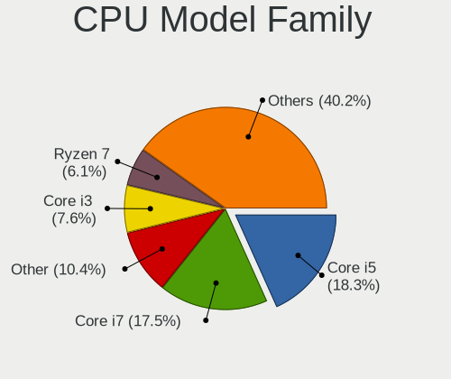
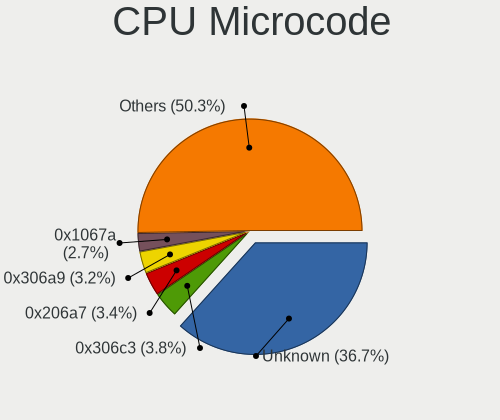
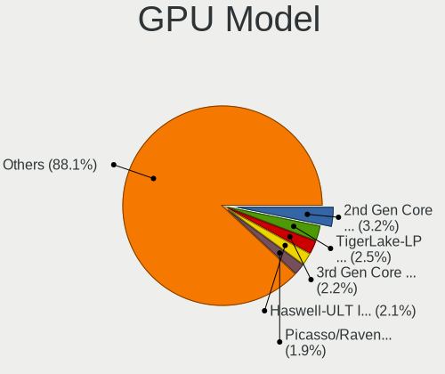
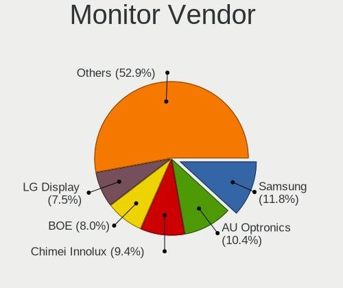
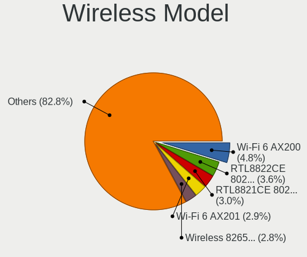
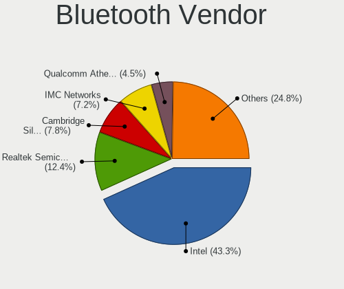

Linux in Spain - Tested Hardware & Statistics
---------------------------------------------

A project to collect tested hardware configurations for Linux in Spain.

Anyone can contribute to this report by the [hw-probe](https://github.com/linuxhw/hw-probe) tool:

    sudo -E hw-probe -all -upload

Please contribute! Especially if your hardware is rare.

This is a report for all computer types. See also reports for [desktops](/Location/Spain/Desktop/README.md) and [notebooks](/Location/Spain/Notebook/README.md).

Contents
--------

* [ Test Cases ](#test-cases)

* [ System ](#system)
  - [ OS                       ](#os)
  - [ OS Family                ](#os-family)
  - [ Kernel                   ](#kernel)
  - [ Kernel Family            ](#kernel-family)
  - [ Kernel Major Ver.        ](#kernel-major-ver)
  - [ Arch                     ](#arch)
  - [ DE                       ](#de)
  - [ Display Server           ](#display-server)
  - [ Display Manager          ](#display-manager)
  - [ OS Lang                  ](#os-lang)
  - [ Boot Mode                ](#boot-mode)
  - [ Filesystem               ](#filesystem)
  - [ Part. scheme             ](#part-scheme)
  - [ Dual Boot with Linux/BSD ](#dual-boot-with-linuxbsd)
  - [ Dual Boot (Win)          ](#dual-boot-win)

* [ Board ](#board)
  - [ Vendor                   ](#vendor)
  - [ Model                    ](#model)
  - [ Model Family             ](#model-family)
  - [ MFG Year                 ](#mfg-year)
  - [ Form Factor              ](#form-factor)
  - [ Secure Boot              ](#secure-boot)
  - [ Coreboot                 ](#coreboot)
  - [ RAM Size                 ](#ram-size)
  - [ RAM Used                 ](#ram-used)
  - [ Total Drives             ](#total-drives)
  - [ Has CD-ROM               ](#has-cd-rom)
  - [ Has Ethernet             ](#has-ethernet)
  - [ Has WiFi                 ](#has-wifi)
  - [ Has Bluetooth            ](#has-bluetooth)

* [ Location ](#location)
  - [ Country                  ](#country)
  - [ City                     ](#city)

* [ Drives ](#drives)
  - [ Drive Vendor             ](#drive-vendor)
  - [ Drive Model              ](#drive-model)
  - [ HDD Vendor               ](#hdd-vendor)
  - [ SSD Vendor               ](#ssd-vendor)
  - [ Drive Kind               ](#drive-kind)
  - [ Drive Connector          ](#drive-connector)
  - [ Drive Size               ](#drive-size)
  - [ Space Total              ](#space-total)
  - [ Space Used               ](#space-used)
  - [ Malfunc. Drives          ](#malfunc-drives)
  - [ Malfunc. Drive Vendor    ](#malfunc-drive-vendor)
  - [ Malfunc. HDD Vendor      ](#malfunc-hdd-vendor)
  - [ Malfunc. Drive Kind      ](#malfunc-drive-kind)
  - [ Failed Drives            ](#failed-drives)
  - [ Failed Drive Vendor      ](#failed-drive-vendor)
  - [ Drive Status             ](#drive-status)

* [ Storage controller ](#storage-controller)
  - [ Storage Vendor           ](#storage-vendor)
  - [ Storage Model            ](#storage-model)
  - [ Storage Kind             ](#storage-kind)

* [ Processor ](#processor)
  - [ CPU Vendor               ](#cpu-vendor)
  - [ CPU Model                ](#cpu-model)
  - [ CPU Model Family         ](#cpu-model-family)
  - [ CPU Cores                ](#cpu-cores)
  - [ CPU Sockets              ](#cpu-sockets)
  - [ CPU Threads              ](#cpu-threads)
  - [ CPU Op-Modes             ](#cpu-op-modes)
  - [ CPU Microcode            ](#cpu-microcode)
  - [ CPU Microarch            ](#cpu-microarch)

* [ Graphics ](#graphics)
  - [ GPU Vendor               ](#gpu-vendor)
  - [ GPU Model                ](#gpu-model)
  - [ GPU Combo                ](#gpu-combo)
  - [ GPU Driver               ](#gpu-driver)
  - [ GPU Memory               ](#gpu-memory)

* [ Monitor ](#monitor)
  - [ Monitor Vendor           ](#monitor-vendor)
  - [ Monitor Model            ](#monitor-model)
  - [ Monitor Resolution       ](#monitor-resolution)
  - [ Monitor Diagonal         ](#monitor-diagonal)
  - [ Monitor Width            ](#monitor-width)
  - [ Aspect Ratio             ](#aspect-ratio)
  - [ Monitor Area             ](#monitor-area)
  - [ Pixel Density            ](#pixel-density)
  - [ Multiple Monitors        ](#multiple-monitors)

* [ Network ](#network)
  - [ Net Controller Vendor    ](#net-controller-vendor)
  - [ Net Controller Model     ](#net-controller-model)
  - [ Wireless Vendor          ](#wireless-vendor)
  - [ Wireless Model           ](#wireless-model)
  - [ Ethernet Vendor          ](#ethernet-vendor)
  - [ Ethernet Model           ](#ethernet-model)
  - [ Net Controller Kind      ](#net-controller-kind)
  - [ Used Controller          ](#used-controller)
  - [ NICs                     ](#nics)
  - [ IPv6                     ](#ipv6)

* [ Bluetooth ](#bluetooth)
  - [ Bluetooth Vendor         ](#bluetooth-vendor)
  - [ Bluetooth Model          ](#bluetooth-model)

* [ Sound ](#sound)
  - [ Sound Vendor             ](#sound-vendor)
  - [ Sound Model              ](#sound-model)

* [ Memory ](#memory)
  - [ Memory Vendor            ](#memory-vendor)
  - [ Memory Model             ](#memory-model)
  - [ Memory Kind              ](#memory-kind)
  - [ Memory Form Factor       ](#memory-form-factor)
  - [ Memory Size              ](#memory-size)
  - [ Memory Speed             ](#memory-speed)

* [ Printers & scanners ](#printers--scanners)
  - [ Printer Vendor           ](#printer-vendor)
  - [ Printer Model            ](#printer-model)
  - [ Scanner Vendor           ](#scanner-vendor)
  - [ Scanner Model            ](#scanner-model)

* [ Camera ](#camera)
  - [ Camera Vendor            ](#camera-vendor)
  - [ Camera Model             ](#camera-model)

* [ Security ](#security)
  - [ Fingerprint Vendor       ](#fingerprint-vendor)
  - [ Fingerprint Model        ](#fingerprint-model)
  - [ Chipcard Vendor          ](#chipcard-vendor)
  - [ Chipcard Model           ](#chipcard-model)

* [ Unsupported ](#unsupported)
  - [ Unsupported Devices      ](#unsupported-devices)
  - [ Unsupported Device Types ](#unsupported-device-types)

Test Cases
----------

Total: 6061

| Vendor        | Model                       | Form-Factor | Probe                                                      | Date         |
|---------------|-----------------------------|-------------|------------------------------------------------------------|--------------|
| Acer          | Aspire M1935                | Desktop     | [a679a25c13](https://linux-hardware.org/?probe=a679a25c13) | May 07, 2022 |
| Acer          | Aspire M1935                | Desktop     | [62424ad96d](https://linux-hardware.org/?probe=62424ad96d) | May 07, 2022 |
| HP            | EliteBook 840 G5            | Notebook    | [a53b09a7f3](https://linux-hardware.org/?probe=a53b09a7f3) | May 07, 2022 |
| HP            | 340S G7 Notebook PC         | Notebook    | [c0d0f6435b](https://linux-hardware.org/?probe=c0d0f6435b) | May 06, 2022 |
| HP            | 84FD                        | Desktop     | [f99c153a46](https://linux-hardware.org/?probe=f99c153a46) | May 06, 2022 |
| HP            | ProBook 6470b               | Notebook    | [7849fd57dc](https://linux-hardware.org/?probe=7849fd57dc) | May 06, 2022 |
| Dell          | Latitude 5420               | Notebook    | [dbe0cffc08](https://linux-hardware.org/?probe=dbe0cffc08) | May 06, 2022 |
| HP            | Compaq 6730s                | Notebook    | [d1902442d8](https://linux-hardware.org/?probe=d1902442d8) | May 06, 2022 |
| HP            | Compaq 6730s                | Notebook    | [2e53f00a60](https://linux-hardware.org/?probe=2e53f00a60) | May 06, 2022 |
| HP            | Compaq 15                   | Notebook    | [25db1ef15f](https://linux-hardware.org/?probe=25db1ef15f) | May 06, 2022 |
| Lenovo        | ThinkPad X270 W10DG 20K6... | Notebook    | [1467c3bb41](https://linux-hardware.org/?probe=1467c3bb41) | May 05, 2022 |
| SLIMBOOK      | EXECUTIVE-14                | Notebook    | [e8556f4acf](https://linux-hardware.org/?probe=e8556f4acf) | May 05, 2022 |
| SLIMBOOK      | EXECUTIVE-14                | Notebook    | [917add86ab](https://linux-hardware.org/?probe=917add86ab) | May 05, 2022 |
| Lenovo        | 371C No DPK                 | All in one  | [c5fc878a83](https://linux-hardware.org/?probe=c5fc878a83) | May 05, 2022 |
| Gigabyte      | G41MT-S2                    | Desktop     | [fd9ed9a035](https://linux-hardware.org/?probe=fd9ed9a035) | May 05, 2022 |
| Lenovo        | Y520-15IKBN 80WK            | Notebook    | [5cba3c93ba](https://linux-hardware.org/?probe=5cba3c93ba) | May 05, 2022 |
| Gigabyte      | G41MT-S2                    | Desktop     | [e188ae279f](https://linux-hardware.org/?probe=e188ae279f) | May 05, 2022 |
| ASUSTek       | N10Jc                       | Notebook    | [ae20ca4c7c](https://linux-hardware.org/?probe=ae20ca4c7c) | May 05, 2022 |
| ASUSTek       | N10Jc                       | Notebook    | [1f688a5b2d](https://linux-hardware.org/?probe=1f688a5b2d) | May 05, 2022 |
| ASRock        | FM2A78M Pro4+               | Desktop     | [7a00557ba5](https://linux-hardware.org/?probe=7a00557ba5) | May 05, 2022 |
| Apple         | MacBookPro5,1               | Notebook    | [d6293e8334](https://linux-hardware.org/?probe=d6293e8334) | May 05, 2022 |
| HP            | 1998                        | Desktop     | [b35fc936e5](https://linux-hardware.org/?probe=b35fc936e5) | May 04, 2022 |
| Notebook      | PD5x_7xPNP_PNN_PNT          | Notebook    | [0afdbf373d](https://linux-hardware.org/?probe=0afdbf373d) | May 04, 2022 |
| Notebook      | PD5x_7xPNP_PNN_PNT          | Notebook    | [a30b11f1a0](https://linux-hardware.org/?probe=a30b11f1a0) | May 04, 2022 |
| Lenovo        | IdeaPad 330-15IKB 81DE      | Notebook    | [4f2714e3fe](https://linux-hardware.org/?probe=4f2714e3fe) | May 04, 2022 |
| Dell          | 0Y56T3 A00                  | Desktop     | [3bdd958639](https://linux-hardware.org/?probe=3bdd958639) | May 04, 2022 |
| HP            | ProBook 450 G8 Notebook ... | Notebook    | [ecc7f176ff](https://linux-hardware.org/?probe=ecc7f176ff) | May 03, 2022 |
| Chuwi         | Hi10 Go                     | Notebook    | [33ea61404a](https://linux-hardware.org/?probe=33ea61404a) | May 03, 2022 |
| Acer          | Aspire A315-56              | Notebook    | [4321ddf926](https://linux-hardware.org/?probe=4321ddf926) | May 03, 2022 |
| Acer          | Aspire one 1-131            | Notebook    | [ade813cf7f](https://linux-hardware.org/?probe=ade813cf7f) | May 03, 2022 |
| HP            | Spectre x360 Convertible... | Convertible | [d30c5337d6](https://linux-hardware.org/?probe=d30c5337d6) | May 02, 2022 |
| Acer          | Aspire 5742G                | Notebook    | [37dfe53a95](https://linux-hardware.org/?probe=37dfe53a95) | May 02, 2022 |
| Acer          | Aspire 5742G                | Notebook    | [aff42aff28](https://linux-hardware.org/?probe=aff42aff28) | May 02, 2022 |
| Lenovo        | IdeaPadFlex 5 14ALC05 82... | Convertible | [0698d33be4](https://linux-hardware.org/?probe=0698d33be4) | May 02, 2022 |
| MSI           | H170A PC MATE               | Desktop     | [3ebb871ecc](https://linux-hardware.org/?probe=3ebb871ecc) | May 02, 2022 |
| ASUSTek       | B150-PLUS                   | Desktop     | [e2f5eb0a39](https://linux-hardware.org/?probe=e2f5eb0a39) | May 02, 2022 |
| Gigabyte      | H110M-S2H-CF                | Desktop     | [c45a37ce5d](https://linux-hardware.org/?probe=c45a37ce5d) | May 01, 2022 |
| HP            | Notebook                    | Notebook    | [3bdd2a5e96](https://linux-hardware.org/?probe=3bdd2a5e96) | May 01, 2022 |
| HP            | Pavilion g6                 | Notebook    | [bc4107a3bf](https://linux-hardware.org/?probe=bc4107a3bf) | May 01, 2022 |
| ASRock        | B365M-HDV                   | Desktop     | [51b0e7e57f](https://linux-hardware.org/?probe=51b0e7e57f) | May 01, 2022 |
| Lenovo        | ThinkCentre M58p 6137E61    | Desktop     | [dbf0d596fc](https://linux-hardware.org/?probe=dbf0d596fc) | May 01, 2022 |
| HUAWEI        | KLVL-WXX9                   | Notebook    | [b152a1215a](https://linux-hardware.org/?probe=b152a1215a) | Apr 30, 2022 |
| HP            | 650                         | Notebook    | [1332a3196c](https://linux-hardware.org/?probe=1332a3196c) | Apr 30, 2022 |
| Lenovo        | ThinkPad X270 W10DG 20K5... | Notebook    | [e14a2c047d](https://linux-hardware.org/?probe=e14a2c047d) | Apr 30, 2022 |
| HP            | Stream Notebook PC 13       | Notebook    | [f4eb2d351c](https://linux-hardware.org/?probe=f4eb2d351c) | Apr 30, 2022 |
| Toshiba       | Satellite L10W-B-101        | Notebook    | [8383d306f3](https://linux-hardware.org/?probe=8383d306f3) | Apr 30, 2022 |
| Intel         | V1.3                        | Desktop     | [a01993f2fa](https://linux-hardware.org/?probe=a01993f2fa) | Apr 30, 2022 |
| ASUSTek       | PRIME H610M-A D4            | Desktop     | [e9376d24f0](https://linux-hardware.org/?probe=e9376d24f0) | Apr 29, 2022 |
| Acer          | TravelMate 6592             | Notebook    | [7d4878ff33](https://linux-hardware.org/?probe=7d4878ff33) | Apr 29, 2022 |
| SLIMBOOK      | PROX15-AMD                  | Notebook    | [dc1c531e45](https://linux-hardware.org/?probe=dc1c531e45) | Apr 29, 2022 |
| Lenovo        | ThinkPad T480 20L6S29D02    | Notebook    | [1eb07120eb](https://linux-hardware.org/?probe=1eb07120eb) | Apr 29, 2022 |
| ASUSTek       | Z87-WS                      | Desktop     | [1c67952875](https://linux-hardware.org/?probe=1c67952875) | Apr 29, 2022 |
| HP            | Compaq 6730b (GW687AV)      | Notebook    | [96ee86a3c6](https://linux-hardware.org/?probe=96ee86a3c6) | Apr 28, 2022 |
| SLIMBOOK      | PROX15-AMD                  | Notebook    | [c3dad3331c](https://linux-hardware.org/?probe=c3dad3331c) | Apr 28, 2022 |
| Dell          | 0J37VM A00                  | Desktop     | [76f13aa200](https://linux-hardware.org/?probe=76f13aa200) | Apr 28, 2022 |
| Dell          | XPS 13 9370                 | Notebook    | [349f8f5d64](https://linux-hardware.org/?probe=349f8f5d64) | Apr 27, 2022 |
| ASUSTek       | X550VX                      | Notebook    | [b72fe24642](https://linux-hardware.org/?probe=b72fe24642) | Apr 27, 2022 |
| ASUSTek       | X550VX                      | Notebook    | [4dc675b81c](https://linux-hardware.org/?probe=4dc675b81c) | Apr 27, 2022 |
| ASRock        | AB350M-HDV                  | Desktop     | [6ee4ea44a8](https://linux-hardware.org/?probe=6ee4ea44a8) | Apr 27, 2022 |
| ASUSTek       | Maximus II Formula          | Desktop     | [66a4342140](https://linux-hardware.org/?probe=66a4342140) | Apr 26, 2022 |
| Lenovo        | Z50-70 20354                | Notebook    | [44714b01ff](https://linux-hardware.org/?probe=44714b01ff) | Apr 26, 2022 |
| Lenovo        | Z50-70 20354                | Notebook    | [75188b99b5](https://linux-hardware.org/?probe=75188b99b5) | Apr 26, 2022 |
| MSI           | H170A PC MATE               | Desktop     | [558be4bee8](https://linux-hardware.org/?probe=558be4bee8) | Apr 26, 2022 |
| Dell          | G15 5510                    | Notebook    | [5126d58147](https://linux-hardware.org/?probe=5126d58147) | Apr 26, 2022 |
| Lenovo        | ThinkPad L15 Gen 2 20X3C... | Notebook    | [3fcb247b21](https://linux-hardware.org/?probe=3fcb247b21) | Apr 25, 2022 |
| ASUSTek       | T101HA                      | Tablet      | [23747b18ed](https://linux-hardware.org/?probe=23747b18ed) | Apr 25, 2022 |
| Apple         | MacBookPro9,2               | Notebook    | [003f1099c2](https://linux-hardware.org/?probe=003f1099c2) | Apr 25, 2022 |
| Gigabyte      | P55M-UD2                    | Desktop     | [5f9ffc8d46](https://linux-hardware.org/?probe=5f9ffc8d46) | Apr 24, 2022 |
| MSI           | B250M PRO-VDH               | Desktop     | [a1ff9cf092](https://linux-hardware.org/?probe=a1ff9cf092) | Apr 24, 2022 |
| MSI           | GX700                       | Notebook    | [b2cc52d381](https://linux-hardware.org/?probe=b2cc52d381) | Apr 24, 2022 |
| ASUSTek       | VivoBook_ASUSLaptop X512... | Notebook    | [44c8507975](https://linux-hardware.org/?probe=44c8507975) | Apr 24, 2022 |
| ASUSTek       | VivoBook_ASUSLaptop X512... | Notebook    | [19ef63f944](https://linux-hardware.org/?probe=19ef63f944) | Apr 24, 2022 |
| Lenovo        | ThinkBook 15 G2 ARE 20VG    | Notebook    | [99e25e855e](https://linux-hardware.org/?probe=99e25e855e) | Apr 23, 2022 |
| Chuwi         | AeroBook Pro                | Notebook    | [a123315898](https://linux-hardware.org/?probe=a123315898) | Apr 23, 2022 |
| Gigabyte      | F2A88XN-WIFI                | Desktop     | [347ded3d71](https://linux-hardware.org/?probe=347ded3d71) | Apr 23, 2022 |
| Foxconn       | 945 7AD Series              | Desktop     | [04346c58f5](https://linux-hardware.org/?probe=04346c58f5) | Apr 23, 2022 |
| AZW           | GTi                         | Desktop     | [e2d4a0da2e](https://linux-hardware.org/?probe=e2d4a0da2e) | Apr 23, 2022 |
| AZW           | GTi                         | Desktop     | [cde74551bf](https://linux-hardware.org/?probe=cde74551bf) | Apr 23, 2022 |
| ASUSTek       | ROG STRIX B365-G GAMING     | Desktop     | [14089322a6](https://linux-hardware.org/?probe=14089322a6) | Apr 23, 2022 |
| Lenovo        | Yoga 300-11IBY 80M0         | Notebook    | [998ea03b05](https://linux-hardware.org/?probe=998ea03b05) | Apr 22, 2022 |
| Lenovo        | ThinkPad P53 20QN000ESP     | Notebook    | [16b3189bd8](https://linux-hardware.org/?probe=16b3189bd8) | Apr 22, 2022 |
| ASUSTek       | ROG STRIX B365-G GAMING     | Desktop     | [703d6d22db](https://linux-hardware.org/?probe=703d6d22db) | Apr 22, 2022 |
| Raspberry ... | Raspberry Pi 3 Model B R... | Soc         | [7d38b3b29f](https://linux-hardware.org/?probe=7d38b3b29f) | Apr 22, 2022 |
| Gigabyte      | H310M S2H x.x               | Desktop     | [bde3fa1f37](https://linux-hardware.org/?probe=bde3fa1f37) | Apr 22, 2022 |
| AMI           | Cherry Trail CR             | Desktop     | [61d45f784c](https://linux-hardware.org/?probe=61d45f784c) | Apr 21, 2022 |
| Chuwi         | CoreBox                     | Mini pc     | [18578239d6](https://linux-hardware.org/?probe=18578239d6) | Apr 21, 2022 |
| Gigabyte      | GA-78LMT-USB3               | Desktop     | [8034b9ae8c](https://linux-hardware.org/?probe=8034b9ae8c) | Apr 21, 2022 |
| Dell          | XPS 13 7390                 | Notebook    | [b2cc2161d3](https://linux-hardware.org/?probe=b2cc2161d3) | Apr 21, 2022 |
| Dell          | 0WMJ54 A01                  | Desktop     | [37ec4fb91d](https://linux-hardware.org/?probe=37ec4fb91d) | Apr 21, 2022 |
| Dell          | 0JP3NX A01                  | Desktop     | [e1c710c88f](https://linux-hardware.org/?probe=e1c710c88f) | Apr 21, 2022 |
| Dell          | 0JP3NX A01                  | Desktop     | [8e6566a555](https://linux-hardware.org/?probe=8e6566a555) | Apr 21, 2022 |
| Lenovo        | ThinkBook 16p Gen 2 20YM    | Notebook    | [e0d5f104b9](https://linux-hardware.org/?probe=e0d5f104b9) | Apr 21, 2022 |
| Lenovo        | SHARKBAY 0B98401 PRO        | Desktop     | [0ceaadd5e3](https://linux-hardware.org/?probe=0ceaadd5e3) | Apr 20, 2022 |
| Gigabyte      | P55M-UD2                    | Desktop     | [bc5f8558f3](https://linux-hardware.org/?probe=bc5f8558f3) | Apr 20, 2022 |
| Acer          | Aspire 9410                 | Notebook    | [f6c795c09a](https://linux-hardware.org/?probe=f6c795c09a) | Apr 20, 2022 |
| MSI           | A320M-A PRO MAX             | Desktop     | [b925b403ca](https://linux-hardware.org/?probe=b925b403ca) | Apr 20, 2022 |
| eMachines     | D730                        | Notebook    | [09350021b3](https://linux-hardware.org/?probe=09350021b3) | Apr 20, 2022 |
| Lenovo        | 3098 NOK                    | Desktop     | [a9126e3886](https://linux-hardware.org/?probe=a9126e3886) | Apr 19, 2022 |
| Gigabyte      | H81M-S2H                    | Desktop     | [85082e6de6](https://linux-hardware.org/?probe=85082e6de6) | Apr 19, 2022 |
| Lenovo        | Z50-70 20354                | Notebook    | [a7fcc96eb5](https://linux-hardware.org/?probe=a7fcc96eb5) | Apr 19, 2022 |
| Toshiba       | Satellite Pro C660          | Notebook    | [678e3209cb](https://linux-hardware.org/?probe=678e3209cb) | Apr 18, 2022 |
| Raspberry ... | Raspberry Pi                | Soc         | [a5584e7ec2](https://linux-hardware.org/?probe=a5584e7ec2) | Apr 18, 2022 |
| Chuwi         | Unknown                     | Notebook    | [a44bd392c5](https://linux-hardware.org/?probe=a44bd392c5) | Apr 18, 2022 |
| ASUSTek       | H87-PLUS                    | Desktop     | [10e97d2168](https://linux-hardware.org/?probe=10e97d2168) | Apr 18, 2022 |
| Gigabyte      | B85M-DS3H                   | Desktop     | [c278a421cd](https://linux-hardware.org/?probe=c278a421cd) | Apr 18, 2022 |
| ASUSTek       | TUF Gaming Z690-PLUS D4     | Desktop     | [fb3e0b6b22](https://linux-hardware.org/?probe=fb3e0b6b22) | Apr 18, 2022 |
| Lenovo        | Z50-70 20354                | Notebook    | [e693d05883](https://linux-hardware.org/?probe=e693d05883) | Apr 17, 2022 |
| Unknown       | Unknown                     | All in one  | [85f7750f62](https://linux-hardware.org/?probe=85f7750f62) | Apr 17, 2022 |
| HP            | 250 G7 Notebook PC          | Notebook    | [4058d0c1ca](https://linux-hardware.org/?probe=4058d0c1ca) | Apr 17, 2022 |
| ASUSTek       | PRIME B660-PLUS D4          | Desktop     | [d921190f7e](https://linux-hardware.org/?probe=d921190f7e) | Apr 17, 2022 |
| BESSTAR Te... | UM250 V1.0                  | Desktop     | [271eb8380b](https://linux-hardware.org/?probe=271eb8380b) | Apr 17, 2022 |
| Acer          | Aspire 5750                 | Notebook    | [4ce545cc86](https://linux-hardware.org/?probe=4ce545cc86) | Apr 16, 2022 |
| Gigabyte      | F2A68HM-DS2                 | Desktop     | [a016ec1bce](https://linux-hardware.org/?probe=a016ec1bce) | Apr 16, 2022 |
| Toshiba       | Satellite L10W-B-101        | Notebook    | [65edd32378](https://linux-hardware.org/?probe=65edd32378) | Apr 16, 2022 |
| ASUSTek       | P5VD2-MX                    | Desktop     | [57fec52891](https://linux-hardware.org/?probe=57fec52891) | Apr 16, 2022 |
| HP            | Pavilion dv6500             | Notebook    | [064748981e](https://linux-hardware.org/?probe=064748981e) | Apr 15, 2022 |
| HP            | Pavilion dv6500             | Notebook    | [48350ccc67](https://linux-hardware.org/?probe=48350ccc67) | Apr 15, 2022 |
| LG Electro... | 15Z95P-G.AA78B              | Notebook    | [f5ef9987a4](https://linux-hardware.org/?probe=f5ef9987a4) | Apr 15, 2022 |
| Toshiba       | Satellite U840              | Notebook    | [9468123a43](https://linux-hardware.org/?probe=9468123a43) | Apr 15, 2022 |
| Medion        | MS-7728                     | Desktop     | [443a5ff3dd](https://linux-hardware.org/?probe=443a5ff3dd) | Apr 15, 2022 |
| Packard Be... | EasyNote TN36               | Notebook    | [23936e29bb](https://linux-hardware.org/?probe=23936e29bb) | Apr 15, 2022 |
| Packard Be... | EasyNote TN36               | Notebook    | [ae514187f2](https://linux-hardware.org/?probe=ae514187f2) | Apr 15, 2022 |
| Toshiba       | NB520                       | Notebook    | [105666a973](https://linux-hardware.org/?probe=105666a973) | Apr 15, 2022 |
| MSI           | X470 GAMING PLUS            | Desktop     | [72af1b2afe](https://linux-hardware.org/?probe=72af1b2afe) | Apr 15, 2022 |
| AMI           | Intel                       | Notebook    | [bfee32835f](https://linux-hardware.org/?probe=bfee32835f) | Apr 14, 2022 |
| AMI           | Intel                       | Notebook    | [b7c76035df](https://linux-hardware.org/?probe=b7c76035df) | Apr 14, 2022 |
| Acer          | TravelMate P256-MG          | Notebook    | [55b07b48b3](https://linux-hardware.org/?probe=55b07b48b3) | Apr 14, 2022 |
| BESSTAR Te... | UM250 V1.0                  | Desktop     | [c8afb3fce8](https://linux-hardware.org/?probe=c8afb3fce8) | Apr 14, 2022 |
| BESSTAR Te... | UM250 V1.0                  | Desktop     | [bd378877e0](https://linux-hardware.org/?probe=bd378877e0) | Apr 14, 2022 |
| HP            | Laptop 15s-fq1xxx           | Notebook    | [48794f7ff0](https://linux-hardware.org/?probe=48794f7ff0) | Apr 14, 2022 |
| SLIMBOOK      | PRO                         | Notebook    | [97f545c3d4](https://linux-hardware.org/?probe=97f545c3d4) | Apr 14, 2022 |
| Lenovo        | 3098 NOK                    | Desktop     | [c5a4b14cc3](https://linux-hardware.org/?probe=c5a4b14cc3) | Apr 14, 2022 |
| Lenovo        | 3098 NOK                    | Desktop     | [45b5664eb1](https://linux-hardware.org/?probe=45b5664eb1) | Apr 14, 2022 |
| Lenovo        | ThinkPad Edge E540 20C60... | Notebook    | [45b8eba74c](https://linux-hardware.org/?probe=45b8eba74c) | Apr 14, 2022 |
| Lenovo        | IdeaPad 510-15IKB 80SV      | Notebook    | [3e5c6ada15](https://linux-hardware.org/?probe=3e5c6ada15) | Apr 14, 2022 |
| Lenovo        | ThinkPad E14 Gen 3 20Y7C... | Notebook    | [4434290159](https://linux-hardware.org/?probe=4434290159) | Apr 14, 2022 |
| Unknown       | Unknown                     | Desktop     | [d7811dbd43](https://linux-hardware.org/?probe=d7811dbd43) | Apr 14, 2022 |
| Lenovo        | IdeaPad S540-13ARE 82DL     | Notebook    | [17363a1a13](https://linux-hardware.org/?probe=17363a1a13) | Apr 14, 2022 |
| HP            | Presario C500 (RY512EA#A... | Notebook    | [558d84adac](https://linux-hardware.org/?probe=558d84adac) | Apr 13, 2022 |
| Gigabyte      | P55M-UD2                    | Desktop     | [f1e49447b0](https://linux-hardware.org/?probe=f1e49447b0) | Apr 13, 2022 |
| Toshiba       | Satellite U840              | Notebook    | [c6fe138c8f](https://linux-hardware.org/?probe=c6fe138c8f) | Apr 13, 2022 |
| IP3 Tech      | GB3B                        | Mini pc     | [f0f5bfea81](https://linux-hardware.org/?probe=f0f5bfea81) | Apr 13, 2022 |
| Unknown       | Unknown                     | Notebook    | [63f76ffc2b](https://linux-hardware.org/?probe=63f76ffc2b) | Apr 13, 2022 |
| Unknown       | Unknown                     | Notebook    | [3a9245cdab](https://linux-hardware.org/?probe=3a9245cdab) | Apr 13, 2022 |
| ASUSTek       | ROG STRIX Z370-H GAMING     | Desktop     | [ace1daa3ff](https://linux-hardware.org/?probe=ace1daa3ff) | Apr 13, 2022 |
| ASUSTek       | ROG STRIX Z370-H GAMING     | Desktop     | [c77d1618d1](https://linux-hardware.org/?probe=c77d1618d1) | Apr 13, 2022 |
| Acer          | Aspire E5-573G              | Notebook    | [0fbee9d8dc](https://linux-hardware.org/?probe=0fbee9d8dc) | Apr 13, 2022 |
| Gateway       | DS71                        | Desktop     | [3bd1ad84ce](https://linux-hardware.org/?probe=3bd1ad84ce) | Apr 13, 2022 |
| Acer          | Nitro AN517-41              | Notebook    | [b10d1a135d](https://linux-hardware.org/?probe=b10d1a135d) | Apr 13, 2022 |
| HP            | Compaq Mini CQ10-100        | Notebook    | [1acc227c33](https://linux-hardware.org/?probe=1acc227c33) | Apr 13, 2022 |
| Sony          | VGN-NW21EF_S                | Notebook    | [4ade997baf](https://linux-hardware.org/?probe=4ade997baf) | Apr 13, 2022 |
| Gigabyte      | F2A88XM-D3H                 | Desktop     | [c5c12d6818](https://linux-hardware.org/?probe=c5c12d6818) | Apr 12, 2022 |
| Gigabyte      | 970A-DS3P                   | Desktop     | [8101ed4e60](https://linux-hardware.org/?probe=8101ed4e60) | Apr 12, 2022 |
| Gigabyte      | 970A-DS3P                   | Desktop     | [bf61a75cfd](https://linux-hardware.org/?probe=bf61a75cfd) | Apr 12, 2022 |
| Lenovo        | IdeaPad 3 15ITL6 82H8       | Notebook    | [27cda229cc](https://linux-hardware.org/?probe=27cda229cc) | Apr 12, 2022 |
| MSI           | Prestige 15 A11SCX          | Notebook    | [a5bf5ddddf](https://linux-hardware.org/?probe=a5bf5ddddf) | Apr 12, 2022 |
| MSI           | Prestige 15 A11UC           | Notebook    | [20517e7efc](https://linux-hardware.org/?probe=20517e7efc) | Apr 11, 2022 |
| MSI           | Prestige 15 A11UC           | Notebook    | [3f8b7b11a5](https://linux-hardware.org/?probe=3f8b7b11a5) | Apr 11, 2022 |
| Intel         | NUC8BEB J72693-304          | Mini pc     | [760d46f52e](https://linux-hardware.org/?probe=760d46f52e) | Apr 11, 2022 |
| HP            | Pavilion g6                 | Notebook    | [19ccaef18f](https://linux-hardware.org/?probe=19ccaef18f) | Apr 11, 2022 |
| HP            | Pavilion g6                 | Notebook    | [dabfb4bb05](https://linux-hardware.org/?probe=dabfb4bb05) | Apr 11, 2022 |
| ASUSTek       | TUF Z390-PLUS GAMING        | Desktop     | [f986565b6b](https://linux-hardware.org/?probe=f986565b6b) | Apr 10, 2022 |
| Gigabyte      | Q67M-D2H                    | Desktop     | [c95352a142](https://linux-hardware.org/?probe=c95352a142) | Apr 10, 2022 |
| ASUSTek       | Z87-WS                      | Desktop     | [7706049c53](https://linux-hardware.org/?probe=7706049c53) | Apr 10, 2022 |
| Medion        | MS-7366                     | Desktop     | [206ab01c63](https://linux-hardware.org/?probe=206ab01c63) | Apr 10, 2022 |
| ASUSTek       | STRIX H270F GAMING          | Desktop     | [22502631b3](https://linux-hardware.org/?probe=22502631b3) | Apr 10, 2022 |
| ASUSTek       | PRIME A320M-K               | Desktop     | [9cc7cc23d6](https://linux-hardware.org/?probe=9cc7cc23d6) | Apr 10, 2022 |
| ASUSTek       | PRIME A320M-K               | Desktop     | [3845180872](https://linux-hardware.org/?probe=3845180872) | Apr 10, 2022 |
| ASUSTek       | X540LJ                      | Notebook    | [2eb11881fa](https://linux-hardware.org/?probe=2eb11881fa) | Apr 09, 2022 |
| MACHINIST     | X99-RS9 V2.0                | Desktop     | [862e7ffc88](https://linux-hardware.org/?probe=862e7ffc88) | Apr 09, 2022 |
| Dell          | Latitude D630               | Notebook    | [6c715d7619](https://linux-hardware.org/?probe=6c715d7619) | Apr 09, 2022 |
| MACHINIST     | X99-RS9 V2.0                | Desktop     | [e20b365083](https://linux-hardware.org/?probe=e20b365083) | Apr 09, 2022 |
| HP            | Laptop 15s-fq2xxx           | Notebook    | [a0001e2492](https://linux-hardware.org/?probe=a0001e2492) | Apr 09, 2022 |
| Medion        | MS-7366                     | Desktop     | [86884e1cf1](https://linux-hardware.org/?probe=86884e1cf1) | Apr 09, 2022 |
| ASUSTek       | TUF Z390-PLUS GAMING        | Desktop     | [a618981311](https://linux-hardware.org/?probe=a618981311) | Apr 09, 2022 |
| HP            | 250 G7 Notebook PC          | Notebook    | [ef88107fcf](https://linux-hardware.org/?probe=ef88107fcf) | Apr 09, 2022 |
| HP            | Compaq 15                   | Notebook    | [e3c3ac6478](https://linux-hardware.org/?probe=e3c3ac6478) | Apr 09, 2022 |
| Gigabyte      | 970A-DS3P                   | Desktop     | [f45b500a83](https://linux-hardware.org/?probe=f45b500a83) | Apr 09, 2022 |
| HP            | Presario C500 (RY512EA#A... | Notebook    | [4ef049d490](https://linux-hardware.org/?probe=4ef049d490) | Apr 09, 2022 |
| Toshiba       | Satellite L10W-B-101        | Notebook    | [4f36b2c97c](https://linux-hardware.org/?probe=4f36b2c97c) | Apr 08, 2022 |
| HP            | 250 G7 Notebook PC          | Notebook    | [6271f39c13](https://linux-hardware.org/?probe=6271f39c13) | Apr 08, 2022 |
| SLIMBOOK      | PROX15-AMD                  | Notebook    | [7825594d87](https://linux-hardware.org/?probe=7825594d87) | Apr 08, 2022 |
| HP            | ProBook 650 G1              | Notebook    | [9bd404657b](https://linux-hardware.org/?probe=9bd404657b) | Apr 08, 2022 |
| ASUSTek       | H97M-PLUS                   | Desktop     | [b90df26c2a](https://linux-hardware.org/?probe=b90df26c2a) | Apr 08, 2022 |
| Acer          | Nitro AN517-41              | Notebook    | [a9d4f38d23](https://linux-hardware.org/?probe=a9d4f38d23) | Apr 08, 2022 |
| Acer          | Nitro AN517-41              | Notebook    | [7d3cba901a](https://linux-hardware.org/?probe=7d3cba901a) | Apr 08, 2022 |
| ASRock        | C226 WS                     | Desktop     | [7c11c1ec43](https://linux-hardware.org/?probe=7c11c1ec43) | Apr 07, 2022 |
| ECS           | Nettle2                     | Desktop     | [65cedbb00d](https://linux-hardware.org/?probe=65cedbb00d) | Apr 07, 2022 |
| HP            | Laptop 14s-dq1xxx           | Notebook    | [72c98b5e79](https://linux-hardware.org/?probe=72c98b5e79) | Apr 07, 2022 |
| Dell          | Studio 1749                 | Notebook    | [14d44c44fc](https://linux-hardware.org/?probe=14d44c44fc) | Apr 07, 2022 |
| Acer          | Nitro AN517-41              | Notebook    | [4d7ea68368](https://linux-hardware.org/?probe=4d7ea68368) | Apr 07, 2022 |
| Lenovo        | MIIX 320-10ICR 80XF         | Tablet      | [de86ebaf94](https://linux-hardware.org/?probe=de86ebaf94) | Apr 06, 2022 |
| SLIMBOOK      | PROX15-AMD                  | Notebook    | [5b4aaa3af5](https://linux-hardware.org/?probe=5b4aaa3af5) | Apr 06, 2022 |
| HP            | 18E5                        | Desktop     | [b79c804a6a](https://linux-hardware.org/?probe=b79c804a6a) | Apr 05, 2022 |
| Acer          | Nitro AN517-41              | Notebook    | [b7cc683cc7](https://linux-hardware.org/?probe=b7cc683cc7) | Apr 05, 2022 |
| Toshiba       | Satellite L10W-B-101        | Notebook    | [a956f8afcb](https://linux-hardware.org/?probe=a956f8afcb) | Apr 05, 2022 |
| Acer          | Extensa 2511                | Notebook    | [00d24bfb95](https://linux-hardware.org/?probe=00d24bfb95) | Apr 05, 2022 |
| ASRock        | X399 Phantom Gaming 6       | Desktop     | [939722b6a7](https://linux-hardware.org/?probe=939722b6a7) | Apr 05, 2022 |
| Dell          | XPS 15 9570                 | Notebook    | [0437f62b89](https://linux-hardware.org/?probe=0437f62b89) | Apr 05, 2022 |
| ASUSTek       | ZenBook UX431DA_UM431DA     | Notebook    | [91bae7b644](https://linux-hardware.org/?probe=91bae7b644) | Apr 05, 2022 |
| ASUSTek       | TUF Gaming B560-PLUS WIF... | Desktop     | [db18e71352](https://linux-hardware.org/?probe=db18e71352) | Apr 05, 2022 |
| Lenovo        | ThinkPad X250 20CLS2GD00    | Notebook    | [c5fcd04bc5](https://linux-hardware.org/?probe=c5fcd04bc5) | Apr 04, 2022 |
| Lenovo        | MIIX 320-10ICR 80XF         | Tablet      | [45188a0370](https://linux-hardware.org/?probe=45188a0370) | Apr 04, 2022 |
| HP            | Laptop 15-da0xxx            | Notebook    | [7894bcc256](https://linux-hardware.org/?probe=7894bcc256) | Apr 03, 2022 |
| Gigabyte      | GA-990FX-GAMING             | Desktop     | [46756b95b5](https://linux-hardware.org/?probe=46756b95b5) | Apr 03, 2022 |
| Lenovo        | IdeaPadFlex 5 14ITL05 82... | Convertible | [b5b25093ba](https://linux-hardware.org/?probe=b5b25093ba) | Apr 03, 2022 |
| Lenovo        | IdeaPadFlex 5 14ITL05 82... | Convertible | [6107c72fb2](https://linux-hardware.org/?probe=6107c72fb2) | Apr 03, 2022 |
| Medion        | Z370H4-EM                   | Desktop     | [0f9b0bf367](https://linux-hardware.org/?probe=0f9b0bf367) | Apr 03, 2022 |
| Medion        | Z370H4-EM                   | Desktop     | [64df85bce8](https://linux-hardware.org/?probe=64df85bce8) | Apr 03, 2022 |
| Acer          | Aspire F5-571               | Notebook    | [68cb5f9f95](https://linux-hardware.org/?probe=68cb5f9f95) | Apr 03, 2022 |
| Gigabyte      | P55M-UD2                    | Desktop     | [e6d82a83c3](https://linux-hardware.org/?probe=e6d82a83c3) | Apr 03, 2022 |
| ASUSTek       | PRIME X570-PRO              | Desktop     | [368a64422d](https://linux-hardware.org/?probe=368a64422d) | Apr 03, 2022 |
| ASUSTek       | TUF Gaming Z690-PLUS D4     | Desktop     | [a11d93b9d5](https://linux-hardware.org/?probe=a11d93b9d5) | Apr 02, 2022 |
| ASUSTek       | TUF Gaming B460M-PLUS       | Desktop     | [7419ad6a76](https://linux-hardware.org/?probe=7419ad6a76) | Apr 02, 2022 |
| Gigabyte      | H81M-S2H                    | Desktop     | [8a810aa9f6](https://linux-hardware.org/?probe=8a810aa9f6) | Apr 02, 2022 |
| Lenovo        | G580 2189                   | Notebook    | [da5b37bf9f](https://linux-hardware.org/?probe=da5b37bf9f) | Apr 02, 2022 |
| MSI           | H81M-E35 V2                 | Desktop     | [a3aea1cbf5](https://linux-hardware.org/?probe=a3aea1cbf5) | Apr 02, 2022 |
| Fanless Mi... | PCG02 GLE                   | Stick pc    | [49e19c3bf2](https://linux-hardware.org/?probe=49e19c3bf2) | Apr 01, 2022 |
| Wistron       | ProLiant ML110 G5           | Desktop     | [ccea23c3b5](https://linux-hardware.org/?probe=ccea23c3b5) | Apr 01, 2022 |
| Wistron       | ProLiant ML110 G5           | Desktop     | [4c01aec65d](https://linux-hardware.org/?probe=4c01aec65d) | Apr 01, 2022 |
| Toshiba       | Satellite L300              | Notebook    | [d3d1814f5d](https://linux-hardware.org/?probe=d3d1814f5d) | Apr 01, 2022 |
| ASUSTek       | ROG STRIX B365-G GAMING     | Desktop     | [47e2449cf5](https://linux-hardware.org/?probe=47e2449cf5) | Apr 01, 2022 |
| MSI           | H410M PRO-VH                | Desktop     | [e4ef535529](https://linux-hardware.org/?probe=e4ef535529) | Mar 31, 2022 |
| Unknown       | Unknown                     | Desktop     | [926a8980fc](https://linux-hardware.org/?probe=926a8980fc) | Mar 30, 2022 |
| LG Electro... | 22V270 2                    | All in one  | [1454b8c602](https://linux-hardware.org/?probe=1454b8c602) | Mar 30, 2022 |
| ASUSTek       | PRIME Z390-A                | Desktop     | [5307aba2c3](https://linux-hardware.org/?probe=5307aba2c3) | Mar 30, 2022 |
| ASUSTek       | TUF Gaming FX505DV_FX505... | Notebook    | [afd4df967a](https://linux-hardware.org/?probe=afd4df967a) | Mar 29, 2022 |
| HP            | 355 G2                      | Notebook    | [5a5271a7df](https://linux-hardware.org/?probe=5a5271a7df) | Mar 29, 2022 |
| Lenovo        | IdeaPad 3 15ITL6 82H8       | Notebook    | [dddc946b70](https://linux-hardware.org/?probe=dddc946b70) | Mar 29, 2022 |
| HP            | EliteBook 850 G8 Noteboo... | Notebook    | [e2dcac3e1a](https://linux-hardware.org/?probe=e2dcac3e1a) | Mar 29, 2022 |
| Raspberry ... | Raspberry Pi                | Soc         | [aa3fb80f72](https://linux-hardware.org/?probe=aa3fb80f72) | Mar 29, 2022 |
| Chuwi         | LapBook SE                  | Notebook    | [69b963a8c0](https://linux-hardware.org/?probe=69b963a8c0) | Mar 28, 2022 |
| ASUSTek       | D940MX                      | Desktop     | [bdc8831182](https://linux-hardware.org/?probe=bdc8831182) | Mar 28, 2022 |
| LG Electro... | 14Z90N-V.AR55B              | Notebook    | [4942a692f0](https://linux-hardware.org/?probe=4942a692f0) | Mar 28, 2022 |
| Dell          | XPS 13 9360                 | Notebook    | [9579421df6](https://linux-hardware.org/?probe=9579421df6) | Mar 28, 2022 |
| Lenovo        | ThinkPad T61 6464W4J        | Notebook    | [5f73680acf](https://linux-hardware.org/?probe=5f73680acf) | Mar 28, 2022 |
| HP            | Pavilion g6                 | Notebook    | [954723d6f4](https://linux-hardware.org/?probe=954723d6f4) | Mar 27, 2022 |
| Notebook      | N85_N87,HJ,HJ1,HK1          | Notebook    | [078c1af4c3](https://linux-hardware.org/?probe=078c1af4c3) | Mar 27, 2022 |
| HP            | Stream Notebook PC 14       | Notebook    | [9fc309dcaf](https://linux-hardware.org/?probe=9fc309dcaf) | Mar 27, 2022 |
| HP            | Stream Notebook PC 14       | Notebook    | [bcf7252530](https://linux-hardware.org/?probe=bcf7252530) | Mar 27, 2022 |
| ASUSTek       | ROG STRIX B365-G GAMING     | Desktop     | [7c852d78e1](https://linux-hardware.org/?probe=7c852d78e1) | Mar 27, 2022 |
| ASUSTek       | ROG STRIX B365-G GAMING     | Desktop     | [1e0f6a4a04](https://linux-hardware.org/?probe=1e0f6a4a04) | Mar 27, 2022 |
| ASUSTek       | ROG Strix G513QY_G513QY     | Notebook    | [ba743bbb3b](https://linux-hardware.org/?probe=ba743bbb3b) | Mar 27, 2022 |
| ASUSTek       | ROG Maximus XI HERO         | Desktop     | [ce82ab584b](https://linux-hardware.org/?probe=ce82ab584b) | Mar 26, 2022 |
| Gigabyte      | H61M-USB3H                  | Desktop     | [f852a0cb0d](https://linux-hardware.org/?probe=f852a0cb0d) | Mar 26, 2022 |
| Apple         | MacBook10,1                 | Notebook    | [62a1f4a38b](https://linux-hardware.org/?probe=62a1f4a38b) | Mar 25, 2022 |
| Apple         | MacBook10,1                 | Notebook    | [b58112c801](https://linux-hardware.org/?probe=b58112c801) | Mar 25, 2022 |
| Acer          | Aspire 5750G                | Notebook    | [4a7e22384f](https://linux-hardware.org/?probe=4a7e22384f) | Mar 25, 2022 |
| Gigabyte      | P55M-UD2                    | Desktop     | [4d2f49f47a](https://linux-hardware.org/?probe=4d2f49f47a) | Mar 25, 2022 |
| Toshiba       | Satellite L50D-C            | Notebook    | [2782b13510](https://linux-hardware.org/?probe=2782b13510) | Mar 25, 2022 |
| Intel         | B75                         | Desktop     | [9f73efdcc8](https://linux-hardware.org/?probe=9f73efdcc8) | Mar 25, 2022 |
| Toshiba       | Satellite L10W-B-101        | Notebook    | [35dacb370c](https://linux-hardware.org/?probe=35dacb370c) | Mar 25, 2022 |
| ASUSTek       | ROG STRIX B365-G GAMING     | Desktop     | [b2c47467cc](https://linux-hardware.org/?probe=b2c47467cc) | Mar 25, 2022 |
| ASUSTek       | ROG STRIX B365-G GAMING     | Desktop     | [5a897fa995](https://linux-hardware.org/?probe=5a897fa995) | Mar 25, 2022 |
| Toshiba       | Satellite L50D-C            | Notebook    | [a0c9b5a952](https://linux-hardware.org/?probe=a0c9b5a952) | Mar 25, 2022 |
| Toshiba       | Satellite L10W-B-101        | Notebook    | [8064b23bf4](https://linux-hardware.org/?probe=8064b23bf4) | Mar 25, 2022 |
| HP            | Laptop 17-cn0xxx            | Notebook    | [9400fdbebf](https://linux-hardware.org/?probe=9400fdbebf) | Mar 24, 2022 |
| Lenovo        | ChiefRiver                  | All in one  | [7b9fe75523](https://linux-hardware.org/?probe=7b9fe75523) | Mar 24, 2022 |
| HP            | Laptop 15-da0xxx            | Notebook    | [794139f740](https://linux-hardware.org/?probe=794139f740) | Mar 24, 2022 |
| Lenovo        | ThinkPad P51 20HHCTO1WW     | Notebook    | [5a64dc1855](https://linux-hardware.org/?probe=5a64dc1855) | Mar 23, 2022 |
| Dell          | XPS 13 9360                 | Notebook    | [30003161fe](https://linux-hardware.org/?probe=30003161fe) | Mar 23, 2022 |
| Dell          | XPS 13 9305                 | Notebook    | [1fb70f4b83](https://linux-hardware.org/?probe=1fb70f4b83) | Mar 23, 2022 |
| Gigabyte      | GA-73PVM-S2H                | Desktop     | [ac9f20a77c](https://linux-hardware.org/?probe=ac9f20a77c) | Mar 23, 2022 |
| ASUSTek       | N550LF                      | Notebook    | [5e5462ce64](https://linux-hardware.org/?probe=5e5462ce64) | Mar 23, 2022 |
| Dell          | Latitude E6330              | Notebook    | [a8d483108b](https://linux-hardware.org/?probe=a8d483108b) | Mar 22, 2022 |
| Gigabyte      | 970A-DS3P                   | Desktop     | [012e192ece](https://linux-hardware.org/?probe=012e192ece) | Mar 22, 2022 |
| ASUSTek       | STRIX H270F GAMING          | Desktop     | [5d6041ffc4](https://linux-hardware.org/?probe=5d6041ffc4) | Mar 21, 2022 |
| ASUSTek       | STRIX H270F GAMING          | Desktop     | [7c5dff1166](https://linux-hardware.org/?probe=7c5dff1166) | Mar 21, 2022 |
| Acer          | TravelMate P256-MG          | Notebook    | [ec8aff9fc7](https://linux-hardware.org/?probe=ec8aff9fc7) | Mar 21, 2022 |
| Timi          | RedmiBook 16                | Notebook    | [0d8a2d4ea4](https://linux-hardware.org/?probe=0d8a2d4ea4) | Mar 21, 2022 |
| DIODE         | MS-N014                     | Notebook    | [0b95290c21](https://linux-hardware.org/?probe=0b95290c21) | Mar 21, 2022 |
| ASUSTek       | X553MA                      | Notebook    | [56d8c8496b](https://linux-hardware.org/?probe=56d8c8496b) | Mar 20, 2022 |
| HP            | 18E7                        | Desktop     | [727446a2df](https://linux-hardware.org/?probe=727446a2df) | Mar 20, 2022 |
| Gigabyte      | Z690 UD DDR4                | Desktop     | [03bfb9a66b](https://linux-hardware.org/?probe=03bfb9a66b) | Mar 20, 2022 |
| HUAWEI        | HN-WX9X                     | Notebook    | [ee3842bc8f](https://linux-hardware.org/?probe=ee3842bc8f) | Mar 20, 2022 |
| ECS           | H87H3-M                     | Desktop     | [f15990212f](https://linux-hardware.org/?probe=f15990212f) | Mar 20, 2022 |
| Lenovo        | ThinkPad T450 20BUS06B00    | Notebook    | [dd40ec296a](https://linux-hardware.org/?probe=dd40ec296a) | Mar 20, 2022 |
| Lenovo        | ThinkPad T450 20BUS06B00    | Notebook    | [fb3591c2f8](https://linux-hardware.org/?probe=fb3591c2f8) | Mar 20, 2022 |
| Dell          | Latitude E5430 non-vPro     | Notebook    | [28d7818dd8](https://linux-hardware.org/?probe=28d7818dd8) | Mar 19, 2022 |
| ASUSTek       | TUF Gaming X570-PLUS        | Desktop     | [6dd4a41851](https://linux-hardware.org/?probe=6dd4a41851) | Mar 19, 2022 |
| Lenovo        | IdeaPadFlex 5 14IIL05 81... | Convertible | [05e0027eda](https://linux-hardware.org/?probe=05e0027eda) | Mar 19, 2022 |
| HP            | EliteBook 2740p             | Notebook    | [b0fbd4018d](https://linux-hardware.org/?probe=b0fbd4018d) | Mar 18, 2022 |
| HP            | Presario CQ57               | Notebook    | [d5985051c5](https://linux-hardware.org/?probe=d5985051c5) | Mar 18, 2022 |
| Gigabyte      | F2A68HM-DS2                 | Desktop     | [554e077e77](https://linux-hardware.org/?probe=554e077e77) | Mar 17, 2022 |
| Unknown       | Intel X79                   | Desktop     | [1b92468c15](https://linux-hardware.org/?probe=1b92468c15) | Mar 17, 2022 |
| Gigabyte      | B550I AORUS PRO AX          | Desktop     | [bca7145550](https://linux-hardware.org/?probe=bca7145550) | Mar 17, 2022 |
| Gigabyte      | F2A68HM-DS2                 | Desktop     | [cd72609d99](https://linux-hardware.org/?probe=cd72609d99) | Mar 16, 2022 |
| ECS           | H110I-C4P                   | Desktop     | [de40e2a12d](https://linux-hardware.org/?probe=de40e2a12d) | Mar 16, 2022 |
| Pegatron      | 2ACF                        | Desktop     | [56d5f5b8ec](https://linux-hardware.org/?probe=56d5f5b8ec) | Mar 16, 2022 |
| Neousys Te... | NVS-7000 Rev. A2            | Server      | [c807a0d0f2](https://linux-hardware.org/?probe=c807a0d0f2) | Mar 16, 2022 |
| HP            | Laptop 17-cn0xxx            | Notebook    | [cf2893ebfd](https://linux-hardware.org/?probe=cf2893ebfd) | Mar 16, 2022 |
| ASUSTek       | PRIME B450M-A               | Desktop     | [75a7099e71](https://linux-hardware.org/?probe=75a7099e71) | Mar 15, 2022 |
| Dell          | 0J37VM A00                  | Desktop     | [bbcd3639ab](https://linux-hardware.org/?probe=bbcd3639ab) | Mar 15, 2022 |
| ASRock        | B150 Gaming K4              | Desktop     | [a03321659f](https://linux-hardware.org/?probe=a03321659f) | Mar 15, 2022 |
| HP            | Pavilion x360 Convertibl... | Convertible | [8b37f4a75d](https://linux-hardware.org/?probe=8b37f4a75d) | Mar 15, 2022 |
| HP            | 1497                        | Desktop     | [0aaa7bf906](https://linux-hardware.org/?probe=0aaa7bf906) | Mar 15, 2022 |
| Fanless Mi... | PCG02 GLE                   | Stick pc    | [adad5f6ce0](https://linux-hardware.org/?probe=adad5f6ce0) | Mar 15, 2022 |
| ASUSTek       | TUF Gaming X570-PRO         | Desktop     | [e284a60544](https://linux-hardware.org/?probe=e284a60544) | Mar 14, 2022 |
| Acer          | Aspire SW3-016              | Notebook    | [6988255f00](https://linux-hardware.org/?probe=6988255f00) | Mar 14, 2022 |
| Fanless Mi... | PCG02 GLE                   | Stick pc    | [6b45f989ae](https://linux-hardware.org/?probe=6b45f989ae) | Mar 13, 2022 |
| ASUSTek       | PRIME Z490M-PLUS            | Desktop     | [e0efdaa76a](https://linux-hardware.org/?probe=e0efdaa76a) | Mar 13, 2022 |
| ASUSTek       | P5QC                        | Desktop     | [144a20f079](https://linux-hardware.org/?probe=144a20f079) | Mar 13, 2022 |
| Lenovo        | SHARKBAY 0B98401 WIN        | Desktop     | [06b1c7d30a](https://linux-hardware.org/?probe=06b1c7d30a) | Mar 13, 2022 |
| Lenovo        | SHARKBAY 0B98401 WIN        | Desktop     | [41737e64bb](https://linux-hardware.org/?probe=41737e64bb) | Mar 13, 2022 |
| ASUSTek       | ROG STRIX B365-G GAMING     | Desktop     | [e0e46ae824](https://linux-hardware.org/?probe=e0e46ae824) | Mar 13, 2022 |
| HP            | Laptop 15-bs0xx             | Notebook    | [2dd60fe836](https://linux-hardware.org/?probe=2dd60fe836) | Mar 13, 2022 |
| HP            | Pavilion Notebook           | Notebook    | [1de76aac69](https://linux-hardware.org/?probe=1de76aac69) | Mar 12, 2022 |
| Lenovo        | Yoga 310-11IAP 80U2         | Convertible | [8ec8e7be46](https://linux-hardware.org/?probe=8ec8e7be46) | Mar 12, 2022 |
| HP            | EliteBook 2540p             | Notebook    | [d07352bf9a](https://linux-hardware.org/?probe=d07352bf9a) | Mar 12, 2022 |
| Raspberry ... | Raspberry Pi                | Soc         | [dc4a07851f](https://linux-hardware.org/?probe=dc4a07851f) | Mar 12, 2022 |
| ASUSTek       | ROG STRIX B365-G GAMING     | Desktop     | [f225ce7d58](https://linux-hardware.org/?probe=f225ce7d58) | Mar 12, 2022 |
| HP            | 3398                        | Desktop     | [6afe044e03](https://linux-hardware.org/?probe=6afe044e03) | Mar 12, 2022 |
| ASUSTek       | K53U                        | Notebook    | [7f78b941ce](https://linux-hardware.org/?probe=7f78b941ce) | Mar 11, 2022 |
| Acer          | Aspire A114-31              | Notebook    | [aa9bcbb679](https://linux-hardware.org/?probe=aa9bcbb679) | Mar 11, 2022 |
| HP            | Pavilion g6                 | Notebook    | [a7ca755c8e](https://linux-hardware.org/?probe=a7ca755c8e) | Mar 11, 2022 |
| HP            | ENVY Notebook               | Notebook    | [591f84e3bb](https://linux-hardware.org/?probe=591f84e3bb) | Mar 11, 2022 |
| Teclast       | F15S                        | Notebook    | [a92a5510ef](https://linux-hardware.org/?probe=a92a5510ef) | Mar 11, 2022 |
| ASUSTek       | ROG STRIX B365-G GAMING     | Desktop     | [72775a871a](https://linux-hardware.org/?probe=72775a871a) | Mar 11, 2022 |
| Lenovo        | ThinkPad T440s 20ARS08Q0... | Notebook    | [10655c6e60](https://linux-hardware.org/?probe=10655c6e60) | Mar 11, 2022 |
| Dell          | 0F6X5P A00                  | Desktop     | [b58520e2a7](https://linux-hardware.org/?probe=b58520e2a7) | Mar 11, 2022 |
| HP            | Pavilion g6                 | Notebook    | [570c07ee5c](https://linux-hardware.org/?probe=570c07ee5c) | Mar 10, 2022 |
| ASRock        | H81M-VG4 R2.0               | Desktop     | [2d72940994](https://linux-hardware.org/?probe=2d72940994) | Mar 10, 2022 |
| Acer          | Aspire S3                   | Notebook    | [6ae9c3b307](https://linux-hardware.org/?probe=6ae9c3b307) | Mar 10, 2022 |
| Dell          | Latitude 5520               | Notebook    | [bb234c5fd0](https://linux-hardware.org/?probe=bb234c5fd0) | Mar 10, 2022 |
| ASUSTek       | K55VD                       | Notebook    | [3df16e8d72](https://linux-hardware.org/?probe=3df16e8d72) | Mar 10, 2022 |
| ASUSTek       | K55VD                       | Notebook    | [a67d3468f1](https://linux-hardware.org/?probe=a67d3468f1) | Mar 10, 2022 |
| MSI           | Z270 GAMING M3              | Desktop     | [989eec2f5f](https://linux-hardware.org/?probe=989eec2f5f) | Mar 10, 2022 |
| Quanta        | TW8/SW8/DW8                 | Notebook    | [463ca7f3a3](https://linux-hardware.org/?probe=463ca7f3a3) | Mar 10, 2022 |
| HP            | Pavilion Gaming Laptop 1... | Notebook    | [c7825c54fc](https://linux-hardware.org/?probe=c7825c54fc) | Mar 10, 2022 |
| ASRock        | Q1900M                      | Desktop     | [ce28f1e721](https://linux-hardware.org/?probe=ce28f1e721) | Mar 09, 2022 |
| ASUSTek       | K52F                        | Notebook    | [8e1b16c60b](https://linux-hardware.org/?probe=8e1b16c60b) | Mar 09, 2022 |
| Gigabyte      | P55M-UD2                    | Desktop     | [58ea2116d2](https://linux-hardware.org/?probe=58ea2116d2) | Mar 09, 2022 |
| Timi          | TM1703                      | Notebook    | [f9a954eea3](https://linux-hardware.org/?probe=f9a954eea3) | Mar 09, 2022 |
| Dell          | 0J37VM A00                  | Desktop     | [a78d4c99e3](https://linux-hardware.org/?probe=a78d4c99e3) | Mar 09, 2022 |
| MSI           | Creator Z16 A11UET          | Notebook    | [1804e5eb77](https://linux-hardware.org/?probe=1804e5eb77) | Mar 09, 2022 |
| Toshiba       | Satellite L10W-B-101        | Notebook    | [4425801f5c](https://linux-hardware.org/?probe=4425801f5c) | Mar 09, 2022 |
| HP            | Laptop 14s-dq2xxx           | Notebook    | [92db061239](https://linux-hardware.org/?probe=92db061239) | Mar 09, 2022 |
| Toshiba       | Satellite L10W-B-101        | Notebook    | [8bd86981d1](https://linux-hardware.org/?probe=8bd86981d1) | Mar 09, 2022 |
| ASUSTek       | M11AD                       | Desktop     | [8bb5baaa5a](https://linux-hardware.org/?probe=8bb5baaa5a) | Mar 09, 2022 |
| Notebook      | W517GU1                     | Notebook    | [6a4971b810](https://linux-hardware.org/?probe=6a4971b810) | Mar 09, 2022 |
| ASUSTek       | PRIME A320M-K               | Desktop     | [9695618053](https://linux-hardware.org/?probe=9695618053) | Mar 08, 2022 |
| MSI           | Prestige 15 A11SCS          | Notebook    | [20757cc7e0](https://linux-hardware.org/?probe=20757cc7e0) | Mar 08, 2022 |
| Intel         | DH55TC AAE70932-302         | Desktop     | [60bdf00035](https://linux-hardware.org/?probe=60bdf00035) | Mar 07, 2022 |
| Intel         | DH55TC AAE70932-205         | Desktop     | [13a7b2300c](https://linux-hardware.org/?probe=13a7b2300c) | Mar 07, 2022 |
| Intel         | DH55TC AAE70932-205         | Desktop     | [245ea26d7f](https://linux-hardware.org/?probe=245ea26d7f) | Mar 07, 2022 |
| Intel         | DH55TC AAE70932-205         | Desktop     | [d681586515](https://linux-hardware.org/?probe=d681586515) | Mar 07, 2022 |
| Intel         | DH55TC AAE70932-205         | Desktop     | [459b5909e6](https://linux-hardware.org/?probe=459b5909e6) | Mar 07, 2022 |
| ASRock        | FM2A88X+ Killer             | Desktop     | [c75eb0d27f](https://linux-hardware.org/?probe=c75eb0d27f) | Mar 07, 2022 |
| Dell          | Inspiron 5515               | Notebook    | [6bb35842eb](https://linux-hardware.org/?probe=6bb35842eb) | Mar 06, 2022 |
| Dell          | System XPS L322X            | Notebook    | [2aa0c05f64](https://linux-hardware.org/?probe=2aa0c05f64) | Mar 06, 2022 |
| Lenovo        | IdeaPad 330-14AST 81D5      | Notebook    | [6e8e3f12d0](https://linux-hardware.org/?probe=6e8e3f12d0) | Mar 06, 2022 |
| Dell          | Latitude E5430 non-vPro     | Notebook    | [04d9923f43](https://linux-hardware.org/?probe=04d9923f43) | Mar 06, 2022 |
| Dell          | Latitude E5430 non-vPro     | Notebook    | [fe6d3d8eaf](https://linux-hardware.org/?probe=fe6d3d8eaf) | Mar 06, 2022 |
| Toshiba       | Satellite Pro P200          | Notebook    | [6a8be21d50](https://linux-hardware.org/?probe=6a8be21d50) | Mar 06, 2022 |
| ASUSTek       | PRIME Z590-A                | Desktop     | [72960138d6](https://linux-hardware.org/?probe=72960138d6) | Mar 06, 2022 |
| ASRock        | X99E-ITX/ac                 | Desktop     | [0cf67f0201](https://linux-hardware.org/?probe=0cf67f0201) | Mar 06, 2022 |
| Chuwi         | HeroBook Air                | Notebook    | [77ffb9a5a6](https://linux-hardware.org/?probe=77ffb9a5a6) | Mar 05, 2022 |
| Apple         | Mac-F65AE981FFA204ED Mac... | Mini pc     | [703034e8c4](https://linux-hardware.org/?probe=703034e8c4) | Mar 05, 2022 |
| Chuwi         | HeroBook Air                | Notebook    | [167b8de1e1](https://linux-hardware.org/?probe=167b8de1e1) | Mar 05, 2022 |
| HP            | Pavilion Notebook 15-bc5... | Notebook    | [2862f94170](https://linux-hardware.org/?probe=2862f94170) | Mar 05, 2022 |
| MSI           | MPG X570 GAMING PRO CARB... | Desktop     | [727fc2327e](https://linux-hardware.org/?probe=727fc2327e) | Mar 04, 2022 |
| ASUSTek       | ROG Strix G513IC_G513IC     | Notebook    | [c480ac2c0f](https://linux-hardware.org/?probe=c480ac2c0f) | Mar 03, 2022 |
| ASUSTek       | PRIME H510M-A               | Desktop     | [472b82d84c](https://linux-hardware.org/?probe=472b82d84c) | Mar 03, 2022 |
| Lenovo        | ThinkPad X220 Tablet 429... | Notebook    | [e8dd84a845](https://linux-hardware.org/?probe=e8dd84a845) | Mar 03, 2022 |
| ASRock        | H110M-HDV                   | Desktop     | [96416af97f](https://linux-hardware.org/?probe=96416af97f) | Mar 03, 2022 |
| Lenovo        | ThinkBook 16p Gen 2 20YM    | Notebook    | [89e8399104](https://linux-hardware.org/?probe=89e8399104) | Mar 03, 2022 |
| ASUSTek       | GL553VD                     | Notebook    | [b3c5530f89](https://linux-hardware.org/?probe=b3c5530f89) | Mar 03, 2022 |
| ASUSTek       | P5KPL/EPU                   | Desktop     | [26cc94d2d9](https://linux-hardware.org/?probe=26cc94d2d9) | Mar 02, 2022 |
| HP            | 8054                        | Desktop     | [272944ecda](https://linux-hardware.org/?probe=272944ecda) | Mar 02, 2022 |
| Dell          | Latitude E5430 non-vPro     | Notebook    | [3f1e43c90c](https://linux-hardware.org/?probe=3f1e43c90c) | Mar 01, 2022 |
| Gigabyte      | H55M-UD2H                   | Desktop     | [074d13c1d2](https://linux-hardware.org/?probe=074d13c1d2) | Mar 01, 2022 |
| ASUSTek       | CM6870                      | Desktop     | [45c8e5fea2](https://linux-hardware.org/?probe=45c8e5fea2) | Mar 01, 2022 |
| ASUSTek       | Z170-PRO                    | Desktop     | [28d2c658a9](https://linux-hardware.org/?probe=28d2c658a9) | Feb 28, 2022 |
| HP            | 0AA8h                       | Desktop     | [e6f96c5f67](https://linux-hardware.org/?probe=e6f96c5f67) | Feb 28, 2022 |
| HONOR         | HLYL-WXX9                   | Notebook    | [c2de0e3f1c](https://linux-hardware.org/?probe=c2de0e3f1c) | Feb 28, 2022 |
| Apple         | Mac-F2268DC8                | All in one  | [9a13daf94a](https://linux-hardware.org/?probe=9a13daf94a) | Feb 27, 2022 |
| Apple         | MacBookAir7,2               | Notebook    | [e2bc04b6f4](https://linux-hardware.org/?probe=e2bc04b6f4) | Feb 27, 2022 |
| Apple         | MacBookAir7,2               | Notebook    | [592d42e16c](https://linux-hardware.org/?probe=592d42e16c) | Feb 27, 2022 |
| MSI           | Indio                       | Desktop     | [5005ca76bd](https://linux-hardware.org/?probe=5005ca76bd) | Feb 27, 2022 |
| ASUSTek       | ROG STRIX B365-G GAMING     | Desktop     | [f12fd06900](https://linux-hardware.org/?probe=f12fd06900) | Feb 27, 2022 |
| ASUSTek       | ZenBook UX450FDX_UX480FD    | Notebook    | [a7fbe4b7c8](https://linux-hardware.org/?probe=a7fbe4b7c8) | Feb 27, 2022 |
| Gigabyte      | B250M-DS3H-CF               | Desktop     | [5a78616e2f](https://linux-hardware.org/?probe=5a78616e2f) | Feb 27, 2022 |
| ASUSTek       | PRIME X570-PRO              | Desktop     | [6d4c3afa7f](https://linux-hardware.org/?probe=6d4c3afa7f) | Feb 27, 2022 |
| Packard Be... | EasyNote TK85               | Notebook    | [97ab51b64a](https://linux-hardware.org/?probe=97ab51b64a) | Feb 26, 2022 |
| HP            | Notebook                    | Notebook    | [51dbbe9d8d](https://linux-hardware.org/?probe=51dbbe9d8d) | Feb 26, 2022 |
| Gigabyte      | X570 I AORUS PRO WIFI       | Desktop     | [18d37562a8](https://linux-hardware.org/?probe=18d37562a8) | Feb 26, 2022 |
| HUAWEI        | KLVL-WXX9                   | Notebook    | [efd62e1ed7](https://linux-hardware.org/?probe=efd62e1ed7) | Feb 26, 2022 |
| ASUSTek       | VivoBook 15_ASUS Laptop ... | Notebook    | [0ac4073b44](https://linux-hardware.org/?probe=0ac4073b44) | Feb 26, 2022 |
| Teclast       | F15 Plus                    | Notebook    | [a14a5fd6eb](https://linux-hardware.org/?probe=a14a5fd6eb) | Feb 26, 2022 |
| Gigabyte      | X570 I AORUS PRO WIFI       | Desktop     | [d8af57f59a](https://linux-hardware.org/?probe=d8af57f59a) | Feb 26, 2022 |
| MSI           | B560M PRO-VDH               | Desktop     | [707dc0d97b](https://linux-hardware.org/?probe=707dc0d97b) | Feb 26, 2022 |
| Teclast       | F15 Plus                    | Notebook    | [646dc0e7f7](https://linux-hardware.org/?probe=646dc0e7f7) | Feb 25, 2022 |
| MSI           | Bravo 15 B5DD               | Notebook    | [273737b3d7](https://linux-hardware.org/?probe=273737b3d7) | Feb 25, 2022 |
| Toshiba       | Satellite Pro C650          | Notebook    | [15fb8724cf](https://linux-hardware.org/?probe=15fb8724cf) | Feb 25, 2022 |
| ASUSTek       | P5Q DELUXE                  | Desktop     | [bff628fbba](https://linux-hardware.org/?probe=bff628fbba) | Feb 25, 2022 |
| Gigabyte      | H310M S2H                   | Desktop     | [2ee02369e0](https://linux-hardware.org/?probe=2ee02369e0) | Feb 25, 2022 |
| ASUSTek       | PRIME H510M-D               | Desktop     | [5e8e80fa4c](https://linux-hardware.org/?probe=5e8e80fa4c) | Feb 25, 2022 |
| Dell          | 0NKW6Y A01                  | Desktop     | [cf92b61f90](https://linux-hardware.org/?probe=cf92b61f90) | Feb 25, 2022 |
| HP            | ProBook 450 G8 Notebook ... | Notebook    | [928d2937db](https://linux-hardware.org/?probe=928d2937db) | Feb 25, 2022 |
| ASUSTek       | CM6870                      | Desktop     | [c7de16de1e](https://linux-hardware.org/?probe=c7de16de1e) | Feb 25, 2022 |
| ASUSTek       | ROG Strix G531GV_G531GV     | Notebook    | [bee22eb4da](https://linux-hardware.org/?probe=bee22eb4da) | Feb 25, 2022 |
| ASUSTek       | X751LD                      | Notebook    | [7159c22bcd](https://linux-hardware.org/?probe=7159c22bcd) | Feb 25, 2022 |
| Teclast       | X5 Pro                      | Tablet      | [0f05f12004](https://linux-hardware.org/?probe=0f05f12004) | Feb 24, 2022 |
| Teclast       | F15 Plus                    | Notebook    | [8697bdb6d5](https://linux-hardware.org/?probe=8697bdb6d5) | Feb 24, 2022 |
| Teclast       | F15 Plus                    | Notebook    | [e8e8b2f6da](https://linux-hardware.org/?probe=e8e8b2f6da) | Feb 24, 2022 |
| ASUSTek       | ZenBook UX425UA_UM425UA     | Notebook    | [13b7868e73](https://linux-hardware.org/?probe=13b7868e73) | Feb 24, 2022 |
| ASUSTek       | X551MA                      | Notebook    | [4796f04ae9](https://linux-hardware.org/?probe=4796f04ae9) | Feb 24, 2022 |
| Packard Be... | DOT S                       | Notebook    | [e90543b727](https://linux-hardware.org/?probe=e90543b727) | Feb 24, 2022 |
| ASUSTek       | X551MA                      | Notebook    | [1a3cbf4e30](https://linux-hardware.org/?probe=1a3cbf4e30) | Feb 24, 2022 |
| Lenovo        | IdeaPad 3 14ITL6 82H7       | Notebook    | [15df5df598](https://linux-hardware.org/?probe=15df5df598) | Feb 24, 2022 |
| HP            | ProBook 4510s               | Notebook    | [83a16ef7f8](https://linux-hardware.org/?probe=83a16ef7f8) | Feb 23, 2022 |
| Acer          | Nitro AN517-41              | Notebook    | [47b906a661](https://linux-hardware.org/?probe=47b906a661) | Feb 23, 2022 |
| ASUSTek       | ROG STRIX B365-G GAMING     | Desktop     | [04923488b1](https://linux-hardware.org/?probe=04923488b1) | Feb 23, 2022 |
| HP            | Pavilion Notebook 15-bc5... | Notebook    | [46b3194e02](https://linux-hardware.org/?probe=46b3194e02) | Feb 23, 2022 |
| Lenovo        | IdeaPad Gaming 3 15IMH05... | Notebook    | [2394a1f3a8](https://linux-hardware.org/?probe=2394a1f3a8) | Feb 23, 2022 |
| Gigabyte      | 970A-DS3P                   | Desktop     | [76ba570966](https://linux-hardware.org/?probe=76ba570966) | Feb 22, 2022 |
| HP            | Pavilion g6                 | Notebook    | [1c1f4685eb](https://linux-hardware.org/?probe=1c1f4685eb) | Feb 22, 2022 |
| Gigabyte      | X470 AORUS ULTRA GAMING-... | Desktop     | [0d69aa634e](https://linux-hardware.org/?probe=0d69aa634e) | Feb 22, 2022 |
| Dell          | Inspiron 5515               | Notebook    | [883e979d85](https://linux-hardware.org/?probe=883e979d85) | Feb 22, 2022 |
| Supermicro    | X8DTL                       | Server      | [89d676af03](https://linux-hardware.org/?probe=89d676af03) | Feb 22, 2022 |
| Supermicro    | X8DTL                       | Server      | [a1bb16c84f](https://linux-hardware.org/?probe=a1bb16c84f) | Feb 22, 2022 |
| ASUSTek       | TUF B450M-PLUS GAMING       | Desktop     | [e5706d5397](https://linux-hardware.org/?probe=e5706d5397) | Feb 22, 2022 |
| ASUSTek       | TUF Z390-PRO GAMING         | Desktop     | [f6f59e8802](https://linux-hardware.org/?probe=f6f59e8802) | Feb 22, 2022 |
| ASUSTek       | TUF Z390-PRO GAMING         | Desktop     | [90db107d96](https://linux-hardware.org/?probe=90db107d96) | Feb 22, 2022 |
| HP            | Mini 210-1100               | Notebook    | [fabcf91b6c](https://linux-hardware.org/?probe=fabcf91b6c) | Feb 22, 2022 |
| HP            | Mini 210-1100               | Notebook    | [55d5641a6b](https://linux-hardware.org/?probe=55d5641a6b) | Feb 22, 2022 |
| HP            | Laptop 15-db0xxx            | Notebook    | [32942f112f](https://linux-hardware.org/?probe=32942f112f) | Feb 21, 2022 |
| HP            | Spectre x360 Convertible    | Convertible | [9e9fdbfba5](https://linux-hardware.org/?probe=9e9fdbfba5) | Feb 21, 2022 |
| HP            | Spectre x360 Convertible    | Convertible | [10cb1ec92a](https://linux-hardware.org/?probe=10cb1ec92a) | Feb 21, 2022 |
| HP            | Notebook                    | Notebook    | [d734cd43d3](https://linux-hardware.org/?probe=d734cd43d3) | Feb 21, 2022 |
| HP            | EliteBook 840 G7 Noteboo... | Notebook    | [26dbfadfe1](https://linux-hardware.org/?probe=26dbfadfe1) | Feb 21, 2022 |
| HP            | 250 G4 Notebook PC          | Notebook    | [7d3c0014c0](https://linux-hardware.org/?probe=7d3c0014c0) | Feb 20, 2022 |
| MSI           | X570-A PRO                  | Desktop     | [6f419a41f3](https://linux-hardware.org/?probe=6f419a41f3) | Feb 20, 2022 |
| Gigabyte      | P55M-UD2                    | Desktop     | [f9989d0fb7](https://linux-hardware.org/?probe=f9989d0fb7) | Feb 20, 2022 |
| HP            | 158A                        | Desktop     | [f31e70e834](https://linux-hardware.org/?probe=f31e70e834) | Feb 19, 2022 |
| HP            | Pavilion g6                 | Notebook    | [77bcf6cc10](https://linux-hardware.org/?probe=77bcf6cc10) | Feb 19, 2022 |
| Lenovo        | ThinkPad T420 4180DY4       | Notebook    | [88c3891424](https://linux-hardware.org/?probe=88c3891424) | Feb 19, 2022 |
| ASUSTek       | Vivobook_ASUSLaptop M350... | Notebook    | [a551128b45](https://linux-hardware.org/?probe=a551128b45) | Feb 18, 2022 |
| Chuwi         | HeroBook Air                | Notebook    | [1955975178](https://linux-hardware.org/?probe=1955975178) | Feb 18, 2022 |
| ASUSTek       | M11AD                       | Desktop     | [035887c4ab](https://linux-hardware.org/?probe=035887c4ab) | Feb 18, 2022 |
| Unknown       | Unknown                     | Notebook    | [e0ce842fa6](https://linux-hardware.org/?probe=e0ce842fa6) | Feb 18, 2022 |
| Gigabyte      | H270M-DS3H-CF               | Desktop     | [bccc2f8988](https://linux-hardware.org/?probe=bccc2f8988) | Feb 18, 2022 |
| Gigabyte      | H270M-DS3H-CF               | Desktop     | [43a7b2c585](https://linux-hardware.org/?probe=43a7b2c585) | Feb 18, 2022 |
| MSI           | MPG X570 GAMING PRO CARB... | Desktop     | [ef382cadcd](https://linux-hardware.org/?probe=ef382cadcd) | Feb 18, 2022 |
| Dell          | Latitude E5410              | Notebook    | [c60f9e4a42](https://linux-hardware.org/?probe=c60f9e4a42) | Feb 17, 2022 |
| Chuwi         | GemiBook                    | Notebook    | [596102e73f](https://linux-hardware.org/?probe=596102e73f) | Feb 17, 2022 |
| ASUSTek       | H110M-D                     | Desktop     | [b3e3d47340](https://linux-hardware.org/?probe=b3e3d47340) | Feb 17, 2022 |
| Gigabyte      | 970A-DS3P                   | Desktop     | [edbe3bb3bb](https://linux-hardware.org/?probe=edbe3bb3bb) | Feb 17, 2022 |
| BESSTAR Te... | GB1B                        | Mini pc     | [cd52e3675a](https://linux-hardware.org/?probe=cd52e3675a) | Feb 17, 2022 |
| HP            | 2820h                       | Desktop     | [f45476e17a](https://linux-hardware.org/?probe=f45476e17a) | Feb 17, 2022 |
| ASUSTek       | ZenBook UX425UA_UM425UA     | Notebook    | [bda7853dd1](https://linux-hardware.org/?probe=bda7853dd1) | Feb 17, 2022 |
| ASUSTek       | CM6870                      | Desktop     | [619f336b27](https://linux-hardware.org/?probe=619f336b27) | Feb 17, 2022 |
| ASUSTek       | H110M-D                     | Desktop     | [9b311cac8b](https://linux-hardware.org/?probe=9b311cac8b) | Feb 17, 2022 |
| HP            | 0AA8h                       | Desktop     | [cb11b8e6fb](https://linux-hardware.org/?probe=cb11b8e6fb) | Feb 16, 2022 |
| Acer          | Aspire M3-581T              | Notebook    | [1229cec202](https://linux-hardware.org/?probe=1229cec202) | Feb 16, 2022 |
| Intel         | NUC5i3RYB H41000-503        | Mini pc     | [cea504b47d](https://linux-hardware.org/?probe=cea504b47d) | Feb 16, 2022 |
| Notebook      | N141CU                      | Notebook    | [029f48bc53](https://linux-hardware.org/?probe=029f48bc53) | Feb 16, 2022 |
| ASRock        | N68-GS                      | Desktop     | [06e4bc5238](https://linux-hardware.org/?probe=06e4bc5238) | Feb 16, 2022 |
| Gigabyte      | G41MT-D3V                   | Desktop     | [1d0a4e4e9e](https://linux-hardware.org/?probe=1d0a4e4e9e) | Feb 16, 2022 |
| HP            | EliteBook 2740p             | Notebook    | [30d2deeb07](https://linux-hardware.org/?probe=30d2deeb07) | Feb 16, 2022 |
| MSI           | H81M-E35 V2                 | Desktop     | [20aafa92dd](https://linux-hardware.org/?probe=20aafa92dd) | Feb 16, 2022 |
| eMachines     | D730                        | Notebook    | [b1b46f9a2f](https://linux-hardware.org/?probe=b1b46f9a2f) | Feb 16, 2022 |
| Intel         | X79M-S                      | Desktop     | [b655865606](https://linux-hardware.org/?probe=b655865606) | Feb 14, 2022 |
| Packard Be... | MCP61                       | Desktop     | [e209ef5de2](https://linux-hardware.org/?probe=e209ef5de2) | Feb 14, 2022 |
| IBM           | 81077AG                     | Desktop     | [934878ed63](https://linux-hardware.org/?probe=934878ed63) | Feb 14, 2022 |
| Medion        | Z370H4-EM                   | Desktop     | [254b8351a1](https://linux-hardware.org/?probe=254b8351a1) | Feb 14, 2022 |
| Lenovo        | IdeaPad 320-15ISK 80XH      | Notebook    | [64d19bc64f](https://linux-hardware.org/?probe=64d19bc64f) | Feb 13, 2022 |
| Dell          | 0FH884                      | Desktop     | [bd2aa894cc](https://linux-hardware.org/?probe=bd2aa894cc) | Feb 13, 2022 |
| ASUSTek       | A55BM-PLUS                  | Desktop     | [53753f59d3](https://linux-hardware.org/?probe=53753f59d3) | Feb 13, 2022 |
| Acer          | Extensa 2519                | Notebook    | [4da8d63710](https://linux-hardware.org/?probe=4da8d63710) | Feb 13, 2022 |
| Toshiba       | Satellite L755              | Notebook    | [0c388987dc](https://linux-hardware.org/?probe=0c388987dc) | Feb 13, 2022 |
| Dell          | Latitude 14 Rugged (5404... | Notebook    | [c15ba7893e](https://linux-hardware.org/?probe=c15ba7893e) | Feb 13, 2022 |
| ASUSTek       | ROG STRIX X570-E GAMING     | Desktop     | [8753c04911](https://linux-hardware.org/?probe=8753c04911) | Feb 13, 2022 |
| Gigabyte      | H110M-S2H-CF                | Desktop     | [50224f8f4c](https://linux-hardware.org/?probe=50224f8f4c) | Feb 13, 2022 |
| ASUSTek       | S550CM                      | Notebook    | [a6605f0fa3](https://linux-hardware.org/?probe=a6605f0fa3) | Feb 13, 2022 |
| Gigabyte      | F2A68HM-DS2                 | Desktop     | [f3f17f2dd0](https://linux-hardware.org/?probe=f3f17f2dd0) | Feb 13, 2022 |
| Acer          | Aspire V5-122               | Notebook    | [d516569472](https://linux-hardware.org/?probe=d516569472) | Feb 13, 2022 |
| MSI           | H81M-E35 V2                 | Desktop     | [fdba4d1aab](https://linux-hardware.org/?probe=fdba4d1aab) | Feb 13, 2022 |
| MSI           | X99S SLI PLUS               | Desktop     | [dd15aa61af](https://linux-hardware.org/?probe=dd15aa61af) | Feb 13, 2022 |
| Dell          | 0D28YY A00                  | Desktop     | [1fe2aa51aa](https://linux-hardware.org/?probe=1fe2aa51aa) | Feb 13, 2022 |
| Dell          | Latitude 14 Rugged (5404... | Notebook    | [37267c6596](https://linux-hardware.org/?probe=37267c6596) | Feb 13, 2022 |
| HP            | Laptop 15s-eq1xxx           | Notebook    | [574d71e586](https://linux-hardware.org/?probe=574d71e586) | Feb 13, 2022 |
| MSI           | MPG Z390 GAMING PRO CARB... | Desktop     | [32d9ce9d27](https://linux-hardware.org/?probe=32d9ce9d27) | Feb 12, 2022 |
| Dell          | Inspiron 5515               | Notebook    | [3213a8a116](https://linux-hardware.org/?probe=3213a8a116) | Feb 12, 2022 |
| Acer          | Aspire X3950                | Desktop     | [28f9470608](https://linux-hardware.org/?probe=28f9470608) | Feb 12, 2022 |
| HP            | ProBook 640 G1              | Notebook    | [1aeb3957c5](https://linux-hardware.org/?probe=1aeb3957c5) | Feb 12, 2022 |
| ASUSTek       | Benicia                     | Desktop     | [aceee2d932](https://linux-hardware.org/?probe=aceee2d932) | Feb 12, 2022 |
| AZW           | BT3 X                       | Desktop     | [583bf1d943](https://linux-hardware.org/?probe=583bf1d943) | Feb 12, 2022 |
| Toshiba       | TECRA M10                   | Notebook    | [69dc5e3118](https://linux-hardware.org/?probe=69dc5e3118) | Feb 11, 2022 |
| ASUSTek       | P5G41T-M LX                 | Desktop     | [165720aab0](https://linux-hardware.org/?probe=165720aab0) | Feb 11, 2022 |
| ASUSTek       | PRIME Z490M-PLUS            | Desktop     | [f4dec544b7](https://linux-hardware.org/?probe=f4dec544b7) | Feb 11, 2022 |
| HP            | Pavilion g6                 | Notebook    | [da04806287](https://linux-hardware.org/?probe=da04806287) | Feb 11, 2022 |
| MSI           | Katana GF66 11UC            | Notebook    | [6c784517e1](https://linux-hardware.org/?probe=6c784517e1) | Feb 11, 2022 |
| Gigabyte      | 970A-DS3P                   | Desktop     | [60f9ecb597](https://linux-hardware.org/?probe=60f9ecb597) | Feb 11, 2022 |
| MSI           | H410M PRO-VH                | Desktop     | [6b2970ce21](https://linux-hardware.org/?probe=6b2970ce21) | Feb 11, 2022 |
| ASRock        | G41C-GS R2.0                | Desktop     | [9eed789082](https://linux-hardware.org/?probe=9eed789082) | Feb 10, 2022 |
| MSI           | Prestige 14 A10RB           | Notebook    | [7195cacd54](https://linux-hardware.org/?probe=7195cacd54) | Feb 10, 2022 |
| ASUSTek       | X550LD                      | Notebook    | [65d1ec0733](https://linux-hardware.org/?probe=65d1ec0733) | Feb 10, 2022 |
| ASUSTek       | P8H67-M PRO                 | Desktop     | [fe18f09b36](https://linux-hardware.org/?probe=fe18f09b36) | Feb 10, 2022 |
| ASUSTek       | Vivobook_ASUSLaptop M740... | Notebook    | [265a5ef9aa](https://linux-hardware.org/?probe=265a5ef9aa) | Feb 10, 2022 |
| ASUSTek       | ROG STRIX B550-F GAMING     | Desktop     | [3196a6c153](https://linux-hardware.org/?probe=3196a6c153) | Feb 09, 2022 |
| Apple         | MacBookPro6,2               | Notebook    | [7208fba41e](https://linux-hardware.org/?probe=7208fba41e) | Feb 09, 2022 |
| ASUSTek       | VivoBook_ASUSLaptop X510... | Notebook    | [b3067b4ba2](https://linux-hardware.org/?probe=b3067b4ba2) | Feb 09, 2022 |
| MSI           | Z390-A PRO                  | Desktop     | [a7c54c30a7](https://linux-hardware.org/?probe=a7c54c30a7) | Feb 09, 2022 |
| HP            | 1497                        | Desktop     | [a80fd6e442](https://linux-hardware.org/?probe=a80fd6e442) | Feb 09, 2022 |
| HP            | Pavilion dv2000 (RR100EA... | Notebook    | [fc786f9d3f](https://linux-hardware.org/?probe=fc786f9d3f) | Feb 09, 2022 |
| Gigabyte      | B85M-D3H                    | Desktop     | [add118efcc](https://linux-hardware.org/?probe=add118efcc) | Feb 09, 2022 |
| Compal        | PBL21                       | Notebook    | [7a0b26892e](https://linux-hardware.org/?probe=7a0b26892e) | Feb 09, 2022 |
| Acer          | TravelMate 5720             | Notebook    | [d0756aac7e](https://linux-hardware.org/?probe=d0756aac7e) | Feb 09, 2022 |
| ECS           | A78F2P-M2                   | Desktop     | [8ddba334a5](https://linux-hardware.org/?probe=8ddba334a5) | Feb 09, 2022 |
| ASRock        | B450M Steel Legend          | Desktop     | [bd05301177](https://linux-hardware.org/?probe=bd05301177) | Feb 09, 2022 |
| ASUSTek       | ROG STRIX B365-G GAMING     | Desktop     | [52a3c2c2c1](https://linux-hardware.org/?probe=52a3c2c2c1) | Feb 09, 2022 |
| HP            | Notebook                    | Notebook    | [7900320935](https://linux-hardware.org/?probe=7900320935) | Feb 09, 2022 |
| MSI           | B450I GAMING PLUS AC        | Desktop     | [a2af859752](https://linux-hardware.org/?probe=a2af859752) | Feb 09, 2022 |
| ASRock        | Z87 Pro3                    | Desktop     | [dea0b07f08](https://linux-hardware.org/?probe=dea0b07f08) | Feb 08, 2022 |
| Samsung       | X420/X520                   | Notebook    | [cd4b91a032](https://linux-hardware.org/?probe=cd4b91a032) | Feb 08, 2022 |
| ASUSTek       | B85M-G                      | Desktop     | [8ed1aa83eb](https://linux-hardware.org/?probe=8ed1aa83eb) | Feb 08, 2022 |
| MSI           | H77MA-G43                   | Desktop     | [67f0fd2098](https://linux-hardware.org/?probe=67f0fd2098) | Feb 08, 2022 |
| HONOR         | HLYL-WXX9                   | Notebook    | [487ac1fd93](https://linux-hardware.org/?probe=487ac1fd93) | Feb 08, 2022 |
| HONOR         | HLYL-WXX9                   | Notebook    | [8e52819884](https://linux-hardware.org/?probe=8e52819884) | Feb 08, 2022 |
| HP            | ProBook 6475b               | Notebook    | [770340d4f9](https://linux-hardware.org/?probe=770340d4f9) | Feb 08, 2022 |
| Samsung       | Q310                        | Notebook    | [a558af5b07](https://linux-hardware.org/?probe=a558af5b07) | Feb 08, 2022 |
| HP            | 250 G6 Notebook PC          | Notebook    | [40b0583970](https://linux-hardware.org/?probe=40b0583970) | Feb 08, 2022 |
| Gigabyte      | MTGU5AB-00                  | Desktop     | [21eedf9331](https://linux-hardware.org/?probe=21eedf9331) | Feb 08, 2022 |
| Toshiba       | Satellite U500              | Notebook    | [a5e6d93704](https://linux-hardware.org/?probe=a5e6d93704) | Feb 07, 2022 |
| ASUSTek       | TUF GAMING Z490-PLUS        | Desktop     | [9dd525ae45](https://linux-hardware.org/?probe=9dd525ae45) | Feb 07, 2022 |
| ASUSTek       | ROG Flow X13 GV301QH_GV3... | Notebook    | [f2719a9d26](https://linux-hardware.org/?probe=f2719a9d26) | Feb 07, 2022 |
| ASUSTek       | ROG STRIX B365-G GAMING     | Desktop     | [4da85e0ecb](https://linux-hardware.org/?probe=4da85e0ecb) | Feb 07, 2022 |
| Lenovo        | 3140 NOK                    | Desktop     | [5391d351ee](https://linux-hardware.org/?probe=5391d351ee) | Feb 07, 2022 |
| HP            | 2820h                       | Desktop     | [347b6a83de](https://linux-hardware.org/?probe=347b6a83de) | Feb 07, 2022 |
| Gigabyte      | MZGLKBP-00                  | Desktop     | [e217e9db4a](https://linux-hardware.org/?probe=e217e9db4a) | Feb 07, 2022 |
| HP            | 2820h                       | Desktop     | [7c5fb9c18f](https://linux-hardware.org/?probe=7c5fb9c18f) | Feb 07, 2022 |
| HP            | Victus by Laptop 16-e0xx... | Notebook    | [9c3722a690](https://linux-hardware.org/?probe=9c3722a690) | Feb 07, 2022 |
| ASUSTek       | K73SV                       | Notebook    | [d02cd235da](https://linux-hardware.org/?probe=d02cd235da) | Feb 06, 2022 |
| MSI           | B450I GAMING PLUS AC        | Desktop     | [3aa5fa2d91](https://linux-hardware.org/?probe=3aa5fa2d91) | Feb 06, 2022 |
| ASUSTek       | ROG STRIX B365-G GAMING     | Desktop     | [b918b737c2](https://linux-hardware.org/?probe=b918b737c2) | Feb 06, 2022 |
| ASUSTek       | VivoBook_ASUSLaptop X509... | Notebook    | [e5f7c593d7](https://linux-hardware.org/?probe=e5f7c593d7) | Feb 06, 2022 |
| Apple         | Mac-942B5BF58194151B        | All in one  | [f7500c309c](https://linux-hardware.org/?probe=f7500c309c) | Feb 06, 2022 |
| MSI           | B450I GAMING PLUS AC        | Desktop     | [0b905c31b5](https://linux-hardware.org/?probe=0b905c31b5) | Feb 05, 2022 |
| Medion        | E4241 MD60996               | Notebook    | [d89f5e4089](https://linux-hardware.org/?probe=d89f5e4089) | Feb 05, 2022 |
| Gateway       | DS71                        | Desktop     | [cefb514e23](https://linux-hardware.org/?probe=cefb514e23) | Feb 05, 2022 |
| HP            | Compaq Mini CQ10-100        | Notebook    | [5a471683f7](https://linux-hardware.org/?probe=5a471683f7) | Feb 05, 2022 |
| Gigabyte      | B365M DS3H                  | Desktop     | [6d5ae4cd37](https://linux-hardware.org/?probe=6d5ae4cd37) | Feb 05, 2022 |
| Gigabyte      | B365M DS3H                  | Desktop     | [b11a458ecb](https://linux-hardware.org/?probe=b11a458ecb) | Feb 04, 2022 |
| HP            | EliteBook 2740p             | Notebook    | [1573e0f231](https://linux-hardware.org/?probe=1573e0f231) | Feb 04, 2022 |
| Acer          | Aspire 5715Z                | Notebook    | [378fec89b1](https://linux-hardware.org/?probe=378fec89b1) | Feb 04, 2022 |
| HP            | 339A                        | Desktop     | [cf9dca84ff](https://linux-hardware.org/?probe=cf9dca84ff) | Feb 02, 2022 |
| Lenovo        | Legion 5 15IMH05 82AU       | Notebook    | [cba975e95c](https://linux-hardware.org/?probe=cba975e95c) | Feb 02, 2022 |
| HP            | EliteBook 840 G7 Noteboo... | Notebook    | [4a5841b0dc](https://linux-hardware.org/?probe=4a5841b0dc) | Feb 02, 2022 |
| HUAWEI        | NBLB-WAX9N                  | Notebook    | [006670e3fd](https://linux-hardware.org/?probe=006670e3fd) | Feb 02, 2022 |
| Raspberry ... | Raspberry Pi                | Soc         | [7e8a8b37a7](https://linux-hardware.org/?probe=7e8a8b37a7) | Feb 02, 2022 |
| Raspberry ... | Raspberry Pi                | Soc         | [c5a02c578e](https://linux-hardware.org/?probe=c5a02c578e) | Feb 02, 2022 |
| HP            | 8433 11                     | Desktop     | [a67fa333f1](https://linux-hardware.org/?probe=a67fa333f1) | Feb 01, 2022 |
| HP            | OMEN by Laptop              | Notebook    | [196508f0aa](https://linux-hardware.org/?probe=196508f0aa) | Feb 01, 2022 |
| MSI           | GL73 8RC                    | Notebook    | [597e463fc8](https://linux-hardware.org/?probe=597e463fc8) | Feb 01, 2022 |
| HP            | Laptop 15-db0xxx            | Notebook    | [523a77cee7](https://linux-hardware.org/?probe=523a77cee7) | Feb 01, 2022 |
| Dell          | Inspiron 7352               | Notebook    | [f36de689e1](https://linux-hardware.org/?probe=f36de689e1) | Feb 01, 2022 |
| HP            | Pavilion Gaming Laptop 1... | Notebook    | [7beeaf4687](https://linux-hardware.org/?probe=7beeaf4687) | Jan 31, 2022 |
| Lenovo        | V14-ADA 82C6                | Notebook    | [e8c4b3dfce](https://linux-hardware.org/?probe=e8c4b3dfce) | Jan 31, 2022 |
| HP            | 86F1 10100                  | All in one  | [4db843d0c6](https://linux-hardware.org/?probe=4db843d0c6) | Jan 31, 2022 |
| Gigabyte      | Z370 HD3P-CF                | Desktop     | [44411daa5a](https://linux-hardware.org/?probe=44411daa5a) | Jan 31, 2022 |
| Samsung       | Galaxy Book 12 LTE          | Tablet      | [9f15060010](https://linux-hardware.org/?probe=9f15060010) | Jan 30, 2022 |
| HP            | OMEN by Laptop              | Notebook    | [67f194f1e2](https://linux-hardware.org/?probe=67f194f1e2) | Jan 29, 2022 |
| Acer          | Aspire V5-571               | Notebook    | [9c1e6c6a9e](https://linux-hardware.org/?probe=9c1e6c6a9e) | Jan 29, 2022 |
| Gigabyte      | P55M-UD2                    | Desktop     | [1a091f3ad7](https://linux-hardware.org/?probe=1a091f3ad7) | Jan 29, 2022 |
| Toshiba       | TECRA R950                  | Notebook    | [53fc5e9542](https://linux-hardware.org/?probe=53fc5e9542) | Jan 29, 2022 |
| HP            | 3047h                       | Desktop     | [48f624cbea](https://linux-hardware.org/?probe=48f624cbea) | Jan 29, 2022 |
| ASUSTek       | ROG STRIX B365-G GAMING     | Desktop     | [bef8f6667a](https://linux-hardware.org/?probe=bef8f6667a) | Jan 28, 2022 |
| Lenovo        | IdeaPad 3 15ITL6 82H8       | Notebook    | [bc7f79d54b](https://linux-hardware.org/?probe=bc7f79d54b) | Jan 28, 2022 |
| Lenovo        | IdeaPad 3 15ITL6 82H8       | Notebook    | [a7df57bad0](https://linux-hardware.org/?probe=a7df57bad0) | Jan 28, 2022 |
| Dell          | XPS 15 7590                 | Notebook    | [39e13d6eeb](https://linux-hardware.org/?probe=39e13d6eeb) | Jan 27, 2022 |
| HONOR         | HLYL-WXX9                   | Notebook    | [d15f57ac42](https://linux-hardware.org/?probe=d15f57ac42) | Jan 27, 2022 |
| ASUSTek       | P8Z77-V                     | Desktop     | [8747994f49](https://linux-hardware.org/?probe=8747994f49) | Jan 27, 2022 |
| ASUSTek       | P8Z77-V                     | Desktop     | [0598121660](https://linux-hardware.org/?probe=0598121660) | Jan 27, 2022 |
| ASUSTek       | ROG Strix G513QM_G513QM     | Notebook    | [3c241e8e7f](https://linux-hardware.org/?probe=3c241e8e7f) | Jan 27, 2022 |
| HUAWEI        | NBLB-WAX9N                  | Notebook    | [9c8d4276ff](https://linux-hardware.org/?probe=9c8d4276ff) | Jan 27, 2022 |
| Medion        | H61H2-LM3                   | Desktop     | [c8552cc10c](https://linux-hardware.org/?probe=c8552cc10c) | Jan 26, 2022 |
| ASUSTek       | P9X79 WS                    | Desktop     | [ee0e90a869](https://linux-hardware.org/?probe=ee0e90a869) | Jan 26, 2022 |
| Lenovo        | ThinkPad T470s 20HF0000M... | Notebook    | [a760b631d0](https://linux-hardware.org/?probe=a760b631d0) | Jan 26, 2022 |
| MSI           | GE60 2OC\2OE                | Notebook    | [dee5b3e5a3](https://linux-hardware.org/?probe=dee5b3e5a3) | Jan 25, 2022 |
| Lenovo        | ThinkPad E590 20NB002AMH    | Notebook    | [a97c44b274](https://linux-hardware.org/?probe=a97c44b274) | Jan 25, 2022 |
| HP            | EliteBook 835 G8 Noteboo... | Notebook    | [df690ab5bd](https://linux-hardware.org/?probe=df690ab5bd) | Jan 25, 2022 |
| MSI           | Prestige 15 A11SC           | Notebook    | [71a31ddfac](https://linux-hardware.org/?probe=71a31ddfac) | Jan 25, 2022 |
| ASRock        | H61M-HVS                    | Desktop     | [8fdf1980ee](https://linux-hardware.org/?probe=8fdf1980ee) | Jan 25, 2022 |
| ASRock        | H61M-HVS                    | Desktop     | [5d19dff1e4](https://linux-hardware.org/?probe=5d19dff1e4) | Jan 25, 2022 |
| Fujitsu       | LIFEBOOK U748               | Notebook    | [cad36b0eba](https://linux-hardware.org/?probe=cad36b0eba) | Jan 24, 2022 |
| ASUSTek       | X550CC                      | Notebook    | [5fa0a123f4](https://linux-hardware.org/?probe=5fa0a123f4) | Jan 24, 2022 |
| MSI           | Summit E13FlipEvo A11MT     | Notebook    | [b59e4cbfef](https://linux-hardware.org/?probe=b59e4cbfef) | Jan 23, 2022 |
| ASUSTek       | SABERTOOTH 55i              | Desktop     | [5c67654acf](https://linux-hardware.org/?probe=5c67654acf) | Jan 23, 2022 |
| Lenovo        | ThinkPad W541 20EG0005MS    | Notebook    | [f89a7895fc](https://linux-hardware.org/?probe=f89a7895fc) | Jan 23, 2022 |
| Toshiba       | TECRA A9                    | Notebook    | [7ba32a721d](https://linux-hardware.org/?probe=7ba32a721d) | Jan 23, 2022 |
| Apple         | Mac-F4238CC8 PVT            | All in one  | [18ce23e783](https://linux-hardware.org/?probe=18ce23e783) | Jan 23, 2022 |
| Gigabyte      | GA-MA790XT-UD4P             | Desktop     | [9bb58c340e](https://linux-hardware.org/?probe=9bb58c340e) | Jan 22, 2022 |
| Huanan        | X99-F8                      | Desktop     | [4e1327b556](https://linux-hardware.org/?probe=4e1327b556) | Jan 22, 2022 |
| Intel         | NUC6i5SYB H81131-503        | Mini pc     | [e15086b2b6](https://linux-hardware.org/?probe=e15086b2b6) | Jan 22, 2022 |
| AZW           | SEi                         | Notebook    | [71b530bc33](https://linux-hardware.org/?probe=71b530bc33) | Jan 22, 2022 |
| Lenovo        | G50-45 80MQ                 | Notebook    | [6a21be0bff](https://linux-hardware.org/?probe=6a21be0bff) | Jan 22, 2022 |
| Acer          | Aspire VN7-791              | Notebook    | [2abf48de85](https://linux-hardware.org/?probe=2abf48de85) | Jan 21, 2022 |
| Lenovo        | G580 2189                   | Notebook    | [3f1adf101d](https://linux-hardware.org/?probe=3f1adf101d) | Jan 21, 2022 |
| ASRock        | Z170 Extreme4               | Desktop     | [1484d8fbb7](https://linux-hardware.org/?probe=1484d8fbb7) | Jan 21, 2022 |
| ASUSTek       | E200HA                      | Notebook    | [0d0222d2e9](https://linux-hardware.org/?probe=0d0222d2e9) | Jan 21, 2022 |
| MSI           | Z97 PC Mate                 | Desktop     | [be068c5a3a](https://linux-hardware.org/?probe=be068c5a3a) | Jan 21, 2022 |
| HP            | Laptop 15s-fq2xxx           | Notebook    | [172a8a48ad](https://linux-hardware.org/?probe=172a8a48ad) | Jan 21, 2022 |
| Lenovo        | ThinkPad 20FMCT01WW         | Notebook    | [4bd81196a0](https://linux-hardware.org/?probe=4bd81196a0) | Jan 21, 2022 |
| SLIMBOOK      | PROX15-AMD                  | Notebook    | [bf78271994](https://linux-hardware.org/?probe=bf78271994) | Jan 21, 2022 |
| SLIMBOOK      | PROX15-AMD                  | Notebook    | [beb8fcc3cb](https://linux-hardware.org/?probe=beb8fcc3cb) | Jan 21, 2022 |
| ASUSTek       | X556UJ                      | Notebook    | [e45ce2cdc0](https://linux-hardware.org/?probe=e45ce2cdc0) | Jan 21, 2022 |
| Gigabyte      | H81M-S2H                    | Desktop     | [5a010a60d7](https://linux-hardware.org/?probe=5a010a60d7) | Jan 20, 2022 |
| ASUSTek       | X540YA                      | Notebook    | [99ff6cb58a](https://linux-hardware.org/?probe=99ff6cb58a) | Jan 20, 2022 |
| HP            | Laptop 15s-eq0xxx           | Notebook    | [ffedf62905](https://linux-hardware.org/?probe=ffedf62905) | Jan 20, 2022 |
| Lenovo        | Legion 5 15IMH05 82AU       | Notebook    | [e97b90d14b](https://linux-hardware.org/?probe=e97b90d14b) | Jan 20, 2022 |
| Dell          | Latitude E5430 vPro         | Notebook    | [279789817e](https://linux-hardware.org/?probe=279789817e) | Jan 20, 2022 |
| Lenovo        | ThinkBook 13s-IML 20RR      | Notebook    | [be84eb2443](https://linux-hardware.org/?probe=be84eb2443) | Jan 20, 2022 |
| Dell          | XPS 15 7590                 | Notebook    | [3bd2c0c4bf](https://linux-hardware.org/?probe=3bd2c0c4bf) | Jan 20, 2022 |
| Dell          | 0D28YY A01                  | Desktop     | [f427224d76](https://linux-hardware.org/?probe=f427224d76) | Jan 20, 2022 |
| Lenovo        | ThinkPad E560 20EVA02SSP    | Notebook    | [e9bebad8ef](https://linux-hardware.org/?probe=e9bebad8ef) | Jan 19, 2022 |
| HONOR         | HLYL-WXX9                   | Notebook    | [65a333e0f2](https://linux-hardware.org/?probe=65a333e0f2) | Jan 19, 2022 |
| HONOR         | HLYL-WXX9                   | Notebook    | [442f689118](https://linux-hardware.org/?probe=442f689118) | Jan 19, 2022 |
| Dell          | 0D28YY A01                  | Desktop     | [42be1b5e41](https://linux-hardware.org/?probe=42be1b5e41) | Jan 19, 2022 |
| ASUSTek       | V-P5G31                     | Desktop     | [ab3ad44c74](https://linux-hardware.org/?probe=ab3ad44c74) | Jan 18, 2022 |
| Apple         | Mac-F4238CC8 PVT            | All in one  | [fc51156352](https://linux-hardware.org/?probe=fc51156352) | Jan 18, 2022 |
| Dell          | 0D28YY A01                  | Desktop     | [06df6383d3](https://linux-hardware.org/?probe=06df6383d3) | Jan 17, 2022 |
| MSI           | GL63 8RD                    | Notebook    | [86ea72af05](https://linux-hardware.org/?probe=86ea72af05) | Jan 17, 2022 |
| Lenovo        | IdeaPad 3 14ADA05 81W0      | Notebook    | [8a9370c34f](https://linux-hardware.org/?probe=8a9370c34f) | Jan 16, 2022 |
| HP            | 250 G4                      | Notebook    | [4de0cf1eb0](https://linux-hardware.org/?probe=4de0cf1eb0) | Jan 16, 2022 |
| Dell          | Inspiron 15-3573            | Notebook    | [306c4cc1ae](https://linux-hardware.org/?probe=306c4cc1ae) | Jan 16, 2022 |
| Gigabyte      | Z370 HD3-CF                 | Desktop     | [00dc05487b](https://linux-hardware.org/?probe=00dc05487b) | Jan 16, 2022 |
| Intel         | NUC7i5BNB J31144-310        | Mini pc     | [f15b2e3788](https://linux-hardware.org/?probe=f15b2e3788) | Jan 16, 2022 |
| Huanan        | X99-F8                      | Desktop     | [b03aaab88c](https://linux-hardware.org/?probe=b03aaab88c) | Jan 16, 2022 |
| Gigabyte      | P55M-UD2                    | Desktop     | [96e03fd640](https://linux-hardware.org/?probe=96e03fd640) | Jan 15, 2022 |
| Gigabyte      | P55M-UD2                    | Desktop     | [fc8381a4f7](https://linux-hardware.org/?probe=fc8381a4f7) | Jan 15, 2022 |
| Acer          | Extensa 2510G               | Notebook    | [0e581165b2](https://linux-hardware.org/?probe=0e581165b2) | Jan 15, 2022 |
| HP            | 250 G4 Notebook PC          | Notebook    | [62299ae38a](https://linux-hardware.org/?probe=62299ae38a) | Jan 15, 2022 |
| HP            | Victus by Laptop 16-e0xx... | Notebook    | [d19a03f3b4](https://linux-hardware.org/?probe=d19a03f3b4) | Jan 14, 2022 |
| HP            | 8643 SMVB                   | Desktop     | [51bcf449dc](https://linux-hardware.org/?probe=51bcf449dc) | Jan 14, 2022 |
| HP            | Victus by Laptop 16-e0xx... | Notebook    | [31cd8dd167](https://linux-hardware.org/?probe=31cd8dd167) | Jan 14, 2022 |
| Packard Be... | EasyNote MH36               | Notebook    | [6095b5edd5](https://linux-hardware.org/?probe=6095b5edd5) | Jan 14, 2022 |
| HP            | 3047h                       | Desktop     | [9a81422518](https://linux-hardware.org/?probe=9a81422518) | Jan 14, 2022 |
| Lenovo        | Y520-15IKBN 80WK            | Notebook    | [9f0d682171](https://linux-hardware.org/?probe=9f0d682171) | Jan 14, 2022 |
| Lenovo        | V510-15IKB 80WQ             | Notebook    | [53c16c3d57](https://linux-hardware.org/?probe=53c16c3d57) | Jan 14, 2022 |
| Dell          | XPS 15 9570                 | Notebook    | [7d322f1491](https://linux-hardware.org/?probe=7d322f1491) | Jan 14, 2022 |
| ASRock        | H61M-VG4                    | Desktop     | [ee03e4043a](https://linux-hardware.org/?probe=ee03e4043a) | Jan 14, 2022 |
| MSI           | B450M BAZOOKA V2            | Desktop     | [6779dfb408](https://linux-hardware.org/?probe=6779dfb408) | Jan 14, 2022 |
| ASUSTek       | X550CC                      | Notebook    | [0607e7f57e](https://linux-hardware.org/?probe=0607e7f57e) | Jan 14, 2022 |
| Medion        | Z370H4-EM                   | Desktop     | [a4bb231aa7](https://linux-hardware.org/?probe=a4bb231aa7) | Jan 13, 2022 |
| MSI           | GE60 2PE                    | Notebook    | [d74dcddae6](https://linux-hardware.org/?probe=d74dcddae6) | Jan 13, 2022 |
| MSI           | Creator Z16 A11UE           | Notebook    | [b37a0927fe](https://linux-hardware.org/?probe=b37a0927fe) | Jan 13, 2022 |
| Lenovo        | ThinkBook 16p Gen 2 20YM    | Notebook    | [3f856caf75](https://linux-hardware.org/?probe=3f856caf75) | Jan 12, 2022 |
| Dell          | 0D28YY A01                  | Desktop     | [7829cca434](https://linux-hardware.org/?probe=7829cca434) | Jan 12, 2022 |
| HP            | 82B4                        | Desktop     | [79444cc816](https://linux-hardware.org/?probe=79444cc816) | Jan 12, 2022 |
| Dell          | 0D28YY A01                  | Desktop     | [34b3a0e6e7](https://linux-hardware.org/?probe=34b3a0e6e7) | Jan 12, 2022 |
| Lenovo        | G50-70 20351                | Notebook    | [fb5417c823](https://linux-hardware.org/?probe=fb5417c823) | Jan 12, 2022 |
| Lenovo        | G50-70 20351                | Notebook    | [d0e05a158d](https://linux-hardware.org/?probe=d0e05a158d) | Jan 11, 2022 |
| MSI           | Prestige 14 A10SC           | Notebook    | [252cf46efb](https://linux-hardware.org/?probe=252cf46efb) | Jan 11, 2022 |
| Gigabyte      | B450M GAMING                | Desktop     | [9435764f10](https://linux-hardware.org/?probe=9435764f10) | Jan 11, 2022 |
| Lenovo        | IdeaPad 330-17ICH 81FL      | Notebook    | [4013d5dc28](https://linux-hardware.org/?probe=4013d5dc28) | Jan 11, 2022 |
| ASUSTek       | ROG STRIX B365-G GAMING     | Desktop     | [0d866add7c](https://linux-hardware.org/?probe=0d866add7c) | Jan 11, 2022 |
| HP            | ENVY 15                     | Notebook    | [30b86e16bf](https://linux-hardware.org/?probe=30b86e16bf) | Jan 10, 2022 |
| ASRock        | FM2A88X+ Killer             | Desktop     | [fdcf291970](https://linux-hardware.org/?probe=fdcf291970) | Jan 09, 2022 |
| Unknown       | Unknown                     | Notebook    | [cc748aab6a](https://linux-hardware.org/?probe=cc748aab6a) | Jan 09, 2022 |
| HP            | 18E7                        | Desktop     | [a46399c837](https://linux-hardware.org/?probe=a46399c837) | Jan 08, 2022 |
| Apple         | Mac-F2268DC8                | All in one  | [877aa77469](https://linux-hardware.org/?probe=877aa77469) | Jan 08, 2022 |
| Pegatron      | 2AD5                        | Desktop     | [91ee5ba1df](https://linux-hardware.org/?probe=91ee5ba1df) | Jan 08, 2022 |
| HP            | Laptop 17-cn0xxx            | Notebook    | [3d5989c45f](https://linux-hardware.org/?probe=3d5989c45f) | Jan 08, 2022 |
| ASRock        | FM2A88X+ Killer             | Desktop     | [120f2dd1c4](https://linux-hardware.org/?probe=120f2dd1c4) | Jan 08, 2022 |
| MSI           | B560M PRO-VDH               | Desktop     | [4538696d8c](https://linux-hardware.org/?probe=4538696d8c) | Jan 07, 2022 |
| MSI           | B560M PRO-VDH               | Desktop     | [21a3c77b79](https://linux-hardware.org/?probe=21a3c77b79) | Jan 07, 2022 |
| HP            | EliteBook 2740p             | Notebook    | [eaaa9e2ef5](https://linux-hardware.org/?probe=eaaa9e2ef5) | Jan 07, 2022 |
| MSI           | GE66 Raider 11UH            | Notebook    | [afb3d72f66](https://linux-hardware.org/?probe=afb3d72f66) | Jan 07, 2022 |
| OEM           | BTC B250                    | Desktop     | [8455850c56](https://linux-hardware.org/?probe=8455850c56) | Jan 07, 2022 |
| MSI           | GE66 Raider 11UH            | Notebook    | [d189bf2b8c](https://linux-hardware.org/?probe=d189bf2b8c) | Jan 07, 2022 |
| ASUSTek       | VivoBook_ASUSLaptop X409... | Notebook    | [ca2b9fac6f](https://linux-hardware.org/?probe=ca2b9fac6f) | Jan 07, 2022 |
| Dynabook      | Satellite Pro A50-J         | Notebook    | [264714a784](https://linux-hardware.org/?probe=264714a784) | Jan 07, 2022 |
| Lenovo        | Yoga 530-14IKB 81EK         | Convertible | [35884b0e77](https://linux-hardware.org/?probe=35884b0e77) | Jan 07, 2022 |
| ASUSTek       | Z77-A                       | Desktop     | [627b0162be](https://linux-hardware.org/?probe=627b0162be) | Jan 06, 2022 |
| MSI           | GE75 Raider 8SF             | Notebook    | [23aab4b14f](https://linux-hardware.org/?probe=23aab4b14f) | Jan 06, 2022 |
| HP            | Victus by Laptop 16-e0xx... | Notebook    | [bab91e3b63](https://linux-hardware.org/?probe=bab91e3b63) | Jan 06, 2022 |
| HP            | Pavilion Gaming Laptop 1... | Notebook    | [14039ef983](https://linux-hardware.org/?probe=14039ef983) | Jan 05, 2022 |
| ASRock        | B75 Pro3-M                  | Desktop     | [2daf055722](https://linux-hardware.org/?probe=2daf055722) | Jan 05, 2022 |
| ASUSTek       | ZenBook UX431DA_UM431DA     | Notebook    | [1533754d35](https://linux-hardware.org/?probe=1533754d35) | Jan 05, 2022 |
| LG Electro... | E500-S.AP17B                | Notebook    | [675eb28882](https://linux-hardware.org/?probe=675eb28882) | Jan 05, 2022 |
| LG Electro... | E500-S.AP17B                | Notebook    | [203577c78f](https://linux-hardware.org/?probe=203577c78f) | Jan 05, 2022 |
| ECS           | GLKM-MINI                   | Desktop     | [d1951b7d67](https://linux-hardware.org/?probe=d1951b7d67) | Jan 05, 2022 |
| ASUSTek       | X550CL                      | Notebook    | [129864c44e](https://linux-hardware.org/?probe=129864c44e) | Jan 05, 2022 |
| Unknown       | 1.0                         | Notebook    | [9a4ec4a899](https://linux-hardware.org/?probe=9a4ec4a899) | Jan 05, 2022 |
| HP            | 3047h                       | Desktop     | [8faa43060a](https://linux-hardware.org/?probe=8faa43060a) | Jan 04, 2022 |
| ASUSTek       | K50AF                       | Notebook    | [b9dfc28776](https://linux-hardware.org/?probe=b9dfc28776) | Jan 04, 2022 |
| HP            | EliteBook 2740p             | Notebook    | [339900943a](https://linux-hardware.org/?probe=339900943a) | Jan 04, 2022 |
| Lenovo        | G50-70 20351                | Notebook    | [04b904c594](https://linux-hardware.org/?probe=04b904c594) | Jan 04, 2022 |
| Toshiba       | TECRA A9                    | Notebook    | [783735cff8](https://linux-hardware.org/?probe=783735cff8) | Jan 04, 2022 |
| Medion        | S6421 MD61010               | Notebook    | [88c3c7c11b](https://linux-hardware.org/?probe=88c3c7c11b) | Jan 03, 2022 |
| HP            | 2AF9                        | Desktop     | [50fd3d690f](https://linux-hardware.org/?probe=50fd3d690f) | Jan 03, 2022 |
| AZW           | SEi                         | Notebook    | [99d54c937c](https://linux-hardware.org/?probe=99d54c937c) | Jan 02, 2022 |
| ASUSTek       | F5RL                        | Notebook    | [a11c531cb9](https://linux-hardware.org/?probe=a11c531cb9) | Jan 02, 2022 |
| ASUSTek       | ZenBook UX431DA_UM431DA     | Notebook    | [4e5ce73412](https://linux-hardware.org/?probe=4e5ce73412) | Jan 02, 2022 |
| Fujitsu       | LIFEBOOK U748               | Notebook    | [9eb9340d47](https://linux-hardware.org/?probe=9eb9340d47) | Jan 02, 2022 |
| ASUSTek       | VivoBook_ASUSLaptop X509... | Notebook    | [0d6aab7930](https://linux-hardware.org/?probe=0d6aab7930) | Jan 01, 2022 |
| ASUSTek       | F5RL                        | Notebook    | [d391bef603](https://linux-hardware.org/?probe=d391bef603) | Jan 01, 2022 |
| Jumper        | EZbook                      | Notebook    | [aed28b71f9](https://linux-hardware.org/?probe=aed28b71f9) | Jan 01, 2022 |
| Lenovo        | Flex 2-14 20404             | Notebook    | [1ddb6e11fb](https://linux-hardware.org/?probe=1ddb6e11fb) | Jan 01, 2022 |
| MSI           | MPG X570 GAMING PLUS        | Desktop     | [98ed791fc8](https://linux-hardware.org/?probe=98ed791fc8) | Dec 31, 2021 |
| MSI           | Modern 14 A10RB             | Notebook    | [cd1279f86a](https://linux-hardware.org/?probe=cd1279f86a) | Dec 31, 2021 |
| HP            | 3397                        | Desktop     | [323dc8992b](https://linux-hardware.org/?probe=323dc8992b) | Dec 31, 2021 |
| Lenovo        | ThinkPad L15 Gen 2 20X30... | Notebook    | [b93b965f55](https://linux-hardware.org/?probe=b93b965f55) | Dec 30, 2021 |
| ASUSTek       | K52JB                       | Notebook    | [0fbc72f8ae](https://linux-hardware.org/?probe=0fbc72f8ae) | Dec 30, 2021 |
| Lenovo        | Yoga 510-14ISK 80S7         | Convertible | [e82d3815bc](https://linux-hardware.org/?probe=e82d3815bc) | Dec 30, 2021 |
| Lenovo        | ThinkPad E15 Gen 3 20YGC... | Notebook    | [80f7308b7e](https://linux-hardware.org/?probe=80f7308b7e) | Dec 29, 2021 |
| Lenovo        | ThinkPad T520 4243B96       | Notebook    | [9ba0058839](https://linux-hardware.org/?probe=9ba0058839) | Dec 29, 2021 |
| Lenovo        | ThinkPad T520 4243B96       | Notebook    | [dbcf70aced](https://linux-hardware.org/?probe=dbcf70aced) | Dec 29, 2021 |
| Microsoft     | Surface Laptop 3            | Tablet      | [162da90cc6](https://linux-hardware.org/?probe=162da90cc6) | Dec 28, 2021 |
| Gigabyte      | H270M-DS3H-CF               | Desktop     | [127916f66f](https://linux-hardware.org/?probe=127916f66f) | Dec 28, 2021 |
| Samsung       | RV420/RV520/RV720/E3530/... | Notebook    | [f6bb9a1802](https://linux-hardware.org/?probe=f6bb9a1802) | Dec 28, 2021 |
| Lenovo        | IdeaPad 330-15IKB 81DE      | Notebook    | [fa46d4f41a](https://linux-hardware.org/?probe=fa46d4f41a) | Dec 28, 2021 |
| Lenovo        | IdeaPad 330-15IKB 81DE      | Notebook    | [22fb358e03](https://linux-hardware.org/?probe=22fb358e03) | Dec 28, 2021 |
| HP            | Notebook                    | Notebook    | [e9244b8df5](https://linux-hardware.org/?probe=e9244b8df5) | Dec 28, 2021 |
| Toshiba       | Satellite L12-C-104         | Notebook    | [fae8f8e1f9](https://linux-hardware.org/?probe=fae8f8e1f9) | Dec 27, 2021 |
| MSI           | X470 GAMING PLUS MAX        | Desktop     | [dd7335ec13](https://linux-hardware.org/?probe=dd7335ec13) | Dec 27, 2021 |
| Lenovo        | ThinkBook 15-IIL 20SM       | Notebook    | [86651ee07a](https://linux-hardware.org/?probe=86651ee07a) | Dec 26, 2021 |
| HP            | EliteBook 840 G2            | Notebook    | [fc8a9ce141](https://linux-hardware.org/?probe=fc8a9ce141) | Dec 26, 2021 |
| Gigabyte      | P55M-UD2                    | Desktop     | [ca4bba3ee2](https://linux-hardware.org/?probe=ca4bba3ee2) | Dec 26, 2021 |
| HP            | Victus by Laptop 16-e0xx... | Notebook    | [6cd5ebfce7](https://linux-hardware.org/?probe=6cd5ebfce7) | Dec 25, 2021 |
| ASUSTek       | ROG STRIX B365-G GAMING     | Desktop     | [b1574cb081](https://linux-hardware.org/?probe=b1574cb081) | Dec 25, 2021 |
| Gigabyte      | P55M-UD2                    | Desktop     | [e8edf94214](https://linux-hardware.org/?probe=e8edf94214) | Dec 25, 2021 |
| MSI           | B560M PRO-VDH               | Desktop     | [70287063b9](https://linux-hardware.org/?probe=70287063b9) | Dec 24, 2021 |
| MSI           | B560M PRO-VDH               | Desktop     | [508decf868](https://linux-hardware.org/?probe=508decf868) | Dec 24, 2021 |
| MSI           | B560M PRO-VDH               | Desktop     | [4e8b9c1c51](https://linux-hardware.org/?probe=4e8b9c1c51) | Dec 24, 2021 |
| MSI           | GP76 Leopard 11UG           | Notebook    | [a14e38d07e](https://linux-hardware.org/?probe=a14e38d07e) | Dec 24, 2021 |
| Dell          | Latitude E6410              | Notebook    | [04c36dc9c3](https://linux-hardware.org/?probe=04c36dc9c3) | Dec 24, 2021 |
| Dell          | Latitude E7470              | Notebook    | [60e3743a3c](https://linux-hardware.org/?probe=60e3743a3c) | Dec 23, 2021 |
| Huanan        | X79 249PC V2.2              | Desktop     | [2ed1172293](https://linux-hardware.org/?probe=2ed1172293) | Dec 23, 2021 |
| Dynabook      | TECRA A50-J                 | Notebook    | [b400d3ecc0](https://linux-hardware.org/?probe=b400d3ecc0) | Dec 23, 2021 |
| MSI           | GE66 Raider 10SFS           | Notebook    | [4ec46a91e4](https://linux-hardware.org/?probe=4ec46a91e4) | Dec 23, 2021 |
| Lenovo        | IdeaPad 3 15ALC6 82KU       | Notebook    | [8701ef7cd1](https://linux-hardware.org/?probe=8701ef7cd1) | Dec 23, 2021 |
| AZW           | Gemini X45                  | Desktop     | [84dd0d27a1](https://linux-hardware.org/?probe=84dd0d27a1) | Dec 23, 2021 |
| Timi          | RedmiBook 16                | Notebook    | [c9cd395256](https://linux-hardware.org/?probe=c9cd395256) | Dec 23, 2021 |
| MSI           | B250M PRO-VDH               | Desktop     | [c63d35a718](https://linux-hardware.org/?probe=c63d35a718) | Dec 23, 2021 |
| SLIMBOOK      | PROX14-10                   | Notebook    | [d841e4d8aa](https://linux-hardware.org/?probe=d841e4d8aa) | Dec 23, 2021 |
| MSI           | A320M PRO-VH PLUS           | Desktop     | [27379a7599](https://linux-hardware.org/?probe=27379a7599) | Dec 22, 2021 |
| Intel         | DH67CL AAG10212-210         | Desktop     | [4cf62d2b87](https://linux-hardware.org/?probe=4cf62d2b87) | Dec 22, 2021 |
| HP            | Laptop 15-da0xxx            | Notebook    | [7e520450ed](https://linux-hardware.org/?probe=7e520450ed) | Dec 22, 2021 |
| Gigabyte      | H270M-DS3H-CF               | Desktop     | [200701934f](https://linux-hardware.org/?probe=200701934f) | Dec 21, 2021 |
| ASUSTek       | Z87-WS                      | Desktop     | [8f98e59d90](https://linux-hardware.org/?probe=8f98e59d90) | Dec 21, 2021 |
| Lenovo        | IdeaPad 530S-15IKB 81EV     | Notebook    | [f92d9c0315](https://linux-hardware.org/?probe=f92d9c0315) | Dec 20, 2021 |
| ASRock        | X399 Taichi                 | Desktop     | [16e27617b9](https://linux-hardware.org/?probe=16e27617b9) | Dec 20, 2021 |
| Acer          | Aspire 5750                 | Notebook    | [ef0cdc90a5](https://linux-hardware.org/?probe=ef0cdc90a5) | Dec 19, 2021 |
| Acer          | Aspire 5750                 | Notebook    | [ef366bbd50](https://linux-hardware.org/?probe=ef366bbd50) | Dec 19, 2021 |
| Samsung       | RV410/RV510/S3510/E3510     | Notebook    | [9c38b95aa0](https://linux-hardware.org/?probe=9c38b95aa0) | Dec 19, 2021 |
| Acer          | Aspire VN7-791              | Notebook    | [6a9cdea468](https://linux-hardware.org/?probe=6a9cdea468) | Dec 19, 2021 |
| MSI           | B85M-P33                    | Desktop     | [27c88061e8](https://linux-hardware.org/?probe=27c88061e8) | Dec 19, 2021 |
| ASUSTek       | PRIME B350M-A               | Desktop     | [d38d7f8ea2](https://linux-hardware.org/?probe=d38d7f8ea2) | Dec 18, 2021 |
| Apple         | Mac-F2268DC8                | All in one  | [dd7447cb0e](https://linux-hardware.org/?probe=dd7447cb0e) | Dec 18, 2021 |
| ASUSTek       | ROG STRIX B365-G GAMING     | Desktop     | [db6f258b1d](https://linux-hardware.org/?probe=db6f258b1d) | Dec 18, 2021 |
| HP            | ProBook 6460b               | Notebook    | [37d39f8c88](https://linux-hardware.org/?probe=37d39f8c88) | Dec 18, 2021 |
| Chuwi         | GemiBook Pro                | Notebook    | [09acae6206](https://linux-hardware.org/?probe=09acae6206) | Dec 18, 2021 |
| ASUSTek       | VivoBook 15_ASUS Laptop ... | Notebook    | [ce1a1eb460](https://linux-hardware.org/?probe=ce1a1eb460) | Dec 17, 2021 |
| ASUSTek       | VivoBook 15_ASUS Laptop ... | Notebook    | [bfdb06c0ae](https://linux-hardware.org/?probe=bfdb06c0ae) | Dec 17, 2021 |
| Supermicro    | X10SDV-6C-TLN4F             | Desktop     | [07aa1e6365](https://linux-hardware.org/?probe=07aa1e6365) | Dec 17, 2021 |
| Lenovo        | ThinkPad T14s Gen 1 20T1... | Notebook    | [6bf6c57117](https://linux-hardware.org/?probe=6bf6c57117) | Dec 17, 2021 |
| Gigabyte      | H270M-DS3H-CF               | Desktop     | [dfbadf6708](https://linux-hardware.org/?probe=dfbadf6708) | Dec 17, 2021 |
| Acer          | Aspire ES1-571              | Notebook    | [972c765b35](https://linux-hardware.org/?probe=972c765b35) | Dec 17, 2021 |
| Intel         | NUC8i7HVB J68196-504        | Mini pc     | [36ad5ef96a](https://linux-hardware.org/?probe=36ad5ef96a) | Dec 16, 2021 |
| BESSTAR Te... | ATB15                       | Server      | [783d1d7b6f](https://linux-hardware.org/?probe=783d1d7b6f) | Dec 16, 2021 |
| Toshiba       | TECRA A9                    | Notebook    | [53cba6b9d1](https://linux-hardware.org/?probe=53cba6b9d1) | Dec 16, 2021 |
| Gigabyte      | H410M S2H V3                | Desktop     | [afff6656ae](https://linux-hardware.org/?probe=afff6656ae) | Dec 16, 2021 |
| Dell          | 0K240Y A01                  | Desktop     | [b1b2542939](https://linux-hardware.org/?probe=b1b2542939) | Dec 16, 2021 |
| MSI           | A320M-A PRO                 | Desktop     | [f3f7e374e1](https://linux-hardware.org/?probe=f3f7e374e1) | Dec 16, 2021 |
| Apple         | Mac-F2268DC8                | All in one  | [811e5bd5fb](https://linux-hardware.org/?probe=811e5bd5fb) | Dec 15, 2021 |
| Lenovo        | ThinkPad L15 Gen 1 20U70... | Notebook    | [90bcb2d802](https://linux-hardware.org/?probe=90bcb2d802) | Dec 15, 2021 |
| Acer          | AOD255                      | Notebook    | [08a007120e](https://linux-hardware.org/?probe=08a007120e) | Dec 14, 2021 |
| HP            | 84FD                        | Desktop     | [d857edd3b6](https://linux-hardware.org/?probe=d857edd3b6) | Dec 14, 2021 |
| HP            | 84FD                        | Desktop     | [4f585e6406](https://linux-hardware.org/?probe=4f585e6406) | Dec 14, 2021 |
| Lenovo        | ThinkPad L15 Gen 2 20X3C... | Notebook    | [48b6785452](https://linux-hardware.org/?probe=48b6785452) | Dec 14, 2021 |
| ASUSTek       | CM6870                      | Desktop     | [05624c26d2](https://linux-hardware.org/?probe=05624c26d2) | Dec 14, 2021 |
| Lenovo        | ThinkPad L15 Gen 2 20X3C... | Notebook    | [0705e530b4](https://linux-hardware.org/?probe=0705e530b4) | Dec 14, 2021 |
| MSI           | MPG X570 GAMING PLUS        | Desktop     | [05db94d8a5](https://linux-hardware.org/?probe=05db94d8a5) | Dec 14, 2021 |
| Acer          | Aspire one                  | Notebook    | [32fd744f46](https://linux-hardware.org/?probe=32fd744f46) | Dec 14, 2021 |
| MSI           | MPG Z590 GAMING PLUS        | Desktop     | [b3a7521bf7](https://linux-hardware.org/?probe=b3a7521bf7) | Dec 14, 2021 |
| HUAWEI        | NBLK-WAX9X                  | Notebook    | [a0a907bbb9](https://linux-hardware.org/?probe=a0a907bbb9) | Dec 13, 2021 |
| HP            | Pavilion g6                 | Notebook    | [71beb2c4f4](https://linux-hardware.org/?probe=71beb2c4f4) | Dec 13, 2021 |
| HP            | Pavilion g6                 | Notebook    | [f3bba6973b](https://linux-hardware.org/?probe=f3bba6973b) | Dec 13, 2021 |
| Lenovo        | V15 G2 ALC 82KD             | Notebook    | [d391c926e7](https://linux-hardware.org/?probe=d391c926e7) | Dec 13, 2021 |
| HP            | Pavilion x2 Detachable      | Notebook    | [2639de91f7](https://linux-hardware.org/?probe=2639de91f7) | Dec 12, 2021 |
| HP            | Pavilion x2 Detachable      | Notebook    | [4d39f71d78](https://linux-hardware.org/?probe=4d39f71d78) | Dec 12, 2021 |
| MSI           | PS42 8RB                    | Notebook    | [539899e0d0](https://linux-hardware.org/?probe=539899e0d0) | Dec 12, 2021 |
| Acer          | E415SM                      | Desktop     | [cf0a135e4f](https://linux-hardware.org/?probe=cf0a135e4f) | Dec 12, 2021 |
| Lenovo        | Y520-15IKBN 80WK            | Notebook    | [0fb07d458a](https://linux-hardware.org/?probe=0fb07d458a) | Dec 12, 2021 |
| Gigabyte      | Z390 AORUS PRO-CF           | Desktop     | [563310cf3d](https://linux-hardware.org/?probe=563310cf3d) | Dec 12, 2021 |
| ASUSTek       | P6T                         | Desktop     | [b789a1151e](https://linux-hardware.org/?probe=b789a1151e) | Dec 11, 2021 |
| HP            | 0A54h                       | Desktop     | [417e076869](https://linux-hardware.org/?probe=417e076869) | Dec 10, 2021 |
| ASUSTek       | ROG STRIX B365-G GAMING     | Desktop     | [21ed91344a](https://linux-hardware.org/?probe=21ed91344a) | Dec 10, 2021 |
| ASUSTek       | ROG STRIX B365-G GAMING     | Desktop     | [ca08ca3f00](https://linux-hardware.org/?probe=ca08ca3f00) | Dec 10, 2021 |
| Dell          | XPS 15 7590                 | Notebook    | [c6cd419023](https://linux-hardware.org/?probe=c6cd419023) | Dec 10, 2021 |
| ASUSTek       | P6T                         | Desktop     | [71ce922273](https://linux-hardware.org/?probe=71ce922273) | Dec 09, 2021 |
| Razer         | Blade                       | Notebook    | [4fb43417d3](https://linux-hardware.org/?probe=4fb43417d3) | Dec 09, 2021 |
| Lenovo        | ThinkPad X201 Tablet 311... | Notebook    | [31e281d91b](https://linux-hardware.org/?probe=31e281d91b) | Dec 09, 2021 |
| ASUSTek       | P6T                         | Desktop     | [d04f9d16a8](https://linux-hardware.org/?probe=d04f9d16a8) | Dec 08, 2021 |
| Gigabyte      | H81M-HD3                    | Desktop     | [f74f7d2a25](https://linux-hardware.org/?probe=f74f7d2a25) | Dec 08, 2021 |
| HP            | 620                         | Notebook    | [7612676b9a](https://linux-hardware.org/?probe=7612676b9a) | Dec 08, 2021 |
| ASUSTek       | Z97-A-USB31                 | Desktop     | [5969d315ee](https://linux-hardware.org/?probe=5969d315ee) | Dec 08, 2021 |
| Lenovo        | IdeaPad 110-15ISK 80UD      | Notebook    | [993ad702ec](https://linux-hardware.org/?probe=993ad702ec) | Dec 08, 2021 |
| HP            | Laptop 15s-fq2xxx           | Notebook    | [9c98446833](https://linux-hardware.org/?probe=9c98446833) | Dec 07, 2021 |
| ASUSTek       | SABERTOOTH 990FX            | Desktop     | [87c78340f0](https://linux-hardware.org/?probe=87c78340f0) | Dec 07, 2021 |
| LG Electro... | 15Z95N-G.AA78B              | Notebook    | [b1dc899c99](https://linux-hardware.org/?probe=b1dc899c99) | Dec 07, 2021 |
| Lenovo        | ThinkPad L390 Yoga 20NT0... | Convertible | [8c2e94573a](https://linux-hardware.org/?probe=8c2e94573a) | Dec 07, 2021 |
| Unknown       | Unknown                     | Notebook    | [2070780ca9](https://linux-hardware.org/?probe=2070780ca9) | Dec 07, 2021 |
| ASUSTek       | VivoBook_ASUSLaptop X430... | Notebook    | [8ef0bff5e1](https://linux-hardware.org/?probe=8ef0bff5e1) | Dec 07, 2021 |
| ASUSTek       | VivoBook_ASUSLaptop X430... | Notebook    | [4f5cf14b06](https://linux-hardware.org/?probe=4f5cf14b06) | Dec 07, 2021 |
| Lenovo        | ThinkPad T14 Gen 1 20S0S... | Notebook    | [027f8c5de6](https://linux-hardware.org/?probe=027f8c5de6) | Dec 06, 2021 |
| Lenovo        | ThinkPad L390 20NR0013SP    | Notebook    | [493a0cc63e](https://linux-hardware.org/?probe=493a0cc63e) | Dec 06, 2021 |
| Acer          | TravelMate 5720             | Notebook    | [8ce02488c4](https://linux-hardware.org/?probe=8ce02488c4) | Dec 06, 2021 |
| Acer          | TravelMate 5720             | Notebook    | [b68e789e42](https://linux-hardware.org/?probe=b68e789e42) | Dec 06, 2021 |
| ASUSTek       | TUF GAMING B550M-PLUS       | Desktop     | [9635235b55](https://linux-hardware.org/?probe=9635235b55) | Dec 06, 2021 |
| Jumper        | EZpad                       | Tablet      | [6599d3c782](https://linux-hardware.org/?probe=6599d3c782) | Dec 05, 2021 |
| ASRock        | ALiveNF6G-VSTA              | Desktop     | [7acdf3e3ad](https://linux-hardware.org/?probe=7acdf3e3ad) | Dec 05, 2021 |
| Acer          | Aspire V3-571G              | Notebook    | [3acb23e27c](https://linux-hardware.org/?probe=3acb23e27c) | Dec 05, 2021 |
| ASUSTek       | ROG STRIX B365-G GAMING     | Desktop     | [ee70617bd8](https://linux-hardware.org/?probe=ee70617bd8) | Dec 05, 2021 |
| ASUSTek       | TUF Gaming B550M-ZAKU       | Desktop     | [7bb538c6f0](https://linux-hardware.org/?probe=7bb538c6f0) | Dec 05, 2021 |
| ASUSTek       | P8Z77-V PRO                 | Desktop     | [7f6abaf57b](https://linux-hardware.org/?probe=7f6abaf57b) | Dec 05, 2021 |
| ASUSTek       | Z87-A                       | Desktop     | [e7d4963834](https://linux-hardware.org/?probe=e7d4963834) | Dec 04, 2021 |
| Gigabyte      | H81M-HD3                    | Desktop     | [0ea5966544](https://linux-hardware.org/?probe=0ea5966544) | Dec 04, 2021 |
| MSI           | Z370 PC PRO                 | Desktop     | [e9d80c066a](https://linux-hardware.org/?probe=e9d80c066a) | Dec 04, 2021 |
| Chuwi         | GemiBook Pro                | Notebook    | [664d1dc278](https://linux-hardware.org/?probe=664d1dc278) | Dec 04, 2021 |
| ASUSTek       | Z87-WS                      | Desktop     | [1628131a64](https://linux-hardware.org/?probe=1628131a64) | Dec 04, 2021 |
| Intel         | NUC7i5BNB J31144-310        | Mini pc     | [133aaeb964](https://linux-hardware.org/?probe=133aaeb964) | Dec 04, 2021 |
| HP            | ENVY Laptop 17-ce1xxx       | Notebook    | [dfc664e15c](https://linux-hardware.org/?probe=dfc664e15c) | Dec 03, 2021 |
| ASUSTek       | ROG Strix G513IH_G513IH     | Notebook    | [0bf68cd7ca](https://linux-hardware.org/?probe=0bf68cd7ca) | Dec 03, 2021 |
| ASUSTek       | ROG Strix G513IH_G513IH     | Notebook    | [a662735265](https://linux-hardware.org/?probe=a662735265) | Dec 03, 2021 |
| MSI           | Prestige 14 A11SCX          | Notebook    | [4a80117f70](https://linux-hardware.org/?probe=4a80117f70) | Dec 03, 2021 |
| HP            | Notebook                    | Notebook    | [0582d239e9](https://linux-hardware.org/?probe=0582d239e9) | Dec 03, 2021 |
| Medion        | Akoya E1317T                | Notebook    | [0d8103d7b7](https://linux-hardware.org/?probe=0d8103d7b7) | Dec 02, 2021 |
| Toshiba       | Satellite L870-196          | Notebook    | [15ed850b16](https://linux-hardware.org/?probe=15ed850b16) | Dec 02, 2021 |
| ASUSTek       | ASUS TUF Dash F15 FX516P... | Notebook    | [1a9657cd2d](https://linux-hardware.org/?probe=1a9657cd2d) | Dec 02, 2021 |
| ASUSTek       | ASUS TUF Dash F15 FX516P... | Notebook    | [f5bb8c7988](https://linux-hardware.org/?probe=f5bb8c7988) | Dec 02, 2021 |
| ASUSTek       | ROG Strix G513IH_G513IH     | Notebook    | [2f41cc3d6c](https://linux-hardware.org/?probe=2f41cc3d6c) | Dec 02, 2021 |
| Primux        | 15R5A                       | Notebook    | [3aef7d25e8](https://linux-hardware.org/?probe=3aef7d25e8) | Dec 01, 2021 |
| Lenovo        | Yoga 7 14ITL5 82BH          | Convertible | [d7cbea8f57](https://linux-hardware.org/?probe=d7cbea8f57) | Dec 01, 2021 |
| MSI           | Prestige 15 A11SCS          | Notebook    | [1de5756d09](https://linux-hardware.org/?probe=1de5756d09) | Dec 01, 2021 |
| ASUSTek       | ZenBook UX325EA_UX325EA     | Notebook    | [933ffd0145](https://linux-hardware.org/?probe=933ffd0145) | Dec 01, 2021 |
| ASRock        | G41C-GS R2.0                | Desktop     | [48642d55e0](https://linux-hardware.org/?probe=48642d55e0) | Dec 01, 2021 |
| Lenovo        | ThinkPad L15 Gen 2 20X30... | Notebook    | [6728a312c9](https://linux-hardware.org/?probe=6728a312c9) | Dec 01, 2021 |
| Lenovo        | ThinkPad L15 Gen 2 20X30... | Notebook    | [c178662e84](https://linux-hardware.org/?probe=c178662e84) | Dec 01, 2021 |
| HP            | Laptop 15s-eq1xxx           | Notebook    | [9b11575394](https://linux-hardware.org/?probe=9b11575394) | Dec 01, 2021 |
| Lenovo        | IdeaPad 3 14ALC6 82KT       | Notebook    | [ecec60b455](https://linux-hardware.org/?probe=ecec60b455) | Dec 01, 2021 |
| Acer          | Aspire X1420                | Desktop     | [ff2c8a9378](https://linux-hardware.org/?probe=ff2c8a9378) | Dec 01, 2021 |
| MSI           | B460M-A PRO                 | Desktop     | [f972dc5e2a](https://linux-hardware.org/?probe=f972dc5e2a) | Nov 30, 2021 |
| ASUSTek       | Z87-WS                      | Desktop     | [d08bda679e](https://linux-hardware.org/?probe=d08bda679e) | Nov 30, 2021 |
| Intel         | NUC7i5BNB J31144-310        | Mini pc     | [1526ee21bb](https://linux-hardware.org/?probe=1526ee21bb) | Nov 29, 2021 |
| HP            | Laptop 15s-fq2xxx           | Notebook    | [959af2b8dd](https://linux-hardware.org/?probe=959af2b8dd) | Nov 29, 2021 |
| ASUSTek       | B150-PLUS                   | Desktop     | [b2079cdb96](https://linux-hardware.org/?probe=b2079cdb96) | Nov 29, 2021 |
| Lenovo        | ThinkPad 10 20C10027SP      | Tablet      | [1c4e6ab62b](https://linux-hardware.org/?probe=1c4e6ab62b) | Nov 29, 2021 |
| Acer          | Aspire 5610                 | Notebook    | [853aee060d](https://linux-hardware.org/?probe=853aee060d) | Nov 28, 2021 |
| Acer          | Extensa 5635ZG              | Notebook    | [cb88e7d734](https://linux-hardware.org/?probe=cb88e7d734) | Nov 28, 2021 |
| Chuwi         | GemiBook                    | Notebook    | [911b855817](https://linux-hardware.org/?probe=911b855817) | Nov 28, 2021 |
| Chuwi         | GemiBook                    | Notebook    | [b8f87029fa](https://linux-hardware.org/?probe=b8f87029fa) | Nov 28, 2021 |
| Intel         | NUC7i5BNB J31144-310        | Mini pc     | [5e98f2c4d4](https://linux-hardware.org/?probe=5e98f2c4d4) | Nov 28, 2021 |
| Apple         | MacBookPro9,2               | Notebook    | [65ba69012d](https://linux-hardware.org/?probe=65ba69012d) | Nov 28, 2021 |
| MSI           | H410M PRO-VH                | Desktop     | [da53c38fba](https://linux-hardware.org/?probe=da53c38fba) | Nov 28, 2021 |
| ASUSTek       | ROG STRIX B365-G GAMING     | Desktop     | [1749dd52d5](https://linux-hardware.org/?probe=1749dd52d5) | Nov 28, 2021 |
| MSI           | H410M PRO-VH                | Desktop     | [65f9949ec4](https://linux-hardware.org/?probe=65f9949ec4) | Nov 28, 2021 |
| HP            | Laptop 15s-fq2xxx           | Notebook    | [d559f82ee3](https://linux-hardware.org/?probe=d559f82ee3) | Nov 28, 2021 |
| ASUSTek       | PRIME B450M-A               | Desktop     | [4bbdbb4261](https://linux-hardware.org/?probe=4bbdbb4261) | Nov 27, 2021 |
| Sony          | VGN-FE31B                   | Notebook    | [9c79f90f8d](https://linux-hardware.org/?probe=9c79f90f8d) | Nov 27, 2021 |
| Notebook      | NL4x_NL5xLU                 | Notebook    | [f9dae7585e](https://linux-hardware.org/?probe=f9dae7585e) | Nov 27, 2021 |
| Apple         | MacBookPro8,2               | Notebook    | [d9d656a35c](https://linux-hardware.org/?probe=d9d656a35c) | Nov 27, 2021 |
| MSI           | GF63 Thin 9SC               | Notebook    | [c3a2a79baa](https://linux-hardware.org/?probe=c3a2a79baa) | Nov 26, 2021 |
| Dell          | Studio 1555                 | Notebook    | [7de9da3676](https://linux-hardware.org/?probe=7de9da3676) | Nov 26, 2021 |
| Toshiba       | Satellite A300              | Notebook    | [fc12a71dfe](https://linux-hardware.org/?probe=fc12a71dfe) | Nov 26, 2021 |
| Lenovo        | B50-10 80QR                 | Notebook    | [5e57df0c06](https://linux-hardware.org/?probe=5e57df0c06) | Nov 26, 2021 |
| HP            | Presario CQ57               | Notebook    | [3d75609ad0](https://linux-hardware.org/?probe=3d75609ad0) | Nov 26, 2021 |
| Lenovo        | ThinkPad L15 Gen 2 20X3C... | Notebook    | [56195a9398](https://linux-hardware.org/?probe=56195a9398) | Nov 26, 2021 |
| Lenovo        | ThinkPad L15 Gen 2 20X3C... | Notebook    | [02d3578274](https://linux-hardware.org/?probe=02d3578274) | Nov 26, 2021 |
| Lenovo        | ThinkPad L15 Gen 2 20X3C... | Notebook    | [7959daf419](https://linux-hardware.org/?probe=7959daf419) | Nov 26, 2021 |
| ASUSTek       | B150-PLUS                   | Desktop     | [b91114141e](https://linux-hardware.org/?probe=b91114141e) | Nov 26, 2021 |
| Acer          | Aspire A315-41              | Notebook    | [377c2f032d](https://linux-hardware.org/?probe=377c2f032d) | Nov 24, 2021 |
| Unknown       | Unknown                     | Notebook    | [b862ee20d9](https://linux-hardware.org/?probe=b862ee20d9) | Nov 24, 2021 |
| Unknown       | Unknown                     | Notebook    | [0555569b70](https://linux-hardware.org/?probe=0555569b70) | Nov 24, 2021 |
| Gigabyte      | 945GCMX-S2                  | Desktop     | [e0b139c2a2](https://linux-hardware.org/?probe=e0b139c2a2) | Nov 24, 2021 |
| ASUSTek       | CROSSHAIR VI HERO           | Desktop     | [a2761e06a4](https://linux-hardware.org/?probe=a2761e06a4) | Nov 24, 2021 |
| ASUSTek       | CROSSHAIR VI HERO           | Desktop     | [5bfec76970](https://linux-hardware.org/?probe=5bfec76970) | Nov 24, 2021 |
| Lenovo        | IdeaPadFlex 5 14ARE05 81... | Convertible | [9f0cf811cc](https://linux-hardware.org/?probe=9f0cf811cc) | Nov 24, 2021 |
| ASRock        | FM2A78M Pro4+               | Desktop     | [1670e83f4d](https://linux-hardware.org/?probe=1670e83f4d) | Nov 24, 2021 |
| HP            | OMEN by Laptop              | Notebook    | [54c37833db](https://linux-hardware.org/?probe=54c37833db) | Nov 23, 2021 |
| Acer          | Aspire 5610                 | Notebook    | [8fa3c5f33c](https://linux-hardware.org/?probe=8fa3c5f33c) | Nov 23, 2021 |
| HP            | ProLiant DL380p Gen8        | Server      | [cb5a76da6b](https://linux-hardware.org/?probe=cb5a76da6b) | Nov 23, 2021 |
| HP            | ProLiant DL380p Gen8        | Server      | [5eb5185ae9](https://linux-hardware.org/?probe=5eb5185ae9) | Nov 23, 2021 |
| ASUSTek       | AM1M-A                      | Desktop     | [5114945f73](https://linux-hardware.org/?probe=5114945f73) | Nov 23, 2021 |
| Unknown       | Unknown                     | Phone       | [6c16bca861](https://linux-hardware.org/?probe=6c16bca861) | Nov 23, 2021 |
| Lenovo        | ThinkPad T530 2392AHG       | Notebook    | [b0bd22b9b3](https://linux-hardware.org/?probe=b0bd22b9b3) | Nov 23, 2021 |
| Gigabyte      | G41MT-S2                    | Desktop     | [8031417427](https://linux-hardware.org/?probe=8031417427) | Nov 23, 2021 |
| ASRock        | 960GC-GS FX                 | Desktop     | [25331654e6](https://linux-hardware.org/?probe=25331654e6) | Nov 23, 2021 |
| Gigabyte      | GA-MA790X-UD4               | Desktop     | [0a19a35ac4](https://linux-hardware.org/?probe=0a19a35ac4) | Nov 22, 2021 |
| Lenovo        | IdeaPad 330-15IKB 81DE      | Notebook    | [f1620f693d](https://linux-hardware.org/?probe=f1620f693d) | Nov 22, 2021 |
| Dell          | Precision 5560              | Notebook    | [aa3dbdc6bb](https://linux-hardware.org/?probe=aa3dbdc6bb) | Nov 22, 2021 |
| NEC Comput... | GA-8I945PM                  | Desktop     | [3d3711b8cc](https://linux-hardware.org/?probe=3d3711b8cc) | Nov 22, 2021 |
| Acer          | Predator PH315-52           | Notebook    | [ce6d0a4e47](https://linux-hardware.org/?probe=ce6d0a4e47) | Nov 22, 2021 |
| Lenovo        | V145-15AST 81MT             | Notebook    | [941396daf4](https://linux-hardware.org/?probe=941396daf4) | Nov 22, 2021 |
| Lenovo        | ThinkBook 16p Gen 2 20YM    | Notebook    | [b7acd26b0b](https://linux-hardware.org/?probe=b7acd26b0b) | Nov 22, 2021 |
| Dell          | Vostro 1700                 | Notebook    | [86f23cb2f4](https://linux-hardware.org/?probe=86f23cb2f4) | Nov 22, 2021 |
| Toshiba       | PORTEGE R705                | Notebook    | [47688cd36a](https://linux-hardware.org/?probe=47688cd36a) | Nov 21, 2021 |
| HP            | ZBook Firefly 14 G7 Mobi... | Notebook    | [0dc4672364](https://linux-hardware.org/?probe=0dc4672364) | Nov 21, 2021 |
| Packard Be... | EasyNote TK85               | Notebook    | [84c8b3cd54](https://linux-hardware.org/?probe=84c8b3cd54) | Nov 21, 2021 |
| Medion        | P6687 MD60815               | Notebook    | [228a05b70f](https://linux-hardware.org/?probe=228a05b70f) | Nov 21, 2021 |
| Lenovo        | IdeaPad 3 15ITL6 82H8       | Notebook    | [08b2395aa0](https://linux-hardware.org/?probe=08b2395aa0) | Nov 21, 2021 |
| HP            | 8055                        | Desktop     | [687064a734](https://linux-hardware.org/?probe=687064a734) | Nov 21, 2021 |
| Dell          | Vostro 1700                 | Notebook    | [2aee39d91c](https://linux-hardware.org/?probe=2aee39d91c) | Nov 21, 2021 |
| Intel         | NUC7i5BNB J31144-310        | Mini pc     | [2a0a468011](https://linux-hardware.org/?probe=2a0a468011) | Nov 20, 2021 |
| Notebook      | NL4x_NL5xLU                 | Notebook    | [c92420f30b](https://linux-hardware.org/?probe=c92420f30b) | Nov 20, 2021 |
| Apple         | MacBookPro5,4               | Notebook    | [ccd5a782d0](https://linux-hardware.org/?probe=ccd5a782d0) | Nov 20, 2021 |
| Intel         | NUC10i5FNB K61361-303       | Mini pc     | [016b9e8521](https://linux-hardware.org/?probe=016b9e8521) | Nov 19, 2021 |
| Toshiba       | Satellite A300              | Notebook    | [d07c2a84f3](https://linux-hardware.org/?probe=d07c2a84f3) | Nov 19, 2021 |
| Apple         | Mac-4BC72D62AD45599E Mac... | Mini pc     | [fee3e2fef0](https://linux-hardware.org/?probe=fee3e2fef0) | Nov 19, 2021 |
| Dell          | Inspiron 14 5410            | Notebook    | [4d36ab3db6](https://linux-hardware.org/?probe=4d36ab3db6) | Nov 19, 2021 |
| ASUSTek       | B150-PLUS                   | Desktop     | [3c4c353831](https://linux-hardware.org/?probe=3c4c353831) | Nov 19, 2021 |
| Unknown       | Unknown                     | Soc         | [8536dc733e](https://linux-hardware.org/?probe=8536dc733e) | Nov 19, 2021 |
| Dell          | Latitude 3510               | Notebook    | [9d4db04732](https://linux-hardware.org/?probe=9d4db04732) | Nov 19, 2021 |
| Gigabyte      | G41M-ES2H                   | Desktop     | [8885080689](https://linux-hardware.org/?probe=8885080689) | Nov 19, 2021 |
| Chuwi         | CoreBook XPro               | Notebook    | [0052e1b593](https://linux-hardware.org/?probe=0052e1b593) | Nov 19, 2021 |
| ASRock        | G41C-GS R2.0                | Desktop     | [4c0b3b9df0](https://linux-hardware.org/?probe=4c0b3b9df0) | Nov 19, 2021 |
| Acer          | Aspire VN7-791              | Notebook    | [e99650cf11](https://linux-hardware.org/?probe=e99650cf11) | Nov 18, 2021 |
| Acer          | Aspire VN7-791              | Notebook    | [1a82a6615b](https://linux-hardware.org/?probe=1a82a6615b) | Nov 18, 2021 |
| Acer          | Aspire ES1-111M             | Notebook    | [7b2d514d80](https://linux-hardware.org/?probe=7b2d514d80) | Nov 18, 2021 |
| Gigabyte      | B550M DS3H                  | Desktop     | [93c3ab9ed1](https://linux-hardware.org/?probe=93c3ab9ed1) | Nov 18, 2021 |
| ASUSTek       | ROG STRIX B365-G GAMING     | Desktop     | [47a9999310](https://linux-hardware.org/?probe=47a9999310) | Nov 17, 2021 |
| Lenovo        | ThinkPad X1 Carbon Gen 9... | Notebook    | [427ee1a6de](https://linux-hardware.org/?probe=427ee1a6de) | Nov 17, 2021 |
| ASUSTek       | D300TA                      | Desktop     | [616be7f173](https://linux-hardware.org/?probe=616be7f173) | Nov 17, 2021 |
| Acer          | Swift SF315-41              | Notebook    | [6720bdb10e](https://linux-hardware.org/?probe=6720bdb10e) | Nov 16, 2021 |
| Lenovo        | 3168 NOK                    | Desktop     | [28a3c13b73](https://linux-hardware.org/?probe=28a3c13b73) | Nov 16, 2021 |
| Gigabyte      | G31M-ES2L                   | Desktop     | [e203b53dd6](https://linux-hardware.org/?probe=e203b53dd6) | Nov 15, 2021 |
| HP            | 250 G4 Notebook PC          | Notebook    | [795371d9ce](https://linux-hardware.org/?probe=795371d9ce) | Nov 15, 2021 |
| ASUSTek       | PRIME X570-P                | Desktop     | [eafa22145d](https://linux-hardware.org/?probe=eafa22145d) | Nov 15, 2021 |
| MSI           | H81M-P32L                   | Desktop     | [85e36b9cfc](https://linux-hardware.org/?probe=85e36b9cfc) | Nov 15, 2021 |
| Acer          | Aspire 5733Z                | Notebook    | [4ad1aba70f](https://linux-hardware.org/?probe=4ad1aba70f) | Nov 15, 2021 |
| ASUSTek       | P6T                         | Desktop     | [bc74d32e1c](https://linux-hardware.org/?probe=bc74d32e1c) | Nov 14, 2021 |
| MSI           | GE75 Raider 10SF            | Notebook    | [140e781aa9](https://linux-hardware.org/?probe=140e781aa9) | Nov 14, 2021 |
| Gigabyte      | X570 AORUS PRO              | Desktop     | [b0b5f16e06](https://linux-hardware.org/?probe=b0b5f16e06) | Nov 14, 2021 |
| Gigabyte      | G41MT-S2PT                  | Desktop     | [3e5ea61173](https://linux-hardware.org/?probe=3e5ea61173) | Nov 14, 2021 |
| Gigabyte      | G31M-ES2L                   | Desktop     | [086e87d574](https://linux-hardware.org/?probe=086e87d574) | Nov 14, 2021 |
| Timi          | A35S                        | Notebook    | [68a0b2e6bd](https://linux-hardware.org/?probe=68a0b2e6bd) | Nov 14, 2021 |
| Apple         | Mac-F2218EA9                | All in one  | [217dd799e2](https://linux-hardware.org/?probe=217dd799e2) | Nov 13, 2021 |
| Lenovo        | ThinkBook 14s Yoga ITL 2... | Convertible | [557388f03e](https://linux-hardware.org/?probe=557388f03e) | Nov 13, 2021 |
| Gigabyte      | AX370-Gaming K5-CF          | Desktop     | [0529cdf66c](https://linux-hardware.org/?probe=0529cdf66c) | Nov 12, 2021 |
| ASUSTek       | Z170-PRO                    | Desktop     | [d35dc57133](https://linux-hardware.org/?probe=d35dc57133) | Nov 12, 2021 |
| Gigabyte      | EP31-DS3L                   | Desktop     | [c0134f6231](https://linux-hardware.org/?probe=c0134f6231) | Nov 11, 2021 |
| ASUSTek       | TUF GAMING X570-PRO         | Desktop     | [a119684a3e](https://linux-hardware.org/?probe=a119684a3e) | Nov 11, 2021 |
| ASUSTek       | M5A97                       | Desktop     | [027f2fbf96](https://linux-hardware.org/?probe=027f2fbf96) | Nov 11, 2021 |
| HP            | Pavilion dv6                | Notebook    | [0f0cd3dd6d](https://linux-hardware.org/?probe=0f0cd3dd6d) | Nov 11, 2021 |
| ASUSTek       | P7H55-M                     | Desktop     | [33e52a0ca7](https://linux-hardware.org/?probe=33e52a0ca7) | Nov 11, 2021 |
| Gigabyte      | EP31-DS3L                   | Desktop     | [4d659bf7e4](https://linux-hardware.org/?probe=4d659bf7e4) | Nov 11, 2021 |
| MSI           | IONA                        | Desktop     | [1b000ee1a0](https://linux-hardware.org/?probe=1b000ee1a0) | Nov 10, 2021 |
| ASUSTek       | PRIME B550M-A               | Desktop     | [269b146e10](https://linux-hardware.org/?probe=269b146e10) | Nov 10, 2021 |
| Lenovo        | ThinkBook 16p Gen 2 20YM    | Notebook    | [ce33b6d1ca](https://linux-hardware.org/?probe=ce33b6d1ca) | Nov 10, 2021 |
| Lenovo        | ThinkBook 14s Yoga ITL 2... | Convertible | [8499397874](https://linux-hardware.org/?probe=8499397874) | Nov 10, 2021 |
| MSI           | IONA                        | Desktop     | [060bfa8681](https://linux-hardware.org/?probe=060bfa8681) | Nov 10, 2021 |
| HP            | Laptop 15s-fq2xxx           | Notebook    | [c8fb558bb7](https://linux-hardware.org/?probe=c8fb558bb7) | Nov 09, 2021 |
| Gigabyte      | X570 UD                     | Desktop     | [c5ae0c1fca](https://linux-hardware.org/?probe=c5ae0c1fca) | Nov 09, 2021 |
| ASUSTek       | P7H55-M                     | Desktop     | [d479f8ff66](https://linux-hardware.org/?probe=d479f8ff66) | Nov 09, 2021 |
| Dell          | 0DF42J A00                  | Desktop     | [bea323f69b](https://linux-hardware.org/?probe=bea323f69b) | Nov 09, 2021 |
| Lenovo        | 3102 SDK0J40700 WIN 3258... | Desktop     | [a7ba011636](https://linux-hardware.org/?probe=a7ba011636) | Nov 09, 2021 |
| Dell          | Vostro 5568                 | Notebook    | [8efc2ed27a](https://linux-hardware.org/?probe=8efc2ed27a) | Nov 08, 2021 |
| Dell          | Vostro 5568                 | Notebook    | [b247ac9f61](https://linux-hardware.org/?probe=b247ac9f61) | Nov 08, 2021 |
| Lenovo        | ThinkBook 16p Gen 2 20YM    | Notebook    | [c8b67f9143](https://linux-hardware.org/?probe=c8b67f9143) | Nov 08, 2021 |
| ASUSTek       | PRIME B550M-A               | Desktop     | [9456930b53](https://linux-hardware.org/?probe=9456930b53) | Nov 08, 2021 |
| Intel         | NUC6CAYB J23203-404         | Mini pc     | [4ea127d6cd](https://linux-hardware.org/?probe=4ea127d6cd) | Nov 08, 2021 |
| ASUSTek       | ASUS TUF Gaming F15 FX50... | Notebook    | [b6fee79f67](https://linux-hardware.org/?probe=b6fee79f67) | Nov 07, 2021 |
| Intel         | NUC6CAYB J23203-404         | Mini pc     | [43168aa853](https://linux-hardware.org/?probe=43168aa853) | Nov 07, 2021 |
| HP            | Pavilion Gaming Laptop 1... | Notebook    | [3f7d56c8c6](https://linux-hardware.org/?probe=3f7d56c8c6) | Nov 07, 2021 |
| Lenovo        | ThinkBook 14-IIL 20SL       | Notebook    | [ade3eca2bc](https://linux-hardware.org/?probe=ade3eca2bc) | Nov 07, 2021 |
| HP            | Pavilion Gaming Laptop 1... | Notebook    | [af116b7c35](https://linux-hardware.org/?probe=af116b7c35) | Nov 06, 2021 |
| Acer          | TravelMate 5720             | Notebook    | [8e19effec8](https://linux-hardware.org/?probe=8e19effec8) | Nov 06, 2021 |
| Apple         | MacBookPro6,2               | Notebook    | [bde89fd503](https://linux-hardware.org/?probe=bde89fd503) | Nov 06, 2021 |
| HP            | ENVY Notebook               | Notebook    | [bd814d20f6](https://linux-hardware.org/?probe=bd814d20f6) | Nov 05, 2021 |
| ECS           | H410-SF110                  | Desktop     | [15507f0d31](https://linux-hardware.org/?probe=15507f0d31) | Nov 05, 2021 |
| HP            | ZBook 14u G5                | Notebook    | [ec192642ba](https://linux-hardware.org/?probe=ec192642ba) | Nov 05, 2021 |
| Dell          | XPS 15 7590                 | Notebook    | [8a01893f79](https://linux-hardware.org/?probe=8a01893f79) | Nov 04, 2021 |
| Lenovo        | Yoga 530-14IKB 81EK         | Convertible | [1cc559bf54](https://linux-hardware.org/?probe=1cc559bf54) | Nov 04, 2021 |
| ASUSTek       | PRIME Z370-P                | Desktop     | [50301dd3e3](https://linux-hardware.org/?probe=50301dd3e3) | Nov 04, 2021 |
| HP            | Pavilion dv7                | Notebook    | [a271e1ffce](https://linux-hardware.org/?probe=a271e1ffce) | Nov 04, 2021 |
| HP            | Pavilion dv7                | Notebook    | [5372ae0a2a](https://linux-hardware.org/?probe=5372ae0a2a) | Nov 04, 2021 |
| Lenovo        | MAHOBAY Win8 Pro DPK TPG    | Desktop     | [14c9dda4cd](https://linux-hardware.org/?probe=14c9dda4cd) | Nov 04, 2021 |
| Acer          | RS740DVF                    | Desktop     | [2828e1ed3e](https://linux-hardware.org/?probe=2828e1ed3e) | Nov 03, 2021 |
| Apple         | Mac-942B5BF58194151B        | All in one  | [3896314aea](https://linux-hardware.org/?probe=3896314aea) | Nov 03, 2021 |
| Lenovo        | ThinkBook 14 G3 ACL 21A2    | Notebook    | [cee62f51d7](https://linux-hardware.org/?probe=cee62f51d7) | Nov 03, 2021 |
| ASUSTek       | X550VX                      | Notebook    | [5718178f4b](https://linux-hardware.org/?probe=5718178f4b) | Nov 03, 2021 |
| Acer          | AOA150                      | Notebook    | [dfb785e90a](https://linux-hardware.org/?probe=dfb785e90a) | Nov 03, 2021 |
| HUAWEI        | BOHK-WAX9X                  | Notebook    | [54b32173dd](https://linux-hardware.org/?probe=54b32173dd) | Nov 03, 2021 |
| Lenovo        | ThinkBook 14 G3 ACL 21A2    | Notebook    | [bbb421a462](https://linux-hardware.org/?probe=bbb421a462) | Nov 03, 2021 |
| Acer          | Aspire 7750G                | Notebook    | [03654ef318](https://linux-hardware.org/?probe=03654ef318) | Nov 02, 2021 |
| HP            | ProBook 450 G8 Notebook ... | Notebook    | [f5a1f78297](https://linux-hardware.org/?probe=f5a1f78297) | Nov 02, 2021 |
| Gigabyte      | X470 AORUS ULTRA GAMING-... | Desktop     | [731013ba31](https://linux-hardware.org/?probe=731013ba31) | Nov 02, 2021 |
| Gigabyte      | P31-ES3G                    | Desktop     | [11d4cc5eda](https://linux-hardware.org/?probe=11d4cc5eda) | Nov 01, 2021 |
| ASUSTek       | Z170-PRO                    | Desktop     | [03f03dfcb8](https://linux-hardware.org/?probe=03f03dfcb8) | Nov 01, 2021 |
| Dell          | 07T4MC A06                  | Desktop     | [5c76cd586e](https://linux-hardware.org/?probe=5c76cd586e) | Nov 01, 2021 |
| ASRock        | X399 Taichi                 | Desktop     | [a26b02e6b0](https://linux-hardware.org/?probe=a26b02e6b0) | Nov 01, 2021 |
| MSI           | MS-B0621 100                | All in one  | [03a38db251](https://linux-hardware.org/?probe=03a38db251) | Nov 01, 2021 |
| ASUSTek       | Z170-PRO                    | Desktop     | [427c8b8d8f](https://linux-hardware.org/?probe=427c8b8d8f) | Nov 01, 2021 |
| Samsung       | R40/R41                     | Notebook    | [5c44d1e88b](https://linux-hardware.org/?probe=5c44d1e88b) | Nov 01, 2021 |
| Samsung       | R40/R41                     | Notebook    | [186644e32e](https://linux-hardware.org/?probe=186644e32e) | Nov 01, 2021 |
| Ugoos         | UT2                         | Mini pc     | [3d5e473688](https://linux-hardware.org/?probe=3d5e473688) | Oct 31, 2021 |
| Packard Be... | EasyNote TJ66               | Notebook    | [9b324d7185](https://linux-hardware.org/?probe=9b324d7185) | Oct 31, 2021 |
| eMachines     | E720 V1.06                  | Notebook    | [82e0c7193f](https://linux-hardware.org/?probe=82e0c7193f) | Oct 31, 2021 |
| Lenovo        | ThinkStation S10 6483BE3    | Desktop     | [56edf0b800](https://linux-hardware.org/?probe=56edf0b800) | Oct 31, 2021 |
| Lenovo        | IdeaPad 700-15ISK 80RU      | Notebook    | [cfa4e16d46](https://linux-hardware.org/?probe=cfa4e16d46) | Oct 31, 2021 |
| MSI           | Z370 GAMING PLUS            | Desktop     | [8dd5924480](https://linux-hardware.org/?probe=8dd5924480) | Oct 31, 2021 |
| Lenovo        | IdeaPad 700-15ISK 80RU      | Notebook    | [35234144fa](https://linux-hardware.org/?probe=35234144fa) | Oct 30, 2021 |
| HP            | Compaq 15                   | Notebook    | [22807cb857](https://linux-hardware.org/?probe=22807cb857) | Oct 30, 2021 |
| HP            | 250 G3                      | Notebook    | [870a2260ff](https://linux-hardware.org/?probe=870a2260ff) | Oct 30, 2021 |
| HP            | Presario CQ57               | Notebook    | [81de8582cb](https://linux-hardware.org/?probe=81de8582cb) | Oct 30, 2021 |
| Dell          | 07T4MC A06                  | Desktop     | [29f013d2e2](https://linux-hardware.org/?probe=29f013d2e2) | Oct 30, 2021 |
| ASUSTek       | SABERTOOTH 990FX R2.0       | Desktop     | [bd2e23a97b](https://linux-hardware.org/?probe=bd2e23a97b) | Oct 30, 2021 |
| Chuwi         | Hi8 Air                     | Tablet      | [a2b23f7796](https://linux-hardware.org/?probe=a2b23f7796) | Oct 30, 2021 |
| Unknown       | Unknown                     | Notebook    | [dd20de340c](https://linux-hardware.org/?probe=dd20de340c) | Oct 30, 2021 |
| HP            | Laptop 17-cn0xxx            | Notebook    | [78304b1155](https://linux-hardware.org/?probe=78304b1155) | Oct 29, 2021 |
| ASUSTek       | X550LD                      | Notebook    | [50b1b1a6c5](https://linux-hardware.org/?probe=50b1b1a6c5) | Oct 29, 2021 |
| HP            | 2B21 A01                    | All in one  | [f8a7076d83](https://linux-hardware.org/?probe=f8a7076d83) | Oct 29, 2021 |
| sunxi         | Libre Computer Board ALL... | Soc         | [8f5ad2889e](https://linux-hardware.org/?probe=8f5ad2889e) | Oct 29, 2021 |
| HP            | OMEN Laptop 15-en1xxx       | Notebook    | [9f4e0e6da5](https://linux-hardware.org/?probe=9f4e0e6da5) | Oct 29, 2021 |
| HP            | 1998                        | Desktop     | [b9e492678d](https://linux-hardware.org/?probe=b9e492678d) | Oct 29, 2021 |
| Acer          | Aspire XC600 v1.0           | Desktop     | [58dfae44e0](https://linux-hardware.org/?probe=58dfae44e0) | Oct 29, 2021 |
| HP            | 2B21 A01                    | All in one  | [da1e3a2120](https://linux-hardware.org/?probe=da1e3a2120) | Oct 29, 2021 |
| Lenovo        | Yoga 530-14IKB 81EK         | Convertible | [ef7d0f49e1](https://linux-hardware.org/?probe=ef7d0f49e1) | Oct 29, 2021 |
| HP            | EliteBook 850 G3            | Notebook    | [71f0d8f5bb](https://linux-hardware.org/?probe=71f0d8f5bb) | Oct 29, 2021 |
| MSI           | GE62 6QF                    | Notebook    | [1c48df3fa2](https://linux-hardware.org/?probe=1c48df3fa2) | Oct 29, 2021 |
| ASUSTek       | P5Q-PRO                     | Desktop     | [f6317b60dd](https://linux-hardware.org/?probe=f6317b60dd) | Oct 28, 2021 |
| Lenovo        | 3111 SDK0J40697 WIN 3305... | Mini pc     | [a89ecd0b5f](https://linux-hardware.org/?probe=a89ecd0b5f) | Oct 28, 2021 |
| MSI           | A88X-G43                    | Desktop     | [1c7a02bd63](https://linux-hardware.org/?probe=1c7a02bd63) | Oct 28, 2021 |
| Gigabyte      | G31M-ES2L                   | Desktop     | [369b39d1be](https://linux-hardware.org/?probe=369b39d1be) | Oct 28, 2021 |
| Gigabyte      | G31M-ES2L                   | Desktop     | [5b7faf1cc6](https://linux-hardware.org/?probe=5b7faf1cc6) | Oct 28, 2021 |
| AOpen         | i67QMx-HA R1.03 55DE6100... | Desktop     | [96bd4fe29a](https://linux-hardware.org/?probe=96bd4fe29a) | Oct 27, 2021 |
| Medion        | S15449                      | Notebook    | [391bcf92b2](https://linux-hardware.org/?probe=391bcf92b2) | Oct 27, 2021 |
| Huanan        | X99-F8 V2.0                 | Desktop     | [17b2218dab](https://linux-hardware.org/?probe=17b2218dab) | Oct 27, 2021 |
| ASUSTek       | M5A78L-M LX V2              | Desktop     | [a3a377a482](https://linux-hardware.org/?probe=a3a377a482) | Oct 27, 2021 |
| HP            | Laptop 15-bs0xx             | Notebook    | [d9cb962295](https://linux-hardware.org/?probe=d9cb962295) | Oct 26, 2021 |
| Lenovo        | ThinkPad T420 4236VHV       | Notebook    | [a75ffd5203](https://linux-hardware.org/?probe=a75ffd5203) | Oct 26, 2021 |
| HUAWEI        | NBLB-WAX9N                  | Notebook    | [325f630dff](https://linux-hardware.org/?probe=325f630dff) | Oct 26, 2021 |
| Acer          | Aspire 5737Z                | Notebook    | [9bbf3befab](https://linux-hardware.org/?probe=9bbf3befab) | Oct 26, 2021 |
| ASUSTek       | ROG STRIX B365-G GAMING     | Desktop     | [2a39ef919c](https://linux-hardware.org/?probe=2a39ef919c) | Oct 26, 2021 |
| HP            | Pavilion x360 Convertibl... | Convertible | [6461bfc243](https://linux-hardware.org/?probe=6461bfc243) | Oct 26, 2021 |
| Lenovo        | ThinkPad T530 2392AHG       | Notebook    | [d4c1acc1ed](https://linux-hardware.org/?probe=d4c1acc1ed) | Oct 26, 2021 |
| Toshiba       | Satellite L750D             | Notebook    | [e24684255d](https://linux-hardware.org/?probe=e24684255d) | Oct 26, 2021 |
| Dell          | Precision 7520              | Notebook    | [83df635945](https://linux-hardware.org/?probe=83df635945) | Oct 26, 2021 |
| Acer          | Aspire ES1-523              | Notebook    | [59ab566702](https://linux-hardware.org/?probe=59ab566702) | Oct 25, 2021 |
| Acer          | Aspire ES1-523              | Notebook    | [d215eb8353](https://linux-hardware.org/?probe=d215eb8353) | Oct 25, 2021 |
| Toshiba       | Satellite A200              | Notebook    | [1bf61c0698](https://linux-hardware.org/?probe=1bf61c0698) | Oct 25, 2021 |
| HUAWEI        | KLVL-WXX9                   | Notebook    | [336d9d575f](https://linux-hardware.org/?probe=336d9d575f) | Oct 25, 2021 |
| Dell          | Latitude E6540              | Notebook    | [df9262f810](https://linux-hardware.org/?probe=df9262f810) | Oct 25, 2021 |
| ASUSTek       | PRIME Z390-A                | Desktop     | [382b33add2](https://linux-hardware.org/?probe=382b33add2) | Oct 25, 2021 |
| HP            | ENVY Laptop 17-ce1xxx       | Notebook    | [101ca7800d](https://linux-hardware.org/?probe=101ca7800d) | Oct 24, 2021 |
| HP            | 8381 1000                   | All in one  | [3f10696e3b](https://linux-hardware.org/?probe=3f10696e3b) | Oct 24, 2021 |
| AMI           | Cherry Trail CR             | Desktop     | [9333e233d6](https://linux-hardware.org/?probe=9333e233d6) | Oct 24, 2021 |
| AMI           | Cherry Trail CR             | Desktop     | [7d78a3c31f](https://linux-hardware.org/?probe=7d78a3c31f) | Oct 24, 2021 |
| HP            | Pavilion Gaming Laptop 1... | Notebook    | [394501ab2e](https://linux-hardware.org/?probe=394501ab2e) | Oct 23, 2021 |
| Gigabyte      | B450M DS3H-CF               | Desktop     | [b8967bd2fd](https://linux-hardware.org/?probe=b8967bd2fd) | Oct 23, 2021 |
| Acer          | Nitro AN515-54              | Notebook    | [b6be115eec](https://linux-hardware.org/?probe=b6be115eec) | Oct 23, 2021 |
| Clevo         | M740TU(N)/M760TU(N)/W7X0... | Notebook    | [85ccf0afc5](https://linux-hardware.org/?probe=85ccf0afc5) | Oct 22, 2021 |
| Dell          | Latitude 7420               | Notebook    | [a4ff2480e6](https://linux-hardware.org/?probe=a4ff2480e6) | Oct 22, 2021 |
| Lenovo        | ThinkPad E15 Gen 2 20TD0... | Notebook    | [1b5cd08b30](https://linux-hardware.org/?probe=1b5cd08b30) | Oct 21, 2021 |
| Intel         | NUC5i3RYB H41000-507        | Mini pc     | [1b9beeaf2d](https://linux-hardware.org/?probe=1b9beeaf2d) | Oct 21, 2021 |
| ASUSTek       | P8H67                       | Desktop     | [d503cec851](https://linux-hardware.org/?probe=d503cec851) | Oct 21, 2021 |
| Toshiba       | Satellite Pro C850-1G8      | Notebook    | [37b87b5c45](https://linux-hardware.org/?probe=37b87b5c45) | Oct 21, 2021 |
| ASUSTek       | PRIME X570-PRO              | Desktop     | [7ffce9bbc2](https://linux-hardware.org/?probe=7ffce9bbc2) | Oct 21, 2021 |
| Acer          | TravelMate P257-MG          | Notebook    | [216d1da088](https://linux-hardware.org/?probe=216d1da088) | Oct 21, 2021 |
| Acer          | TravelMate 5720             | Notebook    | [aab5a9c849](https://linux-hardware.org/?probe=aab5a9c849) | Oct 20, 2021 |
| Acer          | Nitro AN515-43              | Notebook    | [ac5870ab3d](https://linux-hardware.org/?probe=ac5870ab3d) | Oct 20, 2021 |
| HP            | 8245 001                    | All in one  | [317a5752c4](https://linux-hardware.org/?probe=317a5752c4) | Oct 20, 2021 |
| MSI           | B350 TOMAHAWK               | Desktop     | [a119d97189](https://linux-hardware.org/?probe=a119d97189) | Oct 20, 2021 |
| Toshiba       | Satellite Pro C850-1G8      | Notebook    | [8ad9f2f898](https://linux-hardware.org/?probe=8ad9f2f898) | Oct 20, 2021 |
| Lenovo        | ThinkPad E14 20RA0016SP     | Notebook    | [1221048e12](https://linux-hardware.org/?probe=1221048e12) | Oct 20, 2021 |
| ASUSTek       | VivoBook_ASUSLaptop X430... | Notebook    | [05fb4b3bb3](https://linux-hardware.org/?probe=05fb4b3bb3) | Oct 20, 2021 |
| Apple         | Mac-35C5E08120C7EEAF Mac... | Mini pc     | [a790de17aa](https://linux-hardware.org/?probe=a790de17aa) | Oct 18, 2021 |
| ASUSTek       | X556UJ                      | Notebook    | [a68861943e](https://linux-hardware.org/?probe=a68861943e) | Oct 18, 2021 |
| MSI           | GF63 Thin 10SCSR            | Notebook    | [8e8e289ba8](https://linux-hardware.org/?probe=8e8e289ba8) | Oct 18, 2021 |
| Acer          | Extensa 5630                | Notebook    | [4823b348aa](https://linux-hardware.org/?probe=4823b348aa) | Oct 18, 2021 |
| MSI           | GF75 Thin 9SC               | Notebook    | [1f4a66b99a](https://linux-hardware.org/?probe=1f4a66b99a) | Oct 18, 2021 |
| ASUSTek       | VivoBook_ASUSLaptop X421... | Notebook    | [235e8c9537](https://linux-hardware.org/?probe=235e8c9537) | Oct 18, 2021 |
| Toshiba       | Satellite Pro C50-A-1C8     | Notebook    | [bb444038cf](https://linux-hardware.org/?probe=bb444038cf) | Oct 18, 2021 |
| Lenovo        | ThinkPad E15 Gen 2 20T80... | Notebook    | [ff566c77ce](https://linux-hardware.org/?probe=ff566c77ce) | Oct 17, 2021 |
| ASUSTek       | ROG Strix G531GT_G531GT     | Notebook    | [10f8e5f5cf](https://linux-hardware.org/?probe=10f8e5f5cf) | Oct 17, 2021 |
| ASUSTek       | CM6330_CM6630_CM6730_CM6... | Desktop     | [b010f12ecd](https://linux-hardware.org/?probe=b010f12ecd) | Oct 17, 2021 |
| HP            | 0A58h                       | Desktop     | [631a7049b9](https://linux-hardware.org/?probe=631a7049b9) | Oct 17, 2021 |
| ASUSTek       | 970 PRO GAMING/AURA         | Desktop     | [9f22e32d08](https://linux-hardware.org/?probe=9f22e32d08) | Oct 17, 2021 |
| HP            | ENVY Laptop 17-ce1xxx       | Notebook    | [4c643fc684](https://linux-hardware.org/?probe=4c643fc684) | Oct 17, 2021 |
| ASUSTek       | TUF Gaming FX505DT_FX505... | Notebook    | [6a7baac937](https://linux-hardware.org/?probe=6a7baac937) | Oct 17, 2021 |
| Lenovo        | G50-70 20351                | Notebook    | [d0d0d99be6](https://linux-hardware.org/?probe=d0d0d99be6) | Oct 16, 2021 |
| ASUSTek       | ROG STRIX B350-F GAMING     | Desktop     | [12db76b549](https://linux-hardware.org/?probe=12db76b549) | Oct 16, 2021 |
| ASUSTek       | PRIME Z590-A                | Desktop     | [2a03ec745f](https://linux-hardware.org/?probe=2a03ec745f) | Oct 16, 2021 |
| ASUSTek       | TUF GAMING B550-PLUS        | Desktop     | [4379b423f0](https://linux-hardware.org/?probe=4379b423f0) | Oct 15, 2021 |
| Lenovo        | Y520-15IKBN 80WK            | Notebook    | [a7045defdf](https://linux-hardware.org/?probe=a7045defdf) | Oct 15, 2021 |
| HP            | 8245 001                    | All in one  | [747a58b58d](https://linux-hardware.org/?probe=747a58b58d) | Oct 15, 2021 |
| Apple         | MacBookPro5,4               | Notebook    | [b69ea5af99](https://linux-hardware.org/?probe=b69ea5af99) | Oct 15, 2021 |
| ASUSTek       | H110M-D                     | Desktop     | [b0cc9343a8](https://linux-hardware.org/?probe=b0cc9343a8) | Oct 15, 2021 |
| HP            | 8245 001                    | All in one  | [d371bbc962](https://linux-hardware.org/?probe=d371bbc962) | Oct 13, 2021 |
| HP            | Pavilion g6                 | Notebook    | [3848ab4bb0](https://linux-hardware.org/?probe=3848ab4bb0) | Oct 13, 2021 |
| Gigabyte      | H61MA-D3V                   | Desktop     | [a876a8d816](https://linux-hardware.org/?probe=a876a8d816) | Oct 13, 2021 |
| Acer          | Nitro AN515-55              | Notebook    | [218b9b7c2e](https://linux-hardware.org/?probe=218b9b7c2e) | Oct 13, 2021 |
| American M... | 255/259 Series              | Notebook    | [e8761321aa](https://linux-hardware.org/?probe=e8761321aa) | Oct 13, 2021 |
| Dell          | 0JP3NX A01                  | Desktop     | [ab8bf375d4](https://linux-hardware.org/?probe=ab8bf375d4) | Oct 13, 2021 |
| Dell          | 0JP3NX A01                  | Desktop     | [b704fe7d0c](https://linux-hardware.org/?probe=b704fe7d0c) | Oct 13, 2021 |
| MSI           | GF75 Thin 9SC               | Notebook    | [db0ef927e0](https://linux-hardware.org/?probe=db0ef927e0) | Oct 13, 2021 |
| MSI           | GF75 Thin 9SC               | Notebook    | [be82875929](https://linux-hardware.org/?probe=be82875929) | Oct 13, 2021 |
| Lenovo        | SHARKBAY 0B98405 STD        | Desktop     | [6d09c42ade](https://linux-hardware.org/?probe=6d09c42ade) | Oct 12, 2021 |
| Medion        | P6670 MD99960               | Notebook    | [eaa186d207](https://linux-hardware.org/?probe=eaa186d207) | Oct 12, 2021 |
| Medion        | P6670 MD99960               | Notebook    | [d42f345fc5](https://linux-hardware.org/?probe=d42f345fc5) | Oct 12, 2021 |
| ASUSTek       | TUF GAMING X570-PRO         | Desktop     | [34774c0428](https://linux-hardware.org/?probe=34774c0428) | Oct 12, 2021 |
| HP            | 8245 001                    | All in one  | [5e986d2ded](https://linux-hardware.org/?probe=5e986d2ded) | Oct 12, 2021 |
| ASUSTek       | X555LAB                     | Notebook    | [858657e291](https://linux-hardware.org/?probe=858657e291) | Oct 12, 2021 |
| Dell          | Vostro 1720                 | Notebook    | [8eafdc5be9](https://linux-hardware.org/?probe=8eafdc5be9) | Oct 12, 2021 |
| Gigabyte      | H61M-D2H-USB3               | Desktop     | [4d07ab8337](https://linux-hardware.org/?probe=4d07ab8337) | Oct 12, 2021 |
| Lenovo        | ThinkPad L390 Yoga 20NTC... | Convertible | [b9971b685a](https://linux-hardware.org/?probe=b9971b685a) | Oct 12, 2021 |
| Gigabyte      | P55M-UD2                    | Desktop     | [2fee5e55d2](https://linux-hardware.org/?probe=2fee5e55d2) | Oct 12, 2021 |
| Lenovo        | IdeaPad S340-14IIL 81VV     | Notebook    | [7b592089b2](https://linux-hardware.org/?probe=7b592089b2) | Oct 12, 2021 |
| ASUSTek       | PRIME B460-PLUS             | Desktop     | [f619d93316](https://linux-hardware.org/?probe=f619d93316) | Oct 11, 2021 |
| MSI           | GL65 9SEK                   | Notebook    | [adf9179f71](https://linux-hardware.org/?probe=adf9179f71) | Oct 11, 2021 |
| Sony          | VPCEA3S1E                   | Notebook    | [dec993fe87](https://linux-hardware.org/?probe=dec993fe87) | Oct 11, 2021 |
| Lenovo        | IdeaPad 330-15IKB 81DE      | Notebook    | [ea290c0520](https://linux-hardware.org/?probe=ea290c0520) | Oct 11, 2021 |
| Acer          | Predator G3-572             | Notebook    | [c774653cd2](https://linux-hardware.org/?probe=c774653cd2) | Oct 11, 2021 |
| Acer          | Predator G3-572             | Notebook    | [a0d3f7ab22](https://linux-hardware.org/?probe=a0d3f7ab22) | Oct 11, 2021 |
| HP            | Notebook                    | Notebook    | [41dd55250d](https://linux-hardware.org/?probe=41dd55250d) | Oct 11, 2021 |
| HP            | EliteBook 830 G8 Noteboo... | Notebook    | [26a075831a](https://linux-hardware.org/?probe=26a075831a) | Oct 11, 2021 |
| Unknown       | Z3735F-T02 V1.2             | Notebook    | [6ef4e9edf6](https://linux-hardware.org/?probe=6ef4e9edf6) | Oct 11, 2021 |
| Acer          | TravelMate P648-M           | Notebook    | [03350be971](https://linux-hardware.org/?probe=03350be971) | Oct 11, 2021 |
| Lenovo        | ThinkPad T60 1952W97        | Notebook    | [17678957ea](https://linux-hardware.org/?probe=17678957ea) | Oct 11, 2021 |
| HP            | 2B0D A01                    | All in one  | [c9b667da12](https://linux-hardware.org/?probe=c9b667da12) | Oct 11, 2021 |
| Acer          | TravelMate P648-M           | Notebook    | [6e6d3fe55c](https://linux-hardware.org/?probe=6e6d3fe55c) | Oct 10, 2021 |
| Lenovo        | IdeaPad 3 15ADA05 81W1      | Notebook    | [ff57de0ffa](https://linux-hardware.org/?probe=ff57de0ffa) | Oct 10, 2021 |
| MSI           | B75MA-P45                   | Desktop     | [a6aa274e8b](https://linux-hardware.org/?probe=a6aa274e8b) | Oct 10, 2021 |
| MSI           | B75MA-P45                   | Desktop     | [eb810bdb07](https://linux-hardware.org/?probe=eb810bdb07) | Oct 10, 2021 |
| Lenovo        | ThinkBook 14 G2 ITL 20VD    | Notebook    | [ae918f4fcd](https://linux-hardware.org/?probe=ae918f4fcd) | Oct 10, 2021 |
| Lenovo        | Y520-15IKBN 80WK            | Notebook    | [598d90e6b6](https://linux-hardware.org/?probe=598d90e6b6) | Oct 10, 2021 |
| ASUSTek       | TUF GAMING B550-PLUS        | Desktop     | [ad1aaa06bc](https://linux-hardware.org/?probe=ad1aaa06bc) | Oct 09, 2021 |
| Gigabyte      | GA-78LMT-USB3 SEx           | Desktop     | [6beb9ddceb](https://linux-hardware.org/?probe=6beb9ddceb) | Oct 09, 2021 |
| ASUSTek       | P8Z77-M                     | Desktop     | [e2837da9c2](https://linux-hardware.org/?probe=e2837da9c2) | Oct 09, 2021 |
| Acer          | TravelMate 6592             | Notebook    | [c6db94809c](https://linux-hardware.org/?probe=c6db94809c) | Oct 09, 2021 |
| HP            | OMEN Laptop 15-en0xxx       | Notebook    | [e86f1d275c](https://linux-hardware.org/?probe=e86f1d275c) | Oct 08, 2021 |
| Acer          | TravelMate 6592             | Notebook    | [3abd62843a](https://linux-hardware.org/?probe=3abd62843a) | Oct 08, 2021 |
| ASRock        | 970 Pro3 R2.0               | Desktop     | [4d11543637](https://linux-hardware.org/?probe=4d11543637) | Oct 08, 2021 |
| ASUSTek       | PRIME B360M-A               | Desktop     | [67d172f550](https://linux-hardware.org/?probe=67d172f550) | Oct 08, 2021 |
| Huanan        | X99-TF V2.0                 | Desktop     | [21ead32720](https://linux-hardware.org/?probe=21ead32720) | Oct 08, 2021 |
| Gigabyte      | X38-DS4                     | Desktop     | [555747351d](https://linux-hardware.org/?probe=555747351d) | Oct 08, 2021 |
| Gigabyte      | X38-DS4                     | Desktop     | [5e06d3cb35](https://linux-hardware.org/?probe=5e06d3cb35) | Oct 08, 2021 |
| HP            | OMEN Laptop 15-en0xxx       | Notebook    | [f67e1fc543](https://linux-hardware.org/?probe=f67e1fc543) | Oct 07, 2021 |
| ASUSTek       | TUF GAMING X570-PRO         | Desktop     | [f180e5db7d](https://linux-hardware.org/?probe=f180e5db7d) | Oct 07, 2021 |
| HP            | Laptop 15s-fq1xxx           | Notebook    | [b81ab61049](https://linux-hardware.org/?probe=b81ab61049) | Oct 07, 2021 |
| MSI           | B450M MORTAR MAX            | Desktop     | [0107e8fc03](https://linux-hardware.org/?probe=0107e8fc03) | Oct 07, 2021 |
| Lenovo        | ThinkPad T60 1952W97        | Notebook    | [babe5f02f0](https://linux-hardware.org/?probe=babe5f02f0) | Oct 07, 2021 |
| HP            | 1998                        | Desktop     | [1a06c2831b](https://linux-hardware.org/?probe=1a06c2831b) | Oct 07, 2021 |
| HP            | 1998                        | Desktop     | [415a7084a2](https://linux-hardware.org/?probe=415a7084a2) | Oct 07, 2021 |
| HP            | 1998                        | Desktop     | [152a505ffd](https://linux-hardware.org/?probe=152a505ffd) | Oct 07, 2021 |
| HP            | 1998                        | Desktop     | [639a06485d](https://linux-hardware.org/?probe=639a06485d) | Oct 07, 2021 |
| Gigabyte      | H61M-S2PV                   | Desktop     | [727cc6a560](https://linux-hardware.org/?probe=727cc6a560) | Oct 07, 2021 |
| HP            | OMEN Laptop 15-en1xxx       | Notebook    | [44878f7936](https://linux-hardware.org/?probe=44878f7936) | Oct 07, 2021 |
| Gigabyte      | X570 AORUS MASTER           | Desktop     | [c52721cde5](https://linux-hardware.org/?probe=c52721cde5) | Oct 06, 2021 |
| Gigabyte      | X570 AORUS MASTER           | Desktop     | [9b3de686b0](https://linux-hardware.org/?probe=9b3de686b0) | Oct 06, 2021 |
| Huanan        | X79 249PC V2.2              | Desktop     | [06fc34a2df](https://linux-hardware.org/?probe=06fc34a2df) | Oct 06, 2021 |
| MSI           | GF63 8RD                    | Notebook    | [42dfecd0fb](https://linux-hardware.org/?probe=42dfecd0fb) | Oct 06, 2021 |
| MSI           | GF63 8RD                    | Notebook    | [1c72d1e5d7](https://linux-hardware.org/?probe=1c72d1e5d7) | Oct 06, 2021 |
| Apple         | MacBookPro11,3              | Notebook    | [f89146e255](https://linux-hardware.org/?probe=f89146e255) | Oct 06, 2021 |
| MSI           | GE72 2QD                    | Notebook    | [9432a6e386](https://linux-hardware.org/?probe=9432a6e386) | Oct 06, 2021 |
| Apple         | MacBookPro11,3              | Notebook    | [c25cd8207a](https://linux-hardware.org/?probe=c25cd8207a) | Oct 06, 2021 |
| ASUSTek       | P5Q-PRO                     | Desktop     | [478bb5a390](https://linux-hardware.org/?probe=478bb5a390) | Oct 06, 2021 |
| Apple         | Mac-F65AE981FFA204ED Mac... | Mini pc     | [4d3feca2ac](https://linux-hardware.org/?probe=4d3feca2ac) | Oct 06, 2021 |
| ASRock        | AM1B-ITX                    | Desktop     | [417050a11e](https://linux-hardware.org/?probe=417050a11e) | Oct 06, 2021 |
| Apple         | Mac-00BE6ED71E35EB86 iMa... | All in one  | [634113d340](https://linux-hardware.org/?probe=634113d340) | Oct 06, 2021 |
| ASUSTek       | H110M-D                     | Desktop     | [bdeb7627e2](https://linux-hardware.org/?probe=bdeb7627e2) | Oct 06, 2021 |
| MSI           | Z370M MORTAR                | Desktop     | [a219714b0e](https://linux-hardware.org/?probe=a219714b0e) | Oct 06, 2021 |
| HUAWEI        | KLVL-WXX9                   | Notebook    | [4fbeef1699](https://linux-hardware.org/?probe=4fbeef1699) | Oct 06, 2021 |
| ASUSTek       | TUF GAMING FX504GM_FX80G... | Notebook    | [d4b69cd83e](https://linux-hardware.org/?probe=d4b69cd83e) | Oct 05, 2021 |
| ASUSTek       | TUF GAMING FX504GM_FX80G... | Notebook    | [d8d3dbe4a2](https://linux-hardware.org/?probe=d8d3dbe4a2) | Oct 05, 2021 |
| Huanan        | X79 249PC V2.2              | Desktop     | [bf8ddbe5b9](https://linux-hardware.org/?probe=bf8ddbe5b9) | Oct 05, 2021 |
| MSI           | Bravo 15 A4DDR              | Notebook    | [3c8835ecc1](https://linux-hardware.org/?probe=3c8835ecc1) | Oct 05, 2021 |
| HP            | Pavilion Gaming Laptop 1... | Notebook    | [97be3fb7f0](https://linux-hardware.org/?probe=97be3fb7f0) | Oct 05, 2021 |
| HP            | Pavilion Gaming Laptop 1... | Notebook    | [84ac45681c](https://linux-hardware.org/?probe=84ac45681c) | Oct 05, 2021 |
| HP            | 8591                        | Desktop     | [2de119b3d7](https://linux-hardware.org/?probe=2de119b3d7) | Oct 05, 2021 |
| ASUSTek       | ZenBook UX431DA_UM431DA     | Notebook    | [e1d941008f](https://linux-hardware.org/?probe=e1d941008f) | Oct 04, 2021 |
| ASUSTek       | ZenBook UX431DA_UM431DA     | Notebook    | [a7f212e6ad](https://linux-hardware.org/?probe=a7f212e6ad) | Oct 04, 2021 |
| HP            | 250 G7 Notebook PC          | Notebook    | [7368bcaf0a](https://linux-hardware.org/?probe=7368bcaf0a) | Oct 04, 2021 |
| Dell          | XPS M1330                   | Notebook    | [1dd9f4c258](https://linux-hardware.org/?probe=1dd9f4c258) | Oct 03, 2021 |
| Dell          | XPS M1330                   | Notebook    | [7111a1c227](https://linux-hardware.org/?probe=7111a1c227) | Oct 03, 2021 |
| ASUSTek       | VivoBook_ASUSLaptop X509... | Notebook    | [de1fa7c989](https://linux-hardware.org/?probe=de1fa7c989) | Oct 03, 2021 |
| ASUSTek       | VivoBook_ASUSLaptop X509... | Notebook    | [44813d71e9](https://linux-hardware.org/?probe=44813d71e9) | Oct 03, 2021 |
| ASUSTek       | PRIME B550M-A               | Desktop     | [a0cb73900a](https://linux-hardware.org/?probe=a0cb73900a) | Oct 03, 2021 |
| Acer          | Aspire ES1-512              | Notebook    | [9ee3933960](https://linux-hardware.org/?probe=9ee3933960) | Oct 03, 2021 |
| ASUSTek       | P8Z77-V                     | Desktop     | [dc7b02f0b8](https://linux-hardware.org/?probe=dc7b02f0b8) | Oct 02, 2021 |
| HP            | Laptop 15s-eq2xxx           | Notebook    | [8363468c44](https://linux-hardware.org/?probe=8363468c44) | Oct 02, 2021 |
| Lenovo        | ThinkPad T61 8895WFJ        | Notebook    | [73c9758f35](https://linux-hardware.org/?probe=73c9758f35) | Oct 02, 2021 |
| Lenovo        | ThinkPad L15 Gen 1 20U3C... | Notebook    | [90641fec15](https://linux-hardware.org/?probe=90641fec15) | Oct 02, 2021 |
| ASUSTek       | Unknown                     | Notebook    | [9b357ee9bb](https://linux-hardware.org/?probe=9b357ee9bb) | Oct 01, 2021 |
| HP            | 8591                        | Desktop     | [2473523764](https://linux-hardware.org/?probe=2473523764) | Oct 01, 2021 |
| MSI           | GF75 Thin 9SC               | Notebook    | [b62cc852e9](https://linux-hardware.org/?probe=b62cc852e9) | Oct 01, 2021 |
| ASRock        | FM2A88X+ Killer             | Desktop     | [689bc2e25f](https://linux-hardware.org/?probe=689bc2e25f) | Oct 01, 2021 |
| HP            | 250 G7 Notebook PC          | Notebook    | [c7ae2849cc](https://linux-hardware.org/?probe=c7ae2849cc) | Sep 30, 2021 |
| Gigabyte      | AERO 15 KD                  | Notebook    | [d2f4637fa6](https://linux-hardware.org/?probe=d2f4637fa6) | Sep 30, 2021 |
| Gigabyte      | AERO 15 KD                  | Notebook    | [3a5a010d78](https://linux-hardware.org/?probe=3a5a010d78) | Sep 30, 2021 |
| ASRock        | 970 Pro3 R2.0               | Desktop     | [b8751ff1d3](https://linux-hardware.org/?probe=b8751ff1d3) | Sep 30, 2021 |
| HP            | 8591                        | Desktop     | [16548ed5fc](https://linux-hardware.org/?probe=16548ed5fc) | Sep 30, 2021 |
| HP            | 8591                        | Desktop     | [187edb6508](https://linux-hardware.org/?probe=187edb6508) | Sep 30, 2021 |
| ASUSTek       | PRIME B360M-A               | Desktop     | [af2c7a813d](https://linux-hardware.org/?probe=af2c7a813d) | Sep 30, 2021 |
| ASUSTek       | PRIME B360M-A               | Desktop     | [e17f08bb61](https://linux-hardware.org/?probe=e17f08bb61) | Sep 30, 2021 |
| Lenovo        | Yoga 2 13 20344             | Notebook    | [1a59499d3a](https://linux-hardware.org/?probe=1a59499d3a) | Sep 29, 2021 |
| Chuwi         | GemiBook Pro                | Notebook    | [4ee2cf61ef](https://linux-hardware.org/?probe=4ee2cf61ef) | Sep 29, 2021 |
| MSI           | GE72 2QD                    | Notebook    | [772096be73](https://linux-hardware.org/?probe=772096be73) | Sep 29, 2021 |
| ASUSTek       | ASUS TUF Gaming F15 FX50... | Notebook    | [885bbac853](https://linux-hardware.org/?probe=885bbac853) | Sep 29, 2021 |
| ASUSTek       | ASUS TUF Gaming F15 FX50... | Notebook    | [b8e7519557](https://linux-hardware.org/?probe=b8e7519557) | Sep 29, 2021 |
| Gigabyte      | GA-880GM-D2H                | Desktop     | [574c5e2762](https://linux-hardware.org/?probe=574c5e2762) | Sep 29, 2021 |
| Lenovo        | IdeaPad 5 Pro 14ACN6 82L... | Notebook    | [37106dbfa3](https://linux-hardware.org/?probe=37106dbfa3) | Sep 28, 2021 |
| Gigabyte      | H81M-S2H                    | Desktop     | [b8c27bd56c](https://linux-hardware.org/?probe=b8c27bd56c) | Sep 28, 2021 |
| MSI           | Prestige 15 A11SCX          | Notebook    | [ca38e3e58e](https://linux-hardware.org/?probe=ca38e3e58e) | Sep 27, 2021 |
| Lenovo        | IdeaPad U510 4941           | Notebook    | [f0f189cfc9](https://linux-hardware.org/?probe=f0f189cfc9) | Sep 27, 2021 |
| MSI           | Bravo 15 A4DDR              | Notebook    | [5236361305](https://linux-hardware.org/?probe=5236361305) | Sep 26, 2021 |
| ASUSTek       | ROG STRIX B360-G GAMING     | Desktop     | [6a78ea4dea](https://linux-hardware.org/?probe=6a78ea4dea) | Sep 26, 2021 |
| Lenovo        | Yoga 2 11 20332             | Notebook    | [f1d5cc33ba](https://linux-hardware.org/?probe=f1d5cc33ba) | Sep 26, 2021 |
| Talius Tec... | Zaphyr_8004W                | Tablet      | [5c6078e3bc](https://linux-hardware.org/?probe=5c6078e3bc) | Sep 26, 2021 |
| HP            | 3397                        | Desktop     | [f71571386a](https://linux-hardware.org/?probe=f71571386a) | Sep 26, 2021 |
| Unknown       | Unknown                     | Notebook    | [377ad02588](https://linux-hardware.org/?probe=377ad02588) | Sep 25, 2021 |
| HP            | Notebook                    | Notebook    | [ce31fe9ce5](https://linux-hardware.org/?probe=ce31fe9ce5) | Sep 25, 2021 |
| Gigabyte      | H81M-S2H                    | Desktop     | [4199c35f38](https://linux-hardware.org/?probe=4199c35f38) | Sep 25, 2021 |
| Lenovo        | V510-15IKB 80WQ             | Notebook    | [3b61d0a304](https://linux-hardware.org/?probe=3b61d0a304) | Sep 25, 2021 |
| Lenovo        | Y520-15IKBN 80WK            | Notebook    | [2762c5237d](https://linux-hardware.org/?probe=2762c5237d) | Sep 25, 2021 |
| ASUSTek       | UX305UA                     | Notebook    | [5dfdd1c3c5](https://linux-hardware.org/?probe=5dfdd1c3c5) | Sep 25, 2021 |
| Lenovo        | Y520-15IKBN 80WK            | Notebook    | [7a1202630f](https://linux-hardware.org/?probe=7a1202630f) | Sep 25, 2021 |
| Gigabyte      | Z97P-D3                     | Desktop     | [6de73ade49](https://linux-hardware.org/?probe=6de73ade49) | Sep 24, 2021 |
| Gigabyte      | Z97P-D3                     | Desktop     | [d58e52fede](https://linux-hardware.org/?probe=d58e52fede) | Sep 24, 2021 |
| ASUSTek       | P8H77-V LE                  | Desktop     | [76445d703b](https://linux-hardware.org/?probe=76445d703b) | Sep 24, 2021 |
| Lenovo        | V510-15IKB 80WQ             | Notebook    | [c654d6756a](https://linux-hardware.org/?probe=c654d6756a) | Sep 24, 2021 |
| Lenovo        | Legion 5 15ACH6H 82JU       | Notebook    | [eae170c5e8](https://linux-hardware.org/?probe=eae170c5e8) | Sep 24, 2021 |
| Lenovo        | Legion 5 15ACH6H 82JU       | Notebook    | [c204434fe3](https://linux-hardware.org/?probe=c204434fe3) | Sep 24, 2021 |
| Lenovo        | ThinkPad X230 2325W6Y       | Notebook    | [fb862efc11](https://linux-hardware.org/?probe=fb862efc11) | Sep 24, 2021 |
| HP            | Compaq 6710b (GB889ET#AB... | Notebook    | [2fcbe348d6](https://linux-hardware.org/?probe=2fcbe348d6) | Sep 24, 2021 |
| Acer          | Aspire E5-573G              | Notebook    | [fb2aa21c82](https://linux-hardware.org/?probe=fb2aa21c82) | Sep 24, 2021 |
| ASRock        | AM1B-ITX                    | Desktop     | [5ffe158a0b](https://linux-hardware.org/?probe=5ffe158a0b) | Sep 24, 2021 |
| ASUSTek       | Maximus IV GENE-Z           | Desktop     | [1f72eef31e](https://linux-hardware.org/?probe=1f72eef31e) | Sep 23, 2021 |
| Acer          | EG43M                       | Desktop     | [e355190768](https://linux-hardware.org/?probe=e355190768) | Sep 23, 2021 |
| Acer          | EG43M                       | Desktop     | [e9e005a181](https://linux-hardware.org/?probe=e9e005a181) | Sep 23, 2021 |
| MSI           | GE70 2QE                    | Notebook    | [b1cbbbd78f](https://linux-hardware.org/?probe=b1cbbbd78f) | Sep 23, 2021 |
| Gigabyte      | H410M S2H V2                | Desktop     | [970a619e86](https://linux-hardware.org/?probe=970a619e86) | Sep 23, 2021 |
| ASUSTek       | P8H61-M LX                  | Desktop     | [4a9e9c89f2](https://linux-hardware.org/?probe=4a9e9c89f2) | Sep 23, 2021 |
| Dell          | Latitude E5510              | Notebook    | [5b02accd5b](https://linux-hardware.org/?probe=5b02accd5b) | Sep 23, 2021 |
| ASRock        | AM1B-ITX                    | Desktop     | [5896638049](https://linux-hardware.org/?probe=5896638049) | Sep 22, 2021 |
| Intel         | X79 V1.x                    | Desktop     | [19223e911c](https://linux-hardware.org/?probe=19223e911c) | Sep 22, 2021 |
| Gigabyte      | Z77-D3H                     | Desktop     | [fd1153a7da](https://linux-hardware.org/?probe=fd1153a7da) | Sep 22, 2021 |
| HP            | 8298                        | Desktop     | [5517c4780d](https://linux-hardware.org/?probe=5517c4780d) | Sep 22, 2021 |
| Lenovo        | ThinkPad T530 2392AHG       | Notebook    | [022496b145](https://linux-hardware.org/?probe=022496b145) | Sep 22, 2021 |
| HP            | 250 G4 Notebook PC          | Notebook    | [9c7f82a1ee](https://linux-hardware.org/?probe=9c7f82a1ee) | Sep 22, 2021 |
| HUAWEI        | NBLK-WAX9X                  | Notebook    | [1e8858844a](https://linux-hardware.org/?probe=1e8858844a) | Sep 22, 2021 |
| Dell          | XPS 15 9500                 | Notebook    | [a0b1f52594](https://linux-hardware.org/?probe=a0b1f52594) | Sep 22, 2021 |
| HUAWEI        | NBLK-WAX9X                  | Notebook    | [ff5e9a45c3](https://linux-hardware.org/?probe=ff5e9a45c3) | Sep 21, 2021 |
| ASUSTek       | TUF GAMING B450-PLUS II     | Desktop     | [8e5c6eb374](https://linux-hardware.org/?probe=8e5c6eb374) | Sep 21, 2021 |
| ASUSTek       | VivoBook_ASUS Laptop E41... | Notebook    | [cc7bb783fc](https://linux-hardware.org/?probe=cc7bb783fc) | Sep 21, 2021 |
| MSI           | B450M BAZOOKA               | Desktop     | [952645ef00](https://linux-hardware.org/?probe=952645ef00) | Sep 21, 2021 |
| Lenovo        | Y520-15IKBN 80WK            | Notebook    | [14ea1aaa38](https://linux-hardware.org/?probe=14ea1aaa38) | Sep 21, 2021 |
| HP            | Compaq CQ58                 | Notebook    | [ab40e7b1de](https://linux-hardware.org/?probe=ab40e7b1de) | Sep 21, 2021 |
| HP            | Compaq CQ58                 | Notebook    | [13687ea608](https://linux-hardware.org/?probe=13687ea608) | Sep 21, 2021 |
| Lenovo        | V510-15IKB 80WQ             | Notebook    | [203ccd91be](https://linux-hardware.org/?probe=203ccd91be) | Sep 20, 2021 |
| HUAWEI        | HN-WX9X                     | Notebook    | [e8748906aa](https://linux-hardware.org/?probe=e8748906aa) | Sep 20, 2021 |
| MSI           | GE70 2QE                    | Notebook    | [a8b9147ea7](https://linux-hardware.org/?probe=a8b9147ea7) | Sep 20, 2021 |
| MSI           | B450M BAZOOKA               | Desktop     | [0916d4b546](https://linux-hardware.org/?probe=0916d4b546) | Sep 20, 2021 |
| HUAWEI        | HN-WX9X                     | Notebook    | [81802596f8](https://linux-hardware.org/?probe=81802596f8) | Sep 20, 2021 |
| ASUSTek       | VivoBook_ASUS Laptop E41... | Notebook    | [89a43c817f](https://linux-hardware.org/?probe=89a43c817f) | Sep 20, 2021 |
| MSI           | H81M-E33                    | Desktop     | [5ef84c22e6](https://linux-hardware.org/?probe=5ef84c22e6) | Sep 20, 2021 |
| MSI           | H81M-E33                    | Desktop     | [db96085729](https://linux-hardware.org/?probe=db96085729) | Sep 20, 2021 |
| Gigabyte      | H310M S2H x.x               | Desktop     | [d8df9a881c](https://linux-hardware.org/?probe=d8df9a881c) | Sep 20, 2021 |
| Chuwi         | GemiBook Pro                | Notebook    | [17c3ec978f](https://linux-hardware.org/?probe=17c3ec978f) | Sep 20, 2021 |
| Apple         | MacBookPro8,2               | Notebook    | [59aca516bd](https://linux-hardware.org/?probe=59aca516bd) | Sep 20, 2021 |
| Dell          | XPS 13 7390                 | Notebook    | [880032810e](https://linux-hardware.org/?probe=880032810e) | Sep 20, 2021 |
| MSI           | MS-7255                     | Desktop     | [4cdaa67db9](https://linux-hardware.org/?probe=4cdaa67db9) | Sep 19, 2021 |
| Chuwi         | GemiBook Pro                | Notebook    | [5703e45a96](https://linux-hardware.org/?probe=5703e45a96) | Sep 19, 2021 |
| Lenovo        | IdeaPad 500-15ISK 80NT      | Notebook    | [72c81ecb73](https://linux-hardware.org/?probe=72c81ecb73) | Sep 19, 2021 |
| Chuwi         | GemiBook Pro                | Notebook    | [c42c7d1ccc](https://linux-hardware.org/?probe=c42c7d1ccc) | Sep 19, 2021 |
| ASUSTek       | P8Z77-V PRO                 | Desktop     | [1d86899e9a](https://linux-hardware.org/?probe=1d86899e9a) | Sep 19, 2021 |
| ASUSTek       | P8Z77-V PRO                 | Desktop     | [b9c711e311](https://linux-hardware.org/?probe=b9c711e311) | Sep 19, 2021 |
| ASUSTek       | H81M-PLUS                   | Desktop     | [7a0ce4b17e](https://linux-hardware.org/?probe=7a0ce4b17e) | Sep 19, 2021 |
| Gigabyte      | H110M-S2H-CF                | Desktop     | [bf9f9e3bb5](https://linux-hardware.org/?probe=bf9f9e3bb5) | Sep 18, 2021 |
| Lenovo        | IdeaPad U510 4941           | Notebook    | [f5774645c1](https://linux-hardware.org/?probe=f5774645c1) | Sep 17, 2021 |
| HP            | 255 G7 Notebook PC          | Notebook    | [0f6db66354](https://linux-hardware.org/?probe=0f6db66354) | Sep 17, 2021 |
| Gigabyte      | H61M-DS2                    | Desktop     | [3fde672bb3](https://linux-hardware.org/?probe=3fde672bb3) | Sep 17, 2021 |
| HUAWEI        | HN-WX9X                     | Notebook    | [2179e59b37](https://linux-hardware.org/?probe=2179e59b37) | Sep 17, 2021 |
| HP            | 255 G7 Notebook PC          | Notebook    | [84394a400e](https://linux-hardware.org/?probe=84394a400e) | Sep 17, 2021 |
| Lenovo        | V510-15IKB 80WQ             | Notebook    | [726f5ed51f](https://linux-hardware.org/?probe=726f5ed51f) | Sep 17, 2021 |
| Lenovo        | IdeaPad 500-15ISK 80NT      | Notebook    | [e0307085f3](https://linux-hardware.org/?probe=e0307085f3) | Sep 17, 2021 |
| MSI           | GE70 2QE                    | Notebook    | [e7b42c85f1](https://linux-hardware.org/?probe=e7b42c85f1) | Sep 17, 2021 |
| HUAWEI        | NBLK-WAX9X                  | Notebook    | [abd7f0d0a1](https://linux-hardware.org/?probe=abd7f0d0a1) | Sep 17, 2021 |
| Lenovo        | Y520-15IKBN 80WK            | Notebook    | [c8208bc767](https://linux-hardware.org/?probe=c8208bc767) | Sep 17, 2021 |
| MSI           | GF75 Thin 9SC               | Notebook    | [47a6cd4031](https://linux-hardware.org/?probe=47a6cd4031) | Sep 17, 2021 |
| MSI           | GE70 2QE                    | Notebook    | [8d4eff5ca2](https://linux-hardware.org/?probe=8d4eff5ca2) | Sep 17, 2021 |
| Lenovo        | V510-15IKB 80WQ             | Notebook    | [f226485da3](https://linux-hardware.org/?probe=f226485da3) | Sep 17, 2021 |
| Lenovo        | Y520-15IKBN 80WK            | Notebook    | [643fafdceb](https://linux-hardware.org/?probe=643fafdceb) | Sep 17, 2021 |
| Lenovo        | Yoga 530-14ARR 81H9         | Convertible | [381f6460b0](https://linux-hardware.org/?probe=381f6460b0) | Sep 17, 2021 |
| Gigabyte      | H61M-DS2                    | Desktop     | [77f32a8e42](https://linux-hardware.org/?probe=77f32a8e42) | Sep 17, 2021 |
| HUAWEI        | HN-WX9X                     | Notebook    | [e801613095](https://linux-hardware.org/?probe=e801613095) | Sep 17, 2021 |
| ASUSTek       | TUF GAMING FX504GD_FX80G... | Notebook    | [fb0c3317e3](https://linux-hardware.org/?probe=fb0c3317e3) | Sep 17, 2021 |
| MSI           | Z370 PC PRO                 | Desktop     | [c79178e6db](https://linux-hardware.org/?probe=c79178e6db) | Sep 17, 2021 |
| Lenovo        | IdeaPad 500-15ISK 80NT      | Notebook    | [5282f852aa](https://linux-hardware.org/?probe=5282f852aa) | Sep 17, 2021 |
| Lenovo        | IdeaPad 330-15IKB 81DE      | Notebook    | [dd5496fa35](https://linux-hardware.org/?probe=dd5496fa35) | Sep 17, 2021 |
| Timi          | TM1801                      | Notebook    | [d0919977cb](https://linux-hardware.org/?probe=d0919977cb) | Sep 17, 2021 |
| MSI           | Bravo 15 A4DDR              | Notebook    | [722f184570](https://linux-hardware.org/?probe=722f184570) | Sep 17, 2021 |
| ASUSTek       | P5QL PRO                    | Desktop     | [1630756269](https://linux-hardware.org/?probe=1630756269) | Sep 16, 2021 |
| ASUSTek       | H81M-PLUS                   | Desktop     | [d1a7e38fc8](https://linux-hardware.org/?probe=d1a7e38fc8) | Sep 16, 2021 |
| HP            | Notebook                    | Notebook    | [f4ae81e712](https://linux-hardware.org/?probe=f4ae81e712) | Sep 16, 2021 |
| Apple         | MacBookPro9,2               | Notebook    | [8d085a9a13](https://linux-hardware.org/?probe=8d085a9a13) | Sep 15, 2021 |
| Acer          | AO725                       | Notebook    | [68eeff0c2f](https://linux-hardware.org/?probe=68eeff0c2f) | Sep 15, 2021 |
| Lenovo        | ThinkBook 14-IIL 20SL       | Notebook    | [730c0eebf9](https://linux-hardware.org/?probe=730c0eebf9) | Sep 14, 2021 |
| Lenovo        | Y520-15IKBN 80WK            | Notebook    | [09b7566e74](https://linux-hardware.org/?probe=09b7566e74) | Sep 14, 2021 |
| Acer          | TravelMate 5720             | Notebook    | [b08ac328d1](https://linux-hardware.org/?probe=b08ac328d1) | Sep 14, 2021 |
| Lenovo        | ThinkPad E14 Gen 2 20TAC... | Notebook    | [81b2529522](https://linux-hardware.org/?probe=81b2529522) | Sep 14, 2021 |
| ASRock        | AM1B-ITX                    | Desktop     | [b15ebc1577](https://linux-hardware.org/?probe=b15ebc1577) | Sep 13, 2021 |
| HP            | Pavilion x360 Convertibl... | Convertible | [325235430e](https://linux-hardware.org/?probe=325235430e) | Sep 13, 2021 |
| TUXEDO        | Pulse 15 Gen1               | Notebook    | [fd37f762f8](https://linux-hardware.org/?probe=fd37f762f8) | Sep 12, 2021 |
| ASUSTek       | TUF Z270 MARK 2             | Desktop     | [01f321a58c](https://linux-hardware.org/?probe=01f321a58c) | Sep 12, 2021 |
| HP            | Pavilion dv7                | Notebook    | [5ce3cc0ea4](https://linux-hardware.org/?probe=5ce3cc0ea4) | Sep 12, 2021 |
| eMachines     | EL1352                      | Desktop     | [f9df6297b5](https://linux-hardware.org/?probe=f9df6297b5) | Sep 12, 2021 |
| Dell          | 0HR330                      | Desktop     | [f8542f97a0](https://linux-hardware.org/?probe=f8542f97a0) | Sep 12, 2021 |
| HP            | Pavilion Notebook           | Notebook    | [8fe2203713](https://linux-hardware.org/?probe=8fe2203713) | Sep 12, 2021 |
| Acer          | Veriton M4630G V:1.0        | Desktop     | [1fb7ebe327](https://linux-hardware.org/?probe=1fb7ebe327) | Sep 11, 2021 |
| Dell          | Latitude 5410               | Notebook    | [97ed647d4c](https://linux-hardware.org/?probe=97ed647d4c) | Sep 10, 2021 |
| HP            | Pavilion 15                 | Notebook    | [b09d2e37d7](https://linux-hardware.org/?probe=b09d2e37d7) | Sep 10, 2021 |
| HP            | Laptop                      | Notebook    | [5e473fee9e](https://linux-hardware.org/?probe=5e473fee9e) | Sep 10, 2021 |
| Gigabyte      | X99-Gaming 5                | Desktop     | [0a8ee7324e](https://linux-hardware.org/?probe=0a8ee7324e) | Sep 09, 2021 |
| HP            | Laptop 15s-fq2xxx           | Notebook    | [6c992b7260](https://linux-hardware.org/?probe=6c992b7260) | Sep 09, 2021 |
| HP            | 8767 A                      | Desktop     | [7f022c67ac](https://linux-hardware.org/?probe=7f022c67ac) | Sep 09, 2021 |
| Gigabyte      | H61M-DS2                    | Desktop     | [8bc230f7dc](https://linux-hardware.org/?probe=8bc230f7dc) | Sep 09, 2021 |
| ASUSTek       | P8H67-M PRO                 | Desktop     | [5027b9aa4d](https://linux-hardware.org/?probe=5027b9aa4d) | Sep 09, 2021 |
| Lenovo        | ThinkPad E460 20ET0014LM    | Notebook    | [e8fd1e538b](https://linux-hardware.org/?probe=e8fd1e538b) | Sep 08, 2021 |
| Packard Be... | SJV50MV                     | Notebook    | [1abd844344](https://linux-hardware.org/?probe=1abd844344) | Sep 08, 2021 |
| Packard Be... | SJV50MV                     | Notebook    | [d87d69c2e1](https://linux-hardware.org/?probe=d87d69c2e1) | Sep 08, 2021 |
| Packard Be... | SJV50MV                     | Notebook    | [7a2a365466](https://linux-hardware.org/?probe=7a2a365466) | Sep 08, 2021 |
| Packard Be... | SJV50MV                     | Notebook    | [a5b9ce421c](https://linux-hardware.org/?probe=a5b9ce421c) | Sep 08, 2021 |
| Lenovo        | ThinkPad X230 2325B12       | Notebook    | [a55f42da78](https://linux-hardware.org/?probe=a55f42da78) | Sep 08, 2021 |
| HP            | Pavilion Gaming Laptop 1... | Notebook    | [98874d48b2](https://linux-hardware.org/?probe=98874d48b2) | Sep 07, 2021 |
| HP            | Pavilion Gaming Laptop 1... | Notebook    | [f872b42a74](https://linux-hardware.org/?probe=f872b42a74) | Sep 07, 2021 |
| Timi          | A35S                        | Notebook    | [0b22fc8994](https://linux-hardware.org/?probe=0b22fc8994) | Sep 07, 2021 |
| MSI           | GF63 8RD                    | Notebook    | [19cfc85441](https://linux-hardware.org/?probe=19cfc85441) | Sep 07, 2021 |
| MSI           | GF63 8RD                    | Notebook    | [498dd20152](https://linux-hardware.org/?probe=498dd20152) | Sep 07, 2021 |
| HP            | 8245 001                    | All in one  | [80aa423d13](https://linux-hardware.org/?probe=80aa423d13) | Sep 07, 2021 |
| Lenovo        | IdeaPad 3 14ITL6 82H7       | Notebook    | [546843fe50](https://linux-hardware.org/?probe=546843fe50) | Sep 06, 2021 |
| Lenovo        | IdeaPad Flex 5 14ARE05 8... | Convertible | [9699d92b64](https://linux-hardware.org/?probe=9699d92b64) | Sep 05, 2021 |
| Acer          | Aspire V3-571G              | Notebook    | [46499caf7a](https://linux-hardware.org/?probe=46499caf7a) | Sep 05, 2021 |
| ASUSTek       | F1A55-M LX R2.0             | Desktop     | [7a0ea791be](https://linux-hardware.org/?probe=7a0ea791be) | Sep 05, 2021 |
| ASUSTek       | F1A55-M LX R2.0             | Desktop     | [559710589f](https://linux-hardware.org/?probe=559710589f) | Sep 05, 2021 |
| Gigabyte      | GA-MA78GM-S2H               | Desktop     | [5b70c1b26c](https://linux-hardware.org/?probe=5b70c1b26c) | Sep 05, 2021 |
| ASUSTek       | P6T SE                      | Desktop     | [a36cb5b9cc](https://linux-hardware.org/?probe=a36cb5b9cc) | Sep 05, 2021 |
| ASUSTek       | P6T SE                      | Desktop     | [4cf8ae5b21](https://linux-hardware.org/?probe=4cf8ae5b21) | Sep 05, 2021 |
| HP            | Notebook                    | Notebook    | [ee056678db](https://linux-hardware.org/?probe=ee056678db) | Sep 05, 2021 |
| MSI           | GS63 7RE                    | Notebook    | [db1e9a9bd4](https://linux-hardware.org/?probe=db1e9a9bd4) | Sep 04, 2021 |
| Lenovo        | IdeaPad 700-15ISK 80RU      | Notebook    | [9e235c4228](https://linux-hardware.org/?probe=9e235c4228) | Sep 04, 2021 |
| MSI           | GL65 9SEK                   | Notebook    | [1db789e204](https://linux-hardware.org/?probe=1db789e204) | Sep 03, 2021 |
| HP            | ZBook 15 G3                 | Notebook    | [975a9765d5](https://linux-hardware.org/?probe=975a9765d5) | Sep 03, 2021 |
| HP            | ZBook 15 G3                 | Notebook    | [b27580d3b3](https://linux-hardware.org/?probe=b27580d3b3) | Sep 03, 2021 |
| ASUSTek       | ASUS TUF Gaming F15 FX50... | Notebook    | [904900148b](https://linux-hardware.org/?probe=904900148b) | Sep 03, 2021 |
| Apple         | Mac-77F17D7DA9285301 iMa... | All in one  | [860a3503bc](https://linux-hardware.org/?probe=860a3503bc) | Sep 03, 2021 |
| Fujitsu       | LIFEBOOK E751               | Notebook    | [e6eb1c60a7](https://linux-hardware.org/?probe=e6eb1c60a7) | Sep 03, 2021 |
| ASUSTek       | P8H67-M PRO                 | Desktop     | [33d31c555e](https://linux-hardware.org/?probe=33d31c555e) | Sep 02, 2021 |
| Acer          | Aspire 9410                 | Notebook    | [d6632fcd8b](https://linux-hardware.org/?probe=d6632fcd8b) | Sep 02, 2021 |
| ASUSTek       | TUF GAMING B450-PLUS II     | Desktop     | [db11e6b79f](https://linux-hardware.org/?probe=db11e6b79f) | Sep 02, 2021 |
| Gigabyte      | B460M DS3H V2               | Desktop     | [059a88a1cb](https://linux-hardware.org/?probe=059a88a1cb) | Sep 02, 2021 |
| ASUSTek       | X555QG                      | Notebook    | [14d10602c8](https://linux-hardware.org/?probe=14d10602c8) | Sep 02, 2021 |
| HP            | Pavilion Gaming Laptop 1... | Notebook    | [e47d2dc721](https://linux-hardware.org/?probe=e47d2dc721) | Sep 02, 2021 |
| Lenovo        | Legion 5 15ACH6H 82JU       | Notebook    | [0c32c5b849](https://linux-hardware.org/?probe=0c32c5b849) | Sep 02, 2021 |
| Lenovo        | ThinkPad X250 20CLS2DK00    | Notebook    | [f1cad98694](https://linux-hardware.org/?probe=f1cad98694) | Sep 01, 2021 |
| Lenovo        | ThinkPad P14s Gen 1 20Y1... | Notebook    | [5e4bbca202](https://linux-hardware.org/?probe=5e4bbca202) | Sep 01, 2021 |
| Unknown       | Unknown                     | Notebook    | [42c8988de1](https://linux-hardware.org/?probe=42c8988de1) | Sep 01, 2021 |
| MSI           | GL65 9SEK                   | Notebook    | [2f777562d1](https://linux-hardware.org/?probe=2f777562d1) | Sep 01, 2021 |
| HP            | Pavilion Gaming Laptop 1... | Notebook    | [ee916ec895](https://linux-hardware.org/?probe=ee916ec895) | Sep 01, 2021 |
| HP            | 86ED A01                    | All in one  | [78778f22a2](https://linux-hardware.org/?probe=78778f22a2) | Sep 01, 2021 |
| MSI           | GS65 Stealth Thin 8RF       | Notebook    | [002d1b30c9](https://linux-hardware.org/?probe=002d1b30c9) | Sep 01, 2021 |
| Gigabyte      | B550M DS3H                  | Desktop     | [20389db1bd](https://linux-hardware.org/?probe=20389db1bd) | Aug 31, 2021 |
| MSI           | GL65 9SEK                   | Notebook    | [620fe29cdf](https://linux-hardware.org/?probe=620fe29cdf) | Aug 31, 2021 |
| MSI           | GL65 9SEK                   | Notebook    | [8684e55ce8](https://linux-hardware.org/?probe=8684e55ce8) | Aug 31, 2021 |
| Lenovo        | ThinkPad X250 20CLS2DK00    | Notebook    | [db94fcaf10](https://linux-hardware.org/?probe=db94fcaf10) | Aug 31, 2021 |
| HP            | 530                         | Notebook    | [cc7cc97ae3](https://linux-hardware.org/?probe=cc7cc97ae3) | Aug 31, 2021 |
| ASUSTek       | X540LJ                      | Notebook    | [a9f5baed69](https://linux-hardware.org/?probe=a9f5baed69) | Aug 31, 2021 |
| HP            | 530                         | Notebook    | [20bf2422fc](https://linux-hardware.org/?probe=20bf2422fc) | Aug 31, 2021 |
| ASUSTek       | PRIME B450M-A II            | Desktop     | [4dc49cd752](https://linux-hardware.org/?probe=4dc49cd752) | Aug 31, 2021 |
| Gigabyte      | H61M-S2PV                   | Desktop     | [6c149c6405](https://linux-hardware.org/?probe=6c149c6405) | Aug 31, 2021 |
| ASUSTek       | CROSSHAIR VI HERO           | Desktop     | [3f330b3732](https://linux-hardware.org/?probe=3f330b3732) | Aug 31, 2021 |
| ASUSTek       | CROSSHAIR VI HERO           | Desktop     | [cf52a3a23b](https://linux-hardware.org/?probe=cf52a3a23b) | Aug 31, 2021 |
| MSI           | GL65 9SEK                   | Notebook    | [db9ffdaa6e](https://linux-hardware.org/?probe=db9ffdaa6e) | Aug 30, 2021 |
| Acer          | NC-E1-572G-54208            | Notebook    | [93b864d057](https://linux-hardware.org/?probe=93b864d057) | Aug 30, 2021 |
| MSI           | GL65 9SEK                   | Notebook    | [5671593a3d](https://linux-hardware.org/?probe=5671593a3d) | Aug 30, 2021 |
| MSI           | Modern 14 B4MW              | Notebook    | [75cbc94a98](https://linux-hardware.org/?probe=75cbc94a98) | Aug 30, 2021 |
| MSI           | Z370 PC PRO                 | Desktop     | [c594736488](https://linux-hardware.org/?probe=c594736488) | Aug 30, 2021 |
| Acer          | Aspire E5-573G              | Notebook    | [8c61841633](https://linux-hardware.org/?probe=8c61841633) | Aug 30, 2021 |
| ASUSTek       | ZenBook UX431FLC_UX431FL    | Notebook    | [e188b2bd24](https://linux-hardware.org/?probe=e188b2bd24) | Aug 30, 2021 |
| MSI           | MPG B550 GAMING EDGE WIF... | Desktop     | [82512abddc](https://linux-hardware.org/?probe=82512abddc) | Aug 29, 2021 |
| Packard Be... | DOT S                       | Notebook    | [0231531196](https://linux-hardware.org/?probe=0231531196) | Aug 29, 2021 |
| Packard Be... | DOT S                       | Notebook    | [4f0a335506](https://linux-hardware.org/?probe=4f0a335506) | Aug 29, 2021 |
| Apple         | MacBookPro12,1              | Notebook    | [e92e8344e0](https://linux-hardware.org/?probe=e92e8344e0) | Aug 29, 2021 |
| Lenovo        | IdeaPad 3 15ITL6 82H8       | Notebook    | [a479cb01af](https://linux-hardware.org/?probe=a479cb01af) | Aug 29, 2021 |
| HP            | Pavilion dv7                | Notebook    | [d9d4f6bc02](https://linux-hardware.org/?probe=d9d4f6bc02) | Aug 28, 2021 |
| Acer          | Aspire 5100                 | Notebook    | [2b16fed8a1](https://linux-hardware.org/?probe=2b16fed8a1) | Aug 28, 2021 |
| HP            | Pavilion g6                 | Notebook    | [708de8642b](https://linux-hardware.org/?probe=708de8642b) | Aug 28, 2021 |
| ASUSTek       | TUF GAMING B450-PLUS II     | Desktop     | [63fd0a0315](https://linux-hardware.org/?probe=63fd0a0315) | Aug 28, 2021 |
| ASUSTek       | TUF GAMING B450-PLUS II     | Desktop     | [eab6d15d14](https://linux-hardware.org/?probe=eab6d15d14) | Aug 28, 2021 |
| ASRock        | Z77 Pro4                    | Desktop     | [cc1377cf42](https://linux-hardware.org/?probe=cc1377cf42) | Aug 27, 2021 |
| ASRock        | Z77 Pro4                    | Desktop     | [001d1efaee](https://linux-hardware.org/?probe=001d1efaee) | Aug 27, 2021 |
| ASUSTek       | P6T                         | Desktop     | [ad049817af](https://linux-hardware.org/?probe=ad049817af) | Aug 27, 2021 |
| Lenovo        | G580 2189                   | Notebook    | [a79bf6923b](https://linux-hardware.org/?probe=a79bf6923b) | Aug 27, 2021 |
| Lenovo        | Yoga 2 11 20332             | Notebook    | [a21a50c47e](https://linux-hardware.org/?probe=a21a50c47e) | Aug 26, 2021 |
| Lenovo        | ThinkPad P14s Gen 1 20Y1... | Notebook    | [cfeb92ade1](https://linux-hardware.org/?probe=cfeb92ade1) | Aug 26, 2021 |
| Gigabyte      | P55M-UD2                    | Desktop     | [4701939630](https://linux-hardware.org/?probe=4701939630) | Aug 26, 2021 |
| Gigabyte      | AORUS 15G KB                | Notebook    | [6afefe68d7](https://linux-hardware.org/?probe=6afefe68d7) | Aug 26, 2021 |
| HP            | 86ED A01                    | All in one  | [36174a5d8f](https://linux-hardware.org/?probe=36174a5d8f) | Aug 25, 2021 |
| HP            | 86ED A01                    | All in one  | [d9416996ba](https://linux-hardware.org/?probe=d9416996ba) | Aug 25, 2021 |
| HP            | 86ED A01                    | All in one  | [9666a4a6fe](https://linux-hardware.org/?probe=9666a4a6fe) | Aug 25, 2021 |
| Lenovo        | Legion Y530-15ICH 81FV      | Notebook    | [6ab2831848](https://linux-hardware.org/?probe=6ab2831848) | Aug 25, 2021 |
| ASUSTek       | TUF B450-PLUS GAMING        | Desktop     | [3fc8777375](https://linux-hardware.org/?probe=3fc8777375) | Aug 25, 2021 |
| HP            | ProLiant MicroServer        | Desktop     | [a00a7e57b9](https://linux-hardware.org/?probe=a00a7e57b9) | Aug 25, 2021 |
| Lenovo        | ThinkPad X230 23259H1       | Notebook    | [fb125d2779](https://linux-hardware.org/?probe=fb125d2779) | Aug 25, 2021 |
| MSI           | MPG B550 GAMING EDGE WIF... | Desktop     | [50d556cacb](https://linux-hardware.org/?probe=50d556cacb) | Aug 24, 2021 |
| HP            | Laptop 15s-fq2xxx           | Notebook    | [15552cf8da](https://linux-hardware.org/?probe=15552cf8da) | Aug 24, 2021 |
| Lenovo        | B580 4377A9G                | Notebook    | [4a7f165a2f](https://linux-hardware.org/?probe=4a7f165a2f) | Aug 24, 2021 |
| HP            | 86ED A01                    | All in one  | [402a8e492c](https://linux-hardware.org/?probe=402a8e492c) | Aug 24, 2021 |
| Gigabyte      | Z77X-D3H                    | Desktop     | [a48e5130e8](https://linux-hardware.org/?probe=a48e5130e8) | Aug 23, 2021 |
| Acer          | Aspire 8940G                | Notebook    | [24ff3cf596](https://linux-hardware.org/?probe=24ff3cf596) | Aug 23, 2021 |
| Lenovo        | ThinkPad L412 0585AC3       | Notebook    | [f31b3187c3](https://linux-hardware.org/?probe=f31b3187c3) | Aug 23, 2021 |
| Dell          | Latitude 5420               | Notebook    | [54237af3c9](https://linux-hardware.org/?probe=54237af3c9) | Aug 22, 2021 |
| Dell          | Latitude 5420               | Notebook    | [6fe33b351f](https://linux-hardware.org/?probe=6fe33b351f) | Aug 22, 2021 |
| ASUSTek       | X550LD                      | Notebook    | [04365cbbbf](https://linux-hardware.org/?probe=04365cbbbf) | Aug 22, 2021 |
| HP            | 255 G3                      | Notebook    | [ac95ecc04e](https://linux-hardware.org/?probe=ac95ecc04e) | Aug 22, 2021 |
| MSI           | H310M PRO-VDH PLUS          | Desktop     | [079af91b8f](https://linux-hardware.org/?probe=079af91b8f) | Aug 22, 2021 |
| Gigabyte      | Z170-HD3P-CF                | Desktop     | [8d7072a03f](https://linux-hardware.org/?probe=8d7072a03f) | Aug 22, 2021 |
| MSI           | H310M PRO-VDH PLUS          | Desktop     | [c6fe94a0ba](https://linux-hardware.org/?probe=c6fe94a0ba) | Aug 22, 2021 |
| HP            | 1632                        | Desktop     | [52a448c332](https://linux-hardware.org/?probe=52a448c332) | Aug 22, 2021 |
| HP            | 1632                        | Desktop     | [2a075aff20](https://linux-hardware.org/?probe=2a075aff20) | Aug 22, 2021 |
| ASUSTek       | TUF GAMING X570-PRO         | Desktop     | [eea45758b7](https://linux-hardware.org/?probe=eea45758b7) | Aug 22, 2021 |
| ASUSTek       | Z77-A                       | Desktop     | [971dc3b5c7](https://linux-hardware.org/?probe=971dc3b5c7) | Aug 21, 2021 |
| ASUSTek       | VM62                        | Desktop     | [9452e7da05](https://linux-hardware.org/?probe=9452e7da05) | Aug 21, 2021 |
| ASUSTek       | A_F_K31DA_K31DAG_K20DA      | Desktop     | [3106355282](https://linux-hardware.org/?probe=3106355282) | Aug 21, 2021 |
| ASUSTek       | VivoBook_ASUSLaptop X509... | Notebook    | [04b98d9bb1](https://linux-hardware.org/?probe=04b98d9bb1) | Aug 21, 2021 |
| ASUSTek       | PRIME Z590-A                | Desktop     | [e09e01306a](https://linux-hardware.org/?probe=e09e01306a) | Aug 21, 2021 |
| Dell          | XPS 13 9305                 | Notebook    | [875e2fe9eb](https://linux-hardware.org/?probe=875e2fe9eb) | Aug 20, 2021 |
| ASUSTek       | P6T                         | Desktop     | [d0495a4765](https://linux-hardware.org/?probe=d0495a4765) | Aug 20, 2021 |
| ASUSTek       | P5G41T-M LX                 | Desktop     | [af1cafb6f6](https://linux-hardware.org/?probe=af1cafb6f6) | Aug 20, 2021 |
| Lenovo        | IdeaPad 330-15IKB 81DE      | Notebook    | [7bbab53802](https://linux-hardware.org/?probe=7bbab53802) | Aug 20, 2021 |
| HP            | Stream 8 Tablet             | Tablet      | [379e9a74c2](https://linux-hardware.org/?probe=379e9a74c2) | Aug 20, 2021 |
| Lenovo        | G50-70 20351                | Notebook    | [40249b1ea8](https://linux-hardware.org/?probe=40249b1ea8) | Aug 20, 2021 |
| HP            | Laptop 15s-fq1xxx           | Notebook    | [6651af56b1](https://linux-hardware.org/?probe=6651af56b1) | Aug 19, 2021 |
| BESSTAR Te... | HM80                        | Desktop     | [60fdee03d6](https://linux-hardware.org/?probe=60fdee03d6) | Aug 19, 2021 |
| SLIMBOOK      | TITAN                       | Notebook    | [a2abd981d1](https://linux-hardware.org/?probe=a2abd981d1) | Aug 19, 2021 |
| SLIMBOOK      | TITAN                       | Notebook    | [1eb70ec6e6](https://linux-hardware.org/?probe=1eb70ec6e6) | Aug 19, 2021 |
| Lenovo        | ThinkPad T61 8895W9U        | Notebook    | [424c5f3e75](https://linux-hardware.org/?probe=424c5f3e75) | Aug 19, 2021 |
| MSI           | B450M PRO-M2 MAX            | Desktop     | [cc54b8955c](https://linux-hardware.org/?probe=cc54b8955c) | Aug 19, 2021 |
| ASUSTek       | P8H61-M LX3 PLUS R2.0       | Desktop     | [1e86163e8a](https://linux-hardware.org/?probe=1e86163e8a) | Aug 18, 2021 |
| Gigabyte      | B560M DS3H                  | Desktop     | [6972f0e79d](https://linux-hardware.org/?probe=6972f0e79d) | Aug 18, 2021 |
| Unknown       | Unknown                     | Notebook    | [bb476838d6](https://linux-hardware.org/?probe=bb476838d6) | Aug 17, 2021 |
| Raspberry ... | Raspberry Pi                | Soc         | [035488628d](https://linux-hardware.org/?probe=035488628d) | Aug 17, 2021 |
| Gigabyte      | Z97N-WIFI                   | Desktop     | [be9383850e](https://linux-hardware.org/?probe=be9383850e) | Aug 17, 2021 |
| MSI           | GE66 Raider 10UG            | Notebook    | [397e2fbec8](https://linux-hardware.org/?probe=397e2fbec8) | Aug 17, 2021 |
| ASUSTek       | TUF B360-PRO GAMING WIFI    | Desktop     | [5c193ba046](https://linux-hardware.org/?probe=5c193ba046) | Aug 17, 2021 |
| Lenovo        | ThinkPad T14 Gen 2i 20W0... | Notebook    | [e0bb471580](https://linux-hardware.org/?probe=e0bb471580) | Aug 17, 2021 |
| Lenovo        | Yoga 2 11 20332             | Notebook    | [da48c4490e](https://linux-hardware.org/?probe=da48c4490e) | Aug 17, 2021 |
| Jumper        | EZpad                       | Tablet      | [e97e240440](https://linux-hardware.org/?probe=e97e240440) | Aug 16, 2021 |
| HP            | ProBook 650 G1              | Notebook    | [2ef0cf3a18](https://linux-hardware.org/?probe=2ef0cf3a18) | Aug 16, 2021 |
| Gigabyte      | B550M DS3H                  | Desktop     | [4b687b4c17](https://linux-hardware.org/?probe=4b687b4c17) | Aug 16, 2021 |
| HP            | Laptop 15-bw0xx             | Notebook    | [2766764c15](https://linux-hardware.org/?probe=2766764c15) | Aug 16, 2021 |
| ASUSTek       | Z97-C                       | Desktop     | [97b71d18de](https://linux-hardware.org/?probe=97b71d18de) | Aug 16, 2021 |
| Acer          | Aspire 5738                 | Notebook    | [93759e7abe](https://linux-hardware.org/?probe=93759e7abe) | Aug 16, 2021 |
| ASUSTek       | Z97-C                       | Desktop     | [06872ddde7](https://linux-hardware.org/?probe=06872ddde7) | Aug 16, 2021 |
| ASUSTek       | Z97-C                       | Desktop     | [a1f448c1f6](https://linux-hardware.org/?probe=a1f448c1f6) | Aug 15, 2021 |
| ASUSTek       | X555LAB                     | Notebook    | [492a70dafb](https://linux-hardware.org/?probe=492a70dafb) | Aug 15, 2021 |
| HP            | Notebook                    | Notebook    | [907132fe94](https://linux-hardware.org/?probe=907132fe94) | Aug 15, 2021 |
| Apple         | MacBookPro11,3              | Notebook    | [daf1b7a963](https://linux-hardware.org/?probe=daf1b7a963) | Aug 15, 2021 |
| Apple         | MacBookPro11,3              | Notebook    | [f6b6388040](https://linux-hardware.org/?probe=f6b6388040) | Aug 14, 2021 |
| MSI           | X99S SLI PLUS               | Desktop     | [7852429b64](https://linux-hardware.org/?probe=7852429b64) | Aug 14, 2021 |
| HP            | EliteBook 840 G5            | Notebook    | [cf6e706210](https://linux-hardware.org/?probe=cf6e706210) | Aug 14, 2021 |
| Jumper        | EZpad                       | Tablet      | [67934ebe7d](https://linux-hardware.org/?probe=67934ebe7d) | Aug 13, 2021 |
| ASUSTek       | ROG Zephyrus G14 GA401IV    | Notebook    | [6346388737](https://linux-hardware.org/?probe=6346388737) | Aug 13, 2021 |
| MSI           | Prestige 15 A11SCX          | Notebook    | [2584192f01](https://linux-hardware.org/?probe=2584192f01) | Aug 13, 2021 |
| ASUSTek       | TUF GAMING X570-PLUS        | Desktop     | [5e9853124d](https://linux-hardware.org/?probe=5e9853124d) | Aug 13, 2021 |
| HP            | 0AA8h                       | Desktop     | [16e8384171](https://linux-hardware.org/?probe=16e8384171) | Aug 13, 2021 |
| MSI           | X99S SLI PLUS               | Desktop     | [cef0cfe1de](https://linux-hardware.org/?probe=cef0cfe1de) | Aug 13, 2021 |
| Notebook      | NL4x_NL5xLU                 | Notebook    | [82a8b9c657](https://linux-hardware.org/?probe=82a8b9c657) | Aug 12, 2021 |
| HP            | Notebook                    | Notebook    | [a727e4a122](https://linux-hardware.org/?probe=a727e4a122) | Aug 12, 2021 |
| ASUSTek       | X550LD                      | Notebook    | [e879ad305a](https://linux-hardware.org/?probe=e879ad305a) | Aug 12, 2021 |
| MSI           | Modern 14 A10M              | Notebook    | [d6668ff825](https://linux-hardware.org/?probe=d6668ff825) | Aug 12, 2021 |
| MSI           | B450M PRO-VDH MAX           | Desktop     | [867615567d](https://linux-hardware.org/?probe=867615567d) | Aug 12, 2021 |
| MSI           | B450M PRO-VDH MAX           | Desktop     | [d5b4c3a310](https://linux-hardware.org/?probe=d5b4c3a310) | Aug 12, 2021 |
| Intel         | D525MW AAE93082-301         | Desktop     | [fc72f0a0ea](https://linux-hardware.org/?probe=fc72f0a0ea) | Aug 11, 2021 |
| Gigabyte      | P55M-UD2                    | Desktop     | [ab66b13000](https://linux-hardware.org/?probe=ab66b13000) | Aug 11, 2021 |
| Notebook      | N13_N140ZU                  | Notebook    | [cbaecf1d3e](https://linux-hardware.org/?probe=cbaecf1d3e) | Aug 11, 2021 |
| Packard Be... | TBGM01                      | Desktop     | [c1a57810e8](https://linux-hardware.org/?probe=c1a57810e8) | Aug 11, 2021 |
| TUXEDO        | Book XC1711                 | Notebook    | [806e284c8a](https://linux-hardware.org/?probe=806e284c8a) | Aug 11, 2021 |
| ASRockRack    | X470D4U2/1N1                | Desktop     | [b037023625](https://linux-hardware.org/?probe=b037023625) | Aug 11, 2021 |
| Gigabyte      | GA-990FXA-D3                | Desktop     | [c59dc746e2](https://linux-hardware.org/?probe=c59dc746e2) | Aug 11, 2021 |
| Gigabyte      | B450 AORUS M                | Desktop     | [2de3749bcf](https://linux-hardware.org/?probe=2de3749bcf) | Aug 11, 2021 |
| Gigabyte      | 970A-DS3P                   | Desktop     | [9b62457757](https://linux-hardware.org/?probe=9b62457757) | Aug 11, 2021 |
| Apple         | MacBookPro7,1               | Notebook    | [4b8bdfd1eb](https://linux-hardware.org/?probe=4b8bdfd1eb) | Aug 10, 2021 |
| Dell          | Inspiron 5520               | Notebook    | [8824e040d8](https://linux-hardware.org/?probe=8824e040d8) | Aug 10, 2021 |
| ASUSTek       | M5A88-V EVO                 | Desktop     | [66d74f8e04](https://linux-hardware.org/?probe=66d74f8e04) | Aug 09, 2021 |
| Gigabyte      | Z370M D3H-CF                | Desktop     | [ce1da3d925](https://linux-hardware.org/?probe=ce1da3d925) | Aug 09, 2021 |
| LG Electro... | 17Z90P-G.AD88B              | Notebook    | [d18eda768e](https://linux-hardware.org/?probe=d18eda768e) | Aug 09, 2021 |
| Acer          | Aspire ES1-571              | Notebook    | [f17ba50593](https://linux-hardware.org/?probe=f17ba50593) | Aug 09, 2021 |
| MSI           | GP60 2PE                    | Notebook    | [516f3cd4e5](https://linux-hardware.org/?probe=516f3cd4e5) | Aug 09, 2021 |
| ASRock        | 970A-G                      | Desktop     | [f1e9959894](https://linux-hardware.org/?probe=f1e9959894) | Aug 09, 2021 |
| Lenovo        | ThinkPad T410 2537E49       | Notebook    | [ea10aead92](https://linux-hardware.org/?probe=ea10aead92) | Aug 08, 2021 |
| Dell          | 0CRH6C A01                  | Desktop     | [fc51c84d7a](https://linux-hardware.org/?probe=fc51c84d7a) | Aug 08, 2021 |
| Lenovo        | V155-15API 81V5             | Notebook    | [fbb5b0de92](https://linux-hardware.org/?probe=fbb5b0de92) | Aug 08, 2021 |
| Acer          | Aspire E5-573G              | Notebook    | [caa41076f3](https://linux-hardware.org/?probe=caa41076f3) | Aug 07, 2021 |
| MSI           | GP60 2PE                    | Notebook    | [ad24cf2899](https://linux-hardware.org/?probe=ad24cf2899) | Aug 07, 2021 |
| MSI           | GP60 2PE                    | Notebook    | [9f994fc086](https://linux-hardware.org/?probe=9f994fc086) | Aug 07, 2021 |
| Lenovo        | IdeaPad Y700-15ISK 80NV     | Notebook    | [1b314d26ef](https://linux-hardware.org/?probe=1b314d26ef) | Aug 06, 2021 |
| Apple         | MacBookPro6,2               | Notebook    | [1743386c07](https://linux-hardware.org/?probe=1743386c07) | Aug 06, 2021 |
| Unknown       | Unknown                     | All in one  | [273716c6cb](https://linux-hardware.org/?probe=273716c6cb) | Aug 06, 2021 |
| eMachines     | E627                        | Notebook    | [b83fe7564f](https://linux-hardware.org/?probe=b83fe7564f) | Aug 06, 2021 |
| HP            | 8591                        | Desktop     | [0f34dfc82c](https://linux-hardware.org/?probe=0f34dfc82c) | Aug 06, 2021 |
| Acer          | Aspire E1-772G              | Notebook    | [f90e78e30c](https://linux-hardware.org/?probe=f90e78e30c) | Aug 06, 2021 |
| Gigabyte      | AX370-Gaming K5-CF          | Desktop     | [d08d8c22f3](https://linux-hardware.org/?probe=d08d8c22f3) | Aug 06, 2021 |
| ASRock        | G41C-GS                     | Desktop     | [d2dfd47189](https://linux-hardware.org/?probe=d2dfd47189) | Aug 06, 2021 |
| Toshiba       | Mobile Intel 4 Series/IC... | Desktop     | [3f16c8f90a](https://linux-hardware.org/?probe=3f16c8f90a) | Aug 06, 2021 |
| Gigabyte      | H81M-S2V                    | Desktop     | [16b2e8c32f](https://linux-hardware.org/?probe=16b2e8c32f) | Aug 06, 2021 |
| Gigabyte      | H81M-S2V                    | Desktop     | [db8fadad17](https://linux-hardware.org/?probe=db8fadad17) | Aug 06, 2021 |
| ASRock        | G41C-GS                     | Desktop     | [a386a767da](https://linux-hardware.org/?probe=a386a767da) | Aug 04, 2021 |
| HP            | EliteBook x360 1040 G7 N... | Convertible | [ca10831a1e](https://linux-hardware.org/?probe=ca10831a1e) | Aug 04, 2021 |
| HP            | Pavilion dv6                | Notebook    | [87b441ff00](https://linux-hardware.org/?probe=87b441ff00) | Aug 04, 2021 |
| MSI           | GL65 9SEK                   | Notebook    | [2385103221](https://linux-hardware.org/?probe=2385103221) | Aug 04, 2021 |
| Packard Be... | EasyNote TK85               | Notebook    | [919d35aeee](https://linux-hardware.org/?probe=919d35aeee) | Aug 04, 2021 |
| Toshiba       | Satellite L300              | Notebook    | [cf09ab3f7b](https://linux-hardware.org/?probe=cf09ab3f7b) | Aug 04, 2021 |
| Apple         | Mac-35C5E08120C7EEAF Mac... | Mini pc     | [b42339d870](https://linux-hardware.org/?probe=b42339d870) | Aug 03, 2021 |
| Panasonic     | CF-19RDRCHH7                | Notebook    | [1527aab88d](https://linux-hardware.org/?probe=1527aab88d) | Aug 03, 2021 |
| Apple         | Mac-35C5E08120C7EEAF Mac... | Mini pc     | [510f9e1272](https://linux-hardware.org/?probe=510f9e1272) | Aug 03, 2021 |
| HP            | Notebook                    | Notebook    | [2b45482a4a](https://linux-hardware.org/?probe=2b45482a4a) | Aug 03, 2021 |
| MSI           | Bravo 17 A4DDK              | Notebook    | [bcb7170c7f](https://linux-hardware.org/?probe=bcb7170c7f) | Aug 03, 2021 |
| MSI           | X470 GAMING PLUS MAX        | Desktop     | [f776a4eb93](https://linux-hardware.org/?probe=f776a4eb93) | Aug 03, 2021 |
| Dell          | Precision 3530              | Notebook    | [f2fb6b98ea](https://linux-hardware.org/?probe=f2fb6b98ea) | Aug 03, 2021 |
| Gigabyte      | AORUS 15G KB                | Notebook    | [323ac43e6d](https://linux-hardware.org/?probe=323ac43e6d) | Aug 03, 2021 |
| Gigabyte      | AORUS 15G KB                | Notebook    | [5e01ce0d4f](https://linux-hardware.org/?probe=5e01ce0d4f) | Aug 03, 2021 |
| Gigabyte      | X570 I AORUS PRO WIFI       | Desktop     | [2637dbf19f](https://linux-hardware.org/?probe=2637dbf19f) | Aug 02, 2021 |
| Apple         | Mac-35C5E08120C7EEAF Mac... | Mini pc     | [c03a893d2c](https://linux-hardware.org/?probe=c03a893d2c) | Aug 01, 2021 |
| HP            | 0A54h                       | Desktop     | [fcf5100c59](https://linux-hardware.org/?probe=fcf5100c59) | Aug 01, 2021 |
| MSI           | B450 GAMING PLUS            | Desktop     | [81d89f3a1b](https://linux-hardware.org/?probe=81d89f3a1b) | Aug 01, 2021 |
| HP            | Pavilion dv6                | Notebook    | [ba0a55bf85](https://linux-hardware.org/?probe=ba0a55bf85) | Aug 01, 2021 |
| HP            | Notebook                    | Notebook    | [04add3184a](https://linux-hardware.org/?probe=04add3184a) | Jul 31, 2021 |
| ASUSTek       | P5KPL/1600                  | Desktop     | [7880e45d12](https://linux-hardware.org/?probe=7880e45d12) | Jul 31, 2021 |
| Gigabyte      | P55M-UD2                    | Desktop     | [666b9f13d5](https://linux-hardware.org/?probe=666b9f13d5) | Jul 30, 2021 |
| HP            | EliteBook 8460p             | Notebook    | [cc3f0a25d0](https://linux-hardware.org/?probe=cc3f0a25d0) | Jul 30, 2021 |
| HP            | 8169                        | Desktop     | [52b2e59c3e](https://linux-hardware.org/?probe=52b2e59c3e) | Jul 30, 2021 |
| Lenovo        | SHARKBAY SDK0E50510 WIN     | Desktop     | [1cf978f1d9](https://linux-hardware.org/?probe=1cf978f1d9) | Jul 30, 2021 |
| SLIMBOOK      | PROX14-AMD                  | Notebook    | [16aeb37a86](https://linux-hardware.org/?probe=16aeb37a86) | Jul 29, 2021 |
| ASUSTek       | H81M-P PLUS                 | Desktop     | [cbbefc77ab](https://linux-hardware.org/?probe=cbbefc77ab) | Jul 28, 2021 |
| HP            | OMEN by HP Laptop 17-cb1... | Notebook    | [bee4fd945a](https://linux-hardware.org/?probe=bee4fd945a) | Jul 28, 2021 |
| ASUSTek       | TUF GAMING X570-PLUS        | Desktop     | [3f0188a6fd](https://linux-hardware.org/?probe=3f0188a6fd) | Jul 28, 2021 |
| ASUSTek       | P8P67                       | Desktop     | [e2d18f1baf](https://linux-hardware.org/?probe=e2d18f1baf) | Jul 28, 2021 |
| Lenovo        | ThinkPad E520 1143B6G       | Notebook    | [c91208c7ef](https://linux-hardware.org/?probe=c91208c7ef) | Jul 27, 2021 |
| Acer          | Aspire A515-54G             | Notebook    | [423dbfb637](https://linux-hardware.org/?probe=423dbfb637) | Jul 27, 2021 |
| ASUSTek       | PRIME Z490-P                | Desktop     | [2e0f5417fc](https://linux-hardware.org/?probe=2e0f5417fc) | Jul 27, 2021 |
| Lenovo        | V110-15AST 80TD             | Notebook    | [8ead90b4e2](https://linux-hardware.org/?probe=8ead90b4e2) | Jul 27, 2021 |
| MSI           | MPG B550 GAMING EDGE WIF... | Desktop     | [6df63b2eac](https://linux-hardware.org/?probe=6df63b2eac) | Jul 27, 2021 |
| Intel         | NUC6i7KYB H90766-402        | Mini pc     | [e7aeecff98](https://linux-hardware.org/?probe=e7aeecff98) | Jul 26, 2021 |
| Acer          | Aspire XC-705               | Desktop     | [381ff0cfb4](https://linux-hardware.org/?probe=381ff0cfb4) | Jul 26, 2021 |
| Huanan        | X99-TF V2.0                 | Desktop     | [f6911a81e8](https://linux-hardware.org/?probe=f6911a81e8) | Jul 26, 2021 |
| MSI           | MAG B365M MORTAR            | Desktop     | [19835b0c7f](https://linux-hardware.org/?probe=19835b0c7f) | Jul 26, 2021 |
| MSI           | X570-A PRO                  | Desktop     | [db168e8daa](https://linux-hardware.org/?probe=db168e8daa) | Jul 26, 2021 |
| MSI           | B450 TOMAHAWK MAX II        | Desktop     | [4b871929e2](https://linux-hardware.org/?probe=4b871929e2) | Jul 25, 2021 |
| MSI           | B450 TOMAHAWK MAX II        | Desktop     | [d09fdc110f](https://linux-hardware.org/?probe=d09fdc110f) | Jul 25, 2021 |
| ASUSTek       | VivoBook_ASUSLaptop X509... | Notebook    | [c0dfd03b32](https://linux-hardware.org/?probe=c0dfd03b32) | Jul 25, 2021 |
| ASUSTek       | Rampage III Extreme         | Desktop     | [f637e33171](https://linux-hardware.org/?probe=f637e33171) | Jul 25, 2021 |
| ASUSTek       | X541UAK                     | Notebook    | [67542ebb2f](https://linux-hardware.org/?probe=67542ebb2f) | Jul 25, 2021 |
| Apple         | MacBookAir7,2               | Notebook    | [23b984dcc7](https://linux-hardware.org/?probe=23b984dcc7) | Jul 25, 2021 |
| HP            | Pavilion dv9000 (EY797AV... | Notebook    | [f5fdb45e75](https://linux-hardware.org/?probe=f5fdb45e75) | Jul 25, 2021 |
| Lenovo        | 3110 SDK0J40697 WIN 3305... | All in one  | [84b6274afe](https://linux-hardware.org/?probe=84b6274afe) | Jul 25, 2021 |
| Acer          | Aspire E5-573G              | Notebook    | [1d373f4ba8](https://linux-hardware.org/?probe=1d373f4ba8) | Jul 25, 2021 |
| Lenovo        | IdeaPad 3 15ITL6 82H8       | Notebook    | [3dae264c17](https://linux-hardware.org/?probe=3dae264c17) | Jul 25, 2021 |
| HP            | Pavilion dv6                | Notebook    | [71ae51b86c](https://linux-hardware.org/?probe=71ae51b86c) | Jul 25, 2021 |
| Lenovo        | ThinkPad T430 2349GCG       | Notebook    | [7275a5dc90](https://linux-hardware.org/?probe=7275a5dc90) | Jul 25, 2021 |
| ASUSTek       | ROG STRIX B560-I GAMING ... | Desktop     | [637cd40ba1](https://linux-hardware.org/?probe=637cd40ba1) | Jul 25, 2021 |
| Lenovo        | B590 37612ZG                | Notebook    | [d98c071ad8](https://linux-hardware.org/?probe=d98c071ad8) | Jul 24, 2021 |
| Acer          | Aspire E5-522               | Notebook    | [4df0ce18ff](https://linux-hardware.org/?probe=4df0ce18ff) | Jul 24, 2021 |
| Lenovo        | G50-45 80E3                 | Notebook    | [c089afeff9](https://linux-hardware.org/?probe=c089afeff9) | Jul 24, 2021 |
| Medion        | BTDD-LT                     | Desktop     | [11a52f4d52](https://linux-hardware.org/?probe=11a52f4d52) | Jul 24, 2021 |
| MSI           | H110M PRO-VH                | Desktop     | [42bd7fe7d2](https://linux-hardware.org/?probe=42bd7fe7d2) | Jul 23, 2021 |
| Gigabyte      | P55M-UD2                    | Desktop     | [39a0afed5b](https://linux-hardware.org/?probe=39a0afed5b) | Jul 22, 2021 |
| LG Electro... | Z1-B551B                    | Notebook    | [6acbefa84b](https://linux-hardware.org/?probe=6acbefa84b) | Jul 22, 2021 |
| Gigabyte      | C1037UN-EU                  | Desktop     | [7dd534813a](https://linux-hardware.org/?probe=7dd534813a) | Jul 22, 2021 |
| HP            | EliteBook 840 G6            | Notebook    | [d3941eaea3](https://linux-hardware.org/?probe=d3941eaea3) | Jul 21, 2021 |
| Lenovo        | ThinkPad T460s 20FAS2BN0... | Notebook    | [7701351378](https://linux-hardware.org/?probe=7701351378) | Jul 21, 2021 |
| HP            | 620                         | Notebook    | [b684082f9d](https://linux-hardware.org/?probe=b684082f9d) | Jul 21, 2021 |
| Gigabyte      | B360M AORUS Gaming 3-CF     | Desktop     | [be19556b36](https://linux-hardware.org/?probe=be19556b36) | Jul 20, 2021 |
| Lenovo        | ThinkPad T410 2537P94       | Notebook    | [ce54634ba0](https://linux-hardware.org/?probe=ce54634ba0) | Jul 20, 2021 |
| Nvidia        | Tegra                       | Soc         | [ecddedcfb7](https://linux-hardware.org/?probe=ecddedcfb7) | Jul 20, 2021 |
| HP            | 82F2                        | Desktop     | [bc055927ac](https://linux-hardware.org/?probe=bc055927ac) | Jul 20, 2021 |
| Gigabyte      | H61M-DS2                    | Desktop     | [a6a70ffe29](https://linux-hardware.org/?probe=a6a70ffe29) | Jul 20, 2021 |
| ASUSTek       | B75M-A                      | Desktop     | [ff50f031ed](https://linux-hardware.org/?probe=ff50f031ed) | Jul 20, 2021 |
| HP            | Laptop 15s-fq1xxx           | Notebook    | [4ed280d4c8](https://linux-hardware.org/?probe=4ed280d4c8) | Jul 19, 2021 |
| MSI           | H110M PRO-VH                | Desktop     | [d324faa498](https://linux-hardware.org/?probe=d324faa498) | Jul 19, 2021 |
| Lenovo        | 20SL                        | Notebook    | [a56e97e1ba](https://linux-hardware.org/?probe=a56e97e1ba) | Jul 18, 2021 |
| HP            | Compaq Presario A900        | Notebook    | [8fda3738b5](https://linux-hardware.org/?probe=8fda3738b5) | Jul 18, 2021 |
| ASRock        | H170M Pro4                  | Desktop     | [f291edbc4a](https://linux-hardware.org/?probe=f291edbc4a) | Jul 18, 2021 |
| MSI           | H61M-E33                    | Desktop     | [0d1a9284a9](https://linux-hardware.org/?probe=0d1a9284a9) | Jul 17, 2021 |
| Timi          | RedmiBook 13 R              | Notebook    | [e5d91fa975](https://linux-hardware.org/?probe=e5d91fa975) | Jul 17, 2021 |
| SLIMBOOK      | PRO                         | Notebook    | [067a30fa25](https://linux-hardware.org/?probe=067a30fa25) | Jul 17, 2021 |
| Apple         | MacBookPro11,3              | Notebook    | [8384c9bc8b](https://linux-hardware.org/?probe=8384c9bc8b) | Jul 17, 2021 |
| Lenovo        | Legion Y540-15IRH-PG0 81... | Notebook    | [fc0d0dfa77](https://linux-hardware.org/?probe=fc0d0dfa77) | Jul 16, 2021 |
| Gigabyte      | B450M S2H                   | Desktop     | [42e923e90f](https://linux-hardware.org/?probe=42e923e90f) | Jul 16, 2021 |
| Dell          | 0YXT71 A01                  | Desktop     | [0237c6287f](https://linux-hardware.org/?probe=0237c6287f) | Jul 16, 2021 |
| Gigabyte      | H410M S2H                   | Desktop     | [d246232e26](https://linux-hardware.org/?probe=d246232e26) | Jul 16, 2021 |
| MSI           | H110M PRO-VH                | Desktop     | [c91d217ad5](https://linux-hardware.org/?probe=c91d217ad5) | Jul 16, 2021 |
| Apple         | MacBookPro6,2               | Notebook    | [9e135cd0f7](https://linux-hardware.org/?probe=9e135cd0f7) | Jul 16, 2021 |
| MSI           | Modern 14 A10M              | Notebook    | [3ccfcf4bc7](https://linux-hardware.org/?probe=3ccfcf4bc7) | Jul 16, 2021 |
| Minix         | NEO Z83-4 V1.1              | Desktop     | [836aaa1936](https://linux-hardware.org/?probe=836aaa1936) | Jul 16, 2021 |
| ASUSTek       | X751LJ                      | Notebook    | [fcbeeff3a2](https://linux-hardware.org/?probe=fcbeeff3a2) | Jul 15, 2021 |
| HP            | EliteBook 830 G7 Noteboo... | Notebook    | [acca72e9c1](https://linux-hardware.org/?probe=acca72e9c1) | Jul 15, 2021 |
| Gigabyte      | H410M S2H                   | Desktop     | [7ab815b4ae](https://linux-hardware.org/?probe=7ab815b4ae) | Jul 15, 2021 |
| Unknown       | Raspberry Pi                | Soc         | [20be8dbc44](https://linux-hardware.org/?probe=20be8dbc44) | Jul 15, 2021 |
| Chuwi         | UBOOK                       | Convertible | [9b86b34fba](https://linux-hardware.org/?probe=9b86b34fba) | Jul 14, 2021 |
| ASRock        | A75M-HVS                    | Desktop     | [95cf5b47dc](https://linux-hardware.org/?probe=95cf5b47dc) | Jul 14, 2021 |
| Gigabyte      | X399 AORUS PRO-CF           | Desktop     | [404eae69f4](https://linux-hardware.org/?probe=404eae69f4) | Jul 14, 2021 |
| Toshiba       | Unknown                     | Notebook    | [c0d1fc65ce](https://linux-hardware.org/?probe=c0d1fc65ce) | Jul 14, 2021 |
| Gigabyte      | B450M S2H                   | Desktop     | [643e83a867](https://linux-hardware.org/?probe=643e83a867) | Jul 13, 2021 |
| HP            | ProBook 450 G8 Notebook ... | Notebook    | [46fb536e9d](https://linux-hardware.org/?probe=46fb536e9d) | Jul 13, 2021 |
| Chuwi         | UBOOK                       | Convertible | [94a17d9049](https://linux-hardware.org/?probe=94a17d9049) | Jul 13, 2021 |
| Dell          | Latitude 3340               | Notebook    | [c47b83476b](https://linux-hardware.org/?probe=c47b83476b) | Jul 12, 2021 |
| ASUSTek       | P5K SE/EPU                  | Desktop     | [0ea653f30f](https://linux-hardware.org/?probe=0ea653f30f) | Jul 12, 2021 |
| Dell          | 0KWVT8 A02                  | Desktop     | [b0ed7c660f](https://linux-hardware.org/?probe=b0ed7c660f) | Jul 12, 2021 |
| Gigabyte      | H110M-S2H-CF                | Desktop     | [192043ebbd](https://linux-hardware.org/?probe=192043ebbd) | Jul 12, 2021 |
| Gigabyte      | H81M-HD3                    | Desktop     | [2664517a1e](https://linux-hardware.org/?probe=2664517a1e) | Jul 12, 2021 |
| Acer          | Aspire 5750G                | Notebook    | [61b9408d9e](https://linux-hardware.org/?probe=61b9408d9e) | Jul 11, 2021 |
| Acer          | Aspire 5750G                | Notebook    | [59728d9bef](https://linux-hardware.org/?probe=59728d9bef) | Jul 11, 2021 |
| HP            | Laptop 15-da0xxx            | Notebook    | [4d1df11784](https://linux-hardware.org/?probe=4d1df11784) | Jul 11, 2021 |
| ASUSTek       | ROG STRIX B350-F GAMING     | Desktop     | [22edc6b8cf](https://linux-hardware.org/?probe=22edc6b8cf) | Jul 10, 2021 |
| ASUSTek       | ROG STRIX B350-F GAMING     | Desktop     | [7325e088ed](https://linux-hardware.org/?probe=7325e088ed) | Jul 10, 2021 |
| Unknown       | TB-4000                     | Desktop     | [fb3e1984b0](https://linux-hardware.org/?probe=fb3e1984b0) | Jul 10, 2021 |
| Timi          | TM1604                      | Notebook    | [496798e57c](https://linux-hardware.org/?probe=496798e57c) | Jul 10, 2021 |
| Apple         | MacBookPro11,3              | Notebook    | [0394bf80be](https://linux-hardware.org/?probe=0394bf80be) | Jul 10, 2021 |
| MSI           | B560M PRO-VDH               | Desktop     | [472f5ec6b6](https://linux-hardware.org/?probe=472f5ec6b6) | Jul 09, 2021 |
| MSI           | H110M PRO-VH                | Desktop     | [39bbc7b6a9](https://linux-hardware.org/?probe=39bbc7b6a9) | Jul 09, 2021 |
| Huanan        | X79 249PC V2.2              | Desktop     | [82d15f27b4](https://linux-hardware.org/?probe=82d15f27b4) | Jul 09, 2021 |
| ASUSTek       | TUF B450M-PLUS GAMING       | Desktop     | [9736c8f382](https://linux-hardware.org/?probe=9736c8f382) | Jul 09, 2021 |
| MSI           | MPG X570 GAMING PLUS        | Desktop     | [413c28caa0](https://linux-hardware.org/?probe=413c28caa0) | Jul 08, 2021 |
| ASUSTek       | H81M-E                      | Desktop     | [02c3ce63e7](https://linux-hardware.org/?probe=02c3ce63e7) | Jul 08, 2021 |
| Apple         | Mac-35C5E08120C7EEAF Mac... | Mini pc     | [d3709d3b4f](https://linux-hardware.org/?probe=d3709d3b4f) | Jul 08, 2021 |
| SLIMBOOK      | PROX14-AMD                  | Notebook    | [805eeee81b](https://linux-hardware.org/?probe=805eeee81b) | Jul 08, 2021 |
| ASUSTek       | P7H55                       | Desktop     | [75486a344e](https://linux-hardware.org/?probe=75486a344e) | Jul 08, 2021 |
| ASUSTek       | F1A55-M LX R2.0             | Desktop     | [3db1fed912](https://linux-hardware.org/?probe=3db1fed912) | Jul 07, 2021 |
| Apple         | Mac-35C5E08120C7EEAF Mac... | Mini pc     | [aa50175464](https://linux-hardware.org/?probe=aa50175464) | Jul 07, 2021 |
| Acer          | Aspire E5-573G              | Notebook    | [3f8c2038fc](https://linux-hardware.org/?probe=3f8c2038fc) | Jul 07, 2021 |
| Unknown       | Unknown                     | Mini pc     | [eac5be5b99](https://linux-hardware.org/?probe=eac5be5b99) | Jul 07, 2021 |
| Unknown       | Unknown                     | Mini pc     | [62f62342c5](https://linux-hardware.org/?probe=62f62342c5) | Jul 07, 2021 |
| Acer          | Aspire E5-573G              | Notebook    | [a01b8bbea0](https://linux-hardware.org/?probe=a01b8bbea0) | Jul 07, 2021 |
| Gigabyte      | H81M-S1                     | Desktop     | [4b2c3ea073](https://linux-hardware.org/?probe=4b2c3ea073) | Jul 07, 2021 |
| Gigabyte      | Z77-DS3H                    | Desktop     | [d87f176b36](https://linux-hardware.org/?probe=d87f176b36) | Jul 07, 2021 |
| HP            | Pavilion Gaming Laptop 1... | Notebook    | [0033ea368f](https://linux-hardware.org/?probe=0033ea368f) | Jul 06, 2021 |
| HP            | 86F3 00100                  | All in one  | [39a831db7e](https://linux-hardware.org/?probe=39a831db7e) | Jul 05, 2021 |
| HP            | Pavilion Gaming Laptop 1... | Notebook    | [621494a6e3](https://linux-hardware.org/?probe=621494a6e3) | Jul 05, 2021 |
| Lenovo        | ThinkPad P15v Gen 1 20TQ... | Notebook    | [abf5e04bd3](https://linux-hardware.org/?probe=abf5e04bd3) | Jul 05, 2021 |
| ASUSTek       | K56CM                       | Notebook    | [7770071c52](https://linux-hardware.org/?probe=7770071c52) | Jul 04, 2021 |
| Gigabyte      | P55M-UD2                    | Desktop     | [6b7f021315](https://linux-hardware.org/?probe=6b7f021315) | Jul 04, 2021 |
| Lenovo        | B50-10 80QR                 | Notebook    | [56044931dc](https://linux-hardware.org/?probe=56044931dc) | Jul 04, 2021 |
| MSI           | B560M PRO-VDH               | Desktop     | [3cf2658ea3](https://linux-hardware.org/?probe=3cf2658ea3) | Jul 04, 2021 |
| ASUSTek       | Z87-WS                      | Desktop     | [d4c7df753a](https://linux-hardware.org/?probe=d4c7df753a) | Jul 03, 2021 |
| HP            | EliteBook Folio 1040 G3     | Notebook    | [f83c1a42ef](https://linux-hardware.org/?probe=f83c1a42ef) | Jul 03, 2021 |
| HP            | Pavilion g7                 | Notebook    | [45c1bd332a](https://linux-hardware.org/?probe=45c1bd332a) | Jul 03, 2021 |
| Raspberry ... | Raspberry Pi                | Soc         | [f5ca9e190e](https://linux-hardware.org/?probe=f5ca9e190e) | Jul 02, 2021 |
| HP            | Pavilion dv6700             | Notebook    | [02e8bf6b2a](https://linux-hardware.org/?probe=02e8bf6b2a) | Jul 02, 2021 |
| IBM           | 00Y7823                     | Server      | [8d55479353](https://linux-hardware.org/?probe=8d55479353) | Jul 02, 2021 |
| HP            | Pavilion g7                 | Notebook    | [574dd3faa4](https://linux-hardware.org/?probe=574dd3faa4) | Jul 02, 2021 |
| ASRock        | H77 Pro4-M                  | Desktop     | [8ba58cff9a](https://linux-hardware.org/?probe=8ba58cff9a) | Jul 02, 2021 |
| ASUSTek       | PRIME Z590-A                | Desktop     | [3884e9d433](https://linux-hardware.org/?probe=3884e9d433) | Jul 02, 2021 |
| ASUSTek       | VivoBook_ASUSLaptop X509... | Notebook    | [035585af97](https://linux-hardware.org/?probe=035585af97) | Jul 02, 2021 |
| HP            | 870C                        | Desktop     | [4a9cc5327e](https://linux-hardware.org/?probe=4a9cc5327e) | Jul 02, 2021 |
| Lenovo        | Yoga 2 Pro 20266            | Notebook    | [f29842baff](https://linux-hardware.org/?probe=f29842baff) | Jul 02, 2021 |
| Lenovo        | Yoga 2 Pro 20266            | Notebook    | [2c9eb028c4](https://linux-hardware.org/?probe=2c9eb028c4) | Jul 02, 2021 |
| ASUSTek       | M4N78-AM V2                 | Desktop     | [b756564b9b](https://linux-hardware.org/?probe=b756564b9b) | Jul 02, 2021 |
| Gigabyte      | H81M-S2H                    | Desktop     | [edb2d76943](https://linux-hardware.org/?probe=edb2d76943) | Jul 01, 2021 |
| MSI           | B560M PRO-VDH               | Desktop     | [fb97d82a6b](https://linux-hardware.org/?probe=fb97d82a6b) | Jul 01, 2021 |
| ASUSTek       | N550JK                      | Notebook    | [5cb582ed9e](https://linux-hardware.org/?probe=5cb582ed9e) | Jul 01, 2021 |
| HP            | EliteBook 820 G2            | Notebook    | [4993490f00](https://linux-hardware.org/?probe=4993490f00) | Jul 01, 2021 |
| HP            | EliteBook 820 G2            | Notebook    | [69346a0102](https://linux-hardware.org/?probe=69346a0102) | Jul 01, 2021 |
| HP            | Pavilion 15                 | Notebook    | [1164b570da](https://linux-hardware.org/?probe=1164b570da) | Jul 01, 2021 |
| Sony          | SVF1532R1EW                 | Notebook    | [074da07339](https://linux-hardware.org/?probe=074da07339) | Jun 30, 2021 |
| Sony          | SVF1532R1EW                 | Notebook    | [3fbdf183fa](https://linux-hardware.org/?probe=3fbdf183fa) | Jun 30, 2021 |
| MSI           | Z370 PC PRO                 | Desktop     | [59f059212b](https://linux-hardware.org/?probe=59f059212b) | Jun 30, 2021 |
| Toshiba       | Satellite L10W-B-101        | Notebook    | [d7662e3ec4](https://linux-hardware.org/?probe=d7662e3ec4) | Jun 30, 2021 |
| Dell          | XPS 13 9310                 | Notebook    | [24a52836b4](https://linux-hardware.org/?probe=24a52836b4) | Jun 30, 2021 |
| MSI           | B560M PRO-VDH               | Desktop     | [ee3e0d4c67](https://linux-hardware.org/?probe=ee3e0d4c67) | Jun 29, 2021 |
| Acer          | Aspire TC-605               | Desktop     | [7226605ad3](https://linux-hardware.org/?probe=7226605ad3) | Jun 29, 2021 |
| ASUSTek       | P8Z77-V LK                  | Desktop     | [e92157b364](https://linux-hardware.org/?probe=e92157b364) | Jun 28, 2021 |
| Dell          | XPS 13 7390                 | Notebook    | [0cc4327df6](https://linux-hardware.org/?probe=0cc4327df6) | Jun 28, 2021 |
| Dell          | 0D883F A06                  | Desktop     | [f30832ff03](https://linux-hardware.org/?probe=f30832ff03) | Jun 27, 2021 |
| Packard Be... | EasyNote TJ66               | Notebook    | [8e492fd870](https://linux-hardware.org/?probe=8e492fd870) | Jun 27, 2021 |
| Apple         | MacBookAir2,1               | Notebook    | [78715703cb](https://linux-hardware.org/?probe=78715703cb) | Jun 27, 2021 |
| Apple         | MacBookAir2,1               | Notebook    | [c75179216c](https://linux-hardware.org/?probe=c75179216c) | Jun 27, 2021 |
| HP            | 339A                        | Desktop     | [76e58fd311](https://linux-hardware.org/?probe=76e58fd311) | Jun 27, 2021 |
| ASUSTek       | X541UVK                     | Notebook    | [ab8ba5ca25](https://linux-hardware.org/?probe=ab8ba5ca25) | Jun 27, 2021 |
| Gigabyte      | B85M-HD3                    | Desktop     | [995760c11e](https://linux-hardware.org/?probe=995760c11e) | Jun 27, 2021 |
| ASUSTek       | X541UVK                     | Notebook    | [35b88d6886](https://linux-hardware.org/?probe=35b88d6886) | Jun 26, 2021 |
| Lenovo        | Yoga 14sACH 2021 82MS       | Notebook    | [0278ab88e1](https://linux-hardware.org/?probe=0278ab88e1) | Jun 26, 2021 |
| ASUSTek       | H110M-A/M.2                 | Desktop     | [fd2d0c3aea](https://linux-hardware.org/?probe=fd2d0c3aea) | Jun 25, 2021 |
| ASUSTek       | F1A55-M LX R2.0             | Desktop     | [dab6b0d848](https://linux-hardware.org/?probe=dab6b0d848) | Jun 25, 2021 |
| Gigabyte      | H61M-S2PV                   | Desktop     | [3da8487d5f](https://linux-hardware.org/?probe=3da8487d5f) | Jun 24, 2021 |
| Teclast       | F7 Plus                     | Notebook    | [a11823af5a](https://linux-hardware.org/?probe=a11823af5a) | Jun 24, 2021 |
| ECS           | H81H3-I                     | Desktop     | [afe36a7b94](https://linux-hardware.org/?probe=afe36a7b94) | Jun 24, 2021 |
| MSI           | B560M PRO-VDH               | Desktop     | [da4c434f55](https://linux-hardware.org/?probe=da4c434f55) | Jun 23, 2021 |
| Lenovo        | SKYBAY SDK0J40700 WIN 32... | All in one  | [d7c6b6357c](https://linux-hardware.org/?probe=d7c6b6357c) | Jun 23, 2021 |
| Lenovo        | Board                       | Desktop     | [ef51073699](https://linux-hardware.org/?probe=ef51073699) | Jun 22, 2021 |
| Gigabyte      | X570 I AORUS PRO WIFI       | Desktop     | [d1fe43704d](https://linux-hardware.org/?probe=d1fe43704d) | Jun 22, 2021 |
| ASUSTek       | VivoBook 15_ASUS Laptop ... | Notebook    | [878096682f](https://linux-hardware.org/?probe=878096682f) | Jun 22, 2021 |
| ASUSTek       | P5KPL-AM EPU                | Desktop     | [327ce56b50](https://linux-hardware.org/?probe=327ce56b50) | Jun 21, 2021 |
| ASUSTek       | P5KPL-AM EPU                | Desktop     | [258484542f](https://linux-hardware.org/?probe=258484542f) | Jun 21, 2021 |
| Toshiba       | NB500                       | Notebook    | [e5095d1545](https://linux-hardware.org/?probe=e5095d1545) | Jun 21, 2021 |
| Lenovo        | ThinkPad X13 Gen 1 20UF0... | Notebook    | [ba24de57b3](https://linux-hardware.org/?probe=ba24de57b3) | Jun 21, 2021 |
| Gigabyte      | GA-MA770-DS3                | Desktop     | [484afd8389](https://linux-hardware.org/?probe=484afd8389) | Jun 21, 2021 |
| Sony          | SVF1532R1EW                 | Notebook    | [51f2ac8d87](https://linux-hardware.org/?probe=51f2ac8d87) | Jun 20, 2021 |
| Lenovo        | Yoga 14sACH 2021 82MS       | Notebook    | [3f07752a76](https://linux-hardware.org/?probe=3f07752a76) | Jun 20, 2021 |
| Lenovo        | B50-10 80QR                 | Notebook    | [3da8d18204](https://linux-hardware.org/?probe=3da8d18204) | Jun 20, 2021 |
| Gigabyte      | P55M-UD2                    | Desktop     | [6baf066ea1](https://linux-hardware.org/?probe=6baf066ea1) | Jun 20, 2021 |
| Lenovo        | B50-10 80QR                 | Notebook    | [847e763107](https://linux-hardware.org/?probe=847e763107) | Jun 20, 2021 |
| Unknown       | Unknown                     | Notebook    | [1ebac8fd8c](https://linux-hardware.org/?probe=1ebac8fd8c) | Jun 19, 2021 |
| Acer          | Aspire 5750G                | Notebook    | [73d6b46b6b](https://linux-hardware.org/?probe=73d6b46b6b) | Jun 19, 2021 |
| ASUSTek       | ROG Strix G513IH_G513IH     | Notebook    | [427aa63717](https://linux-hardware.org/?probe=427aa63717) | Jun 19, 2021 |
| MSI           | B450M-A PRO MAX             | Desktop     | [85e3582f5f](https://linux-hardware.org/?probe=85e3582f5f) | Jun 19, 2021 |
| Sony          | SVF1532R1EW                 | Notebook    | [b45abe926c](https://linux-hardware.org/?probe=b45abe926c) | Jun 19, 2021 |
| Sony          | SVF1532R1EW                 | Notebook    | [7bf9f411f3](https://linux-hardware.org/?probe=7bf9f411f3) | Jun 19, 2021 |
| Lenovo        | IdeaPad 310-15ISK 80SM      | Notebook    | [f5582e4610](https://linux-hardware.org/?probe=f5582e4610) | Jun 18, 2021 |
| Dell          | 0D6H9T A01                  | Desktop     | [1efd9c946f](https://linux-hardware.org/?probe=1efd9c946f) | Jun 18, 2021 |
| ASUSTek       | ROG Strix G513IH_G513IH     | Notebook    | [3518f65e84](https://linux-hardware.org/?probe=3518f65e84) | Jun 18, 2021 |
| ASUSTek       | X550LN                      | Notebook    | [70db0f03dc](https://linux-hardware.org/?probe=70db0f03dc) | Jun 18, 2021 |
| ASUSTek       | X550LN                      | Notebook    | [133c18b17f](https://linux-hardware.org/?probe=133c18b17f) | Jun 17, 2021 |
| Acer          | Aspire VN7-791              | Notebook    | [ec33c41167](https://linux-hardware.org/?probe=ec33c41167) | Jun 17, 2021 |
| HP            | 1495                        | Desktop     | [56251d62e1](https://linux-hardware.org/?probe=56251d62e1) | Jun 17, 2021 |
| ASUSTek       | VivoBook_ASUSLaptop X415... | Notebook    | [a078b826cc](https://linux-hardware.org/?probe=a078b826cc) | Jun 17, 2021 |
| Toshiba       | Satellite C50-B             | Notebook    | [0135e1a2cb](https://linux-hardware.org/?probe=0135e1a2cb) | Jun 16, 2021 |
| ASUSTek       | P5GC-MX/1333                | Desktop     | [c7b83ec204](https://linux-hardware.org/?probe=c7b83ec204) | Jun 16, 2021 |
| ASUSTek       | P5GC-MX/1333                | Desktop     | [c299d91435](https://linux-hardware.org/?probe=c299d91435) | Jun 16, 2021 |
| HP            | Notebook                    | Notebook    | [43b2a0f397](https://linux-hardware.org/?probe=43b2a0f397) | Jun 16, 2021 |
| Unknown       | Unknown                     | Notebook    | [3b974d2c0b](https://linux-hardware.org/?probe=3b974d2c0b) | Jun 15, 2021 |
| Dell          | Precision 3551              | Notebook    | [aecdde8235](https://linux-hardware.org/?probe=aecdde8235) | Jun 15, 2021 |
| HP            | 255 G4 Notebook PC          | Notebook    | [2e7630fbbd](https://linux-hardware.org/?probe=2e7630fbbd) | Jun 15, 2021 |
| Apple         | Mac-77F17D7DA9285301 iMa... | All in one  | [064a49e346](https://linux-hardware.org/?probe=064a49e346) | Jun 15, 2021 |
| Apple         | Mac-77F17D7DA9285301 iMa... | All in one  | [fcf3b71433](https://linux-hardware.org/?probe=fcf3b71433) | Jun 15, 2021 |
| HP            | ProBook 4530s               | Notebook    | [e83c19ed55](https://linux-hardware.org/?probe=e83c19ed55) | Jun 14, 2021 |
| Acer          | One S1003                   | Tablet      | [3ec2a7c672](https://linux-hardware.org/?probe=3ec2a7c672) | Jun 14, 2021 |
| Gigabyte      | MCMLUAB-00                  | Desktop     | [99780e8ba8](https://linux-hardware.org/?probe=99780e8ba8) | Jun 13, 2021 |
| Toshiba       | NB500                       | Notebook    | [0a57436b83](https://linux-hardware.org/?probe=0a57436b83) | Jun 13, 2021 |
| Gigabyte      | B85-HD3                     | Desktop     | [c73931b3ff](https://linux-hardware.org/?probe=c73931b3ff) | Jun 13, 2021 |
| Toshiba       | NB500                       | Notebook    | [be659779e6](https://linux-hardware.org/?probe=be659779e6) | Jun 13, 2021 |
| Intel         | DH55TC AAE70932-303         | Desktop     | [7a2f11778d](https://linux-hardware.org/?probe=7a2f11778d) | Jun 13, 2021 |
| Acer          | Aspire 5733Z                | Notebook    | [6363e2aaeb](https://linux-hardware.org/?probe=6363e2aaeb) | Jun 12, 2021 |
| HP            | Laptop 15s-fq2xxx           | Notebook    | [b592b452fe](https://linux-hardware.org/?probe=b592b452fe) | Jun 12, 2021 |
| Dell          | XPS 13 9370                 | Notebook    | [b3edd7740f](https://linux-hardware.org/?probe=b3edd7740f) | Jun 12, 2021 |
| ASRock        | B550 Steel Legend           | Desktop     | [9a3e7a73b3](https://linux-hardware.org/?probe=9a3e7a73b3) | Jun 12, 2021 |
| Acer          | Aspire 5733Z                | Notebook    | [f01b68c881](https://linux-hardware.org/?probe=f01b68c881) | Jun 12, 2021 |
| MSI           | B350 GAMING PLUS            | Desktop     | [0ce81f40cc](https://linux-hardware.org/?probe=0ce81f40cc) | Jun 12, 2021 |
| Lenovo        | Legion 5 15ARH05 82B5       | Notebook    | [6cfa2ffc15](https://linux-hardware.org/?probe=6cfa2ffc15) | Jun 11, 2021 |
| ASRock        | G41M-VS                     | Desktop     | [e91c542ed4](https://linux-hardware.org/?probe=e91c542ed4) | Jun 11, 2021 |
| Lenovo        | G50-80 80L0                 | Notebook    | [e13e5ed99e](https://linux-hardware.org/?probe=e13e5ed99e) | Jun 11, 2021 |
| ASUSTek       | X550LD                      | Notebook    | [aea5a6b230](https://linux-hardware.org/?probe=aea5a6b230) | Jun 10, 2021 |
| Gigabyte      | X570 I AORUS PRO WIFI       | Desktop     | [b815f252d9](https://linux-hardware.org/?probe=b815f252d9) | Jun 10, 2021 |
| MSI           | B450 GAMING PLUS MAX        | Desktop     | [5aee9258a6](https://linux-hardware.org/?probe=5aee9258a6) | Jun 10, 2021 |
| Toshiba       | Satellite P300              | Notebook    | [f19856109a](https://linux-hardware.org/?probe=f19856109a) | Jun 09, 2021 |
| Toshiba       | Satellite P300              | Notebook    | [a53633e2b1](https://linux-hardware.org/?probe=a53633e2b1) | Jun 09, 2021 |
| HP            | OMEN Laptop 15-ek0xxx       | Notebook    | [5b40e3b093](https://linux-hardware.org/?probe=5b40e3b093) | Jun 09, 2021 |
| Lenovo        | Yoga 530-14IKB 81EK         | Convertible | [f7523a8cd2](https://linux-hardware.org/?probe=f7523a8cd2) | Jun 09, 2021 |
| ASUSTek       | P5B-Deluxe                  | Desktop     | [1454659388](https://linux-hardware.org/?probe=1454659388) | Jun 09, 2021 |
| Gigabyte      | M61PME-S2P                  | Desktop     | [8cf8f509bf](https://linux-hardware.org/?probe=8cf8f509bf) | Jun 08, 2021 |
| Lenovo        | B590 62743PG                | Notebook    | [25c599475f](https://linux-hardware.org/?probe=25c599475f) | Jun 08, 2021 |
| Gigabyte      | EG41MF-US2H                 | Desktop     | [7869ca1fc6](https://linux-hardware.org/?probe=7869ca1fc6) | Jun 07, 2021 |
| Lenovo        | V14-IIL 82C4                | Notebook    | [5ccbd0c9dc](https://linux-hardware.org/?probe=5ccbd0c9dc) | Jun 07, 2021 |
| Lenovo        | V14-IIL 82C4                | Notebook    | [bf27f62c50](https://linux-hardware.org/?probe=bf27f62c50) | Jun 07, 2021 |
| HP            | OMEN by Laptop              | Notebook    | [729d4a9a42](https://linux-hardware.org/?probe=729d4a9a42) | Jun 06, 2021 |
| Acer          | Aspire 5750G                | Notebook    | [45b5e8d8ae](https://linux-hardware.org/?probe=45b5e8d8ae) | Jun 06, 2021 |
| Acer          | Aspire 5750G                | Notebook    | [f0574d82e1](https://linux-hardware.org/?probe=f0574d82e1) | Jun 06, 2021 |
| eMachines     | E627                        | Notebook    | [5c8b8a58b6](https://linux-hardware.org/?probe=5c8b8a58b6) | Jun 06, 2021 |
| eMachines     | E627                        | Notebook    | [8c947c56be](https://linux-hardware.org/?probe=8c947c56be) | Jun 06, 2021 |
| Fujitsu Si... | D2584-A1 S26361-D2584-A1    | Desktop     | [ec208f5ad8](https://linux-hardware.org/?probe=ec208f5ad8) | Jun 06, 2021 |
| Dell          | Inspiron 5570               | Notebook    | [a93d77d45b](https://linux-hardware.org/?probe=a93d77d45b) | Jun 06, 2021 |
| HP            | EliteBook 2760p             | Notebook    | [b5175e38d8](https://linux-hardware.org/?probe=b5175e38d8) | Jun 05, 2021 |
| ASUSTek       | ROG STRIX B365-G GAMING     | Desktop     | [f98947be5f](https://linux-hardware.org/?probe=f98947be5f) | Jun 05, 2021 |
| Gigabyte      | Z490 AORUS ELITE AC         | Desktop     | [cceeae278f](https://linux-hardware.org/?probe=cceeae278f) | Jun 04, 2021 |
| Gigabyte      | Z490 AORUS ELITE AC         | Desktop     | [efe6970f14](https://linux-hardware.org/?probe=efe6970f14) | Jun 04, 2021 |
| Lenovo        | ThinkPad T14 Gen 2i 20W1... | Notebook    | [b967eaa6db](https://linux-hardware.org/?probe=b967eaa6db) | Jun 03, 2021 |
| HP            | Pavilion dv1000 (PN626EA... | Notebook    | [47ff7370cc](https://linux-hardware.org/?probe=47ff7370cc) | Jun 03, 2021 |
| HP            | Pavilion dv1000 (PN626EA... | Notebook    | [ce345c2ca3](https://linux-hardware.org/?probe=ce345c2ca3) | Jun 03, 2021 |
| Gigabyte      | X570 I AORUS PRO WIFI       | Desktop     | [1c0016dc30](https://linux-hardware.org/?probe=1c0016dc30) | Jun 03, 2021 |
| ASUSTek       | P5G41C-M LX                 | Desktop     | [da186487c6](https://linux-hardware.org/?probe=da186487c6) | Jun 03, 2021 |
| HP            | Laptop 15s-eq1xxx           | Notebook    | [d53b1525ed](https://linux-hardware.org/?probe=d53b1525ed) | Jun 02, 2021 |
| Gigabyte      | B450M DS3H-CF               | Desktop     | [dabfe9f136](https://linux-hardware.org/?probe=dabfe9f136) | Jun 02, 2021 |
| ASUSTek       | Q370I-IM-A R2.0             | Desktop     | [52ae050592](https://linux-hardware.org/?probe=52ae050592) | Jun 02, 2021 |
| Toshiba       | Satellite P300              | Notebook    | [3984b7401d](https://linux-hardware.org/?probe=3984b7401d) | Jun 02, 2021 |
| Fujitsu       | D3161-A1 S26361-D3161-A1    | Desktop     | [1a7c5aee0e](https://linux-hardware.org/?probe=1a7c5aee0e) | Jun 02, 2021 |
| Unknown       | Intel X79                   | Desktop     | [6853a4cb43](https://linux-hardware.org/?probe=6853a4cb43) | Jun 01, 2021 |
| Chuwi         | GemiBook Pro                | Notebook    | [021617b9a0](https://linux-hardware.org/?probe=021617b9a0) | May 31, 2021 |
| MSI           | GL73 8RD                    | Notebook    | [853ba027fa](https://linux-hardware.org/?probe=853ba027fa) | May 31, 2021 |
| Unknown       | Raspberry Pi                | Soc         | [2c283a99a8](https://linux-hardware.org/?probe=2c283a99a8) | May 31, 2021 |
| MSI           | B450M BAZOOKA V2            | Desktop     | [3056db282e](https://linux-hardware.org/?probe=3056db282e) | May 31, 2021 |
| Essentiel ... | SmartMOUV series            | Desktop     | [8ae91d28e1](https://linux-hardware.org/?probe=8ae91d28e1) | May 30, 2021 |
| Toshiba       | Satellite P300              | Notebook    | [feb13460e8](https://linux-hardware.org/?probe=feb13460e8) | May 30, 2021 |
| HP            | 250 G8 Notebook PC          | Notebook    | [743895fd1f](https://linux-hardware.org/?probe=743895fd1f) | May 30, 2021 |
| Toshiba       | Satellite P300              | Notebook    | [8b5034adc9](https://linux-hardware.org/?probe=8b5034adc9) | May 30, 2021 |
| Dell          | 0HX555                      | Desktop     | [962e0b75e4](https://linux-hardware.org/?probe=962e0b75e4) | May 29, 2021 |
| Gigabyte      | P55M-UD2                    | Desktop     | [5ebb861feb](https://linux-hardware.org/?probe=5ebb861feb) | May 29, 2021 |
| HP            | Notebook                    | Notebook    | [7d85368e1c](https://linux-hardware.org/?probe=7d85368e1c) | May 29, 2021 |
| ASUSTek       | X541UJ                      | Notebook    | [07beee0321](https://linux-hardware.org/?probe=07beee0321) | May 29, 2021 |
| Dell          | System XPS L502X            | Notebook    | [2d234eb9fb](https://linux-hardware.org/?probe=2d234eb9fb) | May 29, 2021 |
| Lenovo        | ThinkPad T530 24291H4       | Notebook    | [9ecbb7a946](https://linux-hardware.org/?probe=9ecbb7a946) | May 28, 2021 |
| MSI           | GP60 2QF                    | Notebook    | [1e178fe783](https://linux-hardware.org/?probe=1e178fe783) | May 28, 2021 |
| Gigabyte      | X79-UP4                     | Desktop     | [88dd86fbbc](https://linux-hardware.org/?probe=88dd86fbbc) | May 28, 2021 |
| HP            | 250 G7 Notebook PC          | Notebook    | [0dbfbd4c06](https://linux-hardware.org/?probe=0dbfbd4c06) | May 27, 2021 |
| Lenovo        | ThinkPad L390 20NR0013SP    | Notebook    | [b45633d7f6](https://linux-hardware.org/?probe=b45633d7f6) | May 27, 2021 |
| Toshiba       | Satellite A300              | Notebook    | [8b7fbf3de6](https://linux-hardware.org/?probe=8b7fbf3de6) | May 27, 2021 |
| MSI           | GF63 Thin 9SC               | Notebook    | [95561ae2cf](https://linux-hardware.org/?probe=95561ae2cf) | May 27, 2021 |
| ASUSTek       | ROG STRIX B365-G GAMING     | Desktop     | [2696477c0c](https://linux-hardware.org/?probe=2696477c0c) | May 27, 2021 |
| ASUSTek       | P4S800-MX SE                | Desktop     | [7a323363ef](https://linux-hardware.org/?probe=7a323363ef) | May 27, 2021 |
| MSI           | Modern 14 B10RBSW           | Notebook    | [59a9a7d8ba](https://linux-hardware.org/?probe=59a9a7d8ba) | May 27, 2021 |
| ASUSTek       | P8Z77-V                     | Desktop     | [6f05aea2c1](https://linux-hardware.org/?probe=6f05aea2c1) | May 26, 2021 |
| Acer          | Aspire X3950                | Desktop     | [722016af18](https://linux-hardware.org/?probe=722016af18) | May 26, 2021 |
| HP            | 18E7                        | Desktop     | [e5e458a769](https://linux-hardware.org/?probe=e5e458a769) | May 26, 2021 |
| HP            | 18E7                        | Desktop     | [0eec8697a8](https://linux-hardware.org/?probe=0eec8697a8) | May 26, 2021 |
| ECS           | NM70-I2                     | Desktop     | [3d11efa233](https://linux-hardware.org/?probe=3d11efa233) | May 26, 2021 |
| MSI           | A320M-A PRO                 | Desktop     | [16e788a5e7](https://linux-hardware.org/?probe=16e788a5e7) | May 26, 2021 |
| HP            | Laptop 15s-fq2xxx           | Notebook    | [72287f1bb4](https://linux-hardware.org/?probe=72287f1bb4) | May 25, 2021 |
| HP            | Laptop 15s-fq2xxx           | Notebook    | [f4713dbdb0](https://linux-hardware.org/?probe=f4713dbdb0) | May 25, 2021 |
| ASUSTek       | X541UA                      | Notebook    | [a1015d7c80](https://linux-hardware.org/?probe=a1015d7c80) | May 25, 2021 |
| Medion        | B150H4-EM                   | Desktop     | [5a59d31e03](https://linux-hardware.org/?probe=5a59d31e03) | May 25, 2021 |
| ASUSTek       | K30AD_M31AD_M51AD_M32AD     | Desktop     | [b0f626d0e4](https://linux-hardware.org/?probe=b0f626d0e4) | May 25, 2021 |
| ASUSTek       | PRIME X370-PRO              | Desktop     | [3e5f76719a](https://linux-hardware.org/?probe=3e5f76719a) | May 24, 2021 |
| Gigabyte      | B450 AORUS M                | Desktop     | [33e83d70f4](https://linux-hardware.org/?probe=33e83d70f4) | May 24, 2021 |
| Lenovo        | IdeaPad 320-15ABR 80XS      | Notebook    | [ad6f771da6](https://linux-hardware.org/?probe=ad6f771da6) | May 24, 2021 |
| Huanan        | X99-F8                      | Desktop     | [40e64a9bd9](https://linux-hardware.org/?probe=40e64a9bd9) | May 24, 2021 |
| Foxconn       | ETON                        | Desktop     | [39497ce3ae](https://linux-hardware.org/?probe=39497ce3ae) | May 24, 2021 |
| Toshiba       | Satellite P300              | Notebook    | [34d9279028](https://linux-hardware.org/?probe=34d9279028) | May 24, 2021 |
| Dell          | Inspiron 1525               | Notebook    | [6fbef63c17](https://linux-hardware.org/?probe=6fbef63c17) | May 23, 2021 |
| Huanan        | X99-F8                      | Desktop     | [0158c76f85](https://linux-hardware.org/?probe=0158c76f85) | May 23, 2021 |
| Acer          | Aspire 5750G                | Notebook    | [b420f25ed4](https://linux-hardware.org/?probe=b420f25ed4) | May 23, 2021 |
| Lenovo        | Yoga 530-14IKB 81EK         | Convertible | [1a0b1ffdbd](https://linux-hardware.org/?probe=1a0b1ffdbd) | May 23, 2021 |
| ASUSTek       | PRIME X370-PRO              | Desktop     | [c75f9d5c0d](https://linux-hardware.org/?probe=c75f9d5c0d) | May 23, 2021 |
| MSI           | X570-A PRO                  | Desktop     | [61a5d17b5b](https://linux-hardware.org/?probe=61a5d17b5b) | May 22, 2021 |
| MSI           | X570-A PRO                  | Desktop     | [23efe4a1c8](https://linux-hardware.org/?probe=23efe4a1c8) | May 22, 2021 |
| ASUSTek       | B85M-G                      | Desktop     | [d271efb0c6](https://linux-hardware.org/?probe=d271efb0c6) | May 22, 2021 |
| Lenovo        | IdeaPad Flex 5 14ARE05 8... | Convertible | [cc7cb4a34e](https://linux-hardware.org/?probe=cc7cb4a34e) | May 22, 2021 |
| Chuwi         | GemiBook                    | Notebook    | [710c08259c](https://linux-hardware.org/?probe=710c08259c) | May 22, 2021 |
| ASUSTek       | PRIME B450M-A               | Desktop     | [7a2a0a49c8](https://linux-hardware.org/?probe=7a2a0a49c8) | May 22, 2021 |
| ASUSTek       | A88XM-PLUS                  | Desktop     | [8411c23010](https://linux-hardware.org/?probe=8411c23010) | May 22, 2021 |
| Foxconn       | 2ABF                        | Desktop     | [2738ca85c3](https://linux-hardware.org/?probe=2738ca85c3) | May 22, 2021 |
| ASUSTek       | ROG STRIX B365-G GAMING     | Desktop     | [07f417aa1b](https://linux-hardware.org/?probe=07f417aa1b) | May 22, 2021 |
| ASUSTek       | TUF GAMING B550M-PLUS       | Desktop     | [4e195b668d](https://linux-hardware.org/?probe=4e195b668d) | May 22, 2021 |
| Chuwi         | GemiBook                    | Notebook    | [95410aef6a](https://linux-hardware.org/?probe=95410aef6a) | May 21, 2021 |
| ASUSTek       | PRIME H310M-E R2.0          | Desktop     | [cf67f59f47](https://linux-hardware.org/?probe=cf67f59f47) | May 21, 2021 |
| ASUSTek       | ROG STRIX B365-G GAMING     | Desktop     | [62e430c69c](https://linux-hardware.org/?probe=62e430c69c) | May 21, 2021 |
| HP            | 81BB                        | All in one  | [ca80ea46c5](https://linux-hardware.org/?probe=ca80ea46c5) | May 21, 2021 |
| Toshiba       | Satellite C55-A-136         | Notebook    | [993372d6c0](https://linux-hardware.org/?probe=993372d6c0) | May 21, 2021 |
| HP            | EliteBook 820 G3            | Notebook    | [510f0e599e](https://linux-hardware.org/?probe=510f0e599e) | May 21, 2021 |
| HP            | Pavilion Gaming Laptop 1... | Notebook    | [fd6cb8bd93](https://linux-hardware.org/?probe=fd6cb8bd93) | May 20, 2021 |
| Toshiba       | Satellite C55-A-136         | Notebook    | [ddd60ed7d2](https://linux-hardware.org/?probe=ddd60ed7d2) | May 20, 2021 |
| ASUSTek       | PRIME B450M-A               | Desktop     | [c5b23dd7cc](https://linux-hardware.org/?probe=c5b23dd7cc) | May 20, 2021 |
| ASUSTek       | F2A55                       | Desktop     | [39cc2ef96b](https://linux-hardware.org/?probe=39cc2ef96b) | May 19, 2021 |
| ASUSTek       | F2A55                       | Desktop     | [1ceca4b4dd](https://linux-hardware.org/?probe=1ceca4b4dd) | May 19, 2021 |
| MSI           | X370 GAMING PRO CARBON      | Desktop     | [d3237e56e1](https://linux-hardware.org/?probe=d3237e56e1) | May 19, 2021 |
| Samsung       | R530/R730/R540              | Notebook    | [01bf7134be](https://linux-hardware.org/?probe=01bf7134be) | May 19, 2021 |
| MSI           | B450 TOMAHAWK               | Desktop     | [3480d8ee33](https://linux-hardware.org/?probe=3480d8ee33) | May 19, 2021 |
| Lenovo        | ThinkPad L390 20NR0013SP    | Notebook    | [8890f7793c](https://linux-hardware.org/?probe=8890f7793c) | May 19, 2021 |
| HP            | EliteBook 855 G7 Noteboo... | Notebook    | [57fe99e52b](https://linux-hardware.org/?probe=57fe99e52b) | May 19, 2021 |
| Acer          | Aspire E5-571G              | Notebook    | [d4b2f66b68](https://linux-hardware.org/?probe=d4b2f66b68) | May 19, 2021 |
| SLIMBOOK      | PROX15-AMD                  | Notebook    | [d80f4e83a0](https://linux-hardware.org/?probe=d80f4e83a0) | May 19, 2021 |
| LG Electro... | 15Z95N-G.AA78B              | Notebook    | [2363acd022](https://linux-hardware.org/?probe=2363acd022) | May 19, 2021 |
| MSI           | B450 GAMING PLUS MAX        | Desktop     | [dd8f32a8d6](https://linux-hardware.org/?probe=dd8f32a8d6) | May 18, 2021 |
| Lenovo        | IdeaPad Flex 5 14ARE05 8... | Convertible | [3f10e6610b](https://linux-hardware.org/?probe=3f10e6610b) | May 18, 2021 |
| Wistron       | ProLiant ML110 G6           | Desktop     | [53d1c16f77](https://linux-hardware.org/?probe=53d1c16f77) | May 18, 2021 |
| Wistron       | ProLiant ML110 G6           | Desktop     | [d328ce9f69](https://linux-hardware.org/?probe=d328ce9f69) | May 18, 2021 |
| Lenovo        | ThinkPad T430 23473T1       | Notebook    | [4c297ab486](https://linux-hardware.org/?probe=4c297ab486) | May 18, 2021 |
| ASUSTek       | H81M-K                      | Desktop     | [d44e900d30](https://linux-hardware.org/?probe=d44e900d30) | May 18, 2021 |
| Dell          | XPS 15 7590                 | Notebook    | [e78fa489de](https://linux-hardware.org/?probe=e78fa489de) | May 18, 2021 |
| ASUSTek       | V241EA                      | All in one  | [8d0477ea03](https://linux-hardware.org/?probe=8d0477ea03) | May 18, 2021 |
| Lenovo        | SHARKBAY SDK0E50510 WIN     | Desktop     | [b07d6adc60](https://linux-hardware.org/?probe=b07d6adc60) | May 18, 2021 |
| Chuwi         | GemiBook Pro                | Notebook    | [7af662cb94](https://linux-hardware.org/?probe=7af662cb94) | May 18, 2021 |
| Chuwi         | GemiBook Pro                | Notebook    | [c188ca866f](https://linux-hardware.org/?probe=c188ca866f) | May 18, 2021 |
| ASUSTek       | Z77-A                       | Desktop     | [5569c32840](https://linux-hardware.org/?probe=5569c32840) | May 18, 2021 |
| eMachines     | EL1352                      | Desktop     | [f0fe18214f](https://linux-hardware.org/?probe=f0fe18214f) | May 17, 2021 |
| ASUSTek       | ZenBook UX431DA_UM431DA     | Notebook    | [c98ee08146](https://linux-hardware.org/?probe=c98ee08146) | May 17, 2021 |
| ASUSTek       | ZenBook UX431DA_UM431DA     | Notebook    | [d8cec0c95b](https://linux-hardware.org/?probe=d8cec0c95b) | May 17, 2021 |
| Toshiba       | Satellite P300              | Notebook    | [62ac427393](https://linux-hardware.org/?probe=62ac427393) | May 16, 2021 |
| Lenovo        | 3701 SDK0R32862 WIN 3258... | All in one  | [3aab28e1e4](https://linux-hardware.org/?probe=3aab28e1e4) | May 16, 2021 |
| HP            | EliteBook 2540p             | Notebook    | [86286fad9c](https://linux-hardware.org/?probe=86286fad9c) | May 16, 2021 |
| Gigabyte      | 945GM-S2                    | Desktop     | [4f4fa6d3f6](https://linux-hardware.org/?probe=4f4fa6d3f6) | May 16, 2021 |
| Lenovo        | 3701 SDK0R32862 WIN 3258... | All in one  | [037c3a9260](https://linux-hardware.org/?probe=037c3a9260) | May 15, 2021 |
| Apple         | MacBookPro14,1              | Notebook    | [620cd76f75](https://linux-hardware.org/?probe=620cd76f75) | May 15, 2021 |
| Dell          | XPS 13 9350                 | Notebook    | [7b7704374d](https://linux-hardware.org/?probe=7b7704374d) | May 15, 2021 |
| LG Electro... | 14Z90N-V.AR55B              | Notebook    | [2d36735d2d](https://linux-hardware.org/?probe=2d36735d2d) | May 15, 2021 |
| LG Electro... | 14Z90N-V.AR55B              | Notebook    | [bbb38449f6](https://linux-hardware.org/?probe=bbb38449f6) | May 15, 2021 |
| Gigabyte      | GA-MA78GM-S2H               | Desktop     | [0f367cfaa2](https://linux-hardware.org/?probe=0f367cfaa2) | May 14, 2021 |
| MSI           | B350M PRO-VDH               | Desktop     | [ea0445f1df](https://linux-hardware.org/?probe=ea0445f1df) | May 14, 2021 |
| HP            | 250 G7 Notebook PC          | Notebook    | [967e346623](https://linux-hardware.org/?probe=967e346623) | May 14, 2021 |
| HP            | ProBook 640 G5              | Notebook    | [b8e0003b9b](https://linux-hardware.org/?probe=b8e0003b9b) | May 14, 2021 |
| Gigabyte      | H81M-S2H                    | Desktop     | [c10b72134d](https://linux-hardware.org/?probe=c10b72134d) | May 14, 2021 |
| ASUSTek       | PRIME A320M-K               | Desktop     | [c75942cc3c](https://linux-hardware.org/?probe=c75942cc3c) | May 14, 2021 |
| ASUSTek       | UX390UAK                    | Notebook    | [2e868039e9](https://linux-hardware.org/?probe=2e868039e9) | May 14, 2021 |
| Foxconn       | 2ABF                        | Desktop     | [f17572a9e3](https://linux-hardware.org/?probe=f17572a9e3) | May 14, 2021 |
| Lenovo        | IdeaPad Z510 20287          | Notebook    | [d2840f77f1](https://linux-hardware.org/?probe=d2840f77f1) | May 13, 2021 |
| Teclast       | F6 Plus                     | Notebook    | [d9e2a93bde](https://linux-hardware.org/?probe=d9e2a93bde) | May 13, 2021 |
| ASUSTek       | Z87-WS                      | Desktop     | [90e90490b7](https://linux-hardware.org/?probe=90e90490b7) | May 13, 2021 |
| HP            | 1495                        | Desktop     | [9f708b7e14](https://linux-hardware.org/?probe=9f708b7e14) | May 12, 2021 |
| MSI           | Prestige 15 A11SCS          | Notebook    | [f892f92e65](https://linux-hardware.org/?probe=f892f92e65) | May 12, 2021 |
| Huanan        | X99-F8 V2.0                 | Desktop     | [c2569c6c71](https://linux-hardware.org/?probe=c2569c6c71) | May 11, 2021 |
| ASRock        | N68C-S UCC                  | Desktop     | [3c0ef1dbe1](https://linux-hardware.org/?probe=3c0ef1dbe1) | May 11, 2021 |
| Lenovo        | IdeaPad 100-15IBY 80MJ      | Notebook    | [2128085080](https://linux-hardware.org/?probe=2128085080) | May 11, 2021 |
| Intel         | NUC7i7BNB J31145-310        | Mini pc     | [08a78a5d61](https://linux-hardware.org/?probe=08a78a5d61) | May 11, 2021 |
| Acer          | Aspire E5-571G              | Notebook    | [501fef8ecf](https://linux-hardware.org/?probe=501fef8ecf) | May 10, 2021 |
| BESSTAR Te... | Board                       | All in one  | [32e5618cfe](https://linux-hardware.org/?probe=32e5618cfe) | May 10, 2021 |
| Shuttle       | DH310S                      | Desktop     | [3d30bc1c51](https://linux-hardware.org/?probe=3d30bc1c51) | May 10, 2021 |
| Sony          | VPCCW2S8E                   | Notebook    | [4398b323b3](https://linux-hardware.org/?probe=4398b323b3) | May 10, 2021 |
| Gigabyte      | X58A-UD7                    | Desktop     | [cecf736fb7](https://linux-hardware.org/?probe=cecf736fb7) | May 10, 2021 |
| Sony          | VPCCW2S8E                   | Notebook    | [eba79cc54f](https://linux-hardware.org/?probe=eba79cc54f) | May 10, 2021 |
| Dell          | 0PP150 A00                  | Desktop     | [85c12975e9](https://linux-hardware.org/?probe=85c12975e9) | May 10, 2021 |
| Lenovo        | Y520-15IKBN 80WK            | Notebook    | [4959a28758](https://linux-hardware.org/?probe=4959a28758) | May 10, 2021 |
| BESSTAR Te... | Board                       | All in one  | [6f4453f769](https://linux-hardware.org/?probe=6f4453f769) | May 09, 2021 |
| MSI           | B250M PRO-VDH               | Desktop     | [62c8feddc5](https://linux-hardware.org/?probe=62c8feddc5) | May 09, 2021 |
| ASUSTek       | Rampage III Extreme         | Desktop     | [00f735b5b6](https://linux-hardware.org/?probe=00f735b5b6) | May 09, 2021 |
| Gigabyte      | X570 UD                     | Desktop     | [44ec529423](https://linux-hardware.org/?probe=44ec529423) | May 09, 2021 |
| HP            | Pavilion dv7                | Notebook    | [727672085e](https://linux-hardware.org/?probe=727672085e) | May 08, 2021 |
| ASRock        | X99E-ITX/ac                 | Desktop     | [9cacd1608e](https://linux-hardware.org/?probe=9cacd1608e) | May 08, 2021 |
| Lenovo        | ThinkPad T480 20L6SBJW00    | Notebook    | [c910d71f30](https://linux-hardware.org/?probe=c910d71f30) | May 08, 2021 |
| ASUSTek       | X751LJ                      | Notebook    | [1ce6551431](https://linux-hardware.org/?probe=1ce6551431) | May 08, 2021 |
| ASUSTek       | ROG STRIX B365-G GAMING     | Desktop     | [0e50c08ab6](https://linux-hardware.org/?probe=0e50c08ab6) | May 08, 2021 |
| Lenovo        | IdeaPad 320-15IKB 81BG      | Notebook    | [ef7b151295](https://linux-hardware.org/?probe=ef7b151295) | May 08, 2021 |
| Gigabyte      | GA-MA78GM-S2H               | Desktop     | [af24409637](https://linux-hardware.org/?probe=af24409637) | May 07, 2021 |
| Gigabyte      | A320M-S2H-CF                | Desktop     | [bb6b82930e](https://linux-hardware.org/?probe=bb6b82930e) | May 07, 2021 |
| Acer          | Veriton S2660G              | Desktop     | [31f3a2c202](https://linux-hardware.org/?probe=31f3a2c202) | May 07, 2021 |
| Acer          | Aspire E5-571G              | Notebook    | [640f11cd69](https://linux-hardware.org/?probe=640f11cd69) | May 07, 2021 |
| ASUSTek       | ROG STRIX B365-G GAMING     | Desktop     | [25108d77d7](https://linux-hardware.org/?probe=25108d77d7) | May 06, 2021 |
| Gigabyte      | B450 AORUS ELITE            | Desktop     | [96478f0c82](https://linux-hardware.org/?probe=96478f0c82) | May 06, 2021 |
| Dell          | 0PP150 A00                  | Desktop     | [6b4e0a3965](https://linux-hardware.org/?probe=6b4e0a3965) | May 06, 2021 |
| ASUSTek       | B75M-A                      | Desktop     | [c2c8202896](https://linux-hardware.org/?probe=c2c8202896) | May 05, 2021 |
| Fujitsu       | LIFEBOOK AH544              | Notebook    | [210cde3538](https://linux-hardware.org/?probe=210cde3538) | May 05, 2021 |
| ASUSTek       | ROG Strix G531GT_G531GT     | Notebook    | [05f84c951f](https://linux-hardware.org/?probe=05f84c951f) | May 05, 2021 |
| HP            | ProBook 450 G8 Notebook ... | Notebook    | [bf89b64c2b](https://linux-hardware.org/?probe=bf89b64c2b) | May 05, 2021 |
| MSI           | CX61 2PC                    | Notebook    | [e0f172fbd5](https://linux-hardware.org/?probe=e0f172fbd5) | May 05, 2021 |
| Lenovo        | IdeaPad 310-15ABR 80ST      | Notebook    | [84d0be3dd4](https://linux-hardware.org/?probe=84d0be3dd4) | May 04, 2021 |
| Lenovo        | IdeaPad 310-15ABR 80ST      | Notebook    | [86a412168d](https://linux-hardware.org/?probe=86a412168d) | May 04, 2021 |
| Dell          | Inspiron 1545               | Notebook    | [889f9dde90](https://linux-hardware.org/?probe=889f9dde90) | May 04, 2021 |
| ASUSTek       | PRIME Z590-A                | Desktop     | [cb3058760e](https://linux-hardware.org/?probe=cb3058760e) | May 04, 2021 |
| HP            | Pavilion Notebook           | Notebook    | [2d0fb807ed](https://linux-hardware.org/?probe=2d0fb807ed) | May 04, 2021 |
| Gigabyte      | Z77X-UD5H                   | Desktop     | [6b108ea92f](https://linux-hardware.org/?probe=6b108ea92f) | May 04, 2021 |
| PRIXTON       | Flex Pro F100 4/64          | Notebook    | [cf0efb9499](https://linux-hardware.org/?probe=cf0efb9499) | May 03, 2021 |
| PRIXTON       | Flex Pro F100 4/64          | Notebook    | [f5a1d25ca3](https://linux-hardware.org/?probe=f5a1d25ca3) | May 03, 2021 |
| Lenovo        | G475 20080                  | Notebook    | [96a1f98d92](https://linux-hardware.org/?probe=96a1f98d92) | May 03, 2021 |
| Minix         | NEO Z83-4A                  | Notebook    | [148b25be9d](https://linux-hardware.org/?probe=148b25be9d) | May 03, 2021 |
| Minix         | NEO Z83-4A                  | Notebook    | [e5bc850ab6](https://linux-hardware.org/?probe=e5bc850ab6) | May 03, 2021 |
| Gigabyte      | B450M S2H                   | Desktop     | [627e3d2a80](https://linux-hardware.org/?probe=627e3d2a80) | May 03, 2021 |
| Acer          | Extensa 2540                | Notebook    | [feb4d85d09](https://linux-hardware.org/?probe=feb4d85d09) | May 02, 2021 |
| HP            | Pavilion Notebook           | Notebook    | [dc246b5e6d](https://linux-hardware.org/?probe=dc246b5e6d) | May 02, 2021 |
| Dell          | Vostro 3550                 | Notebook    | [8c78374db7](https://linux-hardware.org/?probe=8c78374db7) | May 02, 2021 |
| HP            | OMEN by Laptop              | Notebook    | [7f9349aab8](https://linux-hardware.org/?probe=7f9349aab8) | May 01, 2021 |
| MSI           | B450 TOMAHAWK MAX           | Desktop     | [315bc839ec](https://linux-hardware.org/?probe=315bc839ec) | May 01, 2021 |
| Gigabyte      | P55M-UD2                    | Desktop     | [6a6a70903b](https://linux-hardware.org/?probe=6a6a70903b) | May 01, 2021 |
| Dell          | Vostro 3550                 | Notebook    | [9eaacbadec](https://linux-hardware.org/?probe=9eaacbadec) | May 01, 2021 |
| Lenovo        | Yoga 510-14IKB 80VB         | Convertible | [59ec21b8d7](https://linux-hardware.org/?probe=59ec21b8d7) | May 01, 2021 |
| Lenovo        | V145-15AST 81MT             | Notebook    | [8214824e8d](https://linux-hardware.org/?probe=8214824e8d) | May 01, 2021 |
| Lenovo        | V145-15AST 81MT             | Notebook    | [db0a2a6a0b](https://linux-hardware.org/?probe=db0a2a6a0b) | May 01, 2021 |
| Biostar       | TB350-BTC                   | Desktop     | [905cd6f7b5](https://linux-hardware.org/?probe=905cd6f7b5) | May 01, 2021 |
| Dell          | Vostro 3550                 | Notebook    | [4df9370e9d](https://linux-hardware.org/?probe=4df9370e9d) | Apr 30, 2021 |
| ASUSTek       | TUF B450-PLUS GAMING        | Desktop     | [b5701b4cf9](https://linux-hardware.org/?probe=b5701b4cf9) | Apr 30, 2021 |
| Lenovo        | G50-80 80E5                 | Notebook    | [d381593ab4](https://linux-hardware.org/?probe=d381593ab4) | Apr 30, 2021 |
| ASUSTek       | PRIME A320M-K               | Desktop     | [8a8f7215cc](https://linux-hardware.org/?probe=8a8f7215cc) | Apr 30, 2021 |
| Dell          | Vostro 3550                 | Notebook    | [d017643050](https://linux-hardware.org/?probe=d017643050) | Apr 30, 2021 |
| HP            | 250 G7 Notebook PC          | Notebook    | [1e563ea8f2](https://linux-hardware.org/?probe=1e563ea8f2) | Apr 29, 2021 |
| Packard Be... | EasyNote TS11HR             | Notebook    | [bf73d37a98](https://linux-hardware.org/?probe=bf73d37a98) | Apr 29, 2021 |
| ASUSTek       | VivoBook_ASUSLaptop X415... | Notebook    | [a3684657b1](https://linux-hardware.org/?probe=a3684657b1) | Apr 29, 2021 |
| Gigabyte      | Z77-D3H                     | Desktop     | [b65d1305a4](https://linux-hardware.org/?probe=b65d1305a4) | Apr 29, 2021 |
| Biostar       | TB350-BTC                   | Desktop     | [69ac177ac7](https://linux-hardware.org/?probe=69ac177ac7) | Apr 29, 2021 |
| ASUSTek       | VivoBook_ASUSLaptop X415... | Notebook    | [ebb0abb568](https://linux-hardware.org/?probe=ebb0abb568) | Apr 29, 2021 |
| Gigabyte      | AORUS 17G KB                | Notebook    | [fd9385ff3c](https://linux-hardware.org/?probe=fd9385ff3c) | Apr 29, 2021 |
| Chuwi         | GemiBook Pro                | Notebook    | [753d42a4a5](https://linux-hardware.org/?probe=753d42a4a5) | Apr 28, 2021 |
| Dell          | XPS 15 7590                 | Notebook    | [b73eecf0c5](https://linux-hardware.org/?probe=b73eecf0c5) | Apr 28, 2021 |
| MSI           | Bravo 15 A4DDR              | Notebook    | [372d11517d](https://linux-hardware.org/?probe=372d11517d) | Apr 28, 2021 |
| Lenovo        | Yoga 910-13IKB 80VF         | Convertible | [b58aabde5f](https://linux-hardware.org/?probe=b58aabde5f) | Apr 28, 2021 |
| Lenovo        | Yoga 2 13 20344             | Notebook    | [2388eeb59b](https://linux-hardware.org/?probe=2388eeb59b) | Apr 28, 2021 |
| Gigabyte      | B75M-HD3                    | Desktop     | [a282ebebe6](https://linux-hardware.org/?probe=a282ebebe6) | Apr 28, 2021 |
| Lenovo        | ThinkPad Edge E540 20C60... | Notebook    | [2adc3b0643](https://linux-hardware.org/?probe=2adc3b0643) | Apr 27, 2021 |
| Lenovo        | ThinkPad E15 Gen 2 20TD0... | Notebook    | [b3217892ed](https://linux-hardware.org/?probe=b3217892ed) | Apr 27, 2021 |
| Lenovo        | ThinkPad E15 Gen 2 20TD0... | Notebook    | [ec5b0541a2](https://linux-hardware.org/?probe=ec5b0541a2) | Apr 27, 2021 |
| Raspberry ... | Raspberry Pi                | Soc         | [19a54ac7d6](https://linux-hardware.org/?probe=19a54ac7d6) | Apr 27, 2021 |
| ASUSTek       | TUF GAMING B550-PLUS        | Desktop     | [84be0d6978](https://linux-hardware.org/?probe=84be0d6978) | Apr 27, 2021 |
| Lenovo        | IdeaPad Z500 20202          | Notebook    | [a06f2bc29e](https://linux-hardware.org/?probe=a06f2bc29e) | Apr 27, 2021 |
| MSI           | MEG X570 UNIFY              | Desktop     | [ff1723016b](https://linux-hardware.org/?probe=ff1723016b) | Apr 27, 2021 |
| HP            | ProBook 6460b               | Notebook    | [b50a739c3e](https://linux-hardware.org/?probe=b50a739c3e) | Apr 27, 2021 |
| HP            | 18E6                        | All in one  | [cf3ed91b8a](https://linux-hardware.org/?probe=cf3ed91b8a) | Apr 27, 2021 |
| MSI           | B450 TOMAHAWK MAX           | Desktop     | [731d132b14](https://linux-hardware.org/?probe=731d132b14) | Apr 26, 2021 |
| Dell          | XPS 15 9560                 | Notebook    | [4fc24aff52](https://linux-hardware.org/?probe=4fc24aff52) | Apr 26, 2021 |
| ASUSTek       | M2N-E SLI                   | Desktop     | [ff54330a37](https://linux-hardware.org/?probe=ff54330a37) | Apr 26, 2021 |
| Unknown       | Unknown                     | Notebook    | [4d3ffa307c](https://linux-hardware.org/?probe=4d3ffa307c) | Apr 26, 2021 |
| Unknown       | Unknown                     | Notebook    | [8d019adbf9](https://linux-hardware.org/?probe=8d019adbf9) | Apr 26, 2021 |
| Gigabyte      | C1037UN-EU                  | Desktop     | [7fc828532c](https://linux-hardware.org/?probe=7fc828532c) | Apr 26, 2021 |
| SLIMBOOK      | PROX14-AMD                  | Notebook    | [ddb2ebb6b8](https://linux-hardware.org/?probe=ddb2ebb6b8) | Apr 26, 2021 |
| HP            | 18E6                        | All in one  | [40054e3921](https://linux-hardware.org/?probe=40054e3921) | Apr 26, 2021 |
| ASUSTek       | ZenBook UX431DA_UM431DA     | Notebook    | [b6e1f52695](https://linux-hardware.org/?probe=b6e1f52695) | Apr 26, 2021 |
| ASUSTek       | ZenBook UX431DA_UM431DA     | Notebook    | [78fcbf5c54](https://linux-hardware.org/?probe=78fcbf5c54) | Apr 26, 2021 |
| Intel         | NUC8i7HVB J68196-601        | Mini pc     | [276257e001](https://linux-hardware.org/?probe=276257e001) | Apr 26, 2021 |
| ASUSTek       | K54C                        | Notebook    | [ff49815d22](https://linux-hardware.org/?probe=ff49815d22) | Apr 25, 2021 |
| ASUSTek       | P8Z77-V PRO                 | Desktop     | [aa1913f348](https://linux-hardware.org/?probe=aa1913f348) | Apr 25, 2021 |
| eMachines     | EL1352                      | Desktop     | [6abba5bb94](https://linux-hardware.org/?probe=6abba5bb94) | Apr 25, 2021 |
| Clevo         | W55xEU                      | Notebook    | [72c097cf51](https://linux-hardware.org/?probe=72c097cf51) | Apr 25, 2021 |
| Gigabyte      | P55M-UD2                    | Desktop     | [58ddaf25ed](https://linux-hardware.org/?probe=58ddaf25ed) | Apr 25, 2021 |
| eMachines     | EL1352                      | Desktop     | [7a84e3e1c5](https://linux-hardware.org/?probe=7a84e3e1c5) | Apr 25, 2021 |
| HP            | EliteBook Folio 1040 G1     | Notebook    | [a096159f6c](https://linux-hardware.org/?probe=a096159f6c) | Apr 25, 2021 |
| Lenovo        | V145-15AST 81MT             | Notebook    | [41b5f672ff](https://linux-hardware.org/?probe=41b5f672ff) | Apr 25, 2021 |
| ASUSTek       | X205TAW                     | Notebook    | [91e8c10d9e](https://linux-hardware.org/?probe=91e8c10d9e) | Apr 25, 2021 |
| Lenovo        | V145-15AST 81MT             | Notebook    | [298da48c6c](https://linux-hardware.org/?probe=298da48c6c) | Apr 25, 2021 |
| Gigabyte      | P67A-UD3-B3                 | Desktop     | [08ea956bfa](https://linux-hardware.org/?probe=08ea956bfa) | Apr 24, 2021 |
| Gigabyte      | GA-MA78GM-S2H               | Desktop     | [6dc9bcb3f7](https://linux-hardware.org/?probe=6dc9bcb3f7) | Apr 24, 2021 |
| MSI           | CX61 2QC                    | Notebook    | [0d50e78b86](https://linux-hardware.org/?probe=0d50e78b86) | Apr 24, 2021 |
| HUAWEI        | MACHC-WAX9                  | Notebook    | [15cbbda6f8](https://linux-hardware.org/?probe=15cbbda6f8) | Apr 24, 2021 |
| Apple         | MacBookPro8,1               | Notebook    | [12bcd236fd](https://linux-hardware.org/?probe=12bcd236fd) | Apr 24, 2021 |
| MSI           | CX61 2QC                    | Notebook    | [9d4553c12b](https://linux-hardware.org/?probe=9d4553c12b) | Apr 24, 2021 |
| Medion        | H110H4-CM2                  | Desktop     | [d02f65c757](https://linux-hardware.org/?probe=d02f65c757) | Apr 24, 2021 |
| Medion        | H110H4-CM2                  | Desktop     | [fef3d45e82](https://linux-hardware.org/?probe=fef3d45e82) | Apr 24, 2021 |
| Lenovo        | 3701 SDK0R32862 WIN 3258... | All in one  | [df02db4488](https://linux-hardware.org/?probe=df02db4488) | Apr 24, 2021 |
| Lenovo        | 3701 SDK0R32862 WIN 3258... | All in one  | [6a8f470ab8](https://linux-hardware.org/?probe=6a8f470ab8) | Apr 24, 2021 |
| ASUSTek       | ROG STRIX Z370-E GAMING     | Desktop     | [a63e8e0aeb](https://linux-hardware.org/?probe=a63e8e0aeb) | Apr 23, 2021 |
| Lenovo        | ThinkPad T480 20L5CTO1WW    | Notebook    | [3b9a379994](https://linux-hardware.org/?probe=3b9a379994) | Apr 23, 2021 |
| Apple         | MacBook4,1                  | Notebook    | [c9ddd0b6ed](https://linux-hardware.org/?probe=c9ddd0b6ed) | Apr 23, 2021 |
| Huanan        | X99-8M-F V1.1               | Desktop     | [7245a78f49](https://linux-hardware.org/?probe=7245a78f49) | Apr 23, 2021 |
| Gigabyte      | B450M DS3H-CF               | Desktop     | [5e5d0f3f5c](https://linux-hardware.org/?probe=5e5d0f3f5c) | Apr 23, 2021 |
| ASUSTek       | AT5NM10T-I                  | Desktop     | [00d6759b8d](https://linux-hardware.org/?probe=00d6759b8d) | Apr 23, 2021 |
| ASUSTek       | AT5NM10T-I                  | Desktop     | [d115f18e88](https://linux-hardware.org/?probe=d115f18e88) | Apr 23, 2021 |
| Pegatron      | Benicia                     | Desktop     | [517b7af416](https://linux-hardware.org/?probe=517b7af416) | Apr 22, 2021 |
| MSI           | Prestige 15 A11SCS          | Notebook    | [cd29b33848](https://linux-hardware.org/?probe=cd29b33848) | Apr 22, 2021 |
| Huanan        | X99-8M-F V1.1               | Desktop     | [0fa6e09503](https://linux-hardware.org/?probe=0fa6e09503) | Apr 22, 2021 |
| Huanan        | X99-8M-F V1.1               | Desktop     | [59f345bf53](https://linux-hardware.org/?probe=59f345bf53) | Apr 22, 2021 |
| MSI           | Bravo 15 A4DDR              | Notebook    | [60eb0d02a7](https://linux-hardware.org/?probe=60eb0d02a7) | Apr 21, 2021 |
| Dell          | Vostro 3550                 | Notebook    | [43534b8e72](https://linux-hardware.org/?probe=43534b8e72) | Apr 21, 2021 |
| Gigabyte      | H81M-D3H                    | Desktop     | [e1a24cae13](https://linux-hardware.org/?probe=e1a24cae13) | Apr 21, 2021 |
| Dell          | XPS 15 7590                 | Notebook    | [ead23289d2](https://linux-hardware.org/?probe=ead23289d2) | Apr 21, 2021 |
| IBM           | ThinkPad T40 23742G5        | Notebook    | [ed7fd6c653](https://linux-hardware.org/?probe=ed7fd6c653) | Apr 20, 2021 |
| Gigabyte      | H81M-D3H                    | Desktop     | [cc4a1ac304](https://linux-hardware.org/?probe=cc4a1ac304) | Apr 20, 2021 |
| ASUSTek       | ZenBook UX431DA_UM431DA     | Notebook    | [9c05e76274](https://linux-hardware.org/?probe=9c05e76274) | Apr 20, 2021 |
| ASRock        | 990FX Killer                | Desktop     | [09c80fda6c](https://linux-hardware.org/?probe=09c80fda6c) | Apr 19, 2021 |
| Gigabyte      | X470 AORUS GAMING 7 WIFI... | Desktop     | [c4db602b8f](https://linux-hardware.org/?probe=c4db602b8f) | Apr 19, 2021 |
| Chuwi         | AeroBook                    | Notebook    | [fdc5b003e4](https://linux-hardware.org/?probe=fdc5b003e4) | Apr 19, 2021 |
| ASUSTek       | F2A55                       | Desktop     | [cb6cd15542](https://linux-hardware.org/?probe=cb6cd15542) | Apr 19, 2021 |
| MSI           | H310M PRO-VD PLUS           | Desktop     | [67f23ccd98](https://linux-hardware.org/?probe=67f23ccd98) | Apr 18, 2021 |
| Packard Be... | EasyNote TS44HR             | Notebook    | [fddcd6abaa](https://linux-hardware.org/?probe=fddcd6abaa) | Apr 18, 2021 |
| Intel         | DH55TC AAE70932-303         | Desktop     | [fe6ae769bc](https://linux-hardware.org/?probe=fe6ae769bc) | Apr 18, 2021 |
| Acer          | Aspire 7520                 | Notebook    | [4888a93c71](https://linux-hardware.org/?probe=4888a93c71) | Apr 18, 2021 |
| Raspberry ... | Raspberry Pi                | Soc         | [c2c72b9da7](https://linux-hardware.org/?probe=c2c72b9da7) | Apr 17, 2021 |
| ASUSTek       | TUF B450-PRO GAMING         | Desktop     | [0db8148a33](https://linux-hardware.org/?probe=0db8148a33) | Apr 17, 2021 |
| ASUSTek       | TUF B450-PRO GAMING         | Desktop     | [5bc34889b8](https://linux-hardware.org/?probe=5bc34889b8) | Apr 17, 2021 |
| Acer          | Aspire ES1-571              | Notebook    | [3792bb0bf3](https://linux-hardware.org/?probe=3792bb0bf3) | Apr 17, 2021 |
| HP            | ML110 G4                    | Desktop     | [443a299302](https://linux-hardware.org/?probe=443a299302) | Apr 17, 2021 |
| Gigabyte      | AX370-Gaming K5-CF          | Desktop     | [343d4bab96](https://linux-hardware.org/?probe=343d4bab96) | Apr 16, 2021 |
| Chuwi         | GemiBook Pro                | Notebook    | [24b652099d](https://linux-hardware.org/?probe=24b652099d) | Apr 16, 2021 |
| Gigabyte      | EG41MF-US2H                 | Desktop     | [a2aa6eaec8](https://linux-hardware.org/?probe=a2aa6eaec8) | Apr 16, 2021 |
| Intel         | NUC8BEB J72692-303          | Mini pc     | [161445e905](https://linux-hardware.org/?probe=161445e905) | Apr 16, 2021 |
| Gigabyte      | H110M-DS2-CF                | Desktop     | [a96e1ef344](https://linux-hardware.org/?probe=a96e1ef344) | Apr 16, 2021 |
| Dell          | Studio XPS 1340             | Notebook    | [c928dd680a](https://linux-hardware.org/?probe=c928dd680a) | Apr 16, 2021 |
| Lenovo        | ThinkPad X1 Carbon 7th 2... | Notebook    | [f29a5a7f5d](https://linux-hardware.org/?probe=f29a5a7f5d) | Apr 16, 2021 |
| HP            | Pavilion Power Laptop 15... | Notebook    | [5f88124a0c](https://linux-hardware.org/?probe=5f88124a0c) | Apr 15, 2021 |
| ASUSTek       | TUF GAMING X570-PLUS        | Desktop     | [06ee276b08](https://linux-hardware.org/?probe=06ee276b08) | Apr 15, 2021 |
| Packard Be... | EasyNote SB87               | Notebook    | [342ca9babb](https://linux-hardware.org/?probe=342ca9babb) | Apr 15, 2021 |
| Packard Be... | EasyNote SB87               | Notebook    | [fade5a36f6](https://linux-hardware.org/?probe=fade5a36f6) | Apr 15, 2021 |
| Dell          | XPS 15 9570                 | Notebook    | [16930cedf2](https://linux-hardware.org/?probe=16930cedf2) | Apr 14, 2021 |
| ASUSTek       | VivoBook 15_ASUS Laptop ... | Notebook    | [e721817395](https://linux-hardware.org/?probe=e721817395) | Apr 14, 2021 |
| Huanan        | X99-8M-F V1.1               | Desktop     | [83b1c7aa85](https://linux-hardware.org/?probe=83b1c7aa85) | Apr 14, 2021 |
| SLIMBOOK      | PROX14-AMD                  | Notebook    | [a61dc6ce42](https://linux-hardware.org/?probe=a61dc6ce42) | Apr 14, 2021 |
| Dell          | Inspiron 5520               | Notebook    | [1479d18d07](https://linux-hardware.org/?probe=1479d18d07) | Apr 14, 2021 |
| Dell          | Inspiron 5482               | Convertible | [c6692154a1](https://linux-hardware.org/?probe=c6692154a1) | Apr 14, 2021 |
| Acer          | Aspire 5930                 | Notebook    | [dff7d3e219](https://linux-hardware.org/?probe=dff7d3e219) | Apr 14, 2021 |
| Dell          | 0N4YC8 A00                  | Desktop     | [adc6b44f76](https://linux-hardware.org/?probe=adc6b44f76) | Apr 14, 2021 |
| ASUSTek       | ROG STRIX B550-I GAMING     | Desktop     | [54f1bb3faf](https://linux-hardware.org/?probe=54f1bb3faf) | Apr 13, 2021 |
| SLIMBOOK      | Unknown                     | Notebook    | [123b171daf](https://linux-hardware.org/?probe=123b171daf) | Apr 13, 2021 |
| Chuwi         | GemiBook                    | Notebook    | [10edf1ccc5](https://linux-hardware.org/?probe=10edf1ccc5) | Apr 13, 2021 |
| HP            | 255 G4 Notebook PC          | Notebook    | [06d1709d52](https://linux-hardware.org/?probe=06d1709d52) | Apr 13, 2021 |
| HUAWEI        | BOHK-WAX9X                  | Notebook    | [2934e1c856](https://linux-hardware.org/?probe=2934e1c856) | Apr 13, 2021 |
| ASRock        | H81 Pro BTC R2.0            | Desktop     | [5b6f306c4c](https://linux-hardware.org/?probe=5b6f306c4c) | Apr 13, 2021 |
| Dell          | XPS 13 9343                 | Notebook    | [3f67213f5a](https://linux-hardware.org/?probe=3f67213f5a) | Apr 13, 2021 |
| MSI           | Modern 14 A10M              | Notebook    | [70c81fb2c1](https://linux-hardware.org/?probe=70c81fb2c1) | Apr 13, 2021 |
| ASUSTek       | ZenBook UX431DA_UM431DA     | Notebook    | [fb0db0afbd](https://linux-hardware.org/?probe=fb0db0afbd) | Apr 13, 2021 |
| ASUSTek       | ZenBook UX431DA_UM431DA     | Notebook    | [236be7c7e7](https://linux-hardware.org/?probe=236be7c7e7) | Apr 12, 2021 |
| ASUSTek       | PRIME B350M-A               | Desktop     | [c6360f8f30](https://linux-hardware.org/?probe=c6360f8f30) | Apr 12, 2021 |
| Dell          | 0VD5HY A07                  | Desktop     | [28dda9b894](https://linux-hardware.org/?probe=28dda9b894) | Apr 12, 2021 |
| Chuwi         | GemiBook Pro                | Notebook    | [9909625298](https://linux-hardware.org/?probe=9909625298) | Apr 12, 2021 |
| Fujitsu       | LIFEBOOK E5510              | Notebook    | [db7d76f54b](https://linux-hardware.org/?probe=db7d76f54b) | Apr 12, 2021 |
| Fujitsu       | LIFEBOOK E5510              | Notebook    | [fd57c7cdc2](https://linux-hardware.org/?probe=fd57c7cdc2) | Apr 12, 2021 |
| LG Electro... | P1-J150B                    | Notebook    | [7611c8ebb8](https://linux-hardware.org/?probe=7611c8ebb8) | Apr 12, 2021 |
| Lenovo        | ThinkPad E480 20KNCTO1WW    | Notebook    | [7159579bb8](https://linux-hardware.org/?probe=7159579bb8) | Apr 12, 2021 |
| Gigabyte      | A320M-S2H V2-CF             | Desktop     | [af4b00f5c3](https://linux-hardware.org/?probe=af4b00f5c3) | Apr 12, 2021 |
| Gigabyte      | P55M-UD2                    | Desktop     | [978ffc44cb](https://linux-hardware.org/?probe=978ffc44cb) | Apr 11, 2021 |
| Acer          | Aspire ES1-711              | Notebook    | [a43c3a21c8](https://linux-hardware.org/?probe=a43c3a21c8) | Apr 11, 2021 |
| Acer          | Aspire V3-771               | Notebook    | [e6c39f5551](https://linux-hardware.org/?probe=e6c39f5551) | Apr 11, 2021 |
| Radxa         | ROCK Pi X v1.4              | Notebook    | [c950c624f7](https://linux-hardware.org/?probe=c950c624f7) | Apr 10, 2021 |
| Lenovo        | ThinkPad L14 Gen 1 20U1S... | Notebook    | [6f2efbb083](https://linux-hardware.org/?probe=6f2efbb083) | Apr 10, 2021 |
| Apple         | Mac-F22C86C8                | Mini pc     | [1924f37e7b](https://linux-hardware.org/?probe=1924f37e7b) | Apr 10, 2021 |
| MSI           | B150M BAZOOKA               | Desktop     | [4130d9a755](https://linux-hardware.org/?probe=4130d9a755) | Apr 10, 2021 |
| HP            | 8245 001                    | All in one  | [a4dbd8b216](https://linux-hardware.org/?probe=a4dbd8b216) | Apr 10, 2021 |
| Acer          | Extensa 5630                | Notebook    | [f3c2eb74e0](https://linux-hardware.org/?probe=f3c2eb74e0) | Apr 10, 2021 |
| Lenovo        | ThinkPad T15g Gen 1 20UR... | Notebook    | [6a0b345b45](https://linux-hardware.org/?probe=6a0b345b45) | Apr 10, 2021 |
| Lenovo        | ThinkPad T15g Gen 1 20UR... | Notebook    | [84a49486f7](https://linux-hardware.org/?probe=84a49486f7) | Apr 10, 2021 |
| Lenovo        | ThinkPad T15g Gen 1 20UR... | Notebook    | [c322a44183](https://linux-hardware.org/?probe=c322a44183) | Apr 10, 2021 |
| Lenovo        | ThinkPad T15g Gen 1 20UR... | Notebook    | [8b27606a87](https://linux-hardware.org/?probe=8b27606a87) | Apr 10, 2021 |
| Pegatron      | Benicia                     | Desktop     | [eee4525e5f](https://linux-hardware.org/?probe=eee4525e5f) | Apr 10, 2021 |
| MSI           | IONA                        | Desktop     | [f0a9790c3f](https://linux-hardware.org/?probe=f0a9790c3f) | Apr 10, 2021 |
| Gigabyte      | Z77-D3H                     | Desktop     | [c53d548b79](https://linux-hardware.org/?probe=c53d548b79) | Apr 10, 2021 |
| Gigabyte      | Z77-D3H                     | Desktop     | [09aaa87674](https://linux-hardware.org/?probe=09aaa87674) | Apr 09, 2021 |
| Sony          | VPCCA3C5E                   | Notebook    | [2dea50c3b6](https://linux-hardware.org/?probe=2dea50c3b6) | Apr 09, 2021 |
| Dell          | 0VRWRC A00                  | Desktop     | [37a6ad6e02](https://linux-hardware.org/?probe=37a6ad6e02) | Apr 09, 2021 |
| Huanan        | X99-8M-F V1.1               | Desktop     | [c385824b8a](https://linux-hardware.org/?probe=c385824b8a) | Apr 09, 2021 |
| Dell          | Vostro 3550                 | Notebook    | [77b32f4bc6](https://linux-hardware.org/?probe=77b32f4bc6) | Apr 09, 2021 |
| Dell          | Vostro 3550                 | Notebook    | [7b8bb27cd2](https://linux-hardware.org/?probe=7b8bb27cd2) | Apr 09, 2021 |
| HP            | Laptop 15-bs1xx             | Notebook    | [95103f81f5](https://linux-hardware.org/?probe=95103f81f5) | Apr 09, 2021 |
| Huanan        | X99-8M-F V1.1               | Desktop     | [3be55c22f7](https://linux-hardware.org/?probe=3be55c22f7) | Apr 09, 2021 |
| HP            | Laptop 15s-eq1xxx           | Notebook    | [0747ac2e08](https://linux-hardware.org/?probe=0747ac2e08) | Apr 09, 2021 |
| Packard Be... | EasyNote TS44HR             | Notebook    | [16ff2c0d42](https://linux-hardware.org/?probe=16ff2c0d42) | Apr 09, 2021 |
| HP            | Laptop 15s-eq1xxx           | Notebook    | [1e8fa91d17](https://linux-hardware.org/?probe=1e8fa91d17) | Apr 08, 2021 |
| MSI           | Z370 TOMAHAWK               | Desktop     | [00cd4878a3](https://linux-hardware.org/?probe=00cd4878a3) | Apr 08, 2021 |
| HP            | Laptop 15s-eq1xxx           | Notebook    | [530be6ce7b](https://linux-hardware.org/?probe=530be6ce7b) | Apr 08, 2021 |
| Dell          | 0KP561                      | Desktop     | [3579bff9c4](https://linux-hardware.org/?probe=3579bff9c4) | Apr 08, 2021 |
| Gigabyte      | B550 AORUS ELITE            | Desktop     | [7ba5753e40](https://linux-hardware.org/?probe=7ba5753e40) | Apr 08, 2021 |
| Lenovo        | IdeaPad S145-15AST 81N3     | Notebook    | [a78f421cb0](https://linux-hardware.org/?probe=a78f421cb0) | Apr 08, 2021 |
| Gigabyte      | B75M-HD3                    | Desktop     | [ce5b8f7175](https://linux-hardware.org/?probe=ce5b8f7175) | Apr 08, 2021 |
| Lenovo        | V110-15AST 80TD             | Notebook    | [ff3882f3ac](https://linux-hardware.org/?probe=ff3882f3ac) | Apr 07, 2021 |
| ASUSTek       | M3N78-EMH HDMI              | Desktop     | [89a28ead17](https://linux-hardware.org/?probe=89a28ead17) | Apr 07, 2021 |
| HP            | Falco                       | Notebook    | [9bb0bf9ac8](https://linux-hardware.org/?probe=9bb0bf9ac8) | Apr 07, 2021 |
| Acer          | Predator PH315-52           | Notebook    | [807f19086d](https://linux-hardware.org/?probe=807f19086d) | Apr 07, 2021 |
| Packard Be... | EasyNote TS44HR             | Notebook    | [fe2136d4b0](https://linux-hardware.org/?probe=fe2136d4b0) | Apr 07, 2021 |
| MSI           | H110M ECO                   | Desktop     | [83c7dd7f43](https://linux-hardware.org/?probe=83c7dd7f43) | Apr 07, 2021 |
| GTZS          | Unknown                     | Notebook    | [5600074bc0](https://linux-hardware.org/?probe=5600074bc0) | Apr 07, 2021 |
| Gigabyte      | M68MT-S2                    | Desktop     | [77bc487f86](https://linux-hardware.org/?probe=77bc487f86) | Apr 07, 2021 |
| Acer          | Aspire V3-771               | Notebook    | [545ff758cc](https://linux-hardware.org/?probe=545ff758cc) | Apr 07, 2021 |
| Dell          | 09M8Y8 A01                  | Desktop     | [240dd467a0](https://linux-hardware.org/?probe=240dd467a0) | Apr 07, 2021 |
| MSI           | H170M PRO-VDH               | Desktop     | [5e5fc38226](https://linux-hardware.org/?probe=5e5fc38226) | Apr 07, 2021 |
| MSI           | H170M PRO-VDH               | Desktop     | [917e8c0220](https://linux-hardware.org/?probe=917e8c0220) | Apr 07, 2021 |
| ASUSTek       | S551LN                      | Notebook    | [1c51e0899d](https://linux-hardware.org/?probe=1c51e0899d) | Apr 06, 2021 |
| ASUSTek       | S551LN                      | Notebook    | [d03bb12703](https://linux-hardware.org/?probe=d03bb12703) | Apr 06, 2021 |
| HP            | EliteBook 2540p             | Notebook    | [e48e425669](https://linux-hardware.org/?probe=e48e425669) | Apr 06, 2021 |
| Lenovo        | ThinkPad T430 2351BL9       | Notebook    | [767376e1bf](https://linux-hardware.org/?probe=767376e1bf) | Apr 06, 2021 |
| Lenovo        | ThinkPad T430 2351BL9       | Notebook    | [e42589938f](https://linux-hardware.org/?probe=e42589938f) | Apr 06, 2021 |
| Lenovo        | 36EB NOK                    | Desktop     | [2c6f4de8b9](https://linux-hardware.org/?probe=2c6f4de8b9) | Apr 06, 2021 |
| Medion        | Z370H4-EM                   | Desktop     | [34b723fd44](https://linux-hardware.org/?probe=34b723fd44) | Apr 06, 2021 |
| Lenovo        | ThinkPad T480S 20L7CTO1W... | Notebook    | [870af4e174](https://linux-hardware.org/?probe=870af4e174) | Apr 06, 2021 |
| Lenovo        | IdeaPadFlex 5 14ARE05 81... | Convertible | [578f908fbe](https://linux-hardware.org/?probe=578f908fbe) | Apr 06, 2021 |
| MSI           | PE70 6QE                    | Notebook    | [2a48e4df42](https://linux-hardware.org/?probe=2a48e4df42) | Apr 06, 2021 |
| MSI           | B450M PRO-M2                | Desktop     | [3afef09762](https://linux-hardware.org/?probe=3afef09762) | Apr 06, 2021 |
| MSI           | PE70 6QE                    | Notebook    | [28a1792bfd](https://linux-hardware.org/?probe=28a1792bfd) | Apr 06, 2021 |
| Gigabyte      | G41M-ES2L                   | Desktop     | [53a7580233](https://linux-hardware.org/?probe=53a7580233) | Apr 06, 2021 |
| Gigabyte      | P55M-UD2                    | Desktop     | [6160e81f43](https://linux-hardware.org/?probe=6160e81f43) | Apr 06, 2021 |
| HP            | Notebook                    | Notebook    | [e8e26a1f81](https://linux-hardware.org/?probe=e8e26a1f81) | Apr 06, 2021 |
| Gigabyte      | B550I AORUS PRO AX          | Desktop     | [eaf53b1766](https://linux-hardware.org/?probe=eaf53b1766) | Apr 06, 2021 |
| Dell          | Studio XPS 1340             | Notebook    | [ce3ce63447](https://linux-hardware.org/?probe=ce3ce63447) | Apr 05, 2021 |
| TEKNOSERVI... | NJ5x_NJ7xLU                 | Notebook    | [92ac2e8194](https://linux-hardware.org/?probe=92ac2e8194) | Apr 05, 2021 |
| Acer          | Aspire 5730                 | Notebook    | [643fa63d2a](https://linux-hardware.org/?probe=643fa63d2a) | Apr 05, 2021 |
| Gigabyte      | B85M-HD3                    | Desktop     | [830633eff6](https://linux-hardware.org/?probe=830633eff6) | Apr 05, 2021 |
| Gigabyte      | B85M-HD3                    | Desktop     | [332a730e31](https://linux-hardware.org/?probe=332a730e31) | Apr 05, 2021 |
| HP            | Pavilion x360 Convertibl... | Convertible | [22faa280e3](https://linux-hardware.org/?probe=22faa280e3) | Apr 05, 2021 |
| HP            | 550                         | Notebook    | [a8e1220f45](https://linux-hardware.org/?probe=a8e1220f45) | Apr 05, 2021 |
| Dell          | XPS 15 9570                 | Notebook    | [ae7370813d](https://linux-hardware.org/?probe=ae7370813d) | Apr 05, 2021 |
| Dell          | XPS 15 9570                 | Notebook    | [7d0cde3b09](https://linux-hardware.org/?probe=7d0cde3b09) | Apr 05, 2021 |
| ASUSTek       | VivoBook 15_ASUS Laptop ... | Notebook    | [8aff583b26](https://linux-hardware.org/?probe=8aff583b26) | Apr 05, 2021 |
| Lenovo        | Z50-70 20354                | Notebook    | [1289812e30](https://linux-hardware.org/?probe=1289812e30) | Apr 04, 2021 |
| Acer          | Swift SF315-41              | Notebook    | [6adfa9e5cd](https://linux-hardware.org/?probe=6adfa9e5cd) | Apr 04, 2021 |
| Acer          | Swift SF315-41              | Notebook    | [a94a021f5e](https://linux-hardware.org/?probe=a94a021f5e) | Apr 04, 2021 |
| ASUSTek       | P8H61-M LX                  | Desktop     | [35d4d6499c](https://linux-hardware.org/?probe=35d4d6499c) | Apr 04, 2021 |
| ASUSTek       | VivoBook 15_ASUS Laptop ... | Notebook    | [fc1adf3f27](https://linux-hardware.org/?probe=fc1adf3f27) | Apr 04, 2021 |
| Lenovo        | Yoga 300-11IBR 80M1         | Notebook    | [6c3597e6cb](https://linux-hardware.org/?probe=6c3597e6cb) | Apr 04, 2021 |
| Apple         | MacBookAir7,2               | Notebook    | [1333d88705](https://linux-hardware.org/?probe=1333d88705) | Apr 03, 2021 |
| Medion        | H110H4-CM2                  | Desktop     | [54a13fac4a](https://linux-hardware.org/?probe=54a13fac4a) | Apr 03, 2021 |
| ASUSTek       | ROG STRIX B460-F GAMING     | Desktop     | [9b055bd98d](https://linux-hardware.org/?probe=9b055bd98d) | Apr 03, 2021 |
| ASUSTek       | X555LD                      | Notebook    | [169eb7ea63](https://linux-hardware.org/?probe=169eb7ea63) | Apr 03, 2021 |
| ASUSTek       | M2V                         | Desktop     | [9b7d8bd5ff](https://linux-hardware.org/?probe=9b7d8bd5ff) | Apr 03, 2021 |
| Gigabyte      | P35-DS3L                    | Desktop     | [21e15b665e](https://linux-hardware.org/?probe=21e15b665e) | Apr 02, 2021 |
| ASUSTek       | B75M-A                      | Desktop     | [6c54090cc0](https://linux-hardware.org/?probe=6c54090cc0) | Apr 02, 2021 |
| HP            | ProBook 4510s               | Notebook    | [9f7ec11d45](https://linux-hardware.org/?probe=9f7ec11d45) | Apr 02, 2021 |
| Gigabyte      | AB350-Gaming 3-CF           | Desktop     | [3101fb0cea](https://linux-hardware.org/?probe=3101fb0cea) | Apr 02, 2021 |
| ASUSTek       | AT5NM10T-I                  | Desktop     | [69f5075671](https://linux-hardware.org/?probe=69f5075671) | Apr 01, 2021 |
| ASUSTek       | AT5NM10T-I                  | Desktop     | [ce481ced8a](https://linux-hardware.org/?probe=ce481ced8a) | Apr 01, 2021 |
| ASUSTek       | M5A78L/USB3                 | Desktop     | [9afaeda84f](https://linux-hardware.org/?probe=9afaeda84f) | Apr 01, 2021 |
| Acer          | Aspire E1-571G              | Notebook    | [ee1ba6ee04](https://linux-hardware.org/?probe=ee1ba6ee04) | Apr 01, 2021 |
| Acer          | One S1003                   | Tablet      | [264a8fea1c](https://linux-hardware.org/?probe=264a8fea1c) | Apr 01, 2021 |
| Lenovo        | Legion Y530-15ICH 81FV      | Notebook    | [22d8eb6543](https://linux-hardware.org/?probe=22d8eb6543) | Apr 01, 2021 |
| Dell          | 0HR330                      | Desktop     | [b41d37ed11](https://linux-hardware.org/?probe=b41d37ed11) | Apr 01, 2021 |
| Lenovo        | ThinkPad T480 20L5CTO1WW    | Notebook    | [fa8acecaa2](https://linux-hardware.org/?probe=fa8acecaa2) | Apr 01, 2021 |
| HP            | 81B3                        | Desktop     | [6487460c3d](https://linux-hardware.org/?probe=6487460c3d) | Apr 01, 2021 |
| HP            | 81B3                        | Desktop     | [5665423fc6](https://linux-hardware.org/?probe=5665423fc6) | Apr 01, 2021 |
| Gigabyte      | Z490 AORUS ULTRA            | Desktop     | [b9270b9c26](https://linux-hardware.org/?probe=b9270b9c26) | Apr 01, 2021 |
| MSI           | H81M-E33                    | Desktop     | [e0909347c4](https://linux-hardware.org/?probe=e0909347c4) | Apr 01, 2021 |
| Pegatron      | Benicia                     | Desktop     | [9b259bef44](https://linux-hardware.org/?probe=9b259bef44) | Apr 01, 2021 |
| Pegatron      | Benicia                     | Desktop     | [4e2a1c50d1](https://linux-hardware.org/?probe=4e2a1c50d1) | Apr 01, 2021 |
| HP            | 250 G8 Notebook PC          | Notebook    | [2ff3765461](https://linux-hardware.org/?probe=2ff3765461) | Mar 31, 2021 |
| Intel         | SLIMBOOK                    | Notebook    | [d27010cd54](https://linux-hardware.org/?probe=d27010cd54) | Mar 31, 2021 |
| Foxconn       | 2ABF                        | Desktop     | [44499a7ea7](https://linux-hardware.org/?probe=44499a7ea7) | Mar 31, 2021 |
| Lenovo        | IdeaPad 700-15ISK 80RU      | Notebook    | [a95920af0b](https://linux-hardware.org/?probe=a95920af0b) | Mar 31, 2021 |
| Lenovo        | Yoga 300-11IBR 80M1         | Notebook    | [b8002fe94f](https://linux-hardware.org/?probe=b8002fe94f) | Mar 31, 2021 |
| Foxconn       | 2ABF                        | Desktop     | [233a5f516b](https://linux-hardware.org/?probe=233a5f516b) | Mar 30, 2021 |
| Gigabyte      | B75M-HD3                    | Desktop     | [efba9b0bd6](https://linux-hardware.org/?probe=efba9b0bd6) | Mar 30, 2021 |
| ASUSTek       | K54C                        | Notebook    | [99d29791e3](https://linux-hardware.org/?probe=99d29791e3) | Mar 29, 2021 |
| Teclast       | TbooK 16 Power              | Tablet      | [984ca4790c](https://linux-hardware.org/?probe=984ca4790c) | Mar 29, 2021 |
| Lenovo        | ThinkPad X1 Carbon Gen 8... | Notebook    | [7a06c454be](https://linux-hardware.org/?probe=7a06c454be) | Mar 29, 2021 |
| Toshiba       | TECRA Z40-A                 | Notebook    | [9b283640c6](https://linux-hardware.org/?probe=9b283640c6) | Mar 29, 2021 |
| Teclast       | TbooK 16 Power              | Tablet      | [8709e3a32a](https://linux-hardware.org/?probe=8709e3a32a) | Mar 29, 2021 |
| Gigabyte      | H61M-DS2                    | Desktop     | [a50fcccf2b](https://linux-hardware.org/?probe=a50fcccf2b) | Mar 29, 2021 |
| Lenovo        | IdeaPad 330-15IKB 81DE      | Notebook    | [27582a97c8](https://linux-hardware.org/?probe=27582a97c8) | Mar 28, 2021 |
| Lenovo        | ThinkPad T530 2392AHG       | Notebook    | [45b41ab1d4](https://linux-hardware.org/?probe=45b41ab1d4) | Mar 28, 2021 |
| ASUSTek       | F2A55                       | Desktop     | [6028a48bee](https://linux-hardware.org/?probe=6028a48bee) | Mar 28, 2021 |
| HP            | EliteBook 8560p             | Notebook    | [231e31e9f0](https://linux-hardware.org/?probe=231e31e9f0) | Mar 28, 2021 |
| HP            | Laptop 15s-fq2xxx           | Notebook    | [3e0f86944e](https://linux-hardware.org/?probe=3e0f86944e) | Mar 28, 2021 |
| Gigabyte      | H61M-DS2                    | Desktop     | [7b5b965328](https://linux-hardware.org/?probe=7b5b965328) | Mar 28, 2021 |
| HP            | Pavilion x360 Convertibl... | Convertible | [8d6243423b](https://linux-hardware.org/?probe=8d6243423b) | Mar 28, 2021 |
| ASUSTek       | X550VX                      | Notebook    | [8ca6d8ba59](https://linux-hardware.org/?probe=8ca6d8ba59) | Mar 28, 2021 |
| Lenovo        | ThinkPad Edge E530 62724... | Notebook    | [2654b6b5f0](https://linux-hardware.org/?probe=2654b6b5f0) | Mar 27, 2021 |
| ASUSTek       | VivoBook 15_ASUS Laptop ... | Notebook    | [c47ce432ee](https://linux-hardware.org/?probe=c47ce432ee) | Mar 27, 2021 |
| ASUSTek       | VivoBook 15_ASUS Laptop ... | Notebook    | [52d9d902dd](https://linux-hardware.org/?probe=52d9d902dd) | Mar 27, 2021 |
| Acer          | Aspire ES1-520              | Notebook    | [6177ff1b25](https://linux-hardware.org/?probe=6177ff1b25) | Mar 27, 2021 |
| Gigabyte      | X570 AORUS ELITE            | Desktop     | [3b1b4b1c8e](https://linux-hardware.org/?probe=3b1b4b1c8e) | Mar 26, 2021 |
| MSI           | PS42 Modern 8MO             | Notebook    | [db68bbca45](https://linux-hardware.org/?probe=db68bbca45) | Mar 26, 2021 |
| HP            | 250 G6 Notebook PC          | Notebook    | [a4cdb933aa](https://linux-hardware.org/?probe=a4cdb933aa) | Mar 25, 2021 |
| MSI           | MPG B460I GAMING EDGE WI... | Desktop     | [3ea4413949](https://linux-hardware.org/?probe=3ea4413949) | Mar 25, 2021 |
| ASUSTek       | ZenBook UX431DA_UM431DA     | Notebook    | [5754f15648](https://linux-hardware.org/?probe=5754f15648) | Mar 25, 2021 |
| ASUSTek       | N501VW                      | Notebook    | [46863f1f90](https://linux-hardware.org/?probe=46863f1f90) | Mar 24, 2021 |
| Lenovo        | ThinkBook 15-IML 20RW       | Notebook    | [fa53519bf7](https://linux-hardware.org/?probe=fa53519bf7) | Mar 24, 2021 |
| MSI           | GL62M 7RDX                  | Notebook    | [b1b0838458](https://linux-hardware.org/?probe=b1b0838458) | Mar 24, 2021 |
| ASUSTek       | M4N78-VM                    | Desktop     | [b3d61c6fbd](https://linux-hardware.org/?probe=b3d61c6fbd) | Mar 24, 2021 |
| Gigabyte      | B550M AORUS PRO-P           | Desktop     | [e19e7b3214](https://linux-hardware.org/?probe=e19e7b3214) | Mar 24, 2021 |
| Dell          | 0C522T A01                  | Desktop     | [d01e5fdbbe](https://linux-hardware.org/?probe=d01e5fdbbe) | Mar 23, 2021 |
| Dell          | 0C522T A01                  | Desktop     | [50be2b37cc](https://linux-hardware.org/?probe=50be2b37cc) | Mar 23, 2021 |
| MSI           | Z170A GAMING M5             | Desktop     | [69bad1f661](https://linux-hardware.org/?probe=69bad1f661) | Mar 23, 2021 |
| Lenovo        | Y520-15IKBN 80WK            | Notebook    | [87baf1ade4](https://linux-hardware.org/?probe=87baf1ade4) | Mar 23, 2021 |
| Lenovo        | ThinkPad T495 20NJ0015SP    | Notebook    | [f5ed2fe938](https://linux-hardware.org/?probe=f5ed2fe938) | Mar 23, 2021 |
| Sony          | VGN-AR71ZU                  | Notebook    | [348cd57839](https://linux-hardware.org/?probe=348cd57839) | Mar 22, 2021 |
| MSI           | Z270 PC MATE                | Desktop     | [61e1b6af74](https://linux-hardware.org/?probe=61e1b6af74) | Mar 22, 2021 |
| HP            | Compaq 610                  | Notebook    | [2c363ab900](https://linux-hardware.org/?probe=2c363ab900) | Mar 22, 2021 |
| Gigabyte      | Z390 GAMING X-CF            | Desktop     | [26b5c18aba](https://linux-hardware.org/?probe=26b5c18aba) | Mar 22, 2021 |
| Gigabyte      | B450M S2H                   | Desktop     | [3e97c5a1b1](https://linux-hardware.org/?probe=3e97c5a1b1) | Mar 22, 2021 |
| Lenovo        | Flex 2-14 20404             | Notebook    | [3a6b49778c](https://linux-hardware.org/?probe=3a6b49778c) | Mar 21, 2021 |
| HP            | Laptop 15s-eq1xxx           | Notebook    | [b9333b675a](https://linux-hardware.org/?probe=b9333b675a) | Mar 21, 2021 |
| HP            | Laptop 15s-eq1xxx           | Notebook    | [4e8f302ea9](https://linux-hardware.org/?probe=4e8f302ea9) | Mar 21, 2021 |
| Lenovo        | Flex 2-14 20404             | Notebook    | [ad5c4bd00e](https://linux-hardware.org/?probe=ad5c4bd00e) | Mar 21, 2021 |
| HP            | ProBook 640 G8 Notebook ... | Notebook    | [5272b184ca](https://linux-hardware.org/?probe=5272b184ca) | Mar 21, 2021 |
| HP            | 3048h                       | Desktop     | [b61eb90220](https://linux-hardware.org/?probe=b61eb90220) | Mar 20, 2021 |
| HP            | Pavilion dv7                | Notebook    | [1caac71b77](https://linux-hardware.org/?probe=1caac71b77) | Mar 20, 2021 |
| AMI           | Aptio CRB                   | Mini pc     | [1e917e7979](https://linux-hardware.org/?probe=1e917e7979) | Mar 19, 2021 |
| HP            | 250 G4 Notebook PC          | Notebook    | [15a48a6c4d](https://linux-hardware.org/?probe=15a48a6c4d) | Mar 19, 2021 |
| Toshiba       | PORTEGE Z830                | Notebook    | [9816b952d7](https://linux-hardware.org/?probe=9816b952d7) | Mar 19, 2021 |
| Toshiba       | PORTEGE Z830                | Notebook    | [8605f53eff](https://linux-hardware.org/?probe=8605f53eff) | Mar 19, 2021 |
| HP            | Compaq 15                   | Notebook    | [72329e73a2](https://linux-hardware.org/?probe=72329e73a2) | Mar 19, 2021 |
| HP            | Compaq 15                   | Notebook    | [08da9dacc3](https://linux-hardware.org/?probe=08da9dacc3) | Mar 19, 2021 |
| HP            | EliteBook 855 G7 Noteboo... | Notebook    | [24086544f4](https://linux-hardware.org/?probe=24086544f4) | Mar 19, 2021 |
| ASUSTek       | K54C                        | Notebook    | [1bcb72e4a7](https://linux-hardware.org/?probe=1bcb72e4a7) | Mar 19, 2021 |
| HP            | Pavilion dv7                | Notebook    | [1d12d5a132](https://linux-hardware.org/?probe=1d12d5a132) | Mar 19, 2021 |
| HP            | EliteBook 855 G7 Noteboo... | Notebook    | [d98908a0a6](https://linux-hardware.org/?probe=d98908a0a6) | Mar 18, 2021 |
| ASUSTek       | ROG Strix G731GW_G731GW     | Notebook    | [23fdd22c97](https://linux-hardware.org/?probe=23fdd22c97) | Mar 18, 2021 |
| ASUSTek       | ROG Strix G731GW_G731GW     | Notebook    | [53bd92f462](https://linux-hardware.org/?probe=53bd92f462) | Mar 18, 2021 |
| Acer          | Extensa 5635Z               | Notebook    | [890d530c6a](https://linux-hardware.org/?probe=890d530c6a) | Mar 18, 2021 |
| Lenovo        | MAHOBAY                     | Desktop     | [6d76b91b98](https://linux-hardware.org/?probe=6d76b91b98) | Mar 17, 2021 |
| Acer          | AOA150                      | Notebook    | [606aa8090f](https://linux-hardware.org/?probe=606aa8090f) | Mar 17, 2021 |
| Lenovo        | MAHOBAY NO DPK              | Desktop     | [cf498f2cbf](https://linux-hardware.org/?probe=cf498f2cbf) | Mar 17, 2021 |
| Gigabyte      | B450 I AORUS PRO WIFI-CF    | Desktop     | [b523aebad7](https://linux-hardware.org/?probe=b523aebad7) | Mar 17, 2021 |
| Acer          | Aspire X3960                | Desktop     | [a97a9d54f4](https://linux-hardware.org/?probe=a97a9d54f4) | Mar 17, 2021 |
| HP            | Notebook                    | Notebook    | [a306a67d5e](https://linux-hardware.org/?probe=a306a67d5e) | Mar 16, 2021 |
| HP            | Pavilion Gaming Laptop 1... | Notebook    | [9fcc812370](https://linux-hardware.org/?probe=9fcc812370) | Mar 16, 2021 |
| HP            | Pavilion Gaming Laptop 1... | Notebook    | [eb9744e432](https://linux-hardware.org/?probe=eb9744e432) | Mar 16, 2021 |
| Gigabyte      | EP45-UD3                    | Desktop     | [45afa7a0a2](https://linux-hardware.org/?probe=45afa7a0a2) | Mar 16, 2021 |
| Samsung       | R540/R580/R780/SA41/E452... | Notebook    | [8f72ce0589](https://linux-hardware.org/?probe=8f72ce0589) | Mar 15, 2021 |
| Lenovo        | IdeaPad Z500 5931           | Notebook    | [aa61a75410](https://linux-hardware.org/?probe=aa61a75410) | Mar 15, 2021 |
| Sony          | VGN-FZ31M                   | Notebook    | [ef2216fc07](https://linux-hardware.org/?probe=ef2216fc07) | Mar 14, 2021 |
| ASRock        | H81M-VG4 R2.0               | Desktop     | [f2f4430f62](https://linux-hardware.org/?probe=f2f4430f62) | Mar 14, 2021 |
| Intel         | NUC6CAYB J23203-407         | Mini pc     | [98326b4943](https://linux-hardware.org/?probe=98326b4943) | Mar 14, 2021 |
| ASUSTek       | VivoBook_ASUSLaptop X510... | Notebook    | [a2da40b855](https://linux-hardware.org/?probe=a2da40b855) | Mar 14, 2021 |
| ASUSTek       | K54C                        | Notebook    | [f43ab3211b](https://linux-hardware.org/?probe=f43ab3211b) | Mar 14, 2021 |
| Lenovo        | Flex 2-14 20404             | Notebook    | [a6bbdcfd7a](https://linux-hardware.org/?probe=a6bbdcfd7a) | Mar 14, 2021 |
| Acer          | Extensa 5230                | Notebook    | [610235c7d4](https://linux-hardware.org/?probe=610235c7d4) | Mar 13, 2021 |
| Toshiba       | Satellite C55-B             | Notebook    | [74a554a796](https://linux-hardware.org/?probe=74a554a796) | Mar 13, 2021 |
| Sony          | VGN-FZ31M                   | Notebook    | [c886c26bf9](https://linux-hardware.org/?probe=c886c26bf9) | Mar 13, 2021 |
| ASUSTek       | ASUS TUF Gaming A15 FA50... | Notebook    | [08501b7f5a](https://linux-hardware.org/?probe=08501b7f5a) | Mar 13, 2021 |
| Lenovo        | ThinkPad T490s 20NYS7K91... | Notebook    | [21ac2af726](https://linux-hardware.org/?probe=21ac2af726) | Mar 13, 2021 |
| Gigabyte      | GA-MA78GM-S2H               | Desktop     | [06c3bce22b](https://linux-hardware.org/?probe=06c3bce22b) | Mar 13, 2021 |
| SLIMBOOK      | PROX15-AMD                  | Notebook    | [4bdfe3dd49](https://linux-hardware.org/?probe=4bdfe3dd49) | Mar 13, 2021 |
| MSI           | Z390-A PRO                  | Desktop     | [0188249c12](https://linux-hardware.org/?probe=0188249c12) | Mar 13, 2021 |
| Lenovo        | ThinkPad T490s 20NYS7K91... | Notebook    | [988050aaa4](https://linux-hardware.org/?probe=988050aaa4) | Mar 13, 2021 |
| Dell          | XPS 13 9370                 | Notebook    | [ca97ec78b2](https://linux-hardware.org/?probe=ca97ec78b2) | Mar 13, 2021 |
| Lenovo        | ThinkPad T440 20B7S2SM00    | Notebook    | [f784781973](https://linux-hardware.org/?probe=f784781973) | Mar 13, 2021 |
| ASUSTek       | H81M-P PLUS                 | Desktop     | [57c4b68c83](https://linux-hardware.org/?probe=57c4b68c83) | Mar 12, 2021 |
| Lenovo        | ThinkPad T450s 20BWS04P0... | Notebook    | [8f35d49d7e](https://linux-hardware.org/?probe=8f35d49d7e) | Mar 12, 2021 |
| Lenovo        | IdeaPad 330-15IKB 81DE      | Notebook    | [5f414ae5d6](https://linux-hardware.org/?probe=5f414ae5d6) | Mar 12, 2021 |
| HUAWEI        | BOHK-WAX9X                  | Notebook    | [31475604b7](https://linux-hardware.org/?probe=31475604b7) | Mar 12, 2021 |
| HUAWEI        | BOHK-WAX9X                  | Notebook    | [151d163eb9](https://linux-hardware.org/?probe=151d163eb9) | Mar 12, 2021 |
| Lenovo        | ThinkPad X230 23252CG       | Notebook    | [680aeaa0df](https://linux-hardware.org/?probe=680aeaa0df) | Mar 11, 2021 |
| Acer          | Aspire TC-705               | Desktop     | [aa164a6908](https://linux-hardware.org/?probe=aa164a6908) | Mar 11, 2021 |
| Acer          | Aspire TC-705               | Desktop     | [fd98ff0ec7](https://linux-hardware.org/?probe=fd98ff0ec7) | Mar 11, 2021 |
| Gigabyte      | A320M-S2H V2-CF             | Desktop     | [771a619a46](https://linux-hardware.org/?probe=771a619a46) | Mar 11, 2021 |
| ASUSTek       | VivoBook 15_ASUS Laptop ... | Notebook    | [867c166be6](https://linux-hardware.org/?probe=867c166be6) | Mar 11, 2021 |
| Lenovo        | IdeaPad L340-15IRH Gamin... | Notebook    | [7b7dc5634b](https://linux-hardware.org/?probe=7b7dc5634b) | Mar 10, 2021 |
| MSI           | X570-A PRO                  | Desktop     | [b009b24f1e](https://linux-hardware.org/?probe=b009b24f1e) | Mar 10, 2021 |
| HP            | 240 G6 Notebook PC          | Notebook    | [8382beb497](https://linux-hardware.org/?probe=8382beb497) | Mar 09, 2021 |
| ASUSTek       | X555LAB                     | Notebook    | [1341d27d57](https://linux-hardware.org/?probe=1341d27d57) | Mar 09, 2021 |
| ASUSTek       | P8H67-M EVO                 | Desktop     | [d95b0be092](https://linux-hardware.org/?probe=d95b0be092) | Mar 09, 2021 |
| ASUSTek       | P8H67-M EVO                 | Desktop     | [74674292ae](https://linux-hardware.org/?probe=74674292ae) | Mar 09, 2021 |
| HP            | ZBook Power G7 Mobile Wo... | Notebook    | [d55c9ab43d](https://linux-hardware.org/?probe=d55c9ab43d) | Mar 09, 2021 |
| Gigabyte      | H81M-S1                     | Desktop     | [6e927cbcb1](https://linux-hardware.org/?probe=6e927cbcb1) | Mar 09, 2021 |
| ASUSTek       | X751LJ                      | Notebook    | [2376a029da](https://linux-hardware.org/?probe=2376a029da) | Mar 09, 2021 |
| ASUSTek       | ZenBook UX431DA_UM431DA     | Notebook    | [b837b06a1c](https://linux-hardware.org/?probe=b837b06a1c) | Mar 09, 2021 |
| Chuwi         | GemiBook                    | Notebook    | [2a1b4d6135](https://linux-hardware.org/?probe=2a1b4d6135) | Mar 09, 2021 |
| MSI           | GF63 Thin 9SC               | Notebook    | [484176cfa7](https://linux-hardware.org/?probe=484176cfa7) | Mar 08, 2021 |
| MSI           | GF63 Thin 9SC               | Notebook    | [4d89b20599](https://linux-hardware.org/?probe=4d89b20599) | Mar 08, 2021 |
| ECS           | P43T-A2                     | Desktop     | [6bb64f76fd](https://linux-hardware.org/?probe=6bb64f76fd) | Mar 08, 2021 |
| MSI           | GF65 Thin 10SER             | Notebook    | [cd3cfe177f](https://linux-hardware.org/?probe=cd3cfe177f) | Mar 08, 2021 |
| HP            | Pavilion Laptop 15-ck0xx    | Notebook    | [d494006a4e](https://linux-hardware.org/?probe=d494006a4e) | Mar 08, 2021 |
| Notebook      | W517GU1                     | Notebook    | [d0541f86cf](https://linux-hardware.org/?probe=d0541f86cf) | Mar 08, 2021 |
| Lenovo        | IdeaPad 520-15IKB 81BF      | Notebook    | [447966f843](https://linux-hardware.org/?probe=447966f843) | Mar 08, 2021 |
| ASUSTek       | VivoBook 15_ASUS Laptop ... | Notebook    | [ae2bc6dafc](https://linux-hardware.org/?probe=ae2bc6dafc) | Mar 08, 2021 |
| Dell          | 0VD5HY A07                  | Desktop     | [5f52e5f7d8](https://linux-hardware.org/?probe=5f52e5f7d8) | Mar 08, 2021 |
| IP3 Tech      | GB3                         | Mini pc     | [a2899c9496](https://linux-hardware.org/?probe=a2899c9496) | Mar 07, 2021 |
| HP            | Laptop 15-bw0xx             | Notebook    | [80cd10a632](https://linux-hardware.org/?probe=80cd10a632) | Mar 07, 2021 |
| ASUSTek       | X551CA                      | Notebook    | [eaa29245d7](https://linux-hardware.org/?probe=eaa29245d7) | Mar 07, 2021 |
| HP            | 550                         | Notebook    | [235f125705](https://linux-hardware.org/?probe=235f125705) | Mar 07, 2021 |
| HP            | 550                         | Notebook    | [9b55863b20](https://linux-hardware.org/?probe=9b55863b20) | Mar 07, 2021 |
| MSI           | B350M PRO-VD PLUS           | Desktop     | [2492d29370](https://linux-hardware.org/?probe=2492d29370) | Mar 07, 2021 |
| Lenovo        | 3140 SDK0J40700 WIN 3258... | Desktop     | [b495d0a8f7](https://linux-hardware.org/?probe=b495d0a8f7) | Mar 07, 2021 |
| Dell          | Latitude 5410               | Notebook    | [f7ff0d1881](https://linux-hardware.org/?probe=f7ff0d1881) | Mar 07, 2021 |
| Apple         | Mac-942B5BF58194151B        | All in one  | [cd4c45bede](https://linux-hardware.org/?probe=cd4c45bede) | Mar 07, 2021 |
| ASUSTek       | X555LJ                      | Notebook    | [0402034cfb](https://linux-hardware.org/?probe=0402034cfb) | Mar 07, 2021 |
| Medion        | D3F3-EM                     | Desktop     | [c24f9ed7e2](https://linux-hardware.org/?probe=c24f9ed7e2) | Mar 07, 2021 |
| Medion        | D3F3-EM                     | Desktop     | [15fecc6003](https://linux-hardware.org/?probe=15fecc6003) | Mar 07, 2021 |
| Lenovo        | IdeaPad 330-15AST 81D6      | Notebook    | [6cebb9ea4b](https://linux-hardware.org/?probe=6cebb9ea4b) | Mar 06, 2021 |
| HP            | Pavilion Notebook 15-bc5... | Notebook    | [e2e3dc9234](https://linux-hardware.org/?probe=e2e3dc9234) | Mar 06, 2021 |
| Gigabyte      | GA-990XA-UD3                | Desktop     | [47d45dfe93](https://linux-hardware.org/?probe=47d45dfe93) | Mar 06, 2021 |
| Gigabyte      | GA-990XA-UD3                | Desktop     | [e0814ef8ec](https://linux-hardware.org/?probe=e0814ef8ec) | Mar 06, 2021 |
| MSI           | B450 TOMAHAWK MAX           | Desktop     | [9f55c5ece0](https://linux-hardware.org/?probe=9f55c5ece0) | Mar 06, 2021 |
| Dell          | Latitude 5410               | Notebook    | [2f64a4536e](https://linux-hardware.org/?probe=2f64a4536e) | Mar 06, 2021 |
| MAXSUN        | TA300 Series                | Desktop     | [efbd8e2910](https://linux-hardware.org/?probe=efbd8e2910) | Mar 06, 2021 |
| HUAWEI        | BOHK-WAX9X                  | Notebook    | [4b33f82ac0](https://linux-hardware.org/?probe=4b33f82ac0) | Mar 06, 2021 |
| HP            | 550                         | Notebook    | [487a0ffe10](https://linux-hardware.org/?probe=487a0ffe10) | Mar 05, 2021 |
| HP            | 550                         | Notebook    | [a6727fd8e5](https://linux-hardware.org/?probe=a6727fd8e5) | Mar 05, 2021 |
| HP            | Notebook                    | Notebook    | [a12fa51807](https://linux-hardware.org/?probe=a12fa51807) | Mar 05, 2021 |
| HP            | 550                         | Notebook    | [45fc5c954e](https://linux-hardware.org/?probe=45fc5c954e) | Mar 05, 2021 |
| Lenovo        | G505 20240                  | Notebook    | [86362341bc](https://linux-hardware.org/?probe=86362341bc) | Mar 05, 2021 |
| Packard Be... | EasyNote LM86               | Notebook    | [2873e1cb31](https://linux-hardware.org/?probe=2873e1cb31) | Mar 05, 2021 |
| HP            | Stream Notebook PC 14       | Notebook    | [72a34a3dd4](https://linux-hardware.org/?probe=72a34a3dd4) | Mar 05, 2021 |
| MSI           | GF62 8RE                    | Notebook    | [ff2c43725e](https://linux-hardware.org/?probe=ff2c43725e) | Mar 05, 2021 |
| Intel         | DH55TC AAE70932-303         | Desktop     | [5222e1e615](https://linux-hardware.org/?probe=5222e1e615) | Mar 04, 2021 |
| HP            | Pavilion dv6                | Notebook    | [2ce3f40ec4](https://linux-hardware.org/?probe=2ce3f40ec4) | Mar 04, 2021 |
| Lenovo        | Yoga 300-11IBR 80M1         | Notebook    | [b1691daab6](https://linux-hardware.org/?probe=b1691daab6) | Mar 04, 2021 |
| ASRock        | G31M-GS                     | Desktop     | [322218d6f5](https://linux-hardware.org/?probe=322218d6f5) | Mar 04, 2021 |
| Dell          | Latitude E6430              | Notebook    | [cbda318b96](https://linux-hardware.org/?probe=cbda318b96) | Mar 04, 2021 |
| Dell          | Precision M3800             | Notebook    | [c3f9c11f9a](https://linux-hardware.org/?probe=c3f9c11f9a) | Mar 04, 2021 |
| HP            | x2 210 G2                   | Tablet      | [244c7b51fc](https://linux-hardware.org/?probe=244c7b51fc) | Mar 04, 2021 |
| HP            | x2 210 G2                   | Tablet      | [408080b992](https://linux-hardware.org/?probe=408080b992) | Mar 04, 2021 |
| HP            | Pavilion x360 Convertibl... | Convertible | [ce4b5362ed](https://linux-hardware.org/?probe=ce4b5362ed) | Mar 04, 2021 |
| HP            | ProBook x360 435 G7         | Convertible | [055e0c7aab](https://linux-hardware.org/?probe=055e0c7aab) | Mar 04, 2021 |
| HP            | ProBook x360 435 G7         | Convertible | [c01dc72efc](https://linux-hardware.org/?probe=c01dc72efc) | Mar 04, 2021 |
| Dell          | XPS 13 7390                 | Notebook    | [ff72c4978e](https://linux-hardware.org/?probe=ff72c4978e) | Mar 03, 2021 |
| Gigabyte      | GA-MA78GM-S2H               | Desktop     | [3d9934c972](https://linux-hardware.org/?probe=3d9934c972) | Mar 03, 2021 |
| ASUSTek       | K53E                        | Notebook    | [240c8e4c14](https://linux-hardware.org/?probe=240c8e4c14) | Mar 03, 2021 |
| Dell          | Inspiron 7306 2n1           | Convertible | [198c4c79e6](https://linux-hardware.org/?probe=198c4c79e6) | Mar 03, 2021 |
| Packard Be... | EasyNote TE11BZ             | Notebook    | [bc550d6f03](https://linux-hardware.org/?probe=bc550d6f03) | Mar 03, 2021 |
| Apple         | MacBookPro12,1              | Notebook    | [0f996f406a](https://linux-hardware.org/?probe=0f996f406a) | Mar 03, 2021 |
| eMachines     | eM355                       | Notebook    | [673e767b7c](https://linux-hardware.org/?probe=673e767b7c) | Mar 03, 2021 |
| Lenovo        | Board                       | Desktop     | [f895ed0873](https://linux-hardware.org/?probe=f895ed0873) | Mar 03, 2021 |
| HP            | ProBook 6460b               | Notebook    | [81a0ff0192](https://linux-hardware.org/?probe=81a0ff0192) | Mar 02, 2021 |
| Toshiba       | Satellite Pro NB10t-A-11... | Notebook    | [d01d9ec4bc](https://linux-hardware.org/?probe=d01d9ec4bc) | Mar 02, 2021 |
| HP            | ProBook 6460b               | Notebook    | [18f4cefb60](https://linux-hardware.org/?probe=18f4cefb60) | Mar 02, 2021 |
| Acer          | Extensa 2530                | Notebook    | [8bbcf5629e](https://linux-hardware.org/?probe=8bbcf5629e) | Mar 02, 2021 |
| Toshiba       | Satellite Pro NB10t-A-11... | Notebook    | [10de63abc4](https://linux-hardware.org/?probe=10de63abc4) | Mar 02, 2021 |
| ASUSTek       | X555LA                      | Notebook    | [c9ba970d9f](https://linux-hardware.org/?probe=c9ba970d9f) | Mar 02, 2021 |
| Lenovo        | ThinkBook 14-IIL 20SL       | Notebook    | [d48290e43c](https://linux-hardware.org/?probe=d48290e43c) | Mar 02, 2021 |
| MSI           | GF62 8RE                    | Notebook    | [64a58319ef](https://linux-hardware.org/?probe=64a58319ef) | Mar 02, 2021 |
| ASUSTek       | VivoBook_ASUSLaptop X509... | Notebook    | [ae525665fb](https://linux-hardware.org/?probe=ae525665fb) | Mar 02, 2021 |
| ASUSTek       | X555LA                      | Notebook    | [64dfee44dc](https://linux-hardware.org/?probe=64dfee44dc) | Mar 02, 2021 |
| Acer          | Aspire A515-56              | Notebook    | [af64997f67](https://linux-hardware.org/?probe=af64997f67) | Mar 02, 2021 |
| HP            | 550                         | Notebook    | [6c93356a23](https://linux-hardware.org/?probe=6c93356a23) | Mar 02, 2021 |
| Lenovo        | ThinkPad E14 Gen 2 20TA0... | Notebook    | [efdf3f9098](https://linux-hardware.org/?probe=efdf3f9098) | Mar 02, 2021 |
| Gigabyte      | 970A-DS3P                   | Desktop     | [5db3daf51c](https://linux-hardware.org/?probe=5db3daf51c) | Mar 02, 2021 |
| Lenovo        | ThinkPad E14 Gen 2 20TA0... | Notebook    | [04d2cceb75](https://linux-hardware.org/?probe=04d2cceb75) | Mar 01, 2021 |
| Dell          | 045M96 A02                  | Server      | [2a87802c58](https://linux-hardware.org/?probe=2a87802c58) | Mar 01, 2021 |
| HP            | 81C5 MVB                    | Desktop     | [9004a65019](https://linux-hardware.org/?probe=9004a65019) | Mar 01, 2021 |
| Unknown       | Raspberry Pi                | Soc         | [9008e00edc](https://linux-hardware.org/?probe=9008e00edc) | Feb 28, 2021 |
| Intel         | NUC6CAYB J23203-406         | Mini pc     | [34a6e0bec7](https://linux-hardware.org/?probe=34a6e0bec7) | Feb 28, 2021 |
| ASUSTek       | VivoBook_ASUSLaptop X509... | Notebook    | [ff596325d4](https://linux-hardware.org/?probe=ff596325d4) | Feb 28, 2021 |
| HP            | Pavilion Notebook 15-bc5... | Notebook    | [69775cd434](https://linux-hardware.org/?probe=69775cd434) | Feb 28, 2021 |
| Apple         | MacBookPro6,2               | Notebook    | [c45dc2e3e7](https://linux-hardware.org/?probe=c45dc2e3e7) | Feb 28, 2021 |
| Gigabyte      | X570 AORUS MASTER           | Desktop     | [eae07d713c](https://linux-hardware.org/?probe=eae07d713c) | Feb 28, 2021 |
| Gigabyte      | Z97-HD3                     | Desktop     | [7868b95b7d](https://linux-hardware.org/?probe=7868b95b7d) | Feb 28, 2021 |
| SLIMBOOK      | Unknown                     | Notebook    | [b0b3a7dec1](https://linux-hardware.org/?probe=b0b3a7dec1) | Feb 27, 2021 |
| MSI           | A68HM-E33 V2                | Desktop     | [82903771b8](https://linux-hardware.org/?probe=82903771b8) | Feb 27, 2021 |
| Acer          | Aspire M3920                | Desktop     | [ffac193f95](https://linux-hardware.org/?probe=ffac193f95) | Feb 27, 2021 |
| Lenovo        | IdeaPad 530S-15IKB 81EV     | Notebook    | [261cd87789](https://linux-hardware.org/?probe=261cd87789) | Feb 27, 2021 |
| Unknown       | Raspberry Pi                | Soc         | [66f0f8092b](https://linux-hardware.org/?probe=66f0f8092b) | Feb 27, 2021 |
| ASUSTek       | ROG Zephyrus G14 GA401IV... | Notebook    | [405593b04c](https://linux-hardware.org/?probe=405593b04c) | Feb 27, 2021 |
| Huanan        | X99-F8 V2.0                 | Desktop     | [c6c5ceee57](https://linux-hardware.org/?probe=c6c5ceee57) | Feb 27, 2021 |
| Toshiba       | Satellite A200              | Notebook    | [36d49d7c70](https://linux-hardware.org/?probe=36d49d7c70) | Feb 26, 2021 |
| HP            | Pavilion dv6                | Notebook    | [1baf6f6c70](https://linux-hardware.org/?probe=1baf6f6c70) | Feb 26, 2021 |
| Apple         | Mac-F2218FA9                | All in one  | [d222e55136](https://linux-hardware.org/?probe=d222e55136) | Feb 26, 2021 |
| HP            | OMEN Laptop 15-en0xxx       | Notebook    | [986679aa93](https://linux-hardware.org/?probe=986679aa93) | Feb 25, 2021 |
| ASUSTek       | ROG STRIX B550-A GAMING     | Desktop     | [029f25ca7b](https://linux-hardware.org/?probe=029f25ca7b) | Feb 25, 2021 |
| ASUSTek       | F7SR                        | Notebook    | [5a8c885439](https://linux-hardware.org/?probe=5a8c885439) | Feb 25, 2021 |
| Notebook      | W350SKQ/W370SK              | Notebook    | [eb87e14471](https://linux-hardware.org/?probe=eb87e14471) | Feb 25, 2021 |
| Acer          | Aspire 5610                 | Notebook    | [1cac0acc28](https://linux-hardware.org/?probe=1cac0acc28) | Feb 25, 2021 |
| Lenovo        | V14-ADA 82C6                | Notebook    | [3ecc80b63c](https://linux-hardware.org/?probe=3ecc80b63c) | Feb 25, 2021 |
| Toshiba       | Satellite C55-B             | Notebook    | [88a7e1693b](https://linux-hardware.org/?probe=88a7e1693b) | Feb 25, 2021 |
| ASUSTek       | ZenBook UX325EA_UX325EA     | Notebook    | [35eb258338](https://linux-hardware.org/?probe=35eb258338) | Feb 25, 2021 |
| ASUSTek       | VivoBook_ASUSLaptop X509... | Notebook    | [8b1be1c8fd](https://linux-hardware.org/?probe=8b1be1c8fd) | Feb 25, 2021 |
| Lenovo        | 3140 SDK0J40700 WIN 3258... | Desktop     | [656df7fbec](https://linux-hardware.org/?probe=656df7fbec) | Feb 25, 2021 |
| Lenovo        | B51-80 80LM                 | Notebook    | [3aedd69b19](https://linux-hardware.org/?probe=3aedd69b19) | Feb 25, 2021 |
| Dell          | Vostro 3550                 | Notebook    | [f6e33f3352](https://linux-hardware.org/?probe=f6e33f3352) | Feb 25, 2021 |
| Lenovo        | IdeaPad D330-10IGM 81H3     | Tablet      | [9118598bc9](https://linux-hardware.org/?probe=9118598bc9) | Feb 23, 2021 |
| BESSTAR Te... | VB9                         | All in one  | [edb63cd57d](https://linux-hardware.org/?probe=edb63cd57d) | Feb 22, 2021 |
| Acer          | Nitro AN515-54              | Notebook    | [6b12a80247](https://linux-hardware.org/?probe=6b12a80247) | Feb 22, 2021 |
| MSI           | B250M PRO-VDH               | Desktop     | [2d953ed55f](https://linux-hardware.org/?probe=2d953ed55f) | Feb 22, 2021 |
| Notebook      | N24_25JU                    | Notebook    | [f9ea6cc0cf](https://linux-hardware.org/?probe=f9ea6cc0cf) | Feb 22, 2021 |
| MSI           | B350M PRO-VD PLUS           | Desktop     | [1d24037c7b](https://linux-hardware.org/?probe=1d24037c7b) | Feb 21, 2021 |
| Lenovo        | IdeaPad S145-15AST 81N3     | Notebook    | [a7caccd1c2](https://linux-hardware.org/?probe=a7caccd1c2) | Feb 21, 2021 |
| Acer          | Aspire 5740                 | Notebook    | [55db9da84a](https://linux-hardware.org/?probe=55db9da84a) | Feb 21, 2021 |
| Dell          | Latitude E6430              | Notebook    | [82da4b50e9](https://linux-hardware.org/?probe=82da4b50e9) | Feb 21, 2021 |
| Medion        | MS-7675                     | Desktop     | [afb9d85d1c](https://linux-hardware.org/?probe=afb9d85d1c) | Feb 21, 2021 |
| Lenovo        | Z50-75 80EC                 | Notebook    | [a1272a7f5d](https://linux-hardware.org/?probe=a1272a7f5d) | Feb 21, 2021 |
| Dell          | Latitude E6430              | Notebook    | [2653c943a0](https://linux-hardware.org/?probe=2653c943a0) | Feb 21, 2021 |
| Lenovo        | ThinkPad X230 2325F51       | Notebook    | [3dd7bce01c](https://linux-hardware.org/?probe=3dd7bce01c) | Feb 21, 2021 |
| Sony          | VPCF11D4E                   | Notebook    | [94027bdd57](https://linux-hardware.org/?probe=94027bdd57) | Feb 21, 2021 |
| Gigabyte      | H61M-DS2                    | Desktop     | [760e479bf1](https://linux-hardware.org/?probe=760e479bf1) | Feb 21, 2021 |
| Lenovo        | B51-80 80LM                 | Notebook    | [38bce8bed4](https://linux-hardware.org/?probe=38bce8bed4) | Feb 21, 2021 |
| HP            | 8458                        | Mini pc     | [87e6e38b4a](https://linux-hardware.org/?probe=87e6e38b4a) | Feb 20, 2021 |
| MSI           | H81M-P32L                   | Desktop     | [96690f6cf3](https://linux-hardware.org/?probe=96690f6cf3) | Feb 20, 2021 |
| HP            | 8458                        | Mini pc     | [51c854280c](https://linux-hardware.org/?probe=51c854280c) | Feb 20, 2021 |
| HP            | Pavilion 15                 | Notebook    | [5ae0982f1c](https://linux-hardware.org/?probe=5ae0982f1c) | Feb 20, 2021 |
| Gigabyte      | 965P-DS3                    | Desktop     | [b7c2b29bec](https://linux-hardware.org/?probe=b7c2b29bec) | Feb 20, 2021 |
| Dell          | Inspiron 3793               | Notebook    | [d81c158e71](https://linux-hardware.org/?probe=d81c158e71) | Feb 20, 2021 |
| ASRock        | 939A785GMH/128M             | Desktop     | [5d69dd98c1](https://linux-hardware.org/?probe=5d69dd98c1) | Feb 20, 2021 |
| ASUSTek       | VivoBook 15_ASUS Laptop ... | Notebook    | [c7dcffb8a1](https://linux-hardware.org/?probe=c7dcffb8a1) | Feb 20, 2021 |
| HP            | Compaq Presario CQ61        | Notebook    | [4a6ce0ac9d](https://linux-hardware.org/?probe=4a6ce0ac9d) | Feb 20, 2021 |
| Samsung       | N250P                       | Notebook    | [04d188fd04](https://linux-hardware.org/?probe=04d188fd04) | Feb 19, 2021 |
| Intel         | X99                         | Desktop     | [8ed440e877](https://linux-hardware.org/?probe=8ed440e877) | Feb 19, 2021 |
| Lenovo        | ThinkPad T495s 20QJ000ES... | Notebook    | [db8a442bc5](https://linux-hardware.org/?probe=db8a442bc5) | Feb 19, 2021 |
| MSI           | GT72 2QD                    | Notebook    | [16b2d2e2fe](https://linux-hardware.org/?probe=16b2d2e2fe) | Feb 19, 2021 |
| HP            | Compaq Presario C700        | Notebook    | [476aa0eb24](https://linux-hardware.org/?probe=476aa0eb24) | Feb 19, 2021 |
| HP            | EliteBook x360 830 G7 No... | Convertible | [c617b180a8](https://linux-hardware.org/?probe=c617b180a8) | Feb 19, 2021 |
| Gigabyte      | B85M-DS3H-A                 | Desktop     | [4abc5ab3a2](https://linux-hardware.org/?probe=4abc5ab3a2) | Feb 19, 2021 |
| Lenovo        | IdeaPad 330-15IKB 81DE      | Notebook    | [7d82c26c2e](https://linux-hardware.org/?probe=7d82c26c2e) | Feb 19, 2021 |
| Packard Be... | EasyNote TS11HR             | Notebook    | [75bb5d32b7](https://linux-hardware.org/?probe=75bb5d32b7) | Feb 18, 2021 |
| Lenovo        | IdeaPad 530S-15IKB 81EV     | Notebook    | [e84e233259](https://linux-hardware.org/?probe=e84e233259) | Feb 18, 2021 |
| ASUSTek       | PRIME X299-DELUXE           | Desktop     | [ec2129ee4c](https://linux-hardware.org/?probe=ec2129ee4c) | Feb 18, 2021 |
| MSI           | MPG X570 GAMING PLUS        | Desktop     | [c83a540d13](https://linux-hardware.org/?probe=c83a540d13) | Feb 18, 2021 |
| Dell          | 045M96 A02                  | Server      | [ee89a69607](https://linux-hardware.org/?probe=ee89a69607) | Feb 18, 2021 |
| ASUSTek       | Z77-A                       | Desktop     | [c608c47a3d](https://linux-hardware.org/?probe=c608c47a3d) | Feb 18, 2021 |
| Dell          | Latitude E6400              | Notebook    | [6e72a2af7a](https://linux-hardware.org/?probe=6e72a2af7a) | Feb 18, 2021 |
| HP            | Pavilion x360 Convertibl... | Convertible | [a8aa7a1d17](https://linux-hardware.org/?probe=a8aa7a1d17) | Feb 18, 2021 |
| ASUSTek       | M4A785TD-V EVO              | Desktop     | [55a1272550](https://linux-hardware.org/?probe=55a1272550) | Feb 17, 2021 |
| Packard Be... | EasyNote TE11HC             | Notebook    | [f701f6f1af](https://linux-hardware.org/?probe=f701f6f1af) | Feb 17, 2021 |
| Lenovo        | V510-15IKB 80WQ             | Notebook    | [107c4aabf9](https://linux-hardware.org/?probe=107c4aabf9) | Feb 17, 2021 |
| Acer          | Aspire 5610                 | Notebook    | [c5681a4097](https://linux-hardware.org/?probe=c5681a4097) | Feb 17, 2021 |
| ASUSTek       | Maximus IV GENE-Z           | Desktop     | [f96c14eb5e](https://linux-hardware.org/?probe=f96c14eb5e) | Feb 16, 2021 |
| Packard Be... | EasyNote TJ72               | Notebook    | [15b4200796](https://linux-hardware.org/?probe=15b4200796) | Feb 16, 2021 |
| MSI           | MS-B1831                    | Desktop     | [aa1477871c](https://linux-hardware.org/?probe=aa1477871c) | Feb 16, 2021 |
| Dell          | Latitude E6400              | Notebook    | [a0c78dbf63](https://linux-hardware.org/?probe=a0c78dbf63) | Feb 16, 2021 |
| Dell          | Latitude E6500              | Notebook    | [e67ed656c4](https://linux-hardware.org/?probe=e67ed656c4) | Feb 16, 2021 |
| Gigabyte      | G31M-S2L                    | Desktop     | [28e9f55296](https://linux-hardware.org/?probe=28e9f55296) | Feb 16, 2021 |
| Sony          | VPCX11Z1E                   | Notebook    | [303b1233e0](https://linux-hardware.org/?probe=303b1233e0) | Feb 16, 2021 |
| ASUSTek       | X555LJ                      | Notebook    | [b0cc19e17e](https://linux-hardware.org/?probe=b0cc19e17e) | Feb 16, 2021 |
| Lenovo        | IdeaPad U530 Touch 20289    | Notebook    | [0f1cd8cb67](https://linux-hardware.org/?probe=0f1cd8cb67) | Feb 16, 2021 |
| ASUSTek       | N550JK                      | Notebook    | [9d76fe4c9a](https://linux-hardware.org/?probe=9d76fe4c9a) | Feb 16, 2021 |
| Notebook      | W350STQ/W370ST              | Notebook    | [d79f3dab77](https://linux-hardware.org/?probe=d79f3dab77) | Feb 16, 2021 |
| HP            | Laptop 14-dk001ns           | Notebook    | [8b5e8dbfe6](https://linux-hardware.org/?probe=8b5e8dbfe6) | Feb 16, 2021 |
| HP            | 3031h                       | Desktop     | [05d6f9c869](https://linux-hardware.org/?probe=05d6f9c869) | Feb 16, 2021 |
| Lenovo        | ThinkPad X200 7459ZAZ       | Notebook    | [e086db71a2](https://linux-hardware.org/?probe=e086db71a2) | Feb 16, 2021 |
| Gigabyte      | A320M-S2H V2-CF             | Desktop     | [fba77860fe](https://linux-hardware.org/?probe=fba77860fe) | Feb 15, 2021 |
| ASUSTek       | SABERTOOTH 990FX R2.0       | Desktop     | [6f51b530bd](https://linux-hardware.org/?probe=6f51b530bd) | Feb 15, 2021 |
| MSI           | MAG Z390M MORTAR            | Desktop     | [c7e23325fe](https://linux-hardware.org/?probe=c7e23325fe) | Feb 15, 2021 |
| Lenovo        | G50-80 80E5                 | Notebook    | [a73b56cae0](https://linux-hardware.org/?probe=a73b56cae0) | Feb 15, 2021 |
| Gigabyte      | H55M-D2H                    | Desktop     | [5fbd86a9eb](https://linux-hardware.org/?probe=5fbd86a9eb) | Feb 15, 2021 |
| Lenovo        | IdeaPadFlex 5 14ARE05 81... | Convertible | [1745df5ece](https://linux-hardware.org/?probe=1745df5ece) | Feb 15, 2021 |
| Acer          | Aspire one 1-431            | Notebook    | [bc37fe85ee](https://linux-hardware.org/?probe=bc37fe85ee) | Feb 15, 2021 |
| Lenovo        | ThinkPad X1 Carbon 34603... | Notebook    | [8752c90af1](https://linux-hardware.org/?probe=8752c90af1) | Feb 15, 2021 |
| Gigabyte      | B75M-D3H                    | Desktop     | [4e8ee39807](https://linux-hardware.org/?probe=4e8ee39807) | Feb 15, 2021 |
| MSI           | B350M BAZOOKA               | Desktop     | [19cf6a4def](https://linux-hardware.org/?probe=19cf6a4def) | Feb 15, 2021 |
| MSI           | A55-G41 PC Mate             | Desktop     | [f88466bf70](https://linux-hardware.org/?probe=f88466bf70) | Feb 14, 2021 |
| ASUSTek       | H81M-P PLUS                 | Desktop     | [1a69448c8f](https://linux-hardware.org/?probe=1a69448c8f) | Feb 14, 2021 |
| Gigabyte      | B450M DS3H-CF               | Desktop     | [682a0c66fb](https://linux-hardware.org/?probe=682a0c66fb) | Feb 14, 2021 |
| Intel         | DG41TY AAE47335-302         | Desktop     | [7bb7690b49](https://linux-hardware.org/?probe=7bb7690b49) | Feb 14, 2021 |
| ASUSTek       | N61Jq                       | Notebook    | [4ade809515](https://linux-hardware.org/?probe=4ade809515) | Feb 14, 2021 |
| Gigabyte      | B450 AORUS PRO-CF           | Desktop     | [58aaf9366c](https://linux-hardware.org/?probe=58aaf9366c) | Feb 14, 2021 |
| ASUSTek       | PRIME B350-PLUS             | Desktop     | [2b433b2357](https://linux-hardware.org/?probe=2b433b2357) | Feb 14, 2021 |
| Gigabyte      | Z390 D                      | Desktop     | [c3d1af2b79](https://linux-hardware.org/?probe=c3d1af2b79) | Feb 14, 2021 |
| MSI           | MS-B1421                    | Desktop     | [d34a1ec47f](https://linux-hardware.org/?probe=d34a1ec47f) | Feb 14, 2021 |
| ASUSTek       | H61M-K                      | Desktop     | [d470929ba8](https://linux-hardware.org/?probe=d470929ba8) | Feb 14, 2021 |
| Hampoo        | I1D6_C109K                  | Tablet      | [41b4b04e73](https://linux-hardware.org/?probe=41b4b04e73) | Feb 13, 2021 |
| MSI           | B450M PRO-M2 MAX            | Desktop     | [9644a0a56c](https://linux-hardware.org/?probe=9644a0a56c) | Feb 13, 2021 |
| MSI           | B250M PRO-VDH               | Desktop     | [22b1924fee](https://linux-hardware.org/?probe=22b1924fee) | Feb 13, 2021 |
| ASUSTek       | TUF X470-PLUS GAMING        | Desktop     | [f0591914c5](https://linux-hardware.org/?probe=f0591914c5) | Feb 13, 2021 |
| ASUSTek       | X553SA                      | Notebook    | [916709b5d6](https://linux-hardware.org/?probe=916709b5d6) | Feb 13, 2021 |
| Notebook      | W54_55SU1,SUW               | Notebook    | [35afdf9ac7](https://linux-hardware.org/?probe=35afdf9ac7) | Feb 13, 2021 |
| Gigabyte      | 970A-DS3P                   | Desktop     | [95657447bf](https://linux-hardware.org/?probe=95657447bf) | Feb 13, 2021 |
| ASUSTek       | F2A55                       | Desktop     | [f7377c94e7](https://linux-hardware.org/?probe=f7377c94e7) | Feb 13, 2021 |
| Gigabyte      | B85M-D3H                    | Desktop     | [aeb9f15d91](https://linux-hardware.org/?probe=aeb9f15d91) | Feb 13, 2021 |
| Packard Be... | FMP55                       | Desktop     | [d9e27bd30e](https://linux-hardware.org/?probe=d9e27bd30e) | Feb 13, 2021 |
| ASRock        | A320M-HDV R4.0              | Desktop     | [f9baed0a61](https://linux-hardware.org/?probe=f9baed0a61) | Feb 13, 2021 |
| ASUSTek       | PRIME B360-PLUS             | Desktop     | [6a47cb6e65](https://linux-hardware.org/?probe=6a47cb6e65) | Feb 13, 2021 |
| HP            | Compaq Presario A900        | Notebook    | [49c2561e8c](https://linux-hardware.org/?probe=49c2561e8c) | Feb 13, 2021 |
| Gigabyte      | Z77X-D3H                    | Desktop     | [d482b0c5f4](https://linux-hardware.org/?probe=d482b0c5f4) | Feb 12, 2021 |
| ASUSTek       | K54C                        | Notebook    | [b42a33c06a](https://linux-hardware.org/?probe=b42a33c06a) | Feb 12, 2021 |
| Sony          | SVF1521E6EW                 | Notebook    | [eb81a4347e](https://linux-hardware.org/?probe=eb81a4347e) | Feb 11, 2021 |
| ASUSTek       | M4N78-AM                    | Desktop     | [ed5d94d05d](https://linux-hardware.org/?probe=ed5d94d05d) | Feb 11, 2021 |
| Acer          | Aspire 5336                 | Notebook    | [4d127f6426](https://linux-hardware.org/?probe=4d127f6426) | Feb 11, 2021 |
| Dell          | Inspiron 7490               | Notebook    | [a1998c28e3](https://linux-hardware.org/?probe=a1998c28e3) | Feb 11, 2021 |
| ASUSTek       | PRIME Z390-P                | Desktop     | [5d02f20d1d](https://linux-hardware.org/?probe=5d02f20d1d) | Feb 10, 2021 |
| Gigabyte      | Z97-HD3                     | Desktop     | [98f998e718](https://linux-hardware.org/?probe=98f998e718) | Feb 10, 2021 |
| MSI           | MS-7A33                     | Notebook    | [001ec3af7f](https://linux-hardware.org/?probe=001ec3af7f) | Feb 10, 2021 |
| Acer          | NC-E1-572G-54208            | Notebook    | [6449a4d3b1](https://linux-hardware.org/?probe=6449a4d3b1) | Feb 09, 2021 |
| ASUSTek       | PRIME Z270M-PLUS            | Desktop     | [e71212d1bc](https://linux-hardware.org/?probe=e71212d1bc) | Feb 09, 2021 |
| ASUSTek       | ZenBook UX431DA_UM431DA     | Notebook    | [f68acdb5fc](https://linux-hardware.org/?probe=f68acdb5fc) | Feb 09, 2021 |
| ASUSTek       | ROG STRIX B450-F GAMING     | Desktop     | [2d08f702cf](https://linux-hardware.org/?probe=2d08f702cf) | Feb 09, 2021 |
| ASUSTek       | H81M-P PLUS                 | Desktop     | [ab9803f18a](https://linux-hardware.org/?probe=ab9803f18a) | Feb 08, 2021 |
| Gigabyte      | Z97-HD3                     | Desktop     | [0d3660238b](https://linux-hardware.org/?probe=0d3660238b) | Feb 08, 2021 |
| Acer          | Chapala                     | Notebook    | [3c5e038066](https://linux-hardware.org/?probe=3c5e038066) | Feb 08, 2021 |
| Lenovo        | 3140 SDK0J40700 WIN 3258... | Desktop     | [ec461e1908](https://linux-hardware.org/?probe=ec461e1908) | Feb 07, 2021 |
| Gigabyte      | X570 AORUS MASTER           | Desktop     | [dd9e4c1dde](https://linux-hardware.org/?probe=dd9e4c1dde) | Feb 07, 2021 |
| Sony          | VPCX11Z1E                   | Notebook    | [b5f9d7be01](https://linux-hardware.org/?probe=b5f9d7be01) | Feb 07, 2021 |
| Sony          | VPCX11Z1E                   | Notebook    | [621f9a3b74](https://linux-hardware.org/?probe=621f9a3b74) | Feb 07, 2021 |
| HP            | Pavilion dv7                | Notebook    | [2238f517a0](https://linux-hardware.org/?probe=2238f517a0) | Feb 06, 2021 |
| Samsung       | R540/R580/R780/SA41/E452... | Notebook    | [badaa694be](https://linux-hardware.org/?probe=badaa694be) | Feb 06, 2021 |
| Acer          | Aspire V5-552G              | Notebook    | [4da0b9cde9](https://linux-hardware.org/?probe=4da0b9cde9) | Feb 06, 2021 |
| Apple         | Mac-FFE5EF870D7BA81A iMa... | All in one  | [74e99d5666](https://linux-hardware.org/?probe=74e99d5666) | Feb 06, 2021 |
| MSI           | MAG B550M MORTAR WIFI       | Desktop     | [4789c5df48](https://linux-hardware.org/?probe=4789c5df48) | Feb 06, 2021 |
| Foxconn       | H55MXV Series               | Desktop     | [b3b7916bc7](https://linux-hardware.org/?probe=b3b7916bc7) | Feb 06, 2021 |
| ASUSTek       | H81M-P PLUS                 | Desktop     | [a7e680daf3](https://linux-hardware.org/?probe=a7e680daf3) | Feb 06, 2021 |
| Lenovo        | B51-80 80LM                 | Notebook    | [f4c2d2b4a8](https://linux-hardware.org/?probe=f4c2d2b4a8) | Feb 05, 2021 |
| Dell          | XPS 15 7590                 | Notebook    | [5dcf14ea72](https://linux-hardware.org/?probe=5dcf14ea72) | Feb 05, 2021 |
| HP            | 212B                        | Desktop     | [8772f945d0](https://linux-hardware.org/?probe=8772f945d0) | Feb 05, 2021 |
| Acer          | Aspire V5-552G              | Notebook    | [782ada2e70](https://linux-hardware.org/?probe=782ada2e70) | Feb 05, 2021 |
| HP            | Stream Notebook PC 13       | Notebook    | [0e2f7f3790](https://linux-hardware.org/?probe=0e2f7f3790) | Feb 05, 2021 |
| Apple         | MacBookPro6,2               | Notebook    | [75dc2b77ce](https://linux-hardware.org/?probe=75dc2b77ce) | Feb 04, 2021 |
| ASUSTek       | P8H61-M LX                  | Desktop     | [cbe5089603](https://linux-hardware.org/?probe=cbe5089603) | Feb 04, 2021 |
| Apple         | MacBookPro6,2               | Notebook    | [674bb4f8ad](https://linux-hardware.org/?probe=674bb4f8ad) | Feb 04, 2021 |
| Fujitsu       | D3402-B2 S26361-D3402-B2    | Desktop     | [273a57d1b7](https://linux-hardware.org/?probe=273a57d1b7) | Feb 04, 2021 |
| Lenovo        | Unknown                     | Notebook    | [63d9217fda](https://linux-hardware.org/?probe=63d9217fda) | Feb 04, 2021 |
| Lenovo        | Unknown                     | Notebook    | [6babd6c0e1](https://linux-hardware.org/?probe=6babd6c0e1) | Feb 04, 2021 |
| Packard Be... | EasyNote_ST85-M-001SPD      | Notebook    | [5a6abbd8f4](https://linux-hardware.org/?probe=5a6abbd8f4) | Feb 04, 2021 |
| ASUSTek       | VivoBook 15_ASUS Laptop ... | Notebook    | [2e816edb98](https://linux-hardware.org/?probe=2e816edb98) | Feb 04, 2021 |
| ASUSTek       | P5GC-MX/1333                | Desktop     | [f91c641523](https://linux-hardware.org/?probe=f91c641523) | Feb 03, 2021 |
| Sony          | SVF1521E6EW                 | Notebook    | [ce44d5d5ca](https://linux-hardware.org/?probe=ce44d5d5ca) | Feb 03, 2021 |
| Sony          | SVF1521E6EW                 | Notebook    | [468f48b374](https://linux-hardware.org/?probe=468f48b374) | Feb 03, 2021 |
| MSI           | MPG Z390M GAMING EDGE AC    | Desktop     | [c7eec7bbcf](https://linux-hardware.org/?probe=c7eec7bbcf) | Feb 03, 2021 |
| Acer          | Nitro AN515-43              | Notebook    | [af095603cf](https://linux-hardware.org/?probe=af095603cf) | Feb 03, 2021 |
| ASUSTek       | P8H61-M LX                  | Desktop     | [f0c4c97778](https://linux-hardware.org/?probe=f0c4c97778) | Feb 03, 2021 |
| ASUSTek       | PRIME Z270M-PLUS            | Desktop     | [19567c26f8](https://linux-hardware.org/?probe=19567c26f8) | Feb 03, 2021 |
| ASUSTek       | PRIME Z270M-PLUS            | Desktop     | [12121cd65c](https://linux-hardware.org/?probe=12121cd65c) | Feb 03, 2021 |
| ASUSTek       | K50IE                       | Notebook    | [4c59eb856a](https://linux-hardware.org/?probe=4c59eb856a) | Feb 03, 2021 |
| MSI           | X470 GAMING PLUS            | Desktop     | [3bc7630a7a](https://linux-hardware.org/?probe=3bc7630a7a) | Feb 02, 2021 |
| MSI           | B250M MORTAR                | Desktop     | [be8a65f362](https://linux-hardware.org/?probe=be8a65f362) | Feb 02, 2021 |
| Compal        | PBL21                       | Notebook    | [9c44bd1e31](https://linux-hardware.org/?probe=9c44bd1e31) | Feb 02, 2021 |
| SLIMBOOK      | PROX15-AMD                  | Notebook    | [11896ea5bc](https://linux-hardware.org/?probe=11896ea5bc) | Feb 02, 2021 |
| Acer          | Aspire 5741G                | Notebook    | [83d45b5355](https://linux-hardware.org/?probe=83d45b5355) | Feb 02, 2021 |
| ASUSTek       | B85M-G                      | Desktop     | [3780473c5e](https://linux-hardware.org/?probe=3780473c5e) | Feb 01, 2021 |
| ASUSTek       | B85M-G                      | Desktop     | [f15277730e](https://linux-hardware.org/?probe=f15277730e) | Feb 01, 2021 |
| Acer          | Aspire A515-54              | Notebook    | [9bf8eff259](https://linux-hardware.org/?probe=9bf8eff259) | Feb 01, 2021 |
| Gigabyte      | Z97-HD3                     | Desktop     | [fc24cb93c8](https://linux-hardware.org/?probe=fc24cb93c8) | Feb 01, 2021 |
| Clevo         | P150HMx                     | Notebook    | [ad5fc91174](https://linux-hardware.org/?probe=ad5fc91174) | Feb 01, 2021 |
| Clevo         | P150HMx                     | Notebook    | [26bdc35702](https://linux-hardware.org/?probe=26bdc35702) | Feb 01, 2021 |
| ASUSTek       | VivoBook 15_ASUS Laptop ... | Notebook    | [30a34e64d6](https://linux-hardware.org/?probe=30a34e64d6) | Feb 01, 2021 |
| Apple         | Mac-031B6874CF7F642A iMa... | All in one  | [f827994682](https://linux-hardware.org/?probe=f827994682) | Feb 01, 2021 |
| HP            | OMEN Laptop 15-en0xxx       | Notebook    | [c7f0d6c250](https://linux-hardware.org/?probe=c7f0d6c250) | Jan 31, 2021 |
| Packard Be... | EasyNote LE69KB             | Notebook    | [7816091bb8](https://linux-hardware.org/?probe=7816091bb8) | Jan 31, 2021 |
| HP            | OMEN Laptop 15-en0xxx       | Notebook    | [116c31c9e2](https://linux-hardware.org/?probe=116c31c9e2) | Jan 31, 2021 |
| Acer          | Aspire 5336                 | Notebook    | [d61b39a912](https://linux-hardware.org/?probe=d61b39a912) | Jan 31, 2021 |
| ASUSTek       | TUF GAMING X570-PLUS        | Desktop     | [8a4b11355c](https://linux-hardware.org/?probe=8a4b11355c) | Jan 31, 2021 |
| eMachines     | EZ1600                      | All in one  | [ca89c2f311](https://linux-hardware.org/?probe=ca89c2f311) | Jan 31, 2021 |
| Sony          | SVF1521E6EW                 | Notebook    | [14d05879ec](https://linux-hardware.org/?probe=14d05879ec) | Jan 31, 2021 |
| Packard Be... | EasyNote LE69KB             | Notebook    | [293e968294](https://linux-hardware.org/?probe=293e968294) | Jan 30, 2021 |
| Lenovo        | IdeaPad 530S-15IKB 81EV     | Notebook    | [59b97cdf5b](https://linux-hardware.org/?probe=59b97cdf5b) | Jan 30, 2021 |
| ASUSTek       | X550VX                      | Notebook    | [3b874ddbad](https://linux-hardware.org/?probe=3b874ddbad) | Jan 30, 2021 |
| Apple         | MacBookPro6,2               | Notebook    | [982a87237f](https://linux-hardware.org/?probe=982a87237f) | Jan 29, 2021 |
| Huanan        | X79 INTEL (INTEL Xeon E5... | Desktop     | [acdc6bbb30](https://linux-hardware.org/?probe=acdc6bbb30) | Jan 29, 2021 |
| Huanan        | X79 INTEL (INTEL Xeon E5... | Desktop     | [4bff793925](https://linux-hardware.org/?probe=4bff793925) | Jan 29, 2021 |
| Toshiba       | PORTEGE Z30-E               | Notebook    | [34fed11e38](https://linux-hardware.org/?probe=34fed11e38) | Jan 29, 2021 |
| Gigabyte      | B85M-DS3H-A                 | Desktop     | [6408bc1e12](https://linux-hardware.org/?probe=6408bc1e12) | Jan 29, 2021 |
| Sony          | SVF1521E6EW                 | Notebook    | [826cca8db5](https://linux-hardware.org/?probe=826cca8db5) | Jan 28, 2021 |
| MSI           | IONA                        | Desktop     | [b417921d4d](https://linux-hardware.org/?probe=b417921d4d) | Jan 28, 2021 |
| Acer          | Extensa 5230                | Notebook    | [7a92f28b53](https://linux-hardware.org/?probe=7a92f28b53) | Jan 28, 2021 |
| Lenovo        | V330-15IKB 81AX             | Notebook    | [5edc895034](https://linux-hardware.org/?probe=5edc895034) | Jan 28, 2021 |
| Lenovo        | V330-15IKB 81AX             | Notebook    | [bc04224700](https://linux-hardware.org/?probe=bc04224700) | Jan 28, 2021 |
| Lenovo        | V330-15IKB 81AX             | Notebook    | [47d05028db](https://linux-hardware.org/?probe=47d05028db) | Jan 28, 2021 |
| Lenovo        | IdeaPad Gaming 3 15ARH05... | Notebook    | [8ef973edc7](https://linux-hardware.org/?probe=8ef973edc7) | Jan 28, 2021 |
| Acer          | Aspire 5750                 | Notebook    | [ae4ac7bf71](https://linux-hardware.org/?probe=ae4ac7bf71) | Jan 28, 2021 |
| Notebook      | W54_55SU1,SUW               | Notebook    | [ff51dbec3d](https://linux-hardware.org/?probe=ff51dbec3d) | Jan 28, 2021 |
| HP            | Pavilion 15                 | Notebook    | [197732fcc8](https://linux-hardware.org/?probe=197732fcc8) | Jan 27, 2021 |
| HP            | ProLiant MicroServer        | Desktop     | [c0cd13408d](https://linux-hardware.org/?probe=c0cd13408d) | Jan 27, 2021 |
| Toshiba       | Satellite L500              | Notebook    | [f9341665f3](https://linux-hardware.org/?probe=f9341665f3) | Jan 27, 2021 |
| Dell          | Latitude E6400              | Notebook    | [15b72f67be](https://linux-hardware.org/?probe=15b72f67be) | Jan 27, 2021 |
| Gigabyte      | H81M-S1                     | Desktop     | [011de0af2e](https://linux-hardware.org/?probe=011de0af2e) | Jan 27, 2021 |
| Raspberry ... | Raspberry Pi                | Soc         | [b341cb28a3](https://linux-hardware.org/?probe=b341cb28a3) | Jan 27, 2021 |
| MSI           | IONA                        | Desktop     | [1141fc5fc0](https://linux-hardware.org/?probe=1141fc5fc0) | Jan 27, 2021 |
| Sony          | SVF1521E6EW                 | Notebook    | [3b2159195a](https://linux-hardware.org/?probe=3b2159195a) | Jan 27, 2021 |
| MSI           | Z97 GAMING 5                | Desktop     | [73bb7ec0fc](https://linux-hardware.org/?probe=73bb7ec0fc) | Jan 27, 2021 |
| MSI           | Z97 GAMING 5                | Desktop     | [5548934d75](https://linux-hardware.org/?probe=5548934d75) | Jan 27, 2021 |
| Chuwi         | GemiBook                    | Notebook    | [4509824b85](https://linux-hardware.org/?probe=4509824b85) | Jan 27, 2021 |
| Medion        | MS-7675                     | Desktop     | [ce620c536d](https://linux-hardware.org/?probe=ce620c536d) | Jan 27, 2021 |
| Lenovo        | IdeaPad 3 15ADA05 81W1      | Notebook    | [4845dac1e6](https://linux-hardware.org/?probe=4845dac1e6) | Jan 26, 2021 |
| Lenovo        | IdeaPad 3 15ADA05 81W1      | Notebook    | [f86be88365](https://linux-hardware.org/?probe=f86be88365) | Jan 26, 2021 |
| Lenovo        | IdeaPad 3 15ADA05 81W1      | Notebook    | [e6066c8531](https://linux-hardware.org/?probe=e6066c8531) | Jan 26, 2021 |
| Chuwi         | GemiBook                    | Notebook    | [36cbee6c3b](https://linux-hardware.org/?probe=36cbee6c3b) | Jan 26, 2021 |
| MSI           | GE75 Raider 8RE             | Notebook    | [9296c95f1c](https://linux-hardware.org/?probe=9296c95f1c) | Jan 25, 2021 |
| HP            | EliteBook 2570p             | Notebook    | [3c6250e79c](https://linux-hardware.org/?probe=3c6250e79c) | Jan 25, 2021 |
| Lenovo        | Legion 5 15ARH05 82B5       | Notebook    | [bb4a56b0b4](https://linux-hardware.org/?probe=bb4a56b0b4) | Jan 25, 2021 |
| Raspberry ... | Raspberry Pi 4 Model B R... | Soc         | [b0eedea94b](https://linux-hardware.org/?probe=b0eedea94b) | Jan 25, 2021 |
| ASUSTek       | SABERTOOTH X99              | Desktop     | [d0cc68d9ed](https://linux-hardware.org/?probe=d0cc68d9ed) | Jan 25, 2021 |
| ASUSTek       | G501VW                      | Notebook    | [46e09f1ac0](https://linux-hardware.org/?probe=46e09f1ac0) | Jan 25, 2021 |
| Acer          | Chapala                     | Notebook    | [461e75f5de](https://linux-hardware.org/?probe=461e75f5de) | Jan 25, 2021 |
| ASUSTek       | LITHIUM                     | Desktop     | [e2c8ad85fb](https://linux-hardware.org/?probe=e2c8ad85fb) | Jan 24, 2021 |
| ASUSTek       | LITHIUM                     | Desktop     | [3f3f25d596](https://linux-hardware.org/?probe=3f3f25d596) | Jan 24, 2021 |
| Packard Be... | ONETWO M3851                | Desktop     | [4833a66a1b](https://linux-hardware.org/?probe=4833a66a1b) | Jan 24, 2021 |
| Packard Be... | ONETWO M3851                | Desktop     | [892d5e72a8](https://linux-hardware.org/?probe=892d5e72a8) | Jan 24, 2021 |
| MSI           | GE75 Raider 8RE             | Notebook    | [ba5801e868](https://linux-hardware.org/?probe=ba5801e868) | Jan 24, 2021 |
| ASUSTek       | ROG STRIX B550-I GAMING     | Desktop     | [2e8b9f6e0d](https://linux-hardware.org/?probe=2e8b9f6e0d) | Jan 24, 2021 |
| ASUSTek       | PRIME B450M-A               | Desktop     | [362e9e41b7](https://linux-hardware.org/?probe=362e9e41b7) | Jan 24, 2021 |
| Sony          | SVF1521E6EW                 | Notebook    | [f10b8975bb](https://linux-hardware.org/?probe=f10b8975bb) | Jan 24, 2021 |
| Intel         | NUC7i7BNB J31145-310        | Mini pc     | [d3ddb4c119](https://linux-hardware.org/?probe=d3ddb4c119) | Jan 24, 2021 |
| ASUSTek       | PRIME X570-PRO              | Desktop     | [fcbb3d3d2a](https://linux-hardware.org/?probe=fcbb3d3d2a) | Jan 24, 2021 |
| Gigabyte      | P31-DS3L                    | Desktop     | [913f9ebbb1](https://linux-hardware.org/?probe=913f9ebbb1) | Jan 23, 2021 |
| AMI           | Intel                       | Notebook    | [c290895be0](https://linux-hardware.org/?probe=c290895be0) | Jan 23, 2021 |
| Raspberry ... | Raspberry Pi                | Soc         | [09a1eabc67](https://linux-hardware.org/?probe=09a1eabc67) | Jan 23, 2021 |
| Unknown       | Raspberry Pi                | Soc         | [4df0fc88bf](https://linux-hardware.org/?probe=4df0fc88bf) | Jan 23, 2021 |
| ASL           | MCP7A-ION                   | Desktop     | [c1b9864823](https://linux-hardware.org/?probe=c1b9864823) | Jan 23, 2021 |
| MSI           | B250M PRO-VDH               | Desktop     | [01d4a82239](https://linux-hardware.org/?probe=01d4a82239) | Jan 23, 2021 |
| Sony          | SVF1521E6EW                 | Notebook    | [7cbfa8cab0](https://linux-hardware.org/?probe=7cbfa8cab0) | Jan 23, 2021 |
| Acer          | Nitro AN515-43              | Notebook    | [fb206e216f](https://linux-hardware.org/?probe=fb206e216f) | Jan 22, 2021 |
| Gigabyte      | Z370P D3-CF                 | Desktop     | [74469fe458](https://linux-hardware.org/?probe=74469fe458) | Jan 22, 2021 |
| Lenovo        | IdeaPad 530S-14IKB 81EU     | Notebook    | [ad2eda558c](https://linux-hardware.org/?probe=ad2eda558c) | Jan 22, 2021 |
| Lenovo        | B51-80 80LM                 | Notebook    | [259ffb8c1b](https://linux-hardware.org/?probe=259ffb8c1b) | Jan 22, 2021 |
| Lenovo        | B51-80 80LM                 | Notebook    | [2d551720f8](https://linux-hardware.org/?probe=2d551720f8) | Jan 22, 2021 |
| Gigabyte      | P55A-UD3                    | Desktop     | [e3772be12c](https://linux-hardware.org/?probe=e3772be12c) | Jan 21, 2021 |
| Gigabyte      | H110M-S2H-CF                | Desktop     | [aca7b7d485](https://linux-hardware.org/?probe=aca7b7d485) | Jan 21, 2021 |
| Lenovo        | ThinkPad W520 4282A23       | Notebook    | [9e36d3d338](https://linux-hardware.org/?probe=9e36d3d338) | Jan 21, 2021 |
| Medion        | E2215T MD60214              | Notebook    | [ff235dbc24](https://linux-hardware.org/?probe=ff235dbc24) | Jan 21, 2021 |
| Medion        | E2215T MD60214              | Notebook    | [e027963930](https://linux-hardware.org/?probe=e027963930) | Jan 21, 2021 |
| Raspberry ... | Raspberry Pi                | Soc         | [ed77771fca](https://linux-hardware.org/?probe=ed77771fca) | Jan 21, 2021 |
| ASUSTek       | VivoBook 15_ASUS Laptop ... | Notebook    | [c7bcb5e5b6](https://linux-hardware.org/?probe=c7bcb5e5b6) | Jan 20, 2021 |
| Packard Be... | EasyNote TE11HC             | Notebook    | [925da7c724](https://linux-hardware.org/?probe=925da7c724) | Jan 20, 2021 |
| HUAWEI        | BOHK-WAX9X                  | Notebook    | [ec8df5d271](https://linux-hardware.org/?probe=ec8df5d271) | Jan 20, 2021 |
| Gigabyte      | P55A-UD3                    | Desktop     | [43fcf28fd7](https://linux-hardware.org/?probe=43fcf28fd7) | Jan 20, 2021 |
| HP            | G62                         | Notebook    | [78a2215dd4](https://linux-hardware.org/?probe=78a2215dd4) | Jan 19, 2021 |
| HP            | EliteBook 840 G5            | Notebook    | [c4e5a119a6](https://linux-hardware.org/?probe=c4e5a119a6) | Jan 19, 2021 |
| Dell          | XPS 15 7590                 | Notebook    | [cc166b250d](https://linux-hardware.org/?probe=cc166b250d) | Jan 19, 2021 |
| ASUSTek       | ROG STRIX B450-F GAMING     | Desktop     | [0ecdc71279](https://linux-hardware.org/?probe=0ecdc71279) | Jan 19, 2021 |
| Packard Be... | EasyNote TE11HC             | Notebook    | [b2ea1de709](https://linux-hardware.org/?probe=b2ea1de709) | Jan 19, 2021 |
| Lenovo        | 7X02CTO1WW                  | Server      | [2ae35cf194](https://linux-hardware.org/?probe=2ae35cf194) | Jan 19, 2021 |
| Gigabyte      | Z77X-D3H                    | Desktop     | [51ba251030](https://linux-hardware.org/?probe=51ba251030) | Jan 19, 2021 |
| MSI           | B350M PRO-VD PLUS           | Desktop     | [fd0a070815](https://linux-hardware.org/?probe=fd0a070815) | Jan 19, 2021 |
| Raspberry ... | Raspberry Pi                | Soc         | [7d1dbfbb2e](https://linux-hardware.org/?probe=7d1dbfbb2e) | Jan 18, 2021 |
| HP            | ProBook 6570b               | Notebook    | [e28bdbd123](https://linux-hardware.org/?probe=e28bdbd123) | Jan 18, 2021 |
| Dell          | 0DF42J A00                  | Desktop     | [1a49b86e2e](https://linux-hardware.org/?probe=1a49b86e2e) | Jan 18, 2021 |
| Acer          | Aspire 5738                 | Notebook    | [0c63002956](https://linux-hardware.org/?probe=0c63002956) | Jan 18, 2021 |
| Lenovo        | ThinkPad T410 2537D75       | Notebook    | [c048316f9e](https://linux-hardware.org/?probe=c048316f9e) | Jan 18, 2021 |
| Toshiba       | Satellite A300              | Notebook    | [390a7a2445](https://linux-hardware.org/?probe=390a7a2445) | Jan 18, 2021 |
| ASUSTek       | VivoBook 15_ASUS Laptop ... | Notebook    | [ee9d3dd6ca](https://linux-hardware.org/?probe=ee9d3dd6ca) | Jan 18, 2021 |
| ASUSTek       | VivoBook_ASUSLaptop TP42... | Convertible | [27932b28cd](https://linux-hardware.org/?probe=27932b28cd) | Jan 18, 2021 |
| HP            | ProBook 6460b               | Notebook    | [a62926797e](https://linux-hardware.org/?probe=a62926797e) | Jan 17, 2021 |
| MSI           | MPG B460I GAMING EDGE WI... | Desktop     | [f43c35f402](https://linux-hardware.org/?probe=f43c35f402) | Jan 17, 2021 |
| Gigabyte      | F2A55M-HD2                  | Desktop     | [810ec3b3b3](https://linux-hardware.org/?probe=810ec3b3b3) | Jan 17, 2021 |
| HP            | 0AA8h                       | Desktop     | [61aad298ed](https://linux-hardware.org/?probe=61aad298ed) | Jan 17, 2021 |
| MSI           | B350 GAMING PLUS            | Desktop     | [a1b24ebc06](https://linux-hardware.org/?probe=a1b24ebc06) | Jan 17, 2021 |
| MSI           | B350 GAMING PLUS            | Desktop     | [25d6e9f814](https://linux-hardware.org/?probe=25d6e9f814) | Jan 17, 2021 |
| ASUSTek       | P5GC-MX/1333                | Desktop     | [ff318577f3](https://linux-hardware.org/?probe=ff318577f3) | Jan 17, 2021 |
| HP            | 250 G5 Notebook PC          | Notebook    | [f2e3b573f5](https://linux-hardware.org/?probe=f2e3b573f5) | Jan 16, 2021 |
| MSI           | CX61 2QC                    | Notebook    | [c56b5439a3](https://linux-hardware.org/?probe=c56b5439a3) | Jan 16, 2021 |
| MSI           | B450M MORTAR TITANIUM       | Desktop     | [90ca1c1364](https://linux-hardware.org/?probe=90ca1c1364) | Jan 16, 2021 |
| ASUSTek       | Z170-DELUXE                 | Desktop     | [db5645cd7b](https://linux-hardware.org/?probe=db5645cd7b) | Jan 15, 2021 |
| ASUSTek       | Z170-DELUXE                 | Desktop     | [209433d80b](https://linux-hardware.org/?probe=209433d80b) | Jan 15, 2021 |
| Packard Be... | ONETWO S3221                | All in one  | [fdd1ba4dc9](https://linux-hardware.org/?probe=fdd1ba4dc9) | Jan 15, 2021 |
| ASUSTek       | P5KPL-AM EPU                | Desktop     | [ed0e222caf](https://linux-hardware.org/?probe=ed0e222caf) | Jan 15, 2021 |
| HP            | Pavilion Gaming Laptop 1... | Notebook    | [88cf2bc0f5](https://linux-hardware.org/?probe=88cf2bc0f5) | Jan 15, 2021 |
| HP            | EliteBook 8460p             | Notebook    | [a126f41248](https://linux-hardware.org/?probe=a126f41248) | Jan 15, 2021 |
| HP            | Laptop 15s-fq1xxx           | Notebook    | [ca89088ccf](https://linux-hardware.org/?probe=ca89088ccf) | Jan 15, 2021 |
| ASUSTek       | Z87-WS                      | Desktop     | [35c5a59db3](https://linux-hardware.org/?probe=35c5a59db3) | Jan 15, 2021 |
| Lenovo        | ThinkPad T410 2537D75       | Notebook    | [87cd3cfd4c](https://linux-hardware.org/?probe=87cd3cfd4c) | Jan 15, 2021 |
| Lenovo        | ThinkPad T410 2537D75       | Notebook    | [3b40b0fc47](https://linux-hardware.org/?probe=3b40b0fc47) | Jan 15, 2021 |
| HP            | Laptop 15s-fq1xxx           | Notebook    | [944160cd17](https://linux-hardware.org/?probe=944160cd17) | Jan 15, 2021 |
| Dell          | XPS 13 9343                 | Notebook    | [236ceff74c](https://linux-hardware.org/?probe=236ceff74c) | Jan 14, 2021 |
| HP            | Unknown                     | Notebook    | [d45cddb3fa](https://linux-hardware.org/?probe=d45cddb3fa) | Jan 14, 2021 |
| Toshiba       | Satellite L850-150          | Notebook    | [84e937a572](https://linux-hardware.org/?probe=84e937a572) | Jan 14, 2021 |
| Toshiba       | Satellite L850-150          | Notebook    | [b19e12c538](https://linux-hardware.org/?probe=b19e12c538) | Jan 14, 2021 |
| HP            | ZBook 15                    | Notebook    | [61ce734bd3](https://linux-hardware.org/?probe=61ce734bd3) | Jan 14, 2021 |
| MSI           | CX61 2QC                    | Notebook    | [9277d231e3](https://linux-hardware.org/?probe=9277d231e3) | Jan 14, 2021 |
| MSI           | CX61 2QC                    | Notebook    | [0171fbc210](https://linux-hardware.org/?probe=0171fbc210) | Jan 14, 2021 |
| Sony          | VPCEE4J1E                   | Notebook    | [d919affcfd](https://linux-hardware.org/?probe=d919affcfd) | Jan 14, 2021 |
| Acer          | AOD260                      | Notebook    | [2e870327a5](https://linux-hardware.org/?probe=2e870327a5) | Jan 14, 2021 |
| Lenovo        | IdeaPad 3 15ADA05 81W1      | Notebook    | [f3c434ddc7](https://linux-hardware.org/?probe=f3c434ddc7) | Jan 13, 2021 |
| Lenovo        | IdeaPad 3 15ADA05 81W1      | Notebook    | [4ccf2da272](https://linux-hardware.org/?probe=4ccf2da272) | Jan 13, 2021 |
| Unknown       | Unknown                     | Phone       | [a801fef515](https://linux-hardware.org/?probe=a801fef515) | Jan 13, 2021 |
| Acer          | Aspire 5750                 | Notebook    | [da73270a7b](https://linux-hardware.org/?probe=da73270a7b) | Jan 12, 2021 |
| Gigabyte      | H310N x.x                   | Desktop     | [bce10fe231](https://linux-hardware.org/?probe=bce10fe231) | Jan 12, 2021 |
| Acer          | Aspire 5750                 | Notebook    | [694f2d9a7d](https://linux-hardware.org/?probe=694f2d9a7d) | Jan 12, 2021 |
| Notebook      | N2x0WU                      | Notebook    | [f7dfc18606](https://linux-hardware.org/?probe=f7dfc18606) | Jan 12, 2021 |
| Gigabyte      | B250M-Gaming 3-CF           | Desktop     | [dada6c90f4](https://linux-hardware.org/?probe=dada6c90f4) | Jan 12, 2021 |
| MSI           | MPG B460I GAMING EDGE WI... | Desktop     | [1d11b942d0](https://linux-hardware.org/?probe=1d11b942d0) | Jan 12, 2021 |
| Dell          | XPS 13 9333                 | Notebook    | [1b69999e6e](https://linux-hardware.org/?probe=1b69999e6e) | Jan 11, 2021 |
| HP            | Notebook                    | Notebook    | [409bea4c44](https://linux-hardware.org/?probe=409bea4c44) | Jan 11, 2021 |
| HP            | Compaq 6730b (KU442ET#AB... | Notebook    | [a9f8a18f59](https://linux-hardware.org/?probe=a9f8a18f59) | Jan 11, 2021 |
| ASUSTek       | 1005HA                      | Notebook    | [fad7f0bc8b](https://linux-hardware.org/?probe=fad7f0bc8b) | Jan 11, 2021 |
| HP            | 470 G7 Notebook PC          | Notebook    | [54dfd7a416](https://linux-hardware.org/?probe=54dfd7a416) | Jan 11, 2021 |
| ASUSTek       | Crosshair IV Formula        | Desktop     | [6c07221483](https://linux-hardware.org/?probe=6c07221483) | Jan 11, 2021 |
| SiYW          | V200 Series                 | Desktop     | [4a11345bda](https://linux-hardware.org/?probe=4a11345bda) | Jan 10, 2021 |
| Dell          | 0VD5HY A07                  | Desktop     | [7e151c2710](https://linux-hardware.org/?probe=7e151c2710) | Jan 10, 2021 |
| Samsung       | 900X3C/900X3D/900X4C/900... | Notebook    | [c2b954b1c1](https://linux-hardware.org/?probe=c2b954b1c1) | Jan 10, 2021 |
| Dell          | 0HN7XN A01                  | Desktop     | [43c4e39566](https://linux-hardware.org/?probe=43c4e39566) | Jan 10, 2021 |
| Acer          | Prespa M                    | Notebook    | [43b40ca9ed](https://linux-hardware.org/?probe=43b40ca9ed) | Jan 10, 2021 |
| HP            | 8767 A                      | Desktop     | [17efb402fe](https://linux-hardware.org/?probe=17efb402fe) | Jan 10, 2021 |
| Packard Be... | EasyNote TM86               | Notebook    | [20207e7266](https://linux-hardware.org/?probe=20207e7266) | Jan 10, 2021 |
| ASUSTek       | P8Z77-V DELUXE              | Desktop     | [18722316d8](https://linux-hardware.org/?probe=18722316d8) | Jan 10, 2021 |
| Apple         | Mac-F42386C8 PVT            | All in one  | [400255ec77](https://linux-hardware.org/?probe=400255ec77) | Jan 10, 2021 |
| Gigabyte      | H61M-DS2                    | Desktop     | [9f6b576b40](https://linux-hardware.org/?probe=9f6b576b40) | Jan 10, 2021 |
| Acer          | Extensa 5220                | Notebook    | [d782466748](https://linux-hardware.org/?probe=d782466748) | Jan 09, 2021 |
| HP            | Pavilion Gaming Laptop 1... | Notebook    | [3e3bb1f669](https://linux-hardware.org/?probe=3e3bb1f669) | Jan 09, 2021 |
| HP            | Pavilion Gaming Laptop 1... | Notebook    | [beac2f9345](https://linux-hardware.org/?probe=beac2f9345) | Jan 09, 2021 |
| Gigabyte      | X470 AORUS ULTRA GAMING-... | Desktop     | [a3fa793c10](https://linux-hardware.org/?probe=a3fa793c10) | Jan 09, 2021 |
| HP            | ENVY 15                     | Notebook    | [a24edb9d08](https://linux-hardware.org/?probe=a24edb9d08) | Jan 09, 2021 |
| ASRock        | AB350M Pro4                 | Desktop     | [2dc6339352](https://linux-hardware.org/?probe=2dc6339352) | Jan 09, 2021 |
| HP            | 250 G6 Notebook PC          | Notebook    | [6856844865](https://linux-hardware.org/?probe=6856844865) | Jan 09, 2021 |
| Acer          | Aspire 5738                 | Notebook    | [96912e7a48](https://linux-hardware.org/?probe=96912e7a48) | Jan 09, 2021 |
| ASUSTek       | VivoBook_ASUSLaptop X430... | Notebook    | [faeadd691e](https://linux-hardware.org/?probe=faeadd691e) | Jan 09, 2021 |
| ASUSTek       | P5GC-TVM-SI                 | Desktop     | [1bb2dca709](https://linux-hardware.org/?probe=1bb2dca709) | Jan 09, 2021 |
| Gigabyte      | H310M H x.x                 | Desktop     | [3af551e450](https://linux-hardware.org/?probe=3af551e450) | Jan 09, 2021 |
| Gigabyte      | H61M-DS2                    | Desktop     | [2ae8d0eae8](https://linux-hardware.org/?probe=2ae8d0eae8) | Jan 08, 2021 |
| Dell          | Latitude E6430              | Notebook    | [f8dfadae12](https://linux-hardware.org/?probe=f8dfadae12) | Jan 08, 2021 |
| Dell          | Latitude E6430              | Notebook    | [53c54cdd61](https://linux-hardware.org/?probe=53c54cdd61) | Jan 08, 2021 |
| MSI           | X470 GAMING PLUS MAX        | Desktop     | [1fdb5910b0](https://linux-hardware.org/?probe=1fdb5910b0) | Jan 08, 2021 |
| Lenovo        | ThinkPad E14 Gen 2 20TA0... | Notebook    | [e1b42ecbe7](https://linux-hardware.org/?probe=e1b42ecbe7) | Jan 08, 2021 |
| ASUSTek       | PRIME A320M-K               | Desktop     | [907751a290](https://linux-hardware.org/?probe=907751a290) | Jan 08, 2021 |
| ASUSTek       | X540NA                      | Notebook    | [21c3f589fe](https://linux-hardware.org/?probe=21c3f589fe) | Jan 08, 2021 |
| Lenovo        | ThinkPad T530 2392AHG       | Notebook    | [74acc93382](https://linux-hardware.org/?probe=74acc93382) | Jan 08, 2021 |
| Dell          | 0VRWRC A00                  | Desktop     | [717541e246](https://linux-hardware.org/?probe=717541e246) | Jan 07, 2021 |
| MSI           | MPG X570 GAMING PRO CARB... | Desktop     | [235c23f313](https://linux-hardware.org/?probe=235c23f313) | Jan 07, 2021 |
| ASUSTek       | SABERTOOTH X99              | Desktop     | [ccf6403491](https://linux-hardware.org/?probe=ccf6403491) | Jan 07, 2021 |
| HP            | ProBook 6560b               | Notebook    | [21dfc28bfc](https://linux-hardware.org/?probe=21dfc28bfc) | Jan 07, 2021 |
| ASUSTek       | ZenBook UX431FLC_UX431FL    | Notebook    | [f8f47a0033](https://linux-hardware.org/?probe=f8f47a0033) | Jan 06, 2021 |
| VIT           | P2402                       | Notebook    | [4e367d08ab](https://linux-hardware.org/?probe=4e367d08ab) | Jan 06, 2021 |
| VIT           | P2402                       | Notebook    | [5cd2f65ef9](https://linux-hardware.org/?probe=5cd2f65ef9) | Jan 06, 2021 |
| HP            | Pavilion x2 Detachable P... | Notebook    | [f7ce2d88a6](https://linux-hardware.org/?probe=f7ce2d88a6) | Jan 06, 2021 |
| HP            | Pavilion x2 Detachable P... | Notebook    | [12ac0d4b42](https://linux-hardware.org/?probe=12ac0d4b42) | Jan 06, 2021 |
| Acer          | Aspire V5-552G              | Notebook    | [76e74aa283](https://linux-hardware.org/?probe=76e74aa283) | Jan 06, 2021 |
| Apple         | Mac-F4238CC8 PVT            | All in one  | [ce7f0c7b88](https://linux-hardware.org/?probe=ce7f0c7b88) | Jan 06, 2021 |
| Gigabyte      | H310N x.x                   | Desktop     | [c5162a33b1](https://linux-hardware.org/?probe=c5162a33b1) | Jan 05, 2021 |
| Gigabyte      | P55A-UD3                    | Desktop     | [fa52ac8f0f](https://linux-hardware.org/?probe=fa52ac8f0f) | Jan 05, 2021 |
| Dell          | XPS 13 7390                 | Notebook    | [e57e3de99f](https://linux-hardware.org/?probe=e57e3de99f) | Jan 05, 2021 |
| Gigabyte      | P31-DS3L                    | Desktop     | [f04aca9e0f](https://linux-hardware.org/?probe=f04aca9e0f) | Jan 05, 2021 |
| Gateway       | DS71                        | Desktop     | [dbd66394f2](https://linux-hardware.org/?probe=dbd66394f2) | Jan 05, 2021 |
| Gigabyte      | C1007UN                     | Desktop     | [c33bfeb2d4](https://linux-hardware.org/?probe=c33bfeb2d4) | Jan 05, 2021 |
| ASUSTek       | PRIME A320M-K               | Desktop     | [822e3660a7](https://linux-hardware.org/?probe=822e3660a7) | Jan 05, 2021 |
| Gateway       | DS71                        | Desktop     | [87388cb0b2](https://linux-hardware.org/?probe=87388cb0b2) | Jan 05, 2021 |
| Unknown       | Unknown                     | Notebook    | [bf1e4fef3d](https://linux-hardware.org/?probe=bf1e4fef3d) | Jan 04, 2021 |
| SLIMBOOK      | PROX14-10                   | Notebook    | [eb890bd272](https://linux-hardware.org/?probe=eb890bd272) | Jan 04, 2021 |
| Acer          | Aspire 5738                 | Notebook    | [5be13b8e2d](https://linux-hardware.org/?probe=5be13b8e2d) | Jan 04, 2021 |
| Lenovo        | IdeaPad 310-15ABR 80ST      | Notebook    | [eef433d1ae](https://linux-hardware.org/?probe=eef433d1ae) | Jan 04, 2021 |
| Gigabyte      | C1007UN                     | Desktop     | [6bf2fc0811](https://linux-hardware.org/?probe=6bf2fc0811) | Jan 04, 2021 |
| Acer          | Extensa 5230                | Notebook    | [4415e4e70d](https://linux-hardware.org/?probe=4415e4e70d) | Jan 04, 2021 |
| Medion        | MS-7675                     | Desktop     | [6e5de349b8](https://linux-hardware.org/?probe=6e5de349b8) | Jan 04, 2021 |
| Gigabyte      | 970A-DS3P                   | Desktop     | [e9b7671e8e](https://linux-hardware.org/?probe=e9b7671e8e) | Jan 04, 2021 |
| Dell          | Vostro 3550                 | Notebook    | [147a32bb02](https://linux-hardware.org/?probe=147a32bb02) | Jan 04, 2021 |
| eMachines     | EZ1600                      | All in one  | [e7cdac7dec](https://linux-hardware.org/?probe=e7cdac7dec) | Jan 04, 2021 |
| Acer          | Extensa 5220                | Notebook    | [32f287365f](https://linux-hardware.org/?probe=32f287365f) | Jan 04, 2021 |
| Lenovo        | Unknown                     | Notebook    | [21043261cb](https://linux-hardware.org/?probe=21043261cb) | Jan 03, 2021 |
| Lenovo        | V130-15IKB 81HN             | Notebook    | [de5f9fc188](https://linux-hardware.org/?probe=de5f9fc188) | Jan 03, 2021 |
| ASUSTek       | P5K                         | Desktop     | [22a568db8e](https://linux-hardware.org/?probe=22a568db8e) | Jan 02, 2021 |
| ASUSTek       | P5K                         | Desktop     | [4233bd7b15](https://linux-hardware.org/?probe=4233bd7b15) | Jan 02, 2021 |
| ASRock        | ALiveNF6G-VSTA              | Desktop     | [d4e6e0c6e0](https://linux-hardware.org/?probe=d4e6e0c6e0) | Jan 02, 2021 |
| HP            | Pavilion dv7                | Notebook    | [cdf6cceaa1](https://linux-hardware.org/?probe=cdf6cceaa1) | Jan 02, 2021 |
| Dell          | 0VD5HY A07                  | Desktop     | [7e2c2a7a51](https://linux-hardware.org/?probe=7e2c2a7a51) | Jan 02, 2021 |
| IBM           | Board                       | Desktop     | [a0b58efd51](https://linux-hardware.org/?probe=a0b58efd51) | Jan 02, 2021 |
| ASUSTek       | ROG STRIX B450-F GAMING     | Desktop     | [60d4c9b8f1](https://linux-hardware.org/?probe=60d4c9b8f1) | Jan 02, 2021 |
| ASUSTek       | ROG STRIX B450-F GAMING     | Desktop     | [bab82e261e](https://linux-hardware.org/?probe=bab82e261e) | Jan 02, 2021 |
| ASUSTek       | PRIME A320M-K               | Desktop     | [b803653c54](https://linux-hardware.org/?probe=b803653c54) | Jan 02, 2021 |
| MSI           | Prestige 15 A11SCS          | Notebook    | [b9161a090c](https://linux-hardware.org/?probe=b9161a090c) | Jan 02, 2021 |
| Gigabyte      | X570 GAMING X               | Desktop     | [0cd41636de](https://linux-hardware.org/?probe=0cd41636de) | Jan 02, 2021 |
| NEC Comput... | Packard Bell EasyNote       | Notebook    | [c0b37bc3c3](https://linux-hardware.org/?probe=c0b37bc3c3) | Jan 02, 2021 |
| NEC Comput... | Packard Bell EasyNote       | Notebook    | [953e9fbfda](https://linux-hardware.org/?probe=953e9fbfda) | Jan 02, 2021 |
| HP            | Pavilion Gaming Laptop 1... | Notebook    | [05ba81a5ee](https://linux-hardware.org/?probe=05ba81a5ee) | Jan 02, 2021 |
| HP            | Pavilion Gaming Laptop 1... | Notebook    | [c9b7b9393c](https://linux-hardware.org/?probe=c9b7b9393c) | Jan 02, 2021 |
| Lenovo        | Unknown                     | Notebook    | [c4cb7175f5](https://linux-hardware.org/?probe=c4cb7175f5) | Jan 01, 2021 |
| MSI           | B450M MORTAR TITANIUM       | Desktop     | [581e2dc97d](https://linux-hardware.org/?probe=581e2dc97d) | Jan 01, 2021 |
| LG Electro... | P1-J150B                    | Notebook    | [5d7f20d461](https://linux-hardware.org/?probe=5d7f20d461) | Jan 01, 2021 |
| LG Electro... | P1-J150B                    | Notebook    | [e3b545f573](https://linux-hardware.org/?probe=e3b545f573) | Jan 01, 2021 |
| Pegatron      | 2AC3                        | Desktop     | [89b123d2de](https://linux-hardware.org/?probe=89b123d2de) | Jan 01, 2021 |
| ASUSTek       | TUF Gaming FA506IU_FX506... | Notebook    | [d1923980c6](https://linux-hardware.org/?probe=d1923980c6) | Jan 01, 2021 |
| ASUSTek       | PRIME H310M-E               | Desktop     | [9f43cc3c34](https://linux-hardware.org/?probe=9f43cc3c34) | Jan 01, 2021 |
| HP            | EliteBook 850 G4            | Notebook    | [6465968b76](https://linux-hardware.org/?probe=6465968b76) | Jan 01, 2021 |
| eMachines     | EZ1600                      | All in one  | [2c5f74bdac](https://linux-hardware.org/?probe=2c5f74bdac) | Jan 01, 2021 |
| MSI           | CX62 2QD                    | Notebook    | [0352958629](https://linux-hardware.org/?probe=0352958629) | Dec 31, 2020 |
| ASUSTek       | Z77-A                       | Desktop     | [a1e43e50dc](https://linux-hardware.org/?probe=a1e43e50dc) | Dec 31, 2020 |
| Dell          | Vostro 3550                 | Notebook    | [4c05fc40a9](https://linux-hardware.org/?probe=4c05fc40a9) | Dec 31, 2020 |
| ASUSTek       | P8H61-M LE                  | Desktop     | [801f68f680](https://linux-hardware.org/?probe=801f68f680) | Dec 31, 2020 |
| Huanan        | X99-F8                      | Desktop     | [560cf76c98](https://linux-hardware.org/?probe=560cf76c98) | Dec 31, 2020 |
| ASUSTek       | Z8PE-D18                    | Desktop     | [d3f825998d](https://linux-hardware.org/?probe=d3f825998d) | Dec 31, 2020 |
| MSI           | MS-B0961                    | All in one  | [d6e4184135](https://linux-hardware.org/?probe=d6e4184135) | Dec 30, 2020 |
| Apple         | MacBook5,1                  | Notebook    | [59faf07a2a](https://linux-hardware.org/?probe=59faf07a2a) | Dec 30, 2020 |
| MSI           | H81M-E33                    | Desktop     | [e447f0d0dd](https://linux-hardware.org/?probe=e447f0d0dd) | Dec 30, 2020 |
| ASUSTek       | VivoBook_ASUSLaptop X430... | Notebook    | [0da4235edc](https://linux-hardware.org/?probe=0da4235edc) | Dec 30, 2020 |
| ASUSTek       | Z87-WS                      | Desktop     | [c43189e790](https://linux-hardware.org/?probe=c43189e790) | Dec 29, 2020 |
| Dell          | 0T656F A02                  | Desktop     | [1830ce642b](https://linux-hardware.org/?probe=1830ce642b) | Dec 29, 2020 |
| Lenovo        | IdeaPad 3 15IIL05 81WE      | Notebook    | [1572df4d58](https://linux-hardware.org/?probe=1572df4d58) | Dec 29, 2020 |
| ASUSTek       | UX430UAR                    | Notebook    | [8ba49d83a9](https://linux-hardware.org/?probe=8ba49d83a9) | Dec 29, 2020 |
| Acer          | Aspire xxxx                 | Notebook    | [07c3677f65](https://linux-hardware.org/?probe=07c3677f65) | Dec 29, 2020 |
| HP            | EliteBook 840 G6            | Notebook    | [5b3c617be3](https://linux-hardware.org/?probe=5b3c617be3) | Dec 29, 2020 |
| Pegatron      | 2AC3                        | Desktop     | [6ecb9ac139](https://linux-hardware.org/?probe=6ecb9ac139) | Dec 29, 2020 |
| Apple         | MacBook5,1                  | Notebook    | [d9c884a7a8](https://linux-hardware.org/?probe=d9c884a7a8) | Dec 29, 2020 |
| HP            | Pavilion Gaming Laptop 1... | Notebook    | [61ce6be19c](https://linux-hardware.org/?probe=61ce6be19c) | Dec 29, 2020 |
| ASUSTek       | PRIME A320M-K               | Desktop     | [9e224ff556](https://linux-hardware.org/?probe=9e224ff556) | Dec 28, 2020 |
| Gigabyte      | X79-UP4                     | Desktop     | [f591c67467](https://linux-hardware.org/?probe=f591c67467) | Dec 28, 2020 |
| HP            | Pavilion dm3                | Notebook    | [e8fd401e04](https://linux-hardware.org/?probe=e8fd401e04) | Dec 28, 2020 |
| HP            | Pavilion dm3                | Notebook    | [59b4da1836](https://linux-hardware.org/?probe=59b4da1836) | Dec 28, 2020 |
| Gigabyte      | B450 I AORUS PRO WIFI-CF    | Desktop     | [e809c7ca9f](https://linux-hardware.org/?probe=e809c7ca9f) | Dec 28, 2020 |
| Acer          | Aspire XC-605               | Desktop     | [0179c19979](https://linux-hardware.org/?probe=0179c19979) | Dec 28, 2020 |
| ASUSTek       | P8P67-M PRO                 | Desktop     | [33b473fd04](https://linux-hardware.org/?probe=33b473fd04) | Dec 28, 2020 |
| eMachines     | EZ1600                      | All in one  | [452894ee3d](https://linux-hardware.org/?probe=452894ee3d) | Dec 28, 2020 |
| ASUSTek       | H81M-PLUS                   | Desktop     | [1c5d221519](https://linux-hardware.org/?probe=1c5d221519) | Dec 27, 2020 |
| ASUSTek       | H81M-PLUS                   | Desktop     | [1922138701](https://linux-hardware.org/?probe=1922138701) | Dec 27, 2020 |
| ASUSTek       | X541UVK                     | Notebook    | [57c3655965](https://linux-hardware.org/?probe=57c3655965) | Dec 27, 2020 |
| MSI           | GE66 Raider 10SFS           | Notebook    | [d1444d8ef3](https://linux-hardware.org/?probe=d1444d8ef3) | Dec 27, 2020 |
| Lenovo        | Legion 5 15ARH05H 82B1      | Notebook    | [8d504acb80](https://linux-hardware.org/?probe=8d504acb80) | Dec 27, 2020 |
| MSI           | 2A9C                        | Desktop     | [182db829fb](https://linux-hardware.org/?probe=182db829fb) | Dec 27, 2020 |
| MSI           | 2A9C                        | Desktop     | [1a09a40e36](https://linux-hardware.org/?probe=1a09a40e36) | Dec 27, 2020 |
| Gigabyte      | H470M DS3H                  | Desktop     | [dd904984b5](https://linux-hardware.org/?probe=dd904984b5) | Dec 27, 2020 |
| ASUSTek       | SABERTOOTH X99              | Desktop     | [c3aaa5f948](https://linux-hardware.org/?probe=c3aaa5f948) | Dec 27, 2020 |
| MSI           | MS-B1831                    | Desktop     | [8aeb261956](https://linux-hardware.org/?probe=8aeb261956) | Dec 27, 2020 |
| Gigabyte      | H61M-S2PV                   | Desktop     | [9f886b4496](https://linux-hardware.org/?probe=9f886b4496) | Dec 27, 2020 |
| Lenovo        | ThinkPad 10 20C10026UK      | Tablet      | [54387e5b4d](https://linux-hardware.org/?probe=54387e5b4d) | Dec 27, 2020 |
| Toshiba       | Satellite L670              | Notebook    | [e335b74713](https://linux-hardware.org/?probe=e335b74713) | Dec 26, 2020 |
| eMachines     | EZ1600                      | All in one  | [2181178e2b](https://linux-hardware.org/?probe=2181178e2b) | Dec 25, 2020 |
| ASUSTek       | X555LAB                     | Notebook    | [ab17ca4eef](https://linux-hardware.org/?probe=ab17ca4eef) | Dec 25, 2020 |
| ASUSTek       | P6T SE                      | Desktop     | [18ad40e1df](https://linux-hardware.org/?probe=18ad40e1df) | Dec 24, 2020 |
| MSI           | GS73 Stealth 8RD            | Notebook    | [b1feda0218](https://linux-hardware.org/?probe=b1feda0218) | Dec 24, 2020 |
| eMachines     | EZ1600                      | All in one  | [a9de3eb91d](https://linux-hardware.org/?probe=a9de3eb91d) | Dec 24, 2020 |
| Lenovo        | Legion Y540-15IRH-PG0 81... | Notebook    | [80a796809e](https://linux-hardware.org/?probe=80a796809e) | Dec 24, 2020 |
| Unknown       | Unknown                     | All in one  | [be2d770858](https://linux-hardware.org/?probe=be2d770858) | Dec 24, 2020 |
| Acer          | Aspire 5738                 | Notebook    | [5b620a2749](https://linux-hardware.org/?probe=5b620a2749) | Dec 24, 2020 |
| Acer          | Aspire 5738                 | Notebook    | [b37a7ff12e](https://linux-hardware.org/?probe=b37a7ff12e) | Dec 24, 2020 |
| Lenovo        | IdeaPad 110-15IBR 80T7      | Notebook    | [41f994ec7a](https://linux-hardware.org/?probe=41f994ec7a) | Dec 23, 2020 |
| Lenovo        | B51-80 80LM                 | Notebook    | [aaedb333d9](https://linux-hardware.org/?probe=aaedb333d9) | Dec 23, 2020 |
| HP            | Pavilion x360 Convertibl... | Convertible | [739661000d](https://linux-hardware.org/?probe=739661000d) | Dec 23, 2020 |
| Dell          | XPS 13 9310 2-in-1          | Convertible | [facfce2efe](https://linux-hardware.org/?probe=facfce2efe) | Dec 23, 2020 |
| MSI           | MS-B1831                    | Desktop     | [2ece565439](https://linux-hardware.org/?probe=2ece565439) | Dec 23, 2020 |
| Toshiba       | Satellite L50-B             | Notebook    | [c8b12b807c](https://linux-hardware.org/?probe=c8b12b807c) | Dec 23, 2020 |
| HP            | ENVY Laptop 17-cg1xxx       | Notebook    | [4fdb80f31d](https://linux-hardware.org/?probe=4fdb80f31d) | Dec 23, 2020 |
| Apple         | Mac-4B682C642B45593E iMa... | All in one  | [94dedafa8a](https://linux-hardware.org/?probe=94dedafa8a) | Dec 23, 2020 |
| eMachines     | EZ1600                      | All in one  | [7880997578](https://linux-hardware.org/?probe=7880997578) | Dec 23, 2020 |
| Lenovo        | Legion 5 15ARH05H 82B1      | Notebook    | [8d9b8c8c9c](https://linux-hardware.org/?probe=8d9b8c8c9c) | Dec 23, 2020 |
| Apple         | MacBookPro8,2               | Notebook    | [e99e06a590](https://linux-hardware.org/?probe=e99e06a590) | Dec 23, 2020 |
| Gigabyte      | X570 I AORUS PRO WIFI       | Desktop     | [c53b9f764c](https://linux-hardware.org/?probe=c53b9f764c) | Dec 23, 2020 |
| ASUSTek       | M5A97 EVO R2.0              | Desktop     | [7931dce26b](https://linux-hardware.org/?probe=7931dce26b) | Dec 23, 2020 |
| ASUSTek       | M5A78L-M LX3                | Desktop     | [9035d29bd5](https://linux-hardware.org/?probe=9035d29bd5) | Dec 23, 2020 |
| Lenovo        | IdeaPad 3 15IIL05 81WE      | Notebook    | [7d73c7714b](https://linux-hardware.org/?probe=7d73c7714b) | Dec 23, 2020 |
| Lenovo        | IdeaPad 3 15IIL05 81WE      | Notebook    | [2cf25606c3](https://linux-hardware.org/?probe=2cf25606c3) | Dec 23, 2020 |
| HP            | ProBook 440 G7              | Notebook    | [d4a494f550](https://linux-hardware.org/?probe=d4a494f550) | Dec 23, 2020 |
| Acer          | Swift SF314-54G             | Notebook    | [3a9389c6c8](https://linux-hardware.org/?probe=3a9389c6c8) | Dec 23, 2020 |
| MSI           | CX62 6QD                    | Notebook    | [6fffa79490](https://linux-hardware.org/?probe=6fffa79490) | Dec 23, 2020 |
| Acer          | Aspire A515-56              | Notebook    | [cb2df1eba1](https://linux-hardware.org/?probe=cb2df1eba1) | Dec 22, 2020 |
| Acer          | Aspire A515-56              | Notebook    | [edd90f55d6](https://linux-hardware.org/?probe=edd90f55d6) | Dec 22, 2020 |
| Lenovo        | B50-30 80ES                 | Notebook    | [eb6fda36b5](https://linux-hardware.org/?probe=eb6fda36b5) | Dec 22, 2020 |
| ASUSTek       | VivoBook 15_ASUS Laptop ... | Notebook    | [8fb5fe2549](https://linux-hardware.org/?probe=8fb5fe2549) | Dec 22, 2020 |
| Lenovo        | IdeaPad FLEX 5-1570 81CA    | Convertible | [2fdb6023cb](https://linux-hardware.org/?probe=2fdb6023cb) | Dec 22, 2020 |
| HP            | 250 G7 Notebook PC          | Notebook    | [ab98d4f82a](https://linux-hardware.org/?probe=ab98d4f82a) | Dec 22, 2020 |
| ASUSTek       | P8Z68-V PRO                 | Desktop     | [3e6e5c0ff2](https://linux-hardware.org/?probe=3e6e5c0ff2) | Dec 21, 2020 |
| MSI           | GS66 Stealth 10SE           | Notebook    | [4cb420e995](https://linux-hardware.org/?probe=4cb420e995) | Dec 21, 2020 |
| MSI           | GS66 Stealth 10SE           | Notebook    | [94828f7d46](https://linux-hardware.org/?probe=94828f7d46) | Dec 21, 2020 |
| ASUSTek       | ROG STRIX B550-F GAMING     | Desktop     | [bdd39ccaa1](https://linux-hardware.org/?probe=bdd39ccaa1) | Dec 21, 2020 |
| ASUSTek       | Benicia                     | Desktop     | [635c1bec0c](https://linux-hardware.org/?probe=635c1bec0c) | Dec 21, 2020 |
| ASUSTek       | PRIME A320M-K               | Desktop     | [c657311990](https://linux-hardware.org/?probe=c657311990) | Dec 21, 2020 |
| HP            | Pavilion x360 Convertibl... | Convertible | [198a1829bb](https://linux-hardware.org/?probe=198a1829bb) | Dec 21, 2020 |
| Lenovo        | ThinkPad T450s 20BWA007M... | Notebook    | [7ae8bfe9e7](https://linux-hardware.org/?probe=7ae8bfe9e7) | Dec 20, 2020 |
| Lenovo        | Legion 5 15ARH05H 82B1      | Notebook    | [85d779b36a](https://linux-hardware.org/?probe=85d779b36a) | Dec 20, 2020 |
| HP            | 250 G4 Notebook PC          | Notebook    | [8ba9b99017](https://linux-hardware.org/?probe=8ba9b99017) | Dec 20, 2020 |
| Unknown       | Unknown                     | Notebook    | [c595a3f1df](https://linux-hardware.org/?probe=c595a3f1df) | Dec 20, 2020 |
| Unknown       | Unknown                     | Notebook    | [64b25942e1](https://linux-hardware.org/?probe=64b25942e1) | Dec 20, 2020 |
| Lenovo        | Legion 5 15ARH05H 82B1      | Notebook    | [5ebe49d13c](https://linux-hardware.org/?probe=5ebe49d13c) | Dec 20, 2020 |
| Dell          | Vostro 3500                 | Notebook    | [087f314510](https://linux-hardware.org/?probe=087f314510) | Dec 20, 2020 |
| ASRock        | G41C-GS R2.0                | Desktop     | [86b727482e](https://linux-hardware.org/?probe=86b727482e) | Dec 20, 2020 |
| Dell          | 0GN723                      | Desktop     | [a952bf5fa6](https://linux-hardware.org/?probe=a952bf5fa6) | Dec 20, 2020 |
| Gigabyte      | G41MT-S2PT                  | Desktop     | [6c4fcafbcc](https://linux-hardware.org/?probe=6c4fcafbcc) | Dec 20, 2020 |
| ASUSTek       | P552LA                      | Notebook    | [bb795fc325](https://linux-hardware.org/?probe=bb795fc325) | Dec 19, 2020 |
| ASUSTek       | P552LA                      | Notebook    | [997cf59af0](https://linux-hardware.org/?probe=997cf59af0) | Dec 19, 2020 |
| Lenovo        | ThinkPad T480 20L6S29E0F    | Notebook    | [9326711391](https://linux-hardware.org/?probe=9326711391) | Dec 18, 2020 |
| ASRock        | P55 Pro                     | Desktop     | [2c93457122](https://linux-hardware.org/?probe=2c93457122) | Dec 18, 2020 |
| HP            | Pavilion Gaming Laptop 1... | Notebook    | [ca9265e9b1](https://linux-hardware.org/?probe=ca9265e9b1) | Dec 18, 2020 |
| ASUSTek       | B85M-E                      | Desktop     | [1c44a97c41](https://linux-hardware.org/?probe=1c44a97c41) | Dec 18, 2020 |
| Lenovo        | IdeaPad L340-15IRH Gamin... | Notebook    | [92d57e19d5](https://linux-hardware.org/?probe=92d57e19d5) | Dec 18, 2020 |
| MSI           | GE66 Raider 10SFS           | Notebook    | [44e4ec9815](https://linux-hardware.org/?probe=44e4ec9815) | Dec 18, 2020 |
| LG Electro... | 14Z990-V.AA72B              | Notebook    | [ff84434902](https://linux-hardware.org/?probe=ff84434902) | Dec 18, 2020 |
| Dell          | XPS 13 9310 2-in-1          | Convertible | [67b3ecbf66](https://linux-hardware.org/?probe=67b3ecbf66) | Dec 17, 2020 |
| ASUSTek       | M5A97 EVO R2.0              | Desktop     | [cb7a7dfdbd](https://linux-hardware.org/?probe=cb7a7dfdbd) | Dec 17, 2020 |
| MSI           | B350M BAZOOKA               | Desktop     | [4ceacadb9f](https://linux-hardware.org/?probe=4ceacadb9f) | Dec 17, 2020 |
| ASUSTek       | PRIME B250M-PLUS            | Desktop     | [f502a437fa](https://linux-hardware.org/?probe=f502a437fa) | Dec 17, 2020 |
| Lenovo        | ThinkPad L570 20J8001MSP    | Notebook    | [02e871767a](https://linux-hardware.org/?probe=02e871767a) | Dec 16, 2020 |
| HP            | 550                         | Notebook    | [43d983a998](https://linux-hardware.org/?probe=43d983a998) | Dec 16, 2020 |
| MSI           | B350M MORTAR                | Desktop     | [1faf178d03](https://linux-hardware.org/?probe=1faf178d03) | Dec 16, 2020 |
| Gigabyte      | H61MA-D3V                   | Desktop     | [812ec4704b](https://linux-hardware.org/?probe=812ec4704b) | Dec 16, 2020 |
| Dell          | 0FH884                      | Desktop     | [060bb668ae](https://linux-hardware.org/?probe=060bb668ae) | Dec 16, 2020 |
| HP            | 250 G4 Notebook PC          | Notebook    | [4cea13e0fb](https://linux-hardware.org/?probe=4cea13e0fb) | Dec 16, 2020 |
| ASUSTek       | PRIME A320M-K               | Desktop     | [18f1457370](https://linux-hardware.org/?probe=18f1457370) | Dec 16, 2020 |
| Acer          | TMP255-MG                   | Notebook    | [4ba731f77e](https://linux-hardware.org/?probe=4ba731f77e) | Dec 16, 2020 |
| MSI           | B350M MORTAR                | Desktop     | [45228427bd](https://linux-hardware.org/?probe=45228427bd) | Dec 15, 2020 |
| MSI           | B350M MORTAR                | Desktop     | [0af4b55be0](https://linux-hardware.org/?probe=0af4b55be0) | Dec 15, 2020 |
| ASUSTek       | VivoBook 15_ASUS Laptop ... | Notebook    | [c7d0c946dd](https://linux-hardware.org/?probe=c7d0c946dd) | Dec 15, 2020 |
| MSI           | GL73 8RD                    | Notebook    | [9897863114](https://linux-hardware.org/?probe=9897863114) | Dec 15, 2020 |
| Gigabyte      | H61M-DS2                    | Desktop     | [c44fb426da](https://linux-hardware.org/?probe=c44fb426da) | Dec 15, 2020 |
| ASUSTek       | P552LA                      | Notebook    | [92e7714070](https://linux-hardware.org/?probe=92e7714070) | Dec 15, 2020 |
| Lenovo        | B50-80 80EW                 | Notebook    | [5699cf0348](https://linux-hardware.org/?probe=5699cf0348) | Dec 15, 2020 |
| HP            | EliteBook 840 G4            | Notebook    | [94f91d65d3](https://linux-hardware.org/?probe=94f91d65d3) | Dec 15, 2020 |
| Lenovo        | ThinkPad T440s 20AQCTO1W... | Notebook    | [1c6a2f5f81](https://linux-hardware.org/?probe=1c6a2f5f81) | Dec 15, 2020 |
| MSI           | A320M-A PRO                 | Desktop     | [50560c0d8d](https://linux-hardware.org/?probe=50560c0d8d) | Dec 15, 2020 |
| Unknown       | Aspire E                    | Notebook    | [b4d41b3dd5](https://linux-hardware.org/?probe=b4d41b3dd5) | Dec 14, 2020 |
| Lenovo        | ThinkPad T490 20N3S2WY00    | Notebook    | [0997e16562](https://linux-hardware.org/?probe=0997e16562) | Dec 14, 2020 |
| Lenovo        | ThinkPad T490 20N3S2WY00    | Notebook    | [be34836704](https://linux-hardware.org/?probe=be34836704) | Dec 14, 2020 |
| MSI           | GL73 8RD                    | Notebook    | [a5c1c1e0ea](https://linux-hardware.org/?probe=a5c1c1e0ea) | Dec 13, 2020 |
| HP            | Pavilion x360 Convertibl... | Convertible | [9e409d2317](https://linux-hardware.org/?probe=9e409d2317) | Dec 13, 2020 |
| ASUSTek       | X555LAB                     | Notebook    | [f575104841](https://linux-hardware.org/?probe=f575104841) | Dec 13, 2020 |
| Teclast       | TbooK 11                    | Notebook    | [3d404e6dca](https://linux-hardware.org/?probe=3d404e6dca) | Dec 13, 2020 |
| Teclast       | TbooK 11                    | Notebook    | [55743d3817](https://linux-hardware.org/?probe=55743d3817) | Dec 13, 2020 |
| Dell          | Latitude E6420              | Notebook    | [b3da115e72](https://linux-hardware.org/?probe=b3da115e72) | Dec 13, 2020 |
| Gigabyte      | B360M H                     | Desktop     | [d65fabf3e9](https://linux-hardware.org/?probe=d65fabf3e9) | Dec 12, 2020 |
| MSI           | WF65 10TH                   | Notebook    | [84cf19a7ce](https://linux-hardware.org/?probe=84cf19a7ce) | Dec 12, 2020 |
| Dell          | XPS 13 9310                 | Notebook    | [f36fe4dd36](https://linux-hardware.org/?probe=f36fe4dd36) | Dec 12, 2020 |
| Toshiba       | Satellite L10W-B-102        | Notebook    | [4f2fefaf88](https://linux-hardware.org/?probe=4f2fefaf88) | Dec 12, 2020 |
| ASUSTek       | M4A88TD-V EVO/USB3          | Desktop     | [3646357b6d](https://linux-hardware.org/?probe=3646357b6d) | Dec 12, 2020 |
| DIODE         | MS-N014                     | Notebook    | [ededbd4e04](https://linux-hardware.org/?probe=ededbd4e04) | Dec 12, 2020 |
| Toshiba       | Satellite L10W-B-102        | Notebook    | [8dd0987905](https://linux-hardware.org/?probe=8dd0987905) | Dec 11, 2020 |
| HP            | 1496                        | Desktop     | [3770f1267d](https://linux-hardware.org/?probe=3770f1267d) | Dec 11, 2020 |
| ASUSTek       | K54HR                       | Notebook    | [32538114ec](https://linux-hardware.org/?probe=32538114ec) | Dec 11, 2020 |
| MSI           | H81M-P33                    | Desktop     | [cca3c6312c](https://linux-hardware.org/?probe=cca3c6312c) | Dec 11, 2020 |
| Acer          | TMP255-M                    | Notebook    | [6efb5761e0](https://linux-hardware.org/?probe=6efb5761e0) | Dec 11, 2020 |
| Acer          | TMP255-M                    | Notebook    | [b72d69a7d7](https://linux-hardware.org/?probe=b72d69a7d7) | Dec 11, 2020 |
| HP            | Pavilion g6                 | Notebook    | [9af4a54e09](https://linux-hardware.org/?probe=9af4a54e09) | Dec 11, 2020 |
| ASUSTek       | 1001PX                      | Notebook    | [9f911bde1c](https://linux-hardware.org/?probe=9f911bde1c) | Dec 11, 2020 |
| Teclast       | TbooK 11                    | Notebook    | [048c345112](https://linux-hardware.org/?probe=048c345112) | Dec 11, 2020 |
| HP            | 1998                        | Desktop     | [5f84c0ea98](https://linux-hardware.org/?probe=5f84c0ea98) | Dec 10, 2020 |
| ASRock        | P67 Extreme4                | Desktop     | [270ae06b26](https://linux-hardware.org/?probe=270ae06b26) | Dec 10, 2020 |
| SLIMBOOK      | PROX14-AMD                  | Notebook    | [b64837e231](https://linux-hardware.org/?probe=b64837e231) | Dec 10, 2020 |
| HP            | Pavilion g6                 | Notebook    | [03da994b98](https://linux-hardware.org/?probe=03da994b98) | Dec 10, 2020 |
| MSI           | A75MA-G55                   | Desktop     | [f08a6b946f](https://linux-hardware.org/?probe=f08a6b946f) | Dec 10, 2020 |
| Acer          | Aspire 5735                 | Notebook    | [f0486e9ce7](https://linux-hardware.org/?probe=f0486e9ce7) | Dec 10, 2020 |
| Teclast       | TbooK 11                    | Notebook    | [b50f36bc3c](https://linux-hardware.org/?probe=b50f36bc3c) | Dec 10, 2020 |
| LG Electro... | P1-J150B                    | Notebook    | [c88688bbd7](https://linux-hardware.org/?probe=c88688bbd7) | Dec 10, 2020 |
| Dell          | Latitude 5411               | Notebook    | [f0cb71d084](https://linux-hardware.org/?probe=f0cb71d084) | Dec 09, 2020 |
| SLIMBOOK      | PROX14-AMD                  | Notebook    | [c028da3b06](https://linux-hardware.org/?probe=c028da3b06) | Dec 09, 2020 |
| MSI           | CX61 2QC                    | Notebook    | [f21180fe61](https://linux-hardware.org/?probe=f21180fe61) | Dec 09, 2020 |
| ASUSTek       | Maximus IV GENE-Z           | Desktop     | [8252493167](https://linux-hardware.org/?probe=8252493167) | Dec 09, 2020 |
| HP            | 18E7                        | Desktop     | [84ab3c0a57](https://linux-hardware.org/?probe=84ab3c0a57) | Dec 08, 2020 |
| Huanan        | X99-8M-F V1.1               | Desktop     | [e776b2d4e9](https://linux-hardware.org/?probe=e776b2d4e9) | Dec 08, 2020 |
| Gigabyte      | B75M-D3H                    | Desktop     | [cde083db0c](https://linux-hardware.org/?probe=cde083db0c) | Dec 08, 2020 |
| Acer          | Aspire E1-571G              | Notebook    | [561c205338](https://linux-hardware.org/?probe=561c205338) | Dec 08, 2020 |
| ASUSTek       | U36SD                       | Notebook    | [6c4da274f4](https://linux-hardware.org/?probe=6c4da274f4) | Dec 08, 2020 |
| ASUSTek       | U36SD                       | Notebook    | [8044a5aefc](https://linux-hardware.org/?probe=8044a5aefc) | Dec 08, 2020 |
| HP            | Pavilion Laptop 14-bf1xx    | Notebook    | [4ec7b9b701](https://linux-hardware.org/?probe=4ec7b9b701) | Dec 08, 2020 |
| MSI           | A320M-A PRO                 | Desktop     | [10b1aecd76](https://linux-hardware.org/?probe=10b1aecd76) | Dec 08, 2020 |
| ASUSTek       | P5KPL-AM EPU                | Desktop     | [d7ad2d4308](https://linux-hardware.org/?probe=d7ad2d4308) | Dec 08, 2020 |
| ASRock        | N68C-S UCC                  | Desktop     | [d08e11665d](https://linux-hardware.org/?probe=d08e11665d) | Dec 07, 2020 |
| Dell          | Latitude E6220              | Notebook    | [c3b3bae0fb](https://linux-hardware.org/?probe=c3b3bae0fb) | Dec 07, 2020 |
| Dell          | XPS 15 7590                 | Notebook    | [718939e4ad](https://linux-hardware.org/?probe=718939e4ad) | Dec 07, 2020 |
| ASRock        | H81 Pro BTC                 | Desktop     | [2ff08f03ce](https://linux-hardware.org/?probe=2ff08f03ce) | Dec 07, 2020 |
| ASUSTek       | Z170-DELUXE                 | Desktop     | [e70da4c3fd](https://linux-hardware.org/?probe=e70da4c3fd) | Dec 07, 2020 |
| BESSTAR Te... | VB9                         | All in one  | [9a797b2d9f](https://linux-hardware.org/?probe=9a797b2d9f) | Dec 06, 2020 |
| Lenovo        | 30C1                        | Desktop     | [fb66b925df](https://linux-hardware.org/?probe=fb66b925df) | Dec 06, 2020 |
| Acer          | Nitro AN515-43              | Notebook    | [b5398ab6f2](https://linux-hardware.org/?probe=b5398ab6f2) | Dec 06, 2020 |
| Dell          | XPS L702X                   | Notebook    | [de1216334c](https://linux-hardware.org/?probe=de1216334c) | Dec 06, 2020 |
| Lenovo        | IdeaPad 3 15ADA05 81W1      | Notebook    | [881c36e509](https://linux-hardware.org/?probe=881c36e509) | Dec 06, 2020 |
| Lenovo        | IdeaPad S540-15IML 81NG     | Notebook    | [d8c64d9440](https://linux-hardware.org/?probe=d8c64d9440) | Dec 05, 2020 |
| ASRock        | N68C-S UCC                  | Desktop     | [c47e330518](https://linux-hardware.org/?probe=c47e330518) | Dec 05, 2020 |
| Dell          | XPS 13 9370                 | Notebook    | [fbe979d943](https://linux-hardware.org/?probe=fbe979d943) | Dec 05, 2020 |
| Lenovo        | IdeaPad S540-15IML 81NG     | Notebook    | [b950bf90f8](https://linux-hardware.org/?probe=b950bf90f8) | Dec 05, 2020 |
| Unknown       | Unknown                     | All in one  | [bad6bab583](https://linux-hardware.org/?probe=bad6bab583) | Dec 05, 2020 |
| Apple         | Mac-F2218FC8                | All in one  | [1f8a93526d](https://linux-hardware.org/?probe=1f8a93526d) | Dec 05, 2020 |
| Unknown       | Unknown                     | Notebook    | [ab5ced8995](https://linux-hardware.org/?probe=ab5ced8995) | Dec 04, 2020 |
| HP            | ProBook 450 G7              | Notebook    | [bc0e85acc6](https://linux-hardware.org/?probe=bc0e85acc6) | Dec 04, 2020 |
| ASUSTek       | VivoBook 15_ASUS Laptop ... | Notebook    | [8a7d4f4127](https://linux-hardware.org/?probe=8a7d4f4127) | Dec 03, 2020 |
| MSI           | B450-A PRO MAX              | Desktop     | [1258e3dd7d](https://linux-hardware.org/?probe=1258e3dd7d) | Dec 02, 2020 |
| Gigabyte      | Z87X-UD3H-CF                | Desktop     | [189a9d33dc](https://linux-hardware.org/?probe=189a9d33dc) | Dec 02, 2020 |
| Apple         | Mac-4B682C642B45593E iMa... | All in one  | [052043a29c](https://linux-hardware.org/?probe=052043a29c) | Dec 02, 2020 |
| Dell          | Inspiron 5379               | Notebook    | [7b46462397](https://linux-hardware.org/?probe=7b46462397) | Dec 02, 2020 |
| ASUSTek       | UX430UAR                    | Notebook    | [010ea8efbb](https://linux-hardware.org/?probe=010ea8efbb) | Dec 02, 2020 |
| Acer          | Aspire 5750                 | Notebook    | [ba47872fd5](https://linux-hardware.org/?probe=ba47872fd5) | Dec 02, 2020 |
| Acer          | Aspire 5750                 | Notebook    | [c4216f5d80](https://linux-hardware.org/?probe=c4216f5d80) | Dec 02, 2020 |
| HP            | 250 G4 Notebook PC          | Notebook    | [ca814b8d86](https://linux-hardware.org/?probe=ca814b8d86) | Dec 02, 2020 |
| Dell          | Inspiron 5379               | Notebook    | [be1e073a71](https://linux-hardware.org/?probe=be1e073a71) | Dec 02, 2020 |
| Dell          | Inspiron 5379               | Notebook    | [18af04eb21](https://linux-hardware.org/?probe=18af04eb21) | Dec 02, 2020 |
| Dell          | Inspiron 5379               | Notebook    | [335b305b8e](https://linux-hardware.org/?probe=335b305b8e) | Dec 02, 2020 |
| HP            | 250 G4 Notebook PC          | Notebook    | [2cee548e4d](https://linux-hardware.org/?probe=2cee548e4d) | Dec 02, 2020 |
| MSI           | MAG B460M MORTAR WIFI       | Desktop     | [3b4ae3bef4](https://linux-hardware.org/?probe=3b4ae3bef4) | Dec 02, 2020 |
| HP            | Pavilion Notebook           | Notebook    | [62a9325cf5](https://linux-hardware.org/?probe=62a9325cf5) | Dec 02, 2020 |
| ASUSTek       | PRIME A320M-K               | Desktop     | [bf2d716a57](https://linux-hardware.org/?probe=bf2d716a57) | Dec 01, 2020 |
| ASUSTek       | UX490UA                     | Notebook    | [57ac03cf43](https://linux-hardware.org/?probe=57ac03cf43) | Dec 01, 2020 |
| Toshiba       | Satellite A300              | Notebook    | [4b809a53d4](https://linux-hardware.org/?probe=4b809a53d4) | Dec 01, 2020 |
| ASUSTek       | VivoBook 15_ASUS Laptop ... | Notebook    | [e7be6f4844](https://linux-hardware.org/?probe=e7be6f4844) | Dec 01, 2020 |
| ASUSTek       | GL553VD                     | Notebook    | [ac8a218e93](https://linux-hardware.org/?probe=ac8a218e93) | Dec 01, 2020 |
| HP            | Compaq nc4400 (EY605EA)     | Notebook    | [24cb6d0d7d](https://linux-hardware.org/?probe=24cb6d0d7d) | Nov 30, 2020 |
| Lenovo        | IdeaPad 320-15ISK 80XH      | Notebook    | [9ebfc8ea41](https://linux-hardware.org/?probe=9ebfc8ea41) | Nov 30, 2020 |
| Medion        | P2212T                      | Tablet      | [3d5a61dd9f](https://linux-hardware.org/?probe=3d5a61dd9f) | Nov 30, 2020 |
| ASUSTek       | TUF GAMING FX504GD_FX80G... | Notebook    | [0f51886a7f](https://linux-hardware.org/?probe=0f51886a7f) | Nov 30, 2020 |
| Shuttle       | FH61V                       | Desktop     | [91036e81b7](https://linux-hardware.org/?probe=91036e81b7) | Nov 29, 2020 |
| Fujitsu       | D2950-A1 S26361-D2950-A1    | Desktop     | [10b0ca2195](https://linux-hardware.org/?probe=10b0ca2195) | Nov 29, 2020 |
| ASUSTek       | V222GA                      | All in one  | [ba03906eb8](https://linux-hardware.org/?probe=ba03906eb8) | Nov 29, 2020 |
| Acer          | Aspire V5-123               | Notebook    | [209e2b5f6b](https://linux-hardware.org/?probe=209e2b5f6b) | Nov 29, 2020 |
| Gigabyte      | 965P-DS3                    | Desktop     | [ce0a64067a](https://linux-hardware.org/?probe=ce0a64067a) | Nov 29, 2020 |
| ASUSTek       | ZenBook 13 UX331FN_UX331... | Notebook    | [c2e02a4f26](https://linux-hardware.org/?probe=c2e02a4f26) | Nov 29, 2020 |
| Gigabyte      | 965P-DS3                    | Desktop     | [d7ac62fba3](https://linux-hardware.org/?probe=d7ac62fba3) | Nov 29, 2020 |
| MSI           | H81M-E34                    | Desktop     | [a4ecb23af8](https://linux-hardware.org/?probe=a4ecb23af8) | Nov 29, 2020 |
| Fujitsu       | D2950-A1 S26361-D2950-A1    | Desktop     | [184e4ab493](https://linux-hardware.org/?probe=184e4ab493) | Nov 29, 2020 |
| HP            | Laptop 15-dw1xxx            | Notebook    | [8a2135c3d5](https://linux-hardware.org/?probe=8a2135c3d5) | Nov 29, 2020 |
| ASUSTek       | VivoBook 15_ASUS Laptop ... | Notebook    | [24ae834467](https://linux-hardware.org/?probe=24ae834467) | Nov 28, 2020 |
| Sony          | VGN-CR31Z_N                 | Notebook    | [8764faf3ca](https://linux-hardware.org/?probe=8764faf3ca) | Nov 28, 2020 |
| ASRock        | N68C-S UCC                  | Desktop     | [668eab3e39](https://linux-hardware.org/?probe=668eab3e39) | Nov 28, 2020 |
| ASUSTek       | X550VX                      | Notebook    | [16bbe63772](https://linux-hardware.org/?probe=16bbe63772) | Nov 28, 2020 |
| Acer          | Aspire V5-123               | Notebook    | [9f45fdf3ee](https://linux-hardware.org/?probe=9f45fdf3ee) | Nov 28, 2020 |
| BESSTAR Te... | VB9                         | All in one  | [c6c030bd9f](https://linux-hardware.org/?probe=c6c030bd9f) | Nov 28, 2020 |
| HP            | ProBook 650 G2              | Notebook    | [0764b2600c](https://linux-hardware.org/?probe=0764b2600c) | Nov 28, 2020 |
| HP            | Laptop 14-dk0xxx            | Notebook    | [410ff74e69](https://linux-hardware.org/?probe=410ff74e69) | Nov 28, 2020 |
| Gigabyte      | H61M-D2H-USB3               | Desktop     | [5de3c42e69](https://linux-hardware.org/?probe=5de3c42e69) | Nov 28, 2020 |
| ASUSTek       | TUF B450-PLUS GAMING        | Desktop     | [53e09b2e3c](https://linux-hardware.org/?probe=53e09b2e3c) | Nov 28, 2020 |
| HP            | EliteBook 840 G5            | Notebook    | [e2a6d6c103](https://linux-hardware.org/?probe=e2a6d6c103) | Nov 28, 2020 |
| MSI           | CX62 6QD                    | Notebook    | [62fe23c0f2](https://linux-hardware.org/?probe=62fe23c0f2) | Nov 28, 2020 |
| Gigabyte      | H61M-DS2                    | Desktop     | [ad28d9715f](https://linux-hardware.org/?probe=ad28d9715f) | Nov 28, 2020 |
| Notebook      | W350SKQ/W370SK              | Notebook    | [f9176c7d59](https://linux-hardware.org/?probe=f9176c7d59) | Nov 28, 2020 |
| MSI           | H110M PRO-VH                | Desktop     | [20cff28421](https://linux-hardware.org/?probe=20cff28421) | Nov 27, 2020 |

...

See full list of test cases in the file [Test_Cases.md](</Location/Spain/All/Test_Cases.md>).

System
------

OS
--

Installed operating systems

| Name              | Computers | Percent |
|-------------------|-----------|---------|
| Ubuntu 20.04      | 676       | 17.09%  |
| Ubuntu 18.04      | 507       | 12.82%  |
| OpenMandriva 4.2  | 179       | 4.53%   |
| Debian 11         | 103       | 2.6%    |
| KDE neon 20.04    | 94        | 2.38%   |
| Debian 10         | 75        | 1.9%    |
| Ubuntu 20.10      | 72        | 1.82%   |
| Linux Mint 19.3   | 70        | 1.77%   |
| Ubuntu 19.04      | 61        | 1.54%   |
| Ubuntu 19.10      | 59        | 1.49%   |
| Manjaro           | 59        | 1.49%   |
| OpenMandriva 4.3  | 58        | 1.47%   |
| Linux Mint 20.1   | 57        | 1.44%   |
| Xubuntu 20.04     | 56        | 1.42%   |
| Ubuntu 21.04      | 53        | 1.34%   |
| Linux Mint 20     | 51        | 1.29%   |
| Zorin 16          | 50        | 1.26%   |
| Ubuntu 16.04      | 50        | 1.26%   |
| Ubuntu 21.10      | 49        | 1.24%   |
| Arch              | 49        | 1.24%   |
| Arch Rolling      | 47        | 1.19%   |
| Fedora 35         | 46        | 1.16%   |
| Xubuntu 18.04     | 44        | 1.11%   |
| ROSA R10          | 44        | 1.11%   |
| Linux Mint 20.2   | 44        | 1.11%   |
| Fedora 34         | 40        | 1.01%   |
| Kubuntu 20.04     | 38        | 0.96%   |
| Pop!_OS 20.04     | 37        | 0.94%   |
| Zorin 15          | 36        | 0.91%   |
| Fedora 33         | 35        | 0.88%   |
| Ubuntu 18.10      | 33        | 0.83%   |
| ROSA R11          | 29        | 0.73%   |
| Linux Mint 19.2   | 29        | 0.73%   |
| Linux Mint 20.3   | 28        | 0.71%   |
| BlackPanther 18.1 | 26        | 0.66%   |
| Pop!_OS 20.10     | 24        | 0.61%   |
| Fedora 32         | 24        | 0.61%   |
| Debian Testing    | 23        | 0.58%   |
| Ubuntu MATE 20.04 | 22        | 0.56%   |
| Gentoo 2.7        | 22        | 0.56%   |
| Fedora 31         | 21        | 0.53%   |
| Pop!_OS 21.04     | 18        | 0.46%   |
| Linux Mint 19.1   | 17        | 0.43%   |
| OpenMandriva 4.50 | 16        | 0.4%    |
| Ubuntu 22.04      | 14        | 0.35%   |
| ROSA R9           | 14        | 0.35%   |
| Manjaro 20.1      | 14        | 0.35%   |
| Elementary 6.1    | 14        | 0.35%   |
| Pop!_OS 21.10     | 13        | 0.33%   |
| Kubuntu 21.04     | 13        | 0.33%   |
| KDE neon 18.04    | 13        | 0.33%   |
| Endless 3.7.8     | 13        | 0.33%   |
| ArcoLinux Rolling | 13        | 0.33%   |
| Ubuntu MATE 18.04 | 12        | 0.3%    |
| ROSA R11.1        | 12        | 0.3%    |
| Elementary 5.1.7  | 12        | 0.3%    |
| Lubuntu 20.04     | 11        | 0.28%   |
| LMDE 4            | 11        | 0.28%   |
| Kubuntu 20.10     | 11        | 0.28%   |
| Gentoo 2.6        | 11        | 0.28%   |

OS Family
---------

OS without a version

| Name              | Computers | Percent |
|-------------------|-----------|---------|
| Ubuntu            | 1510      | 40.12%  |
| Linux Mint        | 297       | 7.89%   |
| OpenMandriva      | 253       | 6.72%   |
| Debian            | 220       | 5.84%   |
| Fedora            | 160       | 4.25%   |
| Manjaro           | 148       | 3.93%   |
| Endless           | 118       | 3.13%   |
| Xubuntu           | 111       | 2.95%   |
| KDE neon          | 106       | 2.82%   |
| ROSA              | 105       | 2.79%   |
| Arch              | 94        | 2.5%    |
| Zorin             | 91        | 2.42%   |
| Pop!_OS           | 87        | 2.31%   |
| Kubuntu           | 74        | 1.97%   |
| Ubuntu MATE       | 44        | 1.17%   |
| Elementary        | 41        | 1.09%   |
| Gentoo            | 37        | 0.98%   |
| openSUSE          | 33        | 0.88%   |
| BlackPanther      | 28        | 0.74%   |
| ArcoLinux         | 22        | 0.58%   |
| Lubuntu           | 19        | 0.5%    |
| Kali              | 15        | 0.4%    |
| LMDE              | 14        | 0.37%   |
| Clear Linux       | 13        | 0.35%   |
| MX                | 12        | 0.32%   |
| Parrot            | 10        | 0.27%   |
| Ubuntu Budgie     | 9         | 0.24%   |
| Reborn OS         | 8         | 0.21%   |
| CentOS            | 8         | 0.21%   |
| EndeavourOS       | 6         | 0.16%   |
| Deepin            | 6         | 0.16%   |
| Solus             | 5         | 0.13%   |
| RHEL              | 5         | 0.13%   |
| Peppermint        | 5         | 0.13%   |
| Garuda Linux      | 5         | 0.13%   |
| Slackware         | 3         | 0.08%   |
| LinuxFX           | 3         | 0.08%   |
| Artix             | 3         | 0.08%   |
| Void Linux        | 2         | 0.05%   |
| Raspbian          | 2         | 0.05%   |
| Q4OS              | 2         | 0.05%   |
| LFS               | 2         | 0.05%   |
| Android           | 2         | 0.05%   |
| Alpine            | 2         | 0.05%   |
| Xero              | 1         | 0.03%   |
| WifiSlax64        | 1         | 0.03%   |
| Ultramarine Linux | 1         | 0.03%   |
| Trisquel          | 1         | 0.03%   |
| Sparky            | 1         | 0.03%   |
| Pear OS           | 1         | 0.03%   |
| PCLinuxOS         | 1         | 0.03%   |
| NixOS             | 1         | 0.03%   |
| Manualinux        | 1         | 0.03%   |
| Manjaro-ARM       | 1         | 0.03%   |
| LoopLinux         | 1         | 0.03%   |
| KaOS              | 1         | 0.03%   |
| Kaisen            | 1         | 0.03%   |
| Hefftor           | 1         | 0.03%   |
| Hash Linux        | 1         | 0.03%   |
| Drauger OS        | 1         | 0.03%   |

Kernel
------

Version of the Linux kernel

| Version                         | Computers | Percent |
|---------------------------------|-----------|---------|
| 5.10.14-desktop-1omv4002        | 175       | 4.03%   |
| 5.4.0-42-generic                | 95        | 2.19%   |
| 5.4.0-58-generic                | 59        | 1.36%   |
| 5.16.7-desktop-1omv4003         | 58        | 1.34%   |
| 5.10.0-8-amd64                  | 55        | 1.27%   |
| 5.4.0-52-generic                | 49        | 1.13%   |
| 5.4.0-54-generic                | 47        | 1.08%   |
| 5.4.0-26-generic                | 46        | 1.06%   |
| 5.3.0-28-generic                | 43        | 0.99%   |
| 5.4.0-48-generic                | 39        | 0.9%    |
| 5.3.0-40-generic                | 37        | 0.85%   |
| 5.0.0-37-generic                | 37        | 0.85%   |
| 5.4.0-29-generic                | 35        | 0.81%   |
| 5.11.0-27-generic               | 35        | 0.81%   |
| 5.4.0-65-generic                | 33        | 0.76%   |
| 5.3.0-46-generic                | 32        | 0.74%   |
| 5.4.0-40-generic                | 31        | 0.71%   |
| 5.11.0-43-generic               | 31        | 0.71%   |
| 5.0.0-32-generic                | 30        | 0.69%   |
| 4.9.60-nrj-desktop-1rosa-x86_64 | 30        | 0.69%   |
| 5.4.0-72-generic                | 29        | 0.67%   |
| 5.4.0-47-generic                | 27        | 0.62%   |
| 5.4.0-37-generic                | 27        | 0.62%   |
| 5.3.0-51-generic                | 27        | 0.62%   |
| 5.13.0-30-generic               | 27        | 0.62%   |
| 5.13.0-28-generic               | 26        | 0.6%    |
| 5.11.0-41-generic               | 26        | 0.6%    |
| 5.8.0-43-generic                | 25        | 0.58%   |
| 5.11.0-37-generic               | 25        | 0.58%   |
| 5.8.0-44-generic                | 24        | 0.55%   |
| 5.13.0-39-generic               | 24        | 0.55%   |
| 5.8.0-48-generic                | 23        | 0.53%   |
| 5.4.0-70-generic                | 23        | 0.53%   |
| 5.3.0-45-generic                | 23        | 0.53%   |
| 5.4.0-56-generic                | 22        | 0.51%   |
| 5.0.0-23-generic                | 22        | 0.51%   |
| 5.4.0-53-generic                | 21        | 0.48%   |
| 5.4.0-45-generic                | 21        | 0.48%   |
| 5.4.0-28-generic                | 21        | 0.48%   |
| 5.3.0-42-generic                | 21        | 0.48%   |
| 5.13.0-35-generic               | 21        | 0.48%   |
| 5.13.0-27-generic               | 21        | 0.48%   |
| 5.4.0-74-generic                | 20        | 0.46%   |
| 5.11.0-25-generic               | 20        | 0.46%   |
| 4.18.16-desktop-1bP             | 20        | 0.46%   |
| 4.18.0-15-generic               | 20        | 0.46%   |
| 4.15.0-72-generic               | 20        | 0.46%   |
| 4.15.0-54-generic               | 20        | 0.46%   |
| 4.15.0-47-generic               | 20        | 0.46%   |
| 5.8.0-50-generic                | 19        | 0.44%   |
| 5.4.0-19-generic                | 19        | 0.44%   |
| 5.11.0-38-generic               | 19        | 0.44%   |
| 5.8.0-14-generic                | 18        | 0.41%   |
| 5.4.0-66-generic                | 18        | 0.41%   |
| 4.18.0-17-generic               | 18        | 0.41%   |
| 4.15.0-45-generic               | 18        | 0.41%   |
| 5.4.0-33-generic                | 17        | 0.39%   |
| 5.3.0-26-generic                | 17        | 0.39%   |
| 5.0.0-13-generic                | 17        | 0.39%   |
| 5.8.0-59-generic                | 16        | 0.37%   |

Kernel Family
-------------

Linux kernel without a distro release

| Version | Computers | Percent |
|---------|-----------|---------|
| 5.4.0   | 875       | 21.65%  |
| 4.15.0  | 407       | 10.07%  |
| 5.8.0   | 267       | 6.61%   |
| 5.11.0  | 263       | 6.51%   |
| 5.3.0   | 255       | 6.31%   |
| 5.0.0   | 197       | 4.87%   |
| 5.13.0  | 181       | 4.48%   |
| 5.10.14 | 177       | 4.38%   |
| 5.10.0  | 144       | 3.56%   |
| 4.18.0  | 113       | 2.8%    |
| 4.19.0  | 77        | 1.9%    |
| 5.16.7  | 62        | 1.53%   |
| 4.9.60  | 34        | 0.84%   |
| 5.15.0  | 26        | 0.64%   |
| 4.4.0   | 22        | 0.54%   |
| 4.18.16 | 22        | 0.54%   |
| 5.9.16  | 15        | 0.37%   |
| 5.9.0   | 13        | 0.32%   |
| 5.14.0  | 13        | 0.32%   |
| 5.12.4  | 13        | 0.32%   |
| 5.7.0   | 12        | 0.3%    |
| 5.3.18  | 12        | 0.3%    |
| 5.15.6  | 12        | 0.3%    |
| 4.9.20  | 12        | 0.3%    |
| 5.16.11 | 11        | 0.27%   |
| 5.8.11  | 10        | 0.25%   |
| 5.6.0   | 10        | 0.25%   |
| 5.13.12 | 10        | 0.25%   |
| 5.11.12 | 10        | 0.25%   |
| 5.15.15 | 9         | 0.22%   |
| 5.14.14 | 9         | 0.22%   |
| 5.11.11 | 9         | 0.22%   |
| 5.17.1  | 8         | 0.2%    |
| 5.11.16 | 8         | 0.2%    |
| 4.9.155 | 8         | 0.2%    |
| 4.9.0   | 8         | 0.2%    |
| 5.8.18  | 7         | 0.17%   |
| 5.16.9  | 7         | 0.17%   |
| 5.16.0  | 7         | 0.17%   |
| 5.14.16 | 7         | 0.17%   |
| 5.13.13 | 7         | 0.17%   |
| 4.1.38  | 7         | 0.17%   |
| 5.8.10  | 6         | 0.15%   |
| 5.7.17  | 6         | 0.15%   |
| 5.6.16  | 6         | 0.15%   |
| 5.6.14  | 6         | 0.15%   |
| 5.15.7  | 6         | 0.15%   |
| 5.15.12 | 6         | 0.15%   |
| 5.10.74 | 6         | 0.15%   |
| 5.10.7  | 6         | 0.15%   |
| 5.10.23 | 6         | 0.15%   |
| 4.9.76  | 6         | 0.15%   |
| 4.16.0  | 6         | 0.15%   |
| 3.10.0  | 6         | 0.15%   |
| 5.9.8   | 5         | 0.12%   |
| 5.8.3   | 5         | 0.12%   |
| 5.8.12  | 5         | 0.12%   |
| 5.7.9   | 5         | 0.12%   |
| 5.7.10  | 5         | 0.12%   |
| 5.7.1   | 5         | 0.12%   |

Kernel Major Ver.
-----------------

Linux kernel major version

| Version | Computers | Percent |
|---------|-----------|---------|
| 5.4     | 934       | 23.37%  |
| 4.15    | 407       | 10.18%  |
| 5.10    | 397       | 9.93%   |
| 5.8     | 327       | 8.18%   |
| 5.11    | 318       | 7.96%   |
| 5.3     | 283       | 7.08%   |
| 5.13    | 219       | 5.48%   |
| 5.0     | 201       | 5.03%   |
| 4.18    | 136       | 3.4%    |
| 5.16    | 115       | 2.88%   |
| 5.15    | 99        | 2.48%   |
| 4.19    | 92        | 2.3%    |
| 4.9     | 78        | 1.95%   |
| 5.14    | 59        | 1.48%   |
| 5.9     | 53        | 1.33%   |
| 5.6     | 51        | 1.28%   |
| 5.7     | 45        | 1.13%   |
| 5.12    | 45        | 1.13%   |
| 5.5     | 26        | 0.65%   |
| 4.4     | 26        | 0.65%   |
| 5.17    | 24        | 0.6%    |
| 4.1     | 10        | 0.25%   |
| 5.2     | 8         | 0.2%    |
| 5.1     | 7         | 0.18%   |
| 4.16    | 6         | 0.15%   |
| 3.10    | 6         | 0.15%   |
| 4.20    | 4         | 0.1%    |
| 4.17    | 4         | 0.1%    |
| 4.13    | 4         | 0.1%    |
| 4.8     | 3         | 0.08%   |
| 4.14    | 3         | 0.08%   |
| 3.16    | 3         | 0.08%   |
| 4.12    | 2         | 0.05%   |
| 3.18    | 1         | 0.03%   |
| Unknown | 1         | 0.03%   |

Arch
----

OS architecture (x86_64, i586, etc.)

| Name    | Computers | Percent |
|---------|-----------|---------|
| x86_64  | 3464      | 94.96%  |
| i686    | 160       | 4.39%   |
| aarch64 | 19        | 0.52%   |
| armv7l  | 4         | 0.11%   |
| armv8l  | 1         | 0.03%   |

DE
--

Desktop Environment

| Name            | Computers | Percent |
|-----------------|-----------|---------|
| GNOME           | 1622      | 42.2%   |
| Unknown         | 594       | 15.45%  |
| KDE5            | 559       | 14.54%  |
| XFCE            | 269       | 7%      |
| X-Cinnamon      | 228       | 5.93%   |
| KDE             | 156       | 4.06%   |
| MATE            | 111       | 2.89%   |
| KDE4            | 48        | 1.25%   |
| Cinnamon        | 42        | 1.09%   |
| Unity           | 38        | 0.99%   |
| Pantheon        | 38        | 0.99%   |
| LXQt            | 28        | 0.73%   |
| i3              | 21        | 0.55%   |
| Deepin          | 17        | 0.44%   |
| Budgie          | 17        | 0.44%   |
| LXDE            | 15        | 0.39%   |
| GNOME Flashback | 12        | 0.31%   |
| openbox         | 5         | 0.13%   |
| GNOME Classic   | 4         | 0.1%    |
| qtile           | 3         | 0.08%   |
| Enlightenment   | 3         | 0.08%   |
| DWM             | 3         | 0.08%   |
| bspwm           | 3         | 0.08%   |
| xmonad          | 2         | 0.05%   |
| Trinity         | 1         | 0.03%   |
| river           | 1         | 0.03%   |
| Lubuntu         | 1         | 0.03%   |
| ICEWM           | 1         | 0.03%   |
| i3-with-shmlog  | 1         | 0.03%   |
| fvwm            | 1         | 0.03%   |

Display Server
--------------

X11 or Wayland

| Name    | Computers | Percent |
|---------|-----------|---------|
| X11     | 3065      | 81.82%  |
| Unknown | 320       | 8.54%   |
| Wayland | 315       | 8.41%   |
| Tty     | 46        | 1.23%   |

Display Manager
---------------

SDDM, LightDM, etc.

| Name    | Computers | Percent |
|---------|-----------|---------|
| Unknown | 2247      | 59.6%   |
| SDDM    | 524       | 13.9%   |
| GDM     | 430       | 11.41%  |
| LightDM | 198       | 5.25%   |
| TDM     | 151       | 4.01%   |
| GDM3    | 151       | 4.01%   |
| KDM     | 48        | 1.27%   |
| XDM     | 12        | 0.32%   |
| Ly      | 4         | 0.11%   |
| LXDM    | 3         | 0.08%   |
| SLiM    | 2         | 0.05%   |

OS Lang
-------

Language

| Lang           | Computers | Percent |
|----------------|-----------|---------|
| es_ES          | 2128      | 56.61%  |
| Unknown        | 625       | 16.63%  |
| en_US          | 566       | 15.06%  |
| ca_ES          | 134       | 3.56%   |
| en_GB          | 74        | 1.97%   |
| C              | 34        | 0.9%    |
| gl_ES          | 29        | 0.77%   |
| de_DE          | 26        | 0.69%   |
| eu_ES          | 19        | 0.51%   |
| ru_RU          | 15        | 0.4%    |
| fr_FR          | 15        | 0.4%    |
| it_IT          | 9         | 0.24%   |
| es_MX          | 8         | 0.21%   |
| pt_BR          | 6         | 0.16%   |
| en_IE          | 6         | 0.16%   |
| an_ES          | 6         | 0.16%   |
| es_AR          | 5         | 0.13%   |
| ro_RO          | 4         | 0.11%   |
| pl_PL          | 4         | 0.11%   |
| ca_AD          | 4         | 0.11%   |
| C.UTF8         | 4         | 0.11%   |
| nl_NL          | 3         | 0.08%   |
| fr_BE          | 3         | 0.08%   |
| POSIX          | 2         | 0.05%   |
| fr_CH          | 2         | 0.05%   |
| es_US          | 2         | 0.05%   |
| es_ES.UTF8     | 2         | 0.05%   |
| en_DK          | 2         | 0.05%   |
| en_AU          | 2         | 0.05%   |
| bg_BG          | 2         | 0.05%   |
| zh_CN          | 1         | 0.03%   |
| sp_SP          | 1         | 0.03%   |
| spanish        | 1         | 0.03%   |
| pt_PT          | 1         | 0.03%   |
| nb_NO          | 1         | 0.03%   |
| et_EE          | 1         | 0.03%   |
| es_VE          | 1         | 0.03%   |
| es_PE          | 1         | 0.03%   |
| es_ES@euro     | 1         | 0.03%   |
| es_EC          | 1         | 0.03%   |
| es_CL          | 1         | 0.03%   |
| es_BO          | 1         | 0.03%   |
| eo             | 1         | 0.03%   |
| en_NZ          | 1         | 0.03%   |
| en_CA          | 1         | 0.03%   |
| de_CH          | 1         | 0.03%   |
| cy_GB          | 1         | 0.03%   |
| ca_ES@valencia | 1         | 0.03%   |

Boot Mode
---------

EFI or BIOS

| Mode | Computers | Percent |
|------|-----------|---------|
| BIOS | 1986      | 53.39%  |
| EFI  | 1734      | 46.61%  |

Filesystem
----------

Type of filesystem

| Type     | Computers | Percent |
|----------|-----------|---------|
| Ext4     | 2942      | 78.96%  |
| Overlay  | 288       | 7.73%   |
| Unknown  | 205       | 5.5%    |
| Btrfs    | 170       | 4.56%   |
| Xfs      | 43        | 1.15%   |
| Ext3     | 32        | 0.86%   |
| Zfs      | 16        | 0.43%   |
| Ext2     | 15        | 0.4%    |
| Tmpfs    | 7         | 0.19%   |
| Reiserfs | 4         | 0.11%   |
| Aufs     | 2         | 0.05%   |
| Jfs      | 1         | 0.03%   |
| F2fs     | 1         | 0.03%   |

Part. scheme
------------

Scheme of partitioning

| Type    | Computers | Percent |
|---------|-----------|---------|
| Unknown | 2393      | 64.43%  |
| GPT     | 944       | 25.42%  |
| MBR     | 377       | 10.15%  |

Dual Boot with Linux/BSD
------------------------

Hosting more than one Linux/BSD

| Dual boot | Computers | Percent |
|-----------|-----------|---------|
| No        | 3152      | 84.69%  |
| Yes       | 570       | 15.31%  |

Dual Boot (Win)
---------------

Hosting Linux and Windows

| Dual boot | Computers | Percent |
|-----------|-----------|---------|
| No        | 2462      | 66.27%  |
| Yes       | 1253      | 33.73%  |

Board
-----

Vendor
------

Motherboard manufacturer

| Name                    | Computers | Percent |
|-------------------------|-----------|---------|
| ASUSTek Computer        | 718       | 19.69%  |
| Hewlett-Packard         | 528       | 14.48%  |
| Lenovo                  | 426       | 11.68%  |
| Gigabyte Technology     | 313       | 8.58%   |
| MSI                     | 300       | 8.23%   |
| Acer                    | 254       | 6.97%   |
| Dell                    | 230       | 6.31%   |
| ASRock                  | 103       | 2.83%   |
| Toshiba                 | 87        | 2.39%   |
| Apple                   | 81        | 2.22%   |
| Intel                   | 56        | 1.54%   |
| Unknown                 | 51        | 1.4%    |
| Packard Bell            | 39        | 1.07%   |
| Sony                    | 33        | 0.91%   |
| Medion                  | 28        | 0.77%   |
| Samsung Electronics     | 23        | 0.63%   |
| Chuwi                   | 22        | 0.6%    |
| SLIMBOOK                | 20        | 0.55%   |
| Notebook                | 20        | 0.55%   |
| HUAWEI                  | 20        | 0.55%   |
| LG Electronics          | 17        | 0.47%   |
| Pegatron                | 16        | 0.44%   |
| eMachines               | 16        | 0.44%   |
| Raspberry Pi Foundation | 14        | 0.38%   |
| Fujitsu                 | 14        | 0.38%   |
| ECS                     | 13        | 0.36%   |
| Teclast                 | 12        | 0.33%   |
| Timi                    | 11        | 0.3%    |
| Huanan                  | 10        | 0.27%   |
| Fujitsu Siemens         | 10        | 0.27%   |
| Foxconn                 | 10        | 0.27%   |
| BESSTAR Tech            | 10        | 0.27%   |
| AMI                     | 8         | 0.22%   |
| Clevo                   | 7         | 0.19%   |
| Supermicro              | 6         | 0.16%   |
| IBM                     | 6         | 0.16%   |
| Shuttle                 | 5         | 0.14%   |
| Hampoo                  | 5         | 0.14%   |
| AZW                     | 5         | 0.14%   |
| NEC Computers           | 4         | 0.11%   |
| OEM                     | 3         | 0.08%   |
| Minix                   | 3         | 0.08%   |
| Microsoft               | 3         | 0.08%   |
| Dynabook                | 3         | 0.08%   |
| Compal                  | 3         | 0.08%   |
| Wistron                 | 2         | 0.05%   |
| TUXEDO                  | 2         | 0.05%   |
| Thomson                 | 2         | 0.05%   |
| TEKNOSERVICE            | 2         | 0.05%   |
| sunxi                   | 2         | 0.05%   |
| PC Specialist           | 2         | 0.05%   |
| Neousys Technology      | 2         | 0.05%   |
| Jumper                  | 2         | 0.05%   |
| IP3 Tech                | 2         | 0.05%   |
| Gateway                 | 2         | 0.05%   |
| DIODE                   | 2         | 0.05%   |
| Biostar                 | 2         | 0.05%   |
| Beelink                 | 2         | 0.05%   |
| ZOTAC                   | 1         | 0.03%   |
| YJKC                    | 1         | 0.03%   |

Model
-----

Motherboard model

| Name                                       | Computers | Percent |
|--------------------------------------------|-----------|---------|
| Unknown                                    | 71        | 1.95%   |
| ASUS All Series                            | 45        | 1.23%   |
| Lenovo ThinkCentre E73 10DR0033SP          | 22        | 0.6%    |
| HP Pavilion g6                             | 19        | 0.52%   |
| HP Pavilion dv6                            | 19        | 0.52%   |
| ASUS ZenBook UX431DA_UM431DA               | 18        | 0.49%   |
| HP Notebook                                | 14        | 0.38%   |
| Lenovo IdeaPad 330-15IKB 81DE              | 13        | 0.36%   |
| ASUS VivoBook 15_ASUS Laptop X540MA_R540MA | 13        | 0.36%   |
| RPi Raspberry Pi                           | 10        | 0.27%   |
| MSI MS-7C37                                | 10        | 0.27%   |
| HP G62                                     | 10        | 0.27%   |
| MSI MS-7817                                | 9         | 0.25%   |
| Gigabyte 970A-DS3P                         | 9         | 0.25%   |
| Dell XPS 13 7390                           | 9         | 0.25%   |
| ASUS P5G41T-M LX                           | 9         | 0.25%   |
| MSI MS-7B79                                | 8         | 0.22%   |
| HP Pavilion 15                             | 8         | 0.22%   |
| HP Laptop 15-da0xxx                        | 8         | 0.22%   |
| Gigabyte H110M-S2H                         | 8         | 0.22%   |
| ASUS X540NA                                | 8         | 0.22%   |
| MSI Prestige 15 A11SCS                     | 7         | 0.19%   |
| MSI MS-7B86                                | 7         | 0.19%   |
| HP Pavilion dv7                            | 7         | 0.19%   |
| HP Laptop 15s-eq1xxx                       | 7         | 0.19%   |
| Gigabyte H61M-DS2                          | 7         | 0.19%   |
| Gigabyte B450M DS3H                        | 7         | 0.19%   |
| ASUS X555LAB                               | 7         | 0.19%   |
| ASUS PRIME B450M-A                         | 7         | 0.19%   |
| ASUS PRIME A320M-K                         | 7         | 0.19%   |
| MSI MS-7C02                                | 6         | 0.16%   |
| Lenovo G50-70 20351                        | 6         | 0.16%   |
| HP Laptop 15s-fq1xxx                       | 6         | 0.16%   |
| HP 250 G6 Notebook PC                      | 6         | 0.16%   |
| Gigabyte B450 AORUS M                      | 6         | 0.16%   |
| ASUS X550VX                                | 6         | 0.16%   |
| ASUS VivoBook 15_ASUS Laptop X540BA        | 6         | 0.16%   |
| ASUS TUF GAMING X570-PLUS                  | 6         | 0.16%   |
| ASUS H110M-D                               | 6         | 0.16%   |
| Acer Aspire 5750G                          | 6         | 0.16%   |
| Acer Aspire 5738                           | 6         | 0.16%   |
| MSI MS-7B49                                | 5         | 0.14%   |
| MSI MS-7A38                                | 5         | 0.14%   |
| MSI MS-7A34                                | 5         | 0.14%   |
| Lenovo Z50-70 20354                        | 5         | 0.14%   |
| Lenovo Y520-15IKBN 80WK                    | 5         | 0.14%   |
| Lenovo IdeaPad S145-15AST 81N3             | 5         | 0.14%   |
| Lenovo IdeaPad 330-15AST 81D6              | 5         | 0.14%   |
| Lenovo IdeaPad 3 15ITL6 82H8               | 5         | 0.14%   |
| Lenovo IdeaPad 3 15ADA05 81W1              | 5         | 0.14%   |
| HUAWEI NBLK-WAX9X                          | 5         | 0.14%   |
| HP ProBook 450 G8 Notebook PC              | 5         | 0.14%   |
| HP Pavilion Notebook 15-bc5xxx             | 5         | 0.14%   |
| HP Pavilion Gaming Laptop 15-ec1xxx        | 5         | 0.14%   |
| HP Laptop 15s-fq2xxx                       | 5         | 0.14%   |
| HP Laptop 15-bw0xx                         | 5         | 0.14%   |
| HP Laptop 15-bs0xx                         | 5         | 0.14%   |
| HP Compaq Elite 8300 SFF                   | 5         | 0.14%   |
| HP Compaq 15                               | 5         | 0.14%   |
| Gigabyte X570 AORUS MASTER                 | 5         | 0.14%   |

Model Family
------------

Motherboard model prefix

| Name                  | Computers | Percent |
|-----------------------|-----------|---------|
| Acer Aspire           | 181       | 4.96%   |
| Lenovo ThinkPad       | 132       | 3.62%   |
| HP Pavilion           | 119       | 3.26%   |
| Lenovo IdeaPad        | 99        | 2.72%   |
| HP Compaq             | 74        | 2.03%   |
| Unknown               | 71        | 1.95%   |
| Toshiba Satellite     | 67        | 1.84%   |
| ASUS PRIME            | 60        | 1.65%   |
| ASUS VivoBook         | 59        | 1.62%   |
| Dell Latitude         | 58        | 1.59%   |
| HP Laptop             | 54        | 1.48%   |
| Dell XPS              | 52        | 1.43%   |
| HP EliteBook          | 51        | 1.4%    |
| Lenovo ThinkCentre    | 46        | 1.26%   |
| ASUS All              | 45        | 1.23%   |
| ASUS TUF              | 44        | 1.21%   |
| ASUS ROG              | 42        | 1.15%   |
| Dell OptiPlex         | 41        | 1.12%   |
| HP ProBook            | 32        | 0.88%   |
| Dell Inspiron         | 32        | 0.88%   |
| ASUS ZenBook          | 29        | 0.8%    |
| Packard Bell EasyNote | 28        | 0.77%   |
| HP 250                | 24        | 0.66%   |
| Lenovo Yoga           | 22        | 0.6%    |
| MSI Prestige          | 20        | 0.55%   |
| HP OMEN               | 17        | 0.47%   |
| Gigabyte X570         | 17        | 0.47%   |
| Acer Extensa          | 16        | 0.44%   |
| Dell Precision        | 15        | 0.41%   |
| Acer TravelMate       | 15        | 0.41%   |
| RPi Raspberry         | 14        | 0.38%   |
| HP Notebook           | 14        | 0.38%   |
| HP ENVY               | 13        | 0.36%   |
| HP EliteDesk          | 13        | 0.36%   |
| Gigabyte B450         | 13        | 0.36%   |
| Lenovo ThinkBook      | 12        | 0.33%   |
| Gigabyte B450M        | 12        | 0.33%   |
| Dell Vostro           | 12        | 0.33%   |
| Lenovo Legion         | 11        | 0.3%    |
| ASUS P5KPL-AM         | 11        | 0.3%    |
| MSI MS-7C37           | 10        | 0.27%   |
| MSI Modern            | 10        | 0.27%   |
| Lenovo IdeaCentre     | 10        | 0.27%   |
| HP G62                | 10        | 0.27%   |
| MSI MS-7817           | 9         | 0.25%   |
| Gigabyte 970A-DS3P    | 9         | 0.25%   |
| ASUS P8Z77-V          | 9         | 0.25%   |
| ASUS P5G41T-M         | 9         | 0.25%   |
| MSI MS-7B79           | 8         | 0.22%   |
| HP ProLiant           | 8         | 0.22%   |
| HP ProDesk            | 8         | 0.22%   |
| Gigabyte H61M-DS2     | 8         | 0.22%   |
| Gigabyte H110M-S2H    | 8         | 0.22%   |
| ASUS X540NA           | 8         | 0.22%   |
| ASUS SABERTOOTH       | 8         | 0.22%   |
| Apple MacBookPro8     | 8         | 0.22%   |
| Toshiba TECRA         | 7         | 0.19%   |
| Toshiba PORTEGE       | 7         | 0.19%   |
| MSI MS-7B86           | 7         | 0.19%   |
| Fujitsu LIFEBOOK      | 7         | 0.19%   |

MFG Year
--------

Motherboard manufacture year

| Year    | Computers | Percent |
|---------|-----------|---------|
| 2018    | 394       | 10.81%  |
| 2019    | 360       | 9.87%   |
| 2020    | 292       | 8.01%   |
| 2014    | 271       | 7.43%   |
| 2012    | 247       | 6.77%   |
| 2017    | 237       | 6.5%    |
| 2013    | 235       | 6.45%   |
| 2011    | 229       | 6.28%   |
| 2010    | 210       | 5.76%   |
| 2015    | 209       | 5.73%   |
| 2008    | 197       | 5.4%    |
| 2016    | 185       | 5.07%   |
| 2009    | 185       | 5.07%   |
| 2021    | 134       | 3.68%   |
| 2007    | 130       | 3.57%   |
| 2006    | 73        | 2%      |
| Unknown | 25        | 0.69%   |
| 2005    | 19        | 0.52%   |
| 2004    | 6         | 0.16%   |
| 2003    | 3         | 0.08%   |
| 2002    | 2         | 0.05%   |
| 2001    | 2         | 0.05%   |
| 2022    | 1         | 0.03%   |

Form Factor
-----------

Physical design of the computer

| Name           | Computers | Percent |
|----------------|-----------|---------|
| Notebook       | 1982      | 54.36%  |
| Desktop        | 1426      | 39.11%  |
| All in one     | 61        | 1.67%   |
| Convertible    | 52        | 1.43%   |
| Mini pc        | 49        | 1.34%   |
| Tablet         | 31        | 0.85%   |
| System on chip | 21        | 0.58%   |
| Server         | 21        | 0.58%   |
| Phone          | 2         | 0.05%   |
| Stick pc       | 1         | 0.03%   |

Secure Boot
-----------

Enabled or disabled

| State    | Computers | Percent |
|----------|-----------|---------|
| Disabled | 3441      | 93.81%  |
| Enabled  | 227       | 6.19%   |

Coreboot
--------

Have coreboot on board

| Used | Computers | Percent |
|------|-----------|---------|
| No   | 3642      | 99.89%  |
| Yes  | 4         | 0.11%   |

RAM Size
--------

Total RAM memory

| Size in GB      | Computers | Percent |
|-----------------|-----------|---------|
| 3.01-4.0        | 862       | 23.31%  |
| 4.01-8.0        | 777       | 21.01%  |
| 16.01-24.0      | 746       | 20.17%  |
| 8.01-16.0       | 667       | 18.04%  |
| 32.01-64.0      | 261       | 7.06%   |
| 1.01-2.0        | 184       | 4.98%   |
| 2.01-3.0        | 65        | 1.76%   |
| 0.51-1.0        | 51        | 1.38%   |
| 64.01-256.0     | 48        | 1.3%    |
| 24.01-32.0      | 31        | 0.84%   |
| More than 256.0 | 3         | 0.08%   |
| 0.01-0.5        | 2         | 0.05%   |
| Unknown         | 1         | 0.03%   |

RAM Used
--------

Used RAM memory

| Used GB    | Computers | Percent |
|------------|-----------|---------|
| 1.01-2.0   | 1674      | 41.49%  |
| 2.01-3.0   | 985       | 24.41%  |
| 4.01-8.0   | 442       | 10.95%  |
| 3.01-4.0   | 400       | 9.91%   |
| 0.51-1.0   | 352       | 8.72%   |
| 8.01-16.0  | 122       | 3.02%   |
| 0.01-0.5   | 46        | 1.14%   |
| 24.01-32.0 | 6         | 0.15%   |
| 16.01-24.0 | 6         | 0.15%   |
| 32.01-64.0 | 1         | 0.02%   |
| Unknown    | 1         | 0.02%   |

Total Drives
------------

Number of drives on board

| Drives  | Computers | Percent |
|---------|-----------|---------|
| 1       | 2237      | 59.32%  |
| 2       | 949       | 25.17%  |
| 3       | 315       | 8.35%   |
| 4       | 133       | 3.53%   |
| 5       | 52        | 1.38%   |
| 0       | 33        | 0.88%   |
| 6       | 25        | 0.66%   |
| 7       | 8         | 0.21%   |
| 8       | 6         | 0.16%   |
| 9       | 5         | 0.13%   |
| 11      | 2         | 0.05%   |
| 10      | 2         | 0.05%   |
| 35      | 1         | 0.03%   |
| 18      | 1         | 0.03%   |
| 12      | 1         | 0.03%   |
| Unknown | 1         | 0.03%   |

Has CD-ROM
----------

Has CD-ROM on board

| Presented | Computers | Percent |
|-----------|-----------|---------|
| No        | 2039      | 55.42%  |
| Yes       | 1640      | 44.58%  |

Has Ethernet
------------

Has Ethernet on board

| Presented | Computers | Percent |
|-----------|-----------|---------|
| Yes       | 3193      | 87.36%  |
| No        | 462       | 12.64%  |

Has WiFi
--------

Has WiFi module

| Presented | Computers | Percent |
|-----------|-----------|---------|
| Yes       | 2702      | 73.48%  |
| No        | 975       | 26.52%  |

Has Bluetooth
-------------

Has Bluetooth module

| Presented | Computers | Percent |
|-----------|-----------|---------|
| Yes       | 2009      | 54.47%  |
| No        | 1679      | 45.53%  |

Location
--------

Country
-------

Geographic location (country)

| Country | Computers | Percent |
|---------|-----------|---------|
| Spain   | 3646      | 100%    |

City
----

Geographic location (city)

| City                       | Computers | Percent |
|----------------------------|-----------|---------|
| Madrid                     | 602       | 15.23%  |
| Barcelona                  | 417       | 10.55%  |
| Valencia                   | 138       | 3.49%   |
| Seville                    | 83        | 2.1%    |
| Zaragoza                   | 58        | 1.47%   |
| Granada                    | 47        | 1.19%   |
| Las Palmas de Gran Canaria | 42        | 1.06%   |
| Palma                      | 41        | 1.04%   |
| Ourense                    | 39        | 0.99%   |
| Mlaga                  | 39        | 0.99%   |
| Valladolid                 | 38        | 0.96%   |
| Bilbao                     | 34        | 0.86%   |
| Santa Cruz de Tenerife     | 30        | 0.76%   |
| Sabadell                   | 29        | 0.73%   |
| Mlaga                  | 29        | 0.73%   |
| Alcobendas                 | 29        | 0.73%   |
| Donostia / San Sebastian   | 28        | 0.71%   |
| Vigo                       | 26        | 0.66%   |
| Cordova                    | 26        | 0.66%   |
| Alicante                   | 26        | 0.66%   |
| Murcia                     | 23        | 0.58%   |
| Salamanca                  | 22        | 0.56%   |
| Gijn                   | 22        | 0.56%   |
| Pamplona                   | 21        | 0.53%   |
| Pontevedra                 | 18        | 0.46%   |
| Vitoria-Gasteiz            | 17        | 0.43%   |
| Santander                  | 17        | 0.43%   |
| Oviedo                     | 17        | 0.43%   |
| Mostoles                   | 17        | 0.43%   |
| Burgos                     | 17        | 0.43%   |
| Santiago de Compostela     | 16        | 0.4%    |
| Lugo                       | 16        | 0.4%    |
| Barakaldo                  | 16        | 0.4%    |
| Getxo                      | 14        | 0.35%   |
| Getafe                     | 14        | 0.35%   |
| Almera                 | 14        | 0.35%   |
| Terrassa                   | 13        | 0.33%   |
| Parla                      | 13        | 0.33%   |
| Albacete                   | 13        | 0.33%   |
| Reus                       | 12        | 0.3%    |
| Paterna                    | 12        | 0.3%    |
| Girona                     | 12        | 0.3%    |
| Badajoz                    | 12        | 0.3%    |
| Alcorcn                | 12        | 0.3%    |
| Alcal de Henares       | 12        | 0.3%    |
| A Corua                | 12        | 0.3%    |
| Tarragona                  | 11        | 0.28%   |
| Castelldefels              | 11        | 0.28%   |
| Cartagena                  | 11        | 0.28%   |
| Badalona                   | 11        | 0.28%   |
| Algeciras                  | 11        | 0.28%   |
| San Fernando               | 10        | 0.25%   |
| Marbella                   | 10        | 0.25%   |
| Logroo                 | 10        | 0.25%   |
| Las Rozas de Madrid        | 10        | 0.25%   |
| Ibiza Town                 | 10        | 0.25%   |
| Huelva                     | 10        | 0.25%   |
| Alcal de Henares       | 10        | 0.25%   |
| A Corua                | 10        | 0.25%   |
| Manresa                    | 9         | 0.23%   |

Drives
------

Drive Vendor
------------

Hard drive vendors

| Vendor                    | Computers | Drives | Percent |
|---------------------------|-----------|--------|---------|
| Seagate                   | 970       | 1529   | 18.26%  |
| WDC                       | 791       | 1124   | 14.89%  |
| Samsung Electronics       | 681       | 979    | 12.82%  |
| Kingston                  | 603       | 844    | 11.35%  |
| Toshiba                   | 435       | 640    | 8.19%   |
| SanDisk                   | 271       | 357    | 5.1%    |
| Unknown                   | 196       | 248    | 3.69%   |
| Crucial                   | 188       | 261    | 3.54%   |
| Hitachi                   | 178       | 217    | 3.35%   |
| SK Hynix                  | 115       | 153    | 2.16%   |
| Intel                     | 104       | 138    | 1.96%   |
| HGST                      | 96        | 120    | 1.81%   |
| Micron Technology         | 53        | 59     | 1%      |
| China                     | 44        | 62     | 0.83%   |
| Fujitsu                   | 39        | 45     | 0.73%   |
| Phison                    | 36        | 42     | 0.68%   |
| MAXTOR                    | 33        | 43     | 0.62%   |
| OCZ                       | 27        | 34     | 0.51%   |
| Apple                     | 27        | 42     | 0.51%   |
| KIOXIA                    | 25        | 30     | 0.47%   |
| Micron/Crucial Technology | 19        | 23     | 0.36%   |
| A-DATA Technology         | 19        | 22     | 0.36%   |
| Transcend                 | 18        | 37     | 0.34%   |
| Silicon Motion            | 18        | 24     | 0.34%   |
| LITEON                    | 18        | 19     | 0.34%   |
| Corsair                   | 18        | 22     | 0.34%   |
| KingSpec                  | 16        | 23     | 0.3%    |
| JMicron                   | 16        | 17     | 0.3%    |
| KingDian                  | 15        | 17     | 0.28%   |
| USB30                     | 14        | 27     | 0.26%   |
| Netac                     | 13        | 13     | 0.24%   |
| PNY                       | 12        | 17     | 0.23%   |
| Patriot                   | 9         | 15     | 0.17%   |
| EMTEC                     | 9         | 8      | 0.17%   |
| DREVO                     | 9         | 12     | 0.17%   |
| Teclast                   | 7         | 7      | 0.13%   |
| KIOXIA-EXCERIA            | 7         | 8      | 0.13%   |
| FORESEE                   | 7         | 8      | 0.13%   |
| ASMT                      | 7         | 10     | 0.13%   |
| Hewlett-Packard           | 6         | 12     | 0.11%   |
| GOODRAM                   | 6         | 7      | 0.11%   |
| Unknown                   | 6         | 8      | 0.11%   |
| TCSUNBOW                  | 5         | 5      | 0.09%   |
| Gigabyte Technology       | 5         | 7      | 0.09%   |
| USB3.0                    | 4         | 4      | 0.08%   |
| Union Memory              | 4         | 5      | 0.08%   |
| SPCC                      | 4         | 4      | 0.08%   |
| LITEONIT                  | 4         | 5      | 0.08%   |
| KingFast                  | 4         | 4      | 0.08%   |
| Intenso                   | 4         | 5      | 0.08%   |
| Union Memory (Shenzhen)   | 3         | 3      | 0.06%   |
| Realtek Semiconductor     | 3         | 4      | 0.06%   |
| PLEXTOR                   | 3         | 4      | 0.06%   |
| oyunkey                   | 3         | 3      | 0.06%   |
| Hoodisk                   | 3         | 4      | 0.06%   |
| DOGFISH                   | 3         | 3      | 0.06%   |
| BAITITON                  | 3         | 3      | 0.06%   |
| XrayDisk                  | 2         | 2      | 0.04%   |
| UMIS                      | 2         | 2      | 0.04%   |
| Team                      | 2         | 3      | 0.04%   |

Drive Model
-----------

Hard drive models

| Model                                | Computers | Percent |
|--------------------------------------|-----------|---------|
| Kingston SA400S37240G 240GB SSD      | 205       | 3.52%   |
| Kingston SA400S37480G 480GB SSD      | 74        | 1.27%   |
| Kingston SA400S37120G 120GB SSD      | 71        | 1.22%   |
| Seagate ST1000DM010-2EP102 1TB       | 68        | 1.17%   |
| Seagate ST500DM002-1BD142 500GB      | 63        | 1.08%   |
| Kingston SV300S37A120G 120GB SSD     | 59        | 1.01%   |
| Seagate ST3500418AS 500GB            | 50        | 0.86%   |
| Samsung SSD 860 EVO 500GB            | 47        | 0.81%   |
| Unknown MMC Card  64GB               | 43        | 0.74%   |
| Seagate ST1000DM003-1ER162 1TB       | 39        | 0.67%   |
| Samsung SSD 850 EVO 500GB            | 39        | 0.67%   |
| Seagate ST1000DM003-1CH162 1TB       | 37        | 0.64%   |
| Samsung SSD 850 EVO 250GB            | 37        | 0.64%   |
| Unknown MMC Card  32GB               | 36        | 0.62%   |
| Toshiba MQ01ABD100 1TB               | 36        | 0.62%   |
| Toshiba DT01ACA100 1TB               | 35        | 0.6%    |
| Seagate ST9500325AS 500GB            | 35        | 0.6%    |
| Samsung NVMe SSD Drive 500GB         | 34        | 0.58%   |
| SK Hynix NVMe SSD Drive 512GB        | 33        | 0.57%   |
| Seagate ST500LT012-1DG142 500GB      | 33        | 0.57%   |
| Samsung NVMe SSD Drive 512GB         | 33        | 0.57%   |
| Kingston SUV400S37240G 240GB SSD     | 33        | 0.57%   |
| Toshiba MQ01ABF050 500GB             | 32        | 0.55%   |
| Crucial CT500MX500SSD1 500GB         | 32        | 0.55%   |
| Sandisk NVMe SSD Drive 512GB         | 31        | 0.53%   |
| Seagate ST1000LM024 HN-M101MBB 1TB   | 30        | 0.51%   |
| HGST HTS721010A9E630 1TB             | 29        | 0.5%    |
| Seagate ST2000DM008-2FR102 2TB       | 28        | 0.48%   |
| Seagate ST1000LM035-1RK172 1TB       | 27        | 0.46%   |
| SanDisk SSD PLUS 480GB               | 27        | 0.46%   |
| Kingston SV300S37A240G 240GB SSD     | 27        | 0.46%   |
| Intel NVMe SSD Drive 512GB           | 27        | 0.46%   |
| Toshiba MQ01ABD050 500GB             | 26        | 0.45%   |
| Seagate Expansion+ 2TB               | 26        | 0.45%   |
| Toshiba TR200 240GB SSD              | 25        | 0.43%   |
| Toshiba MQ04ABF100 1TB               | 25        | 0.43%   |
| Seagate ST31000528AS 1TB             | 24        | 0.41%   |
| Samsung NVMe SSD Drive 256GB         | 24        | 0.41%   |
| Sandisk NVMe SSD Drive 500GB         | 23        | 0.39%   |
| Unknown SD/MMC/MS PRO 128GB          | 22        | 0.38%   |
| SanDisk SSD PLUS 1000GB              | 22        | 0.38%   |
| WDC WD5000AAKX-08U6AA0 500GB         | 21        | 0.36%   |
| WDC WD20EARX-00PASB0 2TB             | 21        | 0.36%   |
| Seagate ST2000DM001-1CH164 2TB       | 21        | 0.36%   |
| SanDisk SSD PLUS 240GB               | 21        | 0.36%   |
| Unknown MMC Card  128GB              | 20        | 0.34%   |
| Seagate ST4000DM004-2CV104 4TB       | 20        | 0.34%   |
| Seagate ST1000DM003-1SB102 1TB       | 19        | 0.33%   |
| Toshiba DT01ACA200 2TB               | 18        | 0.31%   |
| Sandisk NVMe SSD Drive 256GB         | 18        | 0.31%   |
| Sandisk NVMe SSD Drive 1TB           | 18        | 0.31%   |
| Samsung SSD 860 EVO 1TB              | 18        | 0.31%   |
| HGST HTS545050A7E680 500GB           | 18        | 0.31%   |
| Crucial CT250MX500SSD1 250GB         | 18        | 0.31%   |
| WDC WD10EZEX-08WN4A0 1TB             | 17        | 0.29%   |
| Seagate ST2000DM006-2DM164 2TB       | 17        | 0.29%   |
| Seagate ST2000DM001-1ER164 2TB       | 17        | 0.29%   |
| Samsung SSD 970 EVO Plus 1TB         | 17        | 0.29%   |
| Kingston RBUSC180DS37256GJ 256GB SSD | 17        | 0.29%   |
| HGST HTS541010A9E680 1TB             | 17        | 0.29%   |

HDD Vendor
----------

Hard disk drive vendors

| Vendor              | Computers | Drives | Percent |
|---------------------|-----------|--------|---------|
| Seagate             | 962       | 1515   | 40.02%  |
| WDC                 | 630       | 896    | 26.21%  |
| Toshiba             | 313       | 422    | 13.02%  |
| Hitachi             | 178       | 217    | 7.4%    |
| Samsung Electronics | 97        | 124    | 4.03%   |
| HGST                | 96        | 120    | 3.99%   |
| Fujitsu             | 38        | 44     | 1.58%   |
| MAXTOR              | 29        | 38     | 1.21%   |
| Unknown             | 22        | 27     | 0.92%   |
| Apple               | 13        | 18     | 0.54%   |
| ASMT                | 7         | 10     | 0.29%   |
| Hewlett-Packard     | 3         | 4      | 0.12%   |
| USB3.0              | 1         | 1      | 0.04%   |
| USB                 | 1         | 1      | 0.04%   |
| SABRENT             | 1         | 1      | 0.04%   |
| QUANTUM             | 1         | 1      | 0.04%   |
| PHD 3.0             | 1         | 1      | 0.04%   |
| OEM                 | 1         | 1      | 0.04%   |
| Maxone              | 1         | 1      | 0.04%   |
| LaCie               | 1         | 1      | 0.04%   |
| JMicron             | 1         | 1      | 0.04%   |
| Inateck             | 1         | 1      | 0.04%   |
| IBM-207x            | 1         | 8      | 0.04%   |
| IBM                 | 1         | 1      | 0.04%   |
| HGST HTS            | 1         | 1      | 0.04%   |
| Generic-            | 1         | 1      | 0.04%   |
| China               | 1         | 1      | 0.04%   |
| Asmedia             | 1         | 1      | 0.04%   |

SSD Vendor
----------

Solid state drive vendors

| Vendor              | Computers | Drives | Percent |
|---------------------|-----------|--------|---------|
| Kingston            | 565       | 788    | 30.87%  |
| Samsung Electronics | 331       | 458    | 18.09%  |
| Crucial             | 172       | 240    | 9.4%    |
| SanDisk             | 169       | 212    | 9.23%   |
| WDC                 | 93        | 125    | 5.08%   |
| Toshiba             | 83        | 148    | 4.54%   |
| China               | 43        | 61     | 2.35%   |
| Intel               | 29        | 45     | 1.58%   |
| SK Hynix            | 27        | 28     | 1.48%   |
| OCZ                 | 27        | 34     | 1.48%   |
| Micron Technology   | 26        | 31     | 1.42%   |
| Transcend           | 17        | 36     | 0.93%   |
| LITEON              | 17        | 17     | 0.93%   |
| A-DATA Technology   | 16        | 19     | 0.87%   |
| USB30               | 14        | 27     | 0.77%   |
| KingSpec            | 14        | 21     | 0.77%   |
| KingDian            | 14        | 16     | 0.77%   |
| Netac               | 13        | 13     | 0.71%   |
| JMicron             | 11        | 12     | 0.6%    |
| Apple               | 11        | 14     | 0.6%    |
| PNY                 | 9         | 14     | 0.49%   |
| Patriot             | 8         | 14     | 0.44%   |
| Corsair             | 8         | 11     | 0.44%   |
| Teclast             | 7         | 7      | 0.38%   |
| FORESEE             | 7         | 8      | 0.38%   |
| EMTEC               | 7         | 6      | 0.38%   |
| DREVO               | 6         | 8      | 0.33%   |
| KIOXIA-EXCERIA      | 5         | 6      | 0.27%   |
| GOODRAM             | 5         | 6      | 0.27%   |
| MAXTOR              | 4         | 5      | 0.22%   |
| LITEONIT            | 4         | 5      | 0.22%   |
| USB3.0              | 3         | 3      | 0.16%   |
| Unknown             | 3         | 3      | 0.16%   |
| PLEXTOR             | 3         | 4      | 0.16%   |
| Intenso             | 3         | 4      | 0.16%   |
| Hoodisk             | 3         | 4      | 0.16%   |
| Hewlett-Packard     | 3         | 8      | 0.16%   |
| DOGFISH             | 3         | 3      | 0.16%   |
| Unknown             | 3         | 3      | 0.16%   |
| TCSUNBOW            | 2         | 2      | 0.11%   |
| ShanDianZhe         | 2         | 2      | 0.11%   |
| Gigabyte Technology | 2         | 2      | 0.11%   |
| BAITITON            | 2         | 2      | 0.11%   |
| Apacer              | 2         | 3      | 0.11%   |
| Yeyian              | 1         | 1      | 0.05%   |
| XUNZHE800S          | 1         | 5      | 0.05%   |
| W800S               | 1         | 3      | 0.05%   |
| Vaseky              | 1         | 1      | 0.05%   |
| Union Memory        | 1         | 1      | 0.05%   |
| TO Exter            | 1         | 1      | 0.05%   |
| Team                | 1         | 1      | 0.05%   |
| SPCC                | 1         | 1      | 0.05%   |
| Solidata            | 1         | 3      | 0.05%   |
| SMI                 | 1         | 1      | 0.05%   |
| RDM-II              | 1         | 1      | 0.05%   |
| Ramsta              | 1         | 1      | 0.05%   |
| Radeon              | 1         | 2      | 0.05%   |
| OYUNKEY             | 1         | 1      | 0.05%   |
| OWC                 | 1         | 1      | 0.05%   |
| OCZ-VERTEX3         | 1         | 2      | 0.05%   |

Drive Kind
----------

HDD or SSD

| Kind    | Computers | Drives | Percent |
|---------|-----------|--------|---------|
| HDD     | 2050      | 3458   | 43.39%  |
| SSD     | 1580      | 2524   | 33.44%  |
| NVMe    | 867       | 1213   | 18.35%  |
| MMC     | 172       | 224    | 3.64%   |
| Unknown | 56        | 71     | 1.19%   |

Drive Connector
---------------

SATA, SAS, NVMe, etc.

| Type | Computers | Drives | Percent |
|------|-----------|--------|---------|
| SATA | 2913      | 5821   | 70.64%  |
| NVMe | 867       | 1211   | 21.02%  |
| SAS  | 172       | 234    | 4.17%   |
| MMC  | 172       | 224    | 4.17%   |

Drive Size
----------

Size of hard drive

| Size in TB | Computers | Drives | Percent |
|------------|-----------|--------|---------|
| 0.01-0.5   | 2345      | 3886   | 63%     |
| 0.51-1.0   | 972       | 1428   | 26.11%  |
| 1.01-2.0   | 265       | 422    | 7.12%   |
| 2.01-3.0   | 63        | 103    | 1.69%   |
| 3.01-4.0   | 56        | 89     | 1.5%    |
| 4.01-10.0  | 20        | 53     | 0.54%   |
| 10.01-20.0 | 1         | 1      | 0.03%   |

Space Total
-----------

Amount of disk space available on the file system

| Size in GB     | Computers | Percent |
|----------------|-----------|---------|
| 101-250        | 1109      | 28.68%  |
| 251-500        | 895       | 23.14%  |
| 501-1000       | 491       | 12.7%   |
| 51-100         | 285       | 7.37%   |
| 1-20           | 279       | 7.21%   |
| 1001-2000      | 260       | 6.72%   |
| 21-50          | 169       | 4.37%   |
| More than 3000 | 146       | 3.78%   |
| 2001-3000      | 134       | 3.47%   |
| Unknown        | 99        | 2.56%   |

Space Used
----------

Amount of used disk space

| Used GB        | Computers | Percent |
|----------------|-----------|---------|
| 1-20           | 1584      | 39.41%  |
| 21-50          | 701       | 17.44%  |
| 101-250        | 508       | 12.64%  |
| 51-100         | 415       | 10.33%  |
| 251-500        | 278       | 6.92%   |
| 501-1000       | 212       | 5.27%   |
| 1001-2000      | 124       | 3.09%   |
| Unknown        | 99        | 2.46%   |
| More than 3000 | 55        | 1.37%   |
| 2001-3000      | 42        | 1.05%   |
| 0              | 1         | 0.02%   |

Malfunc. Drives
---------------

Drive models with a malfunction

| Model                                 | Computers | Drives | Percent |
|---------------------------------------|-----------|--------|---------|
| Seagate ST500DM002-1BD142 500GB       | 11        | 11     | 3.26%   |
| Kingston SV300S37A120G 120GB SSD      | 10        | 12     | 2.97%   |
| Seagate ST9500325AS 500GB             | 8         | 10     | 2.37%   |
| Seagate ST3500418AS 500GB             | 8         | 14     | 2.37%   |
| Seagate ST1000DM003-1CH162 1TB        | 5         | 6      | 1.48%   |
| Seagate ST9500420AS 500GB             | 4         | 4      | 1.19%   |
| Seagate ST9250827AS 250GB             | 4         | 4      | 1.19%   |
| Seagate ST500LT012-1DG142 500GB       | 4         | 4      | 1.19%   |
| Seagate ST3500320AS 500GB             | 4         | 11     | 1.19%   |
| Seagate ST1000DM003-1ER162 1TB        | 4         | 7      | 1.19%   |
| SanDisk SSD PLUS 480GB                | 4         | 5      | 1.19%   |
| DREVO X1 SSD 120GB                    | 4         | 6      | 1.19%   |
| WDC WD5000AAKX-001CA0 500GB           | 3         | 6      | 0.89%   |
| WDC WD20EZRX-00DC0B0 2TB              | 3         | 3      | 0.89%   |
| Seagate ST500LM021-1KJ152 500GB       | 3         | 3      | 0.89%   |
| Seagate ST3250310AS 249GB             | 3         | 3      | 0.89%   |
| Seagate ST31500341AS 1TB              | 3         | 3      | 0.89%   |
| Seagate ST31000528AS 1TB              | 3         | 4      | 0.89%   |
| HGST HTS545050A7E680 500GB            | 3         | 5      | 0.89%   |
| Fujitsu MHZ2250BH G2 250GB            | 3         | 4      | 0.89%   |
| WDC WD6400AAKS-22A7B0 640GB           | 2         | 2      | 0.59%   |
| WDC WD5000BPVT-60HXZT3 500GB          | 2         | 2      | 0.59%   |
| WDC WD40EZRX-00SPEB0 4TB              | 2         | 3      | 0.59%   |
| WDC WD40EFRX-68WT0N0 4TB              | 2         | 2      | 0.59%   |
| WDC WD2500AAJS-00B4A0 250GB           | 2         | 2      | 0.59%   |
| WDC WD10EARS-00Y5B1 1TB               | 2         | 2      | 0.59%   |
| Toshiba Q300. 240GB SSD               | 2         | 2      | 0.59%   |
| Toshiba MK5076GSX 500GB               | 2         | 2      | 0.59%   |
| Seagate ST500LT012-9WS142 500GB       | 2         | 2      | 0.59%   |
| Seagate ST4000DM004-2CV104 4TB        | 2         | 2      | 0.59%   |
| Seagate ST3500312CS 500GB             | 2         | 2      | 0.59%   |
| Seagate ST320LT012-9WS14C 320GB       | 2         | 2      | 0.59%   |
| Seagate ST3200822AS 200GB             | 2         | 5      | 0.59%   |
| Seagate ST3200822A 200GB              | 2         | 2      | 0.59%   |
| Seagate ST3160815AS 160GB             | 2         | 2      | 0.59%   |
| Seagate ST2000DL003-9VT166 2TB        | 2         | 3      | 0.59%   |
| Seagate ST1000LM035-1RK172 1TB        | 2         | 2      | 0.59%   |
| Seagate ST1000LM024 HN-M101MBB 1TB    | 2         | 2      | 0.59%   |
| Samsung Electronics SSD 870 EVO 500GB | 2         | 2      | 0.59%   |
| Samsung Electronics HD501LJ 500GB     | 2         | 2      | 0.59%   |
| MAXTOR STM3250310AS 250GB             | 2         | 2      | 0.59%   |
| Kingston SUV400S37240G 240GB SSD      | 2         | 3      | 0.59%   |
| KingDian S280 240GB SSD               | 2         | 2      | 0.59%   |
| Intel SSDSC2BF180A5H SED 180GB        | 2         | 2      | 0.59%   |
| Hitachi HTS547575A9E384 752GB         | 2         | 2      | 0.59%   |
| Hitachi HTS547550A9E384 500GB         | 2         | 3      | 0.59%   |
| Hitachi HTS545050A7E380 500GB         | 2         | 2      | 0.59%   |
| HGST HTS721010A9E630 1TB              | 2         | 2      | 0.59%   |
| HGST HTS541010A9E680 1TB              | 2         | 2      | 0.59%   |
| Crucial CT525MX300SSD1 528GB          | 2         | 2      | 0.59%   |
| WDC WDS240G2G0A-00JH30 240GB SSD      | 1         | 1      | 0.3%    |
| WDC WD7500BPVT-60HXZT1 752GB          | 1         | 1      | 0.3%    |
| WDC WD7500AACS-65D6B0 752GB           | 1         | 1      | 0.3%    |
| WDC WD6400AAKS-75A7B2 640GB           | 1         | 1      | 0.3%    |
| WDC WD5000LPLX-00ZNTT0 500GB          | 1         | 2      | 0.3%    |
| WDC WD5000BPVT-22HXZT1 500GB          | 1         | 1      | 0.3%    |
| WDC WD5000BEVT-22ZAT0 500GB           | 1         | 1      | 0.3%    |
| WDC WD5000AZRX-00A8LB0 500GB          | 1         | 1      | 0.3%    |
| WDC WD5000AAKX-60U6AA0 500GB          | 1         | 1      | 0.3%    |
| WDC WD5000AAKX-08ERMA0 500GB          | 1         | 1      | 0.3%    |

Malfunc. Drive Vendor
---------------------

Vendors of faulty drives

| Vendor              | Computers | Drives | Percent |
|---------------------|-----------|--------|---------|
| Seagate             | 115       | 160    | 34.95%  |
| WDC                 | 58        | 69     | 17.63%  |
| Toshiba             | 24        | 25     | 7.29%   |
| Hitachi             | 22        | 24     | 6.69%   |
| Samsung Electronics | 21        | 22     | 6.38%   |
| Kingston            | 18        | 24     | 5.47%   |
| HGST                | 11        | 14     | 3.34%   |
| SanDisk             | 8         | 9      | 2.43%   |
| Intel               | 8         | 8      | 2.43%   |
| MAXTOR              | 7         | 7      | 2.13%   |
| Crucial             | 7         | 8      | 2.13%   |
| Fujitsu             | 6         | 7      | 1.82%   |
| DREVO               | 5         | 7      | 1.52%   |
| OCZ                 | 3         | 3      | 0.91%   |
| China               | 3         | 4      | 0.91%   |
| Micron Technology   | 2         | 2      | 0.61%   |
| KingDian            | 2         | 2      | 0.61%   |
| Transcend           | 1         | 3      | 0.3%    |
| SK Hynix            | 1         | 1      | 0.3%    |
| Intenso             | 1         | 1      | 0.3%    |
| IBM                 | 1         | 1      | 0.3%    |
| Hypertec            | 1         | 1      | 0.3%    |
| ASMT                | 1         | 2      | 0.3%    |
| Apple               | 1         | 1      | 0.3%    |
| A-DATA Technology   | 1         | 1      | 0.3%    |
| Unknown             | 1         | 1      | 0.3%    |

Malfunc. HDD Vendor
-------------------

Vendors of faulty HDD drives

| Vendor              | Computers | Drives | Percent |
|---------------------|-----------|--------|---------|
| Seagate             | 115       | 160    | 45.28%  |
| WDC                 | 57        | 68     | 22.44%  |
| Hitachi             | 22        | 24     | 8.66%   |
| Toshiba             | 19        | 20     | 7.48%   |
| Samsung Electronics | 13        | 14     | 5.12%   |
| HGST                | 11        | 14     | 4.33%   |
| MAXTOR              | 7         | 7      | 2.76%   |
| Fujitsu             | 6         | 7      | 2.36%   |
| IBM                 | 1         | 1      | 0.39%   |
| China               | 1         | 1      | 0.39%   |
| ASMT                | 1         | 2      | 0.39%   |
| Apple               | 1         | 1      | 0.39%   |

Malfunc. Drive Kind
-------------------

Kinds of faulty drives

| Kind | Computers | Drives | Percent |
|------|-----------|--------|---------|
| HDD  | 236       | 319    | 77.12%  |
| SSD  | 65        | 83     | 21.24%  |
| NVMe | 5         | 5      | 1.63%   |

Failed Drives
-------------

Failed drive models

| Model                           | Computers | Drives | Percent |
|---------------------------------|-----------|--------|---------|
| WDC WD5000BEVT-60ZAT1 500GB     | 1         | 1      | 12.5%   |
| Toshiba DT01ACA200 2TB          | 1         | 1      | 12.5%   |
| Seagate ST500LT012-1DG142 500GB | 1         | 1      | 12.5%   |
| Seagate ST3500830AS 500GB       | 1         | 1      | 12.5%   |
| Seagate ST31000528AS 1TB        | 1         | 1      | 12.5%   |
| Seagate ST31000520AS 1TB        | 1         | 1      | 12.5%   |
| Seagate ST31000333AS 1TB        | 1         | 1      | 12.5%   |
| Hitachi HDS721010DLE630 1TB     | 1         | 1      | 12.5%   |

Failed Drive Vendor
-------------------

Failed drive vendors

| Vendor  | Computers | Drives | Percent |
|---------|-----------|--------|---------|
| Seagate | 5         | 5      | 62.5%   |
| WDC     | 1         | 1      | 12.5%   |
| Toshiba | 1         | 1      | 12.5%   |
| Hitachi | 1         | 1      | 12.5%   |

Drive Status
------------

Number of failed and malfunc. drives

| Status   | Computers | Drives | Percent |
|----------|-----------|--------|---------|
| Detected | 2451      | 4957   | 62.29%  |
| Works    | 1184      | 2118   | 30.09%  |
| Malfunc  | 292       | 407    | 7.42%   |
| Failed   | 8         | 8      | 0.2%    |

Storage controller
------------------

Storage Vendor
--------------

Storage controller vendors

| Vendor                           | Computers | Percent |
|----------------------------------|-----------|---------|
| Intel                            | 2558      | 58.38%  |
| AMD                              | 619       | 14.13%  |
| Samsung Electronics              | 303       | 6.91%   |
| Sandisk                          | 180       | 4.11%   |
| Nvidia                           | 84        | 1.92%   |
| SK Hynix                         | 81        | 1.85%   |
| JMicron Technology               | 65        | 1.48%   |
| ASMedia Technology               | 65        | 1.48%   |
| Phison Electronics               | 58        | 1.32%   |
| Marvell Technology Group         | 55        | 1.26%   |
| Kingston Technology Company      | 47        | 1.07%   |
| Toshiba America Info Systems     | 43        | 0.98%   |
| KIOXIA                           | 34        | 0.78%   |
| Micron/Crucial Technology        | 33        | 0.75%   |
| VIA Technologies                 | 30        | 0.68%   |
| Micron Technology                | 29        | 0.66%   |
| Silicon Motion                   | 25        | 0.57%   |
| Silicon Integrated Systems [SiS] | 19        | 0.43%   |
| LSI Logic / Symbios Logic        | 10        | 0.23%   |
| Union Memory (Shenzhen)          | 7         | 0.16%   |
| Hewlett-Packard                  | 5         | 0.11%   |
| ADATA Technology                 | 4         | 0.09%   |
| Silicon Image                    | 3         | 0.07%   |
| Realtek Semiconductor            | 3         | 0.07%   |
| Apple                            | 3         | 0.07%   |
| Adaptec                          | 3         | 0.07%   |
| Unknown                          | 2         | 0.05%   |
| Seagate Technology               | 2         | 0.05%   |
| Lite-On Technology               | 2         | 0.05%   |
| Integrated Technology Express    | 2         | 0.05%   |
| ULi Electronics                  | 1         | 0.02%   |
| Solid State Storage Technology   | 1         | 0.02%   |
| OCZ Technology Group             | 1         | 0.02%   |
| Lenovo                           | 1         | 0.02%   |
| HighPoint Technologies           | 1         | 0.02%   |
| Dell                             | 1         | 0.02%   |
| Broadcom / LSI                   | 1         | 0.02%   |
| 3ware                            | 1         | 0.02%   |

Storage Model
-------------

Storage controller models

| Model                                                                                   | Computers | Percent |
|-----------------------------------------------------------------------------------------|-----------|---------|
| AMD FCH SATA Controller [AHCI mode]                                                     | 444       | 8.51%   |
| Intel 8 Series/C220 Series Chipset Family 6-port SATA Controller 1 [AHCI mode]          | 209       | 4.01%   |
| Intel Sunrise Point-LP SATA Controller [AHCI mode]                                      | 196       | 3.76%   |
| Samsung NVMe SSD Controller SM981/PM981/PM983                                           | 181       | 3.47%   |
| Intel 7 Series Chipset Family 6-port SATA Controller [AHCI mode]                        | 120       | 2.3%    |
| Intel 82801G (ICH7 Family) IDE Controller                                               | 115       | 2.21%   |
| Intel 6 Series/C200 Series Chipset Family 6 port Mobile SATA AHCI Controller            | 110       | 2.11%   |
| Intel 82801IBM/IEM (ICH9M/ICH9M-E) 4 port SATA Controller [AHCI mode]                   | 108       | 2.07%   |
| Intel NM10/ICH7 Family SATA Controller [IDE mode]                                       | 107       | 2.05%   |
| Intel 82801 Mobile SATA Controller [RAID mode]                                          | 105       | 2.01%   |
| AMD 400 Series Chipset SATA Controller                                                  | 101       | 1.94%   |
| Intel 8 Series SATA Controller 1 [AHCI mode]                                            | 87        | 1.67%   |
| Intel Q170/Q150/B150/H170/H110/Z170/CM236 Chipset SATA Controller [AHCI Mode]           | 76        | 1.46%   |
| AMD SB7x0/SB8x0/SB9x0 SATA Controller [AHCI mode]                                       | 74        | 1.42%   |
| Intel Cannon Lake Mobile PCH SATA AHCI Controller                                       | 73        | 1.4%    |
| Intel 5 Series/3400 Series Chipset 4 port SATA AHCI Controller                          | 70        | 1.34%   |
| Intel 200 Series PCH SATA controller [AHCI mode]                                        | 69        | 1.32%   |
| Intel 82801HM/HEM (ICH8M/ICH8M-E) IDE Controller                                        | 68        | 1.3%    |
| Intel Wildcat Point-LP SATA Controller [AHCI Mode]                                      | 67        | 1.28%   |
| Intel Celeron/Pentium Silver Processor SATA Controller                                  | 66        | 1.27%   |
| Intel 6 Series/C200 Series Chipset Family 6 port Desktop SATA AHCI Controller           | 66        | 1.27%   |
| Intel SATA Controller [RAID mode]                                                       | 64        | 1.23%   |
| ASMedia ASM1062 Serial ATA Controller                                                   | 64        | 1.23%   |
| AMD SB7x0/SB8x0/SB9x0 IDE Controller                                                    | 63        | 1.21%   |
| Intel 82801HM/HEM (ICH8M/ICH8M-E) SATA Controller [AHCI mode]                           | 57        | 1.09%   |
| Intel HM170/QM170 Chipset SATA Controller [AHCI Mode]                                   | 56        | 1.07%   |
| Intel 7 Series/C210 Series Chipset Family 6-port SATA Controller [AHCI mode]            | 55        | 1.05%   |
| Intel SSD 660P Series                                                                   | 47        | 0.9%    |
| Intel Cannon Lake PCH SATA AHCI Controller                                              | 47        | 0.9%    |
| Intel Volume Management Device NVMe RAID Controller                                     | 46        | 0.88%   |
| Samsung NVMe SSD Controller SM961/PM961/SM963                                           | 45        | 0.86%   |
| Intel 5 Series/3400 Series Chipset 6 port SATA AHCI Controller                          | 44        | 0.84%   |
| Samsung NVMe SSD Controller 980                                                         | 43        | 0.82%   |
| Sandisk WD Blue SN550 NVMe SSD                                                          | 42        | 0.81%   |
| Sandisk WD Black SN750 / PC SN730 NVMe SSD                                              | 42        | 0.81%   |
| AMD SB7x0/SB8x0/SB9x0 SATA Controller [IDE mode]                                        | 42        | 0.81%   |
| Intel Atom Processor E3800 Series SATA AHCI Controller                                  | 41        | 0.79%   |
| Intel 6 Series/C200 Series Chipset Family Desktop SATA Controller (IDE mode, ports 4-5) | 40        | 0.77%   |
| Intel 6 Series/C200 Series Chipset Family Desktop SATA Controller (IDE mode, ports 0-3) | 40        | 0.77%   |
| Intel Celeron N3350/Pentium N4200/Atom E3900 Series SATA AHCI Controller                | 35        | 0.67%   |
| Intel 5 Series/3400 Series Chipset 4 port SATA IDE Controller                           | 34        | 0.65%   |
| SK Hynix BC501 NVMe Solid State Drive                                                   | 33        | 0.63%   |
| Intel Comet Lake SATA AHCI Controller                                                   | 33        | 0.63%   |
| Intel 5 Series/3400 Series Chipset 2 port SATA IDE Controller                           | 33        | 0.63%   |
| Sandisk WD Blue SN500 / PC SN520 NVMe SSD                                               | 32        | 0.61%   |
| KIOXIA Non-Volatile memory controller                                                   | 32        | 0.61%   |
| JMicron JMB363 SATA/IDE Controller                                                      | 32        | 0.61%   |
| Intel 9 Series Chipset Family SATA Controller [AHCI Mode]                               | 32        | 0.61%   |
| Intel 82801I (ICH9 Family) 2 port SATA Controller [IDE mode]                            | 32        | 0.61%   |
| Intel NM10/ICH7 Family SATA Controller [AHCI mode]                                      | 31        | 0.59%   |
| Micron Non-Volatile memory controller                                                   | 29        | 0.56%   |
| Intel 82801GBM/GHM (ICH7-M Family) SATA Controller [AHCI mode]                          | 29        | 0.56%   |
| Nvidia MCP61 SATA Controller                                                            | 28        | 0.54%   |
| AMD 300 Series Chipset SATA Controller                                                  | 28        | 0.54%   |
| Intel 82801GBM/GHM (ICH7-M Family) SATA Controller [IDE mode]                           | 27        | 0.52%   |
| Intel Cannon Point-LP SATA Controller [AHCI Mode]                                       | 26        | 0.5%    |
| Sandisk WD Black 2018/SN750 / PC SN720 NVMe SSD                                         | 24        | 0.46%   |
| Intel Atom/Celeron/Pentium Processor x5-E8000/J3xxx/N3xxx Series SATA Controller        | 24        | 0.46%   |
| Phison E12 NVMe Controller                                                              | 23        | 0.44%   |
| AMD 500 Series Chipset SATA Controller                                                  | 23        | 0.44%   |

Storage Kind
------------

Kind of storage controller (IDE, SATA, NVMe, SAS, ...)

| Kind | Computers | Percent |
|------|-----------|---------|
| SATA | 2646      | 59.02%  |
| NVMe | 880       | 19.63%  |
| IDE  | 690       | 15.39%  |
| RAID | 254       | 5.67%   |
| SCSI | 9         | 0.2%    |
| SAS  | 4         | 0.09%   |

Processor
---------

CPU Vendor
----------

Processor vendors

| Vendor       | Computers | Percent |
|--------------|-----------|---------|
| Intel        | 2876      | 78.88%  |
| AMD          | 745       | 20.43%  |
| ARM          | 22        | 0.6%    |
| QUALCOMM     | 2         | 0.05%   |
| CentaurHauls | 1         | 0.03%   |

CPU Model
---------

Processor models

| Model                                         | Computers | Percent |
|-----------------------------------------------|-----------|---------|
| Intel Core i7-8550U CPU @ 1.80GHz             | 50        | 1.37%   |
| Intel Core i7-8750H CPU @ 2.20GHz             | 47        | 1.29%   |
| Intel Core i7-10510U CPU @ 1.80GHz            | 45        | 1.23%   |
| Intel Core i5-7200U CPU @ 2.50GHz             | 41        | 1.12%   |
| Intel Core i5-6200U CPU @ 2.30GHz             | 35        | 0.96%   |
| Intel 11th Gen Core i7-1165G7 @ 2.80GHz       | 34        | 0.93%   |
| Intel Core i7-9750H CPU @ 2.60GHz             | 32        | 0.88%   |
| Intel Core i5-8250U CPU @ 1.60GHz             | 31        | 0.85%   |
| Intel Core i7-8565U CPU @ 1.80GHz             | 30        | 0.82%   |
| AMD Ryzen 5 3500U with Radeon Vega Mobile Gfx | 28        | 0.77%   |
| Intel Celeron N4000 CPU @ 1.10GHz             | 27        | 0.74%   |
| Intel Atom x5-Z8350 CPU @ 1.44GHz             | 27        | 0.74%   |
| AMD Ryzen 7 4800H with Radeon Graphics        | 27        | 0.74%   |
| AMD Ryzen 5 3600 6-Core Processor             | 27        | 0.74%   |
| Intel Core i7-7700HQ CPU @ 2.80GHz            | 25        | 0.68%   |
| Intel Core i7-6700HQ CPU @ 2.60GHz            | 24        | 0.66%   |
| Intel Core i3-4150 CPU @ 3.50GHz              | 24        | 0.66%   |
| Intel Core i5-4460 CPU @ 3.20GHz              | 23        | 0.63%   |
| Intel 11th Gen Core i5-1135G7 @ 2.40GHz       | 22        | 0.6%    |
| AMD Ryzen 5 2600 Six-Core Processor           | 22        | 0.6%    |
| Intel Core i7-7500U CPU @ 2.70GHz             | 21        | 0.57%   |
| Intel Core 2 Quad CPU Q6600 @ 2.40GHz         | 21        | 0.57%   |
| Intel Celeron CPU N2840 @ 2.16GHz             | 20        | 0.55%   |
| Intel Core i5-5200U CPU @ 2.20GHz             | 19        | 0.52%   |
| Intel Core i5-1035G1 CPU @ 1.00GHz            | 19        | 0.52%   |
| Intel Celeron CPU N3350 @ 1.10GHz             | 18        | 0.49%   |
| AMD Ryzen 7 3700X 8-Core Processor            | 18        | 0.49%   |
| Intel Core i7-4790 CPU @ 3.60GHz              | 17        | 0.46%   |
| Intel Core i7-4510U CPU @ 2.00GHz             | 17        | 0.46%   |
| Intel Core i7-2670QM CPU @ 2.20GHz            | 17        | 0.46%   |
| Intel Core i7-10750H CPU @ 2.60GHz            | 17        | 0.46%   |
| Intel Core i5-2410M CPU @ 2.30GHz             | 17        | 0.46%   |
| Intel Atom CPU N270 @ 1.60GHz                 | 17        | 0.46%   |
| Intel 11th Gen Core i7-1185G7 @ 3.00GHz       | 17        | 0.46%   |
| ARM Processor                                 | 17        | 0.46%   |
| AMD Ryzen 7 3700U with Radeon Vega Mobile Gfx | 17        | 0.46%   |
| Intel Core i7-3770 CPU @ 3.40GHz              | 16        | 0.44%   |
| Intel Core i5-4210U CPU @ 1.70GHz             | 16        | 0.44%   |
| Intel Core 2 Duo CPU P8600 @ 2.40GHz          | 16        | 0.44%   |
| AMD FX-8350 Eight-Core Processor              | 16        | 0.44%   |
| Intel Core i7-8700 CPU @ 3.20GHz              | 15        | 0.41%   |
| Intel Core i5-10210U CPU @ 1.60GHz            | 15        | 0.41%   |
| AMD Ryzen 7 2700X Eight-Core Processor        | 15        | 0.41%   |
| Intel Core i7-5500U CPU @ 2.40GHz             | 14        | 0.38%   |
| Intel Core i7-4770 CPU @ 3.40GHz              | 14        | 0.38%   |
| Intel Core i5-8265U CPU @ 1.60GHz             | 14        | 0.38%   |
| Intel Core i5-2400 CPU @ 3.10GHz              | 14        | 0.38%   |
| Intel Core i5 CPU M 520 @ 2.40GHz             | 14        | 0.38%   |
| Intel Core i3-6006U CPU @ 2.00GHz             | 14        | 0.38%   |
| Intel Core i3-4005U CPU @ 1.70GHz             | 14        | 0.38%   |
| Intel Core i5-4200U CPU @ 1.60GHz             | 13        | 0.36%   |
| Intel Core i5-2520M CPU @ 2.50GHz             | 13        | 0.36%   |
| Intel Core i5 CPU 650 @ 3.20GHz               | 13        | 0.36%   |
| AMD Ryzen 7 5800H with Radeon Graphics        | 13        | 0.36%   |
| AMD Ryzen 5 3400G with Radeon Vega Graphics   | 13        | 0.36%   |
| AMD Ryzen 5 2500U with Radeon Vega Mobile Gfx | 13        | 0.36%   |
| Intel Core i7-6700K CPU @ 4.00GHz             | 12        | 0.33%   |
| Intel Core i5-3210M CPU @ 2.50GHz             | 12        | 0.33%   |
| Intel Core i5-2500K CPU @ 3.30GHz             | 12        | 0.33%   |
| Intel Core i5-2450M CPU @ 2.50GHz             | 12        | 0.33%   |

CPU Model Family
----------------

Processor model prefix

| Model                   | Computers | Percent |
|-------------------------|-----------|---------|
| Intel Core i7           | 723       | 19.78%  |
| Intel Core i5           | 720       | 19.7%   |
| Intel Core i3           | 310       | 8.48%   |
| Intel Celeron           | 224       | 6.13%   |
| Intel Core 2 Duo        | 198       | 5.42%   |
| AMD Ryzen 5             | 176       | 4.82%   |
| AMD Ryzen 7             | 149       | 4.08%   |
| Other                   | 142       | 3.89%   |
| Intel Atom              | 112       | 3.06%   |
| Intel Xeon              | 75        | 2.05%   |
| Intel Pentium           | 70        | 1.92%   |
| Intel Pentium Dual-Core | 67        | 1.83%   |
| Intel Core 2 Quad       | 61        | 1.67%   |
| AMD FX                  | 49        | 1.34%   |
| Intel Pentium Dual      | 47        | 1.29%   |
| Intel Core 2            | 44        | 1.2%    |
| AMD A4                  | 34        | 0.93%   |
| AMD Ryzen 3             | 33        | 0.9%    |
| Intel Genuine           | 29        | 0.79%   |
| AMD A10                 | 27        | 0.74%   |
| Intel Pentium 4         | 24        | 0.66%   |
| AMD A8                  | 24        | 0.66%   |
| AMD A6                  | 24        | 0.66%   |
| AMD Ryzen 9             | 22        | 0.6%    |
| AMD Athlon 64 X2        | 20        | 0.55%   |
| Intel Core i9           | 19        | 0.52%   |
| AMD E1                  | 18        | 0.49%   |
| AMD Athlon II X2        | 18        | 0.49%   |
| AMD Athlon              | 17        | 0.47%   |
| AMD Phenom II X4        | 12        | 0.33%   |
| AMD Ryzen 7 PRO         | 10        | 0.27%   |
| Intel Pentium D         | 9         | 0.25%   |
| AMD Phenom              | 9         | 0.25%   |
| AMD E                   | 9         | 0.25%   |
| Intel Pentium Silver    | 8         | 0.22%   |
| Intel Pentium M         | 8         | 0.22%   |
| Intel Core m3           | 7         | 0.19%   |
| AMD Sempron             | 6         | 0.16%   |
| Intel Celeron M         | 5         | 0.14%   |
| AMD Ryzen Threadripper  | 5         | 0.14%   |
| AMD Ryzen 5 PRO         | 5         | 0.14%   |
| AMD Athlon II X4        | 5         | 0.14%   |
| AMD Athlon 64           | 5         | 0.14%   |
| Intel Pentium Gold      | 4         | 0.11%   |
| AMD Turion II Dual-Core | 4         | 0.11%   |
| AMD Phenom II X6        | 4         | 0.11%   |
| AMD Athlon II           | 4         | 0.11%   |
| AMD Turion 64 X2 Mobile | 3         | 0.08%   |
| AMD Turion 64 Mobile    | 3         | 0.08%   |
| AMD Phenom II X2        | 3         | 0.08%   |
| AMD Athlon X4           | 3         | 0.08%   |
| AMD A12                 | 3         | 0.08%   |
| QUALCOMM AArch64        | 2         | 0.05%   |
| Intel Core Duo          | 2         | 0.05%   |
| Intel Core 2 Extreme    | 2         | 0.05%   |
| Intel Celeron Dual-Core | 2         | 0.05%   |
| ARM BCM                 | 2         | 0.05%   |
| AMD Turion II Neo       | 2         | 0.05%   |
| AMD Ryzen Embedded      | 2         | 0.05%   |
| AMD C-60                | 2         | 0.05%   |

CPU Cores
---------

Number of processor cores

| Number  | Computers | Percent |
|---------|-----------|---------|
| 2       | 1593      | 43.55%  |
| 4       | 1298      | 35.48%  |
| 6       | 317       | 8.67%   |
| 8       | 203       | 5.55%   |
| 1       | 154       | 4.21%   |
| 12      | 33        | 0.9%    |
| 3       | 17        | 0.46%   |
| 16      | 12        | 0.33%   |
| Unknown | 12        | 0.33%   |
| 10      | 10        | 0.27%   |
| 14      | 3         | 0.08%   |
| 48      | 1         | 0.03%   |
| 40      | 1         | 0.03%   |
| 32      | 1         | 0.03%   |
| 28      | 1         | 0.03%   |
| 24      | 1         | 0.03%   |
| 20      | 1         | 0.03%   |

CPU Sockets
-----------

Number of sockets

| Number  | Computers | Percent |
|---------|-----------|---------|
| 1       | 3616      | 99.15%  |
| 2       | 29        | 0.8%    |
| Unknown | 2         | 0.05%   |

CPU Threads
-----------

Threads per core (Hyper-Threading)

| Number  | Computers | Percent |
|---------|-----------|---------|
| 2       | 2215      | 60.59%  |
| 1       | 1429      | 39.09%  |
| Unknown | 12        | 0.33%   |

CPU Op-Modes
------------

CPU Operation Modes (32-bit, 64-bit)

| Op mode        | Computers | Percent |
|----------------|-----------|---------|
| 32-bit, 64-bit | 3466      | 94.42%  |
| Unknown        | 110       | 3%      |
| 32-bit         | 62        | 1.69%   |
| 64-bit         | 33        | 0.9%    |

CPU Microcode
-------------

Microcode number

| Number     | Computers | Percent |
|------------|-----------|---------|
| Unknown    | 630       | 16.71%  |
| 0x306c3    | 222       | 5.89%   |
| 0x206a7    | 198       | 5.25%   |
| 0x306a9    | 188       | 4.99%   |
| 0x1067a    | 155       | 4.11%   |
| 0x906ea    | 121       | 3.21%   |
| 0x806ea    | 91        | 2.41%   |
| 0x6fd      | 91        | 2.41%   |
| 0x506e3    | 81        | 2.15%   |
| 0x40651    | 78        | 2.07%   |
| 0x20655    | 78        | 2.07%   |
| 0x806ec    | 76        | 2.02%   |
| 0x806e9    | 76        | 2.02%   |
| 0x406e3    | 71        | 1.88%   |
| 0x806c1    | 69        | 1.83%   |
| 0x306d4    | 67        | 1.78%   |
| 0x906e9    | 63        | 1.67%   |
| 0x08108109 | 51        | 1.35%   |
| 0x30678    | 49        | 1.3%    |
| 0x10676    | 48        | 1.27%   |
| 0x20652    | 43        | 1.14%   |
| 0x6fb      | 41        | 1.09%   |
| 0x706a1    | 40        | 1.06%   |
| 0x08701021 | 37        | 0.98%   |
| 0x0800820d | 36        | 0.95%   |
| 0x6f6      | 34        | 0.9%    |
| 0x706e5    | 32        | 0.85%   |
| 0x506c9    | 31        | 0.82%   |
| 0x406c4    | 31        | 0.82%   |
| 0x08108102 | 31        | 0.82%   |
| 0x010000c8 | 31        | 0.82%   |
| 0x08600106 | 29        | 0.77%   |
| 0x06000852 | 29        | 0.77%   |
| 0x06001119 | 27        | 0.72%   |
| 0xa0652    | 26        | 0.69%   |
| 0x806eb    | 25        | 0.66%   |
| 0x406c3    | 25        | 0.66%   |
| 0x06006705 | 25        | 0.66%   |
| 0x106c2    | 23        | 0.61%   |
| 0x08701013 | 23        | 0.61%   |
| 0x106e5    | 22        | 0.58%   |
| 0x106ca    | 21        | 0.56%   |
| 0x906ed    | 20        | 0.53%   |
| 0x08600103 | 20        | 0.53%   |
| 0x0810100b | 19        | 0.5%    |
| 0x906eb    | 18        | 0.48%   |
| 0x0a50000c | 17        | 0.45%   |
| 0xa0655    | 16        | 0.42%   |
| 0x706a8    | 16        | 0.42%   |
| 0x306f2    | 15        | 0.4%    |
| 0x07030105 | 15        | 0.4%    |
| 0x10677    | 14        | 0.37%   |
| 0x10661    | 14        | 0.37%   |
| 0x6e8      | 13        | 0.34%   |
| 0x206d7    | 13        | 0.34%   |
| 0x206c2    | 13        | 0.34%   |
| 0x08600104 | 12        | 0.32%   |
| 0x08001137 | 12        | 0.32%   |
| 0x0700010f | 12        | 0.32%   |
| 0x6f2      | 11        | 0.29%   |

CPU Microarch
-------------

Microarchitecture

| Name             | Computers | Percent |
|------------------|-----------|---------|
| KabyLake         | 583       | 15.95%  |
| Haswell          | 367       | 10.04%  |
| Penryn           | 249       | 6.81%   |
| SandyBridge      | 237       | 6.48%   |
| IvyBridge        | 218       | 5.96%   |
| Core             | 218       | 5.96%   |
| Skylake          | 181       | 4.95%   |
| Zen+             | 150       | 4.1%    |
| Westmere         | 144       | 3.94%   |
| Zen 2            | 139       | 3.8%    |
| Silvermont       | 133       | 3.64%   |
| Broadwell        | 86        | 2.35%   |
| TigerLake        | 84        | 2.3%    |
| Piledriver       | 76        | 2.08%   |
| K10              | 74        | 2.02%   |
| Zen              | 70        | 1.91%   |
| CometLake        | 68        | 1.86%   |
| Goldmont plus    | 67        | 1.83%   |
| Bonnell          | 55        | 1.5%    |
| Unknown          | 50        | 1.37%   |
| Excavator        | 47        | 1.29%   |
| Zen 3            | 45        | 1.23%   |
| K8 Hammer        | 43        | 1.18%   |
| Icelake          | 43        | 1.18%   |
| Nehalem          | 36        | 0.98%   |
| NetBurst         | 35        | 0.96%   |
| Goldmont         | 35        | 0.96%   |
| P6               | 28        | 0.77%   |
| Puma             | 25        | 0.68%   |
| Jaguar           | 21        | 0.57%   |
| Bobcat           | 16        | 0.44%   |
| Steamroller      | 15        | 0.41%   |
| K10 Llano        | 6         | 0.16%   |
| Bulldozer        | 6         | 0.16%   |
| K8 & K10 hybrid  | 3         | 0.08%   |
| Tremont          | 1         | 0.03%   |
| K6               | 1         | 0.03%   |
| Alderlake Hybrid | 1         | 0.03%   |

Graphics
--------

GPU Vendor
----------

Vendors of graphics cards

| Vendor                                       | Computers | Percent |
|----------------------------------------------|-----------|---------|
| Intel                                        | 2109      | 49.23%  |
| Nvidia                                       | 1264      | 29.51%  |
| AMD                                          | 868       | 20.26%  |
| Matrox Electronics Systems                   | 13        | 0.3%    |
| Silicon Integrated Systems [SiS]             | 12        | 0.28%   |
| VIA Technologies                             | 9         | 0.21%   |
| ASPEED Technology                            | 6         | 0.14%   |
| XGI Technology (eXtreme Graphics Innovation) | 1         | 0.02%   |
| Silicon Motion                               | 1         | 0.02%   |
| ATI Technologies                             | 1         | 0.02%   |

GPU Model
---------

Graphics card models

| Model                                                                                    | Computers | Percent |
|------------------------------------------------------------------------------------------|-----------|---------|
| Intel 2nd Generation Core Processor Family Integrated Graphics Controller                | 160       | 3.61%   |
| Intel 3rd Gen Core processor Graphics Controller                                         | 112       | 2.52%   |
| Intel Haswell-ULT Integrated Graphics Controller                                         | 96        | 2.16%   |
| Intel UHD Graphics 620                                                                   | 94        | 2.12%   |
| AMD Ellesmere [Radeon RX 470/480/570/570X/580/580X/590]                                  | 89        | 2.01%   |
| Intel CoffeeLake-H GT2 [UHD Graphics 630]                                                | 88        | 1.98%   |
| AMD Picasso/Raven 2 [Radeon Vega Series / Radeon Vega Mobile Series]                     | 87        | 1.96%   |
| Intel TigerLake-LP GT2 [Iris Xe Graphics]                                                | 82        | 1.85%   |
| Intel Core Processor Integrated Graphics Controller                                      | 82        | 1.85%   |
| Intel Xeon E3-1200 v3/4th Gen Core Processor Integrated Graphics Controller              | 79        | 1.78%   |
| Intel Mobile 4 Series Chipset Integrated Graphics Controller                             | 79        | 1.78%   |
| Intel HD Graphics 620                                                                    | 76        | 1.71%   |
| Intel Atom/Celeron/Pentium Processor x5-E8000/J3xxx/N3xxx Integrated Graphics Controller | 69        | 1.56%   |
| Intel Skylake GT2 [HD Graphics 520]                                                      | 67        | 1.51%   |
| Intel CometLake-U GT2 [UHD Graphics]                                                     | 66        | 1.49%   |
| AMD Renoir                                                                               | 66        | 1.49%   |
| Intel Atom Processor Z36xxx/Z37xxx Series Graphics & Display                             | 64        | 1.44%   |
| Intel HD Graphics 5500                                                                   | 62        | 1.4%    |
| Intel GeminiLake [UHD Graphics 600]                                                      | 59        | 1.33%   |
| Intel 4th Gen Core Processor Integrated Graphics Controller                              | 58        | 1.31%   |
| Nvidia GK208B [GeForce GT 710]                                                           | 55        | 1.24%   |
| Intel HD Graphics 630                                                                    | 55        | 1.24%   |
| Intel WhiskeyLake-U GT2 [UHD Graphics 620]                                               | 52        | 1.17%   |
| Intel HD Graphics 530                                                                    | 50        | 1.13%   |
| Nvidia GP107 [GeForce GTX 1050 Ti]                                                       | 49        | 1.1%    |
| Nvidia GT218 [GeForce 210]                                                               | 48        | 1.08%   |
| Intel 4th Generation Core Processor Family Integrated Graphics Controller                | 44        | 0.99%   |
| Nvidia GP107M [GeForce GTX 1050 Mobile]                                                  | 42        | 0.95%   |
| Nvidia GF117M [GeForce 610M/710M/810M/820M / GT 620M/625M/630M/720M]                     | 41        | 0.92%   |
| Intel Mobile GM965/GL960 Integrated Graphics Controller (secondary)                      | 38        | 0.86%   |
| Intel Mobile GM965/GL960 Integrated Graphics Controller (primary)                        | 38        | 0.86%   |
| Intel 4 Series Chipset Integrated Graphics Controller                                    | 38        | 0.86%   |
| Intel CoffeeLake-S GT2 [UHD Graphics 630]                                                | 36        | 0.81%   |
| AMD Stoney [Radeon R2/R3/R4/R5 Graphics]                                                 | 36        | 0.81%   |
| Intel Mobile 945GM/GMS/GME, 943/940GML Express Integrated Graphics Controller            | 35        | 0.79%   |
| Nvidia TU117M [GeForce GTX 1650 Mobile / Max-Q]                                          | 34        | 0.77%   |
| Intel HD Graphics 500                                                                    | 34        | 0.77%   |
| Intel Xeon E3-1200 v2/3rd Gen Core processor Graphics Controller                         | 33        | 0.74%   |
| AMD Raven Ridge [Radeon Vega Series / Radeon Vega Mobile Series]                         | 30        | 0.68%   |
| Intel CometLake-H GT2 [UHD Graphics]                                                     | 26        | 0.59%   |
| Intel Iris Plus Graphics G1 (Ice Lake)                                                   | 25        | 0.56%   |
| Intel Atom Processor D4xx/D5xx/N4xx/N5xx Integrated Graphics Controller                  | 23        | 0.52%   |
| Nvidia GP107M [GeForce GTX 1050 Ti Mobile]                                               | 22        | 0.5%    |
| AMD Cezanne                                                                              | 22        | 0.5%    |
| Nvidia GK208BM [GeForce 920M]                                                            | 21        | 0.47%   |
| Nvidia GK208B [GeForce GT 730]                                                           | 21        | 0.47%   |
| Intel 82G33/G31 Express Integrated Graphics Controller                                   | 21        | 0.47%   |
| Nvidia GP108 [GeForce GT 1030]                                                           | 20        | 0.45%   |
| Nvidia GP106 [GeForce GTX 1060 6GB]                                                      | 20        | 0.45%   |
| AMD Sun XT [Radeon HD 8670A/8670M/8690M / R5 M330 / M430 / Radeon 520 Mobile]            | 20        | 0.45%   |
| AMD Park [Mobility Radeon HD 5430/5450/5470]                                             | 20        | 0.45%   |
| Intel Mobile 945GSE Express Integrated Graphics Controller                               | 19        | 0.43%   |
| AMD RV710/M92 [Mobility Radeon HD 4530/4570/545v]                                        | 19        | 0.43%   |
| AMD Navi 10 [Radeon RX 5600 OEM/5600 XT / 5700/5700 XT]                                  | 19        | 0.43%   |
| AMD Mullins [Radeon R4/R5 Graphics]                                                      | 19        | 0.43%   |
| Nvidia TU106M [GeForce RTX 2060 Mobile]                                                  | 18        | 0.41%   |
| Nvidia GM204 [GeForce GTX 970]                                                           | 18        | 0.41%   |
| Nvidia GM206 [GeForce GTX 960]                                                           | 17        | 0.38%   |
| Nvidia GM107M [GeForce GTX 950M]                                                         | 17        | 0.38%   |
| Intel Mobile 945GM/GMS, 943/940GML Express Integrated Graphics Controller                | 17        | 0.38%   |

GPU Combo
---------

Combinations of graphics cards

| Name                   | Computers | Percent |
|------------------------|-----------|---------|
| 1 x Intel              | 1516      | 41.3%   |
| 1 x Nvidia             | 731       | 19.91%  |
| 1 x AMD                | 692       | 18.85%  |
| Intel + Nvidia         | 470       | 12.8%   |
| Intel + AMD            | 80        | 2.18%   |
| 2 x AMD                | 48        | 1.31%   |
| AMD + Nvidia           | 48        | 1.31%   |
| Other                  | 27        | 0.74%   |
| 2 x Nvidia             | 14        | 0.38%   |
| 1 x SiS                | 12        | 0.33%   |
| 1 x Matrox             | 12        | 0.33%   |
| 1 x VIA                | 9         | 0.25%   |
| 1 x ASPEED             | 4         | 0.11%   |
| Nvidia + ASPEED        | 2         | 0.05%   |
| 3 x AMD                | 1         | 0.03%   |
| 1 x XGI                | 1         | 0.03%   |
| 1 x Silicon Motion     | 1         | 0.03%   |
| Nvidia + Matrox        | 1         | 0.03%   |
| 1 x Intel + 3 x Nvidia | 1         | 0.03%   |
| Intel + 2 x AMD        | 1         | 0.03%   |

GPU Driver
----------

Free vs proprietary

| Driver      | Computers | Percent |
|-------------|-----------|---------|
| Free        | 2935      | 79.28%  |
| Proprietary | 617       | 16.67%  |
| Unknown     | 150       | 4.05%   |

GPU Memory
----------

Total video memory

| Size in GB | Computers | Percent |
|------------|-----------|---------|
| Unknown    | 1860      | 49.51%  |
| 1.01-2.0   | 563       | 14.99%  |
| 0.01-0.5   | 470       | 12.51%  |
| 3.01-4.0   | 311       | 8.28%   |
| 0.51-1.0   | 304       | 8.09%   |
| 7.01-8.0   | 136       | 3.62%   |
| 5.01-6.0   | 70        | 1.86%   |
| 2.01-3.0   | 25        | 0.67%   |
| 8.01-16.0  | 15        | 0.4%    |
| 16.01-24.0 | 3         | 0.08%   |

Monitor
-------

Monitor Vendor
--------------

Monitor vendors

| Vendor                  | Computers | Percent |
|-------------------------|-----------|---------|
| Samsung Electronics     | 480       | 12.35%  |
| AU Optronics            | 418       | 10.75%  |
| Chimei Innolux          | 363       | 9.34%   |
| LG Display              | 353       | 9.08%   |
| Goldstar                | 267       | 6.87%   |
| BOE                     | 225       | 5.79%   |
| Hewlett-Packard         | 201       | 5.17%   |
| BenQ                    | 156       | 4.01%   |
| Dell                    | 152       | 3.91%   |
| Acer                    | 151       | 3.88%   |
| Ancor Communications    | 124       | 3.19%   |
| Philips                 | 102       | 2.62%   |
| Chi Mei Optoelectronics | 80        | 2.06%   |
| AOC                     | 79        | 2.03%   |
| Apple                   | 71        | 1.83%   |
| Sharp                   | 61        | 1.57%   |
| Lenovo                  | 58        | 1.49%   |
| LG Electronics          | 47        | 1.21%   |
| PANDA                   | 45        | 1.16%   |
| Unknown                 | 40        | 1.03%   |
| LG Philips              | 36        | 0.93%   |
| HannStar                | 33        | 0.85%   |
| Sony                    | 32        | 0.82%   |
| ViewSonic               | 22        | 0.57%   |
| ASUSTek Computer        | 21        | 0.54%   |
| InfoVision              | 16        | 0.41%   |
| OEM                     | 11        | 0.28%   |
| Toshiba                 | 10        | 0.26%   |
| MSI                     | 10        | 0.26%   |
| Eizo                    | 10        | 0.26%   |
| Panasonic               | 9         | 0.23%   |
| CPT                     | 9         | 0.23%   |
| ___                     | 8         | 0.21%   |
| Packard Bell            | 8         | 0.21%   |
| Quanta Display          | 7         | 0.18%   |
| Hitachi                 | 7         | 0.18%   |
| Vestel Elektronik       | 6         | 0.15%   |
| MStar                   | 6         | 0.15%   |
| Iiyama                  | 6         | 0.15%   |
| Seiko/Epson             | 5         | 0.13%   |
| Plain Tree Systems      | 5         | 0.13%   |
| NEC Computers           | 5         | 0.13%   |
| Mi                      | 5         | 0.13%   |
| Xiaomi                  | 4         | 0.1%    |
| Targa Visionary         | 4         | 0.1%    |
| RTK                     | 4         | 0.1%    |
| Gigabyte Technology     | 4         | 0.1%    |
| Fujitsu Siemens         | 4         | 0.1%    |
| CSO                     | 4         | 0.1%    |
| TCL                     | 3         | 0.08%   |
| PKB                     | 3         | 0.08%   |
| Microstep               | 3         | 0.08%   |
| IBM                     | 3         | 0.08%   |
| CVT                     | 3         | 0.08%   |
| Belinea                 | 3         | 0.08%   |
| AGO                     | 3         | 0.08%   |
| Unknown                 | 3         | 0.08%   |
| Unknown (XXX)           | 2         | 0.05%   |
| Sunplus                 | 2         | 0.05%   |
| S2-Tek                  | 2         | 0.05%   |

Monitor Model
-------------

Monitor models

| Model                                                                    | Computers | Percent |
|--------------------------------------------------------------------------|-----------|---------|
| Chimei Innolux LCD Monitor CMN15DB 1366x768 344x193mm 15.5-inch          | 55        | 1.37%   |
| Chimei Innolux LCD Monitor CMN15F5 1920x1080 344x193mm 15.5-inch         | 26        | 0.65%   |
| BOE LCD Monitor BOE06A5 1366x768 344x194mm 15.5-inch                     | 24        | 0.6%    |
| Chimei Innolux LCD Monitor CMN14D5 1920x1080 309x173mm 13.9-inch         | 21        | 0.52%   |
| AU Optronics LCD Monitor AUO26EC 1366x768 344x193mm 15.5-inch            | 21        | 0.52%   |
| PANDA LCD Monitor NCP0035 1920x1080 309x174mm 14.0-inch                  | 20        | 0.5%    |
| AU Optronics LCD Monitor AUO61ED 1920x1080 344x194mm 15.5-inch           | 18        | 0.45%   |
| Goldstar FULL HD GSM5B55 1920x1080 480x270mm 21.7-inch                   | 16        | 0.4%    |
| Chi Mei Optoelectronics LCD Monitor CMO15A7 1366x768 344x193mm 15.5-inch | 16        | 0.4%    |
| BOE LCD Monitor BOE06A4 1366x768 344x194mm 15.5-inch                     | 16        | 0.4%    |
| Chimei Innolux LCD Monitor CMN14D4 1920x1080 309x173mm 13.9-inch         | 15        | 0.37%   |
| AU Optronics LCD Monitor AUO38ED 1920x1080 344x193mm 15.5-inch           | 15        | 0.37%   |
| AU Optronics LCD Monitor AUO22EC 1366x768 344x193mm 15.5-inch            | 14        | 0.35%   |
| AU Optronics LCD Monitor AUO71EC 1366x768 344x193mm 15.5-inch            | 13        | 0.32%   |
| AU Optronics LCD Monitor AUO21ED 1920x1080 344x193mm 15.5-inch           | 13        | 0.32%   |
| LG Display LCD Monitor LGD0456 1366x768 344x194mm 15.5-inch              | 12        | 0.3%    |
| LG Display LCD Monitor LGD033A 1366x768 344x194mm 15.5-inch              | 12        | 0.3%    |
| Goldstar LG ULTRAWIDE GSM59F1 2560x1080 800x340mm 34.2-inch              | 12        | 0.3%    |
| Chimei Innolux LCD Monitor CMN15E8 1920x1080 344x193mm 15.5-inch         | 12        | 0.3%    |
| AU Optronics LCD Monitor AUO20EC 1366x768 344x193mm 15.5-inch            | 12        | 0.3%    |
| AOC 2270W AOC2270 1920x1080 477x268mm 21.5-inch                          | 12        | 0.3%    |
| Philips PHL 243V5 PHLC0D1 1920x1080 521x293mm 23.5-inch                  | 11        | 0.27%   |
| AU Optronics LCD Monitor AUO45EC 1366x768 344x193mm 15.5-inch            | 11        | 0.27%   |
| Philips PHL 243V7 PHLC155 1920x1080 527x296mm 23.8-inch                  | 10        | 0.25%   |
| LG Display LCD Monitor LGD045C 1366x768 345x194mm 15.6-inch              | 10        | 0.25%   |
| LG Display LCD Monitor LGD02DC 1366x768 344x194mm 15.5-inch              | 10        | 0.25%   |
| Goldstar LG ULTRAWIDE GSM76F9 2560x1080 800x340mm 34.2-inch              | 10        | 0.25%   |
| Goldstar FULL HD GSM5ABB 1920x1080 480x270mm 21.7-inch                   | 10        | 0.25%   |
| Chimei Innolux LCD Monitor CMN1735 1920x1080 382x215mm 17.3-inch         | 10        | 0.25%   |
| AU Optronics LCD Monitor AUO70EC 1366x768 344x193mm 15.5-inch            | 10        | 0.25%   |
| Samsung Electronics SyncMaster SAM03D0 1440x900 410x257mm 19.1-inch      | 9         | 0.22%   |
| Samsung Electronics LCD Monitor SEC5441 1366x768 309x174mm 14.0-inch     | 9         | 0.22%   |
| LG Display LCD Monitor LGD0259 1920x1080 345x194mm 15.6-inch             | 9         | 0.22%   |
| HannStar HSD100IFW1 HSD03E9 1024x600 220x129mm 10.0-inch                 | 9         | 0.22%   |
| Goldstar IPS FULLHD GSM5AB8 1920x1080 480x270mm 21.7-inch                | 9         | 0.22%   |
| Chimei Innolux LCD Monitor CMN15DC 1366x768 344x193mm 15.5-inch          | 9         | 0.22%   |
| Chimei Innolux LCD Monitor CMN15CA 1366x768 344x193mm 15.5-inch          | 9         | 0.22%   |
| Chimei Innolux LCD Monitor CMN15C4 1920x1080 344x193mm 15.5-inch         | 9         | 0.22%   |
| BenQ GW2270 BNQ78DB 1920x1080 480x270mm 21.7-inch                        | 9         | 0.22%   |
| Samsung Electronics LCD Monitor SEC3945 1280x800 331x207mm 15.4-inch     | 8         | 0.2%    |
| OEM 32W_LCD_TV OEM3700 1920x540                                          | 8         | 0.2%    |
| LG Display LCD Monitor LGD039F 1366x768 345x194mm 15.6-inch              | 8         | 0.2%    |
| Hewlett-Packard 27w HPN3494 1920x1080 598x336mm 27.0-inch                | 8         | 0.2%    |
| Chimei Innolux LCD Monitor CMN15F4 1920x1080 344x193mm 15.5-inch         | 8         | 0.2%    |
| Chimei Innolux LCD Monitor CMN15AB 1366x768 344x194mm 15.5-inch          | 8         | 0.2%    |
| BOE LCD Monitor BOE0687 1920x1080 344x193mm 15.5-inch                    | 8         | 0.2%    |
| BenQ GL2580 BNQ78E5 1920x1080 544x303mm 24.5-inch                        | 8         | 0.2%    |
| AU Optronics LCD Monitor AUO8174 1280x800 331x207mm 15.4-inch            | 8         | 0.2%    |
| AOC 24B1W1 AOC2401 1920x1080 527x296mm 23.8-inch                         | 8         | 0.2%    |
| Ancor Communications ASUS VX239 ACI23E1 1920x1080 509x286mm 23.0-inch    | 8         | 0.2%    |
| ___ LCDTV16 ___0101 1360x768                                             | 7         | 0.17%   |
| Samsung Electronics LCD Monitor SEC4251 1366x768 344x194mm 15.5-inch     | 7         | 0.17%   |
| Philips PHL 273V7 PHLC156 1920x1080 598x336mm 27.0-inch                  | 7         | 0.17%   |
| LG Display LCD Monitor LGD05E5 1920x1080 344x194mm 15.5-inch             | 7         | 0.17%   |
| LG Display LCD Monitor LGD0563 1920x1080 344x194mm 15.5-inch             | 7         | 0.17%   |
| Hewlett-Packard 24f HPN3545 1920x1080 530x300mm 24.0-inch                | 7         | 0.17%   |
| Goldstar HDR 4K GSM7707 3840x2160 600x340mm 27.2-inch                    | 7         | 0.17%   |
| Goldstar FULL HD GSM5AB9 1920x1080 480x270mm 21.7-inch                   | 7         | 0.17%   |
| Chimei Innolux LCD Monitor CMN15E7 1920x1080 344x193mm 15.5-inch         | 7         | 0.17%   |
| Chimei Innolux LCD Monitor CMN15E6 1366x768 344x193mm 15.5-inch          | 7         | 0.17%   |

Monitor Resolution
------------------

Monitor screen resolution

| Resolution         | Computers | Percent |
|--------------------|-----------|---------|
| 1920x1080 (FHD)    | 1557      | 41.95%  |
| 1366x768 (WXGA)    | 824       | 22.2%   |
| 1280x1024 (SXGA)   | 174       | 4.69%   |
| 3840x2160 (4K)     | 158       | 4.26%   |
| 1280x800 (WXGA)    | 134       | 3.61%   |
| 2560x1440 (QHD)    | 119       | 3.21%   |
| 1440x900 (WXGA+)   | 118       | 3.18%   |
| 1680x1050 (WSXGA+) | 116       | 3.13%   |
| 1600x900 (HD+)     | 92        | 2.48%   |
| 1920x1200 (WUXGA)  | 58        | 1.56%   |
| Unknown            | 51        | 1.37%   |
| 2560x1080          | 43        | 1.16%   |
| 1360x768           | 37        | 1%      |
| 1024x600           | 35        | 0.94%   |
| 1024x768 (XGA)     | 21        | 0.57%   |
| 3440x1440          | 19        | 0.51%   |
| 3840x1080          | 14        | 0.38%   |
| 2560x1600          | 14        | 0.38%   |
| 2160x1440          | 13        | 0.35%   |
| 1920x540           | 13        | 0.35%   |
| 1600x1200          | 10        | 0.27%   |
| 2880x1800          | 9         | 0.24%   |
| 3200x1800 (QHD+)   | 7         | 0.19%   |
| 3200x1080          | 5         | 0.13%   |
| 2288x1287          | 4         | 0.11%   |
| 4480x1080          | 3         | 0.08%   |
| 3840x1200          | 3         | 0.08%   |
| 3600x1080          | 3         | 0.08%   |
| 3360x1080          | 3         | 0.08%   |
| 2960x1050          | 3         | 0.08%   |
| 1400x1050          | 3         | 0.08%   |
| 1280x768           | 3         | 0.08%   |
| 4480x1440          | 2         | 0.05%   |
| 3456x2160          | 2         | 0.05%   |
| 2944x1080          | 2         | 0.05%   |
| 2736x1824          | 2         | 0.05%   |
| 2560x1024          | 2         | 0.05%   |
| 2048x1152          | 2         | 0.05%   |
| 1280x720 (HD)      | 2         | 0.05%   |
| 800x480            | 1         | 0.03%   |
| 7680x2160          | 1         | 0.03%   |
| 5760x2160          | 1         | 0.03%   |
| 5760x1200          | 1         | 0.03%   |
| 5520x1080          | 1         | 0.03%   |
| 5504x1440          | 1         | 0.03%   |
| 5120x1080          | 1         | 0.03%   |
| 4800x900           | 1         | 0.03%   |
| 4640x1050          | 1         | 0.03%   |
| 4240x1440          | 1         | 0.03%   |
| 4240x1050          | 1         | 0.03%   |
| 3840x1600          | 1         | 0.03%   |
| 3520x1080          | 1         | 0.03%   |
| 3360x1200          | 1         | 0.03%   |
| 3360x1050          | 1         | 0.03%   |
| 3309x1920          | 1         | 0.03%   |
| 3200x2000          | 1         | 0.03%   |
| 3000x2000          | 1         | 0.03%   |
| 2880x1920          | 1         | 0.03%   |
| 2880x1440          | 1         | 0.03%   |
| 2800x1752          | 1         | 0.03%   |

Monitor Diagonal
----------------

Diagonal size in inches

| Inches  | Computers | Percent |
|---------|-----------|---------|
| 15      | 1148      | 29.59%  |
| 13      | 294       | 7.58%   |
| 21      | 289       | 7.45%   |
| 24      | 278       | 7.16%   |
| Unknown | 249       | 6.42%   |
| 27      | 233       | 6.01%   |
| 23      | 218       | 5.62%   |
| 17      | 216       | 5.57%   |
| 14      | 178       | 4.59%   |
| 19      | 129       | 3.32%   |
| 18      | 100       | 2.58%   |
| 22      | 66        | 1.7%    |
| 34      | 57        | 1.47%   |
| 20      | 57        | 1.47%   |
| 12      | 45        | 1.16%   |
| 10      | 44        | 1.13%   |
| 31      | 43        | 1.11%   |
| 11      | 41        | 1.06%   |
| 84      | 32        | 0.82%   |
| 72      | 18        | 0.46%   |
| 54      | 18        | 0.46%   |
| 25      | 18        | 0.46%   |
| 32      | 16        | 0.41%   |
| 26      | 14        | 0.36%   |
| 40      | 13        | 0.34%   |
| 16      | 10        | 0.26%   |
| 65      | 6         | 0.15%   |
| 52      | 6         | 0.15%   |
| 28      | 6         | 0.15%   |
| 33      | 4         | 0.1%    |
| 142     | 3         | 0.08%   |
| 48      | 3         | 0.08%   |
| 46      | 3         | 0.08%   |
| 42      | 3         | 0.08%   |
| 39      | 3         | 0.08%   |
| 8       | 3         | 0.08%   |
| 47      | 2         | 0.05%   |
| 37      | 2         | 0.05%   |
| 36      | 2         | 0.05%   |
| 29      | 2         | 0.05%   |
| 75      | 1         | 0.03%   |
| 66      | 1         | 0.03%   |
| 63      | 1         | 0.03%   |
| 60      | 1         | 0.03%   |
| 43      | 1         | 0.03%   |
| 35      | 1         | 0.03%   |
| 5       | 1         | 0.03%   |
| 3       | 1         | 0.03%   |

Monitor Width
-------------

Physical width

| Width in mm    | Computers | Percent |
|----------------|-----------|---------|
| 301-350        | 1520      | 39.86%  |
| 501-600        | 675       | 17.7%   |
| 401-500        | 576       | 15.11%  |
| 201-300        | 305       | 8%      |
| Unknown        | 249       | 6.53%   |
| 351-400        | 213       | 5.59%   |
| 601-700        | 78        | 2.05%   |
| 701-800        | 75        | 1.97%   |
| 1501-2000      | 51        | 1.34%   |
| 1001-1500      | 40        | 1.05%   |
| 801-900        | 19        | 0.5%    |
| 901-1000       | 4         | 0.1%    |
| More than 2000 | 3         | 0.08%   |
| 101-200        | 3         | 0.08%   |
| 1-100          | 2         | 0.05%   |

Aspect Ratio
------------

Proportional relationship between the width and the height

| Ratio   | Computers | Percent |
|---------|-----------|---------|
| 16/9    | 2569      | 72.86%  |
| 16/10   | 438       | 12.42%  |
| Unknown | 218       | 6.18%   |
| 5/4     | 159       | 4.51%   |
| 21/9    | 58        | 1.64%   |
| 4/3     | 39        | 1.11%   |
| 3/2     | 33        | 0.94%   |
| 32/9    | 3         | 0.09%   |
| 1.00    | 3         | 0.09%   |
| 6/5     | 1         | 0.03%   |
| 2.00    | 1         | 0.03%   |
| 1.03    | 1         | 0.03%   |
| 0.62    | 1         | 0.03%   |
| 0.56    | 1         | 0.03%   |
| 0.45    | 1         | 0.03%   |

Monitor Area
------------

Area in inch

| Area in inch | Computers | Percent |
|----------------|-----------|---------|
| 101-110        | 1140      | 29.58%  |
| 201-250        | 691       | 17.93%  |
| 81-90          | 323       | 8.38%   |
| 151-200        | 279       | 7.24%   |
| Unknown        | 249       | 6.46%   |
| 301-350        | 240       | 6.23%   |
| 141-150        | 173       | 4.49%   |
| 71-80          | 147       | 3.81%   |
| 351-500        | 119       | 3.09%   |
| 251-300        | 93        | 2.41%   |
| 121-130        | 92        | 2.39%   |
| More than 1000 | 89        | 2.31%   |
| 41-50          | 44        | 1.14%   |
| 61-70          | 42        | 1.09%   |
| 51-60          | 41        | 1.06%   |
| 501-1000       | 32        | 0.83%   |
| 131-140        | 30        | 0.78%   |
| 91-100         | 13        | 0.34%   |
| 111-120        | 12        | 0.31%   |
| 1-40           | 5         | 0.13%   |

Pixel Density
-------------

Pixels per inch

| Density       | Computers | Percent |
|---------------|-----------|---------|
| 51-100        | 1330      | 35.46%  |
| 101-120       | 1086      | 28.95%  |
| 121-160       | 800       | 21.33%  |
| Unknown       | 249       | 6.64%   |
| 161-240       | 161       | 4.29%   |
| 1-50          | 77        | 2.05%   |
| More than 240 | 48        | 1.28%   |

Multiple Monitors
-----------------

Total monitors connected

| Total | Computers | Percent |
|-------|-----------|---------|
| 1     | 2999      | 80.62%  |
| 2     | 500       | 13.44%  |
| 0     | 160       | 4.3%    |
| 3     | 57        | 1.53%   |
| 4     | 4         | 0.11%   |

Network
-------

Net Controller Vendor
---------------------

Controller vendors

| Vendor                                 | Computers | Percent |
|----------------------------------------|-----------|---------|
| Realtek Semiconductor                  | 2064      | 37.38%  |
| Intel                                  | 1512      | 27.39%  |
| Qualcomm Atheros                       | 757       | 13.71%  |
| Broadcom                               | 357       | 6.47%   |
| Ralink Technology                      | 95        | 1.72%   |
| Marvell Technology Group               | 86        | 1.56%   |
| TP-Link                                | 85        | 1.54%   |
| Broadcom Limited                       | 79        | 1.43%   |
| Nvidia                                 | 70        | 1.27%   |
| Ralink                                 | 62        | 1.12%   |
| Qualcomm Atheros Communications        | 37        | 0.67%   |
| Xiaomi                                 | 23        | 0.42%   |
| D-Link                                 | 21        | 0.38%   |
| MEDIATEK                               | 18        | 0.33%   |
| Silicon Integrated Systems [SiS]       | 17        | 0.31%   |
| VIA Technologies                       | 16        | 0.29%   |
| Samsung Electronics                    | 15        | 0.27%   |
| D-Link System                          | 15        | 0.27%   |
| ASUSTek Computer                       | 14        | 0.25%   |
| ASIX Electronics                       | 13        | 0.24%   |
| Belkin Components                      | 10        | 0.18%   |
| Hewlett-Packard                        | 9         | 0.16%   |
| Ericsson Business Mobile Networks      | 9         | 0.16%   |
| Sierra Wireless                        | 8         | 0.14%   |
| JMicron Technology                     | 8         | 0.14%   |
| DisplayLink                            | 8         | 0.14%   |
| Qualcomm                               | 7         | 0.13%   |
| Lenovo                                 | 7         | 0.13%   |
| Dell                                   | 7         | 0.13%   |
| Microsoft                              | 6         | 0.11%   |
| Huawei Technologies                    | 6         | 0.11%   |
| ZyDAS                                  | 5         | 0.09%   |
| Microchip Technology                   | 5         | 0.09%   |
| LSI                                    | 4         | 0.07%   |
| Gemtek                                 | 4         | 0.07%   |
| Attansic Technology                    | 4         | 0.07%   |
| Toshiba                                | 3         | 0.05%   |
| Texas Instruments                      | 3         | 0.05%   |
| IBM                                    | 3         | 0.05%   |
| Edimax Technology                      | 3         | 0.05%   |
| Arduino SA                             | 3         | 0.05%   |
| Accton Technology                      | 3         | 0.05%   |
| ZTE WCDMA Technologies MSM             | 2         | 0.04%   |
| Sony Ericsson Mobile Communications AB | 2         | 0.04%   |
| Sitecom Europe                         | 2         | 0.04%   |
| Linksys                                | 2         | 0.04%   |
| Davicom Semiconductor                  | 2         | 0.04%   |
| Aquantia                               | 2         | 0.04%   |
| Apple                                  | 2         | 0.04%   |
| ADMtek                                 | 2         | 0.04%   |
| 3Com                                   | 2         | 0.04%   |
| ZyXEL Communications                   | 1         | 0.02%   |
| Wilocity                               | 1         | 0.02%   |
| Wacom                                  | 1         | 0.02%   |
| TRENDnet                               | 1         | 0.02%   |
| Tenda                                  | 1         | 0.02%   |
| Standard Microsystems                  | 1         | 0.02%   |
| Spreadtrum Communications              | 1         | 0.02%   |
| OPPO Electronics                       | 1         | 0.02%   |
| OnePlus                                | 1         | 0.02%   |

Net Controller Model
--------------------

Controller models

| Model                                                                   | Computers | Percent |
|-------------------------------------------------------------------------|-----------|---------|
| Realtek RTL8111/8168/8411 PCI Express Gigabit Ethernet Controller       | 1436      | 22.67%  |
| Realtek RTL810xE PCI Express Fast Ethernet controller                   | 256       | 4.04%   |
| Intel Wi-Fi 6 AX200                                                     | 141       | 2.23%   |
| Realtek RTL8153 Gigabit Ethernet Adapter                                | 100       | 1.58%   |
| Intel Wireless 8265 / 8275                                              | 95        | 1.5%    |
| Intel 82579LM Gigabit Network Connection (Lewisville)                   | 90        | 1.42%   |
| Qualcomm Atheros QCA9565 / AR9565 Wireless Network Adapter              | 89        | 1.41%   |
| Qualcomm Atheros AR9285 Wireless Network Adapter (PCI-Express)          | 86        | 1.36%   |
| Qualcomm Atheros QCA9377 802.11ac Wireless Network Adapter              | 83        | 1.31%   |
| Qualcomm Atheros AR9485 Wireless Network Adapter                        | 83        | 1.31%   |
| Realtek RTL8821CE 802.11ac PCIe Wireless Network Adapter                | 76        | 1.2%    |
| Intel Wireless 7265                                                     | 75        | 1.18%   |
| Realtek RTL8822CE 802.11ac PCIe Wireless Network Adapter                | 71        | 1.12%   |
| Intel Cannon Lake PCH CNVi WiFi                                         | 71        | 1.12%   |
| Intel I211 Gigabit Network Connection                                   | 67        | 1.06%   |
| Intel Wireless 3165                                                     | 65        | 1.03%   |
| Intel Ethernet Connection (2) I219-V                                    | 63        | 0.99%   |
| Intel Wi-Fi 6 AX201                                                     | 61        | 0.96%   |
| Realtek RTL8723BE PCIe Wireless Network Adapter                         | 57        | 0.9%    |
| Qualcomm Atheros QCA6174 802.11ac Wireless Network Adapter              | 55        | 0.87%   |
| Intel PRO/Wireless 3945ABG [Golan] Network Connection                   | 54        | 0.85%   |
| Intel Comet Lake PCH-LP CNVi WiFi                                       | 51        | 0.81%   |
| Intel Wireless 7260                                                     | 47        | 0.74%   |
| Qualcomm Atheros AR242x / AR542x Wireless Network Adapter (PCI-Express) | 40        | 0.63%   |
| Broadcom BCM4313 802.11bgn Wireless Network Adapter                     | 40        | 0.63%   |
| Qualcomm Atheros AR8151 v2.0 Gigabit Ethernet                           | 39        | 0.62%   |
| Realtek RTL8125 2.5GbE Controller                                       | 38        | 0.6%    |
| Qualcomm Atheros AR9287 Wireless Network Adapter (PCI-Express)          | 38        | 0.6%    |
| Intel WiFi Link 5100                                                    | 38        | 0.6%    |
| Realtek RTL-8100/8101L/8139 PCI Fast Ethernet Adapter                   | 36        | 0.57%   |
| Broadcom BCM43142 802.11b/g/n                                           | 36        | 0.57%   |
| Realtek RTL8822BE 802.11a/b/g/n/ac WiFi adapter                         | 35        | 0.55%   |
| Intel Dual Band Wireless-AC 3168NGW [Stone Peak]                        | 35        | 0.55%   |
| Intel Cannon Point-LP CNVi [Wireless-AC]                                | 35        | 0.55%   |
| Intel Wireless 8260                                                     | 34        | 0.54%   |
| Intel Centrino Advanced-N 6205 [Taylor Peak]                            | 34        | 0.54%   |
| Intel 82579V Gigabit Network Connection                                 | 34        | 0.54%   |
| Qualcomm Atheros AR9271 802.11n                                         | 33        | 0.52%   |
| Ralink RT2870/RT3070 Wireless Adapter                                   | 31        | 0.49%   |
| Qualcomm Atheros AR928X Wireless Network Adapter (PCI-Express)          | 31        | 0.49%   |
| Intel Wireless 3160                                                     | 30        | 0.47%   |
| Intel Dual Band Wireless-AC 3165 Plus Bluetooth                         | 29        | 0.46%   |
| Broadcom NetLink BCM57780 Gigabit Ethernet PCIe                         | 29        | 0.46%   |
| Intel Comet Lake PCH CNVi WiFi                                          | 28        | 0.44%   |
| Qualcomm Atheros Killer E220x Gigabit Ethernet Controller               | 27        | 0.43%   |
| Intel Ethernet Connection I217-LM                                       | 27        | 0.43%   |
| Realtek RTL88x2bu [AC1200 Techkey]                                      | 26        | 0.41%   |
| Intel Wireless-AC 9260                                                  | 26        | 0.41%   |
| Intel Ethernet Connection (7) I219-V                                    | 26        | 0.41%   |
| Nvidia MCP61 Ethernet                                                   | 25        | 0.39%   |
| Realtek RTL8821AE 802.11ac PCIe Wireless Network Adapter                | 23        | 0.36%   |
| Realtek 802.11ac NIC                                                    | 23        | 0.36%   |
| Broadcom NetLink BCM57785 Gigabit Ethernet PCIe                         | 23        | 0.36%   |
| Qualcomm Atheros AR8161 Gigabit Ethernet                                | 22        | 0.35%   |
| Qualcomm Atheros AR8121/AR8113/AR8114 Gigabit or Fast Ethernet          | 22        | 0.35%   |
| Intel Centrino Advanced-N 6200                                          | 22        | 0.35%   |
| Intel 82577LM Gigabit Network Connection                                | 21        | 0.33%   |
| Broadcom BCM4312 802.11b/g LP-PHY                                       | 21        | 0.33%   |
| Qualcomm Atheros AR8131 Gigabit Ethernet                                | 20        | 0.32%   |
| Qualcomm Atheros AR9462 Wireless Network Adapter                        | 19        | 0.3%    |

Wireless Vendor
---------------

Wireless vendors

| Vendor                                | Computers | Percent |
|---------------------------------------|-----------|---------|
| Intel                                 | 1121      | 39.13%  |
| Qualcomm Atheros                      | 579       | 20.21%  |
| Realtek Semiconductor                 | 509       | 17.77%  |
| Broadcom                              | 216       | 7.54%   |
| Ralink Technology                     | 95        | 3.32%   |
| TP-Link                               | 74        | 2.58%   |
| Ralink                                | 62        | 2.16%   |
| Broadcom Limited                      | 54        | 1.88%   |
| Qualcomm Atheros Communications       | 37        | 1.29%   |
| D-Link                                | 21        | 0.73%   |
| MEDIATEK                              | 17        | 0.59%   |
| ASUSTek Computer                      | 14        | 0.49%   |
| Belkin Components                     | 10        | 0.35%   |
| D-Link System                         | 9         | 0.31%   |
| Microsoft                             | 6         | 0.21%   |
| ZyDAS                                 | 5         | 0.17%   |
| Gemtek                                | 4         | 0.14%   |
| Texas Instruments                     | 3         | 0.1%    |
| Marvell Technology Group              | 3         | 0.1%    |
| Edimax Technology                     | 3         | 0.1%    |
| Sitecom Europe                        | 2         | 0.07%   |
| Sierra Wireless                       | 2         | 0.07%   |
| Linksys                               | 2         | 0.07%   |
| Hewlett-Packard                       | 2         | 0.07%   |
| Dell                                  | 2         | 0.07%   |
| ZyXEL Communications                  | 1         | 0.03%   |
| Xiaomi                                | 1         | 0.03%   |
| Wilocity                              | 1         | 0.03%   |
| Wacom                                 | 1         | 0.03%   |
| TRENDnet                              | 1         | 0.03%   |
| Tenda                                 | 1         | 0.03%   |
| Standard Microsystems                 | 1         | 0.03%   |
| Samsung Electronics                   | 1         | 0.03%   |
| NetGear                               | 1         | 0.03%   |
| AirTies Wireless Networks             | 1         | 0.03%   |
| Accton Technology                     | 1         | 0.03%   |
| 802.11g Adapter [Linksys WUSB54GC v3] | 1         | 0.03%   |
| 3Com                                  | 1         | 0.03%   |

Wireless Model
--------------

Wireless models

| Model                                                                   | Computers | Percent |
|-------------------------------------------------------------------------|-----------|---------|
| Intel Wi-Fi 6 AX200                                                     | 141       | 4.9%    |
| Intel Wireless 8265 / 8275                                              | 95        | 3.3%    |
| Qualcomm Atheros QCA9565 / AR9565 Wireless Network Adapter              | 89        | 3.09%   |
| Qualcomm Atheros AR9285 Wireless Network Adapter (PCI-Express)          | 86        | 2.99%   |
| Qualcomm Atheros QCA9377 802.11ac Wireless Network Adapter              | 83        | 2.88%   |
| Qualcomm Atheros AR9485 Wireless Network Adapter                        | 83        | 2.88%   |
| Realtek RTL8821CE 802.11ac PCIe Wireless Network Adapter                | 76        | 2.64%   |
| Intel Wireless 7265                                                     | 75        | 2.6%    |
| Realtek RTL8822CE 802.11ac PCIe Wireless Network Adapter                | 71        | 2.47%   |
| Intel Cannon Lake PCH CNVi WiFi                                         | 71        | 2.47%   |
| Intel Wireless 3165                                                     | 65        | 2.26%   |
| Intel Wi-Fi 6 AX201                                                     | 61        | 2.12%   |
| Realtek RTL8723BE PCIe Wireless Network Adapter                         | 57        | 1.98%   |
| Qualcomm Atheros QCA6174 802.11ac Wireless Network Adapter              | 55        | 1.91%   |
| Intel PRO/Wireless 3945ABG [Golan] Network Connection                   | 54        | 1.88%   |
| Intel Comet Lake PCH-LP CNVi WiFi                                       | 51        | 1.77%   |
| Intel Wireless 7260                                                     | 47        | 1.63%   |
| Qualcomm Atheros AR242x / AR542x Wireless Network Adapter (PCI-Express) | 40        | 1.39%   |
| Broadcom BCM4313 802.11bgn Wireless Network Adapter                     | 40        | 1.39%   |
| Qualcomm Atheros AR9287 Wireless Network Adapter (PCI-Express)          | 38        | 1.32%   |
| Intel WiFi Link 5100                                                    | 38        | 1.32%   |
| Broadcom BCM43142 802.11b/g/n                                           | 36        | 1.25%   |
| Realtek RTL8822BE 802.11a/b/g/n/ac WiFi adapter                         | 35        | 1.22%   |
| Intel Dual Band Wireless-AC 3168NGW [Stone Peak]                        | 35        | 1.22%   |
| Intel Cannon Point-LP CNVi [Wireless-AC]                                | 35        | 1.22%   |
| Intel Wireless 8260                                                     | 34        | 1.18%   |
| Intel Centrino Advanced-N 6205 [Taylor Peak]                            | 34        | 1.18%   |
| Qualcomm Atheros AR9271 802.11n                                         | 33        | 1.15%   |
| Ralink RT2870/RT3070 Wireless Adapter                                   | 31        | 1.08%   |
| Qualcomm Atheros AR928X Wireless Network Adapter (PCI-Express)          | 31        | 1.08%   |
| Intel Wireless 3160                                                     | 30        | 1.04%   |
| Intel Dual Band Wireless-AC 3165 Plus Bluetooth                         | 29        | 1.01%   |
| Intel Comet Lake PCH CNVi WiFi                                          | 28        | 0.97%   |
| Realtek RTL88x2bu [AC1200 Techkey]                                      | 26        | 0.9%    |
| Intel Wireless-AC 9260                                                  | 26        | 0.9%    |
| Realtek RTL8821AE 802.11ac PCIe Wireless Network Adapter                | 23        | 0.8%    |
| Realtek 802.11ac NIC                                                    | 23        | 0.8%    |
| Intel Centrino Advanced-N 6200                                          | 22        | 0.76%   |
| Broadcom BCM4312 802.11b/g LP-PHY                                       | 21        | 0.73%   |
| Qualcomm Atheros AR9462 Wireless Network Adapter                        | 19        | 0.66%   |
| Realtek RTL8723DE Wireless Network Adapter                              | 18        | 0.63%   |
| Intel PRO/Wireless 4965 AG or AGN [Kedron] Network Connection           | 18        | 0.63%   |
| Broadcom BCM43228 802.11a/b/g/n                                         | 17        | 0.59%   |
| TP-Link TL-WN823N v2/v3 [Realtek RTL8192EU]                             | 16        | 0.56%   |
| Ralink MT7601U Wireless Adapter                                         | 16        | 0.56%   |
| Ralink RT3290 Wireless 802.11n 1T/1R PCIe                               | 16        | 0.56%   |
| MEDIATEK MT7921 802.11ax PCI Express Wireless Network Adapter           | 16        | 0.56%   |
| Intel Ice Lake-LP PCH CNVi WiFi                                         | 16        | 0.56%   |
| Realtek RTL8188CE 802.11b/g/n WiFi Adapter                              | 15        | 0.52%   |
| Ralink RT5390 Wireless 802.11n 1T/1R PCIe                               | 15        | 0.52%   |
| Intel Centrino Wireless-N 1000 [Condor Peak]                            | 15        | 0.52%   |
| Broadcom BCM4360 802.11ac Wireless Network Adapter                      | 15        | 0.52%   |
| Broadcom BCM4322 802.11a/b/g/n Wireless LAN Controller                  | 15        | 0.52%   |
| Realtek RTL8192EE PCIe Wireless Network Adapter                         | 14        | 0.49%   |
| Qualcomm Atheros AR9227 Wireless Network Adapter                        | 14        | 0.49%   |
| Broadcom Limited BCM4360 802.11ac Wireless Network Adapter              | 14        | 0.49%   |
| Broadcom BCM4331 802.11a/b/g/n                                          | 14        | 0.49%   |
| TP-Link TL-WN722N v2/v3 [Realtek RTL8188EUS]                            | 13        | 0.45%   |
| Realtek RTL8723AE PCIe Wireless Network Adapter                         | 13        | 0.45%   |
| Realtek RTL8188EUS 802.11n Wireless Network Adapter                     | 13        | 0.45%   |

Ethernet Vendor
---------------

Ethernet vendors

| Vendor                                 | Computers | Percent |
|----------------------------------------|-----------|---------|
| Realtek Semiconductor                  | 1865      | 55.87%  |
| Intel                                  | 686       | 20.55%  |
| Qualcomm Atheros                       | 249       | 7.46%   |
| Broadcom                               | 180       | 5.39%   |
| Marvell Technology Group               | 84        | 2.52%   |
| Nvidia                                 | 70        | 2.1%    |
| Broadcom Limited                       | 27        | 0.81%   |
| Xiaomi                                 | 22        | 0.66%   |
| Silicon Integrated Systems [SiS]       | 17        | 0.51%   |
| VIA Technologies                       | 16        | 0.48%   |
| Samsung Electronics                    | 14        | 0.42%   |
| ASIX Electronics                       | 13        | 0.39%   |
| TP-Link                                | 11        | 0.33%   |
| JMicron Technology                     | 8         | 0.24%   |
| DisplayLink                            | 8         | 0.24%   |
| Lenovo                                 | 7         | 0.21%   |
| Sierra Wireless                        | 6         | 0.18%   |
| Qualcomm                               | 6         | 0.18%   |
| D-Link System                          | 6         | 0.18%   |
| LSI                                    | 4         | 0.12%   |
| Attansic Technology                    | 4         | 0.12%   |
| Microchip Technology                   | 3         | 0.09%   |
| IBM                                    | 3         | 0.09%   |
| Hewlett-Packard                        | 3         | 0.09%   |
| ZTE WCDMA Technologies MSM             | 2         | 0.06%   |
| Sony Ericsson Mobile Communications AB | 2         | 0.06%   |
| Huawei Technologies                    | 2         | 0.06%   |
| Davicom Semiconductor                  | 2         | 0.06%   |
| Aquantia                               | 2         | 0.06%   |
| Apple                                  | 2         | 0.06%   |
| ADMtek                                 | 2         | 0.06%   |
| Accton Technology                      | 2         | 0.06%   |
| Spreadtrum Communications              | 1         | 0.03%   |
| OPPO Electronics                       | 1         | 0.03%   |
| National Semiconductor                 | 1         | 0.03%   |
| Motorola PCS                           | 1         | 0.03%   |
| Meizu                                  | 1         | 0.03%   |
| MediaTek                               | 1         | 0.03%   |
| HTC (High Tech Computer)               | 1         | 0.03%   |
| Google                                 | 1         | 0.03%   |
| American Megatrends                    | 1         | 0.03%   |
| 3Com                                   | 1         | 0.03%   |

Ethernet Model
--------------

Ethernet models

| Model                                                             | Computers | Percent |
|-------------------------------------------------------------------|-----------|---------|
| Realtek RTL8111/8168/8411 PCI Express Gigabit Ethernet Controller | 1436      | 42.2%   |
| Realtek RTL810xE PCI Express Fast Ethernet controller             | 256       | 7.52%   |
| Realtek RTL8153 Gigabit Ethernet Adapter                          | 100       | 2.94%   |
| Intel 82579LM Gigabit Network Connection (Lewisville)             | 90        | 2.64%   |
| Intel I211 Gigabit Network Connection                             | 67        | 1.97%   |
| Intel Ethernet Connection (2) I219-V                              | 63        | 1.85%   |
| Qualcomm Atheros AR8151 v2.0 Gigabit Ethernet                     | 39        | 1.15%   |
| Realtek RTL8125 2.5GbE Controller                                 | 38        | 1.12%   |
| Realtek RTL-8100/8101L/8139 PCI Fast Ethernet Adapter             | 36        | 1.06%   |
| Intel 82579V Gigabit Network Connection                           | 34        | 1%      |
| Broadcom NetLink BCM57780 Gigabit Ethernet PCIe                   | 29        | 0.85%   |
| Qualcomm Atheros Killer E220x Gigabit Ethernet Controller         | 27        | 0.79%   |
| Intel Ethernet Connection I217-LM                                 | 27        | 0.79%   |
| Intel Ethernet Connection (7) I219-V                              | 26        | 0.76%   |
| Nvidia MCP61 Ethernet                                             | 25        | 0.73%   |
| Broadcom NetLink BCM57785 Gigabit Ethernet PCIe                   | 23        | 0.68%   |
| Qualcomm Atheros AR8161 Gigabit Ethernet                          | 22        | 0.65%   |
| Qualcomm Atheros AR8121/AR8113/AR8114 Gigabit or Fast Ethernet    | 22        | 0.65%   |
| Intel 82577LM Gigabit Network Connection                          | 21        | 0.62%   |
| Qualcomm Atheros AR8131 Gigabit Ethernet                          | 20        | 0.59%   |
| Qualcomm Atheros AR8132 Fast Ethernet                             | 19        | 0.56%   |
| Nvidia MCP79 Ethernet                                             | 19        | 0.56%   |
| Xiaomi Mi/Redmi series (RNDIS)                                    | 18        | 0.53%   |
| Qualcomm Atheros Killer E2400 Gigabit Ethernet Controller         | 18        | 0.53%   |
| Intel Ethernet Connection (4) I219-V                              | 18        | 0.53%   |
| Intel Ethernet Connection (2) I218-V                              | 18        | 0.53%   |
| Broadcom NetXtreme BCM57765 Gigabit Ethernet PCIe                 | 18        | 0.53%   |
| Qualcomm Atheros Killer E2500 Gigabit Ethernet Controller         | 17        | 0.5%    |
| Intel Ethernet Connection (6) I219-V                              | 17        | 0.5%    |
| Intel Ethernet Controller I225-V                                  | 16        | 0.47%   |
| Intel Ethernet Connection I217-V                                  | 16        | 0.47%   |
| Intel Ethernet Connection (2) I219-LM                             | 16        | 0.47%   |
| Broadcom NetXtreme BCM5764M Gigabit Ethernet PCIe                 | 15        | 0.44%   |
| Qualcomm Atheros QCA8171 Gigabit Ethernet                         | 14        | 0.41%   |
| Intel I210 Gigabit Network Connection                             | 14        | 0.41%   |
| Intel 82566DM-2 Gigabit Network Connection                        | 14        | 0.41%   |
| Broadcom NetXtreme BCM57766 Gigabit Ethernet PCIe                 | 14        | 0.41%   |
| Broadcom NetLink BCM5784M Gigabit Ethernet PCIe                   | 14        | 0.41%   |
| VIA VT6102/VT6103 [Rhine-II]                                      | 13        | 0.38%   |
| Qualcomm Atheros Attansic L1 Gigabit Ethernet                     | 13        | 0.38%   |
| Intel Ethernet Connection (3) I218-LM                             | 13        | 0.38%   |
| Intel 82567LM-3 Gigabit Network Connection                        | 13        | 0.38%   |
| Intel 82567LM Gigabit Network Connection                          | 13        | 0.38%   |
| Realtek RTL8169 PCI Gigabit Ethernet Controller                   | 12        | 0.35%   |
| Realtek RTL8152 Fast Ethernet Adapter                             | 12        | 0.35%   |
| Marvell Group 88E8056 PCI-E Gigabit Ethernet Controller           | 12        | 0.35%   |
| Marvell Group 88E8055 PCI-E Gigabit Ethernet Controller           | 12        | 0.35%   |
| Intel Ethernet Connection (4) I219-LM                             | 12        | 0.35%   |
| TP-Link UE300 10/100/1000 LAN (ethernet mode) [Realtek RTL8153]   | 11        | 0.32%   |
| Qualcomm Atheros AR8152 v2.0 Fast Ethernet                        | 11        | 0.32%   |
| Intel Ethernet Connection I219-V                                  | 11        | 0.32%   |
| Silicon Integrated Systems [SiS] 191 Gigabit Ethernet Adapter     | 10        | 0.29%   |
| Intel Ethernet Connection I218-LM                                 | 10        | 0.29%   |
| Qualcomm Atheros QCA8172 Fast Ethernet                            | 9         | 0.26%   |
| Nvidia MCP77 Ethernet                                             | 9         | 0.26%   |
| Marvell Group 88E8057 PCI-E Gigabit Ethernet Controller           | 9         | 0.26%   |
| Marvell Group 88E8053 PCI-E Gigabit Ethernet Controller           | 9         | 0.26%   |
| Intel Ethernet Connection I219-LM                                 | 9         | 0.26%   |
| Intel Ethernet Connection (13) I219-V                             | 9         | 0.26%   |
| Intel Ethernet Connection (11) I219-V                             | 9         | 0.26%   |

Net Controller Kind
-------------------

Ethernet, WiFi or modem

| Kind     | Computers | Percent |
|----------|-----------|---------|
| Ethernet | 3191      | 53.72%  |
| WiFi     | 2699      | 45.44%  |
| Modem    | 46        | 0.77%   |
| Unknown  | 4         | 0.07%   |

Used Controller
---------------

Currently used network controller

| Kind     | Computers | Percent |
|----------|-----------|---------|
| WiFi     | 2246      | 50.81%  |
| Ethernet | 2170      | 49.1%   |
| Modem    | 4         | 0.09%   |

NICs
----

Total network controllers on board

| Total | Computers | Percent |
|-------|-----------|---------|
| 2     | 1965      | 53.63%  |
| 1     | 1544      | 42.14%  |
| 0     | 85        | 2.32%   |
| 3     | 51        | 1.39%   |
| 4     | 12        | 0.33%   |
| 6     | 4         | 0.11%   |
| 5     | 3         | 0.08%   |

IPv6
----

IPv6 vs IPv4

| Used | Computers | Percent |
|------|-----------|---------|
| No   | 3572      | 97.7%   |
| Yes  | 84        | 2.3%    |

Bluetooth
---------

Bluetooth Vendor
----------------

Controller vendors

| Vendor                          | Computers | Percent |
|---------------------------------|-----------|---------|
| Intel                           | 858       | 42.14%  |
| Realtek Semiconductor           | 225       | 11.05%  |
| Cambridge Silicon Radio         | 208       | 10.22%  |
| Qualcomm Atheros Communications | 128       | 6.29%   |
| IMC Networks                    | 111       | 5.45%   |
| Broadcom                        | 97        | 4.76%   |
| Apple                           | 81        | 3.98%   |
| Lite-On Technology              | 71        | 3.49%   |
| Foxconn / Hon Hai               | 61        | 3%      |
| ASUSTek Computer                | 38        | 1.87%   |
| Toshiba                         | 31        | 1.52%   |
| Realtek                         | 23        | 1.13%   |
| Dell                            | 22        | 1.08%   |
| Hewlett-Packard                 | 19        | 0.93%   |
| Ralink                          | 16        | 0.79%   |
| Alps Electric                   | 12        | 0.59%   |
| Belkin Components               | 8         | 0.39%   |
| Integrated System Solution      | 6         | 0.29%   |
| Foxconn International           | 5         | 0.25%   |
| Ralink Technology               | 3         | 0.15%   |
| Roper                           | 2         | 0.1%    |
| Marvell Semiconductor           | 2         | 0.1%    |
| Edimax Technology               | 2         | 0.1%    |
| Askey Computer                  | 2         | 0.1%    |
| Taiyo Yuden                     | 1         | 0.05%   |
| Sitecom Europe                  | 1         | 0.05%   |
| MediaTek                        | 1         | 0.05%   |
| Logitech                        | 1         | 0.05%   |
| Corsair                         | 1         | 0.05%   |

Bluetooth Model
---------------

Controller models

| Model                                                                               | Computers | Percent |
|-------------------------------------------------------------------------------------|-----------|---------|
| Intel Bluetooth wireless interface                                                  | 346       | 16.99%  |
| Cambridge Silicon Radio Bluetooth Dongle (HCI mode)                                 | 208       | 10.22%  |
| Realtek Bluetooth Radio                                                             | 158       | 7.76%   |
| Intel Bluetooth 9460/9560 Jefferson Peak (JfP)                                      | 151       | 7.42%   |
| Intel AX200 Bluetooth                                                               | 138       | 6.78%   |
| Intel AX201 Bluetooth                                                               | 124       | 6.09%   |
| Qualcomm Atheros  Bluetooth Device                                                  | 51        | 2.5%    |
| IMC Networks Bluetooth Radio                                                        | 48        | 2.36%   |
| IMC Networks Bluetooth Device                                                       | 39        | 1.92%   |
| Apple Bluetooth Host Controller                                                     | 35        | 1.72%   |
| Intel Wireless-AC 3168 Bluetooth                                                    | 34        | 1.67%   |
| Foxconn / Hon Hai Bluetooth Device                                                  | 31        | 1.52%   |
| Qualcomm Atheros QCA61x4 Bluetooth 4.0                                              | 30        | 1.47%   |
| Realtek  Bluetooth 4.2 Adapter                                                      | 29        | 1.42%   |
| Qualcomm Atheros AR3012 Bluetooth 4.0                                               | 26        | 1.28%   |
| Intel Wireless-AC 9260 Bluetooth Adapter                                            | 26        | 1.28%   |
| Realtek Bluetooth Radio                                                             | 23        | 1.13%   |
| Apple Bluetooth USB Host Controller                                                 | 23        | 1.13%   |
| Lite-On Bluetooth Device                                                            | 22        | 1.08%   |
| Realtek 802.11n WLAN Adapter                                                        | 18        | 0.88%   |
| Lite-On Atheros AR3012 Bluetooth                                                    | 17        | 0.83%   |
| Intel Centrino Bluetooth Wireless Transceiver                                       | 17        | 0.83%   |
| Ralink RT3290 Bluetooth                                                             | 16        | 0.79%   |
| Lite-On Qualcomm Atheros QCA9377 Bluetooth                                          | 15        | 0.74%   |
| Qualcomm Atheros AR3011 Bluetooth                                                   | 14        | 0.69%   |
| ASUS Broadcom BCM20702A0 Bluetooth                                                  | 14        | 0.69%   |
| Intel AX210 Bluetooth                                                               | 13        | 0.64%   |
| Broadcom BCM43142A0 Bluetooth 4.0                                                   | 13        | 0.64%   |
| Broadcom BCM20702A0 Bluetooth 4.0                                                   | 11        | 0.54%   |
| Apple Bluetooth HCI                                                                 | 11        | 0.54%   |
| Realtek RTL8723B Bluetooth                                                          | 10        | 0.49%   |
| IMC Networks Wireless_Device                                                        | 10        | 0.49%   |
| HP Broadcom 2070 Bluetooth Combo                                                    | 10        | 0.49%   |
| Apple Built-in Bluetooth 2.0+EDR HCI                                                | 10        | 0.49%   |
| Toshiba Integrated Bluetooth HCI                                                    | 9         | 0.44%   |
| Intel Bluetooth Device                                                              | 9         | 0.44%   |
| Broadcom BCM2045B (BDC-2.1)                                                         | 9         | 0.44%   |
| Broadcom BCM2045 Bluetooth                                                          | 9         | 0.44%   |
| Realtek RTL8821A Bluetooth                                                          | 8         | 0.39%   |
| HP Bluetooth 2.0 Interface [Broadcom BCM2045]                                       | 8         | 0.39%   |
| Foxconn / Hon Hai BCM20702A0                                                        | 7         | 0.34%   |
| Alps Electric BCM2046 Bluetooth Device                                              | 7         | 0.34%   |
| Toshiba Bluetooth Device                                                            | 6         | 0.29%   |
| Lite-On Broadcom BCM43142A0 Bluetooth Device                                        | 6         | 0.29%   |
| Integrated System Solution Bluetooth Device                                         | 6         | 0.29%   |
| IMC Networks Bluetooth                                                              | 6         | 0.29%   |
| Dell DW375 Bluetooth Module                                                         | 6         | 0.29%   |
| Broadcom HP Portable Bumble Bee                                                     | 6         | 0.29%   |
| Broadcom BCM20702 Bluetooth 4.0 [ThinkPad]                                          | 6         | 0.29%   |
| Lite-On Qualcomm Atheros Bluetooth                                                  | 5         | 0.25%   |
| Foxconn International BCM43142A0 Bluetooth module                                   | 5         | 0.25%   |
| Foxconn / Hon Hai Wireless_Device                                                   | 5         | 0.25%   |
| Dell Wireless 370 Bluetooth Mini-card                                               | 5         | 0.25%   |
| Dell BCM20702A0 Bluetooth Module                                                    | 5         | 0.25%   |
| Broadcom HP Portable SoftSailing                                                    | 5         | 0.25%   |
| Broadcom BCM20702A0                                                                 | 5         | 0.25%   |
| ASUS Bluetooth Radio                                                                | 5         | 0.25%   |
| Qualcomm Atheros Bluetooth USB Host Controller                                      | 4         | 0.2%    |
| Foxconn / Hon Hai Foxconn T77H114 BCM2070 [Single-Chip Bluetooth 2.1 + EDR Adapter] | 4         | 0.2%    |
| Broadcom BCM2070 Bluetooth Device                                                   | 4         | 0.2%    |

Sound
-----

Sound Vendor
------------

Sound card vendors

| Vendor                                          | Computers | Percent |
|-------------------------------------------------|-----------|---------|
| Intel                                           | 2710      | 55.53%  |
| AMD                                             | 916       | 18.77%  |
| Nvidia                                          | 842       | 17.25%  |
| C-Media Electronics                             | 77        | 1.58%   |
| Creative Labs                                   | 33        | 0.68%   |
| Logitech                                        | 26        | 0.53%   |
| Silicon Integrated Systems [SiS]                | 19        | 0.39%   |
| Texas Instruments                               | 17        | 0.35%   |
| VIA Technologies                                | 16        | 0.33%   |
| JMTek                                           | 16        | 0.33%   |
| Plantronics                                     | 13        | 0.27%   |
| GN Netcom                                       | 13        | 0.27%   |
| Focusrite-Novation                              | 11        | 0.23%   |
| Creative Technology                             | 11        | 0.23%   |
| Corsair                                         | 11        | 0.23%   |
| Kingston Technology                             | 10        | 0.2%    |
| Generalplus Technology                          | 8         | 0.16%   |
| SteelSeries ApS                                 | 6         | 0.12%   |
| Realtek Semiconductor                           | 6         | 0.12%   |
| Lenovo                                          | 6         | 0.12%   |
| Sennheiser Communications                       | 5         | 0.1%    |
| M-Audio                                         | 5         | 0.1%    |
| Hewlett-Packard                                 | 5         | 0.1%    |
| Ensoniq                                         | 5         | 0.1%    |
| Yamaha                                          | 4         | 0.08%   |
| Tenx Technology                                 | 4         | 0.08%   |
| Blue Microphones                                | 4         | 0.08%   |
| ASUSTek Computer                                | 4         | 0.08%   |
| Thesycon Systemsoftware & Consulting            | 3         | 0.06%   |
| Evolution Electronics                           | 3         | 0.06%   |
| Elite Silicon                                   | 3         | 0.06%   |
| XMOS                                            | 2         | 0.04%   |
| Sony                                            | 2         | 0.04%   |
| SAVITECH                                        | 2         | 0.04%   |
| Razer USA                                       | 2         | 0.04%   |
| QinHeng Electronics                             | 2         | 0.04%   |
| PreSonus Audio Electronics                      | 2         | 0.04%   |
| No brand                                        | 2         | 0.04%   |
| Native Instruments                              | 2         | 0.04%   |
| Musical Fidelity                                | 2         | 0.04%   |
| Licensed by Sony Computer Entertainment America | 2         | 0.04%   |
| GYROCOM C&C                                     | 2         | 0.04%   |
| Guillemot                                       | 2         | 0.04%   |
| FiiO Electronics Technology                     | 2         | 0.04%   |
| Dell                                            | 2         | 0.04%   |
| CMX Systems                                     | 2         | 0.04%   |
| BEHRINGER International                         | 2         | 0.04%   |
| Apple                                           | 2         | 0.04%   |
| Vestax                                          | 1         | 0.02%   |
| Veho                                            | 1         | 0.02%   |
| USB MICROPHONE                                  | 1         | 0.02%   |
| Unknown                                         | 1         | 0.02%   |
| ULi Electronics                                 | 1         | 0.02%   |
| Trust                                           | 1         | 0.02%   |
| ThrustMaster                                    | 1         | 0.02%   |
| Sunplus Innovation Technology                   | 1         | 0.02%   |
| Signalpath International                        | 1         | 0.02%   |
| SHARKOON Technologies                           | 1         | 0.02%   |
| Rotel                                           | 1         | 0.02%   |
| RODE Microphones                                | 1         | 0.02%   |

Sound Model
-----------

Sound card models

| Model                                                                                             | Computers | Percent |
|---------------------------------------------------------------------------------------------------|-----------|---------|
| Intel Sunrise Point-LP HD Audio                                                                   | 263       | 4.57%   |
| Intel 6 Series/C200 Series Chipset Family High Definition Audio Controller                        | 225       | 3.91%   |
| AMD Family 17h/19h HD Audio Controller                                                            | 225       | 3.91%   |
| Intel 8 Series/C220 Series Chipset High Definition Audio Controller                               | 223       | 3.88%   |
| Intel 7 Series/C216 Chipset Family High Definition Audio Controller                               | 212       | 3.69%   |
| Intel NM10/ICH7 Family High Definition Audio Controller                                           | 195       | 3.39%   |
| Intel Xeon E3-1200 v3/4th Gen Core Processor HD Audio Controller                                  | 170       | 2.96%   |
| Intel 82801I (ICH9 Family) HD Audio Controller                                                    | 165       | 2.87%   |
| Intel 5 Series/3400 Series Chipset High Definition Audio                                          | 153       | 2.66%   |
| Intel Cannon Lake PCH cAVS                                                                        | 144       | 2.5%    |
| AMD SBx00 Azalia (Intel HDA)                                                                      | 120       | 2.09%   |
| AMD Raven/Raven2/Fenghuang HDMI/DP Audio Controller                                               | 113       | 1.97%   |
| Intel 100 Series/C230 Series Chipset Family HD Audio Controller                                   | 107       | 1.86%   |
| AMD FCH Azalia Controller                                                                         | 106       | 1.84%   |
| Nvidia GK208 HDMI/DP Audio Controller                                                             | 105       | 1.83%   |
| Intel 8 Series HD Audio Controller                                                                | 96        | 1.67%   |
| Intel Haswell-ULT HD Audio Controller                                                             | 95        | 1.65%   |
| AMD Family 17h (Models 00h-0fh) HD Audio Controller                                               | 92        | 1.6%    |
| AMD Starship/Matisse HD Audio Controller                                                          | 88        | 1.53%   |
| AMD Ellesmere HDMI Audio [Radeon RX 470/480 / 570/580/590]                                        | 88        | 1.53%   |
| Nvidia GP107GL High Definition Audio Controller                                                   | 84        | 1.46%   |
| Intel Tiger Lake-LP Smart Sound Technology Audio Controller                                       | 84        | 1.46%   |
| Intel 82801H (ICH8 Family) HD Audio Controller                                                    | 82        | 1.43%   |
| Intel Broadwell-U Audio Controller                                                                | 81        | 1.41%   |
| Intel 200 Series PCH HD Audio                                                                     | 81        | 1.41%   |
| AMD Renoir Radeon High Definition Audio Controller                                                | 80        | 1.39%   |
| Intel Comet Lake PCH-LP cAVS                                                                      | 75        | 1.3%    |
| Intel Wildcat Point-LP High Definition Audio Controller                                           | 74        | 1.29%   |
| Nvidia High Definition Audio Controller                                                           | 68        | 1.18%   |
| Intel Celeron/Pentium Silver Processor High Definition Audio                                      | 67        | 1.17%   |
| Intel Cannon Point-LP High Definition Audio Controller                                            | 61        | 1.06%   |
| AMD Kabini HDMI/DP Audio                                                                          | 54        | 0.94%   |
| Nvidia GF108 High Definition Audio Controller                                                     | 50        | 0.87%   |
| Nvidia TU107 GeForce GTX 1650 High Definition Audio Controller                                    | 48        | 0.83%   |
| Intel Atom Processor Z36xxx/Z37xxx Series High Definition Audio Controller                        | 47        | 0.82%   |
| AMD Family 15h (Models 60h-6fh) Audio Controller                                                  | 47        | 0.82%   |
| Intel Comet Lake PCH cAVS                                                                         | 45        | 0.78%   |
| Nvidia GP106 High Definition Audio Controller                                                     | 44        | 0.77%   |
| Nvidia TU106 High Definition Audio Controller                                                     | 43        | 0.75%   |
| AMD Cedar HDMI Audio [Radeon HD 5400/6300/7300 Series]                                            | 40        | 0.7%    |
| Intel 82801JI (ICH10 Family) HD Audio Controller                                                  | 39        | 0.68%   |
| Nvidia GM107 High Definition Audio Controller [GeForce 940MX]                                     | 37        | 0.64%   |
| AMD RV710/730 HDMI Audio [Radeon HD 4000 series]                                                  | 36        | 0.63%   |
| AMD High Definition Audio Controller                                                              | 36        | 0.63%   |
| Intel Celeron N3350/Pentium N4200/Atom E3900 Series Audio Cluster                                 | 35        | 0.61%   |
| Intel 9 Series Chipset Family HD Audio Controller                                                 | 34        | 0.59%   |
| Intel Ice Lake-LP Smart Sound Technology Audio Controller                                         | 33        | 0.57%   |
| Intel CM238 HD Audio Controller                                                                   | 30        | 0.52%   |
| Nvidia GP104 High Definition Audio Controller                                                     | 29        | 0.5%    |
| Intel Atom/Celeron/Pentium Processor x5-E8000/J3xxx/N3xxx Series High Definition Audio Controller | 29        | 0.5%    |
| Nvidia MCP61 High Definition Audio                                                                | 28        | 0.49%   |
| Nvidia GF119 HDMI Audio Controller                                                                | 28        | 0.49%   |
| AMD Navi 10 HDMI Audio                                                                            | 28        | 0.49%   |
| Nvidia TU116 High Definition Audio Controller                                                     | 27        | 0.47%   |
| Nvidia GT216 HDMI Audio Controller                                                                | 26        | 0.45%   |
| Nvidia MCP79 High Definition Audio                                                                | 24        | 0.42%   |
| Nvidia GM206 High Definition Audio Controller                                                     | 24        | 0.42%   |
| AMD Caicos HDMI Audio [Radeon HD 6450 / 7450/8450/8490 OEM / R5 230/235/235X OEM]                 | 23        | 0.4%    |
| AMD Baffin HDMI/DP Audio [Radeon RX 550 640SP / RX 560/560X]                                      | 23        | 0.4%    |
| Nvidia GM204 High Definition Audio Controller                                                     | 22        | 0.38%   |

Memory
------

Memory Vendor
-------------

Memory module vendors

| Vendor                       | Computers | Percent |
|------------------------------|-----------|---------|
| Samsung Electronics          | 426       | 22.05%  |
| Kingston                     | 315       | 16.3%   |
| SK Hynix                     | 299       | 15.48%  |
| Unknown                      | 236       | 12.22%  |
| Micron Technology            | 167       | 8.64%   |
| Crucial                      | 128       | 6.63%   |
| Corsair                      | 79        | 4.09%   |
| G.Skill                      | 63        | 3.26%   |
| Ramaxel Technology           | 55        | 2.85%   |
| Elpida                       | 29        | 1.5%    |
| Unknown (ABCD)               | 23        | 1.19%   |
| Nanya Technology             | 17        | 0.88%   |
| A-DATA Technology            | 15        | 0.78%   |
| Silicon Power                | 9         | 0.47%   |
| Transcend                    | 7         | 0.36%   |
| GOODRAM                      | 7         | 0.36%   |
| Unifosa                      | 5         | 0.26%   |
| Patriot                      | 4         | 0.21%   |
| ASint Technology             | 4         | 0.21%   |
| Unknown                      | 4         | 0.21%   |
| Team                         | 3         | 0.16%   |
| Kllisre                      | 3         | 0.16%   |
| atermiter                    | 3         | 0.16%   |
| SHARETRONIC                  | 2         | 0.1%    |
| PNY                          | 2         | 0.1%    |
| Innodisk                     | 2         | 0.1%    |
| Exceleram                    | 2         | 0.1%    |
| Avant                        | 2         | 0.1%    |
| Apacer                       | 2         | 0.1%    |
| Wilk                         | 1         | 0.05%   |
| Unknown (AB)                 | 1         | 0.05%   |
| Unknown (07FB)               | 1         | 0.05%   |
| Toshiba                      | 1         | 0.05%   |
| Thermaltake                  | 1         | 0.05%   |
| Qimonda                      | 1         | 0.05%   |
| Pioneer                      | 1         | 0.05%   |
| Patriot Memory (PDP Systems) | 1         | 0.05%   |
| Netlist                      | 1         | 0.05%   |
| Neo Forza                    | 1         | 0.05%   |
| Micron/Elpida                | 1         | 0.05%   |
| KomputerBay                  | 1         | 0.05%   |
| Kembona                      | 1         | 0.05%   |
| Huanan                       | 1         | 0.05%   |
| Goldkey                      | 1         | 0.05%   |
| CSX                          | 1         | 0.05%   |
| CompuStocx                   | 1         | 0.05%   |
| Axiom                        | 1         | 0.05%   |
| 48spaces                     | 1         | 0.05%   |

Memory Model
------------

Memory module models

| Model                                                               | Computers | Percent |
|---------------------------------------------------------------------|-----------|---------|
| Samsung RAM M471A2K43CB1-CTD 16GB SODIMM DDR4 2667MT/s              | 23        | 1.1%    |
| SK Hynix RAM HMA81GS6AFR8N-UH 8GB SODIMM DDR4 2667MT/s              | 20        | 0.96%   |
| Unknown (ABCD) RAM 123456789012345678 2048MB SODIMM LPDDR4 2400MT/s | 15        | 0.72%   |
| Samsung RAM M471B5273DH0-CH9 4GB SODIMM DDR3 1334MT/s               | 15        | 0.72%   |
| Samsung RAM M471B1G73QH0-YK0 8GB SODIMM DDR3 1600MT/s               | 15        | 0.72%   |
| Samsung RAM M471A1G44AB0-CWE 8GB SODIMM DDR4 3200MT/s               | 15        | 0.72%   |
| Samsung RAM M471B5173QH0-YK0 4GB SODIMM DDR3 1600MT/s               | 14        | 0.67%   |
| Samsung RAM M471B5173DB0-YK0 4096MB SODIMM DDR3 1600MT/s            | 14        | 0.67%   |
| SK Hynix RAM HMA81GS6DJR8N-XN 8GB SODIMM DDR4 3200MT/s              | 13        | 0.62%   |
| Samsung RAM M471B1G73DB0-YK0 8GB SODIMM DDR3 1600MT/s               | 13        | 0.62%   |
| Corsair RAM CMK16GX4M2B3000C15 8GB DIMM DDR4 3000MT/s               | 13        | 0.62%   |
| Samsung RAM M471B5173EB0-YK0 4GB SODIMM DDR3 1600MT/s               | 12        | 0.57%   |
| Samsung RAM M471A1K43DB1-CWE 8GB SODIMM DDR4 3200MT/s               | 12        | 0.57%   |
| SK Hynix RAM HMA41GS6AFR8N-TF 8GB SODIMM DDR4 2667MT/s              | 11        | 0.53%   |
| Samsung RAM M471A5244CB0-CTD 4GB SODIMM DDR4 3266MT/s               | 11        | 0.53%   |
| Samsung RAM M471A1K43DB1-CTD 8GB SODIMM DDR4 2667MT/s               | 11        | 0.53%   |
| Kingston RAM KHX1600C10D3/8G 8GB DIMM DDR3 1600MT/s                 | 11        | 0.53%   |
| Kingston RAM 99U5584-005.A00LF 4096MB DIMM DDR3 1600MT/s            | 11        | 0.53%   |
| SK Hynix RAM HMT351S6CFR8C-PB 4GB SODIMM DDR3 1600MT/s              | 10        | 0.48%   |
| SK Hynix RAM H9CCNNNCLGALAR-NVD 8192MB Row Of Chips LPDDR3 2133MT/s | 10        | 0.48%   |
| Samsung RAM M471A5244CB0-CRC 4096MB SODIMM DDR4 2667MT/s            | 10        | 0.48%   |
| Micron RAM 4ATF1G64HZ-3G2E2 8GB SODIMM DDR4 3200MT/s                | 10        | 0.48%   |
| Unknown RAM Module 2GB SODIMM DDR2 667MT/s                          | 9         | 0.43%   |
| Samsung RAM M471A1K43CB1-CTD 8GB SODIMM DDR4 2667MT/s               | 9         | 0.43%   |
| Samsung RAM M471A1G44AB0-CWE 8GB Row Of Chips DDR4 3200MT/s         | 9         | 0.43%   |
| Kingston RAM KHX1600C9D3/4GX 4GB DIMM DDR3 2400MT/s                 | 9         | 0.43%   |
| Corsair RAM CMK16GX4M2B3200C16 8GB DIMM DDR4 3600MT/s               | 9         | 0.43%   |
| Unknown RAM Module 4096MB DIMM 1333MT/s                             | 8         | 0.38%   |
| Unknown (ABCD) RAM 123456789012345678 8GB DIMM DDR4 2400MT/s        | 8         | 0.38%   |
| Samsung RAM M471B5273CH0-CH9 4096MB SODIMM DDR3 1334MT/s            | 8         | 0.38%   |
| Samsung RAM M471A5244CB0-CWE 4GB SODIMM DDR4 3200MT/s               | 8         | 0.38%   |
| Micron RAM 4ATF1G64HZ-3G2E1 8GB SODIMM DDR4 3200MT/s                | 8         | 0.38%   |
| Kingston RAM 99U5471-020.A00LF 4GB DIMM DDR3 1600MT/s               | 8         | 0.38%   |
| Unknown RAM Module 2GB DIMM 800MT/s                                 | 7         | 0.33%   |
| Unknown RAM Module 2048MB DIMM DDR2 800MT/s                         | 7         | 0.33%   |
| Unknown RAM Module 2048MB DIMM 1333MT/s                             | 7         | 0.33%   |
| Unknown RAM Module 1024MB SODIMM DDR2 667MT/s                       | 7         | 0.33%   |
| SK Hynix RAM HMA82GS6CJR8N-VK 16GB SODIMM DDR4 2667MT/s             | 7         | 0.33%   |
| Samsung RAM M471A2K43DB1-CTD 16GB SODIMM DDR4 2667MT/s              | 7         | 0.33%   |
| Samsung RAM M471A2K43CB1-CRC 16GB SODIMM DDR4 2667MT/s              | 7         | 0.33%   |
| Samsung RAM M471A2G43AB2-CWE 16GB SODIMM DDR4 3200MT/s              | 7         | 0.33%   |
| Samsung RAM M471A1K43CB1-CRC 8GB SODIMM DDR4 2667MT/s               | 7         | 0.33%   |
| Micron RAM 8ATF1G64HZ-3G2J1 8192MB SODIMM DDR4 3200MT/s             | 7         | 0.33%   |
| Micron RAM 4ATF51264HZ-3G2J1 4GB Row Of Chips DDR4 3200MT/s         | 7         | 0.33%   |
| Micron RAM 4ATF51264HZ-2G6E1 4096MB SODIMM DDR4 2667MT/s            | 7         | 0.33%   |
| Kingston RAM KHX3200C16D4/8GX 8GB DIMM DDR4 3533MT/s                | 7         | 0.33%   |
| Unknown RAM Module 4096MB SODIMM DDR3                               | 6         | 0.29%   |
| Unknown RAM Module 2GB DIMM DDR2 667MT/s                            | 6         | 0.29%   |
| SK Hynix RAM HMT451S6BFR8A-PB 4GB SODIMM DDR3 1600MT/s              | 6         | 0.29%   |
| SK Hynix RAM HMT351S6BFR8C-H9 4096MB SODIMM DDR3 1333MT/s           | 6         | 0.29%   |
| SK Hynix RAM HMAA2GS6AJR8N-XN 16384MB SODIMM DDR4 3200MT/s          | 6         | 0.29%   |
| SK Hynix RAM HMA81GS6JJR8N-VK 8GB SODIMM DDR4 2667MT/s              | 6         | 0.29%   |
| Samsung RAM M471B5273DH0-CK0 4GB SODIMM DDR3 1600MT/s               | 6         | 0.29%   |
| Samsung RAM M471A2K43EB1-CWE 16384MB SODIMM DDR4 3200MT/s           | 6         | 0.29%   |
| Samsung RAM M471A1K43BB0-CPB 8GB SODIMM DDR4 2133MT/s               | 6         | 0.29%   |
| Ramaxel RAM RMSA3270ME86H9F-2666 4GB SODIMM DDR4 2667MT/s           | 6         | 0.29%   |
| Micron RAM 4ATF1G64HZ-3G2E1 8GB Row Of Chips DDR4 3200MT/s          | 6         | 0.29%   |
| Kingston RAM KHX3200C16D4/16GX 16384MB DIMM DDR4 3600MT/s           | 6         | 0.29%   |
| Kingston RAM KHX1866C10D3/8G 8GB DIMM DDR3 1867MT/s                 | 6         | 0.29%   |
| Crucial RAM CT102464BF160B.M16 8GB SODIMM DDR3 1600MT/s             | 6         | 0.29%   |

Memory Kind
-----------

Memory module kinds

| Kind    | Computers | Percent |
|---------|-----------|---------|
| DDR4    | 746       | 44.51%  |
| DDR3    | 598       | 35.68%  |
| DDR2    | 109       | 6.5%    |
| Unknown | 60        | 3.58%   |
| SDRAM   | 52        | 3.1%    |
| LPDDR4  | 49        | 2.92%   |
| LPDDR3  | 43        | 2.57%   |
| DDR     | 13        | 0.78%   |
| DRAM    | 6         | 0.36%   |

Memory Form Factor
------------------

Physical design of the memory module

| Name         | Computers | Percent |
|--------------|-----------|---------|
| SODIMM       | 986       | 58.8%   |
| DIMM         | 584       | 34.82%  |
| Row Of Chips | 95        | 5.66%   |
| Chip         | 8         | 0.48%   |
| FB-DIMM      | 3         | 0.18%   |
| RIMM         | 1         | 0.06%   |

Memory Size
-----------

Memory module size

| Size  | Computers | Percent |
|-------|-----------|---------|
| 8192  | 652       | 35.43%  |
| 4096  | 550       | 29.89%  |
| 2048  | 276       | 15%     |
| 16384 | 231       | 12.55%  |
| 1024  | 92        | 5%      |
| 32768 | 28        | 1.52%   |
| 512   | 7         | 0.38%   |
| 65536 | 2         | 0.11%   |
| 256   | 2         | 0.11%   |

Memory Speed
------------

Memory module speed

| Speed   | Computers | Percent |
|---------|-----------|---------|
| 1600    | 375       | 20.59%  |
| 2667    | 286       | 15.71%  |
| 3200    | 218       | 11.97%  |
| 2400    | 150       | 8.24%   |
| 1333    | 138       | 7.58%   |
| 2133    | 100       | 5.49%   |
| 667     | 72        | 3.95%   |
| 1334    | 62        | 3.4%    |
| 800     | 58        | 3.19%   |
| Unknown | 48        | 2.64%   |
| 3600    | 37        | 2.03%   |
| 1867    | 37        | 2.03%   |
| 1067    | 22        | 1.21%   |
| 3466    | 18        | 0.99%   |
| 2933    | 18        | 0.99%   |
| 4267    | 17        | 0.93%   |
| 3266    | 17        | 0.93%   |
| 1866    | 16        | 0.88%   |
| 1066    | 13        | 0.71%   |
| 533     | 13        | 0.71%   |
| 4199    | 10        | 0.55%   |
| 2733    | 10        | 0.55%   |
| 2048    | 10        | 0.55%   |
| 3533    | 8         | 0.44%   |
| 3000    | 8         | 0.44%   |
| 2666    | 7         | 0.38%   |
| 3800    | 4         | 0.22%   |
| 1800    | 4         | 0.22%   |
| 1639    | 4         | 0.22%   |
| 975     | 4         | 0.22%   |
| 400     | 4         | 0.22%   |
| 3733    | 3         | 0.16%   |
| 3500    | 3         | 0.16%   |
| 3400    | 3         | 0.16%   |
| 4266    | 2         | 0.11%   |
| 333     | 2         | 0.11%   |
| 266     | 2         | 0.11%   |
| 57535   | 1         | 0.05%   |
| 4000    | 1         | 0.05%   |
| 3666    | 1         | 0.05%   |
| 3334    | 1         | 0.05%   |
| 3333    | 1         | 0.05%   |
| 3067    | 1         | 0.05%   |
| 3066    | 1         | 0.05%   |
| 2800    | 1         | 0.05%   |
| 2473    | 1         | 0.05%   |
| 2465    | 1         | 0.05%   |
| 2200    | 1         | 0.05%   |
| 2176    | 1         | 0.05%   |
| 1777    | 1         | 0.05%   |
| 1776    | 1         | 0.05%   |
| 1331    | 1         | 0.05%   |
| 1200    | 1         | 0.05%   |
| 666     | 1         | 0.05%   |
| 200     | 1         | 0.05%   |

Printers & scanners
-------------------

Printer Vendor
--------------

Printer device vendors

| Vendor                   | Computers | Percent |
|--------------------------|-----------|---------|
| Hewlett-Packard          | 55        | 49.55%  |
| Brother Industries       | 21        | 18.92%  |
| Canon                    | 11        | 9.91%   |
| Samsung Electronics      | 9         | 8.11%   |
| Seiko Epson              | 7         | 6.31%   |
| Oki Data                 | 2         | 1.8%    |
| Dymo-CoStar              | 2         | 1.8%    |
| Ricoh                    | 1         | 0.9%    |
| Magic Control Technology | 1         | 0.9%    |
| Lexmark International    | 1         | 0.9%    |
| Apple                    | 1         | 0.9%    |

Printer Model
-------------

Printer device models

| Model                                           | Computers | Percent |
|-------------------------------------------------|-----------|---------|
| HP LaserJet 1018                                | 5         | 4.46%   |
| Brother HL-2030 Laser Printer                   | 5         | 4.46%   |
| Canon PIXMA MG2500 Series                       | 4         | 3.57%   |
| HP LaserJet 1020                                | 3         | 2.68%   |
| HP Deskjet 1050 J410                            | 3         | 2.68%   |
| Samsung M262x/M282x Xpress Series Laser Printer | 2         | 1.79%   |
| Samsung M2070 Series                            | 2         | 1.79%   |
| Oki Data USB Device                             | 2         | 1.79%   |
| HP LaserJet 1010                                | 2         | 1.79%   |
| HP ENVY 5540 series                             | 2         | 1.79%   |
| HP ENVY 5000 series                             | 2         | 1.79%   |
| HP ENVY 4520 series                             | 2         | 1.79%   |
| HP DeskJet F2492 All-in-One                     | 2         | 1.79%   |
| HP DeskJet 5550                                 | 2         | 1.79%   |
| HP DeskJet 3630 series                          | 2         | 1.79%   |
| HP DeskJet 2600 series                          | 2         | 1.79%   |
| Dymo-CoStar LabelWriter 450                     | 2         | 1.79%   |
| Canon LiDE 400                                  | 2         | 1.79%   |
| Brother Printer                                 | 2         | 1.79%   |
| Brother MFC-J5330DW                             | 2         | 1.79%   |
| Brother DCP-1510                                | 2         | 1.79%   |
| Seiko Epson XP-255 257 Series                   | 1         | 0.89%   |
| Seiko Epson XP-235 Series                       | 1         | 0.89%   |
| Seiko Epson XP-225 Series                       | 1         | 0.89%   |
| Seiko Epson WF-2830 Series                      | 1         | 0.89%   |
| Seiko Epson L555 Series                         | 1         | 0.89%   |
| Seiko Epson L1300 Series                        | 1         | 0.89%   |
| Seiko Epson AcuLaser C1700                      | 1         | 0.89%   |
| Samsung SCX-4300 Series                         | 1         | 0.89%   |
| Samsung SCX-3400 Series                         | 1         | 0.89%   |
| Samsung SCX-3200 Series                         | 1         | 0.89%   |
| Samsung ML-1640 Series Laser Printer            | 1         | 0.89%   |
| Samsung M267x 287x Series                       | 1         | 0.89%   |
| Ricoh SP 112                                    | 1         | 0.89%   |
| Magic Control BAY-3U1S1P Parallel Port          | 1         | 0.89%   |
| Lexmark International B2236dw                   | 1         | 0.89%   |
| HP PSC-1315/PSC-1317                            | 1         | 0.89%   |
| HP PSC 1500 series                              | 1         | 0.89%   |
| HP Printing Support                             | 1         | 0.89%   |
| HP Officejet J4500 series                       | 1         | 0.89%   |
| HP OfficeJet 4650 series                        | 1         | 0.89%   |
| HP LaserJet Professional P 1102w                | 1         | 0.89%   |
| HP LaserJet Pro M404-M405                       | 1         | 0.89%   |
| HP LaserJet Pro M118-M119                       | 1         | 0.89%   |
| HP LaserJet M14-M17                             | 1         | 0.89%   |
| HP LaserJet 1320                                | 1         | 0.89%   |
| HP LaserJet 1300                                | 1         | 0.89%   |
| HP LaserJet 1022                                | 1         | 0.89%   |
| HP LaserJet 1000                                | 1         | 0.89%   |
| HP ENVY 4500 series                             | 1         | 0.89%   |
| HP DeskJet F4200 series                         | 1         | 0.89%   |
| HP DeskJet F4100 Printer series                 | 1         | 0.89%   |
| HP DeskJet F300 series                          | 1         | 0.89%   |
| HP Deskjet F2280 series                         | 1         | 0.89%   |
| HP DeskJet 930c                                 | 1         | 0.89%   |
| HP DeskJet 840c                                 | 1         | 0.89%   |
| HP DeskJet 6122                                 | 1         | 0.89%   |
| HP DeskJet 5850c                                | 1         | 0.89%   |
| HP DeskJet 5150c                                | 1         | 0.89%   |
| HP DeskJet 3940                                 | 1         | 0.89%   |

Scanner Vendor
--------------

Scanner device vendors

| Vendor                      | Computers | Percent |
|-----------------------------|-----------|---------|
| Canon                       | 10        | 38.46%  |
| Hewlett-Packard             | 8         | 30.77%  |
| Seiko Epson                 | 4         | 15.38%  |
| Acer Peripherals (now BenQ) | 2         | 7.69%   |
| Mustek Systems              | 1         | 3.85%   |
| KYE Systems (Mouse Systems) | 1         | 3.85%   |

Scanner Model
-------------

Scanner device models

| Model                                                    | Computers | Percent |
|----------------------------------------------------------|-----------|---------|
| Canon CanoScan LiDE 210                                  | 4         | 15.38%  |
| HP Scanjet 300                                           | 2         | 7.69%   |
| Canon CanoScan N1240U/LiDE 30                            | 2         | 7.69%   |
| Acer Peripherals (now BenQ) S2W 3300U/4300U              | 2         | 7.69%   |
| Seiko Epson GT-X750 [Perfection 4490 Photo]              | 1         | 3.85%   |
| Seiko Epson GT-F500/GT-F550 [Perfection 2480/2580 PHOTO] | 1         | 3.85%   |
| Seiko Epson GT-8400UF [Perfection 1670/1670 PHOTO]       | 1         | 3.85%   |
| Seiko Epson GT-7200U [Perfection 1250/1250 PHOTO]        | 1         | 3.85%   |
| Mustek Systems ScanExpress 1200 CU                       | 1         | 3.85%   |
| KYE Systems (Mouse Systems) ColorPage-Vivid4             | 1         | 3.85%   |
| HP Scanjet N6010                                         | 1         | 3.85%   |
| HP ScanJet 5200c                                         | 1         | 3.85%   |
| HP ScanJet 4570c                                         | 1         | 3.85%   |
| HP ScanJet 4300c                                         | 1         | 3.85%   |
| HP ScanJet 3570c                                         | 1         | 3.85%   |
| HP ScanJet 3300c                                         | 1         | 3.85%   |
| Canon CanoScan N670U/N676U/LiDE 20                       | 1         | 3.85%   |
| Canon CanoScan LiDE 700F                                 | 1         | 3.85%   |
| Canon CanoScan LiDE 50/LiDE 35/LiDE 40                   | 1         | 3.85%   |
| Canon CanoScan LIDE 25                                   | 1         | 3.85%   |

Camera
------

Camera Vendor
-------------

Camera device vendors

| Vendor                                 | Computers | Percent |
|----------------------------------------|-----------|---------|
| Chicony Electronics                    | 493       | 23.51%  |
| IMC Networks                           | 228       | 10.87%  |
| Acer                                   | 200       | 9.54%   |
| Realtek Semiconductor                  | 137       | 6.53%   |
| Microdia                               | 123       | 5.87%   |
| Suyin                                  | 103       | 4.91%   |
| Logitech                               | 101       | 4.82%   |
| Sunplus Innovation Technology          | 91        | 4.34%   |
| Quanta                                 | 84        | 4.01%   |
| Cheng Uei Precision Industry (Foxlink) | 75        | 3.58%   |
| Syntek                                 | 55        | 2.62%   |
| Apple                                  | 55        | 2.62%   |
| Alcor Micro                            | 36        | 1.72%   |
| Lite-On Technology                     | 31        | 1.48%   |
| Ricoh                                  | 28        | 1.34%   |
| Silicon Motion                         | 17        | 0.81%   |
| Samsung Electronics                    | 16        | 0.76%   |
| Luxvisions Innotech Limited            | 16        | 0.76%   |
| Creative Technology                    | 16        | 0.76%   |
| Z-Star Microelectronics                | 13        | 0.62%   |
| Microsoft                              | 11        | 0.52%   |
| Generalplus Technology                 | 11        | 0.52%   |
| GEMBIRD                                | 11        | 0.52%   |
| Importek                               | 9         | 0.43%   |
| Lenovo                                 | 7         | 0.33%   |
| ARC International                      | 7         | 0.33%   |
| ALi                                    | 7         | 0.33%   |
| webcam                                 | 6         | 0.29%   |
| KYE Systems (Mouse Systems)            | 6         | 0.29%   |
| Jieli Technology                       | 6         | 0.29%   |
| Genesys Logic                          | 6         | 0.29%   |
| Sunplus Technology                     | 5         | 0.24%   |
| Intel                                  | 5         | 0.24%   |
| Cubeternet                             | 5         | 0.24%   |
| USB Camera                             | 4         | 0.19%   |
| OmniVision Technologies                | 4         | 0.19%   |
| Aveo Technology                        | 4         | 0.19%   |
| Arkmicro Technologies                  | 4         | 0.19%   |
| Sonix Technology                       | 3         | 0.14%   |
| SJ-180517-N                            | 3         | 0.14%   |
| Primax Electronics                     | 3         | 0.14%   |
| Guillemot                              | 3         | 0.14%   |
| Google                                 | 3         | 0.14%   |
| DigiTech                               | 3         | 0.14%   |
| YSD-2053--200409                       | 2         | 0.1%    |
| Xiongmai                               | 2         | 0.1%    |
| WCM_USB                                | 2         | 0.1%    |
| Unknown                                | 2         | 0.1%    |
| Philips (or NXP)                       | 2         | 0.1%    |
| Panasonic (Matsushita)                 | 2         | 0.1%    |
| Novatek Microelectronics               | 2         | 0.1%    |
| MacroSilicon                           | 2         | 0.1%    |
| Huawei Technologies                    | 2         | 0.1%    |
| AVerMedia Technologies                 | 2         | 0.1%    |
| Xiaomi                                 | 1         | 0.05%   |
| WaveRider Communications               | 1         | 0.05%   |
| Trust                                  | 1         | 0.05%   |
| TANDBERG                               | 1         | 0.05%   |
| SunplusIT                              | 1         | 0.05%   |
| Sunplus IT                             | 1         | 0.05%   |

Camera Model
------------

Camera device models

| Model                                                   | Computers | Percent |
|---------------------------------------------------------|-----------|---------|
| IMC Networks USB2.0 VGA UVC WebCam                      | 59        | 2.79%   |
| IMC Networks USB2.0 HD UVC WebCam                       | 57        | 2.7%    |
| Chicony HD Webcam                                       | 51        | 2.42%   |
| Acer Integrated Camera                                  | 49        | 2.32%   |
| Microdia Integrated_Webcam_HD                           | 42        | 1.99%   |
| Chicony Integrated Camera                               | 39        | 1.85%   |
| Chicony USB2.0 VGA UVC WebCam                           | 37        | 1.75%   |
| IMC Networks Integrated Camera                          | 35        | 1.66%   |
| Acer HD Webcam                                          | 35        | 1.66%   |
| Suyin Acer/HP Integrated Webcam [CN0314]                | 29        | 1.37%   |
| Realtek Integrated_Webcam_HD                            | 27        | 1.28%   |
| Realtek USB Camera                                      | 23        | 1.09%   |
| Quanta HP TrueVision HD Camera                          | 23        | 1.09%   |
| Chicony TOSHIBA Web Camera - HD                         | 23        | 1.09%   |
| Chicony EasyCamera                                      | 23        | 1.09%   |
| Logitech Webcam C270                                    | 22        | 1.04%   |
| Chicony USB 2.0 Camera                                  | 22        | 1.04%   |
| Apple Built-in iSight                                   | 21        | 0.99%   |
| Sunplus HD WebCam                                       | 20        | 0.95%   |
| Syntek Integrated Camera                                | 18        | 0.85%   |
| Acer EasyCamera                                         | 18        | 0.85%   |
| Samsung Galaxy A5 (MTP)                                 | 16        | 0.76%   |
| Sunplus Integrated_Webcam_HD                            | 15        | 0.71%   |
| Microdia USB 2.0 Camera                                 | 15        | 0.71%   |
| Acer Lenovo EasyCamera                                  | 15        | 0.71%   |
| Acer HD Camera                                          | 15        | 0.71%   |
| Realtek Lenovo EasyCamera                               | 14        | 0.66%   |
| Microdia Webcam Vitade AF                               | 14        | 0.66%   |
| Chicony USB2.0 HD UVC WebCam                            | 14        | 0.66%   |
| Chicony HP TrueVision HD                                | 14        | 0.66%   |
| Chicony HP HD Camera                                    | 14        | 0.66%   |
| Acer BisonCam, NB Pro                                   | 14        | 0.66%   |
| Syntek Lenovo EasyCamera                                | 13        | 0.62%   |
| Syntek EasyCamera                                       | 13        | 0.62%   |
| Quanta HP HD Camera                                     | 13        | 0.62%   |
| Logitech HD Pro Webcam C920                             | 13        | 0.62%   |
| Chicony HP TrueVision HD Camera                         | 13        | 0.62%   |
| Cheng Uei Precision Industry (Foxlink) HP Truevision HD | 13        | 0.62%   |
| Apple FaceTime HD Camera (Built-in)                     | 13        | 0.62%   |
| Quanta HP Webcam                                        | 12        | 0.57%   |
| Lite-On Integrated Camera                               | 12        | 0.57%   |
| Chicony VGA WebCam                                      | 12        | 0.57%   |
| Chicony USB2.0 Camera                                   | 12        | 0.57%   |
| Chicony Integrated Camera (1280x720@30)                 | 12        | 0.57%   |
| Chicony HP Webcam                                       | 12        | 0.57%   |
| Apple FaceTime HD Camera                                | 12        | 0.57%   |
| Alcor Micro Asus Integrated Webcam                      | 12        | 0.57%   |
| IMC Networks HP TrueVision HD Camera                    | 11        | 0.52%   |
| Chicony WebCam                                          | 11        | 0.52%   |
| Acer SunplusIT Integrated Camera                        | 11        | 0.52%   |
| Suyin HP Truevision HD                                  | 10        | 0.47%   |
| Realtek USB2.0 VGA UVC WebCam                           | 10        | 0.47%   |
| Chicony 1.3M Webcam                                     | 10        | 0.47%   |
| Suyin Acer CrystalEye Webcam                            | 9         | 0.43%   |
| Realtek USB2.0 HD UVC WebCam                            | 9         | 0.43%   |
| Logitech Webcam C310                                    | 9         | 0.43%   |
| Logitech Webcam C170                                    | 9         | 0.43%   |
| Logitech HD Webcam C525                                 | 9         | 0.43%   |
| IMC Networks USB2.0 UVC HD Webcam                       | 9         | 0.43%   |
| IMC Networks ov9734_azurewave_camera                    | 9         | 0.43%   |

Security
--------

Fingerprint Vendor
------------------

Fingerprint sensor vendors

| Vendor                     | Computers | Percent |
|----------------------------|-----------|---------|
| Synaptics                  | 87        | 28.81%  |
| Validity Sensors           | 76        | 25.17%  |
| Shenzhen Goodix Technology | 44        | 14.57%  |
| Elan Microelectronics      | 31        | 10.26%  |
| AuthenTec                  | 29        | 9.6%    |
| Upek                       | 20        | 6.62%   |
| LighTuning Technology      | 9         | 2.98%   |
| STMicroelectronics         | 6         | 1.99%   |

Fingerprint Model
-----------------

Fingerprint sensor models

| Model                                                                      | Computers | Percent |
|----------------------------------------------------------------------------|-----------|---------|
| Unknown                                                                    | 34        | 11.26%  |
| Elan ELAN:Fingerprint                                                      | 30        | 9.93%   |
| Shenzhen Goodix  Fingerprint Device                                        | 27        | 8.94%   |
| Synaptics Prometheus MIS Touch Fingerprint Reader                          | 21        | 6.95%   |
| Upek Biometric Touchchip/Touchstrip Fingerprint Sensor                     | 16        | 5.3%    |
| Validity Sensors VFS495 Fingerprint Reader                                 | 15        | 4.97%   |
| Validity Sensors VFS5011 Fingerprint Reader                                | 14        | 4.64%   |
| Shenzhen Goodix Fingerprint Reader                                         | 14        | 4.64%   |
| Validity Sensors VFS 5011 fingerprint sensor                               | 8         | 2.65%   |
| Validity Sensors Swipe Fingerprint Sensor                                  | 8         | 2.65%   |
| Synaptics  WBDI                                                            | 8         | 2.65%   |
| Synaptics  FS7604 Touch Fingerprint Sensor with PurePrint                  | 8         | 2.65%   |
| Synaptics Metallica MOH Touch Fingerprint Reader                           | 8         | 2.65%   |
| AuthenTec AES2501 Fingerprint Sensor                                       | 8         | 2.65%   |
| Validity Sensors Synaptics VFS7552 Touch Fingerprint Sensor with PurePrint | 7         | 2.32%   |
| STMicroelectronics Fingerprint Reader                                      | 6         | 1.99%   |
| AuthenTec AES1600                                                          | 6         | 1.99%   |
| Validity Sensors Synaptics WBDI                                            | 5         | 1.66%   |
| Synaptics Metallica MIS Touch Fingerprint Reader                           | 5         | 1.66%   |
| AuthenTec Fingerprint Sensor                                               | 5         | 1.66%   |
| Validity Sensors VFS491                                                    | 4         | 1.32%   |
| Validity Sensors VFS471 Fingerprint Reader                                 | 4         | 1.32%   |
| Validity Sensors VFS451 Fingerprint Reader                                 | 4         | 1.32%   |
| Upek TCS5B Fingerprint sensor                                              | 4         | 1.32%   |
| LighTuning ES603 Swipe Fingerprint Sensor                                  | 4         | 1.32%   |
| AuthenTec AES2810                                                          | 4         | 1.32%   |
| AuthenTec AES2550 Fingerprint Sensor                                       | 4         | 1.32%   |
| Shenzhen Goodix FingerPrint                                                | 3         | 0.99%   |
| Validity Sensors VFS Fingerprint sensor                                    | 2         | 0.66%   |
| Validity Sensors Fingerprint scanner                                       | 2         | 0.66%   |
| Synaptics  VFS7552 Touch Fingerprint Sensor with PurePrint                 | 2         | 0.66%   |
| LighTuning Fingerprint Reader                                              | 2         | 0.66%   |
| LighTuning EgisTec Touch Fingerprint Sensor                                | 2         | 0.66%   |
| AuthenTec AES1660 Fingerprint Sensor                                       | 2         | 0.66%   |
| Validity Sensors VFS7552 Touch Fingerprint Sensor                          | 1         | 0.33%   |
| Validity Sensors VFS301 Fingerprint Reader                                 | 1         | 0.33%   |
| Validity Sensors Synaptics VFS7552 Touch Fingerprint Sensor                | 1         | 0.33%   |
| Synaptics  WBDI Fingerprint Reader - USB 052                               | 1         | 0.33%   |
| LighTuning Fingerprint Sensor                                              | 1         | 0.33%   |
| Elan ELAN:ARM-M4                                                           | 1         | 0.33%   |

Chipcard Vendor
---------------

Chipcard module vendors

| Vendor                    | Computers | Percent |
|---------------------------|-----------|---------|
| Alcor Micro               | 50        | 33.56%  |
| Broadcom                  | 35        | 23.49%  |
| O2 Micro                  | 20        | 13.42%  |
| Advanced Card Systems     | 8         | 5.37%   |
| Lenovo                    | 7         | 4.7%    |
| Chicony Electronics       | 5         | 3.36%   |
| Upek                      | 4         | 2.68%   |
| Realtek Semiconductor     | 4         | 2.68%   |
| Gemalto (was Gemplus)     | 3         | 2.01%   |
| Cherry                    | 3         | 2.01%   |
| C3PO                      | 3         | 2.01%   |
| OmniKey                   | 2         | 1.34%   |
| Hewlett-Packard           | 2         | 1.34%   |
| SCM Microsystems          | 1         | 0.67%   |
| In Focus Systems          | 1         | 0.67%   |
| Fujitsu Siemens Computers | 1         | 0.67%   |

Chipcard Model
--------------

Chipcard module models

| Model                                                                        | Computers | Percent |
|------------------------------------------------------------------------------|-----------|---------|
| Alcor Micro AU9540 Smartcard Reader                                          | 46        | 30.87%  |
| O2 Micro OZ776 CCID Smartcard Reader                                         | 19        | 12.75%  |
| Broadcom BCM5880 Secure Applications Processor                               | 13        | 8.72%   |
| Broadcom BCM5880 Secure Applications Processor with fingerprint swipe sensor | 8         | 5.37%   |
| Broadcom 5880                                                                | 8         | 5.37%   |
| Lenovo Integrated Smart Card Reader                                          | 7         | 4.7%    |
| Broadcom 58200                                                               | 6         | 4.03%   |
| Advanced Card Systems ACR38 SmartCard Reader                                 | 6         | 4.03%   |
| Chicony Electronics HP Skylab USB Smartcard Keyboard                         | 5         | 3.36%   |
| Upek TouchChip Fingerprint Coprocessor (WBF advanced mode)                   | 4         | 2.68%   |
| Realtek Semiconductor Smart Card Reader Interface                            | 4         | 2.68%   |
| Alcor Micro Watchdata W 1981                                                 | 4         | 2.68%   |
| Cherry SmartTerminal XX1X                                                    | 3         | 2.01%   |
| OmniKey CardMan 3021 / 3121                                                  | 2         | 1.34%   |
| Hewlett-Packard SC Keyboard - Apollo (Liteon)                                | 2         | 1.34%   |
| Gemalto (was Gemplus) Compact Smart Card Reader Writer                       | 2         | 1.34%   |
| C3PO LTC31v2                                                                 | 2         | 1.34%   |
| SCM Microsystems SCR35xx Smart Card Reader                                   | 1         | 0.67%   |
| O2 Micro Oz776 SmartCard Reader                                              | 1         | 0.67%   |
| In Focus Systems EMV Smartcard Reader                                        | 1         | 0.67%   |
| Gemalto (was Gemplus) GemPC Twin SmartCard Reader                            | 1         | 0.67%   |
| Fujitsu Siemens Computers SmartCard Reader 2A                                | 1         | 0.67%   |
| C3PO USB SMART CARD READER                                                   | 1         | 0.67%   |
| Advanced Card Systems ACR39U                                                 | 1         | 0.67%   |
| Advanced Card Systems ACR122U                                                | 1         | 0.67%   |

Unsupported
-----------

Unsupported Devices
-------------------

Total unsupported devices on board

| Total | Computers | Percent |
|-------|-----------|---------|
| 0     | 2767      | 74.08%  |
| 1     | 779       | 20.86%  |
| 2     | 158       | 4.23%   |
| 3     | 21        | 0.56%   |
| 4     | 5         | 0.13%   |
| 5     | 2         | 0.05%   |
| 9     | 1         | 0.03%   |
| 8     | 1         | 0.03%   |
| 6     | 1         | 0.03%   |

Unsupported Device Types
------------------------

Types of unsupported devices

| Type                     | Computers | Percent |
|--------------------------|-----------|---------|
| Fingerprint reader       | 296       | 25.69%  |
| Graphics card            | 270       | 23.44%  |
| Net/wireless             | 180       | 15.63%  |
| Chipcard                 | 119       | 10.33%  |
| Multimedia controller    | 72        | 6.25%   |
| Communication controller | 38        | 3.3%    |
| Bluetooth                | 31        | 2.69%   |
| Camera                   | 29        | 2.52%   |
| Unassigned class         | 23        | 2%      |
| Storage                  | 19        | 1.65%   |
| Card reader              | 15        | 1.3%    |
| Sound                    | 12        | 1.04%   |
| Net/ethernet             | 11        | 0.95%   |
| Flash memory             | 10        | 0.87%   |
| Network                  | 9         | 0.78%   |
| Modem                    | 9         | 0.78%   |
| Dvb card                 | 5         | 0.43%   |
| Firewire controller      | 3         | 0.26%   |
| Storage/ide              | 1         | 0.09%   |

