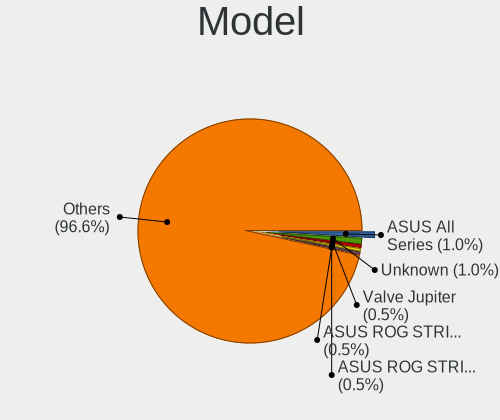
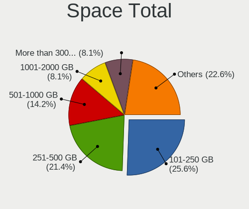
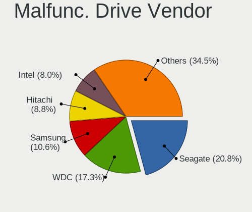
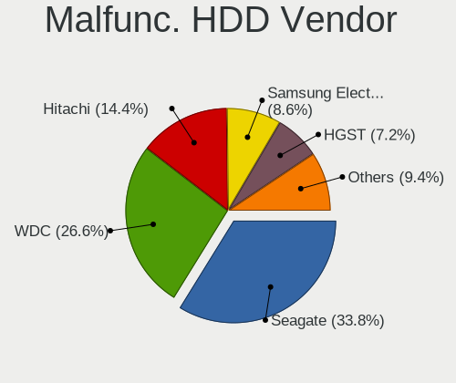
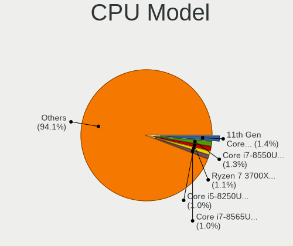
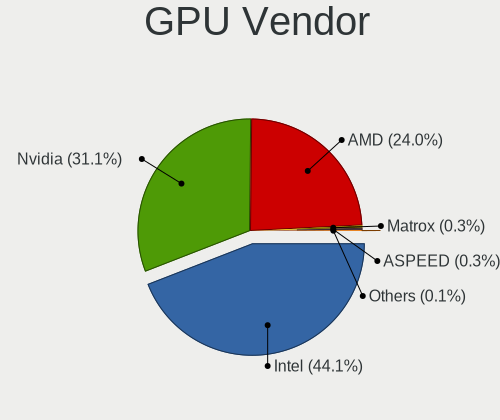
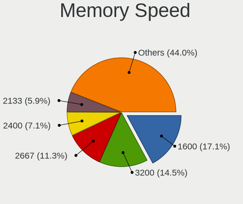
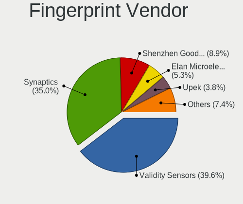
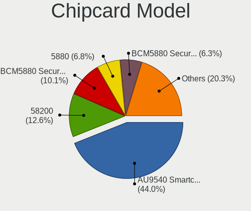

Linux in Sweden - Tested Hardware & Statistics
----------------------------------------------

A project to collect tested hardware configurations for Linux in Sweden.

Anyone can contribute to this report by the [hw-probe](https://github.com/linuxhw/hw-probe) tool:

    sudo -E hw-probe -all -upload

Please contribute! Especially if your hardware is rare.

This is a report for all computer types. See also reports for [desktops](/Location/Sweden/Desktop/README.md) and [notebooks](/Location/Sweden/Notebook/README.md).

Contents
--------

* [ Test Cases ](#test-cases)

* [ System ](#system)
  - [ OS                       ](#os)
  - [ OS Family                ](#os-family)
  - [ Kernel                   ](#kernel)
  - [ Kernel Family            ](#kernel-family)
  - [ Kernel Major Ver.        ](#kernel-major-ver)
  - [ Arch                     ](#arch)
  - [ DE                       ](#de)
  - [ Display Server           ](#display-server)
  - [ Display Manager          ](#display-manager)
  - [ OS Lang                  ](#os-lang)
  - [ Boot Mode                ](#boot-mode)
  - [ Filesystem               ](#filesystem)
  - [ Part. scheme             ](#part-scheme)
  - [ Dual Boot with Linux/BSD ](#dual-boot-with-linuxbsd)
  - [ Dual Boot (Win)          ](#dual-boot-win)

* [ Board ](#board)
  - [ Vendor                   ](#vendor)
  - [ Model                    ](#model)
  - [ Model Family             ](#model-family)
  - [ MFG Year                 ](#mfg-year)
  - [ Form Factor              ](#form-factor)
  - [ Secure Boot              ](#secure-boot)
  - [ Coreboot                 ](#coreboot)
  - [ RAM Size                 ](#ram-size)
  - [ RAM Used                 ](#ram-used)
  - [ Total Drives             ](#total-drives)
  - [ Has CD-ROM               ](#has-cd-rom)
  - [ Has Ethernet             ](#has-ethernet)
  - [ Has WiFi                 ](#has-wifi)
  - [ Has Bluetooth            ](#has-bluetooth)

* [ Location ](#location)
  - [ Country                  ](#country)
  - [ City                     ](#city)

* [ Drives ](#drives)
  - [ Drive Vendor             ](#drive-vendor)
  - [ Drive Model              ](#drive-model)
  - [ HDD Vendor               ](#hdd-vendor)
  - [ SSD Vendor               ](#ssd-vendor)
  - [ Drive Kind               ](#drive-kind)
  - [ Drive Connector          ](#drive-connector)
  - [ Drive Size               ](#drive-size)
  - [ Space Total              ](#space-total)
  - [ Space Used               ](#space-used)
  - [ Malfunc. Drives          ](#malfunc-drives)
  - [ Malfunc. Drive Vendor    ](#malfunc-drive-vendor)
  - [ Malfunc. HDD Vendor      ](#malfunc-hdd-vendor)
  - [ Malfunc. Drive Kind      ](#malfunc-drive-kind)
  - [ Failed Drives            ](#failed-drives)
  - [ Failed Drive Vendor      ](#failed-drive-vendor)
  - [ Drive Status             ](#drive-status)

* [ Storage controller ](#storage-controller)
  - [ Storage Vendor           ](#storage-vendor)
  - [ Storage Model            ](#storage-model)
  - [ Storage Kind             ](#storage-kind)

* [ Processor ](#processor)
  - [ CPU Vendor               ](#cpu-vendor)
  - [ CPU Model                ](#cpu-model)
  - [ CPU Model Family         ](#cpu-model-family)
  - [ CPU Cores                ](#cpu-cores)
  - [ CPU Sockets              ](#cpu-sockets)
  - [ CPU Threads              ](#cpu-threads)
  - [ CPU Op-Modes             ](#cpu-op-modes)
  - [ CPU Microcode            ](#cpu-microcode)
  - [ CPU Microarch            ](#cpu-microarch)

* [ Graphics ](#graphics)
  - [ GPU Vendor               ](#gpu-vendor)
  - [ GPU Model                ](#gpu-model)
  - [ GPU Combo                ](#gpu-combo)
  - [ GPU Driver               ](#gpu-driver)
  - [ GPU Memory               ](#gpu-memory)

* [ Monitor ](#monitor)
  - [ Monitor Vendor           ](#monitor-vendor)
  - [ Monitor Model            ](#monitor-model)
  - [ Monitor Resolution       ](#monitor-resolution)
  - [ Monitor Diagonal         ](#monitor-diagonal)
  - [ Monitor Width            ](#monitor-width)
  - [ Aspect Ratio             ](#aspect-ratio)
  - [ Monitor Area             ](#monitor-area)
  - [ Pixel Density            ](#pixel-density)
  - [ Multiple Monitors        ](#multiple-monitors)

* [ Network ](#network)
  - [ Net Controller Vendor    ](#net-controller-vendor)
  - [ Net Controller Model     ](#net-controller-model)
  - [ Wireless Vendor          ](#wireless-vendor)
  - [ Wireless Model           ](#wireless-model)
  - [ Ethernet Vendor          ](#ethernet-vendor)
  - [ Ethernet Model           ](#ethernet-model)
  - [ Net Controller Kind      ](#net-controller-kind)
  - [ Used Controller          ](#used-controller)
  - [ NICs                     ](#nics)
  - [ IPv6                     ](#ipv6)

* [ Bluetooth ](#bluetooth)
  - [ Bluetooth Vendor         ](#bluetooth-vendor)
  - [ Bluetooth Model          ](#bluetooth-model)

* [ Sound ](#sound)
  - [ Sound Vendor             ](#sound-vendor)
  - [ Sound Model              ](#sound-model)

* [ Memory ](#memory)
  - [ Memory Vendor            ](#memory-vendor)
  - [ Memory Model             ](#memory-model)
  - [ Memory Kind              ](#memory-kind)
  - [ Memory Form Factor       ](#memory-form-factor)
  - [ Memory Size              ](#memory-size)
  - [ Memory Speed             ](#memory-speed)

* [ Printers & scanners ](#printers--scanners)
  - [ Printer Vendor           ](#printer-vendor)
  - [ Printer Model            ](#printer-model)
  - [ Scanner Vendor           ](#scanner-vendor)
  - [ Scanner Model            ](#scanner-model)

* [ Camera ](#camera)
  - [ Camera Vendor            ](#camera-vendor)
  - [ Camera Model             ](#camera-model)

* [ Security ](#security)
  - [ Fingerprint Vendor       ](#fingerprint-vendor)
  - [ Fingerprint Model        ](#fingerprint-model)
  - [ Chipcard Vendor          ](#chipcard-vendor)
  - [ Chipcard Model           ](#chipcard-model)

* [ Unsupported ](#unsupported)
  - [ Unsupported Devices      ](#unsupported-devices)
  - [ Unsupported Device Types ](#unsupported-device-types)

Test Cases
----------

Total: 4334

| Vendor        | Model                       | Form-Factor | Probe                                                      | Date         |
|---------------|-----------------------------|-------------|------------------------------------------------------------|--------------|
| Lenovo        | ThinkPad 11e 5th Gen 20L... | Notebook    | [f10a0edbdf](https://linux-hardware.org/?probe=f10a0edbdf) | Jan 06, 2025 |
| ASUSTek       | TUF Z370-PLUS GAMING II     | Desktop     | [10fd8ef9dd](https://linux-hardware.org/?probe=10fd8ef9dd) | Jan 06, 2025 |
| PC Engines    | apu4                        | Desktop     | [bfa66c5393](https://linux-hardware.org/?probe=bfa66c5393) | Jan 05, 2025 |
| Lenovo        | ThinkPad X1 Tablet Gen 2... | Tablet      | [ba288e243c](https://linux-hardware.org/?probe=ba288e243c) | Jan 05, 2025 |
| MSI           | B650M GAMING PLUS WIFI      | Desktop     | [c7c27f65c6](https://linux-hardware.org/?probe=c7c27f65c6) | Jan 05, 2025 |
| MSI           | B650M GAMING PLUS WIFI      | Desktop     | [945b45d496](https://linux-hardware.org/?probe=945b45d496) | Jan 05, 2025 |
| Apple         | MacBook3,1                  | Notebook    | [be78213991](https://linux-hardware.org/?probe=be78213991) | Jan 05, 2025 |
| Intel         | NUC7JYB M37316-600          | Mini pc     | [adb5d55cf4](https://linux-hardware.org/?probe=adb5d55cf4) | Jan 04, 2025 |
| MSI           | PRO Z790-P WIFI             | Desktop     | [3327ba6eb6](https://linux-hardware.org/?probe=3327ba6eb6) | Jan 04, 2025 |
| ASRock        | B550M-HDV                   | Desktop     | [6ce988b582](https://linux-hardware.org/?probe=6ce988b582) | Jan 04, 2025 |
| Lenovo        | ThinkPad E16 Gen 2 21M5C... | Notebook    | [891b36fe2c](https://linux-hardware.org/?probe=891b36fe2c) | Jan 04, 2025 |
| Lenovo        | ThinkPad E16 Gen 2 21M5C... | Notebook    | [7b5bde2cbf](https://linux-hardware.org/?probe=7b5bde2cbf) | Jan 04, 2025 |
| ASUSTek       | TUF Gaming B550-PLUS        | Desktop     | [989a72852c](https://linux-hardware.org/?probe=989a72852c) | Jan 04, 2025 |
| Lenovo        | ThinkPad X1 Carbon 6th 2... | Notebook    | [437234b838](https://linux-hardware.org/?probe=437234b838) | Jan 04, 2025 |
| Maibenben     | MaiBook M Series            | Notebook    | [0d480fbbc9](https://linux-hardware.org/?probe=0d480fbbc9) | Jan 04, 2025 |
| Acer          | Nitro AN16-41               | Notebook    | [dedf248848](https://linux-hardware.org/?probe=dedf248848) | Jan 03, 2025 |
| Intel         | NUC7JYB M37316-600          | Mini pc     | [88e255ba8a](https://linux-hardware.org/?probe=88e255ba8a) | Jan 03, 2025 |
| Lenovo        | SHARKBAY SDK0J40705 WIN ... | Desktop     | [39187b7cd2](https://linux-hardware.org/?probe=39187b7cd2) | Jan 03, 2025 |
| ASUSTek       | PN50                        | Mini pc     | [0c16b7182b](https://linux-hardware.org/?probe=0c16b7182b) | Jan 03, 2025 |
| ASUSTek       | PN50                        | Mini pc     | [5227f55572](https://linux-hardware.org/?probe=5227f55572) | Jan 03, 2025 |
| HP            | Laptop 15s-eq2xxx           | Notebook    | [37b47880bb](https://linux-hardware.org/?probe=37b47880bb) | Jan 02, 2025 |
| Lenovo        | ThinkPad X1 Carbon 6th 2... | Notebook    | [3df95b02eb](https://linux-hardware.org/?probe=3df95b02eb) | Jan 02, 2025 |
| ASUSTek       | Pro B650M-CT                | Desktop     | [eeb61bea29](https://linux-hardware.org/?probe=eeb61bea29) | Jan 02, 2025 |
| HP            | ZBook 15u G3                | Notebook    | [da5c26013c](https://linux-hardware.org/?probe=da5c26013c) | Jan 02, 2025 |
| ASUSTek       | ASUS TUF Gaming A14 FA40... | Notebook    | [97c438ca9c](https://linux-hardware.org/?probe=97c438ca9c) | Jan 01, 2025 |
| Lenovo        | G50-30 80G0                 | Notebook    | [f9d8f3d7a1](https://linux-hardware.org/?probe=f9d8f3d7a1) | Jan 01, 2025 |
| Packard Be... | EasyNote MH36               | Notebook    | [f8b0243bfd](https://linux-hardware.org/?probe=f8b0243bfd) | Jan 01, 2025 |
| Acer          | Predator PH315-53           | Notebook    | [17816e7d6b](https://linux-hardware.org/?probe=17816e7d6b) | Jan 01, 2025 |
| ASUSTek       | TUF Gaming B550M-PLUS WI... | Desktop     | [66588a9985](https://linux-hardware.org/?probe=66588a9985) | Dec 31, 2024 |
| Acer          | Aspire AG14-31P             | Notebook    | [7c9a6f02f0](https://linux-hardware.org/?probe=7c9a6f02f0) | Dec 29, 2024 |
| Lenovo        | IdeaPad 710S Plus-13IKB ... | Notebook    | [4d428ff2fd](https://linux-hardware.org/?probe=4d428ff2fd) | Dec 28, 2024 |
| Fujitsu Si... | ESPRIMO Mobile V5555        | Notebook    | [e443699b8d](https://linux-hardware.org/?probe=e443699b8d) | Dec 28, 2024 |
| Lenovo        | IdeaPad 710S Plus-13IKB ... | Notebook    | [fd2a217520](https://linux-hardware.org/?probe=fd2a217520) | Dec 28, 2024 |
| MSI           | MPG X570 GAMING PLUS        | Desktop     | [497960e510](https://linux-hardware.org/?probe=497960e510) | Dec 28, 2024 |
| ASUSTek       | Vivobook Go E1404FA_E140... | Notebook    | [0ac54971da](https://linux-hardware.org/?probe=0ac54971da) | Dec 28, 2024 |
| ASUSTek       | ROG STRIX Z390-F GAMING     | Desktop     | [62c4f7de88](https://linux-hardware.org/?probe=62c4f7de88) | Dec 27, 2024 |
| Acer          | Nitro AN16-41               | Notebook    | [8521ef1a55](https://linux-hardware.org/?probe=8521ef1a55) | Dec 27, 2024 |
| Lenovo        | SHARKBAY 0B98417 WIN        | Desktop     | [8c5e303e5b](https://linux-hardware.org/?probe=8c5e303e5b) | Dec 27, 2024 |
| Acer          | Aspire ES1-311              | Notebook    | [d4cf291b46](https://linux-hardware.org/?probe=d4cf291b46) | Dec 26, 2024 |
| ASUSTek       | ASUS EXPERTBOOK B3404CVA... | Notebook    | [8bc927ee5a](https://linux-hardware.org/?probe=8bc927ee5a) | Dec 26, 2024 |
| ASUSTek       | G75VW                       | Notebook    | [6f5eceb221](https://linux-hardware.org/?probe=6f5eceb221) | Dec 26, 2024 |
| MSI           | MPG B650I EDGE WIFI         | Desktop     | [9f7cf29dd9](https://linux-hardware.org/?probe=9f7cf29dd9) | Dec 25, 2024 |
| Gigabyte      | MRHM3AP                     | Desktop     | [657c4947e4](https://linux-hardware.org/?probe=657c4947e4) | Dec 25, 2024 |
| HP            | ZBook 15u G5                | Notebook    | [639f1b214f](https://linux-hardware.org/?probe=639f1b214f) | Dec 24, 2024 |
| ASUSTek       | TUF Gaming X570-PLUS        | Desktop     | [ce9f60c0b5](https://linux-hardware.org/?probe=ce9f60c0b5) | Dec 23, 2024 |
| Fujitsu Si... | ESPRIMO Mobile V5555        | Notebook    | [0a16cb4410](https://linux-hardware.org/?probe=0a16cb4410) | Dec 22, 2024 |
| HP            | ZBook 15 G2                 | Notebook    | [64c7294576](https://linux-hardware.org/?probe=64c7294576) | Dec 22, 2024 |
| Apple         | Mac-BE088AF8C5EB4FA2 iMa... | All in one  | [eda26270c4](https://linux-hardware.org/?probe=eda26270c4) | Dec 22, 2024 |
| HP            | Notebook                    | Notebook    | [0382c42708](https://linux-hardware.org/?probe=0382c42708) | Dec 21, 2024 |
| ASUSTek       | PRIME B450-PLUS             | Desktop     | [26585ec299](https://linux-hardware.org/?probe=26585ec299) | Dec 21, 2024 |
| Lenovo        | ThinkPad T410 2518R8G       | Notebook    | [03e23c615f](https://linux-hardware.org/?probe=03e23c615f) | Dec 21, 2024 |
| HP            | Laptop 15s-eq2xxx           | Notebook    | [ff85345164](https://linux-hardware.org/?probe=ff85345164) | Dec 21, 2024 |
| MSI           | MAG Z390M MORTAR            | Desktop     | [9d83ee575e](https://linux-hardware.org/?probe=9d83ee575e) | Dec 20, 2024 |
| ASUSTek       | N61Vn                       | Notebook    | [47db61a704](https://linux-hardware.org/?probe=47db61a704) | Dec 20, 2024 |
| ASUSTek       | ROG STRIX X870E-E GAMING... | Desktop     | [73af2fce67](https://linux-hardware.org/?probe=73af2fce67) | Dec 20, 2024 |
| Lenovo        | SHARKBAY 0B98417 WIN        | Desktop     | [78c7a48933](https://linux-hardware.org/?probe=78c7a48933) | Dec 20, 2024 |
| ASUSTek       | K30BF_M32BF_A_F_K31BF_6     | Desktop     | [afd9e8ca40](https://linux-hardware.org/?probe=afd9e8ca40) | Dec 19, 2024 |
| Gigabyte      | Z77-DS3H                    | Desktop     | [edefe68947](https://linux-hardware.org/?probe=edefe68947) | Dec 19, 2024 |
| Lenovo        | ThinkPad E16 Gen 2 21M5C... | Notebook    | [224bf763b0](https://linux-hardware.org/?probe=224bf763b0) | Dec 19, 2024 |
| Sony          | VGN-FZ31M                   | Notebook    | [11db51fc55](https://linux-hardware.org/?probe=11db51fc55) | Dec 17, 2024 |
| HP            | Notebook                    | Notebook    | [cd9bb8bac9](https://linux-hardware.org/?probe=cd9bb8bac9) | Dec 17, 2024 |
| Packard Be... | EasyNote MH36               | Notebook    | [504944e21f](https://linux-hardware.org/?probe=504944e21f) | Dec 15, 2024 |
| Lenovo        | ThinkPad Edge E530c 3366... | Notebook    | [e73050a450](https://linux-hardware.org/?probe=e73050a450) | Dec 15, 2024 |
| Dell          | 0YNVJG A01                  | Desktop     | [463e6f71a4](https://linux-hardware.org/?probe=463e6f71a4) | Dec 14, 2024 |
| Lenovo        | G50-30 80G0                 | Notebook    | [5720b04708](https://linux-hardware.org/?probe=5720b04708) | Dec 13, 2024 |
| HP            | ProBook 445 14 inch G9 N... | Notebook    | [2b25226ef6](https://linux-hardware.org/?probe=2b25226ef6) | Dec 13, 2024 |
| ASUSTek       | P8Z77-V LK                  | Desktop     | [d58cfe7ef7](https://linux-hardware.org/?probe=d58cfe7ef7) | Dec 13, 2024 |
| Gigabyte      | Z270-Gaming K3              | Desktop     | [ba5e989ad6](https://linux-hardware.org/?probe=ba5e989ad6) | Dec 13, 2024 |
| Lenovo        | G50-30 80G0                 | Notebook    | [7c957f114c](https://linux-hardware.org/?probe=7c957f114c) | Dec 13, 2024 |
| ASUSTek       | Vivobook Go E1504FA_E150... | Notebook    | [66470f4176](https://linux-hardware.org/?probe=66470f4176) | Dec 12, 2024 |
| HP            | EliteBook 8740w             | Notebook    | [70d44e5e32](https://linux-hardware.org/?probe=70d44e5e32) | Dec 10, 2024 |
| HP            | EliteBook 8740w             | Notebook    | [88b25b7b18](https://linux-hardware.org/?probe=88b25b7b18) | Dec 10, 2024 |
| HP            | ZBook 15v G5                | Notebook    | [9db28aa3ea](https://linux-hardware.org/?probe=9db28aa3ea) | Dec 09, 2024 |
| Lenovo        | IdeaPad Slim 3 14IAH8 83... | Notebook    | [132e6e2862](https://linux-hardware.org/?probe=132e6e2862) | Dec 09, 2024 |
| Lenovo        | Yoga Slim 6 14IAP8 82WU     | Notebook    | [ecbb2dfb26](https://linux-hardware.org/?probe=ecbb2dfb26) | Dec 07, 2024 |
| Notebook      | NS5x_NS7xAU                 | Notebook    | [dd558adef8](https://linux-hardware.org/?probe=dd558adef8) | Dec 07, 2024 |
| MSI           | MPG Z390I GAMING EDGE AC    | Desktop     | [e3f868a672](https://linux-hardware.org/?probe=e3f868a672) | Dec 07, 2024 |
| Acer          | Aspire ES1-311              | Notebook    | [e5308635b1](https://linux-hardware.org/?probe=e5308635b1) | Dec 06, 2024 |
| ASUSTek       | ASUS TUF Gaming F15 FX50... | Notebook    | [3497127dba](https://linux-hardware.org/?probe=3497127dba) | Dec 05, 2024 |
| ASUSTek       | ROG STRIX B550-I GAMING     | Desktop     | [5dc52b902d](https://linux-hardware.org/?probe=5dc52b902d) | Dec 05, 2024 |
| Lenovo        | ThinkPad Edge E540 20C60... | Notebook    | [8270c3a002](https://linux-hardware.org/?probe=8270c3a002) | Dec 05, 2024 |
| MSI           | GE60 2PE                    | Notebook    | [bab5d77c34](https://linux-hardware.org/?probe=bab5d77c34) | Dec 04, 2024 |
| Lenovo        | Legion Slim 5 16APH8 82Y... | Notebook    | [6d37f99660](https://linux-hardware.org/?probe=6d37f99660) | Dec 04, 2024 |
| Lenovo        | 318E SDK0T76530 WIN 3556... | Desktop     | [fc10338586](https://linux-hardware.org/?probe=fc10338586) | Dec 04, 2024 |
| MSI           | MS-B120                     | Mini pc     | [b470c6f201](https://linux-hardware.org/?probe=b470c6f201) | Dec 04, 2024 |
| Lenovo        | 318E SDK0T76530 WIN 3556... | Desktop     | [3970b3f161](https://linux-hardware.org/?probe=3970b3f161) | Dec 04, 2024 |
| HP            | ZBook 15v G5                | Notebook    | [0d4d759913](https://linux-hardware.org/?probe=0d4d759913) | Dec 03, 2024 |
| ASUSTek       | ROG STRIX B550-F GAMING     | Desktop     | [f392f0cb5f](https://linux-hardware.org/?probe=f392f0cb5f) | Dec 02, 2024 |
| ASUSTek       | ROG STRIX X870E-E GAMING... | Desktop     | [6a87bc023b](https://linux-hardware.org/?probe=6a87bc023b) | Dec 02, 2024 |
| ASUSTek       | ROG STRIX B650E-I GAMING... | Desktop     | [25ba31756c](https://linux-hardware.org/?probe=25ba31756c) | Dec 01, 2024 |
| MSI           | MAG Z390M MORTAR            | Desktop     | [316e018639](https://linux-hardware.org/?probe=316e018639) | Dec 01, 2024 |
| ASUSTek       | P6T DELUXE V2               | Desktop     | [fa59a3d752](https://linux-hardware.org/?probe=fa59a3d752) | Dec 01, 2024 |
| HP            | ENVY x360 2-in-1 Laptop ... | Convertible | [0ff47a4a36](https://linux-hardware.org/?probe=0ff47a4a36) | Dec 01, 2024 |
| HP            | ZBook 15u G3                | Notebook    | [c4aba38081](https://linux-hardware.org/?probe=c4aba38081) | Dec 01, 2024 |
| ASUSTek       | ROG STRIX B550-A GAMING     | Desktop     | [cfe2d2980e](https://linux-hardware.org/?probe=cfe2d2980e) | Dec 01, 2024 |
| Gigabyte      | B650M GAMING X AX           | Desktop     | [20e65bc531](https://linux-hardware.org/?probe=20e65bc531) | Nov 30, 2024 |
| HP            | Laptop 17-cp0xxx            | Notebook    | [f9f30dfbbc](https://linux-hardware.org/?probe=f9f30dfbbc) | Nov 29, 2024 |
| HP            | 2820h                       | Desktop     | [ef90aa8270](https://linux-hardware.org/?probe=ef90aa8270) | Nov 28, 2024 |
| ASRock        | FM2A68M-HD+                 | Desktop     | [abbaade865](https://linux-hardware.org/?probe=abbaade865) | Nov 28, 2024 |
| ASUSTek       | G75VW                       | Notebook    | [4dd4121257](https://linux-hardware.org/?probe=4dd4121257) | Nov 28, 2024 |
| Apple         | Mac-F2218FA9                | All in one  | [3972b418fc](https://linux-hardware.org/?probe=3972b418fc) | Nov 27, 2024 |
| HP            | ENVY x360 2-in-1 Laptop ... | Convertible | [aa2f42d44f](https://linux-hardware.org/?probe=aa2f42d44f) | Nov 27, 2024 |
| Dell          | XPS 9320                    | Notebook    | [eade833b62](https://linux-hardware.org/?probe=eade833b62) | Nov 27, 2024 |
| ASUSTek       | ASUS TUF Gaming A16 FA60... | Notebook    | [bbcfd5f2d1](https://linux-hardware.org/?probe=bbcfd5f2d1) | Nov 26, 2024 |
| Apple         | Mac-F2218FA9                | All in one  | [73767665be](https://linux-hardware.org/?probe=73767665be) | Nov 26, 2024 |
| ASUSTek       | ASUS TUF Gaming A16 FA60... | Notebook    | [a6e55209bb](https://linux-hardware.org/?probe=a6e55209bb) | Nov 26, 2024 |
| ASUSTek       | PRIME B550M-K               | Desktop     | [4149e55c02](https://linux-hardware.org/?probe=4149e55c02) | Nov 25, 2024 |
| Dell          | 030VXY A05                  | Desktop     | [4897f51a88](https://linux-hardware.org/?probe=4897f51a88) | Nov 25, 2024 |
| Qualcomm T... | trinket pm6125 + pmi632 ... | Phone       | [fca61f0ba2](https://linux-hardware.org/?probe=fca61f0ba2) | Nov 25, 2024 |
| Qualcomm T... | trinket pm6125 + pmi632 ... | Phone       | [51ef169740](https://linux-hardware.org/?probe=51ef169740) | Nov 25, 2024 |
| AOpen         | nMCP7ALPx-DE R1.07 Apr.1... | Desktop     | [52acb29b24](https://linux-hardware.org/?probe=52acb29b24) | Nov 24, 2024 |
| Valve         | Jupiter                     | Notebook    | [99d0e12698](https://linux-hardware.org/?probe=99d0e12698) | Nov 24, 2024 |
| ASUSTek       | PRIME Z690-A                | Desktop     | [082fbca187](https://linux-hardware.org/?probe=082fbca187) | Nov 24, 2024 |
| Lenovo        | ThinkPad X1 Carbon 6th 2... | Notebook    | [0ff652bb11](https://linux-hardware.org/?probe=0ff652bb11) | Nov 23, 2024 |
| Intel         | NUC7JYB M37316-600          | Mini pc     | [99d9097a4b](https://linux-hardware.org/?probe=99d9097a4b) | Nov 23, 2024 |
| HP            | x2 210 G2                   | Tablet      | [042a3da123](https://linux-hardware.org/?probe=042a3da123) | Nov 23, 2024 |
| Lenovo        | IdeaPad 720S-13IKB 81A8     | Notebook    | [c2678e2d05](https://linux-hardware.org/?probe=c2678e2d05) | Nov 23, 2024 |
| HONOR         | MRA-XXX                     | Notebook    | [eeaf09c1eb](https://linux-hardware.org/?probe=eeaf09c1eb) | Nov 22, 2024 |
| MSI           | B650 GAMING PLUS WIFI       | Desktop     | [6089d004eb](https://linux-hardware.org/?probe=6089d004eb) | Nov 22, 2024 |
| HONOR         | MRA-XXX                     | Notebook    | [605e47c8d8](https://linux-hardware.org/?probe=605e47c8d8) | Nov 22, 2024 |
| Acer          | Aspire 5740                 | Notebook    | [53795ba4cd](https://linux-hardware.org/?probe=53795ba4cd) | Nov 22, 2024 |
| HP            | 212B                        | Desktop     | [00b61e1475](https://linux-hardware.org/?probe=00b61e1475) | Nov 21, 2024 |
| Unknown       | Apple MacBook Pro (13-in... | Notebook    | [40b777045b](https://linux-hardware.org/?probe=40b777045b) | Nov 21, 2024 |
| MSI           | MS-B120                     | Mini pc     | [3da903450a](https://linux-hardware.org/?probe=3da903450a) | Nov 20, 2024 |
| Lenovo        | ThinkBook 16p Gen 2 20YM    | Notebook    | [70dcc9416f](https://linux-hardware.org/?probe=70dcc9416f) | Nov 19, 2024 |
| Samsung       | SDNE-R78AA2-10              | Desktop     | [fc38d1bb92](https://linux-hardware.org/?probe=fc38d1bb92) | Nov 19, 2024 |
| Gigabyte      | B550 AORUS ELITE V2         | Desktop     | [065b59e739](https://linux-hardware.org/?probe=065b59e739) | Nov 18, 2024 |
| Lenovo        | Legion 5 Pro 16ARH7H 82R... | Notebook    | [91797321da](https://linux-hardware.org/?probe=91797321da) | Nov 18, 2024 |
| ASUSTek       | TUF Gaming B650-PLUS        | Desktop     | [863de0f556](https://linux-hardware.org/?probe=863de0f556) | Nov 18, 2024 |
| Acer          | Aspire V5-552               | Notebook    | [a8ad78f7fb](https://linux-hardware.org/?probe=a8ad78f7fb) | Nov 13, 2024 |
| HP            | ZBook Firefly 15 inch G8... | Notebook    | [b1f86eb24f](https://linux-hardware.org/?probe=b1f86eb24f) | Nov 13, 2024 |
| HP            | ZBook Firefly 15 inch G8... | Notebook    | [4bbedaf665](https://linux-hardware.org/?probe=4bbedaf665) | Nov 13, 2024 |
| Acer          | Aspire ES1-311              | Notebook    | [eec78bb1ce](https://linux-hardware.org/?probe=eec78bb1ce) | Nov 13, 2024 |
| ASUSTek       | TUF Gaming B550-PRO         | Desktop     | [6b464926ac](https://linux-hardware.org/?probe=6b464926ac) | Nov 12, 2024 |
| ASUSTek       | TUF Gaming B550-PRO         | Desktop     | [105c091b25](https://linux-hardware.org/?probe=105c091b25) | Nov 12, 2024 |
| Lenovo        | V15 G2 ALC 82KD             | Notebook    | [a74cceeb11](https://linux-hardware.org/?probe=a74cceeb11) | Nov 12, 2024 |
| HP            | 802F                        | Desktop     | [9f7785c4f0](https://linux-hardware.org/?probe=9f7785c4f0) | Nov 11, 2024 |
| Rockchip      | Unknown                     | Soc         | [7bbadde3c4](https://linux-hardware.org/?probe=7bbadde3c4) | Nov 11, 2024 |
| Gigabyte      | 970A-DS3P                   | Desktop     | [793ecd3f68](https://linux-hardware.org/?probe=793ecd3f68) | Nov 10, 2024 |
| Gigabyte      | H270N-WIFI-CF               | Desktop     | [42acfb656c](https://linux-hardware.org/?probe=42acfb656c) | Nov 10, 2024 |
| Lenovo        | IdeaPad 3 14ALC6 82KT       | Notebook    | [7ed663f998](https://linux-hardware.org/?probe=7ed663f998) | Nov 10, 2024 |
| HP            | Pavilion Notebook           | Notebook    | [f28a41ee26](https://linux-hardware.org/?probe=f28a41ee26) | Nov 09, 2024 |
| ASUSTek       | PRIME A520M-K               | Desktop     | [3c0fea8e9f](https://linux-hardware.org/?probe=3c0fea8e9f) | Nov 09, 2024 |
| ASUSTek       | TUF Gaming B650-PLUS WIF... | Desktop     | [2eab075abe](https://linux-hardware.org/?probe=2eab075abe) | Nov 08, 2024 |
| Lenovo        | ThinkPad T470s 20HGS0AE0... | Notebook    | [4f605f33f1](https://linux-hardware.org/?probe=4f605f33f1) | Nov 07, 2024 |
| Apple         | Mac-BE088AF8C5EB4FA2 iMa... | All in one  | [f573142825](https://linux-hardware.org/?probe=f573142825) | Nov 07, 2024 |
| Lenovo        | ThinkPad T480s 20L8S3YG2... | Notebook    | [1fc7c10c39](https://linux-hardware.org/?probe=1fc7c10c39) | Nov 06, 2024 |
| Lenovo        | ThinkPad T480s 20L8S3YG2... | Notebook    | [bb9e9ced42](https://linux-hardware.org/?probe=bb9e9ced42) | Nov 06, 2024 |
| Gigabyte      | GA-78LMT-USB3 x.x           | Desktop     | [cd945e57fa](https://linux-hardware.org/?probe=cd945e57fa) | Nov 06, 2024 |
| ASUSTek       | TUF Gaming FX505DT_FX505... | Notebook    | [689c7827b7](https://linux-hardware.org/?probe=689c7827b7) | Nov 06, 2024 |
| Packard Be... | EasyNote TE69KB             | Notebook    | [a9167be106](https://linux-hardware.org/?probe=a9167be106) | Nov 04, 2024 |
| HP            | ENVY x360 2-in-1 Laptop ... | Convertible | [360ce01376](https://linux-hardware.org/?probe=360ce01376) | Nov 02, 2024 |
| ASUSTek       | P8H67-I PRO                 | Desktop     | [628396ae4e](https://linux-hardware.org/?probe=628396ae4e) | Nov 01, 2024 |
| Dell          | Vostro 3400                 | Notebook    | [40faeffee1](https://linux-hardware.org/?probe=40faeffee1) | Nov 01, 2024 |
| HP            | Laptop 14-em0xxx            | Notebook    | [21d6b4b16b](https://linux-hardware.org/?probe=21d6b4b16b) | Oct 31, 2024 |
| HUAWEI        | MACH-WX9                    | Notebook    | [2bbf4ba8da](https://linux-hardware.org/?probe=2bbf4ba8da) | Oct 31, 2024 |
| Intel         | NUC7JYB M37316-600          | Mini pc     | [ad57f56740](https://linux-hardware.org/?probe=ad57f56740) | Oct 31, 2024 |
| ASUSTek       | X555LN                      | Notebook    | [f2a9ec42b4](https://linux-hardware.org/?probe=f2a9ec42b4) | Oct 30, 2024 |
| ASUSTek       | TUF Gaming B760-PLUS WIF... | Desktop     | [b337c998c8](https://linux-hardware.org/?probe=b337c998c8) | Oct 29, 2024 |
| Valve         | Jupiter                     | Notebook    | [9da334fd4b](https://linux-hardware.org/?probe=9da334fd4b) | Oct 27, 2024 |
| Acer          | Aspire XC-605               | Desktop     | [5b81ea0b2c](https://linux-hardware.org/?probe=5b81ea0b2c) | Oct 27, 2024 |
| Biostar       | H61B                        | Desktop     | [8f99971503](https://linux-hardware.org/?probe=8f99971503) | Oct 26, 2024 |
| Dell          | XPS 13 9310                 | Notebook    | [581cea7035](https://linux-hardware.org/?probe=581cea7035) | Oct 26, 2024 |
| Lenovo        | IdeaPadFlex 5 14ALC05 82... | Convertible | [dbfc1fb818](https://linux-hardware.org/?probe=dbfc1fb818) | Oct 26, 2024 |
| HP            | 1589                        | Desktop     | [bdb7b0a0fd](https://linux-hardware.org/?probe=bdb7b0a0fd) | Oct 24, 2024 |
| Dell          | 0RW203                      | Desktop     | [8f67b240ff](https://linux-hardware.org/?probe=8f67b240ff) | Oct 23, 2024 |
| Dell          | 0RW203                      | Desktop     | [c6efdeaade](https://linux-hardware.org/?probe=c6efdeaade) | Oct 23, 2024 |
| ASUSTek       | G75VW                       | Notebook    | [16c95d4388](https://linux-hardware.org/?probe=16c95d4388) | Oct 22, 2024 |
| ASUSTek       | Z97-A                       | Desktop     | [392383fa83](https://linux-hardware.org/?probe=392383fa83) | Oct 22, 2024 |
| ASUSTek       | Z97-A                       | Desktop     | [f4f8b79407](https://linux-hardware.org/?probe=f4f8b79407) | Oct 22, 2024 |
| MSI           | MS-B120                     | Mini pc     | [41da7e57a6](https://linux-hardware.org/?probe=41da7e57a6) | Oct 22, 2024 |
| Lenovo        | ThinkPad T490 20N2005TMX    | Notebook    | [ae1d5a2073](https://linux-hardware.org/?probe=ae1d5a2073) | Oct 21, 2024 |
| ASUSTek       | K73BY                       | Notebook    | [183ebc94a6](https://linux-hardware.org/?probe=183ebc94a6) | Oct 20, 2024 |
| Acer          | Aspire XC-885 V:1.1         | Desktop     | [8f6c21a493](https://linux-hardware.org/?probe=8f6c21a493) | Oct 20, 2024 |
| ASUSTek       | ROG STRIX B450-F GAMING     | Desktop     | [ff6ad443e3](https://linux-hardware.org/?probe=ff6ad443e3) | Oct 20, 2024 |
| ASUSTek       | ROG STRIX B450-F GAMING     | Desktop     | [d8ac94db45](https://linux-hardware.org/?probe=d8ac94db45) | Oct 20, 2024 |
| ASUSTek       | PRIME Z370-P                | Desktop     | [57d65c1142](https://linux-hardware.org/?probe=57d65c1142) | Oct 19, 2024 |
| MSI           | X570-A PRO                  | Desktop     | [3afa118cca](https://linux-hardware.org/?probe=3afa118cca) | Oct 19, 2024 |
| Lenovo        | ThinkPad T480s 20L8002VM... | Notebook    | [fee3d99904](https://linux-hardware.org/?probe=fee3d99904) | Oct 19, 2024 |
| ASUSTek       | ROG STRIX B550-F GAMING     | Desktop     | [ffb122efc7](https://linux-hardware.org/?probe=ffb122efc7) | Oct 19, 2024 |
| MSI           | MS-7360                     | Desktop     | [c04ada2651](https://linux-hardware.org/?probe=c04ada2651) | Oct 18, 2024 |
| ASUSTek       | PRIME B450-PLUS             | Desktop     | [184a957e1d](https://linux-hardware.org/?probe=184a957e1d) | Oct 18, 2024 |
| Lenovo        | ThinkPad T14s Gen 2i 20W... | Notebook    | [bf4364a524](https://linux-hardware.org/?probe=bf4364a524) | Oct 18, 2024 |
| Shenzhen M... | F7BSC                       | Mini pc     | [dcafe9615a](https://linux-hardware.org/?probe=dcafe9615a) | Oct 18, 2024 |
| ASUSTek       | Adol_ADOLBOOK I1403ZA_AD... | Notebook    | [def48960d1](https://linux-hardware.org/?probe=def48960d1) | Oct 18, 2024 |
| HP            | EliteBook 840 G7 Noteboo... | Notebook    | [d4a940d38f](https://linux-hardware.org/?probe=d4a940d38f) | Oct 18, 2024 |
| ASUSTek       | TUF Gaming B650-PLUS WIF... | Notebook    | [c0db693df2](https://linux-hardware.org/?probe=c0db693df2) | Oct 17, 2024 |
| HP            | EliteBook 840 G7 Noteboo... | Notebook    | [e43e055615](https://linux-hardware.org/?probe=e43e055615) | Oct 17, 2024 |
| ASUSTek       | TUF Gaming B650-PLUS WIF... | Notebook    | [9b96b8b957](https://linux-hardware.org/?probe=9b96b8b957) | Oct 17, 2024 |
| MSI           | MS-7360                     | Desktop     | [fc490fdde3](https://linux-hardware.org/?probe=fc490fdde3) | Oct 17, 2024 |
| MSI           | PRO B650-P WIFI             | Desktop     | [a61099a91a](https://linux-hardware.org/?probe=a61099a91a) | Oct 16, 2024 |
| Apple         | MacBookPro11,1              | Notebook    | [0b14e22f7e](https://linux-hardware.org/?probe=0b14e22f7e) | Oct 16, 2024 |
| ASUSTek       | PRIME X670-P WIFI           | Desktop     | [8f9499e8d0](https://linux-hardware.org/?probe=8f9499e8d0) | Oct 16, 2024 |
| Lenovo        | Yoga Slim 7 14ARE05 82A2    | Notebook    | [721f67c310](https://linux-hardware.org/?probe=721f67c310) | Oct 15, 2024 |
| Dell          | Inspiron 14 7430 2-in-1     | Convertible | [7666cd37c7](https://linux-hardware.org/?probe=7666cd37c7) | Oct 15, 2024 |
| Lenovo        | ThinkPad T480 20L6S3ED1H    | Notebook    | [ae22524e06](https://linux-hardware.org/?probe=ae22524e06) | Oct 15, 2024 |
| Lenovo        | ThinkPad T480 20L6S3ED1H    | Notebook    | [e86ff90245](https://linux-hardware.org/?probe=e86ff90245) | Oct 15, 2024 |
| Dell          | Latitude E7250              | Notebook    | [ce90b269d6](https://linux-hardware.org/?probe=ce90b269d6) | Oct 14, 2024 |
| HP            | EliteBook 830 G5            | Notebook    | [bab49b9805](https://linux-hardware.org/?probe=bab49b9805) | Oct 14, 2024 |
| Lenovo        | Yoga Slim 7 14ARE05 82A2    | Notebook    | [a9c9a656c3](https://linux-hardware.org/?probe=a9c9a656c3) | Oct 14, 2024 |
| Acer          | RS780HVF                    | Desktop     | [eb68af48f0](https://linux-hardware.org/?probe=eb68af48f0) | Oct 13, 2024 |
| HP            | EliteBook 830 G7 Noteboo... | Notebook    | [2f02059daf](https://linux-hardware.org/?probe=2f02059daf) | Oct 13, 2024 |
| MSI           | MPG X570 GAMING PRO CARB... | Desktop     | [ce0e497ca9](https://linux-hardware.org/?probe=ce0e497ca9) | Oct 12, 2024 |
| Acer          | Aspire ES1-311              | Notebook    | [ad611bc852](https://linux-hardware.org/?probe=ad611bc852) | Oct 12, 2024 |
| Lenovo        | Yoga Slim 7 14ARE05 82A2    | Notebook    | [5ff6f3f1a8](https://linux-hardware.org/?probe=5ff6f3f1a8) | Oct 11, 2024 |
| Lenovo        | ThinkPad T480 20L6S3ED1H    | Notebook    | [8e06db2e61](https://linux-hardware.org/?probe=8e06db2e61) | Oct 11, 2024 |
| Dell          | 0NC2VH A01                  | Desktop     | [8a8122e29b](https://linux-hardware.org/?probe=8a8122e29b) | Oct 10, 2024 |
| HP            | EliteBook 8740w             | Notebook    | [4721f064f7](https://linux-hardware.org/?probe=4721f064f7) | Oct 10, 2024 |
| HP            | EliteBook 830 G5            | Notebook    | [64cebe30ad](https://linux-hardware.org/?probe=64cebe30ad) | Oct 10, 2024 |
| HP            | 2B4B                        | Desktop     | [0591688b19](https://linux-hardware.org/?probe=0591688b19) | Oct 09, 2024 |
| Lenovo        | ThinkPad T480s 20L7S0BM0... | Notebook    | [64ef0dbb14](https://linux-hardware.org/?probe=64ef0dbb14) | Oct 09, 2024 |
| Lenovo        | ThinkPad T480 20L6S3ED1H    | Notebook    | [4994171903](https://linux-hardware.org/?probe=4994171903) | Oct 09, 2024 |
| Apple         | MacBookAir6,2               | Notebook    | [280f27da52](https://linux-hardware.org/?probe=280f27da52) | Oct 08, 2024 |
| ASUSTek       | Vivobook Go E1504FA_E150... | Notebook    | [58dc343bfd](https://linux-hardware.org/?probe=58dc343bfd) | Oct 08, 2024 |
| Acer          | Predator PT516-51s          | Notebook    | [86cb6e091c](https://linux-hardware.org/?probe=86cb6e091c) | Oct 08, 2024 |
| Dell          | XPS 15 9500                 | Notebook    | [855ca0cb21](https://linux-hardware.org/?probe=855ca0cb21) | Oct 08, 2024 |
| Gigabyte      | H270N-WIFI-CF               | Desktop     | [95fc3a979a](https://linux-hardware.org/?probe=95fc3a979a) | Oct 08, 2024 |
| Acer          | Extensa 5620                | Notebook    | [82f3c9f52b](https://linux-hardware.org/?probe=82f3c9f52b) | Oct 08, 2024 |
| MSI           | Cyborg 15 A12VE             | Notebook    | [9130fd797f](https://linux-hardware.org/?probe=9130fd797f) | Oct 07, 2024 |
| HP            | EliteBook 830 G5            | Notebook    | [c8c6a6269b](https://linux-hardware.org/?probe=c8c6a6269b) | Oct 06, 2024 |
| Apple         | MacBookAir4,2               | Notebook    | [7b9cf12f0d](https://linux-hardware.org/?probe=7b9cf12f0d) | Oct 05, 2024 |
| Acer          | Aspire A515-56              | Notebook    | [bac3fde948](https://linux-hardware.org/?probe=bac3fde948) | Oct 05, 2024 |
| ASUSTek       | G75VW                       | Notebook    | [6be09afc6e](https://linux-hardware.org/?probe=6be09afc6e) | Oct 05, 2024 |
| Apple         | Mac-BE088AF8C5EB4FA2 iMa... | All in one  | [a94b985fe6](https://linux-hardware.org/?probe=a94b985fe6) | Oct 03, 2024 |
| Lenovo        | Legion 7 16IAX7 82TD        | Notebook    | [306ac3f0e3](https://linux-hardware.org/?probe=306ac3f0e3) | Oct 03, 2024 |
| Samsung       | Galaxy Book 12              | Tablet      | [9c0f31fd82](https://linux-hardware.org/?probe=9c0f31fd82) | Oct 03, 2024 |
| ASUSTek       | ROG STRIX Z390-F GAMING     | Desktop     | [9637b6cfad](https://linux-hardware.org/?probe=9637b6cfad) | Oct 02, 2024 |
| Valve         | Jupiter                     | Notebook    | [27563b6975](https://linux-hardware.org/?probe=27563b6975) | Oct 01, 2024 |
| ASUSTek       | ROG STRIX X470-F GAMING     | Desktop     | [73dd513b22](https://linux-hardware.org/?probe=73dd513b22) | Oct 01, 2024 |
| Acer          | Aspire ES1-311              | Notebook    | [ef3968a3cc](https://linux-hardware.org/?probe=ef3968a3cc) | Sep 30, 2024 |
| HP            | 8298                        | Desktop     | [8ff4fb6864](https://linux-hardware.org/?probe=8ff4fb6864) | Sep 30, 2024 |
| Acer          | Aspire ES1-311              | Notebook    | [e4398bf85e](https://linux-hardware.org/?probe=e4398bf85e) | Sep 30, 2024 |
| Lenovo        | Yoga Pro 7 14APH8 82Y8      | Notebook    | [6696fe76a8](https://linux-hardware.org/?probe=6696fe76a8) | Sep 29, 2024 |
| Lenovo        | ThinkPad T495 20NJCTO1WW    | Notebook    | [f4697c886f](https://linux-hardware.org/?probe=f4697c886f) | Sep 28, 2024 |
| ASUSTek       | G75VW                       | Notebook    | [6629e094c4](https://linux-hardware.org/?probe=6629e094c4) | Sep 28, 2024 |
| MSI           | MS-B120                     | Mini pc     | [fa5df37ed3](https://linux-hardware.org/?probe=fa5df37ed3) | Sep 28, 2024 |
| ASUSTek       | ROG STRIX X670E-I GAMING... | Desktop     | [7ad49dbcbe](https://linux-hardware.org/?probe=7ad49dbcbe) | Sep 28, 2024 |
| ASUSTek       | ROG STRIX Z390-F GAMING     | Desktop     | [248886a2a4](https://linux-hardware.org/?probe=248886a2a4) | Sep 28, 2024 |
| Acer          | Swift SFG14-72              | Notebook    | [e00b023510](https://linux-hardware.org/?probe=e00b023510) | Sep 26, 2024 |
| Acer          | Swift SFG14-72              | Notebook    | [a3c8cdd8b8](https://linux-hardware.org/?probe=a3c8cdd8b8) | Sep 26, 2024 |
| MSI           | X570-A PRO                  | Desktop     | [0f551ec40d](https://linux-hardware.org/?probe=0f551ec40d) | Sep 25, 2024 |
| ASUSTek       | TUF Gaming B760-PLUS WIF... | Desktop     | [5d73368fcb](https://linux-hardware.org/?probe=5d73368fcb) | Sep 24, 2024 |
| MSI           | MAG Z390M MORTAR            | Desktop     | [8c2155955d](https://linux-hardware.org/?probe=8c2155955d) | Sep 24, 2024 |
| Apple         | MacBookAir7,2               | Notebook    | [8173fdd55a](https://linux-hardware.org/?probe=8173fdd55a) | Sep 23, 2024 |
| MSI           | B650M GAMING PLUS WIFI      | Desktop     | [44a5096641](https://linux-hardware.org/?probe=44a5096641) | Sep 23, 2024 |
| ASUSTek       | NUC14RVB 60AS0080-MB0A01    | Mini pc     | [ccc5a17ef6](https://linux-hardware.org/?probe=ccc5a17ef6) | Sep 23, 2024 |
| Lenovo        | LOQ 15IRX9 83DV             | Notebook    | [0fc0afe81f](https://linux-hardware.org/?probe=0fc0afe81f) | Sep 23, 2024 |
| Samsung       | 700Z7C                      | Notebook    | [8107298d16](https://linux-hardware.org/?probe=8107298d16) | Sep 23, 2024 |
| Gigabyte      | B550M DS3H                  | Desktop     | [eccf46ea1d](https://linux-hardware.org/?probe=eccf46ea1d) | Sep 21, 2024 |
| Lenovo        | 31900058 STD                | Desktop     | [87e28eedb3](https://linux-hardware.org/?probe=87e28eedb3) | Sep 20, 2024 |
| Samsung       | 700Z7C                      | Notebook    | [bfbda5980e](https://linux-hardware.org/?probe=bfbda5980e) | Sep 20, 2024 |
| ASUSTek       | Z87-A                       | Desktop     | [35bcf55b55](https://linux-hardware.org/?probe=35bcf55b55) | Sep 19, 2024 |
| Gigabyte      | B550 AORUS PRO V2           | Desktop     | [c5bda8fb24](https://linux-hardware.org/?probe=c5bda8fb24) | Sep 18, 2024 |
| ASRock        | B650E PG Riptide WiFi       | Desktop     | [959f65fe95](https://linux-hardware.org/?probe=959f65fe95) | Sep 17, 2024 |
| Insyde        | I86                         | Notebook    | [e9c8a3bdcc](https://linux-hardware.org/?probe=e9c8a3bdcc) | Sep 17, 2024 |
| Insyde        | I86                         | Notebook    | [ad18628c42](https://linux-hardware.org/?probe=ad18628c42) | Sep 16, 2024 |
| Lenovo        | 30D2 SDK0J40697 WIN 3305... | Desktop     | [5523a8193c](https://linux-hardware.org/?probe=5523a8193c) | Sep 16, 2024 |
| Apple         | MacBookPro11,1              | Notebook    | [b57903987f](https://linux-hardware.org/?probe=b57903987f) | Sep 16, 2024 |
| HP            | Pavilion Aero Laptop        | Notebook    | [378a1e1ce9](https://linux-hardware.org/?probe=378a1e1ce9) | Sep 14, 2024 |
| SLIMBOOK      | EXCALIBUR-16-AMD7           | Notebook    | [1ba71f53bd](https://linux-hardware.org/?probe=1ba71f53bd) | Sep 12, 2024 |
| Dell          | Latitude 5310               | Notebook    | [96dff33ea9](https://linux-hardware.org/?probe=96dff33ea9) | Sep 12, 2024 |
| MSI           | MPG X570 GAMING EDGE WIF... | Desktop     | [0c10923190](https://linux-hardware.org/?probe=0c10923190) | Sep 12, 2024 |
| Acer          | Aspire A315-58              | Notebook    | [8992e454d0](https://linux-hardware.org/?probe=8992e454d0) | Sep 11, 2024 |
| Lenovo        | Legion Pro 5 16IRX8 82WK    | Notebook    | [5996ac2bac](https://linux-hardware.org/?probe=5996ac2bac) | Sep 11, 2024 |
| HP            | ProBook 440 14 inch G9 N... | Notebook    | [6095a51efd](https://linux-hardware.org/?probe=6095a51efd) | Sep 11, 2024 |
| Lenovo        | ThinkPad Z13 Gen 2 21JV0... | Notebook    | [a1bce3188b](https://linux-hardware.org/?probe=a1bce3188b) | Sep 11, 2024 |
| Lenovo        | ThinkPad X1 Carbon 6th 2... | Notebook    | [7244b83192](https://linux-hardware.org/?probe=7244b83192) | Sep 11, 2024 |
| Lenovo        | ThinkPad P1 20MDS0LX00      | Notebook    | [19682cb902](https://linux-hardware.org/?probe=19682cb902) | Sep 10, 2024 |
| HP            | ProBook 640 G1              | Notebook    | [f07399d748](https://linux-hardware.org/?probe=f07399d748) | Sep 09, 2024 |
| Lenovo        | Yoga Slim 7 Pro 14ACH5 8... | Notebook    | [34e49e5b88](https://linux-hardware.org/?probe=34e49e5b88) | Sep 09, 2024 |
| MSI           | B360M BAZOOKA               | Desktop     | [7e2c6b6ef0](https://linux-hardware.org/?probe=7e2c6b6ef0) | Sep 08, 2024 |
| ASUSTek       | ROG STRIX X570-F GAMING     | Desktop     | [5d92acf8a8](https://linux-hardware.org/?probe=5d92acf8a8) | Sep 08, 2024 |
| HP            | 8906 SMVB                   | Desktop     | [dbd7bb8306](https://linux-hardware.org/?probe=dbd7bb8306) | Sep 08, 2024 |
| HP            | 8906 SMVB                   | Desktop     | [4644480b3b](https://linux-hardware.org/?probe=4644480b3b) | Sep 08, 2024 |
| Acer          | Predator PT516-51s          | Notebook    | [5e00825e4e](https://linux-hardware.org/?probe=5e00825e4e) | Sep 08, 2024 |
| Dell          | Latitude 5310               | Notebook    | [bc6b54c956](https://linux-hardware.org/?probe=bc6b54c956) | Sep 07, 2024 |
| Intel         | BOX-J4105A V3.0             | Desktop     | [b1d4dd0bd4](https://linux-hardware.org/?probe=b1d4dd0bd4) | Sep 07, 2024 |
| Intel         | BOX-J4105A V3.0             | Desktop     | [01d917fce6](https://linux-hardware.org/?probe=01d917fce6) | Sep 07, 2024 |
| Raspberry ... | Raspberry Pi 5 Model B R... | Soc         | [ad949a2a46](https://linux-hardware.org/?probe=ad949a2a46) | Sep 07, 2024 |
| ASUSTek       | VivoBook E14 E402YA_F402... | Notebook    | [f5b06832d9](https://linux-hardware.org/?probe=f5b06832d9) | Sep 06, 2024 |
| Lenovo        | IdeaPad 530S-14IKB 81EU     | Notebook    | [ffa315e87c](https://linux-hardware.org/?probe=ffa315e87c) | Sep 05, 2024 |
| Dell          | Latitude 5431               | Notebook    | [f3fcf01119](https://linux-hardware.org/?probe=f3fcf01119) | Sep 05, 2024 |
| Raspberry ... | Raspberry Pi 5 Model B R... | Soc         | [71d1106231](https://linux-hardware.org/?probe=71d1106231) | Sep 04, 2024 |
| Raspberry ... | Raspberry Pi 4 Model B R... | Soc         | [1dd4a1d2e8](https://linux-hardware.org/?probe=1dd4a1d2e8) | Sep 04, 2024 |
| Raspberry ... | Raspberry Pi 4 Model B R... | Soc         | [cad78834b9](https://linux-hardware.org/?probe=cad78834b9) | Sep 04, 2024 |
| ASUSTek       | VivoBook_ASUSLaptop X150... | Notebook    | [be36fd0490](https://linux-hardware.org/?probe=be36fd0490) | Sep 04, 2024 |
| HP            | 8906 SMVB                   | Desktop     | [d871742f69](https://linux-hardware.org/?probe=d871742f69) | Sep 04, 2024 |
| Lenovo        | IdeaPad S510p 20298         | Notebook    | [58d94e136f](https://linux-hardware.org/?probe=58d94e136f) | Sep 04, 2024 |
| Lenovo        | ThinkBook 14 G5+ ARP 21H... | Notebook    | [2bf6c6f2fc](https://linux-hardware.org/?probe=2bf6c6f2fc) | Sep 03, 2024 |
| Shenzhen M... | AHBNB OEM                   | Desktop     | [ad9168a9d3](https://linux-hardware.org/?probe=ad9168a9d3) | Sep 02, 2024 |
| Shenzhen M... | AHBNB OEM                   | Desktop     | [0d73fea88a](https://linux-hardware.org/?probe=0d73fea88a) | Sep 02, 2024 |
| Dell          | Precision 7540              | Notebook    | [c2661e531c](https://linux-hardware.org/?probe=c2661e531c) | Sep 01, 2024 |
| Samsung       | 700Z7C                      | Notebook    | [2af9db39e9](https://linux-hardware.org/?probe=2af9db39e9) | Sep 01, 2024 |
| Lenovo        | Yoga Slim 9 14IAP7 82T0     | Notebook    | [da5afe15a6](https://linux-hardware.org/?probe=da5afe15a6) | Aug 31, 2024 |
| ASUSTek       | PRIME B350-PLUS             | Desktop     | [0612a1b763](https://linux-hardware.org/?probe=0612a1b763) | Aug 30, 2024 |
| ASUSTek       | TUF Gaming B650-PLUS        | Desktop     | [b512c6fa4d](https://linux-hardware.org/?probe=b512c6fa4d) | Aug 30, 2024 |
| Lenovo        | Yoga 9 2-in-1 14IMH9 83A... | Convertible | [b032143070](https://linux-hardware.org/?probe=b032143070) | Aug 29, 2024 |
| Gigabyte      | B85M-D3V-A                  | Desktop     | [2720161298](https://linux-hardware.org/?probe=2720161298) | Aug 29, 2024 |
| HP            | EliteBook 840 G3            | Notebook    | [cd36835fcb](https://linux-hardware.org/?probe=cd36835fcb) | Aug 29, 2024 |
| Dell          | Latitude 5310               | Notebook    | [77dd128cef](https://linux-hardware.org/?probe=77dd128cef) | Aug 28, 2024 |
| Acer          | Aspire A315-58              | Notebook    | [da5322547c](https://linux-hardware.org/?probe=da5322547c) | Aug 28, 2024 |
| Supermicro    | H13DSG-O-CPU                | Desktop     | [95215a22d9](https://linux-hardware.org/?probe=95215a22d9) | Aug 28, 2024 |
| ASUSTek       | G11CD-K                     | Desktop     | [97151fcf68](https://linux-hardware.org/?probe=97151fcf68) | Aug 27, 2024 |
| ASRock        | B650E PG Riptide WiFi       | Desktop     | [965f4b818a](https://linux-hardware.org/?probe=965f4b818a) | Aug 27, 2024 |
| AZW           | MINI S                      | Desktop     | [40a8825937](https://linux-hardware.org/?probe=40a8825937) | Aug 27, 2024 |
| Lenovo        | ThinkPad X260 20F5S0NV00    | Notebook    | [471dab4a49](https://linux-hardware.org/?probe=471dab4a49) | Aug 27, 2024 |
| ASUSTek       | VivoBook_ASUSLaptop M150... | Notebook    | [42e8bb1d69](https://linux-hardware.org/?probe=42e8bb1d69) | Aug 26, 2024 |
| HP            | ZBook Power 16 inch G11 ... | Notebook    | [570df618ae](https://linux-hardware.org/?probe=570df618ae) | Aug 26, 2024 |
| Gigabyte      | GA-890FXA-UD5               | Desktop     | [1057ee5264](https://linux-hardware.org/?probe=1057ee5264) | Aug 26, 2024 |
| HP            | Laptop 15s-eq2xxx           | Notebook    | [0d00087eaf](https://linux-hardware.org/?probe=0d00087eaf) | Aug 25, 2024 |
| MSI           | MS-B120                     | Mini pc     | [565c06e5c7](https://linux-hardware.org/?probe=565c06e5c7) | Aug 25, 2024 |
| ASUSTek       | K30AD_M31AD_M51AD_M32AD     | Desktop     | [14c2decc00](https://linux-hardware.org/?probe=14c2decc00) | Aug 24, 2024 |
| Lenovo        | ThinkPad X260 20F5S3Y901    | Notebook    | [95bbbfc253](https://linux-hardware.org/?probe=95bbbfc253) | Aug 24, 2024 |
| Toshiba       | Satellite C660D             | Notebook    | [fb51658e06](https://linux-hardware.org/?probe=fb51658e06) | Aug 23, 2024 |
| ASUSTek       | ROG STRIX Z390-F GAMING     | Desktop     | [86aca182e3](https://linux-hardware.org/?probe=86aca182e3) | Aug 23, 2024 |
| ASUSTek       | PRIME Z690-A                | Desktop     | [b70e5b3f1b](https://linux-hardware.org/?probe=b70e5b3f1b) | Aug 23, 2024 |
| Dell          | Precision 7760              | Notebook    | [d4eac98edf](https://linux-hardware.org/?probe=d4eac98edf) | Aug 23, 2024 |
| ASUSTek       | Zenbook UX3402ZA_UX3402Z... | Notebook    | [3938561e8d](https://linux-hardware.org/?probe=3938561e8d) | Aug 22, 2024 |
| Supermicro    | H13DSG-O-CPU                | Desktop     | [08fd89ae34](https://linux-hardware.org/?probe=08fd89ae34) | Aug 22, 2024 |
| Lenovo        | IdeaPad S210 Touch 20257    | Notebook    | [74e33c3513](https://linux-hardware.org/?probe=74e33c3513) | Aug 22, 2024 |
| Lenovo        | IdeaPad S210 Touch 20257    | Notebook    | [6c78e1b0ae](https://linux-hardware.org/?probe=6c78e1b0ae) | Aug 21, 2024 |
| Lenovo        | Yoga Duet 7 13ITL6 82MA     | Tablet      | [cddbcfbce3](https://linux-hardware.org/?probe=cddbcfbce3) | Aug 21, 2024 |
| ASUSTek       | ROG STRIX B550-F GAMING     | Desktop     | [829274dc32](https://linux-hardware.org/?probe=829274dc32) | Aug 21, 2024 |
| Supermicro    | H13DSG-O-CPU                | Desktop     | [069e34f016](https://linux-hardware.org/?probe=069e34f016) | Aug 20, 2024 |
| Supermicro    | H13DSG-O-CPU                | Desktop     | [1b1c60272f](https://linux-hardware.org/?probe=1b1c60272f) | Aug 20, 2024 |
| HP            | EliteBook 850 G8 Noteboo... | Notebook    | [5d03c0ea61](https://linux-hardware.org/?probe=5d03c0ea61) | Aug 19, 2024 |
| Gigabyte      | B85M-D3V-A                  | Desktop     | [91a22ac259](https://linux-hardware.org/?probe=91a22ac259) | Aug 19, 2024 |
| ASUSTek       | ROG STRIX B650E-F GAMING... | Desktop     | [ed42ac504d](https://linux-hardware.org/?probe=ed42ac504d) | Aug 19, 2024 |
| ASUSTek       | ROG STRIX B450-I GAMING     | Desktop     | [df985ad702](https://linux-hardware.org/?probe=df985ad702) | Aug 18, 2024 |
| MSI           | MAG X670E TOMAHAWK WIFI     | Desktop     | [154da62650](https://linux-hardware.org/?probe=154da62650) | Aug 18, 2024 |
| HP            | 8158 A01                    | Mini pc     | [996affca38](https://linux-hardware.org/?probe=996affca38) | Aug 18, 2024 |
| ASUSTek       | VivoBook_ASUSLaptop X150... | Notebook    | [2fd0923759](https://linux-hardware.org/?probe=2fd0923759) | Aug 18, 2024 |
| ASUSTek       | PRIME X570-P                | Desktop     | [0e566e03bf](https://linux-hardware.org/?probe=0e566e03bf) | Aug 17, 2024 |
| HP            | Pavilion g6                 | Notebook    | [e3bdaf36c1](https://linux-hardware.org/?probe=e3bdaf36c1) | Aug 17, 2024 |
| Raspberry ... | Raspberry Pi 4 Model B R... | Soc         | [d00b9f5ffa](https://linux-hardware.org/?probe=d00b9f5ffa) | Aug 16, 2024 |
| Gigabyte      | B650M GAMING X AX           | Desktop     | [f3434cd685](https://linux-hardware.org/?probe=f3434cd685) | Aug 16, 2024 |
| Lenovo        | ThinkPad X270 W10DG 20K5... | Notebook    | [a8047d0691](https://linux-hardware.org/?probe=a8047d0691) | Aug 16, 2024 |
| Lenovo        | ThinkPad T460 20FMS1CJ02    | Notebook    | [6fd4716585](https://linux-hardware.org/?probe=6fd4716585) | Aug 16, 2024 |
| Lenovo        | ThinkPad X13 Gen 2i 20WL... | Notebook    | [0a192bfe6e](https://linux-hardware.org/?probe=0a192bfe6e) | Aug 16, 2024 |
| Lenovo        | Yoga Duet 7 13ITL6 82MA     | Tablet      | [d649ba1776](https://linux-hardware.org/?probe=d649ba1776) | Aug 15, 2024 |
| Lenovo        | IdeaPad 5 Pro 16ACH6 82L... | Notebook    | [7e1480b2f1](https://linux-hardware.org/?probe=7e1480b2f1) | Aug 15, 2024 |
| ASUSTek       | K73BY                       | Notebook    | [887351841f](https://linux-hardware.org/?probe=887351841f) | Aug 13, 2024 |
| HP            | 255 G6 Notebook PC          | Notebook    | [4c21812738](https://linux-hardware.org/?probe=4c21812738) | Aug 13, 2024 |
| Gigabyte      | B550 GAMING X V2            | Desktop     | [c26fc5267d](https://linux-hardware.org/?probe=c26fc5267d) | Aug 11, 2024 |
| Qualcomm T... | trinket pm6125 + pmi632 ... | Phone       | [0c8700c11e](https://linux-hardware.org/?probe=0c8700c11e) | Aug 11, 2024 |
| Qualcomm T... | trinket pm6125 + pmi632 ... | Phone       | [aa40c0b7d3](https://linux-hardware.org/?probe=aa40c0b7d3) | Aug 11, 2024 |
| Lenovo        | IdeaPad S340-15API 81NC     | Notebook    | [f11f0f999f](https://linux-hardware.org/?probe=f11f0f999f) | Aug 10, 2024 |
| Lenovo        | Legion Slim 5 16APH8 82Y... | Notebook    | [9ce87357ac](https://linux-hardware.org/?probe=9ce87357ac) | Aug 10, 2024 |
| ASUSTek       | ASUS TUF Gaming F17 FX70... | Notebook    | [cb3afecba9](https://linux-hardware.org/?probe=cb3afecba9) | Aug 10, 2024 |
| Lenovo        | ThinkPad P14s Gen 2i 20V... | Notebook    | [c222ed88f2](https://linux-hardware.org/?probe=c222ed88f2) | Aug 09, 2024 |
| Apple         | Mac-031B6874CF7F642A iMa... | All in one  | [7d330bfd8a](https://linux-hardware.org/?probe=7d330bfd8a) | Aug 09, 2024 |
| Apple         | Mac-031B6874CF7F642A iMa... | All in one  | [65290bf0ab](https://linux-hardware.org/?probe=65290bf0ab) | Aug 09, 2024 |
| Lenovo        | ThinkPad X1 Carbon 6th 2... | Notebook    | [c1512a68e2](https://linux-hardware.org/?probe=c1512a68e2) | Aug 08, 2024 |
| Apple         | MacBookAir4,2               | Notebook    | [463b931271](https://linux-hardware.org/?probe=463b931271) | Aug 08, 2024 |
| Lenovo        | ThinkPad X230 2325L19       | Notebook    | [c3a54deca3](https://linux-hardware.org/?probe=c3a54deca3) | Aug 07, 2024 |
| ASUSTek       | G75VW                       | Notebook    | [b69646717f](https://linux-hardware.org/?probe=b69646717f) | Aug 07, 2024 |
| HP            | ProBook 640 G1              | Notebook    | [bb4912b46b](https://linux-hardware.org/?probe=bb4912b46b) | Aug 07, 2024 |
| Lenovo        | ThinkPad T460 20FMS1CJ02    | Notebook    | [26759106a5](https://linux-hardware.org/?probe=26759106a5) | Aug 06, 2024 |
| Lenovo        | ThinkPad T460 20FMS1CJ02    | Notebook    | [b36d4e7b4f](https://linux-hardware.org/?probe=b36d4e7b4f) | Aug 06, 2024 |
| Apple         | Mac-F42386C8 PVT            | All in one  | [f5353b1e55](https://linux-hardware.org/?probe=f5353b1e55) | Aug 06, 2024 |
| Lenovo        | IdeaPad 1 14ADA05 82GW      | Notebook    | [d5c3de32a3](https://linux-hardware.org/?probe=d5c3de32a3) | Aug 06, 2024 |
| Supermicro    | X9DAi                       | Desktop     | [c3897b940a](https://linux-hardware.org/?probe=c3897b940a) | Aug 06, 2024 |
| HP            | ProBook 640 G1              | Notebook    | [dd3248cc1d](https://linux-hardware.org/?probe=dd3248cc1d) | Aug 06, 2024 |
| Radxa         | ROCK 4C+ (DT)               | Soc         | [bce627af57](https://linux-hardware.org/?probe=bce627af57) | Aug 06, 2024 |
| MSI           | B150M PRO-DDP               | Desktop     | [0d10699264](https://linux-hardware.org/?probe=0d10699264) | Aug 06, 2024 |
| Acer          | Aspire ES1-311              | Notebook    | [1130f68b30](https://linux-hardware.org/?probe=1130f68b30) | Aug 04, 2024 |
| HP            | 82B4                        | Desktop     | [529d7bc55e](https://linux-hardware.org/?probe=529d7bc55e) | Aug 04, 2024 |
| ASUSTek       | ROG STRIX B450-I GAMING     | Desktop     | [2fcf6de769](https://linux-hardware.org/?probe=2fcf6de769) | Aug 03, 2024 |
| ASUSTek       | ROG STRIX B450-I GAMING     | Desktop     | [b372ddd789](https://linux-hardware.org/?probe=b372ddd789) | Aug 03, 2024 |
| Apple         | MacBookPro10,1              | Notebook    | [e9d84d00b2](https://linux-hardware.org/?probe=e9d84d00b2) | Aug 02, 2024 |
| Acer          | Aspire ES1-311              | Notebook    | [3cd7fba406](https://linux-hardware.org/?probe=3cd7fba406) | Aug 02, 2024 |
| Dell          | Latitude D620               | Notebook    | [3e87cb22fe](https://linux-hardware.org/?probe=3e87cb22fe) | Aug 01, 2024 |
| Dell          | Latitude D620               | Notebook    | [33b3f24a56](https://linux-hardware.org/?probe=33b3f24a56) | Aug 01, 2024 |
| Raspberry ... | Raspberry Pi 4 Model B R... | Soc         | [2d1c8664ca](https://linux-hardware.org/?probe=2d1c8664ca) | Jul 31, 2024 |
| ASUSTek       | ZenBook UX431DA_UX431DA     | Notebook    | [118fd7e8da](https://linux-hardware.org/?probe=118fd7e8da) | Jul 31, 2024 |
| Lenovo        | ThinkPad A275 20KDS01T00    | Notebook    | [2432557e37](https://linux-hardware.org/?probe=2432557e37) | Jul 30, 2024 |
| Gigabyte      | H97N-WIFI                   | Desktop     | [02b2bee06f](https://linux-hardware.org/?probe=02b2bee06f) | Jul 30, 2024 |
| Gigabyte      | H97N-WIFI                   | Desktop     | [3b982914c0](https://linux-hardware.org/?probe=3b982914c0) | Jul 30, 2024 |
| Unknown       | Apple MacBook Pro (13-in... | Notebook    | [2e31f232bd](https://linux-hardware.org/?probe=2e31f232bd) | Jul 29, 2024 |
| ASUSTek       | Vivobook Go E1504FA_E150... | Notebook    | [1972507830](https://linux-hardware.org/?probe=1972507830) | Jul 28, 2024 |
| ASUSTek       | G75VW                       | Notebook    | [34e2d2c812](https://linux-hardware.org/?probe=34e2d2c812) | Jul 27, 2024 |
| MSI           | MS-B120                     | Mini pc     | [cef31a325c](https://linux-hardware.org/?probe=cef31a325c) | Jul 27, 2024 |
| MSI           | B85M-E45                    | Desktop     | [b1c5a5abb6](https://linux-hardware.org/?probe=b1c5a5abb6) | Jul 27, 2024 |
| Apple         | MacBookAir4,2               | Notebook    | [9d37505b50](https://linux-hardware.org/?probe=9d37505b50) | Jul 26, 2024 |
| MSI           | PRO Z790-P WIFI             | Desktop     | [e21632f3ab](https://linux-hardware.org/?probe=e21632f3ab) | Jul 25, 2024 |
| ASUSTek       | ROG STRIX Z390-F GAMING     | Desktop     | [4caf36bc7f](https://linux-hardware.org/?probe=4caf36bc7f) | Jul 24, 2024 |
| TUXEDO        | InfinityBook Pro Gen8 (M... | Notebook    | [fe899545c2](https://linux-hardware.org/?probe=fe899545c2) | Jul 24, 2024 |
| HP            | 250 G5 Notebook PC          | Notebook    | [7124648707](https://linux-hardware.org/?probe=7124648707) | Jul 23, 2024 |
| Lenovo        | ThinkPad 11e 5th Gen 20L... | Notebook    | [ae0429a983](https://linux-hardware.org/?probe=ae0429a983) | Jul 22, 2024 |
| MSI           | B550-A PRO                  | Desktop     | [151ea2ada8](https://linux-hardware.org/?probe=151ea2ada8) | Jul 22, 2024 |
| ASUSTek       | TUF Gaming B550-PRO         | Desktop     | [7fc0f4fbae](https://linux-hardware.org/?probe=7fc0f4fbae) | Jul 22, 2024 |
| MSI           | Unknown                     | Notebook    | [4b4e40df91](https://linux-hardware.org/?probe=4b4e40df91) | Jul 22, 2024 |
| ASUSTek       | ASUS TUF Gaming A17 FA70... | Notebook    | [149e07d159](https://linux-hardware.org/?probe=149e07d159) | Jul 21, 2024 |
| HP            | Pavilion Laptop 15-eh3xx... | Notebook    | [de956ddbce](https://linux-hardware.org/?probe=de956ddbce) | Jul 21, 2024 |
| ASUSTek       | PRIME B550M-K               | Desktop     | [43941683fc](https://linux-hardware.org/?probe=43941683fc) | Jul 21, 2024 |
| HP            | 3397                        | Desktop     | [8a7a6a0e28](https://linux-hardware.org/?probe=8a7a6a0e28) | Jul 21, 2024 |
| ASUSTek       | TUF Gaming Z790-PLUS WIF... | Desktop     | [ba284448d2](https://linux-hardware.org/?probe=ba284448d2) | Jul 20, 2024 |
| ASRock        | Z790 PG Lightning           | Desktop     | [0cb6138a92](https://linux-hardware.org/?probe=0cb6138a92) | Jul 20, 2024 |
| MSI           | Z790 GAMING PLUS WIFI       | Desktop     | [48b2f0fbfe](https://linux-hardware.org/?probe=48b2f0fbfe) | Jul 20, 2024 |
| TUXEDO        | InfinityBook Pro 14 Gen6    | Notebook    | [34f9adbd72](https://linux-hardware.org/?probe=34f9adbd72) | Jul 18, 2024 |
| HP            | Laptop 15s-fq0xxx           | Notebook    | [8d36ed03a5](https://linux-hardware.org/?probe=8d36ed03a5) | Jul 18, 2024 |
| HP            | Laptop 15s-eq2xxx           | Notebook    | [c815b96dc2](https://linux-hardware.org/?probe=c815b96dc2) | Jul 18, 2024 |
| Valve         | Jupiter                     | Notebook    | [7cc0040262](https://linux-hardware.org/?probe=7cc0040262) | Jul 18, 2024 |
| HP            | Compaq CQ58                 | Notebook    | [ae1095b995](https://linux-hardware.org/?probe=ae1095b995) | Jul 18, 2024 |
| Lenovo        | ThinkPad X280 20KF001JMX    | Notebook    | [e84abf379c](https://linux-hardware.org/?probe=e84abf379c) | Jul 18, 2024 |
| Microsoft     | Surface Pro 6               | Tablet      | [fdb351d705](https://linux-hardware.org/?probe=fdb351d705) | Jul 17, 2024 |
| AMI           | Aptio CRB                   | Mini pc     | [8188a90e9f](https://linux-hardware.org/?probe=8188a90e9f) | Jul 17, 2024 |
| HP            | EliteBook 1040 14 inch G... | Notebook    | [87a8b1e557](https://linux-hardware.org/?probe=87a8b1e557) | Jul 17, 2024 |
| Lenovo        | Yoga Pro 9 16IRP8 83BY      | Notebook    | [0f214ed3c8](https://linux-hardware.org/?probe=0f214ed3c8) | Jul 16, 2024 |
| Raspberry ... | Raspberry Pi 4 Model B R... | Soc         | [6b92383f42](https://linux-hardware.org/?probe=6b92383f42) | Jul 15, 2024 |
| HP            | Pavilion Laptop 15-cs0xx... | Notebook    | [d512ac275e](https://linux-hardware.org/?probe=d512ac275e) | Jul 14, 2024 |
| PINE64        | Pinebook Pro                | Notebook    | [6b187afafa](https://linux-hardware.org/?probe=6b187afafa) | Jul 14, 2024 |
| Gigabyte      | F2A85X-UP4                  | Desktop     | [1b83953f36](https://linux-hardware.org/?probe=1b83953f36) | Jul 13, 2024 |
| ASUSTek       | ROG STRIX B650E-F GAMING... | Desktop     | [7bf4875374](https://linux-hardware.org/?probe=7bf4875374) | Jul 13, 2024 |
| Gigabyte      | P55A-UD3                    | Desktop     | [5d392f6fff](https://linux-hardware.org/?probe=5d392f6fff) | Jul 13, 2024 |
| MSI           | PRO Z790-P WIFI             | Desktop     | [99a5b7a5e9](https://linux-hardware.org/?probe=99a5b7a5e9) | Jul 13, 2024 |
| HP            | Pavilion dv7                | Notebook    | [54f99671a4](https://linux-hardware.org/?probe=54f99671a4) | Jul 12, 2024 |
| Acer          | Aspire One 721              | Notebook    | [1561681cfd](https://linux-hardware.org/?probe=1561681cfd) | Jul 12, 2024 |
| HP            | EliteBook 840 G2            | Notebook    | [b356fb5f84](https://linux-hardware.org/?probe=b356fb5f84) | Jul 12, 2024 |
| Raspberry ... | Raspberry Pi                | Soc         | [5df26db981](https://linux-hardware.org/?probe=5df26db981) | Jul 11, 2024 |
| HP            | 8906 SMVB                   | Desktop     | [909f552c4d](https://linux-hardware.org/?probe=909f552c4d) | Jul 11, 2024 |
| Raspberry ... | Raspberry Pi                | Soc         | [b8e69b7208](https://linux-hardware.org/?probe=b8e69b7208) | Jul 10, 2024 |
| ASUSTek       | ROG STRIX Z390-H GAMING     | Desktop     | [1067954b89](https://linux-hardware.org/?probe=1067954b89) | Jul 10, 2024 |
| Dell          | Precision 5480              | Notebook    | [137f1e1804](https://linux-hardware.org/?probe=137f1e1804) | Jul 10, 2024 |
| ASUSTek       | ROG STRIX Z390-H GAMING     | Desktop     | [1732037cba](https://linux-hardware.org/?probe=1732037cba) | Jul 10, 2024 |
| Acer          | TravelMate Spin P614RN-5... | Convertible | [79d47a9db7](https://linux-hardware.org/?probe=79d47a9db7) | Jul 09, 2024 |
| Apple         | Mac-F42386C8 PVT            | All in one  | [b1e5c23595](https://linux-hardware.org/?probe=b1e5c23595) | Jul 08, 2024 |
| MSI           | MS-B120                     | Mini pc     | [e41e11b1e0](https://linux-hardware.org/?probe=e41e11b1e0) | Jul 07, 2024 |
| Dell          | 0K240Y A03                  | Desktop     | [fd2e6133c8](https://linux-hardware.org/?probe=fd2e6133c8) | Jul 07, 2024 |
| Dell          | 0K240Y A03                  | Desktop     | [7409d9aee8](https://linux-hardware.org/?probe=7409d9aee8) | Jul 07, 2024 |
| HP            | Compaq CQ58                 | Notebook    | [06e8fd63ee](https://linux-hardware.org/?probe=06e8fd63ee) | Jul 06, 2024 |
| Dell          | 08HPGT A01                  | Desktop     | [d912c22e0f](https://linux-hardware.org/?probe=d912c22e0f) | Jul 06, 2024 |
| Dell          | 0K240Y A03                  | Desktop     | [25538a3377](https://linux-hardware.org/?probe=25538a3377) | Jul 06, 2024 |
| Notebook      | PB50_70EF,ED,EC             | Notebook    | [9d7e31a9f6](https://linux-hardware.org/?probe=9d7e31a9f6) | Jul 06, 2024 |
| ASUSTek       | PRIME X470-PRO              | Desktop     | [5149c43ac4](https://linux-hardware.org/?probe=5149c43ac4) | Jul 05, 2024 |
| ASUSTek       | G75VW                       | Notebook    | [bca863a045](https://linux-hardware.org/?probe=bca863a045) | Jul 05, 2024 |
| Lenovo        | ThinkPad T480 20L5CTO1WW    | Notebook    | [f3f50ce879](https://linux-hardware.org/?probe=f3f50ce879) | Jul 05, 2024 |
| Sony          | VGN-FW21L                   | Notebook    | [0e8d7d8b94](https://linux-hardware.org/?probe=0e8d7d8b94) | Jul 04, 2024 |
| MSI           | MS-B120                     | Mini pc     | [ebc0815d63](https://linux-hardware.org/?probe=ebc0815d63) | Jul 04, 2024 |
| ASUSTek       | VivoBook_ASUSLaptop M150... | Notebook    | [7433897585](https://linux-hardware.org/?probe=7433897585) | Jul 04, 2024 |
| Lenovo        | ThinkPad T480 20L5CTO1WW    | Notebook    | [e474ecc123](https://linux-hardware.org/?probe=e474ecc123) | Jul 03, 2024 |
| Acer          | Aspire A514-55              | Notebook    | [0427aadc8e](https://linux-hardware.org/?probe=0427aadc8e) | Jul 02, 2024 |
| Dell          | Precision 5480              | Notebook    | [550a668587](https://linux-hardware.org/?probe=550a668587) | Jul 02, 2024 |
| ASUSTek       | X540YA                      | Notebook    | [d9a366d91f](https://linux-hardware.org/?probe=d9a366d91f) | Jul 01, 2024 |
| Acer          | Aspire A514-55              | Notebook    | [4a5f7c1085](https://linux-hardware.org/?probe=4a5f7c1085) | Jul 01, 2024 |
| HP            | ProBook 430 G1              | Notebook    | [979d9c3cba](https://linux-hardware.org/?probe=979d9c3cba) | Jun 30, 2024 |
| ASUSTek       | PRIME B760M-A WIFI          | Desktop     | [e642c97c1b](https://linux-hardware.org/?probe=e642c97c1b) | Jun 30, 2024 |
| Unknown       | FLASH i7-11800H PLUS        | Desktop     | [bc4a7261d4](https://linux-hardware.org/?probe=bc4a7261d4) | Jun 30, 2024 |
| Valve         | Jupiter                     | Notebook    | [162c4ed949](https://linux-hardware.org/?probe=162c4ed949) | Jun 29, 2024 |
| HP            | EliteBook 845 G8 Noteboo... | Notebook    | [61769941cf](https://linux-hardware.org/?probe=61769941cf) | Jun 28, 2024 |
| Valve         | Jupiter                     | Notebook    | [f8b7ac5efe](https://linux-hardware.org/?probe=f8b7ac5efe) | Jun 28, 2024 |
| Lenovo        | IdeaPad Y510P 20217         | Notebook    | [236d773cf5](https://linux-hardware.org/?probe=236d773cf5) | Jun 26, 2024 |
| Dell          | XPS 13 9310                 | Notebook    | [653089da88](https://linux-hardware.org/?probe=653089da88) | Jun 26, 2024 |
| Intel         | NUC7JYB M37316-600          | Mini pc     | [febacdca60](https://linux-hardware.org/?probe=febacdca60) | Jun 25, 2024 |
| Raspberry ... | Raspberry Pi 5 Model B R... | Soc         | [cf566905c2](https://linux-hardware.org/?probe=cf566905c2) | Jun 24, 2024 |
| Raspberry ... | Raspberry Pi 5 Model B R... | Soc         | [f1820fb8d2](https://linux-hardware.org/?probe=f1820fb8d2) | Jun 24, 2024 |
| Gigabyte      | X570 AORUS ELITE            | Desktop     | [5c1f59210c](https://linux-hardware.org/?probe=5c1f59210c) | Jun 23, 2024 |
| Gigabyte      | Z390 AORUS PRO WIFI-CF      | Desktop     | [d350d2972d](https://linux-hardware.org/?probe=d350d2972d) | Jun 23, 2024 |
| HP            | 3048h                       | Desktop     | [620cc253fd](https://linux-hardware.org/?probe=620cc253fd) | Jun 23, 2024 |
| HP            | ProBook 440 G7              | Notebook    | [7dab9ce9ad](https://linux-hardware.org/?probe=7dab9ce9ad) | Jun 22, 2024 |
| Unknown       | Unknown                     | Desktop     | [f603c263ea](https://linux-hardware.org/?probe=f603c263ea) | Jun 22, 2024 |
| Dell          | 0HD5W2 A01                  | Desktop     | [8405915abd](https://linux-hardware.org/?probe=8405915abd) | Jun 22, 2024 |
| Acer          | Aspire ES1-311              | Notebook    | [2eca3a5800](https://linux-hardware.org/?probe=2eca3a5800) | Jun 21, 2024 |
| Gigabyte      | B550 GAMING X V2            | Desktop     | [75180f3e17](https://linux-hardware.org/?probe=75180f3e17) | Jun 21, 2024 |
| HP            | EliteBook 8740w             | Notebook    | [6bcb30794d](https://linux-hardware.org/?probe=6bcb30794d) | Jun 20, 2024 |
| Dell          | XPS 13 9370                 | Notebook    | [4fbc36019a](https://linux-hardware.org/?probe=4fbc36019a) | Jun 20, 2024 |
| Microsoft     | Surface Pro 6               | Tablet      | [6a966df008](https://linux-hardware.org/?probe=6a966df008) | Jun 19, 2024 |
| ASUSTek       | ROG STRIX B650E-I GAMING... | Desktop     | [84e558ae8b](https://linux-hardware.org/?probe=84e558ae8b) | Jun 19, 2024 |
| HP            | OMEN by Laptop              | Notebook    | [d9937127b8](https://linux-hardware.org/?probe=d9937127b8) | Jun 19, 2024 |
| Acer          | Aspire A315-42              | Notebook    | [7582481d6b](https://linux-hardware.org/?probe=7582481d6b) | Jun 19, 2024 |
| HP            | ProBook 440 G7              | Notebook    | [69cba96a78](https://linux-hardware.org/?probe=69cba96a78) | Jun 19, 2024 |
| HP            | 3048h                       | Desktop     | [f2114ccf4a](https://linux-hardware.org/?probe=f2114ccf4a) | Jun 18, 2024 |
| ASUSTek       | S551LB                      | Notebook    | [a41a1c5447](https://linux-hardware.org/?probe=a41a1c5447) | Jun 18, 2024 |
| HP            | Laptop 15s-fq0xxx           | Notebook    | [d406bb46f8](https://linux-hardware.org/?probe=d406bb46f8) | Jun 18, 2024 |
| Lenovo        | ThinkPad T490s 20NX0056M... | Notebook    | [152002ea0d](https://linux-hardware.org/?probe=152002ea0d) | Jun 17, 2024 |
| Google        | Eldrid                      | Notebook    | [f88483c5cd](https://linux-hardware.org/?probe=f88483c5cd) | Jun 17, 2024 |
| ASUSTek       | TUF Gaming X570-PLUS        | Desktop     | [dd1e4ad6a1](https://linux-hardware.org/?probe=dd1e4ad6a1) | Jun 16, 2024 |
| Gigabyte      | X570 AORUS MASTER           | Desktop     | [d15c410d9d](https://linux-hardware.org/?probe=d15c410d9d) | Jun 15, 2024 |
| Gigabyte      | B550 GAMING X V2            | Desktop     | [7d9e5aa2d5](https://linux-hardware.org/?probe=7d9e5aa2d5) | Jun 15, 2024 |
| ASUSTek       | TUF Gaming X670E-PLUS WI... | Desktop     | [414100c7ac](https://linux-hardware.org/?probe=414100c7ac) | Jun 15, 2024 |
| HP            | ENVY Laptop 17-ch2xxx       | Notebook    | [cb2ef411da](https://linux-hardware.org/?probe=cb2ef411da) | Jun 14, 2024 |
| Acer          | Nitro AN515-54              | Notebook    | [d206754d7d](https://linux-hardware.org/?probe=d206754d7d) | Jun 14, 2024 |
| Lenovo        | Yoga 730-15IWL 81JS         | Convertible | [e640d82aa7](https://linux-hardware.org/?probe=e640d82aa7) | Jun 14, 2024 |
| Notebook      | PCx0Dx                      | Notebook    | [a4312875de](https://linux-hardware.org/?probe=a4312875de) | Jun 14, 2024 |
| Unknown       | SKYBAY                      | Desktop     | [5f9821722f](https://linux-hardware.org/?probe=5f9821722f) | Jun 13, 2024 |
| ASUSTek       | Z170 PRO GAMING             | Desktop     | [db3d742968](https://linux-hardware.org/?probe=db3d742968) | Jun 13, 2024 |
| ASUSTek       | PRIME H510M-A WIFI          | Desktop     | [60f09523bd](https://linux-hardware.org/?probe=60f09523bd) | Jun 13, 2024 |
| Acer          | Aspire E5-552               | Notebook    | [de63cc3364](https://linux-hardware.org/?probe=de63cc3364) | Jun 12, 2024 |
| ASUSTek       | P8Z68-V GEN3                | Desktop     | [0f19c1f26e](https://linux-hardware.org/?probe=0f19c1f26e) | Jun 10, 2024 |
| Valve         | Jupiter                     | Notebook    | [a6e9eed9e2](https://linux-hardware.org/?probe=a6e9eed9e2) | Jun 08, 2024 |
| Lenovo        | IdeaPad 710S Plus-13IKB ... | Notebook    | [2f685aa1e2](https://linux-hardware.org/?probe=2f685aa1e2) | Jun 08, 2024 |
| ASUSTek       | P8Z68-V GEN3                | Desktop     | [2a4b7aab93](https://linux-hardware.org/?probe=2a4b7aab93) | Jun 07, 2024 |
| Microsoft     | Surface Pro 6               | Tablet      | [0ab353f8ea](https://linux-hardware.org/?probe=0ab353f8ea) | Jun 06, 2024 |
| Framework     | Laptop 13 (AMD Ryzen 704... | Notebook    | [7acd354a76](https://linux-hardware.org/?probe=7acd354a76) | Jun 06, 2024 |
| Gigabyte      | H610M H DDR4                | Desktop     | [3ce66e47b9](https://linux-hardware.org/?probe=3ce66e47b9) | Jun 06, 2024 |
| ASUSTek       | U38N                        | Notebook    | [8e2ffe04bc](https://linux-hardware.org/?probe=8e2ffe04bc) | Jun 06, 2024 |
| Lenovo        | ThinkPad X1 Carbon 6th 2... | Notebook    | [b71f68fad4](https://linux-hardware.org/?probe=b71f68fad4) | Jun 06, 2024 |
| ASUSTek       | PRIME B550M-K               | Desktop     | [8e36228c6f](https://linux-hardware.org/?probe=8e36228c6f) | Jun 05, 2024 |
| MSI           | MAG B560M MORTAR            | Desktop     | [820b8eee35](https://linux-hardware.org/?probe=820b8eee35) | Jun 05, 2024 |
| MSI           | MAG B560M MORTAR            | Desktop     | [d3b39f4086](https://linux-hardware.org/?probe=d3b39f4086) | Jun 05, 2024 |
| ASUSTek       | H81I-PLUS                   | Desktop     | [018428431f](https://linux-hardware.org/?probe=018428431f) | Jun 04, 2024 |
| Lenovo        | ThinkPad E14 Gen 5 21JRC... | Notebook    | [5f45e3b98b](https://linux-hardware.org/?probe=5f45e3b98b) | Jun 04, 2024 |
| ASUSTek       | PRIME B250-PLUS             | Desktop     | [6d5910ee78](https://linux-hardware.org/?probe=6d5910ee78) | Jun 04, 2024 |
| HP            | EliteBook 745 G5            | Notebook    | [684a8af276](https://linux-hardware.org/?probe=684a8af276) | Jun 04, 2024 |
| ASUSTek       | ROG Zephyrus G14 GA401IU... | Notebook    | [17e0305307](https://linux-hardware.org/?probe=17e0305307) | Jun 03, 2024 |
| Acer          | Nitro AN515-54              | Notebook    | [1ec0639f14](https://linux-hardware.org/?probe=1ec0639f14) | Jun 02, 2024 |
| Toshiba       | Satellite C850D-121         | Notebook    | [a58883b3d8](https://linux-hardware.org/?probe=a58883b3d8) | Jun 02, 2024 |
| ASUSTek       | ROG CROSSHAIR VIII DARK ... | Desktop     | [92033edd0d](https://linux-hardware.org/?probe=92033edd0d) | Jun 02, 2024 |
| Lenovo        | IdeaPad Pro 5 14APH8 83A... | Notebook    | [fa1fa5d6ef](https://linux-hardware.org/?probe=fa1fa5d6ef) | Jun 01, 2024 |
| Dynabook      | Satellite Pro C50-G-10M     | Notebook    | [333ff84280](https://linux-hardware.org/?probe=333ff84280) | May 31, 2024 |
| ASUSTek       | G75VW                       | Notebook    | [a61c1daa1a](https://linux-hardware.org/?probe=a61c1daa1a) | May 31, 2024 |
| ASUSTek       | PRIME B760M-A WIFI          | Desktop     | [73e7cb47e0](https://linux-hardware.org/?probe=73e7cb47e0) | May 31, 2024 |
| ASUSTek       | ROG STRIX B450-F GAMING ... | Desktop     | [5d292de909](https://linux-hardware.org/?probe=5d292de909) | May 30, 2024 |
| ASUSTek       | ROG STRIX Z390-F GAMING     | Desktop     | [f268b8b927](https://linux-hardware.org/?probe=f268b8b927) | May 29, 2024 |
| Lenovo        | ThinkPad P16v Gen 1 21FD... | Notebook    | [62005c1b3e](https://linux-hardware.org/?probe=62005c1b3e) | May 29, 2024 |
| Gigabyte      | B85M-D3H                    | Desktop     | [54563bb970](https://linux-hardware.org/?probe=54563bb970) | May 29, 2024 |
| Dell          | Precision M4600             | Notebook    | [0877f5550f](https://linux-hardware.org/?probe=0877f5550f) | May 28, 2024 |
| Lenovo        | ThinkPad T420s 4174PEG      | Notebook    | [ace0d96f73](https://linux-hardware.org/?probe=ace0d96f73) | May 28, 2024 |
| ASUSTek       | VivoBook_ASUSLaptop X421... | Notebook    | [f872b53297](https://linux-hardware.org/?probe=f872b53297) | May 27, 2024 |
| MSI           | B650M GAMING PLUS WIFI      | Desktop     | [9f93c36b50](https://linux-hardware.org/?probe=9f93c36b50) | May 26, 2024 |
| ASUSTek       | VivoBook_ASUSLaptop X160... | Notebook    | [621c3eb0bf](https://linux-hardware.org/?probe=621c3eb0bf) | May 26, 2024 |
| Intel         | NUC7JYB M37316-600          | Mini pc     | [9baf8ad529](https://linux-hardware.org/?probe=9baf8ad529) | May 25, 2024 |
| ASUSTek       | PRIME B450-PLUS             | Desktop     | [b8700b7441](https://linux-hardware.org/?probe=b8700b7441) | May 24, 2024 |
| Lenovo        | Y50-70 20378                | Notebook    | [8dacf8fe97](https://linux-hardware.org/?probe=8dacf8fe97) | May 24, 2024 |
| Acer          | Aspire ES1-311              | Notebook    | [f0470e4941](https://linux-hardware.org/?probe=f0470e4941) | May 24, 2024 |
| HP            | EliteBook 840 G6            | Notebook    | [63d3b721de](https://linux-hardware.org/?probe=63d3b721de) | May 23, 2024 |
| Lenovo        | Legion Pro 5 16IRX8 82WK    | Notebook    | [e392c108f7](https://linux-hardware.org/?probe=e392c108f7) | May 22, 2024 |
| ASUSTek       | PRIME B450-PLUS             | Desktop     | [5556bb1933](https://linux-hardware.org/?probe=5556bb1933) | May 20, 2024 |
| Dell          | Latitude 7410               | Notebook    | [84d4852ba0](https://linux-hardware.org/?probe=84d4852ba0) | May 20, 2024 |
| ASUSTek       | PRIME H510M-A WIFI          | Desktop     | [3417586e6c](https://linux-hardware.org/?probe=3417586e6c) | May 20, 2024 |
| ASUSTek       | Z87-A                       | Desktop     | [fcabf9a5af](https://linux-hardware.org/?probe=fcabf9a5af) | May 19, 2024 |
| HP            | Pavilion Sleekbook 14 PC    | Notebook    | [aa7dc152cd](https://linux-hardware.org/?probe=aa7dc152cd) | May 19, 2024 |
| ASUSTek       | VivoBook_ASUSLaptop X509... | Notebook    | [873f394626](https://linux-hardware.org/?probe=873f394626) | May 19, 2024 |
| HP            | Pavilion Laptop 15-cs0xx... | Notebook    | [26de605fb9](https://linux-hardware.org/?probe=26de605fb9) | May 19, 2024 |
| MSI           | MS-B120                     | Mini pc     | [ba4879e123](https://linux-hardware.org/?probe=ba4879e123) | May 19, 2024 |
| ASUSTek       | ROG STRIX B550-A GAMING     | Desktop     | [ca50be5e65](https://linux-hardware.org/?probe=ca50be5e65) | May 19, 2024 |
| ASUSTek       | ASUS TUF Gaming F15 FX50... | Notebook    | [533a0b51a1](https://linux-hardware.org/?probe=533a0b51a1) | May 18, 2024 |
| Lenovo        | Yoga Slim 7 ProX 14ARH7 ... | Notebook    | [71b182358a](https://linux-hardware.org/?probe=71b182358a) | May 18, 2024 |
| Lenovo        | ThinkPad X250 20CM003WMS    | Notebook    | [5a33c3946a](https://linux-hardware.org/?probe=5a33c3946a) | May 18, 2024 |
| HP            | EliteBook 8740w             | Notebook    | [87a15cb71a](https://linux-hardware.org/?probe=87a15cb71a) | May 17, 2024 |
| Dell          | 0HD5W2 A01                  | Desktop     | [7dba2b2096](https://linux-hardware.org/?probe=7dba2b2096) | May 17, 2024 |
| Gigabyte      | B85M-D3V-A                  | Desktop     | [287114626d](https://linux-hardware.org/?probe=287114626d) | May 16, 2024 |
| HP            | ZBook Studio G5             | Notebook    | [ca7c92b09f](https://linux-hardware.org/?probe=ca7c92b09f) | May 15, 2024 |
| Dell          | XPS 13 9380                 | Notebook    | [c455fe7d68](https://linux-hardware.org/?probe=c455fe7d68) | May 14, 2024 |
| Apple         | MacBookAir4,1               | Notebook    | [9051848f26](https://linux-hardware.org/?probe=9051848f26) | May 13, 2024 |
| ASRock        | FM2A68M-DG3+                | Desktop     | [c523181e20](https://linux-hardware.org/?probe=c523181e20) | May 13, 2024 |
| Apple         | MacBookAir4,1               | Notebook    | [6ce2799571](https://linux-hardware.org/?probe=6ce2799571) | May 12, 2024 |
| Gigabyte      | G1.Sniper M5                | Desktop     | [9aa2cda799](https://linux-hardware.org/?probe=9aa2cda799) | May 12, 2024 |
| ASUSTek       | STRIX Z270F GAMING          | Desktop     | [d8b5aa15e9](https://linux-hardware.org/?probe=d8b5aa15e9) | May 12, 2024 |
| Gigabyte      | B450 AORUS M                | Desktop     | [b522afd531](https://linux-hardware.org/?probe=b522afd531) | May 12, 2024 |
| HP            | EliteBook 8570w             | Notebook    | [daea39278a](https://linux-hardware.org/?probe=daea39278a) | May 11, 2024 |
| ASUSTek       | ROG CROSSHAIR VIII HERO     | Desktop     | [3455c4e687](https://linux-hardware.org/?probe=3455c4e687) | May 11, 2024 |
| Lenovo        | Yoga C740-14IML 81TC        | Convertible | [ca9f054d83](https://linux-hardware.org/?probe=ca9f054d83) | May 11, 2024 |
| Gigabyte      | B450 AORUS M                | Desktop     | [296accd3a3](https://linux-hardware.org/?probe=296accd3a3) | May 11, 2024 |
| Dell          | 0Y2MRG A01                  | Desktop     | [6f78fef339](https://linux-hardware.org/?probe=6f78fef339) | May 10, 2024 |
| Dell          | 0VHWTR A01                  | Desktop     | [bac52cd94f](https://linux-hardware.org/?probe=bac52cd94f) | May 10, 2024 |
| MSI           | B650M GAMING PLUS WIFI      | Desktop     | [8938e43462](https://linux-hardware.org/?probe=8938e43462) | May 09, 2024 |
| MSI           | MS-B120                     | Mini pc     | [29451ebbbb](https://linux-hardware.org/?probe=29451ebbbb) | May 08, 2024 |
| MSI           | B650M GAMING PLUS WIFI      | Desktop     | [be715853f7](https://linux-hardware.org/?probe=be715853f7) | May 08, 2024 |
| HP            | ProBook 440 14 inch G9 N... | Notebook    | [6ac93f82e9](https://linux-hardware.org/?probe=6ac93f82e9) | May 08, 2024 |
| MSI           | GF63 Thin 10SC              | Notebook    | [d419afc35f](https://linux-hardware.org/?probe=d419afc35f) | May 08, 2024 |
| ASUSTek       | ROG STRIX Z590-A GAMING ... | Desktop     | [ebd9696c7b](https://linux-hardware.org/?probe=ebd9696c7b) | May 07, 2024 |
| Gigabyte      | B550M DS3H AC               | Desktop     | [ce0082648a](https://linux-hardware.org/?probe=ce0082648a) | May 06, 2024 |
| Lenovo        | IdeaPad 5 15ARE05 81YQ      | Notebook    | [276faea129](https://linux-hardware.org/?probe=276faea129) | May 06, 2024 |
| Gigabyte      | B550M DS3H AC               | Desktop     | [9f866b203a](https://linux-hardware.org/?probe=9f866b203a) | May 06, 2024 |
| MSI           | B650M GAMING PLUS WIFI      | Desktop     | [afbc83ced8](https://linux-hardware.org/?probe=afbc83ced8) | May 06, 2024 |
| Dell          | 0478VN A00                  | Desktop     | [305f343c95](https://linux-hardware.org/?probe=305f343c95) | May 06, 2024 |
| MSI           | Alpha 17 B5EEK              | Notebook    | [8f78e61ba3](https://linux-hardware.org/?probe=8f78e61ba3) | May 06, 2024 |
| HP            | Pavilion Laptop 15-eh1xx... | Notebook    | [d73bdd4b76](https://linux-hardware.org/?probe=d73bdd4b76) | May 06, 2024 |
| ASUSTek       | ROG STRIX Z590-A GAMING ... | Desktop     | [fba3144c06](https://linux-hardware.org/?probe=fba3144c06) | May 06, 2024 |
| Unknown       | Unknown                     | Soc         | [938f2c805c](https://linux-hardware.org/?probe=938f2c805c) | May 05, 2024 |
| MSI           | Alpha 17 B5EEK              | Notebook    | [38d719b3cc](https://linux-hardware.org/?probe=38d719b3cc) | May 05, 2024 |
| Dell          | 03RT16 A00                  | Desktop     | [e88cedcfb7](https://linux-hardware.org/?probe=e88cedcfb7) | May 05, 2024 |
| Fujitsu       | LIFEBOOK T900               | Notebook    | [d396d19b06](https://linux-hardware.org/?probe=d396d19b06) | May 05, 2024 |
| PC Engines    | apu4                        | Desktop     | [02cb7f9180](https://linux-hardware.org/?probe=02cb7f9180) | May 05, 2024 |
| Lenovo        | IdeaPad 710S Plus-13IKB ... | Notebook    | [b950303950](https://linux-hardware.org/?probe=b950303950) | May 04, 2024 |
| Lenovo        | IdeaPad 710S Plus-13IKB ... | Notebook    | [f4e6daf83f](https://linux-hardware.org/?probe=f4e6daf83f) | May 04, 2024 |
| HP            | EliteBook 820 G3            | Notebook    | [73f06a8daf](https://linux-hardware.org/?probe=73f06a8daf) | May 03, 2024 |
| Dell          | 0WMJ54 A00                  | Desktop     | [c1af86a1e6](https://linux-hardware.org/?probe=c1af86a1e6) | May 01, 2024 |
| ASUSTek       | G75VW                       | Notebook    | [151ab0d8e9](https://linux-hardware.org/?probe=151ab0d8e9) | May 01, 2024 |
| ASUSTek       | TUF Gaming B550-PLUS        | Desktop     | [6fce33dd2b](https://linux-hardware.org/?probe=6fce33dd2b) | Apr 30, 2024 |
| Gigabyte      | X570 AORUS MASTER           | Desktop     | [5b49b60b38](https://linux-hardware.org/?probe=5b49b60b38) | Apr 30, 2024 |
| HP            | 89B5 A                      | Desktop     | [bae1a00b46](https://linux-hardware.org/?probe=bae1a00b46) | Apr 30, 2024 |
| MSI           | PRO Z790-P WIFI             | Desktop     | [836078acb2](https://linux-hardware.org/?probe=836078acb2) | Apr 29, 2024 |
| HP            | EliteBook 8570p             | Notebook    | [03f63c8caf](https://linux-hardware.org/?probe=03f63c8caf) | Apr 29, 2024 |
| HP            | EliteBook 8570p             | Notebook    | [5c699c7770](https://linux-hardware.org/?probe=5c699c7770) | Apr 29, 2024 |
| Dell          | Latitude 5540               | Notebook    | [71894c9703](https://linux-hardware.org/?probe=71894c9703) | Apr 29, 2024 |
| ASUSTek       | UX32VD                      | Notebook    | [1377417777](https://linux-hardware.org/?probe=1377417777) | Apr 29, 2024 |
| HP            | Spectre x360 Convertible... | Convertible | [e906970294](https://linux-hardware.org/?probe=e906970294) | Apr 28, 2024 |
| ASUSTek       | PRIME B550M-K               | Desktop     | [32e7e340cf](https://linux-hardware.org/?probe=32e7e340cf) | Apr 28, 2024 |
| Lenovo        | IdeaPad 1 15ALC7 82R4       | Notebook    | [40c7e6e4a3](https://linux-hardware.org/?probe=40c7e6e4a3) | Apr 28, 2024 |
| Acer          | Swift SF314-41              | Notebook    | [240aeeb256](https://linux-hardware.org/?probe=240aeeb256) | Apr 28, 2024 |
| Dell          | 0WMJ54 A00                  | Desktop     | [952112efbd](https://linux-hardware.org/?probe=952112efbd) | Apr 27, 2024 |
| Gigabyte      | X570 AORUS ELITE            | Desktop     | [d25ca314d4](https://linux-hardware.org/?probe=d25ca314d4) | Apr 26, 2024 |
| HP            | 82FF                        | Desktop     | [a0e9cfd330](https://linux-hardware.org/?probe=a0e9cfd330) | Apr 26, 2024 |
| Gigabyte      | Z170-D3H-CF                 | Desktop     | [af3e9393cf](https://linux-hardware.org/?probe=af3e9393cf) | Apr 26, 2024 |
| HP            | EliteBook x360 1030 G3      | Convertible | [1ffca9d284](https://linux-hardware.org/?probe=1ffca9d284) | Apr 25, 2024 |
| MSI           | B450 TOMAHAWK MAX           | Desktop     | [56b059f9ef](https://linux-hardware.org/?probe=56b059f9ef) | Apr 25, 2024 |
| Acer          | Nitro AN16-41               | Notebook    | [4cfb726ac6](https://linux-hardware.org/?probe=4cfb726ac6) | Apr 23, 2024 |
| Lenovo        | ThinkPad L14 Gen 3 21C10... | Notebook    | [72b47f3d18](https://linux-hardware.org/?probe=72b47f3d18) | Apr 23, 2024 |
| MSI           | MS-B120                     | Mini pc     | [8c52f15119](https://linux-hardware.org/?probe=8c52f15119) | Apr 23, 2024 |
| Lenovo        | Legion 7 16IAX7 82TD        | Notebook    | [7c88cac728](https://linux-hardware.org/?probe=7c88cac728) | Apr 22, 2024 |
| Dell          | XPS 15 9530                 | Notebook    | [500ffeec7b](https://linux-hardware.org/?probe=500ffeec7b) | Apr 22, 2024 |
| Samsung       | N150/N210/N220              | Notebook    | [73f5edc5e5](https://linux-hardware.org/?probe=73f5edc5e5) | Apr 22, 2024 |
| Dell          | XPS 9320                    | Notebook    | [162d7ddcd3](https://linux-hardware.org/?probe=162d7ddcd3) | Apr 22, 2024 |
| MSI           | B450 GAMING PLUS MAX        | Desktop     | [7d3fad530f](https://linux-hardware.org/?probe=7d3fad530f) | Apr 22, 2024 |
| HP            | EliteBook x360 1030 G3      | Convertible | [3a08b0b94e](https://linux-hardware.org/?probe=3a08b0b94e) | Apr 21, 2024 |
| Lenovo        | Z50-75 80EC                 | Notebook    | [62fb9d9789](https://linux-hardware.org/?probe=62fb9d9789) | Apr 21, 2024 |
| ASRock        | A320M-HDV                   | Desktop     | [5b29bd1ecf](https://linux-hardware.org/?probe=5b29bd1ecf) | Apr 21, 2024 |
| Acer          | Swift SF514-52T             | Notebook    | [d89f8a89a9](https://linux-hardware.org/?probe=d89f8a89a9) | Apr 20, 2024 |
| Lenovo        | ThinkPad X270 20HN0016MX    | Notebook    | [cd5fff4dcd](https://linux-hardware.org/?probe=cd5fff4dcd) | Apr 20, 2024 |
| MSI           | B450 GAMING PLUS MAX        | Desktop     | [f83f880363](https://linux-hardware.org/?probe=f83f880363) | Apr 20, 2024 |
| Lenovo        | ThinkPad P14s Gen 2i 20V... | Notebook    | [3c9edd18cd](https://linux-hardware.org/?probe=3c9edd18cd) | Apr 19, 2024 |
| Gigabyte      | H61MA-D3V                   | Desktop     | [ebc9dd41f4](https://linux-hardware.org/?probe=ebc9dd41f4) | Apr 19, 2024 |
| Acer          | Swift SF314-71              | Notebook    | [4dbbe8a263](https://linux-hardware.org/?probe=4dbbe8a263) | Apr 18, 2024 |
| HP            | OMEN by Laptop 17-cb0xxx    | Notebook    | [50987e4554](https://linux-hardware.org/?probe=50987e4554) | Apr 18, 2024 |
| Lenovo        | Legion 7 16ACHg6 82N6       | Notebook    | [3d43cbd697](https://linux-hardware.org/?probe=3d43cbd697) | Apr 17, 2024 |
| MSI           | GL75 9SEK                   | Notebook    | [3d679e4ec2](https://linux-hardware.org/?probe=3d679e4ec2) | Apr 17, 2024 |
| Intel         | NUC8BEB J72692-309          | Mini pc     | [5701b91e63](https://linux-hardware.org/?probe=5701b91e63) | Apr 16, 2024 |
| MSI           | GL75 9SEK                   | Notebook    | [b2d528d9b4](https://linux-hardware.org/?probe=b2d528d9b4) | Apr 16, 2024 |
| Dell          | 0KV62T A00                  | Desktop     | [13b11b28fc](https://linux-hardware.org/?probe=13b11b28fc) | Apr 16, 2024 |
| HP            | 81C5 MVB                    | Desktop     | [f2ebb6880e](https://linux-hardware.org/?probe=f2ebb6880e) | Apr 15, 2024 |
| ASUSTek       | P8Z68-V GEN3                | Desktop     | [39d3eeda79](https://linux-hardware.org/?probe=39d3eeda79) | Apr 12, 2024 |
| HP            | 1589                        | Desktop     | [fd455c0623](https://linux-hardware.org/?probe=fd455c0623) | Apr 12, 2024 |
| Lenovo        | ThinkPad X1 Yoga Gen 6 2... | Convertible | [6fd7de9ca4](https://linux-hardware.org/?probe=6fd7de9ca4) | Apr 11, 2024 |
| ASUSTek       | G75VW                       | Notebook    | [21e80243e1](https://linux-hardware.org/?probe=21e80243e1) | Apr 11, 2024 |
| Lenovo        | ThinkPad T14 Gen 1 20S1S... | Notebook    | [1450416558](https://linux-hardware.org/?probe=1450416558) | Apr 11, 2024 |
| HP            | 1589                        | Desktop     | [bf38ba715e](https://linux-hardware.org/?probe=bf38ba715e) | Apr 10, 2024 |
| Acer          | Aspire ES1-311              | Notebook    | [cd38e8b3bd](https://linux-hardware.org/?probe=cd38e8b3bd) | Apr 09, 2024 |
| HP            | ProBook 430 G3              | Notebook    | [2dff62b8e0](https://linux-hardware.org/?probe=2dff62b8e0) | Apr 09, 2024 |
| Lenovo        | ThinkPad T490 20N2005VMX    | Notebook    | [543136ea4b](https://linux-hardware.org/?probe=543136ea4b) | Apr 08, 2024 |
| Apple         | MacBookPro5,4               | Notebook    | [3ab1d66e10](https://linux-hardware.org/?probe=3ab1d66e10) | Apr 08, 2024 |
| ASUSTek       | G752VSK                     | Notebook    | [49116bb834](https://linux-hardware.org/?probe=49116bb834) | Apr 08, 2024 |
| Dell          | Latitude E7450              | Notebook    | [80c9756b52](https://linux-hardware.org/?probe=80c9756b52) | Apr 08, 2024 |
| Acer          | Predator PH315-54           | Notebook    | [23dae5c2e2](https://linux-hardware.org/?probe=23dae5c2e2) | Apr 07, 2024 |
| Dell          | Latitude 5401               | Notebook    | [50c9a92ed4](https://linux-hardware.org/?probe=50c9a92ed4) | Apr 07, 2024 |
| Microsoft     | Surface Pro                 | Tablet      | [de7f154293](https://linux-hardware.org/?probe=de7f154293) | Apr 07, 2024 |
| Apple         | MacBookPro12,1              | Notebook    | [50c4a83180](https://linux-hardware.org/?probe=50c4a83180) | Apr 07, 2024 |
| Raspberry ... | Raspberry Pi 4 Model B R... | Soc         | [aa5bca8370](https://linux-hardware.org/?probe=aa5bca8370) | Apr 07, 2024 |
| Lenovo        | ThinkPad T490s 20NX0056M... | Notebook    | [3945b47d9b](https://linux-hardware.org/?probe=3945b47d9b) | Apr 07, 2024 |
| Lenovo        | IdeaPad 1 14ADA05 82GW      | Notebook    | [b743bdc5b7](https://linux-hardware.org/?probe=b743bdc5b7) | Apr 06, 2024 |
| Microsoft     | Surface Pro 3               | Tablet      | [6450686a24](https://linux-hardware.org/?probe=6450686a24) | Apr 05, 2024 |
| Acer          | Aspire ES1-311              | Notebook    | [9a68d90ab7](https://linux-hardware.org/?probe=9a68d90ab7) | Apr 05, 2024 |
| ASUSTek       | PRIME X470-PRO              | Desktop     | [e16e4757cf](https://linux-hardware.org/?probe=e16e4757cf) | Apr 04, 2024 |
| HP            | ZBook Studio 15.6 inch G... | Notebook    | [eb1f637530](https://linux-hardware.org/?probe=eb1f637530) | Apr 04, 2024 |
| ASUSTek       | PRIME B450-PLUS             | Desktop     | [a3ff48e7a2](https://linux-hardware.org/?probe=a3ff48e7a2) | Apr 03, 2024 |
| Lenovo        | IdeaPad 1 14ADA05 82GW      | Notebook    | [91906af7e3](https://linux-hardware.org/?probe=91906af7e3) | Apr 03, 2024 |
| HP            | EliteBook 840 G3            | Notebook    | [3ddde931c2](https://linux-hardware.org/?probe=3ddde931c2) | Apr 03, 2024 |
| Gigabyte      | MFLP5IP-00                  | Desktop     | [aedb7d1450](https://linux-hardware.org/?probe=aedb7d1450) | Apr 03, 2024 |
| HP            | Laptop 15-db0xxx            | Notebook    | [86bf1e5346](https://linux-hardware.org/?probe=86bf1e5346) | Apr 03, 2024 |
| Lenovo        | ThinkPad X280 20KF001RMX    | Notebook    | [0caddb11a4](https://linux-hardware.org/?probe=0caddb11a4) | Apr 02, 2024 |
| Intel         | NUC7JYB M37316-600          | Mini pc     | [a7a78cd117](https://linux-hardware.org/?probe=a7a78cd117) | Apr 02, 2024 |
| ASUSTek       | ROG STRIX B450-F GAMING     | Desktop     | [6b8fa8191d](https://linux-hardware.org/?probe=6b8fa8191d) | Apr 01, 2024 |
| Apple         | MacBookPro15,2              | Notebook    | [fb59e4c861](https://linux-hardware.org/?probe=fb59e4c861) | Apr 01, 2024 |
| Apple         | MacBookPro11,2              | Notebook    | [7ccfbb7054](https://linux-hardware.org/?probe=7ccfbb7054) | Mar 31, 2024 |
| Lenovo        | IdeaPad 330-15IKB 81DC      | Notebook    | [63f04a080c](https://linux-hardware.org/?probe=63f04a080c) | Mar 31, 2024 |
| ASUSTek       | TUF Gaming X670E-PLUS WI... | Desktop     | [391458688f](https://linux-hardware.org/?probe=391458688f) | Mar 30, 2024 |
| ASUSTek       | TUF Gaming X670E-PLUS WI... | Desktop     | [d332c9a931](https://linux-hardware.org/?probe=d332c9a931) | Mar 30, 2024 |
| ASUSTek       | G75VW                       | Notebook    | [cff197ffbf](https://linux-hardware.org/?probe=cff197ffbf) | Mar 30, 2024 |
| Lenovo        | ThinkPad R400 7440WWQ       | Notebook    | [7c62efd0a5](https://linux-hardware.org/?probe=7c62efd0a5) | Mar 29, 2024 |
| Microsoft     | Surface Pro 3               | Tablet      | [decc958edf](https://linux-hardware.org/?probe=decc958edf) | Mar 28, 2024 |
| Gigabyte      | B85M-D3V-A                  | Desktop     | [a5f288ff0e](https://linux-hardware.org/?probe=a5f288ff0e) | Mar 28, 2024 |
| HP            | Dragonfly 13.5 inch G4 N... | Notebook    | [400955763a](https://linux-hardware.org/?probe=400955763a) | Mar 28, 2024 |
| Lenovo        | 364F SDK0J40700 WIN 3258... | Desktop     | [b5091fa59f](https://linux-hardware.org/?probe=b5091fa59f) | Mar 27, 2024 |
| Chuwi         | LarkBox Pro                 | Mini pc     | [e9afd87037](https://linux-hardware.org/?probe=e9afd87037) | Mar 25, 2024 |
| Congatec      | conga-B7XD C.3              | Mini pc     | [ff584585fe](https://linux-hardware.org/?probe=ff584585fe) | Mar 25, 2024 |
| Chuwi         | LarkBox Pro                 | Mini pc     | [42ab03e71f](https://linux-hardware.org/?probe=42ab03e71f) | Mar 25, 2024 |
| ASUSTek       | ROG Zephyrus G14 GA403UI... | Notebook    | [eb09797dad](https://linux-hardware.org/?probe=eb09797dad) | Mar 25, 2024 |
| MSI           | Bravo 15 C7UDX              | Notebook    | [6fb8db02b9](https://linux-hardware.org/?probe=6fb8db02b9) | Mar 25, 2024 |
| Lenovo        | VIWGQ                       | Notebook    | [881674c100](https://linux-hardware.org/?probe=881674c100) | Mar 24, 2024 |
| Microsoft     | Surface Pro 2               | Tablet      | [c9a90af50f](https://linux-hardware.org/?probe=c9a90af50f) | Mar 24, 2024 |
| MSI           | B450 GAMING PLUS MAX        | Desktop     | [04f792e4fe](https://linux-hardware.org/?probe=04f792e4fe) | Mar 23, 2024 |
| HP            | 15                          | Notebook    | [139e556699](https://linux-hardware.org/?probe=139e556699) | Mar 23, 2024 |
| MSI           | B450 GAMING PLUS MAX        | Desktop     | [4629f81fff](https://linux-hardware.org/?probe=4629f81fff) | Mar 23, 2024 |
| ASUSTek       | ROG Zephyrus G14 GA403UI... | Notebook    | [4d1bc02be0](https://linux-hardware.org/?probe=4d1bc02be0) | Mar 23, 2024 |
| ASUSTek       | ROG Zephyrus G14 GA403UI... | Notebook    | [0f6120fef2](https://linux-hardware.org/?probe=0f6120fef2) | Mar 23, 2024 |
| Lenovo        | ThinkPad X1 Carbon 7th 2... | Notebook    | [a20d8894bd](https://linux-hardware.org/?probe=a20d8894bd) | Mar 23, 2024 |
| Intel         | NUC7JYB M37316-600          | Mini pc     | [61d0ee2736](https://linux-hardware.org/?probe=61d0ee2736) | Mar 22, 2024 |
| ASUSTek       | P5QL-ASUS-SE                | Desktop     | [f2e727e087](https://linux-hardware.org/?probe=f2e727e087) | Mar 22, 2024 |
| HP            | ZBook 15 G2                 | Notebook    | [2ba706d8c9](https://linux-hardware.org/?probe=2ba706d8c9) | Mar 21, 2024 |
| Dell          | Precision M4600             | Notebook    | [ae97b86b04](https://linux-hardware.org/?probe=ae97b86b04) | Mar 20, 2024 |
| HP            | ZBook 15 G4                 | Notebook    | [1752ff36c3](https://linux-hardware.org/?probe=1752ff36c3) | Mar 20, 2024 |
| Dell          | Precision M4800             | Notebook    | [a6e69c7950](https://linux-hardware.org/?probe=a6e69c7950) | Mar 20, 2024 |
| HP            | EliteBook 840 G4            | Notebook    | [d6c0c2ac98](https://linux-hardware.org/?probe=d6c0c2ac98) | Mar 20, 2024 |
| eMachines     | eME642G                     | Notebook    | [8759a11aca](https://linux-hardware.org/?probe=8759a11aca) | Mar 20, 2024 |
| HP            | ProBook 440 G6              | Notebook    | [15167e6cda](https://linux-hardware.org/?probe=15167e6cda) | Mar 19, 2024 |
| Dell          | XPS 13 7390                 | Notebook    | [bd22d0e0ca](https://linux-hardware.org/?probe=bd22d0e0ca) | Mar 18, 2024 |
| Dell          | 0JP3NX A02                  | Desktop     | [5f4cb3cc05](https://linux-hardware.org/?probe=5f4cb3cc05) | Mar 17, 2024 |
| ASUSTek       | Zenbook UX3402VA_UX3402V... | Notebook    | [4ade0c63a8](https://linux-hardware.org/?probe=4ade0c63a8) | Mar 17, 2024 |
| Lenovo        | Legion 9 16IRX8 83AG        | Notebook    | [ca665b8165](https://linux-hardware.org/?probe=ca665b8165) | Mar 16, 2024 |
| System76      | Gazelle                     | Notebook    | [e4a975b366](https://linux-hardware.org/?probe=e4a975b366) | Mar 16, 2024 |
| ZOTAC         | ZBOX-MA320                  | Mini pc     | [3bcf60e328](https://linux-hardware.org/?probe=3bcf60e328) | Mar 16, 2024 |
| Apple         | Mac-00BE6ED71E35EB86 iMa... | All in one  | [77972070ac](https://linux-hardware.org/?probe=77972070ac) | Mar 16, 2024 |
| eMachines     | eME642G                     | Notebook    | [7d7230a747](https://linux-hardware.org/?probe=7d7230a747) | Mar 16, 2024 |
| HP            | Pavilion Laptop 14-bf0xx    | Notebook    | [7ded8b5e80](https://linux-hardware.org/?probe=7ded8b5e80) | Mar 15, 2024 |
| MSI           | Bravo 15 C7UDX              | Notebook    | [4441dff3bf](https://linux-hardware.org/?probe=4441dff3bf) | Mar 15, 2024 |
| Unknown       | Unknown                     | Notebook    | [a4e49121d0](https://linux-hardware.org/?probe=a4e49121d0) | Mar 15, 2024 |
| Lenovo        | ThinkPad T14s Gen 1 20UJ... | Notebook    | [2d1ccd0458](https://linux-hardware.org/?probe=2d1ccd0458) | Mar 15, 2024 |
| Dell          | 0KV62T A00                  | Desktop     | [7f865ffb79](https://linux-hardware.org/?probe=7f865ffb79) | Mar 15, 2024 |
| Samsung       | 940XFG                      | Notebook    | [b60ac199c7](https://linux-hardware.org/?probe=b60ac199c7) | Mar 15, 2024 |
| Samsung       | 940XFG                      | Notebook    | [2698d3e097](https://linux-hardware.org/?probe=2698d3e097) | Mar 15, 2024 |
| HP            | Pavilion 15                 | Notebook    | [520fd1241e](https://linux-hardware.org/?probe=520fd1241e) | Mar 14, 2024 |
| Gigabyte      | B85M-D3V-A                  | Desktop     | [dd00485e27](https://linux-hardware.org/?probe=dd00485e27) | Mar 13, 2024 |
| ASUSTek       | Z87-DELUXE/DUAL             | Desktop     | [15f445697d](https://linux-hardware.org/?probe=15f445697d) | Mar 12, 2024 |
| Lenovo        | ThinkPad L14 Gen 3 21C10... | Notebook    | [944358baac](https://linux-hardware.org/?probe=944358baac) | Mar 11, 2024 |
| Apple         | MacBookAir7,2               | Notebook    | [89b268f1f8](https://linux-hardware.org/?probe=89b268f1f8) | Mar 11, 2024 |
| Valve         | Jupiter                     | Notebook    | [0a31a36586](https://linux-hardware.org/?probe=0a31a36586) | Mar 10, 2024 |
| ASUSTek       | G75VW                       | Notebook    | [c22c7f9510](https://linux-hardware.org/?probe=c22c7f9510) | Mar 10, 2024 |
| Toshiba       | Satellite L650              | Notebook    | [46a8d42eaa](https://linux-hardware.org/?probe=46a8d42eaa) | Mar 10, 2024 |
| MSI           | Z87-G45 GAMING              | Desktop     | [6a52290a2c](https://linux-hardware.org/?probe=6a52290a2c) | Mar 10, 2024 |
| MSI           | MS-B120                     | Mini pc     | [8d182b3c8c](https://linux-hardware.org/?probe=8d182b3c8c) | Mar 09, 2024 |
| Gigabyte      | H270N-WIFI-CF               | Desktop     | [48f8aa3173](https://linux-hardware.org/?probe=48f8aa3173) | Mar 09, 2024 |
| Gigabyte      | X570 I AORUS PRO WIFI       | Desktop     | [2a6047cea9](https://linux-hardware.org/?probe=2a6047cea9) | Mar 09, 2024 |
| Dell          | Latitude E6420              | Notebook    | [7ae5cc22b0](https://linux-hardware.org/?probe=7ae5cc22b0) | Mar 09, 2024 |
| HP            | EliteBook x360 1040 G5      | Convertible | [d8f65f3687](https://linux-hardware.org/?probe=d8f65f3687) | Mar 08, 2024 |
| Dell          | XPS 13 9370                 | Notebook    | [96e1e8d964](https://linux-hardware.org/?probe=96e1e8d964) | Mar 07, 2024 |
| ASUSTek       | PRIME B650M-A II            | Desktop     | [849473581a](https://linux-hardware.org/?probe=849473581a) | Mar 07, 2024 |
| Gigabyte      | X570 I AORUS PRO WIFI       | Desktop     | [92ee6b2bfe](https://linux-hardware.org/?probe=92ee6b2bfe) | Mar 06, 2024 |
| MSI           | MS-B120                     | Mini pc     | [18c75fd8f9](https://linux-hardware.org/?probe=18c75fd8f9) | Mar 05, 2024 |
| Dell          | Latitude 7390               | Notebook    | [7eed1415ba](https://linux-hardware.org/?probe=7eed1415ba) | Mar 05, 2024 |
| Gigabyte      | B550 AORUS ELITE V2         | Desktop     | [e64fb708fb](https://linux-hardware.org/?probe=e64fb708fb) | Mar 05, 2024 |
| HP            | OMEN Laptop 15-en1xxx       | Notebook    | [6fd9429f1c](https://linux-hardware.org/?probe=6fd9429f1c) | Mar 05, 2024 |
| ASUSTek       | Zenbook UX7602VI_UX7602V... | Notebook    | [dee02a2e0f](https://linux-hardware.org/?probe=dee02a2e0f) | Mar 04, 2024 |
| ASUSTek       | PRIME Z270-P                | Desktop     | [73c6b84a00](https://linux-hardware.org/?probe=73c6b84a00) | Mar 04, 2024 |
| HP            | 8298                        | Desktop     | [8415c5628a](https://linux-hardware.org/?probe=8415c5628a) | Mar 03, 2024 |
| Lenovo        | ThinkPad X1 Yoga Gen 7 2... | Convertible | [15406e60cd](https://linux-hardware.org/?probe=15406e60cd) | Mar 03, 2024 |
| ASUSTek       | ROG Strix G513QM_G513QM     | Notebook    | [78090262bb](https://linux-hardware.org/?probe=78090262bb) | Mar 02, 2024 |
| Acer          | Predator PT516-51s          | Notebook    | [f3e05a8ef2](https://linux-hardware.org/?probe=f3e05a8ef2) | Feb 29, 2024 |
| Apple         | Mac-F221BEC8                | Desktop     | [10c92b676a](https://linux-hardware.org/?probe=10c92b676a) | Feb 29, 2024 |
| MSI           | B250M BAZOOKA               | Desktop     | [50879e8f1a](https://linux-hardware.org/?probe=50879e8f1a) | Feb 29, 2024 |
| ASUSTek       | ASUS TUF Gaming A17 FA70... | Notebook    | [88e7a5c628](https://linux-hardware.org/?probe=88e7a5c628) | Feb 29, 2024 |
| ASUSTek       | ASUS TUF Gaming A17 FA70... | Notebook    | [a387b3439f](https://linux-hardware.org/?probe=a387b3439f) | Feb 29, 2024 |
| HP            | Pavilion Laptop 14-bf0xx    | Notebook    | [7a9345dd2c](https://linux-hardware.org/?probe=7a9345dd2c) | Feb 28, 2024 |
| LG Electro... | 15Z980-A.AAS7U1             | Notebook    | [845caa9a4d](https://linux-hardware.org/?probe=845caa9a4d) | Feb 28, 2024 |
| IBM           | ThinkPad T43 18714AG        | Notebook    | [ac4a5c44a6](https://linux-hardware.org/?probe=ac4a5c44a6) | Feb 28, 2024 |
| ASUSTek       | TUF Z370-PRO GAMING         | Desktop     | [636e341039](https://linux-hardware.org/?probe=636e341039) | Feb 28, 2024 |
| Fujitsu       | D3183-A1 S26361-D3183-A1    | Desktop     | [bd84816ed8](https://linux-hardware.org/?probe=bd84816ed8) | Feb 28, 2024 |
| ASRock        | B650 PG Lightning           | Desktop     | [fb0362344a](https://linux-hardware.org/?probe=fb0362344a) | Feb 27, 2024 |
| Dell          | 0VHWTR A01                  | Desktop     | [3606f71943](https://linux-hardware.org/?probe=3606f71943) | Feb 27, 2024 |
| Dell          | Latitude E6430              | Notebook    | [1121d113bf](https://linux-hardware.org/?probe=1121d113bf) | Feb 26, 2024 |
| Dell          | Latitude E6430              | Notebook    | [860bbdc112](https://linux-hardware.org/?probe=860bbdc112) | Feb 26, 2024 |
| MSI           | B360 GAMING PLUS            | Desktop     | [40619e4cc4](https://linux-hardware.org/?probe=40619e4cc4) | Feb 26, 2024 |
| MSI           | B360 GAMING PLUS            | Desktop     | [e3fe48b63c](https://linux-hardware.org/?probe=e3fe48b63c) | Feb 26, 2024 |
| Lenovo        | ThinkPad X260 20F6009SMS    | Notebook    | [027f3ceeb3](https://linux-hardware.org/?probe=027f3ceeb3) | Feb 26, 2024 |
| Lenovo        | ThinkPad L412 44034KG       | Notebook    | [93c5498399](https://linux-hardware.org/?probe=93c5498399) | Feb 25, 2024 |
| ASUSTek       | ROG STRIX B450-I GAMING     | Desktop     | [075f3b55c8](https://linux-hardware.org/?probe=075f3b55c8) | Feb 25, 2024 |
| ASUSTek       | ROG STRIX B550-F GAMING     | Desktop     | [00993d2a74](https://linux-hardware.org/?probe=00993d2a74) | Feb 24, 2024 |
| Supermicro    | X10DRH-CT                   | Desktop     | [085564adc0](https://linux-hardware.org/?probe=085564adc0) | Feb 24, 2024 |
| MSI           | MAG B650M MORTAR WIFI       | Desktop     | [aa4ccf4433](https://linux-hardware.org/?probe=aa4ccf4433) | Feb 24, 2024 |
| MSI           | X570-A PRO                  | Desktop     | [614cef61c1](https://linux-hardware.org/?probe=614cef61c1) | Feb 23, 2024 |
| HP            | EliteBook 850 G6            | Notebook    | [7ed2cffcae](https://linux-hardware.org/?probe=7ed2cffcae) | Feb 23, 2024 |
| HP            | Laptop 15-db0xxx            | Notebook    | [8808c41478](https://linux-hardware.org/?probe=8808c41478) | Feb 22, 2024 |
| Dell          | Latitude E5420              | Notebook    | [910bc98f57](https://linux-hardware.org/?probe=910bc98f57) | Feb 21, 2024 |
| MSI           | MAG B650M MORTAR WIFI       | Desktop     | [a91e05d878](https://linux-hardware.org/?probe=a91e05d878) | Feb 21, 2024 |
| Lenovo        | IdeaPadFlex 5 14ARE05 81... | Convertible | [66e5edfad7](https://linux-hardware.org/?probe=66e5edfad7) | Feb 21, 2024 |
| ASUSTek       | PRIME H510M-K               | Desktop     | [fc06ed6b10](https://linux-hardware.org/?probe=fc06ed6b10) | Feb 20, 2024 |
| HP            | EliteBook 840 G3            | Notebook    | [aef715ec84](https://linux-hardware.org/?probe=aef715ec84) | Feb 20, 2024 |
| HP            | EliteBook 840 G3            | Notebook    | [8287dc23bb](https://linux-hardware.org/?probe=8287dc23bb) | Feb 20, 2024 |
| HP            | Pavilion Laptop 15-cs0xx... | Notebook    | [760267fc7e](https://linux-hardware.org/?probe=760267fc7e) | Feb 20, 2024 |
| Lenovo        | IdeaPad S145-15IIL 81W8     | Notebook    | [78587a5ad4](https://linux-hardware.org/?probe=78587a5ad4) | Feb 20, 2024 |
| Lenovo        | IdeaPad Gaming 3 15ARH05... | Notebook    | [b5e81cd1b4](https://linux-hardware.org/?probe=b5e81cd1b4) | Feb 20, 2024 |
| Lenovo        | IdeaPad Gaming 3 15ARH05... | Notebook    | [04c342c7e3](https://linux-hardware.org/?probe=04c342c7e3) | Feb 20, 2024 |
| Dell          | Latitude E7250              | Notebook    | [4dbb95d349](https://linux-hardware.org/?probe=4dbb95d349) | Feb 19, 2024 |
| HP            | Compaq nx7400 (RU427ET#A... | Notebook    | [3eb06482d0](https://linux-hardware.org/?probe=3eb06482d0) | Feb 19, 2024 |
| Acer          | Swift SFG14-72              | Notebook    | [24e5b8861c](https://linux-hardware.org/?probe=24e5b8861c) | Feb 19, 2024 |
| Dell          | 0PGKWF A00                  | Desktop     | [83c1da9c3c](https://linux-hardware.org/?probe=83c1da9c3c) | Feb 19, 2024 |
| HP            | Compaq nx7400 (RU427ET#A... | Notebook    | [c00066136f](https://linux-hardware.org/?probe=c00066136f) | Feb 19, 2024 |
| ASUSTek       | ROG STRIX B550-F GAMING     | Desktop     | [c3f8499095](https://linux-hardware.org/?probe=c3f8499095) | Feb 18, 2024 |
| Lenovo        | ThinkPad T480s 20L8002VM... | Notebook    | [5b768d1518](https://linux-hardware.org/?probe=5b768d1518) | Feb 18, 2024 |
| ASUSTek       | ProArt B550-CREATOR         | Desktop     | [7749f91798](https://linux-hardware.org/?probe=7749f91798) | Feb 18, 2024 |
| Apple         | Mac-35C5E08120C7EEAF Mac... | Mini pc     | [76525a9fe9](https://linux-hardware.org/?probe=76525a9fe9) | Feb 17, 2024 |
| Lenovo        | 3106 SDK0J40697 WIN 3305... | Desktop     | [4bca7ee01c](https://linux-hardware.org/?probe=4bca7ee01c) | Feb 17, 2024 |
| ASUSTek       | G75VW                       | Notebook    | [ff0a6068a5](https://linux-hardware.org/?probe=ff0a6068a5) | Feb 17, 2024 |
| ASUSTek       | P5Q SE2                     | Desktop     | [feeeddef54](https://linux-hardware.org/?probe=feeeddef54) | Feb 16, 2024 |
| ASUSTek       | G75VW                       | Notebook    | [5ad9c09f49](https://linux-hardware.org/?probe=5ad9c09f49) | Feb 16, 2024 |
| Acer          | Aspire S3                   | Notebook    | [015a6bdb09](https://linux-hardware.org/?probe=015a6bdb09) | Feb 16, 2024 |
| HP            | EliteBook 820 G3            | Notebook    | [c9895bde68](https://linux-hardware.org/?probe=c9895bde68) | Feb 14, 2024 |
| HP            | EliteBook 820 G3            | Notebook    | [7fe1594df6](https://linux-hardware.org/?probe=7fe1594df6) | Feb 14, 2024 |
| ASUSTek       | G75VW                       | Notebook    | [a829d5fb44](https://linux-hardware.org/?probe=a829d5fb44) | Feb 14, 2024 |
| Lenovo        | ThinkPad X280 20KF001JMX    | Notebook    | [d370fcec49](https://linux-hardware.org/?probe=d370fcec49) | Feb 13, 2024 |
| Gigabyte      | X570 I AORUS PRO WIFI       | Desktop     | [c002f0bfd4](https://linux-hardware.org/?probe=c002f0bfd4) | Feb 13, 2024 |
| ASUSTek       | H81I-PLUS                   | Desktop     | [3ef8bbe2bf](https://linux-hardware.org/?probe=3ef8bbe2bf) | Feb 13, 2024 |
| MSI           | Z390-A PRO                  | Desktop     | [310c126d3c](https://linux-hardware.org/?probe=310c126d3c) | Feb 12, 2024 |
| ASUSTek       | H81I-PLUS                   | Desktop     | [d9e2b0abde](https://linux-hardware.org/?probe=d9e2b0abde) | Feb 12, 2024 |
| ASUSTek       | ZenBook UX425IA_UM425IA     | Notebook    | [908b0efb23](https://linux-hardware.org/?probe=908b0efb23) | Feb 11, 2024 |
| MSI           | MS-B120                     | Mini pc     | [ea5bf7fa17](https://linux-hardware.org/?probe=ea5bf7fa17) | Feb 11, 2024 |
| HP            | ENVY x360 Convertible 13... | Convertible | [4b31eb71f6](https://linux-hardware.org/?probe=4b31eb71f6) | Feb 11, 2024 |
| ASUSTek       | P8P67 PRO                   | Desktop     | [5b06c8344c](https://linux-hardware.org/?probe=5b06c8344c) | Feb 11, 2024 |
| Lenovo        | IdeaPad Slim 3 15ABR8 82... | Notebook    | [166c275408](https://linux-hardware.org/?probe=166c275408) | Feb 10, 2024 |
| Lenovo        | Bantry CRB SDK0J40700 WI... | Desktop     | [e85583dafa](https://linux-hardware.org/?probe=e85583dafa) | Feb 10, 2024 |
| Lenovo        | ThinkPad T480s 20L8002VM... | Notebook    | [8e506a8c7e](https://linux-hardware.org/?probe=8e506a8c7e) | Feb 09, 2024 |
| Microsoft     | Surface Laptop 2            | Tablet      | [214f8e3efa](https://linux-hardware.org/?probe=214f8e3efa) | Feb 08, 2024 |
| ASUSTek       | ROG STRIX X570-F GAMING     | Desktop     | [8234b16b6a](https://linux-hardware.org/?probe=8234b16b6a) | Feb 08, 2024 |
| Intel         | D54250WYK H13922-303        | Desktop     | [abf81b6db9](https://linux-hardware.org/?probe=abf81b6db9) | Feb 08, 2024 |
| HP            | 829A                        | Mini pc     | [1f310e0509](https://linux-hardware.org/?probe=1f310e0509) | Feb 08, 2024 |
| HP            | 829A                        | Mini pc     | [bbfbacc65d](https://linux-hardware.org/?probe=bbfbacc65d) | Feb 08, 2024 |
| Lenovo        | Bantry CRB SDK0J40700 WI... | Desktop     | [8fe3e3113c](https://linux-hardware.org/?probe=8fe3e3113c) | Feb 08, 2024 |
| Lenovo        | IdeaPad 5 14ALC05 82LM      | Notebook    | [1c4b5365af](https://linux-hardware.org/?probe=1c4b5365af) | Feb 07, 2024 |
| Lenovo        | IdeaPad 320-14IKB 80XK      | Notebook    | [63843cbf43](https://linux-hardware.org/?probe=63843cbf43) | Feb 07, 2024 |
| Dell          | XPS 13 9370                 | Notebook    | [d29438d6d7](https://linux-hardware.org/?probe=d29438d6d7) | Feb 06, 2024 |
| HP            | EliteBook 8570w             | Notebook    | [4a1938d727](https://linux-hardware.org/?probe=4a1938d727) | Feb 06, 2024 |
| MSI           | PRO Z790-P WIFI             | Desktop     | [588998612d](https://linux-hardware.org/?probe=588998612d) | Feb 06, 2024 |
| Lenovo        | 3111 SDK0J40697 WIN 3305... | Mini pc     | [477975e863](https://linux-hardware.org/?probe=477975e863) | Feb 06, 2024 |
| HP            | ZBook 15u G2                | Notebook    | [28b76e7488](https://linux-hardware.org/?probe=28b76e7488) | Feb 06, 2024 |
| Apple         | MacBookPro8,2               | Notebook    | [69a19c7a1d](https://linux-hardware.org/?probe=69a19c7a1d) | Feb 06, 2024 |
| Lenovo        | IdeaPad S145-15IIL 81W8     | Notebook    | [72e1aa0f99](https://linux-hardware.org/?probe=72e1aa0f99) | Feb 06, 2024 |
| ASUSTek       | ROG STRIX B550-F GAMING ... | Desktop     | [82733ca802](https://linux-hardware.org/?probe=82733ca802) | Feb 05, 2024 |
| Apple         | Mac-F2268DAE                | All in one  | [481c817555](https://linux-hardware.org/?probe=481c817555) | Feb 05, 2024 |
| ASUSTek       | ROG Zephyrus G14 GA401IV... | Notebook    | [34e9a5b730](https://linux-hardware.org/?probe=34e9a5b730) | Feb 04, 2024 |
| ASUSTek       | TUF Gaming B550-PRO         | Desktop     | [848a81b0ad](https://linux-hardware.org/?probe=848a81b0ad) | Feb 04, 2024 |
| HP            | EliteBook 8570w             | Notebook    | [57f28e0095](https://linux-hardware.org/?probe=57f28e0095) | Feb 04, 2024 |
| ASRock        | Q1900B-ITX                  | Desktop     | [7b33d8adaf](https://linux-hardware.org/?probe=7b33d8adaf) | Feb 04, 2024 |
| ASUSTek       | UX430UAR                    | Notebook    | [cc89a20253](https://linux-hardware.org/?probe=cc89a20253) | Feb 04, 2024 |
| ASRock        | Q1900B-ITX                  | Desktop     | [0e96f23985](https://linux-hardware.org/?probe=0e96f23985) | Feb 04, 2024 |
| Fujitsu Si... | AMILO Li3910                | Notebook    | [ecde56e2bb](https://linux-hardware.org/?probe=ecde56e2bb) | Feb 04, 2024 |
| Unknown       | Apple MacBook Air (M1, 2... | Notebook    | [c16e6118de](https://linux-hardware.org/?probe=c16e6118de) | Feb 03, 2024 |
| Apple         | MacBookPro8,2               | Notebook    | [47c6ea83ea](https://linux-hardware.org/?probe=47c6ea83ea) | Feb 03, 2024 |
| MSI           | MPG X670E CARBON WIFI       | Desktop     | [f57c7238f4](https://linux-hardware.org/?probe=f57c7238f4) | Feb 03, 2024 |
| HP            | ZBook 15 G4                 | Notebook    | [72ea56fdbe](https://linux-hardware.org/?probe=72ea56fdbe) | Feb 03, 2024 |
| Schenker      | XMG APEX 15 MAX (E22)       | Notebook    | [cf8a09526d](https://linux-hardware.org/?probe=cf8a09526d) | Jan 30, 2024 |
| Lenovo        | ThinkPad T490 20N2005VMX    | Notebook    | [aecdf1facc](https://linux-hardware.org/?probe=aecdf1facc) | Jan 30, 2024 |
| ASUSTek       | PRIME X670-P WIFI           | Desktop     | [d1d5004095](https://linux-hardware.org/?probe=d1d5004095) | Jan 30, 2024 |
| Gigabyte      | AORUS 15P XD                | Notebook    | [72e109e02a](https://linux-hardware.org/?probe=72e109e02a) | Jan 30, 2024 |
| Gigabyte      | X570 AORUS ULTRA            | Desktop     | [80a5fb05a8](https://linux-hardware.org/?probe=80a5fb05a8) | Jan 28, 2024 |
| Gigabyte      | X570 AORUS ULTRA            | Desktop     | [f5f922292c](https://linux-hardware.org/?probe=f5f922292c) | Jan 28, 2024 |
| MSI           | MAG B560M MORTAR            | Desktop     | [709499c177](https://linux-hardware.org/?probe=709499c177) | Jan 28, 2024 |
| Lenovo        | Yoga 9 14IAP7 82LU          | Convertible | [5bccdbf478](https://linux-hardware.org/?probe=5bccdbf478) | Jan 28, 2024 |
| Dell          | G3 3590                     | Notebook    | [7fb3fcb32c](https://linux-hardware.org/?probe=7fb3fcb32c) | Jan 28, 2024 |
| ASUSTek       | P5Q SE2                     | Desktop     | [5aa0059c3f](https://linux-hardware.org/?probe=5aa0059c3f) | Jan 28, 2024 |
| ABIT          | AB9/AB9RPO                  | Desktop     | [01c28bcaa5](https://linux-hardware.org/?probe=01c28bcaa5) | Jan 27, 2024 |
| Apple         | Mac-27ADBB7B4CEE8E61 iMa... | All in one  | [b5fb647895](https://linux-hardware.org/?probe=b5fb647895) | Jan 27, 2024 |
| ASUSTek       | TUF Gaming X670E-PLUS       | Desktop     | [57f2a52748](https://linux-hardware.org/?probe=57f2a52748) | Jan 27, 2024 |
| Dell          | Inspiron 13-5378            | Notebook    | [a742fdf96d](https://linux-hardware.org/?probe=a742fdf96d) | Jan 27, 2024 |
| Dell          | 0NC2VH A01                  | Desktop     | [6e63b66aba](https://linux-hardware.org/?probe=6e63b66aba) | Jan 26, 2024 |
| HP            | 1998                        | Desktop     | [b1431c9048](https://linux-hardware.org/?probe=b1431c9048) | Jan 26, 2024 |
| Gigabyte      | AORUS 15P XD                | Notebook    | [fc6193b5bf](https://linux-hardware.org/?probe=fc6193b5bf) | Jan 26, 2024 |
| Lenovo        | IdeaPad 5 14ALC05 82LM      | Notebook    | [c2be9790ea](https://linux-hardware.org/?probe=c2be9790ea) | Jan 25, 2024 |
| HP            | 8054                        | Desktop     | [0f5623dad4](https://linux-hardware.org/?probe=0f5623dad4) | Jan 24, 2024 |
| MSI           | MPG X670E CARBON WIFI       | Desktop     | [0bc85e1b60](https://linux-hardware.org/?probe=0bc85e1b60) | Jan 24, 2024 |
| Lenovo        | IdeaPad S145-15IIL 81W8     | Notebook    | [362ad8ae7e](https://linux-hardware.org/?probe=362ad8ae7e) | Jan 24, 2024 |
| Lenovo        | ThinkPad X270 20HN0012MX    | Notebook    | [ac867529fa](https://linux-hardware.org/?probe=ac867529fa) | Jan 24, 2024 |
| Microsoft     | Surface Pro 3               | Tablet      | [aa46ef22c8](https://linux-hardware.org/?probe=aa46ef22c8) | Jan 24, 2024 |
| AMI           | Aptio CRB                   | Mini pc     | [873da1ef71](https://linux-hardware.org/?probe=873da1ef71) | Jan 24, 2024 |
| Lenovo        | Legion Y530-15ICH 81FV      | Notebook    | [15666b6776](https://linux-hardware.org/?probe=15666b6776) | Jan 23, 2024 |
| MSI           | MPG X670E CARBON WIFI       | Desktop     | [18a98466b2](https://linux-hardware.org/?probe=18a98466b2) | Jan 23, 2024 |
| MSI           | MAG B560M MORTAR            | Desktop     | [2637ed4a7c](https://linux-hardware.org/?probe=2637ed4a7c) | Jan 23, 2024 |
| Foxconn       | 2AAF                        | Desktop     | [aa481d37c8](https://linux-hardware.org/?probe=aa481d37c8) | Jan 22, 2024 |
| Intel         | D54250WYK H13922-303        | Desktop     | [0c54cab119](https://linux-hardware.org/?probe=0c54cab119) | Jan 22, 2024 |
| Acer          | Aspire E5-551G              | Notebook    | [c4bd469e8d](https://linux-hardware.org/?probe=c4bd469e8d) | Jan 19, 2024 |
| HP            | Pavilion g6                 | Notebook    | [bac27c78e2](https://linux-hardware.org/?probe=bac27c78e2) | Jan 19, 2024 |
| HP            | Pavilion g6                 | Notebook    | [30da02f122](https://linux-hardware.org/?probe=30da02f122) | Jan 19, 2024 |
| HP            | 1998                        | Desktop     | [b54abe0bef](https://linux-hardware.org/?probe=b54abe0bef) | Jan 18, 2024 |
| Gigabyte      | H610M H DDR4                | Desktop     | [1d9bce4a06](https://linux-hardware.org/?probe=1d9bce4a06) | Jan 18, 2024 |
| Apple         | MacBookPro6,2               | Notebook    | [d39ea787aa](https://linux-hardware.org/?probe=d39ea787aa) | Jan 18, 2024 |
| ASUSTek       | VivoBook_ASUSLaptop M350... | Notebook    | [187a8a84af](https://linux-hardware.org/?probe=187a8a84af) | Jan 18, 2024 |
| Dell          | Precision 5680              | Notebook    | [f52bddf877](https://linux-hardware.org/?probe=f52bddf877) | Jan 18, 2024 |
| Dell          | Precision 5680              | Notebook    | [2585a4f840](https://linux-hardware.org/?probe=2585a4f840) | Jan 18, 2024 |
| Lenovo        | ThinkPad X260 20F5S0NV00    | Notebook    | [cda7600532](https://linux-hardware.org/?probe=cda7600532) | Jan 18, 2024 |
| Lenovo        | ThinkPad T14s Gen 4 21F6... | Notebook    | [694f38f139](https://linux-hardware.org/?probe=694f38f139) | Jan 16, 2024 |
| MSI           | B450M MORTAR MAX            | Desktop     | [6ddfddee65](https://linux-hardware.org/?probe=6ddfddee65) | Jan 15, 2024 |
| Fujitsu       | D3603-A1 S26361-D3603-A1    | Desktop     | [f6ed1d1cc4](https://linux-hardware.org/?probe=f6ed1d1cc4) | Jan 15, 2024 |
| ASUSTek       | SABERTOOTH 990FX            | Desktop     | [dce09bb097](https://linux-hardware.org/?probe=dce09bb097) | Jan 14, 2024 |
| Unknown       | A70M                        | Notebook    | [b6a6c2e947](https://linux-hardware.org/?probe=b6a6c2e947) | Jan 14, 2024 |
| Dell          | 0PU052                      | Desktop     | [0614dd448b](https://linux-hardware.org/?probe=0614dd448b) | Jan 14, 2024 |
| Apple         | MacBookAir3,1               | Notebook    | [043258f53d](https://linux-hardware.org/?probe=043258f53d) | Jan 14, 2024 |
| Intel         | NUC8BEB J72692-309          | Mini pc     | [4602c5c446](https://linux-hardware.org/?probe=4602c5c446) | Jan 12, 2024 |
| Lenovo        | ThinkPad T480s 20L8002VM... | Notebook    | [d2db433ab2](https://linux-hardware.org/?probe=d2db433ab2) | Jan 12, 2024 |
| Fanless Mi... | Rev JSL62                   | Mini pc     | [629a19283f](https://linux-hardware.org/?probe=629a19283f) | Jan 11, 2024 |
| Lenovo        | Legion Y530-15ICH 81FV      | Notebook    | [0d7230b853](https://linux-hardware.org/?probe=0d7230b853) | Jan 11, 2024 |
| Valve         | Jupiter                     | Notebook    | [ab13227de0](https://linux-hardware.org/?probe=ab13227de0) | Jan 10, 2024 |
| Acer          | Aspire 6530G                | Notebook    | [184836d752](https://linux-hardware.org/?probe=184836d752) | Jan 09, 2024 |
| ASUSTek       | ROG STRIX B450-E GAMING     | Desktop     | [c1a58de14d](https://linux-hardware.org/?probe=c1a58de14d) | Jan 09, 2024 |
| HP            | ZBook 17 G4                 | Notebook    | [5dc1550956](https://linux-hardware.org/?probe=5dc1550956) | Jan 09, 2024 |
| Gigabyte      | X570 AORUS MASTER           | Desktop     | [50ff3c4620](https://linux-hardware.org/?probe=50ff3c4620) | Jan 08, 2024 |
| Lenovo        | IdeaPad 1 14ADA7 82R0       | Notebook    | [96d648fbd8](https://linux-hardware.org/?probe=96d648fbd8) | Jan 07, 2024 |
| ASUSTek       | ROG STRIX B450-E GAMING     | Desktop     | [8ea07db45a](https://linux-hardware.org/?probe=8ea07db45a) | Jan 07, 2024 |
| Acer          | Aspire ES1-512              | Notebook    | [c24ea3ef71](https://linux-hardware.org/?probe=c24ea3ef71) | Jan 06, 2024 |
| ASUSTek       | ROG STRIX X670E-F GAMING... | Desktop     | [c0b1de838b](https://linux-hardware.org/?probe=c0b1de838b) | Jan 06, 2024 |
| Lenovo        | ThinkPad X1 Carbon Gen 9... | Notebook    | [4c5cb3c1d4](https://linux-hardware.org/?probe=4c5cb3c1d4) | Jan 05, 2024 |
| ASUSTek       | Pro WS TRX50-SAGE WIFI      | Desktop     | [cfba81369c](https://linux-hardware.org/?probe=cfba81369c) | Jan 05, 2024 |
| ASUSTek       | ROG Zephyrus G14 GA401II... | Notebook    | [36f9070500](https://linux-hardware.org/?probe=36f9070500) | Jan 04, 2024 |
| ASUSTek       | ZenBook UX533FD_UX533FD     | Notebook    | [a37ab2b577](https://linux-hardware.org/?probe=a37ab2b577) | Jan 04, 2024 |
| Gigabyte      | MZAPLEP-00                  | Desktop     | [ba4a6b1f72](https://linux-hardware.org/?probe=ba4a6b1f72) | Jan 03, 2024 |
| ASUSTek       | ROG STRIX B450-F GAMING     | Desktop     | [50570b932a](https://linux-hardware.org/?probe=50570b932a) | Jan 03, 2024 |
| Apple         | Mac-F2268DAE                | All in one  | [913b232ab9](https://linux-hardware.org/?probe=913b232ab9) | Jan 03, 2024 |
| Apple         | Mac-F2268DAE                | All in one  | [64a74fbec3](https://linux-hardware.org/?probe=64a74fbec3) | Jan 03, 2024 |
| Lenovo        | ThinkPad T470s 20HF0000M... | Notebook    | [8d22dafe25](https://linux-hardware.org/?probe=8d22dafe25) | Jan 03, 2024 |
| Acer          | Aspire ES1-523              | Notebook    | [6b5ef78cce](https://linux-hardware.org/?probe=6b5ef78cce) | Jan 02, 2024 |
| ASUSTek       | ROG STRIX B450-F GAMING     | Desktop     | [91413e5760](https://linux-hardware.org/?probe=91413e5760) | Jan 02, 2024 |
| Gigabyte      | MZAPLEP-00                  | Desktop     | [3c3b4ce0db](https://linux-hardware.org/?probe=3c3b4ce0db) | Jan 02, 2024 |
| HP            | Laptop 15-db0xxx            | Notebook    | [dc302f3b3e](https://linux-hardware.org/?probe=dc302f3b3e) | Jan 02, 2024 |
| ASUSTek       | P6T                         | Desktop     | [7b5a14566d](https://linux-hardware.org/?probe=7b5a14566d) | Jan 01, 2024 |
| Dell          | Latitude 7490               | Notebook    | [efab03db5f](https://linux-hardware.org/?probe=efab03db5f) | Jan 01, 2024 |
| Gigabyte      | H270N-WIFI-CF               | Desktop     | [d47bc3897f](https://linux-hardware.org/?probe=d47bc3897f) | Jan 01, 2024 |
| Acer          | Aspire ES1-523              | Notebook    | [65fb7df562](https://linux-hardware.org/?probe=65fb7df562) | Jan 01, 2024 |
| Acer          | Aspire ES1-523              | Notebook    | [e270ce7266](https://linux-hardware.org/?probe=e270ce7266) | Jan 01, 2024 |
| ASUSTek       | UX550VE                     | Notebook    | [90014cac84](https://linux-hardware.org/?probe=90014cac84) | Dec 31, 2023 |
| ASUSTek       | G75VW                       | Notebook    | [763233abcb](https://linux-hardware.org/?probe=763233abcb) | Dec 30, 2023 |
| Gigabyte      | B550M DS3H                  | Desktop     | [bf4f14e416](https://linux-hardware.org/?probe=bf4f14e416) | Dec 30, 2023 |
| HP            | ENVY x360 Convertible 15... | Convertible | [3f7e7324a4](https://linux-hardware.org/?probe=3f7e7324a4) | Dec 29, 2023 |
| ASUSTek       | ROG Flow X13 GV301QE_GV3... | Notebook    | [2a7878eaed](https://linux-hardware.org/?probe=2a7878eaed) | Dec 28, 2023 |
| Lenovo        | ThinkPad A275 20KDS01T00    | Notebook    | [424a79de6b](https://linux-hardware.org/?probe=424a79de6b) | Dec 28, 2023 |
| HP            | EliteBook x360 1020 G2      | Convertible | [42460d0cd3](https://linux-hardware.org/?probe=42460d0cd3) | Dec 28, 2023 |
| ASUSTek       | PRIME B450-PLUS             | Desktop     | [61116b6285](https://linux-hardware.org/?probe=61116b6285) | Dec 27, 2023 |
| Dell          | Latitude 5420               | Notebook    | [769ba1b68c](https://linux-hardware.org/?probe=769ba1b68c) | Dec 27, 2023 |
| MSI           | B350M MORTAR ARCTIC         | Desktop     | [68c1102e98](https://linux-hardware.org/?probe=68c1102e98) | Dec 25, 2023 |
| MSI           | B350M MORTAR ARCTIC         | Desktop     | [f22547b26f](https://linux-hardware.org/?probe=f22547b26f) | Dec 25, 2023 |
| Dell          | 0WMJ54 A01                  | Desktop     | [0972c678d9](https://linux-hardware.org/?probe=0972c678d9) | Dec 25, 2023 |
| ASUSTek       | ET2010AG                    | All in one  | [34f80ef918](https://linux-hardware.org/?probe=34f80ef918) | Dec 25, 2023 |
| ASUSTek       | ET2010AG                    | All in one  | [bf542378eb](https://linux-hardware.org/?probe=bf542378eb) | Dec 25, 2023 |
| PC Special... | N150CU                      | Notebook    | [5697f18262](https://linux-hardware.org/?probe=5697f18262) | Dec 24, 2023 |
| Biostar       | A320MH                      | Desktop     | [0898691249](https://linux-hardware.org/?probe=0898691249) | Dec 24, 2023 |
| Lenovo        | ThinkPad T440s 20ARS1RS0... | Notebook    | [5c4efd5165](https://linux-hardware.org/?probe=5c4efd5165) | Dec 24, 2023 |
| pine64,pin... | Pinebook Pro                | Soc         | [8e5ebecea9](https://linux-hardware.org/?probe=8e5ebecea9) | Dec 24, 2023 |
| ASUSTek       | PRIME B450M-A II            | Desktop     | [6484f4217b](https://linux-hardware.org/?probe=6484f4217b) | Dec 24, 2023 |
| ASUSTek       | TUF Gaming B650-PLUS WIF... | Desktop     | [a7194ce97c](https://linux-hardware.org/?probe=a7194ce97c) | Dec 23, 2023 |
| Apple         | MacBookAir7,2               | Notebook    | [18ef14b687](https://linux-hardware.org/?probe=18ef14b687) | Dec 23, 2023 |
| ASUSTek       | ROG STRIX B650E-F GAMING... | Desktop     | [ff8ded7ff8](https://linux-hardware.org/?probe=ff8ded7ff8) | Dec 22, 2023 |
| HP            | 83E0                        | Desktop     | [07e6f563f9](https://linux-hardware.org/?probe=07e6f563f9) | Dec 22, 2023 |
| ASUSTek       | PRIME B450-PLUS             | Desktop     | [9515cb0c90](https://linux-hardware.org/?probe=9515cb0c90) | Dec 22, 2023 |
| ASRock        | B450M Pro4                  | Desktop     | [8bce457975](https://linux-hardware.org/?probe=8bce457975) | Dec 21, 2023 |
| Supermicro    | H13DSG-O-CPU                | Desktop     | [1ba9d3bc0c](https://linux-hardware.org/?probe=1ba9d3bc0c) | Dec 21, 2023 |
| Supermicro    | H13DSG-O-CPU                | Desktop     | [066ebdde5b](https://linux-hardware.org/?probe=066ebdde5b) | Dec 21, 2023 |
| Neousys Te... | NVS-10000 Rev. A2           | Server      | [cde616cde3](https://linux-hardware.org/?probe=cde616cde3) | Dec 21, 2023 |
| MSI           | B85M-G43                    | Desktop     | [f2b41e4ce3](https://linux-hardware.org/?probe=f2b41e4ce3) | Dec 21, 2023 |
| HP            | ProBook 445 14 inch G10 ... | Notebook    | [5b3a77bd87](https://linux-hardware.org/?probe=5b3a77bd87) | Dec 20, 2023 |
| HP            | ProBook 650 G1              | Notebook    | [95ab984d32](https://linux-hardware.org/?probe=95ab984d32) | Dec 19, 2023 |
| Lenovo        | Yoga 7 15ITL5 82BJ          | Convertible | [83ef4dd286](https://linux-hardware.org/?probe=83ef4dd286) | Dec 18, 2023 |
| Gigabyte      | Z270N-WIFI-CF               | Desktop     | [2e837d2a52](https://linux-hardware.org/?probe=2e837d2a52) | Dec 18, 2023 |
| HC Technol... | HCAR5000-MI                 | Desktop     | [0cf5577833](https://linux-hardware.org/?probe=0cf5577833) | Dec 18, 2023 |
| HC Technol... | HCAR5000-MI                 | Desktop     | [2bee7533b2](https://linux-hardware.org/?probe=2bee7533b2) | Dec 18, 2023 |
| Lenovo        | ThinkPad X270 20HMS0B60H    | Notebook    | [059545a4ad](https://linux-hardware.org/?probe=059545a4ad) | Dec 17, 2023 |
| Gigabyte      | GA-870A-UD3                 | Desktop     | [4a6ea199e2](https://linux-hardware.org/?probe=4a6ea199e2) | Dec 17, 2023 |
| ASUSTek       | ROG STRIX B660-A GAMING ... | Desktop     | [b9029b0475](https://linux-hardware.org/?probe=b9029b0475) | Dec 17, 2023 |
| Shenzhen D... | MP80                        | Mini pc     | [adced59500](https://linux-hardware.org/?probe=adced59500) | Dec 17, 2023 |
| Lenovo        | Yoga 7 15ITL5 82BJ          | Convertible | [171e1a6bbb](https://linux-hardware.org/?probe=171e1a6bbb) | Dec 17, 2023 |
| Lenovo        | ThinkPad P43s 20RH0021MX    | Notebook    | [c95903375b](https://linux-hardware.org/?probe=c95903375b) | Dec 17, 2023 |
| HP            | Pavilion Gaming Laptop 1... | Notebook    | [3324746751](https://linux-hardware.org/?probe=3324746751) | Dec 16, 2023 |
| HP            | 2B05                        | Desktop     | [81e68a1fb8](https://linux-hardware.org/?probe=81e68a1fb8) | Dec 16, 2023 |
| HP            | 2B05                        | Desktop     | [2063743d90](https://linux-hardware.org/?probe=2063743d90) | Dec 16, 2023 |
| PC Special... | N150CU                      | Notebook    | [92a4f7a5a4](https://linux-hardware.org/?probe=92a4f7a5a4) | Dec 16, 2023 |
| ASUSTek       | VivoBook_ASUSLaptop X515... | Notebook    | [984c55c6a2](https://linux-hardware.org/?probe=984c55c6a2) | Dec 16, 2023 |
| PC Special... | N150CU                      | Notebook    | [07686d110e](https://linux-hardware.org/?probe=07686d110e) | Dec 16, 2023 |
| Dell          | 0VHWTR A01                  | Desktop     | [78ef6792a1](https://linux-hardware.org/?probe=78ef6792a1) | Dec 16, 2023 |
| HP            | ZBook Firefly 16 inch G9... | Notebook    | [92b42d7c3e](https://linux-hardware.org/?probe=92b42d7c3e) | Dec 15, 2023 |
| Gigabyte      | Z170-D3H-CF                 | Desktop     | [059715d1bf](https://linux-hardware.org/?probe=059715d1bf) | Dec 15, 2023 |
| HP            | ZBook Firefly 16 inch G9... | Notebook    | [49278a194a](https://linux-hardware.org/?probe=49278a194a) | Dec 14, 2023 |
| HC Technol... | HCAR5000-MI                 | Desktop     | [d4d42016ea](https://linux-hardware.org/?probe=d4d42016ea) | Dec 14, 2023 |
| HP            | Unknown                     | Notebook    | [6a46b87d41](https://linux-hardware.org/?probe=6a46b87d41) | Dec 14, 2023 |
| Apple         | MacBookAir7,2               | Notebook    | [05c8fb1ded](https://linux-hardware.org/?probe=05c8fb1ded) | Dec 13, 2023 |
| Lenovo        | 1031 SDK0J40697 WIN 3305... | Desktop     | [f04b854d78](https://linux-hardware.org/?probe=f04b854d78) | Dec 13, 2023 |
| Acer          | Swift SF314-57              | Notebook    | [5a796a43bd](https://linux-hardware.org/?probe=5a796a43bd) | Dec 12, 2023 |
| Lenovo        | 3111 SDK0J40700 WIN 3258... | Mini pc     | [52be4d3e15](https://linux-hardware.org/?probe=52be4d3e15) | Dec 12, 2023 |
| Lenovo        | G570 20079                  | Notebook    | [bdfc16eb98](https://linux-hardware.org/?probe=bdfc16eb98) | Dec 11, 2023 |
| ASRock        | B250M-HDV                   | Desktop     | [6a4ff9d940](https://linux-hardware.org/?probe=6a4ff9d940) | Dec 11, 2023 |
| Acer          | Extensa 2509                | Notebook    | [ee00581b3a](https://linux-hardware.org/?probe=ee00581b3a) | Dec 11, 2023 |
| ASUSTek       | P8B75-M                     | Desktop     | [41f57147de](https://linux-hardware.org/?probe=41f57147de) | Dec 10, 2023 |
| Gigabyte      | B450 AORUS ELITE            | Desktop     | [b87d7c1c10](https://linux-hardware.org/?probe=b87d7c1c10) | Dec 10, 2023 |
| Dell          | XPS 9320                    | Notebook    | [91f9b06d7f](https://linux-hardware.org/?probe=91f9b06d7f) | Dec 10, 2023 |
| Fujitsu Si... | LIFEBOOK S7110              | Notebook    | [bb7ea992e6](https://linux-hardware.org/?probe=bb7ea992e6) | Dec 09, 2023 |
| MSI           | MS-B120                     | Mini pc     | [51a1cc9143](https://linux-hardware.org/?probe=51a1cc9143) | Dec 07, 2023 |
| MSI           | MS-B120                     | Mini pc     | [9c55ae59fe](https://linux-hardware.org/?probe=9c55ae59fe) | Dec 07, 2023 |
| Lenovo        | ThinkPad X1 Yoga Gen 7 2... | Convertible | [8446d618a7](https://linux-hardware.org/?probe=8446d618a7) | Dec 06, 2023 |
| HC Technol... | HCAR5000-MI                 | Desktop     | [3f2a30851e](https://linux-hardware.org/?probe=3f2a30851e) | Dec 05, 2023 |
| ASUSTek       | PRIME B250-PLUS             | Desktop     | [8c397afeca](https://linux-hardware.org/?probe=8c397afeca) | Dec 05, 2023 |
| ASUSTek       | P8Z68-V GEN3                | Desktop     | [3792e939db](https://linux-hardware.org/?probe=3792e939db) | Dec 05, 2023 |
| Acer          | Swift SFE16-43              | Notebook    | [e31c4454c6](https://linux-hardware.org/?probe=e31c4454c6) | Dec 04, 2023 |
| HP            | 1998                        | Desktop     | [14cb2b69d2](https://linux-hardware.org/?probe=14cb2b69d2) | Dec 03, 2023 |
| Shenzhen D... | MP80                        | Mini pc     | [af649a6096](https://linux-hardware.org/?probe=af649a6096) | Dec 03, 2023 |
| Acer          | Aspire V3-571               | Notebook    | [90e07856e4](https://linux-hardware.org/?probe=90e07856e4) | Dec 01, 2023 |
| MSI           | MEG X570 UNIFY              | Desktop     | [f9175866ae](https://linux-hardware.org/?probe=f9175866ae) | Nov 30, 2023 |
| MSI           | B450-A PRO MAX              | Desktop     | [6357a41a39](https://linux-hardware.org/?probe=6357a41a39) | Nov 30, 2023 |
| HUAWEI        | KLVC-WXX9                   | Notebook    | [dd49d338b4](https://linux-hardware.org/?probe=dd49d338b4) | Nov 29, 2023 |
| ASUSTek       | ASUS EXPERTBOOK B3402FBA... | Convertible | [720eead0a5](https://linux-hardware.org/?probe=720eead0a5) | Nov 29, 2023 |
| HP            | EliteBook 8440p             | Notebook    | [9af25bdb99](https://linux-hardware.org/?probe=9af25bdb99) | Nov 28, 2023 |
| HP            | 304Bh                       | Desktop     | [3cb20d232f](https://linux-hardware.org/?probe=3cb20d232f) | Nov 28, 2023 |
| HP            | Laptop 14-em0xxx            | Notebook    | [9530bb80db](https://linux-hardware.org/?probe=9530bb80db) | Nov 28, 2023 |
| ASUSTek       | PN41-S1                     | Mini pc     | [d254031e43](https://linux-hardware.org/?probe=d254031e43) | Nov 28, 2023 |
| ASUSTek       | PRIME B550M-A               | Desktop     | [535c1fe9e0](https://linux-hardware.org/?probe=535c1fe9e0) | Nov 28, 2023 |
| ASUSTek       | ROG STRIX B550-F GAMING     | Desktop     | [3397e49e8a](https://linux-hardware.org/?probe=3397e49e8a) | Nov 27, 2023 |
| ASUSTek       | ROG CROSSHAIR VIII DARK ... | Desktop     | [38e71449be](https://linux-hardware.org/?probe=38e71449be) | Nov 27, 2023 |
| Lenovo        | ThinkPad E14 Gen 4 21E30... | Notebook    | [24e86fc568](https://linux-hardware.org/?probe=24e86fc568) | Nov 27, 2023 |
| Lenovo        | ThinkPad E14 Gen 4 21E30... | Notebook    | [288151e67d](https://linux-hardware.org/?probe=288151e67d) | Nov 27, 2023 |
| HP            | ProBook 440 G8 Notebook ... | Notebook    | [2715c8329f](https://linux-hardware.org/?probe=2715c8329f) | Nov 27, 2023 |
| Acer          | Predator PH315-53           | Notebook    | [8139afea1a](https://linux-hardware.org/?probe=8139afea1a) | Nov 26, 2023 |
| Gigabyte      | B650M GAMING X AX           | Desktop     | [dc0fce7e4a](https://linux-hardware.org/?probe=dc0fce7e4a) | Nov 26, 2023 |
| HP            | Laptop 15s-eq2xxx           | Notebook    | [94927ee986](https://linux-hardware.org/?probe=94927ee986) | Nov 25, 2023 |
| Dell          | 0WMJ54 A01                  | Desktop     | [0c52ef42c9](https://linux-hardware.org/?probe=0c52ef42c9) | Nov 24, 2023 |
| Dell          | 0WMJ54 A01                  | Desktop     | [8ff45d7c99](https://linux-hardware.org/?probe=8ff45d7c99) | Nov 24, 2023 |
| Lenovo        | ThinkPad X1 Carbon Gen 1... | Notebook    | [8cb9c3b0a7](https://linux-hardware.org/?probe=8cb9c3b0a7) | Nov 24, 2023 |
| Gigabyte      | Z170-D3H-CF                 | Desktop     | [7aa3c32e86](https://linux-hardware.org/?probe=7aa3c32e86) | Nov 24, 2023 |
| HP            | Presario CQ61               | Notebook    | [5c7a775c76](https://linux-hardware.org/?probe=5c7a775c76) | Nov 24, 2023 |
| Gigabyte      | X570 AORUS ULTRA            | Desktop     | [4a18f0945f](https://linux-hardware.org/?probe=4a18f0945f) | Nov 23, 2023 |
| HP            | EliteBook 6930p             | Notebook    | [6bc9169e34](https://linux-hardware.org/?probe=6bc9169e34) | Nov 23, 2023 |
| Gigabyte      | X570 AORUS ULTRA            | Desktop     | [0ea9603f31](https://linux-hardware.org/?probe=0ea9603f31) | Nov 23, 2023 |
| ASUSTek       | Z170M-PLUS                  | Desktop     | [b6e4999e4f](https://linux-hardware.org/?probe=b6e4999e4f) | Nov 22, 2023 |
| Gigabyte      | B550 AORUS PRO AC           | Desktop     | [bc7df67b84](https://linux-hardware.org/?probe=bc7df67b84) | Nov 22, 2023 |
| Fujitsu       | D3220-A1 S26361-D3220-A1    | Desktop     | [8ea017cbfe](https://linux-hardware.org/?probe=8ea017cbfe) | Nov 21, 2023 |
| Lenovo        | 3730 SDK0T76465 WIN 3422... | Desktop     | [b95977fce2](https://linux-hardware.org/?probe=b95977fce2) | Nov 20, 2023 |
| Dell          | 0KV62T A00                  | Desktop     | [72b1a867da](https://linux-hardware.org/?probe=72b1a867da) | Nov 20, 2023 |
| ASUSTek       | PRIME X670-P                | Desktop     | [03c5ac12be](https://linux-hardware.org/?probe=03c5ac12be) | Nov 20, 2023 |

...

See full list of test cases in the file [Test_Cases.md](</Location/Sweden/All/Test_Cases.md>).

System
------

OS
--

Installed operating systems

| Name                         | Computers | Percent |
|------------------------------|-----------|---------|
| Ubuntu 20.04                 | 280       | 8.97%   |
| Ubuntu 22.04                 | 220       | 7.04%   |
| Ubuntu 18.04                 | 132       | 4.23%   |
| Arch Rolling                 | 108       | 3.46%   |
| Debian 12                    | 90        | 2.88%   |
| Pop!_OS 22.04                | 89        | 2.85%   |
| Manjaro                      | 58        | 1.86%   |
| Debian 11                    | 58        | 1.86%   |
| ArcoLinux Rolling            | 57        | 1.83%   |
| Ubuntu 24.04                 | 51        | 1.63%   |
| Pop!_OS 21.04                | 48        | 1.54%   |
| Zorin 16                     | 46        | 1.47%   |
| Fedora 40                    | 42        | 1.34%   |
| OpenMandriva 4.3             | 41        | 1.31%   |
| openSUSE Tumbleweed-XXXXXXXX | 40        | 1.28%   |
| Arch                         | 40        | 1.28%   |
| OpenMandriva 4.2             | 39        | 1.25%   |
| KDE neon 20.04               | 38        | 1.22%   |
| Linux Mint 21.1              | 35        | 1.12%   |
| EndeavourOS Rolling          | 35        | 1.12%   |
| Ubuntu 23.10                 | 34        | 1.09%   |
| Linux Mint 20.3              | 32        | 1.02%   |
| Fedora 39                    | 32        | 1.02%   |
| Pop!_OS 20.04                | 31        | 0.99%   |
| Fedora 38                    | 30        | 0.96%   |
| Ubuntu 21.10                 | 29        | 0.93%   |
| Ubuntu 21.04                 | 29        | 0.93%   |
| Pop!_OS 20.10                | 29        | 0.93%   |
| Fedora 37                    | 29        | 0.93%   |
| Fedora 35                    | 29        | 0.93%   |
| Ubuntu 19.04                 | 27        | 0.86%   |
| Fedora 34                    | 25        | 0.8%    |
| Ubuntu 19.10                 | 24        | 0.77%   |
| Linux Mint 21.2              | 24        | 0.77%   |
| Zorin 17                     | 23        | 0.74%   |
| Fedora 36                    | 23        | 0.74%   |
| Fedora 32                    | 23        | 0.74%   |
| Zorin 15                     | 22        | 0.7%    |
| Ubuntu 23.04                 | 22        | 0.7%    |
| Linux Mint 21.3              | 21        | 0.67%   |

OS Family
---------

OS without a version

| Name          | Computers | Percent |
|---------------|-----------|---------|
| Ubuntu        | 864       | 29.27%  |
| Fedora        | 265       | 8.98%   |
| Linux Mint    | 210       | 7.11%   |
| Pop!_OS       | 202       | 6.84%   |
| Debian        | 186       | 6.3%    |
| OpenMandriva  | 151       | 5.12%   |
| Arch          | 147       | 4.98%   |
| Manjaro       | 118       | 4%      |
| Zorin         | 90        | 3.05%   |
| ArcoLinux     | 62        | 2.1%    |
| KDE neon      | 60        | 2.03%   |
| Xubuntu       | 53        | 1.8%    |
| openSUSE      | 50        | 1.69%   |
| Kubuntu       | 45        | 1.52%   |
| Gentoo        | 43        | 1.46%   |
| EndeavourOS   | 39        | 1.32%   |
| Kali          | 30        | 1.02%   |
| Elementary    | 28        | 0.95%   |
| ROSA          | 22        | 0.75%   |
| Nobara        | 17        | 0.58%   |
| Ubuntu MATE   | 16        | 0.54%   |
| SteamOS       | 16        | 0.54%   |
| LMDE          | 15        | 0.51%   |
| NixOS         | 14        | 0.47%   |
| CentOS        | 14        | 0.47%   |
| Garuda Linux  | 13        | 0.44%   |
| MX            | 12        | 0.41%   |
| Lubuntu       | 12        | 0.41%   |
| Endless       | 12        | 0.41%   |
| Clear Linux   | 12        | 0.41%   |
| Parrot        | 9         | 0.3%    |
| Ubuntu Unity  | 8         | 0.27%   |
| BunsenLabs    | 8         | 0.27%   |
| Ubuntu Budgie | 7         | 0.24%   |
| Raspbian      | 6         | 0.2%    |
| Peppermint    | 6         | 0.2%    |
| CachyOS       | 6         | 0.2%    |
| Solus         | 5         | 0.17%   |
| Bazzite       | 5         | 0.17%   |
| Alpine        | 5         | 0.17%   |

Kernel
------

Version of the Linux kernel

| Version                  | Computers | Percent |
|--------------------------|-----------|---------|
| 5.16.7-desktop-1omv4003  | 39        | 1.13%   |
| 5.10.14-desktop-1omv4002 | 39        | 1.13%   |
| 5.4.0-42-generic         | 33        | 0.96%   |
| 5.15.0-56-generic        | 28        | 0.81%   |
| 5.4.0-58-generic         | 21        | 0.61%   |
| 6.5.0-14-generic         | 20        | 0.58%   |
| 5.4.0-48-generic         | 20        | 0.58%   |
| 5.15.0-52-generic        | 19        | 0.55%   |
| 5.11.0-7620-generic      | 19        | 0.55%   |
| 5.3.0-40-generic         | 17        | 0.49%   |
| 5.13.0-7614-generic      | 17        | 0.49%   |
| 5.4.0-52-generic         | 16        | 0.46%   |
| 5.15.0-46-generic        | 15        | 0.44%   |
| 5.13.0-30-generic        | 15        | 0.44%   |
| 6.9.3-76060903-generic   | 14        | 0.41%   |
| 6.4.11-desktop-1omv2390  | 14        | 0.41%   |
| 6.2.6-desktop-1omv2390   | 14        | 0.41%   |
| 5.4.0-40-generic         | 14        | 0.41%   |
| 5.15.0-91-generic        | 14        | 0.41%   |
| 5.15.0-58-generic        | 14        | 0.41%   |
| 5.13.0-39-generic        | 14        | 0.41%   |
| 6.8.0-45-generic         | 13        | 0.38%   |
| 6.8.0-31-generic         | 13        | 0.38%   |
| 6.6.2-desktop-1omv2390   | 13        | 0.38%   |
| 6.2.6-76060206-generic   | 13        | 0.38%   |
| 5.4.0-7634-generic       | 13        | 0.38%   |
| 5.15.0-60-generic        | 13        | 0.38%   |
| 5.15.0-48-generic        | 13        | 0.38%   |
| 6.5.0-28-generic         | 12        | 0.35%   |
| 6.5.0-26-generic         | 12        | 0.35%   |
| 6.1.0-18-amd64           | 12        | 0.35%   |
| 5.4.0-33-generic         | 12        | 0.35%   |
| 5.15.0-78-generic        | 12        | 0.35%   |
| 5.15.0-53-generic        | 12        | 0.35%   |
| 5.11.0-37-generic        | 12        | 0.35%   |
| 6.8.0-49-generic         | 11        | 0.32%   |
| 6.5.0-35-generic         | 11        | 0.32%   |
| 6.2.0-39-generic         | 11        | 0.32%   |
| 6.1.0-7-amd64            | 11        | 0.32%   |
| 5.8.0-48-generic         | 11        | 0.32%   |

Kernel Family
-------------

Linux kernel without a distro release

| Version | Computers | Percent |
|---------|-----------|---------|
| 5.4.0   | 342       | 10.41%  |
| 5.15.0  | 272       | 8.28%   |
| 5.11.0  | 131       | 3.99%   |
| 6.5.0   | 122       | 3.71%   |
| 5.13.0  | 121       | 3.68%   |
| 6.1.0   | 112       | 3.41%   |
| 6.8.0   | 99        | 3.01%   |
| 5.8.0   | 97        | 2.95%   |
| 4.15.0  | 84        | 2.56%   |
| 5.10.0  | 79        | 2.41%   |
| 5.3.0   | 76        | 2.31%   |
| 5.19.0  | 75        | 2.28%   |
| 6.2.0   | 74        | 2.25%   |
| 5.0.0   | 59        | 1.8%    |
| 4.18.0  | 47        | 1.43%   |
| 5.16.7  | 40        | 1.22%   |
| 5.10.14 | 40        | 1.22%   |
| 6.2.6   | 28        | 0.85%   |
| 6.9.3   | 20        | 0.61%   |
| 6.5.6   | 17        | 0.52%   |
| 6.4.11  | 17        | 0.52%   |
| 5.14.0  | 16        | 0.49%   |
| 6.6.2   | 15        | 0.46%   |
| 6.11.0  | 15        | 0.46%   |
| 6.12.1  | 14        | 0.43%   |
| 5.17.5  | 13        | 0.4%    |
| 6.6.10  | 12        | 0.37%   |
| 6.1.1   | 12        | 0.37%   |
| 6.8.7   | 11        | 0.33%   |
| 6.6.7   | 11        | 0.33%   |
| 6.4.0   | 11        | 0.33%   |
| 4.19.0  | 11        | 0.33%   |
| 6.2.9   | 10        | 0.3%    |
| 6.10.0  | 10        | 0.3%    |
| 6.0.12  | 10        | 0.3%    |
| 5.18.0  | 10        | 0.3%    |
| 5.12.4  | 10        | 0.3%    |
| 6.8.9   | 9         | 0.27%   |
| 6.10.6  | 9         | 0.27%   |
| 5.17.1  | 9         | 0.27%   |

Kernel Major Ver.
-----------------

Linux kernel major version

| Version | Computers | Percent |
|---------|-----------|---------|
| 5.4     | 372       | 11.55%  |
| 5.15    | 341       | 10.59%  |
| 6.1     | 184       | 5.71%   |
| 6.5     | 172       | 5.34%   |
| 5.10    | 167       | 5.18%   |
| 5.11    | 160       | 4.97%   |
| 6.8     | 149       | 4.63%   |
| 5.13    | 141       | 4.38%   |
| 5.8     | 134       | 4.16%   |
| 6.2     | 133       | 4.13%   |
| 6.6     | 95        | 2.95%   |
| 5.19    | 93        | 2.89%   |
| 5.3     | 88        | 2.73%   |
| 4.15    | 84        | 2.61%   |
| 5.16    | 81        | 2.51%   |
| 5.0     | 62        | 1.92%   |
| 6.4     | 61        | 1.89%   |
| 4.18    | 54        | 1.68%   |
| 6.9     | 53        | 1.65%   |
| 6.10    | 53        | 1.65%   |
| 5.17    | 48        | 1.49%   |
| 6.0     | 46        | 1.43%   |
| 6.7     | 44        | 1.37%   |
| 6.11    | 44        | 1.37%   |
| 6.3     | 42        | 1.3%    |
| 5.14    | 38        | 1.18%   |
| 5.18    | 37        | 1.15%   |
| 5.12    | 36        | 1.12%   |
| 5.9     | 33        | 1.02%   |
| 6.12    | 30        | 0.93%   |
| 5.6     | 28        | 0.87%   |
| 5.7     | 24        | 0.75%   |
| 4.19    | 24        | 0.75%   |
| 4.9     | 16        | 0.5%    |
| 5.5     | 15        | 0.47%   |
| 4.4     | 8         | 0.25%   |
| 5.1     | 7         | 0.22%   |
| 5.2     | 6         | 0.19%   |
| 4.14    | 5         | 0.16%   |
| 4.1     | 3         | 0.09%   |

Arch
----

OS architecture (x86_64, i586, etc.)

| Name    | Computers | Percent |
|---------|-----------|---------|
| x86_64  | 2751      | 97.76%  |
| aarch64 | 27        | 0.96%   |
| i686    | 26        | 0.92%   |
| armv7l  | 7         | 0.25%   |
| ppc     | 1         | 0.04%   |
| i586    | 1         | 0.04%   |
| armv8l  | 1         | 0.04%   |

DE
--

Desktop Environment

| Name            | Computers | Percent |
|-----------------|-----------|---------|
| GNOME           | 1376      | 46.1%   |
| KDE5            | 413       | 13.84%  |
| Unknown         | 343       | 11.49%  |
| XFCE            | 227       | 7.6%    |
| X-Cinnamon      | 190       | 6.37%   |
| KDE             | 80        | 2.68%   |
| KDE6            | 67        | 2.24%   |
| MATE            | 55        | 1.84%   |
| Pantheon        | 28        | 0.94%   |
| LXQt            | 27        | 0.9%    |
| I3              | 25        | 0.84%   |
| Cinnamon        | 20        | 0.67%   |
| LXDE            | 15        | 0.5%    |
| KDE4            | 15        | 0.5%    |
| Budgie          | 12        | 0.4%    |
| Hyprland        | 11        | 0.37%   |
| GNOME Flashback | 11        | 0.37%   |
| Unity           | 9         | 0.3%    |
| sway            | 8         | 0.27%   |
| Deepin          | 7         | 0.23%   |
| awesome         | 7         | 0.23%   |
| GNOME Classic   | 5         | 0.17%   |
| BunsenLabs      | 5         | 0.17%   |
| openbox         | 4         | 0.13%   |
| LeftWM          | 3         | 0.1%    |
| DWM             | 3         | 0.1%    |
| xmonad          | 2         | 0.07%   |
| qtile           | 2         | 0.07%   |
| none+i3         | 2         | 0.07%   |
| Endless:GNOME   | 2         | 0.07%   |
| Unicorn:XFCE    | 1         | 0.03%   |
| Trinity         | 1         | 0.03%   |
| spectrwm        | 1         | 0.03%   |
| river:wlroots   | 1         | 0.03%   |
| none+awesome    | 1         | 0.03%   |
| niri            | 1         | 0.03%   |
| GNOME-Flashback | 1         | 0.03%   |
| Enlightenment   | 1         | 0.03%   |
| DDE             | 1         | 0.03%   |
| COSMIC          | 1         | 0.03%   |

Display Server
--------------

X11 or Wayland

| Name        | Computers | Percent |
|-------------|-----------|---------|
| X11         | 1908      | 65.48%  |
| Wayland     | 742       | 25.46%  |
| Unknown     | 161       | 5.53%   |
| Tty         | 102       | 3.5%    |
| Unspecified | 1         | 0.03%   |

Display Manager
---------------

SDDM, LightDM, etc.

| Name    | Computers | Percent |
|---------|-----------|---------|
| Unknown | 1380      | 46.72%  |
| GDM3    | 442       | 14.96%  |
| SDDM    | 425       | 14.39%  |
| LightDM | 321       | 10.87%  |
| GDM     | 284       | 9.61%   |
| TDM     | 63        | 2.13%   |
| KDM     | 11        | 0.37%   |
| LXDM    | 8         | 0.27%   |
| XDM     | 7         | 0.24%   |
| Ly      | 6         | 0.2%    |
| GREETD  | 4         | 0.14%   |
| WDM     | 2         | 0.07%   |
| LY-DM   | 1         | 0.03%   |

OS Lang
-------

Language

| Lang        | Computers | Percent |
|-------------|-----------|---------|
| en_US       | 1436      | 49.55%  |
| sv_SE       | 782       | 26.98%  |
| Unknown     | 244       | 8.42%   |
| en_GB       | 195       | 6.73%   |
| C           | 80        | 2.76%   |
| ru_RU       | 25        | 0.86%   |
| de_DE       | 25        | 0.86%   |
| pl_PL       | 11        | 0.38%   |
| en_SE       | 9         | 0.31%   |
| en_DK       | 9         | 0.31%   |
| en_IE       | 6         | 0.21%   |
| en_CA       | 6         | 0.21%   |
| C.UTF8      | 6         | 0.21%   |
| fr_FR       | 5         | 0.17%   |
| fi_FI       | 5         | 0.17%   |
| uk_UA       | 4         | 0.14%   |
| POSIX       | 4         | 0.14%   |
| nb_NO       | 4         | 0.14%   |
| it_IT       | 4         | 0.14%   |
| el_GR       | 4         | 0.14%   |
| en_AG       | 3         | 0.1%    |
| bg_BG       | 3         | 0.1%    |
| zh_CN       | 2         | 0.07%   |
| sv_FI       | 2         | 0.07%   |
| lt_LT       | 2         | 0.07%   |
| en_US.UTf-8 | 2         | 0.07%   |
| en_AU       | 2         | 0.07%   |
| UTF-8       | 1         | 0.03%   |
| tr_TR       | 1         | 0.03%   |
| sv_SE.UTF8  | 1         | 0.03%   |
| sma_SE      | 1         | 0.03%   |
| se_SV       | 1         | 0.03%   |
| nn_NO       | 1         | 0.03%   |
| lv_LV       | 1         | 0.03%   |
| hu_HU       | 1         | 0.03%   |
| hr_HR       | 1         | 0.03%   |
| gl_ES       | 1         | 0.03%   |
| es_VE       | 1         | 0.03%   |
| es_ES       | 1         | 0.03%   |
| en_US.UTF8  | 1         | 0.03%   |

Boot Mode
---------

EFI or BIOS

| Mode | Computers | Percent |
|------|-----------|---------|
| EFI  | 1486      | 51.26%  |
| BIOS | 1413      | 48.74%  |

Filesystem
----------

Type of filesystem

| Type     | Computers | Percent |
|----------|-----------|---------|
| Ext4     | 1990      | 68.08%  |
| Btrfs    | 419       | 14.33%  |
| Tmpfs    | 190       | 6.5%    |
| Overlay  | 172       | 5.88%   |
| Unknown  | 61        | 2.09%   |
| Xfs      | 49        | 1.68%   |
| Zfs      | 24        | 0.82%   |
| Ext2     | 8         | 0.27%   |
| F2fs     | 6         | 0.21%   |
| Ext3     | 2         | 0.07%   |
| XXXXXXX  | 1         | 0.03%   |
| Reiserfs | 1         | 0.03%   |

Part. scheme
------------

Scheme of partitioning

| Type    | Computers | Percent |
|---------|-----------|---------|
| Unknown | 1350      | 46.31%  |
| GPT     | 1327      | 45.52%  |
| MBR     | 238       | 8.16%   |

Dual Boot with Linux/BSD
------------------------

Hosting more than one Linux/BSD

| Dual boot | Computers | Percent |
|-----------|-----------|---------|
| No        | 2517      | 87.43%  |
| Yes       | 362       | 12.57%  |

Dual Boot (Win)
---------------

Hosting Linux and Windows

| Dual boot | Computers | Percent |
|-----------|-----------|---------|
| No        | 2183      | 76.25%  |
| Yes       | 680       | 23.75%  |

Board
-----

Vendor
------

Motherboard manufacturer

| Name                                 | Computers | Percent |
|--------------------------------------|-----------|---------|
| ASUSTek Computer                     | 620       | 22.03%  |
| Lenovo                               | 449       | 15.96%  |
| Hewlett-Packard                      | 421       | 14.96%  |
| Dell                                 | 283       | 10.06%  |
| MSI                                  | 194       | 6.89%   |
| Gigabyte Technology                  | 165       | 5.86%   |
| Acer                                 | 139       | 4.94%   |
| Apple                                | 101       | 3.59%   |
| ASRock                               | 59        | 2.1%    |
| Intel                                | 31        | 1.1%    |
| Fujitsu                              | 24        | 0.85%   |
| Raspberry Pi Foundation              | 22        | 0.78%   |
| Toshiba                              | 20        | 0.71%   |
| Unknown                              | 20        | 0.71%   |
| Sony                                 | 17        | 0.6%    |
| Valve                                | 15        | 0.53%   |
| Samsung Electronics                  | 15        | 0.53%   |
| Packard Bell                         | 15        | 0.53%   |
| Supermicro                           | 13        | 0.46%   |
| Microsoft                            | 13        | 0.46%   |
| Notebook                             | 12        | 0.43%   |
| Google                               | 10        | 0.36%   |
| Fujitsu Siemens                      | 10        | 0.36%   |
| Foxconn                              | 7         | 0.25%   |
| Pegatron                             | 6         | 0.21%   |
| HUAWEI                               | 6         | 0.21%   |
| AAEON                                | 5         | 0.18%   |
| TUXEDO                               | 4         | 0.14%   |
| Shenzhen Meigao Electronic Equipment | 4         | 0.14%   |
| Maxtang                              | 4         | 0.14%   |
| AMI                                  | 4         | 0.14%   |
| Alienware                            | 4         | 0.14%   |
| System76                             | 3         | 0.11%   |
| Star Labs                            | 3         | 0.11%   |
| LG Electronics                       | 3         | 0.11%   |
| eMachines                            | 3         | 0.11%   |
| congatec                             | 3         | 0.11%   |
| Clevo                                | 3         | 0.11%   |
| Biostar                              | 3         | 0.11%   |
| AZW                                  | 3         | 0.11%   |

Model
-----

Motherboard model

| Name                               | Computers | Percent |
|------------------------------------|-----------|---------|
| ASUS All Series                    | 27        | 0.96%   |
| Unknown                            | 27        | 0.96%   |
| Valve Jupiter                      | 15        | 0.53%   |
| ASUS ROG STRIX B450-F GAMING       | 14        | 0.5%    |
| ASUS ROG STRIX B550-F GAMING       | 13        | 0.46%   |
| MSI MS-7C37                        | 11        | 0.39%   |
| ASUS ROG STRIX X570-F GAMING       | 11        | 0.39%   |
| ASUS ROG STRIX Z390-F GAMING       | 10        | 0.36%   |
| Dell XPS 13 9370                   | 9         | 0.32%   |
| Dell XPS 13 9310                   | 9         | 0.32%   |
| ASUS PRIME X470-PRO                | 9         | 0.32%   |
| HP EliteBook 840 G3                | 8         | 0.28%   |
| ASUS Z170 PRO GAMING               | 8         | 0.28%   |
| Apple MacBookAir7,2                | 8         | 0.28%   |
| MSI MS-7C02                        | 7         | 0.25%   |
| ASUS TUF Gaming X570-PLUS          | 7         | 0.25%   |
| MSI MS-7817                        | 6         | 0.21%   |
| Lenovo Yoga C740-14IML 81TC        | 6         | 0.21%   |
| Lenovo IdeaPad 5 Pro 16ACH6 82L5   | 6         | 0.21%   |
| HP Pavilion dv7                    | 6         | 0.21%   |
| HP Pavilion 15                     | 6         | 0.21%   |
| HP EliteBook Folio 9470m           | 6         | 0.21%   |
| HP EliteBook 840 G2                | 6         | 0.21%   |
| Gigabyte B550 AORUS ELITE V2       | 6         | 0.21%   |
| Dell Precision 5540                | 6         | 0.21%   |
| ASUS ROG STRIX B550-I GAMING       | 6         | 0.21%   |
| Apple MacBookPro9,2                | 6         | 0.21%   |
| Acer Aspire V3-571                 | 6         | 0.21%   |
| RPi Raspberry Pi 4 Model B Rev 1.4 | 5         | 0.18%   |
| MSI MS-7E06                        | 5         | 0.18%   |
| MSI MS-7C52                        | 5         | 0.18%   |
| Lenovo MIIX 310-10ICR 80SG         | 5         | 0.18%   |
| Lenovo G50-30 80G0                 | 5         | 0.18%   |
| HP ZBook 15 G2                     | 5         | 0.18%   |
| HP ProBook 640 G1                  | 5         | 0.18%   |
| HP Pavilion g6                     | 5         | 0.18%   |
| HP EliteBook 840 G6                | 5         | 0.18%   |
| HP EliteBook 820 G3                | 5         | 0.18%   |
| Gigabyte B450M DS3H                | 5         | 0.18%   |
| Dell XPS 15 9570                   | 5         | 0.18%   |

Model Family
------------

Motherboard model prefix

| Name                  | Computers | Percent |
|-----------------------|-----------|---------|
| Lenovo ThinkPad       | 235       | 8.35%   |
| ASUS ROG              | 150       | 5.33%   |
| HP EliteBook          | 115       | 4.09%   |
| Acer Aspire           | 85        | 3.02%   |
| Dell Latitude         | 82        | 2.91%   |
| ASUS PRIME            | 73        | 2.59%   |
| Dell Precision        | 64        | 2.27%   |
| Lenovo IdeaPad        | 62        | 2.2%    |
| Dell XPS              | 59        | 2.1%    |
| HP Pavilion           | 57        | 2.03%   |
| HP ProBook            | 49        | 1.74%   |
| ASUS TUF              | 42        | 1.49%   |
| Lenovo Yoga           | 41        | 1.46%   |
| Dell OptiPlex         | 41        | 1.46%   |
| HP ZBook              | 35        | 1.24%   |
| HP Compaq             | 33        | 1.17%   |
| ASUS Vivobook         | 33        | 1.17%   |
| ASUS All              | 27        | 0.96%   |
| Unknown               | 27        | 0.96%   |
| HP Laptop             | 23        | 0.82%   |
| RPi Raspberry         | 22        | 0.78%   |
| HP ENVY               | 22        | 0.78%   |
| Lenovo Legion         | 21        | 0.75%   |
| HP EliteDesk          | 18        | 0.64%   |
| ASUS ZenBook          | 18        | 0.64%   |
| Acer Swift            | 18        | 0.64%   |
| Toshiba Satellite     | 17        | 0.6%    |
| ASUS ASUS             | 17        | 0.6%    |
| Lenovo ThinkCentre    | 16        | 0.57%   |
| Dell Inspiron         | 16        | 0.57%   |
| Valve Jupiter         | 15        | 0.53%   |
| Gigabyte X570         | 15        | 0.53%   |
| Microsoft Surface     | 13        | 0.46%   |
| Dell Vostro           | 13        | 0.46%   |
| Packard Bell EasyNote | 11        | 0.39%   |
| MSI MS-7C37           | 11        | 0.39%   |
| ASUS P8Z77-V          | 11        | 0.39%   |
| Acer Predator         | 11        | 0.39%   |
| Acer Nitro            | 11        | 0.39%   |
| Fujitsu LIFEBOOK      | 10        | 0.36%   |

MFG Year
--------

Motherboard manufacture year

| Year    | Computers | Percent |
|---------|-----------|---------|
| 2018    | 271       | 9.63%   |
| 2019    | 264       | 9.38%   |
| 2020    | 246       | 8.74%   |
| 2021    | 222       | 7.89%   |
| 2012    | 190       | 6.75%   |
| 2013    | 189       | 6.72%   |
| 2017    | 182       | 6.47%   |
| 2011    | 168       | 5.97%   |
| 2014    | 163       | 5.79%   |
| 2016    | 150       | 5.33%   |
| 2022    | 146       | 5.19%   |
| 2015    | 143       | 5.08%   |
| 2010    | 114       | 4.05%   |
| 2023    | 91        | 3.23%   |
| 2008    | 79        | 2.81%   |
| 2009    | 65        | 2.31%   |
| 2007    | 54        | 1.92%   |
| 2024    | 27        | 0.96%   |
| Unknown | 26        | 0.92%   |
| 2006    | 13        | 0.46%   |
| 2005    | 8         | 0.28%   |
| 2004    | 2         | 0.07%   |
| 2002    | 1         | 0.04%   |

Form Factor
-----------

Physical design of the computer

| Name           | Computers | Percent |
|----------------|-----------|---------|
| Notebook       | 1476      | 52.45%  |
| Desktop        | 1095      | 38.91%  |
| Convertible    | 79        | 2.81%   |
| Mini pc        | 58        | 2.06%   |
| All in one     | 30        | 1.07%   |
| System on chip | 28        | 1%      |
| Tablet         | 28        | 1%      |
| Server         | 16        | 0.57%   |
| Phone          | 4         | 0.14%   |

Secure Boot
-----------

Enabled or disabled

| State    | Computers | Percent |
|----------|-----------|---------|
| Disabled | 2585      | 91.31%  |
| Enabled  | 246       | 8.69%   |

Coreboot
--------

Have coreboot on board

| Used | Computers | Percent |
|------|-----------|---------|
| No   | 2797      | 99.4%   |
| Yes  | 17        | 0.6%    |

RAM Size
--------

Total RAM memory

| Size in GB      | Computers | Percent |
|-----------------|-----------|---------|
| 16.01-24.0      | 654       | 22.86%  |
| 4.01-8.0        | 595       | 20.8%   |
| 8.01-16.0       | 491       | 17.16%  |
| 32.01-64.0      | 466       | 16.29%  |
| 3.01-4.0        | 333       | 11.64%  |
| 64.01-256.0     | 125       | 4.37%   |
| 24.01-32.0      | 83        | 2.9%    |
| 1.01-2.0        | 69        | 2.41%   |
| 0.51-1.0        | 20        | 0.7%    |
| 2.01-3.0        | 18        | 0.63%   |
| More than 256.0 | 6         | 0.21%   |
| 0.01-0.5        | 1         | 0.03%   |

RAM Used
--------

Used RAM memory

| Used GB     | Computers | Percent |
|-------------|-----------|---------|
| 1.01-2.0    | 896       | 28.58%  |
| 2.01-3.0    | 743       | 23.7%   |
| 4.01-8.0    | 636       | 20.29%  |
| 3.01-4.0    | 463       | 14.77%  |
| 8.01-16.0   | 189       | 6.03%   |
| 0.51-1.0    | 121       | 3.86%   |
| 16.01-24.0  | 39        | 1.24%   |
| 0.01-0.5    | 33        | 1.05%   |
| 24.01-32.0  | 7         | 0.22%   |
| 32.01-64.0  | 5         | 0.16%   |
| 64.01-256.0 | 2         | 0.06%   |
| Unknown     | 1         | 0.03%   |

Total Drives
------------

Number of drives on board

| Drives | Computers | Percent |
|--------|-----------|---------|
| 1      | 1753      | 60.26%  |
| 2      | 606       | 20.83%  |
| 3      | 251       | 8.63%   |
| 4      | 137       | 4.71%   |
| 5      | 56        | 1.93%   |
| 6      | 41        | 1.41%   |
| 0      | 28        | 0.96%   |
| 7      | 23        | 0.79%   |
| 8      | 8         | 0.28%   |
| 10     | 2         | 0.07%   |
| 26     | 1         | 0.03%   |
| 12     | 1         | 0.03%   |
| 11     | 1         | 0.03%   |
| 9      | 1         | 0.03%   |

Has CD-ROM
----------

Has CD-ROM on board

| Presented | Computers | Percent |
|-----------|-----------|---------|
| No        | 2018      | 71.23%  |
| Yes       | 815       | 28.77%  |

Has Ethernet
------------

Has Ethernet on board

| Presented | Computers | Percent |
|-----------|-----------|---------|
| Yes       | 2405      | 85.22%  |
| No        | 417       | 14.78%  |

Has WiFi
--------

Has WiFi module

| Presented | Computers | Percent |
|-----------|-----------|---------|
| Yes       | 2074      | 73%     |
| No        | 767       | 27%     |

Has Bluetooth
-------------

Has Bluetooth module

| Presented | Computers | Percent |
|-----------|-----------|---------|
| Yes       | 1833      | 64.18%  |
| No        | 1023      | 35.82%  |

Location
--------

Country
-------

Geographic location (country)

| Country | Computers | Percent |
|---------|-----------|---------|
| Sweden  | 2814      | 100%    |

City
----

Geographic location (city)

| City                    | Computers | Percent |
|-------------------------|-----------|---------|
| Stockholm               | 592       | 19.31%  |
| Gothenburg              | 297       | 9.69%   |
| Malmo                   | 153       | 4.99%   |
| Uppsala                 | 85        | 2.77%   |
| Lund                    | 60        | 1.96%   |
| Vsters              | 53        | 1.73%   |
| Linkping              | 52        | 1.7%    |
| Ume                   | 41        | 1.34%   |
| Bromma                  | 38        | 1.24%   |
| Sundsvall               | 37        | 1.21%   |
| Solna                   | 36        | 1.17%   |
| Sollentuna              | 36        | 1.17%   |
| Vaxjo                   | 34        | 1.11%   |
| rebro                 | 33        | 1.08%   |
| Karlstad                | 33        | 1.08%   |
| Norrkping             | 30        | 0.98%   |
| Helsingborg             | 28        | 0.91%   |
| Saltsjoe-Boo            | 25        | 0.82%   |
| Sundbyberg              | 23        | 0.75%   |
| Karlskrona              | 23        | 0.75%   |
| Gvle                  | 23        | 0.75%   |
| Huddinge                | 21        | 0.69%   |
| Vaestra Froelunda       | 19        | 0.62%   |
| Taby                    | 19        | 0.62%   |
| Halmstad                | 19        | 0.62%   |
| Haegersten              | 19        | 0.62%   |
| Bandhagen               | 19        | 0.62%   |
| Sdertlje            | 18        | 0.59%   |
| Kista                   | 18        | 0.59%   |
| Jnkping             | 18        | 0.59%   |
| Nykping               | 17        | 0.55%   |
| Norsborg                | 16        | 0.52%   |
| Spanga                  | 14        | 0.46%   |
| Lule                  | 14        | 0.46%   |
| Jrflla Municipality | 14        | 0.46%   |
| ngelholm              | 14        | 0.46%   |
| Staffanstorp            | 13        | 0.42%   |
| Moelndal                | 13        | 0.42%   |
| Eskilstuna              | 13        | 0.42%   |
| Borlnge               | 13        | 0.42%   |

Drives
------

Drive Vendor
------------

Hard drive vendors

| Vendor                      | Computers | Drives | Percent |
|-----------------------------|-----------|--------|---------|
| Samsung Electronics         | 947       | 1577   | 22.63%  |
| WDC                         | 497       | 835    | 11.88%  |
| Seagate                     | 458       | 732    | 10.94%  |
| Kingston                    | 341       | 496    | 8.15%   |
| Sandisk                     | 239       | 308    | 5.71%   |
| Intel                       | 217       | 279    | 5.19%   |
| Toshiba                     | 195       | 262    | 4.66%   |
| Unknown                     | 144       | 191    | 3.44%   |
| SK hynix                    | 132       | 149    | 3.15%   |
| Micron Technology           | 107       | 127    | 2.56%   |
| Hitachi                     | 106       | 148    | 2.53%   |
| Crucial                     | 100       | 145    | 2.39%   |
| HGST                        | 63        | 75     | 1.51%   |
| Apple                       | 62        | 81     | 1.48%   |
| Kingston Technology Company | 57        | 79     | 1.36%   |
| KIOXIA                      | 32        | 42     | 0.76%   |
| Corsair                     | 31        | 42     | 0.74%   |
| Phison Electronics          | 30        | 44     | 0.72%   |
| A-DATA Technology           | 27        | 28     | 0.65%   |
| OCZ                         | 24        | 30     | 0.57%   |
| Phison                      | 23        | 28     | 0.55%   |
| LITEON                      | 23        | 33     | 0.55%   |
| PNY                         | 22        | 29     | 0.53%   |
| Micron/Crucial Technology   | 17        | 22     | 0.41%   |
| Transcend                   | 16        | 19     | 0.38%   |
| Intenso                     | 15        | 23     | 0.36%   |
| China                       | 15        | 16     | 0.36%   |
| Unknown                     | 14        | 14     | 0.33%   |
| LITEONIT                    | 13        | 23     | 0.31%   |
| Fujitsu                     | 13        | 19     | 0.31%   |
| Silicon Motion              | 11        | 30     | 0.26%   |
| JMicron Technology          | 9         | 11     | 0.22%   |
| SPCC                        | 8         | 22     | 0.19%   |
| Maxtor                      | 8         | 8      | 0.19%   |
| Verbatim                    | 7         | 17     | 0.17%   |
| Lenovo                      | 7         | 7      | 0.17%   |
| Hewlett-Packard             | 7         | 16     | 0.17%   |
| LaCie                       | 6         | 7      | 0.14%   |
| ASMT                        | 6         | 6      | 0.14%   |
| Patriot                     | 4         | 6      | 0.1%    |

Drive Model
-----------

Hard drive models

| Model                                                | Computers | Percent |
|------------------------------------------------------|-----------|---------|
| Samsung NVMe SSD Controller SM981/PM981/PM983 512GB  | 90        | 1.88%   |
| Samsung SSD 850 EVO 250GB                            | 66        | 1.38%   |
| Samsung SSD 850 EVO 500GB                            | 55        | 1.15%   |
| Kingston SA400S37480G 480GB SSD                      | 47        | 0.98%   |
| Samsung NVMe SSD Controller PM9A1/PM9A3/980PRO 512GB | 45        | 0.94%   |
| Kingston SA400S37120G 120GB SSD                      | 42        | 0.88%   |
| Kingston SV300S37A120G 120GB SSD                     | 37        | 0.77%   |
| Kingston SA400S37240G 240GB SSD                      | 37        | 0.77%   |
| Samsung SSD 860 EVO 500GB                            | 31        | 0.65%   |
| Samsung NVMe SSD Controller SM961/PM961/SM963 256GB  | 31        | 0.65%   |
| Samsung SSD 840 EVO 250GB                            | 29        | 0.61%   |
| Seagate ST4000DM004-2CV104 4TB                       | 28        | 0.59%   |
| Samsung SSD 860 EVO 250GB                            | 26        | 0.54%   |
| Samsung SSD 860 EVO 1TB                              | 26        | 0.54%   |
| Samsung NVMe SSD Drive 500GB                         | 25        | 0.52%   |
| Seagate ST1000DM010-2EP102 1TB                       | 24        | 0.5%    |
| Sandisk WD Black SN750 / PC SN730 NVMe SSD 512GB     | 23        | 0.48%   |
| Unknown MMC Card  32GB                               | 22        | 0.46%   |
| SanDisk NVMe SSD Drive 1TB                           | 21        | 0.44%   |
| Samsung SSD 970 EVO Plus 500GB                       | 20        | 0.42%   |
| Samsung NVMe SSD Drive 512GB                         | 20        | 0.42%   |
| Seagate ST2000DM008-2FR102 2TB                       | 18        | 0.38%   |
| Kingston Company A2000 NVMe SSD 500GB                | 18        | 0.38%   |
| Unknown SD/MMC/MS PRO 128GB                          | 17        | 0.36%   |
| Samsung SSD 870 QVO 1TB                              | 17        | 0.36%   |
| Seagate ST1000DM003-1CH162 1TB                       | 16        | 0.33%   |
| SanDisk NVMe SSD Drive 512GB                         | 16        | 0.33%   |
| Samsung NVMe SSD Drive 1TB                           | 16        | 0.33%   |
| HGST HTS721010A9E630 1TB                             | 16        | 0.33%   |
| WDC WDS500G2B0A-00SM50 500GB SSD                     | 15        | 0.31%   |
| Seagate ST500DM002-1BD142 500GB                      | 15        | 0.31%   |
| Seagate ST1000LM024 HN-M101MBB 1TB                   | 15        | 0.31%   |
| Samsung SSD 970 EVO Plus 1TB                         | 15        | 0.31%   |
| Samsung SSD 840 EVO 500GB                            | 15        | 0.31%   |
| Samsung NVMe SSD Drive 256GB                         | 15        | 0.31%   |
| Kingston Company SNV2S1000G 1TB                      | 15        | 0.31%   |
| WDC WDS240G2G0A-00JH30 240GB SSD                     | 14        | 0.29%   |
| WDC WD30EFRX-68EUZN0 3TB                             | 14        | 0.29%   |
| Unknown MMC Card  64GB                               | 14        | 0.29%   |
| Seagate ST2000DM006-2DM164 2TB                       | 14        | 0.29%   |

HDD Vendor
----------

Hard disk drive vendors

| Vendor              | Computers | Drives | Percent |
|---------------------|-----------|--------|---------|
| Seagate             | 447       | 711    | 35.53%  |
| WDC                 | 387       | 669    | 30.76%  |
| Hitachi             | 106       | 148    | 8.43%   |
| Toshiba             | 101       | 145    | 8.03%   |
| Samsung Electronics | 68        | 107    | 5.41%   |
| HGST                | 63        | 75     | 5.01%   |
| Unknown             | 18        | 21     | 1.43%   |
| Apple               | 16        | 17     | 1.27%   |
| Fujitsu             | 13        | 19     | 1.03%   |
| Maxtor              | 7         | 7      | 0.56%   |
| ASMT                | 6         | 6      | 0.48%   |
| JMicron Technology  | 5         | 7      | 0.4%    |
| Hewlett-Packard     | 5         | 14     | 0.4%    |
| Intenso             | 3         | 3      | 0.24%   |
| ASMedia             | 3         | 3      | 0.24%   |
| Unknown             | 2         | 2      | 0.16%   |
| USB3.0              | 1         | 1      | 0.08%   |
| TO Exter            | 1         | 1      | 0.08%   |
| SABRENT             | 1         | 1      | 0.08%   |
| MARVELL             | 1         | 1      | 0.08%   |
| LaCie               | 1         | 1      | 0.08%   |
| IB                  | 1         | 2      | 0.08%   |
| HGST HTS            | 1         | 1      | 0.08%   |
| Apricorn            | 1         | 1      | 0.08%   |

SSD Vendor
----------

Solid state drive vendors

| Vendor              | Computers | Drives | Percent |
|---------------------|-----------|--------|---------|
| Samsung Electronics | 490       | 782    | 32.45%  |
| Kingston            | 249       | 358    | 16.49%  |
| Intel               | 122       | 155    | 8.08%   |
| SanDisk             | 94        | 121    | 6.23%   |
| Crucial             | 94        | 136    | 6.23%   |
| WDC                 | 73        | 102    | 4.83%   |
| Micron Technology   | 54        | 68     | 3.58%   |
| Apple               | 42        | 49     | 2.78%   |
| SK hynix            | 30        | 34     | 1.99%   |
| Toshiba             | 25        | 34     | 1.66%   |
| OCZ                 | 24        | 30     | 1.59%   |
| LITEON              | 22        | 32     | 1.46%   |
| PNY                 | 18        | 25     | 1.19%   |
| Corsair             | 18        | 22     | 1.19%   |
| A-DATA Technology   | 18        | 19     | 1.19%   |
| China               | 15        | 16     | 0.99%   |
| Transcend           | 14        | 17     | 0.93%   |
| LITEONIT            | 13        | 23     | 0.86%   |
| Intenso             | 9         | 12     | 0.6%    |
| SPCC                | 8         | 22     | 0.53%   |
| Verbatim            | 7         | 17     | 0.46%   |
| Patriot             | 4         | 6      | 0.26%   |
| Netac               | 3         | 3      | 0.2%    |
| M4-CT128            | 3         | 3      | 0.2%    |
| KIOXIA-EXCERIA      | 3         | 4      | 0.2%    |
| Emtec               | 3         | 3      | 0.2%    |
| Apacer              | 3         | 3      | 0.2%    |
| Team                | 2         | 2      | 0.13%   |
| SSSTC               | 2         | 3      | 0.13%   |
| Seagate             | 2         | 4      | 0.13%   |
| OCZ-VERTEX3         | 2         | 2      | 0.13%   |
| KingSpec            | 2         | 2      | 0.13%   |
| KingFast            | 2         | 3      | 0.13%   |
| INTEL SS            | 2         | 3      | 0.13%   |
| GOODRAM             | 2         | 3      | 0.13%   |
| Gigabyte Technology | 2         | 3      | 0.13%   |
| XSTAR               | 1         | 2      | 0.07%   |
| XrayDisk            | 1         | 1      | 0.07%   |
| WDC WDS2            | 1         | 1      | 0.07%   |
| WDC WDS1            | 1         | 1      | 0.07%   |

Drive Kind
----------

HDD or SSD

| Kind    | Computers | Drives | Percent |
|---------|-----------|--------|---------|
| SSD     | 1280      | 2158   | 34.3%   |
| NVMe    | 1238      | 1824   | 33.17%  |
| HDD     | 1034      | 1963   | 27.71%  |
| MMC     | 135       | 165    | 3.62%   |
| Unknown | 45        | 63     | 1.21%   |

Drive Connector
---------------

SATA, SAS, NVMe, etc.

| Type | Computers | Drives | Percent |
|------|-----------|--------|---------|
| SATA | 1839      | 3927   | 54.44%  |
| NVMe | 1236      | 1815   | 36.59%  |
| SAS  | 168       | 266    | 4.97%   |
| MMC  | 135       | 165    | 4%      |

Drive Size
----------

Size of hard drive

| Size in TB | Computers | Drives | Percent |
|------------|-----------|--------|---------|
| 0.01-0.5   | 1499      | 2501   | 59.53%  |
| 0.51-1.0   | 553       | 859    | 21.96%  |
| 1.01-2.0   | 226       | 367    | 8.98%   |
| 3.01-4.0   | 103       | 167    | 4.09%   |
| 2.01-3.0   | 69        | 111    | 2.74%   |
| 4.01-10.0  | 55        | 97     | 2.18%   |
| 10.01-20.0 | 13        | 19     | 0.52%   |

Space Total
-----------

Amount of disk space available on the file system

| Size in GB     | Computers | Percent |
|----------------|-----------|---------|
| 101-250        | 770       | 25.57%  |
| 251-500        | 644       | 21.39%  |
| 501-1000       | 429       | 14.25%  |
| 1001-2000      | 245       | 8.14%   |
| More than 3000 | 243       | 8.07%   |
| 1-20           | 240       | 7.97%   |
| 51-100         | 143       | 4.75%   |
| Unknown        | 112       | 3.72%   |
| 2001-3000      | 99        | 3.29%   |
| 21-50          | 86        | 2.86%   |

Space Used
----------

Amount of used disk space

| Used GB        | Computers | Percent |
|----------------|-----------|---------|
| 1-20           | 1105      | 35.66%  |
| 21-50          | 487       | 15.71%  |
| 101-250        | 410       | 13.23%  |
| 51-100         | 327       | 10.55%  |
| 251-500        | 220       | 7.1%    |
| 501-1000       | 183       | 5.91%   |
| Unknown        | 112       | 3.61%   |
| 1001-2000      | 105       | 3.39%   |
| More than 3000 | 84        | 2.71%   |
| 2001-3000      | 62        | 2%      |
| 0              | 4         | 0.13%   |

Malfunc. Drives
---------------

Drive models with a malfunction

| Model                                          | Computers | Drives | Percent |
|------------------------------------------------|-----------|--------|---------|
| Seagate ST9500325AS 500GB                      | 5         | 5      | 2.15%   |
| Samsung Electronics SSD 870 EVO 1TB            | 4         | 4      | 1.72%   |
| Seagate ST9250410AS 250GB                      | 3         | 4      | 1.29%   |
| Micron Technology 1100_MTFDDAV256TBN 256GB SSD | 3         | 4      | 1.29%   |
| Micron Technology 1100_MTFDDAK256TBN 256GB SSD | 3         | 3      | 1.29%   |
| Intel SSDSC2BW240A4 240GB                      | 3         | 4      | 1.29%   |
| HGST HTS541010A9E680 1TB                       | 3         | 3      | 1.29%   |
| Crucial CT525MX300SSD1 528GB                   | 3         | 3      | 1.29%   |
| WDC WDS240G2G0A-00JH30 240GB SSD               | 2         | 2      | 0.86%   |
| WDC WD5000LPVX-22V0TT0 500GB                   | 2         | 2      | 0.86%   |
| WDC WD5000AAKX-75U6AA0 500GB                   | 2         | 2      | 0.86%   |
| WDC WD5000AAKX-22ERMA0 500GB                   | 2         | 2      | 0.86%   |
| WDC WD30EFRX-68AX9N0 3TB                       | 2         | 4      | 0.86%   |
| WDC WD20EARS-00MVWB0 2TB                       | 2         | 3      | 0.86%   |
| WDC WD10EZEX-21M2NA0 1TB                       | 2         | 3      | 0.86%   |
| WDC WD10EALX-009BA0 1TB                        | 2         | 5      | 0.86%   |
| Seagate ST9500420AS 500GB                      | 2         | 2      | 0.86%   |
| Seagate ST500LT012-9WS142 500GB                | 2         | 2      | 0.86%   |
| Seagate ST4000DM004-2CV104 4TB                 | 2         | 2      | 0.86%   |
| Seagate ST3500418AS 500GB                      | 2         | 3      | 0.86%   |
| Seagate ST2000DX001-1CM164 2TB                 | 2         | 2      | 0.86%   |
| Seagate ST2000DM001-1CH164 2TB                 | 2         | 5      | 0.86%   |
| Seagate ST1000LM024 HN-M101MBB 1TB             | 2         | 2      | 0.86%   |
| Samsung Electronics SP2504C 250GB              | 2         | 2      | 0.86%   |
| Samsung Electronics HD501LJ 500GB              | 2         | 2      | 0.86%   |
| Samsung Electronics HD300LJ 304GB              | 2         | 2      | 0.86%   |
| Kingston SV300S37A120G 120GB SSD               | 2         | 3      | 0.86%   |
| Kingston SHPM2280P2 240G SSD                   | 2         | 2      | 0.86%   |
| Kingston SHFS37A120G 120GB SSD                 | 2         | 2      | 0.86%   |
| Intel SSDSC2CW120A3 120GB                      | 2         | 2      | 0.86%   |
| Intel SSDSC2BW480A4 480GB                      | 2         | 3      | 0.86%   |
| Hitachi HTS725025A9A364 250GB                  | 2         | 2      | 0.86%   |
| Hitachi HTS723232A7A364 320GB                  | 2         | 2      | 0.86%   |
| Hitachi HTS543216L9A300 160GB                  | 2         | 2      | 0.86%   |
| HGST HTS725032A7E630 320GB                     | 2         | 2      | 0.86%   |
| HGST HTS545050A7E380 500GB                     | 2         | 3      | 0.86%   |
| WDC WD7500AACS-00ZJB0 752GB                    | 1         | 1      | 0.43%   |
| WDC WD740GD-00FLA1 74GB                        | 1         | 1      | 0.43%   |
| WDC WD6400AARS-00Y5B1 640GB                    | 1         | 1      | 0.43%   |
| WDC WD6400AAKS-22A7B2 640GB                    | 1         | 1      | 0.43%   |

Malfunc. Drive Vendor
---------------------

Vendors of faulty drives

| Vendor              | Computers | Drives | Percent |
|---------------------|-----------|--------|---------|
| Seagate             | 47        | 62     | 20.8%   |
| WDC                 | 39        | 65     | 17.26%  |
| Samsung Electronics | 24        | 24     | 10.62%  |
| Hitachi             | 20        | 24     | 8.85%   |
| Intel               | 18        | 21     | 7.96%   |
| Kingston            | 10        | 11     | 4.42%   |
| HGST                | 10        | 11     | 4.42%   |
| Micron Technology   | 9         | 10     | 3.98%   |
| Toshiba             | 7         | 9      | 3.1%    |
| Crucial             | 7         | 9      | 3.1%    |
| Corsair             | 4         | 4      | 1.77%   |
| SanDisk             | 3         | 3      | 1.33%   |
| OCZ                 | 3         | 5      | 1.33%   |
| Apple               | 3         | 3      | 1.33%   |
| SK hynix            | 2         | 2      | 0.88%   |
| LITEONIT            | 2         | 2      | 0.88%   |
| Fujitsu             | 2         | 2      | 0.88%   |
| China               | 2         | 2      | 0.88%   |
| A-DATA Technology   | 2         | 2      | 0.88%   |
| Union Memory        | 1         | 1      | 0.44%   |
| Transcend           | 1         | 1      | 0.44%   |
| Team                | 1         | 1      | 0.44%   |
| SSSTC               | 1         | 1      | 0.44%   |
| Silicon Motion      | 1         | 1      | 0.44%   |
| PNY                 | 1         | 2      | 0.44%   |
| Maxtor              | 1         | 1      | 0.44%   |
| KingFast            | 1         | 2      | 0.44%   |
| Hewlett-Packard     | 1         | 1      | 0.44%   |
| Apacer              | 1         | 1      | 0.44%   |
| ADATA Technology    | 1         | 1      | 0.44%   |
| Unknown             | 1         | 1      | 0.44%   |

Malfunc. HDD Vendor
-------------------

Vendors of faulty HDD drives

| Vendor              | Computers | Drives | Percent |
|---------------------|-----------|--------|---------|
| Seagate             | 47        | 62     | 33.81%  |
| WDC                 | 37        | 63     | 26.62%  |
| Hitachi             | 20        | 24     | 14.39%  |
| Samsung Electronics | 12        | 12     | 8.63%   |
| HGST                | 10        | 11     | 7.19%   |
| Toshiba             | 6         | 8      | 4.32%   |
| Fujitsu             | 2         | 2      | 1.44%   |
| Apple               | 2         | 2      | 1.44%   |
| Maxtor              | 1         | 1      | 0.72%   |
| Hewlett-Packard     | 1         | 1      | 0.72%   |
| Unknown             | 1         | 1      | 0.72%   |

Malfunc. Drive Kind
-------------------

Kinds of faulty drives

| Kind | Computers | Drives | Percent |
|------|-----------|--------|---------|
| HDD  | 134       | 187    | 61.47%  |
| SSD  | 73        | 87     | 33.49%  |
| NVMe | 11        | 11     | 5.05%   |

Failed Drives
-------------

Failed drive models

| Model                                                           | Computers | Drives | Percent |
|-----------------------------------------------------------------|-----------|--------|---------|
| Transcend TS120GSSD220S 120GB                                   | 1         | 1      | 25%     |
| Samsung Electronics SSD 980 1TB                                 | 1         | 1      | 25%     |
| Samsung Electronics NVMe SSD Controller SM961/PM961/SM963 256GB | 1         | 1      | 25%     |
| Hitachi HTS727575A9E364 752GB                                   | 1         | 1      | 25%     |

Failed Drive Vendor
-------------------

Failed drive vendors

| Vendor              | Computers | Drives | Percent |
|---------------------|-----------|--------|---------|
| Samsung Electronics | 2         | 2      | 50%     |
| Transcend           | 1         | 1      | 25%     |
| Hitachi             | 1         | 1      | 25%     |

Drive Status
------------

Number of failed and malfunc. drives

| Status   | Computers | Drives | Percent |
|----------|-----------|--------|---------|
| Detected | 1730      | 3730   | 55.95%  |
| Works    | 1149      | 2154   | 37.16%  |
| Malfunc  | 209       | 285    | 6.76%   |
| Failed   | 4         | 4      | 0.13%   |

Storage controller
------------------

Storage Vendor
--------------

Storage controller vendors

| Vendor                                  | Computers | Percent |
|-----------------------------------------|-----------|---------|
| Intel                                   | 1644      | 43.68%  |
| AMD                                     | 621       | 16.5%   |
| Samsung Electronics                     | 522       | 13.87%  |
| SanDisk                                 | 187       | 4.97%   |
| Kingston Technology Company             | 154       | 4.09%   |
| SK hynix                                | 100       | 2.66%   |
| Toshiba America Info Systems            | 73        | 1.94%   |
| Phison Electronics                      | 67        | 1.78%   |
| ASMedia Technology                      | 62        | 1.65%   |
| Micron Technology                       | 54        | 1.43%   |
| Marvell Technology Group                | 47        | 1.25%   |
| JMicron Technology                      | 42        | 1.12%   |
| KIOXIA                                  | 30        | 0.8%    |
| Nvidia                                  | 27        | 0.72%   |
| Micron/Crucial Technology               | 22        | 0.58%   |
| Silicon Motion                          | 14        | 0.37%   |
| ADATA Technology                        | 13        | 0.35%   |
| Silicon Image                           | 7         | 0.19%   |
| Lenovo                                  | 7         | 0.19%   |
| Broadcom / LSI                          | 7         | 0.19%   |
| Union Memory (Shenzhen)                 | 6         | 0.16%   |
| Lite-On Technology                      | 6         | 0.16%   |
| VIA Technologies                        | 5         | 0.13%   |
| Solid State Storage Technology          | 5         | 0.13%   |
| Seagate Technology                      | 5         | 0.13%   |
| Realtek Semiconductor                   | 5         | 0.13%   |
| LSI Logic / Symbios Logic               | 5         | 0.13%   |
| Apple                                   | 5         | 0.13%   |
| Silicon Integrated Systems [SiS]        | 4         | 0.11%   |
| Hewlett-Packard                         | 3         | 0.08%   |
| Transcend                               | 2         | 0.05%   |
| O2 Micro                                | 2         | 0.05%   |
| MAXIO Technology (Hangzhou)             | 2         | 0.05%   |
| Yangtze Memory Technologies             | 1         | 0.03%   |
| Solidigm                                | 1         | 0.03%   |
| Shenzhen Unionmemory Information System | 1         | 0.03%   |
| Shenzhen Longsys Electronics            | 1         | 0.03%   |
| Integrated Technology Express           | 1         | 0.03%   |
| INNOGRIT                                | 1         | 0.03%   |
| Innodisk                                | 1         | 0.03%   |

Storage Model
-------------

Storage controller models

| Model                                                                          | Computers | Percent |
|--------------------------------------------------------------------------------|-----------|---------|
| AMD FCH SATA Controller [AHCI mode]                                            | 375       | 8.84%   |
| Samsung NVMe SSD Controller SM981/PM981/PM983                                  | 256       | 6.03%   |
| Intel Sunrise Point-LP SATA Controller [AHCI mode]                             | 123       | 2.9%    |
| Intel 8 Series/C220 Series Chipset Family 6-port SATA Controller 1 [AHCI mode] | 120       | 2.83%   |
| Intel 7 Series Chipset Family 6-port SATA Controller [AHCI mode]               | 97        | 2.29%   |
| AMD 400 Series Chipset SATA Controller                                         | 93        | 2.19%   |
| Samsung NVMe SSD Controller PM9A1/PM9A3/980PRO                                 | 86        | 2.03%   |
| Samsung NVMe SSD Controller SM961/PM961/SM963                                  | 82        | 1.93%   |
| Intel Q170/Q150/B150/H170/H110/Z170/CM236 Chipset SATA Controller [AHCI Mode]  | 73        | 1.72%   |
| Intel 6 Series/C200 Series Chipset Family 6 port Mobile SATA AHCI Controller   | 71        | 1.67%   |
| Intel 82801 Mobile SATA Controller [RAID mode]                                 | 69        | 1.63%   |
| Intel Volume Management Device NVMe RAID Controller                            | 68        | 1.6%    |
| AMD 500 Series Chipset SATA Controller                                         | 68        | 1.6%    |
| Intel 8 Series SATA Controller 1 [AHCI mode]                                   | 64        | 1.51%   |
| Intel 200 Series PCH SATA controller [AHCI mode]                               | 62        | 1.46%   |
| AMD SB7x0/SB8x0/SB9x0 SATA Controller [AHCI mode]                              | 62        | 1.46%   |
| ASMedia ASM1061/ASM1062 Serial ATA Controller                                  | 58        | 1.37%   |
| AMD SB7x0/SB8x0/SB9x0 IDE Controller                                           | 57        | 1.34%   |
| Intel Cannon Lake PCH SATA AHCI Controller                                     | 55        | 1.3%    |
| Samsung NVMe SSD Controller 980 (DRAM-less)                                    | 54        | 1.27%   |
| Intel SATA Controller [RAID mode]                                              | 53        | 1.25%   |
| SanDisk Extreme Pro / WD Black SN750 / PC SN730 / Red SN700 NVMe SSD           | 49        | 1.15%   |
| Intel Cannon Lake Mobile PCH SATA AHCI Controller                              | 46        | 1.08%   |
| Intel 6 Series/C200 Series Chipset Family 6 port Desktop SATA AHCI Controller  | 46        | 1.08%   |
| AMD 600 Series Chipset SATA Controller                                         | 45        | 1.06%   |
| Intel SSD 660P Series                                                          | 44        | 1.04%   |
| Kingston Company A2000 NVMe SSD [SM2263EN]                                     | 42        | 0.99%   |
| Intel Wildcat Point-LP SATA Controller [AHCI Mode]                             | 42        | 0.99%   |
| Intel 7 Series/C210 Series Chipset Family 6-port SATA Controller [AHCI mode]   | 42        | 0.99%   |
| SanDisk Ultra 3D / WD PC SN530, IX SN530, Blue SN550 NVMe SSD (DRAM-less)      | 38        | 0.9%    |
| SK hynix Gold P31/BC711/PC711 NVMe Solid State Drive                           | 36        | 0.85%   |
| AMD SB7x0/SB8x0/SB9x0 SATA Controller [IDE mode]                               | 34        | 0.8%    |
| Kingston Company KC3000/FURY Renegade NVMe SSD [E18]                           | 32        | 0.75%   |
| Intel 5 Series/3400 Series Chipset 6 port SATA AHCI Controller                 | 31        | 0.73%   |
| Intel Atom Processor E3800 Series SATA AHCI Controller                         | 30        | 0.71%   |
| Toshiba America Info Systems XG6 NVMe SSD Controller                           | 29        | 0.68%   |
| Intel 9 Series Chipset Family SATA Controller [AHCI Mode]                      | 29        | 0.68%   |
| Phison E12 NVMe Controller                                                     | 28        | 0.66%   |
| Intel Celeron/Pentium Silver Processor SATA Controller                         | 27        | 0.64%   |
| Intel 82801IBM/IEM (ICH9M/ICH9M-E) 4 port SATA Controller [AHCI mode]          | 27        | 0.64%   |

Storage Kind
------------

Kind of storage controller (IDE, SATA, NVMe, SAS, ...)

| Kind | Computers | Percent |
|------|-----------|---------|
| SATA | 1954      | 52.53%  |
| NVMe | 1242      | 33.39%  |
| IDE  | 283       | 7.61%   |
| RAID | 224       | 6.02%   |
| SAS  | 13        | 0.35%   |
| SCSI | 4         | 0.11%   |

Processor
---------

CPU Vendor
----------

Processor vendors

| Vendor       | Computers | Percent |
|--------------|-----------|---------|
| Intel        | 1983      | 70.47%  |
| AMD          | 795       | 28.25%  |
| ARM          | 31        | 1.1%    |
| Qualcomm     | 2         | 0.07%   |
| Unknown      | 2         | 0.07%   |
| PowerMac10,1 | 1         | 0.04%   |

CPU Model
---------

Processor models

| Model                                   | Computers | Percent |
|-----------------------------------------|-----------|---------|
| Intel 11th Gen Core i7-1165G7 @ 2.80GHz | 40        | 1.42%   |
| Intel Core i7-8550U CPU @ 1.80GHz       | 37        | 1.31%   |
| AMD Ryzen 7 3700X 8-Core Processor      | 31        | 1.1%    |
| Intel Core i5-8250U CPU @ 1.60GHz       | 29        | 1.03%   |
| Intel Core i7-8565U CPU @ 1.80GHz       | 28        | 0.99%   |
| AMD Ryzen 5 3600 6-Core Processor       | 27        | 0.96%   |
| AMD Ryzen 5 5600X 6-Core Processor      | 24        | 0.85%   |
| ARM Processor                           | 23        | 0.82%   |
| Intel 11th Gen Core i5-1135G7 @ 2.40GHz | 22        | 0.78%   |
| AMD Ryzen 9 3900X 12-Core Processor     | 22        | 0.78%   |
| Intel Core i5-6600K CPU @ 3.50GHz       | 20        | 0.71%   |
| Intel Core i5-6200U CPU @ 2.30GHz       | 20        | 0.71%   |
| Intel Core i7-7700HQ CPU @ 2.80GHz      | 19        | 0.67%   |
| Intel Core i5-6300U CPU @ 2.40GHz       | 19        | 0.67%   |
| Intel Core i5-7200U CPU @ 2.50GHz       | 16        | 0.57%   |
| Intel Core i5-10210U CPU @ 1.60GHz      | 16        | 0.57%   |
| Intel Core i7-8750H CPU @ 2.20GHz       | 15        | 0.53%   |
| AMD Ryzen 7 5800X 8-Core Processor      | 15        | 0.53%   |
| AMD Ryzen 5 5600G with Radeon Graphics  | 15        | 0.53%   |
| AMD Custom APU 0405                     | 15        | 0.53%   |
| Intel Core i7-7500U CPU @ 2.70GHz       | 14        | 0.5%    |
| Intel Core i7-6500U CPU @ 2.50GHz       | 14        | 0.5%    |
| Intel Core i5-8265U CPU @ 1.60GHz       | 14        | 0.5%    |
| Intel Core i5-2520M CPU @ 2.50GHz       | 14        | 0.5%    |
| AMD Ryzen 7 5700U with Radeon Graphics  | 14        | 0.5%    |
| Intel Core i7-9700K CPU @ 3.60GHz       | 13        | 0.46%   |
| Intel Core i7-4790K CPU @ 4.00GHz       | 13        | 0.46%   |
| Intel Core i5-4300U CPU @ 1.90GHz       | 13        | 0.46%   |
| Intel Core i5-4200U CPU @ 1.60GHz       | 13        | 0.46%   |
| Intel Core i5-2500K CPU @ 3.30GHz       | 13        | 0.46%   |
| Intel Celeron CPU N2840 @ 2.16GHz       | 13        | 0.46%   |
| Intel Atom x5-Z8350 CPU @ 1.44GHz       | 13        | 0.46%   |
| AMD Ryzen 5 5500U with Radeon Graphics  | 13        | 0.46%   |
| Intel Core i7-9750H CPU @ 2.60GHz       | 12        | 0.43%   |
| Intel Core i7-8650U CPU @ 1.90GHz       | 12        | 0.43%   |
| Intel Core i7-6700K CPU @ 4.00GHz       | 12        | 0.43%   |
| Intel Core i5-5300U CPU @ 2.30GHz       | 12        | 0.43%   |
| Intel Core i5-4690K CPU @ 3.50GHz       | 12        | 0.43%   |
| Intel Core i5-3210M CPU @ 2.50GHz       | 12        | 0.43%   |
| Intel Core i5-8350U CPU @ 1.70GHz       | 11        | 0.39%   |

CPU Model Family
----------------

Processor model prefix

| Model                   | Computers | Percent |
|-------------------------|-----------|---------|
| Intel Core i5           | 638       | 22.66%  |
| Intel Core i7           | 576       | 20.45%  |
| Other                   | 291       | 10.33%  |
| AMD Ryzen 5             | 204       | 7.24%   |
| AMD Ryzen 7             | 191       | 6.78%   |
| Intel Core i3           | 109       | 3.87%   |
| Intel Celeron           | 95        | 3.37%   |
| AMD Ryzen 9             | 92        | 3.27%   |
| Intel Core 2 Duo        | 76        | 2.7%    |
| Intel Xeon              | 65        | 2.31%   |
| Intel Pentium           | 41        | 1.46%   |
| AMD FX                  | 36        | 1.28%   |
| Intel Atom              | 32        | 1.14%   |
| Intel Core i9           | 25        | 0.89%   |
| AMD Ryzen 3             | 24        | 0.85%   |
| AMD A8                  | 24        | 0.85%   |
| Intel Core 2 Quad       | 19        | 0.67%   |
| Intel Core 2            | 17        | 0.6%    |
| AMD A6                  | 16        | 0.57%   |
| AMD Ryzen 7 PRO         | 15        | 0.53%   |
| AMD A10                 | 15        | 0.53%   |
| Intel Genuine           | 12        | 0.43%   |
| AMD Ryzen Threadripper  | 12        | 0.43%   |
| AMD Phenom II X4        | 12        | 0.43%   |
| AMD E1                  | 11        | 0.39%   |
| AMD A4                  | 11        | 0.39%   |
| Intel Pentium Dual-Core | 10        | 0.36%   |
| AMD Ryzen 5 PRO         | 10        | 0.36%   |
| AMD E                   | 9         | 0.32%   |
| ARM BCM                 | 8         | 0.28%   |
| Intel Pentium Silver    | 7         | 0.25%   |
| AMD Phenom II X6        | 7         | 0.25%   |
| AMD Athlon II X2        | 7         | 0.25%   |
| AMD Athlon 64 X2        | 7         | 0.25%   |
| Intel Pentium Dual      | 6         | 0.21%   |
| Intel Core              | 5         | 0.18%   |
| AMD Ryzen Embedded      | 5         | 0.18%   |
| AMD E2                  | 5         | 0.18%   |
| Intel Pentium M         | 4         | 0.14%   |
| Intel Core m3           | 4         | 0.14%   |

CPU Cores
---------

Number of processor cores

| Number  | Computers | Percent |
|---------|-----------|---------|
| 4       | 1041      | 36.91%  |
| 2       | 850       | 30.14%  |
| 6       | 346       | 12.27%  |
| 8       | 298       | 10.57%  |
| 12      | 80        | 2.84%   |
| 16      | 51        | 1.81%   |
| 1       | 38        | 1.35%   |
| 14      | 35        | 1.24%   |
| 10      | 31        | 1.1%    |
| 3       | 19        | 0.67%   |
| 24      | 10        | 0.35%   |
| Unknown | 7         | 0.25%   |
| 18      | 4         | 0.14%   |
| 32      | 3         | 0.11%   |
| 192     | 2         | 0.07%   |
| 64      | 2         | 0.07%   |
| 20      | 2         | 0.07%   |
| 28      | 1         | 0.04%   |

CPU Sockets
-----------

Number of sockets

| Number  | Computers | Percent |
|---------|-----------|---------|
| 1       | 2774      | 98.58%  |
| 2       | 33        | 1.17%   |
| Unknown | 6         | 0.21%   |
| 3       | 1         | 0.04%   |

CPU Threads
-----------

Threads per core (Hyper-Threading)

| Number  | Computers | Percent |
|---------|-----------|---------|
| 2       | 1994      | 70.61%  |
| 1       | 823       | 29.14%  |
| Unknown | 7         | 0.25%   |

CPU Op-Modes
------------

CPU Operation Modes (32-bit, 64-bit)

| Op mode        | Computers | Percent |
|----------------|-----------|---------|
| 32-bit, 64-bit | 2757      | 97.84%  |
| Unknown        | 44        | 1.56%   |
| 32-bit         | 13        | 0.46%   |
| 64-bit         | 4         | 0.14%   |

CPU Microcode
-------------

Microcode number

| Number     | Computers | Percent |
|------------|-----------|---------|
| Unknown    | 1208      | 40.84%  |
| 0x306c3    | 111       | 3.75%   |
| 0x206a7    | 100       | 3.38%   |
| 0x306a9    | 96        | 3.25%   |
| 0x806ea    | 55        | 1.86%   |
| 0x806c1    | 53        | 1.79%   |
| 0x40651    | 53        | 1.79%   |
| 0x906ea    | 52        | 1.76%   |
| 0x1067a    | 51        | 1.72%   |
| 0x806ec    | 50        | 1.69%   |
| 0x906e9    | 48        | 1.62%   |
| 0x406e3    | 48        | 1.62%   |
| 0x506e3    | 47        | 1.59%   |
| 0x306d4    | 47        | 1.59%   |
| 0x08701021 | 46        | 1.56%   |
| 0x806e9    | 43        | 1.45%   |
| 0x20655    | 28        | 0.95%   |
| 0x0a50000c | 25        | 0.85%   |
| 0x08108109 | 25        | 0.85%   |
| 0x0800820d | 23        | 0.78%   |
| 0x08701013 | 22        | 0.74%   |
| 0x406c4    | 19        | 0.64%   |
| 0x08600106 | 19        | 0.64%   |
| 0x6fd      | 17        | 0.57%   |
| 0x906ed    | 16        | 0.54%   |
| 0x0a201009 | 16        | 0.54%   |
| 0x906a3    | 15        | 0.51%   |
| 0x30678    | 15        | 0.51%   |
| 0x06000852 | 15        | 0.51%   |
| 0x010000c8 | 15        | 0.51%   |
| 0x806eb    | 14        | 0.47%   |
| 0x306f2    | 14        | 0.47%   |
| 0x106e5    | 14        | 0.47%   |
| 0x0810100b | 14        | 0.47%   |
| 0xa0652    | 13        | 0.44%   |
| 0x08608103 | 13        | 0.44%   |
| 0x08001138 | 13        | 0.44%   |
| 0x06001119 | 13        | 0.44%   |
| 0x6f6      | 12        | 0.41%   |
| 0x0a50000d | 12        | 0.41%   |

CPU Microarch
-------------

Microarchitecture

| Name              | Computers | Percent |
|-------------------|-----------|---------|
| KabyLake          | 478       | 16.94%  |
| Haswell           | 271       | 9.6%    |
| Unknown           | 237       | 8.4%    |
| SandyBridge       | 170       | 6.02%   |
| Skylake           | 160       | 5.67%   |
| IvyBridge         | 158       | 5.6%    |
| Zen 3             | 151       | 5.35%   |
| Zen 2             | 149       | 5.28%   |
| TigerLake         | 89        | 3.15%   |
| Penryn            | 88        | 3.12%   |
| Zen+              | 82        | 2.91%   |
| Alderlake Hybrid  | 78        | 2.76%   |
| Broadwell         | 70        | 2.48%   |
| Silvermont        | 67        | 2.37%   |
| Core              | 63        | 2.23%   |
| Westmere          | 62        | 2.2%    |
| Zen               | 60        | 2.13%   |
| K10               | 49        | 1.74%   |
| Piledriver        | 48        | 1.7%    |
| CometLake         | 44        | 1.56%   |
| IceLake           | 33        | 1.17%   |
| Nehalem           | 27        | 0.96%   |
| Goldmont plus     | 27        | 0.96%   |
| Excavator         | 24        | 0.85%   |
| Puma              | 16        | 0.57%   |
| K8 Hammer         | 15        | 0.53%   |
| Bobcat            | 15        | 0.53%   |
| Jaguar            | 14        | 0.5%    |
| Goldmont          | 14        | 0.5%    |
| K10 Llano         | 12        | 0.43%   |
| Bulldozer         | 10        | 0.35%   |
| Bonnell           | 9         | 0.32%   |
| Tremont           | 7         | 0.25%   |
| Steamroller       | 7         | 0.25%   |
| P6                | 6         | 0.21%   |
| K8 & K10 hybrid   | 5         | 0.18%   |
| NetBurst          | 3         | 0.11%   |
| Meteorlake Hybrid | 2         | 0.07%   |
| K6                | 1         | 0.04%   |
| Geode             | 1         | 0.04%   |

Graphics
--------

GPU Vendor
----------

Vendors of graphics cards

| Vendor                           | Computers | Percent |
|----------------------------------|-----------|---------|
| Intel                            | 1442      | 44.1%   |
| Nvidia                           | 1016      | 31.07%  |
| AMD                              | 786       | 24.04%  |
| Matrox Electronics Systems       | 11        | 0.34%   |
| ASPEED Technology                | 11        | 0.34%   |
| Silicon Integrated Systems [SiS] | 4         | 0.12%   |

GPU Model
---------

Graphics card models

| Model                                                                                    | Computers | Percent |
|------------------------------------------------------------------------------------------|-----------|---------|
| Intel 2nd Generation Core Processor Family Integrated Graphics Controller                | 112       | 3.3%    |
| Intel UHD Graphics 620                                                                   | 90        | 2.65%   |
| Intel 3rd Gen Core processor Graphics Controller                                         | 86        | 2.53%   |
| Intel TigerLake-LP GT2 [Iris Xe Graphics]                                                | 80        | 2.35%   |
| Intel Haswell-ULT Integrated Graphics Controller                                         | 80        | 2.35%   |
| Intel Skylake GT2 [HD Graphics 520]                                                      | 68        | 2%      |
| AMD Cezanne [Radeon Vega Series / Radeon Vega Mobile Series]                             | 60        | 1.77%   |
| Intel WhiskeyLake-U GT2 [UHD Graphics 620]                                               | 59        | 1.74%   |
| Intel CoffeeLake-H GT2 [UHD Graphics 630]                                                | 55        | 1.62%   |
| AMD Ellesmere [Radeon RX 470/480/570/570X/580/580X/590]                                  | 54        | 1.59%   |
| Intel HD Graphics 620                                                                    | 53        | 1.56%   |
| Intel Xeon E3-1200 v3/4th Gen Core Processor Integrated Graphics Controller              | 47        | 1.38%   |
| Intel 4th Gen Core Processor Integrated Graphics Controller                              | 47        | 1.38%   |
| AMD Renoir [Radeon Vega Series / Radeon Vega Mobile Series]                              | 45        | 1.32%   |
| Intel HD Graphics 5500                                                                   | 44        | 1.29%   |
| AMD Picasso/Raven 2 [Radeon Vega Series / Radeon Vega Mobile Series]                     | 44        | 1.29%   |
| Intel HD Graphics 630                                                                    | 43        | 1.27%   |
| Intel Atom Processor Z36xxx/Z37xxx Series Graphics & Display                             | 38        | 1.12%   |
| Intel CometLake-U GT2 [UHD Graphics]                                                     | 35        | 1.03%   |
| AMD Raphael                                                                              | 33        | 0.97%   |
| Nvidia GP106 [GeForce GTX 1060 6GB]                                                      | 31        | 0.91%   |
| Intel Core Processor Integrated Graphics Controller                                      | 31        | 0.91%   |
| Intel Alder Lake-P GT2 [Iris Xe Graphics]                                                | 30        | 0.88%   |
| AMD Lucienne                                                                             | 30        | 0.88%   |
| Intel HD Graphics 530                                                                    | 29        | 0.85%   |
| Intel Atom/Celeron/Pentium Processor x5-E8000/J3xxx/N3xxx Integrated Graphics Controller | 28        | 0.82%   |
| AMD Navi 10 [Radeon RX 5600 OEM/5600 XT / 5700/5700 XT]                                  | 28        | 0.82%   |
| Nvidia GP104 [GeForce GTX 1070]                                                          | 27        | 0.79%   |
| Intel CoffeeLake-S GT2 [UHD Graphics 630]                                                | 26        | 0.77%   |
| Nvidia GM206 [GeForce GTX 960]                                                           | 23        | 0.68%   |
| Nvidia GM204 [GeForce GTX 970]                                                           | 23        | 0.68%   |
| Intel Mobile 4 Series Chipset Integrated Graphics Controller                             | 23        | 0.68%   |
| AMD Rembrandt [Radeon 680M]                                                              | 22        | 0.65%   |
| AMD Raven Ridge [Radeon Vega Series / Radeon Vega Mobile Series]                         | 22        | 0.65%   |
| Nvidia GP106 [GeForce GTX 1060 3GB]                                                      | 21        | 0.62%   |
| Intel GeminiLake [UHD Graphics 600]                                                      | 21        | 0.62%   |
| AMD Navi 21 [Radeon RX 6800/6800 XT / 6900 XT]                                           | 21        | 0.62%   |
| Intel CometLake-H GT2 [UHD Graphics]                                                     | 20        | 0.59%   |
| Nvidia GP107 [GeForce GTX 1050 Ti]                                                       | 19        | 0.56%   |
| Nvidia GP104 [GeForce GTX 1080]                                                          | 19        | 0.56%   |

GPU Combo
---------

Combinations of graphics cards

| Name                     | Computers | Percent |
|--------------------------|-----------|---------|
| 1 x Intel                | 1039      | 36.61%  |
| 1 x Nvidia               | 615       | 21.67%  |
| 1 x AMD                  | 600       | 21.14%  |
| Intel + Nvidia           | 314       | 11.06%  |
| 2 x AMD                  | 71        | 2.5%    |
| AMD + Nvidia             | 71        | 2.5%    |
| Intel + AMD              | 45        | 1.59%   |
| Other                    | 38        | 1.34%   |
| 1 x Matrox               | 9         | 0.32%   |
| 2 x Nvidia               | 8         | 0.28%   |
| 1 x ASPEED               | 8         | 0.28%   |
| 2 x Intel                | 7         | 0.25%   |
| 1 x SiS                  | 4         | 0.14%   |
| Nvidia + ASPEED          | 3         | 0.11%   |
| Intel + 2 x Nvidia       | 2         | 0.07%   |
| Intel + AMD + 1 x Nvidia | 2         | 0.07%   |
| 2 x Nvidia + 1 x Matrox  | 1         | 0.04%   |
| Nvidia + Matrox          | 1         | 0.04%   |

GPU Driver
----------

Free vs proprietary

| Driver      | Computers | Percent |
|-------------|-----------|---------|
| Free        | 2090      | 72.9%   |
| Proprietary | 621       | 21.66%  |
| Unknown     | 156       | 5.44%   |

GPU Memory
----------

Total video memory

| Size in GB | Computers | Percent |
|------------|-----------|---------|
| Unknown    | 1694      | 58.17%  |
| 1.01-2.0   | 274       | 9.41%   |
| 0.01-0.5   | 270       | 9.27%   |
| 7.01-8.0   | 177       | 6.08%   |
| 3.01-4.0   | 154       | 5.29%   |
| 0.51-1.0   | 154       | 5.29%   |
| 5.01-6.0   | 77        | 2.64%   |
| 8.01-16.0  | 69        | 2.37%   |
| 2.01-3.0   | 28        | 0.96%   |
| 16.01-24.0 | 15        | 0.52%   |

Monitor
-------

Monitor Vendor
--------------

Monitor vendors

| Vendor                  | Computers | Percent |
|-------------------------|-----------|---------|
| AU Optronics            | 390       | 12.08%  |
| Samsung Electronics     | 389       | 12.05%  |
| LG Display              | 232       | 7.18%   |
| Chimei Innolux          | 224       | 6.94%   |
| Dell                    | 189       | 5.85%   |
| BOE                     | 159       | 4.92%   |
| BenQ                    | 153       | 4.74%   |
| Philips                 | 138       | 4.27%   |
| Hewlett-Packard         | 130       | 4.03%   |
| Ancor Communications    | 123       | 3.81%   |
| AOC                     | 117       | 3.62%   |
| Acer                    | 115       | 3.56%   |
| Goldstar                | 93        | 2.88%   |
| Apple                   | 85        | 2.63%   |
| Sharp                   | 76        | 2.35%   |
| Lenovo                  | 74        | 2.29%   |
| ASUSTek Computer        | 56        | 1.73%   |
| MSI                     | 39        | 1.21%   |
| InfoVision              | 34        | 1.05%   |
| CSO                     | 32        | 0.99%   |
| Eizo                    | 29        | 0.9%    |
| Chi Mei Optoelectronics | 29        | 0.9%    |
| PANDA                   | 20        | 0.62%   |
| Vestel Elektronik       | 19        | 0.59%   |
| Sony                    | 19        | 0.59%   |
| Panasonic               | 18        | 0.56%   |
| LG Philips              | 18        | 0.56%   |
| Unknown                 | 17        | 0.53%   |
| Fujitsu Siemens         | 14        | 0.43%   |
| Valve                   | 12        | 0.37%   |
| LG Electronics          | 11        | 0.34%   |
| ViewSonic               | 10        | 0.31%   |
| Gigabyte Technology     | 9         | 0.28%   |
| Mi                      | 7         | 0.22%   |
| Toshiba                 | 6         | 0.19%   |
| Positivo                | 6         | 0.19%   |
| Microstep               | 6         | 0.19%   |
| VOXICON                 | 5         | 0.15%   |
| LGD                     | 5         | 0.15%   |
| BOE Technology Group    | 5         | 0.15%   |

Monitor Model
-------------

Monitor models

| Model                                                                 | Computers | Percent |
|-----------------------------------------------------------------------|-----------|---------|
| Vestel Elektronik 49FHD_LCD_TV VES3700 1920x1080 1280x720mm 57.8-inch | 19        | 0.57%   |
| Chimei Innolux LCD Monitor CMN14D4 1920x1080 309x173mm 13.9-inch      | 18        | 0.54%   |
| LG Display LCD Monitor LGD02DC 1366x768 344x194mm 15.5-inch           | 13        | 0.39%   |
| Dell U2412M DELA07A 1920x1200 518x324mm 24.1-inch                     | 13        | 0.39%   |
| AU Optronics LCD Monitor AUO123D 1920x1080 309x173mm 13.9-inch        | 13        | 0.39%   |
| AU Optronics LCD Monitor AUO106C 1366x768 277x156mm 12.5-inch         | 13        | 0.39%   |
| AOC Q32G1WG4 AOC3201 2560x1440 697x393mm 31.5-inch                    | 12        | 0.36%   |
| Valve ANX7530 U VLV3001 800x1280 100x150mm 7.1-inch                   | 11        | 0.33%   |
| AU Optronics LCD Monitor AUO21ED 1920x1080 344x193mm 15.5-inch        | 11        | 0.33%   |
| Hewlett-Packard E241i HWP3122 1920x1200 518x324mm 24.1-inch           | 10        | 0.3%    |
| BenQ G2420HDBL BNQ785F 1920x1080 477x268mm 21.5-inch                  | 10        | 0.3%    |
| AU Optronics LCD Monitor AUO38ED 1920x1080 344x193mm 15.5-inch        | 10        | 0.3%    |
| AOC 2460G4 AOC2460 1920x1080 531x299mm 24.0-inch                      | 10        | 0.3%    |
| Samsung Electronics S24F350 SAM0D20 1920x1080 521x293mm 23.5-inch     | 9         | 0.27%   |
| MSI MAG342CQR MSI3DB6 3440x1440 797x333mm 34.0-inch                   | 9         | 0.27%   |
| AU Optronics LCD Monitor AUO403D 1920x1080 309x174mm 14.0-inch        | 9         | 0.27%   |
| AU Optronics LCD Monitor AUO26EC 1366x768 344x193mm 15.5-inch         | 9         | 0.27%   |
| AOC 24G2W1G5 AOC2402 1920x1080 527x296mm 23.8-inch                    | 9         | 0.27%   |
| Ancor Communications ASUS PB278 ACI27A3 2560x1440 597x336mm 27.0-inch | 9         | 0.27%   |
| Samsung Electronics Color LCD SDCA029 2160x1440 252x168mm 11.9-inch   | 8         | 0.24%   |
| Philips FTV PHL01EA 1920x1080 1440x810mm 65.0-inch                    | 8         | 0.24%   |
| Chimei Innolux LCD Monitor CMN15F5 1920x1080 344x193mm 15.5-inch      | 8         | 0.24%   |
| Chimei Innolux LCD Monitor CMN14F2 1920x1080 309x173mm 13.9-inch      | 8         | 0.24%   |
| Apple Color LCD APP9CDF 1440x900 286x179mm 13.3-inch                  | 8         | 0.24%   |
| Samsung Electronics LCD Monitor SDC4161 1920x1080 344x194mm 15.5-inch | 7         | 0.21%   |
| Philips PHL 243V5 PHLC0D1 1920x1080 521x293mm 23.5-inch               | 7         | 0.21%   |
| Philips 273ELH PHLC07D 1920x1080 598x336mm 27.0-inch                  | 7         | 0.21%   |
| LG Display LCD Monitor LGD033A 1366x768 340x190mm 15.3-inch           | 7         | 0.21%   |
| Chimei Innolux LCD Monitor CMN15C3 1920x1080 344x193mm 15.5-inch      | 7         | 0.21%   |
| Chimei Innolux LCD Monitor CMN1521 1920x1080 344x193mm 15.5-inch      | 7         | 0.21%   |
| Chimei Innolux LCD Monitor CMN140A 1920x1080 309x173mm 13.9-inch      | 7         | 0.21%   |
| Chimei Innolux LCD Monitor CMN1406 1920x1080 309x173mm 13.9-inch      | 7         | 0.21%   |
| BenQ GL2450H BNQ78A7 1920x1080 530x300mm 24.0-inch                    | 7         | 0.21%   |
| AU Optronics LCD Monitor AUO22EC 1366x768 344x193mm 15.5-inch         | 7         | 0.21%   |
| ASUSTek Computer VG27A AUS2722 2560x1440 597x336mm 27.0-inch          | 7         | 0.21%   |
| Ancor Communications VX238 ACI23C1 1920x1080 510x290mm 23.1-inch      | 7         | 0.21%   |
| Ancor Communications VE247 ACI2493 1920x1080 531x299mm 24.0-inch      | 7         | 0.21%   |
| Ancor Communications ROG PG279Q ACI27EC 2560x1440 598x336mm 27.0-inch | 7         | 0.21%   |
| Sharp LCD Monitor SHP14FA 3840x2400 288x180mm 13.4-inch               | 6         | 0.18%   |
| Sharp LCD Monitor SHP1484 1920x1080 294x165mm 13.3-inch               | 6         | 0.18%   |

Monitor Resolution
------------------

Monitor screen resolution

| Resolution         | Computers | Percent |
|--------------------|-----------|---------|
| 1920x1080 (FHD)    | 1331      | 43.12%  |
| 1366x768 (WXGA)    | 337       | 10.92%  |
| 2560x1440 (QHD)    | 273       | 8.84%   |
| 3840x2160 (4K)     | 266       | 8.62%   |
| 1920x1200 (WUXGA)  | 126       | 4.08%   |
| 3440x1440          | 93        | 3.01%   |
| 1680x1050 (WSXGA+) | 93        | 3.01%   |
| 1600x900 (HD+)     | 60        | 1.94%   |
| 2560x1600          | 57        | 1.85%   |
| 1280x1024 (SXGA)   | 56        | 1.81%   |
| 1280x800 (WXGA)    | 53        | 1.72%   |
| Unknown            | 44        | 1.43%   |
| 1440x900 (WXGA+)   | 42        | 1.36%   |
| 2880x1800          | 38        | 1.23%   |
| 3840x1080          | 25        | 0.81%   |
| 3840x2400          | 24        | 0.78%   |
| 1360x768           | 15        | 0.49%   |
| 800x1280           | 14        | 0.45%   |
| 1024x768 (XGA)     | 14        | 0.45%   |
| 2560x1080          | 11        | 0.36%   |
| 1920x540           | 10        | 0.32%   |
| 3200x1800 (QHD+)   | 9         | 0.29%   |
| 2160x1440          | 8         | 0.26%   |
| 1280x720 (HD)      | 8         | 0.26%   |
| 3840x1600          | 7         | 0.23%   |
| 2880x1920          | 6         | 0.19%   |
| 2288x1287          | 6         | 0.19%   |
| 1024x600           | 6         | 0.19%   |
| 3200x2000          | 5         | 0.16%   |
| 2736x1824          | 4         | 0.13%   |
| 6400x2160          | 3         | 0.1%    |
| 5760x2160          | 3         | 0.1%    |
| 5760x1080          | 3         | 0.1%    |
| 3200x1200          | 3         | 0.1%    |
| 4480x1440          | 2         | 0.06%   |
| 3840x1200          | 2         | 0.06%   |
| 2800x1752          | 2         | 0.06%   |
| 1920x1280          | 2         | 0.06%   |
| 1400x1050          | 2         | 0.06%   |
| 1280x768           | 2         | 0.06%   |

Monitor Diagonal
----------------

Diagonal size in inches

| Inches  | Computers | Percent |
|---------|-----------|---------|
| 15      | 563       | 17.58%  |
| 13      | 361       | 11.27%  |
| 27      | 355       | 11.09%  |
| 24      | 343       | 10.71%  |
| 14      | 271       | 8.46%   |
| 23      | 176       | 5.5%    |
| Unknown | 158       | 4.93%   |
| 17      | 106       | 3.31%   |
| 31      | 105       | 3.28%   |
| 21      | 91        | 2.84%   |
| 34      | 89        | 2.78%   |
| 12      | 85        | 2.65%   |
| 22      | 66        | 2.06%   |
| 19      | 54        | 1.69%   |
| 16      | 47        | 1.47%   |
| 84      | 44        | 1.37%   |
| 11      | 32        | 1%      |
| 32      | 26        | 0.81%   |
| 25      | 19        | 0.59%   |
| 20      | 18        | 0.56%   |
| 72      | 16        | 0.5%    |
| 54      | 16        | 0.5%    |
| 40      | 15        | 0.47%   |
| 65      | 14        | 0.44%   |
| 7       | 11        | 0.34%   |
| 48      | 10        | 0.31%   |
| 42      | 10        | 0.31%   |
| 18      | 10        | 0.31%   |
| 35      | 9         | 0.28%   |
| 39      | 8         | 0.25%   |
| 49      | 7         | 0.22%   |
| 37      | 7         | 0.22%   |
| 29      | 6         | 0.19%   |
| 26      | 6         | 0.19%   |
| 46      | 5         | 0.16%   |
| 10      | 5         | 0.16%   |
| 142     | 4         | 0.12%   |
| 50      | 4         | 0.12%   |
| 33      | 4         | 0.12%   |
| 47      | 3         | 0.09%   |

Monitor Width
-------------

Physical width

| Width in mm    | Computers | Percent |
|----------------|-----------|---------|
| 301-350        | 1026      | 32.86%  |
| 501-600        | 793       | 25.4%   |
| 201-300        | 335       | 10.73%  |
| 401-500        | 197       | 6.31%   |
| Unknown        | 158       | 5.06%   |
| 601-700        | 148       | 4.74%   |
| 351-400        | 147       | 4.71%   |
| 701-800        | 117       | 3.75%   |
| 1001-1500      | 64        | 2.05%   |
| 1501-2000      | 63        | 2.02%   |
| 801-900        | 37        | 1.19%   |
| 901-1000       | 18        | 0.58%   |
| 1-100          | 14        | 0.45%   |
| More than 2000 | 4         | 0.13%   |
| 101-200        | 1         | 0.03%   |

Aspect Ratio
------------

Proportional relationship between the width and the height

| Ratio   | Computers | Percent |
|---------|-----------|---------|
| 16/9    | 2011      | 70%     |
| 16/10   | 474       | 16.5%   |
| Unknown | 140       | 4.87%   |
| 21/9    | 108       | 3.76%   |
| 5/4     | 59        | 2.05%   |
| 3/2     | 27        | 0.94%   |
| 4/3     | 15        | 0.52%   |
| 32/9    | 13        | 0.45%   |
| 0.67    | 11        | 0.38%   |
| 6/5     | 6         | 0.21%   |
| 1.00    | 4         | 0.14%   |
| 0.45    | 2         | 0.07%   |
| 3.40    | 1         | 0.03%   |
| 2.70    | 1         | 0.03%   |
| 0.56    | 1         | 0.03%   |

Monitor Area
------------

Area in inch

| Area in inch | Computers | Percent |
|----------------|-----------|---------|
| 101-110        | 555       | 17.59%  |
| 201-250        | 490       | 15.53%  |
| 81-90          | 452       | 14.33%  |
| 301-350        | 358       | 11.35%  |
| 351-500        | 234       | 7.42%   |
| 71-80          | 176       | 5.58%   |
| Unknown        | 158       | 5.01%   |
| 251-300        | 156       | 4.94%   |
| More than 1000 | 113       | 3.58%   |
| 151-200        | 89        | 2.82%   |
| 121-130        | 82        | 2.6%    |
| 61-70          | 81        | 2.57%   |
| 501-1000       | 63        | 2%      |
| 111-120        | 49        | 1.55%   |
| 51-60          | 33        | 1.05%   |
| 141-150        | 22        | 0.7%    |
| 131-140        | 15        | 0.48%   |
| 1-40           | 14        | 0.44%   |
| 91-100         | 9         | 0.29%   |
| 41-50          | 6         | 0.19%   |

Pixel Density
-------------

Pixels per inch

| Density       | Computers | Percent |
|---------------|-----------|---------|
| 51-100        | 954       | 31.3%   |
| 121-160       | 806       | 26.44%  |
| 101-120       | 660       | 21.65%  |
| 161-240       | 276       | 9.06%   |
| Unknown       | 158       | 5.18%   |
| More than 240 | 116       | 3.81%   |
| 1-50          | 78        | 2.56%   |

Multiple Monitors
-----------------

Total monitors connected

| Total | Computers | Percent |
|-------|-----------|---------|
| 1     | 2142      | 74.07%  |
| 2     | 534       | 18.46%  |
| 0     | 138       | 4.77%   |
| 3     | 67        | 2.32%   |
| 4     | 10        | 0.35%   |
| 5     | 1         | 0.03%   |

Network
-------

Net Controller Vendor
---------------------

Controller vendors

| Vendor                                 | Computers | Percent |
|----------------------------------------|-----------|---------|
| Intel                                  | 1563      | 38.12%  |
| Realtek Semiconductor                  | 1246      | 30.39%  |
| Qualcomm Atheros                       | 346       | 8.44%   |
| Broadcom                               | 238       | 5.8%    |
| MediaTek                               | 119       | 2.9%    |
| Broadcom Limited                       | 61        | 1.49%   |
| Marvell Technology Group               | 46        | 1.12%   |
| ASIX Electronics                       | 33        | 0.8%    |
| TP-Link                                | 32        | 0.78%   |
| Ralink                                 | 27        | 0.66%   |
| ASUSTek Computer                       | 26        | 0.63%   |
| Hewlett-Packard                        | 23        | 0.56%   |
| Ralink Technology                      | 22        | 0.54%   |
| Nvidia                                 | 20        | 0.49%   |
| Lenovo                                 | 19        | 0.46%   |
| Microsoft                              | 18        | 0.44%   |
| Sierra Wireless                        | 17        | 0.41%   |
| NetGear                                | 16        | 0.39%   |
| DisplayLink                            | 15        | 0.37%   |
| Dell                                   | 15        | 0.37%   |
| D-Link System                          | 15        | 0.37%   |
| D-Link                                 | 15        | 0.37%   |
| Qualcomm                               | 11        | 0.27%   |
| Samsung Electronics                    | 10        | 0.24%   |
| Ericsson Business Mobile Networks      | 10        | 0.24%   |
| Huawei Technologies                    | 9         | 0.22%   |
| Qualcomm Atheros Communications        | 8         | 0.2%    |
| Microchip Technology                   | 8         | 0.2%    |
| Fibocom                                | 8         | 0.2%    |
| Aquantia                               | 8         | 0.2%    |
| STMicroelectronics                     | 6         | 0.15%   |
| Mellanox Technologies                  | 6         | 0.15%   |
| Linksys                                | 6         | 0.15%   |
| Xiaomi                                 | 5         | 0.12%   |
| Arduino SA                             | 5         | 0.12%   |
| Silicon Integrated Systems [SiS]       | 4         | 0.1%    |
| Google                                 | 4         | 0.1%    |
| Sony Ericsson Mobile Communications AB | 3         | 0.07%   |
| JMicron Technology                     | 3         | 0.07%   |
| ICS Advent                             | 3         | 0.07%   |

Net Controller Model
--------------------

Controller models

| Model                                                                  | Computers | Percent |
|------------------------------------------------------------------------|-----------|---------|
| Realtek RTL8111/8168/8211/8411 PCI Express Gigabit Ethernet Controller | 816       | 16.58%  |
| Intel Wireless 8265 / 8275                                             | 134       | 2.72%   |
| Intel Wi-Fi 6 AX200                                                    | 133       | 2.7%    |
| Intel I211 Gigabit Network Connection                                  | 127       | 2.58%   |
| Realtek RTL8153 Gigabit Ethernet Adapter                               | 117       | 2.38%   |
| Realtek RTL8125 2.5GbE Controller                                      | 99        | 2.01%   |
| Intel 82579LM Gigabit Network Connection (Lewisville)                  | 89        | 1.81%   |
| Intel Wireless 7260                                                    | 77        | 1.56%   |
| Realtek RTL810xE PCI Express Fast Ethernet controller                  | 75        | 1.52%   |
| Intel Wireless 8260                                                    | 72        | 1.46%   |
| Intel Wi-Fi 6 AX201                                                    | 71        | 1.44%   |
| Intel Ethernet Connection (2) I219-V                                   | 64        | 1.3%    |
| Intel Wireless 7265                                                    | 60        | 1.22%   |
| Intel Ethernet Controller I225-V                                       | 58        | 1.18%   |
| Realtek RTL8822CE 802.11ac PCIe Wireless Network Adapter               | 52        | 1.06%   |
| MediaTek MT7922 802.11ax PCI Express Wireless Network Adapter          | 48        | 0.98%   |
| Qualcomm Atheros QCA6174 802.11ac Wireless Network Adapter             | 47        | 0.95%   |
| Intel Alder Lake-P PCH CNVi WiFi                                       | 44        | 0.89%   |
| Intel Ethernet Connection I217-LM                                      | 42        | 0.85%   |
| Qualcomm Atheros QCA9565 / AR9565 Wireless Network Adapter             | 41        | 0.83%   |
| Intel Cannon Point-LP CNVi [Wireless-AC]                               | 41        | 0.83%   |
| Intel Ethernet Connection (7) I219-V                                   | 39        | 0.79%   |
| Intel Centrino Advanced-N 6205 [Taylor Peak]                           | 39        | 0.79%   |
| Qualcomm Atheros AR9485 Wireless Network Adapter                       | 38        | 0.77%   |
| Qualcomm Atheros QCA9377 802.11ac Wireless Network Adapter             | 37        | 0.75%   |
| Qualcomm Atheros AR9285 Wireless Network Adapter (PCI-Express)         | 37        | 0.75%   |
| MediaTek MT7921 802.11ax PCI Express Wireless Network Adapter          | 37        | 0.75%   |
| Intel Ethernet Connection (4) I219-V                                   | 37        | 0.75%   |
| Intel Cannon Lake PCH CNVi WiFi                                        | 35        | 0.71%   |
| Intel 82579V Gigabit Network Connection                                | 34        | 0.69%   |
| Intel Wi-Fi 6E(802.11ax) AX210/AX1675* 2x2 [Typhoon Peak]              | 33        | 0.67%   |
| Realtek RTL8821CE 802.11ac PCIe Wireless Network Adapter               | 32        | 0.65%   |
| Intel Wi-Fi 5(802.11ac) Wireless-AC 9x6x [Thunder Peak]                | 32        | 0.65%   |
| Intel Ethernet Connection (4) I219-LM                                  | 32        | 0.65%   |
| Intel Comet Lake PCH-LP CNVi WiFi                                      | 31        | 0.63%   |
| Intel Dual Band Wireless-AC 3168NGW [Stone Peak]                       | 28        | 0.57%   |
| Intel Ethernet Connection I219-LM                                      | 27        | 0.55%   |
| Intel Ethernet Connection (3) I218-LM                                  | 27        | 0.55%   |
| Broadcom BCM4360 802.11ac Dual Band Wireless Network Adapter           | 26        | 0.53%   |
| ASIX AX88179 Gigabit Ethernet                                          | 26        | 0.53%   |

Wireless Vendor
---------------

Wireless vendors

| Vendor                          | Computers | Percent |
|---------------------------------|-----------|---------|
| Intel                           | 1120      | 51.05%  |
| Qualcomm Atheros                | 271       | 12.35%  |
| Realtek Semiconductor           | 267       | 12.17%  |
| Broadcom                        | 158       | 7.2%    |
| MediaTek                        | 91        | 4.15%   |
| Broadcom Limited                | 42        | 1.91%   |
| TP-Link                         | 29        | 1.32%   |
| Ralink                          | 27        | 1.23%   |
| ASUSTek Computer                | 26        | 1.19%   |
| Ralink Technology               | 22        | 1%      |
| Sierra Wireless                 | 17        | 0.77%   |
| NetGear                         | 16        | 0.73%   |
| D-Link                          | 14        | 0.64%   |
| Microsoft                       | 13        | 0.59%   |
| Marvell Technology Group        | 11        | 0.5%    |
| D-Link System                   | 10        | 0.46%   |
| Qualcomm                        | 9         | 0.41%   |
| Qualcomm Atheros Communications | 8         | 0.36%   |
| Fibocom                         | 8         | 0.36%   |
| Dell                            | 8         | 0.36%   |
| Hewlett-Packard                 | 6         | 0.27%   |
| Linksys                         | 4         | 0.18%   |
| Belkin Components               | 3         | 0.14%   |
| ZyXEL Communications            | 2         | 0.09%   |
| Wacom                           | 2         | 0.09%   |
| Micro Star International        | 2         | 0.09%   |
| Edimax Technology               | 2         | 0.09%   |
| Wilocity                        | 1         | 0.05%   |
| Sitecom Europe                  | 1         | 0.05%   |
| Qcom                            | 1         | 0.05%   |
| IMC Networks                    | 1         | 0.05%   |
| Fujitsu Siemens Computers       | 1         | 0.05%   |
| Chu Yuen Enterprise             | 1         | 0.05%   |

Wireless Model
--------------

Wireless models

| Model                                                                | Computers | Percent |
|----------------------------------------------------------------------|-----------|---------|
| Intel Wireless 8265 / 8275                                           | 134       | 6.07%   |
| Intel Wi-Fi 6 AX200                                                  | 133       | 6.02%   |
| Intel Wireless 7260                                                  | 77        | 3.49%   |
| Intel Wireless 8260                                                  | 72        | 3.26%   |
| Intel Wi-Fi 6 AX201                                                  | 71        | 3.21%   |
| Intel Wireless 7265                                                  | 60        | 2.72%   |
| Realtek RTL8822CE 802.11ac PCIe Wireless Network Adapter             | 52        | 2.35%   |
| Qualcomm Atheros QCA6174 802.11ac Wireless Network Adapter           | 47        | 2.13%   |
| Intel Alder Lake-P PCH CNVi WiFi                                     | 43        | 1.95%   |
| Qualcomm Atheros QCA9565 / AR9565 Wireless Network Adapter           | 41        | 1.86%   |
| Intel Cannon Point-LP CNVi [Wireless-AC]                             | 41        | 1.86%   |
| Intel Centrino Advanced-N 6205 [Taylor Peak]                         | 39        | 1.77%   |
| Qualcomm Atheros AR9485 Wireless Network Adapter                     | 38        | 1.72%   |
| Qualcomm Atheros QCA9377 802.11ac Wireless Network Adapter           | 37        | 1.67%   |
| Qualcomm Atheros AR9285 Wireless Network Adapter (PCI-Express)       | 37        | 1.67%   |
| MediaTek MT7921 802.11ax PCI Express Wireless Network Adapter        | 37        | 1.67%   |
| Intel Cannon Lake PCH CNVi WiFi                                      | 35        | 1.58%   |
| Intel Wi-Fi 6E(802.11ax) AX210/AX1675* 2x2 [Typhoon Peak]            | 33        | 1.49%   |
| Realtek RTL8821CE 802.11ac PCIe Wireless Network Adapter             | 32        | 1.45%   |
| Intel Wi-Fi 5(802.11ac) Wireless-AC 9x6x [Thunder Peak]              | 32        | 1.45%   |
| Intel Comet Lake PCH-LP CNVi WiFi                                    | 31        | 1.4%    |
| Intel Dual Band Wireless-AC 3168NGW [Stone Peak]                     | 28        | 1.27%   |
| Broadcom BCM4360 802.11ac Dual Band Wireless Network Adapter         | 26        | 1.18%   |
| Realtek RTL8852AE 802.11ax PCIe Wireless Network Adapter             | 25        | 1.13%   |
| Intel Comet Lake PCH CNVi WiFi                                       | 24        | 1.09%   |
| MediaTek MT7922 802.11ax PCI Express Wireless Network Adapter        | 23        | 1.04%   |
| Intel Wireless 3160                                                  | 23        | 1.04%   |
| Realtek RTL8723BE PCIe Wireless Network Adapter                      | 22        | 1%      |
| Intel Wireless 3165                                                  | 21        | 0.95%   |
| Realtek RTL8822BE 802.11a/b/g/n/ac WiFi adapter                      | 20        | 0.91%   |
| Intel Raptor Lake PCH CNVi WiFi                                      | 20        | 0.91%   |
| Broadcom Limited BCM4360 802.11ac Dual Band Wireless Network Adapter | 20        | 0.91%   |
| Broadcom BCM43228 802.11a/b/g/n                                      | 20        | 0.91%   |
| Intel PRO/Wireless 3945ABG [Golan] Network Connection                | 19        | 0.86%   |
| Qualcomm Atheros AR9462 Wireless Network Adapter                     | 18        | 0.81%   |
| Intel Centrino Advanced-N 6235                                       | 17        | 0.77%   |
| Intel Centrino Advanced-N 6200                                       | 17        | 0.77%   |
| Broadcom BCM4352 802.11ac Dual Band Wireless Network Adapter         | 16        | 0.72%   |
| Intel Dual Band Wireless-AC 3165 Plus Bluetooth                      | 15        | 0.68%   |
| Intel Centrino Ultimate-N 6300                                       | 15        | 0.68%   |

Ethernet Vendor
---------------

Ethernet vendors

| Vendor                                 | Computers | Percent |
|----------------------------------------|-----------|---------|
| Realtek Semiconductor                  | 1131      | 44.06%  |
| Intel                                  | 939       | 36.58%  |
| Broadcom                               | 116       | 4.52%   |
| Qualcomm Atheros                       | 115       | 4.48%   |
| Marvell Technology Group               | 35        | 1.36%   |
| ASIX Electronics                       | 33        | 1.29%   |
| MediaTek                               | 28        | 1.09%   |
| Nvidia                                 | 20        | 0.78%   |
| Broadcom Limited                       | 20        | 0.78%   |
| Lenovo                                 | 18        | 0.7%    |
| DisplayLink                            | 15        | 0.58%   |
| Hewlett-Packard                        | 9         | 0.35%   |
| Samsung Electronics                    | 8         | 0.31%   |
| Aquantia                               | 8         | 0.31%   |
| Microchip Technology                   | 7         | 0.27%   |
| Huawei Technologies                    | 7         | 0.27%   |
| Xiaomi                                 | 5         | 0.19%   |
| Microsoft                              | 5         | 0.19%   |
| D-Link System                          | 5         | 0.19%   |
| Mellanox Technologies                  | 4         | 0.16%   |
| Google                                 | 4         | 0.16%   |
| TP-Link                                | 3         | 0.12%   |
| Sony Ericsson Mobile Communications AB | 3         | 0.12%   |
| Silicon Integrated Systems [SiS]       | 3         | 0.12%   |
| JMicron Technology                     | 3         | 0.12%   |
| ICS Advent                             | 3         | 0.12%   |
| Apple                                  | 3         | 0.12%   |
| Qualcomm                               | 2         | 0.08%   |
| Linksys                                | 2         | 0.08%   |
| Insyde Software                        | 2         | 0.08%   |
| VIA Technologies                       | 1         | 0.04%   |
| Unknown                                | 1         | 0.04%   |
| Sundance Technology Inc / IC Plus      | 1         | 0.04%   |
| Raspberry Pi                           | 1         | 0.04%   |
| OPPO Electronics                       | 1         | 0.04%   |
| OnePlus Technology (Shenzhen)          | 1         | 0.04%   |
| Netchip Technology                     | 1         | 0.04%   |
| Motorola PCS                           | 1         | 0.04%   |
| Gemtek                                 | 1         | 0.04%   |
| D-Link                                 | 1         | 0.04%   |

Ethernet Model
--------------

Ethernet models

| Model                                                                  | Computers | Percent |
|------------------------------------------------------------------------|-----------|---------|
| Realtek RTL8111/8168/8211/8411 PCI Express Gigabit Ethernet Controller | 816       | 30.89%  |
| Intel I211 Gigabit Network Connection                                  | 127       | 4.81%   |
| Realtek RTL8153 Gigabit Ethernet Adapter                               | 117       | 4.43%   |
| Realtek RTL8125 2.5GbE Controller                                      | 99        | 3.75%   |
| Intel 82579LM Gigabit Network Connection (Lewisville)                  | 89        | 3.37%   |
| Realtek RTL810xE PCI Express Fast Ethernet controller                  | 75        | 2.84%   |
| Intel Ethernet Connection (2) I219-V                                   | 64        | 2.42%   |
| Intel Ethernet Controller I225-V                                       | 58        | 2.2%    |
| Intel Ethernet Connection I217-LM                                      | 42        | 1.59%   |
| Intel Ethernet Connection (7) I219-V                                   | 39        | 1.48%   |
| Intel Ethernet Connection (4) I219-V                                   | 37        | 1.4%    |
| Intel 82579V Gigabit Network Connection                                | 34        | 1.29%   |
| Intel Ethernet Connection (4) I219-LM                                  | 32        | 1.21%   |
| Intel Ethernet Connection I219-LM                                      | 27        | 1.02%   |
| Intel Ethernet Connection (3) I218-LM                                  | 27        | 1.02%   |
| ASIX AX88179 Gigabit Ethernet                                          | 26        | 0.98%   |
| MediaTek MT7922 802.11ax PCI Express Wireless Network Adapter          | 25        | 0.95%   |
| Intel Ethernet Connection I218-LM                                      | 25        | 0.95%   |
| Intel Ethernet Connection I219-V                                       | 24        | 0.91%   |
| Intel Ethernet Connection I217-V                                       | 23        | 0.87%   |
| Intel Ethernet Connection (6) I219-V                                   | 23        | 0.87%   |
| Intel Ethernet Connection (2) I218-V                                   | 21        | 0.79%   |
| Qualcomm Atheros Killer E220x Gigabit Ethernet Controller              | 20        | 0.76%   |
| Intel Ethernet Connection (2) I219-LM                                  | 19        | 0.72%   |
| Intel 82577LM Gigabit Network Connection                               | 19        | 0.72%   |
| Intel I210 Gigabit Network Connection                                  | 18        | 0.68%   |
| Qualcomm Atheros AR8151 v2.0 Gigabit Ethernet                          | 17        | 0.64%   |
| Broadcom NetXtreme BCM57765 Gigabit Ethernet PCIe                      | 17        | 0.64%   |
| Broadcom NetLink BCM57785 Gigabit Ethernet PCIe                        | 17        | 0.64%   |
| Intel Ethernet Connection (7) I219-LM                                  | 16        | 0.61%   |
| Intel Ethernet Connection (13) I219-V                                  | 16        | 0.61%   |
| Qualcomm Atheros QCA8171 Gigabit Ethernet                              | 14        | 0.53%   |
| Broadcom NetXtreme BCM57766 Gigabit Ethernet PCIe                      | 13        | 0.49%   |
| Realtek RTL-8100/8101L/8139 PCI Fast Ethernet Adapter                  | 12        | 0.45%   |
| Intel Ethernet Connection (6) I219-LM                                  | 12        | 0.45%   |
| Intel 82567LM-3 Gigabit Network Connection                             | 12        | 0.45%   |
| Qualcomm Atheros Killer E2500 Gigabit Ethernet Controller              | 11        | 0.42%   |
| Intel Ethernet Connection (5) I219-LM                                  | 11        | 0.42%   |
| Qualcomm Atheros AR8161 Gigabit Ethernet                               | 10        | 0.38%   |
| Broadcom NetXtreme BCM5764M Gigabit Ethernet PCIe                      | 10        | 0.38%   |

Net Controller Kind
-------------------

Ethernet, WiFi or modem

| Kind     | Computers | Percent |
|----------|-----------|---------|
| Ethernet | 2396      | 52.81%  |
| WiFi     | 2069      | 45.6%   |
| Modem    | 61        | 1.34%   |
| Unknown  | 11        | 0.24%   |

Used Controller
---------------

Currently used network controller

| Kind     | Computers | Percent |
|----------|-----------|---------|
| WiFi     | 1535      | 52.44%  |
| Ethernet | 1388      | 47.42%  |
| Modem    | 2         | 0.07%   |
| Unknown  | 2         | 0.07%   |

NICs
----

Total network controllers on board

| Total | Computers | Percent |
|-------|-----------|---------|
| 2     | 1453      | 51.36%  |
| 1     | 1223      | 43.23%  |
| 3     | 74        | 2.62%   |
| 0     | 54        | 1.91%   |
| 4     | 15        | 0.53%   |
| 5     | 5         | 0.18%   |
| 6     | 3         | 0.11%   |
| 11    | 1         | 0.04%   |
| 9     | 1         | 0.04%   |

IPv6
----

IPv6 vs IPv4

| Used | Computers | Percent |
|------|-----------|---------|
| No   | 2622      | 92.16%  |
| Yes  | 223       | 7.84%   |

Bluetooth
---------

Bluetooth Vendor
----------------

Controller vendors

| Vendor                          | Computers | Percent |
|---------------------------------|-----------|---------|
| Intel                           | 939       | 50.81%  |
| Realtek Semiconductor           | 145       | 7.85%   |
| IMC Networks                    | 109       | 5.9%    |
| Apple                           | 95        | 5.14%   |
| Qualcomm Atheros Communications | 85        | 4.6%    |
| Foxconn / Hon Hai               | 85        | 4.6%    |
| ASUSTek Computer                | 76        | 4.11%   |
| Cambridge Silicon Radio         | 75        | 4.06%   |
| Broadcom                        | 65        | 3.52%   |
| Lite-On Technology              | 46        | 2.49%   |
| MediaTek                        | 29        | 1.57%   |
| Hewlett-Packard                 | 23        | 1.24%   |
| Dell                            | 19        | 1.03%   |
| Marvell Semiconductor           | 11        | 0.6%    |
| Ralink                          | 8         | 0.43%   |
| Toshiba                         | 7         | 0.38%   |
| TP-Link                         | 5         | 0.27%   |
| USI                             | 3         | 0.16%   |
| Realtek                         | 3         | 0.16%   |
| Alps Electric                   | 3         | 0.16%   |
| Taiyo Yuden                     | 2         | 0.11%   |
| Ralink Technology               | 2         | 0.11%   |
| Micro Star International        | 2         | 0.11%   |
| HTC (High Tech Computer)        | 2         | 0.11%   |
| Chicony Electronics             | 2         | 0.11%   |
| Belkin Components               | 2         | 0.11%   |
| Fujitsu                         | 1         | 0.05%   |
| Foxconn International           | 1         | 0.05%   |
| Creative Technology             | 1         | 0.05%   |
| Actions                         | 1         | 0.05%   |
| Unknown                         | 1         | 0.05%   |

Bluetooth Model
---------------

Controller models

| Model                                               | Computers | Percent |
|-----------------------------------------------------|-----------|---------|
| Intel Bluetooth wireless interface                  | 370       | 19.94%  |
| Intel AX201 Bluetooth                               | 153       | 8.24%   |
| Intel AX200 Bluetooth                               | 130       | 7%      |
| Intel Bluetooth 9460/9560 Jefferson Peak (JfP)      | 97        | 5.23%   |
| Realtek Bluetooth Radio                             | 91        | 4.9%    |
| Cambridge Silicon Radio Bluetooth Dongle (HCI mode) | 75        | 4.04%   |
| Intel AX211 Bluetooth                               | 68        | 3.66%   |
| IMC Networks Bluetooth Radio                        | 45        | 2.42%   |
| Apple Bluetooth Host Controller                     | 44        | 2.37%   |
| IMC Networks Wireless_Device                        | 33        | 1.78%   |
| Foxconn / Hon Hai Wireless_Device                   | 33        | 1.78%   |
| ASUS Broadcom BCM20702A0 Bluetooth                  | 33        | 1.78%   |
| Intel AX210 Bluetooth                               | 32        | 1.72%   |
| Intel Wireless-AC 9260 Bluetooth Adapter            | 30        | 1.62%   |
| Intel Wireless-AC 3168 Bluetooth                    | 28        | 1.51%   |
| Intel Centrino Bluetooth Wireless Transceiver       | 28        | 1.51%   |
| MediaTek Wireless_Device                            | 26        | 1.4%    |
| Apple Bluetooth USB Host Controller                 | 26        | 1.4%    |
| Foxconn / Hon Hai Bluetooth Device                  | 25        | 1.35%   |
| Qualcomm Atheros QCA61x4 Bluetooth 4.0              | 23        | 1.24%   |
| Qualcomm Atheros  Bluetooth Device                  | 20        | 1.08%   |
| Realtek  Bluetooth 4.2 Adapter                      | 19        | 1.02%   |
| Qualcomm Atheros AR3011 Bluetooth                   | 19        | 1.02%   |
| ASUS ASUS USB-BT500                                 | 17        | 0.92%   |
| Apple Built-in Bluetooth 2.0+EDR HCI                | 17        | 0.92%   |
| Qualcomm Atheros AR3012 Bluetooth 4.0               | 16        | 0.86%   |
| Broadcom BCM2045B (BDC-2.1)                         | 16        | 0.86%   |
| Realtek 802.11ac WLAN Adapter                       | 15        | 0.81%   |
| IMC Networks Bluetooth Device                       | 15        | 0.81%   |
| Lite-On Bluetooth Device                            | 13        | 0.7%    |
| Lite-On Atheros AR3012 Bluetooth                    | 12        | 0.65%   |
| HP Broadcom 2070 Bluetooth Combo                    | 12        | 0.65%   |
| Foxconn / Hon Hai MediaTek Bluetooth Adapter        | 12        | 0.65%   |
| Lite-On Qualcomm Atheros QCA9377 Bluetooth          | 11        | 0.59%   |
| HP Bluetooth 2.0 Interface [Broadcom BCM2045]       | 11        | 0.59%   |
| Broadcom HP Portable SoftSailing                    | 11        | 0.59%   |
| Realtek RTL8822BE Bluetooth 4.2 Adapter             | 8         | 0.43%   |
| Ralink RT3290 Bluetooth                             | 8         | 0.43%   |
| IMC Networks Atheros AR3012 Bluetooth 4.0 Adapter   | 8         | 0.43%   |
| Broadcom BCM20702 Bluetooth 4.0 [ThinkPad]          | 8         | 0.43%   |

Sound
-----

Sound Vendor
------------

Sound card vendors

| Vendor                               | Computers | Percent |
|--------------------------------------|-----------|---------|
| Intel                                | 1896      | 45.04%  |
| AMD                                  | 906       | 21.52%  |
| Nvidia                               | 787       | 18.69%  |
| C-Media Electronics                  | 74        | 1.76%   |
| Logitech                             | 56        | 1.33%   |
| Kingston Technology                  | 32        | 0.76%   |
| SteelSeries ApS                      | 30        | 0.71%   |
| Creative Labs                        | 29        | 0.69%   |
| ASUSTek Computer                     | 27        | 0.64%   |
| GN Netcom                            | 23        | 0.55%   |
| Creative Technology                  | 19        | 0.45%   |
| Hewlett-Packard                      | 17        | 0.4%    |
| Texas Instruments                    | 16        | 0.38%   |
| Realtek Semiconductor                | 16        | 0.38%   |
| Focusrite-Novation                   | 16        | 0.38%   |
| Plantronics                          | 15        | 0.36%   |
| Razer USA                            | 13        | 0.31%   |
| Lenovo                               | 13        | 0.31%   |
| Corsair                              | 12        | 0.29%   |
| Micro Star International             | 11        | 0.26%   |
| SAVITECH                             | 8         | 0.19%   |
| RODE Microphones                     | 8         | 0.19%   |
| Sony                                 | 7         | 0.17%   |
| JMTek                                | 7         | 0.17%   |
| GYROCOM C&C                          | 7         | 0.17%   |
| DSEA A/S                             | 7         | 0.17%   |
| Blue Microphones                     | 7         | 0.17%   |
| Apple                                | 7         | 0.17%   |
| Yamaha                               | 5         | 0.12%   |
| PreSonus Audio Electronics           | 5         | 0.12%   |
| XMOS                                 | 4         | 0.1%    |
| Silicon Integrated Systems [SiS]     | 4         | 0.1%    |
| FiiO Electronics Technology          | 4         | 0.1%    |
| BEHRINGER International              | 4         | 0.1%    |
| Audio-Technica                       | 4         | 0.1%    |
| Antlion Audio                        | 4         | 0.1%    |
| VIA Technologies                     | 3         | 0.07%   |
| Unknown                              | 3         | 0.07%   |
| Trust                                | 3         | 0.07%   |
| Thesycon Systemsoftware & Consulting | 3         | 0.07%   |

Sound Model
-----------

Sound card models

| Model                                                                      | Computers | Percent |
|----------------------------------------------------------------------------|-----------|---------|
| AMD Family 17h/19h/1ah HD Audio Controller                                 | 300       | 5.97%   |
| Intel Sunrise Point-LP HD Audio                                            | 227       | 4.52%   |
| AMD Starship/Matisse HD Audio Controller                                   | 163       | 3.24%   |
| Intel 7 Series/C216 Chipset Family High Definition Audio Controller        | 159       | 3.16%   |
| Intel 6 Series/C200 Series Chipset Family High Definition Audio Controller | 149       | 2.96%   |
| AMD Renoir Radeon High Definition Audio Controller                         | 142       | 2.83%   |
| Intel 8 Series/C220 Series Chipset High Definition Audio Controller        | 137       | 2.73%   |
| Intel Cannon Lake PCH cAVS                                                 | 118       | 2.35%   |
| AMD SBx00 Azalia (Intel HDA)                                               | 94        | 1.87%   |
| Intel Xeon E3-1200 v3/4th Gen Core Processor HD Audio Controller           | 91        | 1.81%   |
| AMD Rembrandt Radeon High Definition Audio Controller                      | 90        | 1.79%   |
| Intel Tiger Lake-LP Smart Sound Technology Audio Controller                | 89        | 1.77%   |
| Intel Haswell-ULT HD Audio Controller                                      | 80        | 1.59%   |
| Intel 8 Series HD Audio Controller                                         | 80        | 1.59%   |
| Intel 100 Series/C230 Series Chipset Family HD Audio Controller            | 76        | 1.51%   |
| AMD FCH Azalia Controller                                                  | 75        | 1.49%   |
| Intel 5 Series/3400 Series Chipset High Definition Audio                   | 70        | 1.39%   |
| Intel 200 Series PCH HD Audio                                              | 69        | 1.37%   |
| Intel Cannon Point-LP High Definition Audio Controller                     | 65        | 1.29%   |
| AMD Family 17h (Models 00h-0fh) HD Audio Controller                        | 65        | 1.29%   |
| AMD Raven/Raven2/Fenghuang HDMI/DP Audio Controller                        | 62        | 1.23%   |
| Nvidia GP104 High Definition Audio Controller                              | 60        | 1.19%   |
| Intel Wildcat Point-LP High Definition Audio Controller                    | 60        | 1.19%   |
| Intel Broadwell-U Audio Controller                                         | 60        | 1.19%   |
| Nvidia GP106 High Definition Audio Controller                              | 59        | 1.17%   |
| AMD Navi 21/23 HDMI/DP Audio Controller                                    | 59        | 1.17%   |
| Nvidia TU106 High Definition Audio Controller                              | 55        | 1.09%   |
| Intel Alder Lake PCH-P High Definition Audio Controller                    | 55        | 1.09%   |
| AMD Ellesmere HDMI Audio [Radeon RX 470/480 / 570/580/590]                 | 53        | 1.05%   |
| Nvidia GP107GL High Definition Audio Controller                            | 49        | 0.97%   |
| Intel 82801I (ICH9 Family) HD Audio Controller                             | 46        | 0.92%   |
| Nvidia GA104 High Definition Audio Controller                              | 43        | 0.86%   |
| AMD Kabini HDMI/DP Audio                                                   | 39        | 0.78%   |
| Intel Comet Lake PCH-LP cAVS                                               | 38        | 0.76%   |
| Intel CM238 HD Audio Controller                                            | 36        | 0.72%   |
| Nvidia TU116 High Definition Audio Controller                              | 34        | 0.68%   |
| Nvidia GM204 High Definition Audio Controller                              | 33        | 0.66%   |
| Intel Atom Processor Z36xxx/Z37xxx Series High Definition Audio Controller | 33        | 0.66%   |
| Intel 82801H (ICH8 Family) HD Audio Controller                             | 33        | 0.66%   |
| AMD Navi 10 HDMI Audio                                                     | 33        | 0.66%   |

Memory
------

Memory Vendor
-------------

Memory module vendors

| Vendor                       | Computers | Percent |
|------------------------------|-----------|---------|
| Samsung Electronics          | 382       | 22.4%   |
| SK hynix                     | 291       | 17.07%  |
| Corsair                      | 219       | 12.84%  |
| Kingston                     | 206       | 12.08%  |
| Micron Technology            | 200       | 11.73%  |
| Unknown                      | 120       | 7.04%   |
| Crucial                      | 88        | 5.16%   |
| G.Skill                      | 54        | 3.17%   |
| Elpida                       | 24        | 1.41%   |
| Ramaxel Technology           | 21        | 1.23%   |
| A-DATA Technology            | 20        | 1.17%   |
| Unknown                      | 15        | 0.88%   |
| Unknown (ABCD)               | 10        | 0.59%   |
| Nanya Technology             | 9         | 0.53%   |
| Team                         | 6         | 0.35%   |
| Patriot                      | 6         | 0.35%   |
| Apacer                       | 3         | 0.18%   |
| Transcend                    | 2         | 0.12%   |
| Qimonda                      | 2         | 0.12%   |
| Innodisk                     | 2         | 0.12%   |
| GSkill                       | 2         | 0.12%   |
| GOODRAM                      | 2         | 0.12%   |
| G-Alantic                    | 2         | 0.12%   |
| Avant                        | 2         | 0.12%   |
| Unknown (AB)                 | 1         | 0.06%   |
| Unknown (83DA)               | 1         | 0.06%   |
| Unknown (836D)               | 1         | 0.06%   |
| Unifosa                      | 1         | 0.06%   |
| TEXTORM                      | 1         | 0.06%   |
| SHARETRONIC                  | 1         | 0.06%   |
| Patriot Memory (PDP Systems) | 1         | 0.06%   |
| Netlist                      | 1         | 0.06%   |
| Neo Forza                    | 1         | 0.06%   |
| KingSpec                     | 1         | 0.06%   |
| Hyundai lnc                  | 1         | 0.06%   |
| Hewlett-Packard              | 1         | 0.06%   |
| fef5                         | 1         | 0.06%   |
| ASint Technology             | 1         | 0.06%   |
| Ankowall                     | 1         | 0.06%   |
| 8CB900000080                 | 1         | 0.06%   |

Memory Model
------------

Memory module models

| Model                                                         | Computers | Percent |
|---------------------------------------------------------------|-----------|---------|
| Corsair RAM CMK16GX4M2B3200C16 8GB DIMM DDR4 3600MT/s         | 28        | 1.54%   |
| SK hynix RAM HMT41GS6BFR8A-PB 8GB SODIMM DDR3 1600MT/s        | 18        | 0.99%   |
| Unknown                                                       | 15        | 0.82%   |
| Samsung RAM M471B5173DB0-YK0 4GB SODIMM DDR3 1600MT/s         | 13        | 0.71%   |
| Samsung RAM M471A1G44AB0-CWE 8GB SODIMM DDR4 3200MT/s         | 13        | 0.71%   |
| Corsair RAM CMK16GX4M2B3000C15 8GB DIMM DDR4 3600MT/s         | 13        | 0.71%   |
| Samsung RAM M471B5273DH0-CH9 4GB SODIMM DDR3 1334MT/s         | 12        | 0.66%   |
| Samsung RAM M471B1G73DB0-YK0 8GB SODIMM DDR3 1600MT/s         | 12        | 0.66%   |
| Samsung RAM M471A2K43DB1-CWE 16GB SODIMM DDR4 3200MT/s        | 11        | 0.6%    |
| Samsung RAM M471A1K43EB1-CWE 8GB SODIMM DDR4 3200MT/s         | 11        | 0.6%    |
| Samsung RAM M471A1K43CB1-CRC 8GB SODIMM DDR4 2667MT/s         | 11        | 0.6%    |
| Samsung RAM M471A1K43BB1-CRC 8GB SODIMM DDR4 2667MT/s         | 11        | 0.6%    |
| SK hynix RAM Module 8GB SODIMM DDR3 1600MT/s                  | 10        | 0.55%   |
| Samsung RAM M471A5244CB0-CTD 4GB SODIMM DDR4 3266MT/s         | 10        | 0.55%   |
| Kingston RAM KF3200C16D4/8GX 8GB DIMM DDR4 3600MT/s           | 10        | 0.55%   |
| SK hynix RAM HMT41GS6AFR8A-PB 8GB SODIMM DDR3 2667MT/s        | 9         | 0.49%   |
| SK hynix RAM HMA81GS6AFR8N-UH 8GB SODIMM DDR4 2667MT/s        | 9         | 0.49%   |
| Samsung RAM M471A5244CB0-CWE 4096MB SODIMM DDR4 3200MT/s      | 9         | 0.49%   |
| Micron RAM MT52L1G32D4PG-093 8GB Row Of Chips LPDDR3 2133MT/s | 8         | 0.44%   |
| SK hynix RAM HMT451S6BFR8A-PB 4096MB SODIMM DDR3 1600MT/s     | 7         | 0.38%   |
| SK hynix RAM HMT451S6AFR8A-PB 4GB SODIMM DDR3 1600MT/s        | 7         | 0.38%   |
| Samsung RAM Module 8GB SODIMM DDR4 2133MT/s                   | 7         | 0.38%   |
| Samsung RAM M471A2K43CB1-CRC 16GB SODIMM DDR4 2667MT/s        | 7         | 0.38%   |
| Micron RAM 4ATF1G64HZ-3G2F1 8GB SODIMM DDR4 3200MT/s          | 7         | 0.38%   |
| Corsair RAM CMK32GX4M2B3200C16 16GB DIMM DDR4 3800MT/s        | 7         | 0.38%   |
| Unknown RAM Module 4GB Row Of Chips LPDDR4 4267MT/s           | 6         | 0.33%   |
| SK hynix RAM HMT351S6CFR8C-PB 4GB SODIMM DDR3 1600MT/s        | 6         | 0.33%   |
| Samsung RAM Module 16GB SODIMM DDR4 2667MT/s                  | 6         | 0.33%   |
| Samsung RAM M471B5773CHS-CH9 2GB SODIMM DDR3 4199MT/s         | 6         | 0.33%   |
| Samsung RAM M471B1G73EB0-YK0 8GB SODIMM DDR3 1600MT/s         | 6         | 0.33%   |
| Samsung RAM M471A2K43DB1-CTD 16GB SODIMM DDR4 2667MT/s        | 6         | 0.33%   |
| Samsung RAM M471A1K43DB1-CWE 8GB SODIMM DDR4 3200MT/s         | 6         | 0.33%   |
| Samsung RAM M471A1G44AB0-CWE 8GB Row Of Chips DDR4 3200MT/s   | 6         | 0.33%   |
| Micron RAM 8KTF51264HZ-1G6E1 4GB SODIMM DDR3 1600MT/s         | 6         | 0.33%   |
| Micron RAM 53E1G32D2NP-046 2GB Row Of Chips LPDDR4 4267MT/s   | 6         | 0.33%   |
| Micron RAM 4ATF51264HZ-3G2J1 4GB SODIMM DDR4 3200MT/s         | 6         | 0.33%   |
| Micron RAM 16KTF1G64HZ-1G6E1 8GB SODIMM DDR3 1600MT/s         | 6         | 0.33%   |
| Kingston RAM KHX2666C16/8G 8GB DIMM DDR4 3466MT/s             | 6         | 0.33%   |
| Corsair RAM CMK32GX4M2E3200C16 16GB DIMM DDR4 3534MT/s        | 6         | 0.33%   |
| Corsair RAM CMK16GX4M2Z3600C18 8GB DIMM DDR4 3600MT/s         | 6         | 0.33%   |

Memory Kind
-----------

Memory module kinds

| Kind    | Computers | Percent |
|---------|-----------|---------|
| DDR4    | 728       | 47.89%  |
| DDR3    | 437       | 28.75%  |
| DDR5    | 82        | 5.39%   |
| LPDDR4  | 69        | 4.54%   |
| LPDDR3  | 48        | 3.16%   |
| DDR2    | 44        | 2.89%   |
| LPDDR5  | 41        | 2.7%    |
| SDRAM   | 28        | 1.84%   |
| Unknown | 22        | 1.45%   |
| DRAM    | 11        | 0.72%   |
| DDR     | 10        | 0.66%   |

Memory Form Factor
------------------

Physical design of the memory module

| Name         | Computers | Percent |
|--------------|-----------|---------|
| SODIMM       | 806       | 53.27%  |
| DIMM         | 543       | 35.89%  |
| Row Of Chips | 141       | 9.32%   |
| Chip         | 13        | 0.86%   |
| Unknown      | 6         | 0.4%    |
| RIMM         | 3         | 0.2%    |
| FB-DIMM      | 1         | 0.07%   |

Memory Size
-----------

Memory module size

| Size    | Computers | Percent |
|---------|-----------|---------|
| 8192    | 640       | 38.98%  |
| 4096    | 368       | 22.41%  |
| 16384   | 367       | 22.35%  |
| 2048    | 158       | 9.62%   |
| 32768   | 60        | 3.65%   |
| 1024    | 38        | 2.31%   |
| 512     | 6         | 0.37%   |
| 65536   | 3         | 0.18%   |
| 49152   | 1         | 0.06%   |
| Unknown | 1         | 0.06%   |

Memory Speed
------------

Memory module speed

| Speed   | Computers | Percent |
|---------|-----------|---------|
| 1600    | 280       | 17.14%  |
| 3200    | 237       | 14.5%   |
| 2667    | 185       | 11.32%  |
| 2400    | 116       | 7.1%    |
| 2133    | 97        | 5.94%   |
| 3600    | 83        | 5.08%   |
| 1333    | 72        | 4.41%   |
| 1334    | 40        | 2.45%   |
| 4267    | 39        | 2.39%   |
| 4800    | 37        | 2.26%   |
| 1867    | 34        | 2.08%   |
| 667     | 30        | 1.84%   |
| 6400    | 29        | 1.77%   |
| 3800    | 26        | 1.59%   |
| Unknown | 24        | 1.47%   |
| 800     | 22        | 1.35%   |
| 1067    | 20        | 1.22%   |
| 5600    | 18        | 1.1%    |
| 6000    | 16        | 0.98%   |
| 3000    | 15        | 0.92%   |
| 3733    | 14        | 0.86%   |
| 1800    | 14        | 0.86%   |
| 4266    | 12        | 0.73%   |
| 7500    | 11        | 0.67%   |
| 3266    | 11        | 0.67%   |
| 2666    | 10        | 0.61%   |
| 1066    | 10        | 0.61%   |
| 3400    | 9         | 0.55%   |
| 1866    | 9         | 0.55%   |
| 5200    | 7         | 0.43%   |
| 3466    | 7         | 0.43%   |
| 2933    | 7         | 0.43%   |
| 4199    | 6         | 0.37%   |
| 4000    | 6         | 0.37%   |
| 3866    | 6         | 0.37%   |
| 3534    | 6         | 0.37%   |
| 2747    | 5         | 0.31%   |
| 2000    | 5         | 0.31%   |
| 8400    | 3         | 0.18%   |
| 3666    | 3         | 0.18%   |

Printers & scanners
-------------------

Printer Vendor
--------------

Printer device vendors

| Vendor                | Computers | Percent |
|-----------------------|-----------|---------|
| Hewlett-Packard       | 16        | 40%     |
| Samsung Electronics   | 7         | 17.5%   |
| Brother Industries    | 7         | 17.5%   |
| Canon                 | 5         | 12.5%   |
| Seiko Epson           | 2         | 5%      |
| Prolific Technology   | 1         | 2.5%    |
| Oki Data              | 1         | 2.5%    |
| Lexmark International | 1         | 2.5%    |

Printer Model
-------------

Printer device models

| Model                                | Computers | Percent |
|--------------------------------------|-----------|---------|
| Samsung ML-216x Series Laser Printer | 2         | 5%      |
| HP LaserJet 1020                     | 2         | 5%      |
| HP ENVY 4520 series                  | 2         | 5%      |
| Seiko Epson XP-4100 Series           | 1         | 2.5%    |
| Seiko Epson Printer                  | 1         | 2.5%    |
| Samsung SCX-3200 Series              | 1         | 2.5%    |
| Samsung M2070 Series                 | 1         | 2.5%    |
| Samsung Color Laser Printer          | 1         | 2.5%    |
| Samsung CLX-3300 Series              | 1         | 2.5%    |
| Samsung CLP-325 Color Laser Printer  | 1         | 2.5%    |
| Prolific PL2305 Parallel Port        | 1         | 2.5%    |
| Oki Data USB Device                  | 1         | 2.5%    |
| Lexmark International MX310dn        | 1         | 2.5%    |
| HP OfficeJet Pro 8730                | 1         | 2.5%    |
| HP OfficeJet G55                     | 1         | 2.5%    |
| HP LaserJet Professional P 1102w     | 1         | 2.5%    |
| HP LaserJet 1320                     | 1         | 2.5%    |
| HP LaserJet 1010                     | 1         | 2.5%    |
| HP HP LaserJet P2035                 | 1         | 2.5%    |
| HP HP Laser 107w                     | 1         | 2.5%    |
| HP DeskJet 5650c                     | 1         | 2.5%    |
| HP Deskjet 3050 J610 series          | 1         | 2.5%    |
| HP DeskJet 2700 series               | 1         | 2.5%    |
| HP DeskJet 2130 series               | 1         | 2.5%    |
| HP Color LaserJet CP1215             | 1         | 2.5%    |
| Canon TS3100 series                  | 1         | 2.5%    |
| Canon TR4700 series                  | 1         | 2.5%    |
| Canon LBP7010C/7018C                 | 1         | 2.5%    |
| Canon LBP6200                        | 1         | 2.5%    |
| Canon CanoScan LiDE 300              | 1         | 2.5%    |
| Brother QL-500 label printer         | 1         | 2.5%    |
| Brother Printer                      | 1         | 2.5%    |
| Brother HL-5150D series              | 1         | 2.5%    |
| Brother HL-2270DW Laser Printer      | 1         | 2.5%    |
| Brother HL-2130 series               | 1         | 2.5%    |
| Brother DCP-7055W                    | 1         | 2.5%    |
| Brother DCP-7040                     | 1         | 2.5%    |

Scanner Vendor
--------------

Scanner device vendors

| Vendor          | Computers | Percent |
|-----------------|-----------|---------|
| Canon           | 9         | 81.82%  |
| Seiko Epson     | 1         | 9.09%   |
| Hewlett-Packard | 1         | 9.09%   |

Scanner Model
-------------

Scanner device models

| Model                                       | Computers | Percent |
|---------------------------------------------|-----------|---------|
| Canon CanoScan LiDE 110                     | 2         | 18.18%  |
| Canon CanoScan LiDE 100                     | 2         | 18.18%  |
| Seiko Epson GT-X800 [Perfection 4990 PHOTO] | 1         | 9.09%   |
| HP ScanJet 2200c                            | 1         | 9.09%   |
| Canon CanoScan LiDE 700F                    | 1         | 9.09%   |
| Canon CanoScan LiDE 50/LiDE 35/LiDE 40      | 1         | 9.09%   |
| Canon CanoScan LiDE 210                     | 1         | 9.09%   |
| Canon CanoScan LiDE 120                     | 1         | 9.09%   |
| Canon CanoScan 4400F                        | 1         | 9.09%   |

Camera
------

Camera Vendor
-------------

Camera device vendors

| Vendor                                 | Computers | Percent |
|----------------------------------------|-----------|---------|
| Chicony Electronics                    | 364       | 22.67%  |
| IMC Networks                           | 132       | 8.22%   |
| Microdia                               | 129       | 8.03%   |
| Logitech                               | 128       | 7.97%   |
| Bison Electronics                      | 105       | 6.54%   |
| Realtek Semiconductor                  | 97        | 6.04%   |
| Apple                                  | 78        | 4.86%   |
| Sunplus Innovation Technology          | 68        | 4.23%   |
| Cheng Uei Precision Industry (Foxlink) | 63        | 3.92%   |
| Quanta                                 | 60        | 3.74%   |
| Lite-On Technology                     | 56        | 3.49%   |
| Syntek                                 | 43        | 2.68%   |
| Suyin                                  | 36        | 2.24%   |
| Luxvisions Innotech Limited            | 33        | 2.05%   |
| Acer                                   | 26        | 1.62%   |
| Microsoft                              | 20        | 1.25%   |
| Samsung Electronics                    | 19        | 1.18%   |
| Ricoh                                  | 13        | 0.81%   |
| Sonix Technology                       | 11        | 0.68%   |
| Lenovo                                 | 11        | 0.68%   |
| Alcor Micro                            | 10        | 0.62%   |
| Z-Star Microelectronics                | 8         | 0.5%    |
| Silicon Motion                         | 8         | 0.5%    |
| ShineTech                              | 8         | 0.5%    |
| ALi                                    | 6         | 0.37%   |
| Trust                                  | 5         | 0.31%   |
| Generalplus Technology                 | 5         | 0.31%   |
| Creative Technology                    | 5         | 0.31%   |
| Primax Electronics                     | 4         | 0.25%   |
| DigiTech                               | 4         | 0.25%   |
| SunplusIT                              | 3         | 0.19%   |
| Shenzhen Kingcome Optoelectronic       | 3         | 0.19%   |
| Razer USA                              | 3         | 0.19%   |
| Importek                               | 3         | 0.19%   |
| ARC International                      | 3         | 0.19%   |
| Sunplus Technology                     | 2         | 0.12%   |
| Sony Ericsson Mobile Communications AB | 2         | 0.12%   |
| Polycom                                | 2         | 0.12%   |
| LG Electronics                         | 2         | 0.12%   |
| Hewlett-Packard                        | 2         | 0.12%   |

Camera Model
------------

Camera device models

| Model                                                                    | Computers | Percent |
|--------------------------------------------------------------------------|-----------|---------|
| Chicony Integrated Camera                                                | 97        | 5.97%   |
| Microdia Integrated_Webcam_HD                                            | 53        | 3.26%   |
| IMC Networks USB2.0 HD UVC WebCam                                        | 52        | 3.2%    |
| IMC Networks Integrated Camera                                           | 43        | 2.65%   |
| Syntek Integrated Camera                                                 | 34        | 2.09%   |
| Realtek Integrated_Webcam_HD                                             | 34        | 2.09%   |
| Bison Integrated Camera                                                  | 34        | 2.09%   |
| Chicony HP HD Camera                                                     | 29        | 1.78%   |
| Logitech HD Pro Webcam C920                                              | 25        | 1.54%   |
| Chicony HD WebCam                                                        | 24        | 1.48%   |
| Apple iPhone 5/5C/5S/6/SE/7/8/X/XR                                       | 22        | 1.35%   |
| Logitech C922 Pro Stream Webcam                                          | 20        | 1.23%   |
| Samsung Galaxy series, misc. (MTP mode)                                  | 19        | 1.17%   |
| Logitech Webcam C270                                                     | 19        | 1.17%   |
| Apple Built-in iSight                                                    | 19        | 1.17%   |
| Lite-On HP HD Camera                                                     | 18        | 1.11%   |
| Quanta HP HD Camera                                                      | 17        | 1.05%   |
| Apple FaceTime HD Camera (Built-in)                                      | 17        | 1.05%   |
| Lite-On Integrated Camera                                                | 16        | 0.98%   |
| Sunplus Integrated_Webcam_HD                                             | 14        | 0.86%   |
| Microdia USB 2.0 Camera                                                  | 14        | 0.86%   |
| Sunplus HD WebCam                                                        | 13        | 0.8%    |
| Lite-On HP HD Webcam                                                     | 13        | 0.8%    |
| Cheng Uei Precision Industry (Foxlink) HP HD Webcam                      | 13        | 0.8%    |
| Bison SunplusIT Integrated Camera                                        | 13        | 0.8%    |
| Quanta HD User Facing                                                    | 12        | 0.74%   |
| Cheng Uei Precision Industry (Foxlink) HP HD Camera                      | 12        | 0.74%   |
| Chicony HP HD Webcam [Fixed]                                             | 11        | 0.68%   |
| Bison Lenovo EasyCamera                                                  | 11        | 0.68%   |
| Apple FaceTime HD Camera                                                 | 11        | 0.68%   |
| Luxvisions Innotech Limited HP HD Camera                                 | 10        | 0.62%   |
| IMC Networks USB2.0 VGA UVC WebCam                                       | 10        | 0.62%   |
| Chicony USB2.0 HD UVC WebCam                                             | 10        | 0.62%   |
| Cheng Uei Precision Industry (Foxlink) HP EliteBook integrated HD Webcam | 10        | 0.62%   |
| Suyin HP TrueVision HD                                                   | 9         | 0.55%   |
| Sonix USB2.0 HD UVC WebCam                                               | 9         | 0.55%   |
| Quanta HP TrueVision HD Camera                                           | 9         | 0.55%   |
| Luxvisions Innotech Limited Integrated Camera                            | 9         | 0.55%   |
| Chicony HP Wide Vision HD Camera                                         | 9         | 0.55%   |
| Chicony HP Truevision HD                                                 | 9         | 0.55%   |

Security
--------

Fingerprint Vendor
------------------

Fingerprint sensor vendors

| Vendor                     | Computers | Percent |
|----------------------------|-----------|---------|
| Validity Sensors           | 156       | 39.59%  |
| Synaptics                  | 138       | 35.03%  |
| Shenzhen Goodix Technology | 35        | 8.88%   |
| Elan Microelectronics      | 21        | 5.33%   |
| Upek                       | 15        | 3.81%   |
| AuthenTec                  | 12        | 3.05%   |
| LighTuning Technology      | 11        | 2.79%   |
| STMicroelectronics         | 6         | 1.52%   |

Fingerprint Model
-----------------

Fingerprint sensor models

| Model                                                                      | Computers | Percent |
|----------------------------------------------------------------------------|-----------|---------|
| Validity Sensors VFS495 Fingerprint Reader                                 | 54        | 13.71%  |
| Synaptics Prometheus MIS Touch Fingerprint Reader                          | 26        | 6.6%    |
| Synaptics Metallica MIS Touch Fingerprint Reader                           | 26        | 6.6%    |
| Validity Sensors VFS 5011 fingerprint sensor                               | 20        | 5.08%   |
| Shenzhen Goodix FingerPrint                                                | 17        | 4.31%   |
| Validity Sensors Synaptics WBDI                                            | 15        | 3.81%   |
| Validity Sensors VFS491                                                    | 13        | 3.3%    |
| Upek Biometric Touchchip/Touchstrip Fingerprint Sensor                     | 13        | 3.3%    |
| Synaptics Prometheus Fingerprint Reader                                    | 13        | 3.3%    |
| Validity Sensors Synaptics VFS7552 Touch Fingerprint Sensor with PurePrint | 11        | 2.79%   |
| Synaptics WBDI                                                             | 11        | 2.79%   |
| Synaptics FS7604 Touch Fingerprint Sensor with PurePrint                   | 11        | 2.79%   |
| Synaptics Fingerprint reader [HP G6]                                       | 10        | 2.54%   |
| Shenzhen Goodix Fingerprint Reader                                         | 10        | 2.54%   |
| Elan ELAN:Fingerprint                                                      | 10        | 2.54%   |
| Synaptics  FS7604 Touch Fingerprint Sensor with PurePrint                  | 9         | 2.28%   |
| Shenzhen Goodix  FingerPrint Device                                        | 8         | 2.03%   |
| Elan ELAN:ARM-M4                                                           | 8         | 2.03%   |
| Synaptics  WBDI                                                            | 7         | 1.78%   |
| LighTuning EgisTec Touch Fingerprint Sensor                                | 7         | 1.78%   |
| Validity Sensors VFS5011 Fingerprint Reader                                | 6         | 1.52%   |
| Validity Sensors VFS471 Fingerprint Reader                                 | 6         | 1.52%   |
| Validity Sensors VFS451 Fingerprint Reader                                 | 6         | 1.52%   |
| Validity Sensors Swipe Fingerprint Sensor                                  | 6         | 1.52%   |
| STMicroelectronics Fingerprint Reader                                      | 6         | 1.52%   |
| Validity Sensors VFS7500 Touch Fingerprint Sensor                          | 5         | 1.27%   |
| Synaptics UWP WBDI Device                                                  | 5         | 1.27%   |
| Synaptics UWP WBDI                                                         | 5         | 1.27%   |
| AuthenTec AES2810                                                          | 5         | 1.27%   |
| AuthenTec AES2501 Fingerprint Sensor                                       | 5         | 1.27%   |
| Synaptics WBDI Fingerprint Reader USB 102                                  | 4         | 1.02%   |
| Validity Sensors VFS301 Fingerprint Reader                                 | 3         | 0.76%   |
| Validity Sensors VFS101 Fingerprint Reader                                 | 3         | 0.76%   |
| Validity Sensors Synaptics VFS7552 Touch Fingerprint Sensor                | 3         | 0.76%   |
| Validity Sensors Fingerprint scanner                                       | 3         | 0.76%   |
| Synaptics Metallica MOH Touch Fingerprint Reader                           | 3         | 0.76%   |
| Unknown                                                                    | 3         | 0.76%   |
| Upek TCS5B Fingerprint sensor                                              | 2         | 0.51%   |
| Synaptics WBDI Fingerprint Reader USB 086                                  | 2         | 0.51%   |
| LighTuning ES603 Swipe Fingerprint Sensor                                  | 2         | 0.51%   |

Chipcard Vendor
---------------

Chipcard module vendors

| Vendor                            | Computers | Percent |
|-----------------------------------|-----------|---------|
| Alcor Micro                       | 94        | 45.41%  |
| Broadcom                          | 75        | 36.23%  |
| O2 Micro                          | 14        | 6.76%   |
| Lenovo                            | 7         | 3.38%   |
| Upek                              | 6         | 2.9%    |
| Yubico.com                        | 3         | 1.45%   |
| Gemalto (was Gemplus)             | 3         | 1.45%   |
| Chicony Electronics               | 2         | 0.97%   |
| VASCO Data Security International | 1         | 0.48%   |
| Hewlett-Packard                   | 1         | 0.48%   |
| CHERRY                            | 1         | 0.48%   |

Chipcard Model
--------------

Chipcard module models

| Model                                                                        | Computers | Percent |
|------------------------------------------------------------------------------|-----------|---------|
| Alcor Micro AU9540 Smartcard Reader                                          | 91        | 43.96%  |
| Broadcom 58200                                                               | 26        | 12.56%  |
| Broadcom BCM5880 Secure Applications Processor                               | 21        | 10.14%  |
| Broadcom 5880                                                                | 14        | 6.76%   |
| Broadcom BCM5880 Secure Applications Processor with fingerprint swipe sensor | 13        | 6.28%   |
| O2 Micro OZ776 CCID Smartcard Reader                                         | 11        | 5.31%   |
| Lenovo Integrated Smart Card Reader                                          | 7         | 3.38%   |
| Upek TouchChip Fingerprint Coprocessor (WBF advanced mode)                   | 6         | 2.9%    |
| Yubico.com Yubikey 4/5 U2F+CCID                                              | 3         | 1.45%   |
| O2 Micro Oz776 SmartCard Reader                                              | 3         | 1.45%   |
| Gemalto (was Gemplus) GemPC Twin SmartCard Reader                            | 3         | 1.45%   |
| Alcor Micro Watchdata W 1981                                                 | 3         | 1.45%   |
| Chicony Electronics HP Skylab USB Smartcard Keyboard                         | 2         | 0.97%   |
| VASCO Data Security International DIGIPASS 920                               | 1         | 0.48%   |
| Hewlett-Packard SC Keyboard - Apollo (Liteon)                                | 1         | 0.48%   |
| CHERRY SmartCard Reader Keyboard KC 1000 SC                                  | 1         | 0.48%   |
| Broadcom BCM5880 Secure Applications Processor with fingerprint touch sensor | 1         | 0.48%   |

Unsupported
-----------

Unsupported Devices
-------------------

Total unsupported devices on board

| Total | Computers | Percent |
|-------|-----------|---------|
| 0     | 1887      | 65.34%  |
| 1     | 755       | 26.14%  |
| 2     | 209       | 7.24%   |
| 3     | 26        | 0.9%    |
| 4     | 7         | 0.24%   |
| 5     | 3         | 0.1%    |
| 7     | 1         | 0.03%   |

Unsupported Device Types
------------------------

Types of unsupported devices

| Type                     | Computers | Percent |
|--------------------------|-----------|---------|
| Fingerprint reader       | 391       | 31.18%  |
| Graphics card            | 235       | 18.74%  |
| Chipcard                 | 180       | 14.35%  |
| Net/wireless             | 123       | 9.81%   |
| Multimedia controller    | 92        | 7.34%   |
| Communication controller | 56        | 4.47%   |
| Camera                   | 43        | 3.43%   |
| Unassigned class         | 32        | 2.55%   |
| Bluetooth                | 30        | 2.39%   |
| Sound                    | 19        | 1.52%   |
| Card reader              | 15        | 1.2%    |
| Storage                  | 10        | 0.8%    |
| Net/ethernet             | 10        | 0.8%    |
| Firewire controller      | 4         | 0.32%   |
| Network                  | 3         | 0.24%   |
| Storage/nvme             | 2         | 0.16%   |
| Storage/ata              | 2         | 0.16%   |
| Modem                    | 2         | 0.16%   |
| Flash memory             | 2         | 0.16%   |
| Storage/raid             | 1         | 0.08%   |
| Storage/ide              | 1         | 0.08%   |
| Dvb card                 | 1         | 0.08%   |

