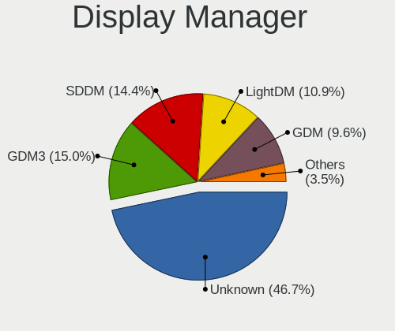
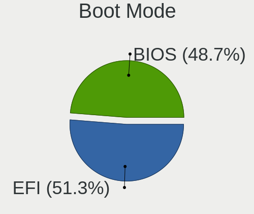
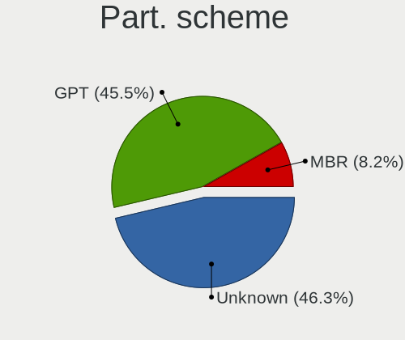
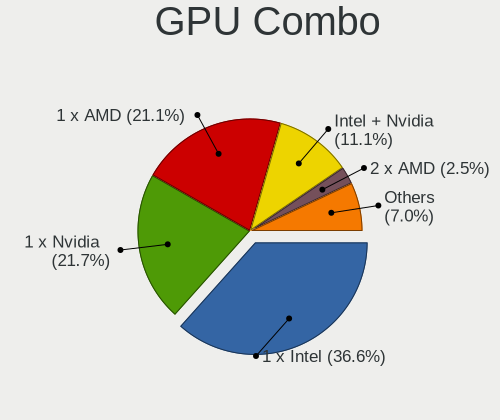
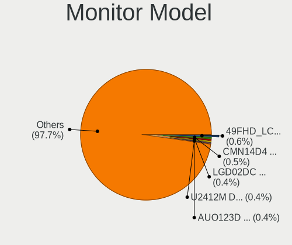
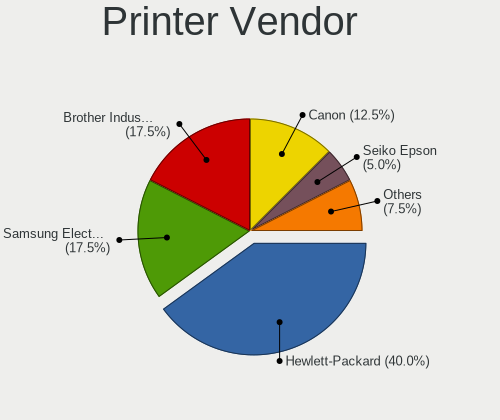

Linux in Sweden - Tested Hardware & Statistics
----------------------------------------------

A project to collect tested hardware configurations for Linux in Sweden.

Anyone can contribute to this report by the [hw-probe](https://github.com/linuxhw/hw-probe) tool:

    sudo -E hw-probe -all -upload

Please contribute! Especially if your hardware is rare.

This is a report for all computer types. See also reports for [desktops](/Location/Sweden/Desktop/README.md) and [notebooks](/Location/Sweden/Notebook/README.md).

Contents
--------

* [ Test Cases ](#test-cases)

* [ System ](#system)
  - [ OS                       ](#os)
  - [ OS Family                ](#os-family)
  - [ Kernel                   ](#kernel)
  - [ Kernel Family            ](#kernel-family)
  - [ Kernel Major Ver.        ](#kernel-major-ver)
  - [ Arch                     ](#arch)
  - [ DE                       ](#de)
  - [ Display Server           ](#display-server)
  - [ Display Manager          ](#display-manager)
  - [ OS Lang                  ](#os-lang)
  - [ Boot Mode                ](#boot-mode)
  - [ Filesystem               ](#filesystem)
  - [ Part. scheme             ](#part-scheme)
  - [ Dual Boot with Linux/BSD ](#dual-boot-with-linuxbsd)
  - [ Dual Boot (Win)          ](#dual-boot-win)

* [ Board ](#board)
  - [ Vendor                   ](#vendor)
  - [ Model                    ](#model)
  - [ Model Family             ](#model-family)
  - [ MFG Year                 ](#mfg-year)
  - [ Form Factor              ](#form-factor)
  - [ Secure Boot              ](#secure-boot)
  - [ Coreboot                 ](#coreboot)
  - [ RAM Size                 ](#ram-size)
  - [ RAM Used                 ](#ram-used)
  - [ Total Drives             ](#total-drives)
  - [ Has CD-ROM               ](#has-cd-rom)
  - [ Has Ethernet             ](#has-ethernet)
  - [ Has WiFi                 ](#has-wifi)
  - [ Has Bluetooth            ](#has-bluetooth)

* [ Location ](#location)
  - [ Country                  ](#country)
  - [ City                     ](#city)

* [ Drives ](#drives)
  - [ Drive Vendor             ](#drive-vendor)
  - [ Drive Model              ](#drive-model)
  - [ HDD Vendor               ](#hdd-vendor)
  - [ SSD Vendor               ](#ssd-vendor)
  - [ Drive Kind               ](#drive-kind)
  - [ Drive Connector          ](#drive-connector)
  - [ Drive Size               ](#drive-size)
  - [ Space Total              ](#space-total)
  - [ Space Used               ](#space-used)
  - [ Malfunc. Drives          ](#malfunc-drives)
  - [ Malfunc. Drive Vendor    ](#malfunc-drive-vendor)
  - [ Malfunc. HDD Vendor      ](#malfunc-hdd-vendor)
  - [ Malfunc. Drive Kind      ](#malfunc-drive-kind)
  - [ Failed Drives            ](#failed-drives)
  - [ Failed Drive Vendor      ](#failed-drive-vendor)
  - [ Drive Status             ](#drive-status)

* [ Storage controller ](#storage-controller)
  - [ Storage Vendor           ](#storage-vendor)
  - [ Storage Model            ](#storage-model)
  - [ Storage Kind             ](#storage-kind)

* [ Processor ](#processor)
  - [ CPU Vendor               ](#cpu-vendor)
  - [ CPU Model                ](#cpu-model)
  - [ CPU Model Family         ](#cpu-model-family)
  - [ CPU Cores                ](#cpu-cores)
  - [ CPU Sockets              ](#cpu-sockets)
  - [ CPU Threads              ](#cpu-threads)
  - [ CPU Op-Modes             ](#cpu-op-modes)
  - [ CPU Microcode            ](#cpu-microcode)
  - [ CPU Microarch            ](#cpu-microarch)

* [ Graphics ](#graphics)
  - [ GPU Vendor               ](#gpu-vendor)
  - [ GPU Model                ](#gpu-model)
  - [ GPU Combo                ](#gpu-combo)
  - [ GPU Driver               ](#gpu-driver)
  - [ GPU Memory               ](#gpu-memory)

* [ Monitor ](#monitor)
  - [ Monitor Vendor           ](#monitor-vendor)
  - [ Monitor Model            ](#monitor-model)
  - [ Monitor Resolution       ](#monitor-resolution)
  - [ Monitor Diagonal         ](#monitor-diagonal)
  - [ Monitor Width            ](#monitor-width)
  - [ Aspect Ratio             ](#aspect-ratio)
  - [ Monitor Area             ](#monitor-area)
  - [ Pixel Density            ](#pixel-density)
  - [ Multiple Monitors        ](#multiple-monitors)

* [ Network ](#network)
  - [ Net Controller Vendor    ](#net-controller-vendor)
  - [ Net Controller Model     ](#net-controller-model)
  - [ Wireless Vendor          ](#wireless-vendor)
  - [ Wireless Model           ](#wireless-model)
  - [ Ethernet Vendor          ](#ethernet-vendor)
  - [ Ethernet Model           ](#ethernet-model)
  - [ Net Controller Kind      ](#net-controller-kind)
  - [ Used Controller          ](#used-controller)
  - [ NICs                     ](#nics)
  - [ IPv6                     ](#ipv6)

* [ Bluetooth ](#bluetooth)
  - [ Bluetooth Vendor         ](#bluetooth-vendor)
  - [ Bluetooth Model          ](#bluetooth-model)

* [ Sound ](#sound)
  - [ Sound Vendor             ](#sound-vendor)
  - [ Sound Model              ](#sound-model)

* [ Memory ](#memory)
  - [ Memory Vendor            ](#memory-vendor)
  - [ Memory Model             ](#memory-model)
  - [ Memory Kind              ](#memory-kind)
  - [ Memory Form Factor       ](#memory-form-factor)
  - [ Memory Size              ](#memory-size)
  - [ Memory Speed             ](#memory-speed)

* [ Printers & scanners ](#printers--scanners)
  - [ Printer Vendor           ](#printer-vendor)
  - [ Printer Model            ](#printer-model)
  - [ Scanner Vendor           ](#scanner-vendor)
  - [ Scanner Model            ](#scanner-model)

* [ Camera ](#camera)
  - [ Camera Vendor            ](#camera-vendor)
  - [ Camera Model             ](#camera-model)

* [ Security ](#security)
  - [ Fingerprint Vendor       ](#fingerprint-vendor)
  - [ Fingerprint Model        ](#fingerprint-model)
  - [ Chipcard Vendor          ](#chipcard-vendor)
  - [ Chipcard Model           ](#chipcard-model)

* [ Unsupported ](#unsupported)
  - [ Unsupported Devices      ](#unsupported-devices)
  - [ Unsupported Device Types ](#unsupported-device-types)

Test Cases
----------

Total: 2529

| Vendor        | Model                       | Form-Factor | Probe                                                      | Date         |
|---------------|-----------------------------|-------------|------------------------------------------------------------|--------------|
| Acer          | Aspire V3-571G              | Notebook    | [273f6722e0](https://linux-hardware.org/?probe=273f6722e0) | Dec 31, 2022 |
| Shuttle       | SH570                       | Desktop     | [09994766ed](https://linux-hardware.org/?probe=09994766ed) | Dec 31, 2022 |
| Shuttle       | SH570                       | Desktop     | [f4d5ef752c](https://linux-hardware.org/?probe=f4d5ef752c) | Dec 31, 2022 |
| Lenovo        | IdeaPad S340-14API 81NB     | Notebook    | [270ba62d9d](https://linux-hardware.org/?probe=270ba62d9d) | Dec 31, 2022 |
| Shuttle       | SH570                       | Desktop     | [2d7f57de8f](https://linux-hardware.org/?probe=2d7f57de8f) | Dec 31, 2022 |
| Lenovo        | ChiefRiver                  | Desktop     | [847a9e86cd](https://linux-hardware.org/?probe=847a9e86cd) | Dec 30, 2022 |
| Lenovo        | Z70-80 80FG                 | Notebook    | [16419f6991](https://linux-hardware.org/?probe=16419f6991) | Dec 30, 2022 |
| Lenovo        | Z70-80 80FG                 | Notebook    | [4386242be1](https://linux-hardware.org/?probe=4386242be1) | Dec 30, 2022 |
| Raspberry ... | Raspberry Pi Compute Mod... | Soc         | [34cd286c5f](https://linux-hardware.org/?probe=34cd286c5f) | Dec 30, 2022 |
| Valve         | Jupiter                     | Notebook    | [15c60654b3](https://linux-hardware.org/?probe=15c60654b3) | Dec 30, 2022 |
| Apple         | MacBookPro11,3              | Notebook    | [87d0f67d84](https://linux-hardware.org/?probe=87d0f67d84) | Dec 30, 2022 |
| HP            | 1998                        | Desktop     | [c3404205e3](https://linux-hardware.org/?probe=c3404205e3) | Dec 29, 2022 |
| ASUSTek       | M5A78L/USB3                 | Desktop     | [b89e7eb1c9](https://linux-hardware.org/?probe=b89e7eb1c9) | Dec 28, 2022 |
| Lenovo        | MIIX 310-10ICR 80SG         | Tablet      | [f37619077b](https://linux-hardware.org/?probe=f37619077b) | Dec 26, 2022 |
| HP            | Pavilion x360 Convertibl... | Convertible | [e979df032a](https://linux-hardware.org/?probe=e979df032a) | Dec 26, 2022 |
| Apple         | Mac-27ADBB7B4CEE8E61 iMa... | All in one  | [82a5aa7ead](https://linux-hardware.org/?probe=82a5aa7ead) | Dec 26, 2022 |
| SLIMBOOK      | PROX-AMD5                   | Notebook    | [2ef0101186](https://linux-hardware.org/?probe=2ef0101186) | Dec 25, 2022 |
| GMKtec        | NucBox8                     | Server      | [abc999a1a4](https://linux-hardware.org/?probe=abc999a1a4) | Dec 24, 2022 |
| ASUSTek       | ProArt Z690-CREATOR WIFI    | Desktop     | [04b76a7e78](https://linux-hardware.org/?probe=04b76a7e78) | Dec 24, 2022 |
| Dell          | Latitude 3380               | Notebook    | [e4847d5b1f](https://linux-hardware.org/?probe=e4847d5b1f) | Dec 24, 2022 |
| HP            | EliteBook 840 G5            | Notebook    | [92f12e3ec7](https://linux-hardware.org/?probe=92f12e3ec7) | Dec 24, 2022 |
| GMKtec        | NucBox8                     | Server      | [66b0fbce86](https://linux-hardware.org/?probe=66b0fbce86) | Dec 24, 2022 |
| MSI           | Katana GF66 11UE            | Notebook    | [b993283081](https://linux-hardware.org/?probe=b993283081) | Dec 22, 2022 |
| Microsoft     | Surface Pro 2               | Tablet      | [3237ff6784](https://linux-hardware.org/?probe=3237ff6784) | Dec 22, 2022 |
| Raspberry ... | Raspberry Pi 400 Rev 1.0    | Soc         | [ba82bee4c7](https://linux-hardware.org/?probe=ba82bee4c7) | Dec 22, 2022 |
| Raspberry ... | Raspberry Pi 400 Rev 1.0    | Soc         | [a2a2f20ef4](https://linux-hardware.org/?probe=a2a2f20ef4) | Dec 22, 2022 |
| ASUSTek       | ASUS TUF Gaming A15 FA50... | Notebook    | [92515d8a95](https://linux-hardware.org/?probe=92515d8a95) | Dec 21, 2022 |
| Schenker      | XMG APEX 15 MAX (E22)       | Notebook    | [6b46538fea](https://linux-hardware.org/?probe=6b46538fea) | Dec 21, 2022 |
| Dell          | 0020HJ A01                  | Server      | [e266254c60](https://linux-hardware.org/?probe=e266254c60) | Dec 21, 2022 |
| HP            | ProLiant DL360e Gen8        | Server      | [5477e8f714](https://linux-hardware.org/?probe=5477e8f714) | Dec 21, 2022 |
| Dell          | Latitude 3380               | Notebook    | [808c693271](https://linux-hardware.org/?probe=808c693271) | Dec 20, 2022 |
| ASUSTek       | Maximus VIII RANGER         | Desktop     | [8a09a51987](https://linux-hardware.org/?probe=8a09a51987) | Dec 20, 2022 |
| ASUSTek       | VivoBook_ASUSLaptop X421... | Notebook    | [4fbc0ddbd5](https://linux-hardware.org/?probe=4fbc0ddbd5) | Dec 20, 2022 |
| HP            | 18E7                        | Desktop     | [31011a35a4](https://linux-hardware.org/?probe=31011a35a4) | Dec 17, 2022 |
| ASRock        | Z77 Extreme4                | Desktop     | [3b48a01ef2](https://linux-hardware.org/?probe=3b48a01ef2) | Dec 16, 2022 |
| Lenovo        | IdeaPad 1 14ADA05 82GW      | Notebook    | [ffa7e28596](https://linux-hardware.org/?probe=ffa7e28596) | Dec 16, 2022 |
| Lenovo        | ThinkPad X1 Carbon 4th 2... | Notebook    | [143d2059a6](https://linux-hardware.org/?probe=143d2059a6) | Dec 16, 2022 |
| Apple         | Mac-35C5E08120C7EEAF Mac... | Mini pc     | [bc3635620b](https://linux-hardware.org/?probe=bc3635620b) | Dec 15, 2022 |
| Lenovo        | ThinkPad X1 Carbon Gen 9... | Notebook    | [888e6092a6](https://linux-hardware.org/?probe=888e6092a6) | Dec 15, 2022 |
| HP            | EliteBook 830 G6            | Notebook    | [5248ee7dbe](https://linux-hardware.org/?probe=5248ee7dbe) | Dec 15, 2022 |
| HP            | EliteBook 830 G7 Noteboo... | Notebook    | [3403282c8c](https://linux-hardware.org/?probe=3403282c8c) | Dec 15, 2022 |
| Lenovo        | Yoga Slim 7 Pro 14ACH5 8... | Notebook    | [bec79890c8](https://linux-hardware.org/?probe=bec79890c8) | Dec 15, 2022 |
| Dell          | 0D6H9T A02                  | Desktop     | [6266999282](https://linux-hardware.org/?probe=6266999282) | Dec 15, 2022 |
| HP            | ENVY x360 Convertible 13... | Convertible | [a0d408fecd](https://linux-hardware.org/?probe=a0d408fecd) | Dec 15, 2022 |
| Dell          | Latitude E7240              | Notebook    | [c47fc4fadf](https://linux-hardware.org/?probe=c47fc4fadf) | Dec 14, 2022 |
| HP            | ENVY x360 Convertible 13... | Convertible | [6b47a036ab](https://linux-hardware.org/?probe=6b47a036ab) | Dec 14, 2022 |
| Insyde        | G0975                       | Notebook    | [1f4823542d](https://linux-hardware.org/?probe=1f4823542d) | Dec 14, 2022 |
| Apple         | Mac-35C5E08120C7EEAF Mac... | Mini pc     | [39a9464c10](https://linux-hardware.org/?probe=39a9464c10) | Dec 14, 2022 |
| Gigabyte      | X570 AORUS MASTER           | Desktop     | [5a9654c743](https://linux-hardware.org/?probe=5a9654c743) | Dec 13, 2022 |
| Lenovo        | ThinkPad X1 Carbon 4th 2... | Notebook    | [4a3ac966fc](https://linux-hardware.org/?probe=4a3ac966fc) | Dec 13, 2022 |
| Lenovo        | IdeaPadFlex 5 14ARE05 81... | Convertible | [05ffc0ef7a](https://linux-hardware.org/?probe=05ffc0ef7a) | Dec 13, 2022 |
| Lenovo        | Yoga C740-14IML 81TC        | Convertible | [502792fe8a](https://linux-hardware.org/?probe=502792fe8a) | Dec 12, 2022 |
| Lenovo        | ThinkPad X1 Yoga Gen 7 2... | Convertible | [7b8b3c2a86](https://linux-hardware.org/?probe=7b8b3c2a86) | Dec 12, 2022 |
| MSI           | B75MA-E33                   | Desktop     | [65c6c18ffe](https://linux-hardware.org/?probe=65c6c18ffe) | Dec 12, 2022 |
| Dell          | Latitude 5430               | Notebook    | [b439d1e1a4](https://linux-hardware.org/?probe=b439d1e1a4) | Dec 12, 2022 |
| ASUSTek       | ROG Flow X13 GV301QH_GV3... | Notebook    | [4b0492b053](https://linux-hardware.org/?probe=4b0492b053) | Dec 11, 2022 |
| ASUSTek       | ROG Flow X13 GV301QH_GV3... | Notebook    | [ca7d835a38](https://linux-hardware.org/?probe=ca7d835a38) | Dec 11, 2022 |
| Google        | Orco                        | Notebook    | [40acd3207e](https://linux-hardware.org/?probe=40acd3207e) | Dec 10, 2022 |
| Google        | Orco                        | Notebook    | [9c369b40b3](https://linux-hardware.org/?probe=9c369b40b3) | Dec 10, 2022 |
| ASUSTek       | STRIX Z270H GAMING          | Desktop     | [c9cc6de1c4](https://linux-hardware.org/?probe=c9cc6de1c4) | Dec 08, 2022 |
| ASUSTek       | STRIX Z270H GAMING          | Desktop     | [8973296b3b](https://linux-hardware.org/?probe=8973296b3b) | Dec 08, 2022 |
| ASUSTek       | ROG STRIX B550-I GAMING     | Desktop     | [3a91c2e245](https://linux-hardware.org/?probe=3a91c2e245) | Dec 07, 2022 |
| Lenovo        | ThinkPad T490s 20NX001KM... | Notebook    | [49f30d3eee](https://linux-hardware.org/?probe=49f30d3eee) | Dec 06, 2022 |
| Gigabyte      | B450 AORUS PRO-CF           | Desktop     | [310ff494e7](https://linux-hardware.org/?probe=310ff494e7) | Dec 06, 2022 |
| HP            | 18E5                        | Desktop     | [9158a7ab6b](https://linux-hardware.org/?probe=9158a7ab6b) | Dec 06, 2022 |
| ASUSTek       | VivoBook S13 X330UA         | Notebook    | [d01d1e9652](https://linux-hardware.org/?probe=d01d1e9652) | Dec 06, 2022 |
| Dell          | XPS 13 9370                 | Notebook    | [b500d948bf](https://linux-hardware.org/?probe=b500d948bf) | Dec 05, 2022 |
| HP            | EliteBook 840 G2            | Notebook    | [ff90421b87](https://linux-hardware.org/?probe=ff90421b87) | Dec 05, 2022 |
| HP            | EliteBook 840 G1            | Notebook    | [3bc6ea9cfa](https://linux-hardware.org/?probe=3bc6ea9cfa) | Dec 05, 2022 |
| HP            | EliteBook 840 G1            | Notebook    | [aaed16d626](https://linux-hardware.org/?probe=aaed16d626) | Dec 05, 2022 |
| HP            | EliteBook 840 G2            | Notebook    | [cd63efdbd4](https://linux-hardware.org/?probe=cd63efdbd4) | Dec 05, 2022 |
| SiYW          | V200 Series                 | Desktop     | [c80a75c310](https://linux-hardware.org/?probe=c80a75c310) | Dec 03, 2022 |
| Sony          | VPCEB1M1E                   | Notebook    | [7ea8161a05](https://linux-hardware.org/?probe=7ea8161a05) | Dec 01, 2022 |
| HP            | Laptop 15-dw1xxx            | Notebook    | [d8d5459ad6](https://linux-hardware.org/?probe=d8d5459ad6) | Dec 01, 2022 |
| Lenovo        | ThinkPad T470p 20J60018M... | Notebook    | [994d8e4b1d](https://linux-hardware.org/?probe=994d8e4b1d) | Dec 01, 2022 |
| HP            | Laptop 15-dw1xxx            | Notebook    | [1dddd99280](https://linux-hardware.org/?probe=1dddd99280) | Dec 01, 2022 |
| Lenovo        | ThinkPad L560 20F10034MX    | Notebook    | [34842eb8d9](https://linux-hardware.org/?probe=34842eb8d9) | Dec 01, 2022 |
| Lenovo        | ThinkPad X270 20HNS03B00    | Notebook    | [bd40de3011](https://linux-hardware.org/?probe=bd40de3011) | Nov 30, 2022 |
| Lenovo        | ThinkPad P14s Gen 2a 21A... | Notebook    | [258c074e40](https://linux-hardware.org/?probe=258c074e40) | Nov 30, 2022 |
| Lenovo        | ThinkPad P14s Gen 2a 21A... | Notebook    | [29ec19d38e](https://linux-hardware.org/?probe=29ec19d38e) | Nov 30, 2022 |
| Lenovo        | IdeaPadFlex 5 14ARE05 81... | Convertible | [997ffc40f0](https://linux-hardware.org/?probe=997ffc40f0) | Nov 29, 2022 |
| Gigabyte      | B250M-DS3H-CF               | Desktop     | [efacbf6215](https://linux-hardware.org/?probe=efacbf6215) | Nov 29, 2022 |
| Gigabyte      | B250M-DS3H-CF               | Desktop     | [85ac938c0c](https://linux-hardware.org/?probe=85ac938c0c) | Nov 29, 2022 |
| MSI           | Z370 GAMING PRO CARBON      | Desktop     | [96b383097b](https://linux-hardware.org/?probe=96b383097b) | Nov 29, 2022 |
| ASUSTek       | GA15DH                      | Desktop     | [a789d492a4](https://linux-hardware.org/?probe=a789d492a4) | Nov 28, 2022 |
| Lenovo        | ThinkPad T470p 20J60018M... | Notebook    | [c5f7049b04](https://linux-hardware.org/?probe=c5f7049b04) | Nov 28, 2022 |
| Lenovo        | ThinkPad E580 20KS001QMX    | Notebook    | [97fda88c7b](https://linux-hardware.org/?probe=97fda88c7b) | Nov 28, 2022 |
| ASUSTek       | PRIME X570-PRO              | Desktop     | [8f8f53c15b](https://linux-hardware.org/?probe=8f8f53c15b) | Nov 27, 2022 |
| HP            | Spectre x360 2-in-1 Lapt... | Convertible | [ac8f0475f1](https://linux-hardware.org/?probe=ac8f0475f1) | Nov 27, 2022 |
| HP            | Elite x2 1012 G2            | Tablet      | [669f6eaf1c](https://linux-hardware.org/?probe=669f6eaf1c) | Nov 26, 2022 |
| ASUSTek       | GA15DH                      | Desktop     | [ec6d666a16](https://linux-hardware.org/?probe=ec6d666a16) | Nov 24, 2022 |
| ASRock        | B550 Extreme4               | Desktop     | [b59180988d](https://linux-hardware.org/?probe=b59180988d) | Nov 24, 2022 |
| ASUSTek       | VivoBook_ASUSLaptop E210... | Notebook    | [ce5a80936d](https://linux-hardware.org/?probe=ce5a80936d) | Nov 24, 2022 |
| SLIMBOOK      | PROX-AMD5                   | Notebook    | [9758f3268e](https://linux-hardware.org/?probe=9758f3268e) | Nov 23, 2022 |
| ASUSTek       | Strix GL504GW_GL504GW       | Notebook    | [f06e160e11](https://linux-hardware.org/?probe=f06e160e11) | Nov 23, 2022 |
| Lenovo        | ThinkPad X1 Carbon Gen 9... | Notebook    | [7121172cc6](https://linux-hardware.org/?probe=7121172cc6) | Nov 22, 2022 |
| ASUSTek       | ROG STRIX X470-F GAMING     | Desktop     | [c150f785ea](https://linux-hardware.org/?probe=c150f785ea) | Nov 21, 2022 |
| Dell          | XPS 9320                    | Notebook    | [52b55ea024](https://linux-hardware.org/?probe=52b55ea024) | Nov 21, 2022 |
| Dell          | XPS 9320                    | Notebook    | [7ea2296eaf](https://linux-hardware.org/?probe=7ea2296eaf) | Nov 21, 2022 |
| AZW           | GTR V01                     | Mini pc     | [2042d4c2c0](https://linux-hardware.org/?probe=2042d4c2c0) | Nov 21, 2022 |
| Apple         | MacBookPro10,1              | Notebook    | [71cb60b441](https://linux-hardware.org/?probe=71cb60b441) | Nov 21, 2022 |
| ASUSTek       | ROG STRIX X470-F GAMING     | Desktop     | [4f36ecd91b](https://linux-hardware.org/?probe=4f36ecd91b) | Nov 19, 2022 |
| ASRock        | Z790 PG Riptide             | Desktop     | [c852740256](https://linux-hardware.org/?probe=c852740256) | Nov 19, 2022 |
| ASUSTek       | TUF Gaming B550M-PLUS WI... | Desktop     | [f10fc36516](https://linux-hardware.org/?probe=f10fc36516) | Nov 19, 2022 |
| Lenovo        | ThinkPad T14 Gen 3 21AHC... | Notebook    | [3534f07f4a](https://linux-hardware.org/?probe=3534f07f4a) | Nov 18, 2022 |
| ASUSTek       | N550JK                      | Notebook    | [86a2f7caea](https://linux-hardware.org/?probe=86a2f7caea) | Nov 18, 2022 |
| Dell          | Latitude 5310               | Notebook    | [8c9625dc17](https://linux-hardware.org/?probe=8c9625dc17) | Nov 17, 2022 |
| Dell          | Latitude 5310               | Notebook    | [958c48cd54](https://linux-hardware.org/?probe=958c48cd54) | Nov 17, 2022 |
| ASUSTek       | PRIME X570-PRO              | Desktop     | [4c5a2a2f55](https://linux-hardware.org/?probe=4c5a2a2f55) | Nov 16, 2022 |
| HP            | ZBook 15u G6                | Notebook    | [e6600fae5a](https://linux-hardware.org/?probe=e6600fae5a) | Nov 16, 2022 |
| ASRock        | B450M Steel Legend          | Desktop     | [6cb0948dfd](https://linux-hardware.org/?probe=6cb0948dfd) | Nov 15, 2022 |
| Lenovo        | Yoga Slim 7 Pro 14IAH7 8... | Notebook    | [64fb474239](https://linux-hardware.org/?probe=64fb474239) | Nov 14, 2022 |
| ASUSTek       | 2A73h                       | Desktop     | [08e4620733](https://linux-hardware.org/?probe=08e4620733) | Nov 13, 2022 |
| Lenovo        | V15 G2 ALC 82KD             | Notebook    | [fa18a7779e](https://linux-hardware.org/?probe=fa18a7779e) | Nov 13, 2022 |
| ASUSTek       | PRIME B550M-A               | Desktop     | [0bc3c759d6](https://linux-hardware.org/?probe=0bc3c759d6) | Nov 13, 2022 |
| ASUSTek       | 2A73h                       | Desktop     | [557fb98d98](https://linux-hardware.org/?probe=557fb98d98) | Nov 13, 2022 |
| Apple         | MacBook5,1                  | Notebook    | [aea8b4a908](https://linux-hardware.org/?probe=aea8b4a908) | Nov 12, 2022 |
| Apple         | MacBook5,1                  | Notebook    | [4aa0411587](https://linux-hardware.org/?probe=4aa0411587) | Nov 12, 2022 |
| Fujitsu       | D3230-A1 S26361-D3230-A1    | Desktop     | [091c048c2a](https://linux-hardware.org/?probe=091c048c2a) | Nov 12, 2022 |
| Foxconn       | 2AAF                        | Desktop     | [8dee2ceeb0](https://linux-hardware.org/?probe=8dee2ceeb0) | Nov 12, 2022 |
| ASUSTek       | ROG STRIX X570-F GAMING     | Desktop     | [6eedcdeb01](https://linux-hardware.org/?probe=6eedcdeb01) | Nov 11, 2022 |
| Dell          | XPS 13 9370                 | Notebook    | [2865464ccd](https://linux-hardware.org/?probe=2865464ccd) | Nov 11, 2022 |
| Lenovo        | ThinkPad T14 Gen 3 21AHC... | Notebook    | [48f127b453](https://linux-hardware.org/?probe=48f127b453) | Nov 11, 2022 |
| ASUSTek       | ROG STRIX B450-F GAMING ... | Desktop     | [fd835d99e7](https://linux-hardware.org/?probe=fd835d99e7) | Nov 10, 2022 |
| Fujitsu       | D3222-A1 S26361-D3222-A1    | Desktop     | [fae66184f2](https://linux-hardware.org/?probe=fae66184f2) | Nov 10, 2022 |
| ASUSTek       | U36SD                       | Notebook    | [d6b92cbdaa](https://linux-hardware.org/?probe=d6b92cbdaa) | Nov 07, 2022 |
| Acer          | Aspire A515-52              | Notebook    | [ed07b564ec](https://linux-hardware.org/?probe=ed07b564ec) | Nov 07, 2022 |
| MSI           | B450M MORTAR TITANIUM       | Desktop     | [b6768dd5b7](https://linux-hardware.org/?probe=b6768dd5b7) | Nov 07, 2022 |
| HP            | 828A                        | Desktop     | [42d15a94b0](https://linux-hardware.org/?probe=42d15a94b0) | Nov 06, 2022 |
| HP            | EliteBook 830 G5            | Notebook    | [92c837ff5a](https://linux-hardware.org/?probe=92c837ff5a) | Nov 06, 2022 |
| HP            | EliteBook 830 G5            | Notebook    | [298819594a](https://linux-hardware.org/?probe=298819594a) | Nov 06, 2022 |
| Packard Be... | EasyNote TS11HR             | Notebook    | [8a62c61d38](https://linux-hardware.org/?probe=8a62c61d38) | Nov 06, 2022 |
| Gigabyte      | X570 AORUS ELITE            | Desktop     | [2765ed4857](https://linux-hardware.org/?probe=2765ed4857) | Nov 05, 2022 |
| HP            | ZBook 15u G6                | Notebook    | [58025a9d04](https://linux-hardware.org/?probe=58025a9d04) | Nov 05, 2022 |
| HP            | ZBook 15u G6                | Notebook    | [bd1a9c6659](https://linux-hardware.org/?probe=bd1a9c6659) | Nov 05, 2022 |
| HPE           | ProLiant MicroServer Gen... | Server      | [dd2877fcc2](https://linux-hardware.org/?probe=dd2877fcc2) | Nov 05, 2022 |
| HPE           | ProLiant MicroServer Gen... | Server      | [d95735860b](https://linux-hardware.org/?probe=d95735860b) | Nov 05, 2022 |
| Acer          | Predator G3610              | Desktop     | [783c053a62](https://linux-hardware.org/?probe=783c053a62) | Nov 05, 2022 |
| SLIMBOOK      | PROX-AMD5                   | Notebook    | [7590df932b](https://linux-hardware.org/?probe=7590df932b) | Nov 05, 2022 |
| Apple         | MacBookPro16,2              | Notebook    | [ad1ae18c98](https://linux-hardware.org/?probe=ad1ae18c98) | Nov 04, 2022 |
| Apple         | MacBookPro10,1              | Notebook    | [b2af134ab3](https://linux-hardware.org/?probe=b2af134ab3) | Nov 04, 2022 |
| HP            | ProBook 640 G1              | Notebook    | [9d1ba43c71](https://linux-hardware.org/?probe=9d1ba43c71) | Nov 04, 2022 |
| HP            | ProBook 640 G1              | Notebook    | [dac055fa29](https://linux-hardware.org/?probe=dac055fa29) | Nov 04, 2022 |
| ASUSTek       | PRIME Z370-P II             | Desktop     | [1866954ec7](https://linux-hardware.org/?probe=1866954ec7) | Nov 04, 2022 |
| HP            | 2B05                        | Desktop     | [5c0a96cd5b](https://linux-hardware.org/?probe=5c0a96cd5b) | Nov 04, 2022 |
| HP            | 2B05                        | Desktop     | [95b5255056](https://linux-hardware.org/?probe=95b5255056) | Nov 04, 2022 |
| HUAWEI        | KLVL-WXX9                   | Notebook    | [de163caae3](https://linux-hardware.org/?probe=de163caae3) | Nov 04, 2022 |
| SLIMBOOK      | PROX-AMD5                   | Notebook    | [442942f712](https://linux-hardware.org/?probe=442942f712) | Nov 04, 2022 |
| Intel         | NUC10i5FNB K61361-303       | Mini pc     | [df00a6281b](https://linux-hardware.org/?probe=df00a6281b) | Nov 03, 2022 |
| Intel         | NUC10i5FNB K61361-303       | Mini pc     | [2ec155a4b6](https://linux-hardware.org/?probe=2ec155a4b6) | Nov 03, 2022 |
| ASUSTek       | ProArt Z690-CREATOR WIFI    | Desktop     | [ec359017a2](https://linux-hardware.org/?probe=ec359017a2) | Nov 02, 2022 |
| ASUSTek       | Z97-P                       | Desktop     | [72467c5d61](https://linux-hardware.org/?probe=72467c5d61) | Oct 31, 2022 |
| Raspberry ... | Raspberry Pi 4 Model B R... | Soc         | [d99707ef15](https://linux-hardware.org/?probe=d99707ef15) | Oct 29, 2022 |
| HP            | EliteBook 830 G7 Noteboo... | Notebook    | [063675c104](https://linux-hardware.org/?probe=063675c104) | Oct 29, 2022 |
| ASUSTek       | PRIME X570-PRO              | Desktop     | [e51ca052ec](https://linux-hardware.org/?probe=e51ca052ec) | Oct 28, 2022 |
| ASUSTek       | PN50                        | Mini pc     | [cd6e5e2095](https://linux-hardware.org/?probe=cd6e5e2095) | Oct 27, 2022 |
| ASUSTek       | PN50                        | Mini pc     | [3c67c8efb7](https://linux-hardware.org/?probe=3c67c8efb7) | Oct 27, 2022 |
| HP            | ZBook Fury 15.6 inch G8 ... | Notebook    | [f95081e76e](https://linux-hardware.org/?probe=f95081e76e) | Oct 27, 2022 |
| HP            | EliteBook 830 G7 Noteboo... | Notebook    | [0fcfd33f95](https://linux-hardware.org/?probe=0fcfd33f95) | Oct 27, 2022 |
| Pegatron      | 2AD5                        | Desktop     | [daf7975ca0](https://linux-hardware.org/?probe=daf7975ca0) | Oct 26, 2022 |
| ASUSTek       | ROG STRIX B450-E GAMING     | Desktop     | [51cf8b4f9d](https://linux-hardware.org/?probe=51cf8b4f9d) | Oct 25, 2022 |
| Samsung       | 305V4A/305V5A/3415VA        | Notebook    | [d8f70347cf](https://linux-hardware.org/?probe=d8f70347cf) | Oct 24, 2022 |
| HP            | 2B05                        | Desktop     | [c059b9a786](https://linux-hardware.org/?probe=c059b9a786) | Oct 24, 2022 |
| Valve         | Jupiter                     | Notebook    | [302efb993a](https://linux-hardware.org/?probe=302efb993a) | Oct 22, 2022 |
| Lenovo        | ThinkPad P52 20M90017MX     | Notebook    | [8f3fdb4d9c](https://linux-hardware.org/?probe=8f3fdb4d9c) | Oct 22, 2022 |
| Valve         | Jupiter                     | Notebook    | [024fdc987b](https://linux-hardware.org/?probe=024fdc987b) | Oct 21, 2022 |
| SLIMBOOK      | PROX-AMD5                   | Notebook    | [5e59c8933b](https://linux-hardware.org/?probe=5e59c8933b) | Oct 20, 2022 |
| Valve         | Jupiter                     | Notebook    | [6249475f24](https://linux-hardware.org/?probe=6249475f24) | Oct 20, 2022 |
| Fujitsu Si... | D2399 S26361-D2399          | Desktop     | [77a5931c66](https://linux-hardware.org/?probe=77a5931c66) | Oct 20, 2022 |
| ASUSTek       | PRIME Z390-P                | Desktop     | [f3ac5bf3df](https://linux-hardware.org/?probe=f3ac5bf3df) | Oct 20, 2022 |
| HP            | 8056                        | Desktop     | [37ed8a6b64](https://linux-hardware.org/?probe=37ed8a6b64) | Oct 18, 2022 |
| Lenovo        | IdeaPad S340-15APITouch ... | Notebook    | [aa65a51ac6](https://linux-hardware.org/?probe=aa65a51ac6) | Oct 18, 2022 |
| ASUSTek       | ROG STRIX B550-F GAMING     | Desktop     | [d727afe327](https://linux-hardware.org/?probe=d727afe327) | Oct 17, 2022 |
| Gigabyte      | Z390 GAMING X-CF            | Desktop     | [09a4ac981b](https://linux-hardware.org/?probe=09a4ac981b) | Oct 17, 2022 |
| ASUSTek       | PRIME B360M-A               | Desktop     | [4138cb5064](https://linux-hardware.org/?probe=4138cb5064) | Oct 17, 2022 |
| HP            | 2AE2                        | Desktop     | [a1a8fcfe49](https://linux-hardware.org/?probe=a1a8fcfe49) | Oct 17, 2022 |
| Apple         | MacBookAir6,1               | Notebook    | [2438851671](https://linux-hardware.org/?probe=2438851671) | Oct 16, 2022 |
| ASUSTek       | M5A97 R2.0                  | Desktop     | [10a3014c1a](https://linux-hardware.org/?probe=10a3014c1a) | Oct 16, 2022 |
| ASUSTek       | P8H67                       | Desktop     | [4f03e84827](https://linux-hardware.org/?probe=4f03e84827) | Oct 16, 2022 |
| Acer          | Aspire V3-571               | Notebook    | [8457aa21e7](https://linux-hardware.org/?probe=8457aa21e7) | Oct 16, 2022 |
| Apple         | Mac-8ED6AF5B48C039E1 Mac... | Mini pc     | [4f52cb1040](https://linux-hardware.org/?probe=4f52cb1040) | Oct 15, 2022 |
| HP            | ZBook Fury 15 G7 Mobile ... | Notebook    | [689281cab0](https://linux-hardware.org/?probe=689281cab0) | Oct 15, 2022 |
| Dell          | XPS 13 9360                 | Notebook    | [6def734895](https://linux-hardware.org/?probe=6def734895) | Oct 14, 2022 |
| Acer          | Aspire 8950G                | Notebook    | [8888f23e03](https://linux-hardware.org/?probe=8888f23e03) | Oct 14, 2022 |
| Lenovo        | ThinkPad E595 20NF001HMX    | Notebook    | [1ae4e8967a](https://linux-hardware.org/?probe=1ae4e8967a) | Oct 14, 2022 |
| Gigabyte      | AB350M-HD3-CF se1           | Desktop     | [89060aa147](https://linux-hardware.org/?probe=89060aa147) | Oct 13, 2022 |
| Gigabyte      | P65Q                        | Notebook    | [8e83936c53](https://linux-hardware.org/?probe=8e83936c53) | Oct 12, 2022 |
| Pegatron      | 2AD5                        | Desktop     | [512238de46](https://linux-hardware.org/?probe=512238de46) | Oct 12, 2022 |
| HP            | ZBook Fury 15 G7 Mobile ... | Notebook    | [10ea852e71](https://linux-hardware.org/?probe=10ea852e71) | Oct 12, 2022 |
| ASUSTek       | P8Z77-V                     | Desktop     | [27b7798784](https://linux-hardware.org/?probe=27b7798784) | Oct 11, 2022 |
| Dell          | XPS 15 9560                 | Notebook    | [ef1a363500](https://linux-hardware.org/?probe=ef1a363500) | Oct 11, 2022 |
| Apple         | MacBookPro9,2               | Notebook    | [7b6f3fcf28](https://linux-hardware.org/?probe=7b6f3fcf28) | Oct 10, 2022 |
| HP            | Pavilion dv7                | Notebook    | [4564037395](https://linux-hardware.org/?probe=4564037395) | Oct 07, 2022 |
| Dell          | XPS 13 7390                 | Notebook    | [c52e60caae](https://linux-hardware.org/?probe=c52e60caae) | Oct 06, 2022 |
| Microsoft     | Surface Pro 7               | Tablet      | [92704e062f](https://linux-hardware.org/?probe=92704e062f) | Oct 05, 2022 |
| MSI           | MEG Z490I UNIFY             | Desktop     | [a60e3c519e](https://linux-hardware.org/?probe=a60e3c519e) | Oct 05, 2022 |
| ASUSTek       | PRIME H570-PLUS             | Desktop     | [71da92bd30](https://linux-hardware.org/?probe=71da92bd30) | Oct 04, 2022 |
| Lenovo        | ThinkPad X1 Carbon 5th 2... | Notebook    | [28d49251c7](https://linux-hardware.org/?probe=28d49251c7) | Oct 04, 2022 |
| ASUSTek       | TUF Gaming FX505DV_FX505... | Notebook    | [3ec3f59233](https://linux-hardware.org/?probe=3ec3f59233) | Oct 03, 2022 |
| ASUSTek       | TUF Gaming FX505DV_FX505... | Notebook    | [5ed7136249](https://linux-hardware.org/?probe=5ed7136249) | Oct 03, 2022 |
| ASUSTek       | UX303UB                     | Notebook    | [d67f04fc6e](https://linux-hardware.org/?probe=d67f04fc6e) | Oct 02, 2022 |
| Dell          | 0WMJ54 A01                  | Desktop     | [16a6152e10](https://linux-hardware.org/?probe=16a6152e10) | Oct 02, 2022 |
| Dell          | Latitude E6320              | Notebook    | [69290cc372](https://linux-hardware.org/?probe=69290cc372) | Oct 02, 2022 |
| ASUSTek       | UX303UB                     | Notebook    | [e09f793c1a](https://linux-hardware.org/?probe=e09f793c1a) | Oct 01, 2022 |
| Lenovo        | Yoga C640-13IML 81UE        | Convertible | [9d5f38913b](https://linux-hardware.org/?probe=9d5f38913b) | Oct 01, 2022 |
| HP            | EliteBook 840 G3            | Notebook    | [24a248630f](https://linux-hardware.org/?probe=24a248630f) | Sep 30, 2022 |
| ASUSTek       | PRIME Z390-A                | Desktop     | [37a7291916](https://linux-hardware.org/?probe=37a7291916) | Sep 29, 2022 |
| HP            | 18E5                        | Desktop     | [bcc9927d20](https://linux-hardware.org/?probe=bcc9927d20) | Sep 28, 2022 |
| Dell          | XPS 13 9310                 | Notebook    | [6f9bc0cdba](https://linux-hardware.org/?probe=6f9bc0cdba) | Sep 26, 2022 |
| Dell          | XPS 13 9310                 | Notebook    | [d65cd8309b](https://linux-hardware.org/?probe=d65cd8309b) | Sep 26, 2022 |
| MSI           | Z590-A PRO                  | Desktop     | [72bd6750e5](https://linux-hardware.org/?probe=72bd6750e5) | Sep 25, 2022 |
| ASUSTek       | ROG STRIX B450-I GAMING     | Desktop     | [a037b1ec8f](https://linux-hardware.org/?probe=a037b1ec8f) | Sep 24, 2022 |
| ASUSTek       | ROG STRIX B450-I GAMING     | Desktop     | [0290975708](https://linux-hardware.org/?probe=0290975708) | Sep 24, 2022 |
| ASUSTek       | VivoBook_ASUSLaptop X421... | Notebook    | [8f29c3dc10](https://linux-hardware.org/?probe=8f29c3dc10) | Sep 24, 2022 |
| TUXEDO        | Unknown                     | Notebook    | [52ddc219ae](https://linux-hardware.org/?probe=52ddc219ae) | Sep 23, 2022 |
| Acer          | Veriton N4680G              | Desktop     | [a68d3f20eb](https://linux-hardware.org/?probe=a68d3f20eb) | Sep 23, 2022 |
| Valve         | Jupiter                     | Notebook    | [c81b14b950](https://linux-hardware.org/?probe=c81b14b950) | Sep 23, 2022 |
| Lenovo        | Yoga 13sACN 2021 82CY       | Notebook    | [d374a74e0d](https://linux-hardware.org/?probe=d374a74e0d) | Sep 22, 2022 |
| Lenovo        | ThinkPad T14 Gen 1 20S00... | Notebook    | [5e7597fb17](https://linux-hardware.org/?probe=5e7597fb17) | Sep 22, 2022 |
| Acer          | Veriton N4680G              | Desktop     | [5ed0ffde54](https://linux-hardware.org/?probe=5ed0ffde54) | Sep 22, 2022 |
| BESSTAR Te... | F6BFC                       | Desktop     | [1bec04d42d](https://linux-hardware.org/?probe=1bec04d42d) | Sep 21, 2022 |
| ASUSTek       | M5A97 R2.0                  | Desktop     | [b35ec1a833](https://linux-hardware.org/?probe=b35ec1a833) | Sep 21, 2022 |
| HP            | Pavilion g7                 | Notebook    | [a5f3f12174](https://linux-hardware.org/?probe=a5f3f12174) | Sep 20, 2022 |
| BESSTAR Te... | F6BFC                       | Desktop     | [af2eb79f4c](https://linux-hardware.org/?probe=af2eb79f4c) | Sep 20, 2022 |
| ASUSTek       | GL553VE                     | Notebook    | [4d93da1983](https://linux-hardware.org/?probe=4d93da1983) | Sep 20, 2022 |
| HP            | 2B05                        | Desktop     | [18db320ef7](https://linux-hardware.org/?probe=18db320ef7) | Sep 19, 2022 |
| Dell          | Latitude E6320              | Notebook    | [4995ae034f](https://linux-hardware.org/?probe=4995ae034f) | Sep 19, 2022 |
| Dell          | Latitude E6320              | Notebook    | [4bf59d7938](https://linux-hardware.org/?probe=4bf59d7938) | Sep 19, 2022 |
| ASUSTek       | GL553VE                     | Notebook    | [27b8d384a2](https://linux-hardware.org/?probe=27b8d384a2) | Sep 19, 2022 |
| ASUSTek       | M5A88-V EVO                 | Desktop     | [9dc35eec1a](https://linux-hardware.org/?probe=9dc35eec1a) | Sep 19, 2022 |
| BESSTAR Te... | F6BFC                       | Desktop     | [1d4585c98a](https://linux-hardware.org/?probe=1d4585c98a) | Sep 16, 2022 |
| BESSTAR Te... | F6BFC                       | Desktop     | [e85965bc82](https://linux-hardware.org/?probe=e85965bc82) | Sep 16, 2022 |
| BESSTAR Te... | F6BFC                       | Desktop     | [0278cf2e45](https://linux-hardware.org/?probe=0278cf2e45) | Sep 16, 2022 |
| Lenovo        | ThinkPad T14 Gen 1 20S00... | Notebook    | [38d90248df](https://linux-hardware.org/?probe=38d90248df) | Sep 16, 2022 |
| Lenovo        | ThinkPad T14 Gen 1 20S00... | Notebook    | [4c33a54701](https://linux-hardware.org/?probe=4c33a54701) | Sep 16, 2022 |
| ASUSTek       | ROG STRIX B450-I GAMING     | Desktop     | [52fd47ee14](https://linux-hardware.org/?probe=52fd47ee14) | Sep 15, 2022 |
| Dell          | Latitude 7300               | Notebook    | [9802315270](https://linux-hardware.org/?probe=9802315270) | Sep 14, 2022 |
| Dell          | Latitude 7300               | Notebook    | [5d82c4da95](https://linux-hardware.org/?probe=5d82c4da95) | Sep 14, 2022 |
| HP            | 1497                        | Desktop     | [7d44fed5d5](https://linux-hardware.org/?probe=7d44fed5d5) | Sep 13, 2022 |
| HP            | 1497                        | Desktop     | [3afd83b18b](https://linux-hardware.org/?probe=3afd83b18b) | Sep 13, 2022 |
| Lenovo        | ThinkBook 13x ITG 20WJ      | Notebook    | [2e6e759434](https://linux-hardware.org/?probe=2e6e759434) | Sep 13, 2022 |
| MSI           | Z170A KRAIT GAMING 3X       | Desktop     | [bfcf5bab5f](https://linux-hardware.org/?probe=bfcf5bab5f) | Sep 12, 2022 |
| Intel         | NUC5CPYB H61145-413         | Mini pc     | [5987ef39e4](https://linux-hardware.org/?probe=5987ef39e4) | Sep 11, 2022 |
| ASUSTek       | PRIME H610M-E D4            | Desktop     | [b8f2004ea5](https://linux-hardware.org/?probe=b8f2004ea5) | Sep 10, 2022 |
| Lenovo        | IdeaPadFlex 5 14ITL05 82... | Convertible | [e77359618c](https://linux-hardware.org/?probe=e77359618c) | Sep 09, 2022 |
| Supermicro    | X9DRi-LN4+/X9DR3-LN4+       | Server      | [cf5955c3e1](https://linux-hardware.org/?probe=cf5955c3e1) | Sep 09, 2022 |
| HP            | ProBook 440 G7              | Notebook    | [082bf17ff0](https://linux-hardware.org/?probe=082bf17ff0) | Sep 08, 2022 |
| HP            | Compaq Presario CQ60        | Notebook    | [f6981692e0](https://linux-hardware.org/?probe=f6981692e0) | Sep 08, 2022 |
| SLIMBOOK      | PROX-AMD5                   | Notebook    | [492849d42d](https://linux-hardware.org/?probe=492849d42d) | Sep 07, 2022 |
| Dell          | Precision 5530              | Notebook    | [d588e96ddc](https://linux-hardware.org/?probe=d588e96ddc) | Sep 07, 2022 |
| Rockchip      | Unknown                     | Soc         | [37447111b3](https://linux-hardware.org/?probe=37447111b3) | Sep 07, 2022 |
| Lenovo        | IdeaPad 5 Pro 16ACH6 82L... | Notebook    | [308047a7cb](https://linux-hardware.org/?probe=308047a7cb) | Sep 07, 2022 |
| Acer          | 1.0                         | Desktop     | [b81c44ff15](https://linux-hardware.org/?probe=b81c44ff15) | Sep 06, 2022 |
| ASUSTek       | VivoBook_ASUSLaptop X421... | Notebook    | [b1edd48233](https://linux-hardware.org/?probe=b1edd48233) | Sep 05, 2022 |
| ASUSTek       | PRIME H610M-E D4            | Desktop     | [a8d726946f](https://linux-hardware.org/?probe=a8d726946f) | Sep 04, 2022 |
| Acer          | Aspire V3-571G              | Notebook    | [3f17eeffec](https://linux-hardware.org/?probe=3f17eeffec) | Sep 03, 2022 |
| Dell          | Latitude 7300               | Notebook    | [30994e1857](https://linux-hardware.org/?probe=30994e1857) | Sep 03, 2022 |
| ASRock        | X399 Taichi                 | Desktop     | [4080f853b6](https://linux-hardware.org/?probe=4080f853b6) | Sep 03, 2022 |
| ASRock        | X399 Taichi                 | Desktop     | [d54fe6c0ea](https://linux-hardware.org/?probe=d54fe6c0ea) | Sep 03, 2022 |
| Raspberry ... | Raspberry Pi 4 Model B R... | Soc         | [47dbe77b54](https://linux-hardware.org/?probe=47dbe77b54) | Sep 02, 2022 |
| ASUSTek       | VivoBook_ASUSLaptop X421... | Notebook    | [dea9852124](https://linux-hardware.org/?probe=dea9852124) | Sep 02, 2022 |
| Purism        | Librem 14                   | Notebook    | [54d6cbb49d](https://linux-hardware.org/?probe=54d6cbb49d) | Sep 01, 2022 |
| HP            | 18E5                        | Desktop     | [e7c5ab6cc4](https://linux-hardware.org/?probe=e7c5ab6cc4) | Aug 31, 2022 |
| MSI           | MAG X570S TOMAHAWK MAX W... | Desktop     | [82cda7dfe9](https://linux-hardware.org/?probe=82cda7dfe9) | Aug 31, 2022 |
| HP            | Pavilion 15                 | Notebook    | [19c7cae23c](https://linux-hardware.org/?probe=19c7cae23c) | Aug 31, 2022 |
| Foxconn       | 2AAF                        | Desktop     | [a23b1b0822](https://linux-hardware.org/?probe=a23b1b0822) | Aug 30, 2022 |
| Acer          | Predator PT516-51s          | Notebook    | [5739f0b1a0](https://linux-hardware.org/?probe=5739f0b1a0) | Aug 28, 2022 |
| Lenovo        | IdeaPad 5 15ALC05 82LN      | Notebook    | [70b2e9f836](https://linux-hardware.org/?probe=70b2e9f836) | Aug 27, 2022 |
| Lenovo        | ThinkPad T490 20N2005VMX    | Notebook    | [264a4fd9a7](https://linux-hardware.org/?probe=264a4fd9a7) | Aug 26, 2022 |
| Apple         | MacBookPro14,1              | Notebook    | [ce2bb0938b](https://linux-hardware.org/?probe=ce2bb0938b) | Aug 26, 2022 |
| Apple         | MacBookPro14,1              | Notebook    | [61b05137a7](https://linux-hardware.org/?probe=61b05137a7) | Aug 26, 2022 |
| ASRock        | X99 WS                      | Desktop     | [d16d59fab2](https://linux-hardware.org/?probe=d16d59fab2) | Aug 26, 2022 |
| Foxconn       | P35A01                      | Desktop     | [fa220f1ce6](https://linux-hardware.org/?probe=fa220f1ce6) | Aug 25, 2022 |
| Foxconn       | 2ABF                        | Desktop     | [b19844ee21](https://linux-hardware.org/?probe=b19844ee21) | Aug 25, 2022 |
| ASUSTek       | T100HAN                     | Notebook    | [9438c7bb11](https://linux-hardware.org/?probe=9438c7bb11) | Aug 23, 2022 |
| HP            | ProBook 440 G8 Notebook ... | Notebook    | [6fcc3e058d](https://linux-hardware.org/?probe=6fcc3e058d) | Aug 22, 2022 |
| ASUSTek       | B150M-A                     | Desktop     | [0dac247b92](https://linux-hardware.org/?probe=0dac247b92) | Aug 21, 2022 |
| MSI           | Z590-A PRO                  | Desktop     | [c74bbc2f61](https://linux-hardware.org/?probe=c74bbc2f61) | Aug 21, 2022 |
| Samsung       | 935XDB                      | Notebook    | [a8d4f5e6a0](https://linux-hardware.org/?probe=a8d4f5e6a0) | Aug 20, 2022 |
| MSI           | GF63 Thin 10UC              | Notebook    | [b04f79d93a](https://linux-hardware.org/?probe=b04f79d93a) | Aug 20, 2022 |
| ASUSTek       | VivoBook_ASUSLaptop X421... | Notebook    | [87fcf5d702](https://linux-hardware.org/?probe=87fcf5d702) | Aug 19, 2022 |
| Lenovo        | ThinkPad X201 3626FAG       | Notebook    | [0271f9018f](https://linux-hardware.org/?probe=0271f9018f) | Aug 19, 2022 |
| HP            | Spectre x360 Convertible... | Convertible | [1e2a8c815e](https://linux-hardware.org/?probe=1e2a8c815e) | Aug 16, 2022 |
| HP            | Pavilion g6                 | Notebook    | [ddc9a7396e](https://linux-hardware.org/?probe=ddc9a7396e) | Aug 16, 2022 |
| HP            | Pavilion g6                 | Notebook    | [ef1cbed5a4](https://linux-hardware.org/?probe=ef1cbed5a4) | Aug 16, 2022 |
| Acer          | Aspire ES1-512              | Notebook    | [cb59c4a321](https://linux-hardware.org/?probe=cb59c4a321) | Aug 15, 2022 |
| Acer          | Aspire ES1-512              | Notebook    | [496f0834ae](https://linux-hardware.org/?probe=496f0834ae) | Aug 15, 2022 |
| ASUSTek       | Z87-PLUS                    | Desktop     | [63d41691ef](https://linux-hardware.org/?probe=63d41691ef) | Aug 15, 2022 |
| Packard Be... | EasyNote TS11HR             | Notebook    | [837159c07a](https://linux-hardware.org/?probe=837159c07a) | Aug 14, 2022 |
| MSI           | Prestige 15 A10SC           | Notebook    | [58d3be66c0](https://linux-hardware.org/?probe=58d3be66c0) | Aug 14, 2022 |
| ASUSTek       | PRIME B250-PLUS             | Desktop     | [6dab67810d](https://linux-hardware.org/?probe=6dab67810d) | Aug 14, 2022 |
| Intel         | NUC6i5SYB H81131-502        | Mini pc     | [0b62c9a78f](https://linux-hardware.org/?probe=0b62c9a78f) | Aug 12, 2022 |
| Intel         | NUC6i5SYB H81131-502        | Mini pc     | [2487f351d2](https://linux-hardware.org/?probe=2487f351d2) | Aug 12, 2022 |
| Apple         | MacBookPro11,3              | Notebook    | [1091d27582](https://linux-hardware.org/?probe=1091d27582) | Aug 11, 2022 |
| Lenovo        | ThinkPad X201 3626FAG       | Notebook    | [34938e0949](https://linux-hardware.org/?probe=34938e0949) | Aug 11, 2022 |
| Gigabyte      | Z390 GAMING X-CF            | Desktop     | [edf947ace6](https://linux-hardware.org/?probe=edf947ace6) | Aug 10, 2022 |
| Valve         | Jupiter                     | Notebook    | [813863fbbf](https://linux-hardware.org/?probe=813863fbbf) | Aug 09, 2022 |
| ASUSTek       | PN52                        | Mini pc     | [3fbc687842](https://linux-hardware.org/?probe=3fbc687842) | Aug 08, 2022 |
| Apple         | MacBookPro11,3              | Notebook    | [c530c6e2cb](https://linux-hardware.org/?probe=c530c6e2cb) | Aug 08, 2022 |
| HP            | 304Bh                       | Desktop     | [e1e3f301cb](https://linux-hardware.org/?probe=e1e3f301cb) | Aug 08, 2022 |
| ASUSTek       | ROG STRIX B450-F GAMING     | Desktop     | [f91ebc68e8](https://linux-hardware.org/?probe=f91ebc68e8) | Aug 08, 2022 |
| SLIMBOOK      | PROX-AMD5                   | Notebook    | [119cdc7bf8](https://linux-hardware.org/?probe=119cdc7bf8) | Aug 07, 2022 |
| MSI           | X570-A PRO                  | Desktop     | [b075418a73](https://linux-hardware.org/?probe=b075418a73) | Aug 07, 2022 |
| Lenovo        | Yoga SLIM 7-14ARE05 82A2    | Notebook    | [091235281e](https://linux-hardware.org/?probe=091235281e) | Aug 06, 2022 |
| SLIMBOOK      | PROX-AMD5                   | Notebook    | [ec98a546e1](https://linux-hardware.org/?probe=ec98a546e1) | Aug 06, 2022 |
| Acer          | Veriton N4680G              | Desktop     | [a0f4d75db6](https://linux-hardware.org/?probe=a0f4d75db6) | Aug 06, 2022 |
| Lenovo        | Yoga SLIM 7-14ARE05 82A2    | Notebook    | [431684d65c](https://linux-hardware.org/?probe=431684d65c) | Aug 05, 2022 |
| ASRock        | H270M-ITX/ac                | Desktop     | [273c214064](https://linux-hardware.org/?probe=273c214064) | Aug 05, 2022 |
| ASUSTek       | ROG Strix G513RM_G513RM     | Notebook    | [a2733a0f87](https://linux-hardware.org/?probe=a2733a0f87) | Aug 05, 2022 |
| ASUSTek       | VivoBook_ASUSLaptop X512... | Notebook    | [cdc1f14772](https://linux-hardware.org/?probe=cdc1f14772) | Aug 04, 2022 |
| Samsung       | 700G7C                      | Notebook    | [cd554f5d17](https://linux-hardware.org/?probe=cd554f5d17) | Aug 03, 2022 |
| Dell          | Precision 14 5470           | Notebook    | [089d1a151f](https://linux-hardware.org/?probe=089d1a151f) | Aug 03, 2022 |
| Dell          | 0Y56T3 A00                  | Desktop     | [c52a590c5b](https://linux-hardware.org/?probe=c52a590c5b) | Aug 02, 2022 |
| MSI           | MPG X570 GAMING EDGE WIF... | Desktop     | [64a21844e4](https://linux-hardware.org/?probe=64a21844e4) | Aug 01, 2022 |
| TUXEDO        | InfinityBook Pro 14 Gen6    | Notebook    | [de9a854095](https://linux-hardware.org/?probe=de9a854095) | Jul 31, 2022 |
| Dell          | Inspiron 5558               | Notebook    | [06b58ca667](https://linux-hardware.org/?probe=06b58ca667) | Jul 31, 2022 |
| Lenovo        | ThinkPad X1 Carbon 6th 2... | Notebook    | [ae030e58fb](https://linux-hardware.org/?probe=ae030e58fb) | Jul 31, 2022 |
| ASUSTek       | ASUS TUF Gaming A17 FA70... | Notebook    | [249d407b66](https://linux-hardware.org/?probe=249d407b66) | Jul 30, 2022 |
| Dell          | 0TP412                      | Desktop     | [c6138574f4](https://linux-hardware.org/?probe=c6138574f4) | Jul 30, 2022 |
| ASUSTek       | TUF Gaming B450-PLUS II     | Desktop     | [edd98c5418](https://linux-hardware.org/?probe=edd98c5418) | Jul 30, 2022 |
| ASUSTek       | ROG STRIX B450-F GAMING ... | Desktop     | [3b661517b1](https://linux-hardware.org/?probe=3b661517b1) | Jul 29, 2022 |
| Lenovo        | IdeaPad 5 Pro 16ACH6 82L... | Notebook    | [4fa56bac04](https://linux-hardware.org/?probe=4fa56bac04) | Jul 29, 2022 |
| HP            | 18E7                        | Desktop     | [3d7c1549eb](https://linux-hardware.org/?probe=3d7c1549eb) | Jul 29, 2022 |
| MSI           | Z390-A PRO                  | Desktop     | [32c295bae1](https://linux-hardware.org/?probe=32c295bae1) | Jul 29, 2022 |
| ASUSTek       | ROG STRIX B550-I GAMING     | Desktop     | [c3f34f2c91](https://linux-hardware.org/?probe=c3f34f2c91) | Jul 28, 2022 |
| HP            | ZBook 15 G2                 | Notebook    | [34f32c0d0d](https://linux-hardware.org/?probe=34f32c0d0d) | Jul 27, 2022 |
| Acer          | Aspire X1930                | Desktop     | [6a650f512e](https://linux-hardware.org/?probe=6a650f512e) | Jul 27, 2022 |
| Lenovo        | ThinkPad Edge E530c 3366... | Notebook    | [b3df887fe1](https://linux-hardware.org/?probe=b3df887fe1) | Jul 27, 2022 |
| ASRock        | B450M Pro4                  | Desktop     | [5b4bccdf27](https://linux-hardware.org/?probe=5b4bccdf27) | Jul 27, 2022 |
| ASUSTek       | ZenBook UX325UA             | Notebook    | [587ea51239](https://linux-hardware.org/?probe=587ea51239) | Jul 26, 2022 |
| ASRock        | X570 Phantom Gaming 4       | Desktop     | [960fefaee7](https://linux-hardware.org/?probe=960fefaee7) | Jul 25, 2022 |
| Dell          | Precision 7560              | Notebook    | [2fdcece648](https://linux-hardware.org/?probe=2fdcece648) | Jul 25, 2022 |
| Dell          | Precision 7560              | Notebook    | [02fb353f1e](https://linux-hardware.org/?probe=02fb353f1e) | Jul 25, 2022 |
| Gigabyte      | Z390 M-CF                   | Desktop     | [ae2926d93e](https://linux-hardware.org/?probe=ae2926d93e) | Jul 24, 2022 |
| XDO.AI        | Pantera Pico PC             | Desktop     | [e29f39ad9e](https://linux-hardware.org/?probe=e29f39ad9e) | Jul 23, 2022 |
| MSI           | Raider GE76 12UGS           | Notebook    | [65c50de21a](https://linux-hardware.org/?probe=65c50de21a) | Jul 22, 2022 |
| MSI           | Raider GE76 12UGS           | Notebook    | [6dba304ba4](https://linux-hardware.org/?probe=6dba304ba4) | Jul 22, 2022 |
| ASUSTek       | K52Dr                       | Notebook    | [efd71c663d](https://linux-hardware.org/?probe=efd71c663d) | Jul 22, 2022 |
| Acer          | Predator PT516-51s          | Notebook    | [8337c958e2](https://linux-hardware.org/?probe=8337c958e2) | Jul 22, 2022 |
| Toshiba       | BLB                         | Notebook    | [997a7c93d7](https://linux-hardware.org/?probe=997a7c93d7) | Jul 21, 2022 |
| Dell          | Latitude E5450              | Notebook    | [c8243bf1a8](https://linux-hardware.org/?probe=c8243bf1a8) | Jul 20, 2022 |
| HP            | EliteBook 845 G8 Noteboo... | Notebook    | [2a10c24690](https://linux-hardware.org/?probe=2a10c24690) | Jul 20, 2022 |
| Dell          | Precision 7760              | Notebook    | [742cb747ef](https://linux-hardware.org/?probe=742cb747ef) | Jul 20, 2022 |
| ASUSTek       | K52Dr                       | Notebook    | [31471e3583](https://linux-hardware.org/?probe=31471e3583) | Jul 19, 2022 |
| SLIMBOOK      | PROX-AMD5                   | Notebook    | [ac6aba12f5](https://linux-hardware.org/?probe=ac6aba12f5) | Jul 19, 2022 |
| SLIMBOOK      | PROX-AMD5                   | Notebook    | [7f4f42a3f7](https://linux-hardware.org/?probe=7f4f42a3f7) | Jul 19, 2022 |
| Dell          | Precision 3561              | Notebook    | [7dfa6ede1e](https://linux-hardware.org/?probe=7dfa6ede1e) | Jul 18, 2022 |
| Lenovo        | Aptio CRB SDK0F82993 WIN    | Mini pc     | [ba6f405592](https://linux-hardware.org/?probe=ba6f405592) | Jul 18, 2022 |
| Lenovo        | Legion 5 15ACH6H 82JU       | Notebook    | [fb9a47e37f](https://linux-hardware.org/?probe=fb9a47e37f) | Jul 17, 2022 |
| ASUSTek       | PRIME H610M-E D4            | Desktop     | [66fe37549d](https://linux-hardware.org/?probe=66fe37549d) | Jul 16, 2022 |
| ASUSTek       | ROG STRIX B550-F GAMING     | Desktop     | [86ac444b35](https://linux-hardware.org/?probe=86ac444b35) | Jul 15, 2022 |
| ASUSTek       | TUF B450M-PLUS GAMING       | Desktop     | [9da64b4efa](https://linux-hardware.org/?probe=9da64b4efa) | Jul 14, 2022 |
| Star Labs     | StarBook                    | Notebook    | [fdae1cd2c3](https://linux-hardware.org/?probe=fdae1cd2c3) | Jul 12, 2022 |
| HP            | EliteBook 830 G5            | Notebook    | [235fc9b289](https://linux-hardware.org/?probe=235fc9b289) | Jul 11, 2022 |
| ASUSTek       | VivoBook_ASUSLaptop M350... | Notebook    | [a42efbead1](https://linux-hardware.org/?probe=a42efbead1) | Jul 11, 2022 |
| HP            | EliteBook 830 G5            | Notebook    | [8d8610ee4f](https://linux-hardware.org/?probe=8d8610ee4f) | Jul 11, 2022 |
| HP            | EliteBook 830 G5            | Notebook    | [4dba0dc5ab](https://linux-hardware.org/?probe=4dba0dc5ab) | Jul 11, 2022 |
| ASUSTek       | VivoBook_ASUSLaptop M350... | Notebook    | [0e13eaa824](https://linux-hardware.org/?probe=0e13eaa824) | Jul 10, 2022 |
| ASUSTek       | Z170-A                      | Desktop     | [1ac13f76b1](https://linux-hardware.org/?probe=1ac13f76b1) | Jul 10, 2022 |
| Dell          | Precision 5570              | Notebook    | [e4409961fd](https://linux-hardware.org/?probe=e4409961fd) | Jul 08, 2022 |
| HP            | EliteBook 845 G8 Noteboo... | Notebook    | [5cff36844a](https://linux-hardware.org/?probe=5cff36844a) | Jul 07, 2022 |
| Lenovo        | Aptio CRB SDK0F82993 WIN    | Mini pc     | [dcbdde4fdf](https://linux-hardware.org/?probe=dcbdde4fdf) | Jul 06, 2022 |
| Dell          | 0M858N A01                  | Desktop     | [36aca635a8](https://linux-hardware.org/?probe=36aca635a8) | Jul 06, 2022 |
| MSI           | MS-AA71                     | All in one  | [4e7d1d05d6](https://linux-hardware.org/?probe=4e7d1d05d6) | Jul 06, 2022 |
| Dell          | 0GM819                      | Desktop     | [a366983f6a](https://linux-hardware.org/?probe=a366983f6a) | Jul 06, 2022 |
| Dell          | 0GM819                      | Desktop     | [78e233e42f](https://linux-hardware.org/?probe=78e233e42f) | Jul 06, 2022 |
| Valve         | Jupiter                     | Notebook    | [458276506d](https://linux-hardware.org/?probe=458276506d) | Jul 06, 2022 |
| Acer          | Predator PT516-51s          | Notebook    | [9309da8b72](https://linux-hardware.org/?probe=9309da8b72) | Jul 05, 2022 |
| Acer          | Aspire 3100                 | Notebook    | [498f4edafb](https://linux-hardware.org/?probe=498f4edafb) | Jul 05, 2022 |
| Acer          | Aspire 3100                 | Notebook    | [1264fab131](https://linux-hardware.org/?probe=1264fab131) | Jul 05, 2022 |
| Dell          | Precision M4700             | Notebook    | [fad2fe7297](https://linux-hardware.org/?probe=fad2fe7297) | Jul 04, 2022 |
| HP            | ProBook x360 435 G8 Note... | Convertible | [848a8591de](https://linux-hardware.org/?probe=848a8591de) | Jul 03, 2022 |
| Dell          | XPS 15 9520                 | Notebook    | [0cb6549f23](https://linux-hardware.org/?probe=0cb6549f23) | Jun 30, 2022 |
| ASUSTek       | ROG STRIX B550-I GAMING     | Desktop     | [0f4c661912](https://linux-hardware.org/?probe=0f4c661912) | Jun 27, 2022 |
| ASUSTek       | ROG Strix G733QS_G733QS     | Notebook    | [27343a622f](https://linux-hardware.org/?probe=27343a622f) | Jun 25, 2022 |
| HP            | Pavilion dv7                | Notebook    | [5dd67bc68a](https://linux-hardware.org/?probe=5dd67bc68a) | Jun 25, 2022 |
| MSI           | Z370 GAMING PRO CARBON      | Desktop     | [57660d8f0f](https://linux-hardware.org/?probe=57660d8f0f) | Jun 24, 2022 |
| ASUSTek       | N61Vn                       | Notebook    | [72d62f755d](https://linux-hardware.org/?probe=72d62f755d) | Jun 24, 2022 |
| HP            | ZBook 15 G2                 | Notebook    | [cfa8a05299](https://linux-hardware.org/?probe=cfa8a05299) | Jun 23, 2022 |
| ASUSTek       | VivoBook_ASUSLaptop X510... | Notebook    | [5188bfb9d3](https://linux-hardware.org/?probe=5188bfb9d3) | Jun 23, 2022 |
| HP            | 2B05                        | Desktop     | [677bb9d569](https://linux-hardware.org/?probe=677bb9d569) | Jun 22, 2022 |
| ASUSTek       | M5A78L-M/USB3               | Desktop     | [273f19137a](https://linux-hardware.org/?probe=273f19137a) | Jun 21, 2022 |
| Microsoft     | Surface Pro 2               | Tablet      | [07506542b5](https://linux-hardware.org/?probe=07506542b5) | Jun 21, 2022 |
| MSI           | B250I GAMING PRO AC         | Desktop     | [280d4af2d2](https://linux-hardware.org/?probe=280d4af2d2) | Jun 21, 2022 |
| MSI           | B250I GAMING PRO AC         | Desktop     | [c90adf6d43](https://linux-hardware.org/?probe=c90adf6d43) | Jun 21, 2022 |
| Lenovo        | ThinkPad X1 Carbon Gen 9... | Notebook    | [27623895a1](https://linux-hardware.org/?probe=27623895a1) | Jun 20, 2022 |
| ASUSTek       | PN51                        | Mini pc     | [af5bb55ac5](https://linux-hardware.org/?probe=af5bb55ac5) | Jun 20, 2022 |
| ASUSTek       | P8Z77-V LX                  | Desktop     | [ad271e0eec](https://linux-hardware.org/?probe=ad271e0eec) | Jun 19, 2022 |
| HP            | 2B05                        | Desktop     | [a49ebb4aed](https://linux-hardware.org/?probe=a49ebb4aed) | Jun 19, 2022 |
| Intel         | NUC8BEB J72692-306          | Mini pc     | [5448ad3e33](https://linux-hardware.org/?probe=5448ad3e33) | Jun 18, 2022 |
| ASUSTek       | VivoBook_ASUSLaptop X510... | Notebook    | [f76be8391b](https://linux-hardware.org/?probe=f76be8391b) | Jun 18, 2022 |
| ASUSTek       | ROG CROSSHAIR VIII HERO     | Desktop     | [530c081484](https://linux-hardware.org/?probe=530c081484) | Jun 17, 2022 |
| Apple         | MacBookAir6,2               | Notebook    | [f75b5004f9](https://linux-hardware.org/?probe=f75b5004f9) | Jun 17, 2022 |
| Gigabyte      | H67M-UD2H-B3                | Desktop     | [1c8dd20713](https://linux-hardware.org/?probe=1c8dd20713) | Jun 16, 2022 |
| Acer          | Aspire TC-230               | Desktop     | [bec506a849](https://linux-hardware.org/?probe=bec506a849) | Jun 16, 2022 |
| Acer          | Predator G3610              | Desktop     | [ff347cdb53](https://linux-hardware.org/?probe=ff347cdb53) | Jun 15, 2022 |
| ASUSTek       | ROG STRIX B450-I GAMING     | Desktop     | [fe963bacc6](https://linux-hardware.org/?probe=fe963bacc6) | Jun 14, 2022 |
| congatec      | conga-PA7 A.0               | Mini pc     | [e0c6234f77](https://linux-hardware.org/?probe=e0c6234f77) | Jun 13, 2022 |
| HP            | EliteBook 830 G7 Noteboo... | Notebook    | [8153e1c68e](https://linux-hardware.org/?probe=8153e1c68e) | Jun 13, 2022 |
| HP            | EliteBook 830 G6            | Notebook    | [12fb5f93c9](https://linux-hardware.org/?probe=12fb5f93c9) | Jun 13, 2022 |
| Dell          | Precision 7520              | Notebook    | [002f7ce017](https://linux-hardware.org/?probe=002f7ce017) | Jun 12, 2022 |
| Lenovo        | ThinkPad X1 Yoga Gen 6 2... | Convertible | [d9cffc5cc6](https://linux-hardware.org/?probe=d9cffc5cc6) | Jun 10, 2022 |
| HP            | Pavilion g6                 | Notebook    | [63dcba0c57](https://linux-hardware.org/?probe=63dcba0c57) | Jun 10, 2022 |
| Dell          | Vostro 2520                 | Notebook    | [884806d49f](https://linux-hardware.org/?probe=884806d49f) | Jun 09, 2022 |
| Acer          | Aspire 5749Z                | Notebook    | [d7020510e2](https://linux-hardware.org/?probe=d7020510e2) | Jun 08, 2022 |
| Apple         | Mac-00BE6ED71E35EB86 iMa... | All in one  | [3de14e06c5](https://linux-hardware.org/?probe=3de14e06c5) | Jun 08, 2022 |
| ASUSTek       | ROG STRIX B450-F GAMING ... | Desktop     | [33dbe3e5db](https://linux-hardware.org/?probe=33dbe3e5db) | Jun 08, 2022 |
| HP            | EliteBook 850 G7 Noteboo... | Notebook    | [685df41f04](https://linux-hardware.org/?probe=685df41f04) | Jun 07, 2022 |
| Lenovo        | ThinkPad X61 Tablet 7762... | Notebook    | [9ccaec00d8](https://linux-hardware.org/?probe=9ccaec00d8) | Jun 06, 2022 |
| ASUSTek       | PRIME A320M-K               | Desktop     | [ba86261552](https://linux-hardware.org/?probe=ba86261552) | Jun 06, 2022 |
| Intel         | NUC11TNBi7 M11895-402       | Mini pc     | [4b972d5b22](https://linux-hardware.org/?probe=4b972d5b22) | Jun 05, 2022 |
| Dell          | Latitude D630               | Notebook    | [fb28805860](https://linux-hardware.org/?probe=fb28805860) | Jun 05, 2022 |
| Apple         | MacBookPro8,1               | Notebook    | [d191629954](https://linux-hardware.org/?probe=d191629954) | Jun 04, 2022 |
| Apple         | MacBookPro8,1               | Notebook    | [816c29b1df](https://linux-hardware.org/?probe=816c29b1df) | Jun 04, 2022 |
| Dell          | 0WR7PY A01                  | Desktop     | [dc7a83708a](https://linux-hardware.org/?probe=dc7a83708a) | Jun 04, 2022 |
| HP            | ProBook 6450b               | Notebook    | [52467822a6](https://linux-hardware.org/?probe=52467822a6) | Jun 03, 2022 |
| MSI           | 970 GAMING                  | Desktop     | [b414c22d34](https://linux-hardware.org/?probe=b414c22d34) | Jun 02, 2022 |
| Gigabyte      | Z68AP-D3                    | Desktop     | [90b0bc8a37](https://linux-hardware.org/?probe=90b0bc8a37) | Jun 02, 2022 |
| HP            | ProBook 6450b               | Notebook    | [26bce40d20](https://linux-hardware.org/?probe=26bce40d20) | Jun 01, 2022 |
| Dell          | Latitude E7240              | Notebook    | [e3c9cca7e1](https://linux-hardware.org/?probe=e3c9cca7e1) | Jun 01, 2022 |
| Acer          | Swift SF314-42              | Notebook    | [f4906f3799](https://linux-hardware.org/?probe=f4906f3799) | Jun 01, 2022 |
| Toshiba       | Satellite L50D-B            | Notebook    | [860be26e14](https://linux-hardware.org/?probe=860be26e14) | May 29, 2022 |
| Lenovo        | 3178 SDK0J40697 WIN 3305... | Desktop     | [63747954e9](https://linux-hardware.org/?probe=63747954e9) | May 29, 2022 |
| Lenovo        | ThinkPad W500 4061W8H       | Notebook    | [db9160e089](https://linux-hardware.org/?probe=db9160e089) | May 29, 2022 |
| Pegatron      | 2ACF                        | Desktop     | [bd97a6b3dd](https://linux-hardware.org/?probe=bd97a6b3dd) | May 28, 2022 |
| HP            | ProBook 650 G1              | Notebook    | [b32a949b01](https://linux-hardware.org/?probe=b32a949b01) | May 28, 2022 |
| MSI           | B450I GAMING PLUS AC        | Desktop     | [e64dfe3f6f](https://linux-hardware.org/?probe=e64dfe3f6f) | May 28, 2022 |
| ASUSTek       | ROG STRIX B450-F GAMING ... | Desktop     | [8f40318937](https://linux-hardware.org/?probe=8f40318937) | May 27, 2022 |
| Gigabyte      | X570 AORUS MASTER           | Desktop     | [c025e27a90](https://linux-hardware.org/?probe=c025e27a90) | May 27, 2022 |
| ASUSTek       | U31Jg                       | Notebook    | [b761173e5e](https://linux-hardware.org/?probe=b761173e5e) | May 26, 2022 |
| Fujitsu       | CELSIUS H730                | Notebook    | [6f0b24d450](https://linux-hardware.org/?probe=6f0b24d450) | May 26, 2022 |
| HP            | EliteBook 850 G6            | Notebook    | [25e4d08ac2](https://linux-hardware.org/?probe=25e4d08ac2) | May 25, 2022 |
| Lenovo        | IdeaPad 5 Pro 16ACH6 82L... | Notebook    | [2d28231751](https://linux-hardware.org/?probe=2d28231751) | May 25, 2022 |
| Intel         | NUC6i5SYB H81131-503        | Mini pc     | [c00f6e1b2a](https://linux-hardware.org/?probe=c00f6e1b2a) | May 24, 2022 |
| Apple         | MacBook6,1                  | Notebook    | [683ff3ab1a](https://linux-hardware.org/?probe=683ff3ab1a) | May 24, 2022 |
| Intel         | NUC6i5SYB H81131-503        | Mini pc     | [594e42160c](https://linux-hardware.org/?probe=594e42160c) | May 22, 2022 |
| Apple         | MacBookAir7,2               | Notebook    | [b620a51628](https://linux-hardware.org/?probe=b620a51628) | May 22, 2022 |
| TUXEDO        | InfinityBook Pro 14 Gen6    | Notebook    | [32b5f99569](https://linux-hardware.org/?probe=32b5f99569) | May 22, 2022 |
| Gigabyte      | H67N-USB3-B3                | Desktop     | [382f206597](https://linux-hardware.org/?probe=382f206597) | May 21, 2022 |
| Lenovo        | IdeaPad 330S-15ARR 81FB     | Notebook    | [cc0b92bd45](https://linux-hardware.org/?probe=cc0b92bd45) | May 21, 2022 |
| HP            | 635                         | Notebook    | [2421582549](https://linux-hardware.org/?probe=2421582549) | May 21, 2022 |
| ASUSTek       | ROG STRIX B450-F GAMING     | Desktop     | [f02fa869ff](https://linux-hardware.org/?probe=f02fa869ff) | May 20, 2022 |
| Microsoft     | Surface Pro 4               | Tablet      | [bdc2dbdba3](https://linux-hardware.org/?probe=bdc2dbdba3) | May 19, 2022 |
| Apple         | MacBook6,1                  | Notebook    | [97e7c3fd74](https://linux-hardware.org/?probe=97e7c3fd74) | May 19, 2022 |
| HP            | EliteBook 8460p             | Notebook    | [a1cbc8b911](https://linux-hardware.org/?probe=a1cbc8b911) | May 19, 2022 |
| HP            | EliteBook Folio 1040 G3     | Notebook    | [13bc0ce7c5](https://linux-hardware.org/?probe=13bc0ce7c5) | May 19, 2022 |
| Lenovo        | ThinkPad T490 20N2005VMX    | Notebook    | [736bd1ab68](https://linux-hardware.org/?probe=736bd1ab68) | May 18, 2022 |
| Lenovo        | ThinkPad T490 20N2005VMX    | Notebook    | [6c41f73e8a](https://linux-hardware.org/?probe=6c41f73e8a) | May 18, 2022 |
| HP            | 635                         | Notebook    | [3168b50a90](https://linux-hardware.org/?probe=3168b50a90) | May 18, 2022 |
| Apple         | MacBookPro16,2              | Notebook    | [ceb6a7e5a3](https://linux-hardware.org/?probe=ceb6a7e5a3) | May 16, 2022 |
| Apple         | MacBookPro16,2              | Notebook    | [5c4ebc223f](https://linux-hardware.org/?probe=5c4ebc223f) | May 16, 2022 |
| Fujitsu       | D3230-A1 S26361-D3230-A1    | Desktop     | [efd77955ef](https://linux-hardware.org/?probe=efd77955ef) | May 15, 2022 |
| MSI           | GS73VR 7RG                  | Notebook    | [3815425b08](https://linux-hardware.org/?probe=3815425b08) | May 15, 2022 |
| ASUSTek       | P8Z77-V LK                  | Desktop     | [70809098f6](https://linux-hardware.org/?probe=70809098f6) | May 14, 2022 |
| Intel         | NUC8BEB J72692-306          | Mini pc     | [7f06d07456](https://linux-hardware.org/?probe=7f06d07456) | May 14, 2022 |
| Intel         | NUC8BEB J72692-306          | Mini pc     | [a9c9d7da8d](https://linux-hardware.org/?probe=a9c9d7da8d) | May 14, 2022 |
| ASUSTek       | SABERTOOTH 990FX R2.0       | Desktop     | [bfcd03ba86](https://linux-hardware.org/?probe=bfcd03ba86) | May 14, 2022 |
| ASUSTek       | Z97-P                       | Desktop     | [2152787c64](https://linux-hardware.org/?probe=2152787c64) | May 13, 2022 |
| Lenovo        | Yoga C640-13IML 81UE        | Convertible | [235beb3d5f](https://linux-hardware.org/?probe=235beb3d5f) | May 13, 2022 |
| Lenovo        | SKYBAY SDK0J40700 WIN 32... | Desktop     | [6f09e11de7](https://linux-hardware.org/?probe=6f09e11de7) | May 12, 2022 |
| Notebook      | NS50_70MU                   | Notebook    | [cff8de13ce](https://linux-hardware.org/?probe=cff8de13ce) | May 12, 2022 |
| Notebook      | NS50_70MU                   | Notebook    | [ebf71be1f5](https://linux-hardware.org/?probe=ebf71be1f5) | May 12, 2022 |
| MSI           | GF63 Thin 9SCSR             | Notebook    | [a80ef1636d](https://linux-hardware.org/?probe=a80ef1636d) | May 12, 2022 |
| Gigabyte      | X570 AORUS MASTER           | Desktop     | [2342a9d519](https://linux-hardware.org/?probe=2342a9d519) | May 12, 2022 |
| ASUSTek       | A6U                         | Notebook    | [4a8ad00e5e](https://linux-hardware.org/?probe=4a8ad00e5e) | May 12, 2022 |
| Lenovo        | IdeaPad 330S-15ARR 81FB     | Notebook    | [38bc924977](https://linux-hardware.org/?probe=38bc924977) | May 12, 2022 |
| Dell          | 0HD5W2 A00                  | Desktop     | [9f28ef42a4](https://linux-hardware.org/?probe=9f28ef42a4) | May 11, 2022 |
| MSI           | B75MA-E33                   | Desktop     | [220e04a116](https://linux-hardware.org/?probe=220e04a116) | May 11, 2022 |
| ASRock        | B550 Phantom Gaming 4/ac    | Desktop     | [6a69aab6ee](https://linux-hardware.org/?probe=6a69aab6ee) | May 11, 2022 |
| ASUSTek       | ROG STRIX B560-I GAMING ... | Desktop     | [8f62053ddd](https://linux-hardware.org/?probe=8f62053ddd) | May 11, 2022 |
| ASUSTek       | ROG STRIX B560-I GAMING ... | Desktop     | [018c90008f](https://linux-hardware.org/?probe=018c90008f) | May 11, 2022 |
| Apple         | Mac-27ADBB7B4CEE8E61 iMa... | All in one  | [5b6165bc68](https://linux-hardware.org/?probe=5b6165bc68) | May 10, 2022 |
| Gigabyte      | X99P-SLI-CF                 | Desktop     | [0bec73d852](https://linux-hardware.org/?probe=0bec73d852) | May 10, 2022 |
| MSI           | B450M MORTAR TITANIUM       | Desktop     | [56c5f8cad8](https://linux-hardware.org/?probe=56c5f8cad8) | May 09, 2022 |
| Lenovo        | ThinkPad X270 20HMS27Q00    | Notebook    | [615d6650a0](https://linux-hardware.org/?probe=615d6650a0) | May 08, 2022 |
| Lenovo        | ThinkPad X240 20AMS6FF00    | Notebook    | [3e3da41a35](https://linux-hardware.org/?probe=3e3da41a35) | May 08, 2022 |
| ASUSTek       | TUF B450M-PRO GAMING        | Desktop     | [bd94a8145a](https://linux-hardware.org/?probe=bd94a8145a) | May 08, 2022 |
| ASUSTek       | E200HA                      | Notebook    | [ba413ad853](https://linux-hardware.org/?probe=ba413ad853) | May 08, 2022 |
| Samsung       | 750XDA                      | Notebook    | [466689475e](https://linux-hardware.org/?probe=466689475e) | May 07, 2022 |
| ASUSTek       | E200HA                      | Notebook    | [6fc7c6f086](https://linux-hardware.org/?probe=6fc7c6f086) | May 07, 2022 |
| Dell          | Precision M4700             | Notebook    | [81cc8ba45c](https://linux-hardware.org/?probe=81cc8ba45c) | May 06, 2022 |
| ASUSTek       | PRIME X470-PRO              | Desktop     | [be200c9e57](https://linux-hardware.org/?probe=be200c9e57) | May 06, 2022 |
| Lenovo        | ThinkPad L14 Gen 1 20U2S... | Notebook    | [64eb136705](https://linux-hardware.org/?probe=64eb136705) | May 03, 2022 |
| Apple         | Mac-27ADBB7B4CEE8E61 iMa... | All in one  | [e2dfdb6af2](https://linux-hardware.org/?probe=e2dfdb6af2) | May 03, 2022 |
| Acer          | Aspire A315-41              | Notebook    | [1bd7f7cd93](https://linux-hardware.org/?probe=1bd7f7cd93) | May 02, 2022 |
| Lenovo        | IdeaPadFlex 5 14ALC05 82... | Convertible | [1c3645cb67](https://linux-hardware.org/?probe=1c3645cb67) | May 02, 2022 |
| ASUSTek       | ZenBook UX431DA_UM431DA     | Notebook    | [f6cc5e2ad5](https://linux-hardware.org/?probe=f6cc5e2ad5) | May 01, 2022 |
| Raspberry ... | Raspberry Pi                | Soc         | [adc0bdd7f8](https://linux-hardware.org/?probe=adc0bdd7f8) | May 01, 2022 |
| ASUSTek       | ROG STRIX B560-I GAMING ... | Desktop     | [e8fee79ec7](https://linux-hardware.org/?probe=e8fee79ec7) | Apr 30, 2022 |
| HP            | Pavilion Notebook           | Notebook    | [995ea9538b](https://linux-hardware.org/?probe=995ea9538b) | Apr 30, 2022 |
| Fujitsu Si... | ESPRIMO Mobile V5535        | Notebook    | [5d02fb20c7](https://linux-hardware.org/?probe=5d02fb20c7) | Apr 29, 2022 |
| ASUSTek       | B150M-A                     | Desktop     | [fa213f6681](https://linux-hardware.org/?probe=fa213f6681) | Apr 28, 2022 |
| Gigabyte      | H67M-UD2H-B3                | Desktop     | [7defbcb7bb](https://linux-hardware.org/?probe=7defbcb7bb) | Apr 28, 2022 |
| Lenovo        | ThinkPad X131e 33683YG      | Notebook    | [58076aa8e9](https://linux-hardware.org/?probe=58076aa8e9) | Apr 28, 2022 |
| Dell          | XPS 13 7390                 | Notebook    | [37b195945a](https://linux-hardware.org/?probe=37b195945a) | Apr 28, 2022 |
| Dell          | Latitude 7420               | Notebook    | [8e3bcab404](https://linux-hardware.org/?probe=8e3bcab404) | Apr 28, 2022 |
| Gigabyte      | X570 I AORUS PRO WIFI       | Desktop     | [11a6c8f173](https://linux-hardware.org/?probe=11a6c8f173) | Apr 27, 2022 |
| Lenovo        | Legion 5 15ACH6 82JW        | Notebook    | [3b4a331875](https://linux-hardware.org/?probe=3b4a331875) | Apr 26, 2022 |
| Lenovo        | ThinkPad T61 64665WG        | Notebook    | [ac1bec6053](https://linux-hardware.org/?probe=ac1bec6053) | Apr 26, 2022 |
| Lenovo        | 3716 SDK0R32862 WIN 3258... | Desktop     | [8cba4892be](https://linux-hardware.org/?probe=8cba4892be) | Apr 25, 2022 |
| ASUSTek       | UX461UN                     | Convertible | [57bbbf3023](https://linux-hardware.org/?probe=57bbbf3023) | Apr 25, 2022 |
| Gigabyte      | B550 AORUS PRO AC           | Desktop     | [c0af99fa7e](https://linux-hardware.org/?probe=c0af99fa7e) | Apr 24, 2022 |
| ASUSTek       | PRIME Z270-P                | Desktop     | [6cc8c69a6c](https://linux-hardware.org/?probe=6cc8c69a6c) | Apr 23, 2022 |
| Lenovo        | ThinkPad T450s 20BWS3FX0... | Notebook    | [00d3556f08](https://linux-hardware.org/?probe=00d3556f08) | Apr 23, 2022 |
| Lenovo        | Yoga Slim 7 14ARE05 82A2    | Notebook    | [7988499108](https://linux-hardware.org/?probe=7988499108) | Apr 23, 2022 |
| HP            | 18E9                        | Desktop     | [36ff483a2f](https://linux-hardware.org/?probe=36ff483a2f) | Apr 23, 2022 |
| HP            | EliteBook Folio 9470m       | Notebook    | [cd369fb3e3](https://linux-hardware.org/?probe=cd369fb3e3) | Apr 23, 2022 |
| Lenovo        | ThinkPad T470s 20HF004MM... | Notebook    | [69a5e98a04](https://linux-hardware.org/?probe=69a5e98a04) | Apr 22, 2022 |
| Lenovo        | ThinkPad T14s Gen 2i 20W... | Notebook    | [3e1029ed36](https://linux-hardware.org/?probe=3e1029ed36) | Apr 22, 2022 |
| Lenovo        | IdeaPad 500S-13ISK 80Q2     | Notebook    | [4548a301f8](https://linux-hardware.org/?probe=4548a301f8) | Apr 22, 2022 |
| ASUSTek       | PN51                        | Mini pc     | [757b005814](https://linux-hardware.org/?probe=757b005814) | Apr 21, 2022 |
| HP            | EliteBook 840 G8 Noteboo... | Notebook    | [3b76e2f5ab](https://linux-hardware.org/?probe=3b76e2f5ab) | Apr 21, 2022 |
| ASUSTek       | UX31E                       | Notebook    | [ca406cf975](https://linux-hardware.org/?probe=ca406cf975) | Apr 21, 2022 |
| ASUSTek       | UX31E                       | Notebook    | [32d9d8c8df](https://linux-hardware.org/?probe=32d9d8c8df) | Apr 21, 2022 |
| ASUSTek       | PN51                        | Mini pc     | [94e43177eb](https://linux-hardware.org/?probe=94e43177eb) | Apr 21, 2022 |
| MSI           | B450 TOMAHAWK               | Desktop     | [4c46fa8a5b](https://linux-hardware.org/?probe=4c46fa8a5b) | Apr 19, 2022 |
| ASUSTek       | G551JW                      | Notebook    | [b0d7f099f5](https://linux-hardware.org/?probe=b0d7f099f5) | Apr 18, 2022 |
| Lenovo        | ThinkPad X131e 33683YG      | Notebook    | [7855e19861](https://linux-hardware.org/?probe=7855e19861) | Apr 17, 2022 |
| Foxconn       | 2ABF                        | Desktop     | [ce158f41e2](https://linux-hardware.org/?probe=ce158f41e2) | Apr 17, 2022 |
| Acer          | Aspire V3-571               | Notebook    | [5bd64f9988](https://linux-hardware.org/?probe=5bd64f9988) | Apr 17, 2022 |
| ASUSTek       | Z97-P                       | Desktop     | [bf54ec19d0](https://linux-hardware.org/?probe=bf54ec19d0) | Apr 16, 2022 |
| Toshiba       | BLB                         | Notebook    | [903779c2b2](https://linux-hardware.org/?probe=903779c2b2) | Apr 16, 2022 |
| Toshiba       | BLB                         | Notebook    | [1dffc347dd](https://linux-hardware.org/?probe=1dffc347dd) | Apr 16, 2022 |
| MSI           | 990FXA-GD80                 | Desktop     | [391705d3c1](https://linux-hardware.org/?probe=391705d3c1) | Apr 15, 2022 |
| HP            | ProBook 430 G1              | Notebook    | [c42de00504](https://linux-hardware.org/?probe=c42de00504) | Apr 15, 2022 |
| Foxconn       | 2ABF                        | Desktop     | [8994d0ea9f](https://linux-hardware.org/?probe=8994d0ea9f) | Apr 15, 2022 |
| Lenovo        | ThinkPad X280 20KE001MMX    | Notebook    | [fb0da9def7](https://linux-hardware.org/?probe=fb0da9def7) | Apr 15, 2022 |
| Dell          | Latitude E7450              | Notebook    | [9af0006104](https://linux-hardware.org/?probe=9af0006104) | Apr 15, 2022 |
| ASUSTek       | Z97-K                       | Desktop     | [53cba6b4f8](https://linux-hardware.org/?probe=53cba6b4f8) | Apr 14, 2022 |
| Apple         | MacBookPro11,3              | Notebook    | [b2fdf48a7f](https://linux-hardware.org/?probe=b2fdf48a7f) | Apr 14, 2022 |
| MSI           | MAG X570 TOMAHAWK WIFI      | Desktop     | [dba38dc289](https://linux-hardware.org/?probe=dba38dc289) | Apr 13, 2022 |
| HP            | 18E5                        | Desktop     | [3b4f9e8525](https://linux-hardware.org/?probe=3b4f9e8525) | Apr 13, 2022 |
| Apple         | MacBookPro11,3              | Notebook    | [ca14d0eb57](https://linux-hardware.org/?probe=ca14d0eb57) | Apr 13, 2022 |
| TUXEDO        | Pulse 14 Gen1               | Notebook    | [68e6736cd2](https://linux-hardware.org/?probe=68e6736cd2) | Apr 13, 2022 |
| ASUSTek       | ROG STRIX Z370-G GAMING     | Desktop     | [0056c8d32e](https://linux-hardware.org/?probe=0056c8d32e) | Apr 13, 2022 |
| ASUSTek       | ROG Flow X13 GV301QE_GV3... | Notebook    | [502a8c9d32](https://linux-hardware.org/?probe=502a8c9d32) | Apr 13, 2022 |
| Gigabyte      | B550I AORUS PRO AX          | Desktop     | [68aa564b9f](https://linux-hardware.org/?probe=68aa564b9f) | Apr 13, 2022 |
| Lenovo        | ThinkPad T490 20N2005VMX    | Notebook    | [d9f1aff70a](https://linux-hardware.org/?probe=d9f1aff70a) | Apr 13, 2022 |
| ASUSTek       | PRIME B350M-A               | Desktop     | [ed40a9ddc1](https://linux-hardware.org/?probe=ed40a9ddc1) | Apr 12, 2022 |
| ASUSTek       | PRIME B350M-A               | Desktop     | [9a137f0540](https://linux-hardware.org/?probe=9a137f0540) | Apr 12, 2022 |
| Packard Be... | EasyNote ENTG71BM           | Notebook    | [44520b705b](https://linux-hardware.org/?probe=44520b705b) | Apr 11, 2022 |
| ASRock        | B450 Steel Legend           | Desktop     | [b9b9565fae](https://linux-hardware.org/?probe=b9b9565fae) | Apr 10, 2022 |
| ASUSTek       | N56DY                       | Notebook    | [8fdcef45a9](https://linux-hardware.org/?probe=8fdcef45a9) | Apr 10, 2022 |
| Lenovo        | IdeaPad 5 Pro 14ACN6 82L... | Notebook    | [ce0316a106](https://linux-hardware.org/?probe=ce0316a106) | Apr 10, 2022 |
| Raspberry ... | Raspberry Pi 3 Model B R... | Soc         | [70e4d389af](https://linux-hardware.org/?probe=70e4d389af) | Apr 10, 2022 |
| MSI           | B250M BAZOOKA               | Desktop     | [91392a601e](https://linux-hardware.org/?probe=91392a601e) | Apr 08, 2022 |
| MSI           | Z170A XPOWER GAMING TITA... | Desktop     | [ffcbeed952](https://linux-hardware.org/?probe=ffcbeed952) | Apr 08, 2022 |
| ASUSTek       | VivoBook_ASUSLaptop X421... | Notebook    | [ff93a4d2f5](https://linux-hardware.org/?probe=ff93a4d2f5) | Apr 08, 2022 |
| Maxtang       | FP30 V1.0                   | Desktop     | [2062d8578e](https://linux-hardware.org/?probe=2062d8578e) | Apr 08, 2022 |
| Apple         | MacBookPro11,3              | Notebook    | [16fa67b6c1](https://linux-hardware.org/?probe=16fa67b6c1) | Apr 07, 2022 |
| Apple         | MacBookPro11,3              | Notebook    | [fca3b357c3](https://linux-hardware.org/?probe=fca3b357c3) | Apr 07, 2022 |
| Lenovo        | ThinkPad X1 Carbon 7th 2... | Notebook    | [f4c5281aa9](https://linux-hardware.org/?probe=f4c5281aa9) | Apr 07, 2022 |
| Lenovo        | ThinkPad T490 20N2005VMX    | Notebook    | [1c62a4c421](https://linux-hardware.org/?probe=1c62a4c421) | Apr 07, 2022 |
| ASUSTek       | ROG STRIX B450-F GAMING     | Desktop     | [53e59cf805](https://linux-hardware.org/?probe=53e59cf805) | Apr 06, 2022 |
| ASRock        | Z97 Pro3                    | Desktop     | [68397184cf](https://linux-hardware.org/?probe=68397184cf) | Apr 06, 2022 |
| ASUSTek       | PRIME X299-DELUXE II        | Desktop     | [f3bc34e630](https://linux-hardware.org/?probe=f3bc34e630) | Apr 05, 2022 |
| HP            | EliteBook 8760w             | Notebook    | [e3a9cdfd95](https://linux-hardware.org/?probe=e3a9cdfd95) | Apr 05, 2022 |
| ASUSTek       | UX32VD                      | Notebook    | [31836fcaa9](https://linux-hardware.org/?probe=31836fcaa9) | Apr 05, 2022 |
| Raspberry ... | Raspberry Pi 2 Model B R... | Soc         | [4361e01e42](https://linux-hardware.org/?probe=4361e01e42) | Apr 04, 2022 |
| MSI           | X570-A PRO                  | Desktop     | [2af47af588](https://linux-hardware.org/?probe=2af47af588) | Apr 04, 2022 |
| Dell          | 0YXT71 A01                  | Desktop     | [5de0fab8f2](https://linux-hardware.org/?probe=5de0fab8f2) | Apr 04, 2022 |
| ASUSTek       | P7P55D-E PRO                | Desktop     | [3e01b6fb25](https://linux-hardware.org/?probe=3e01b6fb25) | Apr 03, 2022 |
| ASUSTek       | PN51                        | Mini pc     | [bcff3a3aef](https://linux-hardware.org/?probe=bcff3a3aef) | Apr 03, 2022 |
| ASUSTek       | PN51                        | Mini pc     | [893945236a](https://linux-hardware.org/?probe=893945236a) | Apr 03, 2022 |
| Lenovo        | 3106 SDK0J40705 WIN 3425... | Desktop     | [b3a74c237d](https://linux-hardware.org/?probe=b3a74c237d) | Apr 02, 2022 |
| ASUSTek       | P8H67-M LE                  | Desktop     | [01a521b3d1](https://linux-hardware.org/?probe=01a521b3d1) | Apr 02, 2022 |
| MSI           | B450 TOMAHAWK MAX II        | Desktop     | [2d4957c88f](https://linux-hardware.org/?probe=2d4957c88f) | Apr 02, 2022 |
| Gigabyte      | P65Q                        | Notebook    | [c0e5b4550a](https://linux-hardware.org/?probe=c0e5b4550a) | Apr 01, 2022 |
| ASUSTek       | ZenBook UX425EA_UX425EA     | Notebook    | [0b247aa185](https://linux-hardware.org/?probe=0b247aa185) | Mar 30, 2022 |
| Lenovo        | SKYBAY SDK0J40700 WIN 32... | Desktop     | [137477b9ef](https://linux-hardware.org/?probe=137477b9ef) | Mar 29, 2022 |
| ASUSTek       | P8H67-M LE                  | Desktop     | [3a33018680](https://linux-hardware.org/?probe=3a33018680) | Mar 29, 2022 |
| ASRock        | Z77 Extreme4                | Desktop     | [4ab227f4be](https://linux-hardware.org/?probe=4ab227f4be) | Mar 29, 2022 |
| ASUSTek       | P8Z68-V GEN3                | Desktop     | [e4c1632bc2](https://linux-hardware.org/?probe=e4c1632bc2) | Mar 28, 2022 |
| Dell          | Precision 5540              | Notebook    | [26060f12a6](https://linux-hardware.org/?probe=26060f12a6) | Mar 27, 2022 |
| Lenovo        | IdeaPad 5 Pro 14ACN6 82L... | Notebook    | [e5b0f5c259](https://linux-hardware.org/?probe=e5b0f5c259) | Mar 27, 2022 |
| ASUSTek       | Z97-P                       | Desktop     | [d5f059e17d](https://linux-hardware.org/?probe=d5f059e17d) | Mar 26, 2022 |
| Intel         | NUC6i5SYB H81131-502        | Mini pc     | [f625382909](https://linux-hardware.org/?probe=f625382909) | Mar 26, 2022 |
| Apple         | MacBookPro11,3              | Notebook    | [4e534bb83a](https://linux-hardware.org/?probe=4e534bb83a) | Mar 26, 2022 |
| ASUSTek       | ROG STRIX B450-I GAMING     | Desktop     | [d08bb2f15b](https://linux-hardware.org/?probe=d08bb2f15b) | Mar 25, 2022 |
| ASUSTek       | TUF Gaming X570-PLUS        | Desktop     | [6af3c57a8a](https://linux-hardware.org/?probe=6af3c57a8a) | Mar 24, 2022 |
| TUXEDO        | InfinityBook Pro 14 Gen6    | Notebook    | [801fa902d0](https://linux-hardware.org/?probe=801fa902d0) | Mar 24, 2022 |
| Gigabyte      | H310M H x.x                 | Desktop     | [5adb4614c4](https://linux-hardware.org/?probe=5adb4614c4) | Mar 23, 2022 |
| Gigabyte      | H310M H x.x                 | Desktop     | [d277e5c6bc](https://linux-hardware.org/?probe=d277e5c6bc) | Mar 23, 2022 |
| HP            | ProBook 430 G1              | Notebook    | [9f295312dc](https://linux-hardware.org/?probe=9f295312dc) | Mar 21, 2022 |
| Dell          | Latitude 7300               | Notebook    | [751dc53e2b](https://linux-hardware.org/?probe=751dc53e2b) | Mar 20, 2022 |
| Dell          | 0F3KHR A00                  | Desktop     | [b312650d8d](https://linux-hardware.org/?probe=b312650d8d) | Mar 20, 2022 |
| Lenovo        | ThinkPad T14 Gen 2a 20XK... | Notebook    | [c0faa2a27b](https://linux-hardware.org/?probe=c0faa2a27b) | Mar 19, 2022 |
| Acer          | Aspire XC600 v1.0           | Desktop     | [4191a185d4](https://linux-hardware.org/?probe=4191a185d4) | Mar 19, 2022 |
| Dell          | 09KPNV A00                  | Desktop     | [f71ac898a8](https://linux-hardware.org/?probe=f71ac898a8) | Mar 19, 2022 |
| HP            | EliteBook 850 G5            | Notebook    | [6d8c8748e2](https://linux-hardware.org/?probe=6d8c8748e2) | Mar 17, 2022 |
| Dell          | Inspiron MP061              | Notebook    | [2b46add19f](https://linux-hardware.org/?probe=2b46add19f) | Mar 16, 2022 |
| Fujitsu       | LIFEBOOK E546               | Notebook    | [247dd3e47c](https://linux-hardware.org/?probe=247dd3e47c) | Mar 13, 2022 |
| Lenovo        | IdeaPad 710S-13IKB 80VQ     | Notebook    | [3dc49dc5f3](https://linux-hardware.org/?probe=3dc49dc5f3) | Mar 13, 2022 |
| Toshiba       | Satellite C50D-A-14E        | Notebook    | [256e08de3d](https://linux-hardware.org/?probe=256e08de3d) | Mar 13, 2022 |
| ASUSTek       | P8Z77-V LK                  | Desktop     | [21c958ad5f](https://linux-hardware.org/?probe=21c958ad5f) | Mar 12, 2022 |
| ASUSTek       | TUF Gaming Z690-PLUS WIF... | Desktop     | [f9345bd168](https://linux-hardware.org/?probe=f9345bd168) | Mar 12, 2022 |
| Lenovo        | 3704 SDK0J40700 WIN 3258... | Desktop     | [e6c507dff4](https://linux-hardware.org/?probe=e6c507dff4) | Mar 12, 2022 |
| ASUSTek       | TUF Gaming Z690-PLUS WIF... | Desktop     | [84e80f8c56](https://linux-hardware.org/?probe=84e80f8c56) | Mar 12, 2022 |
| ASUSTek       | G11CD-K                     | Desktop     | [f3347643b0](https://linux-hardware.org/?probe=f3347643b0) | Mar 12, 2022 |
| ASRock        | B550 Phantom Gaming 4/ac    | Desktop     | [d7c05bb862](https://linux-hardware.org/?probe=d7c05bb862) | Mar 11, 2022 |
| Gigabyte      | X570 I AORUS PRO WIFI       | Desktop     | [c4d9b11074](https://linux-hardware.org/?probe=c4d9b11074) | Mar 10, 2022 |
| MSI           | Z170A PC MATE               | Desktop     | [181e014823](https://linux-hardware.org/?probe=181e014823) | Mar 08, 2022 |
| Intel         | NUC8BEB J72688-303          | Mini pc     | [8b499a7b72](https://linux-hardware.org/?probe=8b499a7b72) | Mar 08, 2022 |
| Lenovo        | Flex 2-15 20405             | Notebook    | [3e4ac3a045](https://linux-hardware.org/?probe=3e4ac3a045) | Mar 07, 2022 |
| HP            | ENVY 15                     | Notebook    | [a4f5eedd3c](https://linux-hardware.org/?probe=a4f5eedd3c) | Mar 06, 2022 |
| ASUSTek       | E205SA                      | Notebook    | [4c896c9379](https://linux-hardware.org/?probe=4c896c9379) | Mar 05, 2022 |
| ASUSTek       | P5E3 Deluxe                 | Desktop     | [db85b45bf6](https://linux-hardware.org/?probe=db85b45bf6) | Mar 05, 2022 |
| ASRock        | H81M-ITX                    | Desktop     | [c04f6c7365](https://linux-hardware.org/?probe=c04f6c7365) | Mar 05, 2022 |
| Intel         | HURONRIVER                  | Desktop     | [3ff867b4e2](https://linux-hardware.org/?probe=3ff867b4e2) | Mar 05, 2022 |
| Lenovo        | ThinkPad E580 20KS001QMX    | Notebook    | [af4563cb12](https://linux-hardware.org/?probe=af4563cb12) | Mar 04, 2022 |
| ASRock        | X399 Taichi                 | Desktop     | [2efd176b6f](https://linux-hardware.org/?probe=2efd176b6f) | Mar 03, 2022 |
| ASUSTek       | ZenBook UX425EA_UX425EA     | Notebook    | [88a973e27f](https://linux-hardware.org/?probe=88a973e27f) | Mar 02, 2022 |
| Google        | Rammus                      | Notebook    | [a326a69db9](https://linux-hardware.org/?probe=a326a69db9) | Mar 02, 2022 |
| Google        | Rammus                      | Notebook    | [b395780983](https://linux-hardware.org/?probe=b395780983) | Mar 02, 2022 |
| MSI           | MAG B660M MORTAR DDR4       | Desktop     | [d1c5534f6d](https://linux-hardware.org/?probe=d1c5534f6d) | Feb 27, 2022 |
| HP            | ProBook 640 G2              | Notebook    | [75cdf384b5](https://linux-hardware.org/?probe=75cdf384b5) | Feb 27, 2022 |
| ASUSTek       | P5Q SE2                     | Desktop     | [2b2338382c](https://linux-hardware.org/?probe=2b2338382c) | Feb 27, 2022 |
| Acer          | Aspire V3-571               | Notebook    | [ff2de5c1da](https://linux-hardware.org/?probe=ff2de5c1da) | Feb 27, 2022 |
| Lenovo        | 36D5 SDK0J40700 WIN 3258... | Desktop     | [4ae8fd98cc](https://linux-hardware.org/?probe=4ae8fd98cc) | Feb 26, 2022 |
| Sony          | VPCEB36FG                   | Notebook    | [d46f784fbb](https://linux-hardware.org/?probe=d46f784fbb) | Feb 26, 2022 |
| Lenovo        | Yoga Slim 7 14ARE05 82A2    | Notebook    | [cfd0806662](https://linux-hardware.org/?probe=cfd0806662) | Feb 25, 2022 |
| Acer          | Swift SF314-43              | Notebook    | [1434453fc0](https://linux-hardware.org/?probe=1434453fc0) | Feb 24, 2022 |
| Acer          | Swift SF514-52T             | Notebook    | [3bfa40a4c8](https://linux-hardware.org/?probe=3bfa40a4c8) | Feb 24, 2022 |
| MSI           | Z97 PC Mate                 | Desktop     | [1cc7d4542a](https://linux-hardware.org/?probe=1cc7d4542a) | Feb 23, 2022 |
| Elo Touch ... | Geminilake Continental Z... | Desktop     | [6d9bcef1c7](https://linux-hardware.org/?probe=6d9bcef1c7) | Feb 23, 2022 |
| Pegatron      | 2AB5                        | Desktop     | [f2ee067b5f](https://linux-hardware.org/?probe=f2ee067b5f) | Feb 23, 2022 |
| HP            | EliteBook 835 G8 Noteboo... | Notebook    | [4a18cd9a94](https://linux-hardware.org/?probe=4a18cd9a94) | Feb 22, 2022 |
| ASUSTek       | G75VW                       | Notebook    | [d31201b74c](https://linux-hardware.org/?probe=d31201b74c) | Feb 22, 2022 |
| ASUSTek       | ROG Zephyrus G15 GA503QS... | Notebook    | [672f08c769](https://linux-hardware.org/?probe=672f08c769) | Feb 22, 2022 |
| HP            | 86C7                        | All in one  | [efb6906a46](https://linux-hardware.org/?probe=efb6906a46) | Feb 21, 2022 |
| Gigabyte      | F2A88XM-HD3P                | Desktop     | [1c3e6a4af1](https://linux-hardware.org/?probe=1c3e6a4af1) | Feb 21, 2022 |
| Dell          | Precision 3510              | Notebook    | [3956ab645b](https://linux-hardware.org/?probe=3956ab645b) | Feb 21, 2022 |
| ASUSTek       | VivoBook_ASUS Laptop E41... | Notebook    | [d2119e4516](https://linux-hardware.org/?probe=d2119e4516) | Feb 21, 2022 |
| Unknown       | Unknown                     | Notebook    | [129c8a24d9](https://linux-hardware.org/?probe=129c8a24d9) | Feb 20, 2022 |
| ASUSTek       | PRIME X570-PRO              | Desktop     | [34117f82de](https://linux-hardware.org/?probe=34117f82de) | Feb 20, 2022 |
| ZEPTO         | ZNOTE                       | Notebook    | [5ff5c2b966](https://linux-hardware.org/?probe=5ff5c2b966) | Feb 20, 2022 |
| Gigabyte      | F2A88XM-HD3P                | Desktop     | [ed1a78c5a6](https://linux-hardware.org/?probe=ed1a78c5a6) | Feb 20, 2022 |
| Dell          | 0P4T42 A01                  | All in one  | [6b8b0ec7f9](https://linux-hardware.org/?probe=6b8b0ec7f9) | Feb 19, 2022 |
| HP            | 3032h                       | Desktop     | [df23e573ba](https://linux-hardware.org/?probe=df23e573ba) | Feb 19, 2022 |
| Lenovo        | Yoga 2 Pro 20266            | Notebook    | [dda75e3ba9](https://linux-hardware.org/?probe=dda75e3ba9) | Feb 19, 2022 |
| ASUSTek       | VivoBook_ASUSLaptop X512... | Notebook    | [7b9e4b097d](https://linux-hardware.org/?probe=7b9e4b097d) | Feb 18, 2022 |
| HP            | Pavilion Gaming Notebook    | Notebook    | [b0cf9aa220](https://linux-hardware.org/?probe=b0cf9aa220) | Feb 18, 2022 |
| HP            | Pavilion dv6                | Notebook    | [012e2b5d56](https://linux-hardware.org/?probe=012e2b5d56) | Feb 15, 2022 |
| Dell          | Latitude 5480               | Notebook    | [62ab6cb2c3](https://linux-hardware.org/?probe=62ab6cb2c3) | Feb 14, 2022 |
| Lenovo        | ThinkPad X1 Carbon 6th 2... | Notebook    | [a8c5477e60](https://linux-hardware.org/?probe=a8c5477e60) | Feb 13, 2022 |
| ASUSTek       | ROG STRIX Z370-G GAMING     | Desktop     | [cc35d4696d](https://linux-hardware.org/?probe=cc35d4696d) | Feb 13, 2022 |
| Lenovo        | ThinkPad Edge E530c 3366... | Notebook    | [8ce0419468](https://linux-hardware.org/?probe=8ce0419468) | Feb 13, 2022 |
| HP            | 829A                        | Mini pc     | [dfd0cb667c](https://linux-hardware.org/?probe=dfd0cb667c) | Feb 12, 2022 |
| Dell          | Latitude E6430              | Notebook    | [4b91478aaa](https://linux-hardware.org/?probe=4b91478aaa) | Feb 11, 2022 |
| HP            | 0B4Ch D                     | Desktop     | [0600ea1165](https://linux-hardware.org/?probe=0600ea1165) | Feb 11, 2022 |
| Dell          | Latitude D620               | Notebook    | [dfbcd57dc6](https://linux-hardware.org/?probe=dfbcd57dc6) | Feb 10, 2022 |
| HP            | ENVY 15                     | Notebook    | [91c40a9559](https://linux-hardware.org/?probe=91c40a9559) | Feb 08, 2022 |
| Lenovo        | IdeaPad 3 14IML05 81WA      | Notebook    | [95b53bcaf7](https://linux-hardware.org/?probe=95b53bcaf7) | Feb 08, 2022 |
| Acer          | Aspire ES1-111              | Notebook    | [8f36d1baac](https://linux-hardware.org/?probe=8f36d1baac) | Feb 08, 2022 |
| Acer          | Aspire ES1-111              | Notebook    | [accf5c8a43](https://linux-hardware.org/?probe=accf5c8a43) | Feb 08, 2022 |
| Lenovo        | E31-70 80KX                 | Notebook    | [d4fe754aa4](https://linux-hardware.org/?probe=d4fe754aa4) | Feb 07, 2022 |
| Lenovo        | IdeaPad S540-14API 81NH     | Notebook    | [2427f8c1da](https://linux-hardware.org/?probe=2427f8c1da) | Feb 07, 2022 |
| Acer          | Swift SF314-43              | Notebook    | [386053c3ce](https://linux-hardware.org/?probe=386053c3ce) | Feb 07, 2022 |
| ASUSTek       | PRIME Z590-P                | Desktop     | [fbea64f951](https://linux-hardware.org/?probe=fbea64f951) | Feb 07, 2022 |
| ASUSTek       | P8Z77-V LX                  | Desktop     | [db7f189b71](https://linux-hardware.org/?probe=db7f189b71) | Feb 06, 2022 |
| Dell          | 084J0R A00                  | Desktop     | [70c2ff9419](https://linux-hardware.org/?probe=70c2ff9419) | Feb 06, 2022 |
| ASUSTek       | ROG STRIX Z690-F GAMING ... | Desktop     | [3a8c47094b](https://linux-hardware.org/?probe=3a8c47094b) | Feb 05, 2022 |
| ASUSTek       | ROG STRIX Z690-F GAMING ... | Desktop     | [ae06eadc57](https://linux-hardware.org/?probe=ae06eadc57) | Feb 05, 2022 |
| ASUSTek       | PRIME Z590-P                | Desktop     | [cb34c3126d](https://linux-hardware.org/?probe=cb34c3126d) | Feb 05, 2022 |
| Lenovo        | Yoga C740-14IML 81TC        | Convertible | [a8cc9c8481](https://linux-hardware.org/?probe=a8cc9c8481) | Feb 03, 2022 |
| Packard Be... | IMEDIA S2985                | Desktop     | [661d923ce2](https://linux-hardware.org/?probe=661d923ce2) | Feb 03, 2022 |
| Dell          | 0773VG A01                  | Desktop     | [b1c8ece218](https://linux-hardware.org/?probe=b1c8ece218) | Feb 03, 2022 |
| MSI           | GT680R/GX680R/GT683R/GT6... | Notebook    | [15419beff9](https://linux-hardware.org/?probe=15419beff9) | Feb 02, 2022 |
| ASUSTek       | Z97-P                       | Desktop     | [c51e8a279f](https://linux-hardware.org/?probe=c51e8a279f) | Feb 02, 2022 |
| ASUSTek       | Z97-P                       | Desktop     | [19cb128817](https://linux-hardware.org/?probe=19cb128817) | Feb 02, 2022 |
| HP            | EliteBook 830 G8 Noteboo... | Notebook    | [f111410eeb](https://linux-hardware.org/?probe=f111410eeb) | Feb 02, 2022 |
| HP            | EliteBook 830 G6            | Notebook    | [108d91c953](https://linux-hardware.org/?probe=108d91c953) | Feb 02, 2022 |
| HP            | EliteBook 830 G6            | Notebook    | [d866cabd88](https://linux-hardware.org/?probe=d866cabd88) | Feb 02, 2022 |
| ASUSTek       | P8Z77-V LK                  | Desktop     | [a6321e237c](https://linux-hardware.org/?probe=a6321e237c) | Feb 01, 2022 |
| Acer          | Predator G3610              | Desktop     | [126f12bd14](https://linux-hardware.org/?probe=126f12bd14) | Feb 01, 2022 |
| Lenovo        | IdeaPad 3 14IML05 81WA      | Notebook    | [340ecf86ab](https://linux-hardware.org/?probe=340ecf86ab) | Feb 01, 2022 |
| IP3 Tech      | GB3B                        | Mini pc     | [bbe17ee442](https://linux-hardware.org/?probe=bbe17ee442) | Jan 31, 2022 |
| ASUSTek       | GR8                         | Notebook    | [1d8f5be27c](https://linux-hardware.org/?probe=1d8f5be27c) | Jan 30, 2022 |
| Linx          | LAMINALTT8W4G-HBN           | Tablet      | [6350a05df4](https://linux-hardware.org/?probe=6350a05df4) | Jan 29, 2022 |
| Linx          | LAMINALTT8W4G-HBN           | Tablet      | [fa389062e6](https://linux-hardware.org/?probe=fa389062e6) | Jan 29, 2022 |
| Apple         | MacBook3,1                  | Notebook    | [a59b4aa98d](https://linux-hardware.org/?probe=a59b4aa98d) | Jan 29, 2022 |
| ASUSTek       | ROG STRIX X570-I GAMING     | Desktop     | [fdf21ecdef](https://linux-hardware.org/?probe=fdf21ecdef) | Jan 29, 2022 |
| Lenovo        | ThinkPad T14 Gen 1 20UD0... | Notebook    | [b584b0b69a](https://linux-hardware.org/?probe=b584b0b69a) | Jan 29, 2022 |
| Lenovo        | ThinkPad T540p 20BE0086M... | Notebook    | [707a381138](https://linux-hardware.org/?probe=707a381138) | Jan 28, 2022 |
| Dell          | 0Y2MRG A00                  | Desktop     | [1a1b794c06](https://linux-hardware.org/?probe=1a1b794c06) | Jan 28, 2022 |
| Lenovo        | ThinkPad E15 Gen 3 20YG0... | Notebook    | [6b771832b8](https://linux-hardware.org/?probe=6b771832b8) | Jan 27, 2022 |
| Lenovo        | ThinkPad T420 4236VJ7       | Notebook    | [1d8bb5fbe6](https://linux-hardware.org/?probe=1d8bb5fbe6) | Jan 27, 2022 |
| Lenovo        | ThinkPad T420 4236VJ7       | Notebook    | [87aa03d881](https://linux-hardware.org/?probe=87aa03d881) | Jan 27, 2022 |
| Fujitsu       | D3009-A1 S26361-D3009-A1    | Desktop     | [a0aecb00c0](https://linux-hardware.org/?probe=a0aecb00c0) | Jan 26, 2022 |
| AAEON         | GENE-BT05 V1.1              | Desktop     | [385d6a7c2e](https://linux-hardware.org/?probe=385d6a7c2e) | Jan 25, 2022 |
| MSI           | B85M-E45                    | Desktop     | [5751d3e736](https://linux-hardware.org/?probe=5751d3e736) | Jan 25, 2022 |
| MSI           | B85M-E45                    | Desktop     | [034f7c3687](https://linux-hardware.org/?probe=034f7c3687) | Jan 25, 2022 |
| Lenovo        | ThinkPad T410s 292494G      | Notebook    | [cd8aef64e1](https://linux-hardware.org/?probe=cd8aef64e1) | Jan 24, 2022 |
| Apple         | MacBookPro12,1              | Notebook    | [c5c764ccd7](https://linux-hardware.org/?probe=c5c764ccd7) | Jan 24, 2022 |
| Dell          | Latitude E7440              | Notebook    | [74aa958191](https://linux-hardware.org/?probe=74aa958191) | Jan 23, 2022 |
| ASUSTek       | M4A785TD-V EVO              | Desktop     | [e5aea099ea](https://linux-hardware.org/?probe=e5aea099ea) | Jan 23, 2022 |
| ASUSTek       | M4A785TD-V EVO              | Desktop     | [f82cb83a85](https://linux-hardware.org/?probe=f82cb83a85) | Jan 23, 2022 |
| Notebook      | N13xWU                      | Notebook    | [0d615c6812](https://linux-hardware.org/?probe=0d615c6812) | Jan 22, 2022 |
| MSI           | MAG Z590 TOMAHAWK WIFI      | Desktop     | [2aa2fc8ed9](https://linux-hardware.org/?probe=2aa2fc8ed9) | Jan 22, 2022 |
| Acer          | Swift SF315-41              | Notebook    | [95afa35615](https://linux-hardware.org/?probe=95afa35615) | Jan 22, 2022 |
| Gigabyte      | B450 AORUS M                | Desktop     | [76ac118b42](https://linux-hardware.org/?probe=76ac118b42) | Jan 20, 2022 |
| Gigabyte      | 990XA-UD3                   | Desktop     | [e5b1e0c400](https://linux-hardware.org/?probe=e5b1e0c400) | Jan 20, 2022 |
| Dell          | Inspiron 5721               | Notebook    | [5310b893aa](https://linux-hardware.org/?probe=5310b893aa) | Jan 19, 2022 |
| ASUSTek       | ROG STRIX X570-F GAMING     | Desktop     | [c4103d5c5a](https://linux-hardware.org/?probe=c4103d5c5a) | Jan 19, 2022 |
| ASUSTek       | Z170 PRO GAMING             | Desktop     | [a7cc00f1bb](https://linux-hardware.org/?probe=a7cc00f1bb) | Jan 18, 2022 |
| Dell          | Latitude 7480               | Notebook    | [526c09a456](https://linux-hardware.org/?probe=526c09a456) | Jan 17, 2022 |
| Acer          | Aspire ES1-111              | Notebook    | [2dfe5563ef](https://linux-hardware.org/?probe=2dfe5563ef) | Jan 17, 2022 |
| HP            | EliteBook 850 G3            | Notebook    | [35b6de7b5d](https://linux-hardware.org/?probe=35b6de7b5d) | Jan 16, 2022 |
| Dell          | Precision 3561              | Notebook    | [f5417a1852](https://linux-hardware.org/?probe=f5417a1852) | Jan 16, 2022 |
| Lenovo        | ThinkPad Edge E531 68852... | Notebook    | [2e8135c20d](https://linux-hardware.org/?probe=2e8135c20d) | Jan 15, 2022 |
| Intel         | NUC7i7BNB J31145-304        | Mini pc     | [2b7802edc0](https://linux-hardware.org/?probe=2b7802edc0) | Jan 15, 2022 |
| Lenovo        | ThinkPad T410s 292494G      | Notebook    | [df5d687786](https://linux-hardware.org/?probe=df5d687786) | Jan 14, 2022 |
| Lenovo        | ThinkPad X240 20AMS6170H    | Notebook    | [03fc719875](https://linux-hardware.org/?probe=03fc719875) | Jan 14, 2022 |
| Seco          | C40 C                       | Desktop     | [4243badc3f](https://linux-hardware.org/?probe=4243badc3f) | Jan 14, 2022 |
| Dell          | Latitude 5290               | Notebook    | [f1c632a454](https://linux-hardware.org/?probe=f1c632a454) | Jan 12, 2022 |
| MSI           | Z270 GAMING M7              | Desktop     | [4899dd71f5](https://linux-hardware.org/?probe=4899dd71f5) | Jan 12, 2022 |
| MSI           | Z270 GAMING M7              | Desktop     | [9fa194bf62](https://linux-hardware.org/?probe=9fa194bf62) | Jan 12, 2022 |
| Apple         | MacBook3,1                  | Notebook    | [c670d007f3](https://linux-hardware.org/?probe=c670d007f3) | Jan 11, 2022 |
| Gigabyte      | B450 AORUS M                | Desktop     | [d9856d52b0](https://linux-hardware.org/?probe=d9856d52b0) | Jan 11, 2022 |
| Gigabyte      | B450 AORUS M                | Desktop     | [8b8a13f3b4](https://linux-hardware.org/?probe=8b8a13f3b4) | Jan 11, 2022 |
| ASUSTek       | ROG STRIX Z390-H GAMING     | Desktop     | [19857c8f84](https://linux-hardware.org/?probe=19857c8f84) | Jan 11, 2022 |
| ASUSTek       | UX310UQ                     | Notebook    | [a9b40e5f8c](https://linux-hardware.org/?probe=a9b40e5f8c) | Jan 10, 2022 |
| Gigabyte      | B450 AORUS M                | Desktop     | [0fa4a81a77](https://linux-hardware.org/?probe=0fa4a81a77) | Jan 09, 2022 |
| Sony          | VPCEB3S1E                   | Notebook    | [6f78e2d423](https://linux-hardware.org/?probe=6f78e2d423) | Jan 07, 2022 |
| Lenovo        | B50-30 80ES                 | Notebook    | [42db32249d](https://linux-hardware.org/?probe=42db32249d) | Jan 07, 2022 |
| Razer         | Book 13 - RZ09-0357         | Notebook    | [148a68191d](https://linux-hardware.org/?probe=148a68191d) | Jan 06, 2022 |
| HP            | EliteBook 1040 G2           | Notebook    | [ca6f52fbeb](https://linux-hardware.org/?probe=ca6f52fbeb) | Jan 06, 2022 |
| ASUSTek       | P8H77-M PRO                 | Desktop     | [14a4cdc223](https://linux-hardware.org/?probe=14a4cdc223) | Jan 06, 2022 |
| Samsung       | 935XDB                      | Notebook    | [1bb7122515](https://linux-hardware.org/?probe=1bb7122515) | Jan 06, 2022 |
| Lenovo        | ThinkPad X240 20AMA2F8MS    | Notebook    | [7b5c7a047a](https://linux-hardware.org/?probe=7b5c7a047a) | Jan 06, 2022 |
| Supermicro    | X9DRW                       | Server      | [31684ad7e4](https://linux-hardware.org/?probe=31684ad7e4) | Jan 06, 2022 |
| Lenovo        | B50-30 80ES                 | Notebook    | [649be03cf4](https://linux-hardware.org/?probe=649be03cf4) | Jan 06, 2022 |
| Gigabyte      | B450 AORUS M                | Desktop     | [9ebb75d7a4](https://linux-hardware.org/?probe=9ebb75d7a4) | Jan 06, 2022 |
| Apple         | Mac-F2218EA9                | All in one  | [27756cb751](https://linux-hardware.org/?probe=27756cb751) | Jan 05, 2022 |
| Packard Be... | EasyNote TE69BM             | Notebook    | [526fc1b476](https://linux-hardware.org/?probe=526fc1b476) | Jan 05, 2022 |
| HP            | ProBook 640 G1              | Notebook    | [a7f4591b40](https://linux-hardware.org/?probe=a7f4591b40) | Jan 05, 2022 |
| ASUSTek       | PRIME Z690-P WIFI D4        | Desktop     | [81efe23b11](https://linux-hardware.org/?probe=81efe23b11) | Jan 04, 2022 |
| Raspberry ... | Raspberry Pi 4 Model B R... | Soc         | [446ac9b29a](https://linux-hardware.org/?probe=446ac9b29a) | Jan 04, 2022 |
| ASUSTek       | TUF Gaming X570-PLUS        | Desktop     | [ef297a39aa](https://linux-hardware.org/?probe=ef297a39aa) | Jan 04, 2022 |
| Dell          | XPS 13 9350                 | Notebook    | [492d47c1fa](https://linux-hardware.org/?probe=492d47c1fa) | Jan 04, 2022 |
| Intel         | NUC10i5FNB K61361-303       | Mini pc     | [226a67696a](https://linux-hardware.org/?probe=226a67696a) | Jan 03, 2022 |
| Dell          | 0F3KHR A00                  | Desktop     | [a1905b9b4a](https://linux-hardware.org/?probe=a1905b9b4a) | Jan 03, 2022 |
| Lenovo        | ThinkPad X270 W10DG 20K5... | Notebook    | [367ef74be3](https://linux-hardware.org/?probe=367ef74be3) | Jan 01, 2022 |
| MSI           | H67MA-E45                   | Desktop     | [d15eaff050](https://linux-hardware.org/?probe=d15eaff050) | Jan 01, 2022 |
| MSI           | MPG Z690 FORCE WIFI         | Desktop     | [8317742b36](https://linux-hardware.org/?probe=8317742b36) | Jan 01, 2022 |
| Apple         | MacBookPro11,3              | Notebook    | [4a20cd5429](https://linux-hardware.org/?probe=4a20cd5429) | Jan 01, 2022 |
| HP            | Pavilion Gaming Laptop 1... | Notebook    | [fbc9c7ad1a](https://linux-hardware.org/?probe=fbc9c7ad1a) | Jan 01, 2022 |
| MSI           | MS-7211                     | Desktop     | [f8d1e7a88c](https://linux-hardware.org/?probe=f8d1e7a88c) | Dec 31, 2021 |
| Samsung       | 905S3G/906S3G/915S3G        | Notebook    | [7a756782d8](https://linux-hardware.org/?probe=7a756782d8) | Dec 31, 2021 |
| ZEPTO         | ZNOTE                       | Notebook    | [f81a927e9b](https://linux-hardware.org/?probe=f81a927e9b) | Dec 31, 2021 |
| Dell          | Precision 5540              | Notebook    | [ba4fef27b9](https://linux-hardware.org/?probe=ba4fef27b9) | Dec 30, 2021 |
| ASUSTek       | X79-DELUXE                  | Desktop     | [00b9dd3788](https://linux-hardware.org/?probe=00b9dd3788) | Dec 30, 2021 |
| Gigabyte      | F2A88XM-DS2P                | Desktop     | [75eea6ae2f](https://linux-hardware.org/?probe=75eea6ae2f) | Dec 30, 2021 |
| Pegatron      | Narra6                      | Desktop     | [da3be9b31b](https://linux-hardware.org/?probe=da3be9b31b) | Dec 29, 2021 |
| MSI           | MS-7211                     | Desktop     | [3524bec1c8](https://linux-hardware.org/?probe=3524bec1c8) | Dec 29, 2021 |
| ASUSTek       | ROG STRIX Z390-H GAMING     | Desktop     | [02f8579bf3](https://linux-hardware.org/?probe=02f8579bf3) | Dec 29, 2021 |
| ASUSTek       | ZenBook UX325EA_UX325EA     | Notebook    | [51d4addbb3](https://linux-hardware.org/?probe=51d4addbb3) | Dec 29, 2021 |
| Lenovo        | ThinkPad T490s 20NX000DM... | Notebook    | [e1ba67fc0f](https://linux-hardware.org/?probe=e1ba67fc0f) | Dec 28, 2021 |
| eMachines     | E525                        | Notebook    | [fd80580005](https://linux-hardware.org/?probe=fd80580005) | Dec 28, 2021 |
| Lenovo        | V14-ADA 82C6                | Notebook    | [3ac88f1f0b](https://linux-hardware.org/?probe=3ac88f1f0b) | Dec 28, 2021 |
| Acer          | AOHAPPY                     | Notebook    | [3a8a8f6b8e](https://linux-hardware.org/?probe=3a8a8f6b8e) | Dec 27, 2021 |
| Acer          | Swift SF314-511             | Notebook    | [3a201fd936](https://linux-hardware.org/?probe=3a201fd936) | Dec 27, 2021 |
| ASRock        | X300M-STX                   | Desktop     | [64e387d031](https://linux-hardware.org/?probe=64e387d031) | Dec 27, 2021 |
| Apple         | MacBook3,1                  | Notebook    | [705810cc40](https://linux-hardware.org/?probe=705810cc40) | Dec 25, 2021 |
| eMachines     | E525                        | Notebook    | [fcc3b2a5e3](https://linux-hardware.org/?probe=fcc3b2a5e3) | Dec 25, 2021 |
| eMachines     | E525                        | Notebook    | [e5853e5629](https://linux-hardware.org/?probe=e5853e5629) | Dec 25, 2021 |
| ASUSTek       | ROG STRIX B550-F GAMING     | Desktop     | [e1713d01a4](https://linux-hardware.org/?probe=e1713d01a4) | Dec 25, 2021 |
| Samsung       | 950XDB/951XDB/950XDY        | Notebook    | [edad019098](https://linux-hardware.org/?probe=edad019098) | Dec 23, 2021 |
| Foxconn       | 2ABF                        | Desktop     | [0a1cd1d1af](https://linux-hardware.org/?probe=0a1cd1d1af) | Dec 23, 2021 |
| HP            | EliteBook Folio 9470m       | Notebook    | [9dd62bbf73](https://linux-hardware.org/?probe=9dd62bbf73) | Dec 23, 2021 |
| Dell          | 0Y56T3 A00                  | Desktop     | [456cb4ebcc](https://linux-hardware.org/?probe=456cb4ebcc) | Dec 23, 2021 |
| Toshiba       | Satellite L50D-B            | Notebook    | [b5a9d0b1dc](https://linux-hardware.org/?probe=b5a9d0b1dc) | Dec 21, 2021 |
| Intel         | NUC8BEB J72692-309          | Mini pc     | [42d4ee98ce](https://linux-hardware.org/?probe=42d4ee98ce) | Dec 21, 2021 |
| Apple         | MacBookAir6,1               | Notebook    | [b2e3490378](https://linux-hardware.org/?probe=b2e3490378) | Dec 21, 2021 |
| Packard Be... | EasyNote TE69HW             | Notebook    | [c6876b9023](https://linux-hardware.org/?probe=c6876b9023) | Dec 20, 2021 |
| HP            | ZBook Fury 15 G7 Mobile ... | Notebook    | [3fea1de018](https://linux-hardware.org/?probe=3fea1de018) | Dec 20, 2021 |
| eMachines     | E525                        | Notebook    | [bcb03ff38c](https://linux-hardware.org/?probe=bcb03ff38c) | Dec 20, 2021 |
| Acer          | Aspire XC-330               | Desktop     | [1803a4622c](https://linux-hardware.org/?probe=1803a4622c) | Dec 19, 2021 |
| MSI           | Katana GF66 11UE            | Notebook    | [36aea8dc19](https://linux-hardware.org/?probe=36aea8dc19) | Dec 18, 2021 |
| Dell          | Precision 5540              | Notebook    | [14a6857b99](https://linux-hardware.org/?probe=14a6857b99) | Dec 18, 2021 |
| Gigabyte      | F2A88XM-DS2P                | Desktop     | [c18ddabc8d](https://linux-hardware.org/?probe=c18ddabc8d) | Dec 18, 2021 |
| MSI           | Katana GF66 11UE            | Notebook    | [56be528067](https://linux-hardware.org/?probe=56be528067) | Dec 18, 2021 |
| MSI           | B450 TOMAHAWK               | Desktop     | [75b2d1484e](https://linux-hardware.org/?probe=75b2d1484e) | Dec 17, 2021 |
| Dell          | XPS 15 9500                 | Notebook    | [98e451612c](https://linux-hardware.org/?probe=98e451612c) | Dec 17, 2021 |
| Acer          | Aspire XC-330               | Desktop     | [61dd8de51b](https://linux-hardware.org/?probe=61dd8de51b) | Dec 16, 2021 |
| ASUSTek       | ZenBook UX425EA_BX425EA     | Notebook    | [38d349f99c](https://linux-hardware.org/?probe=38d349f99c) | Dec 15, 2021 |
| ASUSTek       | ROG STRIX X570-F GAMING     | Desktop     | [660ce7fc74](https://linux-hardware.org/?probe=660ce7fc74) | Dec 15, 2021 |
| MSI           | B450 TOMAHAWK               | Desktop     | [7d66a9996f](https://linux-hardware.org/?probe=7d66a9996f) | Dec 15, 2021 |
| Dell          | Latitude E6400              | Notebook    | [2936dcb6ab](https://linux-hardware.org/?probe=2936dcb6ab) | Dec 14, 2021 |
| Acer          | Nitro AN515-45              | Notebook    | [d4bed6e3e7](https://linux-hardware.org/?probe=d4bed6e3e7) | Dec 14, 2021 |
| Apple         | Mac-F221BEC8                | Desktop     | [44378ec4a5](https://linux-hardware.org/?probe=44378ec4a5) | Dec 14, 2021 |
| Dell          | 084J0R A00                  | Desktop     | [dff25b4704](https://linux-hardware.org/?probe=dff25b4704) | Dec 11, 2021 |
| Dell          | Latitude E7450              | Notebook    | [f5f9fd93f9](https://linux-hardware.org/?probe=f5f9fd93f9) | Dec 09, 2021 |
| ASUSTek       | CM6650                      | Desktop     | [ef34d60843](https://linux-hardware.org/?probe=ef34d60843) | Dec 09, 2021 |
| Lenovo        | ThinkPad X260 20F5S0V400    | Notebook    | [77c3ba8640](https://linux-hardware.org/?probe=77c3ba8640) | Dec 09, 2021 |
| Gigabyte      | B550 AORUS ELITE V2         | Desktop     | [ad04822d41](https://linux-hardware.org/?probe=ad04822d41) | Dec 07, 2021 |
| Dell          | Precision 5560              | Notebook    | [2af841d052](https://linux-hardware.org/?probe=2af841d052) | Dec 07, 2021 |
| Dell          | Precision 5560              | Notebook    | [aeba66f4d6](https://linux-hardware.org/?probe=aeba66f4d6) | Dec 07, 2021 |
| HP            | Pavilion dv6                | Notebook    | [479a9e57d5](https://linux-hardware.org/?probe=479a9e57d5) | Dec 07, 2021 |
| HP            | Pavilion dv6                | Notebook    | [98ad56ddcc](https://linux-hardware.org/?probe=98ad56ddcc) | Dec 07, 2021 |
| Intel         | NUC7i3BNB J22859-313        | Mini pc     | [1c3a187ec6](https://linux-hardware.org/?probe=1c3a187ec6) | Dec 07, 2021 |
| Lenovo        | B50-70 80EU                 | Notebook    | [80d04f078e](https://linux-hardware.org/?probe=80d04f078e) | Dec 07, 2021 |
| Gigabyte      | X470 AORUS ULTRA GAMING-... | Desktop     | [9609fb65be](https://linux-hardware.org/?probe=9609fb65be) | Dec 06, 2021 |
| ASUSTek       | ROG STRIX B550-I GAMING     | Desktop     | [a2e2eceb54](https://linux-hardware.org/?probe=a2e2eceb54) | Dec 05, 2021 |
| HP            | Compaq CQ58                 | Notebook    | [a859413f86](https://linux-hardware.org/?probe=a859413f86) | Dec 05, 2021 |
| Apple         | MacBookPro14,3              | Notebook    | [b08702eb1e](https://linux-hardware.org/?probe=b08702eb1e) | Dec 05, 2021 |
| HUAWEI        | VLT-WX0                     | Notebook    | [3e01a8673d](https://linux-hardware.org/?probe=3e01a8673d) | Dec 04, 2021 |
| Lenovo        | ThinkPad T410s 292494G      | Notebook    | [f43363fde0](https://linux-hardware.org/?probe=f43363fde0) | Dec 03, 2021 |
| Dell          | XPS 13 9310                 | Notebook    | [fa0051b73b](https://linux-hardware.org/?probe=fa0051b73b) | Dec 02, 2021 |
| Apple         | MacBookPro14,3              | Notebook    | [a7366c8449](https://linux-hardware.org/?probe=a7366c8449) | Dec 02, 2021 |
| Lenovo        | MIIX 310-10ICR 80SG         | Tablet      | [4dce6fbb79](https://linux-hardware.org/?probe=4dce6fbb79) | Dec 01, 2021 |
| Lenovo        | ThinkPad E14 Gen 3 20Y70... | Notebook    | [68fffd46cf](https://linux-hardware.org/?probe=68fffd46cf) | Dec 01, 2021 |
| HP            | OMEN Laptop 15-en1xxx       | Notebook    | [fa59cc1ea9](https://linux-hardware.org/?probe=fa59cc1ea9) | Dec 01, 2021 |
| Fujitsu       | LIFEBOOK AH531/GFO          | Notebook    | [5f2264a472](https://linux-hardware.org/?probe=5f2264a472) | Nov 30, 2021 |
| Fujitsu       | LIFEBOOK AH531/GFO          | Notebook    | [af8104b01a](https://linux-hardware.org/?probe=af8104b01a) | Nov 30, 2021 |
| HP            | OMEN Laptop 15-en1xxx       | Notebook    | [66f2018614](https://linux-hardware.org/?probe=66f2018614) | Nov 30, 2021 |
| Toshiba       | Satellite C50-A-19U         | Notebook    | [89f2320bc9](https://linux-hardware.org/?probe=89f2320bc9) | Nov 30, 2021 |
| Dell          | 03VTJ7 A01                  | All in one  | [fcd0ef9f0e](https://linux-hardware.org/?probe=fcd0ef9f0e) | Nov 29, 2021 |
| Dell          | 03VTJ7 A01                  | All in one  | [5b0f7ffe69](https://linux-hardware.org/?probe=5b0f7ffe69) | Nov 29, 2021 |
| Acer          | Predator PT315-51           | Notebook    | [b37881e828](https://linux-hardware.org/?probe=b37881e828) | Nov 29, 2021 |
| HP            | EliteBook 8460p             | Notebook    | [56f6b7ec0a](https://linux-hardware.org/?probe=56f6b7ec0a) | Nov 28, 2021 |
| Lenovo        | ThinkPad X1 Carbon 4th 2... | Notebook    | [a74aec830e](https://linux-hardware.org/?probe=a74aec830e) | Nov 27, 2021 |
| Lenovo        | ThinkPad X1 Carbon 4th 2... | Notebook    | [af530bb7c7](https://linux-hardware.org/?probe=af530bb7c7) | Nov 27, 2021 |
| Lenovo        | ThinkPad X1 Carbon Gen 9... | Notebook    | [6056117cca](https://linux-hardware.org/?probe=6056117cca) | Nov 26, 2021 |
| HUAWEI        | KLVL-WXX9                   | Notebook    | [19f2a1dd2f](https://linux-hardware.org/?probe=19f2a1dd2f) | Nov 26, 2021 |
| HUAWEI        | KLVL-WXX9                   | Notebook    | [90f2d59148](https://linux-hardware.org/?probe=90f2d59148) | Nov 26, 2021 |
| Lenovo        | Legion Y540-15IRH 81SX      | Notebook    | [7ac3b720be](https://linux-hardware.org/?probe=7ac3b720be) | Nov 25, 2021 |
| HUAWEI        | KLVL-WXX9                   | Notebook    | [3352efa5cd](https://linux-hardware.org/?probe=3352efa5cd) | Nov 25, 2021 |
| Gigabyte      | B550 AORUS ELITE V2         | Desktop     | [56f55d6a20](https://linux-hardware.org/?probe=56f55d6a20) | Nov 24, 2021 |
| Apple         | MacBookPro10,1              | Notebook    | [27d5b7dc47](https://linux-hardware.org/?probe=27d5b7dc47) | Nov 24, 2021 |
| HP            | 212B                        | Desktop     | [0377d5dc76](https://linux-hardware.org/?probe=0377d5dc76) | Nov 23, 2021 |
| HP            | Pavilion Notebook           | Notebook    | [ee309c7776](https://linux-hardware.org/?probe=ee309c7776) | Nov 23, 2021 |
| Lenovo        | IdeaPad 3 14ITL6 82H7       | Notebook    | [0f39f8f706](https://linux-hardware.org/?probe=0f39f8f706) | Nov 22, 2021 |
| Dell          | XPS 13 9370                 | Notebook    | [9f8a07614e](https://linux-hardware.org/?probe=9f8a07614e) | Nov 21, 2021 |
| ASUSTek       | K53U                        | Notebook    | [12136b1cbd](https://linux-hardware.org/?probe=12136b1cbd) | Nov 20, 2021 |
| Lenovo        | ThinkPad T440s 20AR003RM... | Notebook    | [2c0279ade5](https://linux-hardware.org/?probe=2c0279ade5) | Nov 20, 2021 |
| ASUSTek       | K53U                        | Notebook    | [5a5b8c420f](https://linux-hardware.org/?probe=5a5b8c420f) | Nov 20, 2021 |
| Gigabyte      | Z97X-Gaming 3               | Desktop     | [532584c064](https://linux-hardware.org/?probe=532584c064) | Nov 20, 2021 |
| Gigabyte      | Z97X-Gaming 3               | Desktop     | [fcfcf6c49b](https://linux-hardware.org/?probe=fcfcf6c49b) | Nov 20, 2021 |
| Gigabyte      | B550M AORUS PRO-P           | Desktop     | [981f4d57e5](https://linux-hardware.org/?probe=981f4d57e5) | Nov 19, 2021 |
| Dell          | Latitude E5570              | Notebook    | [48ea4215ad](https://linux-hardware.org/?probe=48ea4215ad) | Nov 18, 2021 |
| Google        | Edgar                       | Notebook    | [0c4bb072e0](https://linux-hardware.org/?probe=0c4bb072e0) | Nov 16, 2021 |
| HP            | ProBook 6450b               | Notebook    | [943ef75a8b](https://linux-hardware.org/?probe=943ef75a8b) | Nov 16, 2021 |
| Dell          | XPS 13 9370                 | Notebook    | [343fdf2e23](https://linux-hardware.org/?probe=343fdf2e23) | Nov 16, 2021 |
| Lenovo        | B50-10 80QR                 | Notebook    | [cb474c37e6](https://linux-hardware.org/?probe=cb474c37e6) | Nov 15, 2021 |
| Lenovo        | ThinkPad 25 20K70000MX      | Notebook    | [86d3ea8b6a](https://linux-hardware.org/?probe=86d3ea8b6a) | Nov 15, 2021 |
| Google        | Edgar                       | Notebook    | [9cb0616971](https://linux-hardware.org/?probe=9cb0616971) | Nov 15, 2021 |
| HP            | Pavilion g7                 | Notebook    | [dbdeebfe86](https://linux-hardware.org/?probe=dbdeebfe86) | Nov 14, 2021 |
| Acer          | TravelMate Spin B118-R      | Convertible | [7cb747306c](https://linux-hardware.org/?probe=7cb747306c) | Nov 14, 2021 |
| MSI           | Z370-A PRO                  | Desktop     | [47982e4a71](https://linux-hardware.org/?probe=47982e4a71) | Nov 14, 2021 |
| ASUSTek       | Maximus VII HERO            | Desktop     | [420684393a](https://linux-hardware.org/?probe=420684393a) | Nov 14, 2021 |
| Gigabyte      | Q170TN-T20                  | Desktop     | [28a80f5aa9](https://linux-hardware.org/?probe=28a80f5aa9) | Nov 10, 2021 |
| Gigabyte      | Q170TN-T20                  | Desktop     | [8fce727047](https://linux-hardware.org/?probe=8fce727047) | Nov 10, 2021 |
| Lenovo        | ThinkPad X260 20F5S0E000    | Notebook    | [2321968d02](https://linux-hardware.org/?probe=2321968d02) | Nov 09, 2021 |
| ASRock        | 970M Pro3                   | Desktop     | [01629df193](https://linux-hardware.org/?probe=01629df193) | Nov 08, 2021 |
| ASUSTek       | A8N32-SLI-Deluxe            | Desktop     | [d3f60c7a58](https://linux-hardware.org/?probe=d3f60c7a58) | Nov 06, 2021 |
| ASUSTek       | N550JK                      | Notebook    | [23fd9d7d0d](https://linux-hardware.org/?probe=23fd9d7d0d) | Nov 06, 2021 |
| HP            | EliteBook 2570p             | Notebook    | [dc62969834](https://linux-hardware.org/?probe=dc62969834) | Nov 05, 2021 |
| Sony          | VPCCA2S1E                   | Notebook    | [2ce8a8295b](https://linux-hardware.org/?probe=2ce8a8295b) | Nov 05, 2021 |
| HP            | ProBook 640 G1              | Notebook    | [acb5ceea62](https://linux-hardware.org/?probe=acb5ceea62) | Nov 05, 2021 |
| Google        | Grunt                       | Notebook    | [e6c7c07304](https://linux-hardware.org/?probe=e6c7c07304) | Nov 04, 2021 |
| HP            | ZBook 15 G6                 | Notebook    | [36b8c3bedd](https://linux-hardware.org/?probe=36b8c3bedd) | Nov 03, 2021 |
| Lenovo        | ThinkPad T480 20L50009MX    | Notebook    | [349faf5242](https://linux-hardware.org/?probe=349faf5242) | Nov 03, 2021 |
| On by NetO... | LT1.1 BRZ                   | Notebook    | [a520593d47](https://linux-hardware.org/?probe=a520593d47) | Nov 02, 2021 |
| On by NetO... | LT1.1 BRZ                   | Notebook    | [f9312f99c7](https://linux-hardware.org/?probe=f9312f99c7) | Nov 02, 2021 |
| Unknown       | Unknown                     | Notebook    | [ae9e2708e9](https://linux-hardware.org/?probe=ae9e2708e9) | Nov 02, 2021 |
| AAEON         | GENE-APL5 V1.0              | Desktop     | [23a62cdb4b](https://linux-hardware.org/?probe=23a62cdb4b) | Nov 02, 2021 |
| HP            | Laptop 15-bw0xx             | Notebook    | [1869db225e](https://linux-hardware.org/?probe=1869db225e) | Nov 02, 2021 |
| Gigabyte      | G1.Assassin                 | Desktop     | [40c84c9637](https://linux-hardware.org/?probe=40c84c9637) | Oct 31, 2021 |
| ASUSTek       | ROG STRIX B550-I GAMING     | Desktop     | [82e27c0415](https://linux-hardware.org/?probe=82e27c0415) | Oct 31, 2021 |
| HP            | ZBook 14 G2                 | Notebook    | [ffb40f821b](https://linux-hardware.org/?probe=ffb40f821b) | Oct 30, 2021 |
| MSI           | H87M-G43                    | Desktop     | [aecd71ac63](https://linux-hardware.org/?probe=aecd71ac63) | Oct 30, 2021 |
| Sony          | VGN-CS31S_W                 | Notebook    | [13451dd6c5](https://linux-hardware.org/?probe=13451dd6c5) | Oct 30, 2021 |
| Gigabyte      | Z170-HD3-CF                 | Desktop     | [9c608040d6](https://linux-hardware.org/?probe=9c608040d6) | Oct 30, 2021 |
| ASUSTek       | Maximus VII HERO            | Desktop     | [5a5d3a54c3](https://linux-hardware.org/?probe=5a5d3a54c3) | Oct 29, 2021 |
| Dell          | 042P49 A02                  | Desktop     | [e766bcbb62](https://linux-hardware.org/?probe=e766bcbb62) | Oct 29, 2021 |
| HP            | 212B                        | Desktop     | [9d2a807f08](https://linux-hardware.org/?probe=9d2a807f08) | Oct 29, 2021 |
| ASUSTek       | P7P55D                      | Desktop     | [4e4391f329](https://linux-hardware.org/?probe=4e4391f329) | Oct 28, 2021 |
| ASUSTek       | P7P55D                      | Desktop     | [5d0901fd2c](https://linux-hardware.org/?probe=5d0901fd2c) | Oct 28, 2021 |
| HP            | ProBook 430 G1              | Notebook    | [15d9329bd3](https://linux-hardware.org/?probe=15d9329bd3) | Oct 28, 2021 |
| ASUSTek       | Maximus VII HERO            | Desktop     | [e3054d7b1b](https://linux-hardware.org/?probe=e3054d7b1b) | Oct 27, 2021 |
| HP            | ENVY x360 Convertible 15... | Convertible | [5f67b298ab](https://linux-hardware.org/?probe=5f67b298ab) | Oct 27, 2021 |
| HP            | ProLiant DL380 G7           | Server      | [a9c87c6c9c](https://linux-hardware.org/?probe=a9c87c6c9c) | Oct 27, 2021 |
| HP            | 212B                        | Desktop     | [b72e4a7240](https://linux-hardware.org/?probe=b72e4a7240) | Oct 26, 2021 |
| ASUSTek       | M5A78L-M/USB3               | Desktop     | [b47e0921b6](https://linux-hardware.org/?probe=b47e0921b6) | Oct 25, 2021 |
| ASUSTek       | T100HAN                     | Notebook    | [c518746ece](https://linux-hardware.org/?probe=c518746ece) | Oct 25, 2021 |
| ASUSTek       | T100HAN                     | Notebook    | [5f27dd2f45](https://linux-hardware.org/?probe=5f27dd2f45) | Oct 25, 2021 |
| Acer          | Nitro AN515-45              | Notebook    | [f6ddc3a2da](https://linux-hardware.org/?probe=f6ddc3a2da) | Oct 24, 2021 |
| Gigabyte      | A320M-H-CF                  | Desktop     | [780e40d828](https://linux-hardware.org/?probe=780e40d828) | Oct 23, 2021 |
| Lenovo        | Legion 5 Pro 16ACH6H 82J... | Notebook    | [e9991e486b](https://linux-hardware.org/?probe=e9991e486b) | Oct 23, 2021 |
| Unknown       | Unknown                     | Notebook    | [470c0932ae](https://linux-hardware.org/?probe=470c0932ae) | Oct 23, 2021 |
| Supermicro    | X10DRU-i+                   | Desktop     | [57ba944640](https://linux-hardware.org/?probe=57ba944640) | Oct 22, 2021 |
| ASUSTek       | Z10PH-D16 Series            | Desktop     | [2591b8710e](https://linux-hardware.org/?probe=2591b8710e) | Oct 22, 2021 |
| Supermicro    | X10DRU-i+                   | Desktop     | [6e64d3ca9b](https://linux-hardware.org/?probe=6e64d3ca9b) | Oct 22, 2021 |
| Supermicro    | X10DRU-i+                   | Desktop     | [082f743459](https://linux-hardware.org/?probe=082f743459) | Oct 22, 2021 |
| ASUSTek       | Z10PH-D16 Series            | Desktop     | [eb31edbd6c](https://linux-hardware.org/?probe=eb31edbd6c) | Oct 22, 2021 |
| ASUSTek       | Z10PH-D16 Series            | Desktop     | [1c2c7bda55](https://linux-hardware.org/?probe=1c2c7bda55) | Oct 22, 2021 |
| ASUSTek       | P8Z68-V PRO GEN3            | Desktop     | [f11c125224](https://linux-hardware.org/?probe=f11c125224) | Oct 20, 2021 |
| Acer          | Aspire V3-772G              | Notebook    | [10e7ffc71d](https://linux-hardware.org/?probe=10e7ffc71d) | Oct 19, 2021 |
| Lenovo        | 3708 SDK0J40700 WIN 3258... | Desktop     | [a7d8d3cf71](https://linux-hardware.org/?probe=a7d8d3cf71) | Oct 19, 2021 |
| ASUSTek       | A8N32-SLI-Deluxe            | Desktop     | [1b7f4401be](https://linux-hardware.org/?probe=1b7f4401be) | Oct 17, 2021 |
| Apple         | Mac-942B59F58194171B iMa... | All in one  | [d39f2875f9](https://linux-hardware.org/?probe=d39f2875f9) | Oct 17, 2021 |
| Lenovo        | 3708 SDK0J40700 WIN 3258... | Desktop     | [7f36e83485](https://linux-hardware.org/?probe=7f36e83485) | Oct 17, 2021 |
| HP            | 82F1                        | Desktop     | [8aadc7e548](https://linux-hardware.org/?probe=8aadc7e548) | Oct 16, 2021 |
| Lenovo        | ThinkPad T490 20N2005VMX    | Notebook    | [2e44d637e3](https://linux-hardware.org/?probe=2e44d637e3) | Oct 16, 2021 |
| Intel         | NUC8BEB J72693-307          | Mini pc     | [6a36c68267](https://linux-hardware.org/?probe=6a36c68267) | Oct 15, 2021 |
| HP            | 86C7                        | All in one  | [57c1da4955](https://linux-hardware.org/?probe=57c1da4955) | Oct 15, 2021 |
| Gigabyte      | Z77-DS3H                    | Desktop     | [a8d60d04b0](https://linux-hardware.org/?probe=a8d60d04b0) | Oct 14, 2021 |
| Dell          | Latitude E5250              | Notebook    | [793091ac6a](https://linux-hardware.org/?probe=793091ac6a) | Oct 14, 2021 |
| Google        | Treeya                      | Notebook    | [82b0964b6d](https://linux-hardware.org/?probe=82b0964b6d) | Oct 14, 2021 |
| HP            | EliteBook 840 G7 Noteboo... | Notebook    | [c3cdfe0336](https://linux-hardware.org/?probe=c3cdfe0336) | Oct 14, 2021 |
| HP            | EliteBook 830 G6            | Notebook    | [66a9b21300](https://linux-hardware.org/?probe=66a9b21300) | Oct 14, 2021 |
| ASRock        | X99E-ITX/ac                 | Desktop     | [2bf61f2ec6](https://linux-hardware.org/?probe=2bf61f2ec6) | Oct 14, 2021 |
| Google        | Treeya                      | Notebook    | [6c10b9bcb3](https://linux-hardware.org/?probe=6c10b9bcb3) | Oct 14, 2021 |
| Supermicro    | X8DTH                       | Server      | [ad4abe60cd](https://linux-hardware.org/?probe=ad4abe60cd) | Oct 13, 2021 |
| Unknown       | Unknown                     | Desktop     | [331d7231b0](https://linux-hardware.org/?probe=331d7231b0) | Oct 13, 2021 |
| ASUSTek       | TP201SA                     | Notebook    | [504956d2e9](https://linux-hardware.org/?probe=504956d2e9) | Oct 13, 2021 |
| eMachines     | G730                        | Notebook    | [6450ba7397](https://linux-hardware.org/?probe=6450ba7397) | Oct 12, 2021 |
| eMachines     | G730                        | Notebook    | [b24afe5dc2](https://linux-hardware.org/?probe=b24afe5dc2) | Oct 12, 2021 |
| Apple         | MacBookAir6,1               | Notebook    | [66f91918dc](https://linux-hardware.org/?probe=66f91918dc) | Oct 12, 2021 |
| Apple         | MacBookAir6,1               | Notebook    | [87403edfc9](https://linux-hardware.org/?probe=87403edfc9) | Oct 11, 2021 |
| MSI           | B150M Night Elf             | Desktop     | [ed3f4e9937](https://linux-hardware.org/?probe=ed3f4e9937) | Oct 09, 2021 |
| Apple         | MacBookAir7,2               | Notebook    | [31ae42bc51](https://linux-hardware.org/?probe=31ae42bc51) | Oct 09, 2021 |
| Apple         | MacBookAir7,2               | Notebook    | [5b47e8efcb](https://linux-hardware.org/?probe=5b47e8efcb) | Oct 09, 2021 |
| ASUSTek       | Z170-A                      | Desktop     | [9587d6e0dd](https://linux-hardware.org/?probe=9587d6e0dd) | Oct 08, 2021 |
| ASUSTek       | Z170-A                      | Desktop     | [7e74deaa8e](https://linux-hardware.org/?probe=7e74deaa8e) | Oct 08, 2021 |
| ASUSTek       | SABERTOOTH 990FX            | Desktop     | [73f07430e4](https://linux-hardware.org/?probe=73f07430e4) | Oct 07, 2021 |
| ASUSTek       | X550LB                      | Notebook    | [d96d114426](https://linux-hardware.org/?probe=d96d114426) | Oct 06, 2021 |
| Gigabyte      | 970A-UD3                    | Desktop     | [60a820dd34](https://linux-hardware.org/?probe=60a820dd34) | Oct 05, 2021 |
| HP            | EliteBook 830 G6            | Notebook    | [28ecb03df2](https://linux-hardware.org/?probe=28ecb03df2) | Oct 05, 2021 |
| Dell          | Latitude 5290               | Notebook    | [e3afd1ef97](https://linux-hardware.org/?probe=e3afd1ef97) | Oct 04, 2021 |
| HP            | ProBook 430 G1              | Notebook    | [01109c5fde](https://linux-hardware.org/?probe=01109c5fde) | Oct 04, 2021 |
| Dell          | Precision M6800             | Notebook    | [b85ad62146](https://linux-hardware.org/?probe=b85ad62146) | Oct 03, 2021 |
| Dell          | Precision M6800             | Notebook    | [61a932607b](https://linux-hardware.org/?probe=61a932607b) | Oct 03, 2021 |
| Lenovo        | IdeaPad 3 14ALC6 82KT       | Notebook    | [46db33820d](https://linux-hardware.org/?probe=46db33820d) | Oct 03, 2021 |
| Lenovo        | G50-80 80E5                 | Notebook    | [133b546e7f](https://linux-hardware.org/?probe=133b546e7f) | Oct 03, 2021 |
| ASRock        | G41M-GS3                    | Desktop     | [b0ae6e12c3](https://linux-hardware.org/?probe=b0ae6e12c3) | Oct 02, 2021 |
| Intel         | NUC10i3FNB K61362-302       | Mini pc     | [a1ffad5b6d](https://linux-hardware.org/?probe=a1ffad5b6d) | Oct 02, 2021 |
| Lenovo        | MIIX 310-10ICR 80SG         | Tablet      | [0cb09f59a9](https://linux-hardware.org/?probe=0cb09f59a9) | Oct 01, 2021 |
| Lenovo        | MIIX 310-10ICR 80SG         | Tablet      | [b3f1afc64b](https://linux-hardware.org/?probe=b3f1afc64b) | Oct 01, 2021 |
| Lenovo        | IdeaPad L340-17IRH Gamin... | Notebook    | [9c3c1f9a85](https://linux-hardware.org/?probe=9c3c1f9a85) | Oct 01, 2021 |
| ASUSTek       | ZenBook UX425EA_UX425EA     | Notebook    | [6876f0e86d](https://linux-hardware.org/?probe=6876f0e86d) | Sep 29, 2021 |
| Lenovo        | IdeaPad 710S Plus-13IKB ... | Notebook    | [4a91c75662](https://linux-hardware.org/?probe=4a91c75662) | Sep 28, 2021 |
| HP            | EliteBook 830 G6            | Notebook    | [72c41f4a85](https://linux-hardware.org/?probe=72c41f4a85) | Sep 27, 2021 |
| ASUSTek       | ZenBook UX433FN_UX433FN     | Notebook    | [560598d6fb](https://linux-hardware.org/?probe=560598d6fb) | Sep 26, 2021 |
| MSI           | Z77A-GD65                   | Desktop     | [bd0f1e95ef](https://linux-hardware.org/?probe=bd0f1e95ef) | Sep 25, 2021 |
| ASUSTek       | PRIME X470-PRO              | Desktop     | [f5c02601d0](https://linux-hardware.org/?probe=f5c02601d0) | Sep 25, 2021 |
| HP            | Laptop 15s-eq2xxx           | Notebook    | [2460060920](https://linux-hardware.org/?probe=2460060920) | Sep 25, 2021 |
| Acer          | WG43M                       | Desktop     | [f269cb6987](https://linux-hardware.org/?probe=f269cb6987) | Sep 25, 2021 |
| HP            | Laptop 15s-eq2xxx           | Notebook    | [639131ddd5](https://linux-hardware.org/?probe=639131ddd5) | Sep 25, 2021 |
| ASUSTek       | ROG STRIX B550-F GAMING     | Desktop     | [8617cbbc27](https://linux-hardware.org/?probe=8617cbbc27) | Sep 24, 2021 |
| HP            | 0B4Ch D                     | Desktop     | [f56bf148bf](https://linux-hardware.org/?probe=f56bf148bf) | Sep 24, 2021 |
| ASUSTek       | GL553VE                     | Notebook    | [c55708bb3f](https://linux-hardware.org/?probe=c55708bb3f) | Sep 23, 2021 |
| Lenovo        | IdeaPad 500-15ACZ 80K4      | Notebook    | [df7ff85482](https://linux-hardware.org/?probe=df7ff85482) | Sep 23, 2021 |
| Lenovo        | IdeaPad 500-15ACZ 80K4      | Notebook    | [36c78f1667](https://linux-hardware.org/?probe=36c78f1667) | Sep 23, 2021 |
| ASUSTek       | TUF Gaming B550-PRO         | Desktop     | [e001ec9d57](https://linux-hardware.org/?probe=e001ec9d57) | Sep 23, 2021 |
| HP            | Presario CQ62               | Notebook    | [dc91fe3b30](https://linux-hardware.org/?probe=dc91fe3b30) | Sep 22, 2021 |
| AAEON         | GENE-APL5 V1.0              | Desktop     | [7abd7a20df](https://linux-hardware.org/?probe=7abd7a20df) | Sep 21, 2021 |
| Apple         | MacBookAir7,2               | Notebook    | [83f3d6df86](https://linux-hardware.org/?probe=83f3d6df86) | Sep 21, 2021 |
| ASUSTek       | Z170-A                      | Desktop     | [13d080e9d6](https://linux-hardware.org/?probe=13d080e9d6) | Sep 20, 2021 |
| ASUSTek       | ROG STRIX X570-F GAMING     | Desktop     | [bd2cfcf1ee](https://linux-hardware.org/?probe=bd2cfcf1ee) | Sep 20, 2021 |
| Apple         | MacBookPro8,1               | Notebook    | [5b337fdb0a](https://linux-hardware.org/?probe=5b337fdb0a) | Sep 20, 2021 |
| ASUSTek       | M5A78L-M LX V2              | Desktop     | [b9259e3604](https://linux-hardware.org/?probe=b9259e3604) | Sep 20, 2021 |
| Dell          | Inspiron 14 5410 2-in-1     | Notebook    | [439f4b690a](https://linux-hardware.org/?probe=439f4b690a) | Sep 20, 2021 |
| Dell          | Inspiron 14 5410 2-in-1     | Notebook    | [a9edf67742](https://linux-hardware.org/?probe=a9edf67742) | Sep 20, 2021 |
| ASUSTek       | M5A78L-M LX V2              | Desktop     | [9eb1254056](https://linux-hardware.org/?probe=9eb1254056) | Sep 19, 2021 |
| Apple         | MacBookPro8,1               | Notebook    | [7c806aa7c5](https://linux-hardware.org/?probe=7c806aa7c5) | Sep 19, 2021 |
| Intel         | NUC7i3BNB J22859-313        | Mini pc     | [3a0e961b45](https://linux-hardware.org/?probe=3a0e961b45) | Sep 18, 2021 |
| Dell          | Latitude E7450              | Notebook    | [f5963dc359](https://linux-hardware.org/?probe=f5963dc359) | Sep 18, 2021 |
| Dell          | Precision 7720              | Notebook    | [80f3d1e3b0](https://linux-hardware.org/?probe=80f3d1e3b0) | Sep 17, 2021 |
| Gigabyte      | GA-990FXA-UD3               | Desktop     | [8750af4b33](https://linux-hardware.org/?probe=8750af4b33) | Sep 16, 2021 |
| MSI           | B360M BAZOOKA               | Desktop     | [a9fc1d1222](https://linux-hardware.org/?probe=a9fc1d1222) | Sep 16, 2021 |
| ASUSTek       | P8H67                       | Desktop     | [ad597e71b6](https://linux-hardware.org/?probe=ad597e71b6) | Sep 16, 2021 |
| Dell          | Latitude 5290               | Notebook    | [baae3812d5](https://linux-hardware.org/?probe=baae3812d5) | Sep 14, 2021 |
| Lenovo        | ThinkPad E15 Gen 3 20YG0... | Notebook    | [dc1b85b8c9](https://linux-hardware.org/?probe=dc1b85b8c9) | Sep 14, 2021 |
| Lenovo        | G50-80 80E5                 | Notebook    | [ef850713da](https://linux-hardware.org/?probe=ef850713da) | Sep 14, 2021 |
| Gigabyte      | H77-D3H                     | Desktop     | [0c9d11ec80](https://linux-hardware.org/?probe=0c9d11ec80) | Sep 14, 2021 |
| HP            | EliteBook 820 G1            | Notebook    | [9631d6f9e1](https://linux-hardware.org/?probe=9631d6f9e1) | Sep 14, 2021 |
| HP            | 3032h                       | Desktop     | [3fad749d1a](https://linux-hardware.org/?probe=3fad749d1a) | Sep 12, 2021 |
| Acer          | Swift SF314-511             | Notebook    | [4286a4710c](https://linux-hardware.org/?probe=4286a4710c) | Sep 11, 2021 |
| Acer          | Swift SF114-33              | Notebook    | [31bc470f08](https://linux-hardware.org/?probe=31bc470f08) | Sep 11, 2021 |
| ASRock        | HM55-MXM                    | Desktop     | [0d500a3661](https://linux-hardware.org/?probe=0d500a3661) | Sep 11, 2021 |
| ASUSTek       | Z170-A                      | Desktop     | [6d3a30d1a7](https://linux-hardware.org/?probe=6d3a30d1a7) | Sep 11, 2021 |
| ASUSTek       | GR8 II-K                    | Desktop     | [fad193ae06](https://linux-hardware.org/?probe=fad193ae06) | Sep 11, 2021 |
| Toshiba       | Satellite L50D-B            | Notebook    | [6eb7be93e9](https://linux-hardware.org/?probe=6eb7be93e9) | Sep 10, 2021 |
| HP            | EliteBook x360 830 G8 No... | Convertible | [c58154679e](https://linux-hardware.org/?probe=c58154679e) | Sep 10, 2021 |
| ASUSTek       | GR8 II-K                    | Desktop     | [417104e2f2](https://linux-hardware.org/?probe=417104e2f2) | Sep 09, 2021 |
| HP            | ProBook 6460b               | Notebook    | [b0f0eaf216](https://linux-hardware.org/?probe=b0f0eaf216) | Sep 09, 2021 |
| Gigabyte      | 970A-D3P                    | Desktop     | [7f29f46363](https://linux-hardware.org/?probe=7f29f46363) | Sep 09, 2021 |
| ASUSTek       | GR8 II-K                    | Desktop     | [9a77062729](https://linux-hardware.org/?probe=9a77062729) | Sep 09, 2021 |
| ASUSTek       | Z87-A                       | Desktop     | [04ecb299d9](https://linux-hardware.org/?probe=04ecb299d9) | Sep 08, 2021 |
| HP            | ZBook 17 G3                 | Notebook    | [7e85c2791f](https://linux-hardware.org/?probe=7e85c2791f) | Sep 07, 2021 |
| ASUSTek       | Z170 PRO GAMING             | Desktop     | [d644d366b2](https://linux-hardware.org/?probe=d644d366b2) | Sep 06, 2021 |
| HP            | ProBook 4540s               | Notebook    | [41d764faaf](https://linux-hardware.org/?probe=41d764faaf) | Sep 06, 2021 |
| ASUSTek       | G11CD-K                     | Desktop     | [c4364afff6](https://linux-hardware.org/?probe=c4364afff6) | Sep 05, 2021 |
| PC Special... | N150CU                      | Notebook    | [2fd6f4b53c](https://linux-hardware.org/?probe=2fd6f4b53c) | Sep 05, 2021 |
| HP            | ProBook 6450b               | Notebook    | [960930d457](https://linux-hardware.org/?probe=960930d457) | Sep 04, 2021 |
| HP            | ProBook 6450b               | Notebook    | [98041e0acd](https://linux-hardware.org/?probe=98041e0acd) | Sep 04, 2021 |
| ASUSTek       | ROG STRIX Z370-H GAMING     | Desktop     | [c55d1ba8bf](https://linux-hardware.org/?probe=c55d1ba8bf) | Sep 03, 2021 |
| HP            | 3031h                       | Desktop     | [9fc8c93cd1](https://linux-hardware.org/?probe=9fc8c93cd1) | Sep 01, 2021 |
| Dell          | 0200DY A02                  | Desktop     | [9fd555a4ea](https://linux-hardware.org/?probe=9fd555a4ea) | Aug 31, 2021 |

...

See full list of test cases in the file [Test_Cases.md](</Location/Sweden/All/Test_Cases.md>).

System
------

OS
--

Installed operating systems

| Name                         | Computers | Percent |
|------------------------------|-----------|---------|
| Ubuntu 20.04                 | 264       | 14.42%  |
| Ubuntu 18.04                 | 131       | 7.15%   |
| Ubuntu 22.04                 | 85        | 4.64%   |
| Pop!_OS 21.04                | 49        | 2.68%   |
| Debian 11                    | 42        | 2.29%   |
| Arch Rolling                 | 42        | 2.29%   |
| Manjaro                      | 41        | 2.24%   |
| Arch                         | 40        | 2.18%   |
| OpenMandriva 4.2             | 39        | 2.13%   |
| KDE neon 20.04               | 38        | 2.08%   |
| OpenMandriva 4.3             | 37        | 2.02%   |
| Pop!_OS 20.04                | 30        | 1.64%   |
| Ubuntu 21.10                 | 29        | 1.58%   |
| Ubuntu 21.04                 | 29        | 1.58%   |
| Pop!_OS 20.10                | 29        | 1.58%   |
| Ubuntu 19.04                 | 27        | 1.47%   |
| Linux Mint 20.3              | 27        | 1.47%   |
| Fedora 35                    | 27        | 1.47%   |
| Zorin 16                     | 25        | 1.37%   |
| Pop!_OS 22.04                | 25        | 1.37%   |
| Fedora 34                    | 25        | 1.37%   |
| Ubuntu 19.10                 | 24        | 1.31%   |
| openSUSE Tumbleweed-XXXXXXXX | 23        | 1.26%   |
| Fedora 32                    | 23        | 1.26%   |
| Fedora 36                    | 22        | 1.2%    |
| Zorin 15                     | 21        | 1.15%   |
| Xubuntu 20.04                | 19        | 1.04%   |
| Ubuntu 20.10                 | 19        | 1.04%   |
| Linux Mint 20.2              | 19        | 1.04%   |
| Linux Mint 20                | 19        | 1.04%   |
| Fedora 33                    | 19        | 1.04%   |
| ArcoLinux Rolling            | 19        | 1.04%   |
| Linux Mint 20.1              | 17        | 0.93%   |
| Fedora 31                    | 15        | 0.82%   |
| Pop!_OS 21.10                | 14        | 0.76%   |
| Debian 10                    | 14        | 0.76%   |
| Gentoo 2.6                   | 13        | 0.71%   |
| Ubuntu 18.10                 | 12        | 0.66%   |
| Linux Mint 19.1              | 12        | 0.66%   |
| Gentoo 2.7                   | 12        | 0.66%   |

OS Family
---------

OS without a version

| Name          | Computers | Percent |
|---------------|-----------|---------|
| Ubuntu        | 603       | 34.44%  |
| Pop!_OS       | 139       | 7.94%   |
| Fedora        | 138       | 7.88%   |
| Linux Mint    | 119       | 6.8%    |
| OpenMandriva  | 86        | 4.91%   |
| Manjaro       | 84        | 4.8%    |
| Arch          | 81        | 4.63%   |
| Debian        | 72        | 4.11%   |
| KDE neon      | 47        | 2.68%   |
| Zorin         | 46        | 2.63%   |
| Xubuntu       | 38        | 2.17%   |
| Gentoo        | 28        | 1.6%    |
| openSUSE      | 27        | 1.54%   |
| ArcoLinux     | 24        | 1.37%   |
| ROSA          | 20        | 1.14%   |
| Kubuntu       | 19        | 1.09%   |
| Elementary    | 13        | 0.74%   |
| CentOS        | 13        | 0.74%   |
| EndeavourOS   | 11        | 0.63%   |
| Clear Linux   | 10        | 0.57%   |
| Ubuntu MATE   | 9         | 0.51%   |
| Endless       | 9         | 0.51%   |
| Kali          | 8         | 0.46%   |
| Ubuntu Unity  | 7         | 0.4%    |
| LMDE          | 7         | 0.4%    |
| Peppermint    | 6         | 0.34%   |
| Ubuntu Budgie | 5         | 0.29%   |
| SteamOS       | 5         | 0.29%   |
| Solus         | 5         | 0.29%   |
| Lubuntu       | 5         | 0.29%   |
| Garuda Linux  | 5         | 0.29%   |
| Slackware     | 4         | 0.23%   |
| Parrot        | 4         | 0.23%   |
| MX            | 4         | 0.23%   |
| BlackPanther  | 4         | 0.23%   |
| Alpine        | 4         | 0.23%   |
| Raspbian      | 3         | 0.17%   |
| BunsenLabs    | 3         | 0.17%   |
| Xero          | 2         | 0.11%   |
| Siduction     | 2         | 0.11%   |

Kernel
------

Version of the Linux kernel

| Version                  | Computers | Percent |
|--------------------------|-----------|---------|
| 5.10.14-desktop-1omv4002 | 39        | 1.96%   |
| 5.16.7-desktop-1omv4003  | 36        | 1.81%   |
| 5.4.0-42-generic         | 33        | 1.65%   |
| 5.15.0-56-generic        | 24        | 1.2%    |
| 5.4.0-58-generic         | 21        | 1.05%   |
| 5.4.0-48-generic         | 20        | 1%      |
| 5.15.0-52-generic        | 19        | 0.95%   |
| 5.11.0-7620-generic      | 19        | 0.95%   |
| 5.3.0-40-generic         | 17        | 0.85%   |
| 5.13.0-7614-generic      | 17        | 0.85%   |
| 5.4.0-52-generic         | 16        | 0.8%    |
| 5.15.0-46-generic        | 15        | 0.75%   |
| 5.13.0-30-generic        | 15        | 0.75%   |
| 5.4.0-40-generic         | 14        | 0.7%    |
| 5.13.0-39-generic        | 14        | 0.7%    |
| 5.4.0-7634-generic       | 13        | 0.65%   |
| 5.15.0-48-generic        | 13        | 0.65%   |
| 5.4.0-54-generic         | 12        | 0.6%    |
| 5.4.0-33-generic         | 12        | 0.6%    |
| 5.11.0-37-generic        | 12        | 0.6%    |
| 5.8.0-48-generic         | 11        | 0.55%   |
| 5.4.0-70-generic         | 11        | 0.55%   |
| 5.15.0-53-generic        | 11        | 0.55%   |
| 5.15.0-50-generic        | 11        | 0.55%   |
| 5.11.0-7614-generic      | 11        | 0.55%   |
| 5.10.0-8-amd64           | 11        | 0.55%   |
| 5.8.0-43-generic         | 10        | 0.5%    |
| 5.4.0-65-generic         | 10        | 0.5%    |
| 5.4.0-29-generic         | 10        | 0.5%    |
| 5.11.0-41-generic        | 10        | 0.5%    |
| 5.8.0-50-generic         | 9         | 0.45%   |
| 5.4.0-81-generic         | 9         | 0.45%   |
| 5.4.0-67-generic         | 9         | 0.45%   |
| 5.15.0-41-generic        | 9         | 0.45%   |
| 4.15.0-47-generic        | 9         | 0.45%   |
| 5.8.0-7642-generic       | 8         | 0.4%    |
| 5.8.0-7630-generic       | 8         | 0.4%    |
| 5.4.0-26-generic         | 8         | 0.4%    |
| 5.15.0-25-generic        | 8         | 0.4%    |
| 5.11.0-40-generic        | 8         | 0.4%    |

Kernel Family
-------------

Linux kernel without a distro release

| Version | Computers | Percent |
|---------|-----------|---------|
| 5.4.0   | 331       | 17.49%  |
| 5.15.0  | 132       | 6.98%   |
| 5.11.0  | 129       | 6.82%   |
| 5.13.0  | 115       | 6.08%   |
| 5.8.0   | 97        | 5.13%   |
| 4.15.0  | 81        | 4.28%   |
| 5.3.0   | 76        | 4.02%   |
| 5.0.0   | 59        | 3.12%   |
| 5.10.0  | 57        | 3.01%   |
| 4.18.0  | 47        | 2.48%   |
| 5.10.14 | 40        | 2.11%   |
| 5.16.7  | 37        | 1.96%   |
| 5.17.5  | 12        | 0.63%   |
| 5.14.0  | 11        | 0.58%   |
| 5.19.0  | 10        | 0.53%   |
| 5.12.4  | 10        | 0.53%   |
| 4.19.0  | 10        | 0.53%   |
| 5.17.1  | 9         | 0.48%   |
| 5.18.0  | 8         | 0.42%   |
| 5.16.0  | 8         | 0.42%   |
| 5.7.0   | 7         | 0.37%   |
| 5.19.16 | 7         | 0.37%   |
| 5.15.7  | 7         | 0.37%   |
| 5.9.0   | 6         | 0.32%   |
| 5.8.1   | 6         | 0.32%   |
| 4.9.20  | 6         | 0.32%   |
| 6.0.8   | 5         | 0.26%   |
| 5.9.8   | 5         | 0.26%   |
| 5.9.14  | 5         | 0.26%   |
| 5.5.8   | 5         | 0.26%   |
| 5.18.14 | 5         | 0.26%   |
| 5.17.15 | 5         | 0.26%   |
| 5.16.15 | 5         | 0.26%   |
| 5.15.5  | 5         | 0.26%   |
| 5.15.15 | 5         | 0.26%   |
| 5.14.11 | 5         | 0.26%   |
| 6.0.6   | 4         | 0.21%   |
| 5.9.16  | 4         | 0.21%   |
| 5.8.11  | 4         | 0.21%   |
| 5.6.0   | 4         | 0.21%   |

Kernel Major Ver.
-----------------

Linux kernel major version

| Version | Computers | Percent |
|---------|-----------|---------|
| 5.4     | 360       | 19.33%  |
| 5.15    | 191       | 10.26%  |
| 5.11    | 158       | 8.49%   |
| 5.10    | 142       | 7.63%   |
| 5.13    | 135       | 7.25%   |
| 5.8     | 134       | 7.2%    |
| 5.3     | 88        | 4.73%   |
| 4.15    | 81        | 4.35%   |
| 5.16    | 76        | 4.08%   |
| 5.0     | 62        | 3.33%   |
| 4.18    | 54        | 2.9%    |
| 5.17    | 46        | 2.47%   |
| 5.12    | 36        | 1.93%   |
| 5.18    | 34        | 1.83%   |
| 5.9     | 33        | 1.77%   |
| 5.14    | 30        | 1.61%   |
| 5.19    | 29        | 1.56%   |
| 6.0     | 28        | 1.5%    |
| 5.6     | 28        | 1.5%    |
| 5.7     | 24        | 1.29%   |
| 4.19    | 22        | 1.18%   |
| 4.9     | 16        | 0.86%   |
| 5.5     | 15        | 0.81%   |
| 5.1     | 7         | 0.38%   |
| 5.2     | 6         | 0.32%   |
| 4.4     | 6         | 0.32%   |
| 6.1     | 5         | 0.27%   |
| 4.14    | 3         | 0.16%   |
| 4.1     | 3         | 0.16%   |
| 4.20    | 2         | 0.11%   |
| 4.12    | 2         | 0.11%   |
| 3.10    | 2         | 0.11%   |
| 5       | 1         | 0.05%   |
| 4.16    | 1         | 0.05%   |
| 4.13    | 1         | 0.05%   |
| 3.2     | 1         | 0.05%   |

Arch
----

OS architecture (x86_64, i586, etc.)

| Name    | Computers | Percent |
|---------|-----------|---------|
| x86_64  | 1639      | 97.56%  |
| i686    | 22        | 1.31%   |
| aarch64 | 12        | 0.71%   |
| armv7l  | 5         | 0.3%    |
| i586    | 1         | 0.06%   |
| armv8l  | 1         | 0.06%   |

DE
--

Desktop Environment

| Name            | Computers | Percent |
|-----------------|-----------|---------|
| GNOME           | 819       | 46.35%  |
| Unknown         | 262       | 14.83%  |
| KDE5            | 232       | 13.13%  |
| XFCE            | 128       | 7.24%   |
| X-Cinnamon      | 94        | 5.32%   |
| KDE             | 70        | 3.96%   |
| MATE            | 31        | 1.75%   |
| Cinnamon        | 17        | 0.96%   |
| LXDE            | 13        | 0.74%   |
| Pantheon        | 12        | 0.68%   |
| i3              | 12        | 0.68%   |
| KDE4            | 11        | 0.62%   |
| LXQt            | 10        | 0.57%   |
| Budgie          | 9         | 0.51%   |
| Unity           | 8         | 0.45%   |
| Deepin          | 7         | 0.4%    |
| awesome         | 5         | 0.28%   |
| sway            | 4         | 0.23%   |
| openbox         | 4         | 0.23%   |
| GNOME Classic   | 4         | 0.23%   |
| GNOME Flashback | 3         | 0.17%   |
| qtile           | 2         | 0.11%   |
| LeftWM          | 2         | 0.11%   |
| DWM             | 2         | 0.11%   |
| xmonad          | 1         | 0.06%   |
| Trinity         | 1         | 0.06%   |
| spectrwm        | 1         | 0.06%   |
| GNOME-Flashback | 1         | 0.06%   |
| Enlightenment   | 1         | 0.06%   |
| bspwm           | 1         | 0.06%   |

Display Server
--------------

X11 or Wayland

| Name        | Computers | Percent |
|-------------|-----------|---------|
| X11         | 1282      | 74.06%  |
| Wayland     | 250       | 14.44%  |
| Unknown     | 132       | 7.63%   |
| Tty         | 66        | 3.81%   |
| Unspecified | 1         | 0.06%   |

Display Manager
---------------

SDDM, LightDM, etc.

| Name    | Computers | Percent |
|---------|-----------|---------|
| Unknown | 982       | 56.05%  |
| SDDM    | 204       | 11.64%  |
| GDM     | 201       | 11.47%  |
| GDM3    | 153       | 8.73%   |
| LightDM | 128       | 7.31%   |
| TDM     | 63        | 3.6%    |
| KDM     | 11        | 0.63%   |
| XDM     | 6         | 0.34%   |
| Ly      | 3         | 0.17%   |
| GREETD  | 1         | 0.06%   |

OS Lang
-------

Language

| Lang        | Computers | Percent |
|-------------|-----------|---------|
| en_US       | 808       | 46.65%  |
| sv_SE       | 470       | 27.14%  |
| Unknown     | 224       | 12.93%  |
| en_GB       | 105       | 6.06%   |
| C           | 40        | 2.31%   |
| de_DE       | 14        | 0.81%   |
| ru_RU       | 12        | 0.69%   |
| en_SE       | 8         | 0.46%   |
| pl_PL       | 6         | 0.35%   |
| en_DK       | 6         | 0.35%   |
| fr_FR       | 4         | 0.23%   |
| en_CA       | 3         | 0.17%   |
| bg_BG       | 3         | 0.17%   |
| uk_UA       | 2         | 0.12%   |
| POSIX       | 2         | 0.12%   |
| nb_NO       | 2         | 0.12%   |
| lt_LT       | 2         | 0.12%   |
| en_US.UTf-8 | 2         | 0.12%   |
| en_IE       | 2         | 0.12%   |
| en_AG       | 2         | 0.12%   |
| C.UTF8      | 2         | 0.12%   |
| sv_SE.UTF8  | 1         | 0.06%   |
| sv_FI       | 1         | 0.06%   |
| sma_SE      | 1         | 0.06%   |
| nn_NO       | 1         | 0.06%   |
| hu_HU       | 1         | 0.06%   |
| fi_FI       | 1         | 0.06%   |
| es_VE       | 1         | 0.06%   |
| es_ES       | 1         | 0.06%   |
| en_IN       | 1         | 0.06%   |
| en_GB.UTF8  | 1         | 0.06%   |
| en_GB.utf-8 | 1         | 0.06%   |
| en_AU       | 1         | 0.06%   |
| bs_BA       | 1         | 0.06%   |

Boot Mode
---------

EFI or BIOS

| Mode | Computers | Percent |
|------|-----------|---------|
| BIOS | 864       | 50.03%  |
| EFI  | 863       | 49.97%  |

Filesystem
----------

Type of filesystem

| Type    | Computers | Percent |
|---------|-----------|---------|
| Ext4    | 1323      | 76.74%  |
| Btrfs   | 165       | 9.57%   |
| Overlay | 117       | 6.79%   |
| Unknown | 58        | 3.36%   |
| Xfs     | 30        | 1.74%   |
| Zfs     | 16        | 0.93%   |
| Ext2    | 7         | 0.41%   |
| F2fs    | 4         | 0.23%   |
| Tmpfs   | 2         | 0.12%   |
| XXXXXXX | 1         | 0.06%   |
| Ext3    | 1         | 0.06%   |

Part. scheme
------------

Scheme of partitioning

| Type    | Computers | Percent |
|---------|-----------|---------|
| Unknown | 1001      | 57.69%  |
| GPT     | 589       | 33.95%  |
| MBR     | 145       | 8.36%   |

Dual Boot with Linux/BSD
------------------------

Hosting more than one Linux/BSD

| Dual boot | Computers | Percent |
|-----------|-----------|---------|
| No        | 1485      | 86.74%  |
| Yes       | 227       | 13.26%  |

Dual Boot (Win)
---------------

Hosting Linux and Windows

| Dual boot | Computers | Percent |
|-----------|-----------|---------|
| No        | 1300      | 75.98%  |
| Yes       | 411       | 24.02%  |

Board
-----

Vendor
------

Motherboard manufacturer

| Name                    | Computers | Percent |
|-------------------------|-----------|---------|
| ASUSTek Computer        | 371       | 22.08%  |
| Hewlett-Packard         | 248       | 14.76%  |
| Lenovo                  | 240       | 14.29%  |
| Dell                    | 183       | 10.89%  |
| MSI                     | 117       | 6.96%   |
| Gigabyte Technology     | 111       | 6.61%   |
| Acer                    | 80        | 4.76%   |
| Apple                   | 54        | 3.21%   |
| ASRock                  | 44        | 2.62%   |
| Intel                   | 24        | 1.43%   |
| Sony                    | 15        | 0.89%   |
| Raspberry Pi Foundation | 15        | 0.89%   |
| Toshiba                 | 14        | 0.83%   |
| Fujitsu                 | 13        | 0.77%   |
| Packard Bell            | 12        | 0.71%   |
| Samsung Electronics     | 9         | 0.54%   |
| Unknown                 | 9         | 0.54%   |
| Supermicro              | 8         | 0.48%   |
| Notebook                | 7         | 0.42%   |
| Google                  | 7         | 0.42%   |
| Foxconn                 | 7         | 0.42%   |
| Pegatron                | 6         | 0.36%   |
| Microsoft               | 5         | 0.3%    |
| Fujitsu Siemens         | 5         | 0.3%    |
| AAEON                   | 5         | 0.3%    |
| Valve                   | 4         | 0.24%   |
| Maxtang                 | 4         | 0.24%   |
| HUAWEI                  | 4         | 0.24%   |
| TUXEDO                  | 3         | 0.18%   |
| Star Labs               | 2         | 0.12%   |
| Razer                   | 2         | 0.12%   |
| PC Specialist           | 2         | 0.12%   |
| Linx                    | 2         | 0.12%   |
| eMachines               | 2         | 0.12%   |
| AZW                     | 2         | 0.12%   |
| AMD                     | 2         | 0.12%   |
| Alienware               | 2         | 0.12%   |
| ZEPTO                   | 1         | 0.06%   |
| YJKC                    | 1         | 0.06%   |
| XDO.AI                  | 1         | 0.06%   |

Model
-----

Motherboard model

| Name                               | Computers | Percent |
|------------------------------------|-----------|---------|
| ASUS All Series                    | 21        | 1.25%   |
| Unknown                            | 12        | 0.71%   |
| ASUS ROG STRIX B450-F GAMING       | 10        | 0.6%    |
| MSI MS-7C37                        | 7         | 0.42%   |
| ASUS ROG STRIX X570-F GAMING       | 7         | 0.42%   |
| ASUS ROG STRIX B550-F GAMING       | 7         | 0.42%   |
| ASUS PRIME X470-PRO                | 7         | 0.42%   |
| Dell Precision 5540                | 6         | 0.36%   |
| MSI MS-7C52                        | 5         | 0.3%    |
| MSI MS-7817                        | 5         | 0.3%    |
| Lenovo Yoga C740-14IML 81TC        | 5         | 0.3%    |
| Lenovo MIIX 310-10ICR 80SG         | 5         | 0.3%    |
| HP Pavilion dv7                    | 5         | 0.3%    |
| HP Pavilion 15                     | 5         | 0.3%    |
| HP EliteBook Folio 9470m           | 5         | 0.3%    |
| HP EliteBook 840 G2                | 5         | 0.3%    |
| Gigabyte B450M DS3H                | 5         | 0.3%    |
| Dell XPS 13 9310                   | 5         | 0.3%    |
| ASUS Z170 PRO GAMING               | 5         | 0.3%    |
| ASUS ROG STRIX B550-I GAMING       | 5         | 0.3%    |
| ASUS PRIME X370-PRO                | 5         | 0.3%    |
| Apple MacBookPro11,3               | 5         | 0.3%    |
| Acer Aspire V3-571                 | 5         | 0.3%    |
| Valve Jupiter                      | 4         | 0.24%   |
| RPi Raspberry Pi 4 Model B Rev 1.4 | 4         | 0.24%   |
| MSI MS-7C02                        | 4         | 0.24%   |
| Maxtang FP30                       | 4         | 0.24%   |
| HP EliteBook 830 G6                | 4         | 0.24%   |
| Dell XPS 15 9570                   | 4         | 0.24%   |
| Dell XPS 15 9500                   | 4         | 0.24%   |
| Dell XPS 13 9370                   | 4         | 0.24%   |
| Dell OptiPlex 7010                 | 4         | 0.24%   |
| ASUS SABERTOOTH 990FX R2.0         | 4         | 0.24%   |
| ASUS ROG STRIX B450-F GAMING II    | 4         | 0.24%   |
| ASUS ROG STRIX B350-F GAMING       | 4         | 0.24%   |
| ASUS P8Z77-V LX                    | 4         | 0.24%   |
| ASUS M5A97 R2.0                    | 4         | 0.24%   |
| Apple MacBookAir7,2                | 4         | 0.24%   |
| MSI MS-7C91                        | 3         | 0.18%   |
| MSI MS-7C84                        | 3         | 0.18%   |

Model Family
------------

Motherboard model prefix

| Name                  | Computers | Percent |
|-----------------------|-----------|---------|
| Lenovo ThinkPad       | 130       | 7.74%   |
| ASUS ROG              | 76        | 4.52%   |
| HP EliteBook          | 69        | 4.11%   |
| Dell Latitude         | 52        | 3.1%    |
| Acer Aspire           | 52        | 3.1%    |
| Dell Precision        | 44        | 2.62%   |
| ASUS PRIME            | 42        | 2.5%    |
| Dell XPS              | 39        | 2.32%   |
| HP Pavilion           | 36        | 2.14%   |
| Lenovo IdeaPad        | 28        | 1.67%   |
| HP ProBook            | 28        | 1.67%   |
| HP Compaq             | 27        | 1.61%   |
| Dell OptiPlex         | 24        | 1.43%   |
| ASUS All              | 21        | 1.25%   |
| Lenovo Yoga           | 18        | 1.07%   |
| HP ENVY               | 16        | 0.95%   |
| ASUS VivoBook         | 16        | 0.95%   |
| RPi Raspberry         | 15        | 0.89%   |
| HP ZBook              | 15        | 0.89%   |
| ASUS TUF              | 15        | 0.89%   |
| Toshiba Satellite     | 12        | 0.71%   |
| HP Laptop             | 12        | 0.71%   |
| Unknown               | 12        | 0.71%   |
| Lenovo Legion         | 11        | 0.65%   |
| Dell Inspiron         | 11        | 0.65%   |
| ASUS ZenBook          | 10        | 0.6%    |
| HP EliteDesk          | 9         | 0.54%   |
| Gigabyte X570         | 9         | 0.54%   |
| ASUS P8Z77-V          | 9         | 0.54%   |
| Packard Bell EasyNote | 8         | 0.48%   |
| MSI MS-7C37           | 7         | 0.42%   |
| Dell Vostro           | 7         | 0.42%   |
| ASUS SABERTOOTH       | 7         | 0.42%   |
| Acer Swift            | 7         | 0.42%   |
| Acer Predator         | 7         | 0.42%   |
| Lenovo IdeaPadFlex    | 6         | 0.36%   |
| Gigabyte B450M        | 6         | 0.36%   |
| ASUS STRIX            | 6         | 0.36%   |
| ASUS Maximus          | 6         | 0.36%   |
| Apple MacBookPro11    | 6         | 0.36%   |

MFG Year
--------

Motherboard manufacture year

| Year    | Computers | Percent |
|---------|-----------|---------|
| 2018    | 178       | 10.6%   |
| 2019    | 176       | 10.48%  |
| 2020    | 147       | 8.75%   |
| 2013    | 128       | 7.62%   |
| 2011    | 125       | 7.44%   |
| 2017    | 124       | 7.38%   |
| 2012    | 120       | 7.14%   |
| 2015    | 110       | 6.55%   |
| 2021    | 107       | 6.37%   |
| 2014    | 101       | 6.01%   |
| 2016    | 93        | 5.54%   |
| 2010    | 82        | 4.88%   |
| 2009    | 46        | 2.74%   |
| 2008    | 46        | 2.74%   |
| 2007    | 37        | 2.2%    |
| 2022    | 29        | 1.73%   |
| Unknown | 12        | 0.71%   |
| 2006    | 10        | 0.6%    |
| 2005    | 7         | 0.42%   |
| 2004    | 1         | 0.06%   |
| 2002    | 1         | 0.06%   |

Form Factor
-----------

Physical design of the computer

| Name           | Computers | Percent |
|----------------|-----------|---------|
| Notebook       | 854       | 50.83%  |
| Desktop        | 688       | 40.95%  |
| Convertible    | 43        | 2.56%   |
| Mini pc        | 33        | 1.96%   |
| System on chip | 16        | 0.95%   |
| Tablet         | 15        | 0.89%   |
| All in one     | 15        | 0.89%   |
| Server         | 14        | 0.83%   |
| Phone          | 2         | 0.12%   |

Secure Boot
-----------

Enabled or disabled

| State    | Computers | Percent |
|----------|-----------|---------|
| Disabled | 1541      | 91.18%  |
| Enabled  | 149       | 8.82%   |

Coreboot
--------

Have coreboot on board

| Used | Computers | Percent |
|------|-----------|---------|
| No   | 1670      | 99.4%   |
| Yes  | 10        | 0.6%    |

RAM Size
--------

Total RAM memory

| Size in GB      | Computers | Percent |
|-----------------|-----------|---------|
| 16.01-24.0      | 409       | 24.03%  |
| 4.01-8.0        | 362       | 21.27%  |
| 8.01-16.0       | 287       | 16.86%  |
| 32.01-64.0      | 253       | 14.86%  |
| 3.01-4.0        | 226       | 13.28%  |
| 64.01-256.0     | 55        | 3.23%   |
| 1.01-2.0        | 50        | 2.94%   |
| 24.01-32.0      | 28        | 1.65%   |
| 2.01-3.0        | 15        | 0.88%   |
| 0.51-1.0        | 14        | 0.82%   |
| More than 256.0 | 2         | 0.12%   |
| 0.01-0.5        | 1         | 0.06%   |

RAM Used
--------

Used RAM memory

| Used GB    | Computers | Percent |
|------------|-----------|---------|
| 1.01-2.0   | 606       | 32.62%  |
| 2.01-3.0   | 447       | 24.06%  |
| 4.01-8.0   | 333       | 17.92%  |
| 3.01-4.0   | 237       | 12.76%  |
| 8.01-16.0  | 95        | 5.11%   |
| 0.51-1.0   | 90        | 4.84%   |
| 16.01-24.0 | 24        | 1.29%   |
| 0.01-0.5   | 21        | 1.13%   |
| 24.01-32.0 | 4         | 0.22%   |
| Unknown    | 1         | 0.05%   |

Total Drives
------------

Number of drives on board

| Drives | Computers | Percent |
|--------|-----------|---------|
| 1      | 1019      | 58.73%  |
| 2      | 377       | 21.73%  |
| 3      | 147       | 8.47%   |
| 4      | 87        | 5.01%   |
| 5      | 39        | 2.25%   |
| 6      | 25        | 1.44%   |
| 0      | 16        | 0.92%   |
| 7      | 15        | 0.86%   |
| 8      | 5         | 0.29%   |
| 10     | 2         | 0.12%   |
| 26     | 1         | 0.06%   |
| 11     | 1         | 0.06%   |
| 9      | 1         | 0.06%   |

Has CD-ROM
----------

Has CD-ROM on board

| Presented | Computers | Percent |
|-----------|-----------|---------|
| No        | 1135      | 67.16%  |
| Yes       | 555       | 32.84%  |

Has Ethernet
------------

Has Ethernet on board

| Presented | Computers | Percent |
|-----------|-----------|---------|
| Yes       | 1464      | 86.94%  |
| No        | 220       | 13.06%  |

Has WiFi
--------

Has WiFi module

| Presented | Computers | Percent |
|-----------|-----------|---------|
| Yes       | 1201      | 70.94%  |
| No        | 492       | 29.06%  |

Has Bluetooth
-------------

Has Bluetooth module

| Presented | Computers | Percent |
|-----------|-----------|---------|
| Yes       | 1003      | 58.97%  |
| No        | 698       | 41.03%  |

Location
--------

Country
-------

Geographic location (country)

| Country | Computers | Percent |
|---------|-----------|---------|
| Sweden  | 1680      | 100%    |

City
----

Geographic location (city)

| City                    | Computers | Percent |
|-------------------------|-----------|---------|
| Stockholm               | 304       | 16.91%  |
| Gothenburg              | 177       | 9.84%   |
| Malmo                   | 83        | 4.62%   |
| Uppsala                 | 53        | 2.95%   |
| Lund                    | 40        | 2.22%   |
| Linkping              | 37        | 2.06%   |
| Vsters              | 27        | 1.5%    |
| Bromma                  | 26        | 1.45%   |
| Norrkping             | 24        | 1.33%   |
| Sollentuna              | 23        | 1.28%   |
| Vaxjo                   | 21        | 1.17%   |
| Ume                   | 19        | 1.06%   |
| rebro                 | 19        | 1.06%   |
| Haegersten              | 19        | 1.06%   |
| Vaestra Froelunda       | 18        | 1%      |
| Solna                   | 18        | 1%      |
| Karlstad                | 18        | 1%      |
| Sundsvall               | 17        | 0.95%   |
| Huddinge                | 16        | 0.89%   |
| Sdertlje            | 15        | 0.83%   |
| Helsingborg             | 15        | 0.83%   |
| Karlskrona              | 14        | 0.78%   |
| Kista                   | 13        | 0.72%   |
| Bandhagen               | 13        | 0.72%   |
| Taby                    | 12        | 0.67%   |
| Moelndal                | 11        | 0.61%   |
| Halmstad                | 11        | 0.61%   |
| Upplands Vasby          | 10        | 0.56%   |
| Sundbyberg              | 10        | 0.56%   |
| Staffanstorp            | 10        | 0.56%   |
| Nykping               | 10        | 0.56%   |
| Landskrona              | 10        | 0.56%   |
| Katrineholm             | 10        | 0.56%   |
| Gvle                  | 10        | 0.56%   |
| Alvsjo                  | 10        | 0.56%   |
| Spanga                  | 9         | 0.5%    |
| Norsborg                | 9         | 0.5%    |
| Mjoelby                 | 9         | 0.5%    |
| Jrflla Municipality | 9         | 0.5%    |
| Trollhttan            | 8         | 0.44%   |

Drives
------

Drive Vendor
------------

Hard drive vendors

| Vendor                      | Computers | Drives | Percent |
|-----------------------------|-----------|--------|---------|
| Samsung Electronics         | 548       | 884    | 21.82%  |
| WDC                         | 351       | 569    | 13.98%  |
| Seagate                     | 313       | 516    | 12.47%  |
| Kingston                    | 189       | 267    | 7.53%   |
| Intel                       | 141       | 183    | 5.62%   |
| Toshiba                     | 128       | 170    | 5.1%    |
| SanDisk                     | 122       | 159    | 4.86%   |
| Unknown                     | 92        | 120    | 3.66%   |
| Hitachi                     | 77        | 112    | 3.07%   |
| SK hynix                    | 64        | 72     | 2.55%   |
| Crucial                     | 58        | 88     | 2.31%   |
| Micron Technology           | 50        | 64     | 1.99%   |
| HGST                        | 43        | 52     | 1.71%   |
| Apple                       | 29        | 36     | 1.15%   |
| Phison                      | 21        | 25     | 0.84%   |
| OCZ                         | 21        | 24     | 0.84%   |
| Corsair                     | 20        | 27     | 0.8%    |
| A-DATA Technology           | 18        | 18     | 0.72%   |
| LITEON                      | 16        | 21     | 0.64%   |
| KIOXIA                      | 13        | 13     | 0.52%   |
| Transcend                   | 11        | 12     | 0.44%   |
| LITEONIT                    | 10        | 17     | 0.4%    |
| Intenso                     | 10        | 13     | 0.4%    |
| Fujitsu                     | 10        | 15     | 0.4%    |
| Silicon Motion              | 8         | 22     | 0.32%   |
| China                       | 8         | 8      | 0.32%   |
| PNY                         | 7         | 9      | 0.28%   |
| Phison Electronics          | 7         | 8      | 0.28%   |
| Kingston Technology Company | 7         | 7      | 0.28%   |
| Unknown                     | 7         | 7      | 0.28%   |
| Maxtor                      | 6         | 6      | 0.24%   |
| LaCie                       | 6         | 7      | 0.24%   |
| ASMT                        | 6         | 6      | 0.24%   |
| JMicron Technology          | 5         | 5      | 0.2%    |
| Micron/Crucial Technology   | 4         | 6      | 0.16%   |
| Lenovo                      | 4         | 4      | 0.16%   |
| Hewlett-Packard             | 4         | 6      | 0.16%   |
| XPG                         | 3         | 3      | 0.12%   |
| Union Memory                | 3         | 3      | 0.12%   |
| SPCC                        | 3         | 4      | 0.12%   |

Drive Model
-----------

Hard drive models

| Model                                               | Computers | Percent |
|-----------------------------------------------------|-----------|---------|
| Samsung SSD 850 EVO 250GB                           | 46        | 1.59%   |
| Samsung SSD 850 EVO 500GB                           | 39        | 1.35%   |
| Kingston SV300S37A120G 120GB SSD                    | 27        | 0.94%   |
| Kingston SA400S37120G 120GB SSD                     | 27        | 0.94%   |
| Kingston SA400S37240G 240GB SSD                     | 26        | 0.9%    |
| Samsung NVMe SSD Drive 500GB                        | 25        | 0.87%   |
| Samsung SSD 860 EVO 250GB                           | 23        | 0.8%    |
| Samsung SSD 840 EVO 250GB                           | 23        | 0.8%    |
| Seagate ST4000DM004-2CV104 4TB                      | 20        | 0.69%   |
| Samsung NVMe SSD Drive 512GB                        | 20        | 0.69%   |
| Samsung SSD 860 EVO 500GB                           | 18        | 0.62%   |
| Seagate ST1000DM010-2EP102 1TB                      | 17        | 0.59%   |
| SanDisk NVMe SSD Drive 1TB                          | 17        | 0.59%   |
| Samsung SSD 970 EVO Plus 500GB                      | 17        | 0.59%   |
| Kingston SA400S37480G 480GB SSD                     | 17        | 0.59%   |
| Samsung NVMe SSD Drive 1TB                          | 16        | 0.55%   |
| Samsung SM963 2.5" NVMe PCIe SSD 256GB              | 15        | 0.52%   |
| Unknown MMC Card  32GB                              | 14        | 0.49%   |
| Samsung SSD 860 EVO 1TB                             | 14        | 0.49%   |
| Samsung NVMe SSD Controller SM981/PM981/PM983 500GB | 14        | 0.49%   |
| Seagate ST500DM002-1BD142 500GB                     | 13        | 0.45%   |
| Seagate ST2000DM008-2FR102 2TB                      | 13        | 0.45%   |
| SanDisk NVMe SSD Drive 512GB                        | 13        | 0.45%   |
| Samsung NVMe SSD Drive 250GB                        | 13        | 0.45%   |
| HGST HTS721010A9E630 1TB                            | 13        | 0.45%   |
| WDC WD30EFRX-68EUZN0 3TB                            | 12        | 0.42%   |
| Toshiba NVMe SSD Drive 512GB                        | 12        | 0.42%   |
| Samsung SSD 970 EVO Plus 1TB                        | 12        | 0.42%   |
| Samsung NVMe SSD Drive 1024GB                       | 12        | 0.42%   |
| Unknown MMC Card  16GB                              | 11        | 0.38%   |
| SK hynix NVMe SSD Drive 512GB                       | 11        | 0.38%   |
| Seagate ST4000VN008-2DR166 4TB                      | 11        | 0.38%   |
| Seagate ST2000DM006-2DM164 2TB                      | 11        | 0.38%   |
| Samsung SSD 840 EVO 500GB                           | 11        | 0.38%   |
| Intel NVMe SSD Drive 1024GB                         | 11        | 0.38%   |
| Unknown SD/MMC/MS PRO 64GB                          | 10        | 0.35%   |
| Seagate Expansion Desk 5TB                          | 10        | 0.35%   |
| Seagate Expansion 4TB                               | 10        | 0.35%   |
| SanDisk NVMe SSD Drive 256GB                        | 10        | 0.35%   |
| WDC WDS240G2G0A-00JH30 240GB SSD                    | 9         | 0.31%   |

HDD Vendor
----------

Hard disk drive vendors

| Vendor              | Computers | Drives | Percent |
|---------------------|-----------|--------|---------|
| Seagate             | 310       | 504    | 35.39%  |
| WDC                 | 275       | 455    | 31.39%  |
| Hitachi             | 77        | 112    | 8.79%   |
| Toshiba             | 72        | 98     | 8.22%   |
| Samsung Electronics | 49        | 83     | 5.59%   |
| HGST                | 43        | 52     | 4.91%   |
| Unknown             | 11        | 13     | 1.26%   |
| Fujitsu             | 10        | 15     | 1.14%   |
| Apple               | 8         | 8      | 0.91%   |
| Maxtor              | 5         | 5      | 0.57%   |
| ASMT                | 5         | 5      | 0.57%   |
| ASMedia             | 3         | 3      | 0.34%   |
| Intenso             | 2         | 2      | 0.23%   |
| Hewlett-Packard     | 2         | 4      | 0.23%   |
| USB3.0              | 1         | 1      | 0.11%   |
| MARVELL             | 1         | 1      | 0.11%   |
| LaCie               | 1         | 1      | 0.11%   |
| IB                  | 1         | 2      | 0.11%   |

SSD Vendor
----------

Solid state drive vendors

| Vendor              | Computers | Drives | Percent |
|---------------------|-----------|--------|---------|
| Samsung Electronics | 321       | 471    | 33.47%  |
| Kingston            | 146       | 203    | 15.22%  |
| Intel               | 84        | 105    | 8.76%   |
| SanDisk             | 62        | 78     | 6.47%   |
| Crucial             | 56        | 85     | 5.84%   |
| WDC                 | 48        | 68     | 5.01%   |
| Micron Technology   | 35        | 47     | 3.65%   |
| OCZ                 | 21        | 24     | 2.19%   |
| SK hynix            | 20        | 23     | 2.09%   |
| Apple               | 19        | 24     | 1.98%   |
| Toshiba             | 18        | 25     | 1.88%   |
| LITEON              | 15        | 20     | 1.56%   |
| Corsair             | 12        | 14     | 1.25%   |
| A-DATA Technology   | 12        | 12     | 1.25%   |
| Transcend           | 11        | 12     | 1.15%   |
| LITEONIT            | 10        | 17     | 1.04%   |
| China               | 8         | 8      | 0.83%   |
| Intenso             | 7         | 7      | 0.73%   |
| PNY                 | 5         | 7      | 0.52%   |
| SPCC                | 3         | 4      | 0.31%   |
| M4-CT128            | 3         | 3      | 0.31%   |
| JMicron Technology  | 3         | 3      | 0.31%   |
| Verbatim            | 2         | 3      | 0.21%   |
| Seagate             | 2         | 4      | 0.21%   |
| Patriot             | 2         | 3      | 0.21%   |
| GOODRAM             | 2         | 3      | 0.21%   |
| XSTAR               | 1         | 1      | 0.1%    |
| WDC WDS2            | 1         | 1      | 0.1%    |
| WDC WDS1            | 1         | 1      | 0.1%    |
| Unknown             | 1         | 1      | 0.1%    |
| TO Exter            | 1         | 1      | 0.1%    |
| tigo                | 1         | 1      | 0.1%    |
| StoreJet            | 1         | 1      | 0.1%    |
| Star                | 1         | 1      | 0.1%    |
| SSSTC               | 1         | 1      | 0.1%    |
| SATAFIRM            | 1         | 1      | 0.1%    |
| ROG                 | 1         | 1      | 0.1%    |
| Radeon              | 1         | 1      | 0.1%    |
| Phison              | 1         | 1      | 0.1%    |
| OWC                 | 1         | 1      | 0.1%    |

Drive Kind
----------

HDD or SSD

| Kind    | Computers | Drives | Percent |
|---------|-----------|--------|---------|
| SSD     | 820       | 1306   | 36.67%  |
| HDD     | 703       | 1364   | 31.44%  |
| NVMe    | 597       | 849    | 26.7%   |
| MMC     | 85        | 103    | 3.8%    |
| Unknown | 31        | 40     | 1.39%   |

Drive Connector
---------------

SATA, SAS, NVMe, etc.

| Type | Computers | Drives | Percent |
|------|-----------|--------|---------|
| SATA | 1221      | 2536   | 60.69%  |
| NVMe | 595       | 844    | 29.57%  |
| SAS  | 111       | 179    | 5.52%   |
| MMC  | 85        | 103    | 4.22%   |

Drive Size
----------

Size of hard drive

| Size in TB | Computers | Drives | Percent |
|------------|-----------|--------|---------|
| 0.01-0.5   | 1003      | 1643   | 60.42%  |
| 0.51-1.0   | 355       | 531    | 21.39%  |
| 1.01-2.0   | 135       | 211    | 8.13%   |
| 3.01-4.0   | 72        | 124    | 4.34%   |
| 2.01-3.0   | 54        | 85     | 3.25%   |
| 4.01-10.0  | 37        | 71     | 2.23%   |
| 10.01-20.0 | 4         | 5      | 0.24%   |

Space Total
-----------

Amount of disk space available on the file system

| Size in GB     | Computers | Percent |
|----------------|-----------|---------|
| 101-250        | 488       | 27.31%  |
| 251-500        | 392       | 21.94%  |
| 501-1000       | 231       | 12.93%  |
| 1-20           | 151       | 8.45%   |
| 1001-2000      | 141       | 7.89%   |
| More than 3000 | 122       | 6.83%   |
| 51-100         | 87        | 4.87%   |
| Unknown        | 68        | 3.81%   |
| 2001-3000      | 58        | 3.25%   |
| 21-50          | 49        | 2.74%   |

Space Used
----------

Amount of used disk space

| Used GB        | Computers | Percent |
|----------------|-----------|---------|
| 1-20           | 705       | 38.44%  |
| 21-50          | 264       | 14.39%  |
| 101-250        | 234       | 12.76%  |
| 51-100         | 187       | 10.2%   |
| 251-500        | 133       | 7.25%   |
| 501-1000       | 101       | 5.51%   |
| Unknown        | 68        | 3.71%   |
| 1001-2000      | 59        | 3.22%   |
| More than 3000 | 45        | 2.45%   |
| 2001-3000      | 36        | 1.96%   |
| 0              | 2         | 0.11%   |

Malfunc. Drives
---------------

Drive models with a malfunction

| Model                                          | Computers | Drives | Percent |
|------------------------------------------------|-----------|--------|---------|
| Seagate ST9500325AS 500GB                      | 5         | 5      | 3.73%   |
| Seagate ST9250410AS 250GB                      | 3         | 4      | 2.24%   |
| HGST HTS541010A9E680 1TB                       | 3         | 3      | 2.24%   |
| WDC WD5000AAKX-75U6AA0 500GB                   | 2         | 2      | 1.49%   |
| Seagate ST9500420AS 500GB                      | 2         | 2      | 1.49%   |
| Seagate ST4000DM004-2CV104 4TB                 | 2         | 2      | 1.49%   |
| Seagate ST1000LM024 HN-M101MBB 1TB             | 2         | 2      | 1.49%   |
| Samsung Electronics SSD 870 EVO 1TB            | 2         | 2      | 1.49%   |
| Samsung Electronics HD501LJ 500GB              | 2         | 2      | 1.49%   |
| Samsung Electronics HD300LJ 304GB              | 2         | 2      | 1.49%   |
| Micron Technology 1100_MTFDDAV256TBN 256GB SSD | 2         | 3      | 1.49%   |
| Intel SSDSC2BW480A4 480GB                      | 2         | 3      | 1.49%   |
| Hitachi HTS543216L9A300 160GB                  | 2         | 2      | 1.49%   |
| Crucial CT525MX300SSD1 528GB                   | 2         | 2      | 1.49%   |
| WDC WDS240G2G0A-00JH30 240GB SSD               | 1         | 1      | 0.75%   |
| WDC WD7500AACS-00ZJB0 752GB                    | 1         | 1      | 0.75%   |
| WDC WD740GD-00FLA1 74GB                        | 1         | 1      | 0.75%   |
| WDC WD6400AAKS-22A7B2 640GB                    | 1         | 1      | 0.75%   |
| WDC WD60EFRX-68L0BN1 6TB                       | 1         | 6      | 0.75%   |
| WDC WD5000LPVX-22V0TT0 500GB                   | 1         | 1      | 0.75%   |
| WDC WD5000BPKT-60PK4T0 500GB                   | 1         | 1      | 0.75%   |
| WDC WD5000AZRX-00A8LB0 500GB                   | 1         | 2      | 0.75%   |
| WDC WD5000AAKX-22ERMA0 500GB                   | 1         | 1      | 0.75%   |
| WDC WD5000AAKS-00A7B2 500GB                    | 1         | 1      | 0.75%   |
| WDC WD40EFRX-68N32N0 4TB                       | 1         | 2      | 0.75%   |
| WDC WD4003FZEX-00Z4SA0 4TB                     | 1         | 2      | 0.75%   |
| WDC WD3200AAKS-75L9A0 320GB                    | 1         | 1      | 0.75%   |
| WDC WD3200AAKS-00B3A0 320GB                    | 1         | 3      | 0.75%   |
| WDC WD30EFRX-68AX9N0 3TB                       | 1         | 1      | 0.75%   |
| WDC WD20EARS-00MVWB0 2TB                       | 1         | 1      | 0.75%   |
| WDC WD15EARS-00Z5B1 1TB                        | 1         | 1      | 0.75%   |
| WDC WD15EADS-00P8B0 1TB                        | 1         | 2      | 0.75%   |
| WDC WD10EZEX-21M2NA0 1TB                       | 1         | 2      | 0.75%   |
| WDC WD10EZEX-00WN4A0 1TB                       | 1         | 3      | 0.75%   |
| WDC WD10EFRX-68FYTN0 1TB                       | 1         | 1      | 0.75%   |
| WDC WD10EARS-00Y5B1 1TB                        | 1         | 2      | 0.75%   |
| WDC WD10EARS-00MVWB0 1TB                       | 1         | 1      | 0.75%   |
| WDC WD10EALX-009BA0 1TB                        | 1         | 3      | 0.75%   |
| WDC WD10EADS-00M2B0 1TB                        | 1         | 1      | 0.75%   |
| WDC WD10EADS-00L5B1 1TB                        | 1         | 1      | 0.75%   |

Malfunc. Drive Vendor
---------------------

Vendors of faulty drives

| Vendor              | Computers | Drives | Percent |
|---------------------|-----------|--------|---------|
| Seagate             | 30        | 36     | 23.26%  |
| WDC                 | 25        | 45     | 19.38%  |
| Samsung Electronics | 15        | 15     | 11.63%  |
| Intel               | 12        | 15     | 9.3%    |
| Hitachi             | 11        | 13     | 8.53%   |
| HGST                | 5         | 5      | 3.88%   |
| Kingston            | 4         | 4      | 3.1%    |
| Toshiba             | 3         | 4      | 2.33%   |
| OCZ                 | 3         | 5      | 2.33%   |
| Micron Technology   | 3         | 4      | 2.33%   |
| Crucial             | 3         | 3      | 2.33%   |
| Corsair             | 3         | 3      | 2.33%   |
| SanDisk             | 2         | 2      | 1.55%   |
| LITEONIT            | 2         | 2      | 1.55%   |
| Fujitsu             | 2         | 2      | 1.55%   |
| Union Memory        | 1         | 1      | 0.78%   |
| Transcend           | 1         | 1      | 0.78%   |
| SK hynix            | 1         | 1      | 0.78%   |
| PNY                 | 1         | 2      | 0.78%   |
| Hewlett-Packard     | 1         | 1      | 0.78%   |
| Apple               | 1         | 1      | 0.78%   |

Malfunc. HDD Vendor
-------------------

Vendors of faulty HDD drives

| Vendor              | Computers | Drives | Percent |
|---------------------|-----------|--------|---------|
| Seagate             | 30        | 36     | 34.88%  |
| WDC                 | 24        | 44     | 27.91%  |
| Hitachi             | 11        | 13     | 12.79%  |
| Samsung Electronics | 9         | 9      | 10.47%  |
| HGST                | 5         | 5      | 5.81%   |
| Toshiba             | 3         | 4      | 3.49%   |
| Fujitsu             | 2         | 2      | 2.33%   |
| Hewlett-Packard     | 1         | 1      | 1.16%   |
| Apple               | 1         | 1      | 1.16%   |

Malfunc. Drive Kind
-------------------

Kinds of faulty drives

| Kind | Computers | Drives | Percent |
|------|-----------|--------|---------|
| HDD  | 83        | 115    | 66.94%  |
| SSD  | 36        | 45     | 29.03%  |
| NVMe | 5         | 5      | 4.03%   |

Failed Drives
-------------

Failed drive models

| Model                                                           | Computers | Drives | Percent |
|-----------------------------------------------------------------|-----------|--------|---------|
| Samsung Electronics SSD 980 1TB                                 | 1         | 1      | 50%     |
| Samsung Electronics NVMe SSD Controller SM961/PM961/SM963 256GB | 1         | 1      | 50%     |

Failed Drive Vendor
-------------------

Failed drive vendors

| Vendor              | Computers | Drives | Percent |
|---------------------|-----------|--------|---------|
| Samsung Electronics | 2         | 2      | 100%    |

Drive Status
------------

Number of failed and malfunc. drives

| Status   | Computers | Drives | Percent |
|----------|-----------|--------|---------|
| Detected | 1119      | 2359   | 60.72%  |
| Works    | 603       | 1136   | 32.72%  |
| Malfunc  | 119       | 165    | 6.46%   |
| Failed   | 2         | 2      | 0.11%   |

Storage controller
------------------

Storage Vendor
--------------

Storage controller vendors

| Vendor                           | Computers | Percent |
|----------------------------------|-----------|---------|
| Intel                            | 1067      | 49.17%  |
| AMD                              | 361       | 16.64%  |
| Samsung Electronics              | 267       | 12.3%   |
| SanDisk                          | 90        | 4.15%   |
| Kingston Technology Company      | 51        | 2.35%   |
| SK hynix                         | 43        | 1.98%   |
| Toshiba America Info Systems     | 42        | 1.94%   |
| ASMedia Technology               | 38        | 1.75%   |
| Phison Electronics               | 35        | 1.61%   |
| JMicron Technology               | 31        | 1.43%   |
| Marvell Technology Group         | 30        | 1.38%   |
| Nvidia                           | 18        | 0.83%   |
| Micron Technology                | 16        | 0.74%   |
| KIOXIA                           | 12        | 0.55%   |
| Silicon Motion                   | 9         | 0.41%   |
| ADATA Technology                 | 7         | 0.32%   |
| Silicon Image                    | 6         | 0.28%   |
| Union Memory (Shenzhen)          | 5         | 0.23%   |
| Micron/Crucial Technology        | 5         | 0.23%   |
| Lite-On Technology               | 5         | 0.23%   |
| VIA Technologies                 | 4         | 0.18%   |
| Lenovo                           | 4         | 0.18%   |
| Broadcom / LSI                   | 4         | 0.18%   |
| Apple                            | 4         | 0.18%   |
| Solid State Storage Technology   | 3         | 0.14%   |
| Silicon Integrated Systems [SiS] | 3         | 0.14%   |
| LSI Logic / Symbios Logic        | 3         | 0.14%   |
| Hewlett-Packard                  | 3         | 0.14%   |
| Realtek Semiconductor            | 2         | 0.09%   |
| Seagate Technology               | 1         | 0.05%   |
| Adaptec                          | 1         | 0.05%   |

Storage Model
-------------

Storage controller models

| Model                                                                          | Computers | Percent |
|--------------------------------------------------------------------------------|-----------|---------|
| AMD FCH SATA Controller [AHCI mode]                                            | 241       | 9.61%   |
| Samsung NVMe SSD Controller SM981/PM981/PM983                                  | 152       | 6.06%   |
| Intel Sunrise Point-LP SATA Controller [AHCI mode]                             | 83        | 3.31%   |
| Intel 8 Series/C220 Series Chipset Family 6-port SATA Controller 1 [AHCI mode] | 77        | 3.07%   |
| AMD 400 Series Chipset SATA Controller                                         | 64        | 2.55%   |
| Intel 7 Series Chipset Family 6-port SATA Controller [AHCI mode]               | 61        | 2.43%   |
| Intel 82801 Mobile SATA Controller [RAID mode]                                 | 54        | 2.15%   |
| Intel Q170/Q150/B150/H170/H110/Z170/CM236 Chipset SATA Controller [AHCI Mode]  | 48        | 1.91%   |
| Intel 6 Series/C200 Series Chipset Family 6 port Mobile SATA AHCI Controller   | 48        | 1.91%   |
| Intel 8 Series SATA Controller 1 [AHCI mode]                                   | 46        | 1.83%   |
| Samsung NVMe SSD Controller SM961/PM961/SM963                                  | 45        | 1.79%   |
| AMD SB7x0/SB8x0/SB9x0 SATA Controller [AHCI mode]                              | 44        | 1.75%   |
| AMD SB7x0/SB8x0/SB9x0 IDE Controller                                           | 42        | 1.67%   |
| Intel 200 Series PCH SATA controller [AHCI mode]                               | 39        | 1.55%   |
| ASMedia ASM1062 Serial ATA Controller                                          | 37        | 1.47%   |
| Intel SATA Controller [RAID mode]                                              | 33        | 1.32%   |
| Intel Cannon Lake PCH SATA AHCI Controller                                     | 33        | 1.32%   |
| Intel Cannon Lake Mobile PCH SATA AHCI Controller                              | 33        | 1.32%   |
| Intel 6 Series/C200 Series Chipset Family 6 port Desktop SATA AHCI Controller  | 32        | 1.28%   |
| Intel 7 Series/C210 Series Chipset Family 6-port SATA Controller [AHCI mode]   | 31        | 1.24%   |
| Samsung NVMe SSD Controller PM9A1/PM9A3/980PRO                                 | 30        | 1.2%    |
| Intel Wildcat Point-LP SATA Controller [AHCI Mode]                             | 30        | 1.2%    |
| Intel SSD 660P Series                                                          | 30        | 1.2%    |
| AMD 500 Series Chipset SATA Controller                                         | 30        | 1.2%    |
| AMD SB7x0/SB8x0/SB9x0 SATA Controller [IDE mode]                               | 28        | 1.12%   |
| Kingston Company A2000 NVMe SSD                                                | 27        | 1.08%   |
| Intel Volume Management Device NVMe RAID Controller                            | 27        | 1.08%   |
| Intel 9 Series Chipset Family SATA Controller [AHCI Mode]                      | 27        | 1.08%   |
| SanDisk WD Black SN750 / PC SN730 NVMe SSD                                     | 26        | 1.04%   |
| SanDisk WD Blue SN550 NVMe SSD                                                 | 23        | 0.92%   |
| Samsung NVMe SSD Controller 980                                                | 23        | 0.92%   |
| Intel 82801IBM/IEM (ICH9M/ICH9M-E) 4 port SATA Controller [AHCI mode]          | 21        | 0.84%   |
| Intel HM170/QM170 Chipset SATA Controller [AHCI Mode]                          | 20        | 0.8%    |
| Intel 5 Series/3400 Series Chipset 6 port SATA AHCI Controller                 | 20        | 0.8%    |
| Phison E12 NVMe Controller                                                     | 18        | 0.72%   |
| Intel Celeron/Pentium Silver Processor SATA Controller                         | 17        | 0.68%   |
| Intel 82801G (ICH7 Family) IDE Controller                                      | 17        | 0.68%   |
| Intel 5 Series/3400 Series Chipset 4 port SATA AHCI Controller                 | 17        | 0.68%   |
| Sandisk Non-Volatile memory controller                                         | 16        | 0.64%   |
| Micron Non-Volatile memory controller                                          | 16        | 0.64%   |

Storage Kind
------------

Kind of storage controller (IDE, SATA, NVMe, SAS, ...)

| Kind | Computers | Percent |
|------|-----------|---------|
| SATA | 1217      | 56.08%  |
| NVMe | 603       | 27.79%  |
| IDE  | 210       | 9.68%   |
| RAID | 131       | 6.04%   |
| SAS  | 7         | 0.32%   |
| SCSI | 2         | 0.09%   |

Processor
---------

CPU Vendor
----------

Processor vendors

| Vendor   | Computers | Percent |
|----------|-----------|---------|
| Intel    | 1233      | 73.39%  |
| AMD      | 429       | 25.54%  |
| ARM      | 17        | 1.01%   |
| QUALCOMM | 1         | 0.06%   |

CPU Model
---------

Processor models

| Model                                   | Computers | Percent |
|-----------------------------------------|-----------|---------|
| Intel Core i7-8550U CPU @ 1.80GHz       | 24        | 1.43%   |
| Intel 11th Gen Core i7-1165G7 @ 2.80GHz | 24        | 1.43%   |
| AMD Ryzen 5 3600 6-Core Processor       | 23        | 1.37%   |
| AMD Ryzen 7 3700X 8-Core Processor      | 19        | 1.13%   |
| Intel Core i7-8565U CPU @ 1.80GHz       | 16        | 0.95%   |
| Intel Core i7-7700HQ CPU @ 2.80GHz      | 15        | 0.89%   |
| Intel Core i5-6600K CPU @ 3.50GHz       | 15        | 0.89%   |
| AMD Ryzen 9 3900X 12-Core Processor     | 14        | 0.83%   |
| Intel Core i7-8750H CPU @ 2.20GHz       | 12        | 0.71%   |
| Intel Core i5-8250U CPU @ 1.60GHz       | 12        | 0.71%   |
| Intel Core i5-7200U CPU @ 2.50GHz       | 12        | 0.71%   |
| Intel Core i5-6200U CPU @ 2.30GHz       | 12        | 0.71%   |
| ARM Processor                           | 12        | 0.71%   |
| Intel Core i7-4790K CPU @ 4.00GHz       | 11        | 0.65%   |
| Intel Core i5-4690K CPU @ 3.50GHz       | 11        | 0.65%   |
| Intel Atom x5-Z8350 CPU @ 1.44GHz       | 11        | 0.65%   |
| Intel Core i7-7500U CPU @ 2.70GHz       | 10        | 0.59%   |
| Intel Core i7-6700K CPU @ 4.00GHz       | 10        | 0.59%   |
| Intel Core i7-6600U CPU @ 2.60GHz       | 10        | 0.59%   |
| Intel Core i5-8265U CPU @ 1.60GHz       | 10        | 0.59%   |
| Intel Core i5-4200U CPU @ 1.60GHz       | 10        | 0.59%   |
| Intel Core i5-2520M CPU @ 2.50GHz       | 10        | 0.59%   |
| Intel Core i5-10210U CPU @ 1.60GHz      | 10        | 0.59%   |
| AMD Ryzen 5 5600X 6-Core Processor      | 10        | 0.59%   |
| AMD Ryzen 5 2600 Six-Core Processor     | 10        | 0.59%   |
| Intel Core i7-3770 CPU @ 3.40GHz        | 9         | 0.54%   |
| Intel Core i5-6300U CPU @ 2.40GHz       | 9         | 0.54%   |
| Intel Core i5-4300U CPU @ 1.90GHz       | 9         | 0.54%   |
| Intel Core i5-2400 CPU @ 3.10GHz        | 9         | 0.54%   |
| Intel Core i7-9750H CPU @ 2.60GHz       | 8         | 0.48%   |
| Intel Core i7-6500U CPU @ 2.50GHz       | 8         | 0.48%   |
| Intel Core i7-2600 CPU @ 3.40GHz        | 8         | 0.48%   |
| Intel Core i5-5200U CPU @ 2.20GHz       | 8         | 0.48%   |
| Intel Core i5-2500K CPU @ 3.30GHz       | 8         | 0.48%   |
| Intel Celeron CPU N2840 @ 2.16GHz       | 8         | 0.48%   |
| AMD Ryzen 7 5700U with Radeon Graphics  | 8         | 0.48%   |
| AMD Ryzen 7 4700U with Radeon Graphics  | 8         | 0.48%   |
| AMD Ryzen 7 2700X Eight-Core Processor  | 8         | 0.48%   |
| Intel Core i7-5600U CPU @ 2.60GHz       | 7         | 0.42%   |
| Intel Core i7-4770 CPU @ 3.40GHz        | 7         | 0.42%   |

CPU Model Family
----------------

Processor model prefix

| Model                   | Computers | Percent |
|-------------------------|-----------|---------|
| Intel Core i5           | 403       | 23.99%  |
| Intel Core i7           | 402       | 23.93%  |
| AMD Ryzen 5             | 112       | 6.67%   |
| Other                   | 94        | 5.6%    |
| AMD Ryzen 7             | 84        | 5%      |
| Intel Core i3           | 72        | 4.29%   |
| Intel Celeron           | 57        | 3.39%   |
| Intel Core 2 Duo        | 55        | 3.27%   |
| Intel Xeon              | 39        | 2.32%   |
| AMD Ryzen 9             | 36        | 2.14%   |
| AMD FX                  | 31        | 1.85%   |
| Intel Pentium           | 30        | 1.79%   |
| Intel Atom              | 24        | 1.43%   |
| AMD Ryzen 3             | 19        | 1.13%   |
| Intel Core 2 Quad       | 15        | 0.89%   |
| Intel Core i9           | 14        | 0.83%   |
| AMD A8                  | 13        | 0.77%   |
| Intel Core 2            | 12        | 0.71%   |
| AMD Ryzen Threadripper  | 11        | 0.65%   |
| AMD A6                  | 10        | 0.6%    |
| Intel Pentium Dual-Core | 9         | 0.54%   |
| Intel Genuine           | 9         | 0.54%   |
| AMD Phenom II X4        | 9         | 0.54%   |
| AMD A4                  | 9         | 0.54%   |
| AMD E1                  | 7         | 0.42%   |
| AMD E                   | 7         | 0.42%   |
| AMD Athlon II X2        | 6         | 0.36%   |
| AMD Athlon 64 X2        | 6         | 0.36%   |
| AMD A10                 | 6         | 0.36%   |
| Intel Pentium Dual      | 5         | 0.3%    |
| ARM BCM                 | 5         | 0.3%    |
| AMD Ryzen Embedded      | 5         | 0.3%    |
| AMD Ryzen 7 PRO         | 5         | 0.3%    |
| AMD Phenom II X6        | 5         | 0.3%    |
| AMD Ryzen 5 PRO         | 4         | 0.24%   |
| Intel Pentium Silver    | 3         | 0.18%   |
| AMD Athlon II X3        | 3         | 0.18%   |
| Intel Pentium M         | 2         | 0.12%   |
| Intel Pentium Gold      | 2         | 0.12%   |
| Intel Core m3           | 2         | 0.12%   |

CPU Cores
---------

Number of processor cores

| Number  | Computers | Percent |
|---------|-----------|---------|
| 4       | 668       | 39.69%  |
| 2       | 560       | 33.27%  |
| 6       | 205       | 12.18%  |
| 8       | 131       | 7.78%   |
| 12      | 34        | 2.02%   |
| 1       | 26        | 1.54%   |
| 16      | 25        | 1.49%   |
| 3       | 15        | 0.89%   |
| 10      | 4         | 0.24%   |
| Unknown | 4         | 0.24%   |
| 18      | 3         | 0.18%   |
| 14      | 3         | 0.18%   |
| 32      | 2         | 0.12%   |
| 64      | 1         | 0.06%   |
| 28      | 1         | 0.06%   |
| 20      | 1         | 0.06%   |

CPU Sockets
-----------

Number of sockets

| Number  | Computers | Percent |
|---------|-----------|---------|
| 1       | 1656      | 98.57%  |
| 2       | 20        | 1.19%   |
| Unknown | 3         | 0.18%   |
| 3       | 1         | 0.06%   |

CPU Threads
-----------

Threads per core (Hyper-Threading)

| Number  | Computers | Percent |
|---------|-----------|---------|
| 2       | 1138      | 67.62%  |
| 1       | 541       | 32.14%  |
| Unknown | 4         | 0.24%   |

CPU Op-Modes
------------

CPU Operation Modes (32-bit, 64-bit)

| Op mode        | Computers | Percent |
|----------------|-----------|---------|
| 32-bit, 64-bit | 1632      | 96.91%  |
| Unknown        | 41        | 2.43%   |
| 32-bit         | 10        | 0.59%   |
| 64-bit         | 1         | 0.06%   |

CPU Microcode
-------------

Microcode number

| Number     | Computers | Percent |
|------------|-----------|---------|
| Unknown    | 440       | 25.14%  |
| 0x306c3    | 91        | 5.2%    |
| 0x206a7    | 83        | 4.74%   |
| 0x306a9    | 79        | 4.51%   |
| 0x1067a    | 47        | 2.69%   |
| 0x906ea    | 46        | 2.63%   |
| 0x40651    | 46        | 2.63%   |
| 0x806ec    | 43        | 2.46%   |
| 0x906e9    | 41        | 2.34%   |
| 0x806ea    | 39        | 2.23%   |
| 0x506e3    | 38        | 2.17%   |
| 0x406e3    | 38        | 2.17%   |
| 0x306d4    | 35        | 2%      |
| 0x806e9    | 33        | 1.89%   |
| 0x08701021 | 33        | 1.89%   |
| 0x806c1    | 32        | 1.83%   |
| 0x20655    | 26        | 1.49%   |
| 0x0800820d | 19        | 1.09%   |
| 0x08701013 | 18        | 1.03%   |
| 0x08108109 | 17        | 0.97%   |
| 0x406c4    | 15        | 0.86%   |
| 0x906ed    | 14        | 0.8%    |
| 0x0a50000c | 14        | 0.8%    |
| 0x0810100b | 14        | 0.8%    |
| 0x010000c8 | 14        | 0.8%    |
| 0x6fd      | 13        | 0.74%   |
| 0x06000852 | 13        | 0.74%   |
| 0x30678    | 12        | 0.69%   |
| 0x106e5    | 12        | 0.69%   |
| 0x0a201009 | 12        | 0.69%   |
| 0x806eb    | 11        | 0.63%   |
| 0x6f6      | 11        | 0.63%   |
| 0x306f2    | 11        | 0.63%   |
| 0x10676    | 11        | 0.63%   |
| 0x08600106 | 11        | 0.63%   |
| 0xa0652    | 10        | 0.57%   |
| 0x08108102 | 10        | 0.57%   |
| 0x06001119 | 10        | 0.57%   |
| 0x08001138 | 9         | 0.51%   |
| 0x0700010f | 9         | 0.51%   |

CPU Microarch
-------------

Microarchitecture

| Name             | Computers | Percent |
|------------------|-----------|---------|
| KabyLake         | 304       | 18.08%  |
| Haswell          | 188       | 11.18%  |
| SandyBridge      | 120       | 7.14%   |
| Skylake          | 105       | 6.25%   |
| IvyBridge        | 105       | 6.25%   |
| Zen 2            | 95        | 5.65%   |
| Penryn           | 67        | 3.99%   |
| Zen+             | 64        | 3.81%   |
| Zen 3            | 55        | 3.27%   |
| Unknown          | 49        | 2.91%   |
| Zen              | 48        | 2.86%   |
| Broadwell        | 47        | 2.8%    |
| Westmere         | 45        | 2.68%   |
| Silvermont       | 45        | 2.68%   |
| Core             | 45        | 2.68%   |
| TigerLake        | 42        | 2.5%    |
| K10              | 37        | 2.2%    |
| Piledriver       | 32        | 1.9%    |
| CometLake        | 26        | 1.55%   |
| Nehalem          | 18        | 1.07%   |
| Goldmont plus    | 17        | 1.01%   |
| Icelake          | 15        | 0.89%   |
| Excavator        | 14        | 0.83%   |
| Alderlake Hybrid | 13        | 0.77%   |
| K8 Hammer        | 12        | 0.71%   |
| K10 Llano        | 11        | 0.65%   |
| Jaguar           | 10        | 0.59%   |
| Bulldozer        | 10        | 0.59%   |
| Bobcat           | 9         | 0.54%   |
| Goldmont         | 7         | 0.42%   |
| Puma             | 6         | 0.36%   |
| Bonnell          | 6         | 0.36%   |
| P6               | 4         | 0.24%   |
| NetBurst         | 3         | 0.18%   |
| Steamroller      | 2         | 0.12%   |
| K8 & K10 hybrid  | 2         | 0.12%   |
| Tremont          | 1         | 0.06%   |
| K6               | 1         | 0.06%   |
| Geode            | 1         | 0.06%   |

Graphics
--------

GPU Vendor
----------

Vendors of graphics cards

| Vendor                           | Computers | Percent |
|----------------------------------|-----------|---------|
| Intel                            | 867       | 44.53%  |
| Nvidia                           | 622       | 31.95%  |
| AMD                              | 439       | 22.55%  |
| Matrox Electronics Systems       | 9         | 0.46%   |
| ASPEED Technology                | 7         | 0.36%   |
| Silicon Integrated Systems [SiS] | 3         | 0.15%   |

GPU Model
---------

Graphics card models

| Model                                                                                    | Computers | Percent |
|------------------------------------------------------------------------------------------|-----------|---------|
| Intel 2nd Generation Core Processor Family Integrated Graphics Controller                | 78        | 3.88%   |
| Intel Haswell-ULT Integrated Graphics Controller                                         | 56        | 2.78%   |
| Intel 3rd Gen Core processor Graphics Controller                                         | 55        | 2.73%   |
| Intel UHD Graphics 620                                                                   | 46        | 2.29%   |
| Intel Skylake GT2 [HD Graphics 520]                                                      | 42        | 2.09%   |
| AMD Ellesmere [Radeon RX 470/480/570/570X/580/580X/590]                                  | 41        | 2.04%   |
| Intel WhiskeyLake-U GT2 [UHD Graphics 620]                                               | 40        | 1.99%   |
| Intel CoffeeLake-H GT2 [UHD Graphics 630]                                                | 40        | 1.99%   |
| Intel TigerLake-LP GT2 [Iris Xe Graphics]                                                | 38        | 1.89%   |
| Intel HD Graphics 620                                                                    | 34        | 1.69%   |
| Intel 4th Gen Core Processor Integrated Graphics Controller                              | 34        | 1.69%   |
| Intel HD Graphics 5500                                                                   | 32        | 1.59%   |
| Intel Xeon E3-1200 v3/4th Gen Core Processor Integrated Graphics Controller              | 29        | 1.44%   |
| AMD Picasso/Raven 2 [Radeon Vega Series / Radeon Vega Mobile Series]                     | 29        | 1.44%   |
| Intel HD Graphics 630                                                                    | 28        | 1.39%   |
| AMD Cezanne [Radeon Vega Series / Radeon Vega Mobile Series]                             | 27        | 1.34%   |
| Intel Core Processor Integrated Graphics Controller                                      | 24        | 1.19%   |
| Intel CometLake-U GT2 [UHD Graphics]                                                     | 24        | 1.19%   |
| AMD Renoir                                                                               | 24        | 1.19%   |
| Nvidia GP106 [GeForce GTX 1060 6GB]                                                      | 22        | 1.09%   |
| Intel Atom/Celeron/Pentium Processor x5-E8000/J3xxx/N3xxx Integrated Graphics Controller | 22        | 1.09%   |
| Intel Atom Processor Z36xxx/Z37xxx Series Graphics & Display                             | 22        | 1.09%   |
| AMD Raven Ridge [Radeon Vega Series / Radeon Vega Mobile Series]                         | 19        | 0.94%   |
| AMD Navi 10 [Radeon RX 5600 OEM/5600 XT / 5700/5700 XT]                                  | 19        | 0.94%   |
| Intel Mobile 4 Series Chipset Integrated Graphics Controller                             | 17        | 0.85%   |
| Intel HD Graphics 530                                                                    | 17        | 0.85%   |
| Nvidia GM206 [GeForce GTX 960]                                                           | 16        | 0.8%    |
| Nvidia GM204 [GeForce GTX 970]                                                           | 16        | 0.8%    |
| Nvidia GP106 [GeForce GTX 1060 3GB]                                                      | 14        | 0.7%    |
| Nvidia GP104 [GeForce GTX 1080]                                                          | 14        | 0.7%    |
| Nvidia GP104 [GeForce GTX 1070]                                                          | 14        | 0.7%    |
| Intel Mobile GM965/GL960 Integrated Graphics Controller (secondary)                      | 14        | 0.7%    |
| Intel Mobile GM965/GL960 Integrated Graphics Controller (primary)                        | 14        | 0.7%    |
| Intel GeminiLake [UHD Graphics 600]                                                      | 14        | 0.7%    |
| Intel CoffeeLake-S GT2 [UHD Graphics 630]                                                | 14        | 0.7%    |
| AMD Lucienne                                                                             | 14        | 0.7%    |
| Nvidia GK208B [GeForce GT 710]                                                           | 13        | 0.65%   |
| AMD Vega 10 XL/XT [Radeon RX Vega 56/64]                                                 | 13        | 0.65%   |
| AMD Navi 21 [Radeon RX 6800/6800 XT / 6900 XT]                                           | 13        | 0.65%   |
| Nvidia GP107M [GeForce GTX 1050 Ti Mobile]                                               | 12        | 0.6%    |

GPU Combo
---------

Combinations of graphics cards

| Name                     | Computers | Percent |
|--------------------------|-----------|---------|
| 1 x Intel                | 619       | 36.54%  |
| 1 x Nvidia               | 400       | 23.61%  |
| 1 x AMD                  | 358       | 21.13%  |
| Intel + Nvidia           | 191       | 11.28%  |
| Intel + AMD              | 30        | 1.77%   |
| 2 x AMD                  | 28        | 1.65%   |
| AMD + Nvidia             | 24        | 1.42%   |
| Other                    | 18        | 1.06%   |
| 1 x Matrox               | 7         | 0.41%   |
| 1 x ASPEED               | 7         | 0.41%   |
| 2 x Nvidia               | 4         | 0.24%   |
| 1 x SiS                  | 3         | 0.18%   |
| 2 x Nvidia + 1 x Matrox  | 1         | 0.06%   |
| 2 x Intel                | 1         | 0.06%   |
| Nvidia + Matrox          | 1         | 0.06%   |
| Intel + 2 x Nvidia       | 1         | 0.06%   |
| Intel + AMD + 1 x Nvidia | 1         | 0.06%   |

GPU Driver
----------

Free vs proprietary

| Driver      | Computers | Percent |
|-------------|-----------|---------|
| Free        | 1255      | 73.39%  |
| Proprietary | 378       | 22.11%  |
| Unknown     | 77        | 4.5%    |

GPU Memory
----------

Total video memory

| Size in GB | Computers | Percent |
|------------|-----------|---------|
| Unknown    | 911       | 52.6%   |
| 1.01-2.0   | 202       | 11.66%  |
| 0.01-0.5   | 173       | 9.99%   |
| 0.51-1.0   | 119       | 6.87%   |
| 3.01-4.0   | 114       | 6.58%   |
| 7.01-8.0   | 104       | 6%      |
| 5.01-6.0   | 56        | 3.23%   |
| 8.01-16.0  | 30        | 1.73%   |
| 2.01-3.0   | 20        | 1.15%   |
| 16.01-24.0 | 3         | 0.17%   |

Monitor
-------

Monitor Vendor
--------------

Monitor vendors

| Vendor                  | Computers | Percent |
|-------------------------|-----------|---------|
| AU Optronics            | 242       | 12.66%  |
| Samsung Electronics     | 227       | 11.87%  |
| LG Display              | 138       | 7.22%   |
| Chimei Innolux          | 131       | 6.85%   |
| Dell                    | 115       | 6.01%   |
| BenQ                    | 99        | 5.18%   |
| Philips                 | 95        | 4.97%   |
| Ancor Communications    | 86        | 4.5%    |
| Hewlett-Packard         | 77        | 4.03%   |
| BOE                     | 76        | 3.97%   |
| AOC                     | 76        | 3.97%   |
| Acer                    | 68        | 3.56%   |
| Sharp                   | 51        | 2.67%   |
| Goldstar                | 49        | 2.56%   |
| Apple                   | 43        | 2.25%   |
| Lenovo                  | 38        | 1.99%   |
| ASUSTek Computer        | 30        | 1.57%   |
| Eizo                    | 20        | 1.05%   |
| Chi Mei Optoelectronics | 20        | 1.05%   |
| InfoVision              | 19        | 0.99%   |
| LG Philips              | 16        | 0.84%   |
| MSI                     | 14        | 0.73%   |
| Sony                    | 13        | 0.68%   |
| Vestel Elektronik       | 12        | 0.63%   |
| Unknown                 | 11        | 0.58%   |
| Panasonic               | 10        | 0.52%   |
| LG Electronics          | 10        | 0.52%   |
| CSO                     | 9         | 0.47%   |
| ViewSonic               | 8         | 0.42%   |
| PANDA                   | 6         | 0.31%   |
| Fujitsu Siemens         | 6         | 0.31%   |
| VOXICON                 | 5         | 0.26%   |
| Toshiba                 | 5         | 0.26%   |
| BOE Technology Group    | 5         | 0.26%   |
| Quanta Display          | 4         | 0.21%   |
| OEM                     | 4         | 0.21%   |
| Microstep               | 4         | 0.21%   |
| LGD                     | 4         | 0.21%   |
| AUS                     | 4         | 0.21%   |
| Packard Bell            | 3         | 0.16%   |

Monitor Model
-------------

Monitor models

| Model                                                                 | Computers | Percent |
|-----------------------------------------------------------------------|-----------|---------|
| Vestel Elektronik 40UHD_LCD_TV VES3700 3840x2160 890x500mm 40.2-inch  | 12        | 0.6%    |
| LG Display LCD Monitor LGD02DC 1366x768 344x194mm 15.5-inch           | 11        | 0.55%   |
| Dell U2412M DELA07A 1920x1200 518x324mm 24.1-inch                     | 10        | 0.5%    |
| Samsung Electronics S24F350 SAM0D20 1920x1080 520x290mm 23.4-inch     | 8         | 0.4%    |
| Dell U2412M DELA07B 1920x1200 518x324mm 24.1-inch                     | 8         | 0.4%    |
| BenQ G2420HDBL BNQ785F 1920x1080 477x268mm 21.5-inch                  | 8         | 0.4%    |
| AU Optronics LCD Monitor AUO26EC 1366x768 344x193mm 15.5-inch         | 8         | 0.4%    |
| AOC 2460G5 AOC2460 1920x1080 531x299mm 24.0-inch                      | 8         | 0.4%    |
| Samsung Electronics LCD Monitor SDCA029 3840x2160 344x194mm 15.5-inch | 7         | 0.35%   |
| Chimei Innolux LCD Monitor CMN14D4 1920x1080 309x173mm 13.9-inch      | 7         | 0.35%   |
| AU Optronics LCD Monitor AUO38ED 1920x1080 344x193mm 15.5-inch        | 7         | 0.35%   |
| AU Optronics LCD Monitor AUO22EC 1366x768 344x193mm 15.5-inch         | 7         | 0.35%   |
| AU Optronics LCD Monitor AUO21ED 1920x1080 344x193mm 15.5-inch        | 7         | 0.35%   |
| AU Optronics LCD Monitor AUO123D 1920x1080 309x173mm 13.9-inch        | 7         | 0.35%   |
| AOC 24G2W1G5 AOC2402 1920x1080 527x296mm 23.8-inch                    | 7         | 0.35%   |
| Philips FTV PHL01EA 1920x1080 1440x810mm 65.0-inch                    | 6         | 0.3%    |
| Philips 273ELH PHLC07D 1920x1080 598x336mm 27.0-inch                  | 6         | 0.3%    |
| AU Optronics LCD Monitor AUO403D 1920x1080 309x173mm 13.9-inch        | 6         | 0.3%    |
| AU Optronics LCD Monitor AUO106C 1366x768 276x155mm 12.5-inch         | 6         | 0.3%    |
| Ancor Communications VE247 ACI2493 1920x1080 530x300mm 24.0-inch      | 6         | 0.3%    |
| Ancor Communications ASUS PB278 ACI27A3 2560x1440 597x336mm 27.0-inch | 6         | 0.3%    |
| Philips PHL BDM3270 PHL08E7 2560x1440 708x398mm 32.0-inch             | 5         | 0.25%   |
| Philips PHL 436M6VBP PHLC179 3840x2160 941x529mm 42.5-inch            | 5         | 0.25%   |
| Philips PHL 243V7 PHLC155 1920x1080 527x296mm 23.8-inch               | 5         | 0.25%   |
| Chimei Innolux LCD Monitor CMN15E8 1920x1080 344x193mm 15.5-inch      | 5         | 0.25%   |
| Chimei Innolux LCD Monitor CMN15D2 1920x1080 344x193mm 15.5-inch      | 5         | 0.25%   |
| BenQ GL2450H BNQ78A7 1920x1080 531x298mm 24.0-inch                    | 5         | 0.25%   |
| AOC Q32G1WG4 AOC3201 2560x1440 697x393mm 31.5-inch                    | 5         | 0.25%   |
| Sharp LCD Monitor SHP14FA 3840x2400 288x180mm 13.4-inch               | 4         | 0.2%    |
| Sharp LCD Monitor SHP14D0 3840x2400 336x210mm 15.6-inch               | 4         | 0.2%    |
| Philips PHL 243V5 PHLC0D1 1920x1080 521x293mm 23.5-inch               | 4         | 0.2%    |
| Panasonic LCD Monitor MEI96A2 2880x1620 344x193mm 15.5-inch           | 4         | 0.2%    |
| OEM 22W_LCD_TV OEM3700 1920x540                                       | 4         | 0.2%    |
| LG Display LCD Monitor LGD033A 1366x768 344x194mm 15.5-inch           | 4         | 0.2%    |
| LG Display LCD Monitor LGD02D8 1366x768 277x156mm 12.5-inch           | 4         | 0.2%    |
| InfoVision LCD Monitor IVO857F 1920x1080 294x165mm 13.3-inch          | 4         | 0.2%    |
| Hewlett-Packard LA2205 HWP2848 1680x1050 470x300mm 22.0-inch          | 4         | 0.2%    |
| Dell U2312HM DEL4072 1920x1080 510x287mm 23.0-inch                    | 4         | 0.2%    |
| Chimei Innolux LCD Monitor CMN15C4 1920x1080 344x193mm 15.5-inch      | 4         | 0.2%    |
| Chimei Innolux LCD Monitor CMN14F2 1920x1080 309x173mm 13.9-inch      | 4         | 0.2%    |

Monitor Resolution
------------------

Monitor screen resolution

| Resolution         | Computers | Percent |
|--------------------|-----------|---------|
| 1920x1080 (FHD)    | 807       | 43.86%  |
| 1366x768 (WXGA)    | 218       | 11.85%  |
| 2560x1440 (QHD)    | 154       | 8.37%   |
| 3840x2160 (4K)     | 148       | 8.04%   |
| 1680x1050 (WSXGA+) | 67        | 3.64%   |
| 1920x1200 (WUXGA)  | 64        | 3.48%   |
| 3440x1440          | 43        | 2.34%   |
| 1280x1024 (SXGA)   | 42        | 2.28%   |
| 1600x900 (HD+)     | 39        | 2.12%   |
| 1280x800 (WXGA)    | 37        | 2.01%   |
| Unknown            | 35        | 1.9%    |
| 1440x900 (WXGA+)   | 24        | 1.3%    |
| 3840x1080          | 18        | 0.98%   |
| 2560x1600          | 18        | 0.98%   |
| 3840x2400          | 16        | 0.87%   |
| 2880x1800          | 15        | 0.82%   |
| 1024x768 (XGA)     | 12        | 0.65%   |
| 1360x768           | 9         | 0.49%   |
| 1920x540           | 7         | 0.38%   |
| 1280x720 (HD)      | 7         | 0.38%   |
| 3200x1800 (QHD+)   | 5         | 0.27%   |
| 2736x1824          | 5         | 0.27%   |
| 2560x1080          | 5         | 0.27%   |
| 1024x600           | 5         | 0.27%   |
| 800x1280           | 4         | 0.22%   |
| 6400x2160          | 3         | 0.16%   |
| 5760x1080          | 3         | 0.16%   |
| 2288x1287          | 3         | 0.16%   |
| 2160x1440          | 3         | 0.16%   |
| 5760x2160          | 2         | 0.11%   |
| 4480x1440          | 2         | 0.11%   |
| 3840x1600          | 2         | 0.11%   |
| 3840x1200          | 2         | 0.11%   |
| 3200x1200          | 2         | 0.11%   |
| 1280x768           | 2         | 0.11%   |
| 7280x2160          | 1         | 0.05%   |
| 5520x2160          | 1         | 0.05%   |
| 4864x1080          | 1         | 0.05%   |
| 4240x1440          | 1         | 0.05%   |
| 3600x1080          | 1         | 0.05%   |

Monitor Diagonal
----------------

Diagonal size in inches

| Inches  | Computers | Percent |
|---------|-----------|---------|
| 15      | 350       | 18.42%  |
| 27      | 207       | 10.89%  |
| 13      | 206       | 10.84%  |
| 24      | 203       | 10.68%  |
| 14      | 137       | 7.21%   |
| Unknown | 136       | 7.16%   |
| 23      | 124       | 6.53%   |
| 17      | 74        | 3.89%   |
| 12      | 53        | 2.79%   |
| 22      | 49        | 2.58%   |
| 21      | 49        | 2.58%   |
| 31      | 43        | 2.26%   |
| 34      | 40        | 2.11%   |
| 19      | 39        | 2.05%   |
| 84      | 27        | 1.42%   |
| 11      | 25        | 1.32%   |
| 32      | 16        | 0.84%   |
| 54      | 10        | 0.53%   |
| 20      | 10        | 0.53%   |
| 72      | 9         | 0.47%   |
| 25      | 9         | 0.47%   |
| 65      | 8         | 0.42%   |
| 18      | 7         | 0.37%   |
| 42      | 6         | 0.32%   |
| 16      | 6         | 0.32%   |
| 48      | 5         | 0.26%   |
| 39      | 5         | 0.26%   |
| 35      | 5         | 0.26%   |
| 29      | 5         | 0.26%   |
| 10      | 5         | 0.26%   |
| 49      | 4         | 0.21%   |
| 50      | 3         | 0.16%   |
| 46      | 3         | 0.16%   |
| 37      | 3         | 0.16%   |
| 33      | 3         | 0.16%   |
| 55      | 2         | 0.11%   |
| 47      | 2         | 0.11%   |
| 26      | 2         | 0.11%   |
| 142     | 1         | 0.05%   |
| 75      | 1         | 0.05%   |

Monitor Width
-------------

Physical width

| Width in mm    | Computers | Percent |
|----------------|-----------|---------|
| 301-350        | 585       | 31.5%   |
| 501-600        | 488       | 26.28%  |
| 201-300        | 197       | 10.61%  |
| Unknown        | 136       | 7.32%   |
| 401-500        | 125       | 6.73%   |
| 351-400        | 101       | 5.44%   |
| 601-700        | 66        | 3.55%   |
| 701-800        | 59        | 3.18%   |
| 1001-1500      | 39        | 2.1%    |
| 1501-2000      | 38        | 2.05%   |
| 801-900        | 12        | 0.65%   |
| 901-1000       | 9         | 0.48%   |
| More than 2000 | 1         | 0.05%   |
| 101-200        | 1         | 0.05%   |

Aspect Ratio
------------

Proportional relationship between the width and the height

| Ratio   | Computers | Percent |
|---------|-----------|---------|
| 16/9    | 1195      | 70.17%  |
| 16/10   | 251       | 14.74%  |
| Unknown | 123       | 7.22%   |
| 21/9    | 47        | 2.76%   |
| 5/4     | 44        | 2.58%   |
| 3/2     | 16        | 0.94%   |
| 4/3     | 14        | 0.82%   |
| 32/9    | 7         | 0.41%   |
| 0.62    | 4         | 0.23%   |
| 1.00    | 1         | 0.06%   |
| 0.45    | 1         | 0.06%   |

Monitor Area
------------

Area in inch

| Area in inch | Computers | Percent |
|----------------|-----------|---------|
| 101-110        | 347       | 18.59%  |
| 201-250        | 315       | 16.87%  |
| 81-90          | 246       | 13.18%  |
| 301-350        | 209       | 11.19%  |
| Unknown        | 136       | 7.28%   |
| 351-500        | 108       | 5.78%   |
| 71-80          | 97        | 5.2%    |
| 251-300        | 83        | 4.45%   |
| More than 1000 | 66        | 3.54%   |
| 151-200        | 58        | 3.11%   |
| 121-130        | 56        | 3%      |
| 61-70          | 50        | 2.68%   |
| 501-1000       | 29        | 1.55%   |
| 51-60          | 25        | 1.34%   |
| 141-150        | 16        | 0.86%   |
| 131-140        | 9         | 0.48%   |
| 41-50          | 6         | 0.32%   |
| 111-120        | 6         | 0.32%   |
| 91-100         | 5         | 0.27%   |

Pixel Density
-------------

Pixels per inch

| Density       | Computers | Percent |
|---------------|-----------|---------|
| 51-100        | 589       | 32.52%  |
| 121-160       | 457       | 25.23%  |
| 101-120       | 378       | 20.87%  |
| Unknown       | 136       | 7.51%   |
| 161-240       | 134       | 7.4%    |
| More than 240 | 66        | 3.64%   |
| 1-50          | 51        | 2.82%   |

Multiple Monitors
-----------------

Total monitors connected

| Total | Computers | Percent |
|-------|-----------|---------|
| 1     | 1276      | 74.01%  |
| 2     | 321       | 18.62%  |
| 0     | 88        | 5.1%    |
| 3     | 34        | 1.97%   |
| 4     | 5         | 0.29%   |

Network
-------

Net Controller Vendor
---------------------

Controller vendors

| Vendor                                 | Computers | Percent |
|----------------------------------------|-----------|---------|
| Intel                                  | 943       | 38.93%  |
| Realtek Semiconductor                  | 727       | 30.02%  |
| Qualcomm Atheros                       | 245       | 10.12%  |
| Broadcom                               | 151       | 6.23%   |
| Broadcom Limited                       | 38        | 1.57%   |
| Marvell Technology Group               | 26        | 1.07%   |
| MediaTek                               | 23        | 0.95%   |
| Ralink                                 | 20        | 0.83%   |
| Hewlett-Packard                        | 15        | 0.62%   |
| Nvidia                                 | 14        | 0.58%   |
| D-Link System                          | 14        | 0.58%   |
| ASIX Electronics                       | 14        | 0.58%   |
| ASUSTek Computer                       | 13        | 0.54%   |
| NetGear                                | 12        | 0.5%    |
| Microsoft                              | 12        | 0.5%    |
| Dell                                   | 12        | 0.5%    |
| Lenovo                                 | 11        | 0.45%   |
| D-Link                                 | 11        | 0.45%   |
| TP-Link                                | 10        | 0.41%   |
| Ralink Technology                      | 10        | 0.41%   |
| Huawei Technologies                    | 9         | 0.37%   |
| Sierra Wireless                        | 8         | 0.33%   |
| DisplayLink                            | 7         | 0.29%   |
| Ericsson Business Mobile Networks      | 6         | 0.25%   |
| Qualcomm Atheros Communications        | 5         | 0.21%   |
| Qualcomm                               | 4         | 0.17%   |
| Fibocom                                | 4         | 0.17%   |
| Aquantia                               | 4         | 0.17%   |
| Silicon Integrated Systems [SiS]       | 3         | 0.12%   |
| Samsung Electronics                    | 3         | 0.12%   |
| Belkin Components                      | 3         | 0.12%   |
| ZTE WCDMA Technologies MSM             | 2         | 0.08%   |
| Texas Instruments                      | 2         | 0.08%   |
| Standard Microsystems                  | 2         | 0.08%   |
| Sony Ericsson Mobile Communications AB | 2         | 0.08%   |
| OnePlus Technology (Shenzhen)          | 2         | 0.08%   |
| Microchip Technology                   | 2         | 0.08%   |
| Linksys                                | 2         | 0.08%   |
| ICS Advent                             | 2         | 0.08%   |
| Edimax Technology                      | 2         | 0.08%   |

Net Controller Model
--------------------

Controller models

| Model                                                             | Computers | Percent |
|-------------------------------------------------------------------|-----------|---------|
| Realtek RTL8111/8168/8411 PCI Express Gigabit Ethernet Controller | 521       | 17.97%  |
| Intel I211 Gigabit Network Connection                             | 88        | 3.04%   |
| Intel Wi-Fi 6 AX200                                               | 80        | 2.76%   |
| Intel Wireless 8265 / 8275                                        | 74        | 2.55%   |
| Intel Wireless 7260                                               | 62        | 2.14%   |
| Realtek RTL8153 Gigabit Ethernet Adapter                          | 59        | 2.04%   |
| Intel 82579LM Gigabit Network Connection (Lewisville)             | 58        | 2%      |
| Realtek RTL810xE PCI Express Fast Ethernet controller             | 48        | 1.66%   |
| Intel Wireless 8260                                               | 44        | 1.52%   |
| Intel Ethernet Connection (2) I219-V                              | 42        | 1.45%   |
| Intel Wireless 7265                                               | 41        | 1.41%   |
| Intel Wi-Fi 6 AX201                                               | 36        | 1.24%   |
| Qualcomm Atheros QCA6174 802.11ac Wireless Network Adapter        | 34        | 1.17%   |
| Realtek RTL8125 2.5GbE Controller                                 | 32        | 1.1%    |
| Qualcomm Atheros AR9285 Wireless Network Adapter (PCI-Express)    | 30        | 1.03%   |
| Intel Ethernet Connection I217-LM                                 | 28        | 0.97%   |
| Realtek RTL8822CE 802.11ac PCIe Wireless Network Adapter          | 27        | 0.93%   |
| Qualcomm Atheros QCA9565 / AR9565 Wireless Network Adapter        | 26        | 0.9%    |
| Intel Cannon Point-LP CNVi [Wireless-AC]                          | 26        | 0.9%    |
| Qualcomm Atheros AR9485 Wireless Network Adapter                  | 25        | 0.86%   |
| Intel Centrino Advanced-N 6205 [Taylor Peak]                      | 25        | 0.86%   |
| Intel Ethernet Connection (7) I219-V                              | 24        | 0.83%   |
| Qualcomm Atheros QCA9377 802.11ac Wireless Network Adapter        | 23        | 0.79%   |
| Intel Cannon Lake PCH CNVi WiFi                                   | 23        | 0.79%   |
| Intel Ethernet Controller I225-V                                  | 22        | 0.76%   |
| Intel 82579V Gigabit Network Connection                           | 22        | 0.76%   |
| Intel Ethernet Connection (4) I219-V                              | 21        | 0.72%   |
| Intel Dual Band Wireless-AC 3168NGW [Stone Peak]                  | 21        | 0.72%   |
| Intel Comet Lake PCH-LP CNVi WiFi                                 | 21        | 0.72%   |
| Intel Ethernet Connection I218-LM                                 | 20        | 0.69%   |
| Realtek RTL8821CE 802.11ac PCIe Wireless Network Adapter          | 19        | 0.66%   |
| Intel Ethernet Connection (3) I218-LM                             | 19        | 0.66%   |
| Intel Ethernet Connection (2) I218-V                              | 19        | 0.66%   |
| Realtek RTL8822BE 802.11a/b/g/n/ac WiFi adapter                   | 17        | 0.59%   |
| Realtek RTL8723BE PCIe Wireless Network Adapter                   | 17        | 0.59%   |
| Intel Wireless-AC 9260                                            | 17        | 0.59%   |
| Broadcom BCM4360 802.11ac Wireless Network Adapter                | 17        | 0.59%   |
| Intel Wireless 3160                                               | 16        | 0.55%   |
| Intel Ethernet Connection I219-LM                                 | 16        | 0.55%   |
| Intel Ethernet Connection (6) I219-V                              | 16        | 0.55%   |

Wireless Vendor
---------------

Wireless vendors

| Vendor                          | Computers | Percent |
|---------------------------------|-----------|---------|
| Intel                           | 658       | 51.89%  |
| Qualcomm Atheros                | 186       | 14.67%  |
| Realtek Semiconductor           | 148       | 11.67%  |
| Broadcom                        | 97        | 7.65%   |
| MediaTek                        | 22        | 1.74%   |
| Broadcom Limited                | 21        | 1.66%   |
| Ralink                          | 20        | 1.58%   |
| ASUSTek Computer                | 13        | 1.03%   |
| NetGear                         | 12        | 0.95%   |
| Ralink Technology               | 10        | 0.79%   |
| D-Link System                   | 10        | 0.79%   |
| D-Link                          | 10        | 0.79%   |
| Sierra Wireless                 | 8         | 0.63%   |
| Microsoft                       | 8         | 0.63%   |
| TP-Link                         | 7         | 0.55%   |
| Dell                            | 6         | 0.47%   |
| Qualcomm Atheros Communications | 5         | 0.39%   |
| Marvell Technology Group        | 4         | 0.32%   |
| Hewlett-Packard                 | 4         | 0.32%   |
| Fibocom                         | 4         | 0.32%   |
| Belkin Components               | 3         | 0.24%   |
| Qualcomm                        | 2         | 0.16%   |
| Linksys                         | 2         | 0.16%   |
| Edimax Technology               | 2         | 0.16%   |
| Wilocity                        | 1         | 0.08%   |
| Wacom                           | 1         | 0.08%   |
| Sitecom Europe                  | 1         | 0.08%   |
| Micro Star International        | 1         | 0.08%   |
| IMC Networks                    | 1         | 0.08%   |
| Chu Yuen Enterprise             | 1         | 0.08%   |

Wireless Model
--------------

Wireless models

| Model                                                          | Computers | Percent |
|----------------------------------------------------------------|-----------|---------|
| Intel Wi-Fi 6 AX200                                            | 80        | 6.28%   |
| Intel Wireless 8265 / 8275                                     | 74        | 5.81%   |
| Intel Wireless 7260                                            | 62        | 4.87%   |
| Intel Wireless 8260                                            | 44        | 3.46%   |
| Intel Wireless 7265                                            | 41        | 3.22%   |
| Intel Wi-Fi 6 AX201                                            | 36        | 2.83%   |
| Qualcomm Atheros QCA6174 802.11ac Wireless Network Adapter     | 34        | 2.67%   |
| Qualcomm Atheros AR9285 Wireless Network Adapter (PCI-Express) | 30        | 2.36%   |
| Realtek RTL8822CE 802.11ac PCIe Wireless Network Adapter       | 27        | 2.12%   |
| Qualcomm Atheros QCA9565 / AR9565 Wireless Network Adapter     | 26        | 2.04%   |
| Intel Cannon Point-LP CNVi [Wireless-AC]                       | 26        | 2.04%   |
| Qualcomm Atheros AR9485 Wireless Network Adapter               | 25        | 1.96%   |
| Intel Centrino Advanced-N 6205 [Taylor Peak]                   | 25        | 1.96%   |
| Qualcomm Atheros QCA9377 802.11ac Wireless Network Adapter     | 23        | 1.81%   |
| Intel Cannon Lake PCH CNVi WiFi                                | 23        | 1.81%   |
| Intel Dual Band Wireless-AC 3168NGW [Stone Peak]               | 21        | 1.65%   |
| Intel Comet Lake PCH-LP CNVi WiFi                              | 21        | 1.65%   |
| Realtek RTL8821CE 802.11ac PCIe Wireless Network Adapter       | 19        | 1.49%   |
| Realtek RTL8822BE 802.11a/b/g/n/ac WiFi adapter                | 17        | 1.34%   |
| Realtek RTL8723BE PCIe Wireless Network Adapter                | 17        | 1.34%   |
| Intel Wireless-AC 9260                                         | 17        | 1.34%   |
| Broadcom BCM4360 802.11ac Wireless Network Adapter             | 17        | 1.34%   |
| Intel Wireless 3160                                            | 16        | 1.26%   |
| Intel Comet Lake PCH CNVi WiFi                                 | 16        | 1.26%   |
| Intel PRO/Wireless 3945ABG [Golan] Network Connection          | 15        | 1.18%   |
| Qualcomm Atheros AR9462 Wireless Network Adapter               | 14        | 1.1%    |
| Intel Wireless 3165                                            | 14        | 1.1%    |
| Intel Centrino Advanced-N 6200                                 | 14        | 1.1%    |
| MediaTek MT7921 802.11ax PCI Express Wireless Network Adapter  | 13        | 1.02%   |
| Intel Wi-Fi 6 AX210/AX211/AX411 160MHz                         | 13        | 1.02%   |
| Intel Centrino Advanced-N 6235                                 | 12        | 0.94%   |
| Broadcom BCM4352 802.11ac Wireless Network Adapter             | 12        | 0.94%   |
| Intel Tiger Lake PCH CNVi WiFi                                 | 10        | 0.79%   |
| Intel Dual Band Wireless-AC 3165 Plus Bluetooth                | 10        | 0.79%   |
| Broadcom BCM43228 802.11a/b/g/n                                | 10        | 0.79%   |
| Realtek RTL8188EUS 802.11n Wireless Network Adapter            | 9         | 0.71%   |
| Intel Alder Lake-P PCH CNVi WiFi                               | 9         | 0.71%   |
| Broadcom BCM4313 802.11bgn Wireless Network Adapter            | 9         | 0.71%   |
| Realtek RTL8852AE 802.11ax PCIe Wireless Network Adapter       | 8         | 0.63%   |
| Qualcomm Atheros AR9287 Wireless Network Adapter (PCI-Express) | 8         | 0.63%   |

Ethernet Vendor
---------------

Ethernet vendors

| Vendor                                 | Computers | Percent |
|----------------------------------------|-----------|---------|
| Realtek Semiconductor                  | 670       | 43.42%  |
| Intel                                  | 573       | 37.14%  |
| Qualcomm Atheros                       | 88        | 5.7%    |
| Broadcom                               | 74        | 4.8%    |
| Marvell Technology Group               | 22        | 1.43%   |
| Broadcom Limited                       | 18        | 1.17%   |
| Nvidia                                 | 14        | 0.91%   |
| ASIX Electronics                       | 14        | 0.91%   |
| Lenovo                                 | 10        | 0.65%   |
| Huawei Technologies                    | 7         | 0.45%   |
| DisplayLink                            | 7         | 0.45%   |
| Hewlett-Packard                        | 5         | 0.32%   |
| Microsoft                              | 4         | 0.26%   |
| D-Link System                          | 4         | 0.26%   |
| Aquantia                               | 4         | 0.26%   |
| TP-Link                                | 3         | 0.19%   |
| Samsung Electronics                    | 3         | 0.19%   |
| ZTE WCDMA Technologies MSM             | 2         | 0.13%   |
| Standard Microsystems                  | 2         | 0.13%   |
| Silicon Integrated Systems [SiS]       | 2         | 0.13%   |
| Qualcomm                               | 2         | 0.13%   |
| Microchip Technology                   | 2         | 0.13%   |
| ICS Advent                             | 2         | 0.13%   |
| Xiaomi                                 | 1         | 0.06%   |
| VIA Technologies                       | 1         | 0.06%   |
| Unknown                                | 1         | 0.06%   |
| Sundance Technology Inc / IC Plus      | 1         | 0.06%   |
| Sony Ericsson Mobile Communications AB | 1         | 0.06%   |
| OnePlus Technology (Shenzhen)          | 1         | 0.06%   |
| JMicron Technology                     | 1         | 0.06%   |
| Gemtek                                 | 1         | 0.06%   |
| D-Link                                 | 1         | 0.06%   |
| Apple                                  | 1         | 0.06%   |
| 3Com                                   | 1         | 0.06%   |

Ethernet Model
--------------

Ethernet models

| Model                                                             | Computers | Percent |
|-------------------------------------------------------------------|-----------|---------|
| Realtek RTL8111/8168/8411 PCI Express Gigabit Ethernet Controller | 521       | 32.93%  |
| Intel I211 Gigabit Network Connection                             | 88        | 5.56%   |
| Realtek RTL8153 Gigabit Ethernet Adapter                          | 59        | 3.73%   |
| Intel 82579LM Gigabit Network Connection (Lewisville)             | 58        | 3.67%   |
| Realtek RTL810xE PCI Express Fast Ethernet controller             | 48        | 3.03%   |
| Intel Ethernet Connection (2) I219-V                              | 42        | 2.65%   |
| Realtek RTL8125 2.5GbE Controller                                 | 32        | 2.02%   |
| Intel Ethernet Connection I217-LM                                 | 28        | 1.77%   |
| Intel Ethernet Connection (7) I219-V                              | 24        | 1.52%   |
| Intel Ethernet Controller I225-V                                  | 22        | 1.39%   |
| Intel 82579V Gigabit Network Connection                           | 22        | 1.39%   |
| Intel Ethernet Connection (4) I219-V                              | 21        | 1.33%   |
| Intel Ethernet Connection I218-LM                                 | 20        | 1.26%   |
| Intel Ethernet Connection (3) I218-LM                             | 19        | 1.2%    |
| Intel Ethernet Connection (2) I218-V                              | 19        | 1.2%    |
| Intel Ethernet Connection I219-LM                                 | 16        | 1.01%   |
| Intel Ethernet Connection (6) I219-V                              | 16        | 1.01%   |
| Qualcomm Atheros Killer E220x Gigabit Ethernet Controller         | 15        | 0.95%   |
| Intel Ethernet Connection (4) I219-LM                             | 14        | 0.88%   |
| Broadcom NetLink BCM57785 Gigabit Ethernet PCIe                   | 14        | 0.88%   |
| Intel Ethernet Connection I219-V                                  | 13        | 0.82%   |
| Intel 82577LM Gigabit Network Connection                          | 13        | 0.82%   |
| Qualcomm Atheros AR8151 v2.0 Gigabit Ethernet                     | 12        | 0.76%   |
| Intel I210 Gigabit Network Connection                             | 12        | 0.76%   |
| Intel Ethernet Connection I217-V                                  | 12        | 0.76%   |
| Realtek RTL-8100/8101L/8139 PCI Fast Ethernet Adapter             | 11        | 0.7%    |
| Qualcomm Atheros QCA8171 Gigabit Ethernet                         | 11        | 0.7%    |
| Intel Ethernet Connection (6) I219-LM                             | 10        | 0.63%   |
| Intel 82567LM-3 Gigabit Network Connection                        | 10        | 0.63%   |
| Qualcomm Atheros Killer E2500 Gigabit Ethernet Controller         | 9         | 0.57%   |
| Broadcom NetXtreme BCM57765 Gigabit Ethernet PCIe                 | 9         | 0.57%   |
| ASIX AX88179 Gigabit Ethernet                                     | 9         | 0.57%   |
| Qualcomm Atheros AR8161 Gigabit Ethernet                          | 8         | 0.51%   |
| Intel Ethernet Connection (7) I219-LM                             | 8         | 0.51%   |
| Qualcomm Atheros AR8131 Gigabit Ethernet                          | 7         | 0.44%   |
| Intel Ethernet Connection (5) I219-LM                             | 7         | 0.44%   |
| Intel Ethernet Connection (2) I219-LM                             | 7         | 0.44%   |
| Intel 82566MM Gigabit Network Connection                          | 7         | 0.44%   |
| Intel I350 Gigabit Network Connection                             | 6         | 0.38%   |
| Intel Ethernet Connection (14) I219-LM                            | 6         | 0.38%   |

Net Controller Kind
-------------------

Ethernet, WiFi or modem

| Kind     | Computers | Percent |
|----------|-----------|---------|
| Ethernet | 1459      | 53.98%  |
| WiFi     | 1200      | 44.4%   |
| Modem    | 37        | 1.37%   |
| Unknown  | 7         | 0.26%   |

Used Controller
---------------

Currently used network controller

| Kind     | Computers | Percent |
|----------|-----------|---------|
| WiFi     | 900       | 51.64%  |
| Ethernet | 841       | 48.25%  |
| Unknown  | 2         | 0.11%   |

NICs
----

Total network controllers on board

| Total | Computers | Percent |
|-------|-----------|---------|
| 2     | 868       | 51.51%  |
| 1     | 718       | 42.61%  |
| 3     | 45        | 2.67%   |
| 0     | 37        | 2.2%    |
| 4     | 10        | 0.59%   |
| 5     | 5         | 0.3%    |
| 9     | 1         | 0.06%   |
| 6     | 1         | 0.06%   |

IPv6
----

IPv6 vs IPv4

| Used | Computers | Percent |
|------|-----------|---------|
| No   | 1633      | 96.74%  |
| Yes  | 55        | 3.26%   |

Bluetooth
---------

Bluetooth Vendor
----------------

Controller vendors

| Vendor                          | Computers | Percent |
|---------------------------------|-----------|---------|
| Intel                           | 527       | 52.02%  |
| Realtek Semiconductor           | 63        | 6.22%   |
| Qualcomm Atheros Communications | 63        | 6.22%   |
| ASUSTek Computer                | 53        | 5.23%   |
| Cambridge Silicon Radio         | 50        | 4.94%   |
| Apple                           | 48        | 4.74%   |
| IMC Networks                    | 45        | 4.44%   |
| Broadcom                        | 42        | 4.15%   |
| Foxconn / Hon Hai               | 30        | 2.96%   |
| Lite-On Technology              | 26        | 2.57%   |
| Hewlett-Packard                 | 16        | 1.58%   |
| Dell                            | 15        | 1.48%   |
| Ralink                          | 7         | 0.69%   |
| Toshiba                         | 4         | 0.39%   |
| MediaTek                        | 4         | 0.39%   |
| Marvell Semiconductor           | 4         | 0.39%   |
| Realtek                         | 3         | 0.3%    |
| Ralink Technology               | 2         | 0.2%    |
| Micro Star International        | 2         | 0.2%    |
| HTC (High Tech Computer)        | 2         | 0.2%    |
| Chicony Electronics             | 2         | 0.2%    |
| USI                             | 1         | 0.1%    |
| Fujitsu                         | 1         | 0.1%    |
| Creative Technology             | 1         | 0.1%    |
| Alps Electric                   | 1         | 0.1%    |
| Unknown                         | 1         | 0.1%    |

Bluetooth Model
---------------

Controller models

| Model                                               | Computers | Percent |
|-----------------------------------------------------|-----------|---------|
| Intel Bluetooth wireless interface                  | 235       | 23.08%  |
| Intel AX201 Bluetooth                               | 82        | 8.06%   |
| Intel AX200 Bluetooth                               | 77        | 7.56%   |
| Intel Bluetooth 9460/9560 Jefferson Peak (JfP)      | 54        | 5.3%    |
| Cambridge Silicon Radio Bluetooth Dongle (HCI mode) | 50        | 4.91%   |
| Realtek Bluetooth Radio                             | 47        | 4.62%   |
| ASUS Broadcom BCM20702A0 Bluetooth                  | 24        | 2.36%   |
| Intel Wireless-AC 3168 Bluetooth                    | 21        | 2.06%   |
| Apple Bluetooth Host Controller                     | 20        | 1.96%   |
| Intel Centrino Bluetooth Wireless Transceiver       | 19        | 1.87%   |
| IMC Networks Bluetooth Radio                        | 19        | 1.87%   |
| Qualcomm Atheros QCA61x4 Bluetooth 4.0              | 18        | 1.77%   |
| Foxconn / Hon Hai Bluetooth Device                  | 16        | 1.57%   |
| Qualcomm Atheros AR3011 Bluetooth                   | 15        | 1.47%   |
| Intel Wireless-AC 9260 Bluetooth Adapter            | 15        | 1.47%   |
| Apple Bluetooth USB Host Controller                 | 15        | 1.47%   |
| Qualcomm Atheros  Bluetooth Device                  | 14        | 1.38%   |
| Intel AX210 Bluetooth                               | 13        | 1.28%   |
| Realtek  Bluetooth 4.2 Adapter                      | 12        | 1.18%   |
| IMC Networks Bluetooth Device                       | 12        | 1.18%   |
| Qualcomm Atheros AR3012 Bluetooth 4.0               | 11        | 1.08%   |
| Broadcom BCM2045B (BDC-2.1)                         | 11        | 1.08%   |
| Lite-On Bluetooth Device                            | 9         | 0.88%   |
| Intel Bluetooth Device                              | 8         | 0.79%   |
| HP Broadcom 2070 Bluetooth Combo                    | 8         | 0.79%   |
| HP Bluetooth 2.0 Interface [Broadcom BCM2045]       | 8         | 0.79%   |
| Apple Built-in Bluetooth 2.0+EDR HCI                | 8         | 0.79%   |
| Ralink RT3290 Bluetooth                             | 7         | 0.69%   |
| Foxconn / Hon Hai Wireless_Device                   | 7         | 0.69%   |
| ASUS Bluetooth Device                               | 7         | 0.69%   |
| Lite-On Atheros AR3012 Bluetooth                    | 6         | 0.59%   |
| Broadcom BCM20702 Bluetooth 4.0 [ThinkPad]          | 6         | 0.59%   |
| ASUS Bluetooth Radio                                | 6         | 0.59%   |
| Lite-On Qualcomm Atheros QCA9377 Bluetooth          | 5         | 0.49%   |
| Intel Centrino Advanced-N 6230 Bluetooth adapter    | 5         | 0.49%   |
| IMC Networks Wireless_Device                        | 5         | 0.49%   |
| Dell DW375 Bluetooth Module                         | 5         | 0.49%   |
| IMC Networks Atheros AR3012 Bluetooth 4.0 Adapter   | 4         | 0.39%   |
| Dell BCM20702A0 Bluetooth Module                    | 4         | 0.39%   |
| Broadcom HP Portable SoftSailing                    | 4         | 0.39%   |

Sound
-----

Sound Vendor
------------

Sound card vendors

| Vendor                                          | Computers | Percent |
|-------------------------------------------------|-----------|---------|
| Intel                                           | 1164      | 46.92%  |
| AMD                                             | 510       | 20.56%  |
| Nvidia                                          | 463       | 18.66%  |
| C-Media Electronics                             | 46        | 1.85%   |
| Logitech                                        | 31        | 1.25%   |
| Kingston Technology                             | 16        | 0.64%   |
| Creative Labs                                   | 16        | 0.64%   |
| Realtek Semiconductor                           | 15        | 0.6%    |
| Plantronics                                     | 13        | 0.52%   |
| Texas Instruments                               | 12        | 0.48%   |
| Focusrite-Novation                              | 12        | 0.48%   |
| Creative Technology                             | 11        | 0.44%   |
| SteelSeries ApS                                 | 10        | 0.4%    |
| Lenovo                                          | 9         | 0.36%   |
| Razer USA                                       | 8         | 0.32%   |
| Corsair                                         | 8         | 0.32%   |
| SAVITECH                                        | 7         | 0.28%   |
| RODE Microphones                                | 7         | 0.28%   |
| GN Netcom                                       | 6         | 0.24%   |
| ASUSTek Computer                                | 6         | 0.24%   |
| Yamaha                                          | 4         | 0.16%   |
| Micro Star International                        | 4         | 0.16%   |
| JMTek                                           | 4         | 0.16%   |
| GYROCOM C&C                                     | 4         | 0.16%   |
| Blue Microphones                                | 4         | 0.16%   |
| VIA Technologies                                | 3         | 0.12%   |
| Silicon Integrated Systems [SiS]                | 3         | 0.12%   |
| Samson Technologies                             | 3         | 0.12%   |
| PreSonus Audio Electronics                      | 3         | 0.12%   |
| Apple                                           | 3         | 0.12%   |
| Antlion Audio                                   | 3         | 0.12%   |
| Valve Software                                  | 2         | 0.08%   |
| Thesycon Systemsoftware & Consulting            | 2         | 0.08%   |
| Sony                                            | 2         | 0.08%   |
| Sennheiser Communications                       | 2         | 0.08%   |
| Schiit Audio                                    | 2         | 0.08%   |
| Samsung Electronics                             | 2         | 0.08%   |
| RME                                             | 2         | 0.08%   |
| M-Audio                                         | 2         | 0.08%   |
| Licensed by Sony Computer Entertainment America | 2         | 0.08%   |

Sound Model
-----------

Sound card models

| Model                                                                      | Computers | Percent |
|----------------------------------------------------------------------------|-----------|---------|
| Intel Sunrise Point-LP HD Audio                                            | 133       | 4.55%   |
| AMD Family 17h/19h HD Audio Controller                                     | 118       | 4.04%   |
| Intel 7 Series/C216 Chipset Family High Definition Audio Controller        | 108       | 3.7%    |
| Intel 6 Series/C200 Series Chipset Family High Definition Audio Controller | 105       | 3.6%    |
| AMD Starship/Matisse HD Audio Controller                                   | 94        | 3.22%   |
| Intel 8 Series/C220 Series Chipset High Definition Audio Controller        | 88        | 3.01%   |
| Intel Cannon Lake PCH cAVS                                                 | 76        | 2.6%    |
| AMD SBx00 Azalia (Intel HDA)                                               | 71        | 2.43%   |
| AMD Renoir Radeon High Definition Audio Controller                         | 61        | 2.09%   |
| Intel Xeon E3-1200 v3/4th Gen Core Processor HD Audio Controller           | 59        | 2.02%   |
| Intel Haswell-ULT HD Audio Controller                                      | 56        | 1.92%   |
| Intel 8 Series HD Audio Controller                                         | 56        | 1.92%   |
| AMD Family 17h (Models 00h-0fh) HD Audio Controller                        | 54        | 1.85%   |
| Intel 100 Series/C230 Series Chipset Family HD Audio Controller            | 51        | 1.75%   |
| Intel 5 Series/3400 Series Chipset High Definition Audio                   | 50        | 1.71%   |
| Intel Cannon Point-LP High Definition Audio Controller                     | 46        | 1.58%   |
| AMD Raven/Raven2/Fenghuang HDMI/DP Audio Controller                        | 45        | 1.54%   |
| AMD FCH Azalia Controller                                                  | 43        | 1.47%   |
| Intel Tiger Lake-LP Smart Sound Technology Audio Controller                | 42        | 1.44%   |
| Intel 200 Series PCH HD Audio                                              | 42        | 1.44%   |
| Nvidia GP106 High Definition Audio Controller                              | 41        | 1.4%    |
| Intel Wildcat Point-LP High Definition Audio Controller                    | 40        | 1.37%   |
| Intel Broadwell-U Audio Controller                                         | 40        | 1.37%   |
| AMD Ellesmere HDMI Audio [Radeon RX 470/480 / 570/580/590]                 | 40        | 1.37%   |
| Nvidia GP104 High Definition Audio Controller                              | 36        | 1.23%   |
| Intel 82801I (ICH9 Family) HD Audio Controller                             | 35        | 1.2%    |
| Nvidia TU106 High Definition Audio Controller                              | 33        | 1.13%   |
| Nvidia GP107GL High Definition Audio Controller                            | 29        | 0.99%   |
| Intel Comet Lake PCH-LP cAVS                                               | 27        | 0.92%   |
| Intel CM238 HD Audio Controller                                            | 27        | 0.92%   |
| Intel 9 Series Chipset Family HD Audio Controller                          | 27        | 0.92%   |
| Nvidia GM204 High Definition Audio Controller                              | 25        | 0.86%   |
| Intel NM10/ICH7 Family High Definition Audio Controller                    | 25        | 0.86%   |
| AMD Oland/Hainan/Cape Verde/Pitcairn HDMI Audio [Radeon HD 7000 Series]    | 25        | 0.86%   |
| Nvidia GK107 HDMI Audio Controller                                         | 24        | 0.82%   |
| Intel 82801H (ICH8 Family) HD Audio Controller                             | 24        | 0.82%   |
| Nvidia GF108 High Definition Audio Controller                              | 23        | 0.79%   |
| Nvidia High Definition Audio Controller                                    | 22        | 0.75%   |
| AMD Kabini HDMI/DP Audio                                                   | 22        | 0.75%   |
| AMD Navi 10 HDMI Audio                                                     | 21        | 0.72%   |

Memory
------

Memory Vendor
-------------

Memory module vendors

| Vendor                       | Computers | Percent |
|------------------------------|-----------|---------|
| Samsung Electronics          | 210       | 22.04%  |
| SK hynix                     | 167       | 17.52%  |
| Corsair                      | 134       | 14.06%  |
| Kingston                     | 117       | 12.28%  |
| Micron Technology            | 94        | 9.86%   |
| Unknown                      | 78        | 8.18%   |
| Crucial                      | 48        | 5.04%   |
| G.Skill                      | 30        | 3.15%   |
| Ramaxel Technology           | 11        | 1.15%   |
| Elpida                       | 10        | 1.05%   |
| A-DATA Technology            | 10        | 1.05%   |
| Unknown (ABCD)               | 8         | 0.84%   |
| Nanya Technology             | 7         | 0.73%   |
| Unknown                      | 4         | 0.42%   |
| Team                         | 3         | 0.31%   |
| Transcend                    | 2         | 0.21%   |
| Qimonda                      | 2         | 0.21%   |
| Patriot                      | 2         | 0.21%   |
| G-Alantic                    | 2         | 0.21%   |
| Avant                        | 2         | 0.21%   |
| Unknown (AB)                 | 1         | 0.1%    |
| Unknown (836D)               | 1         | 0.1%    |
| Unifosa                      | 1         | 0.1%    |
| SHARETRONIC                  | 1         | 0.1%    |
| Patriot Memory (PDP Systems) | 1         | 0.1%    |
| Netlist                      | 1         | 0.1%    |
| Hewlett-Packard              | 1         | 0.1%    |
| GSkill                       | 1         | 0.1%    |
| GOODRAM                      | 1         | 0.1%    |
| ASint Technology             | 1         | 0.1%    |
| Apacer                       | 1         | 0.1%    |
| Ankowall                     | 1         | 0.1%    |

Memory Model
------------

Memory module models

| Model                                                            | Computers | Percent |
|------------------------------------------------------------------|-----------|---------|
| Corsair RAM CMK16GX4M2B3200C16 8GB DIMM DDR4 3600MT/s            | 20        | 1.95%   |
| SK hynix RAM HMT41GS6BFR8A-PB 8GB SODIMM DDR3 1600MT/s           | 11        | 1.07%   |
| Samsung RAM M471B5173DB0-YK0 4GB SODIMM DDR3 1600MT/s            | 10        | 0.98%   |
| Corsair RAM CMK16GX4M2B3000C15 8GB DIMM DDR4 3200MT/s            | 10        | 0.98%   |
| SK hynix RAM Module 8GB SODIMM DDR3 1600MT/s                     | 8         | 0.78%   |
| SK hynix RAM HMT451S6BFR8A-PB 4GB SODIMM DDR3 1600MT/s           | 8         | 0.78%   |
| Samsung RAM M471B1G73DB0-YK0 8GB SODIMM DDR3 1600MT/s            | 8         | 0.78%   |
| SK hynix RAM HMA81GS6AFR8N-UH 8GB SODIMM DDR4 2667MT/s           | 6         | 0.59%   |
| Samsung RAM M471B5273DH0-CH9 4096MB SODIMM DDR3 1334MT/s         | 6         | 0.59%   |
| Samsung RAM M471A5244CB0-CWE 4GB SODIMM DDR4 3200MT/s            | 6         | 0.59%   |
| Samsung RAM M471A5244CB0-CTD 4GB SODIMM DDR4 3266MT/s            | 6         | 0.59%   |
| Samsung RAM M471A2K43DB1-CWE 16GB SODIMM DDR4 3200MT/s           | 6         | 0.59%   |
| Samsung RAM M471A1K43BB1-CRC 8192MB SODIMM DDR4 2667MT/s         | 6         | 0.59%   |
| Micron RAM 16KTF1G64HZ-1G6E1 8GB SODIMM DDR3 1600MT/s            | 6         | 0.59%   |
| Unknown (ABCD) RAM 123456789012345678 4GB DIMM DDR4 2400MT/s     | 5         | 0.49%   |
| SK hynix RAM HMT451S6AFR8A-PB 4GB SODIMM DDR3 1600MT/s           | 5         | 0.49%   |
| SK hynix RAM HMT41GS6AFR8A-PB 8GB SODIMM DDR3 1600MT/s           | 5         | 0.49%   |
| SK hynix RAM H9CCNNNCLGALAR-NVD 8GB Row Of Chips LPDDR3 2133MT/s | 5         | 0.49%   |
| Samsung RAM M471A2K43CB1-CRC 16GB SODIMM DDR4 2667MT/s           | 5         | 0.49%   |
| Samsung RAM M471A1K43EB1-CWE 8GB SODIMM DDR4 3200MT/s            | 5         | 0.49%   |
| Kingston RAM KHX2666C16/8G 8GB DIMM DDR4 3466MT/s                | 5         | 0.49%   |
| Unknown RAM Module 2GB SODIMM DDR3 1600MT/s                      | 4         | 0.39%   |
| Unknown RAM Module 2048MB SODIMM DDR3 1600MT/s                   | 4         | 0.39%   |
| SK hynix RAM HMT351S6CFR8C-PB 4GB SODIMM DDR3 1600MT/s           | 4         | 0.39%   |
| SK hynix RAM HMT351S6CFR8C-H9 4GB SODIMM DDR3 1334MT/s           | 4         | 0.39%   |
| SK hynix RAM HMA82GS6JJR8N-VK 16GB SODIMM DDR4 2667MT/s          | 4         | 0.39%   |
| Samsung RAM Module 8GB SODIMM DDR4 2133MT/s                      | 4         | 0.39%   |
| Samsung RAM Module 16384MB SODIMM DDR4 2667MT/s                  | 4         | 0.39%   |
| Samsung RAM M471B5773CHS-CH9 2GB SODIMM DDR3 4199MT/s            | 4         | 0.39%   |
| Samsung RAM M471B1G73EB0-YK0 8GB SODIMM DDR3 1600MT/s            | 4         | 0.39%   |
| Samsung RAM M471A5244CB0-CRC 4GB SODIMM DDR4 2667MT/s            | 4         | 0.39%   |
| Samsung RAM M471A2K43DB1-CTD 16GB SODIMM DDR4 2667MT/s           | 4         | 0.39%   |
| Samsung RAM M471A1K43DB1-CWE 8GB SODIMM DDR4 3200MT/s            | 4         | 0.39%   |
| Samsung RAM M471A1K43CB1-CRC 8GB SODIMM DDR4 2667MT/s            | 4         | 0.39%   |
| Samsung RAM M471A1K43BB1-CTD 8GB SODIMM DDR4 2667MT/s            | 4         | 0.39%   |
| Samsung RAM M471A1G44AB0-CWE 8GB SODIMM DDR4 3200MT/s            | 4         | 0.39%   |
| Micron RAM 53E1G32D2NP-046 2GB Row Of Chips LPDDR4 4267MT/s      | 4         | 0.39%   |
| Kingston RAM KHX1600C9D3/4GX 4GB DIMM DDR3 2400MT/s              | 4         | 0.39%   |
| Corsair RAM CMSX32GX4M2A2666C18 16GB SODIMM DDR4 2667MT/s        | 4         | 0.39%   |
| Corsair RAM CMK8GX4M2A2666C16 4GB DIMM DDR4 2747MT/s             | 4         | 0.39%   |

Memory Kind
-----------

Memory module kinds

| Kind    | Computers | Percent |
|---------|-----------|---------|
| DDR4    | 412       | 48.13%  |
| DDR3    | 283       | 33.06%  |
| LPDDR4  | 46        | 5.37%   |
| DDR2    | 34        | 3.97%   |
| LPDDR3  | 27        | 3.15%   |
| SDRAM   | 21        | 2.45%   |
| Unknown | 16        | 1.87%   |
| DDR     | 8         | 0.93%   |
| DDR5    | 4         | 0.47%   |
| DRAM    | 3         | 0.35%   |
| LPDDR5  | 2         | 0.23%   |

Memory Form Factor
------------------

Physical design of the memory module

| Name         | Computers | Percent |
|--------------|-----------|---------|
| SODIMM       | 451       | 52.69%  |
| DIMM         | 324       | 37.85%  |
| Row Of Chips | 67        | 7.83%   |
| Chip         | 10        | 1.17%   |
| Unknown      | 3         | 0.35%   |
| FB-DIMM      | 1         | 0.12%   |

Memory Size
-----------

Memory module size

| Size    | Computers | Percent |
|---------|-----------|---------|
| 8192    | 354       | 38.6%   |
| 4096    | 224       | 24.43%  |
| 16384   | 165       | 17.99%  |
| 2048    | 119       | 12.98%  |
| 1024    | 27        | 2.94%   |
| 32768   | 22        | 2.4%    |
| 512     | 5         | 0.55%   |
| Unknown | 1         | 0.11%   |

Memory Speed
------------

Memory module speed

| Speed   | Computers | Percent |
|---------|-----------|---------|
| 1600    | 183       | 19.98%  |
| 2667    | 111       | 12.12%  |
| 3200    | 109       | 11.9%   |
| 2400    | 68        | 7.42%   |
| 2133    | 64        | 6.99%   |
| 1333    | 51        | 5.57%   |
| 3600    | 47        | 5.13%   |
| 667     | 26        | 2.84%   |
| 4267    | 24        | 2.62%   |
| 1334    | 24        | 2.62%   |
| 1867    | 19        | 2.07%   |
| Unknown | 18        | 1.97%   |
| 800     | 17        | 1.86%   |
| 3466    | 15        | 1.64%   |
| 3400    | 10        | 1.09%   |
| 3000    | 10        | 1.09%   |
| 4266    | 9         | 0.98%   |
| 1067    | 9         | 0.98%   |
| 1066    | 9         | 0.98%   |
| 3733    | 7         | 0.76%   |
| 2666    | 7         | 0.76%   |
| 3266    | 6         | 0.66%   |
| 1800    | 6         | 0.66%   |
| 2933    | 5         | 0.55%   |
| 1866    | 5         | 0.55%   |
| 4800    | 4         | 0.44%   |
| 4199    | 4         | 0.44%   |
| 3866    | 4         | 0.44%   |
| 3800    | 4         | 0.44%   |
| 2747    | 4         | 0.44%   |
| 8400    | 3         | 0.33%   |
| 6400    | 3         | 0.33%   |
| 49926   | 2         | 0.22%   |
| 3151    | 2         | 0.22%   |
| 3100    | 2         | 0.22%   |
| 2048    | 2         | 0.22%   |
| 2000    | 2         | 0.22%   |
| 975     | 2         | 0.22%   |
| 5200    | 1         | 0.11%   |
| 4333    | 1         | 0.11%   |

Printers & scanners
-------------------

Printer Vendor
--------------

Printer device vendors

| Vendor              | Computers | Percent |
|---------------------|-----------|---------|
| Hewlett-Packard     | 10        | 38.46%  |
| Samsung Electronics | 5         | 19.23%  |
| Brother Industries  | 5         | 19.23%  |
| Canon               | 3         | 11.54%  |
| Seiko Epson         | 2         | 7.69%   |
| Oki Data            | 1         | 3.85%   |

Printer Model
-------------

Printer device models

| Model                                | Computers | Percent |
|--------------------------------------|-----------|---------|
| Samsung ML-216x Series Laser Printer | 2         | 7.69%   |
| HP LaserJet 1020                     | 2         | 7.69%   |
| Seiko Epson XP-4100 Series           | 1         | 3.85%   |
| Seiko Epson Printer                  | 1         | 3.85%   |
| Samsung SCX-3200 Series              | 1         | 3.85%   |
| Samsung M2070 Series                 | 1         | 3.85%   |
| Samsung Color Laser Printer          | 1         | 3.85%   |
| Oki Data USB Device                  | 1         | 3.85%   |
| HP OfficeJet Pro 8730                | 1         | 3.85%   |
| HP OfficeJet G55                     | 1         | 3.85%   |
| HP LaserJet P2035                    | 1         | 3.85%   |
| HP LaserJet 1320                     | 1         | 3.85%   |
| HP ENVY 4520 series                  | 1         | 3.85%   |
| HP DeskJet 5650c                     | 1         | 3.85%   |
| HP Deskjet 3050 J610 series          | 1         | 3.85%   |
| HP DeskJet 2130 series               | 1         | 3.85%   |
| Canon LBP7010C/7018C                 | 1         | 3.85%   |
| Canon LBP6200                        | 1         | 3.85%   |
| Canon CanoScan LiDE 300              | 1         | 3.85%   |
| Brother QL-500 label printer         | 1         | 3.85%   |
| Brother HL-2270DW Laser Printer      | 1         | 3.85%   |
| Brother HL-2130 series               | 1         | 3.85%   |
| Brother DCP-7055W                    | 1         | 3.85%   |
| Brother DCP-7040                     | 1         | 3.85%   |

Scanner Vendor
--------------

Scanner device vendors

| Vendor          | Computers | Percent |
|-----------------|-----------|---------|
| Canon           | 5         | 83.33%  |
| Hewlett-Packard | 1         | 16.67%  |

Scanner Model
-------------

Scanner device models

| Model                                  | Computers | Percent |
|----------------------------------------|-----------|---------|
| HP ScanJet 2200c                       | 1         | 16.67%  |
| Canon CanoScan LiDE 700F               | 1         | 16.67%  |
| Canon CanoScan LiDE 50/LiDE 35/LiDE 40 | 1         | 16.67%  |
| Canon CanoScan LiDE 210                | 1         | 16.67%  |
| Canon CanoScan LiDE 120                | 1         | 16.67%  |
| Canon CanoScan LiDE 100                | 1         | 16.67%  |

Camera
------

Camera Vendor
-------------

Camera device vendors

| Vendor                                 | Computers | Percent |
|----------------------------------------|-----------|---------|
| Chicony Electronics                    | 212       | 23.12%  |
| Microdia                               | 91        | 9.92%   |
| IMC Networks                           | 75        | 8.18%   |
| Logitech                               | 74        | 8.07%   |
| Acer                                   | 72        | 7.85%   |
| Realtek Semiconductor                  | 57        | 6.22%   |
| Sunplus Innovation Technology          | 42        | 4.58%   |
| Cheng Uei Precision Industry (Foxlink) | 37        | 4.03%   |
| Apple                                  | 37        | 4.03%   |
| Lite-On Technology                     | 32        | 3.49%   |
| Quanta                                 | 28        | 3.05%   |
| Syntek                                 | 24        | 2.62%   |
| Suyin                                  | 23        | 2.51%   |
| Samsung Electronics                    | 11        | 1.2%    |
| Ricoh                                  | 10        | 1.09%   |
| Microsoft                              | 8         | 0.87%   |
| Lenovo                                 | 8         | 0.87%   |
| ALi                                    | 6         | 0.65%   |
| Alcor Micro                            | 6         | 0.65%   |
| Z-Star Microelectronics                | 5         | 0.55%   |
| Silicon Motion                         | 5         | 0.55%   |
| Creative Technology                    | 5         | 0.55%   |
| Primax Electronics                     | 4         | 0.44%   |
| Luxvisions Innotech Limited            | 4         | 0.44%   |
| DJJHFA1BIF5595                         | 4         | 0.44%   |
| Unknown                                | 3         | 0.33%   |
| Generalplus Technology                 | 3         | 0.33%   |
| ARC International                      | 3         | 0.33%   |
| Trust                                  | 2         | 0.22%   |
| Sunplus Technology                     | 2         | 0.22%   |
| LG Electronics                         | 2         | 0.22%   |
| Importek                               | 2         | 0.22%   |
| DigiTech                               | 2         | 0.22%   |
| Valve Software                         | 1         | 0.11%   |
| SunplusIT                              | 1         | 0.11%   |
| Sony                                   | 1         | 0.11%   |
| Sonix Technology                       | 1         | 0.11%   |
| Polycom                                | 1         | 0.11%   |
| Pixart Imaging                         | 1         | 0.11%   |
| Philips (or NXP)                       | 1         | 0.11%   |

Camera Model
------------

Camera device models

| Model                                                                    | Computers | Percent |
|--------------------------------------------------------------------------|-----------|---------|
| Microdia Integrated_Webcam_HD                                            | 46        | 4.96%   |
| Chicony Integrated Camera                                                | 46        | 4.96%   |
| IMC Networks USB2.0 HD UVC WebCam                                        | 25        | 2.69%   |
| IMC Networks Integrated Camera                                           | 24        | 2.59%   |
| Realtek Integrated_Webcam_HD                                             | 21        | 2.26%   |
| Acer Integrated Camera                                                   | 21        | 2.26%   |
| Chicony HD WebCam                                                        | 20        | 2.16%   |
| Syntek Integrated Camera                                                 | 17        | 1.83%   |
| Logitech Webcam C270                                                     | 15        | 1.62%   |
| Chicony HP HD Camera                                                     | 14        | 1.51%   |
| Logitech HD Pro Webcam C920                                              | 13        | 1.4%    |
| Acer Lenovo EasyCamera                                                   | 13        | 1.4%    |
| Apple iPhone5/5C/5S/6                                                    | 12        | 1.29%   |
| Sunplus HD WebCam                                                        | 11        | 1.19%   |
| Samsung Galaxy A5 (MTP)                                                  | 11        | 1.19%   |
| Lite-On HP HD Camera                                                     | 11        | 1.19%   |
| Logitech C922 Pro Stream Webcam                                          | 10        | 1.08%   |
| Sunplus Integrated_Webcam_HD                                             | 9         | 0.97%   |
| Quanta HP HD Camera                                                      | 9         | 0.97%   |
| Lite-On Integrated Camera                                                | 9         | 0.97%   |
| Lite-On HP HD Webcam                                                     | 9         | 0.97%   |
| Chicony HP HD Webcam                                                     | 9         | 0.97%   |
| Cheng Uei Precision Industry (Foxlink) HP HD Webcam                      | 9         | 0.97%   |
| Apple Built-in iSight                                                    | 9         | 0.97%   |
| Acer SunplusIT Integrated Camera                                         | 9         | 0.97%   |
| Apple FaceTime HD Camera (Built-in)                                      | 8         | 0.86%   |
| Acer EasyCamera                                                          | 8         | 0.86%   |
| Syntek Lenovo EasyCamera                                                 | 7         | 0.75%   |
| Chicony HP Wide Vision HD Camera                                         | 7         | 0.75%   |
| Chicony HP Truevision HD                                                 | 7         | 0.75%   |
| Chicony HP HD Webcam [Fixed]                                             | 7         | 0.75%   |
| Cheng Uei Precision Industry (Foxlink) HP EliteBook integrated HD Webcam | 7         | 0.75%   |
| Realtek USB Camera                                                       | 6         | 0.65%   |
| IMC Networks USB2.0 VGA UVC WebCam                                       | 6         | 0.65%   |
| Chicony USB2.0 HD UVC WebCam                                             | 6         | 0.65%   |
| Chicony USB2.0 Camera                                                    | 6         | 0.65%   |
| Chicony HD User Facing                                                   | 6         | 0.65%   |
| Apple FaceTime HD Camera                                                 | 6         | 0.65%   |
| Suyin HP Truevision HD                                                   | 5         | 0.54%   |
| Realtek USB2.0 VGA UVC WebCam                                            | 5         | 0.54%   |

Security
--------

Fingerprint Vendor
------------------

Fingerprint sensor vendors

| Vendor                     | Computers | Percent |
|----------------------------|-----------|---------|
| Validity Sensors           | 103       | 43.83%  |
| Synaptics                  | 64        | 27.23%  |
| Shenzhen Goodix Technology | 25        | 10.64%  |
| AuthenTec                  | 11        | 4.68%   |
| Upek                       | 10        | 4.26%   |
| Elan Microelectronics      | 10        | 4.26%   |
| STMicroelectronics         | 6         | 2.55%   |
| LighTuning Technology      | 6         | 2.55%   |

Fingerprint Model
-----------------

Fingerprint sensor models

| Model                                                                      | Computers | Percent |
|----------------------------------------------------------------------------|-----------|---------|
| Validity Sensors VFS495 Fingerprint Reader                                 | 35        | 14.89%  |
| Unknown                                                                    | 20        | 8.51%   |
| Validity Sensors VFS 5011 fingerprint sensor                               | 14        | 5.96%   |
| Synaptics Metallica MIS Touch Fingerprint Reader                           | 14        | 5.96%   |
| Shenzhen Goodix FingerPrint                                                | 12        | 5.11%   |
| Upek Biometric Touchchip/Touchstrip Fingerprint Sensor                     | 9         | 3.83%   |
| Synaptics Prometheus MIS Touch Fingerprint Reader                          | 9         | 3.83%   |
| Validity Sensors VFS491                                                    | 8         | 3.4%    |
| Validity Sensors Synaptics WBDI                                            | 8         | 3.4%    |
| Synaptics  VFS7552 Touch Fingerprint Sensor with PurePrint                 | 8         | 3.4%    |
| Shenzhen Goodix Fingerprint Reader                                         | 8         | 3.4%    |
| Elan ELAN:Fingerprint                                                      | 8         | 3.4%    |
| Synaptics  FS7604 Touch Fingerprint Sensor with PurePrint                  | 7         | 2.98%   |
| Validity Sensors Synaptics VFS7552 Touch Fingerprint Sensor with PurePrint | 6         | 2.55%   |
| STMicroelectronics Fingerprint Reader                                      | 6         | 2.55%   |
| Validity Sensors VFS451 Fingerprint Reader                                 | 5         | 2.13%   |
| Validity Sensors Swipe Fingerprint Sensor                                  | 5         | 2.13%   |
| Shenzhen Goodix  Fingerprint Device                                        | 5         | 2.13%   |
| AuthenTec AES2810                                                          | 5         | 2.13%   |
| AuthenTec AES2501 Fingerprint Sensor                                       | 5         | 2.13%   |
| Validity Sensors VFS7500 Touch Fingerprint Sensor                          | 4         | 1.7%    |
| Validity Sensors VFS5011 Fingerprint Reader                                | 3         | 1.28%   |
| Validity Sensors VFS471 Fingerprint Reader                                 | 3         | 1.28%   |
| Validity Sensors VFS301 Fingerprint Reader                                 | 3         | 1.28%   |
| Validity Sensors Fingerprint scanner                                       | 3         | 1.28%   |
| Validity Sensors VFS101 Fingerprint Reader                                 | 2         | 0.85%   |
| Validity Sensors Synaptics VFS7552 Touch Fingerprint Sensor                | 2         | 0.85%   |
| Synaptics  WBDI                                                            | 2         | 0.85%   |
| Synaptics Metallica MOH Touch Fingerprint Reader                           | 2         | 0.85%   |
| LighTuning ES603 Swipe Fingerprint Sensor                                  | 2         | 0.85%   |
| LighTuning EgisTec Touch Fingerprint Sensor                                | 2         | 0.85%   |
| Validity Sensors VFS300 Fingerprint Reader                                 | 1         | 0.43%   |
| Validity Sensors VFS Fingerprint sensor                                    | 1         | 0.43%   |
| Upek TCS5B Fingerprint sensor                                              | 1         | 0.43%   |
| Synaptics WBDI Device                                                      | 1         | 0.43%   |
| Synaptics  WBDI Fingerprint Reader - USB 052                               | 1         | 0.43%   |
| LighTuning Fingerprint Sensor                                              | 1         | 0.43%   |
| LighTuning Fingerprint Reader                                              | 1         | 0.43%   |
| Elan fingerprint sensor [FeinTech FPS00200]                                | 1         | 0.43%   |
| Elan ELAN:ARM-M4                                                           | 1         | 0.43%   |

Chipcard Vendor
---------------

Chipcard module vendors

| Vendor                            | Computers | Percent |
|-----------------------------------|-----------|---------|
| Broadcom                          | 51        | 42.15%  |
| Alcor Micro                       | 48        | 39.67%  |
| O2 Micro                          | 8         | 6.61%   |
| Upek                              | 4         | 3.31%   |
| Lenovo                            | 4         | 3.31%   |
| Gemalto (was Gemplus)             | 2         | 1.65%   |
| Yubico.com                        | 1         | 0.83%   |
| VASCO Data Security International | 1         | 0.83%   |
| Hewlett-Packard                   | 1         | 0.83%   |
| Cherry                            | 1         | 0.83%   |

Chipcard Model
--------------

Chipcard module models

| Model                                                                        | Computers | Percent |
|------------------------------------------------------------------------------|-----------|---------|
| Alcor Micro AU9540 Smartcard Reader                                          | 46        | 38.02%  |
| Broadcom BCM5880 Secure Applications Processor                               | 17        | 14.05%  |
| Broadcom 58200                                                               | 13        | 10.74%  |
| Broadcom 5880                                                                | 11        | 9.09%   |
| Broadcom BCM5880 Secure Applications Processor with fingerprint swipe sensor | 9         | 7.44%   |
| O2 Micro OZ776 CCID Smartcard Reader                                         | 7         | 5.79%   |
| Upek TouchChip Fingerprint Coprocessor (WBF advanced mode)                   | 4         | 3.31%   |
| Lenovo Integrated Smart Card Reader                                          | 4         | 3.31%   |
| Gemalto (was Gemplus) GemPC Twin SmartCard Reader                            | 2         | 1.65%   |
| Alcor Micro Watchdata W 1981                                                 | 2         | 1.65%   |
| Yubico.com Yubikey 4/5 U2F+CCID                                              | 1         | 0.83%   |
| VASCO Data Security International DIGIPASS 920                               | 1         | 0.83%   |
| O2 Micro Oz776 SmartCard Reader                                              | 1         | 0.83%   |
| Hewlett-Packard SC Keyboard - Apollo (Liteon)                                | 1         | 0.83%   |
| Cherry SmartCard Reader Keyboard KC 1000 SC                                  | 1         | 0.83%   |
| Broadcom BCM5880 Secure Applications Processor with fingerprint touch sensor | 1         | 0.83%   |

Unsupported
-----------

Unsupported Devices
-------------------

Total unsupported devices on board

| Total | Computers | Percent |
|-------|-----------|---------|
| 0     | 1140      | 66.28%  |
| 1     | 448       | 26.05%  |
| 2     | 112       | 6.51%   |
| 3     | 14        | 0.81%   |
| 4     | 5         | 0.29%   |
| 7     | 1         | 0.06%   |

Unsupported Device Types
------------------------

Types of unsupported devices

| Type                     | Computers | Percent |
|--------------------------|-----------|---------|
| Fingerprint reader       | 234       | 32.64%  |
| Graphics card            | 126       | 17.57%  |
| Chipcard                 | 106       | 14.78%  |
| Net/wireless             | 61        | 8.51%   |
| Multimedia controller    | 44        | 6.14%   |
| Communication controller | 38        | 5.3%    |
| Unassigned class         | 22        | 3.07%   |
| Camera                   | 22        | 3.07%   |
| Bluetooth                | 18        | 2.51%   |
| Sound                    | 14        | 1.95%   |
| Card reader              | 10        | 1.39%   |
| Net/ethernet             | 7         | 0.98%   |
| Storage/ata              | 2         | 0.28%   |
| Storage                  | 2         | 0.28%   |
| Network                  | 2         | 0.28%   |
| Modem                    | 2         | 0.28%   |
| Flash memory             | 2         | 0.28%   |
| Storage/raid             | 1         | 0.14%   |
| Storage/nvme             | 1         | 0.14%   |
| Storage/ide              | 1         | 0.14%   |
| Firewire controller      | 1         | 0.14%   |
| Dvb card                 | 1         | 0.14%   |

