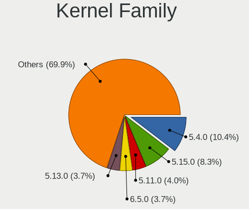
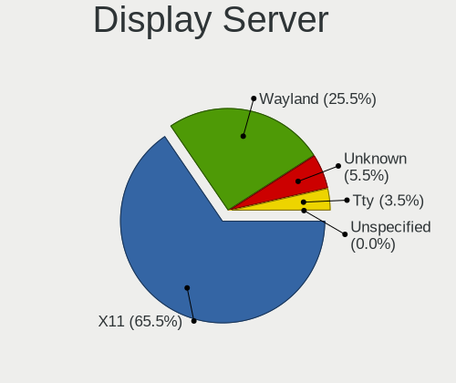
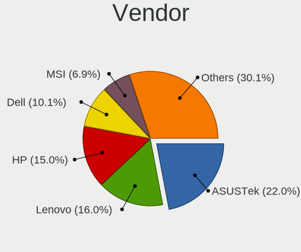
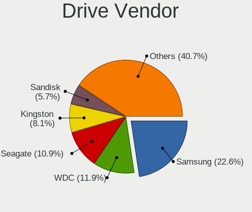
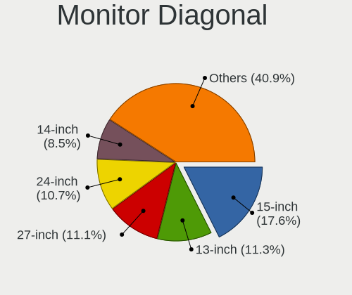
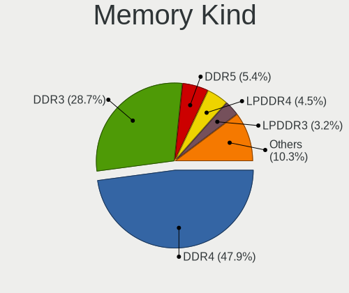
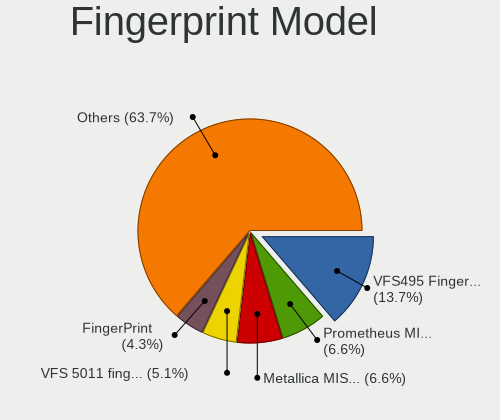
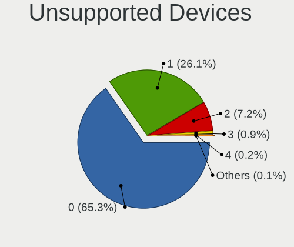

Linux in Sweden - Tested Hardware & Statistics
----------------------------------------------

A project to collect tested hardware configurations for Linux in Sweden.

Anyone can contribute to this report by the [hw-probe](https://github.com/linuxhw/hw-probe) tool:

    sudo -E hw-probe -all -upload

Please contribute! Especially if your hardware is rare.

This is a report for all computer types. See also reports for [desktops](/Location/Sweden/Desktop/README.md) and [notebooks](/Location/Sweden/Notebook/README.md).

Contents
--------

* [ Test Cases ](#test-cases)

* [ System ](#system)
  - [ OS                       ](#os)
  - [ OS Family                ](#os-family)
  - [ Kernel                   ](#kernel)
  - [ Kernel Family            ](#kernel-family)
  - [ Kernel Major Ver.        ](#kernel-major-ver)
  - [ Arch                     ](#arch)
  - [ DE                       ](#de)
  - [ Display Server           ](#display-server)
  - [ Display Manager          ](#display-manager)
  - [ OS Lang                  ](#os-lang)
  - [ Boot Mode                ](#boot-mode)
  - [ Filesystem               ](#filesystem)
  - [ Part. scheme             ](#part-scheme)
  - [ Dual Boot with Linux/BSD ](#dual-boot-with-linuxbsd)
  - [ Dual Boot (Win)          ](#dual-boot-win)

* [ Board ](#board)
  - [ Vendor                   ](#vendor)
  - [ Model                    ](#model)
  - [ Model Family             ](#model-family)
  - [ MFG Year                 ](#mfg-year)
  - [ Form Factor              ](#form-factor)
  - [ Secure Boot              ](#secure-boot)
  - [ Coreboot                 ](#coreboot)
  - [ RAM Size                 ](#ram-size)
  - [ RAM Used                 ](#ram-used)
  - [ Total Drives             ](#total-drives)
  - [ Has CD-ROM               ](#has-cd-rom)
  - [ Has Ethernet             ](#has-ethernet)
  - [ Has WiFi                 ](#has-wifi)
  - [ Has Bluetooth            ](#has-bluetooth)

* [ Location ](#location)
  - [ Country                  ](#country)
  - [ City                     ](#city)

* [ Drives ](#drives)
  - [ Drive Vendor             ](#drive-vendor)
  - [ Drive Model              ](#drive-model)
  - [ HDD Vendor               ](#hdd-vendor)
  - [ SSD Vendor               ](#ssd-vendor)
  - [ Drive Kind               ](#drive-kind)
  - [ Drive Connector          ](#drive-connector)
  - [ Drive Size               ](#drive-size)
  - [ Space Total              ](#space-total)
  - [ Space Used               ](#space-used)
  - [ Malfunc. Drives          ](#malfunc-drives)
  - [ Malfunc. Drive Vendor    ](#malfunc-drive-vendor)
  - [ Malfunc. HDD Vendor      ](#malfunc-hdd-vendor)
  - [ Malfunc. Drive Kind      ](#malfunc-drive-kind)
  - [ Failed Drives            ](#failed-drives)
  - [ Failed Drive Vendor      ](#failed-drive-vendor)
  - [ Drive Status             ](#drive-status)

* [ Storage controller ](#storage-controller)
  - [ Storage Vendor           ](#storage-vendor)
  - [ Storage Model            ](#storage-model)
  - [ Storage Kind             ](#storage-kind)

* [ Processor ](#processor)
  - [ CPU Vendor               ](#cpu-vendor)
  - [ CPU Model                ](#cpu-model)
  - [ CPU Model Family         ](#cpu-model-family)
  - [ CPU Cores                ](#cpu-cores)
  - [ CPU Sockets              ](#cpu-sockets)
  - [ CPU Threads              ](#cpu-threads)
  - [ CPU Op-Modes             ](#cpu-op-modes)
  - [ CPU Microcode            ](#cpu-microcode)
  - [ CPU Microarch            ](#cpu-microarch)

* [ Graphics ](#graphics)
  - [ GPU Vendor               ](#gpu-vendor)
  - [ GPU Model                ](#gpu-model)
  - [ GPU Combo                ](#gpu-combo)
  - [ GPU Driver               ](#gpu-driver)
  - [ GPU Memory               ](#gpu-memory)

* [ Monitor ](#monitor)
  - [ Monitor Vendor           ](#monitor-vendor)
  - [ Monitor Model            ](#monitor-model)
  - [ Monitor Resolution       ](#monitor-resolution)
  - [ Monitor Diagonal         ](#monitor-diagonal)
  - [ Monitor Width            ](#monitor-width)
  - [ Aspect Ratio             ](#aspect-ratio)
  - [ Monitor Area             ](#monitor-area)
  - [ Pixel Density            ](#pixel-density)
  - [ Multiple Monitors        ](#multiple-monitors)

* [ Network ](#network)
  - [ Net Controller Vendor    ](#net-controller-vendor)
  - [ Net Controller Model     ](#net-controller-model)
  - [ Wireless Vendor          ](#wireless-vendor)
  - [ Wireless Model           ](#wireless-model)
  - [ Ethernet Vendor          ](#ethernet-vendor)
  - [ Ethernet Model           ](#ethernet-model)
  - [ Net Controller Kind      ](#net-controller-kind)
  - [ Used Controller          ](#used-controller)
  - [ NICs                     ](#nics)
  - [ IPv6                     ](#ipv6)

* [ Bluetooth ](#bluetooth)
  - [ Bluetooth Vendor         ](#bluetooth-vendor)
  - [ Bluetooth Model          ](#bluetooth-model)

* [ Sound ](#sound)
  - [ Sound Vendor             ](#sound-vendor)
  - [ Sound Model              ](#sound-model)

* [ Memory ](#memory)
  - [ Memory Vendor            ](#memory-vendor)
  - [ Memory Model             ](#memory-model)
  - [ Memory Kind              ](#memory-kind)
  - [ Memory Form Factor       ](#memory-form-factor)
  - [ Memory Size              ](#memory-size)
  - [ Memory Speed             ](#memory-speed)

* [ Printers & scanners ](#printers--scanners)
  - [ Printer Vendor           ](#printer-vendor)
  - [ Printer Model            ](#printer-model)
  - [ Scanner Vendor           ](#scanner-vendor)
  - [ Scanner Model            ](#scanner-model)

* [ Camera ](#camera)
  - [ Camera Vendor            ](#camera-vendor)
  - [ Camera Model             ](#camera-model)

* [ Security ](#security)
  - [ Fingerprint Vendor       ](#fingerprint-vendor)
  - [ Fingerprint Model        ](#fingerprint-model)
  - [ Chipcard Vendor          ](#chipcard-vendor)
  - [ Chipcard Model           ](#chipcard-model)

* [ Unsupported ](#unsupported)
  - [ Unsupported Devices      ](#unsupported-devices)
  - [ Unsupported Device Types ](#unsupported-device-types)

Test Cases
----------

Total: 3305

| Vendor        | Model                       | Form-Factor | Probe                                                      | Date         |
|---------------|-----------------------------|-------------|------------------------------------------------------------|--------------|
| Gigabyte      | B85M-D3H                    | Desktop     | [ccc7d658ea](https://linux-hardware.org/?probe=ccc7d658ea) | Nov 06, 2023 |
| Dell          | 0VHWTR A01                  | Desktop     | [8cd8d5ade1](https://linux-hardware.org/?probe=8cd8d5ade1) | Nov 06, 2023 |
| Acer          | Swift SF113-31              | Notebook    | [a6fbe4af41](https://linux-hardware.org/?probe=a6fbe4af41) | Nov 05, 2023 |
| ASUSTek       | ROG STRIX X570-E GAMING     | Desktop     | [4f690a4297](https://linux-hardware.org/?probe=4f690a4297) | Nov 05, 2023 |
| HP            | Unknown                     | Notebook    | [c8cff9e339](https://linux-hardware.org/?probe=c8cff9e339) | Nov 05, 2023 |
| Dell          | XPS 13 9310                 | Notebook    | [5ff7f9b284](https://linux-hardware.org/?probe=5ff7f9b284) | Nov 04, 2023 |
| HP            | Pavilion Laptop 15-eh1xx... | Notebook    | [d0f3cf43b7](https://linux-hardware.org/?probe=d0f3cf43b7) | Nov 04, 2023 |
| Lenovo        | ThinkPad X220 4293A25       | Notebook    | [95a5125a73](https://linux-hardware.org/?probe=95a5125a73) | Nov 03, 2023 |
| ASUSTek       | PRIME X570-PRO              | Desktop     | [62a859fb72](https://linux-hardware.org/?probe=62a859fb72) | Nov 03, 2023 |
| Lenovo        | ThinkPad P14s Gen 4 21K5... | Notebook    | [7b64212148](https://linux-hardware.org/?probe=7b64212148) | Nov 03, 2023 |
| Lenovo        | ThinkPad P14s Gen 4 21K5... | Notebook    | [0e71b912ec](https://linux-hardware.org/?probe=0e71b912ec) | Nov 03, 2023 |
| ASUSTek       | STRIX H270F GAMING          | Desktop     | [e95902544f](https://linux-hardware.org/?probe=e95902544f) | Nov 03, 2023 |
| Fujitsu       | LIFEBOOK A532               | Notebook    | [b596813aeb](https://linux-hardware.org/?probe=b596813aeb) | Nov 02, 2023 |
| Panasonic     | CF-54-1                     | Notebook    | [b7d7cde99a](https://linux-hardware.org/?probe=b7d7cde99a) | Nov 01, 2023 |
| ONDA          | Tablet                      | Tablet      | [1f8b5d6c72](https://linux-hardware.org/?probe=1f8b5d6c72) | Nov 01, 2023 |
| HP            | 2B01                        | Desktop     | [a345333330](https://linux-hardware.org/?probe=a345333330) | Oct 31, 2023 |
| HP            | 2B01                        | Desktop     | [b3a75824f5](https://linux-hardware.org/?probe=b3a75824f5) | Oct 31, 2023 |
| Dell          | Precision 5570              | Notebook    | [fb83199260](https://linux-hardware.org/?probe=fb83199260) | Oct 31, 2023 |
| Lenovo        | IdeaPad S145-15IIL 81W8     | Notebook    | [9dd62a1bb2](https://linux-hardware.org/?probe=9dd62a1bb2) | Oct 31, 2023 |
| Dell          | Latitude 7370               | Notebook    | [f47b42c0b0](https://linux-hardware.org/?probe=f47b42c0b0) | Oct 30, 2023 |
| HP            | Unknown                     | Notebook    | [3aadbc5c33](https://linux-hardware.org/?probe=3aadbc5c33) | Oct 30, 2023 |
| HP            | Laptop 15-bw0xx             | Notebook    | [b61ad8059a](https://linux-hardware.org/?probe=b61ad8059a) | Oct 30, 2023 |
| Fujitsu       | D3049-B1 S26361-D3049-B1... | Server      | [261e5240fe](https://linux-hardware.org/?probe=261e5240fe) | Oct 30, 2023 |
| Apple         | MacBookAir6,2               | Notebook    | [65f24e332a](https://linux-hardware.org/?probe=65f24e332a) | Oct 30, 2023 |
| Gigabyte      | B550 AORUS PRO AC           | Desktop     | [e41780f56a](https://linux-hardware.org/?probe=e41780f56a) | Oct 29, 2023 |
| HP            | G62                         | Notebook    | [bd714e9671](https://linux-hardware.org/?probe=bd714e9671) | Oct 29, 2023 |
| Lenovo        | ThinkPad T14s Gen 3 21CQ... | Notebook    | [4aceca5660](https://linux-hardware.org/?probe=4aceca5660) | Oct 28, 2023 |
| ASUSTek       | G75VW                       | Notebook    | [e3bde6ede0](https://linux-hardware.org/?probe=e3bde6ede0) | Oct 28, 2023 |
| HP            | EliteBook 850 G4            | Notebook    | [68da315076](https://linux-hardware.org/?probe=68da315076) | Oct 28, 2023 |
| Lenovo        | ThinkPad X230 2325SDE       | Notebook    | [cbdbd4a156](https://linux-hardware.org/?probe=cbdbd4a156) | Oct 27, 2023 |
| HP            | 8433 11                     | Desktop     | [f4b0e9190f](https://linux-hardware.org/?probe=f4b0e9190f) | Oct 27, 2023 |
| Lenovo        | IdeaPad 1 15IAU7 82QD       | Notebook    | [a20c6e2c77](https://linux-hardware.org/?probe=a20c6e2c77) | Oct 26, 2023 |
| Fujitsu       | LIFEBOOK E752               | Notebook    | [c1078c11fb](https://linux-hardware.org/?probe=c1078c11fb) | Oct 26, 2023 |
| HP            | ProBook 650 G1              | Notebook    | [b05283573c](https://linux-hardware.org/?probe=b05283573c) | Oct 26, 2023 |
| HP            | EliteBook 8560p             | Notebook    | [101037a3e1](https://linux-hardware.org/?probe=101037a3e1) | Oct 25, 2023 |
| Acer          | Aspire ES1-311              | Notebook    | [b98bc11e71](https://linux-hardware.org/?probe=b98bc11e71) | Oct 25, 2023 |
| ASUSTek       | TUF Gaming B650-PLUS WIF... | Desktop     | [b7447f21b5](https://linux-hardware.org/?probe=b7447f21b5) | Oct 25, 2023 |
| Acer          | Aspire ES1-311              | Notebook    | [c505d21099](https://linux-hardware.org/?probe=c505d21099) | Oct 25, 2023 |
| Notebook      | NS5x_NS7xAU                 | Notebook    | [ad7033d138](https://linux-hardware.org/?probe=ad7033d138) | Oct 24, 2023 |
| Lenovo        | ThinkCentre M90 5485W2L     | Desktop     | [0fcc4fe794](https://linux-hardware.org/?probe=0fcc4fe794) | Oct 24, 2023 |
| HP            | EliteBook 820 G1            | Notebook    | [51f3725a80](https://linux-hardware.org/?probe=51f3725a80) | Oct 24, 2023 |
| Dell          | Latitude 3190               | Notebook    | [a26f69cb33](https://linux-hardware.org/?probe=a26f69cb33) | Oct 24, 2023 |
| Lenovo        | Yoga Slim 7 Carbon 13ITL... | Notebook    | [88e833ab8a](https://linux-hardware.org/?probe=88e833ab8a) | Oct 24, 2023 |
| Lenovo        | Yoga Slim 7 Carbon 13ITL... | Notebook    | [62ca050eaf](https://linux-hardware.org/?probe=62ca050eaf) | Oct 24, 2023 |
| Dixonsxp      | Unknown                     | Notebook    | [da9f723fd0](https://linux-hardware.org/?probe=da9f723fd0) | Oct 23, 2023 |
| ONDA          | Tablet                      | Tablet      | [2ef7c07bdf](https://linux-hardware.org/?probe=2ef7c07bdf) | Oct 22, 2023 |
| Dell          | 06FW8P A01                  | Desktop     | [356c2f38aa](https://linux-hardware.org/?probe=356c2f38aa) | Oct 21, 2023 |
| HP            | ML150 G3                    | Desktop     | [eb5a4bfed8](https://linux-hardware.org/?probe=eb5a4bfed8) | Oct 21, 2023 |
| ONDA          | Tablet                      | Tablet      | [835a5e9d6d](https://linux-hardware.org/?probe=835a5e9d6d) | Oct 21, 2023 |
| Dell          | XPS 13 9310                 | Notebook    | [cceff4e3b1](https://linux-hardware.org/?probe=cceff4e3b1) | Oct 20, 2023 |
| MSI           | MAG B560M MORTAR            | Desktop     | [a7f26cedd6](https://linux-hardware.org/?probe=a7f26cedd6) | Oct 20, 2023 |
| Lenovo        | ThinkPad X1 Carbon Gen 1... | Notebook    | [0feec3b3ab](https://linux-hardware.org/?probe=0feec3b3ab) | Oct 19, 2023 |
| MSI           | B550-A PRO                  | Desktop     | [77cf0c3af6](https://linux-hardware.org/?probe=77cf0c3af6) | Oct 18, 2023 |
| Lenovo        | Yoga Slim 7 Carbon 13ITL... | Notebook    | [0815767d1d](https://linux-hardware.org/?probe=0815767d1d) | Oct 18, 2023 |
| ASUSTek       | PRIME B660M-K D4            | Desktop     | [0944131c12](https://linux-hardware.org/?probe=0944131c12) | Oct 18, 2023 |
| ONDA          | Tablet                      | Tablet      | [6a43a8d57d](https://linux-hardware.org/?probe=6a43a8d57d) | Oct 18, 2023 |
| Lenovo        | ThinkPad X1 Carbon Gen 1... | Notebook    | [0b4065c185](https://linux-hardware.org/?probe=0b4065c185) | Oct 17, 2023 |
| HP            | EliteBook 8760w             | Notebook    | [d5febd2212](https://linux-hardware.org/?probe=d5febd2212) | Oct 17, 2023 |
| HP            | 8433 11                     | Desktop     | [24fdb6f03a](https://linux-hardware.org/?probe=24fdb6f03a) | Oct 16, 2023 |
| HP            | EliteBook 8570p             | Notebook    | [cfc61d2f3c](https://linux-hardware.org/?probe=cfc61d2f3c) | Oct 15, 2023 |
| Notebook      | NS5x_NS7xAU                 | Notebook    | [1568dbcf9b](https://linux-hardware.org/?probe=1568dbcf9b) | Oct 15, 2023 |
| Lenovo        | ThinkPad X230 232578G       | Notebook    | [80bd4e2684](https://linux-hardware.org/?probe=80bd4e2684) | Oct 15, 2023 |
| ASUSTek       | STRIX Z270H GAMING          | Desktop     | [6082a5c0de](https://linux-hardware.org/?probe=6082a5c0de) | Oct 15, 2023 |
| Apple         | MacBookPro6,2               | Notebook    | [1df7e29365](https://linux-hardware.org/?probe=1df7e29365) | Oct 15, 2023 |
| Shenzhen D... | MP80                        | Mini pc     | [c6c5b8dc5c](https://linux-hardware.org/?probe=c6c5b8dc5c) | Oct 15, 2023 |
| Shenzhen D... | MP80                        | Mini pc     | [02141519f7](https://linux-hardware.org/?probe=02141519f7) | Oct 15, 2023 |
| ASRock        | X399 Taichi                 | Desktop     | [10b572c94a](https://linux-hardware.org/?probe=10b572c94a) | Oct 14, 2023 |
| Lenovo        | Yoga Slim 7 Carbon 13ITL... | Notebook    | [7901d1df27](https://linux-hardware.org/?probe=7901d1df27) | Oct 12, 2023 |
| Lenovo        | Yoga Slim 7 Pro 14ACH5 8... | Notebook    | [c815acfae8](https://linux-hardware.org/?probe=c815acfae8) | Oct 11, 2023 |
| HP            | ProBook 640 G1              | Notebook    | [f6fbcbf614](https://linux-hardware.org/?probe=f6fbcbf614) | Oct 11, 2023 |
| Gigabyte      | Z68MA-D2H-B3                | Desktop     | [a646cc1cc1](https://linux-hardware.org/?probe=a646cc1cc1) | Oct 10, 2023 |
| Gigabyte      | Z68MA-D2H-B3                | Desktop     | [d731fb0868](https://linux-hardware.org/?probe=d731fb0868) | Oct 10, 2023 |
| Dell          | Latitude 7420               | Notebook    | [4071bd53ce](https://linux-hardware.org/?probe=4071bd53ce) | Oct 10, 2023 |
| Gigabyte      | H87N-WIFI                   | Desktop     | [f010d626da](https://linux-hardware.org/?probe=f010d626da) | Oct 08, 2023 |
| ASUSTek       | ROG STRIX B450-E GAMING     | Desktop     | [a07ec0ee55](https://linux-hardware.org/?probe=a07ec0ee55) | Oct 08, 2023 |
| ASUSTek       | Vivobook Go E1504FA_E150... | Notebook    | [c360c7552a](https://linux-hardware.org/?probe=c360c7552a) | Oct 08, 2023 |
| ASUSTek       | ROG STRIX X470-F GAMING     | Desktop     | [7b6ad19193](https://linux-hardware.org/?probe=7b6ad19193) | Oct 07, 2023 |
| Dell          | 0PU052                      | Desktop     | [c32b862792](https://linux-hardware.org/?probe=c32b862792) | Oct 07, 2023 |
| Lenovo        | 364F SDK0J40700 WIN 3258... | Desktop     | [dcc7e8da51](https://linux-hardware.org/?probe=dcc7e8da51) | Oct 06, 2023 |
| Dell          | Vostro 3550                 | Notebook    | [d68de2a20e](https://linux-hardware.org/?probe=d68de2a20e) | Oct 06, 2023 |
| Apple         | MacBook4,1                  | Notebook    | [e5b3d089e8](https://linux-hardware.org/?probe=e5b3d089e8) | Oct 06, 2023 |
| Apple         | MacBook4,1                  | Notebook    | [11497e61f8](https://linux-hardware.org/?probe=11497e61f8) | Oct 06, 2023 |
| ASUSTek       | TUF Gaming B550M-PLUS       | Desktop     | [8bc96db254](https://linux-hardware.org/?probe=8bc96db254) | Oct 06, 2023 |
| HP            | ZBook 14u G4                | Notebook    | [1d14da7190](https://linux-hardware.org/?probe=1d14da7190) | Oct 05, 2023 |
| Fujitsu Si... | AMILO Xa 1526               | Notebook    | [071eee1057](https://linux-hardware.org/?probe=071eee1057) | Oct 03, 2023 |
| Dell          | 096JG8 A01                  | Desktop     | [8076ad493d](https://linux-hardware.org/?probe=8076ad493d) | Oct 03, 2023 |
| ASUSTek       | SABERTOOTH Z77              | Desktop     | [6a2fa93249](https://linux-hardware.org/?probe=6a2fa93249) | Oct 03, 2023 |
| Lenovo        | ThinkPad T420s 4170CTO      | Notebook    | [f141fc2bd7](https://linux-hardware.org/?probe=f141fc2bd7) | Oct 02, 2023 |
| Apple         | MacBookPro7,1               | Notebook    | [d88817f79c](https://linux-hardware.org/?probe=d88817f79c) | Oct 02, 2023 |
| ASUSTek       | PRIME X570-PRO              | Desktop     | [f80a538f2a](https://linux-hardware.org/?probe=f80a538f2a) | Oct 02, 2023 |
| ASUSTek       | PRIME X570-PRO              | Desktop     | [76f023476d](https://linux-hardware.org/?probe=76f023476d) | Oct 02, 2023 |
| Intel         | NUC7JYB M37316-600          | Mini pc     | [8487059659](https://linux-hardware.org/?probe=8487059659) | Sep 30, 2023 |
| HP            | ZBook Studio G5             | Notebook    | [3f96bd2883](https://linux-hardware.org/?probe=3f96bd2883) | Sep 30, 2023 |
| HP            | ENVY TS Sleekbook 4         | Notebook    | [545098d0d2](https://linux-hardware.org/?probe=545098d0d2) | Sep 29, 2023 |
| MSI           | H97 GAMING 3                | Desktop     | [51f3cd7354](https://linux-hardware.org/?probe=51f3cd7354) | Sep 29, 2023 |
| HP            | ZBook Studio G5             | Notebook    | [239b5a3fd5](https://linux-hardware.org/?probe=239b5a3fd5) | Sep 29, 2023 |
| ASUSTek       | ROG STRIX X670E-F GAMING... | Desktop     | [5c38fe5e79](https://linux-hardware.org/?probe=5c38fe5e79) | Sep 28, 2023 |
| Lenovo        | IdeaPad Slim 5 14ABR8 82... | Notebook    | [c61d70bcfa](https://linux-hardware.org/?probe=c61d70bcfa) | Sep 28, 2023 |
| Lenovo        | IdeaPad Slim 5 14ABR8 82... | Notebook    | [be49c167d0](https://linux-hardware.org/?probe=be49c167d0) | Sep 28, 2023 |
| ASUSTek       | ASUS TUF Gaming A15 FA50... | Notebook    | [8c585051a3](https://linux-hardware.org/?probe=8c585051a3) | Sep 27, 2023 |
| MSI           | Z77A-S01                    | Desktop     | [277586f152](https://linux-hardware.org/?probe=277586f152) | Sep 27, 2023 |
| Dell          | Vostro 3550                 | Notebook    | [f87aee7d8f](https://linux-hardware.org/?probe=f87aee7d8f) | Sep 26, 2023 |
| Dell          | Vostro 3550                 | Notebook    | [7214093885](https://linux-hardware.org/?probe=7214093885) | Sep 26, 2023 |
| Dell          | Latitude E7270              | Notebook    | [98dd5eefb6](https://linux-hardware.org/?probe=98dd5eefb6) | Sep 25, 2023 |
| Dell          | Latitude E5270              | Notebook    | [d091c4fa0e](https://linux-hardware.org/?probe=d091c4fa0e) | Sep 24, 2023 |
| Lenovo        | 364F SDK0J40700 WIN 3258... | Desktop     | [de5a55aa7b](https://linux-hardware.org/?probe=de5a55aa7b) | Sep 23, 2023 |
| Dell          | Inspiron 3541               | Notebook    | [da796376e1](https://linux-hardware.org/?probe=da796376e1) | Sep 23, 2023 |
| Lenovo        | ThinkPad X380 Yoga 20LH0... | Convertible | [9b6bbb4b56](https://linux-hardware.org/?probe=9b6bbb4b56) | Sep 23, 2023 |
| Valve         | Jupiter                     | Notebook    | [3889f9ca9d](https://linux-hardware.org/?probe=3889f9ca9d) | Sep 23, 2023 |
| Acer          | Aspire ES1-520              | Notebook    | [22ce921c1e](https://linux-hardware.org/?probe=22ce921c1e) | Sep 22, 2023 |
| ASUSTek       | Crosshair IV Formula        | Desktop     | [4679088d4e](https://linux-hardware.org/?probe=4679088d4e) | Sep 22, 2023 |
| HP            | EliteBook 840 G8 Noteboo... | Notebook    | [1893bb3992](https://linux-hardware.org/?probe=1893bb3992) | Sep 22, 2023 |
| Lenovo        | ThinkPad T470s 20HF0000M... | Notebook    | [ad989ac089](https://linux-hardware.org/?probe=ad989ac089) | Sep 21, 2023 |
| Lenovo        | ThinkPad E15 Gen 2 20TD0... | Notebook    | [4d1743c405](https://linux-hardware.org/?probe=4d1743c405) | Sep 20, 2023 |
| Dell          | 0GDG8Y A00                  | Desktop     | [9e6874d35c](https://linux-hardware.org/?probe=9e6874d35c) | Sep 20, 2023 |
| ASUSTek       | P8H61-M EVO                 | Desktop     | [51c58cd13a](https://linux-hardware.org/?probe=51c58cd13a) | Sep 19, 2023 |
| ASUSTek       | P8H61-M EVO                 | Desktop     | [64618297ff](https://linux-hardware.org/?probe=64618297ff) | Sep 19, 2023 |
| Dell          | XPS 13 9370                 | Notebook    | [002401cab6](https://linux-hardware.org/?probe=002401cab6) | Sep 18, 2023 |
| HP            | ZBook Power 15.6 inch G8... | Notebook    | [79142d7f53](https://linux-hardware.org/?probe=79142d7f53) | Sep 17, 2023 |
| Shenzhen M... | F7BAA                       | Desktop     | [10d32d6284](https://linux-hardware.org/?probe=10d32d6284) | Sep 17, 2023 |
| ASUSTek       | ROG STRIX Z390-F GAMING     | Desktop     | [293bc3eab9](https://linux-hardware.org/?probe=293bc3eab9) | Sep 16, 2023 |
| ASUSTek       | K55DR                       | Notebook    | [f3b7f92416](https://linux-hardware.org/?probe=f3b7f92416) | Sep 16, 2023 |
| MSI           | MAG X570S TOMAHAWK MAX W... | Desktop     | [2fa5c8bb34](https://linux-hardware.org/?probe=2fa5c8bb34) | Sep 16, 2023 |
| ASUSTek       | ROG STRIX B660-A GAMING ... | Desktop     | [efda5ec51a](https://linux-hardware.org/?probe=efda5ec51a) | Sep 15, 2023 |
| Dell          | 0VHWTR A01                  | Desktop     | [43f6a3bfc1](https://linux-hardware.org/?probe=43f6a3bfc1) | Sep 14, 2023 |
| Dell          | 0VHWTR A01                  | Desktop     | [dcd2b90824](https://linux-hardware.org/?probe=dcd2b90824) | Sep 14, 2023 |
| Alienware     | 07JNH0 A00                  | Desktop     | [bd161c3850](https://linux-hardware.org/?probe=bd161c3850) | Sep 14, 2023 |
| Lenovo        | ThinkPad P14s Gen 3 21AK... | Notebook    | [0cdeaab8be](https://linux-hardware.org/?probe=0cdeaab8be) | Sep 13, 2023 |
| Raspberry ... | Raspberry Pi                | Soc         | [118c76cef1](https://linux-hardware.org/?probe=118c76cef1) | Sep 12, 2023 |
| Samsung       | R530/R730/P590              | Notebook    | [d9bd973c79](https://linux-hardware.org/?probe=d9bd973c79) | Sep 12, 2023 |
| ASUSTek       | VivoBook_ASUSLaptop X150... | Notebook    | [58b852c7cb](https://linux-hardware.org/?probe=58b852c7cb) | Sep 12, 2023 |
| ASUSTek       | Maximus VI EXTREME          | Desktop     | [e1eea73611](https://linux-hardware.org/?probe=e1eea73611) | Sep 12, 2023 |
| ASUSTek       | VivoBook_ASUSLaptop X150... | Notebook    | [10ff64dcf5](https://linux-hardware.org/?probe=10ff64dcf5) | Sep 12, 2023 |
| MSI           | Stealth 15M B12UE           | Notebook    | [9a23215875](https://linux-hardware.org/?probe=9a23215875) | Sep 11, 2023 |
| Apple         | MacBookPro8,1               | Notebook    | [d3b821a061](https://linux-hardware.org/?probe=d3b821a061) | Sep 10, 2023 |
| Alienware     | 07JNH0 A00                  | Desktop     | [4d658a922b](https://linux-hardware.org/?probe=4d658a922b) | Sep 10, 2023 |
| Intel         | NUC7JYB M37316-600          | Mini pc     | [03b8175690](https://linux-hardware.org/?probe=03b8175690) | Sep 10, 2023 |
| ASUSTek       | TS10                        | Desktop     | [ad867c5e25](https://linux-hardware.org/?probe=ad867c5e25) | Sep 10, 2023 |
| Dell          | Precision M4800             | Notebook    | [ea570fedac](https://linux-hardware.org/?probe=ea570fedac) | Sep 09, 2023 |
| HP            | ProBook x360 11 G3 EE       | Convertible | [03ce2f9b74](https://linux-hardware.org/?probe=03ce2f9b74) | Sep 09, 2023 |
| ASUSTek       | ROG STRIX B550-F GAMING     | Desktop     | [3857377d7a](https://linux-hardware.org/?probe=3857377d7a) | Sep 09, 2023 |
| ASUSTek       | G75VW                       | Notebook    | [98ba75a25b](https://linux-hardware.org/?probe=98ba75a25b) | Sep 09, 2023 |
| ASRock        | X399 Taichi                 | Desktop     | [0c2dda2476](https://linux-hardware.org/?probe=0c2dda2476) | Sep 09, 2023 |
| ASUSTek       | X453MA                      | Notebook    | [b73ef6339a](https://linux-hardware.org/?probe=b73ef6339a) | Sep 08, 2023 |
| ASUSTek       | X453MA                      | Notebook    | [e71f333094](https://linux-hardware.org/?probe=e71f333094) | Sep 07, 2023 |
| Gigabyte      | H610M H DDR4                | Desktop     | [72516e7752](https://linux-hardware.org/?probe=72516e7752) | Sep 07, 2023 |
| ASUSTek       | ROG STRIX B450-I GAMING     | Desktop     | [26448cf759](https://linux-hardware.org/?probe=26448cf759) | Sep 07, 2023 |
| MSI           | MAG B550M MORTAR WIFI       | Desktop     | [7cbd11709c](https://linux-hardware.org/?probe=7cbd11709c) | Sep 07, 2023 |
| ASUSTek       | X453MA                      | Notebook    | [c48759c297](https://linux-hardware.org/?probe=c48759c297) | Sep 07, 2023 |
| ASUSTek       | P7H55-M PRO                 | Desktop     | [26a5d8b449](https://linux-hardware.org/?probe=26a5d8b449) | Sep 06, 2023 |
| ASRock        | B460 Phantom Gaming 4       | Desktop     | [6521407977](https://linux-hardware.org/?probe=6521407977) | Sep 06, 2023 |
| Lenovo        | Yoga 920-13IKB 80Y7         | Convertible | [5dca7c7315](https://linux-hardware.org/?probe=5dca7c7315) | Sep 05, 2023 |
| MSI           | MAG B560M MORTAR            | Desktop     | [07429e910f](https://linux-hardware.org/?probe=07429e910f) | Sep 05, 2023 |
| Dell          | Latitude 7440               | Notebook    | [47f28d7b00](https://linux-hardware.org/?probe=47f28d7b00) | Sep 04, 2023 |
| Dell          | Latitude 7440               | Notebook    | [27b2ae9d5b](https://linux-hardware.org/?probe=27b2ae9d5b) | Sep 04, 2023 |
| MSI           | MAG B560M MORTAR            | Desktop     | [c8978cf811](https://linux-hardware.org/?probe=c8978cf811) | Sep 03, 2023 |
| Lenovo        | ThinkPad T440 20B7S0RD00    | Notebook    | [af57fd1655](https://linux-hardware.org/?probe=af57fd1655) | Sep 03, 2023 |
| MSI           | MAG B560M MORTAR            | Desktop     | [62ac121b13](https://linux-hardware.org/?probe=62ac121b13) | Sep 03, 2023 |
| Fujitsu Si... | AMILO Xa 1526               | Notebook    | [806eed53dc](https://linux-hardware.org/?probe=806eed53dc) | Sep 02, 2023 |
| Fujitsu Si... | AMILO Xa 1526               | Notebook    | [377d5352d8](https://linux-hardware.org/?probe=377d5352d8) | Sep 02, 2023 |
| HP            | EliteBook 8460p             | Notebook    | [b6f6192ef9](https://linux-hardware.org/?probe=b6f6192ef9) | Sep 02, 2023 |
| Lenovo        | ThinkPad A275 20KDS01T00    | Notebook    | [e4a45bf853](https://linux-hardware.org/?probe=e4a45bf853) | Sep 02, 2023 |
| Dell          | 0GDG8Y A00                  | Desktop     | [19bf85f553](https://linux-hardware.org/?probe=19bf85f553) | Sep 01, 2023 |
| Acer          | Aspire 5755G                | Notebook    | [b938dc8500](https://linux-hardware.org/?probe=b938dc8500) | Aug 31, 2023 |
| HP            | ProBook 6360b               | Notebook    | [0dbff9ebb3](https://linux-hardware.org/?probe=0dbff9ebb3) | Aug 30, 2023 |
| Alienware     | 07JNH0 A00                  | Desktop     | [a21f3ba335](https://linux-hardware.org/?probe=a21f3ba335) | Aug 30, 2023 |
| ASUSTek       | P8P67 PRO                   | Desktop     | [3740c90267](https://linux-hardware.org/?probe=3740c90267) | Aug 30, 2023 |
| Lenovo        | ThinkPad E15 Gen 2 20TD0... | Notebook    | [44e7ba057b](https://linux-hardware.org/?probe=44e7ba057b) | Aug 30, 2023 |
| Apple         | MacBookAir6,2               | Notebook    | [7c208705e5](https://linux-hardware.org/?probe=7c208705e5) | Aug 29, 2023 |
| Intel         | NUC7JYB M37316-600          | Mini pc     | [6f5a767b7e](https://linux-hardware.org/?probe=6f5a767b7e) | Aug 29, 2023 |
| Dell          | 0GDG8Y A00                  | Desktop     | [577d9d5dc1](https://linux-hardware.org/?probe=577d9d5dc1) | Aug 29, 2023 |
| ASUSTek       | ROG STRIX B660-A GAMING ... | Desktop     | [0be67de1c9](https://linux-hardware.org/?probe=0be67de1c9) | Aug 29, 2023 |
| Lenovo        | B50-30 80ES                 | Notebook    | [96aa7b5683](https://linux-hardware.org/?probe=96aa7b5683) | Aug 29, 2023 |
| Intel         | NUC7JYB M37316-600          | Mini pc     | [6736188e61](https://linux-hardware.org/?probe=6736188e61) | Aug 26, 2023 |
| ASUSTek       | PRIME B650M-A WIFI          | Desktop     | [6a55471f69](https://linux-hardware.org/?probe=6a55471f69) | Aug 26, 2023 |
| Acer          | Aspire ES1-311              | Notebook    | [f0a3b05a99](https://linux-hardware.org/?probe=f0a3b05a99) | Aug 25, 2023 |
| Lenovo        | ThinkPad T440s 20AR003RM... | Notebook    | [f8f097e135](https://linux-hardware.org/?probe=f8f097e135) | Aug 24, 2023 |
| Lenovo        | IdeaPad 110-17ACL 80UM      | Notebook    | [aa3157f519](https://linux-hardware.org/?probe=aa3157f519) | Aug 24, 2023 |
| Lenovo        | IdeaPad 110-17ACL 80UM      | Notebook    | [8d3738c790](https://linux-hardware.org/?probe=8d3738c790) | Aug 24, 2023 |
| Gigabyte      | B85M-D3V-A                  | Desktop     | [e11053f833](https://linux-hardware.org/?probe=e11053f833) | Aug 23, 2023 |
| Gigabyte      | X570 AORUS MASTER           | Desktop     | [799390e547](https://linux-hardware.org/?probe=799390e547) | Aug 23, 2023 |
| Lenovo        | IdeaPad Pro 5 16ARP8 83A... | Notebook    | [3231dcefb4](https://linux-hardware.org/?probe=3231dcefb4) | Aug 22, 2023 |
| HP            | 845A                        | Desktop     | [4a8699daad](https://linux-hardware.org/?probe=4a8699daad) | Aug 22, 2023 |
| MSI           | B450 TOMAHAWK MAX           | Desktop     | [b4133748fc](https://linux-hardware.org/?probe=b4133748fc) | Aug 21, 2023 |
| HP            | 212B                        | Desktop     | [ee20bd40d8](https://linux-hardware.org/?probe=ee20bd40d8) | Aug 21, 2023 |
| ASUSTek       | ROG Flow Z13 GZ301ZE_GZ3... | Tablet      | [83b6cab3cd](https://linux-hardware.org/?probe=83b6cab3cd) | Aug 20, 2023 |
| Dell          | Latitude 3350               | Notebook    | [e86ce20d6d](https://linux-hardware.org/?probe=e86ce20d6d) | Aug 20, 2023 |
| Lenovo        | ThinkPad T440s 20AR003RM... | Notebook    | [d989b68c65](https://linux-hardware.org/?probe=d989b68c65) | Aug 19, 2023 |
| Dell          | 0YXT71 A01                  | Desktop     | [aa6781c002](https://linux-hardware.org/?probe=aa6781c002) | Aug 18, 2023 |
| ASUSTek       | M3N                         | Notebook    | [7c4b9386db](https://linux-hardware.org/?probe=7c4b9386db) | Aug 18, 2023 |
| ASUSTek       | U38N                        | Notebook    | [0e0f709353](https://linux-hardware.org/?probe=0e0f709353) | Aug 17, 2023 |
| ASUSTek       | ROG STRIX X570-E GAMING     | Desktop     | [eb44f4dfc1](https://linux-hardware.org/?probe=eb44f4dfc1) | Aug 17, 2023 |
| Dell          | XPS 15 9570                 | Notebook    | [91b8c2a5eb](https://linux-hardware.org/?probe=91b8c2a5eb) | Aug 17, 2023 |
| ASUSTek       | P5QL-ASUS-SE                | Desktop     | [3135a88431](https://linux-hardware.org/?probe=3135a88431) | Aug 17, 2023 |
| Alienware     | 07JNH0 A00                  | Desktop     | [2f82c5eb18](https://linux-hardware.org/?probe=2f82c5eb18) | Aug 14, 2023 |
| Dell          | 0KV62T A00                  | Desktop     | [369b0195cc](https://linux-hardware.org/?probe=369b0195cc) | Aug 14, 2023 |
| Acer          | Aspire ES1-520              | Notebook    | [a47415983e](https://linux-hardware.org/?probe=a47415983e) | Aug 12, 2023 |
| HP            | EliteBook 840 G7 Noteboo... | Notebook    | [5ba59f878a](https://linux-hardware.org/?probe=5ba59f878a) | Aug 12, 2023 |
| Dell          | Inspiron 5559               | Notebook    | [f3e1bb3812](https://linux-hardware.org/?probe=f3e1bb3812) | Aug 11, 2023 |
| ASUSTek       | ROG STRIX X570-E GAMING     | Desktop     | [483fc71762](https://linux-hardware.org/?probe=483fc71762) | Aug 11, 2023 |
| Fujitsu Si... | AMILO Xa 1526               | Notebook    | [0a1e2a7f23](https://linux-hardware.org/?probe=0a1e2a7f23) | Aug 11, 2023 |
| Fujitsu Si... | AMILO Xa 1526               | Notebook    | [742b085257](https://linux-hardware.org/?probe=742b085257) | Aug 11, 2023 |
| HP            | ZBook Studio G7 Mobile W... | Notebook    | [836fcda626](https://linux-hardware.org/?probe=836fcda626) | Aug 11, 2023 |
| HP            | ZBook Studio G7 Mobile W... | Notebook    | [3e208faa6e](https://linux-hardware.org/?probe=3e208faa6e) | Aug 11, 2023 |
| Acer          | Nitro AN515-52              | Notebook    | [df9e6a8d98](https://linux-hardware.org/?probe=df9e6a8d98) | Aug 10, 2023 |
| SLIMBOOK      | PROX-AMD5                   | Notebook    | [f20a32551b](https://linux-hardware.org/?probe=f20a32551b) | Aug 10, 2023 |
| Clevo         | W251EFQ/W270EFQ             | Notebook    | [cde80ecaf6](https://linux-hardware.org/?probe=cde80ecaf6) | Aug 10, 2023 |
| Gigabyte      | H270N-WIFI-CF               | Desktop     | [bd9c532bbc](https://linux-hardware.org/?probe=bd9c532bbc) | Aug 10, 2023 |
| Lenovo        | ThinkBook 14-IIL 20SL       | Notebook    | [e323e9cd7e](https://linux-hardware.org/?probe=e323e9cd7e) | Aug 10, 2023 |
| Fujitsu Si... | AMILO Xa 1526               | Notebook    | [a3b9be2f56](https://linux-hardware.org/?probe=a3b9be2f56) | Aug 10, 2023 |
| MSI           | B350 GAMING PLUS            | Desktop     | [4d7fbea818](https://linux-hardware.org/?probe=4d7fbea818) | Aug 09, 2023 |
| Dell          | 08NPPY A00                  | Desktop     | [bdc11616d7](https://linux-hardware.org/?probe=bdc11616d7) | Aug 08, 2023 |
| HP            | Unknown                     | Notebook    | [567a10ceb2](https://linux-hardware.org/?probe=567a10ceb2) | Aug 08, 2023 |
| Lenovo        | ThinkPad W510 4391EC4       | Notebook    | [5e9baa223d](https://linux-hardware.org/?probe=5e9baa223d) | Aug 07, 2023 |
| Acer          | Aspire 4810T                | Notebook    | [aaf9cdefc0](https://linux-hardware.org/?probe=aaf9cdefc0) | Aug 07, 2023 |
| Fujitsu Si... | AMILO Xa 1526               | Notebook    | [3d49205e68](https://linux-hardware.org/?probe=3d49205e68) | Aug 06, 2023 |
| Toshiba       | Satellite C670D-11P         | Notebook    | [a5c49672d6](https://linux-hardware.org/?probe=a5c49672d6) | Aug 05, 2023 |
| HP            | EliteBook 8440p             | Notebook    | [5f0be846f0](https://linux-hardware.org/?probe=5f0be846f0) | Aug 05, 2023 |
| Lenovo        | SKYBAY SDK0J40705 WIN 34... | Desktop     | [e3fd0f4808](https://linux-hardware.org/?probe=e3fd0f4808) | Aug 04, 2023 |
| ASUSTek       | G75VW                       | Notebook    | [f420f3e1e6](https://linux-hardware.org/?probe=f420f3e1e6) | Aug 04, 2023 |
| Dell          | 0K095G A01                  | Desktop     | [ee2fb87d2f](https://linux-hardware.org/?probe=ee2fb87d2f) | Aug 04, 2023 |
| Lenovo        | ThinkPad T470 W10DG 20JN... | Notebook    | [bd2d5f588f](https://linux-hardware.org/?probe=bd2d5f588f) | Aug 04, 2023 |
| Notebook      | NP5x_NP6x_NP7xPNP           | Notebook    | [508c18e563](https://linux-hardware.org/?probe=508c18e563) | Aug 03, 2023 |
| ASUSTek       | ROG STRIX B550-F GAMING     | Desktop     | [53c9161fc5](https://linux-hardware.org/?probe=53c9161fc5) | Aug 03, 2023 |
| Gigabyte      | X570 AORUS ULTRA            | Desktop     | [a449d60316](https://linux-hardware.org/?probe=a449d60316) | Aug 03, 2023 |
| Dell          | Latitude E7240              | Notebook    | [87a0310cf0](https://linux-hardware.org/?probe=87a0310cf0) | Aug 02, 2023 |
| ASUSTek       | ROG STRIX Z370-H GAMING     | Desktop     | [e0c07e2d0c](https://linux-hardware.org/?probe=e0c07e2d0c) | Aug 02, 2023 |
| Intel         | NUC7JYB M37316-600          | Mini pc     | [a06a335d70](https://linux-hardware.org/?probe=a06a335d70) | Aug 01, 2023 |
| ASUSTek       | ASUS TUF Gaming F15 FX50... | Notebook    | [9fbfc590ad](https://linux-hardware.org/?probe=9fbfc590ad) | Aug 01, 2023 |
| Dell          | Latitude 3190               | Notebook    | [c88a2ad597](https://linux-hardware.org/?probe=c88a2ad597) | Aug 01, 2023 |
| HP            | Unknown                     | Notebook    | [a4d8377dfa](https://linux-hardware.org/?probe=a4d8377dfa) | Aug 01, 2023 |
| Apple         | MacBookPro6,2               | Notebook    | [c5205f5512](https://linux-hardware.org/?probe=c5205f5512) | Jul 30, 2023 |
| HP            | EliteBook 745 G6            | Notebook    | [d8272e8eeb](https://linux-hardware.org/?probe=d8272e8eeb) | Jul 30, 2023 |
| ASUSTek       | VivoBook_ASUSLaptop M350... | Notebook    | [d1a4b2769a](https://linux-hardware.org/?probe=d1a4b2769a) | Jul 29, 2023 |
| ASUSTek       | ROG STRIX X570-F GAMING     | Desktop     | [436e1e4e01](https://linux-hardware.org/?probe=436e1e4e01) | Jul 29, 2023 |
| win elemen... | MoreFine S500+              | Notebook    | [7d5b443b84](https://linux-hardware.org/?probe=7d5b443b84) | Jul 29, 2023 |
| Dell          | 0KV62T A00                  | Desktop     | [1b9bb7c266](https://linux-hardware.org/?probe=1b9bb7c266) | Jul 29, 2023 |
| Lenovo        | IdeaPad 5 Pro 16ACH6 82L... | Notebook    | [a8e51655da](https://linux-hardware.org/?probe=a8e51655da) | Jul 28, 2023 |
| ASUSTek       | VivoBook_ASUSLaptop M350... | Notebook    | [9cbedced8b](https://linux-hardware.org/?probe=9cbedced8b) | Jul 28, 2023 |
| Gigabyte      | H610M H DDR4                | Desktop     | [1950bcc818](https://linux-hardware.org/?probe=1950bcc818) | Jul 28, 2023 |
| Unknown       | Unknown                     | Desktop     | [80a34d344b](https://linux-hardware.org/?probe=80a34d344b) | Jul 28, 2023 |
| Acer          | Spin SP111-31               | Convertible | [003fa350a2](https://linux-hardware.org/?probe=003fa350a2) | Jul 27, 2023 |
| Lenovo        | ThinkPad T480 20L6S55L00    | Notebook    | [5b3742984b](https://linux-hardware.org/?probe=5b3742984b) | Jul 27, 2023 |
| Lenovo        | 3743 SDK0J40700 WIN 3258... | Desktop     | [546f011b1a](https://linux-hardware.org/?probe=546f011b1a) | Jul 27, 2023 |
| ASUSTek       | K55DR                       | Notebook    | [47e831a79a](https://linux-hardware.org/?probe=47e831a79a) | Jul 26, 2023 |
| Lenovo        | 3190 SDK0J40697 WIN 3305... | Mini pc     | [4fc2e4c331](https://linux-hardware.org/?probe=4fc2e4c331) | Jul 26, 2023 |
| Lenovo        | ThinkPad E14 Gen 3 20Y70... | Notebook    | [a060c0999b](https://linux-hardware.org/?probe=a060c0999b) | Jul 26, 2023 |
| Lenovo        | ThinkPad E480 20KN001QMX    | Notebook    | [1ff9753d17](https://linux-hardware.org/?probe=1ff9753d17) | Jul 25, 2023 |
| Lenovo        | 364F SDK0J40700 WIN 3258... | Desktop     | [ac63d4a30c](https://linux-hardware.org/?probe=ac63d4a30c) | Jul 25, 2023 |
| ASUSTek       | VivoBook_ASUSLaptop X403... | Notebook    | [9fa1cd70a3](https://linux-hardware.org/?probe=9fa1cd70a3) | Jul 24, 2023 |
| HP            | Pavilion Laptop 14-bf0xx    | Notebook    | [1e169f0ba8](https://linux-hardware.org/?probe=1e169f0ba8) | Jul 23, 2023 |
| Acer          | Aspire ES1-311              | Notebook    | [52541ec1ed](https://linux-hardware.org/?probe=52541ec1ed) | Jul 23, 2023 |
| Dell          | 0KV62T A00                  | Desktop     | [f291f72d81](https://linux-hardware.org/?probe=f291f72d81) | Jul 23, 2023 |
| ASUSTek       | ROG Strix G713QM_G713QM     | Notebook    | [bbd3181f1f](https://linux-hardware.org/?probe=bbd3181f1f) | Jul 22, 2023 |
| HP            | Compaq Presario CQ50        | Notebook    | [1316c533a8](https://linux-hardware.org/?probe=1316c533a8) | Jul 21, 2023 |
| Intel         | DH61WW AAG23116-206         | Desktop     | [9ab47777ca](https://linux-hardware.org/?probe=9ab47777ca) | Jul 21, 2023 |
| HP            | ProBook 4530s               | Notebook    | [450e93a8de](https://linux-hardware.org/?probe=450e93a8de) | Jul 21, 2023 |
| ASUSTek       | TUF Gaming B650-PLUS        | Desktop     | [c3994db136](https://linux-hardware.org/?probe=c3994db136) | Jul 21, 2023 |
| Intel         | NUC7JYB M37316-600          | Mini pc     | [b1a5c8b10d](https://linux-hardware.org/?probe=b1a5c8b10d) | Jul 20, 2023 |
| HP            | 15                          | Notebook    | [36b4035b57](https://linux-hardware.org/?probe=36b4035b57) | Jul 20, 2023 |
| ASUSTek       | A_F_K20BF                   | Desktop     | [f2ae40130e](https://linux-hardware.org/?probe=f2ae40130e) | Jul 20, 2023 |
| ASUSTek       | ROG STRIX B450-F GAMING     | Desktop     | [805d981913](https://linux-hardware.org/?probe=805d981913) | Jul 19, 2023 |
| ASRock        | X570 Taichi                 | Desktop     | [db2a22c2eb](https://linux-hardware.org/?probe=db2a22c2eb) | Jul 19, 2023 |
| ASUSTek       | TUF B450-PLUS GAMING        | Desktop     | [b12aa2eb63](https://linux-hardware.org/?probe=b12aa2eb63) | Jul 19, 2023 |
| HP            | EliteBook 2570p             | Notebook    | [854bbb5dee](https://linux-hardware.org/?probe=854bbb5dee) | Jul 19, 2023 |
| HP            | 15                          | Notebook    | [0eeb522bec](https://linux-hardware.org/?probe=0eeb522bec) | Jul 19, 2023 |
| HP            | EliteBook 2570p             | Notebook    | [205b94b373](https://linux-hardware.org/?probe=205b94b373) | Jul 19, 2023 |
| Dell          | 0MN1TX A01                  | Desktop     | [696072cf7c](https://linux-hardware.org/?probe=696072cf7c) | Jul 18, 2023 |
| MSI           | B450 GAMING PRO CARBON A... | Desktop     | [d2c6c9bcba](https://linux-hardware.org/?probe=d2c6c9bcba) | Jul 18, 2023 |
| MSI           | MAG B650 TOMAHAWK WIFI      | Desktop     | [b29b313957](https://linux-hardware.org/?probe=b29b313957) | Jul 17, 2023 |
| Dell          | 0HD5W2 A00                  | Desktop     | [f4bc253638](https://linux-hardware.org/?probe=f4bc253638) | Jul 17, 2023 |
| Intel         | NUC7JYB M37316-600          | Mini pc     | [e707b1595f](https://linux-hardware.org/?probe=e707b1595f) | Jul 17, 2023 |
| Lenovo        | Yoga 7 14ARB7 82QF          | Convertible | [65a6e11166](https://linux-hardware.org/?probe=65a6e11166) | Jul 17, 2023 |
| MSI           | GF65 Thin 10SER             | Notebook    | [27966135e2](https://linux-hardware.org/?probe=27966135e2) | Jul 16, 2023 |
| ASUSTek       | P8Z77-V LX2                 | Desktop     | [21950296b4](https://linux-hardware.org/?probe=21950296b4) | Jul 16, 2023 |
| MSI           | B550M-A PRO                 | Desktop     | [0063ae1936](https://linux-hardware.org/?probe=0063ae1936) | Jul 16, 2023 |
| ASUSTek       | P8Z68-V PRO GEN3            | Desktop     | [6758dfb731](https://linux-hardware.org/?probe=6758dfb731) | Jul 15, 2023 |
| ASUSTek       | ROG Strix G731GU_G731GU     | Notebook    | [801eb1eb3c](https://linux-hardware.org/?probe=801eb1eb3c) | Jul 15, 2023 |
| HP            | Pavilion Aero Laptop 13-... | Notebook    | [e790a3c22f](https://linux-hardware.org/?probe=e790a3c22f) | Jul 14, 2023 |
| HP            | Pavilion Aero Laptop 13-... | Notebook    | [dae11c33ed](https://linux-hardware.org/?probe=dae11c33ed) | Jul 14, 2023 |
| Alienware     | x15 R1                      | Notebook    | [a72051a57e](https://linux-hardware.org/?probe=a72051a57e) | Jul 13, 2023 |
| Lenovo        | ThinkPad T480 20L6S01Q3U    | Notebook    | [f6a1f94437](https://linux-hardware.org/?probe=f6a1f94437) | Jul 13, 2023 |
| ASUSTek       | PRIME X570-P                | Desktop     | [ab0a96405e](https://linux-hardware.org/?probe=ab0a96405e) | Jul 13, 2023 |
| ASRock        | B450M Pro4                  | Desktop     | [30403bcd32](https://linux-hardware.org/?probe=30403bcd32) | Jul 12, 2023 |
| ASUSTek       | ROG Flow X16 GV601RW_GV6... | Convertible | [c3b936e87a](https://linux-hardware.org/?probe=c3b936e87a) | Jul 12, 2023 |
| Lenovo        | Yoga 3 Pro-1370 80HE        | Notebook    | [161a78ce7d](https://linux-hardware.org/?probe=161a78ce7d) | Jul 11, 2023 |
| ASUSTek       | G75VW                       | Notebook    | [cfc5e42de6](https://linux-hardware.org/?probe=cfc5e42de6) | Jul 11, 2023 |
| Apple         | Mac-F22C86C8                | Mini pc     | [d0035bb703](https://linux-hardware.org/?probe=d0035bb703) | Jul 10, 2023 |
| ASUSTek       | ROG Flow X16 GV601RW_GV6... | Convertible | [2992a0aea9](https://linux-hardware.org/?probe=2992a0aea9) | Jul 10, 2023 |
| ASUSTek       | F2A85-M PRO                 | Desktop     | [57cc83ff44](https://linux-hardware.org/?probe=57cc83ff44) | Jul 10, 2023 |
| ASUSTek       | ROG Strix G731GU_G731GU     | Notebook    | [4b33cf2e09](https://linux-hardware.org/?probe=4b33cf2e09) | Jul 09, 2023 |
| IBM           | ThinkPad T43 18714AG        | Notebook    | [c7d3e6a151](https://linux-hardware.org/?probe=c7d3e6a151) | Jul 09, 2023 |
| ASUSTek       | X550VC                      | Notebook    | [ecd8f6cdd2](https://linux-hardware.org/?probe=ecd8f6cdd2) | Jul 09, 2023 |
| ASUSTek       | X550VC                      | Notebook    | [0ea27ea171](https://linux-hardware.org/?probe=0ea27ea171) | Jul 09, 2023 |
| Fujitsu       | D2628-C1 S26361-D2628-C1    | Desktop     | [bdf5ce2163](https://linux-hardware.org/?probe=bdf5ce2163) | Jul 07, 2023 |
| Dell          | XPS 13 9370                 | Notebook    | [854ca6ff4f](https://linux-hardware.org/?probe=854ca6ff4f) | Jul 06, 2023 |
| Gigabyte      | MFLP5IP-00                  | Desktop     | [5f28888f0d](https://linux-hardware.org/?probe=5f28888f0d) | Jul 06, 2023 |
| Medion        | ML-210007                   | Notebook    | [192b83694f](https://linux-hardware.org/?probe=192b83694f) | Jul 06, 2023 |
| Medion        | ML-210007                   | Notebook    | [8bc97d58d2](https://linux-hardware.org/?probe=8bc97d58d2) | Jul 06, 2023 |
| Apple         | Mac-F2238AC8                | All in one  | [9c0f0d40b9](https://linux-hardware.org/?probe=9c0f0d40b9) | Jul 05, 2023 |
| Gigabyte      | GA-MA770T-UD3P              | Desktop     | [348b9a4a73](https://linux-hardware.org/?probe=348b9a4a73) | Jul 05, 2023 |
| Intel         | DH61WW AAG23116-206         | Desktop     | [fceaf9bea9](https://linux-hardware.org/?probe=fceaf9bea9) | Jul 04, 2023 |
| ASUSTek       | ASUS EXPERTBOOK B9400CBA... | Notebook    | [b6d0f85342](https://linux-hardware.org/?probe=b6d0f85342) | Jul 04, 2023 |
| Apple         | Mac-8ED6AF5B48C039E1 Mac... | Mini pc     | [e2c9e04a7c](https://linux-hardware.org/?probe=e2c9e04a7c) | Jul 04, 2023 |
| Acer          | Aspire ES1-311              | Notebook    | [50b65edbc0](https://linux-hardware.org/?probe=50b65edbc0) | Jul 04, 2023 |
| Lenovo        | ThinkPad T470s 20HF004UM... | Notebook    | [e0fc7e357f](https://linux-hardware.org/?probe=e0fc7e357f) | Jul 04, 2023 |
| Lenovo        | ThinkPad T470s 20HF004UM... | Notebook    | [0ca36f92b8](https://linux-hardware.org/?probe=0ca36f92b8) | Jul 03, 2023 |
| Acer          | Aspire ES1-311              | Notebook    | [066d1a2fa8](https://linux-hardware.org/?probe=066d1a2fa8) | Jul 03, 2023 |
| Lenovo        | ThinkPad X230 232578G       | Notebook    | [80810e133e](https://linux-hardware.org/?probe=80810e133e) | Jul 02, 2023 |
| Lenovo        | ThinkPad X230 232578G       | Notebook    | [48df5942cf](https://linux-hardware.org/?probe=48df5942cf) | Jul 02, 2023 |
| SLIMBOOK      | PROX-AMD5                   | Notebook    | [f91dbee23b](https://linux-hardware.org/?probe=f91dbee23b) | Jul 02, 2023 |
| Acer          | Predator G9-593             | Notebook    | [127df9999f](https://linux-hardware.org/?probe=127df9999f) | Jul 01, 2023 |
| TrekStor      | YOURBOOK C11B               | Convertible | [8c2340f01f](https://linux-hardware.org/?probe=8c2340f01f) | Jul 01, 2023 |
| Acer          | Predator G9-593             | Notebook    | [d4dca39223](https://linux-hardware.org/?probe=d4dca39223) | Jul 01, 2023 |
| ASUSTek       | VivoBook_ASUSLaptop X160... | Notebook    | [a203a588f9](https://linux-hardware.org/?probe=a203a588f9) | Jun 30, 2023 |
| Lenovo        | Legion 5 15ACH6 82JW        | Notebook    | [7f9164d1e0](https://linux-hardware.org/?probe=7f9164d1e0) | Jun 29, 2023 |
| Acer          | Aspire XC-840               | Desktop     | [76c750aae4](https://linux-hardware.org/?probe=76c750aae4) | Jun 29, 2023 |
| Lenovo        | ThinkPad X240 20AL00C7MD    | Notebook    | [5c5334f633](https://linux-hardware.org/?probe=5c5334f633) | Jun 28, 2023 |
| ASUSTek       | GA35DX                      | Desktop     | [a91acc04b6](https://linux-hardware.org/?probe=a91acc04b6) | Jun 28, 2023 |
| MSI           | MS-B0A1                     | Desktop     | [cc161cc65b](https://linux-hardware.org/?probe=cc161cc65b) | Jun 28, 2023 |
| Gigabyte      | X670 AORUS ELITE AX         | Desktop     | [32e4f74711](https://linux-hardware.org/?probe=32e4f74711) | Jun 28, 2023 |
| MSI           | MAG Z790 TOMAHAWK WIFI      | Desktop     | [9450fc030e](https://linux-hardware.org/?probe=9450fc030e) | Jun 27, 2023 |
| Intel         | NUC7JYB M37316-600          | Mini pc     | [566e7a4396](https://linux-hardware.org/?probe=566e7a4396) | Jun 26, 2023 |
| MSI           | MPG Z390 GAMING PRO CARB... | Desktop     | [165584477b](https://linux-hardware.org/?probe=165584477b) | Jun 25, 2023 |
| Intel         | NUC7JYB M37316-600          | Mini pc     | [3c8a1b23bb](https://linux-hardware.org/?probe=3c8a1b23bb) | Jun 24, 2023 |
| Lenovo        | Yoga Slim 7 Pro 14ACH5 8... | Notebook    | [e10aa58dda](https://linux-hardware.org/?probe=e10aa58dda) | Jun 24, 2023 |
| MSI           | H77MA-G43                   | Desktop     | [510d2844bd](https://linux-hardware.org/?probe=510d2844bd) | Jun 23, 2023 |
| Gigabyte      | B550 AORUS ELITE V2         | Desktop     | [56208916c9](https://linux-hardware.org/?probe=56208916c9) | Jun 23, 2023 |
| Gigabyte      | H87N-WIFI                   | Desktop     | [3d506cafad](https://linux-hardware.org/?probe=3d506cafad) | Jun 22, 2023 |
| MSI           | GX60 1AC                    | Notebook    | [8e15fea8cd](https://linux-hardware.org/?probe=8e15fea8cd) | Jun 22, 2023 |
| Gigabyte      | B550 AORUS ELITE V2         | Desktop     | [7ac67acfed](https://linux-hardware.org/?probe=7ac67acfed) | Jun 21, 2023 |
| HP            | EliteBook x360 1030 G2      | Convertible | [a7b7b2c413](https://linux-hardware.org/?probe=a7b7b2c413) | Jun 21, 2023 |
| HP            | EliteBook x360 1030 G2      | Convertible | [d4bd011ff9](https://linux-hardware.org/?probe=d4bd011ff9) | Jun 21, 2023 |
| ASUSTek       | ProArt Z690-CREATOR WIFI    | Desktop     | [30f85c0f2e](https://linux-hardware.org/?probe=30f85c0f2e) | Jun 21, 2023 |
| MSI           | Katana GF76 12UD            | Notebook    | [1897f5f0cb](https://linux-hardware.org/?probe=1897f5f0cb) | Jun 20, 2023 |
| ASUSTek       | PRIME X470-PRO              | Desktop     | [9e30c629f3](https://linux-hardware.org/?probe=9e30c629f3) | Jun 19, 2023 |
| Gigabyte      | H87N-WIFI                   | Desktop     | [6579287940](https://linux-hardware.org/?probe=6579287940) | Jun 18, 2023 |
| ASUSTek       | ROG STRIX B450-I GAMING     | Desktop     | [0c5693c658](https://linux-hardware.org/?probe=0c5693c658) | Jun 18, 2023 |
| OEM           | ALDER LAKE JHS64S           | Desktop     | [0eb1dc0b8e](https://linux-hardware.org/?probe=0eb1dc0b8e) | Jun 16, 2023 |
| Acer          | Aspire ES1-311              | Notebook    | [b0361fedbc](https://linux-hardware.org/?probe=b0361fedbc) | Jun 16, 2023 |
| ASUSTek       | M5A97 R2.0                  | Desktop     | [da6bfc34aa](https://linux-hardware.org/?probe=da6bfc34aa) | Jun 15, 2023 |
| Lenovo        | IdeaPad 110-17ACL 80UM      | Notebook    | [74a69e5cca](https://linux-hardware.org/?probe=74a69e5cca) | Jun 15, 2023 |
| Acer          | Aspire ES1-311              | Notebook    | [a0e0ea6aa1](https://linux-hardware.org/?probe=a0e0ea6aa1) | Jun 15, 2023 |
| Lenovo        | IdeaPad 1 14ADA05 82GW      | Notebook    | [91af63490c](https://linux-hardware.org/?probe=91af63490c) | Jun 15, 2023 |
| ASUSTek       | PRIME H610M-E D4            | Desktop     | [39d273ec86](https://linux-hardware.org/?probe=39d273ec86) | Jun 15, 2023 |
| AMI           | Aptio CRB                   | Mini pc     | [294cbcd9cd](https://linux-hardware.org/?probe=294cbcd9cd) | Jun 14, 2023 |
| AMI           | Aptio CRB                   | Mini pc     | [11fa244fa5](https://linux-hardware.org/?probe=11fa244fa5) | Jun 14, 2023 |
| Lenovo        | ThinkPad A275 20KDS01T00    | Notebook    | [e9aeb26aeb](https://linux-hardware.org/?probe=e9aeb26aeb) | Jun 14, 2023 |
| Lenovo        | ThinkPad A275 20KDS01T00    | Notebook    | [f675b70f23](https://linux-hardware.org/?probe=f675b70f23) | Jun 14, 2023 |
| Gigabyte      | B85M-D3V-A                  | Desktop     | [bbcb31d079](https://linux-hardware.org/?probe=bbcb31d079) | Jun 14, 2023 |
| MSI           | Z97 GAMING 3                | Desktop     | [ff01549321](https://linux-hardware.org/?probe=ff01549321) | Jun 14, 2023 |
| Dell          | Latitude 7480               | Notebook    | [375fb09bca](https://linux-hardware.org/?probe=375fb09bca) | Jun 14, 2023 |
| HP            | Pavilion Laptop 14-bf0xx    | Notebook    | [3a8338d906](https://linux-hardware.org/?probe=3a8338d906) | Jun 13, 2023 |
| ASUSTek       | M5A97 R2.0                  | Desktop     | [cda9f3da9c](https://linux-hardware.org/?probe=cda9f3da9c) | Jun 13, 2023 |
| Lenovo        | IdeaPad 110-17ACL 80UM      | Notebook    | [93cd1fd89c](https://linux-hardware.org/?probe=93cd1fd89c) | Jun 13, 2023 |
| Dell          | Latitude 3320               | Notebook    | [e467a71dac](https://linux-hardware.org/?probe=e467a71dac) | Jun 12, 2023 |
| Dell          | Latitude 3320               | Notebook    | [ec4f04b63e](https://linux-hardware.org/?probe=ec4f04b63e) | Jun 12, 2023 |
| Lenovo        | IdeaPad 5 Pro 16ACH6 82L... | Notebook    | [88fc978934](https://linux-hardware.org/?probe=88fc978934) | Jun 12, 2023 |
| Lenovo        | ThinkBook 14-IIL 20SL       | Notebook    | [0b737be0c6](https://linux-hardware.org/?probe=0b737be0c6) | Jun 12, 2023 |
| HP            | Laptop 15s-eq2xxx           | Notebook    | [5f4978fc61](https://linux-hardware.org/?probe=5f4978fc61) | Jun 12, 2023 |
| ASUSTek       | VivoBook_ASUSLaptop M150... | Notebook    | [8a3bd0a576](https://linux-hardware.org/?probe=8a3bd0a576) | Jun 11, 2023 |
| Acer          | Aspire A515-47              | Notebook    | [2838a84809](https://linux-hardware.org/?probe=2838a84809) | Jun 11, 2023 |
| ASUSTek       | ROG STRIX B650E-I GAMING... | Desktop     | [d58405f7c1](https://linux-hardware.org/?probe=d58405f7c1) | Jun 10, 2023 |
| ASUSTek       | ROG STRIX B650E-I GAMING... | Desktop     | [86b377710d](https://linux-hardware.org/?probe=86b377710d) | Jun 10, 2023 |
| Gigabyte      | P55A-UD3                    | Desktop     | [2c8c27897b](https://linux-hardware.org/?probe=2c8c27897b) | Jun 09, 2023 |
| Lenovo        | ThinkPad T490 20N2CTO1WW    | Notebook    | [8fa2e2acc9](https://linux-hardware.org/?probe=8fa2e2acc9) | Jun 08, 2023 |
| ASUSTek       | ASUS TUF Gaming A15 FA50... | Notebook    | [6a98d856ee](https://linux-hardware.org/?probe=6a98d856ee) | Jun 07, 2023 |
| Dell          | Latitude 3340               | Notebook    | [4ac9bd4101](https://linux-hardware.org/?probe=4ac9bd4101) | Jun 05, 2023 |
| Lenovo        | Yoga C940-15IRH 81TE        | Convertible | [4d71226d7c](https://linux-hardware.org/?probe=4d71226d7c) | Jun 04, 2023 |
| ASUSTek       | X505BP                      | Notebook    | [f92e294ba0](https://linux-hardware.org/?probe=f92e294ba0) | Jun 04, 2023 |
| Apple         | MacBookPro9,2               | Notebook    | [eb51cb6dcf](https://linux-hardware.org/?probe=eb51cb6dcf) | Jun 03, 2023 |
| ASUSTek       | Maximus VIII HERO ALPHA     | Desktop     | [48eb50cc43](https://linux-hardware.org/?probe=48eb50cc43) | Jun 03, 2023 |
| ASUSTek       | ROG STRIX X570-I GAMING     | Desktop     | [ded9a8f554](https://linux-hardware.org/?probe=ded9a8f554) | Jun 02, 2023 |
| Gigabyte      | X570 AORUS MASTER           | Desktop     | [79de4bed98](https://linux-hardware.org/?probe=79de4bed98) | May 31, 2023 |
| ASUSTek       | TUF Gaming X570-PLUS        | Desktop     | [eda1870d76](https://linux-hardware.org/?probe=eda1870d76) | May 31, 2023 |
| Gigabyte      | X99-UD7 WIFI-CF             | Desktop     | [955e65b76f](https://linux-hardware.org/?probe=955e65b76f) | May 31, 2023 |
| Timi          | RedmiBook 14 II             | Notebook    | [bad37936c6](https://linux-hardware.org/?probe=bad37936c6) | May 30, 2023 |
| MSI           | B450 GAMING PRO CARBON A... | Desktop     | [5271bd0b88](https://linux-hardware.org/?probe=5271bd0b88) | May 30, 2023 |
| MSI           | Katana GF76 12UD            | Notebook    | [b1b1816b59](https://linux-hardware.org/?probe=b1b1816b59) | May 29, 2023 |
| Lenovo        | ThinkPad T500 2056Y4R       | Notebook    | [dbd22d38bd](https://linux-hardware.org/?probe=dbd22d38bd) | May 28, 2023 |
| ASUSTek       | Crosshair IV Formula        | Desktop     | [2f1017a58e](https://linux-hardware.org/?probe=2f1017a58e) | May 28, 2023 |
| ASUSTek       | G75VW                       | Notebook    | [32fee60a54](https://linux-hardware.org/?probe=32fee60a54) | May 28, 2023 |
| ASUSTek       | G75VW                       | Notebook    | [ec91d28c95](https://linux-hardware.org/?probe=ec91d28c95) | May 28, 2023 |
| HP            | Compaq 6730s                | Notebook    | [fe2b8b63ac](https://linux-hardware.org/?probe=fe2b8b63ac) | May 28, 2023 |
| MSI           | MS-B0A1                     | Desktop     | [f4411b6232](https://linux-hardware.org/?probe=f4411b6232) | May 27, 2023 |
| ASUSTek       | PRIME Z370-P                | Desktop     | [07ecf79e17](https://linux-hardware.org/?probe=07ecf79e17) | May 26, 2023 |
| Gigabyte      | B450M DS3H V2               | Desktop     | [c4af5a7969](https://linux-hardware.org/?probe=c4af5a7969) | May 26, 2023 |
| MSI           | MS-B0A1                     | Desktop     | [aa99fb811d](https://linux-hardware.org/?probe=aa99fb811d) | May 26, 2023 |
| Fujitsu Si... | ESPRIMO Mobile V5535        | Notebook    | [dbfc9be02f](https://linux-hardware.org/?probe=dbfc9be02f) | May 26, 2023 |
| Lenovo        | IdeaPad S340-14API 81NB     | Notebook    | [25f6dcaefc](https://linux-hardware.org/?probe=25f6dcaefc) | May 25, 2023 |
| ASUSTek       | Z170 PRO GAMING             | Desktop     | [486d6ac497](https://linux-hardware.org/?probe=486d6ac497) | May 25, 2023 |
| Unknown       | Unknown                     | Desktop     | [a1a76abc51](https://linux-hardware.org/?probe=a1a76abc51) | May 24, 2023 |
| congatec      | conga-TA7 A.4               | Mini pc     | [686699557a](https://linux-hardware.org/?probe=686699557a) | May 24, 2023 |
| Apple         | Mac-942B59F58194171B iMa... | All in one  | [f2477906c7](https://linux-hardware.org/?probe=f2477906c7) | May 23, 2023 |
| ASUSTek       | P5KPL-AM IN/ROEM/SI         | Desktop     | [266235dc3b](https://linux-hardware.org/?probe=266235dc3b) | May 23, 2023 |
| HP            | Laptop 14s-fq1xxx           | Notebook    | [73d0ff64b6](https://linux-hardware.org/?probe=73d0ff64b6) | May 23, 2023 |
| Gigabyte      | Z790 UD AX                  | Desktop     | [0cba90ce8e](https://linux-hardware.org/?probe=0cba90ce8e) | May 23, 2023 |
| Intel         | NUC7JYB M37316-600          | Mini pc     | [df04cb5fb1](https://linux-hardware.org/?probe=df04cb5fb1) | May 22, 2023 |
| Lenovo        | ThinkPad T550 20CJS1V900    | Notebook    | [9bc275ef54](https://linux-hardware.org/?probe=9bc275ef54) | May 22, 2023 |
| HP            | ZBook Fury 15.6 inch G8 ... | Notebook    | [117bc29848](https://linux-hardware.org/?probe=117bc29848) | May 22, 2023 |
| HP            | ZBook Fury 15.6 inch G8 ... | Notebook    | [e3af81180a](https://linux-hardware.org/?probe=e3af81180a) | May 22, 2023 |
| ASUSTek       | STRIX Z270F GAMING          | Desktop     | [11c329d15a](https://linux-hardware.org/?probe=11c329d15a) | May 22, 2023 |
| MSI           | Z87-G43                     | Desktop     | [2fa7c1d81d](https://linux-hardware.org/?probe=2fa7c1d81d) | May 21, 2023 |
| ASUSTek       | PRIME Z370-P                | Desktop     | [b3564ca1cf](https://linux-hardware.org/?probe=b3564ca1cf) | May 20, 2023 |
| Acer          | Aspire E1-571               | Notebook    | [cce6eaa028](https://linux-hardware.org/?probe=cce6eaa028) | May 20, 2023 |
| Intel         | NUC7JYB M37316-600          | Mini pc     | [15d9163f08](https://linux-hardware.org/?probe=15d9163f08) | May 20, 2023 |
| HP            | Compaq 6730s                | Notebook    | [632961079b](https://linux-hardware.org/?probe=632961079b) | May 20, 2023 |
| Notebook      | NLx0MU                      | Notebook    | [e0300907f0](https://linux-hardware.org/?probe=e0300907f0) | May 18, 2023 |
| ASUSTek       | TUF B360M-PLUS GAMING S     | Desktop     | [693c7b6d9b](https://linux-hardware.org/?probe=693c7b6d9b) | May 18, 2023 |
| Intel         | NUC7JYB M37316-600          | Mini pc     | [7a2e636353](https://linux-hardware.org/?probe=7a2e636353) | May 18, 2023 |
| ASUSTek       | PRIME X670-P WIFI           | Desktop     | [ca0ae58640](https://linux-hardware.org/?probe=ca0ae58640) | May 18, 2023 |
| Lenovo        | ThinkPad T460s 20FAS2L60... | Notebook    | [a58ebcac7c](https://linux-hardware.org/?probe=a58ebcac7c) | May 17, 2023 |
| Acer          | Revo 70                     | Desktop     | [6cbc11e75b](https://linux-hardware.org/?probe=6cbc11e75b) | May 17, 2023 |
| Intel         | D54250WYK H13922-302        | Desktop     | [0829603c60](https://linux-hardware.org/?probe=0829603c60) | May 17, 2023 |
| HP            | OMEN by Laptop 15-ce0xx     | Notebook    | [7d818512b8](https://linux-hardware.org/?probe=7d818512b8) | May 17, 2023 |
| Packard Be... | EasyNote TV43CM             | Notebook    | [66dbc844c7](https://linux-hardware.org/?probe=66dbc844c7) | May 17, 2023 |
| Lenovo        | ThinkPad L14 Gen 1 20U6S... | Notebook    | [966e89afc3](https://linux-hardware.org/?probe=966e89afc3) | May 17, 2023 |
| Lenovo        | ThinkPad L14 Gen 2 20X10... | Notebook    | [b4bd4b7d23](https://linux-hardware.org/?probe=b4bd4b7d23) | May 17, 2023 |
| Lenovo        | ThinkPad L14 Gen 2 20X10... | Notebook    | [3089c7ab46](https://linux-hardware.org/?probe=3089c7ab46) | May 16, 2023 |
| Lenovo        | ThinkPad L14 Gen 2 20X10... | Notebook    | [a587179a2f](https://linux-hardware.org/?probe=a587179a2f) | May 16, 2023 |
| Lenovo        | ThinkPad L14 Gen 2 20X10... | Notebook    | [8ab7fe837d](https://linux-hardware.org/?probe=8ab7fe837d) | May 16, 2023 |
| Dell          | 0NKW6Y A02                  | Desktop     | [8c10a0ad96](https://linux-hardware.org/?probe=8c10a0ad96) | May 16, 2023 |
| Dell          | 0NKW6Y A02                  | Desktop     | [be5ad76a6e](https://linux-hardware.org/?probe=be5ad76a6e) | May 16, 2023 |
| SLIMBOOK      | PROX-AMD5                   | Notebook    | [7d44c65f86](https://linux-hardware.org/?probe=7d44c65f86) | May 16, 2023 |
| HP            | Pavilion Gaming Laptop 1... | Notebook    | [36df0e0f57](https://linux-hardware.org/?probe=36df0e0f57) | May 14, 2023 |
| MSI           | H110I PRO                   | Desktop     | [1224d45c07](https://linux-hardware.org/?probe=1224d45c07) | May 14, 2023 |
| HP            | EliteBook 850 G6            | Notebook    | [df19e8413c](https://linux-hardware.org/?probe=df19e8413c) | May 14, 2023 |
| ASUSTek       | TUF Gaming B650-PLUS WIF... | Desktop     | [beb403e4e0](https://linux-hardware.org/?probe=beb403e4e0) | May 14, 2023 |
| HP            | EliteBook 840 G5            | Notebook    | [7b8c68cfcf](https://linux-hardware.org/?probe=7b8c68cfcf) | May 13, 2023 |
| Lenovo        | ThinkPad L13 Gen 2 20VJS... | Notebook    | [17510fcd4f](https://linux-hardware.org/?probe=17510fcd4f) | May 12, 2023 |
| HP            | Elite x360 830 13 inch G... | Convertible | [5ab21854e6](https://linux-hardware.org/?probe=5ab21854e6) | May 12, 2023 |
| Lenovo        | ThinkPad L13 Gen 2 20VJS... | Notebook    | [b9b6adb18a](https://linux-hardware.org/?probe=b9b6adb18a) | May 12, 2023 |
| Lenovo        | ThinkPad L13 Gen 2 20VJS... | Notebook    | [80dc4be517](https://linux-hardware.org/?probe=80dc4be517) | May 12, 2023 |
| HP            | Elite x360 830 13 inch G... | Convertible | [c5c05f7e4c](https://linux-hardware.org/?probe=c5c05f7e4c) | May 12, 2023 |
| Lenovo        | ThinkPad L13 Gen 2 20VJS... | Notebook    | [6eb320d381](https://linux-hardware.org/?probe=6eb320d381) | May 12, 2023 |
| HP            | ProBook 640 G1              | Notebook    | [4bbb20185b](https://linux-hardware.org/?probe=4bbb20185b) | May 12, 2023 |
| HP            | ProBook 640 G1              | Notebook    | [f89a68e432](https://linux-hardware.org/?probe=f89a68e432) | May 12, 2023 |
| HP            | ProBook 440 14 inch G9 N... | Notebook    | [a07acb448b](https://linux-hardware.org/?probe=a07acb448b) | May 12, 2023 |
| Lenovo        | ThinkPad X260 20F600A7MS    | Notebook    | [67daafed56](https://linux-hardware.org/?probe=67daafed56) | May 12, 2023 |
| HP            | Elite x360 830 13 inch G... | Convertible | [d835755922](https://linux-hardware.org/?probe=d835755922) | May 12, 2023 |
| HP            | ProBook 6470b               | Notebook    | [7f1a6e0d48](https://linux-hardware.org/?probe=7f1a6e0d48) | May 12, 2023 |
| HP            | ProBook 440 14 inch G9 N... | Notebook    | [f4df381f0e](https://linux-hardware.org/?probe=f4df381f0e) | May 12, 2023 |
| Lenovo        | ThinkPad T440 20B7S2SM00    | Notebook    | [8f6bd394c4](https://linux-hardware.org/?probe=8f6bd394c4) | May 12, 2023 |
| Dell          | 0K240Y A01                  | Desktop     | [cbc84d049a](https://linux-hardware.org/?probe=cbc84d049a) | May 12, 2023 |
| Dell          | 0HHV7N A00                  | Desktop     | [c458dad4b3](https://linux-hardware.org/?probe=c458dad4b3) | May 12, 2023 |
| ASUSTek       | Rampage IV FORMULA          | Desktop     | [b44dd1286b](https://linux-hardware.org/?probe=b44dd1286b) | May 12, 2023 |
| Dell          | 0K240Y A02                  | Desktop     | [c51d42778d](https://linux-hardware.org/?probe=c51d42778d) | May 12, 2023 |
| Dell          | 0K240Y A02                  | Desktop     | [e65b0be462](https://linux-hardware.org/?probe=e65b0be462) | May 12, 2023 |
| Lenovo        | SHARKBAY 0B98401 WIN        | Desktop     | [d5bd5c8930](https://linux-hardware.org/?probe=d5bd5c8930) | May 12, 2023 |
| Fujitsu       | LIFEBOOK P702               | Notebook    | [b1460b51ac](https://linux-hardware.org/?probe=b1460b51ac) | May 12, 2023 |
| HP            | ProBook 640 G1              | Notebook    | [23cff0250a](https://linux-hardware.org/?probe=23cff0250a) | May 12, 2023 |
| Intel         | NUC7JYB M37316-600          | Mini pc     | [e661dd9daf](https://linux-hardware.org/?probe=e661dd9daf) | May 11, 2023 |
| MSI           | Stealth 16Studio A13VG      | Notebook    | [7c232216fd](https://linux-hardware.org/?probe=7c232216fd) | May 11, 2023 |
| MSI           | MEG X570 UNIFY              | Desktop     | [721f9583d7](https://linux-hardware.org/?probe=721f9583d7) | May 11, 2023 |
| HP            | EliteBook 840 G6            | Notebook    | [bd7c97ad54](https://linux-hardware.org/?probe=bd7c97ad54) | May 11, 2023 |
| ASUSTek       | TUF Gaming X570-PLUS        | Desktop     | [9cbcc36a48](https://linux-hardware.org/?probe=9cbcc36a48) | May 11, 2023 |
| HP            | EliteBook 840 G6            | Notebook    | [483f4bbb5d](https://linux-hardware.org/?probe=483f4bbb5d) | May 10, 2023 |
| Dynabook      | Satellite Pro C50-J         | Notebook    | [535cc48341](https://linux-hardware.org/?probe=535cc48341) | May 08, 2023 |
| MSI           | MS-B120                     | Mini pc     | [4c3e0a0ac6](https://linux-hardware.org/?probe=4c3e0a0ac6) | May 08, 2023 |
| Dell          | 096JG8 A01                  | Desktop     | [08df3c35ee](https://linux-hardware.org/?probe=08df3c35ee) | May 08, 2023 |
| Lenovo        | 364F SDK0J40700 WIN 3258... | Desktop     | [3ac194e77a](https://linux-hardware.org/?probe=3ac194e77a) | May 07, 2023 |
| Lenovo        | 364F SDK0J40700 WIN 3258... | Desktop     | [1c84c61678](https://linux-hardware.org/?probe=1c84c61678) | May 07, 2023 |
| ASUSTek       | ROG STRIX B550-F GAMING ... | Desktop     | [893f259653](https://linux-hardware.org/?probe=893f259653) | May 07, 2023 |
| MSI           | MS-B120                     | Mini pc     | [836697d300](https://linux-hardware.org/?probe=836697d300) | May 07, 2023 |
| ASUSTek       | TUF Gaming X570-PLUS        | Desktop     | [c88845ae9b](https://linux-hardware.org/?probe=c88845ae9b) | May 06, 2023 |
| Dell          | Vostro 3360                 | Notebook    | [13a1e30b53](https://linux-hardware.org/?probe=13a1e30b53) | May 06, 2023 |
| ASUSTek       | ROG STRIX Z390-F GAMING     | Desktop     | [14c71828ca](https://linux-hardware.org/?probe=14c71828ca) | May 05, 2023 |
| MSI           | Z170A GAMING M5             | Desktop     | [3f515702d2](https://linux-hardware.org/?probe=3f515702d2) | May 05, 2023 |
| Lenovo        | ThinkPad L470 W10DG 20JV... | Notebook    | [a15c5113a0](https://linux-hardware.org/?probe=a15c5113a0) | May 05, 2023 |
| Lenovo        | ThinkPad L470 W10DG 20JV... | Notebook    | [5b24260cc3](https://linux-hardware.org/?probe=5b24260cc3) | May 05, 2023 |
| Dell          | 02N3WF A02                  | Desktop     | [3f10b3ca43](https://linux-hardware.org/?probe=3f10b3ca43) | May 04, 2023 |
| Apple         | Mac-35C5E08120C7EEAF Mac... | Mini pc     | [0b217b3ccc](https://linux-hardware.org/?probe=0b217b3ccc) | May 04, 2023 |
| Dell          | 0VHWTR A01                  | Desktop     | [2f6fd9e5b0](https://linux-hardware.org/?probe=2f6fd9e5b0) | May 03, 2023 |
| Dell          | 0VHWTR A01                  | Desktop     | [6cbfaabd66](https://linux-hardware.org/?probe=6cbfaabd66) | May 03, 2023 |
| Dell          | 0VHWTR A01                  | Desktop     | [4762d9bb4e](https://linux-hardware.org/?probe=4762d9bb4e) | May 03, 2023 |
| Dynabook      | Satellite Pro C50-G-10M     | Notebook    | [d64568ca9c](https://linux-hardware.org/?probe=d64568ca9c) | May 03, 2023 |
| ASRock        | P55 Extreme                 | Desktop     | [e8721751c6](https://linux-hardware.org/?probe=e8721751c6) | May 03, 2023 |
| ASRock        | P55 Extreme                 | Desktop     | [e426e8e40b](https://linux-hardware.org/?probe=e426e8e40b) | May 03, 2023 |
| Intel         | D54250WYK H13922-302        | Desktop     | [973f9c6467](https://linux-hardware.org/?probe=973f9c6467) | May 01, 2023 |
| Intel         | D54250WYK H13922-302        | Desktop     | [92f7217eb7](https://linux-hardware.org/?probe=92f7217eb7) | May 01, 2023 |
| ASUSTek       | PRIME X670-P WIFI           | Desktop     | [22cf2ddf02](https://linux-hardware.org/?probe=22cf2ddf02) | May 01, 2023 |
| ASUSTek       | PRIME H610M-E D4            | Desktop     | [56db7fc27f](https://linux-hardware.org/?probe=56db7fc27f) | May 01, 2023 |
| Shuttle       | FS35V4                      | Desktop     | [137fda9bc6](https://linux-hardware.org/?probe=137fda9bc6) | May 01, 2023 |
| MSI           | MS-B120                     | Mini pc     | [8019bfa6d4](https://linux-hardware.org/?probe=8019bfa6d4) | Apr 30, 2023 |
| MSI           | MS-B120                     | Mini pc     | [4f10159e93](https://linux-hardware.org/?probe=4f10159e93) | Apr 30, 2023 |
| Gigabyte      | X570 I AORUS PRO WIFI       | Desktop     | [4b47a4606b](https://linux-hardware.org/?probe=4b47a4606b) | Apr 29, 2023 |
| ASUSTek       | PRIME X670-P WIFI           | Desktop     | [d97d6d6dff](https://linux-hardware.org/?probe=d97d6d6dff) | Apr 28, 2023 |
| Lenovo        | IdeaPad 5 Pro 16ARH7 82S... | Notebook    | [9a36e5ebaf](https://linux-hardware.org/?probe=9a36e5ebaf) | Apr 28, 2023 |
| Dell          | 0VHWTR A01                  | Desktop     | [1a73639c02](https://linux-hardware.org/?probe=1a73639c02) | Apr 28, 2023 |
| ASUSTek       | PRIME X670-P WIFI           | Desktop     | [a6eba14ab4](https://linux-hardware.org/?probe=a6eba14ab4) | Apr 28, 2023 |
| Dell          | 0VHWTR A01                  | Desktop     | [6f56840307](https://linux-hardware.org/?probe=6f56840307) | Apr 28, 2023 |
| Dell          | Latitude 5430               | Notebook    | [644e44f95a](https://linux-hardware.org/?probe=644e44f95a) | Apr 28, 2023 |
| Apple         | Mac-77EB7D7DAF985301 iMa... | All in one  | [c53a69bd72](https://linux-hardware.org/?probe=c53a69bd72) | Apr 28, 2023 |
| Dell          | XPS 15 9520                 | Notebook    | [07572e6599](https://linux-hardware.org/?probe=07572e6599) | Apr 27, 2023 |
| ASUSTek       | G75VW                       | Notebook    | [ff439c208a](https://linux-hardware.org/?probe=ff439c208a) | Apr 26, 2023 |
| Lenovo        | B50-70 80EU                 | Notebook    | [69f1753783](https://linux-hardware.org/?probe=69f1753783) | Apr 26, 2023 |
| Lenovo        | B50-70 80EU                 | Notebook    | [067bc49888](https://linux-hardware.org/?probe=067bc49888) | Apr 26, 2023 |
| Acer          | Aspire E1-571               | Notebook    | [c6a1179816](https://linux-hardware.org/?probe=c6a1179816) | Apr 25, 2023 |
| Acer          | Aspire ES1-311              | Notebook    | [4fcb9881b2](https://linux-hardware.org/?probe=4fcb9881b2) | Apr 25, 2023 |
| Lenovo        | IdeaPad 5 Pro 16ARH7 82S... | Notebook    | [6d49fc2276](https://linux-hardware.org/?probe=6d49fc2276) | Apr 24, 2023 |
| ASUSTek       | G75VW                       | Notebook    | [21c872ac1c](https://linux-hardware.org/?probe=21c872ac1c) | Apr 24, 2023 |
| Apple         | MacBookPro9,2               | Notebook    | [c820da6570](https://linux-hardware.org/?probe=c820da6570) | Apr 24, 2023 |
| ASUSTek       | ROG Strix G513IM_G513IM     | Notebook    | [99e0054492](https://linux-hardware.org/?probe=99e0054492) | Apr 23, 2023 |
| ASUSTek       | ROG Strix G513IM_G513IM     | Notebook    | [86b56d3e69](https://linux-hardware.org/?probe=86b56d3e69) | Apr 23, 2023 |
| ASUSTek       | Zenbook UX3402ZA_UX3402Z... | Notebook    | [adab9d9f6b](https://linux-hardware.org/?probe=adab9d9f6b) | Apr 22, 2023 |
| HP            | Laptop 17-cp0xxx            | Notebook    | [17c955a974](https://linux-hardware.org/?probe=17c955a974) | Apr 21, 2023 |
| Lenovo        | Yoga C930-13IKB 81C4        | Convertible | [cb9c80dbba](https://linux-hardware.org/?probe=cb9c80dbba) | Apr 21, 2023 |
| MSI           | MAG Z690 TOMAHAWK WIFI D... | Desktop     | [68d07ba405](https://linux-hardware.org/?probe=68d07ba405) | Apr 20, 2023 |
| Lenovo        | MIIX 310-10ICR 80SG         | Tablet      | [3f12350d47](https://linux-hardware.org/?probe=3f12350d47) | Apr 20, 2023 |
| Dell          | Latitude 7490               | Notebook    | [57a719ce62](https://linux-hardware.org/?probe=57a719ce62) | Apr 20, 2023 |
| HP            | 0B4Ch D                     | Desktop     | [69c613b55f](https://linux-hardware.org/?probe=69c613b55f) | Apr 20, 2023 |
| Unknown       | Unknown                     | Notebook    | [83c6b6137d](https://linux-hardware.org/?probe=83c6b6137d) | Apr 20, 2023 |
| Lenovo        | ThinkPad A275 20KDS01T00    | Notebook    | [c35c104c5e](https://linux-hardware.org/?probe=c35c104c5e) | Apr 18, 2023 |
| Lenovo        | ThinkPad A275 20KDS01T00    | Notebook    | [14df620b0a](https://linux-hardware.org/?probe=14df620b0a) | Apr 18, 2023 |
| Lenovo        | 364F SDK0J40700 WIN 3258... | Desktop     | [b45a30f071](https://linux-hardware.org/?probe=b45a30f071) | Apr 18, 2023 |
| Lenovo        | ThinkPad T480s 20L8S6SV0... | Notebook    | [8f05b53b93](https://linux-hardware.org/?probe=8f05b53b93) | Apr 17, 2023 |
| Acer          | Aspire E1-571               | Notebook    | [4278a9f497](https://linux-hardware.org/?probe=4278a9f497) | Apr 17, 2023 |
| Toshiba       | Satellite C855D-162         | Notebook    | [d8e8774e0b](https://linux-hardware.org/?probe=d8e8774e0b) | Apr 17, 2023 |
| Apple         | Mac-77EB7D7DAF985301 iMa... | All in one  | [39106da598](https://linux-hardware.org/?probe=39106da598) | Apr 17, 2023 |
| Apple         | MacBookPro9,2               | Notebook    | [a9f8183365](https://linux-hardware.org/?probe=a9f8183365) | Apr 16, 2023 |
| Unknown       | Unknown                     | Phone       | [3d8d71ba51](https://linux-hardware.org/?probe=3d8d71ba51) | Apr 16, 2023 |
| ASUSTek       | G75VW                       | Notebook    | [a51c500b65](https://linux-hardware.org/?probe=a51c500b65) | Apr 15, 2023 |
| Acer          | Aspire A114-33              | Notebook    | [53c9fe0b8d](https://linux-hardware.org/?probe=53c9fe0b8d) | Apr 15, 2023 |
| Acer          | Aspire A114-33              | Notebook    | [99f95937d4](https://linux-hardware.org/?probe=99f95937d4) | Apr 15, 2023 |
| HP            | EliteBook 8570p             | Notebook    | [b259f47200](https://linux-hardware.org/?probe=b259f47200) | Apr 15, 2023 |
| Toshiba       | PORTEGE X20W-E              | Convertible | [40894d0141](https://linux-hardware.org/?probe=40894d0141) | Apr 14, 2023 |
| Toshiba       | PORTEGE X20W-E              | Convertible | [d2c04327fb](https://linux-hardware.org/?probe=d2c04327fb) | Apr 14, 2023 |
| Lenovo        | ThinkPad X1 Yoga Gen 7 2... | Convertible | [b7786541c0](https://linux-hardware.org/?probe=b7786541c0) | Apr 13, 2023 |
| HP            | EliteBook 8570p             | Notebook    | [ec6dc0883b](https://linux-hardware.org/?probe=ec6dc0883b) | Apr 13, 2023 |
| Dell          | XPS 13 9370                 | Notebook    | [66924704d2](https://linux-hardware.org/?probe=66924704d2) | Apr 12, 2023 |
| MSI           | B550-A PRO                  | Desktop     | [87d43c1f1d](https://linux-hardware.org/?probe=87d43c1f1d) | Apr 12, 2023 |
| MSI           | B550-A PRO                  | Desktop     | [a291f82fe3](https://linux-hardware.org/?probe=a291f82fe3) | Apr 12, 2023 |
| Acer          | Aspire ES1-311              | Notebook    | [810aed46d0](https://linux-hardware.org/?probe=810aed46d0) | Apr 11, 2023 |
| Lenovo        | IdeaPadFlex 5 14ARE05 81... | Convertible | [5db9e8f875](https://linux-hardware.org/?probe=5db9e8f875) | Apr 11, 2023 |
| Lenovo        | 364F SDK0J40700 WIN 3258... | Desktop     | [7ddf3af042](https://linux-hardware.org/?probe=7ddf3af042) | Apr 11, 2023 |
| ASRock        | 960GC-GS FX                 | Desktop     | [e3eee10ad1](https://linux-hardware.org/?probe=e3eee10ad1) | Apr 10, 2023 |
| Lenovo        | Yoga 500-15IBD 80N6         | Notebook    | [885fff9ddb](https://linux-hardware.org/?probe=885fff9ddb) | Apr 10, 2023 |
| Apple         | Mac-77EB7D7DAF985301 iMa... | All in one  | [d5fb19d97c](https://linux-hardware.org/?probe=d5fb19d97c) | Apr 08, 2023 |
| HP            | ProBook 4530s               | Notebook    | [efd084d9d5](https://linux-hardware.org/?probe=efd084d9d5) | Apr 07, 2023 |
| ASUSTek       | M4A785TD-M EVO              | Desktop     | [0ddbf6cc2e](https://linux-hardware.org/?probe=0ddbf6cc2e) | Apr 07, 2023 |
| Lenovo        | 364F SDK0J40700 WIN 3258... | Desktop     | [a0c75732ae](https://linux-hardware.org/?probe=a0c75732ae) | Apr 06, 2023 |
| LG Electro... | Kabylake Platform           | Notebook    | [8b66f7c170](https://linux-hardware.org/?probe=8b66f7c170) | Apr 05, 2023 |
| Lenovo        | ThinkPad X220 429136G       | Notebook    | [0f4a907d19](https://linux-hardware.org/?probe=0f4a907d19) | Apr 05, 2023 |
| Lenovo        | ThinkPad X220 429136G       | Notebook    | [d337edfd9a](https://linux-hardware.org/?probe=d337edfd9a) | Apr 05, 2023 |
| HP            | Spectre x360 Convertible... | Convertible | [6ddafae4d0](https://linux-hardware.org/?probe=6ddafae4d0) | Apr 05, 2023 |
| Gigabyte      | B550 AORUS ELITE V2         | Desktop     | [01f2e4a69f](https://linux-hardware.org/?probe=01f2e4a69f) | Apr 05, 2023 |
| HP            | ProBook 450 G1              | Notebook    | [f49ec499ed](https://linux-hardware.org/?probe=f49ec499ed) | Apr 04, 2023 |
| Intel         | NUC7JYB M37316-600          | Mini pc     | [68322a0698](https://linux-hardware.org/?probe=68322a0698) | Apr 04, 2023 |
| Toshiba       | Satellite L300D             | Notebook    | [9d90029e27](https://linux-hardware.org/?probe=9d90029e27) | Apr 04, 2023 |
| Gigabyte      | X570 I AORUS PRO WIFI       | Desktop     | [53fc9d8c25](https://linux-hardware.org/?probe=53fc9d8c25) | Apr 04, 2023 |
| Dell          | Precision 5530              | Notebook    | [bf568860cb](https://linux-hardware.org/?probe=bf568860cb) | Apr 04, 2023 |
| Lenovo        | IdeaPad 5 Pro 16ACH6 82L... | Notebook    | [550f1d522d](https://linux-hardware.org/?probe=550f1d522d) | Apr 04, 2023 |
| Lenovo        | Yoga C640-13IML 81UE        | Convertible | [56a619b537](https://linux-hardware.org/?probe=56a619b537) | Apr 04, 2023 |
| Intel         | NUC7JYB M37316-600          | Mini pc     | [08074927ff](https://linux-hardware.org/?probe=08074927ff) | Apr 03, 2023 |
| Lenovo        | IdeaPad 5 Pro 16ACH6 82L... | Notebook    | [d57f6cb4c6](https://linux-hardware.org/?probe=d57f6cb4c6) | Apr 03, 2023 |
| Intel         | NUC12WSBi5 M63398-302       | Mini pc     | [785a41f4e9](https://linux-hardware.org/?probe=785a41f4e9) | Apr 02, 2023 |
| Acer          | Predator G3-605             | Desktop     | [f7ca1573d0](https://linux-hardware.org/?probe=f7ca1573d0) | Apr 02, 2023 |
| Acer          | Predator G3-605             | Desktop     | [eb21663788](https://linux-hardware.org/?probe=eb21663788) | Apr 01, 2023 |
| Lenovo        | ThinkPad X1 Yoga Gen 7 2... | Convertible | [06275c19f3](https://linux-hardware.org/?probe=06275c19f3) | Apr 01, 2023 |
| Lenovo        | ThinkPad X1 Yoga Gen 7 2... | Convertible | [36e57fb4cf](https://linux-hardware.org/?probe=36e57fb4cf) | Apr 01, 2023 |
| ASUSTek       | ROG STRIX Z690-A GAMING ... | Desktop     | [1fa4ec7b05](https://linux-hardware.org/?probe=1fa4ec7b05) | Apr 01, 2023 |
| MSI           | B450 TOMAHAWK MAX II        | Desktop     | [a89c429c84](https://linux-hardware.org/?probe=a89c429c84) | Mar 31, 2023 |
| Acer          | Swift SF113-31              | Notebook    | [fc0539603c](https://linux-hardware.org/?probe=fc0539603c) | Mar 31, 2023 |
| HP            | 82B4                        | Desktop     | [9712d04ab5](https://linux-hardware.org/?probe=9712d04ab5) | Mar 30, 2023 |
| HP            | ENVY TS Sleekbook 4         | Notebook    | [f897573506](https://linux-hardware.org/?probe=f897573506) | Mar 29, 2023 |
| Fujitsu       | LIFEBOOK U938               | Notebook    | [e972904a83](https://linux-hardware.org/?probe=e972904a83) | Mar 28, 2023 |
| MSI           | Z170A SLI PLUS              | Desktop     | [50affe59d1](https://linux-hardware.org/?probe=50affe59d1) | Mar 28, 2023 |
| ASUSTek       | TP410UA                     | Convertible | [b74b7f7d31](https://linux-hardware.org/?probe=b74b7f7d31) | Mar 28, 2023 |
| HP            | ProBook 450 G3              | Notebook    | [f0e6089a6e](https://linux-hardware.org/?probe=f0e6089a6e) | Mar 28, 2023 |
| Acer          | Nitro N50-640               | Desktop     | [2219ec0fad](https://linux-hardware.org/?probe=2219ec0fad) | Mar 27, 2023 |
| MSI           | MPG B550 GAMING PLUS        | Desktop     | [011d1b8bf7](https://linux-hardware.org/?probe=011d1b8bf7) | Mar 27, 2023 |
| ASUSTek       | VivoBook_ASUSLaptop X403... | Notebook    | [9fd0ee0183](https://linux-hardware.org/?probe=9fd0ee0183) | Mar 27, 2023 |
| ASUSTek       | VivoBook_ASUSLaptop X403... | Notebook    | [d0f84e1bd4](https://linux-hardware.org/?probe=d0f84e1bd4) | Mar 27, 2023 |
| Dell          | XPS 15 9530                 | Notebook    | [c5a3b374a7](https://linux-hardware.org/?probe=c5a3b374a7) | Mar 27, 2023 |
| MSI           | Z170A SLI PLUS              | Desktop     | [8a1c592e98](https://linux-hardware.org/?probe=8a1c592e98) | Mar 27, 2023 |
| Lenovo        | IdeaPad 1 14IGL7 82V6       | Notebook    | [eef16c5e09](https://linux-hardware.org/?probe=eef16c5e09) | Mar 27, 2023 |
| Apple         | MacBook5,1                  | Notebook    | [f403538019](https://linux-hardware.org/?probe=f403538019) | Mar 26, 2023 |
| HP            | 1998                        | Desktop     | [346f37956b](https://linux-hardware.org/?probe=346f37956b) | Mar 26, 2023 |
| Gigabyte      | AORUS 15G KC                | Notebook    | [d87e89d84f](https://linux-hardware.org/?probe=d87e89d84f) | Mar 26, 2023 |
| ASUSTek       | G75VW                       | Notebook    | [6f9300474f](https://linux-hardware.org/?probe=6f9300474f) | Mar 26, 2023 |
| HP            | ProBook 650 G1              | Notebook    | [d1baffa910](https://linux-hardware.org/?probe=d1baffa910) | Mar 25, 2023 |
| HP            | 2B05                        | Desktop     | [b34e6d230c](https://linux-hardware.org/?probe=b34e6d230c) | Mar 24, 2023 |
| ASUSTek       | Z170 PRO GAMING             | Desktop     | [b2cdf1deb7](https://linux-hardware.org/?probe=b2cdf1deb7) | Mar 24, 2023 |
| ASUSTek       | ROG STRIX B650E-I GAMING... | Desktop     | [1e549ae67e](https://linux-hardware.org/?probe=1e549ae67e) | Mar 24, 2023 |
| ASUSTek       | ROG STRIX X570-I GAMING     | Desktop     | [09fec047e4](https://linux-hardware.org/?probe=09fec047e4) | Mar 23, 2023 |
| HP            | Pavilion Gaming Laptop 1... | Notebook    | [e7b4dc0fd4](https://linux-hardware.org/?probe=e7b4dc0fd4) | Mar 23, 2023 |
| ASUSTek       | Z170 PRO GAMING             | Desktop     | [bf24fe6112](https://linux-hardware.org/?probe=bf24fe6112) | Mar 23, 2023 |
| ASUSTek       | ROG Zephyrus G14 GA401QH... | Notebook    | [883d4de906](https://linux-hardware.org/?probe=883d4de906) | Mar 21, 2023 |
| ASUSTek       | ROG STRIX X570-I GAMING     | Desktop     | [b4c65fead7](https://linux-hardware.org/?probe=b4c65fead7) | Mar 21, 2023 |
| Shuttle       | SH570                       | Desktop     | [3ef2bf52b7](https://linux-hardware.org/?probe=3ef2bf52b7) | Mar 21, 2023 |
| ASUSTek       | PRIME Z690-P WIFI D4        | Desktop     | [240444cad9](https://linux-hardware.org/?probe=240444cad9) | Mar 21, 2023 |
| Acer          | Aspire M3-581T              | Notebook    | [a9a586ef2d](https://linux-hardware.org/?probe=a9a586ef2d) | Mar 20, 2023 |
| Acer          | Aspire M3-581T              | Notebook    | [51e5415bb0](https://linux-hardware.org/?probe=51e5415bb0) | Mar 19, 2023 |
| Schenker      | VISION 15 (SVS15E21)        | Notebook    | [c88d5f831a](https://linux-hardware.org/?probe=c88d5f831a) | Mar 19, 2023 |
| Intel         | NUC5CPYB H61145-412         | Mini pc     | [a87d0fe300](https://linux-hardware.org/?probe=a87d0fe300) | Mar 19, 2023 |
| ASUSTek       | Z170 PRO GAMING             | Desktop     | [bd119c8898](https://linux-hardware.org/?probe=bd119c8898) | Mar 17, 2023 |
| MSI           | Z370 GAMING PRO CARBON      | Desktop     | [87ba801b00](https://linux-hardware.org/?probe=87ba801b00) | Mar 17, 2023 |
| ASUSTek       | ROG Zephyrus G14 GA402RK... | Notebook    | [f219a6e14a](https://linux-hardware.org/?probe=f219a6e14a) | Mar 17, 2023 |
| ASUSTek       | PRIME H410M-E               | Desktop     | [d95b09eda0](https://linux-hardware.org/?probe=d95b09eda0) | Mar 17, 2023 |
| Acer          | Aspire M3-581T              | Notebook    | [dfb8518fa9](https://linux-hardware.org/?probe=dfb8518fa9) | Mar 16, 2023 |
| Acer          | Aspire M3-581T              | Notebook    | [bb4f0202b7](https://linux-hardware.org/?probe=bb4f0202b7) | Mar 16, 2023 |
| Lenovo        | ThinkPad X390 20Q0000SMX    | Notebook    | [69f39892c4](https://linux-hardware.org/?probe=69f39892c4) | Mar 15, 2023 |
| Google        | Rabbid                      | Notebook    | [621762ceec](https://linux-hardware.org/?probe=621762ceec) | Mar 15, 2023 |
| Lenovo        | ThinkPad X390 20Q0000SMX    | Notebook    | [8fff8ca97d](https://linux-hardware.org/?probe=8fff8ca97d) | Mar 15, 2023 |
| ASUSTek       | X550MD                      | Notebook    | [2cd5ae8a43](https://linux-hardware.org/?probe=2cd5ae8a43) | Mar 15, 2023 |
| HP            | Laptop 17-ca0xxx            | Notebook    | [016f5cd3be](https://linux-hardware.org/?probe=016f5cd3be) | Mar 14, 2023 |
| Lenovo        | ThinkCentre M58 7638CB8     | Desktop     | [d303f78e26](https://linux-hardware.org/?probe=d303f78e26) | Mar 14, 2023 |
| ASUSTek       | SABERTOOTH 990FX            | Desktop     | [070c7d809a](https://linux-hardware.org/?probe=070c7d809a) | Mar 13, 2023 |
| GPD           | P2 MAX                      | Notebook    | [dd958bf28e](https://linux-hardware.org/?probe=dd958bf28e) | Mar 13, 2023 |
| ASUSTek       | ROG Zephyrus Duo 15 SE G... | Notebook    | [ff9cb78f74](https://linux-hardware.org/?probe=ff9cb78f74) | Mar 13, 2023 |
| Dell          | 0Y2MRG A00                  | Desktop     | [12120178de](https://linux-hardware.org/?probe=12120178de) | Mar 13, 2023 |
| Lenovo        | ThinkPad T510 4313CTO       | Notebook    | [c2f9a6e354](https://linux-hardware.org/?probe=c2f9a6e354) | Mar 13, 2023 |
| HP            | 1825                        | Desktop     | [85011ed37d](https://linux-hardware.org/?probe=85011ed37d) | Mar 12, 2023 |
| Lenovo        | ThinkPad T480s 20L8S7AS0... | Notebook    | [87ef2f6efb](https://linux-hardware.org/?probe=87ef2f6efb) | Mar 12, 2023 |
| ASUSTek       | ASUS EXPERTBOOK B1500CEA... | Notebook    | [1169593829](https://linux-hardware.org/?probe=1169593829) | Mar 12, 2023 |
| ASUSTek       | ASUS EXPERTBOOK B1500CEA... | Notebook    | [76e4cc71f5](https://linux-hardware.org/?probe=76e4cc71f5) | Mar 12, 2023 |
| ASUSTek       | ROG STRIX X570-I GAMING     | Desktop     | [75fc2c0a15](https://linux-hardware.org/?probe=75fc2c0a15) | Mar 12, 2023 |
| HP            | 1998                        | Desktop     | [68d7c4350d](https://linux-hardware.org/?probe=68d7c4350d) | Mar 12, 2023 |
| HP            | Laptop 17-ca0xxx            | Notebook    | [c22a046fc6](https://linux-hardware.org/?probe=c22a046fc6) | Mar 11, 2023 |
| SiYW          | V200 Series                 | Desktop     | [7c3751c888](https://linux-hardware.org/?probe=7c3751c888) | Mar 11, 2023 |
| Lenovo        | ThinkPad L15 Gen 1 20U70... | Notebook    | [0555c85a89](https://linux-hardware.org/?probe=0555c85a89) | Mar 11, 2023 |
| HP            | 18E5                        | Desktop     | [82e5831486](https://linux-hardware.org/?probe=82e5831486) | Mar 10, 2023 |
| HP            | Spectre x360 2-in-1 Lapt... | Convertible | [03f44a913e](https://linux-hardware.org/?probe=03f44a913e) | Mar 08, 2023 |
| ASUSTek       | ROG STRIX B550-F GAMING     | Desktop     | [4d15122995](https://linux-hardware.org/?probe=4d15122995) | Mar 07, 2023 |
| ASUSTek       | ROG STRIX B550-F GAMING     | Desktop     | [cc6e719e99](https://linux-hardware.org/?probe=cc6e719e99) | Mar 07, 2023 |
| HP            | Pavilion x360 Convertibl... | Convertible | [d1768ecbaa](https://linux-hardware.org/?probe=d1768ecbaa) | Mar 07, 2023 |
| Lenovo        | ThinkPad X1 Extreme Gen ... | Notebook    | [15cd198548](https://linux-hardware.org/?probe=15cd198548) | Mar 07, 2023 |
| Apple         | Mac-942B59F58194171B iMa... | All in one  | [081ecd2050](https://linux-hardware.org/?probe=081ecd2050) | Mar 07, 2023 |
| HP            | Presario CQ57               | Notebook    | [33b1812664](https://linux-hardware.org/?probe=33b1812664) | Mar 06, 2023 |
| HP            | Presario CQ57               | Notebook    | [26ec55c2cb](https://linux-hardware.org/?probe=26ec55c2cb) | Mar 06, 2023 |
| MSI           | B450 TOMAHAWK MAX           | Desktop     | [0d202dc031](https://linux-hardware.org/?probe=0d202dc031) | Mar 06, 2023 |
| Acer          | Swift SFX14-41G             | Notebook    | [baff849073](https://linux-hardware.org/?probe=baff849073) | Mar 05, 2023 |
| ASUSTek       | ROG STRIX B550-F GAMING     | Desktop     | [8814af9b71](https://linux-hardware.org/?probe=8814af9b71) | Mar 05, 2023 |
| HP            | 2B05                        | Desktop     | [deb075440f](https://linux-hardware.org/?probe=deb075440f) | Mar 05, 2023 |
| HP            | 2B05                        | Desktop     | [f21bd9cc58](https://linux-hardware.org/?probe=f21bd9cc58) | Mar 05, 2023 |
| HP            | EliteBook 840 G3            | Notebook    | [14211fd55f](https://linux-hardware.org/?probe=14211fd55f) | Mar 04, 2023 |
| SLIMBOOK      | PROX-AMD5                   | Notebook    | [19bd4c1e4e](https://linux-hardware.org/?probe=19bd4c1e4e) | Mar 04, 2023 |
| MSI           | MAG B650 TOMAHAWK WIFI      | Desktop     | [f9a2075d54](https://linux-hardware.org/?probe=f9a2075d54) | Mar 04, 2023 |
| Lenovo        | ThinkPad Z16 Gen 1 21D40... | Notebook    | [10c12a6b8a](https://linux-hardware.org/?probe=10c12a6b8a) | Mar 04, 2023 |
| HP            | EliteBook 8570p             | Notebook    | [767045c44e](https://linux-hardware.org/?probe=767045c44e) | Mar 03, 2023 |
| Dell          | Precision 3551              | Notebook    | [7c1bc8355a](https://linux-hardware.org/?probe=7c1bc8355a) | Mar 03, 2023 |
| Clevo         | W25xHNx                     | Notebook    | [5227127f81](https://linux-hardware.org/?probe=5227127f81) | Mar 03, 2023 |
| Lenovo        | ThinkPad X1 Extreme Gen ... | Notebook    | [582bc638e0](https://linux-hardware.org/?probe=582bc638e0) | Mar 03, 2023 |
| Gigabyte      | A520M DS3H                  | Desktop     | [f3defb812b](https://linux-hardware.org/?probe=f3defb812b) | Mar 03, 2023 |
| Lenovo        | 3178 SDK0J40697 WIN 3305... | Desktop     | [41d9c3d9ed](https://linux-hardware.org/?probe=41d9c3d9ed) | Mar 02, 2023 |
| MSI           | MAG B650 TOMAHAWK WIFI      | Desktop     | [a279108842](https://linux-hardware.org/?probe=a279108842) | Mar 02, 2023 |
| Fujitsu       | D3224-P1 S26361-D3224-P1    | Desktop     | [53649a9546](https://linux-hardware.org/?probe=53649a9546) | Feb 28, 2023 |
| HP            | EliteBook Folio 9470m       | Notebook    | [45403acec9](https://linux-hardware.org/?probe=45403acec9) | Feb 27, 2023 |
| ASUSTek       | ROG STRIX B350-F GAMING     | Desktop     | [3cd0e65d1f](https://linux-hardware.org/?probe=3cd0e65d1f) | Feb 27, 2023 |
| Raspberry ... | Raspberry Pi 3 Model B R... | Soc         | [2fe31a709a](https://linux-hardware.org/?probe=2fe31a709a) | Feb 27, 2023 |
| Lenovo        | ThinkPad T480s 20L8S7AS0... | Notebook    | [bd62e34a09](https://linux-hardware.org/?probe=bd62e34a09) | Feb 27, 2023 |
| ASUSTek       | PRIME X299-A                | Desktop     | [5ef01d46d4](https://linux-hardware.org/?probe=5ef01d46d4) | Feb 25, 2023 |
| Lenovo        | ThinkPad T470s 20HGS0AE0... | Notebook    | [7f8c9de1aa](https://linux-hardware.org/?probe=7f8c9de1aa) | Feb 24, 2023 |
| MSI           | Z370 GAMING PRO CARBON      | Desktop     | [fc86b476d7](https://linux-hardware.org/?probe=fc86b476d7) | Feb 22, 2023 |
| ASUSTek       | G75VW                       | Notebook    | [de328ac1ad](https://linux-hardware.org/?probe=de328ac1ad) | Feb 22, 2023 |
| Lenovo        | ThinkPad P15v Gen 3 21D9... | Notebook    | [da461191e8](https://linux-hardware.org/?probe=da461191e8) | Feb 21, 2023 |
| HP            | Spectre x360 Convertible... | Convertible | [54b9c4c95c](https://linux-hardware.org/?probe=54b9c4c95c) | Feb 21, 2023 |
| ASUSTek       | ROG STRIX X570-F GAMING     | Desktop     | [ecc97fee86](https://linux-hardware.org/?probe=ecc97fee86) | Feb 21, 2023 |
| Dell          | Precision M4800             | Notebook    | [b8e31b63ce](https://linux-hardware.org/?probe=b8e31b63ce) | Feb 20, 2023 |
| ASUSTek       | ROG Strix G712LWS_G712LW... | Notebook    | [05ce3a9038](https://linux-hardware.org/?probe=05ce3a9038) | Feb 20, 2023 |
| ASUSTek       | ROG Strix G712LWS_G712LW... | Notebook    | [661017eb0b](https://linux-hardware.org/?probe=661017eb0b) | Feb 20, 2023 |
| MSI           | MPG X570 GAMING PLUS        | Desktop     | [bd6a746c89](https://linux-hardware.org/?probe=bd6a746c89) | Feb 20, 2023 |
| ASUSTek       | G501VW                      | Notebook    | [6e014311b2](https://linux-hardware.org/?probe=6e014311b2) | Feb 20, 2023 |
| MSI           | Z170A GAMING M5             | Desktop     | [5aa73f71fd](https://linux-hardware.org/?probe=5aa73f71fd) | Feb 20, 2023 |
| Acer          | Aspire A317-33              | Notebook    | [7427fa6886](https://linux-hardware.org/?probe=7427fa6886) | Feb 19, 2023 |
| Lenovo        | Legion 5 Pro 16ARH7H 82R... | Notebook    | [d4fdbbf1ba](https://linux-hardware.org/?probe=d4fdbbf1ba) | Feb 19, 2023 |
| Lenovo        | Legion 5 Pro 16ARH7H 82R... | Notebook    | [a11d164d69](https://linux-hardware.org/?probe=a11d164d69) | Feb 19, 2023 |
| Intel         | NUC7JYB M37316-600          | Mini pc     | [2b56edae65](https://linux-hardware.org/?probe=2b56edae65) | Feb 19, 2023 |
| Intel         | NUC7JYB M37316-600          | Mini pc     | [dde311dcb2](https://linux-hardware.org/?probe=dde311dcb2) | Feb 19, 2023 |
| ASUSTek       | X555LJ                      | Notebook    | [93f3ae1f77](https://linux-hardware.org/?probe=93f3ae1f77) | Feb 19, 2023 |
| Gigabyte      | AB350-Gaming 3-CF           | Desktop     | [6cc82a744e](https://linux-hardware.org/?probe=6cc82a744e) | Feb 18, 2023 |
| Dell          | XPS 13 9370                 | Notebook    | [96b350db9f](https://linux-hardware.org/?probe=96b350db9f) | Feb 18, 2023 |
| Gigabyte      | B450M S2H                   | Desktop     | [f594570a77](https://linux-hardware.org/?probe=f594570a77) | Feb 16, 2023 |
| MSI           | Z170A KRAIT GAMING 3X       | Desktop     | [8e521a2efc](https://linux-hardware.org/?probe=8e521a2efc) | Feb 16, 2023 |
| GPD           | P2 MAX                      | Notebook    | [9a623b2196](https://linux-hardware.org/?probe=9a623b2196) | Feb 16, 2023 |
| Fujitsu Si... | LIFEBOOK E8310              | Notebook    | [eac9c046ac](https://linux-hardware.org/?probe=eac9c046ac) | Feb 15, 2023 |
| Fujitsu Si... | LIFEBOOK E8310              | Notebook    | [3717c2476f](https://linux-hardware.org/?probe=3717c2476f) | Feb 15, 2023 |
| Lenovo        | ThinkPad X1 Carbon 7th 2... | Notebook    | [7cdc5a7d89](https://linux-hardware.org/?probe=7cdc5a7d89) | Feb 15, 2023 |
| ASUSTek       | ROG STRIX B450-F GAMING     | Desktop     | [4e3ff30332](https://linux-hardware.org/?probe=4e3ff30332) | Feb 15, 2023 |
| Lenovo        | ThinkBook 16p Gen 2 20YM    | Notebook    | [eb40144624](https://linux-hardware.org/?probe=eb40144624) | Feb 13, 2023 |
| HP            | 8455                        | Desktop     | [f75db6c5d5](https://linux-hardware.org/?probe=f75db6c5d5) | Feb 12, 2023 |
| HP            | Pavilion Gaming Laptop 1... | Notebook    | [28e98cf31f](https://linux-hardware.org/?probe=28e98cf31f) | Feb 12, 2023 |
| ASUSTek       | ROG STRIX H470-I GAMING     | Desktop     | [3a18e2226c](https://linux-hardware.org/?probe=3a18e2226c) | Feb 12, 2023 |
| ASUSTek       | Z97-P                       | Desktop     | [004535fd1c](https://linux-hardware.org/?probe=004535fd1c) | Feb 11, 2023 |
| ASUSTek       | ROG STRIX X570-I GAMING     | Desktop     | [7a6b34f58c](https://linux-hardware.org/?probe=7a6b34f58c) | Feb 11, 2023 |
| HP            | EliteBook 820 G3            | Notebook    | [c1ac37fee3](https://linux-hardware.org/?probe=c1ac37fee3) | Feb 10, 2023 |
| ASUSTek       | ROG STRIX X570-I GAMING     | Desktop     | [6d9d60d4b8](https://linux-hardware.org/?probe=6d9d60d4b8) | Feb 10, 2023 |
| MSI           | MS-B120                     | Mini pc     | [1d365cbddd](https://linux-hardware.org/?probe=1d365cbddd) | Feb 10, 2023 |
| ASUSTek       | VivoBook_ASUSLaptop X403... | Notebook    | [8239d80ae0](https://linux-hardware.org/?probe=8239d80ae0) | Feb 10, 2023 |
| HP            | EliteBook 840 G4            | Notebook    | [a60a4191b8](https://linux-hardware.org/?probe=a60a4191b8) | Feb 10, 2023 |
| Dell          | Latitude E7250              | Notebook    | [e3c1b1e038](https://linux-hardware.org/?probe=e3c1b1e038) | Feb 09, 2023 |
| AZW           | GTR V01                     | Mini pc     | [2898aebf10](https://linux-hardware.org/?probe=2898aebf10) | Feb 08, 2023 |
| Apple         | MacBookPro10,1              | Notebook    | [fd61c4416f](https://linux-hardware.org/?probe=fd61c4416f) | Feb 08, 2023 |
| Dell          | Latitude E7250              | Notebook    | [b4a7701aa4](https://linux-hardware.org/?probe=b4a7701aa4) | Feb 07, 2023 |
| HP            | EliteBook 835 G8 Noteboo... | Notebook    | [3797cf0990](https://linux-hardware.org/?probe=3797cf0990) | Feb 07, 2023 |
| ASUSTek       | EB1501P                     | Desktop     | [687e52dcb1](https://linux-hardware.org/?probe=687e52dcb1) | Feb 06, 2023 |
| Acer          | Aspire XC-895 V:1.0         | Desktop     | [e553ba2549](https://linux-hardware.org/?probe=e553ba2549) | Feb 06, 2023 |
| Acer          | Aspire XC-895 V:1.0         | Desktop     | [d888ff5291](https://linux-hardware.org/?probe=d888ff5291) | Feb 06, 2023 |
| ASUSTek       | P8Z68-V PRO                 | Desktop     | [0c6df9267b](https://linux-hardware.org/?probe=0c6df9267b) | Feb 04, 2023 |
| HP            | Laptop 15-dw1xxx            | Notebook    | [452216b5ed](https://linux-hardware.org/?probe=452216b5ed) | Feb 04, 2023 |
| Lenovo        | ThinkPad P50 20EN001SUS     | Notebook    | [bbe182e4c2](https://linux-hardware.org/?probe=bbe182e4c2) | Feb 04, 2023 |
| HP            | Laptop 15-dw1xxx            | Notebook    | [f265a0e81e](https://linux-hardware.org/?probe=f265a0e81e) | Feb 04, 2023 |
| ASUSTek       | PN51-E1                     | Mini pc     | [9e2380e15d](https://linux-hardware.org/?probe=9e2380e15d) | Feb 03, 2023 |
| ASUSTek       | P8Z68-V PRO                 | Desktop     | [fac45201b3](https://linux-hardware.org/?probe=fac45201b3) | Feb 02, 2023 |
| Lenovo        | IdeaPad 720S-15IKB 81AC     | Notebook    | [1752779e0c](https://linux-hardware.org/?probe=1752779e0c) | Feb 02, 2023 |
| Lenovo        | IdeaPad 720S-15IKB 81AC     | Notebook    | [ef707954b8](https://linux-hardware.org/?probe=ef707954b8) | Feb 02, 2023 |
| Apple         | MacBookPro12,1              | Notebook    | [6e089e22b1](https://linux-hardware.org/?probe=6e089e22b1) | Feb 01, 2023 |
| Dell          | Latitude 7420               | Notebook    | [f0b8816283](https://linux-hardware.org/?probe=f0b8816283) | Feb 01, 2023 |
| MSI           | MAG Z590 TORPEDO            | Desktop     | [431a6c7a3a](https://linux-hardware.org/?probe=431a6c7a3a) | Feb 01, 2023 |
| ASUSTek       | PRIME B660-PLUS D4          | Desktop     | [f1a9c37047](https://linux-hardware.org/?probe=f1a9c37047) | Jan 31, 2023 |
| ASUSTek       | PRIME B660-PLUS D4          | Desktop     | [fe2a413caa](https://linux-hardware.org/?probe=fe2a413caa) | Jan 31, 2023 |
| Dell          | Latitude 7420               | Notebook    | [55f81648a1](https://linux-hardware.org/?probe=55f81648a1) | Jan 31, 2023 |
| Dell          | Latitude 7480               | Notebook    | [f3a84b494f](https://linux-hardware.org/?probe=f3a84b494f) | Jan 30, 2023 |
| Dell          | Latitude D630C              | Notebook    | [401357bc99](https://linux-hardware.org/?probe=401357bc99) | Jan 30, 2023 |
| Acer          | Swift SF114-31              | Notebook    | [9d7f73242e](https://linux-hardware.org/?probe=9d7f73242e) | Jan 30, 2023 |
| Lenovo        | ThinkPad T14s Gen 1 20UJ... | Notebook    | [8ef4f014f2](https://linux-hardware.org/?probe=8ef4f014f2) | Jan 27, 2023 |
| Gigabyte      | 970A-D3P                    | Desktop     | [f01366b131](https://linux-hardware.org/?probe=f01366b131) | Jan 27, 2023 |
| Dell          | 0Y2MRG A00                  | Desktop     | [54ba66711b](https://linux-hardware.org/?probe=54ba66711b) | Jan 26, 2023 |
| ASUSTek       | ROG Zephyrus M16 GU603HM... | Notebook    | [26f64a2ad0](https://linux-hardware.org/?probe=26f64a2ad0) | Jan 26, 2023 |
| Microsoft     | Surface Pro                 | Tablet      | [756bf12bd7](https://linux-hardware.org/?probe=756bf12bd7) | Jan 25, 2023 |
| Valve         | Jupiter                     | Notebook    | [c4a13a66ed](https://linux-hardware.org/?probe=c4a13a66ed) | Jan 25, 2023 |
| HP            | EliteBook 8470p             | Notebook    | [cb00a3e89d](https://linux-hardware.org/?probe=cb00a3e89d) | Jan 24, 2023 |
| Google        | Link                        | Notebook    | [5c44e38153](https://linux-hardware.org/?probe=5c44e38153) | Jan 23, 2023 |
| Valve         | Jupiter                     | Notebook    | [1a9bed0cf3](https://linux-hardware.org/?probe=1a9bed0cf3) | Jan 23, 2023 |
| Dell          | 0Y56T3 A00                  | Desktop     | [7078ea91e9](https://linux-hardware.org/?probe=7078ea91e9) | Jan 22, 2023 |
| AZW           | GTR V01                     | Mini pc     | [1d4c2002d5](https://linux-hardware.org/?probe=1d4c2002d5) | Jan 22, 2023 |
| Gigabyte      | Z170-D3H-CF                 | Desktop     | [9792de46ad](https://linux-hardware.org/?probe=9792de46ad) | Jan 22, 2023 |
| AMI           | Intel                       | Notebook    | [53a3ba4e8a](https://linux-hardware.org/?probe=53a3ba4e8a) | Jan 21, 2023 |
| Apple         | MacBookPro8,1               | Notebook    | [fa1f3d8e3b](https://linux-hardware.org/?probe=fa1f3d8e3b) | Jan 21, 2023 |
| ASUSTek       | Zenbook UM3402YA_UM3402Y... | Notebook    | [1d10977303](https://linux-hardware.org/?probe=1d10977303) | Jan 21, 2023 |
| ASUSTek       | Zenbook UM3402YA_UM3402Y... | Notebook    | [fdbbb4a832](https://linux-hardware.org/?probe=fdbbb4a832) | Jan 21, 2023 |
| Lenovo        | 3730 SDK0T76465 WIN 3422... | Desktop     | [80e51b3319](https://linux-hardware.org/?probe=80e51b3319) | Jan 20, 2023 |
| Acer          | Aspire V3-571               | Notebook    | [d7e7799006](https://linux-hardware.org/?probe=d7e7799006) | Jan 20, 2023 |
| ASUSTek       | ROG STRIX Z490-F GAMING     | Desktop     | [9a70fa222c](https://linux-hardware.org/?probe=9a70fa222c) | Jan 19, 2023 |
| Kllisre       | X99-B5 V1.1                 | Desktop     | [e221c08388](https://linux-hardware.org/?probe=e221c08388) | Jan 18, 2023 |
| Kllisre       | X99-B5 V1.1                 | Desktop     | [d2bb65ed09](https://linux-hardware.org/?probe=d2bb65ed09) | Jan 18, 2023 |
| Microsoft     | Surface Pro 7               | Tablet      | [6d6698b316](https://linux-hardware.org/?probe=6d6698b316) | Jan 18, 2023 |
| Microsoft     | Surface Pro 7               | Tablet      | [8bfae8a964](https://linux-hardware.org/?probe=8bfae8a964) | Jan 17, 2023 |
| ASUSTek       | ROG STRIX X570-F GAMING     | Desktop     | [0e57f4ecbe](https://linux-hardware.org/?probe=0e57f4ecbe) | Jan 15, 2023 |
| Star Labs     | StarBook                    | Notebook    | [784ae24356](https://linux-hardware.org/?probe=784ae24356) | Jan 15, 2023 |
| Dell          | XPS 13 9370                 | Notebook    | [5b26575c52](https://linux-hardware.org/?probe=5b26575c52) | Jan 15, 2023 |
| Acer          | Aspire A315-43              | Notebook    | [06dfad94f5](https://linux-hardware.org/?probe=06dfad94f5) | Jan 15, 2023 |
| Radxa         | ROCK Pi 4B                  | Soc         | [0533348a3f](https://linux-hardware.org/?probe=0533348a3f) | Jan 14, 2023 |
| Lenovo        | IdeaPad 100S-14IBR 80R9     | Notebook    | [b0308f4270](https://linux-hardware.org/?probe=b0308f4270) | Jan 13, 2023 |
| Gigabyte      | X570 GAMING X               | Desktop     | [bb85f0bdc7](https://linux-hardware.org/?probe=bb85f0bdc7) | Jan 12, 2023 |
| ASUSTek       | TUF Gaming X570-PLUS        | Desktop     | [73da880450](https://linux-hardware.org/?probe=73da880450) | Jan 12, 2023 |
| ASUSTek       | TUF B360M-PLUS GAMING       | Desktop     | [262fe40796](https://linux-hardware.org/?probe=262fe40796) | Jan 12, 2023 |
| ASUSTek       | TUF B360M-PLUS GAMING       | Desktop     | [18bdf2650e](https://linux-hardware.org/?probe=18bdf2650e) | Jan 12, 2023 |
| ASUSTek       | GA15DH                      | Desktop     | [e480a3bfa3](https://linux-hardware.org/?probe=e480a3bfa3) | Jan 11, 2023 |
| Dell          | Studio 1749                 | Notebook    | [28a19b2c03](https://linux-hardware.org/?probe=28a19b2c03) | Jan 11, 2023 |
| ASUSTek       | N552VX                      | Notebook    | [7697ff8cb4](https://linux-hardware.org/?probe=7697ff8cb4) | Jan 11, 2023 |
| Lenovo        | 30C7 SDK0J40700 WIN 3258... | Desktop     | [994306b125](https://linux-hardware.org/?probe=994306b125) | Jan 11, 2023 |
| Gigabyte      | GA-A75M-D2H                 | Desktop     | [72bf3e7a8b](https://linux-hardware.org/?probe=72bf3e7a8b) | Jan 11, 2023 |
| Lenovo        | ThinkPad X1 Carbon Gen 9... | Notebook    | [25090a9dcb](https://linux-hardware.org/?probe=25090a9dcb) | Jan 11, 2023 |
| Acer          | Nitro AN515-44              | Notebook    | [aacfe1b351](https://linux-hardware.org/?probe=aacfe1b351) | Jan 11, 2023 |
| Toshiba       | Satellite L50D-B            | Notebook    | [5cfaf7d715](https://linux-hardware.org/?probe=5cfaf7d715) | Jan 10, 2023 |
| ASUSTek       | N552VX                      | Notebook    | [59155b3092](https://linux-hardware.org/?probe=59155b3092) | Jan 10, 2023 |
| Dell          | XPS 13 9343                 | Notebook    | [ac85316fc2](https://linux-hardware.org/?probe=ac85316fc2) | Jan 09, 2023 |
| MSI           | GP60 2PE                    | Notebook    | [e1506ca6f6](https://linux-hardware.org/?probe=e1506ca6f6) | Jan 09, 2023 |
| Acer          | Aspire A515-54G             | Notebook    | [dea6736468](https://linux-hardware.org/?probe=dea6736468) | Jan 09, 2023 |
| ASUSTek       | ROG Zephyrus M16 GU603HM... | Notebook    | [8be13470fb](https://linux-hardware.org/?probe=8be13470fb) | Jan 09, 2023 |
| MSI           | PRO Z690-A DDR4             | Desktop     | [980ee9f42c](https://linux-hardware.org/?probe=980ee9f42c) | Jan 07, 2023 |
| SLIMBOOK      | PROX-AMD5                   | Notebook    | [be1be100c9](https://linux-hardware.org/?probe=be1be100c9) | Jan 07, 2023 |
| Samsung       | R530/R730                   | Notebook    | [9a138871a6](https://linux-hardware.org/?probe=9a138871a6) | Jan 06, 2023 |
| Lenovo        | SDK0E50510 WIN              | Desktop     | [e64152748d](https://linux-hardware.org/?probe=e64152748d) | Jan 06, 2023 |
| Apple         | MacBookPro12,1              | Notebook    | [0cca8fbbb6](https://linux-hardware.org/?probe=0cca8fbbb6) | Jan 05, 2023 |
| Samsung       | R530/R730                   | Notebook    | [dd26df5f4f](https://linux-hardware.org/?probe=dd26df5f4f) | Jan 05, 2023 |
| Dell          | Precision M90               | Notebook    | [b622160555](https://linux-hardware.org/?probe=b622160555) | Jan 05, 2023 |
| HP            | Pavilion g6                 | Notebook    | [6cae064dc5](https://linux-hardware.org/?probe=6cae064dc5) | Jan 04, 2023 |
| MSI           | B450 TOMAHAWK MAX           | Desktop     | [a24229bc3b](https://linux-hardware.org/?probe=a24229bc3b) | Jan 04, 2023 |
| HP            | EliteBook 840 G3            | Notebook    | [8f42c7bc8c](https://linux-hardware.org/?probe=8f42c7bc8c) | Jan 04, 2023 |
| Lenovo        | ThinkPad X1 Yoga 2nd 20J... | Convertible | [2849ffe456](https://linux-hardware.org/?probe=2849ffe456) | Jan 04, 2023 |
| Dell          | XPS 13 9300                 | Notebook    | [7b1ce41c16](https://linux-hardware.org/?probe=7b1ce41c16) | Jan 03, 2023 |
| Valve         | Jupiter                     | Notebook    | [77cc17c28c](https://linux-hardware.org/?probe=77cc17c28c) | Jan 02, 2023 |
| Foxconn       | 2AAF                        | Desktop     | [813a45dc50](https://linux-hardware.org/?probe=813a45dc50) | Jan 01, 2023 |
| ASUSTek       | M52AD_M12AD_A_F_K31AD       | Desktop     | [de65990b87](https://linux-hardware.org/?probe=de65990b87) | Jan 01, 2023 |
| Acer          | Aspire V3-571G              | Notebook    | [273f6722e0](https://linux-hardware.org/?probe=273f6722e0) | Dec 31, 2022 |
| Shuttle       | SH570                       | Desktop     | [09994766ed](https://linux-hardware.org/?probe=09994766ed) | Dec 31, 2022 |
| Shuttle       | SH570                       | Desktop     | [f4d5ef752c](https://linux-hardware.org/?probe=f4d5ef752c) | Dec 31, 2022 |
| Lenovo        | IdeaPad S340-14API 81NB     | Notebook    | [270ba62d9d](https://linux-hardware.org/?probe=270ba62d9d) | Dec 31, 2022 |
| Shuttle       | SH570                       | Desktop     | [2d7f57de8f](https://linux-hardware.org/?probe=2d7f57de8f) | Dec 31, 2022 |
| Lenovo        | ChiefRiver                  | Desktop     | [847a9e86cd](https://linux-hardware.org/?probe=847a9e86cd) | Dec 30, 2022 |
| Lenovo        | Z70-80 80FG                 | Notebook    | [16419f6991](https://linux-hardware.org/?probe=16419f6991) | Dec 30, 2022 |
| Lenovo        | Z70-80 80FG                 | Notebook    | [4386242be1](https://linux-hardware.org/?probe=4386242be1) | Dec 30, 2022 |
| Raspberry ... | Raspberry Pi Compute Mod... | Soc         | [34cd286c5f](https://linux-hardware.org/?probe=34cd286c5f) | Dec 30, 2022 |
| Valve         | Jupiter                     | Notebook    | [15c60654b3](https://linux-hardware.org/?probe=15c60654b3) | Dec 30, 2022 |
| Apple         | MacBookPro11,3              | Notebook    | [87d0f67d84](https://linux-hardware.org/?probe=87d0f67d84) | Dec 30, 2022 |
| HP            | 1998                        | Desktop     | [c3404205e3](https://linux-hardware.org/?probe=c3404205e3) | Dec 29, 2022 |
| ASUSTek       | M5A78L/USB3                 | Desktop     | [b89e7eb1c9](https://linux-hardware.org/?probe=b89e7eb1c9) | Dec 28, 2022 |
| Lenovo        | MIIX 310-10ICR 80SG         | Tablet      | [f37619077b](https://linux-hardware.org/?probe=f37619077b) | Dec 26, 2022 |
| HP            | Pavilion x360 Convertibl... | Convertible | [e979df032a](https://linux-hardware.org/?probe=e979df032a) | Dec 26, 2022 |
| Apple         | Mac-27ADBB7B4CEE8E61 iMa... | All in one  | [82a5aa7ead](https://linux-hardware.org/?probe=82a5aa7ead) | Dec 26, 2022 |
| SLIMBOOK      | PROX-AMD5                   | Notebook    | [2ef0101186](https://linux-hardware.org/?probe=2ef0101186) | Dec 25, 2022 |
| GMKtec        | NucBox8                     | Server      | [abc999a1a4](https://linux-hardware.org/?probe=abc999a1a4) | Dec 24, 2022 |
| ASUSTek       | ProArt Z690-CREATOR WIFI    | Desktop     | [04b76a7e78](https://linux-hardware.org/?probe=04b76a7e78) | Dec 24, 2022 |
| Dell          | Latitude 3380               | Notebook    | [e4847d5b1f](https://linux-hardware.org/?probe=e4847d5b1f) | Dec 24, 2022 |
| HP            | EliteBook 840 G5            | Notebook    | [92f12e3ec7](https://linux-hardware.org/?probe=92f12e3ec7) | Dec 24, 2022 |
| GMKtec        | NucBox8                     | Server      | [66b0fbce86](https://linux-hardware.org/?probe=66b0fbce86) | Dec 24, 2022 |
| MSI           | Katana GF66 11UE            | Notebook    | [b993283081](https://linux-hardware.org/?probe=b993283081) | Dec 22, 2022 |
| Microsoft     | Surface Pro 2               | Tablet      | [3237ff6784](https://linux-hardware.org/?probe=3237ff6784) | Dec 22, 2022 |
| Raspberry ... | Raspberry Pi 400 Rev 1.0    | Soc         | [ba82bee4c7](https://linux-hardware.org/?probe=ba82bee4c7) | Dec 22, 2022 |
| Raspberry ... | Raspberry Pi 400 Rev 1.0    | Soc         | [a2a2f20ef4](https://linux-hardware.org/?probe=a2a2f20ef4) | Dec 22, 2022 |
| ASUSTek       | ASUS TUF Gaming A15 FA50... | Notebook    | [92515d8a95](https://linux-hardware.org/?probe=92515d8a95) | Dec 21, 2022 |
| Schenker      | XMG APEX 15 MAX (E22)       | Notebook    | [6b46538fea](https://linux-hardware.org/?probe=6b46538fea) | Dec 21, 2022 |
| Dell          | 0020HJ A01                  | Server      | [e266254c60](https://linux-hardware.org/?probe=e266254c60) | Dec 21, 2022 |
| HP            | ProLiant DL360e Gen8        | Server      | [5477e8f714](https://linux-hardware.org/?probe=5477e8f714) | Dec 21, 2022 |
| Dell          | Latitude 3380               | Notebook    | [808c693271](https://linux-hardware.org/?probe=808c693271) | Dec 20, 2022 |
| ASUSTek       | Maximus VIII RANGER         | Desktop     | [8a09a51987](https://linux-hardware.org/?probe=8a09a51987) | Dec 20, 2022 |
| ASUSTek       | VivoBook_ASUSLaptop X421... | Notebook    | [4fbc0ddbd5](https://linux-hardware.org/?probe=4fbc0ddbd5) | Dec 20, 2022 |
| HP            | 18E7                        | Desktop     | [31011a35a4](https://linux-hardware.org/?probe=31011a35a4) | Dec 17, 2022 |
| ASRock        | Z77 Extreme4                | Desktop     | [3b48a01ef2](https://linux-hardware.org/?probe=3b48a01ef2) | Dec 16, 2022 |
| Lenovo        | IdeaPad 1 14ADA05 82GW      | Notebook    | [ffa7e28596](https://linux-hardware.org/?probe=ffa7e28596) | Dec 16, 2022 |
| Lenovo        | ThinkPad X1 Carbon 4th 2... | Notebook    | [143d2059a6](https://linux-hardware.org/?probe=143d2059a6) | Dec 16, 2022 |
| Apple         | Mac-35C5E08120C7EEAF Mac... | Mini pc     | [bc3635620b](https://linux-hardware.org/?probe=bc3635620b) | Dec 15, 2022 |
| Lenovo        | ThinkPad X1 Carbon Gen 9... | Notebook    | [888e6092a6](https://linux-hardware.org/?probe=888e6092a6) | Dec 15, 2022 |
| HP            | EliteBook 830 G6            | Notebook    | [5248ee7dbe](https://linux-hardware.org/?probe=5248ee7dbe) | Dec 15, 2022 |
| HP            | EliteBook 830 G7 Noteboo... | Notebook    | [3403282c8c](https://linux-hardware.org/?probe=3403282c8c) | Dec 15, 2022 |
| Lenovo        | Yoga Slim 7 Pro 14ACH5 8... | Notebook    | [bec79890c8](https://linux-hardware.org/?probe=bec79890c8) | Dec 15, 2022 |
| Dell          | 0D6H9T A02                  | Desktop     | [6266999282](https://linux-hardware.org/?probe=6266999282) | Dec 15, 2022 |
| HP            | ENVY x360 Convertible 13... | Convertible | [a0d408fecd](https://linux-hardware.org/?probe=a0d408fecd) | Dec 15, 2022 |
| Dell          | Latitude E7240              | Notebook    | [c47fc4fadf](https://linux-hardware.org/?probe=c47fc4fadf) | Dec 14, 2022 |
| HP            | ENVY x360 Convertible 13... | Convertible | [6b47a036ab](https://linux-hardware.org/?probe=6b47a036ab) | Dec 14, 2022 |
| Insyde        | G0975                       | Notebook    | [1f4823542d](https://linux-hardware.org/?probe=1f4823542d) | Dec 14, 2022 |
| Apple         | Mac-35C5E08120C7EEAF Mac... | Mini pc     | [39a9464c10](https://linux-hardware.org/?probe=39a9464c10) | Dec 14, 2022 |
| Gigabyte      | X570 AORUS MASTER           | Desktop     | [5a9654c743](https://linux-hardware.org/?probe=5a9654c743) | Dec 13, 2022 |
| Lenovo        | ThinkPad X1 Carbon 4th 2... | Notebook    | [4a3ac966fc](https://linux-hardware.org/?probe=4a3ac966fc) | Dec 13, 2022 |
| Lenovo        | IdeaPadFlex 5 14ARE05 81... | Convertible | [05ffc0ef7a](https://linux-hardware.org/?probe=05ffc0ef7a) | Dec 13, 2022 |
| Lenovo        | Yoga C740-14IML 81TC        | Convertible | [502792fe8a](https://linux-hardware.org/?probe=502792fe8a) | Dec 12, 2022 |
| Lenovo        | ThinkPad X1 Yoga Gen 7 2... | Convertible | [7b8b3c2a86](https://linux-hardware.org/?probe=7b8b3c2a86) | Dec 12, 2022 |
| MSI           | B75MA-E33                   | Desktop     | [65c6c18ffe](https://linux-hardware.org/?probe=65c6c18ffe) | Dec 12, 2022 |
| Dell          | Latitude 5430               | Notebook    | [b439d1e1a4](https://linux-hardware.org/?probe=b439d1e1a4) | Dec 12, 2022 |
| ASUSTek       | ROG Flow X13 GV301QH_GV3... | Notebook    | [4b0492b053](https://linux-hardware.org/?probe=4b0492b053) | Dec 11, 2022 |
| ASUSTek       | ROG Flow X13 GV301QH_GV3... | Notebook    | [ca7d835a38](https://linux-hardware.org/?probe=ca7d835a38) | Dec 11, 2022 |
| Google        | Orco                        | Notebook    | [40acd3207e](https://linux-hardware.org/?probe=40acd3207e) | Dec 10, 2022 |
| Google        | Orco                        | Notebook    | [9c369b40b3](https://linux-hardware.org/?probe=9c369b40b3) | Dec 10, 2022 |
| ASUSTek       | STRIX Z270H GAMING          | Desktop     | [c9cc6de1c4](https://linux-hardware.org/?probe=c9cc6de1c4) | Dec 08, 2022 |
| ASUSTek       | STRIX Z270H GAMING          | Desktop     | [8973296b3b](https://linux-hardware.org/?probe=8973296b3b) | Dec 08, 2022 |
| ASUSTek       | ROG STRIX B550-I GAMING     | Desktop     | [3a91c2e245](https://linux-hardware.org/?probe=3a91c2e245) | Dec 07, 2022 |
| Lenovo        | ThinkPad T490s 20NX001KM... | Notebook    | [49f30d3eee](https://linux-hardware.org/?probe=49f30d3eee) | Dec 06, 2022 |
| Gigabyte      | B450 AORUS PRO-CF           | Desktop     | [310ff494e7](https://linux-hardware.org/?probe=310ff494e7) | Dec 06, 2022 |
| HP            | 18E5                        | Desktop     | [9158a7ab6b](https://linux-hardware.org/?probe=9158a7ab6b) | Dec 06, 2022 |
| ASUSTek       | VivoBook S13 X330UA         | Notebook    | [d01d1e9652](https://linux-hardware.org/?probe=d01d1e9652) | Dec 06, 2022 |
| Dell          | XPS 13 9370                 | Notebook    | [b500d948bf](https://linux-hardware.org/?probe=b500d948bf) | Dec 05, 2022 |
| HP            | EliteBook 840 G2            | Notebook    | [ff90421b87](https://linux-hardware.org/?probe=ff90421b87) | Dec 05, 2022 |
| HP            | EliteBook 840 G1            | Notebook    | [3bc6ea9cfa](https://linux-hardware.org/?probe=3bc6ea9cfa) | Dec 05, 2022 |
| HP            | EliteBook 840 G1            | Notebook    | [aaed16d626](https://linux-hardware.org/?probe=aaed16d626) | Dec 05, 2022 |
| HP            | EliteBook 840 G2            | Notebook    | [cd63efdbd4](https://linux-hardware.org/?probe=cd63efdbd4) | Dec 05, 2022 |
| SiYW          | V200 Series                 | Desktop     | [c80a75c310](https://linux-hardware.org/?probe=c80a75c310) | Dec 03, 2022 |
| Sony          | VPCEB1M1E                   | Notebook    | [7ea8161a05](https://linux-hardware.org/?probe=7ea8161a05) | Dec 01, 2022 |
| HP            | Laptop 15-dw1xxx            | Notebook    | [d8d5459ad6](https://linux-hardware.org/?probe=d8d5459ad6) | Dec 01, 2022 |
| Lenovo        | ThinkPad T470p 20J60018M... | Notebook    | [994d8e4b1d](https://linux-hardware.org/?probe=994d8e4b1d) | Dec 01, 2022 |
| HP            | Laptop 15-dw1xxx            | Notebook    | [1dddd99280](https://linux-hardware.org/?probe=1dddd99280) | Dec 01, 2022 |
| Lenovo        | ThinkPad L560 20F10034MX    | Notebook    | [34842eb8d9](https://linux-hardware.org/?probe=34842eb8d9) | Dec 01, 2022 |
| Lenovo        | ThinkPad X270 20HNS03B00    | Notebook    | [bd40de3011](https://linux-hardware.org/?probe=bd40de3011) | Nov 30, 2022 |
| Lenovo        | ThinkPad P14s Gen 2a 21A... | Notebook    | [258c074e40](https://linux-hardware.org/?probe=258c074e40) | Nov 30, 2022 |
| Lenovo        | ThinkPad P14s Gen 2a 21A... | Notebook    | [29ec19d38e](https://linux-hardware.org/?probe=29ec19d38e) | Nov 30, 2022 |
| Lenovo        | IdeaPadFlex 5 14ARE05 81... | Convertible | [997ffc40f0](https://linux-hardware.org/?probe=997ffc40f0) | Nov 29, 2022 |
| Gigabyte      | B250M-DS3H-CF               | Desktop     | [efacbf6215](https://linux-hardware.org/?probe=efacbf6215) | Nov 29, 2022 |
| Gigabyte      | B250M-DS3H-CF               | Desktop     | [85ac938c0c](https://linux-hardware.org/?probe=85ac938c0c) | Nov 29, 2022 |
| MSI           | Z370 GAMING PRO CARBON      | Desktop     | [96b383097b](https://linux-hardware.org/?probe=96b383097b) | Nov 29, 2022 |
| ASUSTek       | GA15DH                      | Desktop     | [a789d492a4](https://linux-hardware.org/?probe=a789d492a4) | Nov 28, 2022 |
| Lenovo        | ThinkPad T470p 20J60018M... | Notebook    | [c5f7049b04](https://linux-hardware.org/?probe=c5f7049b04) | Nov 28, 2022 |
| Lenovo        | ThinkPad E580 20KS001QMX    | Notebook    | [97fda88c7b](https://linux-hardware.org/?probe=97fda88c7b) | Nov 28, 2022 |
| ASUSTek       | PRIME X570-PRO              | Desktop     | [8f8f53c15b](https://linux-hardware.org/?probe=8f8f53c15b) | Nov 27, 2022 |
| HP            | Spectre x360 2-in-1 Lapt... | Convertible | [ac8f0475f1](https://linux-hardware.org/?probe=ac8f0475f1) | Nov 27, 2022 |
| HP            | Elite x2 1012 G2            | Tablet      | [669f6eaf1c](https://linux-hardware.org/?probe=669f6eaf1c) | Nov 26, 2022 |
| ASUSTek       | GA15DH                      | Desktop     | [ec6d666a16](https://linux-hardware.org/?probe=ec6d666a16) | Nov 24, 2022 |
| ASRock        | B550 Extreme4               | Desktop     | [b59180988d](https://linux-hardware.org/?probe=b59180988d) | Nov 24, 2022 |
| ASUSTek       | VivoBook_ASUSLaptop E210... | Notebook    | [ce5a80936d](https://linux-hardware.org/?probe=ce5a80936d) | Nov 24, 2022 |
| SLIMBOOK      | PROX-AMD5                   | Notebook    | [9758f3268e](https://linux-hardware.org/?probe=9758f3268e) | Nov 23, 2022 |
| ASUSTek       | Strix GL504GW_GL504GW       | Notebook    | [f06e160e11](https://linux-hardware.org/?probe=f06e160e11) | Nov 23, 2022 |
| Lenovo        | ThinkPad X1 Carbon Gen 9... | Notebook    | [7121172cc6](https://linux-hardware.org/?probe=7121172cc6) | Nov 22, 2022 |
| ASUSTek       | ROG STRIX X470-F GAMING     | Desktop     | [c150f785ea](https://linux-hardware.org/?probe=c150f785ea) | Nov 21, 2022 |
| Dell          | XPS 9320                    | Notebook    | [52b55ea024](https://linux-hardware.org/?probe=52b55ea024) | Nov 21, 2022 |
| Dell          | XPS 9320                    | Notebook    | [7ea2296eaf](https://linux-hardware.org/?probe=7ea2296eaf) | Nov 21, 2022 |
| AZW           | GTR V01                     | Mini pc     | [2042d4c2c0](https://linux-hardware.org/?probe=2042d4c2c0) | Nov 21, 2022 |
| Apple         | MacBookPro10,1              | Notebook    | [71cb60b441](https://linux-hardware.org/?probe=71cb60b441) | Nov 21, 2022 |
| ASUSTek       | ROG STRIX X470-F GAMING     | Desktop     | [4f36ecd91b](https://linux-hardware.org/?probe=4f36ecd91b) | Nov 19, 2022 |
| ASRock        | Z790 PG Riptide             | Desktop     | [c852740256](https://linux-hardware.org/?probe=c852740256) | Nov 19, 2022 |
| ASUSTek       | TUF Gaming B550M-PLUS WI... | Desktop     | [f10fc36516](https://linux-hardware.org/?probe=f10fc36516) | Nov 19, 2022 |
| Lenovo        | ThinkPad T14 Gen 3 21AHC... | Notebook    | [3534f07f4a](https://linux-hardware.org/?probe=3534f07f4a) | Nov 18, 2022 |
| ASUSTek       | N550JK                      | Notebook    | [86a2f7caea](https://linux-hardware.org/?probe=86a2f7caea) | Nov 18, 2022 |
| Dell          | Latitude 5310               | Notebook    | [8c9625dc17](https://linux-hardware.org/?probe=8c9625dc17) | Nov 17, 2022 |
| Dell          | Latitude 5310               | Notebook    | [958c48cd54](https://linux-hardware.org/?probe=958c48cd54) | Nov 17, 2022 |
| ASUSTek       | PRIME X570-PRO              | Desktop     | [4c5a2a2f55](https://linux-hardware.org/?probe=4c5a2a2f55) | Nov 16, 2022 |
| HP            | ZBook 15u G6                | Notebook    | [e6600fae5a](https://linux-hardware.org/?probe=e6600fae5a) | Nov 16, 2022 |
| ASRock        | B450M Steel Legend          | Desktop     | [6cb0948dfd](https://linux-hardware.org/?probe=6cb0948dfd) | Nov 15, 2022 |
| Lenovo        | Yoga Slim 7 Pro 14IAH7 8... | Notebook    | [64fb474239](https://linux-hardware.org/?probe=64fb474239) | Nov 14, 2022 |
| ASUSTek       | 2A73h                       | Desktop     | [08e4620733](https://linux-hardware.org/?probe=08e4620733) | Nov 13, 2022 |
| Lenovo        | V15 G2 ALC 82KD             | Notebook    | [fa18a7779e](https://linux-hardware.org/?probe=fa18a7779e) | Nov 13, 2022 |
| ASUSTek       | PRIME B550M-A               | Desktop     | [0bc3c759d6](https://linux-hardware.org/?probe=0bc3c759d6) | Nov 13, 2022 |
| ASUSTek       | 2A73h                       | Desktop     | [557fb98d98](https://linux-hardware.org/?probe=557fb98d98) | Nov 13, 2022 |
| Apple         | MacBook5,1                  | Notebook    | [aea8b4a908](https://linux-hardware.org/?probe=aea8b4a908) | Nov 12, 2022 |
| Apple         | MacBook5,1                  | Notebook    | [4aa0411587](https://linux-hardware.org/?probe=4aa0411587) | Nov 12, 2022 |
| Fujitsu       | D3230-A1 S26361-D3230-A1    | Desktop     | [091c048c2a](https://linux-hardware.org/?probe=091c048c2a) | Nov 12, 2022 |
| Foxconn       | 2AAF                        | Desktop     | [8dee2ceeb0](https://linux-hardware.org/?probe=8dee2ceeb0) | Nov 12, 2022 |
| ASUSTek       | ROG STRIX X570-F GAMING     | Desktop     | [6eedcdeb01](https://linux-hardware.org/?probe=6eedcdeb01) | Nov 11, 2022 |
| Dell          | XPS 13 9370                 | Notebook    | [2865464ccd](https://linux-hardware.org/?probe=2865464ccd) | Nov 11, 2022 |
| Lenovo        | ThinkPad T14 Gen 3 21AHC... | Notebook    | [48f127b453](https://linux-hardware.org/?probe=48f127b453) | Nov 11, 2022 |
| ASUSTek       | ROG STRIX B450-F GAMING ... | Desktop     | [fd835d99e7](https://linux-hardware.org/?probe=fd835d99e7) | Nov 10, 2022 |
| Fujitsu       | D3222-A1 S26361-D3222-A1    | Desktop     | [fae66184f2](https://linux-hardware.org/?probe=fae66184f2) | Nov 10, 2022 |
| ASUSTek       | U36SD                       | Notebook    | [d6b92cbdaa](https://linux-hardware.org/?probe=d6b92cbdaa) | Nov 07, 2022 |
| Acer          | Aspire A515-52              | Notebook    | [ed07b564ec](https://linux-hardware.org/?probe=ed07b564ec) | Nov 07, 2022 |
| MSI           | B450M MORTAR TITANIUM       | Desktop     | [b6768dd5b7](https://linux-hardware.org/?probe=b6768dd5b7) | Nov 07, 2022 |
| HP            | 828A                        | Desktop     | [42d15a94b0](https://linux-hardware.org/?probe=42d15a94b0) | Nov 06, 2022 |
| HP            | EliteBook 830 G5            | Notebook    | [92c837ff5a](https://linux-hardware.org/?probe=92c837ff5a) | Nov 06, 2022 |
| HP            | EliteBook 830 G5            | Notebook    | [298819594a](https://linux-hardware.org/?probe=298819594a) | Nov 06, 2022 |
| Packard Be... | EasyNote TS11HR             | Notebook    | [8a62c61d38](https://linux-hardware.org/?probe=8a62c61d38) | Nov 06, 2022 |
| Gigabyte      | X570 AORUS ELITE            | Desktop     | [2765ed4857](https://linux-hardware.org/?probe=2765ed4857) | Nov 05, 2022 |
| HP            | ZBook 15u G6                | Notebook    | [58025a9d04](https://linux-hardware.org/?probe=58025a9d04) | Nov 05, 2022 |
| HP            | ZBook 15u G6                | Notebook    | [bd1a9c6659](https://linux-hardware.org/?probe=bd1a9c6659) | Nov 05, 2022 |
| HPE           | ProLiant MicroServer Gen... | Server      | [dd2877fcc2](https://linux-hardware.org/?probe=dd2877fcc2) | Nov 05, 2022 |
| HPE           | ProLiant MicroServer Gen... | Server      | [d95735860b](https://linux-hardware.org/?probe=d95735860b) | Nov 05, 2022 |
| Acer          | Predator G3610              | Desktop     | [783c053a62](https://linux-hardware.org/?probe=783c053a62) | Nov 05, 2022 |
| SLIMBOOK      | PROX-AMD5                   | Notebook    | [7590df932b](https://linux-hardware.org/?probe=7590df932b) | Nov 05, 2022 |
| Apple         | MacBookPro16,2              | Notebook    | [ad1ae18c98](https://linux-hardware.org/?probe=ad1ae18c98) | Nov 04, 2022 |
| Apple         | MacBookPro10,1              | Notebook    | [b2af134ab3](https://linux-hardware.org/?probe=b2af134ab3) | Nov 04, 2022 |
| HP            | ProBook 640 G1              | Notebook    | [9d1ba43c71](https://linux-hardware.org/?probe=9d1ba43c71) | Nov 04, 2022 |
| HP            | ProBook 640 G1              | Notebook    | [dac055fa29](https://linux-hardware.org/?probe=dac055fa29) | Nov 04, 2022 |
| ASUSTek       | PRIME Z370-P II             | Desktop     | [1866954ec7](https://linux-hardware.org/?probe=1866954ec7) | Nov 04, 2022 |
| HP            | 2B05                        | Desktop     | [5c0a96cd5b](https://linux-hardware.org/?probe=5c0a96cd5b) | Nov 04, 2022 |
| HP            | 2B05                        | Desktop     | [95b5255056](https://linux-hardware.org/?probe=95b5255056) | Nov 04, 2022 |
| HUAWEI        | KLVL-WXX9                   | Notebook    | [de163caae3](https://linux-hardware.org/?probe=de163caae3) | Nov 04, 2022 |
| SLIMBOOK      | PROX-AMD5                   | Notebook    | [442942f712](https://linux-hardware.org/?probe=442942f712) | Nov 04, 2022 |
| Intel         | NUC10i5FNB K61361-303       | Mini pc     | [df00a6281b](https://linux-hardware.org/?probe=df00a6281b) | Nov 03, 2022 |
| Intel         | NUC10i5FNB K61361-303       | Mini pc     | [2ec155a4b6](https://linux-hardware.org/?probe=2ec155a4b6) | Nov 03, 2022 |
| ASUSTek       | ProArt Z690-CREATOR WIFI    | Desktop     | [ec359017a2](https://linux-hardware.org/?probe=ec359017a2) | Nov 02, 2022 |
| ASUSTek       | Z97-P                       | Desktop     | [72467c5d61](https://linux-hardware.org/?probe=72467c5d61) | Oct 31, 2022 |
| Raspberry ... | Raspberry Pi 4 Model B R... | Soc         | [d99707ef15](https://linux-hardware.org/?probe=d99707ef15) | Oct 29, 2022 |
| HP            | EliteBook 830 G7 Noteboo... | Notebook    | [063675c104](https://linux-hardware.org/?probe=063675c104) | Oct 29, 2022 |
| ASUSTek       | PRIME X570-PRO              | Desktop     | [e51ca052ec](https://linux-hardware.org/?probe=e51ca052ec) | Oct 28, 2022 |
| ASUSTek       | PN50                        | Mini pc     | [cd6e5e2095](https://linux-hardware.org/?probe=cd6e5e2095) | Oct 27, 2022 |
| ASUSTek       | PN50                        | Mini pc     | [3c67c8efb7](https://linux-hardware.org/?probe=3c67c8efb7) | Oct 27, 2022 |
| HP            | ZBook Fury 15.6 inch G8 ... | Notebook    | [f95081e76e](https://linux-hardware.org/?probe=f95081e76e) | Oct 27, 2022 |
| HP            | EliteBook 830 G7 Noteboo... | Notebook    | [0fcfd33f95](https://linux-hardware.org/?probe=0fcfd33f95) | Oct 27, 2022 |
| Pegatron      | 2AD5                        | Desktop     | [daf7975ca0](https://linux-hardware.org/?probe=daf7975ca0) | Oct 26, 2022 |
| ASUSTek       | ROG STRIX B450-E GAMING     | Desktop     | [51cf8b4f9d](https://linux-hardware.org/?probe=51cf8b4f9d) | Oct 25, 2022 |
| Samsung       | 305V4A/305V5A/3415VA        | Notebook    | [d8f70347cf](https://linux-hardware.org/?probe=d8f70347cf) | Oct 24, 2022 |
| HP            | 2B05                        | Desktop     | [c059b9a786](https://linux-hardware.org/?probe=c059b9a786) | Oct 24, 2022 |
| Valve         | Jupiter                     | Notebook    | [302efb993a](https://linux-hardware.org/?probe=302efb993a) | Oct 22, 2022 |
| Lenovo        | ThinkPad P52 20M90017MX     | Notebook    | [8f3fdb4d9c](https://linux-hardware.org/?probe=8f3fdb4d9c) | Oct 22, 2022 |
| Valve         | Jupiter                     | Notebook    | [024fdc987b](https://linux-hardware.org/?probe=024fdc987b) | Oct 21, 2022 |
| SLIMBOOK      | PROX-AMD5                   | Notebook    | [5e59c8933b](https://linux-hardware.org/?probe=5e59c8933b) | Oct 20, 2022 |
| Valve         | Jupiter                     | Notebook    | [6249475f24](https://linux-hardware.org/?probe=6249475f24) | Oct 20, 2022 |
| Fujitsu Si... | D2399 S26361-D2399          | Desktop     | [77a5931c66](https://linux-hardware.org/?probe=77a5931c66) | Oct 20, 2022 |
| ASUSTek       | PRIME Z390-P                | Desktop     | [f3ac5bf3df](https://linux-hardware.org/?probe=f3ac5bf3df) | Oct 20, 2022 |
| HP            | 8056                        | Desktop     | [37ed8a6b64](https://linux-hardware.org/?probe=37ed8a6b64) | Oct 18, 2022 |
| Lenovo        | IdeaPad S340-15APITouch ... | Notebook    | [aa65a51ac6](https://linux-hardware.org/?probe=aa65a51ac6) | Oct 18, 2022 |
| ASUSTek       | ROG STRIX B550-F GAMING     | Desktop     | [d727afe327](https://linux-hardware.org/?probe=d727afe327) | Oct 17, 2022 |
| Gigabyte      | Z390 GAMING X-CF            | Desktop     | [09a4ac981b](https://linux-hardware.org/?probe=09a4ac981b) | Oct 17, 2022 |
| ASUSTek       | PRIME B360M-A               | Desktop     | [4138cb5064](https://linux-hardware.org/?probe=4138cb5064) | Oct 17, 2022 |
| HP            | 2AE2                        | Desktop     | [a1a8fcfe49](https://linux-hardware.org/?probe=a1a8fcfe49) | Oct 17, 2022 |
| Apple         | MacBookAir6,1               | Notebook    | [2438851671](https://linux-hardware.org/?probe=2438851671) | Oct 16, 2022 |
| ASUSTek       | M5A97 R2.0                  | Desktop     | [10a3014c1a](https://linux-hardware.org/?probe=10a3014c1a) | Oct 16, 2022 |
| ASUSTek       | P8H67                       | Desktop     | [4f03e84827](https://linux-hardware.org/?probe=4f03e84827) | Oct 16, 2022 |
| Acer          | Aspire V3-571               | Notebook    | [8457aa21e7](https://linux-hardware.org/?probe=8457aa21e7) | Oct 16, 2022 |
| Apple         | Mac-8ED6AF5B48C039E1 Mac... | Mini pc     | [4f52cb1040](https://linux-hardware.org/?probe=4f52cb1040) | Oct 15, 2022 |
| HP            | ZBook Fury 15 G7 Mobile ... | Notebook    | [689281cab0](https://linux-hardware.org/?probe=689281cab0) | Oct 15, 2022 |
| Dell          | XPS 13 9360                 | Notebook    | [6def734895](https://linux-hardware.org/?probe=6def734895) | Oct 14, 2022 |
| Acer          | Aspire 8950G                | Notebook    | [8888f23e03](https://linux-hardware.org/?probe=8888f23e03) | Oct 14, 2022 |
| Lenovo        | ThinkPad E595 20NF001HMX    | Notebook    | [1ae4e8967a](https://linux-hardware.org/?probe=1ae4e8967a) | Oct 14, 2022 |
| Gigabyte      | AB350M-HD3-CF se1           | Desktop     | [89060aa147](https://linux-hardware.org/?probe=89060aa147) | Oct 13, 2022 |
| Gigabyte      | P65Q                        | Notebook    | [8e83936c53](https://linux-hardware.org/?probe=8e83936c53) | Oct 12, 2022 |
| Pegatron      | 2AD5                        | Desktop     | [512238de46](https://linux-hardware.org/?probe=512238de46) | Oct 12, 2022 |
| HP            | ZBook Fury 15 G7 Mobile ... | Notebook    | [10ea852e71](https://linux-hardware.org/?probe=10ea852e71) | Oct 12, 2022 |
| ASUSTek       | P8Z77-V                     | Desktop     | [27b7798784](https://linux-hardware.org/?probe=27b7798784) | Oct 11, 2022 |
| Dell          | XPS 15 9560                 | Notebook    | [ef1a363500](https://linux-hardware.org/?probe=ef1a363500) | Oct 11, 2022 |
| Apple         | MacBookPro9,2               | Notebook    | [7b6f3fcf28](https://linux-hardware.org/?probe=7b6f3fcf28) | Oct 10, 2022 |
| HP            | Pavilion dv7                | Notebook    | [4564037395](https://linux-hardware.org/?probe=4564037395) | Oct 07, 2022 |
| Dell          | XPS 13 7390                 | Notebook    | [c52e60caae](https://linux-hardware.org/?probe=c52e60caae) | Oct 06, 2022 |
| Microsoft     | Surface Pro 7               | Tablet      | [92704e062f](https://linux-hardware.org/?probe=92704e062f) | Oct 05, 2022 |
| MSI           | MEG Z490I UNIFY             | Desktop     | [a60e3c519e](https://linux-hardware.org/?probe=a60e3c519e) | Oct 05, 2022 |
| ASUSTek       | PRIME H570-PLUS             | Desktop     | [71da92bd30](https://linux-hardware.org/?probe=71da92bd30) | Oct 04, 2022 |
| Lenovo        | ThinkPad X1 Carbon 5th 2... | Notebook    | [28d49251c7](https://linux-hardware.org/?probe=28d49251c7) | Oct 04, 2022 |
| ASUSTek       | TUF Gaming FX505DV_FX505... | Notebook    | [3ec3f59233](https://linux-hardware.org/?probe=3ec3f59233) | Oct 03, 2022 |
| ASUSTek       | TUF Gaming FX505DV_FX505... | Notebook    | [5ed7136249](https://linux-hardware.org/?probe=5ed7136249) | Oct 03, 2022 |
| ASUSTek       | UX303UB                     | Notebook    | [d67f04fc6e](https://linux-hardware.org/?probe=d67f04fc6e) | Oct 02, 2022 |
| Dell          | 0WMJ54 A01                  | Desktop     | [16a6152e10](https://linux-hardware.org/?probe=16a6152e10) | Oct 02, 2022 |
| Dell          | Latitude E6320              | Notebook    | [69290cc372](https://linux-hardware.org/?probe=69290cc372) | Oct 02, 2022 |
| ASUSTek       | UX303UB                     | Notebook    | [e09f793c1a](https://linux-hardware.org/?probe=e09f793c1a) | Oct 01, 2022 |
| Lenovo        | Yoga C640-13IML 81UE        | Convertible | [9d5f38913b](https://linux-hardware.org/?probe=9d5f38913b) | Oct 01, 2022 |
| HP            | EliteBook 840 G3            | Notebook    | [24a248630f](https://linux-hardware.org/?probe=24a248630f) | Sep 30, 2022 |
| ASUSTek       | PRIME Z390-A                | Desktop     | [37a7291916](https://linux-hardware.org/?probe=37a7291916) | Sep 29, 2022 |
| HP            | 18E5                        | Desktop     | [bcc9927d20](https://linux-hardware.org/?probe=bcc9927d20) | Sep 28, 2022 |
| Dell          | XPS 13 9310                 | Notebook    | [6f9bc0cdba](https://linux-hardware.org/?probe=6f9bc0cdba) | Sep 26, 2022 |
| Dell          | XPS 13 9310                 | Notebook    | [d65cd8309b](https://linux-hardware.org/?probe=d65cd8309b) | Sep 26, 2022 |
| MSI           | Z590-A PRO                  | Desktop     | [72bd6750e5](https://linux-hardware.org/?probe=72bd6750e5) | Sep 25, 2022 |
| ASUSTek       | ROG STRIX B450-I GAMING     | Desktop     | [a037b1ec8f](https://linux-hardware.org/?probe=a037b1ec8f) | Sep 24, 2022 |
| ASUSTek       | ROG STRIX B450-I GAMING     | Desktop     | [0290975708](https://linux-hardware.org/?probe=0290975708) | Sep 24, 2022 |
| ASUSTek       | VivoBook_ASUSLaptop X421... | Notebook    | [8f29c3dc10](https://linux-hardware.org/?probe=8f29c3dc10) | Sep 24, 2022 |
| TUXEDO        | Unknown                     | Notebook    | [52ddc219ae](https://linux-hardware.org/?probe=52ddc219ae) | Sep 23, 2022 |
| Acer          | Veriton N4680G              | Desktop     | [a68d3f20eb](https://linux-hardware.org/?probe=a68d3f20eb) | Sep 23, 2022 |
| Valve         | Jupiter                     | Notebook    | [c81b14b950](https://linux-hardware.org/?probe=c81b14b950) | Sep 23, 2022 |
| Lenovo        | Yoga 13sACN 2021 82CY       | Notebook    | [d374a74e0d](https://linux-hardware.org/?probe=d374a74e0d) | Sep 22, 2022 |
| Lenovo        | ThinkPad T14 Gen 1 20S00... | Notebook    | [5e7597fb17](https://linux-hardware.org/?probe=5e7597fb17) | Sep 22, 2022 |
| Acer          | Veriton N4680G              | Desktop     | [5ed0ffde54](https://linux-hardware.org/?probe=5ed0ffde54) | Sep 22, 2022 |
| BESSTAR Te... | F6BFC                       | Desktop     | [1bec04d42d](https://linux-hardware.org/?probe=1bec04d42d) | Sep 21, 2022 |
| ASUSTek       | M5A97 R2.0                  | Desktop     | [b35ec1a833](https://linux-hardware.org/?probe=b35ec1a833) | Sep 21, 2022 |
| HP            | Pavilion g7                 | Notebook    | [a5f3f12174](https://linux-hardware.org/?probe=a5f3f12174) | Sep 20, 2022 |
| BESSTAR Te... | F6BFC                       | Desktop     | [af2eb79f4c](https://linux-hardware.org/?probe=af2eb79f4c) | Sep 20, 2022 |
| ASUSTek       | GL553VE                     | Notebook    | [4d93da1983](https://linux-hardware.org/?probe=4d93da1983) | Sep 20, 2022 |

...

See full list of test cases in the file [Test_Cases.md](</Location/Sweden/All/Test_Cases.md>).

System
------

OS
--

Installed operating systems

| Name                         | Computers | Percent |
|------------------------------|-----------|---------|
| Ubuntu 20.04                 | 273       | 11.49%  |
| Ubuntu 22.04                 | 158       | 6.65%   |
| Ubuntu 18.04                 | 131       | 5.52%   |
| Arch Rolling                 | 64        | 2.69%   |
| Debian 11                    | 56        | 2.36%   |
| Pop!_OS 22.04                | 53        | 2.23%   |
| Manjaro                      | 50        | 2.11%   |
| Pop!_OS 21.04                | 49        | 2.06%   |
| Zorin 16                     | 42        | 1.77%   |
| OpenMandriva 4.3             | 41        | 1.73%   |
| Arch                         | 40        | 1.68%   |
| OpenMandriva 4.2             | 39        | 1.64%   |
| Debian 12                    | 39        | 1.64%   |
| KDE neon 20.04               | 38        | 1.6%    |
| ArcoLinux Rolling            | 38        | 1.6%    |
| Linux Mint 21.1              | 33        | 1.39%   |
| Pop!_OS 20.04                | 31        | 1.31%   |
| Linux Mint 20.3              | 31        | 1.31%   |
| Ubuntu 21.10                 | 29        | 1.22%   |
| Ubuntu 21.04                 | 29        | 1.22%   |
| Pop!_OS 20.10                | 29        | 1.22%   |
| openSUSE Tumbleweed-XXXXXXXX | 29        | 1.22%   |
| Fedora 38                    | 29        | 1.22%   |
| Fedora 37                    | 29        | 1.22%   |
| Fedora 35                    | 29        | 1.22%   |
| Ubuntu 19.04                 | 27        | 1.14%   |
| Fedora 34                    | 25        | 1.05%   |
| Ubuntu 19.10                 | 24        | 1.01%   |
| Fedora 36                    | 23        | 0.97%   |
| Fedora 32                    | 23        | 0.97%   |
| Zorin 15                     | 22        | 0.93%   |
| Ubuntu 23.04                 | 21        | 0.88%   |
| Linux Mint 20.2              | 20        | 0.84%   |
| Linux Mint 20                | 20        | 0.84%   |
| Xubuntu 20.04                | 19        | 0.8%    |
| Ubuntu 20.10                 | 19        | 0.8%    |
| Fedora 33                    | 19        | 0.8%    |
| Linux Mint 20.1              | 17        | 0.72%   |
| Ubuntu 22.10                 | 16        | 0.67%   |
| Fedora 31                    | 15        | 0.63%   |

OS Family
---------

OS without a version

| Name          | Computers | Percent |
|---------------|-----------|---------|
| Ubuntu        | 711       | 31.35%  |
| Fedora        | 184       | 8.11%   |
| Linux Mint    | 169       | 7.45%   |
| Pop!_OS       | 168       | 7.41%   |
| Debian        | 128       | 5.64%   |
| OpenMandriva  | 117       | 5.16%   |
| Arch          | 103       | 4.54%   |
| Manjaro       | 102       | 4.5%    |
| Zorin         | 64        | 2.82%   |
| KDE neon      | 50        | 2.2%    |
| Xubuntu       | 44        | 1.94%   |
| ArcoLinux     | 43        | 1.9%    |
| openSUSE      | 36        | 1.59%   |
| Gentoo        | 34        | 1.5%    |
| Kubuntu       | 33        | 1.46%   |
| Kali          | 23        | 1.01%   |
| ROSA          | 20        | 0.88%   |
| EndeavourOS   | 19        | 0.84%   |
| Elementary    | 18        | 0.79%   |
| Ubuntu MATE   | 16        | 0.71%   |
| CentOS        | 14        | 0.62%   |
| Clear Linux   | 11        | 0.49%   |
| Nobara        | 10        | 0.44%   |
| Endless       | 10        | 0.44%   |
| SteamOS       | 9         | 0.4%    |
| MX            | 9         | 0.4%    |
| LMDE          | 9         | 0.4%    |
| Ubuntu Unity  | 8         | 0.35%   |
| Lubuntu       | 8         | 0.35%   |
| Garuda Linux  | 8         | 0.35%   |
| Ubuntu Budgie | 6         | 0.26%   |
| Peppermint    | 6         | 0.26%   |
| Parrot        | 6         | 0.26%   |
| BunsenLabs    | 6         | 0.26%   |
| Solus         | 5         | 0.22%   |
| Alpine        | 5         | 0.22%   |
| Slackware     | 4         | 0.18%   |
| Raspbian      | 4         | 0.18%   |
| BlackPanther  | 4         | 0.18%   |
| Ubuntu Studio | 3         | 0.13%   |

Kernel
------

Version of the Linux kernel

| Version                  | Computers | Percent |
|--------------------------|-----------|---------|
| 5.16.7-desktop-1omv4003  | 39        | 1.49%   |
| 5.10.14-desktop-1omv4002 | 39        | 1.49%   |
| 5.4.0-42-generic         | 33        | 1.26%   |
| 5.15.0-56-generic        | 29        | 1.11%   |
| 5.4.0-58-generic         | 21        | 0.8%    |
| 5.4.0-48-generic         | 20        | 0.77%   |
| 5.15.0-52-generic        | 19        | 0.73%   |
| 5.11.0-7620-generic      | 19        | 0.73%   |
| 5.3.0-40-generic         | 17        | 0.65%   |
| 5.13.0-7614-generic      | 17        | 0.65%   |
| 5.4.0-52-generic         | 16        | 0.61%   |
| 5.15.0-46-generic        | 15        | 0.57%   |
| 5.13.0-30-generic        | 15        | 0.57%   |
| 5.4.0-40-generic         | 14        | 0.54%   |
| 5.15.0-58-generic        | 14        | 0.54%   |
| 5.13.0-39-generic        | 14        | 0.54%   |
| 6.2.6-76060206-generic   | 13        | 0.5%    |
| 5.4.0-7634-generic       | 13        | 0.5%    |
| 5.15.0-48-generic        | 13        | 0.5%    |
| 5.4.0-54-generic         | 12        | 0.46%   |
| 5.4.0-33-generic         | 12        | 0.46%   |
| 5.15.0-78-generic        | 12        | 0.46%   |
| 5.11.0-37-generic        | 12        | 0.46%   |
| 6.2.6-desktop-1omv2390   | 11        | 0.42%   |
| 6.1.0-7-amd64            | 11        | 0.42%   |
| 5.8.0-48-generic         | 11        | 0.42%   |
| 5.4.0-70-generic         | 11        | 0.42%   |
| 5.19.0-35-generic        | 11        | 0.42%   |
| 5.15.0-60-generic        | 11        | 0.42%   |
| 5.15.0-53-generic        | 11        | 0.42%   |
| 5.15.0-50-generic        | 11        | 0.42%   |
| 5.11.0-7614-generic      | 11        | 0.42%   |
| 5.10.0-8-amd64           | 11        | 0.42%   |
| 6.2.0-20-generic         | 10        | 0.38%   |
| 6.1.0-9-amd64            | 10        | 0.38%   |
| 5.8.0-43-generic         | 10        | 0.38%   |
| 5.4.0-65-generic         | 10        | 0.38%   |
| 5.4.0-29-generic         | 10        | 0.38%   |
| 5.19.0-38-generic        | 10        | 0.38%   |
| 5.15.0-76-generic        | 10        | 0.38%   |

Kernel Family
-------------

Linux kernel without a distro release

| Version | Computers | Percent |
|---------|-----------|---------|
| 5.4.0   | 340       | 13.68%  |
| 5.15.0  | 226       | 9.09%   |
| 5.11.0  | 129       | 5.19%   |
| 5.13.0  | 120       | 4.83%   |
| 5.8.0   | 98        | 3.94%   |
| 4.15.0  | 81        | 3.26%   |
| 5.3.0   | 76        | 3.06%   |
| 5.10.0  | 76        | 3.06%   |
| 5.19.0  | 73        | 2.94%   |
| 5.0.0   | 59        | 2.37%   |
| 6.1.0   | 58        | 2.33%   |
| 6.2.0   | 52        | 2.09%   |
| 4.18.0  | 47        | 1.89%   |
| 5.16.7  | 40        | 1.61%   |
| 5.10.14 | 40        | 1.61%   |
| 6.2.6   | 25        | 1.01%   |
| 5.14.0  | 14        | 0.56%   |
| 5.17.5  | 13        | 0.52%   |
| 6.1.1   | 12        | 0.48%   |
| 4.19.0  | 11        | 0.44%   |
| 6.2.9   | 10        | 0.4%    |
| 6.0.12  | 10        | 0.4%    |
| 5.18.0  | 10        | 0.4%    |
| 5.12.4  | 10        | 0.4%    |
| 6.4.11  | 9         | 0.36%   |
| 5.17.1  | 9         | 0.36%   |
| 6.5.6   | 8         | 0.32%   |
| 5.16.0  | 8         | 0.32%   |
| 6.5.0   | 7         | 0.28%   |
| 6.4.0   | 7         | 0.28%   |
| 6.3.1   | 7         | 0.28%   |
| 6.1.12  | 7         | 0.28%   |
| 5.7.0   | 7         | 0.28%   |
| 5.19.16 | 7         | 0.28%   |
| 5.15.7  | 7         | 0.28%   |
| 6.5.7   | 6         | 0.24%   |
| 6.5.5   | 6         | 0.24%   |
| 6.4.6   | 6         | 0.24%   |
| 6.4.3   | 6         | 0.24%   |
| 6.3.8   | 6         | 0.24%   |

Kernel Major Ver.
-----------------

Linux kernel major version

| Version | Computers | Percent |
|---------|-----------|---------|
| 5.4     | 370       | 15.16%  |
| 5.15    | 291       | 11.93%  |
| 5.10    | 162       | 6.64%   |
| 5.11    | 158       | 6.48%   |
| 5.13    | 140       | 5.74%   |
| 5.8     | 135       | 5.53%   |
| 6.1     | 117       | 4.8%    |
| 6.2     | 108       | 4.43%   |
| 5.19    | 91        | 3.73%   |
| 5.3     | 88        | 3.61%   |
| 5.16    | 81        | 3.32%   |
| 4.15    | 81        | 3.32%   |
| 5.0     | 62        | 2.54%   |
| 4.18    | 54        | 2.21%   |
| 6.4     | 49        | 2.01%   |
| 5.17    | 48        | 1.97%   |
| 6.0     | 46        | 1.89%   |
| 6.3     | 41        | 1.68%   |
| 5.18    | 37        | 1.52%   |
| 5.14    | 36        | 1.48%   |
| 5.12    | 36        | 1.48%   |
| 6.5     | 35        | 1.43%   |
| 5.9     | 33        | 1.35%   |
| 5.6     | 28        | 1.15%   |
| 5.7     | 24        | 0.98%   |
| 4.19    | 23        | 0.94%   |
| 4.9     | 16        | 0.66%   |
| 5.5     | 15        | 0.61%   |
| 5.1     | 7         | 0.29%   |
| 5.2     | 6         | 0.25%   |
| 4.4     | 6         | 0.25%   |
| 4.14    | 3         | 0.12%   |
| 4.1     | 3         | 0.12%   |
| 4.20    | 2         | 0.08%   |
| 4.12    | 2         | 0.08%   |
| 3.10    | 2         | 0.08%   |
| 5       | 1         | 0.04%   |
| 4.16    | 1         | 0.04%   |
| 4.13    | 1         | 0.04%   |
| 3.2     | 1         | 0.04%   |

Arch
----

OS architecture (x86_64, i586, etc.)

| Name    | Computers | Percent |
|---------|-----------|---------|
| x86_64  | 2127      | 97.79%  |
| i686    | 25        | 1.15%   |
| aarch64 | 15        | 0.69%   |
| armv7l  | 6         | 0.28%   |
| i586    | 1         | 0.05%   |
| armv8l  | 1         | 0.05%   |

DE
--

Desktop Environment

| Name            | Computers | Percent |
|-----------------|-----------|---------|
| GNOME           | 1074      | 46.94%  |
| KDE5            | 327       | 14.29%  |
| Unknown         | 283       | 12.37%  |
| XFCE            | 177       | 7.74%   |
| X-Cinnamon      | 144       | 6.29%   |
| KDE             | 71        | 3.1%    |
| MATE            | 44        | 1.92%   |
| Cinnamon        | 20        | 0.87%   |
| i3              | 19        | 0.83%   |
| Pantheon        | 17        | 0.74%   |
| LXQt            | 17        | 0.74%   |
| LXDE            | 14        | 0.61%   |
| KDE4            | 11        | 0.48%   |
| Budgie          | 10        | 0.44%   |
| Unity           | 9         | 0.39%   |
| Deepin          | 7         | 0.31%   |
| sway            | 6         | 0.26%   |
| awesome         | 6         | 0.26%   |
| GNOME Flashback | 5         | 0.22%   |
| GNOME Classic   | 5         | 0.22%   |
| Openbox         | 4         | 0.17%   |
| DWM             | 3         | 0.13%   |
| BunsenLabs      | 3         | 0.13%   |
| qtile           | 2         | 0.09%   |
| LeftWM          | 2         | 0.09%   |
| xmonad          | 1         | 0.04%   |
| Trinity         | 1         | 0.04%   |
| spectrwm        | 1         | 0.04%   |
| none+awesome    | 1         | 0.04%   |
| Hyprland        | 1         | 0.04%   |
| GNOME-Flashback | 1         | 0.04%   |
| Enlightenment   | 1         | 0.04%   |
| bspwm           | 1         | 0.04%   |

Display Server
--------------

X11 or Wayland

| Name        | Computers | Percent |
|-------------|-----------|---------|
| X11         | 1598      | 71.34%  |
| Wayland     | 421       | 18.79%  |
| Unknown     | 139       | 6.21%   |
| Tty         | 81        | 3.62%   |
| Unspecified | 1         | 0.04%   |

Display Manager
---------------

SDDM, LightDM, etc.

| Name    | Computers | Percent |
|---------|-----------|---------|
| Unknown | 1140      | 50.2%   |
| SDDM    | 296       | 13.03%  |
| GDM3    | 288       | 12.68%  |
| GDM     | 244       | 10.74%  |
| LightDM | 208       | 9.16%   |
| TDM     | 63        | 2.77%   |
| KDM     | 11        | 0.48%   |
| XDM     | 7         | 0.31%   |
| LXDM    | 7         | 0.31%   |
| Ly      | 6         | 0.26%   |
| GREETD  | 1         | 0.04%   |

OS Lang
-------

Language

| Lang        | Computers | Percent |
|-------------|-----------|---------|
| en_US       | 1084      | 48.37%  |
| sv_SE       | 617       | 27.53%  |
| Unknown     | 228       | 10.17%  |
| en_GB       | 145       | 6.47%   |
| C           | 55        | 2.45%   |
| de_DE       | 17        | 0.76%   |
| ru_RU       | 15        | 0.67%   |
| en_SE       | 8         | 0.36%   |
| pl_PL       | 7         | 0.31%   |
| en_DK       | 7         | 0.31%   |
| uk_UA       | 4         | 0.18%   |
| fr_FR       | 4         | 0.18%   |
| en_IE       | 4         | 0.18%   |
| nb_NO       | 3         | 0.13%   |
| fi_FI       | 3         | 0.13%   |
| en_CA       | 3         | 0.13%   |
| en_AG       | 3         | 0.13%   |
| el_GR       | 3         | 0.13%   |
| bg_BG       | 3         | 0.13%   |
| zh_CN       | 2         | 0.09%   |
| POSIX       | 2         | 0.09%   |
| lt_LT       | 2         | 0.09%   |
| it_IT       | 2         | 0.09%   |
| en_US.utf-8 | 2         | 0.09%   |
| C.UTF8      | 2         | 0.09%   |
| UTF-8       | 1         | 0.04%   |
| tr_TR       | 1         | 0.04%   |
| sv_SE.UTF8  | 1         | 0.04%   |
| sv_FI       | 1         | 0.04%   |
| sma_SE      | 1         | 0.04%   |
| nn_NO       | 1         | 0.04%   |
| hu_HU       | 1         | 0.04%   |
| hr_HR       | 1         | 0.04%   |
| gl_ES       | 1         | 0.04%   |
| es_VE       | 1         | 0.04%   |
| es_ES       | 1         | 0.04%   |
| en_IN       | 1         | 0.04%   |
| en_GB.UTF8  | 1         | 0.04%   |
| en_GB.utf-8 | 1         | 0.04%   |
| en_AU       | 1         | 0.04%   |

Boot Mode
---------

EFI or BIOS

| Mode | Computers | Percent |
|------|-----------|---------|
| EFI  | 1162      | 51.94%  |
| BIOS | 1075      | 48.06%  |

Filesystem
----------

Type of filesystem

| Type     | Computers | Percent |
|----------|-----------|---------|
| Ext4     | 1629      | 72.5%   |
| Btrfs    | 264       | 11.75%  |
| Overlay  | 144       | 6.41%   |
| Tmpfs    | 77        | 3.43%   |
| Unknown  | 59        | 2.63%   |
| Xfs      | 37        | 1.65%   |
| Zfs      | 20        | 0.89%   |
| Ext2     | 7         | 0.31%   |
| F2fs     | 6         | 0.27%   |
| Ext3     | 2         | 0.09%   |
| XXXXXXX  | 1         | 0.04%   |
| Reiserfs | 1         | 0.04%   |

Part. scheme
------------

Scheme of partitioning

| Type    | Computers | Percent |
|---------|-----------|---------|
| Unknown | 1142      | 50.76%  |
| GPT     | 915       | 40.67%  |
| MBR     | 193       | 8.58%   |

Dual Boot with Linux/BSD
------------------------

Hosting more than one Linux/BSD

| Dual boot | Computers | Percent |
|-----------|-----------|---------|
| No        | 1937      | 87.37%  |
| Yes       | 280       | 12.63%  |

Dual Boot (Win)
---------------

Hosting Linux and Windows

| Dual boot | Computers | Percent |
|-----------|-----------|---------|
| No        | 1685      | 76.18%  |
| Yes       | 527       | 23.82%  |

Board
-----

Vendor
------

Motherboard manufacturer

| Name                    | Computers | Percent |
|-------------------------|-----------|---------|
| ASUSTek Computer        | 481       | 22.11%  |
| Lenovo                  | 332       | 15.26%  |
| Hewlett-Packard         | 317       | 14.57%  |
| Dell                    | 234       | 10.76%  |
| MSI                     | 154       | 7.08%   |
| Gigabyte Technology     | 135       | 6.21%   |
| Acer                    | 106       | 4.87%   |
| Apple                   | 73        | 3.36%   |
| ASRock                  | 49        | 2.25%   |
| Intel                   | 29        | 1.33%   |
| Fujitsu                 | 20        | 0.92%   |
| Toshiba                 | 17        | 0.78%   |
| Raspberry Pi Foundation | 17        | 0.78%   |
| Sony                    | 15        | 0.69%   |
| Packard Bell            | 13        | 0.6%    |
| Unknown                 | 12        | 0.55%   |
| Samsung Electronics     | 11        | 0.51%   |
| Notebook                | 10        | 0.46%   |
| Google                  | 9         | 0.41%   |
| Supermicro              | 8         | 0.37%   |
| Valve                   | 7         | 0.32%   |
| Microsoft               | 7         | 0.32%   |
| Fujitsu Siemens         | 7         | 0.32%   |
| Foxconn                 | 7         | 0.32%   |
| Pegatron                | 6         | 0.28%   |
| AAEON                   | 5         | 0.23%   |
| Maxtang                 | 4         | 0.18%   |
| HUAWEI                  | 4         | 0.18%   |
| Alienware               | 4         | 0.18%   |
| TUXEDO                  | 3         | 0.14%   |
| Star Labs               | 3         | 0.14%   |
| Clevo                   | 3         | 0.14%   |
| Timi                    | 2         | 0.09%   |
| Shuttle                 | 2         | 0.09%   |
| Schenker                | 2         | 0.09%   |
| Razer                   | 2         | 0.09%   |
| PC Specialist           | 2         | 0.09%   |
| OEM                     | 2         | 0.09%   |
| Linx                    | 2         | 0.09%   |
| LG Electronics          | 2         | 0.09%   |

Model
-----

Motherboard model

| Name                               | Computers | Percent |
|------------------------------------|-----------|---------|
| ASUS All Series                    | 22        | 1.01%   |
| Unknown                            | 17        | 0.78%   |
| ASUS ROG STRIX B450-F GAMING       | 12        | 0.55%   |
| ASUS ROG STRIX X570-F GAMING       | 10        | 0.46%   |
| ASUS ROG STRIX B550-F GAMING       | 9         | 0.41%   |
| MSI MS-7C37                        | 8         | 0.37%   |
| ASUS PRIME X470-PRO                | 8         | 0.37%   |
| Valve Jupiter                      | 7         | 0.32%   |
| Dell XPS 13 9370                   | 7         | 0.32%   |
| Dell XPS 13 9310                   | 7         | 0.32%   |
| ASUS Z170 PRO GAMING               | 7         | 0.32%   |
| MSI MS-7C02                        | 6         | 0.28%   |
| HP EliteBook Folio 9470m           | 6         | 0.28%   |
| Dell Precision 5540                | 6         | 0.28%   |
| Apple MacBookPro9,2                | 6         | 0.28%   |
| MSI MS-7C52                        | 5         | 0.23%   |
| MSI MS-7817                        | 5         | 0.23%   |
| Lenovo Yoga C740-14IML 81TC        | 5         | 0.23%   |
| Lenovo MIIX 310-10ICR 80SG         | 5         | 0.23%   |
| Lenovo IdeaPad 5 Pro 16ACH6 82L5   | 5         | 0.23%   |
| HP ProBook 640 G1                  | 5         | 0.23%   |
| HP Pavilion dv7                    | 5         | 0.23%   |
| HP Pavilion 15                     | 5         | 0.23%   |
| HP EliteBook 840 G3                | 5         | 0.23%   |
| HP EliteBook 840 G2                | 5         | 0.23%   |
| Gigabyte B550 AORUS ELITE V2       | 5         | 0.23%   |
| Gigabyte B450M DS3H                | 5         | 0.23%   |
| Dell XPS 15 9570                   | 5         | 0.23%   |
| Dell OptiPlex 7010                 | 5         | 0.23%   |
| ASUS TUF Gaming X570-PLUS          | 5         | 0.23%   |
| ASUS ROG STRIX Z390-F GAMING       | 5         | 0.23%   |
| ASUS ROG STRIX B550-I GAMING       | 5         | 0.23%   |
| ASUS ROG STRIX B350-F GAMING       | 5         | 0.23%   |
| ASUS PRIME X370-PRO                | 5         | 0.23%   |
| ASUS M5A97 R2.0                    | 5         | 0.23%   |
| Apple MacBookPro8,1                | 5         | 0.23%   |
| Apple MacBookPro11,3               | 5         | 0.23%   |
| Acer Aspire V3-571                 | 5         | 0.23%   |
| RPi Raspberry Pi 4 Model B Rev 1.4 | 4         | 0.18%   |
| Maxtang FP30                       | 4         | 0.18%   |

Model Family
------------

Motherboard model prefix

| Name                  | Computers | Percent |
|-----------------------|-----------|---------|
| Lenovo ThinkPad       | 182       | 8.37%   |
| ASUS ROG              | 113       | 5.2%    |
| HP EliteBook          | 90        | 4.14%   |
| Dell Latitude         | 68        | 3.13%   |
| Acer Aspire           | 67        | 3.08%   |
| Dell Precision        | 54        | 2.48%   |
| ASUS PRIME            | 54        | 2.48%   |
| Dell XPS              | 49        | 2.25%   |
| HP Pavilion           | 44        | 2.02%   |
| Lenovo IdeaPad        | 43        | 1.98%   |
| HP ProBook            | 39        | 1.79%   |
| Dell OptiPlex         | 32        | 1.47%   |
| HP Compaq             | 28        | 1.29%   |
| Lenovo Yoga           | 27        | 1.24%   |
| ASUS TUF              | 24        | 1.1%    |
| ASUS VivoBook         | 22        | 1.01%   |
| ASUS All              | 22        | 1.01%   |
| HP ZBook              | 20        | 0.92%   |
| RPi Raspberry         | 17        | 0.78%   |
| HP ENVY               | 17        | 0.78%   |
| Unknown               | 17        | 0.78%   |
| HP Laptop             | 16        | 0.74%   |
| Toshiba Satellite     | 14        | 0.64%   |
| Dell Inspiron         | 13        | 0.6%    |
| Lenovo Legion         | 12        | 0.55%   |
| HP EliteDesk          | 12        | 0.55%   |
| ASUS ZenBook          | 12        | 0.55%   |
| Dell Vostro           | 11        | 0.51%   |
| Acer Swift            | 11        | 0.51%   |
| Lenovo ThinkCentre    | 10        | 0.46%   |
| Gigabyte X570         | 10        | 0.46%   |
| ASUS P8Z77-V          | 10        | 0.46%   |
| Packard Bell EasyNote | 9         | 0.41%   |
| Lenovo IdeaCentre     | 9         | 0.41%   |
| Fujitsu LIFEBOOK      | 9         | 0.41%   |
| ASUS STRIX            | 9         | 0.41%   |
| ASUS SABERTOOTH       | 9         | 0.41%   |
| Acer Predator         | 9         | 0.41%   |
| MSI MS-7C37           | 8         | 0.37%   |
| Gigabyte B450M        | 8         | 0.37%   |

MFG Year
--------

Motherboard manufacture year

| Year    | Computers | Percent |
|---------|-----------|---------|
| 2018    | 227       | 10.44%  |
| 2019    | 210       | 9.66%   |
| 2020    | 192       | 8.83%   |
| 2021    | 161       | 7.4%    |
| 2013    | 160       | 7.36%   |
| 2012    | 159       | 7.31%   |
| 2011    | 155       | 7.13%   |
| 2017    | 152       | 6.99%   |
| 2015    | 134       | 6.16%   |
| 2014    | 118       | 5.43%   |
| 2016    | 114       | 5.24%   |
| 2010    | 96        | 4.41%   |
| 2022    | 87        | 4%      |
| 2008    | 58        | 2.67%   |
| 2009    | 55        | 2.53%   |
| 2007    | 41        | 1.89%   |
| 2023    | 19        | 0.87%   |
| Unknown | 16        | 0.74%   |
| 2006    | 10        | 0.46%   |
| 2005    | 8         | 0.37%   |
| 2004    | 2         | 0.09%   |
| 2002    | 1         | 0.05%   |

Form Factor
-----------

Physical design of the computer

| Name           | Computers | Percent |
|----------------|-----------|---------|
| Notebook       | 1126      | 51.77%  |
| Desktop        | 867       | 39.86%  |
| Convertible    | 63        | 2.9%    |
| Mini pc        | 44        | 2.02%   |
| System on chip | 19        | 0.87%   |
| Tablet         | 19        | 0.87%   |
| All in one     | 19        | 0.87%   |
| Server         | 15        | 0.69%   |
| Phone          | 3         | 0.14%   |

Secure Boot
-----------

Enabled or disabled

| State    | Computers | Percent |
|----------|-----------|---------|
| Disabled | 1991      | 91.04%  |
| Enabled  | 196       | 8.96%   |

Coreboot
--------

Have coreboot on board

| Used | Computers | Percent |
|------|-----------|---------|
| No   | 2162      | 99.4%   |
| Yes  | 13        | 0.6%    |

RAM Size
--------

Total RAM memory

| Size in GB      | Computers | Percent |
|-----------------|-----------|---------|
| 16.01-24.0      | 522       | 23.64%  |
| 4.01-8.0        | 478       | 21.65%  |
| 8.01-16.0       | 374       | 16.94%  |
| 32.01-64.0      | 344       | 15.58%  |
| 3.01-4.0        | 274       | 12.41%  |
| 64.01-256.0     | 75        | 3.4%    |
| 1.01-2.0        | 60        | 2.72%   |
| 24.01-32.0      | 45        | 2.04%   |
| 0.51-1.0        | 17        | 0.77%   |
| 2.01-3.0        | 16        | 0.72%   |
| More than 256.0 | 2         | 0.09%   |
| 0.01-0.5        | 1         | 0.05%   |

RAM Used
--------

Used RAM memory

| Used GB    | Computers | Percent |
|------------|-----------|---------|
| 1.01-2.0   | 744       | 30.9%   |
| 2.01-3.0   | 587       | 24.38%  |
| 4.01-8.0   | 452       | 18.77%  |
| 3.01-4.0   | 332       | 13.79%  |
| 8.01-16.0  | 128       | 5.32%   |
| 0.51-1.0   | 104       | 4.32%   |
| 16.01-24.0 | 29        | 1.2%    |
| 0.01-0.5   | 23        | 0.96%   |
| 24.01-32.0 | 6         | 0.25%   |
| 32.01-64.0 | 2         | 0.08%   |
| Unknown    | 1         | 0.04%   |

Total Drives
------------

Number of drives on board

| Drives | Computers | Percent |
|--------|-----------|---------|
| 1      | 1335      | 59.55%  |
| 2      | 474       | 21.14%  |
| 3      | 193       | 8.61%   |
| 4      | 112       | 5%      |
| 5      | 46        | 2.05%   |
| 6      | 32        | 1.43%   |
| 0      | 21        | 0.94%   |
| 7      | 18        | 0.8%    |
| 8      | 6         | 0.27%   |
| 10     | 2         | 0.09%   |
| 26     | 1         | 0.04%   |
| 11     | 1         | 0.04%   |
| 9      | 1         | 0.04%   |

Has CD-ROM
----------

Has CD-ROM on board

| Presented | Computers | Percent |
|-----------|-----------|---------|
| No        | 1504      | 68.74%  |
| Yes       | 684       | 31.26%  |

Has Ethernet
------------

Has Ethernet on board

| Presented | Computers | Percent |
|-----------|-----------|---------|
| Yes       | 1876      | 86.06%  |
| No        | 304       | 13.94%  |

Has WiFi
--------

Has WiFi module

| Presented | Computers | Percent |
|-----------|-----------|---------|
| Yes       | 1597      | 72.82%  |
| No        | 596       | 27.18%  |

Has Bluetooth
-------------

Has Bluetooth module

| Presented | Computers | Percent |
|-----------|-----------|---------|
| Yes       | 1364      | 61.8%   |
| No        | 843       | 38.2%   |

Location
--------

Country
-------

Geographic location (country)

| Country | Computers | Percent |
|---------|-----------|---------|
| Sweden  | 2175      | 100%    |

City
----

Geographic location (city)

| City                    | Computers | Percent |
|-------------------------|-----------|---------|
| Stockholm               | 429       | 18.23%  |
| Gothenburg              | 235       | 9.99%   |
| Malmo                   | 114       | 4.84%   |
| Uppsala                 | 65        | 2.76%   |
| Lund                    | 46        | 1.95%   |
| Linkping              | 42        | 1.78%   |
| Vsters              | 40        | 1.7%    |
| Bromma                  | 32        | 1.36%   |
| Sollentuna              | 29        | 1.23%   |
| Ume                   | 28        | 1.19%   |
| Solna                   | 27        | 1.15%   |
| Norrkping             | 26        | 1.1%    |
| Vaxjo                   | 25        | 1.06%   |
| Saltsjoe-Boo            | 25        | 1.06%   |
| rebro                 | 24        | 1.02%   |
| Sundsvall               | 23        | 0.98%   |
| Sundbyberg              | 21        | 0.89%   |
| Karlstad                | 21        | 0.89%   |
| Vaestra Froelunda       | 19        | 0.81%   |
| Karlskrona              | 19        | 0.81%   |
| Haegersten              | 19        | 0.81%   |
| Huddinge                | 18        | 0.76%   |
| Helsingborg             | 18        | 0.76%   |
| Taby                    | 17        | 0.72%   |
| Bandhagen               | 17        | 0.72%   |
| Sdertlje            | 15        | 0.64%   |
| Gvle                  | 15        | 0.64%   |
| Kista                   | 14        | 0.59%   |
| Halmstad                | 14        | 0.59%   |
| Spanga                  | 13        | 0.55%   |
| Nykping               | 13        | 0.55%   |
| Norsborg                | 13        | 0.55%   |
| Moelndal                | 13        | 0.55%   |
| Jrflla Municipality | 12        | 0.51%   |
| Staffanstorp            | 11        | 0.47%   |
| Skvde                 | 11        | 0.47%   |
| Landskrona              | 11        | 0.47%   |
| Katrineholm             | 11        | 0.47%   |
| Upplands Vasby          | 10        | 0.42%   |
| Lule                  | 10        | 0.42%   |

Drives
------

Drive Vendor
------------

Hard drive vendors

| Vendor                      | Computers | Drives | Percent |
|-----------------------------|-----------|--------|---------|
| Samsung Electronics         | 733       | 1180   | 22.57%  |
| WDC                         | 425       | 686    | 13.09%  |
| Seagate                     | 389       | 636    | 11.98%  |
| Kingston                    | 251       | 358    | 7.73%   |
| Intel                       | 176       | 229    | 5.42%   |
| SanDisk                     | 164       | 210    | 5.05%   |
| Toshiba                     | 159       | 212    | 4.9%    |
| Unknown                     | 113       | 146    | 3.48%   |
| SK hynix                    | 90        | 104    | 2.77%   |
| Hitachi                     | 89        | 125    | 2.74%   |
| Crucial                     | 79        | 113    | 2.43%   |
| Micron Technology           | 73        | 87     | 2.25%   |
| HGST                        | 51        | 61     | 1.57%   |
| Apple                       | 38        | 46     | 1.17%   |
| Kingston Technology Company | 28        | 37     | 0.86%   |
| Corsair                     | 26        | 35     | 0.8%    |
| Phison                      | 23        | 27     | 0.71%   |
| OCZ                         | 23        | 29     | 0.71%   |
| A-DATA Technology           | 23        | 24     | 0.71%   |
| KIOXIA                      | 21        | 22     | 0.65%   |
| LITEON                      | 20        | 26     | 0.62%   |
| Phison Electronics          | 15        | 20     | 0.46%   |
| Intenso                     | 12        | 16     | 0.37%   |
| Fujitsu                     | 12        | 18     | 0.37%   |
| Transcend                   | 11        | 12     | 0.34%   |
| LITEONIT                    | 11        | 19     | 0.34%   |
| China                       | 11        | 11     | 0.34%   |
| Silicon Motion              | 10        | 27     | 0.31%   |
| PNY                         | 9         | 11     | 0.28%   |
| Micron/Crucial Technology   | 9         | 13     | 0.28%   |
| Maxtor                      | 7         | 7      | 0.22%   |
| Unknown                     | 7         | 7      | 0.22%   |
| SPCC                        | 6         | 20     | 0.18%   |
| LaCie                       | 6         | 7      | 0.18%   |
| JMicron Technology          | 6         | 6      | 0.18%   |
| ASMT                        | 6         | 6      | 0.18%   |
| Verbatim                    | 5         | 9      | 0.15%   |
| Lenovo                      | 5         | 5      | 0.15%   |
| Hewlett-Packard             | 4         | 6      | 0.12%   |
| XPG                         | 3         | 3      | 0.09%   |

Drive Model
-----------

Hard drive models

| Model                                               | Computers | Percent |
|-----------------------------------------------------|-----------|---------|
| Samsung SSD 850 EVO 250GB                           | 58        | 1.56%   |
| Samsung SSD 850 EVO 500GB                           | 46        | 1.24%   |
| Samsung NVMe SSD Controller SM981/PM981/PM983 1TB   | 46        | 1.24%   |
| Kingston SA400S37120G 120GB SSD                     | 38        | 1.02%   |
| Kingston SV300S37A120G 120GB SSD                    | 31        | 0.83%   |
| Kingston SA400S37480G 480GB SSD                     | 31        | 0.83%   |
| Kingston SA400S37240G 240GB SSD                     | 31        | 0.83%   |
| Samsung SSD 860 EVO 250GB                           | 26        | 0.7%    |
| Samsung SSD 840 EVO 250GB                           | 26        | 0.7%    |
| Samsung SSD 860 EVO 500GB                           | 25        | 0.67%   |
| Samsung NVMe SSD Drive 500GB                        | 25        | 0.67%   |
| Seagate ST4000DM004-2CV104 4TB                      | 23        | 0.62%   |
| Samsung NVMe SSD Drive 512GB                        | 20        | 0.54%   |
| Seagate ST1000DM010-2EP102 1TB                      | 19        | 0.51%   |
| Unknown MMC Card  32GB                              | 18        | 0.48%   |
| SanDisk NVMe SSD Drive 1TB                          | 18        | 0.48%   |
| Samsung SSD 970 EVO Plus 500GB                      | 18        | 0.48%   |
| Samsung NVMe SSD Controller PM9A1/PM9A3/980PRO 1TB  | 18        | 0.48%   |
| Seagate ST2000DM008-2FR102 2TB                      | 17        | 0.46%   |
| Samsung SSD 860 EVO 1TB                             | 17        | 0.46%   |
| Samsung NVMe SSD Drive 1TB                          | 16        | 0.43%   |
| Samsung NVMe SSD Controller SM961/PM961/SM963 121GB | 16        | 0.43%   |
| Seagate ST1000DM003-1CH162 1TB                      | 15        | 0.4%    |
| SanDisk NVMe SSD Drive 512GB                        | 15        | 0.4%    |
| Samsung SSD 840 EVO 500GB                           | 15        | 0.4%    |
| Samsung PM963 2.5" NVMe PCIe SSD 256GB              | 15        | 0.4%    |
| WDC WDS240G2G0A-00JH30 240GB SSD                    | 14        | 0.38%   |
| WDC WD30EFRX-68EUZN0 3TB                            | 14        | 0.38%   |
| Seagate ST500DM002-1BD142 500GB                     | 14        | 0.38%   |
| Seagate ST2000DM006-2DM164 2TB                      | 14        | 0.38%   |
| HGST HTS721010A9E630 1TB                            | 14        | 0.38%   |
| Seagate ST4000VN008-2DR166 4TB                      | 13        | 0.35%   |
| Sandisk WD Black SN750 / PC SN730 NVMe SSD 1024GB   | 13        | 0.35%   |
| Samsung SSD 970 EVO Plus 1TB                        | 13        | 0.35%   |
| Samsung SM963 2.5" NVMe PCIe SSD 250GB              | 13        | 0.35%   |
| Unknown SD/MMC/MS PRO 16GB                          | 12        | 0.32%   |
| Toshiba NVMe SSD Drive 512GB                        | 12        | 0.32%   |
| Seagate ST9500325AS 500GB                           | 12        | 0.32%   |
| Seagate Expansion 1TB                               | 12        | 0.32%   |
| Samsung SSD 840 EVO 120GB                           | 12        | 0.32%   |

HDD Vendor
----------

Hard disk drive vendors

| Vendor              | Computers | Drives | Percent |
|---------------------|-----------|--------|---------|
| Seagate             | 383       | 621    | 36.3%   |
| WDC                 | 328       | 547    | 31.09%  |
| Hitachi             | 89        | 125    | 8.44%   |
| Toshiba             | 85        | 118    | 8.06%   |
| Samsung Electronics | 60        | 95     | 5.69%   |
| HGST                | 51        | 61     | 4.83%   |
| Unknown             | 13        | 15     | 1.23%   |
| Fujitsu             | 12        | 18     | 1.14%   |
| Apple               | 11        | 11     | 1.04%   |
| Maxtor              | 6         | 6      | 0.57%   |
| Intenso             | 3         | 3      | 0.28%   |
| ASMedia             | 3         | 3      | 0.28%   |
| Hewlett-Packard     | 2         | 4      | 0.19%   |
| ASMT                | 2         | 2      | 0.19%   |
| USB3.0              | 1         | 1      | 0.09%   |
| MARVELL             | 1         | 1      | 0.09%   |
| LaCie               | 1         | 1      | 0.09%   |
| JMicron Technology  | 1         | 1      | 0.09%   |
| IB                  | 1         | 2      | 0.09%   |
| HGST HTS            | 1         | 1      | 0.09%   |
| Unknown             | 1         | 1      | 0.09%   |

SSD Vendor
----------

Solid state drive vendors

| Vendor              | Computers | Drives | Percent |
|---------------------|-----------|--------|---------|
| Samsung Electronics | 409       | 613    | 33.52%  |
| Kingston            | 191       | 270    | 15.66%  |
| Intel               | 101       | 130    | 8.28%   |
| SanDisk             | 78        | 98     | 6.39%   |
| Crucial             | 75        | 107    | 6.15%   |
| WDC                 | 62        | 83     | 5.08%   |
| Micron Technology   | 43        | 55     | 3.52%   |
| SK hynix            | 25        | 29     | 2.05%   |
| Apple               | 25        | 31     | 2.05%   |
| OCZ                 | 23        | 29     | 1.89%   |
| Toshiba             | 20        | 28     | 1.64%   |
| LITEON              | 19        | 25     | 1.56%   |
| Corsair             | 16        | 19     | 1.31%   |
| A-DATA Technology   | 14        | 15     | 1.15%   |
| Transcend           | 11        | 12     | 0.9%    |
| LITEONIT            | 11        | 19     | 0.9%    |
| China               | 11        | 11     | 0.9%    |
| Intenso             | 7         | 7      | 0.57%   |
| SPCC                | 6         | 20     | 0.49%   |
| PNY                 | 6         | 8      | 0.49%   |
| Verbatim            | 5         | 9      | 0.41%   |
| ASMT                | 4         | 4      | 0.33%   |
| M4-CT128            | 3         | 3      | 0.25%   |
| KIOXIA-EXCERIA      | 3         | 4      | 0.25%   |
| Emtec               | 3         | 3      | 0.25%   |
| Seagate             | 2         | 4      | 0.16%   |
| Patriot             | 2         | 3      | 0.16%   |
| OCZ-VERTEX3         | 2         | 2      | 0.16%   |
| KingSpec            | 2         | 2      | 0.16%   |
| INTEL SS            | 2         | 3      | 0.16%   |
| GOODRAM             | 2         | 3      | 0.16%   |
| Apacer              | 2         | 2      | 0.16%   |
| XSTAR               | 1         | 2      | 0.08%   |
| WDC WDS2            | 1         | 1      | 0.08%   |
| WDC WDS1            | 1         | 1      | 0.08%   |
| Unknown             | 1         | 1      | 0.08%   |
| TO Exter            | 1         | 1      | 0.08%   |
| tigo                | 1         | 1      | 0.08%   |
| Team                | 1         | 1      | 0.08%   |
| StoreJet            | 1         | 1      | 0.08%   |

Drive Kind
----------

HDD or SSD

| Kind    | Computers | Drives | Percent |
|---------|-----------|--------|---------|
| SSD     | 1042      | 1690   | 35.78%  |
| HDD     | 865       | 1637   | 29.7%   |
| NVMe    | 863       | 1224   | 29.64%  |
| MMC     | 107       | 130    | 3.67%   |
| Unknown | 35        | 45     | 1.2%    |

Drive Connector
---------------

SATA, SAS, NVMe, etc.

| Type | Computers | Drives | Percent |
|------|-----------|--------|---------|
| SATA | 1516      | 3180   | 58.04%  |
| NVMe | 859       | 1212   | 32.89%  |
| SAS  | 130       | 204    | 4.98%   |
| MMC  | 107       | 130    | 4.1%    |

Drive Size
----------

Size of hard drive

| Size in TB | Computers | Drives | Percent |
|------------|-----------|--------|---------|
| 0.01-0.5   | 1240      | 2035   | 59.85%  |
| 0.51-1.0   | 452       | 688    | 21.81%  |
| 1.01-2.0   | 178       | 273    | 8.59%   |
| 3.01-4.0   | 79        | 132    | 3.81%   |
| 2.01-3.0   | 73        | 116    | 3.52%   |
| 4.01-10.0  | 43        | 73     | 2.08%   |
| 10.01-20.0 | 7         | 10     | 0.34%   |

Space Total
-----------

Amount of disk space available on the file system

| Size in GB     | Computers | Percent |
|----------------|-----------|---------|
| 101-250        | 619       | 26.76%  |
| 251-500        | 505       | 21.83%  |
| 501-1000       | 305       | 13.19%  |
| 1-20           | 190       | 8.21%   |
| 1001-2000      | 185       | 8%      |
| More than 3000 | 169       | 7.31%   |
| 51-100         | 118       | 5.1%    |
| Unknown        | 86        | 3.72%   |
| 2001-3000      | 73        | 3.16%   |
| 21-50          | 63        | 2.72%   |

Space Used
----------

Amount of used disk space

| Used GB        | Computers | Percent |
|----------------|-----------|---------|
| 1-20           | 878       | 36.95%  |
| 21-50          | 356       | 14.98%  |
| 101-250        | 314       | 13.22%  |
| 51-100         | 253       | 10.65%  |
| 251-500        | 165       | 6.94%   |
| 501-1000       | 136       | 5.72%   |
| Unknown        | 86        | 3.62%   |
| 1001-2000      | 77        | 3.24%   |
| More than 3000 | 63        | 2.65%   |
| 2001-3000      | 46        | 1.94%   |
| 0              | 2         | 0.08%   |

Malfunc. Drives
---------------

Drive models with a malfunction

| Model                                          | Computers | Drives | Percent |
|------------------------------------------------|-----------|--------|---------|
| Seagate ST9500325AS 500GB                      | 5         | 5      | 2.7%    |
| Seagate ST9250410AS 250GB                      | 3         | 4      | 1.62%   |
| Samsung Electronics SSD 870 EVO 1TB            | 3         | 3      | 1.62%   |
| Micron Technology 1100_MTFDDAV256TBN 256GB SSD | 3         | 4      | 1.62%   |
| HGST HTS541010A9E680 1TB                       | 3         | 3      | 1.62%   |
| WDC WDS240G2G0A-00JH30 240GB SSD               | 2         | 2      | 1.08%   |
| WDC WD5000LPVX-22V0TT0 500GB                   | 2         | 2      | 1.08%   |
| WDC WD5000AAKX-75U6AA0 500GB                   | 2         | 2      | 1.08%   |
| WDC WD5000AAKX-22ERMA0 500GB                   | 2         | 2      | 1.08%   |
| WDC WD10EZEX-21M2NA0 1TB                       | 2         | 3      | 1.08%   |
| Seagate ST9500420AS 500GB                      | 2         | 2      | 1.08%   |
| Seagate ST4000DM004-2CV104 4TB                 | 2         | 2      | 1.08%   |
| Seagate ST3500418AS 500GB                      | 2         | 2      | 1.08%   |
| Seagate ST2000DX001-1CM164 2TB                 | 2         | 2      | 1.08%   |
| Seagate ST2000DM001-1CH164 2TB                 | 2         | 3      | 1.08%   |
| Seagate ST1000LM024 HN-M101MBB 1TB             | 2         | 2      | 1.08%   |
| Samsung Electronics SP2504C 250GB              | 2         | 2      | 1.08%   |
| Samsung Electronics HD501LJ 500GB              | 2         | 2      | 1.08%   |
| Samsung Electronics HD300LJ 304GB              | 2         | 2      | 1.08%   |
| Intel SSDSC2CW120A3 120GB                      | 2         | 2      | 1.08%   |
| Intel SSDSC2BW480A4 480GB                      | 2         | 3      | 1.08%   |
| Intel SSDSC2BW240A4 240GB                      | 2         | 3      | 1.08%   |
| Hitachi HTS723232A7A364 320GB                  | 2         | 2      | 1.08%   |
| Hitachi HTS543216L9A300 160GB                  | 2         | 2      | 1.08%   |
| HGST HTS725032A7E630 320GB                     | 2         | 2      | 1.08%   |
| Crucial CT525MX300SSD1 528GB                   | 2         | 2      | 1.08%   |
| WDC WD7500AACS-00ZJB0 752GB                    | 1         | 1      | 0.54%   |
| WDC WD740GD-00FLA1 74GB                        | 1         | 1      | 0.54%   |
| WDC WD6400AAKS-22A7B2 640GB                    | 1         | 1      | 0.54%   |
| WDC WD60EFRX-68L0BN1 6TB                       | 1         | 6      | 0.54%   |
| WDC WD5000BPKT-60PK4T0 500GB                   | 1         | 1      | 0.54%   |
| WDC WD5000AZRX-00A8LB0 500GB                   | 1         | 2      | 0.54%   |
| WDC WD5000AAKS-00A7B2 500GB                    | 1         | 1      | 0.54%   |
| WDC WD40EFRX-68N32N0 4TB                       | 1         | 2      | 0.54%   |
| WDC WD4003FZEX-00Z4SA0 4TB                     | 1         | 2      | 0.54%   |
| WDC WD3200AAKS-75L9A0 320GB                    | 1         | 1      | 0.54%   |
| WDC WD3200AAKS-00B3A0 320GB                    | 1         | 4      | 0.54%   |
| WDC WD30EFRX-68AX9N0 3TB                       | 1         | 2      | 0.54%   |
| WDC WD20EFRX-68EUZN0 2TB                       | 1         | 1      | 0.54%   |
| WDC WD20EARS-00MVWB0 2TB                       | 1         | 1      | 0.54%   |

Malfunc. Drive Vendor
---------------------

Vendors of faulty drives

| Vendor              | Computers | Drives | Percent |
|---------------------|-----------|--------|---------|
| Seagate             | 42        | 52     | 23.6%   |
| WDC                 | 31        | 55     | 17.42%  |
| Samsung Electronics | 20        | 20     | 11.24%  |
| Hitachi             | 18        | 21     | 10.11%  |
| Intel               | 15        | 18     | 8.43%   |
| HGST                | 8         | 9      | 4.49%   |
| Crucial             | 6         | 7      | 3.37%   |
| Toshiba             | 5         | 6      | 2.81%   |
| Micron Technology   | 5         | 6      | 2.81%   |
| Kingston            | 5         | 5      | 2.81%   |
| OCZ                 | 3         | 5      | 1.69%   |
| Corsair             | 3         | 3      | 1.69%   |
| SK hynix            | 2         | 2      | 1.12%   |
| SanDisk             | 2         | 2      | 1.12%   |
| LITEONIT            | 2         | 2      | 1.12%   |
| Fujitsu             | 2         | 2      | 1.12%   |
| Apple               | 2         | 2      | 1.12%   |
| Union Memory        | 1         | 1      | 0.56%   |
| Transcend           | 1         | 1      | 0.56%   |
| Team                | 1         | 1      | 0.56%   |
| PNY                 | 1         | 2      | 0.56%   |
| Hewlett-Packard     | 1         | 1      | 0.56%   |
| China               | 1         | 1      | 0.56%   |
| A-DATA Technology   | 1         | 1      | 0.56%   |

Malfunc. HDD Vendor
-------------------

Vendors of faulty HDD drives

| Vendor              | Computers | Drives | Percent |
|---------------------|-----------|--------|---------|
| Seagate             | 42        | 52     | 35.59%  |
| WDC                 | 29        | 53     | 24.58%  |
| Hitachi             | 18        | 21     | 15.25%  |
| Samsung Electronics | 12        | 12     | 10.17%  |
| HGST                | 8         | 9      | 6.78%   |
| Toshiba             | 4         | 5      | 3.39%   |
| Fujitsu             | 2         | 2      | 1.69%   |
| Apple               | 2         | 2      | 1.69%   |
| Hewlett-Packard     | 1         | 1      | 0.85%   |

Malfunc. Drive Kind
-------------------

Kinds of faulty drives

| Kind | Computers | Drives | Percent |
|------|-----------|--------|---------|
| HDD  | 113       | 157    | 66.47%  |
| SSD  | 50        | 61     | 29.41%  |
| NVMe | 7         | 7      | 4.12%   |

Failed Drives
-------------

Failed drive models

| Model                                                           | Computers | Drives | Percent |
|-----------------------------------------------------------------|-----------|--------|---------|
| Samsung Electronics SSD 980 1TB                                 | 1         | 1      | 50%     |
| Samsung Electronics NVMe SSD Controller SM961/PM961/SM963 121GB | 1         | 1      | 50%     |

Failed Drive Vendor
-------------------

Failed drive vendors

| Vendor              | Computers | Drives | Percent |
|---------------------|-----------|--------|---------|
| Samsung Electronics | 2         | 2      | 100%    |

Drive Status
------------

Number of failed and malfunc. drives

| Status   | Computers | Drives | Percent |
|----------|-----------|--------|---------|
| Detected | 1368      | 2933   | 57.31%  |
| Works    | 853       | 1566   | 35.74%  |
| Malfunc  | 164       | 225    | 6.87%   |
| Failed   | 2         | 2      | 0.08%   |

Storage controller
------------------

Storage Vendor
--------------

Storage controller vendors

| Vendor                           | Computers | Percent |
|----------------------------------|-----------|---------|
| Intel                            | 1337      | 47.01%  |
| AMD                              | 463       | 16.28%  |
| Samsung Electronics              | 373       | 13.12%  |
| SanDisk                          | 125       | 4.4%    |
| Kingston Technology Company      | 88        | 3.09%   |
| SK hynix                         | 63        | 2.22%   |
| Toshiba America Info Systems     | 58        | 2.04%   |
| Phison Electronics               | 49        | 1.72%   |
| ASMedia Technology               | 48        | 1.69%   |
| JMicron Technology               | 38        | 1.34%   |
| Marvell Technology Group         | 35        | 1.23%   |
| Micron Technology                | 31        | 1.09%   |
| Nvidia                           | 23        | 0.81%   |
| KIOXIA                           | 20        | 0.7%    |
| Silicon Motion                   | 12        | 0.42%   |
| Micron/Crucial Technology        | 12        | 0.42%   |
| ADATA Technology                 | 12        | 0.42%   |
| Silicon Image                    | 6         | 0.21%   |
| VIA Technologies                 | 5         | 0.18%   |
| Union Memory (Shenzhen)          | 5         | 0.18%   |
| Lite-On Technology               | 5         | 0.18%   |
| Lenovo                           | 5         | 0.18%   |
| Realtek Semiconductor            | 4         | 0.14%   |
| LSI Logic / Symbios Logic        | 4         | 0.14%   |
| Broadcom / LSI                   | 4         | 0.14%   |
| Apple                            | 4         | 0.14%   |
| Solid State Storage Technology   | 3         | 0.11%   |
| Silicon Integrated Systems [SiS] | 3         | 0.11%   |
| Seagate Technology               | 3         | 0.11%   |
| Hewlett-Packard                  | 3         | 0.11%   |
| Integrated Technology Express    | 1         | 0.04%   |
| HighPoint Technologies           | 1         | 0.04%   |
| Adaptec                          | 1         | 0.04%   |

Storage Model
-------------

Storage controller models

| Model                                                                          | Computers | Percent |
|--------------------------------------------------------------------------------|-----------|---------|
| AMD FCH SATA Controller [AHCI mode]                                            | 307       | 9.46%   |
| Samsung NVMe SSD Controller SM981/PM981/PM983                                  | 198       | 6.1%    |
| Intel Sunrise Point-LP SATA Controller [AHCI mode]                             | 98        | 3.02%   |
| Intel 8 Series/C220 Series Chipset Family 6-port SATA Controller 1 [AHCI mode] | 95        | 2.93%   |
| Intel 7 Series Chipset Family 6-port SATA Controller [AHCI mode]               | 82        | 2.53%   |
| AMD 400 Series Chipset SATA Controller                                         | 78        | 2.4%    |
| Samsung NVMe SSD Controller SM961/PM961/SM963                                  | 63        | 1.94%   |
| Intel 82801 Mobile SATA Controller [RAID mode]                                 | 61        | 1.88%   |
| Intel 6 Series/C200 Series Chipset Family 6 port Mobile SATA AHCI Controller   | 61        | 1.88%   |
| Intel Q170/Q150/B150/H170/H110/Z170/CM236 Chipset SATA Controller [AHCI Mode]  | 57        | 1.76%   |
| Intel 8 Series SATA Controller 1 [AHCI mode]                                   | 54        | 1.66%   |
| AMD SB7x0/SB8x0/SB9x0 SATA Controller [AHCI mode]                              | 52        | 1.6%    |
| Samsung NVMe SSD Controller PM9A1/PM9A3/980PRO                                 | 49        | 1.51%   |
| Intel 200 Series PCH SATA controller [AHCI mode]                               | 48        | 1.48%   |
| AMD SB7x0/SB8x0/SB9x0 IDE Controller                                           | 48        | 1.48%   |
| ASMedia ASM1062 Serial ATA Controller                                          | 47        | 1.45%   |
| Intel Volume Management Device NVMe RAID Controller                            | 46        | 1.42%   |
| AMD 500 Series Chipset SATA Controller                                         | 44        | 1.36%   |
| Samsung NVMe SSD Controller 980 (DRAM-less)                                    | 42        | 1.29%   |
| Intel 6 Series/C200 Series Chipset Family 6 port Desktop SATA AHCI Controller  | 42        | 1.29%   |
| Intel Cannon Lake PCH SATA AHCI Controller                                     | 40        | 1.23%   |
| SanDisk Extreme Pro / WD Black SN750 / PC SN730 / Red SN700 NVMe SSD           | 39        | 1.2%    |
| Intel Wildcat Point-LP SATA Controller [AHCI Mode]                             | 38        | 1.17%   |
| Intel SSD 660P Series                                                          | 38        | 1.17%   |
| Intel SATA Controller [RAID mode]                                              | 37        | 1.14%   |
| Intel 7 Series/C210 Series Chipset Family 6-port SATA Controller [AHCI mode]   | 37        | 1.14%   |
| Intel Cannon Lake Mobile PCH SATA AHCI Controller                              | 36        | 1.11%   |
| Kingston Company A2000 NVMe SSD SM2263EN                                       | 34        | 1.05%   |
| SanDisk Ultra 3D / WD Blue SN550 NVMe SSD                                      | 32        | 0.99%   |
| AMD SB7x0/SB8x0/SB9x0 SATA Controller [IDE mode]                               | 30        | 0.92%   |
| Intel 9 Series Chipset Family SATA Controller [AHCI Mode]                      | 28        | 0.86%   |
| Intel 5 Series/3400 Series Chipset 6 port SATA AHCI Controller                 | 26        | 0.8%    |
| SK hynix Gold P31/BC711/PC711 NVMe Solid State Drive                           | 23        | 0.71%   |
| Phison E12 NVMe Controller                                                     | 23        | 0.71%   |
| Intel HM170/QM170 Chipset SATA Controller [AHCI Mode]                          | 23        | 0.71%   |
| Intel Celeron/Pentium Silver Processor SATA Controller                         | 23        | 0.71%   |
| Intel Atom Processor E3800 Series SATA AHCI Controller                         | 23        | 0.71%   |
| Intel 82801IBM/IEM (ICH9M/ICH9M-E) 4 port SATA Controller [AHCI mode]          | 23        | 0.71%   |
| Intel 5 Series/3400 Series Chipset 4 port SATA AHCI Controller                 | 21        | 0.65%   |
| Toshiba America Info Systems XG6 NVMe SSD Controller                           | 20        | 0.62%   |

Storage Kind
------------

Kind of storage controller (IDE, SATA, NVMe, SAS, ...)

| Kind | Computers | Percent |
|------|-----------|---------|
| SATA | 1543      | 54.52%  |
| NVMe | 867       | 30.64%  |
| IDE  | 245       | 8.66%   |
| RAID | 163       | 5.76%   |
| SAS  | 8         | 0.28%   |
| SCSI | 4         | 0.14%   |

Processor
---------

CPU Vendor
----------

Processor vendors

| Vendor   | Computers | Percent |
|----------|-----------|---------|
| Intel    | 1581      | 72.69%  |
| AMD      | 572       | 26.3%   |
| ARM      | 21        | 0.97%   |
| QUALCOMM | 1         | 0.05%   |

CPU Model
---------

Processor models

| Model                                       | Computers | Percent |
|---------------------------------------------|-----------|---------|
| Intel 11th Gen Core i7-1165G7 @ 2.80GHz     | 31        | 1.42%   |
| Intel Core i7-8550U CPU @ 1.80GHz           | 30        | 1.38%   |
| AMD Ryzen 7 3700X 8-Core Processor          | 27        | 1.24%   |
| Intel Core i7-8565U CPU @ 1.80GHz           | 24        | 1.1%    |
| AMD Ryzen 5 3600 6-Core Processor           | 24        | 1.1%    |
| AMD Ryzen 9 3900X 12-Core Processor         | 20        | 0.92%   |
| Intel Core i5-6600K CPU @ 3.50GHz           | 18        | 0.83%   |
| Intel Core i5-8250U CPU @ 1.60GHz           | 17        | 0.78%   |
| Intel Core i7-7700HQ CPU @ 2.80GHz          | 16        | 0.73%   |
| AMD Ryzen 5 5600X 6-Core Processor          | 16        | 0.73%   |
| Intel Core i5-7200U CPU @ 2.50GHz           | 15        | 0.69%   |
| ARM Processor                               | 15        | 0.69%   |
| Intel Core i7-8750H CPU @ 2.20GHz           | 14        | 0.64%   |
| Intel Core i5-6300U CPU @ 2.40GHz           | 14        | 0.64%   |
| Intel Core i5-6200U CPU @ 2.30GHz           | 14        | 0.64%   |
| Intel 11th Gen Core i5-1135G7 @ 2.40GHz     | 14        | 0.64%   |
| Intel Core i5-2520M CPU @ 2.50GHz           | 13        | 0.6%    |
| Intel Core i5-10210U CPU @ 1.60GHz          | 13        | 0.6%    |
| Intel Core i7-7500U CPU @ 2.70GHz           | 12        | 0.55%   |
| Intel Atom x5-Z8350 CPU @ 1.44GHz           | 12        | 0.55%   |
| AMD Ryzen 7 5700U with Radeon Graphics      | 12        | 0.55%   |
| Intel Core i7-6700K CPU @ 4.00GHz           | 11        | 0.5%    |
| Intel Core i7-4790K CPU @ 4.00GHz           | 11        | 0.5%    |
| Intel Core i5-8265U CPU @ 1.60GHz           | 11        | 0.5%    |
| Intel Core i5-4690K CPU @ 3.50GHz           | 11        | 0.5%    |
| Intel Core i5-4200U CPU @ 1.60GHz           | 11        | 0.5%    |
| Intel Core i5-3210M CPU @ 2.50GHz           | 11        | 0.5%    |
| Intel Core i5-2500K CPU @ 3.30GHz           | 11        | 0.5%    |
| Intel Celeron CPU N2840 @ 2.16GHz           | 11        | 0.5%    |
| AMD Ryzen 5 3400G with Radeon Vega Graphics | 11        | 0.5%    |
| AMD Ryzen 5 2600 Six-Core Processor         | 11        | 0.5%    |
| Intel Core i7-6600U CPU @ 2.60GHz           | 10        | 0.46%   |
| Intel Core i7-6500U CPU @ 2.50GHz           | 10        | 0.46%   |
| Intel Core i5-4300U CPU @ 1.90GHz           | 10        | 0.46%   |
| Intel Core i5-3230M CPU @ 2.60GHz           | 10        | 0.46%   |
| Intel Core i5-2400 CPU @ 3.10GHz            | 10        | 0.46%   |
| Intel Core i7-9750H CPU @ 2.60GHz           | 9         | 0.41%   |
| Intel Core i7-5500U CPU @ 2.40GHz           | 9         | 0.41%   |
| Intel Core i7-3770 CPU @ 3.40GHz            | 9         | 0.41%   |
| Intel Core i7-2600 CPU @ 3.40GHz            | 9         | 0.41%   |

CPU Model Family
----------------

Processor model prefix

| Model                   | Computers | Percent |
|-------------------------|-----------|---------|
| Intel Core i5           | 521       | 23.93%  |
| Intel Core i7           | 474       | 21.77%  |
| Other                   | 179       | 8.22%   |
| AMD Ryzen 5             | 146       | 6.71%   |
| AMD Ryzen 7             | 124       | 5.7%    |
| Intel Core i3           | 89        | 4.09%   |
| Intel Celeron           | 78        | 3.58%   |
| Intel Core 2 Duo        | 63        | 2.89%   |
| AMD Ryzen 9             | 62        | 2.85%   |
| Intel Xeon              | 52        | 2.39%   |
| Intel Pentium           | 34        | 1.56%   |
| AMD FX                  | 34        | 1.56%   |
| Intel Atom              | 29        | 1.33%   |
| AMD Ryzen 3             | 20        | 0.92%   |
| Intel Core i9           | 17        | 0.78%   |
| Intel Core 2 Quad       | 17        | 0.78%   |
| AMD A8                  | 16        | 0.73%   |
| Intel Core 2            | 13        | 0.6%    |
| AMD A6                  | 13        | 0.6%    |
| AMD Ryzen Threadripper  | 11        | 0.51%   |
| AMD Ryzen 7 PRO         | 11        | 0.51%   |
| Intel Genuine           | 10        | 0.46%   |
| AMD Phenom II X4        | 10        | 0.46%   |
| AMD E1                  | 10        | 0.46%   |
| AMD A4                  | 10        | 0.46%   |
| Intel Pentium Dual-Core | 9         | 0.41%   |
| AMD A10                 | 9         | 0.41%   |
| AMD E                   | 8         | 0.37%   |
| Intel Pentium Silver    | 7         | 0.32%   |
| AMD Ryzen 5 PRO         | 7         | 0.32%   |
| AMD Phenom II X6        | 7         | 0.32%   |
| AMD Athlon 64 X2        | 7         | 0.32%   |
| Intel Pentium Dual      | 6         | 0.28%   |
| ARM BCM                 | 6         | 0.28%   |
| AMD Athlon II X2        | 6         | 0.28%   |
| AMD Ryzen Embedded      | 5         | 0.23%   |
| Intel Pentium M         | 4         | 0.18%   |
| Intel Core m3           | 3         | 0.14%   |
| Intel Celeron Dual-Core | 3         | 0.14%   |
| AMD Turion 64 X2 Mobile | 3         | 0.14%   |

CPU Cores
---------

Number of processor cores

| Number  | Computers | Percent |
|---------|-----------|---------|
| 4       | 823       | 37.75%  |
| 2       | 707       | 32.43%  |
| 6       | 266       | 12.2%   |
| 8       | 199       | 9.13%   |
| 12      | 57        | 2.61%   |
| 16      | 32        | 1.47%   |
| 1       | 32        | 1.47%   |
| 3       | 19        | 0.87%   |
| 14      | 16        | 0.73%   |
| 10      | 14        | 0.64%   |
| Unknown | 5         | 0.23%   |
| 18      | 4         | 0.18%   |
| 32      | 2         | 0.09%   |
| 64      | 1         | 0.05%   |
| 28      | 1         | 0.05%   |
| 24      | 1         | 0.05%   |
| 20      | 1         | 0.05%   |

CPU Sockets
-----------

Number of sockets

| Number  | Computers | Percent |
|---------|-----------|---------|
| 1       | 2146      | 98.67%  |
| 2       | 24        | 1.1%    |
| Unknown | 4         | 0.18%   |
| 3       | 1         | 0.05%   |

CPU Threads
-----------

Threads per core (Hyper-Threading)

| Number  | Computers | Percent |
|---------|-----------|---------|
| 2       | 1508      | 69.21%  |
| 1       | 666       | 30.56%  |
| Unknown | 5         | 0.23%   |

CPU Op-Modes
------------

CPU Operation Modes (32-bit, 64-bit)

| Op mode        | Computers | Percent |
|----------------|-----------|---------|
| 32-bit, 64-bit | 2124      | 97.48%  |
| Unknown        | 42        | 1.93%   |
| 32-bit         | 12        | 0.55%   |
| 64-bit         | 1         | 0.05%   |

CPU Microcode
-------------

Microcode number

| Number     | Computers | Percent |
|------------|-----------|---------|
| Unknown    | 669       | 29.43%  |
| 0x306c3    | 103       | 4.53%   |
| 0x206a7    | 94        | 4.14%   |
| 0x306a9    | 90        | 3.96%   |
| 0x906ea    | 51        | 2.24%   |
| 0x806c1    | 51        | 2.24%   |
| 0x40651    | 49        | 2.16%   |
| 0x1067a    | 49        | 2.16%   |
| 0x806ea    | 48        | 2.11%   |
| 0x806ec    | 47        | 2.07%   |
| 0x506e3    | 45        | 1.98%   |
| 0x406e3    | 45        | 1.98%   |
| 0x906e9    | 44        | 1.94%   |
| 0x306d4    | 44        | 1.94%   |
| 0x806e9    | 42        | 1.85%   |
| 0x08701021 | 41        | 1.8%    |
| 0x20655    | 28        | 1.23%   |
| 0x0a50000c | 23        | 1.01%   |
| 0x08108109 | 23        | 1.01%   |
| 0x0800820d | 21        | 0.92%   |
| 0x08701013 | 20        | 0.88%   |
| 0x406c4    | 19        | 0.84%   |
| 0x08600106 | 18        | 0.79%   |
| 0x906ed    | 16        | 0.7%    |
| 0x06000852 | 15        | 0.66%   |
| 0x806eb    | 14        | 0.62%   |
| 0x6fd      | 14        | 0.62%   |
| 0x306f2    | 14        | 0.62%   |
| 0x30678    | 14        | 0.62%   |
| 0x0a201009 | 14        | 0.62%   |
| 0x0810100b | 14        | 0.62%   |
| 0x010000c8 | 14        | 0.62%   |
| 0xa0652    | 13        | 0.57%   |
| 0x906a3    | 13        | 0.57%   |
| 0x106e5    | 13        | 0.57%   |
| 0x06001119 | 13        | 0.57%   |
| 0x6f6      | 12        | 0.53%   |
| 0x08608103 | 12        | 0.53%   |
| 0x08001138 | 12        | 0.53%   |
| 0x10676    | 11        | 0.48%   |

CPU Microarch
-------------

Microarchitecture

| Name             | Computers | Percent |
|------------------|-----------|---------|
| KabyLake         | 372       | 17.07%  |
| Haswell          | 223       | 10.23%  |
| SandyBridge      | 146       | 6.7%    |
| IvyBridge        | 136       | 6.24%   |
| Skylake          | 129       | 5.92%   |
| Zen 2            | 121       | 5.55%   |
| Unknown          | 110       | 5.05%   |
| Zen 3            | 96        | 4.41%   |
| Penryn           | 76        | 3.49%   |
| Zen+             | 71        | 3.26%   |
| TigerLake        | 66        | 3.03%   |
| Silvermont       | 58        | 2.66%   |
| Broadwell        | 58        | 2.66%   |
| Westmere         | 55        | 2.52%   |
| Zen              | 53        | 2.43%   |
| Core             | 52        | 2.39%   |
| Piledriver       | 41        | 1.88%   |
| K10              | 41        | 1.88%   |
| CometLake        | 38        | 1.74%   |
| Alderlake Hybrid | 38        | 1.74%   |
| Icelake          | 25        | 1.15%   |
| Nehalem          | 23        | 1.06%   |
| Goldmont plus    | 23        | 1.06%   |
| Excavator        | 18        | 0.83%   |
| K8 Hammer        | 14        | 0.64%   |
| K10 Llano        | 12        | 0.55%   |
| Jaguar           | 12        | 0.55%   |
| Goldmont         | 12        | 0.55%   |
| Bobcat           | 12        | 0.55%   |
| Bulldozer        | 10        | 0.46%   |
| Puma             | 9         | 0.41%   |
| Bonnell          | 8         | 0.37%   |
| P6               | 6         | 0.28%   |
| Tremont          | 4         | 0.18%   |
| Steamroller      | 3         | 0.14%   |
| NetBurst         | 3         | 0.14%   |
| K8 & K10 hybrid  | 3         | 0.14%   |
| K6               | 1         | 0.05%   |
| Geode            | 1         | 0.05%   |

Graphics
--------

GPU Vendor
----------

Vendors of graphics cards

| Vendor                           | Computers | Percent |
|----------------------------------|-----------|---------|
| Intel                            | 1133      | 44.94%  |
| Nvidia                           | 796       | 31.57%  |
| AMD                              | 571       | 22.65%  |
| Matrox Electronics Systems       | 11        | 0.44%   |
| ASPEED Technology                | 7         | 0.28%   |
| Silicon Integrated Systems [SiS] | 3         | 0.12%   |

GPU Model
---------

Graphics card models

| Model                                                                                    | Computers | Percent |
|------------------------------------------------------------------------------------------|-----------|---------|
| Intel 2nd Generation Core Processor Family Integrated Graphics Controller                | 97        | 3.72%   |
| Intel 3rd Gen Core processor Graphics Controller                                         | 75        | 2.87%   |
| Intel Haswell-ULT Integrated Graphics Controller                                         | 66        | 2.53%   |
| Intel UHD Graphics 620                                                                   | 63        | 2.41%   |
| Intel TigerLake-LP GT2 [Iris Xe Graphics]                                                | 57        | 2.18%   |
| Intel Skylake GT2 [HD Graphics 520]                                                      | 52        | 1.99%   |
| Intel WhiskeyLake-U GT2 [UHD Graphics 620]                                               | 49        | 1.88%   |
| AMD Ellesmere [Radeon RX 470/480/570/570X/580/580X/590]                                  | 48        | 1.84%   |
| Intel HD Graphics 620                                                                    | 46        | 1.76%   |
| Intel CoffeeLake-H GT2 [UHD Graphics 630]                                                | 44        | 1.69%   |
| AMD Cezanne [Radeon Vega Series / Radeon Vega Mobile Series]                             | 44        | 1.69%   |
| Intel HD Graphics 5500                                                                   | 39        | 1.49%   |
| Intel 4th Gen Core Processor Integrated Graphics Controller                              | 39        | 1.49%   |
| Intel Xeon E3-1200 v3/4th Gen Core Processor Integrated Graphics Controller              | 36        | 1.38%   |
| Intel HD Graphics 630                                                                    | 34        | 1.3%    |
| AMD Renoir [Radeon RX Vega 6 (Ryzen 4000/5000 Mobile Series)]                            | 34        | 1.3%    |
| AMD Picasso/Raven 2 [Radeon Vega Series / Radeon Vega Mobile Series]                     | 34        | 1.3%    |
| Intel Atom Processor Z36xxx/Z37xxx Series Graphics & Display                             | 30        | 1.15%   |
| Intel Core Processor Integrated Graphics Controller                                      | 29        | 1.11%   |
| Intel CometLake-U GT2 [UHD Graphics]                                                     | 27        | 1.03%   |
| Intel Atom/Celeron/Pentium Processor x5-E8000/J3xxx/N3xxx Integrated Graphics Controller | 27        | 1.03%   |
| Nvidia GP106 [GeForce GTX 1060 6GB]                                                      | 25        | 0.96%   |
| AMD Navi 10 [Radeon RX 5600 OEM/5600 XT / 5700/5700 XT]                                  | 24        | 0.92%   |
| Intel HD Graphics 530                                                                    | 23        | 0.88%   |
| AMD Lucienne                                                                             | 21        | 0.8%    |
| Nvidia GM206 [GeForce GTX 960]                                                           | 20        | 0.77%   |
| Nvidia GM204 [GeForce GTX 970]                                                           | 20        | 0.77%   |
| AMD Raven Ridge [Radeon Vega Series / Radeon Vega Mobile Series]                         | 20        | 0.77%   |
| Intel Mobile 4 Series Chipset Integrated Graphics Controller                             | 19        | 0.73%   |
| Intel CoffeeLake-S GT2 [UHD Graphics 630]                                                | 19        | 0.73%   |
| Intel Alder Lake-P GT2 [Iris Xe Graphics]                                                | 19        | 0.73%   |
| Nvidia GP106 [GeForce GTX 1060 3GB]                                                      | 17        | 0.65%   |
| Nvidia GP104 [GeForce GTX 1080]                                                          | 17        | 0.65%   |
| Nvidia GP104 [GeForce GTX 1070]                                                          | 17        | 0.65%   |
| Intel Mobile GM965/GL960 Integrated Graphics Controller (secondary)                      | 17        | 0.65%   |
| Intel Mobile GM965/GL960 Integrated Graphics Controller (primary)                        | 17        | 0.65%   |
| Intel GeminiLake [UHD Graphics 600]                                                      | 17        | 0.65%   |
| Nvidia GK208B [GeForce GT 710]                                                           | 16        | 0.61%   |
| Intel CometLake-H GT2 [UHD Graphics]                                                     | 16        | 0.61%   |
| AMD Navi 21 [Radeon RX 6800/6800 XT / 6900 XT]                                           | 16        | 0.61%   |

GPU Combo
---------

Combinations of graphics cards

| Name                     | Computers | Percent |
|--------------------------|-----------|---------|
| 1 x Intel                | 821       | 37.45%  |
| 1 x Nvidia               | 506       | 23.08%  |
| 1 x AMD                  | 451       | 20.57%  |
| Intel + Nvidia           | 239       | 10.9%   |
| 2 x AMD                  | 43        | 1.96%   |
| AMD + Nvidia             | 40        | 1.82%   |
| Intel + AMD              | 37        | 1.69%   |
| Other                    | 23        | 1.05%   |
| 1 x Matrox               | 9         | 0.41%   |
| 1 x ASPEED               | 7         | 0.32%   |
| 2 x Nvidia               | 5         | 0.23%   |
| 1 x SiS                  | 3         | 0.14%   |
| 2 x Intel                | 2         | 0.09%   |
| Intel + 2 x Nvidia       | 2         | 0.09%   |
| Intel + AMD + 1 x Nvidia | 2         | 0.09%   |
| 2 x Nvidia + 1 x Matrox  | 1         | 0.05%   |
| Nvidia + Matrox          | 1         | 0.05%   |

GPU Driver
----------

Free vs proprietary

| Driver      | Computers | Percent |
|-------------|-----------|---------|
| Free        | 1625      | 73.53%  |
| Proprietary | 485       | 21.95%  |
| Unknown     | 100       | 4.52%   |

GPU Memory
----------

Total video memory

| Size in GB | Computers | Percent |
|------------|-----------|---------|
| Unknown    | 1240      | 55.26%  |
| 1.01-2.0   | 240       | 10.7%   |
| 0.01-0.5   | 222       | 9.89%   |
| 0.51-1.0   | 135       | 6.02%   |
| 3.01-4.0   | 134       | 5.97%   |
| 7.01-8.0   | 133       | 5.93%   |
| 5.01-6.0   | 63        | 2.81%   |
| 8.01-16.0  | 45        | 2.01%   |
| 2.01-3.0   | 24        | 1.07%   |
| 16.01-24.0 | 8         | 0.36%   |

Monitor
-------

Monitor Vendor
--------------

Monitor vendors

| Vendor                  | Computers | Percent |
|-------------------------|-----------|---------|
| AU Optronics            | 306       | 12.36%  |
| Samsung Electronics     | 297       | 12%     |
| LG Display              | 185       | 7.47%   |
| Chimei Innolux          | 170       | 6.87%   |
| Dell                    | 144       | 5.82%   |
| BenQ                    | 130       | 5.25%   |
| BOE                     | 111       | 4.48%   |
| Philips                 | 109       | 4.4%    |
| Ancor Communications    | 103       | 4.16%   |
| Hewlett-Packard         | 100       | 4.04%   |
| AOC                     | 93        | 3.76%   |
| Acer                    | 89        | 3.6%    |
| Sharp                   | 67        | 2.71%   |
| Goldstar                | 62        | 2.51%   |
| Apple                   | 60        | 2.42%   |
| Lenovo                  | 50        | 2.02%   |
| ASUSTek Computer        | 35        | 1.41%   |
| InfoVision              | 26        | 1.05%   |
| MSI                     | 24        | 0.97%   |
| Chi Mei Optoelectronics | 24        | 0.97%   |
| Eizo                    | 23        | 0.93%   |
| CSO                     | 18        | 0.73%   |
| LG Philips              | 17        | 0.69%   |
| Vestel Elektronik       | 15        | 0.61%   |
| Unknown                 | 15        | 0.61%   |
| Sony                    | 15        | 0.61%   |
| Panasonic               | 12        | 0.48%   |
| Fujitsu Siemens         | 12        | 0.48%   |
| LG Electronics          | 11        | 0.44%   |
| PANDA                   | 10        | 0.4%    |
| ViewSonic               | 9         | 0.36%   |
| Gigabyte Technology     | 8         | 0.32%   |
| Toshiba                 | 6         | 0.24%   |
| VOXICON                 | 5         | 0.2%    |
| Microstep               | 5         | 0.2%    |
| LGD                     | 5         | 0.2%    |
| BOE Technology Group    | 5         | 0.2%    |
| Valve                   | 4         | 0.16%   |
| Quanta Display          | 4         | 0.16%   |
| Positivo                | 4         | 0.16%   |

Monitor Model
-------------

Monitor models

| Model                                                                 | Computers | Percent |
|-----------------------------------------------------------------------|-----------|---------|
| Vestel Elektronik 42 FHD_LCD-TV VES3700 1920x540                      | 15        | 0.58%   |
| Chimei Innolux LCD Monitor CMN14D4 1920x1080 309x173mm 13.9-inch      | 15        | 0.58%   |
| LG Display LCD Monitor LGD02DC 1366x768 344x194mm 15.5-inch           | 12        | 0.47%   |
| Dell U2412M DELA07A 1920x1200 518x324mm 24.1-inch                     | 10        | 0.39%   |
| BenQ G2420HDBL BNQ785F 1920x1080 477x268mm 21.5-inch                  | 9         | 0.35%   |
| AU Optronics LCD Monitor AUO26EC 1366x768 344x193mm 15.5-inch         | 9         | 0.35%   |
| AU Optronics LCD Monitor AUO123D 1920x1080 309x173mm 13.9-inch        | 9         | 0.35%   |
| AU Optronics LCD Monitor AUO106C 1366x768 276x155mm 12.5-inch         | 9         | 0.35%   |
| Samsung Electronics S24F350 SAM0D20 1920x1080 521x293mm 23.5-inch     | 8         | 0.31%   |
| AU Optronics LCD Monitor AUO21ED 1920x1080 344x194mm 15.5-inch        | 8         | 0.31%   |
| AOC Q32G1WG4 AOC3201 2560x1440 697x393mm 31.5-inch                    | 8         | 0.31%   |
| AOC G2460 AOC2460 1920x1080 531x299mm 24.0-inch                       | 8         | 0.31%   |
| AOC 24B2W1G5 AOC2402 1920x1080 527x296mm 23.8-inch                    | 8         | 0.31%   |
| Samsung Electronics LCD Monitor SDCA029 3840x2160 344x194mm 15.5-inch | 7         | 0.27%   |
| BenQ GL2450H BNQ78A7 1920x1080 531x298mm 24.0-inch                    | 7         | 0.27%   |
| AU Optronics LCD Monitor AUO38ED 1920x1080 344x193mm 15.5-inch        | 7         | 0.27%   |
| AU Optronics LCD Monitor AUO22EC 1366x768 344x193mm 15.5-inch         | 7         | 0.27%   |
| Ancor Communications VE247 ACI2493 1920x1080 531x299mm 24.0-inch      | 7         | 0.27%   |
| Ancor Communications ASUS PB278 ACI27A3 2560x1440 597x336mm 27.0-inch | 7         | 0.27%   |
| Philips FTV PHL01EA 1920x1080 640x360mm 28.9-inch                     | 6         | 0.23%   |
| Philips 273ELH PHLC07D 1920x1080 598x336mm 27.0-inch                  | 6         | 0.23%   |
| LG Display LCD Monitor LGD0521 1920x1080 309x174mm 14.0-inch          | 6         | 0.23%   |
| Hewlett-Packard E241i HWP3122 1920x1200 518x324mm 24.1-inch           | 6         | 0.23%   |
| Chimei Innolux LCD Monitor CMN15F5 1920x1080 344x193mm 15.5-inch      | 6         | 0.23%   |
| Chimei Innolux LCD Monitor CMN15D2 1920x1080 344x193mm 15.5-inch      | 6         | 0.23%   |
| Chimei Innolux LCD Monitor CMN14F2 1920x1080 309x173mm 13.9-inch      | 6         | 0.23%   |
| Chimei Innolux LCD Monitor CMN1406 1920x1080 309x173mm 13.9-inch      | 6         | 0.23%   |
| AU Optronics LCD Monitor AUO403D 1920x1080 309x173mm 13.9-inch        | 6         | 0.23%   |
| AOC Q27P2W AOC2702 2560x1440 597x336mm 27.0-inch                      | 6         | 0.23%   |
| Ancor Communications ROG PG279Q ACI27EC 2560x1440 598x336mm 27.0-inch | 6         | 0.23%   |
| Sharp LCD Monitor SHP14FA 3840x2400 288x180mm 13.4-inch               | 5         | 0.19%   |
| Sharp LCD Monitor SHP1484 1920x1080 294x165mm 13.3-inch               | 5         | 0.19%   |
| Philips PHL BDM3270 PHL08E7 2560x1440 708x398mm 32.0-inch             | 5         | 0.19%   |
| Philips PHL 436M6VBP PHLC179 3840x2160 940x530mm 42.5-inch            | 5         | 0.19%   |
| Philips PHL 243V7 PHLC155 1920x1080 530x300mm 24.0-inch               | 5         | 0.19%   |
| LG Display LCD Monitor LGD033A 1366x768 344x194mm 15.5-inch           | 5         | 0.19%   |
| LG Display LCD Monitor LGD02D8 1366x768 277x156mm 12.5-inch           | 5         | 0.19%   |
| Hewlett-Packard LA2205 HWP2848 1680x1050 473x296mm 22.0-inch          | 5         | 0.19%   |
| Dell U2312HM DEL4072 1920x1080 510x287mm 23.0-inch                    | 5         | 0.19%   |
| Chimei Innolux LCD Monitor CMN15E8 1920x1080 344x193mm 15.5-inch      | 5         | 0.19%   |

Monitor Resolution
------------------

Monitor screen resolution

| Resolution         | Computers | Percent |
|--------------------|-----------|---------|
| 1920x1080 (FHD)    | 1026      | 43.27%  |
| 1366x768 (WXGA)    | 279       | 11.77%  |
| 3840x2160 (4K)     | 207       | 8.73%   |
| 2560x1440 (QHD)    | 195       | 8.22%   |
| 1920x1200 (WUXGA)  | 86        | 3.63%   |
| 1680x1050 (WSXGA+) | 84        | 3.54%   |
| 3440x1440          | 60        | 2.53%   |
| 1600x900 (HD+)     | 53        | 2.24%   |
| 1280x800 (WXGA)    | 49        | 2.07%   |
| 1280x1024 (SXGA)   | 48        | 2.02%   |
| Unknown            | 40        | 1.69%   |
| 2560x1600          | 33        | 1.39%   |
| 1440x900 (WXGA+)   | 31        | 1.31%   |
| 3840x2400          | 21        | 0.89%   |
| 2880x1800          | 21        | 0.89%   |
| 3840x1080          | 18        | 0.76%   |
| 1024x768 (XGA)     | 13        | 0.55%   |
| 1360x768           | 11        | 0.46%   |
| 1920x540           | 10        | 0.42%   |
| 3200x1800 (QHD+)   | 8         | 0.34%   |
| 1280x720 (HD)      | 8         | 0.34%   |
| 2736x1824          | 7         | 0.3%    |
| 800x1280           | 6         | 0.25%   |
| 2560x1080          | 6         | 0.25%   |
| 1024x600           | 5         | 0.21%   |
| 3840x1600          | 4         | 0.17%   |
| 2288x1287          | 4         | 0.17%   |
| 6400x2160          | 3         | 0.13%   |
| 5760x2160          | 3         | 0.13%   |
| 5760x1080          | 3         | 0.13%   |
| 2160x1440          | 3         | 0.13%   |
| 4480x1440          | 2         | 0.08%   |
| 3840x1200          | 2         | 0.08%   |
| 3200x1200          | 2         | 0.08%   |
| 1280x768           | 2         | 0.08%   |
| 7280x2160          | 1         | 0.04%   |
| 5520x2160          | 1         | 0.04%   |
| 5360x1440          | 1         | 0.04%   |
| 4920x1920          | 1         | 0.04%   |
| 4864x1080          | 1         | 0.04%   |

Monitor Diagonal
----------------

Diagonal size in inches

| Inches  | Computers | Percent |
|---------|-----------|---------|
| 15      | 434       | 17.71%  |
| 13      | 285       | 11.63%  |
| 27      | 266       | 10.86%  |
| 24      | 259       | 10.57%  |
| 14      | 194       | 7.92%   |
| Unknown | 149       | 6.08%   |
| 23      | 145       | 5.92%   |
| 17      | 89        | 3.63%   |
| 12      | 70        | 2.86%   |
| 21      | 69        | 2.82%   |
| 31      | 59        | 2.41%   |
| 22      | 59        | 2.41%   |
| 34      | 55        | 2.24%   |
| 19      | 47        | 1.92%   |
| 84      | 38        | 1.55%   |
| 11      | 28        | 1.14%   |
| 16      | 23        | 0.94%   |
| 32      | 19        | 0.78%   |
| 20      | 15        | 0.61%   |
| 72      | 14        | 0.57%   |
| 40      | 12        | 0.49%   |
| 65      | 11        | 0.45%   |
| 25      | 11        | 0.45%   |
| 54      | 9         | 0.37%   |
| 42      | 9         | 0.37%   |
| 18      | 8         | 0.33%   |
| 39      | 7         | 0.29%   |
| 35      | 7         | 0.29%   |
| 48      | 6         | 0.24%   |
| 37      | 5         | 0.2%    |
| 29      | 5         | 0.2%    |
| 10      | 5         | 0.2%    |
| 50      | 4         | 0.16%   |
| 49      | 4         | 0.16%   |
| 46      | 3         | 0.12%   |
| 33      | 3         | 0.12%   |
| 7       | 3         | 0.12%   |
| 3       | 3         | 0.12%   |
| 142     | 2         | 0.08%   |
| 55      | 2         | 0.08%   |

Monitor Width
-------------

Physical width

| Width in mm    | Computers | Percent |
|----------------|-----------|---------|
| 301-350        | 771       | 32.15%  |
| 501-600        | 609       | 25.4%   |
| 201-300        | 268       | 11.18%  |
| 401-500        | 162       | 6.76%   |
| Unknown        | 149       | 6.21%   |
| 351-400        | 122       | 5.09%   |
| 601-700        | 91        | 3.79%   |
| 701-800        | 77        | 3.21%   |
| 1501-2000      | 54        | 2.25%   |
| 1001-1500      | 43        | 1.79%   |
| 801-900        | 29        | 1.21%   |
| 901-1000       | 14        | 0.58%   |
| 1-100          | 6         | 0.25%   |
| More than 2000 | 2         | 0.08%   |
| 101-200        | 1         | 0.04%   |

Aspect Ratio
------------

Proportional relationship between the width and the height

| Ratio   | Computers | Percent |
|---------|-----------|---------|
| 16/9    | 1553      | 70.49%  |
| 16/10   | 342       | 15.52%  |
| Unknown | 136       | 6.17%   |
| 21/9    | 68        | 3.09%   |
| 5/4     | 51        | 2.32%   |
| 3/2     | 20        | 0.91%   |
| 4/3     | 14        | 0.64%   |
| 32/9    | 6         | 0.27%   |
| 6/5     | 5         | 0.23%   |
| 0.67    | 3         | 0.14%   |
| 1.00    | 2         | 0.09%   |
| 3.40    | 1         | 0.05%   |
| 0.56    | 1         | 0.05%   |
| 0.45    | 1         | 0.05%   |

Monitor Area
------------

Area in inch

| Area in inch | Computers | Percent |
|----------------|-----------|---------|
| 101-110        | 427       | 17.72%  |
| 201-250        | 397       | 16.47%  |
| 81-90          | 342       | 14.19%  |
| 301-350        | 267       | 11.08%  |
| Unknown        | 149       | 6.18%   |
| 351-500        | 144       | 5.98%   |
| 71-80          | 138       | 5.73%   |
| 251-300        | 102       | 4.23%   |
| More than 1000 | 90        | 3.73%   |
| 151-200        | 74        | 3.07%   |
| 121-130        | 69        | 2.86%   |
| 61-70          | 64        | 2.66%   |
| 501-1000       | 45        | 1.87%   |
| 51-60          | 29        | 1.2%    |
| 111-120        | 24        | 1%      |
| 141-150        | 18        | 0.75%   |
| 131-140        | 13        | 0.54%   |
| 41-50          | 6         | 0.25%   |
| 1-40           | 6         | 0.25%   |
| 91-100         | 6         | 0.25%   |

Pixel Density
-------------

Pixels per inch

| Density       | Computers | Percent |
|---------------|-----------|---------|
| 51-100        | 746       | 31.96%  |
| 121-160       | 603       | 25.84%  |
| 101-120       | 498       | 21.34%  |
| 161-240       | 190       | 8.14%   |
| Unknown       | 149       | 6.38%   |
| More than 240 | 90        | 3.86%   |
| 1-50          | 58        | 2.49%   |

Multiple Monitors
-----------------

Total monitors connected

| Total | Computers | Percent |
|-------|-----------|---------|
| 1     | 1655      | 74.15%  |
| 2     | 414       | 18.55%  |
| 0     | 110       | 4.93%   |
| 3     | 47        | 2.11%   |
| 4     | 6         | 0.27%   |

Network
-------

Net Controller Vendor
---------------------

Controller vendors

| Vendor                            | Computers | Percent |
|-----------------------------------|-----------|---------|
| Intel                             | 1227      | 38.93%  |
| Realtek Semiconductor             | 946       | 30.01%  |
| Qualcomm Atheros                  | 294       | 9.33%   |
| Broadcom                          | 190       | 6.03%   |
| MediaTek                          | 56        | 1.78%   |
| Broadcom Limited                  | 47        | 1.49%   |
| Marvell Technology Group          | 32        | 1.02%   |
| ASIX Electronics                  | 23        | 0.73%   |
| Ralink                            | 22        | 0.7%    |
| Nvidia                            | 18        | 0.57%   |
| Hewlett-Packard                   | 18        | 0.57%   |
| TP-Link                           | 17        | 0.54%   |
| ASUSTek Computer                  | 17        | 0.54%   |
| Sierra Wireless                   | 16        | 0.51%   |
| Lenovo                            | 16        | 0.51%   |
| Ralink Technology                 | 15        | 0.48%   |
| Microsoft                         | 15        | 0.48%   |
| Dell                              | 14        | 0.44%   |
| D-Link System                     | 14        | 0.44%   |
| NetGear                           | 13        | 0.41%   |
| DisplayLink                       | 11        | 0.35%   |
| D-Link                            | 11        | 0.35%   |
| Qualcomm                          | 9         | 0.29%   |
| Huawei Technologies               | 9         | 0.29%   |
| Ericsson Business Mobile Networks | 9         | 0.29%   |
| Aquantia                          | 7         | 0.22%   |
| Samsung Electronics               | 6         | 0.19%   |
| Qualcomm Atheros Communications   | 6         | 0.19%   |
| Fibocom                           | 5         | 0.16%   |
| Microchip Technology              | 4         | 0.13%   |
| Xiaomi                            | 3         | 0.1%    |
| STMicroelectronics                | 3         | 0.1%    |
| Silicon Integrated Systems [SiS]  | 3         | 0.1%    |
| Mellanox Technologies             | 3         | 0.1%    |
| Linksys                           | 3         | 0.1%    |
| Belkin Components                 | 3         | 0.1%    |
| Arduino SA                        | 3         | 0.1%    |
| ZTE WCDMA Technologies MSM        | 2         | 0.06%   |
| Wacom                             | 2         | 0.06%   |
| Texas Instruments                 | 2         | 0.06%   |

Net Controller Model
--------------------

Controller models

| Model                                                             | Computers | Percent |
|-------------------------------------------------------------------|-----------|---------|
| Realtek RTL8111/8168/8411 PCI Express Gigabit Ethernet Controller | 656       | 17.32%  |
| Intel I211 Gigabit Network Connection                             | 108       | 2.85%   |
| Intel Wireless 8265 / 8275                                        | 100       | 2.64%   |
| Intel Wi-Fi 6 AX200                                               | 99        | 2.61%   |
| Realtek RTL8153 Gigabit Ethernet Adapter                          | 79        | 2.09%   |
| Intel 82579LM Gigabit Network Connection (Lewisville)             | 75        | 1.98%   |
| Intel Wireless 7260                                               | 70        | 1.85%   |
| Realtek RTL810xE PCI Express Fast Ethernet controller             | 61        | 1.61%   |
| Realtek RTL8125 2.5GbE Controller                                 | 56        | 1.48%   |
| Intel Wireless 8260                                               | 56        | 1.48%   |
| Intel Ethernet Connection (2) I219-V                              | 53        | 1.4%    |
| Intel Wireless 7265                                               | 52        | 1.37%   |
| Intel Wi-Fi 6 AX201                                               | 52        | 1.37%   |
| Qualcomm Atheros QCA6174 802.11ac Wireless Network Adapter        | 42        | 1.11%   |
| Realtek RTL8822CE 802.11ac PCIe Wireless Network Adapter          | 38        | 1%      |
| Intel Ethernet Connection I217-LM                                 | 37        | 0.98%   |
| Intel Ethernet Controller I225-V                                  | 35        | 0.92%   |
| Intel Centrino Advanced-N 6205 [Taylor Peak]                      | 35        | 0.92%   |
| Qualcomm Atheros AR9285 Wireless Network Adapter (PCI-Express)    | 34        | 0.9%    |
| Intel Cannon Point-LP CNVi [Wireless-AC]                          | 34        | 0.9%    |
| Qualcomm Atheros QCA9565 / AR9565 Wireless Network Adapter        | 32        | 0.84%   |
| Intel 82579V Gigabit Network Connection                           | 32        | 0.84%   |
| Qualcomm Atheros AR9485 Wireless Network Adapter                  | 30        | 0.79%   |
| Qualcomm Atheros QCA9377 802.11ac Wireless Network Adapter        | 29        | 0.77%   |
| Intel Ethernet Connection (7) I219-V                              | 29        | 0.77%   |
| Intel Alder Lake-P PCH CNVi WiFi                                  | 29        | 0.77%   |
| Intel Wireless-AC 9260                                            | 27        | 0.71%   |
| Intel Ethernet Connection (4) I219-V                              | 27        | 0.71%   |
| Intel Wi-Fi 6 AX210/AX211/AX411 160MHz                            | 26        | 0.69%   |
| Intel Cannon Lake PCH CNVi WiFi                                   | 26        | 0.69%   |
| Realtek RTL8821CE 802.11ac PCIe Wireless Network Adapter          | 24        | 0.63%   |
| MediaTek MT7921 802.11ax PCI Express Wireless Network Adapter     | 24        | 0.63%   |
| Intel Ethernet Connection I218-LM                                 | 24        | 0.63%   |
| Intel Ethernet Connection (4) I219-LM                             | 24        | 0.63%   |
| Intel Comet Lake PCH-LP CNVi WiFi                                 | 24        | 0.63%   |
| Intel Dual Band Wireless-AC 3168NGW [Stone Peak]                  | 23        | 0.61%   |
| Intel Ethernet Connection I219-LM                                 | 22        | 0.58%   |
| Intel Ethernet Connection (3) I218-LM                             | 22        | 0.58%   |
| Intel Comet Lake PCH CNVi WiFi                                    | 21        | 0.55%   |
| Intel Wireless 3160                                               | 20        | 0.53%   |

Wireless Vendor
---------------

Wireless vendors

| Vendor                            | Computers | Percent |
|-----------------------------------|-----------|---------|
| Intel                             | 870       | 51.42%  |
| Qualcomm Atheros                  | 229       | 13.53%  |
| Realtek Semiconductor             | 204       | 12.06%  |
| Broadcom                          | 124       | 7.33%   |
| MediaTek                          | 55        | 3.25%   |
| Broadcom Limited                  | 29        | 1.71%   |
| Ralink                            | 22        | 1.3%    |
| ASUSTek Computer                  | 17        | 1%      |
| Sierra Wireless                   | 16        | 0.95%   |
| Ralink Technology                 | 15        | 0.89%   |
| TP-Link                           | 14        | 0.83%   |
| NetGear                           | 13        | 0.77%   |
| Microsoft                         | 10        | 0.59%   |
| D-Link System                     | 10        | 0.59%   |
| D-Link                            | 10        | 0.59%   |
| Dell                              | 8         | 0.47%   |
| Qualcomm                          | 7         | 0.41%   |
| Qualcomm Atheros Communications   | 6         | 0.35%   |
| Marvell Technology Group          | 5         | 0.3%    |
| Fibocom                           | 5         | 0.3%    |
| Hewlett-Packard                   | 4         | 0.24%   |
| Belkin Components                 | 3         | 0.18%   |
| Wacom                             | 2         | 0.12%   |
| Micro Star International          | 2         | 0.12%   |
| Linksys                           | 2         | 0.12%   |
| Ericsson Business Mobile Networks | 2         | 0.12%   |
| Edimax Technology                 | 2         | 0.12%   |
| ZyXEL Communications              | 1         | 0.06%   |
| Wilocity                          | 1         | 0.06%   |
| Sitecom Europe                    | 1         | 0.06%   |
| IMC Networks                      | 1         | 0.06%   |
| Fujitsu Siemens Computers         | 1         | 0.06%   |
| Chu Yuen Enterprise               | 1         | 0.06%   |

Wireless Model
--------------

Wireless models

| Model                                                          | Computers | Percent |
|----------------------------------------------------------------|-----------|---------|
| Intel Wireless 8265 / 8275                                     | 100       | 5.87%   |
| Intel Wi-Fi 6 AX200                                            | 99        | 5.81%   |
| Intel Wireless 7260                                            | 70        | 4.11%   |
| Intel Wireless 8260                                            | 56        | 3.29%   |
| Intel Wireless 7265                                            | 52        | 3.05%   |
| Intel Wi-Fi 6 AX201                                            | 52        | 3.05%   |
| Qualcomm Atheros QCA6174 802.11ac Wireless Network Adapter     | 42        | 2.47%   |
| Realtek RTL8822CE 802.11ac PCIe Wireless Network Adapter       | 38        | 2.23%   |
| Intel Centrino Advanced-N 6205 [Taylor Peak]                   | 35        | 2.06%   |
| Qualcomm Atheros AR9285 Wireless Network Adapter (PCI-Express) | 34        | 2%      |
| Intel Cannon Point-LP CNVi [Wireless-AC]                       | 34        | 2%      |
| Qualcomm Atheros QCA9565 / AR9565 Wireless Network Adapter     | 32        | 1.88%   |
| Qualcomm Atheros AR9485 Wireless Network Adapter               | 30        | 1.76%   |
| Qualcomm Atheros QCA9377 802.11ac Wireless Network Adapter     | 29        | 1.7%    |
| Intel Alder Lake-P PCH CNVi WiFi                               | 29        | 1.7%    |
| Intel Wireless-AC 9260                                         | 27        | 1.59%   |
| Intel Wi-Fi 6 AX210/AX211/AX411 160MHz                         | 26        | 1.53%   |
| Intel Cannon Lake PCH CNVi WiFi                                | 26        | 1.53%   |
| Realtek RTL8821CE 802.11ac PCIe Wireless Network Adapter       | 24        | 1.41%   |
| MediaTek MT7921 802.11ax PCI Express Wireless Network Adapter  | 24        | 1.41%   |
| Intel Comet Lake PCH-LP CNVi WiFi                              | 24        | 1.41%   |
| Intel Dual Band Wireless-AC 3168NGW [Stone Peak]               | 23        | 1.35%   |
| Intel Comet Lake PCH CNVi WiFi                                 | 21        | 1.23%   |
| Intel Wireless 3160                                            | 20        | 1.17%   |
| Broadcom BCM4360 802.11ac Dual Band Wireless Network Adapter   | 20        | 1.17%   |
| Realtek RTL8822BE 802.11a/b/g/n/ac WiFi adapter                | 18        | 1.06%   |
| Realtek RTL8723BE PCIe Wireless Network Adapter                | 18        | 1.06%   |
| Realtek RTL8852AE 802.11ax PCIe Wireless Network Adapter       | 17        | 1%      |
| Qualcomm Atheros AR9462 Wireless Network Adapter               | 17        | 1%      |
| Intel Wireless 3165                                            | 17        | 1%      |
| MediaTek MT7922 802.11ax PCI Express Wireless Network Adapter  | 16        | 0.94%   |
| Intel PRO/Wireless 3945ABG [Golan] Network Connection          | 16        | 0.94%   |
| Broadcom BCM43228 802.11a/b/g/n                                | 16        | 0.94%   |
| Intel Centrino Advanced-N 6200                                 | 15        | 0.88%   |
| Intel Centrino Advanced-N 6235                                 | 14        | 0.82%   |
| Broadcom BCM4352 802.11ac Dual Band Wireless Network Adapter   | 14        | 0.82%   |
| Qualcomm Atheros AR93xx Wireless Network Adapter               | 12        | 0.7%    |
| Intel Tiger Lake PCH CNVi WiFi                                 | 12        | 0.7%    |
| Intel Dual Band Wireless-AC 3165 Plus Bluetooth                | 12        | 0.7%    |
| Broadcom BCM4313 802.11bgn Wireless Network Adapter            | 12        | 0.7%    |

Ethernet Vendor
---------------

Ethernet vendors

| Vendor                                 | Computers | Percent |
|----------------------------------------|-----------|---------|
| Realtek Semiconductor                  | 861       | 43.55%  |
| Intel                                  | 744       | 37.63%  |
| Qualcomm Atheros                       | 98        | 4.96%   |
| Broadcom                               | 94        | 4.75%   |
| Marvell Technology Group               | 27        | 1.37%   |
| ASIX Electronics                       | 23        | 1.16%   |
| Broadcom Limited                       | 19        | 0.96%   |
| Nvidia                                 | 18        | 0.91%   |
| Lenovo                                 | 15        | 0.76%   |
| DisplayLink                            | 11        | 0.56%   |
| Huawei Technologies                    | 7         | 0.35%   |
| Aquantia                               | 7         | 0.35%   |
| Samsung Electronics                    | 6         | 0.3%    |
| Microsoft                              | 5         | 0.25%   |
| Hewlett-Packard                        | 5         | 0.25%   |
| Microchip Technology                   | 4         | 0.2%    |
| D-Link System                          | 4         | 0.2%    |
| Xiaomi                                 | 3         | 0.15%   |
| TP-Link                                | 3         | 0.15%   |
| ZTE WCDMA Technologies MSM             | 2         | 0.1%    |
| Standard Microsystems                  | 2         | 0.1%    |
| Silicon Integrated Systems [SiS]       | 2         | 0.1%    |
| Qualcomm                               | 2         | 0.1%    |
| JMicron Technology                     | 2         | 0.1%    |
| ICS Advent                             | 2         | 0.1%    |
| VIA Technologies                       | 1         | 0.05%   |
| Unknown                                | 1         | 0.05%   |
| Sundance Technology Inc / IC Plus      | 1         | 0.05%   |
| Sony Ericsson Mobile Communications AB | 1         | 0.05%   |
| OnePlus Technology (Shenzhen)          | 1         | 0.05%   |
| Mellanox Technologies                  | 1         | 0.05%   |
| Linksys                                | 1         | 0.05%   |
| Gemtek                                 | 1         | 0.05%   |
| D-Link                                 | 1         | 0.05%   |
| Apple                                  | 1         | 0.05%   |
| 3Com                                   | 1         | 0.05%   |

Ethernet Model
--------------

Ethernet models

| Model                                                             | Computers | Percent |
|-------------------------------------------------------------------|-----------|---------|
| Realtek RTL8111/8168/8411 PCI Express Gigabit Ethernet Controller | 656       | 32.36%  |
| Intel I211 Gigabit Network Connection                             | 108       | 5.33%   |
| Realtek RTL8153 Gigabit Ethernet Adapter                          | 79        | 3.9%    |
| Intel 82579LM Gigabit Network Connection (Lewisville)             | 75        | 3.7%    |
| Realtek RTL810xE PCI Express Fast Ethernet controller             | 61        | 3.01%   |
| Realtek RTL8125 2.5GbE Controller                                 | 56        | 2.76%   |
| Intel Ethernet Connection (2) I219-V                              | 53        | 2.61%   |
| Intel Ethernet Connection I217-LM                                 | 37        | 1.83%   |
| Intel Ethernet Controller I225-V                                  | 35        | 1.73%   |
| Intel 82579V Gigabit Network Connection                           | 32        | 1.58%   |
| Intel Ethernet Connection (7) I219-V                              | 29        | 1.43%   |
| Intel Ethernet Connection (4) I219-V                              | 27        | 1.33%   |
| Intel Ethernet Connection I218-LM                                 | 24        | 1.18%   |
| Intel Ethernet Connection (4) I219-LM                             | 24        | 1.18%   |
| Intel Ethernet Connection I219-LM                                 | 22        | 1.09%   |
| Intel Ethernet Connection (3) I218-LM                             | 22        | 1.09%   |
| Intel Ethernet Connection (6) I219-V                              | 20        | 0.99%   |
| Intel Ethernet Connection (2) I218-V                              | 20        | 0.99%   |
| Qualcomm Atheros Killer E220x Gigabit Ethernet Controller         | 18        | 0.89%   |
| Intel Ethernet Connection I217-V                                  | 18        | 0.89%   |
| Intel 82577LM Gigabit Network Connection                          | 16        | 0.79%   |
| Broadcom NetXtreme BCM57765 Gigabit Ethernet PCIe                 | 16        | 0.79%   |
| Broadcom NetLink BCM57785 Gigabit Ethernet PCIe                   | 16        | 0.79%   |
| ASIX AX88179 Gigabit Ethernet                                     | 16        | 0.79%   |
| Intel I210 Gigabit Network Connection                             | 15        | 0.74%   |
| Intel Ethernet Connection I219-V                                  | 15        | 0.74%   |
| Qualcomm Atheros AR8151 v2.0 Gigabit Ethernet                     | 14        | 0.69%   |
| Intel Ethernet Connection (13) I219-V                             | 12        | 0.59%   |
| Realtek RTL-8100/8101L/8139 PCI Fast Ethernet Adapter             | 11        | 0.54%   |
| Qualcomm Atheros QCA8171 Gigabit Ethernet                         | 11        | 0.54%   |
| Intel 82567LM-3 Gigabit Network Connection                        | 11        | 0.54%   |
| Intel Ethernet Connection (7) I219-LM                             | 10        | 0.49%   |
| Intel Ethernet Connection (6) I219-LM                             | 10        | 0.49%   |
| Intel Ethernet Connection (2) I219-LM                             | 10        | 0.49%   |
| Qualcomm Atheros Killer E2500 Gigabit Ethernet Controller         | 9         | 0.44%   |
| Qualcomm Atheros AR8161 Gigabit Ethernet                          | 9         | 0.44%   |
| Qualcomm Atheros AR8131 Gigabit Ethernet                          | 8         | 0.39%   |
| Intel Ethernet Connection (5) I219-LM                             | 8         | 0.39%   |
| Intel 82566MM Gigabit Network Connection                          | 8         | 0.39%   |
| DisplayLink Dell Universal Dock D6000                             | 8         | 0.39%   |

Net Controller Kind
-------------------

Ethernet, WiFi or modem

| Kind     | Computers | Percent |
|----------|-----------|---------|
| Ethernet | 1871      | 53.11%  |
| WiFi     | 1595      | 45.27%  |
| Modem    | 45        | 1.28%   |
| Unknown  | 12        | 0.34%   |

Used Controller
---------------

Currently used network controller

| Kind     | Computers | Percent |
|----------|-----------|---------|
| WiFi     | 1183      | 52.21%  |
| Ethernet | 1081      | 47.71%  |
| Unknown  | 2         | 0.09%   |

NICs
----

Total network controllers on board

| Total | Computers | Percent |
|-------|-----------|---------|
| 2     | 1133      | 51.88%  |
| 1     | 931       | 42.63%  |
| 3     | 57        | 2.61%   |
| 0     | 43        | 1.97%   |
| 4     | 13        | 0.6%    |
| 5     | 5         | 0.23%   |
| 9     | 1         | 0.05%   |
| 6     | 1         | 0.05%   |

IPv6
----

IPv6 vs IPv4

| Used | Computers | Percent |
|------|-----------|---------|
| No   | 2065      | 94.38%  |
| Yes  | 123       | 5.62%   |

Bluetooth
---------

Bluetooth Vendor
----------------

Controller vendors

| Vendor                          | Computers | Percent |
|---------------------------------|-----------|---------|
| Intel                           | 713       | 51.85%  |
| Realtek Semiconductor           | 97        | 7.05%   |
| Qualcomm Atheros Communications | 75        | 5.45%   |
| IMC Networks                    | 68        | 4.95%   |
| Apple                           | 67        | 4.87%   |
| Cambridge Silicon Radio         | 64        | 4.65%   |
| ASUSTek Computer                | 63        | 4.58%   |
| Broadcom                        | 57        | 4.15%   |
| Foxconn / Hon Hai               | 53        | 3.85%   |
| Lite-On Technology              | 36        | 2.62%   |
| Hewlett-Packard                 | 19        | 1.38%   |
| Dell                            | 16        | 1.16%   |
| MediaTek                        | 9         | 0.65%   |
| Ralink                          | 7         | 0.51%   |
| Toshiba                         | 5         | 0.36%   |
| Marvell Semiconductor           | 5         | 0.36%   |
| USI                             | 3         | 0.22%   |
| Realtek                         | 3         | 0.22%   |
| Ralink Technology               | 2         | 0.15%   |
| Micro Star International        | 2         | 0.15%   |
| HTC (High Tech Computer)        | 2         | 0.15%   |
| Chicony Electronics             | 2         | 0.15%   |
| Belkin Components               | 2         | 0.15%   |
| Fujitsu                         | 1         | 0.07%   |
| Creative Technology             | 1         | 0.07%   |
| Alps Electric                   | 1         | 0.07%   |
| Actions                         | 1         | 0.07%   |
| Unknown                         | 1         | 0.07%   |

Bluetooth Model
---------------

Controller models

| Model                                               | Computers | Percent |
|-----------------------------------------------------|-----------|---------|
| Intel Bluetooth wireless interface                  | 297       | 21.51%  |
| Intel AX201 Bluetooth                               | 116       | 8.4%    |
| Intel AX200 Bluetooth                               | 96        | 6.95%   |
| Intel Bluetooth 9460/9560 Jefferson Peak (JfP)      | 77        | 5.58%   |
| Realtek Bluetooth Radio                             | 69        | 5%      |
| Cambridge Silicon Radio Bluetooth Dongle (HCI mode) | 64        | 4.63%   |
| Intel Bluetooth Device                              | 34        | 2.46%   |
| Apple Bluetooth Host Controller                     | 33        | 2.39%   |
| IMC Networks Bluetooth Radio                        | 29        | 2.1%    |
| ASUS Broadcom BCM20702A0 Bluetooth                  | 27        | 1.96%   |
| Intel Wireless-AC 9260 Bluetooth Adapter            | 25        | 1.81%   |
| Intel AX210 Bluetooth                               | 25        | 1.81%   |
| Intel Wireless-AC 3168 Bluetooth                    | 23        | 1.67%   |
| Intel Centrino Bluetooth Wireless Transceiver       | 23        | 1.67%   |
| Qualcomm Atheros QCA61x4 Bluetooth 4.0              | 22        | 1.59%   |
| Foxconn / Hon Hai Bluetooth Device                  | 21        | 1.52%   |
| Foxconn / Hon Hai Wireless_Device                   | 20        | 1.45%   |
| Qualcomm Atheros AR3011 Bluetooth                   | 18        | 1.3%    |
| Qualcomm Atheros  Bluetooth Device                  | 17        | 1.23%   |
| Apple Bluetooth USB Host Controller                 | 17        | 1.23%   |
| IMC Networks Wireless_Device                        | 16        | 1.16%   |
| Broadcom BCM2045B (BDC-2.1)                         | 15        | 1.09%   |
| Realtek  Bluetooth 4.2 Adapter                      | 14        | 1.01%   |
| Qualcomm Atheros AR3012 Bluetooth 4.0               | 12        | 0.87%   |
| IMC Networks Bluetooth Device                       | 12        | 0.87%   |
| Lite-On Bluetooth Device                            | 11        | 0.8%    |
| HP Broadcom 2070 Bluetooth Combo                    | 11        | 0.8%    |
| ASUS ASUS USB-BT500                                 | 11        | 0.8%    |
| Apple Built-in Bluetooth 2.0+EDR HCI                | 11        | 0.8%    |
| Lite-On Atheros AR3012 Bluetooth                    | 9         | 0.65%   |
| Lite-On Qualcomm Atheros QCA9377 Bluetooth          | 8         | 0.58%   |
| HP Bluetooth 2.0 Interface [Broadcom BCM2045]       | 8         | 0.58%   |
| Broadcom HP Portable SoftSailing                    | 8         | 0.58%   |
| Realtek RTL8822BE Bluetooth 4.2 Adapter             | 7         | 0.51%   |
| Ralink RT3290 Bluetooth                             | 7         | 0.51%   |
| Broadcom BCM20702 Bluetooth 4.0 [ThinkPad]          | 7         | 0.51%   |
| MediaTek Wireless_Device                            | 6         | 0.43%   |
| Broadcom HP Portable Bumble Bee                     | 6         | 0.43%   |
| ASUS Bluetooth Radio                                | 6         | 0.43%   |
| IMC Networks Atheros AR3012 Bluetooth 4.0 Adapter   | 5         | 0.36%   |

Sound
-----

Sound Vendor
------------

Sound card vendors

| Vendor                                       | Computers | Percent |
|----------------------------------------------|-----------|---------|
| Intel                                        | 1501      | 46.31%  |
| AMD                                          | 665       | 20.52%  |
| Nvidia                                       | 608       | 18.76%  |
| C-Media Electronics                          | 61        | 1.88%   |
| Logitech                                     | 40        | 1.23%   |
| SteelSeries ApS                              | 23        | 0.71%   |
| Creative Labs                                | 21        | 0.65%   |
| Kingston Technology                          | 20        | 0.62%   |
| GN Netcom                                    | 16        | 0.49%   |
| Realtek Semiconductor                        | 15        | 0.46%   |
| Plantronics                                  | 15        | 0.46%   |
| Creative Technology                          | 15        | 0.46%   |
| Focusrite-Novation                           | 14        | 0.43%   |
| Texas Instruments                            | 13        | 0.4%    |
| ASUSTek Computer                             | 13        | 0.4%    |
| Lenovo                                       | 12        | 0.37%   |
| Razer USA                                    | 10        | 0.31%   |
| Corsair                                      | 10        | 0.31%   |
| SAVITECH                                     | 8         | 0.25%   |
| Micro Star International                     | 8         | 0.25%   |
| RODE Microphones                             | 7         | 0.22%   |
| GYROCOM C&C                                  | 6         | 0.19%   |
| Yamaha                                       | 5         | 0.15%   |
| JMTek                                        | 5         | 0.15%   |
| Blue Microphones                             | 5         | 0.15%   |
| Apple                                        | 5         | 0.15%   |
| Sennheiser Communications                    | 4         | 0.12%   |
| Hewlett-Packard                              | 4         | 0.12%   |
| Antlion Audio                                | 4         | 0.12%   |
| XMOS                                         | 3         | 0.09%   |
| VIA Technologies                             | 3         | 0.09%   |
| Trust                                        | 3         | 0.09%   |
| Sony                                         | 3         | 0.09%   |
| Silicon Integrated Systems [SiS]             | 3         | 0.09%   |
| Samsung Electronics                          | 3         | 0.09%   |
| Samson Technologies                          | 3         | 0.09%   |
| PreSonus Audio Electronics                   | 3         | 0.09%   |
| Generalplus Technology                       | 3         | 0.09%   |
| BEHRINGER International                      | 3         | 0.09%   |
| Zoran Co. Personal Media Division (Nogatech) | 2         | 0.06%   |

Sound Model
-----------

Sound card models

| Model                                                                      | Computers | Percent |
|----------------------------------------------------------------------------|-----------|---------|
| AMD Family 17h/19h HD Audio Controller                                     | 186       | 4.87%   |
| Intel Sunrise Point-LP HD Audio                                            | 174       | 4.55%   |
| Intel 7 Series/C216 Chipset Family High Definition Audio Controller        | 136       | 3.56%   |
| Intel 6 Series/C200 Series Chipset Family High Definition Audio Controller | 130       | 3.4%    |
| AMD Starship/Matisse HD Audio Controller                                   | 125       | 3.27%   |
| Intel 8 Series/C220 Series Chipset High Definition Audio Controller        | 108       | 2.83%   |
| AMD Renoir Radeon High Definition Audio Controller                         | 96        | 2.51%   |
| Intel Cannon Lake PCH cAVS                                                 | 89        | 2.33%   |
| AMD SBx00 Azalia (Intel HDA)                                               | 82        | 2.15%   |
| Intel Xeon E3-1200 v3/4th Gen Core Processor HD Audio Controller           | 71        | 1.86%   |
| Intel Tiger Lake-LP Smart Sound Technology Audio Controller                | 66        | 1.73%   |
| Intel Haswell-ULT HD Audio Controller                                      | 66        | 1.73%   |
| Intel 8 Series HD Audio Controller                                         | 66        | 1.73%   |
| Intel 5 Series/3400 Series Chipset High Definition Audio                   | 62        | 1.62%   |
| Intel 100 Series/C230 Series Chipset Family HD Audio Controller            | 62        | 1.62%   |
| AMD Family 17h (Models 00h-0fh) HD Audio Controller                        | 60        | 1.57%   |
| AMD FCH Azalia Controller                                                  | 56        | 1.47%   |
| Intel Cannon Point-LP High Definition Audio Controller                     | 54        | 1.41%   |
| Intel 200 Series PCH HD Audio                                              | 52        | 1.36%   |
| AMD Raven/Raven2/Fenghuang HDMI/DP Audio Controller                        | 51        | 1.33%   |
| Intel Wildcat Point-LP High Definition Audio Controller                    | 50        | 1.31%   |
| Intel Broadwell-U Audio Controller                                         | 50        | 1.31%   |
| Nvidia GP106 High Definition Audio Controller                              | 48        | 1.26%   |
| AMD Ellesmere HDMI Audio [Radeon RX 470/480 / 570/580/590]                 | 47        | 1.23%   |
| Nvidia GP104 High Definition Audio Controller                              | 45        | 1.18%   |
| Nvidia TU106 High Definition Audio Controller                              | 40        | 1.05%   |
| Intel 82801I (ICH9 Family) HD Audio Controller                             | 39        | 1.02%   |
| Nvidia GP107GL High Definition Audio Controller                            | 38        | 0.99%   |
| Intel Alder Lake PCH-P High Definition Audio Controller                    | 33        | 0.86%   |
| AMD Navi 21/23 HDMI/DP Audio Controller                                    | 33        | 0.86%   |
| Intel Comet Lake PCH-LP cAVS                                               | 30        | 0.79%   |
| Intel CM238 HD Audio Controller                                            | 30        | 0.79%   |
| Nvidia GM204 High Definition Audio Controller                              | 29        | 0.76%   |
| Intel 82801H (ICH8 Family) HD Audio Controller                             | 29        | 0.76%   |
| Nvidia GF108 High Definition Audio Controller                              | 28        | 0.73%   |
| Intel NM10/ICH7 Family High Definition Audio Controller                    | 28        | 0.73%   |
| Intel 9 Series Chipset Family HD Audio Controller                          | 28        | 0.73%   |
| AMD Rembrandt Radeon High Definition Audio Controller                      | 28        | 0.73%   |
| AMD Navi 10 HDMI Audio                                                     | 28        | 0.73%   |
| AMD Kabini HDMI/DP Audio                                                   | 28        | 0.73%   |

Memory
------

Memory Vendor
-------------

Memory module vendors

| Vendor                       | Computers | Percent |
|------------------------------|-----------|---------|
| Samsung Electronics          | 292       | 22.41%  |
| SK hynix                     | 217       | 16.65%  |
| Corsair                      | 172       | 13.2%   |
| Kingston                     | 156       | 11.97%  |
| Micron Technology            | 148       | 11.36%  |
| Unknown                      | 103       | 7.9%    |
| Crucial                      | 67        | 5.14%   |
| G.Skill                      | 37        | 2.84%   |
| Ramaxel Technology           | 17        | 1.3%    |
| Elpida                       | 17        | 1.3%    |
| A-DATA Technology            | 14        | 1.07%   |
| Unknown (ABCD)               | 10        | 0.77%   |
| Unknown                      | 9         | 0.69%   |
| Nanya Technology             | 8         | 0.61%   |
| Patriot                      | 5         | 0.38%   |
| Team                         | 3         | 0.23%   |
| Transcend                    | 2         | 0.15%   |
| Qimonda                      | 2         | 0.15%   |
| GSkill                       | 2         | 0.15%   |
| GOODRAM                      | 2         | 0.15%   |
| G-Alantic                    | 2         | 0.15%   |
| Avant                        | 2         | 0.15%   |
| Unknown (AB)                 | 1         | 0.08%   |
| Unknown (836D)               | 1         | 0.08%   |
| Unifosa                      | 1         | 0.08%   |
| TEXTORM                      | 1         | 0.08%   |
| SHARETRONIC                  | 1         | 0.08%   |
| Patriot Memory (PDP Systems) | 1         | 0.08%   |
| Netlist                      | 1         | 0.08%   |
| Neo Forza                    | 1         | 0.08%   |
| KingSpec                     | 1         | 0.08%   |
| Innodisk                     | 1         | 0.08%   |
| Hyundai lnc                  | 1         | 0.08%   |
| Hewlett-Packard              | 1         | 0.08%   |
| fef5                         | 1         | 0.08%   |
| ASint Technology             | 1         | 0.08%   |
| Apacer                       | 1         | 0.08%   |
| Ankowall                     | 1         | 0.08%   |

Memory Model
------------

Memory module models

| Model                                                            | Computers | Percent |
|------------------------------------------------------------------|-----------|---------|
| Corsair RAM CMK16GX4M2B3200C16 8GB DIMM DDR4 3600MT/s            | 24        | 1.73%   |
| Samsung RAM M471B5173DB0-YK0 4GB SODIMM DDR3 1600MT/s            | 13        | 0.93%   |
| Samsung RAM M471A1G44AB0-CWE 8GB SODIMM DDR4 3200MT/s            | 12        | 0.86%   |
| Samsung RAM M471B1G73DB0-YK0 8GB SODIMM DDR3 1600MT/s            | 11        | 0.79%   |
| Corsair RAM CMK16GX4M2B3000C15 8GB DIMM DDR4 3533MT/s            | 11        | 0.79%   |
| Samsung RAM M471A1K43EB1-CWE 8GB SODIMM DDR4 3200MT/s            | 10        | 0.72%   |
| SK hynix RAM HMT41GS6BFR8A-PB 8192MB SODIMM DDR3 1600MT/s        | 9         | 0.65%   |
| SK hynix RAM HMT41GS6AFR8A-PB 8GB SODIMM DDR3 1600MT/s           | 9         | 0.65%   |
| Samsung RAM M471B5273DH0-CH9 4GB SODIMM DDR3 1334MT/s            | 9         | 0.65%   |
| Samsung RAM M471A2K43DB1-CWE 16GB SODIMM DDR4 3200MT/s           | 9         | 0.65%   |
| Samsung RAM M471A1K43CB1-CRC 8GB SODIMM DDR4 2667MT/s            | 9         | 0.65%   |
| Kingston RAM KF3200C16D4/8GX 8GB DIMM DDR4 3600MT/s              | 9         | 0.65%   |
| Unknown                                                          | 9         | 0.65%   |
| SK hynix RAM Module 8GB SODIMM DDR3 1600MT/s                     | 8         | 0.58%   |
| Samsung RAM M471A1K43BB1-CRC 8GB SODIMM DDR4 2667MT/s            | 8         | 0.58%   |
| SK hynix RAM HMA81GS6AFR8N-UH 8GB SODIMM DDR4 2667MT/s           | 7         | 0.5%    |
| Samsung RAM M471A5244CB0-CTD 4GB SODIMM DDR4 3266MT/s            | 7         | 0.5%    |
| SK hynix RAM HMT451S6BFR8A-PB 4GB SODIMM DDR3 1600MT/s           | 6         | 0.43%   |
| Samsung RAM M471B5773CHS-CH9 2GB SODIMM 4199MT/s                 | 6         | 0.43%   |
| Samsung RAM M471A5244CB0-CWE 4GB SODIMM DDR4 3200MT/s            | 6         | 0.43%   |
| Samsung RAM M471A2K43CB1-CRC 16GB SODIMM DDR4 2667MT/s           | 6         | 0.43%   |
| Micron RAM MT52L1G32D4PG-093 8GB Row Of Chips LPDDR3 2133MT/s    | 6         | 0.43%   |
| Micron RAM 16KTF1G64HZ-1G6E1 8GB SODIMM DDR3 1600MT/s            | 6         | 0.43%   |
| Corsair RAM CMK32GX4M2B3200C16 16GB DIMM DDR4 3400MT/s           | 6         | 0.43%   |
| Unknown RAM Module 4GB Row Of Chips LPDDR4 4267MT/s              | 5         | 0.36%   |
| Unknown (ABCD) RAM 123456789012345678 2GB SODIMM LPDDR4 2400MT/s | 5         | 0.36%   |
| Unknown (ABCD) RAM 123456789012345678 2GB DIMM LPDDR4 2400MT/s   | 5         | 0.36%   |
| SK hynix RAM HMT451S6AFR8A-PB 4GB SODIMM DDR3 1600MT/s           | 5         | 0.36%   |
| SK hynix RAM HMT351S6CFR8C-PB 4GB SODIMM DDR3 1600MT/s           | 5         | 0.36%   |
| SK hynix RAM HMT351S6CFR8C-H9 4GB SODIMM DDR3 1334MT/s           | 5         | 0.36%   |
| SK hynix RAM HMT351S6BFR8C-H9 4GB SODIMM DDR3 1333MT/s           | 5         | 0.36%   |
| SK hynix RAM H9CCNNNCLGALAR-NVD 8GB Row Of Chips LPDDR3 2133MT/s | 5         | 0.36%   |
| Samsung RAM M471B1G73QH0-YK0 8GB SODIMM DDR3 1867MT/s            | 5         | 0.36%   |
| Samsung RAM M471B1G73EB0-YK0 8GB SODIMM DDR3 1600MT/s            | 5         | 0.36%   |
| Samsung RAM M471A5244CB0-CRC 4GB SODIMM DDR4 2667MT/s            | 5         | 0.36%   |
| Samsung RAM M471A2K43DB1-CTD 16GB SODIMM DDR4 2667MT/s           | 5         | 0.36%   |
| Micron RAM 8KTF51264HZ-1G6E1 4096MB SODIMM DDR3 1600MT/s         | 5         | 0.36%   |
| Micron RAM 53E1G32D2NP-046 2GB Row Of Chips LPDDR4 4267MT/s      | 5         | 0.36%   |
| Micron RAM 4ATF51264HZ-3G2J1 4GB SODIMM DDR4 3200MT/s            | 5         | 0.36%   |
| Kingston RAM KHX2666C16/8G 8GB DIMM DDR4 3466MT/s                | 5         | 0.36%   |

Memory Kind
-----------

Memory module kinds

| Kind    | Computers | Percent |
|---------|-----------|---------|
| DDR4    | 567       | 48.63%  |
| DDR3    | 360       | 30.87%  |
| LPDDR4  | 58        | 4.97%   |
| DDR2    | 40        | 3.43%   |
| LPDDR3  | 37        | 3.17%   |
| DDR5    | 29        | 2.49%   |
| SDRAM   | 27        | 2.32%   |
| Unknown | 19        | 1.63%   |
| LPDDR5  | 15        | 1.29%   |
| DDR     | 9         | 0.77%   |
| DRAM    | 5         | 0.43%   |

Memory Form Factor
------------------

Physical design of the memory module

| Name         | Computers | Percent |
|--------------|-----------|---------|
| SODIMM       | 620       | 53.31%  |
| DIMM         | 425       | 36.54%  |
| Row Of Chips | 99        | 8.51%   |
| Chip         | 11        | 0.95%   |
| Unknown      | 4         | 0.34%   |
| RIMM         | 3         | 0.26%   |
| FB-DIMM      | 1         | 0.09%   |

Memory Size
-----------

Memory module size

| Size    | Computers | Percent |
|---------|-----------|---------|
| 8192    | 505       | 40.4%   |
| 4096    | 288       | 23.04%  |
| 16384   | 243       | 19.44%  |
| 2048    | 141       | 11.28%  |
| 32768   | 33        | 2.64%   |
| 1024    | 33        | 2.64%   |
| 512     | 6         | 0.48%   |
| Unknown | 1         | 0.08%   |

Memory Speed
------------

Memory module speed

| Speed   | Computers | Percent |
|---------|-----------|---------|
| 1600    | 237       | 18.96%  |
| 3200    | 171       | 13.68%  |
| 2667    | 139       | 11.12%  |
| 2400    | 92        | 7.36%   |
| 2133    | 83        | 6.64%   |
| 3600    | 61        | 4.88%   |
| 1333    | 61        | 4.88%   |
| 4267    | 31        | 2.48%   |
| 1334    | 31        | 2.48%   |
| 1867    | 26        | 2.08%   |
| 667     | 26        | 2.08%   |
| Unknown | 22        | 1.76%   |
| 800     | 20        | 1.6%    |
| 4800    | 19        | 1.52%   |
| 1067    | 16        | 1.28%   |
| 6400    | 15        | 1.2%    |
| 3733    | 13        | 1.04%   |
| 3400    | 13        | 1.04%   |
| 3000    | 13        | 1.04%   |
| 1800    | 13        | 1.04%   |
| 3533    | 11        | 0.88%   |
| 4266    | 10        | 0.8%    |
| 3266    | 10        | 0.8%    |
| 1066    | 10        | 0.8%    |
| 2666    | 9         | 0.72%   |
| 3800    | 8         | 0.64%   |
| 2933    | 7         | 0.56%   |
| 1866    | 7         | 0.56%   |
| 4199    | 6         | 0.48%   |
| 6000    | 5         | 0.4%    |
| 3466    | 5         | 0.4%    |
| 2747    | 5         | 0.4%    |
| 3866    | 4         | 0.32%   |
| 8400    | 3         | 0.24%   |
| 2000    | 3         | 0.24%   |
| 49926   | 2         | 0.16%   |
| 5600    | 2         | 0.16%   |
| 3933    | 2         | 0.16%   |
| 3666    | 2         | 0.16%   |
| 3151    | 2         | 0.16%   |

Printers & scanners
-------------------

Printer Vendor
--------------

Printer device vendors

| Vendor                | Computers | Percent |
|-----------------------|-----------|---------|
| Hewlett-Packard       | 13        | 41.94%  |
| Brother Industries    | 6         | 19.35%  |
| Samsung Electronics   | 5         | 16.13%  |
| Canon                 | 3         | 9.68%   |
| Seiko Epson           | 2         | 6.45%   |
| Oki Data              | 1         | 3.23%   |
| Lexmark International | 1         | 3.23%   |

Printer Model
-------------

Printer device models

| Model                                | Computers | Percent |
|--------------------------------------|-----------|---------|
| Samsung ML-216x Series Laser Printer | 2         | 6.45%   |
| HP LaserJet 1020                     | 2         | 6.45%   |
| Seiko Epson XP-4100 Series           | 1         | 3.23%   |
| Seiko Epson Printer                  | 1         | 3.23%   |
| Samsung SCX-3200 Series              | 1         | 3.23%   |
| Samsung M2070 Series                 | 1         | 3.23%   |
| Samsung Color Laser Printer          | 1         | 3.23%   |
| Oki Data USB Device                  | 1         | 3.23%   |
| Lexmark International MX317dn        | 1         | 3.23%   |
| HP OfficeJet Pro 8730                | 1         | 3.23%   |
| HP OfficeJet G55                     | 1         | 3.23%   |
| HP LaserJet Professional P 1102w     | 1         | 3.23%   |
| HP LaserJet P2035                    | 1         | 3.23%   |
| HP LaserJet 1320                     | 1         | 3.23%   |
| HP ENVY 4520 series                  | 1         | 3.23%   |
| HP DeskJet 5650c                     | 1         | 3.23%   |
| HP Deskjet 3050 J610 series          | 1         | 3.23%   |
| HP DeskJet 2700 series               | 1         | 3.23%   |
| HP DeskJet 2130 series               | 1         | 3.23%   |
| HP Color LaserJet CP1215             | 1         | 3.23%   |
| Canon LiDE 300                       | 1         | 3.23%   |
| Canon LBP7010C/7018C                 | 1         | 3.23%   |
| Canon LBP6200                        | 1         | 3.23%   |
| Brother QL-500 label printer         | 1         | 3.23%   |
| Brother HL-5150D series              | 1         | 3.23%   |
| Brother HL-2270DW Laser Printer      | 1         | 3.23%   |
| Brother HL-2130 series               | 1         | 3.23%   |
| Brother DCP-7055W                    | 1         | 3.23%   |
| Brother DCP-7040                     | 1         | 3.23%   |

Scanner Vendor
--------------

Scanner device vendors

| Vendor          | Computers | Percent |
|-----------------|-----------|---------|
| Canon           | 8         | 80%     |
| Seiko Epson     | 1         | 10%     |
| Hewlett-Packard | 1         | 10%     |

Scanner Model
-------------

Scanner device models

| Model                                       | Computers | Percent |
|---------------------------------------------|-----------|---------|
| Canon CanoScan LiDE 100                     | 2         | 20%     |
| Seiko Epson GT-X800 [Perfection 4990 PHOTO] | 1         | 10%     |
| HP ScanJet 2200c                            | 1         | 10%     |
| Canon CanoScan LiDE 700F                    | 1         | 10%     |
| Canon CanoScan LiDE 50/LiDE 35/LiDE 40      | 1         | 10%     |
| Canon CanoScan LiDE 210                     | 1         | 10%     |
| Canon CanoScan LiDE 120                     | 1         | 10%     |
| Canon CanoScan LiDE 110                     | 1         | 10%     |
| Canon CanoScan 4400F                        | 1         | 10%     |

Camera
------

Camera Vendor
-------------

Camera device vendors

| Vendor                                 | Computers | Percent |
|----------------------------------------|-----------|---------|
| Chicony Electronics                    | 282       | 22.93%  |
| Microdia                               | 110       | 8.94%   |
| Logitech                               | 101       | 8.21%   |
| IMC Networks                           | 101       | 8.21%   |
| Realtek Semiconductor                  | 78        | 6.34%   |
| Bison Electronics                      | 70        | 5.69%   |
| Sunplus Innovation Technology          | 55        | 4.47%   |
| Apple                                  | 52        | 4.23%   |
| Cheng Uei Precision Industry (Foxlink) | 47        | 3.82%   |
| Quanta                                 | 43        | 3.5%    |
| Lite-On Technology                     | 38        | 3.09%   |
| Syntek                                 | 32        | 2.6%    |
| Acer                                   | 31        | 2.52%   |
| Suyin                                  | 30        | 2.44%   |
| Samsung Electronics                    | 17        | 1.38%   |
| Luxvisions Innotech Limited            | 16        | 1.3%    |
| Microsoft                              | 13        | 1.06%   |
| Ricoh                                  | 10        | 0.81%   |
| Lenovo                                 | 10        | 0.81%   |
| Alcor Micro                            | 9         | 0.73%   |
| Silicon Motion                         | 7         | 0.57%   |
| Z-Star Microelectronics                | 6         | 0.49%   |
| ALi                                    | 6         | 0.49%   |
| Creative Technology                    | 5         | 0.41%   |
| Trust                                  | 4         | 0.33%   |
| Sonix Technology                       | 4         | 0.33%   |
| Primax Electronics                     | 4         | 0.33%   |
| DigiTech                               | 4         | 0.33%   |
| Shenzhen Kingcome Optoelectronic       | 3         | 0.24%   |
| Generalplus Technology                 | 3         | 0.24%   |
| ARC International                      | 3         | 0.24%   |
| SunplusIT                              | 2         | 0.16%   |
| Sunplus Technology                     | 2         | 0.16%   |
| Sony Ericsson Mobile Communications AB | 2         | 0.16%   |
| LG Electronics                         | 2         | 0.16%   |
| Importek                               | 2         | 0.16%   |
| DLTDC0A9II090N                         | 2         | 0.16%   |
| Valve Software                         | 1         | 0.08%   |
| Tobii Technology AB                    | 1         | 0.08%   |
| Sony                                   | 1         | 0.08%   |

Camera Model
------------

Camera device models

| Model                                                                    | Computers | Percent |
|--------------------------------------------------------------------------|-----------|---------|
| Chicony Integrated Camera                                                | 71        | 5.72%   |
| Microdia Integrated_Webcam_HD                                            | 49        | 3.95%   |
| IMC Networks USB2.0 HD UVC WebCam                                        | 40        | 3.22%   |
| IMC Networks Integrated Camera                                           | 32        | 2.58%   |
| Realtek Integrated_Webcam_HD                                             | 28        | 2.25%   |
| Syntek Integrated Camera                                                 | 24        | 1.93%   |
| Chicony HP HD Camera                                                     | 22        | 1.77%   |
| Chicony HD Webcam                                                        | 21        | 1.69%   |
| Samsung Galaxy series, misc. (MTP mode)                                  | 17        | 1.37%   |
| Logitech Webcam C270                                                     | 17        | 1.37%   |
| Logitech HD Pro Webcam C920                                              | 17        | 1.37%   |
| Sunplus HD WebCam                                                        | 14        | 1.13%   |
| Logitech C922 Pro Stream Webcam                                          | 14        | 1.13%   |
| Lite-On HP HD Camera                                                     | 14        | 1.13%   |
| Bison Integrated Camera                                                  | 14        | 1.13%   |
| Apple iPhone 5/5C/5S/6/SE/7/8/X                                          | 14        | 1.13%   |
| Acer Integrated Camera                                                   | 14        | 1.13%   |
| Apple Built-in iSight                                                    | 13        | 1.05%   |
| Quanta HP HD Camera                                                      | 12        | 0.97%   |
| Cheng Uei Precision Industry (Foxlink) HP HD Webcam                      | 12        | 0.97%   |
| Bison SunplusIT Integrated Camera                                        | 12        | 0.97%   |
| Bison Lenovo EasyCamera                                                  | 12        | 0.97%   |
| Sunplus Integrated_Webcam_HD                                             | 11        | 0.89%   |
| Apple FaceTime HD Camera (Built-in)                                      | 11        | 0.89%   |
| Lite-On Integrated Camera                                                | 10        | 0.81%   |
| Apple FaceTime HD Camera                                                 | 10        | 0.81%   |
| Lite-On HP HD Webcam                                                     | 9         | 0.72%   |
| Chicony HP HD Webcam [Fixed]                                             | 9         | 0.72%   |
| Chicony HP HD Webcam                                                     | 9         | 0.72%   |
| Quanta HD User Facing                                                    | 8         | 0.64%   |
| IMC Networks USB2.0 VGA UVC WebCam                                       | 8         | 0.64%   |
| Chicony USB2.0 HD UVC WebCam                                             | 8         | 0.64%   |
| Chicony USB2.0 Camera                                                    | 8         | 0.64%   |
| Chicony Integrated HP HD Webcam                                          | 8         | 0.64%   |
| Chicony HP Wide Vision HD Camera                                         | 8         | 0.64%   |
| Cheng Uei Precision Industry (Foxlink) HP EliteBook integrated HD Webcam | 8         | 0.64%   |
| Bison EasyCamera                                                         | 8         | 0.64%   |
| Syntek Lenovo EasyCamera                                                 | 7         | 0.56%   |
| Suyin HP TrueVision HD                                                   | 7         | 0.56%   |
| Realtek USB2.0 HD UVC WebCam                                             | 7         | 0.56%   |

Security
--------

Fingerprint Vendor
------------------

Fingerprint sensor vendors

| Vendor                     | Computers | Percent |
|----------------------------|-----------|---------|
| Validity Sensors           | 132       | 43.56%  |
| Synaptics                  | 90        | 29.7%   |
| Shenzhen Goodix Technology | 29        | 9.57%   |
| Elan Microelectronics      | 14        | 4.62%   |
| Upek                       | 13        | 4.29%   |
| AuthenTec                  | 11        | 3.63%   |
| LighTuning Technology      | 8         | 2.64%   |
| STMicroelectronics         | 6         | 1.98%   |

Fingerprint Model
-----------------

Fingerprint sensor models

| Model                                                                      | Computers | Percent |
|----------------------------------------------------------------------------|-----------|---------|
| Validity Sensors VFS495 Fingerprint Reader                                 | 43        | 14.19%  |
| Validity Sensors VFS 5011 fingerprint sensor                               | 17        | 5.61%   |
| Synaptics Prometheus MIS Touch Fingerprint Reader                          | 17        | 5.61%   |
| Synaptics Metallica MIS Touch Fingerprint Reader                           | 16        | 5.28%   |
| Shenzhen Goodix FingerPrint                                                | 14        | 4.62%   |
| Validity Sensors Synaptics WBDI                                            | 13        | 4.29%   |
| Validity Sensors VFS491                                                    | 12        | 3.96%   |
| Upek Biometric Touchchip/Touchstrip Fingerprint Sensor                     | 12        | 3.96%   |
| Synaptics Fingerprint reader [HP G6]                                       | 10        | 3.3%    |
| Synaptics WBDI                                                             | 9         | 2.97%   |
| Shenzhen Goodix Fingerprint Reader                                         | 9         | 2.97%   |
| Synaptics  FS7604 Touch Fingerprint Sensor with PurePrint                  | 8         | 2.64%   |
| Elan ELAN:Fingerprint                                                      | 8         | 2.64%   |
| Validity Sensors Synaptics VFS7552 Touch Fingerprint Sensor with PurePrint | 7         | 2.31%   |
| Synaptics FS7604 Touch Fingerprint Sensor with PurePrint                   | 7         | 2.31%   |
| Validity Sensors VFS471 Fingerprint Reader                                 | 6         | 1.98%   |
| Validity Sensors Swipe Fingerprint Sensor                                  | 6         | 1.98%   |
| STMicroelectronics Fingerprint Reader                                      | 6         | 1.98%   |
| Shenzhen Goodix  FingerPrint Device                                        | 6         | 1.98%   |
| Validity Sensors VFS7500 Touch Fingerprint Sensor                          | 5         | 1.65%   |
| Validity Sensors VFS5011 Fingerprint Reader                                | 5         | 1.65%   |
| Validity Sensors VFS451 Fingerprint Reader                                 | 5         | 1.65%   |
| Synaptics  WBDI                                                            | 5         | 1.65%   |
| Elan ELAN:ARM-M4                                                           | 5         | 1.65%   |
| AuthenTec AES2810                                                          | 5         | 1.65%   |
| AuthenTec AES2501 Fingerprint Sensor                                       | 5         | 1.65%   |
| Synaptics UWP WBDI                                                         | 4         | 1.32%   |
| LighTuning EgisTec Touch Fingerprint Sensor                                | 4         | 1.32%   |
| Validity Sensors VFS301 Fingerprint Reader                                 | 3         | 0.99%   |
| Validity Sensors Synaptics VFS7552 Touch Fingerprint Sensor                | 3         | 0.99%   |
| Validity Sensors Fingerprint scanner                                       | 3         | 0.99%   |
| Synaptics WBDI Fingerprint Reader USB 102                                  | 3         | 0.99%   |
| Synaptics Metallica MOH Touch Fingerprint Reader                           | 3         | 0.99%   |
| Validity Sensors VFS101 Fingerprint Reader                                 | 2         | 0.66%   |
| Synaptics WBDI Fingerprint Reader USB 086                                  | 2         | 0.66%   |
| Synaptics UWP WBDI Device                                                  | 2         | 0.66%   |
| LighTuning ES603 Swipe Fingerprint Sensor                                  | 2         | 0.66%   |
| Unknown                                                                    | 2         | 0.66%   |
| Validity Sensors VFS300 Fingerprint Reader                                 | 1         | 0.33%   |
| Validity Sensors VFS Fingerprint sensor                                    | 1         | 0.33%   |

Chipcard Vendor
---------------

Chipcard module vendors

| Vendor                            | Computers | Percent |
|-----------------------------------|-----------|---------|
| Alcor Micro                       | 68        | 41.72%  |
| Broadcom                          | 63        | 38.65%  |
| O2 Micro                          | 12        | 7.36%   |
| Lenovo                            | 7         | 4.29%   |
| Upek                              | 5         | 3.07%   |
| Gemalto (was Gemplus)             | 3         | 1.84%   |
| Yubico.com                        | 1         | 0.61%   |
| VASCO Data Security International | 1         | 0.61%   |
| Hewlett-Packard                   | 1         | 0.61%   |
| Chicony Electronics               | 1         | 0.61%   |
| Cherry                            | 1         | 0.61%   |

Chipcard Model
--------------

Chipcard module models

| Model                                                                        | Computers | Percent |
|------------------------------------------------------------------------------|-----------|---------|
| Alcor Micro AU9540 Smartcard Reader                                          | 65        | 39.88%  |
| Broadcom BCM5880 Secure Applications Processor                               | 18        | 11.04%  |
| Broadcom 58200                                                               | 18        | 11.04%  |
| Broadcom 5880                                                                | 14        | 8.59%   |
| Broadcom BCM5880 Secure Applications Processor with fingerprint swipe sensor | 12        | 7.36%   |
| O2 Micro OZ776 CCID Smartcard Reader                                         | 10        | 6.13%   |
| Lenovo Integrated Smart Card Reader                                          | 7         | 4.29%   |
| Upek TouchChip Fingerprint Coprocessor (WBF advanced mode)                   | 5         | 3.07%   |
| Gemalto (was Gemplus) GemPC Twin SmartCard Reader                            | 3         | 1.84%   |
| Alcor Micro Watchdata W 1981                                                 | 3         | 1.84%   |
| O2 Micro Oz776 SmartCard Reader                                              | 2         | 1.23%   |
| Yubico.com Yubikey 4/5 U2F+CCID                                              | 1         | 0.61%   |
| VASCO Data Security International DIGIPASS 920                               | 1         | 0.61%   |
| Hewlett-Packard SC Keyboard - Apollo (Liteon)                                | 1         | 0.61%   |
| Chicony Electronics HP Skylab USB Smartcard Keyboard                         | 1         | 0.61%   |
| Cherry SmartCard Reader Keyboard KC 1000 SC                                  | 1         | 0.61%   |
| Broadcom BCM5880 Secure Applications Processor with fingerprint touch sensor | 1         | 0.61%   |

Unsupported
-----------

Unsupported Devices
-------------------

Total unsupported devices on board

| Total | Computers | Percent |
|-------|-----------|---------|
| 0     | 1457      | 65.37%  |
| 1     | 592       | 26.56%  |
| 2     | 155       | 6.95%   |
| 3     | 17        | 0.76%   |
| 4     | 6         | 0.27%   |
| 7     | 1         | 0.04%   |
| 5     | 1         | 0.04%   |

Unsupported Device Types
------------------------

Types of unsupported devices

| Type                     | Computers | Percent |
|--------------------------|-----------|---------|
| Fingerprint reader       | 301       | 31.52%  |
| Graphics card            | 172       | 18.01%  |
| Chipcard                 | 147       | 15.39%  |
| Net/wireless             | 89        | 9.32%   |
| Multimedia controller    | 62        | 6.49%   |
| Communication controller | 44        | 4.61%   |
| Camera                   | 31        | 3.25%   |
| Unassigned class         | 28        | 2.93%   |
| Bluetooth                | 23        | 2.41%   |
| Sound                    | 17        | 1.78%   |
| Card reader              | 13        | 1.36%   |
| Net/ethernet             | 9         | 0.94%   |
| Storage                  | 5         | 0.52%   |
| Storage/ata              | 2         | 0.21%   |
| Network                  | 2         | 0.21%   |
| Modem                    | 2         | 0.21%   |
| Flash memory             | 2         | 0.21%   |
| Firewire controller      | 2         | 0.21%   |
| Storage/raid             | 1         | 0.1%    |
| Storage/nvme             | 1         | 0.1%    |
| Storage/ide              | 1         | 0.1%    |
| Dvb card                 | 1         | 0.1%    |

