Linux in Sweden - Tested Hardware & Statistics
----------------------------------------------

A project to collect tested hardware configurations for Linux in Sweden.

Anyone can contribute to this report by the [hw-probe](https://github.com/linuxhw/hw-probe) tool:

    sudo -E hw-probe -all -upload

Please contribute! Especially if your hardware is rare.

This is a report for all computer types. See also reports for [desktops](/Location/Sweden/Desktop/README.md) and [notebooks](/Location/Sweden/Notebook/README.md).

Contents
--------

* [ Test Cases ](#test-cases)

* [ System ](#system)
  - [ OS                       ](#os)
  - [ OS Family                ](#os-family)
  - [ Kernel                   ](#kernel)
  - [ Kernel Family            ](#kernel-family)
  - [ Kernel Major Ver.        ](#kernel-major-ver)
  - [ Arch                     ](#arch)
  - [ DE                       ](#de)
  - [ Display Server           ](#display-server)
  - [ Display Manager          ](#display-manager)
  - [ OS Lang                  ](#os-lang)
  - [ Boot Mode                ](#boot-mode)
  - [ Filesystem               ](#filesystem)
  - [ Part. scheme             ](#part-scheme)
  - [ Dual Boot with Linux/BSD ](#dual-boot-with-linuxbsd)
  - [ Dual Boot (Win)          ](#dual-boot-win)

* [ Board ](#board)
  - [ Vendor                   ](#vendor)
  - [ Model                    ](#model)
  - [ Model Family             ](#model-family)
  - [ MFG Year                 ](#mfg-year)
  - [ Form Factor              ](#form-factor)
  - [ Secure Boot              ](#secure-boot)
  - [ Coreboot                 ](#coreboot)
  - [ RAM Size                 ](#ram-size)
  - [ RAM Used                 ](#ram-used)
  - [ Total Drives             ](#total-drives)
  - [ Has CD-ROM               ](#has-cd-rom)
  - [ Has Ethernet             ](#has-ethernet)
  - [ Has WiFi                 ](#has-wifi)
  - [ Has Bluetooth            ](#has-bluetooth)

* [ Location ](#location)
  - [ Country                  ](#country)
  - [ City                     ](#city)

* [ Drives ](#drives)
  - [ Drive Vendor             ](#drive-vendor)
  - [ Drive Model              ](#drive-model)
  - [ HDD Vendor               ](#hdd-vendor)
  - [ SSD Vendor               ](#ssd-vendor)
  - [ Drive Kind               ](#drive-kind)
  - [ Drive Connector          ](#drive-connector)
  - [ Drive Size               ](#drive-size)
  - [ Space Total              ](#space-total)
  - [ Space Used               ](#space-used)
  - [ Malfunc. Drives          ](#malfunc-drives)
  - [ Malfunc. Drive Vendor    ](#malfunc-drive-vendor)
  - [ Malfunc. HDD Vendor      ](#malfunc-hdd-vendor)
  - [ Malfunc. Drive Kind      ](#malfunc-drive-kind)
  - [ Failed Drives            ](#failed-drives)
  - [ Failed Drive Vendor      ](#failed-drive-vendor)
  - [ Drive Status             ](#drive-status)

* [ Storage controller ](#storage-controller)
  - [ Storage Vendor           ](#storage-vendor)
  - [ Storage Model            ](#storage-model)
  - [ Storage Kind             ](#storage-kind)

* [ Processor ](#processor)
  - [ CPU Vendor               ](#cpu-vendor)
  - [ CPU Model                ](#cpu-model)
  - [ CPU Model Family         ](#cpu-model-family)
  - [ CPU Cores                ](#cpu-cores)
  - [ CPU Sockets              ](#cpu-sockets)
  - [ CPU Threads              ](#cpu-threads)
  - [ CPU Op-Modes             ](#cpu-op-modes)
  - [ CPU Microcode            ](#cpu-microcode)
  - [ CPU Microarch            ](#cpu-microarch)

* [ Graphics ](#graphics)
  - [ GPU Vendor               ](#gpu-vendor)
  - [ GPU Model                ](#gpu-model)
  - [ GPU Combo                ](#gpu-combo)
  - [ GPU Driver               ](#gpu-driver)
  - [ GPU Memory               ](#gpu-memory)

* [ Monitor ](#monitor)
  - [ Monitor Vendor           ](#monitor-vendor)
  - [ Monitor Model            ](#monitor-model)
  - [ Monitor Resolution       ](#monitor-resolution)
  - [ Monitor Diagonal         ](#monitor-diagonal)
  - [ Monitor Width            ](#monitor-width)
  - [ Aspect Ratio             ](#aspect-ratio)
  - [ Monitor Area             ](#monitor-area)
  - [ Pixel Density            ](#pixel-density)
  - [ Multiple Monitors        ](#multiple-monitors)

* [ Network ](#network)
  - [ Net Controller Vendor    ](#net-controller-vendor)
  - [ Net Controller Model     ](#net-controller-model)
  - [ Wireless Vendor          ](#wireless-vendor)
  - [ Wireless Model           ](#wireless-model)
  - [ Ethernet Vendor          ](#ethernet-vendor)
  - [ Ethernet Model           ](#ethernet-model)
  - [ Net Controller Kind      ](#net-controller-kind)
  - [ Used Controller          ](#used-controller)
  - [ NICs                     ](#nics)
  - [ IPv6                     ](#ipv6)

* [ Bluetooth ](#bluetooth)
  - [ Bluetooth Vendor         ](#bluetooth-vendor)
  - [ Bluetooth Model          ](#bluetooth-model)

* [ Sound ](#sound)
  - [ Sound Vendor             ](#sound-vendor)
  - [ Sound Model              ](#sound-model)

* [ Memory ](#memory)
  - [ Memory Vendor            ](#memory-vendor)
  - [ Memory Model             ](#memory-model)
  - [ Memory Kind              ](#memory-kind)
  - [ Memory Form Factor       ](#memory-form-factor)
  - [ Memory Size              ](#memory-size)
  - [ Memory Speed             ](#memory-speed)

* [ Printers & scanners ](#printers--scanners)
  - [ Printer Vendor           ](#printer-vendor)
  - [ Printer Model            ](#printer-model)
  - [ Scanner Vendor           ](#scanner-vendor)
  - [ Scanner Model            ](#scanner-model)

* [ Camera ](#camera)
  - [ Camera Vendor            ](#camera-vendor)
  - [ Camera Model             ](#camera-model)

* [ Security ](#security)
  - [ Fingerprint Vendor       ](#fingerprint-vendor)
  - [ Fingerprint Model        ](#fingerprint-model)
  - [ Chipcard Vendor          ](#chipcard-vendor)
  - [ Chipcard Model           ](#chipcard-model)

* [ Unsupported ](#unsupported)
  - [ Unsupported Devices      ](#unsupported-devices)
  - [ Unsupported Device Types ](#unsupported-device-types)

Test Cases
----------

Total: 2159

| Vendor        | Model                       | Form-Factor | Probe                                                      | Date         |
|---------------|-----------------------------|-------------|------------------------------------------------------------|--------------|
| Dell          | XPS 15 9520                 | Notebook    | [0cb6549f23](https://linux-hardware.org/?probe=0cb6549f23) | Jun 30, 2022 |
| ASUSTek       | ROG STRIX B550-I GAMING     | Desktop     | [0f4c661912](https://linux-hardware.org/?probe=0f4c661912) | Jun 27, 2022 |
| ASUSTek       | ROG Strix G733QS_G733QS     | Notebook    | [27343a622f](https://linux-hardware.org/?probe=27343a622f) | Jun 25, 2022 |
| HP            | Pavilion dv7                | Notebook    | [5dd67bc68a](https://linux-hardware.org/?probe=5dd67bc68a) | Jun 25, 2022 |
| MSI           | Z370 GAMING PRO CARBON      | Desktop     | [57660d8f0f](https://linux-hardware.org/?probe=57660d8f0f) | Jun 24, 2022 |
| ASUSTek       | N61Vn                       | Notebook    | [72d62f755d](https://linux-hardware.org/?probe=72d62f755d) | Jun 24, 2022 |
| HP            | ZBook 15 G2                 | Notebook    | [cfa8a05299](https://linux-hardware.org/?probe=cfa8a05299) | Jun 23, 2022 |
| ASUSTek       | VivoBook_ASUSLaptop X510... | Notebook    | [5188bfb9d3](https://linux-hardware.org/?probe=5188bfb9d3) | Jun 23, 2022 |
| HP            | 2B05                        | Desktop     | [677bb9d569](https://linux-hardware.org/?probe=677bb9d569) | Jun 22, 2022 |
| ASUSTek       | M5A78L-M/USB3               | Desktop     | [273f19137a](https://linux-hardware.org/?probe=273f19137a) | Jun 21, 2022 |
| Microsoft     | Surface Pro 2               | Tablet      | [07506542b5](https://linux-hardware.org/?probe=07506542b5) | Jun 21, 2022 |
| MSI           | B250I GAMING PRO AC         | Desktop     | [280d4af2d2](https://linux-hardware.org/?probe=280d4af2d2) | Jun 21, 2022 |
| MSI           | B250I GAMING PRO AC         | Desktop     | [c90adf6d43](https://linux-hardware.org/?probe=c90adf6d43) | Jun 21, 2022 |
| Lenovo        | ThinkPad X1 Carbon Gen 9... | Notebook    | [27623895a1](https://linux-hardware.org/?probe=27623895a1) | Jun 20, 2022 |
| ASUSTek       | PN51                        | Mini pc     | [af5bb55ac5](https://linux-hardware.org/?probe=af5bb55ac5) | Jun 20, 2022 |
| ASUSTek       | P8Z77-V LX                  | Desktop     | [ad271e0eec](https://linux-hardware.org/?probe=ad271e0eec) | Jun 19, 2022 |
| HP            | 2B05                        | Desktop     | [a49ebb4aed](https://linux-hardware.org/?probe=a49ebb4aed) | Jun 19, 2022 |
| Intel         | NUC8BEB J72692-306          | Mini pc     | [5448ad3e33](https://linux-hardware.org/?probe=5448ad3e33) | Jun 18, 2022 |
| ASUSTek       | VivoBook_ASUSLaptop X510... | Notebook    | [f76be8391b](https://linux-hardware.org/?probe=f76be8391b) | Jun 18, 2022 |
| ASUSTek       | ROG CROSSHAIR VIII HERO     | Desktop     | [530c081484](https://linux-hardware.org/?probe=530c081484) | Jun 17, 2022 |
| Apple         | MacBookAir6,2               | Notebook    | [f75b5004f9](https://linux-hardware.org/?probe=f75b5004f9) | Jun 17, 2022 |
| Gigabyte      | H67M-UD2H-B3                | Desktop     | [1c8dd20713](https://linux-hardware.org/?probe=1c8dd20713) | Jun 16, 2022 |
| Acer          | Aspire TC-230               | Desktop     | [bec506a849](https://linux-hardware.org/?probe=bec506a849) | Jun 16, 2022 |
| Acer          | Predator G3610              | Desktop     | [ff347cdb53](https://linux-hardware.org/?probe=ff347cdb53) | Jun 15, 2022 |
| ASUSTek       | ROG STRIX B450-I GAMING     | Desktop     | [fe963bacc6](https://linux-hardware.org/?probe=fe963bacc6) | Jun 14, 2022 |
| congatec      | conga-PA7 A.0               | Mini pc     | [e0c6234f77](https://linux-hardware.org/?probe=e0c6234f77) | Jun 13, 2022 |
| HP            | EliteBook 830 G7 Noteboo... | Notebook    | [8153e1c68e](https://linux-hardware.org/?probe=8153e1c68e) | Jun 13, 2022 |
| HP            | EliteBook 830 G6            | Notebook    | [12fb5f93c9](https://linux-hardware.org/?probe=12fb5f93c9) | Jun 13, 2022 |
| Dell          | Precision 7520              | Notebook    | [002f7ce017](https://linux-hardware.org/?probe=002f7ce017) | Jun 12, 2022 |
| Lenovo        | ThinkPad X1 Yoga Gen 6 2... | Convertible | [d9cffc5cc6](https://linux-hardware.org/?probe=d9cffc5cc6) | Jun 10, 2022 |
| HP            | Pavilion g6                 | Notebook    | [63dcba0c57](https://linux-hardware.org/?probe=63dcba0c57) | Jun 10, 2022 |
| Dell          | Vostro 2520                 | Notebook    | [884806d49f](https://linux-hardware.org/?probe=884806d49f) | Jun 09, 2022 |
| Acer          | Aspire 5749Z                | Notebook    | [d7020510e2](https://linux-hardware.org/?probe=d7020510e2) | Jun 08, 2022 |
| Apple         | Mac-00BE6ED71E35EB86 iMa... | All in one  | [3de14e06c5](https://linux-hardware.org/?probe=3de14e06c5) | Jun 08, 2022 |
| ASUSTek       | ROG STRIX B450-F GAMING ... | Desktop     | [33dbe3e5db](https://linux-hardware.org/?probe=33dbe3e5db) | Jun 08, 2022 |
| HP            | EliteBook 850 G7 Noteboo... | Notebook    | [685df41f04](https://linux-hardware.org/?probe=685df41f04) | Jun 07, 2022 |
| Lenovo        | ThinkPad X61 Tablet 7762... | Notebook    | [9ccaec00d8](https://linux-hardware.org/?probe=9ccaec00d8) | Jun 06, 2022 |
| ASUSTek       | PRIME A320M-K               | Desktop     | [ba86261552](https://linux-hardware.org/?probe=ba86261552) | Jun 06, 2022 |
| Intel         | NUC11TNBi7 M11895-402       | Mini pc     | [4b972d5b22](https://linux-hardware.org/?probe=4b972d5b22) | Jun 05, 2022 |
| Dell          | Latitude D630               | Notebook    | [fb28805860](https://linux-hardware.org/?probe=fb28805860) | Jun 05, 2022 |
| Apple         | MacBookPro8,1               | Notebook    | [d191629954](https://linux-hardware.org/?probe=d191629954) | Jun 04, 2022 |
| Apple         | MacBookPro8,1               | Notebook    | [816c29b1df](https://linux-hardware.org/?probe=816c29b1df) | Jun 04, 2022 |
| Dell          | 0WR7PY A01                  | Desktop     | [dc7a83708a](https://linux-hardware.org/?probe=dc7a83708a) | Jun 04, 2022 |
| HP            | ProBook 6450b               | Notebook    | [52467822a6](https://linux-hardware.org/?probe=52467822a6) | Jun 03, 2022 |
| MSI           | 970 GAMING                  | Desktop     | [b414c22d34](https://linux-hardware.org/?probe=b414c22d34) | Jun 02, 2022 |
| Gigabyte      | Z68AP-D3                    | Desktop     | [90b0bc8a37](https://linux-hardware.org/?probe=90b0bc8a37) | Jun 02, 2022 |
| HP            | ProBook 6450b               | Notebook    | [26bce40d20](https://linux-hardware.org/?probe=26bce40d20) | Jun 01, 2022 |
| Dell          | Latitude E7240              | Notebook    | [e3c9cca7e1](https://linux-hardware.org/?probe=e3c9cca7e1) | Jun 01, 2022 |
| Acer          | Swift SF314-42              | Notebook    | [f4906f3799](https://linux-hardware.org/?probe=f4906f3799) | Jun 01, 2022 |
| Toshiba       | Satellite L50D-B            | Notebook    | [860be26e14](https://linux-hardware.org/?probe=860be26e14) | May 29, 2022 |
| Lenovo        | 3178 SDK0J40697 WIN 3305... | Desktop     | [63747954e9](https://linux-hardware.org/?probe=63747954e9) | May 29, 2022 |
| Lenovo        | ThinkPad W500 4061W8H       | Notebook    | [db9160e089](https://linux-hardware.org/?probe=db9160e089) | May 29, 2022 |
| Pegatron      | 2ACF                        | Desktop     | [bd97a6b3dd](https://linux-hardware.org/?probe=bd97a6b3dd) | May 28, 2022 |
| HP            | ProBook 650 G1              | Notebook    | [b32a949b01](https://linux-hardware.org/?probe=b32a949b01) | May 28, 2022 |
| MSI           | B450I GAMING PLUS AC        | Desktop     | [e64dfe3f6f](https://linux-hardware.org/?probe=e64dfe3f6f) | May 28, 2022 |
| ASUSTek       | ROG STRIX B450-F GAMING ... | Desktop     | [8f40318937](https://linux-hardware.org/?probe=8f40318937) | May 27, 2022 |
| Gigabyte      | X570 AORUS MASTER           | Desktop     | [c025e27a90](https://linux-hardware.org/?probe=c025e27a90) | May 27, 2022 |
| ASUSTek       | U31Jg                       | Notebook    | [b761173e5e](https://linux-hardware.org/?probe=b761173e5e) | May 26, 2022 |
| Fujitsu       | CELSIUS H730                | Notebook    | [6f0b24d450](https://linux-hardware.org/?probe=6f0b24d450) | May 26, 2022 |
| HP            | EliteBook 850 G6            | Notebook    | [25e4d08ac2](https://linux-hardware.org/?probe=25e4d08ac2) | May 25, 2022 |
| Lenovo        | IdeaPad 5 Pro 16ACH6 82L... | Notebook    | [2d28231751](https://linux-hardware.org/?probe=2d28231751) | May 25, 2022 |
| Intel         | NUC6i5SYB H81131-503        | Mini pc     | [c00f6e1b2a](https://linux-hardware.org/?probe=c00f6e1b2a) | May 24, 2022 |
| Apple         | MacBook6,1                  | Notebook    | [683ff3ab1a](https://linux-hardware.org/?probe=683ff3ab1a) | May 24, 2022 |
| Intel         | NUC6i5SYB H81131-503        | Mini pc     | [594e42160c](https://linux-hardware.org/?probe=594e42160c) | May 22, 2022 |
| Apple         | MacBookAir7,2               | Notebook    | [b620a51628](https://linux-hardware.org/?probe=b620a51628) | May 22, 2022 |
| TUXEDO        | InfinityBook Pro 14 Gen6    | Notebook    | [32b5f99569](https://linux-hardware.org/?probe=32b5f99569) | May 22, 2022 |
| Gigabyte      | H67N-USB3-B3                | Desktop     | [382f206597](https://linux-hardware.org/?probe=382f206597) | May 21, 2022 |
| Lenovo        | IdeaPad 330S-15ARR 81FB     | Notebook    | [cc0b92bd45](https://linux-hardware.org/?probe=cc0b92bd45) | May 21, 2022 |
| HP            | 635                         | Notebook    | [2421582549](https://linux-hardware.org/?probe=2421582549) | May 21, 2022 |
| ASUSTek       | ROG STRIX B450-F GAMING     | Desktop     | [f02fa869ff](https://linux-hardware.org/?probe=f02fa869ff) | May 20, 2022 |
| Microsoft     | Surface Pro 4               | Tablet      | [bdc2dbdba3](https://linux-hardware.org/?probe=bdc2dbdba3) | May 19, 2022 |
| Apple         | MacBook6,1                  | Notebook    | [97e7c3fd74](https://linux-hardware.org/?probe=97e7c3fd74) | May 19, 2022 |
| HP            | EliteBook 8460p             | Notebook    | [a1cbc8b911](https://linux-hardware.org/?probe=a1cbc8b911) | May 19, 2022 |
| HP            | EliteBook Folio 1040 G3     | Notebook    | [13bc0ce7c5](https://linux-hardware.org/?probe=13bc0ce7c5) | May 19, 2022 |
| Lenovo        | ThinkPad T490 20N2005VMX    | Notebook    | [736bd1ab68](https://linux-hardware.org/?probe=736bd1ab68) | May 18, 2022 |
| Lenovo        | ThinkPad T490 20N2005VMX    | Notebook    | [6c41f73e8a](https://linux-hardware.org/?probe=6c41f73e8a) | May 18, 2022 |
| HP            | 635                         | Notebook    | [3168b50a90](https://linux-hardware.org/?probe=3168b50a90) | May 18, 2022 |
| Apple         | MacBookPro16,2              | Notebook    | [ceb6a7e5a3](https://linux-hardware.org/?probe=ceb6a7e5a3) | May 16, 2022 |
| Apple         | MacBookPro16,2              | Notebook    | [5c4ebc223f](https://linux-hardware.org/?probe=5c4ebc223f) | May 16, 2022 |
| Fujitsu       | D3230-A1 S26361-D3230-A1    | Desktop     | [efd77955ef](https://linux-hardware.org/?probe=efd77955ef) | May 15, 2022 |
| MSI           | GS73VR 7RG                  | Notebook    | [3815425b08](https://linux-hardware.org/?probe=3815425b08) | May 15, 2022 |
| ASUSTek       | P8Z77-V LK                  | Desktop     | [70809098f6](https://linux-hardware.org/?probe=70809098f6) | May 14, 2022 |
| Intel         | NUC8BEB J72692-306          | Mini pc     | [7f06d07456](https://linux-hardware.org/?probe=7f06d07456) | May 14, 2022 |
| Intel         | NUC8BEB J72692-306          | Mini pc     | [a9c9d7da8d](https://linux-hardware.org/?probe=a9c9d7da8d) | May 14, 2022 |
| ASUSTek       | SABERTOOTH 990FX R2.0       | Desktop     | [bfcd03ba86](https://linux-hardware.org/?probe=bfcd03ba86) | May 14, 2022 |
| ASUSTek       | Z97-P                       | Desktop     | [2152787c64](https://linux-hardware.org/?probe=2152787c64) | May 13, 2022 |
| Lenovo        | Yoga C640-13IML 81UE        | Convertible | [235beb3d5f](https://linux-hardware.org/?probe=235beb3d5f) | May 13, 2022 |
| Lenovo        | SKYBAY SDK0J40700 WIN 32... | Desktop     | [6f09e11de7](https://linux-hardware.org/?probe=6f09e11de7) | May 12, 2022 |
| Notebook      | NS50_70MU                   | Notebook    | [cff8de13ce](https://linux-hardware.org/?probe=cff8de13ce) | May 12, 2022 |
| Notebook      | NS50_70MU                   | Notebook    | [ebf71be1f5](https://linux-hardware.org/?probe=ebf71be1f5) | May 12, 2022 |
| MSI           | GF63 Thin 9SCSR             | Notebook    | [a80ef1636d](https://linux-hardware.org/?probe=a80ef1636d) | May 12, 2022 |
| Gigabyte      | X570 AORUS MASTER           | Desktop     | [2342a9d519](https://linux-hardware.org/?probe=2342a9d519) | May 12, 2022 |
| ASUSTek       | A6U                         | Notebook    | [4a8ad00e5e](https://linux-hardware.org/?probe=4a8ad00e5e) | May 12, 2022 |
| Lenovo        | IdeaPad 330S-15ARR 81FB     | Notebook    | [38bc924977](https://linux-hardware.org/?probe=38bc924977) | May 12, 2022 |
| Dell          | 0HD5W2 A00                  | Desktop     | [9f28ef42a4](https://linux-hardware.org/?probe=9f28ef42a4) | May 11, 2022 |
| MSI           | B75MA-E33                   | Desktop     | [220e04a116](https://linux-hardware.org/?probe=220e04a116) | May 11, 2022 |
| ASRock        | B550 Phantom Gaming 4/ac    | Desktop     | [6a69aab6ee](https://linux-hardware.org/?probe=6a69aab6ee) | May 11, 2022 |
| ASUSTek       | ROG STRIX B560-I GAMING ... | Desktop     | [8f62053ddd](https://linux-hardware.org/?probe=8f62053ddd) | May 11, 2022 |
| ASUSTek       | ROG STRIX B560-I GAMING ... | Desktop     | [018c90008f](https://linux-hardware.org/?probe=018c90008f) | May 11, 2022 |
| Apple         | Mac-27ADBB7B4CEE8E61 iMa... | All in one  | [5b6165bc68](https://linux-hardware.org/?probe=5b6165bc68) | May 10, 2022 |
| Gigabyte      | X99P-SLI-CF                 | Desktop     | [0bec73d852](https://linux-hardware.org/?probe=0bec73d852) | May 10, 2022 |
| MSI           | B450M MORTAR TITANIUM       | Desktop     | [56c5f8cad8](https://linux-hardware.org/?probe=56c5f8cad8) | May 09, 2022 |
| Lenovo        | ThinkPad X270 20HMS27Q00    | Notebook    | [615d6650a0](https://linux-hardware.org/?probe=615d6650a0) | May 08, 2022 |
| Lenovo        | ThinkPad X240 20AMS6FF00    | Notebook    | [3e3da41a35](https://linux-hardware.org/?probe=3e3da41a35) | May 08, 2022 |
| ASUSTek       | TUF B450M-PRO GAMING        | Desktop     | [bd94a8145a](https://linux-hardware.org/?probe=bd94a8145a) | May 08, 2022 |
| ASUSTek       | E200HA                      | Notebook    | [ba413ad853](https://linux-hardware.org/?probe=ba413ad853) | May 08, 2022 |
| Samsung       | 750XDA                      | Notebook    | [466689475e](https://linux-hardware.org/?probe=466689475e) | May 07, 2022 |
| ASUSTek       | E200HA                      | Notebook    | [6fc7c6f086](https://linux-hardware.org/?probe=6fc7c6f086) | May 07, 2022 |
| Dell          | Precision M4700             | Notebook    | [81cc8ba45c](https://linux-hardware.org/?probe=81cc8ba45c) | May 06, 2022 |
| ASUSTek       | PRIME X470-PRO              | Desktop     | [be200c9e57](https://linux-hardware.org/?probe=be200c9e57) | May 06, 2022 |
| Lenovo        | ThinkPad L14 Gen 1 20U2S... | Notebook    | [64eb136705](https://linux-hardware.org/?probe=64eb136705) | May 03, 2022 |
| Apple         | Mac-27ADBB7B4CEE8E61 iMa... | All in one  | [e2dfdb6af2](https://linux-hardware.org/?probe=e2dfdb6af2) | May 03, 2022 |
| Acer          | Aspire A315-41              | Notebook    | [1bd7f7cd93](https://linux-hardware.org/?probe=1bd7f7cd93) | May 02, 2022 |
| Lenovo        | IdeaPadFlex 5 14ALC05 82... | Convertible | [1c3645cb67](https://linux-hardware.org/?probe=1c3645cb67) | May 02, 2022 |
| ASUSTek       | ZenBook UX431DA_UM431DA     | Notebook    | [f6cc5e2ad5](https://linux-hardware.org/?probe=f6cc5e2ad5) | May 01, 2022 |
| Raspberry ... | Raspberry Pi                | Soc         | [adc0bdd7f8](https://linux-hardware.org/?probe=adc0bdd7f8) | May 01, 2022 |
| ASUSTek       | ROG STRIX B560-I GAMING ... | Desktop     | [e8fee79ec7](https://linux-hardware.org/?probe=e8fee79ec7) | Apr 30, 2022 |
| HP            | Pavilion Notebook           | Notebook    | [995ea9538b](https://linux-hardware.org/?probe=995ea9538b) | Apr 30, 2022 |
| Fujitsu Si... | ESPRIMO Mobile V5535        | Notebook    | [5d02fb20c7](https://linux-hardware.org/?probe=5d02fb20c7) | Apr 29, 2022 |
| ASUSTek       | B150M-A                     | Desktop     | [fa213f6681](https://linux-hardware.org/?probe=fa213f6681) | Apr 28, 2022 |
| Gigabyte      | H67M-UD2H-B3                | Desktop     | [7defbcb7bb](https://linux-hardware.org/?probe=7defbcb7bb) | Apr 28, 2022 |
| Lenovo        | ThinkPad X131e 33683YG      | Notebook    | [58076aa8e9](https://linux-hardware.org/?probe=58076aa8e9) | Apr 28, 2022 |
| Dell          | XPS 13 7390                 | Notebook    | [37b195945a](https://linux-hardware.org/?probe=37b195945a) | Apr 28, 2022 |
| Dell          | Latitude 7420               | Notebook    | [8e3bcab404](https://linux-hardware.org/?probe=8e3bcab404) | Apr 28, 2022 |
| Gigabyte      | X570 I AORUS PRO WIFI       | Desktop     | [11a6c8f173](https://linux-hardware.org/?probe=11a6c8f173) | Apr 27, 2022 |
| Lenovo        | Legion 5 15ACH6 82JW        | Notebook    | [3b4a331875](https://linux-hardware.org/?probe=3b4a331875) | Apr 26, 2022 |
| Lenovo        | ThinkPad T61 64665WG        | Notebook    | [ac1bec6053](https://linux-hardware.org/?probe=ac1bec6053) | Apr 26, 2022 |
| Lenovo        | 3716 SDK0R32862 WIN 3258... | Desktop     | [8cba4892be](https://linux-hardware.org/?probe=8cba4892be) | Apr 25, 2022 |
| ASUSTek       | UX461UN                     | Convertible | [57bbbf3023](https://linux-hardware.org/?probe=57bbbf3023) | Apr 25, 2022 |
| Gigabyte      | B550 AORUS PRO AC           | Desktop     | [c0af99fa7e](https://linux-hardware.org/?probe=c0af99fa7e) | Apr 24, 2022 |
| ASUSTek       | PRIME Z270-P                | Desktop     | [6cc8c69a6c](https://linux-hardware.org/?probe=6cc8c69a6c) | Apr 23, 2022 |
| Lenovo        | ThinkPad T450s 20BWS3FX0... | Notebook    | [00d3556f08](https://linux-hardware.org/?probe=00d3556f08) | Apr 23, 2022 |
| Lenovo        | Yoga Slim 7 14ARE05 82A2    | Notebook    | [7988499108](https://linux-hardware.org/?probe=7988499108) | Apr 23, 2022 |
| HP            | 18E9                        | Desktop     | [36ff483a2f](https://linux-hardware.org/?probe=36ff483a2f) | Apr 23, 2022 |
| HP            | EliteBook Folio 9470m       | Notebook    | [cd369fb3e3](https://linux-hardware.org/?probe=cd369fb3e3) | Apr 23, 2022 |
| Lenovo        | ThinkPad T470s 20HF004MM... | Notebook    | [69a5e98a04](https://linux-hardware.org/?probe=69a5e98a04) | Apr 22, 2022 |
| Lenovo        | ThinkPad T14s Gen 2i 20W... | Notebook    | [3e1029ed36](https://linux-hardware.org/?probe=3e1029ed36) | Apr 22, 2022 |
| Lenovo        | IdeaPad 500S-13ISK 80Q2     | Notebook    | [4548a301f8](https://linux-hardware.org/?probe=4548a301f8) | Apr 22, 2022 |
| ASUSTek       | PN51                        | Mini pc     | [757b005814](https://linux-hardware.org/?probe=757b005814) | Apr 21, 2022 |
| HP            | EliteBook 840 G8 Noteboo... | Notebook    | [3b76e2f5ab](https://linux-hardware.org/?probe=3b76e2f5ab) | Apr 21, 2022 |
| ASUSTek       | UX31E                       | Notebook    | [ca406cf975](https://linux-hardware.org/?probe=ca406cf975) | Apr 21, 2022 |
| ASUSTek       | UX31E                       | Notebook    | [32d9d8c8df](https://linux-hardware.org/?probe=32d9d8c8df) | Apr 21, 2022 |
| ASUSTek       | PN51                        | Mini pc     | [94e43177eb](https://linux-hardware.org/?probe=94e43177eb) | Apr 21, 2022 |
| MSI           | B450 TOMAHAWK               | Desktop     | [4c46fa8a5b](https://linux-hardware.org/?probe=4c46fa8a5b) | Apr 19, 2022 |
| ASUSTek       | G551JW                      | Notebook    | [b0d7f099f5](https://linux-hardware.org/?probe=b0d7f099f5) | Apr 18, 2022 |
| Lenovo        | ThinkPad X131e 33683YG      | Notebook    | [7855e19861](https://linux-hardware.org/?probe=7855e19861) | Apr 17, 2022 |
| Foxconn       | 2ABF                        | Desktop     | [ce158f41e2](https://linux-hardware.org/?probe=ce158f41e2) | Apr 17, 2022 |
| Acer          | Aspire V3-571               | Notebook    | [5bd64f9988](https://linux-hardware.org/?probe=5bd64f9988) | Apr 17, 2022 |
| ASUSTek       | Z97-P                       | Desktop     | [bf54ec19d0](https://linux-hardware.org/?probe=bf54ec19d0) | Apr 16, 2022 |
| Toshiba       | BLB                         | Notebook    | [903779c2b2](https://linux-hardware.org/?probe=903779c2b2) | Apr 16, 2022 |
| Toshiba       | BLB                         | Notebook    | [1dffc347dd](https://linux-hardware.org/?probe=1dffc347dd) | Apr 16, 2022 |
| MSI           | 990FXA-GD80                 | Desktop     | [391705d3c1](https://linux-hardware.org/?probe=391705d3c1) | Apr 15, 2022 |
| HP            | ProBook 430 G1              | Notebook    | [c42de00504](https://linux-hardware.org/?probe=c42de00504) | Apr 15, 2022 |
| Foxconn       | 2ABF                        | Desktop     | [8994d0ea9f](https://linux-hardware.org/?probe=8994d0ea9f) | Apr 15, 2022 |
| Lenovo        | ThinkPad X280 20KE001MMX    | Notebook    | [fb0da9def7](https://linux-hardware.org/?probe=fb0da9def7) | Apr 15, 2022 |
| Dell          | Latitude E7450              | Notebook    | [9af0006104](https://linux-hardware.org/?probe=9af0006104) | Apr 15, 2022 |
| ASUSTek       | Z97-K                       | Desktop     | [53cba6b4f8](https://linux-hardware.org/?probe=53cba6b4f8) | Apr 14, 2022 |
| Apple         | MacBookPro11,3              | Notebook    | [b2fdf48a7f](https://linux-hardware.org/?probe=b2fdf48a7f) | Apr 14, 2022 |
| MSI           | MAG X570 TOMAHAWK WIFI      | Desktop     | [dba38dc289](https://linux-hardware.org/?probe=dba38dc289) | Apr 13, 2022 |
| HP            | 18E5                        | Desktop     | [3b4f9e8525](https://linux-hardware.org/?probe=3b4f9e8525) | Apr 13, 2022 |
| Apple         | MacBookPro11,3              | Notebook    | [ca14d0eb57](https://linux-hardware.org/?probe=ca14d0eb57) | Apr 13, 2022 |
| TUXEDO        | Pulse 14 Gen1               | Notebook    | [68e6736cd2](https://linux-hardware.org/?probe=68e6736cd2) | Apr 13, 2022 |
| ASUSTek       | ROG STRIX Z370-G GAMING     | Desktop     | [0056c8d32e](https://linux-hardware.org/?probe=0056c8d32e) | Apr 13, 2022 |
| ASUSTek       | ROG Flow X13 GV301QE_GV3... | Notebook    | [502a8c9d32](https://linux-hardware.org/?probe=502a8c9d32) | Apr 13, 2022 |
| Gigabyte      | B550I AORUS PRO AX          | Desktop     | [68aa564b9f](https://linux-hardware.org/?probe=68aa564b9f) | Apr 13, 2022 |
| Lenovo        | ThinkPad T490 20N2005VMX    | Notebook    | [d9f1aff70a](https://linux-hardware.org/?probe=d9f1aff70a) | Apr 13, 2022 |
| ASUSTek       | PRIME B350M-A               | Desktop     | [ed40a9ddc1](https://linux-hardware.org/?probe=ed40a9ddc1) | Apr 12, 2022 |
| ASUSTek       | PRIME B350M-A               | Desktop     | [9a137f0540](https://linux-hardware.org/?probe=9a137f0540) | Apr 12, 2022 |
| Packard Be... | EasyNote ENTG71BM           | Notebook    | [44520b705b](https://linux-hardware.org/?probe=44520b705b) | Apr 11, 2022 |
| ASRock        | B450 Steel Legend           | Desktop     | [b9b9565fae](https://linux-hardware.org/?probe=b9b9565fae) | Apr 10, 2022 |
| ASUSTek       | N56DY                       | Notebook    | [8fdcef45a9](https://linux-hardware.org/?probe=8fdcef45a9) | Apr 10, 2022 |
| Lenovo        | IdeaPad 5 Pro 14ACN6 82L... | Notebook    | [ce0316a106](https://linux-hardware.org/?probe=ce0316a106) | Apr 10, 2022 |
| Raspberry ... | Raspberry Pi 3 Model B R... | Soc         | [70e4d389af](https://linux-hardware.org/?probe=70e4d389af) | Apr 10, 2022 |
| MSI           | B250M BAZOOKA               | Desktop     | [91392a601e](https://linux-hardware.org/?probe=91392a601e) | Apr 08, 2022 |
| MSI           | Z170A XPOWER GAMING TITA... | Desktop     | [ffcbeed952](https://linux-hardware.org/?probe=ffcbeed952) | Apr 08, 2022 |
| ASUSTek       | VivoBook_ASUSLaptop X421... | Notebook    | [ff93a4d2f5](https://linux-hardware.org/?probe=ff93a4d2f5) | Apr 08, 2022 |
| Maxtang       | FP30 V1.0                   | Desktop     | [2062d8578e](https://linux-hardware.org/?probe=2062d8578e) | Apr 08, 2022 |
| Apple         | MacBookPro11,3              | Notebook    | [16fa67b6c1](https://linux-hardware.org/?probe=16fa67b6c1) | Apr 07, 2022 |
| Apple         | MacBookPro11,3              | Notebook    | [fca3b357c3](https://linux-hardware.org/?probe=fca3b357c3) | Apr 07, 2022 |
| Lenovo        | ThinkPad X1 Carbon 7th 2... | Notebook    | [f4c5281aa9](https://linux-hardware.org/?probe=f4c5281aa9) | Apr 07, 2022 |
| Lenovo        | ThinkPad T490 20N2005VMX    | Notebook    | [1c62a4c421](https://linux-hardware.org/?probe=1c62a4c421) | Apr 07, 2022 |
| ASUSTek       | ROG STRIX B450-F GAMING     | Desktop     | [53e59cf805](https://linux-hardware.org/?probe=53e59cf805) | Apr 06, 2022 |
| ASRock        | Z97 Pro3                    | Desktop     | [68397184cf](https://linux-hardware.org/?probe=68397184cf) | Apr 06, 2022 |
| ASUSTek       | PRIME X299-DELUXE II        | Desktop     | [f3bc34e630](https://linux-hardware.org/?probe=f3bc34e630) | Apr 05, 2022 |
| HP            | EliteBook 8760w             | Notebook    | [e3a9cdfd95](https://linux-hardware.org/?probe=e3a9cdfd95) | Apr 05, 2022 |
| ASUSTek       | UX32VD                      | Notebook    | [31836fcaa9](https://linux-hardware.org/?probe=31836fcaa9) | Apr 05, 2022 |
| Raspberry ... | Raspberry Pi 2 Model B R... | Soc         | [4361e01e42](https://linux-hardware.org/?probe=4361e01e42) | Apr 04, 2022 |
| MSI           | X570-A PRO                  | Desktop     | [2af47af588](https://linux-hardware.org/?probe=2af47af588) | Apr 04, 2022 |
| Dell          | 0YXT71 A01                  | Desktop     | [5de0fab8f2](https://linux-hardware.org/?probe=5de0fab8f2) | Apr 04, 2022 |
| ASUSTek       | P7P55D-E PRO                | Desktop     | [3e01b6fb25](https://linux-hardware.org/?probe=3e01b6fb25) | Apr 03, 2022 |
| ASUSTek       | PN51                        | Mini pc     | [bcff3a3aef](https://linux-hardware.org/?probe=bcff3a3aef) | Apr 03, 2022 |
| ASUSTek       | PN51                        | Mini pc     | [893945236a](https://linux-hardware.org/?probe=893945236a) | Apr 03, 2022 |
| Lenovo        | 3106 SDK0J40705 WIN 3425... | Desktop     | [b3a74c237d](https://linux-hardware.org/?probe=b3a74c237d) | Apr 02, 2022 |
| ASUSTek       | P8H67-M LE                  | Desktop     | [01a521b3d1](https://linux-hardware.org/?probe=01a521b3d1) | Apr 02, 2022 |
| MSI           | B450 TOMAHAWK MAX II        | Desktop     | [2d4957c88f](https://linux-hardware.org/?probe=2d4957c88f) | Apr 02, 2022 |
| Gigabyte      | P65Q                        | Notebook    | [c0e5b4550a](https://linux-hardware.org/?probe=c0e5b4550a) | Apr 01, 2022 |
| ASUSTek       | ZenBook UX425EA_UX425EA     | Notebook    | [0b247aa185](https://linux-hardware.org/?probe=0b247aa185) | Mar 30, 2022 |
| Lenovo        | SKYBAY SDK0J40700 WIN 32... | Desktop     | [137477b9ef](https://linux-hardware.org/?probe=137477b9ef) | Mar 29, 2022 |
| ASUSTek       | P8H67-M LE                  | Desktop     | [3a33018680](https://linux-hardware.org/?probe=3a33018680) | Mar 29, 2022 |
| ASRock        | Z77 Extreme4                | Desktop     | [4ab227f4be](https://linux-hardware.org/?probe=4ab227f4be) | Mar 29, 2022 |
| ASUSTek       | P8Z68-V GEN3                | Desktop     | [e4c1632bc2](https://linux-hardware.org/?probe=e4c1632bc2) | Mar 28, 2022 |
| Dell          | Precision 5540              | Notebook    | [26060f12a6](https://linux-hardware.org/?probe=26060f12a6) | Mar 27, 2022 |
| Lenovo        | IdeaPad 5 Pro 14ACN6 82L... | Notebook    | [e5b0f5c259](https://linux-hardware.org/?probe=e5b0f5c259) | Mar 27, 2022 |
| ASUSTek       | Z97-P                       | Desktop     | [d5f059e17d](https://linux-hardware.org/?probe=d5f059e17d) | Mar 26, 2022 |
| Intel         | NUC6i5SYB H81131-502        | Mini pc     | [f625382909](https://linux-hardware.org/?probe=f625382909) | Mar 26, 2022 |
| ASUSTek       | ROG STRIX B450-I GAMING     | Desktop     | [e6a885c5df](https://linux-hardware.org/?probe=e6a885c5df) | Mar 26, 2022 |
| Apple         | MacBookPro11,3              | Notebook    | [4e534bb83a](https://linux-hardware.org/?probe=4e534bb83a) | Mar 26, 2022 |
| ASUSTek       | ROG STRIX B450-I GAMING     | Desktop     | [d08bb2f15b](https://linux-hardware.org/?probe=d08bb2f15b) | Mar 25, 2022 |
| ASUSTek       | TUF Gaming X570-PLUS        | Desktop     | [6af3c57a8a](https://linux-hardware.org/?probe=6af3c57a8a) | Mar 24, 2022 |
| TUXEDO        | InfinityBook Pro 14 Gen6    | Notebook    | [e0ae9fa252](https://linux-hardware.org/?probe=e0ae9fa252) | Mar 24, 2022 |
| TUXEDO        | InfinityBook Pro 14 Gen6    | Notebook    | [801fa902d0](https://linux-hardware.org/?probe=801fa902d0) | Mar 24, 2022 |
| Gigabyte      | H310M H x.x                 | Desktop     | [5adb4614c4](https://linux-hardware.org/?probe=5adb4614c4) | Mar 23, 2022 |
| Gigabyte      | H310M H x.x                 | Desktop     | [d277e5c6bc](https://linux-hardware.org/?probe=d277e5c6bc) | Mar 23, 2022 |
| HP            | ProBook 430 G1              | Notebook    | [9f295312dc](https://linux-hardware.org/?probe=9f295312dc) | Mar 21, 2022 |
| Dell          | Latitude 7300               | Notebook    | [751dc53e2b](https://linux-hardware.org/?probe=751dc53e2b) | Mar 20, 2022 |
| Dell          | 0F3KHR A00                  | Desktop     | [b312650d8d](https://linux-hardware.org/?probe=b312650d8d) | Mar 20, 2022 |
| Lenovo        | ThinkPad T14 Gen 2a 20XK... | Notebook    | [c0faa2a27b](https://linux-hardware.org/?probe=c0faa2a27b) | Mar 19, 2022 |
| Acer          | Aspire XC600 v1.0           | Desktop     | [4191a185d4](https://linux-hardware.org/?probe=4191a185d4) | Mar 19, 2022 |
| Dell          | 09KPNV A00                  | Desktop     | [f71ac898a8](https://linux-hardware.org/?probe=f71ac898a8) | Mar 19, 2022 |
| HP            | EliteBook 850 G5            | Notebook    | [6d8c8748e2](https://linux-hardware.org/?probe=6d8c8748e2) | Mar 17, 2022 |
| Dell          | Inspiron MP061              | Notebook    | [2b46add19f](https://linux-hardware.org/?probe=2b46add19f) | Mar 16, 2022 |
| Fujitsu       | LIFEBOOK E546               | Notebook    | [247dd3e47c](https://linux-hardware.org/?probe=247dd3e47c) | Mar 13, 2022 |
| Lenovo        | IdeaPad 710S-13IKB 80VQ     | Notebook    | [3dc49dc5f3](https://linux-hardware.org/?probe=3dc49dc5f3) | Mar 13, 2022 |
| Toshiba       | Satellite C50D-A-14E        | Notebook    | [256e08de3d](https://linux-hardware.org/?probe=256e08de3d) | Mar 13, 2022 |
| ASUSTek       | P8Z77-V LK                  | Desktop     | [21c958ad5f](https://linux-hardware.org/?probe=21c958ad5f) | Mar 12, 2022 |
| ASUSTek       | TUF Gaming Z690-PLUS WIF... | Desktop     | [f9345bd168](https://linux-hardware.org/?probe=f9345bd168) | Mar 12, 2022 |
| Lenovo        | 3704 SDK0J40700 WIN 3258... | Desktop     | [e6c507dff4](https://linux-hardware.org/?probe=e6c507dff4) | Mar 12, 2022 |
| ASUSTek       | TUF Gaming Z690-PLUS WIF... | Desktop     | [84e80f8c56](https://linux-hardware.org/?probe=84e80f8c56) | Mar 12, 2022 |
| ASUSTek       | G11CD-K                     | Desktop     | [f3347643b0](https://linux-hardware.org/?probe=f3347643b0) | Mar 12, 2022 |
| ASRock        | B550 Phantom Gaming 4/ac    | Desktop     | [d7c05bb862](https://linux-hardware.org/?probe=d7c05bb862) | Mar 11, 2022 |
| Gigabyte      | X570 I AORUS PRO WIFI       | Desktop     | [c4d9b11074](https://linux-hardware.org/?probe=c4d9b11074) | Mar 10, 2022 |
| MSI           | Z170A PC MATE               | Desktop     | [181e014823](https://linux-hardware.org/?probe=181e014823) | Mar 08, 2022 |
| Intel         | NUC8BEB J72688-303          | Mini pc     | [8b499a7b72](https://linux-hardware.org/?probe=8b499a7b72) | Mar 08, 2022 |
| Lenovo        | Flex 2-15 20405             | Notebook    | [3e4ac3a045](https://linux-hardware.org/?probe=3e4ac3a045) | Mar 07, 2022 |
| HP            | ENVY 15                     | Notebook    | [a4f5eedd3c](https://linux-hardware.org/?probe=a4f5eedd3c) | Mar 06, 2022 |
| ASUSTek       | E205SA                      | Notebook    | [4c896c9379](https://linux-hardware.org/?probe=4c896c9379) | Mar 05, 2022 |
| ASUSTek       | P5E3 Deluxe                 | Desktop     | [db85b45bf6](https://linux-hardware.org/?probe=db85b45bf6) | Mar 05, 2022 |
| ASRock        | H81M-ITX                    | Desktop     | [c04f6c7365](https://linux-hardware.org/?probe=c04f6c7365) | Mar 05, 2022 |
| Intel         | HURONRIVER                  | Desktop     | [3ff867b4e2](https://linux-hardware.org/?probe=3ff867b4e2) | Mar 05, 2022 |
| Lenovo        | ThinkPad E580 20KS001QMX    | Notebook    | [af4563cb12](https://linux-hardware.org/?probe=af4563cb12) | Mar 04, 2022 |
| ASRock        | X399 Taichi                 | Desktop     | [2efd176b6f](https://linux-hardware.org/?probe=2efd176b6f) | Mar 03, 2022 |
| ASUSTek       | ZenBook UX425EA_UX425EA     | Notebook    | [88a973e27f](https://linux-hardware.org/?probe=88a973e27f) | Mar 02, 2022 |
| Google        | Rammus                      | Notebook    | [a326a69db9](https://linux-hardware.org/?probe=a326a69db9) | Mar 02, 2022 |
| Google        | Rammus                      | Notebook    | [b395780983](https://linux-hardware.org/?probe=b395780983) | Mar 02, 2022 |
| MSI           | MAG B660M MORTAR DDR4       | Desktop     | [d1c5534f6d](https://linux-hardware.org/?probe=d1c5534f6d) | Feb 27, 2022 |
| HP            | ProBook 640 G2              | Notebook    | [75cdf384b5](https://linux-hardware.org/?probe=75cdf384b5) | Feb 27, 2022 |
| ASUSTek       | P5Q SE2                     | Desktop     | [2b2338382c](https://linux-hardware.org/?probe=2b2338382c) | Feb 27, 2022 |
| Acer          | Aspire V3-571               | Notebook    | [ff2de5c1da](https://linux-hardware.org/?probe=ff2de5c1da) | Feb 27, 2022 |
| Lenovo        | 36D5 SDK0J40700 WIN 3258... | Desktop     | [4ae8fd98cc](https://linux-hardware.org/?probe=4ae8fd98cc) | Feb 26, 2022 |
| Sony          | VPCEB36FG                   | Notebook    | [d46f784fbb](https://linux-hardware.org/?probe=d46f784fbb) | Feb 26, 2022 |
| Lenovo        | Yoga Slim 7 14ARE05 82A2    | Notebook    | [cfd0806662](https://linux-hardware.org/?probe=cfd0806662) | Feb 25, 2022 |
| Acer          | Swift SF314-43              | Notebook    | [1434453fc0](https://linux-hardware.org/?probe=1434453fc0) | Feb 24, 2022 |
| Acer          | Swift SF514-52T             | Notebook    | [3bfa40a4c8](https://linux-hardware.org/?probe=3bfa40a4c8) | Feb 24, 2022 |
| MSI           | Z97 PC Mate                 | Desktop     | [1cc7d4542a](https://linux-hardware.org/?probe=1cc7d4542a) | Feb 23, 2022 |
| Elo Touch ... | Geminilake Continental Z... | Desktop     | [6d9bcef1c7](https://linux-hardware.org/?probe=6d9bcef1c7) | Feb 23, 2022 |
| Pegatron      | 2AB5                        | Desktop     | [f2ee067b5f](https://linux-hardware.org/?probe=f2ee067b5f) | Feb 23, 2022 |
| HP            | EliteBook 835 G8 Noteboo... | Notebook    | [4a18cd9a94](https://linux-hardware.org/?probe=4a18cd9a94) | Feb 22, 2022 |
| ASUSTek       | G75VW                       | Notebook    | [d31201b74c](https://linux-hardware.org/?probe=d31201b74c) | Feb 22, 2022 |
| ASUSTek       | ROG Zephyrus G15 GA503QS... | Notebook    | [672f08c769](https://linux-hardware.org/?probe=672f08c769) | Feb 22, 2022 |
| HP            | 86C7                        | All in one  | [efb6906a46](https://linux-hardware.org/?probe=efb6906a46) | Feb 21, 2022 |
| Gigabyte      | F2A88XM-HD3P                | Desktop     | [1c3e6a4af1](https://linux-hardware.org/?probe=1c3e6a4af1) | Feb 21, 2022 |
| Dell          | Precision 3510              | Notebook    | [3956ab645b](https://linux-hardware.org/?probe=3956ab645b) | Feb 21, 2022 |
| ASUSTek       | VivoBook_ASUS Laptop E41... | Notebook    | [d2119e4516](https://linux-hardware.org/?probe=d2119e4516) | Feb 21, 2022 |
| Unknown       | Unknown                     | Notebook    | [129c8a24d9](https://linux-hardware.org/?probe=129c8a24d9) | Feb 20, 2022 |
| ASUSTek       | PRIME X570-PRO              | Desktop     | [34117f82de](https://linux-hardware.org/?probe=34117f82de) | Feb 20, 2022 |
| ZEPTO         | ZNOTE                       | Notebook    | [5ff5c2b966](https://linux-hardware.org/?probe=5ff5c2b966) | Feb 20, 2022 |
| Gigabyte      | F2A88XM-HD3P                | Desktop     | [ed1a78c5a6](https://linux-hardware.org/?probe=ed1a78c5a6) | Feb 20, 2022 |
| Dell          | 0P4T42 A01                  | All in one  | [6b8b0ec7f9](https://linux-hardware.org/?probe=6b8b0ec7f9) | Feb 19, 2022 |
| HP            | 3032h                       | Desktop     | [df23e573ba](https://linux-hardware.org/?probe=df23e573ba) | Feb 19, 2022 |
| Lenovo        | Yoga 2 Pro 20266            | Notebook    | [dda75e3ba9](https://linux-hardware.org/?probe=dda75e3ba9) | Feb 19, 2022 |
| ASUSTek       | VivoBook_ASUSLaptop X512... | Notebook    | [7b9e4b097d](https://linux-hardware.org/?probe=7b9e4b097d) | Feb 18, 2022 |
| HP            | Pavilion Gaming Notebook    | Notebook    | [b0cf9aa220](https://linux-hardware.org/?probe=b0cf9aa220) | Feb 18, 2022 |
| HP            | Pavilion dv6                | Notebook    | [012e2b5d56](https://linux-hardware.org/?probe=012e2b5d56) | Feb 15, 2022 |
| Dell          | Latitude 5480               | Notebook    | [62ab6cb2c3](https://linux-hardware.org/?probe=62ab6cb2c3) | Feb 14, 2022 |
| Lenovo        | ThinkPad X1 Carbon 6th 2... | Notebook    | [a8c5477e60](https://linux-hardware.org/?probe=a8c5477e60) | Feb 13, 2022 |
| ASUSTek       | ROG STRIX Z370-G GAMING     | Desktop     | [cc35d4696d](https://linux-hardware.org/?probe=cc35d4696d) | Feb 13, 2022 |
| Lenovo        | ThinkPad Edge E530c 3366... | Notebook    | [8ce0419468](https://linux-hardware.org/?probe=8ce0419468) | Feb 13, 2022 |
| HP            | 829A                        | Mini pc     | [dfd0cb667c](https://linux-hardware.org/?probe=dfd0cb667c) | Feb 12, 2022 |
| Dell          | Latitude E6430              | Notebook    | [4b91478aaa](https://linux-hardware.org/?probe=4b91478aaa) | Feb 11, 2022 |
| HP            | 0B4Ch D                     | Desktop     | [0600ea1165](https://linux-hardware.org/?probe=0600ea1165) | Feb 11, 2022 |
| Dell          | Latitude D620               | Notebook    | [dfbcd57dc6](https://linux-hardware.org/?probe=dfbcd57dc6) | Feb 10, 2022 |
| HP            | ENVY 15                     | Notebook    | [91c40a9559](https://linux-hardware.org/?probe=91c40a9559) | Feb 08, 2022 |
| Lenovo        | IdeaPad 3 14IML05 81WA      | Notebook    | [95b53bcaf7](https://linux-hardware.org/?probe=95b53bcaf7) | Feb 08, 2022 |
| Acer          | Aspire ES1-111              | Notebook    | [8f36d1baac](https://linux-hardware.org/?probe=8f36d1baac) | Feb 08, 2022 |
| Acer          | Aspire ES1-111              | Notebook    | [accf5c8a43](https://linux-hardware.org/?probe=accf5c8a43) | Feb 08, 2022 |
| Lenovo        | E31-70 80KX                 | Notebook    | [d4fe754aa4](https://linux-hardware.org/?probe=d4fe754aa4) | Feb 07, 2022 |
| Lenovo        | IdeaPad S540-14API 81NH     | Notebook    | [2427f8c1da](https://linux-hardware.org/?probe=2427f8c1da) | Feb 07, 2022 |
| Acer          | Swift SF314-43              | Notebook    | [386053c3ce](https://linux-hardware.org/?probe=386053c3ce) | Feb 07, 2022 |
| ASUSTek       | PRIME Z590-P                | Desktop     | [fbea64f951](https://linux-hardware.org/?probe=fbea64f951) | Feb 07, 2022 |
| ASUSTek       | P8Z77-V LX                  | Desktop     | [db7f189b71](https://linux-hardware.org/?probe=db7f189b71) | Feb 06, 2022 |
| Dell          | 084J0R A00                  | Desktop     | [70c2ff9419](https://linux-hardware.org/?probe=70c2ff9419) | Feb 06, 2022 |
| ASUSTek       | ROG STRIX Z690-F GAMING ... | Desktop     | [3a8c47094b](https://linux-hardware.org/?probe=3a8c47094b) | Feb 05, 2022 |
| ASUSTek       | ROG STRIX Z690-F GAMING ... | Desktop     | [ae06eadc57](https://linux-hardware.org/?probe=ae06eadc57) | Feb 05, 2022 |
| ASUSTek       | PRIME Z590-P                | Desktop     | [cb34c3126d](https://linux-hardware.org/?probe=cb34c3126d) | Feb 05, 2022 |
| Lenovo        | Yoga C740-14IML 81TC        | Convertible | [a8cc9c8481](https://linux-hardware.org/?probe=a8cc9c8481) | Feb 03, 2022 |
| Packard Be... | IMEDIA S2985                | Desktop     | [661d923ce2](https://linux-hardware.org/?probe=661d923ce2) | Feb 03, 2022 |
| Dell          | 0773VG A01                  | Desktop     | [b1c8ece218](https://linux-hardware.org/?probe=b1c8ece218) | Feb 03, 2022 |
| MSI           | GT680R/GX680R/GT683R/GT6... | Notebook    | [15419beff9](https://linux-hardware.org/?probe=15419beff9) | Feb 02, 2022 |
| ASUSTek       | Z97-P                       | Desktop     | [c51e8a279f](https://linux-hardware.org/?probe=c51e8a279f) | Feb 02, 2022 |
| ASUSTek       | Z97-P                       | Desktop     | [19cb128817](https://linux-hardware.org/?probe=19cb128817) | Feb 02, 2022 |
| HP            | EliteBook 830 G8 Noteboo... | Notebook    | [f111410eeb](https://linux-hardware.org/?probe=f111410eeb) | Feb 02, 2022 |
| HP            | EliteBook 830 G6            | Notebook    | [108d91c953](https://linux-hardware.org/?probe=108d91c953) | Feb 02, 2022 |
| HP            | EliteBook 830 G6            | Notebook    | [d866cabd88](https://linux-hardware.org/?probe=d866cabd88) | Feb 02, 2022 |
| ASUSTek       | P8Z77-V LK                  | Desktop     | [a6321e237c](https://linux-hardware.org/?probe=a6321e237c) | Feb 01, 2022 |
| Acer          | Predator G3610              | Desktop     | [126f12bd14](https://linux-hardware.org/?probe=126f12bd14) | Feb 01, 2022 |
| Lenovo        | IdeaPad 3 14IML05 81WA      | Notebook    | [340ecf86ab](https://linux-hardware.org/?probe=340ecf86ab) | Feb 01, 2022 |
| IP3 Tech      | GB3B                        | Mini pc     | [bbe17ee442](https://linux-hardware.org/?probe=bbe17ee442) | Jan 31, 2022 |
| ASUSTek       | GR8                         | Notebook    | [1d8f5be27c](https://linux-hardware.org/?probe=1d8f5be27c) | Jan 30, 2022 |
| Linx          | LAMINALTT8W4G-HBN           | Tablet      | [6350a05df4](https://linux-hardware.org/?probe=6350a05df4) | Jan 29, 2022 |
| Linx          | LAMINALTT8W4G-HBN           | Tablet      | [fa389062e6](https://linux-hardware.org/?probe=fa389062e6) | Jan 29, 2022 |
| Apple         | MacBook3,1                  | Notebook    | [a59b4aa98d](https://linux-hardware.org/?probe=a59b4aa98d) | Jan 29, 2022 |
| ASUSTek       | ROG STRIX X570-I GAMING     | Desktop     | [fdf21ecdef](https://linux-hardware.org/?probe=fdf21ecdef) | Jan 29, 2022 |
| Lenovo        | ThinkPad T14 Gen 1 20UD0... | Notebook    | [b584b0b69a](https://linux-hardware.org/?probe=b584b0b69a) | Jan 29, 2022 |
| Lenovo        | ThinkPad T540p 20BE0086M... | Notebook    | [707a381138](https://linux-hardware.org/?probe=707a381138) | Jan 28, 2022 |
| Dell          | 0Y2MRG A00                  | Desktop     | [1a1b794c06](https://linux-hardware.org/?probe=1a1b794c06) | Jan 28, 2022 |
| Lenovo        | ThinkPad E15 Gen 3 20YG0... | Notebook    | [6b771832b8](https://linux-hardware.org/?probe=6b771832b8) | Jan 27, 2022 |
| Lenovo        | ThinkPad T420 4236VJ7       | Notebook    | [1d8bb5fbe6](https://linux-hardware.org/?probe=1d8bb5fbe6) | Jan 27, 2022 |
| Lenovo        | ThinkPad T420 4236VJ7       | Notebook    | [87aa03d881](https://linux-hardware.org/?probe=87aa03d881) | Jan 27, 2022 |
| Fujitsu       | D3009-A1 S26361-D3009-A1    | Desktop     | [a0aecb00c0](https://linux-hardware.org/?probe=a0aecb00c0) | Jan 26, 2022 |
| AAEON         | GENE-BT05 V1.1              | Desktop     | [385d6a7c2e](https://linux-hardware.org/?probe=385d6a7c2e) | Jan 25, 2022 |
| MSI           | B85M-E45                    | Desktop     | [5751d3e736](https://linux-hardware.org/?probe=5751d3e736) | Jan 25, 2022 |
| MSI           | B85M-E45                    | Desktop     | [034f7c3687](https://linux-hardware.org/?probe=034f7c3687) | Jan 25, 2022 |
| Lenovo        | ThinkPad T410s 292494G      | Notebook    | [cd8aef64e1](https://linux-hardware.org/?probe=cd8aef64e1) | Jan 24, 2022 |
| Apple         | MacBookPro12,1              | Notebook    | [c5c764ccd7](https://linux-hardware.org/?probe=c5c764ccd7) | Jan 24, 2022 |
| Dell          | Latitude E7440              | Notebook    | [74aa958191](https://linux-hardware.org/?probe=74aa958191) | Jan 23, 2022 |
| ASUSTek       | M4A785TD-V EVO              | Desktop     | [e5aea099ea](https://linux-hardware.org/?probe=e5aea099ea) | Jan 23, 2022 |
| ASUSTek       | M4A785TD-V EVO              | Desktop     | [f82cb83a85](https://linux-hardware.org/?probe=f82cb83a85) | Jan 23, 2022 |
| Notebook      | N13xWU                      | Notebook    | [0d615c6812](https://linux-hardware.org/?probe=0d615c6812) | Jan 22, 2022 |
| MSI           | MAG Z590 TOMAHAWK WIFI      | Desktop     | [2aa2fc8ed9](https://linux-hardware.org/?probe=2aa2fc8ed9) | Jan 22, 2022 |
| Acer          | Swift SF315-41              | Notebook    | [95afa35615](https://linux-hardware.org/?probe=95afa35615) | Jan 22, 2022 |
| Gigabyte      | B450 AORUS M                | Desktop     | [76ac118b42](https://linux-hardware.org/?probe=76ac118b42) | Jan 20, 2022 |
| Gigabyte      | 990XA-UD3                   | Desktop     | [e5b1e0c400](https://linux-hardware.org/?probe=e5b1e0c400) | Jan 20, 2022 |
| Dell          | Inspiron 5721               | Notebook    | [5310b893aa](https://linux-hardware.org/?probe=5310b893aa) | Jan 19, 2022 |
| ASUSTek       | ROG STRIX X570-F GAMING     | Desktop     | [c4103d5c5a](https://linux-hardware.org/?probe=c4103d5c5a) | Jan 19, 2022 |
| ASUSTek       | Z170 PRO GAMING             | Desktop     | [a7cc00f1bb](https://linux-hardware.org/?probe=a7cc00f1bb) | Jan 18, 2022 |
| Dell          | Latitude 7480               | Notebook    | [526c09a456](https://linux-hardware.org/?probe=526c09a456) | Jan 17, 2022 |
| Acer          | Aspire ES1-111              | Notebook    | [2dfe5563ef](https://linux-hardware.org/?probe=2dfe5563ef) | Jan 17, 2022 |
| HP            | EliteBook 850 G3            | Notebook    | [35b6de7b5d](https://linux-hardware.org/?probe=35b6de7b5d) | Jan 16, 2022 |
| Dell          | Precision 3561              | Notebook    | [f5417a1852](https://linux-hardware.org/?probe=f5417a1852) | Jan 16, 2022 |
| Lenovo        | ThinkPad Edge E531 68852... | Notebook    | [2e8135c20d](https://linux-hardware.org/?probe=2e8135c20d) | Jan 15, 2022 |
| Intel         | NUC7i7BNB J31145-304        | Mini pc     | [2b7802edc0](https://linux-hardware.org/?probe=2b7802edc0) | Jan 15, 2022 |
| Lenovo        | ThinkPad T410s 292494G      | Notebook    | [df5d687786](https://linux-hardware.org/?probe=df5d687786) | Jan 14, 2022 |
| Lenovo        | ThinkPad X240 20AMS6170H    | Notebook    | [03fc719875](https://linux-hardware.org/?probe=03fc719875) | Jan 14, 2022 |
| Seco          | C40 C                       | Desktop     | [4243badc3f](https://linux-hardware.org/?probe=4243badc3f) | Jan 14, 2022 |
| Dell          | Latitude 5290               | Notebook    | [f1c632a454](https://linux-hardware.org/?probe=f1c632a454) | Jan 12, 2022 |
| MSI           | Z270 GAMING M7              | Desktop     | [4899dd71f5](https://linux-hardware.org/?probe=4899dd71f5) | Jan 12, 2022 |
| MSI           | Z270 GAMING M7              | Desktop     | [9fa194bf62](https://linux-hardware.org/?probe=9fa194bf62) | Jan 12, 2022 |
| Apple         | MacBook3,1                  | Notebook    | [c670d007f3](https://linux-hardware.org/?probe=c670d007f3) | Jan 11, 2022 |
| Gigabyte      | B450 AORUS M                | Desktop     | [d9856d52b0](https://linux-hardware.org/?probe=d9856d52b0) | Jan 11, 2022 |
| Gigabyte      | B450 AORUS M                | Desktop     | [8b8a13f3b4](https://linux-hardware.org/?probe=8b8a13f3b4) | Jan 11, 2022 |
| ASUSTek       | ROG STRIX Z390-H GAMING     | Desktop     | [19857c8f84](https://linux-hardware.org/?probe=19857c8f84) | Jan 11, 2022 |
| ASUSTek       | UX310UQ                     | Notebook    | [a9b40e5f8c](https://linux-hardware.org/?probe=a9b40e5f8c) | Jan 10, 2022 |
| Gigabyte      | B450 AORUS M                | Desktop     | [0fa4a81a77](https://linux-hardware.org/?probe=0fa4a81a77) | Jan 09, 2022 |
| Sony          | VPCEB3S1E                   | Notebook    | [6f78e2d423](https://linux-hardware.org/?probe=6f78e2d423) | Jan 07, 2022 |
| Lenovo        | B50-30 80ES                 | Notebook    | [42db32249d](https://linux-hardware.org/?probe=42db32249d) | Jan 07, 2022 |
| Razer         | Book 13 - RZ09-0357         | Notebook    | [148a68191d](https://linux-hardware.org/?probe=148a68191d) | Jan 06, 2022 |
| HP            | EliteBook 1040 G2           | Notebook    | [ca6f52fbeb](https://linux-hardware.org/?probe=ca6f52fbeb) | Jan 06, 2022 |
| ASUSTek       | P8H77-M PRO                 | Desktop     | [14a4cdc223](https://linux-hardware.org/?probe=14a4cdc223) | Jan 06, 2022 |
| Samsung       | 935XDB                      | Notebook    | [1bb7122515](https://linux-hardware.org/?probe=1bb7122515) | Jan 06, 2022 |
| Lenovo        | ThinkPad X240 20AMA2F8MS    | Notebook    | [7b5c7a047a](https://linux-hardware.org/?probe=7b5c7a047a) | Jan 06, 2022 |
| Supermicro    | X9DRW                       | Server      | [31684ad7e4](https://linux-hardware.org/?probe=31684ad7e4) | Jan 06, 2022 |
| Lenovo        | B50-30 80ES                 | Notebook    | [649be03cf4](https://linux-hardware.org/?probe=649be03cf4) | Jan 06, 2022 |
| Gigabyte      | B450 AORUS M                | Desktop     | [9ebb75d7a4](https://linux-hardware.org/?probe=9ebb75d7a4) | Jan 06, 2022 |
| Apple         | Mac-F2218EA9                | All in one  | [27756cb751](https://linux-hardware.org/?probe=27756cb751) | Jan 05, 2022 |
| Packard Be... | EasyNote TE69BM             | Notebook    | [526fc1b476](https://linux-hardware.org/?probe=526fc1b476) | Jan 05, 2022 |
| HP            | ProBook 640 G1              | Notebook    | [a7f4591b40](https://linux-hardware.org/?probe=a7f4591b40) | Jan 05, 2022 |
| ASUSTek       | PRIME Z690-P WIFI D4        | Desktop     | [81efe23b11](https://linux-hardware.org/?probe=81efe23b11) | Jan 04, 2022 |
| Raspberry ... | Raspberry Pi 4 Model B R... | Soc         | [446ac9b29a](https://linux-hardware.org/?probe=446ac9b29a) | Jan 04, 2022 |
| ASUSTek       | TUF Gaming X570-PLUS        | Desktop     | [ef297a39aa](https://linux-hardware.org/?probe=ef297a39aa) | Jan 04, 2022 |
| Dell          | XPS 13 9350                 | Notebook    | [492d47c1fa](https://linux-hardware.org/?probe=492d47c1fa) | Jan 04, 2022 |
| Intel         | NUC10i5FNB K61361-303       | Mini pc     | [226a67696a](https://linux-hardware.org/?probe=226a67696a) | Jan 03, 2022 |
| Dell          | 0F3KHR A00                  | Desktop     | [a1905b9b4a](https://linux-hardware.org/?probe=a1905b9b4a) | Jan 03, 2022 |
| Lenovo        | ThinkPad X270 W10DG 20K5... | Notebook    | [367ef74be3](https://linux-hardware.org/?probe=367ef74be3) | Jan 01, 2022 |
| MSI           | H67MA-E45                   | Desktop     | [d15eaff050](https://linux-hardware.org/?probe=d15eaff050) | Jan 01, 2022 |
| MSI           | MPG Z690 FORCE WIFI         | Desktop     | [8317742b36](https://linux-hardware.org/?probe=8317742b36) | Jan 01, 2022 |
| Apple         | MacBookPro11,3              | Notebook    | [4a20cd5429](https://linux-hardware.org/?probe=4a20cd5429) | Jan 01, 2022 |
| HP            | Pavilion Gaming Laptop 1... | Notebook    | [fbc9c7ad1a](https://linux-hardware.org/?probe=fbc9c7ad1a) | Jan 01, 2022 |
| MSI           | MS-7211                     | Desktop     | [f8d1e7a88c](https://linux-hardware.org/?probe=f8d1e7a88c) | Dec 31, 2021 |
| Samsung       | 905S3G/906S3G/915S3G        | Notebook    | [7a756782d8](https://linux-hardware.org/?probe=7a756782d8) | Dec 31, 2021 |
| ZEPTO         | ZNOTE                       | Notebook    | [f81a927e9b](https://linux-hardware.org/?probe=f81a927e9b) | Dec 31, 2021 |
| Dell          | Precision 5540              | Notebook    | [ba4fef27b9](https://linux-hardware.org/?probe=ba4fef27b9) | Dec 30, 2021 |
| ASUSTek       | X79-DELUXE                  | Desktop     | [00b9dd3788](https://linux-hardware.org/?probe=00b9dd3788) | Dec 30, 2021 |
| Gigabyte      | F2A88XM-DS2P                | Desktop     | [75eea6ae2f](https://linux-hardware.org/?probe=75eea6ae2f) | Dec 30, 2021 |
| Pegatron      | Narra6                      | Desktop     | [da3be9b31b](https://linux-hardware.org/?probe=da3be9b31b) | Dec 29, 2021 |
| MSI           | MS-7211                     | Desktop     | [3524bec1c8](https://linux-hardware.org/?probe=3524bec1c8) | Dec 29, 2021 |
| ASUSTek       | ROG STRIX Z390-H GAMING     | Desktop     | [02f8579bf3](https://linux-hardware.org/?probe=02f8579bf3) | Dec 29, 2021 |
| ASUSTek       | ZenBook UX325EA_UX325EA     | Notebook    | [51d4addbb3](https://linux-hardware.org/?probe=51d4addbb3) | Dec 29, 2021 |
| Lenovo        | ThinkPad T490s 20NX000DM... | Notebook    | [e1ba67fc0f](https://linux-hardware.org/?probe=e1ba67fc0f) | Dec 28, 2021 |
| eMachines     | E525                        | Notebook    | [fd80580005](https://linux-hardware.org/?probe=fd80580005) | Dec 28, 2021 |
| Lenovo        | V14-ADA 82C6                | Notebook    | [3ac88f1f0b](https://linux-hardware.org/?probe=3ac88f1f0b) | Dec 28, 2021 |
| Acer          | AOHAPPY                     | Notebook    | [3a8a8f6b8e](https://linux-hardware.org/?probe=3a8a8f6b8e) | Dec 27, 2021 |
| Acer          | Swift SF314-511             | Notebook    | [3a201fd936](https://linux-hardware.org/?probe=3a201fd936) | Dec 27, 2021 |
| ASRock        | X300M-STX                   | Desktop     | [64e387d031](https://linux-hardware.org/?probe=64e387d031) | Dec 27, 2021 |
| Apple         | MacBook3,1                  | Notebook    | [705810cc40](https://linux-hardware.org/?probe=705810cc40) | Dec 25, 2021 |
| eMachines     | E525                        | Notebook    | [fcc3b2a5e3](https://linux-hardware.org/?probe=fcc3b2a5e3) | Dec 25, 2021 |
| eMachines     | E525                        | Notebook    | [e5853e5629](https://linux-hardware.org/?probe=e5853e5629) | Dec 25, 2021 |
| ASUSTek       | ROG STRIX B550-F GAMING     | Desktop     | [e1713d01a4](https://linux-hardware.org/?probe=e1713d01a4) | Dec 25, 2021 |
| Samsung       | 950XDB/951XDB/950XDY        | Notebook    | [edad019098](https://linux-hardware.org/?probe=edad019098) | Dec 23, 2021 |
| Foxconn       | 2ABF                        | Desktop     | [0a1cd1d1af](https://linux-hardware.org/?probe=0a1cd1d1af) | Dec 23, 2021 |
| HP            | EliteBook Folio 9470m       | Notebook    | [9dd62bbf73](https://linux-hardware.org/?probe=9dd62bbf73) | Dec 23, 2021 |
| Dell          | 0Y56T3 A00                  | Desktop     | [456cb4ebcc](https://linux-hardware.org/?probe=456cb4ebcc) | Dec 23, 2021 |
| Toshiba       | Satellite L50D-B            | Notebook    | [b5a9d0b1dc](https://linux-hardware.org/?probe=b5a9d0b1dc) | Dec 21, 2021 |
| Intel         | NUC8BEB J72692-309          | Mini pc     | [42d4ee98ce](https://linux-hardware.org/?probe=42d4ee98ce) | Dec 21, 2021 |
| Apple         | MacBookAir6,1               | Notebook    | [b2e3490378](https://linux-hardware.org/?probe=b2e3490378) | Dec 21, 2021 |
| Packard Be... | EasyNote TE69HW             | Notebook    | [c6876b9023](https://linux-hardware.org/?probe=c6876b9023) | Dec 20, 2021 |
| HP            | ZBook Fury 15 G7 Mobile ... | Notebook    | [3fea1de018](https://linux-hardware.org/?probe=3fea1de018) | Dec 20, 2021 |
| eMachines     | E525                        | Notebook    | [bcb03ff38c](https://linux-hardware.org/?probe=bcb03ff38c) | Dec 20, 2021 |
| Acer          | Aspire XC-330               | Desktop     | [1803a4622c](https://linux-hardware.org/?probe=1803a4622c) | Dec 19, 2021 |
| MSI           | Katana GF66 11UE            | Notebook    | [36aea8dc19](https://linux-hardware.org/?probe=36aea8dc19) | Dec 18, 2021 |
| Dell          | Precision 5540              | Notebook    | [14a6857b99](https://linux-hardware.org/?probe=14a6857b99) | Dec 18, 2021 |
| Gigabyte      | F2A88XM-DS2P                | Desktop     | [c18ddabc8d](https://linux-hardware.org/?probe=c18ddabc8d) | Dec 18, 2021 |
| MSI           | Katana GF66 11UE            | Notebook    | [56be528067](https://linux-hardware.org/?probe=56be528067) | Dec 18, 2021 |
| MSI           | B450 TOMAHAWK               | Desktop     | [75b2d1484e](https://linux-hardware.org/?probe=75b2d1484e) | Dec 17, 2021 |
| Dell          | XPS 15 9500                 | Notebook    | [98e451612c](https://linux-hardware.org/?probe=98e451612c) | Dec 17, 2021 |
| Acer          | Aspire XC-330               | Desktop     | [61dd8de51b](https://linux-hardware.org/?probe=61dd8de51b) | Dec 16, 2021 |
| ASUSTek       | ZenBook UX425EA_BX425EA     | Notebook    | [38d349f99c](https://linux-hardware.org/?probe=38d349f99c) | Dec 15, 2021 |
| ASUSTek       | ROG STRIX X570-F GAMING     | Desktop     | [660ce7fc74](https://linux-hardware.org/?probe=660ce7fc74) | Dec 15, 2021 |
| MSI           | B450 TOMAHAWK               | Desktop     | [7d66a9996f](https://linux-hardware.org/?probe=7d66a9996f) | Dec 15, 2021 |
| Dell          | Latitude E6400              | Notebook    | [2936dcb6ab](https://linux-hardware.org/?probe=2936dcb6ab) | Dec 14, 2021 |
| Acer          | Nitro AN515-45              | Notebook    | [d4bed6e3e7](https://linux-hardware.org/?probe=d4bed6e3e7) | Dec 14, 2021 |
| Apple         | Mac-F221BEC8                | Desktop     | [44378ec4a5](https://linux-hardware.org/?probe=44378ec4a5) | Dec 14, 2021 |
| Dell          | 084J0R A00                  | Desktop     | [dff25b4704](https://linux-hardware.org/?probe=dff25b4704) | Dec 11, 2021 |
| Dell          | Latitude E7450              | Notebook    | [f5f9fd93f9](https://linux-hardware.org/?probe=f5f9fd93f9) | Dec 09, 2021 |
| ASUSTek       | CM6650                      | Desktop     | [ef34d60843](https://linux-hardware.org/?probe=ef34d60843) | Dec 09, 2021 |
| Lenovo        | ThinkPad X260 20F5S0V400    | Notebook    | [77c3ba8640](https://linux-hardware.org/?probe=77c3ba8640) | Dec 09, 2021 |
| Gigabyte      | B550 AORUS ELITE V2         | Desktop     | [ad04822d41](https://linux-hardware.org/?probe=ad04822d41) | Dec 07, 2021 |
| Dell          | Precision 5560              | Notebook    | [2af841d052](https://linux-hardware.org/?probe=2af841d052) | Dec 07, 2021 |
| Dell          | Precision 5560              | Notebook    | [aeba66f4d6](https://linux-hardware.org/?probe=aeba66f4d6) | Dec 07, 2021 |
| HP            | Pavilion dv6                | Notebook    | [479a9e57d5](https://linux-hardware.org/?probe=479a9e57d5) | Dec 07, 2021 |
| HP            | Pavilion dv6                | Notebook    | [98ad56ddcc](https://linux-hardware.org/?probe=98ad56ddcc) | Dec 07, 2021 |
| Intel         | NUC7i3BNB J22859-313        | Mini pc     | [1c3a187ec6](https://linux-hardware.org/?probe=1c3a187ec6) | Dec 07, 2021 |
| Lenovo        | B50-70 80EU                 | Notebook    | [80d04f078e](https://linux-hardware.org/?probe=80d04f078e) | Dec 07, 2021 |
| Gigabyte      | X470 AORUS ULTRA GAMING-... | Desktop     | [9609fb65be](https://linux-hardware.org/?probe=9609fb65be) | Dec 06, 2021 |
| ASUSTek       | ROG STRIX B550-I GAMING     | Desktop     | [a2e2eceb54](https://linux-hardware.org/?probe=a2e2eceb54) | Dec 05, 2021 |
| HP            | Compaq CQ58                 | Notebook    | [a859413f86](https://linux-hardware.org/?probe=a859413f86) | Dec 05, 2021 |
| Apple         | MacBookPro14,3              | Notebook    | [b08702eb1e](https://linux-hardware.org/?probe=b08702eb1e) | Dec 05, 2021 |
| HUAWEI        | VLT-WX0                     | Notebook    | [3e01a8673d](https://linux-hardware.org/?probe=3e01a8673d) | Dec 04, 2021 |
| Lenovo        | ThinkPad T410s 292494G      | Notebook    | [f43363fde0](https://linux-hardware.org/?probe=f43363fde0) | Dec 03, 2021 |
| Dell          | XPS 13 9310                 | Notebook    | [fa0051b73b](https://linux-hardware.org/?probe=fa0051b73b) | Dec 02, 2021 |
| Apple         | MacBookPro14,3              | Notebook    | [a7366c8449](https://linux-hardware.org/?probe=a7366c8449) | Dec 02, 2021 |
| Lenovo        | MIIX 310-10ICR 80SG         | Tablet      | [4dce6fbb79](https://linux-hardware.org/?probe=4dce6fbb79) | Dec 01, 2021 |
| Lenovo        | ThinkPad E14 Gen 3 20Y70... | Notebook    | [68fffd46cf](https://linux-hardware.org/?probe=68fffd46cf) | Dec 01, 2021 |
| HP            | OMEN Laptop 15-en1xxx       | Notebook    | [fa59cc1ea9](https://linux-hardware.org/?probe=fa59cc1ea9) | Dec 01, 2021 |
| Fujitsu       | LIFEBOOK AH531/GFO          | Notebook    | [5f2264a472](https://linux-hardware.org/?probe=5f2264a472) | Nov 30, 2021 |
| Fujitsu       | LIFEBOOK AH531/GFO          | Notebook    | [af8104b01a](https://linux-hardware.org/?probe=af8104b01a) | Nov 30, 2021 |
| HP            | OMEN Laptop 15-en1xxx       | Notebook    | [66f2018614](https://linux-hardware.org/?probe=66f2018614) | Nov 30, 2021 |
| Toshiba       | Satellite C50-A-19U         | Notebook    | [89f2320bc9](https://linux-hardware.org/?probe=89f2320bc9) | Nov 30, 2021 |
| Dell          | 03VTJ7 A01                  | All in one  | [fcd0ef9f0e](https://linux-hardware.org/?probe=fcd0ef9f0e) | Nov 29, 2021 |
| Dell          | 03VTJ7 A01                  | All in one  | [5b0f7ffe69](https://linux-hardware.org/?probe=5b0f7ffe69) | Nov 29, 2021 |
| Acer          | Predator PT315-51           | Notebook    | [b37881e828](https://linux-hardware.org/?probe=b37881e828) | Nov 29, 2021 |
| HP            | EliteBook 8460p             | Notebook    | [56f6b7ec0a](https://linux-hardware.org/?probe=56f6b7ec0a) | Nov 28, 2021 |
| Lenovo        | ThinkPad X1 Carbon 4th 2... | Notebook    | [a74aec830e](https://linux-hardware.org/?probe=a74aec830e) | Nov 27, 2021 |
| Lenovo        | ThinkPad X1 Carbon 4th 2... | Notebook    | [af530bb7c7](https://linux-hardware.org/?probe=af530bb7c7) | Nov 27, 2021 |
| Lenovo        | ThinkPad X1 Carbon Gen 9... | Notebook    | [6056117cca](https://linux-hardware.org/?probe=6056117cca) | Nov 26, 2021 |
| HUAWEI        | KLVL-WXX9                   | Notebook    | [19f2a1dd2f](https://linux-hardware.org/?probe=19f2a1dd2f) | Nov 26, 2021 |
| HUAWEI        | KLVL-WXX9                   | Notebook    | [90f2d59148](https://linux-hardware.org/?probe=90f2d59148) | Nov 26, 2021 |
| Lenovo        | Legion Y540-15IRH 81SX      | Notebook    | [7ac3b720be](https://linux-hardware.org/?probe=7ac3b720be) | Nov 25, 2021 |
| HUAWEI        | KLVL-WXX9                   | Notebook    | [3352efa5cd](https://linux-hardware.org/?probe=3352efa5cd) | Nov 25, 2021 |
| Gigabyte      | B550 AORUS ELITE V2         | Desktop     | [56f55d6a20](https://linux-hardware.org/?probe=56f55d6a20) | Nov 24, 2021 |
| Apple         | MacBookPro10,1              | Notebook    | [27d5b7dc47](https://linux-hardware.org/?probe=27d5b7dc47) | Nov 24, 2021 |
| HP            | 212B                        | Desktop     | [0377d5dc76](https://linux-hardware.org/?probe=0377d5dc76) | Nov 23, 2021 |
| HP            | Pavilion Notebook           | Notebook    | [ee309c7776](https://linux-hardware.org/?probe=ee309c7776) | Nov 23, 2021 |
| Lenovo        | IdeaPad 3 14ITL6 82H7       | Notebook    | [0f39f8f706](https://linux-hardware.org/?probe=0f39f8f706) | Nov 22, 2021 |
| Dell          | XPS 13 9370                 | Notebook    | [9f8a07614e](https://linux-hardware.org/?probe=9f8a07614e) | Nov 21, 2021 |
| ASUSTek       | K53U                        | Notebook    | [12136b1cbd](https://linux-hardware.org/?probe=12136b1cbd) | Nov 20, 2021 |
| Lenovo        | ThinkPad T440s 20AR003RM... | Notebook    | [2c0279ade5](https://linux-hardware.org/?probe=2c0279ade5) | Nov 20, 2021 |
| ASUSTek       | K53U                        | Notebook    | [5a5b8c420f](https://linux-hardware.org/?probe=5a5b8c420f) | Nov 20, 2021 |
| Gigabyte      | Z97X-Gaming 3               | Desktop     | [532584c064](https://linux-hardware.org/?probe=532584c064) | Nov 20, 2021 |
| Gigabyte      | Z97X-Gaming 3               | Desktop     | [fcfcf6c49b](https://linux-hardware.org/?probe=fcfcf6c49b) | Nov 20, 2021 |
| Gigabyte      | B550M AORUS PRO-P           | Desktop     | [981f4d57e5](https://linux-hardware.org/?probe=981f4d57e5) | Nov 19, 2021 |
| Dell          | Latitude E5570              | Notebook    | [48ea4215ad](https://linux-hardware.org/?probe=48ea4215ad) | Nov 18, 2021 |
| Google        | Edgar                       | Notebook    | [0c4bb072e0](https://linux-hardware.org/?probe=0c4bb072e0) | Nov 16, 2021 |
| HP            | ProBook 6450b               | Notebook    | [943ef75a8b](https://linux-hardware.org/?probe=943ef75a8b) | Nov 16, 2021 |
| Dell          | XPS 13 9370                 | Notebook    | [343fdf2e23](https://linux-hardware.org/?probe=343fdf2e23) | Nov 16, 2021 |
| Lenovo        | B50-10 80QR                 | Notebook    | [cb474c37e6](https://linux-hardware.org/?probe=cb474c37e6) | Nov 15, 2021 |
| Lenovo        | ThinkPad 25 20K70000MX      | Notebook    | [86d3ea8b6a](https://linux-hardware.org/?probe=86d3ea8b6a) | Nov 15, 2021 |
| Google        | Edgar                       | Notebook    | [9cb0616971](https://linux-hardware.org/?probe=9cb0616971) | Nov 15, 2021 |
| HP            | Pavilion g7                 | Notebook    | [dbdeebfe86](https://linux-hardware.org/?probe=dbdeebfe86) | Nov 14, 2021 |
| Acer          | TravelMate Spin B118-R      | Convertible | [7cb747306c](https://linux-hardware.org/?probe=7cb747306c) | Nov 14, 2021 |
| MSI           | Z370-A PRO                  | Desktop     | [47982e4a71](https://linux-hardware.org/?probe=47982e4a71) | Nov 14, 2021 |
| ASUSTek       | Maximus VII HERO            | Desktop     | [420684393a](https://linux-hardware.org/?probe=420684393a) | Nov 14, 2021 |
| Gigabyte      | Q170TN-T20                  | Desktop     | [28a80f5aa9](https://linux-hardware.org/?probe=28a80f5aa9) | Nov 10, 2021 |
| Gigabyte      | Q170TN-T20                  | Desktop     | [8fce727047](https://linux-hardware.org/?probe=8fce727047) | Nov 10, 2021 |
| Lenovo        | ThinkPad X260 20F5S0E000    | Notebook    | [2321968d02](https://linux-hardware.org/?probe=2321968d02) | Nov 09, 2021 |
| ASRock        | 970M Pro3                   | Desktop     | [01629df193](https://linux-hardware.org/?probe=01629df193) | Nov 08, 2021 |
| ASUSTek       | A8N32-SLI-Deluxe            | Desktop     | [d3f60c7a58](https://linux-hardware.org/?probe=d3f60c7a58) | Nov 06, 2021 |
| ASUSTek       | N550JK                      | Notebook    | [23fd9d7d0d](https://linux-hardware.org/?probe=23fd9d7d0d) | Nov 06, 2021 |
| HP            | EliteBook 2570p             | Notebook    | [dc62969834](https://linux-hardware.org/?probe=dc62969834) | Nov 05, 2021 |
| Sony          | VPCCA2S1E                   | Notebook    | [2ce8a8295b](https://linux-hardware.org/?probe=2ce8a8295b) | Nov 05, 2021 |
| HP            | ProBook 640 G1              | Notebook    | [acb5ceea62](https://linux-hardware.org/?probe=acb5ceea62) | Nov 05, 2021 |
| Google        | Grunt                       | Notebook    | [e6c7c07304](https://linux-hardware.org/?probe=e6c7c07304) | Nov 04, 2021 |
| HP            | ZBook 15 G6                 | Notebook    | [36b8c3bedd](https://linux-hardware.org/?probe=36b8c3bedd) | Nov 03, 2021 |
| Lenovo        | ThinkPad T480 20L50009MX    | Notebook    | [349faf5242](https://linux-hardware.org/?probe=349faf5242) | Nov 03, 2021 |
| On by NetO... | LT1.1 BRZ                   | Notebook    | [a520593d47](https://linux-hardware.org/?probe=a520593d47) | Nov 02, 2021 |
| On by NetO... | LT1.1 BRZ                   | Notebook    | [f9312f99c7](https://linux-hardware.org/?probe=f9312f99c7) | Nov 02, 2021 |
| Unknown       | Unknown                     | Notebook    | [ae9e2708e9](https://linux-hardware.org/?probe=ae9e2708e9) | Nov 02, 2021 |
| AAEON         | GENE-APL5 V1.0              | Desktop     | [23a62cdb4b](https://linux-hardware.org/?probe=23a62cdb4b) | Nov 02, 2021 |
| HP            | Laptop 15-bw0xx             | Notebook    | [1869db225e](https://linux-hardware.org/?probe=1869db225e) | Nov 02, 2021 |
| Gigabyte      | G1.Assassin                 | Desktop     | [40c84c9637](https://linux-hardware.org/?probe=40c84c9637) | Oct 31, 2021 |
| ASUSTek       | ROG STRIX B550-I GAMING     | Desktop     | [82e27c0415](https://linux-hardware.org/?probe=82e27c0415) | Oct 31, 2021 |
| HP            | ZBook 14 G2                 | Notebook    | [ffb40f821b](https://linux-hardware.org/?probe=ffb40f821b) | Oct 30, 2021 |
| MSI           | H87M-G43                    | Desktop     | [aecd71ac63](https://linux-hardware.org/?probe=aecd71ac63) | Oct 30, 2021 |
| Sony          | VGN-CS31S_W                 | Notebook    | [13451dd6c5](https://linux-hardware.org/?probe=13451dd6c5) | Oct 30, 2021 |
| Gigabyte      | Z170-HD3-CF                 | Desktop     | [9c608040d6](https://linux-hardware.org/?probe=9c608040d6) | Oct 30, 2021 |
| ASUSTek       | Maximus VII HERO            | Desktop     | [5a5d3a54c3](https://linux-hardware.org/?probe=5a5d3a54c3) | Oct 29, 2021 |
| Dell          | 042P49 A02                  | Desktop     | [e766bcbb62](https://linux-hardware.org/?probe=e766bcbb62) | Oct 29, 2021 |
| HP            | 212B                        | Desktop     | [9d2a807f08](https://linux-hardware.org/?probe=9d2a807f08) | Oct 29, 2021 |
| ASUSTek       | P7P55D                      | Desktop     | [4e4391f329](https://linux-hardware.org/?probe=4e4391f329) | Oct 28, 2021 |
| ASUSTek       | P7P55D                      | Desktop     | [5d0901fd2c](https://linux-hardware.org/?probe=5d0901fd2c) | Oct 28, 2021 |
| HP            | ProBook 430 G1              | Notebook    | [15d9329bd3](https://linux-hardware.org/?probe=15d9329bd3) | Oct 28, 2021 |
| ASUSTek       | Maximus VII HERO            | Desktop     | [e3054d7b1b](https://linux-hardware.org/?probe=e3054d7b1b) | Oct 27, 2021 |
| HP            | ENVY x360 Convertible 15... | Convertible | [5f67b298ab](https://linux-hardware.org/?probe=5f67b298ab) | Oct 27, 2021 |
| HP            | ProLiant DL380 G7           | Server      | [a9c87c6c9c](https://linux-hardware.org/?probe=a9c87c6c9c) | Oct 27, 2021 |
| HP            | 212B                        | Desktop     | [b72e4a7240](https://linux-hardware.org/?probe=b72e4a7240) | Oct 26, 2021 |
| ASUSTek       | M5A78L-M/USB3               | Desktop     | [b47e0921b6](https://linux-hardware.org/?probe=b47e0921b6) | Oct 25, 2021 |
| ASUSTek       | T100HAN                     | Notebook    | [c518746ece](https://linux-hardware.org/?probe=c518746ece) | Oct 25, 2021 |
| ASUSTek       | T100HAN                     | Notebook    | [5f27dd2f45](https://linux-hardware.org/?probe=5f27dd2f45) | Oct 25, 2021 |
| Acer          | Nitro AN515-45              | Notebook    | [f6ddc3a2da](https://linux-hardware.org/?probe=f6ddc3a2da) | Oct 24, 2021 |
| Gigabyte      | A320M-H-CF                  | Desktop     | [780e40d828](https://linux-hardware.org/?probe=780e40d828) | Oct 23, 2021 |
| Lenovo        | Legion 5 Pro 16ACH6H 82J... | Notebook    | [e9991e486b](https://linux-hardware.org/?probe=e9991e486b) | Oct 23, 2021 |
| Unknown       | Unknown                     | Notebook    | [470c0932ae](https://linux-hardware.org/?probe=470c0932ae) | Oct 23, 2021 |
| Supermicro    | X10DRU-i+                   | Desktop     | [57ba944640](https://linux-hardware.org/?probe=57ba944640) | Oct 22, 2021 |
| ASUSTek       | Z10PH-D16 Series            | Desktop     | [2591b8710e](https://linux-hardware.org/?probe=2591b8710e) | Oct 22, 2021 |
| Supermicro    | X10DRU-i+                   | Desktop     | [6e64d3ca9b](https://linux-hardware.org/?probe=6e64d3ca9b) | Oct 22, 2021 |
| Supermicro    | X10DRU-i+                   | Desktop     | [082f743459](https://linux-hardware.org/?probe=082f743459) | Oct 22, 2021 |
| ASUSTek       | Z10PH-D16 Series            | Desktop     | [eb31edbd6c](https://linux-hardware.org/?probe=eb31edbd6c) | Oct 22, 2021 |
| ASUSTek       | Z10PH-D16 Series            | Desktop     | [1c2c7bda55](https://linux-hardware.org/?probe=1c2c7bda55) | Oct 22, 2021 |
| ASUSTek       | P8Z68-V PRO GEN3            | Desktop     | [f11c125224](https://linux-hardware.org/?probe=f11c125224) | Oct 20, 2021 |
| Acer          | Aspire V3-772G              | Notebook    | [10e7ffc71d](https://linux-hardware.org/?probe=10e7ffc71d) | Oct 19, 2021 |
| Lenovo        | 3708 SDK0J40700 WIN 3258... | Desktop     | [a7d8d3cf71](https://linux-hardware.org/?probe=a7d8d3cf71) | Oct 19, 2021 |
| ASUSTek       | A8N32-SLI-Deluxe            | Desktop     | [1b7f4401be](https://linux-hardware.org/?probe=1b7f4401be) | Oct 17, 2021 |
| Apple         | Mac-942B59F58194171B iMa... | All in one  | [d39f2875f9](https://linux-hardware.org/?probe=d39f2875f9) | Oct 17, 2021 |
| Lenovo        | 3708 SDK0J40700 WIN 3258... | Desktop     | [7f36e83485](https://linux-hardware.org/?probe=7f36e83485) | Oct 17, 2021 |
| HP            | 82F1                        | Desktop     | [8aadc7e548](https://linux-hardware.org/?probe=8aadc7e548) | Oct 16, 2021 |
| Lenovo        | ThinkPad T490 20N2005VMX    | Notebook    | [2e44d637e3](https://linux-hardware.org/?probe=2e44d637e3) | Oct 16, 2021 |
| Intel         | NUC8BEB J72693-307          | Mini pc     | [6a36c68267](https://linux-hardware.org/?probe=6a36c68267) | Oct 15, 2021 |
| HP            | 86C7                        | All in one  | [57c1da4955](https://linux-hardware.org/?probe=57c1da4955) | Oct 15, 2021 |
| Gigabyte      | Z77-DS3H                    | Desktop     | [a8d60d04b0](https://linux-hardware.org/?probe=a8d60d04b0) | Oct 14, 2021 |
| Dell          | Latitude E5250              | Notebook    | [793091ac6a](https://linux-hardware.org/?probe=793091ac6a) | Oct 14, 2021 |
| Google        | Treeya                      | Notebook    | [82b0964b6d](https://linux-hardware.org/?probe=82b0964b6d) | Oct 14, 2021 |
| HP            | EliteBook 840 G7 Noteboo... | Notebook    | [c3cdfe0336](https://linux-hardware.org/?probe=c3cdfe0336) | Oct 14, 2021 |
| HP            | EliteBook 830 G6            | Notebook    | [66a9b21300](https://linux-hardware.org/?probe=66a9b21300) | Oct 14, 2021 |
| ASRock        | X99E-ITX/ac                 | Desktop     | [2bf61f2ec6](https://linux-hardware.org/?probe=2bf61f2ec6) | Oct 14, 2021 |
| Google        | Treeya                      | Notebook    | [6c10b9bcb3](https://linux-hardware.org/?probe=6c10b9bcb3) | Oct 14, 2021 |
| Supermicro    | X8DTH                       | Server      | [ad4abe60cd](https://linux-hardware.org/?probe=ad4abe60cd) | Oct 13, 2021 |
| Unknown       | Unknown                     | Desktop     | [331d7231b0](https://linux-hardware.org/?probe=331d7231b0) | Oct 13, 2021 |
| ASUSTek       | TP201SA                     | Notebook    | [504956d2e9](https://linux-hardware.org/?probe=504956d2e9) | Oct 13, 2021 |
| eMachines     | G730                        | Notebook    | [6450ba7397](https://linux-hardware.org/?probe=6450ba7397) | Oct 12, 2021 |
| eMachines     | G730                        | Notebook    | [b24afe5dc2](https://linux-hardware.org/?probe=b24afe5dc2) | Oct 12, 2021 |
| Apple         | MacBookAir6,1               | Notebook    | [66f91918dc](https://linux-hardware.org/?probe=66f91918dc) | Oct 12, 2021 |
| Apple         | MacBookAir6,1               | Notebook    | [87403edfc9](https://linux-hardware.org/?probe=87403edfc9) | Oct 11, 2021 |
| MSI           | B150M Night Elf             | Desktop     | [ed3f4e9937](https://linux-hardware.org/?probe=ed3f4e9937) | Oct 09, 2021 |
| Apple         | MacBookAir7,2               | Notebook    | [31ae42bc51](https://linux-hardware.org/?probe=31ae42bc51) | Oct 09, 2021 |
| Apple         | MacBookAir7,2               | Notebook    | [5b47e8efcb](https://linux-hardware.org/?probe=5b47e8efcb) | Oct 09, 2021 |
| ASUSTek       | Z170-A                      | Desktop     | [9587d6e0dd](https://linux-hardware.org/?probe=9587d6e0dd) | Oct 08, 2021 |
| ASUSTek       | Z170-A                      | Desktop     | [7e74deaa8e](https://linux-hardware.org/?probe=7e74deaa8e) | Oct 08, 2021 |
| ASUSTek       | SABERTOOTH 990FX            | Desktop     | [73f07430e4](https://linux-hardware.org/?probe=73f07430e4) | Oct 07, 2021 |
| ASUSTek       | X550LB                      | Notebook    | [d96d114426](https://linux-hardware.org/?probe=d96d114426) | Oct 06, 2021 |
| Gigabyte      | 970A-UD3                    | Desktop     | [60a820dd34](https://linux-hardware.org/?probe=60a820dd34) | Oct 05, 2021 |
| HP            | EliteBook 830 G6            | Notebook    | [28ecb03df2](https://linux-hardware.org/?probe=28ecb03df2) | Oct 05, 2021 |
| Dell          | Latitude 5290               | Notebook    | [e3afd1ef97](https://linux-hardware.org/?probe=e3afd1ef97) | Oct 04, 2021 |
| HP            | ProBook 430 G1              | Notebook    | [01109c5fde](https://linux-hardware.org/?probe=01109c5fde) | Oct 04, 2021 |
| Dell          | Precision M6800             | Notebook    | [b85ad62146](https://linux-hardware.org/?probe=b85ad62146) | Oct 03, 2021 |
| Dell          | Precision M6800             | Notebook    | [61a932607b](https://linux-hardware.org/?probe=61a932607b) | Oct 03, 2021 |
| Lenovo        | IdeaPad 3 14ALC6 82KT       | Notebook    | [46db33820d](https://linux-hardware.org/?probe=46db33820d) | Oct 03, 2021 |
| Lenovo        | G50-80 80E5                 | Notebook    | [133b546e7f](https://linux-hardware.org/?probe=133b546e7f) | Oct 03, 2021 |
| ASRock        | G41M-GS3                    | Desktop     | [b0ae6e12c3](https://linux-hardware.org/?probe=b0ae6e12c3) | Oct 02, 2021 |
| Intel         | NUC10i3FNB K61362-302       | Mini pc     | [a1ffad5b6d](https://linux-hardware.org/?probe=a1ffad5b6d) | Oct 02, 2021 |
| Lenovo        | MIIX 310-10ICR 80SG         | Tablet      | [0cb09f59a9](https://linux-hardware.org/?probe=0cb09f59a9) | Oct 01, 2021 |
| Lenovo        | MIIX 310-10ICR 80SG         | Tablet      | [b3f1afc64b](https://linux-hardware.org/?probe=b3f1afc64b) | Oct 01, 2021 |
| Lenovo        | IdeaPad L340-17IRH Gamin... | Notebook    | [9c3c1f9a85](https://linux-hardware.org/?probe=9c3c1f9a85) | Oct 01, 2021 |
| ASUSTek       | ZenBook UX425EA_UX425EA     | Notebook    | [6876f0e86d](https://linux-hardware.org/?probe=6876f0e86d) | Sep 29, 2021 |
| Lenovo        | IdeaPad 710S Plus-13IKB ... | Notebook    | [4a91c75662](https://linux-hardware.org/?probe=4a91c75662) | Sep 28, 2021 |
| HP            | EliteBook 830 G6            | Notebook    | [72c41f4a85](https://linux-hardware.org/?probe=72c41f4a85) | Sep 27, 2021 |
| ASUSTek       | ZenBook UX433FN_UX433FN     | Notebook    | [560598d6fb](https://linux-hardware.org/?probe=560598d6fb) | Sep 26, 2021 |
| MSI           | Z77A-GD65                   | Desktop     | [bd0f1e95ef](https://linux-hardware.org/?probe=bd0f1e95ef) | Sep 25, 2021 |
| ASUSTek       | PRIME X470-PRO              | Desktop     | [f5c02601d0](https://linux-hardware.org/?probe=f5c02601d0) | Sep 25, 2021 |
| HP            | Laptop 15s-eq2xxx           | Notebook    | [2460060920](https://linux-hardware.org/?probe=2460060920) | Sep 25, 2021 |
| Acer          | WG43M                       | Desktop     | [f269cb6987](https://linux-hardware.org/?probe=f269cb6987) | Sep 25, 2021 |
| HP            | Laptop 15s-eq2xxx           | Notebook    | [639131ddd5](https://linux-hardware.org/?probe=639131ddd5) | Sep 25, 2021 |
| ASUSTek       | ROG STRIX B550-F GAMING     | Desktop     | [8617cbbc27](https://linux-hardware.org/?probe=8617cbbc27) | Sep 24, 2021 |
| HP            | 0B4Ch D                     | Desktop     | [f56bf148bf](https://linux-hardware.org/?probe=f56bf148bf) | Sep 24, 2021 |
| ASUSTek       | GL553VE                     | Notebook    | [c55708bb3f](https://linux-hardware.org/?probe=c55708bb3f) | Sep 23, 2021 |
| Lenovo        | IdeaPad 500-15ACZ 80K4      | Notebook    | [df7ff85482](https://linux-hardware.org/?probe=df7ff85482) | Sep 23, 2021 |
| Lenovo        | IdeaPad 500-15ACZ 80K4      | Notebook    | [36c78f1667](https://linux-hardware.org/?probe=36c78f1667) | Sep 23, 2021 |
| ASUSTek       | TUF Gaming B550-PRO         | Desktop     | [e001ec9d57](https://linux-hardware.org/?probe=e001ec9d57) | Sep 23, 2021 |
| HP            | Presario CQ62               | Notebook    | [dc91fe3b30](https://linux-hardware.org/?probe=dc91fe3b30) | Sep 22, 2021 |
| AAEON         | GENE-APL5 V1.0              | Desktop     | [7abd7a20df](https://linux-hardware.org/?probe=7abd7a20df) | Sep 21, 2021 |
| Apple         | MacBookAir7,2               | Notebook    | [83f3d6df86](https://linux-hardware.org/?probe=83f3d6df86) | Sep 21, 2021 |
| ASUSTek       | Z170-A                      | Desktop     | [13d080e9d6](https://linux-hardware.org/?probe=13d080e9d6) | Sep 20, 2021 |
| ASUSTek       | ROG STRIX X570-F GAMING     | Desktop     | [bd2cfcf1ee](https://linux-hardware.org/?probe=bd2cfcf1ee) | Sep 20, 2021 |
| Apple         | MacBookPro8,1               | Notebook    | [5b337fdb0a](https://linux-hardware.org/?probe=5b337fdb0a) | Sep 20, 2021 |
| ASUSTek       | M5A78L-M LX V2              | Desktop     | [b9259e3604](https://linux-hardware.org/?probe=b9259e3604) | Sep 20, 2021 |
| Dell          | Inspiron 14 5410 2-in-1     | Notebook    | [439f4b690a](https://linux-hardware.org/?probe=439f4b690a) | Sep 20, 2021 |
| Dell          | Inspiron 14 5410 2-in-1     | Notebook    | [a9edf67742](https://linux-hardware.org/?probe=a9edf67742) | Sep 20, 2021 |
| ASUSTek       | M5A78L-M LX V2              | Desktop     | [9eb1254056](https://linux-hardware.org/?probe=9eb1254056) | Sep 19, 2021 |
| Apple         | MacBookPro8,1               | Notebook    | [7c806aa7c5](https://linux-hardware.org/?probe=7c806aa7c5) | Sep 19, 2021 |
| Intel         | NUC7i3BNB J22859-313        | Mini pc     | [3a0e961b45](https://linux-hardware.org/?probe=3a0e961b45) | Sep 18, 2021 |
| Dell          | Latitude E7450              | Notebook    | [f5963dc359](https://linux-hardware.org/?probe=f5963dc359) | Sep 18, 2021 |
| Dell          | Precision 7720              | Notebook    | [80f3d1e3b0](https://linux-hardware.org/?probe=80f3d1e3b0) | Sep 17, 2021 |
| Gigabyte      | GA-990FXA-UD3               | Desktop     | [8750af4b33](https://linux-hardware.org/?probe=8750af4b33) | Sep 16, 2021 |
| MSI           | B360M BAZOOKA               | Desktop     | [a9fc1d1222](https://linux-hardware.org/?probe=a9fc1d1222) | Sep 16, 2021 |
| ASUSTek       | P8H67                       | Desktop     | [ad597e71b6](https://linux-hardware.org/?probe=ad597e71b6) | Sep 16, 2021 |
| Dell          | Latitude 5290               | Notebook    | [baae3812d5](https://linux-hardware.org/?probe=baae3812d5) | Sep 14, 2021 |
| Lenovo        | ThinkPad E15 Gen 3 20YG0... | Notebook    | [dc1b85b8c9](https://linux-hardware.org/?probe=dc1b85b8c9) | Sep 14, 2021 |
| Lenovo        | G50-80 80E5                 | Notebook    | [ef850713da](https://linux-hardware.org/?probe=ef850713da) | Sep 14, 2021 |
| Gigabyte      | H77-D3H                     | Desktop     | [0c9d11ec80](https://linux-hardware.org/?probe=0c9d11ec80) | Sep 14, 2021 |
| HP            | EliteBook 820 G1            | Notebook    | [9631d6f9e1](https://linux-hardware.org/?probe=9631d6f9e1) | Sep 14, 2021 |
| HP            | 3032h                       | Desktop     | [3fad749d1a](https://linux-hardware.org/?probe=3fad749d1a) | Sep 12, 2021 |
| Acer          | Swift SF314-511             | Notebook    | [4286a4710c](https://linux-hardware.org/?probe=4286a4710c) | Sep 11, 2021 |
| Acer          | Swift SF114-33              | Notebook    | [31bc470f08](https://linux-hardware.org/?probe=31bc470f08) | Sep 11, 2021 |
| ASRock        | HM55-MXM                    | Desktop     | [0d500a3661](https://linux-hardware.org/?probe=0d500a3661) | Sep 11, 2021 |
| ASUSTek       | Z170-A                      | Desktop     | [6d3a30d1a7](https://linux-hardware.org/?probe=6d3a30d1a7) | Sep 11, 2021 |
| ASUSTek       | GR8 II-K                    | Desktop     | [fad193ae06](https://linux-hardware.org/?probe=fad193ae06) | Sep 11, 2021 |
| Toshiba       | Satellite L50D-B            | Notebook    | [6eb7be93e9](https://linux-hardware.org/?probe=6eb7be93e9) | Sep 10, 2021 |
| HP            | EliteBook x360 830 G8 No... | Convertible | [c58154679e](https://linux-hardware.org/?probe=c58154679e) | Sep 10, 2021 |
| ASUSTek       | GR8 II-K                    | Desktop     | [417104e2f2](https://linux-hardware.org/?probe=417104e2f2) | Sep 09, 2021 |
| HP            | ProBook 6460b               | Notebook    | [b0f0eaf216](https://linux-hardware.org/?probe=b0f0eaf216) | Sep 09, 2021 |
| Gigabyte      | 970A-D3P                    | Desktop     | [7f29f46363](https://linux-hardware.org/?probe=7f29f46363) | Sep 09, 2021 |
| ASUSTek       | GR8 II-K                    | Desktop     | [9a77062729](https://linux-hardware.org/?probe=9a77062729) | Sep 09, 2021 |
| ASUSTek       | Z87-A                       | Desktop     | [04ecb299d9](https://linux-hardware.org/?probe=04ecb299d9) | Sep 08, 2021 |
| HP            | ZBook 17 G3                 | Notebook    | [7e85c2791f](https://linux-hardware.org/?probe=7e85c2791f) | Sep 07, 2021 |
| ASUSTek       | Z170 PRO GAMING             | Desktop     | [d644d366b2](https://linux-hardware.org/?probe=d644d366b2) | Sep 06, 2021 |
| HP            | ProBook 4540s               | Notebook    | [41d764faaf](https://linux-hardware.org/?probe=41d764faaf) | Sep 06, 2021 |
| ASUSTek       | G11CD-K                     | Desktop     | [c4364afff6](https://linux-hardware.org/?probe=c4364afff6) | Sep 05, 2021 |
| PC Special... | N150CU                      | Notebook    | [2fd6f4b53c](https://linux-hardware.org/?probe=2fd6f4b53c) | Sep 05, 2021 |
| HP            | ProBook 6450b               | Notebook    | [960930d457](https://linux-hardware.org/?probe=960930d457) | Sep 04, 2021 |
| HP            | ProBook 6450b               | Notebook    | [98041e0acd](https://linux-hardware.org/?probe=98041e0acd) | Sep 04, 2021 |
| ASUSTek       | ROG STRIX Z370-H GAMING     | Desktop     | [c55d1ba8bf](https://linux-hardware.org/?probe=c55d1ba8bf) | Sep 03, 2021 |
| HP            | 3031h                       | Desktop     | [9fc8c93cd1](https://linux-hardware.org/?probe=9fc8c93cd1) | Sep 01, 2021 |
| Dell          | 0200DY A02                  | Desktop     | [9fd555a4ea](https://linux-hardware.org/?probe=9fd555a4ea) | Aug 31, 2021 |
| Lenovo        | ThinkPad X1 Carbon Gen 9... | Notebook    | [d40a00437d](https://linux-hardware.org/?probe=d40a00437d) | Aug 30, 2021 |
| Lenovo        | B51-80 80LM                 | Notebook    | [a81c83bd1c](https://linux-hardware.org/?probe=a81c83bd1c) | Aug 30, 2021 |
| ASUSTek       | ROG STRIX Z490-A GAMING     | Desktop     | [f4e788dce6](https://linux-hardware.org/?probe=f4e788dce6) | Aug 30, 2021 |
| ASUSTek       | ROG STRIX Z490-A GAMING     | Desktop     | [8f5b776bcb](https://linux-hardware.org/?probe=8f5b776bcb) | Aug 30, 2021 |
| MSI           | B450M-A PRO MAX             | Desktop     | [645425c060](https://linux-hardware.org/?probe=645425c060) | Aug 29, 2021 |
| Acer          | Aspire E5-573G              | Notebook    | [78ad2b6854](https://linux-hardware.org/?probe=78ad2b6854) | Aug 27, 2021 |
| Lenovo        | ThinkPad T420s 4174FM9      | Notebook    | [12fd92046e](https://linux-hardware.org/?probe=12fd92046e) | Aug 27, 2021 |
| MSI           | H97 GAMING 3                | Desktop     | [8dc5048a39](https://linux-hardware.org/?probe=8dc5048a39) | Aug 26, 2021 |
| HP            | ENVY x360 Convertible 15... | Convertible | [86c5a4a3dd](https://linux-hardware.org/?probe=86c5a4a3dd) | Aug 25, 2021 |
| HP            | ENVY x360 Convertible 15... | Convertible | [01b1cadf52](https://linux-hardware.org/?probe=01b1cadf52) | Aug 25, 2021 |
| Acer          | TravelMate Spin B118-R      | Convertible | [a49c104eda](https://linux-hardware.org/?probe=a49c104eda) | Aug 24, 2021 |
| Gigabyte      | H87N-WIFI                   | Desktop     | [35f6fc9592](https://linux-hardware.org/?probe=35f6fc9592) | Aug 23, 2021 |
| Gigabyte      | H87N-WIFI                   | Desktop     | [32593919a0](https://linux-hardware.org/?probe=32593919a0) | Aug 23, 2021 |
| ASUSTek       | X510UAR                     | Notebook    | [cd238d180b](https://linux-hardware.org/?probe=cd238d180b) | Aug 23, 2021 |
| Toshiba       | Satellite L50D-B            | Notebook    | [1e514cb947](https://linux-hardware.org/?probe=1e514cb947) | Aug 23, 2021 |
| Lenovo        | ThinkPad Yoga 260 20FES0... | Convertible | [4300a083b1](https://linux-hardware.org/?probe=4300a083b1) | Aug 22, 2021 |
| Unknown       | Unknown                     | Desktop     | [7406e49c18](https://linux-hardware.org/?probe=7406e49c18) | Aug 21, 2021 |
| ASUSTek       | ROG STRIX Z370-F GAMING     | Desktop     | [cdf90072fd](https://linux-hardware.org/?probe=cdf90072fd) | Aug 21, 2021 |
| ASUSTek       | CROSSHAIR V FORMULA-Z       | Desktop     | [f32d5484b5](https://linux-hardware.org/?probe=f32d5484b5) | Aug 20, 2021 |
| ASRock        | G41M-LE                     | Desktop     | [b6d9b74951](https://linux-hardware.org/?probe=b6d9b74951) | Aug 20, 2021 |
| Dell          | Inspiron 7520               | Notebook    | [a8e8ae384a](https://linux-hardware.org/?probe=a8e8ae384a) | Aug 20, 2021 |
| ASRock        | A320M-HDV                   | Desktop     | [42ab0a8ca5](https://linux-hardware.org/?probe=42ab0a8ca5) | Aug 20, 2021 |
| Acer          | Aspire X1470                | Desktop     | [79d5cfd4fd](https://linux-hardware.org/?probe=79d5cfd4fd) | Aug 20, 2021 |
| Dell          | XPS 15 9500                 | Notebook    | [6d76e9c22e](https://linux-hardware.org/?probe=6d76e9c22e) | Aug 18, 2021 |
| PC Special... | Standard                    | Notebook    | [b7baa43d24](https://linux-hardware.org/?probe=b7baa43d24) | Aug 18, 2021 |
| Gigabyte      | EX58-UD5                    | Desktop     | [9482e2b574](https://linux-hardware.org/?probe=9482e2b574) | Aug 17, 2021 |
| Gigabyte      | EX58-UD5                    | Desktop     | [272f3deca9](https://linux-hardware.org/?probe=272f3deca9) | Aug 17, 2021 |
| MSI           | GP63 Leopard 8RE            | Notebook    | [40a8ec3a95](https://linux-hardware.org/?probe=40a8ec3a95) | Aug 16, 2021 |
| Pegatron      | 2ACF                        | Desktop     | [e26b353478](https://linux-hardware.org/?probe=e26b353478) | Aug 16, 2021 |
| Razer         | Blade                       | Notebook    | [b6bad1f725](https://linux-hardware.org/?probe=b6bad1f725) | Aug 15, 2021 |
| Lenovo        | IdeaPad 5 14ARE05 81YM      | Notebook    | [77c51b6b7b](https://linux-hardware.org/?probe=77c51b6b7b) | Aug 15, 2021 |
| HP            | Pavilion 17                 | Notebook    | [b628f70687](https://linux-hardware.org/?probe=b628f70687) | Aug 15, 2021 |
| Lenovo        | ThinkPad T480s 20L8S3DK1... | Notebook    | [695ac6427d](https://linux-hardware.org/?probe=695ac6427d) | Aug 15, 2021 |
| ASUSTek       | Z97I-PLUS                   | Desktop     | [347638818a](https://linux-hardware.org/?probe=347638818a) | Aug 15, 2021 |
| Gigabyte      | B450 AORUS PRO-CF           | Desktop     | [9e8c53410a](https://linux-hardware.org/?probe=9e8c53410a) | Aug 14, 2021 |
| HP            | Compaq nc6320 (EV073AV)     | Notebook    | [bf6050f750](https://linux-hardware.org/?probe=bf6050f750) | Aug 14, 2021 |
| Dell          | 0D6H9T A02                  | Desktop     | [38abfc60a9](https://linux-hardware.org/?probe=38abfc60a9) | Aug 14, 2021 |
| Lenovo        | 1031 SDK0J40697 WIN 3305... | Desktop     | [a06764af07](https://linux-hardware.org/?probe=a06764af07) | Aug 14, 2021 |
| ASUSTek       | Z170 PRO GAMING             | Desktop     | [6775259732](https://linux-hardware.org/?probe=6775259732) | Aug 12, 2021 |
| Gigabyte      | B450 AORUS PRO-CF           | Desktop     | [adde6ef882](https://linux-hardware.org/?probe=adde6ef882) | Aug 12, 2021 |
| ASUSTek       | ROG STRIX Z390-F GAMING     | Desktop     | [164bbac83c](https://linux-hardware.org/?probe=164bbac83c) | Aug 12, 2021 |
| Lenovo        | ThinkPad X250 20CM001RMS    | Notebook    | [d0dfc1011e](https://linux-hardware.org/?probe=d0dfc1011e) | Aug 12, 2021 |
| Lenovo        | Z50-70 20354                | Notebook    | [1eba114602](https://linux-hardware.org/?probe=1eba114602) | Aug 11, 2021 |
| ASUSTek       | ROG STRIX Z390-H GAMING     | Desktop     | [a78580fb6b](https://linux-hardware.org/?probe=a78580fb6b) | Aug 11, 2021 |
| Lenovo        | Z50-70 20354                | Notebook    | [a31c1f0fda](https://linux-hardware.org/?probe=a31c1f0fda) | Aug 11, 2021 |
| Dell          | Inspiron ME051              | Notebook    | [5ca4e6101b](https://linux-hardware.org/?probe=5ca4e6101b) | Aug 10, 2021 |
| Lenovo        | Z50-70 20354                | Notebook    | [c1209f4d40](https://linux-hardware.org/?probe=c1209f4d40) | Aug 09, 2021 |
| Dell          | Precision M4500             | Notebook    | [d7b650fecf](https://linux-hardware.org/?probe=d7b650fecf) | Aug 09, 2021 |
| ASUSTek       | ROG Strix G733QS_G733QS     | Notebook    | [64784dd9c7](https://linux-hardware.org/?probe=64784dd9c7) | Aug 09, 2021 |
| Gigabyte      | B85M-DS3H                   | Desktop     | [7bc23070c4](https://linux-hardware.org/?probe=7bc23070c4) | Aug 08, 2021 |
| Gigabyte      | B85M-DS3H                   | Desktop     | [d3e0286f2f](https://linux-hardware.org/?probe=d3e0286f2f) | Aug 08, 2021 |
| Dell          | XPS 15 7590                 | Notebook    | [1778263a70](https://linux-hardware.org/?probe=1778263a70) | Aug 08, 2021 |
| Lenovo        | Z50-70 20354                | Notebook    | [9e08265168](https://linux-hardware.org/?probe=9e08265168) | Aug 08, 2021 |
| Samsung       | 900X3C/900X3D/900X3E/900... | Notebook    | [18d1628875](https://linux-hardware.org/?probe=18d1628875) | Aug 07, 2021 |
| HP            | Pavilion 15                 | Notebook    | [73f50567a1](https://linux-hardware.org/?probe=73f50567a1) | Aug 07, 2021 |
| ASUSTek       | PRIME X470-PRO              | Desktop     | [5839492cd8](https://linux-hardware.org/?probe=5839492cd8) | Aug 07, 2021 |
| Apple         | Mac-F65AE981FFA204ED Mac... | Mini pc     | [ffe68561cd](https://linux-hardware.org/?probe=ffe68561cd) | Aug 07, 2021 |
| ASUSTek       | ROG STRIX Z390-F GAMING     | Desktop     | [b143c1bc24](https://linux-hardware.org/?probe=b143c1bc24) | Aug 07, 2021 |
| Dell          | Latitude E6400              | Notebook    | [dea83da57d](https://linux-hardware.org/?probe=dea83da57d) | Aug 04, 2021 |
| Packard Be... | EasyNote TS11SB             | Notebook    | [aa9468a3de](https://linux-hardware.org/?probe=aa9468a3de) | Aug 03, 2021 |
| ASUSTek       | ROG STRIX X570-F GAMING     | Desktop     | [1bcb4e3744](https://linux-hardware.org/?probe=1bcb4e3744) | Aug 03, 2021 |
| Packard Be... | EasyNote TS11SB             | Notebook    | [57fbaedb1e](https://linux-hardware.org/?probe=57fbaedb1e) | Aug 03, 2021 |
| HP            | Elite x2 1012 G1            | Notebook    | [7c2abb5f03](https://linux-hardware.org/?probe=7c2abb5f03) | Aug 02, 2021 |
| HP            | Pavilion 15                 | Notebook    | [08bd4b9549](https://linux-hardware.org/?probe=08bd4b9549) | Aug 02, 2021 |
| Dell          | XPS 13 9310 2-in-1          | Convertible | [23399ffe42](https://linux-hardware.org/?probe=23399ffe42) | Jul 30, 2021 |
| AOpen         | D1001 C26361-D1001          | Desktop     | [9d1b679c39](https://linux-hardware.org/?probe=9d1b679c39) | Jul 29, 2021 |
| ASUSTek       | ROG Zephyrus G15 GA503QS... | Notebook    | [5cacc2c659](https://linux-hardware.org/?probe=5cacc2c659) | Jul 29, 2021 |
| Toshiba       | Satellite L750              | Notebook    | [822adc34c6](https://linux-hardware.org/?probe=822adc34c6) | Jul 28, 2021 |
| MSI           | Z97-G55 SLI                 | Desktop     | [e473068ae1](https://linux-hardware.org/?probe=e473068ae1) | Jul 26, 2021 |
| HP            | ProBook 6460b               | Notebook    | [ad2986d747](https://linux-hardware.org/?probe=ad2986d747) | Jul 26, 2021 |
| ASRock        | P67 Pro3                    | Desktop     | [ce711e5011](https://linux-hardware.org/?probe=ce711e5011) | Jul 25, 2021 |
| MSI           | H310M PRO-M2 PLUS           | Desktop     | [8f6e1f1929](https://linux-hardware.org/?probe=8f6e1f1929) | Jul 25, 2021 |
| HP            | Pavilion dv6500             | Notebook    | [896e1bc2a0](https://linux-hardware.org/?probe=896e1bc2a0) | Jul 25, 2021 |
| HP            | Pavilion dv6500             | Notebook    | [1325b6d6c2](https://linux-hardware.org/?probe=1325b6d6c2) | Jul 25, 2021 |
| ASRock        | B85 Anniversary             | Desktop     | [b9bdc402ce](https://linux-hardware.org/?probe=b9bdc402ce) | Jul 25, 2021 |
| MSI           | H310M PRO-M2 PLUS           | Desktop     | [c992c52bbe](https://linux-hardware.org/?probe=c992c52bbe) | Jul 24, 2021 |
| Raspberry ... | Raspberry Pi                | Soc         | [7e6901b321](https://linux-hardware.org/?probe=7e6901b321) | Jul 24, 2021 |
| HP            | EliteBook x360 1020 G2      | Convertible | [bf9a3d1a33](https://linux-hardware.org/?probe=bf9a3d1a33) | Jul 23, 2021 |
| Lenovo        | ThinkPad E595 20NFCTO1WW    | Notebook    | [ed51414a9d](https://linux-hardware.org/?probe=ed51414a9d) | Jul 22, 2021 |
| Lenovo        | ThinkPad T460 20FNS0KT00    | Notebook    | [64c8fe4e52](https://linux-hardware.org/?probe=64c8fe4e52) | Jul 20, 2021 |
| ASUSTek       | ROG STRIX Z390-F GAMING     | Desktop     | [a2257b9a18](https://linux-hardware.org/?probe=a2257b9a18) | Jul 19, 2021 |
| ASUSTek       | ROG STRIX B550-F GAMING     | Desktop     | [ac79c47d88](https://linux-hardware.org/?probe=ac79c47d88) | Jul 18, 2021 |
| Dell          | Vostro 3500                 | Notebook    | [2e8c9fa212](https://linux-hardware.org/?probe=2e8c9fa212) | Jul 18, 2021 |
| Gigabyte      | F2A88XN-WIFI                | Desktop     | [35f34b8d3c](https://linux-hardware.org/?probe=35f34b8d3c) | Jul 17, 2021 |
| Fujitsu       | D3230-A1 S26361-D3230-A1    | Desktop     | [715cf27cd7](https://linux-hardware.org/?probe=715cf27cd7) | Jul 17, 2021 |
| ASUSTek       | ASUS EXPERTBOOK B9450FA_... | Notebook    | [cdf0f4017c](https://linux-hardware.org/?probe=cdf0f4017c) | Jul 16, 2021 |
| Gigabyte      | F2A88XN-WIFI                | Desktop     | [62577e9673](https://linux-hardware.org/?probe=62577e9673) | Jul 13, 2021 |
| HP            | 805B                        | Desktop     | [d6c2730444](https://linux-hardware.org/?probe=d6c2730444) | Jul 12, 2021 |
| Intel Clie... | LAPBC710                    | Notebook    | [49a2ccdeee](https://linux-hardware.org/?probe=49a2ccdeee) | Jul 12, 2021 |
| HP            | Pavilion 15                 | Notebook    | [b4eeb3105e](https://linux-hardware.org/?probe=b4eeb3105e) | Jul 12, 2021 |
| ASUSTek       | M2NBP-VM CSM                | Desktop     | [03f4361376](https://linux-hardware.org/?probe=03f4361376) | Jul 12, 2021 |
| ASUSTek       | ROG STRIX B550-I GAMING     | Desktop     | [d67f8f6efe](https://linux-hardware.org/?probe=d67f8f6efe) | Jul 11, 2021 |
| HP            | Pavilion x360 Convertibl... | Convertible | [f0e5926bb6](https://linux-hardware.org/?probe=f0e5926bb6) | Jul 10, 2021 |
| HP            | Pavilion dv6                | Notebook    | [bb0f20f7a9](https://linux-hardware.org/?probe=bb0f20f7a9) | Jul 10, 2021 |
| HP            | Pavilion x360 Convertibl... | Convertible | [5b36935bb4](https://linux-hardware.org/?probe=5b36935bb4) | Jul 10, 2021 |
| MSI           | B450 TOMAHAWK MAX II        | Desktop     | [a4d952ce54](https://linux-hardware.org/?probe=a4d952ce54) | Jul 10, 2021 |
| ASUSTek       | ROG STRIX X570-F GAMING     | Desktop     | [89ed1de959](https://linux-hardware.org/?probe=89ed1de959) | Jul 10, 2021 |
| Lenovo        | ThinkPad X220 4286CTO       | Notebook    | [8845d0216e](https://linux-hardware.org/?probe=8845d0216e) | Jul 09, 2021 |
| ASUSTek       | ROG STRIX B550-I GAMING     | Desktop     | [71e2fb6f8c](https://linux-hardware.org/?probe=71e2fb6f8c) | Jul 09, 2021 |
| HP            | Elite x2 1012 G1            | Notebook    | [4d5cea91ad](https://linux-hardware.org/?probe=4d5cea91ad) | Jul 07, 2021 |
| HP            | EliteBook 8470p             | Notebook    | [505684a737](https://linux-hardware.org/?probe=505684a737) | Jul 07, 2021 |
| JGINYUE       | H97M-VH PLUS V1.0           | Desktop     | [c59567b2c6](https://linux-hardware.org/?probe=c59567b2c6) | Jul 05, 2021 |
| ASUSTek       | PRIME X470-PRO              | Desktop     | [6fdc284c1a](https://linux-hardware.org/?probe=6fdc284c1a) | Jul 05, 2021 |
| ASUSTek       | PRIME X470-PRO              | Desktop     | [13f5ecaf06](https://linux-hardware.org/?probe=13f5ecaf06) | Jul 04, 2021 |
| Gigabyte      | X570 AORUS ELITE            | Desktop     | [b20ea1e645](https://linux-hardware.org/?probe=b20ea1e645) | Jul 02, 2021 |
| Gigabyte      | Z68XP-UD3P                  | Desktop     | [a91132f871](https://linux-hardware.org/?probe=a91132f871) | Jul 02, 2021 |
| Apple         | MacBookPro11,5              | Notebook    | [43d77edd56](https://linux-hardware.org/?probe=43d77edd56) | Jul 01, 2021 |
| Lenovo        | ThinkPad T460s 20FAS2L60... | Notebook    | [c0ba9a0437](https://linux-hardware.org/?probe=c0ba9a0437) | Jun 30, 2021 |
| Gigabyte      | Z97X-Gaming 5               | Desktop     | [625c876e08](https://linux-hardware.org/?probe=625c876e08) | Jun 30, 2021 |
| Apple         | MacBookPro11,5              | Notebook    | [103c0edcbd](https://linux-hardware.org/?probe=103c0edcbd) | Jun 30, 2021 |
| Gigabyte      | X470 AORUS ULTRA GAMING-... | Desktop     | [aa05cca9b7](https://linux-hardware.org/?probe=aa05cca9b7) | Jun 30, 2021 |
| Lenovo        | Yoga 9 14ITL5 82BG          | Convertible | [5902a639b3](https://linux-hardware.org/?probe=5902a639b3) | Jun 29, 2021 |
| ASUSTek       | PRIME B350M-A               | Desktop     | [bd1a38eba3](https://linux-hardware.org/?probe=bd1a38eba3) | Jun 29, 2021 |
| ASUSTek       | ROG STRIX X470-F GAMING     | Desktop     | [353a5052a1](https://linux-hardware.org/?probe=353a5052a1) | Jun 29, 2021 |
| Gigabyte      | AX370-Gaming 5              | Desktop     | [470151cefe](https://linux-hardware.org/?probe=470151cefe) | Jun 29, 2021 |
| Lenovo        | ThinkPad T460 20FMS06105    | Notebook    | [242cf25827](https://linux-hardware.org/?probe=242cf25827) | Jun 29, 2021 |
| Lenovo        | ThinkPad X201 3626FAG       | Notebook    | [259908557b](https://linux-hardware.org/?probe=259908557b) | Jun 28, 2021 |
| Dell          | 08HPGT A01                  | Desktop     | [1eae951997](https://linux-hardware.org/?probe=1eae951997) | Jun 28, 2021 |
| Dell          | 08HPGT A01                  | Desktop     | [d4dd36702b](https://linux-hardware.org/?probe=d4dd36702b) | Jun 28, 2021 |
| Toshiba       | Satellite L855              | Notebook    | [45df91892a](https://linux-hardware.org/?probe=45df91892a) | Jun 27, 2021 |
| Toshiba       | Satellite L855              | Notebook    | [5fc995dac3](https://linux-hardware.org/?probe=5fc995dac3) | Jun 27, 2021 |
| Fujitsu Si... | ESPRIMO Mobile V5535        | Notebook    | [392be37a79](https://linux-hardware.org/?probe=392be37a79) | Jun 25, 2021 |
| Lenovo        | Legion 5 17IMH05H 81Y8      | Notebook    | [6995133402](https://linux-hardware.org/?probe=6995133402) | Jun 24, 2021 |
| Lenovo        | B50-30 80ES                 | Notebook    | [b9d0b5be2d](https://linux-hardware.org/?probe=b9d0b5be2d) | Jun 23, 2021 |
| ASUSTek       | ROG Strix G731GW_G731GW     | Notebook    | [85a0c7c512](https://linux-hardware.org/?probe=85a0c7c512) | Jun 23, 2021 |
| Lenovo        | B50-30 80ES                 | Notebook    | [e2b40afe3c](https://linux-hardware.org/?probe=e2b40afe3c) | Jun 23, 2021 |
| Lenovo        | ThinkPad X220 Tablet 429... | Notebook    | [e4ba771332](https://linux-hardware.org/?probe=e4ba771332) | Jun 22, 2021 |
| ASUSTek       | ROG STRIX X570-F GAMING     | Desktop     | [7a6f9e9890](https://linux-hardware.org/?probe=7a6f9e9890) | Jun 22, 2021 |
| Lenovo        | ThinkPad X220 Tablet 429... | Notebook    | [495c04a536](https://linux-hardware.org/?probe=495c04a536) | Jun 22, 2021 |
| MSI           | MAG X570 TOMAHAWK WIFI      | Desktop     | [ca17e02509](https://linux-hardware.org/?probe=ca17e02509) | Jun 22, 2021 |
| MSI           | MAG X570 TOMAHAWK WIFI      | Desktop     | [8ea738199d](https://linux-hardware.org/?probe=8ea738199d) | Jun 22, 2021 |
| HP            | 0A64h                       | Desktop     | [38876167c7](https://linux-hardware.org/?probe=38876167c7) | Jun 21, 2021 |
| HP            | 0A64h                       | Desktop     | [d3e791b0e1](https://linux-hardware.org/?probe=d3e791b0e1) | Jun 21, 2021 |
| ASUSTek       | VivoBook_ASUSLaptop X509... | Notebook    | [c1abf6c844](https://linux-hardware.org/?probe=c1abf6c844) | Jun 20, 2021 |
| ASUSTek       | VivoBook_ASUSLaptop X509... | Notebook    | [aa95a9d75f](https://linux-hardware.org/?probe=aa95a9d75f) | Jun 20, 2021 |
| ASUSTek       | ROG STRIX B450-F GAMING     | Desktop     | [b2a8e0f5a1](https://linux-hardware.org/?probe=b2a8e0f5a1) | Jun 18, 2021 |
| Lenovo        | IdeaPadFlex 15 20309        | Notebook    | [7a60f78b32](https://linux-hardware.org/?probe=7a60f78b32) | Jun 17, 2021 |
| HP            | ZBook 17 G2                 | Notebook    | [3342d4d378](https://linux-hardware.org/?probe=3342d4d378) | Jun 17, 2021 |
| HP            | EliteBook 725 G3            | Notebook    | [f57f7d1e53](https://linux-hardware.org/?probe=f57f7d1e53) | Jun 16, 2021 |
| Lenovo        | ThinkPad X1 Carbon 4th 2... | Notebook    | [0e1e07507e](https://linux-hardware.org/?probe=0e1e07507e) | Jun 15, 2021 |
| Unknown       | Unknown                     | Desktop     | [6defc2c42b](https://linux-hardware.org/?probe=6defc2c42b) | Jun 14, 2021 |
| Unknown       | Unknown                     | Desktop     | [03c0890c33](https://linux-hardware.org/?probe=03c0890c33) | Jun 14, 2021 |
| Dell          | Latitude 3350               | Notebook    | [7fe0552d03](https://linux-hardware.org/?probe=7fe0552d03) | Jun 14, 2021 |
| Lenovo        | IdeaPadFlex 5 14ARE05 81... | Convertible | [e6bdb7d91e](https://linux-hardware.org/?probe=e6bdb7d91e) | Jun 13, 2021 |
| Gigabyte      | B550M AORUS PRO-P           | Desktop     | [1e841a7eca](https://linux-hardware.org/?probe=1e841a7eca) | Jun 13, 2021 |
| MSI           | Z77A-G43                    | Desktop     | [ead58254b2](https://linux-hardware.org/?probe=ead58254b2) | Jun 12, 2021 |
| ASUSTek       | P5E                         | Desktop     | [975bd773a1](https://linux-hardware.org/?probe=975bd773a1) | Jun 11, 2021 |
| MSI           | Z77A-G43                    | Desktop     | [c9549be0ad](https://linux-hardware.org/?probe=c9549be0ad) | Jun 11, 2021 |
| Dell          | XPS 17 9700                 | Notebook    | [293537d794](https://linux-hardware.org/?probe=293537d794) | Jun 11, 2021 |
| ASUSTek       | H110M-A/M.2                 | Desktop     | [ee40fdc579](https://linux-hardware.org/?probe=ee40fdc579) | Jun 10, 2021 |
| MSI           | Z77A-G43                    | Desktop     | [1fb08e646c](https://linux-hardware.org/?probe=1fb08e646c) | Jun 10, 2021 |
| Apple         | Mac-F2268DAE                | All in one  | [85f2356b7b](https://linux-hardware.org/?probe=85f2356b7b) | Jun 10, 2021 |
| MSI           | Z77A-G43                    | Desktop     | [ce2eb9d95f](https://linux-hardware.org/?probe=ce2eb9d95f) | Jun 09, 2021 |
| ASRock        | 970 Extreme3 R2.0           | Desktop     | [f7c024788e](https://linux-hardware.org/?probe=f7c024788e) | Jun 09, 2021 |
| HP            | ZBook 17 G2                 | Notebook    | [05a2ecf3ec](https://linux-hardware.org/?probe=05a2ecf3ec) | Jun 09, 2021 |
| Lenovo        | ThinkPad X1 Carbon 4th 2... | Notebook    | [48bda0fbd3](https://linux-hardware.org/?probe=48bda0fbd3) | Jun 09, 2021 |
| Acer          | EG43M                       | Desktop     | [4300da7d4b](https://linux-hardware.org/?probe=4300da7d4b) | Jun 08, 2021 |
| Acer          | EG43M                       | Desktop     | [c160d8848f](https://linux-hardware.org/?probe=c160d8848f) | Jun 08, 2021 |
| MSI           | Z97 GAMING 3                | Desktop     | [59fb6bb8a1](https://linux-hardware.org/?probe=59fb6bb8a1) | Jun 07, 2021 |
| Lenovo        | ThinkPad X201 4492W36       | Notebook    | [f309552e6e](https://linux-hardware.org/?probe=f309552e6e) | Jun 07, 2021 |
| ASUSTek       | P8Z68-V LX                  | Desktop     | [e199caf3af](https://linux-hardware.org/?probe=e199caf3af) | Jun 06, 2021 |
| ASUSTek       | P8Z68-V LX                  | Desktop     | [d449055e57](https://linux-hardware.org/?probe=d449055e57) | Jun 06, 2021 |
| Sony          | VPCCA2S1E                   | Notebook    | [6b20cf032f](https://linux-hardware.org/?probe=6b20cf032f) | Jun 05, 2021 |
| Lenovo        | ThinkPad X1 Carbon 4th 2... | Notebook    | [117372a8ff](https://linux-hardware.org/?probe=117372a8ff) | Jun 05, 2021 |
| ASUSTek       | P8Z68-V LX                  | Desktop     | [63985d7619](https://linux-hardware.org/?probe=63985d7619) | Jun 04, 2021 |
| Fujitsu       | D3222-A1 S26361-D3222-A1    | Desktop     | [af3eba9cf0](https://linux-hardware.org/?probe=af3eba9cf0) | Jun 04, 2021 |
| MSI           | B450 TOMAHAWK MAX II        | Desktop     | [7bce3059dc](https://linux-hardware.org/?probe=7bce3059dc) | Jun 04, 2021 |
| Lenovo        | Yoga 700-14ISK 80QD         | Notebook    | [6946ffb375](https://linux-hardware.org/?probe=6946ffb375) | Jun 03, 2021 |
| Intel         | NUC7i7BNB J31145-310        | Mini pc     | [14c78a00b9](https://linux-hardware.org/?probe=14c78a00b9) | Jun 02, 2021 |
| MSI           | Z77A-G43                    | Desktop     | [4733f1d376](https://linux-hardware.org/?probe=4733f1d376) | Jun 02, 2021 |
| Dell          | Latitude 9520               | Notebook    | [10a4c770cf](https://linux-hardware.org/?probe=10a4c770cf) | Jun 02, 2021 |
| Lenovo        | Yoga 700-14ISK 80QD         | Notebook    | [d8507e3c64](https://linux-hardware.org/?probe=d8507e3c64) | Jun 01, 2021 |
| MSI           | Z77A-G43                    | Desktop     | [d0d5100ede](https://linux-hardware.org/?probe=d0d5100ede) | Jun 01, 2021 |
| Gigabyte      | X570 AORUS MASTER           | Desktop     | [d283998378](https://linux-hardware.org/?probe=d283998378) | Jun 01, 2021 |
| Apple         | MacBookPro12,1              | Notebook    | [f7f5736b13](https://linux-hardware.org/?probe=f7f5736b13) | Jun 01, 2021 |
| ASUSTek       | Z87-A                       | Desktop     | [9a23df55d8](https://linux-hardware.org/?probe=9a23df55d8) | May 31, 2021 |
| HP            | EliteBook Revolve 810       | Notebook    | [24758ed5b3](https://linux-hardware.org/?probe=24758ed5b3) | May 31, 2021 |
| MSI           | X570-A PRO                  | Desktop     | [9b20a88d5e](https://linux-hardware.org/?probe=9b20a88d5e) | May 31, 2021 |
| Gigabyte      | Z77X-D3H                    | Desktop     | [89f6eb0671](https://linux-hardware.org/?probe=89f6eb0671) | May 31, 2021 |
| Gigabyte      | Z77X-D3H                    | Desktop     | [9c627ba872](https://linux-hardware.org/?probe=9c627ba872) | May 31, 2021 |
| Lenovo        | ThinkPad X1 Carbon 4th 2... | Notebook    | [cad013a6a5](https://linux-hardware.org/?probe=cad013a6a5) | May 31, 2021 |
| Fujitsu       | D3222-A1 S26361-D3222-A1    | Desktop     | [f2bc4b7196](https://linux-hardware.org/?probe=f2bc4b7196) | May 29, 2021 |
| Lenovo        | ThinkPad X1 Carbon 4th 2... | Notebook    | [af407b12e2](https://linux-hardware.org/?probe=af407b12e2) | May 29, 2021 |
| Gigabyte      | Z170-Gaming K3-CF           | Desktop     | [5474165f7b](https://linux-hardware.org/?probe=5474165f7b) | May 27, 2021 |
| HP            | EliteBook Folio 9470m       | Notebook    | [8c36612ff4](https://linux-hardware.org/?probe=8c36612ff4) | May 26, 2021 |
| HP            | ZBook 17 G2                 | Notebook    | [5e10971a64](https://linux-hardware.org/?probe=5e10971a64) | May 25, 2021 |
| ASUSTek       | M5A97 R2.0                  | Desktop     | [046452ba81](https://linux-hardware.org/?probe=046452ba81) | May 25, 2021 |
| Apple         | MacBookPro6,1               | Notebook    | [a0012821b7](https://linux-hardware.org/?probe=a0012821b7) | May 25, 2021 |
| Dell          | Latitude D520               | Notebook    | [7a817a0426](https://linux-hardware.org/?probe=7a817a0426) | May 25, 2021 |
| MSI           | B85M-E45                    | Desktop     | [75e2e357a3](https://linux-hardware.org/?probe=75e2e357a3) | May 25, 2021 |
| Gigabyte      | Z170-Gaming K3-CF           | Desktop     | [b07793f86c](https://linux-hardware.org/?probe=b07793f86c) | May 25, 2021 |
| Gigabyte      | X570 AORUS PRO              | Desktop     | [e360d302df](https://linux-hardware.org/?probe=e360d302df) | May 25, 2021 |
| ASUSTek       | B150M-A                     | Desktop     | [13b5910beb](https://linux-hardware.org/?probe=13b5910beb) | May 25, 2021 |
| Acer          | Iconia W1-810               | Tablet      | [4784d8baae](https://linux-hardware.org/?probe=4784d8baae) | May 24, 2021 |
| HP            | 1589                        | Desktop     | [a4b0ebbee2](https://linux-hardware.org/?probe=a4b0ebbee2) | May 23, 2021 |
| Dell          | 0200DY A02                  | Desktop     | [340184fb36](https://linux-hardware.org/?probe=340184fb36) | May 23, 2021 |
| HP            | EliteBook Revolve 810 G3    | Notebook    | [e0068ae9b7](https://linux-hardware.org/?probe=e0068ae9b7) | May 23, 2021 |
| ASUSTek       | SABERTOOTH 990FX R2.0       | Desktop     | [30406df55b](https://linux-hardware.org/?probe=30406df55b) | May 23, 2021 |
| PC Special... | N150CU                      | Notebook    | [eebe654729](https://linux-hardware.org/?probe=eebe654729) | May 22, 2021 |
| PC Special... | N150CU                      | Notebook    | [99d75e799f](https://linux-hardware.org/?probe=99d75e799f) | May 22, 2021 |
| Lenovo        | ThinkPad X1 Carbon 4th 2... | Notebook    | [d5ea76578b](https://linux-hardware.org/?probe=d5ea76578b) | May 22, 2021 |
| MSI           | MAG B550 TOMAHAWK           | Desktop     | [c4a7a4682b](https://linux-hardware.org/?probe=c4a7a4682b) | May 21, 2021 |
| Lenovo        | ThinkPad X1 Carbon 4th 2... | Notebook    | [0ccd96a39e](https://linux-hardware.org/?probe=0ccd96a39e) | May 21, 2021 |
| MSI           | MPG X570 GAMING EDGE WIF... | Desktop     | [d6371109b2](https://linux-hardware.org/?probe=d6371109b2) | May 21, 2021 |
| Gigabyte      | GA-870A-UD3                 | Desktop     | [403ef2da16](https://linux-hardware.org/?probe=403ef2da16) | May 20, 2021 |
| MSI           | B450M MORTAR MAX            | Desktop     | [0c53f18728](https://linux-hardware.org/?probe=0c53f18728) | May 19, 2021 |
| HP            | 8643 SMVB                   | Desktop     | [b183baddef](https://linux-hardware.org/?probe=b183baddef) | May 19, 2021 |
| MSI           | B450M-A PRO MAX             | Desktop     | [af4e4e0e46](https://linux-hardware.org/?probe=af4e4e0e46) | May 19, 2021 |
| ASUSTek       | TUF Gaming FX505DD_FX505... | Notebook    | [828f345230](https://linux-hardware.org/?probe=828f345230) | May 19, 2021 |
| ASUSTek       | A7N8X-X                     | Desktop     | [d5837699ae](https://linux-hardware.org/?probe=d5837699ae) | May 19, 2021 |
| MSI           | MAG X570 TOMAHAWK WIFI      | Desktop     | [2679a5931a](https://linux-hardware.org/?probe=2679a5931a) | May 19, 2021 |
| ASUSTek       | Rampage V EXTREME           | Desktop     | [5fea81aff7](https://linux-hardware.org/?probe=5fea81aff7) | May 19, 2021 |
| Gigabyte      | GA-MA78GM-UD2H              | Desktop     | [ef29fffcf0](https://linux-hardware.org/?probe=ef29fffcf0) | May 19, 2021 |
| ASUSTek       | P8Z77-V LX                  | Desktop     | [70e083eec4](https://linux-hardware.org/?probe=70e083eec4) | May 18, 2021 |
| ASUSTek       | P8Z77-V LX                  | Desktop     | [61ccc7b22c](https://linux-hardware.org/?probe=61ccc7b22c) | May 18, 2021 |
| ASUSTek       | ROG STRIX B450-F GAMING     | Desktop     | [bc6bd57037](https://linux-hardware.org/?probe=bc6bd57037) | May 18, 2021 |
| Gigabyte      | B550M AORUS PRO-P           | Desktop     | [7a8809ae8a](https://linux-hardware.org/?probe=7a8809ae8a) | May 18, 2021 |
| Gigabyte      | B550M AORUS PRO-P           | Desktop     | [71d42dc747](https://linux-hardware.org/?probe=71d42dc747) | May 17, 2021 |
| Dell          | Precision 5540              | Notebook    | [91e4aff19e](https://linux-hardware.org/?probe=91e4aff19e) | May 17, 2021 |
| ASUSTek       | P8Z68-V LX                  | Desktop     | [4b86a21c36](https://linux-hardware.org/?probe=4b86a21c36) | May 15, 2021 |
| Gigabyte      | GA-870A-UD3                 | Desktop     | [e965c5daa7](https://linux-hardware.org/?probe=e965c5daa7) | May 15, 2021 |
| Dell          | Latitude 3350               | Notebook    | [f4e6b7cf7f](https://linux-hardware.org/?probe=f4e6b7cf7f) | May 15, 2021 |
| Lenovo        | ThinkPad X220 Tablet 429... | Notebook    | [ae6af1c7e1](https://linux-hardware.org/?probe=ae6af1c7e1) | May 14, 2021 |
| Acer          | Aspire XC-603               | Desktop     | [b25faf16ea](https://linux-hardware.org/?probe=b25faf16ea) | May 14, 2021 |
| Intel         | NUC7i3BNB J22859-309        | Mini pc     | [5130ed8a73](https://linux-hardware.org/?probe=5130ed8a73) | May 14, 2021 |
| Acer          | Aspire XC-603               | Desktop     | [1d5a08feb9](https://linux-hardware.org/?probe=1d5a08feb9) | May 14, 2021 |
| HP            | EliteBook 850 G3            | Notebook    | [cb589a4d2c](https://linux-hardware.org/?probe=cb589a4d2c) | May 14, 2021 |
| HP            | EliteBook 850 G3            | Notebook    | [00a23f1149](https://linux-hardware.org/?probe=00a23f1149) | May 14, 2021 |
| Dell          | Latitude 3350               | Notebook    | [bb64b2df5c](https://linux-hardware.org/?probe=bb64b2df5c) | May 13, 2021 |
| ASUSTek       | X99-A II                    | Desktop     | [203f012110](https://linux-hardware.org/?probe=203f012110) | May 10, 2021 |
| MSI           | B450M-A PRO MAX             | Desktop     | [e8740949e9](https://linux-hardware.org/?probe=e8740949e9) | May 09, 2021 |
| Lenovo        | Legion 7 15IMH05 81YT       | Notebook    | [461ae5a890](https://linux-hardware.org/?probe=461ae5a890) | May 08, 2021 |
| ASUSTek       | ROG STRIX X570-F GAMING     | Desktop     | [312ad18259](https://linux-hardware.org/?probe=312ad18259) | May 08, 2021 |
| MSI           | MAG B550 TOMAHAWK           | Desktop     | [8219a4a9ac](https://linux-hardware.org/?probe=8219a4a9ac) | May 06, 2021 |
| HP            | EliteBook 850 G3            | Notebook    | [85a71e335a](https://linux-hardware.org/?probe=85a71e335a) | May 06, 2021 |
| Dell          | XPS 13 9310                 | Notebook    | [5103d9a329](https://linux-hardware.org/?probe=5103d9a329) | May 06, 2021 |
| Dell          | XPS 13 9310                 | Notebook    | [951fb73d61](https://linux-hardware.org/?probe=951fb73d61) | May 06, 2021 |
| Gigabyte      | 970A-DS3P                   | Desktop     | [25ad87e22b](https://linux-hardware.org/?probe=25ad87e22b) | May 05, 2021 |
| Apple         | MacBookPro14,1              | Notebook    | [f1b3020464](https://linux-hardware.org/?probe=f1b3020464) | May 03, 2021 |
| Gigabyte      | X99-UD5 WIFI-CF             | Desktop     | [22d4b9fb7b](https://linux-hardware.org/?probe=22d4b9fb7b) | May 03, 2021 |
| Lenovo        | SHARKBAY SDK0E50510 PRO ... | Desktop     | [df15b56cf5](https://linux-hardware.org/?probe=df15b56cf5) | May 03, 2021 |
| Lenovo        | SHARKBAY SDK0E50510 PRO ... | Desktop     | [7266ac9ec2](https://linux-hardware.org/?probe=7266ac9ec2) | May 03, 2021 |
| ASUSTek       | ROG STRIX B450-F GAMING     | Desktop     | [7693efedc6](https://linux-hardware.org/?probe=7693efedc6) | May 03, 2021 |
| ASUSTek       | ROG STRIX Z370-F GAMING     | Desktop     | [9fa9842ec9](https://linux-hardware.org/?probe=9fa9842ec9) | May 01, 2021 |
| Gigabyte      | Z68AP-D3                    | Desktop     | [b23aafa7ca](https://linux-hardware.org/?probe=b23aafa7ca) | May 01, 2021 |
| ASUSTek       | X502CA                      | Notebook    | [6763e02e82](https://linux-hardware.org/?probe=6763e02e82) | Apr 30, 2021 |
| Gigabyte      | Z68AP-D3                    | Desktop     | [78d7525ae1](https://linux-hardware.org/?probe=78d7525ae1) | Apr 29, 2021 |
| HP            | ProLiant ML350 G6           | Desktop     | [2ed58ccd22](https://linux-hardware.org/?probe=2ed58ccd22) | Apr 28, 2021 |
| HP            | ProLiant ML350 G6           | Desktop     | [232cf7852d](https://linux-hardware.org/?probe=232cf7852d) | Apr 28, 2021 |
| ASUSTek       | TUF Gaming B550-PLUS        | Desktop     | [47da354af9](https://linux-hardware.org/?probe=47da354af9) | Apr 27, 2021 |
| ASUSTek       | Maximus VIII HERO           | Desktop     | [38805fbcb8](https://linux-hardware.org/?probe=38805fbcb8) | Apr 26, 2021 |
| MSI           | B450M-A PRO MAX             | Desktop     | [4fbc149601](https://linux-hardware.org/?probe=4fbc149601) | Apr 26, 2021 |
| ASUSTek       | ROG STRIX B450-F GAMING     | Desktop     | [f16c011dff](https://linux-hardware.org/?probe=f16c011dff) | Apr 25, 2021 |
| ASUSTek       | ROG CROSSHAIR VIII HERO     | Desktop     | [b5f3f78ddb](https://linux-hardware.org/?probe=b5f3f78ddb) | Apr 25, 2021 |
| Dell          | XPS 17 9700                 | Notebook    | [02dae8d8ba](https://linux-hardware.org/?probe=02dae8d8ba) | Apr 24, 2021 |
| Lenovo        | ThinkPad T560 20FHCTO1WW    | Notebook    | [0d0db8039c](https://linux-hardware.org/?probe=0d0db8039c) | Apr 24, 2021 |
| HP            | Compaq 6730s                | Notebook    | [31fa38668e](https://linux-hardware.org/?probe=31fa38668e) | Apr 23, 2021 |
| HP            | Compaq 6730s                | Notebook    | [ad60afcbe6](https://linux-hardware.org/?probe=ad60afcbe6) | Apr 23, 2021 |
| ASUSTek       | PRIME X299-DELUXE           | Desktop     | [730f732cc8](https://linux-hardware.org/?probe=730f732cc8) | Apr 22, 2021 |
| HP            | ProBook 430 G2              | Notebook    | [03a0b4cf9d](https://linux-hardware.org/?probe=03a0b4cf9d) | Apr 22, 2021 |
| HP            | ProBook 430 G2              | Notebook    | [9f9065affa](https://linux-hardware.org/?probe=9f9065affa) | Apr 22, 2021 |
| HP            | Pavilion dv8000 (EW858EA... | Notebook    | [b64833b0b1](https://linux-hardware.org/?probe=b64833b0b1) | Apr 21, 2021 |
| HP            | Pavilion dv8000 (EW858EA... | Notebook    | [e378a38500](https://linux-hardware.org/?probe=e378a38500) | Apr 20, 2021 |
| HP            | Pavilion Gaming Laptop 1... | Notebook    | [9f3189e59c](https://linux-hardware.org/?probe=9f3189e59c) | Apr 20, 2021 |
| HP            | Pavilion Gaming Laptop 1... | Notebook    | [644309ff4c](https://linux-hardware.org/?probe=644309ff4c) | Apr 20, 2021 |
| ASUSTek       | P5E64 WS EVOLUTION          | Desktop     | [6a29ddbbde](https://linux-hardware.org/?probe=6a29ddbbde) | Apr 19, 2021 |
| Lenovo        | ThinkPad X1 Carbon 5th 2... | Notebook    | [2e1606428e](https://linux-hardware.org/?probe=2e1606428e) | Apr 19, 2021 |
| Dell          | XPS 13 9343                 | Notebook    | [fd2c114081](https://linux-hardware.org/?probe=fd2c114081) | Apr 19, 2021 |
| Dell          | XPS 13 9343                 | Notebook    | [2d99520074](https://linux-hardware.org/?probe=2d99520074) | Apr 19, 2021 |
| Gigabyte      | B450M DS3H-CF               | Desktop     | [1be802a26e](https://linux-hardware.org/?probe=1be802a26e) | Apr 18, 2021 |
| Dell          | XPS 17 9700                 | Notebook    | [84387a75f7](https://linux-hardware.org/?probe=84387a75f7) | Apr 18, 2021 |
| Lenovo        | ThinkPad X1 Carbon 5th 2... | Notebook    | [5d66639b00](https://linux-hardware.org/?probe=5d66639b00) | Apr 17, 2021 |
| ASUSTek       | PRIME H410M-A               | Desktop     | [1a10915a97](https://linux-hardware.org/?probe=1a10915a97) | Apr 17, 2021 |
| Toshiba       | Satellite A300              | Notebook    | [37b42247f5](https://linux-hardware.org/?probe=37b42247f5) | Apr 17, 2021 |
| Toshiba       | Satellite A300              | Notebook    | [d0c0ba115d](https://linux-hardware.org/?probe=d0c0ba115d) | Apr 17, 2021 |
| ASUSTek       | ROG STRIX B450-F GAMING     | Desktop     | [f7b6c66f08](https://linux-hardware.org/?probe=f7b6c66f08) | Apr 16, 2021 |
| ASUSTek       | ROG STRIX B450-F GAMING     | Desktop     | [8b8753af9f](https://linux-hardware.org/?probe=8b8753af9f) | Apr 16, 2021 |
| Dell          | Latitude D520               | Notebook    | [4e8b58ab28](https://linux-hardware.org/?probe=4e8b58ab28) | Apr 16, 2021 |
| ASUSTek       | N53SN                       | Notebook    | [97b4a56f7d](https://linux-hardware.org/?probe=97b4a56f7d) | Apr 16, 2021 |
| ASUSTek       | SABERTOOTH P67              | Desktop     | [6d81c9d615](https://linux-hardware.org/?probe=6d81c9d615) | Apr 16, 2021 |
| Dell          | Precision 3551              | Notebook    | [4e9b5b097e](https://linux-hardware.org/?probe=4e9b5b097e) | Apr 15, 2021 |
| Lenovo        | 36C5 SDK0J40700 WIN 3258... | Desktop     | [8c70bf6709](https://linux-hardware.org/?probe=8c70bf6709) | Apr 14, 2021 |
| Dell          | Precision 5540              | Notebook    | [a171f512e1](https://linux-hardware.org/?probe=a171f512e1) | Apr 14, 2021 |
| ASUSTek       | ROG CROSSHAIR VIII IMPAC... | Desktop     | [4846ed2766](https://linux-hardware.org/?probe=4846ed2766) | Apr 13, 2021 |
| ASUSTek       | G751JY                      | Notebook    | [914c959acf](https://linux-hardware.org/?probe=914c959acf) | Apr 13, 2021 |
| Acer          | Aspire 5560                 | Notebook    | [bc4d7942f2](https://linux-hardware.org/?probe=bc4d7942f2) | Apr 13, 2021 |
| Acer          | Aspire 5560                 | Notebook    | [c01ef90ff1](https://linux-hardware.org/?probe=c01ef90ff1) | Apr 13, 2021 |
| Lenovo        | ThinkPad X390 20Q00056MX    | Notebook    | [377be16b54](https://linux-hardware.org/?probe=377be16b54) | Apr 13, 2021 |
| Lenovo        | Legion 5 15IMH05H 81Y6      | Notebook    | [8ed94ed92f](https://linux-hardware.org/?probe=8ed94ed92f) | Apr 12, 2021 |
| Lenovo        | ThinkPad X270 20HMS27Q00    | Notebook    | [6a307c820d](https://linux-hardware.org/?probe=6a307c820d) | Apr 12, 2021 |
| Dell          | XPS 15 9560                 | Notebook    | [6dd46ebb68](https://linux-hardware.org/?probe=6dd46ebb68) | Apr 11, 2021 |
| AMD           | Inagua CRB                  | Desktop     | [8f12c8050f](https://linux-hardware.org/?probe=8f12c8050f) | Apr 11, 2021 |
| Dell          | Latitude 3350               | Notebook    | [347c1e4246](https://linux-hardware.org/?probe=347c1e4246) | Apr 11, 2021 |
| Lenovo        | ThinkPad W541 20EF000UMN    | Notebook    | [f366b44668](https://linux-hardware.org/?probe=f366b44668) | Apr 11, 2021 |
| Dell          | Precision 7740              | Notebook    | [e00242182c](https://linux-hardware.org/?probe=e00242182c) | Apr 10, 2021 |
| Dell          | Precision 7740              | Notebook    | [5b18086d86](https://linux-hardware.org/?probe=5b18086d86) | Apr 10, 2021 |
| Lenovo        | 36C5 SDK0J40700 WIN 3258... | Desktop     | [fe0d4bc9ac](https://linux-hardware.org/?probe=fe0d4bc9ac) | Apr 10, 2021 |
| ASUSTek       | 1008HA                      | Notebook    | [efa68e1607](https://linux-hardware.org/?probe=efa68e1607) | Apr 09, 2021 |
| Apple         | MacBookPro9,2               | Notebook    | [8fe0fefb60](https://linux-hardware.org/?probe=8fe0fefb60) | Apr 09, 2021 |
| Gigabyte      | Z68AP-D3                    | Desktop     | [447004c124](https://linux-hardware.org/?probe=447004c124) | Apr 09, 2021 |
| HP            | Spectre x360 Convertible... | Convertible | [56e5913f3f](https://linux-hardware.org/?probe=56e5913f3f) | Apr 09, 2021 |
| HP            | Spectre x360 Convertible... | Convertible | [926eaa6bfb](https://linux-hardware.org/?probe=926eaa6bfb) | Apr 09, 2021 |
| HP            | EliteBook 2740p             | Notebook    | [6604ebcf44](https://linux-hardware.org/?probe=6604ebcf44) | Apr 09, 2021 |
| Dell          | 06NWYK A01                  | Desktop     | [304541ce36](https://linux-hardware.org/?probe=304541ce36) | Apr 08, 2021 |
| HP            | Compaq 6730b (NN204ET#AK... | Notebook    | [3d9460ecd7](https://linux-hardware.org/?probe=3d9460ecd7) | Apr 08, 2021 |
| Lenovo        | B575e 36852EG               | Notebook    | [494789235b](https://linux-hardware.org/?probe=494789235b) | Apr 08, 2021 |
| Dell          | 06NWYK A01                  | Desktop     | [47766de8d9](https://linux-hardware.org/?probe=47766de8d9) | Apr 07, 2021 |
| Acer          | Aspire VN7-793G             | Notebook    | [881e9bb0dd](https://linux-hardware.org/?probe=881e9bb0dd) | Apr 06, 2021 |
| Acer          | Aspire VN7-793G             | Notebook    | [cd805ae4e6](https://linux-hardware.org/?probe=cd805ae4e6) | Apr 06, 2021 |
| Lenovo        | ThinkPad T440s 20AR003RM... | Notebook    | [9c7afa6f8c](https://linux-hardware.org/?probe=9c7afa6f8c) | Apr 06, 2021 |
| ASUSTek       | 1008HA                      | Notebook    | [8819e810d5](https://linux-hardware.org/?probe=8819e810d5) | Apr 05, 2021 |
| HP            | EliteBook 840 G3            | Notebook    | [9bb8d87d34](https://linux-hardware.org/?probe=9bb8d87d34) | Apr 05, 2021 |
| HP            | EliteBook 840 G3            | Notebook    | [1e04362858](https://linux-hardware.org/?probe=1e04362858) | Apr 05, 2021 |
| HP            | EliteBook 840 G3            | Notebook    | [4c92681db0](https://linux-hardware.org/?probe=4c92681db0) | Apr 05, 2021 |
| HP            | EliteBook 850 G7 Noteboo... | Notebook    | [6a799a77de](https://linux-hardware.org/?probe=6a799a77de) | Apr 05, 2021 |
| Dell          | Latitude E6430              | Notebook    | [cef48a7c98](https://linux-hardware.org/?probe=cef48a7c98) | Apr 05, 2021 |
| Lenovo        | ThinkPad 11e 3rd Gen 20G... | Notebook    | [d8320bacb4](https://linux-hardware.org/?probe=d8320bacb4) | Apr 05, 2021 |
| Apple         | Mac-F42C88C8 Proto1         | Desktop     | [63d2f83ee2](https://linux-hardware.org/?probe=63d2f83ee2) | Apr 05, 2021 |
| Gigabyte      | B450M H                     | Desktop     | [cb47f0827a](https://linux-hardware.org/?probe=cb47f0827a) | Apr 05, 2021 |
| Gigabyte      | B450M H                     | Desktop     | [d1a51a8680](https://linux-hardware.org/?probe=d1a51a8680) | Apr 04, 2021 |
| Dell          | Latitude E6430              | Notebook    | [8e76a74a21](https://linux-hardware.org/?probe=8e76a74a21) | Apr 04, 2021 |
| ASUSTek       | 1008HA                      | Notebook    | [1045f8543a](https://linux-hardware.org/?probe=1045f8543a) | Apr 04, 2021 |
| Lenovo        | ThinkPad E580 20KS001QMX    | Notebook    | [28b80e551f](https://linux-hardware.org/?probe=28b80e551f) | Apr 04, 2021 |
| HP            | 0A64h                       | Desktop     | [bbe7a7b678](https://linux-hardware.org/?probe=bbe7a7b678) | Apr 03, 2021 |
| ASUSTek       | P8Z77-V PRO                 | Desktop     | [9be7e4105c](https://linux-hardware.org/?probe=9be7e4105c) | Apr 03, 2021 |
| ASUSTek       | P8Z77-V PRO                 | Desktop     | [6c82448c81](https://linux-hardware.org/?probe=6c82448c81) | Apr 03, 2021 |
| HP            | Laptop 17-ca1xxx            | Notebook    | [e21ac181a5](https://linux-hardware.org/?probe=e21ac181a5) | Apr 03, 2021 |
| Dell          | Precision 7540              | Notebook    | [9ad15db73f](https://linux-hardware.org/?probe=9ad15db73f) | Apr 02, 2021 |
| Apple         | MacBookPro8,1               | Notebook    | [6632391038](https://linux-hardware.org/?probe=6632391038) | Apr 02, 2021 |
| Dell          | XPS 15 9560                 | Notebook    | [dd4081dc68](https://linux-hardware.org/?probe=dd4081dc68) | Apr 02, 2021 |
| ASUSTek       | U32U                        | Notebook    | [2842f61fc9](https://linux-hardware.org/?probe=2842f61fc9) | Apr 02, 2021 |
| PC Special... | N150CU                      | Notebook    | [f0729cc9bf](https://linux-hardware.org/?probe=f0729cc9bf) | Apr 01, 2021 |
| PC Special... | N150CU                      | Notebook    | [39136d47f7](https://linux-hardware.org/?probe=39136d47f7) | Apr 01, 2021 |
| Dell          | Latitude 3350               | Notebook    | [9e3b1f256c](https://linux-hardware.org/?probe=9e3b1f256c) | Apr 01, 2021 |
| Lenovo        | ThinkPad X240 20AMS1WW0X    | Notebook    | [1f98cf2913](https://linux-hardware.org/?probe=1f98cf2913) | Mar 31, 2021 |
| Lenovo        | ThinkPad T440s 20AR003RM... | Notebook    | [286287736b](https://linux-hardware.org/?probe=286287736b) | Mar 31, 2021 |
| AAEON         | UP-WHL01 V0.1               | Desktop     | [d1ca5138f2](https://linux-hardware.org/?probe=d1ca5138f2) | Mar 31, 2021 |
| Gigabyte      | AERO 15-SA                  | Notebook    | [26957c118d](https://linux-hardware.org/?probe=26957c118d) | Mar 30, 2021 |
| Dell          | Latitude E6430              | Notebook    | [5989458f51](https://linux-hardware.org/?probe=5989458f51) | Mar 29, 2021 |
| Apple         | Mac-942B5BF58194151B        | All in one  | [0627cadb18](https://linux-hardware.org/?probe=0627cadb18) | Mar 29, 2021 |
| MSI           | B85M-E45                    | Desktop     | [83992d1d71](https://linux-hardware.org/?probe=83992d1d71) | Mar 29, 2021 |
| Dell          | 0XR1GT A00                  | Desktop     | [04145c0b36](https://linux-hardware.org/?probe=04145c0b36) | Mar 29, 2021 |
| Gigabyte      | B450M DS3H-CF               | Desktop     | [dbb3c1865f](https://linux-hardware.org/?probe=dbb3c1865f) | Mar 29, 2021 |
| HP            | ProBook 4540s               | Notebook    | [6999b29045](https://linux-hardware.org/?probe=6999b29045) | Mar 29, 2021 |
| HP            | 212B                        | Desktop     | [da3422fc7d](https://linux-hardware.org/?probe=da3422fc7d) | Mar 28, 2021 |
| ASUSTek       | P6T SE                      | Desktop     | [5ff7a11404](https://linux-hardware.org/?probe=5ff7a11404) | Mar 28, 2021 |
| ASUSTek       | P6T SE                      | Desktop     | [300de99867](https://linux-hardware.org/?probe=300de99867) | Mar 28, 2021 |
| HP            | ProBook 440 G5              | Notebook    | [6c5ee38371](https://linux-hardware.org/?probe=6c5ee38371) | Mar 27, 2021 |
| MSI           | B450M-A PRO MAX             | Desktop     | [2c3b2b92a9](https://linux-hardware.org/?probe=2c3b2b92a9) | Mar 27, 2021 |
| Acer          | Aspire E5-575G              | Notebook    | [d96f9a5cd5](https://linux-hardware.org/?probe=d96f9a5cd5) | Mar 27, 2021 |
| Lenovo        | ThinkPad T430s 2356DH2      | Notebook    | [86d756fb89](https://linux-hardware.org/?probe=86d756fb89) | Mar 27, 2021 |
| HP            | ProBook 440 G5              | Notebook    | [46ffef3efa](https://linux-hardware.org/?probe=46ffef3efa) | Mar 27, 2021 |
| HP            | ENVY x360 Convertible 15... | Convertible | [f08d16170f](https://linux-hardware.org/?probe=f08d16170f) | Mar 26, 2021 |
| Gigabyte      | 970A-DS3P                   | Desktop     | [5c267558b6](https://linux-hardware.org/?probe=5c267558b6) | Mar 26, 2021 |
| Dell          | XPS 15 7590                 | Notebook    | [6727afc25e](https://linux-hardware.org/?probe=6727afc25e) | Mar 25, 2021 |
| ASUSTek       | P5B-V                       | Desktop     | [7188673dd7](https://linux-hardware.org/?probe=7188673dd7) | Mar 25, 2021 |
| HP            | EliteBook 840 G8 Noteboo... | Notebook    | [57162c4f3e](https://linux-hardware.org/?probe=57162c4f3e) | Mar 24, 2021 |
| ASUSTek       | ROG STRIX B350-F GAMING     | Desktop     | [f645c9753a](https://linux-hardware.org/?probe=f645c9753a) | Mar 24, 2021 |
| Linx          | LAMINALT1032                | Tablet      | [1a6758a371](https://linux-hardware.org/?probe=1a6758a371) | Mar 24, 2021 |
| ASUSTek       | P8Z77-V                     | Desktop     | [db0c107c97](https://linux-hardware.org/?probe=db0c107c97) | Mar 23, 2021 |
| ASUSTek       | P8Z77-V                     | Desktop     | [c1e52238a4](https://linux-hardware.org/?probe=c1e52238a4) | Mar 23, 2021 |
| Lenovo        | ThinkPad T420 4180AZ5       | Notebook    | [4b39173927](https://linux-hardware.org/?probe=4b39173927) | Mar 23, 2021 |
| HP            | ProBook 4540s               | Notebook    | [3eebedc4c6](https://linux-hardware.org/?probe=3eebedc4c6) | Mar 23, 2021 |
| Acer          | Aspire M1920                | Desktop     | [b066393831](https://linux-hardware.org/?probe=b066393831) | Mar 23, 2021 |
| Gigabyte      | 970A-DS3P                   | Desktop     | [1c5a44f781](https://linux-hardware.org/?probe=1c5a44f781) | Mar 23, 2021 |
| HP            | ProBook 4540s               | Notebook    | [96a4aad39a](https://linux-hardware.org/?probe=96a4aad39a) | Mar 23, 2021 |
| Dell          | 0D28YY A01                  | Desktop     | [19dac340cb](https://linux-hardware.org/?probe=19dac340cb) | Mar 22, 2021 |
| HP            | Laptop 15-da1xxx            | Notebook    | [3a2dc8930d](https://linux-hardware.org/?probe=3a2dc8930d) | Mar 22, 2021 |
| ASUSTek       | STRIX Z270H GAMING          | Desktop     | [788e348569](https://linux-hardware.org/?probe=788e348569) | Mar 22, 2021 |
| AAEON         | GENE-APL5 V1.0              | Desktop     | [ee93b490f0](https://linux-hardware.org/?probe=ee93b490f0) | Mar 22, 2021 |
| Dell          | Precision 7540              | Notebook    | [b5273482f4](https://linux-hardware.org/?probe=b5273482f4) | Mar 21, 2021 |
| Dell          | Vostro 15-3568              | Notebook    | [2c8acbf86c](https://linux-hardware.org/?probe=2c8acbf86c) | Mar 21, 2021 |
| ASUSTek       | X555LD                      | Notebook    | [90646a2169](https://linux-hardware.org/?probe=90646a2169) | Mar 20, 2021 |
| Acer          | Aspire 5742G                | Notebook    | [da8880b543](https://linux-hardware.org/?probe=da8880b543) | Mar 19, 2021 |
| Acer          | Aspire 5742G                | Notebook    | [047a34bb2c](https://linux-hardware.org/?probe=047a34bb2c) | Mar 19, 2021 |
| Raspberry ... | Raspberry Pi 4 Model B R... | Soc         | [ae40e5f830](https://linux-hardware.org/?probe=ae40e5f830) | Mar 19, 2021 |
| ASUSTek       | Z97-PRO                     | Desktop     | [7eee6082ca](https://linux-hardware.org/?probe=7eee6082ca) | Mar 19, 2021 |
| ASUSTek       | SABERTOOTH 990FX R2.0       | Desktop     | [358922d8ff](https://linux-hardware.org/?probe=358922d8ff) | Mar 18, 2021 |
| Lenovo        | Legion Y530-15ICH 81FV      | Notebook    | [f991500c35](https://linux-hardware.org/?probe=f991500c35) | Mar 18, 2021 |
| ASUSTek       | SABERTOOTH 990FX R2.0       | Desktop     | [a2484e4fa4](https://linux-hardware.org/?probe=a2484e4fa4) | Mar 18, 2021 |
| Dell          | 0NC2VH A01                  | Desktop     | [cc8791aaa6](https://linux-hardware.org/?probe=cc8791aaa6) | Mar 17, 2021 |
| ASUSTek       | Z170 PRO GAMING             | Desktop     | [fb88aba821](https://linux-hardware.org/?probe=fb88aba821) | Mar 17, 2021 |
| ASRock        | X570M Pro4                  | Desktop     | [42b6a9949c](https://linux-hardware.org/?probe=42b6a9949c) | Mar 17, 2021 |
| Dell          | Latitude E4310              | Notebook    | [edbe42639c](https://linux-hardware.org/?probe=edbe42639c) | Mar 17, 2021 |
| MSI           | MPG X570 GAMING PLUS        | Desktop     | [e48b7f8db2](https://linux-hardware.org/?probe=e48b7f8db2) | Mar 16, 2021 |
| HP            | EliteBook Folio 9470m       | Notebook    | [30efdef045](https://linux-hardware.org/?probe=30efdef045) | Mar 15, 2021 |
| HP            | EliteBook 2570p             | Notebook    | [3bf2664982](https://linux-hardware.org/?probe=3bf2664982) | Mar 14, 2021 |
| Gigabyte      | F2A78M-D3H                  | Desktop     | [240dc8c3b4](https://linux-hardware.org/?probe=240dc8c3b4) | Mar 14, 2021 |
| ASUSTek       | X580VD                      | Notebook    | [968d9a1d18](https://linux-hardware.org/?probe=968d9a1d18) | Mar 14, 2021 |
| ASUSTek       | X580VD                      | Notebook    | [e10f767f8d](https://linux-hardware.org/?probe=e10f767f8d) | Mar 14, 2021 |
| ASUSTek       | M5A78L-M/USB3               | Desktop     | [87cfd7513e](https://linux-hardware.org/?probe=87cfd7513e) | Mar 13, 2021 |
| Pegatron      | VIOLET                      | Desktop     | [afa48bd5a4](https://linux-hardware.org/?probe=afa48bd5a4) | Mar 13, 2021 |
| GMK           | NucBox                      | Desktop     | [d9c312187f](https://linux-hardware.org/?probe=d9c312187f) | Mar 12, 2021 |
| ASUSTek       | VivoBook_ASUSLaptop X509... | Notebook    | [44775f7ea2](https://linux-hardware.org/?probe=44775f7ea2) | Mar 12, 2021 |
| Lenovo        | IdeaPad 320-14IKB 80XK      | Notebook    | [5d7090421a](https://linux-hardware.org/?probe=5d7090421a) | Mar 12, 2021 |
| MSI           | GX60 1AC                    | Notebook    | [774db4f685](https://linux-hardware.org/?probe=774db4f685) | Mar 12, 2021 |
| HP            | EliteBook 840 G2            | Notebook    | [e90e4463c7](https://linux-hardware.org/?probe=e90e4463c7) | Mar 11, 2021 |
| Gigabyte      | Z77X-UP5 TH-CF              | Desktop     | [aa1df1312a](https://linux-hardware.org/?probe=aa1df1312a) | Mar 11, 2021 |
| HP            | Compaq 8710w                | Notebook    | [2b1ffee1d7](https://linux-hardware.org/?probe=2b1ffee1d7) | Mar 11, 2021 |
| Acer          | AOD255E                     | Notebook    | [cacd668025](https://linux-hardware.org/?probe=cacd668025) | Mar 10, 2021 |
| Gigabyte      | X399 DESIGNARE EX-CF        | Desktop     | [604e65fe47](https://linux-hardware.org/?probe=604e65fe47) | Mar 10, 2021 |
| MSI           | B85M-E45                    | Desktop     | [3a04e52d73](https://linux-hardware.org/?probe=3a04e52d73) | Mar 10, 2021 |
| PC Special... | N150CU                      | Notebook    | [50a23abcf2](https://linux-hardware.org/?probe=50a23abcf2) | Mar 09, 2021 |
| Dell          | Precision 5540              | Notebook    | [e3aca0cdf9](https://linux-hardware.org/?probe=e3aca0cdf9) | Mar 09, 2021 |
| Gigabyte      | GA-78LMT-USB3               | Desktop     | [80778167ba](https://linux-hardware.org/?probe=80778167ba) | Mar 07, 2021 |
| Dell          | Latitude E7250              | Notebook    | [76aeabfc6d](https://linux-hardware.org/?probe=76aeabfc6d) | Mar 07, 2021 |
| MSI           | B85M-E45                    | Desktop     | [0d2d1a2488](https://linux-hardware.org/?probe=0d2d1a2488) | Mar 07, 2021 |
| ASUSTek       | PRIME X470-PRO              | Desktop     | [ee9f48a9d0](https://linux-hardware.org/?probe=ee9f48a9d0) | Mar 06, 2021 |
| ASUSTek       | Z97-PRO                     | Desktop     | [97337bfcf1](https://linux-hardware.org/?probe=97337bfcf1) | Mar 05, 2021 |
| ASUSTek       | PRIME B350-PLUS             | Desktop     | [5fd82283ec](https://linux-hardware.org/?probe=5fd82283ec) | Mar 05, 2021 |
| HP            | ENVY x360 Convertible 15... | Convertible | [ff3a458300](https://linux-hardware.org/?probe=ff3a458300) | Mar 04, 2021 |
| Dell          | XPS 13 9310                 | Notebook    | [5754ce9311](https://linux-hardware.org/?probe=5754ce9311) | Mar 02, 2021 |
| Gigabyte      | Z170N-WIFI-CF               | Desktop     | [f09faa7f9e](https://linux-hardware.org/?probe=f09faa7f9e) | Mar 01, 2021 |
| HP            | Laptop 17-ca1xxx            | Notebook    | [a8a82ba1b9](https://linux-hardware.org/?probe=a8a82ba1b9) | Mar 01, 2021 |
| Pine Micro... | Pine64 PinePhone (1.2)      | Phone       | [c91afa5798](https://linux-hardware.org/?probe=c91afa5798) | Mar 01, 2021 |
| F5 Network... | PCA-0377-05                 | Server      | [14c76e0c83](https://linux-hardware.org/?probe=14c76e0c83) | Feb 28, 2021 |
| Fujitsu       | LIFEBOOK U745               | Notebook    | [2acf51105b](https://linux-hardware.org/?probe=2acf51105b) | Feb 28, 2021 |
| Intel         | SLIMBOOK                    | Notebook    | [36bbd7056a](https://linux-hardware.org/?probe=36bbd7056a) | Feb 28, 2021 |
| Dell          | Latitude E7450              | Notebook    | [dfb4275179](https://linux-hardware.org/?probe=dfb4275179) | Feb 28, 2021 |
| Gigabyte      | X570 I AORUS PRO WIFI       | Desktop     | [588ce1739b](https://linux-hardware.org/?probe=588ce1739b) | Feb 27, 2021 |
| HP            | EliteBook Folio 9470m       | Notebook    | [b9cfaac7a6](https://linux-hardware.org/?probe=b9cfaac7a6) | Feb 27, 2021 |
| AZW           | BT3 X                       | Desktop     | [d11c74013e](https://linux-hardware.org/?probe=d11c74013e) | Feb 25, 2021 |
| ASUSTek       | X202EV                      | Notebook    | [1c1369ff15](https://linux-hardware.org/?probe=1c1369ff15) | Feb 25, 2021 |
| ASUSTek       | P5QL PRO                    | Desktop     | [83e25996b4](https://linux-hardware.org/?probe=83e25996b4) | Feb 25, 2021 |
| HP            | EliteBook 830 G5            | Notebook    | [65135f4810](https://linux-hardware.org/?probe=65135f4810) | Feb 24, 2021 |
| HP            | EliteBook 820 G2            | Notebook    | [50dcf0521d](https://linux-hardware.org/?probe=50dcf0521d) | Feb 24, 2021 |
| Supermicro    | X10SRA                      | Server      | [7cf4f8ed17](https://linux-hardware.org/?probe=7cf4f8ed17) | Feb 24, 2021 |
| Lenovo        | ThinkPad L590 20Q8S75F01    | Notebook    | [ae827c1e6b](https://linux-hardware.org/?probe=ae827c1e6b) | Feb 24, 2021 |
| ASUSTek       | H81I-PLUS                   | Desktop     | [b6c7d98eb2](https://linux-hardware.org/?probe=b6c7d98eb2) | Feb 23, 2021 |
| Dell          | Precision M4800             | Notebook    | [744b7bc3a5](https://linux-hardware.org/?probe=744b7bc3a5) | Feb 23, 2021 |
| ASUSTek       | TUF Gaming FX505DV_FX505... | Notebook    | [a05ca7a665](https://linux-hardware.org/?probe=a05ca7a665) | Feb 23, 2021 |
| ASUSTek       | TUF Gaming FX505DV_FX505... | Notebook    | [2009ef0f7f](https://linux-hardware.org/?probe=2009ef0f7f) | Feb 23, 2021 |
| HP            | EliteBook 2570p             | Notebook    | [f3e1294a65](https://linux-hardware.org/?probe=f3e1294a65) | Feb 23, 2021 |
| Dell          | 0NNNCT A01                  | Desktop     | [3f081f03fe](https://linux-hardware.org/?probe=3f081f03fe) | Feb 22, 2021 |
| Dell          | 0HY9JP A02                  | Desktop     | [7f4d67f624](https://linux-hardware.org/?probe=7f4d67f624) | Feb 22, 2021 |
| MSI           | B150M Night Elf             | Desktop     | [facc53ce89](https://linux-hardware.org/?probe=facc53ce89) | Feb 21, 2021 |
| Dell          | Latitude E6540              | Notebook    | [550d35b65b](https://linux-hardware.org/?probe=550d35b65b) | Feb 20, 2021 |
| HP            | ProBook 4330s               | Notebook    | [01954b26a9](https://linux-hardware.org/?probe=01954b26a9) | Feb 20, 2021 |
| HP            | Spectre x360 15 Converti... | Convertible | [d3145f8239](https://linux-hardware.org/?probe=d3145f8239) | Feb 20, 2021 |
| Dell          | 0WR7PY A01                  | Desktop     | [ad06439414](https://linux-hardware.org/?probe=ad06439414) | Feb 19, 2021 |
| ASUSTek       | PRIME X470-PRO              | Desktop     | [2459f2e480](https://linux-hardware.org/?probe=2459f2e480) | Feb 19, 2021 |
| ASUSTek       | UX430UQ                     | Notebook    | [3dce65d104](https://linux-hardware.org/?probe=3dce65d104) | Feb 19, 2021 |
| ASUSTek       | UX430UQ                     | Notebook    | [11cebb071c](https://linux-hardware.org/?probe=11cebb071c) | Feb 19, 2021 |
| Sony          | VPCF23C5E                   | Notebook    | [fdfa46f36e](https://linux-hardware.org/?probe=fdfa46f36e) | Feb 19, 2021 |
| ASUSTek       | ZenBook UX534FTC_UX534FT    | Notebook    | [fe2c72978e](https://linux-hardware.org/?probe=fe2c72978e) | Feb 19, 2021 |
| Lenovo        | ThinkPad L590 20Q8S75F01    | Notebook    | [39d098054a](https://linux-hardware.org/?probe=39d098054a) | Feb 18, 2021 |
| Dell          | Vostro 3500                 | Notebook    | [bd2b4fae3a](https://linux-hardware.org/?probe=bd2b4fae3a) | Feb 18, 2021 |
| Dell          | Latitude 5480               | Notebook    | [41472dbe02](https://linux-hardware.org/?probe=41472dbe02) | Feb 18, 2021 |
| HP            | Compaq 6510b (GB867ET#AK... | Notebook    | [c9c18dfdeb](https://linux-hardware.org/?probe=c9c18dfdeb) | Feb 16, 2021 |
| Lenovo        | 3178 SDK0J40700 WIN 3258... | Desktop     | [ff909f59c7](https://linux-hardware.org/?probe=ff909f59c7) | Feb 15, 2021 |
| Dell          | 0F6X5P A00                  | Desktop     | [efcd1859df](https://linux-hardware.org/?probe=efcd1859df) | Feb 14, 2021 |
| Acer          | Aspire 5750G                | Notebook    | [84855d9ab6](https://linux-hardware.org/?probe=84855d9ab6) | Feb 14, 2021 |
| BOX           | W54_W94_W955TU,-T,-C        | Notebook    | [45730a0879](https://linux-hardware.org/?probe=45730a0879) | Feb 14, 2021 |
| HP            | Pavilion Notebook           | Notebook    | [065510eb37](https://linux-hardware.org/?probe=065510eb37) | Feb 13, 2021 |
| Lenovo        | ThinkPad Edge E530c 3366... | Notebook    | [e34430353c](https://linux-hardware.org/?probe=e34430353c) | Feb 13, 2021 |
| ASUSTek       | K70IO                       | Notebook    | [4912792c07](https://linux-hardware.org/?probe=4912792c07) | Feb 13, 2021 |
| PC Special... | N150CU                      | Notebook    | [9400902b39](https://linux-hardware.org/?probe=9400902b39) | Feb 13, 2021 |
| ASUSTek       | F1A75-M PRO                 | Desktop     | [8d722dd910](https://linux-hardware.org/?probe=8d722dd910) | Feb 12, 2021 |
| ASUSTek       | F1A75-M PRO                 | Desktop     | [4400ef3fba](https://linux-hardware.org/?probe=4400ef3fba) | Feb 12, 2021 |
| ASUSTek       | F1A75-M PRO                 | Desktop     | [ed826f8a56](https://linux-hardware.org/?probe=ed826f8a56) | Feb 12, 2021 |
| HP            | ProBook 640 G1              | Notebook    | [3b37587b81](https://linux-hardware.org/?probe=3b37587b81) | Feb 12, 2021 |
| HP            | ZBook 15                    | Notebook    | [dc1d23b1c6](https://linux-hardware.org/?probe=dc1d23b1c6) | Feb 12, 2021 |
| Acer          | Aspire 5750G                | Notebook    | [4d8c753a43](https://linux-hardware.org/?probe=4d8c753a43) | Feb 09, 2021 |
| MSI           | Z68A-GD55                   | Desktop     | [6afcf2f51c](https://linux-hardware.org/?probe=6afcf2f51c) | Feb 09, 2021 |
| ASUSTek       | PRIME B360M-K               | Desktop     | [b73941c431](https://linux-hardware.org/?probe=b73941c431) | Feb 08, 2021 |
| HP            | ENVY Notebook               | Notebook    | [c951e2abbd](https://linux-hardware.org/?probe=c951e2abbd) | Feb 07, 2021 |
| ASRock        | C2550D4I                    | Desktop     | [b6957acadb](https://linux-hardware.org/?probe=b6957acadb) | Feb 07, 2021 |
| Gigabyte      | F2A78M-D3H                  | Desktop     | [74945870b4](https://linux-hardware.org/?probe=74945870b4) | Feb 07, 2021 |
| Notebook      | N2x0WU                      | Notebook    | [e660e0f0da](https://linux-hardware.org/?probe=e660e0f0da) | Feb 05, 2021 |
| ASUSTek       | G75VW                       | Notebook    | [9fc5da433d](https://linux-hardware.org/?probe=9fc5da433d) | Feb 05, 2021 |
| ASUSTek       | ZenBook 13 UX331UAL         | Notebook    | [918139e56e](https://linux-hardware.org/?probe=918139e56e) | Feb 05, 2021 |
| Lenovo        | ThinkPad E520 11438NG       | Notebook    | [3dcd713cd1](https://linux-hardware.org/?probe=3dcd713cd1) | Feb 05, 2021 |
| Dell          | XPS 13 9310                 | Notebook    | [948271ba61](https://linux-hardware.org/?probe=948271ba61) | Feb 05, 2021 |
| ASUSTek       | UX430UAR                    | Notebook    | [65e796cdaf](https://linux-hardware.org/?probe=65e796cdaf) | Feb 04, 2021 |
| HP            | EliteBook 8440p             | Notebook    | [024180fc49](https://linux-hardware.org/?probe=024180fc49) | Feb 03, 2021 |
| System76      | Galago UltraPro             | Notebook    | [ba1c44690a](https://linux-hardware.org/?probe=ba1c44690a) | Feb 02, 2021 |
| ASUSTek       | VivoBook_ASUSLaptop X509... | Notebook    | [e746534229](https://linux-hardware.org/?probe=e746534229) | Feb 01, 2021 |
| ASUSTek       | ROG STRIX X570-F GAMING     | Desktop     | [0d787440f2](https://linux-hardware.org/?probe=0d787440f2) | Feb 01, 2021 |
| HP            | EliteBook 8440p             | Notebook    | [32ea31202d](https://linux-hardware.org/?probe=32ea31202d) | Feb 01, 2021 |
| Gigabyte      | GA-990FXA-UD3               | Desktop     | [f265975050](https://linux-hardware.org/?probe=f265975050) | Jan 30, 2021 |
| Dell          | Precision 5550              | Notebook    | [61de611018](https://linux-hardware.org/?probe=61de611018) | Jan 29, 2021 |
| Dell          | Precision 7720              | Notebook    | [c99e4945f6](https://linux-hardware.org/?probe=c99e4945f6) | Jan 29, 2021 |
| Lenovo        | ThinkPad P1 20MDS0LX00      | Notebook    | [19aa307625](https://linux-hardware.org/?probe=19aa307625) | Jan 29, 2021 |
| Intel         | NUC7JYB J67969-403          | Mini pc     | [032a268ba7](https://linux-hardware.org/?probe=032a268ba7) | Jan 28, 2021 |
| ASUSTek       | ROG STRIX Z390-E GAMING     | Desktop     | [80398fb3e2](https://linux-hardware.org/?probe=80398fb3e2) | Jan 28, 2021 |
| Notebook      | N350TW                      | Notebook    | [8f873c01cb](https://linux-hardware.org/?probe=8f873c01cb) | Jan 28, 2021 |
| Apple         | MacBookAir7,2               | Notebook    | [cf6599a35b](https://linux-hardware.org/?probe=cf6599a35b) | Jan 27, 2021 |
| MSI           | B450 GAMING PLUS MAX        | Desktop     | [64f10ca695](https://linux-hardware.org/?probe=64f10ca695) | Jan 26, 2021 |
| MSI           | B450M-A PRO MAX             | Desktop     | [e5bc80f882](https://linux-hardware.org/?probe=e5bc80f882) | Jan 26, 2021 |
| ASRock        | Z97 Extreme4                | Desktop     | [3792e516cd](https://linux-hardware.org/?probe=3792e516cd) | Jan 26, 2021 |
| HP            | 3032h                       | Desktop     | [89ff3e8a36](https://linux-hardware.org/?probe=89ff3e8a36) | Jan 25, 2021 |
| MSI           | B450 GAMING PLUS MAX        | Desktop     | [7cf567e7aa](https://linux-hardware.org/?probe=7cf567e7aa) | Jan 25, 2021 |
| ASUSTek       | X550LB                      | Notebook    | [427d6af239](https://linux-hardware.org/?probe=427d6af239) | Jan 25, 2021 |
| Acer          | Aspire M1920                | Desktop     | [cc514b991c](https://linux-hardware.org/?probe=cc514b991c) | Jan 24, 2021 |
| Acer          | Aspire M1920                | Desktop     | [7e8ce317fb](https://linux-hardware.org/?probe=7e8ce317fb) | Jan 24, 2021 |
| ASUSTek       | X550LB                      | Notebook    | [a6a84e8eb2](https://linux-hardware.org/?probe=a6a84e8eb2) | Jan 24, 2021 |
| HP            | EliteBook 8570p             | Notebook    | [a2536bd6fe](https://linux-hardware.org/?probe=a2536bd6fe) | Jan 23, 2021 |
| ASUSTek       | TP300LA                     | Notebook    | [890339ddee](https://linux-hardware.org/?probe=890339ddee) | Jan 22, 2021 |
| MSI           | MS-7369                     | Desktop     | [f061d613e0](https://linux-hardware.org/?probe=f061d613e0) | Jan 22, 2021 |
| MSI           | MPG B550I GAMING EDGE WI... | Desktop     | [624f71f228](https://linux-hardware.org/?probe=624f71f228) | Jan 21, 2021 |
| Toshiba       | Satellite Pro C50-A-1EK     | Notebook    | [b2b20ad037](https://linux-hardware.org/?probe=b2b20ad037) | Jan 21, 2021 |
| Toshiba       | Satellite Pro C50-A-1EK     | Notebook    | [8718991f34](https://linux-hardware.org/?probe=8718991f34) | Jan 21, 2021 |
| Toshiba       | Satellite Pro C50-A-1EK     | Notebook    | [67a92e99d9](https://linux-hardware.org/?probe=67a92e99d9) | Jan 21, 2021 |
| ASUSTek       | ROG Strix G731GT_G731GT     | Notebook    | [fa99318483](https://linux-hardware.org/?probe=fa99318483) | Jan 21, 2021 |
| ASUSTek       | PRIME B450-PLUS             | Desktop     | [511343f1b6](https://linux-hardware.org/?probe=511343f1b6) | Jan 20, 2021 |
| MSI           | 990FXA-GD65                 | Desktop     | [f8c2afa143](https://linux-hardware.org/?probe=f8c2afa143) | Jan 20, 2021 |
| HP            | 212B                        | Desktop     | [be40b0ea2f](https://linux-hardware.org/?probe=be40b0ea2f) | Jan 19, 2021 |
| Gigabyte      | B450M DS3H-CF               | Desktop     | [b0085b053e](https://linux-hardware.org/?probe=b0085b053e) | Jan 17, 2021 |
| Acer          | Aspire V5-561G              | Notebook    | [41a988bc1c](https://linux-hardware.org/?probe=41a988bc1c) | Jan 17, 2021 |
| Gigabyte      | B450M DS3H-CF               | Desktop     | [a399a43535](https://linux-hardware.org/?probe=a399a43535) | Jan 16, 2021 |
| HP            | EliteBook 2560p             | Notebook    | [92cd0842ee](https://linux-hardware.org/?probe=92cd0842ee) | Jan 15, 2021 |
| ASUSTek       | PRIME B450-PLUS             | Desktop     | [0422b740b2](https://linux-hardware.org/?probe=0422b740b2) | Jan 15, 2021 |
| Dell          | Vostro 3500                 | Notebook    | [efa4546342](https://linux-hardware.org/?probe=efa4546342) | Jan 14, 2021 |
| Gigabyte      | Z87X-UD4H-CF                | Desktop     | [19e2d131ad](https://linux-hardware.org/?probe=19e2d131ad) | Jan 14, 2021 |
| Gigabyte      | Z87X-UD4H-CF                | Desktop     | [94e348f53a](https://linux-hardware.org/?probe=94e348f53a) | Jan 14, 2021 |
| ASUSTek       | N53SN                       | Notebook    | [a0fd8f8b91](https://linux-hardware.org/?probe=a0fd8f8b91) | Jan 13, 2021 |
| Gigabyte      | X99-Gaming 5                | Desktop     | [d32a9fd831](https://linux-hardware.org/?probe=d32a9fd831) | Jan 13, 2021 |
| ASRock        | C2550D4I                    | Desktop     | [5d1e55243c](https://linux-hardware.org/?probe=5d1e55243c) | Jan 12, 2021 |
| Gigabyte      | X99-Gaming 5                | Desktop     | [fc4c28f995](https://linux-hardware.org/?probe=fc4c28f995) | Jan 12, 2021 |
| Gigabyte      | PH67A-UD3-B3                | Desktop     | [e79b430533](https://linux-hardware.org/?probe=e79b430533) | Jan 12, 2021 |
| ASUSTek       | ROG Zephyrus G15 GA502IV... | Notebook    | [929b0edb33](https://linux-hardware.org/?probe=929b0edb33) | Jan 11, 2021 |
| HP            | EliteBook 2570p             | Notebook    | [731a3aef2a](https://linux-hardware.org/?probe=731a3aef2a) | Jan 10, 2021 |
| ASUSTek       | ROG STRIX B550-F GAMING     | Desktop     | [a8ae809359](https://linux-hardware.org/?probe=a8ae809359) | Jan 10, 2021 |
| Lenovo        | ThinkPad T460 20FN004CMX    | Notebook    | [0f6a89ef2c](https://linux-hardware.org/?probe=0f6a89ef2c) | Jan 10, 2021 |
| Alienware     | 13 R3                       | Notebook    | [d3e331e671](https://linux-hardware.org/?probe=d3e331e671) | Jan 10, 2021 |
| Gigabyte      | Z370 AORUS Gaming 7         | Desktop     | [b2d6d6c455](https://linux-hardware.org/?probe=b2d6d6c455) | Jan 10, 2021 |
| ASUSTek       | TP300LA                     | Notebook    | [67fa6528dc](https://linux-hardware.org/?probe=67fa6528dc) | Jan 09, 2021 |
| HP            | EliteBook 2570p             | Notebook    | [68910248cd](https://linux-hardware.org/?probe=68910248cd) | Jan 09, 2021 |
| Lenovo        | ThinkPad T440s 20AR003RM... | Notebook    | [afdde38feb](https://linux-hardware.org/?probe=afdde38feb) | Jan 08, 2021 |
| Raspberry ... | Raspberry Pi 4 Model B R... | Soc         | [0a7252ba46](https://linux-hardware.org/?probe=0a7252ba46) | Jan 08, 2021 |
| Acer          | Aspire V3-571G              | Notebook    | [ae420c0bca](https://linux-hardware.org/?probe=ae420c0bca) | Jan 08, 2021 |
| Lenovo        | IdeaPad S145-15AST 81N3     | Notebook    | [55f711c5eb](https://linux-hardware.org/?probe=55f711c5eb) | Jan 08, 2021 |
| Gigabyte      | B85M-DS3H                   | Desktop     | [ef21754738](https://linux-hardware.org/?probe=ef21754738) | Jan 08, 2021 |
| ASUSTek       | PN50                        | Mini pc     | [e105b05883](https://linux-hardware.org/?probe=e105b05883) | Jan 07, 2021 |
| Acer          | Aspire 5750G                | Notebook    | [a448a76b2e](https://linux-hardware.org/?probe=a448a76b2e) | Jan 06, 2021 |
| Dell          | Vostro 3559                 | Notebook    | [aa443d9d50](https://linux-hardware.org/?probe=aa443d9d50) | Jan 05, 2021 |
| Lenovo        | IdeaPad 5 14ARE05 81YM      | Notebook    | [ea65a42d36](https://linux-hardware.org/?probe=ea65a42d36) | Jan 05, 2021 |
| Lenovo        | IdeaPad 5 14ARE05 81YM      | Notebook    | [bb226d61ff](https://linux-hardware.org/?probe=bb226d61ff) | Jan 05, 2021 |
| Dell          | Precision M6300             | Notebook    | [5b6ca806fb](https://linux-hardware.org/?probe=5b6ca806fb) | Jan 04, 2021 |
| ASUSTek       | B85M-G                      | Desktop     | [c30ececfea](https://linux-hardware.org/?probe=c30ececfea) | Jan 04, 2021 |
| ASUSTek       | Crosshair IV Formula        | Desktop     | [a8d2db8e88](https://linux-hardware.org/?probe=a8d2db8e88) | Jan 04, 2021 |
| ASUSTek       | Crosshair IV Formula        | Desktop     | [aca3c7f230](https://linux-hardware.org/?probe=aca3c7f230) | Jan 04, 2021 |
| Notebook      | N350TW                      | Notebook    | [5d6a245e70](https://linux-hardware.org/?probe=5d6a245e70) | Jan 03, 2021 |
| Gigabyte      | GA-MA785GMT-UD2H            | Desktop     | [c4e582f9c3](https://linux-hardware.org/?probe=c4e582f9c3) | Jan 03, 2021 |
| Star Labs     | Lite                        | Notebook    | [02fa9d26a2](https://linux-hardware.org/?probe=02fa9d26a2) | Jan 03, 2021 |
| Dell          | Latitude E4300              | Notebook    | [272cc1ce98](https://linux-hardware.org/?probe=272cc1ce98) | Jan 01, 2021 |
| Star Labs     | Lite                        | Notebook    | [64ec49adf7](https://linux-hardware.org/?probe=64ec49adf7) | Jan 01, 2021 |
| Star Labs     | Lite                        | Notebook    | [8a83fcbe27](https://linux-hardware.org/?probe=8a83fcbe27) | Jan 01, 2021 |
| ASUSTek       | X541UA                      | Notebook    | [7c018503fa](https://linux-hardware.org/?probe=7c018503fa) | Jan 01, 2021 |
| ASUSTek       | X541UA                      | Notebook    | [88a33cb3b7](https://linux-hardware.org/?probe=88a33cb3b7) | Jan 01, 2021 |
| Dell          | Latitude D410               | Notebook    | [26b1a84efa](https://linux-hardware.org/?probe=26b1a84efa) | Dec 31, 2020 |
| Dell          | Latitude D410               | Notebook    | [ef6b6f5048](https://linux-hardware.org/?probe=ef6b6f5048) | Dec 31, 2020 |
| HP            | Compaq nc6400 (RH478EA#A... | Notebook    | [d7fd1a7a8d](https://linux-hardware.org/?probe=d7fd1a7a8d) | Dec 31, 2020 |
| ASUSTek       | P7H55-M PRO                 | Desktop     | [0f83d20db6](https://linux-hardware.org/?probe=0f83d20db6) | Dec 30, 2020 |
| Dell          | Latitude D410               | Notebook    | [6d20834f6e](https://linux-hardware.org/?probe=6d20834f6e) | Dec 30, 2020 |
| Gigabyte      | F2A78M-D3H                  | Desktop     | [f098e40f89](https://linux-hardware.org/?probe=f098e40f89) | Dec 30, 2020 |
| ASUSTek       | ROG STRIX B450-F GAMING     | Desktop     | [6e5246d985](https://linux-hardware.org/?probe=6e5246d985) | Dec 30, 2020 |
| Gigabyte      | AX370-Gaming 5              | Desktop     | [a26af9a455](https://linux-hardware.org/?probe=a26af9a455) | Dec 29, 2020 |
| Dell          | Latitude D410               | Notebook    | [341284656b](https://linux-hardware.org/?probe=341284656b) | Dec 29, 2020 |
| Gigabyte      | F2A78M-D3H                  | Desktop     | [6fd8b79bab](https://linux-hardware.org/?probe=6fd8b79bab) | Dec 28, 2020 |
| Biostar       | TZ68K+                      | Desktop     | [d5c800f48b](https://linux-hardware.org/?probe=d5c800f48b) | Dec 28, 2020 |
| Apple         | MacBookPro12,1              | Notebook    | [e60ff2c9ad](https://linux-hardware.org/?probe=e60ff2c9ad) | Dec 28, 2020 |
| HP            | Compaq 6510b (GB867ET#AK... | Notebook    | [65279b81c8](https://linux-hardware.org/?probe=65279b81c8) | Dec 28, 2020 |
| HP            | 255 G2                      | Notebook    | [c0f14d1c9f](https://linux-hardware.org/?probe=c0f14d1c9f) | Dec 28, 2020 |
| Gigabyte      | F2A78M-D3H                  | Desktop     | [2c09875054](https://linux-hardware.org/?probe=2c09875054) | Dec 28, 2020 |
| HP            | ProBook 4330s               | Notebook    | [d6c9d261b3](https://linux-hardware.org/?probe=d6c9d261b3) | Dec 28, 2020 |
| ASUSTek       | P8Z68-V LE                  | Desktop     | [356c40c60b](https://linux-hardware.org/?probe=356c40c60b) | Dec 27, 2020 |
| Intel         | NUC8BEB J72693-307          | Mini pc     | [0d1e39a79a](https://linux-hardware.org/?probe=0d1e39a79a) | Dec 27, 2020 |
| EUROCOM       | Tornado F5                  | Notebook    | [f38086ba01](https://linux-hardware.org/?probe=f38086ba01) | Dec 27, 2020 |
| Packard Be... | EasyNote TK85               | Notebook    | [5fd111e9bf](https://linux-hardware.org/?probe=5fd111e9bf) | Dec 27, 2020 |
| Packard Be... | EasyNote TK85               | Notebook    | [cc2c8a071d](https://linux-hardware.org/?probe=cc2c8a071d) | Dec 26, 2020 |
| Dell          | 0THJX5 A00                  | Desktop     | [4d6b1e5307](https://linux-hardware.org/?probe=4d6b1e5307) | Dec 26, 2020 |
| ASUSTek       | N56DY                       | Notebook    | [4ff3c1bbac](https://linux-hardware.org/?probe=4ff3c1bbac) | Dec 25, 2020 |
| ASUSTek       | N56DY                       | Notebook    | [5f0b1bccdd](https://linux-hardware.org/?probe=5f0b1bccdd) | Dec 25, 2020 |
| EUROCOM       | Tornado F5                  | Notebook    | [31028ce28e](https://linux-hardware.org/?probe=31028ce28e) | Dec 25, 2020 |
| Raspberry ... | Raspberry Pi 4 Model B R... | Soc         | [54cd20d40f](https://linux-hardware.org/?probe=54cd20d40f) | Dec 25, 2020 |
| Raspberry ... | Raspberry Pi 4 Model B R... | Soc         | [1c1b35bbb2](https://linux-hardware.org/?probe=1c1b35bbb2) | Dec 25, 2020 |
| Samsung       | RC420/RC520/RC720           | Notebook    | [2621a1f2f7](https://linux-hardware.org/?probe=2621a1f2f7) | Dec 24, 2020 |
| PC Special... | N150CU                      | Notebook    | [91fa48cbba](https://linux-hardware.org/?probe=91fa48cbba) | Dec 23, 2020 |
| HP            | ProBook 4330s               | Notebook    | [c49ab6d1cd](https://linux-hardware.org/?probe=c49ab6d1cd) | Dec 23, 2020 |
| HP            | ProBook 4330s               | Notebook    | [3faa3f96b5](https://linux-hardware.org/?probe=3faa3f96b5) | Dec 23, 2020 |
| MSI           | MPG B550I GAMING EDGE WI... | Desktop     | [1f66d0eb72](https://linux-hardware.org/?probe=1f66d0eb72) | Dec 22, 2020 |
| MSI           | MAG X570 TOMAHAWK WIFI      | Desktop     | [d00787942f](https://linux-hardware.org/?probe=d00787942f) | Dec 22, 2020 |
| MSI           | MPG B550I GAMING EDGE WI... | Desktop     | [61887011a6](https://linux-hardware.org/?probe=61887011a6) | Dec 22, 2020 |
| HP            | ENVY Spectre XT Ultraboo... | Notebook    | [fb90fb35ab](https://linux-hardware.org/?probe=fb90fb35ab) | Dec 21, 2020 |
| Gigabyte      | B250M-DS3H-CF               | Desktop     | [1b147eb313](https://linux-hardware.org/?probe=1b147eb313) | Dec 20, 2020 |
| ASUSTek       | ROG STRIX B450-F GAMING     | Desktop     | [8c75fdc407](https://linux-hardware.org/?probe=8c75fdc407) | Dec 20, 2020 |
| Intel         | NUC8BEB J72693-307          | Mini pc     | [c671dc11ee](https://linux-hardware.org/?probe=c671dc11ee) | Dec 20, 2020 |
| ASUSTek       | P7P55D-E PRO                | Desktop     | [68fbe13dd8](https://linux-hardware.org/?probe=68fbe13dd8) | Dec 19, 2020 |
| ASUSTek       | PN50                        | Mini pc     | [c286ba7e5e](https://linux-hardware.org/?probe=c286ba7e5e) | Dec 18, 2020 |
| ASUSTek       | PN50                        | Mini pc     | [809fb60059](https://linux-hardware.org/?probe=809fb60059) | Dec 18, 2020 |
| HP            | EliteBook Revolve 810       | Notebook    | [b6b29c8237](https://linux-hardware.org/?probe=b6b29c8237) | Dec 17, 2020 |
| Apple         | Mac-F60DEB81FF30ACF6 Mac... | Desktop     | [4aaf32a9fc](https://linux-hardware.org/?probe=4aaf32a9fc) | Dec 17, 2020 |
| ASUSTek       | UX430UAR                    | Notebook    | [27e6c318cf](https://linux-hardware.org/?probe=27e6c318cf) | Dec 17, 2020 |
| Dell          | Latitude E6430              | Notebook    | [f579dcf588](https://linux-hardware.org/?probe=f579dcf588) | Dec 16, 2020 |
| MSI           | GE70 2OC\2OE                | Notebook    | [60dea2620f](https://linux-hardware.org/?probe=60dea2620f) | Dec 15, 2020 |
| Lenovo        | ThinkPad T440s 20AR003RM... | Notebook    | [435ab3dc8c](https://linux-hardware.org/?probe=435ab3dc8c) | Dec 15, 2020 |
| Acer          | Aspire V3-571               | Notebook    | [7d0c6ab7b1](https://linux-hardware.org/?probe=7d0c6ab7b1) | Dec 14, 2020 |
| ASUSTek       | UL50VT                      | Notebook    | [693b14d7bc](https://linux-hardware.org/?probe=693b14d7bc) | Dec 14, 2020 |
| Sony          | VGN-FZ31M                   | Notebook    | [a66ff4c9f1](https://linux-hardware.org/?probe=a66ff4c9f1) | Dec 13, 2020 |
| Intel         | DZ68BC AAG30742-403         | Desktop     | [0278f7275c](https://linux-hardware.org/?probe=0278f7275c) | Dec 12, 2020 |
| Intel         | HURONRIVER                  | Desktop     | [c0fedf21bb](https://linux-hardware.org/?probe=c0fedf21bb) | Dec 11, 2020 |
| Lenovo        | V14-IWL 81YB                | Notebook    | [5b1407d6e4](https://linux-hardware.org/?probe=5b1407d6e4) | Dec 11, 2020 |
| Dell          | XPS 17 9700                 | Notebook    | [c86faa6047](https://linux-hardware.org/?probe=c86faa6047) | Dec 11, 2020 |
| Fujitsu       | D3164-A1 S26361-D3164-A1    | Desktop     | [e58b0419fb](https://linux-hardware.org/?probe=e58b0419fb) | Dec 11, 2020 |
| Lenovo        | ThinkPad X61s 76693JG       | Notebook    | [037685f512](https://linux-hardware.org/?probe=037685f512) | Dec 10, 2020 |
| HP            | ENVY x360 Convertible 15... | Convertible | [3ea971b812](https://linux-hardware.org/?probe=3ea971b812) | Dec 10, 2020 |
| MSI           | MS-B9181                    | Desktop     | [2f3b91214b](https://linux-hardware.org/?probe=2f3b91214b) | Dec 09, 2020 |
| MSI           | MS-B9181                    | Desktop     | [7f7fb7be7a](https://linux-hardware.org/?probe=7f7fb7be7a) | Dec 09, 2020 |
| Lenovo        | ThinkPad P51 20HH002WMX     | Notebook    | [8eec8ac7f3](https://linux-hardware.org/?probe=8eec8ac7f3) | Dec 09, 2020 |
| Apple         | Mac-F60DEB81FF30ACF6 Mac... | Desktop     | [d11b9d7e47](https://linux-hardware.org/?probe=d11b9d7e47) | Dec 08, 2020 |
| Sony          | SVF1521A6EW                 | Notebook    | [b895f1d731](https://linux-hardware.org/?probe=b895f1d731) | Dec 08, 2020 |
| HP            | 3032h                       | Desktop     | [aca3ed50ac](https://linux-hardware.org/?probe=aca3ed50ac) | Dec 07, 2020 |
| HP            | 3032h                       | Desktop     | [b061d52e66](https://linux-hardware.org/?probe=b061d52e66) | Dec 07, 2020 |
| HP            | ProBook 6450b               | Notebook    | [e0290fc13f](https://linux-hardware.org/?probe=e0290fc13f) | Dec 07, 2020 |
| HP            | Pavilion dv9700             | Notebook    | [c2e755bbd2](https://linux-hardware.org/?probe=c2e755bbd2) | Dec 06, 2020 |
| MSI           | MPG Z390 GAMING EDGE AC     | Desktop     | [1903f4b608](https://linux-hardware.org/?probe=1903f4b608) | Dec 06, 2020 |
| HP            | Pavilion dv7                | Notebook    | [aebd3290e0](https://linux-hardware.org/?probe=aebd3290e0) | Dec 05, 2020 |
| ASUSTek       | H110M-A                     | Desktop     | [eefa8bb9fa](https://linux-hardware.org/?probe=eefa8bb9fa) | Dec 04, 2020 |
| ASUSTek       | H110M-A                     | Desktop     | [3c19c4cfa0](https://linux-hardware.org/?probe=3c19c4cfa0) | Dec 04, 2020 |
| ASUSTek       | ROG STRIX X570-F GAMING     | Desktop     | [2de77f2b45](https://linux-hardware.org/?probe=2de77f2b45) | Dec 04, 2020 |
| HP            | 1496                        | Desktop     | [61eeea25ed](https://linux-hardware.org/?probe=61eeea25ed) | Dec 04, 2020 |
| HP            | 1496                        | Desktop     | [2f780bd363](https://linux-hardware.org/?probe=2f780bd363) | Dec 03, 2020 |
| HP            | 1496                        | Desktop     | [1b378b0ef9](https://linux-hardware.org/?probe=1b378b0ef9) | Dec 03, 2020 |
| Lenovo        | Y50-70 20378                | Notebook    | [e5069e0526](https://linux-hardware.org/?probe=e5069e0526) | Dec 02, 2020 |
| ASUSTek       | ROG STRIX X570-F GAMING     | Desktop     | [3b100751a6](https://linux-hardware.org/?probe=3b100751a6) | Dec 01, 2020 |
| Dell          | Precision 5540              | Notebook    | [e580d3c815](https://linux-hardware.org/?probe=e580d3c815) | Dec 01, 2020 |
| ASUSTek       | P7P55D-E PRO                | Desktop     | [1aad176c75](https://linux-hardware.org/?probe=1aad176c75) | Nov 29, 2020 |
| ASUSTek       | ROG STRIX B450-F GAMING     | Desktop     | [925287694f](https://linux-hardware.org/?probe=925287694f) | Nov 29, 2020 |
| Fujitsu Si... | ESPRIMO Mobile V5535        | Notebook    | [c176e7e603](https://linux-hardware.org/?probe=c176e7e603) | Nov 29, 2020 |
| Fujitsu Si... | ESPRIMO Mobile V5535        | Notebook    | [e4e600f1ed](https://linux-hardware.org/?probe=e4e600f1ed) | Nov 29, 2020 |
| HP            | ENVY x360 Convertible 15... | Convertible | [3bd13280cc](https://linux-hardware.org/?probe=3bd13280cc) | Nov 28, 2020 |
| ASUSTek       | VivoBook_ASUS Laptop E40... | Notebook    | [8b7bafb647](https://linux-hardware.org/?probe=8b7bafb647) | Nov 28, 2020 |
| ASUSTek       | ZenBook UX462DA             | Convertible | [87c26a2591](https://linux-hardware.org/?probe=87c26a2591) | Nov 28, 2020 |
| Gigabyte      | B450M DS3H-CF               | Desktop     | [f38b08db04](https://linux-hardware.org/?probe=f38b08db04) | Nov 27, 2020 |
| Packard Be... | EasyNote TE69HW             | Notebook    | [877c539b22](https://linux-hardware.org/?probe=877c539b22) | Nov 27, 2020 |
| Dell          | Latitude E7440              | Notebook    | [7b84406eb7](https://linux-hardware.org/?probe=7b84406eb7) | Nov 25, 2020 |
| Gigabyte      | Z97X-Gaming 5               | Desktop     | [bcc73e0b8d](https://linux-hardware.org/?probe=bcc73e0b8d) | Nov 25, 2020 |
| Dell          | XPS 15 7590                 | Notebook    | [bfe0a182c7](https://linux-hardware.org/?probe=bfe0a182c7) | Nov 25, 2020 |
| Intel         | NUC8BEB J72693-307          | Mini pc     | [c620f65d2b](https://linux-hardware.org/?probe=c620f65d2b) | Nov 25, 2020 |
| Gigabyte      | X570 AORUS PRO              | Desktop     | [e9cff0432f](https://linux-hardware.org/?probe=e9cff0432f) | Nov 24, 2020 |
| Toshiba       | Satellite L40               | Notebook    | [162b3dae3c](https://linux-hardware.org/?probe=162b3dae3c) | Nov 24, 2020 |
| Toshiba       | Satellite L40               | Notebook    | [65c7d13202](https://linux-hardware.org/?probe=65c7d13202) | Nov 24, 2020 |
| ASUSTek       | ROG STRIX B360-F GAMING     | Desktop     | [46edcf0c85](https://linux-hardware.org/?probe=46edcf0c85) | Nov 22, 2020 |
| Lenovo        | ThinkPad P1 20MDS0LX00      | Notebook    | [13677ed02e](https://linux-hardware.org/?probe=13677ed02e) | Nov 21, 2020 |
| Lenovo        | ThinkPad P1 20MDS0LX00      | Notebook    | [e77da357d5](https://linux-hardware.org/?probe=e77da357d5) | Nov 19, 2020 |
| MSI           | MPG Z390 GAMING EDGE AC     | Desktop     | [f1b53c2190](https://linux-hardware.org/?probe=f1b53c2190) | Nov 19, 2020 |
| Maxtang       | FP30 V1.0                   | Desktop     | [397ceeee8d](https://linux-hardware.org/?probe=397ceeee8d) | Nov 19, 2020 |
| ASRock        | X570 Phantom Gaming 4       | Desktop     | [490fa38293](https://linux-hardware.org/?probe=490fa38293) | Nov 19, 2020 |
| ASUSTek       | M5A99FX PRO R2.0            | Desktop     | [8047b68d9e](https://linux-hardware.org/?probe=8047b68d9e) | Nov 19, 2020 |
| Dell          | XPS 15 9500                 | Notebook    | [a550f45f26](https://linux-hardware.org/?probe=a550f45f26) | Nov 19, 2020 |
| ASUSTek       | VivoBook_ASUSLaptop X512... | Notebook    | [b1b685d6f2](https://linux-hardware.org/?probe=b1b685d6f2) | Nov 18, 2020 |
| ASUSTek       | PRIME X370-PRO              | Desktop     | [04abcfd451](https://linux-hardware.org/?probe=04abcfd451) | Nov 18, 2020 |
| Gigabyte      | GA-990FXA-UD3               | Desktop     | [a2944b26dd](https://linux-hardware.org/?probe=a2944b26dd) | Nov 18, 2020 |
| ASUSTek       | Z170 PRO GAMING             | Desktop     | [7ac134ec7a](https://linux-hardware.org/?probe=7ac134ec7a) | Nov 18, 2020 |
| ASUSTek       | PRIME X470-PRO              | Desktop     | [a4bdac2cea](https://linux-hardware.org/?probe=a4bdac2cea) | Nov 18, 2020 |
| Lenovo        | Remore CRB Win8 STD MM D... | Desktop     | [3fdbcc01bc](https://linux-hardware.org/?probe=3fdbcc01bc) | Nov 17, 2020 |
| MSI           | Z170A PC MATE               | Desktop     | [a8d4498e1d](https://linux-hardware.org/?probe=a8d4498e1d) | Nov 16, 2020 |
| ASUSTek       | Maximus IX HERO             | Desktop     | [bb0cd6afab](https://linux-hardware.org/?probe=bb0cd6afab) | Nov 16, 2020 |
| Dell          | XPS 13 9310                 | Notebook    | [1e89c57bd3](https://linux-hardware.org/?probe=1e89c57bd3) | Nov 16, 2020 |
| Dell          | 0MD99X A12                  | Server      | [42aae75c1a](https://linux-hardware.org/?probe=42aae75c1a) | Nov 16, 2020 |
| HP            | ProBook 6570b               | Notebook    | [9d02d072b5](https://linux-hardware.org/?probe=9d02d072b5) | Nov 16, 2020 |
| Lenovo        | ThinkPad X220 4286CTO       | Notebook    | [1279053cad](https://linux-hardware.org/?probe=1279053cad) | Nov 15, 2020 |
| HP            | EliteBook 840 G6            | Notebook    | [6a99d1db55](https://linux-hardware.org/?probe=6a99d1db55) | Nov 15, 2020 |
| Dell          | Latitude E6320              | Notebook    | [61bd7b89c9](https://linux-hardware.org/?probe=61bd7b89c9) | Nov 14, 2020 |
| HP            | EliteBook Revolve 810       | Notebook    | [29b4740f0e](https://linux-hardware.org/?probe=29b4740f0e) | Nov 14, 2020 |
| HP            | EliteBook Revolve 810       | Notebook    | [fc46156f6d](https://linux-hardware.org/?probe=fc46156f6d) | Nov 14, 2020 |
| Lenovo        | Yoga 710-14IKB 80V4         | Convertible | [811a565ac9](https://linux-hardware.org/?probe=811a565ac9) | Nov 13, 2020 |
| MSI           | GL62 6QD                    | Notebook    | [aae5c5e2a6](https://linux-hardware.org/?probe=aae5c5e2a6) | Nov 13, 2020 |
| Dell          | XPS 13 9310                 | Notebook    | [80343cf550](https://linux-hardware.org/?probe=80343cf550) | Nov 11, 2020 |
| Dell          | Latitude E6320              | Notebook    | [0b28ed3b69](https://linux-hardware.org/?probe=0b28ed3b69) | Nov 11, 2020 |
| Acer          | Aspire E5-521               | Notebook    | [65830eafc6](https://linux-hardware.org/?probe=65830eafc6) | Nov 10, 2020 |
| MSI           | GL73 8RC                    | Notebook    | [44f82bfc01](https://linux-hardware.org/?probe=44f82bfc01) | Nov 09, 2020 |
| Lenovo        | G560 0679                   | Notebook    | [b3a54d7dd5](https://linux-hardware.org/?probe=b3a54d7dd5) | Nov 09, 2020 |
| Gigabyte      | GA-MA780G-UD3H              | Desktop     | [df3e66acf2](https://linux-hardware.org/?probe=df3e66acf2) | Nov 09, 2020 |
| Lenovo        | V110-14IAP 80TF             | Notebook    | [62946a2f8c](https://linux-hardware.org/?probe=62946a2f8c) | Nov 09, 2020 |
| ASUSTek       | M4A88TD-V EVO/USB3          | Desktop     | [a741e92e02](https://linux-hardware.org/?probe=a741e92e02) | Nov 09, 2020 |
| ASUSTek       | M4A88TD-V EVO/USB3          | Desktop     | [0132b2328a](https://linux-hardware.org/?probe=0132b2328a) | Nov 09, 2020 |
| Dell          | Latitude E6320              | Notebook    | [0157c2fcb3](https://linux-hardware.org/?probe=0157c2fcb3) | Nov 08, 2020 |
| Lenovo        | ThinkPad L440 20ASS34900    | Notebook    | [0320af5232](https://linux-hardware.org/?probe=0320af5232) | Nov 08, 2020 |
| Lenovo        | ThinkPad T440s 20AR003RM... | Notebook    | [fbb029244c](https://linux-hardware.org/?probe=fbb029244c) | Nov 07, 2020 |
| Lenovo        | IdeaPad 5 15ARE05 81YQ      | Notebook    | [91f7303817](https://linux-hardware.org/?probe=91f7303817) | Nov 06, 2020 |
| ASUSTek       | M4A785TD-V EVO              | Desktop     | [3e38659e64](https://linux-hardware.org/?probe=3e38659e64) | Nov 05, 2020 |
| Lenovo        | ThinkPad X1 Carbon 4th 2... | Notebook    | [543c444fdf](https://linux-hardware.org/?probe=543c444fdf) | Nov 05, 2020 |
| Dell          | Latitude 3350               | Notebook    | [a8f5719a0a](https://linux-hardware.org/?probe=a8f5719a0a) | Nov 05, 2020 |
| ASUSTek       | ROG STRIX B450-F GAMING     | Desktop     | [46b48166b9](https://linux-hardware.org/?probe=46b48166b9) | Nov 04, 2020 |
| Acer          | Aspire VN7-593G             | Notebook    | [3892565ed3](https://linux-hardware.org/?probe=3892565ed3) | Nov 04, 2020 |
| Dell          | Latitude 3350               | Notebook    | [65f4e655fc](https://linux-hardware.org/?probe=65f4e655fc) | Nov 03, 2020 |
| Gigabyte      | Z170X-Gaming 3              | Desktop     | [03201eed9f](https://linux-hardware.org/?probe=03201eed9f) | Nov 02, 2020 |
| Pegatron      | VIOLET                      | Desktop     | [c05b5dffef](https://linux-hardware.org/?probe=c05b5dffef) | Nov 01, 2020 |
| MSI           | GP60 2PE                    | Notebook    | [826e175164](https://linux-hardware.org/?probe=826e175164) | Nov 01, 2020 |
| ASUSTek       | ROG STRIX B460-I GAMING     | Desktop     | [e23baa1ef8](https://linux-hardware.org/?probe=e23baa1ef8) | Oct 31, 2020 |
| MSI           | GP60 2PE                    | Notebook    | [ea487475af](https://linux-hardware.org/?probe=ea487475af) | Oct 31, 2020 |
| Gigabyte      | AB350N-Gaming WIFI-CF       | Desktop     | [5d99acdf08](https://linux-hardware.org/?probe=5d99acdf08) | Oct 29, 2020 |
| MSI           | GL62 6QD                    | Notebook    | [6768f07648](https://linux-hardware.org/?probe=6768f07648) | Oct 28, 2020 |
| Dell          | Latitude E7470              | Notebook    | [890fea6488](https://linux-hardware.org/?probe=890fea6488) | Oct 27, 2020 |
| ASUSTek       | ROG STRIX B550-F GAMING     | Desktop     | [e38c0a08d9](https://linux-hardware.org/?probe=e38c0a08d9) | Oct 27, 2020 |
| ASUSTek       | M3A76-CM                    | Desktop     | [cb13d5b08b](https://linux-hardware.org/?probe=cb13d5b08b) | Oct 26, 2020 |
| Fujitsu Si... | AMILO Notebook Pa 3553      | Notebook    | [68f95ea08d](https://linux-hardware.org/?probe=68f95ea08d) | Oct 25, 2020 |
| ASUSTek       | PRIME B550M-K               | Desktop     | [8f4502ecdd](https://linux-hardware.org/?probe=8f4502ecdd) | Oct 25, 2020 |
| Fujitsu Si... | AMILO Notebook Pa 3553      | Notebook    | [2487ba73b1](https://linux-hardware.org/?probe=2487ba73b1) | Oct 25, 2020 |
| Gigabyte      | Z170-HD3P-CF                | Desktop     | [e3920e0ddd](https://linux-hardware.org/?probe=e3920e0ddd) | Oct 24, 2020 |
| Dell          | 0N83VF A00                  | Server      | [0094b64ab2](https://linux-hardware.org/?probe=0094b64ab2) | Oct 23, 2020 |
| Lenovo        | ThinkPad A485 20MU000DMX    | Notebook    | [3d919ab14e](https://linux-hardware.org/?probe=3d919ab14e) | Oct 23, 2020 |
| ASUSTek       | M3A76-CM                    | Desktop     | [64457639bf](https://linux-hardware.org/?probe=64457639bf) | Oct 22, 2020 |
| Acer          | Nitro AN515-52              | Notebook    | [fd1a6f5055](https://linux-hardware.org/?probe=fd1a6f5055) | Oct 22, 2020 |
| Lenovo        | Yoga 920-13IKB 80Y7         | Convertible | [0eee799610](https://linux-hardware.org/?probe=0eee799610) | Oct 21, 2020 |
| ASUSTek       | ROG STRIX B450-F GAMING     | Desktop     | [8110947d16](https://linux-hardware.org/?probe=8110947d16) | Oct 21, 2020 |
| ASRock        | G41M-GS3                    | Desktop     | [55872633b0](https://linux-hardware.org/?probe=55872633b0) | Oct 21, 2020 |
| HP            | ZBook 15                    | Notebook    | [83e4ff7f1b](https://linux-hardware.org/?probe=83e4ff7f1b) | Oct 20, 2020 |
| HP            | ZBook 15                    | Notebook    | [1de0f37e99](https://linux-hardware.org/?probe=1de0f37e99) | Oct 20, 2020 |
| ASUSTek       | PRIME Z390-P                | Desktop     | [f149ddf2a7](https://linux-hardware.org/?probe=f149ddf2a7) | Oct 18, 2020 |
| ASUSTek       | Maximus IV GENE-Z           | Desktop     | [982ac9e3b8](https://linux-hardware.org/?probe=982ac9e3b8) | Oct 18, 2020 |
| ASUSTek       | M52AD_M12AD_A_F_K31AD       | Desktop     | [74992283db](https://linux-hardware.org/?probe=74992283db) | Oct 18, 2020 |
| HP            | ProBook 450 G3              | Notebook    | [a1767ad1a4](https://linux-hardware.org/?probe=a1767ad1a4) | Oct 17, 2020 |
| HP            | ProBook 450 G3              | Notebook    | [e4faef5664](https://linux-hardware.org/?probe=e4faef5664) | Oct 17, 2020 |
| Lenovo        | ThinkPad A485 20MU000DMX    | Notebook    | [2e95605d0b](https://linux-hardware.org/?probe=2e95605d0b) | Oct 16, 2020 |
| ASUSTek       | VivoBook_ASUSLaptop X509... | Notebook    | [6bccbe114e](https://linux-hardware.org/?probe=6bccbe114e) | Oct 15, 2020 |
| Dell          | Latitude 3350               | Notebook    | [4cd708305e](https://linux-hardware.org/?probe=4cd708305e) | Oct 15, 2020 |
| Apple         | MacBookPro9,2               | Notebook    | [b2ee43c521](https://linux-hardware.org/?probe=b2ee43c521) | Oct 15, 2020 |
| HP            | 8643 SMVB                   | Desktop     | [b1ebd820ea](https://linux-hardware.org/?probe=b1ebd820ea) | Oct 14, 2020 |
| ASUSTek       | Crosshair IV Extreme        | Desktop     | [1feb7f3c92](https://linux-hardware.org/?probe=1feb7f3c92) | Oct 13, 2020 |
| ASUSTek       | ROG STRIX B450-F GAMING     | Desktop     | [47796ce476](https://linux-hardware.org/?probe=47796ce476) | Oct 13, 2020 |
| Dell          | Vostro 5471                 | Notebook    | [22d3ea53f1](https://linux-hardware.org/?probe=22d3ea53f1) | Oct 12, 2020 |
| Dell          | XPS 13 9360                 | Notebook    | [fd0d0c7def](https://linux-hardware.org/?probe=fd0d0c7def) | Oct 12, 2020 |
| HP            | EliteBook 840 G2            | Notebook    | [9cb88c457c](https://linux-hardware.org/?probe=9cb88c457c) | Oct 10, 2020 |
| Dell          | Latitude 7490               | Notebook    | [13b67348d0](https://linux-hardware.org/?probe=13b67348d0) | Oct 09, 2020 |
| ASUSTek       | P7P55D                      | Desktop     | [e26941c648](https://linux-hardware.org/?probe=e26941c648) | Oct 07, 2020 |
| Gigabyte      | B450M DS3H-CF               | Desktop     | [78d7f53242](https://linux-hardware.org/?probe=78d7f53242) | Oct 06, 2020 |
| Dell          | XPS 13 9360                 | Notebook    | [a748505992](https://linux-hardware.org/?probe=a748505992) | Oct 05, 2020 |
| Dell          | Latitude 3350               | Notebook    | [40f1d36776](https://linux-hardware.org/?probe=40f1d36776) | Oct 05, 2020 |
| Gigabyte      | 970A-DS3                    | Desktop     | [4159ead124](https://linux-hardware.org/?probe=4159ead124) | Oct 05, 2020 |
| Lenovo        | ThinkPad L440 20ASS2JL00    | Notebook    | [f94c3aa8fd](https://linux-hardware.org/?probe=f94c3aa8fd) | Oct 05, 2020 |
| Gigabyte      | B360M AORUS Gaming 3-CF     | Desktop     | [21f0a97c03](https://linux-hardware.org/?probe=21f0a97c03) | Oct 05, 2020 |
| ASRock        | Z490M-ITX/ac                | Desktop     | [ad9686afb0](https://linux-hardware.org/?probe=ad9686afb0) | Oct 05, 2020 |
| ASRock        | B450 Pro4                   | Desktop     | [a931834f5d](https://linux-hardware.org/?probe=a931834f5d) | Oct 05, 2020 |
| HP            | ZBook 15 G2                 | Notebook    | [10ee29e867](https://linux-hardware.org/?probe=10ee29e867) | Oct 04, 2020 |
| ASUSTek       | P8Z77-V LX                  | Desktop     | [ac392cf366](https://linux-hardware.org/?probe=ac392cf366) | Oct 04, 2020 |
| ASUSTek       | ROG STRIX Z490-A GAMING     | Desktop     | [b3c106578c](https://linux-hardware.org/?probe=b3c106578c) | Oct 03, 2020 |
| Dell          | 0GTK4K A02                  | Desktop     | [216f5d2716](https://linux-hardware.org/?probe=216f5d2716) | Oct 02, 2020 |
| ASUSTek       | Z87-A                       | Desktop     | [63e9e30049](https://linux-hardware.org/?probe=63e9e30049) | Oct 02, 2020 |
| HP            | ENVY x360 Convertible 15... | Convertible | [7f3a9b2c55](https://linux-hardware.org/?probe=7f3a9b2c55) | Oct 02, 2020 |
| MSI           | X370 GAMING PRO             | Desktop     | [7f0e9f212e](https://linux-hardware.org/?probe=7f0e9f212e) | Oct 01, 2020 |
| Gigabyte      | B450M DS3H-CF               | Desktop     | [4b46243ae3](https://linux-hardware.org/?probe=4b46243ae3) | Oct 01, 2020 |
| Apple         | Mac-F4238CC8 PVT            | All in one  | [a64148698f](https://linux-hardware.org/?probe=a64148698f) | Oct 01, 2020 |
| HP            | 8298                        | Desktop     | [2440a8cb74](https://linux-hardware.org/?probe=2440a8cb74) | Oct 01, 2020 |
| PC Special... | N150CU                      | Notebook    | [d6855993c3](https://linux-hardware.org/?probe=d6855993c3) | Oct 01, 2020 |
| Lenovo        | V130-15IKB 81HN             | Notebook    | [09abf1a088](https://linux-hardware.org/?probe=09abf1a088) | Sep 30, 2020 |
| ASUSTek       | STRIX Z270H GAMING          | Desktop     | [85bf1284f7](https://linux-hardware.org/?probe=85bf1284f7) | Sep 30, 2020 |
| HP            | 8298                        | Desktop     | [8ace2a913a](https://linux-hardware.org/?probe=8ace2a913a) | Sep 30, 2020 |
| Lenovo        | ThinkPad L460 20FU002UMX    | Notebook    | [c87dcf0aa1](https://linux-hardware.org/?probe=c87dcf0aa1) | Sep 29, 2020 |
| ASUSTek       | X751BP                      | Notebook    | [f361030dac](https://linux-hardware.org/?probe=f361030dac) | Sep 29, 2020 |
| ASUSTek       | X751BP                      | Notebook    | [0ff716d746](https://linux-hardware.org/?probe=0ff716d746) | Sep 29, 2020 |
| Lenovo        | IdeaPad S145-15IWL 81MV     | Notebook    | [add52d1094](https://linux-hardware.org/?probe=add52d1094) | Sep 29, 2020 |
| ASRock        | X99E-ITX/ac                 | Desktop     | [441e8d2a39](https://linux-hardware.org/?probe=441e8d2a39) | Sep 29, 2020 |
| Lenovo        | ThinkPad P52 20M9001FRT     | Notebook    | [51c9d65b89](https://linux-hardware.org/?probe=51c9d65b89) | Sep 29, 2020 |
| Lenovo        | ThinkPad E495 20NE001TMX    | Notebook    | [fe24c7efc7](https://linux-hardware.org/?probe=fe24c7efc7) | Sep 28, 2020 |
| ASUSTek       | X556UB                      | Notebook    | [15790fbe92](https://linux-hardware.org/?probe=15790fbe92) | Sep 28, 2020 |
| ASUSTek       | ROG STRIX Z390-F GAMING     | Desktop     | [25e7378b30](https://linux-hardware.org/?probe=25e7378b30) | Sep 28, 2020 |
| ASUSTek       | H170-PRO                    | Desktop     | [464c466dc5](https://linux-hardware.org/?probe=464c466dc5) | Sep 28, 2020 |
| ASUSTek       | PRIME X470-PRO              | Desktop     | [5c6a5253c8](https://linux-hardware.org/?probe=5c6a5253c8) | Sep 28, 2020 |
| Dell          | XPS 15 9570                 | Notebook    | [40fd0fa205](https://linux-hardware.org/?probe=40fd0fa205) | Sep 28, 2020 |
| Gigabyte      | B450M DS3H-CF               | Desktop     | [041c7ce819](https://linux-hardware.org/?probe=041c7ce819) | Sep 28, 2020 |
| Acer          | Aspire V3-571               | Notebook    | [0aa3ce7368](https://linux-hardware.org/?probe=0aa3ce7368) | Sep 27, 2020 |
| Lenovo        | ThinkPad T490s 20NX000EM... | Notebook    | [cc52f7719c](https://linux-hardware.org/?probe=cc52f7719c) | Sep 26, 2020 |
| Lenovo        | ThinkPad T490s 20NX000EM... | Notebook    | [48212a4f99](https://linux-hardware.org/?probe=48212a4f99) | Sep 26, 2020 |
| ASUSTek       | PRIME B350-PLUS             | Desktop     | [3ff44f9d22](https://linux-hardware.org/?probe=3ff44f9d22) | Sep 26, 2020 |
| ASUSTek       | PRIME B350-PLUS             | Desktop     | [f93617b9fb](https://linux-hardware.org/?probe=f93617b9fb) | Sep 26, 2020 |
| ASUSTek       | UL30VT                      | Notebook    | [0c2c2af0ce](https://linux-hardware.org/?probe=0c2c2af0ce) | Sep 26, 2020 |
| Lenovo        | ThinkPad X230 23252EG       | Notebook    | [31e0cd8ca1](https://linux-hardware.org/?probe=31e0cd8ca1) | Sep 24, 2020 |
| Acer          | Predator G3610              | Desktop     | [583ed1799f](https://linux-hardware.org/?probe=583ed1799f) | Sep 23, 2020 |
| HP            | 1998                        | Desktop     | [4645eff9b8](https://linux-hardware.org/?probe=4645eff9b8) | Sep 23, 2020 |
| Apple         | Mac-F4208EAA PVT            | Mini pc     | [ac61b9b105](https://linux-hardware.org/?probe=ac61b9b105) | Sep 23, 2020 |
| HP            | ZBook Studio G5             | Notebook    | [65ffa6972f](https://linux-hardware.org/?probe=65ffa6972f) | Sep 23, 2020 |
| Dell          | Inspiron 5520               | Notebook    | [d0303f5b83](https://linux-hardware.org/?probe=d0303f5b83) | Sep 23, 2020 |
| HP            | Compaq 6710b (KE121ET#AK... | Notebook    | [7adc66498b](https://linux-hardware.org/?probe=7adc66498b) | Sep 22, 2020 |
| MSI           | X370 GAMING PRO CARBON      | Desktop     | [b6abd2fa27](https://linux-hardware.org/?probe=b6abd2fa27) | Sep 20, 2020 |
| Dell          | Latitude 3350               | Notebook    | [7ac791fc18](https://linux-hardware.org/?probe=7ac791fc18) | Sep 20, 2020 |
| ASUSTek       | Z97-A                       | Desktop     | [5104e708b9](https://linux-hardware.org/?probe=5104e708b9) | Sep 20, 2020 |
| ASUSTek       | Z97-A                       | Desktop     | [6505c46aec](https://linux-hardware.org/?probe=6505c46aec) | Sep 19, 2020 |
| ASUSTek       | UL30VT                      | Notebook    | [48f8840b61](https://linux-hardware.org/?probe=48f8840b61) | Sep 19, 2020 |
| Lenovo        | Yoga C740-14IML 81TC        | Convertible | [ceb0653ee7](https://linux-hardware.org/?probe=ceb0653ee7) | Sep 19, 2020 |
| Lenovo        | Yoga C740-14IML 81TC        | Convertible | [638f9eb3b4](https://linux-hardware.org/?probe=638f9eb3b4) | Sep 19, 2020 |
| Lenovo        | Yoga C740-14IML 81TC        | Convertible | [29a8672613](https://linux-hardware.org/?probe=29a8672613) | Sep 19, 2020 |
| Lenovo        | Yoga 730-13IWL 81JR         | Convertible | [f204c1a1f4](https://linux-hardware.org/?probe=f204c1a1f4) | Sep 18, 2020 |
| Lenovo        | 314C SDK0J40697 WIN 3305... | Mini pc     | [0f66b49a44](https://linux-hardware.org/?probe=0f66b49a44) | Sep 17, 2020 |
| Lenovo        | Yoga 730-13IWL 81JR         | Convertible | [dd6c540683](https://linux-hardware.org/?probe=dd6c540683) | Sep 17, 2020 |
| Lenovo        | ThinkPad L430 24681R3       | Notebook    | [a96ad52bc9](https://linux-hardware.org/?probe=a96ad52bc9) | Sep 16, 2020 |
| HP            | ProLiant DL165 G7           | Server      | [91ad975174](https://linux-hardware.org/?probe=91ad975174) | Sep 14, 2020 |
| Gigabyte      | EP45-UD3LR                  | Desktop     | [758126bbf6](https://linux-hardware.org/?probe=758126bbf6) | Sep 14, 2020 |
| Lenovo        | ThinkPad T440s 20AR003RM... | Notebook    | [1726e5904b](https://linux-hardware.org/?probe=1726e5904b) | Sep 13, 2020 |
| HP            | ENVY x360 Convertible 15... | Convertible | [9199843c31](https://linux-hardware.org/?probe=9199843c31) | Sep 11, 2020 |
| ASRock        | A300M-STX                   | Desktop     | [63de1a0235](https://linux-hardware.org/?probe=63de1a0235) | Sep 11, 2020 |
| HP            | ENVY x360 Convertible 15... | Convertible | [5eae12f393](https://linux-hardware.org/?probe=5eae12f393) | Sep 11, 2020 |
| ASUSTek       | TUF B450-PLUS GAMING        | Desktop     | [39ec19fc79](https://linux-hardware.org/?probe=39ec19fc79) | Sep 10, 2020 |
| HP            | ProBook 470 G1              | Notebook    | [8369e41ac6](https://linux-hardware.org/?probe=8369e41ac6) | Sep 09, 2020 |
| HP            | ENVY x360 Convertible 15... | Convertible | [a214b4a3a1](https://linux-hardware.org/?probe=a214b4a3a1) | Sep 08, 2020 |
| Gigabyte      | B550I AORUS PRO AX          | Desktop     | [9d52044dc9](https://linux-hardware.org/?probe=9d52044dc9) | Sep 08, 2020 |
| Toshiba       | Satellite C670D-11P         | Notebook    | [951c1d520e](https://linux-hardware.org/?probe=951c1d520e) | Sep 06, 2020 |
| Toshiba       | Satellite C670D-11P         | Notebook    | [232e086547](https://linux-hardware.org/?probe=232e086547) | Sep 06, 2020 |
| MSI           | 990FXA-GD65                 | Desktop     | [e60be6cba2](https://linux-hardware.org/?probe=e60be6cba2) | Sep 06, 2020 |
| Lenovo        | Yoga C740-14IML 81TC        | Convertible | [499f64ccd1](https://linux-hardware.org/?probe=499f64ccd1) | Sep 04, 2020 |
| Gigabyte      | GA-G41M-ES2L                | Desktop     | [5398d4f86b](https://linux-hardware.org/?probe=5398d4f86b) | Sep 04, 2020 |
| ASUSTek       | ROG CROSSHAIR VII HERO      | Desktop     | [b133bc10c8](https://linux-hardware.org/?probe=b133bc10c8) | Sep 03, 2020 |
| ASRock        | X399M Taichi                | Desktop     | [48a00b8406](https://linux-hardware.org/?probe=48a00b8406) | Sep 03, 2020 |
| ASUSTek       | PRIME X399-A                | Desktop     | [6602c6f895](https://linux-hardware.org/?probe=6602c6f895) | Sep 03, 2020 |
| ASUSTek       | G751JY                      | Notebook    | [773aaa38ba](https://linux-hardware.org/?probe=773aaa38ba) | Sep 03, 2020 |
| Acer          | FRX780M                     | Desktop     | [bb18baacbe](https://linux-hardware.org/?probe=bb18baacbe) | Sep 03, 2020 |
| Acer          | Aspire M3970                | Desktop     | [b2226a5b56](https://linux-hardware.org/?probe=b2226a5b56) | Sep 03, 2020 |
| ASUSTek       | TUF Gaming X570-PLUS        | Desktop     | [518c5a8e4b](https://linux-hardware.org/?probe=518c5a8e4b) | Sep 03, 2020 |
| ASUSTek       | TUF Gaming FA506IV_FX506... | Notebook    | [6265987b7d](https://linux-hardware.org/?probe=6265987b7d) | Sep 02, 2020 |
| Dell          | Precision 5530              | Notebook    | [59be93b9f3](https://linux-hardware.org/?probe=59be93b9f3) | Sep 02, 2020 |
| Dell          | XPS 15 9500                 | Notebook    | [8dae51e89a](https://linux-hardware.org/?probe=8dae51e89a) | Sep 02, 2020 |
| MSI           | Z77A-G41                    | Desktop     | [30a7bd89c3](https://linux-hardware.org/?probe=30a7bd89c3) | Sep 02, 2020 |
| Gigabyte      | F2A88XM-DS2P                | Desktop     | [95e2fae442](https://linux-hardware.org/?probe=95e2fae442) | Sep 01, 2020 |
| Lenovo        | Z50-70 20354                | Notebook    | [04a50d1273](https://linux-hardware.org/?probe=04a50d1273) | Sep 01, 2020 |
| Dell          | XPS 13 9360                 | Notebook    | [9c688c8ec3](https://linux-hardware.org/?probe=9c688c8ec3) | Sep 01, 2020 |
| Dell          | XPS 13 9360                 | Notebook    | [c43e8e5452](https://linux-hardware.org/?probe=c43e8e5452) | Sep 01, 2020 |
| Dell          | XPS 15 9500                 | Notebook    | [867b9c76b4](https://linux-hardware.org/?probe=867b9c76b4) | Aug 31, 2020 |
| Gigabyte      | F2A88XM-DS2P                | Desktop     | [cdcc5d0cba](https://linux-hardware.org/?probe=cdcc5d0cba) | Aug 31, 2020 |
| Intel         | NUC8BEB J72693-307          | Mini pc     | [bc9c588fd8](https://linux-hardware.org/?probe=bc9c588fd8) | Aug 30, 2020 |
| HP            | ProBook 4540s               | Notebook    | [615e7d9dfa](https://linux-hardware.org/?probe=615e7d9dfa) | Aug 29, 2020 |
| Google        | Reks                        | Notebook    | [9642234bc1](https://linux-hardware.org/?probe=9642234bc1) | Aug 27, 2020 |
| Sony          | VPCCW1S1E                   | Notebook    | [a21990e7e3](https://linux-hardware.org/?probe=a21990e7e3) | Aug 26, 2020 |
| Sony          | SVF13N2J4RS                 | Notebook    | [3ce53aa5ba](https://linux-hardware.org/?probe=3ce53aa5ba) | Aug 26, 2020 |
| HP            | EliteBook Folio 1040 G2     | Notebook    | [b0c7b9a8df](https://linux-hardware.org/?probe=b0c7b9a8df) | Aug 24, 2020 |
| Dell          | XPS 15 9570                 | Notebook    | [b2636a7543](https://linux-hardware.org/?probe=b2636a7543) | Aug 24, 2020 |
| HP            | Laptop 14s-dq1xxx           | Notebook    | [e7450d32f7](https://linux-hardware.org/?probe=e7450d32f7) | Aug 24, 2020 |
| Lenovo        | ThinkPad E495 20NECTO1WW    | Notebook    | [7c299b5384](https://linux-hardware.org/?probe=7c299b5384) | Aug 23, 2020 |
| Lenovo        | ThinkPad E495 20NECTO1WW    | Notebook    | [19586f3d92](https://linux-hardware.org/?probe=19586f3d92) | Aug 23, 2020 |
| ASUSTek       | PRIME X370-PRO              | Desktop     | [a0e30e712f](https://linux-hardware.org/?probe=a0e30e712f) | Aug 23, 2020 |
| MSI           | B450 TOMAHAWK MAX           | Desktop     | [204e8c1a97](https://linux-hardware.org/?probe=204e8c1a97) | Aug 23, 2020 |
| HP            | ProBook 4540s               | Notebook    | [d802ce490d](https://linux-hardware.org/?probe=d802ce490d) | Aug 23, 2020 |
| ASUSTek       | ROG STRIX X570-F GAMING     | Desktop     | [ea9c5c9afd](https://linux-hardware.org/?probe=ea9c5c9afd) | Aug 22, 2020 |
| Dell          | Latitude E6410              | Notebook    | [fd9e17ee51](https://linux-hardware.org/?probe=fd9e17ee51) | Aug 22, 2020 |
| ASUSTek       | TS10                        | Desktop     | [71d7f6e110](https://linux-hardware.org/?probe=71d7f6e110) | Aug 20, 2020 |
| ASUSTek       | ROG CROSSHAIR VIII FORMU... | Desktop     | [3287307893](https://linux-hardware.org/?probe=3287307893) | Aug 20, 2020 |
| Dell          | Latitude 5480               | Notebook    | [a3d3c7d13d](https://linux-hardware.org/?probe=a3d3c7d13d) | Aug 19, 2020 |
| Gigabyte      | X570 UD                     | Desktop     | [bc8ec0fe1f](https://linux-hardware.org/?probe=bc8ec0fe1f) | Aug 19, 2020 |
| HP            | EliteBook 840 G6            | Notebook    | [8f768222bd](https://linux-hardware.org/?probe=8f768222bd) | Aug 19, 2020 |
| Gigabyte      | X570 UD                     | Desktop     | [fe8d743504](https://linux-hardware.org/?probe=fe8d743504) | Aug 19, 2020 |
| Acer          | Predator G3610              | Desktop     | [6f359bcf73](https://linux-hardware.org/?probe=6f359bcf73) | Aug 19, 2020 |
| Acer          | Predator G3610              | Desktop     | [ccb04b5317](https://linux-hardware.org/?probe=ccb04b5317) | Aug 18, 2020 |
| Lenovo        | ThinkPad W530 24478K0       | Notebook    | [74fda860f1](https://linux-hardware.org/?probe=74fda860f1) | Aug 17, 2020 |
| Acer          | Aspire V3-772G              | Notebook    | [43cad6ef61](https://linux-hardware.org/?probe=43cad6ef61) | Aug 16, 2020 |
| Gigabyte      | Z97X-Gaming 3               | Desktop     | [903f50aa46](https://linux-hardware.org/?probe=903f50aa46) | Aug 16, 2020 |
| MSI           | PS63 Modern 8SC             | Notebook    | [6a5ce95a82](https://linux-hardware.org/?probe=6a5ce95a82) | Aug 16, 2020 |
| Raspberry ... | Raspberry Pi 4 Model B R... | Soc         | [56bbbd14d5](https://linux-hardware.org/?probe=56bbbd14d5) | Aug 16, 2020 |
| Gigabyte      | F2A88X-HD3                  | Desktop     | [6395da5def](https://linux-hardware.org/?probe=6395da5def) | Aug 16, 2020 |
| Lenovo        | IdeaPadFlex 5 14ARE05 81... | Convertible | [9f0efe2b58](https://linux-hardware.org/?probe=9f0efe2b58) | Aug 15, 2020 |
| Dell          | Latitude E6230              | Notebook    | [413296aea0](https://linux-hardware.org/?probe=413296aea0) | Aug 15, 2020 |
| MSI           | B250M BAZOOKA               | Desktop     | [b96125fcd6](https://linux-hardware.org/?probe=b96125fcd6) | Aug 15, 2020 |
| Gigabyte      | B450M DS3H-CF               | Desktop     | [779d689a0a](https://linux-hardware.org/?probe=779d689a0a) | Aug 14, 2020 |
| Intel         | NUC7JYB J67969-403          | Mini pc     | [cb84692446](https://linux-hardware.org/?probe=cb84692446) | Aug 14, 2020 |
| MSI           | B250M BAZOOKA               | Desktop     | [78bb05b2c6](https://linux-hardware.org/?probe=78bb05b2c6) | Aug 12, 2020 |
| Sony          | SVE1713C5E                  | Notebook    | [d5548d16b9](https://linux-hardware.org/?probe=d5548d16b9) | Aug 11, 2020 |
| YJKC          | vBOOK Plus RVP7             | Notebook    | [9d61e799e9](https://linux-hardware.org/?probe=9d61e799e9) | Aug 11, 2020 |
| ASUSTek       | PRIME X370-PRO              | Desktop     | [7d01f814d5](https://linux-hardware.org/?probe=7d01f814d5) | Aug 10, 2020 |
| Packard Be... | EasyNote TE69KB             | Notebook    | [5a431ae254](https://linux-hardware.org/?probe=5a431ae254) | Aug 08, 2020 |
| Lenovo        | ThinkPad X230 23252EG       | Notebook    | [df9004d133](https://linux-hardware.org/?probe=df9004d133) | Aug 07, 2020 |
| HP            | ProBook 4540s               | Notebook    | [ba871fc63f](https://linux-hardware.org/?probe=ba871fc63f) | Aug 06, 2020 |
| ASUSTek       | TUF Z370-PLUS GAMING        | Desktop     | [0d15dc2fdc](https://linux-hardware.org/?probe=0d15dc2fdc) | Aug 06, 2020 |
| Dell          | Vostro 15-3568              | Notebook    | [a8ae8e7d68](https://linux-hardware.org/?probe=a8ae8e7d68) | Aug 05, 2020 |
| ASRock        | A300M-STX                   | Desktop     | [b90097a987](https://linux-hardware.org/?probe=b90097a987) | Aug 03, 2020 |
| HP            | EliteBook 820 G3            | Notebook    | [9cc6147a4b](https://linux-hardware.org/?probe=9cc6147a4b) | Aug 03, 2020 |
| Gigabyte      | Z77X-D3H                    | Desktop     | [03c87d6543](https://linux-hardware.org/?probe=03c87d6543) | Aug 03, 2020 |
| HP            | Notebook                    | Notebook    | [daf982706c](https://linux-hardware.org/?probe=daf982706c) | Aug 02, 2020 |
| HP            | Notebook                    | Notebook    | [1b3e005f48](https://linux-hardware.org/?probe=1b3e005f48) | Aug 02, 2020 |
| Sony          | VPCCA2S1E                   | Notebook    | [23d271e5f9](https://linux-hardware.org/?probe=23d271e5f9) | Aug 01, 2020 |
| ASUSTek       | VivoBook_ASUSLaptop X403... | Notebook    | [866268f4a1](https://linux-hardware.org/?probe=866268f4a1) | Jul 30, 2020 |
| ASUSTek       | P5Q-E                       | Desktop     | [04bc7fb17a](https://linux-hardware.org/?probe=04bc7fb17a) | Jul 29, 2020 |
| Gigabyte      | X570 UD                     | Desktop     | [3e4bc4b3c5](https://linux-hardware.org/?probe=3e4bc4b3c5) | Jul 29, 2020 |
| ASUSTek       | M5A78L-M LX                 | Desktop     | [e2b9459df9](https://linux-hardware.org/?probe=e2b9459df9) | Jul 28, 2020 |
| ASUSTek       | TUF Gaming FX505DV_FX505... | Notebook    | [7495dfc0db](https://linux-hardware.org/?probe=7495dfc0db) | Jul 28, 2020 |
| Dell          | XPS 15 9560                 | Notebook    | [897c79afd9](https://linux-hardware.org/?probe=897c79afd9) | Jul 28, 2020 |
| Dell          | 0D517D A00                  | Desktop     | [797b736a2c](https://linux-hardware.org/?probe=797b736a2c) | Jul 27, 2020 |
| ASUSTek       | ROG STRIX B450-F GAMING     | Desktop     | [aa7c2c0299](https://linux-hardware.org/?probe=aa7c2c0299) | Jul 26, 2020 |
| Intel         | NUC8BEB J72693-307          | Mini pc     | [0479f5e75d](https://linux-hardware.org/?probe=0479f5e75d) | Jul 26, 2020 |
| HP            | ProBook 440 G4              | Notebook    | [2c9f3809f5](https://linux-hardware.org/?probe=2c9f3809f5) | Jul 25, 2020 |
| Dell          | Latitude 7390               | Notebook    | [66315a7d03](https://linux-hardware.org/?probe=66315a7d03) | Jul 24, 2020 |
| MSI           | B450M-A PRO MAX             | Desktop     | [67a6653ece](https://linux-hardware.org/?probe=67a6653ece) | Jul 24, 2020 |
| HP            | 859C                        | Desktop     | [ec86f80fdb](https://linux-hardware.org/?probe=ec86f80fdb) | Jul 23, 2020 |
| Dell          | Latitude 7400               | Notebook    | [1d53623b83](https://linux-hardware.org/?probe=1d53623b83) | Jul 23, 2020 |
| HP            | 859C                        | Desktop     | [8ba690ee2d](https://linux-hardware.org/?probe=8ba690ee2d) | Jul 23, 2020 |
| HP            | 859C                        | Desktop     | [9f014af6be](https://linux-hardware.org/?probe=9f014af6be) | Jul 23, 2020 |
| Lenovo        | G50-80 80E5                 | Notebook    | [4c71d19b3c](https://linux-hardware.org/?probe=4c71d19b3c) | Jul 23, 2020 |
| Gigabyte      | P35-DS3                     | Desktop     | [99c4748650](https://linux-hardware.org/?probe=99c4748650) | Jul 22, 2020 |
| Toshiba       | Satellite Pro A300          | Notebook    | [f6f47ddd48](https://linux-hardware.org/?probe=f6f47ddd48) | Jul 22, 2020 |
| Dell          | Vostro 15-3568              | Notebook    | [52281c5c2d](https://linux-hardware.org/?probe=52281c5c2d) | Jul 22, 2020 |
| HP            | 8446                        | All in one  | [bb9fc08fa2](https://linux-hardware.org/?probe=bb9fc08fa2) | Jul 21, 2020 |
| Acer          | Predator G3620              | Desktop     | [ce0faae57e](https://linux-hardware.org/?probe=ce0faae57e) | Jul 20, 2020 |
| Lenovo        | ThinkPad T420 4236H45       | Notebook    | [61fd4ce395](https://linux-hardware.org/?probe=61fd4ce395) | Jul 20, 2020 |
| HP            | 18EB                        | Desktop     | [d64cef811c](https://linux-hardware.org/?probe=d64cef811c) | Jul 20, 2020 |
| ASUSTek       | N550JK                      | Notebook    | [46cb4a6a21](https://linux-hardware.org/?probe=46cb4a6a21) | Jul 19, 2020 |
| Notebook      | N13xWU                      | Notebook    | [b454f8be8b](https://linux-hardware.org/?probe=b454f8be8b) | Jul 19, 2020 |
| ASUSTek       | Maximus VIII RANGER         | Desktop     | [e4512ce4fc](https://linux-hardware.org/?probe=e4512ce4fc) | Jul 19, 2020 |
| Gigabyte      | X570 UD                     | Desktop     | [ba9ca41c21](https://linux-hardware.org/?probe=ba9ca41c21) | Jul 18, 2020 |
| MSI           | MPG B550 GAMING EDGE WIF... | Desktop     | [6a880856b4](https://linux-hardware.org/?probe=6a880856b4) | Jul 17, 2020 |
| Lenovo        | ThinkPad Edge 13IAL# 019... | Notebook    | [f1e0ca231d](https://linux-hardware.org/?probe=f1e0ca231d) | Jul 17, 2020 |
| ASUSTek       | SABERTOOTH 990FX            | Desktop     | [293d0f2087](https://linux-hardware.org/?probe=293d0f2087) | Jul 17, 2020 |
| ASUSTek       | SABERTOOTH 990FX            | Desktop     | [8601df117f](https://linux-hardware.org/?probe=8601df117f) | Jul 17, 2020 |
| Packard Be... | DOTS E2                     | Notebook    | [7c39181469](https://linux-hardware.org/?probe=7c39181469) | Jul 16, 2020 |
| Packard Be... | DOTS E2                     | Notebook    | [6ccd387cca](https://linux-hardware.org/?probe=6ccd387cca) | Jul 16, 2020 |
| Dell          | 0DN075                      | Desktop     | [60f738965a](https://linux-hardware.org/?probe=60f738965a) | Jul 16, 2020 |
| Toshiba       | Satellite Pro A300          | Notebook    | [161d2f4301](https://linux-hardware.org/?probe=161d2f4301) | Jul 13, 2020 |
| Sony          | VPCYA1V9E                   | Notebook    | [a18b5b10da](https://linux-hardware.org/?probe=a18b5b10da) | Jul 13, 2020 |
| ASUSTek       | M52AD_M12AD_A_F_K31AD       | Desktop     | [1fd4759189](https://linux-hardware.org/?probe=1fd4759189) | Jul 12, 2020 |
| Gigabyte      | X570 UD                     | Desktop     | [9247cac452](https://linux-hardware.org/?probe=9247cac452) | Jul 12, 2020 |
| Gigabyte      | X570 UD                     | Desktop     | [eb155b34ec](https://linux-hardware.org/?probe=eb155b34ec) | Jul 12, 2020 |
| ASUSTek       | G551JM                      | Notebook    | [49c799973a](https://linux-hardware.org/?probe=49c799973a) | Jul 11, 2020 |
| HP            | ProBook 430 G1              | Notebook    | [695797d759](https://linux-hardware.org/?probe=695797d759) | Jul 11, 2020 |
| Lenovo        | IdeaPad S145-14API 81UV     | Notebook    | [04341d8ec3](https://linux-hardware.org/?probe=04341d8ec3) | Jul 11, 2020 |
| ASRock        | B450M Pro4                  | Desktop     | [fcf4b16251](https://linux-hardware.org/?probe=fcf4b16251) | Jul 10, 2020 |
| ASUSTek       | TUF Z370-PLUS GAMING        | Desktop     | [8f42b9ca4f](https://linux-hardware.org/?probe=8f42b9ca4f) | Jul 10, 2020 |
| GOCLEVER      | INSIGNIA 1010 Business      | Notebook    | [16e0fc6692](https://linux-hardware.org/?probe=16e0fc6692) | Jul 10, 2020 |
| ASUSTek       | N550JV                      | Notebook    | [ef73738889](https://linux-hardware.org/?probe=ef73738889) | Jul 10, 2020 |
| ASUSTek       | N550JV                      | Notebook    | [037229866f](https://linux-hardware.org/?probe=037229866f) | Jul 10, 2020 |
| MSI           | MPG X570 GAMING EDGE WIF... | Desktop     | [ac993a4347](https://linux-hardware.org/?probe=ac993a4347) | Jul 10, 2020 |
| Notebook      | N2x0WU                      | Notebook    | [3d377a9ec3](https://linux-hardware.org/?probe=3d377a9ec3) | Jul 09, 2020 |
| ASUSTek       | STRIX Z270E GAMING          | Desktop     | [341bdc774b](https://linux-hardware.org/?probe=341bdc774b) | Jul 06, 2020 |
| PC Special... | N150CU                      | Notebook    | [98055ea3a5](https://linux-hardware.org/?probe=98055ea3a5) | Jul 06, 2020 |
| PC Special... | N150CU                      | Notebook    | [940e89b2ae](https://linux-hardware.org/?probe=940e89b2ae) | Jul 05, 2020 |
| PC Special... | N150CU                      | Notebook    | [6f7e0f4a22](https://linux-hardware.org/?probe=6f7e0f4a22) | Jul 04, 2020 |
| Lenovo        | ThinkPad P52 20M9001FRT     | Notebook    | [6deb3ed800](https://linux-hardware.org/?probe=6deb3ed800) | Jul 04, 2020 |
| PC Special... | N150CU                      | Notebook    | [e000363c3f](https://linux-hardware.org/?probe=e000363c3f) | Jul 03, 2020 |
| Lenovo        | ThinkPad P52 20M9001FRT     | Notebook    | [7ad372e11f](https://linux-hardware.org/?probe=7ad372e11f) | Jul 03, 2020 |
| MSI           | MPG X570 GAMING EDGE WIF... | Desktop     | [075600a54d](https://linux-hardware.org/?probe=075600a54d) | Jul 02, 2020 |
| Apple         | Mac-F2238BAE iMac11,3       | All in one  | [9901d74e3e](https://linux-hardware.org/?probe=9901d74e3e) | Jul 02, 2020 |
| ASUSTek       | K53SD                       | Notebook    | [0d83d52317](https://linux-hardware.org/?probe=0d83d52317) | Jul 01, 2020 |
| Lenovo        | 3704 SDK0R32862 WIN 3258... | Desktop     | [1b39ab29d1](https://linux-hardware.org/?probe=1b39ab29d1) | Jul 01, 2020 |
| ASUSTek       | B150M-A                     | Desktop     | [7a2dd541de](https://linux-hardware.org/?probe=7a2dd541de) | Jul 01, 2020 |
| Dell          | Latitude 7490               | Notebook    | [4a6f72df25](https://linux-hardware.org/?probe=4a6f72df25) | Jun 30, 2020 |
| Lenovo        | ThinkPad P52 20M9001FRT     | Notebook    | [6ec07a9cad](https://linux-hardware.org/?probe=6ec07a9cad) | Jun 29, 2020 |
| ASRock        | H81M-VG4 R3.0               | Desktop     | [18c0f6557d](https://linux-hardware.org/?probe=18c0f6557d) | Jun 29, 2020 |
| Unknown       | Unknown                     | Desktop     | [761778d6df](https://linux-hardware.org/?probe=761778d6df) | Jun 28, 2020 |
| MSI           | Boston                      | Desktop     | [f911162633](https://linux-hardware.org/?probe=f911162633) | Jun 27, 2020 |
| ASUSTek       | A88XM-A                     | Desktop     | [71fda86616](https://linux-hardware.org/?probe=71fda86616) | Jun 26, 2020 |
| ASUSTek       | Z87-A                       | Desktop     | [3112003141](https://linux-hardware.org/?probe=3112003141) | Jun 26, 2020 |
| ASUSTek       | Z87-A                       | Desktop     | [34c8b28983](https://linux-hardware.org/?probe=34c8b28983) | Jun 26, 2020 |
| MSI           | Boston                      | Desktop     | [3c584bef15](https://linux-hardware.org/?probe=3c584bef15) | Jun 26, 2020 |
| ASUSTek       | P6T SE                      | Desktop     | [1c5de1fdb3](https://linux-hardware.org/?probe=1c5de1fdb3) | Jun 24, 2020 |
| HP            | EliteBook 840 G2            | Notebook    | [ba88603322](https://linux-hardware.org/?probe=ba88603322) | Jun 24, 2020 |
| ASUSTek       | P6T SE                      | Desktop     | [b9698cae7e](https://linux-hardware.org/?probe=b9698cae7e) | Jun 24, 2020 |
| Dell          | Latitude E6430              | Notebook    | [cc1fa32507](https://linux-hardware.org/?probe=cc1fa32507) | Jun 24, 2020 |
| MSI           | B85M-E45                    | Desktop     | [059d31740f](https://linux-hardware.org/?probe=059d31740f) | Jun 23, 2020 |
| MSI           | B85M-E45                    | Desktop     | [ab10aa390d](https://linux-hardware.org/?probe=ab10aa390d) | Jun 23, 2020 |
| ASUSTek       | TUF Z370-PLUS GAMING        | Desktop     | [304412e334](https://linux-hardware.org/?probe=304412e334) | Jun 23, 2020 |
| ASUSTek       | UX430UQ                     | Notebook    | [9c5906b7df](https://linux-hardware.org/?probe=9c5906b7df) | Jun 23, 2020 |
| Sony          | VPCCA2S1E                   | Notebook    | [a26823176d](https://linux-hardware.org/?probe=a26823176d) | Jun 22, 2020 |
| PC Special... | N150CU                      | Notebook    | [82eaf1bef8](https://linux-hardware.org/?probe=82eaf1bef8) | Jun 21, 2020 |
| ASUSTek       | Z97-A                       | Desktop     | [61bb0cd278](https://linux-hardware.org/?probe=61bb0cd278) | Jun 21, 2020 |
| Fujitsu       | LIFEBOOK E751               | Notebook    | [0b74929cd1](https://linux-hardware.org/?probe=0b74929cd1) | Jun 21, 2020 |
| Dell          | 0DN075                      | Desktop     | [5b5a2bb70f](https://linux-hardware.org/?probe=5b5a2bb70f) | Jun 19, 2020 |
| ASUSTek       | ROG STRIX Z370-F GAMING     | Desktop     | [7db0b1474d](https://linux-hardware.org/?probe=7db0b1474d) | Jun 18, 2020 |
| Gigabyte      | nForce                      | Desktop     | [4782ccc02d](https://linux-hardware.org/?probe=4782ccc02d) | Jun 17, 2020 |
| Gigabyte      | P35-DS3                     | Desktop     | [fa6e6cf47b](https://linux-hardware.org/?probe=fa6e6cf47b) | Jun 16, 2020 |
| ASUSTek       | P5QL/EPU                    | Desktop     | [fd5d29d331](https://linux-hardware.org/?probe=fd5d29d331) | Jun 14, 2020 |
| ASUSTek       | P5QL/EPU                    | Desktop     | [500fa20297](https://linux-hardware.org/?probe=500fa20297) | Jun 13, 2020 |
| HP            | ProBook 430 G1              | Notebook    | [473b9249b2](https://linux-hardware.org/?probe=473b9249b2) | Jun 12, 2020 |
| Unknown       | Unknown                     | Phone       | [3dd1d9923d](https://linux-hardware.org/?probe=3dd1d9923d) | Jun 12, 2020 |
| Lenovo        | ThinkPad L430 24681R3       | Notebook    | [5467542c77](https://linux-hardware.org/?probe=5467542c77) | Jun 12, 2020 |
| Lenovo        | ThinkPad X1 Extreme 2nd ... | Notebook    | [fb368ee6dc](https://linux-hardware.org/?probe=fb368ee6dc) | Jun 10, 2020 |
| MSI           | Z87-S02                     | Desktop     | [ddbce920fd](https://linux-hardware.org/?probe=ddbce920fd) | Jun 09, 2020 |
| Lenovo        | ThinkPad T480s 20L8002WM... | Notebook    | [4660651265](https://linux-hardware.org/?probe=4660651265) | Jun 09, 2020 |
| Intel         | NUC8BEB J72692-309          | Mini pc     | [5af49382cf](https://linux-hardware.org/?probe=5af49382cf) | Jun 09, 2020 |
| HP            | 625                         | Notebook    | [e9ade42809](https://linux-hardware.org/?probe=e9ade42809) | Jun 08, 2020 |
| Lenovo        | ThinkPad E420 114139C       | Notebook    | [26e1631c47](https://linux-hardware.org/?probe=26e1631c47) | Jun 08, 2020 |
| ASUSTek       | P8H67-M EVO                 | Desktop     | [ed2b7b0b3a](https://linux-hardware.org/?probe=ed2b7b0b3a) | Jun 07, 2020 |
| Gigabyte      | AB350N-Gaming WIFI-CF       | Desktop     | [b35f2a71dd](https://linux-hardware.org/?probe=b35f2a71dd) | Jun 07, 2020 |
| Lenovo        | ThinkPad X250 20CLS4YA00    | Notebook    | [72150af905](https://linux-hardware.org/?probe=72150af905) | Jun 06, 2020 |
| ASUSTek       | PRIME B350-PLUS             | Desktop     | [85f0ebdf1f](https://linux-hardware.org/?probe=85f0ebdf1f) | Jun 06, 2020 |
| ASUSTek       | PRIME B350-PLUS             | Desktop     | [954a223058](https://linux-hardware.org/?probe=954a223058) | Jun 06, 2020 |
| HP            | ProBook 6450b               | Notebook    | [284e204208](https://linux-hardware.org/?probe=284e204208) | Jun 06, 2020 |
| HP            | 0AA0h                       | Desktop     | [7d3725b441](https://linux-hardware.org/?probe=7d3725b441) | Jun 05, 2020 |
| Intel         | NUC8BEB J72692-309          | Mini pc     | [afce4809c5](https://linux-hardware.org/?probe=afce4809c5) | Jun 05, 2020 |
| HP            | ZBook 15 G2                 | Notebook    | [9328b8effd](https://linux-hardware.org/?probe=9328b8effd) | Jun 04, 2020 |
| Intel         | DH55PJ AAE93812-302         | Desktop     | [466c851d40](https://linux-hardware.org/?probe=466c851d40) | Jun 04, 2020 |
| Intel         | DH55PJ AAE93812-302         | Desktop     | [91a99508a4](https://linux-hardware.org/?probe=91a99508a4) | Jun 04, 2020 |
| HP            | ZBook 15 G2                 | Notebook    | [9b005ed92f](https://linux-hardware.org/?probe=9b005ed92f) | Jun 04, 2020 |
| ASUSTek       | PRIME X370-PRO              | Desktop     | [66b855cb1f](https://linux-hardware.org/?probe=66b855cb1f) | Jun 04, 2020 |
| ASUSTek       | Z170 PRO GAMING             | Desktop     | [4f2cd8d224](https://linux-hardware.org/?probe=4f2cd8d224) | Jun 03, 2020 |
| HP            | EliteBook 6930p             | Notebook    | [3432c6484b](https://linux-hardware.org/?probe=3432c6484b) | Jun 03, 2020 |
| ASUSTek       | Z170 PRO GAMING             | Desktop     | [4b6b3bf141](https://linux-hardware.org/?probe=4b6b3bf141) | Jun 03, 2020 |
| HP            | Laptop 14s-dq0xxx           | Notebook    | [3ed5064431](https://linux-hardware.org/?probe=3ed5064431) | Jun 02, 2020 |
| Gigabyte      | B450 AORUS ELITE            | Desktop     | [5e8c7a8c37](https://linux-hardware.org/?probe=5e8c7a8c37) | Jun 01, 2020 |
| Gigabyte      | Z97X-Gaming 3               | Desktop     | [288c97c4c2](https://linux-hardware.org/?probe=288c97c4c2) | Jun 01, 2020 |
| Lenovo        | B50-10 80QR                 | Notebook    | [c45530245e](https://linux-hardware.org/?probe=c45530245e) | May 31, 2020 |
| Lenovo        | ThinkPad E585 20KVCTO1WW    | Notebook    | [cf889ffa9b](https://linux-hardware.org/?probe=cf889ffa9b) | May 30, 2020 |
| ASUSTek       | G551JM                      | Notebook    | [bd4ec15cc6](https://linux-hardware.org/?probe=bd4ec15cc6) | May 30, 2020 |
| ASUSTek       | E200HA                      | Notebook    | [36deac6afa](https://linux-hardware.org/?probe=36deac6afa) | May 28, 2020 |
| Notebook      | P570WM                      | Notebook    | [1694f6a1b4](https://linux-hardware.org/?probe=1694f6a1b4) | May 28, 2020 |
| Notebook      | N13xWU                      | Notebook    | [ee1520ea0b](https://linux-hardware.org/?probe=ee1520ea0b) | May 25, 2020 |
| MSI           | A320M-A PRO MAX             | Desktop     | [7808b219d1](https://linux-hardware.org/?probe=7808b219d1) | May 25, 2020 |
| Lenovo        | IdeaPad Y580                | Notebook    | [ba61d3b772](https://linux-hardware.org/?probe=ba61d3b772) | May 25, 2020 |
| Dell          | XPS 15 9570                 | Notebook    | [879f81ed53](https://linux-hardware.org/?probe=879f81ed53) | May 24, 2020 |
| Timi          | Mi Laptop Air 12.5          | Notebook    | [fea499e36a](https://linux-hardware.org/?probe=fea499e36a) | May 23, 2020 |
| HP            | 3397                        | Desktop     | [548777c97e](https://linux-hardware.org/?probe=548777c97e) | May 22, 2020 |
| HP            | EliteBook 8440p             | Notebook    | [d30d689804](https://linux-hardware.org/?probe=d30d689804) | May 22, 2020 |
| Gigabyte      | TRX40 DESIGNARE             | Desktop     | [2732c1d769](https://linux-hardware.org/?probe=2732c1d769) | May 22, 2020 |
| HP            | Pavilion 15                 | Notebook    | [a5e1596dd8](https://linux-hardware.org/?probe=a5e1596dd8) | May 22, 2020 |
| Lenovo        | G50-30 80G0                 | Notebook    | [1a492253fe](https://linux-hardware.org/?probe=1a492253fe) | May 21, 2020 |
| HP            | EliteBook 8440p             | Notebook    | [db74e08b09](https://linux-hardware.org/?probe=db74e08b09) | May 20, 2020 |
| HP            | Pavilion Gaming Laptop 1... | Notebook    | [eb8c922364](https://linux-hardware.org/?probe=eb8c922364) | May 20, 2020 |
| ASUSTek       | PRIME B360M-A               | Desktop     | [0a5b36cf03](https://linux-hardware.org/?probe=0a5b36cf03) | May 20, 2020 |
| ASUSTek       | PRIME B360M-A               | Desktop     | [a24b51e8da](https://linux-hardware.org/?probe=a24b51e8da) | May 20, 2020 |
| Fujitsu       | D3164-A1 S26361-D3164-A1    | Desktop     | [b7b916b9c5](https://linux-hardware.org/?probe=b7b916b9c5) | May 20, 2020 |
| Sony          | SVF13N2J4RS                 | Notebook    | [f779b76a33](https://linux-hardware.org/?probe=f779b76a33) | May 19, 2020 |
| Sony          | SVF13N2J4RS                 | Notebook    | [ba5159d1a8](https://linux-hardware.org/?probe=ba5159d1a8) | May 19, 2020 |
| EVGA          | 131-HE-E995                 | Desktop     | [35e300084d](https://linux-hardware.org/?probe=35e300084d) | May 17, 2020 |
| HP            | ProBook 640 G1              | Notebook    | [b57d5fdc43](https://linux-hardware.org/?probe=b57d5fdc43) | May 17, 2020 |
| Acer          | V5-131                      | Notebook    | [9d9e227434](https://linux-hardware.org/?probe=9d9e227434) | May 16, 2020 |
| Clevo         | P750ZM-G                    | Notebook    | [beb2b53686](https://linux-hardware.org/?probe=beb2b53686) | May 16, 2020 |
| Clevo         | P750ZM-G                    | Notebook    | [4858516cf9](https://linux-hardware.org/?probe=4858516cf9) | May 16, 2020 |
| Gigabyte      | MQLP7AP-00                  | Desktop     | [7ec29f824e](https://linux-hardware.org/?probe=7ec29f824e) | May 16, 2020 |
| Acer          | Aspire 4820T                | Notebook    | [8ca11aba8f](https://linux-hardware.org/?probe=8ca11aba8f) | May 16, 2020 |
| MSI           | B365M PRO-VDH               | Desktop     | [16d558f5a8](https://linux-hardware.org/?probe=16d558f5a8) | May 15, 2020 |
| HP            | ProBook 4540s               | Notebook    | [f0a5be56bb](https://linux-hardware.org/?probe=f0a5be56bb) | May 15, 2020 |
| Acer          | Aspire 5750G                | Notebook    | [e99f24b527](https://linux-hardware.org/?probe=e99f24b527) | May 15, 2020 |
| HP            | Spectre x360 Convertible... | Convertible | [5d53234e25](https://linux-hardware.org/?probe=5d53234e25) | May 15, 2020 |
| EVGA          | 131-HE-E995                 | Desktop     | [76ffe96a17](https://linux-hardware.org/?probe=76ffe96a17) | May 15, 2020 |
| Acer          | Nitro AN515-51              | Notebook    | [a569a7d8a9](https://linux-hardware.org/?probe=a569a7d8a9) | May 15, 2020 |
| Acer          | Nitro AN515-51              | Notebook    | [e3fcbaa1a5](https://linux-hardware.org/?probe=e3fcbaa1a5) | May 15, 2020 |
| HP            | ProBook 650 G1              | Notebook    | [04a93aee3e](https://linux-hardware.org/?probe=04a93aee3e) | May 14, 2020 |
| HP            | ProBook 4540s               | Notebook    | [8a4bbfd536](https://linux-hardware.org/?probe=8a4bbfd536) | May 12, 2020 |
| Lenovo        | Yoga 920-13IKB 80Y7         | Convertible | [8335118546](https://linux-hardware.org/?probe=8335118546) | May 12, 2020 |
| HP            | ProBook 4540s               | Notebook    | [58e5c8e8f5](https://linux-hardware.org/?probe=58e5c8e8f5) | May 12, 2020 |
| HP            | ProBook 4540s               | Notebook    | [51f30e9bc5](https://linux-hardware.org/?probe=51f30e9bc5) | May 12, 2020 |
| Maxtang       | FP30 V1.0                   | Desktop     | [01c05df031](https://linux-hardware.org/?probe=01c05df031) | May 12, 2020 |
| ASUSTek       | B150M-A                     | Desktop     | [31cdb20c02](https://linux-hardware.org/?probe=31cdb20c02) | May 12, 2020 |
| Dell          | Precision 3540              | Notebook    | [584cf3a01d](https://linux-hardware.org/?probe=584cf3a01d) | May 12, 2020 |
| ASUSTek       | PRIME X470-PRO              | Desktop     | [2571b649b8](https://linux-hardware.org/?probe=2571b649b8) | May 11, 2020 |
| HP            | ProBook 650 G1              | Notebook    | [7469ce175f](https://linux-hardware.org/?probe=7469ce175f) | May 11, 2020 |
| ASUSTek       | E402NA                      | Notebook    | [bc0fa6176d](https://linux-hardware.org/?probe=bc0fa6176d) | May 11, 2020 |
| ASUSTek       | PRIME X470-PRO              | Desktop     | [0a33d02a42](https://linux-hardware.org/?probe=0a33d02a42) | May 10, 2020 |
| Lenovo        | 3704 SDK0R32862 WIN 3258... | Desktop     | [eb7d6f2ec3](https://linux-hardware.org/?probe=eb7d6f2ec3) | May 10, 2020 |
| Dell          | XPS 15 9570                 | Notebook    | [aa3b17d74c](https://linux-hardware.org/?probe=aa3b17d74c) | May 10, 2020 |
| Gigabyte      | B450M DS3H-CF               | Desktop     | [ebd3f7711c](https://linux-hardware.org/?probe=ebd3f7711c) | May 09, 2020 |
| HP            | ENVY 17                     | Notebook    | [dc50734505](https://linux-hardware.org/?probe=dc50734505) | May 09, 2020 |
| Lenovo        | ThinkPad X280 20KES3EJ1F    | Notebook    | [0efaa861b2](https://linux-hardware.org/?probe=0efaa861b2) | May 06, 2020 |
| ASUSTek       | M4A79XTD EVO                | Desktop     | [f221184d5c](https://linux-hardware.org/?probe=f221184d5c) | May 06, 2020 |
| ASUSTek       | UX430UAR                    | Notebook    | [acc88c72e9](https://linux-hardware.org/?probe=acc88c72e9) | May 06, 2020 |
| ASUSTek       | UX430UAR                    | Notebook    | [34b28c7178](https://linux-hardware.org/?probe=34b28c7178) | May 06, 2020 |
| Acer          | Aspire ES1-520              | Notebook    | [a668717511](https://linux-hardware.org/?probe=a668717511) | May 06, 2020 |
| Acer          | Aspire ES1-520              | Notebook    | [1bd4d9bf6d](https://linux-hardware.org/?probe=1bd4d9bf6d) | May 06, 2020 |
| Acer          | Aspire 5750G                | Notebook    | [1f49c0d636](https://linux-hardware.org/?probe=1f49c0d636) | May 06, 2020 |
| ASUSTek       | UL50VT                      | Notebook    | [8e2b687a92](https://linux-hardware.org/?probe=8e2b687a92) | May 05, 2020 |
| HP            | ENVY 17                     | Notebook    | [678613c5fd](https://linux-hardware.org/?probe=678613c5fd) | May 04, 2020 |
| MSI           | Z97 PC Mate                 | Desktop     | [6b9b007c39](https://linux-hardware.org/?probe=6b9b007c39) | May 04, 2020 |
| HP            | ENVY 15                     | Notebook    | [b7a95a039c](https://linux-hardware.org/?probe=b7a95a039c) | May 02, 2020 |
| Gigabyte      | B450M DS3H-CF               | Desktop     | [a7a42fff71](https://linux-hardware.org/?probe=a7a42fff71) | May 02, 2020 |
| Acer          | Aspire V5-591G              | Notebook    | [c59d87d4e8](https://linux-hardware.org/?probe=c59d87d4e8) | May 02, 2020 |
| Acer          | Aspire V5-591G              | Notebook    | [b61cc2c62c](https://linux-hardware.org/?probe=b61cc2c62c) | May 02, 2020 |
| Acer          | Aspire V5-591G              | Notebook    | [cbd3da2e2c](https://linux-hardware.org/?probe=cbd3da2e2c) | May 02, 2020 |
| ASUSTek       | P8Z77-V PRO                 | Desktop     | [08b9781c28](https://linux-hardware.org/?probe=08b9781c28) | May 02, 2020 |
| ASUSTek       | X556UB                      | Notebook    | [ae412b00e1](https://linux-hardware.org/?probe=ae412b00e1) | May 02, 2020 |
| HP            | Presario CQ56               | Notebook    | [fd2b506a3c](https://linux-hardware.org/?probe=fd2b506a3c) | May 01, 2020 |
| ASUSTek       | P8Z77-V PRO                 | Desktop     | [fe278b9290](https://linux-hardware.org/?probe=fe278b9290) | May 01, 2020 |
| ASUSTek       | SABERTOOTH 990FX R2.0       | Desktop     | [c6163cb537](https://linux-hardware.org/?probe=c6163cb537) | Apr 30, 2020 |
| ASUSTek       | VivoBook 14_ASUS Laptop ... | Notebook    | [d8f839baa0](https://linux-hardware.org/?probe=d8f839baa0) | Apr 30, 2020 |
| Dell          | Precision 7720              | Notebook    | [0aec67e1aa](https://linux-hardware.org/?probe=0aec67e1aa) | Apr 30, 2020 |
| MSI           | MAG Z390M MORTAR            | Desktop     | [f1e7a2fac1](https://linux-hardware.org/?probe=f1e7a2fac1) | Apr 30, 2020 |
| MSI           | Z97A GAMING 6               | Desktop     | [9b4d806962](https://linux-hardware.org/?probe=9b4d806962) | Apr 30, 2020 |
| HP            | EliteBook Revolve 810       | Notebook    | [40a2ae2d78](https://linux-hardware.org/?probe=40a2ae2d78) | Apr 30, 2020 |
| ASUSTek       | ZenBook UX450FDX_UX480FD    | Notebook    | [a2524c8953](https://linux-hardware.org/?probe=a2524c8953) | Apr 29, 2020 |
| EVGA          | 131-HE-E995                 | Desktop     | [a2d676ebcd](https://linux-hardware.org/?probe=a2d676ebcd) | Apr 29, 2020 |
| EVGA          | 131-HE-E995                 | Desktop     | [f7616122bd](https://linux-hardware.org/?probe=f7616122bd) | Apr 29, 2020 |
| MSI           | Creator TRX40               | Desktop     | [7539da519d](https://linux-hardware.org/?probe=7539da519d) | Apr 29, 2020 |
| HP            | Mini 110-4100               | Notebook    | [bbde41e555](https://linux-hardware.org/?probe=bbde41e555) | Apr 29, 2020 |
| MSI           | Creator TRX40               | Desktop     | [a363b3b103](https://linux-hardware.org/?probe=a363b3b103) | Apr 29, 2020 |
| Dell          | Latitude E6410              | Notebook    | [1c4ae21a22](https://linux-hardware.org/?probe=1c4ae21a22) | Apr 29, 2020 |
| Dell          | Latitude E6420              | Notebook    | [ae3ade27d7](https://linux-hardware.org/?probe=ae3ade27d7) | Apr 29, 2020 |
| ASRock        | X99 Extreme6                | Desktop     | [54833ebe67](https://linux-hardware.org/?probe=54833ebe67) | Apr 28, 2020 |
| Dell          | Latitude E6410              | Notebook    | [6d6e5d12d7](https://linux-hardware.org/?probe=6d6e5d12d7) | Apr 28, 2020 |
| ASUSTek       | M5A97 R2.0                  | Desktop     | [73ddc0d056](https://linux-hardware.org/?probe=73ddc0d056) | Apr 28, 2020 |
| ASUSTek       | M4A87TD/USB3                | Desktop     | [a89d2a116b](https://linux-hardware.org/?probe=a89d2a116b) | Apr 28, 2020 |
| Dell          | Latitude E6420              | Notebook    | [83380135bc](https://linux-hardware.org/?probe=83380135bc) | Apr 27, 2020 |
| Dell          | Latitude E6420              | Notebook    | [12c77f16d5](https://linux-hardware.org/?probe=12c77f16d5) | Apr 27, 2020 |
| HP            | EliteBook 8440p             | Notebook    | [2cdb879e53](https://linux-hardware.org/?probe=2cdb879e53) | Apr 27, 2020 |
| Fujitsu       | D3164-A1 S26361-D3164-A1    | Desktop     | [d3ffec1516](https://linux-hardware.org/?probe=d3ffec1516) | Apr 27, 2020 |
| Fujitsu       | D3164-A1 S26361-D3164-A1    | Desktop     | [f48057d88a](https://linux-hardware.org/?probe=f48057d88a) | Apr 26, 2020 |
| Fujitsu       | D3164-A1 S26361-D3164-A1    | Desktop     | [80fad4cdf4](https://linux-hardware.org/?probe=80fad4cdf4) | Apr 26, 2020 |
| HP            | EliteBook Revolve 810       | Notebook    | [e5fef38d4a](https://linux-hardware.org/?probe=e5fef38d4a) | Apr 26, 2020 |
| Gigabyte      | Z97P-D3                     | Desktop     | [70d416807b](https://linux-hardware.org/?probe=70d416807b) | Apr 25, 2020 |
| ASUSTek       | M5A97 R2.0                  | Desktop     | [bc71189df4](https://linux-hardware.org/?probe=bc71189df4) | Apr 23, 2020 |
| MSI           | Z390-A PRO                  | Desktop     | [855265f6a3](https://linux-hardware.org/?probe=855265f6a3) | Apr 20, 2020 |
| ASUSTek       | ROG STRIX X399-E GAMING     | Desktop     | [e77ad6aa22](https://linux-hardware.org/?probe=e77ad6aa22) | Apr 18, 2020 |
| ASUSTek       | CROSSHAIR VI HERO           | Desktop     | [a76ba909ef](https://linux-hardware.org/?probe=a76ba909ef) | Apr 17, 2020 |
| ASUSTek       | ROG STRIX X399-E GAMING     | Desktop     | [673fa54a76](https://linux-hardware.org/?probe=673fa54a76) | Apr 16, 2020 |
| ASUSTek       | PRIME X370-PRO              | Desktop     | [5c3231be24](https://linux-hardware.org/?probe=5c3231be24) | Apr 15, 2020 |
| ASUSTek       | ROG STRIX X399-E GAMING     | Desktop     | [03684ce3b1](https://linux-hardware.org/?probe=03684ce3b1) | Apr 14, 2020 |
| Gigabyte      | GA-880GA-UD3H               | Desktop     | [8197dc4f8f](https://linux-hardware.org/?probe=8197dc4f8f) | Apr 13, 2020 |
| Apple         | MacBook7,1                  | Notebook    | [407182ed35](https://linux-hardware.org/?probe=407182ed35) | Apr 11, 2020 |
| Gigabyte      | Z170X-Gaming 3              | Desktop     | [6a15b53f18](https://linux-hardware.org/?probe=6a15b53f18) | Apr 10, 2020 |
| MSI           | Z97 PC Mate                 | Desktop     | [3bdf15ec9e](https://linux-hardware.org/?probe=3bdf15ec9e) | Apr 10, 2020 |
| ASUSTek       | SABERTOOTH 990FX R2.0       | Desktop     | [77d8f05eb9](https://linux-hardware.org/?probe=77d8f05eb9) | Apr 10, 2020 |
| ASUSTek       | UX430UA                     | Notebook    | [986bd53d04](https://linux-hardware.org/?probe=986bd53d04) | Apr 09, 2020 |
| ASUSTek       | ROG STRIX X399-E GAMING     | Desktop     | [bee83fa3e6](https://linux-hardware.org/?probe=bee83fa3e6) | Apr 08, 2020 |
| ASUSTek       | UX430UA                     | Notebook    | [d162142e91](https://linux-hardware.org/?probe=d162142e91) | Apr 08, 2020 |
| ASUSTek       | UX430UA                     | Notebook    | [b4de2d5657](https://linux-hardware.org/?probe=b4de2d5657) | Apr 08, 2020 |
| Gigabyte      | B450M DS3H-CF               | Desktop     | [3de97b5750](https://linux-hardware.org/?probe=3de97b5750) | Apr 07, 2020 |
| Lenovo        | IdeaPad S145-14IIL 81W6     | Notebook    | [6fab8d402a](https://linux-hardware.org/?probe=6fab8d402a) | Apr 06, 2020 |
| Lenovo        | ThinkPad X200 7455FGG       | Notebook    | [4a3a962ddb](https://linux-hardware.org/?probe=4a3a962ddb) | Apr 06, 2020 |
| Fujitsu Si... | IPX7A-FS V1.03              | Desktop     | [bf054cff0c](https://linux-hardware.org/?probe=bf054cff0c) | Apr 06, 2020 |
| Apple         | MacBook7,1                  | Notebook    | [217a5fad34](https://linux-hardware.org/?probe=217a5fad34) | Apr 03, 2020 |
| Apple         | MacBook7,1                  | Notebook    | [bc06b430d4](https://linux-hardware.org/?probe=bc06b430d4) | Apr 03, 2020 |
| HP            | ENVY x360 Convertible 13... | Convertible | [ef5ac31b28](https://linux-hardware.org/?probe=ef5ac31b28) | Apr 02, 2020 |
| AAEON         | GENE-BT05 V1.1              | Desktop     | [c376a8e8b3](https://linux-hardware.org/?probe=c376a8e8b3) | Apr 02, 2020 |
| Lenovo        | ThinkPad Edge E330 33544... | Notebook    | [d42e44c52b](https://linux-hardware.org/?probe=d42e44c52b) | Apr 02, 2020 |
| Gigabyte      | B360M AORUS Gaming 3-CF     | Desktop     | [b2ae2220eb](https://linux-hardware.org/?probe=b2ae2220eb) | Apr 01, 2020 |
| Lenovo        | ThinkPad W520 42762QU       | Notebook    | [941c3334ef](https://linux-hardware.org/?probe=941c3334ef) | Apr 01, 2020 |
| Gigabyte      | Z390 GAMING X-CF            | Desktop     | [104b035076](https://linux-hardware.org/?probe=104b035076) | Apr 01, 2020 |
| Unknown       | Unknown                     | Notebook    | [f50f79e9b1](https://linux-hardware.org/?probe=f50f79e9b1) | Mar 31, 2020 |
| Unknown       | Unknown                     | Notebook    | [59b9d33aff](https://linux-hardware.org/?probe=59b9d33aff) | Mar 31, 2020 |
| Unknown       | Unknown                     | Notebook    | [259cf3831a](https://linux-hardware.org/?probe=259cf3831a) | Mar 31, 2020 |
| Lenovo        | ThinkPad R400 7440WWQ       | Notebook    | [ac4c4ee6d7](https://linux-hardware.org/?probe=ac4c4ee6d7) | Mar 31, 2020 |
| MSI           | B150M Night Elf             | Desktop     | [3deed250fb](https://linux-hardware.org/?probe=3deed250fb) | Mar 30, 2020 |
| Lenovo        | ThinkPad T61 765912G        | Notebook    | [b0f13713a3](https://linux-hardware.org/?probe=b0f13713a3) | Mar 28, 2020 |
| HP            | Pavilion dv6                | Notebook    | [245afe2ea1](https://linux-hardware.org/?probe=245afe2ea1) | Mar 27, 2020 |
| ASUSTek       | ROG STRIX B350-F GAMING     | Desktop     | [d89cbb244b](https://linux-hardware.org/?probe=d89cbb244b) | Mar 27, 2020 |
| HP            | Pavilion dv9700             | Notebook    | [7567e3c677](https://linux-hardware.org/?probe=7567e3c677) | Mar 26, 2020 |
| HP            | Pavilion dv7                | Notebook    | [b0ee344201](https://linux-hardware.org/?probe=b0ee344201) | Mar 25, 2020 |
| Sony          | VPCZ12Z9E                   | Notebook    | [ae45786fec](https://linux-hardware.org/?probe=ae45786fec) | Mar 25, 2020 |
| Acer          | Aspire MC605 v1.0           | Desktop     | [1b4feb99d6](https://linux-hardware.org/?probe=1b4feb99d6) | Mar 24, 2020 |
| Dell          | Latitude 7400               | Notebook    | [83493959ab](https://linux-hardware.org/?probe=83493959ab) | Mar 23, 2020 |
| HP            | ProBook 470 G2              | Notebook    | [5147582189](https://linux-hardware.org/?probe=5147582189) | Mar 23, 2020 |
| ASUSTek       | ROG STRIX X399-E GAMING     | Desktop     | [647341485a](https://linux-hardware.org/?probe=647341485a) | Mar 22, 2020 |
| Lenovo        | ThinkPad T61 765912G        | Notebook    | [9fed8f6361](https://linux-hardware.org/?probe=9fed8f6361) | Mar 22, 2020 |
| ASUSTek       | ROG STRIX X399-E GAMING     | Desktop     | [18c07565e0](https://linux-hardware.org/?probe=18c07565e0) | Mar 22, 2020 |
| Packard Be... | EasyNote TE11HC             | Notebook    | [f78d4367a3](https://linux-hardware.org/?probe=f78d4367a3) | Mar 21, 2020 |
| LAMINA        | LAMINALT1024                | Tablet      | [d262b4f7a8](https://linux-hardware.org/?probe=d262b4f7a8) | Mar 20, 2020 |
| Lenovo        | ThinkPad X1 Carbon 2nd 2... | Notebook    | [6c236cb71f](https://linux-hardware.org/?probe=6c236cb71f) | Mar 20, 2020 |
| ASUSTek       | VivoBook 15_ASUS Laptop ... | Notebook    | [2b29fb1ae7](https://linux-hardware.org/?probe=2b29fb1ae7) | Mar 20, 2020 |
| ASUSTek       | VivoBook 15_ASUS Laptop ... | Notebook    | [b25c0b22cf](https://linux-hardware.org/?probe=b25c0b22cf) | Mar 20, 2020 |
| Dell          | Latitude 7280               | Notebook    | [25e3e0d0c0](https://linux-hardware.org/?probe=25e3e0d0c0) | Mar 18, 2020 |
| ASUSTek       | F3E                         | Notebook    | [e01cca6624](https://linux-hardware.org/?probe=e01cca6624) | Mar 18, 2020 |
| Lenovo        | ThinkPad X1 Carbon 2nd 2... | Notebook    | [e110c6f1b8](https://linux-hardware.org/?probe=e110c6f1b8) | Mar 18, 2020 |
| HP            | Unknown                     | Notebook    | [7ebfd4d205](https://linux-hardware.org/?probe=7ebfd4d205) | Mar 18, 2020 |
| ASUSTek       | ROG STRIX B350-F GAMING     | Desktop     | [84888ba55a](https://linux-hardware.org/?probe=84888ba55a) | Mar 17, 2020 |
| ASUSTek       | ROG STRIX B350-F GAMING     | Desktop     | [411d8f6e3f](https://linux-hardware.org/?probe=411d8f6e3f) | Mar 17, 2020 |
| HP            | Laptop 15-db0xxx            | Notebook    | [921bbb3b93](https://linux-hardware.org/?probe=921bbb3b93) | Mar 17, 2020 |
| Lenovo        | ThinkPad X230 2325DM1       | Notebook    | [939a925ce0](https://linux-hardware.org/?probe=939a925ce0) | Mar 17, 2020 |
| ASUSTek       | F3E                         | Notebook    | [d7a53d4fb8](https://linux-hardware.org/?probe=d7a53d4fb8) | Mar 17, 2020 |
| Dell          | Latitude 7280               | Notebook    | [32fc9b1a64](https://linux-hardware.org/?probe=32fc9b1a64) | Mar 17, 2020 |
| MSI           | PS63 Modern 8SC             | Notebook    | [c130f3a54a](https://linux-hardware.org/?probe=c130f3a54a) | Mar 16, 2020 |
| PC Special... | N150CU                      | Notebook    | [63600ae5a5](https://linux-hardware.org/?probe=63600ae5a5) | Mar 16, 2020 |
| Lenovo        | Yoga 920-13IKB 80Y7         | Convertible | [aec0def7ee](https://linux-hardware.org/?probe=aec0def7ee) | Mar 15, 2020 |
| HP            | Pavilion dv9700             | Notebook    | [60bcd3ac92](https://linux-hardware.org/?probe=60bcd3ac92) | Mar 15, 2020 |
| Dell          | Precision M6500             | Notebook    | [6a504a8f78](https://linux-hardware.org/?probe=6a504a8f78) | Mar 14, 2020 |
| Lenovo        | Yoga 920-13IKB 80Y7         | Convertible | [be31b6b435](https://linux-hardware.org/?probe=be31b6b435) | Mar 13, 2020 |
| Lenovo        | ThinkPad Edge 13IAL# 019... | Notebook    | [53c96c3bf1](https://linux-hardware.org/?probe=53c96c3bf1) | Mar 13, 2020 |
| Gigabyte      | B450M DS3H-CF               | Desktop     | [91a308fb86](https://linux-hardware.org/?probe=91a308fb86) | Mar 12, 2020 |
| Gigabyte      | B450M DS3H-CF               | Desktop     | [15e070d9d0](https://linux-hardware.org/?probe=15e070d9d0) | Mar 12, 2020 |
| HP            | ProBook 470 G1              | Notebook    | [75e6bdea96](https://linux-hardware.org/?probe=75e6bdea96) | Mar 11, 2020 |
| MSI           | B85M-E45                    | Desktop     | [c19cf6d0d6](https://linux-hardware.org/?probe=c19cf6d0d6) | Mar 09, 2020 |
| Acer          | Veriton X275                | Desktop     | [a19716bfc1](https://linux-hardware.org/?probe=a19716bfc1) | Mar 08, 2020 |
| HP            | 339B                        | Desktop     | [141457d68c](https://linux-hardware.org/?probe=141457d68c) | Mar 06, 2020 |
| Intel         | NUC6i7KYB H90766-404        | Mini pc     | [fcd7e509da](https://linux-hardware.org/?probe=fcd7e509da) | Mar 05, 2020 |
| Supermicro    | X11DPG-SN                   | Server      | [1687263a9e](https://linux-hardware.org/?probe=1687263a9e) | Mar 04, 2020 |
| MSI           | GP62MVR 7RF                 | Notebook    | [c8b9c1580a](https://linux-hardware.org/?probe=c8b9c1580a) | Mar 04, 2020 |
| Dell          | Precision M4500             | Notebook    | [acda89894a](https://linux-hardware.org/?probe=acda89894a) | Mar 04, 2020 |
| HP            | 339B                        | Desktop     | [2bc26d9a1c](https://linux-hardware.org/?probe=2bc26d9a1c) | Mar 03, 2020 |
| ASUSTek       | TUF Z370-PLUS GAMING        | Desktop     | [8938b766cf](https://linux-hardware.org/?probe=8938b766cf) | Mar 03, 2020 |
| Lenovo        | Yoga C740-14IML 81TC        | Convertible | [e2b0a50d4c](https://linux-hardware.org/?probe=e2b0a50d4c) | Mar 02, 2020 |
| Lenovo        | Yoga C740-14IML 81TC        | Convertible | [21b4cf3bf6](https://linux-hardware.org/?probe=21b4cf3bf6) | Mar 02, 2020 |
| ASUSTek       | N53TK                       | Notebook    | [33ca8c2776](https://linux-hardware.org/?probe=33ca8c2776) | Mar 01, 2020 |
| HP            | EliteBook 820 G4            | Notebook    | [b525dfeb66](https://linux-hardware.org/?probe=b525dfeb66) | Mar 01, 2020 |
| HP            | EliteBook 820 G4            | Notebook    | [e28f1711fd](https://linux-hardware.org/?probe=e28f1711fd) | Mar 01, 2020 |
| Acer          | Aspire E5-521               | Notebook    | [a2c53641e0](https://linux-hardware.org/?probe=a2c53641e0) | Mar 01, 2020 |
| HP            | EliteBook 820 G4            | Notebook    | [a1a19da83e](https://linux-hardware.org/?probe=a1a19da83e) | Feb 28, 2020 |
| Acer          | Nitro AN515-54              | Notebook    | [3c1c376379](https://linux-hardware.org/?probe=3c1c376379) | Feb 27, 2020 |
| GIADA         | Cherry Trail CR JHS60V      | Notebook    | [43b5196d13](https://linux-hardware.org/?probe=43b5196d13) | Feb 26, 2020 |
| ASUSTek       | PRIME X570-P                | Desktop     | [337075bea3](https://linux-hardware.org/?probe=337075bea3) | Feb 24, 2020 |
| HP            | EliteBook 840 G1            | Notebook    | [cd0a628cc6](https://linux-hardware.org/?probe=cd0a628cc6) | Feb 23, 2020 |
| MSI           | Z270 SLI PLUS               | Desktop     | [1f2be50dd0](https://linux-hardware.org/?probe=1f2be50dd0) | Feb 23, 2020 |
| HP            | ProBook 470 G2              | Notebook    | [164fe60898](https://linux-hardware.org/?probe=164fe60898) | Feb 22, 2020 |
| ASUSTek       | P5Q-E                       | Desktop     | [b80241f937](https://linux-hardware.org/?probe=b80241f937) | Feb 20, 2020 |
| Lenovo        | Z50-70 20354                | Notebook    | [6986243613](https://linux-hardware.org/?probe=6986243613) | Feb 20, 2020 |
| Gigabyte      | B450M DS3H-CF               | Desktop     | [a5ac58d4ff](https://linux-hardware.org/?probe=a5ac58d4ff) | Feb 20, 2020 |
| MSI           | Z390-A PRO                  | Desktop     | [a9d4620435](https://linux-hardware.org/?probe=a9d4620435) | Feb 16, 2020 |
| MSI           | Z390-A PRO                  | Desktop     | [a62e8b3bba](https://linux-hardware.org/?probe=a62e8b3bba) | Feb 16, 2020 |
| MSI           | Z390-A PRO                  | Desktop     | [cbfa1ae1ad](https://linux-hardware.org/?probe=cbfa1ae1ad) | Feb 16, 2020 |
| ASUSTek       | UX490UA                     | Notebook    | [dceab5e950](https://linux-hardware.org/?probe=dceab5e950) | Feb 12, 2020 |
| Dell          | Precision 7520              | Notebook    | [9c4c70327e](https://linux-hardware.org/?probe=9c4c70327e) | Feb 11, 2020 |
| Dell          | Precision 7520              | Notebook    | [6ea5b490b0](https://linux-hardware.org/?probe=6ea5b490b0) | Feb 11, 2020 |
| HP            | EliteBook 745 G5            | Notebook    | [524879c664](https://linux-hardware.org/?probe=524879c664) | Feb 09, 2020 |
| Dell          | Precision 5540              | Notebook    | [bc3c8c8b06](https://linux-hardware.org/?probe=bc3c8c8b06) | Feb 08, 2020 |
| Sony          | VGN-CR21S_P                 | Notebook    | [2ceca1462f](https://linux-hardware.org/?probe=2ceca1462f) | Feb 08, 2020 |
| Acer          | Predator G3-572             | Notebook    | [4feea4d5ab](https://linux-hardware.org/?probe=4feea4d5ab) | Feb 08, 2020 |
| MSI           | 990FXA-GD65                 | Desktop     | [fdc69c0b70](https://linux-hardware.org/?probe=fdc69c0b70) | Feb 08, 2020 |
| HP            | EliteBook 8530w             | Notebook    | [0c09501cf1](https://linux-hardware.org/?probe=0c09501cf1) | Feb 07, 2020 |
| HP            | EliteBook 8530w             | Notebook    | [4e7b4a9d8a](https://linux-hardware.org/?probe=4e7b4a9d8a) | Feb 06, 2020 |
| Apple         | Mac-F2268DAE                | All in one  | [d552668b8f](https://linux-hardware.org/?probe=d552668b8f) | Feb 05, 2020 |
| MSI           | 990FXA-GD65                 | Desktop     | [4060a4338e](https://linux-hardware.org/?probe=4060a4338e) | Feb 05, 2020 |
| HP            | EliteBook 840 G6            | Notebook    | [cca65a037e](https://linux-hardware.org/?probe=cca65a037e) | Feb 04, 2020 |
| HP            | EliteBook 840 G2            | Notebook    | [22d45681c5](https://linux-hardware.org/?probe=22d45681c5) | Feb 03, 2020 |
| Hardkernel    | ODROID-H2                   | Desktop     | [1f57f70942](https://linux-hardware.org/?probe=1f57f70942) | Jan 29, 2020 |
| Lenovo        | ThinkPad T460s 20FAS03K0... | Notebook    | [d5fbd58f8b](https://linux-hardware.org/?probe=d5fbd58f8b) | Jan 27, 2020 |
| Lenovo        | ThinkPad T460s 20FAS03K0... | Notebook    | [88338e7031](https://linux-hardware.org/?probe=88338e7031) | Jan 27, 2020 |
| MSI           | Z87-G45 GAMING              | Desktop     | [9adaa65f19](https://linux-hardware.org/?probe=9adaa65f19) | Jan 26, 2020 |
| MSI           | X570-A PRO                  | Desktop     | [b64fcb103c](https://linux-hardware.org/?probe=b64fcb103c) | Jan 25, 2020 |
| ASUSTek       | ROG STRIX B450-F GAMING     | Desktop     | [09520e9204](https://linux-hardware.org/?probe=09520e9204) | Jan 25, 2020 |
| Lenovo        | ThinkPad X1 Yoga 1st 20F... | Convertible | [721a00a6ed](https://linux-hardware.org/?probe=721a00a6ed) | Jan 24, 2020 |
| Gigabyte      | Z270-Gaming K3              | Desktop     | [6339c15685](https://linux-hardware.org/?probe=6339c15685) | Jan 24, 2020 |
| Huanan        | X79-8D VAA31                | Desktop     | [bbfc99d048](https://linux-hardware.org/?probe=bbfc99d048) | Jan 22, 2020 |
| HP            | ProBook 470 G2              | Notebook    | [8dcbd3c2b1](https://linux-hardware.org/?probe=8dcbd3c2b1) | Jan 19, 2020 |
| MSI           | X399 GAMING PRO CARBON A... | Desktop     | [f7a48733a6](https://linux-hardware.org/?probe=f7a48733a6) | Jan 18, 2020 |
| HP            | Mini 110-4100               | Notebook    | [1fe662dabb](https://linux-hardware.org/?probe=1fe662dabb) | Jan 17, 2020 |
| Maxtang       | FP30 V1.0                   | Desktop     | [7ae3471f63](https://linux-hardware.org/?probe=7ae3471f63) | Jan 17, 2020 |
| ASRock        | Z97 Extreme4                | Desktop     | [74b605b795](https://linux-hardware.org/?probe=74b605b795) | Jan 17, 2020 |
| Foxconn       | 2A8C                        | Desktop     | [4ff91b99d6](https://linux-hardware.org/?probe=4ff91b99d6) | Jan 17, 2020 |
| MSI           | GF63 8RD                    | Notebook    | [df4db86c1b](https://linux-hardware.org/?probe=df4db86c1b) | Jan 17, 2020 |
| ASRock        | Z97 Extreme4                | Desktop     | [8419b5ca19](https://linux-hardware.org/?probe=8419b5ca19) | Jan 16, 2020 |
| HP            | Mini 110-4100               | Notebook    | [b941a5a46e](https://linux-hardware.org/?probe=b941a5a46e) | Jan 15, 2020 |
| HP            | ENVY x360 Convertible 15... | Convertible | [f53e5a8cd2](https://linux-hardware.org/?probe=f53e5a8cd2) | Jan 14, 2020 |
| HP            | ENVY x360 Convertible 15... | Convertible | [7726c0a786](https://linux-hardware.org/?probe=7726c0a786) | Jan 14, 2020 |
| Lenovo        | IdeaPad 330-15IKB 81DC      | Notebook    | [115a69a67c](https://linux-hardware.org/?probe=115a69a67c) | Jan 13, 2020 |
| Lenovo        | ThinkPad T470s 20HF0000M... | Notebook    | [b3f427239c](https://linux-hardware.org/?probe=b3f427239c) | Jan 13, 2020 |
| ASUSTek       | UX301LAA                    | Notebook    | [2acb173a3d](https://linux-hardware.org/?probe=2acb173a3d) | Jan 11, 2020 |
| MSI           | Z170A-S02                   | Desktop     | [0f460d7a06](https://linux-hardware.org/?probe=0f460d7a06) | Jan 08, 2020 |
| MSI           | Z170A-S02                   | Desktop     | [145ad0d457](https://linux-hardware.org/?probe=145ad0d457) | Jan 08, 2020 |
| Lenovo        | Yoga C740-14IML 81TC        | Convertible | [78eca17c40](https://linux-hardware.org/?probe=78eca17c40) | Jan 06, 2020 |
| Foxconn       | 2A8C                        | Desktop     | [f2f5232045](https://linux-hardware.org/?probe=f2f5232045) | Jan 05, 2020 |
| ASUSTek       | E502SA                      | Notebook    | [3c56957ef8](https://linux-hardware.org/?probe=3c56957ef8) | Jan 05, 2020 |
| Lenovo        | Yoga C740-14IML 81TC        | Convertible | [bb816d6738](https://linux-hardware.org/?probe=bb816d6738) | Jan 03, 2020 |
| ASRock        | Q1900DC-ITX                 | Desktop     | [d5462326fc](https://linux-hardware.org/?probe=d5462326fc) | Jan 03, 2020 |
| ASUSTek       | E35M1-I                     | Desktop     | [2fd9823f8b](https://linux-hardware.org/?probe=2fd9823f8b) | Jan 01, 2020 |
| ASUSTek       | E35M1-I                     | Desktop     | [3f46575456](https://linux-hardware.org/?probe=3f46575456) | Jan 01, 2020 |
| Foxconn       | 2A8C                        | Desktop     | [df70e5c842](https://linux-hardware.org/?probe=df70e5c842) | Jan 01, 2020 |
| Apple         | Mac-F221BEC8                | Desktop     | [6516ff9b7d](https://linux-hardware.org/?probe=6516ff9b7d) | Dec 29, 2019 |
| Lenovo        | Yoga C740-14IML 81TC        | Convertible | [005a5091c3](https://linux-hardware.org/?probe=005a5091c3) | Dec 28, 2019 |
| Lenovo        | Yoga C740-14IML 81TC        | Convertible | [bf07a19ede](https://linux-hardware.org/?probe=bf07a19ede) | Dec 28, 2019 |
| Acer          | Aspire E5-521               | Notebook    | [9092bcdf18](https://linux-hardware.org/?probe=9092bcdf18) | Dec 27, 2019 |
| Acer          | Aspire E5-521               | Notebook    | [c1179ad896](https://linux-hardware.org/?probe=c1179ad896) | Dec 27, 2019 |
| Apple         | Mac-F221BEC8                | Desktop     | [fa300ceb06](https://linux-hardware.org/?probe=fa300ceb06) | Dec 25, 2019 |
| Dell          | 0CT017                      | Desktop     | [a309fda4f4](https://linux-hardware.org/?probe=a309fda4f4) | Dec 25, 2019 |
| Gigabyte      | GA-990FXA-UD3               | Desktop     | [0d6ca866b0](https://linux-hardware.org/?probe=0d6ca866b0) | Dec 25, 2019 |
| Notebook      | W510TU                      | Notebook    | [aa2e59fd60](https://linux-hardware.org/?probe=aa2e59fd60) | Dec 25, 2019 |
| ASRock        | N68-S3 UCC                  | Desktop     | [86f93b71dd](https://linux-hardware.org/?probe=86f93b71dd) | Dec 24, 2019 |
| HP            | 3047h                       | Desktop     | [70e4f247fc](https://linux-hardware.org/?probe=70e4f247fc) | Dec 22, 2019 |
| Dell          | Inspiron 7537               | Notebook    | [584dbb41c7](https://linux-hardware.org/?probe=584dbb41c7) | Dec 22, 2019 |
| MSI           | Z97 PC Mate                 | Desktop     | [0579b2ed3a](https://linux-hardware.org/?probe=0579b2ed3a) | Dec 19, 2019 |
| Foxconn       | 2A8C                        | Desktop     | [394ef589b0](https://linux-hardware.org/?probe=394ef589b0) | Dec 17, 2019 |
| Foxconn       | 2A8C                        | Desktop     | [46e4d0ed1c](https://linux-hardware.org/?probe=46e4d0ed1c) | Dec 16, 2019 |
| Toshiba       | Satellite P70-B             | Notebook    | [52841d6175](https://linux-hardware.org/?probe=52841d6175) | Dec 14, 2019 |
| HP            | Laptop 14-cm0xxx            | Notebook    | [3a1243a77f](https://linux-hardware.org/?probe=3a1243a77f) | Dec 12, 2019 |
| HP            | Laptop 14-cm0xxx            | Notebook    | [71a8ef2f9c](https://linux-hardware.org/?probe=71a8ef2f9c) | Dec 12, 2019 |
| HP            | Laptop 14-cm0xxx            | Notebook    | [492008cdf8](https://linux-hardware.org/?probe=492008cdf8) | Dec 12, 2019 |
| MSI           | Z270 SLI PLUS               | Desktop     | [851ff60610](https://linux-hardware.org/?probe=851ff60610) | Dec 12, 2019 |
| ASUSTek       | ROG STRIX Z390-F GAMING     | Desktop     | [a548b448e7](https://linux-hardware.org/?probe=a548b448e7) | Dec 09, 2019 |
| Gigabyte      | H77-D3H                     | Desktop     | [a28b80d89c](https://linux-hardware.org/?probe=a28b80d89c) | Dec 08, 2019 |
| MSI           | Z97 PC Mate                 | Desktop     | [e04b7aa041](https://linux-hardware.org/?probe=e04b7aa041) | Dec 07, 2019 |
| Google        | Reks                        | Notebook    | [ba8fa67918](https://linux-hardware.org/?probe=ba8fa67918) | Dec 07, 2019 |
| ASUSTek       | M5A97 LE R2.0               | Desktop     | [7d983dba03](https://linux-hardware.org/?probe=7d983dba03) | Dec 05, 2019 |
| HP            | 3047h                       | Desktop     | [41f1677a48](https://linux-hardware.org/?probe=41f1677a48) | Dec 03, 2019 |
| Lenovo        | ThinkPad X1 Extreme 20MF... | Notebook    | [539c9f807e](https://linux-hardware.org/?probe=539c9f807e) | Dec 03, 2019 |
| Lenovo        | Yoga C740-14IML 81TC        | Convertible | [702de7d41f](https://linux-hardware.org/?probe=702de7d41f) | Dec 03, 2019 |
| Microsoft     | Surface Pro 4               | Tablet      | [8132dc0eca](https://linux-hardware.org/?probe=8132dc0eca) | Dec 03, 2019 |
| Dell          | XPS 13 9380                 | Notebook    | [8eeaf9502b](https://linux-hardware.org/?probe=8eeaf9502b) | Dec 02, 2019 |
| Lenovo        | MIIX 310-10ICR 80SG         | Tablet      | [047598e3a4](https://linux-hardware.org/?probe=047598e3a4) | Nov 26, 2019 |
| HP            | EliteBook 840 G3            | Notebook    | [13c0b5a2ee](https://linux-hardware.org/?probe=13c0b5a2ee) | Nov 25, 2019 |
| Lenovo        | MIIX 310-10ICR 80SG         | Tablet      | [5578ef4993](https://linux-hardware.org/?probe=5578ef4993) | Nov 25, 2019 |
| MSI           | B150M BAZOOKA               | Desktop     | [e0855c51e1](https://linux-hardware.org/?probe=e0855c51e1) | Nov 24, 2019 |
| Lenovo        | ThinkPad T480 20L5CTO1WW    | Notebook    | [be40a37ea8](https://linux-hardware.org/?probe=be40a37ea8) | Nov 24, 2019 |
| MSI           | B150M BAZOOKA               | Desktop     | [6d1eaf00fa](https://linux-hardware.org/?probe=6d1eaf00fa) | Nov 23, 2019 |
| Dell          | Latitude 7390               | Notebook    | [43cd4a1080](https://linux-hardware.org/?probe=43cd4a1080) | Nov 23, 2019 |
| Acer          | Aspire 5750G                | Notebook    | [1000732301](https://linux-hardware.org/?probe=1000732301) | Nov 22, 2019 |
| Packard Be... | IMEDIA L4880                | Desktop     | [3af4f950ea](https://linux-hardware.org/?probe=3af4f950ea) | Nov 16, 2019 |
| Packard Be... | IMEDIA L4880                | Desktop     | [6722c24fab](https://linux-hardware.org/?probe=6722c24fab) | Nov 14, 2019 |
| HP            | Laptop 15-db0xxx            | Notebook    | [6f881ab9f2](https://linux-hardware.org/?probe=6f881ab9f2) | Nov 13, 2019 |
| ASUSTek       | TUF Z370-PLUS GAMING        | Desktop     | [644eced5b2](https://linux-hardware.org/?probe=644eced5b2) | Nov 09, 2019 |
| MSI           | Z390-A PRO                  | Desktop     | [947e963cac](https://linux-hardware.org/?probe=947e963cac) | Nov 08, 2019 |
| Lenovo        | ThinkPad X230 23257J9       | Notebook    | [36e2583bda](https://linux-hardware.org/?probe=36e2583bda) | Nov 04, 2019 |
| Lenovo        | IdeaPad 100S-14IBR 80R9     | Notebook    | [728af010db](https://linux-hardware.org/?probe=728af010db) | Oct 30, 2019 |
| Intel         | DQ57TM AAE70931-400         | Desktop     | [64eec43692](https://linux-hardware.org/?probe=64eec43692) | Oct 30, 2019 |
| Gigabyte      | 970-GAMING                  | Desktop     | [0bc75ad938](https://linux-hardware.org/?probe=0bc75ad938) | Oct 29, 2019 |
| ASUSTek       | A68HM-PLUS                  | Desktop     | [505df04abc](https://linux-hardware.org/?probe=505df04abc) | Oct 27, 2019 |
| Packard Be... | IMEDIA L4880                | Desktop     | [228489baf1](https://linux-hardware.org/?probe=228489baf1) | Oct 27, 2019 |
| HP            | 3032h                       | Desktop     | [24bf36ca78](https://linux-hardware.org/?probe=24bf36ca78) | Oct 26, 2019 |
| HP            | 3032h                       | Desktop     | [15b412570c](https://linux-hardware.org/?probe=15b412570c) | Oct 26, 2019 |
| HP            | EliteBook 840 G3            | Notebook    | [7c15cabb87](https://linux-hardware.org/?probe=7c15cabb87) | Oct 26, 2019 |
| Apple         | MacBookPro15,1              | Notebook    | [7f2d68a6a2](https://linux-hardware.org/?probe=7f2d68a6a2) | Oct 25, 2019 |
| Acer          | Aspire V3-571               | Notebook    | [326131addf](https://linux-hardware.org/?probe=326131addf) | Oct 25, 2019 |
| Acer          | Aspire V3-571               | Notebook    | [8820c8f2a8](https://linux-hardware.org/?probe=8820c8f2a8) | Oct 25, 2019 |
| ASUSTek       | P6T SE                      | Desktop     | [2059c9d9e9](https://linux-hardware.org/?probe=2059c9d9e9) | Oct 24, 2019 |
| Acer          | Aspire A515-52              | Notebook    | [bf90e569f0](https://linux-hardware.org/?probe=bf90e569f0) | Oct 22, 2019 |
| ASUSTek       | P6T SE                      | Desktop     | [55d2c153dd](https://linux-hardware.org/?probe=55d2c153dd) | Oct 21, 2019 |
| ASUSTek       | P6T SE                      | Desktop     | [08c5527fc8](https://linux-hardware.org/?probe=08c5527fc8) | Oct 20, 2019 |
| Gigabyte      | Z390 DESIGNARE-CF           | Desktop     | [5aa23f4d30](https://linux-hardware.org/?probe=5aa23f4d30) | Oct 19, 2019 |
| Gigabyte      | GA-A75-D3H                  | Desktop     | [4861c9467b](https://linux-hardware.org/?probe=4861c9467b) | Oct 19, 2019 |
| Gigabyte      | Z390 DESIGNARE-CF           | Desktop     | [907daa2ba1](https://linux-hardware.org/?probe=907daa2ba1) | Oct 17, 2019 |
| Lenovo        | ThinkPad T440p 20AW0045M... | Notebook    | [af93d5a6ab](https://linux-hardware.org/?probe=af93d5a6ab) | Oct 16, 2019 |
| Toshiba       | TECRA Z50-A                 | Notebook    | [ef9f3e6909](https://linux-hardware.org/?probe=ef9f3e6909) | Oct 15, 2019 |
| HP            | Pavilion 17                 | Notebook    | [1bcf00f1f8](https://linux-hardware.org/?probe=1bcf00f1f8) | Oct 14, 2019 |
| MSI           | PS63 Modern 8SC             | Notebook    | [bd1ebc8235](https://linux-hardware.org/?probe=bd1ebc8235) | Oct 12, 2019 |
| HP            | Pavilion dv7                | Notebook    | [917b6cb9d1](https://linux-hardware.org/?probe=917b6cb9d1) | Oct 11, 2019 |
| Dell          | Latitude E6410              | Notebook    | [2d1d7249de](https://linux-hardware.org/?probe=2d1d7249de) | Oct 10, 2019 |
| Lenovo        | G505s 20255                 | Notebook    | [4f005c8ffe](https://linux-hardware.org/?probe=4f005c8ffe) | Oct 09, 2019 |
| Gigabyte      | 970-GAMING                  | Desktop     | [6e2e849ac7](https://linux-hardware.org/?probe=6e2e849ac7) | Oct 09, 2019 |
| Lenovo        | ThinkPad T410 2537W6J       | Notebook    | [1f25447907](https://linux-hardware.org/?probe=1f25447907) | Oct 09, 2019 |
| ASUSTek       | K53E                        | Notebook    | [c50041a286](https://linux-hardware.org/?probe=c50041a286) | Oct 07, 2019 |
| HP            | 3646h                       | Desktop     | [77b41e0d90](https://linux-hardware.org/?probe=77b41e0d90) | Oct 06, 2019 |
| ASUSTek       | S551LN                      | Notebook    | [2f7c16af18](https://linux-hardware.org/?probe=2f7c16af18) | Oct 05, 2019 |
| ASUSTek       | S551LN                      | Notebook    | [a2abf0b84b](https://linux-hardware.org/?probe=a2abf0b84b) | Oct 05, 2019 |
| Dell          | 0CT017                      | Desktop     | [b6007fca9e](https://linux-hardware.org/?probe=b6007fca9e) | Oct 05, 2019 |
| Lenovo        | ThinkPad T420 4180PBG       | Notebook    | [9ac1a01f50](https://linux-hardware.org/?probe=9ac1a01f50) | Sep 29, 2019 |
| Lenovo        | ThinkPad T420 4180PBG       | Notebook    | [c7d753e640](https://linux-hardware.org/?probe=c7d753e640) | Sep 29, 2019 |
| HP            | EliteBook 840 G1            | Notebook    | [720770f96e](https://linux-hardware.org/?probe=720770f96e) | Sep 28, 2019 |
| HP            | EliteBook 840 G1            | Notebook    | [f748e34af3](https://linux-hardware.org/?probe=f748e34af3) | Sep 28, 2019 |
| Lenovo        | Z50-70 20354                | Notebook    | [acfe20d1cb](https://linux-hardware.org/?probe=acfe20d1cb) | Sep 27, 2019 |
| Lenovo        | ThinkPad T460 20FN003LMD    | Notebook    | [5746413cdb](https://linux-hardware.org/?probe=5746413cdb) | Sep 26, 2019 |
| Lenovo        | ThinkPad T460 20FN003LMD    | Notebook    | [839b45bbcc](https://linux-hardware.org/?probe=839b45bbcc) | Sep 25, 2019 |
| HP            | 1906                        | Desktop     | [fc72fbb21c](https://linux-hardware.org/?probe=fc72fbb21c) | Sep 24, 2019 |
| Dell          | 0C27VV A01                  | Desktop     | [6c1c76f9c2](https://linux-hardware.org/?probe=6c1c76f9c2) | Sep 19, 2019 |
| Dell          | Precision 5520              | Notebook    | [ebb304f58e](https://linux-hardware.org/?probe=ebb304f58e) | Sep 19, 2019 |
| Intel         | NUC8BEB J72693-303          | Mini pc     | [eb6ccf4e01](https://linux-hardware.org/?probe=eb6ccf4e01) | Sep 19, 2019 |
| Sony          | SVF14N1E2ES                 | Notebook    | [d3ce0f6593](https://linux-hardware.org/?probe=d3ce0f6593) | Sep 18, 2019 |
| Sony          | SVF14N1E2ES                 | Notebook    | [79bb40d8a2](https://linux-hardware.org/?probe=79bb40d8a2) | Sep 18, 2019 |
| Lenovo        | ThinkPad T440p 20AW0045M... | Notebook    | [98097dd871](https://linux-hardware.org/?probe=98097dd871) | Sep 17, 2019 |
| Toshiba       | Satellite L755              | Notebook    | [299e5c9510](https://linux-hardware.org/?probe=299e5c9510) | Sep 16, 2019 |
| Acer          | Veriton M275                | Desktop     | [cf11bb4cb9](https://linux-hardware.org/?probe=cf11bb4cb9) | Sep 13, 2019 |
| Dell          | Precision 5530              | Notebook    | [e5e83e62d1](https://linux-hardware.org/?probe=e5e83e62d1) | Sep 12, 2019 |
| Dell          | 048DY8 A00                  | Desktop     | [500dc4f9f5](https://linux-hardware.org/?probe=500dc4f9f5) | Sep 11, 2019 |
| ASUSTek       | CG8350                      | Desktop     | [31b1a6f42d](https://linux-hardware.org/?probe=31b1a6f42d) | Sep 07, 2019 |
| Lenovo        | ThinkPad T61p 64575KU       | Notebook    | [d8398b196b](https://linux-hardware.org/?probe=d8398b196b) | Sep 07, 2019 |
| Lenovo        | ThinkPad T61p 64575KU       | Notebook    | [142dffd0a8](https://linux-hardware.org/?probe=142dffd0a8) | Sep 07, 2019 |
| ASUSTek       | VivoBook 14_ASUS Laptop ... | Notebook    | [ad4dfe7974](https://linux-hardware.org/?probe=ad4dfe7974) | Sep 06, 2019 |
| ASUSTek       | Z97-AR                      | Desktop     | [ff73d75a09](https://linux-hardware.org/?probe=ff73d75a09) | Sep 06, 2019 |
| HP            | 1906                        | Desktop     | [105b35d6d4](https://linux-hardware.org/?probe=105b35d6d4) | Sep 05, 2019 |
| Gigabyte      | B450M DS3H-CF               | Desktop     | [fbedafdb75](https://linux-hardware.org/?probe=fbedafdb75) | Sep 04, 2019 |
| Acer          | Aspire E5-573               | Notebook    | [1e9a6d075d](https://linux-hardware.org/?probe=1e9a6d075d) | Sep 04, 2019 |
| Acer          | Aspire E5-573               | Notebook    | [ba713d00b4](https://linux-hardware.org/?probe=ba713d00b4) | Sep 03, 2019 |
| Acer          | Aspire A515-52              | Notebook    | [94013da02f](https://linux-hardware.org/?probe=94013da02f) | Sep 01, 2019 |
| Gigabyte      | Z97X-SLI-CF                 | Desktop     | [06ecece7fc](https://linux-hardware.org/?probe=06ecece7fc) | Aug 31, 2019 |
| Dell          | Latitude E7240              | Notebook    | [adb75ec9e2](https://linux-hardware.org/?probe=adb75ec9e2) | Aug 30, 2019 |
| ASRock        | Z370 Gaming-ITX/ac          | Desktop     | [b46897d7e8](https://linux-hardware.org/?probe=b46897d7e8) | Aug 27, 2019 |
| Dell          | Latitude E7240              | Notebook    | [66479dcb78](https://linux-hardware.org/?probe=66479dcb78) | Aug 26, 2019 |
| Dell          | Latitude E7240              | Notebook    | [f7c0e78cad](https://linux-hardware.org/?probe=f7c0e78cad) | Aug 24, 2019 |
| Dell          | Latitude E7240              | Notebook    | [0190190e34](https://linux-hardware.org/?probe=0190190e34) | Aug 24, 2019 |
| HP            | 3047h                       | Desktop     | [bbf9335274](https://linux-hardware.org/?probe=bbf9335274) | Aug 24, 2019 |
| Dell          | Latitude E7240              | Notebook    | [f49e34140c](https://linux-hardware.org/?probe=f49e34140c) | Aug 23, 2019 |
| Lenovo        | SHARKBAY NOK                | Desktop     | [b3b4839c6d](https://linux-hardware.org/?probe=b3b4839c6d) | Aug 22, 2019 |
| Gigabyte      | GA-970A-UD3                 | Desktop     | [ca3a644027](https://linux-hardware.org/?probe=ca3a644027) | Aug 21, 2019 |
| Gigabyte      | GA-970A-UD3                 | Desktop     | [5fbf854303](https://linux-hardware.org/?probe=5fbf854303) | Aug 21, 2019 |
| HP            | G62                         | Notebook    | [30d2858670](https://linux-hardware.org/?probe=30d2858670) | Aug 20, 2019 |
| HP            | G62                         | Notebook    | [ad05c41e4f](https://linux-hardware.org/?probe=ad05c41e4f) | Aug 20, 2019 |
| Acer          | Aspire E5-475               | Notebook    | [3e3fad10fe](https://linux-hardware.org/?probe=3e3fad10fe) | Aug 18, 2019 |
| Acer          | JM11-MS                     | Notebook    | [7c7be1cb53](https://linux-hardware.org/?probe=7c7be1cb53) | Aug 18, 2019 |
| LG Electro... | R405-A.CPATV                | Notebook    | [7d9e4527b1](https://linux-hardware.org/?probe=7d9e4527b1) | Aug 17, 2019 |
| Microsoft     | Surface Pro 4               | Tablet      | [f8416da485](https://linux-hardware.org/?probe=f8416da485) | Aug 16, 2019 |
| Dell          | XPS 15 9570                 | Notebook    | [6124772091](https://linux-hardware.org/?probe=6124772091) | Aug 15, 2019 |
| HP            | Pavilion 17                 | Notebook    | [76b4b1f70f](https://linux-hardware.org/?probe=76b4b1f70f) | Aug 15, 2019 |
| Timi          | Mi Laptop Air 12.5          | Notebook    | [8d36fc215c](https://linux-hardware.org/?probe=8d36fc215c) | Aug 14, 2019 |
| Lenovo        | ThinkPad T440s 20AQ0066M... | Notebook    | [54b33d56bb](https://linux-hardware.org/?probe=54b33d56bb) | Aug 14, 2019 |
| ASRock        | J4205-ITX                   | Desktop     | [633a8b8adf](https://linux-hardware.org/?probe=633a8b8adf) | Aug 14, 2019 |
| Dell          | Latitude E7440              | Notebook    | [5dcc432791](https://linux-hardware.org/?probe=5dcc432791) | Aug 09, 2019 |
| MSI           | B250 PC MATE                | Desktop     | [79b1e21d1a](https://linux-hardware.org/?probe=79b1e21d1a) | Aug 05, 2019 |
| ASUSTek       | PRIME Z390-P                | Desktop     | [63513d4c3f](https://linux-hardware.org/?probe=63513d4c3f) | Aug 04, 2019 |
| Gigabyte      | P55M-UD4                    | Desktop     | [682d9c77a5](https://linux-hardware.org/?probe=682d9c77a5) | Aug 03, 2019 |
| Lenovo        | ThinkPad X1 Extreme 20MF... | Notebook    | [82a3a8f8b6](https://linux-hardware.org/?probe=82a3a8f8b6) | Aug 01, 2019 |
| Dell          | XPS 13 9380                 | Notebook    | [369fe503ef](https://linux-hardware.org/?probe=369fe503ef) | Jul 30, 2019 |
| Dell          | 09WH54 A01                  | Desktop     | [e751af6e13](https://linux-hardware.org/?probe=e751af6e13) | Jul 30, 2019 |
| Lenovo        | Z50-70 20354                | Notebook    | [62ed9e8b93](https://linux-hardware.org/?probe=62ed9e8b93) | Jul 29, 2019 |
| ASUSTek       | X99-A                       | Desktop     | [a8f2b39356](https://linux-hardware.org/?probe=a8f2b39356) | Jul 27, 2019 |
| Lenovo        | ThinkPad T480s 20L7CTO1W... | Notebook    | [c07258b9ab](https://linux-hardware.org/?probe=c07258b9ab) | Jul 23, 2019 |
| HP            | Compaq nx7400 (RH410ET#A... | Notebook    | [531d26cdd8](https://linux-hardware.org/?probe=531d26cdd8) | Jul 22, 2019 |
| Gigabyte      | GA-970A-UD3                 | Desktop     | [2fae8819f7](https://linux-hardware.org/?probe=2fae8819f7) | Jul 22, 2019 |
| Lenovo        | ThinkPad T480s 20L7CTO1W... | Notebook    | [c15e0482ca](https://linux-hardware.org/?probe=c15e0482ca) | Jul 22, 2019 |
| Gigabyte      | 970A-DS3P                   | Desktop     | [ad16215d6c](https://linux-hardware.org/?probe=ad16215d6c) | Jul 17, 2019 |
| Gigabyte      | 970A-DS3P                   | Desktop     | [a7ae014ab0](https://linux-hardware.org/?probe=a7ae014ab0) | Jul 17, 2019 |
| Unknown       | Unknown                     | Notebook    | [b53cddb5c3](https://linux-hardware.org/?probe=b53cddb5c3) | Jul 14, 2019 |
| Unknown       | Unknown                     | Notebook    | [b9f305c7fb](https://linux-hardware.org/?probe=b9f305c7fb) | Jul 14, 2019 |
| Dell          | 0D517D A00                  | Desktop     | [d37dc21fbf](https://linux-hardware.org/?probe=d37dc21fbf) | Jul 13, 2019 |
| ASUSTek       | ROG CROSSHAIR VII HERO      | Desktop     | [62428f7c52](https://linux-hardware.org/?probe=62428f7c52) | Jul 13, 2019 |
| Lenovo        | IdeaPad 330-15IKB 81DE      | Notebook    | [340d0f70dd](https://linux-hardware.org/?probe=340d0f70dd) | Jul 12, 2019 |
| ASUSTek       | Z170 PRO GAMING             | Desktop     | [4955707f0e](https://linux-hardware.org/?probe=4955707f0e) | Jul 11, 2019 |
| ASUSTek       | Z170 PRO GAMING             | Desktop     | [f842e48851](https://linux-hardware.org/?probe=f842e48851) | Jul 09, 2019 |
| ASUSTek       | Z170 PRO GAMING             | Desktop     | [7d2485c593](https://linux-hardware.org/?probe=7d2485c593) | Jul 09, 2019 |
| ASUSTek       | T100TA                      | Notebook    | [492943101c](https://linux-hardware.org/?probe=492943101c) | Jul 08, 2019 |
| Notebook      | N150ZU                      | Notebook    | [cca2248332](https://linux-hardware.org/?probe=cca2248332) | Jul 08, 2019 |
| Dell          | Latitude E6430              | Notebook    | [2e0081c6c9](https://linux-hardware.org/?probe=2e0081c6c9) | Jul 06, 2019 |
| HP            | ZBook Studio G5             | Notebook    | [0c96ddc649](https://linux-hardware.org/?probe=0c96ddc649) | Jul 05, 2019 |
| ASUSTek       | PRIME X370-PRO              | Desktop     | [f5eafe71c9](https://linux-hardware.org/?probe=f5eafe71c9) | Jul 05, 2019 |
| LG Electro... | R405-A.CPATV                | Notebook    | [527defc159](https://linux-hardware.org/?probe=527defc159) | Jul 05, 2019 |
| ASUSTek       | PRIME X370-PRO              | Desktop     | [7d5ade4d65](https://linux-hardware.org/?probe=7d5ade4d65) | Jul 04, 2019 |
| ASUSTek       | PRIME X370-PRO              | Desktop     | [cf994ecc27](https://linux-hardware.org/?probe=cf994ecc27) | Jul 04, 2019 |
| ASUSTek       | NARRA                       | Desktop     | [32ae4212df](https://linux-hardware.org/?probe=32ae4212df) | Jul 04, 2019 |
| Notebook      | N150ZU                      | Notebook    | [404de5362a](https://linux-hardware.org/?probe=404de5362a) | Jul 04, 2019 |
| MSI           | GL62M 7RD                   | Notebook    | [4be70464c6](https://linux-hardware.org/?probe=4be70464c6) | Jul 02, 2019 |
| Gigabyte      | Z370 AORUS Gaming K3-CF     | Desktop     | [0f152d6ad7](https://linux-hardware.org/?probe=0f152d6ad7) | Jul 01, 2019 |
| HP            | ProBook 6545b               | Notebook    | [943ae873f7](https://linux-hardware.org/?probe=943ae873f7) | Jun 30, 2019 |
| ASUSTek       | G750JX                      | Notebook    | [5d0fc03224](https://linux-hardware.org/?probe=5d0fc03224) | Jun 22, 2019 |
| HP            | ProBook 6545b               | Notebook    | [27a223171c](https://linux-hardware.org/?probe=27a223171c) | Jun 18, 2019 |
| HP            | ProBook 6545b               | Notebook    | [85b43b7a67](https://linux-hardware.org/?probe=85b43b7a67) | Jun 18, 2019 |
| Dell          | Latitude E5400              | Notebook    | [dd25592a09](https://linux-hardware.org/?probe=dd25592a09) | Jun 15, 2019 |
| Lenovo        | ThinkPad X240 20AMS03400    | Notebook    | [3ec5097b20](https://linux-hardware.org/?probe=3ec5097b20) | Jun 12, 2019 |
| Lenovo        | ThinkPad T480 20L5CTO1WW    | Notebook    | [31a261423c](https://linux-hardware.org/?probe=31a261423c) | Jun 11, 2019 |
| Lenovo        | ThinkPad T480 20L5CTO1WW    | Notebook    | [6a667c9ba7](https://linux-hardware.org/?probe=6a667c9ba7) | Jun 11, 2019 |
| Lenovo        | ThinkPad X240 20AMS03400    | Notebook    | [00a6354cfe](https://linux-hardware.org/?probe=00a6354cfe) | Jun 11, 2019 |
| Dell          | XPS 13 9343                 | Notebook    | [cf32c265c9](https://linux-hardware.org/?probe=cf32c265c9) | Jun 09, 2019 |
| Gigabyte      | X58A-UD5                    | Desktop     | [71c6e9d18e](https://linux-hardware.org/?probe=71c6e9d18e) | Jun 09, 2019 |
| HP            | Laptop 15-db0xxx            | Notebook    | [0ce3ce17c9](https://linux-hardware.org/?probe=0ce3ce17c9) | Jun 09, 2019 |
| MSI           | 0A90                        | Desktop     | [6f3ef2a57d](https://linux-hardware.org/?probe=6f3ef2a57d) | May 29, 2019 |
| HP            | EliteBook Revolve 810       | Notebook    | [d16ce79db7](https://linux-hardware.org/?probe=d16ce79db7) | May 27, 2019 |
| HP            | EliteBook Revolve 810       | Notebook    | [484d3a55b6](https://linux-hardware.org/?probe=484d3a55b6) | May 27, 2019 |
| HP            | EliteBook Revolve 810       | Notebook    | [7d83c8b0c6](https://linux-hardware.org/?probe=7d83c8b0c6) | May 27, 2019 |
| Dell          | Precision M4700             | Notebook    | [87afef045f](https://linux-hardware.org/?probe=87afef045f) | May 26, 2019 |
| MSI           | 990FXA-GD65                 | Desktop     | [59483e67b9](https://linux-hardware.org/?probe=59483e67b9) | May 24, 2019 |
| Compal        | QAL51                       | Notebook    | [89ec4f0398](https://linux-hardware.org/?probe=89ec4f0398) | May 23, 2019 |
| Gigabyte      | GA-MA78GM-UD2H              | Desktop     | [4b5d7e4dff](https://linux-hardware.org/?probe=4b5d7e4dff) | May 22, 2019 |
| HP            | 843C                        | Desktop     | [e06ae20a25](https://linux-hardware.org/?probe=e06ae20a25) | May 22, 2019 |
| Gigabyte      | H110-D3A-CF                 | Desktop     | [0f42d0c196](https://linux-hardware.org/?probe=0f42d0c196) | May 21, 2019 |
| Gigabyte      | Z370 AORUS Gaming K3-CF     | Desktop     | [ab671458e9](https://linux-hardware.org/?probe=ab671458e9) | May 19, 2019 |
| Gigabyte      | Z370 AORUS Gaming K3-CF     | Desktop     | [5e34a31988](https://linux-hardware.org/?probe=5e34a31988) | May 19, 2019 |
| ASUSTek       | K53SD                       | Notebook    | [1cc0126131](https://linux-hardware.org/?probe=1cc0126131) | May 12, 2019 |
| ASUSTek       | K53SD                       | Notebook    | [aeca3efe75](https://linux-hardware.org/?probe=aeca3efe75) | May 12, 2019 |
| ASUSTek       | G750JM                      | Notebook    | [a4939a2ab2](https://linux-hardware.org/?probe=a4939a2ab2) | May 09, 2019 |
| Gigabyte      | GA-A75-D3H                  | Desktop     | [5a16bdde76](https://linux-hardware.org/?probe=5a16bdde76) | May 07, 2019 |
| HP            | Compaq nx8220 (PY522ET#A... | Notebook    | [16f00aae37](https://linux-hardware.org/?probe=16f00aae37) | May 05, 2019 |
| ASUSTek       | STRIX Z270I GAMING          | Desktop     | [9e0b67b32e](https://linux-hardware.org/?probe=9e0b67b32e) | May 05, 2019 |
| ASUSTek       | X580VD                      | Notebook    | [67dd767da8](https://linux-hardware.org/?probe=67dd767da8) | May 02, 2019 |
| Dell          | Inspiron 1525               | Notebook    | [a670594d28](https://linux-hardware.org/?probe=a670594d28) | May 02, 2019 |
| HP            | Laptop 15-bw0xx             | Notebook    | [75fa0ad712](https://linux-hardware.org/?probe=75fa0ad712) | May 01, 2019 |
| HP            | EliteBook 850 G2            | Notebook    | [a1f762db4e](https://linux-hardware.org/?probe=a1f762db4e) | Apr 30, 2019 |
| Gigabyte      | GA-A75-D3H                  | Desktop     | [e654408326](https://linux-hardware.org/?probe=e654408326) | Apr 28, 2019 |
| MSI           | B75MA-P45                   | Desktop     | [7659ff5fc2](https://linux-hardware.org/?probe=7659ff5fc2) | Apr 27, 2019 |
| Acer          | Aspire E1-571               | Notebook    | [cba53f7e36](https://linux-hardware.org/?probe=cba53f7e36) | Apr 22, 2019 |
| HP            | Pavilion Notebook           | Notebook    | [decb236525](https://linux-hardware.org/?probe=decb236525) | Apr 19, 2019 |
| Alienware     | M11x                        | Notebook    | [b285740a65](https://linux-hardware.org/?probe=b285740a65) | Apr 19, 2019 |
| MSI           | X470 GAMING PLUS            | Desktop     | [be6af4f6f3](https://linux-hardware.org/?probe=be6af4f6f3) | Apr 18, 2019 |
| Notebook      | P95xER                      | Notebook    | [b210a640e8](https://linux-hardware.org/?probe=b210a640e8) | Apr 18, 2019 |
| MSI           | X299 SLI PLUS               | Desktop     | [275adca67c](https://linux-hardware.org/?probe=275adca67c) | Apr 17, 2019 |
| Notebook      | P95xER                      | Notebook    | [7eff6fd312](https://linux-hardware.org/?probe=7eff6fd312) | Apr 16, 2019 |
| Notebook      | P95xER                      | Notebook    | [ac201a48dd](https://linux-hardware.org/?probe=ac201a48dd) | Apr 16, 2019 |
| Lenovo        | G50-30 80G0                 | Notebook    | [96311d2ed2](https://linux-hardware.org/?probe=96311d2ed2) | Apr 14, 2019 |
| Lenovo        | G50-30 80G0                 | Notebook    | [b7d97c8b7e](https://linux-hardware.org/?probe=b7d97c8b7e) | Apr 14, 2019 |
| Acer          | Predator PH317-52           | Notebook    | [d6d7f9cc30](https://linux-hardware.org/?probe=d6d7f9cc30) | Apr 11, 2019 |
| HP            | 3646h                       | Desktop     | [3bcadc347d](https://linux-hardware.org/?probe=3bcadc347d) | Apr 11, 2019 |
| Packard Be... | WMCP78M                     | Desktop     | [20db58da87](https://linux-hardware.org/?probe=20db58da87) | Apr 11, 2019 |
| Acer          | Predator PH317-52           | Notebook    | [c02a5299c0](https://linux-hardware.org/?probe=c02a5299c0) | Apr 11, 2019 |
| Acer          | Predator PH317-52           | Notebook    | [1e305fba69](https://linux-hardware.org/?probe=1e305fba69) | Apr 11, 2019 |
| Gigabyte      | GA-MA74GM-S2H               | Desktop     | [6eed36a833](https://linux-hardware.org/?probe=6eed36a833) | Apr 11, 2019 |
| Compal        | QAL51                       | Notebook    | [d4a586728b](https://linux-hardware.org/?probe=d4a586728b) | Apr 10, 2019 |
| HP            | EliteBook 850 G2            | Notebook    | [5303b9a9c0](https://linux-hardware.org/?probe=5303b9a9c0) | Apr 10, 2019 |
| Dell          | Latitude E6420              | Notebook    | [efd71fbd61](https://linux-hardware.org/?probe=efd71fbd61) | Apr 08, 2019 |
| Acer          | Aspire ES1-311              | Notebook    | [51785e0c60](https://linux-hardware.org/?probe=51785e0c60) | Apr 08, 2019 |
| Lenovo        | B50-30 80ES                 | Notebook    | [c8233fc4ca](https://linux-hardware.org/?probe=c8233fc4ca) | Apr 07, 2019 |
| Dell          | Latitude E6420              | Notebook    | [e9ada78450](https://linux-hardware.org/?probe=e9ada78450) | Apr 04, 2019 |
| HP            | EliteBook 850 G2            | Notebook    | [5fd8ae6342](https://linux-hardware.org/?probe=5fd8ae6342) | Apr 03, 2019 |
| Lenovo        | G50-30 80G0                 | Notebook    | [c9aa18b055](https://linux-hardware.org/?probe=c9aa18b055) | Mar 31, 2019 |
| Lenovo        | G50-30 80G0                 | Notebook    | [1ef12603d4](https://linux-hardware.org/?probe=1ef12603d4) | Mar 31, 2019 |
| Dell          | Latitude E6420              | Notebook    | [6241d440c6](https://linux-hardware.org/?probe=6241d440c6) | Mar 30, 2019 |
| Lenovo        | B50-10 80QR                 | Notebook    | [ee1cff7014](https://linux-hardware.org/?probe=ee1cff7014) | Mar 28, 2019 |
| MSI           | B75MA-P45                   | Desktop     | [ccffde9693](https://linux-hardware.org/?probe=ccffde9693) | Mar 27, 2019 |
| Gigabyte      | AB350M-Gaming 3-CF          | Desktop     | [423a12d8a5](https://linux-hardware.org/?probe=423a12d8a5) | Mar 27, 2019 |
| Gigabyte      | AB350M-Gaming 3-CF          | Desktop     | [1cc0621676](https://linux-hardware.org/?probe=1cc0621676) | Mar 27, 2019 |
| HP            | Pavilion dv6500             | Notebook    | [2c369d199d](https://linux-hardware.org/?probe=2c369d199d) | Mar 26, 2019 |
| ASUSTek       | PRIME B360M-A               | Desktop     | [ef8d81fa6b](https://linux-hardware.org/?probe=ef8d81fa6b) | Mar 26, 2019 |
| Lenovo        | B50-30 80ES                 | Notebook    | [7fe8b87792](https://linux-hardware.org/?probe=7fe8b87792) | Mar 18, 2019 |
| ASUSTek       | Maximus IV GENE-Z/GEN3      | Desktop     | [2f5c1361cd](https://linux-hardware.org/?probe=2f5c1361cd) | Mar 17, 2019 |
| Dell          | Precision 5520              | Notebook    | [59e81062ed](https://linux-hardware.org/?probe=59e81062ed) | Mar 14, 2019 |
| Dell          | Latitude 7490               | Notebook    | [179aa79466](https://linux-hardware.org/?probe=179aa79466) | Mar 11, 2019 |
| ASUSTek       | P7P55D-E                    | Desktop     | [5d1e770980](https://linux-hardware.org/?probe=5d1e770980) | Mar 03, 2019 |
| Apple         | MacBook6,1                  | Notebook    | [07e446d7b6](https://linux-hardware.org/?probe=07e446d7b6) | Feb 24, 2019 |
| ASUSTek       | P5P43TD PRO                 | Desktop     | [f01ec9ba23](https://linux-hardware.org/?probe=f01ec9ba23) | Feb 15, 2019 |
| Apple         | Mac-F42C88C8 Proto1         | Desktop     | [d25ca22c4a](https://linux-hardware.org/?probe=d25ca22c4a) | Feb 13, 2019 |
| Dell          | OptiPlex GX240              | Desktop     | [3593625e8e](https://linux-hardware.org/?probe=3593625e8e) | Feb 12, 2019 |
| Dell          | OptiPlex GX240              | Desktop     | [26ab989b3f](https://linux-hardware.org/?probe=26ab989b3f) | Feb 12, 2019 |
| Dell          | 0RF705                      | Desktop     | [c9381100d1](https://linux-hardware.org/?probe=c9381100d1) | Feb 11, 2019 |
| Dell          | 0RF705                      | Desktop     | [b767c2b228](https://linux-hardware.org/?probe=b767c2b228) | Feb 11, 2019 |
| Apple         | Mac-F42C88C8 Proto1         | Desktop     | [da7914fbed](https://linux-hardware.org/?probe=da7914fbed) | Feb 11, 2019 |
| Apple         | Mac-F42C88C8 Proto1         | Desktop     | [86cb8dfc41](https://linux-hardware.org/?probe=86cb8dfc41) | Feb 11, 2019 |
| Dell          | 0N4YC8 A00                  | Desktop     | [074ec6f292](https://linux-hardware.org/?probe=074ec6f292) | Feb 05, 2019 |
| Unknown       | Unknown                     | Notebook    | [9db4870630](https://linux-hardware.org/?probe=9db4870630) | Feb 03, 2019 |
| ASRock        | 970 Extreme3 R2.0           | Desktop     | [cb0cf75e55](https://linux-hardware.org/?probe=cb0cf75e55) | Jan 27, 2019 |
| Dell          | 0CT017                      | Desktop     | [428c9b1180](https://linux-hardware.org/?probe=428c9b1180) | Jan 26, 2019 |
| Foxconn       | 45CS/45CSX                  | Desktop     | [e8574a6711](https://linux-hardware.org/?probe=e8574a6711) | Jan 23, 2019 |
| ASUSTek       | ROG STRIX B350-F GAMING     | Desktop     | [d184ff11ab](https://linux-hardware.org/?probe=d184ff11ab) | Jan 22, 2019 |
| Apple         | MacBook6,1                  | Notebook    | [dd10b4292a](https://linux-hardware.org/?probe=dd10b4292a) | Jan 21, 2019 |
| Gigabyte      | GA-A75-D3H                  | Desktop     | [331517f38e](https://linux-hardware.org/?probe=331517f38e) | Jan 21, 2019 |
| HP            | EliteBook Folio 1040 G1     | Notebook    | [9c1daa8af7](https://linux-hardware.org/?probe=9c1daa8af7) | Jan 13, 2019 |
| Acer          | Aspire 5742G                | Notebook    | [b38929d825](https://linux-hardware.org/?probe=b38929d825) | Jan 11, 2019 |
| Lenovo        | ThinkPad T61 7661KC5        | Notebook    | [020f090196](https://linux-hardware.org/?probe=020f090196) | Jan 07, 2019 |
| Lenovo        | ThinkPad T440s 20ARS19C0... | Notebook    | [358b470fe1](https://linux-hardware.org/?probe=358b470fe1) | Jan 02, 2019 |
| HP            | 8399                        | Desktop     | [9440f6405b](https://linux-hardware.org/?probe=9440f6405b) | Dec 04, 2018 |
| Lenovo        | ThinkPad T440s 20ARS19C0... | Notebook    | [c7b15e8fcc](https://linux-hardware.org/?probe=c7b15e8fcc) | Nov 29, 2018 |
| Lenovo        | ThinkPad X240 20AMS0E300    | Notebook    | [0bbbb9cc2c](https://linux-hardware.org/?probe=0bbbb9cc2c) | Nov 28, 2018 |
| HP            | EliteBook 850 G5            | Notebook    | [d8c8ecc6d6](https://linux-hardware.org/?probe=d8c8ecc6d6) | Nov 26, 2018 |
| HP            | 8399                        | Desktop     | [b0f6174974](https://linux-hardware.org/?probe=b0f6174974) | Nov 26, 2018 |
| Gigabyte      | GA-A75-D3H                  | Desktop     | [2a755f071e](https://linux-hardware.org/?probe=2a755f071e) | Nov 24, 2018 |
| ASUSTek       | ROG STRIX B350-F GAMING     | Desktop     | [362709728a](https://linux-hardware.org/?probe=362709728a) | Nov 23, 2018 |
| ASUSTek       | ROG STRIX B350-F GAMING     | Desktop     | [d5d0c594e8](https://linux-hardware.org/?probe=d5d0c594e8) | Nov 23, 2018 |
| HP            | EliteBook 850 G5            | Notebook    | [09baecd7f3](https://linux-hardware.org/?probe=09baecd7f3) | Nov 22, 2018 |
| ASUSTek       | M5A97 LE R2.0               | Desktop     | [545606fb13](https://linux-hardware.org/?probe=545606fb13) | Nov 21, 2018 |
| Lenovo        | G500 20236                  | Notebook    | [2291b3e6df](https://linux-hardware.org/?probe=2291b3e6df) | Nov 18, 2018 |
| Lenovo        | G500 20236                  | Notebook    | [20ced4cf31](https://linux-hardware.org/?probe=20ced4cf31) | Nov 18, 2018 |
| ASUSTek       | PRIME Z370-P                | Desktop     | [20b35484ef](https://linux-hardware.org/?probe=20b35484ef) | Nov 13, 2018 |
| Gigabyte      | GA-A75-D3H                  | Desktop     | [412bfb00b9](https://linux-hardware.org/?probe=412bfb00b9) | Nov 09, 2018 |
| Dell          | XPS 13 9370                 | Notebook    | [de22b154ec](https://linux-hardware.org/?probe=de22b154ec) | Nov 09, 2018 |
| ASUSTek       | GL702VMK                    | Notebook    | [31539069ad](https://linux-hardware.org/?probe=31539069ad) | Nov 04, 2018 |
| Lenovo        | ThinkPad T500 224397G       | Notebook    | [cc1f76e318](https://linux-hardware.org/?probe=cc1f76e318) | Oct 31, 2018 |
| Lenovo        | ThinkPad L380 20M50013MX    | Notebook    | [4d358d79e4](https://linux-hardware.org/?probe=4d358d79e4) | Oct 29, 2018 |
| Raspberry ... | Raspberry Pi 3 Model B P... | Soc         | [d590264685](https://linux-hardware.org/?probe=d590264685) | Oct 27, 2018 |
| Lenovo        | ThinkPad X1 Carbon 4th 2... | Notebook    | [01bed504ba](https://linux-hardware.org/?probe=01bed504ba) | Oct 26, 2018 |
| Raspberry ... | Raspberry Pi 3 Model B P... | Soc         | [fabefc2647](https://linux-hardware.org/?probe=fabefc2647) | Oct 25, 2018 |
| MSI           | X299 RAIDER                 | Desktop     | [d12ec5a27d](https://linux-hardware.org/?probe=d12ec5a27d) | Oct 24, 2018 |
| Dell          | 0N4YC8 A00                  | Desktop     | [775c907bf1](https://linux-hardware.org/?probe=775c907bf1) | Oct 23, 2018 |
| ASUSTek       | PRIME B450-PLUS             | Desktop     | [9019be5b10](https://linux-hardware.org/?probe=9019be5b10) | Oct 23, 2018 |
| Lenovo        | ThinkPad T410 252224G       | Notebook    | [2da848af95](https://linux-hardware.org/?probe=2da848af95) | Oct 21, 2018 |
| ASUSTek       | M5A97 R2.0                  | Desktop     | [ff886e4aff](https://linux-hardware.org/?probe=ff886e4aff) | Oct 09, 2018 |
| HP            | Pavilion dv7                | Notebook    | [01378cf7e4](https://linux-hardware.org/?probe=01378cf7e4) | Oct 01, 2018 |
| ASUSTek       | GL702VMK                    | Notebook    | [79423a3080](https://linux-hardware.org/?probe=79423a3080) | Sep 07, 2018 |
| Lenovo        | Y520-15IKBN 80WK            | Notebook    | [bae96b760e](https://linux-hardware.org/?probe=bae96b760e) | Sep 06, 2018 |
| HP            | 0B4Ch D                     | Desktop     | [235978e979](https://linux-hardware.org/?probe=235978e979) | Jun 21, 2018 |
| AMD           | CM-iGLX Platform Board R... | Desktop     | [6d9551f87e](https://linux-hardware.org/?probe=6d9551f87e) | Feb 15, 2018 |
| OEM           | Cherry Trail CR JHS60V      | Desktop     | [0533fa1449](https://linux-hardware.org/?probe=0533fa1449) | Feb 15, 2018 |
| MSI           | Z170-A PRO                  | Desktop     | [cfa1f6c6aa](https://linux-hardware.org/?probe=cfa1f6c6aa) | Feb 03, 2018 |
| HP            | 0B4Ch D                     | Desktop     | [c058642c6a](https://linux-hardware.org/?probe=c058642c6a) | Dec 27, 2017 |
| ASUSTek       | UN42                        | Desktop     | [f02ce7b1ba](https://linux-hardware.org/?probe=f02ce7b1ba) | Dec 16, 2017 |
| ASUSTek       | K53U                        | Notebook    | [4c564d47eb](https://linux-hardware.org/?probe=4c564d47eb) | Dec 16, 2017 |
| ASUSTek       | M4A77                       | Desktop     | [b78e90da33](https://linux-hardware.org/?probe=b78e90da33) | Nov 09, 2017 |
| ECS           | G31T-M                      | Desktop     | [375e922912](https://linux-hardware.org/?probe=375e922912) | Aug 20, 2017 |
| Acer          | Aspire V5-591G              | Notebook    | [04094c3673](https://linux-hardware.org/?probe=04094c3673) | May 24, 2017 |
| ASUSTek       | E502SA                      | Notebook    | [634961b223](https://linux-hardware.org/?probe=634961b223) | May 12, 2017 |
| Fujitsu       | D2990-A1 S26361-D2990-A1    | Desktop     | [fde926fab9](https://linux-hardware.org/?probe=fde926fab9) | May 09, 2017 |
| Gigabyte      | 970A-DS3P                   | Desktop     | [deea29bc7d](https://linux-hardware.org/?probe=deea29bc7d) | Apr 22, 2017 |
| Gigabyte      | 970A-DS3P                   | Desktop     | [1d8241da4a](https://linux-hardware.org/?probe=1d8241da4a) | Mar 14, 2017 |
| ASUSTek       | P8B75-M                     | Desktop     | [f3fc00f966](https://linux-hardware.org/?probe=f3fc00f966) | Feb 10, 2017 |
| HP            | Compaq nx6310 (RH334EA#A... | Notebook    | [b7d5546cd6](https://linux-hardware.org/?probe=b7d5546cd6) | Dec 29, 2016 |

...

See full list of test cases in the file [Test_Cases.md](</Location/Sweden/All/Test_Cases.md>).

System
------

OS
--

Installed operating systems

| Name                         | Computers | Percent |
|------------------------------|-----------|---------|
| Ubuntu 20.04                 | 253       | 16.16%  |
| Ubuntu 18.04                 | 132       | 8.43%   |
| Pop!_OS 21.04                | 49        | 3.13%   |
| OpenMandriva 4.2             | 39        | 2.49%   |
| Manjaro                      | 39        | 2.49%   |
| Arch                         | 39        | 2.49%   |
| KDE neon 20.04               | 33        | 2.11%   |
| Arch Rolling                 | 33        | 2.11%   |
| Debian 11                    | 32        | 2.04%   |
| Pop!_OS 20.04                | 30        | 1.92%   |
| Ubuntu 21.04                 | 29        | 1.85%   |
| Pop!_OS 20.10                | 29        | 1.85%   |
| Ubuntu 19.04                 | 27        | 1.72%   |
| Fedora 35                    | 27        | 1.72%   |
| Ubuntu 21.10                 | 26        | 1.66%   |
| Fedora 34                    | 25        | 1.6%    |
| Ubuntu 22.04                 | 24        | 1.53%   |
| Ubuntu 19.10                 | 24        | 1.53%   |
| OpenMandriva 4.3             | 23        | 1.47%   |
| Fedora 32                    | 22        | 1.4%    |
| Zorin 15                     | 21        | 1.34%   |
| Xubuntu 20.04                | 19        | 1.21%   |
| Ubuntu 20.10                 | 19        | 1.21%   |
| Linux Mint 20.3              | 19        | 1.21%   |
| Linux Mint 20.2              | 19        | 1.21%   |
| Linux Mint 20                | 19        | 1.21%   |
| Zorin 16                     | 18        | 1.15%   |
| openSUSE Tumbleweed-XXXXXXXX | 18        | 1.15%   |
| Fedora 33                    | 18        | 1.15%   |
| Linux Mint 20.1              | 17        | 1.09%   |
| ArcoLinux Rolling            | 16        | 1.02%   |
| Fedora 31                    | 15        | 0.96%   |
| Pop!_OS 21.10                | 14        | 0.89%   |
| Debian 10                    | 14        | 0.89%   |
| Gentoo 2.6                   | 13        | 0.83%   |
| Ubuntu 18.10                 | 12        | 0.77%   |
| Linux Mint 19.1              | 12        | 0.77%   |
| Gentoo 2.7                   | 12        | 0.77%   |
| Linux Mint 19.3              | 10        | 0.64%   |
| Debian Testing               | 9         | 0.57%   |
| CentOS 8                     | 9         | 0.57%   |
| Pop!_OS 22.04                | 8         | 0.51%   |
| Kubuntu 20.04                | 8         | 0.51%   |
| OpenMandriva 4.50            | 7         | 0.45%   |
| Linux Mint 19.2              | 7         | 0.45%   |
| Fedora 36                    | 7         | 0.45%   |
| Ubuntu 16.04                 | 6         | 0.38%   |
| ROSA R9                      | 6         | 0.38%   |
| Manjaro 20.1                 | 6         | 0.38%   |
| ROSA R10                     | 5         | 0.32%   |
| KDE neon 18.04               | 5         | 0.32%   |
| Fedora 29                    | 5         | 0.32%   |
| EndeavourOS Rolling          | 5         | 0.32%   |
| Xubuntu 22.04                | 4         | 0.26%   |
| Xubuntu 18.04                | 4         | 0.26%   |
| Manjaro 21.2.0               | 4         | 0.26%   |
| Garuda Linux Soaring         | 4         | 0.26%   |
| Elementary 6.1               | 4         | 0.26%   |
| BlackPanther 18.1            | 4         | 0.26%   |
| ArcoLinux                    | 4         | 0.26%   |

OS Family
---------

OS without a version

| Name             | Computers | Percent |
|------------------|-----------|---------|
| Ubuntu           | 534       | 35.41%  |
| Pop!_OS          | 123       | 8.16%   |
| Fedora           | 114       | 7.56%   |
| Linux Mint       | 102       | 6.76%   |
| Manjaro          | 77        | 5.11%   |
| Arch             | 71        | 4.71%   |
| OpenMandriva     | 70        | 4.64%   |
| Debian           | 57        | 3.78%   |
| Zorin            | 39        | 2.59%   |
| KDE neon         | 38        | 2.52%   |
| Xubuntu          | 35        | 2.32%   |
| Gentoo           | 25        | 1.66%   |
| openSUSE         | 21        | 1.39%   |
| ArcoLinux        | 21        | 1.39%   |
| ROSA             | 19        | 1.26%   |
| Kubuntu          | 17        | 1.13%   |
| CentOS           | 12        | 0.8%    |
| Elementary       | 10        | 0.66%   |
| Clear Linux      | 10        | 0.66%   |
| Endless          | 9         | 0.6%    |
| Ubuntu MATE      | 8         | 0.53%   |
| EndeavourOS      | 8         | 0.53%   |
| Kali             | 7         | 0.46%   |
| Solus            | 5         | 0.33%   |
| Peppermint       | 5         | 0.33%   |
| Garuda Linux     | 5         | 0.33%   |
| Ubuntu Budgie    | 4         | 0.27%   |
| Slackware        | 4         | 0.27%   |
| MX               | 4         | 0.27%   |
| Lubuntu          | 4         | 0.27%   |
| LMDE             | 4         | 0.27%   |
| BlackPanther     | 4         | 0.27%   |
| Alpine           | 4         | 0.27%   |
| Raspbian         | 3         | 0.2%    |
| Parrot           | 3         | 0.2%    |
| BunsenLabs       | 3         | 0.2%    |
| Siduction        | 2         | 0.13%   |
| Mageia           | 2         | 0.13%   |
| LinuxFX          | 2         | 0.13%   |
| Chrome OS        | 2         | 0.13%   |
| Xero             | 1         | 0.07%   |
| Void Linux       | 1         | 0.07%   |
| UbuntuDDE        | 1         | 0.07%   |
| Ubuntu Studio    | 1         | 0.07%   |
| Sparky           | 1         | 0.07%   |
| RHEL             | 1         | 0.07%   |
| Reborn OS        | 1         | 0.07%   |
| Q4OS             | 1         | 0.07%   |
| org.kde.Platform | 1         | 0.07%   |
| NixOS            | 1         | 0.07%   |
| MocaccinoOS      | 1         | 0.07%   |
| Manjaro-ARM      | 1         | 0.07%   |
| Hefftor          | 1         | 0.07%   |
| Guix             | 1         | 0.07%   |
| Generic          | 1         | 0.07%   |
| Deepin           | 1         | 0.07%   |
| Artix            | 1         | 0.07%   |
| ArchLabs         | 1         | 0.07%   |
| Arch32           | 1         | 0.07%   |
| Android          | 1         | 0.07%   |

Kernel
------

Version of the Linux kernel

| Version                  | Computers | Percent |
|--------------------------|-----------|---------|
| 5.10.14-desktop-1omv4002 | 39        | 2.29%   |
| 5.4.0-42-generic         | 33        | 1.94%   |
| 5.16.7-desktop-1omv4003  | 23        | 1.35%   |
| 5.4.0-58-generic         | 20        | 1.18%   |
| 5.4.0-48-generic         | 20        | 1.18%   |
| 5.11.0-7620-generic      | 19        | 1.12%   |
| 5.3.0-40-generic         | 17        | 1%      |
| 5.13.0-7614-generic      | 17        | 1%      |
| 5.4.0-52-generic         | 16        | 0.94%   |
| 5.13.0-30-generic        | 15        | 0.88%   |
| 5.4.0-40-generic         | 14        | 0.82%   |
| 5.4.0-7634-generic       | 13        | 0.76%   |
| 5.4.0-54-generic         | 12        | 0.71%   |
| 5.4.0-33-generic         | 12        | 0.71%   |
| 5.13.0-39-generic        | 12        | 0.71%   |
| 5.11.0-37-generic        | 12        | 0.71%   |
| 5.8.0-48-generic         | 11        | 0.65%   |
| 5.4.0-70-generic         | 11        | 0.65%   |
| 5.11.0-7614-generic      | 11        | 0.65%   |
| 5.10.0-8-amd64           | 11        | 0.65%   |
| 5.8.0-43-generic         | 10        | 0.59%   |
| 5.4.0-65-generic         | 10        | 0.59%   |
| 5.4.0-29-generic         | 10        | 0.59%   |
| 5.11.0-41-generic        | 10        | 0.59%   |
| 5.8.0-50-generic         | 9         | 0.53%   |
| 5.4.0-81-generic         | 9         | 0.53%   |
| 5.4.0-67-generic         | 9         | 0.53%   |
| 4.15.0-47-generic        | 9         | 0.53%   |
| 5.8.0-7642-generic       | 8         | 0.47%   |
| 5.8.0-7630-generic       | 8         | 0.47%   |
| 5.4.0-26-generic         | 8         | 0.47%   |
| 5.11.0-40-generic        | 8         | 0.47%   |
| 5.11.0-38-generic        | 8         | 0.47%   |
| 5.11.0-27-generic        | 8         | 0.47%   |
| 5.4.0-73-generic         | 7         | 0.41%   |
| 5.4.0-66-generic         | 7         | 0.41%   |
| 5.4.0-56-generic         | 7         | 0.41%   |
| 5.4.0-53-generic         | 7         | 0.41%   |
| 5.3.0-51-generic         | 7         | 0.41%   |
| 5.13.0-7620-generic      | 7         | 0.41%   |
| 5.13.0-41-generic        | 7         | 0.41%   |
| 5.13.0-27-generic        | 7         | 0.41%   |
| 5.11.0-34-generic        | 7         | 0.41%   |
| 5.10.0-9-amd64           | 7         | 0.41%   |
| 5.0.0-27-generic         | 7         | 0.41%   |
| 5.0.0-25-generic         | 7         | 0.41%   |
| 4.18.0-25-generic        | 7         | 0.41%   |
| 5.4.0-84-generic         | 6         | 0.35%   |
| 5.4.0-7642-generic       | 6         | 0.35%   |
| 5.4.0-51-generic         | 6         | 0.35%   |
| 5.4.0-47-generic         | 6         | 0.35%   |
| 5.4.0-37-generic         | 6         | 0.35%   |
| 5.4.0-28-generic         | 6         | 0.35%   |
| 5.3.0-28-generic         | 6         | 0.35%   |
| 5.3.0-18-generic         | 6         | 0.35%   |
| 5.15.0-25-generic        | 6         | 0.35%   |
| 5.13.0-40-generic        | 6         | 0.35%   |
| 5.12.4-desktop-1omv4050  | 6         | 0.35%   |
| 5.0.0-37-generic         | 6         | 0.35%   |
| 5.0.0-32-generic         | 6         | 0.35%   |

Kernel Family
-------------

Linux kernel without a distro release

| Version | Computers | Percent |
|---------|-----------|---------|
| 5.4.0   | 323       | 19.96%  |
| 5.11.0  | 128       | 7.91%   |
| 5.13.0  | 105       | 6.49%   |
| 5.8.0   | 97        | 6%      |
| 4.15.0  | 80        | 4.94%   |
| 5.3.0   | 76        | 4.7%    |
| 5.0.0   | 59        | 3.65%   |
| 4.18.0  | 46        | 2.84%   |
| 5.10.0  | 44        | 2.72%   |
| 5.10.14 | 40        | 2.47%   |
| 5.15.0  | 28        | 1.73%   |
| 5.16.7  | 24        | 1.48%   |
| 5.12.4  | 10        | 0.62%   |
| 4.19.0  | 10        | 0.62%   |
| 5.17.5  | 9         | 0.56%   |
| 5.17.1  | 9         | 0.56%   |
| 5.7.0   | 7         | 0.43%   |
| 5.16.0  | 7         | 0.43%   |
| 5.15.7  | 7         | 0.43%   |
| 5.9.0   | 6         | 0.37%   |
| 5.8.1   | 6         | 0.37%   |
| 5.14.0  | 6         | 0.37%   |
| 4.9.20  | 6         | 0.37%   |
| 5.9.8   | 5         | 0.31%   |
| 5.9.14  | 5         | 0.31%   |
| 5.5.8   | 5         | 0.31%   |
| 5.16.15 | 5         | 0.31%   |
| 5.15.5  | 5         | 0.31%   |
| 5.15.15 | 5         | 0.31%   |
| 5.14.11 | 5         | 0.31%   |
| 5.9.16  | 4         | 0.25%   |
| 5.8.11  | 4         | 0.25%   |
| 5.6.0   | 4         | 0.25%   |
| 5.17.9  | 4         | 0.25%   |
| 5.17.4  | 4         | 0.25%   |
| 5.16.2  | 4         | 0.25%   |
| 5.15.8  | 4         | 0.25%   |
| 5.12.9  | 4         | 0.25%   |
| 5.11.12 | 4         | 0.25%   |
| 4.9.60  | 4         | 0.25%   |
| 4.18.16 | 4         | 0.25%   |
| 5.9.3   | 3         | 0.19%   |
| 5.9.11  | 3         | 0.19%   |
| 5.9.10  | 3         | 0.19%   |
| 5.8.6   | 3         | 0.19%   |
| 5.8.5   | 3         | 0.19%   |
| 5.8.3   | 3         | 0.19%   |
| 5.8.14  | 3         | 0.19%   |
| 5.8.12  | 3         | 0.19%   |
| 5.6.7   | 3         | 0.19%   |
| 5.6.6   | 3         | 0.19%   |
| 5.6.13  | 3         | 0.19%   |
| 5.17.7  | 3         | 0.19%   |
| 5.17.3  | 3         | 0.19%   |
| 5.16.18 | 3         | 0.19%   |
| 5.16.12 | 3         | 0.19%   |
| 5.16.11 | 3         | 0.19%   |
| 5.15.6  | 3         | 0.19%   |
| 5.15.18 | 3         | 0.19%   |
| 5.15.16 | 3         | 0.19%   |

Kernel Major Ver.
-----------------

Linux kernel major version

| Version | Computers | Percent |
|---------|-----------|---------|
| 5.4     | 352       | 22.1%   |
| 5.11    | 156       | 9.79%   |
| 5.8     | 134       | 8.41%   |
| 5.10    | 129       | 8.1%    |
| 5.13    | 125       | 7.85%   |
| 5.3     | 88        | 5.52%   |
| 4.15    | 80        | 5.02%   |
| 5.15    | 78        | 4.9%    |
| 5.0     | 62        | 3.89%   |
| 5.16    | 61        | 3.83%   |
| 4.18    | 53        | 3.33%   |
| 5.17    | 38        | 2.39%   |
| 5.12    | 36        | 2.26%   |
| 5.9     | 33        | 2.07%   |
| 5.6     | 28        | 1.76%   |
| 5.7     | 24        | 1.51%   |
| 5.14    | 23        | 1.44%   |
| 4.19    | 22        | 1.38%   |
| 4.9     | 16        | 1%      |
| 5.5     | 15        | 0.94%   |
| 5.1     | 7         | 0.44%   |
| 5.2     | 6         | 0.38%   |
| 5.18    | 6         | 0.38%   |
| 4.4     | 5         | 0.31%   |
| 4.14    | 3         | 0.19%   |
| 4.1     | 3         | 0.19%   |
| 4.20    | 2         | 0.13%   |
| 4.12    | 2         | 0.13%   |
| 3.10    | 2         | 0.13%   |
| 5       | 1         | 0.06%   |
| 4.16    | 1         | 0.06%   |
| 4.13    | 1         | 0.06%   |
| 3.2     | 1         | 0.06%   |

Arch
----

OS architecture (x86_64, i586, etc.)

| Name    | Computers | Percent |
|---------|-----------|---------|
| x86_64  | 1415      | 97.52%  |
| i686    | 22        | 1.52%   |
| aarch64 | 7         | 0.48%   |
| armv7l  | 5         | 0.34%   |
| i586    | 1         | 0.07%   |
| armv8l  | 1         | 0.07%   |

DE
--

Desktop Environment

| Name            | Computers | Percent |
|-----------------|-----------|---------|
| GNOME           | 698       | 45.74%  |
| Unknown         | 248       | 16.25%  |
| KDE5            | 185       | 12.12%  |
| XFCE            | 113       | 7.4%    |
| X-Cinnamon      | 75        | 4.91%   |
| KDE             | 70        | 4.59%   |
| MATE            | 28        | 1.83%   |
| Cinnamon        | 16        | 1.05%   |
| LXDE            | 10        | 0.66%   |
| KDE4            | 10        | 0.66%   |
| Pantheon        | 9         | 0.59%   |
| i3              | 9         | 0.59%   |
| LXQt            | 8         | 0.52%   |
| Budgie          | 8         | 0.52%   |
| Unity           | 6         | 0.39%   |
| Deepin          | 6         | 0.39%   |
| sway            | 4         | 0.26%   |
| Openbox         | 4         | 0.26%   |
| awesome         | 4         | 0.26%   |
| GNOME Flashback | 3         | 0.2%    |
| GNOME Classic   | 3         | 0.2%    |
| qtile           | 2         | 0.13%   |
| DWM             | 2         | 0.13%   |
| xmonad          | 1         | 0.07%   |
| Trinity         | 1         | 0.07%   |
| spectrwm        | 1         | 0.07%   |
| GNOME-Flashback | 1         | 0.07%   |
| bspwm           | 1         | 0.07%   |

Display Server
--------------

X11 or Wayland

| Name        | Computers | Percent |
|-------------|-----------|---------|
| X11         | 1136      | 76.5%   |
| Wayland     | 171       | 11.52%  |
| Unknown     | 126       | 8.48%   |
| Tty         | 51        | 3.43%   |
| Unspecified | 1         | 0.07%   |

Display Manager
---------------

SDDM, LightDM, etc.

| Name    | Computers | Percent |
|---------|-----------|---------|
| Unknown | 902       | 59.89%  |
| GDM     | 175       | 11.62%  |
| SDDM    | 173       | 11.49%  |
| LightDM | 91        | 6.04%   |
| GDM3    | 82        | 5.44%   |
| TDM     | 64        | 4.25%   |
| KDM     | 10        | 0.66%   |
| XDM     | 5         | 0.33%   |
| Ly      | 3         | 0.2%    |
| GREETD  | 1         | 0.07%   |

OS Lang
-------

Language

| Lang        | Computers | Percent |
|-------------|-----------|---------|
| en_US       | 666       | 44.64%  |
| sv_SE       | 411       | 27.55%  |
| Unknown     | 221       | 14.81%  |
| en_GB       | 90        | 6.03%   |
| C           | 35        | 2.35%   |
| de_DE       | 11        | 0.74%   |
| ru_RU       | 10        | 0.67%   |
| en_DK       | 6         | 0.4%    |
| pl_PL       | 5         | 0.34%   |
| en_SE       | 5         | 0.34%   |
| fr_FR       | 3         | 0.2%    |
| en_CA       | 3         | 0.2%    |
| bg_BG       | 3         | 0.2%    |
| uk_UA       | 2         | 0.13%   |
| POSIX       | 2         | 0.13%   |
| lt_LT       | 2         | 0.13%   |
| sv_SE.UTF8  | 1         | 0.07%   |
| sv_FI       | 1         | 0.07%   |
| sma_SE      | 1         | 0.07%   |
| nn_NO       | 1         | 0.07%   |
| nb_NO       | 1         | 0.07%   |
| hu_HU       | 1         | 0.07%   |
| fi_FI       | 1         | 0.07%   |
| es_VE       | 1         | 0.07%   |
| es_ES       | 1         | 0.07%   |
| en_US.utf-8 | 1         | 0.07%   |
| en_IN       | 1         | 0.07%   |
| en_IE       | 1         | 0.07%   |
| en_GB.UTF8  | 1         | 0.07%   |
| en_GB.utf-8 | 1         | 0.07%   |
| en_AU       | 1         | 0.07%   |
| C.UTF8      | 1         | 0.07%   |
| bs_BA       | 1         | 0.07%   |

Boot Mode
---------

EFI or BIOS

| Mode | Computers | Percent |
|------|-----------|---------|
| BIOS | 751       | 50.5%   |
| EFI  | 736       | 49.5%   |

Filesystem
----------

Type of filesystem

| Type    | Computers | Percent |
|---------|-----------|---------|
| Ext4    | 1148      | 77.41%  |
| Btrfs   | 127       | 8.56%   |
| Overlay | 102       | 6.88%   |
| Unknown | 58        | 3.91%   |
| Xfs     | 23        | 1.55%   |
| Zfs     | 12        | 0.81%   |
| Ext2    | 7         | 0.47%   |
| F2fs    | 3         | 0.2%    |
| Tmpfs   | 2         | 0.13%   |
| Ext3    | 1         | 0.07%   |

Part. scheme
------------

Scheme of partitioning

| Type    | Computers | Percent |
|---------|-----------|---------|
| Unknown | 915       | 61.49%  |
| GPT     | 454       | 30.51%  |
| MBR     | 119       | 8%      |

Dual Boot with Linux/BSD
------------------------

Hosting more than one Linux/BSD

| Dual boot | Computers | Percent |
|-----------|-----------|---------|
| No        | 1281      | 86.79%  |
| Yes       | 195       | 13.21%  |

Dual Boot (Win)
---------------

Hosting Linux and Windows

| Dual boot | Computers | Percent |
|-----------|-----------|---------|
| No        | 1114      | 75.42%  |
| Yes       | 363       | 24.58%  |

Board
-----

Vendor
------

Motherboard manufacturer

| Name                    | Computers | Percent |
|-------------------------|-----------|---------|
| ASUSTek Computer        | 321       | 22.12%  |
| Hewlett-Packard         | 212       | 14.61%  |
| Lenovo                  | 209       | 14.4%   |
| Dell                    | 157       | 10.82%  |
| Gigabyte Technology     | 106       | 7.31%   |
| MSI                     | 104       | 7.17%   |
| Acer                    | 68        | 4.69%   |
| Apple                   | 44        | 3.03%   |
| ASRock                  | 36        | 2.48%   |
| Intel                   | 22        | 1.52%   |
| Toshiba                 | 14        | 0.96%   |
| Sony                    | 14        | 0.96%   |
| Fujitsu                 | 12        | 0.83%   |
| Raspberry Pi Foundation | 11        | 0.76%   |
| Packard Bell            | 11        | 0.76%   |
| Unknown                 | 9         | 0.62%   |
| Supermicro              | 7         | 0.48%   |
| Notebook                | 7         | 0.48%   |
| Samsung Electronics     | 6         | 0.41%   |
| Google                  | 6         | 0.41%   |
| Pegatron                | 5         | 0.34%   |
| Foxconn                 | 5         | 0.34%   |
| AAEON                   | 5         | 0.34%   |
| Microsoft               | 4         | 0.28%   |
| Maxtang                 | 4         | 0.28%   |
| Fujitsu Siemens         | 4         | 0.28%   |
| HUAWEI                  | 3         | 0.21%   |
| TUXEDO                  | 2         | 0.14%   |
| Razer                   | 2         | 0.14%   |
| PC Specialist           | 2         | 0.14%   |
| Linx                    | 2         | 0.14%   |
| eMachines               | 2         | 0.14%   |
| AMD                     | 2         | 0.14%   |
| Alienware               | 2         | 0.14%   |
| ZEPTO                   | 1         | 0.07%   |
| YJKC                    | 1         | 0.07%   |
| Timi                    | 1         | 0.07%   |
| System76                | 1         | 0.07%   |
| Star Labs               | 1         | 0.07%   |
| Seco                    | 1         | 0.07%   |
| Pine Microsystems       | 1         | 0.07%   |
| On by NetOnNet          | 1         | 0.07%   |
| OEM                     | 1         | 0.07%   |
| LG Electronics          | 1         | 0.07%   |
| LAMINA                  | 1         | 0.07%   |
| JGINYUE                 | 1         | 0.07%   |
| IP3 Tech                | 1         | 0.07%   |
| Intel Client Systems    | 1         | 0.07%   |
| Huanan                  | 1         | 0.07%   |
| Hardkernel              | 1         | 0.07%   |
| GOCLEVER                | 1         | 0.07%   |
| GMK                     | 1         | 0.07%   |
| GIADA                   | 1         | 0.07%   |
| F5 Networks             | 1         | 0.07%   |
| EVGA                    | 1         | 0.07%   |
| EUROCOM                 | 1         | 0.07%   |
| Elo Touch Solutions     | 1         | 0.07%   |
| ECS                     | 1         | 0.07%   |
| congatec                | 1         | 0.07%   |
| Compal                  | 1         | 0.07%   |

Model
-----

Motherboard model

| Name                                   | Computers | Percent |
|----------------------------------------|-----------|---------|
| ASUS All Series                        | 20        | 1.38%   |
| Unknown                                | 10        | 0.69%   |
| ASUS ROG STRIX B450-F GAMING           | 9         | 0.62%   |
| ASUS ROG STRIX X570-F GAMING           | 7         | 0.48%   |
| ASUS PRIME X470-PRO                    | 7         | 0.48%   |
| MSI MS-7C37                            | 6         | 0.41%   |
| Dell Precision 5540                    | 6         | 0.41%   |
| MSI MS-7C52                            | 5         | 0.34%   |
| MSI MS-7817                            | 5         | 0.34%   |
| Lenovo Yoga C740-14IML 81TC            | 5         | 0.34%   |
| HP EliteBook Folio 9470m               | 5         | 0.34%   |
| Gigabyte B450M DS3H                    | 5         | 0.34%   |
| ASUS Z170 PRO GAMING                   | 5         | 0.34%   |
| ASUS ROG STRIX B550-F GAMING           | 5         | 0.34%   |
| ASUS PRIME X370-PRO                    | 5         | 0.34%   |
| Apple MacBookPro11,3                   | 5         | 0.34%   |
| RPi Raspberry Pi 4 Model B Rev 1.4     | 4         | 0.28%   |
| MSI MS-7C02                            | 4         | 0.28%   |
| Maxtang FP30                           | 4         | 0.28%   |
| Lenovo MIIX 310-10ICR 80SG             | 4         | 0.28%   |
| HP Pavilion dv7                        | 4         | 0.28%   |
| HP Pavilion 15                         | 4         | 0.28%   |
| HP EliteBook 840 G2                    | 4         | 0.28%   |
| Dell XPS 15 9570                       | 4         | 0.28%   |
| Dell XPS 15 9500                       | 4         | 0.28%   |
| Dell XPS 13 9310                       | 4         | 0.28%   |
| Dell OptiPlex 7010                     | 4         | 0.28%   |
| ASUS SABERTOOTH 990FX R2.0             | 4         | 0.28%   |
| ASUS ROG STRIX B350-F GAMING           | 4         | 0.28%   |
| ASUS P8Z77-V LX                        | 4         | 0.28%   |
| Apple MacBookAir7,2                    | 4         | 0.28%   |
| Acer Aspire V3-571                     | 4         | 0.28%   |
| MSI MS-7C91                            | 3         | 0.21%   |
| MSI MS-7C84                            | 3         | 0.21%   |
| MSI MS-7971                            | 3         | 0.21%   |
| MSI MS-7850                            | 3         | 0.21%   |
| MSI MS-7640                            | 3         | 0.21%   |
| Microsoft Surface Pro 4                | 3         | 0.21%   |
| Lenovo Z50-70 20354                    | 3         | 0.21%   |
| HP ZBook 15 G2                         | 3         | 0.21%   |
| HP ProBook 430 G1                      | 3         | 0.21%   |
| HP Pavilion Notebook                   | 3         | 0.21%   |
| HP Pavilion dv6                        | 3         | 0.21%   |
| HP Pavilion 17                         | 3         | 0.21%   |
| HP Laptop 15-db0xxx                    | 3         | 0.21%   |
| HP ENVY 15                             | 3         | 0.21%   |
| HP EliteBook 8440p                     | 3         | 0.21%   |
| HP EliteBook 840 G6                    | 3         | 0.21%   |
| HP EliteBook 830 G6                    | 3         | 0.21%   |
| HP Compaq dc7900 Convertible Minitower | 3         | 0.21%   |
| Gigabyte GA-990FXA-UD3                 | 3         | 0.21%   |
| Gigabyte 970A-DS3P                     | 3         | 0.21%   |
| Dell XPS 15 7590                       | 3         | 0.21%   |
| Dell XPS 13 9370                       | 3         | 0.21%   |
| Dell OptiPlex 780                      | 3         | 0.21%   |
| Dell Latitude E7440                    | 3         | 0.21%   |
| Dell Latitude E6430                    | 3         | 0.21%   |
| Dell Latitude 5480                     | 3         | 0.21%   |
| ASUS TUF Gaming X570-PLUS              | 3         | 0.21%   |
| ASUS ROG STRIX Z390-F GAMING           | 3         | 0.21%   |

Model Family
------------

Motherboard model prefix

| Name                  | Computers | Percent |
|-----------------------|-----------|---------|
| Lenovo ThinkPad       | 116       | 7.99%   |
| ASUS ROG              | 63        | 4.34%   |
| HP EliteBook          | 61        | 4.2%    |
| Dell Latitude         | 45        | 3.1%    |
| Acer Aspire           | 44        | 3.03%   |
| Dell Precision        | 37        | 2.55%   |
| ASUS PRIME            | 35        | 2.41%   |
| Dell XPS              | 33        | 2.27%   |
| HP Pavilion           | 31        | 2.14%   |
| HP ProBook            | 24        | 1.65%   |
| HP Compaq             | 24        | 1.65%   |
| Lenovo IdeaPad        | 23        | 1.59%   |
| ASUS All              | 20        | 1.38%   |
| Dell OptiPlex         | 19        | 1.31%   |
| Lenovo Yoga           | 15        | 1.03%   |
| HP ENVY               | 15        | 1.03%   |
| ASUS TUF              | 13        | 0.9%    |
| Toshiba Satellite     | 12        | 0.83%   |
| HP ZBook              | 12        | 0.83%   |
| RPi Raspberry         | 11        | 0.76%   |
| HP Laptop             | 11        | 0.76%   |
| Dell Inspiron         | 11        | 0.76%   |
| ASUS VivoBook         | 11        | 0.76%   |
| Lenovo Legion         | 10        | 0.69%   |
| Unknown               | 10        | 0.69%   |
| ASUS ZenBook          | 9         | 0.62%   |
| Gigabyte X570         | 8         | 0.55%   |
| ASUS P8Z77-V          | 8         | 0.55%   |
| Packard Bell EasyNote | 7         | 0.48%   |
| Dell Vostro           | 7         | 0.48%   |
| ASUS SABERTOOTH       | 7         | 0.48%   |
| Acer Swift            | 7         | 0.48%   |
| MSI MS-7C37           | 6         | 0.41%   |
| Gigabyte B450M        | 6         | 0.41%   |
| Apple MacBookPro11    | 6         | 0.41%   |
| Acer Predator         | 6         | 0.41%   |
| MSI MS-7C52           | 5         | 0.34%   |
| MSI MS-7817           | 5         | 0.34%   |
| Lenovo IdeaCentre     | 5         | 0.34%   |
| HP EliteDesk          | 5         | 0.34%   |
| Fujitsu LIFEBOOK      | 5         | 0.34%   |
| Fujitsu ESPRIMO       | 5         | 0.34%   |
| ASUS Z170             | 5         | 0.34%   |
| ASUS P8Z68-V          | 5         | 0.34%   |
| ASUS Maximus          | 5         | 0.34%   |
| MSI MS-7C02           | 4         | 0.28%   |
| Microsoft Surface     | 4         | 0.28%   |
| Maxtang FP30          | 4         | 0.28%   |
| Lenovo ThinkCentre    | 4         | 0.28%   |
| Lenovo MIIX           | 4         | 0.28%   |
| Lenovo IdeaPadFlex    | 4         | 0.28%   |
| ASUS STRIX            | 4         | 0.28%   |
| ASUS M5A97            | 4         | 0.28%   |
| ASUS M5A78L-M         | 4         | 0.28%   |
| ASUS CROSSHAIR        | 4         | 0.28%   |
| Apple MacBookAir7     | 4         | 0.28%   |
| Acer Nitro            | 4         | 0.28%   |
| Packard Bell IMEDIA   | 3         | 0.21%   |
| MSI MS-7C91           | 3         | 0.21%   |
| MSI MS-7C84           | 3         | 0.21%   |

MFG Year
--------

Motherboard manufacture year

| Year    | Computers | Percent |
|---------|-----------|---------|
| 2019    | 159       | 10.96%  |
| 2018    | 155       | 10.68%  |
| 2020    | 119       | 8.2%    |
| 2011    | 114       | 7.86%   |
| 2017    | 113       | 7.79%   |
| 2013    | 109       | 7.51%   |
| 2012    | 109       | 7.51%   |
| 2014    | 99        | 6.82%   |
| 2015    | 91        | 6.27%   |
| 2016    | 87        | 6%      |
| 2010    | 78        | 5.38%   |
| 2021    | 70        | 4.82%   |
| 2008    | 43        | 2.96%   |
| 2009    | 42        | 2.89%   |
| 2007    | 33        | 2.27%   |
| Unknown | 9         | 0.62%   |
| 2006    | 8         | 0.55%   |
| 2005    | 7         | 0.48%   |
| 2022    | 4         | 0.28%   |
| 2004    | 1         | 0.07%   |
| 2002    | 1         | 0.07%   |

Form Factor
-----------

Physical design of the computer

| Name           | Computers | Percent |
|----------------|-----------|---------|
| Notebook       | 737       | 50.79%  |
| Desktop        | 607       | 41.83%  |
| Convertible    | 35        | 2.41%   |
| Mini pc        | 25        | 1.72%   |
| All in one     | 13        | 0.9%    |
| Tablet         | 12        | 0.83%   |
| System on chip | 11        | 0.76%   |
| Server         | 9         | 0.62%   |
| Phone          | 2         | 0.14%   |

Secure Boot
-----------

Enabled or disabled

| State    | Computers | Percent |
|----------|-----------|---------|
| Disabled | 1334      | 91.62%  |
| Enabled  | 122       | 8.38%   |

Coreboot
--------

Have coreboot on board

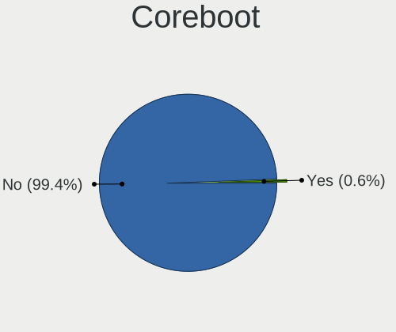

| Used | Computers | Percent |
|------|-----------|---------|
| No   | 1444      | 99.52%  |
| Yes  | 7         | 0.48%   |

RAM Size
--------

Total RAM memory

| Size in GB      | Computers | Percent |
|-----------------|-----------|---------|
| 16.01-24.0      | 352       | 23.96%  |
| 4.01-8.0        | 309       | 21.03%  |
| 8.01-16.0       | 252       | 17.15%  |
| 32.01-64.0      | 213       | 14.5%   |
| 3.01-4.0        | 203       | 13.82%  |
| 1.01-2.0        | 44        | 3%      |
| 64.01-256.0     | 42        | 2.86%   |
| 24.01-32.0      | 22        | 1.5%    |
| 2.01-3.0        | 15        | 1.02%   |
| 0.51-1.0        | 14        | 0.95%   |
| More than 256.0 | 2         | 0.14%   |
| 0.01-0.5        | 1         | 0.07%   |

RAM Used
--------

Used RAM memory

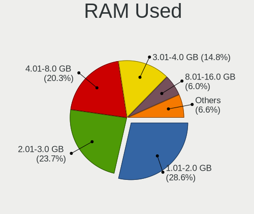

| Used GB    | Computers | Percent |
|------------|-----------|---------|
| 1.01-2.0   | 541       | 33.83%  |
| 2.01-3.0   | 390       | 24.39%  |
| 4.01-8.0   | 276       | 17.26%  |
| 3.01-4.0   | 193       | 12.07%  |
| 0.51-1.0   | 78        | 4.88%   |
| 8.01-16.0  | 77        | 4.82%   |
| 16.01-24.0 | 20        | 1.25%   |
| 0.01-0.5   | 19        | 1.19%   |
| 24.01-32.0 | 4         | 0.25%   |
| Unknown    | 1         | 0.06%   |

Total Drives
------------

Number of drives on board

| Drives | Computers | Percent |
|--------|-----------|---------|
| 1      | 874       | 58.46%  |
| 2      | 318       | 21.27%  |
| 3      | 131       | 8.76%   |
| 4      | 77        | 5.15%   |
| 5      | 37        | 2.47%   |
| 6      | 21        | 1.4%    |
| 0      | 15        | 1%      |
| 7      | 14        | 0.94%   |
| 8      | 5         | 0.33%   |
| 10     | 2         | 0.13%   |
| 9      | 1         | 0.07%   |

Has CD-ROM
----------

Has CD-ROM on board

| Presented | Computers | Percent |
|-----------|-----------|---------|
| No        | 956       | 65.52%  |
| Yes       | 503       | 34.48%  |

Has Ethernet
------------

Has Ethernet on board

| Presented | Computers | Percent |
|-----------|-----------|---------|
| Yes       | 1275      | 87.69%  |
| No        | 179       | 12.31%  |

Has WiFi
--------

Has WiFi module

| Presented | Computers | Percent |
|-----------|-----------|---------|
| Yes       | 1032      | 70.54%  |
| No        | 431       | 29.46%  |

Has Bluetooth
-------------

Has Bluetooth module

| Presented | Computers | Percent |
|-----------|-----------|---------|
| Yes       | 851       | 57.89%  |
| No        | 619       | 42.11%  |

Location
--------

Country
-------

Geographic location (country)

| Country | Computers | Percent |
|---------|-----------|---------|
| Sweden  | 1451      | 100%    |

City
----

Geographic location (city)

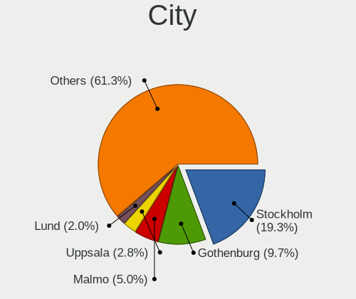

| City                    | Computers | Percent |
|-------------------------|-----------|---------|
| Stockholm               | 253       | 16.48%  |
| Gothenburg              | 151       | 9.84%   |
| Malmo                   | 75        | 4.89%   |
| Uppsala                 | 51        | 3.32%   |
| Lund                    | 37        | 2.41%   |
| Linkping              | 32        | 2.08%   |
| Bromma                  | 23        | 1.5%    |
| Sollentuna              | 21        | 1.37%   |
| Norrkping             | 20        | 1.3%    |
| Vaestra Froelunda       | 18        | 1.17%   |
| Vaxjo                   | 17        | 1.11%   |
| Haegersten              | 17        | 1.11%   |
| Ume                   | 16        | 1.04%   |
| Karlstad                | 16        | 1.04%   |
| Huddinge                | 16        | 1.04%   |
| Sundsvall               | 15        | 0.98%   |
| Vsters              | 14        | 0.91%   |
| Solna                   | 13        | 0.85%   |
| Helsingborg             | 13        | 0.85%   |
| Bandhagen               | 12        | 0.78%   |
| Sdertlje            | 11        | 0.72%   |
| Moelndal                | 11        | 0.72%   |
| Halmstad                | 11        | 0.72%   |
| rebro                 | 10        | 0.65%   |
| Kista                   | 10        | 0.65%   |
| Upplands Vasby          | 9         | 0.59%   |
| Taby                    | 9         | 0.59%   |
| Sundbyberg              | 9         | 0.59%   |
| Spanga                  | 9         | 0.59%   |
| Nykping               | 9         | 0.59%   |
| Norsborg                | 9         | 0.59%   |
| Landskrona              | 9         | 0.59%   |
| Staffanstorp            | 8         | 0.52%   |
| Skvde                 | 8         | 0.52%   |
| Mjoelby                 | 8         | 0.52%   |
| Katrineholm             | 8         | 0.52%   |
| Johanneshov             | 8         | 0.52%   |
| Arboga                  | 8         | 0.52%   |
| Akersberga              | 8         | 0.52%   |
| Karlskrona              | 7         | 0.46%   |
| Jrflla Municipality | 7         | 0.46%   |
| Handen                  | 7         | 0.46%   |
| Gvle                  | 7         | 0.46%   |
| Eskilstuna              | 7         | 0.46%   |
| ngelholm              | 7         | 0.46%   |
| Alvsjo                  | 7         | 0.46%   |
| Tyreso Strand           | 6         | 0.39%   |
| Saeffle                 | 6         | 0.39%   |
| Maersta                 | 6         | 0.39%   |
| Lule                  | 6         | 0.39%   |
| Lidkoeping              | 6         | 0.39%   |
| Kunglv                | 6         | 0.39%   |
| Jnkping             | 6         | 0.39%   |
| Hssleholm             | 6         | 0.39%   |
| Falun                   | 6         | 0.39%   |
| Vaennaes                | 5         | 0.33%   |
| Trollhttan            | 5         | 0.33%   |
| Limhamn                 | 5         | 0.33%   |
| Hoeoer                  | 5         | 0.33%   |
| Enskede-Arsta-Vantoer   | 5         | 0.33%   |

Drives
------

Drive Vendor
------------

Hard drive vendors

| Vendor                         | Computers | Drives | Percent |
|--------------------------------|-----------|--------|---------|
| Samsung Electronics            | 466       | 756    | 21.51%  |
| WDC                            | 303       | 482    | 13.99%  |
| Seagate                        | 276       | 443    | 12.74%  |
| Kingston                       | 170       | 243    | 7.85%   |
| Intel                          | 130       | 167    | 6%      |
| Toshiba                        | 113       | 147    | 5.22%   |
| SanDisk                        | 106       | 139    | 4.89%   |
| Unknown                        | 78        | 100    | 3.6%    |
| Hitachi                        | 73        | 97     | 3.37%   |
| Crucial                        | 51        | 76     | 2.35%   |
| SK hynix                       | 49        | 56     | 2.26%   |
| Micron Technology              | 44        | 57     | 2.03%   |
| HGST                           | 39        | 46     | 1.8%    |
| Apple                          | 22        | 24     | 1.02%   |
| OCZ                            | 19        | 22     | 0.88%   |
| Corsair                        | 19        | 26     | 0.88%   |
| Phison                         | 18        | 22     | 0.83%   |
| LITEON                         | 16        | 21     | 0.74%   |
| A-DATA Technology              | 15        | 15     | 0.69%   |
| Transcend                      | 11        | 12     | 0.51%   |
| LITEONIT                       | 10        | 17     | 0.46%   |
| KIOXIA                         | 9         | 9      | 0.42%   |
| Fujitsu                        | 9         | 13     | 0.42%   |
| Silicon Motion                 | 8         | 21     | 0.37%   |
| Intenso                        | 7         | 10     | 0.32%   |
| PNY                            | 6         | 8      | 0.28%   |
| China                          | 6         | 6      | 0.28%   |
| Maxtor                         | 5         | 5      | 0.23%   |
| LaCie                          | 5         | 6      | 0.23%   |
| JMicron Technology             | 5         | 5      | 0.23%   |
| Lenovo                         | 4         | 4      | 0.18%   |
| ASMT                           | 4         | 4      | 0.18%   |
| Unknown                        | 4         | 4      | 0.18%   |
| ROG                            | 3         | 3      | 0.14%   |
| Micron/Crucial Technology      | 3         | 3      | 0.14%   |
| Lite-On                        | 3         | 3      | 0.14%   |
| Hewlett-Packard                | 3         | 6      | 0.14%   |
| ZTE                            | 2         | 2      | 0.09%   |
| XPG                            | 2         | 2      | 0.09%   |
| Verbatim                       | 2         | 3      | 0.09%   |
| Union Memory (Shenzhen)        | 2         | 2      | 0.09%   |
| Union Memory                   | 2         | 2      | 0.09%   |
| SPCC                           | 2         | 3      | 0.09%   |
| Solid State Storage Technology | 2         | 2      | 0.09%   |
| Patriot                        | 2         | 3      | 0.09%   |
| Netac                          | 2         | 2      | 0.09%   |
| KingFast                       | 2         | 2      | 0.09%   |
| Goodram                        | 2         | 3      | 0.09%   |
| ZOMY                           | 1         | 1      | 0.05%   |
| WDC WDS2                       | 1         | 1      | 0.05%   |
| WDC WDS1                       | 1         | 1      | 0.05%   |
| USB3.0                         | 1         | 1      | 0.05%   |
| TO Exter                       | 1         | 1      | 0.05%   |
| tigo                           | 1         | 1      | 0.05%   |
| StoreJet                       | 1         | 1      | 0.05%   |
| Star                           | 1         | 1      | 0.05%   |
| SATAFIRM                       | 1         | 1      | 0.05%   |
| SABRENT                        | 1         | 1      | 0.05%   |
| Realtek                        | 1         | 1      | 0.05%   |
| Radeon                         | 1         | 1      | 0.05%   |

Drive Model
-----------

Hard drive models

| Model                                  | Computers | Percent |
|----------------------------------------|-----------|---------|
| Samsung SSD 850 EVO 250GB              | 45        | 1.81%   |
| Samsung SSD 850 EVO 500GB              | 34        | 1.36%   |
| Kingston SV300S37A120G 120GB SSD       | 26        | 1.04%   |
| Kingston SA400S37120G 120GB SSD        | 26        | 1.04%   |
| Kingston SA400S37240G 240GB SSD        | 25        | 1%      |
| Samsung SSD 860 EVO 250GB              | 22        | 0.88%   |
| Samsung SM963 2.5" NVMe PCIe SSD 500GB | 22        | 0.88%   |
| Samsung SSD 840 EVO 250GB              | 20        | 0.8%    |
| Seagate ST4000DM004-2CV104 4TB         | 18        | 0.72%   |
| Samsung SSD 860 EVO 500GB              | 18        | 0.72%   |
| Samsung NVMe SSD Drive 512GB           | 17        | 0.68%   |
| Kingston SA400S37480G 480GB SSD        | 16        | 0.64%   |
| Samsung NVMe SSD Drive 256GB           | 15        | 0.6%    |
| Samsung NVMe SSD Drive 1TB             | 15        | 0.6%    |
| SanDisk NVMe SSD Drive 1TB             | 14        | 0.56%   |
| Unknown MMC Card  32GB                 | 13        | 0.52%   |
| Seagate ST1000DM010-2EP102 1TB         | 13        | 0.52%   |
| SanDisk NVMe SSD Drive 512GB           | 13        | 0.52%   |
| Samsung NVMe SSD Drive 250GB           | 13        | 0.52%   |
| HGST HTS721010A9E630 1TB               | 13        | 0.52%   |
| Toshiba NVMe SSD Drive 512GB           | 12        | 0.48%   |
| Samsung SSD 970 EVO Plus 500GB         | 12        | 0.48%   |
| Samsung SSD 970 EVO Plus 1TB           | 12        | 0.48%   |
| Samsung SSD 860 EVO 1TB                | 12        | 0.48%   |
| Intel SSDPEKKW256G7 256GB              | 12        | 0.48%   |
| Seagate ST4000VN008-2DR166 4TB         | 11        | 0.44%   |
| WDC WD30EFRX-68EUZN0 3TB               | 10        | 0.4%    |
| Unknown MMC Card  16GB                 | 10        | 0.4%    |
| SK hynix NVMe SSD Drive 512GB          | 10        | 0.4%    |
| Seagate ST500DM002-1BD142 500GB        | 10        | 0.4%    |
| Samsung SSD 840 EVO 500GB              | 10        | 0.4%    |
| Samsung NVMe SSD Drive 1024GB          | 10        | 0.4%    |
| WDC WDS240G2G0A-00JH30 240GB SSD       | 9         | 0.36%   |
| Seagate ST9500325AS 500GB              | 9         | 0.36%   |
| Seagate ST2000DM008-2FR102 2TB         | 9         | 0.36%   |
| Seagate ST2000DM006-2DM164 2TB         | 9         | 0.36%   |
| Seagate Expansion+ Desk 4TB            | 9         | 0.36%   |
| Seagate Expansion 1TB                  | 9         | 0.36%   |
| Samsung SSD 960 EVO 250GB              | 9         | 0.36%   |
| Samsung SSD 840 EVO 120GB              | 9         | 0.36%   |
| Intel SSDPEKNW010T8 1TB                | 9         | 0.36%   |
| Intel NVMe SSD Drive 1024GB            | 9         | 0.36%   |
| WDC WD40EFRX-68N32N0 4TB               | 8         | 0.32%   |
| WDC WD20EZRZ-00Z5HB0 2TB               | 8         | 0.32%   |
| Unknown SD/MMC/MS PRO 128GB            | 8         | 0.32%   |
| Seagate ST1000LM024 HN-M101MBB 1TB     | 8         | 0.32%   |
| Seagate ST1000DM003-1CH162 1TB         | 8         | 0.32%   |
| Samsung SSD 970 EVO 1TB                | 8         | 0.32%   |
| Micron 1100_MTFDDAV256TBN 256GB SSD    | 8         | 0.32%   |
| Intel NVMe SSD Drive 512GB             | 8         | 0.32%   |
| WDC WDS250G2B0A-00SM50 250GB SSD       | 7         | 0.28%   |
| WDC WD20EARX-00PASB0 2TB               | 7         | 0.28%   |
| WDC WD10JPVX-22JC3T0 1TB               | 7         | 0.28%   |
| WDC WD10EADS-00L5B1 1TB                | 7         | 0.28%   |
| Unknown MMC Card  64GB                 | 7         | 0.28%   |
| Toshiba KBG30ZMS128G 128GB NVMe SSD    | 7         | 0.28%   |
| Seagate ST2000DM001-1CH164 2TB         | 7         | 0.28%   |
| Seagate Backup+ Hub BK 8TB             | 7         | 0.28%   |
| SanDisk NVMe SSD Drive 256GB           | 7         | 0.28%   |
| Samsung SSD 840 PRO Series 256GB       | 7         | 0.28%   |

HDD Vendor
----------

Hard disk drive vendors

| Vendor              | Computers | Drives | Percent |
|---------------------|-----------|--------|---------|
| Seagate             | 273       | 433    | 35.41%  |
| WDC                 | 239       | 387    | 31%     |
| Hitachi             | 73        | 97     | 9.47%   |
| Toshiba             | 65        | 87     | 8.43%   |
| Samsung Electronics | 42        | 75     | 5.45%   |
| HGST                | 39        | 46     | 5.06%   |
| Unknown             | 9         | 11     | 1.17%   |
| Fujitsu             | 9         | 13     | 1.17%   |
| Apple               | 6         | 6      | 0.78%   |
| Maxtor              | 4         | 4      | 0.52%   |
| JMicron Technology  | 3         | 3      | 0.39%   |
| ASMT                | 3         | 3      | 0.39%   |
| Hewlett-Packard     | 2         | 4      | 0.26%   |
| USB3.0              | 1         | 1      | 0.13%   |
| LaCie               | 1         | 1      | 0.13%   |
| Intenso             | 1         | 1      | 0.13%   |
| IB                  | 1         | 2      | 0.13%   |

SSD Vendor
----------

Solid state drive vendors

| Vendor              | Computers | Drives | Percent |
|---------------------|-----------|--------|---------|
| Samsung Electronics | 291       | 423    | 33.45%  |
| Kingston            | 137       | 192    | 15.75%  |
| Intel               | 79        | 96     | 9.08%   |
| SanDisk             | 58        | 74     | 6.67%   |
| Crucial             | 49        | 73     | 5.63%   |
| WDC                 | 45        | 62     | 5.17%   |
| Micron Technology   | 33        | 45     | 3.79%   |
| OCZ                 | 19        | 22     | 2.18%   |
| SK hynix            | 18        | 21     | 2.07%   |
| Toshiba             | 16        | 23     | 1.84%   |
| LITEON              | 15        | 20     | 1.72%   |
| Apple               | 15        | 17     | 1.72%   |
| Transcend           | 11        | 12     | 1.26%   |
| Corsair             | 11        | 13     | 1.26%   |
| LITEONIT            | 10        | 17     | 1.15%   |
| A-DATA Technology   | 10        | 10     | 1.15%   |
| Intenso             | 6         | 6      | 0.69%   |
| China               | 6         | 6      | 0.69%   |
| PNY                 | 4         | 6      | 0.46%   |
| Verbatim            | 2         | 3      | 0.23%   |
| SPCC                | 2         | 3      | 0.23%   |
| Seagate             | 2         | 4      | 0.23%   |
| Patriot             | 2         | 3      | 0.23%   |
| Goodram             | 2         | 3      | 0.23%   |
| WDC WDS2            | 1         | 1      | 0.11%   |
| WDC WDS1            | 1         | 1      | 0.11%   |
| Unknown             | 1         | 1      | 0.11%   |
| TO Exter            | 1         | 1      | 0.11%   |
| tigo                | 1         | 1      | 0.11%   |
| StoreJet            | 1         | 1      | 0.11%   |
| Star                | 1         | 1      | 0.11%   |
| SATAFIRM            | 1         | 1      | 0.11%   |
| ROG                 | 1         | 1      | 0.11%   |
| Radeon              | 1         | 1      | 0.11%   |
| OWC                 | 1         | 1      | 0.11%   |
| OCZ-VERTEX3         | 1         | 1      | 0.11%   |
| Netac               | 1         | 1      | 0.11%   |
| MyDigitalSSD        | 1         | 1      | 0.11%   |
| Maxtor              | 1         | 1      | 0.11%   |
| Kston               | 1         | 1      | 0.11%   |
| KIOXIA-EXCERIA      | 1         | 1      | 0.11%   |
| KingSpec            | 1         | 1      | 0.11%   |
| KingFast            | 1         | 1      | 0.11%   |
| INTEL SS            | 1         | 2      | 0.11%   |
| Innodisk            | 1         | 1      | 0.11%   |
| Gigabyte Technology | 1         | 1      | 0.11%   |
| ASMT                | 1         | 1      | 0.11%   |
| Apacer              | 1         | 1      | 0.11%   |
| ADATA SP            | 1         | 1      | 0.11%   |
| 1.0TB               | 1         | 1      | 0.11%   |
| Unknown             | 1         | 1      | 0.11%   |

Drive Kind
----------

HDD or SSD

| Kind    | Computers | Drives | Percent |
|---------|-----------|--------|---------|
| SSD     | 750       | 1182   | 38.66%  |
| HDD     | 623       | 1174   | 32.11%  |
| NVMe    | 470       | 663    | 24.23%  |
| MMC     | 72        | 86     | 3.71%   |
| Unknown | 25        | 33     | 1.29%   |

Drive Connector
---------------

SATA, SAS, NVMe, etc.

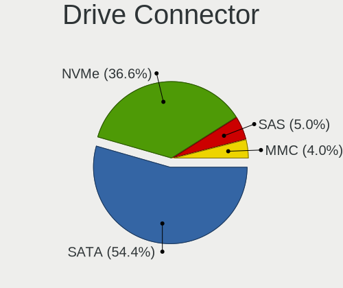

| Type | Computers | Drives | Percent |
|------|-----------|--------|---------|
| SATA | 1098      | 2271   | 63.69%  |
| NVMe | 468       | 658    | 27.15%  |
| SAS  | 86        | 123    | 4.99%   |
| MMC  | 72        | 86     | 4.18%   |

Drive Size
----------

Size of hard drive

| Size in TB | Computers | Drives | Percent |
|------------|-----------|--------|---------|
| 0.01-0.5   | 909       | 1485   | 61.17%  |
| 0.51-1.0   | 322       | 474    | 21.67%  |
| 1.01-2.0   | 119       | 180    | 8.01%   |
| 3.01-4.0   | 61        | 102    | 4.1%    |
| 2.01-3.0   | 47        | 72     | 3.16%   |
| 4.01-10.0  | 26        | 40     | 1.75%   |
| 10.01-20.0 | 2         | 3      | 0.13%   |

Space Total
-----------

Amount of disk space available on the file system

| Size in GB     | Computers | Percent |
|----------------|-----------|---------|
| 101-250        | 431       | 28.17%  |
| 251-500        | 329       | 21.5%   |
| 501-1000       | 186       | 12.16%  |
| 1-20           | 134       | 8.76%   |
| 1001-2000      | 120       | 7.84%   |
| More than 3000 | 102       | 6.67%   |
| 51-100         | 76        | 4.97%   |
| Unknown        | 57        | 3.73%   |
| 2001-3000      | 49        | 3.2%    |
| 21-50          | 46        | 3.01%   |

Space Used
----------

Amount of used disk space

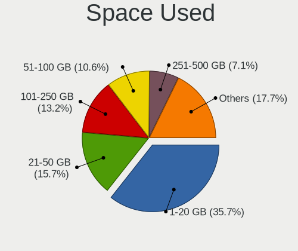

| Used GB        | Computers | Percent |
|----------------|-----------|---------|
| 1-20           | 624       | 39.59%  |
| 21-50          | 223       | 14.15%  |
| 101-250        | 206       | 13.07%  |
| 51-100         | 160       | 10.15%  |
| 251-500        | 97        | 6.15%   |
| 501-1000       | 88        | 5.58%   |
| Unknown        | 57        | 3.62%   |
| 1001-2000      | 53        | 3.36%   |
| More than 3000 | 37        | 2.35%   |
| 2001-3000      | 30        | 1.9%    |
| 0              | 1         | 0.06%   |

Malfunc. Drives
---------------

Drive models with a malfunction

| Model                                            | Computers | Drives | Percent |
|--------------------------------------------------|-----------|--------|---------|
| Seagate ST9500325AS 500GB                        | 5         | 5      | 4.39%   |
| WDC WD5000AAKX-75U6AA0 500GB                     | 2         | 2      | 1.75%   |
| Seagate ST9500420AS 500GB                        | 2         | 2      | 1.75%   |
| Seagate ST9250410AS 250GB                        | 2         | 3      | 1.75%   |
| Seagate ST1000LM024 HN-M101MBB 1TB               | 2         | 2      | 1.75%   |
| Samsung Electronics HD501LJ 500GB                | 2         | 2      | 1.75%   |
| Samsung Electronics HD300LJ 304GB                | 2         | 2      | 1.75%   |
| Micron Technology 1100_MTFDDAV256TBN 256GB SSD   | 2         | 3      | 1.75%   |
| Hitachi HTS543216L9A300 160GB                    | 2         | 2      | 1.75%   |
| HGST HTS541010A9E680 1TB                         | 2         | 2      | 1.75%   |
| Crucial CT525MX300SSD1 528GB                     | 2         | 2      | 1.75%   |
| WDC WDS240G2G0A-00JH30 240GB SSD                 | 1         | 1      | 0.88%   |
| WDC WD7500AACS-00ZJB0 752GB                      | 1         | 1      | 0.88%   |
| WDC WD6400AAKS-22A7B2 640GB                      | 1         | 1      | 0.88%   |
| WDC WD60EFRX-68L0BN1 6TB                         | 1         | 6      | 0.88%   |
| WDC WD5000LPVX-22V0TT0 500GB                     | 1         | 1      | 0.88%   |
| WDC WD5000BPKT-60PK4T0 500GB                     | 1         | 1      | 0.88%   |
| WDC WD5000AZRX-00A8LB0 500GB                     | 1         | 2      | 0.88%   |
| WDC WD5000AAKX-22ERMA0 500GB                     | 1         | 1      | 0.88%   |
| WDC WD5000AAKS-00A7B2 500GB                      | 1         | 1      | 0.88%   |
| WDC WD40EFRX-68N32N0 4TB                         | 1         | 2      | 0.88%   |
| WDC WD3200AAKS-00B3A0 320GB                      | 1         | 3      | 0.88%   |
| WDC WD30EFRX-68AX9N0 3TB                         | 1         | 1      | 0.88%   |
| WDC WD20EARS-00MVWB0 2TB                         | 1         | 1      | 0.88%   |
| WDC WD15EARS-00Z5B1 1TB                          | 1         | 1      | 0.88%   |
| WDC WD15EADS-00P8B0 1TB                          | 1         | 2      | 0.88%   |
| WDC WD10EZEX-21M2NA0 1TB                         | 1         | 2      | 0.88%   |
| WDC WD10EZEX-00WN4A0 1TB                         | 1         | 3      | 0.88%   |
| WDC WD10EARS-00MVWB0 1TB                         | 1         | 1      | 0.88%   |
| WDC WD10EALX-009BA0 1TB                          | 1         | 3      | 0.88%   |
| WDC WD10EADS-00M2B0 1TB                          | 1         | 1      | 0.88%   |
| WDC WD10EADS-00L5B1 1TB                          | 1         | 1      | 0.88%   |
| Union Memory UMIS RPJTJ128MED1MWX 128GB          | 1         | 1      | 0.88%   |
| Transcend TS240GMTS420S 240GB SSD                | 1         | 1      | 0.88%   |
| Toshiba MK1633GSG 160GB                          | 1         | 1      | 0.88%   |
| Toshiba HDWD110 1TB                              | 1         | 2      | 0.88%   |
| SK hynix SH920 mSATA 128GB SSD                   | 1         | 1      | 0.88%   |
| Seagate ST9250315AS 250GB                        | 1         | 1      | 0.88%   |
| Seagate ST500LT012-9WS142 500GB                  | 1         | 1      | 0.88%   |
| Seagate ST500LT012-1DG142 500GB                  | 1         | 1      | 0.88%   |
| Seagate ST500DM002-1BD142 500GB                  | 1         | 1      | 0.88%   |
| Seagate ST4000DM004-2CV104 4TB                   | 1         | 1      | 0.88%   |
| Seagate ST380215AS 80GB                          | 1         | 1      | 0.88%   |
| Seagate ST3500413AS 500GB                        | 1         | 1      | 0.88%   |
| Seagate ST3500410AS 500GB                        | 1         | 1      | 0.88%   |
| Seagate ST32000542AS 2TB                         | 1         | 3      | 0.88%   |
| Seagate ST3160215A 160GB                         | 1         | 1      | 0.88%   |
| Seagate ST31000340AS 1TB                         | 1         | 1      | 0.88%   |
| Seagate ST2000DX001-1NS164 2TB                   | 1         | 1      | 0.88%   |
| Seagate ST1000LX015-1U7172 1TB                   | 1         | 1      | 0.88%   |
| Seagate ST1000LM049-2GH172 1TB                   | 1         | 1      | 0.88%   |
| Seagate ST1000LM014-1EJ164 1TB                   | 1         | 1      | 0.88%   |
| SanDisk SD7SB3Q128G1001 128GB SSD                | 1         | 1      | 0.88%   |
| Samsung Electronics SSD 870 EVO 1TB              | 1         | 1      | 0.88%   |
| Samsung Electronics SSD 840 Series 250GB         | 1         | 1      | 0.88%   |
| Samsung Electronics SSD 840 PRO Series 512GB     | 1         | 1      | 0.88%   |
| Samsung Electronics SSD 840 EVO 120GB            | 1         | 1      | 0.88%   |
| Samsung Electronics MZ7PA128HMCD-010L1 128GB SSD | 1         | 1      | 0.88%   |
| Samsung Electronics HD321KJ 320GB                | 1         | 1      | 0.88%   |
| Samsung Electronics HD250HJ 250GB                | 1         | 1      | 0.88%   |

Malfunc. Drive Vendor
---------------------

Vendors of faulty drives

| Vendor              | Computers | Drives | Percent |
|---------------------|-----------|--------|---------|
| Seagate             | 24        | 29     | 22.02%  |
| WDC                 | 20        | 38     | 18.35%  |
| Samsung Electronics | 13        | 13     | 11.93%  |
| Intel               | 11        | 13     | 10.09%  |
| Hitachi             | 9         | 11     | 8.26%   |
| Kingston            | 4         | 4      | 3.67%   |
| HGST                | 4         | 4      | 3.67%   |
| Micron Technology   | 3         | 4      | 2.75%   |
| Crucial             | 3         | 3      | 2.75%   |
| Corsair             | 3         | 3      | 2.75%   |
| Toshiba             | 2         | 3      | 1.83%   |
| OCZ                 | 2         | 4      | 1.83%   |
| LITEONIT            | 2         | 2      | 1.83%   |
| Fujitsu             | 2         | 2      | 1.83%   |
| Union Memory        | 1         | 1      | 0.92%   |
| Transcend           | 1         | 1      | 0.92%   |
| SK hynix            | 1         | 1      | 0.92%   |
| SanDisk             | 1         | 1      | 0.92%   |
| PNY                 | 1         | 2      | 0.92%   |
| Hewlett-Packard     | 1         | 1      | 0.92%   |
| Apple               | 1         | 1      | 0.92%   |

Malfunc. HDD Vendor
-------------------

Vendors of faulty HDD drives

| Vendor              | Computers | Drives | Percent |
|---------------------|-----------|--------|---------|
| Seagate             | 24        | 29     | 34.29%  |
| WDC                 | 19        | 37     | 27.14%  |
| Hitachi             | 9         | 11     | 12.86%  |
| Samsung Electronics | 8         | 8      | 11.43%  |
| HGST                | 4         | 4      | 5.71%   |
| Toshiba             | 2         | 3      | 2.86%   |
| Fujitsu             | 2         | 2      | 2.86%   |
| Hewlett-Packard     | 1         | 1      | 1.43%   |
| Apple               | 1         | 1      | 1.43%   |

Malfunc. Drive Kind
-------------------

Kinds of faulty drives

| Kind | Computers | Drives | Percent |
|------|-----------|--------|---------|
| HDD  | 67        | 96     | 64.42%  |
| SSD  | 32        | 40     | 30.77%  |
| NVMe | 5         | 5      | 4.81%   |

Failed Drives
-------------

Failed drive models

Zero info for selected period =(

Failed Drive Vendor
-------------------

Failed drive vendors

Zero info for selected period =(

Drive Status
------------

Number of failed and malfunc. drives

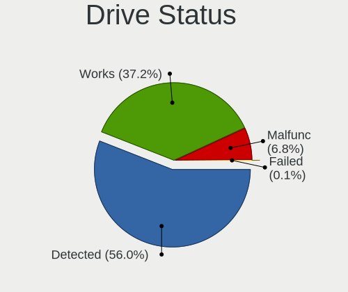

| Status   | Computers | Drives | Percent |
|----------|-----------|--------|---------|
| Detected | 982       | 2048   | 62.19%  |
| Works    | 498       | 949    | 31.54%  |
| Malfunc  | 99        | 141    | 6.27%   |

Storage controller
------------------

Storage Vendor
--------------

Storage controller vendors

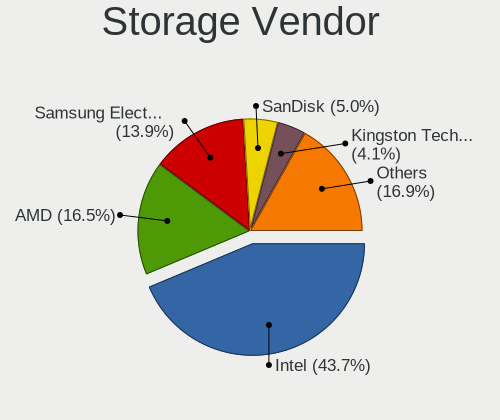

| Vendor                           | Computers | Percent |
|----------------------------------|-----------|---------|
| Intel                            | 953       | 51.1%   |
| AMD                              | 315       | 16.89%  |
| Samsung Electronics              | 216       | 11.58%  |
| SanDisk                          | 69        | 3.7%    |
| Kingston Technology Company      | 36        | 1.93%   |
| Toshiba America Info Systems     | 35        | 1.88%   |
| ASMedia Technology               | 34        | 1.82%   |
| SK hynix                         | 30        | 1.61%   |
| JMicron Technology               | 30        | 1.61%   |
| Phison Electronics               | 28        | 1.5%    |
| Marvell Technology Group         | 26        | 1.39%   |
| Nvidia                           | 16        | 0.86%   |
| Micron Technology                | 12        | 0.64%   |
| KIOXIA                           | 9         | 0.48%   |
| Silicon Motion                   | 8         | 0.43%   |
| Silicon Image                    | 6         | 0.32%   |
| ADATA Technology                 | 6         | 0.32%   |
| Lite-On Technology               | 5         | 0.27%   |
| Union Memory (Shenzhen)          | 4         | 0.21%   |
| Micron/Crucial Technology        | 4         | 0.21%   |
| Lenovo                           | 4         | 0.21%   |
| VIA Technologies                 | 3         | 0.16%   |
| Silicon Integrated Systems [SiS] | 3         | 0.16%   |
| Solid State Storage Technology   | 2         | 0.11%   |
| Realtek Semiconductor            | 2         | 0.11%   |
| Hewlett-Packard                  | 2         | 0.11%   |
| Broadcom / LSI                   | 2         | 0.11%   |
| Apple                            | 2         | 0.11%   |
| Seagate Technology               | 1         | 0.05%   |
| LSI Logic / Symbios Logic        | 1         | 0.05%   |
| Adaptec                          | 1         | 0.05%   |

Storage Model
-------------

Storage controller models

| Model                                                                                   | Computers | Percent |
|-----------------------------------------------------------------------------------------|-----------|---------|
| AMD FCH SATA Controller [AHCI mode]                                                     | 213       | 9.8%    |
| Samsung NVMe SSD Controller SM981/PM981/PM983                                           | 125       | 5.75%   |
| Intel Sunrise Point-LP SATA Controller [AHCI mode]                                      | 76        | 3.5%    |
| Intel 8 Series/C220 Series Chipset Family 6-port SATA Controller 1 [AHCI mode]          | 68        | 3.13%   |
| Intel 7 Series Chipset Family 6-port SATA Controller [AHCI mode]                        | 54        | 2.49%   |
| AMD 400 Series Chipset SATA Controller                                                  | 53        | 2.44%   |
| Intel 82801 Mobile SATA Controller [RAID mode]                                          | 48        | 2.21%   |
| Intel 6 Series/C200 Series Chipset Family 6 port Mobile SATA AHCI Controller            | 44        | 2.02%   |
| Intel Q170/Q150/B150/H170/H110/Z170/CM236 Chipset SATA Controller [AHCI Mode]           | 43        | 1.98%   |
| Intel 8 Series SATA Controller 1 [AHCI mode]                                            | 43        | 1.98%   |
| Samsung NVMe SSD Controller SM961/PM961/SM963                                           | 41        | 1.89%   |
| AMD SB7x0/SB8x0/SB9x0 SATA Controller [AHCI mode]                                       | 41        | 1.89%   |
| AMD SB7x0/SB8x0/SB9x0 IDE Controller                                                    | 40        | 1.84%   |
| Intel 200 Series PCH SATA controller [AHCI mode]                                        | 33        | 1.52%   |
| ASMedia ASM1062 Serial ATA Controller                                                   | 33        | 1.52%   |
| Intel Cannon Lake Mobile PCH SATA AHCI Controller                                       | 32        | 1.47%   |
| Intel SATA Controller [RAID mode]                                                       | 30        | 1.38%   |
| Intel 6 Series/C200 Series Chipset Family 6 port Desktop SATA AHCI Controller           | 29        | 1.33%   |
| Intel Wildcat Point-LP SATA Controller [AHCI Mode]                                      | 28        | 1.29%   |
| Intel Cannon Lake PCH SATA AHCI Controller                                              | 28        | 1.29%   |
| Intel 7 Series/C210 Series Chipset Family 6-port SATA Controller [AHCI mode]            | 28        | 1.29%   |
| Intel SSD 660P Series                                                                   | 27        | 1.24%   |
| Intel 9 Series Chipset Family SATA Controller [AHCI Mode]                               | 27        | 1.24%   |
| AMD SB7x0/SB8x0/SB9x0 SATA Controller [IDE mode]                                        | 26        | 1.2%    |
| Kingston Company A2000 NVMe SSD                                                         | 24        | 1.1%    |
| AMD 500 Series Chipset SATA Controller                                                  | 23        | 1.06%   |
| SanDisk WD Black SN750 / PC SN730 NVMe SSD                                              | 22        | 1.01%   |
| Samsung NVMe SSD Controller PM9A1/PM9A3/980PRO                                          | 22        | 1.01%   |
| Intel 82801IBM/IEM (ICH9M/ICH9M-E) 4 port SATA Controller [AHCI mode]                   | 21        | 0.97%   |
| Intel 5 Series/3400 Series Chipset 6 port SATA AHCI Controller                          | 20        | 0.92%   |
| Intel Volume Management Device NVMe RAID Controller                                     | 18        | 0.83%   |
| Intel HM170/QM170 Chipset SATA Controller [AHCI Mode]                                   | 18        | 0.83%   |
| SanDisk WD Blue SN550 NVMe SSD                                                          | 17        | 0.78%   |
| JMicron JMB363 SATA/IDE Controller                                                      | 16        | 0.74%   |
| Intel 82801HM/HEM (ICH8M/ICH8M-E) IDE Controller                                        | 16        | 0.74%   |
| Intel 82801G (ICH7 Family) IDE Controller                                               | 16        | 0.74%   |
| Intel 5 Series/3400 Series Chipset 4 port SATA AHCI Controller                          | 16        | 0.74%   |
| Phison E12 NVMe Controller                                                              | 15        | 0.69%   |
| Intel 82801HM/HEM (ICH8M/ICH8M-E) SATA Controller [AHCI mode]                           | 15        | 0.69%   |
| Intel C610/X99 series chipset 6-Port SATA Controller [AHCI mode]                        | 14        | 0.64%   |
| Intel 6 Series/C200 Series Chipset Family Desktop SATA Controller (IDE mode, ports 4-5) | 14        | 0.64%   |
| Intel 6 Series/C200 Series Chipset Family Desktop SATA Controller (IDE mode, ports 0-3) | 14        | 0.64%   |
| Samsung NVMe SSD Controller 980                                                         | 13        | 0.6%    |
| Intel SSD 600P Series                                                                   | 13        | 0.6%    |
| Intel NM10/ICH7 Family SATA Controller [IDE mode]                                       | 13        | 0.6%    |
| Intel Celeron/Pentium Silver Processor SATA Controller                                  | 13        | 0.6%    |
| Intel Cannon Point-LP SATA Controller [AHCI Mode]                                       | 13        | 0.6%    |
| Intel Atom Processor E3800 Series SATA AHCI Controller                                  | 13        | 0.6%    |
| AMD 300 Series Chipset SATA Controller                                                  | 13        | 0.6%    |
| Micron Non-Volatile memory controller                                                   | 12        | 0.55%   |
| Intel 82801JI (ICH10 Family) 4 port SATA IDE Controller #1                              | 12        | 0.55%   |
| Intel 82801JI (ICH10 Family) 2 port SATA IDE Controller #2                              | 12        | 0.55%   |
| Toshiba America Info Systems XG6 NVMe SSD Controller                                    | 11        | 0.51%   |
| SanDisk Non-Volatile memory controller                                                  | 11        | 0.51%   |
| Intel SSD Pro 7600p/760p/E 6100p Series                                                 | 11        | 0.51%   |
| Intel Comet Lake SATA AHCI Controller                                                   | 11        | 0.51%   |
| Intel C610/X99 series chipset sSATA Controller [AHCI mode]                              | 11        | 0.51%   |
| Toshiba America Info Systems Toshiba America Info Non-Volatile memory controller        | 10        | 0.46%   |
| SK hynix Non-Volatile memory controller                                                 | 10        | 0.46%   |
| Samsung NVMe SSD Controller SM951/PM951                                                 | 10        | 0.46%   |

Storage Kind
------------

Kind of storage controller (IDE, SATA, NVMe, SAS, ...)

| Kind | Computers | Percent |
|------|-----------|---------|
| SATA | 1082      | 57.89%  |
| NVMe | 476       | 25.47%  |
| IDE  | 195       | 10.43%  |
| RAID | 111       | 5.94%   |
| SAS  | 4         | 0.21%   |
| SCSI | 1         | 0.05%   |

Processor
---------

CPU Vendor
----------

Processor vendors

| Vendor   | Computers | Percent |
|----------|-----------|---------|
| Intel    | 1077      | 74.22%  |
| AMD      | 361       | 24.88%  |
| ARM      | 12        | 0.83%   |
| QUALCOMM | 1         | 0.07%   |

CPU Model
---------

Processor models

| Model                                       | Computers | Percent |
|---------------------------------------------|-----------|---------|
| AMD Ryzen 5 3600 6-Core Processor           | 23        | 1.58%   |
| Intel Core i7-8550U CPU @ 1.80GHz           | 19        | 1.31%   |
| Intel 11th Gen Core i7-1165G7 @ 2.80GHz     | 19        | 1.31%   |
| AMD Ryzen 7 3700X 8-Core Processor          | 15        | 1.03%   |
| Intel Core i7-8565U CPU @ 1.80GHz           | 13        | 0.9%    |
| Intel Core i5-6600K CPU @ 3.50GHz           | 13        | 0.9%    |
| AMD Ryzen 9 3900X 12-Core Processor         | 13        | 0.9%    |
| Intel Core i7-7700HQ CPU @ 2.80GHz          | 12        | 0.83%   |
| Intel Core i5-6200U CPU @ 2.30GHz           | 12        | 0.83%   |
| Intel Core i7-8750H CPU @ 2.20GHz           | 11        | 0.76%   |
| Intel Core i7-4790K CPU @ 4.00GHz           | 11        | 0.76%   |
| Intel Core i5-8250U CPU @ 1.60GHz           | 11        | 0.76%   |
| Intel Core i5-4690K CPU @ 3.50GHz           | 11        | 0.76%   |
| Intel Core i7-7500U CPU @ 2.70GHz           | 10        | 0.69%   |
| Intel Core i5-7200U CPU @ 2.50GHz           | 10        | 0.69%   |
| Intel Core i5-4200U CPU @ 1.60GHz           | 10        | 0.69%   |
| Intel Atom x5-Z8350 CPU @ 1.44GHz           | 10        | 0.69%   |
| Intel Core i7-6700K CPU @ 4.00GHz           | 9         | 0.62%   |
| Intel Core i5-8265U CPU @ 1.60GHz           | 9         | 0.62%   |
| Intel Core i5-6300U CPU @ 2.40GHz           | 9         | 0.62%   |
| Intel Core i5-2520M CPU @ 2.50GHz           | 9         | 0.62%   |
| Intel Core i7-9750H CPU @ 2.60GHz           | 8         | 0.55%   |
| Intel Core i7-6600U CPU @ 2.60GHz           | 8         | 0.55%   |
| Intel Core i7-3770 CPU @ 3.40GHz            | 8         | 0.55%   |
| Intel Core i7-2600 CPU @ 3.40GHz            | 8         | 0.55%   |
| Intel Core i5-5200U CPU @ 2.20GHz           | 8         | 0.55%   |
| Intel Core i5-4300U CPU @ 1.90GHz           | 8         | 0.55%   |
| Intel Core i5-2500K CPU @ 3.30GHz           | 8         | 0.55%   |
| Intel Core i5-2400 CPU @ 3.10GHz            | 8         | 0.55%   |
| AMD Ryzen 7 2700X Eight-Core Processor      | 8         | 0.55%   |
| AMD Ryzen 5 2600 Six-Core Processor         | 8         | 0.55%   |
| Intel Core i7-4710HQ CPU @ 2.50GHz          | 7         | 0.48%   |
| Intel Core i7-4600U CPU @ 2.10GHz           | 7         | 0.48%   |
| Intel Core i7-10750H CPU @ 2.60GHz          | 7         | 0.48%   |
| Intel Core i5-3470 CPU @ 3.20GHz            | 7         | 0.48%   |
| ARM Processor                               | 7         | 0.48%   |
| AMD Ryzen 5 5600X 6-Core Processor          | 7         | 0.48%   |
| AMD FX-8350 Eight-Core Processor            | 7         | 0.48%   |
| Intel Core i9-9900K CPU @ 3.60GHz           | 6         | 0.41%   |
| Intel Core i7-6500U CPU @ 2.50GHz           | 6         | 0.41%   |
| Intel Core i7-5820K CPU @ 3.30GHz           | 6         | 0.41%   |
| Intel Core i7-5600U CPU @ 2.60GHz           | 6         | 0.41%   |
| Intel Core i7-4770 CPU @ 3.40GHz            | 6         | 0.41%   |
| Intel Core i7-3770K CPU @ 3.50GHz           | 6         | 0.41%   |
| Intel Core i7-10510U CPU @ 1.80GHz          | 6         | 0.41%   |
| Intel Core i5-7400 CPU @ 3.00GHz            | 6         | 0.41%   |
| Intel Core i5-3320M CPU @ 2.60GHz           | 6         | 0.41%   |
| Intel Core i5-3230M CPU @ 2.60GHz           | 6         | 0.41%   |
| Intel Core i5-10210U CPU @ 1.60GHz          | 6         | 0.41%   |
| Intel Core i5 CPU M 520 @ 2.40GHz           | 6         | 0.41%   |
| Intel Core i3 CPU M 370 @ 2.40GHz           | 6         | 0.41%   |
| Intel Core 2 Quad CPU Q9550 @ 2.83GHz       | 6         | 0.41%   |
| Intel Celeron CPU N2840 @ 2.16GHz           | 6         | 0.41%   |
| Intel 11th Gen Core i5-1135G7 @ 2.40GHz     | 6         | 0.41%   |
| AMD Ryzen 9 5950X 16-Core Processor         | 6         | 0.41%   |
| AMD Ryzen 7 5700U with Radeon Graphics      | 6         | 0.41%   |
| AMD Ryzen 7 4700U with Radeon Graphics      | 6         | 0.41%   |
| AMD Ryzen 5 3400G with Radeon Vega Graphics | 6         | 0.41%   |
| AMD Ryzen 5 2600X Six-Core Processor        | 6         | 0.41%   |
| AMD FX-6300 Six-Core Processor              | 6         | 0.41%   |

CPU Model Family
----------------

Processor model prefix

| Model                          | Computers | Percent |
|--------------------------------|-----------|---------|
| Intel Core i7                  | 361       | 24.88%  |
| Intel Core i5                  | 355       | 24.47%  |
| AMD Ryzen 5                    | 90        | 6.2%    |
| Intel Core i3                  | 67        | 4.62%   |
| AMD Ryzen 7                    | 65        | 4.48%   |
| Other                          | 55        | 3.79%   |
| Intel Core 2 Duo               | 51        | 3.51%   |
| Intel Celeron                  | 45        | 3.1%    |
| Intel Xeon                     | 34        | 2.34%   |
| AMD Ryzen 9                    | 30        | 2.07%   |
| AMD FX                         | 29        | 2%      |
| Intel Pentium                  | 26        | 1.79%   |
| Intel Atom                     | 22        | 1.52%   |
| AMD Ryzen 3                    | 17        | 1.17%   |
| Intel Core 2 Quad              | 13        | 0.9%    |
| Intel Core i9                  | 12        | 0.83%   |
| Intel Core 2                   | 12        | 0.83%   |
| AMD A8                         | 12        | 0.83%   |
| AMD Ryzen Threadripper         | 10        | 0.69%   |
| AMD A6                         | 10        | 0.69%   |
| Intel Pentium Dual-Core        | 9         | 0.62%   |
| Intel Genuine                  | 9         | 0.62%   |
| AMD Phenom II X4               | 8         | 0.55%   |
| AMD A4                         | 8         | 0.55%   |
| AMD E1                         | 7         | 0.48%   |
| AMD E                          | 7         | 0.48%   |
| AMD Athlon 64 X2               | 6         | 0.41%   |
| AMD A10                        | 6         | 0.41%   |
| Intel Pentium Dual             | 5         | 0.34%   |
| ARM BCM                        | 5         | 0.34%   |
| AMD Ryzen Embedded             | 5         | 0.34%   |
| AMD Phenom II X6               | 5         | 0.34%   |
| AMD Athlon II X2               | 5         | 0.34%   |
| AMD Ryzen 7 PRO                | 4         | 0.28%   |
| Intel Pentium Silver           | 3         | 0.21%   |
| AMD Ryzen 5 PRO                | 3         | 0.21%   |
| AMD Athlon II X3               | 3         | 0.21%   |
| Intel Pentium M                | 2         | 0.14%   |
| Intel Core m3                  | 2         | 0.14%   |
| Intel Celeron Dual-Core        | 2         | 0.14%   |
| AMD Phenom                     | 2         | 0.14%   |
| AMD E2                         | 2         | 0.14%   |
| AMD Athlon II X4               | 2         | 0.14%   |
| AMD Athlon II                  | 2         | 0.14%   |
| AMD Athlon 64                  | 2         | 0.14%   |
| QUALCOMM AArch64               | 1         | 0.07%   |
| Intel Xeon Gold                | 1         | 0.07%   |
| Intel Pentium 4                | 1         | 0.07%   |
| Intel Core m5                  | 1         | 0.07%   |
| Intel Celeron M                | 1         | 0.07%   |
| AMD Turion X2 Dual-Core Mobile | 1         | 0.07%   |
| AMD Turion II Dual-Core        | 1         | 0.07%   |
| AMD Turion 64 Mobile           | 1         | 0.07%   |
| AMD Quad-Core                  | 1         | 0.07%   |
| AMD PRO A8                     | 1         | 0.07%   |
| AMD PRO A10                    | 1         | 0.07%   |
| AMD Phenom II X3               | 1         | 0.07%   |
| AMD Phenom II X2               | 1         | 0.07%   |
| AMD Opteron                    | 1         | 0.07%   |
| AMD Mobile Sempron             | 1         | 0.07%   |

CPU Cores
---------

Number of processor cores

| Number  | Computers | Percent |
|---------|-----------|---------|
| 4       | 587       | 40.37%  |
| 2       | 505       | 34.73%  |
| 6       | 168       | 11.55%  |
| 8       | 100       | 6.88%   |
| 12      | 27        | 1.86%   |
| 1       | 22        | 1.51%   |
| 16      | 21        | 1.44%   |
| 3       | 14        | 0.96%   |
| 18      | 3         | 0.21%   |
| 10      | 2         | 0.14%   |
| 64      | 1         | 0.07%   |
| 32      | 1         | 0.07%   |
| 28      | 1         | 0.07%   |
| 20      | 1         | 0.07%   |
| Unknown | 1         | 0.07%   |

CPU Sockets
-----------

Number of sockets

| Number | Computers | Percent |
|--------|-----------|---------|
| 1      | 1433      | 98.76%  |
| 2      | 17        | 1.17%   |
| 3      | 1         | 0.07%   |

CPU Threads
-----------

Threads per core (Hyper-Threading)

| Number  | Computers | Percent |
|---------|-----------|---------|
| 2       | 978       | 67.31%  |
| 1       | 474       | 32.62%  |
| Unknown | 1         | 0.07%   |

CPU Op-Modes
------------

CPU Operation Modes (32-bit, 64-bit)

| Op mode        | Computers | Percent |
|----------------|-----------|---------|
| 32-bit, 64-bit | 1404      | 96.56%  |
| Unknown        | 40        | 2.75%   |
| 32-bit         | 10        | 0.69%   |

CPU Microcode
-------------

Microcode number

| Number     | Computers | Percent |
|------------|-----------|---------|
| Unknown    | 341       | 22.67%  |
| 0x306c3    | 88        | 5.85%   |
| 0x206a7    | 75        | 4.99%   |
| 0x306a9    | 71        | 4.72%   |
| 0x1067a    | 46        | 3.06%   |
| 0x906ea    | 44        | 2.93%   |
| 0x40651    | 44        | 2.93%   |
| 0x806ec    | 37        | 2.46%   |
| 0x506e3    | 37        | 2.46%   |
| 0x906e9    | 36        | 2.39%   |
| 0x806ea    | 35        | 2.33%   |
| 0x406e3    | 34        | 2.26%   |
| 0x306d4    | 31        | 2.06%   |
| 0x806e9    | 30        | 1.99%   |
| 0x08701021 | 27        | 1.8%    |
| 0x20655    | 26        | 1.73%   |
| 0x806c1    | 25        | 1.66%   |
| 0x08701013 | 16        | 1.06%   |
| 0x0800820d | 16        | 1.06%   |
| 0x08108109 | 14        | 0.93%   |
| 0x0810100b | 14        | 0.93%   |
| 0x6fd      | 13        | 0.86%   |
| 0x406c4    | 13        | 0.86%   |
| 0x06000852 | 13        | 0.86%   |
| 0x010000c8 | 13        | 0.86%   |
| 0x906ed    | 12        | 0.8%    |
| 0x6f6      | 11        | 0.73%   |
| 0x306f2    | 11        | 0.73%   |
| 0x30678    | 11        | 0.73%   |
| 0x106e5    | 11        | 0.73%   |
| 0x0a201009 | 11        | 0.73%   |
| 0x806eb    | 10        | 0.66%   |
| 0x06001119 | 10        | 0.66%   |
| 0x10676    | 9         | 0.6%    |
| 0x08001138 | 9         | 0.6%    |
| 0x0700010f | 9         | 0.6%    |
| 0xa0652    | 8         | 0.53%   |
| 0x6fb      | 8         | 0.53%   |
| 0x08600106 | 8         | 0.53%   |
| 0x08108102 | 8         | 0.53%   |
| 0x0600063e | 8         | 0.53%   |
| 0x706a1    | 7         | 0.47%   |
| 0x20652    | 7         | 0.47%   |
| 0x0a50000c | 7         | 0.47%   |
| 0x05000119 | 7         | 0.47%   |
| 0x03000027 | 7         | 0.47%   |
| 0x010000dc | 6         | 0.4%    |
| 0x906ec    | 5         | 0.33%   |
| 0x706a8    | 5         | 0.33%   |
| 0x40661    | 5         | 0.33%   |
| 0x106a5    | 5         | 0.33%   |
| 0x08608103 | 5         | 0.33%   |
| 0x08001137 | 5         | 0.33%   |
| 0x06006705 | 5         | 0.33%   |
| 0xa0655    | 4         | 0.27%   |
| 0x90672    | 4         | 0.27%   |
| 0x806d1    | 4         | 0.27%   |
| 0x506c9    | 4         | 0.27%   |
| 0x406f1    | 4         | 0.27%   |
| 0x406c3    | 4         | 0.27%   |

CPU Microarch
-------------

Microarchitecture

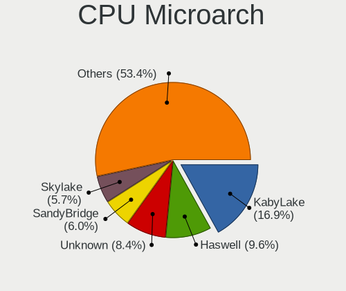

| Name             | Computers | Percent |
|------------------|-----------|---------|
| KabyLake         | 266       | 18.32%  |
| Haswell          | 174       | 11.98%  |
| SandyBridge      | 106       | 7.3%    |
| Skylake          | 94        | 6.47%   |
| IvyBridge        | 93        | 6.4%    |
| Zen 2            | 79        | 5.44%   |
| Penryn           | 63        | 4.34%   |
| Zen+             | 55        | 3.79%   |
| Zen              | 45        | 3.1%    |
| Westmere         | 44        | 3.03%   |
| Broadwell        | 42        | 2.89%   |
| Core             | 41        | 2.82%   |
| Silvermont       | 38        | 2.62%   |
| Zen 3            | 36        | 2.48%   |
| K10              | 34        | 2.34%   |
| TigerLake        | 32        | 2.2%    |
| Piledriver       | 31        | 2.13%   |
| Unknown          | 26        | 1.79%   |
| CometLake        | 19        | 1.31%   |
| Nehalem          | 17        | 1.17%   |
| Goldmont plus    | 13        | 0.9%    |
| Excavator        | 13        | 0.9%    |
| K8 Hammer        | 10        | 0.69%   |
| Jaguar           | 10        | 0.69%   |
| K10 Llano        | 9         | 0.62%   |
| Bulldozer        | 9         | 0.62%   |
| Bobcat           | 9         | 0.62%   |
| IceLake          | 7         | 0.48%   |
| Goldmont         | 7         | 0.48%   |
| Puma             | 6         | 0.41%   |
| Bonnell          | 6         | 0.41%   |
| Alderlake Hybrid | 5         | 0.34%   |
| P6               | 4         | 0.28%   |
| NetBurst         | 3         | 0.21%   |
| Steamroller      | 2         | 0.14%   |
| Tremont          | 1         | 0.07%   |
| K8 & K10 hybrid  | 1         | 0.07%   |
| K6               | 1         | 0.07%   |
| Geode            | 1         | 0.07%   |

Graphics
--------

GPU Vendor
----------

Vendors of graphics cards

| Vendor                           | Computers | Percent |
|----------------------------------|-----------|---------|
| Intel                            | 747       | 44.31%  |
| Nvidia                           | 546       | 32.38%  |
| AMD                              | 377       | 22.36%  |
| ASPEED Technology                | 7         | 0.42%   |
| Matrox Electronics Systems       | 6         | 0.36%   |
| Silicon Integrated Systems [SiS] | 3         | 0.18%   |

GPU Model
---------

Graphics card models

| Model                                                                                    | Computers | Percent |
|------------------------------------------------------------------------------------------|-----------|---------|
| Intel 2nd Generation Core Processor Family Integrated Graphics Controller                | 68        | 3.9%    |
| Intel Haswell-ULT Integrated Graphics Controller                                         | 51        | 2.92%   |
| Intel 3rd Gen Core processor Graphics Controller                                         | 48        | 2.75%   |
| Intel UHD Graphics 620                                                                   | 39        | 2.23%   |
| Intel CoffeeLake-H GT2 [UHD Graphics 630]                                                | 39        | 2.23%   |
| AMD Ellesmere [Radeon RX 470/480/570/570X/580/580X/590]                                  | 38        | 2.18%   |
| Intel Skylake GT2 [HD Graphics 520]                                                      | 37        | 2.12%   |
| Intel WhiskeyLake-U GT2 [UHD Graphics 620]                                               | 34        | 1.95%   |
| Intel 4th Gen Core Processor Integrated Graphics Controller                              | 33        | 1.89%   |
| Intel TigerLake-LP GT2 [Iris Xe Graphics]                                                | 31        | 1.78%   |
| Intel HD Graphics 620                                                                    | 29        | 1.66%   |
| Intel HD Graphics 5500                                                                   | 28        | 1.6%    |
| Intel HD Graphics 630                                                                    | 24        | 1.38%   |
| Intel Core Processor Integrated Graphics Controller                                      | 24        | 1.38%   |
| Intel Xeon E3-1200 v3/4th Gen Core Processor Integrated Graphics Controller              | 23        | 1.32%   |
| AMD Picasso/Raven 2 [Radeon Vega Series / Radeon Vega Mobile Series]                     | 23        | 1.32%   |
| Nvidia GP106 [GeForce GTX 1060 6GB]                                                      | 20        | 1.15%   |
| Intel Atom/Celeron/Pentium Processor x5-E8000/J3xxx/N3xxx Integrated Graphics Controller | 19        | 1.09%   |
| AMD Renoir                                                                               | 19        | 1.09%   |
| AMD Raven Ridge [Radeon Vega Series / Radeon Vega Mobile Series]                         | 19        | 1.09%   |
| AMD Navi 10 [Radeon RX 5600 OEM/5600 XT / 5700/5700 XT]                                  | 19        | 1.09%   |
| Intel CometLake-U GT2 [UHD Graphics]                                                     | 18        | 1.03%   |
| Intel Atom Processor Z36xxx/Z37xxx Series Graphics & Display                             | 18        | 1.03%   |
| Intel Mobile 4 Series Chipset Integrated Graphics Controller                             | 17        | 0.97%   |
| Nvidia GM206 [GeForce GTX 960]                                                           | 16        | 0.92%   |
| Nvidia GM204 [GeForce GTX 970]                                                           | 15        | 0.86%   |
| Intel HD Graphics 530                                                                    | 15        | 0.86%   |
| Nvidia GP106 [GeForce GTX 1060 3GB]                                                      | 14        | 0.8%    |
| Intel Mobile GM965/GL960 Integrated Graphics Controller (secondary)                      | 14        | 0.8%    |
| Intel Mobile GM965/GL960 Integrated Graphics Controller (primary)                        | 14        | 0.8%    |
| Nvidia GP104 [GeForce GTX 1080]                                                          | 13        | 0.74%   |
| Nvidia GP104 [GeForce GTX 1070]                                                          | 13        | 0.74%   |
| Intel CoffeeLake-S GT2 [UHD Graphics 630]                                                | 13        | 0.74%   |
| AMD Vega 10 XL/XT [Radeon RX Vega 56/64]                                                 | 13        | 0.74%   |
| AMD Cezanne                                                                              | 13        | 0.74%   |
| Nvidia GK208B [GeForce GT 710]                                                           | 12        | 0.69%   |
| AMD Navi 21 [Radeon RX 6800/6800 XT / 6900 XT]                                           | 12        | 0.69%   |
| Nvidia GP107M [GeForce GTX 1050 Ti Mobile]                                               | 11        | 0.63%   |
| Intel GeminiLake [UHD Graphics 600]                                                      | 10        | 0.57%   |
| AMD Lucienne                                                                             | 10        | 0.57%   |
| Nvidia TU106 [GeForce RTX 2060 Rev. A]                                                   | 9         | 0.52%   |
| Intel CometLake-H GT2 [UHD Graphics]                                                     | 9         | 0.52%   |
| Intel 4 Series Chipset Integrated Graphics Controller                                    | 9         | 0.52%   |
| Nvidia GP107 [GeForce GTX 1050 Ti]                                                       | 8         | 0.46%   |
| Intel Xeon E3-1200 v2/3rd Gen Core processor Graphics Controller                         | 8         | 0.46%   |
| Intel Mobile 945GM/GMS/GME, 943/940GML Express Integrated Graphics Controller            | 8         | 0.46%   |
| AMD Sun XT [Radeon HD 8670A/8670M/8690M / R5 M330 / M430 / Radeon 520 Mobile]            | 8         | 0.46%   |
| AMD Cape Verde XT [Radeon HD 7770/8760 / R7 250X]                                        | 8         | 0.46%   |
| AMD Baffin [Radeon RX 460/560D / Pro 450/455/460/555/555X/560/560X]                      | 8         | 0.46%   |
| Nvidia TU117M [GeForce GTX 1650 Mobile / Max-Q]                                          | 7         | 0.4%    |
| Nvidia TU117GLM [Quadro T1000 Mobile]                                                    | 7         | 0.4%    |
| Nvidia GP108 [GeForce GT 1030]                                                           | 7         | 0.4%    |
| Nvidia GP107M [GeForce GTX 1050 Mobile]                                                  | 7         | 0.4%    |
| Nvidia GP102 [GeForce GTX 1080 Ti]                                                       | 7         | 0.4%    |
| Nvidia GK104 [GeForce GTX 760]                                                           | 7         | 0.4%    |
| Intel Mobile 945GM/GMS, 943/940GML Express Integrated Graphics Controller                | 7         | 0.4%    |
| Intel IvyBridge GT2 [HD Graphics 4000]                                                   | 7         | 0.4%    |
| ASPEED Technology ASPEED Graphics Family                                                 | 7         | 0.4%    |
| AMD Curacao XT / Trinidad XT [Radeon R7 370 / R9 270X/370X]                              | 7         | 0.4%    |
| Nvidia TU117M [GeForce GTX 1650 Ti Mobile]                                               | 6         | 0.34%   |

GPU Combo
---------

Combinations of graphics cards

| Name                     | Computers | Percent |
|--------------------------|-----------|---------|
| 1 x Intel                | 530       | 36.23%  |
| 1 x Nvidia               | 356       | 24.33%  |
| 1 x AMD                  | 305       | 20.85%  |
| Intel + Nvidia           | 166       | 11.35%  |
| Intel + AMD              | 28        | 1.91%   |
| 2 x AMD                  | 26        | 1.78%   |
| AMD + Nvidia             | 18        | 1.23%   |
| Other                    | 13        | 0.89%   |
| 1 x ASPEED               | 7         | 0.48%   |
| 2 x Nvidia               | 4         | 0.27%   |
| 1 x Matrox               | 4         | 0.27%   |
| 1 x SiS                  | 3         | 0.21%   |
| 2 x Nvidia + 1 x Matrox  | 1         | 0.07%   |
| Nvidia + Matrox          | 1         | 0.07%   |
| Intel + AMD + 1 x Nvidia | 1         | 0.07%   |

GPU Driver
----------

Free vs proprietary

| Driver      | Computers | Percent |
|-------------|-----------|---------|
| Free        | 1078      | 73.18%  |
| Proprietary | 329       | 22.34%  |
| Unknown     | 66        | 4.48%   |

GPU Memory
----------

Total video memory

| Size in GB | Computers | Percent |
|------------|-----------|---------|
| Unknown    | 757       | 50.77%  |
| 1.01-2.0   | 180       | 12.07%  |
| 0.01-0.5   | 149       | 9.99%   |
| 0.51-1.0   | 109       | 7.31%   |
| 3.01-4.0   | 105       | 7.04%   |
| 7.01-8.0   | 92        | 6.17%   |
| 5.01-6.0   | 52        | 3.49%   |
| 8.01-16.0  | 24        | 1.61%   |
| 2.01-3.0   | 20        | 1.34%   |
| 16.01-24.0 | 3         | 0.2%    |

Monitor
-------

Monitor Vendor
--------------

Monitor vendors

| Vendor                  | Computers | Percent |
|-------------------------|-----------|---------|
| AU Optronics            | 209       | 12.74%  |
| Samsung Electronics     | 192       | 11.71%  |
| LG Display              | 125       | 7.62%   |
| Chimei Innolux          | 111       | 6.77%   |
| Dell                    | 97        | 5.91%   |
| BenQ                    | 88        | 5.37%   |
| Philips                 | 82        | 5%      |
| Ancor Communications    | 78        | 4.76%   |
| Hewlett-Packard         | 70        | 4.27%   |
| AOC                     | 67        | 4.09%   |
| BOE                     | 63        | 3.84%   |
| Acer                    | 56        | 3.41%   |
| Sharp                   | 45        | 2.74%   |
| Goldstar                | 40        | 2.44%   |
| Apple                   | 35        | 2.13%   |
| Lenovo                  | 34        | 2.07%   |
| ASUSTek Computer        | 26        | 1.59%   |
| Chi Mei Optoelectronics | 18        | 1.1%    |
| Eizo                    | 17        | 1.04%   |
| LG Philips              | 16        | 0.98%   |
| InfoVision              | 14        | 0.85%   |
| Vestel Elektronik       | 12        | 0.73%   |
| Sony                    | 12        | 0.73%   |
| Unknown                 | 11        | 0.67%   |
| LG Electronics          | 9         | 0.55%   |
| Panasonic               | 8         | 0.49%   |
| ViewSonic               | 7         | 0.43%   |
| MSI                     | 7         | 0.43%   |
| PANDA                   | 5         | 0.3%    |
| Fujitsu Siemens         | 5         | 0.3%    |
| CSO                     | 5         | 0.3%    |
| OEM                     | 4         | 0.24%   |
| LGD                     | 4         | 0.24%   |
| BOE Technology Group    | 4         | 0.24%   |
| AUS                     | 4         | 0.24%   |
| VOXICON                 | 3         | 0.18%   |
| Toshiba                 | 3         | 0.18%   |
| Packard Bell            | 3         | 0.18%   |
| Onkyo                   | 3         | 0.18%   |
| Microstep               | 3         | 0.18%   |
| SMP                     | 2         | 0.12%   |
| Quanta Display          | 2         | 0.12%   |
| Nvidia                  | 2         | 0.12%   |
| Mi                      | 2         | 0.12%   |
| Iiyama                  | 2         | 0.12%   |
| Grundig                 | 2         | 0.12%   |
| Gigabyte Technology     | 2         | 0.12%   |
| DSGR                    | 2         | 0.12%   |
| Compaq Computer         | 2         | 0.12%   |
| Belinea                 | 2         | 0.12%   |
| Xiaomi                  | 1         | 0.06%   |
| VIZ                     | 1         | 0.06%   |
| Vestel                  | 1         | 0.06%   |
| Valve                   | 1         | 0.06%   |
| Unknown (XXX)           | 1         | 0.06%   |
| UGD                     | 1         | 0.06%   |
| RTK                     | 1         | 0.06%   |
| QCM                     | 1         | 0.06%   |
| Positivo                | 1         | 0.06%   |
| OPD                     | 1         | 0.06%   |

Monitor Model
-------------

Monitor models

| Model                                                                 | Computers | Percent |
|-----------------------------------------------------------------------|-----------|---------|
| Vestel Elektronik 28W_LCD_TV VES3700 1920x540                         | 12        | 0.7%    |
| LG Display LCD Monitor LGD02DC 1366x768 344x194mm 15.5-inch           | 11        | 0.64%   |
| BenQ G2420HDBL BNQ785F 1920x1080 477x268mm 21.5-inch                  | 8         | 0.47%   |
| AOC G2460 AOC2460 1920x1080 531x299mm 24.0-inch                       | 8         | 0.47%   |
| Samsung Electronics S24F350 SAM0D20 1920x1080 521x293mm 23.5-inch     | 7         | 0.41%   |
| Samsung Electronics Color LCD SDCA029 2160x1440 252x168mm 11.9-inch   | 7         | 0.41%   |
| Dell U2412M DELA07A 1920x1200 518x324mm 24.1-inch                     | 7         | 0.41%   |
| AU Optronics LCD Monitor AUO38ED 1920x1080 344x193mm 15.5-inch        | 7         | 0.41%   |
| AU Optronics LCD Monitor AUO22EC 1366x768 344x193mm 15.5-inch         | 7         | 0.41%   |
| Philips 273ELH PHLC07D 1920x1080 598x336mm 27.0-inch                  | 6         | 0.35%   |
| Chimei Innolux LCD Monitor CMN14D4 1920x1080 309x173mm 13.9-inch      | 6         | 0.35%   |
| AU Optronics LCD Monitor AUO403D 1920x1080 309x174mm 14.0-inch        | 6         | 0.35%   |
| AU Optronics LCD Monitor AUO26EC 1366x768 344x193mm 15.5-inch         | 6         | 0.35%   |
| AU Optronics LCD Monitor AUO123D 1920x1080 309x173mm 13.9-inch        | 6         | 0.35%   |
| AOC 24B2W1G5 AOC2402 1920x1080 527x296mm 23.8-inch                    | 6         | 0.35%   |
| Philips PHL BDM3270 PHL08E7 2560x1440 708x398mm 32.0-inch             | 5         | 0.29%   |
| Philips PHL 436M6VBP PHLC179 3840x2160 941x529mm 42.5-inch            | 5         | 0.29%   |
| Philips PHL 243V7 PHLC155 1920x1080 527x296mm 23.8-inch               | 5         | 0.29%   |
| Philips FTV PHL01EA 1920x1080 1440x810mm 65.0-inch                    | 5         | 0.29%   |
| Dell U2412M DELA07B 1920x1200 518x324mm 24.1-inch                     | 5         | 0.29%   |
| Chimei Innolux LCD Monitor CMN15D2 1920x1080 344x193mm 15.5-inch      | 5         | 0.29%   |
| BenQ GL2450H BNQ78A7 1920x1080 531x298mm 24.0-inch                    | 5         | 0.29%   |
| AU Optronics LCD Monitor AUO21ED 1920x1080 344x193mm 15.5-inch        | 5         | 0.29%   |
| AU Optronics LCD Monitor AUO106C 1366x768 277x156mm 12.5-inch         | 5         | 0.29%   |
| AOC Q32G1WG4 AOC3201 2560x1440 697x393mm 31.5-inch                    | 5         | 0.29%   |
| Ancor Communications VE247 ACI2493 1920x1080 531x299mm 24.0-inch      | 5         | 0.29%   |
| Ancor Communications ASUS PB278 ACI27A3 2560x1440 600x340mm 27.2-inch | 5         | 0.29%   |
| Sharp LCD Monitor SHP14D0 3840x2400 336x210mm 15.6-inch               | 4         | 0.23%   |
| Philips PHL 243V5 PHLC0D1 1920x1080 521x293mm 23.5-inch               | 4         | 0.23%   |
| Panasonic LCD Monitor MEI96A2 2560x1440 309x173mm 13.9-inch           | 4         | 0.23%   |
| OEM 32W_LCD_TV OEM3700 1920x540                                       | 4         | 0.23%   |
| LG Display LCD Monitor LGD033A 1366x768 344x194mm 15.5-inch           | 4         | 0.23%   |
| LG Display LCD Monitor LGD02D8 1366x768 277x156mm 12.5-inch           | 4         | 0.23%   |
| Hewlett-Packard LA2205 HWP2848 1680x1050 473x296mm 22.0-inch          | 4         | 0.23%   |
| Chimei Innolux LCD Monitor CMN15E8 1920x1080 340x190mm 15.3-inch      | 4         | 0.23%   |
| Chimei Innolux LCD Monitor CMN15C4 1920x1080 344x193mm 15.5-inch      | 4         | 0.23%   |
| Chimei Innolux LCD Monitor CMN14B1 1920x1080 308x173mm 13.9-inch      | 4         | 0.23%   |
| Chimei Innolux LCD Monitor CMN1402 1920x1080 309x173mm 13.9-inch      | 4         | 0.23%   |
| BenQ PD3200U BNQ8025 3840x2160 708x399mm 32.0-inch                    | 4         | 0.23%   |
| AU Optronics LCD Monitor AUO133D 1920x1080 309x173mm 13.9-inch        | 4         | 0.23%   |
| Ancor Communications VX238 ACI23C1 1920x1080 510x290mm 23.1-inch      | 4         | 0.23%   |
| Ancor Communications VG248 ACI24E1 1920x1080 531x299mm 24.0-inch      | 4         | 0.23%   |
| Ancor Communications VE228 ACI22FA 1920x1080 480x270mm 21.7-inch      | 4         | 0.23%   |
| Ancor Communications ROG PG279Q ACI27EC 2560x1440 598x336mm 27.0-inch | 4         | 0.23%   |
| Sony TV SNY0801 1360x768                                              | 3         | 0.17%   |
| Sharp LCD Monitor SHP14FA 3840x2400 288x180mm 13.4-inch               | 3         | 0.17%   |
| Sharp LCD Monitor SHP149A 1920x1080 344x194mm 15.5-inch               | 3         | 0.17%   |
| Sharp LCD Monitor SHP148D 3840x2160 344x194mm 15.5-inch               | 3         | 0.17%   |
| Sharp LCD Monitor SHP1484 1920x1080 294x165mm 13.3-inch               | 3         | 0.17%   |
| Samsung Electronics S27D850 SAM0BC9 2560x1440 600x340mm 27.2-inch     | 3         | 0.17%   |
| Samsung Electronics LCD Monitor SDC4C48 1920x1080 344x194mm 15.5-inch | 3         | 0.17%   |
| Samsung Electronics LCD Monitor SDC3853 2736x1824 260x173mm 12.3-inch | 3         | 0.17%   |
| Samsung Electronics C27JG5x SAM0F57 2560x1440 600x340mm 27.2-inch     | 3         | 0.17%   |
| Philips PHL BDM4065 PHL08E1 1920x1080 880x490mm 39.7-inch             | 3         | 0.17%   |
| Philips PHL 278E1 PHLC217 3840x2160 597x336mm 27.0-inch               | 3         | 0.17%   |
| LG Display LCD Monitor LGD0590 1920x1080 344x194mm 15.5-inch          | 3         | 0.17%   |
| LG Display LCD Monitor LGD0521 1920x1080 309x174mm 14.0-inch          | 3         | 0.17%   |
| LG Display LCD Monitor LGD0437 1920x1080 280x160mm 12.7-inch          | 3         | 0.17%   |
| Lenovo LCD Monitor LEN4011 1280x800 261x163mm 12.1-inch               | 3         | 0.17%   |
| InfoVision LCD Monitor IVO857F 1920x1080 294x165mm 13.3-inch          | 3         | 0.17%   |

Monitor Resolution
------------------

Monitor screen resolution

| Resolution         | Computers | Percent |
|--------------------|-----------|---------|
| 1920x1080 (FHD)    | 695       | 43.88%  |
| 1366x768 (WXGA)    | 198       | 12.5%   |
| 2560x1440 (QHD)    | 131       | 8.27%   |
| 3840x2160 (4K)     | 127       | 8.02%   |
| 1680x1050 (WSXGA+) | 63        | 3.98%   |
| 1920x1200 (WUXGA)  | 50        | 3.16%   |
| 1600x900 (HD+)     | 36        | 2.27%   |
| 1280x1024 (SXGA)   | 36        | 2.27%   |
| 1280x800 (WXGA)    | 33        | 2.08%   |
| Unknown            | 33        | 2.08%   |
| 3440x1440          | 31        | 1.96%   |
| 1440x900 (WXGA+)   | 23        | 1.45%   |
| 3840x1080          | 16        | 1.01%   |
| 3840x2400          | 12        | 0.76%   |
| 2880x1800          | 12        | 0.76%   |
| 2560x1600          | 12        | 0.76%   |
| 1360x768           | 8         | 0.51%   |
| 1024x768 (XGA)     | 8         | 0.51%   |
| 1920x540           | 7         | 0.44%   |
| 1280x720 (HD)      | 6         | 0.38%   |
| 1024x600           | 5         | 0.32%   |
| 2560x1080          | 4         | 0.25%   |
| 6400x2160          | 3         | 0.19%   |
| 5760x1080          | 3         | 0.19%   |
| 3200x1800 (QHD+)   | 3         | 0.19%   |
| 2736x1824          | 3         | 0.19%   |
| 2288x1287          | 3         | 0.19%   |
| 5760x2160          | 2         | 0.13%   |
| 3840x1600          | 2         | 0.13%   |
| 3840x1200          | 2         | 0.13%   |
| 3200x1200          | 2         | 0.13%   |
| 2160x1440          | 2         | 0.13%   |
| 7280x2160          | 1         | 0.06%   |
| 5520x2160          | 1         | 0.06%   |
| 4864x1080          | 1         | 0.06%   |
| 4480x1440          | 1         | 0.06%   |
| 4240x1440          | 1         | 0.06%   |
| 3600x1080          | 1         | 0.06%   |
| 3360x1080          | 1         | 0.06%   |
| 2880x1920          | 1         | 0.06%   |
| 2800x1752          | 1         | 0.06%   |
| 1920x1280          | 1         | 0.06%   |
| 1600x1200          | 1         | 0.06%   |
| 1400x1050          | 1         | 0.06%   |
| 1280x768           | 1         | 0.06%   |

Monitor Diagonal
----------------

Diagonal size in inches

| Inches  | Computers | Percent |
|---------|-----------|---------|
| 15      | 305       | 18.63%  |
| 24      | 176       | 10.75%  |
| 27      | 171       | 10.45%  |
| 13      | 164       | 10.02%  |
| Unknown | 124       | 7.57%   |
| 14      | 117       | 7.15%   |
| 23      | 115       | 7.03%   |
| 17      | 65        | 3.97%   |
| 12      | 49        | 2.99%   |
| 22      | 47        | 2.87%   |
| 21      | 40        | 2.44%   |
| 31      | 37        | 2.26%   |
| 19      | 35        | 2.14%   |
| 34      | 28        | 1.71%   |
| 84      | 23        | 1.41%   |
| 11      | 22        | 1.34%   |
| 32      | 14        | 0.86%   |
| 72      | 9         | 0.55%   |
| 54      | 9         | 0.55%   |
| 20      | 9         | 0.55%   |
| 25      | 8         | 0.49%   |
| 65      | 6         | 0.37%   |
| 42      | 6         | 0.37%   |
| 18      | 6         | 0.37%   |
| 10      | 6         | 0.37%   |
| 49      | 5         | 0.31%   |
| 35      | 5         | 0.31%   |
| 29      | 5         | 0.31%   |
| 39      | 4         | 0.24%   |
| 48      | 3         | 0.18%   |
| 37      | 3         | 0.18%   |
| 16      | 3         | 0.18%   |
| 55      | 2         | 0.12%   |
| 47      | 2         | 0.12%   |
| 46      | 2         | 0.12%   |
| 26      | 2         | 0.12%   |
| 142     | 1         | 0.06%   |
| 75      | 1         | 0.06%   |
| 66      | 1         | 0.06%   |
| 60      | 1         | 0.06%   |
| 52      | 1         | 0.06%   |
| 50      | 1         | 0.06%   |
| 43      | 1         | 0.06%   |
| 40      | 1         | 0.06%   |
| 33      | 1         | 0.06%   |
| 30      | 1         | 0.06%   |

Monitor Width
-------------

Physical width

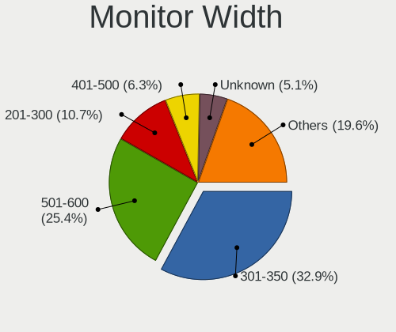

| Width in mm    | Computers | Percent |
|----------------|-----------|---------|
| 301-350        | 503       | 31.4%   |
| 501-600        | 425       | 26.53%  |
| 201-300        | 161       | 10.05%  |
| Unknown        | 124       | 7.74%   |
| 401-500        | 111       | 6.93%   |
| 351-400        | 91        | 5.68%   |
| 601-700        | 58        | 3.62%   |
| 701-800        | 43        | 2.68%   |
| 1501-2000      | 33        | 2.06%   |
| 1001-1500      | 32        | 2%      |
| 801-900        | 12        | 0.75%   |
| 901-1000       | 8         | 0.5%    |
| More than 2000 | 1         | 0.06%   |

Aspect Ratio
------------

Proportional relationship between the width and the height

| Ratio   | Computers | Percent |
|---------|-----------|---------|
| 16/9    | 1034      | 70.48%  |
| 16/10   | 212       | 14.45%  |
| Unknown | 117       | 7.98%   |
| 5/4     | 37        | 2.52%   |
| 21/9    | 35        | 2.39%   |
| 3/2     | 13        | 0.89%   |
| 4/3     | 11        | 0.75%   |
| 32/9    | 6         | 0.41%   |
| 1.00    | 1         | 0.07%   |
| 0.45    | 1         | 0.07%   |

Monitor Area
------------

Area in inch

| Area in inch | Computers | Percent |
|----------------|-----------|---------|
| 101-110        | 304       | 18.95%  |
| 201-250        | 284       | 17.71%  |
| 81-90          | 211       | 13.15%  |
| 301-350        | 173       | 10.79%  |
| Unknown        | 124       | 7.73%   |
| 351-500        | 87        | 5.42%   |
| 71-80          | 69        | 4.3%    |
| 251-300        | 68        | 4.24%   |
| More than 1000 | 56        | 3.49%   |
| 151-200        | 51        | 3.18%   |
| 121-130        | 49        | 3.05%   |
| 61-70          | 47        | 2.93%   |
| 501-1000       | 25        | 1.56%   |
| 51-60          | 22        | 1.37%   |
| 141-150        | 13        | 0.81%   |
| 131-140        | 9         | 0.56%   |
| 41-50          | 6         | 0.37%   |
| 91-100         | 4         | 0.25%   |
| 111-120        | 2         | 0.12%   |

Pixel Density
-------------

Pixels per inch

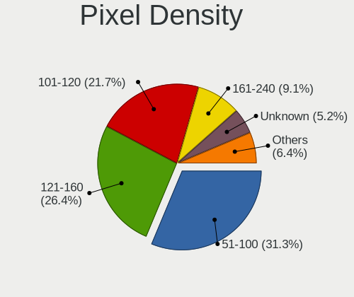

| Density       | Computers | Percent |
|---------------|-----------|---------|
| 51-100        | 513       | 32.97%  |
| 121-160       | 397       | 25.51%  |
| 101-120       | 326       | 20.95%  |
| Unknown       | 124       | 7.97%   |
| 161-240       | 102       | 6.56%   |
| More than 240 | 54        | 3.47%   |
| 1-50          | 40        | 2.57%   |

Multiple Monitors
-----------------

Total monitors connected

| Total | Computers | Percent |
|-------|-----------|---------|
| 1     | 1101      | 74.14%  |
| 2     | 276       | 18.59%  |
| 0     | 76        | 5.12%   |
| 3     | 29        | 1.95%   |
| 4     | 3         | 0.2%    |

Network
-------

Net Controller Vendor
---------------------

Controller vendors

| Vendor                                 | Computers | Percent |
|----------------------------------------|-----------|---------|
| Intel                                  | 812       | 38.94%  |
| Realtek Semiconductor                  | 622       | 29.83%  |
| Qualcomm Atheros                       | 218       | 10.46%  |
| Broadcom                               | 133       | 6.38%   |
| Broadcom Limited                       | 33        | 1.58%   |
| Marvell Technology Group               | 25        | 1.2%    |
| Ralink                                 | 19        | 0.91%   |
| Hewlett-Packard                        | 15        | 0.72%   |
| Nvidia                                 | 12        | 0.58%   |
| D-Link System                          | 12        | 0.58%   |
| MediaTek                               | 11        | 0.53%   |
| Lenovo                                 | 11        | 0.53%   |
| D-Link                                 | 11        | 0.53%   |
| ASIX Electronics                       | 11        | 0.53%   |
| NetGear                                | 10        | 0.48%   |
| Microsoft                              | 10        | 0.48%   |
| Dell                                   | 10        | 0.48%   |
| Ralink Technology                      | 9         | 0.43%   |
| ASUSTek Computer                       | 9         | 0.43%   |
| TP-Link                                | 8         | 0.38%   |
| Sierra Wireless                        | 8         | 0.38%   |
| Huawei Technologies                    | 8         | 0.38%   |
| Ericsson Business Mobile Networks      | 6         | 0.29%   |
| DisplayLink                            | 5         | 0.24%   |
| Qualcomm Atheros Communications        | 4         | 0.19%   |
| Fibocom                                | 4         | 0.19%   |
| Silicon Integrated Systems [SiS]       | 3         | 0.14%   |
| Samsung Electronics                    | 3         | 0.14%   |
| Qualcomm                               | 3         | 0.14%   |
| Aquantia                               | 3         | 0.14%   |
| ZTE WCDMA Technologies MSM             | 2         | 0.1%    |
| Standard Microsystems                  | 2         | 0.1%    |
| OnePlus Technology (Shenzhen)          | 2         | 0.1%    |
| Microchip Technology                   | 2         | 0.1%    |
| Dresden Elektronik                     | 2         | 0.1%    |
| Xiaomi                                 | 1         | 0.05%   |
| Wilocity                               | 1         | 0.05%   |
| Wacom                                  | 1         | 0.05%   |
| VIA Technologies                       | 1         | 0.05%   |
| Unknown                                | 1         | 0.05%   |
| U-Blox                                 | 1         | 0.05%   |
| Texas Instruments                      | 1         | 0.05%   |
| Sundance Technology Inc / IC Plus      | 1         | 0.05%   |
| STMicroelectronics                     | 1         | 0.05%   |
| Sony Ericsson Mobile Communications AB | 1         | 0.05%   |
| SEGGER                                 | 1         | 0.05%   |
| Novatek Microelectronics               | 1         | 0.05%   |
| Micro Star International               | 1         | 0.05%   |
| Mellanox Technologies                  | 1         | 0.05%   |
| Loupedeck                              | 1         | 0.05%   |
| Linksys                                | 1         | 0.05%   |
| IMC Networks                           | 1         | 0.05%   |
| ICS Advent                             | 1         | 0.05%   |
| Gemtek                                 | 1         | 0.05%   |
| Edimax Technology                      | 1         | 0.05%   |
| Chu Yuen Enterprise                    | 1         | 0.05%   |
| Belkin Components                      | 1         | 0.05%   |
| Arduino SA                             | 1         | 0.05%   |
| Apple                                  | 1         | 0.05%   |
| AMD                                    | 1         | 0.05%   |

Net Controller Model
--------------------

Controller models

| Model                                                             | Computers | Percent |
|-------------------------------------------------------------------|-----------|---------|
| Realtek RTL8111/8168/8411 PCI Express Gigabit Ethernet Controller | 467       | 18.64%  |
| Intel I211 Gigabit Network Connection                             | 79        | 3.15%   |
| Intel Wi-Fi 6 AX200                                               | 68        | 2.71%   |
| Intel Wireless 8265 / 8275                                        | 63        | 2.51%   |
| Intel Wireless 7260                                               | 59        | 2.36%   |
| Intel 82579LM Gigabit Network Connection (Lewisville)             | 54        | 2.16%   |
| Realtek RTL810xE PCI Express Fast Ethernet controller             | 42        | 1.68%   |
| Intel Wireless 8260                                               | 42        | 1.68%   |
| Realtek RTL8153 Gigabit Ethernet Adapter                          | 41        | 1.64%   |
| Intel Ethernet Connection (2) I219-V                              | 37        | 1.48%   |
| Intel Wireless 7265                                               | 34        | 1.36%   |
| Qualcomm Atheros QCA6174 802.11ac Wireless Network Adapter        | 29        | 1.16%   |
| Intel Wi-Fi 6 AX201                                               | 29        | 1.16%   |
| Realtek RTL8125 2.5GbE Controller                                 | 25        | 1%      |
| Qualcomm Atheros QCA9565 / AR9565 Wireless Network Adapter        | 25        | 1%      |
| Qualcomm Atheros AR9285 Wireless Network Adapter (PCI-Express)    | 25        | 1%      |
| Intel Centrino Advanced-N 6205 [Taylor Peak]                      | 24        | 0.96%   |
| Qualcomm Atheros AR9485 Wireless Network Adapter                  | 23        | 0.92%   |
| Intel Cannon Point-LP CNVi [Wireless-AC]                          | 23        | 0.92%   |
| Qualcomm Atheros QCA9377 802.11ac Wireless Network Adapter        | 22        | 0.88%   |
| Intel Ethernet Connection I217-LM                                 | 22        | 0.88%   |
| Intel Cannon Lake PCH CNVi WiFi                                   | 21        | 0.84%   |
| Intel Ethernet Connection (7) I219-V                              | 20        | 0.8%    |
| Intel 82579V Gigabit Network Connection                           | 20        | 0.8%    |
| Intel Ethernet Connection (2) I218-V                              | 19        | 0.76%   |
| Intel Ethernet Connection I218-LM                                 | 18        | 0.72%   |
| Intel Dual Band Wireless-AC 3168NGW [Stone Peak]                  | 18        | 0.72%   |
| Intel Wireless-AC 9260                                            | 17        | 0.68%   |
| Intel Ethernet Connection (4) I219-V                              | 17        | 0.68%   |
| Intel Ethernet Connection (3) I218-LM                             | 17        | 0.68%   |
| Realtek RTL8822CE 802.11ac PCIe Wireless Network Adapter          | 16        | 0.64%   |
| Realtek RTL8821CE 802.11ac PCIe Wireless Network Adapter          | 16        | 0.64%   |
| Realtek RTL8723BE PCIe Wireless Network Adapter                   | 16        | 0.64%   |
| Intel Comet Lake PCH-LP CNVi WiFi                                 | 16        | 0.64%   |
| Broadcom BCM4360 802.11ac Wireless Network Adapter                | 16        | 0.64%   |
| Qualcomm Atheros Killer E220x Gigabit Ethernet Controller         | 15        | 0.6%    |
| Intel PRO/Wireless 3945ABG [Golan] Network Connection             | 15        | 0.6%    |
| Realtek RTL8822BE 802.11a/b/g/n/ac WiFi adapter                   | 14        | 0.56%   |
| Intel Ethernet Controller I225-V                                  | 14        | 0.56%   |
| Intel Ethernet Connection I219-LM                                 | 14        | 0.56%   |
| Intel Ethernet Connection (6) I219-V                              | 14        | 0.56%   |
| Intel Centrino Advanced-N 6200                                    | 14        | 0.56%   |
| Intel Wireless 3165                                               | 13        | 0.52%   |
| Intel Wireless 3160                                               | 13        | 0.52%   |
| Intel Ethernet Connection I219-V                                  | 13        | 0.52%   |
| Intel Ethernet Connection (4) I219-LM                             | 13        | 0.52%   |
| Intel 82577LM Gigabit Network Connection                          | 13        | 0.52%   |
| Intel Comet Lake PCH CNVi WiFi                                    | 12        | 0.48%   |
| Broadcom BCM4352 802.11ac Wireless Network Adapter                | 12        | 0.48%   |
| Qualcomm Atheros QCA8171 Gigabit Ethernet                         | 11        | 0.44%   |
| Qualcomm Atheros AR8151 v2.0 Gigabit Ethernet                     | 11        | 0.44%   |
| Intel Centrino Advanced-N 6235                                    | 11        | 0.44%   |
| Broadcom NetLink BCM57785 Gigabit Ethernet PCIe                   | 11        | 0.44%   |
| Qualcomm Atheros AR9462 Wireless Network Adapter                  | 10        | 0.4%    |
| Intel I210 Gigabit Network Connection                             | 10        | 0.4%    |
| Intel Ethernet Connection I217-V                                  | 10        | 0.4%    |
| Intel Dual Band Wireless-AC 3165 Plus Bluetooth                   | 10        | 0.4%    |
| Realtek RTL8188EUS 802.11n Wireless Network Adapter               | 9         | 0.36%   |
| Realtek RTL-8100/8101L/8139 PCI Fast Ethernet Adapter             | 9         | 0.36%   |
| Qualcomm Atheros Killer E2500 Gigabit Ethernet Controller         | 9         | 0.36%   |

Wireless Vendor
---------------

Wireless vendors

| Vendor                          | Computers | Percent |
|---------------------------------|-----------|---------|
| Intel                           | 568       | 52.3%   |
| Qualcomm Atheros                | 161       | 14.83%  |
| Realtek Semiconductor           | 126       | 11.6%   |
| Broadcom                        | 90        | 8.29%   |
| Ralink                          | 19        | 1.75%   |
| Broadcom Limited                | 16        | 1.47%   |
| MediaTek                        | 11        | 1.01%   |
| NetGear                         | 10        | 0.92%   |
| D-Link                          | 10        | 0.92%   |
| Ralink Technology               | 9         | 0.83%   |
| ASUSTek Computer                | 9         | 0.83%   |
| Sierra Wireless                 | 8         | 0.74%   |
| D-Link System                   | 8         | 0.74%   |
| Microsoft                       | 6         | 0.55%   |
| TP-Link                         | 5         | 0.46%   |
| Dell                            | 5         | 0.46%   |
| Qualcomm Atheros Communications | 4         | 0.37%   |
| Marvell Technology Group        | 4         | 0.37%   |
| Hewlett-Packard                 | 4         | 0.37%   |
| Fibocom                         | 4         | 0.37%   |
| Wilocity                        | 1         | 0.09%   |
| Wacom                           | 1         | 0.09%   |
| Qualcomm                        | 1         | 0.09%   |
| Micro Star International        | 1         | 0.09%   |
| Linksys                         | 1         | 0.09%   |
| IMC Networks                    | 1         | 0.09%   |
| Edimax Technology               | 1         | 0.09%   |
| Chu Yuen Enterprise             | 1         | 0.09%   |
| Belkin Components               | 1         | 0.09%   |

Wireless Model
--------------

Wireless models

| Model                                                                   | Computers | Percent |
|-------------------------------------------------------------------------|-----------|---------|
| Intel Wi-Fi 6 AX200                                                     | 68        | 6.23%   |
| Intel Wireless 8265 / 8275                                              | 63        | 5.77%   |
| Intel Wireless 7260                                                     | 59        | 5.41%   |
| Intel Wireless 8260                                                     | 42        | 3.85%   |
| Intel Wireless 7265                                                     | 34        | 3.12%   |
| Qualcomm Atheros QCA6174 802.11ac Wireless Network Adapter              | 29        | 2.66%   |
| Intel Wi-Fi 6 AX201                                                     | 29        | 2.66%   |
| Qualcomm Atheros QCA9565 / AR9565 Wireless Network Adapter              | 25        | 2.29%   |
| Qualcomm Atheros AR9285 Wireless Network Adapter (PCI-Express)          | 25        | 2.29%   |
| Intel Centrino Advanced-N 6205 [Taylor Peak]                            | 24        | 2.2%    |
| Qualcomm Atheros AR9485 Wireless Network Adapter                        | 23        | 2.11%   |
| Intel Cannon Point-LP CNVi [Wireless-AC]                                | 23        | 2.11%   |
| Qualcomm Atheros QCA9377 802.11ac Wireless Network Adapter              | 22        | 2.02%   |
| Intel Cannon Lake PCH CNVi WiFi                                         | 21        | 1.92%   |
| Intel Dual Band Wireless-AC 3168NGW [Stone Peak]                        | 18        | 1.65%   |
| Intel Wireless-AC 9260                                                  | 17        | 1.56%   |
| Realtek RTL8822CE 802.11ac PCIe Wireless Network Adapter                | 16        | 1.47%   |
| Realtek RTL8821CE 802.11ac PCIe Wireless Network Adapter                | 16        | 1.47%   |
| Realtek RTL8723BE PCIe Wireless Network Adapter                         | 16        | 1.47%   |
| Intel Comet Lake PCH-LP CNVi WiFi                                       | 16        | 1.47%   |
| Broadcom BCM4360 802.11ac Wireless Network Adapter                      | 16        | 1.47%   |
| Intel PRO/Wireless 3945ABG [Golan] Network Connection                   | 15        | 1.37%   |
| Realtek RTL8822BE 802.11a/b/g/n/ac WiFi adapter                         | 14        | 1.28%   |
| Intel Centrino Advanced-N 6200                                          | 14        | 1.28%   |
| Intel Wireless 3165                                                     | 13        | 1.19%   |
| Intel Wireless 3160                                                     | 13        | 1.19%   |
| Intel Comet Lake PCH CNVi WiFi                                          | 12        | 1.1%    |
| Broadcom BCM4352 802.11ac Wireless Network Adapter                      | 12        | 1.1%    |
| Intel Centrino Advanced-N 6235                                          | 11        | 1.01%   |
| Qualcomm Atheros AR9462 Wireless Network Adapter                        | 10        | 0.92%   |
| Intel Dual Band Wireless-AC 3165 Plus Bluetooth                         | 10        | 0.92%   |
| Realtek RTL8188EUS 802.11n Wireless Network Adapter                     | 9         | 0.82%   |
| Broadcom BCM43228 802.11a/b/g/n                                         | 9         | 0.82%   |
| Broadcom BCM4313 802.11bgn Wireless Network Adapter                     | 9         | 0.82%   |
| Ralink RT3290 Wireless 802.11n 1T/1R PCIe                               | 7         | 0.64%   |
| Qualcomm Atheros AR9287 Wireless Network Adapter (PCI-Express)          | 7         | 0.64%   |
| Intel Wi-Fi 6 AX210/AX211/AX411 160MHz                                  | 7         | 0.64%   |
| Intel PRO/Wireless 4965 AG or AGN [Kedron] Network Connection           | 7         | 0.64%   |
| Intel Centrino Wireless-N 2230                                          | 7         | 0.64%   |
| Realtek RTL8852AE 802.11ax PCIe Wireless Network Adapter                | 6         | 0.55%   |
| Realtek RTL8811AU 802.11a/b/g/n/ac WLAN Adapter                         | 6         | 0.55%   |
| Qualcomm Atheros AR93xx Wireless Network Adapter                        | 6         | 0.55%   |
| MediaTek MT7921 802.11ax PCI Express Wireless Network Adapter           | 6         | 0.55%   |
| Intel WiFi Link 5100                                                    | 6         | 0.55%   |
| Intel Centrino Ultimate-N 6300                                          | 6         | 0.55%   |
| Broadcom Limited BCM4360 802.11ac Wireless Network Adapter              | 6         | 0.55%   |
| Broadcom BCM4331 802.11a/b/g/n                                          | 6         | 0.55%   |
| Broadcom BCM43224 802.11a/b/g/n                                         | 6         | 0.55%   |
| Sierra Wireless EM7455                                                  | 5         | 0.46%   |
| Realtek 802.11ac NIC                                                    | 5         | 0.46%   |
| Qualcomm Atheros AR242x / AR542x Wireless Network Adapter (PCI-Express) | 5         | 0.46%   |
| Intel PRO/Wireless 5100 AGN [Shiloh] Network Connection                 | 5         | 0.46%   |
| Intel Gemini Lake PCH CNVi WiFi                                         | 5         | 0.46%   |
| Intel Centrino Wireless-N 1000 [Condor Peak]                            | 5         | 0.46%   |
| D-Link System DWA-140 RangeBooster N Adapter(rev.B2) [Ralink RT3072]    | 5         | 0.46%   |
| Broadcom BCM4322 802.11a/b/g/n Wireless LAN Controller                  | 5         | 0.46%   |
| Broadcom BCM43142 802.11b/g/n                                           | 5         | 0.46%   |
| Realtek RTL8812AU 802.11a/b/g/n/ac 2T2R DB WLAN Adapter                 | 4         | 0.37%   |
| Realtek RTL8723DE Wireless Network Adapter                              | 4         | 0.37%   |
| Realtek RTL8192CE PCIe Wireless Network Adapter                         | 4         | 0.37%   |

Ethernet Vendor
---------------

Ethernet vendors

| Vendor                                 | Computers | Percent |
|----------------------------------------|-----------|---------|
| Realtek Semiconductor                  | 578       | 43.01%  |
| Intel                                  | 494       | 36.76%  |
| Qualcomm Atheros                       | 85        | 6.32%   |
| Broadcom                               | 61        | 4.54%   |
| Marvell Technology Group               | 21        | 1.56%   |
| Broadcom Limited                       | 18        | 1.34%   |
| Nvidia                                 | 12        | 0.89%   |
| ASIX Electronics                       | 11        | 0.82%   |
| Lenovo                                 | 10        | 0.74%   |
| Huawei Technologies                    | 6         | 0.45%   |
| Hewlett-Packard                        | 5         | 0.37%   |
| DisplayLink                            | 5         | 0.37%   |
| Microsoft                              | 4         | 0.3%    |
| D-Link System                          | 4         | 0.3%    |
| TP-Link                                | 3         | 0.22%   |
| Samsung Electronics                    | 3         | 0.22%   |
| Aquantia                               | 3         | 0.22%   |
| ZTE WCDMA Technologies MSM             | 2         | 0.15%   |
| Standard Microsystems                  | 2         | 0.15%   |
| Silicon Integrated Systems [SiS]       | 2         | 0.15%   |
| Qualcomm                               | 2         | 0.15%   |
| Microchip Technology                   | 2         | 0.15%   |
| Xiaomi                                 | 1         | 0.07%   |
| VIA Technologies                       | 1         | 0.07%   |
| Unknown                                | 1         | 0.07%   |
| Sundance Technology Inc / IC Plus      | 1         | 0.07%   |
| Sony Ericsson Mobile Communications AB | 1         | 0.07%   |
| OnePlus Technology (Shenzhen)          | 1         | 0.07%   |
| ICS Advent                             | 1         | 0.07%   |
| Gemtek                                 | 1         | 0.07%   |
| D-Link                                 | 1         | 0.07%   |
| Apple                                  | 1         | 0.07%   |
| 3Com                                   | 1         | 0.07%   |

Ethernet Model
--------------

Ethernet models

| Model                                                                          | Computers | Percent |
|--------------------------------------------------------------------------------|-----------|---------|
| Realtek RTL8111/8168/8411 PCI Express Gigabit Ethernet Controller              | 467       | 33.94%  |
| Intel I211 Gigabit Network Connection                                          | 79        | 5.74%   |
| Intel 82579LM Gigabit Network Connection (Lewisville)                          | 54        | 3.92%   |
| Realtek RTL810xE PCI Express Fast Ethernet controller                          | 42        | 3.05%   |
| Realtek RTL8153 Gigabit Ethernet Adapter                                       | 41        | 2.98%   |
| Intel Ethernet Connection (2) I219-V                                           | 37        | 2.69%   |
| Realtek RTL8125 2.5GbE Controller                                              | 25        | 1.82%   |
| Intel Ethernet Connection I217-LM                                              | 22        | 1.6%    |
| Intel Ethernet Connection (7) I219-V                                           | 20        | 1.45%   |
| Intel 82579V Gigabit Network Connection                                        | 20        | 1.45%   |
| Intel Ethernet Connection (2) I218-V                                           | 19        | 1.38%   |
| Intel Ethernet Connection I218-LM                                              | 18        | 1.31%   |
| Intel Ethernet Connection (4) I219-V                                           | 17        | 1.24%   |
| Intel Ethernet Connection (3) I218-LM                                          | 17        | 1.24%   |
| Qualcomm Atheros Killer E220x Gigabit Ethernet Controller                      | 15        | 1.09%   |
| Intel Ethernet Controller I225-V                                               | 14        | 1.02%   |
| Intel Ethernet Connection I219-LM                                              | 14        | 1.02%   |
| Intel Ethernet Connection (6) I219-V                                           | 14        | 1.02%   |
| Intel Ethernet Connection I219-V                                               | 13        | 0.94%   |
| Intel Ethernet Connection (4) I219-LM                                          | 13        | 0.94%   |
| Intel 82577LM Gigabit Network Connection                                       | 13        | 0.94%   |
| Qualcomm Atheros QCA8171 Gigabit Ethernet                                      | 11        | 0.8%    |
| Qualcomm Atheros AR8151 v2.0 Gigabit Ethernet                                  | 11        | 0.8%    |
| Broadcom NetLink BCM57785 Gigabit Ethernet PCIe                                | 11        | 0.8%    |
| Intel I210 Gigabit Network Connection                                          | 10        | 0.73%   |
| Intel Ethernet Connection I217-V                                               | 10        | 0.73%   |
| Realtek RTL-8100/8101L/8139 PCI Fast Ethernet Adapter                          | 9         | 0.65%   |
| Qualcomm Atheros Killer E2500 Gigabit Ethernet Controller                      | 9         | 0.65%   |
| Intel Ethernet Connection (6) I219-LM                                          | 9         | 0.65%   |
| Intel 82567LM-3 Gigabit Network Connection                                     | 9         | 0.65%   |
| Qualcomm Atheros AR8161 Gigabit Ethernet                                       | 7         | 0.51%   |
| Qualcomm Atheros AR8131 Gigabit Ethernet                                       | 7         | 0.51%   |
| Intel Ethernet Connection (7) I219-LM                                          | 7         | 0.51%   |
| Intel Ethernet Connection (5) I219-LM                                          | 7         | 0.51%   |
| Intel 82566MM Gigabit Network Connection                                       | 7         | 0.51%   |
| Broadcom NetXtreme BCM57765 Gigabit Ethernet PCIe                              | 7         | 0.51%   |
| Intel Ethernet Connection (2) I219-LM                                          | 6         | 0.44%   |
| Intel 82574L Gigabit Network Connection                                        | 6         | 0.44%   |
| Intel 82567LM Gigabit Network Connection                                       | 6         | 0.44%   |
| ASIX AX88179 Gigabit Ethernet                                                  | 6         | 0.44%   |
| Qualcomm Atheros QCA8172 Fast Ethernet                                         | 5         | 0.36%   |
| Qualcomm Atheros Killer E2400 Gigabit Ethernet Controller                      | 5         | 0.36%   |
| Marvell Group 88E8056 PCI-E Gigabit Ethernet Controller                        | 5         | 0.36%   |
| DisplayLink Dell Universal Dock D6000                                          | 5         | 0.36%   |
| Broadcom NetXtreme BCM57762 Gigabit Ethernet PCIe                              | 5         | 0.36%   |
| Broadcom NetXtreme BCM5764M Gigabit Ethernet PCIe                              | 5         | 0.36%   |
| Marvell Group 88E8001 Gigabit Ethernet Controller                              | 4         | 0.29%   |
| Huawei COL-L29                                                                 | 4         | 0.29%   |
| HP lt4120 Snapdragon X5 LTE                                                    | 4         | 0.29%   |
| D-Link System DGE-528T Gigabit Ethernet Adapter                                | 4         | 0.29%   |
| Broadcom Limited NetLink BCM57780 Gigabit Ethernet PCIe                        | 4         | 0.29%   |
| Realtek RTL-8110SC/8169SC Gigabit Ethernet                                     | 3         | 0.22%   |
| Qualcomm Atheros AR8152 v2.0 Fast Ethernet                                     | 3         | 0.22%   |
| Qualcomm Atheros AR8152 v1.1 Fast Ethernet                                     | 3         | 0.22%   |
| Qualcomm Atheros AR8132 Fast Ethernet                                          | 3         | 0.22%   |
| Nvidia MCP61 Ethernet                                                          | 3         | 0.22%   |
| Marvell Group Yukon Optima 88E8059 [PCIe Gigabit Ethernet Controller with AVB] | 3         | 0.22%   |
| Lenovo USB-C Dock Ethernet                                                     | 3         | 0.22%   |
| Intel I350 Gigabit Network Connection                                          | 3         | 0.22%   |
| Intel Ethernet Controller 10-Gigabit X540-AT2                                  | 3         | 0.22%   |

Net Controller Kind
-------------------

Ethernet, WiFi or modem

| Kind     | Computers | Percent |
|----------|-----------|---------|
| Ethernet | 1271      | 54.29%  |
| WiFi     | 1032      | 44.08%  |
| Modem    | 33        | 1.41%   |
| Unknown  | 5         | 0.21%   |

Used Controller
---------------

Currently used network controller

| Kind     | Computers | Percent |
|----------|-----------|---------|
| WiFi     | 771       | 51.16%  |
| Ethernet | 735       | 48.77%  |
| Unknown  | 1         | 0.07%   |

NICs
----

Total network controllers on board

| Total | Computers | Percent |
|-------|-----------|---------|
| 2     | 763       | 52.44%  |
| 1     | 609       | 41.86%  |
| 3     | 39        | 2.68%   |
| 0     | 30        | 2.06%   |
| 4     | 7         | 0.48%   |
| 5     | 5         | 0.34%   |
| 9     | 1         | 0.07%   |
| 6     | 1         | 0.07%   |

IPv6
----

IPv6 vs IPv4

| Used | Computers | Percent |
|------|-----------|---------|
| No   | 1422      | 97.53%  |
| Yes  | 36        | 2.47%   |

Bluetooth
---------

Bluetooth Vendor
----------------

Controller vendors

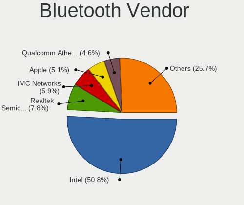

| Vendor                          | Computers | Percent |
|---------------------------------|-----------|---------|
| Intel                           | 443       | 51.57%  |
| Realtek Semiconductor           | 53        | 6.17%   |
| Qualcomm Atheros Communications | 51        | 5.94%   |
| Cambridge Silicon Radio         | 49        | 5.7%    |
| ASUSTek Computer                | 47        | 5.47%   |
| Apple                           | 40        | 4.66%   |
| Broadcom                        | 38        | 4.42%   |
| IMC Networks                    | 34        | 3.96%   |
| Lite-On Technology              | 23        | 2.68%   |
| Foxconn / Hon Hai               | 21        | 2.44%   |
| Hewlett-Packard                 | 16        | 1.86%   |
| Dell                            | 13        | 1.51%   |
| Ralink                          | 7         | 0.81%   |
| Toshiba                         | 4         | 0.47%   |
| Marvell Semiconductor           | 4         | 0.47%   |
| Realtek                         | 2         | 0.23%   |
| Ralink Technology               | 2         | 0.23%   |
| Micro Star International        | 2         | 0.23%   |
| MediaTek                        | 2         | 0.23%   |
| Chicony Electronics             | 2         | 0.23%   |
| USI                             | 1         | 0.12%   |
| HTC (High Tech Computer)        | 1         | 0.12%   |
| Fujitsu                         | 1         | 0.12%   |
| Creative Technology             | 1         | 0.12%   |
| Alps Electric                   | 1         | 0.12%   |
| Unknown                         | 1         | 0.12%   |

Bluetooth Model
---------------

Controller models

| Model                                               | Computers | Percent |
|-----------------------------------------------------|-----------|---------|
| Intel Bluetooth wireless interface                  | 208       | 24.1%   |
| Intel AX200 Bluetooth                               | 65        | 7.53%   |
| Intel Bluetooth Device                              | 60        | 6.95%   |
| Intel Bluetooth 9460/9560 Jefferson Peak (JfP)      | 49        | 5.68%   |
| Cambridge Silicon Radio Bluetooth Dongle (HCI mode) | 49        | 5.68%   |
| Realtek Bluetooth Radio                             | 34        | 3.94%   |
| ASUS Broadcom BCM20702A0 Bluetooth                  | 22        | 2.55%   |
| Intel Wireless-AC 3168 Bluetooth                    | 18        | 2.09%   |
| Intel Centrino Bluetooth Wireless Transceiver       | 18        | 2.09%   |
| Intel Wireless-AC 9260 Bluetooth Adapter            | 15        | 1.74%   |
| Apple Bluetooth Host Controller                     | 15        | 1.74%   |
| Qualcomm Atheros QCA61x4 Bluetooth 4.0              | 14        | 1.62%   |
| Foxconn / Hon Hai Bluetooth Device                  | 14        | 1.62%   |
| Qualcomm Atheros  Bluetooth Device                  | 12        | 1.39%   |
| IMC Networks Bluetooth Device                       | 12        | 1.39%   |
| Apple Bluetooth USB Host Controller                 | 12        | 1.39%   |
| Realtek  Bluetooth 4.2 Adapter                      | 11        | 1.27%   |
| Qualcomm Atheros AR3011 Bluetooth                   | 11        | 1.27%   |
| IMC Networks Bluetooth Radio                        | 11        | 1.27%   |
| Broadcom BCM2045B (BDC-2.1)                         | 10        | 1.16%   |
| Qualcomm Atheros AR3012 Bluetooth 4.0               | 8         | 0.93%   |
| Lite-On Bluetooth Device                            | 8         | 0.93%   |
| HP Broadcom 2070 Bluetooth Combo                    | 8         | 0.93%   |
| HP Bluetooth 2.0 Interface [Broadcom BCM2045]       | 8         | 0.93%   |
| Apple Built-in Bluetooth 2.0+EDR HCI                | 8         | 0.93%   |
| Ralink RT3290 Bluetooth                             | 7         | 0.81%   |
| Intel AX210 Bluetooth                               | 7         | 0.81%   |
| Broadcom BCM20702 Bluetooth 4.0 [ThinkPad]          | 6         | 0.7%    |
| ASUS Bluetooth Radio                                | 6         | 0.7%    |
| Lite-On Qualcomm Atheros QCA9377 Bluetooth          | 5         | 0.58%   |
| Lite-On Atheros AR3012 Bluetooth                    | 5         | 0.58%   |
| Intel Centrino Advanced-N 6230 Bluetooth adapter    | 5         | 0.58%   |
| Realtek RTL8822BE Bluetooth 4.2 Adapter             | 4         | 0.46%   |
| IMC Networks Atheros AR3012 Bluetooth 4.0 Adapter   | 4         | 0.46%   |
| Dell DW375 Bluetooth Module                         | 4         | 0.46%   |
| Broadcom HP Portable SoftSailing                    | 4         | 0.46%   |
| Broadcom BCM20702A0                                 | 4         | 0.46%   |
| ASUS BT-253 Bluetooth Adapter                       | 4         | 0.46%   |
| Apple Bluetooth HCI                                 | 4         | 0.46%   |
| Realtek RTL8723B Bluetooth                          | 3         | 0.35%   |
| Marvell Bluetooth and Wireless LAN Composite        | 3         | 0.35%   |
| Lite-On Wireless_Device                             | 3         | 0.35%   |
| IMC Networks BCM20702A0                             | 3         | 0.35%   |
| Dell Wireless 350 Bluetooth                         | 3         | 0.35%   |
| Dell BCM20702A0 Bluetooth Module                    | 3         | 0.35%   |
| Broadcom HP Portable Bumble Bee                     | 3         | 0.35%   |
| Broadcom BCM2045B (BDC-2) [Bluetooth Controller]    | 3         | 0.35%   |
| ASUS BCM20702A0                                     | 3         | 0.35%   |
| ASUS ASUS USB-BT500                                 | 3         | 0.35%   |
| Toshiba Bluetooth Device                            | 2         | 0.23%   |
| Realtek Bluetooth Radio                             | 2         | 0.23%   |
| Qualcomm Atheros AR3012 Bluetooth                   | 2         | 0.23%   |
| MediaTek MT7630e Bluetooth Adapter                  | 2         | 0.23%   |
| IMC Networks Wireless_Device                        | 2         | 0.23%   |
| Foxconn / Hon Hai BCM20702A0                        | 2         | 0.23%   |
| Dell Wireless 365 Bluetooth                         | 2         | 0.23%   |
| Chicony Bluetooth (RTL8723BE)                       | 2         | 0.23%   |
| Broadcom BCM20702A0 Bluetooth 4.0                   | 2         | 0.23%   |
| Broadcom BCM2070 Bluetooth 2.1 + EDR                | 2         | 0.23%   |
| ASUS Qualcomm Bluetooth 4.1                         | 2         | 0.23%   |

Sound
-----

Sound Vendor
------------

Sound card vendors

| Vendor                                          | Computers | Percent |
|-------------------------------------------------|-----------|---------|
| Intel                                           | 1018      | 47.11%  |
| AMD                                             | 440       | 20.36%  |
| Nvidia                                          | 407       | 18.83%  |
| C-Media Electronics                             | 41        | 1.9%    |
| Logitech                                        | 26        | 1.2%    |
| Kingston Technology                             | 15        | 0.69%   |
| Creative Labs                                   | 14        | 0.65%   |
| Realtek Semiconductor                           | 13        | 0.6%    |
| Plantronics                                     | 13        | 0.6%    |
| Texas Instruments                               | 11        | 0.51%   |
| Creative Technology                             | 10        | 0.46%   |
| SteelSeries ApS                                 | 8         | 0.37%   |
| Razer USA                                       | 8         | 0.37%   |
| Lenovo                                          | 8         | 0.37%   |
| Focusrite-Novation                              | 8         | 0.37%   |
| Corsair                                         | 8         | 0.37%   |
| RODE Microphones                                | 7         | 0.32%   |
| SAVITECH                                        | 6         | 0.28%   |
| Yamaha                                          | 4         | 0.19%   |
| GYROCOM C&C                                     | 4         | 0.19%   |
| GN Netcom                                       | 4         | 0.19%   |
| Blue Microphones                                | 4         | 0.19%   |
| VIA Technologies                                | 3         | 0.14%   |
| Silicon Integrated Systems [SiS]                | 3         | 0.14%   |
| Sennheiser Communications                       | 3         | 0.14%   |
| Samson Technologies                             | 3         | 0.14%   |
| PreSonus Audio Electronics                      | 3         | 0.14%   |
| Micro Star International                        | 3         | 0.14%   |
| JMTek                                           | 3         | 0.14%   |
| ASUSTek Computer                                | 3         | 0.14%   |
| Valve Software                                  | 2         | 0.09%   |
| Schiit Audio                                    | 2         | 0.09%   |
| Samsung Electronics                             | 2         | 0.09%   |
| RME                                             | 2         | 0.09%   |
| M-Audio                                         | 2         | 0.09%   |
| Licensed by Sony Computer Entertainment America | 2         | 0.09%   |
| Hewlett-Packard                                 | 2         | 0.09%   |
| BEHRINGER International                         | 2         | 0.09%   |
| Astro Gaming                                    | 2         | 0.09%   |
| Apple                                           | 2         | 0.09%   |
| Antlion Audio                                   | 2         | 0.09%   |
| Zoran Co. Personal Media Division (Nogatech)    | 1         | 0.05%   |
| XMOS                                            | 1         | 0.05%   |
| www.hirestech.com 2010 REV 1.4                  | 1         | 0.05%   |
| USB MIDI                                        | 1         | 0.05%   |
| Unknown                                         | 1         | 0.05%   |
| Trust                                           | 1         | 0.05%   |
| Thesycon Systemsoftware & Consulting            | 1         | 0.05%   |
| Sony                                            | 1         | 0.05%   |
| SlrTek                                          | 1         | 0.05%   |
| Roland                                          | 1         | 0.05%   |
| ROCCAT                                          | 1         | 0.05%   |
| QinHeng Electronics                             | 1         | 0.05%   |
| Nuforce                                         | 1         | 0.05%   |
| No brand                                        | 1         | 0.05%   |
| Microdia                                        | 1         | 0.05%   |
| Medeli Electronics                              | 1         | 0.05%   |
| M2Tech                                          | 1         | 0.05%   |
| Line6                                           | 1         | 0.05%   |
| LG Electronics                                  | 1         | 0.05%   |

Sound Model
-----------

Sound card models

| Model                                                                             | Computers | Percent |
|-----------------------------------------------------------------------------------|-----------|---------|
| Intel Sunrise Point-LP HD Audio                                                   | 117       | 4.6%    |
| Intel 7 Series/C216 Chipset Family High Definition Audio Controller               | 96        | 3.78%   |
| Intel 6 Series/C200 Series Chipset Family High Definition Audio Controller        | 94        | 3.7%    |
| AMD Family 17h/19h HD Audio Controller                                            | 88        | 3.46%   |
| AMD Starship/Matisse HD Audio Controller                                          | 80        | 3.15%   |
| Intel 8 Series/C220 Series Chipset High Definition Audio Controller               | 79        | 3.11%   |
| Intel Cannon Lake PCH cAVS                                                        | 69        | 2.72%   |
| AMD SBx00 Azalia (Intel HDA)                                                      | 66        | 2.6%    |
| Intel Xeon E3-1200 v3/4th Gen Core Processor HD Audio Controller                  | 52        | 2.05%   |
| Intel Haswell-ULT HD Audio Controller                                             | 51        | 2.01%   |
| Intel 8 Series HD Audio Controller                                                | 51        | 2.01%   |
| Intel 5 Series/3400 Series Chipset High Definition Audio                          | 48        | 1.89%   |
| AMD Family 17h (Models 00h-0fh) HD Audio Controller                               | 48        | 1.89%   |
| Intel 100 Series/C230 Series Chipset Family HD Audio Controller                   | 46        | 1.81%   |
| AMD FCH Azalia Controller                                                         | 41        | 1.61%   |
| Intel Cannon Point-LP High Definition Audio Controller                            | 40        | 1.57%   |
| Nvidia GP106 High Definition Audio Controller                                     | 39        | 1.53%   |
| AMD Raven/Raven2/Fenghuang HDMI/DP Audio Controller                               | 39        | 1.53%   |
| AMD Renoir Radeon High Definition Audio Controller                                | 38        | 1.5%    |
| Intel 200 Series PCH HD Audio                                                     | 37        | 1.46%   |
| AMD Ellesmere HDMI Audio [Radeon RX 470/480 / 570/580/590]                        | 37        | 1.46%   |
| Intel Wildcat Point-LP High Definition Audio Controller                           | 36        | 1.42%   |
| Intel Broadwell-U Audio Controller                                                | 36        | 1.42%   |
| Nvidia GP104 High Definition Audio Controller                                     | 33        | 1.3%    |
| Intel Tiger Lake-LP Smart Sound Technology Audio Controller                       | 32        | 1.26%   |
| Intel 82801I (ICH9 Family) HD Audio Controller                                    | 31        | 1.22%   |
| Intel 9 Series Chipset Family HD Audio Controller                                 | 27        | 1.06%   |
| Nvidia TU106 High Definition Audio Controller                                     | 26        | 1.02%   |
| Nvidia GP107GL High Definition Audio Controller                                   | 26        | 1.02%   |
| Intel NM10/ICH7 Family High Definition Audio Controller                           | 25        | 0.98%   |
| AMD Oland/Hainan/Cape Verde/Pitcairn HDMI Audio [Radeon HD 7000 Series]           | 25        | 0.98%   |
| Nvidia GM204 High Definition Audio Controller                                     | 24        | 0.94%   |
| Intel CM238 HD Audio Controller                                                   | 24        | 0.94%   |
| Intel 82801H (ICH8 Family) HD Audio Controller                                    | 24        | 0.94%   |
| AMD Kabini HDMI/DP Audio                                                          | 22        | 0.87%   |
| Nvidia High Definition Audio Controller                                           | 21        | 0.83%   |
| Nvidia GK107 HDMI Audio Controller                                                | 21        | 0.83%   |
| AMD Navi 10 HDMI Audio                                                            | 21        | 0.83%   |
| Nvidia GM206 High Definition Audio Controller                                     | 20        | 0.79%   |
| Intel Comet Lake PCH-LP cAVS                                                      | 19        | 0.75%   |
| Nvidia GK104 HDMI Audio Controller                                                | 18        | 0.71%   |
| Nvidia GF108 High Definition Audio Controller                                     | 18        | 0.71%   |
| Nvidia TU116 High Definition Audio Controller                                     | 16        | 0.63%   |
| AMD Baffin HDMI/DP Audio [Radeon RX 550 640SP / RX 560/560X]                      | 16        | 0.63%   |
| Nvidia GK208 HDMI/DP Audio Controller                                             | 15        | 0.59%   |
| Intel Comet Lake PCH cAVS                                                         | 15        | 0.59%   |
| Intel Atom Processor Z36xxx/Z37xxx Series High Definition Audio Controller        | 15        | 0.59%   |
| Intel 82801JI (ICH10 Family) HD Audio Controller                                  | 14        | 0.55%   |
| AMD Navi 21/23 HDMI/DP Audio Controller                                           | 14        | 0.55%   |
| Intel Celeron/Pentium Silver Processor High Definition Audio                      | 13        | 0.51%   |
| Intel C610/X99 series chipset HD Audio Controller                                 | 13        | 0.51%   |
| AMD Vega 10 HDMI Audio [Radeon Vega 56/64]                                        | 13        | 0.51%   |
| Realtek Semiconductor USB Audio                                                   | 11        | 0.43%   |
| AMD Family 15h (Models 60h-6fh) Audio Controller                                  | 11        | 0.43%   |
| AMD Cedar HDMI Audio [Radeon HD 5400/6300/7300 Series]                            | 11        | 0.43%   |
| Nvidia TU104 HD Audio Controller                                                  | 10        | 0.39%   |
| Kingston Technology HyperX 7.1 Audio                                              | 10        | 0.39%   |
| AMD Caicos HDMI Audio [Radeon HD 6450 / 7450/8450/8490 OEM / R5 230/235/235X OEM] | 10        | 0.39%   |
| Nvidia GM107 High Definition Audio Controller [GeForce 940MX]                     | 9         | 0.35%   |
| Nvidia GK106 HDMI Audio Controller                                                | 9         | 0.35%   |

Memory
------

Memory Vendor
-------------

Memory module vendors

| Vendor                       | Computers | Percent |
|------------------------------|-----------|---------|
| Samsung Electronics          | 168       | 20.79%  |
| SK hynix                     | 145       | 17.95%  |
| Corsair                      | 121       | 14.98%  |
| Kingston                     | 102       | 12.62%  |
| Micron Technology            | 72        | 8.91%   |
| Unknown                      | 70        | 8.66%   |
| Crucial                      | 43        | 5.32%   |
| G.Skill                      | 26        | 3.22%   |
| Ramaxel Technology           | 11        | 1.36%   |
| Elpida                       | 9         | 1.11%   |
| A-DATA Technology            | 8         | 0.99%   |
| Nanya Technology             | 7         | 0.87%   |
| Unknown (ABCD)               | 6         | 0.74%   |
| Transcend                    | 2         | 0.25%   |
| Team                         | 2         | 0.25%   |
| Qimonda                      | 2         | 0.25%   |
| Patriot                      | 2         | 0.25%   |
| G-Alantic                    | 2         | 0.25%   |
| Avant                        | 2         | 0.25%   |
| Unknown (AB)                 | 1         | 0.12%   |
| Unknown (836D)               | 1         | 0.12%   |
| SHARETRONIC                  | 1         | 0.12%   |
| Patriot Memory (PDP Systems) | 1         | 0.12%   |
| Netlist                      | 1         | 0.12%   |
| ASint Technology             | 1         | 0.12%   |
| Apacer                       | 1         | 0.12%   |
| Unknown                      | 1         | 0.12%   |

Memory Model
------------

Memory module models

| Model                                                               | Computers | Percent |
|---------------------------------------------------------------------|-----------|---------|
| Corsair RAM CMK16GX4M2B3200C16 8GB DIMM DDR4 3600MT/s               | 17        | 1.95%   |
| Corsair RAM CMK16GX4M2B3000C15 8192MB DIMM DDR4 3000MT/s            | 10        | 1.15%   |
| SK hynix RAM HMT41GS6BFR8A-PB 8GB SODIMM DDR3 1600MT/s              | 9         | 1.03%   |
| Samsung RAM M471B1G73DB0-YK0 8GB SODIMM DDR3 1600MT/s               | 8         | 0.92%   |
| SK hynix RAM HMT451S6BFR8A-PB 4096MB SODIMM DDR3 1600MT/s           | 6         | 0.69%   |
| Samsung RAM M471B5273DH0-CH9 4GB SODIMM DDR3 1334MT/s               | 6         | 0.69%   |
| Samsung RAM M471A5244CB0-CTD 4GB SODIMM DDR4 3266MT/s               | 6         | 0.69%   |
| Samsung RAM M471A1K43BB1-CRC 8GB SODIMM DDR4 2667MT/s               | 6         | 0.69%   |
| SK hynix RAM HMT451S6AFR8A-PB 4GB SODIMM DDR3 1600MT/s              | 5         | 0.57%   |
| SK hynix RAM HMA81GS6AFR8N-UH 8GB SODIMM DDR4 2667MT/s              | 5         | 0.57%   |
| Samsung RAM M471B5173DB0-YK0 4GB SODIMM DDR3 1600MT/s               | 5         | 0.57%   |
| Samsung RAM M471A5244CB0-CWE 4GB SODIMM DDR4 3200MT/s               | 5         | 0.57%   |
| Samsung RAM M471A2K43CB1-CRC 16GB SODIMM DDR4 2667MT/s              | 5         | 0.57%   |
| Kingston RAM KHX2666C16/8G 8GB DIMM DDR4 3466MT/s                   | 5         | 0.57%   |
| Unknown RAM Module 2048MB SODIMM DDR3 1600MT/s                      | 4         | 0.46%   |
| SK hynix RAM Module 8GB SODIMM DDR3 1600MT/s                        | 4         | 0.46%   |
| SK hynix RAM HMT41GS6AFR8A-PB 8192MB SODIMM DDR3 1600MT/s           | 4         | 0.46%   |
| SK hynix RAM HMT351S6CFR8C-H9 4GB SODIMM DDR3 1334MT/s              | 4         | 0.46%   |
| SK hynix RAM HMA82GS6JJR8N-VK 16GB SODIMM DDR4 2667MT/s             | 4         | 0.46%   |
| Samsung RAM Module 16384MB SODIMM DDR4 2667MT/s                     | 4         | 0.46%   |
| Samsung RAM M471B5773CHS-CH9 2GB SODIMM DDR3 4199MT/s               | 4         | 0.46%   |
| Samsung RAM M471B1G73EB0-YK0 8GB SODIMM DDR3 1600MT/s               | 4         | 0.46%   |
| Samsung RAM M471A2K43DB1-CWE 16GB SODIMM DDR4 3200MT/s              | 4         | 0.46%   |
| Samsung RAM M471A1K43DB1-CWE 8GB SODIMM DDR4 3200MT/s               | 4         | 0.46%   |
| Micron RAM 16KTF1G64HZ-1G6E1 8192MB SODIMM DDR3 1600MT/s            | 4         | 0.46%   |
| Kingston RAM KHX1600C9D3/4GX 4GB DIMM DDR3 2400MT/s                 | 4         | 0.46%   |
| Corsair RAM CMSX32GX4M2A2666C18 16GB SODIMM DDR4 2667MT/s           | 4         | 0.46%   |
| Corsair RAM CMK32GX4M2B3200C16 16GB DIMM DDR4 3400MT/s              | 4         | 0.46%   |
| Corsair RAM CMK16GX4M2Z3600C18 8GB DIMM DDR4 3600MT/s               | 4         | 0.46%   |
| Corsair RAM CMK16GX4M2Z3200C16 8GB DIMM DDR4 3200MT/s               | 4         | 0.46%   |
| Unknown RAM Module 4096MB DIMM 1333MT/s                             | 3         | 0.34%   |
| Unknown RAM Module 2048MB SODIMM DDR3                               | 3         | 0.34%   |
| Unknown (ABCD) RAM 123456789012345678 2GB DIMM LPDDR4 2400MT/s      | 3         | 0.34%   |
| Unknown (ABCD) RAM 123456789012345678 2048MB SODIMM LPDDR4 2400MT/s | 3         | 0.34%   |
| SK hynix RAM HMT351S6CFR8C-PB 4GB SODIMM DDR3 1600MT/s              | 3         | 0.34%   |
| SK hynix RAM HMT351S6BFR8C-H9 4GB SODIMM DDR3 1333MT/s              | 3         | 0.34%   |
| SK hynix RAM HMT325S6BFR8C-H9 2GB SODIMM DDR3 1600MT/s              | 3         | 0.34%   |
| SK hynix RAM HMT325S6BFR8C-H9 2GB SODIMM DDR3 1334MT/s              | 3         | 0.34%   |
| SK hynix RAM HMA82GS6AFR8N-UH 16GB SODIMM DDR4 2667MT/s             | 3         | 0.34%   |
| SK hynix RAM H9CCNNNCLGALAR-NVD 8GB Row Of Chips LPDDR3 2133MT/s    | 3         | 0.34%   |
| Samsung RAM M471B5173EB0-YK0 4GB SODIMM DDR3 1600MT/s               | 3         | 0.34%   |
| Samsung RAM M471B1G73QH0-YK0 8GB SODIMM DDR3 1600MT/s               | 3         | 0.34%   |
| Samsung RAM M471A5244CB0-CRC 4GB SODIMM DDR4 2667MT/s               | 3         | 0.34%   |
| Samsung RAM M471A2K43DB1-CTD 16384MB SODIMM DDR4 2667MT/s           | 3         | 0.34%   |
| Samsung RAM M471A2K43CB1-CTD 16GB SODIMM DDR4 2667MT/s              | 3         | 0.34%   |
| Samsung RAM M471A1K43CB1-CRC 8192MB SODIMM DDR4 2667MT/s            | 3         | 0.34%   |
| Samsung RAM M471A1K43BB1-CTD 8GB SODIMM DDR4 2667MT/s               | 3         | 0.34%   |
| Samsung RAM M471A1G44AB0-CWE 8GB Row Of Chips DDR4 3200MT/s         | 3         | 0.34%   |
| Samsung RAM M393A4K40BB1-CRC 32GB DIMM DDR4 2400MT/s                | 3         | 0.34%   |
| Samsung RAM K4EBE304EC-EGCG 8GB Row Of Chips LPDDR3 2133MT/s        | 3         | 0.34%   |
| Micron RAM MT53E1G32D2NP-046 8GB SODIMM LPDDR4 4266MT/s             | 3         | 0.34%   |
| Micron RAM 53E2G32D4NQ-046 4GB Row Of Chips LPDDR4 4267MT/s         | 3         | 0.34%   |
| Micron RAM 53E1G32D2NP-046 2048MB Row Of Chips LPDDR4 4267MT/s      | 3         | 0.34%   |
| Kingston RAM KHX3200C16D4/8GX 8192MB DIMM DDR4 3533MT/s             | 3         | 0.34%   |
| Kingston RAM KHX3200C16D4/16GX 16GB DIMM DDR4 3600MT/s              | 3         | 0.34%   |
| Kingston RAM KHX2666C15S4/8G 8GB SODIMM DDR4 2667MT/s               | 3         | 0.34%   |
| Kingston RAM KHX2666C15S4/16G 16GB SODIMM DDR4 2667MT/s             | 3         | 0.34%   |
| Kingston RAM KHX1600C10D3/8G 8GB DIMM DDR3 1600MT/s                 | 3         | 0.34%   |
| Kingston RAM CBD24D4S7S1ME-4 4096MB SODIMM DDR4 2400MT/s            | 3         | 0.34%   |
| Crucial RAM CT16G4SFD824A.C16FDD 16384MB SODIMM DDR4 2400MT/s       | 3         | 0.34%   |

Memory Kind
-----------

Memory module kinds

| Kind    | Computers | Percent |
|---------|-----------|---------|
| DDR4    | 348       | 47.87%  |
| DDR3    | 251       | 34.53%  |
| LPDDR4  | 33        | 4.54%   |
| DDR2    | 29        | 3.99%   |
| LPDDR3  | 22        | 3.03%   |
| SDRAM   | 19        | 2.61%   |
| Unknown | 14        | 1.93%   |
| DDR     | 9         | 1.24%   |
| DRAM    | 2         | 0.28%   |

Memory Form Factor
------------------

Physical design of the memory module

| Name         | Computers | Percent |
|--------------|-----------|---------|
| SODIMM       | 383       | 52.75%  |
| DIMM         | 282       | 38.84%  |
| Row Of Chips | 47        | 6.47%   |
| Chip         | 10        | 1.38%   |
| Unknown      | 3         | 0.41%   |
| FB-DIMM      | 1         | 0.14%   |

Memory Size
-----------

Memory module size

| Size    | Computers | Percent |
|---------|-----------|---------|
| 8192    | 302       | 38.67%  |
| 4096    | 196       | 25.1%   |
| 16384   | 133       | 17.03%  |
| 2048    | 107       | 13.7%   |
| 1024    | 23        | 2.94%   |
| 32768   | 14        | 1.79%   |
| 512     | 5         | 0.64%   |
| Unknown | 1         | 0.13%   |

Memory Speed
------------

Memory module speed

| Speed   | Computers | Percent |
|---------|-----------|---------|
| 1600    | 158       | 20.33%  |
| 2667    | 102       | 13.13%  |
| 3200    | 76        | 9.78%   |
| 2400    | 65        | 8.37%   |
| 2133    | 58        | 7.46%   |
| 1333    | 43        | 5.53%   |
| 3600    | 35        | 4.5%    |
| 667     | 25        | 3.22%   |
| 1334    | 24        | 3.09%   |
| 1867    | 19        | 2.45%   |
| 4267    | 17        | 2.19%   |
| 3466    | 17        | 2.19%   |
| Unknown | 15        | 1.93%   |
| 800     | 13        | 1.67%   |
| 3000    | 9         | 1.16%   |
| 1066    | 9         | 1.16%   |
| 1067    | 7         | 0.9%    |
| 4266    | 6         | 0.77%   |
| 3266    | 6         | 0.77%   |
| 2666    | 6         | 0.77%   |
| 1800    | 6         | 0.77%   |
| 3733    | 5         | 0.64%   |
| 3400    | 5         | 0.64%   |
| 4199    | 4         | 0.51%   |
| 3800    | 4         | 0.51%   |
| 1866    | 4         | 0.51%   |
| 3533    | 3         | 0.39%   |
| 2933    | 3         | 0.39%   |
| 2747    | 3         | 0.39%   |
| 4800    | 2         | 0.26%   |
| 3151    | 2         | 0.26%   |
| 3100    | 2         | 0.26%   |
| 2048    | 2         | 0.26%   |
| 2000    | 2         | 0.26%   |
| 975     | 2         | 0.26%   |
| 49926   | 1         | 0.13%   |
| 4333    | 1         | 0.13%   |
| 3866    | 1         | 0.13%   |
| 3666    | 1         | 0.13%   |
| 3134    | 1         | 0.13%   |
| 3066    | 1         | 0.13%   |
| 3007    | 1         | 0.13%   |
| 2733    | 1         | 0.13%   |
| 2600    | 1         | 0.13%   |
| 2473    | 1         | 0.13%   |
| 2200    | 1         | 0.13%   |
| 1904    | 1         | 0.13%   |
| 1639    | 1         | 0.13%   |
| 1400    | 1         | 0.13%   |
| 888     | 1         | 0.13%   |
| 533     | 1         | 0.13%   |
| 266     | 1         | 0.13%   |
| 133     | 1         | 0.13%   |

Printers & scanners
-------------------

Printer Vendor
--------------

Printer device vendors

| Vendor              | Computers | Percent |
|---------------------|-----------|---------|
| Hewlett-Packard     | 9         | 39.13%  |
| Samsung Electronics | 5         | 21.74%  |
| Brother Industries  | 5         | 21.74%  |
| Canon               | 2         | 8.7%    |
| Seiko Epson         | 1         | 4.35%   |
| Oki Data            | 1         | 4.35%   |

Printer Model
-------------

Printer device models

| Model                                | Computers | Percent |
|--------------------------------------|-----------|---------|
| Samsung ML-216x Series Laser Printer | 2         | 8.7%    |
| HP LaserJet 1020                     | 2         | 8.7%    |
| Seiko Epson XP-4100 Series           | 1         | 4.35%   |
| Samsung SCX-3200 Series              | 1         | 4.35%   |
| Samsung M2070 Series                 | 1         | 4.35%   |
| Samsung Color Laser Printer          | 1         | 4.35%   |
| Oki Data USB Device                  | 1         | 4.35%   |
| HP OfficeJet Pro 8730                | 1         | 4.35%   |
| HP OfficeJet G55                     | 1         | 4.35%   |
| HP LaserJet P2035                    | 1         | 4.35%   |
| HP ENVY 4520 series                  | 1         | 4.35%   |
| HP DeskJet 5650c                     | 1         | 4.35%   |
| HP Deskjet 3050 J610 series          | 1         | 4.35%   |
| HP DeskJet 2130 series               | 1         | 4.35%   |
| Canon LBP7010C/7018C                 | 1         | 4.35%   |
| Canon LBP6200                        | 1         | 4.35%   |
| Brother QL-500 label printer         | 1         | 4.35%   |
| Brother HL-2270DW Laser Printer      | 1         | 4.35%   |
| Brother HL-2130 series               | 1         | 4.35%   |
| Brother DCP-7055W                    | 1         | 4.35%   |
| Brother DCP-7040                     | 1         | 4.35%   |

Scanner Vendor
--------------

Scanner device vendors

| Vendor          | Computers | Percent |
|-----------------|-----------|---------|
| Canon           | 5         | 83.33%  |
| Hewlett-Packard | 1         | 16.67%  |

Scanner Model
-------------

Scanner device models

| Model                                  | Computers | Percent |
|----------------------------------------|-----------|---------|
| HP ScanJet 2200c                       | 1         | 16.67%  |
| Canon CanoScan LiDE 700F               | 1         | 16.67%  |
| Canon CanoScan LiDE 50/LiDE 35/LiDE 40 | 1         | 16.67%  |
| Canon CanoScan LiDE 210                | 1         | 16.67%  |
| Canon CanoScan LiDE 120                | 1         | 16.67%  |
| Canon CanoScan LiDE 100                | 1         | 16.67%  |

Camera
------

Camera Vendor
-------------

Camera device vendors

| Vendor                                 | Computers | Percent |
|----------------------------------------|-----------|---------|
| Chicony Electronics                    | 192       | 24.18%  |
| Microdia                               | 80        | 10.08%  |
| Logitech                               | 62        | 7.81%   |
| IMC Networks                           | 61        | 7.68%   |
| Acer                                   | 61        | 7.68%   |
| Realtek Semiconductor                  | 49        | 6.17%   |
| Sunplus Innovation Technology          | 41        | 5.16%   |
| Cheng Uei Precision Industry (Foxlink) | 32        | 4.03%   |
| Apple                                  | 30        | 3.78%   |
| Lite-On Technology                     | 27        | 3.4%    |
| Quanta                                 | 24        | 3.02%   |
| Syntek                                 | 20        | 2.52%   |
| Suyin                                  | 18        | 2.27%   |
| Samsung Electronics                    | 11        | 1.39%   |
| Ricoh                                  | 10        | 1.26%   |
| Microsoft                              | 8         | 1.01%   |
| Lenovo                                 | 8         | 1.01%   |
| ALi                                    | 6         | 0.76%   |
| Creative Technology                    | 5         | 0.63%   |
| Alcor Micro                            | 5         | 0.63%   |
| Z-Star Microelectronics                | 4         | 0.5%    |
| Silicon Motion                         | 4         | 0.5%    |
| Primax Electronics                     | 4         | 0.5%    |
| Luxvisions Innotech Limited            | 4         | 0.5%    |
| Generalplus Technology                 | 3         | 0.38%   |
| Unknown                                | 2         | 0.25%   |
| Trust                                  | 2         | 0.25%   |
| Sunplus Technology                     | 2         | 0.25%   |
| Importek                               | 2         | 0.25%   |
| ARC International                      | 2         | 0.25%   |
| Valve Software                         | 1         | 0.13%   |
| SunplusIT                              | 1         | 0.13%   |
| Sony                                   | 1         | 0.13%   |
| Pixart Imaging                         | 1         | 0.13%   |
| Novatek Microelectronics               | 1         | 0.13%   |
| Linux Foundation                       | 1         | 0.13%   |
| LG Electronics                         | 1         | 0.13%   |
| Intel                                  | 1         | 0.13%   |
| Hewlett-Packard                        | 1         | 0.13%   |
| Guillemot                              | 1         | 0.13%   |
| Genesys Logic                          | 1         | 0.13%   |
| GEMBIRD                                | 1         | 0.13%   |
| DigiTech                               | 1         | 0.13%   |
| Cubeternet                             | 1         | 0.13%   |
| 2M UVC CAMERA                          | 1         | 0.13%   |

Camera Model
------------

Camera device models

| Model                                                                    | Computers | Percent |
|--------------------------------------------------------------------------|-----------|---------|
| Chicony Integrated Camera                                                | 39        | 4.84%   |
| Microdia Integrated_Webcam_HD                                            | 37        | 4.6%    |
| IMC Networks Integrated Camera                                           | 19        | 2.36%   |
| IMC Networks USB2.0 HD UVC WebCam                                        | 18        | 2.24%   |
| Chicony HD Webcam                                                        | 18        | 2.24%   |
| Realtek Integrated_Webcam_HD                                             | 16        | 1.99%   |
| Acer Integrated Camera                                                   | 15        | 1.86%   |
| Syntek Integrated Camera                                                 | 14        | 1.74%   |
| Logitech Webcam C270                                                     | 12        | 1.49%   |
| Lite-On HP HD Camera                                                     | 12        | 1.49%   |
| Chicony HP HD Camera                                                     | 12        | 1.49%   |
| Acer Lenovo EasyCamera                                                   | 12        | 1.49%   |
| Sunplus HD WebCam                                                        | 11        | 1.37%   |
| Samsung Galaxy series, misc. (MTP mode)                                  | 11        | 1.37%   |
| Logitech HD Pro Webcam C920                                              | 10        | 1.24%   |
| Apple iPhone 5/5C/5S/6/SE                                                | 10        | 1.24%   |
| Sunplus Integrated_Webcam_HD                                             | 9         | 1.12%   |
| Logitech C922 Pro Stream Webcam                                          | 9         | 1.12%   |
| Chicony HP HD Webcam                                                     | 8         | 0.99%   |
| Cheng Uei Precision Industry (Foxlink) HP HD Webcam                      | 8         | 0.99%   |
| Apple Built-in iSight                                                    | 8         | 0.99%   |
| Acer SunplusIT Integrated Camera                                         | 8         | 0.99%   |
| Realtek USB Camera                                                       | 7         | 0.87%   |
| Lite-On Integrated Camera                                                | 7         | 0.87%   |
| Chicony HP Wide Vision HD Camera                                         | 7         | 0.87%   |
| Chicony HP Truevision HD                                                 | 7         | 0.87%   |
| Chicony HP HD Webcam [Fixed]                                             | 7         | 0.87%   |
| Acer EasyCamera                                                          | 7         | 0.87%   |
| Syntek Lenovo EasyCamera                                                 | 6         | 0.75%   |
| Realtek USB2.0 HD UVC WebCam                                             | 6         | 0.75%   |
| Quanta HP HD Camera                                                      | 6         | 0.75%   |
| Chicony USB2.0 HD UVC WebCam                                             | 6         | 0.75%   |
| Cheng Uei Precision Industry (Foxlink) HP EliteBook integrated HD Webcam | 6         | 0.75%   |
| Realtek USB2.0 VGA UVC WebCam                                            | 5         | 0.62%   |
| Lite-On HP HD Webcam                                                     | 5         | 0.62%   |
| IMC Networks USB2.0 VGA UVC WebCam                                       | 5         | 0.62%   |
| IMC Networks USB2.0 UVC HD Webcam                                        | 5         | 0.62%   |
| IMC Networks USB2.0 HD IR UVC WebCam                                     | 5         | 0.62%   |
| Chicony USB2.0 Camera                                                    | 5         | 0.62%   |
| Chicony HD User Facing                                                   | 5         | 0.62%   |
| Cheng Uei Precision Industry (Foxlink) HP HD Camera                      | 5         | 0.62%   |
| Apple FaceTime HD Camera (Built-in)                                      | 5         | 0.62%   |
| Apple FaceTime HD Camera                                                 | 5         | 0.62%   |
| ALi Gateway Webcam                                                       | 5         | 0.62%   |
| Sunplus HP HD Webcam [Fixed]                                             | 4         | 0.5%    |
| Realtek Integrated Webcam_HD                                             | 4         | 0.5%    |
| Microdia Laptop_Integrated_Webcam_HD                                     | 4         | 0.5%    |
| Microdia Integrated Webcam                                               | 4         | 0.5%    |
| Chicony USB2.0 VGA UVC WebCam                                            | 4         | 0.5%    |
| Chicony Integrated Camera [ThinkPad]                                     | 4         | 0.5%    |
| Chicony Integrated Camera (1280x720@30)                                  | 4         | 0.5%    |
| Chicony HP Webcam [2 MP Macro]                                           | 4         | 0.5%    |
| Acer Integrated IR Camera                                                | 4         | 0.5%    |
| Acer HD Webcam                                                           | 4         | 0.5%    |
| Acer BisonCam, NB Pro                                                    | 4         | 0.5%    |
| Suyin HP Truevision HD                                                   | 3         | 0.37%   |
| Suyin 1.3M HD WebCam                                                     | 3         | 0.37%   |
| Sunplus Laptop Integrated Webcam HD                                      | 3         | 0.37%   |
| Ricoh USB2.0 Camera                                                      | 3         | 0.37%   |
| Quanta HP TrueVision HD Camera                                           | 3         | 0.37%   |

Security
--------

Fingerprint Vendor
------------------

Fingerprint sensor vendors

| Vendor                     | Computers | Percent |
|----------------------------|-----------|---------|
| Validity Sensors           | 95        | 45.24%  |
| Synaptics                  | 51        | 24.29%  |
| Shenzhen Goodix Technology | 23        | 10.95%  |
| AuthenTec                  | 11        | 5.24%   |
| Upek                       | 10        | 4.76%   |
| Elan Microelectronics      | 10        | 4.76%   |
| STMicroelectronics         | 6         | 2.86%   |
| LighTuning Technology      | 4         | 1.9%    |

Fingerprint Model
-----------------

Fingerprint sensor models

| Model                                                                      | Computers | Percent |
|----------------------------------------------------------------------------|-----------|---------|
| Validity Sensors VFS495 Fingerprint Reader                                 | 32        | 15.24%  |
| Unknown                                                                    | 14        | 6.67%   |
| Validity Sensors VFS 5011 fingerprint sensor                               | 13        | 6.19%   |
| Synaptics Metallica MIS Touch Fingerprint Reader                           | 12        | 5.71%   |
| Shenzhen Goodix FingerPrint                                                | 11        | 5.24%   |
| Upek Biometric Touchchip/Touchstrip Fingerprint Sensor                     | 9         | 4.29%   |
| Elan ELAN:Fingerprint                                                      | 9         | 4.29%   |
| Validity Sensors VFS491                                                    | 8         | 3.81%   |
| Synaptics Prometheus MIS Touch Fingerprint Reader                          | 8         | 3.81%   |
| Shenzhen Goodix Fingerprint Reader                                         | 8         | 3.81%   |
| Validity Sensors Synaptics WBDI                                            | 7         | 3.33%   |
| Synaptics  VFS7552 Touch Fingerprint Sensor with PurePrint                 | 6         | 2.86%   |
| STMicroelectronics Fingerprint Reader                                      | 6         | 2.86%   |
| Validity Sensors VFS451 Fingerprint Reader                                 | 5         | 2.38%   |
| Validity Sensors Synaptics VFS7552 Touch Fingerprint Sensor with PurePrint | 5         | 2.38%   |
| Validity Sensors Swipe Fingerprint Sensor                                  | 5         | 2.38%   |
| Synaptics  FS7604 Touch Fingerprint Sensor with PurePrint                  | 5         | 2.38%   |
| AuthenTec AES2810                                                          | 5         | 2.38%   |
| AuthenTec AES2501 Fingerprint Sensor                                       | 5         | 2.38%   |
| Validity Sensors VFS7500 Touch Fingerprint Sensor                          | 4         | 1.9%    |
| Shenzhen Goodix  FingerPrint Device                                        | 4         | 1.9%    |
| Validity Sensors VFS5011 Fingerprint Reader                                | 3         | 1.43%   |
| Validity Sensors VFS471 Fingerprint Reader                                 | 3         | 1.43%   |
| Validity Sensors VFS301 Fingerprint Reader                                 | 3         | 1.43%   |
| Validity Sensors VFS101 Fingerprint Reader                                 | 2         | 0.95%   |
| Validity Sensors Fingerprint scanner                                       | 2         | 0.95%   |
| Synaptics  WBDI                                                            | 2         | 0.95%   |
| Synaptics Metallica MOH Touch Fingerprint Reader                           | 2         | 0.95%   |
| LighTuning ES603 Swipe Fingerprint Sensor                                  | 2         | 0.95%   |
| LighTuning EgisTec Touch Fingerprint Sensor                                | 2         | 0.95%   |
| Validity Sensors VFS300 Fingerprint Reader                                 | 1         | 0.48%   |
| Validity Sensors VFS Fingerprint sensor                                    | 1         | 0.48%   |
| Validity Sensors Synaptics VFS7552 Touch Fingerprint Sensor                | 1         | 0.48%   |
| Upek TCS5B Fingerprint sensor                                              | 1         | 0.48%   |
| Synaptics WBDI Device                                                      | 1         | 0.48%   |
| Synaptics  WBDI Fingerprint Reader - USB 052                               | 1         | 0.48%   |
| Elan ELAN:ARM-M4                                                           | 1         | 0.48%   |
| AuthenTec AES1660 Fingerprint Sensor                                       | 1         | 0.48%   |

Chipcard Vendor
---------------

Chipcard module vendors

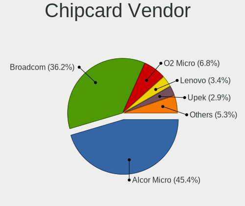

| Vendor                | Computers | Percent |
|-----------------------|-----------|---------|
| Broadcom              | 41        | 41%     |
| Alcor Micro           | 40        | 40%     |
| O2 Micro              | 8         | 8%      |
| Upek                  | 4         | 4%      |
| Lenovo                | 4         | 4%      |
| Hewlett-Packard       | 1         | 1%      |
| Gemalto (was Gemplus) | 1         | 1%      |
| Cherry                | 1         | 1%      |

Chipcard Model
--------------

Chipcard module models

| Model                                                                        | Computers | Percent |
|------------------------------------------------------------------------------|-----------|---------|
| Alcor Micro AU9540 Smartcard Reader                                          | 39        | 39%     |
| Broadcom BCM5880 Secure Applications Processor                               | 16        | 16%     |
| Broadcom 5880                                                                | 11        | 11%     |
| O2 Micro OZ776 CCID Smartcard Reader                                         | 7         | 7%      |
| Broadcom BCM5880 Secure Applications Processor with fingerprint swipe sensor | 7         | 7%      |
| Broadcom 58200                                                               | 7         | 7%      |
| Upek TouchChip Fingerprint Coprocessor (WBF advanced mode)                   | 4         | 4%      |
| Lenovo Integrated Smart Card Reader                                          | 4         | 4%      |
| O2 Micro Oz776 SmartCard Reader                                              | 1         | 1%      |
| Hewlett-Packard SC Keyboard - Apollo (Liteon)                                | 1         | 1%      |
| Gemalto (was Gemplus) GemPC Twin SmartCard Reader                            | 1         | 1%      |
| Cherry SmartCard Reader Keyboard KC 1000 SC                                  | 1         | 1%      |
| Alcor Micro Watchdata W 1981                                                 | 1         | 1%      |

Unsupported
-----------

Unsupported Devices
-------------------

Total unsupported devices on board

| Total | Computers | Percent |
|-------|-----------|---------|
| 0     | 992       | 66.85%  |
| 1     | 375       | 25.27%  |
| 2     | 100       | 6.74%   |
| 3     | 11        | 0.74%   |
| 4     | 5         | 0.34%   |
| 7     | 1         | 0.07%   |

Unsupported Device Types
------------------------

Types of unsupported devices

| Type                     | Computers | Percent |
|--------------------------|-----------|---------|
| Fingerprint reader       | 209       | 34.15%  |
| Graphics card            | 103       | 16.83%  |
| Chipcard                 | 88        | 14.38%  |
| Net/wireless             | 52        | 8.5%    |
| Multimedia controller    | 33        | 5.39%   |
| Communication controller | 32        | 5.23%   |
| Unassigned class         | 21        | 3.43%   |
| Bluetooth                | 18        | 2.94%   |
| Camera                   | 17        | 2.78%   |
| Sound                    | 13        | 2.12%   |
| Card reader              | 10        | 1.63%   |
| Net/ethernet             | 4         | 0.65%   |
| Storage                  | 2         | 0.33%   |
| Network                  | 2         | 0.33%   |
| Modem                    | 2         | 0.33%   |
| Storage/raid             | 1         | 0.16%   |
| Storage/nvme             | 1         | 0.16%   |
| Storage/ide              | 1         | 0.16%   |
| Storage/ata              | 1         | 0.16%   |
| Firewire controller      | 1         | 0.16%   |
| Dvb card                 | 1         | 0.16%   |

