Linux in Sweden - Tested Hardware & Statistics (Desktops)
---------------------------------------------------------

A project to collect tested hardware configurations for Linux in Sweden.

Anyone can contribute to this report by the [hw-probe](https://github.com/linuxhw/hw-probe) tool:

    sudo -E hw-probe -all -upload

Please contribute! Especially if your hardware is rare.

Contents
--------

* [ Test Cases ](#test-cases)

* [ System ](#system)
  - [ OS                       ](#os)
  - [ OS Family                ](#os-family)
  - [ Kernel                   ](#kernel)
  - [ Kernel Family            ](#kernel-family)
  - [ Kernel Major Ver.        ](#kernel-major-ver)
  - [ Arch                     ](#arch)
  - [ DE                       ](#de)
  - [ Display Server           ](#display-server)
  - [ Display Manager          ](#display-manager)
  - [ OS Lang                  ](#os-lang)
  - [ Boot Mode                ](#boot-mode)
  - [ Filesystem               ](#filesystem)
  - [ Part. scheme             ](#part-scheme)
  - [ Dual Boot with Linux/BSD ](#dual-boot-with-linuxbsd)
  - [ Dual Boot (Win)          ](#dual-boot-win)

* [ Board ](#board)
  - [ Vendor                   ](#vendor)
  - [ Model                    ](#model)
  - [ Model Family             ](#model-family)
  - [ MFG Year                 ](#mfg-year)
  - [ Form Factor              ](#form-factor)
  - [ Secure Boot              ](#secure-boot)
  - [ Coreboot                 ](#coreboot)
  - [ RAM Size                 ](#ram-size)
  - [ RAM Used                 ](#ram-used)
  - [ Total Drives             ](#total-drives)
  - [ Has CD-ROM               ](#has-cd-rom)
  - [ Has Ethernet             ](#has-ethernet)
  - [ Has WiFi                 ](#has-wifi)
  - [ Has Bluetooth            ](#has-bluetooth)

* [ Location ](#location)
  - [ Country                  ](#country)
  - [ City                     ](#city)

* [ Drives ](#drives)
  - [ Drive Vendor             ](#drive-vendor)
  - [ Drive Model              ](#drive-model)
  - [ HDD Vendor               ](#hdd-vendor)
  - [ SSD Vendor               ](#ssd-vendor)
  - [ Drive Kind               ](#drive-kind)
  - [ Drive Connector          ](#drive-connector)
  - [ Drive Size               ](#drive-size)
  - [ Space Total              ](#space-total)
  - [ Space Used               ](#space-used)
  - [ Malfunc. Drives          ](#malfunc-drives)
  - [ Malfunc. Drive Vendor    ](#malfunc-drive-vendor)
  - [ Malfunc. HDD Vendor      ](#malfunc-hdd-vendor)
  - [ Malfunc. Drive Kind      ](#malfunc-drive-kind)
  - [ Failed Drives            ](#failed-drives)
  - [ Failed Drive Vendor      ](#failed-drive-vendor)
  - [ Drive Status             ](#drive-status)

* [ Storage controller ](#storage-controller)
  - [ Storage Vendor           ](#storage-vendor)
  - [ Storage Model            ](#storage-model)
  - [ Storage Kind             ](#storage-kind)

* [ Processor ](#processor)
  - [ CPU Vendor               ](#cpu-vendor)
  - [ CPU Model                ](#cpu-model)
  - [ CPU Model Family         ](#cpu-model-family)
  - [ CPU Cores                ](#cpu-cores)
  - [ CPU Sockets              ](#cpu-sockets)
  - [ CPU Threads              ](#cpu-threads)
  - [ CPU Op-Modes             ](#cpu-op-modes)
  - [ CPU Microcode            ](#cpu-microcode)
  - [ CPU Microarch            ](#cpu-microarch)

* [ Graphics ](#graphics)
  - [ GPU Vendor               ](#gpu-vendor)
  - [ GPU Model                ](#gpu-model)
  - [ GPU Combo                ](#gpu-combo)
  - [ GPU Driver               ](#gpu-driver)
  - [ GPU Memory               ](#gpu-memory)

* [ Monitor ](#monitor)
  - [ Monitor Vendor           ](#monitor-vendor)
  - [ Monitor Model            ](#monitor-model)
  - [ Monitor Resolution       ](#monitor-resolution)
  - [ Monitor Diagonal         ](#monitor-diagonal)
  - [ Monitor Width            ](#monitor-width)
  - [ Aspect Ratio             ](#aspect-ratio)
  - [ Monitor Area             ](#monitor-area)
  - [ Pixel Density            ](#pixel-density)
  - [ Multiple Monitors        ](#multiple-monitors)

* [ Network ](#network)
  - [ Net Controller Vendor    ](#net-controller-vendor)
  - [ Net Controller Model     ](#net-controller-model)
  - [ Wireless Vendor          ](#wireless-vendor)
  - [ Wireless Model           ](#wireless-model)
  - [ Ethernet Vendor          ](#ethernet-vendor)
  - [ Ethernet Model           ](#ethernet-model)
  - [ Net Controller Kind      ](#net-controller-kind)
  - [ Used Controller          ](#used-controller)
  - [ NICs                     ](#nics)
  - [ IPv6                     ](#ipv6)

* [ Bluetooth ](#bluetooth)
  - [ Bluetooth Vendor         ](#bluetooth-vendor)
  - [ Bluetooth Model          ](#bluetooth-model)

* [ Sound ](#sound)
  - [ Sound Vendor             ](#sound-vendor)
  - [ Sound Model              ](#sound-model)

* [ Memory ](#memory)
  - [ Memory Vendor            ](#memory-vendor)
  - [ Memory Model             ](#memory-model)
  - [ Memory Kind              ](#memory-kind)
  - [ Memory Form Factor       ](#memory-form-factor)
  - [ Memory Size              ](#memory-size)
  - [ Memory Speed             ](#memory-speed)

* [ Printers & scanners ](#printers--scanners)
  - [ Printer Vendor           ](#printer-vendor)
  - [ Printer Model            ](#printer-model)
  - [ Scanner Vendor           ](#scanner-vendor)
  - [ Scanner Model            ](#scanner-model)

* [ Camera ](#camera)
  - [ Camera Vendor            ](#camera-vendor)
  - [ Camera Model             ](#camera-model)

* [ Security ](#security)
  - [ Fingerprint Vendor       ](#fingerprint-vendor)
  - [ Fingerprint Model        ](#fingerprint-model)
  - [ Chipcard Vendor          ](#chipcard-vendor)
  - [ Chipcard Model           ](#chipcard-model)

* [ Unsupported ](#unsupported)
  - [ Unsupported Devices      ](#unsupported-devices)
  - [ Unsupported Device Types ](#unsupported-device-types)

Test Cases
----------

Total: 1314

| Vendor        | Model                       | Probe                                                      | Date         |
|---------------|-----------------------------|------------------------------------------------------------|--------------|
| Gigabyte      | B85M-D3H                    | [ccc7d658ea](https://linux-hardware.org/?probe=ccc7d658ea) | Nov 06, 2023 |
| Dell          | 0VHWTR A01                  | [8cd8d5ade1](https://linux-hardware.org/?probe=8cd8d5ade1) | Nov 06, 2023 |
| ASUSTek       | ROG STRIX X570-E GAMING     | [4f690a4297](https://linux-hardware.org/?probe=4f690a4297) | Nov 05, 2023 |
| ASUSTek       | PRIME X570-PRO              | [62a859fb72](https://linux-hardware.org/?probe=62a859fb72) | Nov 03, 2023 |
| ASUSTek       | STRIX H270F GAMING          | [e95902544f](https://linux-hardware.org/?probe=e95902544f) | Nov 03, 2023 |
| HP            | 2B01                        | [a345333330](https://linux-hardware.org/?probe=a345333330) | Oct 31, 2023 |
| HP            | 2B01                        | [b3a75824f5](https://linux-hardware.org/?probe=b3a75824f5) | Oct 31, 2023 |
| Gigabyte      | B550 AORUS PRO AC           | [e41780f56a](https://linux-hardware.org/?probe=e41780f56a) | Oct 29, 2023 |
| HP            | 8433 11                     | [f4b0e9190f](https://linux-hardware.org/?probe=f4b0e9190f) | Oct 27, 2023 |
| ASUSTek       | TUF Gaming B650-PLUS WIF... | [b7447f21b5](https://linux-hardware.org/?probe=b7447f21b5) | Oct 25, 2023 |
| Lenovo        | ThinkCentre M90 5485W2L     | [0fcc4fe794](https://linux-hardware.org/?probe=0fcc4fe794) | Oct 24, 2023 |
| Dell          | 06FW8P A01                  | [356c2f38aa](https://linux-hardware.org/?probe=356c2f38aa) | Oct 21, 2023 |
| HP            | ML150 G3                    | [eb5a4bfed8](https://linux-hardware.org/?probe=eb5a4bfed8) | Oct 21, 2023 |
| MSI           | MAG B560M MORTAR            | [a7f26cedd6](https://linux-hardware.org/?probe=a7f26cedd6) | Oct 20, 2023 |
| MSI           | B550-A PRO                  | [77cf0c3af6](https://linux-hardware.org/?probe=77cf0c3af6) | Oct 18, 2023 |
| ASUSTek       | PRIME B660M-K D4            | [0944131c12](https://linux-hardware.org/?probe=0944131c12) | Oct 18, 2023 |
| HP            | 8433 11                     | [24fdb6f03a](https://linux-hardware.org/?probe=24fdb6f03a) | Oct 16, 2023 |
| ASUSTek       | STRIX Z270H GAMING          | [6082a5c0de](https://linux-hardware.org/?probe=6082a5c0de) | Oct 15, 2023 |
| ASRock        | X399 Taichi                 | [10b572c94a](https://linux-hardware.org/?probe=10b572c94a) | Oct 14, 2023 |
| Gigabyte      | Z68MA-D2H-B3                | [a646cc1cc1](https://linux-hardware.org/?probe=a646cc1cc1) | Oct 10, 2023 |
| Gigabyte      | Z68MA-D2H-B3                | [d731fb0868](https://linux-hardware.org/?probe=d731fb0868) | Oct 10, 2023 |
| Gigabyte      | H87N-WIFI                   | [f010d626da](https://linux-hardware.org/?probe=f010d626da) | Oct 08, 2023 |
| ASUSTek       | ROG STRIX B450-E GAMING     | [a07ec0ee55](https://linux-hardware.org/?probe=a07ec0ee55) | Oct 08, 2023 |
| ASUSTek       | ROG STRIX X470-F GAMING     | [7b6ad19193](https://linux-hardware.org/?probe=7b6ad19193) | Oct 07, 2023 |
| Dell          | 0PU052                      | [c32b862792](https://linux-hardware.org/?probe=c32b862792) | Oct 07, 2023 |
| Lenovo        | 364F SDK0J40700 WIN 3258... | [dcc7e8da51](https://linux-hardware.org/?probe=dcc7e8da51) | Oct 06, 2023 |
| ASUSTek       | TUF Gaming B550M-PLUS       | [8bc96db254](https://linux-hardware.org/?probe=8bc96db254) | Oct 06, 2023 |
| Dell          | 096JG8 A01                  | [8076ad493d](https://linux-hardware.org/?probe=8076ad493d) | Oct 03, 2023 |
| ASUSTek       | SABERTOOTH Z77              | [6a2fa93249](https://linux-hardware.org/?probe=6a2fa93249) | Oct 03, 2023 |
| ASUSTek       | PRIME X570-PRO              | [f80a538f2a](https://linux-hardware.org/?probe=f80a538f2a) | Oct 02, 2023 |
| ASUSTek       | PRIME X570-PRO              | [76f023476d](https://linux-hardware.org/?probe=76f023476d) | Oct 02, 2023 |
| MSI           | H97 GAMING 3                | [51f3cd7354](https://linux-hardware.org/?probe=51f3cd7354) | Sep 29, 2023 |
| ASUSTek       | ROG STRIX X670E-F GAMING... | [5c38fe5e79](https://linux-hardware.org/?probe=5c38fe5e79) | Sep 28, 2023 |
| MSI           | Z77A-S01                    | [277586f152](https://linux-hardware.org/?probe=277586f152) | Sep 27, 2023 |
| Lenovo        | 364F SDK0J40700 WIN 3258... | [de5a55aa7b](https://linux-hardware.org/?probe=de5a55aa7b) | Sep 23, 2023 |
| ASUSTek       | Crosshair IV Formula        | [4679088d4e](https://linux-hardware.org/?probe=4679088d4e) | Sep 22, 2023 |
| Dell          | 0GDG8Y A00                  | [9e6874d35c](https://linux-hardware.org/?probe=9e6874d35c) | Sep 20, 2023 |
| ASUSTek       | P8H61-M EVO                 | [51c58cd13a](https://linux-hardware.org/?probe=51c58cd13a) | Sep 19, 2023 |
| ASUSTek       | P8H61-M EVO                 | [64618297ff](https://linux-hardware.org/?probe=64618297ff) | Sep 19, 2023 |
| Shenzhen M... | F7BAA                       | [10d32d6284](https://linux-hardware.org/?probe=10d32d6284) | Sep 17, 2023 |
| ASUSTek       | ROG STRIX Z390-F GAMING     | [293bc3eab9](https://linux-hardware.org/?probe=293bc3eab9) | Sep 16, 2023 |
| MSI           | MAG X570S TOMAHAWK MAX W... | [2fa5c8bb34](https://linux-hardware.org/?probe=2fa5c8bb34) | Sep 16, 2023 |
| ASUSTek       | ROG STRIX B660-A GAMING ... | [efda5ec51a](https://linux-hardware.org/?probe=efda5ec51a) | Sep 15, 2023 |
| Dell          | 0VHWTR A01                  | [43f6a3bfc1](https://linux-hardware.org/?probe=43f6a3bfc1) | Sep 14, 2023 |
| Dell          | 0VHWTR A01                  | [dcd2b90824](https://linux-hardware.org/?probe=dcd2b90824) | Sep 14, 2023 |
| Alienware     | 07JNH0 A00                  | [bd161c3850](https://linux-hardware.org/?probe=bd161c3850) | Sep 14, 2023 |
| ASUSTek       | Maximus VI EXTREME          | [e1eea73611](https://linux-hardware.org/?probe=e1eea73611) | Sep 12, 2023 |
| Alienware     | 07JNH0 A00                  | [4d658a922b](https://linux-hardware.org/?probe=4d658a922b) | Sep 10, 2023 |
| ASUSTek       | TS10                        | [ad867c5e25](https://linux-hardware.org/?probe=ad867c5e25) | Sep 10, 2023 |
| ASUSTek       | ROG STRIX B550-F GAMING     | [3857377d7a](https://linux-hardware.org/?probe=3857377d7a) | Sep 09, 2023 |
| ASRock        | X399 Taichi                 | [0c2dda2476](https://linux-hardware.org/?probe=0c2dda2476) | Sep 09, 2023 |
| Gigabyte      | H610M H DDR4                | [72516e7752](https://linux-hardware.org/?probe=72516e7752) | Sep 07, 2023 |
| ASUSTek       | ROG STRIX B450-I GAMING     | [26448cf759](https://linux-hardware.org/?probe=26448cf759) | Sep 07, 2023 |
| MSI           | MAG B550M MORTAR WIFI       | [7cbd11709c](https://linux-hardware.org/?probe=7cbd11709c) | Sep 07, 2023 |
| ASUSTek       | P7H55-M PRO                 | [26a5d8b449](https://linux-hardware.org/?probe=26a5d8b449) | Sep 06, 2023 |
| ASRock        | B460 Phantom Gaming 4       | [6521407977](https://linux-hardware.org/?probe=6521407977) | Sep 06, 2023 |
| MSI           | MAG B560M MORTAR            | [07429e910f](https://linux-hardware.org/?probe=07429e910f) | Sep 05, 2023 |
| MSI           | MAG B560M MORTAR            | [c8978cf811](https://linux-hardware.org/?probe=c8978cf811) | Sep 03, 2023 |
| MSI           | MAG B560M MORTAR            | [62ac121b13](https://linux-hardware.org/?probe=62ac121b13) | Sep 03, 2023 |
| Dell          | 0GDG8Y A00                  | [19bf85f553](https://linux-hardware.org/?probe=19bf85f553) | Sep 01, 2023 |
| Alienware     | 07JNH0 A00                  | [a21f3ba335](https://linux-hardware.org/?probe=a21f3ba335) | Aug 30, 2023 |
| ASUSTek       | P8P67 PRO                   | [3740c90267](https://linux-hardware.org/?probe=3740c90267) | Aug 30, 2023 |
| Dell          | 0GDG8Y A00                  | [577d9d5dc1](https://linux-hardware.org/?probe=577d9d5dc1) | Aug 29, 2023 |
| ASUSTek       | ROG STRIX B660-A GAMING ... | [0be67de1c9](https://linux-hardware.org/?probe=0be67de1c9) | Aug 29, 2023 |
| ASUSTek       | PRIME B650M-A WIFI          | [6a55471f69](https://linux-hardware.org/?probe=6a55471f69) | Aug 26, 2023 |
| Gigabyte      | B85M-D3V-A                  | [e11053f833](https://linux-hardware.org/?probe=e11053f833) | Aug 23, 2023 |
| Gigabyte      | X570 AORUS MASTER           | [799390e547](https://linux-hardware.org/?probe=799390e547) | Aug 23, 2023 |
| HP            | 845A                        | [4a8699daad](https://linux-hardware.org/?probe=4a8699daad) | Aug 22, 2023 |
| MSI           | B450 TOMAHAWK MAX           | [b4133748fc](https://linux-hardware.org/?probe=b4133748fc) | Aug 21, 2023 |
| HP            | 212B                        | [ee20bd40d8](https://linux-hardware.org/?probe=ee20bd40d8) | Aug 21, 2023 |
| Dell          | 0YXT71 A01                  | [aa6781c002](https://linux-hardware.org/?probe=aa6781c002) | Aug 18, 2023 |
| ASUSTek       | ROG STRIX X570-E GAMING     | [eb44f4dfc1](https://linux-hardware.org/?probe=eb44f4dfc1) | Aug 17, 2023 |
| ASUSTek       | P5QL-ASUS-SE                | [3135a88431](https://linux-hardware.org/?probe=3135a88431) | Aug 17, 2023 |
| Alienware     | 07JNH0 A00                  | [2f82c5eb18](https://linux-hardware.org/?probe=2f82c5eb18) | Aug 14, 2023 |
| Dell          | 0KV62T A00                  | [369b0195cc](https://linux-hardware.org/?probe=369b0195cc) | Aug 14, 2023 |
| ASUSTek       | ROG STRIX X570-E GAMING     | [483fc71762](https://linux-hardware.org/?probe=483fc71762) | Aug 11, 2023 |
| Gigabyte      | H270N-WIFI-CF               | [bd9c532bbc](https://linux-hardware.org/?probe=bd9c532bbc) | Aug 10, 2023 |
| MSI           | B350 GAMING PLUS            | [4d7fbea818](https://linux-hardware.org/?probe=4d7fbea818) | Aug 09, 2023 |
| Dell          | 08NPPY A00                  | [bdc11616d7](https://linux-hardware.org/?probe=bdc11616d7) | Aug 08, 2023 |
| Lenovo        | SKYBAY SDK0J40705 WIN 34... | [e3fd0f4808](https://linux-hardware.org/?probe=e3fd0f4808) | Aug 04, 2023 |
| Dell          | 0K095G A01                  | [ee2fb87d2f](https://linux-hardware.org/?probe=ee2fb87d2f) | Aug 04, 2023 |
| ASUSTek       | ROG STRIX B550-F GAMING     | [53c9161fc5](https://linux-hardware.org/?probe=53c9161fc5) | Aug 03, 2023 |
| Gigabyte      | X570 AORUS ULTRA            | [a449d60316](https://linux-hardware.org/?probe=a449d60316) | Aug 03, 2023 |
| ASUSTek       | ROG STRIX Z370-H GAMING     | [e0c07e2d0c](https://linux-hardware.org/?probe=e0c07e2d0c) | Aug 02, 2023 |
| ASUSTek       | ROG STRIX X570-F GAMING     | [436e1e4e01](https://linux-hardware.org/?probe=436e1e4e01) | Jul 29, 2023 |
| Dell          | 0KV62T A00                  | [1b9bb7c266](https://linux-hardware.org/?probe=1b9bb7c266) | Jul 29, 2023 |
| Gigabyte      | H610M H DDR4                | [1950bcc818](https://linux-hardware.org/?probe=1950bcc818) | Jul 28, 2023 |
| Unknown       | Unknown                     | [80a34d344b](https://linux-hardware.org/?probe=80a34d344b) | Jul 28, 2023 |
| Lenovo        | 3743 SDK0J40700 WIN 3258... | [546f011b1a](https://linux-hardware.org/?probe=546f011b1a) | Jul 27, 2023 |
| Lenovo        | 364F SDK0J40700 WIN 3258... | [ac63d4a30c](https://linux-hardware.org/?probe=ac63d4a30c) | Jul 25, 2023 |
| Dell          | 0KV62T A00                  | [f291f72d81](https://linux-hardware.org/?probe=f291f72d81) | Jul 23, 2023 |
| Intel         | DH61WW AAG23116-206         | [9ab47777ca](https://linux-hardware.org/?probe=9ab47777ca) | Jul 21, 2023 |
| ASUSTek       | TUF Gaming B650-PLUS        | [c3994db136](https://linux-hardware.org/?probe=c3994db136) | Jul 21, 2023 |
| ASUSTek       | A_F_K20BF                   | [f2ae40130e](https://linux-hardware.org/?probe=f2ae40130e) | Jul 20, 2023 |
| ASUSTek       | ROG STRIX B450-F GAMING     | [805d981913](https://linux-hardware.org/?probe=805d981913) | Jul 19, 2023 |
| ASRock        | X570 Taichi                 | [db2a22c2eb](https://linux-hardware.org/?probe=db2a22c2eb) | Jul 19, 2023 |
| ASUSTek       | TUF B450-PLUS GAMING        | [b12aa2eb63](https://linux-hardware.org/?probe=b12aa2eb63) | Jul 19, 2023 |
| Dell          | 0MN1TX A01                  | [696072cf7c](https://linux-hardware.org/?probe=696072cf7c) | Jul 18, 2023 |
| MSI           | B450 GAMING PRO CARBON A... | [d2c6c9bcba](https://linux-hardware.org/?probe=d2c6c9bcba) | Jul 18, 2023 |
| MSI           | MAG B650 TOMAHAWK WIFI      | [b29b313957](https://linux-hardware.org/?probe=b29b313957) | Jul 17, 2023 |
| Dell          | 0HD5W2 A00                  | [f4bc253638](https://linux-hardware.org/?probe=f4bc253638) | Jul 17, 2023 |
| ASUSTek       | P8Z77-V LX2                 | [21950296b4](https://linux-hardware.org/?probe=21950296b4) | Jul 16, 2023 |
| MSI           | B550M-A PRO                 | [0063ae1936](https://linux-hardware.org/?probe=0063ae1936) | Jul 16, 2023 |
| ASUSTek       | P8Z68-V PRO GEN3            | [6758dfb731](https://linux-hardware.org/?probe=6758dfb731) | Jul 15, 2023 |
| ASUSTek       | PRIME X570-P                | [ab0a96405e](https://linux-hardware.org/?probe=ab0a96405e) | Jul 13, 2023 |
| ASRock        | B450M Pro4                  | [30403bcd32](https://linux-hardware.org/?probe=30403bcd32) | Jul 12, 2023 |
| ASUSTek       | F2A85-M PRO                 | [57cc83ff44](https://linux-hardware.org/?probe=57cc83ff44) | Jul 10, 2023 |
| Fujitsu       | D2628-C1 S26361-D2628-C1    | [bdf5ce2163](https://linux-hardware.org/?probe=bdf5ce2163) | Jul 07, 2023 |
| Gigabyte      | MFLP5IP-00                  | [5f28888f0d](https://linux-hardware.org/?probe=5f28888f0d) | Jul 06, 2023 |
| Gigabyte      | GA-MA770T-UD3P              | [348b9a4a73](https://linux-hardware.org/?probe=348b9a4a73) | Jul 05, 2023 |
| Intel         | DH61WW AAG23116-206         | [fceaf9bea9](https://linux-hardware.org/?probe=fceaf9bea9) | Jul 04, 2023 |
| Acer          | Aspire XC-840               | [76c750aae4](https://linux-hardware.org/?probe=76c750aae4) | Jun 29, 2023 |
| ASUSTek       | GA35DX                      | [a91acc04b6](https://linux-hardware.org/?probe=a91acc04b6) | Jun 28, 2023 |
| MSI           | MS-B0A1                     | [cc161cc65b](https://linux-hardware.org/?probe=cc161cc65b) | Jun 28, 2023 |
| Gigabyte      | X670 AORUS ELITE AX         | [32e4f74711](https://linux-hardware.org/?probe=32e4f74711) | Jun 28, 2023 |
| MSI           | MAG Z790 TOMAHAWK WIFI      | [9450fc030e](https://linux-hardware.org/?probe=9450fc030e) | Jun 27, 2023 |
| MSI           | MPG Z390 GAMING PRO CARB... | [165584477b](https://linux-hardware.org/?probe=165584477b) | Jun 25, 2023 |
| MSI           | H77MA-G43                   | [510d2844bd](https://linux-hardware.org/?probe=510d2844bd) | Jun 23, 2023 |
| Gigabyte      | B550 AORUS ELITE V2         | [56208916c9](https://linux-hardware.org/?probe=56208916c9) | Jun 23, 2023 |
| Gigabyte      | H87N-WIFI                   | [3d506cafad](https://linux-hardware.org/?probe=3d506cafad) | Jun 22, 2023 |
| Gigabyte      | B550 AORUS ELITE V2         | [7ac67acfed](https://linux-hardware.org/?probe=7ac67acfed) | Jun 21, 2023 |
| ASUSTek       | ProArt Z690-CREATOR WIFI    | [30f85c0f2e](https://linux-hardware.org/?probe=30f85c0f2e) | Jun 21, 2023 |
| ASUSTek       | PRIME X470-PRO              | [9e30c629f3](https://linux-hardware.org/?probe=9e30c629f3) | Jun 19, 2023 |
| Gigabyte      | H87N-WIFI                   | [6579287940](https://linux-hardware.org/?probe=6579287940) | Jun 18, 2023 |
| ASUSTek       | ROG STRIX B450-I GAMING     | [0c5693c658](https://linux-hardware.org/?probe=0c5693c658) | Jun 18, 2023 |
| OEM           | ALDER LAKE JHS64S           | [0eb1dc0b8e](https://linux-hardware.org/?probe=0eb1dc0b8e) | Jun 16, 2023 |
| ASUSTek       | M5A97 R2.0                  | [da6bfc34aa](https://linux-hardware.org/?probe=da6bfc34aa) | Jun 15, 2023 |
| ASUSTek       | PRIME H610M-E D4            | [39d273ec86](https://linux-hardware.org/?probe=39d273ec86) | Jun 15, 2023 |
| Gigabyte      | B85M-D3V-A                  | [bbcb31d079](https://linux-hardware.org/?probe=bbcb31d079) | Jun 14, 2023 |
| MSI           | Z97 GAMING 3                | [ff01549321](https://linux-hardware.org/?probe=ff01549321) | Jun 14, 2023 |
| ASUSTek       | M5A97 R2.0                  | [cda9f3da9c](https://linux-hardware.org/?probe=cda9f3da9c) | Jun 13, 2023 |
| ASUSTek       | ROG STRIX B650E-I GAMING... | [d58405f7c1](https://linux-hardware.org/?probe=d58405f7c1) | Jun 10, 2023 |
| ASUSTek       | ROG STRIX B650E-I GAMING... | [86b377710d](https://linux-hardware.org/?probe=86b377710d) | Jun 10, 2023 |
| Gigabyte      | P55A-UD3                    | [2c8c27897b](https://linux-hardware.org/?probe=2c8c27897b) | Jun 09, 2023 |
| ASUSTek       | Maximus VIII HERO ALPHA     | [48eb50cc43](https://linux-hardware.org/?probe=48eb50cc43) | Jun 03, 2023 |
| ASUSTek       | ROG STRIX X570-I GAMING     | [ded9a8f554](https://linux-hardware.org/?probe=ded9a8f554) | Jun 02, 2023 |
| Gigabyte      | X570 AORUS MASTER           | [79de4bed98](https://linux-hardware.org/?probe=79de4bed98) | May 31, 2023 |
| ASUSTek       | TUF Gaming X570-PLUS        | [eda1870d76](https://linux-hardware.org/?probe=eda1870d76) | May 31, 2023 |
| Gigabyte      | X99-UD7 WIFI-CF             | [955e65b76f](https://linux-hardware.org/?probe=955e65b76f) | May 31, 2023 |
| MSI           | B450 GAMING PRO CARBON A... | [5271bd0b88](https://linux-hardware.org/?probe=5271bd0b88) | May 30, 2023 |
| ASUSTek       | Crosshair IV Formula        | [2f1017a58e](https://linux-hardware.org/?probe=2f1017a58e) | May 28, 2023 |
| MSI           | MS-B0A1                     | [f4411b6232](https://linux-hardware.org/?probe=f4411b6232) | May 27, 2023 |
| ASUSTek       | PRIME Z370-P                | [07ecf79e17](https://linux-hardware.org/?probe=07ecf79e17) | May 26, 2023 |
| Gigabyte      | B450M DS3H V2               | [c4af5a7969](https://linux-hardware.org/?probe=c4af5a7969) | May 26, 2023 |
| MSI           | MS-B0A1                     | [aa99fb811d](https://linux-hardware.org/?probe=aa99fb811d) | May 26, 2023 |
| ASUSTek       | Z170 PRO GAMING             | [486d6ac497](https://linux-hardware.org/?probe=486d6ac497) | May 25, 2023 |
| Unknown       | Unknown                     | [a1a76abc51](https://linux-hardware.org/?probe=a1a76abc51) | May 24, 2023 |
| ASUSTek       | P5KPL-AM IN/ROEM/SI         | [266235dc3b](https://linux-hardware.org/?probe=266235dc3b) | May 23, 2023 |
| Gigabyte      | Z790 UD AX                  | [0cba90ce8e](https://linux-hardware.org/?probe=0cba90ce8e) | May 23, 2023 |
| ASUSTek       | STRIX Z270F GAMING          | [11c329d15a](https://linux-hardware.org/?probe=11c329d15a) | May 22, 2023 |
| MSI           | Z87-G43                     | [2fa7c1d81d](https://linux-hardware.org/?probe=2fa7c1d81d) | May 21, 2023 |
| ASUSTek       | PRIME Z370-P                | [b3564ca1cf](https://linux-hardware.org/?probe=b3564ca1cf) | May 20, 2023 |
| ASUSTek       | TUF B360M-PLUS GAMING S     | [693c7b6d9b](https://linux-hardware.org/?probe=693c7b6d9b) | May 18, 2023 |
| ASUSTek       | PRIME X670-P WIFI           | [ca0ae58640](https://linux-hardware.org/?probe=ca0ae58640) | May 18, 2023 |
| Acer          | Revo 70                     | [6cbc11e75b](https://linux-hardware.org/?probe=6cbc11e75b) | May 17, 2023 |
| Intel         | D54250WYK H13922-302        | [0829603c60](https://linux-hardware.org/?probe=0829603c60) | May 17, 2023 |
| Dell          | 0NKW6Y A02                  | [8c10a0ad96](https://linux-hardware.org/?probe=8c10a0ad96) | May 16, 2023 |
| Dell          | 0NKW6Y A02                  | [be5ad76a6e](https://linux-hardware.org/?probe=be5ad76a6e) | May 16, 2023 |
| MSI           | H110I PRO                   | [1224d45c07](https://linux-hardware.org/?probe=1224d45c07) | May 14, 2023 |
| ASUSTek       | TUF Gaming B650-PLUS WIF... | [beb403e4e0](https://linux-hardware.org/?probe=beb403e4e0) | May 14, 2023 |
| Dell          | 0K240Y A01                  | [cbc84d049a](https://linux-hardware.org/?probe=cbc84d049a) | May 12, 2023 |
| Dell          | 0HHV7N A00                  | [c458dad4b3](https://linux-hardware.org/?probe=c458dad4b3) | May 12, 2023 |
| ASUSTek       | Rampage IV FORMULA          | [b44dd1286b](https://linux-hardware.org/?probe=b44dd1286b) | May 12, 2023 |
| Dell          | 0K240Y A02                  | [c51d42778d](https://linux-hardware.org/?probe=c51d42778d) | May 12, 2023 |
| Dell          | 0K240Y A02                  | [e65b0be462](https://linux-hardware.org/?probe=e65b0be462) | May 12, 2023 |
| Lenovo        | SHARKBAY 0B98401 WIN        | [d5bd5c8930](https://linux-hardware.org/?probe=d5bd5c8930) | May 12, 2023 |
| MSI           | MEG X570 UNIFY              | [721f9583d7](https://linux-hardware.org/?probe=721f9583d7) | May 11, 2023 |
| ASUSTek       | TUF Gaming X570-PLUS        | [9cbcc36a48](https://linux-hardware.org/?probe=9cbcc36a48) | May 11, 2023 |
| Dell          | 096JG8 A01                  | [08df3c35ee](https://linux-hardware.org/?probe=08df3c35ee) | May 08, 2023 |
| Lenovo        | 364F SDK0J40700 WIN 3258... | [3ac194e77a](https://linux-hardware.org/?probe=3ac194e77a) | May 07, 2023 |
| Lenovo        | 364F SDK0J40700 WIN 3258... | [1c84c61678](https://linux-hardware.org/?probe=1c84c61678) | May 07, 2023 |
| ASUSTek       | ROG STRIX B550-F GAMING ... | [893f259653](https://linux-hardware.org/?probe=893f259653) | May 07, 2023 |
| ASUSTek       | TUF Gaming X570-PLUS        | [c88845ae9b](https://linux-hardware.org/?probe=c88845ae9b) | May 06, 2023 |
| ASUSTek       | ROG STRIX Z390-F GAMING     | [14c71828ca](https://linux-hardware.org/?probe=14c71828ca) | May 05, 2023 |
| MSI           | Z170A GAMING M5             | [3f515702d2](https://linux-hardware.org/?probe=3f515702d2) | May 05, 2023 |
| Dell          | 02N3WF A02                  | [3f10b3ca43](https://linux-hardware.org/?probe=3f10b3ca43) | May 04, 2023 |
| Dell          | 0VHWTR A01                  | [2f6fd9e5b0](https://linux-hardware.org/?probe=2f6fd9e5b0) | May 03, 2023 |
| Dell          | 0VHWTR A01                  | [6cbfaabd66](https://linux-hardware.org/?probe=6cbfaabd66) | May 03, 2023 |
| Dell          | 0VHWTR A01                  | [4762d9bb4e](https://linux-hardware.org/?probe=4762d9bb4e) | May 03, 2023 |
| ASRock        | P55 Extreme                 | [e8721751c6](https://linux-hardware.org/?probe=e8721751c6) | May 03, 2023 |
| ASRock        | P55 Extreme                 | [e426e8e40b](https://linux-hardware.org/?probe=e426e8e40b) | May 03, 2023 |
| Intel         | D54250WYK H13922-302        | [973f9c6467](https://linux-hardware.org/?probe=973f9c6467) | May 01, 2023 |
| Intel         | D54250WYK H13922-302        | [92f7217eb7](https://linux-hardware.org/?probe=92f7217eb7) | May 01, 2023 |
| ASUSTek       | PRIME X670-P WIFI           | [22cf2ddf02](https://linux-hardware.org/?probe=22cf2ddf02) | May 01, 2023 |
| ASUSTek       | PRIME H610M-E D4            | [56db7fc27f](https://linux-hardware.org/?probe=56db7fc27f) | May 01, 2023 |
| Shuttle       | FS35V4                      | [137fda9bc6](https://linux-hardware.org/?probe=137fda9bc6) | May 01, 2023 |
| Gigabyte      | X570 I AORUS PRO WIFI       | [4b47a4606b](https://linux-hardware.org/?probe=4b47a4606b) | Apr 29, 2023 |
| ASUSTek       | PRIME X670-P WIFI           | [d97d6d6dff](https://linux-hardware.org/?probe=d97d6d6dff) | Apr 28, 2023 |
| Dell          | 0VHWTR A01                  | [1a73639c02](https://linux-hardware.org/?probe=1a73639c02) | Apr 28, 2023 |
| ASUSTek       | PRIME X670-P WIFI           | [a6eba14ab4](https://linux-hardware.org/?probe=a6eba14ab4) | Apr 28, 2023 |
| Dell          | 0VHWTR A01                  | [6f56840307](https://linux-hardware.org/?probe=6f56840307) | Apr 28, 2023 |
| MSI           | MAG Z690 TOMAHAWK WIFI D... | [68d07ba405](https://linux-hardware.org/?probe=68d07ba405) | Apr 20, 2023 |
| HP            | 0B4Ch D                     | [69c613b55f](https://linux-hardware.org/?probe=69c613b55f) | Apr 20, 2023 |
| Lenovo        | 364F SDK0J40700 WIN 3258... | [b45a30f071](https://linux-hardware.org/?probe=b45a30f071) | Apr 18, 2023 |
| MSI           | B550-A PRO                  | [87d43c1f1d](https://linux-hardware.org/?probe=87d43c1f1d) | Apr 12, 2023 |
| MSI           | B550-A PRO                  | [a291f82fe3](https://linux-hardware.org/?probe=a291f82fe3) | Apr 12, 2023 |
| Lenovo        | 364F SDK0J40700 WIN 3258... | [7ddf3af042](https://linux-hardware.org/?probe=7ddf3af042) | Apr 11, 2023 |
| ASRock        | 960GC-GS FX                 | [e3eee10ad1](https://linux-hardware.org/?probe=e3eee10ad1) | Apr 10, 2023 |
| ASUSTek       | M4A785TD-M EVO              | [0ddbf6cc2e](https://linux-hardware.org/?probe=0ddbf6cc2e) | Apr 07, 2023 |
| Lenovo        | 364F SDK0J40700 WIN 3258... | [a0c75732ae](https://linux-hardware.org/?probe=a0c75732ae) | Apr 06, 2023 |
| Gigabyte      | B550 AORUS ELITE V2         | [01f2e4a69f](https://linux-hardware.org/?probe=01f2e4a69f) | Apr 05, 2023 |
| Gigabyte      | X570 I AORUS PRO WIFI       | [53fc9d8c25](https://linux-hardware.org/?probe=53fc9d8c25) | Apr 04, 2023 |
| Acer          | Predator G3-605             | [f7ca1573d0](https://linux-hardware.org/?probe=f7ca1573d0) | Apr 02, 2023 |
| Acer          | Predator G3-605             | [eb21663788](https://linux-hardware.org/?probe=eb21663788) | Apr 01, 2023 |
| ASUSTek       | ROG STRIX Z690-A GAMING ... | [1fa4ec7b05](https://linux-hardware.org/?probe=1fa4ec7b05) | Apr 01, 2023 |
| MSI           | B450 TOMAHAWK MAX II        | [a89c429c84](https://linux-hardware.org/?probe=a89c429c84) | Mar 31, 2023 |
| HP            | 82B4                        | [9712d04ab5](https://linux-hardware.org/?probe=9712d04ab5) | Mar 30, 2023 |
| MSI           | Z170A SLI PLUS              | [50affe59d1](https://linux-hardware.org/?probe=50affe59d1) | Mar 28, 2023 |
| Acer          | Nitro N50-640               | [2219ec0fad](https://linux-hardware.org/?probe=2219ec0fad) | Mar 27, 2023 |
| MSI           | MPG B550 GAMING PLUS        | [011d1b8bf7](https://linux-hardware.org/?probe=011d1b8bf7) | Mar 27, 2023 |
| MSI           | Z170A SLI PLUS              | [8a1c592e98](https://linux-hardware.org/?probe=8a1c592e98) | Mar 27, 2023 |
| HP            | 1998                        | [346f37956b](https://linux-hardware.org/?probe=346f37956b) | Mar 26, 2023 |
| HP            | 2B05                        | [b34e6d230c](https://linux-hardware.org/?probe=b34e6d230c) | Mar 24, 2023 |
| ASUSTek       | Z170 PRO GAMING             | [b2cdf1deb7](https://linux-hardware.org/?probe=b2cdf1deb7) | Mar 24, 2023 |
| ASUSTek       | ROG STRIX B650E-I GAMING... | [1e549ae67e](https://linux-hardware.org/?probe=1e549ae67e) | Mar 24, 2023 |
| ASUSTek       | ROG STRIX X570-I GAMING     | [09fec047e4](https://linux-hardware.org/?probe=09fec047e4) | Mar 23, 2023 |
| ASUSTek       | Z170 PRO GAMING             | [bf24fe6112](https://linux-hardware.org/?probe=bf24fe6112) | Mar 23, 2023 |
| ASUSTek       | ROG STRIX X570-I GAMING     | [b4c65fead7](https://linux-hardware.org/?probe=b4c65fead7) | Mar 21, 2023 |
| Shuttle       | SH570                       | [3ef2bf52b7](https://linux-hardware.org/?probe=3ef2bf52b7) | Mar 21, 2023 |
| ASUSTek       | PRIME Z690-P WIFI D4        | [240444cad9](https://linux-hardware.org/?probe=240444cad9) | Mar 21, 2023 |
| ASUSTek       | Z170 PRO GAMING             | [bd119c8898](https://linux-hardware.org/?probe=bd119c8898) | Mar 17, 2023 |
| MSI           | Z370 GAMING PRO CARBON      | [87ba801b00](https://linux-hardware.org/?probe=87ba801b00) | Mar 17, 2023 |
| ASUSTek       | PRIME H410M-E               | [d95b09eda0](https://linux-hardware.org/?probe=d95b09eda0) | Mar 17, 2023 |
| Lenovo        | ThinkCentre M58 7638CB8     | [d303f78e26](https://linux-hardware.org/?probe=d303f78e26) | Mar 14, 2023 |
| ASUSTek       | SABERTOOTH 990FX            | [070c7d809a](https://linux-hardware.org/?probe=070c7d809a) | Mar 13, 2023 |
| Dell          | 0Y2MRG A00                  | [12120178de](https://linux-hardware.org/?probe=12120178de) | Mar 13, 2023 |
| HP            | 1825                        | [85011ed37d](https://linux-hardware.org/?probe=85011ed37d) | Mar 12, 2023 |
| ASUSTek       | ROG STRIX X570-I GAMING     | [75fc2c0a15](https://linux-hardware.org/?probe=75fc2c0a15) | Mar 12, 2023 |
| HP            | 1998                        | [68d7c4350d](https://linux-hardware.org/?probe=68d7c4350d) | Mar 12, 2023 |
| SiYW          | V200 Series                 | [7c3751c888](https://linux-hardware.org/?probe=7c3751c888) | Mar 11, 2023 |
| HP            | 18E5                        | [82e5831486](https://linux-hardware.org/?probe=82e5831486) | Mar 10, 2023 |
| ASUSTek       | ROG STRIX B550-F GAMING     | [4d15122995](https://linux-hardware.org/?probe=4d15122995) | Mar 07, 2023 |
| ASUSTek       | ROG STRIX B550-F GAMING     | [cc6e719e99](https://linux-hardware.org/?probe=cc6e719e99) | Mar 07, 2023 |
| MSI           | B450 TOMAHAWK MAX           | [0d202dc031](https://linux-hardware.org/?probe=0d202dc031) | Mar 06, 2023 |
| ASUSTek       | ROG STRIX B550-F GAMING     | [8814af9b71](https://linux-hardware.org/?probe=8814af9b71) | Mar 05, 2023 |
| HP            | 2B05                        | [deb075440f](https://linux-hardware.org/?probe=deb075440f) | Mar 05, 2023 |
| HP            | 2B05                        | [f21bd9cc58](https://linux-hardware.org/?probe=f21bd9cc58) | Mar 05, 2023 |
| MSI           | MAG B650 TOMAHAWK WIFI      | [f9a2075d54](https://linux-hardware.org/?probe=f9a2075d54) | Mar 04, 2023 |
| Gigabyte      | A520M DS3H                  | [f3defb812b](https://linux-hardware.org/?probe=f3defb812b) | Mar 03, 2023 |
| Lenovo        | 3178 SDK0J40697 WIN 3305... | [41d9c3d9ed](https://linux-hardware.org/?probe=41d9c3d9ed) | Mar 02, 2023 |
| MSI           | MAG B650 TOMAHAWK WIFI      | [a279108842](https://linux-hardware.org/?probe=a279108842) | Mar 02, 2023 |
| Fujitsu       | D3224-P1 S26361-D3224-P1    | [53649a9546](https://linux-hardware.org/?probe=53649a9546) | Feb 28, 2023 |
| ASUSTek       | ROG STRIX B350-F GAMING     | [3cd0e65d1f](https://linux-hardware.org/?probe=3cd0e65d1f) | Feb 27, 2023 |
| ASUSTek       | PRIME X299-A                | [5ef01d46d4](https://linux-hardware.org/?probe=5ef01d46d4) | Feb 25, 2023 |
| MSI           | Z370 GAMING PRO CARBON      | [fc86b476d7](https://linux-hardware.org/?probe=fc86b476d7) | Feb 22, 2023 |
| ASUSTek       | ROG STRIX X570-F GAMING     | [ecc97fee86](https://linux-hardware.org/?probe=ecc97fee86) | Feb 21, 2023 |
| MSI           | MPG X570 GAMING PLUS        | [bd6a746c89](https://linux-hardware.org/?probe=bd6a746c89) | Feb 20, 2023 |
| MSI           | Z170A GAMING M5             | [5aa73f71fd](https://linux-hardware.org/?probe=5aa73f71fd) | Feb 20, 2023 |
| Gigabyte      | AB350-Gaming 3-CF           | [6cc82a744e](https://linux-hardware.org/?probe=6cc82a744e) | Feb 18, 2023 |
| Gigabyte      | B450M S2H                   | [f594570a77](https://linux-hardware.org/?probe=f594570a77) | Feb 16, 2023 |
| MSI           | Z170A KRAIT GAMING 3X       | [8e521a2efc](https://linux-hardware.org/?probe=8e521a2efc) | Feb 16, 2023 |
| ASUSTek       | ROG STRIX B450-F GAMING     | [4e3ff30332](https://linux-hardware.org/?probe=4e3ff30332) | Feb 15, 2023 |
| HP            | 8455                        | [f75db6c5d5](https://linux-hardware.org/?probe=f75db6c5d5) | Feb 12, 2023 |
| ASUSTek       | ROG STRIX H470-I GAMING     | [3a18e2226c](https://linux-hardware.org/?probe=3a18e2226c) | Feb 12, 2023 |
| ASUSTek       | Z97-P                       | [004535fd1c](https://linux-hardware.org/?probe=004535fd1c) | Feb 11, 2023 |
| ASUSTek       | ROG STRIX X570-I GAMING     | [7a6b34f58c](https://linux-hardware.org/?probe=7a6b34f58c) | Feb 11, 2023 |
| ASUSTek       | ROG STRIX X570-I GAMING     | [6d9d60d4b8](https://linux-hardware.org/?probe=6d9d60d4b8) | Feb 10, 2023 |
| ASUSTek       | EB1501P                     | [687e52dcb1](https://linux-hardware.org/?probe=687e52dcb1) | Feb 06, 2023 |
| Acer          | Aspire XC-895 V:1.0         | [e553ba2549](https://linux-hardware.org/?probe=e553ba2549) | Feb 06, 2023 |
| Acer          | Aspire XC-895 V:1.0         | [d888ff5291](https://linux-hardware.org/?probe=d888ff5291) | Feb 06, 2023 |
| ASUSTek       | P8Z68-V PRO                 | [0c6df9267b](https://linux-hardware.org/?probe=0c6df9267b) | Feb 04, 2023 |
| ASUSTek       | P8Z68-V PRO                 | [fac45201b3](https://linux-hardware.org/?probe=fac45201b3) | Feb 02, 2023 |
| MSI           | MAG Z590 TORPEDO            | [431a6c7a3a](https://linux-hardware.org/?probe=431a6c7a3a) | Feb 01, 2023 |
| ASUSTek       | PRIME B660-PLUS D4          | [f1a9c37047](https://linux-hardware.org/?probe=f1a9c37047) | Jan 31, 2023 |
| ASUSTek       | PRIME B660-PLUS D4          | [fe2a413caa](https://linux-hardware.org/?probe=fe2a413caa) | Jan 31, 2023 |
| Gigabyte      | 970A-D3P                    | [f01366b131](https://linux-hardware.org/?probe=f01366b131) | Jan 27, 2023 |
| Dell          | 0Y2MRG A00                  | [54ba66711b](https://linux-hardware.org/?probe=54ba66711b) | Jan 26, 2023 |
| Dell          | 0Y56T3 A00                  | [7078ea91e9](https://linux-hardware.org/?probe=7078ea91e9) | Jan 22, 2023 |
| Gigabyte      | Z170-D3H-CF                 | [9792de46ad](https://linux-hardware.org/?probe=9792de46ad) | Jan 22, 2023 |
| Lenovo        | 3730 SDK0T76465 WIN 3422... | [80e51b3319](https://linux-hardware.org/?probe=80e51b3319) | Jan 20, 2023 |
| ASUSTek       | ROG STRIX Z490-F GAMING     | [9a70fa222c](https://linux-hardware.org/?probe=9a70fa222c) | Jan 19, 2023 |
| Kllisre       | X99-B5 V1.1                 | [e221c08388](https://linux-hardware.org/?probe=e221c08388) | Jan 18, 2023 |
| Kllisre       | X99-B5 V1.1                 | [d2bb65ed09](https://linux-hardware.org/?probe=d2bb65ed09) | Jan 18, 2023 |
| ASUSTek       | ROG STRIX X570-F GAMING     | [0e57f4ecbe](https://linux-hardware.org/?probe=0e57f4ecbe) | Jan 15, 2023 |
| Gigabyte      | X570 GAMING X               | [bb85f0bdc7](https://linux-hardware.org/?probe=bb85f0bdc7) | Jan 12, 2023 |
| ASUSTek       | TUF Gaming X570-PLUS        | [73da880450](https://linux-hardware.org/?probe=73da880450) | Jan 12, 2023 |
| ASUSTek       | TUF B360M-PLUS GAMING       | [262fe40796](https://linux-hardware.org/?probe=262fe40796) | Jan 12, 2023 |
| ASUSTek       | TUF B360M-PLUS GAMING       | [18bdf2650e](https://linux-hardware.org/?probe=18bdf2650e) | Jan 12, 2023 |
| ASUSTek       | GA15DH                      | [e480a3bfa3](https://linux-hardware.org/?probe=e480a3bfa3) | Jan 11, 2023 |
| Lenovo        | 30C7 SDK0J40700 WIN 3258... | [994306b125](https://linux-hardware.org/?probe=994306b125) | Jan 11, 2023 |
| Gigabyte      | GA-A75M-D2H                 | [72bf3e7a8b](https://linux-hardware.org/?probe=72bf3e7a8b) | Jan 11, 2023 |
| MSI           | PRO Z690-A DDR4             | [980ee9f42c](https://linux-hardware.org/?probe=980ee9f42c) | Jan 07, 2023 |
| Lenovo        | SDK0E50510 WIN              | [e64152748d](https://linux-hardware.org/?probe=e64152748d) | Jan 06, 2023 |
| MSI           | B450 TOMAHAWK MAX           | [a24229bc3b](https://linux-hardware.org/?probe=a24229bc3b) | Jan 04, 2023 |
| Foxconn       | 2AAF                        | [813a45dc50](https://linux-hardware.org/?probe=813a45dc50) | Jan 01, 2023 |
| ASUSTek       | M52AD_M12AD_A_F_K31AD       | [de65990b87](https://linux-hardware.org/?probe=de65990b87) | Jan 01, 2023 |
| Shuttle       | SH570                       | [09994766ed](https://linux-hardware.org/?probe=09994766ed) | Dec 31, 2022 |
| Shuttle       | SH570                       | [f4d5ef752c](https://linux-hardware.org/?probe=f4d5ef752c) | Dec 31, 2022 |
| Shuttle       | SH570                       | [2d7f57de8f](https://linux-hardware.org/?probe=2d7f57de8f) | Dec 31, 2022 |
| Lenovo        | ChiefRiver                  | [847a9e86cd](https://linux-hardware.org/?probe=847a9e86cd) | Dec 30, 2022 |
| HP            | 1998                        | [c3404205e3](https://linux-hardware.org/?probe=c3404205e3) | Dec 29, 2022 |
| ASUSTek       | M5A78L/USB3                 | [b89e7eb1c9](https://linux-hardware.org/?probe=b89e7eb1c9) | Dec 28, 2022 |
| ASUSTek       | ProArt Z690-CREATOR WIFI    | [04b76a7e78](https://linux-hardware.org/?probe=04b76a7e78) | Dec 24, 2022 |
| ASUSTek       | Maximus VIII RANGER         | [8a09a51987](https://linux-hardware.org/?probe=8a09a51987) | Dec 20, 2022 |
| HP            | 18E7                        | [31011a35a4](https://linux-hardware.org/?probe=31011a35a4) | Dec 17, 2022 |
| ASRock        | Z77 Extreme4                | [3b48a01ef2](https://linux-hardware.org/?probe=3b48a01ef2) | Dec 16, 2022 |
| Dell          | 0D6H9T A02                  | [6266999282](https://linux-hardware.org/?probe=6266999282) | Dec 15, 2022 |
| Gigabyte      | X570 AORUS MASTER           | [5a9654c743](https://linux-hardware.org/?probe=5a9654c743) | Dec 13, 2022 |
| MSI           | B75MA-E33                   | [65c6c18ffe](https://linux-hardware.org/?probe=65c6c18ffe) | Dec 12, 2022 |
| ASUSTek       | STRIX Z270H GAMING          | [c9cc6de1c4](https://linux-hardware.org/?probe=c9cc6de1c4) | Dec 08, 2022 |
| ASUSTek       | STRIX Z270H GAMING          | [8973296b3b](https://linux-hardware.org/?probe=8973296b3b) | Dec 08, 2022 |
| ASUSTek       | ROG STRIX B550-I GAMING     | [3a91c2e245](https://linux-hardware.org/?probe=3a91c2e245) | Dec 07, 2022 |
| Gigabyte      | B450 AORUS PRO-CF           | [310ff494e7](https://linux-hardware.org/?probe=310ff494e7) | Dec 06, 2022 |
| HP            | 18E5                        | [9158a7ab6b](https://linux-hardware.org/?probe=9158a7ab6b) | Dec 06, 2022 |
| SiYW          | V200 Series                 | [c80a75c310](https://linux-hardware.org/?probe=c80a75c310) | Dec 03, 2022 |
| Gigabyte      | B250M-DS3H-CF               | [efacbf6215](https://linux-hardware.org/?probe=efacbf6215) | Nov 29, 2022 |
| Gigabyte      | B250M-DS3H-CF               | [85ac938c0c](https://linux-hardware.org/?probe=85ac938c0c) | Nov 29, 2022 |
| MSI           | Z370 GAMING PRO CARBON      | [96b383097b](https://linux-hardware.org/?probe=96b383097b) | Nov 29, 2022 |
| ASUSTek       | GA15DH                      | [a789d492a4](https://linux-hardware.org/?probe=a789d492a4) | Nov 28, 2022 |
| ASUSTek       | PRIME X570-PRO              | [8f8f53c15b](https://linux-hardware.org/?probe=8f8f53c15b) | Nov 27, 2022 |
| ASUSTek       | GA15DH                      | [ec6d666a16](https://linux-hardware.org/?probe=ec6d666a16) | Nov 24, 2022 |
| ASRock        | B550 Extreme4               | [b59180988d](https://linux-hardware.org/?probe=b59180988d) | Nov 24, 2022 |
| ASUSTek       | ROG STRIX X470-F GAMING     | [c150f785ea](https://linux-hardware.org/?probe=c150f785ea) | Nov 21, 2022 |
| ASUSTek       | ROG STRIX X470-F GAMING     | [4f36ecd91b](https://linux-hardware.org/?probe=4f36ecd91b) | Nov 19, 2022 |
| ASRock        | Z790 PG Riptide             | [c852740256](https://linux-hardware.org/?probe=c852740256) | Nov 19, 2022 |
| ASUSTek       | TUF Gaming B550M-PLUS WI... | [f10fc36516](https://linux-hardware.org/?probe=f10fc36516) | Nov 19, 2022 |
| ASUSTek       | PRIME X570-PRO              | [4c5a2a2f55](https://linux-hardware.org/?probe=4c5a2a2f55) | Nov 16, 2022 |
| ASRock        | B450M Steel Legend          | [6cb0948dfd](https://linux-hardware.org/?probe=6cb0948dfd) | Nov 15, 2022 |
| ASUSTek       | 2A73h                       | [08e4620733](https://linux-hardware.org/?probe=08e4620733) | Nov 13, 2022 |
| ASUSTek       | PRIME B550M-A               | [0bc3c759d6](https://linux-hardware.org/?probe=0bc3c759d6) | Nov 13, 2022 |
| ASUSTek       | 2A73h                       | [557fb98d98](https://linux-hardware.org/?probe=557fb98d98) | Nov 13, 2022 |
| Fujitsu       | D3230-A1 S26361-D3230-A1    | [091c048c2a](https://linux-hardware.org/?probe=091c048c2a) | Nov 12, 2022 |
| Foxconn       | 2AAF                        | [8dee2ceeb0](https://linux-hardware.org/?probe=8dee2ceeb0) | Nov 12, 2022 |
| ASUSTek       | ROG STRIX X570-F GAMING     | [6eedcdeb01](https://linux-hardware.org/?probe=6eedcdeb01) | Nov 11, 2022 |
| ASUSTek       | ROG STRIX B450-F GAMING ... | [fd835d99e7](https://linux-hardware.org/?probe=fd835d99e7) | Nov 10, 2022 |
| Fujitsu       | D3222-A1 S26361-D3222-A1    | [fae66184f2](https://linux-hardware.org/?probe=fae66184f2) | Nov 10, 2022 |
| MSI           | B450M MORTAR TITANIUM       | [b6768dd5b7](https://linux-hardware.org/?probe=b6768dd5b7) | Nov 07, 2022 |
| HP            | 828A                        | [42d15a94b0](https://linux-hardware.org/?probe=42d15a94b0) | Nov 06, 2022 |
| Gigabyte      | X570 AORUS ELITE            | [2765ed4857](https://linux-hardware.org/?probe=2765ed4857) | Nov 05, 2022 |
| Acer          | Predator G3610              | [783c053a62](https://linux-hardware.org/?probe=783c053a62) | Nov 05, 2022 |
| ASUSTek       | PRIME Z370-P II             | [1866954ec7](https://linux-hardware.org/?probe=1866954ec7) | Nov 04, 2022 |
| HP            | 2B05                        | [5c0a96cd5b](https://linux-hardware.org/?probe=5c0a96cd5b) | Nov 04, 2022 |
| HP            | 2B05                        | [95b5255056](https://linux-hardware.org/?probe=95b5255056) | Nov 04, 2022 |
| ASUSTek       | ProArt Z690-CREATOR WIFI    | [ec359017a2](https://linux-hardware.org/?probe=ec359017a2) | Nov 02, 2022 |
| ASUSTek       | Z97-P                       | [72467c5d61](https://linux-hardware.org/?probe=72467c5d61) | Oct 31, 2022 |
| ASUSTek       | PRIME X570-PRO              | [e51ca052ec](https://linux-hardware.org/?probe=e51ca052ec) | Oct 28, 2022 |
| Pegatron      | 2AD5                        | [daf7975ca0](https://linux-hardware.org/?probe=daf7975ca0) | Oct 26, 2022 |
| ASUSTek       | ROG STRIX B450-E GAMING     | [51cf8b4f9d](https://linux-hardware.org/?probe=51cf8b4f9d) | Oct 25, 2022 |
| HP            | 2B05                        | [c059b9a786](https://linux-hardware.org/?probe=c059b9a786) | Oct 24, 2022 |
| Fujitsu Si... | D2399 S26361-D2399          | [77a5931c66](https://linux-hardware.org/?probe=77a5931c66) | Oct 20, 2022 |
| ASUSTek       | PRIME Z390-P                | [f3ac5bf3df](https://linux-hardware.org/?probe=f3ac5bf3df) | Oct 20, 2022 |
| HP            | 8056                        | [37ed8a6b64](https://linux-hardware.org/?probe=37ed8a6b64) | Oct 18, 2022 |
| ASUSTek       | ROG STRIX B550-F GAMING     | [d727afe327](https://linux-hardware.org/?probe=d727afe327) | Oct 17, 2022 |
| Gigabyte      | Z390 GAMING X-CF            | [09a4ac981b](https://linux-hardware.org/?probe=09a4ac981b) | Oct 17, 2022 |
| ASUSTek       | PRIME B360M-A               | [4138cb5064](https://linux-hardware.org/?probe=4138cb5064) | Oct 17, 2022 |
| HP            | 2AE2                        | [a1a8fcfe49](https://linux-hardware.org/?probe=a1a8fcfe49) | Oct 17, 2022 |
| ASUSTek       | M5A97 R2.0                  | [10a3014c1a](https://linux-hardware.org/?probe=10a3014c1a) | Oct 16, 2022 |
| ASUSTek       | P8H67                       | [4f03e84827](https://linux-hardware.org/?probe=4f03e84827) | Oct 16, 2022 |
| Gigabyte      | AB350M-HD3-CF se1           | [89060aa147](https://linux-hardware.org/?probe=89060aa147) | Oct 13, 2022 |
| Pegatron      | 2AD5                        | [512238de46](https://linux-hardware.org/?probe=512238de46) | Oct 12, 2022 |
| ASUSTek       | P8Z77-V                     | [27b7798784](https://linux-hardware.org/?probe=27b7798784) | Oct 11, 2022 |
| MSI           | MEG Z490I UNIFY             | [a60e3c519e](https://linux-hardware.org/?probe=a60e3c519e) | Oct 05, 2022 |
| ASUSTek       | PRIME H570-PLUS             | [71da92bd30](https://linux-hardware.org/?probe=71da92bd30) | Oct 04, 2022 |
| Dell          | 0WMJ54 A01                  | [16a6152e10](https://linux-hardware.org/?probe=16a6152e10) | Oct 02, 2022 |
| ASUSTek       | PRIME Z390-A                | [37a7291916](https://linux-hardware.org/?probe=37a7291916) | Sep 29, 2022 |
| HP            | 18E5                        | [bcc9927d20](https://linux-hardware.org/?probe=bcc9927d20) | Sep 28, 2022 |
| MSI           | Z590-A PRO                  | [72bd6750e5](https://linux-hardware.org/?probe=72bd6750e5) | Sep 25, 2022 |
| ASUSTek       | ROG STRIX B450-I GAMING     | [a037b1ec8f](https://linux-hardware.org/?probe=a037b1ec8f) | Sep 24, 2022 |
| ASUSTek       | ROG STRIX B450-I GAMING     | [0290975708](https://linux-hardware.org/?probe=0290975708) | Sep 24, 2022 |
| Acer          | Veriton N4680G              | [a68d3f20eb](https://linux-hardware.org/?probe=a68d3f20eb) | Sep 23, 2022 |
| Acer          | Veriton N4680G              | [5ed0ffde54](https://linux-hardware.org/?probe=5ed0ffde54) | Sep 22, 2022 |
| BESSTAR Te... | F6BFC                       | [1bec04d42d](https://linux-hardware.org/?probe=1bec04d42d) | Sep 21, 2022 |
| ASUSTek       | M5A97 R2.0                  | [b35ec1a833](https://linux-hardware.org/?probe=b35ec1a833) | Sep 21, 2022 |
| BESSTAR Te... | F6BFC                       | [af2eb79f4c](https://linux-hardware.org/?probe=af2eb79f4c) | Sep 20, 2022 |
| HP            | 2B05                        | [18db320ef7](https://linux-hardware.org/?probe=18db320ef7) | Sep 19, 2022 |
| ASUSTek       | M5A88-V EVO                 | [9dc35eec1a](https://linux-hardware.org/?probe=9dc35eec1a) | Sep 19, 2022 |
| BESSTAR Te... | F6BFC                       | [1d4585c98a](https://linux-hardware.org/?probe=1d4585c98a) | Sep 16, 2022 |
| BESSTAR Te... | F6BFC                       | [e85965bc82](https://linux-hardware.org/?probe=e85965bc82) | Sep 16, 2022 |
| BESSTAR Te... | F6BFC                       | [0278cf2e45](https://linux-hardware.org/?probe=0278cf2e45) | Sep 16, 2022 |
| ASUSTek       | ROG STRIX B450-I GAMING     | [52fd47ee14](https://linux-hardware.org/?probe=52fd47ee14) | Sep 15, 2022 |
| HP            | 1497                        | [7d44fed5d5](https://linux-hardware.org/?probe=7d44fed5d5) | Sep 13, 2022 |
| HP            | 1497                        | [3afd83b18b](https://linux-hardware.org/?probe=3afd83b18b) | Sep 13, 2022 |
| MSI           | Z170A KRAIT GAMING 3X       | [bfcf5bab5f](https://linux-hardware.org/?probe=bfcf5bab5f) | Sep 12, 2022 |
| ASUSTek       | PRIME H610M-E D4            | [b8f2004ea5](https://linux-hardware.org/?probe=b8f2004ea5) | Sep 10, 2022 |
| Acer          | 1.0                         | [b81c44ff15](https://linux-hardware.org/?probe=b81c44ff15) | Sep 06, 2022 |
| ASUSTek       | PRIME H610M-E D4            | [a8d726946f](https://linux-hardware.org/?probe=a8d726946f) | Sep 04, 2022 |
| ASRock        | X399 Taichi                 | [4080f853b6](https://linux-hardware.org/?probe=4080f853b6) | Sep 03, 2022 |
| ASRock        | X399 Taichi                 | [d54fe6c0ea](https://linux-hardware.org/?probe=d54fe6c0ea) | Sep 03, 2022 |
| HP            | 18E5                        | [e7c5ab6cc4](https://linux-hardware.org/?probe=e7c5ab6cc4) | Aug 31, 2022 |
| MSI           | MAG X570S TOMAHAWK MAX W... | [82cda7dfe9](https://linux-hardware.org/?probe=82cda7dfe9) | Aug 31, 2022 |
| Foxconn       | 2AAF                        | [a23b1b0822](https://linux-hardware.org/?probe=a23b1b0822) | Aug 30, 2022 |
| ASRock        | X99 WS                      | [d16d59fab2](https://linux-hardware.org/?probe=d16d59fab2) | Aug 26, 2022 |
| Foxconn       | P35A01                      | [fa220f1ce6](https://linux-hardware.org/?probe=fa220f1ce6) | Aug 25, 2022 |
| Foxconn       | 2ABF                        | [b19844ee21](https://linux-hardware.org/?probe=b19844ee21) | Aug 25, 2022 |
| ASUSTek       | B150M-A                     | [0dac247b92](https://linux-hardware.org/?probe=0dac247b92) | Aug 21, 2022 |
| MSI           | Z590-A PRO                  | [c74bbc2f61](https://linux-hardware.org/?probe=c74bbc2f61) | Aug 21, 2022 |
| ASUSTek       | Z87-PLUS                    | [63d41691ef](https://linux-hardware.org/?probe=63d41691ef) | Aug 15, 2022 |
| ASUSTek       | PRIME B250-PLUS             | [6dab67810d](https://linux-hardware.org/?probe=6dab67810d) | Aug 14, 2022 |
| Gigabyte      | Z390 GAMING X-CF            | [edf947ace6](https://linux-hardware.org/?probe=edf947ace6) | Aug 10, 2022 |
| HP            | 304Bh                       | [e1e3f301cb](https://linux-hardware.org/?probe=e1e3f301cb) | Aug 08, 2022 |
| ASUSTek       | ROG STRIX B450-F GAMING     | [f91ebc68e8](https://linux-hardware.org/?probe=f91ebc68e8) | Aug 08, 2022 |
| MSI           | X570-A PRO                  | [b075418a73](https://linux-hardware.org/?probe=b075418a73) | Aug 07, 2022 |
| Acer          | Veriton N4680G              | [a0f4d75db6](https://linux-hardware.org/?probe=a0f4d75db6) | Aug 06, 2022 |
| ASRock        | H270M-ITX/ac                | [273c214064](https://linux-hardware.org/?probe=273c214064) | Aug 05, 2022 |
| Dell          | 0Y56T3 A00                  | [c52a590c5b](https://linux-hardware.org/?probe=c52a590c5b) | Aug 02, 2022 |
| MSI           | MPG X570 GAMING EDGE WIF... | [64a21844e4](https://linux-hardware.org/?probe=64a21844e4) | Aug 01, 2022 |
| Dell          | 0TP412                      | [c6138574f4](https://linux-hardware.org/?probe=c6138574f4) | Jul 30, 2022 |
| ASUSTek       | TUF Gaming B450-PLUS II     | [edd98c5418](https://linux-hardware.org/?probe=edd98c5418) | Jul 30, 2022 |
| ASUSTek       | ROG STRIX B450-F GAMING ... | [3b661517b1](https://linux-hardware.org/?probe=3b661517b1) | Jul 29, 2022 |
| HP            | 18E7                        | [3d7c1549eb](https://linux-hardware.org/?probe=3d7c1549eb) | Jul 29, 2022 |
| MSI           | Z390-A PRO                  | [32c295bae1](https://linux-hardware.org/?probe=32c295bae1) | Jul 29, 2022 |
| ASUSTek       | ROG STRIX B550-I GAMING     | [c3f34f2c91](https://linux-hardware.org/?probe=c3f34f2c91) | Jul 28, 2022 |
| Acer          | Aspire X1930                | [6a650f512e](https://linux-hardware.org/?probe=6a650f512e) | Jul 27, 2022 |
| ASRock        | B450M Pro4                  | [5b4bccdf27](https://linux-hardware.org/?probe=5b4bccdf27) | Jul 27, 2022 |
| ASRock        | X570 Phantom Gaming 4       | [960fefaee7](https://linux-hardware.org/?probe=960fefaee7) | Jul 25, 2022 |
| Gigabyte      | Z390 M-CF                   | [ae2926d93e](https://linux-hardware.org/?probe=ae2926d93e) | Jul 24, 2022 |
| XDO.AI        | Pantera Pico PC             | [e29f39ad9e](https://linux-hardware.org/?probe=e29f39ad9e) | Jul 23, 2022 |
| ASUSTek       | PRIME H610M-E D4            | [66fe37549d](https://linux-hardware.org/?probe=66fe37549d) | Jul 16, 2022 |
| ASUSTek       | ROG STRIX B550-F GAMING     | [86ac444b35](https://linux-hardware.org/?probe=86ac444b35) | Jul 15, 2022 |
| ASUSTek       | TUF B450M-PLUS GAMING       | [9da64b4efa](https://linux-hardware.org/?probe=9da64b4efa) | Jul 14, 2022 |
| ASUSTek       | Z170-A                      | [1ac13f76b1](https://linux-hardware.org/?probe=1ac13f76b1) | Jul 10, 2022 |
| Dell          | 0M858N A01                  | [36aca635a8](https://linux-hardware.org/?probe=36aca635a8) | Jul 06, 2022 |
| Dell          | 0GM819                      | [a366983f6a](https://linux-hardware.org/?probe=a366983f6a) | Jul 06, 2022 |
| Dell          | 0GM819                      | [78e233e42f](https://linux-hardware.org/?probe=78e233e42f) | Jul 06, 2022 |
| ASUSTek       | ROG STRIX B550-I GAMING     | [0f4c661912](https://linux-hardware.org/?probe=0f4c661912) | Jun 27, 2022 |
| MSI           | Z370 GAMING PRO CARBON      | [57660d8f0f](https://linux-hardware.org/?probe=57660d8f0f) | Jun 24, 2022 |
| HP            | 2B05                        | [677bb9d569](https://linux-hardware.org/?probe=677bb9d569) | Jun 22, 2022 |
| ASUSTek       | M5A78L-M/USB3               | [273f19137a](https://linux-hardware.org/?probe=273f19137a) | Jun 21, 2022 |
| MSI           | B250I GAMING PRO AC         | [280d4af2d2](https://linux-hardware.org/?probe=280d4af2d2) | Jun 21, 2022 |
| MSI           | B250I GAMING PRO AC         | [c90adf6d43](https://linux-hardware.org/?probe=c90adf6d43) | Jun 21, 2022 |
| ASUSTek       | P8Z77-V LX                  | [ad271e0eec](https://linux-hardware.org/?probe=ad271e0eec) | Jun 19, 2022 |
| HP            | 2B05                        | [a49ebb4aed](https://linux-hardware.org/?probe=a49ebb4aed) | Jun 19, 2022 |
| ASUSTek       | ROG CROSSHAIR VIII HERO     | [530c081484](https://linux-hardware.org/?probe=530c081484) | Jun 17, 2022 |
| Gigabyte      | H67M-UD2H-B3                | [1c8dd20713](https://linux-hardware.org/?probe=1c8dd20713) | Jun 16, 2022 |
| Acer          | Aspire TC-230               | [bec506a849](https://linux-hardware.org/?probe=bec506a849) | Jun 16, 2022 |
| Acer          | Predator G3610              | [ff347cdb53](https://linux-hardware.org/?probe=ff347cdb53) | Jun 15, 2022 |
| ASUSTek       | ROG STRIX B450-I GAMING     | [fe963bacc6](https://linux-hardware.org/?probe=fe963bacc6) | Jun 14, 2022 |
| ASUSTek       | ROG STRIX B450-F GAMING ... | [33dbe3e5db](https://linux-hardware.org/?probe=33dbe3e5db) | Jun 08, 2022 |
| ASUSTek       | PRIME A320M-K               | [ba86261552](https://linux-hardware.org/?probe=ba86261552) | Jun 06, 2022 |
| Dell          | 0WR7PY A01                  | [dc7a83708a](https://linux-hardware.org/?probe=dc7a83708a) | Jun 04, 2022 |
| MSI           | 970 GAMING                  | [b414c22d34](https://linux-hardware.org/?probe=b414c22d34) | Jun 02, 2022 |
| Gigabyte      | Z68AP-D3                    | [90b0bc8a37](https://linux-hardware.org/?probe=90b0bc8a37) | Jun 02, 2022 |
| Lenovo        | 3178 SDK0J40697 WIN 3305... | [63747954e9](https://linux-hardware.org/?probe=63747954e9) | May 29, 2022 |
| Pegatron      | 2ACF                        | [bd97a6b3dd](https://linux-hardware.org/?probe=bd97a6b3dd) | May 28, 2022 |
| MSI           | B450I GAMING PLUS AC        | [e64dfe3f6f](https://linux-hardware.org/?probe=e64dfe3f6f) | May 28, 2022 |
| ASUSTek       | ROG STRIX B450-F GAMING ... | [8f40318937](https://linux-hardware.org/?probe=8f40318937) | May 27, 2022 |
| Gigabyte      | X570 AORUS MASTER           | [c025e27a90](https://linux-hardware.org/?probe=c025e27a90) | May 27, 2022 |
| Gigabyte      | H67N-USB3-B3                | [382f206597](https://linux-hardware.org/?probe=382f206597) | May 21, 2022 |
| ASUSTek       | ROG STRIX B450-F GAMING     | [f02fa869ff](https://linux-hardware.org/?probe=f02fa869ff) | May 20, 2022 |
| Fujitsu       | D3230-A1 S26361-D3230-A1    | [efd77955ef](https://linux-hardware.org/?probe=efd77955ef) | May 15, 2022 |
| ASUSTek       | P8Z77-V LK                  | [70809098f6](https://linux-hardware.org/?probe=70809098f6) | May 14, 2022 |
| ASUSTek       | SABERTOOTH 990FX R2.0       | [bfcd03ba86](https://linux-hardware.org/?probe=bfcd03ba86) | May 14, 2022 |
| ASUSTek       | Z97-P                       | [2152787c64](https://linux-hardware.org/?probe=2152787c64) | May 13, 2022 |
| Lenovo        | SKYBAY SDK0J40700 WIN 32... | [6f09e11de7](https://linux-hardware.org/?probe=6f09e11de7) | May 12, 2022 |
| Gigabyte      | X570 AORUS MASTER           | [2342a9d519](https://linux-hardware.org/?probe=2342a9d519) | May 12, 2022 |
| Dell          | 0HD5W2 A00                  | [9f28ef42a4](https://linux-hardware.org/?probe=9f28ef42a4) | May 11, 2022 |
| MSI           | B75MA-E33                   | [220e04a116](https://linux-hardware.org/?probe=220e04a116) | May 11, 2022 |
| ASRock        | B550 Phantom Gaming 4/ac    | [6a69aab6ee](https://linux-hardware.org/?probe=6a69aab6ee) | May 11, 2022 |
| ASUSTek       | ROG STRIX B560-I GAMING ... | [8f62053ddd](https://linux-hardware.org/?probe=8f62053ddd) | May 11, 2022 |
| ASUSTek       | ROG STRIX B560-I GAMING ... | [018c90008f](https://linux-hardware.org/?probe=018c90008f) | May 11, 2022 |
| Gigabyte      | X99P-SLI-CF                 | [0bec73d852](https://linux-hardware.org/?probe=0bec73d852) | May 10, 2022 |
| MSI           | B450M MORTAR TITANIUM       | [56c5f8cad8](https://linux-hardware.org/?probe=56c5f8cad8) | May 09, 2022 |
| ASUSTek       | TUF B450M-PRO GAMING        | [bd94a8145a](https://linux-hardware.org/?probe=bd94a8145a) | May 08, 2022 |
| ASUSTek       | PRIME X470-PRO              | [be200c9e57](https://linux-hardware.org/?probe=be200c9e57) | May 06, 2022 |
| ASUSTek       | ROG STRIX B560-I GAMING ... | [e8fee79ec7](https://linux-hardware.org/?probe=e8fee79ec7) | Apr 30, 2022 |
| ASUSTek       | B150M-A                     | [fa213f6681](https://linux-hardware.org/?probe=fa213f6681) | Apr 28, 2022 |
| Gigabyte      | H67M-UD2H-B3                | [7defbcb7bb](https://linux-hardware.org/?probe=7defbcb7bb) | Apr 28, 2022 |
| Gigabyte      | X570 I AORUS PRO WIFI       | [11a6c8f173](https://linux-hardware.org/?probe=11a6c8f173) | Apr 27, 2022 |
| Lenovo        | 3716 SDK0R32862 WIN 3258... | [8cba4892be](https://linux-hardware.org/?probe=8cba4892be) | Apr 25, 2022 |
| Gigabyte      | B550 AORUS PRO AC           | [c0af99fa7e](https://linux-hardware.org/?probe=c0af99fa7e) | Apr 24, 2022 |
| ASUSTek       | PRIME Z270-P                | [6cc8c69a6c](https://linux-hardware.org/?probe=6cc8c69a6c) | Apr 23, 2022 |
| HP            | 18E9                        | [36ff483a2f](https://linux-hardware.org/?probe=36ff483a2f) | Apr 23, 2022 |
| MSI           | B450 TOMAHAWK               | [4c46fa8a5b](https://linux-hardware.org/?probe=4c46fa8a5b) | Apr 19, 2022 |
| Foxconn       | 2ABF                        | [ce158f41e2](https://linux-hardware.org/?probe=ce158f41e2) | Apr 17, 2022 |
| ASUSTek       | Z97-P                       | [bf54ec19d0](https://linux-hardware.org/?probe=bf54ec19d0) | Apr 16, 2022 |
| MSI           | 990FXA-GD80                 | [391705d3c1](https://linux-hardware.org/?probe=391705d3c1) | Apr 15, 2022 |
| Foxconn       | 2ABF                        | [8994d0ea9f](https://linux-hardware.org/?probe=8994d0ea9f) | Apr 15, 2022 |
| ASUSTek       | Z97-K                       | [53cba6b4f8](https://linux-hardware.org/?probe=53cba6b4f8) | Apr 14, 2022 |
| MSI           | MAG X570 TOMAHAWK WIFI      | [dba38dc289](https://linux-hardware.org/?probe=dba38dc289) | Apr 13, 2022 |
| HP            | 18E5                        | [3b4f9e8525](https://linux-hardware.org/?probe=3b4f9e8525) | Apr 13, 2022 |
| ASUSTek       | ROG STRIX Z370-G GAMING     | [0056c8d32e](https://linux-hardware.org/?probe=0056c8d32e) | Apr 13, 2022 |
| Gigabyte      | B550I AORUS PRO AX          | [68aa564b9f](https://linux-hardware.org/?probe=68aa564b9f) | Apr 13, 2022 |
| ASUSTek       | PRIME B350M-A               | [ed40a9ddc1](https://linux-hardware.org/?probe=ed40a9ddc1) | Apr 12, 2022 |
| ASUSTek       | PRIME B350M-A               | [9a137f0540](https://linux-hardware.org/?probe=9a137f0540) | Apr 12, 2022 |
| ASRock        | B450 Steel Legend           | [b9b9565fae](https://linux-hardware.org/?probe=b9b9565fae) | Apr 10, 2022 |
| MSI           | B250M BAZOOKA               | [91392a601e](https://linux-hardware.org/?probe=91392a601e) | Apr 08, 2022 |
| MSI           | Z170A XPOWER GAMING TITA... | [ffcbeed952](https://linux-hardware.org/?probe=ffcbeed952) | Apr 08, 2022 |
| Maxtang       | FP30 V1.0                   | [2062d8578e](https://linux-hardware.org/?probe=2062d8578e) | Apr 08, 2022 |
| ASUSTek       | ROG STRIX B450-F GAMING     | [53e59cf805](https://linux-hardware.org/?probe=53e59cf805) | Apr 06, 2022 |
| ASRock        | Z97 Pro3                    | [68397184cf](https://linux-hardware.org/?probe=68397184cf) | Apr 06, 2022 |
| ASUSTek       | PRIME X299-DELUXE II        | [f3bc34e630](https://linux-hardware.org/?probe=f3bc34e630) | Apr 05, 2022 |
| MSI           | X570-A PRO                  | [2af47af588](https://linux-hardware.org/?probe=2af47af588) | Apr 04, 2022 |
| Dell          | 0YXT71 A01                  | [5de0fab8f2](https://linux-hardware.org/?probe=5de0fab8f2) | Apr 04, 2022 |
| ASUSTek       | P7P55D-E PRO                | [3e01b6fb25](https://linux-hardware.org/?probe=3e01b6fb25) | Apr 03, 2022 |
| Lenovo        | 3106 SDK0J40705 WIN 3425... | [b3a74c237d](https://linux-hardware.org/?probe=b3a74c237d) | Apr 02, 2022 |
| ASUSTek       | P8H67-M LE                  | [01a521b3d1](https://linux-hardware.org/?probe=01a521b3d1) | Apr 02, 2022 |
| MSI           | B450 TOMAHAWK MAX II        | [2d4957c88f](https://linux-hardware.org/?probe=2d4957c88f) | Apr 02, 2022 |
| Lenovo        | SKYBAY SDK0J40700 WIN 32... | [137477b9ef](https://linux-hardware.org/?probe=137477b9ef) | Mar 29, 2022 |
| ASUSTek       | P8H67-M LE                  | [3a33018680](https://linux-hardware.org/?probe=3a33018680) | Mar 29, 2022 |
| ASRock        | Z77 Extreme4                | [4ab227f4be](https://linux-hardware.org/?probe=4ab227f4be) | Mar 29, 2022 |
| ASUSTek       | P8Z68-V GEN3                | [e4c1632bc2](https://linux-hardware.org/?probe=e4c1632bc2) | Mar 28, 2022 |
| ASUSTek       | Z97-P                       | [d5f059e17d](https://linux-hardware.org/?probe=d5f059e17d) | Mar 26, 2022 |
| ASUSTek       | ROG STRIX B450-I GAMING     | [d08bb2f15b](https://linux-hardware.org/?probe=d08bb2f15b) | Mar 25, 2022 |
| ASUSTek       | TUF Gaming X570-PLUS        | [6af3c57a8a](https://linux-hardware.org/?probe=6af3c57a8a) | Mar 24, 2022 |
| Gigabyte      | H310M H x.x                 | [5adb4614c4](https://linux-hardware.org/?probe=5adb4614c4) | Mar 23, 2022 |
| Gigabyte      | H310M H x.x                 | [d277e5c6bc](https://linux-hardware.org/?probe=d277e5c6bc) | Mar 23, 2022 |
| Dell          | 0F3KHR A00                  | [b312650d8d](https://linux-hardware.org/?probe=b312650d8d) | Mar 20, 2022 |
| Acer          | Aspire XC600 v1.0           | [4191a185d4](https://linux-hardware.org/?probe=4191a185d4) | Mar 19, 2022 |
| Dell          | 09KPNV A00                  | [f71ac898a8](https://linux-hardware.org/?probe=f71ac898a8) | Mar 19, 2022 |
| ASUSTek       | P8Z77-V LK                  | [21c958ad5f](https://linux-hardware.org/?probe=21c958ad5f) | Mar 12, 2022 |
| ASUSTek       | TUF Gaming Z690-PLUS WIF... | [f9345bd168](https://linux-hardware.org/?probe=f9345bd168) | Mar 12, 2022 |
| Lenovo        | 3704 SDK0J40700 WIN 3258... | [e6c507dff4](https://linux-hardware.org/?probe=e6c507dff4) | Mar 12, 2022 |
| ASUSTek       | TUF Gaming Z690-PLUS WIF... | [84e80f8c56](https://linux-hardware.org/?probe=84e80f8c56) | Mar 12, 2022 |
| ASUSTek       | G11CD-K                     | [f3347643b0](https://linux-hardware.org/?probe=f3347643b0) | Mar 12, 2022 |
| ASRock        | B550 Phantom Gaming 4/ac    | [d7c05bb862](https://linux-hardware.org/?probe=d7c05bb862) | Mar 11, 2022 |
| Gigabyte      | X570 I AORUS PRO WIFI       | [c4d9b11074](https://linux-hardware.org/?probe=c4d9b11074) | Mar 10, 2022 |
| MSI           | Z170A PC MATE               | [181e014823](https://linux-hardware.org/?probe=181e014823) | Mar 08, 2022 |
| ASUSTek       | P5E3 Deluxe                 | [db85b45bf6](https://linux-hardware.org/?probe=db85b45bf6) | Mar 05, 2022 |
| ASRock        | H81M-ITX                    | [c04f6c7365](https://linux-hardware.org/?probe=c04f6c7365) | Mar 05, 2022 |
| Intel         | HURONRIVER                  | [3ff867b4e2](https://linux-hardware.org/?probe=3ff867b4e2) | Mar 05, 2022 |
| ASRock        | X399 Taichi                 | [2efd176b6f](https://linux-hardware.org/?probe=2efd176b6f) | Mar 03, 2022 |
| MSI           | MAG B660M MORTAR DDR4       | [d1c5534f6d](https://linux-hardware.org/?probe=d1c5534f6d) | Feb 27, 2022 |
| ASUSTek       | P5Q SE2                     | [2b2338382c](https://linux-hardware.org/?probe=2b2338382c) | Feb 27, 2022 |
| Lenovo        | 36D5 SDK0J40700 WIN 3258... | [4ae8fd98cc](https://linux-hardware.org/?probe=4ae8fd98cc) | Feb 26, 2022 |
| MSI           | Z97 PC Mate                 | [1cc7d4542a](https://linux-hardware.org/?probe=1cc7d4542a) | Feb 23, 2022 |
| Elo Touch ... | Geminilake Continental Z... | [6d9bcef1c7](https://linux-hardware.org/?probe=6d9bcef1c7) | Feb 23, 2022 |
| Pegatron      | 2AB5                        | [f2ee067b5f](https://linux-hardware.org/?probe=f2ee067b5f) | Feb 23, 2022 |
| Gigabyte      | F2A88XM-HD3P                | [1c3e6a4af1](https://linux-hardware.org/?probe=1c3e6a4af1) | Feb 21, 2022 |
| ASUSTek       | PRIME X570-PRO              | [34117f82de](https://linux-hardware.org/?probe=34117f82de) | Feb 20, 2022 |
| Gigabyte      | F2A88XM-HD3P                | [ed1a78c5a6](https://linux-hardware.org/?probe=ed1a78c5a6) | Feb 20, 2022 |
| HP            | 3032h                       | [df23e573ba](https://linux-hardware.org/?probe=df23e573ba) | Feb 19, 2022 |
| ASUSTek       | ROG STRIX Z370-G GAMING     | [cc35d4696d](https://linux-hardware.org/?probe=cc35d4696d) | Feb 13, 2022 |
| HP            | 0B4Ch D                     | [0600ea1165](https://linux-hardware.org/?probe=0600ea1165) | Feb 11, 2022 |
| ASUSTek       | PRIME Z590-P                | [fbea64f951](https://linux-hardware.org/?probe=fbea64f951) | Feb 07, 2022 |
| ASUSTek       | P8Z77-V LX                  | [db7f189b71](https://linux-hardware.org/?probe=db7f189b71) | Feb 06, 2022 |
| Dell          | 084J0R A00                  | [70c2ff9419](https://linux-hardware.org/?probe=70c2ff9419) | Feb 06, 2022 |
| ASUSTek       | ROG STRIX Z690-F GAMING ... | [3a8c47094b](https://linux-hardware.org/?probe=3a8c47094b) | Feb 05, 2022 |
| ASUSTek       | ROG STRIX Z690-F GAMING ... | [ae06eadc57](https://linux-hardware.org/?probe=ae06eadc57) | Feb 05, 2022 |
| ASUSTek       | PRIME Z590-P                | [cb34c3126d](https://linux-hardware.org/?probe=cb34c3126d) | Feb 05, 2022 |
| Packard Be... | IMEDIA S2985                | [661d923ce2](https://linux-hardware.org/?probe=661d923ce2) | Feb 03, 2022 |
| Dell          | 0773VG A01                  | [b1c8ece218](https://linux-hardware.org/?probe=b1c8ece218) | Feb 03, 2022 |
| ASUSTek       | Z97-P                       | [c51e8a279f](https://linux-hardware.org/?probe=c51e8a279f) | Feb 02, 2022 |
| ASUSTek       | Z97-P                       | [19cb128817](https://linux-hardware.org/?probe=19cb128817) | Feb 02, 2022 |
| ASUSTek       | P8Z77-V LK                  | [a6321e237c](https://linux-hardware.org/?probe=a6321e237c) | Feb 01, 2022 |
| Acer          | Predator G3610              | [126f12bd14](https://linux-hardware.org/?probe=126f12bd14) | Feb 01, 2022 |
| ASUSTek       | ROG STRIX X570-I GAMING     | [fdf21ecdef](https://linux-hardware.org/?probe=fdf21ecdef) | Jan 29, 2022 |
| Dell          | 0Y2MRG A00                  | [1a1b794c06](https://linux-hardware.org/?probe=1a1b794c06) | Jan 28, 2022 |
| Fujitsu       | D3009-A1 S26361-D3009-A1    | [a0aecb00c0](https://linux-hardware.org/?probe=a0aecb00c0) | Jan 26, 2022 |
| AAEON         | GENE-BT05 V1.1              | [385d6a7c2e](https://linux-hardware.org/?probe=385d6a7c2e) | Jan 25, 2022 |
| MSI           | B85M-E45                    | [5751d3e736](https://linux-hardware.org/?probe=5751d3e736) | Jan 25, 2022 |
| MSI           | B85M-E45                    | [034f7c3687](https://linux-hardware.org/?probe=034f7c3687) | Jan 25, 2022 |
| ASUSTek       | M4A785TD-V EVO              | [e5aea099ea](https://linux-hardware.org/?probe=e5aea099ea) | Jan 23, 2022 |
| ASUSTek       | M4A785TD-V EVO              | [f82cb83a85](https://linux-hardware.org/?probe=f82cb83a85) | Jan 23, 2022 |
| MSI           | MAG Z590 TOMAHAWK WIFI      | [2aa2fc8ed9](https://linux-hardware.org/?probe=2aa2fc8ed9) | Jan 22, 2022 |
| Gigabyte      | B450 AORUS M                | [76ac118b42](https://linux-hardware.org/?probe=76ac118b42) | Jan 20, 2022 |
| Gigabyte      | 990XA-UD3                   | [e5b1e0c400](https://linux-hardware.org/?probe=e5b1e0c400) | Jan 20, 2022 |
| ASUSTek       | ROG STRIX X570-F GAMING     | [c4103d5c5a](https://linux-hardware.org/?probe=c4103d5c5a) | Jan 19, 2022 |
| ASUSTek       | Z170 PRO GAMING             | [a7cc00f1bb](https://linux-hardware.org/?probe=a7cc00f1bb) | Jan 18, 2022 |
| Seco          | C40 C                       | [4243badc3f](https://linux-hardware.org/?probe=4243badc3f) | Jan 14, 2022 |
| MSI           | Z270 GAMING M7              | [4899dd71f5](https://linux-hardware.org/?probe=4899dd71f5) | Jan 12, 2022 |
| MSI           | Z270 GAMING M7              | [9fa194bf62](https://linux-hardware.org/?probe=9fa194bf62) | Jan 12, 2022 |
| Gigabyte      | B450 AORUS M                | [d9856d52b0](https://linux-hardware.org/?probe=d9856d52b0) | Jan 11, 2022 |
| Gigabyte      | B450 AORUS M                | [8b8a13f3b4](https://linux-hardware.org/?probe=8b8a13f3b4) | Jan 11, 2022 |
| ASUSTek       | ROG STRIX Z390-H GAMING     | [19857c8f84](https://linux-hardware.org/?probe=19857c8f84) | Jan 11, 2022 |
| Gigabyte      | B450 AORUS M                | [0fa4a81a77](https://linux-hardware.org/?probe=0fa4a81a77) | Jan 09, 2022 |
| ASUSTek       | P8H77-M PRO                 | [14a4cdc223](https://linux-hardware.org/?probe=14a4cdc223) | Jan 06, 2022 |
| Gigabyte      | B450 AORUS M                | [9ebb75d7a4](https://linux-hardware.org/?probe=9ebb75d7a4) | Jan 06, 2022 |
| ASUSTek       | PRIME Z690-P WIFI D4        | [81efe23b11](https://linux-hardware.org/?probe=81efe23b11) | Jan 04, 2022 |
| ASUSTek       | TUF Gaming X570-PLUS        | [ef297a39aa](https://linux-hardware.org/?probe=ef297a39aa) | Jan 04, 2022 |
| Dell          | 0F3KHR A00                  | [a1905b9b4a](https://linux-hardware.org/?probe=a1905b9b4a) | Jan 03, 2022 |
| MSI           | H67MA-E45                   | [d15eaff050](https://linux-hardware.org/?probe=d15eaff050) | Jan 01, 2022 |
| MSI           | MPG Z690 FORCE WIFI         | [8317742b36](https://linux-hardware.org/?probe=8317742b36) | Jan 01, 2022 |
| MSI           | MS-7211                     | [f8d1e7a88c](https://linux-hardware.org/?probe=f8d1e7a88c) | Dec 31, 2021 |
| ASUSTek       | X79-DELUXE                  | [00b9dd3788](https://linux-hardware.org/?probe=00b9dd3788) | Dec 30, 2021 |
| Gigabyte      | F2A88XM-DS2P                | [75eea6ae2f](https://linux-hardware.org/?probe=75eea6ae2f) | Dec 30, 2021 |
| Pegatron      | Narra6                      | [da3be9b31b](https://linux-hardware.org/?probe=da3be9b31b) | Dec 29, 2021 |
| MSI           | MS-7211                     | [3524bec1c8](https://linux-hardware.org/?probe=3524bec1c8) | Dec 29, 2021 |
| ASUSTek       | ROG STRIX Z390-H GAMING     | [02f8579bf3](https://linux-hardware.org/?probe=02f8579bf3) | Dec 29, 2021 |
| ASRock        | X300M-STX                   | [64e387d031](https://linux-hardware.org/?probe=64e387d031) | Dec 27, 2021 |
| ASUSTek       | ROG STRIX B550-F GAMING     | [e1713d01a4](https://linux-hardware.org/?probe=e1713d01a4) | Dec 25, 2021 |
| Foxconn       | 2ABF                        | [0a1cd1d1af](https://linux-hardware.org/?probe=0a1cd1d1af) | Dec 23, 2021 |
| Dell          | 0Y56T3 A00                  | [456cb4ebcc](https://linux-hardware.org/?probe=456cb4ebcc) | Dec 23, 2021 |
| Acer          | Aspire XC-330               | [1803a4622c](https://linux-hardware.org/?probe=1803a4622c) | Dec 19, 2021 |
| Gigabyte      | F2A88XM-DS2P                | [c18ddabc8d](https://linux-hardware.org/?probe=c18ddabc8d) | Dec 18, 2021 |
| MSI           | B450 TOMAHAWK               | [75b2d1484e](https://linux-hardware.org/?probe=75b2d1484e) | Dec 17, 2021 |
| Acer          | Aspire XC-330               | [61dd8de51b](https://linux-hardware.org/?probe=61dd8de51b) | Dec 16, 2021 |
| ASUSTek       | ROG STRIX X570-F GAMING     | [660ce7fc74](https://linux-hardware.org/?probe=660ce7fc74) | Dec 15, 2021 |
| MSI           | B450 TOMAHAWK               | [7d66a9996f](https://linux-hardware.org/?probe=7d66a9996f) | Dec 15, 2021 |
| Apple         | Mac-F221BEC8                | [44378ec4a5](https://linux-hardware.org/?probe=44378ec4a5) | Dec 14, 2021 |
| Dell          | 084J0R A00                  | [dff25b4704](https://linux-hardware.org/?probe=dff25b4704) | Dec 11, 2021 |
| ASUSTek       | CM6650                      | [ef34d60843](https://linux-hardware.org/?probe=ef34d60843) | Dec 09, 2021 |
| Gigabyte      | B550 AORUS ELITE V2         | [ad04822d41](https://linux-hardware.org/?probe=ad04822d41) | Dec 07, 2021 |
| Gigabyte      | X470 AORUS ULTRA GAMING-... | [9609fb65be](https://linux-hardware.org/?probe=9609fb65be) | Dec 06, 2021 |
| ASUSTek       | ROG STRIX B550-I GAMING     | [a2e2eceb54](https://linux-hardware.org/?probe=a2e2eceb54) | Dec 05, 2021 |
| Gigabyte      | B550 AORUS ELITE V2         | [56f55d6a20](https://linux-hardware.org/?probe=56f55d6a20) | Nov 24, 2021 |
| HP            | 212B                        | [0377d5dc76](https://linux-hardware.org/?probe=0377d5dc76) | Nov 23, 2021 |
| Gigabyte      | Z97X-Gaming 3               | [532584c064](https://linux-hardware.org/?probe=532584c064) | Nov 20, 2021 |
| Gigabyte      | Z97X-Gaming 3               | [fcfcf6c49b](https://linux-hardware.org/?probe=fcfcf6c49b) | Nov 20, 2021 |
| Gigabyte      | B550M AORUS PRO-P           | [981f4d57e5](https://linux-hardware.org/?probe=981f4d57e5) | Nov 19, 2021 |
| MSI           | Z370-A PRO                  | [47982e4a71](https://linux-hardware.org/?probe=47982e4a71) | Nov 14, 2021 |
| ASUSTek       | Maximus VII HERO            | [420684393a](https://linux-hardware.org/?probe=420684393a) | Nov 14, 2021 |
| Gigabyte      | Q170TN-T20                  | [28a80f5aa9](https://linux-hardware.org/?probe=28a80f5aa9) | Nov 10, 2021 |
| Gigabyte      | Q170TN-T20                  | [8fce727047](https://linux-hardware.org/?probe=8fce727047) | Nov 10, 2021 |
| ASRock        | 970M Pro3                   | [01629df193](https://linux-hardware.org/?probe=01629df193) | Nov 08, 2021 |
| ASUSTek       | A8N32-SLI-Deluxe            | [d3f60c7a58](https://linux-hardware.org/?probe=d3f60c7a58) | Nov 06, 2021 |
| AAEON         | GENE-APL5 V1.0              | [23a62cdb4b](https://linux-hardware.org/?probe=23a62cdb4b) | Nov 02, 2021 |
| Gigabyte      | G1.Assassin                 | [40c84c9637](https://linux-hardware.org/?probe=40c84c9637) | Oct 31, 2021 |
| ASUSTek       | ROG STRIX B550-I GAMING     | [82e27c0415](https://linux-hardware.org/?probe=82e27c0415) | Oct 31, 2021 |
| MSI           | H87M-G43                    | [aecd71ac63](https://linux-hardware.org/?probe=aecd71ac63) | Oct 30, 2021 |
| Gigabyte      | Z170-HD3-CF                 | [9c608040d6](https://linux-hardware.org/?probe=9c608040d6) | Oct 30, 2021 |
| ASUSTek       | Maximus VII HERO            | [5a5d3a54c3](https://linux-hardware.org/?probe=5a5d3a54c3) | Oct 29, 2021 |
| Dell          | 042P49 A02                  | [e766bcbb62](https://linux-hardware.org/?probe=e766bcbb62) | Oct 29, 2021 |
| HP            | 212B                        | [9d2a807f08](https://linux-hardware.org/?probe=9d2a807f08) | Oct 29, 2021 |
| ASUSTek       | P7P55D                      | [4e4391f329](https://linux-hardware.org/?probe=4e4391f329) | Oct 28, 2021 |
| ASUSTek       | P7P55D                      | [5d0901fd2c](https://linux-hardware.org/?probe=5d0901fd2c) | Oct 28, 2021 |
| ASUSTek       | Maximus VII HERO            | [e3054d7b1b](https://linux-hardware.org/?probe=e3054d7b1b) | Oct 27, 2021 |
| HP            | 212B                        | [b72e4a7240](https://linux-hardware.org/?probe=b72e4a7240) | Oct 26, 2021 |
| ASUSTek       | M5A78L-M/USB3               | [b47e0921b6](https://linux-hardware.org/?probe=b47e0921b6) | Oct 25, 2021 |
| Gigabyte      | A320M-H-CF                  | [780e40d828](https://linux-hardware.org/?probe=780e40d828) | Oct 23, 2021 |
| Supermicro    | X10DRU-i+                   | [57ba944640](https://linux-hardware.org/?probe=57ba944640) | Oct 22, 2021 |
| ASUSTek       | Z10PH-D16 Series            | [2591b8710e](https://linux-hardware.org/?probe=2591b8710e) | Oct 22, 2021 |
| Supermicro    | X10DRU-i+                   | [6e64d3ca9b](https://linux-hardware.org/?probe=6e64d3ca9b) | Oct 22, 2021 |
| Supermicro    | X10DRU-i+                   | [082f743459](https://linux-hardware.org/?probe=082f743459) | Oct 22, 2021 |
| ASUSTek       | Z10PH-D16 Series            | [eb31edbd6c](https://linux-hardware.org/?probe=eb31edbd6c) | Oct 22, 2021 |
| ASUSTek       | Z10PH-D16 Series            | [1c2c7bda55](https://linux-hardware.org/?probe=1c2c7bda55) | Oct 22, 2021 |
| ASUSTek       | P8Z68-V PRO GEN3            | [f11c125224](https://linux-hardware.org/?probe=f11c125224) | Oct 20, 2021 |
| Lenovo        | 3708 SDK0J40700 WIN 3258... | [a7d8d3cf71](https://linux-hardware.org/?probe=a7d8d3cf71) | Oct 19, 2021 |
| ASUSTek       | A8N32-SLI-Deluxe            | [1b7f4401be](https://linux-hardware.org/?probe=1b7f4401be) | Oct 17, 2021 |
| Lenovo        | 3708 SDK0J40700 WIN 3258... | [7f36e83485](https://linux-hardware.org/?probe=7f36e83485) | Oct 17, 2021 |
| HP            | 82F1                        | [8aadc7e548](https://linux-hardware.org/?probe=8aadc7e548) | Oct 16, 2021 |
| Gigabyte      | Z77-DS3H                    | [a8d60d04b0](https://linux-hardware.org/?probe=a8d60d04b0) | Oct 14, 2021 |
| ASRock        | X99E-ITX/ac                 | [2bf61f2ec6](https://linux-hardware.org/?probe=2bf61f2ec6) | Oct 14, 2021 |
| Unknown       | Unknown                     | [331d7231b0](https://linux-hardware.org/?probe=331d7231b0) | Oct 13, 2021 |
| MSI           | B150M Night Elf             | [ed3f4e9937](https://linux-hardware.org/?probe=ed3f4e9937) | Oct 09, 2021 |
| ASUSTek       | Z170-A                      | [9587d6e0dd](https://linux-hardware.org/?probe=9587d6e0dd) | Oct 08, 2021 |
| ASUSTek       | Z170-A                      | [7e74deaa8e](https://linux-hardware.org/?probe=7e74deaa8e) | Oct 08, 2021 |
| ASUSTek       | SABERTOOTH 990FX            | [73f07430e4](https://linux-hardware.org/?probe=73f07430e4) | Oct 07, 2021 |
| Gigabyte      | 970A-UD3                    | [60a820dd34](https://linux-hardware.org/?probe=60a820dd34) | Oct 05, 2021 |
| ASRock        | G41M-GS3                    | [b0ae6e12c3](https://linux-hardware.org/?probe=b0ae6e12c3) | Oct 02, 2021 |
| MSI           | Z77A-GD65                   | [bd0f1e95ef](https://linux-hardware.org/?probe=bd0f1e95ef) | Sep 25, 2021 |
| ASUSTek       | PRIME X470-PRO              | [f5c02601d0](https://linux-hardware.org/?probe=f5c02601d0) | Sep 25, 2021 |
| Acer          | WG43M                       | [f269cb6987](https://linux-hardware.org/?probe=f269cb6987) | Sep 25, 2021 |
| ASUSTek       | ROG STRIX B550-F GAMING     | [8617cbbc27](https://linux-hardware.org/?probe=8617cbbc27) | Sep 24, 2021 |
| HP            | 0B4Ch D                     | [f56bf148bf](https://linux-hardware.org/?probe=f56bf148bf) | Sep 24, 2021 |
| ASUSTek       | TUF Gaming B550-PRO         | [e001ec9d57](https://linux-hardware.org/?probe=e001ec9d57) | Sep 23, 2021 |
| AAEON         | GENE-APL5 V1.0              | [7abd7a20df](https://linux-hardware.org/?probe=7abd7a20df) | Sep 21, 2021 |
| ASUSTek       | Z170-A                      | [13d080e9d6](https://linux-hardware.org/?probe=13d080e9d6) | Sep 20, 2021 |
| ASUSTek       | ROG STRIX X570-F GAMING     | [bd2cfcf1ee](https://linux-hardware.org/?probe=bd2cfcf1ee) | Sep 20, 2021 |
| ASUSTek       | M5A78L-M LX V2              | [b9259e3604](https://linux-hardware.org/?probe=b9259e3604) | Sep 20, 2021 |
| ASUSTek       | M5A78L-M LX V2              | [9eb1254056](https://linux-hardware.org/?probe=9eb1254056) | Sep 19, 2021 |
| Gigabyte      | GA-990FXA-UD3               | [8750af4b33](https://linux-hardware.org/?probe=8750af4b33) | Sep 16, 2021 |
| MSI           | B360M BAZOOKA               | [a9fc1d1222](https://linux-hardware.org/?probe=a9fc1d1222) | Sep 16, 2021 |
| ASUSTek       | P8H67                       | [ad597e71b6](https://linux-hardware.org/?probe=ad597e71b6) | Sep 16, 2021 |
| Gigabyte      | H77-D3H                     | [0c9d11ec80](https://linux-hardware.org/?probe=0c9d11ec80) | Sep 14, 2021 |
| HP            | 3032h                       | [3fad749d1a](https://linux-hardware.org/?probe=3fad749d1a) | Sep 12, 2021 |
| ASRock        | HM55-MXM                    | [0d500a3661](https://linux-hardware.org/?probe=0d500a3661) | Sep 11, 2021 |
| ASUSTek       | Z170-A                      | [6d3a30d1a7](https://linux-hardware.org/?probe=6d3a30d1a7) | Sep 11, 2021 |
| ASUSTek       | GR8 II-K                    | [fad193ae06](https://linux-hardware.org/?probe=fad193ae06) | Sep 11, 2021 |
| ASUSTek       | GR8 II-K                    | [417104e2f2](https://linux-hardware.org/?probe=417104e2f2) | Sep 09, 2021 |
| Gigabyte      | 970A-D3P                    | [7f29f46363](https://linux-hardware.org/?probe=7f29f46363) | Sep 09, 2021 |
| ASUSTek       | GR8 II-K                    | [9a77062729](https://linux-hardware.org/?probe=9a77062729) | Sep 09, 2021 |
| ASUSTek       | Z87-A                       | [04ecb299d9](https://linux-hardware.org/?probe=04ecb299d9) | Sep 08, 2021 |
| ASUSTek       | Z170 PRO GAMING             | [d644d366b2](https://linux-hardware.org/?probe=d644d366b2) | Sep 06, 2021 |
| ASUSTek       | G11CD-K                     | [c4364afff6](https://linux-hardware.org/?probe=c4364afff6) | Sep 05, 2021 |
| ASUSTek       | ROG STRIX Z370-H GAMING     | [c55d1ba8bf](https://linux-hardware.org/?probe=c55d1ba8bf) | Sep 03, 2021 |
| HP            | 3031h                       | [9fc8c93cd1](https://linux-hardware.org/?probe=9fc8c93cd1) | Sep 01, 2021 |
| Dell          | 0200DY A02                  | [9fd555a4ea](https://linux-hardware.org/?probe=9fd555a4ea) | Aug 31, 2021 |
| ASUSTek       | ROG STRIX Z490-A GAMING     | [f4e788dce6](https://linux-hardware.org/?probe=f4e788dce6) | Aug 30, 2021 |
| ASUSTek       | ROG STRIX Z490-A GAMING     | [8f5b776bcb](https://linux-hardware.org/?probe=8f5b776bcb) | Aug 30, 2021 |
| MSI           | B450M-A PRO MAX             | [645425c060](https://linux-hardware.org/?probe=645425c060) | Aug 29, 2021 |
| MSI           | H97 GAMING 3                | [8dc5048a39](https://linux-hardware.org/?probe=8dc5048a39) | Aug 26, 2021 |
| Gigabyte      | H87N-WIFI                   | [35f6fc9592](https://linux-hardware.org/?probe=35f6fc9592) | Aug 23, 2021 |
| Gigabyte      | H87N-WIFI                   | [32593919a0](https://linux-hardware.org/?probe=32593919a0) | Aug 23, 2021 |
| Unknown       | Unknown                     | [7406e49c18](https://linux-hardware.org/?probe=7406e49c18) | Aug 21, 2021 |
| ASUSTek       | ROG STRIX Z370-F GAMING     | [cdf90072fd](https://linux-hardware.org/?probe=cdf90072fd) | Aug 21, 2021 |
| ASUSTek       | CROSSHAIR V FORMULA-Z       | [f32d5484b5](https://linux-hardware.org/?probe=f32d5484b5) | Aug 20, 2021 |
| ASRock        | G41M-LE                     | [b6d9b74951](https://linux-hardware.org/?probe=b6d9b74951) | Aug 20, 2021 |
| ASRock        | A320M-HDV                   | [42ab0a8ca5](https://linux-hardware.org/?probe=42ab0a8ca5) | Aug 20, 2021 |
| Acer          | Aspire X1470                | [79d5cfd4fd](https://linux-hardware.org/?probe=79d5cfd4fd) | Aug 20, 2021 |
| Gigabyte      | EX58-UD5                    | [9482e2b574](https://linux-hardware.org/?probe=9482e2b574) | Aug 17, 2021 |
| Gigabyte      | EX58-UD5                    | [272f3deca9](https://linux-hardware.org/?probe=272f3deca9) | Aug 17, 2021 |
| Pegatron      | 2ACF                        | [e26b353478](https://linux-hardware.org/?probe=e26b353478) | Aug 16, 2021 |
| ASUSTek       | Z97I-PLUS                   | [347638818a](https://linux-hardware.org/?probe=347638818a) | Aug 15, 2021 |
| Gigabyte      | B450 AORUS PRO-CF           | [9e8c53410a](https://linux-hardware.org/?probe=9e8c53410a) | Aug 14, 2021 |
| Dell          | 0D6H9T A02                  | [38abfc60a9](https://linux-hardware.org/?probe=38abfc60a9) | Aug 14, 2021 |
| Lenovo        | 1031 SDK0J40697 WIN 3305... | [a06764af07](https://linux-hardware.org/?probe=a06764af07) | Aug 14, 2021 |
| ASUSTek       | Z170 PRO GAMING             | [6775259732](https://linux-hardware.org/?probe=6775259732) | Aug 12, 2021 |
| Gigabyte      | B450 AORUS PRO-CF           | [adde6ef882](https://linux-hardware.org/?probe=adde6ef882) | Aug 12, 2021 |
| ASUSTek       | ROG STRIX Z390-F GAMING     | [164bbac83c](https://linux-hardware.org/?probe=164bbac83c) | Aug 12, 2021 |
| ASUSTek       | ROG STRIX Z390-H GAMING     | [a78580fb6b](https://linux-hardware.org/?probe=a78580fb6b) | Aug 11, 2021 |
| Gigabyte      | B85M-DS3H                   | [7bc23070c4](https://linux-hardware.org/?probe=7bc23070c4) | Aug 08, 2021 |
| Gigabyte      | B85M-DS3H                   | [d3e0286f2f](https://linux-hardware.org/?probe=d3e0286f2f) | Aug 08, 2021 |
| ASUSTek       | PRIME X470-PRO              | [5839492cd8](https://linux-hardware.org/?probe=5839492cd8) | Aug 07, 2021 |
| ASUSTek       | ROG STRIX Z390-F GAMING     | [b143c1bc24](https://linux-hardware.org/?probe=b143c1bc24) | Aug 07, 2021 |
| ASUSTek       | ROG STRIX X570-F GAMING     | [1bcb4e3744](https://linux-hardware.org/?probe=1bcb4e3744) | Aug 03, 2021 |
| AOpen         | D1001 C26361-D1001          | [9d1b679c39](https://linux-hardware.org/?probe=9d1b679c39) | Jul 29, 2021 |
| MSI           | Z97-G55 SLI                 | [e473068ae1](https://linux-hardware.org/?probe=e473068ae1) | Jul 26, 2021 |
| ASRock        | P67 Pro3                    | [ce711e5011](https://linux-hardware.org/?probe=ce711e5011) | Jul 25, 2021 |
| MSI           | H310M PRO-M2 PLUS           | [8f6e1f1929](https://linux-hardware.org/?probe=8f6e1f1929) | Jul 25, 2021 |
| ASRock        | B85 Anniversary             | [b9bdc402ce](https://linux-hardware.org/?probe=b9bdc402ce) | Jul 25, 2021 |
| MSI           | H310M PRO-M2 PLUS           | [c992c52bbe](https://linux-hardware.org/?probe=c992c52bbe) | Jul 24, 2021 |
| ASUSTek       | ROG STRIX Z390-F GAMING     | [a2257b9a18](https://linux-hardware.org/?probe=a2257b9a18) | Jul 19, 2021 |
| ASUSTek       | ROG STRIX B550-F GAMING     | [ac79c47d88](https://linux-hardware.org/?probe=ac79c47d88) | Jul 18, 2021 |
| Gigabyte      | F2A88XN-WIFI                | [35f34b8d3c](https://linux-hardware.org/?probe=35f34b8d3c) | Jul 17, 2021 |
| Fujitsu       | D3230-A1 S26361-D3230-A1    | [715cf27cd7](https://linux-hardware.org/?probe=715cf27cd7) | Jul 17, 2021 |
| Gigabyte      | F2A88XN-WIFI                | [62577e9673](https://linux-hardware.org/?probe=62577e9673) | Jul 13, 2021 |
| HP            | 805B                        | [d6c2730444](https://linux-hardware.org/?probe=d6c2730444) | Jul 12, 2021 |
| ASUSTek       | M2NBP-VM CSM                | [03f4361376](https://linux-hardware.org/?probe=03f4361376) | Jul 12, 2021 |
| ASUSTek       | ROG STRIX B550-I GAMING     | [d67f8f6efe](https://linux-hardware.org/?probe=d67f8f6efe) | Jul 11, 2021 |
| MSI           | B450 TOMAHAWK MAX II        | [a4d952ce54](https://linux-hardware.org/?probe=a4d952ce54) | Jul 10, 2021 |
| ASUSTek       | ROG STRIX X570-F GAMING     | [89ed1de959](https://linux-hardware.org/?probe=89ed1de959) | Jul 10, 2021 |
| ASUSTek       | ROG STRIX B550-I GAMING     | [71e2fb6f8c](https://linux-hardware.org/?probe=71e2fb6f8c) | Jul 09, 2021 |
| JGINYUE       | H97M-VH PLUS V1.0           | [c59567b2c6](https://linux-hardware.org/?probe=c59567b2c6) | Jul 05, 2021 |
| ASUSTek       | PRIME X470-PRO              | [6fdc284c1a](https://linux-hardware.org/?probe=6fdc284c1a) | Jul 05, 2021 |
| ASUSTek       | PRIME X470-PRO              | [13f5ecaf06](https://linux-hardware.org/?probe=13f5ecaf06) | Jul 04, 2021 |
| Gigabyte      | X570 AORUS ELITE            | [b20ea1e645](https://linux-hardware.org/?probe=b20ea1e645) | Jul 02, 2021 |
| Gigabyte      | Z68XP-UD3P                  | [a91132f871](https://linux-hardware.org/?probe=a91132f871) | Jul 02, 2021 |
| Gigabyte      | Z97X-Gaming 5               | [625c876e08](https://linux-hardware.org/?probe=625c876e08) | Jun 30, 2021 |
| Gigabyte      | X470 AORUS ULTRA GAMING-... | [aa05cca9b7](https://linux-hardware.org/?probe=aa05cca9b7) | Jun 30, 2021 |
| ASUSTek       | PRIME B350M-A               | [bd1a38eba3](https://linux-hardware.org/?probe=bd1a38eba3) | Jun 29, 2021 |
| ASUSTek       | ROG STRIX X470-F GAMING     | [353a5052a1](https://linux-hardware.org/?probe=353a5052a1) | Jun 29, 2021 |
| Gigabyte      | AX370-Gaming 5              | [470151cefe](https://linux-hardware.org/?probe=470151cefe) | Jun 29, 2021 |
| Dell          | 08HPGT A01                  | [1eae951997](https://linux-hardware.org/?probe=1eae951997) | Jun 28, 2021 |
| Dell          | 08HPGT A01                  | [d4dd36702b](https://linux-hardware.org/?probe=d4dd36702b) | Jun 28, 2021 |
| ASUSTek       | ROG STRIX X570-F GAMING     | [7a6f9e9890](https://linux-hardware.org/?probe=7a6f9e9890) | Jun 22, 2021 |
| MSI           | MAG X570 TOMAHAWK WIFI      | [ca17e02509](https://linux-hardware.org/?probe=ca17e02509) | Jun 22, 2021 |
| MSI           | MAG X570 TOMAHAWK WIFI      | [8ea738199d](https://linux-hardware.org/?probe=8ea738199d) | Jun 22, 2021 |
| HP            | 0A64h                       | [38876167c7](https://linux-hardware.org/?probe=38876167c7) | Jun 21, 2021 |
| HP            | 0A64h                       | [d3e791b0e1](https://linux-hardware.org/?probe=d3e791b0e1) | Jun 21, 2021 |
| ASUSTek       | ROG STRIX B450-F GAMING     | [b2a8e0f5a1](https://linux-hardware.org/?probe=b2a8e0f5a1) | Jun 18, 2021 |
| Unknown       | Unknown                     | [6defc2c42b](https://linux-hardware.org/?probe=6defc2c42b) | Jun 14, 2021 |
| Unknown       | Unknown                     | [03c0890c33](https://linux-hardware.org/?probe=03c0890c33) | Jun 14, 2021 |
| Gigabyte      | B550M AORUS PRO-P           | [1e841a7eca](https://linux-hardware.org/?probe=1e841a7eca) | Jun 13, 2021 |
| MSI           | Z77A-G43                    | [ead58254b2](https://linux-hardware.org/?probe=ead58254b2) | Jun 12, 2021 |
| ASUSTek       | P5E                         | [975bd773a1](https://linux-hardware.org/?probe=975bd773a1) | Jun 11, 2021 |
| MSI           | Z77A-G43                    | [c9549be0ad](https://linux-hardware.org/?probe=c9549be0ad) | Jun 11, 2021 |
| ASUSTek       | H110M-A/M.2                 | [ee40fdc579](https://linux-hardware.org/?probe=ee40fdc579) | Jun 10, 2021 |
| MSI           | Z77A-G43                    | [1fb08e646c](https://linux-hardware.org/?probe=1fb08e646c) | Jun 10, 2021 |
| MSI           | Z77A-G43                    | [ce2eb9d95f](https://linux-hardware.org/?probe=ce2eb9d95f) | Jun 09, 2021 |
| ASRock        | 970 Extreme3 R2.0           | [f7c024788e](https://linux-hardware.org/?probe=f7c024788e) | Jun 09, 2021 |
| Acer          | EG43M                       | [4300da7d4b](https://linux-hardware.org/?probe=4300da7d4b) | Jun 08, 2021 |
| Acer          | EG43M                       | [c160d8848f](https://linux-hardware.org/?probe=c160d8848f) | Jun 08, 2021 |
| MSI           | Z97 GAMING 3                | [59fb6bb8a1](https://linux-hardware.org/?probe=59fb6bb8a1) | Jun 07, 2021 |
| ASUSTek       | P8Z68-V LX                  | [e199caf3af](https://linux-hardware.org/?probe=e199caf3af) | Jun 06, 2021 |
| ASUSTek       | P8Z68-V LX                  | [d449055e57](https://linux-hardware.org/?probe=d449055e57) | Jun 06, 2021 |
| ASUSTek       | P8Z68-V LX                  | [63985d7619](https://linux-hardware.org/?probe=63985d7619) | Jun 04, 2021 |
| Fujitsu       | D3222-A1 S26361-D3222-A1    | [af3eba9cf0](https://linux-hardware.org/?probe=af3eba9cf0) | Jun 04, 2021 |
| MSI           | B450 TOMAHAWK MAX II        | [7bce3059dc](https://linux-hardware.org/?probe=7bce3059dc) | Jun 04, 2021 |
| MSI           | Z77A-G43                    | [4733f1d376](https://linux-hardware.org/?probe=4733f1d376) | Jun 02, 2021 |
| MSI           | Z77A-G43                    | [d0d5100ede](https://linux-hardware.org/?probe=d0d5100ede) | Jun 01, 2021 |
| Gigabyte      | X570 AORUS MASTER           | [d283998378](https://linux-hardware.org/?probe=d283998378) | Jun 01, 2021 |
| ASUSTek       | Z87-A                       | [9a23df55d8](https://linux-hardware.org/?probe=9a23df55d8) | May 31, 2021 |
| MSI           | X570-A PRO                  | [9b20a88d5e](https://linux-hardware.org/?probe=9b20a88d5e) | May 31, 2021 |
| Gigabyte      | Z77X-D3H                    | [89f6eb0671](https://linux-hardware.org/?probe=89f6eb0671) | May 31, 2021 |
| Gigabyte      | Z77X-D3H                    | [9c627ba872](https://linux-hardware.org/?probe=9c627ba872) | May 31, 2021 |
| Fujitsu       | D3222-A1 S26361-D3222-A1    | [f2bc4b7196](https://linux-hardware.org/?probe=f2bc4b7196) | May 29, 2021 |
| Gigabyte      | Z170-Gaming K3-CF           | [5474165f7b](https://linux-hardware.org/?probe=5474165f7b) | May 27, 2021 |
| ASUSTek       | M5A97 R2.0                  | [046452ba81](https://linux-hardware.org/?probe=046452ba81) | May 25, 2021 |
| MSI           | B85M-E45                    | [75e2e357a3](https://linux-hardware.org/?probe=75e2e357a3) | May 25, 2021 |
| Gigabyte      | Z170-Gaming K3-CF           | [b07793f86c](https://linux-hardware.org/?probe=b07793f86c) | May 25, 2021 |
| Gigabyte      | X570 AORUS PRO              | [e360d302df](https://linux-hardware.org/?probe=e360d302df) | May 25, 2021 |
| ASUSTek       | B150M-A                     | [13b5910beb](https://linux-hardware.org/?probe=13b5910beb) | May 25, 2021 |
| HP            | 1589                        | [a4b0ebbee2](https://linux-hardware.org/?probe=a4b0ebbee2) | May 23, 2021 |
| Dell          | 0200DY A02                  | [340184fb36](https://linux-hardware.org/?probe=340184fb36) | May 23, 2021 |
| ASUSTek       | SABERTOOTH 990FX R2.0       | [30406df55b](https://linux-hardware.org/?probe=30406df55b) | May 23, 2021 |
| MSI           | MAG B550 TOMAHAWK           | [c4a7a4682b](https://linux-hardware.org/?probe=c4a7a4682b) | May 21, 2021 |
| MSI           | MPG X570 GAMING EDGE WIF... | [d6371109b2](https://linux-hardware.org/?probe=d6371109b2) | May 21, 2021 |
| Gigabyte      | GA-870A-UD3                 | [403ef2da16](https://linux-hardware.org/?probe=403ef2da16) | May 20, 2021 |
| MSI           | B450M MORTAR MAX            | [0c53f18728](https://linux-hardware.org/?probe=0c53f18728) | May 19, 2021 |
| HP            | 8643 SMVB                   | [b183baddef](https://linux-hardware.org/?probe=b183baddef) | May 19, 2021 |
| MSI           | B450M-A PRO MAX             | [af4e4e0e46](https://linux-hardware.org/?probe=af4e4e0e46) | May 19, 2021 |
| ASUSTek       | A7N8X-X                     | [d5837699ae](https://linux-hardware.org/?probe=d5837699ae) | May 19, 2021 |
| MSI           | MAG X570 TOMAHAWK WIFI      | [2679a5931a](https://linux-hardware.org/?probe=2679a5931a) | May 19, 2021 |
| ASUSTek       | Rampage V EXTREME           | [5fea81aff7](https://linux-hardware.org/?probe=5fea81aff7) | May 19, 2021 |
| Gigabyte      | GA-MA78GM-UD2H              | [ef29fffcf0](https://linux-hardware.org/?probe=ef29fffcf0) | May 19, 2021 |
| ASUSTek       | P8Z77-V LX                  | [70e083eec4](https://linux-hardware.org/?probe=70e083eec4) | May 18, 2021 |
| ASUSTek       | P8Z77-V LX                  | [61ccc7b22c](https://linux-hardware.org/?probe=61ccc7b22c) | May 18, 2021 |
| ASUSTek       | ROG STRIX B450-F GAMING     | [bc6bd57037](https://linux-hardware.org/?probe=bc6bd57037) | May 18, 2021 |
| Gigabyte      | B550M AORUS PRO-P           | [7a8809ae8a](https://linux-hardware.org/?probe=7a8809ae8a) | May 18, 2021 |
| Gigabyte      | B550M AORUS PRO-P           | [71d42dc747](https://linux-hardware.org/?probe=71d42dc747) | May 17, 2021 |
| ASUSTek       | P8Z68-V LX                  | [4b86a21c36](https://linux-hardware.org/?probe=4b86a21c36) | May 15, 2021 |
| Gigabyte      | GA-870A-UD3                 | [e965c5daa7](https://linux-hardware.org/?probe=e965c5daa7) | May 15, 2021 |
| Acer          | Aspire XC-603               | [b25faf16ea](https://linux-hardware.org/?probe=b25faf16ea) | May 14, 2021 |
| Acer          | Aspire XC-603               | [1d5a08feb9](https://linux-hardware.org/?probe=1d5a08feb9) | May 14, 2021 |
| ASUSTek       | X99-A II                    | [203f012110](https://linux-hardware.org/?probe=203f012110) | May 10, 2021 |
| MSI           | B450M-A PRO MAX             | [e8740949e9](https://linux-hardware.org/?probe=e8740949e9) | May 09, 2021 |
| ASUSTek       | ROG STRIX X570-F GAMING     | [312ad18259](https://linux-hardware.org/?probe=312ad18259) | May 08, 2021 |
| MSI           | MAG B550 TOMAHAWK           | [8219a4a9ac](https://linux-hardware.org/?probe=8219a4a9ac) | May 06, 2021 |
| Gigabyte      | 970A-DS3P                   | [25ad87e22b](https://linux-hardware.org/?probe=25ad87e22b) | May 05, 2021 |
| Gigabyte      | X99-UD5 WIFI-CF             | [22d4b9fb7b](https://linux-hardware.org/?probe=22d4b9fb7b) | May 03, 2021 |
| Lenovo        | SHARKBAY SDK0E50510 PRO ... | [df15b56cf5](https://linux-hardware.org/?probe=df15b56cf5) | May 03, 2021 |
| Lenovo        | SHARKBAY SDK0E50510 PRO ... | [7266ac9ec2](https://linux-hardware.org/?probe=7266ac9ec2) | May 03, 2021 |
| ASUSTek       | ROG STRIX B450-F GAMING     | [7693efedc6](https://linux-hardware.org/?probe=7693efedc6) | May 03, 2021 |
| ASUSTek       | ROG STRIX Z370-F GAMING     | [9fa9842ec9](https://linux-hardware.org/?probe=9fa9842ec9) | May 01, 2021 |
| Gigabyte      | Z68AP-D3                    | [b23aafa7ca](https://linux-hardware.org/?probe=b23aafa7ca) | May 01, 2021 |
| Gigabyte      | Z68AP-D3                    | [78d7525ae1](https://linux-hardware.org/?probe=78d7525ae1) | Apr 29, 2021 |
| HP            | ProLiant ML350 G6           | [2ed58ccd22](https://linux-hardware.org/?probe=2ed58ccd22) | Apr 28, 2021 |
| HP            | ProLiant ML350 G6           | [232cf7852d](https://linux-hardware.org/?probe=232cf7852d) | Apr 28, 2021 |
| ASUSTek       | TUF Gaming B550-PLUS        | [47da354af9](https://linux-hardware.org/?probe=47da354af9) | Apr 27, 2021 |
| ASUSTek       | Maximus VIII HERO           | [38805fbcb8](https://linux-hardware.org/?probe=38805fbcb8) | Apr 26, 2021 |
| MSI           | B450M-A PRO MAX             | [4fbc149601](https://linux-hardware.org/?probe=4fbc149601) | Apr 26, 2021 |
| ASUSTek       | ROG STRIX B450-F GAMING     | [f16c011dff](https://linux-hardware.org/?probe=f16c011dff) | Apr 25, 2021 |
| ASUSTek       | ROG CROSSHAIR VIII HERO     | [b5f3f78ddb](https://linux-hardware.org/?probe=b5f3f78ddb) | Apr 25, 2021 |
| ASUSTek       | PRIME X299-DELUXE           | [730f732cc8](https://linux-hardware.org/?probe=730f732cc8) | Apr 22, 2021 |
| ASUSTek       | P5E64 WS EVOLUTION          | [6a29ddbbde](https://linux-hardware.org/?probe=6a29ddbbde) | Apr 19, 2021 |
| Gigabyte      | B450M DS3H-CF               | [1be802a26e](https://linux-hardware.org/?probe=1be802a26e) | Apr 18, 2021 |
| ASUSTek       | PRIME H410M-A               | [1a10915a97](https://linux-hardware.org/?probe=1a10915a97) | Apr 17, 2021 |
| ASUSTek       | ROG STRIX B450-F GAMING     | [f7b6c66f08](https://linux-hardware.org/?probe=f7b6c66f08) | Apr 16, 2021 |
| ASUSTek       | ROG STRIX B450-F GAMING     | [8b8753af9f](https://linux-hardware.org/?probe=8b8753af9f) | Apr 16, 2021 |
| ASUSTek       | SABERTOOTH P67              | [6d81c9d615](https://linux-hardware.org/?probe=6d81c9d615) | Apr 16, 2021 |
| Lenovo        | 36C5 SDK0J40700 WIN 3258... | [8c70bf6709](https://linux-hardware.org/?probe=8c70bf6709) | Apr 14, 2021 |
| ASUSTek       | ROG CROSSHAIR VIII IMPAC... | [4846ed2766](https://linux-hardware.org/?probe=4846ed2766) | Apr 13, 2021 |
| AMD           | Inagua CRB                  | [8f12c8050f](https://linux-hardware.org/?probe=8f12c8050f) | Apr 11, 2021 |
| Lenovo        | 36C5 SDK0J40700 WIN 3258... | [fe0d4bc9ac](https://linux-hardware.org/?probe=fe0d4bc9ac) | Apr 10, 2021 |
| Gigabyte      | Z68AP-D3                    | [447004c124](https://linux-hardware.org/?probe=447004c124) | Apr 09, 2021 |
| Dell          | 06NWYK A01                  | [304541ce36](https://linux-hardware.org/?probe=304541ce36) | Apr 08, 2021 |
| Dell          | 06NWYK A01                  | [47766de8d9](https://linux-hardware.org/?probe=47766de8d9) | Apr 07, 2021 |
| Apple         | Mac-F42C88C8 Proto1         | [63d2f83ee2](https://linux-hardware.org/?probe=63d2f83ee2) | Apr 05, 2021 |
| Gigabyte      | B450M H                     | [cb47f0827a](https://linux-hardware.org/?probe=cb47f0827a) | Apr 05, 2021 |
| Gigabyte      | B450M H                     | [d1a51a8680](https://linux-hardware.org/?probe=d1a51a8680) | Apr 04, 2021 |
| HP            | 0A64h                       | [bbe7a7b678](https://linux-hardware.org/?probe=bbe7a7b678) | Apr 03, 2021 |
| ASUSTek       | P8Z77-V PRO                 | [9be7e4105c](https://linux-hardware.org/?probe=9be7e4105c) | Apr 03, 2021 |
| ASUSTek       | P8Z77-V PRO                 | [6c82448c81](https://linux-hardware.org/?probe=6c82448c81) | Apr 03, 2021 |
| AAEON         | UP-WHL01 V0.1               | [d1ca5138f2](https://linux-hardware.org/?probe=d1ca5138f2) | Mar 31, 2021 |
| MSI           | B85M-E45                    | [83992d1d71](https://linux-hardware.org/?probe=83992d1d71) | Mar 29, 2021 |
| Dell          | 0XR1GT A00                  | [04145c0b36](https://linux-hardware.org/?probe=04145c0b36) | Mar 29, 2021 |
| Gigabyte      | B450M DS3H-CF               | [dbb3c1865f](https://linux-hardware.org/?probe=dbb3c1865f) | Mar 29, 2021 |
| HP            | 212B                        | [da3422fc7d](https://linux-hardware.org/?probe=da3422fc7d) | Mar 28, 2021 |
| ASUSTek       | P6T SE                      | [5ff7a11404](https://linux-hardware.org/?probe=5ff7a11404) | Mar 28, 2021 |
| ASUSTek       | P6T SE                      | [300de99867](https://linux-hardware.org/?probe=300de99867) | Mar 28, 2021 |
| MSI           | B450M-A PRO MAX             | [2c3b2b92a9](https://linux-hardware.org/?probe=2c3b2b92a9) | Mar 27, 2021 |
| Gigabyte      | 970A-DS3P                   | [5c267558b6](https://linux-hardware.org/?probe=5c267558b6) | Mar 26, 2021 |
| ASUSTek       | P5B-V                       | [7188673dd7](https://linux-hardware.org/?probe=7188673dd7) | Mar 25, 2021 |
| ASUSTek       | ROG STRIX B350-F GAMING     | [f645c9753a](https://linux-hardware.org/?probe=f645c9753a) | Mar 24, 2021 |
| ASUSTek       | P8Z77-V                     | [db0c107c97](https://linux-hardware.org/?probe=db0c107c97) | Mar 23, 2021 |
| ASUSTek       | P8Z77-V                     | [c1e52238a4](https://linux-hardware.org/?probe=c1e52238a4) | Mar 23, 2021 |
| Acer          | Aspire M1920                | [b066393831](https://linux-hardware.org/?probe=b066393831) | Mar 23, 2021 |
| Gigabyte      | 970A-DS3P                   | [1c5a44f781](https://linux-hardware.org/?probe=1c5a44f781) | Mar 23, 2021 |
| Dell          | 0D28YY A01                  | [19dac340cb](https://linux-hardware.org/?probe=19dac340cb) | Mar 22, 2021 |
| ASUSTek       | STRIX Z270H GAMING          | [788e348569](https://linux-hardware.org/?probe=788e348569) | Mar 22, 2021 |
| AAEON         | GENE-APL5 V1.0              | [ee93b490f0](https://linux-hardware.org/?probe=ee93b490f0) | Mar 22, 2021 |
| ASUSTek       | Z97-PRO                     | [7eee6082ca](https://linux-hardware.org/?probe=7eee6082ca) | Mar 19, 2021 |
| ASUSTek       | SABERTOOTH 990FX R2.0       | [358922d8ff](https://linux-hardware.org/?probe=358922d8ff) | Mar 18, 2021 |
| ASUSTek       | SABERTOOTH 990FX R2.0       | [a2484e4fa4](https://linux-hardware.org/?probe=a2484e4fa4) | Mar 18, 2021 |
| Dell          | 0NC2VH A01                  | [cc8791aaa6](https://linux-hardware.org/?probe=cc8791aaa6) | Mar 17, 2021 |
| ASUSTek       | Z170 PRO GAMING             | [fb88aba821](https://linux-hardware.org/?probe=fb88aba821) | Mar 17, 2021 |
| ASRock        | X570M Pro4                  | [42b6a9949c](https://linux-hardware.org/?probe=42b6a9949c) | Mar 17, 2021 |
| MSI           | MPG X570 GAMING PLUS        | [e48b7f8db2](https://linux-hardware.org/?probe=e48b7f8db2) | Mar 16, 2021 |
| Gigabyte      | F2A78M-D3H                  | [240dc8c3b4](https://linux-hardware.org/?probe=240dc8c3b4) | Mar 14, 2021 |
| ASUSTek       | M5A78L-M/USB3               | [87cfd7513e](https://linux-hardware.org/?probe=87cfd7513e) | Mar 13, 2021 |
| Pegatron      | VIOLET                      | [afa48bd5a4](https://linux-hardware.org/?probe=afa48bd5a4) | Mar 13, 2021 |
| GMK           | NucBox                      | [d9c312187f](https://linux-hardware.org/?probe=d9c312187f) | Mar 12, 2021 |
| Gigabyte      | Z77X-UP5 TH-CF              | [aa1df1312a](https://linux-hardware.org/?probe=aa1df1312a) | Mar 11, 2021 |
| Gigabyte      | X399 DESIGNARE EX-CF        | [604e65fe47](https://linux-hardware.org/?probe=604e65fe47) | Mar 10, 2021 |
| MSI           | B85M-E45                    | [3a04e52d73](https://linux-hardware.org/?probe=3a04e52d73) | Mar 10, 2021 |
| Gigabyte      | GA-78LMT-USB3               | [80778167ba](https://linux-hardware.org/?probe=80778167ba) | Mar 07, 2021 |
| MSI           | B85M-E45                    | [0d2d1a2488](https://linux-hardware.org/?probe=0d2d1a2488) | Mar 07, 2021 |
| ASUSTek       | PRIME X470-PRO              | [ee9f48a9d0](https://linux-hardware.org/?probe=ee9f48a9d0) | Mar 06, 2021 |
| ASUSTek       | Z97-PRO                     | [97337bfcf1](https://linux-hardware.org/?probe=97337bfcf1) | Mar 05, 2021 |
| ASUSTek       | PRIME B350-PLUS             | [5fd82283ec](https://linux-hardware.org/?probe=5fd82283ec) | Mar 05, 2021 |
| Gigabyte      | Z170N-WIFI-CF               | [f09faa7f9e](https://linux-hardware.org/?probe=f09faa7f9e) | Mar 01, 2021 |
| Gigabyte      | X570 I AORUS PRO WIFI       | [588ce1739b](https://linux-hardware.org/?probe=588ce1739b) | Feb 27, 2021 |
| AZW           | BT3 X                       | [d11c74013e](https://linux-hardware.org/?probe=d11c74013e) | Feb 25, 2021 |
| ASUSTek       | P5QL PRO                    | [83e25996b4](https://linux-hardware.org/?probe=83e25996b4) | Feb 25, 2021 |
| ASUSTek       | H81I-PLUS                   | [b6c7d98eb2](https://linux-hardware.org/?probe=b6c7d98eb2) | Feb 23, 2021 |
| Dell          | 0NNNCT A01                  | [3f081f03fe](https://linux-hardware.org/?probe=3f081f03fe) | Feb 22, 2021 |
| Dell          | 0HY9JP A02                  | [7f4d67f624](https://linux-hardware.org/?probe=7f4d67f624) | Feb 22, 2021 |
| MSI           | B150M Night Elf             | [facc53ce89](https://linux-hardware.org/?probe=facc53ce89) | Feb 21, 2021 |
| Dell          | 0WR7PY A01                  | [ad06439414](https://linux-hardware.org/?probe=ad06439414) | Feb 19, 2021 |
| ASUSTek       | PRIME X470-PRO              | [2459f2e480](https://linux-hardware.org/?probe=2459f2e480) | Feb 19, 2021 |
| Lenovo        | 3178 SDK0J40700 WIN 3258... | [ff909f59c7](https://linux-hardware.org/?probe=ff909f59c7) | Feb 15, 2021 |
| Dell          | 0F6X5P A00                  | [efcd1859df](https://linux-hardware.org/?probe=efcd1859df) | Feb 14, 2021 |
| ASUSTek       | F1A75-M PRO                 | [8d722dd910](https://linux-hardware.org/?probe=8d722dd910) | Feb 12, 2021 |
| ASUSTek       | F1A75-M PRO                 | [4400ef3fba](https://linux-hardware.org/?probe=4400ef3fba) | Feb 12, 2021 |
| ASUSTek       | F1A75-M PRO                 | [ed826f8a56](https://linux-hardware.org/?probe=ed826f8a56) | Feb 12, 2021 |
| MSI           | Z68A-GD55                   | [6afcf2f51c](https://linux-hardware.org/?probe=6afcf2f51c) | Feb 09, 2021 |
| ASUSTek       | PRIME B360M-K               | [b73941c431](https://linux-hardware.org/?probe=b73941c431) | Feb 08, 2021 |
| ASRock        | C2550D4I                    | [b6957acadb](https://linux-hardware.org/?probe=b6957acadb) | Feb 07, 2021 |
| Gigabyte      | F2A78M-D3H                  | [74945870b4](https://linux-hardware.org/?probe=74945870b4) | Feb 07, 2021 |
| ASUSTek       | ROG STRIX X570-F GAMING     | [0d787440f2](https://linux-hardware.org/?probe=0d787440f2) | Feb 01, 2021 |
| Gigabyte      | GA-990FXA-UD3               | [f265975050](https://linux-hardware.org/?probe=f265975050) | Jan 30, 2021 |
| ASUSTek       | ROG STRIX Z390-E GAMING     | [80398fb3e2](https://linux-hardware.org/?probe=80398fb3e2) | Jan 28, 2021 |
| MSI           | B450 GAMING PLUS MAX        | [64f10ca695](https://linux-hardware.org/?probe=64f10ca695) | Jan 26, 2021 |
| MSI           | B450M-A PRO MAX             | [e5bc80f882](https://linux-hardware.org/?probe=e5bc80f882) | Jan 26, 2021 |
| ASRock        | Z97 Extreme4                | [3792e516cd](https://linux-hardware.org/?probe=3792e516cd) | Jan 26, 2021 |
| HP            | 3032h                       | [89ff3e8a36](https://linux-hardware.org/?probe=89ff3e8a36) | Jan 25, 2021 |
| MSI           | B450 GAMING PLUS MAX        | [7cf567e7aa](https://linux-hardware.org/?probe=7cf567e7aa) | Jan 25, 2021 |
| Acer          | Aspire M1920                | [cc514b991c](https://linux-hardware.org/?probe=cc514b991c) | Jan 24, 2021 |
| Acer          | Aspire M1920                | [7e8ce317fb](https://linux-hardware.org/?probe=7e8ce317fb) | Jan 24, 2021 |
| MSI           | MS-7369                     | [f061d613e0](https://linux-hardware.org/?probe=f061d613e0) | Jan 22, 2021 |
| MSI           | MPG B550I GAMING EDGE WI... | [624f71f228](https://linux-hardware.org/?probe=624f71f228) | Jan 21, 2021 |
| ASUSTek       | PRIME B450-PLUS             | [511343f1b6](https://linux-hardware.org/?probe=511343f1b6) | Jan 20, 2021 |
| MSI           | 990FXA-GD65                 | [f8c2afa143](https://linux-hardware.org/?probe=f8c2afa143) | Jan 20, 2021 |
| HP            | 212B                        | [be40b0ea2f](https://linux-hardware.org/?probe=be40b0ea2f) | Jan 19, 2021 |
| Gigabyte      | B450M DS3H-CF               | [b0085b053e](https://linux-hardware.org/?probe=b0085b053e) | Jan 17, 2021 |
| Gigabyte      | B450M DS3H-CF               | [a399a43535](https://linux-hardware.org/?probe=a399a43535) | Jan 16, 2021 |
| ASUSTek       | PRIME B450-PLUS             | [0422b740b2](https://linux-hardware.org/?probe=0422b740b2) | Jan 15, 2021 |
| Gigabyte      | Z87X-UD4H-CF                | [19e2d131ad](https://linux-hardware.org/?probe=19e2d131ad) | Jan 14, 2021 |
| Gigabyte      | Z87X-UD4H-CF                | [94e348f53a](https://linux-hardware.org/?probe=94e348f53a) | Jan 14, 2021 |
| Gigabyte      | X99-Gaming 5                | [d32a9fd831](https://linux-hardware.org/?probe=d32a9fd831) | Jan 13, 2021 |
| ASRock        | C2550D4I                    | [5d1e55243c](https://linux-hardware.org/?probe=5d1e55243c) | Jan 12, 2021 |
| Gigabyte      | X99-Gaming 5                | [fc4c28f995](https://linux-hardware.org/?probe=fc4c28f995) | Jan 12, 2021 |
| Gigabyte      | PH67A-UD3-B3                | [e79b430533](https://linux-hardware.org/?probe=e79b430533) | Jan 12, 2021 |
| ASUSTek       | ROG STRIX B550-F GAMING     | [a8ae809359](https://linux-hardware.org/?probe=a8ae809359) | Jan 10, 2021 |
| Gigabyte      | Z370 AORUS Gaming 7         | [b2d6d6c455](https://linux-hardware.org/?probe=b2d6d6c455) | Jan 10, 2021 |
| Gigabyte      | B85M-DS3H                   | [ef21754738](https://linux-hardware.org/?probe=ef21754738) | Jan 08, 2021 |
| ASUSTek       | B85M-G                      | [c30ececfea](https://linux-hardware.org/?probe=c30ececfea) | Jan 04, 2021 |
| ASUSTek       | Crosshair IV Formula        | [a8d2db8e88](https://linux-hardware.org/?probe=a8d2db8e88) | Jan 04, 2021 |
| ASUSTek       | Crosshair IV Formula        | [aca3c7f230](https://linux-hardware.org/?probe=aca3c7f230) | Jan 04, 2021 |
| Gigabyte      | GA-MA785GMT-UD2H            | [c4e582f9c3](https://linux-hardware.org/?probe=c4e582f9c3) | Jan 03, 2021 |
| ASUSTek       | P7H55-M PRO                 | [0f83d20db6](https://linux-hardware.org/?probe=0f83d20db6) | Dec 30, 2020 |
| Gigabyte      | F2A78M-D3H                  | [f098e40f89](https://linux-hardware.org/?probe=f098e40f89) | Dec 30, 2020 |
| ASUSTek       | ROG STRIX B450-F GAMING     | [6e5246d985](https://linux-hardware.org/?probe=6e5246d985) | Dec 30, 2020 |
| Gigabyte      | AX370-Gaming 5              | [a26af9a455](https://linux-hardware.org/?probe=a26af9a455) | Dec 29, 2020 |
| Gigabyte      | F2A78M-D3H                  | [6fd8b79bab](https://linux-hardware.org/?probe=6fd8b79bab) | Dec 28, 2020 |
| Biostar       | TZ68K+                      | [d5c800f48b](https://linux-hardware.org/?probe=d5c800f48b) | Dec 28, 2020 |
| Gigabyte      | F2A78M-D3H                  | [2c09875054](https://linux-hardware.org/?probe=2c09875054) | Dec 28, 2020 |
| ASUSTek       | P8Z68-V LE                  | [356c40c60b](https://linux-hardware.org/?probe=356c40c60b) | Dec 27, 2020 |
| Dell          | 0THJX5 A00                  | [4d6b1e5307](https://linux-hardware.org/?probe=4d6b1e5307) | Dec 26, 2020 |
| MSI           | MPG B550I GAMING EDGE WI... | [1f66d0eb72](https://linux-hardware.org/?probe=1f66d0eb72) | Dec 22, 2020 |
| MSI           | MAG X570 TOMAHAWK WIFI      | [d00787942f](https://linux-hardware.org/?probe=d00787942f) | Dec 22, 2020 |
| MSI           | MPG B550I GAMING EDGE WI... | [61887011a6](https://linux-hardware.org/?probe=61887011a6) | Dec 22, 2020 |
| Gigabyte      | B250M-DS3H-CF               | [1b147eb313](https://linux-hardware.org/?probe=1b147eb313) | Dec 20, 2020 |
| ASUSTek       | ROG STRIX B450-F GAMING     | [8c75fdc407](https://linux-hardware.org/?probe=8c75fdc407) | Dec 20, 2020 |
| ASUSTek       | P7P55D-E PRO                | [68fbe13dd8](https://linux-hardware.org/?probe=68fbe13dd8) | Dec 19, 2020 |
| Apple         | Mac-F60DEB81FF30ACF6 Mac... | [4aaf32a9fc](https://linux-hardware.org/?probe=4aaf32a9fc) | Dec 17, 2020 |
| Intel         | DZ68BC AAG30742-403         | [0278f7275c](https://linux-hardware.org/?probe=0278f7275c) | Dec 12, 2020 |
| Intel         | HURONRIVER                  | [c0fedf21bb](https://linux-hardware.org/?probe=c0fedf21bb) | Dec 11, 2020 |
| Fujitsu       | D3164-A1 S26361-D3164-A1    | [e58b0419fb](https://linux-hardware.org/?probe=e58b0419fb) | Dec 11, 2020 |
| MSI           | MS-B9181                    | [2f3b91214b](https://linux-hardware.org/?probe=2f3b91214b) | Dec 09, 2020 |
| MSI           | MS-B9181                    | [7f7fb7be7a](https://linux-hardware.org/?probe=7f7fb7be7a) | Dec 09, 2020 |
| Apple         | Mac-F60DEB81FF30ACF6 Mac... | [d11b9d7e47](https://linux-hardware.org/?probe=d11b9d7e47) | Dec 08, 2020 |
| HP            | 3032h                       | [aca3ed50ac](https://linux-hardware.org/?probe=aca3ed50ac) | Dec 07, 2020 |
| HP            | 3032h                       | [b061d52e66](https://linux-hardware.org/?probe=b061d52e66) | Dec 07, 2020 |
| MSI           | MPG Z390 GAMING EDGE AC     | [1903f4b608](https://linux-hardware.org/?probe=1903f4b608) | Dec 06, 2020 |
| ASUSTek       | H110M-A                     | [eefa8bb9fa](https://linux-hardware.org/?probe=eefa8bb9fa) | Dec 04, 2020 |
| ASUSTek       | H110M-A                     | [3c19c4cfa0](https://linux-hardware.org/?probe=3c19c4cfa0) | Dec 04, 2020 |
| ASUSTek       | ROG STRIX X570-F GAMING     | [2de77f2b45](https://linux-hardware.org/?probe=2de77f2b45) | Dec 04, 2020 |
| HP            | 1496                        | [61eeea25ed](https://linux-hardware.org/?probe=61eeea25ed) | Dec 04, 2020 |
| HP            | 1496                        | [2f780bd363](https://linux-hardware.org/?probe=2f780bd363) | Dec 03, 2020 |
| HP            | 1496                        | [1b378b0ef9](https://linux-hardware.org/?probe=1b378b0ef9) | Dec 03, 2020 |
| ASUSTek       | ROG STRIX X570-F GAMING     | [3b100751a6](https://linux-hardware.org/?probe=3b100751a6) | Dec 01, 2020 |
| ASUSTek       | P7P55D-E PRO                | [1aad176c75](https://linux-hardware.org/?probe=1aad176c75) | Nov 29, 2020 |
| ASUSTek       | ROG STRIX B450-F GAMING     | [925287694f](https://linux-hardware.org/?probe=925287694f) | Nov 29, 2020 |
| Gigabyte      | B450M DS3H-CF               | [f38b08db04](https://linux-hardware.org/?probe=f38b08db04) | Nov 27, 2020 |
| Gigabyte      | Z97X-Gaming 5               | [bcc73e0b8d](https://linux-hardware.org/?probe=bcc73e0b8d) | Nov 25, 2020 |
| Gigabyte      | X570 AORUS PRO              | [e9cff0432f](https://linux-hardware.org/?probe=e9cff0432f) | Nov 24, 2020 |
| ASUSTek       | ROG STRIX B360-F GAMING     | [46edcf0c85](https://linux-hardware.org/?probe=46edcf0c85) | Nov 22, 2020 |
| MSI           | MPG Z390 GAMING EDGE AC     | [f1b53c2190](https://linux-hardware.org/?probe=f1b53c2190) | Nov 19, 2020 |
| Maxtang       | FP30 V1.0                   | [397ceeee8d](https://linux-hardware.org/?probe=397ceeee8d) | Nov 19, 2020 |
| ASRock        | X570 Phantom Gaming 4       | [490fa38293](https://linux-hardware.org/?probe=490fa38293) | Nov 19, 2020 |
| ASUSTek       | M5A99FX PRO R2.0            | [8047b68d9e](https://linux-hardware.org/?probe=8047b68d9e) | Nov 19, 2020 |
| ASUSTek       | PRIME X370-PRO              | [04abcfd451](https://linux-hardware.org/?probe=04abcfd451) | Nov 18, 2020 |
| Gigabyte      | GA-990FXA-UD3               | [a2944b26dd](https://linux-hardware.org/?probe=a2944b26dd) | Nov 18, 2020 |
| ASUSTek       | Z170 PRO GAMING             | [7ac134ec7a](https://linux-hardware.org/?probe=7ac134ec7a) | Nov 18, 2020 |
| ASUSTek       | PRIME X470-PRO              | [a4bdac2cea](https://linux-hardware.org/?probe=a4bdac2cea) | Nov 18, 2020 |
| Lenovo        | Remore CRB Win8 STD MM D... | [3fdbcc01bc](https://linux-hardware.org/?probe=3fdbcc01bc) | Nov 17, 2020 |
| MSI           | Z170A PC MATE               | [a8d4498e1d](https://linux-hardware.org/?probe=a8d4498e1d) | Nov 16, 2020 |
| ASUSTek       | Maximus IX HERO             | [bb0cd6afab](https://linux-hardware.org/?probe=bb0cd6afab) | Nov 16, 2020 |
| Gigabyte      | GA-MA780G-UD3H              | [df3e66acf2](https://linux-hardware.org/?probe=df3e66acf2) | Nov 09, 2020 |
| ASUSTek       | M4A88TD-V EVO/USB3          | [a741e92e02](https://linux-hardware.org/?probe=a741e92e02) | Nov 09, 2020 |
| ASUSTek       | M4A88TD-V EVO/USB3          | [0132b2328a](https://linux-hardware.org/?probe=0132b2328a) | Nov 09, 2020 |
| ASUSTek       | M4A785TD-V EVO              | [3e38659e64](https://linux-hardware.org/?probe=3e38659e64) | Nov 05, 2020 |
| ASUSTek       | ROG STRIX B450-F GAMING     | [46b48166b9](https://linux-hardware.org/?probe=46b48166b9) | Nov 04, 2020 |
| Gigabyte      | Z170X-Gaming 3              | [03201eed9f](https://linux-hardware.org/?probe=03201eed9f) | Nov 02, 2020 |
| Pegatron      | VIOLET                      | [c05b5dffef](https://linux-hardware.org/?probe=c05b5dffef) | Nov 01, 2020 |
| ASUSTek       | ROG STRIX B460-I GAMING     | [e23baa1ef8](https://linux-hardware.org/?probe=e23baa1ef8) | Oct 31, 2020 |
| Gigabyte      | AB350N-Gaming WIFI-CF       | [5d99acdf08](https://linux-hardware.org/?probe=5d99acdf08) | Oct 29, 2020 |
| ASUSTek       | ROG STRIX B550-F GAMING     | [e38c0a08d9](https://linux-hardware.org/?probe=e38c0a08d9) | Oct 27, 2020 |
| ASUSTek       | M3A76-CM                    | [cb13d5b08b](https://linux-hardware.org/?probe=cb13d5b08b) | Oct 26, 2020 |
| ASUSTek       | PRIME B550M-K               | [8f4502ecdd](https://linux-hardware.org/?probe=8f4502ecdd) | Oct 25, 2020 |
| Gigabyte      | Z170-HD3P-CF                | [e3920e0ddd](https://linux-hardware.org/?probe=e3920e0ddd) | Oct 24, 2020 |
| ASUSTek       | M3A76-CM                    | [64457639bf](https://linux-hardware.org/?probe=64457639bf) | Oct 22, 2020 |
| ASUSTek       | ROG STRIX B450-F GAMING     | [8110947d16](https://linux-hardware.org/?probe=8110947d16) | Oct 21, 2020 |
| ASRock        | G41M-GS3                    | [55872633b0](https://linux-hardware.org/?probe=55872633b0) | Oct 21, 2020 |
| ASUSTek       | PRIME Z390-P                | [f149ddf2a7](https://linux-hardware.org/?probe=f149ddf2a7) | Oct 18, 2020 |
| ASUSTek       | Maximus IV GENE-Z           | [982ac9e3b8](https://linux-hardware.org/?probe=982ac9e3b8) | Oct 18, 2020 |
| ASUSTek       | M52AD_M12AD_A_F_K31AD       | [74992283db](https://linux-hardware.org/?probe=74992283db) | Oct 18, 2020 |
| HP            | 8643 SMVB                   | [b1ebd820ea](https://linux-hardware.org/?probe=b1ebd820ea) | Oct 14, 2020 |
| ASUSTek       | Crosshair IV Extreme        | [1feb7f3c92](https://linux-hardware.org/?probe=1feb7f3c92) | Oct 13, 2020 |
| ASUSTek       | ROG STRIX B450-F GAMING     | [47796ce476](https://linux-hardware.org/?probe=47796ce476) | Oct 13, 2020 |
| ASUSTek       | P7P55D                      | [e26941c648](https://linux-hardware.org/?probe=e26941c648) | Oct 07, 2020 |
| Gigabyte      | B450M DS3H-CF               | [78d7f53242](https://linux-hardware.org/?probe=78d7f53242) | Oct 06, 2020 |
| Gigabyte      | 970A-DS3                    | [4159ead124](https://linux-hardware.org/?probe=4159ead124) | Oct 05, 2020 |
| Gigabyte      | B360M AORUS Gaming 3-CF     | [21f0a97c03](https://linux-hardware.org/?probe=21f0a97c03) | Oct 05, 2020 |
| ASRock        | Z490M-ITX/ac                | [ad9686afb0](https://linux-hardware.org/?probe=ad9686afb0) | Oct 05, 2020 |
| ASRock        | B450 Pro4                   | [a931834f5d](https://linux-hardware.org/?probe=a931834f5d) | Oct 05, 2020 |
| ASUSTek       | P8Z77-V LX                  | [ac392cf366](https://linux-hardware.org/?probe=ac392cf366) | Oct 04, 2020 |
| ASUSTek       | ROG STRIX Z490-A GAMING     | [b3c106578c](https://linux-hardware.org/?probe=b3c106578c) | Oct 03, 2020 |
| Dell          | 0GTK4K A02                  | [216f5d2716](https://linux-hardware.org/?probe=216f5d2716) | Oct 02, 2020 |
| ASUSTek       | Z87-A                       | [63e9e30049](https://linux-hardware.org/?probe=63e9e30049) | Oct 02, 2020 |
| MSI           | X370 GAMING PRO             | [7f0e9f212e](https://linux-hardware.org/?probe=7f0e9f212e) | Oct 01, 2020 |
| Gigabyte      | B450M DS3H-CF               | [4b46243ae3](https://linux-hardware.org/?probe=4b46243ae3) | Oct 01, 2020 |
| HP            | 8298                        | [2440a8cb74](https://linux-hardware.org/?probe=2440a8cb74) | Oct 01, 2020 |
| ASUSTek       | STRIX Z270H GAMING          | [85bf1284f7](https://linux-hardware.org/?probe=85bf1284f7) | Sep 30, 2020 |
| HP            | 8298                        | [8ace2a913a](https://linux-hardware.org/?probe=8ace2a913a) | Sep 30, 2020 |
| ASRock        | X99E-ITX/ac                 | [441e8d2a39](https://linux-hardware.org/?probe=441e8d2a39) | Sep 29, 2020 |
| ASUSTek       | ROG STRIX Z390-F GAMING     | [25e7378b30](https://linux-hardware.org/?probe=25e7378b30) | Sep 28, 2020 |
| ASUSTek       | H170-PRO                    | [464c466dc5](https://linux-hardware.org/?probe=464c466dc5) | Sep 28, 2020 |
| ASUSTek       | PRIME X470-PRO              | [5c6a5253c8](https://linux-hardware.org/?probe=5c6a5253c8) | Sep 28, 2020 |
| Gigabyte      | B450M DS3H-CF               | [041c7ce819](https://linux-hardware.org/?probe=041c7ce819) | Sep 28, 2020 |
| ASUSTek       | PRIME B350-PLUS             | [3ff44f9d22](https://linux-hardware.org/?probe=3ff44f9d22) | Sep 26, 2020 |
| ASUSTek       | PRIME B350-PLUS             | [f93617b9fb](https://linux-hardware.org/?probe=f93617b9fb) | Sep 26, 2020 |
| Acer          | Predator G3610              | [583ed1799f](https://linux-hardware.org/?probe=583ed1799f) | Sep 23, 2020 |
| HP            | 1998                        | [4645eff9b8](https://linux-hardware.org/?probe=4645eff9b8) | Sep 23, 2020 |
| MSI           | X370 GAMING PRO CARBON      | [b6abd2fa27](https://linux-hardware.org/?probe=b6abd2fa27) | Sep 20, 2020 |
| ASUSTek       | Z97-A                       | [5104e708b9](https://linux-hardware.org/?probe=5104e708b9) | Sep 20, 2020 |
| ASUSTek       | Z97-A                       | [6505c46aec](https://linux-hardware.org/?probe=6505c46aec) | Sep 19, 2020 |
| Gigabyte      | EP45-UD3LR                  | [758126bbf6](https://linux-hardware.org/?probe=758126bbf6) | Sep 14, 2020 |
| ASRock        | A300M-STX                   | [63de1a0235](https://linux-hardware.org/?probe=63de1a0235) | Sep 11, 2020 |
| ASUSTek       | TUF B450-PLUS GAMING        | [39ec19fc79](https://linux-hardware.org/?probe=39ec19fc79) | Sep 10, 2020 |

...

See full list of test cases in the file [Test_Cases.md](</Location/Sweden/Desktop/Test_Cases.md>).

System
------

OS
--

Installed operating systems

| Name                         | Desktops | Percent |
|------------------------------|----------|---------|
| Ubuntu 20.04                 | 108      | 11.32%  |
| Ubuntu 18.04                 | 52       | 5.45%   |
| Ubuntu 22.04                 | 50       | 5.24%   |
| Arch Rolling                 | 35       | 3.67%   |
| Manjaro                      | 26       | 2.73%   |
| Pop!_OS 21.04                | 24       | 2.52%   |
| KDE neon 20.04               | 23       | 2.41%   |
| Pop!_OS 22.04                | 20       | 2.1%    |
| ArcoLinux Rolling            | 19       | 1.99%   |
| OpenMandriva 4.3             | 18       | 1.89%   |
| OpenMandriva 4.2             | 18       | 1.89%   |
| Arch                         | 18       | 1.89%   |
| Linux Mint 20.3              | 16       | 1.68%   |
| Debian 11                    | 15       | 1.57%   |
| openSUSE Tumbleweed-XXXXXXXX | 14       | 1.47%   |
| Fedora 38                    | 14       | 1.47%   |
| Pop!_OS 20.10                | 13       | 1.36%   |
| Pop!_OS 20.04                | 13       | 1.36%   |
| Fedora 36                    | 13       | 1.36%   |
| Fedora 32                    | 13       | 1.36%   |
| Zorin 16                     | 12       | 1.26%   |
| Linux Mint 21.1              | 12       | 1.26%   |
| Ubuntu 21.10                 | 11       | 1.15%   |
| Linux Mint 20                | 11       | 1.15%   |
| Fedora 34                    | 11       | 1.15%   |
| Xubuntu 20.04                | 10       | 1.05%   |
| Ubuntu 23.04                 | 10       | 1.05%   |
| Ubuntu 21.04                 | 10       | 1.05%   |
| Ubuntu 19.10                 | 10       | 1.05%   |
| Fedora 37                    | 10       | 1.05%   |
| Fedora 33                    | 9        | 0.94%   |
| Debian 10                    | 9        | 0.94%   |
| Ubuntu 19.04                 | 8        | 0.84%   |
| Gentoo 2.7                   | 8        | 0.84%   |
| EndeavourOS Rolling          | 8        | 0.84%   |
| Ubuntu 20.10                 | 7        | 0.73%   |
| OpenMandriva 23.03           | 7        | 0.73%   |
| Linux Mint 19.1              | 7        | 0.73%   |
| Zorin 15                     | 6        | 0.63%   |
| Xubuntu 22.04                | 6        | 0.63%   |

OS Family
---------

OS without a version

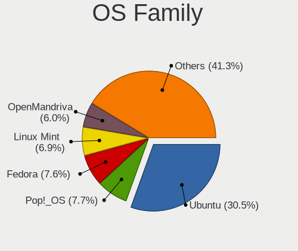

| Name          | Desktops | Percent |
|---------------|----------|---------|
| Ubuntu        | 264      | 29.2%   |
| Pop!_OS       | 70       | 7.74%   |
| Fedora        | 69       | 7.63%   |
| Linux Mint    | 66       | 7.3%    |
| Arch          | 53       | 5.86%   |
| OpenMandriva  | 50       | 5.53%   |
| Manjaro       | 49       | 5.42%   |
| Debian        | 36       | 3.98%   |
| KDE neon      | 27       | 2.99%   |
| Xubuntu       | 22       | 2.43%   |
| ArcoLinux     | 21       | 2.32%   |
| openSUSE      | 19       | 2.1%    |
| Zorin         | 18       | 1.99%   |
| Gentoo        | 18       | 1.99%   |
| Kubuntu       | 15       | 1.66%   |
| ROSA          | 12       | 1.33%   |
| EndeavourOS   | 9        | 1%      |
| Clear Linux   | 7        | 0.77%   |
| Nobara        | 6        | 0.66%   |
| MX            | 6        | 0.66%   |
| Kali          | 6        | 0.66%   |
| Garuda Linux  | 6        | 0.66%   |
| LMDE          | 5        | 0.55%   |
| Elementary    | 5        | 0.55%   |
| Ubuntu Unity  | 4        | 0.44%   |
| Solus         | 4        | 0.44%   |
| CentOS        | 4        | 0.44%   |
| Ubuntu MATE   | 3        | 0.33%   |
| Lubuntu       | 3        | 0.33%   |
| Alpine        | 3        | 0.33%   |
| Ubuntu Studio | 2        | 0.22%   |
| Ubuntu Budgie | 2        | 0.22%   |
| Sparky        | 2        | 0.22%   |
| Slackware     | 2        | 0.22%   |
| Mageia        | 2        | 0.22%   |
| LinuxFX       | 2        | 0.22%   |
| Xero          | 1        | 0.11%   |
| Void Linux    | 1        | 0.11%   |
| UbuntuDDE     | 1        | 0.11%   |
| Siduction     | 1        | 0.11%   |

Kernel
------

Version of the Linux kernel

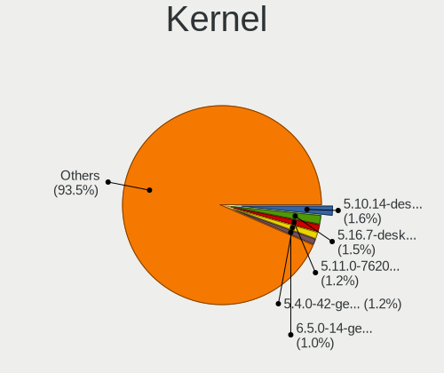

| Version                  | Desktops | Percent |
|--------------------------|----------|---------|
| 5.10.14-desktop-1omv4002 | 18       | 1.71%   |
| 5.16.7-desktop-1omv4003  | 17       | 1.62%   |
| 5.11.0-7620-generic      | 14       | 1.33%   |
| 5.4.0-42-generic         | 13       | 1.24%   |
| 6.2.6-76060206-generic   | 8        | 0.76%   |
| 5.4.0-58-generic         | 8        | 0.76%   |
| 5.15.0-46-generic        | 8        | 0.76%   |
| 5.15.0-56-generic        | 7        | 0.67%   |
| 5.13.0-39-generic        | 7        | 0.67%   |
| 6.2.6-desktop-1omv2390   | 6        | 0.57%   |
| 6.2.0-20-generic         | 6        | 0.57%   |
| 5.8.0-43-generic         | 6        | 0.57%   |
| 5.4.0-7634-generic       | 6        | 0.57%   |
| 5.4.0-52-generic         | 6        | 0.57%   |
| 5.4.0-48-generic         | 6        | 0.57%   |
| 5.15.0-58-generic        | 6        | 0.57%   |
| 5.15.0-53-generic        | 6        | 0.57%   |
| 5.13.0-27-generic        | 6        | 0.57%   |
| 5.11.0-7614-generic      | 6        | 0.57%   |
| 6.2.0-34-generic         | 5        | 0.48%   |
| 5.8.0-50-generic         | 5        | 0.48%   |
| 5.4.0-81-generic         | 5        | 0.48%   |
| 5.4.0-67-generic         | 5        | 0.48%   |
| 5.4.0-54-generic         | 5        | 0.48%   |
| 5.4.0-40-generic         | 5        | 0.48%   |
| 5.4.0-33-generic         | 5        | 0.48%   |
| 5.4.0-26-generic         | 5        | 0.48%   |
| 5.3.0-40-generic         | 5        | 0.48%   |
| 5.19.0-41-generic        | 5        | 0.48%   |
| 5.19.0-38-generic        | 5        | 0.48%   |
| 5.15.0-52-generic        | 5        | 0.48%   |
| 5.15.0-41-generic        | 5        | 0.48%   |
| 5.15.0-25-generic        | 5        | 0.48%   |
| 5.13.0-7614-generic      | 5        | 0.48%   |
| 4.18.0-15-generic        | 5        | 0.48%   |
| 6.2.9-300.fc38.x86_64    | 4        | 0.38%   |
| 6.2.0-33-generic         | 4        | 0.38%   |
| 6.2.0-26-generic         | 4        | 0.38%   |
| 6.1.1-desktop-1omv2290   | 4        | 0.38%   |
| 5.8.0-7642-generic       | 4        | 0.38%   |

Kernel Family
-------------

Linux kernel without a distro release

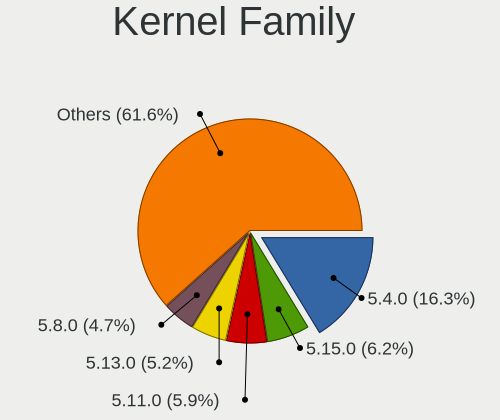

| Version | Desktops | Percent |
|---------|----------|---------|
| 5.4.0   | 143      | 14.19%  |
| 5.15.0  | 73       | 7.24%   |
| 5.11.0  | 51       | 5.06%   |
| 5.13.0  | 45       | 4.46%   |
| 5.8.0   | 41       | 4.07%   |
| 4.15.0  | 33       | 3.27%   |
| 5.3.0   | 26       | 2.58%   |
| 6.2.0   | 25       | 2.48%   |
| 5.0.0   | 25       | 2.48%   |
| 5.19.0  | 24       | 2.38%   |
| 5.10.0  | 24       | 2.38%   |
| 4.18.0  | 22       | 2.18%   |
| 5.10.14 | 18       | 1.79%   |
| 5.16.7  | 17       | 1.69%   |
| 6.2.6   | 15       | 1.49%   |
| 6.1.0   | 8        | 0.79%   |
| 4.19.0  | 8        | 0.79%   |
| 5.12.4  | 7        | 0.69%   |
| 6.3.8   | 6        | 0.6%    |
| 5.17.5  | 6        | 0.6%    |
| 5.19.16 | 5        | 0.5%    |
| 5.17.1  | 5        | 0.5%    |
| 6.5.6   | 4        | 0.4%    |
| 6.4.10  | 4        | 0.4%    |
| 6.4.0   | 4        | 0.4%    |
| 6.3.1   | 4        | 0.4%    |
| 6.2.9   | 4        | 0.4%    |
| 6.1.12  | 4        | 0.4%    |
| 6.1.1   | 4        | 0.4%    |
| 5.9.16  | 4        | 0.4%    |
| 5.18.0  | 4        | 0.4%    |
| 5.11.12 | 4        | 0.4%    |
| 4.9.20  | 4        | 0.4%    |
| 6.3.12  | 3        | 0.3%    |
| 6.0.14  | 3        | 0.3%    |
| 5.9.8   | 3        | 0.3%    |
| 5.9.0   | 3        | 0.3%    |
| 5.8.5   | 3        | 0.3%    |
| 5.8.1   | 3        | 0.3%    |
| 5.6.6   | 3        | 0.3%    |

Kernel Major Ver.
-----------------

Linux kernel major version

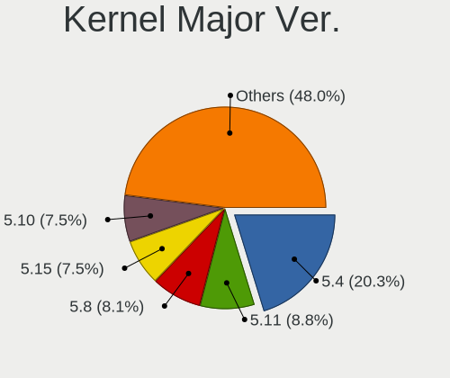

| Version | Desktops | Percent |
|---------|----------|---------|
| 5.4     | 161      | 16.25%  |
| 5.15    | 98       | 9.89%   |
| 5.11    | 67       | 6.76%   |
| 5.10    | 66       | 6.66%   |
| 5.8     | 62       | 6.26%   |
| 5.13    | 51       | 5.15%   |
| 6.2     | 47       | 4.74%   |
| 5.19    | 33       | 3.33%   |
| 4.15    | 33       | 3.33%   |
| 6.1     | 32       | 3.23%   |
| 5.3     | 30       | 3.03%   |
| 5.16    | 30       | 3.03%   |
| 5.0     | 26       | 2.62%   |
| 4.18    | 23       | 2.32%   |
| 6.3     | 22       | 2.22%   |
| 5.17    | 22       | 2.22%   |
| 5.12    | 22       | 2.22%   |
| 6.4     | 20       | 2.02%   |
| 6.0     | 17       | 1.72%   |
| 5.9     | 17       | 1.72%   |
| 5.6     | 17       | 1.72%   |
| 5.18    | 16       | 1.61%   |
| 4.19    | 14       | 1.41%   |
| 6.5     | 12       | 1.21%   |
| 5.7     | 11       | 1.11%   |
| 5.14    | 11       | 1.11%   |
| 4.9     | 11       | 1.11%   |
| 5.5     | 7        | 0.71%   |
| 4.4     | 3        | 0.3%    |
| 5.1     | 2        | 0.2%    |
| 4.12    | 2        | 0.2%    |
| 4.20    | 1        | 0.1%    |
| 4.16    | 1        | 0.1%    |
| 4.14    | 1        | 0.1%    |
| 4.13    | 1        | 0.1%    |
| 4.1     | 1        | 0.1%    |
| 3.2     | 1        | 0.1%    |

Arch
----

OS architecture (x86_64, i586, etc.)

| Name   | Desktops | Percent |
|--------|----------|---------|
| x86_64 | 857      | 98.85%  |
| i686   | 9        | 1.04%   |
| i586   | 1        | 0.12%   |

DE
--

Desktop Environment

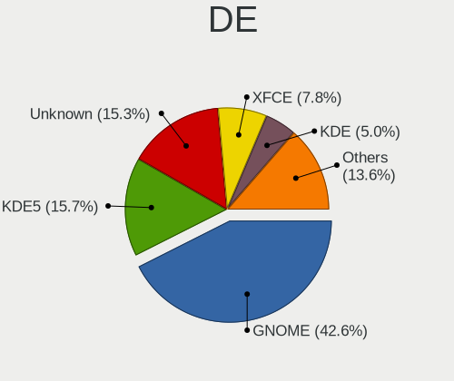

| Name            | Desktops | Percent |
|-----------------|----------|---------|
| GNOME           | 397      | 43.15%  |
| KDE5            | 153      | 16.63%  |
| Unknown         | 120      | 13.04%  |
| XFCE            | 75       | 8.15%   |
| X-Cinnamon      | 55       | 5.98%   |
| KDE             | 37       | 4.02%   |
| MATE            | 13       | 1.41%   |
| KDE4            | 8        | 0.87%   |
| Cinnamon        | 8        | 0.87%   |
| LXQt            | 6        | 0.65%   |
| Budgie          | 6        | 0.65%   |
| Unity           | 5        | 0.54%   |
| LXDE            | 5        | 0.54%   |
| i3              | 5        | 0.54%   |
| Deepin          | 5        | 0.54%   |
| Pantheon        | 4        | 0.43%   |
| GNOME Classic   | 4        | 0.43%   |
| Openbox         | 3        | 0.33%   |
| awesome         | 3        | 0.33%   |
| GNOME Flashback | 2        | 0.22%   |
| xmonad          | 1        | 0.11%   |
| sway            | 1        | 0.11%   |
| LeftWM          | 1        | 0.11%   |
| GNOME-Flashback | 1        | 0.11%   |
| Enlightenment   | 1        | 0.11%   |
| DWM             | 1        | 0.11%   |

Display Server
--------------

X11 or Wayland

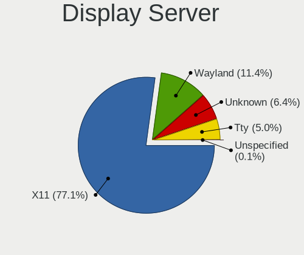

| Name        | Desktops | Percent |
|-------------|----------|---------|
| X11         | 677      | 75.98%  |
| Wayland     | 120      | 13.47%  |
| Unknown     | 49       | 5.5%    |
| Tty         | 44       | 4.94%   |
| Unspecified | 1        | 0.11%   |

Display Manager
---------------

SDDM, LightDM, etc.

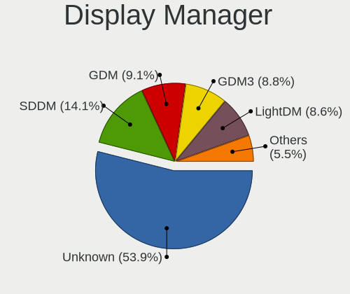

| Name    | Desktops | Percent |
|---------|----------|---------|
| Unknown | 481      | 53.15%  |
| SDDM    | 131      | 14.48%  |
| GDM3    | 84       | 9.28%   |
| GDM     | 82       | 9.06%   |
| LightDM | 79       | 8.73%   |
| TDM     | 31       | 3.43%   |
| KDM     | 8        | 0.88%   |
| XDM     | 4        | 0.44%   |
| Ly      | 3        | 0.33%   |
| LXDM    | 1        | 0.11%   |
| GREETD  | 1        | 0.11%   |

OS Lang
-------

Language

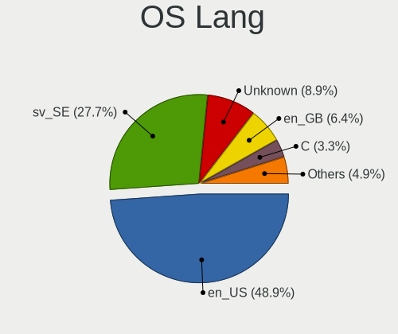

| Lang        | Desktops | Percent |
|-------------|----------|---------|
| en_US       | 426      | 47.7%   |
| sv_SE       | 251      | 28.11%  |
| Unknown     | 96       | 10.75%  |
| en_GB       | 57       | 6.38%   |
| C           | 25       | 2.8%    |
| de_DE       | 9        | 1.01%   |
| ru_RU       | 5        | 0.56%   |
| en_SE       | 3        | 0.34%   |
| en_IE       | 3        | 0.34%   |
| uk_UA       | 2        | 0.22%   |
| sma_SE      | 1        | 0.11%   |
| POSIX       | 1        | 0.11%   |
| pl_PL       | 1        | 0.11%   |
| nb_NO       | 1        | 0.11%   |
| hr_HR       | 1        | 0.11%   |
| fr_FR       | 1        | 0.11%   |
| fi_FI       | 1        | 0.11%   |
| es_VE       | 1        | 0.11%   |
| en_IN       | 1        | 0.11%   |
| en_GB.utf-8 | 1        | 0.11%   |
| en_DK       | 1        | 0.11%   |
| en_CA       | 1        | 0.11%   |
| en_AG       | 1        | 0.11%   |
| C.UTF8      | 1        | 0.11%   |
| bs_BA       | 1        | 0.11%   |
| bg_BG       | 1        | 0.11%   |

Boot Mode
---------

EFI or BIOS

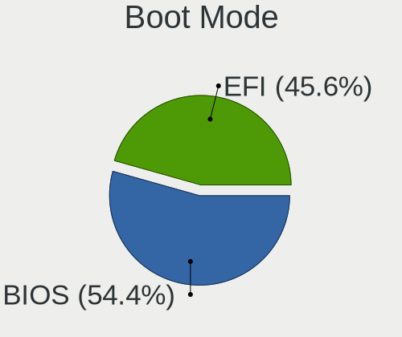

| Mode | Desktops | Percent |
|------|----------|---------|
| BIOS | 472      | 52.97%  |
| EFI  | 419      | 47.03%  |

Filesystem
----------

Type of filesystem

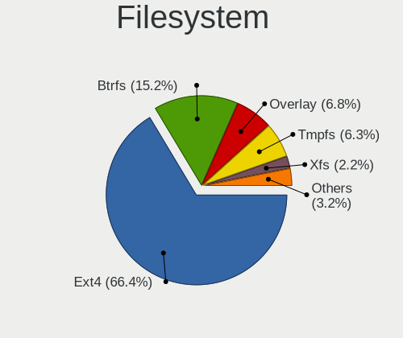

| Type     | Desktops | Percent |
|----------|----------|---------|
| Ext4     | 636      | 70.82%  |
| Btrfs    | 118      | 13.14%  |
| Overlay  | 64       | 7.13%   |
| Tmpfs    | 28       | 3.12%   |
| Unknown  | 25       | 2.78%   |
| Xfs      | 18       | 2%      |
| Zfs      | 4        | 0.45%   |
| F2fs     | 2        | 0.22%   |
| Reiserfs | 1        | 0.11%   |
| Ext3     | 1        | 0.11%   |
| Ext2     | 1        | 0.11%   |

Part. scheme
------------

Scheme of partitioning

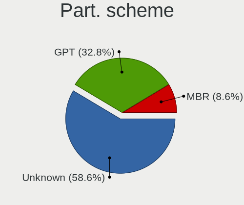

| Type    | Desktops | Percent |
|---------|----------|---------|
| Unknown | 473      | 52.21%  |
| GPT     | 358      | 39.51%  |
| MBR     | 75       | 8.28%   |

Dual Boot with Linux/BSD
------------------------

Hosting more than one Linux/BSD

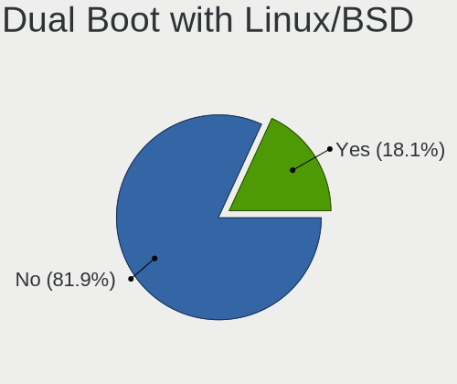

| Dual boot | Desktops | Percent |
|-----------|----------|---------|
| No        | 730      | 82.11%  |
| Yes       | 159      | 17.89%  |

Dual Boot (Win)
---------------

Hosting Linux and Windows

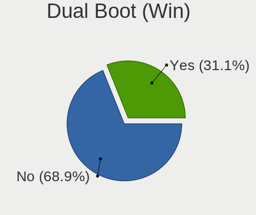

| Dual boot | Desktops | Percent |
|-----------|----------|---------|
| No        | 614      | 68.83%  |
| Yes       | 278      | 31.17%  |

Board
-----

Vendor
------

Motherboard manufacturer

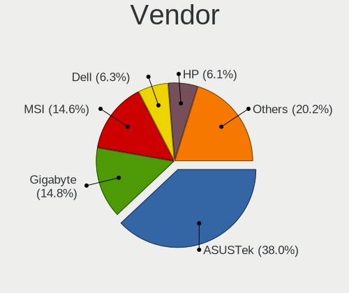

| Name                                 | Desktops | Percent |
|--------------------------------------|----------|---------|
| ASUSTek Computer                     | 327      | 37.72%  |
| Gigabyte Technology                  | 133      | 15.34%  |
| MSI                                  | 127      | 14.65%  |
| Dell                                 | 55       | 6.34%   |
| Hewlett-Packard                      | 50       | 5.77%   |
| ASRock                               | 49       | 5.65%   |
| Acer                                 | 25       | 2.88%   |
| Lenovo                               | 24       | 2.77%   |
| Fujitsu                              | 9        | 1.04%   |
| Foxconn                              | 7        | 0.81%   |
| Pegatron                             | 6        | 0.69%   |
| Intel                                | 6        | 0.69%   |
| Apple                                | 5        | 0.58%   |
| AAEON                                | 5        | 0.58%   |
| Maxtang                              | 4        | 0.46%   |
| Unknown                              | 4        | 0.46%   |
| Supermicro                           | 3        | 0.35%   |
| Packard Bell                         | 3        | 0.35%   |
| Shuttle                              | 2        | 0.23%   |
| OEM                                  | 2        | 0.23%   |
| Fujitsu Siemens                      | 2        | 0.23%   |
| AMD                                  | 2        | 0.23%   |
| XDO.AI                               | 1        | 0.12%   |
| SiYW                                 | 1        | 0.12%   |
| Shenzhen Meigao Electronic Equipment | 1        | 0.12%   |
| Seco                                 | 1        | 0.12%   |
| Kllisre                              | 1        | 0.12%   |
| JGINYUE                              | 1        | 0.12%   |
| Huanan                               | 1        | 0.12%   |
| Hardkernel                           | 1        | 0.12%   |
| GMK                                  | 1        | 0.12%   |
| EVGA                                 | 1        | 0.12%   |
| Elo Touch Solutions                  | 1        | 0.12%   |
| ECS                                  | 1        | 0.12%   |
| Biostar                              | 1        | 0.12%   |
| BESSTAR Tech                         | 1        | 0.12%   |
| AZW                                  | 1        | 0.12%   |
| AOpen                                | 1        | 0.12%   |
| Alienware                            | 1        | 0.12%   |

Model
-----

Motherboard model

| Name                                   | Desktops | Percent |
|----------------------------------------|----------|---------|
| ASUS All Series                        | 22       | 2.54%   |
| ASUS ROG STRIX B450-F GAMING           | 12       | 1.38%   |
| ASUS ROG STRIX X570-F GAMING           | 10       | 1.15%   |
| ASUS ROG STRIX B550-F GAMING           | 9        | 1.04%   |
| MSI MS-7C37                            | 8        | 0.92%   |
| ASUS PRIME X470-PRO                    | 8        | 0.92%   |
| ASUS Z170 PRO GAMING                   | 7        | 0.81%   |
| MSI MS-7C02                            | 6        | 0.69%   |
| MSI MS-7C52                            | 5        | 0.58%   |
| MSI MS-7817                            | 5        | 0.58%   |
| Gigabyte B550 AORUS ELITE V2           | 5        | 0.58%   |
| Gigabyte B450M DS3H                    | 5        | 0.58%   |
| Dell OptiPlex 7010                     | 5        | 0.58%   |
| ASUS TUF Gaming X570-PLUS              | 5        | 0.58%   |
| ASUS ROG STRIX Z390-F GAMING           | 5        | 0.58%   |
| ASUS ROG STRIX B550-I GAMING           | 5        | 0.58%   |
| ASUS ROG STRIX B350-F GAMING           | 5        | 0.58%   |
| ASUS PRIME X370-PRO                    | 5        | 0.58%   |
| ASUS M5A97 R2.0                        | 5        | 0.58%   |
| Maxtang FP30                           | 4        | 0.46%   |
| ASUS STRIX Z270H GAMING                | 4        | 0.46%   |
| ASUS SABERTOOTH 990FX R2.0             | 4        | 0.46%   |
| ASUS ROG STRIX B450-F GAMING II        | 4        | 0.46%   |
| ASUS P8Z77-V LX                        | 4        | 0.46%   |
| Unknown                                | 4        | 0.46%   |
| MSI MS-7C91                            | 3        | 0.35%   |
| MSI MS-7C84                            | 3        | 0.35%   |
| MSI MS-7C56                            | 3        | 0.35%   |
| MSI MS-7B98                            | 3        | 0.35%   |
| MSI MS-7B89                            | 3        | 0.35%   |
| MSI MS-7971                            | 3        | 0.35%   |
| MSI MS-7918                            | 3        | 0.35%   |
| MSI MS-7850                            | 3        | 0.35%   |
| MSI MS-7640                            | 3        | 0.35%   |
| HP Z440 Workstation                    | 3        | 0.35%   |
| HP EliteDesk 800 G1 USDT               | 3        | 0.35%   |
| HP EliteDesk 800 G1 SFF                | 3        | 0.35%   |
| HP Compaq dc7900 Convertible Minitower | 3        | 0.35%   |
| Gigabyte GA-990FXA-UD3                 | 3        | 0.35%   |
| Gigabyte 970A-DS3P                     | 3        | 0.35%   |

Model Family
------------

Motherboard model prefix

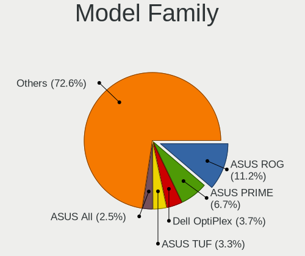

| Name                | Desktops | Percent |
|---------------------|----------|---------|
| ASUS ROG            | 93       | 10.73%  |
| ASUS PRIME          | 54       | 6.23%   |
| Dell OptiPlex       | 32       | 3.69%   |
| ASUS All            | 22       | 2.54%   |
| ASUS TUF            | 20       | 2.31%   |
| HP Compaq           | 15       | 1.73%   |
| Dell Precision      | 14       | 1.61%   |
| Acer Aspire         | 14       | 1.61%   |
| HP EliteDesk        | 11       | 1.27%   |
| Gigabyte X570       | 10       | 1.15%   |
| ASUS P8Z77-V        | 10       | 1.15%   |
| Lenovo IdeaCentre   | 9        | 1.04%   |
| ASUS SABERTOOTH     | 9        | 1.04%   |
| MSI MS-7C37         | 8        | 0.92%   |
| Lenovo ThinkCentre  | 8        | 0.92%   |
| Gigabyte B450M      | 8        | 0.92%   |
| ASUS STRIX          | 8        | 0.92%   |
| ASUS Z170           | 7        | 0.81%   |
| ASUS P8Z68-V        | 7        | 0.81%   |
| ASUS Maximus        | 7        | 0.81%   |
| MSI MS-7C02         | 6        | 0.69%   |
| Gigabyte B550       | 6        | 0.69%   |
| ASUS M5A97          | 6        | 0.69%   |
| MSI MS-7C52         | 5        | 0.58%   |
| MSI MS-7817         | 5        | 0.58%   |
| HP ProDesk          | 5        | 0.58%   |
| Fujitsu ESPRIMO     | 5        | 0.58%   |
| ASUS Crosshair      | 5        | 0.58%   |
| Maxtang FP30        | 4        | 0.46%   |
| HP Pavilion         | 4        | 0.46%   |
| Gigabyte Z390       | 4        | 0.46%   |
| ASUS M5A78L-M       | 4        | 0.46%   |
| ASRock B450M        | 4        | 0.46%   |
| Acer Veriton        | 4        | 0.46%   |
| Acer Predator       | 4        | 0.46%   |
| Unknown             | 4        | 0.46%   |
| Packard Bell IMEDIA | 3        | 0.35%   |
| MSI MS-7C91         | 3        | 0.35%   |
| MSI MS-7C84         | 3        | 0.35%   |
| MSI MS-7C56         | 3        | 0.35%   |

MFG Year
--------

Motherboard manufacture year

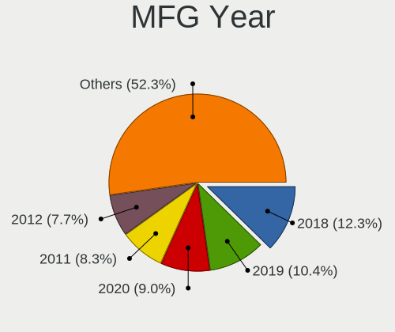

| Year | Desktops | Percent |
|------|----------|---------|
| 2018 | 111      | 12.8%   |
| 2019 | 91       | 10.5%   |
| 2020 | 77       | 8.88%   |
| 2011 | 72       | 8.3%    |
| 2012 | 65       | 7.5%    |
| 2017 | 60       | 6.92%   |
| 2013 | 60       | 6.92%   |
| 2015 | 50       | 5.77%   |
| 2014 | 49       | 5.65%   |
| 2016 | 46       | 5.31%   |
| 2021 | 42       | 4.84%   |
| 2010 | 34       | 3.92%   |
| 2009 | 34       | 3.92%   |
| 2022 | 24       | 2.77%   |
| 2008 | 24       | 2.77%   |
| 2007 | 18       | 2.08%   |
| 2023 | 3        | 0.35%   |
| 2006 | 3        | 0.35%   |
| 2005 | 2        | 0.23%   |
| 2004 | 1        | 0.12%   |
| 2002 | 1        | 0.12%   |

Form Factor
-----------

Physical design of the computer

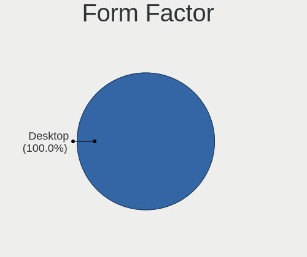

| Name    | Desktops | Percent |
|---------|----------|---------|
| Desktop | 867      | 100%    |

Secure Boot
-----------

Enabled or disabled

| State    | Desktops | Percent |
|----------|----------|---------|
| Disabled | 844      | 97.12%  |
| Enabled  | 25       | 2.88%   |

Coreboot
--------

Have coreboot on board

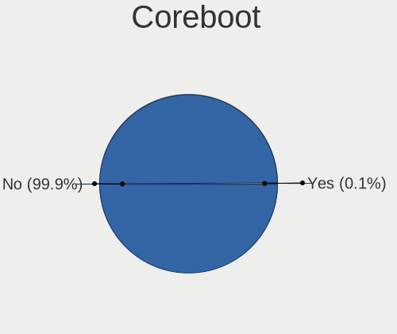

| Used | Desktops | Percent |
|------|----------|---------|
| No   | 866      | 99.88%  |
| Yes  | 1        | 0.12%   |

RAM Size
--------

Total RAM memory

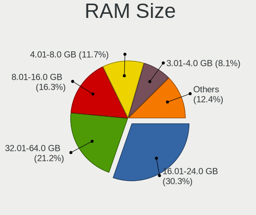

| Size in GB      | Desktops | Percent |
|-----------------|----------|---------|
| 16.01-24.0      | 263      | 29.68%  |
| 32.01-64.0      | 201      | 22.69%  |
| 8.01-16.0       | 133      | 15.01%  |
| 4.01-8.0        | 104      | 11.74%  |
| 3.01-4.0        | 66       | 7.45%   |
| 64.01-256.0     | 60       | 6.77%   |
| 24.01-32.0      | 29       | 3.27%   |
| 1.01-2.0        | 16       | 1.81%   |
| 2.01-3.0        | 7        | 0.79%   |
| 0.51-1.0        | 4        | 0.45%   |
| More than 256.0 | 2        | 0.23%   |
| 0.01-0.5        | 1        | 0.11%   |

RAM Used
--------

Used RAM memory

| Used GB    | Desktops | Percent |
|------------|----------|---------|
| 1.01-2.0   | 276      | 28.45%  |
| 4.01-8.0   | 209      | 21.55%  |
| 2.01-3.0   | 209      | 21.55%  |
| 3.01-4.0   | 138      | 14.23%  |
| 8.01-16.0  | 75       | 7.73%   |
| 0.51-1.0   | 37       | 3.81%   |
| 16.01-24.0 | 17       | 1.75%   |
| 24.01-32.0 | 3        | 0.31%   |
| 0.01-0.5   | 3        | 0.31%   |
| 32.01-64.0 | 2        | 0.21%   |
| Unknown    | 1        | 0.1%    |

Total Drives
------------

Number of drives on board

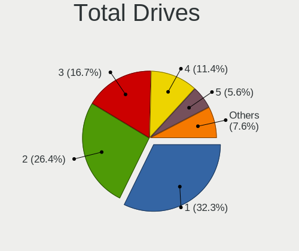

| Drives | Desktops | Percent |
|--------|----------|---------|
| 1      | 282      | 30.95%  |
| 2      | 245      | 26.89%  |
| 3      | 165      | 18.11%  |
| 4      | 107      | 11.75%  |
| 5      | 44       | 4.83%   |
| 6      | 32       | 3.51%   |
| 7      | 17       | 1.87%   |
| 0      | 10       | 1.1%    |
| 8      | 6        | 0.66%   |
| 11     | 1        | 0.11%   |
| 10     | 1        | 0.11%   |
| 9      | 1        | 0.11%   |

Has CD-ROM
----------

Has CD-ROM on board

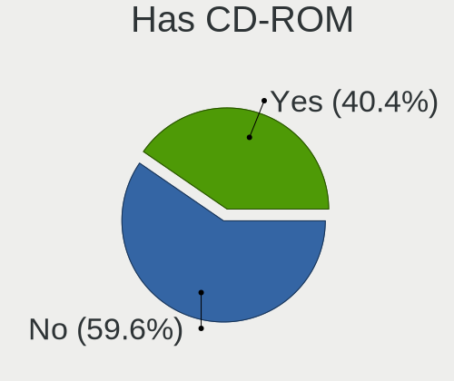

| Presented | Desktops | Percent |
|-----------|----------|---------|
| No        | 538      | 61.42%  |
| Yes       | 338      | 38.58%  |

Has Ethernet
------------

Has Ethernet on board

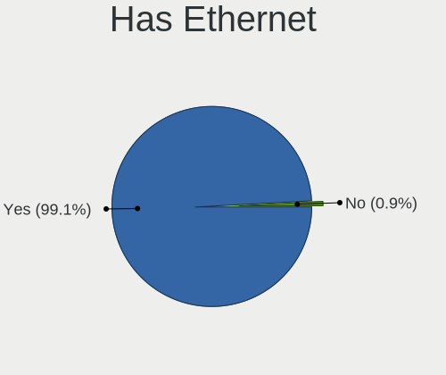

| Presented | Desktops | Percent |
|-----------|----------|---------|
| Yes       | 860      | 99.19%  |
| No        | 7        | 0.81%   |

Has WiFi
--------

Has WiFi module

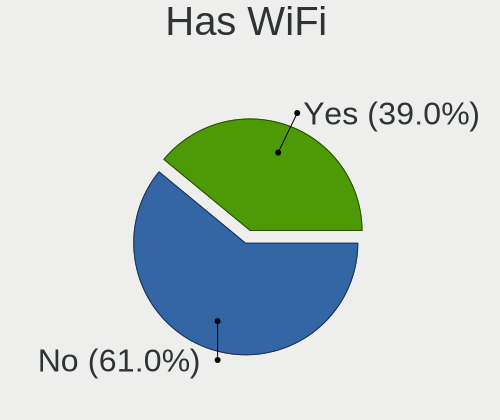

| Presented | Desktops | Percent |
|-----------|----------|---------|
| No        | 539      | 60.97%  |
| Yes       | 345      | 39.03%  |

Has Bluetooth
-------------

Has Bluetooth module

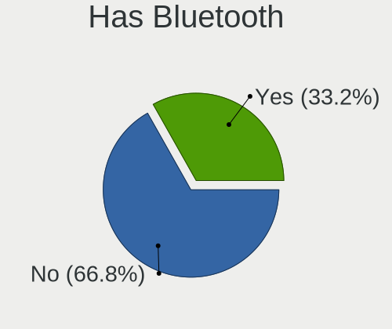

| Presented | Desktops | Percent |
|-----------|----------|---------|
| No        | 585      | 66.18%  |
| Yes       | 299      | 33.82%  |

Location
--------

Country
-------

Geographic location (country)

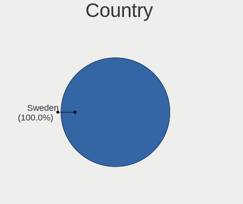

| Country | Desktops | Percent |
|---------|----------|---------|
| Sweden  | 867      | 100%    |

City
----

Geographic location (city)

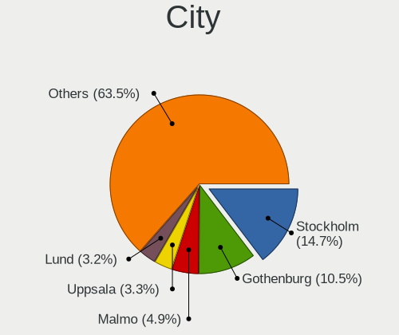

| City                    | Desktops | Percent |
|-------------------------|----------|---------|
| Stockholm               | 156      | 16.67%  |
| Gothenburg              | 100      | 10.68%  |
| Malmo                   | 48       | 5.13%   |
| Uppsala                 | 31       | 3.31%   |
| Västerås              | 25       | 2.67%   |
| Lund                    | 25       | 2.67%   |
| Linköping              | 20       | 2.14%   |
| Umeå                   | 15       | 1.6%    |
| Sundsvall               | 15       | 1.6%    |
| Sollentuna              | 12       | 1.28%   |
| Norrköping             | 12       | 1.28%   |
| Bromma                  | 12       | 1.28%   |
| Vaxjo                   | 10       | 1.07%   |
| Solna                   | 10       | 1.07%   |
| Karlstad                | 10       | 1.07%   |
| Helsingborg             | 9        | 0.96%   |
| Haegersten              | 9        | 0.96%   |
| Örebro                 | 8        | 0.85%   |
| Södertälje            | 7        | 0.75%   |
| Järfälla Municipality | 7        | 0.75%   |
| Vaestra Froelunda       | 6        | 0.64%   |
| Taby                    | 6        | 0.64%   |
| Sundbyberg              | 6        | 0.64%   |
| Nyköping               | 6        | 0.64%   |
| Karlskrona              | 6        | 0.64%   |
| Gävle                  | 6        | 0.64%   |
| Saltsjoe-Boo            | 5        | 0.53%   |
| Saeffle                 | 5        | 0.53%   |
| Johanneshov             | 5        | 0.53%   |
| Huddinge                | 5        | 0.53%   |
| Halmstad                | 5        | 0.53%   |
| Eskilstuna              | 5        | 0.53%   |
| Bandhagen               | 5        | 0.53%   |
| Arboga                  | 5        | 0.53%   |
| Varberg                 | 4        | 0.43%   |
| Upplands Vasby          | 4        | 0.43%   |
| Trollhättan            | 4        | 0.43%   |
| Staffanstorp            | 4        | 0.43%   |
| Skövde                 | 4        | 0.43%   |
| Norsborg                | 4        | 0.43%   |

Drives
------

Drive Vendor
------------

Hard drive vendors

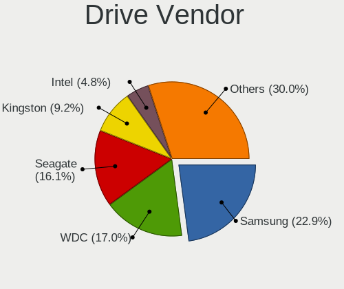

| Vendor                      | Desktops | Drives | Percent |
|-----------------------------|----------|--------|---------|
| Samsung Electronics         | 391      | 715    | 23.19%  |
| WDC                         | 288      | 511    | 17.08%  |
| Seagate                     | 274      | 484    | 16.25%  |
| Kingston                    | 153      | 227    | 9.07%   |
| Intel                       | 80       | 113    | 4.74%   |
| SanDisk                     | 55       | 77     | 3.26%   |
| Toshiba                     | 54       | 80     | 3.2%    |
| Crucial                     | 53       | 79     | 3.14%   |
| Hitachi                     | 46       | 62     | 2.73%   |
| Corsair                     | 24       | 33     | 1.42%   |
| HGST                        | 19       | 22     | 1.13%   |
| Phison                      | 18       | 22     | 1.07%   |
| Unknown                     | 17       | 26     | 1.01%   |
| Kingston Technology Company | 17       | 26     | 1.01%   |
| Micron Technology           | 16       | 24     | 0.95%   |
| OCZ                         | 14       | 20     | 0.83%   |
| A-DATA Technology           | 13       | 14     | 0.77%   |
| SK hynix                    | 12       | 17     | 0.71%   |
| Phison Electronics          | 10       | 15     | 0.59%   |
| Transcend                   | 8        | 9      | 0.47%   |
| Micron/Crucial Technology   | 8        | 12     | 0.47%   |
| Silicon Motion              | 7        | 13     | 0.42%   |
| PNY                         | 7        | 9      | 0.42%   |
| Fujitsu                     | 7        | 11     | 0.42%   |
| SPCC                        | 6        | 20     | 0.36%   |
| Maxtor                      | 6        | 6      | 0.36%   |
| China                       | 6        | 6      | 0.36%   |
| Intenso                     | 5        | 9      | 0.3%    |
| LaCie                       | 4        | 5      | 0.24%   |
| JMicron Technology          | 4        | 4      | 0.24%   |
| ASMT                        | 4        | 4      | 0.24%   |
| Apple                       | 4        | 4      | 0.24%   |
| LITEONIT                    | 3        | 6      | 0.18%   |
| ASMedia                     | 3        | 3      | 0.18%   |
| ZTE                         | 2        | 2      | 0.12%   |
| XPG                         | 2        | 2      | 0.12%   |
| Verbatim                    | 2        | 2      | 0.12%   |
| Patriot                     | 2        | 3      | 0.12%   |
| LITEON                      | 2        | 3      | 0.12%   |
| KIOXIA-EXCERIA              | 2        | 3      | 0.12%   |

Drive Model
-----------

Hard drive models

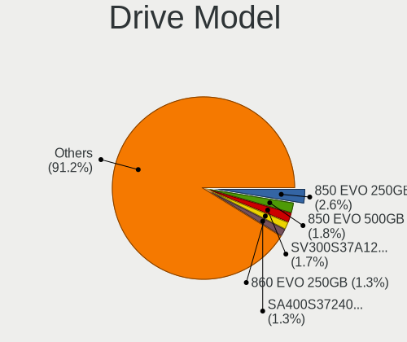

| Model                                              | Desktops | Percent |
|----------------------------------------------------|----------|---------|
| Samsung SSD 850 EVO 250GB                          | 48       | 2.3%    |
| Samsung SSD 850 EVO 500GB                          | 36       | 1.73%   |
| Samsung NVMe SSD Controller SM981/PM981/PM983 1TB  | 29       | 1.39%   |
| Kingston SV300S37A120G 120GB SSD                   | 28       | 1.34%   |
| Kingston SA400S37120G 120GB SSD                    | 27       | 1.3%    |
| Samsung SSD 860 EVO 250GB                          | 23       | 1.1%    |
| Seagate ST4000DM004-2CV104 4TB                     | 22       | 1.06%   |
| Samsung SSD 840 EVO 250GB                          | 21       | 1.01%   |
| Kingston SA400S37240G 240GB SSD                    | 21       | 1.01%   |
| Samsung NVMe SSD Drive 500GB                       | 19       | 0.91%   |
| Seagate ST1000DM010-2EP102 1TB                     | 18       | 0.86%   |
| Samsung SSD 860 EVO 500GB                          | 18       | 0.86%   |
| Kingston SA400S37480G 480GB SSD                    | 17       | 0.82%   |
| Seagate ST2000DM008-2FR102 2TB                     | 16       | 0.77%   |
| Seagate ST1000DM003-1CH162 1TB                     | 15       | 0.72%   |
| Samsung SSD 970 EVO Plus 500GB                     | 15       | 0.72%   |
| Seagate ST2000DM006-2DM164 2TB                     | 14       | 0.67%   |
| Samsung SSD 860 EVO 1TB                            | 14       | 0.67%   |
| WDC WDS240G2G0A-00JH30 240GB SSD                   | 13       | 0.62%   |
| Seagate ST500DM002-1BD142 500GB                    | 13       | 0.62%   |
| Seagate ST4000VN008-2DR166 4TB                     | 13       | 0.62%   |
| WDC WD30EFRX-68EUZN0 3TB                           | 12       | 0.58%   |
| Samsung NVMe SSD Drive 1TB                         | 12       | 0.58%   |
| Seagate ST2000DM001-1CH164 2TB                     | 10       | 0.48%   |
| SanDisk NVMe SSD Drive 1TB                         | 10       | 0.48%   |
| Samsung SSD 870 QVO 1TB                            | 10       | 0.48%   |
| Samsung SSD 840 EVO 500GB                          | 10       | 0.48%   |
| Samsung SM963 2.5" NVMe PCIe SSD 250GB             | 10       | 0.48%   |
| WDC WD40EFRX-68N32N0 4TB                           | 9        | 0.43%   |
| WDC WD20EZRZ-00Z5HB0 2TB                           | 9        | 0.43%   |
| WDC WD20EARX-00PASB0 2TB                           | 9        | 0.43%   |
| Samsung SSD 960 EVO 250GB                          | 9        | 0.43%   |
| Samsung SSD 840 PRO Series 256GB                   | 9        | 0.43%   |
| Samsung SSD 840 EVO 120GB                          | 9        | 0.43%   |
| Samsung NVMe SSD Controller PM9A1/PM9A3/980PRO 1TB | 9        | 0.43%   |
| Kingston Company A2000 NVMe SSD 250GB              | 9        | 0.43%   |
| Unknown SD/MMC/MS PRO 16GB                         | 8        | 0.38%   |
| Seagate ST3500418AS 500GB                          | 8        | 0.38%   |
| Seagate ST3000DM001-1CH166 3TB                     | 8        | 0.38%   |
| Seagate Expansion Desk 3TB                         | 8        | 0.38%   |

HDD Vendor
----------

Hard disk drive vendors

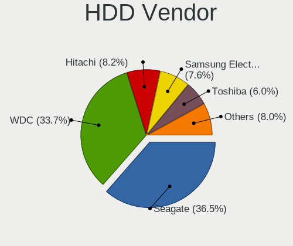

| Vendor              | Desktops | Drives | Percent |
|---------------------|----------|--------|---------|
| Seagate             | 271      | 474    | 37.59%  |
| WDC                 | 252      | 446    | 34.95%  |
| Samsung Electronics | 52       | 87     | 7.21%   |
| Hitachi             | 46       | 62     | 6.38%   |
| Toshiba             | 45       | 70     | 6.24%   |
| HGST                | 19       | 22     | 2.64%   |
| Unknown             | 9        | 11     | 1.25%   |
| Fujitsu             | 7        | 11     | 0.97%   |
| Maxtor              | 6        | 6      | 0.83%   |
| ASMedia             | 3        | 3      | 0.42%   |
| Apple               | 3        | 3      | 0.42%   |
| Intenso             | 2        | 2      | 0.28%   |
| USB3.0              | 1        | 1      | 0.14%   |
| LaCie               | 1        | 1      | 0.14%   |
| JMicron Technology  | 1        | 1      | 0.14%   |
| IB                  | 1        | 2      | 0.14%   |
| Hewlett-Packard     | 1        | 2      | 0.14%   |
| ASMT                | 1        | 1      | 0.14%   |

SSD Vendor
----------

Solid state drive vendors

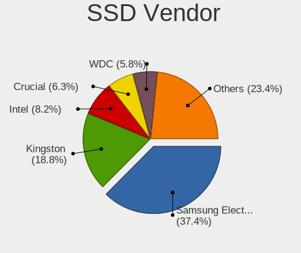

| Vendor              | Desktops | Drives | Percent |
|---------------------|----------|--------|---------|
| Samsung Electronics | 249      | 382    | 37.61%  |
| Kingston            | 117      | 168    | 17.67%  |
| Intel               | 52       | 75     | 7.85%   |
| Crucial             | 51       | 75     | 7.7%    |
| WDC                 | 36       | 52     | 5.44%   |
| SanDisk             | 27       | 35     | 4.08%   |
| Micron Technology   | 16       | 24     | 2.42%   |
| OCZ                 | 14       | 20     | 2.11%   |
| Corsair             | 14       | 17     | 2.11%   |
| A-DATA Technology   | 10       | 11     | 1.51%   |
| Transcend           | 8        | 9      | 1.21%   |
| Toshiba             | 7        | 7      | 1.06%   |
| SPCC                | 6        | 20     | 0.91%   |
| China               | 6        | 6      | 0.91%   |
| SK hynix            | 5        | 6      | 0.76%   |
| PNY                 | 4        | 6      | 0.6%    |
| LITEONIT            | 3        | 6      | 0.45%   |
| ASMT                | 3        | 3      | 0.45%   |
| Verbatim            | 2        | 2      | 0.3%    |
| Patriot             | 2        | 3      | 0.3%    |
| LITEON              | 2        | 3      | 0.3%    |
| KIOXIA-EXCERIA      | 2        | 3      | 0.3%    |
| Intenso             | 2        | 2      | 0.3%    |
| Emtec               | 2        | 2      | 0.3%    |
| XSTAR               | 1        | 2      | 0.15%   |
| WDC WDS2            | 1        | 1      | 0.15%   |
| WDC WDS1            | 1        | 1      | 0.15%   |
| tigo                | 1        | 1      | 0.15%   |
| Seagate             | 1        | 3      | 0.15%   |
| SATAFIRM            | 1        | 1      | 0.15%   |
| SABRENT             | 1        | 1      | 0.15%   |
| ROG                 | 1        | 1      | 0.15%   |
| Ramaxel Technology  | 1        | 1      | 0.15%   |
| Phison              | 1        | 1      | 0.15%   |
| OWC                 | 1        | 1      | 0.15%   |
| OCZ-VERTEX3         | 1        | 1      | 0.15%   |
| Linux               | 1        | 1      | 0.15%   |
| Kston               | 1        | 1      | 0.15%   |
| INTEL SS            | 1        | 1      | 0.15%   |
| Innodisk            | 1        | 1      | 0.15%   |

Drive Kind
----------

HDD or SSD

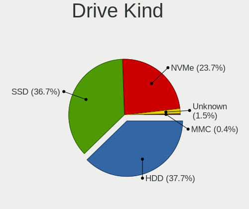

| Kind    | Desktops | Drives | Percent |
|---------|----------|--------|---------|
| HDD     | 546      | 1205   | 37.97%  |
| SSD     | 530      | 963    | 36.86%  |
| NVMe    | 335      | 540    | 23.3%   |
| Unknown | 21       | 31     | 1.46%   |
| MMC     | 6        | 6      | 0.42%   |

Drive Connector
---------------

SATA, SAS, NVMe, etc.

| Type | Desktops | Drives | Percent |
|------|----------|--------|---------|
| SATA | 767      | 2085   | 64.73%  |
| NVMe | 333      | 536    | 28.1%   |
| SAS  | 79       | 118    | 6.67%   |
| MMC  | 6        | 6      | 0.51%   |

Drive Size
----------

Size of hard drive

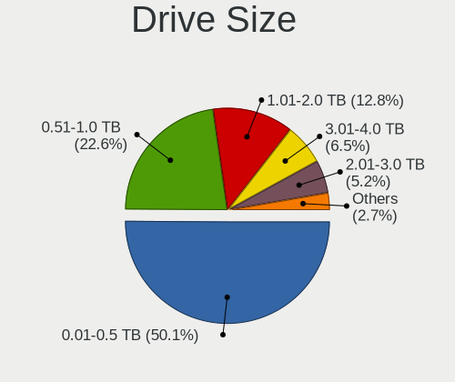

| Size in TB | Desktops | Drives | Percent |
|------------|----------|--------|---------|
| 0.01-0.5   | 618      | 1159   | 49.68%  |
| 0.51-1.0   | 282      | 476    | 22.67%  |
| 1.01-2.0   | 162      | 240    | 13.02%  |
| 3.01-4.0   | 75       | 125    | 6.03%   |
| 2.01-3.0   | 68       | 108    | 5.47%   |
| 4.01-10.0  | 32       | 50     | 2.57%   |
| 10.01-20.0 | 7        | 10     | 0.56%   |

Space Total
-----------

Amount of disk space available on the file system

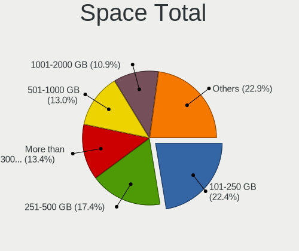

| Size in GB     | Desktops | Percent |
|----------------|----------|---------|
| 101-250        | 193      | 20.49%  |
| 251-500        | 159      | 16.88%  |
| More than 3000 | 148      | 15.71%  |
| 501-1000       | 130      | 13.8%   |
| 1001-2000      | 104      | 11.04%  |
| 1-20           | 71       | 7.54%   |
| 2001-3000      | 60       | 6.37%   |
| 51-100         | 37       | 3.93%   |
| Unknown        | 30       | 3.18%   |
| 21-50          | 10       | 1.06%   |

Space Used
----------

Amount of used disk space

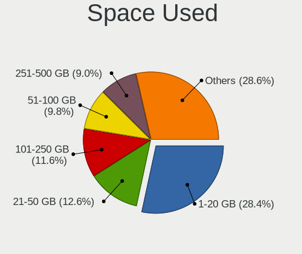

| Used GB        | Desktops | Percent |
|----------------|----------|---------|
| 1-20           | 276      | 28.78%  |
| 21-50          | 120      | 12.51%  |
| 101-250        | 113      | 11.78%  |
| 51-100         | 92       | 9.59%   |
| 251-500        | 85       | 8.86%   |
| 501-1000       | 78       | 8.13%   |
| 1001-2000      | 62       | 6.47%   |
| More than 3000 | 57       | 5.94%   |
| 2001-3000      | 45       | 4.69%   |
| Unknown        | 30       | 3.13%   |
| 0              | 1        | 0.1%    |

Malfunc. Drives
---------------

Drive models with a malfunction

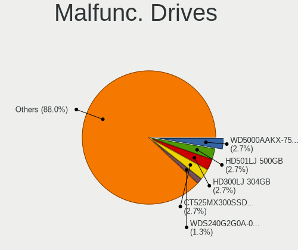

| Model                                 | Desktops | Drives | Percent |
|---------------------------------------|----------|--------|---------|
| WDC WDS240G2G0A-00JH30 240GB SSD      | 2        | 2      | 1.72%   |
| WDC WD5000AAKX-75U6AA0 500GB          | 2        | 2      | 1.72%   |
| WDC WD10EZEX-21M2NA0 1TB              | 2        | 3      | 1.72%   |
| Seagate ST4000DM004-2CV104 4TB        | 2        | 2      | 1.72%   |
| Seagate ST3500418AS 500GB             | 2        | 2      | 1.72%   |
| Seagate ST2000DX001-1CM164 2TB        | 2        | 2      | 1.72%   |
| Seagate ST2000DM001-1CH164 2TB        | 2        | 3      | 1.72%   |
| Samsung Electronics SP2504C 250GB     | 2        | 2      | 1.72%   |
| Samsung Electronics HD501LJ 500GB     | 2        | 2      | 1.72%   |
| Samsung Electronics HD300LJ 304GB     | 2        | 2      | 1.72%   |
| Intel SSDSC2CW120A3 120GB             | 2        | 2      | 1.72%   |
| Crucial CT525MX300SSD1 528GB          | 2        | 2      | 1.72%   |
| WDC WD7500AACS-00ZJB0 752GB           | 1        | 1      | 0.86%   |
| WDC WD740GD-00FLA1 74GB               | 1        | 1      | 0.86%   |
| WDC WD6400AAKS-22A7B2 640GB           | 1        | 1      | 0.86%   |
| WDC WD60EFRX-68L0BN1 6TB              | 1        | 6      | 0.86%   |
| WDC WD5000BPKT-60PK4T0 500GB          | 1        | 1      | 0.86%   |
| WDC WD5000AZRX-00A8LB0 500GB          | 1        | 2      | 0.86%   |
| WDC WD5000AAKX-22ERMA0 500GB          | 1        | 1      | 0.86%   |
| WDC WD5000AAKS-00A7B2 500GB           | 1        | 1      | 0.86%   |
| WDC WD40EFRX-68N32N0 4TB              | 1        | 2      | 0.86%   |
| WDC WD4003FZEX-00Z4SA0 4TB            | 1        | 2      | 0.86%   |
| WDC WD3200AAKS-75L9A0 320GB           | 1        | 1      | 0.86%   |
| WDC WD3200AAKS-00B3A0 320GB           | 1        | 4      | 0.86%   |
| WDC WD30EFRX-68AX9N0 3TB              | 1        | 2      | 0.86%   |
| WDC WD20EFRX-68EUZN0 2TB              | 1        | 1      | 0.86%   |
| WDC WD20EARS-00MVWB0 2TB              | 1        | 1      | 0.86%   |
| WDC WD20EARS-00J2GB0 2TB              | 1        | 1      | 0.86%   |
| WDC WD15EARS-00Z5B1 1TB               | 1        | 1      | 0.86%   |
| WDC WD15EADS-00P8B0 1TB               | 1        | 2      | 0.86%   |
| WDC WD10EZEX-00BN5A0 1TB              | 1        | 1      | 0.86%   |
| WDC WD10EFRX-68FYTN0 1TB              | 1        | 1      | 0.86%   |
| WDC WD10EARS-00Y5B1 1TB               | 1        | 2      | 0.86%   |
| WDC WD10EARS-00MVWB0 1TB              | 1        | 1      | 0.86%   |
| WDC WD10EALX-009BA0 1TB               | 1        | 4      | 0.86%   |
| WDC WD10EADS-00M2B0 1TB               | 1        | 1      | 0.86%   |
| WDC WD10EADS-00L5B1 1TB               | 1        | 1      | 0.86%   |
| Toshiba XG4 NVMe SSD Controller 256GB | 1        | 1      | 0.86%   |
| Toshiba HDWD110 1TB                   | 1        | 2      | 0.86%   |
| Seagate ST9500420AS 500GB             | 1        | 1      | 0.86%   |

Malfunc. Drive Vendor
---------------------

Vendors of faulty drives

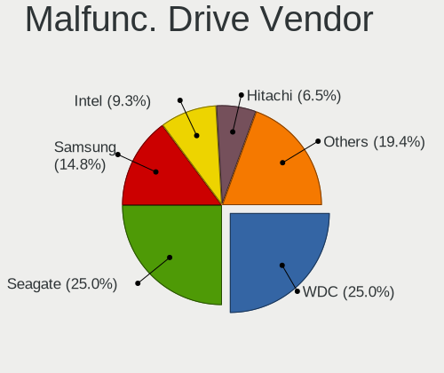

| Vendor              | Desktops | Drives | Percent |
|---------------------|----------|--------|---------|
| WDC                 | 28       | 49     | 25.45%  |
| Seagate             | 27       | 36     | 24.55%  |
| Samsung Electronics | 16       | 16     | 14.55%  |
| Intel               | 10       | 12     | 9.09%   |
| Hitachi             | 8        | 10     | 7.27%   |
| Crucial             | 5        | 6      | 4.55%   |
| Kingston            | 4        | 4      | 3.64%   |
| Toshiba             | 2        | 3      | 1.82%   |
| OCZ                 | 2        | 4      | 1.82%   |
| Fujitsu             | 2        | 2      | 1.82%   |
| Corsair             | 2        | 2      | 1.82%   |
| SanDisk             | 1        | 1      | 0.91%   |
| PNY                 | 1        | 2      | 0.91%   |
| LITEONIT            | 1        | 1      | 0.91%   |
| Apple               | 1        | 1      | 0.91%   |

Malfunc. HDD Vendor
-------------------

Vendors of faulty HDD drives

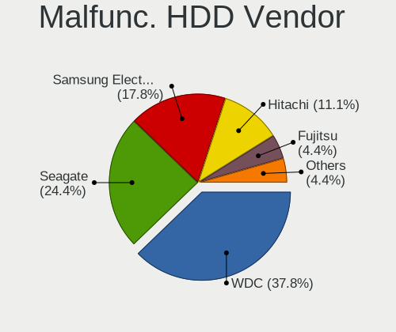

| Vendor              | Desktops | Drives | Percent |
|---------------------|----------|--------|---------|
| Seagate             | 27       | 36     | 35.06%  |
| WDC                 | 26       | 47     | 33.77%  |
| Samsung Electronics | 12       | 12     | 15.58%  |
| Hitachi             | 8        | 10     | 10.39%  |
| Fujitsu             | 2        | 2      | 2.6%    |
| Toshiba             | 1        | 2      | 1.3%    |
| Apple               | 1        | 1      | 1.3%    |

Malfunc. Drive Kind
-------------------

Kinds of faulty drives

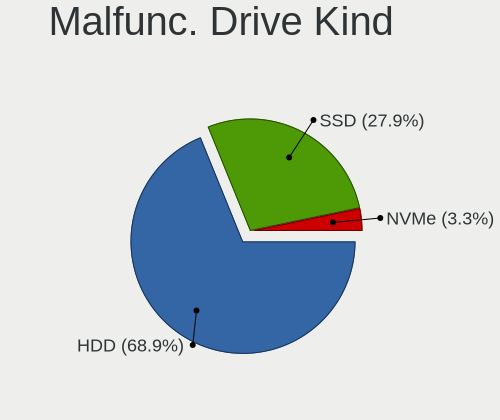

| Kind | Desktops | Drives | Percent |
|------|----------|--------|---------|
| HDD  | 72       | 110    | 70.59%  |
| SSD  | 27       | 36     | 26.47%  |
| NVMe | 3        | 3      | 2.94%   |

Failed Drives
-------------

Failed drive models

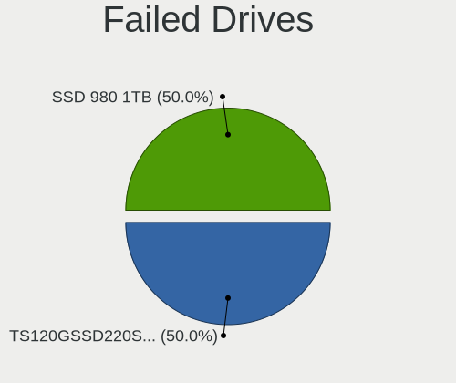

| Model                           | Desktops | Drives | Percent |
|---------------------------------|----------|--------|---------|
| Samsung Electronics SSD 980 1TB | 1        | 1      | 100%    |

Failed Drive Vendor
-------------------

Failed drive vendors

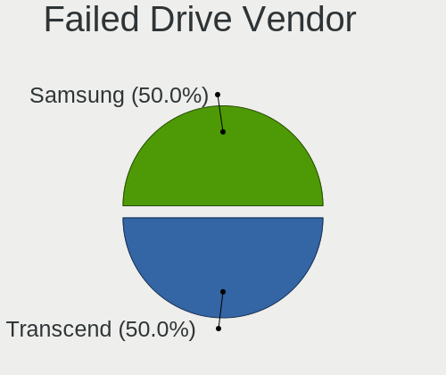

| Vendor              | Desktops | Drives | Percent |
|---------------------|----------|--------|---------|
| Samsung Electronics | 1        | 1      | 100%    |

Drive Status
------------

Number of failed and malfunc. drives

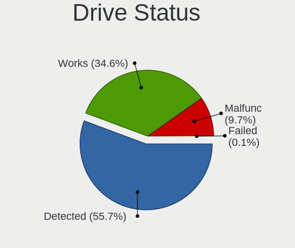

| Status   | Desktops | Drives | Percent |
|----------|----------|--------|---------|
| Detected | 559      | 1685   | 55.68%  |
| Works    | 347      | 910    | 34.56%  |
| Malfunc  | 97       | 149    | 9.66%   |
| Failed   | 1        | 1      | 0.1%    |

Storage controller
------------------

Storage Vendor
--------------

Storage controller vendors

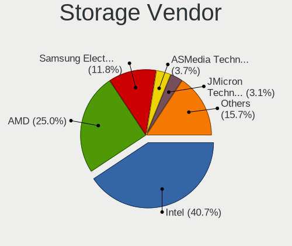

| Vendor                        | Desktops | Percent |
|-------------------------------|----------|---------|
| Intel                         | 530      | 39%     |
| AMD                           | 334      | 24.58%  |
| Samsung Electronics           | 178      | 13.1%   |
| Kingston Technology Company   | 56       | 4.12%   |
| ASMedia Technology            | 48       | 3.53%   |
| SanDisk                       | 39       | 2.87%   |
| JMicron Technology            | 38       | 2.8%    |
| Phison Electronics            | 37       | 2.72%   |
| Marvell Technology Group      | 28       | 2.06%   |
| Nvidia                        | 11       | 0.81%   |
| Micron/Crucial Technology     | 10       | 0.74%   |
| SK hynix                      | 7        | 0.52%   |
| Silicon Motion                | 7        | 0.52%   |
| Silicon Image                 | 6        | 0.44%   |
| VIA Technologies              | 5        | 0.37%   |
| ADATA Technology              | 5        | 0.37%   |
| Toshiba America Info Systems  | 3        | 0.22%   |
| LSI Logic / Symbios Logic     | 3        | 0.22%   |
| Seagate Technology            | 2        | 0.15%   |
| Realtek Semiconductor         | 2        | 0.15%   |
| KIOXIA                        | 2        | 0.15%   |
| Micron Technology             | 1        | 0.07%   |
| Lite-On Technology            | 1        | 0.07%   |
| Lenovo                        | 1        | 0.07%   |
| Integrated Technology Express | 1        | 0.07%   |
| HighPoint Technologies        | 1        | 0.07%   |
| Hewlett-Packard               | 1        | 0.07%   |
| Broadcom / LSI                | 1        | 0.07%   |
| Adaptec                       | 1        | 0.07%   |

Storage Model
-------------

Storage controller models

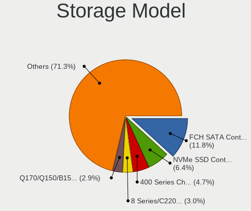

| Model                                                                                   | Desktops | Percent |
|-----------------------------------------------------------------------------------------|----------|---------|
| AMD FCH SATA Controller [AHCI mode]                                                     | 197      | 11.81%  |
| Samsung NVMe SSD Controller SM981/PM981/PM983                                           | 106      | 6.35%   |
| AMD 400 Series Chipset SATA Controller                                                  | 78       | 4.68%   |
| Intel 8 Series/C220 Series Chipset Family 6-port SATA Controller 1 [AHCI mode]          | 50       | 3%      |
| Intel Q170/Q150/B150/H170/H110/Z170/CM236 Chipset SATA Controller [AHCI Mode]           | 48       | 2.88%   |
| Intel 200 Series PCH SATA controller [AHCI mode]                                        | 47       | 2.82%   |
| ASMedia ASM1062 Serial ATA Controller                                                   | 47       | 2.82%   |
| AMD SB7x0/SB8x0/SB9x0 IDE Controller                                                    | 43       | 2.58%   |
| AMD 500 Series Chipset SATA Controller                                                  | 43       | 2.58%   |
| AMD SB7x0/SB8x0/SB9x0 SATA Controller [AHCI mode]                                       | 40       | 2.4%    |
| Samsung NVMe SSD Controller SM961/PM961/SM963                                           | 38       | 2.28%   |
| Intel Cannon Lake PCH SATA AHCI Controller                                              | 38       | 2.28%   |
| Intel 7 Series/C210 Series Chipset Family 6-port SATA Controller [AHCI mode]            | 36       | 2.16%   |
| Intel 6 Series/C200 Series Chipset Family 6 port Desktop SATA AHCI Controller           | 36       | 2.16%   |
| Intel SATA Controller [RAID mode]                                                       | 32       | 1.92%   |
| AMD SB7x0/SB8x0/SB9x0 SATA Controller [IDE mode]                                        | 30       | 1.8%    |
| Kingston Company A2000 NVMe SSD SM2263EN                                                | 28       | 1.68%   |
| Intel 9 Series Chipset Family SATA Controller [AHCI Mode]                               | 28       | 1.68%   |
| Samsung NVMe SSD Controller PM9A1/PM9A3/980PRO                                          | 27       | 1.62%   |
| Phison E12 NVMe Controller                                                              | 19       | 1.14%   |
| SanDisk Ultra 3D / WD Blue SN550 NVMe SSD                                               | 18       | 1.08%   |
| Intel SSD 660P Series                                                                   | 18       | 1.08%   |
| AMD 300 Series Chipset SATA Controller                                                  | 18       | 1.08%   |
| JMicron JMB363 SATA/IDE Controller                                                      | 17       | 1.02%   |
| Intel C610/X99 series chipset 6-Port SATA Controller [AHCI mode]                        | 17       | 1.02%   |
| Intel 6 Series/C200 Series Chipset Family Desktop SATA Controller (IDE mode, ports 4-5) | 17       | 1.02%   |
| Intel 6 Series/C200 Series Chipset Family Desktop SATA Controller (IDE mode, ports 0-3) | 17       | 1.02%   |
| Intel Alder Lake-S PCH SATA Controller [AHCI Mode]                                      | 16       | 0.96%   |
| Intel NM10/ICH7 Family SATA Controller [IDE mode]                                       | 13       | 0.78%   |
| Intel 82801JI (ICH10 Family) 4 port SATA IDE Controller #1                              | 13       | 0.78%   |
| Intel 82801JI (ICH10 Family) 2 port SATA IDE Controller #2                              | 13       | 0.78%   |
| Intel 82801G (ICH7 Family) IDE Controller                                               | 13       | 0.78%   |
| Intel C610/X99 series chipset sSATA Controller [AHCI mode]                              | 12       | 0.72%   |
| Intel 500 Series Chipset Family SATA AHCI Controller                                    | 12       | 0.72%   |
| Phison E16 PCIe4 NVMe Controller                                                        | 11       | 0.66%   |
| Intel Volume Management Device NVMe RAID Controller                                     | 11       | 0.66%   |
| Marvell Group 88SE9172 SATA 6Gb/s Controller                                            | 10       | 0.6%    |
| JMicron JMB362 SATA Controller                                                          | 10       | 0.6%    |
| Intel 4 Series Chipset PT IDER Controller                                               | 10       | 0.6%    |
| AMD X370 Series Chipset SATA Controller                                                 | 10       | 0.6%    |

Storage Kind
------------

Kind of storage controller (IDE, SATA, NVMe, SAS, ...)

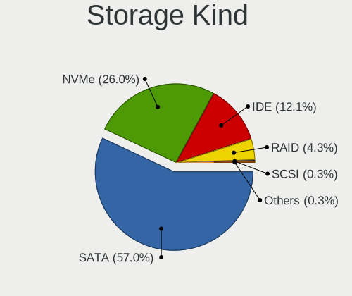

| Kind | Desktops | Percent |
|------|----------|---------|
| SATA | 748      | 57.01%  |
| NVMe | 337      | 25.69%  |
| IDE  | 161      | 12.27%  |
| RAID | 58       | 4.42%   |
| SAS  | 4        | 0.3%    |
| SCSI | 4        | 0.3%    |

Processor
---------

CPU Vendor
----------

Processor vendors

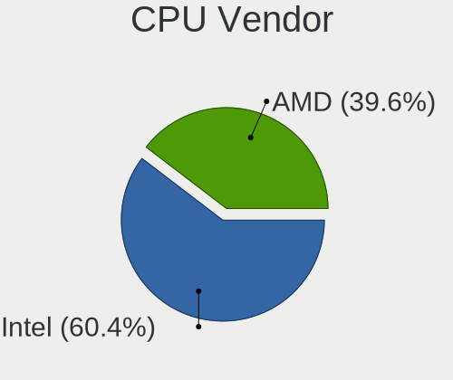

| Vendor | Desktops | Percent |
|--------|----------|---------|
| Intel  | 520      | 59.98%  |
| AMD    | 347      | 40.02%  |

CPU Model
---------

Processor models

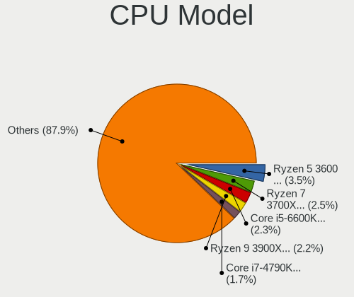

| Model                                       | Desktops | Percent |
|---------------------------------------------|----------|---------|
| AMD Ryzen 7 3700X 8-Core Processor          | 27       | 3.1%    |
| AMD Ryzen 5 3600 6-Core Processor           | 24       | 2.75%   |
| AMD Ryzen 9 3900X 12-Core Processor         | 20       | 2.29%   |
| Intel Core i5-6600K CPU @ 3.50GHz           | 18       | 2.06%   |
| AMD Ryzen 5 5600X 6-Core Processor          | 15       | 1.72%   |
| Intel Core i7-6700K CPU @ 4.00GHz           | 11       | 1.26%   |
| Intel Core i7-4790K CPU @ 4.00GHz           | 11       | 1.26%   |
| Intel Core i5-4690K CPU @ 3.50GHz           | 11       | 1.26%   |
| Intel Core i5-2500K CPU @ 3.30GHz           | 11       | 1.26%   |
| AMD Ryzen 5 3400G with Radeon Vega Graphics | 11       | 1.26%   |
| AMD Ryzen 5 2600 Six-Core Processor         | 11       | 1.26%   |
| Intel Core i7-3770 CPU @ 3.40GHz            | 9        | 1.03%   |
| Intel Core i7-2600 CPU @ 3.40GHz            | 9        | 1.03%   |
| AMD Ryzen 7 2700X Eight-Core Processor      | 9        | 1.03%   |
| Intel Core i7-9700K CPU @ 3.60GHz           | 8        | 0.92%   |
| Intel Core i7-8700K CPU @ 3.70GHz           | 8        | 0.92%   |
| Intel Core i7-3770K CPU @ 3.50GHz           | 8        | 0.92%   |
| Intel Core i5-3570K CPU @ 3.40GHz           | 8        | 0.92%   |
| Intel Core i5-3470 CPU @ 3.20GHz            | 8        | 0.92%   |
| Intel Core i5-2400 CPU @ 3.10GHz            | 8        | 0.92%   |
| AMD Ryzen 9 5900X 12-Core Processor         | 8        | 0.92%   |
| AMD Ryzen 7 5800X 8-Core Processor          | 8        | 0.92%   |
| AMD FX-6300 Six-Core Processor              | 8        | 0.92%   |
| Intel Core i9-9900K CPU @ 3.60GHz           | 7        | 0.8%    |
| Intel Core i7-5820K CPU @ 3.30GHz           | 7        | 0.8%    |
| Intel Core i7-4770 CPU @ 3.40GHz            | 7        | 0.8%    |
| Intel Core i5-7400 CPU @ 3.00GHz            | 7        | 0.8%    |
| Intel Core i5-4460 CPU @ 3.20GHz            | 7        | 0.8%    |
| Intel Core 2 Quad CPU Q9550 @ 2.83GHz       | 7        | 0.8%    |
| Intel Core 2 Duo CPU E8400 @ 3.00GHz        | 7        | 0.8%    |
| AMD Ryzen 9 5950X 16-Core Processor         | 7        | 0.8%    |
| AMD Ryzen 5 5600G with Radeon Graphics      | 7        | 0.8%    |
| AMD Ryzen 5 3600X 6-Core Processor          | 7        | 0.8%    |
| AMD Ryzen 5 1600 Six-Core Processor         | 7        | 0.8%    |
| AMD FX-8350 Eight-Core Processor            | 7        | 0.8%    |
| Intel Core i7-7700K CPU @ 4.20GHz           | 6        | 0.69%   |
| Intel Core i7-4770K CPU @ 3.50GHz           | 6        | 0.69%   |
| Intel Core i5-4570 CPU @ 3.20GHz            | 6        | 0.69%   |
| Intel Core i5-2320 CPU @ 3.00GHz            | 6        | 0.69%   |
| Intel Core i5-10400F CPU @ 2.90GHz          | 6        | 0.69%   |

CPU Model Family
----------------

Processor model prefix

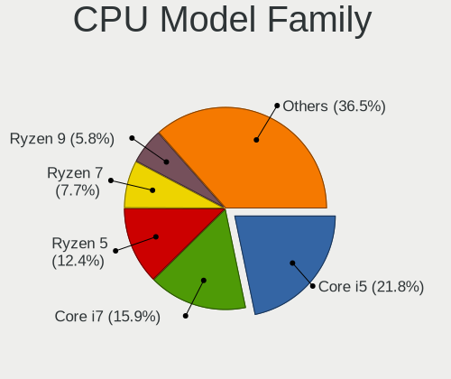

| Model                   | Desktops | Percent |
|-------------------------|----------|---------|
| Intel Core i5           | 190      | 21.86%  |
| Intel Core i7           | 140      | 16.11%  |
| AMD Ryzen 5             | 107      | 12.31%  |
| AMD Ryzen 7             | 64       | 7.36%   |
| AMD Ryzen 9             | 47       | 5.41%   |
| Intel Xeon              | 36       | 4.14%   |
| AMD FX                  | 34       | 3.91%   |
| Other                   | 31       | 3.57%   |
| Intel Core i3           | 21       | 2.42%   |
| Intel Celeron           | 21       | 2.42%   |
| Intel Pentium           | 17       | 1.96%   |
| Intel Core 2 Quad       | 17       | 1.96%   |
| Intel Core 2 Duo        | 16       | 1.84%   |
| AMD Ryzen Threadripper  | 11       | 1.27%   |
| Intel Core i9           | 10       | 1.15%   |
| AMD Phenom II X4        | 10       | 1.15%   |
| Intel Pentium Dual-Core | 8        | 0.92%   |
| AMD Ryzen 3             | 8        | 0.92%   |
| Intel Atom              | 7        | 0.81%   |
| AMD Phenom II X6        | 7        | 0.81%   |
| AMD Athlon II X2        | 6        | 0.69%   |
| AMD A8                  | 6        | 0.69%   |
| Intel Core 2            | 5        | 0.58%   |
| AMD Ryzen Embedded      | 5        | 0.58%   |
| AMD Athlon 64 X2        | 5        | 0.58%   |
| AMD E                   | 3        | 0.35%   |
| AMD Athlon II X4        | 3        | 0.35%   |
| AMD Athlon II X3        | 3        | 0.35%   |
| AMD A4                  | 3        | 0.35%   |
| AMD A10                 | 3        | 0.35%   |
| Intel Pentium Dual      | 2        | 0.23%   |
| AMD Phenom II X3        | 2        | 0.23%   |
| AMD Phenom              | 2        | 0.23%   |
| AMD E1                  | 2        | 0.23%   |
| AMD Athlon 64           | 2        | 0.23%   |
| AMD A6                  | 2        | 0.23%   |
| Intel Pentium Silver    | 1        | 0.12%   |
| Intel Pentium Gold      | 1        | 0.12%   |
| Intel Pentium 4         | 1        | 0.12%   |
| AMD Ryzen 7 PRO         | 1        | 0.12%   |

CPU Cores
---------

Number of processor cores

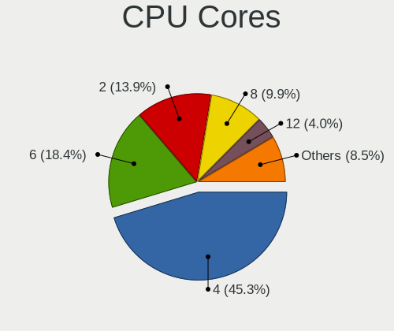

| Number  | Desktops | Percent |
|---------|----------|---------|
| 4       | 368      | 42.2%   |
| 6       | 175      | 20.07%  |
| 2       | 113      | 12.96%  |
| 8       | 98       | 11.24%  |
| 12      | 41       | 4.7%    |
| 16      | 30       | 3.44%   |
| 3       | 19       | 2.18%   |
| 1       | 13       | 1.49%   |
| 10      | 5        | 0.57%   |
| 32      | 2        | 0.23%   |
| 18      | 2        | 0.23%   |
| 64      | 1        | 0.11%   |
| 28      | 1        | 0.11%   |
| 24      | 1        | 0.11%   |
| 20      | 1        | 0.11%   |
| 14      | 1        | 0.11%   |
| Unknown | 1        | 0.11%   |

CPU Sockets
-----------

Number of sockets

| Number | Desktops | Percent |
|--------|----------|---------|
| 1      | 853      | 98.39%  |
| 2      | 14       | 1.61%   |

CPU Threads
-----------

Threads per core (Hyper-Threading)

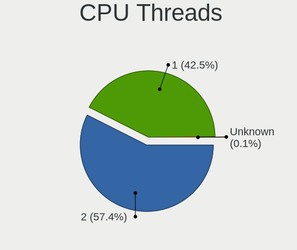

| Number  | Desktops | Percent |
|---------|----------|---------|
| 2       | 502      | 57.77%  |
| 1       | 366      | 42.12%  |
| Unknown | 1        | 0.12%   |

CPU Op-Modes
------------

CPU Operation Modes (32-bit, 64-bit)

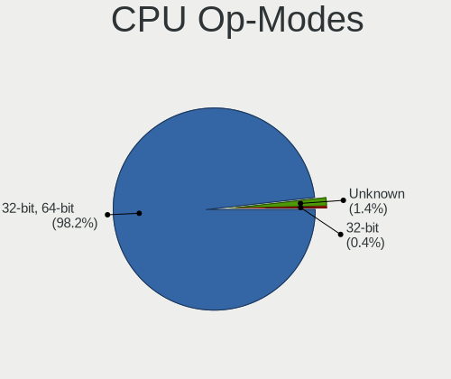

| Op mode        | Desktops | Percent |
|----------------|----------|---------|
| 32-bit, 64-bit | 853      | 98.27%  |
| Unknown        | 12       | 1.38%   |
| 32-bit         | 3        | 0.35%   |

CPU Microcode
-------------

Microcode number

| Number     | Desktops | Percent |
|------------|----------|---------|
| Unknown    | 266      | 29.1%   |
| 0x306c3    | 61       | 6.67%   |
| 0x206a7    | 42       | 4.6%    |
| 0x08701021 | 41       | 4.49%   |
| 0x506e3    | 34       | 3.72%   |
| 0x306a9    | 30       | 3.28%   |
| 0x906ea    | 25       | 2.74%   |
| 0x1067a    | 24       | 2.63%   |
| 0x0800820d | 21       | 2.3%    |
| 0x906e9    | 20       | 2.19%   |
| 0x08701013 | 20       | 2.19%   |
| 0x06000852 | 15       | 1.64%   |
| 0x306f2    | 14       | 1.53%   |
| 0x0a201009 | 14       | 1.53%   |
| 0x08108109 | 13       | 1.42%   |
| 0x010000c8 | 13       | 1.42%   |
| 0x08001138 | 12       | 1.31%   |
| 0x906ed    | 10       | 1.09%   |
| 0x90672    | 9        | 0.98%   |
| 0x106e5    | 8        | 0.88%   |
| 0x0a601203 | 8        | 0.88%   |
| 0x0600063e | 8        | 0.88%   |
| 0xa0655    | 7        | 0.77%   |
| 0x906ec    | 7        | 0.77%   |
| 0x0a201016 | 7        | 0.77%   |
| 0x010000dc | 7        | 0.77%   |
| 0x406f1    | 6        | 0.66%   |
| 0x0810100b | 6        | 0.66%   |
| 0x08001137 | 6        | 0.66%   |
| 0x06001119 | 6        | 0.66%   |
| 0xa0671    | 5        | 0.55%   |
| 0x206d7    | 5        | 0.55%   |
| 0x106a5    | 5        | 0.55%   |
| 0x10676    | 5        | 0.55%   |
| 0x0a50000d | 5        | 0.55%   |
| 0x0a20120a | 5        | 0.55%   |
| 0x03000027 | 5        | 0.55%   |
| 0x6f6      | 4        | 0.44%   |
| 0x0a50000c | 4        | 0.44%   |
| 0x08001129 | 4        | 0.44%   |

CPU Microarch
-------------

Microarchitecture

| Name             | Desktops | Percent |
|------------------|----------|---------|
| Haswell          | 102      | 11.71%  |
| KabyLake         | 95       | 10.91%  |
| Zen 2            | 89       | 10.22%  |
| SandyBridge      | 62       | 7.12%   |
| Skylake          | 55       | 6.31%   |
| Zen 3            | 53       | 6.08%   |
| Zen+             | 50       | 5.74%   |
| IvyBridge        | 48       | 5.51%   |
| Zen              | 41       | 4.71%   |
| Penryn           | 37       | 4.25%   |
| K10              | 36       | 4.13%   |
| Piledriver       | 30       | 3.44%   |
| Unknown          | 24       | 2.76%   |
| Core             | 17       | 1.95%   |
| Nehalem          | 16       | 1.84%   |
| CometLake        | 15       | 1.72%   |
| Alderlake Hybrid | 14       | 1.61%   |
| Westmere         | 10       | 1.15%   |
| Bulldozer        | 10       | 1.15%   |
| Silvermont       | 9        | 1.03%   |
| Broadwell        | 8        | 0.92%   |
| K8 Hammer        | 7        | 0.8%    |
| K10 Llano        | 6        | 0.69%   |
| Goldmont plus    | 6        | 0.69%   |
| Icelake          | 5        | 0.57%   |
| Bobcat           | 5        | 0.57%   |
| Goldmont         | 4        | 0.46%   |
| Steamroller      | 3        | 0.34%   |
| NetBurst         | 3        | 0.34%   |
| Excavator        | 3        | 0.34%   |
| Bonnell          | 3        | 0.34%   |
| Tremont          | 1        | 0.11%   |
| Puma             | 1        | 0.11%   |
| K6               | 1        | 0.11%   |
| Jaguar           | 1        | 0.11%   |
| Geode            | 1        | 0.11%   |

Graphics
--------

GPU Vendor
----------

Vendors of graphics cards

| Vendor                     | Desktops | Percent |
|----------------------------|----------|---------|
| Nvidia                     | 452      | 48.24%  |
| AMD                        | 289      | 30.84%  |
| Intel                      | 189      | 20.17%  |
| ASPEED Technology          | 6        | 0.64%   |
| Matrox Electronics Systems | 1        | 0.11%   |

GPU Model
---------

Graphics card models

| Model                                                                       | Desktops | Percent |
|-----------------------------------------------------------------------------|----------|---------|
| AMD Ellesmere [Radeon RX 470/480/570/570X/580/580X/590]                     | 47       | 4.83%   |
| Intel Xeon E3-1200 v3/4th Gen Core Processor Integrated Graphics Controller | 36       | 3.7%    |
| Nvidia GP106 [GeForce GTX 1060 6GB]                                         | 25       | 2.57%   |
| Intel 2nd Generation Core Processor Family Integrated Graphics Controller   | 25       | 2.57%   |
| AMD Navi 10 [Radeon RX 5600 OEM/5600 XT / 5700/5700 XT]                     | 24       | 2.46%   |
| Nvidia GM206 [GeForce GTX 960]                                              | 20       | 2.05%   |
| Nvidia GM204 [GeForce GTX 970]                                              | 20       | 2.05%   |
| Nvidia GP106 [GeForce GTX 1060 3GB]                                         | 17       | 1.75%   |
| Nvidia GP104 [GeForce GTX 1080]                                             | 17       | 1.75%   |
| Nvidia GP104 [GeForce GTX 1070]                                             | 17       | 1.75%   |
| Intel CoffeeLake-S GT2 [UHD Graphics 630]                                   | 17       | 1.75%   |
| Nvidia GK208B [GeForce GT 710]                                              | 16       | 1.64%   |
| AMD Navi 21 [Radeon RX 6800/6800 XT / 6900 XT]                              | 16       | 1.64%   |
| Nvidia GP107 [GeForce GTX 1050 Ti]                                          | 14       | 1.44%   |
| Intel HD Graphics 530                                                       | 14       | 1.44%   |
| AMD Vega 10 XL/XT [Radeon RX Vega 56/64]                                    | 13       | 1.33%   |
| Nvidia TU106 [GeForce RTX 2060 Rev. A]                                      | 11       | 1.13%   |
| AMD Picasso/Raven 2 [Radeon Vega Series / Radeon Vega Mobile Series]        | 11       | 1.13%   |
| Nvidia TU104 [GeForce RTX 2070 SUPER]                                       | 10       | 1.03%   |
| Nvidia GP102 [GeForce GTX 1080 Ti]                                          | 10       | 1.03%   |
| Intel Xeon E3-1200 v2/3rd Gen Core processor Graphics Controller            | 10       | 1.03%   |
| Intel IvyBridge GT2 [HD Graphics 4000]                                      | 10       | 1.03%   |
| Intel 4 Series Chipset Integrated Graphics Controller                       | 10       | 1.03%   |
| AMD Raven Ridge [Radeon Vega Series / Radeon Vega Mobile Series]            | 10       | 1.03%   |
| Nvidia GK104 [GeForce GTX 760]                                              | 9        | 0.92%   |
| AMD Raphael                                                                 | 9        | 0.92%   |
| Nvidia GP108 [GeForce GT 1030]                                              | 8        | 0.82%   |
| Intel HD Graphics 630                                                       | 8        | 0.82%   |
| AMD Cezanne [Radeon Vega Series / Radeon Vega Mobile Series]                | 8        | 0.82%   |
| AMD Cape Verde XT [Radeon HD 7770/8760 / R7 250X]                           | 8        | 0.82%   |
| Nvidia TU116 [GeForce GTX 1660 SUPER]                                       | 7        | 0.72%   |
| Nvidia TU106 [GeForce RTX 2070]                                             | 7        | 0.72%   |
| Nvidia GK104 [GeForce GTX 670]                                              | 7        | 0.72%   |
| Nvidia GA102 [GeForce RTX 3080]                                             | 7        | 0.72%   |
| Intel AlderLake-S GT1                                                       | 7        | 0.72%   |
| AMD Lexa PRO [Radeon 540/540X/550/550X / RX 540X/550/550X]                  | 7        | 0.72%   |
| AMD Curacao XT / Trinidad XT [Radeon R7 370 / R9 270X/370X]                 | 7        | 0.72%   |
| Nvidia TU116 [GeForce GTX 1660 Ti]                                          | 6        | 0.62%   |
| Nvidia TU106 [GeForce RTX 2060 SUPER]                                       | 6        | 0.62%   |
| Nvidia GT218 [GeForce 210]                                                  | 6        | 0.62%   |

GPU Combo
---------

Combinations of graphics cards

| Name                     | Desktops | Percent |
|--------------------------|----------|---------|
| 1 x Nvidia               | 423      | 48.01%  |
| 1 x AMD                  | 255      | 28.94%  |
| 1 x Intel                | 143      | 16.23%  |
| 2 x AMD                  | 19       | 2.16%   |
| Intel + Nvidia           | 11       | 1.25%   |
| AMD + Nvidia             | 9        | 1.02%   |
| 1 x ASPEED               | 6        | 0.68%   |
| 2 x Nvidia               | 5        | 0.57%   |
| Intel + AMD              | 5        | 0.57%   |
| Intel + 2 x Nvidia       | 2        | 0.23%   |
| Intel + AMD + 1 x Nvidia | 2        | 0.23%   |
| 1 x Matrox               | 1        | 0.11%   |

GPU Driver
----------

Free vs proprietary

| Driver      | Desktops | Percent |
|-------------|----------|---------|
| Free        | 547      | 61.6%   |
| Proprietary | 296      | 33.33%  |
| Unknown     | 45       | 5.07%   |

GPU Memory
----------

Total video memory

| Size in GB | Desktops | Percent |
|------------|----------|---------|
| Unknown    | 326      | 35.78%  |
| 7.01-8.0   | 122      | 13.39%  |
| 1.01-2.0   | 115      | 12.62%  |
| 3.01-4.0   | 78       | 8.56%   |
| 0.51-1.0   | 77       | 8.45%   |
| 0.01-0.5   | 70       | 7.68%   |
| 5.01-6.0   | 50       | 5.49%   |
| 8.01-16.0  | 45       | 4.94%   |
| 2.01-3.0   | 20       | 2.2%    |
| 16.01-24.0 | 8        | 0.88%   |

Monitor
-------

Monitor Vendor
--------------

Monitor vendors

| Vendor               | Desktops | Percent |
|----------------------|----------|---------|
| Samsung Electronics  | 137      | 13.65%  |
| BenQ                 | 113      | 11.25%  |
| Dell                 | 96       | 9.56%   |
| Ancor Communications | 84       | 8.37%   |
| Philips              | 77       | 7.67%   |
| AOC                  | 77       | 7.67%   |
| Acer                 | 76       | 7.57%   |
| Hewlett-Packard      | 73       | 7.27%   |
| Goldstar             | 48       | 4.78%   |
| ASUSTek Computer     | 23       | 2.29%   |
| MSI                  | 22       | 2.19%   |
| Eizo                 | 19       | 1.89%   |
| Lenovo               | 16       | 1.59%   |
| Unknown              | 11       | 1.1%    |
| Sony                 | 10       | 1%      |
| LG Electronics       | 10       | 1%      |
| Vestel Elektronik    | 9        | 0.9%    |
| Fujitsu Siemens      | 9        | 0.9%    |
| ViewSonic            | 8        | 0.8%    |
| Gigabyte Technology  | 7        | 0.7%    |
| Panasonic            | 6        | 0.6%    |
| Microstep            | 5        | 0.5%    |
| Iiyama               | 4        | 0.4%    |
| AUS                  | 4        | 0.4%    |
| VOXICON              | 3        | 0.3%    |
| Vestel               | 3        | 0.3%    |
| Positivo             | 3        | 0.3%    |
| Packard Bell         | 3        | 0.3%    |
| Onkyo                | 3        | 0.3%    |
| OEM                  | 3        | 0.3%    |
| IEI                  | 3        | 0.3%    |
| Unknown              | 3        | 0.3%    |
| Toshiba              | 2        | 0.2%    |
| Mi                   | 2        | 0.2%    |
| HUAWEI               | 2        | 0.2%    |
| Belinea              | 2        | 0.2%    |
| ___                  | 1        | 0.1%    |
| Xiaomi               | 1        | 0.1%    |
| Wacom Tech           | 1        | 0.1%    |
| Wacom                | 1        | 0.1%    |

Monitor Model
-------------

Monitor models

| Model                                                                 | Desktops | Percent |
|-----------------------------------------------------------------------|----------|---------|
| Vestel Elektronik 42 FHD_LCD-TV VES3700 1920x540                      | 9        | 0.83%   |
| BenQ G2420HDBL BNQ785F 1920x1080 477x268mm 21.5-inch                  | 8        | 0.74%   |
| AOC G2460 AOC2460 1920x1080 531x299mm 24.0-inch                       | 8        | 0.74%   |
| AOC 24B2W1G5 AOC2402 1920x1080 527x296mm 23.8-inch                    | 7        | 0.65%   |
| Ancor Communications ASUS PB278 ACI27A3 2560x1440 597x336mm 27.0-inch | 7        | 0.65%   |
| Samsung Electronics S24F350 SAM0D20 1920x1080 521x293mm 23.5-inch     | 6        | 0.55%   |
| BenQ GL2450H BNQ78A7 1920x1080 531x298mm 24.0-inch                    | 6        | 0.55%   |
| AOC Q32G1WG4 AOC3201 2560x1440 697x393mm 31.5-inch                    | 6        | 0.55%   |
| AOC Q27P2W AOC2702 2560x1440 597x336mm 27.0-inch                      | 6        | 0.55%   |
| Ancor Communications VE247 ACI2493 1920x1080 531x299mm 24.0-inch      | 6        | 0.55%   |
| Ancor Communications ROG PG279Q ACI27EC 2560x1440 598x336mm 27.0-inch | 6        | 0.55%   |
| Dell U2412M DELA07A 1920x1200 518x324mm 24.1-inch                     | 5        | 0.46%   |
| BenQ GL2450 BNQ78A5 1920x1080 531x298mm 24.0-inch                     | 5        | 0.46%   |
| Ancor Communications VG248 ACI24E1 1920x1080 531x299mm 24.0-inch      | 5        | 0.46%   |
| Ancor Communications VG248 ACI24A4 1920x1080 531x299mm 24.0-inch      | 5        | 0.46%   |
| Ancor Communications ASUS VS228 ACI22FD 1920x1080 476x268mm 21.5-inch | 5        | 0.46%   |
| Philips PHL 436M6VBP PHLC179 3840x2160 940x530mm 42.5-inch            | 4        | 0.37%   |
| Philips PHL 243V7 PHLC155 1920x1080 530x300mm 24.0-inch               | 4        | 0.37%   |
| Philips FTV PHL01EA 1920x1080 640x360mm 28.9-inch                     | 4        | 0.37%   |
| Philips 273ELH PHLC07D 1920x1080 598x336mm 27.0-inch                  | 4        | 0.37%   |
| MSI MAG342CQRV MSI3DB6 3440x1440 797x333mm 34.0-inch                  | 4        | 0.37%   |
| Hewlett-Packard LA2205 HWP2848 1680x1050 473x296mm 22.0-inch          | 4        | 0.37%   |
| Hewlett-Packard E241i HWP3122 1920x1200 518x324mm 24.1-inch           | 4        | 0.37%   |
| Dell U2312HM DEL4072 1920x1080 510x287mm 23.0-inch                    | 4        | 0.37%   |
| Dell 1907FP DEL4015 1280x1024 376x301mm 19.0-inch                     | 4        | 0.37%   |
| BenQ XL2411Z BNQ7F31 1920x1080 531x298mm 24.0-inch                    | 4        | 0.37%   |
| BenQ G2420HDB BNQ7842 1920x1080 477x268mm 21.5-inch                   | 4        | 0.37%   |
| BenQ G2420HD BNQ7840 1920x1080 531x299mm 24.0-inch                    | 4        | 0.37%   |
| BenQ BenQG2222HDL BNQ785A 1920x1080 478x269mm 21.6-inch               | 4        | 0.37%   |
| ASUSTek Computer VZ239 AUS23CC 1920x1080 509x286mm 23.0-inch          | 4        | 0.37%   |
| ASUSTek Computer VG27A AUS2722 2560x1440 597x336mm 27.0-inch          | 4        | 0.37%   |
| Ancor Communications VX238 ACI23C1 1920x1080 510x290mm 23.1-inch      | 4        | 0.37%   |
| Ancor Communications VE228 ACI22FA 1920x1080 477x268mm 21.5-inch      | 4        | 0.37%   |
| Acer X34 P ACR054F 3440x1440 798x335mm 34.1-inch                      | 4        | 0.37%   |
| Sony TV SNY0801 1360x768                                              | 3        | 0.28%   |
| Samsung Electronics S34J55x SAM0F70 3440x1440 797x333mm 34.0-inch     | 3        | 0.28%   |
| Samsung Electronics S27D850 SAM0BC9 2560x1440 598x336mm 27.0-inch     | 3        | 0.28%   |
| Samsung Electronics S24R35x SAM100E 1920x1080 527x296mm 23.8-inch     | 3        | 0.28%   |
| Samsung Electronics LCD Monitor SAM0A7A 1920x1080 410x230mm 18.5-inch | 3        | 0.28%   |
| Philips PHL BDM4065 PHL08E1 3840x2160 878x485mm 39.5-inch             | 3        | 0.28%   |

Monitor Resolution
------------------

Monitor screen resolution

| Resolution         | Desktops | Percent |
|--------------------|----------|---------|
| 1920x1080 (FHD)    | 415      | 42.92%  |
| 2560x1440 (QHD)    | 127      | 13.13%  |
| 3840x2160 (4K)     | 107      | 11.07%  |
| 1680x1050 (WSXGA+) | 60       | 6.2%    |
| 3440x1440          | 44       | 4.55%   |
| 1280x1024 (SXGA)   | 40       | 4.14%   |
| 1920x1200 (WUXGA)  | 38       | 3.93%   |
| Unknown            | 35       | 3.62%   |
| 3840x1080          | 16       | 1.65%   |
| 1440x900 (WXGA+)   | 10       | 1.03%   |
| 1280x720 (HD)      | 8        | 0.83%   |
| 1360x768           | 7        | 0.72%   |
| 1920x540           | 6        | 0.62%   |
| 1024x768 (XGA)     | 6        | 0.62%   |
| 2560x1080          | 5        | 0.52%   |
| 1600x900 (HD+)     | 5        | 0.52%   |
| 1366x768 (WXGA)    | 4        | 0.41%   |
| 6400x2160          | 3        | 0.31%   |
| 5760x2160          | 3        | 0.31%   |
| 5760x1080          | 3        | 0.31%   |
| 3840x1600          | 3        | 0.31%   |
| 2560x1600          | 3        | 0.31%   |
| 3840x1200          | 2        | 0.21%   |
| 3200x1200          | 2        | 0.21%   |
| 1280x768           | 2        | 0.21%   |
| 7280x2160          | 1        | 0.1%    |
| 5520x2160          | 1        | 0.1%    |
| 5360x1440          | 1        | 0.1%    |
| 4920x1920          | 1        | 0.1%    |
| 4864x1080          | 1        | 0.1%    |
| 4480x1440          | 1        | 0.1%    |
| 4240x1440          | 1        | 0.1%    |
| 3600x1080          | 1        | 0.1%    |
| 3360x1080          | 1        | 0.1%    |
| 3120x1050          | 1        | 0.1%    |
| 2288x1287          | 1        | 0.1%    |
| 2160x1200          | 1        | 0.1%    |
| 1600x1200          | 1        | 0.1%    |

Monitor Diagonal
----------------

Diagonal size in inches

| Inches  | Desktops | Percent |
|---------|----------|---------|
| 24      | 200      | 20.41%  |
| 27      | 181      | 18.47%  |
| Unknown | 120      | 12.24%  |
| 23      | 111      | 11.33%  |
| 21      | 53       | 5.41%   |
| 22      | 46       | 4.69%   |
| 19      | 42       | 4.29%   |
| 34      | 41       | 4.18%   |
| 31      | 40       | 4.08%   |
| 84      | 23       | 2.35%   |
| 72      | 11       | 1.12%   |
| 32      | 11       | 1.12%   |
| 40      | 10       | 1.02%   |
| 20      | 10       | 1.02%   |
| 25      | 9        | 0.92%   |
| 17      | 8        | 0.82%   |
| 42      | 7        | 0.71%   |
| 65      | 6        | 0.61%   |
| 15      | 6        | 0.61%   |
| 54      | 5        | 0.51%   |
| 48      | 5        | 0.51%   |
| 35      | 5        | 0.51%   |
| 49      | 4        | 0.41%   |
| 39      | 4        | 0.41%   |
| 50      | 3        | 0.31%   |
| 37      | 3        | 0.31%   |
| 55      | 2        | 0.2%    |
| 46      | 2        | 0.2%    |
| 29      | 2        | 0.2%    |
| 52      | 1        | 0.1%    |
| 43      | 1        | 0.1%    |
| 41      | 1        | 0.1%    |
| 36      | 1        | 0.1%    |
| 33      | 1        | 0.1%    |
| 30      | 1        | 0.1%    |
| 28      | 1        | 0.1%    |
| 18      | 1        | 0.1%    |
| 13      | 1        | 0.1%    |
| 11      | 1        | 0.1%    |

Monitor Width
-------------

Physical width

| Width in mm | Desktops | Percent |
|-------------|----------|---------|
| 501-600     | 443      | 47.18%  |
| 401-500     | 120      | 12.78%  |
| Unknown     | 120      | 12.78%  |
| 601-700     | 61       | 6.5%    |
| 701-800     | 53       | 5.64%   |
| 1501-2000   | 34       | 3.62%   |
| 351-400     | 33       | 3.51%   |
| 1001-1500   | 28       | 2.98%   |
| 801-900     | 21       | 2.24%   |
| 301-350     | 15       | 1.6%    |
| 901-1000    | 10       | 1.06%   |
| 201-300     | 1        | 0.11%   |

Aspect Ratio
------------

Proportional relationship between the width and the height

| Ratio   | Desktops | Percent |
|---------|----------|---------|
| 16/9    | 548      | 61.64%  |
| 16/10   | 123      | 13.84%  |
| Unknown | 111      | 12.49%  |
| 21/9    | 49       | 5.51%   |
| 5/4     | 42       | 4.72%   |
| 4/3     | 6        | 0.67%   |
| 32/9    | 5        | 0.56%   |
| 3/2     | 4        | 0.45%   |
| 6/5     | 1        | 0.11%   |

Monitor Area
------------

Area in inch²

| Area in inch² | Desktops | Percent |
|----------------|----------|---------|
| 201-250        | 311      | 33.01%  |
| 301-350        | 181      | 19.21%  |
| Unknown        | 120      | 12.74%  |
| 351-500        | 98       | 10.4%   |
| 251-300        | 70       | 7.43%   |
| 151-200        | 57       | 6.05%   |
| More than 1000 | 54       | 5.73%   |
| 501-1000       | 34       | 3.61%   |
| 141-150        | 9        | 0.96%   |
| 101-110        | 6        | 0.64%   |
| 81-90          | 1        | 0.11%   |
| 51-60          | 1        | 0.11%   |

Pixel Density
-------------

Pixels per inch

| Density | Desktops | Percent |
|---------|----------|---------|
| 51-100  | 517      | 58.09%  |
| 101-120 | 170      | 19.1%   |
| Unknown | 120      | 13.48%  |
| 1-50    | 33       | 3.71%   |
| 121-160 | 30       | 3.37%   |
| 161-240 | 20       | 2.25%   |

Multiple Monitors
-----------------

Total monitors connected

| Total | Desktops | Percent |
|-------|----------|---------|
| 1     | 616      | 68.6%   |
| 2     | 195      | 21.71%  |
| 0     | 59       | 6.57%   |
| 3     | 22       | 2.45%   |
| 4     | 6        | 0.67%   |

Network
-------

Net Controller Vendor
---------------------

Controller vendors

| Vendor                                 | Desktops | Percent |
|----------------------------------------|----------|---------|
| Intel                                  | 450      | 37.97%  |
| Realtek Semiconductor                  | 447      | 37.72%  |
| Qualcomm Atheros                       | 76       | 6.41%   |
| Broadcom                               | 47       | 3.97%   |
| D-Link System                          | 13       | 1.1%    |
| MediaTek                               | 12       | 1.01%   |
| Marvell Technology Group               | 11       | 0.93%   |
| Ralink Technology                      | 10       | 0.84%   |
| TP-Link                                | 9        | 0.76%   |
| Ralink                                 | 9        | 0.76%   |
| NetGear                                | 9        | 0.76%   |
| Microsoft                              | 9        | 0.76%   |
| ASUSTek Computer                       | 9        | 0.76%   |
| Nvidia                                 | 8        | 0.68%   |
| D-Link                                 | 8        | 0.68%   |
| Aquantia                               | 7        | 0.59%   |
| DisplayLink                            | 4        | 0.34%   |
| Broadcom Limited                       | 4        | 0.34%   |
| Qualcomm Atheros Communications        | 3        | 0.25%   |
| Mellanox Technologies                  | 3        | 0.25%   |
| Huawei Technologies                    | 3        | 0.25%   |
| ASIX Electronics                       | 3        | 0.25%   |
| ZTE WCDMA Technologies MSM             | 2        | 0.17%   |
| Samsung Electronics                    | 2        | 0.17%   |
| Belkin Components                      | 2        | 0.17%   |
| Arduino SA                             | 2        | 0.17%   |
| Xiaomi                                 | 1        | 0.08%   |
| Wilocity                               | 1        | 0.08%   |
| Wacom                                  | 1        | 0.08%   |
| VIA Technologies                       | 1        | 0.08%   |
| Unknown                                | 1        | 0.08%   |
| U-Blox                                 | 1        | 0.08%   |
| Sundance Technology Inc / IC Plus      | 1        | 0.08%   |
| STMicroelectronics                     | 1        | 0.08%   |
| Sony Ericsson Mobile Communications AB | 1        | 0.08%   |
| Sitecom Europe                         | 1        | 0.08%   |
| Qualcomm                               | 1        | 0.08%   |
| OnePlus Technology (Shenzhen)          | 1        | 0.08%   |
| Motorola PCS                           | 1        | 0.08%   |
| Micro Star International               | 1        | 0.08%   |

Net Controller Model
--------------------

Controller models

| Model                                                             | Desktops | Percent |
|-------------------------------------------------------------------|----------|---------|
| Realtek RTL8111/8168/8411 PCI Express Gigabit Ethernet Controller | 364      | 27.16%  |
| Intel I211 Gigabit Network Connection                             | 108      | 8.06%   |
| Intel Ethernet Connection (2) I219-V                              | 53       | 3.96%   |
| Realtek RTL8125 2.5GbE Controller                                 | 49       | 3.66%   |
| Intel Wi-Fi 6 AX200                                               | 43       | 3.21%   |
| Intel Ethernet Controller I225-V                                  | 33       | 2.46%   |
| Intel Ethernet Connection (7) I219-V                              | 24       | 1.79%   |
| Intel 82579LM Gigabit Network Connection (Lewisville)             | 24       | 1.79%   |
| Intel 82579V Gigabit Network Connection                           | 23       | 1.72%   |
| Intel Ethernet Connection I217-LM                                 | 22       | 1.64%   |
| Intel Ethernet Connection (2) I218-V                              | 20       | 1.49%   |
| Intel Dual Band Wireless-AC 3168NGW [Stone Peak]                  | 17       | 1.27%   |
| Qualcomm Atheros Killer E220x Gigabit Ethernet Controller         | 13       | 0.97%   |
| Intel Wi-Fi 6 AX210/AX211/AX411 160MHz                            | 12       | 0.9%    |
| Intel I210 Gigabit Network Connection                             | 12       | 0.9%    |
| Broadcom BCM4360 802.11ac Dual Band Wireless Network Adapter      | 12       | 0.9%    |
| Broadcom BCM4352 802.11ac Dual Band Wireless Network Adapter      | 12       | 0.9%    |
| Intel Wireless 7260                                               | 11       | 0.82%   |
| Intel 82567LM-3 Gigabit Network Connection                        | 11       | 0.82%   |
| Realtek RTL8822BE 802.11a/b/g/n/ac WiFi adapter                   | 9        | 0.67%   |
| Intel Wireless 8260                                               | 9        | 0.67%   |
| Intel Ethernet Connection I217-V                                  | 9        | 0.67%   |
| Qualcomm Atheros QCA6174 802.11ac Wireless Network Adapter        | 8        | 0.6%    |
| Qualcomm Atheros AR93xx Wireless Network Adapter                  | 8        | 0.6%    |
| Intel Wireless-AC 9260                                            | 8        | 0.6%    |
| Intel Wireless 3165                                               | 8        | 0.6%    |
| Realtek RTL8188EUS 802.11n Wireless Network Adapter               | 7        | 0.52%   |
| Realtek RTL810xE PCI Express Fast Ethernet controller             | 7        | 0.52%   |
| Qualcomm Atheros AR9485 Wireless Network Adapter                  | 7        | 0.52%   |
| Intel Alder Lake-S PCH CNVi WiFi                                  | 7        | 0.52%   |
| Realtek RTL-8100/8101L/8139 PCI Fast Ethernet Adapter             | 6        | 0.45%   |
| Qualcomm Atheros QCA9377 802.11ac Wireless Network Adapter        | 6        | 0.45%   |
| MediaTek MT7922 802.11ax PCI Express Wireless Network Adapter     | 6        | 0.45%   |
| Intel Ethernet Connection (2) I219-LM                             | 6        | 0.45%   |
| Intel 82574L Gigabit Network Connection                           | 6        | 0.45%   |
| Realtek RTL8192CE PCIe Wireless Network Adapter                   | 5        | 0.37%   |
| Qualcomm Atheros Killer E2500 Gigabit Ethernet Controller         | 5        | 0.37%   |
| Microsoft Xbox 360 Wireless Adapter                               | 5        | 0.37%   |
| Marvell Group 88E8056 PCI-E Gigabit Ethernet Controller           | 5        | 0.37%   |
| Intel Ethernet Connection (7) I219-LM                             | 5        | 0.37%   |

Wireless Vendor
---------------

Wireless vendors

| Vendor                          | Desktops | Percent |
|---------------------------------|----------|---------|
| Intel                           | 138      | 38.12%  |
| Realtek Semiconductor           | 59       | 16.3%   |
| Qualcomm Atheros                | 42       | 11.6%   |
| Broadcom                        | 27       | 7.46%   |
| MediaTek                        | 12       | 3.31%   |
| Ralink Technology               | 10       | 2.76%   |
| TP-Link                         | 9        | 2.49%   |
| Ralink                          | 9        | 2.49%   |
| NetGear                         | 9        | 2.49%   |
| Microsoft                       | 9        | 2.49%   |
| D-Link System                   | 9        | 2.49%   |
| ASUSTek Computer                | 9        | 2.49%   |
| D-Link                          | 8        | 2.21%   |
| Qualcomm Atheros Communications | 3        | 0.83%   |
| Belkin Components               | 2        | 0.55%   |
| Wilocity                        | 1        | 0.28%   |
| Wacom                           | 1        | 0.28%   |
| Sitecom Europe                  | 1        | 0.28%   |
| Micro Star International        | 1        | 0.28%   |
| Marvell Technology Group        | 1        | 0.28%   |
| Linksys                         | 1        | 0.28%   |
| Edimax Technology               | 1        | 0.28%   |

Wireless Model
--------------

Wireless models

| Model                                                                          | Desktops | Percent |
|--------------------------------------------------------------------------------|----------|---------|
| Intel Wi-Fi 6 AX200                                                            | 43       | 11.75%  |
| Intel Dual Band Wireless-AC 3168NGW [Stone Peak]                               | 17       | 4.64%   |
| Intel Wi-Fi 6 AX210/AX211/AX411 160MHz                                         | 12       | 3.28%   |
| Broadcom BCM4360 802.11ac Dual Band Wireless Network Adapter                   | 12       | 3.28%   |
| Broadcom BCM4352 802.11ac Dual Band Wireless Network Adapter                   | 12       | 3.28%   |
| Intel Wireless 7260                                                            | 11       | 3.01%   |
| Realtek RTL8822BE 802.11a/b/g/n/ac WiFi adapter                                | 9        | 2.46%   |
| Intel Wireless 8260                                                            | 9        | 2.46%   |
| Qualcomm Atheros QCA6174 802.11ac Wireless Network Adapter                     | 8        | 2.19%   |
| Qualcomm Atheros AR93xx Wireless Network Adapter                               | 8        | 2.19%   |
| Intel Wireless-AC 9260                                                         | 8        | 2.19%   |
| Intel Wireless 3165                                                            | 8        | 2.19%   |
| Realtek RTL8188EUS 802.11n Wireless Network Adapter                            | 7        | 1.91%   |
| Qualcomm Atheros AR9485 Wireless Network Adapter                               | 7        | 1.91%   |
| Intel Alder Lake-S PCH CNVi WiFi                                               | 7        | 1.91%   |
| Qualcomm Atheros QCA9377 802.11ac Wireless Network Adapter                     | 6        | 1.64%   |
| MediaTek MT7922 802.11ax PCI Express Wireless Network Adapter                  | 6        | 1.64%   |
| Realtek RTL8192CE PCIe Wireless Network Adapter                                | 5        | 1.37%   |
| Microsoft Xbox 360 Wireless Adapter                                            | 5        | 1.37%   |
| D-Link System DWA-140 RangeBooster N Adapter(rev.B2) [Ralink RT3072]           | 5        | 1.37%   |
| Realtek RTL8852BE PCIe 802.11ax Wireless Network Controller                    | 4        | 1.09%   |
| Realtek RTL8822CE 802.11ac PCIe Wireless Network Adapter                       | 4        | 1.09%   |
| Realtek RTL8821CE 802.11ac PCIe Wireless Network Adapter                       | 4        | 1.09%   |
| Realtek RTL8821AE 802.11ac PCIe Wireless Network Adapter                       | 4        | 1.09%   |
| Realtek 802.11ac NIC                                                           | 4        | 1.09%   |
| Intel Wireless 8265 / 8275                                                     | 4        | 1.09%   |
| Intel Dual Band Wireless-AC 3165 Plus Bluetooth                                | 4        | 1.09%   |
| TP-Link TL-WN722N v2/v3 [Realtek RTL8188EUS]                                   | 3        | 0.82%   |
| Realtek RTL8812AU 802.11a/b/g/n/ac 2T2R DB WLAN Adapter                        | 3        | 0.82%   |
| Ralink RT5372 Wireless Adapter                                                 | 3        | 0.82%   |
| Ralink RT2870/RT3070 Wireless Adapter                                          | 3        | 0.82%   |
| Ralink RT2561/RT61 rev B 802.11g                                               | 3        | 0.82%   |
| Qualcomm Atheros AR9462 Wireless Network Adapter                               | 3        | 0.82%   |
| Qualcomm Atheros AR5413/AR5414 Wireless Network Adapter [AR5006X(S) 802.11abg] | 3        | 0.82%   |
| NetGear A6210                                                                  | 3        | 0.82%   |
| MediaTek MT7921K (RZ608) Wi-Fi 6E 80MHz                                        | 3        | 0.82%   |
| Intel Tiger Lake PCH CNVi WiFi                                                 | 3        | 0.82%   |
| Intel Comet Lake PCH CNVi WiFi                                                 | 3        | 0.82%   |
| Intel Cannon Lake PCH CNVi WiFi                                                | 3        | 0.82%   |
| ASUS AC51 802.11a/b/g/n/ac Wireless Adapter [Mediatek MT7610U]                 | 3        | 0.82%   |

Ethernet Vendor
---------------

Ethernet vendors

| Vendor                                 | Desktops | Percent |
|----------------------------------------|----------|---------|
| Realtek Semiconductor                  | 429      | 46.48%  |
| Intel                                  | 383      | 41.5%   |
| Qualcomm Atheros                       | 35       | 3.79%   |
| Broadcom                               | 21       | 2.28%   |
| Marvell Technology Group               | 10       | 1.08%   |
| Nvidia                                 | 8        | 0.87%   |
| Aquantia                               | 7        | 0.76%   |
| DisplayLink                            | 4        | 0.43%   |
| D-Link System                          | 4        | 0.43%   |
| Broadcom Limited                       | 4        | 0.43%   |
| ASIX Electronics                       | 3        | 0.33%   |
| ZTE WCDMA Technologies MSM             | 2        | 0.22%   |
| Samsung Electronics                    | 2        | 0.22%   |
| Huawei Technologies                    | 2        | 0.22%   |
| Xiaomi                                 | 1        | 0.11%   |
| VIA Technologies                       | 1        | 0.11%   |
| Unknown                                | 1        | 0.11%   |
| Sundance Technology Inc / IC Plus      | 1        | 0.11%   |
| Sony Ericsson Mobile Communications AB | 1        | 0.11%   |
| Qualcomm                               | 1        | 0.11%   |
| Mellanox Technologies                  | 1        | 0.11%   |
| Apple                                  | 1        | 0.11%   |
| 3Com                                   | 1        | 0.11%   |

Ethernet Model
--------------

Ethernet models

| Model                                                             | Desktops | Percent |
|-------------------------------------------------------------------|----------|---------|
| Realtek RTL8111/8168/8411 PCI Express Gigabit Ethernet Controller | 364      | 37.92%  |
| Intel I211 Gigabit Network Connection                             | 108      | 11.25%  |
| Intel Ethernet Connection (2) I219-V                              | 53       | 5.52%   |
| Realtek RTL8125 2.5GbE Controller                                 | 49       | 5.1%    |
| Intel Ethernet Controller I225-V                                  | 33       | 3.44%   |
| Intel Ethernet Connection (7) I219-V                              | 24       | 2.5%    |
| Intel 82579LM Gigabit Network Connection (Lewisville)             | 24       | 2.5%    |
| Intel 82579V Gigabit Network Connection                           | 23       | 2.4%    |
| Intel Ethernet Connection I217-LM                                 | 22       | 2.29%   |
| Intel Ethernet Connection (2) I218-V                              | 20       | 2.08%   |
| Qualcomm Atheros Killer E220x Gigabit Ethernet Controller         | 13       | 1.35%   |
| Intel I210 Gigabit Network Connection                             | 12       | 1.25%   |
| Intel 82567LM-3 Gigabit Network Connection                        | 11       | 1.15%   |
| Intel Ethernet Connection I217-V                                  | 9        | 0.94%   |
| Realtek RTL810xE PCI Express Fast Ethernet controller             | 7        | 0.73%   |
| Realtek RTL-8100/8101L/8139 PCI Fast Ethernet Adapter             | 6        | 0.63%   |
| Intel Ethernet Connection (2) I219-LM                             | 6        | 0.63%   |
| Intel 82574L Gigabit Network Connection                           | 6        | 0.63%   |
| Qualcomm Atheros Killer E2500 Gigabit Ethernet Controller         | 5        | 0.52%   |
| Marvell Group 88E8056 PCI-E Gigabit Ethernet Controller           | 5        | 0.52%   |
| Intel Ethernet Connection (7) I219-LM                             | 5        | 0.52%   |
| Broadcom NetXtreme BCM5761 Gigabit Ethernet PCIe                  | 5        | 0.52%   |
| Realtek RTL8153 Gigabit Ethernet Adapter                          | 4        | 0.42%   |
| Realtek RTL-8110SC/8169SC Gigabit Ethernet                        | 4        | 0.42%   |
| Qualcomm Atheros AR8161 Gigabit Ethernet                          | 4        | 0.42%   |
| Marvell Group 88E8001 Gigabit Ethernet Controller                 | 4        | 0.42%   |
| Intel Ethernet Connection (2) I218-LM                             | 4        | 0.42%   |
| D-Link System DGE-528T Gigabit Ethernet Adapter                   | 4        | 0.42%   |
| Qualcomm Atheros Killer E2400 Gigabit Ethernet Controller         | 3        | 0.31%   |
| Qualcomm Atheros AR8151 v2.0 Gigabit Ethernet                     | 3        | 0.31%   |
| Nvidia MCP61 Ethernet                                             | 3        | 0.31%   |
| Intel Ethernet Controller 10-Gigabit X540-AT2                     | 3        | 0.31%   |
| Intel Ethernet Connection (14) I219-V                             | 3        | 0.31%   |
| Intel 82599 10 Gigabit Network Connection                         | 3        | 0.31%   |
| Intel 82583V Gigabit Network Connection                           | 3        | 0.31%   |
| Intel 82578DM Gigabit Network Connection                          | 3        | 0.31%   |
| Intel 82566DM-2 Gigabit Network Connection                        | 3        | 0.31%   |
| Broadcom Limited NetXtreme BCM5755 Gigabit Ethernet PCI Express   | 3        | 0.31%   |
| Aquantia AQC107 NBase-T/IEEE 802.3bz Ethernet Controller [AQtion] | 3        | 0.31%   |
| ZTE WCDMA MSM DEMO Mobile Boardband                               | 2        | 0.21%   |

Net Controller Kind
-------------------

Ethernet, WiFi or modem

| Kind     | Desktops | Percent |
|----------|----------|---------|
| Ethernet | 860      | 70.61%  |
| WiFi     | 344      | 28.24%  |
| Modem    | 8        | 0.66%   |
| Unknown  | 6        | 0.49%   |

Used Controller
---------------

Currently used network controller

| Kind     | Desktops | Percent |
|----------|----------|---------|
| Ethernet | 735      | 81.94%  |
| WiFi     | 161      | 17.95%  |
| Unknown  | 1        | 0.11%   |

NICs
----

Total network controllers on board

| Total | Desktops | Percent |
|-------|----------|---------|
| 1     | 547      | 62.59%  |
| 2     | 266      | 30.43%  |
| 3     | 44       | 5.03%   |
| 4     | 6        | 0.69%   |
| 0     | 6        | 0.69%   |
| 5     | 4        | 0.46%   |
| 9     | 1        | 0.11%   |

IPv6
----

IPv6 vs IPv4

| Used | Desktops | Percent |
|------|----------|---------|
| No   | 829      | 95.18%  |
| Yes  | 42       | 4.82%   |

Bluetooth
---------

Bluetooth Vendor
----------------

Controller vendors

| Vendor                          | Desktops | Percent |
|---------------------------------|----------|---------|
| Intel                           | 135      | 43.97%  |
| Cambridge Silicon Radio         | 57       | 18.57%  |
| ASUSTek Computer                | 52       | 16.94%  |
| IMC Networks                    | 14       | 4.56%   |
| Realtek Semiconductor           | 12       | 3.91%   |
| Qualcomm Atheros Communications | 8        | 2.61%   |
| MediaTek                        | 5        | 1.63%   |
| Apple                           | 5        | 1.63%   |
| Lite-On Technology              | 4        | 1.3%    |
| Broadcom                        | 4        | 1.3%    |
| Foxconn / Hon Hai               | 3        | 0.98%   |
| Micro Star International        | 2        | 0.65%   |
| HTC (High Tech Computer)        | 2        | 0.65%   |
| Belkin Components               | 2        | 0.65%   |
| Actions                         | 1        | 0.33%   |
| Unknown                         | 1        | 0.33%   |

Bluetooth Model
---------------

Controller models

| Model                                                                | Desktops | Percent |
|----------------------------------------------------------------------|----------|---------|
| Cambridge Silicon Radio Bluetooth Dongle (HCI mode)                  | 57       | 18.45%  |
| Intel AX200 Bluetooth                                                | 42       | 13.59%  |
| Intel Bluetooth wireless interface                                   | 38       | 12.3%   |
| ASUS Broadcom BCM20702A0 Bluetooth                                   | 26       | 8.41%   |
| Intel Wireless-AC 3168 Bluetooth                                     | 17       | 5.5%    |
| Intel AX201 Bluetooth                                                | 12       | 3.88%   |
| Intel AX210 Bluetooth                                                | 11       | 3.56%   |
| IMC Networks Bluetooth Radio                                         | 9        | 2.91%   |
| ASUS ASUS USB-BT500                                                  | 9        | 2.91%   |
| Intel Wireless-AC 9260 Bluetooth Adapter                             | 8        | 2.59%   |
| Realtek Bluetooth Radio                                              | 6        | 1.94%   |
| Intel Bluetooth 9460/9560 Jefferson Peak (JfP)                       | 6        | 1.94%   |
| ASUS Bluetooth Radio                                                 | 6        | 1.94%   |
| MediaTek Wireless_Device                                             | 5        | 1.62%   |
| Qualcomm Atheros QCA61x4 Bluetooth 4.0                               | 4        | 1.29%   |
| ASUS BCM20702A0                                                      | 4        | 1.29%   |
| Realtek  Bluetooth 4.2 Adapter                                       | 3        | 0.97%   |
| Qualcomm Atheros AR3011 Bluetooth                                    | 3        | 0.97%   |
| IMC Networks Bluetooth Device                                        | 3        | 0.97%   |
| Foxconn / Hon Hai Wireless_Device                                    | 3        | 0.97%   |
| ASUS Qualcomm Bluetooth 4.1                                          | 3        | 0.97%   |
| Realtek RTL8822BE Bluetooth 4.2 Adapter                              | 2        | 0.65%   |
| Lite-On Qualcomm Atheros QCA9377 Bluetooth                           | 2        | 0.65%   |
| Lite-On Bluetooth Device                                             | 2        | 0.65%   |
| Intel Bluetooth Device                                               | 2        | 0.65%   |
| HTC (High Tech Computer) Vive Hub Bluetooth 4.1 (Broadcom BCM920703) | 2        | 0.65%   |
| Broadcom BCM20702A0 Bluetooth 4.0                                    | 2        | 0.65%   |
| Broadcom BCM2045 Bluetooth                                           | 2        | 0.65%   |
| ASUS Bluetooth Adapter                                               | 2        | 0.65%   |
| Apple Built-in Bluetooth 2.0+EDR HCI                                 | 2        | 0.65%   |
| Realtek RTL8821A Bluetooth                                           | 1        | 0.32%   |
| Qualcomm Atheros  Bluetooth Device                                   | 1        | 0.32%   |
| Micro Star International Bluetooth Dongle                            | 1        | 0.32%   |
| Micro Star International Bluetooth Device                            | 1        | 0.32%   |
| Intel Centrino Bluetooth Wireless Transceiver                        | 1        | 0.32%   |
| IMC Networks Wireless_Device                                         | 1        | 0.32%   |
| IMC Networks BCM20702A0                                              | 1        | 0.32%   |
| Belkin Components F8T065BF Mini Bluetooth 4.0 Adapter                | 1        | 0.32%   |
| Belkin Components Bluetooth Mini Dongle                              | 1        | 0.32%   |
| ASUS Broadcom BCM20702 Single-Chip Bluetooth 4.0 + LE                | 1        | 0.32%   |

Sound
-----

Sound Vendor
------------

Sound card vendors

| Vendor                               | Desktops | Percent |
|--------------------------------------|----------|---------|
| Intel                                | 481      | 29.01%  |
| Nvidia                               | 423      | 25.51%  |
| AMD                                  | 417      | 25.15%  |
| C-Media Electronics                  | 40       | 2.41%   |
| Logitech                             | 30       | 1.81%   |
| SteelSeries ApS                      | 21       | 1.27%   |
| Creative Labs                        | 21       | 1.27%   |
| Kingston Technology                  | 14       | 0.84%   |
| Focusrite-Novation                   | 13       | 0.78%   |
| Creative Technology                  | 13       | 0.78%   |
| Texas Instruments                    | 11       | 0.66%   |
| Razer USA                            | 10       | 0.6%    |
| ASUSTek Computer                     | 10       | 0.6%    |
| Plantronics                          | 8        | 0.48%   |
| Micro Star International             | 8        | 0.48%   |
| GN Netcom                            | 8        | 0.48%   |
| Corsair                              | 7        | 0.42%   |
| Yamaha                               | 5        | 0.3%    |
| SAVITECH                             | 5        | 0.3%    |
| GYROCOM C&C                          | 5        | 0.3%    |
| Blue Microphones                     | 5        | 0.3%    |
| JMTek                                | 4        | 0.24%   |
| Antlion Audio                        | 4        | 0.24%   |
| VIA Technologies                     | 3        | 0.18%   |
| Trust                                | 3        | 0.18%   |
| Sony                                 | 3        | 0.18%   |
| Samsung Electronics                  | 3        | 0.18%   |
| RODE Microphones                     | 3        | 0.18%   |
| Realtek Semiconductor                | 3        | 0.18%   |
| BEHRINGER International              | 3        | 0.18%   |
| XMOS                                 | 2        | 0.12%   |
| Valve Software                       | 2        | 0.12%   |
| Thesycon Systemsoftware & Consulting | 2        | 0.12%   |
| Sennheiser Communications            | 2        | 0.12%   |
| Schiit Audio                         | 2        | 0.12%   |
| Samson Technologies                  | 2        | 0.12%   |
| RME                                  | 2        | 0.12%   |
| PreSonus Audio Electronics           | 2        | 0.12%   |
| Native Instruments                   | 2        | 0.12%   |
| Microdia                             | 2        | 0.12%   |

Sound Model
-----------

Sound card models

| Model                                                                      | Desktops | Percent |
|----------------------------------------------------------------------------|----------|---------|
| AMD Starship/Matisse HD Audio Controller                                   | 124      | 6.52%   |
| AMD SBx00 Azalia (Intel HDA)                                               | 69       | 3.63%   |
| AMD Family 17h (Models 00h-0fh) HD Audio Controller                        | 60       | 3.15%   |
| Intel 6 Series/C200 Series Chipset Family High Definition Audio Controller | 57       | 3%      |
| Intel 8 Series/C220 Series Chipset High Definition Audio Controller        | 53       | 2.79%   |
| Intel 200 Series PCH HD Audio                                              | 51       | 2.68%   |
| Intel 100 Series/C230 Series Chipset Family HD Audio Controller            | 49       | 2.58%   |
| AMD Family 17h/19h HD Audio Controller                                     | 48       | 2.52%   |
| AMD Ellesmere HDMI Audio [Radeon RX 470/480 / 570/580/590]                 | 46       | 2.42%   |
| Intel 7 Series/C216 Chipset Family High Definition Audio Controller        | 43       | 2.26%   |
| Nvidia GP106 High Definition Audio Controller                              | 42       | 2.21%   |
| Nvidia GP104 High Definition Audio Controller                              | 40       | 2.1%    |
| Intel Cannon Lake PCH cAVS                                                 | 38       | 2%      |
| Intel Xeon E3-1200 v3/4th Gen Core Processor HD Audio Controller           | 36       | 1.89%   |
| AMD Navi 21/23 HDMI/DP Audio Controller                                    | 32       | 1.68%   |
| AMD Navi 10 HDMI Audio                                                     | 28       | 1.47%   |
| Intel 9 Series Chipset Family HD Audio Controller                          | 27       | 1.42%   |
| Nvidia TU106 High Definition Audio Controller                              | 26       | 1.37%   |
| Nvidia GM206 High Definition Audio Controller                              | 24       | 1.26%   |
| Nvidia GK104 HDMI Audio Controller                                         | 24       | 1.26%   |
| Nvidia GM204 High Definition Audio Controller                              | 23       | 1.21%   |
| Nvidia GP107GL High Definition Audio Controller                            | 22       | 1.16%   |
| AMD Oland/Hainan/Cape Verde/Pitcairn HDMI Audio [Radeon HD 7000 Series]    | 22       | 1.16%   |
| Nvidia TU116 High Definition Audio Controller                              | 21       | 1.1%    |
| AMD Raven/Raven2/Fenghuang HDMI/DP Audio Controller                        | 21       | 1.1%    |
| Nvidia GK208 HDMI/DP Audio Controller                                      | 20       | 1.05%   |
| Nvidia TU104 HD Audio Controller                                           | 18       | 0.95%   |
| Intel 82801JI (ICH10 Family) HD Audio Controller                           | 18       | 0.95%   |
| AMD FCH Azalia Controller                                                  | 18       | 0.95%   |
| AMD Baffin HDMI/DP Audio [Radeon RX 550 640SP / RX 560/560X]               | 18       | 0.95%   |
| Nvidia GA102 High Definition Audio Controller                              | 17       | 0.89%   |
| Intel C610/X99 series chipset HD Audio Controller                          | 17       | 0.89%   |
| Intel Alder Lake-S HD Audio Controller                                     | 16       | 0.84%   |
| Intel NM10/ICH7 Family High Definition Audio Controller                    | 14       | 0.74%   |
| Intel 5 Series/3400 Series Chipset High Definition Audio                   | 14       | 0.74%   |
| AMD Vega 10 HDMI Audio [Radeon Vega 56/64]                                 | 13       | 0.68%   |
| Nvidia High Definition Audio Controller                                    | 12       | 0.63%   |
| Nvidia GA104 High Definition Audio Controller                              | 12       | 0.63%   |
| Nvidia GF108 High Definition Audio Controller                              | 11       | 0.58%   |
| AMD Renoir Radeon High Definition Audio Controller                         | 11       | 0.58%   |

Memory
------

Memory Vendor
-------------

Memory module vendors

| Vendor                       | Desktops | Percent |
|------------------------------|----------|---------|
| Corsair                      | 145      | 28.71%  |
| Kingston                     | 98       | 19.41%  |
| Unknown                      | 46       | 9.11%   |
| Samsung Electronics          | 45       | 8.91%   |
| Crucial                      | 40       | 7.92%   |
| SK hynix                     | 38       | 7.52%   |
| G.Skill                      | 36       | 7.13%   |
| Micron Technology            | 22       | 4.36%   |
| Nanya Technology             | 4        | 0.79%   |
| Unknown (ABCD)               | 3        | 0.59%   |
| Patriot                      | 3        | 0.59%   |
| Elpida                       | 3        | 0.59%   |
| A-DATA Technology            | 3        | 0.59%   |
| Unknown                      | 3        | 0.59%   |
| Transcend                    | 2        | 0.4%    |
| Ramaxel Technology           | 2        | 0.4%    |
| G-Alantic                    | 2        | 0.4%    |
| Unknown (AB)                 | 1        | 0.2%    |
| Unknown (836D)               | 1        | 0.2%    |
| Unifosa                      | 1        | 0.2%    |
| Team                         | 1        | 0.2%    |
| SHARETRONIC                  | 1        | 0.2%    |
| Qimonda                      | 1        | 0.2%    |
| Patriot Memory (PDP Systems) | 1        | 0.2%    |
| KingSpec                     | 1        | 0.2%    |
| Hyundai lnc                  | 1        | 0.2%    |
| GOODRAM                      | 1        | 0.2%    |

Memory Model
------------

Memory module models

| Model                                                          | Desktops | Percent |
|----------------------------------------------------------------|----------|---------|
| Corsair RAM CMK16GX4M2B3200C16 8GB DIMM DDR4 3600MT/s          | 24       | 4.43%   |
| Corsair RAM CMK16GX4M2B3000C15 8GB DIMM DDR4 3533MT/s          | 11       | 2.03%   |
| Kingston RAM KF3200C16D4/8GX 8GB DIMM DDR4 3600MT/s            | 9        | 1.66%   |
| Corsair RAM CMK32GX4M2B3200C16 16GB DIMM DDR4 3400MT/s         | 6        | 1.11%   |
| Kingston RAM KHX2666C16/8G 8GB DIMM DDR4 3466MT/s              | 5        | 0.92%   |
| Kingston RAM KHX1600C10D3/8G 8GB DIMM DDR3 1648MT/s            | 5        | 0.92%   |
| Corsair RAM CMK8GX4M2A2666C16 4GB DIMM DDR4 2747MT/s           | 5        | 0.92%   |
| Corsair RAM CMK16GX4M2Z3600C18 8GB DIMM DDR4 3600MT/s          | 5        | 0.92%   |
| Corsair RAM CMK16GX4M2A2666C16 8GB DIMM DDR4 3400MT/s          | 5        | 0.92%   |
| Samsung RAM M378B5173QH0-CK0 4GB DIMM DDR3 1600MT/s            | 4        | 0.74%   |
| Kingston RAM KHX3200C16D4/8GX 8GB DIMM DDR4 3733MT/s           | 4        | 0.74%   |
| Kingston RAM KHX1600C9D3/4GX 4GB DIMM DDR3 1600MT/s            | 4        | 0.74%   |
| Corsair RAM CMX8GX3M2A1600C9 4GB DIMM DDR3 1800MT/s            | 4        | 0.74%   |
| Corsair RAM CML16GX3M2A1600C10 8GB DIMM DDR3 1600MT/s          | 4        | 0.74%   |
| Corsair RAM CMK32GX4M2Z3600C18 16GB DIMM DDR4 3800MT/s         | 4        | 0.74%   |
| Corsair RAM CMK16GX4M2Z3200C16 8GB DIMM DDR4 3200MT/s          | 4        | 0.74%   |
| Corsair RAM CMK16GX4M2A2133C13 8GB DIMM DDR4 3000MT/s          | 4        | 0.74%   |
| Unknown RAM Module 4096MB DIMM 1333MT/s                        | 3        | 0.55%   |
| Unknown (ABCD) RAM 123456789012345678 2GB DIMM LPDDR4 2400MT/s | 3        | 0.55%   |
| SK hynix RAM HMT451U6AFR8C-PB 4GB DIMM DDR3 1600MT/s           | 3        | 0.55%   |
| Samsung RAM M393A4K40BB1-CRC 32GB DIMM DDR4 2400MT/s           | 3        | 0.55%   |
| Samsung RAM M3 78T2863QZS-CF7 1024MB DIMM DDR2 800MT/s         | 3        | 0.55%   |
| Kingston RAM KHX3600C18D4/16GX 16GB DIMM DDR4 3600MT/s         | 3        | 0.55%   |
| Kingston RAM KHX3200C16D4/16GX 16GB DIMM DDR4 3600MT/s         | 3        | 0.55%   |
| Kingston RAM CBD24D4S7S1ME-4 4096MB SODIMM DDR4 2400MT/s       | 3        | 0.55%   |
| G.Skill RAM F4-3600C16-16GTZNC 16GB DIMM DDR4 3600MT/s         | 3        | 0.55%   |
| Crucial RAM BLS8G3D1609DS1S00. 8GB DIMM DDR3 1800MT/s          | 3        | 0.55%   |
| Corsair RAM CMK8GX4M1A2666C16 8GB DIMM DDR4 3000MT/s           | 3        | 0.55%   |
| Corsair RAM CMK16GX4M2A2400C16 8GB DIMM DDR4 2933MT/s          | 3        | 0.55%   |
| Unknown                                                        | 3        | 0.55%   |
| Unknown RAM Module 8GB DIMM 1600MT/s                           | 2        | 0.37%   |
| Unknown RAM Module 4GB DIMM SDRAM                              | 2        | 0.37%   |
| Unknown RAM Module 4GB DIMM 1333MT/s                           | 2        | 0.37%   |
| Unknown RAM Module 32GB DIMM DDR4 2666MT/s                     | 2        | 0.37%   |
| Unknown RAM Module 2GB DIMM DDR3 1333MT/s                      | 2        | 0.37%   |
| Unknown RAM Module 2GB DIMM DDR 1333MT/s                       | 2        | 0.37%   |
| Unknown RAM Module 2048MB DIMM SDRAM                           | 2        | 0.37%   |
| Unknown RAM Module 2048MB DIMM DDR 1333MT/s                    | 2        | 0.37%   |
| Unknown RAM Module 1GB DIMM DDR2 800MT/s                       | 2        | 0.37%   |
| Unknown RAM Module 1024MB DIMM 667MT/s                         | 2        | 0.37%   |

Memory Kind
-----------

Memory module kinds

| Kind    | Desktops | Percent |
|---------|----------|---------|
| DDR4    | 253      | 55.6%   |
| DDR3    | 126      | 27.69%  |
| DDR2    | 18       | 3.96%   |
| SDRAM   | 17       | 3.74%   |
| Unknown | 16       | 3.52%   |
| DDR5    | 14       | 3.08%   |
| DDR     | 6        | 1.32%   |
| LPDDR4  | 3        | 0.66%   |
| DRAM    | 2        | 0.44%   |

Memory Form Factor
------------------

Physical design of the memory module

| Name    | Desktops | Percent |
|---------|----------|---------|
| DIMM    | 409      | 91.91%  |
| SODIMM  | 31       | 6.97%   |
| RIMM    | 3        | 0.67%   |
| FB-DIMM | 1        | 0.22%   |
| Unknown | 1        | 0.22%   |

Memory Size
-----------

Memory module size

| Size    | Desktops | Percent |
|---------|----------|---------|
| 8192    | 200      | 41.32%  |
| 4096    | 100      | 20.66%  |
| 16384   | 92       | 19.01%  |
| 2048    | 50       | 10.33%  |
| 1024    | 20       | 4.13%   |
| 32768   | 19       | 3.93%   |
| 512     | 2        | 0.41%   |
| Unknown | 1        | 0.21%   |

Memory Speed
------------

Memory module speed

| Speed   | Desktops | Percent |
|---------|----------|---------|
| 1600    | 73       | 14.78%  |
| 3600    | 61       | 12.35%  |
| 3200    | 43       | 8.7%    |
| 1333    | 35       | 7.09%   |
| 2400    | 33       | 6.68%   |
| 2133    | 25       | 5.06%   |
| 2667    | 16       | 3.24%   |
| 800     | 14       | 2.83%   |
| 3400    | 13       | 2.63%   |
| 3000    | 13       | 2.63%   |
| 1800    | 13       | 2.63%   |
| 3533    | 11       | 2.23%   |
| 1867    | 11       | 2.23%   |
| 667     | 11       | 2.23%   |
| 3733    | 10       | 2.02%   |
| 2666    | 9        | 1.82%   |
| 3800    | 8        | 1.62%   |
| 2933    | 7        | 1.42%   |
| 1866    | 7        | 1.42%   |
| Unknown | 7        | 1.42%   |
| 1066    | 6        | 1.21%   |
| 6000    | 5        | 1.01%   |
| 4800    | 5        | 1.01%   |
| 3466    | 5        | 1.01%   |
| 2747    | 5        | 1.01%   |
| 3866    | 4        | 0.81%   |
| 3266    | 3        | 0.61%   |
| 2000    | 3        | 0.61%   |
| 1067    | 3        | 0.61%   |
| 49926   | 2        | 0.4%    |
| 3933    | 2        | 0.4%    |
| 3666    | 2        | 0.4%    |
| 3151    | 2        | 0.4%    |
| 3100    | 2        | 0.4%    |
| 2800    | 2        | 0.4%    |
| 2600    | 2        | 0.4%    |
| 6800    | 1        | 0.2%    |
| 6400    | 1        | 0.2%    |
| 5600    | 1        | 0.2%    |
| 5200    | 1        | 0.2%    |

Printers & scanners
-------------------

Printer Vendor
--------------

Printer device vendors

| Vendor                | Desktops | Percent |
|-----------------------|----------|---------|
| Hewlett-Packard       | 8        | 36.36%  |
| Brother Industries    | 5        | 22.73%  |
| Samsung Electronics   | 3        | 13.64%  |
| Canon                 | 3        | 13.64%  |
| Seiko Epson           | 2        | 9.09%   |
| Lexmark International | 1        | 4.55%   |

Printer Model
-------------

Printer device models

| Model                                | Desktops | Percent |
|--------------------------------------|----------|---------|
| Samsung ML-216x Series Laser Printer | 2        | 9.09%   |
| HP LaserJet 1020                     | 2        | 9.09%   |
| Seiko Epson XP-4100 Series           | 1        | 4.55%   |
| Seiko Epson Printer                  | 1        | 4.55%   |
| Samsung Color Laser Printer          | 1        | 4.55%   |
| Lexmark International MX317dn        | 1        | 4.55%   |
| HP OfficeJet Pro 8730                | 1        | 4.55%   |
| HP OfficeJet G55                     | 1        | 4.55%   |
| HP LaserJet Professional P 1102w     | 1        | 4.55%   |
| HP LaserJet 1320                     | 1        | 4.55%   |
| HP DeskJet 2130 series               | 1        | 4.55%   |
| HP Color LaserJet CP1215             | 1        | 4.55%   |
| Canon LiDE 300                       | 1        | 4.55%   |
| Canon LBP7010C/7018C                 | 1        | 4.55%   |
| Canon LBP6200                        | 1        | 4.55%   |
| Brother HL-5150D series              | 1        | 4.55%   |
| Brother HL-2270DW Laser Printer      | 1        | 4.55%   |
| Brother HL-2130 series               | 1        | 4.55%   |
| Brother DCP-7055W                    | 1        | 4.55%   |
| Brother DCP-7040                     | 1        | 4.55%   |

Scanner Vendor
--------------

Scanner device vendors

| Vendor | Desktops | Percent |
|--------|----------|---------|
| Canon  | 6        | 100%    |

Scanner Model
-------------

Scanner device models

| Model                                  | Desktops | Percent |
|----------------------------------------|----------|---------|
| Canon CanoScan LiDE 700F               | 1        | 16.67%  |
| Canon CanoScan LiDE 50/LiDE 35/LiDE 40 | 1        | 16.67%  |
| Canon CanoScan LiDE 210                | 1        | 16.67%  |
| Canon CanoScan LiDE 120                | 1        | 16.67%  |
| Canon CanoScan LiDE 110                | 1        | 16.67%  |
| Canon CanoScan LiDE 100                | 1        | 16.67%  |

Camera
------

Camera Vendor
-------------

Camera device vendors

| Vendor                                 | Desktops | Percent |
|----------------------------------------|----------|---------|
| Logitech                               | 82       | 51.25%  |
| Samsung Electronics                    | 11       | 6.88%   |
| Microsoft                              | 10       | 6.25%   |
| Microdia                               | 7        | 4.38%   |
| Z-Star Microelectronics                | 4        | 2.5%    |
| Trust                                  | 4        | 2.5%    |
| Sunplus Innovation Technology          | 4        | 2.5%    |
| Apple                                  | 4        | 2.5%    |
| Creative Technology                    | 3        | 1.88%   |
| ARC International                      | 3        | 1.88%   |
| Sony Ericsson Mobile Communications AB | 2        | 1.25%   |
| Realtek Semiconductor                  | 2        | 1.25%   |
| Generalplus Technology                 | 2        | 1.25%   |
| Valve Software                         | 1        | 0.63%   |
| Tobii Technology AB                    | 1        | 0.63%   |
| Sony                                   | 1        | 0.63%   |
| Silicon Motion                         | 1        | 0.63%   |
| Razer USA                              | 1        | 0.63%   |
| Primax Electronics                     | 1        | 0.63%   |
| Pixart Imaging                         | 1        | 0.63%   |
| Philips (or NXP)                       | 1        | 0.63%   |
| Owon                                   | 1        | 0.63%   |
| OmniVision Technologies                | 1        | 0.63%   |
| Novatek Microelectronics               | 1        | 0.63%   |
| Nikon                                  | 1        | 0.63%   |
| Netchip Technology                     | 1        | 0.63%   |
| MacroSilicon                           | 1        | 0.63%   |
| LG Electronics                         | 1        | 0.63%   |
| Hewlett-Packard                        | 1        | 0.63%   |
| HD 2MP WEBCAM                          | 1        | 0.63%   |
| Guillemot                              | 1        | 0.63%   |
| Genesys Logic                          | 1        | 0.63%   |
| GEMBIRD                                | 1        | 0.63%   |
| Cubeternet                             | 1        | 0.63%   |
| Bison Electronics                      | 1        | 0.63%   |

Camera Model
------------

Camera device models

| Model                                   | Desktops | Percent |
|-----------------------------------------|----------|---------|
| Logitech Webcam C270                    | 15       | 9.2%    |
| Logitech HD Pro Webcam C920             | 15       | 9.2%    |
| Samsung Galaxy series, misc. (MTP mode) | 11       | 6.75%   |
| Logitech C922 Pro Stream Webcam         | 10       | 6.13%   |
| Microsoft LifeCam Studio                | 5        | 3.07%   |
| Logitech BRIO 4K Stream Edition         | 5        | 3.07%   |
| Logitech Webcam C930e                   | 4        | 2.45%   |
| Logitech Webcam C310                    | 4        | 2.45%   |
| Logitech HD Webcam C615                 | 4        | 2.45%   |
| Z-Star Venus USB2.0 Camera              | 3        | 1.84%   |
| Sunplus Full HD webcam                  | 3        | 1.84%   |
| Microsoft LifeCam HD-3000               | 3        | 1.84%   |
| Microdia USB 2.0 Camera                 | 3        | 1.84%   |
| Logitech StreamCam                      | 3        | 1.84%   |
| Logitech HD Webcam C525                 | 3        | 1.84%   |
| ARC International Camera                | 3        | 1.84%   |
| Apple iPhone 5/5C/5S/6/SE/7/8/X         | 3        | 1.84%   |
| Trust Trust USB Camera                  | 2        | 1.23%   |
| Sony Ericsson Mobile AB XQ-CC54         | 2        | 1.23%   |
| Microdia Rapoo camera                   | 2        | 1.23%   |
| Logitech QuickCam Pro for Notebooks     | 2        | 1.23%   |
| Logitech Logitech Webcam C160           | 2        | 1.23%   |
| Logitech C920 PRO HD Webcam             | 2        | 1.23%   |
| Logitech BRIO Ultra HD Webcam           | 2        | 1.23%   |
| Logitech BCC950 ConferenceCam           | 2        | 1.23%   |
| Logitech B525 HD Webcam                 | 2        | 1.23%   |
| Generalplus GENERAL WEBCAM              | 2        | 1.23%   |
| Z-Star A4 TECH USB2.0 PC Camera J       | 1        | 0.61%   |
| Valve Software 3D Camera                | 1        | 0.61%   |
| Trust Widescreen 3MP Webcam             | 1        | 0.61%   |
| Trust 17676 Webcam                      | 1        | 0.61%   |
| Tobii AB EyeChip                        | 1        | 0.61%   |
| Sunplus MTD Camera                      | 1        | 0.61%   |
| Sony CEVCECM                            | 1        | 0.61%   |
| Silicon Motion Silicon Motion Camera    | 1        | 0.61%   |
| Realtek HD 720P Webcam                  | 1        | 0.61%   |
| Realtek FULL HD 1080P Webcam            | 1        | 0.61%   |
| Razer USA Gaming Webcam [Kiyo]          | 1        | 0.61%   |
| Primax Villem                           | 1        | 0.61%   |
| Pixart Imaging Webcam Genius iLook 300  | 1        | 0.61%   |

Security
--------

Fingerprint Vendor
------------------

Fingerprint sensor vendors

| Vendor                | Desktops | Percent |
|-----------------------|----------|---------|
| LighTuning Technology | 1        | 100%    |

Fingerprint Model
-----------------

Fingerprint sensor models

| Model                                     | Desktops | Percent |
|-------------------------------------------|----------|---------|
| LighTuning ES603 Swipe Fingerprint Sensor | 1        | 100%    |

Chipcard Vendor
---------------

Chipcard module vendors

| Vendor                            | Desktops | Percent |
|-----------------------------------|----------|---------|
| Gemalto (was Gemplus)             | 3        | 30%     |
| Alcor Micro                       | 3        | 30%     |
| VASCO Data Security International | 1        | 10%     |
| Hewlett-Packard                   | 1        | 10%     |
| Chicony Electronics               | 1        | 10%     |
| Cherry                            | 1        | 10%     |

Chipcard Model
--------------

Chipcard module models

| Model                                                | Desktops | Percent |
|------------------------------------------------------|----------|---------|
| Gemalto (was Gemplus) GemPC Twin SmartCard Reader    | 3        | 30%     |
| Alcor Micro Watchdata W 1981                         | 3        | 30%     |
| VASCO Data Security International DIGIPASS 920       | 1        | 10%     |
| Hewlett-Packard SC Keyboard - Apollo (Liteon)        | 1        | 10%     |
| Chicony Electronics HP Skylab USB Smartcard Keyboard | 1        | 10%     |
| Cherry SmartCard Reader Keyboard KC 1000 SC          | 1        | 10%     |

Unsupported
-----------

Unsupported Devices
-------------------

Total unsupported devices on board

| Total | Desktops | Percent |
|-------|----------|---------|
| 0     | 726      | 82.13%  |
| 1     | 127      | 14.37%  |
| 2     | 24       | 2.71%   |
| 3     | 5        | 0.57%   |
| 5     | 1        | 0.11%   |
| 4     | 1        | 0.11%   |

Unsupported Device Types
------------------------

Types of unsupported devices

| Type                     | Desktops | Percent |
|--------------------------|----------|---------|
| Graphics card            | 71       | 37.17%  |
| Net/wireless             | 31       | 16.23%  |
| Unassigned class         | 24       | 12.57%  |
| Communication controller | 20       | 10.47%  |
| Sound                    | 11       | 5.76%   |
| Multimedia controller    | 6        | 3.14%   |
| Camera                   | 6        | 3.14%   |
| Net/ethernet             | 5        | 2.62%   |
| Chipcard                 | 5        | 2.62%   |
| Card reader              | 5        | 2.62%   |
| Firewire controller      | 2        | 1.05%   |
| Storage/raid             | 1        | 0.52%   |
| Network                  | 1        | 0.52%   |
| Fingerprint reader       | 1        | 0.52%   |
| Dvb card                 | 1        | 0.52%   |
| Bluetooth                | 1        | 0.52%   |

