Linux in Sweden - Tested Hardware & Statistics (Desktops)
---------------------------------------------------------

A project to collect tested hardware configurations for Linux in Sweden.

Anyone can contribute to this report by the [hw-probe](https://github.com/linuxhw/hw-probe) tool:

    sudo -E hw-probe -all -upload

Please contribute! Especially if your hardware is rare.

Contents
--------

* [ Test Cases ](#test-cases)

* [ System ](#system)
  - [ OS                       ](#os)
  - [ OS Family                ](#os-family)
  - [ Kernel                   ](#kernel)
  - [ Kernel Family            ](#kernel-family)
  - [ Kernel Major Ver.        ](#kernel-major-ver)
  - [ Arch                     ](#arch)
  - [ DE                       ](#de)
  - [ Display Server           ](#display-server)
  - [ Display Manager          ](#display-manager)
  - [ OS Lang                  ](#os-lang)
  - [ Boot Mode                ](#boot-mode)
  - [ Filesystem               ](#filesystem)
  - [ Part. scheme             ](#part-scheme)
  - [ Dual Boot with Linux/BSD ](#dual-boot-with-linuxbsd)
  - [ Dual Boot (Win)          ](#dual-boot-win)

* [ Board ](#board)
  - [ Vendor                   ](#vendor)
  - [ Model                    ](#model)
  - [ Model Family             ](#model-family)
  - [ MFG Year                 ](#mfg-year)
  - [ Form Factor              ](#form-factor)
  - [ Secure Boot              ](#secure-boot)
  - [ Coreboot                 ](#coreboot)
  - [ RAM Size                 ](#ram-size)
  - [ RAM Used                 ](#ram-used)
  - [ Total Drives             ](#total-drives)
  - [ Has CD-ROM               ](#has-cd-rom)
  - [ Has Ethernet             ](#has-ethernet)
  - [ Has WiFi                 ](#has-wifi)
  - [ Has Bluetooth            ](#has-bluetooth)

* [ Location ](#location)
  - [ Country                  ](#country)
  - [ City                     ](#city)

* [ Drives ](#drives)
  - [ Drive Vendor             ](#drive-vendor)
  - [ Drive Model              ](#drive-model)
  - [ HDD Vendor               ](#hdd-vendor)
  - [ SSD Vendor               ](#ssd-vendor)
  - [ Drive Kind               ](#drive-kind)
  - [ Drive Connector          ](#drive-connector)
  - [ Drive Size               ](#drive-size)
  - [ Space Total              ](#space-total)
  - [ Space Used               ](#space-used)
  - [ Malfunc. Drives          ](#malfunc-drives)
  - [ Malfunc. Drive Vendor    ](#malfunc-drive-vendor)
  - [ Malfunc. HDD Vendor      ](#malfunc-hdd-vendor)
  - [ Malfunc. Drive Kind      ](#malfunc-drive-kind)
  - [ Failed Drives            ](#failed-drives)
  - [ Failed Drive Vendor      ](#failed-drive-vendor)
  - [ Drive Status             ](#drive-status)

* [ Storage controller ](#storage-controller)
  - [ Storage Vendor           ](#storage-vendor)
  - [ Storage Model            ](#storage-model)
  - [ Storage Kind             ](#storage-kind)

* [ Processor ](#processor)
  - [ CPU Vendor               ](#cpu-vendor)
  - [ CPU Model                ](#cpu-model)
  - [ CPU Model Family         ](#cpu-model-family)
  - [ CPU Cores                ](#cpu-cores)
  - [ CPU Sockets              ](#cpu-sockets)
  - [ CPU Threads              ](#cpu-threads)
  - [ CPU Op-Modes             ](#cpu-op-modes)
  - [ CPU Microcode            ](#cpu-microcode)
  - [ CPU Microarch            ](#cpu-microarch)

* [ Graphics ](#graphics)
  - [ GPU Vendor               ](#gpu-vendor)
  - [ GPU Model                ](#gpu-model)
  - [ GPU Combo                ](#gpu-combo)
  - [ GPU Driver               ](#gpu-driver)
  - [ GPU Memory               ](#gpu-memory)

* [ Monitor ](#monitor)
  - [ Monitor Vendor           ](#monitor-vendor)
  - [ Monitor Model            ](#monitor-model)
  - [ Monitor Resolution       ](#monitor-resolution)
  - [ Monitor Diagonal         ](#monitor-diagonal)
  - [ Monitor Width            ](#monitor-width)
  - [ Aspect Ratio             ](#aspect-ratio)
  - [ Monitor Area             ](#monitor-area)
  - [ Pixel Density            ](#pixel-density)
  - [ Multiple Monitors        ](#multiple-monitors)

* [ Network ](#network)
  - [ Net Controller Vendor    ](#net-controller-vendor)
  - [ Net Controller Model     ](#net-controller-model)
  - [ Wireless Vendor          ](#wireless-vendor)
  - [ Wireless Model           ](#wireless-model)
  - [ Ethernet Vendor          ](#ethernet-vendor)
  - [ Ethernet Model           ](#ethernet-model)
  - [ Net Controller Kind      ](#net-controller-kind)
  - [ Used Controller          ](#used-controller)
  - [ NICs                     ](#nics)
  - [ IPv6                     ](#ipv6)

* [ Bluetooth ](#bluetooth)
  - [ Bluetooth Vendor         ](#bluetooth-vendor)
  - [ Bluetooth Model          ](#bluetooth-model)

* [ Sound ](#sound)
  - [ Sound Vendor             ](#sound-vendor)
  - [ Sound Model              ](#sound-model)

* [ Memory ](#memory)
  - [ Memory Vendor            ](#memory-vendor)
  - [ Memory Model             ](#memory-model)
  - [ Memory Kind              ](#memory-kind)
  - [ Memory Form Factor       ](#memory-form-factor)
  - [ Memory Size              ](#memory-size)
  - [ Memory Speed             ](#memory-speed)

* [ Printers & scanners ](#printers--scanners)
  - [ Printer Vendor           ](#printer-vendor)
  - [ Printer Model            ](#printer-model)
  - [ Scanner Vendor           ](#scanner-vendor)
  - [ Scanner Model            ](#scanner-model)

* [ Camera ](#camera)
  - [ Camera Vendor            ](#camera-vendor)
  - [ Camera Model             ](#camera-model)

* [ Security ](#security)
  - [ Fingerprint Vendor       ](#fingerprint-vendor)
  - [ Fingerprint Model        ](#fingerprint-model)
  - [ Chipcard Vendor          ](#chipcard-vendor)
  - [ Chipcard Model           ](#chipcard-model)

* [ Unsupported ](#unsupported)
  - [ Unsupported Devices      ](#unsupported-devices)
  - [ Unsupported Device Types ](#unsupported-device-types)

Test Cases
----------

Total: 2114

| Vendor        | Model                       | Probe                                                      | Date         |
|---------------|-----------------------------|------------------------------------------------------------|--------------|
| Dell          | 09M8Y8 A02                  | [af252141ff](https://linux-hardware.org/?probe=af252141ff) | Jan 03, 2026 |
| MSI           | B450-A PRO MAX              | [214b81f9d4](https://linux-hardware.org/?probe=214b81f9d4) | Jan 02, 2026 |
| ASUSTek       | G15DK                       | [743689918b](https://linux-hardware.org/?probe=743689918b) | Dec 31, 2025 |
| MSI           | MS-B0A1                     | [cbc05d27c8](https://linux-hardware.org/?probe=cbc05d27c8) | Dec 31, 2025 |
| ASUSTek       | G15DK                       | [da745da3ae](https://linux-hardware.org/?probe=da745da3ae) | Dec 31, 2025 |
| ASUSTek       | G15DK                       | [834b55ff0b](https://linux-hardware.org/?probe=834b55ff0b) | Dec 31, 2025 |
| MSI           | MS-B0A1                     | [231bb0730f](https://linux-hardware.org/?probe=231bb0730f) | Dec 31, 2025 |
| ASRock        | B550M-HDV                   | [dd17bbedaf](https://linux-hardware.org/?probe=dd17bbedaf) | Dec 30, 2025 |
| MSI           | MS-B0A1                     | [ed754a871f](https://linux-hardware.org/?probe=ed754a871f) | Dec 30, 2025 |
| ASUSTek       | PRIME Z370-P                | [32abf75bf4](https://linux-hardware.org/?probe=32abf75bf4) | Dec 30, 2025 |
| Gigabyte      | Z170-D3H-CF                 | [147f5e4c63](https://linux-hardware.org/?probe=147f5e4c63) | Dec 30, 2025 |
| ASUSTek       | ROG STRIX Z790-F GAMING ... | [565f7f1d70](https://linux-hardware.org/?probe=565f7f1d70) | Dec 29, 2025 |
| ASRock        | B450M-HDV R4.0              | [c535d48ef8](https://linux-hardware.org/?probe=c535d48ef8) | Dec 29, 2025 |
| ASUSTek       | TUF Gaming B550-PLUS        | [0dadaeb2f1](https://linux-hardware.org/?probe=0dadaeb2f1) | Dec 29, 2025 |
| ASUSTek       | M5A97 EVO R2.0              | [3eedef0714](https://linux-hardware.org/?probe=3eedef0714) | Dec 28, 2025 |
| Gigabyte      | X870 GAMING WIFI6           | [40c5efdc8e](https://linux-hardware.org/?probe=40c5efdc8e) | Dec 25, 2025 |
| HP            | 2B05                        | [3ccca8a718](https://linux-hardware.org/?probe=3ccca8a718) | Dec 25, 2025 |
| HP            | 2B05                        | [d9bcf6f1b5](https://linux-hardware.org/?probe=d9bcf6f1b5) | Dec 25, 2025 |
| ASUSTek       | SABERTOOTH 990FX R2.0       | [3158013ada](https://linux-hardware.org/?probe=3158013ada) | Dec 24, 2025 |
| ASUSTek       | STRIX B250F GAMING          | [4630548f71](https://linux-hardware.org/?probe=4630548f71) | Dec 23, 2025 |
| Lenovo        | 3730 SDK0J40709 WIN 3259... | [0ba3c52c7b](https://linux-hardware.org/?probe=0ba3c52c7b) | Dec 19, 2025 |
| Lenovo        | Bantry CRB SDK0J40700 WI... | [c7bffe2198](https://linux-hardware.org/?probe=c7bffe2198) | Dec 17, 2025 |
| ASUSTek       | ROG STRIX X870-F GAMING ... | [db3911f23f](https://linux-hardware.org/?probe=db3911f23f) | Dec 14, 2025 |
| ASUSTek       | ROG STRIX X570-I GAMING     | [7c873250b5](https://linux-hardware.org/?probe=7c873250b5) | Dec 14, 2025 |
| HP            | 806A                        | [7fef3c0c3e](https://linux-hardware.org/?probe=7fef3c0c3e) | Dec 12, 2025 |
| Gigabyte      | X870E AORUS ELITE WIFI7     | [870d820f58](https://linux-hardware.org/?probe=870d820f58) | Dec 10, 2025 |
| Gigabyte      | X870E AORUS ELITE WIFI7     | [c53ce4e9f5](https://linux-hardware.org/?probe=c53ce4e9f5) | Dec 10, 2025 |
| ASUSTek       | SABERTOOTH 990FX            | [96443fc1bd](https://linux-hardware.org/?probe=96443fc1bd) | Dec 10, 2025 |
| ASUSTek       | PRIME X670-P WIFI           | [f7df8faa79](https://linux-hardware.org/?probe=f7df8faa79) | Dec 09, 2025 |
| MSI           | Indio                       | [9488789aae](https://linux-hardware.org/?probe=9488789aae) | Dec 09, 2025 |
| MSI           | Indio                       | [ef4428de90](https://linux-hardware.org/?probe=ef4428de90) | Dec 08, 2025 |
| ASUSTek       | ROG STRIX B550-F GAMING     | [bd32805273](https://linux-hardware.org/?probe=bd32805273) | Dec 08, 2025 |
| MSI           | H310M PRO-M2 PLUS           | [031ab40b9a](https://linux-hardware.org/?probe=031ab40b9a) | Dec 07, 2025 |
| ASUSTek       | PRIME B550-PLUS             | [1c40ea2a35](https://linux-hardware.org/?probe=1c40ea2a35) | Dec 07, 2025 |
| ASUSTek       | ROG STRIX X570-F GAMING     | [a304bf1dc1](https://linux-hardware.org/?probe=a304bf1dc1) | Dec 07, 2025 |
| ASUSTek       | PRIME X670-P WIFI           | [c26216df21](https://linux-hardware.org/?probe=c26216df21) | Dec 06, 2025 |
| Gigabyte      | B550 AORUS PRO AC           | [8795dfcf22](https://linux-hardware.org/?probe=8795dfcf22) | Dec 06, 2025 |
| ASUSTek       | X99-E WS                    | [9d9bb6cf45](https://linux-hardware.org/?probe=9d9bb6cf45) | Dec 06, 2025 |
| Acer          | Aspire XC-830               | [e06b42e61c](https://linux-hardware.org/?probe=e06b42e61c) | Dec 02, 2025 |
| ASUSTek       | ROG STRIX X570-F GAMING     | [4d4d052c63](https://linux-hardware.org/?probe=4d4d052c63) | Dec 02, 2025 |
| ASUSTek       | TUF Gaming B550-PRO         | [1385a6eefd](https://linux-hardware.org/?probe=1385a6eefd) | Dec 01, 2025 |
| MSI           | B360M BAZOOKA               | [d6fec32a09](https://linux-hardware.org/?probe=d6fec32a09) | Dec 01, 2025 |
| ASUSTek       | H110I-PLUS                  | [8b525f6965](https://linux-hardware.org/?probe=8b525f6965) | Nov 30, 2025 |
| Gigabyte      | EP45T-DS3                   | [25b8770698](https://linux-hardware.org/?probe=25b8770698) | Nov 30, 2025 |
| ASUSTek       | ProArt X870E-CREATOR WIF... | [aa4b20df98](https://linux-hardware.org/?probe=aa4b20df98) | Nov 30, 2025 |
| Gigabyte      | EP45T-DS3                   | [a0cdf45896](https://linux-hardware.org/?probe=a0cdf45896) | Nov 29, 2025 |
| MSI           | MAG X570 TOMAHAWK WIFI      | [6dd7e51e1a](https://linux-hardware.org/?probe=6dd7e51e1a) | Nov 29, 2025 |
| ASUSTek       | P7P55D-E                    | [f4c1ba4aa0](https://linux-hardware.org/?probe=f4c1ba4aa0) | Nov 28, 2025 |
| ASUSTek       | ROG STRIX B650E-F GAMING... | [098e0c6f1e](https://linux-hardware.org/?probe=098e0c6f1e) | Nov 26, 2025 |
| HP            | 339B                        | [5511d72af5](https://linux-hardware.org/?probe=5511d72af5) | Nov 26, 2025 |
| Gigabyte      | B550 AORUS PRO AC           | [fbde4febdd](https://linux-hardware.org/?probe=fbde4febdd) | Nov 26, 2025 |
| Dell          | 03RT16 A00                  | [1d20756d70](https://linux-hardware.org/?probe=1d20756d70) | Nov 26, 2025 |
| Lenovo        | 36EB SDK0J40700 WIN 3258... | [1e0f0b8d6f](https://linux-hardware.org/?probe=1e0f0b8d6f) | Nov 24, 2025 |
| Lenovo        | Bantry CRB SDK0J40700 WI... | [efce2b6f9c](https://linux-hardware.org/?probe=efce2b6f9c) | Nov 24, 2025 |
| Lenovo        | Bantry CRB SDK0J40700 WI... | [96ff035080](https://linux-hardware.org/?probe=96ff035080) | Nov 24, 2025 |
| MSI           | MAG X570 TOMAHAWK WIFI      | [82cc955740](https://linux-hardware.org/?probe=82cc955740) | Nov 23, 2025 |
| ASUSTek       | ROG STRIX Z690-E GAMING ... | [7069d92bfe](https://linux-hardware.org/?probe=7069d92bfe) | Nov 21, 2025 |
| MSI           | X570-A PRO                  | [d0c61b8ab9](https://linux-hardware.org/?probe=d0c61b8ab9) | Nov 21, 2025 |
| ASUSTek       | PRIME B650M-A WIFI II       | [67835dfa3f](https://linux-hardware.org/?probe=67835dfa3f) | Nov 16, 2025 |
| Tianbei       | GEM10                       | [d4f2fc1b89](https://linux-hardware.org/?probe=d4f2fc1b89) | Nov 15, 2025 |
| Acer          | Predator PO5-650            | [709eac739e](https://linux-hardware.org/?probe=709eac739e) | Nov 15, 2025 |
| MSI           | MAG X870 TOMAHAWK WIFI      | [6e581e838f](https://linux-hardware.org/?probe=6e581e838f) | Nov 15, 2025 |
| MSI           | Z590-A PRO                  | [e745401752](https://linux-hardware.org/?probe=e745401752) | Nov 15, 2025 |
| MSI           | Z590-A PRO                  | [23c77fea05](https://linux-hardware.org/?probe=23c77fea05) | Nov 15, 2025 |
| ASRock        | X300M-STX                   | [f60691b884](https://linux-hardware.org/?probe=f60691b884) | Nov 14, 2025 |
| ASUSTek       | PRIME B250-PLUS             | [4fc6551ae6](https://linux-hardware.org/?probe=4fc6551ae6) | Nov 13, 2025 |
| Acer          | Aspire X3470                | [8d04041e26](https://linux-hardware.org/?probe=8d04041e26) | Nov 12, 2025 |
| HP            | 1790                        | [0dc2833718](https://linux-hardware.org/?probe=0dc2833718) | Nov 12, 2025 |
| HP            | 1589                        | [0cedf417e1](https://linux-hardware.org/?probe=0cedf417e1) | Nov 11, 2025 |
| ASUSTek       | CM6330_CM6630_CM6730_CM6... | [a20a7960fe](https://linux-hardware.org/?probe=a20a7960fe) | Nov 10, 2025 |
| ASUSTek       | CM6330_CM6630_CM6730_CM6... | [c9f8f38cc2](https://linux-hardware.org/?probe=c9f8f38cc2) | Nov 10, 2025 |
| Dell          | 0478VN A00                  | [b284d0adf3](https://linux-hardware.org/?probe=b284d0adf3) | Nov 09, 2025 |
| MSI           | B850M GAMING PLUS WIFI      | [c8f00da7e7](https://linux-hardware.org/?probe=c8f00da7e7) | Nov 09, 2025 |
| ASUSTek       | TUF Gaming B650-PLUS WIF... | [f7548c8aa7](https://linux-hardware.org/?probe=f7548c8aa7) | Nov 08, 2025 |
| ASUSTek       | TUF Gaming B550M-PLUS WI... | [525b1c06d3](https://linux-hardware.org/?probe=525b1c06d3) | Nov 07, 2025 |
| ASUSTek       | PRIME B550-PLUS             | [a24be91005](https://linux-hardware.org/?probe=a24be91005) | Nov 05, 2025 |
| MSI           | MPG X870E CARBON WIFI       | [b8980caef2](https://linux-hardware.org/?probe=b8980caef2) | Nov 04, 2025 |
| Gigabyte      | X570 I AORUS PRO WIFI       | [7b50d804df](https://linux-hardware.org/?probe=7b50d804df) | Nov 04, 2025 |
| MSI           | MPG Z490 GAMING PLUS        | [aa285f2d67](https://linux-hardware.org/?probe=aa285f2d67) | Nov 02, 2025 |
| Gigabyte      | X570 I AORUS PRO WIFI       | [d460ad42ce](https://linux-hardware.org/?probe=d460ad42ce) | Nov 01, 2025 |
| Gigabyte      | B760 DS3H DDR4              | [28dd10d423](https://linux-hardware.org/?probe=28dd10d423) | Nov 01, 2025 |
| Google        | Guado                       | [a4745fc68c](https://linux-hardware.org/?probe=a4745fc68c) | Nov 01, 2025 |
| ASUSTek       | ROG STRIX Z390-F GAMING     | [b30f51e730](https://linux-hardware.org/?probe=b30f51e730) | Oct 31, 2025 |
| Gigabyte      | Z97P-D3                     | [71d76f81a5](https://linux-hardware.org/?probe=71d76f81a5) | Oct 30, 2025 |
| Gigabyte      | Z97P-D3                     | [87483b539a](https://linux-hardware.org/?probe=87483b539a) | Oct 30, 2025 |
| ASUSTek       | CROSSHAIR VI HERO           | [77c7ec3644](https://linux-hardware.org/?probe=77c7ec3644) | Oct 29, 2025 |
| ASUSTek       | ROG STRIX B550-I GAMING     | [2e9df2e60c](https://linux-hardware.org/?probe=2e9df2e60c) | Oct 29, 2025 |
| ASRock        | X870E Taichi Lite           | [2d8aeaf2ab](https://linux-hardware.org/?probe=2d8aeaf2ab) | Oct 28, 2025 |
| ASUSTek       | P7H55-M PRO                 | [f583c5127c](https://linux-hardware.org/?probe=f583c5127c) | Oct 28, 2025 |
| MSI           | X570-A PRO                  | [6a0a1c5b61](https://linux-hardware.org/?probe=6a0a1c5b61) | Oct 27, 2025 |
| MSI           | MPG Z390 GAMING PLUS        | [95c371d33a](https://linux-hardware.org/?probe=95c371d33a) | Oct 27, 2025 |
| ASRock        | B550 Phantom Gaming 4       | [26d7283fac](https://linux-hardware.org/?probe=26d7283fac) | Oct 27, 2025 |
| ASUSTek       | Z170-A                      | [3c4f4800eb](https://linux-hardware.org/?probe=3c4f4800eb) | Oct 26, 2025 |
| ASUSTek       | ROG STRIX Z390-F GAMING     | [4bf0e78081](https://linux-hardware.org/?probe=4bf0e78081) | Oct 25, 2025 |
| ASUSTek       | ROG STRIX B360-H GAMING     | [1d9dd42aea](https://linux-hardware.org/?probe=1d9dd42aea) | Oct 22, 2025 |
| Dell          | 096JG8 A01                  | [5fde0aafe5](https://linux-hardware.org/?probe=5fde0aafe5) | Oct 21, 2025 |
| HP            | 802E                        | [c333e9bee2](https://linux-hardware.org/?probe=c333e9bee2) | Oct 20, 2025 |
| ASUSTek       | TUF B360M-PLUS GAMING       | [273ba23d0b](https://linux-hardware.org/?probe=273ba23d0b) | Oct 19, 2025 |
| Gigabyte      | H610M S2H V2 DDR4           | [b374216b64](https://linux-hardware.org/?probe=b374216b64) | Oct 18, 2025 |
| Gigabyte      | B550 GAMING X V2            | [2a205694b8](https://linux-hardware.org/?probe=2a205694b8) | Oct 18, 2025 |
| Gigabyte      | B850 EAGLE WIFI6E           | [0e414ce35f](https://linux-hardware.org/?probe=0e414ce35f) | Oct 18, 2025 |
| ASUSTek       | ROG STRIX X570-E GAMING     | [03e778f068](https://linux-hardware.org/?probe=03e778f068) | Oct 17, 2025 |
| Dell          | 0YNVJG A01                  | [4116f56bf1](https://linux-hardware.org/?probe=4116f56bf1) | Oct 17, 2025 |
| Dell          | 0KWVT8 A03                  | [50ba9571ca](https://linux-hardware.org/?probe=50ba9571ca) | Oct 17, 2025 |
| Gigabyte      | B650 GAMING X AX            | [a03f4edfab](https://linux-hardware.org/?probe=a03f4edfab) | Oct 16, 2025 |
| Gigabyte      | GA-790XTA-UD4               | [15db125ea6](https://linux-hardware.org/?probe=15db125ea6) | Oct 15, 2025 |
| HP            | 8954                        | [9ff1833e65](https://linux-hardware.org/?probe=9ff1833e65) | Oct 12, 2025 |
| HP            | 802F                        | [ff66b16d9e](https://linux-hardware.org/?probe=ff66b16d9e) | Oct 12, 2025 |
| ASRock        | B550M Steel Legend          | [fa24aa1571](https://linux-hardware.org/?probe=fa24aa1571) | Oct 12, 2025 |
| Gigabyte      | GA-890GPA-UD3H              | [1836a0ce99](https://linux-hardware.org/?probe=1836a0ce99) | Oct 11, 2025 |
| ASUSTek       | Z170 PRO GAMING             | [473a27043c](https://linux-hardware.org/?probe=473a27043c) | Oct 10, 2025 |
| MSI           | B550 GAMING GEN3            | [e9768bc65c](https://linux-hardware.org/?probe=e9768bc65c) | Oct 10, 2025 |
| ASUSTek       | P7H55-M PRO                 | [9bf0544f33](https://linux-hardware.org/?probe=9bf0544f33) | Oct 10, 2025 |
| Dell          | 09KPNV A01                  | [e0a62c6e93](https://linux-hardware.org/?probe=e0a62c6e93) | Oct 08, 2025 |
| ASRock        | X570 Taichi                 | [6f86ef5b22](https://linux-hardware.org/?probe=6f86ef5b22) | Oct 08, 2025 |
| ASUSTek       | TUF B360M-PLUS GAMING       | [fa0b574151](https://linux-hardware.org/?probe=fa0b574151) | Oct 05, 2025 |
| ASUSTek       | ROG STRIX X570-F GAMING     | [413a09ae75](https://linux-hardware.org/?probe=413a09ae75) | Oct 04, 2025 |
| ASUSTek       | ROG STRIX B550-F GAMING     | [dd921ff43c](https://linux-hardware.org/?probe=dd921ff43c) | Oct 04, 2025 |
| ASUSTek       | TUF Gaming B650M-PLUS       | [9f415dd591](https://linux-hardware.org/?probe=9f415dd591) | Oct 04, 2025 |
| ASUSTek       | TUF Gaming B650-E WIFI      | [6ded28e106](https://linux-hardware.org/?probe=6ded28e106) | Oct 03, 2025 |
| SLIMBOOK      | ONE-AMD8                    | [103093e5c7](https://linux-hardware.org/?probe=103093e5c7) | Oct 03, 2025 |
| HP            | 802E                        | [7fa3bb3012](https://linux-hardware.org/?probe=7fa3bb3012) | Oct 03, 2025 |
| HP            | 802E                        | [c7439e17c8](https://linux-hardware.org/?probe=c7439e17c8) | Oct 02, 2025 |
| HP            | ProLiant MicroServer Gen... | [665ec4c402](https://linux-hardware.org/?probe=665ec4c402) | Oct 02, 2025 |
| ASRock        | B550M-ITX/ac                | [728ccb9223](https://linux-hardware.org/?probe=728ccb9223) | Sep 30, 2025 |
| ASUSTek       | ROG STRIX X570-F GAMING     | [e54265aac6](https://linux-hardware.org/?probe=e54265aac6) | Sep 30, 2025 |
| MSI           | Z170I GAMING PRO AC         | [f1d241bc57](https://linux-hardware.org/?probe=f1d241bc57) | Sep 29, 2025 |
| ASUSTek       | ROG STRIX X570-E GAMING     | [0228dc616e](https://linux-hardware.org/?probe=0228dc616e) | Sep 28, 2025 |
| ASUSTek       | M52AD_M12AD_A_F_K31AD       | [ba744b5157](https://linux-hardware.org/?probe=ba744b5157) | Sep 26, 2025 |
| ASUSTek       | ROG STRIX X570-E GAMING     | [0197d4fec4](https://linux-hardware.org/?probe=0197d4fec4) | Sep 23, 2025 |
| ASUSTek       | P7H55-M PRO                 | [c0db76a417](https://linux-hardware.org/?probe=c0db76a417) | Sep 23, 2025 |
| MSI           | Z170A GAMING PRO CARBON     | [376235e0da](https://linux-hardware.org/?probe=376235e0da) | Sep 23, 2025 |
| ASUSTek       | M52AD_M12AD_A_F_K31AD       | [8a7b565da8](https://linux-hardware.org/?probe=8a7b565da8) | Sep 23, 2025 |
| Gigabyte      | Z390 AORUS MASTER-CF        | [9a06cf0471](https://linux-hardware.org/?probe=9a06cf0471) | Sep 22, 2025 |
| ASUSTek       | TUF Gaming B850-PLUS WIF... | [b24dcc9ed3](https://linux-hardware.org/?probe=b24dcc9ed3) | Sep 21, 2025 |
| ASUSTek       | PRIME Z790-P WIFI           | [33fc2ed4c0](https://linux-hardware.org/?probe=33fc2ed4c0) | Sep 18, 2025 |
| MSI           | B650M GAMING PLUS WIFI      | [ad04bedf0b](https://linux-hardware.org/?probe=ad04bedf0b) | Sep 16, 2025 |
| HP            | 8643 SMVB                   | [54bc1b1fb6](https://linux-hardware.org/?probe=54bc1b1fb6) | Sep 14, 2025 |
| MSI           | B650M GAMING PLUS WIFI      | [7f0ec9bf71](https://linux-hardware.org/?probe=7f0ec9bf71) | Sep 12, 2025 |
| ASUSTek       | P7H55-M LX                  | [8031d436b8](https://linux-hardware.org/?probe=8031d436b8) | Sep 12, 2025 |
| ASUSTek       | ROG STRIX X870-A GAMING ... | [645aabd88e](https://linux-hardware.org/?probe=645aabd88e) | Sep 11, 2025 |
| ASUSTek       | PRIME X470-PRO              | [b4a0f5b2d2](https://linux-hardware.org/?probe=b4a0f5b2d2) | Sep 10, 2025 |
| ASUSTek       | ROG STRIX B550-F GAMING     | [b76927e428](https://linux-hardware.org/?probe=b76927e428) | Sep 09, 2025 |
| MSI           | Z77A-GD55                   | [d93bd85331](https://linux-hardware.org/?probe=d93bd85331) | Sep 06, 2025 |
| ASUSTek       | ROG STRIX B550-F GAMING ... | [779b74192f](https://linux-hardware.org/?probe=779b74192f) | Sep 06, 2025 |
| ASUSTek       | G11CB                       | [7739bbfa18](https://linux-hardware.org/?probe=7739bbfa18) | Sep 06, 2025 |
| MSI           | B550-A PRO                  | [e12f3ca58a](https://linux-hardware.org/?probe=e12f3ca58a) | Sep 04, 2025 |
| ASUSTek       | PRIME B360M-C               | [15b41c928c](https://linux-hardware.org/?probe=15b41c928c) | Aug 31, 2025 |
| Gigabyte      | Z97X-Gaming 3               | [482c0c27b4](https://linux-hardware.org/?probe=482c0c27b4) | Aug 29, 2025 |
| MSI           | D2415 S26361-D2415-A21      | [68c7342921](https://linux-hardware.org/?probe=68c7342921) | Aug 29, 2025 |
| ASUSTek       | ROG STRIX B550-F GAMING     | [79ec9e0c08](https://linux-hardware.org/?probe=79ec9e0c08) | Aug 27, 2025 |
| ASRock        | B550 Phantom Gaming 4       | [992bd2911f](https://linux-hardware.org/?probe=992bd2911f) | Aug 25, 2025 |
| ASUSTek       | ROG STRIX B550-F GAMING     | [9760113e7c](https://linux-hardware.org/?probe=9760113e7c) | Aug 23, 2025 |
| MSI           | B450 TOMAHAWK MAX           | [b7db5ee669](https://linux-hardware.org/?probe=b7db5ee669) | Aug 23, 2025 |
| HP            | 2B05                        | [2d8e2b4cbc](https://linux-hardware.org/?probe=2d8e2b4cbc) | Aug 20, 2025 |
| HP            | 2B05                        | [eb5bbfd2da](https://linux-hardware.org/?probe=eb5bbfd2da) | Aug 20, 2025 |
| ASUSTek       | PRIME B365M-A               | [7449e99dd9](https://linux-hardware.org/?probe=7449e99dd9) | Aug 18, 2025 |
| ASUSTek       | PRIME X470-PRO              | [55464bdcdd](https://linux-hardware.org/?probe=55464bdcdd) | Aug 16, 2025 |
| Gigabyte      | H270N-WIFI-CF               | [acb15c7e91](https://linux-hardware.org/?probe=acb15c7e91) | Aug 15, 2025 |
| ASUSTek       | TUF Gaming B650-PLUS WIF... | [ec6d979241](https://linux-hardware.org/?probe=ec6d979241) | Aug 15, 2025 |
| Gigabyte      | AM1M-S2H                    | [3c638574dd](https://linux-hardware.org/?probe=3c638574dd) | Aug 15, 2025 |
| Gigabyte      | X570 I AORUS PRO WIFI       | [7885e69293](https://linux-hardware.org/?probe=7885e69293) | Aug 15, 2025 |
| ASUSTek       | ROG STRIX X570-I GAMING     | [389343fc2e](https://linux-hardware.org/?probe=389343fc2e) | Aug 15, 2025 |
| Gigabyte      | X570 AORUS MASTER           | [8608084dbd](https://linux-hardware.org/?probe=8608084dbd) | Aug 14, 2025 |
| ASRock        | B650I Lightning WiFi        | [cdcfd03914](https://linux-hardware.org/?probe=cdcfd03914) | Aug 14, 2025 |
| Gigabyte      | Z170-HD3-CF                 | [b7b086244b](https://linux-hardware.org/?probe=b7b086244b) | Aug 14, 2025 |
| ASUSTek       | ROG STRIX B450-F GAMING     | [04cfd47f7e](https://linux-hardware.org/?probe=04cfd47f7e) | Aug 13, 2025 |
| ASUSTek       | TUF Gaming B650-PLUS WIF... | [a015429442](https://linux-hardware.org/?probe=a015429442) | Aug 12, 2025 |
| ASUSTek       | ROG STRIX B350-F GAMING     | [87e3c934d6](https://linux-hardware.org/?probe=87e3c934d6) | Aug 11, 2025 |
| HP            | 8184 X4                     | [7671f334bd](https://linux-hardware.org/?probe=7671f334bd) | Aug 11, 2025 |
| HP            | 1790                        | [57e168bf34](https://linux-hardware.org/?probe=57e168bf34) | Aug 09, 2025 |
| HP            | 8184 X4                     | [ec408b8636](https://linux-hardware.org/?probe=ec408b8636) | Aug 08, 2025 |
| ASUSTek       | Z170M-PLUS                  | [5d68afa212](https://linux-hardware.org/?probe=5d68afa212) | Aug 05, 2025 |
| ASUSTek       | TUF Gaming B650M-PLUS       | [1d31f92cf8](https://linux-hardware.org/?probe=1d31f92cf8) | Aug 05, 2025 |
| Gigabyte      | B550M DS3H AC               | [f94764a4e0](https://linux-hardware.org/?probe=f94764a4e0) | Aug 03, 2025 |
| Fujitsu       | D3230-A1 S26361-D3230-A1    | [8bd9918dc8](https://linux-hardware.org/?probe=8bd9918dc8) | Aug 03, 2025 |
| ASUSTek       | ROG STRIX B450-F GAMING     | [db4bf50ef2](https://linux-hardware.org/?probe=db4bf50ef2) | Aug 03, 2025 |
| MSI           | B350M MORTAR ARCTIC         | [0f86d96d28](https://linux-hardware.org/?probe=0f86d96d28) | Aug 03, 2025 |
| MSI           | MPG X570 GAMING EDGE WIF... | [50190600d4](https://linux-hardware.org/?probe=50190600d4) | Jul 31, 2025 |
| ASUSTek       | P5Q SE2                     | [7deefb8d79](https://linux-hardware.org/?probe=7deefb8d79) | Jul 31, 2025 |
| ASUSTek       | STRIX Z270E GAMING          | [75874c45c0](https://linux-hardware.org/?probe=75874c45c0) | Jul 31, 2025 |
| MSI           | MAG X670E TOMAHAWK WIFI     | [ac7f4b13b7](https://linux-hardware.org/?probe=ac7f4b13b7) | Jul 30, 2025 |
| ASUSTek       | TUF Gaming B650-PLUS WIF... | [e0d48ccd07](https://linux-hardware.org/?probe=e0d48ccd07) | Jul 30, 2025 |
| ASUSTek       | ROG STRIX Z390-H GAMING     | [d026b01228](https://linux-hardware.org/?probe=d026b01228) | Jul 29, 2025 |
| Gigabyte      | X570 I AORUS PRO WIFI       | [753a35768b](https://linux-hardware.org/?probe=753a35768b) | Jul 29, 2025 |
| LattePanda    | Sigma                       | [b5fd65745f](https://linux-hardware.org/?probe=b5fd65745f) | Jul 28, 2025 |
| Dell          | 0HD5W2 A01                  | [6c2785bf37](https://linux-hardware.org/?probe=6c2785bf37) | Jul 27, 2025 |
| MSI           | PRO B840-P WIFI             | [6b3da2d0a7](https://linux-hardware.org/?probe=6b3da2d0a7) | Jul 22, 2025 |
| ASRock        | B850I Lightning WiFi        | [a904e45cb2](https://linux-hardware.org/?probe=a904e45cb2) | Jul 20, 2025 |
| HP            | ProLiant MicroServer        | [11e6ebeaeb](https://linux-hardware.org/?probe=11e6ebeaeb) | Jul 19, 2025 |
| HP            | ProLiant MicroServer        | [dda2b75eff](https://linux-hardware.org/?probe=dda2b75eff) | Jul 19, 2025 |
| Lenovo        | 3704 SDK0R32862 WIN 3258... | [f704fcd0df](https://linux-hardware.org/?probe=f704fcd0df) | Jul 18, 2025 |
| ASUSTek       | Z170-A                      | [98ef480b65](https://linux-hardware.org/?probe=98ef480b65) | Jul 18, 2025 |
| ASUSTek       | TUF X470-PLUS GAMING        | [429c06c3a1](https://linux-hardware.org/?probe=429c06c3a1) | Jul 15, 2025 |
| Acer          | Aspire X1900                | [f6ecb29a33](https://linux-hardware.org/?probe=f6ecb29a33) | Jul 15, 2025 |
| MSI           | MPG B650 EDGE WIFI          | [bdf89cd77f](https://linux-hardware.org/?probe=bdf89cd77f) | Jul 14, 2025 |
| MSI           | MAG X670E TOMAHAWK WIFI     | [223de89180](https://linux-hardware.org/?probe=223de89180) | Jul 14, 2025 |
| Gigabyte      | AX370-Gaming 5              | [103227d7b4](https://linux-hardware.org/?probe=103227d7b4) | Jul 14, 2025 |
| Gigabyte      | B550I AORUS PRO AX          | [600eaae7c4](https://linux-hardware.org/?probe=600eaae7c4) | Jul 13, 2025 |
| ASUSTek       | ROG STRIX X299-E GAMING     | [679acf2b36](https://linux-hardware.org/?probe=679acf2b36) | Jul 12, 2025 |
| MSI           | B450M-A PRO MAX             | [1d70870fc6](https://linux-hardware.org/?probe=1d70870fc6) | Jul 12, 2025 |
| MSI           | B450M-A PRO MAX             | [22c7307172](https://linux-hardware.org/?probe=22c7307172) | Jul 12, 2025 |
| ASUSTek       | Z170-A                      | [a4591102cc](https://linux-hardware.org/?probe=a4591102cc) | Jul 10, 2025 |
| ASUSTek       | PRIME X470-PRO              | [d2b191a94e](https://linux-hardware.org/?probe=d2b191a94e) | Jul 10, 2025 |
| ASUSTek       | P7H55-M PRO                 | [f7a4c5d326](https://linux-hardware.org/?probe=f7a4c5d326) | Jul 08, 2025 |
| ASUSTek       | TUF Gaming B550-PRO         | [6b02b9326b](https://linux-hardware.org/?probe=6b02b9326b) | Jul 07, 2025 |
| Lenovo        | 30BC SDK0J40697 WIN 3305... | [8a976fffb9](https://linux-hardware.org/?probe=8a976fffb9) | Jul 07, 2025 |
| ASUSTek       | Z97-A                       | [8eac0391bb](https://linux-hardware.org/?probe=8eac0391bb) | Jul 05, 2025 |
| ASUSTek       | B850 MAX GAMING WIFI W      | [5095837f3d](https://linux-hardware.org/?probe=5095837f3d) | Jul 04, 2025 |
| ASUSTek       | TUF Gaming X570-PLUS        | [da5b289535](https://linux-hardware.org/?probe=da5b289535) | Jul 03, 2025 |
| ASUSTek       | P8Z68-V                     | [d7e5e2dfb8](https://linux-hardware.org/?probe=d7e5e2dfb8) | Jul 03, 2025 |
| ASUSTek       | ROG CROSSHAIR VIII DARK ... | [31aa52c882](https://linux-hardware.org/?probe=31aa52c882) | Jul 02, 2025 |
| ASUSTek       | G10AC                       | [5be965f744](https://linux-hardware.org/?probe=5be965f744) | Jul 02, 2025 |
| ASUSTek       | G10AC                       | [14c9cdc3f8](https://linux-hardware.org/?probe=14c9cdc3f8) | Jul 02, 2025 |
| Dell          | 09WH54 A00                  | [005a328395](https://linux-hardware.org/?probe=005a328395) | Jul 01, 2025 |
| ASUSTek       | ROG CROSSHAIR X670E HERO    | [9aa79b771b](https://linux-hardware.org/?probe=9aa79b771b) | Jul 01, 2025 |
| ASUSTek       | ROG CROSSHAIR X670E HERO    | [c3f4c7b86b](https://linux-hardware.org/?probe=c3f4c7b86b) | Jul 01, 2025 |
| Alurin        | M3 i5 .10210U               | [d839193ce2](https://linux-hardware.org/?probe=d839193ce2) | Jun 30, 2025 |
| Acer          | Nitro N50-620               | [866d6267e7](https://linux-hardware.org/?probe=866d6267e7) | Jun 27, 2025 |
| Gigabyte      | X570 GAMING X               | [dff933a933](https://linux-hardware.org/?probe=dff933a933) | Jun 27, 2025 |
| ASUSTek       | TUF Gaming B550M-PLUS WI... | [b7514e008b](https://linux-hardware.org/?probe=b7514e008b) | Jun 25, 2025 |
| ASUSTek       | ROG STRIX Z390-F GAMING     | [183e347733](https://linux-hardware.org/?probe=183e347733) | Jun 22, 2025 |
| Gigabyte      | GA-MA78GM-S2H               | [4ebac0051d](https://linux-hardware.org/?probe=4ebac0051d) | Jun 21, 2025 |
| Gigabyte      | GA-MA78GM-S2H               | [e0fd0698ce](https://linux-hardware.org/?probe=e0fd0698ce) | Jun 21, 2025 |
| MSI           | MPG X570 GAMING EDGE WIF... | [659047cd77](https://linux-hardware.org/?probe=659047cd77) | Jun 21, 2025 |
| HC Technol... | HCAR5000-MI                 | [d5beacb748](https://linux-hardware.org/?probe=d5beacb748) | Jun 19, 2025 |
| ASUSTek       | Pro WS X570-ACE             | [4e64fed9f5](https://linux-hardware.org/?probe=4e64fed9f5) | Jun 19, 2025 |
| ASUSTek       | TUF Gaming X570-PLUS        | [a74c762a26](https://linux-hardware.org/?probe=a74c762a26) | Jun 19, 2025 |
| ASUSTek       | X79-DELUXE                  | [6005b162ed](https://linux-hardware.org/?probe=6005b162ed) | Jun 19, 2025 |
| ASUSTek       | Pro WS X570-ACE             | [4bfd156e03](https://linux-hardware.org/?probe=4bfd156e03) | Jun 18, 2025 |
| MSI           | MAG X570S TOMAHAWK MAX W... | [2e989b86fd](https://linux-hardware.org/?probe=2e989b86fd) | Jun 17, 2025 |
| Intel         | DX58SO AAE29331-501         | [90cc5af59f](https://linux-hardware.org/?probe=90cc5af59f) | Jun 16, 2025 |
| Gigabyte      | Z170-Gaming K3              | [8a9fb3c84c](https://linux-hardware.org/?probe=8a9fb3c84c) | Jun 15, 2025 |
| ASUSTek       | PRIME B450-PLUS             | [8202ffc676](https://linux-hardware.org/?probe=8202ffc676) | Jun 15, 2025 |
| ASUSTek       | PRIME B650M-A WIFI II       | [af3e7ef7b0](https://linux-hardware.org/?probe=af3e7ef7b0) | Jun 13, 2025 |
| ASUSTek       | TUF Gaming B650-PLUS WIF... | [1a412a2df6](https://linux-hardware.org/?probe=1a412a2df6) | Jun 13, 2025 |
| ASUSTek       | TUF Gaming B650-PLUS WIF... | [efc5f9464f](https://linux-hardware.org/?probe=efc5f9464f) | Jun 11, 2025 |
| MSI           | PRO Z690-A WIFI DDR4        | [fc9f2ae9b3](https://linux-hardware.org/?probe=fc9f2ae9b3) | Jun 11, 2025 |
| ASUSTek       | ROG STRIX Z390-F GAMING     | [556bb98e8c](https://linux-hardware.org/?probe=556bb98e8c) | Jun 10, 2025 |
| ASUSTek       | TUF Gaming B650-PLUS        | [4a658395ef](https://linux-hardware.org/?probe=4a658395ef) | Jun 10, 2025 |
| ASUSTek       | ROG STRIX B550-A GAMING     | [1ca7567bb8](https://linux-hardware.org/?probe=1ca7567bb8) | Jun 09, 2025 |
| ASRock        | B850I Lightning WiFi        | [0ba1012aaa](https://linux-hardware.org/?probe=0ba1012aaa) | Jun 09, 2025 |
| ASUSTek       | ROG STRIX X570-E GAMING     | [3a419a9aae](https://linux-hardware.org/?probe=3a419a9aae) | Jun 08, 2025 |
| ASUSTek       | ROG STRIX X570-E GAMING     | [0920e7dee0](https://linux-hardware.org/?probe=0920e7dee0) | Jun 08, 2025 |
| ASUSTek       | G11CD-K                     | [f128fcb9bf](https://linux-hardware.org/?probe=f128fcb9bf) | Jun 07, 2025 |
| ASUSTek       | TUF Gaming B550-PRO         | [299f646661](https://linux-hardware.org/?probe=299f646661) | Jun 06, 2025 |
| ASUSTek       | P5Q                         | [10b6523f19](https://linux-hardware.org/?probe=10b6523f19) | Jun 06, 2025 |
| ASUSTek       | TUF B450-PLUS GAMING        | [faa4cd234b](https://linux-hardware.org/?probe=faa4cd234b) | Jun 05, 2025 |
| MSI           | MAG B550 TOMAHAWK MAX WI... | [51dd7c7ccb](https://linux-hardware.org/?probe=51dd7c7ccb) | Jun 03, 2025 |
| MSI           | X470 GAMING PRO CARBON      | [d114e95e14](https://linux-hardware.org/?probe=d114e95e14) | Jun 03, 2025 |
| ASUSTek       | PRIME A320M-A               | [2179d44260](https://linux-hardware.org/?probe=2179d44260) | Jun 03, 2025 |
| ASUSTek       | TUF Gaming B760-PLUS WIF... | [5be8b0ea28](https://linux-hardware.org/?probe=5be8b0ea28) | Jun 02, 2025 |
| Gigabyte      | P55A-UD3                    | [402067b3f0](https://linux-hardware.org/?probe=402067b3f0) | Jun 01, 2025 |
| HP            | 8062                        | [14a0fffacf](https://linux-hardware.org/?probe=14a0fffacf) | Jun 01, 2025 |
| Lenovo        | 3102 SDK0J40697 WIN 3305... | [2168e9f7ee](https://linux-hardware.org/?probe=2168e9f7ee) | May 31, 2025 |
| MSI           | Z270M MORTAR                | [0d97e1ec7f](https://linux-hardware.org/?probe=0d97e1ec7f) | May 30, 2025 |
| ASUSTek       | PRIME H770-PLUS             | [0c93c40077](https://linux-hardware.org/?probe=0c93c40077) | May 30, 2025 |
| ASUSTek       | ROG Maximus Z790 HERO       | [668b5fbf09](https://linux-hardware.org/?probe=668b5fbf09) | May 28, 2025 |
| MSI           | B650 GAMING PLUS WIFI       | [4e3655fa2b](https://linux-hardware.org/?probe=4e3655fa2b) | May 28, 2025 |
| ASUSTek       | P8H77-V                     | [0578406eab](https://linux-hardware.org/?probe=0578406eab) | May 28, 2025 |
| MSI           | MS-B9331                    | [074582866b](https://linux-hardware.org/?probe=074582866b) | May 28, 2025 |
| Gigabyte      | X570 GAMING X               | [fc5a68296d](https://linux-hardware.org/?probe=fc5a68296d) | May 28, 2025 |
| HP            | 8595                        | [e1b831472d](https://linux-hardware.org/?probe=e1b831472d) | May 26, 2025 |
| ASUSTek       | ROG Maximus Z790 HERO       | [38e43de76f](https://linux-hardware.org/?probe=38e43de76f) | May 23, 2025 |
| ASUSTek       | ROG STRIX B660-I GAMING ... | [c75934401a](https://linux-hardware.org/?probe=c75934401a) | May 22, 2025 |
| HP            | 8595                        | [2324eeae25](https://linux-hardware.org/?probe=2324eeae25) | May 20, 2025 |
| ASUSTek       | Z170-A                      | [063d1c453b](https://linux-hardware.org/?probe=063d1c453b) | May 20, 2025 |
| ASUSTek       | Z170-A                      | [017a0f35c2](https://linux-hardware.org/?probe=017a0f35c2) | May 20, 2025 |
| ASUSTek       | TUF Gaming X670E-PLUS WI... | [838d7261e7](https://linux-hardware.org/?probe=838d7261e7) | May 19, 2025 |
| Gigabyte      | B450M DS3H-CF               | [c0bd088e26](https://linux-hardware.org/?probe=c0bd088e26) | May 18, 2025 |
| ASUSTek       | Z97I-PLUS                   | [c942aa8f93](https://linux-hardware.org/?probe=c942aa8f93) | May 17, 2025 |
| HP            | 8B3B A                      | [38c35f3824](https://linux-hardware.org/?probe=38c35f3824) | May 16, 2025 |
| HP            | 8B3B A                      | [abfc4b110d](https://linux-hardware.org/?probe=abfc4b110d) | May 16, 2025 |
| Unknown       | Unknown                     | [a0e5e98e1f](https://linux-hardware.org/?probe=a0e5e98e1f) | May 14, 2025 |
| ASUSTek       | TUF Z370-PRO GAMING         | [c052220c69](https://linux-hardware.org/?probe=c052220c69) | May 13, 2025 |
| Gigabyte      | X570 AORUS ULTRA            | [cff7aba8f2](https://linux-hardware.org/?probe=cff7aba8f2) | May 11, 2025 |
| ASUSTek       | P8Z68 DELUXE/GEN3           | [755117c8a1](https://linux-hardware.org/?probe=755117c8a1) | May 11, 2025 |
| MSI           | MPG B550 GAMING PLUS        | [e5ad36bcf7](https://linux-hardware.org/?probe=e5ad36bcf7) | May 10, 2025 |
| MSI           | MAG X570S TORPEDO MAX       | [363f43b7b6](https://linux-hardware.org/?probe=363f43b7b6) | May 10, 2025 |
| Lenovo        | 36E7 SDK0J40700 WIN 3258... | [ca3d0d44ff](https://linux-hardware.org/?probe=ca3d0d44ff) | May 10, 2025 |
| Acer          | Aspire XC-885 V:1.1         | [3d41eb8970](https://linux-hardware.org/?probe=3d41eb8970) | May 08, 2025 |
| Lenovo        | ThinkCentre Edge71 1577M... | [0eb0691ba2](https://linux-hardware.org/?probe=0eb0691ba2) | May 07, 2025 |
| Lenovo        | ThinkCentre Edge71 1577M... | [07d80c57db](https://linux-hardware.org/?probe=07d80c57db) | May 06, 2025 |
| MSI           | MAG Z390M MORTAR            | [e223fdf235](https://linux-hardware.org/?probe=e223fdf235) | May 05, 2025 |
| MSI           | MAG X570S TORPEDO MAX       | [42b052c256](https://linux-hardware.org/?probe=42b052c256) | May 05, 2025 |
| Packard Be... | IXTREME M5850               | [1568d69e02](https://linux-hardware.org/?probe=1568d69e02) | May 04, 2025 |
| Dell          | 0YC03K A04                  | [ea5400164c](https://linux-hardware.org/?probe=ea5400164c) | May 04, 2025 |
| HP            | 1998                        | [b07a13f5b2](https://linux-hardware.org/?probe=b07a13f5b2) | May 03, 2025 |
| Gigabyte      | X870 AORUS ELITE WIFI7      | [1aa1ff6414](https://linux-hardware.org/?probe=1aa1ff6414) | May 03, 2025 |
| Gigabyte      | X870 AORUS ELITE WIFI7      | [ecc1232c1c](https://linux-hardware.org/?probe=ecc1232c1c) | May 02, 2025 |
| ASUSTek       | PRIME Z490-P                | [221d2ea935](https://linux-hardware.org/?probe=221d2ea935) | May 02, 2025 |
| Gigabyte      | Z790 GAMING X AX            | [2262635da0](https://linux-hardware.org/?probe=2262635da0) | May 02, 2025 |
| ASUSTek       | ROG STRIX B760-I GAMING ... | [ebbb43ea4c](https://linux-hardware.org/?probe=ebbb43ea4c) | May 01, 2025 |
| ASRock        | B650I Lightning WiFi        | [5a9d38e61d](https://linux-hardware.org/?probe=5a9d38e61d) | Apr 30, 2025 |
| Dell          | 0KV62T A00                  | [5881dc846b](https://linux-hardware.org/?probe=5881dc846b) | Apr 30, 2025 |
| MSI           | MPG B550 GAMING PLUS        | [9bb5292cec](https://linux-hardware.org/?probe=9bb5292cec) | Apr 30, 2025 |
| Gigabyte      | C1037UN-EU                  | [1287b7e5d5](https://linux-hardware.org/?probe=1287b7e5d5) | Apr 29, 2025 |
| MSI           | MPG B550 GAMING PLUS        | [cbb9dc8938](https://linux-hardware.org/?probe=cbb9dc8938) | Apr 29, 2025 |
| Acer          | Aspire XC-885 V:1.1         | [62362cd6b7](https://linux-hardware.org/?probe=62362cd6b7) | Apr 29, 2025 |
| MSI           | MPG B550 GAMING PLUS        | [656f7aa39d](https://linux-hardware.org/?probe=656f7aa39d) | Apr 29, 2025 |
| ASUSTek       | ROG STRIX B860-I GAMING ... | [e054fea9ac](https://linux-hardware.org/?probe=e054fea9ac) | Apr 29, 2025 |
| MSI           | X370 GAMING PLUS            | [a8d00700b2](https://linux-hardware.org/?probe=a8d00700b2) | Apr 29, 2025 |
| OEM           | ALDER LAKE JHS64S           | [6300a6bafd](https://linux-hardware.org/?probe=6300a6bafd) | Apr 29, 2025 |
| HP            | 8055                        | [01a97841cf](https://linux-hardware.org/?probe=01a97841cf) | Apr 28, 2025 |
| ASUSTek       | ROG STRIX Z390-F GAMING     | [23b59ec33e](https://linux-hardware.org/?probe=23b59ec33e) | Apr 28, 2025 |
| HP            | 886C                        | [343830e424](https://linux-hardware.org/?probe=343830e424) | Apr 28, 2025 |
| ASRock        | H270M-ITX/ac                | [0de9a60a97](https://linux-hardware.org/?probe=0de9a60a97) | Apr 27, 2025 |
| MSI           | MS-7360                     | [c97fe0306a](https://linux-hardware.org/?probe=c97fe0306a) | Apr 24, 2025 |
| Shenzhen M... | DRBAA                       | [546bb2e19d](https://linux-hardware.org/?probe=546bb2e19d) | Apr 24, 2025 |
| ASUSTek       | ROG STRIX B450-F GAMING     | [9ffef3dbae](https://linux-hardware.org/?probe=9ffef3dbae) | Apr 23, 2025 |
| MSI           | Z68A-GD65                   | [4509f0516b](https://linux-hardware.org/?probe=4509f0516b) | Apr 23, 2025 |
| ASRock        | B450M Pro4 R2.0             | [edd9becca7](https://linux-hardware.org/?probe=edd9becca7) | Apr 23, 2025 |
| ASUSTek       | Z170-A                      | [ffc1012cce](https://linux-hardware.org/?probe=ffc1012cce) | Apr 19, 2025 |
| Gigabyte      | P67A-D3-B3                  | [95650d398c](https://linux-hardware.org/?probe=95650d398c) | Apr 17, 2025 |
| ASUSTek       | ROG CROSSHAIR X670E HERO    | [8d2af5e111](https://linux-hardware.org/?probe=8d2af5e111) | Apr 16, 2025 |
| ASUSTek       | PRIME Z370-P                | [9aacb3cdab](https://linux-hardware.org/?probe=9aacb3cdab) | Apr 16, 2025 |
| Dell          | 0WMJ54 A01                  | [4c87a743d3](https://linux-hardware.org/?probe=4c87a743d3) | Apr 13, 2025 |
| Dell          | 0MWYPT A02                  | [616b79e62f](https://linux-hardware.org/?probe=616b79e62f) | Apr 13, 2025 |
| ASUSTek       | PRIME X470-PRO              | [ce053ed08d](https://linux-hardware.org/?probe=ce053ed08d) | Apr 12, 2025 |
| ASUSTek       | PRIME X470-PRO              | [413656baec](https://linux-hardware.org/?probe=413656baec) | Apr 12, 2025 |
| Medion        | B660H7-M20                  | [3b5a5720dd](https://linux-hardware.org/?probe=3b5a5720dd) | Apr 12, 2025 |
| ASRock        | Z490M-ITX/ac                | [7c58ef4b67](https://linux-hardware.org/?probe=7c58ef4b67) | Apr 12, 2025 |
| Dell          | 0TT708 A01                  | [b9acaa862d](https://linux-hardware.org/?probe=b9acaa862d) | Apr 10, 2025 |
| ASRock        | B850M Pro RS WiFi           | [bc65bc7185](https://linux-hardware.org/?probe=bc65bc7185) | Apr 09, 2025 |
| Gigabyte      | Z170-D3H-CF                 | [11a5cbaf95](https://linux-hardware.org/?probe=11a5cbaf95) | Apr 08, 2025 |
| Dell          | 0TT708 A01                  | [f953b4ba22](https://linux-hardware.org/?probe=f953b4ba22) | Apr 08, 2025 |
| ASUSTek       | PRIME X370-PRO              | [b1513aea2a](https://linux-hardware.org/?probe=b1513aea2a) | Apr 07, 2025 |
| MSI           | B650 GAMING PLUS WIFI       | [4987b90fc2](https://linux-hardware.org/?probe=4987b90fc2) | Apr 06, 2025 |
| Gigabyte      | Z170-D3H-CF                 | [322459cd0d](https://linux-hardware.org/?probe=322459cd0d) | Apr 06, 2025 |
| ASUSTek       | B85-PRO GAMER               | [b90c54fb65](https://linux-hardware.org/?probe=b90c54fb65) | Apr 05, 2025 |
| MSI           | MAG X870 TOMAHAWK WIFI      | [87beb920b6](https://linux-hardware.org/?probe=87beb920b6) | Apr 05, 2025 |
| ASUSTek       | B85-PRO GAMER               | [63429e7f74](https://linux-hardware.org/?probe=63429e7f74) | Apr 04, 2025 |
| Intel         | D54250WYK H13922-305        | [76e7c6bd31](https://linux-hardware.org/?probe=76e7c6bd31) | Apr 03, 2025 |
| Intel         | D54250WYK H13922-305        | [b84336fb48](https://linux-hardware.org/?probe=b84336fb48) | Apr 03, 2025 |
| ASRock        | B450 Gaming-ITX/ac          | [1d6e110268](https://linux-hardware.org/?probe=1d6e110268) | Apr 03, 2025 |
| Gigabyte      | B550M AORUS ELITE           | [9cf18abd3d](https://linux-hardware.org/?probe=9cf18abd3d) | Mar 27, 2025 |
| ASUSTek       | TUF Gaming B660-PLUS WIF... | [76c7b11987](https://linux-hardware.org/?probe=76c7b11987) | Mar 26, 2025 |
| Gigabyte      | B550M AORUS PRO-P           | [5e32da6b85](https://linux-hardware.org/?probe=5e32da6b85) | Mar 25, 2025 |
| MSI           | MPG X870E CARBON WIFI       | [52d9af9e9a](https://linux-hardware.org/?probe=52d9af9e9a) | Mar 25, 2025 |
| ASUSTek       | ROG STRIX Z370-F GAMING     | [a0a00bb9d9](https://linux-hardware.org/?probe=a0a00bb9d9) | Mar 25, 2025 |
| ASUSTek       | ROG STRIX Z370-F GAMING     | [10b365f19f](https://linux-hardware.org/?probe=10b365f19f) | Mar 25, 2025 |
| Gigabyte      | B850 AORUS ELITE WIFI7      | [3bb3a429fa](https://linux-hardware.org/?probe=3bb3a429fa) | Mar 24, 2025 |
| ASUSTek       | G20BM                       | [708cf87f59](https://linux-hardware.org/?probe=708cf87f59) | Mar 23, 2025 |
| Gigabyte      | 970A-UD3                    | [bd292806fc](https://linux-hardware.org/?probe=bd292806fc) | Mar 21, 2025 |
| ASUSTek       | ROG STRIX X570-F GAMING     | [96db5ec6f2](https://linux-hardware.org/?probe=96db5ec6f2) | Mar 19, 2025 |
| HP            | 1495                        | [3e8faf8252](https://linux-hardware.org/?probe=3e8faf8252) | Mar 17, 2025 |
| Medion        | B660H7-M20                  | [b171c9ac79](https://linux-hardware.org/?probe=b171c9ac79) | Mar 17, 2025 |
| ASUSTek       | TUF Gaming B650-PLUS WIF... | [6f0f1aadca](https://linux-hardware.org/?probe=6f0f1aadca) | Mar 15, 2025 |
| ASUSTek       | ROG STRIX B450-F GAMING     | [b4111a9993](https://linux-hardware.org/?probe=b4111a9993) | Mar 14, 2025 |
| ASRock        | X670E Pro RS                | [e9840d94fb](https://linux-hardware.org/?probe=e9840d94fb) | Mar 14, 2025 |
| ASUSTek       | ROG STRIX B550-I GAMING     | [ea78d1c2f0](https://linux-hardware.org/?probe=ea78d1c2f0) | Mar 13, 2025 |
| ASUSTek       | TUF Gaming X570-PLUS        | [97127f108c](https://linux-hardware.org/?probe=97127f108c) | Mar 11, 2025 |
| Red Hat       | RHEL RHEL-9.4.0 PC          | [4d8e919125](https://linux-hardware.org/?probe=4d8e919125) | Mar 10, 2025 |
| ASUSTek       | ROG STRIX B550-F GAMING     | [e060376640](https://linux-hardware.org/?probe=e060376640) | Mar 09, 2025 |
| ASRock        | X300M-STX                   | [734dfe0074](https://linux-hardware.org/?probe=734dfe0074) | Mar 07, 2025 |
| Gigabyte      | B650 AORUS ELITE AX V2      | [6ae02a038c](https://linux-hardware.org/?probe=6ae02a038c) | Mar 07, 2025 |
| ASUSTek       | GA15DH                      | [5588464d66](https://linux-hardware.org/?probe=5588464d66) | Mar 05, 2025 |
| ASUSTek       | ROG STRIX B450-F GAMING     | [dc32dd5c82](https://linux-hardware.org/?probe=dc32dd5c82) | Mar 05, 2025 |
| ASUSTek       | ROG STRIX X570-F GAMING     | [66493b54f3](https://linux-hardware.org/?probe=66493b54f3) | Mar 05, 2025 |
| ASRock        | B650M-HDV/M.2               | [32789a551f](https://linux-hardware.org/?probe=32789a551f) | Mar 04, 2025 |
| HP            | 2B05                        | [53e6b557a1](https://linux-hardware.org/?probe=53e6b557a1) | Mar 03, 2025 |
| Gigabyte      | F2A88XM-DS2P                | [d4c6591a3d](https://linux-hardware.org/?probe=d4c6591a3d) | Mar 03, 2025 |
| Acer          | Predator G3600              | [976da598ed](https://linux-hardware.org/?probe=976da598ed) | Mar 01, 2025 |
| ASUSTek       | Z97-A                       | [f812ccb4d4](https://linux-hardware.org/?probe=f812ccb4d4) | Feb 26, 2025 |
| Gigabyte      | B550M AORUS PRO-P           | [0cc91ac1fd](https://linux-hardware.org/?probe=0cc91ac1fd) | Feb 26, 2025 |
| ASUSTek       | Z87-PRO                     | [509367c417](https://linux-hardware.org/?probe=509367c417) | Feb 23, 2025 |
| HP            | 8595                        | [fa4dc7ebd6](https://linux-hardware.org/?probe=fa4dc7ebd6) | Feb 23, 2025 |
| ASUSTek       | ROG STRIX Z370-F GAMING     | [f817a23756](https://linux-hardware.org/?probe=f817a23756) | Feb 20, 2025 |
| ASUSTek       | P8B WS                      | [eb622035c0](https://linux-hardware.org/?probe=eb622035c0) | Feb 18, 2025 |
| ASUSTek       | Rampage IV FORMULA          | [9010cfb15b](https://linux-hardware.org/?probe=9010cfb15b) | Feb 18, 2025 |
| ASUSTek       | TUF Gaming A520M-PLUS WI... | [97bcb8c6ef](https://linux-hardware.org/?probe=97bcb8c6ef) | Feb 18, 2025 |
| ASUSTek       | TUF Gaming A520M-PLUS WI... | [9376374984](https://linux-hardware.org/?probe=9376374984) | Feb 18, 2025 |
| Foxconn       | A7GM-S FAB-A                | [4fa90005d3](https://linux-hardware.org/?probe=4fa90005d3) | Feb 17, 2025 |
| ASUSTek       | M5A78L                      | [d9b836fe75](https://linux-hardware.org/?probe=d9b836fe75) | Feb 17, 2025 |
| Gigabyte      | B550 AORUS ELITE V2         | [665ca96475](https://linux-hardware.org/?probe=665ca96475) | Feb 17, 2025 |
| Gigabyte      | B550 AORUS ELITE V2         | [63d91a3ab9](https://linux-hardware.org/?probe=63d91a3ab9) | Feb 17, 2025 |
| ASUSTek       | ROG STRIX B550-F GAMING     | [69a6b32918](https://linux-hardware.org/?probe=69a6b32918) | Feb 15, 2025 |
| Gigabyte      | Z390 AORUS PRO-CF           | [1953bd96a6](https://linux-hardware.org/?probe=1953bd96a6) | Feb 13, 2025 |
| ASRock        | X870E Taichi                | [3c83b578b0](https://linux-hardware.org/?probe=3c83b578b0) | Feb 11, 2025 |
| ASUSTek       | ROG STRIX Z390-F GAMING     | [4b5e4d1905](https://linux-hardware.org/?probe=4b5e4d1905) | Feb 09, 2025 |
| Dell          | 06X1TJ A00                  | [bffe257263](https://linux-hardware.org/?probe=bffe257263) | Feb 09, 2025 |
| ASUSTek       | PRIME B550M-K               | [f0d257e1c8](https://linux-hardware.org/?probe=f0d257e1c8) | Feb 07, 2025 |
| ASUSTek       | TUF Gaming B650-PLUS WIF... | [1f960c6259](https://linux-hardware.org/?probe=1f960c6259) | Feb 07, 2025 |
| Foxconn       | 2ABF                        | [4f1dda17c4](https://linux-hardware.org/?probe=4f1dda17c4) | Feb 06, 2025 |
| Dell          | 0KYJ8C A00                  | [b0a75bff67](https://linux-hardware.org/?probe=b0a75bff67) | Feb 05, 2025 |
| Lenovo        | ThinkCentre Edge71 1578E... | [37a05a55af](https://linux-hardware.org/?probe=37a05a55af) | Feb 05, 2025 |
| Dell          | 0WMJ54 A01                  | [b56d1207fa](https://linux-hardware.org/?probe=b56d1207fa) | Feb 01, 2025 |
| Gigabyte      | Z97X-Gaming 3               | [3c837d9836](https://linux-hardware.org/?probe=3c837d9836) | Jan 31, 2025 |
| ASUSTek       | TUF Gaming B550M-PLUS WI... | [94678e8b1e](https://linux-hardware.org/?probe=94678e8b1e) | Jan 30, 2025 |
| ASUSTek       | TUF Gaming B550-PRO         | [beb9971b11](https://linux-hardware.org/?probe=beb9971b11) | Jan 29, 2025 |
| ASUSTek       | ROG STRIX B550-F GAMING     | [5727ecd536](https://linux-hardware.org/?probe=5727ecd536) | Jan 26, 2025 |
| ASUSTek       | Z87-K                       | [66c55eec2e](https://linux-hardware.org/?probe=66c55eec2e) | Jan 25, 2025 |
| MSI           | B450M-A PRO MAX             | [aec87e0ed9](https://linux-hardware.org/?probe=aec87e0ed9) | Jan 25, 2025 |
| ASUSTek       | ROG STRIX X570-E GAMING     | [286e9640f2](https://linux-hardware.org/?probe=286e9640f2) | Jan 25, 2025 |
| ASRock        | B650E PG Riptide WiFi       | [f64f2f30bc](https://linux-hardware.org/?probe=f64f2f30bc) | Jan 24, 2025 |
| Dell          | 0KYJ8C A00                  | [f23596631c](https://linux-hardware.org/?probe=f23596631c) | Jan 24, 2025 |
| Packard Be... | IMEDIA S3840                | [110c2d70b8](https://linux-hardware.org/?probe=110c2d70b8) | Jan 23, 2025 |
| ASRock        | H310CM-DVS                  | [d350ffbd7d](https://linux-hardware.org/?probe=d350ffbd7d) | Jan 23, 2025 |
| ASUSTek       | PRIME B450M-K II            | [d519beafd1](https://linux-hardware.org/?probe=d519beafd1) | Jan 22, 2025 |
| ASUSTek       | ROG STRIX B550-F GAMING     | [420714dbd4](https://linux-hardware.org/?probe=420714dbd4) | Jan 22, 2025 |
| ASUSTek       | TUF Gaming B650-PLUS WIF... | [528c87b929](https://linux-hardware.org/?probe=528c87b929) | Jan 22, 2025 |
| Packard Be... | IMEDIA S3840                | [b0c43ff5d8](https://linux-hardware.org/?probe=b0c43ff5d8) | Jan 21, 2025 |
| ASUSTek       | TUF Z370-PLUS GAMING II     | [36722be5ca](https://linux-hardware.org/?probe=36722be5ca) | Jan 21, 2025 |
| ASUSTek       | STRIX X99 GAMING            | [14c04c5cc0](https://linux-hardware.org/?probe=14c04c5cc0) | Jan 19, 2025 |
| Packard Be... | PBGL00                      | [3a2a9563c6](https://linux-hardware.org/?probe=3a2a9563c6) | Jan 18, 2025 |
| Foxconn       | 2AA9h                       | [69aa0c5f0c](https://linux-hardware.org/?probe=69aa0c5f0c) | Jan 16, 2025 |
| ASUSTek       | STRIX Z270H GAMING          | [4f5406d49f](https://linux-hardware.org/?probe=4f5406d49f) | Jan 14, 2025 |
| HP            | 213D A01                    | [4ef5f5c77b](https://linux-hardware.org/?probe=4ef5f5c77b) | Jan 14, 2025 |
| NZXT          | N7 B650E                    | [28355c11f5](https://linux-hardware.org/?probe=28355c11f5) | Jan 14, 2025 |
| Gigabyte      | X58A-UD3R                   | [a3139f8204](https://linux-hardware.org/?probe=a3139f8204) | Jan 14, 2025 |
| Unknown       | Unknown                     | [5326e4222b](https://linux-hardware.org/?probe=5326e4222b) | Jan 14, 2025 |
| Gigabyte      | X670 AORUS ELITE AX         | [4e01841b8b](https://linux-hardware.org/?probe=4e01841b8b) | Jan 13, 2025 |
| MSI           | X570-A PRO                  | [c100678ae2](https://linux-hardware.org/?probe=c100678ae2) | Jan 13, 2025 |
| MSI           | D2415 S26361-D2415-A21      | [e4a7075591](https://linux-hardware.org/?probe=e4a7075591) | Jan 12, 2025 |
| ASRock        | B450M Pro4 R2.0             | [fbb4c0ad53](https://linux-hardware.org/?probe=fbb4c0ad53) | Jan 12, 2025 |
| Dell          | 0KV62T A02                  | [77ecfe2514](https://linux-hardware.org/?probe=77ecfe2514) | Jan 09, 2025 |
| Acer          | Predator G3620              | [0b89062fc6](https://linux-hardware.org/?probe=0b89062fc6) | Jan 07, 2025 |
| ASUSTek       | TUF Z370-PLUS GAMING II     | [9292d3b507](https://linux-hardware.org/?probe=9292d3b507) | Jan 07, 2025 |
| ASRock        | X870E Taichi Lite           | [9a25bcf7cc](https://linux-hardware.org/?probe=9a25bcf7cc) | Jan 06, 2025 |
| ASUSTek       | TUF Z370-PLUS GAMING II     | [10fd8ef9dd](https://linux-hardware.org/?probe=10fd8ef9dd) | Jan 06, 2025 |
| PC Engines    | apu4                        | [bfa66c5393](https://linux-hardware.org/?probe=bfa66c5393) | Jan 05, 2025 |
| MSI           | B650M GAMING PLUS WIFI      | [c7c27f65c6](https://linux-hardware.org/?probe=c7c27f65c6) | Jan 05, 2025 |
| MSI           | B650M GAMING PLUS WIFI      | [945b45d496](https://linux-hardware.org/?probe=945b45d496) | Jan 05, 2025 |
| MSI           | PRO Z790-P WIFI             | [3327ba6eb6](https://linux-hardware.org/?probe=3327ba6eb6) | Jan 04, 2025 |
| ASRock        | B550M-HDV                   | [6ce988b582](https://linux-hardware.org/?probe=6ce988b582) | Jan 04, 2025 |
| ASUSTek       | TUF Gaming B550-PLUS        | [989a72852c](https://linux-hardware.org/?probe=989a72852c) | Jan 04, 2025 |
| Lenovo        | SHARKBAY SDK0J40705 WIN ... | [39187b7cd2](https://linux-hardware.org/?probe=39187b7cd2) | Jan 03, 2025 |
| ASUSTek       | Pro B650M-CT                | [eeb61bea29](https://linux-hardware.org/?probe=eeb61bea29) | Jan 02, 2025 |
| ASUSTek       | TUF Gaming B550M-PLUS WI... | [66588a9985](https://linux-hardware.org/?probe=66588a9985) | Dec 31, 2024 |
| MSI           | MPG X570 GAMING PLUS        | [497960e510](https://linux-hardware.org/?probe=497960e510) | Dec 28, 2024 |
| ASUSTek       | ROG STRIX Z390-F GAMING     | [62c4f7de88](https://linux-hardware.org/?probe=62c4f7de88) | Dec 27, 2024 |
| Lenovo        | SHARKBAY 0B98417 WIN        | [8c5e303e5b](https://linux-hardware.org/?probe=8c5e303e5b) | Dec 27, 2024 |
| MSI           | MPG B650I EDGE WIFI         | [9f7cf29dd9](https://linux-hardware.org/?probe=9f7cf29dd9) | Dec 25, 2024 |
| Gigabyte      | MRHM3AP                     | [657c4947e4](https://linux-hardware.org/?probe=657c4947e4) | Dec 25, 2024 |
| ASUSTek       | TUF Gaming X570-PLUS        | [ce9f60c0b5](https://linux-hardware.org/?probe=ce9f60c0b5) | Dec 23, 2024 |
| ASUSTek       | PRIME B450-PLUS             | [26585ec299](https://linux-hardware.org/?probe=26585ec299) | Dec 21, 2024 |
| MSI           | MAG Z390M MORTAR            | [9d83ee575e](https://linux-hardware.org/?probe=9d83ee575e) | Dec 20, 2024 |
| ASUSTek       | ROG STRIX X870E-E GAMING... | [73af2fce67](https://linux-hardware.org/?probe=73af2fce67) | Dec 20, 2024 |
| Lenovo        | SHARKBAY 0B98417 WIN        | [78c7a48933](https://linux-hardware.org/?probe=78c7a48933) | Dec 20, 2024 |
| ASUSTek       | K30BF_M32BF_A_F_K31BF_6     | [afd9e8ca40](https://linux-hardware.org/?probe=afd9e8ca40) | Dec 19, 2024 |
| Gigabyte      | Z77-DS3H                    | [edefe68947](https://linux-hardware.org/?probe=edefe68947) | Dec 19, 2024 |
| Dell          | 0YNVJG A01                  | [463e6f71a4](https://linux-hardware.org/?probe=463e6f71a4) | Dec 14, 2024 |
| ASUSTek       | P8Z77-V LK                  | [d58cfe7ef7](https://linux-hardware.org/?probe=d58cfe7ef7) | Dec 13, 2024 |
| Gigabyte      | Z270-Gaming K3              | [ba5e989ad6](https://linux-hardware.org/?probe=ba5e989ad6) | Dec 13, 2024 |
| ASUSTek       | ROG STRIX B550-I GAMING     | [5dc52b902d](https://linux-hardware.org/?probe=5dc52b902d) | Dec 05, 2024 |
| Lenovo        | 318E SDK0T76530 WIN 3556... | [fc10338586](https://linux-hardware.org/?probe=fc10338586) | Dec 04, 2024 |
| Lenovo        | 318E SDK0T76530 WIN 3556... | [3970b3f161](https://linux-hardware.org/?probe=3970b3f161) | Dec 04, 2024 |
| ASUSTek       | ROG STRIX B550-F GAMING     | [f392f0cb5f](https://linux-hardware.org/?probe=f392f0cb5f) | Dec 02, 2024 |
| ASUSTek       | ROG STRIX X870E-E GAMING... | [6a87bc023b](https://linux-hardware.org/?probe=6a87bc023b) | Dec 02, 2024 |
| ASUSTek       | ROG STRIX B650E-I GAMING... | [25ba31756c](https://linux-hardware.org/?probe=25ba31756c) | Dec 01, 2024 |
| MSI           | MAG Z390M MORTAR            | [316e018639](https://linux-hardware.org/?probe=316e018639) | Dec 01, 2024 |
| ASUSTek       | P6T DELUXE V2               | [fa59a3d752](https://linux-hardware.org/?probe=fa59a3d752) | Dec 01, 2024 |
| ASUSTek       | ROG STRIX B550-A GAMING     | [cfe2d2980e](https://linux-hardware.org/?probe=cfe2d2980e) | Dec 01, 2024 |
| Gigabyte      | B650M GAMING X AX           | [20e65bc531](https://linux-hardware.org/?probe=20e65bc531) | Nov 30, 2024 |
| HP            | 2820h                       | [ef90aa8270](https://linux-hardware.org/?probe=ef90aa8270) | Nov 28, 2024 |
| ASRock        | FM2A68M-HD+                 | [abbaade865](https://linux-hardware.org/?probe=abbaade865) | Nov 28, 2024 |
| ASUSTek       | PRIME B550M-K               | [4149e55c02](https://linux-hardware.org/?probe=4149e55c02) | Nov 25, 2024 |
| Dell          | 030VXY A05                  | [4897f51a88](https://linux-hardware.org/?probe=4897f51a88) | Nov 25, 2024 |
| AOpen         | nMCP7ALPx-DE R1.07 Apr.1... | [52acb29b24](https://linux-hardware.org/?probe=52acb29b24) | Nov 24, 2024 |
| ASUSTek       | PRIME Z690-A                | [082fbca187](https://linux-hardware.org/?probe=082fbca187) | Nov 24, 2024 |
| MSI           | B650 GAMING PLUS WIFI       | [6089d004eb](https://linux-hardware.org/?probe=6089d004eb) | Nov 22, 2024 |
| HP            | 212B                        | [00b61e1475](https://linux-hardware.org/?probe=00b61e1475) | Nov 21, 2024 |
| Samsung       | SDNE-R78AA2-10              | [fc38d1bb92](https://linux-hardware.org/?probe=fc38d1bb92) | Nov 19, 2024 |
| Gigabyte      | B550 AORUS ELITE V2         | [065b59e739](https://linux-hardware.org/?probe=065b59e739) | Nov 18, 2024 |
| ASUSTek       | TUF Gaming B650-PLUS        | [863de0f556](https://linux-hardware.org/?probe=863de0f556) | Nov 18, 2024 |
| ASUSTek       | TUF Gaming B550-PRO         | [6b464926ac](https://linux-hardware.org/?probe=6b464926ac) | Nov 12, 2024 |
| ASUSTek       | TUF Gaming B550-PRO         | [105c091b25](https://linux-hardware.org/?probe=105c091b25) | Nov 12, 2024 |
| HP            | 802F                        | [9f7785c4f0](https://linux-hardware.org/?probe=9f7785c4f0) | Nov 11, 2024 |
| Gigabyte      | 970A-DS3P                   | [793ecd3f68](https://linux-hardware.org/?probe=793ecd3f68) | Nov 10, 2024 |
| Gigabyte      | H270N-WIFI-CF               | [42acfb656c](https://linux-hardware.org/?probe=42acfb656c) | Nov 10, 2024 |
| ASUSTek       | PRIME A520M-K               | [3c0fea8e9f](https://linux-hardware.org/?probe=3c0fea8e9f) | Nov 09, 2024 |
| ASUSTek       | TUF Gaming B650-PLUS WIF... | [2eab075abe](https://linux-hardware.org/?probe=2eab075abe) | Nov 08, 2024 |
| Gigabyte      | GA-78LMT-USB3 x.x           | [cd945e57fa](https://linux-hardware.org/?probe=cd945e57fa) | Nov 06, 2024 |
| ASUSTek       | P8H67-I PRO                 | [628396ae4e](https://linux-hardware.org/?probe=628396ae4e) | Nov 01, 2024 |
| ASUSTek       | TUF Gaming B760-PLUS WIF... | [b337c998c8](https://linux-hardware.org/?probe=b337c998c8) | Oct 29, 2024 |
| Acer          | Aspire XC-605               | [5b81ea0b2c](https://linux-hardware.org/?probe=5b81ea0b2c) | Oct 27, 2024 |
| Biostar       | H61B                        | [8f99971503](https://linux-hardware.org/?probe=8f99971503) | Oct 26, 2024 |
| HP            | 1589                        | [bdb7b0a0fd](https://linux-hardware.org/?probe=bdb7b0a0fd) | Oct 24, 2024 |
| Dell          | 0RW203                      | [8f67b240ff](https://linux-hardware.org/?probe=8f67b240ff) | Oct 23, 2024 |
| Dell          | 0RW203                      | [c6efdeaade](https://linux-hardware.org/?probe=c6efdeaade) | Oct 23, 2024 |
| ASUSTek       | Z97-A                       | [392383fa83](https://linux-hardware.org/?probe=392383fa83) | Oct 22, 2024 |
| ASUSTek       | Z97-A                       | [f4f8b79407](https://linux-hardware.org/?probe=f4f8b79407) | Oct 22, 2024 |
| Acer          | Aspire XC-885 V:1.1         | [8f6c21a493](https://linux-hardware.org/?probe=8f6c21a493) | Oct 20, 2024 |
| ASUSTek       | ROG STRIX B450-F GAMING     | [ff6ad443e3](https://linux-hardware.org/?probe=ff6ad443e3) | Oct 20, 2024 |
| ASUSTek       | ROG STRIX B450-F GAMING     | [d8ac94db45](https://linux-hardware.org/?probe=d8ac94db45) | Oct 20, 2024 |
| ASUSTek       | PRIME Z370-P                | [57d65c1142](https://linux-hardware.org/?probe=57d65c1142) | Oct 19, 2024 |
| MSI           | X570-A PRO                  | [3afa118cca](https://linux-hardware.org/?probe=3afa118cca) | Oct 19, 2024 |
| ASUSTek       | ROG STRIX B550-F GAMING     | [ffb122efc7](https://linux-hardware.org/?probe=ffb122efc7) | Oct 19, 2024 |
| MSI           | MS-7360                     | [c04ada2651](https://linux-hardware.org/?probe=c04ada2651) | Oct 18, 2024 |
| ASUSTek       | PRIME B450-PLUS             | [184a957e1d](https://linux-hardware.org/?probe=184a957e1d) | Oct 18, 2024 |
| MSI           | MS-7360                     | [fc490fdde3](https://linux-hardware.org/?probe=fc490fdde3) | Oct 17, 2024 |
| MSI           | PRO B650-P WIFI             | [a61099a91a](https://linux-hardware.org/?probe=a61099a91a) | Oct 16, 2024 |
| ASUSTek       | PRIME X670-P WIFI           | [8f9499e8d0](https://linux-hardware.org/?probe=8f9499e8d0) | Oct 16, 2024 |
| Acer          | RS780HVF                    | [eb68af48f0](https://linux-hardware.org/?probe=eb68af48f0) | Oct 13, 2024 |
| MSI           | MPG X570 GAMING PRO CARB... | [ce0e497ca9](https://linux-hardware.org/?probe=ce0e497ca9) | Oct 12, 2024 |
| Dell          | 0NC2VH A01                  | [8a8122e29b](https://linux-hardware.org/?probe=8a8122e29b) | Oct 10, 2024 |
| HP            | 2B4B                        | [0591688b19](https://linux-hardware.org/?probe=0591688b19) | Oct 09, 2024 |
| Gigabyte      | H270N-WIFI-CF               | [95fc3a979a](https://linux-hardware.org/?probe=95fc3a979a) | Oct 08, 2024 |
| ASUSTek       | ROG STRIX Z390-F GAMING     | [9637b6cfad](https://linux-hardware.org/?probe=9637b6cfad) | Oct 02, 2024 |
| ASUSTek       | ROG STRIX X470-F GAMING     | [73dd513b22](https://linux-hardware.org/?probe=73dd513b22) | Oct 01, 2024 |
| HP            | 8298                        | [8ff4fb6864](https://linux-hardware.org/?probe=8ff4fb6864) | Sep 30, 2024 |
| ASUSTek       | ROG STRIX X670E-I GAMING... | [7ad49dbcbe](https://linux-hardware.org/?probe=7ad49dbcbe) | Sep 28, 2024 |
| ASUSTek       | ROG STRIX Z390-F GAMING     | [248886a2a4](https://linux-hardware.org/?probe=248886a2a4) | Sep 28, 2024 |
| MSI           | X570-A PRO                  | [0f551ec40d](https://linux-hardware.org/?probe=0f551ec40d) | Sep 25, 2024 |
| ASUSTek       | TUF Gaming B760-PLUS WIF... | [5d73368fcb](https://linux-hardware.org/?probe=5d73368fcb) | Sep 24, 2024 |
| MSI           | MAG Z390M MORTAR            | [8c2155955d](https://linux-hardware.org/?probe=8c2155955d) | Sep 24, 2024 |
| MSI           | B650M GAMING PLUS WIFI      | [44a5096641](https://linux-hardware.org/?probe=44a5096641) | Sep 23, 2024 |
| Gigabyte      | B550M DS3H                  | [eccf46ea1d](https://linux-hardware.org/?probe=eccf46ea1d) | Sep 21, 2024 |
| Lenovo        | 31900058 STD                | [87e28eedb3](https://linux-hardware.org/?probe=87e28eedb3) | Sep 20, 2024 |
| ASUSTek       | Z87-A                       | [35bcf55b55](https://linux-hardware.org/?probe=35bcf55b55) | Sep 19, 2024 |
| Gigabyte      | B550 AORUS PRO V2           | [c5bda8fb24](https://linux-hardware.org/?probe=c5bda8fb24) | Sep 18, 2024 |
| ASRock        | B650E PG Riptide WiFi       | [959f65fe95](https://linux-hardware.org/?probe=959f65fe95) | Sep 17, 2024 |
| Lenovo        | 30D2 SDK0J40697 WIN 3305... | [5523a8193c](https://linux-hardware.org/?probe=5523a8193c) | Sep 16, 2024 |
| MSI           | MPG X570 GAMING EDGE WIF... | [0c10923190](https://linux-hardware.org/?probe=0c10923190) | Sep 12, 2024 |
| MSI           | B360M BAZOOKA               | [7e2c6b6ef0](https://linux-hardware.org/?probe=7e2c6b6ef0) | Sep 08, 2024 |
| ASUSTek       | ROG STRIX X570-F GAMING     | [5d92acf8a8](https://linux-hardware.org/?probe=5d92acf8a8) | Sep 08, 2024 |
| HP            | 8906 SMVB                   | [dbd7bb8306](https://linux-hardware.org/?probe=dbd7bb8306) | Sep 08, 2024 |
| HP            | 8906 SMVB                   | [4644480b3b](https://linux-hardware.org/?probe=4644480b3b) | Sep 08, 2024 |
| Intel         | BOX-J4105A V3.0             | [b1d4dd0bd4](https://linux-hardware.org/?probe=b1d4dd0bd4) | Sep 07, 2024 |
| Intel         | BOX-J4105A V3.0             | [01d917fce6](https://linux-hardware.org/?probe=01d917fce6) | Sep 07, 2024 |
| HP            | 8906 SMVB                   | [d871742f69](https://linux-hardware.org/?probe=d871742f69) | Sep 04, 2024 |
| Shenzhen M... | AHBNB OEM                   | [ad9168a9d3](https://linux-hardware.org/?probe=ad9168a9d3) | Sep 02, 2024 |
| Shenzhen M... | AHBNB OEM                   | [0d73fea88a](https://linux-hardware.org/?probe=0d73fea88a) | Sep 02, 2024 |
| ASUSTek       | PRIME B350-PLUS             | [0612a1b763](https://linux-hardware.org/?probe=0612a1b763) | Aug 30, 2024 |
| ASUSTek       | TUF Gaming B650-PLUS        | [b512c6fa4d](https://linux-hardware.org/?probe=b512c6fa4d) | Aug 30, 2024 |
| Gigabyte      | B85M-D3V-A                  | [2720161298](https://linux-hardware.org/?probe=2720161298) | Aug 29, 2024 |
| Supermicro    | H13DSG-O-CPU                | [95215a22d9](https://linux-hardware.org/?probe=95215a22d9) | Aug 28, 2024 |
| ASUSTek       | G11CD-K                     | [97151fcf68](https://linux-hardware.org/?probe=97151fcf68) | Aug 27, 2024 |
| ASRock        | B650E PG Riptide WiFi       | [965f4b818a](https://linux-hardware.org/?probe=965f4b818a) | Aug 27, 2024 |
| AZW           | MINI S                      | [40a8825937](https://linux-hardware.org/?probe=40a8825937) | Aug 27, 2024 |
| Gigabyte      | GA-890FXA-UD5               | [1057ee5264](https://linux-hardware.org/?probe=1057ee5264) | Aug 26, 2024 |
| ASUSTek       | K30AD_M31AD_M51AD_M32AD     | [14c2decc00](https://linux-hardware.org/?probe=14c2decc00) | Aug 24, 2024 |
| ASUSTek       | ROG STRIX Z390-F GAMING     | [86aca182e3](https://linux-hardware.org/?probe=86aca182e3) | Aug 23, 2024 |
| ASUSTek       | PRIME Z690-A                | [b70e5b3f1b](https://linux-hardware.org/?probe=b70e5b3f1b) | Aug 23, 2024 |
| Supermicro    | H13DSG-O-CPU                | [08fd89ae34](https://linux-hardware.org/?probe=08fd89ae34) | Aug 22, 2024 |
| ASUSTek       | ROG STRIX B550-F GAMING     | [829274dc32](https://linux-hardware.org/?probe=829274dc32) | Aug 21, 2024 |
| Supermicro    | H13DSG-O-CPU                | [069e34f016](https://linux-hardware.org/?probe=069e34f016) | Aug 20, 2024 |
| Supermicro    | H13DSG-O-CPU                | [1b1c60272f](https://linux-hardware.org/?probe=1b1c60272f) | Aug 20, 2024 |
| Gigabyte      | B85M-D3V-A                  | [91a22ac259](https://linux-hardware.org/?probe=91a22ac259) | Aug 19, 2024 |
| ASUSTek       | ROG STRIX B650E-F GAMING... | [ed42ac504d](https://linux-hardware.org/?probe=ed42ac504d) | Aug 19, 2024 |
| ASUSTek       | ROG STRIX B450-I GAMING     | [df985ad702](https://linux-hardware.org/?probe=df985ad702) | Aug 18, 2024 |
| MSI           | MAG X670E TOMAHAWK WIFI     | [154da62650](https://linux-hardware.org/?probe=154da62650) | Aug 18, 2024 |
| ASUSTek       | PRIME X570-P                | [0e566e03bf](https://linux-hardware.org/?probe=0e566e03bf) | Aug 17, 2024 |
| Gigabyte      | B650M GAMING X AX           | [f3434cd685](https://linux-hardware.org/?probe=f3434cd685) | Aug 16, 2024 |
| Gigabyte      | B550 GAMING X V2            | [c26fc5267d](https://linux-hardware.org/?probe=c26fc5267d) | Aug 11, 2024 |
| Supermicro    | X9DAi                       | [c3897b940a](https://linux-hardware.org/?probe=c3897b940a) | Aug 06, 2024 |
| MSI           | B150M PRO-DDP               | [0d10699264](https://linux-hardware.org/?probe=0d10699264) | Aug 06, 2024 |
| HP            | 82B4                        | [529d7bc55e](https://linux-hardware.org/?probe=529d7bc55e) | Aug 04, 2024 |
| ASUSTek       | ROG STRIX B450-I GAMING     | [2fcf6de769](https://linux-hardware.org/?probe=2fcf6de769) | Aug 03, 2024 |
| ASUSTek       | ROG STRIX B450-I GAMING     | [b372ddd789](https://linux-hardware.org/?probe=b372ddd789) | Aug 03, 2024 |
| Gigabyte      | H97N-WIFI                   | [02b2bee06f](https://linux-hardware.org/?probe=02b2bee06f) | Jul 30, 2024 |
| Gigabyte      | H97N-WIFI                   | [3b982914c0](https://linux-hardware.org/?probe=3b982914c0) | Jul 30, 2024 |
| MSI           | B85M-E45                    | [b1c5a5abb6](https://linux-hardware.org/?probe=b1c5a5abb6) | Jul 27, 2024 |
| MSI           | PRO Z790-P WIFI             | [e21632f3ab](https://linux-hardware.org/?probe=e21632f3ab) | Jul 25, 2024 |
| ASUSTek       | ROG STRIX Z390-F GAMING     | [4caf36bc7f](https://linux-hardware.org/?probe=4caf36bc7f) | Jul 24, 2024 |
| MSI           | B550-A PRO                  | [151ea2ada8](https://linux-hardware.org/?probe=151ea2ada8) | Jul 22, 2024 |
| ASUSTek       | TUF Gaming B550-PRO         | [7fc0f4fbae](https://linux-hardware.org/?probe=7fc0f4fbae) | Jul 22, 2024 |
| ASUSTek       | PRIME B550M-K               | [43941683fc](https://linux-hardware.org/?probe=43941683fc) | Jul 21, 2024 |
| HP            | 3397                        | [8a7a6a0e28](https://linux-hardware.org/?probe=8a7a6a0e28) | Jul 21, 2024 |
| ASUSTek       | TUF Gaming Z790-PLUS WIF... | [ba284448d2](https://linux-hardware.org/?probe=ba284448d2) | Jul 20, 2024 |
| ASRock        | Z790 PG Lightning           | [0cb6138a92](https://linux-hardware.org/?probe=0cb6138a92) | Jul 20, 2024 |
| MSI           | Z790 GAMING PLUS WIFI       | [48b2f0fbfe](https://linux-hardware.org/?probe=48b2f0fbfe) | Jul 20, 2024 |
| Gigabyte      | F2A85X-UP4                  | [1b83953f36](https://linux-hardware.org/?probe=1b83953f36) | Jul 13, 2024 |
| ASUSTek       | ROG STRIX B650E-F GAMING... | [7bf4875374](https://linux-hardware.org/?probe=7bf4875374) | Jul 13, 2024 |
| Gigabyte      | P55A-UD3                    | [5d392f6fff](https://linux-hardware.org/?probe=5d392f6fff) | Jul 13, 2024 |
| MSI           | PRO Z790-P WIFI             | [99a5b7a5e9](https://linux-hardware.org/?probe=99a5b7a5e9) | Jul 13, 2024 |
| HP            | 8906 SMVB                   | [909f552c4d](https://linux-hardware.org/?probe=909f552c4d) | Jul 11, 2024 |
| ASUSTek       | ROG STRIX Z390-H GAMING     | [1067954b89](https://linux-hardware.org/?probe=1067954b89) | Jul 10, 2024 |
| ASUSTek       | ROG STRIX Z390-H GAMING     | [1732037cba](https://linux-hardware.org/?probe=1732037cba) | Jul 10, 2024 |
| Dell          | 0K240Y A03                  | [fd2e6133c8](https://linux-hardware.org/?probe=fd2e6133c8) | Jul 07, 2024 |
| Dell          | 0K240Y A03                  | [7409d9aee8](https://linux-hardware.org/?probe=7409d9aee8) | Jul 07, 2024 |
| Dell          | 08HPGT A01                  | [d912c22e0f](https://linux-hardware.org/?probe=d912c22e0f) | Jul 06, 2024 |
| Dell          | 0K240Y A03                  | [25538a3377](https://linux-hardware.org/?probe=25538a3377) | Jul 06, 2024 |
| ASUSTek       | PRIME X470-PRO              | [5149c43ac4](https://linux-hardware.org/?probe=5149c43ac4) | Jul 05, 2024 |
| ASUSTek       | PRIME B760M-A WIFI          | [e642c97c1b](https://linux-hardware.org/?probe=e642c97c1b) | Jun 30, 2024 |
| Unknown       | FLASH i7-11800H PLUS        | [bc4a7261d4](https://linux-hardware.org/?probe=bc4a7261d4) | Jun 30, 2024 |
| Gigabyte      | X570 AORUS ELITE            | [5c1f59210c](https://linux-hardware.org/?probe=5c1f59210c) | Jun 23, 2024 |
| Gigabyte      | Z390 AORUS PRO WIFI-CF      | [d350d2972d](https://linux-hardware.org/?probe=d350d2972d) | Jun 23, 2024 |
| HP            | 3048h                       | [620cc253fd](https://linux-hardware.org/?probe=620cc253fd) | Jun 23, 2024 |
| Unknown       | Unknown                     | [f603c263ea](https://linux-hardware.org/?probe=f603c263ea) | Jun 22, 2024 |
| Dell          | 0HD5W2 A01                  | [8405915abd](https://linux-hardware.org/?probe=8405915abd) | Jun 22, 2024 |
| Gigabyte      | B550 GAMING X V2            | [75180f3e17](https://linux-hardware.org/?probe=75180f3e17) | Jun 21, 2024 |
| ASUSTek       | ROG STRIX B650E-I GAMING... | [84e558ae8b](https://linux-hardware.org/?probe=84e558ae8b) | Jun 19, 2024 |
| HP            | 3048h                       | [f2114ccf4a](https://linux-hardware.org/?probe=f2114ccf4a) | Jun 18, 2024 |
| ASUSTek       | TUF Gaming X570-PLUS        | [dd1e4ad6a1](https://linux-hardware.org/?probe=dd1e4ad6a1) | Jun 16, 2024 |
| Gigabyte      | X570 AORUS MASTER           | [d15c410d9d](https://linux-hardware.org/?probe=d15c410d9d) | Jun 15, 2024 |
| Gigabyte      | B550 GAMING X V2            | [7d9e5aa2d5](https://linux-hardware.org/?probe=7d9e5aa2d5) | Jun 15, 2024 |
| ASUSTek       | TUF Gaming X670E-PLUS WI... | [414100c7ac](https://linux-hardware.org/?probe=414100c7ac) | Jun 15, 2024 |
| Unknown       | SKYBAY                      | [5f9821722f](https://linux-hardware.org/?probe=5f9821722f) | Jun 13, 2024 |
| ASUSTek       | Z170 PRO GAMING             | [db3d742968](https://linux-hardware.org/?probe=db3d742968) | Jun 13, 2024 |
| ASUSTek       | PRIME H510M-A WIFI          | [60f09523bd](https://linux-hardware.org/?probe=60f09523bd) | Jun 13, 2024 |
| ASUSTek       | P8Z68-V GEN3                | [0f19c1f26e](https://linux-hardware.org/?probe=0f19c1f26e) | Jun 10, 2024 |
| ASUSTek       | P8Z68-V GEN3                | [2a4b7aab93](https://linux-hardware.org/?probe=2a4b7aab93) | Jun 07, 2024 |
| Gigabyte      | H610M H DDR4                | [3ce66e47b9](https://linux-hardware.org/?probe=3ce66e47b9) | Jun 06, 2024 |
| ASUSTek       | PRIME B550M-K               | [8e36228c6f](https://linux-hardware.org/?probe=8e36228c6f) | Jun 05, 2024 |
| MSI           | MAG B560M MORTAR            | [820b8eee35](https://linux-hardware.org/?probe=820b8eee35) | Jun 05, 2024 |
| MSI           | MAG B560M MORTAR            | [d3b39f4086](https://linux-hardware.org/?probe=d3b39f4086) | Jun 05, 2024 |
| ASUSTek       | H81I-PLUS                   | [018428431f](https://linux-hardware.org/?probe=018428431f) | Jun 04, 2024 |
| ASUSTek       | PRIME B250-PLUS             | [6d5910ee78](https://linux-hardware.org/?probe=6d5910ee78) | Jun 04, 2024 |
| ASUSTek       | ROG CROSSHAIR VIII DARK ... | [92033edd0d](https://linux-hardware.org/?probe=92033edd0d) | Jun 02, 2024 |
| ASUSTek       | PRIME B760M-A WIFI          | [73e7cb47e0](https://linux-hardware.org/?probe=73e7cb47e0) | May 31, 2024 |
| ASUSTek       | ROG STRIX B450-F GAMING ... | [5d292de909](https://linux-hardware.org/?probe=5d292de909) | May 30, 2024 |
| ASUSTek       | ROG STRIX Z390-F GAMING     | [f268b8b927](https://linux-hardware.org/?probe=f268b8b927) | May 29, 2024 |
| Gigabyte      | B85M-D3H                    | [54563bb970](https://linux-hardware.org/?probe=54563bb970) | May 29, 2024 |
| MSI           | B650M GAMING PLUS WIFI      | [9f93c36b50](https://linux-hardware.org/?probe=9f93c36b50) | May 26, 2024 |
| ASUSTek       | PRIME B450-PLUS             | [b8700b7441](https://linux-hardware.org/?probe=b8700b7441) | May 24, 2024 |
| ASUSTek       | PRIME B450-PLUS             | [5556bb1933](https://linux-hardware.org/?probe=5556bb1933) | May 20, 2024 |
| ASUSTek       | PRIME H510M-A WIFI          | [3417586e6c](https://linux-hardware.org/?probe=3417586e6c) | May 20, 2024 |
| ASUSTek       | Z87-A                       | [fcabf9a5af](https://linux-hardware.org/?probe=fcabf9a5af) | May 19, 2024 |
| ASUSTek       | ROG STRIX B550-A GAMING     | [ca50be5e65](https://linux-hardware.org/?probe=ca50be5e65) | May 19, 2024 |
| Dell          | 0HD5W2 A01                  | [7dba2b2096](https://linux-hardware.org/?probe=7dba2b2096) | May 17, 2024 |
| Gigabyte      | B85M-D3V-A                  | [287114626d](https://linux-hardware.org/?probe=287114626d) | May 16, 2024 |
| ASRock        | FM2A68M-DG3+                | [c523181e20](https://linux-hardware.org/?probe=c523181e20) | May 13, 2024 |
| Gigabyte      | G1.Sniper M5                | [9aa2cda799](https://linux-hardware.org/?probe=9aa2cda799) | May 12, 2024 |
| ASUSTek       | STRIX Z270F GAMING          | [d8b5aa15e9](https://linux-hardware.org/?probe=d8b5aa15e9) | May 12, 2024 |
| Gigabyte      | B450 AORUS M                | [b522afd531](https://linux-hardware.org/?probe=b522afd531) | May 12, 2024 |
| ASUSTek       | ROG CROSSHAIR VIII HERO     | [3455c4e687](https://linux-hardware.org/?probe=3455c4e687) | May 11, 2024 |
| Gigabyte      | B450 AORUS M                | [296accd3a3](https://linux-hardware.org/?probe=296accd3a3) | May 11, 2024 |
| Dell          | 0Y2MRG A01                  | [6f78fef339](https://linux-hardware.org/?probe=6f78fef339) | May 10, 2024 |
| Dell          | 0VHWTR A01                  | [bac52cd94f](https://linux-hardware.org/?probe=bac52cd94f) | May 10, 2024 |
| MSI           | B650M GAMING PLUS WIFI      | [8938e43462](https://linux-hardware.org/?probe=8938e43462) | May 09, 2024 |
| MSI           | B650M GAMING PLUS WIFI      | [be715853f7](https://linux-hardware.org/?probe=be715853f7) | May 08, 2024 |
| ASUSTek       | ROG STRIX Z590-A GAMING ... | [ebd9696c7b](https://linux-hardware.org/?probe=ebd9696c7b) | May 07, 2024 |
| Gigabyte      | B550M DS3H AC               | [ce0082648a](https://linux-hardware.org/?probe=ce0082648a) | May 06, 2024 |
| Gigabyte      | B550M DS3H AC               | [9f866b203a](https://linux-hardware.org/?probe=9f866b203a) | May 06, 2024 |
| MSI           | B650M GAMING PLUS WIFI      | [afbc83ced8](https://linux-hardware.org/?probe=afbc83ced8) | May 06, 2024 |
| Dell          | 0478VN A00                  | [305f343c95](https://linux-hardware.org/?probe=305f343c95) | May 06, 2024 |
| ASUSTek       | ROG STRIX Z590-A GAMING ... | [fba3144c06](https://linux-hardware.org/?probe=fba3144c06) | May 06, 2024 |
| Dell          | 03RT16 A00                  | [e88cedcfb7](https://linux-hardware.org/?probe=e88cedcfb7) | May 05, 2024 |
| PC Engines    | apu4                        | [02cb7f9180](https://linux-hardware.org/?probe=02cb7f9180) | May 05, 2024 |
| Dell          | 0WMJ54 A00                  | [c1af86a1e6](https://linux-hardware.org/?probe=c1af86a1e6) | May 01, 2024 |
| ASUSTek       | TUF Gaming B550-PLUS        | [6fce33dd2b](https://linux-hardware.org/?probe=6fce33dd2b) | Apr 30, 2024 |
| Gigabyte      | X570 AORUS MASTER           | [5b49b60b38](https://linux-hardware.org/?probe=5b49b60b38) | Apr 30, 2024 |
| HP            | 89B5 A                      | [bae1a00b46](https://linux-hardware.org/?probe=bae1a00b46) | Apr 30, 2024 |
| MSI           | PRO Z790-P WIFI             | [836078acb2](https://linux-hardware.org/?probe=836078acb2) | Apr 29, 2024 |
| ASUSTek       | PRIME B550M-K               | [32e7e340cf](https://linux-hardware.org/?probe=32e7e340cf) | Apr 28, 2024 |
| Dell          | 0WMJ54 A00                  | [952112efbd](https://linux-hardware.org/?probe=952112efbd) | Apr 27, 2024 |
| Gigabyte      | X570 AORUS ELITE            | [d25ca314d4](https://linux-hardware.org/?probe=d25ca314d4) | Apr 26, 2024 |
| HP            | 82FF                        | [a0e9cfd330](https://linux-hardware.org/?probe=a0e9cfd330) | Apr 26, 2024 |
| Gigabyte      | Z170-D3H-CF                 | [af3e9393cf](https://linux-hardware.org/?probe=af3e9393cf) | Apr 26, 2024 |
| MSI           | B450 TOMAHAWK MAX           | [56b059f9ef](https://linux-hardware.org/?probe=56b059f9ef) | Apr 25, 2024 |
| MSI           | B450 GAMING PLUS MAX        | [7d3fad530f](https://linux-hardware.org/?probe=7d3fad530f) | Apr 22, 2024 |
| ASRock        | A320M-HDV                   | [5b29bd1ecf](https://linux-hardware.org/?probe=5b29bd1ecf) | Apr 21, 2024 |
| MSI           | B450 GAMING PLUS MAX        | [f83f880363](https://linux-hardware.org/?probe=f83f880363) | Apr 20, 2024 |
| Gigabyte      | H61MA-D3V                   | [ebc9dd41f4](https://linux-hardware.org/?probe=ebc9dd41f4) | Apr 19, 2024 |
| Dell          | 0KV62T A00                  | [13b11b28fc](https://linux-hardware.org/?probe=13b11b28fc) | Apr 16, 2024 |
| HP            | 81C5 MVB                    | [f2ebb6880e](https://linux-hardware.org/?probe=f2ebb6880e) | Apr 15, 2024 |
| ASUSTek       | P8Z68-V GEN3                | [39d3eeda79](https://linux-hardware.org/?probe=39d3eeda79) | Apr 12, 2024 |
| HP            | 1589                        | [fd455c0623](https://linux-hardware.org/?probe=fd455c0623) | Apr 12, 2024 |
| HP            | 1589                        | [bf38ba715e](https://linux-hardware.org/?probe=bf38ba715e) | Apr 10, 2024 |
| ASUSTek       | PRIME X470-PRO              | [e16e4757cf](https://linux-hardware.org/?probe=e16e4757cf) | Apr 04, 2024 |
| ASUSTek       | PRIME B450-PLUS             | [a3ff48e7a2](https://linux-hardware.org/?probe=a3ff48e7a2) | Apr 03, 2024 |
| Gigabyte      | MFLP5IP-00                  | [aedb7d1450](https://linux-hardware.org/?probe=aedb7d1450) | Apr 03, 2024 |
| ASUSTek       | ROG STRIX B450-F GAMING     | [6b8fa8191d](https://linux-hardware.org/?probe=6b8fa8191d) | Apr 01, 2024 |
| ASUSTek       | TUF Gaming X670E-PLUS WI... | [391458688f](https://linux-hardware.org/?probe=391458688f) | Mar 30, 2024 |
| ASUSTek       | TUF Gaming X670E-PLUS WI... | [d332c9a931](https://linux-hardware.org/?probe=d332c9a931) | Mar 30, 2024 |
| Gigabyte      | B85M-D3V-A                  | [a5f288ff0e](https://linux-hardware.org/?probe=a5f288ff0e) | Mar 28, 2024 |
| Lenovo        | 364F SDK0J40700 WIN 3258... | [b5091fa59f](https://linux-hardware.org/?probe=b5091fa59f) | Mar 27, 2024 |
| MSI           | B450 GAMING PLUS MAX        | [04f792e4fe](https://linux-hardware.org/?probe=04f792e4fe) | Mar 23, 2024 |
| MSI           | B450 GAMING PLUS MAX        | [4629f81fff](https://linux-hardware.org/?probe=4629f81fff) | Mar 23, 2024 |
| ASUSTek       | P5QL-ASUS-SE                | [f2e727e087](https://linux-hardware.org/?probe=f2e727e087) | Mar 22, 2024 |
| Dell          | 0JP3NX A02                  | [5f4cb3cc05](https://linux-hardware.org/?probe=5f4cb3cc05) | Mar 17, 2024 |
| Dell          | 0KV62T A00                  | [7f865ffb79](https://linux-hardware.org/?probe=7f865ffb79) | Mar 15, 2024 |
| Gigabyte      | B85M-D3V-A                  | [dd00485e27](https://linux-hardware.org/?probe=dd00485e27) | Mar 13, 2024 |
| ASUSTek       | Z87-DELUXE/DUAL             | [15f445697d](https://linux-hardware.org/?probe=15f445697d) | Mar 12, 2024 |
| MSI           | Z87-G45 GAMING              | [6a52290a2c](https://linux-hardware.org/?probe=6a52290a2c) | Mar 10, 2024 |
| Gigabyte      | H270N-WIFI-CF               | [48f8aa3173](https://linux-hardware.org/?probe=48f8aa3173) | Mar 09, 2024 |
| Gigabyte      | X570 I AORUS PRO WIFI       | [2a6047cea9](https://linux-hardware.org/?probe=2a6047cea9) | Mar 09, 2024 |
| ASUSTek       | PRIME B650M-A II            | [849473581a](https://linux-hardware.org/?probe=849473581a) | Mar 07, 2024 |
| Gigabyte      | X570 I AORUS PRO WIFI       | [92ee6b2bfe](https://linux-hardware.org/?probe=92ee6b2bfe) | Mar 06, 2024 |
| Gigabyte      | B550 AORUS ELITE V2         | [e64fb708fb](https://linux-hardware.org/?probe=e64fb708fb) | Mar 05, 2024 |
| ASUSTek       | PRIME Z270-P                | [73c6b84a00](https://linux-hardware.org/?probe=73c6b84a00) | Mar 04, 2024 |
| HP            | 8298                        | [8415c5628a](https://linux-hardware.org/?probe=8415c5628a) | Mar 03, 2024 |
| Apple         | Mac-F221BEC8                | [10c92b676a](https://linux-hardware.org/?probe=10c92b676a) | Feb 29, 2024 |
| MSI           | B250M BAZOOKA               | [50879e8f1a](https://linux-hardware.org/?probe=50879e8f1a) | Feb 29, 2024 |
| ASUSTek       | TUF Z370-PRO GAMING         | [636e341039](https://linux-hardware.org/?probe=636e341039) | Feb 28, 2024 |
| Fujitsu       | D3183-A1 S26361-D3183-A1    | [bd84816ed8](https://linux-hardware.org/?probe=bd84816ed8) | Feb 28, 2024 |
| ASRock        | B650 PG Lightning           | [fb0362344a](https://linux-hardware.org/?probe=fb0362344a) | Feb 27, 2024 |
| Dell          | 0VHWTR A01                  | [3606f71943](https://linux-hardware.org/?probe=3606f71943) | Feb 27, 2024 |
| MSI           | B360 GAMING PLUS            | [40619e4cc4](https://linux-hardware.org/?probe=40619e4cc4) | Feb 26, 2024 |
| MSI           | B360 GAMING PLUS            | [e3fe48b63c](https://linux-hardware.org/?probe=e3fe48b63c) | Feb 26, 2024 |
| ASUSTek       | ROG STRIX B450-I GAMING     | [075f3b55c8](https://linux-hardware.org/?probe=075f3b55c8) | Feb 25, 2024 |
| ASUSTek       | ROG STRIX B550-F GAMING     | [00993d2a74](https://linux-hardware.org/?probe=00993d2a74) | Feb 24, 2024 |
| Supermicro    | X10DRH-CT                   | [085564adc0](https://linux-hardware.org/?probe=085564adc0) | Feb 24, 2024 |
| MSI           | MAG B650M MORTAR WIFI       | [aa4ccf4433](https://linux-hardware.org/?probe=aa4ccf4433) | Feb 24, 2024 |
| MSI           | X570-A PRO                  | [614cef61c1](https://linux-hardware.org/?probe=614cef61c1) | Feb 23, 2024 |
| MSI           | MAG B650M MORTAR WIFI       | [a91e05d878](https://linux-hardware.org/?probe=a91e05d878) | Feb 21, 2024 |
| ASUSTek       | PRIME H510M-K               | [fc06ed6b10](https://linux-hardware.org/?probe=fc06ed6b10) | Feb 20, 2024 |
| Dell          | 0PGKWF A00                  | [83c1da9c3c](https://linux-hardware.org/?probe=83c1da9c3c) | Feb 19, 2024 |
| ASUSTek       | ROG STRIX B550-F GAMING     | [c3f8499095](https://linux-hardware.org/?probe=c3f8499095) | Feb 18, 2024 |
| ASUSTek       | ProArt B550-CREATOR         | [7749f91798](https://linux-hardware.org/?probe=7749f91798) | Feb 18, 2024 |
| Lenovo        | 3106 SDK0J40697 WIN 3305... | [4bca7ee01c](https://linux-hardware.org/?probe=4bca7ee01c) | Feb 17, 2024 |
| ASUSTek       | P5Q SE2                     | [feeeddef54](https://linux-hardware.org/?probe=feeeddef54) | Feb 16, 2024 |
| Gigabyte      | X570 I AORUS PRO WIFI       | [c002f0bfd4](https://linux-hardware.org/?probe=c002f0bfd4) | Feb 13, 2024 |
| ASUSTek       | H81I-PLUS                   | [3ef8bbe2bf](https://linux-hardware.org/?probe=3ef8bbe2bf) | Feb 13, 2024 |
| MSI           | Z390-A PRO                  | [310c126d3c](https://linux-hardware.org/?probe=310c126d3c) | Feb 12, 2024 |
| ASUSTek       | H81I-PLUS                   | [d9e2b0abde](https://linux-hardware.org/?probe=d9e2b0abde) | Feb 12, 2024 |
| ASUSTek       | P8P67 PRO                   | [5b06c8344c](https://linux-hardware.org/?probe=5b06c8344c) | Feb 11, 2024 |
| Lenovo        | Bantry CRB SDK0J40700 WI... | [e85583dafa](https://linux-hardware.org/?probe=e85583dafa) | Feb 10, 2024 |
| ASUSTek       | ROG STRIX X570-F GAMING     | [8234b16b6a](https://linux-hardware.org/?probe=8234b16b6a) | Feb 08, 2024 |
| Intel         | D54250WYK H13922-303        | [abf81b6db9](https://linux-hardware.org/?probe=abf81b6db9) | Feb 08, 2024 |
| Lenovo        | Bantry CRB SDK0J40700 WI... | [8fe3e3113c](https://linux-hardware.org/?probe=8fe3e3113c) | Feb 08, 2024 |
| MSI           | PRO Z790-P WIFI             | [588998612d](https://linux-hardware.org/?probe=588998612d) | Feb 06, 2024 |
| ASUSTek       | ROG STRIX B550-F GAMING ... | [82733ca802](https://linux-hardware.org/?probe=82733ca802) | Feb 05, 2024 |
| ASUSTek       | TUF Gaming B550-PRO         | [848a81b0ad](https://linux-hardware.org/?probe=848a81b0ad) | Feb 04, 2024 |
| ASRock        | Q1900B-ITX                  | [7b33d8adaf](https://linux-hardware.org/?probe=7b33d8adaf) | Feb 04, 2024 |
| ASRock        | Q1900B-ITX                  | [0e96f23985](https://linux-hardware.org/?probe=0e96f23985) | Feb 04, 2024 |
| MSI           | MPG X670E CARBON WIFI       | [f57c7238f4](https://linux-hardware.org/?probe=f57c7238f4) | Feb 03, 2024 |
| ASUSTek       | PRIME X670-P WIFI           | [d1d5004095](https://linux-hardware.org/?probe=d1d5004095) | Jan 30, 2024 |
| Gigabyte      | X570 AORUS ULTRA            | [80a5fb05a8](https://linux-hardware.org/?probe=80a5fb05a8) | Jan 28, 2024 |
| Gigabyte      | X570 AORUS ULTRA            | [f5f922292c](https://linux-hardware.org/?probe=f5f922292c) | Jan 28, 2024 |
| MSI           | MAG B560M MORTAR            | [709499c177](https://linux-hardware.org/?probe=709499c177) | Jan 28, 2024 |
| ASUSTek       | P5Q SE2                     | [5aa0059c3f](https://linux-hardware.org/?probe=5aa0059c3f) | Jan 28, 2024 |
| ABIT          | AB9/AB9RPO                  | [01c28bcaa5](https://linux-hardware.org/?probe=01c28bcaa5) | Jan 27, 2024 |
| ASUSTek       | TUF Gaming X670E-PLUS       | [57f2a52748](https://linux-hardware.org/?probe=57f2a52748) | Jan 27, 2024 |
| Dell          | 0NC2VH A01                  | [6e63b66aba](https://linux-hardware.org/?probe=6e63b66aba) | Jan 26, 2024 |
| HP            | 1998                        | [b1431c9048](https://linux-hardware.org/?probe=b1431c9048) | Jan 26, 2024 |
| HP            | 8054                        | [0f5623dad4](https://linux-hardware.org/?probe=0f5623dad4) | Jan 24, 2024 |
| MSI           | MPG X670E CARBON WIFI       | [0bc85e1b60](https://linux-hardware.org/?probe=0bc85e1b60) | Jan 24, 2024 |
| MSI           | MPG X670E CARBON WIFI       | [18a98466b2](https://linux-hardware.org/?probe=18a98466b2) | Jan 23, 2024 |
| MSI           | MAG B560M MORTAR            | [2637ed4a7c](https://linux-hardware.org/?probe=2637ed4a7c) | Jan 23, 2024 |
| Foxconn       | 2AAF                        | [aa481d37c8](https://linux-hardware.org/?probe=aa481d37c8) | Jan 22, 2024 |
| Intel         | D54250WYK H13922-303        | [0c54cab119](https://linux-hardware.org/?probe=0c54cab119) | Jan 22, 2024 |
| HP            | 1998                        | [b54abe0bef](https://linux-hardware.org/?probe=b54abe0bef) | Jan 18, 2024 |
| Gigabyte      | H610M H DDR4                | [1d9bce4a06](https://linux-hardware.org/?probe=1d9bce4a06) | Jan 18, 2024 |
| MSI           | B450M MORTAR MAX            | [6ddfddee65](https://linux-hardware.org/?probe=6ddfddee65) | Jan 15, 2024 |
| Fujitsu       | D3603-A1 S26361-D3603-A1    | [f6ed1d1cc4](https://linux-hardware.org/?probe=f6ed1d1cc4) | Jan 15, 2024 |
| ASUSTek       | SABERTOOTH 990FX            | [dce09bb097](https://linux-hardware.org/?probe=dce09bb097) | Jan 14, 2024 |
| Dell          | 0PU052                      | [0614dd448b](https://linux-hardware.org/?probe=0614dd448b) | Jan 14, 2024 |
| ASUSTek       | ROG STRIX B450-E GAMING     | [c1a58de14d](https://linux-hardware.org/?probe=c1a58de14d) | Jan 09, 2024 |
| Gigabyte      | X570 AORUS MASTER           | [50ff3c4620](https://linux-hardware.org/?probe=50ff3c4620) | Jan 08, 2024 |
| ASUSTek       | ROG STRIX B450-E GAMING     | [8ea07db45a](https://linux-hardware.org/?probe=8ea07db45a) | Jan 07, 2024 |
| ASUSTek       | ROG STRIX X670E-F GAMING... | [c0b1de838b](https://linux-hardware.org/?probe=c0b1de838b) | Jan 06, 2024 |
| ASUSTek       | Pro WS TRX50-SAGE WIFI      | [cfba81369c](https://linux-hardware.org/?probe=cfba81369c) | Jan 05, 2024 |
| Gigabyte      | MZAPLEP-00                  | [ba4a6b1f72](https://linux-hardware.org/?probe=ba4a6b1f72) | Jan 03, 2024 |
| ASUSTek       | ROG STRIX B450-F GAMING     | [50570b932a](https://linux-hardware.org/?probe=50570b932a) | Jan 03, 2024 |
| ASUSTek       | ROG STRIX B450-F GAMING     | [91413e5760](https://linux-hardware.org/?probe=91413e5760) | Jan 02, 2024 |
| Gigabyte      | MZAPLEP-00                  | [3c3b4ce0db](https://linux-hardware.org/?probe=3c3b4ce0db) | Jan 02, 2024 |
| ASUSTek       | P6T                         | [7b5a14566d](https://linux-hardware.org/?probe=7b5a14566d) | Jan 01, 2024 |
| Gigabyte      | H270N-WIFI-CF               | [d47bc3897f](https://linux-hardware.org/?probe=d47bc3897f) | Jan 01, 2024 |
| Gigabyte      | B550M DS3H                  | [bf4f14e416](https://linux-hardware.org/?probe=bf4f14e416) | Dec 30, 2023 |
| ASUSTek       | PRIME B450-PLUS             | [61116b6285](https://linux-hardware.org/?probe=61116b6285) | Dec 27, 2023 |
| MSI           | B350M MORTAR ARCTIC         | [68c1102e98](https://linux-hardware.org/?probe=68c1102e98) | Dec 25, 2023 |
| MSI           | B350M MORTAR ARCTIC         | [f22547b26f](https://linux-hardware.org/?probe=f22547b26f) | Dec 25, 2023 |
| Dell          | 0WMJ54 A01                  | [0972c678d9](https://linux-hardware.org/?probe=0972c678d9) | Dec 25, 2023 |
| Biostar       | A320MH                      | [0898691249](https://linux-hardware.org/?probe=0898691249) | Dec 24, 2023 |
| ASUSTek       | PRIME B450M-A II            | [6484f4217b](https://linux-hardware.org/?probe=6484f4217b) | Dec 24, 2023 |
| ASUSTek       | TUF Gaming B650-PLUS WIF... | [a7194ce97c](https://linux-hardware.org/?probe=a7194ce97c) | Dec 23, 2023 |
| ASUSTek       | ROG STRIX B650E-F GAMING... | [ff8ded7ff8](https://linux-hardware.org/?probe=ff8ded7ff8) | Dec 22, 2023 |
| HP            | 83E0                        | [07e6f563f9](https://linux-hardware.org/?probe=07e6f563f9) | Dec 22, 2023 |
| ASUSTek       | PRIME B450-PLUS             | [9515cb0c90](https://linux-hardware.org/?probe=9515cb0c90) | Dec 22, 2023 |
| ASRock        | B450M Pro4                  | [8bce457975](https://linux-hardware.org/?probe=8bce457975) | Dec 21, 2023 |
| Supermicro    | H13DSG-O-CPU                | [1ba9d3bc0c](https://linux-hardware.org/?probe=1ba9d3bc0c) | Dec 21, 2023 |
| Supermicro    | H13DSG-O-CPU                | [066ebdde5b](https://linux-hardware.org/?probe=066ebdde5b) | Dec 21, 2023 |
| MSI           | B85M-G43                    | [f2b41e4ce3](https://linux-hardware.org/?probe=f2b41e4ce3) | Dec 21, 2023 |
| Gigabyte      | Z270N-WIFI-CF               | [2e837d2a52](https://linux-hardware.org/?probe=2e837d2a52) | Dec 18, 2023 |
| HC Technol... | HCAR5000-MI                 | [0cf5577833](https://linux-hardware.org/?probe=0cf5577833) | Dec 18, 2023 |
| HC Technol... | HCAR5000-MI                 | [2bee7533b2](https://linux-hardware.org/?probe=2bee7533b2) | Dec 18, 2023 |
| Gigabyte      | GA-870A-UD3                 | [4a6ea199e2](https://linux-hardware.org/?probe=4a6ea199e2) | Dec 17, 2023 |
| ASUSTek       | ROG STRIX B660-A GAMING ... | [b9029b0475](https://linux-hardware.org/?probe=b9029b0475) | Dec 17, 2023 |
| HP            | 2B05                        | [81e68a1fb8](https://linux-hardware.org/?probe=81e68a1fb8) | Dec 16, 2023 |
| HP            | 2B05                        | [2063743d90](https://linux-hardware.org/?probe=2063743d90) | Dec 16, 2023 |
| Dell          | 0VHWTR A01                  | [78ef6792a1](https://linux-hardware.org/?probe=78ef6792a1) | Dec 16, 2023 |
| Gigabyte      | Z170-D3H-CF                 | [059715d1bf](https://linux-hardware.org/?probe=059715d1bf) | Dec 15, 2023 |
| HC Technol... | HCAR5000-MI                 | [d4d42016ea](https://linux-hardware.org/?probe=d4d42016ea) | Dec 14, 2023 |
| Lenovo        | 1031 SDK0J40697 WIN 3305... | [f04b854d78](https://linux-hardware.org/?probe=f04b854d78) | Dec 13, 2023 |
| ASRock        | B250M-HDV                   | [6a4ff9d940](https://linux-hardware.org/?probe=6a4ff9d940) | Dec 11, 2023 |
| ASUSTek       | P8B75-M                     | [41f57147de](https://linux-hardware.org/?probe=41f57147de) | Dec 10, 2023 |
| Gigabyte      | B450 AORUS ELITE            | [b87d7c1c10](https://linux-hardware.org/?probe=b87d7c1c10) | Dec 10, 2023 |
| HC Technol... | HCAR5000-MI                 | [3f2a30851e](https://linux-hardware.org/?probe=3f2a30851e) | Dec 05, 2023 |
| ASUSTek       | PRIME B250-PLUS             | [8c397afeca](https://linux-hardware.org/?probe=8c397afeca) | Dec 05, 2023 |
| ASUSTek       | P8Z68-V GEN3                | [3792e939db](https://linux-hardware.org/?probe=3792e939db) | Dec 05, 2023 |
| HP            | 1998                        | [14cb2b69d2](https://linux-hardware.org/?probe=14cb2b69d2) | Dec 03, 2023 |
| MSI           | MEG X570 UNIFY              | [f9175866ae](https://linux-hardware.org/?probe=f9175866ae) | Nov 30, 2023 |
| MSI           | B450-A PRO MAX              | [6357a41a39](https://linux-hardware.org/?probe=6357a41a39) | Nov 30, 2023 |
| HP            | 304Bh                       | [3cb20d232f](https://linux-hardware.org/?probe=3cb20d232f) | Nov 28, 2023 |
| ASUSTek       | PRIME B550M-A               | [535c1fe9e0](https://linux-hardware.org/?probe=535c1fe9e0) | Nov 28, 2023 |
| ASUSTek       | ROG STRIX B550-F GAMING     | [3397e49e8a](https://linux-hardware.org/?probe=3397e49e8a) | Nov 27, 2023 |
| ASUSTek       | ROG CROSSHAIR VIII DARK ... | [38e71449be](https://linux-hardware.org/?probe=38e71449be) | Nov 27, 2023 |
| Gigabyte      | B650M GAMING X AX           | [dc0fce7e4a](https://linux-hardware.org/?probe=dc0fce7e4a) | Nov 26, 2023 |
| Dell          | 0WMJ54 A01                  | [0c52ef42c9](https://linux-hardware.org/?probe=0c52ef42c9) | Nov 24, 2023 |
| Dell          | 0WMJ54 A01                  | [8ff45d7c99](https://linux-hardware.org/?probe=8ff45d7c99) | Nov 24, 2023 |
| Gigabyte      | Z170-D3H-CF                 | [7aa3c32e86](https://linux-hardware.org/?probe=7aa3c32e86) | Nov 24, 2023 |
| Gigabyte      | X570 AORUS ULTRA            | [4a18f0945f](https://linux-hardware.org/?probe=4a18f0945f) | Nov 23, 2023 |
| Gigabyte      | X570 AORUS ULTRA            | [0ea9603f31](https://linux-hardware.org/?probe=0ea9603f31) | Nov 23, 2023 |
| ASUSTek       | Z170M-PLUS                  | [b6e4999e4f](https://linux-hardware.org/?probe=b6e4999e4f) | Nov 22, 2023 |
| Gigabyte      | B550 AORUS PRO AC           | [bc7df67b84](https://linux-hardware.org/?probe=bc7df67b84) | Nov 22, 2023 |
| Fujitsu       | D3220-A1 S26361-D3220-A1    | [8ea017cbfe](https://linux-hardware.org/?probe=8ea017cbfe) | Nov 21, 2023 |
| Lenovo        | 3730 SDK0T76465 WIN 3422... | [b95977fce2](https://linux-hardware.org/?probe=b95977fce2) | Nov 20, 2023 |
| Dell          | 0KV62T A00                  | [72b1a867da](https://linux-hardware.org/?probe=72b1a867da) | Nov 20, 2023 |
| ASUSTek       | PRIME X670-P                | [03c5ac12be](https://linux-hardware.org/?probe=03c5ac12be) | Nov 20, 2023 |
| ASUSTek       | PRIME X570-P                | [88e978f447](https://linux-hardware.org/?probe=88e978f447) | Nov 18, 2023 |
| ASUSTek       | PRIME X570-P                | [4230260e34](https://linux-hardware.org/?probe=4230260e34) | Nov 18, 2023 |
| Lenovo        | 3106 SDK0J40705 WIN 3425... | [e9e9d46316](https://linux-hardware.org/?probe=e9e9d46316) | Nov 17, 2023 |
| Lenovo        | 1064 SDK0T76530 WIN 3556... | [0c6d21ae8f](https://linux-hardware.org/?probe=0c6d21ae8f) | Nov 15, 2023 |
| Lenovo        | 1064 SDK0T76530 WIN 3556... | [58692dde45](https://linux-hardware.org/?probe=58692dde45) | Nov 15, 2023 |
| Dell          | 0VHWTR A01                  | [5ef7be7906](https://linux-hardware.org/?probe=5ef7be7906) | Nov 12, 2023 |
| ASUSTek       | PRIME X570-PRO              | [bee917829a](https://linux-hardware.org/?probe=bee917829a) | Nov 12, 2023 |
| ASRock        | Z690M-ITX/ax                | [503d3690b0](https://linux-hardware.org/?probe=503d3690b0) | Nov 11, 2023 |
| ASUSTek       | TS10                        | [c35ca1dadb](https://linux-hardware.org/?probe=c35ca1dadb) | Nov 11, 2023 |
| ASUSTek       | PRIME X570-PRO              | [d9873e127d](https://linux-hardware.org/?probe=d9873e127d) | Nov 10, 2023 |
| Gigabyte      | B85M-D3H                    | [c035e0367f](https://linux-hardware.org/?probe=c035e0367f) | Nov 08, 2023 |
| Dell          | 0VHWTR A01                  | [8cd8d5ade1](https://linux-hardware.org/?probe=8cd8d5ade1) | Nov 06, 2023 |
| ASUSTek       | ROG STRIX X570-E GAMING     | [4f690a4297](https://linux-hardware.org/?probe=4f690a4297) | Nov 05, 2023 |
| ASUSTek       | PRIME X570-PRO              | [62a859fb72](https://linux-hardware.org/?probe=62a859fb72) | Nov 03, 2023 |
| ASUSTek       | STRIX H270F GAMING          | [e95902544f](https://linux-hardware.org/?probe=e95902544f) | Nov 03, 2023 |
| HP            | 2B01                        | [a345333330](https://linux-hardware.org/?probe=a345333330) | Oct 31, 2023 |
| HP            | 2B01                        | [b3a75824f5](https://linux-hardware.org/?probe=b3a75824f5) | Oct 31, 2023 |
| Gigabyte      | B550 AORUS PRO AC           | [e41780f56a](https://linux-hardware.org/?probe=e41780f56a) | Oct 29, 2023 |
| HP            | 8433 11                     | [f4b0e9190f](https://linux-hardware.org/?probe=f4b0e9190f) | Oct 27, 2023 |
| ASUSTek       | TUF Gaming B650-PLUS WIF... | [b7447f21b5](https://linux-hardware.org/?probe=b7447f21b5) | Oct 25, 2023 |
| Lenovo        | ThinkCentre M90 5485W2L     | [0fcc4fe794](https://linux-hardware.org/?probe=0fcc4fe794) | Oct 24, 2023 |
| Dell          | 06FW8P A01                  | [356c2f38aa](https://linux-hardware.org/?probe=356c2f38aa) | Oct 21, 2023 |
| HP            | ML150 G3                    | [eb5a4bfed8](https://linux-hardware.org/?probe=eb5a4bfed8) | Oct 21, 2023 |
| MSI           | MAG B560M MORTAR            | [a7f26cedd6](https://linux-hardware.org/?probe=a7f26cedd6) | Oct 20, 2023 |
| MSI           | B550-A PRO                  | [77cf0c3af6](https://linux-hardware.org/?probe=77cf0c3af6) | Oct 18, 2023 |
| ASUSTek       | PRIME B660M-K D4            | [0944131c12](https://linux-hardware.org/?probe=0944131c12) | Oct 18, 2023 |
| HP            | 8433 11                     | [24fdb6f03a](https://linux-hardware.org/?probe=24fdb6f03a) | Oct 16, 2023 |
| ASUSTek       | STRIX Z270H GAMING          | [6082a5c0de](https://linux-hardware.org/?probe=6082a5c0de) | Oct 15, 2023 |
| ASRock        | X399 Taichi                 | [10b572c94a](https://linux-hardware.org/?probe=10b572c94a) | Oct 14, 2023 |
| Gigabyte      | Z68MA-D2H-B3                | [a646cc1cc1](https://linux-hardware.org/?probe=a646cc1cc1) | Oct 10, 2023 |
| Gigabyte      | Z68MA-D2H-B3                | [d731fb0868](https://linux-hardware.org/?probe=d731fb0868) | Oct 10, 2023 |
| Gigabyte      | H87N-WIFI                   | [f010d626da](https://linux-hardware.org/?probe=f010d626da) | Oct 08, 2023 |
| ASUSTek       | ROG STRIX B450-E GAMING     | [a07ec0ee55](https://linux-hardware.org/?probe=a07ec0ee55) | Oct 08, 2023 |
| ASUSTek       | ROG STRIX X470-F GAMING     | [7b6ad19193](https://linux-hardware.org/?probe=7b6ad19193) | Oct 07, 2023 |
| Dell          | 0PU052                      | [c32b862792](https://linux-hardware.org/?probe=c32b862792) | Oct 07, 2023 |
| Lenovo        | 364F SDK0J40700 WIN 3258... | [dcc7e8da51](https://linux-hardware.org/?probe=dcc7e8da51) | Oct 06, 2023 |
| ASUSTek       | TUF Gaming B550M-PLUS       | [8bc96db254](https://linux-hardware.org/?probe=8bc96db254) | Oct 06, 2023 |
| Dell          | 096JG8 A01                  | [8076ad493d](https://linux-hardware.org/?probe=8076ad493d) | Oct 03, 2023 |
| ASUSTek       | SABERTOOTH Z77              | [6a2fa93249](https://linux-hardware.org/?probe=6a2fa93249) | Oct 03, 2023 |
| ASUSTek       | PRIME X570-PRO              | [f80a538f2a](https://linux-hardware.org/?probe=f80a538f2a) | Oct 02, 2023 |
| ASUSTek       | PRIME X570-PRO              | [76f023476d](https://linux-hardware.org/?probe=76f023476d) | Oct 02, 2023 |
| MSI           | H97 GAMING 3                | [51f3cd7354](https://linux-hardware.org/?probe=51f3cd7354) | Sep 29, 2023 |
| ASUSTek       | ROG STRIX X670E-F GAMING... | [5c38fe5e79](https://linux-hardware.org/?probe=5c38fe5e79) | Sep 28, 2023 |
| MSI           | Z77A-S01                    | [277586f152](https://linux-hardware.org/?probe=277586f152) | Sep 27, 2023 |
| Lenovo        | 364F SDK0J40700 WIN 3258... | [de5a55aa7b](https://linux-hardware.org/?probe=de5a55aa7b) | Sep 23, 2023 |
| ASUSTek       | Crosshair IV Formula        | [4679088d4e](https://linux-hardware.org/?probe=4679088d4e) | Sep 22, 2023 |
| Dell          | 0GDG8Y A00                  | [9e6874d35c](https://linux-hardware.org/?probe=9e6874d35c) | Sep 20, 2023 |
| ASUSTek       | P8H61-M EVO                 | [51c58cd13a](https://linux-hardware.org/?probe=51c58cd13a) | Sep 19, 2023 |
| ASUSTek       | P8H61-M EVO                 | [64618297ff](https://linux-hardware.org/?probe=64618297ff) | Sep 19, 2023 |
| Shenzhen M... | F7BAA                       | [10d32d6284](https://linux-hardware.org/?probe=10d32d6284) | Sep 17, 2023 |
| ASUSTek       | ROG STRIX Z390-F GAMING     | [293bc3eab9](https://linux-hardware.org/?probe=293bc3eab9) | Sep 16, 2023 |
| MSI           | MAG X570S TOMAHAWK MAX W... | [2fa5c8bb34](https://linux-hardware.org/?probe=2fa5c8bb34) | Sep 16, 2023 |
| ASUSTek       | ROG STRIX B660-A GAMING ... | [efda5ec51a](https://linux-hardware.org/?probe=efda5ec51a) | Sep 15, 2023 |
| Dell          | 0VHWTR A01                  | [43f6a3bfc1](https://linux-hardware.org/?probe=43f6a3bfc1) | Sep 14, 2023 |
| Dell          | 0VHWTR A01                  | [dcd2b90824](https://linux-hardware.org/?probe=dcd2b90824) | Sep 14, 2023 |
| Alienware     | 07JNH0 A00                  | [bd161c3850](https://linux-hardware.org/?probe=bd161c3850) | Sep 14, 2023 |
| ASUSTek       | Maximus VI EXTREME          | [e1eea73611](https://linux-hardware.org/?probe=e1eea73611) | Sep 12, 2023 |
| Alienware     | 07JNH0 A00                  | [4d658a922b](https://linux-hardware.org/?probe=4d658a922b) | Sep 10, 2023 |
| ASUSTek       | TS10                        | [ad867c5e25](https://linux-hardware.org/?probe=ad867c5e25) | Sep 10, 2023 |
| ASUSTek       | ROG STRIX B550-F GAMING     | [3857377d7a](https://linux-hardware.org/?probe=3857377d7a) | Sep 09, 2023 |
| ASRock        | X399 Taichi                 | [0c2dda2476](https://linux-hardware.org/?probe=0c2dda2476) | Sep 09, 2023 |
| Gigabyte      | H610M H DDR4                | [72516e7752](https://linux-hardware.org/?probe=72516e7752) | Sep 07, 2023 |
| ASUSTek       | ROG STRIX B450-I GAMING     | [26448cf759](https://linux-hardware.org/?probe=26448cf759) | Sep 07, 2023 |
| MSI           | MAG B550M MORTAR WIFI       | [7cbd11709c](https://linux-hardware.org/?probe=7cbd11709c) | Sep 07, 2023 |
| ASUSTek       | P7H55-M PRO                 | [26a5d8b449](https://linux-hardware.org/?probe=26a5d8b449) | Sep 06, 2023 |
| ASRock        | B460 Phantom Gaming 4       | [6521407977](https://linux-hardware.org/?probe=6521407977) | Sep 06, 2023 |
| MSI           | MAG B560M MORTAR            | [07429e910f](https://linux-hardware.org/?probe=07429e910f) | Sep 05, 2023 |
| MSI           | MAG B560M MORTAR            | [c8978cf811](https://linux-hardware.org/?probe=c8978cf811) | Sep 03, 2023 |
| MSI           | MAG B560M MORTAR            | [62ac121b13](https://linux-hardware.org/?probe=62ac121b13) | Sep 03, 2023 |
| Dell          | 0GDG8Y A00                  | [19bf85f553](https://linux-hardware.org/?probe=19bf85f553) | Sep 01, 2023 |
| Alienware     | 07JNH0 A00                  | [a21f3ba335](https://linux-hardware.org/?probe=a21f3ba335) | Aug 30, 2023 |
| ASUSTek       | P8P67 PRO                   | [3740c90267](https://linux-hardware.org/?probe=3740c90267) | Aug 30, 2023 |
| Dell          | 0GDG8Y A00                  | [577d9d5dc1](https://linux-hardware.org/?probe=577d9d5dc1) | Aug 29, 2023 |
| ASUSTek       | ROG STRIX B660-A GAMING ... | [0be67de1c9](https://linux-hardware.org/?probe=0be67de1c9) | Aug 29, 2023 |
| ASUSTek       | PRIME B650M-A WIFI          | [6a55471f69](https://linux-hardware.org/?probe=6a55471f69) | Aug 26, 2023 |
| Gigabyte      | B85M-D3V-A                  | [e11053f833](https://linux-hardware.org/?probe=e11053f833) | Aug 23, 2023 |
| Gigabyte      | X570 AORUS MASTER           | [799390e547](https://linux-hardware.org/?probe=799390e547) | Aug 23, 2023 |
| HP            | 845A                        | [4a8699daad](https://linux-hardware.org/?probe=4a8699daad) | Aug 22, 2023 |
| MSI           | B450 TOMAHAWK MAX           | [b4133748fc](https://linux-hardware.org/?probe=b4133748fc) | Aug 21, 2023 |
| HP            | 212B                        | [ee20bd40d8](https://linux-hardware.org/?probe=ee20bd40d8) | Aug 21, 2023 |
| Dell          | 0YXT71 A01                  | [aa6781c002](https://linux-hardware.org/?probe=aa6781c002) | Aug 18, 2023 |
| ASUSTek       | ROG STRIX X570-E GAMING     | [eb44f4dfc1](https://linux-hardware.org/?probe=eb44f4dfc1) | Aug 17, 2023 |
| ASUSTek       | P5QL-ASUS-SE                | [3135a88431](https://linux-hardware.org/?probe=3135a88431) | Aug 17, 2023 |
| Alienware     | 07JNH0 A00                  | [2f82c5eb18](https://linux-hardware.org/?probe=2f82c5eb18) | Aug 14, 2023 |
| Dell          | 0KV62T A00                  | [369b0195cc](https://linux-hardware.org/?probe=369b0195cc) | Aug 14, 2023 |
| ASUSTek       | ROG STRIX X570-E GAMING     | [483fc71762](https://linux-hardware.org/?probe=483fc71762) | Aug 11, 2023 |
| Gigabyte      | H270N-WIFI-CF               | [bd9c532bbc](https://linux-hardware.org/?probe=bd9c532bbc) | Aug 10, 2023 |
| MSI           | B350 GAMING PLUS            | [4d7fbea818](https://linux-hardware.org/?probe=4d7fbea818) | Aug 09, 2023 |
| Dell          | 08NPPY A00                  | [bdc11616d7](https://linux-hardware.org/?probe=bdc11616d7) | Aug 08, 2023 |
| Lenovo        | SKYBAY SDK0J40705 WIN 34... | [e3fd0f4808](https://linux-hardware.org/?probe=e3fd0f4808) | Aug 04, 2023 |
| Dell          | 0K095G A01                  | [ee2fb87d2f](https://linux-hardware.org/?probe=ee2fb87d2f) | Aug 04, 2023 |
| ASUSTek       | ROG STRIX B550-F GAMING     | [53c9161fc5](https://linux-hardware.org/?probe=53c9161fc5) | Aug 03, 2023 |
| Gigabyte      | X570 AORUS ULTRA            | [a449d60316](https://linux-hardware.org/?probe=a449d60316) | Aug 03, 2023 |
| ASUSTek       | ROG STRIX Z370-H GAMING     | [e0c07e2d0c](https://linux-hardware.org/?probe=e0c07e2d0c) | Aug 02, 2023 |
| ASUSTek       | ROG STRIX X570-F GAMING     | [436e1e4e01](https://linux-hardware.org/?probe=436e1e4e01) | Jul 29, 2023 |
| Dell          | 0KV62T A00                  | [1b9bb7c266](https://linux-hardware.org/?probe=1b9bb7c266) | Jul 29, 2023 |
| Gigabyte      | H610M H DDR4                | [1950bcc818](https://linux-hardware.org/?probe=1950bcc818) | Jul 28, 2023 |
| Unknown       | Unknown                     | [80a34d344b](https://linux-hardware.org/?probe=80a34d344b) | Jul 28, 2023 |
| Lenovo        | 3743 SDK0J40700 WIN 3258... | [546f011b1a](https://linux-hardware.org/?probe=546f011b1a) | Jul 27, 2023 |
| Lenovo        | 364F SDK0J40700 WIN 3258... | [ac63d4a30c](https://linux-hardware.org/?probe=ac63d4a30c) | Jul 25, 2023 |
| Dell          | 0KV62T A00                  | [f291f72d81](https://linux-hardware.org/?probe=f291f72d81) | Jul 23, 2023 |
| Intel         | DH61WW AAG23116-206         | [9ab47777ca](https://linux-hardware.org/?probe=9ab47777ca) | Jul 21, 2023 |
| ASUSTek       | TUF Gaming B650-PLUS        | [c3994db136](https://linux-hardware.org/?probe=c3994db136) | Jul 21, 2023 |
| ASUSTek       | A_F_K20BF                   | [f2ae40130e](https://linux-hardware.org/?probe=f2ae40130e) | Jul 20, 2023 |
| ASUSTek       | ROG STRIX B450-F GAMING     | [805d981913](https://linux-hardware.org/?probe=805d981913) | Jul 19, 2023 |
| ASRock        | X570 Taichi                 | [db2a22c2eb](https://linux-hardware.org/?probe=db2a22c2eb) | Jul 19, 2023 |
| ASUSTek       | TUF B450-PLUS GAMING        | [b12aa2eb63](https://linux-hardware.org/?probe=b12aa2eb63) | Jul 19, 2023 |
| Dell          | 0MN1TX A01                  | [696072cf7c](https://linux-hardware.org/?probe=696072cf7c) | Jul 18, 2023 |
| MSI           | B450 GAMING PRO CARBON A... | [d2c6c9bcba](https://linux-hardware.org/?probe=d2c6c9bcba) | Jul 18, 2023 |
| MSI           | MAG B650 TOMAHAWK WIFI      | [b29b313957](https://linux-hardware.org/?probe=b29b313957) | Jul 17, 2023 |
| Dell          | 0HD5W2 A00                  | [f4bc253638](https://linux-hardware.org/?probe=f4bc253638) | Jul 17, 2023 |
| ASUSTek       | P8Z77-V LX2                 | [21950296b4](https://linux-hardware.org/?probe=21950296b4) | Jul 16, 2023 |
| MSI           | B550M-A PRO                 | [0063ae1936](https://linux-hardware.org/?probe=0063ae1936) | Jul 16, 2023 |
| ASUSTek       | P8Z68-V PRO GEN3            | [6758dfb731](https://linux-hardware.org/?probe=6758dfb731) | Jul 15, 2023 |
| ASUSTek       | PRIME X570-P                | [ab0a96405e](https://linux-hardware.org/?probe=ab0a96405e) | Jul 13, 2023 |
| ASRock        | B450M Pro4                  | [30403bcd32](https://linux-hardware.org/?probe=30403bcd32) | Jul 12, 2023 |
| ASUSTek       | F2A85-M PRO                 | [57cc83ff44](https://linux-hardware.org/?probe=57cc83ff44) | Jul 10, 2023 |
| Fujitsu       | D2628-C1 S26361-D2628-C1    | [bdf5ce2163](https://linux-hardware.org/?probe=bdf5ce2163) | Jul 07, 2023 |
| Gigabyte      | MFLP5IP-00                  | [5f28888f0d](https://linux-hardware.org/?probe=5f28888f0d) | Jul 06, 2023 |
| Gigabyte      | GA-MA770T-UD3P              | [348b9a4a73](https://linux-hardware.org/?probe=348b9a4a73) | Jul 05, 2023 |
| Intel         | DH61WW AAG23116-206         | [fceaf9bea9](https://linux-hardware.org/?probe=fceaf9bea9) | Jul 04, 2023 |
| Acer          | Aspire XC-840               | [76c750aae4](https://linux-hardware.org/?probe=76c750aae4) | Jun 29, 2023 |
| ASUSTek       | GA35DX                      | [a91acc04b6](https://linux-hardware.org/?probe=a91acc04b6) | Jun 28, 2023 |
| MSI           | MS-B0A1                     | [cc161cc65b](https://linux-hardware.org/?probe=cc161cc65b) | Jun 28, 2023 |
| Gigabyte      | X670 AORUS ELITE AX         | [32e4f74711](https://linux-hardware.org/?probe=32e4f74711) | Jun 28, 2023 |
| MSI           | MAG Z790 TOMAHAWK WIFI      | [9450fc030e](https://linux-hardware.org/?probe=9450fc030e) | Jun 27, 2023 |
| MSI           | MPG Z390 GAMING PRO CARB... | [165584477b](https://linux-hardware.org/?probe=165584477b) | Jun 25, 2023 |
| MSI           | H77MA-G43                   | [510d2844bd](https://linux-hardware.org/?probe=510d2844bd) | Jun 23, 2023 |
| Gigabyte      | B550 AORUS ELITE V2         | [56208916c9](https://linux-hardware.org/?probe=56208916c9) | Jun 23, 2023 |
| Gigabyte      | H87N-WIFI                   | [3d506cafad](https://linux-hardware.org/?probe=3d506cafad) | Jun 22, 2023 |
| ASUSTek       | ProArt Z690-CREATOR WIFI    | [30f85c0f2e](https://linux-hardware.org/?probe=30f85c0f2e) | Jun 21, 2023 |
| ASUSTek       | PRIME X470-PRO              | [9e30c629f3](https://linux-hardware.org/?probe=9e30c629f3) | Jun 19, 2023 |
| Gigabyte      | H87N-WIFI                   | [6579287940](https://linux-hardware.org/?probe=6579287940) | Jun 18, 2023 |
| ASUSTek       | ROG STRIX B450-I GAMING     | [0c5693c658](https://linux-hardware.org/?probe=0c5693c658) | Jun 18, 2023 |
| OEM           | ALDER LAKE JHS64S           | [0eb1dc0b8e](https://linux-hardware.org/?probe=0eb1dc0b8e) | Jun 16, 2023 |
| ASUSTek       | M5A97 R2.0                  | [da6bfc34aa](https://linux-hardware.org/?probe=da6bfc34aa) | Jun 15, 2023 |
| ASUSTek       | PRIME H610M-E D4            | [39d273ec86](https://linux-hardware.org/?probe=39d273ec86) | Jun 15, 2023 |
| Gigabyte      | B85M-D3V-A                  | [bbcb31d079](https://linux-hardware.org/?probe=bbcb31d079) | Jun 14, 2023 |
| MSI           | Z97 GAMING 3                | [ff01549321](https://linux-hardware.org/?probe=ff01549321) | Jun 14, 2023 |
| ASUSTek       | M5A97 R2.0                  | [cda9f3da9c](https://linux-hardware.org/?probe=cda9f3da9c) | Jun 13, 2023 |
| ASUSTek       | ROG STRIX B650E-I GAMING... | [d58405f7c1](https://linux-hardware.org/?probe=d58405f7c1) | Jun 10, 2023 |
| ASUSTek       | ROG STRIX B650E-I GAMING... | [86b377710d](https://linux-hardware.org/?probe=86b377710d) | Jun 10, 2023 |
| Gigabyte      | P55A-UD3                    | [2c8c27897b](https://linux-hardware.org/?probe=2c8c27897b) | Jun 09, 2023 |
| ASUSTek       | Maximus VIII HERO ALPHA     | [48eb50cc43](https://linux-hardware.org/?probe=48eb50cc43) | Jun 03, 2023 |
| ASUSTek       | ROG STRIX X570-I GAMING     | [ded9a8f554](https://linux-hardware.org/?probe=ded9a8f554) | Jun 02, 2023 |
| Gigabyte      | X570 AORUS MASTER           | [79de4bed98](https://linux-hardware.org/?probe=79de4bed98) | May 31, 2023 |
| ASUSTek       | TUF Gaming X570-PLUS        | [eda1870d76](https://linux-hardware.org/?probe=eda1870d76) | May 31, 2023 |
| Gigabyte      | X99-UD7 WIFI-CF             | [955e65b76f](https://linux-hardware.org/?probe=955e65b76f) | May 31, 2023 |
| MSI           | B450 GAMING PRO CARBON A... | [5271bd0b88](https://linux-hardware.org/?probe=5271bd0b88) | May 30, 2023 |
| ASUSTek       | Crosshair IV Formula        | [2f1017a58e](https://linux-hardware.org/?probe=2f1017a58e) | May 28, 2023 |
| MSI           | MS-B0A1                     | [f4411b6232](https://linux-hardware.org/?probe=f4411b6232) | May 27, 2023 |
| ASUSTek       | PRIME Z370-P                | [07ecf79e17](https://linux-hardware.org/?probe=07ecf79e17) | May 26, 2023 |
| Gigabyte      | B450M DS3H V2               | [c4af5a7969](https://linux-hardware.org/?probe=c4af5a7969) | May 26, 2023 |
| MSI           | MS-B0A1                     | [aa99fb811d](https://linux-hardware.org/?probe=aa99fb811d) | May 26, 2023 |
| ASUSTek       | Z170 PRO GAMING             | [486d6ac497](https://linux-hardware.org/?probe=486d6ac497) | May 25, 2023 |
| Unknown       | Unknown                     | [a1a76abc51](https://linux-hardware.org/?probe=a1a76abc51) | May 24, 2023 |
| ASUSTek       | P5KPL-AM IN/ROEM/SI         | [266235dc3b](https://linux-hardware.org/?probe=266235dc3b) | May 23, 2023 |
| Gigabyte      | Z790 UD AX                  | [0cba90ce8e](https://linux-hardware.org/?probe=0cba90ce8e) | May 23, 2023 |
| ASUSTek       | STRIX Z270F GAMING          | [11c329d15a](https://linux-hardware.org/?probe=11c329d15a) | May 22, 2023 |
| MSI           | Z87-G43                     | [2fa7c1d81d](https://linux-hardware.org/?probe=2fa7c1d81d) | May 21, 2023 |
| ASUSTek       | PRIME Z370-P                | [b3564ca1cf](https://linux-hardware.org/?probe=b3564ca1cf) | May 20, 2023 |
| ASUSTek       | TUF B360M-PLUS GAMING S     | [693c7b6d9b](https://linux-hardware.org/?probe=693c7b6d9b) | May 18, 2023 |
| ASUSTek       | PRIME X670-P WIFI           | [ca0ae58640](https://linux-hardware.org/?probe=ca0ae58640) | May 18, 2023 |
| Acer          | Revo 70                     | [6cbc11e75b](https://linux-hardware.org/?probe=6cbc11e75b) | May 17, 2023 |
| Intel         | D54250WYK H13922-302        | [0829603c60](https://linux-hardware.org/?probe=0829603c60) | May 17, 2023 |
| Dell          | 0NKW6Y A02                  | [8c10a0ad96](https://linux-hardware.org/?probe=8c10a0ad96) | May 16, 2023 |
| Dell          | 0NKW6Y A02                  | [be5ad76a6e](https://linux-hardware.org/?probe=be5ad76a6e) | May 16, 2023 |
| MSI           | H110I PRO                   | [1224d45c07](https://linux-hardware.org/?probe=1224d45c07) | May 14, 2023 |
| ASUSTek       | TUF Gaming B650-PLUS WIF... | [beb403e4e0](https://linux-hardware.org/?probe=beb403e4e0) | May 14, 2023 |
| Dell          | 0K240Y A01                  | [cbc84d049a](https://linux-hardware.org/?probe=cbc84d049a) | May 12, 2023 |
| Dell          | 0HHV7N A00                  | [c458dad4b3](https://linux-hardware.org/?probe=c458dad4b3) | May 12, 2023 |
| ASUSTek       | Rampage IV FORMULA          | [b44dd1286b](https://linux-hardware.org/?probe=b44dd1286b) | May 12, 2023 |
| Dell          | 0K240Y A02                  | [c51d42778d](https://linux-hardware.org/?probe=c51d42778d) | May 12, 2023 |
| Dell          | 0K240Y A02                  | [e65b0be462](https://linux-hardware.org/?probe=e65b0be462) | May 12, 2023 |
| Lenovo        | SHARKBAY 0B98401 WIN        | [d5bd5c8930](https://linux-hardware.org/?probe=d5bd5c8930) | May 12, 2023 |
| MSI           | MEG X570 UNIFY              | [721f9583d7](https://linux-hardware.org/?probe=721f9583d7) | May 11, 2023 |
| ASUSTek       | TUF Gaming X570-PLUS        | [9cbcc36a48](https://linux-hardware.org/?probe=9cbcc36a48) | May 11, 2023 |
| Dell          | 096JG8 A01                  | [08df3c35ee](https://linux-hardware.org/?probe=08df3c35ee) | May 08, 2023 |
| Lenovo        | 364F SDK0J40700 WIN 3258... | [3ac194e77a](https://linux-hardware.org/?probe=3ac194e77a) | May 07, 2023 |
| Lenovo        | 364F SDK0J40700 WIN 3258... | [1c84c61678](https://linux-hardware.org/?probe=1c84c61678) | May 07, 2023 |
| ASUSTek       | ROG STRIX B550-F GAMING ... | [893f259653](https://linux-hardware.org/?probe=893f259653) | May 07, 2023 |
| ASUSTek       | TUF Gaming X570-PLUS        | [c88845ae9b](https://linux-hardware.org/?probe=c88845ae9b) | May 06, 2023 |
| ASUSTek       | ROG STRIX Z390-F GAMING     | [14c71828ca](https://linux-hardware.org/?probe=14c71828ca) | May 05, 2023 |
| MSI           | Z170A GAMING M5             | [3f515702d2](https://linux-hardware.org/?probe=3f515702d2) | May 05, 2023 |
| Dell          | 02N3WF A02                  | [3f10b3ca43](https://linux-hardware.org/?probe=3f10b3ca43) | May 04, 2023 |
| Dell          | 0VHWTR A01                  | [2f6fd9e5b0](https://linux-hardware.org/?probe=2f6fd9e5b0) | May 03, 2023 |
| Dell          | 0VHWTR A01                  | [6cbfaabd66](https://linux-hardware.org/?probe=6cbfaabd66) | May 03, 2023 |
| Dell          | 0VHWTR A01                  | [4762d9bb4e](https://linux-hardware.org/?probe=4762d9bb4e) | May 03, 2023 |
| ASRock        | P55 Extreme                 | [e8721751c6](https://linux-hardware.org/?probe=e8721751c6) | May 03, 2023 |
| ASRock        | P55 Extreme                 | [e426e8e40b](https://linux-hardware.org/?probe=e426e8e40b) | May 03, 2023 |
| Intel         | D54250WYK H13922-302        | [973f9c6467](https://linux-hardware.org/?probe=973f9c6467) | May 01, 2023 |
| Intel         | D54250WYK H13922-302        | [92f7217eb7](https://linux-hardware.org/?probe=92f7217eb7) | May 01, 2023 |
| ASUSTek       | PRIME X670-P WIFI           | [22cf2ddf02](https://linux-hardware.org/?probe=22cf2ddf02) | May 01, 2023 |
| ASUSTek       | PRIME H610M-E D4            | [56db7fc27f](https://linux-hardware.org/?probe=56db7fc27f) | May 01, 2023 |
| Shuttle       | FS35V4                      | [137fda9bc6](https://linux-hardware.org/?probe=137fda9bc6) | May 01, 2023 |
| Gigabyte      | X570 I AORUS PRO WIFI       | [4b47a4606b](https://linux-hardware.org/?probe=4b47a4606b) | Apr 29, 2023 |
| ASUSTek       | PRIME X670-P WIFI           | [d97d6d6dff](https://linux-hardware.org/?probe=d97d6d6dff) | Apr 28, 2023 |
| Dell          | 0VHWTR A01                  | [1a73639c02](https://linux-hardware.org/?probe=1a73639c02) | Apr 28, 2023 |
| ASUSTek       | PRIME X670-P WIFI           | [a6eba14ab4](https://linux-hardware.org/?probe=a6eba14ab4) | Apr 28, 2023 |
| Dell          | 0VHWTR A01                  | [6f56840307](https://linux-hardware.org/?probe=6f56840307) | Apr 28, 2023 |
| MSI           | MAG Z690 TOMAHAWK WIFI D... | [68d07ba405](https://linux-hardware.org/?probe=68d07ba405) | Apr 20, 2023 |
| HP            | 0B4Ch D                     | [69c613b55f](https://linux-hardware.org/?probe=69c613b55f) | Apr 20, 2023 |
| Lenovo        | 364F SDK0J40700 WIN 3258... | [b45a30f071](https://linux-hardware.org/?probe=b45a30f071) | Apr 18, 2023 |
| MSI           | B550-A PRO                  | [87d43c1f1d](https://linux-hardware.org/?probe=87d43c1f1d) | Apr 12, 2023 |
| MSI           | B550-A PRO                  | [a291f82fe3](https://linux-hardware.org/?probe=a291f82fe3) | Apr 12, 2023 |
| Lenovo        | 364F SDK0J40700 WIN 3258... | [7ddf3af042](https://linux-hardware.org/?probe=7ddf3af042) | Apr 11, 2023 |
| ASRock        | 960GC-GS FX                 | [e3eee10ad1](https://linux-hardware.org/?probe=e3eee10ad1) | Apr 10, 2023 |
| ASUSTek       | M4A785TD-M EVO              | [0ddbf6cc2e](https://linux-hardware.org/?probe=0ddbf6cc2e) | Apr 07, 2023 |
| Lenovo        | 364F SDK0J40700 WIN 3258... | [a0c75732ae](https://linux-hardware.org/?probe=a0c75732ae) | Apr 06, 2023 |
| Gigabyte      | B550 AORUS ELITE V2         | [01f2e4a69f](https://linux-hardware.org/?probe=01f2e4a69f) | Apr 05, 2023 |

...

See full list of test cases in the file [Test_Cases.md](</Location/Sweden/Desktop/Test_Cases.md>).

System
------

OS
--

Installed operating systems

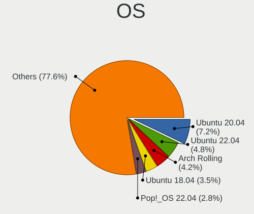

| Name                         | Desktops | Percent |
|------------------------------|----------|---------|
| Ubuntu 20.04                 | 112      | 7.16%   |
| Ubuntu 22.04                 | 75       | 4.79%   |
| Arch Rolling                 | 65       | 4.15%   |
| Ubuntu 18.04                 | 54       | 3.45%   |
| Pop!_OS 22.04                | 44       | 2.81%   |
| Ubuntu 24.04                 | 41       | 2.62%   |
| ArcoLinux Rolling            | 33       | 2.11%   |
| Fedora 42                    | 29       | 1.85%   |
| Manjaro                      | 28       | 1.79%   |
| Pop!_OS 21.04                | 24       | 1.53%   |
| KDE neon 20.04               | 23       | 1.47%   |
| Debian 12                    | 23       | 1.47%   |
| Linux Mint 22.1              | 20       | 1.28%   |
| EndeavourOS Rolling          | 19       | 1.21%   |
| Bazzite 42                   | 19       | 1.21%   |
| OpenMandriva 4.3             | 18       | 1.15%   |
| OpenMandriva 4.2             | 18       | 1.15%   |
| Arch                         | 18       | 1.15%   |
| OpenMandriva 24.12           | 17       | 1.09%   |
| Linux Mint 20.3              | 17       | 1.09%   |
| Debian 11                    | 17       | 1.09%   |
| openSUSE Tumbleweed-XXXXXXXX | 16       | 1.02%   |
| Fedora 41                    | 14       | 0.89%   |
| Fedora 38                    | 14       | 0.89%   |
| Zorin 17                     | 13       | 0.83%   |
| Zorin 16                     | 13       | 0.83%   |
| Pop!_OS 20.10                | 13       | 0.83%   |
| Pop!_OS 20.04                | 13       | 0.83%   |
| OpenMandriva 5.0             | 13       | 0.83%   |
| OpenMandriva 25.06           | 13       | 0.83%   |
| Fedora 40                    | 13       | 0.83%   |
| Fedora 39                    | 13       | 0.83%   |
| Fedora 36                    | 13       | 0.83%   |
| Fedora 32                    | 13       | 0.83%   |
| OpenMandriva 25.90           | 12       | 0.77%   |
| Linux Mint 21.1              | 12       | 0.77%   |
| Ubuntu 23.04                 | 11       | 0.7%    |
| Ubuntu 21.10                 | 11       | 0.7%    |
| Linux Mint 22.2              | 11       | 0.7%    |
| Linux Mint 20                | 11       | 0.7%    |

OS Family
---------

OS without a version

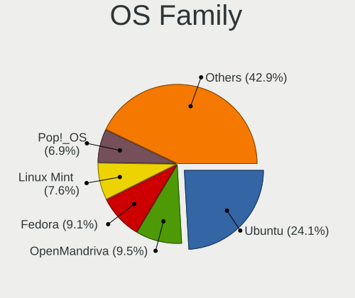

| Name          | Desktops | Percent |
|---------------|----------|---------|
| Ubuntu        | 351      | 24.09%  |
| OpenMandriva  | 138      | 9.47%   |
| Fedora        | 132      | 9.06%   |
| Linux Mint    | 111      | 7.62%   |
| Pop!_OS       | 100      | 6.86%   |
| Arch          | 83       | 5.7%    |
| Debian        | 64       | 4.39%   |
| Manjaro       | 54       | 3.71%   |
| Zorin         | 35       | 2.4%    |
| ArcoLinux     | 35       | 2.4%    |
| KDE neon      | 34       | 2.33%   |
| Bazzite       | 34       | 2.33%   |
| Kubuntu       | 27       | 1.85%   |
| Gentoo        | 27       | 1.85%   |
| openSUSE      | 23       | 1.58%   |
| Xubuntu       | 22       | 1.51%   |
| EndeavourOS   | 20       | 1.37%   |
| Nobara        | 16       | 1.1%    |
| ROSA          | 12       | 0.82%   |
| Kali          | 12       | 0.82%   |
| NixOS         | 10       | 0.69%   |
| Garuda Linux  | 10       | 0.69%   |
| MX            | 9        | 0.62%   |
| CachyOS       | 9        | 0.62%   |
| LMDE          | 8        | 0.55%   |
| Elementary    | 7        | 0.48%   |
| Clear Linux   | 7        | 0.48%   |
| Solus         | 5        | 0.34%   |
| Lubuntu       | 5        | 0.34%   |
| Ubuntu Unity  | 4        | 0.27%   |
| Dts-distro    | 4        | 0.27%   |
| CentOS        | 4        | 0.27%   |
| Ubuntu MATE   | 3        | 0.21%   |
| Ubuntu Budgie | 3        | 0.21%   |
| Sparky        | 3        | 0.21%   |
| Ubuntu Studio | 2        | 0.14%   |
| SteamOS       | 2        | 0.14%   |
| Slackware     | 2        | 0.14%   |
| RHEL          | 2        | 0.14%   |
| Pikaos        | 2        | 0.14%   |

Kernel
------

Version of the Linux kernel

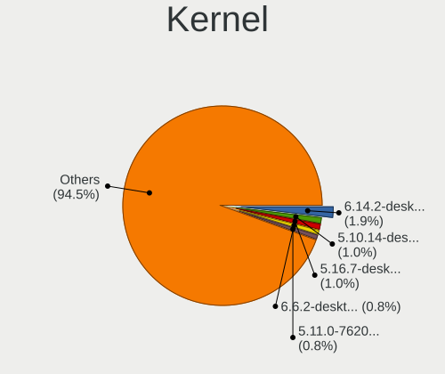

| Version                       | Desktops | Percent |
|-------------------------------|----------|---------|
| 6.14.2-desktop-3omv2590       | 32       | 1.86%   |
| 5.10.14-desktop-1omv4002      | 18       | 1.05%   |
| 5.16.7-desktop-1omv4003       | 17       | 0.99%   |
| 6.6.2-desktop-1omv2390        | 14       | 0.81%   |
| 5.11.0-7620-generic           | 14       | 0.81%   |
| 5.4.0-42-generic              | 13       | 0.76%   |
| 6.5.0-14-generic              | 12       | 0.7%    |
| 6.12.1-desktop-1omv2490       | 12       | 0.7%    |
| 6.9.3-76060903-generic        | 10       | 0.58%   |
| 6.8.0-51-generic              | 9        | 0.52%   |
| 6.2.6-desktop-1omv2390        | 9        | 0.52%   |
| 6.2.6-76060206-generic        | 8        | 0.47%   |
| 6.10.0-desktop-1omv2490       | 8        | 0.47%   |
| 5.4.0-58-generic              | 8        | 0.47%   |
| 5.15.0-46-generic             | 8        | 0.47%   |
| 6.12.9-desktop-1omv2490       | 7        | 0.41%   |
| 5.15.0-53-generic             | 7        | 0.41%   |
| 5.13.0-39-generic             | 7        | 0.41%   |
| 6.5.0-35-generic              | 6        | 0.35%   |
| 6.5.0-28-generic              | 6        | 0.35%   |
| 6.5.0-21-generic              | 6        | 0.35%   |
| 6.2.0-20-generic              | 6        | 0.35%   |
| 6.15.9-201.fc42.x86_64        | 6        | 0.35%   |
| 6.14.9-300.fc42.x86_64        | 6        | 0.35%   |
| 5.4.0-7634-generic            | 6        | 0.35%   |
| 5.4.0-52-generic              | 6        | 0.35%   |
| 5.4.0-48-generic              | 6        | 0.35%   |
| 5.15.0-58-generic             | 6        | 0.35%   |
| 5.15.0-56-generic             | 6        | 0.35%   |
| 5.13.0-27-generic             | 6        | 0.35%   |
| 5.11.0-7614-generic           | 6        | 0.35%   |
| 6.8.0-45-generic              | 5        | 0.29%   |
| 6.2.0-34-generic              | 5        | 0.29%   |
| 6.2.0-26-generic              | 5        | 0.29%   |
| 6.16.3-76061603-generic       | 5        | 0.29%   |
| 6.15.0-desktop-0.rc2.3omv2590 | 5        | 0.29%   |
| 6.14.0-33-generic             | 5        | 0.29%   |
| 6.12.10-76061203-generic      | 5        | 0.29%   |
| 5.8.0-50-generic              | 5        | 0.29%   |
| 5.8.0-43-generic              | 5        | 0.29%   |

Kernel Family
-------------

Linux kernel without a distro release

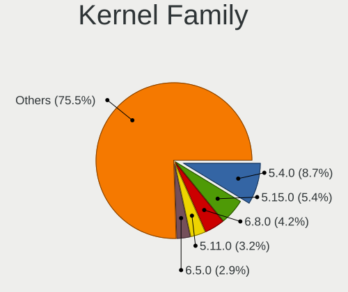

| Version | Desktops | Percent |
|---------|----------|---------|
| 5.4.0   | 144      | 8.71%   |
| 5.15.0  | 90       | 5.44%   |
| 6.8.0   | 70       | 4.23%   |
| 5.11.0  | 53       | 3.21%   |
| 6.5.0   | 48       | 2.9%    |
| 5.13.0  | 45       | 2.72%   |
| 5.8.0   | 40       | 2.42%   |
| 6.14.0  | 36       | 2.18%   |
| 4.15.0  | 35       | 2.12%   |
| 6.14.2  | 33       | 2%      |
| 6.2.0   | 31       | 1.88%   |
| 6.1.0   | 27       | 1.63%   |
| 5.10.0  | 27       | 1.63%   |
| 5.3.0   | 26       | 1.57%   |
| 5.19.0  | 25       | 1.51%   |
| 5.0.0   | 25       | 1.51%   |
| 4.18.0  | 22       | 1.33%   |
| 6.2.6   | 18       | 1.09%   |
| 6.11.0  | 18       | 1.09%   |
| 5.10.14 | 18       | 1.09%   |
| 6.12.1  | 17       | 1.03%   |
| 5.16.7  | 17       | 1.03%   |
| 6.6.2   | 15       | 0.91%   |
| 6.9.3   | 11       | 0.67%   |
| 6.17.9  | 10       | 0.6%    |
| 6.17.7  | 10       | 0.6%    |
| 6.5.6   | 8        | 0.48%   |
| 6.15.9  | 8        | 0.48%   |
| 6.15.6  | 8        | 0.48%   |
| 6.13.5  | 8        | 0.48%   |
| 6.12.9  | 8        | 0.48%   |
| 6.12.10 | 8        | 0.48%   |
| 6.10.0  | 8        | 0.48%   |
| 4.19.0  | 8        | 0.48%   |
| 6.17.5  | 7        | 0.42%   |
| 5.12.4  | 7        | 0.42%   |
| 6.8.7   | 6        | 0.36%   |
| 6.4.11  | 6        | 0.36%   |
| 6.4.0   | 6        | 0.36%   |
| 6.16.4  | 6        | 0.36%   |

Kernel Major Ver.
-----------------

Linux kernel major version

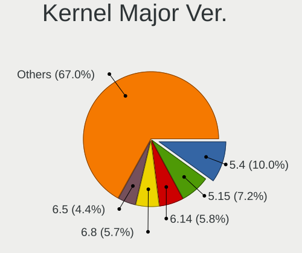

| Version | Desktops | Percent |
|---------|----------|---------|
| 5.4     | 162      | 9.97%   |
| 5.15    | 117      | 7.2%    |
| 6.14    | 95       | 5.85%   |
| 6.8     | 92       | 5.66%   |
| 6.5     | 71       | 4.37%   |
| 5.11    | 69       | 4.25%   |
| 5.10    | 69       | 4.25%   |
| 5.8     | 61       | 3.75%   |
| 6.2     | 56       | 3.45%   |
| 6.1     | 55       | 3.38%   |
| 6.12    | 54       | 3.32%   |
| 5.13    | 51       | 3.14%   |
| 6.6     | 50       | 3.08%   |
| 6.17    | 42       | 2.58%   |
| 4.15    | 35       | 2.15%   |
| 5.19    | 34       | 2.09%   |
| 6.11    | 32       | 1.97%   |
| 6.15    | 31       | 1.91%   |
| 5.3     | 30       | 1.85%   |
| 5.16    | 30       | 1.85%   |
| 6.9     | 27       | 1.66%   |
| 6.4     | 26       | 1.6%    |
| 5.0     | 26       | 1.6%    |
| 4.18    | 23       | 1.42%   |
| 6.3     | 22       | 1.35%   |
| 6.13    | 22       | 1.35%   |
| 5.17    | 22       | 1.35%   |
| 5.12    | 22       | 1.35%   |
| 6.10    | 21       | 1.29%   |
| 6.16    | 20       | 1.23%   |
| 6.7     | 18       | 1.11%   |
| 6.0     | 17       | 1.05%   |
| 5.9     | 17       | 1.05%   |
| 5.6     | 17       | 1.05%   |
| 5.18    | 16       | 0.98%   |
| 4.19    | 15       | 0.92%   |
| 5.14    | 14       | 0.86%   |
| 5.7     | 11       | 0.68%   |
| 4.9     | 11       | 0.68%   |
| 5.5     | 7        | 0.43%   |

Arch
----

OS architecture (x86_64, i586, etc.)

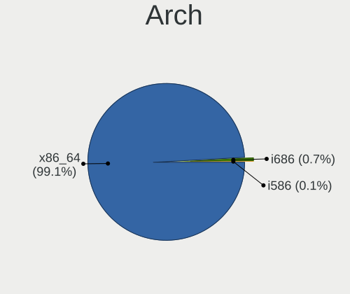

| Name   | Desktops | Percent |
|--------|----------|---------|
| x86_64 | 1378     | 99.14%  |
| i686   | 10       | 0.72%   |
| ppc    | 1        | 0.07%   |
| i586   | 1        | 0.07%   |

DE
--

Desktop Environment

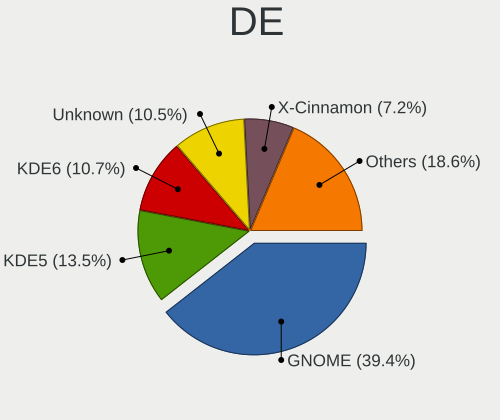

| Name            | Desktops | Percent |
|-----------------|----------|---------|
| GNOME           | 588      | 39.44%  |
| KDE5            | 202      | 13.55%  |
| KDE6            | 160      | 10.73%  |
| Unknown         | 156      | 10.46%  |
| X-Cinnamon      | 107      | 7.18%   |
| XFCE            | 99       | 6.64%   |
| KDE             | 46       | 3.09%   |
| MATE            | 17       | 1.14%   |
| LXQt            | 14       | 0.94%   |
| KDE4            | 11       | 0.74%   |
| Budgie          | 10       | 0.67%   |
| Cinnamon        | 9        | 0.6%    |
| i3              | 8        | 0.54%   |
| Pantheon        | 7        | 0.47%   |
| Hyprland        | 7        | 0.47%   |
| LXDE            | 6        | 0.4%    |
| Deepin          | 6        | 0.4%    |
| COSMIC          | 6        | 0.4%    |
| Unity           | 5        | 0.34%   |
| GNOME Flashback | 5        | 0.34%   |
| GNOME Classic   | 4        | 0.27%   |
| awesome         | 4        | 0.27%   |
| Openbox         | 3        | 0.2%    |
| sway            | 2        | 0.13%   |
| LeftWM          | 2        | 0.13%   |
| xmonad          | 1        | 0.07%   |
| start-hyprland  | 1        | 0.07%   |
| none+xmonad     | 1        | 0.07%   |
| none+i3         | 1        | 0.07%   |
| GNOME-Flashback | 1        | 0.07%   |
| Enlightenment   | 1        | 0.07%   |
| DWM             | 1        | 0.07%   |

Display Server
--------------

X11 or Wayland

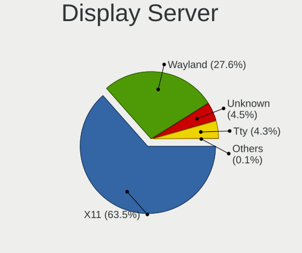

| Name        | Desktops | Percent |
|-------------|----------|---------|
| X11         | 917      | 63.5%   |
| Wayland     | 398      | 27.56%  |
| Unknown     | 65       | 4.5%    |
| Tty         | 62       | 4.29%   |
| Web         | 1        | 0.07%   |
| Unspecified | 1        | 0.07%   |

Display Manager
---------------

SDDM, LightDM, etc.

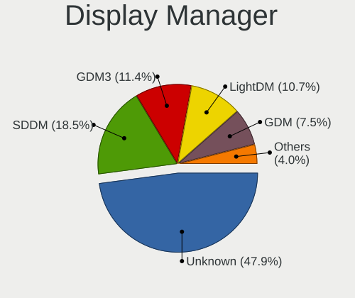

| Name           | Desktops | Percent |
|----------------|----------|---------|
| Unknown        | 700      | 47.91%  |
| SDDM           | 270      | 18.48%  |
| GDM3           | 167      | 11.43%  |
| LightDM        | 156      | 10.68%  |
| GDM            | 110      | 7.53%   |
| TDM            | 31       | 2.12%   |
| KDM            | 8        | 0.55%   |
| GREETD         | 7        | 0.48%   |
| XDM            | 4        | 0.27%   |
| Ly             | 3        | 0.21%   |
| LXDM           | 2        | 0.14%   |
| WDM            | 1        | 0.07%   |
| LY-DM          | 1        | 0.07%   |
| COSMIC-GREETER | 1        | 0.07%   |

OS Lang
-------

Language

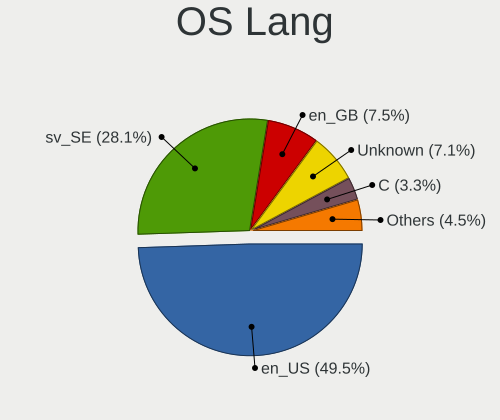

| Lang        | Desktops | Percent |
|-------------|----------|---------|
| en_US       | 708      | 49.48%  |
| sv_SE       | 402      | 28.09%  |
| en_GB       | 108      | 7.55%   |
| Unknown     | 101      | 7.06%   |
| C           | 47       | 3.28%   |
| de_DE       | 13       | 0.91%   |
| ru_RU       | 8        | 0.56%   |
| en_SE       | 5        | 0.35%   |
| en_DK       | 5        | 0.35%   |
| pl_PL       | 4        | 0.28%   |
| en_IE       | 4        | 0.28%   |
| nb_NO       | 3        | 0.21%   |
| C.UTF8      | 3        | 0.21%   |
| uk_UA       | 2        | 0.14%   |
| en_CA       | 2        | 0.14%   |
| UTF-8       | 1        | 0.07%   |
| sma_SE      | 1        | 0.07%   |
| se_SV       | 1        | 0.07%   |
| POSIX       | 1        | 0.07%   |
| hu_HU       | 1        | 0.07%   |
| hr_HR       | 1        | 0.07%   |
| fr_FR       | 1        | 0.07%   |
| fi_FI       | 1        | 0.07%   |
| es_VE       | 1        | 0.07%   |
| es_ES       | 1        | 0.07%   |
| en_IN       | 1        | 0.07%   |
| en_GB.utf-8 | 1        | 0.07%   |
| en_AU       | 1        | 0.07%   |
| en_AG       | 1        | 0.07%   |
| bs_BA       | 1        | 0.07%   |
| bg_BG       | 1        | 0.07%   |

Boot Mode
---------

EFI or BIOS

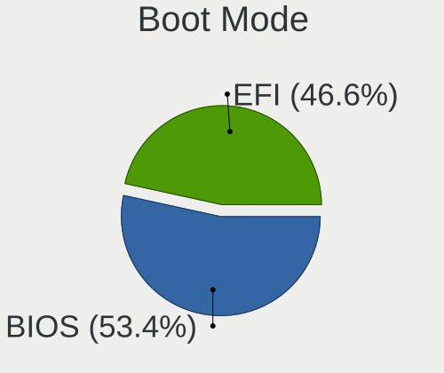

| Mode | Desktops | Percent |
|------|----------|---------|
| BIOS | 766      | 53.42%  |
| EFI  | 668      | 46.58%  |

Filesystem
----------

Type of filesystem

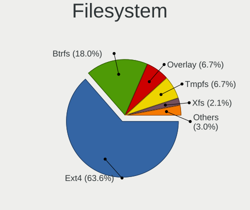

| Type     | Desktops | Percent |
|----------|----------|---------|
| Ext4     | 917      | 63.59%  |
| Btrfs    | 259      | 17.96%  |
| Overlay  | 97       | 6.73%   |
| Tmpfs    | 96       | 6.66%   |
| Xfs      | 30       | 2.08%   |
| Unknown  | 26       | 1.8%    |
| Zfs      | 8        | 0.55%   |
| F2fs     | 3        | 0.21%   |
| Ext3     | 2        | 0.14%   |
| Rootfs   | 1        | 0.07%   |
| Reiserfs | 1        | 0.07%   |
| Nfs4     | 1        | 0.07%   |
| Ext2     | 1        | 0.07%   |

Part. scheme
------------

Scheme of partitioning

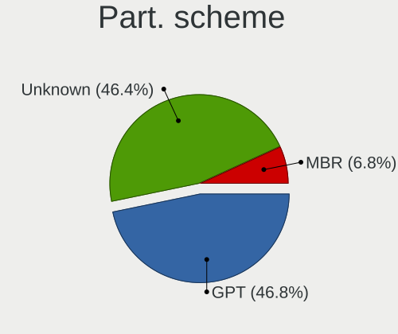

| Type    | Desktops | Percent |
|---------|----------|---------|
| GPT     | 678      | 46.76%  |
| Unknown | 673      | 46.41%  |
| MBR     | 99       | 6.83%   |

Dual Boot with Linux/BSD
------------------------

Hosting more than one Linux/BSD

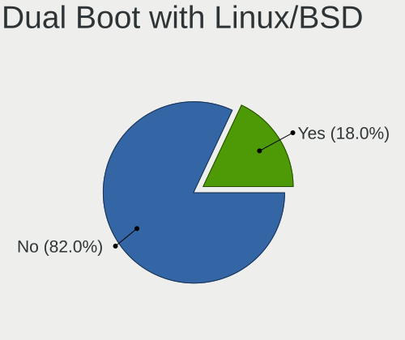

| Dual boot | Desktops | Percent |
|-----------|----------|---------|
| No        | 1176     | 82.01%  |
| Yes       | 258      | 17.99%  |

Dual Boot (Win)
---------------

Hosting Linux and Windows

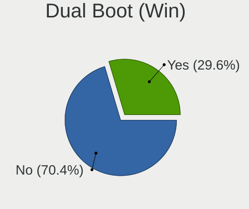

| Dual boot | Desktops | Percent |
|-----------|----------|---------|
| No        | 1009     | 70.41%  |
| Yes       | 424      | 29.59%  |

Board
-----

Vendor
------

Motherboard manufacturer

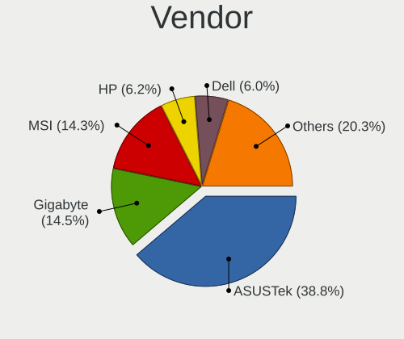

| Name                                 | Desktops | Percent |
|--------------------------------------|----------|---------|
| ASUSTek Computer                     | 539      | 38.78%  |
| Gigabyte Technology                  | 201      | 14.46%  |
| MSI                                  | 199      | 14.32%  |
| Hewlett-Packard                      | 86       | 6.19%   |
| Dell                                 | 83       | 5.97%   |
| ASRock                               | 83       | 5.97%   |
| Lenovo                               | 42       | 3.02%   |
| Acer                                 | 34       | 2.45%   |
| Fujitsu                              | 12       | 0.86%   |
| Intel                                | 10       | 0.72%   |
| Foxconn                              | 10       | 0.72%   |
| Unknown                              | 9        | 0.65%   |
| Supermicro                           | 8        | 0.58%   |
| Pegatron                             | 6        | 0.43%   |
| Packard Bell                         | 6        | 0.43%   |
| Apple                                | 6        | 0.43%   |
| AAEON                                | 5        | 0.36%   |
| Shenzhen Meigao Electronic Equipment | 4        | 0.29%   |
| Maxtang                              | 4        | 0.29%   |
| OEM                                  | 3        | 0.22%   |
| Biostar                              | 3        | 0.22%   |
| Shuttle                              | 2        | 0.14%   |
| Medion                               | 2        | 0.14%   |
| HC Technology.                       | 2        | 0.14%   |
| Fujitsu Siemens                      | 2        | 0.14%   |
| AZW                                  | 2        | 0.14%   |
| AOpen                                | 2        | 0.14%   |
| AMD                                  | 2        | 0.14%   |
| XDO.AI                               | 1        | 0.07%   |
| Tianbei                              | 1        | 0.07%   |
| SLIMBOOK                             | 1        | 0.07%   |
| SiYW                                 | 1        | 0.07%   |
| Seco                                 | 1        | 0.07%   |
| Samsung Electronics                  | 1        | 0.07%   |
| Red Hat                              | 1        | 0.07%   |
| PC Engines                           | 1        | 0.07%   |
| NZXT                                 | 1        | 0.07%   |
| LattePanda                           | 1        | 0.07%   |
| Kllisre                              | 1        | 0.07%   |
| JGINYUE                              | 1        | 0.07%   |

Model
-----

Motherboard model

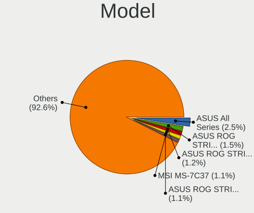

| Name                           | Desktops | Percent |
|--------------------------------|----------|---------|
| ASUS All Series                | 35       | 2.52%   |
| ASUS ROG STRIX B550-F GAMING   | 21       | 1.51%   |
| ASUS ROG STRIX B450-F GAMING   | 17       | 1.22%   |
| MSI MS-7C37                    | 15       | 1.08%   |
| ASUS ROG STRIX X570-F GAMING   | 15       | 1.08%   |
| ASUS ROG STRIX Z390-F GAMING   | 13       | 0.94%   |
| ASUS PRIME X470-PRO            | 12       | 0.86%   |
| ASUS Z170 PRO GAMING           | 9        | 0.65%   |
| ASUS TUF Gaming X570-PLUS      | 9        | 0.65%   |
| Unknown                        | 9        | 0.65%   |
| MSI MS-7C02                    | 8        | 0.58%   |
| ASUS TUF Gaming B650-PLUS WIFI | 8        | 0.58%   |
| ASUS ROG STRIX B550-I GAMING   | 8        | 0.58%   |
| MSI MS-7C56                    | 7        | 0.5%    |
| MSI MS-7C52                    | 6        | 0.43%   |
| MSI MS-7817                    | 6        | 0.43%   |
| Gigabyte B550 AORUS ELITE V2   | 6        | 0.43%   |
| Gigabyte B450M DS3H            | 6        | 0.43%   |
| Dell OptiPlex 3020             | 6        | 0.43%   |
| ASUS ROG STRIX B350-F GAMING   | 6        | 0.43%   |
| ASUS PRIME Z370-P              | 6        | 0.43%   |
| ASUS PRIME X370-PRO            | 6        | 0.43%   |
| MSI MS-7E06                    | 5        | 0.36%   |
| MSI MS-7C84                    | 5        | 0.36%   |
| MSI MS-7B86                    | 5        | 0.36%   |
| Dell OptiPlex 7010             | 5        | 0.36%   |
| ASUS Z170-A                    | 5        | 0.36%   |
| ASUS STRIX Z270H GAMING        | 5        | 0.36%   |
| ASUS SABERTOOTH 990FX R2.0     | 5        | 0.36%   |
| ASUS ROG STRIX X570-E GAMING   | 5        | 0.36%   |
| ASUS M5A97 R2.0                | 5        | 0.36%   |
| MSI MS-7C91                    | 4        | 0.29%   |
| MSI MS-7B89                    | 4        | 0.29%   |
| Maxtang FP30                   | 4        | 0.29%   |
| HP EliteDesk 800 G1 SFF        | 4        | 0.29%   |
| Gigabyte Z97X-Gaming 3         | 4        | 0.29%   |
| Gigabyte X570 AORUS MASTER     | 4        | 0.29%   |
| Gigabyte X570 AORUS ELITE      | 4        | 0.29%   |
| Gigabyte 970A-DS3P             | 4        | 0.29%   |
| Dell Precision Tower 5810      | 4        | 0.29%   |

Model Family
------------

Motherboard model prefix

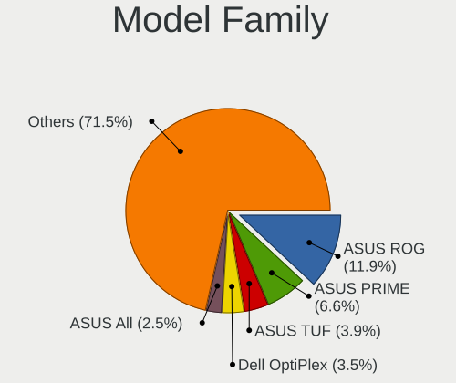

| Name                | Desktops | Percent |
|---------------------|----------|---------|
| ASUS ROG            | 166      | 11.94%  |
| ASUS PRIME          | 92       | 6.62%   |
| ASUS TUF            | 54       | 3.88%   |
| Dell OptiPlex       | 49       | 3.53%   |
| ASUS All            | 35       | 2.52%   |
| Dell Precision      | 21       | 1.51%   |
| HP Compaq           | 20       | 1.44%   |
| Acer Aspire         | 20       | 1.44%   |
| HP EliteDesk        | 19       | 1.37%   |
| Gigabyte X570       | 19       | 1.37%   |
| Lenovo ThinkCentre  | 16       | 1.15%   |
| MSI MS-7C37         | 15       | 1.08%   |
| Lenovo IdeaCentre   | 11       | 0.79%   |
| ASUS STRIX          | 11       | 0.79%   |
| ASUS SABERTOOTH     | 11       | 0.79%   |
| ASUS P8Z77-V        | 11       | 0.79%   |
| Gigabyte B550       | 10       | 0.72%   |
| Gigabyte B450M      | 9        | 0.65%   |
| ASUS Z170           | 9        | 0.65%   |
| ASUS P8Z68-V        | 9        | 0.65%   |
| Unknown             | 9        | 0.65%   |
| MSI MS-7C02         | 8        | 0.58%   |
| Fujitsu ESPRIMO     | 8        | 0.58%   |
| MSI MS-7C56         | 7        | 0.5%    |
| HP ProDesk          | 7        | 0.5%    |
| HP Pavilion         | 7        | 0.5%    |
| Gigabyte Z390       | 7        | 0.5%    |
| ASUS Maximus        | 7        | 0.5%    |
| ASUS M5A97          | 7        | 0.5%    |
| MSI MS-7C52         | 6        | 0.43%   |
| MSI MS-7817         | 6        | 0.43%   |
| Gigabyte B550M      | 6        | 0.43%   |
| ASUS Crosshair      | 6        | 0.43%   |
| ASRock B450M        | 6        | 0.43%   |
| Acer Predator       | 6        | 0.43%   |
| Packard Bell IMEDIA | 5        | 0.36%   |
| MSI MS-7E06         | 5        | 0.36%   |
| MSI MS-7C84         | 5        | 0.36%   |
| MSI MS-7B86         | 5        | 0.36%   |
| Lenovo Legion       | 5        | 0.36%   |

MFG Year
--------

Motherboard manufacture year

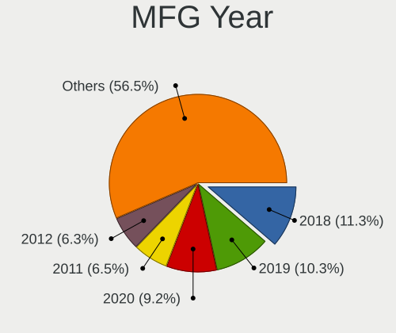

| Year    | Desktops | Percent |
|---------|----------|---------|
| 2018    | 157      | 11.29%  |
| 2019    | 143      | 10.29%  |
| 2020    | 128      | 9.21%   |
| 2011    | 90       | 6.47%   |
| 2012    | 87       | 6.26%   |
| 2014    | 86       | 6.19%   |
| 2013    | 83       | 5.97%   |
| 2017    | 82       | 5.9%    |
| 2022    | 78       | 5.61%   |
| 2021    | 74       | 5.32%   |
| 2016    | 73       | 5.25%   |
| 2015    | 69       | 4.96%   |
| 2010    | 46       | 3.31%   |
| 2009    | 44       | 3.17%   |
| 2024    | 41       | 2.95%   |
| 2023    | 34       | 2.45%   |
| 2008    | 34       | 2.45%   |
| 2007    | 22       | 1.58%   |
| 2025    | 11       | 0.79%   |
| 2006    | 3        | 0.22%   |
| 2005    | 2        | 0.14%   |
| 2004    | 1        | 0.07%   |
| 2002    | 1        | 0.07%   |
| Unknown | 1        | 0.07%   |

Form Factor
-----------

Physical design of the computer

| Name    | Desktops | Percent |
|---------|----------|---------|
| Desktop | 1390     | 100%    |

Secure Boot
-----------

Enabled or disabled

| State    | Desktops | Percent |
|----------|----------|---------|
| Disabled | 1354     | 97.13%  |
| Enabled  | 40       | 2.87%   |

Coreboot
--------

Have coreboot on board

| Used | Desktops | Percent |
|------|----------|---------|
| No   | 1387     | 99.78%  |
| Yes  | 3        | 0.22%   |

RAM Size
--------

Total RAM memory

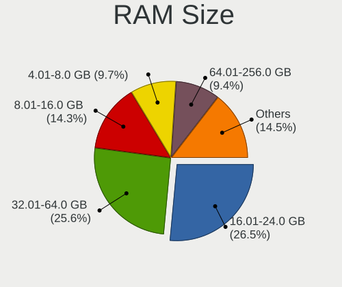

| Size in GB      | Desktops | Percent |
|-----------------|----------|---------|
| 16.01-24.0      | 377      | 26.47%  |
| 32.01-64.0      | 365      | 25.63%  |
| 8.01-16.0       | 203      | 14.26%  |
| 4.01-8.0        | 138      | 9.69%   |
| 64.01-256.0     | 134      | 9.41%   |
| 3.01-4.0        | 86       | 6.04%   |
| 24.01-32.0      | 80       | 5.62%   |
| 1.01-2.0        | 19       | 1.33%   |
| 2.01-3.0        | 9        | 0.63%   |
| More than 256.0 | 6        | 0.42%   |
| 0.51-1.0        | 6        | 0.42%   |
| 0.01-0.5        | 1        | 0.07%   |

RAM Used
--------

Used RAM memory

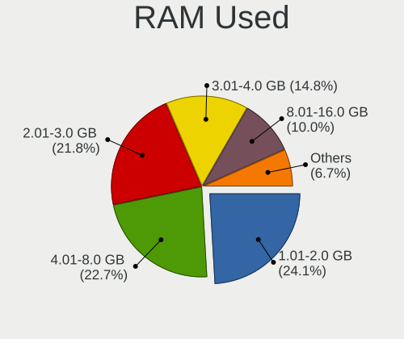

| Used GB     | Desktops | Percent |
|-------------|----------|---------|
| 1.01-2.0    | 378      | 24.08%  |
| 4.01-8.0    | 356      | 22.68%  |
| 2.01-3.0    | 342      | 21.78%  |
| 3.01-4.0    | 232      | 14.78%  |
| 8.01-16.0   | 157      | 10%     |
| 0.51-1.0    | 53       | 3.38%   |
| 16.01-24.0  | 28       | 1.78%   |
| 0.01-0.5    | 8        | 0.51%   |
| 24.01-32.0  | 7        | 0.45%   |
| 32.01-64.0  | 5        | 0.32%   |
| 64.01-256.0 | 3        | 0.19%   |
| Unknown     | 1        | 0.06%   |

Total Drives
------------

Number of drives on board

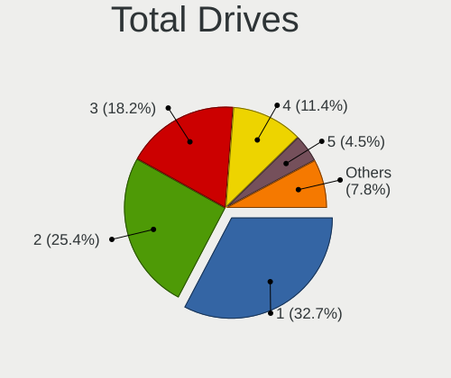

| Drives | Desktops | Percent |
|--------|----------|---------|
| 1      | 480      | 32.68%  |
| 2      | 373      | 25.39%  |
| 3      | 267      | 18.18%  |
| 4      | 168      | 11.44%  |
| 5      | 66       | 4.49%   |
| 6      | 55       | 3.74%   |
| 7      | 27       | 1.84%   |
| 0      | 16       | 1.09%   |
| 8      | 9        | 0.61%   |
| 9      | 4        | 0.27%   |
| 10     | 2        | 0.14%   |
| 12     | 1        | 0.07%   |
| 11     | 1        | 0.07%   |

Has CD-ROM
----------

Has CD-ROM on board

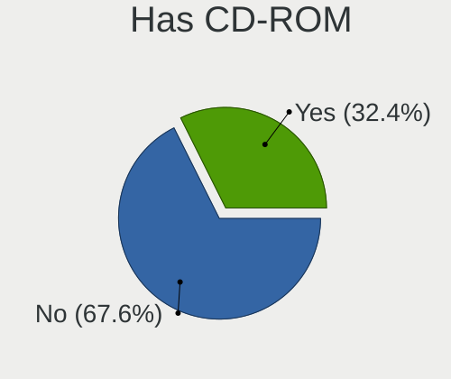

| Presented | Desktops | Percent |
|-----------|----------|---------|
| No        | 950      | 67.62%  |
| Yes       | 455      | 32.38%  |

Has Ethernet
------------

Has Ethernet on board

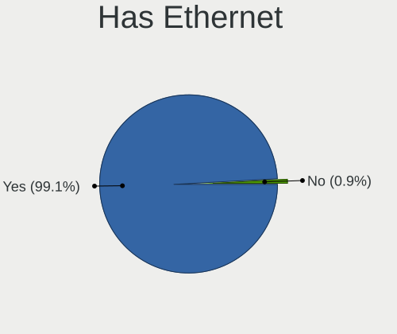

| Presented | Desktops | Percent |
|-----------|----------|---------|
| Yes       | 1378     | 99.14%  |
| No        | 12       | 0.86%   |

Has WiFi
--------

Has WiFi module

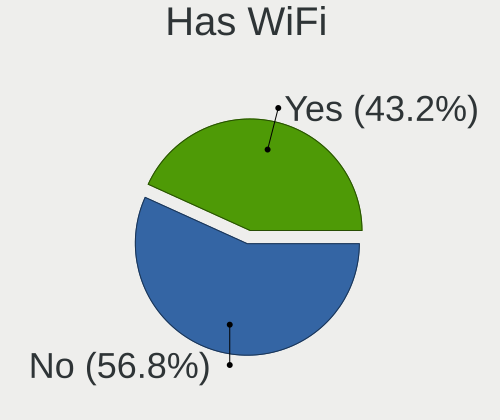

| Presented | Desktops | Percent |
|-----------|----------|---------|
| No        | 804      | 56.78%  |
| Yes       | 612      | 43.22%  |

Has Bluetooth
-------------

Has Bluetooth module

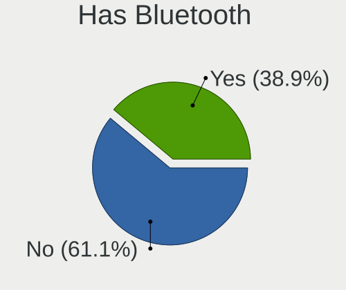

| Presented | Desktops | Percent |
|-----------|----------|---------|
| No        | 865      | 61.09%  |
| Yes       | 551      | 38.91%  |

Location
--------

Country
-------

Geographic location (country)

| Country | Desktops | Percent |
|---------|----------|---------|
| Sweden  | 1390     | 100%    |

City
----

Geographic location (city)

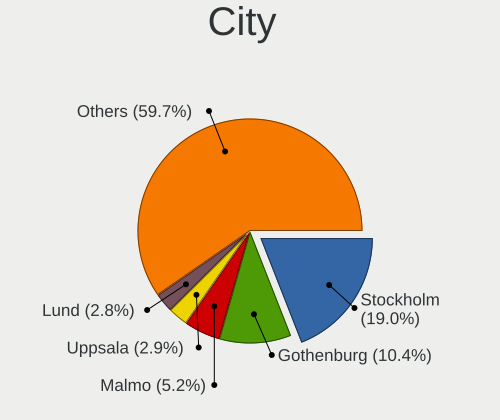

| City                    | Desktops | Percent |
|-------------------------|----------|---------|
| Stockholm               | 288      | 19.05%  |
| Gothenburg              | 157      | 10.38%  |
| Malmo                   | 79       | 5.22%   |
| Uppsala                 | 44       | 2.91%   |
| Lund                    | 42       | 2.78%   |
| Västerås              | 34       | 2.25%   |
| Linköping              | 26       | 1.72%   |
| Umeå                   | 24       | 1.59%   |
| Sundsvall               | 22       | 1.46%   |
| Karlstad                | 22       | 1.46%   |
| Vaxjo                   | 18       | 1.19%   |
| Bromma                  | 18       | 1.19%   |
| Örebro                 | 17       | 1.12%   |
| Solna                   | 16       | 1.06%   |
| Norrköping             | 16       | 1.06%   |
| Sollentuna              | 14       | 0.93%   |
| Gävle                  | 14       | 0.93%   |
| Helsingborg             | 12       | 0.79%   |
| Nyköping               | 10       | 0.66%   |
| Karlskrona              | 10       | 0.66%   |
| Borås                  | 10       | 0.66%   |
| Norsborg                | 9        | 0.6%    |
| Järfälla Municipality | 9        | 0.6%    |
| Haegersten              | 9        | 0.6%    |
| Bandhagen               | 9        | 0.6%    |
| Södertälje            | 8        | 0.53%   |
| Borlänge               | 8        | 0.53%   |
| Sundbyberg              | 7        | 0.46%   |
| Nacka                   | 7        | 0.46%   |
| Johanneshov             | 7        | 0.46%   |
| Halmstad                | 7        | 0.46%   |
| Ängelholm              | 7        | 0.46%   |
| Vaestra Froelunda       | 6        | 0.4%    |
| Upplands Vasby          | 6        | 0.4%    |
| Taby                    | 6        | 0.4%    |
| Skövde                 | 6        | 0.4%    |
| Skellefteå             | 6        | 0.4%    |
| Saltsjoe-Boo            | 6        | 0.4%    |
| Oxie                    | 6        | 0.4%    |
| Lidingoe                | 6        | 0.4%    |

Drives
------

Drive Vendor
------------

Hard drive vendors

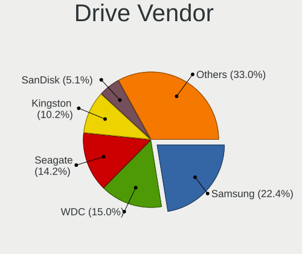

| Vendor                      | Desktops | Drives | Percent |
|-----------------------------|----------|--------|---------|
| Samsung Electronics         | 606      | 1162   | 22.44%  |
| WDC                         | 404      | 744    | 14.96%  |
| Seagate                     | 384      | 664    | 14.22%  |
| Kingston                    | 276      | 425    | 10.22%  |
| SanDisk                     | 139      | 198    | 5.15%   |
| Intel                       | 114      | 160    | 4.22%   |
| Toshiba                     | 88       | 134    | 3.26%   |
| Crucial                     | 88       | 131    | 3.26%   |
| Kingston Technology Company | 74       | 98     | 2.74%   |
| Hitachi                     | 56       | 76     | 2.07%   |
| Phison Electronics          | 39       | 60     | 1.44%   |
| PNY                         | 34       | 48     | 1.26%   |
| Corsair                     | 34       | 47     | 1.26%   |
| HGST                        | 26       | 32     | 0.96%   |
| Micron Technology           | 25       | 38     | 0.93%   |
| Unknown                     | 24       | 47     | 0.89%   |
| Micron/Crucial Technology   | 22       | 29     | 0.81%   |
| SK hynix                    | 19       | 26     | 0.7%    |
| Phison                      | 18       | 23     | 0.67%   |
| OCZ                         | 18       | 24     | 0.67%   |
| A-DATA Technology           | 16       | 17     | 0.59%   |
| Intenso                     | 14       | 23     | 0.52%   |
| China                       | 12       | 12     | 0.44%   |
| Transcend                   | 11       | 12     | 0.41%   |
| Silicon Motion              | 11       | 22     | 0.41%   |
| SPCC                        | 9        | 23     | 0.33%   |
| Maxtor                      | 9        | 9      | 0.33%   |
| KIOXIA                      | 8        | 15     | 0.3%    |
| Fujitsu                     | 7        | 11     | 0.26%   |
| Patriot                     | 5        | 7      | 0.19%   |
| KIOXIA-EXCERIA              | 5        | 6      | 0.19%   |
| Gigabyte Technology         | 5        | 6      | 0.19%   |
| Apple                       | 5        | 6      | 0.19%   |
| LITEONIT                    | 4        | 9      | 0.15%   |
| LITEON                      | 4        | 10     | 0.15%   |
| LaCie                       | 4        | 5      | 0.15%   |
| JMicron Technology          | 4        | 6      | 0.15%   |
| ASMT                        | 4        | 4      | 0.15%   |
| Unknown                     | 4        | 4      | 0.15%   |
| Verbatim                    | 3        | 3      | 0.11%   |

Drive Model
-----------

Hard drive models

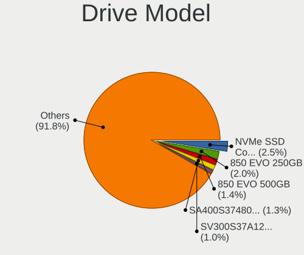

| Model                                                | Desktops | Percent |
|------------------------------------------------------|----------|---------|
| Samsung NVMe SSD Controller SM981/PM981/PM983 1TB    | 84       | 2.53%   |
| Samsung SSD 850 EVO 250GB                            | 66       | 1.99%   |
| Samsung SSD 850 EVO 500GB                            | 48       | 1.44%   |
| Kingston SA400S37480G 480GB SSD                      | 42       | 1.26%   |
| Kingston SV300S37A120G 120GB SSD                     | 34       | 1.02%   |
| Seagate ST4000DM004-2CV104 4TB                       | 32       | 0.96%   |
| Kingston SA400S37120G 120GB SSD                      | 31       | 0.93%   |
| Kingston SA400S37240G 240GB SSD                      | 30       | 0.9%    |
| Samsung SSD 860 EVO 500GB                            | 29       | 0.87%   |
| Samsung NVMe SSD Controller PM9A1/PM9A3/980PRO 1TB   | 29       | 0.87%   |
| Samsung SSD 860 EVO 1TB                              | 27       | 0.81%   |
| Seagate ST1000DM010-2EP102 1TB                       | 26       | 0.78%   |
| Samsung SSD 860 EVO 250GB                            | 26       | 0.78%   |
| Kingston Company A2000 NVMe SSD 250GB                | 26       | 0.78%   |
| Samsung SSD 840 EVO 250GB                            | 24       | 0.72%   |
| Samsung NVMe SSD Controller SM961/PM961/SM963 1024GB | 22       | 0.66%   |
| Seagate ST500DM002-1BD142 500GB                      | 19       | 0.57%   |
| Samsung SSD 970 EVO Plus 500GB                       | 19       | 0.57%   |
| Samsung NVMe SSD Drive 500GB                         | 19       | 0.57%   |
| WDC WD30EFRX-68EUZN0 3TB                             | 17       | 0.51%   |
| Seagate ST2000DM008-2FR102 2TB                       | 17       | 0.51%   |
| Seagate ST1000DM003-1CH162 1TB                       | 16       | 0.48%   |
| Kingston SFYRD2000G 2TB                              | 16       | 0.48%   |
| Sandisk WD Blue SN550 NVMe SSD 1024GB                | 15       | 0.45%   |
| Samsung SSD 870 QVO 1TB                              | 15       | 0.45%   |
| Kingston Company SNV2S1000G 1TB                      | 15       | 0.45%   |
| WDC WDS240G2G0A-00JH30 240GB SSD                     | 14       | 0.42%   |
| Seagate ST4000VN008-2DR166 4TB                       | 14       | 0.42%   |
| Seagate ST2000DM006-2DM164 2TB                       | 14       | 0.42%   |
| Seagate ST2000DM001-1CH164 2TB                       | 14       | 0.42%   |
| Samsung SSD 860 QVO 1TB                              | 14       | 0.42%   |
| Kingston SKC3000D2048G 2TB                           | 14       | 0.42%   |
| Seagate Expansion 2TB                                | 13       | 0.39%   |
| Sandisk WD Black SN750 / PC SN730 NVMe SSD 500GB     | 13       | 0.39%   |
| Samsung SSD 840 EVO 500GB                            | 13       | 0.39%   |
| WDC WD20EFRX-68EUZN0 2TB                             | 12       | 0.36%   |
| Seagate Expansion Desk 4TB                           | 12       | 0.36%   |
| SanDisk NVMe SSD Drive 1TB                           | 12       | 0.36%   |
| Samsung NVMe SSD Drive 1TB                           | 12       | 0.36%   |
| Samsung HD103SJ 1TB                                  | 12       | 0.36%   |

HDD Vendor
----------

Hard disk drive vendors

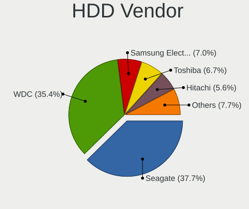

| Vendor              | Desktops | Drives | Percent |
|---------------------|----------|--------|---------|
| Seagate             | 377      | 646    | 37.66%  |
| WDC                 | 354      | 648    | 35.36%  |
| Samsung Electronics | 70       | 116    | 6.99%   |
| Toshiba             | 67       | 107    | 6.69%   |
| Hitachi             | 56       | 76     | 5.59%   |
| HGST                | 26       | 32     | 2.6%    |
| Unknown             | 11       | 13     | 1.1%    |
| Maxtor              | 9        | 9      | 0.9%    |
| Fujitsu             | 7        | 11     | 0.7%    |
| Intenso             | 5        | 8      | 0.5%    |
| JMicron Technology  | 3        | 5      | 0.3%    |
| Hewlett-Packard     | 3        | 10     | 0.3%    |
| ASMedia             | 3        | 3      | 0.3%    |
| Apple               | 3        | 3      | 0.3%    |
| USB3.0              | 1        | 1      | 0.1%    |
| SATAFIRM            | 1        | 1      | 0.1%    |
| Min Yi U            | 1        | 1      | 0.1%    |
| LaCie               | 1        | 1      | 0.1%    |
| IB                  | 1        | 2      | 0.1%    |
| ASMT                | 1        | 1      | 0.1%    |
| Unknown             | 1        | 1      | 0.1%    |

SSD Vendor
----------

Solid state drive vendors

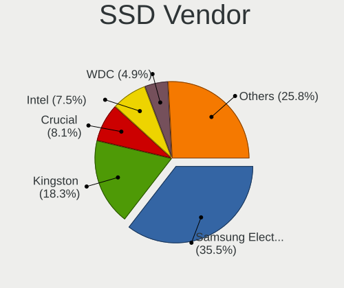

| Vendor              | Desktops | Drives | Percent |
|---------------------|----------|--------|---------|
| Samsung Electronics | 361      | 593    | 35.46%  |
| Kingston            | 186      | 270    | 18.27%  |
| Crucial             | 82       | 119    | 8.06%   |
| Intel               | 76       | 107    | 7.47%   |
| WDC                 | 50       | 76     | 4.91%   |
| SanDisk             | 38       | 52     | 3.73%   |
| PNY                 | 29       | 43     | 2.85%   |
| Micron Technology   | 23       | 34     | 2.26%   |
| Corsair             | 20       | 25     | 1.96%   |
| OCZ                 | 18       | 24     | 1.77%   |
| Toshiba             | 14       | 17     | 1.38%   |
| A-DATA Technology   | 13       | 14     | 1.28%   |
| China               | 12       | 12     | 1.18%   |
| Transcend           | 10       | 11     | 0.98%   |
| SPCC                | 8        | 22     | 0.79%   |
| SK hynix            | 8        | 9      | 0.79%   |
| Intenso             | 8        | 11     | 0.79%   |
| Patriot             | 5        | 7      | 0.49%   |
| KIOXIA-EXCERIA      | 5        | 6      | 0.49%   |
| LITEONIT            | 4        | 9      | 0.39%   |
| LITEON              | 4        | 10     | 0.39%   |
| Verbatim            | 3        | 3      | 0.29%   |
| Gigabyte Technology | 3        | 4      | 0.29%   |
| Emtec               | 3        | 3      | 0.29%   |
| ASMT                | 3        | 3      | 0.29%   |
| Seagate             | 2        | 4      | 0.2%    |
| SABRENT             | 2        | 2      | 0.2%    |
| Apple               | 2        | 3      | 0.2%    |
| XSTAR               | 1        | 2      | 0.1%    |
| XrayDisk            | 1        | 1      | 0.1%    |
| WDC WDS2            | 1        | 1      | 0.1%    |
| WDC WDS1            | 1        | 1      | 0.1%    |
| tigo                | 1        | 1      | 0.1%    |
| Team                | 1        | 1      | 0.1%    |
| ROG                 | 1        | 1      | 0.1%    |
| Ramaxel Technology  | 1        | 1      | 0.1%    |
| Phison              | 1        | 1      | 0.1%    |
| OWC                 | 1        | 1      | 0.1%    |
| OCZ-VERTEX3         | 1        | 1      | 0.1%    |
| Netac               | 1        | 1      | 0.1%    |

Drive Kind
----------

HDD or SSD

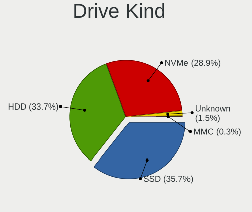

| Kind    | Desktops | Drives | Percent |
|---------|----------|--------|---------|
| SSD     | 805      | 1521   | 35.65%  |
| HDD     | 761      | 1695   | 33.7%   |
| NVMe    | 652      | 1179   | 28.88%  |
| Unknown | 34       | 58     | 1.51%   |
| MMC     | 6        | 6      | 0.27%   |

Drive Connector
---------------

SATA, SAS, NVMe, etc.

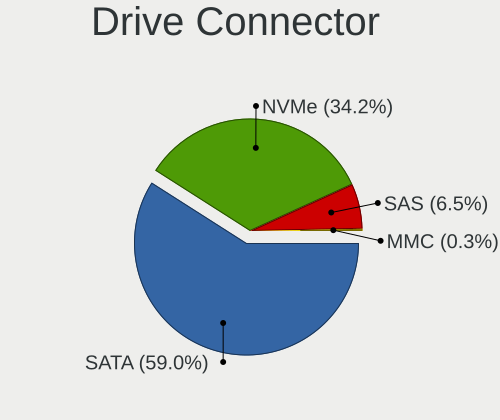

| Type | Desktops | Drives | Percent |
|------|----------|--------|---------|
| SATA | 1127     | 3076   | 59.04%  |
| NVMe | 652      | 1179   | 34.15%  |
| SAS  | 124      | 198    | 6.5%    |
| MMC  | 6        | 6      | 0.31%   |

Drive Size
----------

Size of hard drive

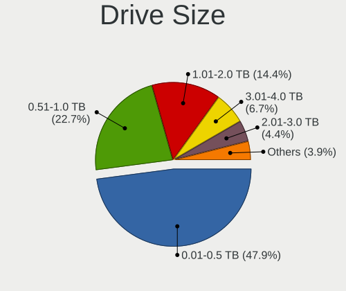

| Size in TB | Desktops | Drives | Percent |
|------------|----------|--------|---------|
| 0.01-0.5   | 868      | 1643   | 47.93%  |
| 0.51-1.0   | 411      | 703    | 22.69%  |
| 1.01-2.0   | 260      | 431    | 14.36%  |
| 3.01-4.0   | 121      | 202    | 6.68%   |
| 2.01-3.0   | 80       | 126    | 4.42%   |
| 4.01-10.0  | 56       | 86     | 3.09%   |
| 10.01-20.0 | 14       | 22     | 0.77%   |
| 20.01-50.0 | 1        | 3      | 0.06%   |

Space Total
-----------

Amount of disk space available on the file system

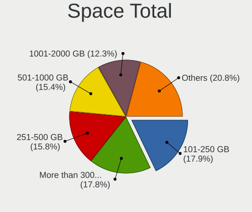

| Size in GB     | Desktops | Percent |
|----------------|----------|---------|
| 101-250        | 271      | 17.86%  |
| More than 3000 | 270      | 17.8%   |
| 251-500        | 240      | 15.82%  |
| 501-1000       | 233      | 15.36%  |
| 1001-2000      | 187      | 12.33%  |
| 1-20           | 103      | 6.79%   |
| 2001-3000      | 100      | 6.59%   |
| 51-100         | 49       | 3.23%   |
| Unknown        | 46       | 3.03%   |
| 21-50          | 18       | 1.19%   |

Space Used
----------

Amount of used disk space

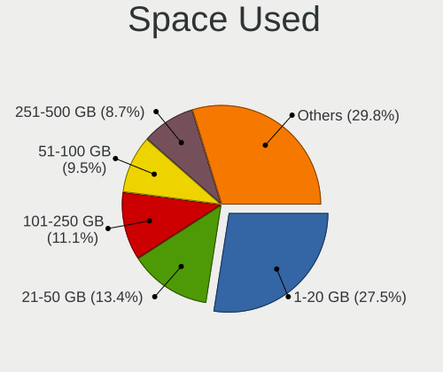

| Used GB        | Desktops | Percent |
|----------------|----------|---------|
| 1-20           | 427      | 27.46%  |
| 21-50          | 209      | 13.44%  |
| 101-250        | 173      | 11.13%  |
| 51-100         | 147      | 9.45%   |
| 251-500        | 136      | 8.75%   |
| 501-1000       | 133      | 8.55%   |
| 1001-2000      | 108      | 6.95%   |
| More than 3000 | 96       | 6.17%   |
| 2001-3000      | 71       | 4.57%   |
| Unknown        | 46       | 2.96%   |
| 0              | 9        | 0.58%   |

Malfunc. Drives
---------------

Drive models with a malfunction

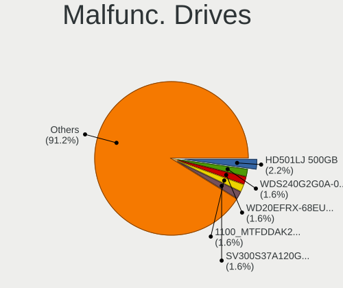

| Model                                             | Desktops | Drives | Percent |
|---------------------------------------------------|----------|--------|---------|
| Samsung Electronics HD501LJ 500GB                 | 4        | 4      | 2.2%    |
| WDC WDS240G2G0A-00JH30 240GB SSD                  | 3        | 3      | 1.65%   |
| WDC WD20EFRX-68EUZN0 2TB                          | 3        | 3      | 1.65%   |
| Micron Technology 1100_MTFDDAK256TBN 256GB SSD    | 3        | 3      | 1.65%   |
| Kingston SV300S37A120G 120GB SSD                  | 3        | 4      | 1.65%   |
| Intel SSDSC2BW240A4 240GB                         | 3        | 3      | 1.65%   |
| Crucial CT525MX300SSD1 528GB                      | 3        | 3      | 1.65%   |
| WDC WD5000AAKX-75U6AA0 500GB                      | 2        | 2      | 1.1%    |
| WDC WD30EFRX-68EUZN0 3TB                          | 2        | 3      | 1.1%    |
| WDC WD30EFRX-68AX9N0 3TB                          | 2        | 4      | 1.1%    |
| WDC WD20EARS-00MVWB0 2TB                          | 2        | 3      | 1.1%    |
| WDC WD15EARS-00Z5B1 1TB                           | 2        | 2      | 1.1%    |
| WDC WD10EZEX-21M2NA0 1TB                          | 2        | 3      | 1.1%    |
| WDC WD10EARS-00Y5B1 1TB                           | 2        | 3      | 1.1%    |
| WDC WD10EALX-009BA0 1TB                           | 2        | 5      | 1.1%    |
| Toshiba DT01ACA100 1TB                            | 2        | 2      | 1.1%    |
| Seagate ST4000DM004-2CV104 4TB                    | 2        | 2      | 1.1%    |
| Seagate ST3500418AS 500GB                         | 2        | 3      | 1.1%    |
| Seagate ST2000DX001-1CM164 2TB                    | 2        | 2      | 1.1%    |
| Seagate ST2000DM001-1CH164 2TB                    | 2        | 5      | 1.1%    |
| Seagate ST1000DM003-1ER162 1TB                    | 2        | 2      | 1.1%    |
| Seagate ST1000DM003-1CH162 1TB                    | 2        | 2      | 1.1%    |
| Samsung Electronics SSD 870 EVO 1TB               | 2        | 2      | 1.1%    |
| Samsung Electronics SP2504C 250GB                 | 2        | 2      | 1.1%    |
| Samsung Electronics HD300LJ 304GB                 | 2        | 2      | 1.1%    |
| Kingston Technology Company KC2000 NVMe SSD 250GB | 2        | 2      | 1.1%    |
| Kingston SHPM2280P2 240G SSD                      | 2        | 2      | 1.1%    |
| Kingston SHFS37A120G 120GB SSD                    | 2        | 2      | 1.1%    |
| Intel SSDSC2CW120A3 120GB                         | 2        | 2      | 1.1%    |
| Hitachi HTS725025A9A364 250GB                     | 2        | 2      | 1.1%    |
| Crucial M4-CT128M4SSD2 128GB                      | 2        | 3      | 1.1%    |
| WDC WD7500AACS-00ZJB0 752GB                       | 1        | 1      | 0.55%   |
| WDC WD740GD-00FLA1 74GB                           | 1        | 1      | 0.55%   |
| WDC WD6400AARS-00Y5B1 640GB                       | 1        | 1      | 0.55%   |
| WDC WD6400AAKS-22A7B2 640GB                       | 1        | 1      | 0.55%   |
| WDC WD6400AAKS-00A7B2 640GB                       | 1        | 1      | 0.55%   |
| WDC WD60EFRX-68L0BN1 6TB                          | 1        | 6      | 0.55%   |
| WDC WD5000BPKT-60PK4T0 500GB                      | 1        | 1      | 0.55%   |
| WDC WD5000AZRX-00A8LB0 500GB                      | 1        | 2      | 0.55%   |
| WDC WD5000AAKX-22ERMA0 500GB                      | 1        | 1      | 0.55%   |

Malfunc. Drive Vendor
---------------------

Vendors of faulty drives

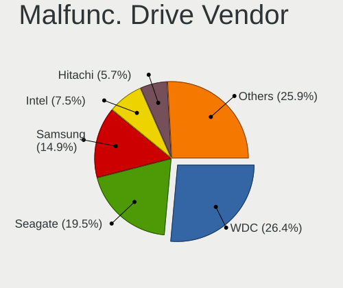

| Vendor                      | Desktops | Drives | Percent |
|-----------------------------|----------|--------|---------|
| WDC                         | 46       | 73     | 26.44%  |
| Seagate                     | 34       | 47     | 19.54%  |
| Samsung Electronics         | 26       | 29     | 14.94%  |
| Intel                       | 13       | 15     | 7.47%   |
| Hitachi                     | 10       | 12     | 5.75%   |
| Kingston                    | 9        | 10     | 5.17%   |
| Crucial                     | 7        | 8      | 4.02%   |
| Micron Technology           | 5        | 5      | 2.87%   |
| Toshiba                     | 4        | 5      | 2.3%    |
| OCZ                         | 3        | 5      | 1.72%   |
| Corsair                     | 3        | 3      | 1.72%   |
| Kingston Technology Company | 2        | 2      | 1.15%   |
| Fujitsu                     | 2        | 2      | 1.15%   |
| SK hynix                    | 1        | 1      | 0.57%   |
| SanDisk                     | 1        | 1      | 0.57%   |
| PNY                         | 1        | 2      | 0.57%   |
| Maxtor                      | 1        | 1      | 0.57%   |
| LITEONIT                    | 1        | 1      | 0.57%   |
| KingFast                    | 1        | 2      | 0.57%   |
| China                       | 1        | 1      | 0.57%   |
| Apple                       | 1        | 1      | 0.57%   |
| A-DATA Technology           | 1        | 1      | 0.57%   |
| Unknown                     | 1        | 1      | 0.57%   |

Malfunc. HDD Vendor
-------------------

Vendors of faulty HDD drives

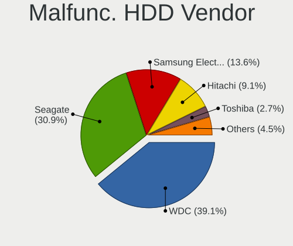

| Vendor              | Desktops | Drives | Percent |
|---------------------|----------|--------|---------|
| WDC                 | 43       | 70     | 39.09%  |
| Seagate             | 34       | 47     | 30.91%  |
| Samsung Electronics | 15       | 16     | 13.64%  |
| Hitachi             | 10       | 12     | 9.09%   |
| Toshiba             | 3        | 4      | 2.73%   |
| Fujitsu             | 2        | 2      | 1.82%   |
| Maxtor              | 1        | 1      | 0.91%   |
| Apple               | 1        | 1      | 0.91%   |
| Unknown             | 1        | 1      | 0.91%   |

Malfunc. Drive Kind
-------------------

Kinds of faulty drives

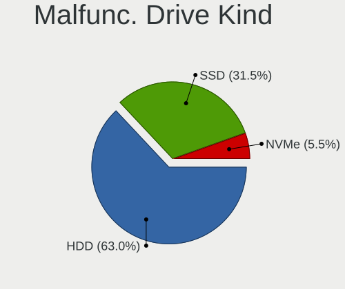

| Kind | Desktops | Drives | Percent |
|------|----------|--------|---------|
| HDD  | 104      | 154    | 63.03%  |
| SSD  | 52       | 65     | 31.52%  |
| NVMe | 9        | 9      | 5.45%   |

Failed Drives
-------------

Failed drive models

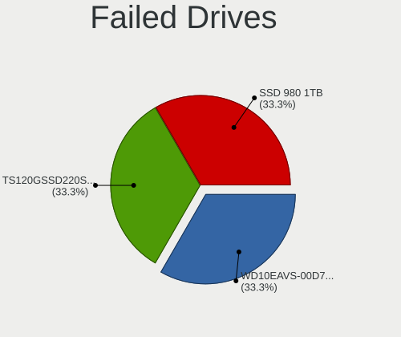

| Model                           | Desktops | Drives | Percent |
|---------------------------------|----------|--------|---------|
| WDC WD10EAVS-00D7B1 1TB         | 1        | 1      | 33.33%  |
| Transcend TS120GSSD220S 120GB   | 1        | 1      | 33.33%  |
| Samsung Electronics SSD 980 1TB | 1        | 1      | 33.33%  |

Failed Drive Vendor
-------------------

Failed drive vendors

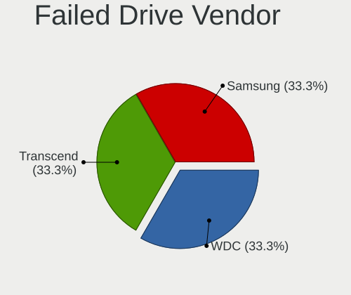

| Vendor              | Desktops | Drives | Percent |
|---------------------|----------|--------|---------|
| WDC                 | 1        | 1      | 33.33%  |
| Transcend           | 1        | 1      | 33.33%  |
| Samsung Electronics | 1        | 1      | 33.33%  |

Drive Status
------------

Number of failed and malfunc. drives

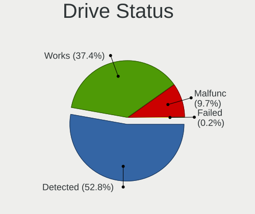

| Status   | Desktops | Drives | Percent |
|----------|----------|--------|---------|
| Detected | 848      | 2594   | 52.8%   |
| Works    | 600      | 1634   | 37.36%  |
| Malfunc  | 155      | 228    | 9.65%   |
| Failed   | 3        | 3      | 0.19%   |

Storage controller
------------------

Storage Vendor
--------------

Storage controller vendors

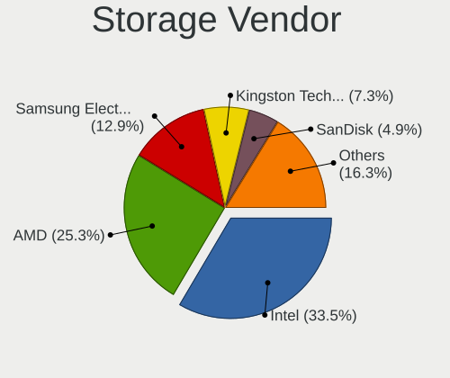

| Vendor                        | Desktops | Percent |
|-------------------------------|----------|---------|
| Intel                         | 789      | 33.49%  |
| AMD                           | 595      | 25.25%  |
| Samsung Electronics           | 303      | 12.86%  |
| Kingston Technology Company   | 171      | 7.26%   |
| SanDisk                       | 115      | 4.88%   |
| ASMedia Technology            | 84       | 3.57%   |
| Phison Electronics            | 72       | 3.06%   |
| JMicron Technology            | 50       | 2.12%   |
| Marvell Technology Group      | 42       | 1.78%   |
| Micron/Crucial Technology     | 30       | 1.27%   |
| Nvidia                        | 13       | 0.55%   |
| SK hynix                      | 11       | 0.47%   |
| Silicon Motion                | 11       | 0.47%   |
| KIOXIA                        | 9        | 0.38%   |
| Toshiba America Info Systems  | 8        | 0.34%   |
| Silicon Image                 | 7        | 0.3%    |
| ADATA Technology              | 6        | 0.25%   |
| VIA Technologies              | 5        | 0.21%   |
| Seagate Technology            | 5        | 0.21%   |
| LSI Logic / Symbios Logic     | 5        | 0.21%   |
| Realtek Semiconductor         | 4        | 0.17%   |
| MAXIO Technology (Hangzhou)   | 4        | 0.17%   |
| Broadcom / LSI                | 4        | 0.17%   |
| Micron Technology             | 3        | 0.13%   |
| Transcend                     | 1        | 0.04%   |
| Solidigm                      | 1        | 0.04%   |
| Netac Technology              | 1        | 0.04%   |
| Lite-On Technology            | 1        | 0.04%   |
| Lenovo                        | 1        | 0.04%   |
| Integrated Technology Express | 1        | 0.04%   |
| HighPoint Technologies        | 1        | 0.04%   |
| Hewlett-Packard               | 1        | 0.04%   |
| Corsair Memory                | 1        | 0.04%   |
| Adaptec                       | 1        | 0.04%   |

Storage Model
-------------

Storage controller models

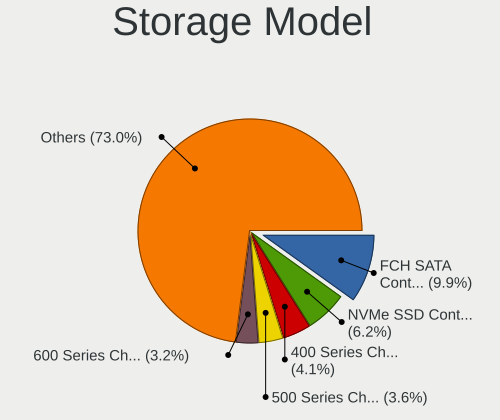

| Model                                                                                   | Desktops | Percent |
|-----------------------------------------------------------------------------------------|----------|---------|
| AMD FCH SATA Controller [AHCI mode]                                                     | 276      | 9.9%    |
| Samsung NVMe SSD Controller SM981/PM981/PM983                                           | 172      | 6.17%   |
| AMD 400 Series Chipset SATA Controller                                                  | 115      | 4.13%   |
| AMD 500 Series Chipset SATA Controller                                                  | 100      | 3.59%   |
| AMD 600 Series Chipset SATA Controller                                                  | 90       | 3.23%   |
| ASMedia ASM1061/ASM1062 Serial ATA Controller                                           | 77       | 2.76%   |
| Intel Q170/Q150/B150/H170/H110/Z170/CM236 Chipset SATA Controller [AHCI Mode]           | 75       | 2.69%   |
| Intel 8 Series/C220 Series Chipset Family 6-port SATA Controller 1 [AHCI mode]          | 72       | 2.58%   |
| Intel Cannon Lake PCH SATA AHCI Controller                                              | 68       | 2.44%   |
| Intel 200 Series PCH SATA controller [AHCI mode]                                        | 67       | 2.4%    |
| Intel SATA Controller [RAID Mode]                                                       | 62       | 2.22%   |
| AMD SB7x0/SB8x0/SB9x0 IDE Controller                                                    | 54       | 1.94%   |
| Samsung NVMe SSD Controller SM961/PM961/SM963                                           | 53       | 1.9%    |
| Samsung NVMe SSD Controller PM9A1/PM9A3/980PRO                                          | 53       | 1.9%    |
| Intel 6 Series/C200 Series Chipset Family 6 port Desktop SATA AHCI Controller           | 49       | 1.76%   |
| AMD SB7x0/SB8x0/SB9x0 SATA Controller [AHCI mode]                                       | 49       | 1.76%   |
| Kingston Company A2000 NVMe SSD [SM2263EN]                                              | 45       | 1.61%   |
| Kingston Company KC3000/FURY Renegade NVMe SSD [E18]                                    | 42       | 1.51%   |
| Intel 7 Series/C210 Series Chipset Family 6-port SATA Controller [AHCI mode]            | 42       | 1.51%   |
| AMD SB7x0/SB8x0/SB9x0 SATA Controller [IDE mode]                                        | 39       | 1.4%    |
| Intel 9 Series Chipset Family SATA Controller [AHCI Mode]                               | 33       | 1.18%   |
| SanDisk Ultra 3D / WD PC SN530, IX SN530, Blue SN550 NVMe SSD (DRAM-less)               | 30       | 1.08%   |
| Intel Alder Lake-S PCH SATA Controller [AHCI Mode]                                      | 30       | 1.08%   |
| Phison E12 NVMe Controller                                                              | 29       | 1.04%   |
| JMicron JMB363 SATA/IDE Controller                                                      | 24       | 0.86%   |
| Intel SSD 660P Series                                                                   | 23       | 0.83%   |
| Intel 6 Series/C200 Series Chipset Family Desktop SATA Controller (IDE mode, ports 4-5) | 23       | 0.83%   |
| Intel 6 Series/C200 Series Chipset Family Desktop SATA Controller (IDE mode, ports 0-3) | 23       | 0.83%   |
| AMD 300 Series Chipset SATA Controller                                                  | 22       | 0.79%   |
| Intel Raptor Lake SATA AHCI Controller                                                  | 21       | 0.75%   |
| Intel C610/X99 series chipset 6-Port SATA Controller [AHCI mode]                        | 21       | 0.75%   |
| Phison E16 PCIe4 NVMe Controller                                                        | 19       | 0.68%   |
| Intel 500 Series Chipset Family SATA AHCI Controller                                    | 19       | 0.68%   |
| Kingston Company NV2 NVMe SSD [SM2267XT] (DRAM-less)                                    | 18       | 0.65%   |
| Intel Volume Management Device NVMe RAID Controller                                     | 18       | 0.65%   |
| SanDisk WD PC SN810 / Black SN850 NVMe SSD                                              | 17       | 0.61%   |
| Sandisk WD Black SN850X NVMe SSD                                                        | 16       | 0.57%   |
| Samsung NVMe SSD Controller S4LV008[Pascal]                                             | 16       | 0.57%   |
| Intel C610/X99 series chipset sSATA Controller [AHCI mode]                              | 16       | 0.57%   |
| SanDisk Extreme Pro / WD Black SN750 / PC SN730 / Red SN700 NVMe SSD                    | 15       | 0.54%   |

Storage Kind
------------

Kind of storage controller (IDE, SATA, NVMe, SAS, ...)

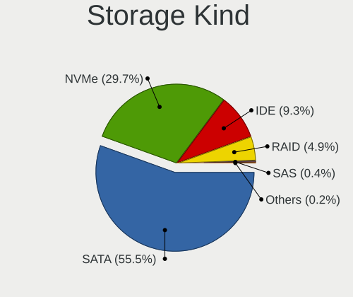

| Kind | Desktops | Percent |
|------|----------|---------|
| SATA | 1224     | 55.49%  |
| NVMe | 656      | 29.74%  |
| IDE  | 205      | 9.29%   |
| RAID | 108      | 4.9%    |
| SAS  | 9        | 0.41%   |
| SCSI | 4        | 0.18%   |

Processor
---------

CPU Vendor
----------

Processor vendors

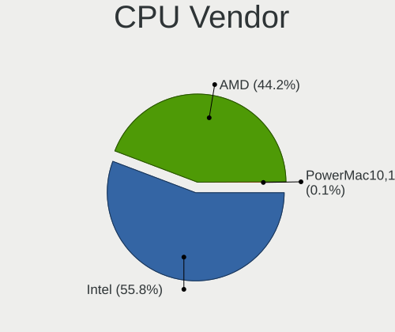

| Vendor       | Desktops | Percent |
|--------------|----------|---------|
| Intel        | 775      | 55.76%  |
| AMD          | 614      | 44.17%  |
| PowerMac10,1 | 1        | 0.07%   |

CPU Model
---------

Processor models

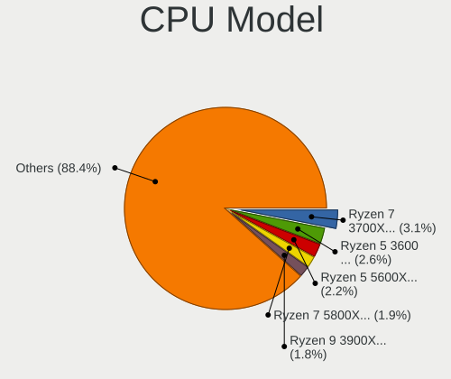

| Model                                       | Desktops | Percent |
|---------------------------------------------|----------|---------|
| AMD Ryzen 7 3700X 8-Core Processor          | 43       | 3.08%   |
| AMD Ryzen 5 3600 6-Core Processor           | 37       | 2.65%   |
| AMD Ryzen 5 5600X 6-Core Processor          | 31       | 2.22%   |
| AMD Ryzen 7 5800X 8-Core Processor          | 26       | 1.86%   |
| AMD Ryzen 9 3900X 12-Core Processor         | 25       | 1.79%   |
| Intel Core i5-6600K CPU @ 3.50GHz           | 23       | 1.65%   |
| Intel Core i7-4790K CPU @ 4.00GHz           | 19       | 1.36%   |
| AMD Ryzen 5 5600G with Radeon Graphics      | 19       | 1.36%   |
| Intel Core i7-9700K CPU @ 3.60GHz           | 17       | 1.22%   |
| Intel Core i7-6700K CPU @ 4.00GHz           | 16       | 1.15%   |
| AMD Ryzen 9 5900X 12-Core Processor         | 16       | 1.15%   |
| Intel Core i5-2500K CPU @ 3.30GHz           | 14       | 1%      |
| Intel Core i9-9900K CPU @ 3.60GHz           | 13       | 0.93%   |
| Intel Core i5-4690K CPU @ 3.50GHz           | 13       | 0.93%   |
| AMD Ryzen 9 5950X 16-Core Processor         | 13       | 0.93%   |
| AMD Ryzen 5 3400G with Radeon Vega Graphics | 13       | 0.93%   |
| Intel Core i7-6700 CPU @ 3.40GHz            | 12       | 0.86%   |
| Intel Core i7-3770 CPU @ 3.40GHz            | 12       | 0.86%   |
| Intel Core i7-2600 CPU @ 3.40GHz            | 12       | 0.86%   |
| Intel Core i5-4460 CPU @ 3.20GHz            | 12       | 0.86%   |
| Intel Core i5-8400 CPU @ 2.80GHz            | 11       | 0.79%   |
| Intel Core i5-3470 CPU @ 3.20GHz            | 11       | 0.79%   |
| AMD Ryzen 7 5800X3D 8-Core Processor        | 11       | 0.79%   |
| AMD Ryzen 7 2700X Eight-Core Processor      | 11       | 0.79%   |
| AMD Ryzen 5 7600X 6-Core Processor          | 11       | 0.79%   |
| AMD Ryzen 5 2600 Six-Core Processor         | 11       | 0.79%   |
| Intel Core i7-8700K CPU @ 3.70GHz           | 10       | 0.72%   |
| Intel Core i7-7700K CPU @ 4.20GHz           | 10       | 0.72%   |
| AMD Ryzen 9 7950X 16-Core Processor         | 10       | 0.72%   |
| AMD Ryzen 7 9800X3D 8-Core Processor        | 10       | 0.72%   |
| AMD Ryzen 7 7800X3D 8-Core Processor        | 10       | 0.72%   |
| AMD Ryzen 5 2600X Six-Core Processor        | 10       | 0.72%   |
| AMD FX-6300 Six-Core Processor              | 10       | 0.72%   |
| Intel Core i7-7700 CPU @ 3.60GHz            | 9        | 0.64%   |
| Intel Core i7-4770 CPU @ 3.40GHz            | 9        | 0.64%   |
| Intel Core i7-3770K CPU @ 3.50GHz           | 9        | 0.64%   |
| Intel Core i7-2600K CPU @ 3.40GHz           | 9        | 0.64%   |
| AMD Ryzen 9 7900X 12-Core Processor         | 9        | 0.64%   |
| AMD Ryzen 5 3600X 6-Core Processor          | 9        | 0.64%   |
| Intel Core i5-7400 CPU @ 3.00GHz            | 8        | 0.57%   |

CPU Model Family
----------------

Processor model prefix

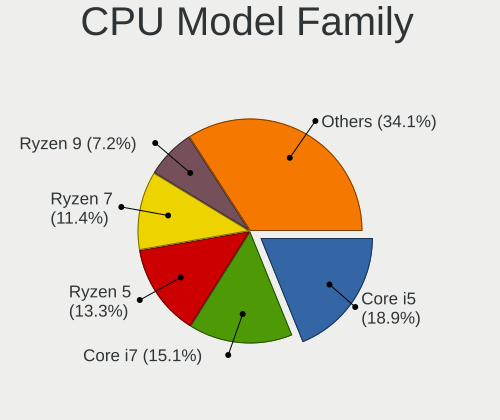

| Model                   | Desktops | Percent |
|-------------------------|----------|---------|
| Intel Core i5           | 263      | 18.87%  |
| Intel Core i7           | 210      | 15.06%  |
| AMD Ryzen 5             | 186      | 13.34%  |
| AMD Ryzen 7             | 159      | 11.41%  |
| AMD Ryzen 9             | 100      | 7.17%   |
| Other                   | 72       | 5.16%   |
| Intel Xeon              | 55       | 3.95%   |
| AMD FX                  | 42       | 3.01%   |
| Intel Core i3           | 39       | 2.8%    |
| Intel Celeron           | 27       | 1.94%   |
| Intel Pentium           | 24       | 1.72%   |
| Intel Core i9           | 23       | 1.65%   |
| Intel Core 2 Quad       | 21       | 1.51%   |
| Intel Core 2 Duo        | 20       | 1.43%   |
| AMD Ryzen Threadripper  | 12       | 0.86%   |
| AMD Phenom II X4        | 12       | 0.86%   |
| AMD Ryzen 3             | 9        | 0.65%   |
| AMD Athlon II X2        | 9        | 0.65%   |
| Intel Pentium Dual-Core | 8        | 0.57%   |
| AMD Phenom II X6        | 8        | 0.57%   |
| AMD Athlon 64 X2        | 8        | 0.57%   |
| Intel Atom              | 7        | 0.5%    |
| AMD A10                 | 7        | 0.5%    |
| AMD A8                  | 6        | 0.43%   |
| Intel Core 2            | 5        | 0.36%   |
| AMD Ryzen Embedded      | 5        | 0.36%   |
| AMD A6                  | 4        | 0.29%   |
| AMD A4                  | 4        | 0.29%   |
| AMD Ryzen 7 PRO         | 3        | 0.22%   |
| AMD Phenom              | 3        | 0.22%   |
| AMD EPYC                | 3        | 0.22%   |
| AMD E                   | 3        | 0.22%   |
| AMD Athlon X4           | 3        | 0.22%   |
| AMD Athlon II X4        | 3        | 0.22%   |
| AMD Athlon II X3        | 3        | 0.22%   |
| AMD Athlon              | 3        | 0.22%   |
| Intel Pentium Silver    | 2        | 0.14%   |
| Intel Pentium Dual      | 2        | 0.14%   |
| AMD Phenom II X3        | 2        | 0.14%   |
| AMD GX                  | 2        | 0.14%   |

CPU Cores
---------

Number of processor cores

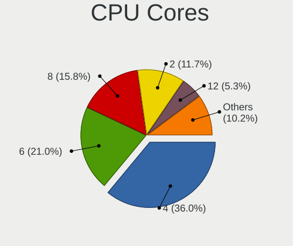

| Number  | Desktops | Percent |
|---------|----------|---------|
| 4       | 503      | 36.03%  |
| 6       | 293      | 20.99%  |
| 8       | 220      | 15.76%  |
| 2       | 164      | 11.75%  |
| 12      | 74       | 5.3%    |
| 16      | 67       | 4.8%    |
| 3       | 20       | 1.43%   |
| 1       | 15       | 1.07%   |
| 10      | 14       | 1%      |
| 24      | 7        | 0.5%    |
| 14      | 5        | 0.36%   |
| 32      | 3        | 0.21%   |
| 20      | 3        | 0.21%   |
| 192     | 2        | 0.14%   |
| 64      | 2        | 0.14%   |
| 18      | 2        | 0.14%   |
| 28      | 1        | 0.07%   |
| Unknown | 1        | 0.07%   |

CPU Sockets
-----------

Number of sockets

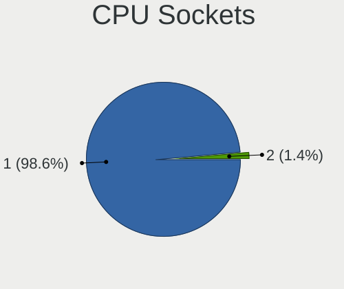

| Number | Desktops | Percent |
|--------|----------|---------|
| 1      | 1370     | 98.56%  |
| 2      | 20       | 1.44%   |

CPU Threads
-----------

Threads per core (Hyper-Threading)

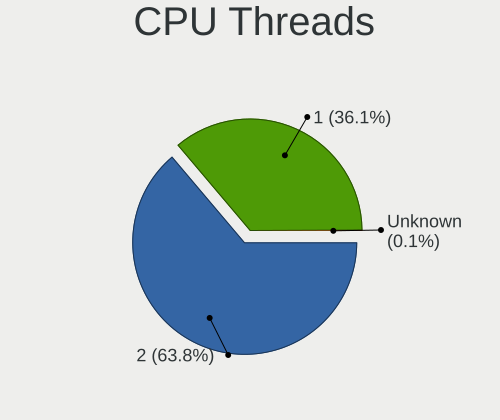

| Number  | Desktops | Percent |
|---------|----------|---------|
| 2       | 891      | 63.83%  |
| 1       | 504      | 36.1%   |
| Unknown | 1        | 0.07%   |

CPU Op-Modes
------------

CPU Operation Modes (32-bit, 64-bit)

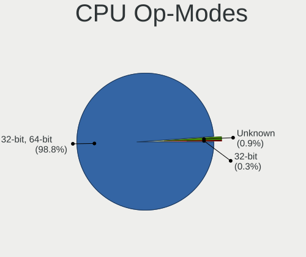

| Op mode        | Desktops | Percent |
|----------------|----------|---------|
| 32-bit, 64-bit | 1375     | 98.85%  |
| Unknown        | 12       | 0.86%   |
| 32-bit         | 4        | 0.29%   |

CPU Microcode
-------------

Microcode number

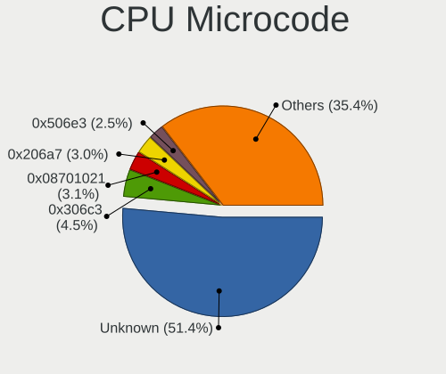

| Number     | Desktops | Percent |
|------------|----------|---------|
| Unknown    | 756      | 51.43%  |
| 0x306c3    | 66       | 4.49%   |
| 0x08701021 | 46       | 3.13%   |
| 0x206a7    | 44       | 2.99%   |
| 0x506e3    | 37       | 2.52%   |
| 0x306a9    | 30       | 2.04%   |
| 0x906ea    | 26       | 1.77%   |
| 0x1067a    | 26       | 1.77%   |
| 0x906e9    | 23       | 1.56%   |
| 0x0800820d | 23       | 1.56%   |
| 0x08701013 | 22       | 1.5%    |
| 0x0a201009 | 16       | 1.09%   |
| 0x06000852 | 16       | 1.09%   |
| 0x306f2    | 14       | 0.95%   |
| 0x010000c8 | 14       | 0.95%   |
| 0x08108109 | 13       | 0.88%   |
| 0x08001138 | 13       | 0.88%   |
| 0x0a601203 | 11       | 0.75%   |
| 0x906ed    | 10       | 0.68%   |
| 0x90672    | 9        | 0.61%   |
| 0x906ec    | 8        | 0.54%   |
| 0x106e5    | 8        | 0.54%   |
| 0x0a201016 | 8        | 0.54%   |
| 0x0600063e | 8        | 0.54%   |
| 0xa0655    | 7        | 0.48%   |
| 0x406f1    | 7        | 0.48%   |
| 0x010000dc | 7        | 0.48%   |
| 0xa0671    | 6        | 0.41%   |
| 0x0a50000d | 6        | 0.41%   |
| 0x08701030 | 6        | 0.41%   |
| 0x0810100b | 6        | 0.41%   |
| 0x08001137 | 6        | 0.41%   |
| 0x06001119 | 6        | 0.41%   |
| 0x206d7    | 5        | 0.34%   |
| 0x106a5    | 5        | 0.34%   |
| 0x10676    | 5        | 0.34%   |
| 0x0a601206 | 5        | 0.34%   |
| 0x0a50000c | 5        | 0.34%   |
| 0x03000027 | 5        | 0.34%   |
| 0xb0671    | 4        | 0.27%   |

CPU Microarch
-------------

Microarchitecture

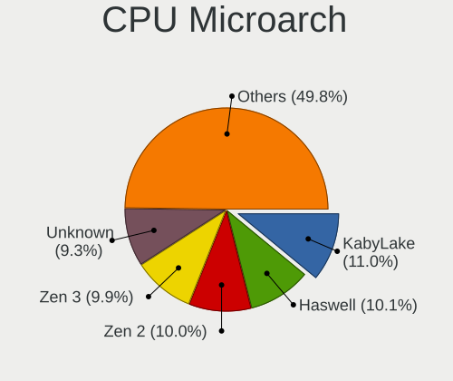

| Name             | Desktops | Percent |
|------------------|----------|---------|
| KabyLake         | 153      | 10.96%  |
| Haswell          | 141      | 10.1%   |
| Zen 2            | 139      | 9.96%   |
| Zen 3            | 138      | 9.89%   |
| Unknown          | 130      | 9.31%   |
| Skylake          | 89       | 6.38%   |
| SandyBridge      | 87       | 6.23%   |
| IvyBridge        | 66       | 4.73%   |
| Zen+             | 60       | 4.3%    |
| Zen              | 46       | 3.3%    |
| Penryn           | 46       | 3.3%    |
| K10              | 44       | 3.15%   |
| Piledriver       | 37       | 2.65%   |
| Alderlake Hybrid | 35       | 2.51%   |
| Nehalem          | 23       | 1.65%   |
| CometLake        | 21       | 1.5%    |
| Core             | 18       | 1.29%   |
| Westmere         | 14       | 1%      |
| Bulldozer        | 12       | 0.86%   |
| K8 Hammer        | 11       | 0.79%   |
| Broadwell        | 11       | 0.79%   |
| Silvermont       | 10       | 0.72%   |
| Icelake          | 10       | 0.72%   |
| Goldmont plus    | 8        | 0.57%   |
| Steamroller      | 7        | 0.5%    |
| K10 Llano        | 7        | 0.5%    |
| Excavator        | 6        | 0.43%   |
| Goldmont         | 5        | 0.36%   |
| Bobcat           | 5        | 0.36%   |
| NetBurst         | 3        | 0.21%   |
| Jaguar           | 3        | 0.21%   |
| Bonnell          | 3        | 0.21%   |
| Tremont          | 2        | 0.14%   |
| Puma             | 2        | 0.14%   |
| Lunarlake Hybrid | 1        | 0.07%   |
| K6               | 1        | 0.07%   |
| Gracemont        | 1        | 0.07%   |
| Geode            | 1        | 0.07%   |

Graphics
--------

GPU Vendor
----------

Vendors of graphics cards

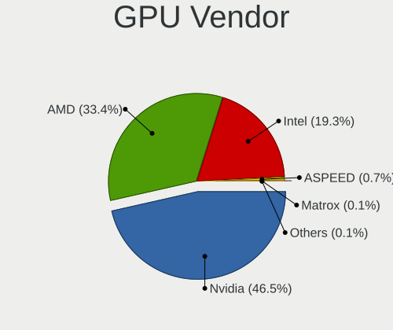

| Vendor                     | Desktops | Percent |
|----------------------------|----------|---------|
| Nvidia                     | 705      | 46.47%  |
| AMD                        | 506      | 33.36%  |
| Intel                      | 293      | 19.31%  |
| ASPEED Technology          | 10       | 0.66%   |
| Matrox Electronics Systems | 2        | 0.13%   |
| Red Hat                    | 1        | 0.07%   |

GPU Model
---------

Graphics card models

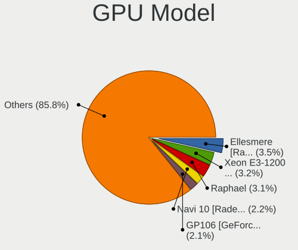

| Model                                                                       | Desktops | Percent |
|-----------------------------------------------------------------------------|----------|---------|
| AMD Ellesmere [Radeon RX 470/480/570/570X/580/580X/590]                     | 57       | 3.54%   |
| Intel Xeon E3-1200 v3/4th Gen Core Processor Integrated Graphics Controller | 52       | 3.23%   |
| AMD Raphael                                                                 | 50       | 3.11%   |
| AMD Navi 10 [Radeon RX 5600 OEM/5600 XT / 5700/5700 XT]                     | 36       | 2.24%   |
| Nvidia GP106 [GeForce GTX 1060 6GB]                                         | 34       | 2.11%   |
| Nvidia GP104 [GeForce GTX 1070]                                             | 32       | 1.99%   |
| Intel 2nd Generation Core Processor Family Integrated Graphics Controller   | 31       | 1.93%   |
| Intel CoffeeLake-S GT2 [UHD Graphics 630]                                   | 30       | 1.87%   |
| AMD Navi 31 [Radeon RX 7900 XT/7900 XTX/7900 GRE/7900M]                     | 30       | 1.87%   |
| Nvidia GP106 [GeForce GTX 1060 3GB]                                         | 28       | 1.74%   |
| Intel Skylake-S GT2 [HD Graphics 530]                                       | 28       | 1.74%   |
| Nvidia GM204 [GeForce GTX 970]                                              | 27       | 1.68%   |
| Nvidia GP104 [GeForce GTX 1080]                                             | 26       | 1.62%   |
| AMD Navi 21 [Radeon RX 6800/6800 XT / 6900 XT]                              | 26       | 1.62%   |
| Nvidia GM206 [GeForce GTX 960]                                              | 25       | 1.55%   |
| Nvidia GP107 [GeForce GTX 1050 Ti]                                          | 24       | 1.49%   |
| AMD Navi 22 [Radeon RX 6700/6700 XT/6750 XT / 6800M/6850M XT]               | 23       | 1.43%   |
| AMD Granite Ridge [Radeon Graphics]                                         | 20       | 1.24%   |
| Nvidia TU106 [GeForce RTX 2060 Rev. A]                                      | 19       | 1.18%   |
| Nvidia GK208B [GeForce GT 710]                                              | 19       | 1.18%   |
| AMD Cezanne [Radeon Vega Series / Radeon Vega Mobile Series]                | 19       | 1.18%   |
| AMD Navi 23 [Radeon RX 6600/6600 XT/6600M]                                  | 18       | 1.12%   |
| Intel Xeon E3-1200 v2/3rd Gen Core processor Graphics Controller            | 17       | 1.06%   |
| Nvidia TU104 [GeForce RTX 2070 SUPER]                                       | 16       | 1%      |
| AMD Vega 10 XL/XT [Radeon RX Vega 56/64]                                    | 16       | 1%      |
| Nvidia GA106 [GeForce RTX 3060 Lite Hash Rate]                              | 15       | 0.93%   |
| Intel Kaby Lake-S GT2 [HD Graphics 630]                                     | 14       | 0.87%   |
| AMD Picasso/Raven 2 [Radeon Vega Series / Radeon Vega Mobile Series]        | 14       | 0.87%   |
| Nvidia TU116 [GeForce GTX 1660 SUPER]                                       | 13       | 0.81%   |
| Nvidia GP108 [GeForce GT 1030]                                              | 13       | 0.81%   |
| AMD Navi 32 [Radeon RX 7700 XT / 7800 XT]                                   | 13       | 0.81%   |
| Intel 4 Series Chipset Integrated Graphics Controller                       | 12       | 0.75%   |
| Nvidia TU116 [GeForce GTX 1660 Ti]                                          | 11       | 0.68%   |
| Nvidia GP102 [GeForce GTX 1080 Ti]                                          | 11       | 0.68%   |
| Nvidia TU106 [GeForce RTX 2070]                                             | 10       | 0.62%   |
| Nvidia GA102 [GeForce RTX 3080]                                             | 10       | 0.62%   |
| Intel IvyBridge GT2 [HD Graphics 4000]                                      | 10       | 0.62%   |
| ASPEED Technology ASPEED Graphics Family                                    | 10       | 0.62%   |
| AMD Raven Ridge [Radeon Vega Series / Radeon Vega Mobile Series]            | 10       | 0.62%   |
| Nvidia GT218 [GeForce 210]                                                  | 9        | 0.56%   |

GPU Combo
---------

Combinations of graphics cards

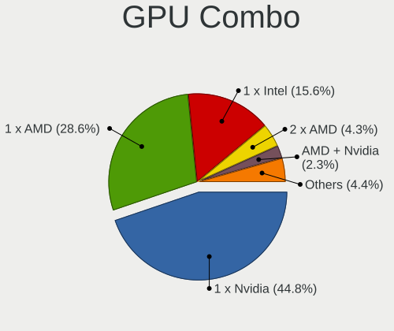

| Name                     | Desktops | Percent |
|--------------------------|----------|---------|
| 1 x Nvidia               | 633      | 44.8%   |
| 1 x AMD                  | 404      | 28.59%  |
| 1 x Intel                | 220      | 15.57%  |
| 2 x AMD                  | 61       | 4.32%   |
| AMD + Nvidia             | 33       | 2.34%   |
| Intel + Nvidia           | 24       | 1.7%    |
| Intel + AMD              | 11       | 0.78%   |
| 2 x Nvidia               | 9        | 0.64%   |
| 1 x ASPEED               | 7        | 0.5%    |
| Nvidia + ASPEED          | 3        | 0.21%   |
| 1 x Matrox               | 2        | 0.14%   |
| Intel + 2 x Nvidia       | 2        | 0.14%   |
| Intel + AMD + 1 x Nvidia | 2        | 0.14%   |
| Other                    | 1        | 0.07%   |
| 1 x Red Hat              | 1        | 0.07%   |

GPU Driver
----------

Free vs proprietary

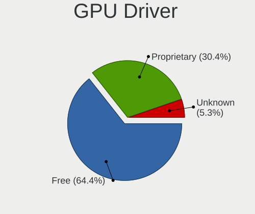

| Driver      | Desktops | Percent |
|-------------|----------|---------|
| Free        | 918      | 64.38%  |
| Proprietary | 433      | 30.36%  |
| Unknown     | 75       | 5.26%   |

GPU Memory
----------

Total video memory

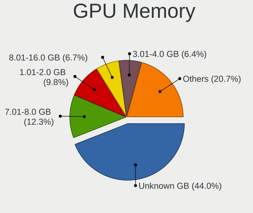

| Size in GB | Desktops | Percent |
|------------|----------|---------|
| Unknown    | 644      | 44.05%  |
| 7.01-8.0   | 180      | 12.31%  |
| 1.01-2.0   | 143      | 9.78%   |
| 8.01-16.0  | 98       | 6.7%    |
| 3.01-4.0   | 94       | 6.43%   |
| 0.01-0.5   | 93       | 6.36%   |
| 0.51-1.0   | 90       | 6.16%   |
| 5.01-6.0   | 69       | 4.72%   |
| 2.01-3.0   | 27       | 1.85%   |
| 16.01-24.0 | 23       | 1.57%   |
| 24.01-32.0 | 1        | 0.07%   |

Monitor
-------

Monitor Vendor
--------------

Monitor vendors

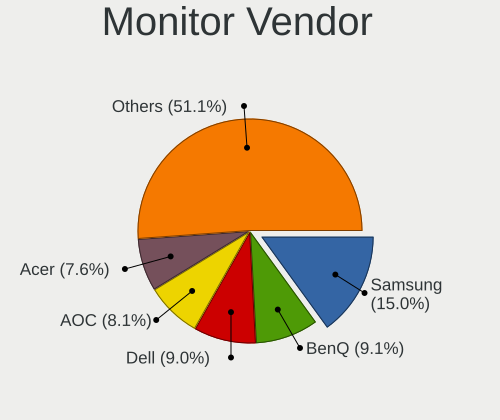

| Vendor               | Desktops | Percent |
|----------------------|----------|---------|
| Samsung Electronics  | 245      | 15.02%  |
| BenQ                 | 149      | 9.14%   |
| Dell                 | 147      | 9.01%   |
| AOC                  | 132      | 8.09%   |
| Acer                 | 124      | 7.6%    |
| Philips              | 118      | 7.23%   |
| Ancor Communications | 112      | 6.87%   |
| Hewlett-Packard      | 103      | 6.32%   |
| Goldstar             | 97       | 5.95%   |
| ASUSTek Computer     | 60       | 3.68%   |
| MSI                  | 49       | 3%      |
| Lenovo               | 46       | 2.82%   |
| Eizo                 | 25       | 1.53%   |
| Sony                 | 14       | 0.86%   |
| Unknown              | 13       | 0.8%    |
| Vestel Elektronik    | 12       | 0.74%   |
| Fujitsu Siemens      | 12       | 0.74%   |
| Panasonic            | 11       | 0.67%   |
| Gigabyte Technology  | 11       | 0.67%   |
| ViewSonic            | 10       | 0.61%   |
| LG Electronics       | 10       | 0.61%   |
| Positivo             | 6        | 0.37%   |
| Microstep            | 6        | 0.37%   |
| Mi                   | 6        | 0.37%   |
| OEM                  | 5        | 0.31%   |
| Unknown              | 5        | 0.31%   |
| Xiaomi               | 4        | 0.25%   |
| Wacom                | 4        | 0.25%   |
| Packard Bell         | 4        | 0.25%   |
| Onkyo                | 4        | 0.25%   |
| Iiyama               | 4        | 0.25%   |
| AUS                  | 4        | 0.25%   |
| VOXICON              | 3        | 0.18%   |
| Vestel               | 3        | 0.18%   |
| TCL                  | 3        | 0.18%   |
| RTK                  | 3        | 0.18%   |
| Pixio                | 3        | 0.18%   |
| IEI                  | 3        | 0.18%   |
| HUAWEI               | 3        | 0.18%   |
| Grundig              | 3        | 0.18%   |

Monitor Model
-------------

Monitor models

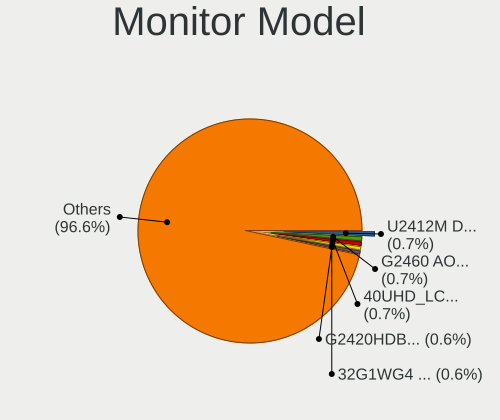

| Model                                                                  | Desktops | Percent |
|------------------------------------------------------------------------|----------|---------|
| Dell U2412M DELA07A 1920x1200 518x324mm 24.1-inch                      | 13       | 0.74%   |
| AOC G2460 AOC2460 1920x1080 531x299mm 24.0-inch                        | 13       | 0.74%   |
| Vestel Elektronik 40UHD_LCD_TV VES3700 3840x2160 880x500mm 39.8-inch   | 12       | 0.68%   |
| BenQ G2420HDBL BNQ785F 1920x1080 477x268mm 21.5-inch                   | 11       | 0.63%   |
| AOC 32G1WG4 AOC3201 1920x1080 697x392mm 31.5-inch                      | 10       | 0.57%   |
| AOC 24G2W1G3 AOC2402 1920x1080 527x296mm 23.8-inch                     | 10       | 0.57%   |
| MSI MAG342CQRV MSI3DB6 3440x1440 797x333mm 34.0-inch                   | 9        | 0.51%   |
| ASUSTek Computer VG27A AUS2722 2560x1440 597x336mm 27.0-inch           | 9        | 0.51%   |
| Ancor Communications ASUS PB278 ACI27A3 2560x1440 597x336mm 27.0-inch  | 9        | 0.51%   |
| Hewlett-Packard E241i HWP3122 1920x1200 518x324mm 24.1-inch            | 8        | 0.46%   |
| AOC 27G2G4 AOC2702 1920x1080 598x336mm 27.0-inch                       | 8        | 0.46%   |
| Samsung Electronics S24F350 SAM0D20 1920x1080 521x293mm 23.5-inch      | 7        | 0.4%    |
| Dell U2412M DELA07B 1920x1200 518x324mm 24.1-inch                      | 7        | 0.4%    |
| Ancor Communications VG248 ACI24A4 1920x1080 531x299mm 24.0-inch       | 7        | 0.4%    |
| Ancor Communications VE247 ACI2493 1920x1080 530x300mm 24.0-inch       | 7        | 0.4%    |
| Ancor Communications ROG PG279Q ACI27EC 2560x1440 598x336mm 27.0-inch  | 7        | 0.4%    |
| Samsung Electronics Odyssey G50A SAM7181 2560x1440 597x336mm 27.0-inch | 6        | 0.34%   |
| Philips PHL 243V5 PHLC0D1 1920x1080 521x293mm 23.5-inch                | 6        | 0.34%   |
| Philips 273ELH PHLC07D 1920x1080 598x336mm 27.0-inch                   | 6        | 0.34%   |
| MSI Optix MAG27CQ MSI1462 2560x1440 597x336mm 27.0-inch                | 6        | 0.34%   |
| MSI G241 MSI3BA4 1920x1080 527x296mm 23.8-inch                         | 6        | 0.34%   |
| Lenovo LT2252p Wide LEN0A0C 1680x1050 474x296mm 22.0-inch              | 6        | 0.34%   |
| Goldstar ULTRAGEAR GSM774B 3440x1440 800x335mm 34.1-inch               | 6        | 0.34%   |
| Goldstar LG TV SSCR2 GSMC0C8 3840x2160                                 | 6        | 0.34%   |
| BenQ GL2450H BNQ78A7 1920x1080 531x298mm 24.0-inch                     | 6        | 0.34%   |
| BenQ GL2450 BNQ78A5 1920x1080 531x298mm 24.0-inch                      | 6        | 0.34%   |
| AOC 2460G4 AOC0001 1920x1080 531x299mm 24.0-inch                       | 6        | 0.34%   |
| Ancor Communications VX238 ACI23C1 1920x1080 510x290mm 23.1-inch       | 6        | 0.34%   |
| Ancor Communications VG248 ACI24E1 1920x1080 531x299mm 24.0-inch       | 6        | 0.34%   |
| Samsung Electronics U28E590 SAM0C4D 3840x2160 607x345mm 27.5-inch      | 5        | 0.29%   |
| Philips FTV PHL01EA 1920x1080 1440x810mm 65.0-inch                     | 5        | 0.29%   |
| OEM 32W_LCD_TV OEM3700 1920x540                                        | 5        | 0.29%   |
| BenQ XL2411Z BNQ7F31 1920x1080 531x298mm 24.0-inch                     | 5        | 0.29%   |
| BenQ G2420HD BNQ7840 1920x1080 531x299mm 24.0-inch                     | 5        | 0.29%   |
| BenQ BenQG2222HDL BNQ785A 1920x1080 478x269mm 21.6-inch                | 5        | 0.29%   |
| ASUSTek Computer VG245 AUS24A1 1920x1080 531x299mm 24.0-inch           | 5        | 0.29%   |
| AOC 24B1W1 AOC2401 1920x1080 527x296mm 23.8-inch                       | 5        | 0.29%   |
| Ancor Communications ASUS VS228 ACI22FD 1920x1080 476x268mm 21.5-inch  | 5        | 0.29%   |
| Acer XB271HU A ACR052F 2560x1440 598x336mm 27.0-inch                   | 5        | 0.29%   |
| Unknown                                                                | 5        | 0.29%   |

Monitor Resolution
------------------

Monitor screen resolution

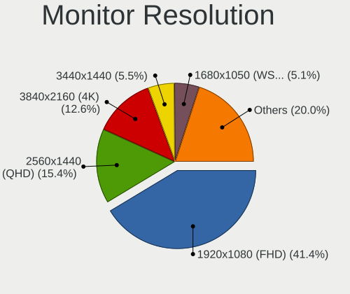

| Resolution         | Desktops | Percent |
|--------------------|----------|---------|
| 1920x1080 (FHD)    | 645      | 41.37%  |
| 2560x1440 (QHD)    | 240      | 15.39%  |
| 3840x2160 (4K)     | 197      | 12.64%  |
| 3440x1440          | 85       | 5.45%   |
| 1680x1050 (WSXGA+) | 80       | 5.13%   |
| 1920x1200 (WUXGA)  | 64       | 4.11%   |
| 1280x1024 (SXGA)   | 49       | 3.14%   |
| Unknown            | 41       | 2.63%   |
| 3840x1080          | 32       | 2.05%   |
| 2560x1080          | 14       | 0.9%    |
| 1440x900 (WXGA+)   | 12       | 0.77%   |
| 1360x768           | 11       | 0.71%   |
| 1280x720 (HD)      | 9        | 0.58%   |
| 1024x768 (XGA)     | 9        | 0.58%   |
| 1920x540           | 8        | 0.51%   |
| 3840x1600          | 7        | 0.45%   |
| 1366x768 (WXGA)    | 7        | 0.45%   |
| 1600x900 (HD+)     | 6        | 0.38%   |
| 2560x1600          | 4        | 0.26%   |
| 6400x2160          | 3        | 0.19%   |
| 5760x2160          | 3        | 0.19%   |
| 5760x1080          | 3        | 0.19%   |
| 3200x1200          | 3        | 0.19%   |
| 2288x1287          | 3        | 0.19%   |
| 4480x1440          | 2        | 0.13%   |
| 3840x1200          | 2        | 0.13%   |
| 1600x1200          | 2        | 0.13%   |
| 1280x768           | 2        | 0.13%   |
| 800x1280           | 1        | 0.06%   |
| 7280x2160          | 1        | 0.06%   |
| 7040x1440          | 1        | 0.06%   |
| 5520x2160          | 1        | 0.06%   |
| 5360x1440          | 1        | 0.06%   |
| 5120x1440          | 1        | 0.06%   |
| 4920x1920          | 1        | 0.06%   |
| 4864x1080          | 1        | 0.06%   |
| 4240x1440          | 1        | 0.06%   |
| 3600x1080          | 1        | 0.06%   |
| 3360x1080          | 1        | 0.06%   |
| 3120x1050          | 1        | 0.06%   |

Monitor Diagonal
----------------

Diagonal size in inches

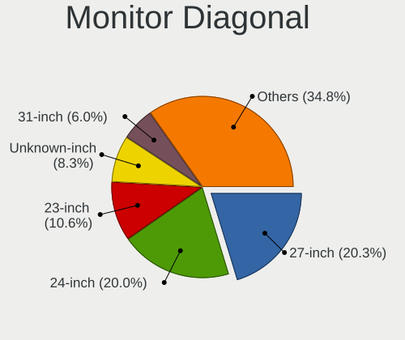

| Inches  | Desktops | Percent |
|---------|----------|---------|
| 27      | 324      | 20.31%  |
| 24      | 319      | 20%     |
| 23      | 169      | 10.6%   |
| Unknown | 133      | 8.34%   |
| 31      | 95       | 5.96%   |
| 34      | 83       | 5.2%    |
| 21      | 80       | 5.02%   |
| 22      | 62       | 3.89%   |
| 19      | 51       | 3.2%    |
| 84      | 32       | 2.01%   |
| 32      | 23       | 1.44%   |
| 72      | 19       | 1.19%   |
| 20      | 16       | 1%      |
| 40      | 15       | 0.94%   |
| 54      | 14       | 0.88%   |
| 42      | 13       | 0.82%   |
| 25      | 13       | 0.82%   |
| 48      | 12       | 0.75%   |
| 65      | 11       | 0.69%   |
| 49      | 11       | 0.69%   |
| 15      | 11       | 0.69%   |
| 35      | 10       | 0.63%   |
| 17      | 9        | 0.56%   |
| 37      | 6        | 0.38%   |
| 46      | 5        | 0.31%   |
| 43      | 5        | 0.31%   |
| 39      | 5        | 0.31%   |
| 29      | 5        | 0.31%   |
| 63      | 4        | 0.25%   |
| 33      | 4        | 0.25%   |
| 26      | 4        | 0.25%   |
| 57      | 3        | 0.19%   |
| 52      | 3        | 0.19%   |
| 50      | 3        | 0.19%   |
| 18      | 3        | 0.19%   |
| 142     | 2        | 0.13%   |
| 47      | 2        | 0.13%   |
| 41      | 2        | 0.13%   |
| 36      | 2        | 0.13%   |
| 28      | 2        | 0.13%   |

Monitor Width
-------------

Physical width

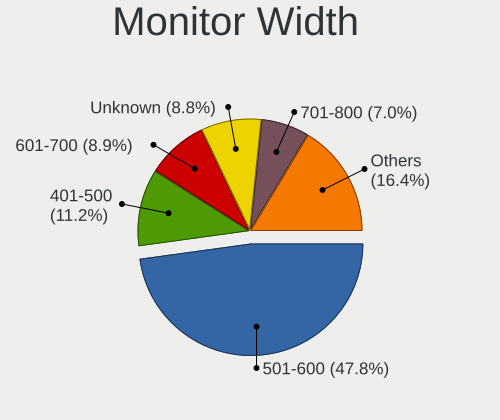

| Width in mm    | Desktops | Percent |
|----------------|----------|---------|
| 501-600        | 727      | 47.83%  |
| 401-500        | 170      | 11.18%  |
| 601-700        | 135      | 8.88%   |
| Unknown        | 133      | 8.75%   |
| 701-800        | 106      | 6.97%   |
| 1001-1500      | 69       | 4.54%   |
| 1501-2000      | 52       | 3.42%   |
| 351-400        | 42       | 2.76%   |
| 801-900        | 35       | 2.3%    |
| 901-1000       | 24       | 1.58%   |
| 301-350        | 23       | 1.51%   |
| More than 2000 | 2        | 0.13%   |
| 201-300        | 2        | 0.13%   |

Aspect Ratio
------------

Proportional relationship between the width and the height

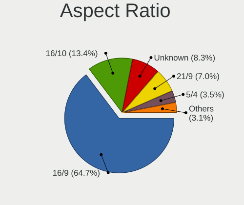

| Ratio   | Desktops | Percent |
|---------|----------|---------|
| 16/9    | 927      | 64.69%  |
| 16/10   | 192      | 13.4%   |
| Unknown | 119      | 8.3%    |
| 21/9    | 101      | 7.05%   |
| 5/4     | 50       | 3.49%   |
| 32/9    | 22       | 1.54%   |
| 4/3     | 11       | 0.77%   |
| 3/2     | 4        | 0.28%   |
| 6/5     | 3        | 0.21%   |
| 1.00    | 2        | 0.14%   |
| 2.70    | 1        | 0.07%   |
| 0.62    | 1        | 0.07%   |

Monitor Area
------------

Area in inch²

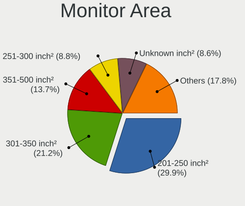

| Area in inch² | Desktops | Percent |
|----------------|----------|---------|
| 201-250        | 462      | 29.9%   |
| 301-350        | 327      | 21.17%  |
| 351-500        | 212      | 13.72%  |
| 251-300        | 136      | 8.8%    |
| Unknown        | 133      | 8.61%   |
| More than 1000 | 93       | 6.02%   |
| 151-200        | 77       | 4.98%   |
| 501-1000       | 77       | 4.98%   |
| 141-150        | 12       | 0.78%   |
| 101-110        | 11       | 0.71%   |
| 81-90          | 2        | 0.13%   |
| 71-80          | 1        | 0.06%   |
| 51-60          | 1        | 0.06%   |
| 131-140        | 1        | 0.06%   |

Pixel Density
-------------

Pixels per inch

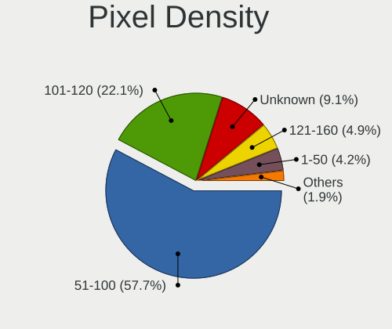

| Density | Desktops | Percent |
|---------|----------|---------|
| 51-100  | 843      | 57.74%  |
| 101-120 | 323      | 22.12%  |
| Unknown | 133      | 9.11%   |
| 121-160 | 72       | 4.93%   |
| 1-50    | 61       | 4.18%   |
| 161-240 | 28       | 1.92%   |

Multiple Monitors
-----------------

Total monitors connected

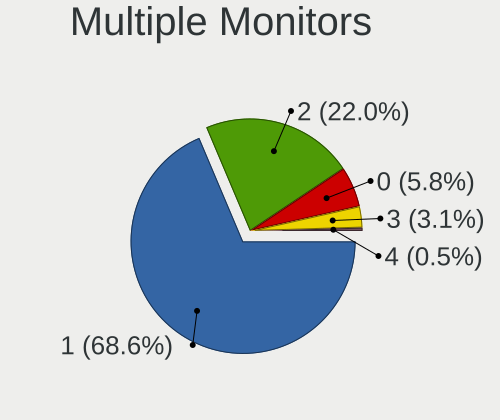

| Total | Desktops | Percent |
|-------|----------|---------|
| 1     | 989      | 68.63%  |
| 2     | 317      | 22%     |
| 0     | 84       | 5.83%   |
| 3     | 44       | 3.05%   |
| 4     | 7        | 0.49%   |

Network
-------

Net Controller Vendor
---------------------

Controller vendors

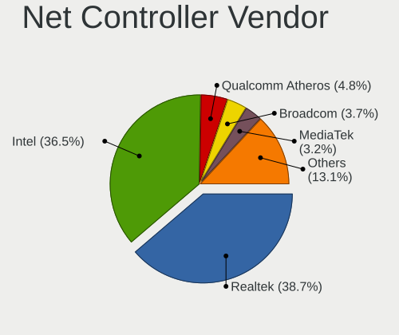

| Vendor                                 | Desktops | Percent |
|----------------------------------------|----------|---------|
| Realtek Semiconductor                  | 762      | 38.74%  |
| Intel                                  | 718      | 36.5%   |
| Qualcomm Atheros                       | 95       | 4.83%   |
| Broadcom                               | 72       | 3.66%   |
| MediaTek                               | 63       | 3.2%    |
| TP-Link                                | 24       | 1.22%   |
| Microsoft                              | 19       | 0.97%   |
| D-Link System                          | 16       | 0.81%   |
| ASUSTek Computer                       | 16       | 0.81%   |
| NetGear                                | 15       | 0.76%   |
| Marvell Technology Group               | 15       | 0.76%   |
| Ralink Technology                      | 14       | 0.71%   |
| Ralink                                 | 13       | 0.66%   |
| Aquantia                               | 13       | 0.66%   |
| D-Link                                 | 11       | 0.56%   |
| Nvidia                                 | 8        | 0.41%   |
| ASIX Electronics                       | 7        | 0.36%   |
| Qualcomm Atheros Communications        | 6        | 0.31%   |
| Mellanox Technologies                  | 6        | 0.31%   |
| DisplayLink                            | 5        | 0.25%   |
| STMicroelectronics                     | 4        | 0.2%    |
| Samsung Electronics                    | 4        | 0.2%    |
| Qualcomm Technologies                  | 4        | 0.2%    |
| Broadcom Limited                       | 4        | 0.2%    |
| Linksys                                | 3        | 0.15%   |
| Huawei Technologies                    | 3        | 0.15%   |
| Belkin Components                      | 3        | 0.15%   |
| Unknown                                | 3        | 0.15%   |
| ZTE WCDMA Technologies MSM             | 2        | 0.1%    |
| Xiaomi                                 | 2        | 0.1%    |
| Sony Ericsson Mobile Communications AB | 2        | 0.1%    |
| QinHeng Electronics                    | 2        | 0.1%    |
| Motorola PCS                           | 2        | 0.1%    |
| Insyde Software                        | 2        | 0.1%    |
| Dresden Elektronik                     | 2        | 0.1%    |
| Arduino SA                             | 2        | 0.1%    |
| Apple                                  | 2        | 0.1%    |
| ZyXEL Communications                   | 1        | 0.05%   |
| Wilocity                               | 1        | 0.05%   |
| Wacom                                  | 1        | 0.05%   |

Net Controller Model
--------------------

Controller models

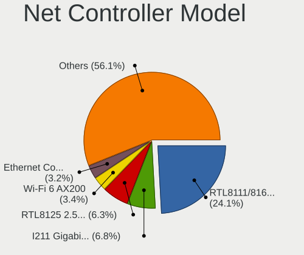

| Model                                                                  | Desktops | Percent |
|------------------------------------------------------------------------|----------|---------|
| Realtek RTL8111/8168/8211/8411 PCI Express Gigabit Ethernet Controller | 544      | 24.15%  |
| Intel I211 Gigabit Network Connection                                  | 153      | 6.79%   |
| Realtek RTL8125 2.5GbE Controller                                      | 142      | 6.3%    |
| Intel Wi-Fi 6 AX200                                                    | 77       | 3.42%   |
| Intel Ethernet Connection (2) I219-V                                   | 73       | 3.24%   |
| Intel Ethernet Controller I225-V                                       | 72       | 3.2%    |
| Intel Ethernet Connection (7) I219-V                                   | 45       | 2%      |
| Intel 82579LM Gigabit Network Connection (Lewisville)                  | 36       | 1.6%    |
| Intel 82579V Gigabit Network Connection                                | 33       | 1.46%   |
| MediaTek MT7922 802.11ax PCI Express Wireless Network Adapter          | 32       | 1.42%   |
| Intel Dual Band Wireless-AC 3168NGW [Stone Peak]                       | 29       | 1.29%   |
| Intel Ethernet Connection I217-LM                                      | 27       | 1.2%    |
| Intel Ethernet Connection (2) I218-V                                   | 25       | 1.11%   |
| Realtek RTL8852BE PCIe 802.11ax Wireless Network Controller            | 22       | 0.98%   |
| Intel Wi-Fi 6E(802.11ax) AX210/AX1675* 2x2 [Typhoon Peak]              | 22       | 0.98%   |
| Intel Ethernet Connection (2) I219-LM                                  | 19       | 0.84%   |
| Broadcom BCM4360 802.11ac Dual Band Wireless Network Adapter           | 19       | 0.84%   |
| Intel Ethernet Controller I226-V                                       | 18       | 0.8%    |
| Broadcom BCM4352 802.11ac Dual Band Wireless Network Adapter           | 18       | 0.8%    |
| Qualcomm Atheros Killer E220x Gigabit Ethernet Controller              | 17       | 0.75%   |
| Intel Ethernet Connection I217-V                                       | 16       | 0.71%   |
| Realtek RTL8153 Gigabit Ethernet Adapter                               | 15       | 0.67%   |
| Intel I210 Gigabit Network Connection                                  | 15       | 0.67%   |
| Intel Wireless 7260                                                    | 14       | 0.62%   |
| Intel 700 Series Chipset CNVi WiFi                                     | 14       | 0.62%   |
| Realtek RTL8821AE 802.11ac PCIe Wireless Network Adapter               | 12       | 0.53%   |
| Intel Alder Lake-S PCH CNVi WiFi                                       | 12       | 0.53%   |
| Intel 82567LM-3 Gigabit Network Connection                             | 12       | 0.53%   |
| Realtek RTL8821CE 802.11ac PCIe Wireless Network Adapter               | 11       | 0.49%   |
| Intel Wireless 8260                                                    | 11       | 0.49%   |
| Intel Ethernet Connection (7) I219-LM                                  | 11       | 0.49%   |
| Realtek RTL8111/8168/8411 PCI Express Gigabit Ethernet Controller      | 10       | 0.44%   |
| MediaTek MT7921K (RZ608) Wi-Fi 6E 80MHz                                | 10       | 0.44%   |
| Intel 82574L Gigabit Network Connection                                | 10       | 0.44%   |
| Realtek RTL8822BE 802.11a/b/g/n/ac WiFi adapter                        | 9        | 0.4%    |
| Realtek RTL8188EUS 802.11n Wireless Network Adapter                    | 9        | 0.4%    |
| Realtek RTL8126 5GbE Controller                                        | 9        | 0.4%    |
| Qualcomm Atheros QCA6174 802.11ac Wireless Network Adapter             | 9        | 0.4%    |
| Qualcomm Atheros AR9485 Wireless Network Adapter                       | 9        | 0.4%    |
| Microsoft Xbox 360 Wireless Adapter                                    | 9        | 0.4%    |

Wireless Vendor
---------------

Wireless vendors

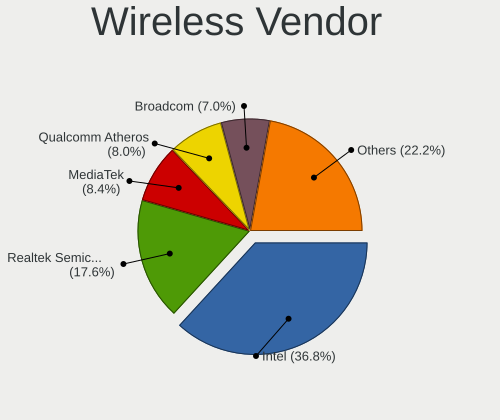

| Vendor                          | Desktops | Percent |
|---------------------------------|----------|---------|
| Intel                           | 236      | 36.82%  |
| Realtek Semiconductor           | 113      | 17.63%  |
| MediaTek                        | 54       | 8.42%   |
| Qualcomm Atheros                | 51       | 7.96%   |
| Broadcom                        | 45       | 7.02%   |
| TP-Link                         | 24       | 3.74%   |
| Microsoft                       | 19       | 2.96%   |
| ASUSTek Computer                | 16       | 2.5%    |
| NetGear                         | 15       | 2.34%   |
| Ralink Technology               | 14       | 2.18%   |
| Ralink                          | 13       | 2.03%   |
| D-Link                          | 11       | 1.72%   |
| D-Link System                   | 10       | 1.56%   |
| Qualcomm Atheros Communications | 6        | 0.94%   |
| Linksys                         | 3        | 0.47%   |
| Belkin Components               | 3        | 0.47%   |
| ZyXEL Communications            | 1        | 0.16%   |
| Wilocity                        | 1        | 0.16%   |
| Wacom                           | 1        | 0.16%   |
| Sitecom Europe                  | 1        | 0.16%   |
| Micro Star International        | 1        | 0.16%   |
| Mercucys                        | 1        | 0.16%   |
| Marvell Technology Group        | 1        | 0.16%   |
| Edimax Technology               | 1        | 0.16%   |

Wireless Model
--------------

Wireless models

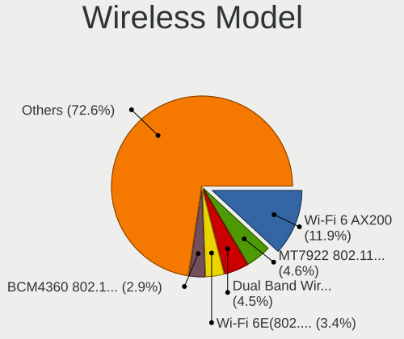

| Model                                                                | Desktops | Percent |
|----------------------------------------------------------------------|----------|---------|
| Intel Wi-Fi 6 AX200                                                  | 77       | 11.9%   |
| MediaTek MT7922 802.11ax PCI Express Wireless Network Adapter        | 30       | 4.64%   |
| Intel Dual Band Wireless-AC 3168NGW [Stone Peak]                     | 29       | 4.48%   |
| Intel Wi-Fi 6E(802.11ax) AX210/AX1675* 2x2 [Typhoon Peak]            | 22       | 3.4%    |
| Broadcom BCM4360 802.11ac Dual Band Wireless Network Adapter         | 19       | 2.94%   |
| Broadcom BCM4352 802.11ac Dual Band Wireless Network Adapter         | 18       | 2.78%   |
| Realtek RTL8852BE PCIe 802.11ax Wireless Network Controller          | 17       | 2.63%   |
| Intel Wireless 7260                                                  | 14       | 2.16%   |
| Intel 700 Series Chipset CNVi WiFi                                   | 14       | 2.16%   |
| Realtek RTL8821AE 802.11ac PCIe Wireless Network Adapter             | 12       | 1.85%   |
| Realtek RTL8821CE 802.11ac PCIe Wireless Network Adapter             | 11       | 1.7%    |
| Intel Wireless 8260                                                  | 11       | 1.7%    |
| Intel Alder Lake-S PCH CNVi WiFi                                     | 11       | 1.7%    |
| MediaTek MT7921K (RZ608) Wi-Fi 6E 80MHz                              | 10       | 1.55%   |
| Realtek RTL8822BE 802.11a/b/g/n/ac WiFi adapter                      | 9        | 1.39%   |
| Realtek RTL8188EUS 802.11n Wireless Network Adapter                  | 9        | 1.39%   |
| Qualcomm Atheros QCA6174 802.11ac Wireless Network Adapter           | 9        | 1.39%   |
| Qualcomm Atheros AR9485 Wireless Network Adapter                     | 9        | 1.39%   |
| Microsoft Xbox 360 Wireless Adapter                                  | 9        | 1.39%   |
| Intel Wireless 3165                                                  | 9        | 1.39%   |
| Intel Wi-Fi 5(802.11ac) Wireless-AC 9x6x [Thunder Peak]              | 9        | 1.39%   |
| Realtek 802.11ac NIC                                                 | 8        | 1.24%   |
| Qualcomm Atheros QCA9377 802.11ac Wireless Network Adapter           | 8        | 1.24%   |
| Qualcomm Atheros AR93xx Wireless Network Adapter                     | 8        | 1.24%   |
| TP-Link TL-WN722N v2/v3 [Realtek RTL8188EUS]                         | 6        | 0.93%   |
| TP-Link Archer T3U [Realtek RTL8812BU]                               | 6        | 0.93%   |
| Realtek RTL8822CE 802.11ac PCIe Wireless Network Adapter             | 6        | 0.93%   |
| Realtek RTL8192CE PCIe Wireless Network Adapter                      | 6        | 0.93%   |
| Ralink RT2870/RT3070 Wireless Adapter                                | 6        | 0.93%   |
| Microsoft Xbox Wireless Adapter for Windows                          | 6        | 0.93%   |
| MediaTek MT7921 802.11ax PCIe Wireless Network Adapter [Filogic 330] | 6        | 0.93%   |
| Intel Wireless 8265 / 8275                                           | 6        | 0.93%   |
| Intel Tiger Lake PCH CNVi WiFi                                       | 6        | 0.93%   |
| Intel Dual Band Wireless-AC 3165 Plus Bluetooth                      | 6        | 0.93%   |
| Intel Cannon Lake PCH CNVi WiFi                                      | 6        | 0.93%   |
| D-Link System DWA-140 RangeBooster N Adapter(rev.B2) [Ralink RT3072] | 6        | 0.93%   |
| Realtek RTL88x2bu [AC1200 Techkey]                                   | 5        | 0.77%   |
| Qualcomm Atheros AR9271 802.11n                                      | 5        | 0.77%   |
| ASUS AC51 802.11a/b/g/n/ac Wireless Adapter [Mediatek MT7610U]       | 5        | 0.77%   |
| TP-Link AC600 wireless Realtek RTL8811AU [Archer T2U Nano]           | 4        | 0.62%   |

Ethernet Vendor
---------------

Ethernet vendors

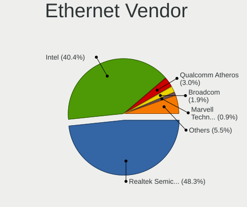

| Vendor                                 | Desktops | Percent |
|----------------------------------------|----------|---------|
| Realtek Semiconductor                  | 730      | 48.34%  |
| Intel                                  | 610      | 40.4%   |
| Qualcomm Atheros                       | 45       | 2.98%   |
| Broadcom                               | 28       | 1.85%   |
| Marvell Technology Group               | 14       | 0.93%   |
| Aquantia                               | 13       | 0.86%   |
| Nvidia                                 | 8        | 0.53%   |
| MediaTek                               | 7        | 0.46%   |
| ASIX Electronics                       | 7        | 0.46%   |
| D-Link System                          | 6        | 0.4%    |
| DisplayLink                            | 5        | 0.33%   |
| Samsung Electronics                    | 4        | 0.26%   |
| Qualcomm Technologies                  | 4        | 0.26%   |
| Mellanox Technologies                  | 4        | 0.26%   |
| Broadcom Limited                       | 4        | 0.26%   |
| Xiaomi                                 | 2        | 0.13%   |
| Motorola PCS                           | 2        | 0.13%   |
| Insyde Software                        | 2        | 0.13%   |
| Huawei Technologies                    | 2        | 0.13%   |
| Apple                                  | 2        | 0.13%   |
| VIA Technologies                       | 1        | 0.07%   |
| Unknown                                | 1        | 0.07%   |
| Sundance Technology Inc / IC Plus      | 1        | 0.07%   |
| Sony Ericsson Mobile Communications AB | 1        | 0.07%   |
| Qualcomm                               | 1        | 0.07%   |
| QLogic                                 | 1        | 0.07%   |
| OPPO Electronics                       | 1        | 0.07%   |
| Netchip Technology                     | 1        | 0.07%   |
| Marvell Semiconductor                  | 1        | 0.07%   |
| Google                                 | 1        | 0.07%   |
| 3Com                                   | 1        | 0.07%   |

Ethernet Model
--------------

Ethernet models

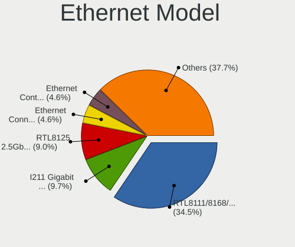

| Model                                                                          | Desktops | Percent |
|--------------------------------------------------------------------------------|----------|---------|
| Realtek RTL8111/8168/8211/8411 PCI Express Gigabit Ethernet Controller         | 544      | 34.45%  |
| Intel I211 Gigabit Network Connection                                          | 153      | 9.69%   |
| Realtek RTL8125 2.5GbE Controller                                              | 142      | 8.99%   |
| Intel Ethernet Connection (2) I219-V                                           | 73       | 4.62%   |
| Intel Ethernet Controller I225-V                                               | 72       | 4.56%   |
| Intel Ethernet Connection (7) I219-V                                           | 45       | 2.85%   |
| Intel 82579LM Gigabit Network Connection (Lewisville)                          | 36       | 2.28%   |
| Intel 82579V Gigabit Network Connection                                        | 33       | 2.09%   |
| Intel Ethernet Connection I217-LM                                              | 27       | 1.71%   |
| Intel Ethernet Connection (2) I218-V                                           | 25       | 1.58%   |
| Intel Ethernet Connection (2) I219-LM                                          | 19       | 1.2%    |
| Intel Ethernet Controller I226-V                                               | 18       | 1.14%   |
| Qualcomm Atheros Killer E220x Gigabit Ethernet Controller                      | 17       | 1.08%   |
| Intel Ethernet Connection I217-V                                               | 16       | 1.01%   |
| Realtek RTL8153 Gigabit Ethernet Adapter                                       | 15       | 0.95%   |
| Intel I210 Gigabit Network Connection                                          | 15       | 0.95%   |
| Intel 82567LM-3 Gigabit Network Connection                                     | 12       | 0.76%   |
| Intel Ethernet Connection (7) I219-LM                                          | 11       | 0.7%    |
| Realtek RTL8111/8168/8411 PCI Express Gigabit Ethernet Controller              | 10       | 0.63%   |
| Intel 82574L Gigabit Network Connection                                        | 10       | 0.63%   |
| Realtek RTL8126 5GbE Controller                                                | 9        | 0.57%   |
| Realtek RTL810xE PCI Express Fast Ethernet controller                          | 8        | 0.51%   |
| Realtek RTL-8100/8101L/8139 PCI Fast Ethernet Adapter                          | 8        | 0.51%   |
| Qualcomm Atheros Killer E2500 Gigabit Ethernet Controller                      | 7        | 0.44%   |
| Qualcomm Atheros AR8161 Gigabit Ethernet                                       | 6        | 0.38%   |
| Marvell Group 88E8056 PCI-E Gigabit Ethernet Controller                        | 6        | 0.38%   |
| Intel Ethernet Connection (2) I218-LM                                          | 6        | 0.38%   |
| D-Link System DGE-528T Gigabit Ethernet Adapter                                | 6        | 0.38%   |
| Broadcom NetXtreme BCM5761 Gigabit Ethernet PCIe                               | 6        | 0.38%   |
| Aquantia AQtion AQC107 NBase-T/IEEE 802.3an Ethernet Controller [Atlantic 10G] | 6        | 0.38%   |
| Realtek RTL8852BE PCIe 802.11ax Wireless Network Controller                    | 5        | 0.32%   |
| Realtek RTL-8110SC/8169SC Gigabit Ethernet                                     | 5        | 0.32%   |
| Realtek Killer E3000 2.5GbE Controller                                         | 5        | 0.32%   |
| Qualcomm WCN785x Wi-Fi 7(802.11be) 320MHz 2x2 [FastConnect 7800]               | 4        | 0.25%   |
| Qualcomm Atheros AR8151 v2.0 Gigabit Ethernet                                  | 4        | 0.25%   |
| Marvell Group 88E8001 Gigabit Ethernet Controller                              | 4        | 0.25%   |
| Intel Ethernet Controller 10-Gigabit X540-AT2                                  | 4        | 0.25%   |
| Intel Ethernet Connection (5) I219-LM                                          | 4        | 0.25%   |
| Intel Ethernet Connection (14) I219-V                                          | 4        | 0.25%   |
| Intel 82566DM-2 Gigabit Network Connection                                     | 4        | 0.25%   |

Net Controller Kind
-------------------

Ethernet, WiFi or modem

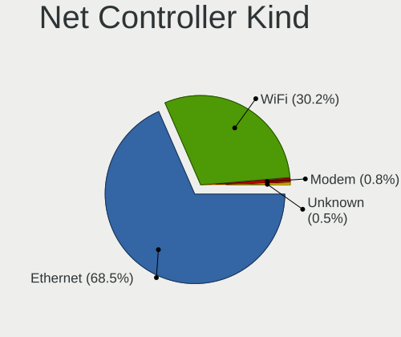

| Kind     | Desktops | Percent |
|----------|----------|---------|
| Ethernet | 1378     | 68.46%  |
| WiFi     | 608      | 30.2%   |
| Modem    | 17       | 0.84%   |
| Unknown  | 10       | 0.5%    |

Used Controller
---------------

Currently used network controller

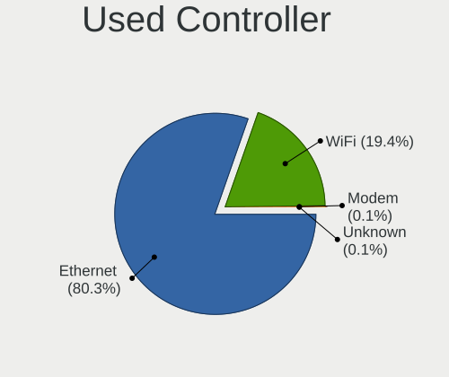

| Kind     | Desktops | Percent |
|----------|----------|---------|
| Ethernet | 1153     | 80.35%  |
| WiFi     | 279      | 19.44%  |
| Modem    | 2        | 0.14%   |
| Unknown  | 1        | 0.07%   |

NICs
----

Total network controllers on board

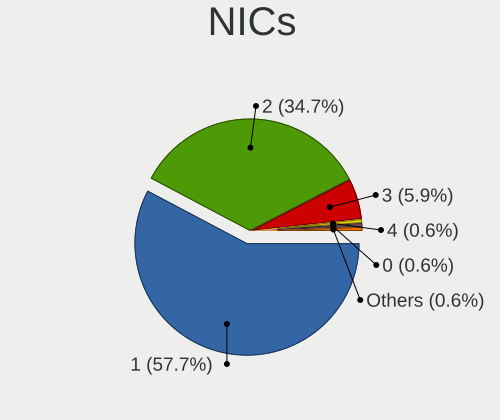

| Total | Desktops | Percent |
|-------|----------|---------|
| 1     | 809      | 57.74%  |
| 2     | 486      | 34.69%  |
| 3     | 82       | 5.85%   |
| 4     | 8        | 0.57%   |
| 0     | 8        | 0.57%   |
| 5     | 4        | 0.29%   |
| 6     | 3        | 0.21%   |
| 9     | 1        | 0.07%   |

IPv6
----

IPv6 vs IPv4

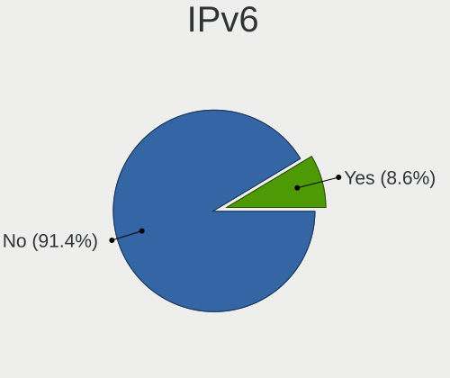

| Used | Desktops | Percent |
|------|----------|---------|
| No   | 1284     | 91.39%  |
| Yes  | 121      | 8.61%   |

Bluetooth
---------

Bluetooth Vendor
----------------

Controller vendors

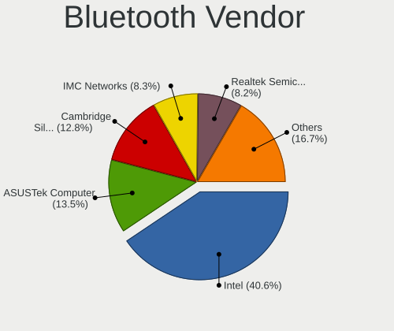

| Vendor                          | Desktops | Percent |
|---------------------------------|----------|---------|
| Intel                           | 229      | 40.6%   |
| ASUSTek Computer                | 76       | 13.48%  |
| Cambridge Silicon Radio         | 72       | 12.77%  |
| IMC Networks                    | 47       | 8.33%   |
| Realtek Semiconductor           | 46       | 8.16%   |
| MediaTek                        | 33       | 5.85%   |
| Foxconn / Hon Hai               | 16       | 2.84%   |
| Qualcomm Atheros Communications | 9        | 1.6%    |
| TP-Link                         | 7        | 1.24%   |
| Apple                           | 7        | 1.24%   |
| Broadcom                        | 6        | 1.06%   |
| Lite-On Technology              | 5        | 0.89%   |
| Belkin Components               | 3        | 0.53%   |
| Micro Star International        | 2        | 0.35%   |
| HTC (High Tech Computer)        | 2        | 0.35%   |
| Mobile Action Technology        | 1        | 0.18%   |
| Mercucys                        | 1        | 0.18%   |
| Actions                         | 1        | 0.18%   |
| Unknown                         | 1        | 0.18%   |

Bluetooth Model
---------------

Controller models

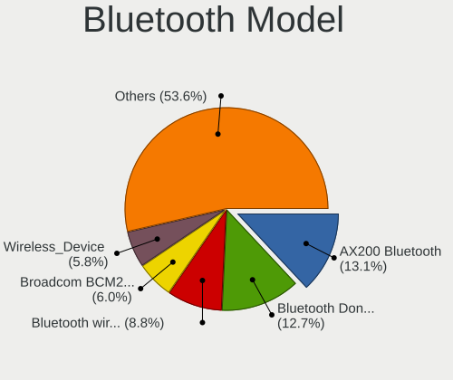

| Model                                                                | Desktops | Percent |
|----------------------------------------------------------------------|----------|---------|
| Intel AX200 Bluetooth                                                | 74       | 13.05%  |
| Cambridge Silicon Radio Bluetooth Dongle (HCI mode)                  | 72       | 12.7%   |
| Intel Bluetooth wireless interface                                   | 50       | 8.82%   |
| ASUS Broadcom BCM20702A0 Bluetooth                                   | 34       | 6%      |
| MediaTek Wireless_Device                                             | 33       | 5.82%   |
| Realtek Bluetooth Radio                                              | 31       | 5.47%   |
| Intel Wireless-AC 3168 Bluetooth                                     | 29       | 5.11%   |
| IMC Networks Bluetooth Radio                                         | 29       | 5.11%   |
| Intel AX201 Bluetooth                                                | 22       | 3.88%   |
| Intel AX210 Bluetooth                                                | 21       | 3.7%    |
| ASUS ASUS USB-BT500                                                  | 19       | 3.35%   |
| Intel Bluetooth Device                                               | 12       | 2.12%   |
| IMC Networks Wireless_Device                                         | 12       | 2.12%   |
| Foxconn / Hon Hai Wireless_Device                                    | 11       | 1.94%   |
| Intel Bluetooth 9460/9560 Jefferson Peak (JfP)                       | 10       | 1.76%   |
| Intel Wireless-AC 9260 Bluetooth Adapter                             | 9        | 1.59%   |
| TP-Link TP-T@- UB500 Adapter                                         | 7        | 1.23%   |
| ASUS Bluetooth Radio                                                 | 7        | 1.23%   |
| ASUS BCM20702A0                                                      | 7        | 1.23%   |
| Realtek  Bluetooth 4.2 Adapter                                       | 5        | 0.88%   |
| IMC Networks Bluetooth Device                                        | 5        | 0.88%   |
| Foxconn / Hon Hai Bluetooth Device                                   | 5        | 0.88%   |
| Qualcomm Atheros QCA61x4 Bluetooth 4.0                               | 4        | 0.71%   |
| Qualcomm Atheros AR3011 Bluetooth                                    | 4        | 0.71%   |
| ASUS Qualcomm Bluetooth 4.1                                          | 4        | 0.71%   |
| Realtek RTL8821A Bluetooth                                           | 3        | 0.53%   |
| Intel Centrino Bluetooth Wireless Transceiver                        | 3        | 0.53%   |
| ASUS Bluetooth Adapter                                               | 3        | 0.53%   |
| Apple Built-in Bluetooth 2.0+EDR HCI                                 | 3        | 0.53%   |
| Realtek RTL8822BE Bluetooth 4.2 Adapter                              | 2        | 0.35%   |
| Realtek Bluetooth 5.4 Radio                                          | 2        | 0.35%   |
| Realtek Bluetooth 5.3 Radio                                          | 2        | 0.35%   |
| Lite-On Qualcomm Atheros QCA9377 Bluetooth                           | 2        | 0.35%   |
| Lite-On Bluetooth Device                                             | 2        | 0.35%   |
| HTC (High Tech Computer) Vive Hub Bluetooth 4.1 (Broadcom BCM920703) | 2        | 0.35%   |
| Broadcom BCM20702A0 Bluetooth 4.0                                    | 2        | 0.35%   |
| Broadcom BCM2045 Bluetooth                                           | 2        | 0.35%   |
| Belkin Components F8T065BF Mini Bluetooth 4.0 Adapter                | 2        | 0.35%   |
| ASUS Bluetooth Device                                                | 2        | 0.35%   |
| Apple Bluetooth HCI MacBookPro (HID mode)                            | 2        | 0.35%   |

Sound
-----

Sound Vendor
------------

Sound card vendors

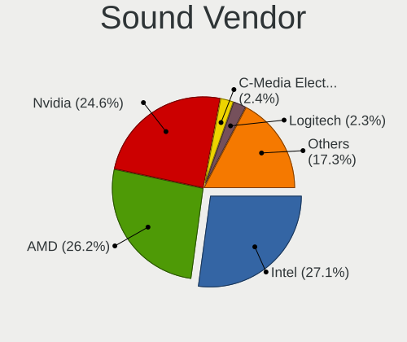

| Vendor                                       | Desktops | Percent |
|----------------------------------------------|----------|---------|
| Intel                                        | 732      | 27.14%  |
| AMD                                          | 707      | 26.21%  |
| Nvidia                                       | 664      | 24.62%  |
| C-Media Electronics                          | 64       | 2.37%   |
| Logitech                                     | 63       | 2.34%   |
| SteelSeries ApS                              | 38       | 1.41%   |
| Kingston Technology                          | 32       | 1.19%   |
| Creative Labs                                | 32       | 1.19%   |
| ASUSTek Computer                             | 32       | 1.19%   |
| Focusrite-Novation                           | 22       | 0.82%   |
| Creative Technology                          | 21       | 0.78%   |
| Micro Star International                     | 18       | 0.67%   |
| Texas Instruments                            | 15       | 0.56%   |
| Razer USA                                    | 15       | 0.56%   |
| Hewlett-Packard                              | 14       | 0.52%   |
| Plantronics                                  | 10       | 0.37%   |
| GN Netcom                                    | 10       | 0.37%   |
| Sony                                         | 9        | 0.33%   |
| RODE Microphones                             | 9        | 0.33%   |
| Corsair                                      | 9        | 0.33%   |
| Blue Microphones                             | 9        | 0.33%   |
| SAVITECH                                     | 6        | 0.22%   |
| GYROCOM C&C                                  | 6        | 0.22%   |
| DSEA A/S                                     | 6        | 0.22%   |
| Yamaha                                       | 5        | 0.19%   |
| Realtek Semiconductor                        | 5        | 0.19%   |
| BEHRINGER International                      | 5        | 0.19%   |
| Antlion Audio                                | 5        | 0.19%   |
| Trust                                        | 4        | 0.15%   |
| Samson Technologies                          | 4        | 0.15%   |
| PreSonus Audio Electronics                   | 4        | 0.15%   |
| JMTek                                        | 4        | 0.15%   |
| FiiO Electronics Technology                  | 4        | 0.15%   |
| Zoran Co. Personal Media Division (Nogatech) | 3        | 0.11%   |
| XMOS                                         | 3        | 0.11%   |
| VIA Technologies                             | 3        | 0.11%   |
| Valve Software                               | 3        | 0.11%   |
| Thesycon Systemsoftware & Consulting         | 3        | 0.11%   |
| TerraTec Electronic                          | 3        | 0.11%   |
| Samsung Electronics                          | 3        | 0.11%   |

Sound Model
-----------

Sound card models

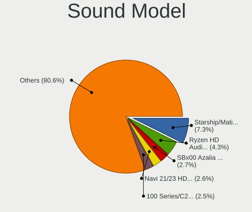

| Model                                                                      | Desktops | Percent |
|----------------------------------------------------------------------------|----------|---------|
| AMD Starship/Matisse HD Audio Controller                                   | 234      | 7.34%   |
| AMD Ryzen HD Audio Controller                                              | 138      | 4.33%   |
| AMD SBx00 Azalia (Intel HDA)                                               | 85       | 2.67%   |
| AMD Navi 21/23 HDMI/DP Audio Controller                                    | 82       | 2.57%   |
| Intel 100 Series/C230 Series Chipset Family HD Audio Controller            | 80       | 2.51%   |
| Intel 8 Series/C220 Series Chipset High Definition Audio Controller        | 79       | 2.48%   |
| Intel 6 Series/C200 Series Chipset Family High Definition Audio Controller | 77       | 2.42%   |
| AMD Radeon High Definition Audio Controller                                | 74       | 2.32%   |
| Intel 200 Series PCH HD Audio                                              | 73       | 2.29%   |
| AMD Family 17h (Models 00h-0fh) HD Audio Controller                        | 71       | 2.23%   |
| Intel Cannon Lake PCH cAVS                                                 | 70       | 2.2%    |
| Nvidia GP104 High Definition Audio Controller                              | 65       | 2.04%   |
| Nvidia GP106 High Definition Audio Controller                              | 62       | 1.95%   |
| Intel 7 Series/C216 Chipset Family High Definition Audio Controller        | 58       | 1.82%   |
| AMD Ellesmere HDMI Audio [Radeon RX 470/480 / 570/580/590]                 | 57       | 1.79%   |
| Intel Xeon E3-1200 v3/4th Gen Core Processor HD Audio Controller           | 53       | 1.66%   |
| AMD Navi 31 HDMI/DP Audio                                                  | 49       | 1.54%   |
| AMD Navi 10 HDMI Audio                                                     | 41       | 1.29%   |
| Nvidia TU106 High Definition Audio Controller                              | 40       | 1.26%   |
| Nvidia TU116 High Definition Audio Controller                              | 38       | 1.19%   |
| Nvidia GP107GL High Definition Audio Controller                            | 35       | 1.1%    |
| Intel 9 Series Chipset Family HD Audio Controller                          | 35       | 1.1%    |
| Nvidia GM204 High Definition Audio Controller                              | 33       | 1.04%   |
| Nvidia GA102 High Definition Audio Controller                              | 32       | 1%      |
| Intel Alder Lake-S HD Audio Controller                                     | 30       | 0.94%   |
| AMD Renoir/Cezanne HDMI/DP Audio Controller                                | 30       | 0.94%   |
| Nvidia GM206 High Definition Audio Controller                              | 29       | 0.91%   |
| Nvidia GK208 HDMI/DP Audio Controller                                      | 29       | 0.91%   |
| Nvidia TU104 HD Audio Controller                                           | 28       | 0.88%   |
| AMD Oland/Hainan/Cape Verde/Pitcairn HDMI Audio [Radeon HD 7000 Series]    | 28       | 0.88%   |
| AMD FCH Azalia Controller                                                  | 28       | 0.88%   |
| Nvidia GK104 HDMI Audio Controller                                         | 27       | 0.85%   |
| Intel 82801JI (ICH10 Family) HD Audio Controller                           | 27       | 0.85%   |
| Nvidia GA104 High Definition Audio Controller                              | 25       | 0.78%   |
| ASUSTek Computer USB Audio                                                 | 24       | 0.75%   |
| AMD Raven/Raven2/Fenghuang HDMI/DP Audio Controller                        | 24       | 0.75%   |
| Nvidia GA106 High Definition Audio Controller                              | 23       | 0.72%   |
| AMD Baffin HDMI/DP Audio [Radeon RX 550 640SP / RX 560/560X]               | 23       | 0.72%   |
| Intel C610/X99 series chipset HD Audio Controller                          | 21       | 0.66%   |
| Intel Raptor Lake High Definition Audio Controller                         | 20       | 0.63%   |

Memory
------

Memory Vendor
-------------

Memory module vendors

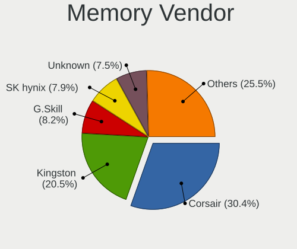

| Vendor                       | Desktops | Percent |
|------------------------------|----------|---------|
| Corsair                      | 251      | 30.42%  |
| Kingston                     | 169      | 20.48%  |
| G.Skill                      | 68       | 8.24%   |
| SK hynix                     | 65       | 7.88%   |
| Unknown                      | 62       | 7.52%   |
| Samsung Electronics          | 62       | 7.52%   |
| Crucial                      | 55       | 6.67%   |
| Micron Technology            | 35       | 4.24%   |
| Team                         | 6        | 0.73%   |
| Unknown                      | 6        | 0.73%   |
| Nanya Technology             | 5        | 0.61%   |
| Elpida                       | 5        | 0.61%   |
| A-DATA Technology            | 4        | 0.48%   |
| Unknown (ABCD)               | 3        | 0.36%   |
| Ramaxel Technology           | 3        | 0.36%   |
| Patriot                      | 3        | 0.36%   |
| Apacer                       | 3        | 0.36%   |
| Transcend                    | 2        | 0.24%   |
| G-Alantic                    | 2        | 0.24%   |
| Unknown (AB)                 | 1        | 0.12%   |
| Unknown (836D)               | 1        | 0.12%   |
| Unknown (0x0080)             | 1        | 0.12%   |
| Unifosa                      | 1        | 0.12%   |
| SHARETRONIC                  | 1        | 0.12%   |
| Red Hat                      | 1        | 0.12%   |
| Qimonda                      | 1        | 0.12%   |
| PNY                          | 1        | 0.12%   |
| Patriot Memory (PDP Systems) | 1        | 0.12%   |
| Lexar Co Limited             | 1        | 0.12%   |
| Lexar                        | 1        | 0.12%   |
| KingSpec                     | 1        | 0.12%   |
| Hyundai lnc                  | 1        | 0.12%   |
| Hewlett-Packard              | 1        | 0.12%   |
| GOODRAM                      | 1        | 0.12%   |
| Golden Empire                | 1        | 0.12%   |

Memory Model
------------

Memory module models

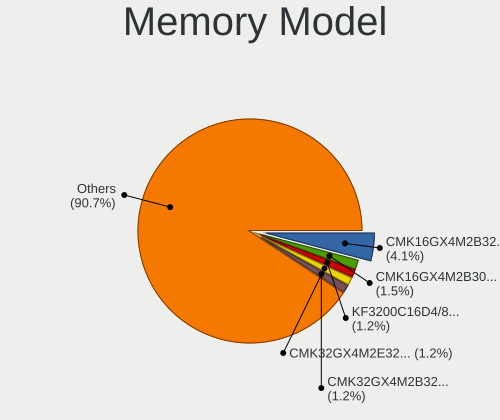

| Model                                                          | Desktops | Percent |
|----------------------------------------------------------------|----------|---------|
| Corsair RAM CMK16GX4M2B3200C16 8GB DIMM DDR4 3600MT/s          | 37       | 4.13%   |
| Corsair RAM CMK16GX4M2B3000C15 8GB DIMM DDR4 3600MT/s          | 13       | 1.45%   |
| Kingston RAM KF3200C16D4/8GX 8GiB DIMM DDR4 3600MT/s           | 11       | 1.23%   |
| Corsair RAM CMK32GX4M2E3200C16 16GB DIMM DDR4 3600MT/s         | 11       | 1.23%   |
| Corsair RAM CMK32GX4M2B3200C16 16GB DIMM DDR4 3800MT/s         | 11       | 1.23%   |
| Kingston RAM KF560C36-16 16GB DIMM DDR5 6000MT/s               | 9        | 1%      |
| Kingston RAM KHX3600C18D4/16GX 16GB DIMM DDR4 3800MT/s         | 8        | 0.89%   |
| Kingston RAM KHX2666C16/8G 8GiB DIMM DDR4 3466MT/s             | 8        | 0.89%   |
| Corsair RAM CML8GX3M2A1600C9 4GB DIMM DDR3 1600MT/s            | 8        | 0.89%   |
| Corsair RAM CMK16GX4M2A2666C16 8GB DIMM DDR4 3400MT/s          | 8        | 0.89%   |
| Kingston RAM KF3200C16D4/16GX 16GB DIMM DDR4 3733MT/s          | 7        | 0.78%   |
| Corsair RAM CMK16GX4M2Z3600C18 8GB DIMM DDR4 3600MT/s          | 7        | 0.78%   |
| Kingston RAM KHX3200C16D4/8GX 8GB DIMM DDR4 3733MT/s           | 6        | 0.67%   |
| Kingston RAM KHX1600C10D3/8G 8GB DIMM DDR3 2133MT/s            | 6        | 0.67%   |
| G.Skill RAM F4-3200C16-8GVKB 8GB DIMM DDR4 4000MT/s            | 6        | 0.67%   |
| Corsair RAM CMK32GX4M2Z3600C18 16GB DIMM DDR4 3800MT/s         | 6        | 0.67%   |
| Corsair RAM CMK16GX4M2Z3200C16 8GB DIMM DDR4 3200MT/s          | 6        | 0.67%   |
| Corsair RAM CMK16GX4M2A2133C13 8GB DIMM DDR4 3000MT/s          | 6        | 0.67%   |
| Unknown                                                        | 6        | 0.67%   |
| Kingston RAM KHX3200C16D4/16GX 16GB DIMM DDR4 3600MT/s         | 5        | 0.56%   |
| Corsair RAM CML16GX3M2A1600C10 8GB DIMM DDR3 1600MT/s          | 5        | 0.56%   |
| Corsair RAM CMK8GX4M2A2666C16 4GB DIMM DDR4 2747MT/s           | 5        | 0.56%   |
| Corsair RAM CMK32GX4M2A2666C16 16GB DIMM DDR4 2667MT/s         | 5        | 0.56%   |
| Unknown RAM Module 4GB DIMM 1333MT/s                           | 4        | 0.45%   |
| SK hynix RAM HMT451U6AFR8C-PB 4GB DIMM DDR3 1600MT/s           | 4        | 0.45%   |
| Samsung RAM M378B5173QH0-CK0 4GB DIMM DDR3                     | 4        | 0.45%   |
| Kingston RAM KHX2400C15D4/4G 4GB DIMM DDR4 3151MT/s            | 4        | 0.45%   |
| Kingston RAM KHX1600C9D3/4GX 4GB DIMM DDR3 1867MT/s            | 4        | 0.45%   |
| Kingston RAM KF560C36-32 32GB DIMM DDR5 6200MT/s               | 4        | 0.45%   |
| Kingston RAM KF552C40-32 32GB DIMM DDR5 5200MT/s               | 4        | 0.45%   |
| G.Skill RAM F4-3600C16-16GTZNC 16GiB DIMM DDR4 3600MT/s        | 4        | 0.45%   |
| Crucial RAM BLS8G3D1609DS1S00. 8GB DIMM DDR3 1800MT/s          | 4        | 0.45%   |
| Corsair RAM CMZ8GX3M2A1600C9 4GB DIMM SDRAM 1800MT/s           | 4        | 0.45%   |
| Corsair RAM CMX8GX3M2A1600C9 4GB DIMM DDR3 1800MT/s            | 4        | 0.45%   |
| Corsair RAM CML16GX3M2A1600C9 8GB DIMM DDR3 2133MT/s           | 4        | 0.45%   |
| Corsair RAM CMK32GX4M2A2133C13 16GB DIMM DDR4 2400MT/s         | 4        | 0.45%   |
| Unknown RAM Module 4096MB DIMM 1333MT/s                        | 3        | 0.33%   |
| Unknown RAM Module 2GB DIMM 1333MT/s                           | 3        | 0.33%   |
| Unknown (ABCD) RAM 123456789012345678 2GB DIMM LPDDR4 2133MT/s | 3        | 0.33%   |
| SK hynix RAM HMT41GU6BFR8A-PB 8GB DIMM DDR3 2000MT/s           | 3        | 0.33%   |

Memory Kind
-----------

Memory module kinds

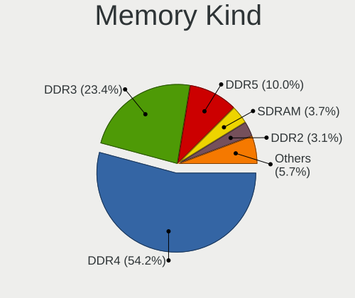

| Kind    | Desktops | Percent |
|---------|----------|---------|
| DDR4    | 408      | 54.18%  |
| DDR3    | 176      | 23.37%  |
| DDR5    | 75       | 9.96%   |
| SDRAM   | 28       | 3.72%   |
| DDR2    | 23       | 3.05%   |
| Unknown | 23       | 3.05%   |
| DRAM    | 7        | 0.93%   |
| DDR     | 7        | 0.93%   |
| LPDDR4  | 3        | 0.4%    |
| LPDDR5  | 2        | 0.27%   |
| RAM     | 1        | 0.13%   |

Memory Form Factor
------------------

Physical design of the memory module

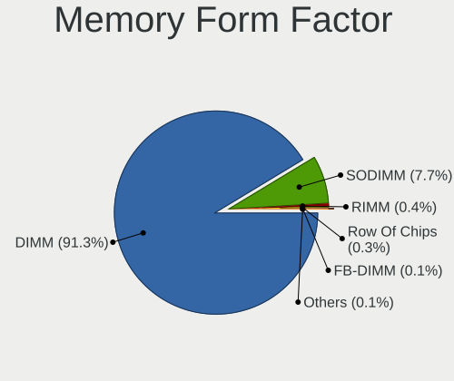

| Name         | Desktops | Percent |
|--------------|----------|---------|
| DIMM         | 675      | 91.34%  |
| SODIMM       | 57       | 7.71%   |
| RIMM         | 3        | 0.41%   |
| Row Of Chips | 2        | 0.27%   |
| FB-DIMM      | 1        | 0.14%   |
| Unknown      | 1        | 0.14%   |

Memory Size
-----------

Memory module size

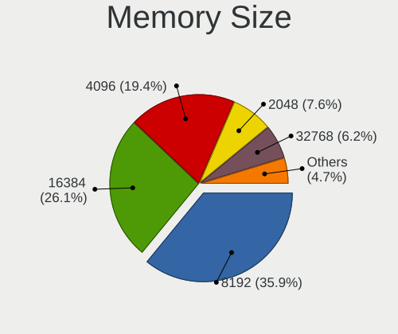

| Size    | Desktops | Percent |
|---------|----------|---------|
| 8192    | 289      | 35.95%  |
| 16384   | 210      | 26.12%  |
| 4096    | 156      | 19.4%   |
| 2048    | 61       | 7.59%   |
| 32768   | 50       | 6.22%   |
| 1024    | 24       | 2.99%   |
| 49152   | 5        | 0.62%   |
| 65536   | 3        | 0.37%   |
| 24576   | 3        | 0.37%   |
| 512     | 2        | 0.25%   |
| Unknown | 1        | 0.12%   |

Memory Speed
------------

Memory module speed

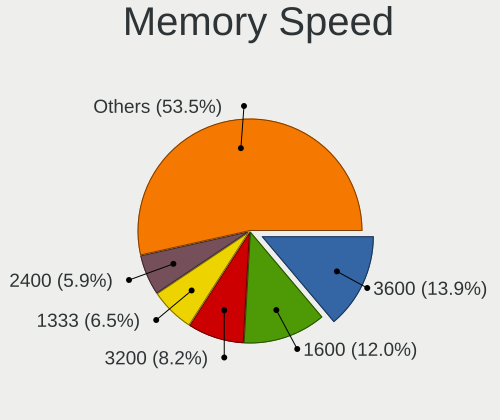

| Speed   | Desktops | Percent |
|---------|----------|---------|
| 3600    | 115      | 13.86%  |
| 1600    | 100      | 12.05%  |
| 3200    | 68       | 8.19%   |
| 1333    | 54       | 6.51%   |
| 2400    | 49       | 5.9%    |
| 2133    | 42       | 5.06%   |
| 3800    | 38       | 4.58%   |
| 6000    | 29       | 3.49%   |
| 2667    | 25       | 3.01%   |
| 3733    | 22       | 2.65%   |
| 3000    | 18       | 2.17%   |
| 1800    | 16       | 1.93%   |
| 3400    | 15       | 1.81%   |
| 800     | 15       | 1.81%   |
| 1867    | 14       | 1.69%   |
| 667     | 12       | 1.45%   |
| 5600    | 11       | 1.33%   |
| 4800    | 11       | 1.33%   |
| 2933    | 11       | 1.33%   |
| 4000    | 10       | 1.2%    |
| 3466    | 10       | 1.2%    |
| 2666    | 10       | 1.2%    |
| 1866    | 10       | 1.2%    |
| Unknown | 10       | 1.2%    |
| 5200    | 8        | 0.96%   |
| 1066    | 7        | 0.84%   |
| 6400    | 6        | 0.72%   |
| 3866    | 6        | 0.72%   |
| 6200    | 5        | 0.6%    |
| 3100    | 5        | 0.6%    |
| 2747    | 5        | 0.6%    |
| 2000    | 5        | 0.6%    |
| 1067    | 5        | 0.6%    |
| 3151    | 4        | 0.48%   |
| 2800    | 4        | 0.48%   |
| 12800   | 3        | 0.36%   |
| 4400    | 3        | 0.36%   |
| 3266    | 3        | 0.36%   |
| 2733    | 3        | 0.36%   |
| 2200    | 3        | 0.36%   |

Printers & scanners
-------------------

Printer Vendor
--------------

Printer device vendors

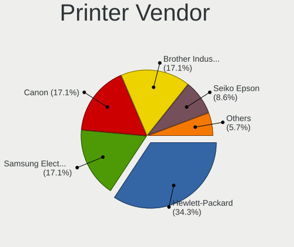

| Vendor                | Desktops | Percent |
|-----------------------|----------|---------|
| Hewlett-Packard       | 12       | 34.29%  |
| Samsung Electronics   | 6        | 17.14%  |
| Canon                 | 6        | 17.14%  |
| Brother Industries    | 6        | 17.14%  |
| Seiko Epson           | 3        | 8.57%   |
| Prolific Technology   | 1        | 2.86%   |
| Lexmark International | 1        | 2.86%   |

Printer Model
-------------

Printer device models

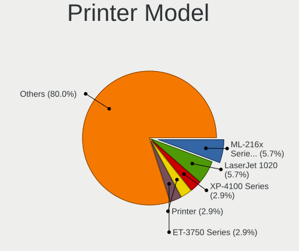

| Model                                | Desktops | Percent |
|--------------------------------------|----------|---------|
| Samsung ML-216x Series Laser Printer | 2        | 5.71%   |
| HP LaserJet 1020                     | 2        | 5.71%   |
| Seiko Epson XP-4100 Series           | 1        | 2.86%   |
| Seiko Epson Printer                  | 1        | 2.86%   |
| Seiko Epson ET-3750 Series           | 1        | 2.86%   |
| Samsung SCX-4300 Series              | 1        | 2.86%   |
| Samsung Color Laser Printer          | 1        | 2.86%   |
| Samsung CLX-3300 Series              | 1        | 2.86%   |
| Samsung CLP-325 Color Laser Printer  | 1        | 2.86%   |
| Prolific PL2305 Parallel Port        | 1        | 2.86%   |
| Lexmark International MX310dn        | 1        | 2.86%   |
| HP OfficeJet Pro 8730                | 1        | 2.86%   |
| HP OfficeJet G55                     | 1        | 2.86%   |
| HP LaserJet Professional P 1102w     | 1        | 2.86%   |
| HP LaserJet P1006                    | 1        | 2.86%   |
| HP LaserJet M14-M17                  | 1        | 2.86%   |
| HP LaserJet 1320                     | 1        | 2.86%   |
| HP LaserJet 1010                     | 1        | 2.86%   |
| HP HP Laser 107w                     | 1        | 2.86%   |
| HP DeskJet 2130 series               | 1        | 2.86%   |
| HP Color LaserJet CP1215             | 1        | 2.86%   |
| Canon TS6300 series                  | 1        | 2.86%   |
| Canon TS3100 series                  | 1        | 2.86%   |
| Canon TR4700 series                  | 1        | 2.86%   |
| Canon LiDE 300                       | 1        | 2.86%   |
| Canon LBP7010C/7018C                 | 1        | 2.86%   |
| Canon LBP6200                        | 1        | 2.86%   |
| Brother Printer                      | 1        | 2.86%   |
| Brother HL-5150D series              | 1        | 2.86%   |
| Brother HL-2270DW Laser Printer      | 1        | 2.86%   |
| Brother HL-2130 series               | 1        | 2.86%   |
| Brother DCP-7055W                    | 1        | 2.86%   |
| Brother DCP-7040                     | 1        | 2.86%   |

Scanner Vendor
--------------

Scanner device vendors

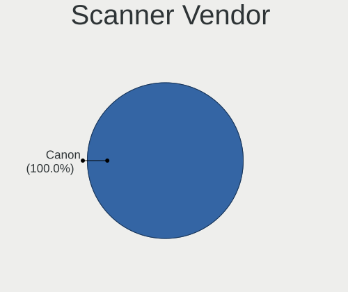

| Vendor | Desktops | Percent |
|--------|----------|---------|
| Canon  | 7        | 100%    |

Scanner Model
-------------

Scanner device models

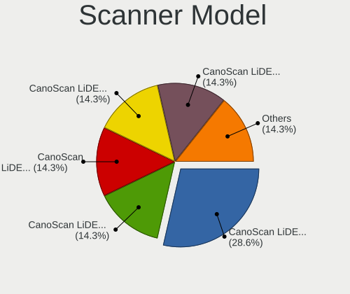

| Model                                  | Desktops | Percent |
|----------------------------------------|----------|---------|
| Canon CanoScan LiDE 110                | 2        | 28.57%  |
| Canon CanoScan LiDE 700F               | 1        | 14.29%  |
| Canon CanoScan LiDE 50/LiDE 35/LiDE 40 | 1        | 14.29%  |
| Canon CanoScan LiDE 210                | 1        | 14.29%  |
| Canon CanoScan LiDE 120                | 1        | 14.29%  |
| Canon CanoScan LiDE 100                | 1        | 14.29%  |

Camera
------

Camera Vendor
-------------

Camera device vendors

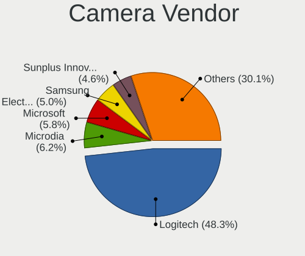

| Vendor                                 | Desktops | Percent |
|----------------------------------------|----------|---------|
| Logitech                               | 125      | 48.26%  |
| Microdia                               | 16       | 6.18%   |
| Microsoft                              | 15       | 5.79%   |
| Samsung Electronics                    | 13       | 5.02%   |
| Sunplus Innovation Technology          | 12       | 4.63%   |
| Apple                                  | 7        | 2.7%    |
| Z-Star Microelectronics                | 6        | 2.32%   |
| Generalplus Technology                 | 6        | 2.32%   |
| Creative Technology                    | 6        | 2.32%   |
| Trust                                  | 5        | 1.93%   |
| Realtek Semiconductor                  | 4        | 1.54%   |
| Razer USA                              | 4        | 1.54%   |
| Elgato Systems                         | 3        | 1.16%   |
| ARC International                      | 3        | 1.16%   |
| Valve Software                         | 2        | 0.77%   |
| Tobii Technology AB                    | 2        | 0.77%   |
| Sony Ericsson Mobile Communications AB | 2        | 0.77%   |
| Novatek Microelectronics               | 2        | 0.77%   |
| Nikon                                  | 2        | 0.77%   |
| MacroSilicon                           | 2        | 0.77%   |
| GEMBIRD                                | 2        | 0.77%   |
| XHT-231205-J                           | 1        | 0.39%   |
| webcam                                 | 1        | 0.39%   |
| The Imaging Source Europe              | 1        | 0.39%   |
| SunplusIT                              | 1        | 0.39%   |
| Sony                                   | 1        | 0.39%   |
| Silicon Motion                         | 1        | 0.39%   |
| Primax Electronics                     | 1        | 0.39%   |
| Pixart Imaging                         | 1        | 0.39%   |
| Philips (or NXP)                       | 1        | 0.39%   |
| Owon                                   | 1        | 0.39%   |
| OmniVision Technologies                | 1        | 0.39%   |
| Netchip Technology                     | 1        | 0.39%   |
| LG Electronics                         | 1        | 0.39%   |
| Insta360                               | 1        | 0.39%   |
| Hewlett-Packard                        | 1        | 0.39%   |
| Guillemot                              | 1        | 0.39%   |
| Google                                 | 1        | 0.39%   |
| Genesys Logic                          | 1        | 0.39%   |
| Cubeternet                             | 1        | 0.39%   |

Camera Model
------------

Camera device models

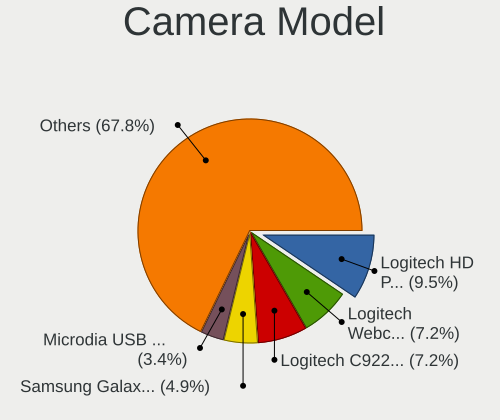

| Model                                       | Desktops | Percent |
|---------------------------------------------|----------|---------|
| Logitech HD Pro Webcam C920                 | 25       | 9.47%   |
| Logitech Webcam C270                        | 19       | 7.2%    |
| Logitech C922 Pro Stream Webcam             | 19       | 7.2%    |
| Samsung Galaxy series, misc. (MTP mode)     | 13       | 4.92%   |
| Microdia USB 2.0 Camera                     | 9        | 3.41%   |
| Sunplus Full HD webcam                      | 8        | 3.03%   |
| Logitech Webcam C310                        | 7        | 2.65%   |
| Logitech BRIO 4K Stream Edition             | 7        | 2.65%   |
| Microsoft LifeCam Studio                    | 6        | 2.27%   |
| Logitech Webcam C930e                       | 6        | 2.27%   |
| Logitech StreamCam                          | 6        | 2.27%   |
| Generalplus GENERAL WEBCAM                  | 6        | 2.27%   |
| Microsoft LifeCam HD-3000                   | 5        | 1.89%   |
| Logitech HD Webcam C615                     | 5        | 1.89%   |
| Apple iPhone 5/5C/5S/6/SE/7/8/X             | 5        | 1.89%   |
| Logitech HD Webcam C525                     | 4        | 1.52%   |
| Logitech BRIO Ultra HD Webcam               | 4        | 1.52%   |
| Z-Star Venus USB2.0 Camera                  | 3        | 1.14%   |
| Microdia USB Camera                         | 3        | 1.14%   |
| Logitech C920 PRO HD Webcam                 | 3        | 1.14%   |
| Elgato Systems Elgato Facecam               | 3        | 1.14%   |
| Creative Live! Cam Chat HD [VF0700/VF0790]  | 3        | 1.14%   |
| ARC International Camera                    | 3        | 1.14%   |
| Valve Software 3D Camera                    | 2        | 0.76%   |
| Trust USB Camera                            | 2        | 0.76%   |
| Tobii AB EyeChip                            | 2        | 0.76%   |
| Sunplus Integrated Camera                   | 2        | 0.76%   |
| Sony Ericsson Mobile AB XQ-CC54             | 2        | 0.76%   |
| Realtek Thronmax Stream Go Pro Webcam       | 2        | 0.76%   |
| Razer USA Razer Kiyo Pro                    | 2        | 0.76%   |
| Razer USA Gaming Webcam [Kiyo]              | 2        | 0.76%   |
| Novatek HP High Definition 2MP Webcam       | 2        | 0.76%   |
| Microsoft LifeCam HD-5000                   | 2        | 0.76%   |
| Microsoft LifeCam Cinema                    | 2        | 0.76%   |
| Microdia Defender G-Lens 2577 HD720p Camera | 2        | 0.76%   |
| Logitech QuickCam Pro for Notebooks         | 2        | 0.76%   |
| Logitech Logitech Webcam C160               | 2        | 0.76%   |
| Logitech BCC950 ConferenceCam               | 2        | 0.76%   |
| Logitech B525 HD Webcam                     | 2        | 0.76%   |
| Z-Star Sirius USB 2.0 Camera                | 1        | 0.38%   |

Security
--------

Fingerprint Vendor
------------------

Fingerprint sensor vendors

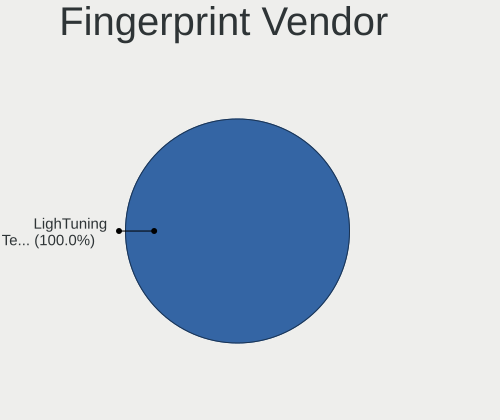

| Vendor                | Desktops | Percent |
|-----------------------|----------|---------|
| LighTuning Technology | 1        | 100%    |

Fingerprint Model
-----------------

Fingerprint sensor models

| Model                                     | Desktops | Percent |
|-------------------------------------------|----------|---------|
| LighTuning ES603 Swipe Fingerprint Sensor | 1        | 100%    |

Chipcard Vendor
---------------

Chipcard module vendors

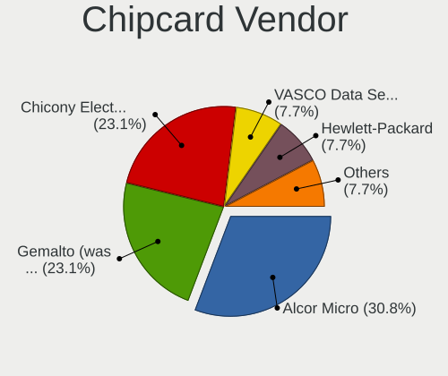

| Vendor                            | Desktops | Percent |
|-----------------------------------|----------|---------|
| Alcor Micro                       | 4        | 30.77%  |
| Gemalto (was Gemplus)             | 3        | 23.08%  |
| Chicony Electronics               | 3        | 23.08%  |
| VASCO Data Security International | 1        | 7.69%   |
| Hewlett-Packard                   | 1        | 7.69%   |
| Cherry                            | 1        | 7.69%   |

Chipcard Model
--------------

Chipcard module models

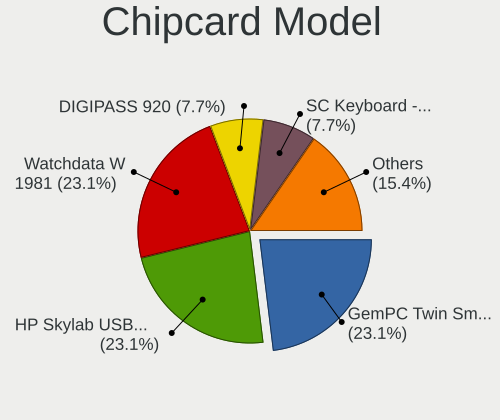

| Model                                                | Desktops | Percent |
|------------------------------------------------------|----------|---------|
| Gemalto (was Gemplus) GemPC Twin SmartCard Reader    | 3        | 23.08%  |
| Chicony Electronics HP Skylab USB Smartcard Keyboard | 3        | 23.08%  |
| Alcor Micro Watchdata W 1981                         | 3        | 23.08%  |
| VASCO Data Security International DIGIPASS 920       | 1        | 7.69%   |
| Hewlett-Packard SC Keyboard - Apollo (Liteon)        | 1        | 7.69%   |
| Cherry SmartCard Reader Keyboard KC 1000 SC          | 1        | 7.69%   |
| Alcor Micro AU9540 Smartcard Reader                  | 1        | 7.69%   |

Unsupported
-----------

Unsupported Devices
-------------------

Total unsupported devices on board

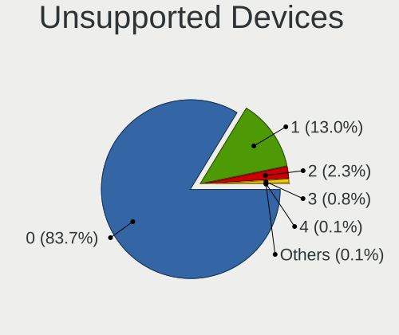

| Total | Desktops | Percent |
|-------|----------|---------|
| 0     | 1187     | 83.71%  |
| 1     | 185      | 13.05%  |
| 2     | 32       | 2.26%   |
| 3     | 11       | 0.78%   |
| 4     | 2        | 0.14%   |
| 5     | 1        | 0.07%   |

Unsupported Device Types
------------------------

Types of unsupported devices

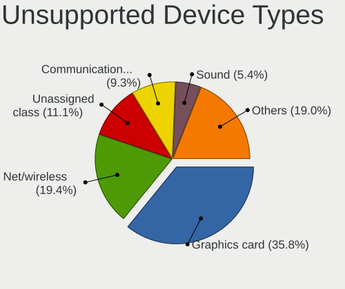

| Type                     | Desktops | Percent |
|--------------------------|----------|---------|
| Graphics card            | 100      | 35.84%  |
| Net/wireless             | 54       | 19.35%  |
| Unassigned class         | 31       | 11.11%  |
| Communication controller | 26       | 9.32%   |
| Sound                    | 15       | 5.38%   |
| Camera                   | 8        | 2.87%   |
| Multimedia controller    | 7        | 2.51%   |
| Bluetooth                | 7        | 2.51%   |
| Net/ethernet             | 6        | 2.15%   |
| Chipcard                 | 6        | 2.15%   |
| Network                  | 5        | 1.79%   |
| Card reader              | 5        | 1.79%   |
| Firewire controller      | 4        | 1.43%   |
| Storage/raid             | 1        | 0.36%   |
| Storage/nvme             | 1        | 0.36%   |
| Storage/ide              | 1        | 0.36%   |
| Fingerprint reader       | 1        | 0.36%   |
| Dvb card                 | 1        | 0.36%   |

