Linux in Sweden - Tested Hardware & Statistics (Desktops)
---------------------------------------------------------

A project to collect tested hardware configurations for Linux in Sweden.

Anyone can contribute to this report by the [hw-probe](https://github.com/linuxhw/hw-probe) tool:

    sudo -E hw-probe -all -upload

Please contribute! Especially if your hardware is rare.

Contents
--------

* [ Test Cases ](#test-cases)

* [ System ](#system)
  - [ OS                       ](#os)
  - [ OS Family                ](#os-family)
  - [ Kernel                   ](#kernel)
  - [ Kernel Family            ](#kernel-family)
  - [ Kernel Major Ver.        ](#kernel-major-ver)
  - [ Arch                     ](#arch)
  - [ DE                       ](#de)
  - [ Display Server           ](#display-server)
  - [ Display Manager          ](#display-manager)
  - [ OS Lang                  ](#os-lang)
  - [ Boot Mode                ](#boot-mode)
  - [ Filesystem               ](#filesystem)
  - [ Part. scheme             ](#part-scheme)
  - [ Dual Boot with Linux/BSD ](#dual-boot-with-linuxbsd)
  - [ Dual Boot (Win)          ](#dual-boot-win)

* [ Board ](#board)
  - [ Vendor                   ](#vendor)
  - [ Model                    ](#model)
  - [ Model Family             ](#model-family)
  - [ MFG Year                 ](#mfg-year)
  - [ Form Factor              ](#form-factor)
  - [ Secure Boot              ](#secure-boot)
  - [ Coreboot                 ](#coreboot)
  - [ RAM Size                 ](#ram-size)
  - [ RAM Used                 ](#ram-used)
  - [ Total Drives             ](#total-drives)
  - [ Has CD-ROM               ](#has-cd-rom)
  - [ Has Ethernet             ](#has-ethernet)
  - [ Has WiFi                 ](#has-wifi)
  - [ Has Bluetooth            ](#has-bluetooth)

* [ Location ](#location)
  - [ Country                  ](#country)
  - [ City                     ](#city)

* [ Drives ](#drives)
  - [ Drive Vendor             ](#drive-vendor)
  - [ Drive Model              ](#drive-model)
  - [ HDD Vendor               ](#hdd-vendor)
  - [ SSD Vendor               ](#ssd-vendor)
  - [ Drive Kind               ](#drive-kind)
  - [ Drive Connector          ](#drive-connector)
  - [ Drive Size               ](#drive-size)
  - [ Space Total              ](#space-total)
  - [ Space Used               ](#space-used)
  - [ Malfunc. Drives          ](#malfunc-drives)
  - [ Malfunc. Drive Vendor    ](#malfunc-drive-vendor)
  - [ Malfunc. HDD Vendor      ](#malfunc-hdd-vendor)
  - [ Malfunc. Drive Kind      ](#malfunc-drive-kind)
  - [ Failed Drives            ](#failed-drives)
  - [ Failed Drive Vendor      ](#failed-drive-vendor)
  - [ Drive Status             ](#drive-status)

* [ Storage controller ](#storage-controller)
  - [ Storage Vendor           ](#storage-vendor)
  - [ Storage Model            ](#storage-model)
  - [ Storage Kind             ](#storage-kind)

* [ Processor ](#processor)
  - [ CPU Vendor               ](#cpu-vendor)
  - [ CPU Model                ](#cpu-model)
  - [ CPU Model Family         ](#cpu-model-family)
  - [ CPU Cores                ](#cpu-cores)
  - [ CPU Sockets              ](#cpu-sockets)
  - [ CPU Threads              ](#cpu-threads)
  - [ CPU Op-Modes             ](#cpu-op-modes)
  - [ CPU Microcode            ](#cpu-microcode)
  - [ CPU Microarch            ](#cpu-microarch)

* [ Graphics ](#graphics)
  - [ GPU Vendor               ](#gpu-vendor)
  - [ GPU Model                ](#gpu-model)
  - [ GPU Combo                ](#gpu-combo)
  - [ GPU Driver               ](#gpu-driver)
  - [ GPU Memory               ](#gpu-memory)

* [ Monitor ](#monitor)
  - [ Monitor Vendor           ](#monitor-vendor)
  - [ Monitor Model            ](#monitor-model)
  - [ Monitor Resolution       ](#monitor-resolution)
  - [ Monitor Diagonal         ](#monitor-diagonal)
  - [ Monitor Width            ](#monitor-width)
  - [ Aspect Ratio             ](#aspect-ratio)
  - [ Monitor Area             ](#monitor-area)
  - [ Pixel Density            ](#pixel-density)
  - [ Multiple Monitors        ](#multiple-monitors)

* [ Network ](#network)
  - [ Net Controller Vendor    ](#net-controller-vendor)
  - [ Net Controller Model     ](#net-controller-model)
  - [ Wireless Vendor          ](#wireless-vendor)
  - [ Wireless Model           ](#wireless-model)
  - [ Ethernet Vendor          ](#ethernet-vendor)
  - [ Ethernet Model           ](#ethernet-model)
  - [ Net Controller Kind      ](#net-controller-kind)
  - [ Used Controller          ](#used-controller)
  - [ NICs                     ](#nics)
  - [ IPv6                     ](#ipv6)

* [ Bluetooth ](#bluetooth)
  - [ Bluetooth Vendor         ](#bluetooth-vendor)
  - [ Bluetooth Model          ](#bluetooth-model)

* [ Sound ](#sound)
  - [ Sound Vendor             ](#sound-vendor)
  - [ Sound Model              ](#sound-model)

* [ Memory ](#memory)
  - [ Memory Vendor            ](#memory-vendor)
  - [ Memory Model             ](#memory-model)
  - [ Memory Kind              ](#memory-kind)
  - [ Memory Form Factor       ](#memory-form-factor)
  - [ Memory Size              ](#memory-size)
  - [ Memory Speed             ](#memory-speed)

* [ Printers & scanners ](#printers--scanners)
  - [ Printer Vendor           ](#printer-vendor)
  - [ Printer Model            ](#printer-model)
  - [ Scanner Vendor           ](#scanner-vendor)
  - [ Scanner Model            ](#scanner-model)

* [ Camera ](#camera)
  - [ Camera Vendor            ](#camera-vendor)
  - [ Camera Model             ](#camera-model)

* [ Security ](#security)
  - [ Fingerprint Vendor       ](#fingerprint-vendor)
  - [ Fingerprint Model        ](#fingerprint-model)
  - [ Chipcard Vendor          ](#chipcard-vendor)
  - [ Chipcard Model           ](#chipcard-model)

* [ Unsupported ](#unsupported)
  - [ Unsupported Devices      ](#unsupported-devices)
  - [ Unsupported Device Types ](#unsupported-device-types)

Test Cases
----------

Total: 920

| Vendor        | Model                       | Probe                                                      | Date         |
|---------------|-----------------------------|------------------------------------------------------------|--------------|
| MSI           | MPG X570 GAMING EDGE WIF... | [64a21844e4](https://linux-hardware.org/?probe=64a21844e4) | Aug 01, 2022 |
| Dell          | 0TP412                      | [c6138574f4](https://linux-hardware.org/?probe=c6138574f4) | Jul 30, 2022 |
| ASUSTek       | TUF Gaming B450-PLUS II     | [edd98c5418](https://linux-hardware.org/?probe=edd98c5418) | Jul 30, 2022 |
| ASUSTek       | ROG STRIX B450-F GAMING ... | [3b661517b1](https://linux-hardware.org/?probe=3b661517b1) | Jul 29, 2022 |
| HP            | 18E7                        | [3d7c1549eb](https://linux-hardware.org/?probe=3d7c1549eb) | Jul 29, 2022 |
| MSI           | Z390-A PRO                  | [32c295bae1](https://linux-hardware.org/?probe=32c295bae1) | Jul 29, 2022 |
| ASUSTek       | ROG STRIX B550-I GAMING     | [c3f34f2c91](https://linux-hardware.org/?probe=c3f34f2c91) | Jul 28, 2022 |
| Acer          | Aspire X1930                | [6a650f512e](https://linux-hardware.org/?probe=6a650f512e) | Jul 27, 2022 |
| ASRock        | B450M Pro4                  | [5b4bccdf27](https://linux-hardware.org/?probe=5b4bccdf27) | Jul 27, 2022 |
| ASRock        | X570 Phantom Gaming 4       | [960fefaee7](https://linux-hardware.org/?probe=960fefaee7) | Jul 25, 2022 |
| Gigabyte      | Z390 M-CF                   | [ae2926d93e](https://linux-hardware.org/?probe=ae2926d93e) | Jul 24, 2022 |
| XDO.AI        | Pantera Pico PC             | [e29f39ad9e](https://linux-hardware.org/?probe=e29f39ad9e) | Jul 23, 2022 |
| ASUSTek       | PRIME H610M-E D4            | [66fe37549d](https://linux-hardware.org/?probe=66fe37549d) | Jul 16, 2022 |
| ASUSTek       | ROG STRIX B550-F GAMING     | [86ac444b35](https://linux-hardware.org/?probe=86ac444b35) | Jul 15, 2022 |
| ASUSTek       | TUF B450M-PLUS GAMING       | [9da64b4efa](https://linux-hardware.org/?probe=9da64b4efa) | Jul 14, 2022 |
| ASUSTek       | Z170-A                      | [1ac13f76b1](https://linux-hardware.org/?probe=1ac13f76b1) | Jul 10, 2022 |
| Dell          | 0M858N A01                  | [36aca635a8](https://linux-hardware.org/?probe=36aca635a8) | Jul 06, 2022 |
| Dell          | 0GM819                      | [a366983f6a](https://linux-hardware.org/?probe=a366983f6a) | Jul 06, 2022 |
| Dell          | 0GM819                      | [78e233e42f](https://linux-hardware.org/?probe=78e233e42f) | Jul 06, 2022 |
| ASUSTek       | ROG STRIX B550-I GAMING     | [0f4c661912](https://linux-hardware.org/?probe=0f4c661912) | Jun 27, 2022 |
| MSI           | Z370 GAMING PRO CARBON      | [57660d8f0f](https://linux-hardware.org/?probe=57660d8f0f) | Jun 24, 2022 |
| HP            | 2B05                        | [677bb9d569](https://linux-hardware.org/?probe=677bb9d569) | Jun 22, 2022 |
| ASUSTek       | M5A78L-M/USB3               | [273f19137a](https://linux-hardware.org/?probe=273f19137a) | Jun 21, 2022 |
| MSI           | B250I GAMING PRO AC         | [280d4af2d2](https://linux-hardware.org/?probe=280d4af2d2) | Jun 21, 2022 |
| MSI           | B250I GAMING PRO AC         | [c90adf6d43](https://linux-hardware.org/?probe=c90adf6d43) | Jun 21, 2022 |
| ASUSTek       | P8Z77-V LX                  | [ad271e0eec](https://linux-hardware.org/?probe=ad271e0eec) | Jun 19, 2022 |
| HP            | 2B05                        | [a49ebb4aed](https://linux-hardware.org/?probe=a49ebb4aed) | Jun 19, 2022 |
| ASUSTek       | ROG CROSSHAIR VIII HERO     | [530c081484](https://linux-hardware.org/?probe=530c081484) | Jun 17, 2022 |
| Gigabyte      | H67M-UD2H-B3                | [1c8dd20713](https://linux-hardware.org/?probe=1c8dd20713) | Jun 16, 2022 |
| Acer          | Aspire TC-230               | [bec506a849](https://linux-hardware.org/?probe=bec506a849) | Jun 16, 2022 |
| Acer          | Predator G3610              | [ff347cdb53](https://linux-hardware.org/?probe=ff347cdb53) | Jun 15, 2022 |
| ASUSTek       | ROG STRIX B450-I GAMING     | [fe963bacc6](https://linux-hardware.org/?probe=fe963bacc6) | Jun 14, 2022 |
| ASUSTek       | ROG STRIX B450-F GAMING ... | [33dbe3e5db](https://linux-hardware.org/?probe=33dbe3e5db) | Jun 08, 2022 |
| ASUSTek       | PRIME A320M-K               | [ba86261552](https://linux-hardware.org/?probe=ba86261552) | Jun 06, 2022 |
| Dell          | 0WR7PY A01                  | [dc7a83708a](https://linux-hardware.org/?probe=dc7a83708a) | Jun 04, 2022 |
| MSI           | 970 GAMING                  | [b414c22d34](https://linux-hardware.org/?probe=b414c22d34) | Jun 02, 2022 |
| Gigabyte      | Z68AP-D3                    | [90b0bc8a37](https://linux-hardware.org/?probe=90b0bc8a37) | Jun 02, 2022 |
| Lenovo        | 3178 SDK0J40697 WIN 3305... | [63747954e9](https://linux-hardware.org/?probe=63747954e9) | May 29, 2022 |
| Pegatron      | 2ACF                        | [bd97a6b3dd](https://linux-hardware.org/?probe=bd97a6b3dd) | May 28, 2022 |
| MSI           | B450I GAMING PLUS AC        | [e64dfe3f6f](https://linux-hardware.org/?probe=e64dfe3f6f) | May 28, 2022 |
| ASUSTek       | ROG STRIX B450-F GAMING ... | [8f40318937](https://linux-hardware.org/?probe=8f40318937) | May 27, 2022 |
| Gigabyte      | X570 AORUS MASTER           | [c025e27a90](https://linux-hardware.org/?probe=c025e27a90) | May 27, 2022 |
| Gigabyte      | H67N-USB3-B3                | [382f206597](https://linux-hardware.org/?probe=382f206597) | May 21, 2022 |
| ASUSTek       | ROG STRIX B450-F GAMING     | [f02fa869ff](https://linux-hardware.org/?probe=f02fa869ff) | May 20, 2022 |
| Fujitsu       | D3230-A1 S26361-D3230-A1    | [efd77955ef](https://linux-hardware.org/?probe=efd77955ef) | May 15, 2022 |
| ASUSTek       | P8Z77-V LK                  | [70809098f6](https://linux-hardware.org/?probe=70809098f6) | May 14, 2022 |
| ASUSTek       | SABERTOOTH 990FX R2.0       | [bfcd03ba86](https://linux-hardware.org/?probe=bfcd03ba86) | May 14, 2022 |
| ASUSTek       | Z97-P                       | [2152787c64](https://linux-hardware.org/?probe=2152787c64) | May 13, 2022 |
| Lenovo        | SKYBAY SDK0J40700 WIN 32... | [6f09e11de7](https://linux-hardware.org/?probe=6f09e11de7) | May 12, 2022 |
| Gigabyte      | X570 AORUS MASTER           | [2342a9d519](https://linux-hardware.org/?probe=2342a9d519) | May 12, 2022 |
| Dell          | 0HD5W2 A00                  | [9f28ef42a4](https://linux-hardware.org/?probe=9f28ef42a4) | May 11, 2022 |
| MSI           | B75MA-E33                   | [220e04a116](https://linux-hardware.org/?probe=220e04a116) | May 11, 2022 |
| ASRock        | B550 Phantom Gaming 4/ac    | [6a69aab6ee](https://linux-hardware.org/?probe=6a69aab6ee) | May 11, 2022 |
| ASUSTek       | ROG STRIX B560-I GAMING ... | [8f62053ddd](https://linux-hardware.org/?probe=8f62053ddd) | May 11, 2022 |
| ASUSTek       | ROG STRIX B560-I GAMING ... | [018c90008f](https://linux-hardware.org/?probe=018c90008f) | May 11, 2022 |
| Gigabyte      | X99P-SLI-CF                 | [0bec73d852](https://linux-hardware.org/?probe=0bec73d852) | May 10, 2022 |
| MSI           | B450M MORTAR TITANIUM       | [56c5f8cad8](https://linux-hardware.org/?probe=56c5f8cad8) | May 09, 2022 |
| ASUSTek       | TUF B450M-PRO GAMING        | [bd94a8145a](https://linux-hardware.org/?probe=bd94a8145a) | May 08, 2022 |
| ASUSTek       | PRIME X470-PRO              | [be200c9e57](https://linux-hardware.org/?probe=be200c9e57) | May 06, 2022 |
| ASUSTek       | ROG STRIX B560-I GAMING ... | [e8fee79ec7](https://linux-hardware.org/?probe=e8fee79ec7) | Apr 30, 2022 |
| ASUSTek       | B150M-A                     | [fa213f6681](https://linux-hardware.org/?probe=fa213f6681) | Apr 28, 2022 |
| Gigabyte      | H67M-UD2H-B3                | [7defbcb7bb](https://linux-hardware.org/?probe=7defbcb7bb) | Apr 28, 2022 |
| Gigabyte      | X570 I AORUS PRO WIFI       | [11a6c8f173](https://linux-hardware.org/?probe=11a6c8f173) | Apr 27, 2022 |
| Lenovo        | 3716 SDK0R32862 WIN 3258... | [8cba4892be](https://linux-hardware.org/?probe=8cba4892be) | Apr 25, 2022 |
| Gigabyte      | B550 AORUS PRO AC           | [c0af99fa7e](https://linux-hardware.org/?probe=c0af99fa7e) | Apr 24, 2022 |
| ASUSTek       | PRIME Z270-P                | [6cc8c69a6c](https://linux-hardware.org/?probe=6cc8c69a6c) | Apr 23, 2022 |
| HP            | 18E9                        | [36ff483a2f](https://linux-hardware.org/?probe=36ff483a2f) | Apr 23, 2022 |
| MSI           | B450 TOMAHAWK               | [4c46fa8a5b](https://linux-hardware.org/?probe=4c46fa8a5b) | Apr 19, 2022 |
| Foxconn       | 2ABF                        | [ce158f41e2](https://linux-hardware.org/?probe=ce158f41e2) | Apr 17, 2022 |
| ASUSTek       | Z97-P                       | [bf54ec19d0](https://linux-hardware.org/?probe=bf54ec19d0) | Apr 16, 2022 |
| MSI           | 990FXA-GD80                 | [391705d3c1](https://linux-hardware.org/?probe=391705d3c1) | Apr 15, 2022 |
| Foxconn       | 2ABF                        | [8994d0ea9f](https://linux-hardware.org/?probe=8994d0ea9f) | Apr 15, 2022 |
| ASUSTek       | Z97-K                       | [53cba6b4f8](https://linux-hardware.org/?probe=53cba6b4f8) | Apr 14, 2022 |
| MSI           | MAG X570 TOMAHAWK WIFI      | [dba38dc289](https://linux-hardware.org/?probe=dba38dc289) | Apr 13, 2022 |
| HP            | 18E5                        | [3b4f9e8525](https://linux-hardware.org/?probe=3b4f9e8525) | Apr 13, 2022 |
| ASUSTek       | ROG STRIX Z370-G GAMING     | [0056c8d32e](https://linux-hardware.org/?probe=0056c8d32e) | Apr 13, 2022 |
| Gigabyte      | B550I AORUS PRO AX          | [68aa564b9f](https://linux-hardware.org/?probe=68aa564b9f) | Apr 13, 2022 |
| ASUSTek       | PRIME B350M-A               | [ed40a9ddc1](https://linux-hardware.org/?probe=ed40a9ddc1) | Apr 12, 2022 |
| ASUSTek       | PRIME B350M-A               | [9a137f0540](https://linux-hardware.org/?probe=9a137f0540) | Apr 12, 2022 |
| ASRock        | B450 Steel Legend           | [b9b9565fae](https://linux-hardware.org/?probe=b9b9565fae) | Apr 10, 2022 |
| MSI           | B250M BAZOOKA               | [91392a601e](https://linux-hardware.org/?probe=91392a601e) | Apr 08, 2022 |
| MSI           | Z170A XPOWER GAMING TITA... | [ffcbeed952](https://linux-hardware.org/?probe=ffcbeed952) | Apr 08, 2022 |
| Maxtang       | FP30 V1.0                   | [2062d8578e](https://linux-hardware.org/?probe=2062d8578e) | Apr 08, 2022 |
| ASUSTek       | ROG STRIX B450-F GAMING     | [53e59cf805](https://linux-hardware.org/?probe=53e59cf805) | Apr 06, 2022 |
| ASRock        | Z97 Pro3                    | [68397184cf](https://linux-hardware.org/?probe=68397184cf) | Apr 06, 2022 |
| ASUSTek       | PRIME X299-DELUXE II        | [f3bc34e630](https://linux-hardware.org/?probe=f3bc34e630) | Apr 05, 2022 |
| MSI           | X570-A PRO                  | [2af47af588](https://linux-hardware.org/?probe=2af47af588) | Apr 04, 2022 |
| Dell          | 0YXT71 A01                  | [5de0fab8f2](https://linux-hardware.org/?probe=5de0fab8f2) | Apr 04, 2022 |
| ASUSTek       | P7P55D-E PRO                | [3e01b6fb25](https://linux-hardware.org/?probe=3e01b6fb25) | Apr 03, 2022 |
| Lenovo        | 3106 SDK0J40705 WIN 3425... | [b3a74c237d](https://linux-hardware.org/?probe=b3a74c237d) | Apr 02, 2022 |
| ASUSTek       | P8H67-M LE                  | [01a521b3d1](https://linux-hardware.org/?probe=01a521b3d1) | Apr 02, 2022 |
| MSI           | B450 TOMAHAWK MAX II        | [2d4957c88f](https://linux-hardware.org/?probe=2d4957c88f) | Apr 02, 2022 |
| Lenovo        | SKYBAY SDK0J40700 WIN 32... | [137477b9ef](https://linux-hardware.org/?probe=137477b9ef) | Mar 29, 2022 |
| ASUSTek       | P8H67-M LE                  | [3a33018680](https://linux-hardware.org/?probe=3a33018680) | Mar 29, 2022 |
| ASRock        | Z77 Extreme4                | [4ab227f4be](https://linux-hardware.org/?probe=4ab227f4be) | Mar 29, 2022 |
| ASUSTek       | P8Z68-V GEN3                | [e4c1632bc2](https://linux-hardware.org/?probe=e4c1632bc2) | Mar 28, 2022 |
| ASUSTek       | Z97-P                       | [d5f059e17d](https://linux-hardware.org/?probe=d5f059e17d) | Mar 26, 2022 |
| ASUSTek       | ROG STRIX B450-I GAMING     | [e6a885c5df](https://linux-hardware.org/?probe=e6a885c5df) | Mar 26, 2022 |
| ASUSTek       | ROG STRIX B450-I GAMING     | [d08bb2f15b](https://linux-hardware.org/?probe=d08bb2f15b) | Mar 25, 2022 |
| ASUSTek       | TUF Gaming X570-PLUS        | [6af3c57a8a](https://linux-hardware.org/?probe=6af3c57a8a) | Mar 24, 2022 |
| Gigabyte      | H310M H x.x                 | [5adb4614c4](https://linux-hardware.org/?probe=5adb4614c4) | Mar 23, 2022 |
| Gigabyte      | H310M H x.x                 | [d277e5c6bc](https://linux-hardware.org/?probe=d277e5c6bc) | Mar 23, 2022 |
| Dell          | 0F3KHR A00                  | [b312650d8d](https://linux-hardware.org/?probe=b312650d8d) | Mar 20, 2022 |
| Acer          | Aspire XC600 v1.0           | [4191a185d4](https://linux-hardware.org/?probe=4191a185d4) | Mar 19, 2022 |
| Dell          | 09KPNV A00                  | [f71ac898a8](https://linux-hardware.org/?probe=f71ac898a8) | Mar 19, 2022 |
| ASUSTek       | P8Z77-V LK                  | [21c958ad5f](https://linux-hardware.org/?probe=21c958ad5f) | Mar 12, 2022 |
| ASUSTek       | TUF Gaming Z690-PLUS WIF... | [f9345bd168](https://linux-hardware.org/?probe=f9345bd168) | Mar 12, 2022 |
| Lenovo        | 3704 SDK0J40700 WIN 3258... | [e6c507dff4](https://linux-hardware.org/?probe=e6c507dff4) | Mar 12, 2022 |
| ASUSTek       | TUF Gaming Z690-PLUS WIF... | [84e80f8c56](https://linux-hardware.org/?probe=84e80f8c56) | Mar 12, 2022 |
| ASUSTek       | G11CD-K                     | [f3347643b0](https://linux-hardware.org/?probe=f3347643b0) | Mar 12, 2022 |
| ASRock        | B550 Phantom Gaming 4/ac    | [d7c05bb862](https://linux-hardware.org/?probe=d7c05bb862) | Mar 11, 2022 |
| Gigabyte      | X570 I AORUS PRO WIFI       | [c4d9b11074](https://linux-hardware.org/?probe=c4d9b11074) | Mar 10, 2022 |
| MSI           | Z170A PC MATE               | [181e014823](https://linux-hardware.org/?probe=181e014823) | Mar 08, 2022 |
| ASUSTek       | P5E3 Deluxe                 | [db85b45bf6](https://linux-hardware.org/?probe=db85b45bf6) | Mar 05, 2022 |
| ASRock        | H81M-ITX                    | [c04f6c7365](https://linux-hardware.org/?probe=c04f6c7365) | Mar 05, 2022 |
| Intel         | HURONRIVER                  | [3ff867b4e2](https://linux-hardware.org/?probe=3ff867b4e2) | Mar 05, 2022 |
| ASRock        | X399 Taichi                 | [2efd176b6f](https://linux-hardware.org/?probe=2efd176b6f) | Mar 03, 2022 |
| MSI           | MAG B660M MORTAR DDR4       | [d1c5534f6d](https://linux-hardware.org/?probe=d1c5534f6d) | Feb 27, 2022 |
| ASUSTek       | P5Q SE2                     | [2b2338382c](https://linux-hardware.org/?probe=2b2338382c) | Feb 27, 2022 |
| Lenovo        | 36D5 SDK0J40700 WIN 3258... | [4ae8fd98cc](https://linux-hardware.org/?probe=4ae8fd98cc) | Feb 26, 2022 |
| MSI           | Z97 PC Mate                 | [1cc7d4542a](https://linux-hardware.org/?probe=1cc7d4542a) | Feb 23, 2022 |
| Elo Touch ... | Geminilake Continental Z... | [6d9bcef1c7](https://linux-hardware.org/?probe=6d9bcef1c7) | Feb 23, 2022 |
| Pegatron      | 2AB5                        | [f2ee067b5f](https://linux-hardware.org/?probe=f2ee067b5f) | Feb 23, 2022 |
| Gigabyte      | F2A88XM-HD3P                | [1c3e6a4af1](https://linux-hardware.org/?probe=1c3e6a4af1) | Feb 21, 2022 |
| ASUSTek       | PRIME X570-PRO              | [34117f82de](https://linux-hardware.org/?probe=34117f82de) | Feb 20, 2022 |
| Gigabyte      | F2A88XM-HD3P                | [ed1a78c5a6](https://linux-hardware.org/?probe=ed1a78c5a6) | Feb 20, 2022 |
| HP            | 3032h                       | [df23e573ba](https://linux-hardware.org/?probe=df23e573ba) | Feb 19, 2022 |
| ASUSTek       | ROG STRIX Z370-G GAMING     | [cc35d4696d](https://linux-hardware.org/?probe=cc35d4696d) | Feb 13, 2022 |
| HP            | 0B4Ch D                     | [0600ea1165](https://linux-hardware.org/?probe=0600ea1165) | Feb 11, 2022 |
| ASUSTek       | PRIME Z590-P                | [fbea64f951](https://linux-hardware.org/?probe=fbea64f951) | Feb 07, 2022 |
| ASUSTek       | P8Z77-V LX                  | [db7f189b71](https://linux-hardware.org/?probe=db7f189b71) | Feb 06, 2022 |
| Dell          | 084J0R A00                  | [70c2ff9419](https://linux-hardware.org/?probe=70c2ff9419) | Feb 06, 2022 |
| ASUSTek       | ROG STRIX Z690-F GAMING ... | [3a8c47094b](https://linux-hardware.org/?probe=3a8c47094b) | Feb 05, 2022 |
| ASUSTek       | ROG STRIX Z690-F GAMING ... | [ae06eadc57](https://linux-hardware.org/?probe=ae06eadc57) | Feb 05, 2022 |
| ASUSTek       | PRIME Z590-P                | [cb34c3126d](https://linux-hardware.org/?probe=cb34c3126d) | Feb 05, 2022 |
| Packard Be... | IMEDIA S2985                | [661d923ce2](https://linux-hardware.org/?probe=661d923ce2) | Feb 03, 2022 |
| Dell          | 0773VG A01                  | [b1c8ece218](https://linux-hardware.org/?probe=b1c8ece218) | Feb 03, 2022 |
| ASUSTek       | Z97-P                       | [c51e8a279f](https://linux-hardware.org/?probe=c51e8a279f) | Feb 02, 2022 |
| ASUSTek       | Z97-P                       | [19cb128817](https://linux-hardware.org/?probe=19cb128817) | Feb 02, 2022 |
| ASUSTek       | P8Z77-V LK                  | [a6321e237c](https://linux-hardware.org/?probe=a6321e237c) | Feb 01, 2022 |
| Acer          | Predator G3610              | [126f12bd14](https://linux-hardware.org/?probe=126f12bd14) | Feb 01, 2022 |
| ASUSTek       | ROG STRIX X570-I GAMING     | [fdf21ecdef](https://linux-hardware.org/?probe=fdf21ecdef) | Jan 29, 2022 |
| Dell          | 0Y2MRG A00                  | [1a1b794c06](https://linux-hardware.org/?probe=1a1b794c06) | Jan 28, 2022 |
| Fujitsu       | D3009-A1 S26361-D3009-A1    | [a0aecb00c0](https://linux-hardware.org/?probe=a0aecb00c0) | Jan 26, 2022 |
| AAEON         | GENE-BT05 V1.1              | [385d6a7c2e](https://linux-hardware.org/?probe=385d6a7c2e) | Jan 25, 2022 |
| MSI           | B85M-E45                    | [5751d3e736](https://linux-hardware.org/?probe=5751d3e736) | Jan 25, 2022 |
| MSI           | B85M-E45                    | [034f7c3687](https://linux-hardware.org/?probe=034f7c3687) | Jan 25, 2022 |
| ASUSTek       | M4A785TD-V EVO              | [e5aea099ea](https://linux-hardware.org/?probe=e5aea099ea) | Jan 23, 2022 |
| ASUSTek       | M4A785TD-V EVO              | [f82cb83a85](https://linux-hardware.org/?probe=f82cb83a85) | Jan 23, 2022 |
| MSI           | MAG Z590 TOMAHAWK WIFI      | [2aa2fc8ed9](https://linux-hardware.org/?probe=2aa2fc8ed9) | Jan 22, 2022 |
| Gigabyte      | B450 AORUS M                | [76ac118b42](https://linux-hardware.org/?probe=76ac118b42) | Jan 20, 2022 |
| Gigabyte      | 990XA-UD3                   | [e5b1e0c400](https://linux-hardware.org/?probe=e5b1e0c400) | Jan 20, 2022 |
| ASUSTek       | ROG STRIX X570-F GAMING     | [c4103d5c5a](https://linux-hardware.org/?probe=c4103d5c5a) | Jan 19, 2022 |
| ASUSTek       | Z170 PRO GAMING             | [a7cc00f1bb](https://linux-hardware.org/?probe=a7cc00f1bb) | Jan 18, 2022 |
| Seco          | C40 C                       | [4243badc3f](https://linux-hardware.org/?probe=4243badc3f) | Jan 14, 2022 |
| MSI           | Z270 GAMING M7              | [4899dd71f5](https://linux-hardware.org/?probe=4899dd71f5) | Jan 12, 2022 |
| MSI           | Z270 GAMING M7              | [9fa194bf62](https://linux-hardware.org/?probe=9fa194bf62) | Jan 12, 2022 |
| Gigabyte      | B450 AORUS M                | [d9856d52b0](https://linux-hardware.org/?probe=d9856d52b0) | Jan 11, 2022 |
| Gigabyte      | B450 AORUS M                | [8b8a13f3b4](https://linux-hardware.org/?probe=8b8a13f3b4) | Jan 11, 2022 |
| ASUSTek       | ROG STRIX Z390-H GAMING     | [19857c8f84](https://linux-hardware.org/?probe=19857c8f84) | Jan 11, 2022 |
| Gigabyte      | B450 AORUS M                | [0fa4a81a77](https://linux-hardware.org/?probe=0fa4a81a77) | Jan 09, 2022 |
| ASUSTek       | P8H77-M PRO                 | [14a4cdc223](https://linux-hardware.org/?probe=14a4cdc223) | Jan 06, 2022 |
| Gigabyte      | B450 AORUS M                | [9ebb75d7a4](https://linux-hardware.org/?probe=9ebb75d7a4) | Jan 06, 2022 |
| ASUSTek       | PRIME Z690-P WIFI D4        | [81efe23b11](https://linux-hardware.org/?probe=81efe23b11) | Jan 04, 2022 |
| ASUSTek       | TUF Gaming X570-PLUS        | [ef297a39aa](https://linux-hardware.org/?probe=ef297a39aa) | Jan 04, 2022 |
| Dell          | 0F3KHR A00                  | [a1905b9b4a](https://linux-hardware.org/?probe=a1905b9b4a) | Jan 03, 2022 |
| MSI           | H67MA-E45                   | [d15eaff050](https://linux-hardware.org/?probe=d15eaff050) | Jan 01, 2022 |
| MSI           | MPG Z690 FORCE WIFI         | [8317742b36](https://linux-hardware.org/?probe=8317742b36) | Jan 01, 2022 |
| MSI           | MS-7211                     | [f8d1e7a88c](https://linux-hardware.org/?probe=f8d1e7a88c) | Dec 31, 2021 |
| ASUSTek       | X79-DELUXE                  | [00b9dd3788](https://linux-hardware.org/?probe=00b9dd3788) | Dec 30, 2021 |
| Gigabyte      | F2A88XM-DS2P                | [75eea6ae2f](https://linux-hardware.org/?probe=75eea6ae2f) | Dec 30, 2021 |
| Pegatron      | Narra6                      | [da3be9b31b](https://linux-hardware.org/?probe=da3be9b31b) | Dec 29, 2021 |
| MSI           | MS-7211                     | [3524bec1c8](https://linux-hardware.org/?probe=3524bec1c8) | Dec 29, 2021 |
| ASUSTek       | ROG STRIX Z390-H GAMING     | [02f8579bf3](https://linux-hardware.org/?probe=02f8579bf3) | Dec 29, 2021 |
| ASRock        | X300M-STX                   | [64e387d031](https://linux-hardware.org/?probe=64e387d031) | Dec 27, 2021 |
| ASUSTek       | ROG STRIX B550-F GAMING     | [e1713d01a4](https://linux-hardware.org/?probe=e1713d01a4) | Dec 25, 2021 |
| Foxconn       | 2ABF                        | [0a1cd1d1af](https://linux-hardware.org/?probe=0a1cd1d1af) | Dec 23, 2021 |
| Dell          | 0Y56T3 A00                  | [456cb4ebcc](https://linux-hardware.org/?probe=456cb4ebcc) | Dec 23, 2021 |
| Acer          | Aspire XC-330               | [1803a4622c](https://linux-hardware.org/?probe=1803a4622c) | Dec 19, 2021 |
| Gigabyte      | F2A88XM-DS2P                | [c18ddabc8d](https://linux-hardware.org/?probe=c18ddabc8d) | Dec 18, 2021 |
| MSI           | B450 TOMAHAWK               | [75b2d1484e](https://linux-hardware.org/?probe=75b2d1484e) | Dec 17, 2021 |
| Acer          | Aspire XC-330               | [61dd8de51b](https://linux-hardware.org/?probe=61dd8de51b) | Dec 16, 2021 |
| ASUSTek       | ROG STRIX X570-F GAMING     | [660ce7fc74](https://linux-hardware.org/?probe=660ce7fc74) | Dec 15, 2021 |
| MSI           | B450 TOMAHAWK               | [7d66a9996f](https://linux-hardware.org/?probe=7d66a9996f) | Dec 15, 2021 |
| Apple         | Mac-F221BEC8                | [44378ec4a5](https://linux-hardware.org/?probe=44378ec4a5) | Dec 14, 2021 |
| Dell          | 084J0R A00                  | [dff25b4704](https://linux-hardware.org/?probe=dff25b4704) | Dec 11, 2021 |
| ASUSTek       | CM6650                      | [ef34d60843](https://linux-hardware.org/?probe=ef34d60843) | Dec 09, 2021 |
| Gigabyte      | B550 AORUS ELITE V2         | [ad04822d41](https://linux-hardware.org/?probe=ad04822d41) | Dec 07, 2021 |
| Gigabyte      | X470 AORUS ULTRA GAMING-... | [9609fb65be](https://linux-hardware.org/?probe=9609fb65be) | Dec 06, 2021 |
| ASUSTek       | ROG STRIX B550-I GAMING     | [a2e2eceb54](https://linux-hardware.org/?probe=a2e2eceb54) | Dec 05, 2021 |
| Gigabyte      | B550 AORUS ELITE V2         | [56f55d6a20](https://linux-hardware.org/?probe=56f55d6a20) | Nov 24, 2021 |
| HP            | 212B                        | [0377d5dc76](https://linux-hardware.org/?probe=0377d5dc76) | Nov 23, 2021 |
| Gigabyte      | Z97X-Gaming 3               | [532584c064](https://linux-hardware.org/?probe=532584c064) | Nov 20, 2021 |
| Gigabyte      | Z97X-Gaming 3               | [fcfcf6c49b](https://linux-hardware.org/?probe=fcfcf6c49b) | Nov 20, 2021 |
| Gigabyte      | B550M AORUS PRO-P           | [981f4d57e5](https://linux-hardware.org/?probe=981f4d57e5) | Nov 19, 2021 |
| MSI           | Z370-A PRO                  | [47982e4a71](https://linux-hardware.org/?probe=47982e4a71) | Nov 14, 2021 |
| ASUSTek       | Maximus VII HERO            | [420684393a](https://linux-hardware.org/?probe=420684393a) | Nov 14, 2021 |
| Gigabyte      | Q170TN-T20                  | [28a80f5aa9](https://linux-hardware.org/?probe=28a80f5aa9) | Nov 10, 2021 |
| Gigabyte      | Q170TN-T20                  | [8fce727047](https://linux-hardware.org/?probe=8fce727047) | Nov 10, 2021 |
| ASRock        | 970M Pro3                   | [01629df193](https://linux-hardware.org/?probe=01629df193) | Nov 08, 2021 |
| ASUSTek       | A8N32-SLI-Deluxe            | [d3f60c7a58](https://linux-hardware.org/?probe=d3f60c7a58) | Nov 06, 2021 |
| AAEON         | GENE-APL5 V1.0              | [23a62cdb4b](https://linux-hardware.org/?probe=23a62cdb4b) | Nov 02, 2021 |
| Gigabyte      | G1.Assassin                 | [40c84c9637](https://linux-hardware.org/?probe=40c84c9637) | Oct 31, 2021 |
| ASUSTek       | ROG STRIX B550-I GAMING     | [82e27c0415](https://linux-hardware.org/?probe=82e27c0415) | Oct 31, 2021 |
| MSI           | H87M-G43                    | [aecd71ac63](https://linux-hardware.org/?probe=aecd71ac63) | Oct 30, 2021 |
| Gigabyte      | Z170-HD3-CF                 | [9c608040d6](https://linux-hardware.org/?probe=9c608040d6) | Oct 30, 2021 |
| ASUSTek       | Maximus VII HERO            | [5a5d3a54c3](https://linux-hardware.org/?probe=5a5d3a54c3) | Oct 29, 2021 |
| Dell          | 042P49 A02                  | [e766bcbb62](https://linux-hardware.org/?probe=e766bcbb62) | Oct 29, 2021 |
| HP            | 212B                        | [9d2a807f08](https://linux-hardware.org/?probe=9d2a807f08) | Oct 29, 2021 |
| ASUSTek       | P7P55D                      | [4e4391f329](https://linux-hardware.org/?probe=4e4391f329) | Oct 28, 2021 |
| ASUSTek       | P7P55D                      | [5d0901fd2c](https://linux-hardware.org/?probe=5d0901fd2c) | Oct 28, 2021 |
| ASUSTek       | Maximus VII HERO            | [e3054d7b1b](https://linux-hardware.org/?probe=e3054d7b1b) | Oct 27, 2021 |
| HP            | 212B                        | [b72e4a7240](https://linux-hardware.org/?probe=b72e4a7240) | Oct 26, 2021 |
| ASUSTek       | M5A78L-M/USB3               | [b47e0921b6](https://linux-hardware.org/?probe=b47e0921b6) | Oct 25, 2021 |
| Gigabyte      | A320M-H-CF                  | [780e40d828](https://linux-hardware.org/?probe=780e40d828) | Oct 23, 2021 |
| Supermicro    | X10DRU-i+                   | [57ba944640](https://linux-hardware.org/?probe=57ba944640) | Oct 22, 2021 |
| ASUSTek       | Z10PH-D16 Series            | [2591b8710e](https://linux-hardware.org/?probe=2591b8710e) | Oct 22, 2021 |
| Supermicro    | X10DRU-i+                   | [6e64d3ca9b](https://linux-hardware.org/?probe=6e64d3ca9b) | Oct 22, 2021 |
| Supermicro    | X10DRU-i+                   | [082f743459](https://linux-hardware.org/?probe=082f743459) | Oct 22, 2021 |
| ASUSTek       | Z10PH-D16 Series            | [eb31edbd6c](https://linux-hardware.org/?probe=eb31edbd6c) | Oct 22, 2021 |
| ASUSTek       | Z10PH-D16 Series            | [1c2c7bda55](https://linux-hardware.org/?probe=1c2c7bda55) | Oct 22, 2021 |
| ASUSTek       | P8Z68-V PRO GEN3            | [f11c125224](https://linux-hardware.org/?probe=f11c125224) | Oct 20, 2021 |
| Lenovo        | 3708 SDK0J40700 WIN 3258... | [a7d8d3cf71](https://linux-hardware.org/?probe=a7d8d3cf71) | Oct 19, 2021 |
| ASUSTek       | A8N32-SLI-Deluxe            | [1b7f4401be](https://linux-hardware.org/?probe=1b7f4401be) | Oct 17, 2021 |
| Lenovo        | 3708 SDK0J40700 WIN 3258... | [7f36e83485](https://linux-hardware.org/?probe=7f36e83485) | Oct 17, 2021 |
| HP            | 82F1                        | [8aadc7e548](https://linux-hardware.org/?probe=8aadc7e548) | Oct 16, 2021 |
| Gigabyte      | Z77-DS3H                    | [a8d60d04b0](https://linux-hardware.org/?probe=a8d60d04b0) | Oct 14, 2021 |
| ASRock        | X99E-ITX/ac                 | [2bf61f2ec6](https://linux-hardware.org/?probe=2bf61f2ec6) | Oct 14, 2021 |
| Unknown       | Unknown                     | [331d7231b0](https://linux-hardware.org/?probe=331d7231b0) | Oct 13, 2021 |
| MSI           | B150M Night Elf             | [ed3f4e9937](https://linux-hardware.org/?probe=ed3f4e9937) | Oct 09, 2021 |
| ASUSTek       | Z170-A                      | [9587d6e0dd](https://linux-hardware.org/?probe=9587d6e0dd) | Oct 08, 2021 |
| ASUSTek       | Z170-A                      | [7e74deaa8e](https://linux-hardware.org/?probe=7e74deaa8e) | Oct 08, 2021 |
| ASUSTek       | SABERTOOTH 990FX            | [73f07430e4](https://linux-hardware.org/?probe=73f07430e4) | Oct 07, 2021 |
| Gigabyte      | 970A-UD3                    | [60a820dd34](https://linux-hardware.org/?probe=60a820dd34) | Oct 05, 2021 |
| ASRock        | G41M-GS3                    | [b0ae6e12c3](https://linux-hardware.org/?probe=b0ae6e12c3) | Oct 02, 2021 |
| MSI           | Z77A-GD65                   | [bd0f1e95ef](https://linux-hardware.org/?probe=bd0f1e95ef) | Sep 25, 2021 |
| ASUSTek       | PRIME X470-PRO              | [f5c02601d0](https://linux-hardware.org/?probe=f5c02601d0) | Sep 25, 2021 |
| Acer          | WG43M                       | [f269cb6987](https://linux-hardware.org/?probe=f269cb6987) | Sep 25, 2021 |
| ASUSTek       | ROG STRIX B550-F GAMING     | [8617cbbc27](https://linux-hardware.org/?probe=8617cbbc27) | Sep 24, 2021 |
| HP            | 0B4Ch D                     | [f56bf148bf](https://linux-hardware.org/?probe=f56bf148bf) | Sep 24, 2021 |
| ASUSTek       | TUF Gaming B550-PRO         | [e001ec9d57](https://linux-hardware.org/?probe=e001ec9d57) | Sep 23, 2021 |
| AAEON         | GENE-APL5 V1.0              | [7abd7a20df](https://linux-hardware.org/?probe=7abd7a20df) | Sep 21, 2021 |
| ASUSTek       | Z170-A                      | [13d080e9d6](https://linux-hardware.org/?probe=13d080e9d6) | Sep 20, 2021 |
| ASUSTek       | ROG STRIX X570-F GAMING     | [bd2cfcf1ee](https://linux-hardware.org/?probe=bd2cfcf1ee) | Sep 20, 2021 |
| ASUSTek       | M5A78L-M LX V2              | [b9259e3604](https://linux-hardware.org/?probe=b9259e3604) | Sep 20, 2021 |
| ASUSTek       | M5A78L-M LX V2              | [9eb1254056](https://linux-hardware.org/?probe=9eb1254056) | Sep 19, 2021 |
| Gigabyte      | GA-990FXA-UD3               | [8750af4b33](https://linux-hardware.org/?probe=8750af4b33) | Sep 16, 2021 |
| MSI           | B360M BAZOOKA               | [a9fc1d1222](https://linux-hardware.org/?probe=a9fc1d1222) | Sep 16, 2021 |
| ASUSTek       | P8H67                       | [ad597e71b6](https://linux-hardware.org/?probe=ad597e71b6) | Sep 16, 2021 |
| Gigabyte      | H77-D3H                     | [0c9d11ec80](https://linux-hardware.org/?probe=0c9d11ec80) | Sep 14, 2021 |
| HP            | 3032h                       | [3fad749d1a](https://linux-hardware.org/?probe=3fad749d1a) | Sep 12, 2021 |
| ASRock        | HM55-MXM                    | [0d500a3661](https://linux-hardware.org/?probe=0d500a3661) | Sep 11, 2021 |
| ASUSTek       | Z170-A                      | [6d3a30d1a7](https://linux-hardware.org/?probe=6d3a30d1a7) | Sep 11, 2021 |
| ASUSTek       | GR8 II-K                    | [fad193ae06](https://linux-hardware.org/?probe=fad193ae06) | Sep 11, 2021 |
| ASUSTek       | GR8 II-K                    | [417104e2f2](https://linux-hardware.org/?probe=417104e2f2) | Sep 09, 2021 |
| Gigabyte      | 970A-D3P                    | [7f29f46363](https://linux-hardware.org/?probe=7f29f46363) | Sep 09, 2021 |
| ASUSTek       | GR8 II-K                    | [9a77062729](https://linux-hardware.org/?probe=9a77062729) | Sep 09, 2021 |
| ASUSTek       | Z87-A                       | [04ecb299d9](https://linux-hardware.org/?probe=04ecb299d9) | Sep 08, 2021 |
| ASUSTek       | Z170 PRO GAMING             | [d644d366b2](https://linux-hardware.org/?probe=d644d366b2) | Sep 06, 2021 |
| ASUSTek       | G11CD-K                     | [c4364afff6](https://linux-hardware.org/?probe=c4364afff6) | Sep 05, 2021 |
| ASUSTek       | ROG STRIX Z370-H GAMING     | [c55d1ba8bf](https://linux-hardware.org/?probe=c55d1ba8bf) | Sep 03, 2021 |
| HP            | 3031h                       | [9fc8c93cd1](https://linux-hardware.org/?probe=9fc8c93cd1) | Sep 01, 2021 |
| Dell          | 0200DY A02                  | [9fd555a4ea](https://linux-hardware.org/?probe=9fd555a4ea) | Aug 31, 2021 |
| ASUSTek       | ROG STRIX Z490-A GAMING     | [f4e788dce6](https://linux-hardware.org/?probe=f4e788dce6) | Aug 30, 2021 |
| ASUSTek       | ROG STRIX Z490-A GAMING     | [8f5b776bcb](https://linux-hardware.org/?probe=8f5b776bcb) | Aug 30, 2021 |
| MSI           | B450M-A PRO MAX             | [645425c060](https://linux-hardware.org/?probe=645425c060) | Aug 29, 2021 |
| MSI           | H97 GAMING 3                | [8dc5048a39](https://linux-hardware.org/?probe=8dc5048a39) | Aug 26, 2021 |
| Gigabyte      | H87N-WIFI                   | [35f6fc9592](https://linux-hardware.org/?probe=35f6fc9592) | Aug 23, 2021 |
| Gigabyte      | H87N-WIFI                   | [32593919a0](https://linux-hardware.org/?probe=32593919a0) | Aug 23, 2021 |
| Unknown       | Unknown                     | [7406e49c18](https://linux-hardware.org/?probe=7406e49c18) | Aug 21, 2021 |
| ASUSTek       | ROG STRIX Z370-F GAMING     | [cdf90072fd](https://linux-hardware.org/?probe=cdf90072fd) | Aug 21, 2021 |
| ASUSTek       | CROSSHAIR V FORMULA-Z       | [f32d5484b5](https://linux-hardware.org/?probe=f32d5484b5) | Aug 20, 2021 |
| ASRock        | G41M-LE                     | [b6d9b74951](https://linux-hardware.org/?probe=b6d9b74951) | Aug 20, 2021 |
| ASRock        | A320M-HDV                   | [42ab0a8ca5](https://linux-hardware.org/?probe=42ab0a8ca5) | Aug 20, 2021 |
| Acer          | Aspire X1470                | [79d5cfd4fd](https://linux-hardware.org/?probe=79d5cfd4fd) | Aug 20, 2021 |
| Gigabyte      | EX58-UD5                    | [9482e2b574](https://linux-hardware.org/?probe=9482e2b574) | Aug 17, 2021 |
| Gigabyte      | EX58-UD5                    | [272f3deca9](https://linux-hardware.org/?probe=272f3deca9) | Aug 17, 2021 |
| Pegatron      | 2ACF                        | [e26b353478](https://linux-hardware.org/?probe=e26b353478) | Aug 16, 2021 |
| ASUSTek       | Z97I-PLUS                   | [347638818a](https://linux-hardware.org/?probe=347638818a) | Aug 15, 2021 |
| Gigabyte      | B450 AORUS PRO-CF           | [9e8c53410a](https://linux-hardware.org/?probe=9e8c53410a) | Aug 14, 2021 |
| Dell          | 0D6H9T A02                  | [38abfc60a9](https://linux-hardware.org/?probe=38abfc60a9) | Aug 14, 2021 |
| Lenovo        | 1031 SDK0J40697 WIN 3305... | [a06764af07](https://linux-hardware.org/?probe=a06764af07) | Aug 14, 2021 |
| ASUSTek       | Z170 PRO GAMING             | [6775259732](https://linux-hardware.org/?probe=6775259732) | Aug 12, 2021 |
| Gigabyte      | B450 AORUS PRO-CF           | [adde6ef882](https://linux-hardware.org/?probe=adde6ef882) | Aug 12, 2021 |
| ASUSTek       | ROG STRIX Z390-F GAMING     | [164bbac83c](https://linux-hardware.org/?probe=164bbac83c) | Aug 12, 2021 |
| ASUSTek       | ROG STRIX Z390-H GAMING     | [a78580fb6b](https://linux-hardware.org/?probe=a78580fb6b) | Aug 11, 2021 |
| Gigabyte      | B85M-DS3H                   | [7bc23070c4](https://linux-hardware.org/?probe=7bc23070c4) | Aug 08, 2021 |
| Gigabyte      | B85M-DS3H                   | [d3e0286f2f](https://linux-hardware.org/?probe=d3e0286f2f) | Aug 08, 2021 |
| ASUSTek       | PRIME X470-PRO              | [5839492cd8](https://linux-hardware.org/?probe=5839492cd8) | Aug 07, 2021 |
| ASUSTek       | ROG STRIX Z390-F GAMING     | [b143c1bc24](https://linux-hardware.org/?probe=b143c1bc24) | Aug 07, 2021 |
| ASUSTek       | ROG STRIX X570-F GAMING     | [1bcb4e3744](https://linux-hardware.org/?probe=1bcb4e3744) | Aug 03, 2021 |
| AOpen         | D1001 C26361-D1001          | [9d1b679c39](https://linux-hardware.org/?probe=9d1b679c39) | Jul 29, 2021 |
| MSI           | Z97-G55 SLI                 | [e473068ae1](https://linux-hardware.org/?probe=e473068ae1) | Jul 26, 2021 |
| ASRock        | P67 Pro3                    | [ce711e5011](https://linux-hardware.org/?probe=ce711e5011) | Jul 25, 2021 |
| MSI           | H310M PRO-M2 PLUS           | [8f6e1f1929](https://linux-hardware.org/?probe=8f6e1f1929) | Jul 25, 2021 |
| ASRock        | B85 Anniversary             | [b9bdc402ce](https://linux-hardware.org/?probe=b9bdc402ce) | Jul 25, 2021 |
| MSI           | H310M PRO-M2 PLUS           | [c992c52bbe](https://linux-hardware.org/?probe=c992c52bbe) | Jul 24, 2021 |
| ASUSTek       | ROG STRIX Z390-F GAMING     | [a2257b9a18](https://linux-hardware.org/?probe=a2257b9a18) | Jul 19, 2021 |
| ASUSTek       | ROG STRIX B550-F GAMING     | [ac79c47d88](https://linux-hardware.org/?probe=ac79c47d88) | Jul 18, 2021 |
| Gigabyte      | F2A88XN-WIFI                | [35f34b8d3c](https://linux-hardware.org/?probe=35f34b8d3c) | Jul 17, 2021 |
| Fujitsu       | D3230-A1 S26361-D3230-A1    | [715cf27cd7](https://linux-hardware.org/?probe=715cf27cd7) | Jul 17, 2021 |
| Gigabyte      | F2A88XN-WIFI                | [62577e9673](https://linux-hardware.org/?probe=62577e9673) | Jul 13, 2021 |
| HP            | 805B                        | [d6c2730444](https://linux-hardware.org/?probe=d6c2730444) | Jul 12, 2021 |
| ASUSTek       | M2NBP-VM CSM                | [03f4361376](https://linux-hardware.org/?probe=03f4361376) | Jul 12, 2021 |
| ASUSTek       | ROG STRIX B550-I GAMING     | [d67f8f6efe](https://linux-hardware.org/?probe=d67f8f6efe) | Jul 11, 2021 |
| MSI           | B450 TOMAHAWK MAX II        | [a4d952ce54](https://linux-hardware.org/?probe=a4d952ce54) | Jul 10, 2021 |
| ASUSTek       | ROG STRIX X570-F GAMING     | [89ed1de959](https://linux-hardware.org/?probe=89ed1de959) | Jul 10, 2021 |
| ASUSTek       | ROG STRIX B550-I GAMING     | [71e2fb6f8c](https://linux-hardware.org/?probe=71e2fb6f8c) | Jul 09, 2021 |
| JGINYUE       | H97M-VH PLUS V1.0           | [c59567b2c6](https://linux-hardware.org/?probe=c59567b2c6) | Jul 05, 2021 |
| ASUSTek       | PRIME X470-PRO              | [6fdc284c1a](https://linux-hardware.org/?probe=6fdc284c1a) | Jul 05, 2021 |
| ASUSTek       | PRIME X470-PRO              | [13f5ecaf06](https://linux-hardware.org/?probe=13f5ecaf06) | Jul 04, 2021 |
| Gigabyte      | X570 AORUS ELITE            | [b20ea1e645](https://linux-hardware.org/?probe=b20ea1e645) | Jul 02, 2021 |
| Gigabyte      | Z68XP-UD3P                  | [a91132f871](https://linux-hardware.org/?probe=a91132f871) | Jul 02, 2021 |
| Gigabyte      | Z97X-Gaming 5               | [625c876e08](https://linux-hardware.org/?probe=625c876e08) | Jun 30, 2021 |
| Gigabyte      | X470 AORUS ULTRA GAMING-... | [aa05cca9b7](https://linux-hardware.org/?probe=aa05cca9b7) | Jun 30, 2021 |
| ASUSTek       | PRIME B350M-A               | [bd1a38eba3](https://linux-hardware.org/?probe=bd1a38eba3) | Jun 29, 2021 |
| ASUSTek       | ROG STRIX X470-F GAMING     | [353a5052a1](https://linux-hardware.org/?probe=353a5052a1) | Jun 29, 2021 |
| Gigabyte      | AX370-Gaming 5              | [470151cefe](https://linux-hardware.org/?probe=470151cefe) | Jun 29, 2021 |
| Dell          | 08HPGT A01                  | [1eae951997](https://linux-hardware.org/?probe=1eae951997) | Jun 28, 2021 |
| Dell          | 08HPGT A01                  | [d4dd36702b](https://linux-hardware.org/?probe=d4dd36702b) | Jun 28, 2021 |
| ASUSTek       | ROG STRIX X570-F GAMING     | [7a6f9e9890](https://linux-hardware.org/?probe=7a6f9e9890) | Jun 22, 2021 |
| MSI           | MAG X570 TOMAHAWK WIFI      | [ca17e02509](https://linux-hardware.org/?probe=ca17e02509) | Jun 22, 2021 |
| MSI           | MAG X570 TOMAHAWK WIFI      | [8ea738199d](https://linux-hardware.org/?probe=8ea738199d) | Jun 22, 2021 |
| HP            | 0A64h                       | [38876167c7](https://linux-hardware.org/?probe=38876167c7) | Jun 21, 2021 |
| HP            | 0A64h                       | [d3e791b0e1](https://linux-hardware.org/?probe=d3e791b0e1) | Jun 21, 2021 |
| ASUSTek       | ROG STRIX B450-F GAMING     | [b2a8e0f5a1](https://linux-hardware.org/?probe=b2a8e0f5a1) | Jun 18, 2021 |
| Unknown       | Unknown                     | [6defc2c42b](https://linux-hardware.org/?probe=6defc2c42b) | Jun 14, 2021 |
| Unknown       | Unknown                     | [03c0890c33](https://linux-hardware.org/?probe=03c0890c33) | Jun 14, 2021 |
| Gigabyte      | B550M AORUS PRO-P           | [1e841a7eca](https://linux-hardware.org/?probe=1e841a7eca) | Jun 13, 2021 |
| MSI           | Z77A-G43                    | [ead58254b2](https://linux-hardware.org/?probe=ead58254b2) | Jun 12, 2021 |
| ASUSTek       | P5E                         | [975bd773a1](https://linux-hardware.org/?probe=975bd773a1) | Jun 11, 2021 |
| MSI           | Z77A-G43                    | [c9549be0ad](https://linux-hardware.org/?probe=c9549be0ad) | Jun 11, 2021 |
| ASUSTek       | H110M-A/M.2                 | [ee40fdc579](https://linux-hardware.org/?probe=ee40fdc579) | Jun 10, 2021 |
| MSI           | Z77A-G43                    | [1fb08e646c](https://linux-hardware.org/?probe=1fb08e646c) | Jun 10, 2021 |
| MSI           | Z77A-G43                    | [ce2eb9d95f](https://linux-hardware.org/?probe=ce2eb9d95f) | Jun 09, 2021 |
| ASRock        | 970 Extreme3 R2.0           | [f7c024788e](https://linux-hardware.org/?probe=f7c024788e) | Jun 09, 2021 |
| Acer          | EG43M                       | [4300da7d4b](https://linux-hardware.org/?probe=4300da7d4b) | Jun 08, 2021 |
| Acer          | EG43M                       | [c160d8848f](https://linux-hardware.org/?probe=c160d8848f) | Jun 08, 2021 |
| MSI           | Z97 GAMING 3                | [59fb6bb8a1](https://linux-hardware.org/?probe=59fb6bb8a1) | Jun 07, 2021 |
| ASUSTek       | P8Z68-V LX                  | [e199caf3af](https://linux-hardware.org/?probe=e199caf3af) | Jun 06, 2021 |
| ASUSTek       | P8Z68-V LX                  | [d449055e57](https://linux-hardware.org/?probe=d449055e57) | Jun 06, 2021 |
| ASUSTek       | P8Z68-V LX                  | [63985d7619](https://linux-hardware.org/?probe=63985d7619) | Jun 04, 2021 |
| Fujitsu       | D3222-A1 S26361-D3222-A1    | [af3eba9cf0](https://linux-hardware.org/?probe=af3eba9cf0) | Jun 04, 2021 |
| MSI           | B450 TOMAHAWK MAX II        | [7bce3059dc](https://linux-hardware.org/?probe=7bce3059dc) | Jun 04, 2021 |
| MSI           | Z77A-G43                    | [4733f1d376](https://linux-hardware.org/?probe=4733f1d376) | Jun 02, 2021 |
| MSI           | Z77A-G43                    | [d0d5100ede](https://linux-hardware.org/?probe=d0d5100ede) | Jun 01, 2021 |
| Gigabyte      | X570 AORUS MASTER           | [d283998378](https://linux-hardware.org/?probe=d283998378) | Jun 01, 2021 |
| ASUSTek       | Z87-A                       | [9a23df55d8](https://linux-hardware.org/?probe=9a23df55d8) | May 31, 2021 |
| MSI           | X570-A PRO                  | [9b20a88d5e](https://linux-hardware.org/?probe=9b20a88d5e) | May 31, 2021 |
| Gigabyte      | Z77X-D3H                    | [89f6eb0671](https://linux-hardware.org/?probe=89f6eb0671) | May 31, 2021 |
| Gigabyte      | Z77X-D3H                    | [9c627ba872](https://linux-hardware.org/?probe=9c627ba872) | May 31, 2021 |
| Fujitsu       | D3222-A1 S26361-D3222-A1    | [f2bc4b7196](https://linux-hardware.org/?probe=f2bc4b7196) | May 29, 2021 |
| Gigabyte      | Z170-Gaming K3-CF           | [5474165f7b](https://linux-hardware.org/?probe=5474165f7b) | May 27, 2021 |
| ASUSTek       | M5A97 R2.0                  | [046452ba81](https://linux-hardware.org/?probe=046452ba81) | May 25, 2021 |
| MSI           | B85M-E45                    | [75e2e357a3](https://linux-hardware.org/?probe=75e2e357a3) | May 25, 2021 |
| Gigabyte      | Z170-Gaming K3-CF           | [b07793f86c](https://linux-hardware.org/?probe=b07793f86c) | May 25, 2021 |
| Gigabyte      | X570 AORUS PRO              | [e360d302df](https://linux-hardware.org/?probe=e360d302df) | May 25, 2021 |
| ASUSTek       | B150M-A                     | [13b5910beb](https://linux-hardware.org/?probe=13b5910beb) | May 25, 2021 |
| HP            | 1589                        | [a4b0ebbee2](https://linux-hardware.org/?probe=a4b0ebbee2) | May 23, 2021 |
| Dell          | 0200DY A02                  | [340184fb36](https://linux-hardware.org/?probe=340184fb36) | May 23, 2021 |
| ASUSTek       | SABERTOOTH 990FX R2.0       | [30406df55b](https://linux-hardware.org/?probe=30406df55b) | May 23, 2021 |
| MSI           | MAG B550 TOMAHAWK           | [c4a7a4682b](https://linux-hardware.org/?probe=c4a7a4682b) | May 21, 2021 |
| MSI           | MPG X570 GAMING EDGE WIF... | [d6371109b2](https://linux-hardware.org/?probe=d6371109b2) | May 21, 2021 |
| Gigabyte      | GA-870A-UD3                 | [403ef2da16](https://linux-hardware.org/?probe=403ef2da16) | May 20, 2021 |
| MSI           | B450M MORTAR MAX            | [0c53f18728](https://linux-hardware.org/?probe=0c53f18728) | May 19, 2021 |
| HP            | 8643 SMVB                   | [b183baddef](https://linux-hardware.org/?probe=b183baddef) | May 19, 2021 |
| MSI           | B450M-A PRO MAX             | [af4e4e0e46](https://linux-hardware.org/?probe=af4e4e0e46) | May 19, 2021 |
| ASUSTek       | A7N8X-X                     | [d5837699ae](https://linux-hardware.org/?probe=d5837699ae) | May 19, 2021 |
| MSI           | MAG X570 TOMAHAWK WIFI      | [2679a5931a](https://linux-hardware.org/?probe=2679a5931a) | May 19, 2021 |
| ASUSTek       | Rampage V EXTREME           | [5fea81aff7](https://linux-hardware.org/?probe=5fea81aff7) | May 19, 2021 |
| Gigabyte      | GA-MA78GM-UD2H              | [ef29fffcf0](https://linux-hardware.org/?probe=ef29fffcf0) | May 19, 2021 |
| ASUSTek       | P8Z77-V LX                  | [70e083eec4](https://linux-hardware.org/?probe=70e083eec4) | May 18, 2021 |
| ASUSTek       | P8Z77-V LX                  | [61ccc7b22c](https://linux-hardware.org/?probe=61ccc7b22c) | May 18, 2021 |
| ASUSTek       | ROG STRIX B450-F GAMING     | [bc6bd57037](https://linux-hardware.org/?probe=bc6bd57037) | May 18, 2021 |
| Gigabyte      | B550M AORUS PRO-P           | [7a8809ae8a](https://linux-hardware.org/?probe=7a8809ae8a) | May 18, 2021 |
| Gigabyte      | B550M AORUS PRO-P           | [71d42dc747](https://linux-hardware.org/?probe=71d42dc747) | May 17, 2021 |
| ASUSTek       | P8Z68-V LX                  | [4b86a21c36](https://linux-hardware.org/?probe=4b86a21c36) | May 15, 2021 |
| Gigabyte      | GA-870A-UD3                 | [e965c5daa7](https://linux-hardware.org/?probe=e965c5daa7) | May 15, 2021 |
| Acer          | Aspire XC-603               | [b25faf16ea](https://linux-hardware.org/?probe=b25faf16ea) | May 14, 2021 |
| Acer          | Aspire XC-603               | [1d5a08feb9](https://linux-hardware.org/?probe=1d5a08feb9) | May 14, 2021 |
| ASUSTek       | X99-A II                    | [203f012110](https://linux-hardware.org/?probe=203f012110) | May 10, 2021 |
| MSI           | B450M-A PRO MAX             | [e8740949e9](https://linux-hardware.org/?probe=e8740949e9) | May 09, 2021 |
| ASUSTek       | ROG STRIX X570-F GAMING     | [312ad18259](https://linux-hardware.org/?probe=312ad18259) | May 08, 2021 |
| MSI           | MAG B550 TOMAHAWK           | [8219a4a9ac](https://linux-hardware.org/?probe=8219a4a9ac) | May 06, 2021 |
| Gigabyte      | 970A-DS3P                   | [25ad87e22b](https://linux-hardware.org/?probe=25ad87e22b) | May 05, 2021 |
| Gigabyte      | X99-UD5 WIFI-CF             | [22d4b9fb7b](https://linux-hardware.org/?probe=22d4b9fb7b) | May 03, 2021 |
| Lenovo        | SHARKBAY SDK0E50510 PRO ... | [df15b56cf5](https://linux-hardware.org/?probe=df15b56cf5) | May 03, 2021 |
| Lenovo        | SHARKBAY SDK0E50510 PRO ... | [7266ac9ec2](https://linux-hardware.org/?probe=7266ac9ec2) | May 03, 2021 |
| ASUSTek       | ROG STRIX B450-F GAMING     | [7693efedc6](https://linux-hardware.org/?probe=7693efedc6) | May 03, 2021 |
| ASUSTek       | ROG STRIX Z370-F GAMING     | [9fa9842ec9](https://linux-hardware.org/?probe=9fa9842ec9) | May 01, 2021 |
| Gigabyte      | Z68AP-D3                    | [b23aafa7ca](https://linux-hardware.org/?probe=b23aafa7ca) | May 01, 2021 |
| Gigabyte      | Z68AP-D3                    | [78d7525ae1](https://linux-hardware.org/?probe=78d7525ae1) | Apr 29, 2021 |
| HP            | ProLiant ML350 G6           | [2ed58ccd22](https://linux-hardware.org/?probe=2ed58ccd22) | Apr 28, 2021 |
| HP            | ProLiant ML350 G6           | [232cf7852d](https://linux-hardware.org/?probe=232cf7852d) | Apr 28, 2021 |
| ASUSTek       | TUF Gaming B550-PLUS        | [47da354af9](https://linux-hardware.org/?probe=47da354af9) | Apr 27, 2021 |
| ASUSTek       | Maximus VIII HERO           | [38805fbcb8](https://linux-hardware.org/?probe=38805fbcb8) | Apr 26, 2021 |
| MSI           | B450M-A PRO MAX             | [4fbc149601](https://linux-hardware.org/?probe=4fbc149601) | Apr 26, 2021 |
| ASUSTek       | ROG STRIX B450-F GAMING     | [f16c011dff](https://linux-hardware.org/?probe=f16c011dff) | Apr 25, 2021 |
| ASUSTek       | ROG CROSSHAIR VIII HERO     | [b5f3f78ddb](https://linux-hardware.org/?probe=b5f3f78ddb) | Apr 25, 2021 |
| ASUSTek       | PRIME X299-DELUXE           | [730f732cc8](https://linux-hardware.org/?probe=730f732cc8) | Apr 22, 2021 |
| ASUSTek       | P5E64 WS EVOLUTION          | [6a29ddbbde](https://linux-hardware.org/?probe=6a29ddbbde) | Apr 19, 2021 |
| Gigabyte      | B450M DS3H-CF               | [1be802a26e](https://linux-hardware.org/?probe=1be802a26e) | Apr 18, 2021 |
| ASUSTek       | PRIME H410M-A               | [1a10915a97](https://linux-hardware.org/?probe=1a10915a97) | Apr 17, 2021 |
| ASUSTek       | ROG STRIX B450-F GAMING     | [f7b6c66f08](https://linux-hardware.org/?probe=f7b6c66f08) | Apr 16, 2021 |
| ASUSTek       | ROG STRIX B450-F GAMING     | [8b8753af9f](https://linux-hardware.org/?probe=8b8753af9f) | Apr 16, 2021 |
| ASUSTek       | SABERTOOTH P67              | [6d81c9d615](https://linux-hardware.org/?probe=6d81c9d615) | Apr 16, 2021 |
| Lenovo        | 36C5 SDK0J40700 WIN 3258... | [8c70bf6709](https://linux-hardware.org/?probe=8c70bf6709) | Apr 14, 2021 |
| ASUSTek       | ROG CROSSHAIR VIII IMPAC... | [4846ed2766](https://linux-hardware.org/?probe=4846ed2766) | Apr 13, 2021 |
| AMD           | Inagua CRB                  | [8f12c8050f](https://linux-hardware.org/?probe=8f12c8050f) | Apr 11, 2021 |
| Lenovo        | 36C5 SDK0J40700 WIN 3258... | [fe0d4bc9ac](https://linux-hardware.org/?probe=fe0d4bc9ac) | Apr 10, 2021 |
| Gigabyte      | Z68AP-D3                    | [447004c124](https://linux-hardware.org/?probe=447004c124) | Apr 09, 2021 |
| Dell          | 06NWYK A01                  | [304541ce36](https://linux-hardware.org/?probe=304541ce36) | Apr 08, 2021 |
| Dell          | 06NWYK A01                  | [47766de8d9](https://linux-hardware.org/?probe=47766de8d9) | Apr 07, 2021 |
| Apple         | Mac-F42C88C8 Proto1         | [63d2f83ee2](https://linux-hardware.org/?probe=63d2f83ee2) | Apr 05, 2021 |
| Gigabyte      | B450M H                     | [cb47f0827a](https://linux-hardware.org/?probe=cb47f0827a) | Apr 05, 2021 |
| Gigabyte      | B450M H                     | [d1a51a8680](https://linux-hardware.org/?probe=d1a51a8680) | Apr 04, 2021 |
| HP            | 0A64h                       | [bbe7a7b678](https://linux-hardware.org/?probe=bbe7a7b678) | Apr 03, 2021 |
| ASUSTek       | P8Z77-V PRO                 | [9be7e4105c](https://linux-hardware.org/?probe=9be7e4105c) | Apr 03, 2021 |
| ASUSTek       | P8Z77-V PRO                 | [6c82448c81](https://linux-hardware.org/?probe=6c82448c81) | Apr 03, 2021 |
| AAEON         | UP-WHL01 V0.1               | [d1ca5138f2](https://linux-hardware.org/?probe=d1ca5138f2) | Mar 31, 2021 |
| MSI           | B85M-E45                    | [83992d1d71](https://linux-hardware.org/?probe=83992d1d71) | Mar 29, 2021 |
| Dell          | 0XR1GT A00                  | [04145c0b36](https://linux-hardware.org/?probe=04145c0b36) | Mar 29, 2021 |
| Gigabyte      | B450M DS3H-CF               | [dbb3c1865f](https://linux-hardware.org/?probe=dbb3c1865f) | Mar 29, 2021 |
| HP            | 212B                        | [da3422fc7d](https://linux-hardware.org/?probe=da3422fc7d) | Mar 28, 2021 |
| ASUSTek       | P6T SE                      | [5ff7a11404](https://linux-hardware.org/?probe=5ff7a11404) | Mar 28, 2021 |
| ASUSTek       | P6T SE                      | [300de99867](https://linux-hardware.org/?probe=300de99867) | Mar 28, 2021 |
| MSI           | B450M-A PRO MAX             | [2c3b2b92a9](https://linux-hardware.org/?probe=2c3b2b92a9) | Mar 27, 2021 |
| Gigabyte      | 970A-DS3P                   | [5c267558b6](https://linux-hardware.org/?probe=5c267558b6) | Mar 26, 2021 |
| ASUSTek       | P5B-V                       | [7188673dd7](https://linux-hardware.org/?probe=7188673dd7) | Mar 25, 2021 |
| ASUSTek       | ROG STRIX B350-F GAMING     | [f645c9753a](https://linux-hardware.org/?probe=f645c9753a) | Mar 24, 2021 |
| ASUSTek       | P8Z77-V                     | [db0c107c97](https://linux-hardware.org/?probe=db0c107c97) | Mar 23, 2021 |
| ASUSTek       | P8Z77-V                     | [c1e52238a4](https://linux-hardware.org/?probe=c1e52238a4) | Mar 23, 2021 |
| Acer          | Aspire M1920                | [b066393831](https://linux-hardware.org/?probe=b066393831) | Mar 23, 2021 |
| Gigabyte      | 970A-DS3P                   | [1c5a44f781](https://linux-hardware.org/?probe=1c5a44f781) | Mar 23, 2021 |
| Dell          | 0D28YY A01                  | [19dac340cb](https://linux-hardware.org/?probe=19dac340cb) | Mar 22, 2021 |
| ASUSTek       | STRIX Z270H GAMING          | [788e348569](https://linux-hardware.org/?probe=788e348569) | Mar 22, 2021 |
| AAEON         | GENE-APL5 V1.0              | [ee93b490f0](https://linux-hardware.org/?probe=ee93b490f0) | Mar 22, 2021 |
| ASUSTek       | Z97-PRO                     | [7eee6082ca](https://linux-hardware.org/?probe=7eee6082ca) | Mar 19, 2021 |
| ASUSTek       | SABERTOOTH 990FX R2.0       | [358922d8ff](https://linux-hardware.org/?probe=358922d8ff) | Mar 18, 2021 |
| ASUSTek       | SABERTOOTH 990FX R2.0       | [a2484e4fa4](https://linux-hardware.org/?probe=a2484e4fa4) | Mar 18, 2021 |
| Dell          | 0NC2VH A01                  | [cc8791aaa6](https://linux-hardware.org/?probe=cc8791aaa6) | Mar 17, 2021 |
| ASUSTek       | Z170 PRO GAMING             | [fb88aba821](https://linux-hardware.org/?probe=fb88aba821) | Mar 17, 2021 |
| ASRock        | X570M Pro4                  | [42b6a9949c](https://linux-hardware.org/?probe=42b6a9949c) | Mar 17, 2021 |
| MSI           | MPG X570 GAMING PLUS        | [e48b7f8db2](https://linux-hardware.org/?probe=e48b7f8db2) | Mar 16, 2021 |
| Gigabyte      | F2A78M-D3H                  | [240dc8c3b4](https://linux-hardware.org/?probe=240dc8c3b4) | Mar 14, 2021 |
| ASUSTek       | M5A78L-M/USB3               | [87cfd7513e](https://linux-hardware.org/?probe=87cfd7513e) | Mar 13, 2021 |
| Pegatron      | VIOLET                      | [afa48bd5a4](https://linux-hardware.org/?probe=afa48bd5a4) | Mar 13, 2021 |
| GMK           | NucBox                      | [d9c312187f](https://linux-hardware.org/?probe=d9c312187f) | Mar 12, 2021 |
| Gigabyte      | Z77X-UP5 TH-CF              | [aa1df1312a](https://linux-hardware.org/?probe=aa1df1312a) | Mar 11, 2021 |
| Gigabyte      | X399 DESIGNARE EX-CF        | [604e65fe47](https://linux-hardware.org/?probe=604e65fe47) | Mar 10, 2021 |
| MSI           | B85M-E45                    | [3a04e52d73](https://linux-hardware.org/?probe=3a04e52d73) | Mar 10, 2021 |
| Gigabyte      | GA-78LMT-USB3               | [80778167ba](https://linux-hardware.org/?probe=80778167ba) | Mar 07, 2021 |
| MSI           | B85M-E45                    | [0d2d1a2488](https://linux-hardware.org/?probe=0d2d1a2488) | Mar 07, 2021 |
| ASUSTek       | PRIME X470-PRO              | [ee9f48a9d0](https://linux-hardware.org/?probe=ee9f48a9d0) | Mar 06, 2021 |
| ASUSTek       | Z97-PRO                     | [97337bfcf1](https://linux-hardware.org/?probe=97337bfcf1) | Mar 05, 2021 |
| ASUSTek       | PRIME B350-PLUS             | [5fd82283ec](https://linux-hardware.org/?probe=5fd82283ec) | Mar 05, 2021 |
| Gigabyte      | Z170N-WIFI-CF               | [f09faa7f9e](https://linux-hardware.org/?probe=f09faa7f9e) | Mar 01, 2021 |
| Gigabyte      | X570 I AORUS PRO WIFI       | [588ce1739b](https://linux-hardware.org/?probe=588ce1739b) | Feb 27, 2021 |
| AZW           | BT3 X                       | [d11c74013e](https://linux-hardware.org/?probe=d11c74013e) | Feb 25, 2021 |
| ASUSTek       | P5QL PRO                    | [83e25996b4](https://linux-hardware.org/?probe=83e25996b4) | Feb 25, 2021 |
| ASUSTek       | H81I-PLUS                   | [b6c7d98eb2](https://linux-hardware.org/?probe=b6c7d98eb2) | Feb 23, 2021 |
| Dell          | 0NNNCT A01                  | [3f081f03fe](https://linux-hardware.org/?probe=3f081f03fe) | Feb 22, 2021 |
| Dell          | 0HY9JP A02                  | [7f4d67f624](https://linux-hardware.org/?probe=7f4d67f624) | Feb 22, 2021 |
| MSI           | B150M Night Elf             | [facc53ce89](https://linux-hardware.org/?probe=facc53ce89) | Feb 21, 2021 |
| Dell          | 0WR7PY A01                  | [ad06439414](https://linux-hardware.org/?probe=ad06439414) | Feb 19, 2021 |
| ASUSTek       | PRIME X470-PRO              | [2459f2e480](https://linux-hardware.org/?probe=2459f2e480) | Feb 19, 2021 |
| Lenovo        | 3178 SDK0J40700 WIN 3258... | [ff909f59c7](https://linux-hardware.org/?probe=ff909f59c7) | Feb 15, 2021 |
| Dell          | 0F6X5P A00                  | [efcd1859df](https://linux-hardware.org/?probe=efcd1859df) | Feb 14, 2021 |
| ASUSTek       | F1A75-M PRO                 | [8d722dd910](https://linux-hardware.org/?probe=8d722dd910) | Feb 12, 2021 |
| ASUSTek       | F1A75-M PRO                 | [4400ef3fba](https://linux-hardware.org/?probe=4400ef3fba) | Feb 12, 2021 |
| ASUSTek       | F1A75-M PRO                 | [ed826f8a56](https://linux-hardware.org/?probe=ed826f8a56) | Feb 12, 2021 |
| MSI           | Z68A-GD55                   | [6afcf2f51c](https://linux-hardware.org/?probe=6afcf2f51c) | Feb 09, 2021 |
| ASUSTek       | PRIME B360M-K               | [b73941c431](https://linux-hardware.org/?probe=b73941c431) | Feb 08, 2021 |
| ASRock        | C2550D4I                    | [b6957acadb](https://linux-hardware.org/?probe=b6957acadb) | Feb 07, 2021 |
| Gigabyte      | F2A78M-D3H                  | [74945870b4](https://linux-hardware.org/?probe=74945870b4) | Feb 07, 2021 |
| ASUSTek       | ROG STRIX X570-F GAMING     | [0d787440f2](https://linux-hardware.org/?probe=0d787440f2) | Feb 01, 2021 |
| Gigabyte      | GA-990FXA-UD3               | [f265975050](https://linux-hardware.org/?probe=f265975050) | Jan 30, 2021 |
| ASUSTek       | ROG STRIX Z390-E GAMING     | [80398fb3e2](https://linux-hardware.org/?probe=80398fb3e2) | Jan 28, 2021 |
| MSI           | B450 GAMING PLUS MAX        | [64f10ca695](https://linux-hardware.org/?probe=64f10ca695) | Jan 26, 2021 |
| MSI           | B450M-A PRO MAX             | [e5bc80f882](https://linux-hardware.org/?probe=e5bc80f882) | Jan 26, 2021 |
| ASRock        | Z97 Extreme4                | [3792e516cd](https://linux-hardware.org/?probe=3792e516cd) | Jan 26, 2021 |
| HP            | 3032h                       | [89ff3e8a36](https://linux-hardware.org/?probe=89ff3e8a36) | Jan 25, 2021 |
| MSI           | B450 GAMING PLUS MAX        | [7cf567e7aa](https://linux-hardware.org/?probe=7cf567e7aa) | Jan 25, 2021 |
| Acer          | Aspire M1920                | [cc514b991c](https://linux-hardware.org/?probe=cc514b991c) | Jan 24, 2021 |
| Acer          | Aspire M1920                | [7e8ce317fb](https://linux-hardware.org/?probe=7e8ce317fb) | Jan 24, 2021 |
| MSI           | MS-7369                     | [f061d613e0](https://linux-hardware.org/?probe=f061d613e0) | Jan 22, 2021 |
| MSI           | MPG B550I GAMING EDGE WI... | [624f71f228](https://linux-hardware.org/?probe=624f71f228) | Jan 21, 2021 |
| ASUSTek       | PRIME B450-PLUS             | [511343f1b6](https://linux-hardware.org/?probe=511343f1b6) | Jan 20, 2021 |
| MSI           | 990FXA-GD65                 | [f8c2afa143](https://linux-hardware.org/?probe=f8c2afa143) | Jan 20, 2021 |
| HP            | 212B                        | [be40b0ea2f](https://linux-hardware.org/?probe=be40b0ea2f) | Jan 19, 2021 |
| Gigabyte      | B450M DS3H-CF               | [b0085b053e](https://linux-hardware.org/?probe=b0085b053e) | Jan 17, 2021 |
| Gigabyte      | B450M DS3H-CF               | [a399a43535](https://linux-hardware.org/?probe=a399a43535) | Jan 16, 2021 |
| ASUSTek       | PRIME B450-PLUS             | [0422b740b2](https://linux-hardware.org/?probe=0422b740b2) | Jan 15, 2021 |
| Gigabyte      | Z87X-UD4H-CF                | [19e2d131ad](https://linux-hardware.org/?probe=19e2d131ad) | Jan 14, 2021 |
| Gigabyte      | Z87X-UD4H-CF                | [94e348f53a](https://linux-hardware.org/?probe=94e348f53a) | Jan 14, 2021 |
| Gigabyte      | X99-Gaming 5                | [d32a9fd831](https://linux-hardware.org/?probe=d32a9fd831) | Jan 13, 2021 |
| ASRock        | C2550D4I                    | [5d1e55243c](https://linux-hardware.org/?probe=5d1e55243c) | Jan 12, 2021 |
| Gigabyte      | X99-Gaming 5                | [fc4c28f995](https://linux-hardware.org/?probe=fc4c28f995) | Jan 12, 2021 |
| Gigabyte      | PH67A-UD3-B3                | [e79b430533](https://linux-hardware.org/?probe=e79b430533) | Jan 12, 2021 |
| ASUSTek       | ROG STRIX B550-F GAMING     | [a8ae809359](https://linux-hardware.org/?probe=a8ae809359) | Jan 10, 2021 |
| Gigabyte      | Z370 AORUS Gaming 7         | [b2d6d6c455](https://linux-hardware.org/?probe=b2d6d6c455) | Jan 10, 2021 |
| Gigabyte      | B85M-DS3H                   | [ef21754738](https://linux-hardware.org/?probe=ef21754738) | Jan 08, 2021 |
| ASUSTek       | B85M-G                      | [c30ececfea](https://linux-hardware.org/?probe=c30ececfea) | Jan 04, 2021 |
| ASUSTek       | Crosshair IV Formula        | [a8d2db8e88](https://linux-hardware.org/?probe=a8d2db8e88) | Jan 04, 2021 |
| ASUSTek       | Crosshair IV Formula        | [aca3c7f230](https://linux-hardware.org/?probe=aca3c7f230) | Jan 04, 2021 |
| Gigabyte      | GA-MA785GMT-UD2H            | [c4e582f9c3](https://linux-hardware.org/?probe=c4e582f9c3) | Jan 03, 2021 |
| ASUSTek       | P7H55-M PRO                 | [0f83d20db6](https://linux-hardware.org/?probe=0f83d20db6) | Dec 30, 2020 |
| Gigabyte      | F2A78M-D3H                  | [f098e40f89](https://linux-hardware.org/?probe=f098e40f89) | Dec 30, 2020 |
| ASUSTek       | ROG STRIX B450-F GAMING     | [6e5246d985](https://linux-hardware.org/?probe=6e5246d985) | Dec 30, 2020 |
| Gigabyte      | AX370-Gaming 5              | [a26af9a455](https://linux-hardware.org/?probe=a26af9a455) | Dec 29, 2020 |
| Gigabyte      | F2A78M-D3H                  | [6fd8b79bab](https://linux-hardware.org/?probe=6fd8b79bab) | Dec 28, 2020 |
| Biostar       | TZ68K+                      | [d5c800f48b](https://linux-hardware.org/?probe=d5c800f48b) | Dec 28, 2020 |
| Gigabyte      | F2A78M-D3H                  | [2c09875054](https://linux-hardware.org/?probe=2c09875054) | Dec 28, 2020 |
| ASUSTek       | P8Z68-V LE                  | [356c40c60b](https://linux-hardware.org/?probe=356c40c60b) | Dec 27, 2020 |
| Dell          | 0THJX5 A00                  | [4d6b1e5307](https://linux-hardware.org/?probe=4d6b1e5307) | Dec 26, 2020 |
| MSI           | MPG B550I GAMING EDGE WI... | [1f66d0eb72](https://linux-hardware.org/?probe=1f66d0eb72) | Dec 22, 2020 |
| MSI           | MAG X570 TOMAHAWK WIFI      | [d00787942f](https://linux-hardware.org/?probe=d00787942f) | Dec 22, 2020 |
| MSI           | MPG B550I GAMING EDGE WI... | [61887011a6](https://linux-hardware.org/?probe=61887011a6) | Dec 22, 2020 |
| Gigabyte      | B250M-DS3H-CF               | [1b147eb313](https://linux-hardware.org/?probe=1b147eb313) | Dec 20, 2020 |
| ASUSTek       | ROG STRIX B450-F GAMING     | [8c75fdc407](https://linux-hardware.org/?probe=8c75fdc407) | Dec 20, 2020 |
| ASUSTek       | P7P55D-E PRO                | [68fbe13dd8](https://linux-hardware.org/?probe=68fbe13dd8) | Dec 19, 2020 |
| Apple         | Mac-F60DEB81FF30ACF6 Mac... | [4aaf32a9fc](https://linux-hardware.org/?probe=4aaf32a9fc) | Dec 17, 2020 |
| Intel         | DZ68BC AAG30742-403         | [0278f7275c](https://linux-hardware.org/?probe=0278f7275c) | Dec 12, 2020 |
| Intel         | HURONRIVER                  | [c0fedf21bb](https://linux-hardware.org/?probe=c0fedf21bb) | Dec 11, 2020 |
| Fujitsu       | D3164-A1 S26361-D3164-A1    | [e58b0419fb](https://linux-hardware.org/?probe=e58b0419fb) | Dec 11, 2020 |
| MSI           | MS-B9181                    | [2f3b91214b](https://linux-hardware.org/?probe=2f3b91214b) | Dec 09, 2020 |
| MSI           | MS-B9181                    | [7f7fb7be7a](https://linux-hardware.org/?probe=7f7fb7be7a) | Dec 09, 2020 |
| Apple         | Mac-F60DEB81FF30ACF6 Mac... | [d11b9d7e47](https://linux-hardware.org/?probe=d11b9d7e47) | Dec 08, 2020 |
| HP            | 3032h                       | [aca3ed50ac](https://linux-hardware.org/?probe=aca3ed50ac) | Dec 07, 2020 |
| HP            | 3032h                       | [b061d52e66](https://linux-hardware.org/?probe=b061d52e66) | Dec 07, 2020 |
| MSI           | MPG Z390 GAMING EDGE AC     | [1903f4b608](https://linux-hardware.org/?probe=1903f4b608) | Dec 06, 2020 |
| ASUSTek       | H110M-A                     | [eefa8bb9fa](https://linux-hardware.org/?probe=eefa8bb9fa) | Dec 04, 2020 |
| ASUSTek       | H110M-A                     | [3c19c4cfa0](https://linux-hardware.org/?probe=3c19c4cfa0) | Dec 04, 2020 |
| ASUSTek       | ROG STRIX X570-F GAMING     | [2de77f2b45](https://linux-hardware.org/?probe=2de77f2b45) | Dec 04, 2020 |
| HP            | 1496                        | [61eeea25ed](https://linux-hardware.org/?probe=61eeea25ed) | Dec 04, 2020 |
| HP            | 1496                        | [2f780bd363](https://linux-hardware.org/?probe=2f780bd363) | Dec 03, 2020 |
| HP            | 1496                        | [1b378b0ef9](https://linux-hardware.org/?probe=1b378b0ef9) | Dec 03, 2020 |
| ASUSTek       | ROG STRIX X570-F GAMING     | [3b100751a6](https://linux-hardware.org/?probe=3b100751a6) | Dec 01, 2020 |
| ASUSTek       | P7P55D-E PRO                | [1aad176c75](https://linux-hardware.org/?probe=1aad176c75) | Nov 29, 2020 |
| ASUSTek       | ROG STRIX B450-F GAMING     | [925287694f](https://linux-hardware.org/?probe=925287694f) | Nov 29, 2020 |
| Gigabyte      | B450M DS3H-CF               | [f38b08db04](https://linux-hardware.org/?probe=f38b08db04) | Nov 27, 2020 |
| Gigabyte      | Z97X-Gaming 5               | [bcc73e0b8d](https://linux-hardware.org/?probe=bcc73e0b8d) | Nov 25, 2020 |
| Gigabyte      | X570 AORUS PRO              | [e9cff0432f](https://linux-hardware.org/?probe=e9cff0432f) | Nov 24, 2020 |
| ASUSTek       | ROG STRIX B360-F GAMING     | [46edcf0c85](https://linux-hardware.org/?probe=46edcf0c85) | Nov 22, 2020 |
| MSI           | MPG Z390 GAMING EDGE AC     | [f1b53c2190](https://linux-hardware.org/?probe=f1b53c2190) | Nov 19, 2020 |
| Maxtang       | FP30 V1.0                   | [397ceeee8d](https://linux-hardware.org/?probe=397ceeee8d) | Nov 19, 2020 |
| ASRock        | X570 Phantom Gaming 4       | [490fa38293](https://linux-hardware.org/?probe=490fa38293) | Nov 19, 2020 |
| ASUSTek       | M5A99FX PRO R2.0            | [8047b68d9e](https://linux-hardware.org/?probe=8047b68d9e) | Nov 19, 2020 |
| ASUSTek       | PRIME X370-PRO              | [04abcfd451](https://linux-hardware.org/?probe=04abcfd451) | Nov 18, 2020 |
| Gigabyte      | GA-990FXA-UD3               | [a2944b26dd](https://linux-hardware.org/?probe=a2944b26dd) | Nov 18, 2020 |
| ASUSTek       | Z170 PRO GAMING             | [7ac134ec7a](https://linux-hardware.org/?probe=7ac134ec7a) | Nov 18, 2020 |
| ASUSTek       | PRIME X470-PRO              | [a4bdac2cea](https://linux-hardware.org/?probe=a4bdac2cea) | Nov 18, 2020 |
| Lenovo        | Remore CRB Win8 STD MM D... | [3fdbcc01bc](https://linux-hardware.org/?probe=3fdbcc01bc) | Nov 17, 2020 |
| MSI           | Z170A PC MATE               | [a8d4498e1d](https://linux-hardware.org/?probe=a8d4498e1d) | Nov 16, 2020 |
| ASUSTek       | Maximus IX HERO             | [bb0cd6afab](https://linux-hardware.org/?probe=bb0cd6afab) | Nov 16, 2020 |
| Gigabyte      | GA-MA780G-UD3H              | [df3e66acf2](https://linux-hardware.org/?probe=df3e66acf2) | Nov 09, 2020 |
| ASUSTek       | M4A88TD-V EVO/USB3          | [a741e92e02](https://linux-hardware.org/?probe=a741e92e02) | Nov 09, 2020 |
| ASUSTek       | M4A88TD-V EVO/USB3          | [0132b2328a](https://linux-hardware.org/?probe=0132b2328a) | Nov 09, 2020 |
| ASUSTek       | M4A785TD-V EVO              | [3e38659e64](https://linux-hardware.org/?probe=3e38659e64) | Nov 05, 2020 |
| ASUSTek       | ROG STRIX B450-F GAMING     | [46b48166b9](https://linux-hardware.org/?probe=46b48166b9) | Nov 04, 2020 |
| Gigabyte      | Z170X-Gaming 3              | [03201eed9f](https://linux-hardware.org/?probe=03201eed9f) | Nov 02, 2020 |
| Pegatron      | VIOLET                      | [c05b5dffef](https://linux-hardware.org/?probe=c05b5dffef) | Nov 01, 2020 |
| ASUSTek       | ROG STRIX B460-I GAMING     | [e23baa1ef8](https://linux-hardware.org/?probe=e23baa1ef8) | Oct 31, 2020 |
| Gigabyte      | AB350N-Gaming WIFI-CF       | [5d99acdf08](https://linux-hardware.org/?probe=5d99acdf08) | Oct 29, 2020 |
| ASUSTek       | ROG STRIX B550-F GAMING     | [e38c0a08d9](https://linux-hardware.org/?probe=e38c0a08d9) | Oct 27, 2020 |
| ASUSTek       | M3A76-CM                    | [cb13d5b08b](https://linux-hardware.org/?probe=cb13d5b08b) | Oct 26, 2020 |
| ASUSTek       | PRIME B550M-K               | [8f4502ecdd](https://linux-hardware.org/?probe=8f4502ecdd) | Oct 25, 2020 |
| Gigabyte      | Z170-HD3P-CF                | [e3920e0ddd](https://linux-hardware.org/?probe=e3920e0ddd) | Oct 24, 2020 |
| ASUSTek       | M3A76-CM                    | [64457639bf](https://linux-hardware.org/?probe=64457639bf) | Oct 22, 2020 |
| ASUSTek       | ROG STRIX B450-F GAMING     | [8110947d16](https://linux-hardware.org/?probe=8110947d16) | Oct 21, 2020 |
| ASRock        | G41M-GS3                    | [55872633b0](https://linux-hardware.org/?probe=55872633b0) | Oct 21, 2020 |
| ASUSTek       | PRIME Z390-P                | [f149ddf2a7](https://linux-hardware.org/?probe=f149ddf2a7) | Oct 18, 2020 |
| ASUSTek       | Maximus IV GENE-Z           | [982ac9e3b8](https://linux-hardware.org/?probe=982ac9e3b8) | Oct 18, 2020 |
| ASUSTek       | M52AD_M12AD_A_F_K31AD       | [74992283db](https://linux-hardware.org/?probe=74992283db) | Oct 18, 2020 |
| HP            | 8643 SMVB                   | [b1ebd820ea](https://linux-hardware.org/?probe=b1ebd820ea) | Oct 14, 2020 |
| ASUSTek       | Crosshair IV Extreme        | [1feb7f3c92](https://linux-hardware.org/?probe=1feb7f3c92) | Oct 13, 2020 |
| ASUSTek       | ROG STRIX B450-F GAMING     | [47796ce476](https://linux-hardware.org/?probe=47796ce476) | Oct 13, 2020 |
| ASUSTek       | P7P55D                      | [e26941c648](https://linux-hardware.org/?probe=e26941c648) | Oct 07, 2020 |
| Gigabyte      | B450M DS3H-CF               | [78d7f53242](https://linux-hardware.org/?probe=78d7f53242) | Oct 06, 2020 |
| Gigabyte      | 970A-DS3                    | [4159ead124](https://linux-hardware.org/?probe=4159ead124) | Oct 05, 2020 |
| Gigabyte      | B360M AORUS Gaming 3-CF     | [21f0a97c03](https://linux-hardware.org/?probe=21f0a97c03) | Oct 05, 2020 |
| ASRock        | Z490M-ITX/ac                | [ad9686afb0](https://linux-hardware.org/?probe=ad9686afb0) | Oct 05, 2020 |
| ASRock        | B450 Pro4                   | [a931834f5d](https://linux-hardware.org/?probe=a931834f5d) | Oct 05, 2020 |
| ASUSTek       | P8Z77-V LX                  | [ac392cf366](https://linux-hardware.org/?probe=ac392cf366) | Oct 04, 2020 |
| ASUSTek       | ROG STRIX Z490-A GAMING     | [b3c106578c](https://linux-hardware.org/?probe=b3c106578c) | Oct 03, 2020 |
| Dell          | 0GTK4K A02                  | [216f5d2716](https://linux-hardware.org/?probe=216f5d2716) | Oct 02, 2020 |
| ASUSTek       | Z87-A                       | [63e9e30049](https://linux-hardware.org/?probe=63e9e30049) | Oct 02, 2020 |
| MSI           | X370 GAMING PRO             | [7f0e9f212e](https://linux-hardware.org/?probe=7f0e9f212e) | Oct 01, 2020 |
| Gigabyte      | B450M DS3H-CF               | [4b46243ae3](https://linux-hardware.org/?probe=4b46243ae3) | Oct 01, 2020 |
| HP            | 8298                        | [2440a8cb74](https://linux-hardware.org/?probe=2440a8cb74) | Oct 01, 2020 |
| ASUSTek       | STRIX Z270H GAMING          | [85bf1284f7](https://linux-hardware.org/?probe=85bf1284f7) | Sep 30, 2020 |
| HP            | 8298                        | [8ace2a913a](https://linux-hardware.org/?probe=8ace2a913a) | Sep 30, 2020 |
| ASRock        | X99E-ITX/ac                 | [441e8d2a39](https://linux-hardware.org/?probe=441e8d2a39) | Sep 29, 2020 |
| ASUSTek       | ROG STRIX Z390-F GAMING     | [25e7378b30](https://linux-hardware.org/?probe=25e7378b30) | Sep 28, 2020 |
| ASUSTek       | H170-PRO                    | [464c466dc5](https://linux-hardware.org/?probe=464c466dc5) | Sep 28, 2020 |
| ASUSTek       | PRIME X470-PRO              | [5c6a5253c8](https://linux-hardware.org/?probe=5c6a5253c8) | Sep 28, 2020 |
| Gigabyte      | B450M DS3H-CF               | [041c7ce819](https://linux-hardware.org/?probe=041c7ce819) | Sep 28, 2020 |
| ASUSTek       | PRIME B350-PLUS             | [3ff44f9d22](https://linux-hardware.org/?probe=3ff44f9d22) | Sep 26, 2020 |
| ASUSTek       | PRIME B350-PLUS             | [f93617b9fb](https://linux-hardware.org/?probe=f93617b9fb) | Sep 26, 2020 |
| Acer          | Predator G3610              | [583ed1799f](https://linux-hardware.org/?probe=583ed1799f) | Sep 23, 2020 |
| HP            | 1998                        | [4645eff9b8](https://linux-hardware.org/?probe=4645eff9b8) | Sep 23, 2020 |
| MSI           | X370 GAMING PRO CARBON      | [b6abd2fa27](https://linux-hardware.org/?probe=b6abd2fa27) | Sep 20, 2020 |
| ASUSTek       | Z97-A                       | [5104e708b9](https://linux-hardware.org/?probe=5104e708b9) | Sep 20, 2020 |
| ASUSTek       | Z97-A                       | [6505c46aec](https://linux-hardware.org/?probe=6505c46aec) | Sep 19, 2020 |
| Gigabyte      | EP45-UD3LR                  | [758126bbf6](https://linux-hardware.org/?probe=758126bbf6) | Sep 14, 2020 |
| ASRock        | A300M-STX                   | [63de1a0235](https://linux-hardware.org/?probe=63de1a0235) | Sep 11, 2020 |
| ASUSTek       | TUF B450-PLUS GAMING        | [39ec19fc79](https://linux-hardware.org/?probe=39ec19fc79) | Sep 10, 2020 |
| Gigabyte      | B550I AORUS PRO AX          | [9d52044dc9](https://linux-hardware.org/?probe=9d52044dc9) | Sep 08, 2020 |
| MSI           | 990FXA-GD65                 | [e60be6cba2](https://linux-hardware.org/?probe=e60be6cba2) | Sep 06, 2020 |
| Gigabyte      | GA-G41M-ES2L                | [5398d4f86b](https://linux-hardware.org/?probe=5398d4f86b) | Sep 04, 2020 |
| ASUSTek       | ROG CROSSHAIR VII HERO      | [b133bc10c8](https://linux-hardware.org/?probe=b133bc10c8) | Sep 03, 2020 |
| ASRock        | X399M Taichi                | [48a00b8406](https://linux-hardware.org/?probe=48a00b8406) | Sep 03, 2020 |
| ASUSTek       | PRIME X399-A                | [6602c6f895](https://linux-hardware.org/?probe=6602c6f895) | Sep 03, 2020 |
| Acer          | FRX780M                     | [bb18baacbe](https://linux-hardware.org/?probe=bb18baacbe) | Sep 03, 2020 |
| Acer          | Aspire M3970                | [b2226a5b56](https://linux-hardware.org/?probe=b2226a5b56) | Sep 03, 2020 |
| ASUSTek       | TUF Gaming X570-PLUS        | [518c5a8e4b](https://linux-hardware.org/?probe=518c5a8e4b) | Sep 03, 2020 |
| MSI           | Z77A-G41                    | [30a7bd89c3](https://linux-hardware.org/?probe=30a7bd89c3) | Sep 02, 2020 |
| Gigabyte      | F2A88XM-DS2P                | [95e2fae442](https://linux-hardware.org/?probe=95e2fae442) | Sep 01, 2020 |
| Gigabyte      | F2A88XM-DS2P                | [cdcc5d0cba](https://linux-hardware.org/?probe=cdcc5d0cba) | Aug 31, 2020 |
| ASUSTek       | PRIME X370-PRO              | [a0e30e712f](https://linux-hardware.org/?probe=a0e30e712f) | Aug 23, 2020 |
| MSI           | B450 TOMAHAWK MAX           | [204e8c1a97](https://linux-hardware.org/?probe=204e8c1a97) | Aug 23, 2020 |
| ASUSTek       | ROG STRIX X570-F GAMING     | [ea9c5c9afd](https://linux-hardware.org/?probe=ea9c5c9afd) | Aug 22, 2020 |
| ASUSTek       | TS10                        | [71d7f6e110](https://linux-hardware.org/?probe=71d7f6e110) | Aug 20, 2020 |
| ASUSTek       | ROG CROSSHAIR VIII FORMU... | [3287307893](https://linux-hardware.org/?probe=3287307893) | Aug 20, 2020 |
| Gigabyte      | X570 UD                     | [bc8ec0fe1f](https://linux-hardware.org/?probe=bc8ec0fe1f) | Aug 19, 2020 |
| Gigabyte      | X570 UD                     | [fe8d743504](https://linux-hardware.org/?probe=fe8d743504) | Aug 19, 2020 |
| Acer          | Predator G3610              | [6f359bcf73](https://linux-hardware.org/?probe=6f359bcf73) | Aug 19, 2020 |
| Acer          | Predator G3610              | [ccb04b5317](https://linux-hardware.org/?probe=ccb04b5317) | Aug 18, 2020 |
| Gigabyte      | Z97X-Gaming 3               | [903f50aa46](https://linux-hardware.org/?probe=903f50aa46) | Aug 16, 2020 |
| Gigabyte      | F2A88X-HD3                  | [6395da5def](https://linux-hardware.org/?probe=6395da5def) | Aug 16, 2020 |
| MSI           | B250M BAZOOKA               | [b96125fcd6](https://linux-hardware.org/?probe=b96125fcd6) | Aug 15, 2020 |
| Gigabyte      | B450M DS3H-CF               | [779d689a0a](https://linux-hardware.org/?probe=779d689a0a) | Aug 14, 2020 |
| MSI           | B250M BAZOOKA               | [78bb05b2c6](https://linux-hardware.org/?probe=78bb05b2c6) | Aug 12, 2020 |
| ASUSTek       | PRIME X370-PRO              | [7d01f814d5](https://linux-hardware.org/?probe=7d01f814d5) | Aug 10, 2020 |
| ASUSTek       | TUF Z370-PLUS GAMING        | [0d15dc2fdc](https://linux-hardware.org/?probe=0d15dc2fdc) | Aug 06, 2020 |
| ASRock        | A300M-STX                   | [b90097a987](https://linux-hardware.org/?probe=b90097a987) | Aug 03, 2020 |
| Gigabyte      | Z77X-D3H                    | [03c87d6543](https://linux-hardware.org/?probe=03c87d6543) | Aug 03, 2020 |
| ASUSTek       | P5Q-E                       | [04bc7fb17a](https://linux-hardware.org/?probe=04bc7fb17a) | Jul 29, 2020 |
| Gigabyte      | X570 UD                     | [3e4bc4b3c5](https://linux-hardware.org/?probe=3e4bc4b3c5) | Jul 29, 2020 |
| ASUSTek       | M5A78L-M LX                 | [e2b9459df9](https://linux-hardware.org/?probe=e2b9459df9) | Jul 28, 2020 |
| Dell          | 0D517D A00                  | [797b736a2c](https://linux-hardware.org/?probe=797b736a2c) | Jul 27, 2020 |
| ASUSTek       | ROG STRIX B450-F GAMING     | [aa7c2c0299](https://linux-hardware.org/?probe=aa7c2c0299) | Jul 26, 2020 |
| MSI           | B450M-A PRO MAX             | [67a6653ece](https://linux-hardware.org/?probe=67a6653ece) | Jul 24, 2020 |
| HP            | 859C                        | [ec86f80fdb](https://linux-hardware.org/?probe=ec86f80fdb) | Jul 23, 2020 |
| HP            | 859C                        | [8ba690ee2d](https://linux-hardware.org/?probe=8ba690ee2d) | Jul 23, 2020 |
| HP            | 859C                        | [9f014af6be](https://linux-hardware.org/?probe=9f014af6be) | Jul 23, 2020 |
| Gigabyte      | P35-DS3                     | [99c4748650](https://linux-hardware.org/?probe=99c4748650) | Jul 22, 2020 |
| Acer          | Predator G3620              | [ce0faae57e](https://linux-hardware.org/?probe=ce0faae57e) | Jul 20, 2020 |
| HP            | 18EB                        | [d64cef811c](https://linux-hardware.org/?probe=d64cef811c) | Jul 20, 2020 |
| ASUSTek       | Maximus VIII RANGER         | [e4512ce4fc](https://linux-hardware.org/?probe=e4512ce4fc) | Jul 19, 2020 |
| Gigabyte      | X570 UD                     | [ba9ca41c21](https://linux-hardware.org/?probe=ba9ca41c21) | Jul 18, 2020 |
| MSI           | MPG B550 GAMING EDGE WIF... | [6a880856b4](https://linux-hardware.org/?probe=6a880856b4) | Jul 17, 2020 |
| ASUSTek       | SABERTOOTH 990FX            | [293d0f2087](https://linux-hardware.org/?probe=293d0f2087) | Jul 17, 2020 |
| ASUSTek       | SABERTOOTH 990FX            | [8601df117f](https://linux-hardware.org/?probe=8601df117f) | Jul 17, 2020 |
| Dell          | 0DN075                      | [60f738965a](https://linux-hardware.org/?probe=60f738965a) | Jul 16, 2020 |
| ASUSTek       | M52AD_M12AD_A_F_K31AD       | [1fd4759189](https://linux-hardware.org/?probe=1fd4759189) | Jul 12, 2020 |
| Gigabyte      | X570 UD                     | [9247cac452](https://linux-hardware.org/?probe=9247cac452) | Jul 12, 2020 |
| Gigabyte      | X570 UD                     | [eb155b34ec](https://linux-hardware.org/?probe=eb155b34ec) | Jul 12, 2020 |
| ASRock        | B450M Pro4                  | [fcf4b16251](https://linux-hardware.org/?probe=fcf4b16251) | Jul 10, 2020 |
| ASUSTek       | TUF Z370-PLUS GAMING        | [8f42b9ca4f](https://linux-hardware.org/?probe=8f42b9ca4f) | Jul 10, 2020 |
| MSI           | MPG X570 GAMING EDGE WIF... | [ac993a4347](https://linux-hardware.org/?probe=ac993a4347) | Jul 10, 2020 |
| ASUSTek       | STRIX Z270E GAMING          | [341bdc774b](https://linux-hardware.org/?probe=341bdc774b) | Jul 06, 2020 |
| MSI           | MPG X570 GAMING EDGE WIF... | [075600a54d](https://linux-hardware.org/?probe=075600a54d) | Jul 02, 2020 |
| Lenovo        | 3704 SDK0R32862 WIN 3258... | [1b39ab29d1](https://linux-hardware.org/?probe=1b39ab29d1) | Jul 01, 2020 |
| ASUSTek       | B150M-A                     | [7a2dd541de](https://linux-hardware.org/?probe=7a2dd541de) | Jul 01, 2020 |
| ASRock        | H81M-VG4 R3.0               | [18c0f6557d](https://linux-hardware.org/?probe=18c0f6557d) | Jun 29, 2020 |
| Unknown       | Unknown                     | [761778d6df](https://linux-hardware.org/?probe=761778d6df) | Jun 28, 2020 |
| MSI           | Boston                      | [f911162633](https://linux-hardware.org/?probe=f911162633) | Jun 27, 2020 |
| ASUSTek       | A88XM-A                     | [71fda86616](https://linux-hardware.org/?probe=71fda86616) | Jun 26, 2020 |
| ASUSTek       | Z87-A                       | [3112003141](https://linux-hardware.org/?probe=3112003141) | Jun 26, 2020 |
| ASUSTek       | Z87-A                       | [34c8b28983](https://linux-hardware.org/?probe=34c8b28983) | Jun 26, 2020 |
| MSI           | Boston                      | [3c584bef15](https://linux-hardware.org/?probe=3c584bef15) | Jun 26, 2020 |
| ASUSTek       | P6T SE                      | [1c5de1fdb3](https://linux-hardware.org/?probe=1c5de1fdb3) | Jun 24, 2020 |
| ASUSTek       | P6T SE                      | [b9698cae7e](https://linux-hardware.org/?probe=b9698cae7e) | Jun 24, 2020 |
| MSI           | B85M-E45                    | [059d31740f](https://linux-hardware.org/?probe=059d31740f) | Jun 23, 2020 |
| MSI           | B85M-E45                    | [ab10aa390d](https://linux-hardware.org/?probe=ab10aa390d) | Jun 23, 2020 |
| ASUSTek       | TUF Z370-PLUS GAMING        | [304412e334](https://linux-hardware.org/?probe=304412e334) | Jun 23, 2020 |
| ASUSTek       | Z97-A                       | [61bb0cd278](https://linux-hardware.org/?probe=61bb0cd278) | Jun 21, 2020 |
| Dell          | 0DN075                      | [5b5a2bb70f](https://linux-hardware.org/?probe=5b5a2bb70f) | Jun 19, 2020 |
| ASUSTek       | ROG STRIX Z370-F GAMING     | [7db0b1474d](https://linux-hardware.org/?probe=7db0b1474d) | Jun 18, 2020 |
| Gigabyte      | nForce                      | [4782ccc02d](https://linux-hardware.org/?probe=4782ccc02d) | Jun 17, 2020 |
| Gigabyte      | P35-DS3                     | [fa6e6cf47b](https://linux-hardware.org/?probe=fa6e6cf47b) | Jun 16, 2020 |
| ASUSTek       | P5QL/EPU                    | [fd5d29d331](https://linux-hardware.org/?probe=fd5d29d331) | Jun 14, 2020 |
| ASUSTek       | P5QL/EPU                    | [500fa20297](https://linux-hardware.org/?probe=500fa20297) | Jun 13, 2020 |
| MSI           | Z87-S02                     | [ddbce920fd](https://linux-hardware.org/?probe=ddbce920fd) | Jun 09, 2020 |
| ASUSTek       | P8H67-M EVO                 | [ed2b7b0b3a](https://linux-hardware.org/?probe=ed2b7b0b3a) | Jun 07, 2020 |
| Gigabyte      | AB350N-Gaming WIFI-CF       | [b35f2a71dd](https://linux-hardware.org/?probe=b35f2a71dd) | Jun 07, 2020 |
| ASUSTek       | PRIME B350-PLUS             | [85f0ebdf1f](https://linux-hardware.org/?probe=85f0ebdf1f) | Jun 06, 2020 |
| ASUSTek       | PRIME B350-PLUS             | [954a223058](https://linux-hardware.org/?probe=954a223058) | Jun 06, 2020 |
| HP            | 0AA0h                       | [7d3725b441](https://linux-hardware.org/?probe=7d3725b441) | Jun 05, 2020 |
| Intel         | DH55PJ AAE93812-302         | [466c851d40](https://linux-hardware.org/?probe=466c851d40) | Jun 04, 2020 |
| Intel         | DH55PJ AAE93812-302         | [91a99508a4](https://linux-hardware.org/?probe=91a99508a4) | Jun 04, 2020 |
| ASUSTek       | PRIME X370-PRO              | [66b855cb1f](https://linux-hardware.org/?probe=66b855cb1f) | Jun 04, 2020 |
| ASUSTek       | Z170 PRO GAMING             | [4f2cd8d224](https://linux-hardware.org/?probe=4f2cd8d224) | Jun 03, 2020 |
| ASUSTek       | Z170 PRO GAMING             | [4b6b3bf141](https://linux-hardware.org/?probe=4b6b3bf141) | Jun 03, 2020 |
| Gigabyte      | B450 AORUS ELITE            | [5e8c7a8c37](https://linux-hardware.org/?probe=5e8c7a8c37) | Jun 01, 2020 |
| Gigabyte      | Z97X-Gaming 3               | [288c97c4c2](https://linux-hardware.org/?probe=288c97c4c2) | Jun 01, 2020 |
| MSI           | A320M-A PRO MAX             | [7808b219d1](https://linux-hardware.org/?probe=7808b219d1) | May 25, 2020 |
| HP            | 3397                        | [548777c97e](https://linux-hardware.org/?probe=548777c97e) | May 22, 2020 |
| Gigabyte      | TRX40 DESIGNARE             | [2732c1d769](https://linux-hardware.org/?probe=2732c1d769) | May 22, 2020 |
| ASUSTek       | PRIME B360M-A               | [0a5b36cf03](https://linux-hardware.org/?probe=0a5b36cf03) | May 20, 2020 |
| ASUSTek       | PRIME B360M-A               | [a24b51e8da](https://linux-hardware.org/?probe=a24b51e8da) | May 20, 2020 |
| Fujitsu       | D3164-A1 S26361-D3164-A1    | [b7b916b9c5](https://linux-hardware.org/?probe=b7b916b9c5) | May 20, 2020 |
| EVGA          | 131-HE-E995                 | [35e300084d](https://linux-hardware.org/?probe=35e300084d) | May 17, 2020 |
| Gigabyte      | MQLP7AP-00                  | [7ec29f824e](https://linux-hardware.org/?probe=7ec29f824e) | May 16, 2020 |
| MSI           | B365M PRO-VDH               | [16d558f5a8](https://linux-hardware.org/?probe=16d558f5a8) | May 15, 2020 |
| EVGA          | 131-HE-E995                 | [76ffe96a17](https://linux-hardware.org/?probe=76ffe96a17) | May 15, 2020 |
| Maxtang       | FP30 V1.0                   | [01c05df031](https://linux-hardware.org/?probe=01c05df031) | May 12, 2020 |
| ASUSTek       | B150M-A                     | [31cdb20c02](https://linux-hardware.org/?probe=31cdb20c02) | May 12, 2020 |
| ASUSTek       | PRIME X470-PRO              | [2571b649b8](https://linux-hardware.org/?probe=2571b649b8) | May 11, 2020 |
| ASUSTek       | PRIME X470-PRO              | [0a33d02a42](https://linux-hardware.org/?probe=0a33d02a42) | May 10, 2020 |
| Lenovo        | 3704 SDK0R32862 WIN 3258... | [eb7d6f2ec3](https://linux-hardware.org/?probe=eb7d6f2ec3) | May 10, 2020 |
| Gigabyte      | B450M DS3H-CF               | [ebd3f7711c](https://linux-hardware.org/?probe=ebd3f7711c) | May 09, 2020 |
| ASUSTek       | M4A79XTD EVO                | [f221184d5c](https://linux-hardware.org/?probe=f221184d5c) | May 06, 2020 |
| MSI           | Z97 PC Mate                 | [6b9b007c39](https://linux-hardware.org/?probe=6b9b007c39) | May 04, 2020 |
| Gigabyte      | B450M DS3H-CF               | [a7a42fff71](https://linux-hardware.org/?probe=a7a42fff71) | May 02, 2020 |
| ASUSTek       | P8Z77-V PRO                 | [08b9781c28](https://linux-hardware.org/?probe=08b9781c28) | May 02, 2020 |
| ASUSTek       | P8Z77-V PRO                 | [fe278b9290](https://linux-hardware.org/?probe=fe278b9290) | May 01, 2020 |
| ASUSTek       | SABERTOOTH 990FX R2.0       | [c6163cb537](https://linux-hardware.org/?probe=c6163cb537) | Apr 30, 2020 |
| MSI           | MAG Z390M MORTAR            | [f1e7a2fac1](https://linux-hardware.org/?probe=f1e7a2fac1) | Apr 30, 2020 |
| MSI           | Z97A GAMING 6               | [9b4d806962](https://linux-hardware.org/?probe=9b4d806962) | Apr 30, 2020 |
| EVGA          | 131-HE-E995                 | [a2d676ebcd](https://linux-hardware.org/?probe=a2d676ebcd) | Apr 29, 2020 |
| EVGA          | 131-HE-E995                 | [f7616122bd](https://linux-hardware.org/?probe=f7616122bd) | Apr 29, 2020 |
| MSI           | Creator TRX40               | [7539da519d](https://linux-hardware.org/?probe=7539da519d) | Apr 29, 2020 |
| MSI           | Creator TRX40               | [a363b3b103](https://linux-hardware.org/?probe=a363b3b103) | Apr 29, 2020 |
| ASRock        | X99 Extreme6                | [54833ebe67](https://linux-hardware.org/?probe=54833ebe67) | Apr 28, 2020 |
| ASUSTek       | M5A97 R2.0                  | [73ddc0d056](https://linux-hardware.org/?probe=73ddc0d056) | Apr 28, 2020 |
| ASUSTek       | M4A87TD/USB3                | [a89d2a116b](https://linux-hardware.org/?probe=a89d2a116b) | Apr 28, 2020 |
| Fujitsu       | D3164-A1 S26361-D3164-A1    | [d3ffec1516](https://linux-hardware.org/?probe=d3ffec1516) | Apr 27, 2020 |
| Fujitsu       | D3164-A1 S26361-D3164-A1    | [f48057d88a](https://linux-hardware.org/?probe=f48057d88a) | Apr 26, 2020 |
| Fujitsu       | D3164-A1 S26361-D3164-A1    | [80fad4cdf4](https://linux-hardware.org/?probe=80fad4cdf4) | Apr 26, 2020 |
| Gigabyte      | Z97P-D3                     | [70d416807b](https://linux-hardware.org/?probe=70d416807b) | Apr 25, 2020 |
| ASUSTek       | M5A97 R2.0                  | [bc71189df4](https://linux-hardware.org/?probe=bc71189df4) | Apr 23, 2020 |
| MSI           | Z390-A PRO                  | [855265f6a3](https://linux-hardware.org/?probe=855265f6a3) | Apr 20, 2020 |
| ASUSTek       | ROG STRIX X399-E GAMING     | [e77ad6aa22](https://linux-hardware.org/?probe=e77ad6aa22) | Apr 18, 2020 |
| ASUSTek       | CROSSHAIR VI HERO           | [a76ba909ef](https://linux-hardware.org/?probe=a76ba909ef) | Apr 17, 2020 |
| ASUSTek       | ROG STRIX X399-E GAMING     | [673fa54a76](https://linux-hardware.org/?probe=673fa54a76) | Apr 16, 2020 |
| ASUSTek       | PRIME X370-PRO              | [5c3231be24](https://linux-hardware.org/?probe=5c3231be24) | Apr 15, 2020 |
| ASUSTek       | ROG STRIX X399-E GAMING     | [03684ce3b1](https://linux-hardware.org/?probe=03684ce3b1) | Apr 14, 2020 |
| Gigabyte      | GA-880GA-UD3H               | [8197dc4f8f](https://linux-hardware.org/?probe=8197dc4f8f) | Apr 13, 2020 |
| Gigabyte      | Z170X-Gaming 3              | [6a15b53f18](https://linux-hardware.org/?probe=6a15b53f18) | Apr 10, 2020 |
| MSI           | Z97 PC Mate                 | [3bdf15ec9e](https://linux-hardware.org/?probe=3bdf15ec9e) | Apr 10, 2020 |
| ASUSTek       | SABERTOOTH 990FX R2.0       | [77d8f05eb9](https://linux-hardware.org/?probe=77d8f05eb9) | Apr 10, 2020 |
| ASUSTek       | ROG STRIX X399-E GAMING     | [bee83fa3e6](https://linux-hardware.org/?probe=bee83fa3e6) | Apr 08, 2020 |
| Gigabyte      | B450M DS3H-CF               | [3de97b5750](https://linux-hardware.org/?probe=3de97b5750) | Apr 07, 2020 |
| Fujitsu Si... | IPX7A-FS V1.03              | [bf054cff0c](https://linux-hardware.org/?probe=bf054cff0c) | Apr 06, 2020 |
| AAEON         | GENE-BT05 V1.1              | [c376a8e8b3](https://linux-hardware.org/?probe=c376a8e8b3) | Apr 02, 2020 |
| Gigabyte      | B360M AORUS Gaming 3-CF     | [b2ae2220eb](https://linux-hardware.org/?probe=b2ae2220eb) | Apr 01, 2020 |
| Gigabyte      | Z390 GAMING X-CF            | [104b035076](https://linux-hardware.org/?probe=104b035076) | Apr 01, 2020 |
| MSI           | B150M Night Elf             | [3deed250fb](https://linux-hardware.org/?probe=3deed250fb) | Mar 30, 2020 |
| ASUSTek       | ROG STRIX B350-F GAMING     | [d89cbb244b](https://linux-hardware.org/?probe=d89cbb244b) | Mar 27, 2020 |
| Acer          | Aspire MC605 v1.0           | [1b4feb99d6](https://linux-hardware.org/?probe=1b4feb99d6) | Mar 24, 2020 |
| ASUSTek       | ROG STRIX X399-E GAMING     | [647341485a](https://linux-hardware.org/?probe=647341485a) | Mar 22, 2020 |
| ASUSTek       | ROG STRIX X399-E GAMING     | [18c07565e0](https://linux-hardware.org/?probe=18c07565e0) | Mar 22, 2020 |
| ASUSTek       | ROG STRIX B350-F GAMING     | [84888ba55a](https://linux-hardware.org/?probe=84888ba55a) | Mar 17, 2020 |
| ASUSTek       | ROG STRIX B350-F GAMING     | [411d8f6e3f](https://linux-hardware.org/?probe=411d8f6e3f) | Mar 17, 2020 |
| Gigabyte      | B450M DS3H-CF               | [91a308fb86](https://linux-hardware.org/?probe=91a308fb86) | Mar 12, 2020 |
| Gigabyte      | B450M DS3H-CF               | [15e070d9d0](https://linux-hardware.org/?probe=15e070d9d0) | Mar 12, 2020 |
| MSI           | B85M-E45                    | [c19cf6d0d6](https://linux-hardware.org/?probe=c19cf6d0d6) | Mar 09, 2020 |
| Acer          | Veriton X275                | [a19716bfc1](https://linux-hardware.org/?probe=a19716bfc1) | Mar 08, 2020 |
| HP            | 339B                        | [141457d68c](https://linux-hardware.org/?probe=141457d68c) | Mar 06, 2020 |
| HP            | 339B                        | [2bc26d9a1c](https://linux-hardware.org/?probe=2bc26d9a1c) | Mar 03, 2020 |
| ASUSTek       | TUF Z370-PLUS GAMING        | [8938b766cf](https://linux-hardware.org/?probe=8938b766cf) | Mar 03, 2020 |
| ASUSTek       | PRIME X570-P                | [337075bea3](https://linux-hardware.org/?probe=337075bea3) | Feb 24, 2020 |
| MSI           | Z270 SLI PLUS               | [1f2be50dd0](https://linux-hardware.org/?probe=1f2be50dd0) | Feb 23, 2020 |
| ASUSTek       | P5Q-E                       | [b80241f937](https://linux-hardware.org/?probe=b80241f937) | Feb 20, 2020 |
| Gigabyte      | B450M DS3H-CF               | [a5ac58d4ff](https://linux-hardware.org/?probe=a5ac58d4ff) | Feb 20, 2020 |
| MSI           | Z390-A PRO                  | [a9d4620435](https://linux-hardware.org/?probe=a9d4620435) | Feb 16, 2020 |
| MSI           | Z390-A PRO                  | [a62e8b3bba](https://linux-hardware.org/?probe=a62e8b3bba) | Feb 16, 2020 |
| MSI           | Z390-A PRO                  | [cbfa1ae1ad](https://linux-hardware.org/?probe=cbfa1ae1ad) | Feb 16, 2020 |
| MSI           | 990FXA-GD65                 | [fdc69c0b70](https://linux-hardware.org/?probe=fdc69c0b70) | Feb 08, 2020 |
| MSI           | 990FXA-GD65                 | [4060a4338e](https://linux-hardware.org/?probe=4060a4338e) | Feb 05, 2020 |
| Hardkernel    | ODROID-H2                   | [1f57f70942](https://linux-hardware.org/?probe=1f57f70942) | Jan 29, 2020 |
| MSI           | Z87-G45 GAMING              | [9adaa65f19](https://linux-hardware.org/?probe=9adaa65f19) | Jan 26, 2020 |
| MSI           | X570-A PRO                  | [b64fcb103c](https://linux-hardware.org/?probe=b64fcb103c) | Jan 25, 2020 |
| ASUSTek       | ROG STRIX B450-F GAMING     | [09520e9204](https://linux-hardware.org/?probe=09520e9204) | Jan 25, 2020 |
| Gigabyte      | Z270-Gaming K3              | [6339c15685](https://linux-hardware.org/?probe=6339c15685) | Jan 24, 2020 |
| Huanan        | X79-8D VAA31                | [bbfc99d048](https://linux-hardware.org/?probe=bbfc99d048) | Jan 22, 2020 |
| MSI           | X399 GAMING PRO CARBON A... | [f7a48733a6](https://linux-hardware.org/?probe=f7a48733a6) | Jan 18, 2020 |
| Maxtang       | FP30 V1.0                   | [7ae3471f63](https://linux-hardware.org/?probe=7ae3471f63) | Jan 17, 2020 |
| ASRock        | Z97 Extreme4                | [74b605b795](https://linux-hardware.org/?probe=74b605b795) | Jan 17, 2020 |
| Foxconn       | 2A8C                        | [4ff91b99d6](https://linux-hardware.org/?probe=4ff91b99d6) | Jan 17, 2020 |
| ASRock        | Z97 Extreme4                | [8419b5ca19](https://linux-hardware.org/?probe=8419b5ca19) | Jan 16, 2020 |
| MSI           | Z170A-S02                   | [0f460d7a06](https://linux-hardware.org/?probe=0f460d7a06) | Jan 08, 2020 |
| MSI           | Z170A-S02                   | [145ad0d457](https://linux-hardware.org/?probe=145ad0d457) | Jan 08, 2020 |
| Foxconn       | 2A8C                        | [f2f5232045](https://linux-hardware.org/?probe=f2f5232045) | Jan 05, 2020 |
| ASRock        | Q1900DC-ITX                 | [d5462326fc](https://linux-hardware.org/?probe=d5462326fc) | Jan 03, 2020 |
| ASUSTek       | E35M1-I                     | [2fd9823f8b](https://linux-hardware.org/?probe=2fd9823f8b) | Jan 01, 2020 |
| ASUSTek       | E35M1-I                     | [3f46575456](https://linux-hardware.org/?probe=3f46575456) | Jan 01, 2020 |
| Foxconn       | 2A8C                        | [df70e5c842](https://linux-hardware.org/?probe=df70e5c842) | Jan 01, 2020 |
| Apple         | Mac-F221BEC8                | [6516ff9b7d](https://linux-hardware.org/?probe=6516ff9b7d) | Dec 29, 2019 |
| Apple         | Mac-F221BEC8                | [fa300ceb06](https://linux-hardware.org/?probe=fa300ceb06) | Dec 25, 2019 |
| Dell          | 0CT017                      | [a309fda4f4](https://linux-hardware.org/?probe=a309fda4f4) | Dec 25, 2019 |
| Gigabyte      | GA-990FXA-UD3               | [0d6ca866b0](https://linux-hardware.org/?probe=0d6ca866b0) | Dec 25, 2019 |
| ASRock        | N68-S3 UCC                  | [86f93b71dd](https://linux-hardware.org/?probe=86f93b71dd) | Dec 24, 2019 |
| HP            | 3047h                       | [70e4f247fc](https://linux-hardware.org/?probe=70e4f247fc) | Dec 22, 2019 |
| MSI           | Z97 PC Mate                 | [0579b2ed3a](https://linux-hardware.org/?probe=0579b2ed3a) | Dec 19, 2019 |
| Foxconn       | 2A8C                        | [394ef589b0](https://linux-hardware.org/?probe=394ef589b0) | Dec 17, 2019 |
| Foxconn       | 2A8C                        | [46e4d0ed1c](https://linux-hardware.org/?probe=46e4d0ed1c) | Dec 16, 2019 |
| MSI           | Z270 SLI PLUS               | [851ff60610](https://linux-hardware.org/?probe=851ff60610) | Dec 12, 2019 |
| ASUSTek       | ROG STRIX Z390-F GAMING     | [a548b448e7](https://linux-hardware.org/?probe=a548b448e7) | Dec 09, 2019 |
| Gigabyte      | H77-D3H                     | [a28b80d89c](https://linux-hardware.org/?probe=a28b80d89c) | Dec 08, 2019 |
| MSI           | Z97 PC Mate                 | [e04b7aa041](https://linux-hardware.org/?probe=e04b7aa041) | Dec 07, 2019 |
| ASUSTek       | M5A97 LE R2.0               | [7d983dba03](https://linux-hardware.org/?probe=7d983dba03) | Dec 05, 2019 |
| HP            | 3047h                       | [41f1677a48](https://linux-hardware.org/?probe=41f1677a48) | Dec 03, 2019 |
| MSI           | B150M BAZOOKA               | [e0855c51e1](https://linux-hardware.org/?probe=e0855c51e1) | Nov 24, 2019 |
| MSI           | B150M BAZOOKA               | [6d1eaf00fa](https://linux-hardware.org/?probe=6d1eaf00fa) | Nov 23, 2019 |
| Packard Be... | IMEDIA L4880                | [3af4f950ea](https://linux-hardware.org/?probe=3af4f950ea) | Nov 16, 2019 |
| Packard Be... | IMEDIA L4880                | [6722c24fab](https://linux-hardware.org/?probe=6722c24fab) | Nov 14, 2019 |
| ASUSTek       | TUF Z370-PLUS GAMING        | [644eced5b2](https://linux-hardware.org/?probe=644eced5b2) | Nov 09, 2019 |
| MSI           | Z390-A PRO                  | [947e963cac](https://linux-hardware.org/?probe=947e963cac) | Nov 08, 2019 |
| Intel         | DQ57TM AAE70931-400         | [64eec43692](https://linux-hardware.org/?probe=64eec43692) | Oct 30, 2019 |
| Gigabyte      | 970-GAMING                  | [0bc75ad938](https://linux-hardware.org/?probe=0bc75ad938) | Oct 29, 2019 |
| ASUSTek       | A68HM-PLUS                  | [505df04abc](https://linux-hardware.org/?probe=505df04abc) | Oct 27, 2019 |
| Packard Be... | IMEDIA L4880                | [228489baf1](https://linux-hardware.org/?probe=228489baf1) | Oct 27, 2019 |
| HP            | 3032h                       | [24bf36ca78](https://linux-hardware.org/?probe=24bf36ca78) | Oct 26, 2019 |
| HP            | 3032h                       | [15b412570c](https://linux-hardware.org/?probe=15b412570c) | Oct 26, 2019 |
| ASUSTek       | P6T SE                      | [2059c9d9e9](https://linux-hardware.org/?probe=2059c9d9e9) | Oct 24, 2019 |
| ASUSTek       | P6T SE                      | [55d2c153dd](https://linux-hardware.org/?probe=55d2c153dd) | Oct 21, 2019 |
| ASUSTek       | P6T SE                      | [08c5527fc8](https://linux-hardware.org/?probe=08c5527fc8) | Oct 20, 2019 |
| Gigabyte      | Z390 DESIGNARE-CF           | [5aa23f4d30](https://linux-hardware.org/?probe=5aa23f4d30) | Oct 19, 2019 |
| Gigabyte      | GA-A75-D3H                  | [4861c9467b](https://linux-hardware.org/?probe=4861c9467b) | Oct 19, 2019 |
| Gigabyte      | Z390 DESIGNARE-CF           | [907daa2ba1](https://linux-hardware.org/?probe=907daa2ba1) | Oct 17, 2019 |
| Gigabyte      | 970-GAMING                  | [6e2e849ac7](https://linux-hardware.org/?probe=6e2e849ac7) | Oct 09, 2019 |
| HP            | 3646h                       | [77b41e0d90](https://linux-hardware.org/?probe=77b41e0d90) | Oct 06, 2019 |
| Dell          | 0CT017                      | [b6007fca9e](https://linux-hardware.org/?probe=b6007fca9e) | Oct 05, 2019 |
| HP            | 1906                        | [fc72fbb21c](https://linux-hardware.org/?probe=fc72fbb21c) | Sep 24, 2019 |
| Dell          | 0C27VV A01                  | [6c1c76f9c2](https://linux-hardware.org/?probe=6c1c76f9c2) | Sep 19, 2019 |
| Acer          | Veriton M275                | [cf11bb4cb9](https://linux-hardware.org/?probe=cf11bb4cb9) | Sep 13, 2019 |
| Dell          | 048DY8 A00                  | [500dc4f9f5](https://linux-hardware.org/?probe=500dc4f9f5) | Sep 11, 2019 |
| ASUSTek       | CG8350                      | [31b1a6f42d](https://linux-hardware.org/?probe=31b1a6f42d) | Sep 07, 2019 |
| ASUSTek       | Z97-AR                      | [ff73d75a09](https://linux-hardware.org/?probe=ff73d75a09) | Sep 06, 2019 |
| HP            | 1906                        | [105b35d6d4](https://linux-hardware.org/?probe=105b35d6d4) | Sep 05, 2019 |
| Gigabyte      | B450M DS3H-CF               | [fbedafdb75](https://linux-hardware.org/?probe=fbedafdb75) | Sep 04, 2019 |
| Gigabyte      | Z97X-SLI-CF                 | [06ecece7fc](https://linux-hardware.org/?probe=06ecece7fc) | Aug 31, 2019 |
| ASRock        | Z370 Gaming-ITX/ac          | [b46897d7e8](https://linux-hardware.org/?probe=b46897d7e8) | Aug 27, 2019 |
| HP            | 3047h                       | [bbf9335274](https://linux-hardware.org/?probe=bbf9335274) | Aug 24, 2019 |
| Lenovo        | SHARKBAY NOK                | [b3b4839c6d](https://linux-hardware.org/?probe=b3b4839c6d) | Aug 22, 2019 |
| Gigabyte      | GA-970A-UD3                 | [ca3a644027](https://linux-hardware.org/?probe=ca3a644027) | Aug 21, 2019 |
| Gigabyte      | GA-970A-UD3                 | [5fbf854303](https://linux-hardware.org/?probe=5fbf854303) | Aug 21, 2019 |
| ASRock        | J4205-ITX                   | [633a8b8adf](https://linux-hardware.org/?probe=633a8b8adf) | Aug 14, 2019 |
| MSI           | B250 PC MATE                | [79b1e21d1a](https://linux-hardware.org/?probe=79b1e21d1a) | Aug 05, 2019 |
| ASUSTek       | PRIME Z390-P                | [63513d4c3f](https://linux-hardware.org/?probe=63513d4c3f) | Aug 04, 2019 |
| Gigabyte      | P55M-UD4                    | [682d9c77a5](https://linux-hardware.org/?probe=682d9c77a5) | Aug 03, 2019 |
| Dell          | 09WH54 A01                  | [e751af6e13](https://linux-hardware.org/?probe=e751af6e13) | Jul 30, 2019 |
| ASUSTek       | X99-A                       | [a8f2b39356](https://linux-hardware.org/?probe=a8f2b39356) | Jul 27, 2019 |
| Gigabyte      | GA-970A-UD3                 | [2fae8819f7](https://linux-hardware.org/?probe=2fae8819f7) | Jul 22, 2019 |
| Gigabyte      | 970A-DS3P                   | [ad16215d6c](https://linux-hardware.org/?probe=ad16215d6c) | Jul 17, 2019 |
| Gigabyte      | 970A-DS3P                   | [a7ae014ab0](https://linux-hardware.org/?probe=a7ae014ab0) | Jul 17, 2019 |
| Dell          | 0D517D A00                  | [d37dc21fbf](https://linux-hardware.org/?probe=d37dc21fbf) | Jul 13, 2019 |
| ASUSTek       | ROG CROSSHAIR VII HERO      | [62428f7c52](https://linux-hardware.org/?probe=62428f7c52) | Jul 13, 2019 |
| ASUSTek       | Z170 PRO GAMING             | [4955707f0e](https://linux-hardware.org/?probe=4955707f0e) | Jul 11, 2019 |
| ASUSTek       | Z170 PRO GAMING             | [f842e48851](https://linux-hardware.org/?probe=f842e48851) | Jul 09, 2019 |
| ASUSTek       | Z170 PRO GAMING             | [7d2485c593](https://linux-hardware.org/?probe=7d2485c593) | Jul 09, 2019 |
| ASUSTek       | PRIME X370-PRO              | [f5eafe71c9](https://linux-hardware.org/?probe=f5eafe71c9) | Jul 05, 2019 |
| ASUSTek       | PRIME X370-PRO              | [7d5ade4d65](https://linux-hardware.org/?probe=7d5ade4d65) | Jul 04, 2019 |
| ASUSTek       | PRIME X370-PRO              | [cf994ecc27](https://linux-hardware.org/?probe=cf994ecc27) | Jul 04, 2019 |
| ASUSTek       | NARRA                       | [32ae4212df](https://linux-hardware.org/?probe=32ae4212df) | Jul 04, 2019 |
| Gigabyte      | Z370 AORUS Gaming K3-CF     | [0f152d6ad7](https://linux-hardware.org/?probe=0f152d6ad7) | Jul 01, 2019 |
| Gigabyte      | X58A-UD5                    | [71c6e9d18e](https://linux-hardware.org/?probe=71c6e9d18e) | Jun 09, 2019 |
| MSI           | 0A90                        | [6f3ef2a57d](https://linux-hardware.org/?probe=6f3ef2a57d) | May 29, 2019 |
| MSI           | 990FXA-GD65                 | [59483e67b9](https://linux-hardware.org/?probe=59483e67b9) | May 24, 2019 |
| Gigabyte      | GA-MA78GM-UD2H              | [4b5d7e4dff](https://linux-hardware.org/?probe=4b5d7e4dff) | May 22, 2019 |
| HP            | 843C                        | [e06ae20a25](https://linux-hardware.org/?probe=e06ae20a25) | May 22, 2019 |
| Gigabyte      | H110-D3A-CF                 | [0f42d0c196](https://linux-hardware.org/?probe=0f42d0c196) | May 21, 2019 |
| Gigabyte      | Z370 AORUS Gaming K3-CF     | [ab671458e9](https://linux-hardware.org/?probe=ab671458e9) | May 19, 2019 |
| Gigabyte      | Z370 AORUS Gaming K3-CF     | [5e34a31988](https://linux-hardware.org/?probe=5e34a31988) | May 19, 2019 |
| Gigabyte      | GA-A75-D3H                  | [5a16bdde76](https://linux-hardware.org/?probe=5a16bdde76) | May 07, 2019 |
| ASUSTek       | STRIX Z270I GAMING          | [9e0b67b32e](https://linux-hardware.org/?probe=9e0b67b32e) | May 05, 2019 |
| Gigabyte      | GA-A75-D3H                  | [e654408326](https://linux-hardware.org/?probe=e654408326) | Apr 28, 2019 |
| MSI           | B75MA-P45                   | [7659ff5fc2](https://linux-hardware.org/?probe=7659ff5fc2) | Apr 27, 2019 |
| MSI           | X470 GAMING PLUS            | [be6af4f6f3](https://linux-hardware.org/?probe=be6af4f6f3) | Apr 18, 2019 |
| MSI           | X299 SLI PLUS               | [275adca67c](https://linux-hardware.org/?probe=275adca67c) | Apr 17, 2019 |
| HP            | 3646h                       | [3bcadc347d](https://linux-hardware.org/?probe=3bcadc347d) | Apr 11, 2019 |
| Packard Be... | WMCP78M                     | [20db58da87](https://linux-hardware.org/?probe=20db58da87) | Apr 11, 2019 |
| Gigabyte      | GA-MA74GM-S2H               | [6eed36a833](https://linux-hardware.org/?probe=6eed36a833) | Apr 11, 2019 |
| MSI           | B75MA-P45                   | [ccffde9693](https://linux-hardware.org/?probe=ccffde9693) | Mar 27, 2019 |
| Gigabyte      | AB350M-Gaming 3-CF          | [423a12d8a5](https://linux-hardware.org/?probe=423a12d8a5) | Mar 27, 2019 |
| Gigabyte      | AB350M-Gaming 3-CF          | [1cc0621676](https://linux-hardware.org/?probe=1cc0621676) | Mar 27, 2019 |
| ASUSTek       | PRIME B360M-A               | [ef8d81fa6b](https://linux-hardware.org/?probe=ef8d81fa6b) | Mar 26, 2019 |
| ASUSTek       | Maximus IV GENE-Z/GEN3      | [2f5c1361cd](https://linux-hardware.org/?probe=2f5c1361cd) | Mar 17, 2019 |
| ASUSTek       | P7P55D-E                    | [5d1e770980](https://linux-hardware.org/?probe=5d1e770980) | Mar 03, 2019 |
| ASUSTek       | P5P43TD PRO                 | [f01ec9ba23](https://linux-hardware.org/?probe=f01ec9ba23) | Feb 15, 2019 |
| Apple         | Mac-F42C88C8 Proto1         | [d25ca22c4a](https://linux-hardware.org/?probe=d25ca22c4a) | Feb 13, 2019 |
| Dell          | OptiPlex GX240              | [3593625e8e](https://linux-hardware.org/?probe=3593625e8e) | Feb 12, 2019 |
| Dell          | OptiPlex GX240              | [26ab989b3f](https://linux-hardware.org/?probe=26ab989b3f) | Feb 12, 2019 |
| Dell          | 0RF705                      | [c9381100d1](https://linux-hardware.org/?probe=c9381100d1) | Feb 11, 2019 |
| Dell          | 0RF705                      | [b767c2b228](https://linux-hardware.org/?probe=b767c2b228) | Feb 11, 2019 |
| Apple         | Mac-F42C88C8 Proto1         | [da7914fbed](https://linux-hardware.org/?probe=da7914fbed) | Feb 11, 2019 |
| Apple         | Mac-F42C88C8 Proto1         | [86cb8dfc41](https://linux-hardware.org/?probe=86cb8dfc41) | Feb 11, 2019 |
| Dell          | 0N4YC8 A00                  | [074ec6f292](https://linux-hardware.org/?probe=074ec6f292) | Feb 05, 2019 |
| ASRock        | 970 Extreme3 R2.0           | [cb0cf75e55](https://linux-hardware.org/?probe=cb0cf75e55) | Jan 27, 2019 |
| Dell          | 0CT017                      | [428c9b1180](https://linux-hardware.org/?probe=428c9b1180) | Jan 26, 2019 |
| Foxconn       | 45CS/45CSX                  | [e8574a6711](https://linux-hardware.org/?probe=e8574a6711) | Jan 23, 2019 |
| ASUSTek       | ROG STRIX B350-F GAMING     | [d184ff11ab](https://linux-hardware.org/?probe=d184ff11ab) | Jan 22, 2019 |
| Gigabyte      | GA-A75-D3H                  | [331517f38e](https://linux-hardware.org/?probe=331517f38e) | Jan 21, 2019 |
| HP            | 8399                        | [9440f6405b](https://linux-hardware.org/?probe=9440f6405b) | Dec 04, 2018 |
| HP            | 8399                        | [b0f6174974](https://linux-hardware.org/?probe=b0f6174974) | Nov 26, 2018 |
| Gigabyte      | GA-A75-D3H                  | [2a755f071e](https://linux-hardware.org/?probe=2a755f071e) | Nov 24, 2018 |
| ASUSTek       | ROG STRIX B350-F GAMING     | [362709728a](https://linux-hardware.org/?probe=362709728a) | Nov 23, 2018 |
| ASUSTek       | ROG STRIX B350-F GAMING     | [d5d0c594e8](https://linux-hardware.org/?probe=d5d0c594e8) | Nov 23, 2018 |
| ASUSTek       | M5A97 LE R2.0               | [545606fb13](https://linux-hardware.org/?probe=545606fb13) | Nov 21, 2018 |
| ASUSTek       | PRIME Z370-P                | [20b35484ef](https://linux-hardware.org/?probe=20b35484ef) | Nov 13, 2018 |
| Gigabyte      | GA-A75-D3H                  | [412bfb00b9](https://linux-hardware.org/?probe=412bfb00b9) | Nov 09, 2018 |
| MSI           | X299 RAIDER                 | [d12ec5a27d](https://linux-hardware.org/?probe=d12ec5a27d) | Oct 24, 2018 |
| Dell          | 0N4YC8 A00                  | [775c907bf1](https://linux-hardware.org/?probe=775c907bf1) | Oct 23, 2018 |
| ASUSTek       | PRIME B450-PLUS             | [9019be5b10](https://linux-hardware.org/?probe=9019be5b10) | Oct 23, 2018 |
| ASUSTek       | M5A97 R2.0                  | [ff886e4aff](https://linux-hardware.org/?probe=ff886e4aff) | Oct 09, 2018 |
| HP            | 0B4Ch D                     | [235978e979](https://linux-hardware.org/?probe=235978e979) | Jun 21, 2018 |
| AMD           | CM-iGLX Platform Board R... | [6d9551f87e](https://linux-hardware.org/?probe=6d9551f87e) | Feb 15, 2018 |
| OEM           | Cherry Trail CR JHS60V      | [0533fa1449](https://linux-hardware.org/?probe=0533fa1449) | Feb 15, 2018 |
| MSI           | Z170-A PRO                  | [cfa1f6c6aa](https://linux-hardware.org/?probe=cfa1f6c6aa) | Feb 03, 2018 |
| HP            | 0B4Ch D                     | [c058642c6a](https://linux-hardware.org/?probe=c058642c6a) | Dec 27, 2017 |
| ASUSTek       | UN42                        | [f02ce7b1ba](https://linux-hardware.org/?probe=f02ce7b1ba) | Dec 16, 2017 |
| ASUSTek       | M4A77                       | [b78e90da33](https://linux-hardware.org/?probe=b78e90da33) | Nov 09, 2017 |
| ECS           | G31T-M                      | [375e922912](https://linux-hardware.org/?probe=375e922912) | Aug 20, 2017 |
| Fujitsu       | D2990-A1 S26361-D2990-A1    | [fde926fab9](https://linux-hardware.org/?probe=fde926fab9) | May 09, 2017 |
| Gigabyte      | 970A-DS3P                   | [deea29bc7d](https://linux-hardware.org/?probe=deea29bc7d) | Apr 22, 2017 |
| Gigabyte      | 970A-DS3P                   | [1d8241da4a](https://linux-hardware.org/?probe=1d8241da4a) | Mar 14, 2017 |
| ASUSTek       | P8B75-M                     | [f3fc00f966](https://linux-hardware.org/?probe=f3fc00f966) | Feb 10, 2017 |

System
------

OS
--

Installed operating systems

| Name                         | Desktops | Percent |
|------------------------------|----------|---------|
| Ubuntu 20.04                 | 103      | 15.26%  |
| Ubuntu 18.04                 | 53       | 7.85%   |
| Pop!_OS 21.04                | 24       | 3.56%   |
| Manjaro                      | 21       | 3.11%   |
| KDE neon 20.04               | 21       | 3.11%   |
| Arch Rolling                 | 20       | 2.96%   |
| OpenMandriva 4.2             | 18       | 2.67%   |
| Arch                         | 18       | 2.67%   |
| Pop!_OS 20.10                | 13       | 1.93%   |
| Linux Mint 20.3              | 13       | 1.93%   |
| Fedora 32                    | 13       | 1.93%   |
| Pop!_OS 20.04                | 12       | 1.78%   |
| OpenMandriva 4.3             | 12       | 1.78%   |
| Ubuntu 21.10                 | 11       | 1.63%   |
| Fedora 34                    | 11       | 1.63%   |
| Xubuntu 20.04                | 10       | 1.48%   |
| Ubuntu 21.04                 | 10       | 1.48%   |
| Ubuntu 19.10                 | 10       | 1.48%   |
| openSUSE Tumbleweed-XXXXXXXX | 10       | 1.48%   |
| Linux Mint 20                | 10       | 1.48%   |
| Debian 11                    | 9        | 1.33%   |
| Ubuntu 19.04                 | 8        | 1.19%   |
| Gentoo 2.7                   | 8        | 1.19%   |
| Fedora 33                    | 8        | 1.19%   |
| Debian 10                    | 8        | 1.19%   |
| ArcoLinux Rolling            | 8        | 1.19%   |
| Zorin 16                     | 7        | 1.04%   |
| Ubuntu 20.10                 | 7        | 1.04%   |
| Linux Mint 19.1              | 7        | 1.04%   |
| Zorin 15                     | 6        | 0.89%   |
| Ubuntu 22.04                 | 6        | 0.89%   |
| Gentoo 2.6                   | 6        | 0.89%   |
| Fedora 36                    | 6        | 0.89%   |
| Fedora 35                    | 6        | 0.89%   |
| Ubuntu 18.10                 | 5        | 0.74%   |
| Pop!_OS 22.04                | 5        | 0.74%   |
| Pop!_OS 21.10                | 5        | 0.74%   |
| OpenMandriva 4.50            | 5        | 0.74%   |
| Fedora 31                    | 5        | 0.74%   |
| ROSA R9                      | 4        | 0.59%   |
| Manjaro 20.1                 | 4        | 0.59%   |
| Linux Mint 20.1              | 4        | 0.59%   |
| Linux Mint 19.2              | 4        | 0.59%   |
| Debian Testing               | 4        | 0.59%   |
| ROSA R10                     | 3        | 0.44%   |
| Manjaro 20.0.3               | 3        | 0.44%   |
| Linux Mint 20.2              | 3        | 0.44%   |
| Kubuntu 20.04                | 3        | 0.44%   |
| CentOS 8                     | 3        | 0.44%   |
| Xubuntu 22.04                | 2        | 0.3%    |
| Xubuntu 18.04                | 2        | 0.3%    |
| Ubuntu MATE 18.04            | 2        | 0.3%    |
| Slackware 14.2               | 2        | 0.3%    |
| ROSA R8.1                    | 2        | 0.3%    |
| openSUSE Leap-15.1           | 2        | 0.3%    |
| MX 20                        | 2        | 0.3%    |
| Manjaro 21.2.5               | 2        | 0.3%    |
| Manjaro 21.0.5               | 2        | 0.3%    |
| Manjaro 20.2                 | 2        | 0.3%    |
| Manjaro 18.1.5               | 2        | 0.3%    |

OS Family
---------

OS without a version

| Name          | Desktops | Percent |
|---------------|----------|---------|
| Ubuntu        | 208      | 32.2%   |
| Pop!_OS       | 55       | 8.51%   |
| Fedora        | 44       | 6.81%   |
| Linux Mint    | 43       | 6.66%   |
| Manjaro       | 39       | 6.04%   |
| Arch          | 38       | 5.88%   |
| OpenMandriva  | 35       | 5.42%   |
| Debian        | 23       | 3.56%   |
| KDE neon      | 22       | 3.41%   |
| Xubuntu       | 17       | 2.63%   |
| Zorin         | 13       | 2.01%   |
| openSUSE      | 13       | 2.01%   |
| Gentoo        | 13       | 2.01%   |
| ROSA          | 11       | 1.7%    |
| ArcoLinux     | 10       | 1.55%   |
| Kubuntu       | 7        | 1.08%   |
| Clear Linux   | 7        | 1.08%   |
| Solus         | 4        | 0.62%   |
| Elementary    | 4        | 0.62%   |
| CentOS        | 4        | 0.62%   |
| MX            | 3        | 0.46%   |
| LMDE          | 3        | 0.46%   |
| Garuda Linux  | 3        | 0.46%   |
| Ubuntu MATE   | 2        | 0.31%   |
| Slackware     | 2        | 0.31%   |
| Mageia        | 2        | 0.31%   |
| LinuxFX       | 2        | 0.31%   |
| EndeavourOS   | 2        | 0.31%   |
| Alpine        | 2        | 0.31%   |
| Xero          | 1        | 0.15%   |
| Void Linux    | 1        | 0.15%   |
| UbuntuDDE     | 1        | 0.15%   |
| Ubuntu Studio | 1        | 0.15%   |
| Ubuntu Budgie | 1        | 0.15%   |
| Sparky        | 1        | 0.15%   |
| Siduction     | 1        | 0.15%   |
| RHEL          | 1        | 0.15%   |
| Peppermint    | 1        | 0.15%   |
| MocaccinoOS   | 1        | 0.15%   |
| Lubuntu       | 1        | 0.15%   |
| Kali          | 1        | 0.15%   |
| Endless       | 1        | 0.15%   |
| BunsenLabs    | 1        | 0.15%   |
| Arch32        | 1        | 0.15%   |

Kernel
------

Version of the Linux kernel

| Version                  | Desktops | Percent |
|--------------------------|----------|---------|
| 5.10.14-desktop-1omv4002 | 18       | 2.44%   |
| 5.11.0-7620-generic      | 14       | 1.9%    |
| 5.4.0-42-generic         | 13       | 1.76%   |
| 5.16.7-desktop-1omv4003  | 12       | 1.63%   |
| 5.4.0-58-generic         | 8        | 1.09%   |
| 5.13.0-39-generic        | 7        | 0.95%   |
| 5.8.0-43-generic         | 6        | 0.81%   |
| 5.4.0-7634-generic       | 6        | 0.81%   |
| 5.4.0-52-generic         | 6        | 0.81%   |
| 5.4.0-48-generic         | 6        | 0.81%   |
| 5.13.0-27-generic        | 6        | 0.81%   |
| 5.11.0-7614-generic      | 6        | 0.81%   |
| 5.8.0-50-generic         | 5        | 0.68%   |
| 5.4.0-81-generic         | 5        | 0.68%   |
| 5.4.0-67-generic         | 5        | 0.68%   |
| 5.4.0-54-generic         | 5        | 0.68%   |
| 5.4.0-40-generic         | 5        | 0.68%   |
| 5.4.0-33-generic         | 5        | 0.68%   |
| 5.4.0-26-generic         | 5        | 0.68%   |
| 5.3.0-40-generic         | 5        | 0.68%   |
| 5.13.0-7614-generic      | 5        | 0.68%   |
| 4.18.0-15-generic        | 5        | 0.68%   |
| 5.8.0-7642-generic       | 4        | 0.54%   |
| 5.4.0-73-generic         | 4        | 0.54%   |
| 5.3.0-46-generic         | 4        | 0.54%   |
| 5.13.0-41-generic        | 4        | 0.54%   |
| 5.13.0-30-generic        | 4        | 0.54%   |
| 5.12.4-desktop-1omv4050  | 4        | 0.54%   |
| 5.11.0-41-generic        | 4        | 0.54%   |
| 5.10.0-8-amd64           | 4        | 0.54%   |
| 4.15.0-72-generic        | 4        | 0.54%   |
| 5.8.0-59-generic         | 3        | 0.41%   |
| 5.8.0-53-generic         | 3        | 0.41%   |
| 5.8.0-31-generic         | 3        | 0.41%   |
| 5.8.0-25-generic         | 3        | 0.41%   |
| 5.4.0-91-generic         | 3        | 0.41%   |
| 5.4.0-87-generic         | 3        | 0.41%   |
| 5.4.0-84-generic         | 3        | 0.41%   |
| 5.4.0-74-generic         | 3        | 0.41%   |
| 5.4.0-70-generic         | 3        | 0.41%   |
| 5.4.0-53-generic         | 3        | 0.41%   |
| 5.4.0-51-generic         | 3        | 0.41%   |
| 5.4.0-39-generic         | 3        | 0.41%   |
| 5.4.0-29-generic         | 3        | 0.41%   |
| 5.4.0-28-generic         | 3        | 0.41%   |
| 5.4.0-122-generic        | 3        | 0.41%   |
| 5.4.0-105-generic        | 3        | 0.41%   |
| 5.3.0-18-generic         | 3        | 0.41%   |
| 5.15.0-41-generic        | 3        | 0.41%   |
| 5.13.0-7620-generic      | 3        | 0.41%   |
| 5.13.0-40-generic        | 3        | 0.41%   |
| 5.11.12-300.fc34.x86_64  | 3        | 0.41%   |
| 5.11.0-40-generic        | 3        | 0.41%   |
| 5.11.0-38-generic        | 3        | 0.41%   |
| 5.11.0-27-generic        | 3        | 0.41%   |
| 5.10.1-1-default         | 3        | 0.41%   |
| 5.10.0-9-amd64           | 3        | 0.41%   |
| 5.0.0-37-generic         | 3        | 0.41%   |
| 5.0.0-32-generic         | 3        | 0.41%   |
| 5.0.0-31-generic         | 3        | 0.41%   |

Kernel Family
-------------

Linux kernel without a distro release

| Version | Desktops | Percent |
|---------|----------|---------|
| 5.4.0   | 135      | 19.01%  |
| 5.11.0  | 51       | 7.18%   |
| 5.13.0  | 45       | 6.34%   |
| 5.8.0   | 41       | 5.77%   |
| 4.15.0  | 32       | 4.51%   |
| 5.3.0   | 26       | 3.66%   |
| 5.0.0   | 25       | 3.52%   |
| 4.18.0  | 22       | 3.1%    |
| 5.10.14 | 18       | 2.54%   |
| 5.10.0  | 14       | 1.97%   |
| 5.16.7  | 12       | 1.69%   |
| 5.15.0  | 8        | 1.13%   |
| 5.12.4  | 7        | 0.99%   |
| 4.19.0  | 7        | 0.99%   |
| 5.17.5  | 6        | 0.85%   |
| 5.17.1  | 5        | 0.7%    |
| 5.9.16  | 4        | 0.56%   |
| 5.11.12 | 4        | 0.56%   |
| 4.9.20  | 4        | 0.56%   |
| 5.9.8   | 3        | 0.42%   |
| 5.9.0   | 3        | 0.42%   |
| 5.8.5   | 3        | 0.42%   |
| 5.8.1   | 3        | 0.42%   |
| 5.6.6   | 3        | 0.42%   |
| 5.17.9  | 3        | 0.42%   |
| 5.17.4  | 3        | 0.42%   |
| 5.16.12 | 3        | 0.42%   |
| 5.15.7  | 3        | 0.42%   |
| 5.12.7  | 3        | 0.42%   |
| 5.12.11 | 3        | 0.42%   |
| 5.10.1  | 3        | 0.42%   |
| 5.9.14  | 2        | 0.28%   |
| 5.9.10  | 2        | 0.28%   |
| 5.8.6   | 2        | 0.28%   |
| 5.8.18  | 2        | 0.28%   |
| 5.8.14  | 2        | 0.28%   |
| 5.8.12  | 2        | 0.28%   |
| 5.8.11  | 2        | 0.28%   |
| 5.7.16  | 2        | 0.28%   |
| 5.7.0   | 2        | 0.28%   |
| 5.6.7   | 2        | 0.28%   |
| 5.6.13  | 2        | 0.28%   |
| 5.6.0   | 2        | 0.28%   |
| 5.5.8   | 2        | 0.28%   |
| 5.5.2   | 2        | 0.28%   |
| 5.4.38  | 2        | 0.28%   |
| 5.4.13  | 2        | 0.28%   |
| 5.18.14 | 2        | 0.28%   |
| 5.17.3  | 2        | 0.28%   |
| 5.16.0  | 2        | 0.28%   |
| 5.15.6  | 2        | 0.28%   |
| 5.15.28 | 2        | 0.28%   |
| 5.14.7  | 2        | 0.28%   |
| 5.14.0  | 2        | 0.28%   |
| 5.13.12 | 2        | 0.28%   |
| 5.12.9  | 2        | 0.28%   |
| 5.12.6  | 2        | 0.28%   |
| 5.12.14 | 2        | 0.28%   |
| 5.12.13 | 2        | 0.28%   |
| 5.11.2  | 2        | 0.28%   |

Kernel Major Ver.
-----------------

Linux kernel major version

| Version | Desktops | Percent |
|---------|----------|---------|
| 5.4     | 153      | 21.95%  |
| 5.11    | 67       | 9.61%   |
| 5.8     | 62       | 8.9%    |
| 5.10    | 56       | 8.03%   |
| 5.13    | 51       | 7.32%   |
| 4.15    | 32       | 4.59%   |
| 5.3     | 30       | 4.3%    |
| 5.0     | 26       | 3.73%   |
| 5.15    | 25       | 3.59%   |
| 5.16    | 24       | 3.44%   |
| 4.18    | 23       | 3.3%    |
| 5.17    | 22       | 3.16%   |
| 5.12    | 22       | 3.16%   |
| 5.9     | 17       | 2.44%   |
| 5.6     | 17       | 2.44%   |
| 4.19    | 13       | 1.87%   |
| 5.7     | 11       | 1.58%   |
| 4.9     | 11       | 1.58%   |
| 5.18    | 8        | 1.15%   |
| 5.5     | 7        | 1%      |
| 5.14    | 7        | 1%      |
| 4.4     | 3        | 0.43%   |
| 5.1     | 2        | 0.29%   |
| 4.12    | 2        | 0.29%   |
| 4.20    | 1        | 0.14%   |
| 4.16    | 1        | 0.14%   |
| 4.14    | 1        | 0.14%   |
| 4.13    | 1        | 0.14%   |
| 4.1     | 1        | 0.14%   |
| 3.2     | 1        | 0.14%   |

Arch
----

OS architecture (x86_64, i586, etc.)

| Name   | Desktops | Percent |
|--------|----------|---------|
| x86_64 | 616      | 98.56%  |
| i686   | 8        | 1.28%   |
| i586   | 1        | 0.16%   |

DE
--

Desktop Environment

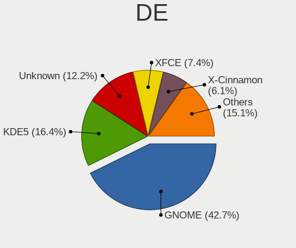

| Name            | Desktops | Percent |
|-----------------|----------|---------|
| GNOME           | 275      | 41.54%  |
| Unknown         | 107      | 16.16%  |
| KDE5            | 101      | 15.26%  |
| XFCE            | 53       | 8.01%   |
| KDE             | 36       | 5.44%   |
| X-Cinnamon      | 33       | 4.98%   |
| MATE            | 7        | 1.06%   |
| KDE4            | 7        | 1.06%   |
| Cinnamon        | 7        | 1.06%   |
| Budgie          | 5        | 0.76%   |
| LXDE            | 4        | 0.6%    |
| Deepin          | 4        | 0.6%    |
| Unity           | 3        | 0.45%   |
| Pantheon        | 3        | 0.45%   |
| Openbox         | 3        | 0.45%   |
| i3              | 3        | 0.45%   |
| GNOME Classic   | 3        | 0.45%   |
| awesome         | 3        | 0.45%   |
| xmonad          | 1        | 0.15%   |
| sway            | 1        | 0.15%   |
| LXQt            | 1        | 0.15%   |
| GNOME-Flashback | 1        | 0.15%   |
| GNOME Flashback | 1        | 0.15%   |

Display Server
--------------

X11 or Wayland

| Name        | Desktops | Percent |
|-------------|----------|---------|
| X11         | 510      | 79.69%  |
| Wayland     | 51       | 7.97%   |
| Unknown     | 45       | 7.03%   |
| Tty         | 33       | 5.16%   |
| Unspecified | 1        | 0.16%   |

Display Manager
---------------

SDDM, LightDM, etc.

| Name    | Desktops | Percent |
|---------|----------|---------|
| Unknown | 393      | 60.74%  |
| SDDM    | 81       | 12.52%  |
| GDM     | 60       | 9.27%   |
| LightDM | 40       | 6.18%   |
| TDM     | 32       | 4.95%   |
| GDM3    | 28       | 4.33%   |
| KDM     | 7        | 1.08%   |
| XDM     | 3        | 0.46%   |
| Ly      | 2        | 0.31%   |
| GREETD  | 1        | 0.15%   |

OS Lang
-------

Language

| Lang        | Desktops | Percent |
|-------------|----------|---------|
| en_US       | 273      | 42.46%  |
| sv_SE       | 190      | 29.55%  |
| Unknown     | 94       | 14.62%  |
| en_GB       | 42       | 6.53%   |
| C           | 20       | 3.11%   |
| ru_RU       | 4        | 0.62%   |
| en_SE       | 3        | 0.47%   |
| de_DE       | 3        | 0.47%   |
| uk_UA       | 1        | 0.16%   |
| sma_SE      | 1        | 0.16%   |
| POSIX       | 1        | 0.16%   |
| pl_PL       | 1        | 0.16%   |
| fr_FR       | 1        | 0.16%   |
| es_VE       | 1        | 0.16%   |
| en_IN       | 1        | 0.16%   |
| en_IE       | 1        | 0.16%   |
| en_GB.utf-8 | 1        | 0.16%   |
| en_DK       | 1        | 0.16%   |
| en_CA       | 1        | 0.16%   |
| C.UTF8      | 1        | 0.16%   |
| bs_BA       | 1        | 0.16%   |
| bg_BG       | 1        | 0.16%   |

Boot Mode
---------

EFI or BIOS

| Mode | Desktops | Percent |
|------|----------|---------|
| BIOS | 348      | 54.38%  |
| EFI  | 292      | 45.63%  |

Filesystem
----------

Type of filesystem

| Type    | Desktops | Percent |
|---------|----------|---------|
| Ext4    | 491      | 76.6%   |
| Btrfs   | 58       | 9.05%   |
| Overlay | 47       | 7.33%   |
| Unknown | 25       | 3.9%    |
| Xfs     | 11       | 1.72%   |
| Zfs     | 4        | 0.62%   |
| F2fs    | 2        | 0.31%   |
| Tmpfs   | 1        | 0.16%   |
| Ext3    | 1        | 0.16%   |
| Ext2    | 1        | 0.16%   |

Part. scheme
------------

Scheme of partitioning

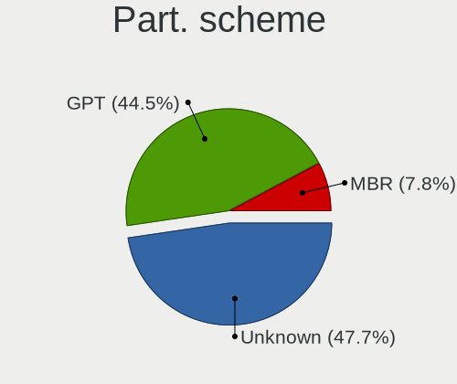

| Type    | Desktops | Percent |
|---------|----------|---------|
| Unknown | 389      | 60.31%  |
| GPT     | 204      | 31.63%  |
| MBR     | 52       | 8.06%   |

Dual Boot with Linux/BSD
------------------------

Hosting more than one Linux/BSD

| Dual boot | Desktops | Percent |
|-----------|----------|---------|
| No        | 524      | 82%     |
| Yes       | 115      | 18%     |

Dual Boot (Win)
---------------

Hosting Linux and Windows

| Dual boot | Desktops | Percent |
|-----------|----------|---------|
| No        | 444      | 68.94%  |
| Yes       | 200      | 31.06%  |

Board
-----

Vendor
------

Motherboard manufacturer

| Name                | Desktops | Percent |
|---------------------|----------|---------|
| ASUSTek Computer    | 229      | 36.64%  |
| Gigabyte Technology | 106      | 16.96%  |
| MSI                 | 92       | 14.72%  |
| Dell                | 38       | 6.08%   |
| ASRock              | 37       | 5.92%   |
| Hewlett-Packard     | 33       | 5.28%   |
| Acer                | 17       | 2.72%   |
| Lenovo              | 14       | 2.24%   |
| Fujitsu             | 6        | 0.96%   |
| Pegatron            | 5        | 0.8%    |
| Foxconn             | 5        | 0.8%    |
| Apple               | 5        | 0.8%    |
| AAEON               | 5        | 0.8%    |
| Maxtang             | 4        | 0.64%   |
| Intel               | 4        | 0.64%   |
| Supermicro          | 3        | 0.48%   |
| Packard Bell        | 3        | 0.48%   |
| Unknown             | 3        | 0.48%   |
| AMD                 | 2        | 0.32%   |
| XDO.AI              | 1        | 0.16%   |
| Seco                | 1        | 0.16%   |
| OEM                 | 1        | 0.16%   |
| JGINYUE             | 1        | 0.16%   |
| Huanan              | 1        | 0.16%   |
| Hardkernel          | 1        | 0.16%   |
| GMK                 | 1        | 0.16%   |
| Fujitsu Siemens     | 1        | 0.16%   |
| EVGA                | 1        | 0.16%   |
| Elo Touch Solutions | 1        | 0.16%   |
| ECS                 | 1        | 0.16%   |
| Biostar             | 1        | 0.16%   |
| AZW                 | 1        | 0.16%   |
| AOpen               | 1        | 0.16%   |

Model
-----

Motherboard model

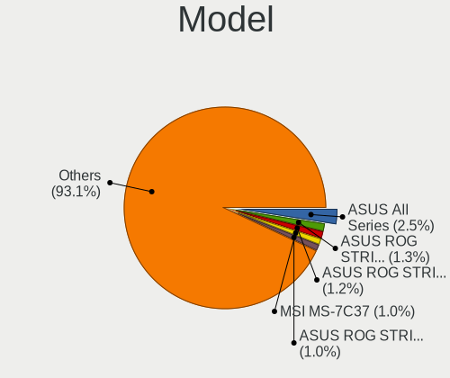

| Name                                   | Desktops | Percent |
|----------------------------------------|----------|---------|
| ASUS All Series                        | 20       | 3.2%    |
| ASUS ROG STRIX B450-F GAMING           | 9        | 1.44%   |
| MSI MS-7C37                            | 7        | 1.12%   |
| ASUS ROG STRIX X570-F GAMING           | 7        | 1.12%   |
| ASUS PRIME X470-PRO                    | 7        | 1.12%   |
| ASUS ROG STRIX B550-F GAMING           | 6        | 0.96%   |
| MSI MS-7C52                            | 5        | 0.8%    |
| MSI MS-7817                            | 5        | 0.8%    |
| Gigabyte B450M DS3H                    | 5        | 0.8%    |
| ASUS Z170 PRO GAMING                   | 5        | 0.8%    |
| ASUS PRIME X370-PRO                    | 5        | 0.8%    |
| MSI MS-7C02                            | 4        | 0.64%   |
| Maxtang FP30                           | 4        | 0.64%   |
| Dell OptiPlex 7010                     | 4        | 0.64%   |
| ASUS SABERTOOTH 990FX R2.0             | 4        | 0.64%   |
| ASUS ROG STRIX B550-I GAMING           | 4        | 0.64%   |
| ASUS ROG STRIX B350-F GAMING           | 4        | 0.64%   |
| ASUS P8Z77-V LX                        | 4        | 0.64%   |
| MSI MS-7C91                            | 3        | 0.48%   |
| MSI MS-7C84                            | 3        | 0.48%   |
| MSI MS-7B98                            | 3        | 0.48%   |
| MSI MS-7971                            | 3        | 0.48%   |
| MSI MS-7850                            | 3        | 0.48%   |
| MSI MS-7640                            | 3        | 0.48%   |
| HP Compaq dc7900 Convertible Minitower | 3        | 0.48%   |
| Gigabyte GA-990FXA-UD3                 | 3        | 0.48%   |
| Gigabyte 970A-DS3P                     | 3        | 0.48%   |
| Dell OptiPlex 780                      | 3        | 0.48%   |
| ASUS Z170-A                            | 3        | 0.48%   |
| ASUS TUF Gaming X570-PLUS              | 3        | 0.48%   |
| ASUS ROG STRIX Z390-F GAMING           | 3        | 0.48%   |
| ASUS ROG STRIX X399-E GAMING           | 3        | 0.48%   |
| ASUS ROG STRIX B450-F GAMING II        | 3        | 0.48%   |
| ASUS PRIME B350-PLUS                   | 3        | 0.48%   |
| ASUS M5A97 R2.0                        | 3        | 0.48%   |
| ASUS B150M-A                           | 3        | 0.48%   |
| Unknown                                | 3        | 0.48%   |
| Supermicro PIO-618U-TR4T+-ST031        | 2        | 0.32%   |
| MSI MS-7B89                            | 2        | 0.32%   |
| MSI MS-7A70                            | 2        | 0.32%   |
| MSI MS-7979                            | 2        | 0.32%   |
| MSI MS-7918                            | 2        | 0.32%   |
| MSI MS-7821                            | 2        | 0.32%   |
| MSI MS-7758                            | 2        | 0.32%   |
| HP Z440 Workstation                    | 2        | 0.32%   |
| HP Compaq dc5750 Small Form Factor     | 2        | 0.32%   |
| HP Compaq 8200 Elite USDT PC           | 2        | 0.32%   |
| Gigabyte Z97X-Gaming 3                 | 2        | 0.32%   |
| Gigabyte Z77X-D3H                      | 2        | 0.32%   |
| Gigabyte Z68AP-D3                      | 2        | 0.32%   |
| Gigabyte Z170X-Gaming 3                | 2        | 0.32%   |
| Gigabyte X570 I AORUS PRO WIFI         | 2        | 0.32%   |
| Gigabyte X570 AORUS PRO                | 2        | 0.32%   |
| Gigabyte X570 AORUS MASTER             | 2        | 0.32%   |
| Gigabyte H77-D3H                       | 2        | 0.32%   |
| Gigabyte GA-MA78GM-UD2H                | 2        | 0.32%   |
| Gigabyte B550I AORUS PRO AX            | 2        | 0.32%   |
| Gigabyte B550 AORUS ELITE V2           | 2        | 0.32%   |
| Gigabyte AX370-Gaming 5                | 2        | 0.32%   |
| Gigabyte AB350N-Gaming WIFI            | 2        | 0.32%   |

Model Family
------------

Motherboard model prefix

| Name                            | Desktops | Percent |
|---------------------------------|----------|---------|
| ASUS ROG                        | 58       | 9.28%   |
| ASUS PRIME                      | 36       | 5.76%   |
| Dell OptiPlex                   | 22       | 3.52%   |
| ASUS All                        | 20       | 3.2%    |
| HP Compaq                       | 13       | 2.08%   |
| Acer Aspire                     | 12       | 1.92%   |
| ASUS TUF                        | 11       | 1.76%   |
| Dell Precision                  | 9        | 1.44%   |
| Gigabyte X570                   | 8        | 1.28%   |
| ASUS P8Z77-V                    | 8        | 1.28%   |
| MSI MS-7C37                     | 7        | 1.12%   |
| ASUS SABERTOOTH                 | 7        | 1.12%   |
| Gigabyte B450M                  | 6        | 0.96%   |
| MSI MS-7C52                     | 5        | 0.8%    |
| MSI MS-7817                     | 5        | 0.8%    |
| Lenovo IdeaCentre               | 5        | 0.8%    |
| Fujitsu ESPRIMO                 | 5        | 0.8%    |
| ASUS Z170                       | 5        | 0.8%    |
| ASUS P8Z68-V                    | 5        | 0.8%    |
| ASUS Maximus                    | 5        | 0.8%    |
| MSI MS-7C02                     | 4        | 0.64%   |
| Maxtang FP30                    | 4        | 0.64%   |
| HP ProDesk                      | 4        | 0.64%   |
| HP EliteDesk                    | 4        | 0.64%   |
| ASUS STRIX                      | 4        | 0.64%   |
| ASUS M5A97                      | 4        | 0.64%   |
| ASUS M5A78L-M                   | 4        | 0.64%   |
| ASUS Crosshair                  | 4        | 0.64%   |
| Packard Bell IMEDIA             | 3        | 0.48%   |
| MSI MS-7C91                     | 3        | 0.48%   |
| MSI MS-7C84                     | 3        | 0.48%   |
| MSI MS-7B98                     | 3        | 0.48%   |
| MSI MS-7971                     | 3        | 0.48%   |
| MSI MS-7850                     | 3        | 0.48%   |
| MSI MS-7640                     | 3        | 0.48%   |
| Lenovo ThinkCentre              | 3        | 0.48%   |
| Lenovo Legion                   | 3        | 0.48%   |
| HP Pavilion                     | 3        | 0.48%   |
| Gigabyte Z97X-Gaming            | 3        | 0.48%   |
| Gigabyte Z390                   | 3        | 0.48%   |
| Gigabyte GA-990FXA-UD3          | 3        | 0.48%   |
| Gigabyte B550                   | 3        | 0.48%   |
| Gigabyte B450                   | 3        | 0.48%   |
| Gigabyte 970A-DS3P              | 3        | 0.48%   |
| ASUS Z170-A                     | 3        | 0.48%   |
| ASUS B150M-A                    | 3        | 0.48%   |
| ASRock Z97                      | 3        | 0.48%   |
| Acer Predator                   | 3        | 0.48%   |
| Unknown                         | 3        | 0.48%   |
| Supermicro PIO-618U-TR4T+-ST031 | 2        | 0.32%   |
| MSI MS-7B89                     | 2        | 0.32%   |
| MSI MS-7A70                     | 2        | 0.32%   |
| MSI MS-7979                     | 2        | 0.32%   |
| MSI MS-7918                     | 2        | 0.32%   |
| MSI MS-7821                     | 2        | 0.32%   |
| MSI MS-7758                     | 2        | 0.32%   |
| HP Z440                         | 2        | 0.32%   |
| Gigabyte Z77X-D3H               | 2        | 0.32%   |
| Gigabyte Z68AP-D3               | 2        | 0.32%   |
| Gigabyte Z370                   | 2        | 0.32%   |

MFG Year
--------

Motherboard manufacture year

| Year | Desktops | Percent |
|------|----------|---------|
| 2018 | 76       | 12.16%  |
| 2019 | 69       | 11.04%  |
| 2011 | 56       | 8.96%   |
| 2020 | 55       | 8.8%    |
| 2012 | 54       | 8.64%   |
| 2017 | 52       | 8.32%   |
| 2013 | 41       | 6.56%   |
| 2015 | 39       | 6.24%   |
| 2014 | 39       | 6.24%   |
| 2010 | 27       | 4.32%   |
| 2016 | 26       | 4.16%   |
| 2009 | 26       | 4.16%   |
| 2008 | 21       | 3.36%   |
| 2021 | 18       | 2.88%   |
| 2007 | 14       | 2.24%   |
| 2022 | 5        | 0.8%    |
| 2006 | 3        | 0.48%   |
| 2005 | 2        | 0.32%   |
| 2004 | 1        | 0.16%   |
| 2002 | 1        | 0.16%   |

Form Factor
-----------

Physical design of the computer

| Name    | Desktops | Percent |
|---------|----------|---------|
| Desktop | 625      | 100%    |

Secure Boot
-----------

Enabled or disabled

| State    | Desktops | Percent |
|----------|----------|---------|
| Disabled | 614      | 98.24%  |
| Enabled  | 11       | 1.76%   |

Coreboot
--------

Have coreboot on board

| Used | Desktops | Percent |
|------|----------|---------|
| No   | 624      | 99.84%  |
| Yes  | 1        | 0.16%   |

RAM Size
--------

Total RAM memory

| Size in GB      | Desktops | Percent |
|-----------------|----------|---------|
| 16.01-24.0      | 193      | 30.35%  |
| 32.01-64.0      | 130      | 20.44%  |
| 8.01-16.0       | 105      | 16.51%  |
| 4.01-8.0        | 77       | 12.11%  |
| 3.01-4.0        | 53       | 8.33%   |
| 64.01-256.0     | 36       | 5.66%   |
| 24.01-32.0      | 16       | 2.52%   |
| 1.01-2.0        | 13       | 2.04%   |
| 2.01-3.0        | 7        | 1.1%    |
| 0.51-1.0        | 3        | 0.47%   |
| More than 256.0 | 2        | 0.31%   |
| 0.01-0.5        | 1        | 0.16%   |

RAM Used
--------

Used RAM memory

| Used GB    | Desktops | Percent |
|------------|----------|---------|
| 1.01-2.0   | 213      | 30.78%  |
| 2.01-3.0   | 161      | 23.27%  |
| 4.01-8.0   | 131      | 18.93%  |
| 3.01-4.0   | 86       | 12.43%  |
| 8.01-16.0  | 50       | 7.23%   |
| 0.51-1.0   | 31       | 4.48%   |
| 16.01-24.0 | 13       | 1.88%   |
| 24.01-32.0 | 3        | 0.43%   |
| 0.01-0.5   | 3        | 0.43%   |
| Unknown    | 1        | 0.14%   |

Total Drives
------------

Number of drives on board

| Drives | Desktops | Percent |
|--------|----------|---------|
| 1      | 212      | 32.37%  |
| 2      | 169      | 25.8%   |
| 3      | 111      | 16.95%  |
| 4      | 76       | 11.6%   |
| 5      | 36       | 5.5%    |
| 6      | 23       | 3.51%   |
| 7      | 13       | 1.98%   |
| 0      | 8        | 1.22%   |
| 8      | 5        | 0.76%   |
| 10     | 1        | 0.15%   |
| 9      | 1        | 0.15%   |

Has CD-ROM
----------

Has CD-ROM on board

| Presented | Desktops | Percent |
|-----------|----------|---------|
| No        | 374      | 59.37%  |
| Yes       | 256      | 40.63%  |

Has Ethernet
------------

Has Ethernet on board

| Presented | Desktops | Percent |
|-----------|----------|---------|
| Yes       | 619      | 99.04%  |
| No        | 6        | 0.96%   |

Has WiFi
--------

Has WiFi module

| Presented | Desktops | Percent |
|-----------|----------|---------|
| No        | 409      | 64.21%  |
| Yes       | 228      | 35.79%  |

Has Bluetooth
-------------

Has Bluetooth module

| Presented | Desktops | Percent |
|-----------|----------|---------|
| No        | 448      | 70.44%  |
| Yes       | 188      | 29.56%  |

Location
--------

Country
-------

Geographic location (country)

| Country | Desktops | Percent |
|---------|----------|---------|
| Sweden  | 625      | 100%    |

City
----

Geographic location (city)

| City                    | Desktops | Percent |
|-------------------------|----------|---------|
| Stockholm               | 96       | 14.72%  |
| Gothenburg              | 68       | 10.43%  |
| Malmo                   | 34       | 5.21%   |
| Uppsala                 | 23       | 3.53%   |
| Lund                    | 21       | 3.22%   |
| Vsters              | 14       | 2.15%   |
| Sundsvall               | 13       | 1.99%   |
| Linkping              | 13       | 1.99%   |
| Sollentuna              | 11       | 1.69%   |
| Norrkping             | 10       | 1.53%   |
| Bromma                  | 10       | 1.53%   |
| Vaxjo                   | 9        | 1.38%   |
| Ume                   | 9        | 1.38%   |
| Haegersten              | 8        | 1.23%   |
| Sdertlje            | 7        | 1.07%   |
| Karlstad                | 7        | 1.07%   |
| Vaestra Froelunda       | 6        | 0.92%   |
| Helsingborg             | 6        | 0.92%   |
| Nykping               | 5        | 0.77%   |
| Johanneshov             | 5        | 0.77%   |
| Huddinge                | 5        | 0.77%   |
| Halmstad                | 5        | 0.77%   |
| Arboga                  | 5        | 0.77%   |
| Upplands Vasby          | 4        | 0.61%   |
| Taby                    | 4        | 0.61%   |
| Sundbyberg              | 4        | 0.61%   |
| Solna                   | 4        | 0.61%   |
| Skvde                 | 4        | 0.61%   |
| Saeffle                 | 4        | 0.61%   |
| rebro                 | 4        | 0.61%   |
| Kista                   | 4        | 0.61%   |
| Jrflla Municipality | 4        | 0.61%   |
| Gvle                  | 4        | 0.61%   |
| Ulricehamn              | 3        | 0.46%   |
| Trollhttan            | 3        | 0.46%   |
| Norsborg                | 3        | 0.46%   |
| Moelndal                | 3        | 0.46%   |
| Maersta                 | 3        | 0.46%   |
| Limhamn                 | 3        | 0.46%   |
| Lidingoe                | 3        | 0.46%   |
| Landskrona              | 3        | 0.46%   |
| Koeping                 | 3        | 0.46%   |
| Katrineholm             | 3        | 0.46%   |
| Karlskrona              | 3        | 0.46%   |
| Eskilstuna              | 3        | 0.46%   |
| Enkoeping               | 3        | 0.46%   |
| ngelholm              | 3        | 0.46%   |
| Alvsjo                  | 3        | 0.46%   |
| Akersberga              | 3        | 0.46%   |
| Vedevag                 | 2        | 0.31%   |
| Varberg                 | 2        | 0.31%   |
| Vallentuna              | 2        | 0.31%   |
| Vaggeryd                | 2        | 0.31%   |
| Vaellingby              | 2        | 0.31%   |
| Uttran                  | 2        | 0.31%   |
| Tranas                  | 2        | 0.31%   |
| Staffanstorp            | 2        | 0.31%   |
| Spanga                  | 2        | 0.31%   |
| Solleftea               | 2        | 0.31%   |
| Sandviken               | 2        | 0.31%   |

Drives
------

Drive Vendor
------------

Hard drive vendors

| Vendor                    | Desktops | Drives | Percent |
|---------------------------|----------|--------|---------|
| Samsung Electronics       | 265      | 498    | 22.34%  |
| WDC                       | 208      | 363    | 17.54%  |
| Seagate                   | 198      | 352    | 16.69%  |
| Kingston                  | 109      | 164    | 9.19%   |
| Intel                     | 64       | 86     | 5.4%    |
| Hitachi                   | 42       | 57     | 3.54%   |
| Toshiba                   | 38       | 54     | 3.2%    |
| SanDisk                   | 34       | 49     | 2.87%   |
| Crucial                   | 34       | 54     | 2.87%   |
| Corsair                   | 17       | 24     | 1.43%   |
| Phison                    | 15       | 19     | 1.26%   |
| HGST                      | 15       | 17     | 1.26%   |
| Unknown                   | 14       | 23     | 1.18%   |
| OCZ                       | 12       | 15     | 1.01%   |
| Micron Technology         | 12       | 20     | 1.01%   |
| A-DATA Technology         | 11       | 11     | 0.93%   |
| Transcend                 | 8        | 9      | 0.67%   |
| SK hynix                  | 8        | 11     | 0.67%   |
| Fujitsu                   | 6        | 9      | 0.51%   |
| Silicon Motion            | 5        | 7      | 0.42%   |
| PNY                       | 5        | 7      | 0.42%   |
| China                     | 5        | 5      | 0.42%   |
| Maxtor                    | 4        | 4      | 0.34%   |
| Intenso                   | 4        | 7      | 0.34%   |
| Apple                     | 4        | 4      | 0.34%   |
| LITEONIT                  | 3        | 6      | 0.25%   |
| LaCie                     | 3        | 4      | 0.25%   |
| JMicron Technology        | 3        | 3      | 0.25%   |
| ZTE                       | 2        | 2      | 0.17%   |
| XPG                       | 2        | 2      | 0.17%   |
| SPCC                      | 2        | 3      | 0.17%   |
| Patriot                   | 2        | 3      | 0.17%   |
| Micron/Crucial Technology | 2        | 2      | 0.17%   |
| ASMT                      | 2        | 2      | 0.17%   |
| ZOMY                      | 1        | 1      | 0.08%   |
| WDC WDS2                  | 1        | 1      | 0.08%   |
| WDC WDS1                  | 1        | 1      | 0.08%   |
| Verbatim                  | 1        | 1      | 0.08%   |
| USB3.0                    | 1        | 1      | 0.08%   |
| tigo                      | 1        | 1      | 0.08%   |
| SATAFIRM                  | 1        | 1      | 0.08%   |
| SABRENT                   | 1        | 1      | 0.08%   |
| ROG                       | 1        | 1      | 0.08%   |
| OWC                       | 1        | 1      | 0.08%   |
| Netac                     | 1        | 1      | 0.08%   |
| LITEON                    | 1        | 2      | 0.08%   |
| Lite-On                   | 1        | 1      | 0.08%   |
| Lexar                     | 1        | 1      | 0.08%   |
| Lenovo                    | 1        | 1      | 0.08%   |
| Kston                     | 1        | 1      | 0.08%   |
| KingFast                  | 1        | 1      | 0.08%   |
| Innodisk                  | 1        | 1      | 0.08%   |
| IB                        | 1        | 2      | 0.08%   |
| HUAWEI                    | 1        | 1      | 0.08%   |
| HFS512GD                  | 1        | 1      | 0.08%   |
| HFS128G3                  | 1        | 1      | 0.08%   |
| Hewlett-Packard           | 1        | 2      | 0.08%   |
| Gigabyte Technology       | 1        | 1      | 0.08%   |
| ASMedia                   | 1        | 1      | 0.08%   |
| Apacer                    | 1        | 1      | 0.08%   |

Drive Model
-----------

Hard drive models

| Model                            | Desktops | Percent |
|----------------------------------|----------|---------|
| Samsung SSD 850 EVO 250GB        | 38       | 2.57%   |
| Samsung SSD 850 EVO 500GB        | 28       | 1.89%   |
| Kingston SV300S37A120G 120GB SSD | 24       | 1.62%   |
| Samsung SSD 860 EVO 250GB        | 19       | 1.28%   |
| Kingston SA400S37240G 240GB SSD  | 19       | 1.28%   |
| Kingston SA400S37120G 120GB SSD  | 19       | 1.28%   |
| Seagate ST4000DM004-2CV104 4TB   | 18       | 1.22%   |
| Samsung SSD 840 EVO 250GB        | 18       | 1.22%   |
| Samsung NVMe SSD Drive 500GB     | 18       | 1.22%   |
| Samsung SSD 860 EVO 500GB        | 15       | 1.01%   |
| Seagate ST1000DM010-2EP102 1TB   | 14       | 0.95%   |
| Samsung SSD 970 EVO Plus 500GB   | 12       | 0.81%   |
| Samsung NVMe SSD Drive 1TB       | 12       | 0.81%   |
| Seagate ST4000VN008-2DR166 4TB   | 11       | 0.74%   |
| Samsung SSD 860 EVO 1TB          | 11       | 0.74%   |
| WDC WD30EFRX-68EUZN0 3TB         | 10       | 0.68%   |
| Seagate ST500DM002-1BD142 500GB  | 10       | 0.68%   |
| Samsung NVMe SSD Drive 250GB     | 10       | 0.68%   |
| WDC WDS240G2G0A-00JH30 240GB SSD | 9        | 0.61%   |
| Seagate ST2000DM006-2DM164 2TB   | 9        | 0.61%   |
| Samsung SSD 960 EVO 250GB        | 9        | 0.61%   |
| Kingston SA400S37480G 480GB SSD  | 9        | 0.61%   |
| WDC WD40EFRX-68N32N0 4TB         | 8        | 0.54%   |
| WDC WD20EZRZ-00Z5HB0 2TB         | 8        | 0.54%   |
| Seagate ST2000DM008-2FR102 2TB   | 8        | 0.54%   |
| Seagate ST1000DM003-1CH162 1TB   | 8        | 0.54%   |
| SanDisk NVMe SSD Drive 1TB       | 8        | 0.54%   |
| WDC WD20EARX-00PASB0 2TB         | 7        | 0.47%   |
| WDC WD10EADS-00L5B1 1TB          | 7        | 0.47%   |
| Seagate ST2000DM001-1CH164 2TB   | 7        | 0.47%   |
| Seagate Expansion 1TB            | 7        | 0.47%   |
| Samsung SSD 840 PRO Series 256GB | 7        | 0.47%   |
| Samsung SSD 840 EVO 120GB        | 7        | 0.47%   |
| Samsung HD501LJ 500GB            | 7        | 0.47%   |
| Samsung HD103UJ 1TB              | 7        | 0.47%   |
| WDC WDS250G2B0A-00SM50 250GB SSD | 6        | 0.41%   |
| WDC WD30EFRX-68AX9N0 3TB         | 6        | 0.41%   |
| WDC WD20EZRX-00D8PB0 2TB         | 6        | 0.41%   |
| Seagate ST3000DM001-1ER166 3TB   | 6        | 0.41%   |
| Seagate ST3000DM001-1CH166 3TB   | 6        | 0.41%   |
| Seagate ST1000DM003-1ER162 1TB   | 6        | 0.41%   |
| Seagate Expansion Desk 4TB       | 6        | 0.41%   |
| Samsung SSD 980 PRO 1TB          | 6        | 0.41%   |
| Samsung SSD 970 EVO Plus 1TB     | 6        | 0.41%   |
| Samsung SSD 970 EVO 1TB          | 6        | 0.41%   |
| Samsung SSD 840 EVO 500GB        | 6        | 0.41%   |
| Kingston NVMe SSD Drive 500GB    | 6        | 0.41%   |
| WDC WDS100T2B0C-00PXH0 1TB       | 5        | 0.34%   |
| Unknown SD/MMC/MS PRO 64GB       | 5        | 0.34%   |
| Toshiba DT01ACA100 1TB           | 5        | 0.34%   |
| Seagate ST4000DM000-1F2168 4TB   | 5        | 0.34%   |
| Seagate ST31000524AS 1TB         | 5        | 0.34%   |
| Seagate Backup+ Hub BK 4TB       | 5        | 0.34%   |
| Samsung SSD 860 QVO 1TB          | 5        | 0.34%   |
| Samsung SSD 850 PRO 256GB        | 5        | 0.34%   |
| Samsung HD103SJ 1TB              | 5        | 0.34%   |
| Kingston SV300S37A240G 240GB SSD | 5        | 0.34%   |
| Kingston NVMe SSD Drive 1TB      | 5        | 0.34%   |
| HGST HTS721010A9E630 1TB         | 5        | 0.34%   |
| Crucial CT525MX300SSD1 528GB     | 5        | 0.34%   |

HDD Vendor
----------

Hard disk drive vendors

| Vendor              | Desktops | Drives | Percent |
|---------------------|----------|--------|---------|
| Seagate             | 197      | 346    | 36.69%  |
| WDC                 | 184      | 317    | 34.26%  |
| Hitachi             | 42       | 57     | 7.82%   |
| Samsung Electronics | 39       | 72     | 7.26%   |
| Toshiba             | 31       | 46     | 5.77%   |
| HGST                | 15       | 17     | 2.79%   |
| Unknown             | 6        | 8      | 1.12%   |
| Fujitsu             | 6        | 9      | 1.12%   |
| Maxtor              | 4        | 4      | 0.74%   |
| Apple               | 3        | 3      | 0.56%   |
| Intenso             | 2        | 2      | 0.37%   |
| ASMT                | 2        | 2      | 0.37%   |
| USB3.0              | 1        | 1      | 0.19%   |
| SATAFIRM            | 1        | 1      | 0.19%   |
| SABRENT             | 1        | 1      | 0.19%   |
| LaCie               | 1        | 1      | 0.19%   |
| IB                  | 1        | 2      | 0.19%   |
| Hewlett-Packard     | 1        | 2      | 0.19%   |

SSD Vendor
----------

Solid state drive vendors

| Vendor              | Desktops | Drives | Percent |
|---------------------|----------|--------|---------|
| Samsung Electronics | 183      | 277    | 38.2%   |
| Kingston            | 87       | 125    | 18.16%  |
| Intel               | 40       | 54     | 8.35%   |
| Crucial             | 33       | 52     | 6.89%   |
| WDC                 | 27       | 39     | 5.64%   |
| SanDisk             | 18       | 24     | 3.76%   |
| OCZ                 | 12       | 15     | 2.51%   |
| Micron Technology   | 12       | 20     | 2.51%   |
| Corsair             | 9        | 11     | 1.88%   |
| Transcend           | 8        | 9      | 1.67%   |
| A-DATA Technology   | 8        | 8      | 1.67%   |
| Toshiba             | 7        | 7      | 1.46%   |
| China               | 5        | 5      | 1.04%   |
| SK hynix            | 4        | 4      | 0.84%   |
| PNY                 | 3        | 5      | 0.63%   |
| LITEONIT            | 3        | 6      | 0.63%   |
| SPCC                | 2        | 3      | 0.42%   |
| Patriot             | 2        | 3      | 0.42%   |
| Intenso             | 2        | 2      | 0.42%   |
| WDC WDS2            | 1        | 1      | 0.21%   |
| WDC WDS1            | 1        | 1      | 0.21%   |
| Verbatim            | 1        | 1      | 0.21%   |
| tigo                | 1        | 1      | 0.21%   |
| Seagate             | 1        | 3      | 0.21%   |
| ROG                 | 1        | 1      | 0.21%   |
| OWC                 | 1        | 1      | 0.21%   |
| LITEON              | 1        | 2      | 0.21%   |
| Kston               | 1        | 1      | 0.21%   |
| Innodisk            | 1        | 1      | 0.21%   |
| Gigabyte Technology | 1        | 1      | 0.21%   |
| Apple               | 1        | 1      | 0.21%   |
| Apacer              | 1        | 1      | 0.21%   |
| ADATA SP            | 1        | 1      | 0.21%   |

Drive Kind
----------

HDD or SSD

| Kind    | Desktops | Drives | Percent |
|---------|----------|--------|---------|
| HDD     | 396      | 891    | 39.36%  |
| SSD     | 385      | 686    | 38.27%  |
| NVMe    | 202      | 318    | 20.08%  |
| Unknown | 18       | 27     | 1.79%   |
| MMC     | 5        | 5      | 0.5%    |

Drive Connector
---------------

SATA, SAS, NVMe, etc.

| Type | Desktops | Drives | Percent |
|------|----------|--------|---------|
| SATA | 564      | 1517   | 68.28%  |
| NVMe | 200      | 316    | 24.21%  |
| SAS  | 57       | 89     | 6.9%    |
| MMC  | 5        | 5      | 0.61%   |

Drive Size
----------

Size of hard drive

| Size in TB | Desktops | Drives | Percent |
|------------|----------|--------|---------|
| 0.01-0.5   | 458      | 872    | 50.95%  |
| 0.51-1.0   | 207      | 335    | 23.03%  |
| 1.01-2.0   | 105      | 162    | 11.68%  |
| 3.01-4.0   | 62       | 103    | 6.9%    |
| 2.01-3.0   | 48       | 73     | 5.34%   |
| 4.01-10.0  | 17       | 29     | 1.89%   |
| 10.01-20.0 | 2        | 3      | 0.22%   |

Space Total
-----------

Amount of disk space available on the file system

| Size in GB     | Desktops | Percent |
|----------------|----------|---------|
| 101-250        | 150      | 22.35%  |
| 251-500        | 115      | 17.14%  |
| More than 3000 | 90       | 13.41%  |
| 501-1000       | 87       | 12.97%  |
| 1001-2000      | 73       | 10.88%  |
| 1-20           | 55       | 8.2%    |
| 2001-3000      | 42       | 6.26%   |
| 51-100         | 29       | 4.32%   |
| Unknown        | 23       | 3.43%   |
| 21-50          | 7        | 1.04%   |

Space Used
----------

Amount of used disk space

| Used GB        | Desktops | Percent |
|----------------|----------|---------|
| 1-20           | 216      | 31.81%  |
| 21-50          | 84       | 12.37%  |
| 101-250        | 81       | 11.93%  |
| 51-100         | 64       | 9.43%   |
| 501-1000       | 53       | 7.81%   |
| 251-500        | 50       | 7.36%   |
| 1001-2000      | 43       | 6.33%   |
| More than 3000 | 35       | 5.15%   |
| 2001-3000      | 29       | 4.27%   |
| Unknown        | 23       | 3.39%   |
| 0              | 1        | 0.15%   |

Malfunc. Drives
---------------

Drive models with a malfunction

| Model                                        | Desktops | Drives | Percent |
|----------------------------------------------|----------|--------|---------|
| WDC WD5000AAKX-75U6AA0 500GB                 | 2        | 2      | 2.7%    |
| Samsung Electronics HD501LJ 500GB            | 2        | 2      | 2.7%    |
| Samsung Electronics HD300LJ 304GB            | 2        | 2      | 2.7%    |
| Crucial CT525MX300SSD1 528GB                 | 2        | 2      | 2.7%    |
| WDC WDS240G2G0A-00JH30 240GB SSD             | 1        | 1      | 1.35%   |
| WDC WD7500AACS-00ZJB0 752GB                  | 1        | 1      | 1.35%   |
| WDC WD740GD-00FLA1 74GB                      | 1        | 1      | 1.35%   |
| WDC WD6400AAKS-22A7B2 640GB                  | 1        | 1      | 1.35%   |
| WDC WD60EFRX-68L0BN1 6TB                     | 1        | 6      | 1.35%   |
| WDC WD5000BPKT-60PK4T0 500GB                 | 1        | 1      | 1.35%   |
| WDC WD5000AZRX-00A8LB0 500GB                 | 1        | 2      | 1.35%   |
| WDC WD5000AAKS-00A7B2 500GB                  | 1        | 1      | 1.35%   |
| WDC WD40EFRX-68N32N0 4TB                     | 1        | 2      | 1.35%   |
| WDC WD3200AAKS-75L9A0 320GB                  | 1        | 1      | 1.35%   |
| WDC WD3200AAKS-00B3A0 320GB                  | 1        | 3      | 1.35%   |
| WDC WD30EFRX-68AX9N0 3TB                     | 1        | 1      | 1.35%   |
| WDC WD20EARS-00MVWB0 2TB                     | 1        | 1      | 1.35%   |
| WDC WD15EARS-00Z5B1 1TB                      | 1        | 1      | 1.35%   |
| WDC WD15EADS-00P8B0 1TB                      | 1        | 2      | 1.35%   |
| WDC WD10EZEX-21M2NA0 1TB                     | 1        | 2      | 1.35%   |
| WDC WD10EFRX-68FYTN0 1TB                     | 1        | 1      | 1.35%   |
| WDC WD10EARS-00MVWB0 1TB                     | 1        | 1      | 1.35%   |
| WDC WD10EALX-009BA0 1TB                      | 1        | 3      | 1.35%   |
| WDC WD10EADS-00M2B0 1TB                      | 1        | 1      | 1.35%   |
| WDC WD10EADS-00L5B1 1TB                      | 1        | 1      | 1.35%   |
| Toshiba HDWD110 1TB                          | 1        | 2      | 1.35%   |
| Seagate ST9500420AS 500GB                    | 1        | 1      | 1.35%   |
| Seagate ST9500325AS 500GB                    | 1        | 1      | 1.35%   |
| Seagate ST500DM002-1BD142 500GB              | 1        | 1      | 1.35%   |
| Seagate ST4000DM004-2CV104 4TB               | 1        | 1      | 1.35%   |
| Seagate ST380215AS 80GB                      | 1        | 1      | 1.35%   |
| Seagate ST3500413AS 500GB                    | 1        | 1      | 1.35%   |
| Seagate ST3500410AS 500GB                    | 1        | 1      | 1.35%   |
| Seagate ST32000542AS 2TB                     | 1        | 3      | 1.35%   |
| Seagate ST3160215A 160GB                     | 1        | 1      | 1.35%   |
| Seagate ST31000340AS 1TB                     | 1        | 1      | 1.35%   |
| Seagate ST2000DX001-1NS164 2TB               | 1        | 1      | 1.35%   |
| Seagate ST1000LX015-1U7172 1TB               | 1        | 1      | 1.35%   |
| Seagate ST1000LM014-1EJ164 1TB               | 1        | 1      | 1.35%   |
| SanDisk SD7SB3Q128G1001 128GB SSD            | 1        | 1      | 1.35%   |
| Samsung Electronics SSD 840 PRO Series 512GB | 1        | 1      | 1.35%   |
| Samsung Electronics SSD 840 EVO 120GB        | 1        | 1      | 1.35%   |
| Samsung Electronics HD321KJ 320GB            | 1        | 1      | 1.35%   |
| Samsung Electronics HD250HJ 250GB            | 1        | 1      | 1.35%   |
| Samsung Electronics HD204UI 2TB              | 1        | 1      | 1.35%   |
| Samsung Electronics HD103UJ 1TB              | 1        | 1      | 1.35%   |
| PNY SSD2SC240GC2DH16T-T 240GB                | 1        | 2      | 1.35%   |
| OCZ VERTEX3 120GB SSD                        | 1        | 3      | 1.35%   |
| OCZ VECTOR150 240GB SSD                      | 1        | 1      | 1.35%   |
| LITEONIT LCT-256M3S 256GB SSD                | 1        | 1      | 1.35%   |
| Kingston SV300S37A120G 120GB SSD             | 1        | 1      | 1.35%   |
| Kingston SHPM2280P2 240G SSD                 | 1        | 1      | 1.35%   |
| Kingston SA400S37480G 480GB SSD              | 1        | 1      | 1.35%   |
| Intel SSDSC2KW360H6 360GB                    | 1        | 1      | 1.35%   |
| Intel SSDSC2CT240A4 240GB                    | 1        | 1      | 1.35%   |
| Intel SSDSC2CT240A3 240GB                    | 1        | 2      | 1.35%   |
| Intel SSDSA2M080G2GC 80GB                    | 1        | 1      | 1.35%   |
| Intel SSDPEKKW512G7 512GB                    | 1        | 1      | 1.35%   |
| Intel SSDPEKKW256G7 256GB                    | 1        | 1      | 1.35%   |
| Hitachi HUA723020ALA641 2TB                  | 1        | 2      | 1.35%   |

Malfunc. Drive Vendor
---------------------

Vendors of faulty drives

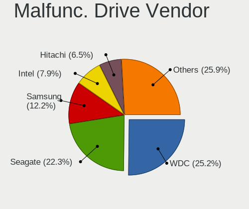

| Vendor              | Desktops | Drives | Percent |
|---------------------|----------|--------|---------|
| WDC                 | 21       | 36     | 30%     |
| Seagate             | 11       | 15     | 15.71%  |
| Samsung Electronics | 10       | 10     | 14.29%  |
| Intel               | 6        | 7      | 8.57%   |
| Hitachi             | 5        | 7      | 7.14%   |
| Kingston            | 3        | 3      | 4.29%   |
| Crucial             | 3        | 3      | 4.29%   |
| OCZ                 | 2        | 4      | 2.86%   |
| Fujitsu             | 2        | 2      | 2.86%   |
| Corsair             | 2        | 2      | 2.86%   |
| Toshiba             | 1        | 2      | 1.43%   |
| SanDisk             | 1        | 1      | 1.43%   |
| PNY                 | 1        | 2      | 1.43%   |
| LITEONIT            | 1        | 1      | 1.43%   |
| Apple               | 1        | 1      | 1.43%   |

Malfunc. HDD Vendor
-------------------

Vendors of faulty HDD drives

| Vendor              | Desktops | Drives | Percent |
|---------------------|----------|--------|---------|
| WDC                 | 20       | 35     | 41.67%  |
| Seagate             | 11       | 15     | 22.92%  |
| Samsung Electronics | 8        | 8      | 16.67%  |
| Hitachi             | 5        | 7      | 10.42%  |
| Fujitsu             | 2        | 2      | 4.17%   |
| Toshiba             | 1        | 2      | 2.08%   |
| Apple               | 1        | 1      | 2.08%   |

Malfunc. Drive Kind
-------------------

Kinds of faulty drives

| Kind | Desktops | Drives | Percent |
|------|----------|--------|---------|
| HDD  | 45       | 70     | 69.23%  |
| SSD  | 18       | 24     | 27.69%  |
| NVMe | 2        | 2      | 3.08%   |

Failed Drives
-------------

Failed drive models

Zero info for selected period =(

Failed Drive Vendor
-------------------

Failed drive vendors

Zero info for selected period =(

Drive Status
------------

Number of failed and malfunc. drives

| Status   | Desktops | Drives | Percent |
|----------|----------|--------|---------|
| Detected | 421      | 1228   | 59.46%  |
| Works    | 226      | 603    | 31.92%  |
| Malfunc  | 61       | 96     | 8.62%   |

Storage controller
------------------

Storage Vendor
--------------

Storage controller vendors

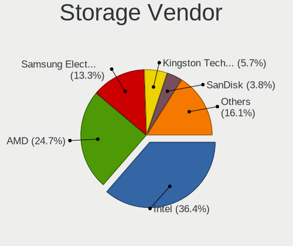

| Vendor                       | Desktops | Percent |
|------------------------------|----------|---------|
| Intel                        | 380      | 40.47%  |
| AMD                          | 241      | 25.67%  |
| Samsung Electronics          | 108      | 11.5%   |
| ASMedia Technology           | 35       | 3.73%   |
| JMicron Technology           | 30       | 3.19%   |
| Kingston Technology Company  | 27       | 2.88%   |
| Phison Electronics           | 25       | 2.66%   |
| Marvell Technology Group     | 25       | 2.66%   |
| SanDisk                      | 21       | 2.24%   |
| Nvidia                       | 11       | 1.17%   |
| Silicon Image                | 6        | 0.64%   |
| SK hynix                     | 5        | 0.53%   |
| Silicon Motion               | 5        | 0.53%   |
| ADATA Technology             | 4        | 0.43%   |
| VIA Technologies             | 3        | 0.32%   |
| Micron/Crucial Technology    | 3        | 0.32%   |
| Toshiba America Info Systems | 1        | 0.11%   |
| Seagate Technology           | 1        | 0.11%   |
| Realtek Semiconductor        | 1        | 0.11%   |
| Micron Technology            | 1        | 0.11%   |
| LSI Logic / Symbios Logic    | 1        | 0.11%   |
| Lite-On Technology           | 1        | 0.11%   |
| Lenovo                       | 1        | 0.11%   |
| KIOXIA                       | 1        | 0.11%   |
| Hewlett-Packard              | 1        | 0.11%   |
| Adaptec                      | 1        | 0.11%   |

Storage Model
-------------

Storage controller models

| Model                                                                                   | Desktops | Percent |
|-----------------------------------------------------------------------------------------|----------|---------|
| AMD FCH SATA Controller [AHCI mode]                                                     | 148      | 12.48%  |
| Samsung NVMe SSD Controller SM981/PM981/PM983                                           | 66       | 5.56%   |
| AMD 400 Series Chipset SATA Controller                                                  | 57       | 4.81%   |
| Intel Q170/Q150/B150/H170/H110/Z170/CM236 Chipset SATA Controller [AHCI Mode]           | 36       | 3.04%   |
| AMD SB7x0/SB8x0/SB9x0 IDE Controller                                                    | 35       | 2.95%   |
| ASMedia ASM1062 Serial ATA Controller                                                   | 34       | 2.87%   |
| Intel 8 Series/C220 Series Chipset Family 6-port SATA Controller 1 [AHCI mode]          | 32       | 2.7%    |
| Intel 200 Series PCH SATA controller [AHCI mode]                                        | 32       | 2.7%    |
| AMD SB7x0/SB8x0/SB9x0 SATA Controller [AHCI mode]                                       | 31       | 2.61%   |
| Intel Cannon Lake PCH SATA AHCI Controller                                              | 28       | 2.36%   |
| Intel 6 Series/C200 Series Chipset Family 6 port Desktop SATA AHCI Controller           | 28       | 2.36%   |
| Samsung NVMe SSD Controller SM961/PM961/SM963                                           | 27       | 2.28%   |
| Intel 9 Series Chipset Family SATA Controller [AHCI Mode]                               | 27       | 2.28%   |
| Intel 7 Series/C210 Series Chipset Family 6-port SATA Controller [AHCI mode]            | 27       | 2.28%   |
| AMD SB7x0/SB8x0/SB9x0 SATA Controller [IDE mode]                                        | 26       | 2.19%   |
| Intel SATA Controller [RAID mode]                                                       | 25       | 2.11%   |
| AMD 500 Series Chipset SATA Controller                                                  | 25       | 2.11%   |
| Kingston Company A2000 NVMe SSD                                                         | 19       | 1.6%    |
| Samsung NVMe SSD Controller PM9A1/PM9A3/980PRO                                          | 16       | 1.35%   |
| JMicron JMB363 SATA/IDE Controller                                                      | 16       | 1.35%   |
| Phison E12 NVMe Controller                                                              | 15       | 1.26%   |
| Intel SSD 660P Series                                                                   | 14       | 1.18%   |
| Intel 6 Series/C200 Series Chipset Family Desktop SATA Controller (IDE mode, ports 4-5) | 14       | 1.18%   |
| Intel 6 Series/C200 Series Chipset Family Desktop SATA Controller (IDE mode, ports 0-3) | 14       | 1.18%   |
| Intel C610/X99 series chipset 6-Port SATA Controller [AHCI mode]                        | 13       | 1.1%    |
| AMD 300 Series Chipset SATA Controller                                                  | 13       | 1.1%    |
| SanDisk WD Blue SN550 NVMe SSD                                                          | 12       | 1.01%   |
| Intel NM10/ICH7 Family SATA Controller [IDE mode]                                       | 12       | 1.01%   |
| Intel 82801G (ICH7 Family) IDE Controller                                               | 11       | 0.93%   |
| Intel C610/X99 series chipset sSATA Controller [AHCI mode]                              | 10       | 0.84%   |
| Intel 82801JI (ICH10 Family) 4 port SATA IDE Controller #1                              | 10       | 0.84%   |
| Intel 82801JI (ICH10 Family) 2 port SATA IDE Controller #2                              | 10       | 0.84%   |
| AMD X370 Series Chipset SATA Controller                                                 | 10       | 0.84%   |
| Marvell Group 88SE9172 SATA 6Gb/s Controller                                            | 9        | 0.76%   |
| Intel 4 Series Chipset PT IDER Controller                                               | 9        | 0.76%   |
| JMicron JMB362 SATA Controller                                                          | 8        | 0.67%   |
| AMD X399 Series Chipset SATA Controller                                                 | 8        | 0.67%   |
| Phison E16 PCIe4 NVMe Controller                                                        | 7        | 0.59%   |
| Intel 82801JI (ICH10 Family) SATA AHCI Controller                                       | 7        | 0.59%   |
| Intel SSD 600P Series                                                                   | 6        | 0.51%   |
| Intel Celeron/Pentium Silver Processor SATA Controller                                  | 6        | 0.51%   |
| Intel Alder Lake-S PCH SATA Controller [AHCI Mode]                                      | 6        | 0.51%   |
| Intel 82801JD/DO (ICH10 Family) SATA AHCI Controller                                    | 6        | 0.51%   |
| Samsung NVMe SSD Controller SM951/PM951                                                 | 5        | 0.42%   |
| JMicron JMB368 IDE controller                                                           | 5        | 0.42%   |
| Intel 5 Series/3400 Series Chipset 6 port SATA AHCI Controller                          | 5        | 0.42%   |
| Silicon Motion SM2263EN/SM2263XT SSD Controller                                         | 4        | 0.34%   |
| SanDisk WD Black 2018/SN750 / PC SN720 NVMe SSD                                         | 4        | 0.34%   |
| Marvell Group 88SE9230 PCIe 2.0 x2 4-port SATA 6 Gb/s RAID Controller                   | 4        | 0.34%   |
| Kingston Company U-SNS8154P3 NVMe SSD                                                   | 4        | 0.34%   |
| Intel Volume Management Device NVMe RAID Controller                                     | 4        | 0.34%   |
| Intel SSD Pro 7600p/760p/E 6100p Series                                                 | 4        | 0.34%   |
| Intel Celeron N3350/Pentium N4200/Atom E3900 Series SATA AHCI Controller                | 4        | 0.34%   |
| Intel C600/X79 series chipset 6-Port SATA AHCI Controller                               | 4        | 0.34%   |
| Intel 82801I (ICH9 Family) 2 port SATA Controller [IDE mode]                            | 4        | 0.34%   |
| Intel 7 Series/C210 Series Chipset Family 4-port SATA Controller [IDE mode]             | 4        | 0.34%   |
| Intel 7 Series/C210 Series Chipset Family 2-port SATA Controller [IDE mode]             | 4        | 0.34%   |
| AMD FCH SATA Controller D                                                               | 4        | 0.34%   |
| AMD FCH IDE Controller                                                                  | 4        | 0.34%   |
| ADATA XPG SX8200 Pro PCIe Gen3x4 M.2 2280 Solid State Drive                             | 4        | 0.34%   |

Storage Kind
------------

Kind of storage controller (IDE, SATA, NVMe, SAS, ...)

| Kind | Desktops | Percent |
|------|----------|---------|
| SATA | 528      | 58.02%  |
| NVMe | 204      | 22.42%  |
| IDE  | 132      | 14.51%  |
| RAID | 43       | 4.73%   |
| SAS  | 2        | 0.22%   |
| SCSI | 1        | 0.11%   |

Processor
---------

CPU Vendor
----------

Processor vendors

| Vendor | Desktops | Percent |
|--------|----------|---------|
| Intel  | 373      | 59.68%  |
| AMD    | 252      | 40.32%  |

CPU Model
---------

Processor models

| Model                                          | Desktops | Percent |
|------------------------------------------------|----------|---------|
| AMD Ryzen 5 3600 6-Core Processor              | 23       | 3.67%   |
| AMD Ryzen 7 3700X 8-Core Processor             | 16       | 2.56%   |
| Intel Core i5-6600K CPU @ 3.50GHz              | 14       | 2.24%   |
| AMD Ryzen 9 3900X 12-Core Processor            | 13       | 2.08%   |
| Intel Core i7-4790K CPU @ 4.00GHz              | 11       | 1.76%   |
| Intel Core i5-4690K CPU @ 3.50GHz              | 11       | 1.76%   |
| AMD Ryzen 5 2600 Six-Core Processor            | 10       | 1.6%    |
| Intel Core i7-6700K CPU @ 4.00GHz              | 9        | 1.44%   |
| Intel Core i7-3770 CPU @ 3.40GHz               | 8        | 1.28%   |
| Intel Core i7-2600 CPU @ 3.40GHz               | 8        | 1.28%   |
| Intel Core i5-2500K CPU @ 3.30GHz              | 8        | 1.28%   |
| AMD Ryzen 7 2700X Eight-Core Processor         | 8        | 1.28%   |
| AMD Ryzen 5 5600X 6-Core Processor             | 8        | 1.28%   |
| Intel Core i5-3470 CPU @ 3.20GHz               | 7        | 1.12%   |
| Intel Core i5-2400 CPU @ 3.10GHz               | 7        | 1.12%   |
| Intel Core 2 Duo CPU E8400 @ 3.00GHz           | 7        | 1.12%   |
| AMD FX-8350 Eight-Core Processor               | 7        | 1.12%   |
| Intel Core i9-9900K CPU @ 3.60GHz              | 6        | 0.96%   |
| Intel Core i7-5820K CPU @ 3.30GHz              | 6        | 0.96%   |
| Intel Core i7-4770 CPU @ 3.40GHz               | 6        | 0.96%   |
| Intel Core i7-3770K CPU @ 3.50GHz              | 6        | 0.96%   |
| Intel Core i5-7400 CPU @ 3.00GHz               | 6        | 0.96%   |
| Intel Core 2 Quad CPU Q9550 @ 2.83GHz          | 6        | 0.96%   |
| AMD Ryzen 9 5950X 16-Core Processor            | 6        | 0.96%   |
| AMD Ryzen 5 3400G with Radeon Vega Graphics    | 6        | 0.96%   |
| AMD Ryzen 5 2600X Six-Core Processor           | 6        | 0.96%   |
| AMD Ryzen 5 1600 Six-Core Processor            | 6        | 0.96%   |
| AMD FX-6300 Six-Core Processor                 | 6        | 0.96%   |
| Intel Core i7-4770K CPU @ 3.50GHz              | 5        | 0.8%    |
| Intel Core i7-2600K CPU @ 3.40GHz              | 5        | 0.8%    |
| Intel Core i5-9400F CPU @ 2.90GHz              | 5        | 0.8%    |
| Intel Core i5-4460 CPU @ 3.20GHz               | 5        | 0.8%    |
| Intel Core i5-2320 CPU @ 3.00GHz               | 5        | 0.8%    |
| AMD Ryzen Threadripper 2950X 16-Core Processor | 5        | 0.8%    |
| AMD Ryzen Embedded V1605B with Radeon Vega Gfx | 5        | 0.8%    |
| AMD Ryzen 9 5900X 12-Core Processor            | 5        | 0.8%    |
| AMD Ryzen 7 5800X 8-Core Processor             | 5        | 0.8%    |
| Intel Core i7-9700K CPU @ 3.60GHz              | 4        | 0.64%   |
| Intel Core i7-8700K CPU @ 3.70GHz              | 4        | 0.64%   |
| Intel Core i7-7700K CPU @ 4.20GHz              | 4        | 0.64%   |
| Intel Core i7-6700 CPU @ 3.40GHz               | 4        | 0.64%   |
| Intel Core i5-8400 CPU @ 2.80GHz               | 4        | 0.64%   |
| Intel Core i5-4570 CPU @ 3.20GHz               | 4        | 0.64%   |
| Intel Core 2 CPU 6600 @ 2.40GHz                | 4        | 0.64%   |
| Intel Celeron J4125 CPU @ 2.00GHz              | 4        | 0.64%   |
| Intel Celeron CPU J1900 @ 1.99GHz              | 4        | 0.64%   |
| AMD Ryzen 5 3600X 6-Core Processor             | 4        | 0.64%   |
| AMD Ryzen 5 1600X Six-Core Processor           | 4        | 0.64%   |
| AMD Ryzen 3 3200G with Radeon Vega Graphics    | 4        | 0.64%   |
| AMD FX-8320 Eight-Core Processor               | 4        | 0.64%   |
| Intel Xeon CPU E5-2630L v3 @ 1.80GHz           | 3        | 0.48%   |
| Intel Core i7-8700 CPU @ 3.20GHz               | 3        | 0.48%   |
| Intel Core i7-4790 CPU @ 3.60GHz               | 3        | 0.48%   |
| Intel Core i5-9600K CPU @ 3.70GHz              | 3        | 0.48%   |
| Intel Core i5-8600K CPU @ 3.60GHz              | 3        | 0.48%   |
| Intel Core i5-8500 CPU @ 3.00GHz               | 3        | 0.48%   |
| Intel Core i5-6400 CPU @ 2.70GHz               | 3        | 0.48%   |
| Intel Core i5-4430 CPU @ 3.00GHz               | 3        | 0.48%   |
| Intel Core i5-3570K CPU @ 3.40GHz              | 3        | 0.48%   |
| Intel Core i5-10400F CPU @ 2.90GHz             | 3        | 0.48%   |

CPU Model Family
----------------

Processor model prefix

| Model                   | Desktops | Percent |
|-------------------------|----------|---------|
| Intel Core i5           | 133      | 21.28%  |
| Intel Core i7           | 110      | 17.6%   |
| AMD Ryzen 5             | 74       | 11.84%  |
| AMD Ryzen 7             | 41       | 6.56%   |
| AMD FX                  | 29       | 4.64%   |
| AMD Ryzen 9             | 25       | 4%      |
| Intel Xeon              | 24       | 3.84%   |
| Intel Core i3           | 15       | 2.4%    |
| Intel Core 2 Duo        | 15       | 2.4%    |
| Intel Celeron           | 15       | 2.4%    |
| Intel Core 2 Quad       | 14       | 2.24%   |
| Intel Pentium           | 13       | 2.08%   |
| AMD Ryzen Threadripper  | 10       | 1.6%    |
| Other                   | 8        | 1.28%   |
| Intel Pentium Dual-Core | 8        | 1.28%   |
| AMD Ryzen 3             | 8        | 1.28%   |
| AMD Phenom II X4        | 8        | 1.28%   |
| Intel Core i9           | 7        | 1.12%   |
| AMD A8                  | 6        | 0.96%   |
| Intel Core 2            | 5        | 0.8%    |
| AMD Ryzen Embedded      | 5        | 0.8%    |
| AMD Phenom II X6        | 5        | 0.8%    |
| AMD Athlon II X2        | 5        | 0.8%    |
| AMD Athlon 64 X2        | 5        | 0.8%    |
| Intel Atom              | 4        | 0.64%   |
| AMD Athlon II X3        | 3        | 0.48%   |
| AMD A4                  | 3        | 0.48%   |
| Intel Pentium Dual      | 2        | 0.32%   |
| AMD Phenom              | 2        | 0.32%   |
| AMD E                   | 2        | 0.32%   |
| AMD Athlon II X4        | 2        | 0.32%   |
| AMD Athlon 64           | 2        | 0.32%   |
| AMD A6                  | 2        | 0.32%   |
| Intel Pentium Gold      | 1        | 0.16%   |
| Intel Pentium 4         | 1        | 0.16%   |
| AMD Ryzen 7 PRO         | 1        | 0.16%   |
| AMD Ryzen 5 PRO         | 1        | 0.16%   |
| AMD PRO A8              | 1        | 0.16%   |
| AMD Phenom II X3        | 1        | 0.16%   |
| AMD Phenom II X2        | 1        | 0.16%   |
| AMD Geode Integrated    | 1        | 0.16%   |
| AMD E2                  | 1        | 0.16%   |
| AMD E1                  | 1        | 0.16%   |
| AMD Athlon X4           | 1        | 0.16%   |
| AMD Athlon X2           | 1        | 0.16%   |
| AMD Athlon II           | 1        | 0.16%   |
| AMD Athlon              | 1        | 0.16%   |
| AMD A10                 | 1        | 0.16%   |

CPU Cores
---------

Number of processor cores

| Number  | Desktops | Percent |
|---------|----------|---------|
| 4       | 282      | 44.9%   |
| 6       | 118      | 18.79%  |
| 2       | 88       | 14.01%  |
| 8       | 64       | 10.19%  |
| 12      | 24       | 3.82%   |
| 16      | 19       | 3.03%   |
| 3       | 14       | 2.23%   |
| 1       | 11       | 1.75%   |
| 10      | 2        | 0.32%   |
| 64      | 1        | 0.16%   |
| 32      | 1        | 0.16%   |
| 28      | 1        | 0.16%   |
| 20      | 1        | 0.16%   |
| 18      | 1        | 0.16%   |
| Unknown | 1        | 0.16%   |

CPU Sockets
-----------

Number of sockets

| Number | Desktops | Percent |
|--------|----------|---------|
| 1      | 614      | 98.24%  |
| 2      | 11       | 1.76%   |

CPU Threads
-----------

Threads per core (Hyper-Threading)

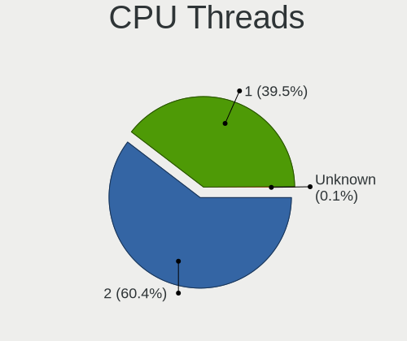

| Number  | Desktops | Percent |
|---------|----------|---------|
| 2       | 343      | 54.7%   |
| 1       | 283      | 45.14%  |
| Unknown | 1        | 0.16%   |

CPU Op-Modes
------------

CPU Operation Modes (32-bit, 64-bit)

| Op mode        | Desktops | Percent |
|----------------|----------|---------|
| 32-bit, 64-bit | 611      | 97.6%   |
| Unknown        | 12       | 1.92%   |
| 32-bit         | 3        | 0.48%   |

CPU Microcode
-------------

Microcode number

| Number     | Desktops | Percent |
|------------|----------|---------|
| Unknown    | 154      | 23.62%  |
| 0x306c3    | 52       | 7.98%   |
| 0x206a7    | 35       | 5.37%   |
| 0x08701021 | 29       | 4.45%   |
| 0x506e3    | 28       | 4.29%   |
| 0x306a9    | 27       | 4.14%   |
| 0x1067a    | 23       | 3.53%   |
| 0x906ea    | 22       | 3.37%   |
| 0x0800820d | 19       | 2.91%   |
| 0x906e9    | 16       | 2.45%   |
| 0x08701013 | 16       | 2.45%   |
| 0x06000852 | 13       | 1.99%   |
| 0x0a201009 | 12       | 1.84%   |
| 0x010000c8 | 12       | 1.84%   |
| 0x306f2    | 11       | 1.69%   |
| 0x08001138 | 9        | 1.38%   |
| 0x08108109 | 8        | 1.23%   |
| 0x0600063e | 8        | 1.23%   |
| 0x906ed    | 7        | 1.07%   |
| 0x906ec    | 6        | 0.92%   |
| 0x106e5    | 6        | 0.92%   |
| 0x0810100b | 6        | 0.92%   |
| 0x010000dc | 6        | 0.92%   |
| 0x10676    | 5        | 0.77%   |
| 0x08001137 | 5        | 0.77%   |
| 0x06001119 | 5        | 0.77%   |
| 0xa0655    | 4        | 0.61%   |
| 0x90672    | 4        | 0.61%   |
| 0x6f6      | 4        | 0.61%   |
| 0x406f1    | 4        | 0.61%   |
| 0x106a5    | 4        | 0.61%   |
| 0x08001129 | 4        | 0.61%   |
| 0x03000027 | 4        | 0.61%   |
| 0x706a8    | 3        | 0.46%   |
| 0x6fd      | 3        | 0.46%   |
| 0x30678    | 3        | 0.46%   |
| 0x206d7    | 3        | 0.46%   |
| 0x206c2    | 3        | 0.46%   |
| 0x10677    | 3        | 0.46%   |
| 0x0a201016 | 3        | 0.46%   |
| 0x010000db | 3        | 0.46%   |
| 0x010000c7 | 3        | 0.46%   |
| 0xf49      | 2        | 0.31%   |
| 0x706a1    | 2        | 0.31%   |
| 0x6fb      | 2        | 0.31%   |
| 0x506ca    | 2        | 0.31%   |
| 0x506c9    | 2        | 0.31%   |
| 0x50654    | 2        | 0.31%   |
| 0x306e4    | 2        | 0.31%   |
| 0x20655    | 2        | 0.31%   |
| 0x0a50000c | 2        | 0.31%   |
| 0x08008206 | 2        | 0.31%   |
| 0x06003106 | 2        | 0.31%   |
| 0x05000029 | 2        | 0.31%   |
| 0xf12      | 1        | 0.15%   |
| 0xa0671    | 1        | 0.15%   |
| 0xa0653    | 1        | 0.15%   |
| 0x806ec    | 1        | 0.15%   |
| 0x806ea    | 1        | 0.15%   |
| 0x50657    | 1        | 0.15%   |

CPU Microarch
-------------

Microarchitecture

| Name             | Desktops | Percent |
|------------------|----------|---------|
| Haswell          | 77       | 12.3%   |
| KabyLake         | 67       | 10.7%   |
| Zen 2            | 63       | 10.06%  |
| SandyBridge      | 50       | 7.99%   |
| Zen+             | 42       | 6.71%   |
| Skylake          | 40       | 6.39%   |
| Zen              | 35       | 5.59%   |
| Penryn           | 35       | 5.59%   |
| IvyBridge        | 35       | 5.59%   |
| K10              | 30       | 4.79%   |
| Zen 3            | 26       | 4.15%   |
| Piledriver       | 25       | 3.99%   |
| Nehalem          | 11       | 1.76%   |
| Core             | 11       | 1.76%   |
| Bulldozer        | 9        | 1.44%   |
| Westmere         | 7        | 1.12%   |
| Silvermont       | 7        | 1.12%   |
| K8 Hammer        | 7        | 1.12%   |
| Goldmont plus    | 6        | 0.96%   |
| CometLake        | 6        | 0.96%   |
| Broadwell        | 6        | 0.96%   |
| K10 Llano        | 5        | 0.8%    |
| Goldmont         | 4        | 0.64%   |
| Alderlake Hybrid | 4        | 0.64%   |
| NetBurst         | 3        | 0.48%   |
| Bobcat           | 3        | 0.48%   |
| Steamroller      | 2        | 0.32%   |
| Excavator        | 2        | 0.32%   |
| Unknown          | 2        | 0.32%   |
| Puma             | 1        | 0.16%   |
| K6               | 1        | 0.16%   |
| Jaguar           | 1        | 0.16%   |
| Icelake          | 1        | 0.16%   |
| Geode            | 1        | 0.16%   |
| Bonnell          | 1        | 0.16%   |

Graphics
--------

GPU Vendor
----------

Vendors of graphics cards

| Vendor            | Desktops | Percent |
|-------------------|----------|---------|
| Nvidia            | 324      | 48.36%  |
| AMD               | 215      | 32.09%  |
| Intel             | 125      | 18.66%  |
| ASPEED Technology | 6        | 0.9%    |

GPU Model
---------

Graphics card models

| Model                                                                       | Desktops | Percent |
|-----------------------------------------------------------------------------|----------|---------|
| AMD Ellesmere [Radeon RX 470/480/570/570X/580/580X/590]                     | 37       | 5.37%   |
| Intel Xeon E3-1200 v3/4th Gen Core Processor Integrated Graphics Controller | 24       | 3.48%   |
| Nvidia GP106 [GeForce GTX 1060 6GB]                                         | 20       | 2.9%    |
| Intel 2nd Generation Core Processor Family Integrated Graphics Controller   | 19       | 2.76%   |
| AMD Navi 10 [Radeon RX 5600 OEM/5600 XT / 5700/5700 XT]                     | 19       | 2.76%   |
| Nvidia GM206 [GeForce GTX 960]                                              | 16       | 2.32%   |
| Nvidia GM204 [GeForce GTX 970]                                              | 15       | 2.18%   |
| Nvidia GP106 [GeForce GTX 1060 3GB]                                         | 14       | 2.03%   |
| Nvidia GP104 [GeForce GTX 1080]                                             | 13       | 1.89%   |
| Nvidia GP104 [GeForce GTX 1070]                                             | 13       | 1.89%   |
| Nvidia GK208B [GeForce GT 710]                                              | 13       | 1.89%   |
| AMD Vega 10 XL/XT [Radeon RX Vega 56/64]                                    | 13       | 1.89%   |
| Intel CoffeeLake-S GT2 [UHD Graphics 630]                                   | 12       | 1.74%   |
| AMD Navi 21 [Radeon RX 6800/6800 XT / 6900 XT]                              | 12       | 1.74%   |
| Nvidia TU106 [GeForce RTX 2060 Rev. A]                                      | 10       | 1.45%   |
| Intel 4 Series Chipset Integrated Graphics Controller                       | 9        | 1.31%   |
| AMD Raven Ridge [Radeon Vega Series / Radeon Vega Mobile Series]            | 9        | 1.31%   |
| Nvidia GP107 [GeForce GTX 1050 Ti]                                          | 8        | 1.16%   |
| Intel Xeon E3-1200 v2/3rd Gen Core processor Graphics Controller            | 8        | 1.16%   |
| Intel HD Graphics 530                                                       | 8        | 1.16%   |
| AMD Cape Verde XT [Radeon HD 7770/8760 / R7 250X]                           | 8        | 1.16%   |
| Nvidia GP108 [GeForce GT 1030]                                              | 7        | 1.02%   |
| Nvidia GP102 [GeForce GTX 1080 Ti]                                          | 7        | 1.02%   |
| Nvidia GK104 [GeForce GTX 760]                                              | 7        | 1.02%   |
| AMD Picasso/Raven 2 [Radeon Vega Series / Radeon Vega Mobile Series]        | 7        | 1.02%   |
| AMD Curacao XT / Trinidad XT [Radeon R7 370 / R9 270X/370X]                 | 7        | 1.02%   |
| Nvidia GT218 [GeForce 210]                                                  | 6        | 0.87%   |
| Nvidia GK104 [GeForce GTX 670]                                              | 6        | 0.87%   |
| Intel IvyBridge GT2 [HD Graphics 4000]                                      | 6        | 0.87%   |
| Intel GeminiLake [UHD Graphics 600]                                         | 6        | 0.87%   |
| ASPEED Technology ASPEED Graphics Family                                    | 6        | 0.87%   |
| AMD Lexa PRO [Radeon 540/540X/550/550X / RX 540X/550/550X]                  | 6        | 0.87%   |
| AMD Baffin [Radeon RX 460/560D / Pro 450/455/460/555/555X/560/560X]         | 6        | 0.87%   |
| Nvidia TU116 [GeForce GTX 1660 Ti]                                          | 5        | 0.73%   |
| Nvidia GP107 [GeForce GTX 1050]                                             | 5        | 0.73%   |
| Nvidia GM200 [GeForce GTX 980 Ti]                                           | 5        | 0.73%   |
| Nvidia GF114 [GeForce GTX 560 Ti]                                           | 5        | 0.73%   |
| Nvidia TU116 [GeForce GTX 1660]                                             | 4        | 0.58%   |
| Nvidia TU116 [GeForce GTX 1660 SUPER]                                       | 4        | 0.58%   |
| Nvidia TU106 [GeForce RTX 2070]                                             | 4        | 0.58%   |
| Nvidia TU106 [GeForce RTX 2060 SUPER]                                       | 4        | 0.58%   |
| Nvidia TU104 [GeForce RTX 2070 SUPER]                                       | 4        | 0.58%   |
| Nvidia GA104 [GeForce RTX 3070]                                             | 4        | 0.58%   |
| Nvidia GA102 [GeForce RTX 3080]                                             | 4        | 0.58%   |
| Nvidia G96C [GeForce 9500 GT]                                               | 4        | 0.58%   |
| Intel Atom Processor Z36xxx/Z37xxx Series Graphics & Display                | 4        | 0.58%   |
| Intel AlderLake-S GT1                                                       | 4        | 0.58%   |
| AMD Vega 20 [Radeon VII]                                                    | 4        | 0.58%   |
| AMD Hawaii PRO [Radeon R9 290/390]                                          | 4        | 0.58%   |
| AMD Cedar [Radeon HD 5000/6000/7350/8350 Series]                            | 4        | 0.58%   |
| AMD Caicos [Radeon HD 6450/7450/8450 / R5 230 OEM]                          | 4        | 0.58%   |
| Nvidia TU116 [GeForce GTX 1650 SUPER]                                       | 3        | 0.44%   |
| Nvidia GM206 [GeForce GTX 950]                                              | 3        | 0.44%   |
| Nvidia GK107 [GeForce GT 640]                                               | 3        | 0.44%   |
| Nvidia GK106 [GeForce GTX 660]                                              | 3        | 0.44%   |
| Nvidia GF116 [GeForce GTX 550 Ti]                                           | 3        | 0.44%   |
| Nvidia GF110 [GeForce GTX 580]                                              | 3        | 0.44%   |
| Nvidia GA102 [GeForce RTX 3090]                                             | 3        | 0.44%   |
| Nvidia G84 [GeForce 8600 GT]                                                | 3        | 0.44%   |
| Intel HD Graphics 630                                                       | 3        | 0.44%   |

GPU Combo
---------

Combinations of graphics cards

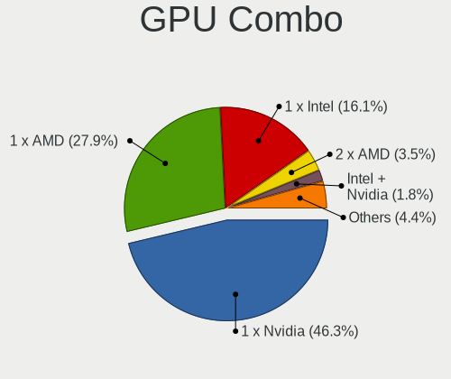

| Name                     | Desktops | Percent |
|--------------------------|----------|---------|
| 1 x Nvidia               | 309      | 48.66%  |
| 1 x AMD                  | 198      | 31.18%  |
| 1 x Intel                | 94       | 14.8%   |
| 2 x AMD                  | 10       | 1.57%   |
| Intel + Nvidia           | 6        | 0.94%   |
| 1 x ASPEED               | 6        | 0.94%   |
| AMD + Nvidia             | 5        | 0.79%   |
| 2 x Nvidia               | 4        | 0.63%   |
| Intel + AMD              | 2        | 0.31%   |
| Intel + AMD + 1 x Nvidia | 1        | 0.16%   |

GPU Driver
----------

Free vs proprietary

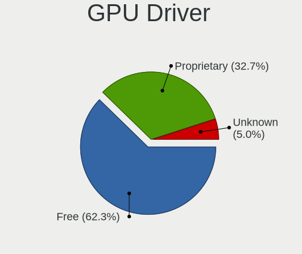

| Driver      | Desktops | Percent |
|-------------|----------|---------|
| Free        | 403      | 62.97%  |
| Proprietary | 206      | 32.19%  |
| Unknown     | 31       | 4.84%   |

GPU Memory
----------

Total video memory

| Size in GB | Desktops | Percent |
|------------|----------|---------|
| Unknown    | 206      | 31.6%   |
| 1.01-2.0   | 90       | 13.8%   |
| 7.01-8.0   | 89       | 13.65%  |
| 0.51-1.0   | 66       | 10.12%  |
| 3.01-4.0   | 62       | 9.51%   |
| 0.01-0.5   | 55       | 8.44%   |
| 5.01-6.0   | 41       | 6.29%   |
| 8.01-16.0  | 24       | 3.68%   |
| 2.01-3.0   | 16       | 2.45%   |
| 16.01-24.0 | 3        | 0.46%   |

Monitor
-------

Monitor Vendor
--------------

Monitor vendors

| Vendor               | Desktops | Percent |
|----------------------|----------|---------|
| Samsung Electronics  | 94       | 13.28%  |
| BenQ                 | 79       | 11.16%  |
| Ancor Communications | 68       | 9.6%    |
| Dell                 | 66       | 9.32%   |
| Philips              | 59       | 8.33%   |
| AOC                  | 59       | 8.33%   |
| Hewlett-Packard      | 55       | 7.77%   |
| Acer                 | 51       | 7.2%    |
| Goldstar             | 29       | 4.1%    |
| ASUSTek Computer     | 17       | 2.4%    |
| Eizo                 | 15       | 2.12%   |
| Lenovo               | 10       | 1.41%   |
| Unknown              | 9        | 1.27%   |
| Vestel Elektronik    | 8        | 1.13%   |
| Sony                 | 8        | 1.13%   |
| MSI                  | 8        | 1.13%   |
| LG Electronics       | 8        | 1.13%   |
| ViewSonic            | 6        | 0.85%   |
| AUS                  | 4        | 0.56%   |
| Panasonic            | 3        | 0.42%   |
| Packard Bell         | 3        | 0.42%   |
| OEM                  | 3        | 0.42%   |
| Microstep            | 3        | 0.42%   |
| IEI                  | 3        | 0.42%   |
| Gigabyte Technology  | 3        | 0.42%   |
| Fujitsu Siemens      | 3        | 0.42%   |
| VOXICON              | 2        | 0.28%   |
| Onkyo                | 2        | 0.28%   |
| Mi                   | 2        | 0.28%   |
| Iiyama               | 2        | 0.28%   |
| Belinea              | 2        | 0.28%   |
| Xiaomi               | 1        | 0.14%   |
| VIZ                  | 1        | 0.14%   |
| Vestel               | 1        | 0.14%   |
| Valve                | 1        | 0.14%   |
| Unknown (XXX)        | 1        | 0.14%   |
| UGD                  | 1        | 0.14%   |
| Toshiba              | 1        | 0.14%   |
| SMP                  | 1        | 0.14%   |
| Sharp                | 1        | 0.14%   |
| OPD                  | 1        | 0.14%   |
| NXP                  | 1        | 0.14%   |
| NEC Computers        | 1        | 0.14%   |
| MST                  | 1        | 0.14%   |
| MQP                  | 1        | 0.14%   |
| LG Display           | 1        | 0.14%   |
| HVR                  | 1        | 0.14%   |
| Grundig              | 1        | 0.14%   |
| DSGR                 | 1        | 0.14%   |
| Denver               | 1        | 0.14%   |
| Compaq Computer      | 1        | 0.14%   |
| AU Optronics         | 1        | 0.14%   |
| Apple                | 1        | 0.14%   |
| AAN                  | 1        | 0.14%   |
| Unknown              | 1        | 0.14%   |

Monitor Model
-------------

Monitor models

| Model                                                                  | Desktops | Percent |
|------------------------------------------------------------------------|----------|---------|
| Vestel Elektronik 39FHD_LCD_TV VES3700 1920x1080 1280x720mm 57.8-inch  | 8        | 1.03%   |
| BenQ G2420HDBL BNQ785F 1920x1080 477x268mm 21.5-inch                   | 8        | 1.03%   |
| AOC 2460G5 AOC2460 1920x1080 531x299mm 24.0-inch                       | 8        | 1.03%   |
| AOC 24G2W1G4 AOC2402 1920x1080 527x296mm 23.8-inch                     | 6        | 0.78%   |
| Samsung Electronics S24F350 SAM0D20 1920x1080 521x293mm 23.5-inch      | 5        | 0.65%   |
| AOC Q32G1WG4 AOC3201 2560x1440 697x393mm 31.5-inch                     | 5        | 0.65%   |
| Ancor Communications VE247 ACI2493 1920x1080 531x299mm 24.0-inch       | 5        | 0.65%   |
| Ancor Communications ASUS PB278 ACI27A3 2560x1440 597x336mm 27.0-inch  | 5        | 0.65%   |
| Philips PHL 436M6VBP PHLC179 3840x2160 941x529mm 42.5-inch             | 4        | 0.52%   |
| Philips PHL 243V7 PHLC155 1920x1080 527x296mm 23.8-inch                | 4        | 0.52%   |
| Philips 273ELH PHLC07D 1920x1080 598x336mm 27.0-inch                   | 4        | 0.52%   |
| Dell U2412M DELA07A 1920x1200 518x324mm 24.1-inch                      | 4        | 0.52%   |
| BenQ GL2450H BNQ78A7 1920x1080 530x300mm 24.0-inch                     | 4        | 0.52%   |
| BenQ G2420HD BNQ7840 1920x1080 531x299mm 24.0-inch                     | 4        | 0.52%   |
| ASUSTek Computer VG27A AUS2722 2560x1440 597x336mm 27.0-inch           | 4        | 0.52%   |
| Ancor Communications VX238 ACI23C1 1920x1080 510x290mm 23.1-inch       | 4        | 0.52%   |
| Ancor Communications VG248 ACI24E1 1920x1080 531x299mm 24.0-inch       | 4        | 0.52%   |
| Ancor Communications VE228 ACI22FA 1920x1080 477x268mm 21.5-inch       | 4        | 0.52%   |
| Ancor Communications ROG PG279Q ACI27EC 2560x1440 598x336mm 27.0-inch  | 4        | 0.52%   |
| Sony TV SNY0801 1360x768                                               | 3        | 0.39%   |
| Samsung Electronics S27D850 SAM0BC9 2560x1440 600x340mm 27.2-inch      | 3        | 0.39%   |
| Philips PHL BDM4065 PHL08E1 1920x1080 880x490mm 39.7-inch              | 3        | 0.39%   |
| Philips PHL BDM3270 PHL08E7 2560x1440 708x398mm 32.0-inch              | 3        | 0.39%   |
| Philips PHL 243V5 PHLC0D1 1920x1080 521x293mm 23.5-inch                | 3        | 0.39%   |
| Philips FTV PHL01EA 1920x1080 1440x810mm 65.0-inch                     | 3        | 0.39%   |
| OEM 32W_LCD_TV OEM3700 1920x540                                        | 3        | 0.39%   |
| IEI 150 IEI2044 1152x870 304x228mm 15.0-inch                           | 3        | 0.39%   |
| Hewlett-Packard w1907 HWP26A2 1440x900 408x255mm 18.9-inch             | 3        | 0.39%   |
| Hewlett-Packard LA2205 HWP2848 1680x1050 473x296mm 22.0-inch           | 3        | 0.39%   |
| Dell U2711 DELA057 2560x1440 597x336mm 27.0-inch                       | 3        | 0.39%   |
| Dell U2412M DELA07B 1920x1200 518x324mm 24.1-inch                      | 3        | 0.39%   |
| Dell 1907FP DEL4015 1280x1024 376x301mm 19.0-inch                      | 3        | 0.39%   |
| BenQ PD3200U BNQ8025 3840x2160 708x399mm 32.0-inch                     | 3        | 0.39%   |
| BenQ BenQG2222HDL BNQ785A 1920x1080 478x269mm 21.6-inch                | 3        | 0.39%   |
| ASUSTek Computer VZ239 AUS23CC 1920x1080 509x286mm 23.0-inch           | 3        | 0.39%   |
| AOC Q2775 AOC2775 2560x1440 597x336mm 27.0-inch                        | 3        | 0.39%   |
| AOC 27G2G4 AOC2702 1920x1080 598x336mm 27.0-inch                       | 3        | 0.39%   |
| AOC 24G1WG4 AOC2401 1920x1080 521x293mm 23.5-inch                      | 3        | 0.39%   |
| Ancor Communications VG248 ACI24A4 1920x1080 531x299mm 24.0-inch       | 3        | 0.39%   |
| Ancor Communications LCD Monitor ROG PG279Q 2560x1440                  | 3        | 0.39%   |
| Acer X34 P ACR054F 3440x1440 800x340mm 34.2-inch                       | 3        | 0.39%   |
| Acer EK240Y ACR0758 1920x1080 527x296mm 23.8-inch                      | 3        | 0.39%   |
| Unknown LCD Monitor SAMSUNG 1920x1080                                  | 2        | 0.26%   |
| Samsung Electronics U28E590 SAM0C4D 3840x2160 607x345mm 27.5-inch      | 2        | 0.26%   |
| Samsung Electronics S24R35x SAM100E 1920x1080 527x296mm 23.8-inch      | 2        | 0.26%   |
| Samsung Electronics S24D590 SAM0B47 1920x1080 520x290mm 23.4-inch      | 2        | 0.26%   |
| Samsung Electronics LCD Monitor SAM0B60 1920x1080 1210x680mm 54.6-inch | 2        | 0.26%   |
| Samsung Electronics C27JG5x SAM0F57 2560x1440 600x340mm 27.2-inch      | 2        | 0.26%   |
| Philips PHL 328E1 PHLC204 3840x2160 697x392mm 31.5-inch                | 2        | 0.26%   |
| Philips PHL 278E1 PHLC217 3840x2160 597x336mm 27.0-inch                | 2        | 0.26%   |
| Philips LCD Monitor FTV 1920x1080                                      | 2        | 0.26%   |
| MSI Optix MAG27CQ MSI1462 2560x1440 597x336mm 27.0-inch                | 2        | 0.26%   |
| Lenovo LT2252p Wide LEN0A0C 1680x1050 474x296mm 22.0-inch              | 2        | 0.26%   |
| Hewlett-Packard Z24i HWP309F 1920x1200 518x324mm 24.1-inch             | 2        | 0.26%   |
| Hewlett-Packard LP2465 HWP2676 1920x1200 519x324mm 24.1-inch           | 2        | 0.26%   |
| Goldstar ULTRAGEAR GSM5BB4 2560x1440 597x336mm 27.0-inch               | 2        | 0.26%   |
| Eizo S2231W ENC1918 1680x1050 480x300mm 22.3-inch                      | 2        | 0.26%   |
| Eizo FS2333 ENC2344 1920x1080 510x290mm 23.1-inch                      | 2        | 0.26%   |
| Dell U2515H DELD070 2560x1440 553x311mm 25.0-inch                      | 2        | 0.26%   |
| Dell U2515H DELD06F 2560x1440 553x311mm 25.0-inch                      | 2        | 0.26%   |

Monitor Resolution
------------------

Monitor screen resolution

| Resolution         | Desktops | Percent |
|--------------------|----------|---------|
| 1920x1080 (FHD)    | 300      | 43.35%  |
| 2560x1440 (QHD)    | 91       | 13.15%  |
| 3840x2160 (4K)     | 66       | 9.54%   |
| 1680x1050 (WSXGA+) | 46       | 6.65%   |
| 1920x1200 (WUXGA)  | 29       | 4.19%   |
| 1280x1024 (SXGA)   | 29       | 4.19%   |
| Unknown            | 29       | 4.19%   |
| 3440x1440          | 24       | 3.47%   |
| 3840x1080          | 13       | 1.88%   |
| 1440x900 (WXGA+)   | 7        | 1.01%   |
| 1280x720 (HD)      | 6        | 0.87%   |
| 1024x768 (XGA)     | 6        | 0.87%   |
| 1360x768           | 5        | 0.72%   |
| 1920x540           | 4        | 0.58%   |
| 1366x768 (WXGA)    | 4        | 0.58%   |
| 6400x2160          | 3        | 0.43%   |
| 5760x1080          | 3        | 0.43%   |
| 2560x1600          | 3        | 0.43%   |
| 2560x1080          | 3        | 0.43%   |
| 1600x900 (HD+)     | 3        | 0.43%   |
| 5760x2160          | 2        | 0.29%   |
| 3840x1200          | 2        | 0.29%   |
| 3200x1200          | 2        | 0.29%   |
| 7280x2160          | 1        | 0.14%   |
| 5520x2160          | 1        | 0.14%   |
| 4864x1080          | 1        | 0.14%   |
| 4480x1440          | 1        | 0.14%   |
| 4240x1440          | 1        | 0.14%   |
| 3840x1600          | 1        | 0.14%   |
| 3600x1080          | 1        | 0.14%   |
| 3360x1080          | 1        | 0.14%   |
| 2288x1287          | 1        | 0.14%   |
| 2160x1200          | 1        | 0.14%   |
| 1600x1200          | 1        | 0.14%   |
| 1280x768           | 1        | 0.14%   |

Monitor Diagonal
----------------

Diagonal size in inches

| Inches  | Desktops | Percent |
|---------|----------|---------|
| 24      | 142      | 20.2%   |
| 27      | 124      | 17.64%  |
| Unknown | 101      | 14.37%  |
| 23      | 91       | 12.94%  |
| 22      | 38       | 5.41%   |
| 21      | 32       | 4.55%   |
| 19      | 31       | 4.41%   |
| 34      | 23       | 3.27%   |
| 31      | 23       | 3.27%   |
| 84      | 15       | 2.13%   |
| 32      | 8        | 1.14%   |
| 72      | 7        | 1%      |
| 54      | 7        | 1%      |
| 25      | 7        | 1%      |
| 17      | 7        | 1%      |
| 20      | 6        | 0.85%   |
| 15      | 6        | 0.85%   |
| 49      | 5        | 0.71%   |
| 65      | 4        | 0.57%   |
| 42      | 4        | 0.57%   |
| 39      | 3        | 0.43%   |
| 35      | 3        | 0.43%   |
| 55      | 2        | 0.28%   |
| 46      | 2        | 0.28%   |
| 29      | 2        | 0.28%   |
| 52      | 1        | 0.14%   |
| 50      | 1        | 0.14%   |
| 48      | 1        | 0.14%   |
| 43      | 1        | 0.14%   |
| 37      | 1        | 0.14%   |
| 33      | 1        | 0.14%   |
| 30      | 1        | 0.14%   |
| 18      | 1        | 0.14%   |
| 13      | 1        | 0.14%   |
| 11      | 1        | 0.14%   |

Monitor Width
-------------

Physical width

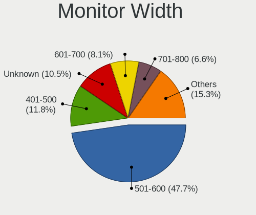

| Width in mm | Desktops | Percent |
|-------------|----------|---------|
| 501-600     | 323      | 47.99%  |
| Unknown     | 101      | 15.01%  |
| 401-500     | 86       | 12.78%  |
| 601-700     | 36       | 5.35%   |
| 701-800     | 32       | 4.75%   |
| 351-400     | 23       | 3.42%   |
| 1001-1500   | 23       | 3.42%   |
| 1501-2000   | 22       | 3.27%   |
| 301-350     | 14       | 2.08%   |
| 801-900     | 7        | 1.04%   |
| 901-1000    | 5        | 0.74%   |
| 201-300     | 1        | 0.15%   |

Aspect Ratio
------------

Proportional relationship between the width and the height

| Ratio   | Desktops | Percent |
|---------|----------|---------|
| 16/9    | 377      | 59.18%  |
| Unknown | 97       | 15.23%  |
| 16/10   | 93       | 14.6%   |
| 5/4     | 31       | 4.87%   |
| 21/9    | 26       | 4.08%   |
| 4/3     | 6        | 0.94%   |
| 32/9    | 4        | 0.63%   |
| 3/2     | 3        | 0.47%   |

Monitor Area
------------

Area in inch

| Area in inch | Desktops | Percent |
|----------------|----------|---------|
| 201-250        | 229      | 34.03%  |
| 301-350        | 124      | 18.42%  |
| Unknown        | 101      | 15.01%  |
| 351-500        | 59       | 8.77%   |
| 251-300        | 50       | 7.43%   |
| 151-200        | 41       | 6.09%   |
| More than 1000 | 37       | 5.5%    |
| 501-1000       | 16       | 2.38%   |
| 141-150        | 8        | 1.19%   |
| 101-110        | 6        | 0.89%   |
| 81-90          | 1        | 0.15%   |
| 51-60          | 1        | 0.15%   |

Pixel Density
-------------

Pixels per inch

| Density | Desktops | Percent |
|---------|----------|---------|
| 51-100  | 369      | 57.57%  |
| 101-120 | 114      | 17.78%  |
| Unknown | 101      | 15.76%  |
| 1-50    | 25       | 3.9%    |
| 121-160 | 18       | 2.81%   |
| 161-240 | 14       | 2.18%   |

Multiple Monitors
-----------------

Total monitors connected

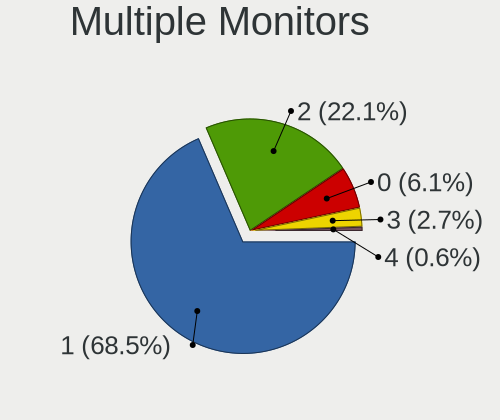

| Total | Desktops | Percent |
|-------|----------|---------|
| 1     | 449      | 69.83%  |
| 2     | 134      | 20.84%  |
| 0     | 43       | 6.69%   |
| 3     | 13       | 2.02%   |
| 4     | 4        | 0.62%   |

Network
-------

Net Controller Vendor
---------------------

Controller vendors

| Vendor                                 | Desktops | Percent |
|----------------------------------------|----------|---------|
| Realtek Semiconductor                  | 325      | 38.28%  |
| Intel                                  | 311      | 36.63%  |
| Qualcomm Atheros                       | 58       | 6.83%   |
| Broadcom                               | 37       | 4.36%   |
| D-Link System                          | 12       | 1.41%   |
| Marvell Technology Group               | 10       | 1.18%   |
| Ralink Technology                      | 8        | 0.94%   |
| Nvidia                                 | 8        | 0.94%   |
| NetGear                                | 8        | 0.94%   |
| D-Link                                 | 8        | 0.94%   |
| Ralink                                 | 7        | 0.82%   |
| Microsoft                              | 6        | 0.71%   |
| ASUSTek Computer                       | 6        | 0.71%   |
| TP-Link                                | 4        | 0.47%   |
| Broadcom Limited                       | 4        | 0.47%   |
| Huawei Technologies                    | 3        | 0.35%   |
| Aquantia                               | 3        | 0.35%   |
| ZTE WCDMA Technologies MSM             | 2        | 0.24%   |
| Qualcomm Atheros Communications        | 2        | 0.24%   |
| MediaTek                               | 2        | 0.24%   |
| DisplayLink                            | 2        | 0.24%   |
| ASIX Electronics                       | 2        | 0.24%   |
| Xiaomi                                 | 1        | 0.12%   |
| Wilocity                               | 1        | 0.12%   |
| VIA Technologies                       | 1        | 0.12%   |
| Unknown                                | 1        | 0.12%   |
| U-Blox                                 | 1        | 0.12%   |
| Sundance Technology Inc / IC Plus      | 1        | 0.12%   |
| STMicroelectronics                     | 1        | 0.12%   |
| Sony Ericsson Mobile Communications AB | 1        | 0.12%   |
| Sitecom Europe                         | 1        | 0.12%   |
| Samsung Electronics                    | 1        | 0.12%   |
| Qualcomm                               | 1        | 0.12%   |
| OnePlus Technology (Shenzhen)          | 1        | 0.12%   |
| Micro Star International               | 1        | 0.12%   |
| Mellanox Technologies                  | 1        | 0.12%   |
| Loupedeck                              | 1        | 0.12%   |
| Lenovo                                 | 1        | 0.12%   |
| Dresden Elektronik                     | 1        | 0.12%   |
| Belkin Components                      | 1        | 0.12%   |
| Arduino SA                             | 1        | 0.12%   |
| Apple                                  | 1        | 0.12%   |
| 3Com                                   | 1        | 0.12%   |

Net Controller Model
--------------------

Controller models

| Model                                                                | Desktops | Percent |
|----------------------------------------------------------------------|----------|---------|
| Realtek RTL8111/8168/8411 PCI Express Gigabit Ethernet Controller    | 277      | 29.44%  |
| Intel I211 Gigabit Network Connection                                | 80       | 8.5%    |
| Intel Ethernet Connection (2) I219-V                                 | 38       | 4.04%   |
| Intel Wi-Fi 6 AX200                                                  | 31       | 3.29%   |
| Realtek RTL8125 2.5GbE Controller                                    | 24       | 2.55%   |
| Intel Ethernet Connection (2) I218-V                                 | 19       | 2.02%   |
| Intel 82579LM Gigabit Network Connection (Lewisville)                | 18       | 1.91%   |
| Intel Ethernet Connection (7) I219-V                                 | 17       | 1.81%   |
| Intel 82579V Gigabit Network Connection                              | 16       | 1.7%    |
| Intel Ethernet Controller I225-V                                     | 15       | 1.59%   |
| Intel Dual Band Wireless-AC 3168NGW [Stone Peak]                     | 14       | 1.49%   |
| Qualcomm Atheros Killer E220x Gigabit Ethernet Controller            | 12       | 1.28%   |
| Intel Ethernet Connection I217-LM                                    | 10       | 1.06%   |
| Intel 82567LM-3 Gigabit Network Connection                           | 10       | 1.06%   |
| Broadcom BCM4360 802.11ac Wireless Network Adapter                   | 10       | 1.06%   |
| Broadcom BCM4352 802.11ac Wireless Network Adapter                   | 10       | 1.06%   |
| Realtek RTL8822BE 802.11a/b/g/n/ac WiFi adapter                      | 8        | 0.85%   |
| Intel Wireless 7260                                                  | 8        | 0.85%   |
| Intel I210 Gigabit Network Connection                                | 8        | 0.85%   |
| Qualcomm Atheros QCA6174 802.11ac Wireless Network Adapter           | 7        | 0.74%   |
| Intel Wireless 8260                                                  | 7        | 0.74%   |
| Intel Wireless 3165                                                  | 7        | 0.74%   |
| Realtek RTL8188EUS 802.11n Wireless Network Adapter                  | 6        | 0.64%   |
| Realtek RTL-8100/8101L/8139 PCI Fast Ethernet Adapter                | 6        | 0.64%   |
| Qualcomm Atheros AR9485 Wireless Network Adapter                     | 6        | 0.64%   |
| Intel 82574L Gigabit Network Connection                              | 6        | 0.64%   |
| Realtek RTL810xE PCI Express Fast Ethernet controller                | 5        | 0.53%   |
| Qualcomm Atheros Killer E2500 Gigabit Ethernet Controller            | 5        | 0.53%   |
| Qualcomm Atheros AR93xx Wireless Network Adapter                     | 5        | 0.53%   |
| Marvell Group 88E8056 PCI-E Gigabit Ethernet Controller              | 5        | 0.53%   |
| D-Link System DWA-140 RangeBooster N Adapter(rev.B2) [Ralink RT3072] | 5        | 0.53%   |
| Realtek RTL8192CE PCIe Wireless Network Adapter                      | 4        | 0.43%   |
| Microsoft Xbox 360 Wireless Adapter                                  | 4        | 0.43%   |
| Marvell Group 88E8001 Gigabit Ethernet Controller                    | 4        | 0.43%   |
| Intel Ethernet Connection I217-V                                     | 4        | 0.43%   |
| D-Link System DGE-528T Gigabit Ethernet Adapter                      | 4        | 0.43%   |
| Realtek RTL8821CE 802.11ac PCIe Wireless Network Adapter             | 3        | 0.32%   |
| Realtek RTL8812AU 802.11a/b/g/n/ac 2T2R DB WLAN Adapter              | 3        | 0.32%   |
| Realtek RTL-8110SC/8169SC Gigabit Ethernet                           | 3        | 0.32%   |
| Qualcomm Atheros AR8161 Gigabit Ethernet                             | 3        | 0.32%   |
| Qualcomm Atheros AR8151 v2.0 Gigabit Ethernet                        | 3        | 0.32%   |
| Nvidia MCP61 Ethernet                                                | 3        | 0.32%   |
| NetGear A6210                                                        | 3        | 0.32%   |
| Intel Wireless 8265 / 8275                                           | 3        | 0.32%   |
| Intel Wi-Fi 6 AX210/AX211/AX411 160MHz                               | 3        | 0.32%   |
| Intel Ethernet Controller 10-Gigabit X540-AT2                        | 3        | 0.32%   |
| Intel Ethernet Connection (7) I219-LM                                | 3        | 0.32%   |
| Intel Ethernet Connection (2) I219-LM                                | 3        | 0.32%   |
| Intel Ethernet Connection (2) I218-LM                                | 3        | 0.32%   |
| Intel Dual Band Wireless-AC 3165 Plus Bluetooth                      | 3        | 0.32%   |
| Intel Cannon Lake PCH CNVi WiFi                                      | 3        | 0.32%   |
| Intel 82599 10 Gigabit Network Connection                            | 3        | 0.32%   |
| Broadcom NetXtreme BCM5761 Gigabit Ethernet PCIe                     | 3        | 0.32%   |
| Broadcom Limited NetXtreme BCM5755 Gigabit Ethernet PCI Express      | 3        | 0.32%   |
| ZTE WCDMA MSM ZTE MSM                                                | 2        | 0.21%   |
| TP-Link TL-WN722N v2/v3 [Realtek RTL8188EUS]                         | 2        | 0.21%   |
| Realtek RTL8812AE 802.11ac PCIe Wireless Network Adapter             | 2        | 0.21%   |
| Realtek RTL8811AU 802.11a/b/g/n/ac WLAN Adapter                      | 2        | 0.21%   |
| Realtek RTL8169 PCI Gigabit Ethernet Controller                      | 2        | 0.21%   |
| Realtek 802.11ac NIC                                                 | 2        | 0.21%   |

Wireless Vendor
---------------

Wireless vendors

| Vendor                          | Desktops | Percent |
|---------------------------------|----------|---------|
| Intel                           | 85       | 35.27%  |
| Realtek Semiconductor           | 40       | 16.6%   |
| Qualcomm Atheros                | 29       | 12.03%  |
| Broadcom                        | 23       | 9.54%   |
| Ralink Technology               | 8        | 3.32%   |
| NetGear                         | 8        | 3.32%   |
| D-Link System                   | 8        | 3.32%   |
| D-Link                          | 8        | 3.32%   |
| Ralink                          | 7        | 2.9%    |
| Microsoft                       | 6        | 2.49%   |
| ASUSTek Computer                | 6        | 2.49%   |
| TP-Link                         | 4        | 1.66%   |
| Qualcomm Atheros Communications | 2        | 0.83%   |
| MediaTek                        | 2        | 0.83%   |
| Wilocity                        | 1        | 0.41%   |
| Sitecom Europe                  | 1        | 0.41%   |
| Micro Star International        | 1        | 0.41%   |
| Marvell Technology Group        | 1        | 0.41%   |
| Belkin Components               | 1        | 0.41%   |

Wireless Model
--------------

Wireless models

| Model                                                                          | Desktops | Percent |
|--------------------------------------------------------------------------------|----------|---------|
| Intel Wi-Fi 6 AX200                                                            | 31       | 12.76%  |
| Intel Dual Band Wireless-AC 3168NGW [Stone Peak]                               | 14       | 5.76%   |
| Broadcom BCM4360 802.11ac Wireless Network Adapter                             | 10       | 4.12%   |
| Broadcom BCM4352 802.11ac Wireless Network Adapter                             | 10       | 4.12%   |
| Realtek RTL8822BE 802.11a/b/g/n/ac WiFi adapter                                | 8        | 3.29%   |
| Intel Wireless 7260                                                            | 8        | 3.29%   |
| Qualcomm Atheros QCA6174 802.11ac Wireless Network Adapter                     | 7        | 2.88%   |
| Intel Wireless 8260                                                            | 7        | 2.88%   |
| Intel Wireless 3165                                                            | 7        | 2.88%   |
| Realtek RTL8188EUS 802.11n Wireless Network Adapter                            | 6        | 2.47%   |
| Qualcomm Atheros AR9485 Wireless Network Adapter                               | 6        | 2.47%   |
| Qualcomm Atheros AR93xx Wireless Network Adapter                               | 5        | 2.06%   |
| D-Link System DWA-140 RangeBooster N Adapter(rev.B2) [Ralink RT3072]           | 5        | 2.06%   |
| Realtek RTL8192CE PCIe Wireless Network Adapter                                | 4        | 1.65%   |
| Microsoft Xbox 360 Wireless Adapter                                            | 4        | 1.65%   |
| Realtek RTL8821CE 802.11ac PCIe Wireless Network Adapter                       | 3        | 1.23%   |
| Realtek RTL8812AU 802.11a/b/g/n/ac 2T2R DB WLAN Adapter                        | 3        | 1.23%   |
| NetGear A6210                                                                  | 3        | 1.23%   |
| Intel Wireless 8265 / 8275                                                     | 3        | 1.23%   |
| Intel Wi-Fi 6 AX210/AX211/AX411 160MHz                                         | 3        | 1.23%   |
| Intel Dual Band Wireless-AC 3165 Plus Bluetooth                                | 3        | 1.23%   |
| Intel Cannon Lake PCH CNVi WiFi                                                | 3        | 1.23%   |
| TP-Link TL-WN722N v2/v3 [Realtek RTL8188EUS]                                   | 2        | 0.82%   |
| Realtek RTL8812AE 802.11ac PCIe Wireless Network Adapter                       | 2        | 0.82%   |
| Realtek RTL8811AU 802.11a/b/g/n/ac WLAN Adapter                                | 2        | 0.82%   |
| Realtek 802.11ac NIC                                                           | 2        | 0.82%   |
| Ralink RT5372 Wireless Adapter                                                 | 2        | 0.82%   |
| Ralink RT5370 Wireless Adapter                                                 | 2        | 0.82%   |
| Ralink RT2870/RT3070 Wireless Adapter                                          | 2        | 0.82%   |
| Ralink RT3090 Wireless 802.11n 1T/1R PCIe                                      | 2        | 0.82%   |
| Ralink RT2561/RT61 rev B 802.11g                                               | 2        | 0.82%   |
| Qualcomm Atheros QCA9377 802.11ac Wireless Network Adapter                     | 2        | 0.82%   |
| Qualcomm Atheros AR9271 802.11n                                                | 2        | 0.82%   |
| Qualcomm Atheros AR9462 Wireless Network Adapter                               | 2        | 0.82%   |
| Qualcomm Atheros AR9287 Wireless Network Adapter (PCI-Express)                 | 2        | 0.82%   |
| Qualcomm Atheros AR5413/AR5414 Wireless Network Adapter [AR5006X(S) 802.11abg] | 2        | 0.82%   |
| MediaTek WiFi                                                                  | 2        | 0.82%   |
| Intel Wireless-AC 9260                                                         | 2        | 0.82%   |
| Intel Gemini Lake PCH CNVi WiFi                                                | 2        | 0.82%   |
| Intel Alder Lake-S PCH CNVi WiFi                                               | 2        | 0.82%   |
| D-Link System DWA-140 RangeBooster N Adapter(rev.B1) [Ralink RT2870]           | 2        | 0.82%   |
| D-Link DWA-140 RangeBooster N Adapter(rev.B3) [Ralink RT5372]                  | 2        | 0.82%   |
| D-Link DWA-121 802.11n Wireless N 150 Pico Adapter [Realtek RTL8188CUS]        | 2        | 0.82%   |
| Broadcom BCM4322 802.11a/b/g/n Wireless LAN Controller                         | 2        | 0.82%   |
| ASUS AC51 802.11a/b/g/n/ac Wireless Adapter [Mediatek MT7610U]                 | 2        | 0.82%   |
| Wilocity Wil6200 802.11ad Wireless Network Adapter                             | 1        | 0.41%   |
| TP-Link AC600 wireless Realtek RTL8811AU [Archer T2U Nano]                     | 1        | 0.41%   |
| TP-Link 802.11ac NIC                                                           | 1        | 0.41%   |
| Sitecom Europe WL-345 Wireless USB adapter 300N X3                             | 1        | 0.41%   |
| Realtek RTL88x2bu [AC1200 Techkey]                                             | 1        | 0.41%   |
| Realtek RTL8822CE 802.11ac PCIe Wireless Network Adapter                       | 1        | 0.41%   |
| Realtek RTL8821AE 802.11ac PCIe Wireless Network Adapter                       | 1        | 0.41%   |
| Realtek RTL8192EU 802.11b/g/n WLAN Adapter                                     | 1        | 0.41%   |
| Realtek RTL8192CU 802.11n WLAN Adapter                                         | 1        | 0.41%   |
| Realtek RTL8188FTV 802.11b/g/n 1T1R 2.4G WLAN Adapter                          | 1        | 0.41%   |
| Realtek RTL8188ETV Wireless LAN 802.11n Network Adapter                        | 1        | 0.41%   |
| Realtek RTL8188EE Wireless Network Adapter                                     | 1        | 0.41%   |
| Realtek RTL8188CE 802.11b/g/n WiFi Adapter                                     | 1        | 0.41%   |
| Realtek RTL-8185 IEEE 802.11a/b/g Wireless LAN Controller                      | 1        | 0.41%   |
| Ralink MT7610U ("Archer T2U" 2.4G+5G WLAN Adapter                              | 1        | 0.41%   |

Ethernet Vendor
---------------

Ethernet vendors

| Vendor                                 | Desktops | Percent |
|----------------------------------------|----------|---------|
| Realtek Semiconductor                  | 311      | 46.98%  |
| Intel                                  | 261      | 39.43%  |
| Qualcomm Atheros                       | 30       | 4.53%   |
| Broadcom                               | 15       | 2.27%   |
| Marvell Technology Group               | 9        | 1.36%   |
| Nvidia                                 | 8        | 1.21%   |
| D-Link System                          | 4        | 0.6%    |
| Broadcom Limited                       | 4        | 0.6%    |
| Aquantia                               | 3        | 0.45%   |
| ZTE WCDMA Technologies MSM             | 2        | 0.3%    |
| Huawei Technologies                    | 2        | 0.3%    |
| DisplayLink                            | 2        | 0.3%    |
| ASIX Electronics                       | 2        | 0.3%    |
| Xiaomi                                 | 1        | 0.15%   |
| VIA Technologies                       | 1        | 0.15%   |
| Unknown                                | 1        | 0.15%   |
| Sundance Technology Inc / IC Plus      | 1        | 0.15%   |
| Sony Ericsson Mobile Communications AB | 1        | 0.15%   |
| Samsung Electronics                    | 1        | 0.15%   |
| Qualcomm                               | 1        | 0.15%   |
| Apple                                  | 1        | 0.15%   |
| 3Com                                   | 1        | 0.15%   |

Ethernet Model
--------------

Ethernet models

| Model                                                                      | Desktops | Percent |
|----------------------------------------------------------------------------|----------|---------|
| Realtek RTL8111/8168/8411 PCI Express Gigabit Ethernet Controller          | 277      | 40.2%   |
| Intel I211 Gigabit Network Connection                                      | 80       | 11.61%  |
| Intel Ethernet Connection (2) I219-V                                       | 38       | 5.52%   |
| Realtek RTL8125 2.5GbE Controller                                          | 24       | 3.48%   |
| Intel Ethernet Connection (2) I218-V                                       | 19       | 2.76%   |
| Intel 82579LM Gigabit Network Connection (Lewisville)                      | 18       | 2.61%   |
| Intel Ethernet Connection (7) I219-V                                       | 17       | 2.47%   |
| Intel 82579V Gigabit Network Connection                                    | 16       | 2.32%   |
| Intel Ethernet Controller I225-V                                           | 15       | 2.18%   |
| Qualcomm Atheros Killer E220x Gigabit Ethernet Controller                  | 12       | 1.74%   |
| Intel Ethernet Connection I217-LM                                          | 10       | 1.45%   |
| Intel 82567LM-3 Gigabit Network Connection                                 | 10       | 1.45%   |
| Intel I210 Gigabit Network Connection                                      | 8        | 1.16%   |
| Realtek RTL-8100/8101L/8139 PCI Fast Ethernet Adapter                      | 6        | 0.87%   |
| Intel 82574L Gigabit Network Connection                                    | 6        | 0.87%   |
| Realtek RTL810xE PCI Express Fast Ethernet controller                      | 5        | 0.73%   |
| Qualcomm Atheros Killer E2500 Gigabit Ethernet Controller                  | 5        | 0.73%   |
| Marvell Group 88E8056 PCI-E Gigabit Ethernet Controller                    | 5        | 0.73%   |
| Marvell Group 88E8001 Gigabit Ethernet Controller                          | 4        | 0.58%   |
| Intel Ethernet Connection I217-V                                           | 4        | 0.58%   |
| D-Link System DGE-528T Gigabit Ethernet Adapter                            | 4        | 0.58%   |
| Realtek RTL-8110SC/8169SC Gigabit Ethernet                                 | 3        | 0.44%   |
| Qualcomm Atheros AR8161 Gigabit Ethernet                                   | 3        | 0.44%   |
| Qualcomm Atheros AR8151 v2.0 Gigabit Ethernet                              | 3        | 0.44%   |
| Nvidia MCP61 Ethernet                                                      | 3        | 0.44%   |
| Intel Ethernet Controller 10-Gigabit X540-AT2                              | 3        | 0.44%   |
| Intel Ethernet Connection (7) I219-LM                                      | 3        | 0.44%   |
| Intel Ethernet Connection (2) I219-LM                                      | 3        | 0.44%   |
| Intel Ethernet Connection (2) I218-LM                                      | 3        | 0.44%   |
| Intel 82599 10 Gigabit Network Connection                                  | 3        | 0.44%   |
| Broadcom NetXtreme BCM5761 Gigabit Ethernet PCIe                           | 3        | 0.44%   |
| Broadcom Limited NetXtreme BCM5755 Gigabit Ethernet PCI Express            | 3        | 0.44%   |
| ZTE WCDMA MSM ZTE MSM                                                      | 2        | 0.29%   |
| Realtek RTL8169 PCI Gigabit Ethernet Controller                            | 2        | 0.29%   |
| Qualcomm Atheros QCA8171 Gigabit Ethernet                                  | 2        | 0.29%   |
| Qualcomm Atheros Killer E2400 Gigabit Ethernet Controller                  | 2        | 0.29%   |
| Qualcomm Atheros AR8121/AR8113/AR8114 Gigabit or Fast Ethernet             | 2        | 0.29%   |
| Nvidia MCP77 Ethernet                                                      | 2        | 0.29%   |
| Intel 82583V Gigabit Network Connection                                    | 2        | 0.29%   |
| Intel 82567V-2 Gigabit Network Connection                                  | 2        | 0.29%   |
| Intel 82566DM-2 Gigabit Network Connection                                 | 2        | 0.29%   |
| Intel 82566DC Gigabit Network Connection                                   | 2        | 0.29%   |
| Intel 80003ES2LAN Gigabit Ethernet Controller (Copper)                     | 2        | 0.29%   |
| Huawei E353/E3131                                                          | 2        | 0.29%   |
| DisplayLink Dell Universal Dock D6000                                      | 2        | 0.29%   |
| Broadcom NetXtreme BCM57760 Gigabit Ethernet PCIe                          | 2        | 0.29%   |
| Broadcom NetXtreme BCM5754 Gigabit Ethernet PCI Express                    | 2        | 0.29%   |
| Broadcom BCM57840 NetXtreme II 10 Gigabit Ethernet                         | 2        | 0.29%   |
| ASIX AX88772                                                               | 2        | 0.29%   |
| Aquantia AQC111 NBase-T/IEEE 802.3bz Ethernet Controller [AQtion]          | 2        | 0.29%   |
| Xiaomi Mi/Redmi series (RNDIS)                                             | 1        | 0.15%   |
| VIA VT6102/VT6103 [Rhine-II]                                               | 1        | 0.15%   |
| Unknown Ethernet controller                                                | 1        | 0.15%   |
| Sundance Inc / IC Plus IC Plus IP100A Integrated 10/100 Ethernet MAC + PHY | 1        | 0.15%   |
| Sony Ericsson Mobile AB E5823                                              | 1        | 0.15%   |
| Samsung Galaxy series, misc. (tethering mode)                              | 1        | 0.15%   |
| Realtek RTL8153 Gigabit Ethernet Adapter                                   | 1        | 0.15%   |
| Qualcomm BENGAL-QRD _SN:C5464635                                           | 1        | 0.15%   |
| Qualcomm Atheros AR8151 v1.0 Gigabit Ethernet                              | 1        | 0.15%   |
| Nvidia nForce2 Ethernet Controller                                         | 1        | 0.15%   |

Net Controller Kind
-------------------

Ethernet, WiFi or modem

| Kind     | Desktops | Percent |
|----------|----------|---------|
| Ethernet | 619      | 72.31%  |
| WiFi     | 228      | 26.64%  |
| Modem    | 6        | 0.7%    |
| Unknown  | 3        | 0.35%   |

Used Controller
---------------

Currently used network controller

| Kind     | Desktops | Percent |
|----------|----------|---------|
| Ethernet | 528      | 82.76%  |
| WiFi     | 109      | 17.08%  |
| Unknown  | 1        | 0.16%   |

NICs
----

Total network controllers on board

| Total | Desktops | Percent |
|-------|----------|---------|
| 1     | 409      | 65.02%  |
| 2     | 172      | 27.34%  |
| 3     | 33       | 5.25%   |
| 0     | 6        | 0.95%   |
| 5     | 4        | 0.64%   |
| 4     | 4        | 0.64%   |
| 9     | 1        | 0.16%   |

IPv6
----

IPv6 vs IPv4

| Used | Desktops | Percent |
|------|----------|---------|
| No   | 609      | 97.28%  |
| Yes  | 17       | 2.72%   |

Bluetooth
---------

Bluetooth Vendor
----------------

Controller vendors

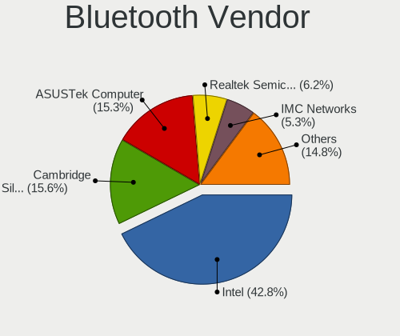

| Vendor                          | Desktops | Percent |
|---------------------------------|----------|---------|
| Intel                           | 82       | 42.27%  |
| Cambridge Silicon Radio         | 43       | 22.16%  |
| ASUSTek Computer                | 39       | 20.1%   |
| Realtek Semiconductor           | 7        | 3.61%   |
| Qualcomm Atheros Communications | 5        | 2.58%   |
| IMC Networks                    | 5        | 2.58%   |
| Apple                           | 5        | 2.58%   |
| Micro Star International        | 2        | 1.03%   |
| HTC (High Tech Computer)        | 2        | 1.03%   |
| Broadcom                        | 2        | 1.03%   |
| Lite-On Technology              | 1        | 0.52%   |
| Unknown                         | 1        | 0.52%   |

Bluetooth Model
---------------

Controller models

| Model                                                                | Desktops | Percent |
|----------------------------------------------------------------------|----------|---------|
| Cambridge Silicon Radio Bluetooth Dongle (HCI mode)                  | 43       | 21.94%  |
| Intel Bluetooth wireless interface                                   | 29       | 14.8%   |
| Intel AX200 Bluetooth                                                | 29       | 14.8%   |
| ASUS Broadcom BCM20702A0 Bluetooth                                   | 21       | 10.71%  |
| Intel Wireless-AC 3168 Bluetooth                                     | 14       | 7.14%   |
| ASUS Bluetooth Radio                                                 | 6        | 3.06%   |
| Intel Bluetooth 9460/9560 Jefferson Peak (JfP)                       | 5        | 2.55%   |
| Qualcomm Atheros  Bluetooth Device                                   | 4        | 2.04%   |
| Realtek Bluetooth Radio                                              | 3        | 1.53%   |
| Intel AX210 Bluetooth                                                | 3        | 1.53%   |
| IMC Networks Bluetooth Device                                        | 3        | 1.53%   |
| ASUS BCM20702A0                                                      | 3        | 1.53%   |
| ASUS ASUS USB-BT500                                                  | 3        | 1.53%   |
| Realtek RTL8822BE Bluetooth 4.2 Adapter                              | 2        | 1.02%   |
| Realtek  Bluetooth 4.2 Adapter                                       | 2        | 1.02%   |
| Intel Bluetooth Device                                               | 2        | 1.02%   |
| Intel AX201 Bluetooth                                                | 2        | 1.02%   |
| HTC (High Tech Computer) Vive Hub Bluetooth 4.1 (Broadcom BCM920703) | 2        | 1.02%   |
| Broadcom BCM20702A0 Bluetooth 4.0                                    | 2        | 1.02%   |
| ASUS Qualcomm Bluetooth 4.1                                          | 2        | 1.02%   |
| ASUS Bluetooth Adapter                                               | 2        | 1.02%   |
| Apple Built-in Bluetooth 2.0+EDR HCI                                 | 2        | 1.02%   |
| Qualcomm Atheros AR3011 Bluetooth                                    | 1        | 0.51%   |
| Micro Star International Bluetooth Dongle                            | 1        | 0.51%   |
| Micro Star International Bluetooth Device                            | 1        | 0.51%   |
| Lite-On Bluetooth Device                                             | 1        | 0.51%   |
| IMC Networks Bluetooth Radio                                         | 1        | 0.51%   |
| IMC Networks BCM20702A0                                              | 1        | 0.51%   |
| ASUS Broadcom BCM20702 Single-Chip Bluetooth 4.0 + LE                | 1        | 0.51%   |
| ASUS Bluetooth Device                                                | 1        | 0.51%   |
| Apple Bluetooth USB Host Controller                                  | 1        | 0.51%   |
| Apple Bluetooth HCI MacBookPro (HID mode)                            | 1        | 0.51%   |
| Apple Bluetooth HCI                                                  | 1        | 0.51%   |
| Unknown                                                              | 1        | 0.51%   |

Sound
-----

Sound Vendor
------------

Sound card vendors

| Vendor                                          | Desktops | Percent |
|-------------------------------------------------|----------|---------|
| Intel                                           | 342      | 29.28%  |
| AMD                                             | 308      | 26.37%  |
| Nvidia                                          | 302      | 25.86%  |
| C-Media Electronics                             | 29       | 2.48%   |
| Logitech                                        | 21       | 1.8%    |
| Creative Labs                                   | 15       | 1.28%   |
| Texas Instruments                               | 11       | 0.94%   |
| Kingston Technology                             | 11       | 0.94%   |
| Razer USA                                       | 8        | 0.68%   |
| Focusrite-Novation                              | 8        | 0.68%   |
| Creative Technology                             | 8        | 0.68%   |
| SteelSeries ApS                                 | 7        | 0.6%    |
| Plantronics                                     | 7        | 0.6%    |
| Corsair                                         | 6        | 0.51%   |
| Yamaha                                          | 4        | 0.34%   |
| Blue Microphones                                | 4        | 0.34%   |
| VIA Technologies                                | 3        | 0.26%   |
| SAVITECH                                        | 3        | 0.26%   |
| RODE Microphones                                | 3        | 0.26%   |
| Realtek Semiconductor                           | 3        | 0.26%   |
| Micro Star International                        | 3        | 0.26%   |
| JMTek                                           | 3        | 0.26%   |
| GYROCOM C&C                                     | 3        | 0.26%   |
| ASUSTek Computer                                | 3        | 0.26%   |
| Valve Software                                  | 2        | 0.17%   |
| Sennheiser Communications                       | 2        | 0.17%   |
| Schiit Audio                                    | 2        | 0.17%   |
| Samsung Electronics                             | 2        | 0.17%   |
| Samson Technologies                             | 2        | 0.17%   |
| RME                                             | 2        | 0.17%   |
| PreSonus Audio Electronics                      | 2        | 0.17%   |
| M-Audio                                         | 2        | 0.17%   |
| Licensed by Sony Computer Entertainment America | 2        | 0.17%   |
| GN Netcom                                       | 2        | 0.17%   |
| BEHRINGER International                         | 2        | 0.17%   |
| Astro Gaming                                    | 2        | 0.17%   |
| Antlion Audio                                   | 2        | 0.17%   |
| Zoran Co. Personal Media Division (Nogatech)    | 1        | 0.09%   |
| www.hirestech.com 2010 REV 1.4                  | 1        | 0.09%   |
| USB MIDI                                        | 1        | 0.09%   |
| Unknown                                         | 1        | 0.09%   |
| Trust                                           | 1        | 0.09%   |
| Thesycon Systemsoftware & Consulting            | 1        | 0.09%   |
| TerraTec Electronic                             | 1        | 0.09%   |
| Sony                                            | 1        | 0.09%   |
| ROCCAT                                          | 1        | 0.09%   |
| Nuforce                                         | 1        | 0.09%   |
| Microdia                                        | 1        | 0.09%   |
| Medeli Electronics                              | 1        | 0.09%   |
| M2Tech                                          | 1        | 0.09%   |
| iCreate Technologies                            | 1        | 0.09%   |
| Huawei Technologies                             | 1        | 0.09%   |
| Hangzhou Worlde                                 | 1        | 0.09%   |
| Giga-Byte Technology                            | 1        | 0.09%   |
| FiiO Electronics Technology                     | 1        | 0.09%   |
| Dell                                            | 1        | 0.09%   |
| Comtrue                                         | 1        | 0.09%   |
| Cambridge Audio                                 | 1        | 0.09%   |
| Bose                                            | 1        | 0.09%   |
| AudioQuest                                      | 1        | 0.09%   |

Sound Model
-----------

Sound card models

| Model                                                                             | Desktops | Percent |
|-----------------------------------------------------------------------------------|----------|---------|
| AMD Starship/Matisse HD Audio Controller                                          | 83       | 6.23%   |
| AMD SBx00 Azalia (Intel HDA)                                                      | 56       | 4.2%    |
| AMD Family 17h (Models 00h-0fh) HD Audio Controller                               | 51       | 3.83%   |
| Intel 6 Series/C200 Series Chipset Family High Definition Audio Controller        | 45       | 3.38%   |
| Intel 100 Series/C230 Series Chipset Family HD Audio Controller                   | 37       | 2.78%   |
| Intel 200 Series PCH HD Audio                                                     | 36       | 2.7%    |
| AMD Ellesmere HDMI Audio [Radeon RX 470/480 / 570/580/590]                        | 36       | 2.7%    |
| Nvidia GP106 High Definition Audio Controller                                     | 34       | 2.55%   |
| Intel 8 Series/C220 Series Chipset High Definition Audio Controller               | 34       | 2.55%   |
| Intel 7 Series/C216 Chipset Family High Definition Audio Controller               | 33       | 2.48%   |
| Nvidia GP104 High Definition Audio Controller                                     | 29       | 2.18%   |
| Intel Cannon Lake PCH cAVS                                                        | 27       | 2.03%   |
| Intel 9 Series Chipset Family HD Audio Controller                                 | 26       | 1.95%   |
| Intel Xeon E3-1200 v3/4th Gen Core Processor HD Audio Controller                  | 24       | 1.8%    |
| AMD Family 17h/19h HD Audio Controller                                            | 24       | 1.8%    |
| AMD Oland/Hainan/Cape Verde/Pitcairn HDMI Audio [Radeon HD 7000 Series]           | 22       | 1.65%   |
| AMD Navi 10 HDMI Audio                                                            | 21       | 1.58%   |
| Nvidia GM206 High Definition Audio Controller                                     | 19       | 1.43%   |
| Nvidia TU106 High Definition Audio Controller                                     | 18       | 1.35%   |
| Nvidia GM204 High Definition Audio Controller                                     | 18       | 1.35%   |
| Nvidia GK104 HDMI Audio Controller                                                | 18       | 1.35%   |
| Nvidia GK208 HDMI/DP Audio Controller                                             | 17       | 1.28%   |
| Nvidia TU116 High Definition Audio Controller                                     | 16       | 1.2%    |
| AMD Raven/Raven2/Fenghuang HDMI/DP Audio Controller                               | 16       | 1.2%    |
| AMD FCH Azalia Controller                                                         | 15       | 1.13%   |
| AMD Baffin HDMI/DP Audio [Radeon RX 550 640SP / RX 560/560X]                      | 15       | 1.13%   |
| Nvidia GP107GL High Definition Audio Controller                                   | 14       | 1.05%   |
| Intel 82801JI (ICH10 Family) HD Audio Controller                                  | 14       | 1.05%   |
| AMD Navi 21/23 HDMI/DP Audio Controller                                           | 14       | 1.05%   |
| AMD Vega 10 HDMI Audio [Radeon Vega 56/64]                                        | 13       | 0.98%   |
| Intel NM10/ICH7 Family High Definition Audio Controller                           | 12       | 0.9%    |
| Intel C610/X99 series chipset HD Audio Controller                                 | 12       | 0.9%    |
| Nvidia TU104 HD Audio Controller                                                  | 10       | 0.75%   |
| Nvidia High Definition Audio Controller                                           | 10       | 0.75%   |
| AMD Caicos HDMI Audio [Radeon HD 6450 / 7450/8450/8490 OEM / R5 230/235/235X OEM] | 10       | 0.75%   |
| Intel 82801JD/DO (ICH10 Family) HD Audio Controller                               | 9        | 0.68%   |
| Intel 5 Series/3400 Series Chipset High Definition Audio                          | 9        | 0.68%   |
| Nvidia GF108 High Definition Audio Controller                                     | 8        | 0.6%    |
| Nvidia GA102 High Definition Audio Controller                                     | 8        | 0.6%    |
| Nvidia GP108 High Definition Audio Controller                                     | 7        | 0.53%   |
| Nvidia GP102 HDMI Audio Controller                                                | 7        | 0.53%   |
| Nvidia GK107 HDMI Audio Controller                                                | 7        | 0.53%   |
| Intel 82801I (ICH9 Family) HD Audio Controller                                    | 7        | 0.53%   |
| C-Media Electronics CMI8788 [Oxygen HD Audio]                                     | 7        | 0.53%   |
| AMD Cedar HDMI Audio [Radeon HD 5400/6300/7300 Series]                            | 7        | 0.53%   |
| Texas Instruments PCM2902 Audio Codec                                             | 6        | 0.45%   |
| Nvidia GM107 High Definition Audio Controller [GeForce 940MX]                     | 6        | 0.45%   |
| Nvidia GF114 HDMI Audio Controller                                                | 6        | 0.45%   |
| Nvidia GF110 High Definition Audio Controller                                     | 6        | 0.45%   |
| Nvidia GA104 High Definition Audio Controller                                     | 6        | 0.45%   |
| Kingston Technology HyperX 7.1 Audio                                              | 6        | 0.45%   |
| Intel Celeron/Pentium Silver Processor High Definition Audio                      | 6        | 0.45%   |
| Intel C600/X79 series chipset High Definition Audio Controller                    | 6        | 0.45%   |
| Intel Alder Lake-S HD Audio Controller                                            | 6        | 0.45%   |
| Creative Labs Sound Core3D [Sound Blaster Recon3D / Z-Series]                     | 6        | 0.45%   |
| C-Media Electronics Blue Snowball                                                 | 6        | 0.45%   |
| Nvidia GM200 High Definition Audio                                                | 5        | 0.38%   |
| Nvidia GK110 High Definition Audio Controller                                     | 5        | 0.38%   |
| C-Media Electronics Audio Adapter (Unitek Y-247A)                                 | 5        | 0.38%   |
| AMD RV710/730 HDMI Audio [Radeon HD 4000 series]                                  | 5        | 0.38%   |

Memory
------

Memory Vendor
-------------

Memory module vendors

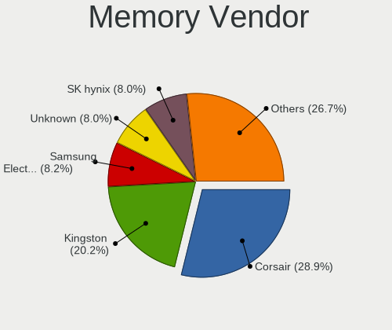

| Vendor                       | Desktops | Percent |
|------------------------------|----------|---------|
| Corsair                      | 104      | 30.06%  |
| Kingston                     | 64       | 18.5%   |
| Unknown                      | 35       | 10.12%  |
| Samsung Electronics          | 30       | 8.67%   |
| SK hynix                     | 27       | 7.8%    |
| Crucial                      | 27       | 7.8%    |
| G.Skill                      | 26       | 7.51%   |
| Micron Technology            | 10       | 2.89%   |
| Unknown (ABCD)               | 3        | 0.87%   |
| Nanya Technology             | 3        | 0.87%   |
| A-DATA Technology            | 3        | 0.87%   |
| Transcend                    | 2        | 0.58%   |
| G-Alantic                    | 2        | 0.58%   |
| Elpida                       | 2        | 0.58%   |
| Unknown (AB)                 | 1        | 0.29%   |
| Unknown (836D)               | 1        | 0.29%   |
| Team                         | 1        | 0.29%   |
| SHARETRONIC                  | 1        | 0.29%   |
| Ramaxel Technology           | 1        | 0.29%   |
| Qimonda                      | 1        | 0.29%   |
| Patriot Memory (PDP Systems) | 1        | 0.29%   |
| Patriot                      | 1        | 0.29%   |

Memory Model
------------

Memory module models

| Model                                                          | Desktops | Percent |
|----------------------------------------------------------------|----------|---------|
| Corsair RAM CMK16GX4M2B3200C16 8GB DIMM DDR4 3600MT/s          | 18       | 4.8%    |
| Corsair RAM CMK16GX4M2B3000C15 8GB DIMM DDR4 3000MT/s          | 10       | 2.67%   |
| Kingston RAM KHX2666C16/8G 8GB DIMM DDR4 3466MT/s              | 5        | 1.33%   |
| Kingston RAM KHX1600C9D3/4GX 4GB DIMM DDR3 2400MT/s            | 4        | 1.07%   |
| Corsair RAM CMK32GX4M2B3200C16 16GB DIMM DDR4 3400MT/s         | 4        | 1.07%   |
| Corsair RAM CMK16GX4M2Z3600C18 8GB DIMM DDR4 3600MT/s          | 4        | 1.07%   |
| Corsair RAM CMK16GX4M2Z3200C16 8192MB DIMM DDR4 3200MT/s       | 4        | 1.07%   |
| Corsair RAM CMK16GX4M2A2666C16 8192MB DIMM DDR4 3200MT/s       | 4        | 1.07%   |
| Unknown RAM Module 4096MB DIMM 1333MT/s                        | 3        | 0.8%    |
| Unknown (ABCD) RAM 123456789012345678 4GB DIMM LPDDR4 2400MT/s | 3        | 0.8%    |
| Samsung RAM M393A4K40BB1-CRC 32GB DIMM DDR4 2400MT/s           | 3        | 0.8%    |
| Samsung RAM M3 78T2863QZS-CF7 1GB DIMM DDR2 800MT/s            | 3        | 0.8%    |
| Kingston RAM KHX3200C16D4/8GX 8GB DIMM DDR4 3600MT/s           | 3        | 0.8%    |
| Kingston RAM KHX3200C16D4/16GX 16GB DIMM DDR4 3600MT/s         | 3        | 0.8%    |
| Kingston RAM KHX1600C10D3/8G 4096MB DIMM DDR3 1600MT/s         | 3        | 0.8%    |
| Kingston RAM CBD24D4S7S1ME-4 4096MB SODIMM DDR4 2400MT/s       | 3        | 0.8%    |
| Crucial RAM BLS8G3D1609DS1S00. 8GB DIMM DDR3 1600MT/s          | 3        | 0.8%    |
| Corsair RAM CMX8GX3M2A1600C9 4GB DIMM DDR3 1800MT/s            | 3        | 0.8%    |
| Corsair RAM CML16GX3M2A1600C10 8GB DIMM DDR3 1600MT/s          | 3        | 0.8%    |
| Corsair RAM CMK8GX4M2A2666C16 4GB DIMM DDR4 2747MT/s           | 3        | 0.8%    |
| Corsair RAM CMK16GX4M2A2133C13 8GB DIMM DDR4 3000MT/s          | 3        | 0.8%    |
| Unknown RAM Module 32GB DIMM DDR4 2666MT/s                     | 2        | 0.53%   |
| Unknown RAM Module 2GB DIMM DDR3 1333MT/s                      | 2        | 0.53%   |
| Unknown RAM Module 2GB DIMM DDR 1333MT/s                       | 2        | 0.53%   |
| Unknown RAM Module 2048MB DIMM SDRAM                           | 2        | 0.53%   |
| Unknown RAM Module 2048MB DIMM DDR 1333MT/s                    | 2        | 0.53%   |
| Unknown RAM Module 1024MB DIMM 667MT/s                         | 2        | 0.53%   |
| Transcend RAM TS256MSK64W8N 2GB SODIMM DDR3 1866MT/s           | 2        | 0.53%   |
| SK hynix RAM HYMP125U64CP8-S6 2GB DIMM DDR2 49926MT/s          | 2        | 0.53%   |
| SK hynix RAM HMT451U6AFR8C-PB 4GB DIMM DDR3 1600MT/s           | 2        | 0.53%   |
| SK hynix RAM HMT351U6CFR8C-PB 4096MB DIMM DDR3 1800MT/s        | 2        | 0.53%   |
| Samsung RAM M378B5173QH0-CK0 4GB DIMM DDR3 1866MT/s            | 2        | 0.53%   |
| Samsung RAM M378A2K43CB1-CTD 16384MB DIMM DDR4 2667MT/s        | 2        | 0.53%   |
| Samsung RAM M3 78T2863EHS-CF7 1024MB DIMM DDR2 800MT/s         | 2        | 0.53%   |
| Kingston RAM KHX3600C18D4/16GX 16GB DIMM DDR4 3600MT/s         | 2        | 0.53%   |
| Kingston RAM KHX2400C15D4/4G 4GB DIMM DDR4 3151MT/s            | 2        | 0.53%   |
| Kingston RAM KHX1866C10D3/8G 8GB DIMM DDR3 1867MT/s            | 2        | 0.53%   |
| Kingston RAM KF3200C16D4/32GX 32GB DIMM DDR4 3200MT/s          | 2        | 0.53%   |
| G.Skill RAM F4-3600C16-16GTZN 16GB DIMM DDR4 3733MT/s          | 2        | 0.53%   |
| G.Skill RAM F4-3200C16-8GVKB 8GB DIMM DDR4 3200MT/s            | 2        | 0.53%   |
| G.Skill RAM F4-3200C14-16GVK 16GB DIMM DDR4 3200MT/s           | 2        | 0.53%   |
| G-Alantic RAM D3SS56081XL12AA 2GB DIMM DDR3 1600MT/s           | 2        | 0.53%   |
| Crucial RAM BLS8G3D1609ES2LX0. 8192MB DIMM DDR3 1600MT/s       | 2        | 0.53%   |
| Crucial RAM BLS4G3D1609DS1S00. 4GB DIMM DDR3 1600MT/s          | 2        | 0.53%   |
| Corsair RAM VS2GB1333D4 2048MB DIMM DDR3 1600MT/s              | 2        | 0.53%   |
| Corsair RAM CML8GX3M2A1600C9 4GB DIMM DDR3 1867MT/s            | 2        | 0.53%   |
| Corsair RAM CML16GX3M2A1600C9 8GB DIMM DDR3 2133MT/s           | 2        | 0.53%   |
| Corsair RAM CMK64GX4M4B3200C16 16GB DIMM DDR4 3200MT/s         | 2        | 0.53%   |
| Corsair RAM CMK32GX4M2Z3600C18 16GB DIMM DDR4 3800MT/s         | 2        | 0.53%   |
| Corsair RAM CMK32GX4M2D3000C16 16GB DIMM DDR4 3200MT/s         | 2        | 0.53%   |
| Corsair RAM CMK32GX4M2A2666C16 16GB DIMM DDR4 3100MT/s         | 2        | 0.53%   |
| Corsair RAM CMK32GX4M2A2133C13 16GB DIMM DDR4 2133MT/s         | 2        | 0.53%   |
| Corsair RAM CMK16GX4M2A2400C16 8GB DIMM DDR4 2933MT/s          | 2        | 0.53%   |
| Unknown RAM Module 8GB DIMM DDR3 1333MT/s                      | 1        | 0.27%   |
| Unknown RAM Module 8192MB DIMM DDR3 1333MT/s                   | 1        | 0.27%   |
| Unknown RAM Module 8192MB DIMM 1333MT/s                        | 1        | 0.27%   |
| Unknown RAM Module 512MB DIMM SDRAM 133MT/s                    | 1        | 0.27%   |
| Unknown RAM Module 512MB DIMM DRAM                             | 1        | 0.27%   |
| Unknown RAM Module 4GB DIMM SDRAM                              | 1        | 0.27%   |
| Unknown RAM Module 4GB DIMM DDR 1333MT/s                       | 1        | 0.27%   |

Memory Kind
-----------

Memory module kinds

| Kind    | Desktops | Percent |
|---------|----------|---------|
| DDR4    | 171      | 54.63%  |
| DDR3    | 94       | 30.03%  |
| SDRAM   | 13       | 4.15%   |
| DDR2    | 13       | 4.15%   |
| Unknown | 12       | 3.83%   |
| DDR     | 6        | 1.92%   |
| LPDDR4  | 3        | 0.96%   |
| DRAM    | 1        | 0.32%   |

Memory Form Factor
------------------

Physical design of the memory module

| Name    | Desktops | Percent |
|---------|----------|---------|
| DIMM    | 286      | 93.16%  |
| SODIMM  | 19       | 6.19%   |
| FB-DIMM | 1        | 0.33%   |
| Unknown | 1        | 0.33%   |

Memory Size
-----------

Memory module size

| Size    | Desktops | Percent |
|---------|----------|---------|
| 8192    | 137      | 40.41%  |
| 4096    | 76       | 22.42%  |
| 16384   | 55       | 16.22%  |
| 2048    | 40       | 11.8%   |
| 1024    | 17       | 5.01%   |
| 32768   | 11       | 3.24%   |
| 512     | 2        | 0.59%   |
| Unknown | 1        | 0.29%   |

Memory Speed
------------

Memory module speed

| Speed   | Desktops | Percent |
|---------|----------|---------|
| 1600    | 51       | 15.18%  |
| 3600    | 40       | 11.9%   |
| 3200    | 32       | 9.52%   |
| 2400    | 26       | 7.74%   |
| 1333    | 24       | 7.14%   |
| 2133    | 23       | 6.85%   |
| 3466    | 17       | 5.06%   |
| 2667    | 11       | 3.27%   |
| 800     | 11       | 3.27%   |
| 667     | 11       | 3.27%   |
| 3000    | 9        | 2.68%   |
| 1867    | 9        | 2.68%   |
| 2666    | 6        | 1.79%   |
| 1800    | 6        | 1.79%   |
| 1066    | 6        | 1.79%   |
| Unknown | 6        | 1.79%   |
| 3400    | 5        | 1.49%   |
| 1866    | 5        | 1.49%   |
| 3800    | 4        | 1.19%   |
| 3733    | 4        | 1.19%   |
| 2933    | 3        | 0.89%   |
| 2747    | 3        | 0.89%   |
| 49926   | 2        | 0.6%    |
| 3151    | 2        | 0.6%    |
| 3100    | 2        | 0.6%    |
| 2000    | 2        | 0.6%    |
| 4800    | 1        | 0.3%    |
| 4333    | 1        | 0.3%    |
| 3866    | 1        | 0.3%    |
| 3666    | 1        | 0.3%    |
| 3266    | 1        | 0.3%    |
| 3134    | 1        | 0.3%    |
| 3066    | 1        | 0.3%    |
| 3007    | 1        | 0.3%    |
| 2733    | 1        | 0.3%    |
| 2600    | 1        | 0.3%    |
| 2473    | 1        | 0.3%    |
| 2200    | 1        | 0.3%    |
| 1904    | 1        | 0.3%    |
| 1400    | 1        | 0.3%    |
| 1067    | 1        | 0.3%    |
| 133     | 1        | 0.3%    |

Printers & scanners
-------------------

Printer Vendor
--------------

Printer device vendors

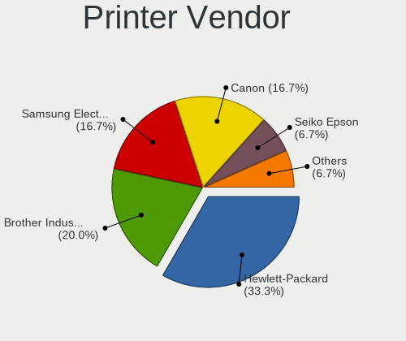

| Vendor              | Desktops | Percent |
|---------------------|----------|---------|
| Hewlett-Packard     | 5        | 33.33%  |
| Brother Industries  | 4        | 26.67%  |
| Samsung Electronics | 3        | 20%     |
| Canon               | 2        | 13.33%  |
| Seiko Epson         | 1        | 6.67%   |

Printer Model
-------------

Printer device models

| Model                                | Desktops | Percent |
|--------------------------------------|----------|---------|
| Samsung ML-216x Series Laser Printer | 2        | 13.33%  |
| HP LaserJet 1020                     | 2        | 13.33%  |
| Seiko Epson XP-4100 Series           | 1        | 6.67%   |
| Samsung Color Laser Printer          | 1        | 6.67%   |
| HP OfficeJet Pro 8730                | 1        | 6.67%   |
| HP OfficeJet G55                     | 1        | 6.67%   |
| HP DeskJet 2130 series               | 1        | 6.67%   |
| Canon LBP7010C/7018C                 | 1        | 6.67%   |
| Canon LBP6200                        | 1        | 6.67%   |
| Brother HL-2270DW Laser Printer      | 1        | 6.67%   |
| Brother HL-2130 series               | 1        | 6.67%   |
| Brother DCP-7055W                    | 1        | 6.67%   |
| Brother DCP-7040                     | 1        | 6.67%   |

Scanner Vendor
--------------

Scanner device vendors

| Vendor | Desktops | Percent |
|--------|----------|---------|
| Canon  | 5        | 100%    |

Scanner Model
-------------

Scanner device models

| Model                                  | Desktops | Percent |
|----------------------------------------|----------|---------|
| Canon CanoScan LiDE 700F               | 1        | 20%     |
| Canon CanoScan LiDE 50/LiDE 35/LiDE 40 | 1        | 20%     |
| Canon CanoScan LiDE 210                | 1        | 20%     |
| Canon CanoScan LiDE 120                | 1        | 20%     |
| Canon CanoScan LiDE 100                | 1        | 20%     |

Camera
------

Camera Vendor
-------------

Camera device vendors

| Vendor                        | Desktops | Percent |
|-------------------------------|----------|---------|
| Logitech                      | 54       | 50.94%  |
| Samsung Electronics           | 8        | 7.55%   |
| Microsoft                     | 7        | 6.6%    |
| Microdia                      | 6        | 5.66%   |
| Z-Star Microelectronics       | 3        | 2.83%   |
| Creative Technology           | 3        | 2.83%   |
| Trust                         | 2        | 1.89%   |
| Sunplus Innovation Technology | 2        | 1.89%   |
| Generalplus Technology        | 2        | 1.89%   |
| ARC International             | 2        | 1.89%   |
| Apple                         | 2        | 1.89%   |
| Valve Software                | 1        | 0.94%   |
| Sony                          | 1        | 0.94%   |
| Silicon Motion                | 1        | 0.94%   |
| Realtek Semiconductor         | 1        | 0.94%   |
| Primax Electronics            | 1        | 0.94%   |
| Pixart Imaging                | 1        | 0.94%   |
| Philips (or NXP)              | 1        | 0.94%   |
| Novatek Microelectronics      | 1        | 0.94%   |
| Hewlett-Packard               | 1        | 0.94%   |
| Guillemot                     | 1        | 0.94%   |
| Genesys Logic                 | 1        | 0.94%   |
| GEMBIRD                       | 1        | 0.94%   |
| Cubeternet                    | 1        | 0.94%   |
| Acer                          | 1        | 0.94%   |
| 2M UVC CAMERA                 | 1        | 0.94%   |

Camera Model
------------

Camera device models

| Model                                                               | Desktops | Percent |
|---------------------------------------------------------------------|----------|---------|
| Logitech Webcam C270                                                | 12       | 11.11%  |
| Logitech HD Pro Webcam C920                                         | 10       | 9.26%   |
| Samsung Galaxy A5 (MTP)                                             | 8        | 7.41%   |
| Logitech C922 Pro Stream Webcam                                     | 6        | 5.56%   |
| Microdia ACR010 USB Webcam                                          | 3        | 2.78%   |
| Logitech HD Webcam C615                                             | 3        | 2.78%   |
| Logitech HD Webcam C525                                             | 3        | 2.78%   |
| Z-Star Venus USB2.0 Camera                                          | 2        | 1.85%   |
| Microsoft LifeCam Studio                                            | 2        | 1.85%   |
| Microsoft LifeCam HD-3000                                           | 2        | 1.85%   |
| Microdia Rapoo camera                                               | 2        | 1.85%   |
| Logitech Webcam C930e                                               | 2        | 1.85%   |
| Logitech StreamCam                                                  | 2        | 1.85%   |
| Logitech Logitech Webcam C160                                       | 2        | 1.85%   |
| Logitech BRIO Ultra HD Webcam                                       | 2        | 1.85%   |
| Logitech BCC950 ConferenceCam                                       | 2        | 1.85%   |
| Generalplus WEB CAM                                                 | 2        | 1.85%   |
| ARC International Camera                                            | 2        | 1.85%   |
| Apple iPhone 5/5C/5S/6/SE                                           | 2        | 1.85%   |
| Z-Star A4 TECH USB2.0 PC Camera J                                   | 1        | 0.93%   |
| Valve Software 3D Camera                                            | 1        | 0.93%   |
| Trust Widescreen 3MP Webcam                                         | 1        | 0.93%   |
| Trust 17676 Webcam                                                  | 1        | 0.93%   |
| Sunplus Integrated_Webcam_HD                                        | 1        | 0.93%   |
| Sunplus HD 720P webcam                                              | 1        | 0.93%   |
| Sony CEVCECM                                                        | 1        | 0.93%   |
| Silicon Motion Silicon Motion Camera                                | 1        | 0.93%   |
| Realtek USB CAMERA                                                  | 1        | 0.93%   |
| Primax Villem                                                       | 1        | 0.93%   |
| Pixart Imaging Webcam Genius iLook 300                              | 1        | 0.93%   |
| Philips (or NXP) SPZ2000 Webcam [PixArt PAC7332]                    | 1        | 0.93%   |
| Novatek HP High Definition 2MP Webcam                               | 1        | 0.93%   |
| Microsoft Microsoft LifeCam Studio                                | 1        | 0.93%   |
| Microsoft LifeCam VX-800                                            | 1        | 0.93%   |
| Microsoft LifeCam Cinema                                            | 1        | 0.93%   |
| Microdia Defender G-Lens 2577 HD720p Camera                         | 1        | 0.93%   |
| Logitech Webcam Pro 9000                                            | 1        | 0.93%   |
| Logitech Webcam C925e                                               | 1        | 0.93%   |
| Logitech Webcam C310                                                | 1        | 0.93%   |
| Logitech Webcam C170                                                | 1        | 0.93%   |
| Logitech QuickCam Pro for Notebooks                                 | 1        | 0.93%   |
| Logitech QuickCam E 3500                                            | 1        | 0.93%   |
| Logitech QuickCam Communicate MP/S5500                              | 1        | 0.93%   |
| Logitech Logi 4K Stream Edition                                     | 1        | 0.93%   |
| Logitech HD Webcam C910                                             | 1        | 0.93%   |
| Logitech HD Webcam B910                                             | 1        | 0.93%   |
| Logitech C930c                                                      | 1        | 0.93%   |
| Logitech B525 HD Webcam                                             | 1        | 0.93%   |
| HP HD-4110 Webcam                                                   | 1        | 0.93%   |
| Guillemot Hercules Dualpix Exchange                                 | 1        | 0.93%   |
| Genesys Logic Camera                                                | 1        | 0.93%   |
| GEMBIRD USB2.0 PC CAMERA                                            | 1        | 0.93%   |
| Cubeternet EtronTech CMOS based eSP570 WebCam [Onyx Titanium TC101] | 1        | 0.93%   |
| Creative Live! Cam Sync 1080p                                       | 1        | 0.93%   |
| Creative Live! Cam Socialize [VF0640]                               | 1        | 0.93%   |
| Creative Live! Cam Chat HD [VF0700]                                 | 1        | 0.93%   |
| Acer HD Webcam                                                      | 1        | 0.93%   |
| 2M UVC CAMERA NexiGo N660 FHD Webcam                                | 1        | 0.93%   |

Security
--------

Fingerprint Vendor
------------------

Fingerprint sensor vendors

| Vendor                | Desktops | Percent |
|-----------------------|----------|---------|
| LighTuning Technology | 1        | 100%    |

Fingerprint Model
-----------------

Fingerprint sensor models

| Model                                     | Desktops | Percent |
|-------------------------------------------|----------|---------|
| LighTuning ES603 Swipe Fingerprint Sensor | 1        | 100%    |

Chipcard Vendor
---------------

Chipcard module vendors

| Vendor                | Desktops | Percent |
|-----------------------|----------|---------|
| Alcor Micro           | 2        | 40%     |
| Hewlett-Packard       | 1        | 20%     |
| Gemalto (was Gemplus) | 1        | 20%     |
| Cherry                | 1        | 20%     |

Chipcard Model
--------------

Chipcard module models

| Model                                             | Desktops | Percent |
|---------------------------------------------------|----------|---------|
| Alcor Micro Watchdata W 1981                      | 2        | 40%     |
| Hewlett-Packard SC Keyboard - Apollo (Liteon)     | 1        | 20%     |
| Gemalto (was Gemplus) GemPC Twin SmartCard Reader | 1        | 20%     |
| Cherry SmartCard Reader Keyboard KC 1000 SC       | 1        | 20%     |

Unsupported
-----------

Unsupported Devices
-------------------

Total unsupported devices on board

| Total | Desktops | Percent |
|-------|----------|---------|
| 0     | 523      | 82.62%  |
| 1     | 88       | 13.9%   |
| 2     | 18       | 2.84%   |
| 3     | 4        | 0.63%   |

Unsupported Device Types
------------------------

Types of unsupported devices

| Type                     | Desktops | Percent |
|--------------------------|----------|---------|
| Graphics card            | 48       | 36.36%  |
| Net/wireless             | 21       | 15.91%  |
| Unassigned class         | 18       | 13.64%  |
| Communication controller | 16       | 12.12%  |
| Sound                    | 9        | 6.82%   |
| Multimedia controller    | 3        | 2.27%   |
| Chipcard                 | 3        | 2.27%   |
| Card reader              | 3        | 2.27%   |
| Camera                   | 3        | 2.27%   |
| Net/ethernet             | 2        | 1.52%   |
| Storage/raid             | 1        | 0.76%   |
| Network                  | 1        | 0.76%   |
| Firewire controller      | 1        | 0.76%   |
| Fingerprint reader       | 1        | 0.76%   |
| Dvb card                 | 1        | 0.76%   |
| Bluetooth                | 1        | 0.76%   |

