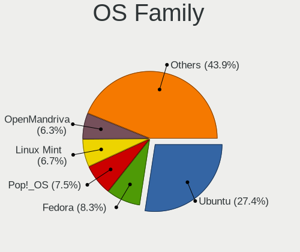
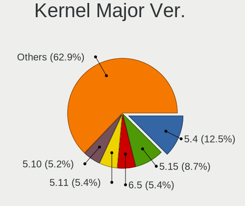
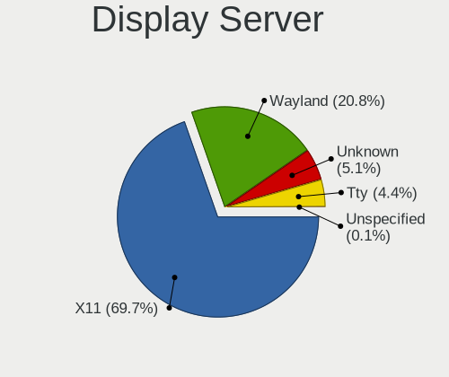
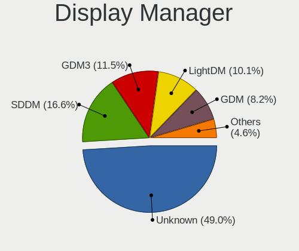
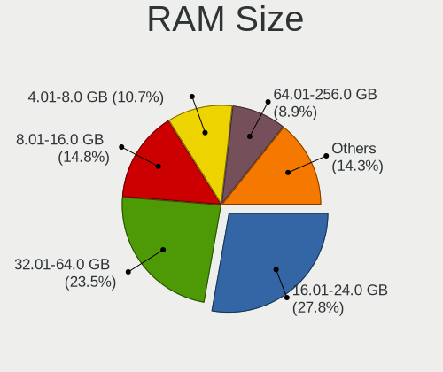
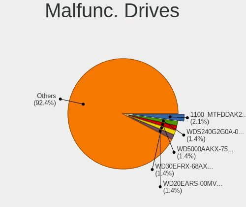
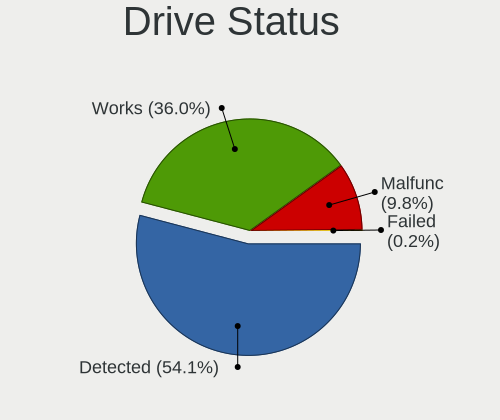
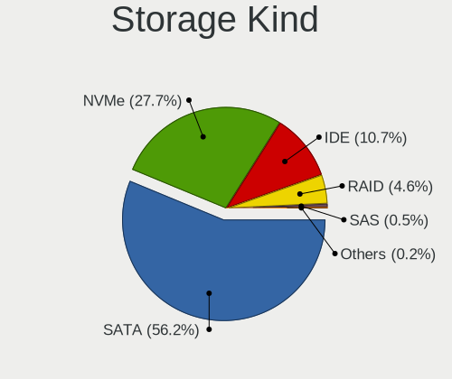
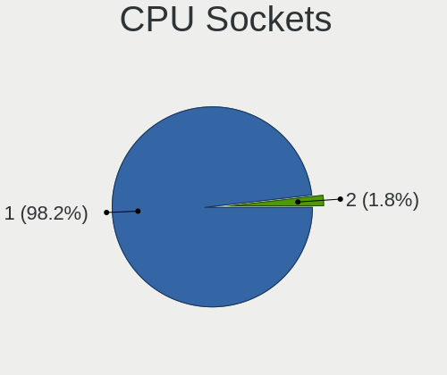
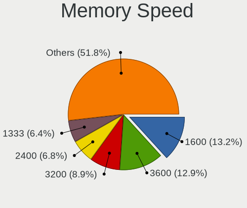

Linux in Sweden - Tested Hardware & Statistics (Desktops)
---------------------------------------------------------

A project to collect tested hardware configurations for Linux in Sweden.

Anyone can contribute to this report by the [hw-probe](https://github.com/linuxhw/hw-probe) tool:

    sudo -E hw-probe -all -upload

Please contribute! Especially if your hardware is rare.

Contents
--------

* [ Test Cases ](#test-cases)

* [ System ](#system)
  - [ OS                       ](#os)
  - [ OS Family                ](#os-family)
  - [ Kernel                   ](#kernel)
  - [ Kernel Family            ](#kernel-family)
  - [ Kernel Major Ver.        ](#kernel-major-ver)
  - [ Arch                     ](#arch)
  - [ DE                       ](#de)
  - [ Display Server           ](#display-server)
  - [ Display Manager          ](#display-manager)
  - [ OS Lang                  ](#os-lang)
  - [ Boot Mode                ](#boot-mode)
  - [ Filesystem               ](#filesystem)
  - [ Part. scheme             ](#part-scheme)
  - [ Dual Boot with Linux/BSD ](#dual-boot-with-linuxbsd)
  - [ Dual Boot (Win)          ](#dual-boot-win)

* [ Board ](#board)
  - [ Vendor                   ](#vendor)
  - [ Model                    ](#model)
  - [ Model Family             ](#model-family)
  - [ MFG Year                 ](#mfg-year)
  - [ Form Factor              ](#form-factor)
  - [ Secure Boot              ](#secure-boot)
  - [ Coreboot                 ](#coreboot)
  - [ RAM Size                 ](#ram-size)
  - [ RAM Used                 ](#ram-used)
  - [ Total Drives             ](#total-drives)
  - [ Has CD-ROM               ](#has-cd-rom)
  - [ Has Ethernet             ](#has-ethernet)
  - [ Has WiFi                 ](#has-wifi)
  - [ Has Bluetooth            ](#has-bluetooth)

* [ Location ](#location)
  - [ Country                  ](#country)
  - [ City                     ](#city)

* [ Drives ](#drives)
  - [ Drive Vendor             ](#drive-vendor)
  - [ Drive Model              ](#drive-model)
  - [ HDD Vendor               ](#hdd-vendor)
  - [ SSD Vendor               ](#ssd-vendor)
  - [ Drive Kind               ](#drive-kind)
  - [ Drive Connector          ](#drive-connector)
  - [ Drive Size               ](#drive-size)
  - [ Space Total              ](#space-total)
  - [ Space Used               ](#space-used)
  - [ Malfunc. Drives          ](#malfunc-drives)
  - [ Malfunc. Drive Vendor    ](#malfunc-drive-vendor)
  - [ Malfunc. HDD Vendor      ](#malfunc-hdd-vendor)
  - [ Malfunc. Drive Kind      ](#malfunc-drive-kind)
  - [ Failed Drives            ](#failed-drives)
  - [ Failed Drive Vendor      ](#failed-drive-vendor)
  - [ Drive Status             ](#drive-status)

* [ Storage controller ](#storage-controller)
  - [ Storage Vendor           ](#storage-vendor)
  - [ Storage Model            ](#storage-model)
  - [ Storage Kind             ](#storage-kind)

* [ Processor ](#processor)
  - [ CPU Vendor               ](#cpu-vendor)
  - [ CPU Model                ](#cpu-model)
  - [ CPU Model Family         ](#cpu-model-family)
  - [ CPU Cores                ](#cpu-cores)
  - [ CPU Sockets              ](#cpu-sockets)
  - [ CPU Threads              ](#cpu-threads)
  - [ CPU Op-Modes             ](#cpu-op-modes)
  - [ CPU Microcode            ](#cpu-microcode)
  - [ CPU Microarch            ](#cpu-microarch)

* [ Graphics ](#graphics)
  - [ GPU Vendor               ](#gpu-vendor)
  - [ GPU Model                ](#gpu-model)
  - [ GPU Combo                ](#gpu-combo)
  - [ GPU Driver               ](#gpu-driver)
  - [ GPU Memory               ](#gpu-memory)

* [ Monitor ](#monitor)
  - [ Monitor Vendor           ](#monitor-vendor)
  - [ Monitor Model            ](#monitor-model)
  - [ Monitor Resolution       ](#monitor-resolution)
  - [ Monitor Diagonal         ](#monitor-diagonal)
  - [ Monitor Width            ](#monitor-width)
  - [ Aspect Ratio             ](#aspect-ratio)
  - [ Monitor Area             ](#monitor-area)
  - [ Pixel Density            ](#pixel-density)
  - [ Multiple Monitors        ](#multiple-monitors)

* [ Network ](#network)
  - [ Net Controller Vendor    ](#net-controller-vendor)
  - [ Net Controller Model     ](#net-controller-model)
  - [ Wireless Vendor          ](#wireless-vendor)
  - [ Wireless Model           ](#wireless-model)
  - [ Ethernet Vendor          ](#ethernet-vendor)
  - [ Ethernet Model           ](#ethernet-model)
  - [ Net Controller Kind      ](#net-controller-kind)
  - [ Used Controller          ](#used-controller)
  - [ NICs                     ](#nics)
  - [ IPv6                     ](#ipv6)

* [ Bluetooth ](#bluetooth)
  - [ Bluetooth Vendor         ](#bluetooth-vendor)
  - [ Bluetooth Model          ](#bluetooth-model)

* [ Sound ](#sound)
  - [ Sound Vendor             ](#sound-vendor)
  - [ Sound Model              ](#sound-model)

* [ Memory ](#memory)
  - [ Memory Vendor            ](#memory-vendor)
  - [ Memory Model             ](#memory-model)
  - [ Memory Kind              ](#memory-kind)
  - [ Memory Form Factor       ](#memory-form-factor)
  - [ Memory Size              ](#memory-size)
  - [ Memory Speed             ](#memory-speed)

* [ Printers & scanners ](#printers--scanners)
  - [ Printer Vendor           ](#printer-vendor)
  - [ Printer Model            ](#printer-model)
  - [ Scanner Vendor           ](#scanner-vendor)
  - [ Scanner Model            ](#scanner-model)

* [ Camera ](#camera)
  - [ Camera Vendor            ](#camera-vendor)
  - [ Camera Model             ](#camera-model)

* [ Security ](#security)
  - [ Fingerprint Vendor       ](#fingerprint-vendor)
  - [ Fingerprint Model        ](#fingerprint-model)
  - [ Chipcard Vendor          ](#chipcard-vendor)
  - [ Chipcard Model           ](#chipcard-model)

* [ Unsupported ](#unsupported)
  - [ Unsupported Devices      ](#unsupported-devices)
  - [ Unsupported Device Types ](#unsupported-device-types)

Test Cases
----------

Total: 1697

| Vendor        | Model                       | Probe                                                      | Date         |
|---------------|-----------------------------|------------------------------------------------------------|--------------|
| ASUSTek       | TUF Z370-PLUS GAMING II     | [10fd8ef9dd](https://linux-hardware.org/?probe=10fd8ef9dd) | Jan 06, 2025 |
| PC Engines    | apu4                        | [bfa66c5393](https://linux-hardware.org/?probe=bfa66c5393) | Jan 05, 2025 |
| MSI           | B650M GAMING PLUS WIFI      | [c7c27f65c6](https://linux-hardware.org/?probe=c7c27f65c6) | Jan 05, 2025 |
| MSI           | B650M GAMING PLUS WIFI      | [945b45d496](https://linux-hardware.org/?probe=945b45d496) | Jan 05, 2025 |
| MSI           | PRO Z790-P WIFI             | [3327ba6eb6](https://linux-hardware.org/?probe=3327ba6eb6) | Jan 04, 2025 |
| ASRock        | B550M-HDV                   | [6ce988b582](https://linux-hardware.org/?probe=6ce988b582) | Jan 04, 2025 |
| ASUSTek       | TUF Gaming B550-PLUS        | [989a72852c](https://linux-hardware.org/?probe=989a72852c) | Jan 04, 2025 |
| Lenovo        | SHARKBAY SDK0J40705 WIN ... | [39187b7cd2](https://linux-hardware.org/?probe=39187b7cd2) | Jan 03, 2025 |
| ASUSTek       | Pro B650M-CT                | [eeb61bea29](https://linux-hardware.org/?probe=eeb61bea29) | Jan 02, 2025 |
| ASUSTek       | TUF Gaming B550M-PLUS WI... | [66588a9985](https://linux-hardware.org/?probe=66588a9985) | Dec 31, 2024 |
| MSI           | MPG X570 GAMING PLUS        | [497960e510](https://linux-hardware.org/?probe=497960e510) | Dec 28, 2024 |
| ASUSTek       | ROG STRIX Z390-F GAMING     | [62c4f7de88](https://linux-hardware.org/?probe=62c4f7de88) | Dec 27, 2024 |
| Lenovo        | SHARKBAY 0B98417 WIN        | [8c5e303e5b](https://linux-hardware.org/?probe=8c5e303e5b) | Dec 27, 2024 |
| MSI           | MPG B650I EDGE WIFI         | [9f7cf29dd9](https://linux-hardware.org/?probe=9f7cf29dd9) | Dec 25, 2024 |
| Gigabyte      | MRHM3AP                     | [657c4947e4](https://linux-hardware.org/?probe=657c4947e4) | Dec 25, 2024 |
| ASUSTek       | TUF Gaming X570-PLUS        | [ce9f60c0b5](https://linux-hardware.org/?probe=ce9f60c0b5) | Dec 23, 2024 |
| ASUSTek       | PRIME B450-PLUS             | [26585ec299](https://linux-hardware.org/?probe=26585ec299) | Dec 21, 2024 |
| MSI           | MAG Z390M MORTAR            | [9d83ee575e](https://linux-hardware.org/?probe=9d83ee575e) | Dec 20, 2024 |
| ASUSTek       | ROG STRIX X870E-E GAMING... | [73af2fce67](https://linux-hardware.org/?probe=73af2fce67) | Dec 20, 2024 |
| Lenovo        | SHARKBAY 0B98417 WIN        | [78c7a48933](https://linux-hardware.org/?probe=78c7a48933) | Dec 20, 2024 |
| ASUSTek       | K30BF_M32BF_A_F_K31BF_6     | [afd9e8ca40](https://linux-hardware.org/?probe=afd9e8ca40) | Dec 19, 2024 |
| Gigabyte      | Z77-DS3H                    | [edefe68947](https://linux-hardware.org/?probe=edefe68947) | Dec 19, 2024 |
| Dell          | 0YNVJG A01                  | [463e6f71a4](https://linux-hardware.org/?probe=463e6f71a4) | Dec 14, 2024 |
| ASUSTek       | P8Z77-V LK                  | [d58cfe7ef7](https://linux-hardware.org/?probe=d58cfe7ef7) | Dec 13, 2024 |
| Gigabyte      | Z270-Gaming K3              | [ba5e989ad6](https://linux-hardware.org/?probe=ba5e989ad6) | Dec 13, 2024 |
| MSI           | MPG Z390I GAMING EDGE AC    | [e3f868a672](https://linux-hardware.org/?probe=e3f868a672) | Dec 07, 2024 |
| ASUSTek       | ROG STRIX B550-I GAMING     | [5dc52b902d](https://linux-hardware.org/?probe=5dc52b902d) | Dec 05, 2024 |
| Lenovo        | 318E SDK0T76530 WIN 3556... | [fc10338586](https://linux-hardware.org/?probe=fc10338586) | Dec 04, 2024 |
| Lenovo        | 318E SDK0T76530 WIN 3556... | [3970b3f161](https://linux-hardware.org/?probe=3970b3f161) | Dec 04, 2024 |
| ASUSTek       | ROG STRIX B550-F GAMING     | [f392f0cb5f](https://linux-hardware.org/?probe=f392f0cb5f) | Dec 02, 2024 |
| ASUSTek       | ROG STRIX X870E-E GAMING... | [6a87bc023b](https://linux-hardware.org/?probe=6a87bc023b) | Dec 02, 2024 |
| ASUSTek       | ROG STRIX B650E-I GAMING... | [25ba31756c](https://linux-hardware.org/?probe=25ba31756c) | Dec 01, 2024 |
| MSI           | MAG Z390M MORTAR            | [316e018639](https://linux-hardware.org/?probe=316e018639) | Dec 01, 2024 |
| ASUSTek       | P6T DELUXE V2               | [fa59a3d752](https://linux-hardware.org/?probe=fa59a3d752) | Dec 01, 2024 |
| ASUSTek       | ROG STRIX B550-A GAMING     | [cfe2d2980e](https://linux-hardware.org/?probe=cfe2d2980e) | Dec 01, 2024 |
| Gigabyte      | B650M GAMING X AX           | [20e65bc531](https://linux-hardware.org/?probe=20e65bc531) | Nov 30, 2024 |
| HP            | 2820h                       | [ef90aa8270](https://linux-hardware.org/?probe=ef90aa8270) | Nov 28, 2024 |
| ASRock        | FM2A68M-HD+                 | [abbaade865](https://linux-hardware.org/?probe=abbaade865) | Nov 28, 2024 |
| ASUSTek       | PRIME B550M-K               | [4149e55c02](https://linux-hardware.org/?probe=4149e55c02) | Nov 25, 2024 |
| Dell          | 030VXY A05                  | [4897f51a88](https://linux-hardware.org/?probe=4897f51a88) | Nov 25, 2024 |
| AOpen         | nMCP7ALPx-DE R1.07 Apr.1... | [52acb29b24](https://linux-hardware.org/?probe=52acb29b24) | Nov 24, 2024 |
| ASUSTek       | PRIME Z690-A                | [082fbca187](https://linux-hardware.org/?probe=082fbca187) | Nov 24, 2024 |
| MSI           | B650 GAMING PLUS WIFI       | [6089d004eb](https://linux-hardware.org/?probe=6089d004eb) | Nov 22, 2024 |
| HP            | 212B                        | [00b61e1475](https://linux-hardware.org/?probe=00b61e1475) | Nov 21, 2024 |
| Samsung       | SDNE-R78AA2-10              | [fc38d1bb92](https://linux-hardware.org/?probe=fc38d1bb92) | Nov 19, 2024 |
| Gigabyte      | B550 AORUS ELITE V2         | [065b59e739](https://linux-hardware.org/?probe=065b59e739) | Nov 18, 2024 |
| ASUSTek       | TUF Gaming B650-PLUS        | [863de0f556](https://linux-hardware.org/?probe=863de0f556) | Nov 18, 2024 |
| ASUSTek       | TUF Gaming B550-PRO         | [6b464926ac](https://linux-hardware.org/?probe=6b464926ac) | Nov 12, 2024 |
| ASUSTek       | TUF Gaming B550-PRO         | [105c091b25](https://linux-hardware.org/?probe=105c091b25) | Nov 12, 2024 |
| HP            | 802F                        | [9f7785c4f0](https://linux-hardware.org/?probe=9f7785c4f0) | Nov 11, 2024 |
| Gigabyte      | 970A-DS3P                   | [793ecd3f68](https://linux-hardware.org/?probe=793ecd3f68) | Nov 10, 2024 |
| Gigabyte      | H270N-WIFI-CF               | [42acfb656c](https://linux-hardware.org/?probe=42acfb656c) | Nov 10, 2024 |
| ASUSTek       | PRIME A520M-K               | [3c0fea8e9f](https://linux-hardware.org/?probe=3c0fea8e9f) | Nov 09, 2024 |
| ASUSTek       | TUF Gaming B650-PLUS WIF... | [2eab075abe](https://linux-hardware.org/?probe=2eab075abe) | Nov 08, 2024 |
| Gigabyte      | GA-78LMT-USB3 x.x           | [cd945e57fa](https://linux-hardware.org/?probe=cd945e57fa) | Nov 06, 2024 |
| ASUSTek       | P8H67-I PRO                 | [628396ae4e](https://linux-hardware.org/?probe=628396ae4e) | Nov 01, 2024 |
| ASUSTek       | TUF Gaming B760-PLUS WIF... | [b337c998c8](https://linux-hardware.org/?probe=b337c998c8) | Oct 29, 2024 |
| Acer          | Aspire XC-605               | [5b81ea0b2c](https://linux-hardware.org/?probe=5b81ea0b2c) | Oct 27, 2024 |
| Biostar       | H61B                        | [8f99971503](https://linux-hardware.org/?probe=8f99971503) | Oct 26, 2024 |
| HP            | 1589                        | [bdb7b0a0fd](https://linux-hardware.org/?probe=bdb7b0a0fd) | Oct 24, 2024 |
| Dell          | 0RW203                      | [8f67b240ff](https://linux-hardware.org/?probe=8f67b240ff) | Oct 23, 2024 |
| Dell          | 0RW203                      | [c6efdeaade](https://linux-hardware.org/?probe=c6efdeaade) | Oct 23, 2024 |
| ASUSTek       | Z97-A                       | [392383fa83](https://linux-hardware.org/?probe=392383fa83) | Oct 22, 2024 |
| ASUSTek       | Z97-A                       | [f4f8b79407](https://linux-hardware.org/?probe=f4f8b79407) | Oct 22, 2024 |
| Acer          | Aspire XC-885 V:1.1         | [8f6c21a493](https://linux-hardware.org/?probe=8f6c21a493) | Oct 20, 2024 |
| ASUSTek       | ROG STRIX B450-F GAMING     | [ff6ad443e3](https://linux-hardware.org/?probe=ff6ad443e3) | Oct 20, 2024 |
| ASUSTek       | ROG STRIX B450-F GAMING     | [d8ac94db45](https://linux-hardware.org/?probe=d8ac94db45) | Oct 20, 2024 |
| ASUSTek       | PRIME Z370-P                | [57d65c1142](https://linux-hardware.org/?probe=57d65c1142) | Oct 19, 2024 |
| MSI           | X570-A PRO                  | [3afa118cca](https://linux-hardware.org/?probe=3afa118cca) | Oct 19, 2024 |
| ASUSTek       | ROG STRIX B550-F GAMING     | [ffb122efc7](https://linux-hardware.org/?probe=ffb122efc7) | Oct 19, 2024 |
| MSI           | MS-7360                     | [c04ada2651](https://linux-hardware.org/?probe=c04ada2651) | Oct 18, 2024 |
| ASUSTek       | PRIME B450-PLUS             | [184a957e1d](https://linux-hardware.org/?probe=184a957e1d) | Oct 18, 2024 |
| MSI           | MS-7360                     | [fc490fdde3](https://linux-hardware.org/?probe=fc490fdde3) | Oct 17, 2024 |
| MSI           | PRO B650-P WIFI             | [a61099a91a](https://linux-hardware.org/?probe=a61099a91a) | Oct 16, 2024 |
| ASUSTek       | PRIME X670-P WIFI           | [8f9499e8d0](https://linux-hardware.org/?probe=8f9499e8d0) | Oct 16, 2024 |
| Acer          | RS780HVF                    | [eb68af48f0](https://linux-hardware.org/?probe=eb68af48f0) | Oct 13, 2024 |
| MSI           | MPG X570 GAMING PRO CARB... | [ce0e497ca9](https://linux-hardware.org/?probe=ce0e497ca9) | Oct 12, 2024 |
| Dell          | 0NC2VH A01                  | [8a8122e29b](https://linux-hardware.org/?probe=8a8122e29b) | Oct 10, 2024 |
| HP            | 2B4B                        | [0591688b19](https://linux-hardware.org/?probe=0591688b19) | Oct 09, 2024 |
| Gigabyte      | H270N-WIFI-CF               | [95fc3a979a](https://linux-hardware.org/?probe=95fc3a979a) | Oct 08, 2024 |
| ASUSTek       | ROG STRIX Z390-F GAMING     | [9637b6cfad](https://linux-hardware.org/?probe=9637b6cfad) | Oct 02, 2024 |
| ASUSTek       | ROG STRIX X470-F GAMING     | [73dd513b22](https://linux-hardware.org/?probe=73dd513b22) | Oct 01, 2024 |
| HP            | 8298                        | [8ff4fb6864](https://linux-hardware.org/?probe=8ff4fb6864) | Sep 30, 2024 |
| ASUSTek       | ROG STRIX X670E-I GAMING... | [7ad49dbcbe](https://linux-hardware.org/?probe=7ad49dbcbe) | Sep 28, 2024 |
| ASUSTek       | ROG STRIX Z390-F GAMING     | [248886a2a4](https://linux-hardware.org/?probe=248886a2a4) | Sep 28, 2024 |
| MSI           | X570-A PRO                  | [0f551ec40d](https://linux-hardware.org/?probe=0f551ec40d) | Sep 25, 2024 |
| ASUSTek       | TUF Gaming B760-PLUS WIF... | [5d73368fcb](https://linux-hardware.org/?probe=5d73368fcb) | Sep 24, 2024 |
| MSI           | MAG Z390M MORTAR            | [8c2155955d](https://linux-hardware.org/?probe=8c2155955d) | Sep 24, 2024 |
| MSI           | B650M GAMING PLUS WIFI      | [44a5096641](https://linux-hardware.org/?probe=44a5096641) | Sep 23, 2024 |
| Gigabyte      | B550M DS3H                  | [eccf46ea1d](https://linux-hardware.org/?probe=eccf46ea1d) | Sep 21, 2024 |
| Lenovo        | 31900058 STD                | [87e28eedb3](https://linux-hardware.org/?probe=87e28eedb3) | Sep 20, 2024 |
| ASUSTek       | Z87-A                       | [35bcf55b55](https://linux-hardware.org/?probe=35bcf55b55) | Sep 19, 2024 |
| Gigabyte      | B550 AORUS PRO V2           | [c5bda8fb24](https://linux-hardware.org/?probe=c5bda8fb24) | Sep 18, 2024 |
| ASRock        | B650E PG Riptide WiFi       | [959f65fe95](https://linux-hardware.org/?probe=959f65fe95) | Sep 17, 2024 |
| Lenovo        | 30D2 SDK0J40697 WIN 3305... | [5523a8193c](https://linux-hardware.org/?probe=5523a8193c) | Sep 16, 2024 |
| MSI           | MPG X570 GAMING EDGE WIF... | [0c10923190](https://linux-hardware.org/?probe=0c10923190) | Sep 12, 2024 |
| MSI           | B360M BAZOOKA               | [7e2c6b6ef0](https://linux-hardware.org/?probe=7e2c6b6ef0) | Sep 08, 2024 |
| ASUSTek       | ROG STRIX X570-F GAMING     | [5d92acf8a8](https://linux-hardware.org/?probe=5d92acf8a8) | Sep 08, 2024 |
| HP            | 8906 SMVB                   | [dbd7bb8306](https://linux-hardware.org/?probe=dbd7bb8306) | Sep 08, 2024 |
| HP            | 8906 SMVB                   | [4644480b3b](https://linux-hardware.org/?probe=4644480b3b) | Sep 08, 2024 |
| Intel         | BOX-J4105A V3.0             | [b1d4dd0bd4](https://linux-hardware.org/?probe=b1d4dd0bd4) | Sep 07, 2024 |
| Intel         | BOX-J4105A V3.0             | [01d917fce6](https://linux-hardware.org/?probe=01d917fce6) | Sep 07, 2024 |
| HP            | 8906 SMVB                   | [d871742f69](https://linux-hardware.org/?probe=d871742f69) | Sep 04, 2024 |
| Shenzhen M... | AHBNB OEM                   | [ad9168a9d3](https://linux-hardware.org/?probe=ad9168a9d3) | Sep 02, 2024 |
| Shenzhen M... | AHBNB OEM                   | [0d73fea88a](https://linux-hardware.org/?probe=0d73fea88a) | Sep 02, 2024 |
| ASUSTek       | PRIME B350-PLUS             | [0612a1b763](https://linux-hardware.org/?probe=0612a1b763) | Aug 30, 2024 |
| ASUSTek       | TUF Gaming B650-PLUS        | [b512c6fa4d](https://linux-hardware.org/?probe=b512c6fa4d) | Aug 30, 2024 |
| Gigabyte      | B85M-D3V-A                  | [2720161298](https://linux-hardware.org/?probe=2720161298) | Aug 29, 2024 |
| Supermicro    | H13DSG-O-CPU                | [95215a22d9](https://linux-hardware.org/?probe=95215a22d9) | Aug 28, 2024 |
| ASUSTek       | G11CD-K                     | [97151fcf68](https://linux-hardware.org/?probe=97151fcf68) | Aug 27, 2024 |
| ASRock        | B650E PG Riptide WiFi       | [965f4b818a](https://linux-hardware.org/?probe=965f4b818a) | Aug 27, 2024 |
| AZW           | MINI S                      | [40a8825937](https://linux-hardware.org/?probe=40a8825937) | Aug 27, 2024 |
| Gigabyte      | GA-890FXA-UD5               | [1057ee5264](https://linux-hardware.org/?probe=1057ee5264) | Aug 26, 2024 |
| ASUSTek       | K30AD_M31AD_M51AD_M32AD     | [14c2decc00](https://linux-hardware.org/?probe=14c2decc00) | Aug 24, 2024 |
| ASUSTek       | ROG STRIX Z390-F GAMING     | [86aca182e3](https://linux-hardware.org/?probe=86aca182e3) | Aug 23, 2024 |
| ASUSTek       | PRIME Z690-A                | [b70e5b3f1b](https://linux-hardware.org/?probe=b70e5b3f1b) | Aug 23, 2024 |
| Supermicro    | H13DSG-O-CPU                | [08fd89ae34](https://linux-hardware.org/?probe=08fd89ae34) | Aug 22, 2024 |
| ASUSTek       | ROG STRIX B550-F GAMING     | [829274dc32](https://linux-hardware.org/?probe=829274dc32) | Aug 21, 2024 |
| Supermicro    | H13DSG-O-CPU                | [069e34f016](https://linux-hardware.org/?probe=069e34f016) | Aug 20, 2024 |
| Supermicro    | H13DSG-O-CPU                | [1b1c60272f](https://linux-hardware.org/?probe=1b1c60272f) | Aug 20, 2024 |
| Gigabyte      | B85M-D3V-A                  | [91a22ac259](https://linux-hardware.org/?probe=91a22ac259) | Aug 19, 2024 |
| ASUSTek       | ROG STRIX B650E-F GAMING... | [ed42ac504d](https://linux-hardware.org/?probe=ed42ac504d) | Aug 19, 2024 |
| ASUSTek       | ROG STRIX B450-I GAMING     | [df985ad702](https://linux-hardware.org/?probe=df985ad702) | Aug 18, 2024 |
| MSI           | MAG X670E TOMAHAWK WIFI     | [154da62650](https://linux-hardware.org/?probe=154da62650) | Aug 18, 2024 |
| ASUSTek       | PRIME X570-P                | [0e566e03bf](https://linux-hardware.org/?probe=0e566e03bf) | Aug 17, 2024 |
| Gigabyte      | B650M GAMING X AX           | [f3434cd685](https://linux-hardware.org/?probe=f3434cd685) | Aug 16, 2024 |
| Gigabyte      | B550 GAMING X V2            | [c26fc5267d](https://linux-hardware.org/?probe=c26fc5267d) | Aug 11, 2024 |
| Supermicro    | X9DAi                       | [c3897b940a](https://linux-hardware.org/?probe=c3897b940a) | Aug 06, 2024 |
| MSI           | B150M PRO-DDP               | [0d10699264](https://linux-hardware.org/?probe=0d10699264) | Aug 06, 2024 |
| HP            | 82B4                        | [529d7bc55e](https://linux-hardware.org/?probe=529d7bc55e) | Aug 04, 2024 |
| ASUSTek       | ROG STRIX B450-I GAMING     | [2fcf6de769](https://linux-hardware.org/?probe=2fcf6de769) | Aug 03, 2024 |
| ASUSTek       | ROG STRIX B450-I GAMING     | [b372ddd789](https://linux-hardware.org/?probe=b372ddd789) | Aug 03, 2024 |
| Gigabyte      | H97N-WIFI                   | [02b2bee06f](https://linux-hardware.org/?probe=02b2bee06f) | Jul 30, 2024 |
| Gigabyte      | H97N-WIFI                   | [3b982914c0](https://linux-hardware.org/?probe=3b982914c0) | Jul 30, 2024 |
| MSI           | B85M-E45                    | [b1c5a5abb6](https://linux-hardware.org/?probe=b1c5a5abb6) | Jul 27, 2024 |
| MSI           | PRO Z790-P WIFI             | [e21632f3ab](https://linux-hardware.org/?probe=e21632f3ab) | Jul 25, 2024 |
| ASUSTek       | ROG STRIX Z390-F GAMING     | [4caf36bc7f](https://linux-hardware.org/?probe=4caf36bc7f) | Jul 24, 2024 |
| MSI           | B550-A PRO                  | [151ea2ada8](https://linux-hardware.org/?probe=151ea2ada8) | Jul 22, 2024 |
| ASUSTek       | TUF Gaming B550-PRO         | [7fc0f4fbae](https://linux-hardware.org/?probe=7fc0f4fbae) | Jul 22, 2024 |
| ASUSTek       | PRIME B550M-K               | [43941683fc](https://linux-hardware.org/?probe=43941683fc) | Jul 21, 2024 |
| HP            | 3397                        | [8a7a6a0e28](https://linux-hardware.org/?probe=8a7a6a0e28) | Jul 21, 2024 |
| ASUSTek       | TUF Gaming Z790-PLUS WIF... | [ba284448d2](https://linux-hardware.org/?probe=ba284448d2) | Jul 20, 2024 |
| ASRock        | Z790 PG Lightning           | [0cb6138a92](https://linux-hardware.org/?probe=0cb6138a92) | Jul 20, 2024 |
| MSI           | Z790 GAMING PLUS WIFI       | [48b2f0fbfe](https://linux-hardware.org/?probe=48b2f0fbfe) | Jul 20, 2024 |
| Gigabyte      | F2A85X-UP4                  | [1b83953f36](https://linux-hardware.org/?probe=1b83953f36) | Jul 13, 2024 |
| ASUSTek       | ROG STRIX B650E-F GAMING... | [7bf4875374](https://linux-hardware.org/?probe=7bf4875374) | Jul 13, 2024 |
| Gigabyte      | P55A-UD3                    | [5d392f6fff](https://linux-hardware.org/?probe=5d392f6fff) | Jul 13, 2024 |
| MSI           | PRO Z790-P WIFI             | [99a5b7a5e9](https://linux-hardware.org/?probe=99a5b7a5e9) | Jul 13, 2024 |
| HP            | 8906 SMVB                   | [909f552c4d](https://linux-hardware.org/?probe=909f552c4d) | Jul 11, 2024 |
| ASUSTek       | ROG STRIX Z390-H GAMING     | [1067954b89](https://linux-hardware.org/?probe=1067954b89) | Jul 10, 2024 |
| ASUSTek       | ROG STRIX Z390-H GAMING     | [1732037cba](https://linux-hardware.org/?probe=1732037cba) | Jul 10, 2024 |
| Dell          | 0K240Y A03                  | [fd2e6133c8](https://linux-hardware.org/?probe=fd2e6133c8) | Jul 07, 2024 |
| Dell          | 0K240Y A03                  | [7409d9aee8](https://linux-hardware.org/?probe=7409d9aee8) | Jul 07, 2024 |
| Dell          | 08HPGT A01                  | [d912c22e0f](https://linux-hardware.org/?probe=d912c22e0f) | Jul 06, 2024 |
| Dell          | 0K240Y A03                  | [25538a3377](https://linux-hardware.org/?probe=25538a3377) | Jul 06, 2024 |
| ASUSTek       | PRIME X470-PRO              | [5149c43ac4](https://linux-hardware.org/?probe=5149c43ac4) | Jul 05, 2024 |
| ASUSTek       | PRIME B760M-A WIFI          | [e642c97c1b](https://linux-hardware.org/?probe=e642c97c1b) | Jun 30, 2024 |
| Unknown       | FLASH i7-11800H PLUS        | [bc4a7261d4](https://linux-hardware.org/?probe=bc4a7261d4) | Jun 30, 2024 |
| Gigabyte      | X570 AORUS ELITE            | [5c1f59210c](https://linux-hardware.org/?probe=5c1f59210c) | Jun 23, 2024 |
| Gigabyte      | Z390 AORUS PRO WIFI-CF      | [d350d2972d](https://linux-hardware.org/?probe=d350d2972d) | Jun 23, 2024 |
| HP            | 3048h                       | [620cc253fd](https://linux-hardware.org/?probe=620cc253fd) | Jun 23, 2024 |
| Unknown       | Unknown                     | [f603c263ea](https://linux-hardware.org/?probe=f603c263ea) | Jun 22, 2024 |
| Dell          | 0HD5W2 A01                  | [8405915abd](https://linux-hardware.org/?probe=8405915abd) | Jun 22, 2024 |
| Gigabyte      | B550 GAMING X V2            | [75180f3e17](https://linux-hardware.org/?probe=75180f3e17) | Jun 21, 2024 |
| ASUSTek       | ROG STRIX B650E-I GAMING... | [84e558ae8b](https://linux-hardware.org/?probe=84e558ae8b) | Jun 19, 2024 |
| HP            | 3048h                       | [f2114ccf4a](https://linux-hardware.org/?probe=f2114ccf4a) | Jun 18, 2024 |
| ASUSTek       | TUF Gaming X570-PLUS        | [dd1e4ad6a1](https://linux-hardware.org/?probe=dd1e4ad6a1) | Jun 16, 2024 |
| Gigabyte      | X570 AORUS MASTER           | [d15c410d9d](https://linux-hardware.org/?probe=d15c410d9d) | Jun 15, 2024 |
| Gigabyte      | B550 GAMING X V2            | [7d9e5aa2d5](https://linux-hardware.org/?probe=7d9e5aa2d5) | Jun 15, 2024 |
| ASUSTek       | TUF Gaming X670E-PLUS WI... | [414100c7ac](https://linux-hardware.org/?probe=414100c7ac) | Jun 15, 2024 |
| Unknown       | SKYBAY                      | [5f9821722f](https://linux-hardware.org/?probe=5f9821722f) | Jun 13, 2024 |
| ASUSTek       | Z170 PRO GAMING             | [db3d742968](https://linux-hardware.org/?probe=db3d742968) | Jun 13, 2024 |
| ASUSTek       | PRIME H510M-A WIFI          | [60f09523bd](https://linux-hardware.org/?probe=60f09523bd) | Jun 13, 2024 |
| ASUSTek       | P8Z68-V GEN3                | [0f19c1f26e](https://linux-hardware.org/?probe=0f19c1f26e) | Jun 10, 2024 |
| ASUSTek       | P8Z68-V GEN3                | [2a4b7aab93](https://linux-hardware.org/?probe=2a4b7aab93) | Jun 07, 2024 |
| Gigabyte      | H610M H DDR4                | [3ce66e47b9](https://linux-hardware.org/?probe=3ce66e47b9) | Jun 06, 2024 |
| ASUSTek       | PRIME B550M-K               | [8e36228c6f](https://linux-hardware.org/?probe=8e36228c6f) | Jun 05, 2024 |
| MSI           | MAG B560M MORTAR            | [820b8eee35](https://linux-hardware.org/?probe=820b8eee35) | Jun 05, 2024 |
| MSI           | MAG B560M MORTAR            | [d3b39f4086](https://linux-hardware.org/?probe=d3b39f4086) | Jun 05, 2024 |
| ASUSTek       | H81I-PLUS                   | [018428431f](https://linux-hardware.org/?probe=018428431f) | Jun 04, 2024 |
| ASUSTek       | PRIME B250-PLUS             | [6d5910ee78](https://linux-hardware.org/?probe=6d5910ee78) | Jun 04, 2024 |
| ASUSTek       | ROG CROSSHAIR VIII DARK ... | [92033edd0d](https://linux-hardware.org/?probe=92033edd0d) | Jun 02, 2024 |
| ASUSTek       | PRIME B760M-A WIFI          | [73e7cb47e0](https://linux-hardware.org/?probe=73e7cb47e0) | May 31, 2024 |
| ASUSTek       | ROG STRIX B450-F GAMING ... | [5d292de909](https://linux-hardware.org/?probe=5d292de909) | May 30, 2024 |
| ASUSTek       | ROG STRIX Z390-F GAMING     | [f268b8b927](https://linux-hardware.org/?probe=f268b8b927) | May 29, 2024 |
| Gigabyte      | B85M-D3H                    | [54563bb970](https://linux-hardware.org/?probe=54563bb970) | May 29, 2024 |
| MSI           | B650M GAMING PLUS WIFI      | [9f93c36b50](https://linux-hardware.org/?probe=9f93c36b50) | May 26, 2024 |
| ASUSTek       | PRIME B450-PLUS             | [b8700b7441](https://linux-hardware.org/?probe=b8700b7441) | May 24, 2024 |
| ASUSTek       | PRIME B450-PLUS             | [5556bb1933](https://linux-hardware.org/?probe=5556bb1933) | May 20, 2024 |
| ASUSTek       | PRIME H510M-A WIFI          | [3417586e6c](https://linux-hardware.org/?probe=3417586e6c) | May 20, 2024 |
| ASUSTek       | Z87-A                       | [fcabf9a5af](https://linux-hardware.org/?probe=fcabf9a5af) | May 19, 2024 |
| ASUSTek       | ROG STRIX B550-A GAMING     | [ca50be5e65](https://linux-hardware.org/?probe=ca50be5e65) | May 19, 2024 |
| Dell          | 0HD5W2 A01                  | [7dba2b2096](https://linux-hardware.org/?probe=7dba2b2096) | May 17, 2024 |
| Gigabyte      | B85M-D3V-A                  | [287114626d](https://linux-hardware.org/?probe=287114626d) | May 16, 2024 |
| ASRock        | FM2A68M-DG3+                | [c523181e20](https://linux-hardware.org/?probe=c523181e20) | May 13, 2024 |
| Gigabyte      | G1.Sniper M5                | [9aa2cda799](https://linux-hardware.org/?probe=9aa2cda799) | May 12, 2024 |
| ASUSTek       | STRIX Z270F GAMING          | [d8b5aa15e9](https://linux-hardware.org/?probe=d8b5aa15e9) | May 12, 2024 |
| Gigabyte      | B450 AORUS M                | [b522afd531](https://linux-hardware.org/?probe=b522afd531) | May 12, 2024 |
| ASUSTek       | ROG CROSSHAIR VIII HERO     | [3455c4e687](https://linux-hardware.org/?probe=3455c4e687) | May 11, 2024 |
| Gigabyte      | B450 AORUS M                | [296accd3a3](https://linux-hardware.org/?probe=296accd3a3) | May 11, 2024 |
| Dell          | 0Y2MRG A01                  | [6f78fef339](https://linux-hardware.org/?probe=6f78fef339) | May 10, 2024 |
| Dell          | 0VHWTR A01                  | [bac52cd94f](https://linux-hardware.org/?probe=bac52cd94f) | May 10, 2024 |
| MSI           | B650M GAMING PLUS WIFI      | [8938e43462](https://linux-hardware.org/?probe=8938e43462) | May 09, 2024 |
| MSI           | B650M GAMING PLUS WIFI      | [be715853f7](https://linux-hardware.org/?probe=be715853f7) | May 08, 2024 |
| ASUSTek       | ROG STRIX Z590-A GAMING ... | [ebd9696c7b](https://linux-hardware.org/?probe=ebd9696c7b) | May 07, 2024 |
| Gigabyte      | B550M DS3H AC               | [ce0082648a](https://linux-hardware.org/?probe=ce0082648a) | May 06, 2024 |
| Gigabyte      | B550M DS3H AC               | [9f866b203a](https://linux-hardware.org/?probe=9f866b203a) | May 06, 2024 |
| MSI           | B650M GAMING PLUS WIFI      | [afbc83ced8](https://linux-hardware.org/?probe=afbc83ced8) | May 06, 2024 |
| Dell          | 0478VN A00                  | [305f343c95](https://linux-hardware.org/?probe=305f343c95) | May 06, 2024 |
| ASUSTek       | ROG STRIX Z590-A GAMING ... | [fba3144c06](https://linux-hardware.org/?probe=fba3144c06) | May 06, 2024 |
| Dell          | 03RT16 A00                  | [e88cedcfb7](https://linux-hardware.org/?probe=e88cedcfb7) | May 05, 2024 |
| PC Engines    | apu4                        | [02cb7f9180](https://linux-hardware.org/?probe=02cb7f9180) | May 05, 2024 |
| Dell          | 0WMJ54 A00                  | [c1af86a1e6](https://linux-hardware.org/?probe=c1af86a1e6) | May 01, 2024 |
| ASUSTek       | TUF Gaming B550-PLUS        | [6fce33dd2b](https://linux-hardware.org/?probe=6fce33dd2b) | Apr 30, 2024 |
| Gigabyte      | X570 AORUS MASTER           | [5b49b60b38](https://linux-hardware.org/?probe=5b49b60b38) | Apr 30, 2024 |
| HP            | 89B5 A                      | [bae1a00b46](https://linux-hardware.org/?probe=bae1a00b46) | Apr 30, 2024 |
| MSI           | PRO Z790-P WIFI             | [836078acb2](https://linux-hardware.org/?probe=836078acb2) | Apr 29, 2024 |
| ASUSTek       | PRIME B550M-K               | [32e7e340cf](https://linux-hardware.org/?probe=32e7e340cf) | Apr 28, 2024 |
| Dell          | 0WMJ54 A00                  | [952112efbd](https://linux-hardware.org/?probe=952112efbd) | Apr 27, 2024 |
| Gigabyte      | X570 AORUS ELITE            | [d25ca314d4](https://linux-hardware.org/?probe=d25ca314d4) | Apr 26, 2024 |
| HP            | 82FF                        | [a0e9cfd330](https://linux-hardware.org/?probe=a0e9cfd330) | Apr 26, 2024 |
| Gigabyte      | Z170-D3H-CF                 | [af3e9393cf](https://linux-hardware.org/?probe=af3e9393cf) | Apr 26, 2024 |
| MSI           | B450 TOMAHAWK MAX           | [56b059f9ef](https://linux-hardware.org/?probe=56b059f9ef) | Apr 25, 2024 |
| MSI           | B450 GAMING PLUS MAX        | [7d3fad530f](https://linux-hardware.org/?probe=7d3fad530f) | Apr 22, 2024 |
| ASRock        | A320M-HDV                   | [5b29bd1ecf](https://linux-hardware.org/?probe=5b29bd1ecf) | Apr 21, 2024 |
| MSI           | B450 GAMING PLUS MAX        | [f83f880363](https://linux-hardware.org/?probe=f83f880363) | Apr 20, 2024 |
| Gigabyte      | H61MA-D3V                   | [ebc9dd41f4](https://linux-hardware.org/?probe=ebc9dd41f4) | Apr 19, 2024 |
| Dell          | 0KV62T A00                  | [13b11b28fc](https://linux-hardware.org/?probe=13b11b28fc) | Apr 16, 2024 |
| HP            | 81C5 MVB                    | [f2ebb6880e](https://linux-hardware.org/?probe=f2ebb6880e) | Apr 15, 2024 |
| ASUSTek       | P8Z68-V GEN3                | [39d3eeda79](https://linux-hardware.org/?probe=39d3eeda79) | Apr 12, 2024 |
| HP            | 1589                        | [fd455c0623](https://linux-hardware.org/?probe=fd455c0623) | Apr 12, 2024 |
| HP            | 1589                        | [bf38ba715e](https://linux-hardware.org/?probe=bf38ba715e) | Apr 10, 2024 |
| ASUSTek       | PRIME X470-PRO              | [e16e4757cf](https://linux-hardware.org/?probe=e16e4757cf) | Apr 04, 2024 |
| ASUSTek       | PRIME B450-PLUS             | [a3ff48e7a2](https://linux-hardware.org/?probe=a3ff48e7a2) | Apr 03, 2024 |
| Gigabyte      | MFLP5IP-00                  | [aedb7d1450](https://linux-hardware.org/?probe=aedb7d1450) | Apr 03, 2024 |
| ASUSTek       | ROG STRIX B450-F GAMING     | [6b8fa8191d](https://linux-hardware.org/?probe=6b8fa8191d) | Apr 01, 2024 |
| ASUSTek       | TUF Gaming X670E-PLUS WI... | [391458688f](https://linux-hardware.org/?probe=391458688f) | Mar 30, 2024 |
| ASUSTek       | TUF Gaming X670E-PLUS WI... | [d332c9a931](https://linux-hardware.org/?probe=d332c9a931) | Mar 30, 2024 |
| Gigabyte      | B85M-D3V-A                  | [a5f288ff0e](https://linux-hardware.org/?probe=a5f288ff0e) | Mar 28, 2024 |
| Lenovo        | 364F SDK0J40700 WIN 3258... | [b5091fa59f](https://linux-hardware.org/?probe=b5091fa59f) | Mar 27, 2024 |
| MSI           | B450 GAMING PLUS MAX        | [04f792e4fe](https://linux-hardware.org/?probe=04f792e4fe) | Mar 23, 2024 |
| MSI           | B450 GAMING PLUS MAX        | [4629f81fff](https://linux-hardware.org/?probe=4629f81fff) | Mar 23, 2024 |
| ASUSTek       | P5QL-ASUS-SE                | [f2e727e087](https://linux-hardware.org/?probe=f2e727e087) | Mar 22, 2024 |
| Dell          | 0JP3NX A02                  | [5f4cb3cc05](https://linux-hardware.org/?probe=5f4cb3cc05) | Mar 17, 2024 |
| Dell          | 0KV62T A00                  | [7f865ffb79](https://linux-hardware.org/?probe=7f865ffb79) | Mar 15, 2024 |
| Gigabyte      | B85M-D3V-A                  | [dd00485e27](https://linux-hardware.org/?probe=dd00485e27) | Mar 13, 2024 |
| ASUSTek       | Z87-DELUXE/DUAL             | [15f445697d](https://linux-hardware.org/?probe=15f445697d) | Mar 12, 2024 |
| MSI           | Z87-G45 GAMING              | [6a52290a2c](https://linux-hardware.org/?probe=6a52290a2c) | Mar 10, 2024 |
| Gigabyte      | H270N-WIFI-CF               | [48f8aa3173](https://linux-hardware.org/?probe=48f8aa3173) | Mar 09, 2024 |
| Gigabyte      | X570 I AORUS PRO WIFI       | [2a6047cea9](https://linux-hardware.org/?probe=2a6047cea9) | Mar 09, 2024 |
| ASUSTek       | PRIME B650M-A II            | [849473581a](https://linux-hardware.org/?probe=849473581a) | Mar 07, 2024 |
| Gigabyte      | X570 I AORUS PRO WIFI       | [92ee6b2bfe](https://linux-hardware.org/?probe=92ee6b2bfe) | Mar 06, 2024 |
| Gigabyte      | B550 AORUS ELITE V2         | [e64fb708fb](https://linux-hardware.org/?probe=e64fb708fb) | Mar 05, 2024 |
| ASUSTek       | PRIME Z270-P                | [73c6b84a00](https://linux-hardware.org/?probe=73c6b84a00) | Mar 04, 2024 |
| HP            | 8298                        | [8415c5628a](https://linux-hardware.org/?probe=8415c5628a) | Mar 03, 2024 |
| Apple         | Mac-F221BEC8                | [10c92b676a](https://linux-hardware.org/?probe=10c92b676a) | Feb 29, 2024 |
| MSI           | B250M BAZOOKA               | [50879e8f1a](https://linux-hardware.org/?probe=50879e8f1a) | Feb 29, 2024 |
| ASUSTek       | TUF Z370-PRO GAMING         | [636e341039](https://linux-hardware.org/?probe=636e341039) | Feb 28, 2024 |
| Fujitsu       | D3183-A1 S26361-D3183-A1    | [bd84816ed8](https://linux-hardware.org/?probe=bd84816ed8) | Feb 28, 2024 |
| ASRock        | B650 PG Lightning           | [fb0362344a](https://linux-hardware.org/?probe=fb0362344a) | Feb 27, 2024 |
| Dell          | 0VHWTR A01                  | [3606f71943](https://linux-hardware.org/?probe=3606f71943) | Feb 27, 2024 |
| MSI           | B360 GAMING PLUS            | [40619e4cc4](https://linux-hardware.org/?probe=40619e4cc4) | Feb 26, 2024 |
| MSI           | B360 GAMING PLUS            | [e3fe48b63c](https://linux-hardware.org/?probe=e3fe48b63c) | Feb 26, 2024 |
| ASUSTek       | ROG STRIX B450-I GAMING     | [075f3b55c8](https://linux-hardware.org/?probe=075f3b55c8) | Feb 25, 2024 |
| ASUSTek       | ROG STRIX B550-F GAMING     | [00993d2a74](https://linux-hardware.org/?probe=00993d2a74) | Feb 24, 2024 |
| Supermicro    | X10DRH-CT                   | [085564adc0](https://linux-hardware.org/?probe=085564adc0) | Feb 24, 2024 |
| MSI           | MAG B650M MORTAR WIFI       | [aa4ccf4433](https://linux-hardware.org/?probe=aa4ccf4433) | Feb 24, 2024 |
| MSI           | X570-A PRO                  | [614cef61c1](https://linux-hardware.org/?probe=614cef61c1) | Feb 23, 2024 |
| MSI           | MAG B650M MORTAR WIFI       | [a91e05d878](https://linux-hardware.org/?probe=a91e05d878) | Feb 21, 2024 |
| ASUSTek       | PRIME H510M-K               | [fc06ed6b10](https://linux-hardware.org/?probe=fc06ed6b10) | Feb 20, 2024 |
| Dell          | 0PGKWF A00                  | [83c1da9c3c](https://linux-hardware.org/?probe=83c1da9c3c) | Feb 19, 2024 |
| ASUSTek       | ROG STRIX B550-F GAMING     | [c3f8499095](https://linux-hardware.org/?probe=c3f8499095) | Feb 18, 2024 |
| ASUSTek       | ProArt B550-CREATOR         | [7749f91798](https://linux-hardware.org/?probe=7749f91798) | Feb 18, 2024 |
| Lenovo        | 3106 SDK0J40697 WIN 3305... | [4bca7ee01c](https://linux-hardware.org/?probe=4bca7ee01c) | Feb 17, 2024 |
| ASUSTek       | P5Q SE2                     | [feeeddef54](https://linux-hardware.org/?probe=feeeddef54) | Feb 16, 2024 |
| Gigabyte      | X570 I AORUS PRO WIFI       | [c002f0bfd4](https://linux-hardware.org/?probe=c002f0bfd4) | Feb 13, 2024 |
| ASUSTek       | H81I-PLUS                   | [3ef8bbe2bf](https://linux-hardware.org/?probe=3ef8bbe2bf) | Feb 13, 2024 |
| MSI           | Z390-A PRO                  | [310c126d3c](https://linux-hardware.org/?probe=310c126d3c) | Feb 12, 2024 |
| ASUSTek       | H81I-PLUS                   | [d9e2b0abde](https://linux-hardware.org/?probe=d9e2b0abde) | Feb 12, 2024 |
| ASUSTek       | P8P67 PRO                   | [5b06c8344c](https://linux-hardware.org/?probe=5b06c8344c) | Feb 11, 2024 |
| Lenovo        | Bantry CRB SDK0J40700 WI... | [e85583dafa](https://linux-hardware.org/?probe=e85583dafa) | Feb 10, 2024 |
| ASUSTek       | ROG STRIX X570-F GAMING     | [8234b16b6a](https://linux-hardware.org/?probe=8234b16b6a) | Feb 08, 2024 |
| Intel         | D54250WYK H13922-303        | [abf81b6db9](https://linux-hardware.org/?probe=abf81b6db9) | Feb 08, 2024 |
| Lenovo        | Bantry CRB SDK0J40700 WI... | [8fe3e3113c](https://linux-hardware.org/?probe=8fe3e3113c) | Feb 08, 2024 |
| MSI           | PRO Z790-P WIFI             | [588998612d](https://linux-hardware.org/?probe=588998612d) | Feb 06, 2024 |
| ASUSTek       | ROG STRIX B550-F GAMING ... | [82733ca802](https://linux-hardware.org/?probe=82733ca802) | Feb 05, 2024 |
| ASUSTek       | TUF Gaming B550-PRO         | [848a81b0ad](https://linux-hardware.org/?probe=848a81b0ad) | Feb 04, 2024 |
| ASRock        | Q1900B-ITX                  | [7b33d8adaf](https://linux-hardware.org/?probe=7b33d8adaf) | Feb 04, 2024 |
| ASRock        | Q1900B-ITX                  | [0e96f23985](https://linux-hardware.org/?probe=0e96f23985) | Feb 04, 2024 |
| MSI           | MPG X670E CARBON WIFI       | [f57c7238f4](https://linux-hardware.org/?probe=f57c7238f4) | Feb 03, 2024 |
| ASUSTek       | PRIME X670-P WIFI           | [d1d5004095](https://linux-hardware.org/?probe=d1d5004095) | Jan 30, 2024 |
| Gigabyte      | X570 AORUS ULTRA            | [80a5fb05a8](https://linux-hardware.org/?probe=80a5fb05a8) | Jan 28, 2024 |
| Gigabyte      | X570 AORUS ULTRA            | [f5f922292c](https://linux-hardware.org/?probe=f5f922292c) | Jan 28, 2024 |
| MSI           | MAG B560M MORTAR            | [709499c177](https://linux-hardware.org/?probe=709499c177) | Jan 28, 2024 |
| ASUSTek       | P5Q SE2                     | [5aa0059c3f](https://linux-hardware.org/?probe=5aa0059c3f) | Jan 28, 2024 |
| ABIT          | AB9/AB9RPO                  | [01c28bcaa5](https://linux-hardware.org/?probe=01c28bcaa5) | Jan 27, 2024 |
| ASUSTek       | TUF Gaming X670E-PLUS       | [57f2a52748](https://linux-hardware.org/?probe=57f2a52748) | Jan 27, 2024 |
| Dell          | 0NC2VH A01                  | [6e63b66aba](https://linux-hardware.org/?probe=6e63b66aba) | Jan 26, 2024 |
| HP            | 1998                        | [b1431c9048](https://linux-hardware.org/?probe=b1431c9048) | Jan 26, 2024 |
| HP            | 8054                        | [0f5623dad4](https://linux-hardware.org/?probe=0f5623dad4) | Jan 24, 2024 |
| MSI           | MPG X670E CARBON WIFI       | [0bc85e1b60](https://linux-hardware.org/?probe=0bc85e1b60) | Jan 24, 2024 |
| MSI           | MPG X670E CARBON WIFI       | [18a98466b2](https://linux-hardware.org/?probe=18a98466b2) | Jan 23, 2024 |
| MSI           | MAG B560M MORTAR            | [2637ed4a7c](https://linux-hardware.org/?probe=2637ed4a7c) | Jan 23, 2024 |
| Foxconn       | 2AAF                        | [aa481d37c8](https://linux-hardware.org/?probe=aa481d37c8) | Jan 22, 2024 |
| Intel         | D54250WYK H13922-303        | [0c54cab119](https://linux-hardware.org/?probe=0c54cab119) | Jan 22, 2024 |
| HP            | 1998                        | [b54abe0bef](https://linux-hardware.org/?probe=b54abe0bef) | Jan 18, 2024 |
| Gigabyte      | H610M H DDR4                | [1d9bce4a06](https://linux-hardware.org/?probe=1d9bce4a06) | Jan 18, 2024 |
| MSI           | B450M MORTAR MAX            | [6ddfddee65](https://linux-hardware.org/?probe=6ddfddee65) | Jan 15, 2024 |
| Fujitsu       | D3603-A1 S26361-D3603-A1    | [f6ed1d1cc4](https://linux-hardware.org/?probe=f6ed1d1cc4) | Jan 15, 2024 |
| ASUSTek       | SABERTOOTH 990FX            | [dce09bb097](https://linux-hardware.org/?probe=dce09bb097) | Jan 14, 2024 |
| Dell          | 0PU052                      | [0614dd448b](https://linux-hardware.org/?probe=0614dd448b) | Jan 14, 2024 |
| ASUSTek       | ROG STRIX B450-E GAMING     | [c1a58de14d](https://linux-hardware.org/?probe=c1a58de14d) | Jan 09, 2024 |
| Gigabyte      | X570 AORUS MASTER           | [50ff3c4620](https://linux-hardware.org/?probe=50ff3c4620) | Jan 08, 2024 |
| ASUSTek       | ROG STRIX B450-E GAMING     | [8ea07db45a](https://linux-hardware.org/?probe=8ea07db45a) | Jan 07, 2024 |
| ASUSTek       | ROG STRIX X670E-F GAMING... | [c0b1de838b](https://linux-hardware.org/?probe=c0b1de838b) | Jan 06, 2024 |
| ASUSTek       | Pro WS TRX50-SAGE WIFI      | [cfba81369c](https://linux-hardware.org/?probe=cfba81369c) | Jan 05, 2024 |
| Gigabyte      | MZAPLEP-00                  | [ba4a6b1f72](https://linux-hardware.org/?probe=ba4a6b1f72) | Jan 03, 2024 |
| ASUSTek       | ROG STRIX B450-F GAMING     | [50570b932a](https://linux-hardware.org/?probe=50570b932a) | Jan 03, 2024 |
| ASUSTek       | ROG STRIX B450-F GAMING     | [91413e5760](https://linux-hardware.org/?probe=91413e5760) | Jan 02, 2024 |
| Gigabyte      | MZAPLEP-00                  | [3c3b4ce0db](https://linux-hardware.org/?probe=3c3b4ce0db) | Jan 02, 2024 |
| ASUSTek       | P6T                         | [7b5a14566d](https://linux-hardware.org/?probe=7b5a14566d) | Jan 01, 2024 |
| Gigabyte      | H270N-WIFI-CF               | [d47bc3897f](https://linux-hardware.org/?probe=d47bc3897f) | Jan 01, 2024 |
| Gigabyte      | B550M DS3H                  | [bf4f14e416](https://linux-hardware.org/?probe=bf4f14e416) | Dec 30, 2023 |
| ASUSTek       | PRIME B450-PLUS             | [61116b6285](https://linux-hardware.org/?probe=61116b6285) | Dec 27, 2023 |
| MSI           | B350M MORTAR ARCTIC         | [68c1102e98](https://linux-hardware.org/?probe=68c1102e98) | Dec 25, 2023 |
| MSI           | B350M MORTAR ARCTIC         | [f22547b26f](https://linux-hardware.org/?probe=f22547b26f) | Dec 25, 2023 |
| Dell          | 0WMJ54 A01                  | [0972c678d9](https://linux-hardware.org/?probe=0972c678d9) | Dec 25, 2023 |
| Biostar       | A320MH                      | [0898691249](https://linux-hardware.org/?probe=0898691249) | Dec 24, 2023 |
| ASUSTek       | PRIME B450M-A II            | [6484f4217b](https://linux-hardware.org/?probe=6484f4217b) | Dec 24, 2023 |
| ASUSTek       | TUF Gaming B650-PLUS WIF... | [a7194ce97c](https://linux-hardware.org/?probe=a7194ce97c) | Dec 23, 2023 |
| ASUSTek       | ROG STRIX B650E-F GAMING... | [ff8ded7ff8](https://linux-hardware.org/?probe=ff8ded7ff8) | Dec 22, 2023 |
| HP            | 83E0                        | [07e6f563f9](https://linux-hardware.org/?probe=07e6f563f9) | Dec 22, 2023 |
| ASUSTek       | PRIME B450-PLUS             | [9515cb0c90](https://linux-hardware.org/?probe=9515cb0c90) | Dec 22, 2023 |
| ASRock        | B450M Pro4                  | [8bce457975](https://linux-hardware.org/?probe=8bce457975) | Dec 21, 2023 |
| Supermicro    | H13DSG-O-CPU                | [1ba9d3bc0c](https://linux-hardware.org/?probe=1ba9d3bc0c) | Dec 21, 2023 |
| Supermicro    | H13DSG-O-CPU                | [066ebdde5b](https://linux-hardware.org/?probe=066ebdde5b) | Dec 21, 2023 |
| MSI           | B85M-G43                    | [f2b41e4ce3](https://linux-hardware.org/?probe=f2b41e4ce3) | Dec 21, 2023 |
| Gigabyte      | Z270N-WIFI-CF               | [2e837d2a52](https://linux-hardware.org/?probe=2e837d2a52) | Dec 18, 2023 |
| HC Technol... | HCAR5000-MI                 | [0cf5577833](https://linux-hardware.org/?probe=0cf5577833) | Dec 18, 2023 |
| HC Technol... | HCAR5000-MI                 | [2bee7533b2](https://linux-hardware.org/?probe=2bee7533b2) | Dec 18, 2023 |
| Gigabyte      | GA-870A-UD3                 | [4a6ea199e2](https://linux-hardware.org/?probe=4a6ea199e2) | Dec 17, 2023 |
| ASUSTek       | ROG STRIX B660-A GAMING ... | [b9029b0475](https://linux-hardware.org/?probe=b9029b0475) | Dec 17, 2023 |
| HP            | 2B05                        | [81e68a1fb8](https://linux-hardware.org/?probe=81e68a1fb8) | Dec 16, 2023 |
| HP            | 2B05                        | [2063743d90](https://linux-hardware.org/?probe=2063743d90) | Dec 16, 2023 |
| Dell          | 0VHWTR A01                  | [78ef6792a1](https://linux-hardware.org/?probe=78ef6792a1) | Dec 16, 2023 |
| Gigabyte      | Z170-D3H-CF                 | [059715d1bf](https://linux-hardware.org/?probe=059715d1bf) | Dec 15, 2023 |
| HC Technol... | HCAR5000-MI                 | [d4d42016ea](https://linux-hardware.org/?probe=d4d42016ea) | Dec 14, 2023 |
| Lenovo        | 1031 SDK0J40697 WIN 3305... | [f04b854d78](https://linux-hardware.org/?probe=f04b854d78) | Dec 13, 2023 |
| ASRock        | B250M-HDV                   | [6a4ff9d940](https://linux-hardware.org/?probe=6a4ff9d940) | Dec 11, 2023 |
| ASUSTek       | P8B75-M                     | [41f57147de](https://linux-hardware.org/?probe=41f57147de) | Dec 10, 2023 |
| Gigabyte      | B450 AORUS ELITE            | [b87d7c1c10](https://linux-hardware.org/?probe=b87d7c1c10) | Dec 10, 2023 |
| HC Technol... | HCAR5000-MI                 | [3f2a30851e](https://linux-hardware.org/?probe=3f2a30851e) | Dec 05, 2023 |
| ASUSTek       | PRIME B250-PLUS             | [8c397afeca](https://linux-hardware.org/?probe=8c397afeca) | Dec 05, 2023 |
| ASUSTek       | P8Z68-V GEN3                | [3792e939db](https://linux-hardware.org/?probe=3792e939db) | Dec 05, 2023 |
| HP            | 1998                        | [14cb2b69d2](https://linux-hardware.org/?probe=14cb2b69d2) | Dec 03, 2023 |
| MSI           | MEG X570 UNIFY              | [f9175866ae](https://linux-hardware.org/?probe=f9175866ae) | Nov 30, 2023 |
| MSI           | B450-A PRO MAX              | [6357a41a39](https://linux-hardware.org/?probe=6357a41a39) | Nov 30, 2023 |
| HP            | 304Bh                       | [3cb20d232f](https://linux-hardware.org/?probe=3cb20d232f) | Nov 28, 2023 |
| ASUSTek       | PRIME B550M-A               | [535c1fe9e0](https://linux-hardware.org/?probe=535c1fe9e0) | Nov 28, 2023 |
| ASUSTek       | ROG STRIX B550-F GAMING     | [3397e49e8a](https://linux-hardware.org/?probe=3397e49e8a) | Nov 27, 2023 |
| ASUSTek       | ROG CROSSHAIR VIII DARK ... | [38e71449be](https://linux-hardware.org/?probe=38e71449be) | Nov 27, 2023 |
| Gigabyte      | B650M GAMING X AX           | [dc0fce7e4a](https://linux-hardware.org/?probe=dc0fce7e4a) | Nov 26, 2023 |
| Dell          | 0WMJ54 A01                  | [0c52ef42c9](https://linux-hardware.org/?probe=0c52ef42c9) | Nov 24, 2023 |
| Dell          | 0WMJ54 A01                  | [8ff45d7c99](https://linux-hardware.org/?probe=8ff45d7c99) | Nov 24, 2023 |
| Gigabyte      | Z170-D3H-CF                 | [7aa3c32e86](https://linux-hardware.org/?probe=7aa3c32e86) | Nov 24, 2023 |
| Gigabyte      | X570 AORUS ULTRA            | [4a18f0945f](https://linux-hardware.org/?probe=4a18f0945f) | Nov 23, 2023 |
| Gigabyte      | X570 AORUS ULTRA            | [0ea9603f31](https://linux-hardware.org/?probe=0ea9603f31) | Nov 23, 2023 |
| ASUSTek       | Z170M-PLUS                  | [b6e4999e4f](https://linux-hardware.org/?probe=b6e4999e4f) | Nov 22, 2023 |
| Gigabyte      | B550 AORUS PRO AC           | [bc7df67b84](https://linux-hardware.org/?probe=bc7df67b84) | Nov 22, 2023 |
| Fujitsu       | D3220-A1 S26361-D3220-A1    | [8ea017cbfe](https://linux-hardware.org/?probe=8ea017cbfe) | Nov 21, 2023 |
| Lenovo        | 3730 SDK0T76465 WIN 3422... | [b95977fce2](https://linux-hardware.org/?probe=b95977fce2) | Nov 20, 2023 |
| Dell          | 0KV62T A00                  | [72b1a867da](https://linux-hardware.org/?probe=72b1a867da) | Nov 20, 2023 |
| ASUSTek       | PRIME X670-P                | [03c5ac12be](https://linux-hardware.org/?probe=03c5ac12be) | Nov 20, 2023 |
| ASUSTek       | PRIME X570-P                | [88e978f447](https://linux-hardware.org/?probe=88e978f447) | Nov 18, 2023 |
| ASUSTek       | PRIME X570-P                | [4230260e34](https://linux-hardware.org/?probe=4230260e34) | Nov 18, 2023 |
| Lenovo        | 3106 SDK0J40705 WIN 3425... | [e9e9d46316](https://linux-hardware.org/?probe=e9e9d46316) | Nov 17, 2023 |
| Lenovo        | 1064 SDK0T76530 WIN 3556... | [0c6d21ae8f](https://linux-hardware.org/?probe=0c6d21ae8f) | Nov 15, 2023 |
| Lenovo        | 1064 SDK0T76530 WIN 3556... | [58692dde45](https://linux-hardware.org/?probe=58692dde45) | Nov 15, 2023 |
| Dell          | 0VHWTR A01                  | [5ef7be7906](https://linux-hardware.org/?probe=5ef7be7906) | Nov 12, 2023 |
| ASUSTek       | PRIME X570-PRO              | [bee917829a](https://linux-hardware.org/?probe=bee917829a) | Nov 12, 2023 |
| ASRock        | Z690M-ITX/ax                | [503d3690b0](https://linux-hardware.org/?probe=503d3690b0) | Nov 11, 2023 |
| ASUSTek       | TS10                        | [c35ca1dadb](https://linux-hardware.org/?probe=c35ca1dadb) | Nov 11, 2023 |
| ASUSTek       | PRIME X570-PRO              | [d9873e127d](https://linux-hardware.org/?probe=d9873e127d) | Nov 10, 2023 |
| Gigabyte      | B85M-D3H                    | [c035e0367f](https://linux-hardware.org/?probe=c035e0367f) | Nov 08, 2023 |
| Dell          | 0VHWTR A01                  | [8cd8d5ade1](https://linux-hardware.org/?probe=8cd8d5ade1) | Nov 06, 2023 |
| ASUSTek       | ROG STRIX X570-E GAMING     | [4f690a4297](https://linux-hardware.org/?probe=4f690a4297) | Nov 05, 2023 |
| ASUSTek       | PRIME X570-PRO              | [62a859fb72](https://linux-hardware.org/?probe=62a859fb72) | Nov 03, 2023 |
| ASUSTek       | STRIX H270F GAMING          | [e95902544f](https://linux-hardware.org/?probe=e95902544f) | Nov 03, 2023 |
| HP            | 2B01                        | [a345333330](https://linux-hardware.org/?probe=a345333330) | Oct 31, 2023 |
| HP            | 2B01                        | [b3a75824f5](https://linux-hardware.org/?probe=b3a75824f5) | Oct 31, 2023 |
| Gigabyte      | B550 AORUS PRO AC           | [e41780f56a](https://linux-hardware.org/?probe=e41780f56a) | Oct 29, 2023 |
| HP            | 8433 11                     | [f4b0e9190f](https://linux-hardware.org/?probe=f4b0e9190f) | Oct 27, 2023 |
| ASUSTek       | TUF Gaming B650-PLUS WIF... | [b7447f21b5](https://linux-hardware.org/?probe=b7447f21b5) | Oct 25, 2023 |
| Lenovo        | ThinkCentre M90 5485W2L     | [0fcc4fe794](https://linux-hardware.org/?probe=0fcc4fe794) | Oct 24, 2023 |
| Dell          | 06FW8P A01                  | [356c2f38aa](https://linux-hardware.org/?probe=356c2f38aa) | Oct 21, 2023 |
| HP            | ML150 G3                    | [eb5a4bfed8](https://linux-hardware.org/?probe=eb5a4bfed8) | Oct 21, 2023 |
| MSI           | MAG B560M MORTAR            | [a7f26cedd6](https://linux-hardware.org/?probe=a7f26cedd6) | Oct 20, 2023 |
| MSI           | B550-A PRO                  | [77cf0c3af6](https://linux-hardware.org/?probe=77cf0c3af6) | Oct 18, 2023 |
| ASUSTek       | PRIME B660M-K D4            | [0944131c12](https://linux-hardware.org/?probe=0944131c12) | Oct 18, 2023 |
| HP            | 8433 11                     | [24fdb6f03a](https://linux-hardware.org/?probe=24fdb6f03a) | Oct 16, 2023 |
| ASUSTek       | STRIX Z270H GAMING          | [6082a5c0de](https://linux-hardware.org/?probe=6082a5c0de) | Oct 15, 2023 |
| ASRock        | X399 Taichi                 | [10b572c94a](https://linux-hardware.org/?probe=10b572c94a) | Oct 14, 2023 |
| Gigabyte      | Z68MA-D2H-B3                | [a646cc1cc1](https://linux-hardware.org/?probe=a646cc1cc1) | Oct 10, 2023 |
| Gigabyte      | Z68MA-D2H-B3                | [d731fb0868](https://linux-hardware.org/?probe=d731fb0868) | Oct 10, 2023 |
| Gigabyte      | H87N-WIFI                   | [f010d626da](https://linux-hardware.org/?probe=f010d626da) | Oct 08, 2023 |
| ASUSTek       | ROG STRIX B450-E GAMING     | [a07ec0ee55](https://linux-hardware.org/?probe=a07ec0ee55) | Oct 08, 2023 |
| ASUSTek       | ROG STRIX X470-F GAMING     | [7b6ad19193](https://linux-hardware.org/?probe=7b6ad19193) | Oct 07, 2023 |
| Dell          | 0PU052                      | [c32b862792](https://linux-hardware.org/?probe=c32b862792) | Oct 07, 2023 |
| Lenovo        | 364F SDK0J40700 WIN 3258... | [dcc7e8da51](https://linux-hardware.org/?probe=dcc7e8da51) | Oct 06, 2023 |
| ASUSTek       | TUF Gaming B550M-PLUS       | [8bc96db254](https://linux-hardware.org/?probe=8bc96db254) | Oct 06, 2023 |
| Dell          | 096JG8 A01                  | [8076ad493d](https://linux-hardware.org/?probe=8076ad493d) | Oct 03, 2023 |
| ASUSTek       | SABERTOOTH Z77              | [6a2fa93249](https://linux-hardware.org/?probe=6a2fa93249) | Oct 03, 2023 |
| ASUSTek       | PRIME X570-PRO              | [f80a538f2a](https://linux-hardware.org/?probe=f80a538f2a) | Oct 02, 2023 |
| ASUSTek       | PRIME X570-PRO              | [76f023476d](https://linux-hardware.org/?probe=76f023476d) | Oct 02, 2023 |
| MSI           | H97 GAMING 3                | [51f3cd7354](https://linux-hardware.org/?probe=51f3cd7354) | Sep 29, 2023 |
| ASUSTek       | ROG STRIX X670E-F GAMING... | [5c38fe5e79](https://linux-hardware.org/?probe=5c38fe5e79) | Sep 28, 2023 |
| MSI           | Z77A-S01                    | [277586f152](https://linux-hardware.org/?probe=277586f152) | Sep 27, 2023 |
| Lenovo        | 364F SDK0J40700 WIN 3258... | [de5a55aa7b](https://linux-hardware.org/?probe=de5a55aa7b) | Sep 23, 2023 |
| ASUSTek       | Crosshair IV Formula        | [4679088d4e](https://linux-hardware.org/?probe=4679088d4e) | Sep 22, 2023 |
| Dell          | 0GDG8Y A00                  | [9e6874d35c](https://linux-hardware.org/?probe=9e6874d35c) | Sep 20, 2023 |
| ASUSTek       | P8H61-M EVO                 | [51c58cd13a](https://linux-hardware.org/?probe=51c58cd13a) | Sep 19, 2023 |
| ASUSTek       | P8H61-M EVO                 | [64618297ff](https://linux-hardware.org/?probe=64618297ff) | Sep 19, 2023 |
| Shenzhen M... | F7BAA                       | [10d32d6284](https://linux-hardware.org/?probe=10d32d6284) | Sep 17, 2023 |
| ASUSTek       | ROG STRIX Z390-F GAMING     | [293bc3eab9](https://linux-hardware.org/?probe=293bc3eab9) | Sep 16, 2023 |
| MSI           | MAG X570S TOMAHAWK MAX W... | [2fa5c8bb34](https://linux-hardware.org/?probe=2fa5c8bb34) | Sep 16, 2023 |
| ASUSTek       | ROG STRIX B660-A GAMING ... | [efda5ec51a](https://linux-hardware.org/?probe=efda5ec51a) | Sep 15, 2023 |
| Dell          | 0VHWTR A01                  | [43f6a3bfc1](https://linux-hardware.org/?probe=43f6a3bfc1) | Sep 14, 2023 |
| Dell          | 0VHWTR A01                  | [dcd2b90824](https://linux-hardware.org/?probe=dcd2b90824) | Sep 14, 2023 |
| Alienware     | 07JNH0 A00                  | [bd161c3850](https://linux-hardware.org/?probe=bd161c3850) | Sep 14, 2023 |
| ASUSTek       | Maximus VI EXTREME          | [e1eea73611](https://linux-hardware.org/?probe=e1eea73611) | Sep 12, 2023 |
| Alienware     | 07JNH0 A00                  | [4d658a922b](https://linux-hardware.org/?probe=4d658a922b) | Sep 10, 2023 |
| ASUSTek       | TS10                        | [ad867c5e25](https://linux-hardware.org/?probe=ad867c5e25) | Sep 10, 2023 |
| ASUSTek       | ROG STRIX B550-F GAMING     | [3857377d7a](https://linux-hardware.org/?probe=3857377d7a) | Sep 09, 2023 |
| ASRock        | X399 Taichi                 | [0c2dda2476](https://linux-hardware.org/?probe=0c2dda2476) | Sep 09, 2023 |
| Gigabyte      | H610M H DDR4                | [72516e7752](https://linux-hardware.org/?probe=72516e7752) | Sep 07, 2023 |
| ASUSTek       | ROG STRIX B450-I GAMING     | [26448cf759](https://linux-hardware.org/?probe=26448cf759) | Sep 07, 2023 |
| MSI           | MAG B550M MORTAR WIFI       | [7cbd11709c](https://linux-hardware.org/?probe=7cbd11709c) | Sep 07, 2023 |
| ASUSTek       | P7H55-M PRO                 | [26a5d8b449](https://linux-hardware.org/?probe=26a5d8b449) | Sep 06, 2023 |
| ASRock        | B460 Phantom Gaming 4       | [6521407977](https://linux-hardware.org/?probe=6521407977) | Sep 06, 2023 |
| MSI           | MAG B560M MORTAR            | [07429e910f](https://linux-hardware.org/?probe=07429e910f) | Sep 05, 2023 |
| MSI           | MAG B560M MORTAR            | [c8978cf811](https://linux-hardware.org/?probe=c8978cf811) | Sep 03, 2023 |
| MSI           | MAG B560M MORTAR            | [62ac121b13](https://linux-hardware.org/?probe=62ac121b13) | Sep 03, 2023 |
| Dell          | 0GDG8Y A00                  | [19bf85f553](https://linux-hardware.org/?probe=19bf85f553) | Sep 01, 2023 |
| Alienware     | 07JNH0 A00                  | [a21f3ba335](https://linux-hardware.org/?probe=a21f3ba335) | Aug 30, 2023 |
| ASUSTek       | P8P67 PRO                   | [3740c90267](https://linux-hardware.org/?probe=3740c90267) | Aug 30, 2023 |
| Dell          | 0GDG8Y A00                  | [577d9d5dc1](https://linux-hardware.org/?probe=577d9d5dc1) | Aug 29, 2023 |
| ASUSTek       | ROG STRIX B660-A GAMING ... | [0be67de1c9](https://linux-hardware.org/?probe=0be67de1c9) | Aug 29, 2023 |
| ASUSTek       | PRIME B650M-A WIFI          | [6a55471f69](https://linux-hardware.org/?probe=6a55471f69) | Aug 26, 2023 |
| Gigabyte      | B85M-D3V-A                  | [e11053f833](https://linux-hardware.org/?probe=e11053f833) | Aug 23, 2023 |
| Gigabyte      | X570 AORUS MASTER           | [799390e547](https://linux-hardware.org/?probe=799390e547) | Aug 23, 2023 |
| HP            | 845A                        | [4a8699daad](https://linux-hardware.org/?probe=4a8699daad) | Aug 22, 2023 |
| MSI           | B450 TOMAHAWK MAX           | [b4133748fc](https://linux-hardware.org/?probe=b4133748fc) | Aug 21, 2023 |
| HP            | 212B                        | [ee20bd40d8](https://linux-hardware.org/?probe=ee20bd40d8) | Aug 21, 2023 |
| Dell          | 0YXT71 A01                  | [aa6781c002](https://linux-hardware.org/?probe=aa6781c002) | Aug 18, 2023 |
| ASUSTek       | ROG STRIX X570-E GAMING     | [eb44f4dfc1](https://linux-hardware.org/?probe=eb44f4dfc1) | Aug 17, 2023 |
| ASUSTek       | P5QL-ASUS-SE                | [3135a88431](https://linux-hardware.org/?probe=3135a88431) | Aug 17, 2023 |
| Alienware     | 07JNH0 A00                  | [2f82c5eb18](https://linux-hardware.org/?probe=2f82c5eb18) | Aug 14, 2023 |
| Dell          | 0KV62T A00                  | [369b0195cc](https://linux-hardware.org/?probe=369b0195cc) | Aug 14, 2023 |
| ASUSTek       | ROG STRIX X570-E GAMING     | [483fc71762](https://linux-hardware.org/?probe=483fc71762) | Aug 11, 2023 |
| Gigabyte      | H270N-WIFI-CF               | [bd9c532bbc](https://linux-hardware.org/?probe=bd9c532bbc) | Aug 10, 2023 |
| MSI           | B350 GAMING PLUS            | [4d7fbea818](https://linux-hardware.org/?probe=4d7fbea818) | Aug 09, 2023 |
| Dell          | 08NPPY A00                  | [bdc11616d7](https://linux-hardware.org/?probe=bdc11616d7) | Aug 08, 2023 |
| Lenovo        | SKYBAY SDK0J40705 WIN 34... | [e3fd0f4808](https://linux-hardware.org/?probe=e3fd0f4808) | Aug 04, 2023 |
| Dell          | 0K095G A01                  | [ee2fb87d2f](https://linux-hardware.org/?probe=ee2fb87d2f) | Aug 04, 2023 |
| ASUSTek       | ROG STRIX B550-F GAMING     | [53c9161fc5](https://linux-hardware.org/?probe=53c9161fc5) | Aug 03, 2023 |
| Gigabyte      | X570 AORUS ULTRA            | [a449d60316](https://linux-hardware.org/?probe=a449d60316) | Aug 03, 2023 |
| ASUSTek       | ROG STRIX Z370-H GAMING     | [e0c07e2d0c](https://linux-hardware.org/?probe=e0c07e2d0c) | Aug 02, 2023 |
| ASUSTek       | ROG STRIX X570-F GAMING     | [436e1e4e01](https://linux-hardware.org/?probe=436e1e4e01) | Jul 29, 2023 |
| Dell          | 0KV62T A00                  | [1b9bb7c266](https://linux-hardware.org/?probe=1b9bb7c266) | Jul 29, 2023 |
| Gigabyte      | H610M H DDR4                | [1950bcc818](https://linux-hardware.org/?probe=1950bcc818) | Jul 28, 2023 |
| Unknown       | Unknown                     | [80a34d344b](https://linux-hardware.org/?probe=80a34d344b) | Jul 28, 2023 |
| Lenovo        | 3743 SDK0J40700 WIN 3258... | [546f011b1a](https://linux-hardware.org/?probe=546f011b1a) | Jul 27, 2023 |
| Lenovo        | 364F SDK0J40700 WIN 3258... | [ac63d4a30c](https://linux-hardware.org/?probe=ac63d4a30c) | Jul 25, 2023 |
| Dell          | 0KV62T A00                  | [f291f72d81](https://linux-hardware.org/?probe=f291f72d81) | Jul 23, 2023 |
| Intel         | DH61WW AAG23116-206         | [9ab47777ca](https://linux-hardware.org/?probe=9ab47777ca) | Jul 21, 2023 |
| ASUSTek       | TUF Gaming B650-PLUS        | [c3994db136](https://linux-hardware.org/?probe=c3994db136) | Jul 21, 2023 |
| ASUSTek       | A_F_K20BF                   | [f2ae40130e](https://linux-hardware.org/?probe=f2ae40130e) | Jul 20, 2023 |
| ASUSTek       | ROG STRIX B450-F GAMING     | [805d981913](https://linux-hardware.org/?probe=805d981913) | Jul 19, 2023 |
| ASRock        | X570 Taichi                 | [db2a22c2eb](https://linux-hardware.org/?probe=db2a22c2eb) | Jul 19, 2023 |
| ASUSTek       | TUF B450-PLUS GAMING        | [b12aa2eb63](https://linux-hardware.org/?probe=b12aa2eb63) | Jul 19, 2023 |
| Dell          | 0MN1TX A01                  | [696072cf7c](https://linux-hardware.org/?probe=696072cf7c) | Jul 18, 2023 |
| MSI           | B450 GAMING PRO CARBON A... | [d2c6c9bcba](https://linux-hardware.org/?probe=d2c6c9bcba) | Jul 18, 2023 |
| MSI           | MAG B650 TOMAHAWK WIFI      | [b29b313957](https://linux-hardware.org/?probe=b29b313957) | Jul 17, 2023 |
| Dell          | 0HD5W2 A00                  | [f4bc253638](https://linux-hardware.org/?probe=f4bc253638) | Jul 17, 2023 |
| ASUSTek       | P8Z77-V LX2                 | [21950296b4](https://linux-hardware.org/?probe=21950296b4) | Jul 16, 2023 |
| MSI           | B550M-A PRO                 | [0063ae1936](https://linux-hardware.org/?probe=0063ae1936) | Jul 16, 2023 |
| ASUSTek       | P8Z68-V PRO GEN3            | [6758dfb731](https://linux-hardware.org/?probe=6758dfb731) | Jul 15, 2023 |
| ASUSTek       | PRIME X570-P                | [ab0a96405e](https://linux-hardware.org/?probe=ab0a96405e) | Jul 13, 2023 |
| ASRock        | B450M Pro4                  | [30403bcd32](https://linux-hardware.org/?probe=30403bcd32) | Jul 12, 2023 |
| ASUSTek       | F2A85-M PRO                 | [57cc83ff44](https://linux-hardware.org/?probe=57cc83ff44) | Jul 10, 2023 |
| Fujitsu       | D2628-C1 S26361-D2628-C1    | [bdf5ce2163](https://linux-hardware.org/?probe=bdf5ce2163) | Jul 07, 2023 |
| Gigabyte      | MFLP5IP-00                  | [5f28888f0d](https://linux-hardware.org/?probe=5f28888f0d) | Jul 06, 2023 |
| Gigabyte      | GA-MA770T-UD3P              | [348b9a4a73](https://linux-hardware.org/?probe=348b9a4a73) | Jul 05, 2023 |
| Intel         | DH61WW AAG23116-206         | [fceaf9bea9](https://linux-hardware.org/?probe=fceaf9bea9) | Jul 04, 2023 |
| Acer          | Aspire XC-840               | [76c750aae4](https://linux-hardware.org/?probe=76c750aae4) | Jun 29, 2023 |
| ASUSTek       | GA35DX                      | [a91acc04b6](https://linux-hardware.org/?probe=a91acc04b6) | Jun 28, 2023 |
| MSI           | MS-B0A1                     | [cc161cc65b](https://linux-hardware.org/?probe=cc161cc65b) | Jun 28, 2023 |
| Gigabyte      | X670 AORUS ELITE AX         | [32e4f74711](https://linux-hardware.org/?probe=32e4f74711) | Jun 28, 2023 |
| MSI           | MAG Z790 TOMAHAWK WIFI      | [9450fc030e](https://linux-hardware.org/?probe=9450fc030e) | Jun 27, 2023 |
| MSI           | MPG Z390 GAMING PRO CARB... | [165584477b](https://linux-hardware.org/?probe=165584477b) | Jun 25, 2023 |
| MSI           | H77MA-G43                   | [510d2844bd](https://linux-hardware.org/?probe=510d2844bd) | Jun 23, 2023 |
| Gigabyte      | B550 AORUS ELITE V2         | [56208916c9](https://linux-hardware.org/?probe=56208916c9) | Jun 23, 2023 |
| Gigabyte      | H87N-WIFI                   | [3d506cafad](https://linux-hardware.org/?probe=3d506cafad) | Jun 22, 2023 |
| Gigabyte      | B550 AORUS ELITE V2         | [7ac67acfed](https://linux-hardware.org/?probe=7ac67acfed) | Jun 21, 2023 |
| ASUSTek       | ProArt Z690-CREATOR WIFI    | [30f85c0f2e](https://linux-hardware.org/?probe=30f85c0f2e) | Jun 21, 2023 |
| ASUSTek       | PRIME X470-PRO              | [9e30c629f3](https://linux-hardware.org/?probe=9e30c629f3) | Jun 19, 2023 |
| Gigabyte      | H87N-WIFI                   | [6579287940](https://linux-hardware.org/?probe=6579287940) | Jun 18, 2023 |
| ASUSTek       | ROG STRIX B450-I GAMING     | [0c5693c658](https://linux-hardware.org/?probe=0c5693c658) | Jun 18, 2023 |
| OEM           | ALDER LAKE JHS64S           | [0eb1dc0b8e](https://linux-hardware.org/?probe=0eb1dc0b8e) | Jun 16, 2023 |
| ASUSTek       | M5A97 R2.0                  | [da6bfc34aa](https://linux-hardware.org/?probe=da6bfc34aa) | Jun 15, 2023 |
| ASUSTek       | PRIME H610M-E D4            | [39d273ec86](https://linux-hardware.org/?probe=39d273ec86) | Jun 15, 2023 |
| Gigabyte      | B85M-D3V-A                  | [bbcb31d079](https://linux-hardware.org/?probe=bbcb31d079) | Jun 14, 2023 |
| MSI           | Z97 GAMING 3                | [ff01549321](https://linux-hardware.org/?probe=ff01549321) | Jun 14, 2023 |
| ASUSTek       | M5A97 R2.0                  | [cda9f3da9c](https://linux-hardware.org/?probe=cda9f3da9c) | Jun 13, 2023 |
| ASUSTek       | ROG STRIX B650E-I GAMING... | [d58405f7c1](https://linux-hardware.org/?probe=d58405f7c1) | Jun 10, 2023 |
| ASUSTek       | ROG STRIX B650E-I GAMING... | [86b377710d](https://linux-hardware.org/?probe=86b377710d) | Jun 10, 2023 |
| Gigabyte      | P55A-UD3                    | [2c8c27897b](https://linux-hardware.org/?probe=2c8c27897b) | Jun 09, 2023 |
| ASUSTek       | Maximus VIII HERO ALPHA     | [48eb50cc43](https://linux-hardware.org/?probe=48eb50cc43) | Jun 03, 2023 |
| ASUSTek       | ROG STRIX X570-I GAMING     | [ded9a8f554](https://linux-hardware.org/?probe=ded9a8f554) | Jun 02, 2023 |
| Gigabyte      | X570 AORUS MASTER           | [79de4bed98](https://linux-hardware.org/?probe=79de4bed98) | May 31, 2023 |
| ASUSTek       | TUF Gaming X570-PLUS        | [eda1870d76](https://linux-hardware.org/?probe=eda1870d76) | May 31, 2023 |
| Gigabyte      | X99-UD7 WIFI-CF             | [955e65b76f](https://linux-hardware.org/?probe=955e65b76f) | May 31, 2023 |
| MSI           | B450 GAMING PRO CARBON A... | [5271bd0b88](https://linux-hardware.org/?probe=5271bd0b88) | May 30, 2023 |
| ASUSTek       | Crosshair IV Formula        | [2f1017a58e](https://linux-hardware.org/?probe=2f1017a58e) | May 28, 2023 |
| MSI           | MS-B0A1                     | [f4411b6232](https://linux-hardware.org/?probe=f4411b6232) | May 27, 2023 |
| ASUSTek       | PRIME Z370-P                | [07ecf79e17](https://linux-hardware.org/?probe=07ecf79e17) | May 26, 2023 |
| Gigabyte      | B450M DS3H V2               | [c4af5a7969](https://linux-hardware.org/?probe=c4af5a7969) | May 26, 2023 |
| MSI           | MS-B0A1                     | [aa99fb811d](https://linux-hardware.org/?probe=aa99fb811d) | May 26, 2023 |
| ASUSTek       | Z170 PRO GAMING             | [486d6ac497](https://linux-hardware.org/?probe=486d6ac497) | May 25, 2023 |
| Unknown       | Unknown                     | [a1a76abc51](https://linux-hardware.org/?probe=a1a76abc51) | May 24, 2023 |
| ASUSTek       | P5KPL-AM IN/ROEM/SI         | [266235dc3b](https://linux-hardware.org/?probe=266235dc3b) | May 23, 2023 |
| Gigabyte      | Z790 UD AX                  | [0cba90ce8e](https://linux-hardware.org/?probe=0cba90ce8e) | May 23, 2023 |
| ASUSTek       | STRIX Z270F GAMING          | [11c329d15a](https://linux-hardware.org/?probe=11c329d15a) | May 22, 2023 |
| MSI           | Z87-G43                     | [2fa7c1d81d](https://linux-hardware.org/?probe=2fa7c1d81d) | May 21, 2023 |
| ASUSTek       | PRIME Z370-P                | [b3564ca1cf](https://linux-hardware.org/?probe=b3564ca1cf) | May 20, 2023 |
| ASUSTek       | TUF B360M-PLUS GAMING S     | [693c7b6d9b](https://linux-hardware.org/?probe=693c7b6d9b) | May 18, 2023 |
| ASUSTek       | PRIME X670-P WIFI           | [ca0ae58640](https://linux-hardware.org/?probe=ca0ae58640) | May 18, 2023 |
| Acer          | Revo 70                     | [6cbc11e75b](https://linux-hardware.org/?probe=6cbc11e75b) | May 17, 2023 |
| Intel         | D54250WYK H13922-302        | [0829603c60](https://linux-hardware.org/?probe=0829603c60) | May 17, 2023 |
| Dell          | 0NKW6Y A02                  | [8c10a0ad96](https://linux-hardware.org/?probe=8c10a0ad96) | May 16, 2023 |
| Dell          | 0NKW6Y A02                  | [be5ad76a6e](https://linux-hardware.org/?probe=be5ad76a6e) | May 16, 2023 |
| MSI           | H110I PRO                   | [1224d45c07](https://linux-hardware.org/?probe=1224d45c07) | May 14, 2023 |
| ASUSTek       | TUF Gaming B650-PLUS WIF... | [beb403e4e0](https://linux-hardware.org/?probe=beb403e4e0) | May 14, 2023 |
| Dell          | 0K240Y A01                  | [cbc84d049a](https://linux-hardware.org/?probe=cbc84d049a) | May 12, 2023 |
| Dell          | 0HHV7N A00                  | [c458dad4b3](https://linux-hardware.org/?probe=c458dad4b3) | May 12, 2023 |
| ASUSTek       | Rampage IV FORMULA          | [b44dd1286b](https://linux-hardware.org/?probe=b44dd1286b) | May 12, 2023 |
| Dell          | 0K240Y A02                  | [c51d42778d](https://linux-hardware.org/?probe=c51d42778d) | May 12, 2023 |
| Dell          | 0K240Y A02                  | [e65b0be462](https://linux-hardware.org/?probe=e65b0be462) | May 12, 2023 |
| Lenovo        | SHARKBAY 0B98401 WIN        | [d5bd5c8930](https://linux-hardware.org/?probe=d5bd5c8930) | May 12, 2023 |
| MSI           | MEG X570 UNIFY              | [721f9583d7](https://linux-hardware.org/?probe=721f9583d7) | May 11, 2023 |
| ASUSTek       | TUF Gaming X570-PLUS        | [9cbcc36a48](https://linux-hardware.org/?probe=9cbcc36a48) | May 11, 2023 |
| Dell          | 096JG8 A01                  | [08df3c35ee](https://linux-hardware.org/?probe=08df3c35ee) | May 08, 2023 |
| Lenovo        | 364F SDK0J40700 WIN 3258... | [3ac194e77a](https://linux-hardware.org/?probe=3ac194e77a) | May 07, 2023 |
| Lenovo        | 364F SDK0J40700 WIN 3258... | [1c84c61678](https://linux-hardware.org/?probe=1c84c61678) | May 07, 2023 |
| ASUSTek       | ROG STRIX B550-F GAMING ... | [893f259653](https://linux-hardware.org/?probe=893f259653) | May 07, 2023 |
| ASUSTek       | TUF Gaming X570-PLUS        | [c88845ae9b](https://linux-hardware.org/?probe=c88845ae9b) | May 06, 2023 |
| ASUSTek       | ROG STRIX Z390-F GAMING     | [14c71828ca](https://linux-hardware.org/?probe=14c71828ca) | May 05, 2023 |
| MSI           | Z170A GAMING M5             | [3f515702d2](https://linux-hardware.org/?probe=3f515702d2) | May 05, 2023 |
| Dell          | 02N3WF A02                  | [3f10b3ca43](https://linux-hardware.org/?probe=3f10b3ca43) | May 04, 2023 |
| Dell          | 0VHWTR A01                  | [2f6fd9e5b0](https://linux-hardware.org/?probe=2f6fd9e5b0) | May 03, 2023 |
| Dell          | 0VHWTR A01                  | [6cbfaabd66](https://linux-hardware.org/?probe=6cbfaabd66) | May 03, 2023 |
| Dell          | 0VHWTR A01                  | [4762d9bb4e](https://linux-hardware.org/?probe=4762d9bb4e) | May 03, 2023 |
| ASRock        | P55 Extreme                 | [e8721751c6](https://linux-hardware.org/?probe=e8721751c6) | May 03, 2023 |
| ASRock        | P55 Extreme                 | [e426e8e40b](https://linux-hardware.org/?probe=e426e8e40b) | May 03, 2023 |
| Intel         | D54250WYK H13922-302        | [973f9c6467](https://linux-hardware.org/?probe=973f9c6467) | May 01, 2023 |
| Intel         | D54250WYK H13922-302        | [92f7217eb7](https://linux-hardware.org/?probe=92f7217eb7) | May 01, 2023 |
| ASUSTek       | PRIME X670-P WIFI           | [22cf2ddf02](https://linux-hardware.org/?probe=22cf2ddf02) | May 01, 2023 |
| ASUSTek       | PRIME H610M-E D4            | [56db7fc27f](https://linux-hardware.org/?probe=56db7fc27f) | May 01, 2023 |
| Shuttle       | FS35V4                      | [137fda9bc6](https://linux-hardware.org/?probe=137fda9bc6) | May 01, 2023 |
| Gigabyte      | X570 I AORUS PRO WIFI       | [4b47a4606b](https://linux-hardware.org/?probe=4b47a4606b) | Apr 29, 2023 |
| ASUSTek       | PRIME X670-P WIFI           | [d97d6d6dff](https://linux-hardware.org/?probe=d97d6d6dff) | Apr 28, 2023 |
| Dell          | 0VHWTR A01                  | [1a73639c02](https://linux-hardware.org/?probe=1a73639c02) | Apr 28, 2023 |
| ASUSTek       | PRIME X670-P WIFI           | [a6eba14ab4](https://linux-hardware.org/?probe=a6eba14ab4) | Apr 28, 2023 |
| Dell          | 0VHWTR A01                  | [6f56840307](https://linux-hardware.org/?probe=6f56840307) | Apr 28, 2023 |
| MSI           | MAG Z690 TOMAHAWK WIFI D... | [68d07ba405](https://linux-hardware.org/?probe=68d07ba405) | Apr 20, 2023 |
| HP            | 0B4Ch D                     | [69c613b55f](https://linux-hardware.org/?probe=69c613b55f) | Apr 20, 2023 |
| Lenovo        | 364F SDK0J40700 WIN 3258... | [b45a30f071](https://linux-hardware.org/?probe=b45a30f071) | Apr 18, 2023 |
| MSI           | B550-A PRO                  | [87d43c1f1d](https://linux-hardware.org/?probe=87d43c1f1d) | Apr 12, 2023 |
| MSI           | B550-A PRO                  | [a291f82fe3](https://linux-hardware.org/?probe=a291f82fe3) | Apr 12, 2023 |
| Lenovo        | 364F SDK0J40700 WIN 3258... | [7ddf3af042](https://linux-hardware.org/?probe=7ddf3af042) | Apr 11, 2023 |
| ASRock        | 960GC-GS FX                 | [e3eee10ad1](https://linux-hardware.org/?probe=e3eee10ad1) | Apr 10, 2023 |
| ASUSTek       | M4A785TD-M EVO              | [0ddbf6cc2e](https://linux-hardware.org/?probe=0ddbf6cc2e) | Apr 07, 2023 |
| Lenovo        | 364F SDK0J40700 WIN 3258... | [a0c75732ae](https://linux-hardware.org/?probe=a0c75732ae) | Apr 06, 2023 |
| Gigabyte      | B550 AORUS ELITE V2         | [01f2e4a69f](https://linux-hardware.org/?probe=01f2e4a69f) | Apr 05, 2023 |
| Gigabyte      | X570 I AORUS PRO WIFI       | [53fc9d8c25](https://linux-hardware.org/?probe=53fc9d8c25) | Apr 04, 2023 |
| Acer          | Predator G3-605             | [f7ca1573d0](https://linux-hardware.org/?probe=f7ca1573d0) | Apr 02, 2023 |
| Acer          | Predator G3-605             | [eb21663788](https://linux-hardware.org/?probe=eb21663788) | Apr 01, 2023 |
| ASUSTek       | ROG STRIX Z690-A GAMING ... | [1fa4ec7b05](https://linux-hardware.org/?probe=1fa4ec7b05) | Apr 01, 2023 |
| MSI           | B450 TOMAHAWK MAX II        | [a89c429c84](https://linux-hardware.org/?probe=a89c429c84) | Mar 31, 2023 |
| HP            | 82B4                        | [9712d04ab5](https://linux-hardware.org/?probe=9712d04ab5) | Mar 30, 2023 |
| MSI           | Z170A SLI PLUS              | [50affe59d1](https://linux-hardware.org/?probe=50affe59d1) | Mar 28, 2023 |
| Acer          | Nitro N50-640               | [2219ec0fad](https://linux-hardware.org/?probe=2219ec0fad) | Mar 27, 2023 |
| MSI           | MPG B550 GAMING PLUS        | [011d1b8bf7](https://linux-hardware.org/?probe=011d1b8bf7) | Mar 27, 2023 |
| MSI           | Z170A SLI PLUS              | [8a1c592e98](https://linux-hardware.org/?probe=8a1c592e98) | Mar 27, 2023 |
| HP            | 1998                        | [346f37956b](https://linux-hardware.org/?probe=346f37956b) | Mar 26, 2023 |
| HP            | 2B05                        | [b34e6d230c](https://linux-hardware.org/?probe=b34e6d230c) | Mar 24, 2023 |
| ASUSTek       | Z170 PRO GAMING             | [b2cdf1deb7](https://linux-hardware.org/?probe=b2cdf1deb7) | Mar 24, 2023 |
| ASUSTek       | ROG STRIX B650E-I GAMING... | [1e549ae67e](https://linux-hardware.org/?probe=1e549ae67e) | Mar 24, 2023 |
| ASUSTek       | ROG STRIX X570-I GAMING     | [09fec047e4](https://linux-hardware.org/?probe=09fec047e4) | Mar 23, 2023 |
| ASUSTek       | Z170 PRO GAMING             | [bf24fe6112](https://linux-hardware.org/?probe=bf24fe6112) | Mar 23, 2023 |
| ASUSTek       | ROG STRIX X570-I GAMING     | [b4c65fead7](https://linux-hardware.org/?probe=b4c65fead7) | Mar 21, 2023 |
| Shuttle       | SH570                       | [3ef2bf52b7](https://linux-hardware.org/?probe=3ef2bf52b7) | Mar 21, 2023 |
| ASUSTek       | PRIME Z690-P WIFI D4        | [240444cad9](https://linux-hardware.org/?probe=240444cad9) | Mar 21, 2023 |
| ASUSTek       | Z170 PRO GAMING             | [bd119c8898](https://linux-hardware.org/?probe=bd119c8898) | Mar 17, 2023 |
| MSI           | Z370 GAMING PRO CARBON      | [87ba801b00](https://linux-hardware.org/?probe=87ba801b00) | Mar 17, 2023 |
| ASUSTek       | PRIME H410M-E               | [d95b09eda0](https://linux-hardware.org/?probe=d95b09eda0) | Mar 17, 2023 |
| Lenovo        | ThinkCentre M58 7638CB8     | [d303f78e26](https://linux-hardware.org/?probe=d303f78e26) | Mar 14, 2023 |
| ASUSTek       | SABERTOOTH 990FX            | [070c7d809a](https://linux-hardware.org/?probe=070c7d809a) | Mar 13, 2023 |
| Dell          | 0Y2MRG A00                  | [12120178de](https://linux-hardware.org/?probe=12120178de) | Mar 13, 2023 |
| HP            | 1825                        | [85011ed37d](https://linux-hardware.org/?probe=85011ed37d) | Mar 12, 2023 |
| ASUSTek       | ROG STRIX X570-I GAMING     | [75fc2c0a15](https://linux-hardware.org/?probe=75fc2c0a15) | Mar 12, 2023 |
| HP            | 1998                        | [68d7c4350d](https://linux-hardware.org/?probe=68d7c4350d) | Mar 12, 2023 |
| SiYW          | V200 Series                 | [7c3751c888](https://linux-hardware.org/?probe=7c3751c888) | Mar 11, 2023 |
| HP            | 18E5                        | [82e5831486](https://linux-hardware.org/?probe=82e5831486) | Mar 10, 2023 |
| ASUSTek       | ROG STRIX B550-F GAMING     | [4d15122995](https://linux-hardware.org/?probe=4d15122995) | Mar 07, 2023 |
| ASUSTek       | ROG STRIX B550-F GAMING     | [cc6e719e99](https://linux-hardware.org/?probe=cc6e719e99) | Mar 07, 2023 |
| MSI           | B450 TOMAHAWK MAX           | [0d202dc031](https://linux-hardware.org/?probe=0d202dc031) | Mar 06, 2023 |
| ASUSTek       | ROG STRIX B550-F GAMING     | [8814af9b71](https://linux-hardware.org/?probe=8814af9b71) | Mar 05, 2023 |
| HP            | 2B05                        | [deb075440f](https://linux-hardware.org/?probe=deb075440f) | Mar 05, 2023 |
| HP            | 2B05                        | [f21bd9cc58](https://linux-hardware.org/?probe=f21bd9cc58) | Mar 05, 2023 |
| MSI           | MAG B650 TOMAHAWK WIFI      | [f9a2075d54](https://linux-hardware.org/?probe=f9a2075d54) | Mar 04, 2023 |
| Gigabyte      | A520M DS3H                  | [f3defb812b](https://linux-hardware.org/?probe=f3defb812b) | Mar 03, 2023 |
| Lenovo        | 3178 SDK0J40697 WIN 3305... | [41d9c3d9ed](https://linux-hardware.org/?probe=41d9c3d9ed) | Mar 02, 2023 |
| MSI           | MAG B650 TOMAHAWK WIFI      | [a279108842](https://linux-hardware.org/?probe=a279108842) | Mar 02, 2023 |
| Fujitsu       | D3224-P1 S26361-D3224-P1    | [53649a9546](https://linux-hardware.org/?probe=53649a9546) | Feb 28, 2023 |
| ASUSTek       | ROG STRIX B350-F GAMING     | [3cd0e65d1f](https://linux-hardware.org/?probe=3cd0e65d1f) | Feb 27, 2023 |
| ASUSTek       | PRIME X299-A                | [5ef01d46d4](https://linux-hardware.org/?probe=5ef01d46d4) | Feb 25, 2023 |
| MSI           | Z370 GAMING PRO CARBON      | [fc86b476d7](https://linux-hardware.org/?probe=fc86b476d7) | Feb 22, 2023 |
| ASUSTek       | ROG STRIX X570-F GAMING     | [ecc97fee86](https://linux-hardware.org/?probe=ecc97fee86) | Feb 21, 2023 |
| MSI           | MPG X570 GAMING PLUS        | [bd6a746c89](https://linux-hardware.org/?probe=bd6a746c89) | Feb 20, 2023 |
| MSI           | Z170A GAMING M5             | [5aa73f71fd](https://linux-hardware.org/?probe=5aa73f71fd) | Feb 20, 2023 |
| Gigabyte      | AB350-Gaming 3-CF           | [6cc82a744e](https://linux-hardware.org/?probe=6cc82a744e) | Feb 18, 2023 |
| Gigabyte      | B450M S2H                   | [f594570a77](https://linux-hardware.org/?probe=f594570a77) | Feb 16, 2023 |
| MSI           | Z170A KRAIT GAMING 3X       | [8e521a2efc](https://linux-hardware.org/?probe=8e521a2efc) | Feb 16, 2023 |
| ASUSTek       | ROG STRIX B450-F GAMING     | [4e3ff30332](https://linux-hardware.org/?probe=4e3ff30332) | Feb 15, 2023 |
| HP            | 8455                        | [f75db6c5d5](https://linux-hardware.org/?probe=f75db6c5d5) | Feb 12, 2023 |
| ASUSTek       | ROG STRIX H470-I GAMING     | [3a18e2226c](https://linux-hardware.org/?probe=3a18e2226c) | Feb 12, 2023 |
| ASUSTek       | Z97-P                       | [004535fd1c](https://linux-hardware.org/?probe=004535fd1c) | Feb 11, 2023 |
| ASUSTek       | ROG STRIX X570-I GAMING     | [7a6b34f58c](https://linux-hardware.org/?probe=7a6b34f58c) | Feb 11, 2023 |
| ASUSTek       | ROG STRIX X570-I GAMING     | [6d9d60d4b8](https://linux-hardware.org/?probe=6d9d60d4b8) | Feb 10, 2023 |
| ASUSTek       | EB1501P                     | [687e52dcb1](https://linux-hardware.org/?probe=687e52dcb1) | Feb 06, 2023 |
| Acer          | Aspire XC-895 V:1.0         | [e553ba2549](https://linux-hardware.org/?probe=e553ba2549) | Feb 06, 2023 |
| Acer          | Aspire XC-895 V:1.0         | [d888ff5291](https://linux-hardware.org/?probe=d888ff5291) | Feb 06, 2023 |
| ASUSTek       | P8Z68-V PRO                 | [0c6df9267b](https://linux-hardware.org/?probe=0c6df9267b) | Feb 04, 2023 |
| ASUSTek       | P8Z68-V PRO                 | [fac45201b3](https://linux-hardware.org/?probe=fac45201b3) | Feb 02, 2023 |
| MSI           | MAG Z590 TORPEDO            | [431a6c7a3a](https://linux-hardware.org/?probe=431a6c7a3a) | Feb 01, 2023 |
| ASUSTek       | PRIME B660-PLUS D4          | [f1a9c37047](https://linux-hardware.org/?probe=f1a9c37047) | Jan 31, 2023 |
| ASUSTek       | PRIME B660-PLUS D4          | [fe2a413caa](https://linux-hardware.org/?probe=fe2a413caa) | Jan 31, 2023 |
| Gigabyte      | 970A-D3P                    | [f01366b131](https://linux-hardware.org/?probe=f01366b131) | Jan 27, 2023 |
| Dell          | 0Y2MRG A00                  | [54ba66711b](https://linux-hardware.org/?probe=54ba66711b) | Jan 26, 2023 |
| Dell          | 0Y56T3 A00                  | [7078ea91e9](https://linux-hardware.org/?probe=7078ea91e9) | Jan 22, 2023 |
| Gigabyte      | Z170-D3H-CF                 | [9792de46ad](https://linux-hardware.org/?probe=9792de46ad) | Jan 22, 2023 |
| Lenovo        | 3730 SDK0T76465 WIN 3422... | [80e51b3319](https://linux-hardware.org/?probe=80e51b3319) | Jan 20, 2023 |
| ASUSTek       | ROG STRIX Z490-F GAMING     | [9a70fa222c](https://linux-hardware.org/?probe=9a70fa222c) | Jan 19, 2023 |
| Kllisre       | X99-B5 V1.1                 | [e221c08388](https://linux-hardware.org/?probe=e221c08388) | Jan 18, 2023 |
| Kllisre       | X99-B5 V1.1                 | [d2bb65ed09](https://linux-hardware.org/?probe=d2bb65ed09) | Jan 18, 2023 |
| ASUSTek       | ROG STRIX X570-F GAMING     | [0e57f4ecbe](https://linux-hardware.org/?probe=0e57f4ecbe) | Jan 15, 2023 |
| Gigabyte      | X570 GAMING X               | [bb85f0bdc7](https://linux-hardware.org/?probe=bb85f0bdc7) | Jan 12, 2023 |
| ASUSTek       | TUF Gaming X570-PLUS        | [73da880450](https://linux-hardware.org/?probe=73da880450) | Jan 12, 2023 |
| ASUSTek       | TUF B360M-PLUS GAMING       | [262fe40796](https://linux-hardware.org/?probe=262fe40796) | Jan 12, 2023 |
| ASUSTek       | TUF B360M-PLUS GAMING       | [18bdf2650e](https://linux-hardware.org/?probe=18bdf2650e) | Jan 12, 2023 |
| ASUSTek       | GA15DH                      | [e480a3bfa3](https://linux-hardware.org/?probe=e480a3bfa3) | Jan 11, 2023 |
| Lenovo        | 30C7 SDK0J40700 WIN 3258... | [994306b125](https://linux-hardware.org/?probe=994306b125) | Jan 11, 2023 |
| Gigabyte      | GA-A75M-D2H                 | [72bf3e7a8b](https://linux-hardware.org/?probe=72bf3e7a8b) | Jan 11, 2023 |
| MSI           | PRO Z690-A DDR4             | [980ee9f42c](https://linux-hardware.org/?probe=980ee9f42c) | Jan 07, 2023 |
| Lenovo        | SDK0E50510 WIN              | [e64152748d](https://linux-hardware.org/?probe=e64152748d) | Jan 06, 2023 |
| MSI           | B450 TOMAHAWK MAX           | [a24229bc3b](https://linux-hardware.org/?probe=a24229bc3b) | Jan 04, 2023 |
| Foxconn       | 2AAF                        | [813a45dc50](https://linux-hardware.org/?probe=813a45dc50) | Jan 01, 2023 |
| ASUSTek       | M52AD_M12AD_A_F_K31AD       | [de65990b87](https://linux-hardware.org/?probe=de65990b87) | Jan 01, 2023 |
| Shuttle       | SH570                       | [09994766ed](https://linux-hardware.org/?probe=09994766ed) | Dec 31, 2022 |
| Shuttle       | SH570                       | [f4d5ef752c](https://linux-hardware.org/?probe=f4d5ef752c) | Dec 31, 2022 |
| Shuttle       | SH570                       | [2d7f57de8f](https://linux-hardware.org/?probe=2d7f57de8f) | Dec 31, 2022 |
| Lenovo        | ChiefRiver                  | [847a9e86cd](https://linux-hardware.org/?probe=847a9e86cd) | Dec 30, 2022 |
| HP            | 1998                        | [c3404205e3](https://linux-hardware.org/?probe=c3404205e3) | Dec 29, 2022 |
| ASUSTek       | M5A78L/USB3                 | [b89e7eb1c9](https://linux-hardware.org/?probe=b89e7eb1c9) | Dec 28, 2022 |
| ASUSTek       | ProArt Z690-CREATOR WIFI    | [04b76a7e78](https://linux-hardware.org/?probe=04b76a7e78) | Dec 24, 2022 |
| ASUSTek       | Maximus VIII RANGER         | [8a09a51987](https://linux-hardware.org/?probe=8a09a51987) | Dec 20, 2022 |
| HP            | 18E7                        | [31011a35a4](https://linux-hardware.org/?probe=31011a35a4) | Dec 17, 2022 |
| ASRock        | Z77 Extreme4                | [3b48a01ef2](https://linux-hardware.org/?probe=3b48a01ef2) | Dec 16, 2022 |
| Dell          | 0D6H9T A02                  | [6266999282](https://linux-hardware.org/?probe=6266999282) | Dec 15, 2022 |
| Gigabyte      | X570 AORUS MASTER           | [5a9654c743](https://linux-hardware.org/?probe=5a9654c743) | Dec 13, 2022 |
| MSI           | B75MA-E33                   | [65c6c18ffe](https://linux-hardware.org/?probe=65c6c18ffe) | Dec 12, 2022 |
| ASUSTek       | STRIX Z270H GAMING          | [c9cc6de1c4](https://linux-hardware.org/?probe=c9cc6de1c4) | Dec 08, 2022 |
| ASUSTek       | STRIX Z270H GAMING          | [8973296b3b](https://linux-hardware.org/?probe=8973296b3b) | Dec 08, 2022 |
| ASUSTek       | ROG STRIX B550-I GAMING     | [3a91c2e245](https://linux-hardware.org/?probe=3a91c2e245) | Dec 07, 2022 |
| Gigabyte      | B450 AORUS PRO-CF           | [310ff494e7](https://linux-hardware.org/?probe=310ff494e7) | Dec 06, 2022 |
| HP            | 18E5                        | [9158a7ab6b](https://linux-hardware.org/?probe=9158a7ab6b) | Dec 06, 2022 |
| SiYW          | V200 Series                 | [c80a75c310](https://linux-hardware.org/?probe=c80a75c310) | Dec 03, 2022 |
| Gigabyte      | B250M-DS3H-CF               | [efacbf6215](https://linux-hardware.org/?probe=efacbf6215) | Nov 29, 2022 |
| Gigabyte      | B250M-DS3H-CF               | [85ac938c0c](https://linux-hardware.org/?probe=85ac938c0c) | Nov 29, 2022 |
| MSI           | Z370 GAMING PRO CARBON      | [96b383097b](https://linux-hardware.org/?probe=96b383097b) | Nov 29, 2022 |
| ASUSTek       | GA15DH                      | [a789d492a4](https://linux-hardware.org/?probe=a789d492a4) | Nov 28, 2022 |
| ASUSTek       | PRIME X570-PRO              | [8f8f53c15b](https://linux-hardware.org/?probe=8f8f53c15b) | Nov 27, 2022 |
| ASUSTek       | GA15DH                      | [ec6d666a16](https://linux-hardware.org/?probe=ec6d666a16) | Nov 24, 2022 |
| ASRock        | B550 Extreme4               | [b59180988d](https://linux-hardware.org/?probe=b59180988d) | Nov 24, 2022 |
| ASUSTek       | ROG STRIX X470-F GAMING     | [c150f785ea](https://linux-hardware.org/?probe=c150f785ea) | Nov 21, 2022 |
| ASUSTek       | ROG STRIX X470-F GAMING     | [4f36ecd91b](https://linux-hardware.org/?probe=4f36ecd91b) | Nov 19, 2022 |
| ASRock        | Z790 PG Riptide             | [c852740256](https://linux-hardware.org/?probe=c852740256) | Nov 19, 2022 |
| ASUSTek       | TUF Gaming B550M-PLUS WI... | [f10fc36516](https://linux-hardware.org/?probe=f10fc36516) | Nov 19, 2022 |
| ASUSTek       | PRIME X570-PRO              | [4c5a2a2f55](https://linux-hardware.org/?probe=4c5a2a2f55) | Nov 16, 2022 |
| ASRock        | B450M Steel Legend          | [6cb0948dfd](https://linux-hardware.org/?probe=6cb0948dfd) | Nov 15, 2022 |
| ASUSTek       | 2A73h                       | [08e4620733](https://linux-hardware.org/?probe=08e4620733) | Nov 13, 2022 |
| ASUSTek       | PRIME B550M-A               | [0bc3c759d6](https://linux-hardware.org/?probe=0bc3c759d6) | Nov 13, 2022 |
| ASUSTek       | 2A73h                       | [557fb98d98](https://linux-hardware.org/?probe=557fb98d98) | Nov 13, 2022 |
| Fujitsu       | D3230-A1 S26361-D3230-A1    | [091c048c2a](https://linux-hardware.org/?probe=091c048c2a) | Nov 12, 2022 |
| Foxconn       | 2AAF                        | [8dee2ceeb0](https://linux-hardware.org/?probe=8dee2ceeb0) | Nov 12, 2022 |
| ASUSTek       | ROG STRIX X570-F GAMING     | [6eedcdeb01](https://linux-hardware.org/?probe=6eedcdeb01) | Nov 11, 2022 |
| ASUSTek       | ROG STRIX B450-F GAMING ... | [fd835d99e7](https://linux-hardware.org/?probe=fd835d99e7) | Nov 10, 2022 |
| Fujitsu       | D3222-A1 S26361-D3222-A1    | [fae66184f2](https://linux-hardware.org/?probe=fae66184f2) | Nov 10, 2022 |
| MSI           | B450M MORTAR TITANIUM       | [b6768dd5b7](https://linux-hardware.org/?probe=b6768dd5b7) | Nov 07, 2022 |
| HP            | 828A                        | [42d15a94b0](https://linux-hardware.org/?probe=42d15a94b0) | Nov 06, 2022 |
| Gigabyte      | X570 AORUS ELITE            | [2765ed4857](https://linux-hardware.org/?probe=2765ed4857) | Nov 05, 2022 |
| Acer          | Predator G3610              | [783c053a62](https://linux-hardware.org/?probe=783c053a62) | Nov 05, 2022 |
| ASUSTek       | PRIME Z370-P II             | [1866954ec7](https://linux-hardware.org/?probe=1866954ec7) | Nov 04, 2022 |
| HP            | 2B05                        | [5c0a96cd5b](https://linux-hardware.org/?probe=5c0a96cd5b) | Nov 04, 2022 |
| HP            | 2B05                        | [95b5255056](https://linux-hardware.org/?probe=95b5255056) | Nov 04, 2022 |
| ASUSTek       | ProArt Z690-CREATOR WIFI    | [ec359017a2](https://linux-hardware.org/?probe=ec359017a2) | Nov 02, 2022 |
| ASUSTek       | Z97-P                       | [72467c5d61](https://linux-hardware.org/?probe=72467c5d61) | Oct 31, 2022 |
| ASUSTek       | PRIME X570-PRO              | [e51ca052ec](https://linux-hardware.org/?probe=e51ca052ec) | Oct 28, 2022 |
| Pegatron      | 2AD5                        | [daf7975ca0](https://linux-hardware.org/?probe=daf7975ca0) | Oct 26, 2022 |
| ASUSTek       | ROG STRIX B450-E GAMING     | [51cf8b4f9d](https://linux-hardware.org/?probe=51cf8b4f9d) | Oct 25, 2022 |
| HP            | 2B05                        | [c059b9a786](https://linux-hardware.org/?probe=c059b9a786) | Oct 24, 2022 |
| Fujitsu Si... | D2399 S26361-D2399          | [77a5931c66](https://linux-hardware.org/?probe=77a5931c66) | Oct 20, 2022 |
| ASUSTek       | PRIME Z390-P                | [f3ac5bf3df](https://linux-hardware.org/?probe=f3ac5bf3df) | Oct 20, 2022 |
| HP            | 8056                        | [37ed8a6b64](https://linux-hardware.org/?probe=37ed8a6b64) | Oct 18, 2022 |
| ASUSTek       | ROG STRIX B550-F GAMING     | [d727afe327](https://linux-hardware.org/?probe=d727afe327) | Oct 17, 2022 |
| Gigabyte      | Z390 GAMING X-CF            | [09a4ac981b](https://linux-hardware.org/?probe=09a4ac981b) | Oct 17, 2022 |
| ASUSTek       | PRIME B360M-A               | [4138cb5064](https://linux-hardware.org/?probe=4138cb5064) | Oct 17, 2022 |
| HP            | 2AE2                        | [a1a8fcfe49](https://linux-hardware.org/?probe=a1a8fcfe49) | Oct 17, 2022 |
| ASUSTek       | M5A97 R2.0                  | [10a3014c1a](https://linux-hardware.org/?probe=10a3014c1a) | Oct 16, 2022 |
| ASUSTek       | P8H67                       | [4f03e84827](https://linux-hardware.org/?probe=4f03e84827) | Oct 16, 2022 |
| Gigabyte      | AB350M-HD3-CF se1           | [89060aa147](https://linux-hardware.org/?probe=89060aa147) | Oct 13, 2022 |
| Pegatron      | 2AD5                        | [512238de46](https://linux-hardware.org/?probe=512238de46) | Oct 12, 2022 |
| ASUSTek       | P8Z77-V                     | [27b7798784](https://linux-hardware.org/?probe=27b7798784) | Oct 11, 2022 |
| MSI           | MEG Z490I UNIFY             | [a60e3c519e](https://linux-hardware.org/?probe=a60e3c519e) | Oct 05, 2022 |
| ASUSTek       | PRIME H570-PLUS             | [71da92bd30](https://linux-hardware.org/?probe=71da92bd30) | Oct 04, 2022 |
| Dell          | 0WMJ54 A01                  | [16a6152e10](https://linux-hardware.org/?probe=16a6152e10) | Oct 02, 2022 |
| ASUSTek       | PRIME Z390-A                | [37a7291916](https://linux-hardware.org/?probe=37a7291916) | Sep 29, 2022 |
| HP            | 18E5                        | [bcc9927d20](https://linux-hardware.org/?probe=bcc9927d20) | Sep 28, 2022 |
| MSI           | Z590-A PRO                  | [72bd6750e5](https://linux-hardware.org/?probe=72bd6750e5) | Sep 25, 2022 |
| ASUSTek       | ROG STRIX B450-I GAMING     | [a037b1ec8f](https://linux-hardware.org/?probe=a037b1ec8f) | Sep 24, 2022 |
| ASUSTek       | ROG STRIX B450-I GAMING     | [0290975708](https://linux-hardware.org/?probe=0290975708) | Sep 24, 2022 |
| Acer          | Veriton N4680G              | [a68d3f20eb](https://linux-hardware.org/?probe=a68d3f20eb) | Sep 23, 2022 |
| Acer          | Veriton N4680G              | [5ed0ffde54](https://linux-hardware.org/?probe=5ed0ffde54) | Sep 22, 2022 |
| BESSTAR Te... | F6BFC                       | [1bec04d42d](https://linux-hardware.org/?probe=1bec04d42d) | Sep 21, 2022 |
| ASUSTek       | M5A97 R2.0                  | [b35ec1a833](https://linux-hardware.org/?probe=b35ec1a833) | Sep 21, 2022 |
| BESSTAR Te... | F6BFC                       | [af2eb79f4c](https://linux-hardware.org/?probe=af2eb79f4c) | Sep 20, 2022 |
| HP            | 2B05                        | [18db320ef7](https://linux-hardware.org/?probe=18db320ef7) | Sep 19, 2022 |
| ASUSTek       | M5A88-V EVO                 | [9dc35eec1a](https://linux-hardware.org/?probe=9dc35eec1a) | Sep 19, 2022 |
| BESSTAR Te... | F6BFC                       | [1d4585c98a](https://linux-hardware.org/?probe=1d4585c98a) | Sep 16, 2022 |
| BESSTAR Te... | F6BFC                       | [e85965bc82](https://linux-hardware.org/?probe=e85965bc82) | Sep 16, 2022 |
| BESSTAR Te... | F6BFC                       | [0278cf2e45](https://linux-hardware.org/?probe=0278cf2e45) | Sep 16, 2022 |
| ASUSTek       | ROG STRIX B450-I GAMING     | [52fd47ee14](https://linux-hardware.org/?probe=52fd47ee14) | Sep 15, 2022 |
| HP            | 1497                        | [7d44fed5d5](https://linux-hardware.org/?probe=7d44fed5d5) | Sep 13, 2022 |
| HP            | 1497                        | [3afd83b18b](https://linux-hardware.org/?probe=3afd83b18b) | Sep 13, 2022 |
| MSI           | Z170A KRAIT GAMING 3X       | [bfcf5bab5f](https://linux-hardware.org/?probe=bfcf5bab5f) | Sep 12, 2022 |
| ASUSTek       | PRIME H610M-E D4            | [b8f2004ea5](https://linux-hardware.org/?probe=b8f2004ea5) | Sep 10, 2022 |
| Acer          | 1.0                         | [b81c44ff15](https://linux-hardware.org/?probe=b81c44ff15) | Sep 06, 2022 |
| ASUSTek       | PRIME H610M-E D4            | [a8d726946f](https://linux-hardware.org/?probe=a8d726946f) | Sep 04, 2022 |
| ASRock        | X399 Taichi                 | [4080f853b6](https://linux-hardware.org/?probe=4080f853b6) | Sep 03, 2022 |
| ASRock        | X399 Taichi                 | [d54fe6c0ea](https://linux-hardware.org/?probe=d54fe6c0ea) | Sep 03, 2022 |
| HP            | 18E5                        | [e7c5ab6cc4](https://linux-hardware.org/?probe=e7c5ab6cc4) | Aug 31, 2022 |
| MSI           | MAG X570S TOMAHAWK MAX W... | [82cda7dfe9](https://linux-hardware.org/?probe=82cda7dfe9) | Aug 31, 2022 |
| Foxconn       | 2AAF                        | [a23b1b0822](https://linux-hardware.org/?probe=a23b1b0822) | Aug 30, 2022 |
| ASRock        | X99 WS                      | [d16d59fab2](https://linux-hardware.org/?probe=d16d59fab2) | Aug 26, 2022 |
| Foxconn       | P35A01                      | [fa220f1ce6](https://linux-hardware.org/?probe=fa220f1ce6) | Aug 25, 2022 |
| Foxconn       | 2ABF                        | [b19844ee21](https://linux-hardware.org/?probe=b19844ee21) | Aug 25, 2022 |
| ASUSTek       | B150M-A                     | [0dac247b92](https://linux-hardware.org/?probe=0dac247b92) | Aug 21, 2022 |
| MSI           | Z590-A PRO                  | [c74bbc2f61](https://linux-hardware.org/?probe=c74bbc2f61) | Aug 21, 2022 |
| ASUSTek       | Z87-PLUS                    | [63d41691ef](https://linux-hardware.org/?probe=63d41691ef) | Aug 15, 2022 |
| ASUSTek       | PRIME B250-PLUS             | [6dab67810d](https://linux-hardware.org/?probe=6dab67810d) | Aug 14, 2022 |
| Gigabyte      | Z390 GAMING X-CF            | [edf947ace6](https://linux-hardware.org/?probe=edf947ace6) | Aug 10, 2022 |
| HP            | 304Bh                       | [e1e3f301cb](https://linux-hardware.org/?probe=e1e3f301cb) | Aug 08, 2022 |
| ASUSTek       | ROG STRIX B450-F GAMING     | [f91ebc68e8](https://linux-hardware.org/?probe=f91ebc68e8) | Aug 08, 2022 |
| MSI           | X570-A PRO                  | [b075418a73](https://linux-hardware.org/?probe=b075418a73) | Aug 07, 2022 |
| Acer          | Veriton N4680G              | [a0f4d75db6](https://linux-hardware.org/?probe=a0f4d75db6) | Aug 06, 2022 |
| ASRock        | H270M-ITX/ac                | [273c214064](https://linux-hardware.org/?probe=273c214064) | Aug 05, 2022 |
| Dell          | 0Y56T3 A00                  | [c52a590c5b](https://linux-hardware.org/?probe=c52a590c5b) | Aug 02, 2022 |
| MSI           | MPG X570 GAMING EDGE WIF... | [64a21844e4](https://linux-hardware.org/?probe=64a21844e4) | Aug 01, 2022 |
| Dell          | 0TP412                      | [c6138574f4](https://linux-hardware.org/?probe=c6138574f4) | Jul 30, 2022 |
| ASUSTek       | TUF Gaming B450-PLUS II     | [edd98c5418](https://linux-hardware.org/?probe=edd98c5418) | Jul 30, 2022 |
| ASUSTek       | ROG STRIX B450-F GAMING ... | [3b661517b1](https://linux-hardware.org/?probe=3b661517b1) | Jul 29, 2022 |
| HP            | 18E7                        | [3d7c1549eb](https://linux-hardware.org/?probe=3d7c1549eb) | Jul 29, 2022 |
| MSI           | Z390-A PRO                  | [32c295bae1](https://linux-hardware.org/?probe=32c295bae1) | Jul 29, 2022 |
| ASUSTek       | ROG STRIX B550-I GAMING     | [c3f34f2c91](https://linux-hardware.org/?probe=c3f34f2c91) | Jul 28, 2022 |
| Acer          | Aspire X1930                | [6a650f512e](https://linux-hardware.org/?probe=6a650f512e) | Jul 27, 2022 |
| ASRock        | B450M Pro4                  | [5b4bccdf27](https://linux-hardware.org/?probe=5b4bccdf27) | Jul 27, 2022 |
| ASRock        | X570 Phantom Gaming 4       | [960fefaee7](https://linux-hardware.org/?probe=960fefaee7) | Jul 25, 2022 |
| Gigabyte      | Z390 M-CF                   | [ae2926d93e](https://linux-hardware.org/?probe=ae2926d93e) | Jul 24, 2022 |
| XDO.AI        | Pantera Pico PC             | [e29f39ad9e](https://linux-hardware.org/?probe=e29f39ad9e) | Jul 23, 2022 |
| ASUSTek       | PRIME H610M-E D4            | [66fe37549d](https://linux-hardware.org/?probe=66fe37549d) | Jul 16, 2022 |
| ASUSTek       | ROG STRIX B550-F GAMING     | [86ac444b35](https://linux-hardware.org/?probe=86ac444b35) | Jul 15, 2022 |
| ASUSTek       | TUF B450M-PLUS GAMING       | [9da64b4efa](https://linux-hardware.org/?probe=9da64b4efa) | Jul 14, 2022 |
| ASUSTek       | Z170-A                      | [1ac13f76b1](https://linux-hardware.org/?probe=1ac13f76b1) | Jul 10, 2022 |
| Dell          | 0M858N A01                  | [36aca635a8](https://linux-hardware.org/?probe=36aca635a8) | Jul 06, 2022 |
| Dell          | 0GM819                      | [a366983f6a](https://linux-hardware.org/?probe=a366983f6a) | Jul 06, 2022 |
| Dell          | 0GM819                      | [78e233e42f](https://linux-hardware.org/?probe=78e233e42f) | Jul 06, 2022 |
| ASUSTek       | ROG STRIX B550-I GAMING     | [0f4c661912](https://linux-hardware.org/?probe=0f4c661912) | Jun 27, 2022 |
| MSI           | Z370 GAMING PRO CARBON      | [57660d8f0f](https://linux-hardware.org/?probe=57660d8f0f) | Jun 24, 2022 |
| HP            | 2B05                        | [677bb9d569](https://linux-hardware.org/?probe=677bb9d569) | Jun 22, 2022 |
| ASUSTek       | M5A78L-M/USB3               | [273f19137a](https://linux-hardware.org/?probe=273f19137a) | Jun 21, 2022 |
| MSI           | B250I GAMING PRO AC         | [280d4af2d2](https://linux-hardware.org/?probe=280d4af2d2) | Jun 21, 2022 |
| MSI           | B250I GAMING PRO AC         | [c90adf6d43](https://linux-hardware.org/?probe=c90adf6d43) | Jun 21, 2022 |
| ASUSTek       | P8Z77-V LX                  | [ad271e0eec](https://linux-hardware.org/?probe=ad271e0eec) | Jun 19, 2022 |
| HP            | 2B05                        | [a49ebb4aed](https://linux-hardware.org/?probe=a49ebb4aed) | Jun 19, 2022 |
| ASUSTek       | ROG CROSSHAIR VIII HERO     | [530c081484](https://linux-hardware.org/?probe=530c081484) | Jun 17, 2022 |
| Gigabyte      | H67M-UD2H-B3                | [1c8dd20713](https://linux-hardware.org/?probe=1c8dd20713) | Jun 16, 2022 |
| Acer          | Aspire TC-230               | [bec506a849](https://linux-hardware.org/?probe=bec506a849) | Jun 16, 2022 |
| Acer          | Predator G3610              | [ff347cdb53](https://linux-hardware.org/?probe=ff347cdb53) | Jun 15, 2022 |
| ASUSTek       | ROG STRIX B450-I GAMING     | [fe963bacc6](https://linux-hardware.org/?probe=fe963bacc6) | Jun 14, 2022 |
| ASUSTek       | ROG STRIX B450-F GAMING ... | [33dbe3e5db](https://linux-hardware.org/?probe=33dbe3e5db) | Jun 08, 2022 |
| ASUSTek       | PRIME A320M-K               | [ba86261552](https://linux-hardware.org/?probe=ba86261552) | Jun 06, 2022 |
| Dell          | 0WR7PY A01                  | [dc7a83708a](https://linux-hardware.org/?probe=dc7a83708a) | Jun 04, 2022 |
| MSI           | 970 GAMING                  | [b414c22d34](https://linux-hardware.org/?probe=b414c22d34) | Jun 02, 2022 |
| Gigabyte      | Z68AP-D3                    | [90b0bc8a37](https://linux-hardware.org/?probe=90b0bc8a37) | Jun 02, 2022 |
| Lenovo        | 3178 SDK0J40697 WIN 3305... | [63747954e9](https://linux-hardware.org/?probe=63747954e9) | May 29, 2022 |
| Pegatron      | 2ACF                        | [bd97a6b3dd](https://linux-hardware.org/?probe=bd97a6b3dd) | May 28, 2022 |
| MSI           | B450I GAMING PLUS AC        | [e64dfe3f6f](https://linux-hardware.org/?probe=e64dfe3f6f) | May 28, 2022 |
| ASUSTek       | ROG STRIX B450-F GAMING ... | [8f40318937](https://linux-hardware.org/?probe=8f40318937) | May 27, 2022 |
| Gigabyte      | X570 AORUS MASTER           | [c025e27a90](https://linux-hardware.org/?probe=c025e27a90) | May 27, 2022 |
| Gigabyte      | H67N-USB3-B3                | [382f206597](https://linux-hardware.org/?probe=382f206597) | May 21, 2022 |
| ASUSTek       | ROG STRIX B450-F GAMING     | [f02fa869ff](https://linux-hardware.org/?probe=f02fa869ff) | May 20, 2022 |
| Fujitsu       | D3230-A1 S26361-D3230-A1    | [efd77955ef](https://linux-hardware.org/?probe=efd77955ef) | May 15, 2022 |
| ASUSTek       | P8Z77-V LK                  | [70809098f6](https://linux-hardware.org/?probe=70809098f6) | May 14, 2022 |
| ASUSTek       | SABERTOOTH 990FX R2.0       | [bfcd03ba86](https://linux-hardware.org/?probe=bfcd03ba86) | May 14, 2022 |
| ASUSTek       | Z97-P                       | [2152787c64](https://linux-hardware.org/?probe=2152787c64) | May 13, 2022 |
| Lenovo        | SKYBAY SDK0J40700 WIN 32... | [6f09e11de7](https://linux-hardware.org/?probe=6f09e11de7) | May 12, 2022 |
| Gigabyte      | X570 AORUS MASTER           | [2342a9d519](https://linux-hardware.org/?probe=2342a9d519) | May 12, 2022 |
| Dell          | 0HD5W2 A00                  | [9f28ef42a4](https://linux-hardware.org/?probe=9f28ef42a4) | May 11, 2022 |
| MSI           | B75MA-E33                   | [220e04a116](https://linux-hardware.org/?probe=220e04a116) | May 11, 2022 |
| ASRock        | B550 Phantom Gaming 4/ac    | [6a69aab6ee](https://linux-hardware.org/?probe=6a69aab6ee) | May 11, 2022 |
| ASUSTek       | ROG STRIX B560-I GAMING ... | [8f62053ddd](https://linux-hardware.org/?probe=8f62053ddd) | May 11, 2022 |
| ASUSTek       | ROG STRIX B560-I GAMING ... | [018c90008f](https://linux-hardware.org/?probe=018c90008f) | May 11, 2022 |
| Gigabyte      | X99P-SLI-CF                 | [0bec73d852](https://linux-hardware.org/?probe=0bec73d852) | May 10, 2022 |
| MSI           | B450M MORTAR TITANIUM       | [56c5f8cad8](https://linux-hardware.org/?probe=56c5f8cad8) | May 09, 2022 |
| ASUSTek       | TUF B450M-PRO GAMING        | [bd94a8145a](https://linux-hardware.org/?probe=bd94a8145a) | May 08, 2022 |
| ASUSTek       | PRIME X470-PRO              | [be200c9e57](https://linux-hardware.org/?probe=be200c9e57) | May 06, 2022 |
| ASUSTek       | ROG STRIX B560-I GAMING ... | [e8fee79ec7](https://linux-hardware.org/?probe=e8fee79ec7) | Apr 30, 2022 |
| ASUSTek       | B150M-A                     | [fa213f6681](https://linux-hardware.org/?probe=fa213f6681) | Apr 28, 2022 |
| Gigabyte      | H67M-UD2H-B3                | [7defbcb7bb](https://linux-hardware.org/?probe=7defbcb7bb) | Apr 28, 2022 |
| Gigabyte      | X570 I AORUS PRO WIFI       | [11a6c8f173](https://linux-hardware.org/?probe=11a6c8f173) | Apr 27, 2022 |
| Lenovo        | 3716 SDK0R32862 WIN 3258... | [8cba4892be](https://linux-hardware.org/?probe=8cba4892be) | Apr 25, 2022 |
| Gigabyte      | B550 AORUS PRO AC           | [c0af99fa7e](https://linux-hardware.org/?probe=c0af99fa7e) | Apr 24, 2022 |
| ASUSTek       | PRIME Z270-P                | [6cc8c69a6c](https://linux-hardware.org/?probe=6cc8c69a6c) | Apr 23, 2022 |
| HP            | 18E9                        | [36ff483a2f](https://linux-hardware.org/?probe=36ff483a2f) | Apr 23, 2022 |
| MSI           | B450 TOMAHAWK               | [4c46fa8a5b](https://linux-hardware.org/?probe=4c46fa8a5b) | Apr 19, 2022 |
| Foxconn       | 2ABF                        | [ce158f41e2](https://linux-hardware.org/?probe=ce158f41e2) | Apr 17, 2022 |
| ASUSTek       | Z97-P                       | [bf54ec19d0](https://linux-hardware.org/?probe=bf54ec19d0) | Apr 16, 2022 |
| MSI           | 990FXA-GD80                 | [391705d3c1](https://linux-hardware.org/?probe=391705d3c1) | Apr 15, 2022 |
| Foxconn       | 2ABF                        | [8994d0ea9f](https://linux-hardware.org/?probe=8994d0ea9f) | Apr 15, 2022 |
| ASUSTek       | Z97-K                       | [53cba6b4f8](https://linux-hardware.org/?probe=53cba6b4f8) | Apr 14, 2022 |
| MSI           | MAG X570 TOMAHAWK WIFI      | [dba38dc289](https://linux-hardware.org/?probe=dba38dc289) | Apr 13, 2022 |
| HP            | 18E5                        | [3b4f9e8525](https://linux-hardware.org/?probe=3b4f9e8525) | Apr 13, 2022 |
| ASUSTek       | ROG STRIX Z370-G GAMING     | [0056c8d32e](https://linux-hardware.org/?probe=0056c8d32e) | Apr 13, 2022 |
| Gigabyte      | B550I AORUS PRO AX          | [68aa564b9f](https://linux-hardware.org/?probe=68aa564b9f) | Apr 13, 2022 |
| ASUSTek       | PRIME B350M-A               | [ed40a9ddc1](https://linux-hardware.org/?probe=ed40a9ddc1) | Apr 12, 2022 |
| ASUSTek       | PRIME B350M-A               | [9a137f0540](https://linux-hardware.org/?probe=9a137f0540) | Apr 12, 2022 |
| ASRock        | B450 Steel Legend           | [b9b9565fae](https://linux-hardware.org/?probe=b9b9565fae) | Apr 10, 2022 |
| MSI           | B250M BAZOOKA               | [91392a601e](https://linux-hardware.org/?probe=91392a601e) | Apr 08, 2022 |
| MSI           | Z170A XPOWER GAMING TITA... | [ffcbeed952](https://linux-hardware.org/?probe=ffcbeed952) | Apr 08, 2022 |
| Maxtang       | FP30 V1.0                   | [2062d8578e](https://linux-hardware.org/?probe=2062d8578e) | Apr 08, 2022 |
| ASUSTek       | ROG STRIX B450-F GAMING     | [53e59cf805](https://linux-hardware.org/?probe=53e59cf805) | Apr 06, 2022 |
| ASRock        | Z97 Pro3                    | [68397184cf](https://linux-hardware.org/?probe=68397184cf) | Apr 06, 2022 |
| ASUSTek       | PRIME X299-DELUXE II        | [f3bc34e630](https://linux-hardware.org/?probe=f3bc34e630) | Apr 05, 2022 |
| MSI           | X570-A PRO                  | [2af47af588](https://linux-hardware.org/?probe=2af47af588) | Apr 04, 2022 |
| Dell          | 0YXT71 A01                  | [5de0fab8f2](https://linux-hardware.org/?probe=5de0fab8f2) | Apr 04, 2022 |
| ASUSTek       | P7P55D-E PRO                | [3e01b6fb25](https://linux-hardware.org/?probe=3e01b6fb25) | Apr 03, 2022 |
| Lenovo        | 3106 SDK0J40705 WIN 3425... | [b3a74c237d](https://linux-hardware.org/?probe=b3a74c237d) | Apr 02, 2022 |
| ASUSTek       | P8H67-M LE                  | [01a521b3d1](https://linux-hardware.org/?probe=01a521b3d1) | Apr 02, 2022 |
| MSI           | B450 TOMAHAWK MAX II        | [2d4957c88f](https://linux-hardware.org/?probe=2d4957c88f) | Apr 02, 2022 |
| Lenovo        | SKYBAY SDK0J40700 WIN 32... | [137477b9ef](https://linux-hardware.org/?probe=137477b9ef) | Mar 29, 2022 |
| ASUSTek       | P8H67-M LE                  | [3a33018680](https://linux-hardware.org/?probe=3a33018680) | Mar 29, 2022 |
| ASRock        | Z77 Extreme4                | [4ab227f4be](https://linux-hardware.org/?probe=4ab227f4be) | Mar 29, 2022 |
| ASUSTek       | P8Z68-V GEN3                | [e4c1632bc2](https://linux-hardware.org/?probe=e4c1632bc2) | Mar 28, 2022 |
| ASUSTek       | Z97-P                       | [d5f059e17d](https://linux-hardware.org/?probe=d5f059e17d) | Mar 26, 2022 |
| ASUSTek       | ROG STRIX B450-I GAMING     | [d08bb2f15b](https://linux-hardware.org/?probe=d08bb2f15b) | Mar 25, 2022 |
| ASUSTek       | TUF Gaming X570-PLUS        | [6af3c57a8a](https://linux-hardware.org/?probe=6af3c57a8a) | Mar 24, 2022 |
| Gigabyte      | H310M H x.x                 | [5adb4614c4](https://linux-hardware.org/?probe=5adb4614c4) | Mar 23, 2022 |
| Gigabyte      | H310M H x.x                 | [d277e5c6bc](https://linux-hardware.org/?probe=d277e5c6bc) | Mar 23, 2022 |
| Dell          | 0F3KHR A00                  | [b312650d8d](https://linux-hardware.org/?probe=b312650d8d) | Mar 20, 2022 |
| Acer          | Aspire XC600 v1.0           | [4191a185d4](https://linux-hardware.org/?probe=4191a185d4) | Mar 19, 2022 |
| Dell          | 09KPNV A00                  | [f71ac898a8](https://linux-hardware.org/?probe=f71ac898a8) | Mar 19, 2022 |
| ASUSTek       | P8Z77-V LK                  | [21c958ad5f](https://linux-hardware.org/?probe=21c958ad5f) | Mar 12, 2022 |
| ASUSTek       | TUF Gaming Z690-PLUS WIF... | [f9345bd168](https://linux-hardware.org/?probe=f9345bd168) | Mar 12, 2022 |
| Lenovo        | 3704 SDK0J40700 WIN 3258... | [e6c507dff4](https://linux-hardware.org/?probe=e6c507dff4) | Mar 12, 2022 |
| ASUSTek       | TUF Gaming Z690-PLUS WIF... | [84e80f8c56](https://linux-hardware.org/?probe=84e80f8c56) | Mar 12, 2022 |
| ASUSTek       | G11CD-K                     | [f3347643b0](https://linux-hardware.org/?probe=f3347643b0) | Mar 12, 2022 |
| ASRock        | B550 Phantom Gaming 4/ac    | [d7c05bb862](https://linux-hardware.org/?probe=d7c05bb862) | Mar 11, 2022 |
| Gigabyte      | X570 I AORUS PRO WIFI       | [c4d9b11074](https://linux-hardware.org/?probe=c4d9b11074) | Mar 10, 2022 |
| MSI           | Z170A PC MATE               | [181e014823](https://linux-hardware.org/?probe=181e014823) | Mar 08, 2022 |
| ASUSTek       | P5E3 Deluxe                 | [db85b45bf6](https://linux-hardware.org/?probe=db85b45bf6) | Mar 05, 2022 |
| ASRock        | H81M-ITX                    | [c04f6c7365](https://linux-hardware.org/?probe=c04f6c7365) | Mar 05, 2022 |
| Intel         | HURONRIVER                  | [3ff867b4e2](https://linux-hardware.org/?probe=3ff867b4e2) | Mar 05, 2022 |
| ASRock        | X399 Taichi                 | [2efd176b6f](https://linux-hardware.org/?probe=2efd176b6f) | Mar 03, 2022 |
| MSI           | MAG B660M MORTAR DDR4       | [d1c5534f6d](https://linux-hardware.org/?probe=d1c5534f6d) | Feb 27, 2022 |
| ASUSTek       | P5Q SE2                     | [2b2338382c](https://linux-hardware.org/?probe=2b2338382c) | Feb 27, 2022 |
| Lenovo        | 36D5 SDK0J40700 WIN 3258... | [4ae8fd98cc](https://linux-hardware.org/?probe=4ae8fd98cc) | Feb 26, 2022 |
| MSI           | Z97 PC Mate                 | [1cc7d4542a](https://linux-hardware.org/?probe=1cc7d4542a) | Feb 23, 2022 |
| Elo Touch ... | Geminilake Continental Z... | [6d9bcef1c7](https://linux-hardware.org/?probe=6d9bcef1c7) | Feb 23, 2022 |
| Pegatron      | 2AB5                        | [f2ee067b5f](https://linux-hardware.org/?probe=f2ee067b5f) | Feb 23, 2022 |
| Gigabyte      | F2A88XM-HD3P                | [1c3e6a4af1](https://linux-hardware.org/?probe=1c3e6a4af1) | Feb 21, 2022 |
| ASUSTek       | PRIME X570-PRO              | [34117f82de](https://linux-hardware.org/?probe=34117f82de) | Feb 20, 2022 |
| Gigabyte      | F2A88XM-HD3P                | [ed1a78c5a6](https://linux-hardware.org/?probe=ed1a78c5a6) | Feb 20, 2022 |
| HP            | 3032h                       | [df23e573ba](https://linux-hardware.org/?probe=df23e573ba) | Feb 19, 2022 |
| ASUSTek       | ROG STRIX Z370-G GAMING     | [cc35d4696d](https://linux-hardware.org/?probe=cc35d4696d) | Feb 13, 2022 |
| HP            | 0B4Ch D                     | [0600ea1165](https://linux-hardware.org/?probe=0600ea1165) | Feb 11, 2022 |
| ASUSTek       | PRIME Z590-P                | [fbea64f951](https://linux-hardware.org/?probe=fbea64f951) | Feb 07, 2022 |
| ASUSTek       | P8Z77-V LX                  | [db7f189b71](https://linux-hardware.org/?probe=db7f189b71) | Feb 06, 2022 |
| Dell          | 084J0R A00                  | [70c2ff9419](https://linux-hardware.org/?probe=70c2ff9419) | Feb 06, 2022 |
| ASUSTek       | ROG STRIX Z690-F GAMING ... | [3a8c47094b](https://linux-hardware.org/?probe=3a8c47094b) | Feb 05, 2022 |
| ASUSTek       | ROG STRIX Z690-F GAMING ... | [ae06eadc57](https://linux-hardware.org/?probe=ae06eadc57) | Feb 05, 2022 |
| ASUSTek       | PRIME Z590-P                | [cb34c3126d](https://linux-hardware.org/?probe=cb34c3126d) | Feb 05, 2022 |
| Packard Be... | IMEDIA S2985                | [661d923ce2](https://linux-hardware.org/?probe=661d923ce2) | Feb 03, 2022 |
| Dell          | 0773VG A01                  | [b1c8ece218](https://linux-hardware.org/?probe=b1c8ece218) | Feb 03, 2022 |
| ASUSTek       | Z97-P                       | [c51e8a279f](https://linux-hardware.org/?probe=c51e8a279f) | Feb 02, 2022 |
| ASUSTek       | Z97-P                       | [19cb128817](https://linux-hardware.org/?probe=19cb128817) | Feb 02, 2022 |
| ASUSTek       | P8Z77-V LK                  | [a6321e237c](https://linux-hardware.org/?probe=a6321e237c) | Feb 01, 2022 |
| Acer          | Predator G3610              | [126f12bd14](https://linux-hardware.org/?probe=126f12bd14) | Feb 01, 2022 |
| ASUSTek       | ROG STRIX X570-I GAMING     | [fdf21ecdef](https://linux-hardware.org/?probe=fdf21ecdef) | Jan 29, 2022 |
| Dell          | 0Y2MRG A00                  | [1a1b794c06](https://linux-hardware.org/?probe=1a1b794c06) | Jan 28, 2022 |
| Fujitsu       | D3009-A1 S26361-D3009-A1    | [a0aecb00c0](https://linux-hardware.org/?probe=a0aecb00c0) | Jan 26, 2022 |
| AAEON         | GENE-BT05 V1.1              | [385d6a7c2e](https://linux-hardware.org/?probe=385d6a7c2e) | Jan 25, 2022 |
| MSI           | B85M-E45                    | [5751d3e736](https://linux-hardware.org/?probe=5751d3e736) | Jan 25, 2022 |
| MSI           | B85M-E45                    | [034f7c3687](https://linux-hardware.org/?probe=034f7c3687) | Jan 25, 2022 |
| ASUSTek       | M4A785TD-V EVO              | [e5aea099ea](https://linux-hardware.org/?probe=e5aea099ea) | Jan 23, 2022 |
| ASUSTek       | M4A785TD-V EVO              | [f82cb83a85](https://linux-hardware.org/?probe=f82cb83a85) | Jan 23, 2022 |
| MSI           | MAG Z590 TOMAHAWK WIFI      | [2aa2fc8ed9](https://linux-hardware.org/?probe=2aa2fc8ed9) | Jan 22, 2022 |
| Gigabyte      | B450 AORUS M                | [76ac118b42](https://linux-hardware.org/?probe=76ac118b42) | Jan 20, 2022 |
| Gigabyte      | 990XA-UD3                   | [e5b1e0c400](https://linux-hardware.org/?probe=e5b1e0c400) | Jan 20, 2022 |
| ASUSTek       | ROG STRIX X570-F GAMING     | [c4103d5c5a](https://linux-hardware.org/?probe=c4103d5c5a) | Jan 19, 2022 |
| ASUSTek       | Z170 PRO GAMING             | [a7cc00f1bb](https://linux-hardware.org/?probe=a7cc00f1bb) | Jan 18, 2022 |
| Seco          | C40 C                       | [4243badc3f](https://linux-hardware.org/?probe=4243badc3f) | Jan 14, 2022 |
| MSI           | Z270 GAMING M7              | [4899dd71f5](https://linux-hardware.org/?probe=4899dd71f5) | Jan 12, 2022 |
| MSI           | Z270 GAMING M7              | [9fa194bf62](https://linux-hardware.org/?probe=9fa194bf62) | Jan 12, 2022 |
| Gigabyte      | B450 AORUS M                | [d9856d52b0](https://linux-hardware.org/?probe=d9856d52b0) | Jan 11, 2022 |
| Gigabyte      | B450 AORUS M                | [8b8a13f3b4](https://linux-hardware.org/?probe=8b8a13f3b4) | Jan 11, 2022 |
| ASUSTek       | ROG STRIX Z390-H GAMING     | [19857c8f84](https://linux-hardware.org/?probe=19857c8f84) | Jan 11, 2022 |
| Gigabyte      | B450 AORUS M                | [0fa4a81a77](https://linux-hardware.org/?probe=0fa4a81a77) | Jan 09, 2022 |
| ASUSTek       | P8H77-M PRO                 | [14a4cdc223](https://linux-hardware.org/?probe=14a4cdc223) | Jan 06, 2022 |
| Gigabyte      | B450 AORUS M                | [9ebb75d7a4](https://linux-hardware.org/?probe=9ebb75d7a4) | Jan 06, 2022 |
| ASUSTek       | PRIME Z690-P WIFI D4        | [81efe23b11](https://linux-hardware.org/?probe=81efe23b11) | Jan 04, 2022 |
| ASUSTek       | TUF Gaming X570-PLUS        | [ef297a39aa](https://linux-hardware.org/?probe=ef297a39aa) | Jan 04, 2022 |
| Dell          | 0F3KHR A00                  | [a1905b9b4a](https://linux-hardware.org/?probe=a1905b9b4a) | Jan 03, 2022 |
| MSI           | H67MA-E45                   | [d15eaff050](https://linux-hardware.org/?probe=d15eaff050) | Jan 01, 2022 |
| MSI           | MPG Z690 FORCE WIFI         | [8317742b36](https://linux-hardware.org/?probe=8317742b36) | Jan 01, 2022 |
| MSI           | MS-7211                     | [f8d1e7a88c](https://linux-hardware.org/?probe=f8d1e7a88c) | Dec 31, 2021 |
| ASUSTek       | X79-DELUXE                  | [00b9dd3788](https://linux-hardware.org/?probe=00b9dd3788) | Dec 30, 2021 |
| Gigabyte      | F2A88XM-DS2P                | [75eea6ae2f](https://linux-hardware.org/?probe=75eea6ae2f) | Dec 30, 2021 |
| Pegatron      | Narra6                      | [da3be9b31b](https://linux-hardware.org/?probe=da3be9b31b) | Dec 29, 2021 |
| MSI           | MS-7211                     | [3524bec1c8](https://linux-hardware.org/?probe=3524bec1c8) | Dec 29, 2021 |
| ASUSTek       | ROG STRIX Z390-H GAMING     | [02f8579bf3](https://linux-hardware.org/?probe=02f8579bf3) | Dec 29, 2021 |
| ASRock        | X300M-STX                   | [64e387d031](https://linux-hardware.org/?probe=64e387d031) | Dec 27, 2021 |
| ASUSTek       | ROG STRIX B550-F GAMING     | [e1713d01a4](https://linux-hardware.org/?probe=e1713d01a4) | Dec 25, 2021 |
| Foxconn       | 2ABF                        | [0a1cd1d1af](https://linux-hardware.org/?probe=0a1cd1d1af) | Dec 23, 2021 |
| Dell          | 0Y56T3 A00                  | [456cb4ebcc](https://linux-hardware.org/?probe=456cb4ebcc) | Dec 23, 2021 |
| Acer          | Aspire XC-330               | [1803a4622c](https://linux-hardware.org/?probe=1803a4622c) | Dec 19, 2021 |
| Gigabyte      | F2A88XM-DS2P                | [c18ddabc8d](https://linux-hardware.org/?probe=c18ddabc8d) | Dec 18, 2021 |
| MSI           | B450 TOMAHAWK               | [75b2d1484e](https://linux-hardware.org/?probe=75b2d1484e) | Dec 17, 2021 |
| Acer          | Aspire XC-330               | [61dd8de51b](https://linux-hardware.org/?probe=61dd8de51b) | Dec 16, 2021 |
| ASUSTek       | ROG STRIX X570-F GAMING     | [660ce7fc74](https://linux-hardware.org/?probe=660ce7fc74) | Dec 15, 2021 |
| MSI           | B450 TOMAHAWK               | [7d66a9996f](https://linux-hardware.org/?probe=7d66a9996f) | Dec 15, 2021 |
| Apple         | Mac-F221BEC8                | [44378ec4a5](https://linux-hardware.org/?probe=44378ec4a5) | Dec 14, 2021 |
| Dell          | 084J0R A00                  | [dff25b4704](https://linux-hardware.org/?probe=dff25b4704) | Dec 11, 2021 |
| ASUSTek       | CM6650                      | [ef34d60843](https://linux-hardware.org/?probe=ef34d60843) | Dec 09, 2021 |
| Gigabyte      | B550 AORUS ELITE V2         | [ad04822d41](https://linux-hardware.org/?probe=ad04822d41) | Dec 07, 2021 |
| Gigabyte      | X470 AORUS ULTRA GAMING-... | [9609fb65be](https://linux-hardware.org/?probe=9609fb65be) | Dec 06, 2021 |
| ASUSTek       | ROG STRIX B550-I GAMING     | [a2e2eceb54](https://linux-hardware.org/?probe=a2e2eceb54) | Dec 05, 2021 |
| Gigabyte      | B550 AORUS ELITE V2         | [56f55d6a20](https://linux-hardware.org/?probe=56f55d6a20) | Nov 24, 2021 |
| HP            | 212B                        | [0377d5dc76](https://linux-hardware.org/?probe=0377d5dc76) | Nov 23, 2021 |
| Gigabyte      | Z97X-Gaming 3               | [532584c064](https://linux-hardware.org/?probe=532584c064) | Nov 20, 2021 |
| Gigabyte      | Z97X-Gaming 3               | [fcfcf6c49b](https://linux-hardware.org/?probe=fcfcf6c49b) | Nov 20, 2021 |
| Gigabyte      | B550M AORUS PRO-P           | [981f4d57e5](https://linux-hardware.org/?probe=981f4d57e5) | Nov 19, 2021 |
| MSI           | Z370-A PRO                  | [47982e4a71](https://linux-hardware.org/?probe=47982e4a71) | Nov 14, 2021 |
| ASUSTek       | Maximus VII HERO            | [420684393a](https://linux-hardware.org/?probe=420684393a) | Nov 14, 2021 |
| Gigabyte      | Q170TN-T20                  | [28a80f5aa9](https://linux-hardware.org/?probe=28a80f5aa9) | Nov 10, 2021 |
| Gigabyte      | Q170TN-T20                  | [8fce727047](https://linux-hardware.org/?probe=8fce727047) | Nov 10, 2021 |
| ASRock        | 970M Pro3                   | [01629df193](https://linux-hardware.org/?probe=01629df193) | Nov 08, 2021 |
| ASUSTek       | A8N32-SLI-Deluxe            | [d3f60c7a58](https://linux-hardware.org/?probe=d3f60c7a58) | Nov 06, 2021 |
| AAEON         | GENE-APL5 V1.0              | [23a62cdb4b](https://linux-hardware.org/?probe=23a62cdb4b) | Nov 02, 2021 |
| Gigabyte      | G1.Assassin                 | [40c84c9637](https://linux-hardware.org/?probe=40c84c9637) | Oct 31, 2021 |
| ASUSTek       | ROG STRIX B550-I GAMING     | [82e27c0415](https://linux-hardware.org/?probe=82e27c0415) | Oct 31, 2021 |
| MSI           | H87M-G43                    | [aecd71ac63](https://linux-hardware.org/?probe=aecd71ac63) | Oct 30, 2021 |
| Gigabyte      | Z170-HD3-CF                 | [9c608040d6](https://linux-hardware.org/?probe=9c608040d6) | Oct 30, 2021 |
| ASUSTek       | Maximus VII HERO            | [5a5d3a54c3](https://linux-hardware.org/?probe=5a5d3a54c3) | Oct 29, 2021 |
| Dell          | 042P49 A02                  | [e766bcbb62](https://linux-hardware.org/?probe=e766bcbb62) | Oct 29, 2021 |
| HP            | 212B                        | [9d2a807f08](https://linux-hardware.org/?probe=9d2a807f08) | Oct 29, 2021 |
| ASUSTek       | P7P55D                      | [4e4391f329](https://linux-hardware.org/?probe=4e4391f329) | Oct 28, 2021 |
| ASUSTek       | P7P55D                      | [5d0901fd2c](https://linux-hardware.org/?probe=5d0901fd2c) | Oct 28, 2021 |
| ASUSTek       | Maximus VII HERO            | [e3054d7b1b](https://linux-hardware.org/?probe=e3054d7b1b) | Oct 27, 2021 |
| HP            | 212B                        | [b72e4a7240](https://linux-hardware.org/?probe=b72e4a7240) | Oct 26, 2021 |
| ASUSTek       | M5A78L-M/USB3               | [b47e0921b6](https://linux-hardware.org/?probe=b47e0921b6) | Oct 25, 2021 |
| Gigabyte      | A320M-H-CF                  | [780e40d828](https://linux-hardware.org/?probe=780e40d828) | Oct 23, 2021 |
| Supermicro    | X10DRU-i+                   | [57ba944640](https://linux-hardware.org/?probe=57ba944640) | Oct 22, 2021 |
| ASUSTek       | Z10PH-D16 Series            | [2591b8710e](https://linux-hardware.org/?probe=2591b8710e) | Oct 22, 2021 |
| Supermicro    | X10DRU-i+                   | [6e64d3ca9b](https://linux-hardware.org/?probe=6e64d3ca9b) | Oct 22, 2021 |
| Supermicro    | X10DRU-i+                   | [082f743459](https://linux-hardware.org/?probe=082f743459) | Oct 22, 2021 |
| ASUSTek       | Z10PH-D16 Series            | [eb31edbd6c](https://linux-hardware.org/?probe=eb31edbd6c) | Oct 22, 2021 |
| ASUSTek       | Z10PH-D16 Series            | [1c2c7bda55](https://linux-hardware.org/?probe=1c2c7bda55) | Oct 22, 2021 |
| ASUSTek       | P8Z68-V PRO GEN3            | [f11c125224](https://linux-hardware.org/?probe=f11c125224) | Oct 20, 2021 |
| Lenovo        | 3708 SDK0J40700 WIN 3258... | [a7d8d3cf71](https://linux-hardware.org/?probe=a7d8d3cf71) | Oct 19, 2021 |
| ASUSTek       | A8N32-SLI-Deluxe            | [1b7f4401be](https://linux-hardware.org/?probe=1b7f4401be) | Oct 17, 2021 |

...

See full list of test cases in the file [Test_Cases.md](</Location/Sweden/Desktop/Test_Cases.md>).

System
------

OS
--

Installed operating systems

| Name                         | Desktops | Percent |
|------------------------------|----------|---------|
| Ubuntu 20.04                 | 109      | 8.87%   |
| Ubuntu 22.04                 | 71       | 5.78%   |
| Ubuntu 18.04                 | 52       | 4.23%   |
| Arch Rolling                 | 50       | 4.07%   |
| Pop!_OS 22.04                | 35       | 2.85%   |
| ArcoLinux Rolling            | 32       | 2.6%    |
| Manjaro                      | 27       | 2.2%    |
| Pop!_OS 21.04                | 24       | 1.95%   |
| KDE neon 20.04               | 23       | 1.87%   |
| OpenMandriva 4.3             | 18       | 1.46%   |
| OpenMandriva 4.2             | 18       | 1.46%   |
| EndeavourOS Rolling          | 18       | 1.46%   |
| Arch                         | 18       | 1.46%   |
| Debian 12                    | 17       | 1.38%   |
| Ubuntu 24.04                 | 16       | 1.3%    |
| openSUSE Tumbleweed-XXXXXXXX | 16       | 1.3%    |
| Linux Mint 20.3              | 16       | 1.3%    |
| Debian 11                    | 15       | 1.22%   |
| Fedora 38                    | 14       | 1.14%   |
| Zorin 16                     | 13       | 1.06%   |
| Pop!_OS 20.10                | 13       | 1.06%   |
| Pop!_OS 20.04                | 13       | 1.06%   |
| Fedora 39                    | 13       | 1.06%   |
| Fedora 36                    | 13       | 1.06%   |
| Fedora 32                    | 13       | 1.06%   |
| Linux Mint 21.1              | 12       | 0.98%   |
| Fedora 40                    | 12       | 0.98%   |
| Ubuntu 23.04                 | 11       | 0.9%    |
| Ubuntu 21.10                 | 11       | 0.9%    |
| Linux Mint 20                | 11       | 0.9%    |
| Fedora 34                    | 11       | 0.9%    |
| Xubuntu 20.04                | 10       | 0.81%   |
| Ubuntu 23.10                 | 10       | 0.81%   |
| Ubuntu 21.04                 | 10       | 0.81%   |
| Ubuntu 19.10                 | 10       | 0.81%   |
| OpenMandriva 23.03           | 10       | 0.81%   |
| Fedora 37                    | 10       | 0.81%   |
| Fedora 33                    | 9        | 0.73%   |
| Debian 10                    | 9        | 0.73%   |
| Ubuntu 19.04                 | 8        | 0.65%   |

OS Family
---------

OS without a version

| Name          | Desktops | Percent |
|---------------|----------|---------|
| Ubuntu        | 315      | 27.42%  |
| Fedora        | 95       | 8.27%   |
| Pop!_OS       | 86       | 7.48%   |
| Linux Mint    | 77       | 6.7%    |
| OpenMandriva  | 72       | 6.27%   |
| Arch          | 68       | 5.92%   |
| Manjaro       | 51       | 4.44%   |
| Debian        | 51       | 4.44%   |
| ArcoLinux     | 34       | 2.96%   |
| KDE neon      | 30       | 2.61%   |
| Zorin         | 26       | 2.26%   |
| Gentoo        | 24       | 2.09%   |
| Xubuntu       | 22       | 1.91%   |
| openSUSE      | 22       | 1.91%   |
| Kubuntu       | 20       | 1.74%   |
| EndeavourOS   | 19       | 1.65%   |
| Nobara        | 13       | 1.13%   |
| ROSA          | 12       | 1.04%   |
| Kali          | 9        | 0.78%   |
| MX            | 8        | 0.7%    |
| Garuda Linux  | 8        | 0.7%    |
| NixOS         | 7        | 0.61%   |
| Elementary    | 7        | 0.61%   |
| Clear Linux   | 7        | 0.61%   |
| LMDE          | 6        | 0.52%   |
| Lubuntu       | 5        | 0.44%   |
| Ubuntu Unity  | 4        | 0.35%   |
| Solus         | 4        | 0.35%   |
| CentOS        | 4        | 0.35%   |
| Ubuntu MATE   | 3        | 0.26%   |
| Sparky        | 3        | 0.26%   |
| Dts-distro    | 3        | 0.26%   |
| Ubuntu Studio | 2        | 0.17%   |
| Ubuntu Budgie | 2        | 0.17%   |
| Slackware     | 2        | 0.17%   |
| RHEL          | 2        | 0.17%   |
| Parrot        | 2        | 0.17%   |
| Mageia        | 2        | 0.17%   |
| LinuxFX       | 2        | 0.17%   |
| CachyOS       | 2        | 0.17%   |

Kernel
------

Version of the Linux kernel

| Version                  | Desktops | Percent |
|--------------------------|----------|---------|
| 5.10.14-desktop-1omv4002 | 18       | 1.32%   |
| 5.16.7-desktop-1omv4003  | 17       | 1.25%   |
| 5.11.0-7620-generic      | 14       | 1.03%   |
| 5.4.0-42-generic         | 13       | 0.95%   |
| 6.5.0-14-generic         | 12       | 0.88%   |
| 6.9.3-76060903-generic   | 10       | 0.73%   |
| 6.6.2-desktop-1omv2390   | 10       | 0.73%   |
| 6.2.6-desktop-1omv2390   | 9        | 0.66%   |
| 6.2.6-76060206-generic   | 8        | 0.59%   |
| 5.4.0-58-generic         | 8        | 0.59%   |
| 5.15.0-46-generic        | 8        | 0.59%   |
| 5.15.0-53-generic        | 7        | 0.51%   |
| 5.13.0-39-generic        | 7        | 0.51%   |
| 6.5.0-28-generic         | 6        | 0.44%   |
| 6.5.0-21-generic         | 6        | 0.44%   |
| 6.2.0-20-generic         | 6        | 0.44%   |
| 6.10.0-desktop-1omv2490  | 6        | 0.44%   |
| 5.4.0-7634-generic       | 6        | 0.44%   |
| 5.4.0-52-generic         | 6        | 0.44%   |
| 5.4.0-48-generic         | 6        | 0.44%   |
| 5.15.0-58-generic        | 6        | 0.44%   |
| 5.15.0-56-generic        | 6        | 0.44%   |
| 5.13.0-27-generic        | 6        | 0.44%   |
| 5.11.0-7614-generic      | 6        | 0.44%   |
| 6.5.0-35-generic         | 5        | 0.37%   |
| 6.2.0-34-generic         | 5        | 0.37%   |
| 6.2.0-26-generic         | 5        | 0.37%   |
| 5.8.0-50-generic         | 5        | 0.37%   |
| 5.8.0-43-generic         | 5        | 0.37%   |
| 5.4.0-81-generic         | 5        | 0.37%   |
| 5.4.0-67-generic         | 5        | 0.37%   |
| 5.4.0-40-generic         | 5        | 0.37%   |
| 5.4.0-33-generic         | 5        | 0.37%   |
| 5.4.0-26-generic         | 5        | 0.37%   |
| 5.3.0-40-generic         | 5        | 0.37%   |
| 5.19.0-41-generic        | 5        | 0.37%   |
| 5.19.0-38-generic        | 5        | 0.37%   |
| 5.19.0-32-generic        | 5        | 0.37%   |
| 5.15.0-52-generic        | 5        | 0.37%   |
| 5.15.0-41-generic        | 5        | 0.37%   |

Kernel Family
-------------

Linux kernel without a distro release

| Version | Desktops | Percent |
|---------|----------|---------|
| 5.4.0   | 142      | 10.9%   |
| 5.15.0  | 84       | 6.45%   |
| 5.11.0  | 53       | 4.07%   |
| 6.5.0   | 46       | 3.53%   |
| 5.13.0  | 45       | 3.45%   |
| 5.8.0   | 40       | 3.07%   |
| 4.15.0  | 34       | 2.61%   |
| 6.8.0   | 31       | 2.38%   |
| 6.2.0   | 31       | 2.38%   |
| 5.3.0   | 26       | 2%      |
| 5.19.0  | 25       | 1.92%   |
| 5.10.0  | 25       | 1.92%   |
| 5.0.0   | 25       | 1.92%   |
| 4.18.0  | 22       | 1.69%   |
| 6.1.0   | 20       | 1.53%   |
| 6.2.6   | 18       | 1.38%   |
| 5.10.14 | 18       | 1.38%   |
| 5.16.7  | 17       | 1.3%    |
| 6.9.3   | 11       | 0.84%   |
| 6.6.2   | 11       | 0.84%   |
| 6.5.6   | 8        | 0.61%   |
| 6.12.1  | 8        | 0.61%   |
| 4.19.0  | 8        | 0.61%   |
| 5.12.4  | 7        | 0.54%   |
| 6.8.7   | 6        | 0.46%   |
| 6.4.11  | 6        | 0.46%   |
| 6.4.0   | 6        | 0.46%   |
| 6.3.8   | 6        | 0.46%   |
| 6.10.0  | 6        | 0.46%   |
| 5.17.5  | 6        | 0.46%   |
| 6.8.9   | 5        | 0.38%   |
| 6.6.7   | 5        | 0.38%   |
| 5.19.16 | 5        | 0.38%   |
| 5.17.1  | 5        | 0.38%   |
| 5.14.0  | 5        | 0.38%   |
| 6.9.12  | 4        | 0.31%   |
| 6.8.2   | 4        | 0.31%   |
| 6.7.6   | 4        | 0.31%   |
| 6.7.0   | 4        | 0.31%   |
| 6.6.21  | 4        | 0.31%   |

Kernel Major Ver.
-----------------

Linux kernel major version

| Version | Desktops | Percent |
|---------|----------|---------|
| 5.4     | 160      | 12.48%  |
| 5.15    | 111      | 8.66%   |
| 6.5     | 69       | 5.38%   |
| 5.11    | 69       | 5.38%   |
| 5.10    | 67       | 5.23%   |
| 5.8     | 61       | 4.76%   |
| 6.2     | 56       | 4.37%   |
| 6.8     | 51       | 3.98%   |
| 5.13    | 51       | 3.98%   |
| 6.1     | 48       | 3.74%   |
| 6.6     | 41       | 3.2%    |
| 5.19    | 34       | 2.65%   |
| 4.15    | 34       | 2.65%   |
| 5.3     | 30       | 2.34%   |
| 5.16    | 30       | 2.34%   |
| 6.9     | 27       | 2.11%   |
| 6.4     | 26       | 2.03%   |
| 5.0     | 26       | 2.03%   |
| 6.3     | 23       | 1.79%   |
| 4.18    | 23       | 1.79%   |
| 5.17    | 22       | 1.72%   |
| 5.12    | 22       | 1.72%   |
| 6.10    | 19       | 1.48%   |
| 6.7     | 17       | 1.33%   |
| 6.0     | 17       | 1.33%   |
| 5.9     | 17       | 1.33%   |
| 5.6     | 17       | 1.33%   |
| 5.18    | 16       | 1.25%   |
| 6.11    | 15       | 1.17%   |
| 4.19    | 15       | 1.17%   |
| 6.12    | 13       | 1.01%   |
| 5.14    | 13       | 1.01%   |
| 5.7     | 11       | 0.86%   |
| 4.9     | 11       | 0.86%   |
| 5.5     | 7        | 0.55%   |
| 4.4     | 3        | 0.23%   |
| 5.1     | 2        | 0.16%   |
| 4.12    | 2        | 0.16%   |
| 4.20    | 1        | 0.08%   |
| 4.16    | 1        | 0.08%   |

Arch
----

OS architecture (x86_64, i586, etc.)

| Name   | Desktops | Percent |
|--------|----------|---------|
| x86_64 | 1084     | 99%     |
| i686   | 9        | 0.82%   |
| ppc    | 1        | 0.09%   |
| i586   | 1        | 0.09%   |

DE
--

Desktop Environment

| Name            | Desktops | Percent |
|-----------------|----------|---------|
| GNOME           | 502      | 42.69%  |
| KDE5            | 193      | 16.41%  |
| Unknown         | 144      | 12.24%  |
| XFCE            | 87       | 7.4%    |
| X-Cinnamon      | 72       | 6.12%   |
| KDE             | 42       | 3.57%   |
| KDE6            | 27       | 2.3%    |
| MATE            | 15       | 1.28%   |
| LXQt            | 12       | 1.02%   |
| KDE4            | 8        | 0.68%   |
| i3              | 8        | 0.68%   |
| Cinnamon        | 8        | 0.68%   |
| Pantheon        | 7        | 0.6%    |
| Budgie          | 7        | 0.6%    |
| Unity           | 5        | 0.43%   |
| LXDE            | 5        | 0.43%   |
| GNOME Flashback | 5        | 0.43%   |
| Deepin          | 5        | 0.43%   |
| Hyprland        | 4        | 0.34%   |
| GNOME Classic   | 4        | 0.34%   |
| awesome         | 4        | 0.34%   |
| openbox         | 3        | 0.26%   |
| LeftWM          | 2        | 0.17%   |
| xmonad          | 1        | 0.09%   |
| sway            | 1        | 0.09%   |
| none+i3         | 1        | 0.09%   |
| GNOME-Flashback | 1        | 0.09%   |
| Enlightenment   | 1        | 0.09%   |
| DWM             | 1        | 0.09%   |
| COSMIC          | 1        | 0.09%   |

Display Server
--------------

X11 or Wayland

| Name        | Desktops | Percent |
|-------------|----------|---------|
| X11         | 792      | 69.66%  |
| Wayland     | 236      | 20.76%  |
| Unknown     | 58       | 5.1%    |
| Tty         | 50       | 4.4%    |
| Unspecified | 1        | 0.09%   |

Display Manager
---------------

SDDM, LightDM, etc.

| Name    | Desktops | Percent |
|---------|----------|---------|
| Unknown | 565      | 49.05%  |
| SDDM    | 191      | 16.58%  |
| GDM3    | 133      | 11.55%  |
| LightDM | 116      | 10.07%  |
| GDM     | 94       | 8.16%   |
| TDM     | 31       | 2.69%   |
| KDM     | 8        | 0.69%   |
| XDM     | 4        | 0.35%   |
| Ly      | 3        | 0.26%   |
| GREETD  | 3        | 0.26%   |
| LXDM    | 2        | 0.17%   |
| WDM     | 1        | 0.09%   |
| LY-DM   | 1        | 0.09%   |

OS Lang
-------

Language

| Lang        | Desktops | Percent |
|-------------|----------|---------|
| en_US       | 551      | 48.89%  |
| sv_SE       | 312      | 27.68%  |
| Unknown     | 100      | 8.87%   |
| en_GB       | 72       | 6.39%   |
| C           | 37       | 3.28%   |
| de_DE       | 12       | 1.06%   |
| ru_RU       | 8        | 0.71%   |
| en_SE       | 4        | 0.35%   |
| en_IE       | 4        | 0.35%   |
| en_DK       | 3        | 0.27%   |
| C.UTF8      | 3        | 0.27%   |
| uk_UA       | 2        | 0.18%   |
| pl_PL       | 2        | 0.18%   |
| nb_NO       | 2        | 0.18%   |
| en_CA       | 2        | 0.18%   |
| sma_SE      | 1        | 0.09%   |
| se_SV       | 1        | 0.09%   |
| POSIX       | 1        | 0.09%   |
| hr_HR       | 1        | 0.09%   |
| fr_FR       | 1        | 0.09%   |
| fi_FI       | 1        | 0.09%   |
| es_VE       | 1        | 0.09%   |
| en_IN       | 1        | 0.09%   |
| en_GB.utf-8 | 1        | 0.09%   |
| en_AU       | 1        | 0.09%   |
| en_AG       | 1        | 0.09%   |
| bs_BA       | 1        | 0.09%   |
| bg_BG       | 1        | 0.09%   |

Boot Mode
---------

EFI or BIOS

| Mode | Desktops | Percent |
|------|----------|---------|
| BIOS | 605      | 53.54%  |
| EFI  | 525      | 46.46%  |

Filesystem
----------

Type of filesystem

| Type     | Desktops | Percent |
|----------|----------|---------|
| Ext4     | 757      | 66.4%   |
| Btrfs    | 173      | 15.18%  |
| Overlay  | 77       | 6.75%   |
| Tmpfs    | 72       | 6.32%   |
| Xfs      | 25       | 2.19%   |
| Unknown  | 25       | 2.19%   |
| Zfs      | 6        | 0.53%   |
| F2fs     | 2        | 0.18%   |
| Reiserfs | 1        | 0.09%   |
| Ext3     | 1        | 0.09%   |
| Ext2     | 1        | 0.09%   |

Part. scheme
------------

Scheme of partitioning

| Type    | Desktops | Percent |
|---------|----------|---------|
| Unknown | 546      | 47.69%  |
| GPT     | 510      | 44.54%  |
| MBR     | 89       | 7.77%   |

Dual Boot with Linux/BSD
------------------------

Hosting more than one Linux/BSD

| Dual boot | Desktops | Percent |
|-----------|----------|---------|
| No        | 928      | 81.83%  |
| Yes       | 206      | 18.17%  |

Dual Boot (Win)
---------------

Hosting Linux and Windows

| Dual boot | Desktops | Percent |
|-----------|----------|---------|
| No        | 777      | 68.7%   |
| Yes       | 354      | 31.3%   |

Board
-----

Vendor
------

Motherboard manufacturer

| Name                                 | Desktops | Percent |
|--------------------------------------|----------|---------|
| ASUSTek Computer                     | 416      | 37.99%  |
| Gigabyte Technology                  | 162      | 14.79%  |
| MSI                                  | 160      | 14.61%  |
| Dell                                 | 69       | 6.3%    |
| Hewlett-Packard                      | 67       | 6.12%   |
| ASRock                               | 59       | 5.39%   |
| Lenovo                               | 33       | 3.01%   |
| Acer                                 | 28       | 2.56%   |
| Fujitsu                              | 12       | 1.1%    |
| Supermicro                           | 8        | 0.73%   |
| Intel                                | 8        | 0.73%   |
| Foxconn                              | 7        | 0.64%   |
| Unknown                              | 7        | 0.64%   |
| Pegatron                             | 6        | 0.55%   |
| Apple                                | 6        | 0.55%   |
| AAEON                                | 5        | 0.46%   |
| Maxtang                              | 4        | 0.37%   |
| Shenzhen Meigao Electronic Equipment | 3        | 0.27%   |
| Packard Bell                         | 3        | 0.27%   |
| Biostar                              | 3        | 0.27%   |
| Shuttle                              | 2        | 0.18%   |
| OEM                                  | 2        | 0.18%   |
| Fujitsu Siemens                      | 2        | 0.18%   |
| AZW                                  | 2        | 0.18%   |
| AOpen                                | 2        | 0.18%   |
| AMD                                  | 2        | 0.18%   |
| XDO.AI                               | 1        | 0.09%   |
| SiYW                                 | 1        | 0.09%   |
| Seco                                 | 1        | 0.09%   |
| Samsung Electronics                  | 1        | 0.09%   |
| PC Engines                           | 1        | 0.09%   |
| Kllisre                              | 1        | 0.09%   |
| JGINYUE                              | 1        | 0.09%   |
| Huanan                               | 1        | 0.09%   |
| HC Technology.                       | 1        | 0.09%   |
| Hardkernel                           | 1        | 0.09%   |
| GMK                                  | 1        | 0.09%   |
| EVGA                                 | 1        | 0.09%   |
| Elo Touch Solutions                  | 1        | 0.09%   |
| ECS                                  | 1        | 0.09%   |

Model
-----

Motherboard model

| Name                               | Desktops | Percent |
|------------------------------------|----------|---------|
| ASUS All Series                    | 27       | 2.47%   |
| ASUS ROG STRIX B450-F GAMING       | 14       | 1.28%   |
| ASUS ROG STRIX B550-F GAMING       | 13       | 1.19%   |
| MSI MS-7C37                        | 11       | 1%      |
| ASUS ROG STRIX X570-F GAMING       | 11       | 1%      |
| ASUS ROG STRIX Z390-F GAMING       | 10       | 0.91%   |
| ASUS PRIME X470-PRO                | 9        | 0.82%   |
| ASUS Z170 PRO GAMING               | 8        | 0.73%   |
| MSI MS-7C02                        | 7        | 0.64%   |
| ASUS TUF Gaming X570-PLUS          | 7        | 0.64%   |
| Unknown                            | 7        | 0.64%   |
| MSI MS-7817                        | 6        | 0.55%   |
| Gigabyte B550 AORUS ELITE V2       | 6        | 0.55%   |
| ASUS ROG STRIX B550-I GAMING       | 6        | 0.55%   |
| MSI MS-7E06                        | 5        | 0.46%   |
| MSI MS-7C52                        | 5        | 0.46%   |
| Gigabyte B450M DS3H                | 5        | 0.46%   |
| Dell OptiPlex 7010                 | 5        | 0.46%   |
| ASUS ROG STRIX B350-F GAMING       | 5        | 0.46%   |
| ASUS PRIME X370-PRO                | 5        | 0.46%   |
| ASUS M5A97 R2.0                    | 5        | 0.46%   |
| MSI MS-7C56                        | 4        | 0.37%   |
| MSI MS-7B89                        | 4        | 0.37%   |
| MSI MS-7B86                        | 4        | 0.37%   |
| Maxtang FP30                       | 4        | 0.37%   |
| HP EliteDesk 800 G1 SFF            | 4        | 0.37%   |
| Gigabyte X570 AORUS ELITE          | 4        | 0.37%   |
| Gigabyte 970A-DS3P                 | 4        | 0.37%   |
| Dell Precision Tower 5810          | 4        | 0.37%   |
| Dell OptiPlex 3020                 | 4        | 0.37%   |
| ASUS TUF Gaming B650-PLUS WIFI     | 4        | 0.37%   |
| ASUS STRIX Z270H GAMING            | 4        | 0.37%   |
| ASUS SABERTOOTH 990FX R2.0         | 4        | 0.37%   |
| ASUS ROG STRIX X470-F GAMING       | 4        | 0.37%   |
| ASUS ROG STRIX B650E-I GAMING WIFI | 4        | 0.37%   |
| ASUS ROG STRIX B450-F GAMING II    | 4        | 0.37%   |
| ASUS PRIME Z370-P                  | 4        | 0.37%   |
| ASUS PRIME B350-PLUS               | 4        | 0.37%   |
| ASUS P8Z77-V LX                    | 4        | 0.37%   |
| MSI MS-7C91                        | 3        | 0.27%   |

Model Family
------------

Motherboard model prefix

| Name                | Desktops | Percent |
|---------------------|----------|---------|
| ASUS ROG            | 123      | 11.23%  |
| ASUS PRIME          | 73       | 6.67%   |
| Dell OptiPlex       | 41       | 3.74%   |
| ASUS TUF            | 36       | 3.29%   |
| ASUS All            | 27       | 2.47%   |
| HP Compaq           | 18       | 1.64%   |
| Dell Precision      | 17       | 1.55%   |
| Acer Aspire         | 17       | 1.55%   |
| HP EliteDesk        | 16       | 1.46%   |
| Gigabyte X570       | 15       | 1.37%   |
| Lenovo ThinkCentre  | 12       | 1.1%    |
| MSI MS-7C37         | 11       | 1%      |
| ASUS P8Z77-V        | 11       | 1%      |
| Lenovo IdeaCentre   | 9        | 0.82%   |
| Gigabyte B550       | 9        | 0.82%   |
| ASUS STRIX          | 9        | 0.82%   |
| ASUS SABERTOOTH     | 9        | 0.82%   |
| Gigabyte B450M      | 8        | 0.73%   |
| Fujitsu ESPRIMO     | 8        | 0.73%   |
| ASUS Z170           | 8        | 0.73%   |
| ASUS P8Z68-V        | 8        | 0.73%   |
| MSI MS-7C02         | 7        | 0.64%   |
| HP Pavilion         | 7        | 0.64%   |
| ASUS Maximus        | 7        | 0.64%   |
| Unknown             | 7        | 0.64%   |
| MSI MS-7817         | 6        | 0.55%   |
| ASUS M5A97          | 6        | 0.55%   |
| MSI MS-7E06         | 5        | 0.46%   |
| MSI MS-7C52         | 5        | 0.46%   |
| HP ProDesk          | 5        | 0.46%   |
| Gigabyte Z390       | 5        | 0.46%   |
| ASUS Crosshair      | 5        | 0.46%   |
| MSI MS-7C56         | 4        | 0.37%   |
| MSI MS-7B89         | 4        | 0.37%   |
| MSI MS-7B86         | 4        | 0.37%   |
| Maxtang FP30        | 4        | 0.37%   |
| Lenovo ThinkStation | 4        | 0.37%   |
| Gigabyte B450       | 4        | 0.37%   |
| Gigabyte 970A-DS3P  | 4        | 0.37%   |
| Dell Vostro         | 4        | 0.37%   |

MFG Year
--------

Motherboard manufacture year

| Year    | Desktops | Percent |
|---------|----------|---------|
| 2018    | 124      | 11.32%  |
| 2019    | 118      | 10.78%  |
| 2020    | 95       | 8.68%   |
| 2012    | 77       | 7.03%   |
| 2011    | 75       | 6.85%   |
| 2017    | 74       | 6.76%   |
| 2013    | 74       | 6.76%   |
| 2014    | 64       | 5.84%   |
| 2021    | 60       | 5.48%   |
| 2016    | 59       | 5.39%   |
| 2022    | 55       | 5.02%   |
| 2015    | 53       | 4.84%   |
| 2010    | 39       | 3.56%   |
| 2009    | 38       | 3.47%   |
| 2008    | 30       | 2.74%   |
| 2007    | 21       | 1.92%   |
| 2023    | 20       | 1.83%   |
| 2024    | 11       | 1%      |
| 2006    | 3        | 0.27%   |
| 2005    | 2        | 0.18%   |
| 2004    | 1        | 0.09%   |
| 2002    | 1        | 0.09%   |
| Unknown | 1        | 0.09%   |

Form Factor
-----------

Physical design of the computer

| Name    | Desktops | Percent |
|---------|----------|---------|
| Desktop | 1095     | 100%    |

Secure Boot
-----------

Enabled or disabled

| State    | Desktops | Percent |
|----------|----------|---------|
| Disabled | 1070     | 97.45%  |
| Enabled  | 28       | 2.55%   |

Coreboot
--------

Have coreboot on board

| Used | Desktops | Percent |
|------|----------|---------|
| No   | 1093     | 99.82%  |
| Yes  | 2        | 0.18%   |

RAM Size
--------

Total RAM memory

| Size in GB      | Desktops | Percent |
|-----------------|----------|---------|
| 16.01-24.0      | 311      | 27.77%  |
| 32.01-64.0      | 263      | 23.48%  |
| 8.01-16.0       | 166      | 14.82%  |
| 4.01-8.0        | 120      | 10.71%  |
| 64.01-256.0     | 100      | 8.93%   |
| 3.01-4.0        | 75       | 6.7%    |
| 24.01-32.0      | 48       | 4.29%   |
| 1.01-2.0        | 17       | 1.52%   |
| 2.01-3.0        | 7        | 0.63%   |
| More than 256.0 | 6        | 0.54%   |
| 0.51-1.0        | 6        | 0.54%   |
| 0.01-0.5        | 1        | 0.09%   |

RAM Used
--------

Used RAM memory

| Used GB     | Desktops | Percent |
|-------------|----------|---------|
| 1.01-2.0    | 322      | 25.99%  |
| 4.01-8.0    | 277      | 22.36%  |
| 2.01-3.0    | 269      | 21.71%  |
| 3.01-4.0    | 185      | 14.93%  |
| 8.01-16.0   | 106      | 8.56%   |
| 0.51-1.0    | 41       | 3.31%   |
| 16.01-24.0  | 22       | 1.78%   |
| 0.01-0.5    | 7        | 0.56%   |
| 24.01-32.0  | 4        | 0.32%   |
| 32.01-64.0  | 3        | 0.24%   |
| 64.01-256.0 | 2        | 0.16%   |
| Unknown     | 1        | 0.08%   |

Total Drives
------------

Number of drives on board

| Drives | Desktops | Percent |
|--------|----------|---------|
| 1      | 368      | 31.81%  |
| 2      | 307      | 26.53%  |
| 3      | 210      | 18.15%  |
| 4      | 131      | 11.32%  |
| 5      | 53       | 4.58%   |
| 6      | 41       | 3.54%   |
| 7      | 22       | 1.9%    |
| 0      | 13       | 1.12%   |
| 8      | 8        | 0.69%   |
| 12     | 1        | 0.09%   |
| 11     | 1        | 0.09%   |
| 10     | 1        | 0.09%   |
| 9      | 1        | 0.09%   |

Has CD-ROM
----------

Has CD-ROM on board

| Presented | Desktops | Percent |
|-----------|----------|---------|
| No        | 710      | 64.14%  |
| Yes       | 397      | 35.86%  |

Has Ethernet
------------

Has Ethernet on board

| Presented | Desktops | Percent |
|-----------|----------|---------|
| Yes       | 1085     | 99.09%  |
| No        | 10       | 0.91%   |

Has WiFi
--------

Has WiFi module

| Presented | Desktops | Percent |
|-----------|----------|---------|
| No        | 667      | 59.71%  |
| Yes       | 450      | 40.29%  |

Has Bluetooth
-------------

Has Bluetooth module

| Presented | Desktops | Percent |
|-----------|----------|---------|
| No        | 709      | 63.47%  |
| Yes       | 408      | 36.53%  |

Location
--------

Country
-------

Geographic location (country)

| Country | Desktops | Percent |
|---------|----------|---------|
| Sweden  | 1095     | 100%    |

City
----

Geographic location (city)

| City                    | Desktops | Percent |
|-------------------------|----------|---------|
| Stockholm               | 215      | 18.01%  |
| Gothenburg              | 124      | 10.39%  |
| Malmo                   | 64       | 5.36%   |
| Uppsala                 | 38       | 3.18%   |
| Lund                    | 32       | 2.68%   |
| Vsters              | 28       | 2.35%   |
| Linkping              | 25       | 2.09%   |
| Ume                   | 21       | 1.76%   |
| Sundsvall               | 21       | 1.76%   |
| Karlstad                | 18       | 1.51%   |
| Vaxjo                   | 14       | 1.17%   |
| Sollentuna              | 14       | 1.17%   |
| Bromma                  | 14       | 1.17%   |
| Solna                   | 13       | 1.09%   |
| Norrkping             | 13       | 1.09%   |
| rebro                 | 12       | 1.01%   |
| Helsingborg             | 11       | 0.92%   |
| Haegersten              | 9        | 0.75%   |
| Gvle                  | 9        | 0.75%   |
| Sdertlje            | 8        | 0.67%   |
| Nykping               | 8        | 0.67%   |
| Karlskrona              | 8        | 0.67%   |
| Norsborg                | 7        | 0.59%   |
| Jrflla Municipality | 7        | 0.59%   |
| Vaestra Froelunda       | 6        | 0.5%    |
| Taby                    | 6        | 0.5%    |
| Sundbyberg              | 6        | 0.5%    |
| Johanneshov             | 6        | 0.5%    |
| Huddinge                | 6        | 0.5%    |
| Halmstad                | 6        | 0.5%    |
| Bandhagen               | 6        | 0.5%    |
| Upplands Vasby          | 5        | 0.42%   |
| Skvde                 | 5        | 0.42%   |
| Saltsjoe-Boo            | 5        | 0.42%   |
| Saeffle                 | 5        | 0.42%   |
| Nacka                   | 5        | 0.42%   |
| Lidingoe                | 5        | 0.42%   |
| Kista                   | 5        | 0.42%   |
| Eskilstuna              | 5        | 0.42%   |
| Bors                  | 5        | 0.42%   |

Drives
------

Drive Vendor
------------

Hard drive vendors

| Vendor                      | Desktops | Drives | Percent |
|-----------------------------|----------|--------|---------|
| Samsung Electronics         | 492      | 931    | 23.13%  |
| WDC                         | 337      | 626    | 15.84%  |
| Seagate                     | 321      | 551    | 15.09%  |
| Kingston                    | 210      | 323    | 9.87%   |
| Intel                       | 98       | 136    | 4.61%   |
| SanDisk                     | 89       | 123    | 4.18%   |
| Toshiba                     | 71       | 108    | 3.34%   |
| Crucial                     | 66       | 102    | 3.1%    |
| Hitachi                     | 52       | 72     | 2.44%   |
| Kingston Technology Company | 36       | 56     | 1.69%   |
| Corsair                     | 29       | 40     | 1.36%   |
| Micron Technology           | 23       | 35     | 1.08%   |
| HGST                        | 23       | 28     | 1.08%   |
| Unknown                     | 21       | 36     | 0.99%   |
| Phison Electronics          | 20       | 33     | 0.94%   |
| Phison                      | 18       | 23     | 0.85%   |
| PNY                         | 17       | 24     | 0.8%    |
| OCZ                         | 15       | 21     | 0.71%   |
| SK hynix                    | 14       | 21     | 0.66%   |
| A-DATA Technology           | 14       | 15     | 0.66%   |
| Micron/Crucial Technology   | 13       | 17     | 0.61%   |
| Transcend                   | 10       | 11     | 0.47%   |
| China                       | 9        | 9      | 0.42%   |
| Silicon Motion              | 8        | 15     | 0.38%   |
| Intenso                     | 8        | 16     | 0.38%   |
| SPCC                        | 7        | 21     | 0.33%   |
| Maxtor                      | 7        | 7      | 0.33%   |
| Fujitsu                     | 7        | 11     | 0.33%   |
| Apple                       | 5        | 5      | 0.24%   |
| Patriot                     | 4        | 6      | 0.19%   |
| LITEONIT                    | 4        | 9      | 0.19%   |
| LaCie                       | 4        | 5      | 0.19%   |
| KIOXIA                      | 4        | 10     | 0.19%   |
| JMicron Technology          | 4        | 6      | 0.19%   |
| ASMT                        | 4        | 4      | 0.19%   |
| LITEON                      | 3        | 8      | 0.14%   |
| ASMedia                     | 3        | 3      | 0.14%   |
| Unknown                     | 3        | 3      | 0.14%   |
| ZTE                         | 2        | 2      | 0.09%   |
| XPG                         | 2        | 2      | 0.09%   |

Drive Model
-----------

Hard drive models

| Model                                                | Desktops | Percent |
|------------------------------------------------------|----------|---------|
| Samsung SSD 850 EVO 250GB                            | 55       | 2.1%    |
| Samsung NVMe SSD Controller SM981/PM981/PM983 512GB  | 54       | 2.06%   |
| Samsung SSD 850 EVO 500GB                            | 44       | 1.68%   |
| Kingston SV300S37A120G 120GB SSD                     | 32       | 1.22%   |
| Kingston SA400S37480G 480GB SSD                      | 30       | 1.15%   |
| Kingston SA400S37120G 120GB SSD                      | 29       | 1.11%   |
| Seagate ST4000DM004-2CV104 4TB                       | 27       | 1.03%   |
| Seagate ST1000DM010-2EP102 1TB                       | 23       | 0.88%   |
| Samsung SSD 860 EVO 250GB                            | 23       | 0.88%   |
| Samsung SSD 860 EVO 1TB                              | 23       | 0.88%   |
| Samsung SSD 840 EVO 250GB                            | 23       | 0.88%   |
| Kingston SA400S37240G 240GB SSD                      | 23       | 0.88%   |
| Samsung SSD 860 EVO 500GB                            | 22       | 0.84%   |
| Samsung NVMe SSD Controller PM9A1/PM9A3/980PRO 512GB | 22       | 0.84%   |
| Samsung NVMe SSD Drive 500GB                         | 19       | 0.73%   |
| Seagate ST2000DM008-2FR102 2TB                       | 17       | 0.65%   |
| Samsung SSD 970 EVO Plus 500GB                       | 17       | 0.65%   |
| Seagate ST1000DM003-1CH162 1TB                       | 16       | 0.61%   |
| Samsung NVMe SSD Controller SM961/PM961/SM963 256GB  | 15       | 0.57%   |
| Kingston Company A2000 NVMe SSD 500GB                | 15       | 0.57%   |
| Seagate ST500DM002-1BD142 500GB                      | 14       | 0.53%   |
| Seagate ST2000DM006-2DM164 2TB                       | 14       | 0.53%   |
| Samsung SSD 870 QVO 1TB                              | 14       | 0.53%   |
| WDC WDS240G2G0A-00JH30 240GB SSD                     | 13       | 0.5%    |
| Seagate ST4000VN008-2DR166 4TB                       | 13       | 0.5%    |
| Seagate ST2000DM001-1CH164 2TB                       | 13       | 0.5%    |
| WDC WD30EFRX-68EUZN0 3TB                             | 12       | 0.46%   |
| Samsung NVMe SSD Drive 1TB                           | 12       | 0.46%   |
| Samsung SSD 860 QVO 1TB                              | 11       | 0.42%   |
| Kingston Company SNV2S1000G 1TB                      | 11       | 0.42%   |
| WDC WD20EARX-00PASB0 2TB                             | 10       | 0.38%   |
| Unknown SD/MMC/MS PRO 128GB                          | 10       | 0.38%   |
| SanDisk NVMe SSD Drive 1TB                           | 10       | 0.38%   |
| Samsung SSD 960 EVO 250GB                            | 10       | 0.38%   |
| Samsung SSD 840 EVO 500GB                            | 10       | 0.38%   |
| Samsung SSD 840 EVO 120GB                            | 10       | 0.38%   |
| Samsung SM963 2.5" NVMe PCIe SSD 250GB               | 10       | 0.38%   |
| WDC WD40EFRX-68N32N0 4TB                             | 9        | 0.34%   |
| WDC WD20EZRZ-00Z5HB0 2TB                             | 9        | 0.34%   |
| Toshiba DT01ACA100 1TB                               | 9        | 0.34%   |

HDD Vendor
----------

Hard disk drive vendors

| Vendor              | Desktops | Drives | Percent |
|---------------------|----------|--------|---------|
| Seagate             | 315      | 538    | 37.15%  |
| WDC                 | 296      | 549    | 34.91%  |
| Samsung Electronics | 59       | 98     | 6.96%   |
| Toshiba             | 56       | 91     | 6.6%    |
| Hitachi             | 52       | 72     | 6.13%   |
| HGST                | 23       | 28     | 2.71%   |
| Unknown             | 11       | 13     | 1.3%    |
| Maxtor              | 7        | 7      | 0.83%   |
| Fujitsu             | 7        | 11     | 0.83%   |
| ASMT                | 4        | 4      | 0.47%   |
| JMicron Technology  | 3        | 5      | 0.35%   |
| ASMedia             | 3        | 3      | 0.35%   |
| Apple               | 3        | 3      | 0.35%   |
| Intenso             | 2        | 2      | 0.24%   |
| Hewlett-Packard     | 2        | 9      | 0.24%   |
| USB3.0              | 1        | 1      | 0.12%   |
| SABRENT             | 1        | 1      | 0.12%   |
| LaCie               | 1        | 1      | 0.12%   |
| IB                  | 1        | 2      | 0.12%   |
| Unknown             | 1        | 1      | 0.12%   |

SSD Vendor
----------

Solid state drive vendors

| Vendor              | Desktops | Drives | Percent |
|---------------------|----------|--------|---------|
| Samsung Electronics | 298      | 482    | 36.47%  |
| Kingston            | 151      | 226    | 18.48%  |
| Intel               | 65       | 91     | 7.96%   |
| Crucial             | 62       | 95     | 7.59%   |
| WDC                 | 43       | 63     | 5.26%   |
| SanDisk             | 32       | 44     | 3.92%   |
| Micron Technology   | 21       | 31     | 2.57%   |
| Corsair             | 16       | 20     | 1.96%   |
| OCZ                 | 15       | 21     | 1.84%   |
| PNY                 | 13       | 20     | 1.59%   |
| A-DATA Technology   | 11       | 12     | 1.35%   |
| Toshiba             | 10       | 11     | 1.22%   |
| Transcend           | 9        | 10     | 1.1%    |
| China               | 9        | 9      | 1.1%    |
| SPCC                | 7        | 21     | 0.86%   |
| SK hynix            | 6        | 7      | 0.73%   |
| Patriot             | 4        | 6      | 0.49%   |
| LITEONIT            | 4        | 9      | 0.49%   |
| Intenso             | 4        | 7      | 0.49%   |
| LITEON              | 3        | 8      | 0.37%   |
| Verbatim            | 2        | 2      | 0.24%   |
| KIOXIA-EXCERIA      | 2        | 3      | 0.24%   |
| Gigabyte Technology | 2        | 3      | 0.24%   |
| Emtec               | 2        | 2      | 0.24%   |
| Apple               | 2        | 2      | 0.24%   |
| XSTAR               | 1        | 2      | 0.12%   |
| XrayDisk            | 1        | 1      | 0.12%   |
| WDC WDS2            | 1        | 1      | 0.12%   |
| WDC WDS1            | 1        | 1      | 0.12%   |
| tigo                | 1        | 1      | 0.12%   |
| Team                | 1        | 1      | 0.12%   |
| Seagate             | 1        | 3      | 0.12%   |
| SATAFIRM            | 1        | 1      | 0.12%   |
| ROG                 | 1        | 1      | 0.12%   |
| Ramaxel Technology  | 1        | 1      | 0.12%   |
| Phison              | 1        | 1      | 0.12%   |
| OWC                 | 1        | 1      | 0.12%   |
| OCZ-VERTEX3         | 1        | 1      | 0.12%   |
| Netac               | 1        | 1      | 0.12%   |
| Linux               | 1        | 1      | 0.12%   |

Drive Kind
----------

HDD or SSD

| Kind    | Desktops | Drives | Percent |
|---------|----------|--------|---------|
| SSD     | 649      | 1233   | 36.2%   |
| HDD     | 644      | 1439   | 35.92%  |
| NVMe    | 468      | 816    | 26.1%   |
| Unknown | 26       | 44     | 1.45%   |
| MMC     | 6        | 6      | 0.33%   |

Drive Connector
---------------

SATA, SAS, NVMe, etc.

| Type | Desktops | Drives | Percent |
|------|----------|--------|---------|
| SATA | 928      | 2564   | 61.95%  |
| NVMe | 468      | 814    | 31.24%  |
| SAS  | 96       | 154    | 6.41%   |
| MMC  | 6        | 6      | 0.4%    |

Drive Size
----------

Size of hard drive

| Size in TB | Desktops | Drives | Percent |
|------------|----------|--------|---------|
| 0.01-0.5   | 736      | 1406   | 49.1%   |
| 0.51-1.0   | 343      | 587    | 22.88%  |
| 1.01-2.0   | 199      | 323    | 13.28%  |
| 3.01-4.0   | 96       | 155    | 6.4%    |
| 2.01-3.0   | 67       | 107    | 4.47%   |
| 4.01-10.0  | 47       | 77     | 3.14%   |
| 10.01-20.0 | 11       | 17     | 0.73%   |

Space Total
-----------

Amount of disk space available on the file system

| Size in GB     | Desktops | Percent |
|----------------|----------|---------|
| 101-250        | 228      | 19.03%  |
| More than 3000 | 203      | 16.94%  |
| 251-500        | 201      | 16.78%  |
| 501-1000       | 175      | 14.61%  |
| 1001-2000      | 132      | 11.02%  |
| 1-20           | 90       | 7.51%   |
| 2001-3000      | 75       | 6.26%   |
| 51-100         | 41       | 3.42%   |
| Unknown        | 35       | 2.92%   |
| 21-50          | 18       | 1.5%    |

Space Used
----------

Amount of used disk space

| Used GB        | Desktops | Percent |
|----------------|----------|---------|
| 1-20           | 350      | 28.5%   |
| 21-50          | 163      | 13.27%  |
| 101-250        | 146      | 11.89%  |
| 51-100         | 111      | 9.04%   |
| 251-500        | 105      | 8.55%   |
| 501-1000       | 103      | 8.39%   |
| 1001-2000      | 82       | 6.68%   |
| More than 3000 | 73       | 5.94%   |
| 2001-3000      | 58       | 4.72%   |
| Unknown        | 35       | 2.85%   |
| 0              | 2        | 0.16%   |

Malfunc. Drives
---------------

Drive models with a malfunction

| Model                                          | Desktops | Drives | Percent |
|------------------------------------------------|----------|--------|---------|
| Micron Technology 1100_MTFDDAK256TBN 256GB SSD | 3        | 3      | 2.07%   |
| WDC WDS240G2G0A-00JH30 240GB SSD               | 2        | 2      | 1.38%   |
| WDC WD5000AAKX-75U6AA0 500GB                   | 2        | 2      | 1.38%   |
| WDC WD30EFRX-68AX9N0 3TB                       | 2        | 4      | 1.38%   |
| WDC WD20EARS-00MVWB0 2TB                       | 2        | 3      | 1.38%   |
| WDC WD10EZEX-21M2NA0 1TB                       | 2        | 3      | 1.38%   |
| WDC WD10EALX-009BA0 1TB                        | 2        | 5      | 1.38%   |
| Seagate ST4000DM004-2CV104 4TB                 | 2        | 2      | 1.38%   |
| Seagate ST3500418AS 500GB                      | 2        | 3      | 1.38%   |
| Seagate ST2000DX001-1CM164 2TB                 | 2        | 2      | 1.38%   |
| Seagate ST2000DM001-1CH164 2TB                 | 2        | 5      | 1.38%   |
| Samsung Electronics SSD 870 EVO 1TB            | 2        | 2      | 1.38%   |
| Samsung Electronics SP2504C 250GB              | 2        | 2      | 1.38%   |
| Samsung Electronics HD501LJ 500GB              | 2        | 2      | 1.38%   |
| Samsung Electronics HD300LJ 304GB              | 2        | 2      | 1.38%   |
| Kingston SV300S37A120G 120GB SSD               | 2        | 3      | 1.38%   |
| Kingston SHPM2280P2 240G SSD                   | 2        | 2      | 1.38%   |
| Kingston SHFS37A120G 120GB SSD                 | 2        | 2      | 1.38%   |
| Intel SSDSC2CW120A3 120GB                      | 2        | 2      | 1.38%   |
| Hitachi HTS725025A9A364 250GB                  | 2        | 2      | 1.38%   |
| Crucial CT525MX300SSD1 528GB                   | 2        | 2      | 1.38%   |
| WDC WD7500AACS-00ZJB0 752GB                    | 1        | 1      | 0.69%   |
| WDC WD740GD-00FLA1 74GB                        | 1        | 1      | 0.69%   |
| WDC WD6400AARS-00Y5B1 640GB                    | 1        | 1      | 0.69%   |
| WDC WD6400AAKS-22A7B2 640GB                    | 1        | 1      | 0.69%   |
| WDC WD6400AAKS-00A7B2 640GB                    | 1        | 1      | 0.69%   |
| WDC WD60EFRX-68L0BN1 6TB                       | 1        | 6      | 0.69%   |
| WDC WD5000BPKT-60PK4T0 500GB                   | 1        | 1      | 0.69%   |
| WDC WD5000AZRX-00A8LB0 500GB                   | 1        | 2      | 0.69%   |
| WDC WD5000AAKX-22ERMA0 500GB                   | 1        | 1      | 0.69%   |
| WDC WD5000AAKS-00A7B2 500GB                    | 1        | 1      | 0.69%   |
| WDC WD5000AAJS-22A8B0 500GB                    | 1        | 1      | 0.69%   |
| WDC WD40EFRX-68N32N0 4TB                       | 1        | 2      | 0.69%   |
| WDC WD4003FZEX-00Z4SA0 4TB                     | 1        | 2      | 0.69%   |
| WDC WD3200AAKS-75L9A0 320GB                    | 1        | 1      | 0.69%   |
| WDC WD3200AAKS-00B3A0 320GB                    | 1        | 4      | 0.69%   |
| WDC WD20EFRX-68EUZN0 2TB                       | 1        | 1      | 0.69%   |
| WDC WD20EARS-00J2GB0 2TB                       | 1        | 1      | 0.69%   |
| WDC WD15EARS-00Z5B1 1TB                        | 1        | 1      | 0.69%   |
| WDC WD15EADS-00P8B0 1TB                        | 1        | 2      | 0.69%   |

Malfunc. Drive Vendor
---------------------

Vendors of faulty drives

| Vendor              | Desktops | Drives | Percent |
|---------------------|----------|--------|---------|
| WDC                 | 35       | 58     | 25.18%  |
| Seagate             | 31       | 44     | 22.3%   |
| Samsung Electronics | 17       | 17     | 12.23%  |
| Intel               | 11       | 13     | 7.91%   |
| Hitachi             | 9        | 11     | 6.47%   |
| Kingston            | 8        | 9      | 5.76%   |
| Crucial             | 5        | 6      | 3.6%    |
| Micron Technology   | 4        | 4      | 2.88%   |
| Toshiba             | 3        | 4      | 2.16%   |
| Corsair             | 3        | 3      | 2.16%   |
| OCZ                 | 2        | 4      | 1.44%   |
| Fujitsu             | 2        | 2      | 1.44%   |
| SanDisk             | 1        | 1      | 0.72%   |
| PNY                 | 1        | 2      | 0.72%   |
| Maxtor              | 1        | 1      | 0.72%   |
| LITEONIT            | 1        | 1      | 0.72%   |
| KingFast            | 1        | 2      | 0.72%   |
| China               | 1        | 1      | 0.72%   |
| Apple               | 1        | 1      | 0.72%   |
| A-DATA Technology   | 1        | 1      | 0.72%   |
| Unknown             | 1        | 1      | 0.72%   |

Malfunc. HDD Vendor
-------------------

Vendors of faulty HDD drives

| Vendor              | Desktops | Drives | Percent |
|---------------------|----------|--------|---------|
| WDC                 | 33       | 56     | 35.87%  |
| Seagate             | 31       | 44     | 33.7%   |
| Samsung Electronics | 12       | 12     | 13.04%  |
| Hitachi             | 9        | 11     | 9.78%   |
| Toshiba             | 2        | 3      | 2.17%   |
| Fujitsu             | 2        | 2      | 2.17%   |
| Maxtor              | 1        | 1      | 1.09%   |
| Apple               | 1        | 1      | 1.09%   |
| Unknown             | 1        | 1      | 1.09%   |

Malfunc. Drive Kind
-------------------

Kinds of faulty drives

| Kind | Desktops | Drives | Percent |
|------|----------|--------|---------|
| HDD  | 87       | 131    | 66.41%  |
| SSD  | 40       | 51     | 30.53%  |
| NVMe | 4        | 4      | 3.05%   |

Failed Drives
-------------

Failed drive models

| Model                           | Desktops | Drives | Percent |
|---------------------------------|----------|--------|---------|
| Transcend TS120GSSD220S 120GB   | 1        | 1      | 50%     |
| Samsung Electronics SSD 980 1TB | 1        | 1      | 50%     |

Failed Drive Vendor
-------------------

Failed drive vendors

| Vendor              | Desktops | Drives | Percent |
|---------------------|----------|--------|---------|
| Transcend           | 1        | 1      | 50%     |
| Samsung Electronics | 1        | 1      | 50%     |

Drive Status
------------

Number of failed and malfunc. drives

| Status   | Desktops | Drives | Percent |
|----------|----------|--------|---------|
| Detected | 687      | 2106   | 54.09%  |
| Works    | 457      | 1244   | 35.98%  |
| Malfunc  | 124      | 186    | 9.76%   |
| Failed   | 2        | 2      | 0.16%   |

Storage controller
------------------

Storage Vendor
--------------

Storage controller vendors

| Vendor                        | Desktops | Percent |
|-------------------------------|----------|---------|
| Intel                         | 650      | 36.37%  |
| AMD                           | 442      | 24.73%  |
| Samsung Electronics           | 238      | 13.32%  |
| Kingston Technology Company   | 102      | 5.71%   |
| SanDisk                       | 68       | 3.81%   |
| ASMedia Technology            | 62       | 3.47%   |
| Phison Electronics            | 50       | 2.8%    |
| JMicron Technology            | 42       | 2.35%   |
| Marvell Technology Group      | 34       | 1.9%    |
| Micron/Crucial Technology     | 17       | 0.95%   |
| Nvidia                        | 12       | 0.67%   |
| SK hynix                      | 8        | 0.45%   |
| Silicon Motion                | 8        | 0.45%   |
| Silicon Image                 | 7        | 0.39%   |
| VIA Technologies              | 5        | 0.28%   |
| Toshiba America Info Systems  | 5        | 0.28%   |
| KIOXIA                        | 5        | 0.28%   |
| ADATA Technology              | 5        | 0.28%   |
| Seagate Technology            | 4        | 0.22%   |
| LSI Logic / Symbios Logic     | 4        | 0.22%   |
| Broadcom / LSI                | 4        | 0.22%   |
| Realtek Semiconductor         | 3        | 0.17%   |
| Micron Technology             | 3        | 0.17%   |
| Transcend                     | 1        | 0.06%   |
| Solidigm                      | 1        | 0.06%   |
| MAXIO Technology (Hangzhou)   | 1        | 0.06%   |
| Lite-On Technology            | 1        | 0.06%   |
| Lenovo                        | 1        | 0.06%   |
| Integrated Technology Express | 1        | 0.06%   |
| HighPoint Technologies        | 1        | 0.06%   |
| Hewlett-Packard               | 1        | 0.06%   |
| Adaptec                       | 1        | 0.06%   |

Storage Model
-------------

Storage controller models

| Model                                                                                   | Desktops | Percent |
|-----------------------------------------------------------------------------------------|----------|---------|
| AMD FCH SATA Controller [AHCI mode]                                                     | 226      | 10.51%  |
| Samsung NVMe SSD Controller SM981/PM981/PM983                                           | 133      | 6.19%   |
| AMD 400 Series Chipset SATA Controller                                                  | 93       | 4.33%   |
| AMD 500 Series Chipset SATA Controller                                                  | 67       | 3.12%   |
| Intel 8 Series/C220 Series Chipset Family 6-port SATA Controller 1 [AHCI mode]          | 64       | 2.98%   |
| Intel 200 Series PCH SATA controller [AHCI mode]                                        | 59       | 2.74%   |
| Intel Q170/Q150/B150/H170/H110/Z170/CM236 Chipset SATA Controller [AHCI Mode]           | 58       | 2.7%    |
| ASMedia ASM1061/ASM1062 Serial ATA Controller                                           | 58       | 2.7%    |
| Intel Cannon Lake PCH SATA AHCI Controller                                              | 53       | 2.47%   |
| AMD SB7x0/SB8x0/SB9x0 IDE Controller                                                    | 48       | 2.23%   |
| Samsung NVMe SSD Controller SM961/PM961/SM963                                           | 47       | 2.19%   |
| Intel SATA Controller [RAID mode]                                                       | 47       | 2.19%   |
| Samsung NVMe SSD Controller PM9A1/PM9A3/980PRO                                          | 44       | 2.05%   |
| AMD 600 Series Chipset SATA Controller                                                  | 44       | 2.05%   |
| AMD SB7x0/SB8x0/SB9x0 SATA Controller [AHCI mode]                                       | 42       | 1.95%   |
| Intel 7 Series/C210 Series Chipset Family 6-port SATA Controller [AHCI mode]            | 40       | 1.86%   |
| Intel 6 Series/C200 Series Chipset Family 6 port Desktop SATA AHCI Controller           | 40       | 1.86%   |
| AMD SB7x0/SB8x0/SB9x0 SATA Controller [IDE mode]                                        | 34       | 1.58%   |
| Kingston Company A2000 NVMe SSD [SM2263EN]                                              | 33       | 1.53%   |
| Intel 9 Series Chipset Family SATA Controller [AHCI Mode]                               | 29       | 1.35%   |
| Phison E12 NVMe Controller                                                              | 24       | 1.12%   |
| Kingston Company KC3000/FURY Renegade NVMe SSD [E18]                                    | 23       | 1.07%   |
| Intel Alder Lake-S PCH SATA Controller [AHCI Mode]                                      | 21       | 0.98%   |
| SanDisk Ultra 3D / WD PC SN530, IX SN530, Blue SN550 NVMe SSD (DRAM-less)               | 20       | 0.93%   |
| JMicron JMB363 SATA/IDE Controller                                                      | 20       | 0.93%   |
| Intel SSD 660P Series                                                                   | 20       | 0.93%   |
| AMD 300 Series Chipset SATA Controller                                                  | 20       | 0.93%   |
| Intel C610/X99 series chipset 6-Port SATA Controller [AHCI mode]                        | 19       | 0.88%   |
| Intel 6 Series/C200 Series Chipset Family Desktop SATA Controller (IDE mode, ports 4-5) | 19       | 0.88%   |
| Intel 6 Series/C200 Series Chipset Family Desktop SATA Controller (IDE mode, ports 0-3) | 19       | 0.88%   |
| Intel 500 Series Chipset Family SATA AHCI Controller                                    | 16       | 0.74%   |
| Kingston Company NV2 NVMe SSD [SM2267XT] (DRAM-less)                                    | 15       | 0.7%    |
| Intel C610/X99 series chipset sSATA Controller [AHCI mode]                              | 15       | 0.7%    |
| Phison E16 PCIe4 NVMe Controller                                                        | 14       | 0.65%   |
| Intel 82801JI (ICH10 Family) 4 port SATA IDE Controller #1                              | 14       | 0.65%   |
| Intel 82801JI (ICH10 Family) 2 port SATA IDE Controller #2                              | 14       | 0.65%   |
| Intel Volume Management Device NVMe RAID Controller                                     | 13       | 0.6%    |
| Intel NM10/ICH7 Family SATA Controller [IDE mode]                                       | 13       | 0.6%    |
| Intel 82801G (ICH7 Family) IDE Controller                                               | 13       | 0.6%    |
| Marvell Group 88SE9172 SATA 6Gb/s Controller                                            | 12       | 0.56%   |

Storage Kind
------------

Kind of storage controller (IDE, SATA, NVMe, SAS, ...)

| Kind | Desktops | Percent |
|------|----------|---------|
| SATA | 959      | 56.25%  |
| NVMe | 472      | 27.68%  |
| IDE  | 182      | 10.67%  |
| RAID | 79       | 4.63%   |
| SAS  | 9        | 0.53%   |
| SCSI | 4        | 0.23%   |

Processor
---------

CPU Vendor
----------

Processor vendors

| Vendor       | Desktops | Percent |
|--------------|----------|---------|
| Intel        | 639      | 58.36%  |
| AMD          | 455      | 41.55%  |
| PowerMac10,1 | 1        | 0.09%   |

CPU Model
---------

Processor models

| Model                                       | Desktops | Percent |
|---------------------------------------------|----------|---------|
| AMD Ryzen 7 3700X 8-Core Processor          | 31       | 2.82%   |
| AMD Ryzen 5 3600 6-Core Processor           | 27       | 2.45%   |
| AMD Ryzen 5 5600X 6-Core Processor          | 23       | 2.09%   |
| AMD Ryzen 9 3900X 12-Core Processor         | 22       | 2%      |
| Intel Core i5-6600K CPU @ 3.50GHz           | 20       | 1.82%   |
| AMD Ryzen 7 5800X 8-Core Processor          | 15       | 1.36%   |
| AMD Ryzen 5 5600G with Radeon Graphics      | 15       | 1.36%   |
| Intel Core i7-9700K CPU @ 3.60GHz           | 13       | 1.18%   |
| Intel Core i7-4790K CPU @ 4.00GHz           | 13       | 1.18%   |
| Intel Core i5-2500K CPU @ 3.30GHz           | 13       | 1.18%   |
| Intel Core i7-6700K CPU @ 4.00GHz           | 12       | 1.09%   |
| Intel Core i5-4690K CPU @ 3.50GHz           | 12       | 1.09%   |
| Intel Core i5-4460 CPU @ 3.20GHz            | 11       | 1%      |
| AMD Ryzen 5 3400G with Radeon Vega Graphics | 11       | 1%      |
| AMD Ryzen 5 2600 Six-Core Processor         | 11       | 1%      |
| Intel Core i9-9900K CPU @ 3.60GHz           | 10       | 0.91%   |
| Intel Core i7-2600 CPU @ 3.40GHz            | 10       | 0.91%   |
| Intel Core i5-3470 CPU @ 3.20GHz            | 10       | 0.91%   |
| AMD Ryzen 9 5950X 16-Core Processor         | 10       | 0.91%   |
| Intel Core i7-7700K CPU @ 4.20GHz           | 9        | 0.82%   |
| Intel Core i7-3770 CPU @ 3.40GHz            | 9        | 0.82%   |
| AMD Ryzen 9 7900X 12-Core Processor         | 9        | 0.82%   |
| AMD Ryzen 9 5900X 12-Core Processor         | 9        | 0.82%   |
| AMD Ryzen 7 2700X Eight-Core Processor      | 9        | 0.82%   |
| AMD FX-6300 Six-Core Processor              | 9        | 0.82%   |
| Intel Core i7-8700K CPU @ 3.70GHz           | 8        | 0.73%   |
| Intel Core i7-6700 CPU @ 3.40GHz            | 8        | 0.73%   |
| Intel Core i7-3770K CPU @ 3.50GHz           | 8        | 0.73%   |
| Intel Core i5-3570K CPU @ 3.40GHz           | 8        | 0.73%   |
| Intel Core i5-2400 CPU @ 3.10GHz            | 8        | 0.73%   |
| Intel Core 2 Duo CPU E8400 @ 3.00GHz        | 8        | 0.73%   |
| AMD Ryzen 5 7600X 6-Core Processor          | 8        | 0.73%   |
| AMD Ryzen 5 2600X Six-Core Processor        | 8        | 0.73%   |
| Intel Core i7-5820K CPU @ 3.30GHz           | 7        | 0.64%   |
| Intel Core i7-4770 CPU @ 3.40GHz            | 7        | 0.64%   |
| Intel Core i7-2600K CPU @ 3.40GHz           | 7        | 0.64%   |
| Intel Core i5-8400 CPU @ 2.80GHz            | 7        | 0.64%   |
| Intel Core i5-7400 CPU @ 3.00GHz            | 7        | 0.64%   |
| Intel Core i5-4570 CPU @ 3.20GHz            | 7        | 0.64%   |
| Intel Core 2 Quad CPU Q9550 @ 2.83GHz       | 7        | 0.64%   |

CPU Model Family
----------------

Processor model prefix

| Model                   | Desktops | Percent |
|-------------------------|----------|---------|
| Intel Core i5           | 228      | 20.78%  |
| Intel Core i7           | 165      | 15.04%  |
| AMD Ryzen 5             | 141      | 12.85%  |
| AMD Ryzen 7             | 95       | 8.66%   |
| AMD Ryzen 9             | 70       | 6.38%   |
| Other                   | 47       | 4.28%   |
| Intel Xeon              | 47       | 4.28%   |
| AMD FX                  | 36       | 3.28%   |
| Intel Core i3           | 29       | 2.64%   |
| Intel Celeron           | 25       | 2.28%   |
| Intel Pentium           | 21       | 1.91%   |
| Intel Core 2 Duo        | 20       | 1.82%   |
| Intel Core 2 Quad       | 19       | 1.73%   |
| Intel Core i9           | 17       | 1.55%   |
| AMD Ryzen Threadripper  | 12       | 1.09%   |
| AMD Phenom II X4        | 12       | 1.09%   |
| Intel Pentium Dual-Core | 8        | 0.73%   |
| AMD Ryzen 3             | 8        | 0.73%   |
| Intel Atom              | 7        | 0.64%   |
| AMD Phenom II X6        | 7        | 0.64%   |
| AMD Athlon II X2        | 6        | 0.55%   |
| AMD A8                  | 6        | 0.55%   |
| AMD A10                 | 6        | 0.55%   |
| Intel Core 2            | 5        | 0.46%   |
| AMD Ryzen Embedded      | 5        | 0.46%   |
| AMD Athlon 64 X2        | 5        | 0.46%   |
| AMD A6                  | 4        | 0.36%   |
| AMD Ryzen 7 PRO         | 3        | 0.27%   |
| AMD Phenom              | 3        | 0.27%   |
| AMD EPYC                | 3        | 0.27%   |
| AMD E                   | 3        | 0.27%   |
| AMD Athlon II X4        | 3        | 0.27%   |
| AMD Athlon II X3        | 3        | 0.27%   |
| AMD A4                  | 3        | 0.27%   |
| Intel Pentium Dual      | 2        | 0.18%   |
| AMD Phenom II X3        | 2        | 0.18%   |
| AMD E1                  | 2        | 0.18%   |
| AMD Athlon X4           | 2        | 0.18%   |
| AMD Athlon 64           | 2        | 0.18%   |
| AMD Athlon              | 2        | 0.18%   |

CPU Cores
---------

Number of processor cores

| Number  | Desktops | Percent |
|---------|----------|---------|
| 4       | 428      | 38.91%  |
| 6       | 225      | 20.45%  |
| 8       | 145      | 13.18%  |
| 2       | 138      | 12.55%  |
| 12      | 55       | 5%      |
| 16      | 45       | 4.09%   |
| 3       | 19       | 1.73%   |
| 1       | 14       | 1.27%   |
| 10      | 9        | 0.82%   |
| 24      | 5        | 0.45%   |
| 14      | 4        | 0.36%   |
| 32      | 3        | 0.27%   |
| 192     | 2        | 0.18%   |
| 64      | 2        | 0.18%   |
| 20      | 2        | 0.18%   |
| 18      | 2        | 0.18%   |
| 28      | 1        | 0.09%   |
| Unknown | 1        | 0.09%   |

CPU Sockets
-----------

Number of sockets

| Number | Desktops | Percent |
|--------|----------|---------|
| 1      | 1075     | 98.17%  |
| 2      | 20       | 1.83%   |

CPU Threads
-----------

Threads per core (Hyper-Threading)

| Number  | Desktops | Percent |
|---------|----------|---------|
| 2       | 664      | 60.42%  |
| 1       | 434      | 39.49%  |
| Unknown | 1        | 0.09%   |

CPU Op-Modes
------------

CPU Operation Modes (32-bit, 64-bit)

| Op mode        | Desktops | Percent |
|----------------|----------|---------|
| 32-bit, 64-bit | 1080     | 98.54%  |
| Unknown        | 12       | 1.09%   |
| 32-bit         | 4        | 0.36%   |

CPU Microcode
-------------

Microcode number

| Number     | Desktops | Percent |
|------------|----------|---------|
| Unknown    | 465      | 39.85%  |
| 0x306c3    | 64       | 5.48%   |
| 0x08701021 | 46       | 3.94%   |
| 0x206a7    | 44       | 3.77%   |
| 0x506e3    | 36       | 3.08%   |
| 0x306a9    | 30       | 2.57%   |
| 0x906ea    | 25       | 2.14%   |
| 0x1067a    | 25       | 2.14%   |
| 0x0800820d | 23       | 1.97%   |
| 0x906e9    | 22       | 1.89%   |
| 0x08701013 | 22       | 1.89%   |
| 0x0a201009 | 16       | 1.37%   |
| 0x06000852 | 15       | 1.29%   |
| 0x306f2    | 14       | 1.2%    |
| 0x010000c8 | 14       | 1.2%    |
| 0x08108109 | 13       | 1.11%   |
| 0x08001138 | 13       | 1.11%   |
| 0x0a601203 | 11       | 0.94%   |
| 0x906ed    | 10       | 0.86%   |
| 0x90672    | 9        | 0.77%   |
| 0x106e5    | 8        | 0.69%   |
| 0x0a201016 | 8        | 0.69%   |
| 0x0600063e | 8        | 0.69%   |
| 0xa0655    | 7        | 0.6%    |
| 0x906ec    | 7        | 0.6%    |
| 0x406f1    | 7        | 0.6%    |
| 0x010000dc | 7        | 0.6%    |
| 0xa0671    | 6        | 0.51%   |
| 0x0a50000d | 6        | 0.51%   |
| 0x0810100b | 6        | 0.51%   |
| 0x08001137 | 6        | 0.51%   |
| 0x06001119 | 6        | 0.51%   |
| 0x206d7    | 5        | 0.43%   |
| 0x106a5    | 5        | 0.43%   |
| 0x10676    | 5        | 0.43%   |
| 0x0a50000c | 5        | 0.43%   |
| 0x0a20120a | 5        | 0.43%   |
| 0x08701030 | 5        | 0.43%   |
| 0x03000027 | 5        | 0.43%   |
| 0xb0671    | 4        | 0.34%   |

CPU Microarch
-------------

Microarchitecture

| Name             | Desktops | Percent |
|------------------|----------|---------|
| KabyLake         | 125      | 11.36%  |
| Haswell          | 123      | 11.18%  |
| Zen 2            | 107      | 9.73%   |
| Zen 3            | 88       | 8%      |
| SandyBridge      | 73       | 6.64%   |
| Skylake          | 68       | 6.18%   |
| Unknown          | 68       | 6.18%   |
| IvyBridge        | 55       | 5%      |
| Zen+             | 54       | 4.91%   |
| Zen              | 44       | 4%      |
| Penryn           | 43       | 3.91%   |
| K10              | 39       | 3.55%   |
| Piledriver       | 34       | 3.09%   |
| Alderlake Hybrid | 24       | 2.18%   |
| Core             | 18       | 1.64%   |
| Nehalem          | 17       | 1.55%   |
| CometLake        | 17       | 1.55%   |
| Westmere         | 12       | 1.09%   |
| Silvermont       | 10       | 0.91%   |
| Bulldozer        | 10       | 0.91%   |
| Broadwell        | 9        | 0.82%   |
| K8 Hammer        | 8        | 0.73%   |
| Icelake          | 8        | 0.73%   |
| Goldmont plus    | 7        | 0.64%   |
| K10 Llano        | 6        | 0.55%   |
| Steamroller      | 5        | 0.45%   |
| Goldmont         | 5        | 0.45%   |
| Excavator        | 5        | 0.45%   |
| Bobcat           | 5        | 0.45%   |
| NetBurst         | 3        | 0.27%   |
| Bonnell          | 3        | 0.27%   |
| Tremont          | 2        | 0.18%   |
| Puma             | 2        | 0.18%   |
| K6               | 1        | 0.09%   |
| Jaguar           | 1        | 0.09%   |
| Geode            | 1        | 0.09%   |

Graphics
--------

GPU Vendor
----------

Vendors of graphics cards

| Vendor                     | Desktops | Percent |
|----------------------------|----------|---------|
| Nvidia                     | 568      | 47.53%  |
| AMD                        | 374      | 31.3%   |
| Intel                      | 242      | 20.25%  |
| ASPEED Technology          | 10       | 0.84%   |
| Matrox Electronics Systems | 1        | 0.08%   |

GPU Model
---------

Graphics card models

| Model                                                                       | Desktops | Percent |
|-----------------------------------------------------------------------------|----------|---------|
| AMD Ellesmere [Radeon RX 470/480/570/570X/580/580X/590]                     | 51       | 4.05%   |
| Intel Xeon E3-1200 v3/4th Gen Core Processor Integrated Graphics Controller | 46       | 3.65%   |
| AMD Raphael                                                                 | 32       | 2.54%   |
| Nvidia GP106 [GeForce GTX 1060 6GB]                                         | 31       | 2.46%   |
| Intel 2nd Generation Core Processor Family Integrated Graphics Controller   | 28       | 2.22%   |
| AMD Navi 10 [Radeon RX 5600 OEM/5600 XT / 5700/5700 XT]                     | 28       | 2.22%   |
| Nvidia GP104 [GeForce GTX 1070]                                             | 27       | 2.14%   |
| Intel CoffeeLake-S GT2 [UHD Graphics 630]                                   | 24       | 1.91%   |
| Nvidia GM206 [GeForce GTX 960]                                              | 23       | 1.83%   |
| Nvidia GM204 [GeForce GTX 970]                                              | 23       | 1.83%   |
| Nvidia GP106 [GeForce GTX 1060 3GB]                                         | 21       | 1.67%   |
| AMD Navi 21 [Radeon RX 6800/6800 XT / 6900 XT]                              | 21       | 1.67%   |
| Nvidia GP107 [GeForce GTX 1050 Ti]                                          | 19       | 1.51%   |
| Nvidia GP104 [GeForce GTX 1080]                                             | 19       | 1.51%   |
| Intel HD Graphics 530                                                       | 19       | 1.51%   |
| Nvidia TU106 [GeForce RTX 2060 Rev. A]                                      | 17       | 1.35%   |
| Nvidia GK208B [GeForce GT 710]                                              | 16       | 1.27%   |
| AMD Vega 10 XL/XT [Radeon RX Vega 56/64]                                    | 15       | 1.19%   |
| AMD Navi 31 [Radeon RX 7900 XT/7900 XTX/7900 GRE/7900M]                     | 14       | 1.11%   |
| AMD Navi 23 [Radeon RX 6600/6600 XT/6600M]                                  | 14       | 1.11%   |
| AMD Navi 22 [Radeon RX 6700/6700 XT/6750 XT / 6800M/6850M XT]               | 14       | 1.11%   |
| AMD Cezanne [Radeon Vega Series / Radeon Vega Mobile Series]                | 14       | 1.11%   |
| Intel Xeon E3-1200 v2/3rd Gen Core processor Graphics Controller            | 13       | 1.03%   |
| Nvidia TU104 [GeForce RTX 2070 SUPER]                                       | 12       | 0.95%   |
| Nvidia GP108 [GeForce GT 1030]                                              | 12       | 0.95%   |
| AMD Picasso/Raven 2 [Radeon Vega Series / Radeon Vega Mobile Series]        | 12       | 0.95%   |
| Intel HD Graphics 630                                                       | 11       | 0.87%   |
| Intel 4 Series Chipset Integrated Graphics Controller                       | 11       | 0.87%   |
| Nvidia GP102 [GeForce GTX 1080 Ti]                                          | 10       | 0.79%   |
| Intel IvyBridge GT2 [HD Graphics 4000]                                      | 10       | 0.79%   |
| ASPEED Technology ASPEED Graphics Family                                    | 10       | 0.79%   |
| AMD Raven Ridge [Radeon Vega Series / Radeon Vega Mobile Series]            | 10       | 0.79%   |
| Nvidia TU106 [GeForce RTX 2070]                                             | 9        | 0.71%   |
| Nvidia GK104 [GeForce GTX 760]                                              | 9        | 0.71%   |
| Intel Raptor Lake-S GT1 [UHD Graphics 770]                                  | 9        | 0.71%   |
| Nvidia TU116 [GeForce GTX 1660 Ti]                                          | 8        | 0.64%   |
| Nvidia TU116 [GeForce GTX 1660 SUPER]                                       | 8        | 0.64%   |
| Nvidia GP107 [GeForce GTX 1050]                                             | 8        | 0.64%   |
| Nvidia GA106 [GeForce RTX 3060 Lite Hash Rate]                              | 8        | 0.64%   |
| Nvidia GA102 [GeForce RTX 3080]                                             | 8        | 0.64%   |

GPU Combo
---------

Combinations of graphics cards

| Name                     | Desktops | Percent |
|--------------------------|----------|---------|
| 1 x Nvidia               | 516      | 46.28%  |
| 1 x AMD                  | 311      | 27.89%  |
| 1 x Intel                | 180      | 16.14%  |
| 2 x AMD                  | 39       | 3.5%    |
| Intel + Nvidia           | 20       | 1.79%   |
| AMD + Nvidia             | 18       | 1.61%   |
| 2 x Nvidia               | 8        | 0.72%   |
| Intel + AMD              | 7        | 0.63%   |
| 1 x ASPEED               | 7        | 0.63%   |
| Nvidia + ASPEED          | 3        | 0.27%   |
| Intel + 2 x Nvidia       | 2        | 0.18%   |
| Intel + AMD + 1 x Nvidia | 2        | 0.18%   |
| Other                    | 1        | 0.09%   |
| 1 x Matrox               | 1        | 0.09%   |

GPU Driver
----------

Free vs proprietary

| Driver      | Desktops | Percent |
|-------------|----------|---------|
| Free        | 700      | 62.28%  |
| Proprietary | 368      | 32.74%  |
| Unknown     | 56       | 4.98%   |

GPU Memory
----------

Total video memory

| Size in GB | Desktops | Percent |
|------------|----------|---------|
| Unknown    | 460      | 39.76%  |
| 7.01-8.0   | 156      | 13.48%  |
| 1.01-2.0   | 128      | 11.06%  |
| 3.01-4.0   | 86       | 7.43%   |
| 0.51-1.0   | 82       | 7.09%   |
| 0.01-0.5   | 79       | 6.83%   |
| 8.01-16.0  | 68       | 5.88%   |
| 5.01-6.0   | 60       | 5.19%   |
| 2.01-3.0   | 23       | 1.99%   |
| 16.01-24.0 | 15       | 1.3%    |

Monitor
-------

Monitor Vendor
--------------

Monitor vendors

| Vendor               | Desktops | Percent |
|----------------------|----------|---------|
| Samsung Electronics  | 182      | 14.16%  |
| BenQ                 | 129      | 10.04%  |
| Dell                 | 121      | 9.42%   |
| Ancor Communications | 100      | 7.78%   |
| AOC                  | 98       | 7.63%   |
| Acer                 | 97       | 7.55%   |
| Philips              | 95       | 7.39%   |
| Hewlett-Packard      | 91       | 7.08%   |
| Goldstar             | 69       | 5.37%   |
| ASUSTek Computer     | 37       | 2.88%   |
| MSI                  | 33       | 2.57%   |
| Lenovo               | 30       | 2.33%   |
| Eizo                 | 25       | 1.95%   |
| Unknown              | 13       | 1.01%   |
| Sony                 | 13       | 1.01%   |
| Vestel Elektronik    | 11       | 0.86%   |
| Fujitsu Siemens      | 11       | 0.86%   |
| LG Electronics       | 10       | 0.78%   |
| ViewSonic            | 9        | 0.7%    |
| Panasonic            | 9        | 0.7%    |
| Gigabyte Technology  | 8        | 0.62%   |
| Microstep            | 6        | 0.47%   |
| Mi                   | 6        | 0.47%   |
| Unknown              | 5        | 0.39%   |
| Positivo             | 4        | 0.31%   |
| Packard Bell         | 4        | 0.31%   |
| Iiyama               | 4        | 0.31%   |
| AUS                  | 4        | 0.31%   |
| VOXICON              | 3        | 0.23%   |
| Vestel               | 3        | 0.23%   |
| Onkyo                | 3        | 0.23%   |
| OEM                  | 3        | 0.23%   |
| IEI                  | 3        | 0.23%   |
| Wacom                | 2        | 0.16%   |
| Toshiba              | 2        | 0.16%   |
| SAC                  | 2        | 0.16%   |
| HUAWEI               | 2        | 0.16%   |
| Grundig              | 2        | 0.16%   |
| Denver               | 2        | 0.16%   |
| Belinea              | 2        | 0.16%   |

Monitor Model
-------------

Monitor models

| Model                                                                 | Desktops | Percent |
|-----------------------------------------------------------------------|----------|---------|
| Vestel Elektronik 49FHD_LCD_TV VES3700 1920x1080 1280x720mm 57.8-inch | 11       | 0.79%   |
| AOC Q32G1WG4 AOC3201 2560x1440 697x393mm 31.5-inch                    | 10       | 0.72%   |
| AOC 2460G4 AOC2460 1920x1080 531x299mm 24.0-inch                      | 10       | 0.72%   |
| BenQ G2420HDBL BNQ785F 1920x1080 477x268mm 21.5-inch                  | 9        | 0.65%   |
| Ancor Communications ASUS PB278 ACI27A3 2560x1440 597x336mm 27.0-inch | 9        | 0.65%   |
| MSI MAG342CQR MSI3DB6 3440x1440 797x333mm 34.0-inch                   | 8        | 0.58%   |
| Hewlett-Packard E241i HWP3122 1920x1200 518x324mm 24.1-inch           | 8        | 0.58%   |
| Dell U2412M DELA07A 1920x1200 518x324mm 24.1-inch                     | 8        | 0.58%   |
| AOC 24G2W1G5 AOC2402 1920x1080 527x296mm 23.8-inch                    | 8        | 0.58%   |
| Samsung Electronics S24F350 SAM0D20 1920x1080 521x293mm 23.5-inch     | 7        | 0.51%   |
| Ancor Communications ROG PG279Q ACI27EC 2560x1440 598x336mm 27.0-inch | 7        | 0.51%   |
| Philips PHL 243V5 PHLC0D1 1920x1080 521x293mm 23.5-inch               | 6        | 0.43%   |
| BenQ GL2450H BNQ78A7 1920x1080 530x300mm 24.0-inch                    | 6        | 0.43%   |
| ASUSTek Computer VG27A AUS2722 2560x1440 597x336mm 27.0-inch          | 6        | 0.43%   |
| AOC Q27G2WG4 AOC2702 2560x1440 597x336mm 27.0-inch                    | 6        | 0.43%   |
| Ancor Communications VX238 ACI23C1 1920x1080 510x290mm 23.1-inch      | 6        | 0.43%   |
| Ancor Communications VG248 ACI24E1 1920x1080 531x299mm 24.0-inch      | 6        | 0.43%   |
| Ancor Communications VG248 ACI24A4 1920x1080 531x299mm 24.0-inch      | 6        | 0.43%   |
| Ancor Communications VE247 ACI2493 1920x1080 531x299mm 24.0-inch      | 6        | 0.43%   |
| Philips FTV PHL01EA 1920x1080 1440x810mm 65.0-inch                    | 5        | 0.36%   |
| Philips 273ELH PHLC07D 1920x1080 598x336mm 27.0-inch                  | 5        | 0.36%   |
| Dell U2412M DELA07B 1920x1200 518x324mm 24.1-inch                     | 5        | 0.36%   |
| BenQ GL2450 BNQ78A5 1920x1080 531x298mm 24.0-inch                     | 5        | 0.36%   |
| BenQ BenQG2222HDL BNQ785A 1920x1080 478x269mm 21.6-inch               | 5        | 0.36%   |
| Ancor Communications ASUS VS228 ACI22FD 1920x1080 476x268mm 21.5-inch | 5        | 0.36%   |
| Unknown                                                               | 5        | 0.36%   |
| Samsung Electronics U28E590 SAM0C4D 3840x2160 607x345mm 27.5-inch     | 4        | 0.29%   |
| Philips PHL 436M6VBP PHLC179 3840x2160 941x529mm 42.5-inch            | 4        | 0.29%   |
| Philips PHL 276E8V PHLC18F 3840x2160 600x340mm 27.2-inch              | 4        | 0.29%   |
| Philips PHL 243V7 PHLC155 1920x1080 527x296mm 23.8-inch               | 4        | 0.29%   |
| Philips PHL 223V5 PHLC0CF 1920x1080 480x270mm 21.7-inch               | 4        | 0.29%   |
| MSI Optix MAG27CQ MSI1462 2560x1440 597x336mm 27.0-inch               | 4        | 0.29%   |
| Mi Monitor XMI3444 3440x1440 800x330mm 34.1-inch                      | 4        | 0.29%   |
| Lenovo LEN Y27q-20 LEN65EE 2560x1440 597x336mm 27.0-inch              | 4        | 0.29%   |
| Hewlett-Packard LA2205 HWP2848 1680x1050 473x296mm 22.0-inch          | 4        | 0.29%   |
| Goldstar ULTRAGEAR GSM774B 3440x1440 800x335mm 34.1-inch              | 4        | 0.29%   |
| Dell U2312HM DEL4072 1920x1080 510x287mm 23.0-inch                    | 4        | 0.29%   |
| Dell 1907FP DEL4015 1280x1024 376x301mm 19.0-inch                     | 4        | 0.29%   |
| BenQ ZOWIE XL LCD BNQ7F31 1920x1080 531x298mm 24.0-inch               | 4        | 0.29%   |
| BenQ PD3200U BNQ8025 3840x2160 708x399mm 32.0-inch                    | 4        | 0.29%   |

Monitor Resolution
------------------

Monitor screen resolution

| Resolution         | Desktops | Percent |
|--------------------|----------|---------|
| 1920x1080 (FHD)    | 529      | 42.9%   |
| 2560x1440 (QHD)    | 175      | 14.19%  |
| 3840x2160 (4K)     | 139      | 11.27%  |
| 1680x1050 (WSXGA+) | 66       | 5.35%   |
| 3440x1440          | 64       | 5.19%   |
| 1920x1200 (WUXGA)  | 52       | 4.22%   |
| 1280x1024 (SXGA)   | 45       | 3.65%   |
| Unknown            | 38       | 3.08%   |
| 3840x1080          | 21       | 1.7%    |
| 1440x900 (WXGA+)   | 10       | 0.81%   |
| 1360x768           | 10       | 0.81%   |
| 2560x1080          | 9        | 0.73%   |
| 1280x720 (HD)      | 8        | 0.65%   |
| 1024x768 (XGA)     | 7        | 0.57%   |
| 3840x1600          | 6        | 0.49%   |
| 1920x540           | 6        | 0.49%   |
| 1600x900 (HD+)     | 6        | 0.49%   |
| 1366x768 (WXGA)    | 5        | 0.41%   |
| 2560x1600          | 4        | 0.32%   |
| 6400x2160          | 3        | 0.24%   |
| 5760x2160          | 3        | 0.24%   |
| 5760x1080          | 3        | 0.24%   |
| 3200x1200          | 3        | 0.24%   |
| 2288x1287          | 3        | 0.24%   |
| 3840x1200          | 2        | 0.16%   |
| 1280x768           | 2        | 0.16%   |
| 7280x2160          | 1        | 0.08%   |
| 7040x1440          | 1        | 0.08%   |
| 5520x2160          | 1        | 0.08%   |
| 5360x1440          | 1        | 0.08%   |
| 4920x1920          | 1        | 0.08%   |
| 4864x1080          | 1        | 0.08%   |
| 4480x1440          | 1        | 0.08%   |
| 4240x1440          | 1        | 0.08%   |
| 3600x1080          | 1        | 0.08%   |
| 3360x1080          | 1        | 0.08%   |
| 3120x1050          | 1        | 0.08%   |
| 2160x1200          | 1        | 0.08%   |
| 1720x1440          | 1        | 0.08%   |
| 1600x1200          | 1        | 0.08%   |

Monitor Diagonal
----------------

Diagonal size in inches

| Inches  | Desktops | Percent |
|---------|----------|---------|
| 24      | 263      | 20.96%  |
| 27      | 237      | 18.88%  |
| 23      | 135      | 10.76%  |
| Unknown | 126      | 10.04%  |
| 31      | 68       | 5.42%   |
| 21      | 65       | 5.18%   |
| 34      | 63       | 5.02%   |
| 22      | 51       | 4.06%   |
| 19      | 46       | 3.67%   |
| 84      | 27       | 2.15%   |
| 32      | 15       | 1.2%    |
| 72      | 13       | 1.04%   |
| 20      | 13       | 1.04%   |
| 40      | 12       | 0.96%   |
| 25      | 12       | 0.96%   |
| 54      | 11       | 0.88%   |
| 17      | 9        | 0.72%   |
| 15      | 9        | 0.72%   |
| 65      | 8        | 0.64%   |
| 48      | 8        | 0.64%   |
| 42      | 8        | 0.64%   |
| 49      | 6        | 0.48%   |
| 35      | 6        | 0.48%   |
| 39      | 5        | 0.4%    |
| 37      | 5        | 0.4%    |
| 46      | 4        | 0.32%   |
| 50      | 3        | 0.24%   |
| 29      | 3        | 0.24%   |
| 26      | 3        | 0.24%   |
| 142     | 2        | 0.16%   |
| 55      | 2        | 0.16%   |
| 52      | 2        | 0.16%   |
| 47      | 2        | 0.16%   |
| 36      | 2        | 0.16%   |
| 33      | 2        | 0.16%   |
| 28      | 2        | 0.16%   |
| 18      | 2        | 0.16%   |
| 43      | 1        | 0.08%   |
| 41      | 1        | 0.08%   |
| 30      | 1        | 0.08%   |

Monitor Width
-------------

Physical width

| Width in mm    | Desktops | Percent |
|----------------|----------|---------|
| 501-600        | 572      | 47.71%  |
| 401-500        | 141      | 11.76%  |
| Unknown        | 126      | 10.51%  |
| 601-700        | 97       | 8.09%   |
| 701-800        | 79       | 6.59%   |
| 1001-1500      | 45       | 3.75%   |
| 1501-2000      | 40       | 3.34%   |
| 351-400        | 38       | 3.17%   |
| 801-900        | 26       | 2.17%   |
| 301-350        | 19       | 1.58%   |
| 901-1000       | 13       | 1.08%   |
| More than 2000 | 2        | 0.17%   |
| 201-300        | 1        | 0.08%   |

Aspect Ratio
------------

Proportional relationship between the width and the height

| Ratio   | Desktops | Percent |
|---------|----------|---------|
| 16/9    | 713      | 62.82%  |
| 16/10   | 160      | 14.1%   |
| Unknown | 114      | 10.04%  |
| 21/9    | 75       | 6.61%   |
| 5/4     | 47       | 4.14%   |
| 32/9    | 10       | 0.88%   |
| 4/3     | 7        | 0.62%   |
| 3/2     | 4        | 0.35%   |
| 6/5     | 2        | 0.18%   |
| 1.00    | 2        | 0.18%   |
| 2.70    | 1        | 0.09%   |

Monitor Area
------------

Area in inch

| Area in inch | Desktops | Percent |
|----------------|----------|---------|
| 201-250        | 374      | 30.88%  |
| 301-350        | 238      | 19.65%  |
| 351-500        | 153      | 12.63%  |
| Unknown        | 126      | 10.4%   |
| 251-300        | 111      | 9.17%   |
| More than 1000 | 71       | 5.86%   |
| 151-200        | 67       | 5.53%   |
| 501-1000       | 49       | 4.05%   |
| 141-150        | 11       | 0.91%   |
| 101-110        | 9        | 0.74%   |
| 81-90          | 1        | 0.08%   |
| 51-60          | 1        | 0.08%   |

Pixel Density
-------------

Pixels per inch

| Density | Desktops | Percent |
|---------|----------|---------|
| 51-100  | 655      | 57.31%  |
| 101-120 | 239      | 20.91%  |
| Unknown | 126      | 11.02%  |
| 121-160 | 53       | 4.64%   |
| 1-50    | 50       | 4.37%   |
| 161-240 | 20       | 1.75%   |

Multiple Monitors
-----------------

Total monitors connected

| Total | Desktops | Percent |
|-------|----------|---------|
| 1     | 780      | 68.54%  |
| 2     | 251      | 22.06%  |
| 0     | 69       | 6.06%   |
| 3     | 31       | 2.72%   |
| 4     | 7        | 0.62%   |

Network
-------

Net Controller Vendor
---------------------

Controller vendors

| Vendor                                 | Desktops | Percent |
|----------------------------------------|----------|---------|
| Realtek Semiconductor                  | 577      | 37.86%  |
| Intel                                  | 571      | 37.47%  |
| Qualcomm Atheros                       | 84       | 5.51%   |
| Broadcom                               | 55       | 3.61%   |
| MediaTek                               | 34       | 2.23%   |
| TP-Link                                | 19       | 1.25%   |
| Marvell Technology Group               | 14       | 0.92%   |
| D-Link System                          | 14       | 0.92%   |
| ASUSTek Computer                       | 13       | 0.85%   |
| NetGear                                | 12       | 0.79%   |
| Microsoft                              | 12       | 0.79%   |
| Ralink Technology                      | 11       | 0.72%   |
| Ralink                                 | 11       | 0.72%   |
| D-Link                                 | 10       | 0.66%   |
| Nvidia                                 | 8        | 0.52%   |
| Aquantia                               | 8        | 0.52%   |
| Mellanox Technologies                  | 6        | 0.39%   |
| Qualcomm Atheros Communications        | 5        | 0.33%   |
| DisplayLink                            | 5        | 0.33%   |
| ASIX Electronics                       | 5        | 0.33%   |
| Broadcom Limited                       | 4        | 0.26%   |
| STMicroelectronics                     | 3        | 0.2%    |
| Samsung Electronics                    | 3        | 0.2%    |
| Huawei Technologies                    | 3        | 0.2%    |
| ZTE WCDMA Technologies MSM             | 2        | 0.13%   |
| Linksys                                | 2        | 0.13%   |
| Insyde Software                        | 2        | 0.13%   |
| Dresden Elektronik                     | 2        | 0.13%   |
| Belkin Components                      | 2        | 0.13%   |
| Arduino SA                             | 2        | 0.13%   |
| Apple                                  | 2        | 0.13%   |
| ZyXEL Communications                   | 1        | 0.07%   |
| Xiaomi                                 | 1        | 0.07%   |
| Wilocity                               | 1        | 0.07%   |
| Wacom                                  | 1        | 0.07%   |
| VIA Technologies                       | 1        | 0.07%   |
| Unknown                                | 1        | 0.07%   |
| U-Blox                                 | 1        | 0.07%   |
| Sundance Technology Inc / IC Plus      | 1        | 0.07%   |
| Sony Ericsson Mobile Communications AB | 1        | 0.07%   |

Net Controller Model
--------------------

Controller models

| Model                                                                  | Desktops | Percent |
|------------------------------------------------------------------------|----------|---------|
| Realtek RTL8111/8168/8211/8411 PCI Express Gigabit Ethernet Controller | 440      | 25.39%  |
| Intel I211 Gigabit Network Connection                                  | 126      | 7.27%   |
| Realtek RTL8125 2.5GbE Controller                                      | 85       | 4.9%    |
| Intel Ethernet Connection (2) I219-V                                   | 62       | 3.58%   |
| Intel Wi-Fi 6 AX200                                                    | 59       | 3.4%    |
| Intel Ethernet Controller I225-V                                       | 56       | 3.23%   |
| Intel Ethernet Connection (7) I219-V                                   | 34       | 1.96%   |
| Intel 82579LM Gigabit Network Connection (Lewisville)                  | 30       | 1.73%   |
| Intel Ethernet Connection I217-LM                                      | 25       | 1.44%   |
| Intel 82579V Gigabit Network Connection                                | 25       | 1.44%   |
| Intel Ethernet Connection (2) I218-V                                   | 21       | 1.21%   |
| Intel Dual Band Wireless-AC 3168NGW [Stone Peak]                       | 21       | 1.21%   |
| MediaTek MT7922 802.11ax PCI Express Wireless Network Adapter          | 17       | 0.98%   |
| Intel Wi-Fi 6E(802.11ax) AX210/AX1675* 2x2 [Typhoon Peak]              | 16       | 0.92%   |
| Broadcom BCM4360 802.11ac Dual Band Wireless Network Adapter           | 15       | 0.87%   |
| Qualcomm Atheros Killer E220x Gigabit Ethernet Controller              | 14       | 0.81%   |
| Intel I210 Gigabit Network Connection                                  | 14       | 0.81%   |
| Broadcom BCM4352 802.11ac Dual Band Wireless Network Adapter           | 14       | 0.81%   |
| Intel Wireless 7260                                                    | 13       | 0.75%   |
| Intel Ethernet Connection I217-V                                       | 13       | 0.75%   |
| Intel Ethernet Connection (2) I219-LM                                  | 12       | 0.69%   |
| Intel 82567LM-3 Gigabit Network Connection                             | 12       | 0.69%   |
| Realtek RTL8822BE 802.11a/b/g/n/ac WiFi adapter                        | 9        | 0.52%   |
| Realtek RTL8153 Gigabit Ethernet Adapter                               | 9        | 0.52%   |
| Intel Wireless 8260                                                    | 9        | 0.52%   |
| Intel Wireless 3165                                                    | 9        | 0.52%   |
| Intel Wi-Fi 5(802.11ac) Wireless-AC 9x6x [Thunder Peak]                | 9        | 0.52%   |
| Intel Raptor Lake-S PCH CNVi WiFi                                      | 9        | 0.52%   |
| Realtek RTL8852BE PCIe 802.11ax Wireless Network Controller            | 8        | 0.46%   |
| Realtek RTL8111/8168/8411 PCI Express Gigabit Ethernet Controller      | 8        | 0.46%   |
| Qualcomm Atheros QCA6174 802.11ac Wireless Network Adapter             | 8        | 0.46%   |
| Qualcomm Atheros AR9485 Wireless Network Adapter                       | 8        | 0.46%   |
| Qualcomm Atheros AR93xx Wireless Network Adapter                       | 8        | 0.46%   |
| MediaTek MT7921K (RZ608) Wi-Fi 6E 80MHz                                | 8        | 0.46%   |
| Intel Ethernet Connection (7) I219-LM                                  | 8        | 0.46%   |
| Intel Alder Lake-S PCH CNVi WiFi                                       | 8        | 0.46%   |
| Realtek RTL8821CE 802.11ac PCIe Wireless Network Adapter               | 7        | 0.4%    |
| Realtek RTL8821AE 802.11ac PCIe Wireless Network Adapter               | 7        | 0.4%    |
| Realtek RTL8188EUS 802.11n Wireless Network Adapter                    | 7        | 0.4%    |
| Realtek RTL810xE PCI Express Fast Ethernet controller                  | 7        | 0.4%    |

Wireless Vendor
---------------

Wireless vendors

| Vendor                          | Desktops | Percent |
|---------------------------------|----------|---------|
| Intel                           | 185      | 39.28%  |
| Realtek Semiconductor           | 70       | 14.86%  |
| Qualcomm Atheros                | 46       | 9.77%   |
| Broadcom                        | 33       | 7.01%   |
| MediaTek                        | 24       | 5.1%    |
| TP-Link                         | 19       | 4.03%   |
| ASUSTek Computer                | 13       | 2.76%   |
| NetGear                         | 12       | 2.55%   |
| Microsoft                       | 12       | 2.55%   |
| Ralink Technology               | 11       | 2.34%   |
| Ralink                          | 11       | 2.34%   |
| D-Link                          | 10       | 2.12%   |
| D-Link System                   | 9        | 1.91%   |
| Qualcomm Atheros Communications | 5        | 1.06%   |
| Linksys                         | 2        | 0.42%   |
| Belkin Components               | 2        | 0.42%   |
| ZyXEL Communications            | 1        | 0.21%   |
| Wilocity                        | 1        | 0.21%   |
| Wacom                           | 1        | 0.21%   |
| Sitecom Europe                  | 1        | 0.21%   |
| Micro Star International        | 1        | 0.21%   |
| Marvell Technology Group        | 1        | 0.21%   |
| Edimax Technology               | 1        | 0.21%   |

Wireless Model
--------------

Wireless models

| Model                                                                | Desktops | Percent |
|----------------------------------------------------------------------|----------|---------|
| Intel Wi-Fi 6 AX200                                                  | 59       | 12.37%  |
| Intel Dual Band Wireless-AC 3168NGW [Stone Peak]                     | 21       | 4.4%    |
| Intel Wi-Fi 6E(802.11ax) AX210/AX1675* 2x2 [Typhoon Peak]            | 16       | 3.35%   |
| Broadcom BCM4360 802.11ac Dual Band Wireless Network Adapter         | 15       | 3.14%   |
| Broadcom BCM4352 802.11ac Dual Band Wireless Network Adapter         | 14       | 2.94%   |
| Intel Wireless 7260                                                  | 13       | 2.73%   |
| Realtek RTL8822BE 802.11a/b/g/n/ac WiFi adapter                      | 9        | 1.89%   |
| MediaTek MT7922 802.11ax PCI Express Wireless Network Adapter        | 9        | 1.89%   |
| Intel Wireless 8260                                                  | 9        | 1.89%   |
| Intel Wireless 3165                                                  | 9        | 1.89%   |
| Intel Wi-Fi 5(802.11ac) Wireless-AC 9x6x [Thunder Peak]              | 9        | 1.89%   |
| Intel Raptor Lake-S PCH CNVi WiFi                                    | 9        | 1.89%   |
| Qualcomm Atheros QCA6174 802.11ac Wireless Network Adapter           | 8        | 1.68%   |
| Qualcomm Atheros AR9485 Wireless Network Adapter                     | 8        | 1.68%   |
| Qualcomm Atheros AR93xx Wireless Network Adapter                     | 8        | 1.68%   |
| MediaTek MT7921K (RZ608) Wi-Fi 6E 80MHz                              | 8        | 1.68%   |
| Intel Alder Lake-S PCH CNVi WiFi                                     | 8        | 1.68%   |
| Realtek RTL8821CE 802.11ac PCIe Wireless Network Adapter             | 7        | 1.47%   |
| Realtek RTL8821AE 802.11ac PCIe Wireless Network Adapter             | 7        | 1.47%   |
| Realtek RTL8188EUS 802.11n Wireless Network Adapter                  | 7        | 1.47%   |
| Qualcomm Atheros QCA9377 802.11ac Wireless Network Adapter           | 7        | 1.47%   |
| Realtek RTL8192CE PCIe Wireless Network Adapter                      | 6        | 1.26%   |
| Microsoft Xbox Wireless Adapter for Windows                          | 6        | 1.26%   |
| Microsoft Xbox 360 Wireless Adapter                                  | 6        | 1.26%   |
| TP-Link TL-WN722N v2/v3 [Realtek RTL8188EUS]                         | 5        | 1.05%   |
| MediaTek MT7921 802.11ax PCI Express Wireless Network Adapter        | 5        | 1.05%   |
| Intel Wireless 8265 / 8275                                           | 5        | 1.05%   |
| Intel Dual Band Wireless-AC 3165 Plus Bluetooth                      | 5        | 1.05%   |
| Intel Cannon Lake PCH CNVi WiFi                                      | 5        | 1.05%   |
| D-Link System DWA-140 RangeBooster N Adapter(rev.B2) [Ralink RT3072] | 5        | 1.05%   |
| ASUS AC51 802.11a/b/g/n/ac Wireless Adapter [Mediatek MT7610U]       | 5        | 1.05%   |
| TP-Link Archer T3U [Realtek RTL8812BU]                               | 4        | 0.84%   |
| Realtek RTL8822CE 802.11ac PCIe Wireless Network Adapter             | 4        | 0.84%   |
| Realtek 802.11ac NIC                                                 | 4        | 0.84%   |
| Qualcomm Atheros AR9271 802.11n                                      | 4        | 0.84%   |
| Intel Tiger Lake PCH CNVi WiFi                                       | 4        | 0.84%   |
| TP-Link AC600 wireless Realtek RTL8811AU [Archer T2U Nano]           | 3        | 0.63%   |
| Realtek RTL88x2bu [AC1200 Techkey]                                   | 3        | 0.63%   |
| Realtek RTL8812AU 802.11a/b/g/n/ac 2T2R DB WLAN Adapter              | 3        | 0.63%   |
| Ralink RT5372 Wireless Adapter                                       | 3        | 0.63%   |

Ethernet Vendor
---------------

Ethernet vendors

| Vendor                                 | Desktops | Percent |
|----------------------------------------|----------|---------|
| Realtek Semiconductor                  | 554      | 46.75%  |
| Intel                                  | 488      | 41.18%  |
| Qualcomm Atheros                       | 39       | 3.29%   |
| Broadcom                               | 23       | 1.94%   |
| Marvell Technology Group               | 13       | 1.1%    |
| MediaTek                               | 10       | 0.84%   |
| Nvidia                                 | 8        | 0.68%   |
| Aquantia                               | 8        | 0.68%   |
| DisplayLink                            | 5        | 0.42%   |
| D-Link System                          | 5        | 0.42%   |
| ASIX Electronics                       | 5        | 0.42%   |
| Mellanox Technologies                  | 4        | 0.34%   |
| Broadcom Limited                       | 4        | 0.34%   |
| Samsung Electronics                    | 2        | 0.17%   |
| Insyde Software                        | 2        | 0.17%   |
| Huawei Technologies                    | 2        | 0.17%   |
| Apple                                  | 2        | 0.17%   |
| Xiaomi                                 | 1        | 0.08%   |
| VIA Technologies                       | 1        | 0.08%   |
| Unknown                                | 1        | 0.08%   |
| Sundance Technology Inc / IC Plus      | 1        | 0.08%   |
| Sony Ericsson Mobile Communications AB | 1        | 0.08%   |
| Qualcomm                               | 1        | 0.08%   |
| OPPO Electronics                       | 1        | 0.08%   |
| Netchip Technology                     | 1        | 0.08%   |
| Motorola PCS                           | 1        | 0.08%   |
| Google                                 | 1        | 0.08%   |
| 3Com                                   | 1        | 0.08%   |

Ethernet Model
--------------

Ethernet models

| Model                                                                  | Desktops | Percent |
|------------------------------------------------------------------------|----------|---------|
| Realtek RTL8111/8168/8211/8411 PCI Express Gigabit Ethernet Controller | 440      | 35.57%  |
| Intel I211 Gigabit Network Connection                                  | 126      | 10.19%  |
| Realtek RTL8125 2.5GbE Controller                                      | 85       | 6.87%   |
| Intel Ethernet Connection (2) I219-V                                   | 62       | 5.01%   |
| Intel Ethernet Controller I225-V                                       | 56       | 4.53%   |
| Intel Ethernet Connection (7) I219-V                                   | 34       | 2.75%   |
| Intel 82579LM Gigabit Network Connection (Lewisville)                  | 30       | 2.43%   |
| Intel Ethernet Connection I217-LM                                      | 25       | 2.02%   |
| Intel 82579V Gigabit Network Connection                                | 25       | 2.02%   |
| Intel Ethernet Connection (2) I218-V                                   | 21       | 1.7%    |
| Qualcomm Atheros Killer E220x Gigabit Ethernet Controller              | 14       | 1.13%   |
| Intel I210 Gigabit Network Connection                                  | 14       | 1.13%   |
| Intel Ethernet Connection I217-V                                       | 13       | 1.05%   |
| Intel Ethernet Connection (2) I219-LM                                  | 12       | 0.97%   |
| Intel 82567LM-3 Gigabit Network Connection                             | 12       | 0.97%   |
| Realtek RTL8153 Gigabit Ethernet Adapter                               | 9        | 0.73%   |
| Realtek RTL8111/8168/8411 PCI Express Gigabit Ethernet Controller      | 8        | 0.65%   |
| MediaTek MT7922 802.11ax PCI Express Wireless Network Adapter          | 8        | 0.65%   |
| Intel Ethernet Connection (7) I219-LM                                  | 8        | 0.65%   |
| Realtek RTL8852BE PCIe 802.11ax Wireless Network Controller            | 7        | 0.57%   |
| Realtek RTL810xE PCI Express Fast Ethernet controller                  | 7        | 0.57%   |
| Realtek RTL-8100/8101L/8139 PCI Fast Ethernet Adapter                  | 7        | 0.57%   |
| Intel 82574L Gigabit Network Connection                                | 7        | 0.57%   |
| Qualcomm Atheros Killer E2500 Gigabit Ethernet Controller              | 6        | 0.49%   |
| Marvell Group 88E8056 PCI-E Gigabit Ethernet Controller                | 6        | 0.49%   |
| Intel Ethernet Controller I226-V                                       | 6        | 0.49%   |
| Qualcomm Atheros AR8161 Gigabit Ethernet                               | 5        | 0.4%    |
| Intel Ethernet Connection (2) I218-LM                                  | 5        | 0.4%    |
| D-Link System DGE-528T Gigabit Ethernet Adapter                        | 5        | 0.4%    |
| Broadcom NetXtreme BCM5761 Gigabit Ethernet PCIe                       | 5        | 0.4%    |
| Realtek RTL-8110SC/8169SC Gigabit Ethernet                             | 4        | 0.32%   |
| Qualcomm Atheros AR8151 v2.0 Gigabit Ethernet                          | 4        | 0.32%   |
| Marvell Group 88E8001 Gigabit Ethernet Controller                      | 4        | 0.32%   |
| Intel Ethernet Controller 10-Gigabit X540-AT2                          | 4        | 0.32%   |
| Intel Ethernet Connection (5) I219-LM                                  | 4        | 0.32%   |
| Intel Ethernet Connection (14) I219-V                                  | 4        | 0.32%   |
| Intel 82566DM-2 Gigabit Network Connection                             | 4        | 0.32%   |
| Qualcomm Atheros Killer E2400 Gigabit Ethernet Controller              | 3        | 0.24%   |
| Nvidia MCP61 Ethernet                                                  | 3        | 0.24%   |
| Mellanox MT27710 Family [ConnectX-4 Lx]                                | 3        | 0.24%   |

Net Controller Kind
-------------------

Ethernet, WiFi or modem

| Kind     | Desktops | Percent |
|----------|----------|---------|
| Ethernet | 1085     | 69.95%  |
| WiFi     | 447      | 28.82%  |
| Modem    | 14       | 0.9%    |
| Unknown  | 5        | 0.32%   |

Used Controller
---------------

Currently used network controller

| Kind     | Desktops | Percent |
|----------|----------|---------|
| Ethernet | 914      | 80.67%  |
| WiFi     | 216      | 19.06%  |
| Modem    | 2        | 0.18%   |
| Unknown  | 1        | 0.09%   |

NICs
----

Total network controllers on board

| Total | Desktops | Percent |
|-------|----------|---------|
| 1     | 669      | 60.49%  |
| 2     | 358      | 32.37%  |
| 3     | 59       | 5.33%   |
| 4     | 7        | 0.63%   |
| 0     | 6        | 0.54%   |
| 5     | 4        | 0.36%   |
| 6     | 2        | 0.18%   |
| 9     | 1        | 0.09%   |

IPv6
----

IPv6 vs IPv4

| Used | Desktops | Percent |
|------|----------|---------|
| No   | 1032     | 93.48%  |
| Yes  | 72       | 6.52%   |

Bluetooth
---------

Bluetooth Vendor
----------------

Controller vendors

| Vendor                          | Desktops | Percent |
|---------------------------------|----------|---------|
| Intel                           | 179      | 42.82%  |
| Cambridge Silicon Radio         | 65       | 15.55%  |
| ASUSTek Computer                | 64       | 15.31%  |
| Realtek Semiconductor           | 26       | 6.22%   |
| IMC Networks                    | 22       | 5.26%   |
| MediaTek                        | 19       | 4.55%   |
| Qualcomm Atheros Communications | 8        | 1.91%   |
| Foxconn / Hon Hai               | 8        | 1.91%   |
| Apple                           | 7        | 1.67%   |
| TP-Link                         | 4        | 0.96%   |
| Lite-On Technology              | 4        | 0.96%   |
| Broadcom                        | 4        | 0.96%   |
| Micro Star International        | 2        | 0.48%   |
| HTC (High Tech Computer)        | 2        | 0.48%   |
| Belkin Components               | 2        | 0.48%   |
| Actions                         | 1        | 0.24%   |
| Unknown                         | 1        | 0.24%   |

Bluetooth Model
---------------

Controller models

| Model                                                                | Desktops | Percent |
|----------------------------------------------------------------------|----------|---------|
| Cambridge Silicon Radio Bluetooth Dongle (HCI mode)                  | 65       | 15.48%  |
| Intel AX200 Bluetooth                                                | 58       | 13.81%  |
| Intel Bluetooth wireless interface                                   | 44       | 10.48%  |
| ASUS Broadcom BCM20702A0 Bluetooth                                   | 32       | 7.62%   |
| Intel Wireless-AC 3168 Bluetooth                                     | 21       | 5%      |
| MediaTek Wireless_Device                                             | 19       | 4.52%   |
| Realtek Bluetooth Radio                                              | 15       | 3.57%   |
| Intel AX210 Bluetooth                                                | 15       | 3.57%   |
| Intel AX201 Bluetooth                                                | 14       | 3.33%   |
| IMC Networks Bluetooth Radio                                         | 14       | 3.33%   |
| ASUS ASUS USB-BT500                                                  | 14       | 3.33%   |
| Intel Wireless-AC 9260 Bluetooth Adapter                             | 9        | 2.14%   |
| Intel Bluetooth 9460/9560 Jefferson Peak (JfP)                       | 9        | 2.14%   |
| Intel AX211 Bluetooth                                                | 8        | 1.9%    |
| Foxconn / Hon Hai Wireless_Device                                    | 8        | 1.9%    |
| ASUS Bluetooth Radio                                                 | 6        | 1.43%   |
| ASUS BCM20702A0                                                      | 5        | 1.19%   |
| TP-Link TP-Link Bluetooth USB Adapter                                | 4        | 0.95%   |
| Realtek  Bluetooth 4.2 Adapter                                       | 4        | 0.95%   |
| Qualcomm Atheros QCA61x4 Bluetooth 4.0                               | 4        | 0.95%   |
| IMC Networks Bluetooth Device                                        | 4        | 0.95%   |
| Qualcomm Atheros AR3011 Bluetooth                                    | 3        | 0.71%   |
| IMC Networks Wireless_Device                                         | 3        | 0.71%   |
| ASUS Qualcomm Bluetooth 4.1                                          | 3        | 0.71%   |
| Apple Built-in Bluetooth 2.0+EDR HCI                                 | 3        | 0.71%   |
| Realtek RTL8822BE Bluetooth 4.2 Adapter                              | 2        | 0.48%   |
| Realtek RTL8821A Bluetooth                                           | 2        | 0.48%   |
| Lite-On Qualcomm Atheros QCA9377 Bluetooth                           | 2        | 0.48%   |
| Lite-On Bluetooth Device                                             | 2        | 0.48%   |
| Intel Centrino Bluetooth Wireless Transceiver                        | 2        | 0.48%   |
| HTC (High Tech Computer) Vive Hub Bluetooth 4.1 (Broadcom BCM920703) | 2        | 0.48%   |
| Broadcom BCM20702A0 Bluetooth 4.0                                    | 2        | 0.48%   |
| Broadcom BCM2045 Bluetooth                                           | 2        | 0.48%   |
| ASUS Bluetooth Adapter                                               | 2        | 0.48%   |
| Apple Bluetooth HCI MacBookPro (HID mode)                            | 2        | 0.48%   |
| Realtek RTL8723B Bluetooth                                           | 1        | 0.24%   |
| Realtek Bluetooth 5.3 Radio                                          | 1        | 0.24%   |
| Realtek 802.11ac WLAN Adapter                                        | 1        | 0.24%   |
| Qualcomm Atheros  Bluetooth Device                                   | 1        | 0.24%   |
| Micro Star International Bluetooth Dongle                            | 1        | 0.24%   |

Sound
-----

Sound Vendor
------------

Sound card vendors

| Vendor                               | Desktops | Percent |
|--------------------------------------|----------|---------|
| Intel                                | 600      | 28.41%  |
| Nvidia                               | 533      | 25.24%  |
| AMD                                  | 533      | 25.24%  |
| C-Media Electronics                  | 51       | 2.41%   |
| Logitech                             | 42       | 1.99%   |
| Creative Labs                        | 29       | 1.37%   |
| SteelSeries ApS                      | 25       | 1.18%   |
| Kingston Technology                  | 25       | 1.18%   |
| ASUSTek Computer                     | 22       | 1.04%   |
| Creative Technology                  | 17       | 0.8%    |
| Focusrite-Novation                   | 15       | 0.71%   |
| Texas Instruments                    | 12       | 0.57%   |
| Razer USA                            | 12       | 0.57%   |
| Micro Star International             | 11       | 0.52%   |
| GN Netcom                            | 10       | 0.47%   |
| Plantronics                          | 8        | 0.38%   |
| Hewlett-Packard                      | 8        | 0.38%   |
| Corsair                              | 8        | 0.38%   |
| Blue Microphones                     | 7        | 0.33%   |
| Sony                                 | 6        | 0.28%   |
| GYROCOM C&C                          | 6        | 0.28%   |
| Yamaha                               | 5        | 0.24%   |
| SAVITECH                             | 5        | 0.24%   |
| RODE Microphones                     | 4        | 0.19%   |
| PreSonus Audio Electronics           | 4        | 0.19%   |
| JMTek                                | 4        | 0.19%   |
| DSEA A/S                             | 4        | 0.19%   |
| BEHRINGER International              | 4        | 0.19%   |
| Antlion Audio                        | 4        | 0.19%   |
| XMOS                                 | 3        | 0.14%   |
| VIA Technologies                     | 3        | 0.14%   |
| Trust                                | 3        | 0.14%   |
| Thesycon Systemsoftware & Consulting | 3        | 0.14%   |
| Sennheiser Communications            | 3        | 0.14%   |
| Samsung Electronics                  | 3        | 0.14%   |
| Realtek Semiconductor                | 3        | 0.14%   |
| Native Instruments                   | 3        | 0.14%   |
| FiiO Electronics Technology          | 3        | 0.14%   |
| Audio-Technica                       | 3        | 0.14%   |
| Valve Software                       | 2        | 0.09%   |

Sound Model
-----------

Sound card models

| Model                                                                      | Desktops | Percent |
|----------------------------------------------------------------------------|----------|---------|
| AMD Starship/Matisse HD Audio Controller                                   | 162      | 6.59%   |
| AMD Family 17h/19h/1ah HD Audio Controller                                 | 82       | 3.34%   |
| AMD SBx00 Azalia (Intel HDA)                                               | 74       | 3.01%   |
| Intel 8 Series/C220 Series Chipset High Definition Audio Controller        | 69       | 2.81%   |
| Intel 200 Series PCH HD Audio                                              | 65       | 2.65%   |
| AMD Family 17h (Models 00h-0fh) HD Audio Controller                        | 65       | 2.65%   |
| Intel 6 Series/C200 Series Chipset Family High Definition Audio Controller | 64       | 2.6%    |
| Intel 100 Series/C230 Series Chipset Family HD Audio Controller            | 60       | 2.44%   |
| AMD Navi 21/23 HDMI/DP Audio Controller                                    | 57       | 2.32%   |
| Intel Cannon Lake PCH cAVS                                                 | 55       | 2.24%   |
| Nvidia GP104 High Definition Audio Controller                              | 53       | 2.16%   |
| Nvidia GP106 High Definition Audio Controller                              | 52       | 2.12%   |
| Intel 7 Series/C216 Chipset Family High Definition Audio Controller        | 50       | 2.04%   |
| AMD Ellesmere HDMI Audio [Radeon RX 470/480 / 570/580/590]                 | 50       | 2.04%   |
| Intel Xeon E3-1200 v3/4th Gen Core Processor HD Audio Controller           | 47       | 1.91%   |
| Nvidia TU106 High Definition Audio Controller                              | 36       | 1.47%   |
| AMD Rembrandt Radeon High Definition Audio Controller                      | 35       | 1.42%   |
| AMD Navi 10 HDMI Audio                                                     | 33       | 1.34%   |
| Nvidia GP107GL High Definition Audio Controller                            | 30       | 1.22%   |
| Intel 9 Series Chipset Family HD Audio Controller                          | 29       | 1.18%   |
| Nvidia TU116 High Definition Audio Controller                              | 28       | 1.14%   |
| Nvidia GM206 High Definition Audio Controller                              | 27       | 1.1%    |
| Nvidia GM204 High Definition Audio Controller                              | 27       | 1.1%    |
| Nvidia GK104 HDMI Audio Controller                                         | 25       | 1.02%   |
| AMD Oland/Hainan/Cape Verde/Pitcairn HDMI Audio [Radeon HD 7000 Series]    | 24       | 0.98%   |
| Nvidia GK208 HDMI/DP Audio Controller                                      | 23       | 0.94%   |
| Nvidia TU104 HD Audio Controller                                           | 22       | 0.9%    |
| Intel 82801JI (ICH10 Family) HD Audio Controller                           | 22       | 0.9%    |
| AMD Renoir Radeon High Definition Audio Controller                         | 22       | 0.9%    |
| AMD Raven/Raven2/Fenghuang HDMI/DP Audio Controller                        | 22       | 0.9%    |
| AMD FCH Azalia Controller                                                  | 22       | 0.9%    |
| Nvidia GA104 High Definition Audio Controller                              | 21       | 0.85%   |
| Nvidia GA102 High Definition Audio Controller                              | 21       | 0.85%   |
| Intel Alder Lake-S HD Audio Controller                                     | 21       | 0.85%   |
| AMD Navi 31 HDMI/DP Audio                                                  | 21       | 0.85%   |
| AMD Baffin HDMI/DP Audio [Radeon RX 550 640SP / RX 560/560X]               | 21       | 0.85%   |
| Intel C610/X99 series chipset HD Audio Controller                          | 19       | 0.77%   |
| ASUSTek Computer USB Audio                                                 | 17       | 0.69%   |
| AMD Vega 10 HDMI Audio [Radeon Vega 56/64]                                 | 15       | 0.61%   |
| Kingston Technology HyperX 7.1 Audio                                       | 14       | 0.57%   |

Memory
------

Memory Vendor
-------------

Memory module vendors

| Vendor                       | Desktops | Percent |
|------------------------------|----------|---------|
| Corsair                      | 187      | 28.86%  |
| Kingston                     | 131      | 20.22%  |
| Samsung Electronics          | 53       | 8.18%   |
| Unknown                      | 52       | 8.02%   |
| SK hynix                     | 52       | 8.02%   |
| Crucial                      | 51       | 7.87%   |
| G.Skill                      | 49       | 7.56%   |
| Micron Technology            | 29       | 4.48%   |
| Team                         | 4        | 0.62%   |
| Nanya Technology             | 4        | 0.62%   |
| Elpida                       | 4        | 0.62%   |
| A-DATA Technology            | 4        | 0.62%   |
| Unknown                      | 4        | 0.62%   |
| Unknown (ABCD)               | 3        | 0.46%   |
| Ramaxel Technology           | 3        | 0.46%   |
| Patriot                      | 3        | 0.46%   |
| Transcend                    | 2        | 0.31%   |
| G-Alantic                    | 2        | 0.31%   |
| Apacer                       | 2        | 0.31%   |
| Unknown (AB)                 | 1        | 0.15%   |
| Unknown (836D)               | 1        | 0.15%   |
| Unifosa                      | 1        | 0.15%   |
| SHARETRONIC                  | 1        | 0.15%   |
| Qimonda                      | 1        | 0.15%   |
| Patriot Memory (PDP Systems) | 1        | 0.15%   |
| KingSpec                     | 1        | 0.15%   |
| Hyundai lnc                  | 1        | 0.15%   |
| GOODRAM                      | 1        | 0.15%   |

Memory Model
------------

Memory module models

| Model                                                        | Desktops | Percent |
|--------------------------------------------------------------|----------|---------|
| Corsair RAM CMK16GX4M2B3200C16 8GB DIMM DDR4 3600MT/s        | 28       | 4%      |
| Corsair RAM CMK16GX4M2B3000C15 8GB DIMM DDR4 3600MT/s        | 13       | 1.86%   |
| Kingston RAM KF3200C16D4/8GX 8GB DIMM DDR4 3600MT/s          | 10       | 1.43%   |
| Corsair RAM CMK32GX4M2B3200C16 16GB DIMM DDR4 3800MT/s       | 7        | 1%      |
| Kingston RAM KHX2666C16/8G 8GB DIMM DDR4 3466MT/s            | 6        | 0.86%   |
| Corsair RAM CMK32GX4M2E3200C16 16GB DIMM DDR4 3534MT/s       | 6        | 0.86%   |
| Corsair RAM CMK16GX4M2Z3600C18 8GB DIMM DDR4 3600MT/s        | 6        | 0.86%   |
| Corsair RAM CMK16GX4M2A2666C16 8GB DIMM DDR4 3400MT/s        | 6        | 0.86%   |
| Kingston RAM KHX3600C18D4/16GX 16GB DIMM DDR4 3800MT/s       | 5        | 0.71%   |
| Kingston RAM KHX3200C16D4/8GX 8GB DIMM DDR4 3733MT/s         | 5        | 0.71%   |
| Kingston RAM KHX1600C10D3/8G 8GB DIMM DDR3 1600MT/s          | 5        | 0.71%   |
| Corsair RAM CML8GX3M2A1600C9 4GB DIMM DDR3 1867MT/s          | 5        | 0.71%   |
| Corsair RAM CML16GX3M2A1600C10 8GB DIMM DDR3 1600MT/s        | 5        | 0.71%   |
| Corsair RAM CMK8GX4M2A2666C16 4GB DIMM DDR4 2747MT/s         | 5        | 0.71%   |
| Corsair RAM CMK16GX4M2A2133C13 8GB DIMM DDR4 3000MT/s        | 5        | 0.71%   |
| Samsung RAM M378B5173QH0-CK0 4GB DIMM DDR3 1600MT/s          | 4        | 0.57%   |
| Kingston RAM KHX3200C16D4/16GX 16GB DIMM DDR4 3600MT/s       | 4        | 0.57%   |
| Kingston RAM KHX1600C9D3/4GX 4GB DIMM DDR3 1800MT/s          | 4        | 0.57%   |
| Kingston RAM KF560C36-16 16GB DIMM DDR5 6000MT/s             | 4        | 0.57%   |
| Kingston RAM KF3200C16D4/16GX 16GB DIMM DDR4 3200MT/s        | 4        | 0.57%   |
| G.Skill RAM F4-3600C16-16GTZNC 16GB DIMM DDR4 3866MT/s       | 4        | 0.57%   |
| G.Skill RAM F4-3200C16-8GVKB 8GB DIMM DDR4 4000MT/s          | 4        | 0.57%   |
| Crucial RAM BLS8G3D1609DS1S00. 8GB DIMM DDR3 1800MT/s        | 4        | 0.57%   |
| Corsair RAM CMX8GX3M2A1600C9 4GB DIMM DDR3 1800MT/s          | 4        | 0.57%   |
| Corsair RAM CMK32GX4M2Z3600C18 16GB DIMM DDR4 3800MT/s       | 4        | 0.57%   |
| Corsair RAM CMK16GX4M2Z3200C16 8GB DIMM DDR4 3200MT/s        | 4        | 0.57%   |
| Unknown                                                      | 4        | 0.57%   |
| Unknown RAM Module 4GB DIMM 1333MT/s                         | 3        | 0.43%   |
| Unknown RAM Module 4096MB DIMM 1333MT/s                      | 3        | 0.43%   |
| Unknown RAM Module 2GB DIMM 1333MT/s                         | 3        | 0.43%   |
| Unknown (ABCD) RAM 123456789012345678 2GB DIMM DDR3 2400MT/s | 3        | 0.43%   |
| SK hynix RAM HMT451U6AFR8C-PB 4GB DIMM DDR3 1600MT/s         | 3        | 0.43%   |
| SK hynix RAM HMT41GU6BFR8A-PB 8GB DIMM DDR3 2000MT/s         | 3        | 0.43%   |
| SK hynix RAM HMT351U6EFR8C-PB 4GB DIMM DDR3 1600MT/s         | 3        | 0.43%   |
| Samsung RAM M393A4K40BB1-CRC 32GB DIMM DDR4 2400MT/s         | 3        | 0.43%   |
| Samsung RAM M3 78T2863QZS-CF7 1GB DIMM DDR2 800MT/s          | 3        | 0.43%   |
| Kingston RAM KHX2400C15D4/4G 4GB DIMM DDR4 3151MT/s          | 3        | 0.43%   |
| Kingston RAM KF552C40-32 32GB DIMM DDR5 5200MT/s             | 3        | 0.43%   |
| Kingston RAM CBD24D4S7S1ME-4 4GB SODIMM DDR4 2400MT/s        | 3        | 0.43%   |
| Crucial RAM BLS4G3D1609DS1S00. 4GB DIMM DDR3 1600MT/s        | 3        | 0.43%   |

Memory Kind
-----------

Memory module kinds

| Kind    | Desktops | Percent |
|---------|----------|---------|
| DDR4    | 315      | 53.94%  |
| DDR3    | 151      | 25.86%  |
| DDR5    | 45       | 7.71%   |
| DDR2    | 20       | 3.42%   |
| Unknown | 19       | 3.25%   |
| SDRAM   | 18       | 3.08%   |
| DRAM    | 7        | 1.2%    |
| DDR     | 6        | 1.03%   |
| LPDDR4  | 3        | 0.51%   |

Memory Form Factor
------------------

Physical design of the memory module

| Name    | Desktops | Percent |
|---------|----------|---------|
| DIMM    | 525      | 91.78%  |
| SODIMM  | 42       | 7.34%   |
| RIMM    | 3        | 0.52%   |
| FB-DIMM | 1        | 0.17%   |
| Unknown | 1        | 0.17%   |

Memory Size
-----------

Memory module size

| Size    | Desktops | Percent |
|---------|----------|---------|
| 8192    | 232      | 37.06%  |
| 16384   | 154      | 24.6%   |
| 4096    | 123      | 19.65%  |
| 2048    | 54       | 8.63%   |
| 32768   | 34       | 5.43%   |
| 1024    | 22       | 3.51%   |
| 65536   | 3        | 0.48%   |
| 512     | 2        | 0.32%   |
| 49152   | 1        | 0.16%   |
| Unknown | 1        | 0.16%   |

Memory Speed
------------

Memory module speed

| Speed   | Desktops | Percent |
|---------|----------|---------|
| 1600    | 85       | 13.22%  |
| 3600    | 83       | 12.91%  |
| 3200    | 57       | 8.86%   |
| 2400    | 44       | 6.84%   |
| 1333    | 41       | 6.38%   |
| 2133    | 29       | 4.51%   |
| 3800    | 26       | 4.04%   |
| 2667    | 20       | 3.11%   |
| 6000    | 16       | 2.49%   |
| 3000    | 15       | 2.33%   |
| 800     | 15       | 2.33%   |
| 1867    | 14       | 2.18%   |
| 1800    | 14       | 2.18%   |
| 4800    | 13       | 2.02%   |
| 667     | 12       | 1.87%   |
| 3733    | 11       | 1.71%   |
| 2666    | 10       | 1.56%   |
| 3400    | 9        | 1.4%    |
| 1866    | 9        | 1.4%    |
| Unknown | 8        | 1.24%   |
| 3466    | 7        | 1.09%   |
| 2933    | 7        | 1.09%   |
| 5600    | 6        | 0.93%   |
| 5200    | 6        | 0.93%   |
| 4000    | 6        | 0.93%   |
| 3866    | 6        | 0.93%   |
| 3534    | 6        | 0.93%   |
| 1066    | 6        | 0.93%   |
| 2747    | 5        | 0.78%   |
| 2000    | 5        | 0.78%   |
| 1067    | 5        | 0.78%   |
| 3666    | 3        | 0.47%   |
| 3151    | 3        | 0.47%   |
| 3100    | 3        | 0.47%   |
| 2800    | 3        | 0.47%   |
| 49926   | 2        | 0.31%   |
| 6400    | 2        | 0.31%   |
| 3933    | 2        | 0.31%   |
| 3007    | 2        | 0.31%   |
| 2733    | 2        | 0.31%   |

Printers & scanners
-------------------

Printer Vendor
--------------

Printer device vendors

| Vendor                | Desktops | Percent |
|-----------------------|----------|---------|
| Hewlett-Packard       | 10       | 33.33%  |
| Brother Industries    | 6        | 20%     |
| Samsung Electronics   | 5        | 16.67%  |
| Canon                 | 5        | 16.67%  |
| Seiko Epson           | 2        | 6.67%   |
| Prolific Technology   | 1        | 3.33%   |
| Lexmark International | 1        | 3.33%   |

Printer Model
-------------

Printer device models

| Model                                | Desktops | Percent |
|--------------------------------------|----------|---------|
| Samsung ML-216x Series Laser Printer | 2        | 6.67%   |
| HP LaserJet 1020                     | 2        | 6.67%   |
| Seiko Epson XP-4100 Series           | 1        | 3.33%   |
| Seiko Epson Printer                  | 1        | 3.33%   |
| Samsung Color Laser Printer          | 1        | 3.33%   |
| Samsung CLX-3300 Series              | 1        | 3.33%   |
| Samsung CLP-325 Color Laser Printer  | 1        | 3.33%   |
| Prolific PL2305 Parallel Port        | 1        | 3.33%   |
| Lexmark International MX310dn        | 1        | 3.33%   |
| HP OfficeJet Pro 8730                | 1        | 3.33%   |
| HP OfficeJet G55                     | 1        | 3.33%   |
| HP LaserJet Professional P 1102w     | 1        | 3.33%   |
| HP LaserJet 1320                     | 1        | 3.33%   |
| HP LaserJet 1010                     | 1        | 3.33%   |
| HP HP Laser 107w                     | 1        | 3.33%   |
| HP DeskJet 2130 series               | 1        | 3.33%   |
| HP Color LaserJet CP1215             | 1        | 3.33%   |
| Canon TS3100 series                  | 1        | 3.33%   |
| Canon TR4700 series                  | 1        | 3.33%   |
| Canon LBP7010C/7018C                 | 1        | 3.33%   |
| Canon LBP6200                        | 1        | 3.33%   |
| Canon CanoScan LiDE 300              | 1        | 3.33%   |
| Brother Printer                      | 1        | 3.33%   |
| Brother HL-5150D series              | 1        | 3.33%   |
| Brother HL-2270DW Laser Printer      | 1        | 3.33%   |
| Brother HL-2130 series               | 1        | 3.33%   |
| Brother DCP-7055W                    | 1        | 3.33%   |
| Brother DCP-7040                     | 1        | 3.33%   |

Scanner Vendor
--------------

Scanner device vendors

| Vendor | Desktops | Percent |
|--------|----------|---------|
| Canon  | 7        | 100%    |

Scanner Model
-------------

Scanner device models

| Model                                  | Desktops | Percent |
|----------------------------------------|----------|---------|
| Canon CanoScan LiDE 110                | 2        | 28.57%  |
| Canon CanoScan LiDE 700F               | 1        | 14.29%  |
| Canon CanoScan LiDE 50/LiDE 35/LiDE 40 | 1        | 14.29%  |
| Canon CanoScan LiDE 210                | 1        | 14.29%  |
| Canon CanoScan LiDE 120                | 1        | 14.29%  |
| Canon CanoScan LiDE 100                | 1        | 14.29%  |

Camera
------

Camera Vendor
-------------

Camera device vendors

| Vendor                                 | Desktops | Percent |
|----------------------------------------|----------|---------|
| Logitech                               | 97       | 49.49%  |
| Microdia                               | 15       | 7.65%   |
| Microsoft                              | 12       | 6.12%   |
| Samsung Electronics                    | 11       | 5.61%   |
| Apple                                  | 7        | 3.57%   |
| Z-Star Microelectronics                | 5        | 2.55%   |
| Trust                                  | 5        | 2.55%   |
| Sunplus Innovation Technology          | 5        | 2.55%   |
| Generalplus Technology                 | 4        | 2.04%   |
| Realtek Semiconductor                  | 3        | 1.53%   |
| Razer USA                              | 3        | 1.53%   |
| Creative Technology                    | 3        | 1.53%   |
| ARC International                      | 3        | 1.53%   |
| Sony Ericsson Mobile Communications AB | 2        | 1.02%   |
| Valve Software                         | 1        | 0.51%   |
| Tobii Technology AB                    | 1        | 0.51%   |
| Sony                                   | 1        | 0.51%   |
| Silicon Motion                         | 1        | 0.51%   |
| Primax Electronics                     | 1        | 0.51%   |
| Pixart Imaging                         | 1        | 0.51%   |
| Philips (or NXP)                       | 1        | 0.51%   |
| Owon                                   | 1        | 0.51%   |
| OmniVision Technologies                | 1        | 0.51%   |
| Novatek Microelectronics               | 1        | 0.51%   |
| Nikon                                  | 1        | 0.51%   |
| Netchip Technology                     | 1        | 0.51%   |
| MacroSilicon                           | 1        | 0.51%   |
| LG Electronics                         | 1        | 0.51%   |
| Hewlett-Packard                        | 1        | 0.51%   |
| Guillemot                              | 1        | 0.51%   |
| Genesys Logic                          | 1        | 0.51%   |
| GEMBIRD                                | 1        | 0.51%   |
| Cubeternet                             | 1        | 0.51%   |
| Bison Electronics                      | 1        | 0.51%   |
| 2M UVC CAMERA                          | 1        | 0.51%   |

Camera Model
------------

Camera device models

| Model                                       | Desktops | Percent |
|---------------------------------------------|----------|---------|
| Logitech HD Pro Webcam C920                 | 21       | 10.5%   |
| Logitech Webcam C270                        | 16       | 8%      |
| Logitech C922 Pro Stream Webcam             | 13       | 6.5%    |
| Samsung Galaxy series, misc. (MTP mode)     | 11       | 5.5%    |
| Microdia USB 2.0 Camera                     | 10       | 5%      |
| Logitech Webcam C930e                       | 6        | 3%      |
| Microsoft LifeCam Studio                    | 5        | 2.5%    |
| Logitech BRIO 4K Stream Edition             | 5        | 2.5%    |
| Apple iPhone 5/5C/5S/6/SE/7/8/X/XR          | 5        | 2.5%    |
| Logitech Webcam C310                        | 4        | 2%      |
| Logitech StreamCam                          | 4        | 2%      |
| Logitech HD Webcam C615                     | 4        | 2%      |
| Generalplus GENERAL WEBCAM                  | 4        | 2%      |
| Z-Star Venus USB2.0 Camera                  | 3        | 1.5%    |
| Microsoft LifeCam HD-3000                   | 3        | 1.5%    |
| Logitech HD Webcam C525                     | 3        | 1.5%    |
| Logitech BRIO Ultra HD Webcam               | 3        | 1.5%    |
| ARC International Camera                    | 3        | 1.5%    |
| Trust Trust USB Camera                      | 2        | 1%      |
| Sunplus HD 720P webcam                      | 2        | 1%      |
| Sunplus FULL HD webcam                      | 2        | 1%      |
| Sony Ericsson Mobile AB XQ-CC54             | 2        | 1%      |
| Razer USA Gaming Webcam [Kiyo]              | 2        | 1%      |
| Microsoft LifeCam Cinema                    | 2        | 1%      |
| Microdia Defender G-Lens 2577 HD720p Camera | 2        | 1%      |
| Logitech QuickCam Pro for Notebooks         | 2        | 1%      |
| Logitech Logitech Webcam C160               | 2        | 1%      |
| Logitech BCC950 ConferenceCam               | 2        | 1%      |
| Logitech B525 HD Webcam                     | 2        | 1%      |
| Z-Star LG Webcam 2M Audio                   | 1        | 0.5%    |
| Z-Star A4 TECH USB2.0 PC Camera J           | 1        | 0.5%    |
| Valve Software 3D Camera                    | 1        | 0.5%    |
| Trust Widescreen 3MP Webcam                 | 1        | 0.5%    |
| Trust Trust Full HD Webcam                  | 1        | 0.5%    |
| Trust 17676 Webcam                          | 1        | 0.5%    |
| Tobii AB EyeChip                            | 1        | 0.5%    |
| Sunplus DICOTA 4K                           | 1        | 0.5%    |
| Sony CEVCECM                                | 1        | 0.5%    |
| Silicon Motion Silicon Motion Camera        | 1        | 0.5%    |
| Realtek NexiGo N660P FHD Webcam             | 1        | 0.5%    |

Security
--------

Fingerprint Vendor
------------------

Fingerprint sensor vendors

| Vendor                | Desktops | Percent |
|-----------------------|----------|---------|
| LighTuning Technology | 1        | 100%    |

Fingerprint Model
-----------------

Fingerprint sensor models

| Model                                     | Desktops | Percent |
|-------------------------------------------|----------|---------|
| LighTuning ES603 Swipe Fingerprint Sensor | 1        | 100%    |

Chipcard Vendor
---------------

Chipcard module vendors

| Vendor                            | Desktops | Percent |
|-----------------------------------|----------|---------|
| Gemalto (was Gemplus)             | 3        | 30%     |
| Alcor Micro                       | 3        | 30%     |
| VASCO Data Security International | 1        | 10%     |
| Hewlett-Packard                   | 1        | 10%     |
| Chicony Electronics               | 1        | 10%     |
| CHERRY                            | 1        | 10%     |

Chipcard Model
--------------

Chipcard module models

| Model                                                | Desktops | Percent |
|------------------------------------------------------|----------|---------|
| Gemalto (was Gemplus) GemPC Twin SmartCard Reader    | 3        | 30%     |
| Alcor Micro Watchdata W 1981                         | 3        | 30%     |
| VASCO Data Security International DIGIPASS 920       | 1        | 10%     |
| Hewlett-Packard SC Keyboard - Apollo (Liteon)        | 1        | 10%     |
| Chicony Electronics HP Skylab USB Smartcard Keyboard | 1        | 10%     |
| CHERRY SmartCard Reader Keyboard KC 1000 SC          | 1        | 10%     |

Unsupported
-----------

Unsupported Devices
-------------------

Total unsupported devices on board

| Total | Desktops | Percent |
|-------|----------|---------|
| 0     | 925      | 82.66%  |
| 1     | 151      | 13.49%  |
| 2     | 31       | 2.77%   |
| 3     | 9        | 0.8%    |
| 5     | 2        | 0.18%   |
| 4     | 1        | 0.09%   |

Unsupported Device Types
------------------------

Types of unsupported devices

| Type                     | Desktops | Percent |
|--------------------------|----------|---------|
| Graphics card            | 93       | 38.75%  |
| Net/wireless             | 39       | 16.25%  |
| Unassigned class         | 28       | 11.67%  |
| Communication controller | 26       | 10.83%  |
| Sound                    | 12       | 5%      |
| Multimedia controller    | 6        | 2.5%    |
| Camera                   | 6        | 2.5%    |
| Net/ethernet             | 5        | 2.08%   |
| Chipcard                 | 5        | 2.08%   |
| Card reader              | 5        | 2.08%   |
| Bluetooth                | 5        | 2.08%   |
| Firewire controller      | 4        | 1.67%   |
| Network                  | 2        | 0.83%   |
| Storage/raid             | 1        | 0.42%   |
| Storage/nvme             | 1        | 0.42%   |
| Fingerprint reader       | 1        | 0.42%   |
| Dvb card                 | 1        | 0.42%   |

