Linux in Sweden - Tested Hardware & Statistics (Notebooks)
----------------------------------------------------------

A project to collect tested hardware configurations for Linux in Sweden.

Anyone can contribute to this report by the [hw-probe](https://github.com/linuxhw/hw-probe) tool:

    sudo -E hw-probe -all -upload

Please contribute! Especially if your hardware is rare.

Contents
--------

* [ Test Cases ](#test-cases)

* [ System ](#system)
  - [ OS                       ](#os)
  - [ OS Family                ](#os-family)
  - [ Kernel                   ](#kernel)
  - [ Kernel Family            ](#kernel-family)
  - [ Kernel Major Ver.        ](#kernel-major-ver)
  - [ Arch                     ](#arch)
  - [ DE                       ](#de)
  - [ Display Server           ](#display-server)
  - [ Display Manager          ](#display-manager)
  - [ OS Lang                  ](#os-lang)
  - [ Boot Mode                ](#boot-mode)
  - [ Filesystem               ](#filesystem)
  - [ Part. scheme             ](#part-scheme)
  - [ Dual Boot with Linux/BSD ](#dual-boot-with-linuxbsd)
  - [ Dual Boot (Win)          ](#dual-boot-win)

* [ Board ](#board)
  - [ Vendor                   ](#vendor)
  - [ Model                    ](#model)
  - [ Model Family             ](#model-family)
  - [ MFG Year                 ](#mfg-year)
  - [ Form Factor              ](#form-factor)
  - [ Secure Boot              ](#secure-boot)
  - [ Coreboot                 ](#coreboot)
  - [ RAM Size                 ](#ram-size)
  - [ RAM Used                 ](#ram-used)
  - [ Total Drives             ](#total-drives)
  - [ Has CD-ROM               ](#has-cd-rom)
  - [ Has Ethernet             ](#has-ethernet)
  - [ Has WiFi                 ](#has-wifi)
  - [ Has Bluetooth            ](#has-bluetooth)

* [ Location ](#location)
  - [ Country                  ](#country)
  - [ City                     ](#city)

* [ Drives ](#drives)
  - [ Drive Vendor             ](#drive-vendor)
  - [ Drive Model              ](#drive-model)
  - [ HDD Vendor               ](#hdd-vendor)
  - [ SSD Vendor               ](#ssd-vendor)
  - [ Drive Kind               ](#drive-kind)
  - [ Drive Connector          ](#drive-connector)
  - [ Drive Size               ](#drive-size)
  - [ Space Total              ](#space-total)
  - [ Space Used               ](#space-used)
  - [ Malfunc. Drives          ](#malfunc-drives)
  - [ Malfunc. Drive Vendor    ](#malfunc-drive-vendor)
  - [ Malfunc. HDD Vendor      ](#malfunc-hdd-vendor)
  - [ Malfunc. Drive Kind      ](#malfunc-drive-kind)
  - [ Failed Drives            ](#failed-drives)
  - [ Failed Drive Vendor      ](#failed-drive-vendor)
  - [ Drive Status             ](#drive-status)

* [ Storage controller ](#storage-controller)
  - [ Storage Vendor           ](#storage-vendor)
  - [ Storage Model            ](#storage-model)
  - [ Storage Kind             ](#storage-kind)

* [ Processor ](#processor)
  - [ CPU Vendor               ](#cpu-vendor)
  - [ CPU Model                ](#cpu-model)
  - [ CPU Model Family         ](#cpu-model-family)
  - [ CPU Cores                ](#cpu-cores)
  - [ CPU Sockets              ](#cpu-sockets)
  - [ CPU Threads              ](#cpu-threads)
  - [ CPU Op-Modes             ](#cpu-op-modes)
  - [ CPU Microcode            ](#cpu-microcode)
  - [ CPU Microarch            ](#cpu-microarch)

* [ Graphics ](#graphics)
  - [ GPU Vendor               ](#gpu-vendor)
  - [ GPU Model                ](#gpu-model)
  - [ GPU Combo                ](#gpu-combo)
  - [ GPU Driver               ](#gpu-driver)
  - [ GPU Memory               ](#gpu-memory)

* [ Monitor ](#monitor)
  - [ Monitor Vendor           ](#monitor-vendor)
  - [ Monitor Model            ](#monitor-model)
  - [ Monitor Resolution       ](#monitor-resolution)
  - [ Monitor Diagonal         ](#monitor-diagonal)
  - [ Monitor Width            ](#monitor-width)
  - [ Aspect Ratio             ](#aspect-ratio)
  - [ Monitor Area             ](#monitor-area)
  - [ Pixel Density            ](#pixel-density)
  - [ Multiple Monitors        ](#multiple-monitors)

* [ Network ](#network)
  - [ Net Controller Vendor    ](#net-controller-vendor)
  - [ Net Controller Model     ](#net-controller-model)
  - [ Wireless Vendor          ](#wireless-vendor)
  - [ Wireless Model           ](#wireless-model)
  - [ Ethernet Vendor          ](#ethernet-vendor)
  - [ Ethernet Model           ](#ethernet-model)
  - [ Net Controller Kind      ](#net-controller-kind)
  - [ Used Controller          ](#used-controller)
  - [ NICs                     ](#nics)
  - [ IPv6                     ](#ipv6)

* [ Bluetooth ](#bluetooth)
  - [ Bluetooth Vendor         ](#bluetooth-vendor)
  - [ Bluetooth Model          ](#bluetooth-model)

* [ Sound ](#sound)
  - [ Sound Vendor             ](#sound-vendor)
  - [ Sound Model              ](#sound-model)

* [ Memory ](#memory)
  - [ Memory Vendor            ](#memory-vendor)
  - [ Memory Model             ](#memory-model)
  - [ Memory Kind              ](#memory-kind)
  - [ Memory Form Factor       ](#memory-form-factor)
  - [ Memory Size              ](#memory-size)
  - [ Memory Speed             ](#memory-speed)

* [ Printers & scanners ](#printers--scanners)
  - [ Printer Vendor           ](#printer-vendor)
  - [ Printer Model            ](#printer-model)
  - [ Scanner Vendor           ](#scanner-vendor)
  - [ Scanner Model            ](#scanner-model)

* [ Camera ](#camera)
  - [ Camera Vendor            ](#camera-vendor)
  - [ Camera Model             ](#camera-model)

* [ Security ](#security)
  - [ Fingerprint Vendor       ](#fingerprint-vendor)
  - [ Fingerprint Model        ](#fingerprint-model)
  - [ Chipcard Vendor          ](#chipcard-vendor)
  - [ Chipcard Model           ](#chipcard-model)

* [ Unsupported ](#unsupported)
  - [ Unsupported Devices      ](#unsupported-devices)
  - [ Unsupported Device Types ](#unsupported-device-types)

Test Cases
----------

Total: 2708

| Vendor        | Model                       | Probe                                                      | Date         |
|---------------|-----------------------------|------------------------------------------------------------|--------------|
| HP            | ProBook 450 15.6 inch G9... | [e0629e7d73](https://linux-hardware.org/?probe=e0629e7d73) | Jan 03, 2026 |
| MSI           | Z270 TOMAHAWK               | [7919b5ad99](https://linux-hardware.org/?probe=7919b5ad99) | Dec 31, 2025 |
| Lenovo        | ThinkPad X220 42912WG       | [e43164c78c](https://linux-hardware.org/?probe=e43164c78c) | Dec 29, 2025 |
| HP            | EliteBook Folio 1040 G2     | [46bf923068](https://linux-hardware.org/?probe=46bf923068) | Dec 29, 2025 |
| Toshiba       | Satellite C850-C5K          | [1bb0be5fec](https://linux-hardware.org/?probe=1bb0be5fec) | Dec 29, 2025 |
| Lenovo        | Z50-75 80EC                 | [12d924dd92](https://linux-hardware.org/?probe=12d924dd92) | Dec 29, 2025 |
| Lenovo        | ThinkPad T430 2349Q57       | [7d33df1d41](https://linux-hardware.org/?probe=7d33df1d41) | Dec 29, 2025 |
| Lenovo        | ThinkPad L15 Gen 1 20U8S... | [44eeb5bc6a](https://linux-hardware.org/?probe=44eeb5bc6a) | Dec 28, 2025 |
| Lenovo        | Z50-75 80EC                 | [341e38736a](https://linux-hardware.org/?probe=341e38736a) | Dec 28, 2025 |
| Dell          | Latitude 5480               | [98b3275fc1](https://linux-hardware.org/?probe=98b3275fc1) | Dec 28, 2025 |
| Gigabyte      | Z170N-Gaming 5              | [ee8d31ac61](https://linux-hardware.org/?probe=ee8d31ac61) | Dec 27, 2025 |
| Lenovo        | LOQ 15ARP9 83JC             | [b9f7ac1f64](https://linux-hardware.org/?probe=b9f7ac1f64) | Dec 26, 2025 |
| Acer          | Aspire E5-771G              | [35d04177f4](https://linux-hardware.org/?probe=35d04177f4) | Dec 23, 2025 |
| ASUSTek       | ZenBook UX325EA_UX325EA     | [83f288396c](https://linux-hardware.org/?probe=83f288396c) | Dec 21, 2025 |
| HP            | ZBook 15u G2                | [a2f5547959](https://linux-hardware.org/?probe=a2f5547959) | Dec 21, 2025 |
| Dell          | Studio XPS 1340             | [ec3928d9b4](https://linux-hardware.org/?probe=ec3928d9b4) | Dec 21, 2025 |
| ASUSTek       | E205SA                      | [a42b791b25](https://linux-hardware.org/?probe=a42b791b25) | Dec 19, 2025 |
| Apple         | MacBookPro11,1              | [8f42eb7e45](https://linux-hardware.org/?probe=8f42eb7e45) | Dec 17, 2025 |
| Lenovo        | ThinkBook 16p G6 IAX 21R... | [f9834c0dbb](https://linux-hardware.org/?probe=f9834c0dbb) | Dec 16, 2025 |
| HP            | ProBook 640 G2              | [ececf3b4db](https://linux-hardware.org/?probe=ececf3b4db) | Dec 14, 2025 |
| Lenovo        | Yoga Slim 7 14AKP10 83JY    | [d1f6a6218b](https://linux-hardware.org/?probe=d1f6a6218b) | Dec 14, 2025 |
| Lenovo        | Yoga Slim 7 14AKP10 83JY    | [f1b1f4b552](https://linux-hardware.org/?probe=f1b1f4b552) | Dec 12, 2025 |
| HP            | Unknown                     | [3847ce1101](https://linux-hardware.org/?probe=3847ce1101) | Dec 12, 2025 |
| Apple         | MacBookPro12,1              | [5f97a03201](https://linux-hardware.org/?probe=5f97a03201) | Dec 11, 2025 |
| Apple         | MacBookPro12,1              | [5a6f8552d9](https://linux-hardware.org/?probe=5a6f8552d9) | Dec 11, 2025 |
| HP            | EliteBook 840 G5            | [0f8fc86a45](https://linux-hardware.org/?probe=0f8fc86a45) | Dec 11, 2025 |
| ASUSTek       | G75VW                       | [f4c2d53286](https://linux-hardware.org/?probe=f4c2d53286) | Dec 09, 2025 |
| ASUSTek       | G75VW                       | [90779328cf](https://linux-hardware.org/?probe=90779328cf) | Dec 08, 2025 |
| ASUSTek       | ASUS Zenbook S 14 UX5406... | [cbb424e5a7](https://linux-hardware.org/?probe=cbb424e5a7) | Dec 07, 2025 |
| HP            | Compaq 6730s                | [0d584f1f6f](https://linux-hardware.org/?probe=0d584f1f6f) | Dec 07, 2025 |
| Acer          | Aspire V5-531               | [25e8c3b8e8](https://linux-hardware.org/?probe=25e8c3b8e8) | Dec 07, 2025 |
| Lenovo        | ThinkPad X1 Carbon Gen 1... | [22465622d3](https://linux-hardware.org/?probe=22465622d3) | Dec 06, 2025 |
| HP            | Laptop 15s-eq2xxx           | [52768b76aa](https://linux-hardware.org/?probe=52768b76aa) | Dec 06, 2025 |
| ASUSTek       | G55VW                       | [d32a9d1ec6](https://linux-hardware.org/?probe=d32a9d1ec6) | Dec 06, 2025 |
| Dell          | Latitude 7410               | [0829dee7fe](https://linux-hardware.org/?probe=0829dee7fe) | Dec 04, 2025 |
| HP            | ProBook 640 G2              | [6b87ba9d26](https://linux-hardware.org/?probe=6b87ba9d26) | Dec 03, 2025 |
| HP            | Unknown                     | [801fcc5f48](https://linux-hardware.org/?probe=801fcc5f48) | Dec 03, 2025 |
| Lenovo        | LOQ 15ARP9 83JC             | [dd57a42d92](https://linux-hardware.org/?probe=dd57a42d92) | Dec 02, 2025 |
| Acer          | Aspire ES1-311              | [36ce826e70](https://linux-hardware.org/?probe=36ce826e70) | Dec 01, 2025 |
| Acer          | Aspire ES1-311              | [a66e82ae1b](https://linux-hardware.org/?probe=a66e82ae1b) | Dec 01, 2025 |
| Lenovo        | IdeaPad 120S-14IAP 81A5     | [06497a212d](https://linux-hardware.org/?probe=06497a212d) | Dec 01, 2025 |
| Packard Be... | EasyNote TE11HC             | [dcd1f8ec65](https://linux-hardware.org/?probe=dcd1f8ec65) | Dec 01, 2025 |
| ASUSTek       | ASUS TUF Gaming A16 FA61... | [761df28299](https://linux-hardware.org/?probe=761df28299) | Nov 30, 2025 |
| Lenovo        | ThinkBook 16 G4+ IAP 21C... | [e8a6db70e4](https://linux-hardware.org/?probe=e8a6db70e4) | Nov 27, 2025 |
| Dell          | Inspiron 5737               | [537ba4d237](https://linux-hardware.org/?probe=537ba4d237) | Nov 26, 2025 |
| Dell          | Precision 5520              | [9f1cb65a26](https://linux-hardware.org/?probe=9f1cb65a26) | Nov 26, 2025 |
| Dell          | Vostro 3300                 | [ebc66269d5](https://linux-hardware.org/?probe=ebc66269d5) | Nov 25, 2025 |
| Lenovo        | ThinkPad T510 4384VTK       | [3d23c20015](https://linux-hardware.org/?probe=3d23c20015) | Nov 25, 2025 |
| Lenovo        | IdeaPad Slim 3 14ARP10 8... | [6406bb4946](https://linux-hardware.org/?probe=6406bb4946) | Nov 22, 2025 |
| AMI           | Unknown                     | [4fcc6a2822](https://linux-hardware.org/?probe=4fcc6a2822) | Nov 21, 2025 |
| Lenovo        | IdeaPad 120S-14IAP 81A5     | [c7f3d13d97](https://linux-hardware.org/?probe=c7f3d13d97) | Nov 21, 2025 |
| HP            | Unknown                     | [050332d533](https://linux-hardware.org/?probe=050332d533) | Nov 20, 2025 |
| ASUSTek       | X550LC                      | [382797ac3c](https://linux-hardware.org/?probe=382797ac3c) | Nov 18, 2025 |
| ASUSTek       | X550LC                      | [5ea17d57de](https://linux-hardware.org/?probe=5ea17d57de) | Nov 18, 2025 |
| HP            | Pavilion dm3                | [674ba02094](https://linux-hardware.org/?probe=674ba02094) | Nov 18, 2025 |
| Dell          | Latitude 9420               | [5b78329837](https://linux-hardware.org/?probe=5b78329837) | Nov 17, 2025 |
| Google        | Banon                       | [95fd009c3c](https://linux-hardware.org/?probe=95fd009c3c) | Nov 17, 2025 |
| Lenovo        | LOQ 15ARP9 83JC             | [843f051437](https://linux-hardware.org/?probe=843f051437) | Nov 17, 2025 |
| ASUSTek       | G75VW                       | [9ad15eb771](https://linux-hardware.org/?probe=9ad15eb771) | Nov 14, 2025 |
| ASUSTek       | G75VW                       | [3f4a2ab487](https://linux-hardware.org/?probe=3f4a2ab487) | Nov 11, 2025 |
| Dell          | Latitude E6540              | [0dc5821af7](https://linux-hardware.org/?probe=0dc5821af7) | Nov 11, 2025 |
| Acer          | Aspire ES1-311              | [6c563788ad](https://linux-hardware.org/?probe=6c563788ad) | Nov 06, 2025 |
| Lenovo        | ThinkPad X230 232577G       | [168be53f7d](https://linux-hardware.org/?probe=168be53f7d) | Nov 04, 2025 |
| Apple         | MacBookPro11,3              | [7cd39452f2](https://linux-hardware.org/?probe=7cd39452f2) | Nov 03, 2025 |
| HP            | Unknown                     | [539f7f3a89](https://linux-hardware.org/?probe=539f7f3a89) | Nov 03, 2025 |
| ASUSTek       | UX303UA                     | [5e97e42d1f](https://linux-hardware.org/?probe=5e97e42d1f) | Nov 02, 2025 |
| Lenovo        | ThinkPad 25 20K70000MX      | [7ec18d6388](https://linux-hardware.org/?probe=7ec18d6388) | Nov 02, 2025 |
| ASUSTek       | G75VW                       | [ef1425ebb9](https://linux-hardware.org/?probe=ef1425ebb9) | Nov 02, 2025 |
| HP            | Laptop 14s-fq0xxx           | [d15f5f82f6](https://linux-hardware.org/?probe=d15f5f82f6) | Nov 01, 2025 |
| Google        | Shyvana                     | [59753f341b](https://linux-hardware.org/?probe=59753f341b) | Nov 01, 2025 |
| Google        | Storo360                    | [4b96777ac1](https://linux-hardware.org/?probe=4b96777ac1) | Nov 01, 2025 |
| Apple         | MacBookPro11,3              | [37770f9c3b](https://linux-hardware.org/?probe=37770f9c3b) | Oct 31, 2025 |
| Dell          | Inspiron 5480               | [9319927216](https://linux-hardware.org/?probe=9319927216) | Oct 30, 2025 |
| Valve         | Jupiter                     | [b8730d6b19](https://linux-hardware.org/?probe=b8730d6b19) | Oct 29, 2025 |
| Apple         | MacBookPro14,1              | [eab3eea482](https://linux-hardware.org/?probe=eab3eea482) | Oct 29, 2025 |
| Dell          | Latitude 9420               | [f3ccb45eca](https://linux-hardware.org/?probe=f3ccb45eca) | Oct 28, 2025 |
| Lenovo        | ThinkPad T480 20L6SJUH0R    | [75bf5fa791](https://linux-hardware.org/?probe=75bf5fa791) | Oct 28, 2025 |
| Lenovo        | ThinkPad X280 20KE003HMX    | [34b25dd984](https://linux-hardware.org/?probe=34b25dd984) | Oct 27, 2025 |
| Lenovo        | ThinkPad X280 20KE003HMX    | [d87b048145](https://linux-hardware.org/?probe=d87b048145) | Oct 27, 2025 |
| Lenovo        | G50-70 20351                | [5655732f60](https://linux-hardware.org/?probe=5655732f60) | Oct 23, 2025 |
| Gigabyte      | Z170N-Gaming 5              | [b7211ed996](https://linux-hardware.org/?probe=b7211ed996) | Oct 23, 2025 |
| Lenovo        | G50-70 20351                | [ced0e7ccea](https://linux-hardware.org/?probe=ced0e7ccea) | Oct 23, 2025 |
| Chuwi         | CW129-6 N150 V2             | [b4a97eefc6](https://linux-hardware.org/?probe=b4a97eefc6) | Oct 23, 2025 |
| Dell          | Latitude 7480               | [07a2708960](https://linux-hardware.org/?probe=07a2708960) | Oct 23, 2025 |
| MSI           | GL62 6QD                    | [2a3fcfa3f7](https://linux-hardware.org/?probe=2a3fcfa3f7) | Oct 23, 2025 |
| HP            | EliteBook 8560w             | [3b8ced3f42](https://linux-hardware.org/?probe=3b8ced3f42) | Oct 23, 2025 |
| HP            | EliteBook 8560w             | [e0ada02284](https://linux-hardware.org/?probe=e0ada02284) | Oct 22, 2025 |
| ASUSTek       | E205SA                      | [b97974e9a7](https://linux-hardware.org/?probe=b97974e9a7) | Oct 22, 2025 |
| HP            | EliteBook 2570p             | [c8313ebd02](https://linux-hardware.org/?probe=c8313ebd02) | Oct 22, 2025 |
| Google        | Swanky                      | [04a86aaa0b](https://linux-hardware.org/?probe=04a86aaa0b) | Oct 22, 2025 |
| ASUSTek       | UX303UB                     | [05778b11a6](https://linux-hardware.org/?probe=05778b11a6) | Oct 21, 2025 |
| Lenovo        | ThinkPad E14 Gen 6 21M3C... | [b26e079abd](https://linux-hardware.org/?probe=b26e079abd) | Oct 21, 2025 |
| Lenovo        | Y520-15IKBN 80WK            | [83c871f441](https://linux-hardware.org/?probe=83c871f441) | Oct 20, 2025 |
| ASUSTek       | VivoBook_ASUSLaptop X140... | [78954db62a](https://linux-hardware.org/?probe=78954db62a) | Oct 20, 2025 |
| Apple         | MacBook10,1                 | [32b27fb9a4](https://linux-hardware.org/?probe=32b27fb9a4) | Oct 20, 2025 |
| Apple         | MacBookPro8,2               | [241d4a337a](https://linux-hardware.org/?probe=241d4a337a) | Oct 20, 2025 |
| ASUSTek       | G75VW                       | [d4788572ed](https://linux-hardware.org/?probe=d4788572ed) | Oct 19, 2025 |
| TUXEDO        | Stellaris Slim 15 Intel ... | [85707c9b98](https://linux-hardware.org/?probe=85707c9b98) | Oct 19, 2025 |
| Gigabyte      | Z690 AORUS ELITE DDR4       | [782b3e87ac](https://linux-hardware.org/?probe=782b3e87ac) | Oct 19, 2025 |
| HP            | EliteBook 8470w             | [6961cc499a](https://linux-hardware.org/?probe=6961cc499a) | Oct 18, 2025 |
| Lenovo        | IdeaPad S540-14API 81NH     | [82ef3e772e](https://linux-hardware.org/?probe=82ef3e772e) | Oct 17, 2025 |
| realme        | CloudProXXXX                | [352ac9d11b](https://linux-hardware.org/?probe=352ac9d11b) | Oct 15, 2025 |
| HP            | Unknown                     | [6556fc4a93](https://linux-hardware.org/?probe=6556fc4a93) | Oct 13, 2025 |
| Lenovo        | ThinkPad T480 20L5CTO1WW    | [8a00232262](https://linux-hardware.org/?probe=8a00232262) | Oct 13, 2025 |
| Acer          | Aspire ES1-311              | [bd0b047d58](https://linux-hardware.org/?probe=bd0b047d58) | Oct 12, 2025 |
| TUXEDO        | Unknown                     | [6ed8f97c8d](https://linux-hardware.org/?probe=6ed8f97c8d) | Oct 12, 2025 |
| Lenovo        | ThinkPad P52 20MAS44K00     | [069fdf17c0](https://linux-hardware.org/?probe=069fdf17c0) | Oct 11, 2025 |
| Lenovo        | ThinkPad S1 Yoga 20C0003... | [e93324dde9](https://linux-hardware.org/?probe=e93324dde9) | Oct 10, 2025 |
| Dell          | Latitude 5421               | [9ec45eeb66](https://linux-hardware.org/?probe=9ec45eeb66) | Oct 10, 2025 |
| Dell          | Latitude 9420               | [4e73ef203d](https://linux-hardware.org/?probe=4e73ef203d) | Oct 09, 2025 |
| Dell          | Latitude E6220              | [0bfe43b7d5](https://linux-hardware.org/?probe=0bfe43b7d5) | Oct 09, 2025 |
| HP            | 250 G4 Notebook PC          | [f71aae6b26](https://linux-hardware.org/?probe=f71aae6b26) | Oct 08, 2025 |
| Lenovo        | Yoga Slim 7 15ILL9 83HM     | [0e5d68df5c](https://linux-hardware.org/?probe=0e5d68df5c) | Oct 07, 2025 |
| HP            | Pavilion Laptop 15-eh1xx... | [01ad7dc2bc](https://linux-hardware.org/?probe=01ad7dc2bc) | Oct 05, 2025 |
| ASUSTek       | GL753VE                     | [0ba18af78c](https://linux-hardware.org/?probe=0ba18af78c) | Oct 05, 2025 |
| ASUSTek       | GL753VE                     | [672af7ec0a](https://linux-hardware.org/?probe=672af7ec0a) | Oct 04, 2025 |
| Dell          | Latitude E7240              | [2eb5df36cf](https://linux-hardware.org/?probe=2eb5df36cf) | Oct 03, 2025 |
| Lenovo        | ThinkPad T460 20FMS1CJ02    | [f30d8e2a58](https://linux-hardware.org/?probe=f30d8e2a58) | Oct 03, 2025 |
| Acer          | Swift SF114-34              | [a27238eb8e](https://linux-hardware.org/?probe=a27238eb8e) | Oct 01, 2025 |
| Toshiba       | Satellite C660              | [a244bf3659](https://linux-hardware.org/?probe=a244bf3659) | Sep 30, 2025 |
| ASUSTek       | G75VW                       | [dea215d503](https://linux-hardware.org/?probe=dea215d503) | Sep 30, 2025 |
| Dell          | Precision M3800             | [72207e9e28](https://linux-hardware.org/?probe=72207e9e28) | Sep 29, 2025 |
| HP            | Unknown                     | [e126591d8c](https://linux-hardware.org/?probe=e126591d8c) | Sep 29, 2025 |
| HP            | EliteBook 820 G1            | [98bb931174](https://linux-hardware.org/?probe=98bb931174) | Sep 28, 2025 |
| ASUSTek       | ZenBook UX425QA_UM425QA     | [7e88400b02](https://linux-hardware.org/?probe=7e88400b02) | Sep 27, 2025 |
| HP            | Unknown                     | [457c129bbc](https://linux-hardware.org/?probe=457c129bbc) | Sep 26, 2025 |
| HP            | ZBook Firefly 15.6 inch ... | [59c61cff67](https://linux-hardware.org/?probe=59c61cff67) | Sep 25, 2025 |
| Valve         | Jupiter                     | [f98c2719ef](https://linux-hardware.org/?probe=f98c2719ef) | Sep 25, 2025 |
| Acer          | Swift SF114-34              | [16ebf07401](https://linux-hardware.org/?probe=16ebf07401) | Sep 23, 2025 |
| Acer          | Aspire 5734Z                | [a9fa250596](https://linux-hardware.org/?probe=a9fa250596) | Sep 22, 2025 |
| HP            | EliteBook 855 G8 Noteboo... | [d9d1e5d27f](https://linux-hardware.org/?probe=d9d1e5d27f) | Sep 20, 2025 |
| HP            | Unknown                     | [7c7e85cba6](https://linux-hardware.org/?probe=7c7e85cba6) | Sep 19, 2025 |
| HP            | ZBook Firefly 15.6 inch ... | [a26b9e3265](https://linux-hardware.org/?probe=a26b9e3265) | Sep 19, 2025 |
| Lenovo        | IdeaPad Slim 3 15AMN8 82... | [452b3403ac](https://linux-hardware.org/?probe=452b3403ac) | Sep 19, 2025 |
| ASUSTek       | VivoBook_ASUSLaptop X170... | [5956456f6d](https://linux-hardware.org/?probe=5956456f6d) | Sep 17, 2025 |
| Acer          | Aspire A315-44P             | [77bf25fcae](https://linux-hardware.org/?probe=77bf25fcae) | Sep 17, 2025 |
| Lenovo        | IdeaPad 3 14ITL6 82H7       | [33eda38e1a](https://linux-hardware.org/?probe=33eda38e1a) | Sep 16, 2025 |
| SLIMBOOK      | PROX-AMD5                   | [376ea3c995](https://linux-hardware.org/?probe=376ea3c995) | Sep 15, 2025 |
| HP            | EliteBook 8560p             | [fb5fcac6d3](https://linux-hardware.org/?probe=fb5fcac6d3) | Sep 14, 2025 |
| Lenovo        | Yoga Pro 7 14AHP9 83E3      | [f7f302ce36](https://linux-hardware.org/?probe=f7f302ce36) | Sep 11, 2025 |
| Google        | Storo360                    | [213e576b9e](https://linux-hardware.org/?probe=213e576b9e) | Sep 10, 2025 |
| Lenovo        | IdeaPad 1 14ADA7 82R0       | [9811b58f7d](https://linux-hardware.org/?probe=9811b58f7d) | Sep 09, 2025 |
| Dell          | Latitude E7240              | [b75a3540de](https://linux-hardware.org/?probe=b75a3540de) | Sep 07, 2025 |
| ASUSTek       | VivoBook_ASUSLaptop X160... | [f31cdea7b1](https://linux-hardware.org/?probe=f31cdea7b1) | Sep 07, 2025 |
| Acer          | Aspire ES1-311              | [450a08724a](https://linux-hardware.org/?probe=450a08724a) | Sep 05, 2025 |
| ASUSTek       | VivoBook_ASUSLaptop X140... | [d39ac042bc](https://linux-hardware.org/?probe=d39ac042bc) | Sep 04, 2025 |
| HP            | Unknown                     | [ba64253d5b](https://linux-hardware.org/?probe=ba64253d5b) | Sep 04, 2025 |
| Lenovo        | ThinkPad X280 20KF001JMX    | [970bbd84b4](https://linux-hardware.org/?probe=970bbd84b4) | Sep 03, 2025 |
| Lenovo        | ThinkPad X1 Carbon 3448B... | [4a17700ee3](https://linux-hardware.org/?probe=4a17700ee3) | Sep 03, 2025 |
| Lenovo        | ThinkPad L480 20LTS2SW00    | [95601a85c7](https://linux-hardware.org/?probe=95601a85c7) | Sep 01, 2025 |
| Samsung       | QX310/QX410/QX510/SF310/... | [44e3c9f178](https://linux-hardware.org/?probe=44e3c9f178) | Sep 01, 2025 |
| Lenovo        | ThinkPad X1 Carbon Gen 1... | [b5dac02918](https://linux-hardware.org/?probe=b5dac02918) | Aug 31, 2025 |
| ASUSTek       | G75VW                       | [c7346bbd4c](https://linux-hardware.org/?probe=c7346bbd4c) | Aug 31, 2025 |
| Lenovo        | ThinkPad T490 20N3S3DR00    | [c1c816cc14](https://linux-hardware.org/?probe=c1c816cc14) | Aug 25, 2025 |
| ASUSTek       | X555LPB                     | [ec0565afaf](https://linux-hardware.org/?probe=ec0565afaf) | Aug 25, 2025 |
| Lenovo        | ThinkPad T590 20N5S33V1G    | [334d18856a](https://linux-hardware.org/?probe=334d18856a) | Aug 25, 2025 |
| ASUSTek       | VivoBook_ASUSLaptop X409... | [1e39c322a0](https://linux-hardware.org/?probe=1e39c322a0) | Aug 24, 2025 |
| HP            | ZBook 15 G3                 | [b320ea3593](https://linux-hardware.org/?probe=b320ea3593) | Aug 23, 2025 |
| Dell          | Latitude E7240              | [8ad27b94ee](https://linux-hardware.org/?probe=8ad27b94ee) | Aug 22, 2025 |
| Dell          | Precision 7680              | [513f862d8f](https://linux-hardware.org/?probe=513f862d8f) | Aug 20, 2025 |
| Acer          | Aspire ES1-311              | [68b82b740f](https://linux-hardware.org/?probe=68b82b740f) | Aug 19, 2025 |
| Lenovo        | IdeaPad Slim 3 14IAN8 82... | [567673c3ed](https://linux-hardware.org/?probe=567673c3ed) | Aug 19, 2025 |
| ASUSTek       | G75VW                       | [1d3600ff4d](https://linux-hardware.org/?probe=1d3600ff4d) | Aug 18, 2025 |
| ASUSTek       | Vivobook Go E1504FA_E150... | [303621c5c0](https://linux-hardware.org/?probe=303621c5c0) | Aug 18, 2025 |
| HP            | Laptop 15s-eq2xxx           | [37403287c5](https://linux-hardware.org/?probe=37403287c5) | Aug 17, 2025 |
| HP            | ProBook 445 G8 Notebook ... | [272d57c2ea](https://linux-hardware.org/?probe=272d57c2ea) | Aug 16, 2025 |
| Lenovo        | ThinkPad T480s 20L7S0BM0... | [03df1fd0bd](https://linux-hardware.org/?probe=03df1fd0bd) | Aug 15, 2025 |
| Lenovo        | ThinkPad T550 20CJS1V900    | [0337f93633](https://linux-hardware.org/?probe=0337f93633) | Aug 14, 2025 |
| Google        | Akali 360                   | [3ab40f7956](https://linux-hardware.org/?probe=3ab40f7956) | Aug 12, 2025 |
| Framework     | Laptop 13 (Intel Core Ul... | [150ff50ed4](https://linux-hardware.org/?probe=150ff50ed4) | Aug 11, 2025 |
| ASUSTek       | ROG Flow X13 GV301QC_GV3... | [baef688c2e](https://linux-hardware.org/?probe=baef688c2e) | Aug 11, 2025 |
| ASUSTek       | ROG Strix G513RW_G513RW     | [9dd6c3f028](https://linux-hardware.org/?probe=9dd6c3f028) | Aug 10, 2025 |
| HP            | ENVY 17                     | [4531472b67](https://linux-hardware.org/?probe=4531472b67) | Aug 10, 2025 |
| ASUSTek       | ROG Zephyrus M16 GU603HM... | [5beb8d9232](https://linux-hardware.org/?probe=5beb8d9232) | Aug 09, 2025 |
| ASUSTek       | ROG Zephyrus M16 GU603HM... | [862933751e](https://linux-hardware.org/?probe=862933751e) | Aug 09, 2025 |
| Lenovo        | IdeaPad S130-14IGM 81J2     | [7e3b998e88](https://linux-hardware.org/?probe=7e3b998e88) | Aug 09, 2025 |
| Apple         | MacBookPro11,4              | [0c687bb37d](https://linux-hardware.org/?probe=0c687bb37d) | Aug 08, 2025 |
| Apple         | MacBookPro11,4              | [0212fcfc26](https://linux-hardware.org/?probe=0212fcfc26) | Aug 08, 2025 |
| HP            | ZBook 15u G3                | [2c55701b80](https://linux-hardware.org/?probe=2c55701b80) | Aug 08, 2025 |
| Lenovo        | Legion Pro 7 16IRX9H 83D... | [7db966d3ed](https://linux-hardware.org/?probe=7db966d3ed) | Aug 08, 2025 |
| Apple         | MacBookPro14,1              | [f057d4252b](https://linux-hardware.org/?probe=f057d4252b) | Aug 08, 2025 |
| Dell          | Precision 7710              | [14c17e5baa](https://linux-hardware.org/?probe=14c17e5baa) | Aug 07, 2025 |
| MSI           | Vector 16 HX AI A2XWIG      | [47974f8c8f](https://linux-hardware.org/?probe=47974f8c8f) | Aug 07, 2025 |
| Acer          | Aspire V5-573G              | [512e07dc60](https://linux-hardware.org/?probe=512e07dc60) | Aug 07, 2025 |
| ASUSTek       | VivoBook_ASUSLaptop X421... | [fa7beeb855](https://linux-hardware.org/?probe=fa7beeb855) | Aug 06, 2025 |
| MSI           | Stealth 16 AI Studio A1V... | [6cc01f49dc](https://linux-hardware.org/?probe=6cc01f49dc) | Aug 06, 2025 |
| HP            | ProBook 640 G2              | [a22d2ae9d1](https://linux-hardware.org/?probe=a22d2ae9d1) | Aug 03, 2025 |
| Acer          | Aspire M5-581TG             | [a044b8f9c9](https://linux-hardware.org/?probe=a044b8f9c9) | Aug 02, 2025 |
| Lenovo        | ThinkPad X240 20AL00FMMS    | [70c2f3790a](https://linux-hardware.org/?probe=70c2f3790a) | Aug 01, 2025 |
| ASUSTek       | PRIME X570-P                | [384036f434](https://linux-hardware.org/?probe=384036f434) | Jul 30, 2025 |
| ASUSTek       | PRIME X570-P                | [83b6a3e2ba](https://linux-hardware.org/?probe=83b6a3e2ba) | Jul 29, 2025 |
| Acer          | Swift SF114-34              | [ccc99c3905](https://linux-hardware.org/?probe=ccc99c3905) | Jul 29, 2025 |
| HP            | Laptop 17-by4xxx            | [4da04e13c6](https://linux-hardware.org/?probe=4da04e13c6) | Jul 24, 2025 |
| Google        | Treeya                      | [549d7f56e5](https://linux-hardware.org/?probe=549d7f56e5) | Jul 23, 2025 |
| HP            | ProBook 430 G2              | [9bf263d11f](https://linux-hardware.org/?probe=9bf263d11f) | Jul 22, 2025 |
| eMachines     | eME728                      | [037ddf902c](https://linux-hardware.org/?probe=037ddf902c) | Jul 19, 2025 |
| Lenovo        | ThinkPad T14 Gen 1 20S00... | [9cca2de6c9](https://linux-hardware.org/?probe=9cca2de6c9) | Jul 19, 2025 |
| HP            | ZBook 15u G3                | [7b79dd1755](https://linux-hardware.org/?probe=7b79dd1755) | Jul 19, 2025 |
| Lenovo        | IdeaPad Slim 3 15ABR8 82... | [343c48d439](https://linux-hardware.org/?probe=343c48d439) | Jul 19, 2025 |
| Acer          | Aspire ES1-311              | [a0cf63ce05](https://linux-hardware.org/?probe=a0cf63ce05) | Jul 18, 2025 |
| ASUSTek       | ROG Strix G733CW_G733CW     | [ae6f55dbbc](https://linux-hardware.org/?probe=ae6f55dbbc) | Jul 17, 2025 |
| HP            | ENVY 15                     | [82529d1a61](https://linux-hardware.org/?probe=82529d1a61) | Jul 17, 2025 |
| ASUSTek       | ROG Strix G733CW_G733CW     | [af79f9e40a](https://linux-hardware.org/?probe=af79f9e40a) | Jul 17, 2025 |
| HUAWEI        | MACHR-WX9                   | [132702b0cc](https://linux-hardware.org/?probe=132702b0cc) | Jul 15, 2025 |
| ASUSTek       | G750JH                      | [924435825a](https://linux-hardware.org/?probe=924435825a) | Jul 15, 2025 |
| ASUSTek       | G75VW                       | [5c3ad5cb18](https://linux-hardware.org/?probe=5c3ad5cb18) | Jul 13, 2025 |
| Google        | Swanky                      | [5dbd8afcd3](https://linux-hardware.org/?probe=5dbd8afcd3) | Jul 11, 2025 |
| SLIMBOOK      | Executive                   | [723cf09950](https://linux-hardware.org/?probe=723cf09950) | Jul 10, 2025 |
| Apple         | MacBookAir6,2               | [feb9d8e210](https://linux-hardware.org/?probe=feb9d8e210) | Jul 10, 2025 |
| HP            | EliteBook 8 G1i 14 inch ... | [489bd20f04](https://linux-hardware.org/?probe=489bd20f04) | Jul 10, 2025 |
| HP            | ZBook X G1i 16 inch Mobi... | [ab55855c5e](https://linux-hardware.org/?probe=ab55855c5e) | Jul 10, 2025 |
| Lenovo        | ThinkPad W500 406262G       | [e86f1581db](https://linux-hardware.org/?probe=e86f1581db) | Jul 09, 2025 |
| HP            | Unknown                     | [1b41e6e58c](https://linux-hardware.org/?probe=1b41e6e58c) | Jul 09, 2025 |
| HP            | ProBook 640 G2              | [614de8fb36](https://linux-hardware.org/?probe=614de8fb36) | Jul 08, 2025 |
| Lenovo        | IdeaPad 320-15IKB 80XL      | [8514e76a81](https://linux-hardware.org/?probe=8514e76a81) | Jul 08, 2025 |
| HP            | Unknown                     | [4325dc6f7a](https://linux-hardware.org/?probe=4325dc6f7a) | Jul 08, 2025 |
| Dell          | Latitude E5450              | [cb26048bbc](https://linux-hardware.org/?probe=cb26048bbc) | Jul 08, 2025 |
| HP            | ZBook 15u G3                | [d4905bd9b6](https://linux-hardware.org/?probe=d4905bd9b6) | Jul 08, 2025 |
| Gigabyte      | AORUS 5 SE                  | [b951549788](https://linux-hardware.org/?probe=b951549788) | Jul 08, 2025 |
| Lenovo        | ThinkPad T480 20L6S3ED1H    | [fe5bf12aef](https://linux-hardware.org/?probe=fe5bf12aef) | Jul 07, 2025 |
| Dell          | XPS 15 9520                 | [f889754fb5](https://linux-hardware.org/?probe=f889754fb5) | Jul 07, 2025 |
| ASUSTek       | ROG Strix G731GU_G731GU     | [d6afd4dd53](https://linux-hardware.org/?probe=d6afd4dd53) | Jul 04, 2025 |
| ASUSTek       | Zenbook UX425QA_UM425QA     | [914c62ff28](https://linux-hardware.org/?probe=914c62ff28) | Jul 04, 2025 |
| Acer          | Aspire ES1-311              | [bab0181e8a](https://linux-hardware.org/?probe=bab0181e8a) | Jul 04, 2025 |
| HP            | ProBook 640 G2              | [af8b56b58d](https://linux-hardware.org/?probe=af8b56b58d) | Jul 03, 2025 |
| ASUSTek       | Vivobook Go E1504FA_E150... | [c0b83922c4](https://linux-hardware.org/?probe=c0b83922c4) | Jul 03, 2025 |
| ASUSTek       | VivoBook_ASUSLaptop K660... | [8a3d2e9064](https://linux-hardware.org/?probe=8a3d2e9064) | Jul 02, 2025 |
| Apple         | MacBookAir6,2               | [1a37402e5a](https://linux-hardware.org/?probe=1a37402e5a) | Jun 30, 2025 |
| Apple         | MacBookPro9,2               | [b80e12e60f](https://linux-hardware.org/?probe=b80e12e60f) | Jun 28, 2025 |
| Lenovo        | ThinkPad X260 20F5S6BN00    | [f397f4b312](https://linux-hardware.org/?probe=f397f4b312) | Jun 28, 2025 |
| Lenovo        | ThinkPad L530 24813RG       | [b98e3c1529](https://linux-hardware.org/?probe=b98e3c1529) | Jun 26, 2025 |
| Dell          | Latitude E6440              | [4204428a9e](https://linux-hardware.org/?probe=4204428a9e) | Jun 26, 2025 |
| Lenovo        | ThinkPad X220 4291GT5       | [77086dcdd5](https://linux-hardware.org/?probe=77086dcdd5) | Jun 25, 2025 |
| Panasonic     | FZG1-3                      | [8b61a3e78a](https://linux-hardware.org/?probe=8b61a3e78a) | Jun 23, 2025 |
| HP            | ZBook 15 G3                 | [b886a4fc34](https://linux-hardware.org/?probe=b886a4fc34) | Jun 22, 2025 |
| ASUSTek       | VivoBook_ASUSLaptop X150... | [7db256125a](https://linux-hardware.org/?probe=7db256125a) | Jun 21, 2025 |
| Dell          | Latitude 5450               | [da4f015fa4](https://linux-hardware.org/?probe=da4f015fa4) | Jun 16, 2025 |
| Apple         | MacBookPro7,1               | [d68a806caa](https://linux-hardware.org/?probe=d68a806caa) | Jun 15, 2025 |
| Apple         | MacBookPro7,1               | [91272a9ec5](https://linux-hardware.org/?probe=91272a9ec5) | Jun 14, 2025 |
| Lenovo        | LOQ 15ARP9 83JC             | [b4575e3ff7](https://linux-hardware.org/?probe=b4575e3ff7) | Jun 14, 2025 |
| Lenovo        | ThinkPad T14 Gen 2i 20W0... | [83a35b99e4](https://linux-hardware.org/?probe=83a35b99e4) | Jun 14, 2025 |
| Lenovo        | ThinkPad X1 Carbon Gen 9... | [03d5dff7fa](https://linux-hardware.org/?probe=03d5dff7fa) | Jun 13, 2025 |
| HP            | ProBook 440 G8 Notebook ... | [6486e04197](https://linux-hardware.org/?probe=6486e04197) | Jun 13, 2025 |
| Dell          | Pro 14 Plus PB14255         | [8d85e3cf7c](https://linux-hardware.org/?probe=8d85e3cf7c) | Jun 12, 2025 |
| Dell          | Latitude 7520               | [7457157fff](https://linux-hardware.org/?probe=7457157fff) | Jun 12, 2025 |
| HP            | ProBook 440 G8 Notebook ... | [5adfb83a7d](https://linux-hardware.org/?probe=5adfb83a7d) | Jun 11, 2025 |
| HUAWEI        | KLVL-WXX9                   | [4749fc00a0](https://linux-hardware.org/?probe=4749fc00a0) | Jun 10, 2025 |
| Acer          | Aspire A315-24P             | [9989181a0b](https://linux-hardware.org/?probe=9989181a0b) | Jun 10, 2025 |
| ASUSTek       | G75VW                       | [dd3fca7c27](https://linux-hardware.org/?probe=dd3fca7c27) | Jun 09, 2025 |
| Lenovo        | Legion 5 15ARH05H 82B1      | [d57ec1093c](https://linux-hardware.org/?probe=d57ec1093c) | Jun 05, 2025 |
| ASUSTek       | VivoBook_ASUSLaptop X150... | [7bdd96a877](https://linux-hardware.org/?probe=7bdd96a877) | Jun 04, 2025 |
| GPD           | G1619-01                    | [ec0466b207](https://linux-hardware.org/?probe=ec0466b207) | Jun 04, 2025 |
| HP            | Pavilion Notebook           | [8100095b80](https://linux-hardware.org/?probe=8100095b80) | Jun 03, 2025 |
| ASUSTek       | G75VW                       | [b7508dcd4c](https://linux-hardware.org/?probe=b7508dcd4c) | Jun 01, 2025 |
| Lenovo        | ThinkPad X1 Carbon Gen 1... | [bd694f6a81](https://linux-hardware.org/?probe=bd694f6a81) | Jun 01, 2025 |
| ASUSTek       | VivoBook_ASUSLaptop M160... | [5813dd9cbf](https://linux-hardware.org/?probe=5813dd9cbf) | Jun 01, 2025 |
| MSI           | MS-7C04                     | [b792d72ef6](https://linux-hardware.org/?probe=b792d72ef6) | May 31, 2025 |
| ASUSTek       | G75VW                       | [b779840a58](https://linux-hardware.org/?probe=b779840a58) | May 30, 2025 |
| Acer          | Aspire ES1-311              | [fb6bcba1ff](https://linux-hardware.org/?probe=fb6bcba1ff) | May 30, 2025 |
| Apple         | MacBook6,1                  | [825daf3410](https://linux-hardware.org/?probe=825daf3410) | May 28, 2025 |
| Valve         | Galileo                     | [978d7417bc](https://linux-hardware.org/?probe=978d7417bc) | May 28, 2025 |
| Dell          | Latitude 7490               | [974b30949b](https://linux-hardware.org/?probe=974b30949b) | May 28, 2025 |
| Acer          | Aspire A315-44P             | [409589c23b](https://linux-hardware.org/?probe=409589c23b) | May 26, 2025 |
| Acer          | Aspire A315-58              | [4f1f555cac](https://linux-hardware.org/?probe=4f1f555cac) | May 25, 2025 |
| SKIKK         | Green 4 pro                 | [a09db3e63c](https://linux-hardware.org/?probe=a09db3e63c) | May 24, 2025 |
| Lenovo        | Yoga Slim 6 14APU8 82X3     | [49aa91dd15](https://linux-hardware.org/?probe=49aa91dd15) | May 24, 2025 |
| Lenovo        | ThinkPad T480s 20L7S0BM0... | [1db0ac08ed](https://linux-hardware.org/?probe=1db0ac08ed) | May 24, 2025 |
| HP            | ZBook 15 G3                 | [812665ff1c](https://linux-hardware.org/?probe=812665ff1c) | May 21, 2025 |
| HUAWEI        | MACHC-WAX9                  | [0d2cedf676](https://linux-hardware.org/?probe=0d2cedf676) | May 21, 2025 |
| Lenovo        | Legion 5 15ACH6H 82JU       | [be233a77f1](https://linux-hardware.org/?probe=be233a77f1) | May 21, 2025 |
| Acer          | Swift SFG14-42              | [ad709b8e5f](https://linux-hardware.org/?probe=ad709b8e5f) | May 18, 2025 |
| ASUSTek       | S551LA                      | [8cebb09459](https://linux-hardware.org/?probe=8cebb09459) | May 18, 2025 |
| ASUSTek       | S551LA                      | [6480ebd831](https://linux-hardware.org/?probe=6480ebd831) | May 18, 2025 |
| Lenovo        | M30-70 80H8                 | [f913d28ccf](https://linux-hardware.org/?probe=f913d28ccf) | May 15, 2025 |
| ASUSTek       | ROG Zephyrus G16 GU603VI... | [8d4f6d0cfc](https://linux-hardware.org/?probe=8d4f6d0cfc) | May 15, 2025 |
| Dell          | Latitude E5450              | [61e677f409](https://linux-hardware.org/?probe=61e677f409) | May 15, 2025 |
| Lenovo        | ThinkPad E16 Gen 2 21M5C... | [61b2b84ac6](https://linux-hardware.org/?probe=61b2b84ac6) | May 14, 2025 |
| Acer          | Aspire A314-22              | [1634672e64](https://linux-hardware.org/?probe=1634672e64) | May 14, 2025 |
| Lenovo        | LOQ 15ARP9 83JC             | [23d214de54](https://linux-hardware.org/?probe=23d214de54) | May 13, 2025 |
| Lenovo        | Legion 5 Pro 16IAH7H 82R... | [982eea2bc0](https://linux-hardware.org/?probe=982eea2bc0) | May 13, 2025 |
| Lenovo        | ThinkPad T480s 20L8002TM... | [387cc8f2e3](https://linux-hardware.org/?probe=387cc8f2e3) | May 13, 2025 |
| Lenovo        | ThinkPad P14s Gen 4 21K6... | [f1d57b5fb1](https://linux-hardware.org/?probe=f1d57b5fb1) | May 13, 2025 |
| Lenovo        | IdeaPad Slim 5 15ARP10 8... | [5e98384d41](https://linux-hardware.org/?probe=5e98384d41) | May 12, 2025 |
| Lenovo        | ThinkPad T460s 20FAS6V00... | [851a5b0de4](https://linux-hardware.org/?probe=851a5b0de4) | May 11, 2025 |
| ASUSTek       | Vivobook Go E1404FA_E140... | [1c3e96cfb4](https://linux-hardware.org/?probe=1c3e96cfb4) | May 10, 2025 |
| Dell          | Latitude 7410               | [768fbeea47](https://linux-hardware.org/?probe=768fbeea47) | May 10, 2025 |
| Lenovo        | ThinkPad T460s 20FAS6V00... | [4f188098d3](https://linux-hardware.org/?probe=4f188098d3) | May 10, 2025 |
| Dell          | Latitude 7410               | [3c2ef095d7](https://linux-hardware.org/?probe=3c2ef095d7) | May 09, 2025 |
| HP            | Unknown                     | [51b35854bb](https://linux-hardware.org/?probe=51b35854bb) | May 06, 2025 |
| Acer          | Nitro AN515-54              | [944df01222](https://linux-hardware.org/?probe=944df01222) | May 05, 2025 |
| Lenovo        | Legion 5 15ACH6H 82JU       | [8adeee2962](https://linux-hardware.org/?probe=8adeee2962) | May 05, 2025 |
| HP            | Presario CQ57               | [b0e014e54b](https://linux-hardware.org/?probe=b0e014e54b) | May 04, 2025 |
| Dell          | Latitude E7250              | [fd328e466a](https://linux-hardware.org/?probe=fd328e466a) | May 04, 2025 |
| HP            | EliteBook 8740w             | [f9523847e1](https://linux-hardware.org/?probe=f9523847e1) | May 04, 2025 |
| HP            | EliteBook 8740w             | [f0b5bd3f4b](https://linux-hardware.org/?probe=f0b5bd3f4b) | May 03, 2025 |
| ASUSTek       | GL552JX                     | [893d54bdac](https://linux-hardware.org/?probe=893d54bdac) | May 02, 2025 |
| Lenovo        | Legion 5 Pro 16IAH7H 82R... | [7ea4c32813](https://linux-hardware.org/?probe=7ea4c32813) | May 02, 2025 |
| Lenovo        | IdeaPad 1 15AMN7 82VG       | [e7f8955816](https://linux-hardware.org/?probe=e7f8955816) | May 01, 2025 |
| Intel         | SLIMBOOK                    | [b07778ed6b](https://linux-hardware.org/?probe=b07778ed6b) | May 01, 2025 |
| Lenovo        | IdeaPad 1 14ADA7 82R0       | [490e291cc7](https://linux-hardware.org/?probe=490e291cc7) | May 01, 2025 |
| Lenovo        | Legion 7 16ACHg6 82N6       | [65c80daf52](https://linux-hardware.org/?probe=65c80daf52) | Apr 29, 2025 |
| HP            | ProBook 6475b               | [2c2a1a9063](https://linux-hardware.org/?probe=2c2a1a9063) | Apr 29, 2025 |
| Dell          | Latitude E6540              | [6d25085d44](https://linux-hardware.org/?probe=6d25085d44) | Apr 29, 2025 |
| Acer          | Aspire A315-42              | [673fed42b9](https://linux-hardware.org/?probe=673fed42b9) | Apr 28, 2025 |
| HP            | ProBook 6465b               | [1b0dce83e0](https://linux-hardware.org/?probe=1b0dce83e0) | Apr 28, 2025 |
| HP            | Laptop 15-dw3xxx            | [fbc167e7d6](https://linux-hardware.org/?probe=fbc167e7d6) | Apr 27, 2025 |
| Lenovo        | IdeaPad 3 15IAU7 82RK       | [6b5d334524](https://linux-hardware.org/?probe=6b5d334524) | Apr 27, 2025 |
| Dell          | Latitude 7280               | [ce4746010b](https://linux-hardware.org/?probe=ce4746010b) | Apr 26, 2025 |
| Lenovo        | ThinkPad X201 3626BJ3       | [217b60d9bc](https://linux-hardware.org/?probe=217b60d9bc) | Apr 26, 2025 |
| HP            | EliteBook 2170p             | [698fa91fbb](https://linux-hardware.org/?probe=698fa91fbb) | Apr 26, 2025 |
| Fujitsu       | LIFEBOOK SH531              | [31efbafa41](https://linux-hardware.org/?probe=31efbafa41) | Apr 25, 2025 |
| Lenovo        | ThinkPad E15 Gen 2 20TD0... | [48424f3ede](https://linux-hardware.org/?probe=48424f3ede) | Apr 24, 2025 |
| Dell          | XPS 15 9560                 | [c0ff9e657e](https://linux-hardware.org/?probe=c0ff9e657e) | Apr 23, 2025 |
| Lenovo        | ThinkPad X1 Carbon Gen 9... | [75de28aeba](https://linux-hardware.org/?probe=75de28aeba) | Apr 22, 2025 |
| Dell          | Latitude D531               | [1de8d4d7fd](https://linux-hardware.org/?probe=1de8d4d7fd) | Apr 21, 2025 |
| Dell          | Latitude 5490               | [1ab07975b9](https://linux-hardware.org/?probe=1ab07975b9) | Apr 21, 2025 |
| ASUSTek       | X705UA                      | [cb09213759](https://linux-hardware.org/?probe=cb09213759) | Apr 21, 2025 |
| Lenovo        | ThinkPad T15 Gen 2i 20W4... | [10283eb752](https://linux-hardware.org/?probe=10283eb752) | Apr 19, 2025 |
| HP            | EliteBook 8740w             | [cf3518a0ca](https://linux-hardware.org/?probe=cf3518a0ca) | Apr 18, 2025 |
| Acer          | Swift SFX14-41G             | [147879765c](https://linux-hardware.org/?probe=147879765c) | Apr 18, 2025 |
| HP            | ZBook Ultra G1a 14 inch ... | [025a994391](https://linux-hardware.org/?probe=025a994391) | Apr 15, 2025 |
| Dell          | Latitude 7490               | [4ff445ed24](https://linux-hardware.org/?probe=4ff445ed24) | Apr 12, 2025 |
| Lenovo        | IdeaPad 330-15IKB 81DE      | [428beca46e](https://linux-hardware.org/?probe=428beca46e) | Apr 11, 2025 |
| Dell          | Vostro 3500                 | [265184a6e4](https://linux-hardware.org/?probe=265184a6e4) | Apr 06, 2025 |
| Lenovo        | ThinkPad X1 Carbon Gen 1... | [41e258a50b](https://linux-hardware.org/?probe=41e258a50b) | Apr 05, 2025 |
| TUXEDO        | InfinityBook Pro 14 Gen6    | [ec2eb24aed](https://linux-hardware.org/?probe=ec2eb24aed) | Apr 03, 2025 |
| Lenovo        | ThinkPad X1 Carbon Gen 1... | [cd9e4e02a6](https://linux-hardware.org/?probe=cd9e4e02a6) | Apr 03, 2025 |
| ASUSTek       | ROG Strix G712LW_G712LW     | [83511a488a](https://linux-hardware.org/?probe=83511a488a) | Apr 01, 2025 |
| ASUSTek       | X705UA                      | [bded7c11e3](https://linux-hardware.org/?probe=bded7c11e3) | Apr 01, 2025 |
| SLIMBOOK      | Executive                   | [301cb74a4c](https://linux-hardware.org/?probe=301cb74a4c) | Apr 01, 2025 |
| Lenovo        | ThinkPad T490 20N3S8FW3B    | [2e22dab2fd](https://linux-hardware.org/?probe=2e22dab2fd) | Apr 01, 2025 |
| Samsung       | 750XED                      | [5bd169f4bf](https://linux-hardware.org/?probe=5bd169f4bf) | Mar 31, 2025 |
| Lenovo        | ThinkPad Z13 Gen 2 21JVC... | [f30b22a879](https://linux-hardware.org/?probe=f30b22a879) | Mar 30, 2025 |
| Apple         | MacBook6,1                  | [620c655383](https://linux-hardware.org/?probe=620c655383) | Mar 29, 2025 |
| Lenovo        | ThinkPad T430 2349SSH       | [a71a374d73](https://linux-hardware.org/?probe=a71a374d73) | Mar 29, 2025 |
| HP            | Laptop 17-ak0xx             | [83dddca38a](https://linux-hardware.org/?probe=83dddca38a) | Mar 28, 2025 |
| Acer          | Aspire A515-57              | [15646d4c50](https://linux-hardware.org/?probe=15646d4c50) | Mar 27, 2025 |
| HP            | EliteBook 830 G7 Noteboo... | [c226fd6103](https://linux-hardware.org/?probe=c226fd6103) | Mar 26, 2025 |
| Lenovo        | ThinkPad T14 Gen 4 21HD0... | [fd83107790](https://linux-hardware.org/?probe=fd83107790) | Mar 24, 2025 |
| Acer          | Aspire A315-24P             | [884619b59e](https://linux-hardware.org/?probe=884619b59e) | Mar 24, 2025 |
| HP            | EliteBook 840 G3            | [792c719dc7](https://linux-hardware.org/?probe=792c719dc7) | Mar 23, 2025 |
| HP            | EliteBook 840 G3            | [4a7ccd3de4](https://linux-hardware.org/?probe=4a7ccd3de4) | Mar 23, 2025 |
| HP            | EliteBook 840 G3            | [1f494b8507](https://linux-hardware.org/?probe=1f494b8507) | Mar 23, 2025 |
| HP            | ProBook 445 14 inch G9 N... | [f00a21cd4b](https://linux-hardware.org/?probe=f00a21cd4b) | Mar 23, 2025 |
| Lenovo        | ThinkPad T430 2349SSH       | [bb42c88e03](https://linux-hardware.org/?probe=bb42c88e03) | Mar 22, 2025 |
| HP            | EliteBook 2530p             | [24cb139ca4](https://linux-hardware.org/?probe=24cb139ca4) | Mar 22, 2025 |
| HP            | Laptop 15s-eq2xxx           | [e60d679908](https://linux-hardware.org/?probe=e60d679908) | Mar 22, 2025 |
| ASUSTek       | X75A1                       | [b02cbea761](https://linux-hardware.org/?probe=b02cbea761) | Mar 21, 2025 |
| Dynabook      | Satellite Pro C50-G-10M     | [e2db12132c](https://linux-hardware.org/?probe=e2db12132c) | Mar 21, 2025 |
| Dynabook      | Satellite Pro C50-G-10M     | [376e85ceb9](https://linux-hardware.org/?probe=376e85ceb9) | Mar 21, 2025 |
| Dell          | Latitude 7310               | [7030db105e](https://linux-hardware.org/?probe=7030db105e) | Mar 21, 2025 |
| Dell          | Latitude 7310               | [1883c84457](https://linux-hardware.org/?probe=1883c84457) | Mar 19, 2025 |
| HP            | Presario CQ57               | [ec34465a0f](https://linux-hardware.org/?probe=ec34465a0f) | Mar 18, 2025 |
| ASUSTek       | VivoBook_ASUSLaptop X415... | [0cddb2fbe8](https://linux-hardware.org/?probe=0cddb2fbe8) | Mar 18, 2025 |
| Acer          | Aspire A315-44P             | [b6fea67332](https://linux-hardware.org/?probe=b6fea67332) | Mar 17, 2025 |
| Lenovo        | Legion 5 Pro 16ACH6H 82J... | [743a6b4bb7](https://linux-hardware.org/?probe=743a6b4bb7) | Mar 17, 2025 |
| HP            | ProBook 445 14 inch G9 N... | [0723da5952](https://linux-hardware.org/?probe=0723da5952) | Mar 14, 2025 |
| HP            | Laptop 15s-eq2xxx           | [6fa19dc7a0](https://linux-hardware.org/?probe=6fa19dc7a0) | Mar 13, 2025 |
| ASUSTek       | UX305FA                     | [cedcb26822](https://linux-hardware.org/?probe=cedcb26822) | Mar 13, 2025 |
| Lenovo        | ThinkBook 14 G7 IML 21MR    | [a23d80435b](https://linux-hardware.org/?probe=a23d80435b) | Mar 11, 2025 |
| Lenovo        | LOQ 15IRX9 83DV             | [b73e13023c](https://linux-hardware.org/?probe=b73e13023c) | Mar 11, 2025 |
| ASUSTek       | X705UA                      | [5b777f2ce4](https://linux-hardware.org/?probe=5b777f2ce4) | Mar 10, 2025 |
| ASUSTek       | VivoBook_ASUSLaptop M150... | [4b861e8d9f](https://linux-hardware.org/?probe=4b861e8d9f) | Mar 10, 2025 |
| Lenovo        | IdeaPad S130-14IGM 81J2     | [3f7384a36e](https://linux-hardware.org/?probe=3f7384a36e) | Mar 09, 2025 |
| Lenovo        | IdeaPad 1 14ADA05 82GW      | [149687e633](https://linux-hardware.org/?probe=149687e633) | Mar 09, 2025 |
| Lenovo        | ThinkPad Edge E540 20C60... | [9d20a7302b](https://linux-hardware.org/?probe=9d20a7302b) | Mar 07, 2025 |
| Dell          | XPS 15 9500                 | [80a1c9bc5d](https://linux-hardware.org/?probe=80a1c9bc5d) | Mar 05, 2025 |
| Lenovo        | ThinkPad T14 Gen 5 21ML0... | [6ee7f31874](https://linux-hardware.org/?probe=6ee7f31874) | Mar 04, 2025 |
| ASUSTek       | G75VW                       | [83f68aef8a](https://linux-hardware.org/?probe=83f68aef8a) | Mar 03, 2025 |
| Lenovo        | ThinkPad Z13 Gen 2 21JVC... | [2d287ebd1f](https://linux-hardware.org/?probe=2d287ebd1f) | Mar 03, 2025 |
| Lenovo        | ThinkPad T470s 20HF0000M... | [5b3a544a9f](https://linux-hardware.org/?probe=5b3a544a9f) | Mar 03, 2025 |
| Lenovo        | ThinkPad T510 4384VTK       | [70809013d0](https://linux-hardware.org/?probe=70809013d0) | Mar 02, 2025 |
| Clevo         | P170EM                      | [b81461924d](https://linux-hardware.org/?probe=b81461924d) | Mar 02, 2025 |
| Apple         | MacBook6,1                  | [33d3d80ace](https://linux-hardware.org/?probe=33d3d80ace) | Mar 01, 2025 |
| SLIMBOOK      | Executive                   | [45669e661e](https://linux-hardware.org/?probe=45669e661e) | Mar 01, 2025 |
| Dell          | Precision 5480              | [6119916858](https://linux-hardware.org/?probe=6119916858) | Feb 28, 2025 |
| Apple         | MacBookAir6,2               | [d59756e98b](https://linux-hardware.org/?probe=d59756e98b) | Feb 28, 2025 |
| Lenovo        | ThinkPad X13 Gen 5 21LUC... | [36bd941805](https://linux-hardware.org/?probe=36bd941805) | Feb 27, 2025 |
| Lenovo        | ThinkPad E570 20H5CTO1WW    | [a934b12213](https://linux-hardware.org/?probe=a934b12213) | Feb 25, 2025 |
| HP            | EliteBook 840 14 inch G1... | [4237444361](https://linux-hardware.org/?probe=4237444361) | Feb 24, 2025 |
| MSI           | Bravo 17 C7VE               | [48264bd35a](https://linux-hardware.org/?probe=48264bd35a) | Feb 24, 2025 |
| HP            | EliteBook 840 G3            | [bd51dfa1e0](https://linux-hardware.org/?probe=bd51dfa1e0) | Feb 23, 2025 |
| ASUSTek       | 1215B                       | [f6b5ce7c96](https://linux-hardware.org/?probe=f6b5ce7c96) | Feb 23, 2025 |
| HP            | ENVY Laptop 13-ah0xxx       | [f1436d32a5](https://linux-hardware.org/?probe=f1436d32a5) | Feb 22, 2025 |
| ASUSTek       | ROG Flow X13 GV301QE_GV3... | [d82d7a8ebf](https://linux-hardware.org/?probe=d82d7a8ebf) | Feb 22, 2025 |
| ASUSTek       | ROG Flow X13 GV301QE_GV3... | [b4ce5d02e0](https://linux-hardware.org/?probe=b4ce5d02e0) | Feb 22, 2025 |
| Lenovo        | IdeaPad 330-17AST 81D7      | [32aebd7f05](https://linux-hardware.org/?probe=32aebd7f05) | Feb 18, 2025 |
| Dell          | Inspiron 13-5378            | [9cd1acea60](https://linux-hardware.org/?probe=9cd1acea60) | Feb 18, 2025 |
| ASUSTek       | X555LF                      | [5be487c121](https://linux-hardware.org/?probe=5be487c121) | Feb 15, 2025 |
| Acer          | Aspire ES1-311              | [2caac88a59](https://linux-hardware.org/?probe=2caac88a59) | Feb 15, 2025 |
| Dell          | XPS 13 9360                 | [1ac3af8370](https://linux-hardware.org/?probe=1ac3af8370) | Feb 15, 2025 |
| ASUSTek       | ASUS Zenbook 14 UM3406HA... | [c93a9ff2ce](https://linux-hardware.org/?probe=c93a9ff2ce) | Feb 14, 2025 |
| Lenovo        | ThinkPad X1 Carbon Gen 1... | [67cbe3e688](https://linux-hardware.org/?probe=67cbe3e688) | Feb 14, 2025 |
| Dell          | XPS 15 9510                 | [dc70161152](https://linux-hardware.org/?probe=dc70161152) | Feb 14, 2025 |
| Dell          | Latitude 3140               | [f083dfd555](https://linux-hardware.org/?probe=f083dfd555) | Feb 14, 2025 |
| HP            | ZBook 17 G5                 | [2345c8673c](https://linux-hardware.org/?probe=2345c8673c) | Feb 11, 2025 |
| Sony          | SVF1541M1EW                 | [48741ebe07](https://linux-hardware.org/?probe=48741ebe07) | Feb 11, 2025 |
| ASUSTek       | ROG Strix G733CW_G733CW     | [e4c0d68a29](https://linux-hardware.org/?probe=e4c0d68a29) | Feb 10, 2025 |
| ASUSTek       | ROG Strix G733CW_G733CW     | [10cd4ed807](https://linux-hardware.org/?probe=10cd4ed807) | Feb 10, 2025 |
| MSI           | MS-7C04                     | [e150adf9ba](https://linux-hardware.org/?probe=e150adf9ba) | Feb 10, 2025 |
| ASUSTek       | ROG Strix G733CW_G733CW     | [c1cb28ecfd](https://linux-hardware.org/?probe=c1cb28ecfd) | Feb 10, 2025 |
| ASUSTek       | ROG Strix G733CW_G733CW     | [70514383ee](https://linux-hardware.org/?probe=70514383ee) | Feb 10, 2025 |
| Lenovo        | IdeaPad 330-15IKB 81DE      | [00b9696e85](https://linux-hardware.org/?probe=00b9696e85) | Feb 09, 2025 |
| HP            | EliteBook 8540w             | [c4232cac47](https://linux-hardware.org/?probe=c4232cac47) | Feb 09, 2025 |
| ASUSTek       | K73BY                       | [c970b8f96d](https://linux-hardware.org/?probe=c970b8f96d) | Feb 09, 2025 |
| HP            | Pavilion Notebook           | [0089026f9d](https://linux-hardware.org/?probe=0089026f9d) | Feb 08, 2025 |
| HP            | Pavilion Notebook           | [93f313ee47](https://linux-hardware.org/?probe=93f313ee47) | Feb 08, 2025 |
| ASUSTek       | Vivobook Go E1504FA_E150... | [451937325e](https://linux-hardware.org/?probe=451937325e) | Feb 06, 2025 |
| Dell          | Precision 5540              | [9b0ab475be](https://linux-hardware.org/?probe=9b0ab475be) | Feb 06, 2025 |
| Gigabyte      | P65Q                        | [610d2f7d43](https://linux-hardware.org/?probe=610d2f7d43) | Feb 05, 2025 |
| Lenovo        | IdeaPad 1 15ALC7 82R4       | [dbecb935af](https://linux-hardware.org/?probe=dbecb935af) | Feb 04, 2025 |
| Acer          | Swift SF314-43              | [f4897a294d](https://linux-hardware.org/?probe=f4897a294d) | Feb 03, 2025 |
| Lenovo        | ThinkPad T480s 20L8S8K30... | [5208e0a52d](https://linux-hardware.org/?probe=5208e0a52d) | Feb 03, 2025 |
| Packard Be... | EasyNote MH36               | [04672e8fc4](https://linux-hardware.org/?probe=04672e8fc4) | Feb 02, 2025 |
| Acer          | Aspire ES1-311              | [b6a23c8847](https://linux-hardware.org/?probe=b6a23c8847) | Feb 02, 2025 |
| Lenovo        | ThinkPad X1 Carbon 4th 2... | [76d982fb6d](https://linux-hardware.org/?probe=76d982fb6d) | Feb 02, 2025 |
| Lenovo        | IdeaPad Gaming 3 15ACH6 ... | [39355dab25](https://linux-hardware.org/?probe=39355dab25) | Feb 01, 2025 |
| Lenovo        | ThinkPad X1 Carbon 4th 2... | [3cd33d338b](https://linux-hardware.org/?probe=3cd33d338b) | Feb 01, 2025 |
| Dell          | Latitude 5400               | [403cbf419a](https://linux-hardware.org/?probe=403cbf419a) | Feb 01, 2025 |
| HP            | ProBook 5330m               | [0f230d0cd0](https://linux-hardware.org/?probe=0f230d0cd0) | Jan 31, 2025 |
| Lenovo        | ThinkPad T14 Gen 5 21MDS... | [418fa8d8ef](https://linux-hardware.org/?probe=418fa8d8ef) | Jan 30, 2025 |
| ASUSTek       | 1001PXD                     | [5e6e34fda8](https://linux-hardware.org/?probe=5e6e34fda8) | Jan 29, 2025 |
| HP            | ProBook 440 G4              | [ce4e9a8c5e](https://linux-hardware.org/?probe=ce4e9a8c5e) | Jan 26, 2025 |
| ASUSTek       | G75VW                       | [5c5556d044](https://linux-hardware.org/?probe=5c5556d044) | Jan 26, 2025 |
| Dell          | Latitude 7280               | [9ce2ee4e09](https://linux-hardware.org/?probe=9ce2ee4e09) | Jan 25, 2025 |
| Lenovo        | ThinkPad X1 Carbon 6th 2... | [c5aded9a4d](https://linux-hardware.org/?probe=c5aded9a4d) | Jan 25, 2025 |
| Valve         | Jupiter                     | [86028bb604](https://linux-hardware.org/?probe=86028bb604) | Jan 25, 2025 |
| Lenovo        | ThinkPad X260 20F5S3Y901    | [747449361a](https://linux-hardware.org/?probe=747449361a) | Jan 25, 2025 |
| Lenovo        | ThinkPad X260 20F5S3Y901    | [df23e062d3](https://linux-hardware.org/?probe=df23e062d3) | Jan 25, 2025 |
| Google        | Akali 360                   | [89f4e6e466](https://linux-hardware.org/?probe=89f4e6e466) | Jan 24, 2025 |
| Dell          | Latitude 5290 2-in-1        | [6919c4d6ce](https://linux-hardware.org/?probe=6919c4d6ce) | Jan 24, 2025 |
| HP            | Pavilion Laptop 15-eh3xx... | [419909fafb](https://linux-hardware.org/?probe=419909fafb) | Jan 24, 2025 |
| Dell          | Latitude 7280               | [3d20a6db19](https://linux-hardware.org/?probe=3d20a6db19) | Jan 23, 2025 |
| Dell          | Latitude 7280               | [b704926a2b](https://linux-hardware.org/?probe=b704926a2b) | Jan 23, 2025 |
| Apple         | MacBookAir6,2               | [340a1c98c0](https://linux-hardware.org/?probe=340a1c98c0) | Jan 23, 2025 |
| ASUSTek       | G75VW                       | [58dca63f00](https://linux-hardware.org/?probe=58dca63f00) | Jan 21, 2025 |
| Gigabyte      | B550 AORUS ELITE V2         | [21a1451a0b](https://linux-hardware.org/?probe=21a1451a0b) | Jan 21, 2025 |
| Lenovo        | ThinkPad T470s 20HGS0AE0... | [d99ab1edb1](https://linux-hardware.org/?probe=d99ab1edb1) | Jan 21, 2025 |
| TUXEDO        | Stellaris Slim 15 Intel ... | [4019746cc4](https://linux-hardware.org/?probe=4019746cc4) | Jan 20, 2025 |
| Lenovo        | Legion Y530-15ICH-1060 8... | [3d90c35e73](https://linux-hardware.org/?probe=3d90c35e73) | Jan 19, 2025 |
| Acer          | Aspire ES1-311              | [8bb96e76a4](https://linux-hardware.org/?probe=8bb96e76a4) | Jan 19, 2025 |
| HP            | ProBook 5330m               | [cf4e18fae3](https://linux-hardware.org/?probe=cf4e18fae3) | Jan 19, 2025 |
| HP            | ProBook 5330m               | [e90dba4812](https://linux-hardware.org/?probe=e90dba4812) | Jan 19, 2025 |
| Lenovo        | ThinkPad T550 20CJS1V900    | [83da0f96a3](https://linux-hardware.org/?probe=83da0f96a3) | Jan 18, 2025 |
| Lenovo        | ThinkPad A485 20MVS15W00    | [76f0ec6eca](https://linux-hardware.org/?probe=76f0ec6eca) | Jan 18, 2025 |
| Lenovo        | ThinkPad P14s Gen 2i 20V... | [9747a97135](https://linux-hardware.org/?probe=9747a97135) | Jan 18, 2025 |
| Lenovo        | ThinkBook 14 G7 IML 21MR    | [d315d69cb6](https://linux-hardware.org/?probe=d315d69cb6) | Jan 18, 2025 |
| Acer          | Aspire 5820TG               | [449d86dc22](https://linux-hardware.org/?probe=449d86dc22) | Jan 17, 2025 |
| HP            | EliteBook 8740w             | [f33584ae80](https://linux-hardware.org/?probe=f33584ae80) | Jan 17, 2025 |
| ASUSTek       | G75VW                       | [3cdbd2fd32](https://linux-hardware.org/?probe=3cdbd2fd32) | Jan 15, 2025 |
| Dell          | XPS 9320                    | [c53814b003](https://linux-hardware.org/?probe=c53814b003) | Jan 15, 2025 |
| Lenovo        | ThinkPad X13 Gen 4 21J3C... | [191fc5a9f1](https://linux-hardware.org/?probe=191fc5a9f1) | Jan 15, 2025 |
| Lenovo        | ThinkPad T480s 20L8S3YG2... | [a141eeb7ed](https://linux-hardware.org/?probe=a141eeb7ed) | Jan 14, 2025 |
| Acer          | Aspire ES1-311              | [736210755f](https://linux-hardware.org/?probe=736210755f) | Jan 14, 2025 |
| Lenovo        | ThinkPad P14s Gen 5 21G2... | [c6f9c3c80d](https://linux-hardware.org/?probe=c6f9c3c80d) | Jan 14, 2025 |
| Acer          | Aspire AG14-31P             | [d78241385a](https://linux-hardware.org/?probe=d78241385a) | Jan 12, 2025 |
| Acer          | Aspire V3-371               | [c86526f152](https://linux-hardware.org/?probe=c86526f152) | Jan 11, 2025 |
| HP            | Unknown                     | [181d0d2a30](https://linux-hardware.org/?probe=181d0d2a30) | Jan 11, 2025 |
| Apple         | MacBookPro5,5               | [924eb1aeac](https://linux-hardware.org/?probe=924eb1aeac) | Jan 10, 2025 |
| HP            | ZBook Fury 15 G7 Mobile ... | [03dec20d38](https://linux-hardware.org/?probe=03dec20d38) | Jan 10, 2025 |
| Lenovo        | ThinkPad A485 20MVS15W00    | [090b0ea6c2](https://linux-hardware.org/?probe=090b0ea6c2) | Jan 10, 2025 |
| Getac         | S410G5                      | [93657a3f45](https://linux-hardware.org/?probe=93657a3f45) | Jan 09, 2025 |
| HP            | ProBook 4330s               | [78090f6d29](https://linux-hardware.org/?probe=78090f6d29) | Jan 09, 2025 |
| HP            | EliteBook 830 13 inch G1... | [02f0b7efc1](https://linux-hardware.org/?probe=02f0b7efc1) | Jan 08, 2025 |
| ASUSTek       | K53SJ                       | [7f85baed8f](https://linux-hardware.org/?probe=7f85baed8f) | Jan 08, 2025 |
| SLIMBOOK      | Executive                   | [c1a413d073](https://linux-hardware.org/?probe=c1a413d073) | Jan 07, 2025 |
| HP            | Compaq 15                   | [02a300af61](https://linux-hardware.org/?probe=02a300af61) | Jan 07, 2025 |
| Apple         | MacBookAir6,2               | [a1cde50383](https://linux-hardware.org/?probe=a1cde50383) | Jan 07, 2025 |
| HP            | EliteBook 8740w             | [f12db740f0](https://linux-hardware.org/?probe=f12db740f0) | Jan 07, 2025 |
| HP            | Compaq 15                   | [0bef80ae39](https://linux-hardware.org/?probe=0bef80ae39) | Jan 07, 2025 |
| ASUSTek       | ROG Strix G733CW_G733CW     | [9f497ce485](https://linux-hardware.org/?probe=9f497ce485) | Jan 07, 2025 |
| ASUSTek       | ROG Strix G733CW_G733CW     | [e7a4a0acbf](https://linux-hardware.org/?probe=e7a4a0acbf) | Jan 06, 2025 |
| Lenovo        | ThinkPad 11e 5th Gen 20L... | [f10a0edbdf](https://linux-hardware.org/?probe=f10a0edbdf) | Jan 06, 2025 |
| Apple         | MacBook3,1                  | [be78213991](https://linux-hardware.org/?probe=be78213991) | Jan 05, 2025 |
| Lenovo        | ThinkPad E16 Gen 2 21M5C... | [891b36fe2c](https://linux-hardware.org/?probe=891b36fe2c) | Jan 04, 2025 |
| Lenovo        | ThinkPad E16 Gen 2 21M5C... | [7b5bde2cbf](https://linux-hardware.org/?probe=7b5bde2cbf) | Jan 04, 2025 |
| Lenovo        | ThinkPad X1 Carbon 6th 2... | [437234b838](https://linux-hardware.org/?probe=437234b838) | Jan 04, 2025 |
| Maibenben     | MaiBook M Series            | [0d480fbbc9](https://linux-hardware.org/?probe=0d480fbbc9) | Jan 04, 2025 |
| Acer          | Nitro AN16-41               | [dedf248848](https://linux-hardware.org/?probe=dedf248848) | Jan 03, 2025 |
| HP            | Laptop 15s-eq2xxx           | [37b47880bb](https://linux-hardware.org/?probe=37b47880bb) | Jan 02, 2025 |
| Lenovo        | ThinkPad X1 Carbon 6th 2... | [3df95b02eb](https://linux-hardware.org/?probe=3df95b02eb) | Jan 02, 2025 |
| HP            | ZBook 15u G3                | [da5c26013c](https://linux-hardware.org/?probe=da5c26013c) | Jan 02, 2025 |
| ASUSTek       | ASUS TUF Gaming A14 FA40... | [97c438ca9c](https://linux-hardware.org/?probe=97c438ca9c) | Jan 01, 2025 |
| Lenovo        | G50-30 80G0                 | [f9d8f3d7a1](https://linux-hardware.org/?probe=f9d8f3d7a1) | Jan 01, 2025 |
| Packard Be... | EasyNote MH36               | [f8b0243bfd](https://linux-hardware.org/?probe=f8b0243bfd) | Jan 01, 2025 |
| Acer          | Predator PH315-53           | [17816e7d6b](https://linux-hardware.org/?probe=17816e7d6b) | Jan 01, 2025 |
| Acer          | Aspire AG14-31P             | [7c9a6f02f0](https://linux-hardware.org/?probe=7c9a6f02f0) | Dec 29, 2024 |
| Lenovo        | IdeaPad 710S Plus-13IKB ... | [4d428ff2fd](https://linux-hardware.org/?probe=4d428ff2fd) | Dec 28, 2024 |
| Fujitsu Si... | ESPRIMO Mobile V5555        | [e443699b8d](https://linux-hardware.org/?probe=e443699b8d) | Dec 28, 2024 |
| Lenovo        | IdeaPad 710S Plus-13IKB ... | [fd2a217520](https://linux-hardware.org/?probe=fd2a217520) | Dec 28, 2024 |
| ASUSTek       | Vivobook Go E1404FA_E140... | [0ac54971da](https://linux-hardware.org/?probe=0ac54971da) | Dec 28, 2024 |
| Acer          | Nitro AN16-41               | [8521ef1a55](https://linux-hardware.org/?probe=8521ef1a55) | Dec 27, 2024 |
| Acer          | Aspire ES1-311              | [d4cf291b46](https://linux-hardware.org/?probe=d4cf291b46) | Dec 26, 2024 |
| ASUSTek       | ASUS EXPERTBOOK B3404CVA... | [8bc927ee5a](https://linux-hardware.org/?probe=8bc927ee5a) | Dec 26, 2024 |
| ASUSTek       | G75VW                       | [6f5eceb221](https://linux-hardware.org/?probe=6f5eceb221) | Dec 26, 2024 |
| HP            | ZBook 15u G5                | [639f1b214f](https://linux-hardware.org/?probe=639f1b214f) | Dec 24, 2024 |
| Fujitsu Si... | ESPRIMO Mobile V5555        | [0a16cb4410](https://linux-hardware.org/?probe=0a16cb4410) | Dec 22, 2024 |
| HP            | ZBook 15 G2                 | [64c7294576](https://linux-hardware.org/?probe=64c7294576) | Dec 22, 2024 |
| HP            | Notebook                    | [0382c42708](https://linux-hardware.org/?probe=0382c42708) | Dec 21, 2024 |
| Lenovo        | ThinkPad T410 2518R8G       | [03e23c615f](https://linux-hardware.org/?probe=03e23c615f) | Dec 21, 2024 |
| HP            | Laptop 15s-eq2xxx           | [ff85345164](https://linux-hardware.org/?probe=ff85345164) | Dec 21, 2024 |
| ASUSTek       | N61Vn                       | [47db61a704](https://linux-hardware.org/?probe=47db61a704) | Dec 20, 2024 |
| Lenovo        | ThinkPad E16 Gen 2 21M5C... | [224bf763b0](https://linux-hardware.org/?probe=224bf763b0) | Dec 19, 2024 |
| Sony          | VGN-FZ31M                   | [11db51fc55](https://linux-hardware.org/?probe=11db51fc55) | Dec 17, 2024 |
| HP            | Notebook                    | [cd9bb8bac9](https://linux-hardware.org/?probe=cd9bb8bac9) | Dec 17, 2024 |
| Packard Be... | EasyNote MH36               | [504944e21f](https://linux-hardware.org/?probe=504944e21f) | Dec 15, 2024 |
| Lenovo        | ThinkPad Edge E530c 3366... | [e73050a450](https://linux-hardware.org/?probe=e73050a450) | Dec 15, 2024 |
| Lenovo        | G50-30 80G0                 | [5720b04708](https://linux-hardware.org/?probe=5720b04708) | Dec 13, 2024 |
| HP            | ProBook 445 14 inch G9 N... | [2b25226ef6](https://linux-hardware.org/?probe=2b25226ef6) | Dec 13, 2024 |
| Lenovo        | G50-30 80G0                 | [7c957f114c](https://linux-hardware.org/?probe=7c957f114c) | Dec 13, 2024 |
| ASUSTek       | Vivobook Go E1504FA_E150... | [66470f4176](https://linux-hardware.org/?probe=66470f4176) | Dec 12, 2024 |
| HP            | EliteBook 8740w             | [70d44e5e32](https://linux-hardware.org/?probe=70d44e5e32) | Dec 10, 2024 |
| HP            | EliteBook 8740w             | [88b25b7b18](https://linux-hardware.org/?probe=88b25b7b18) | Dec 10, 2024 |
| HP            | ZBook 15v G5                | [9db28aa3ea](https://linux-hardware.org/?probe=9db28aa3ea) | Dec 09, 2024 |
| Lenovo        | IdeaPad Slim 3 14IAH8 83... | [132e6e2862](https://linux-hardware.org/?probe=132e6e2862) | Dec 09, 2024 |
| Lenovo        | Yoga Slim 6 14IAP8 82WU     | [ecbb2dfb26](https://linux-hardware.org/?probe=ecbb2dfb26) | Dec 07, 2024 |
| Notebook      | NS5x_NS7xAU                 | [dd558adef8](https://linux-hardware.org/?probe=dd558adef8) | Dec 07, 2024 |
| MSI           | MS-7C04                     | [e3f868a672](https://linux-hardware.org/?probe=e3f868a672) | Dec 07, 2024 |
| Acer          | Aspire ES1-311              | [e5308635b1](https://linux-hardware.org/?probe=e5308635b1) | Dec 06, 2024 |
| ASUSTek       | ASUS TUF Gaming F15 FX50... | [3497127dba](https://linux-hardware.org/?probe=3497127dba) | Dec 05, 2024 |
| Lenovo        | ThinkPad Edge E540 20C60... | [8270c3a002](https://linux-hardware.org/?probe=8270c3a002) | Dec 05, 2024 |
| MSI           | GE60 2PE                    | [bab5d77c34](https://linux-hardware.org/?probe=bab5d77c34) | Dec 04, 2024 |
| Lenovo        | Legion Slim 5 16APH8 82Y... | [6d37f99660](https://linux-hardware.org/?probe=6d37f99660) | Dec 04, 2024 |
| HP            | ZBook 15v G5                | [0d4d759913](https://linux-hardware.org/?probe=0d4d759913) | Dec 03, 2024 |
| HP            | ZBook 15u G3                | [c4aba38081](https://linux-hardware.org/?probe=c4aba38081) | Dec 01, 2024 |
| HP            | Laptop 17-cp0xxx            | [f9f30dfbbc](https://linux-hardware.org/?probe=f9f30dfbbc) | Nov 29, 2024 |
| ASUSTek       | G75VW                       | [4dd4121257](https://linux-hardware.org/?probe=4dd4121257) | Nov 28, 2024 |
| Dell          | XPS 9320                    | [eade833b62](https://linux-hardware.org/?probe=eade833b62) | Nov 27, 2024 |
| ASUSTek       | ASUS TUF Gaming A16 FA60... | [bbcfd5f2d1](https://linux-hardware.org/?probe=bbcfd5f2d1) | Nov 26, 2024 |
| ASUSTek       | ASUS TUF Gaming A16 FA60... | [a6e55209bb](https://linux-hardware.org/?probe=a6e55209bb) | Nov 26, 2024 |
| Valve         | Jupiter                     | [99d0e12698](https://linux-hardware.org/?probe=99d0e12698) | Nov 24, 2024 |
| Lenovo        | ThinkPad X1 Carbon 6th 2... | [0ff652bb11](https://linux-hardware.org/?probe=0ff652bb11) | Nov 23, 2024 |
| Lenovo        | IdeaPad 720S-13IKB 81A8     | [c2678e2d05](https://linux-hardware.org/?probe=c2678e2d05) | Nov 23, 2024 |
| HONOR         | MRA-XXX                     | [eeaf09c1eb](https://linux-hardware.org/?probe=eeaf09c1eb) | Nov 22, 2024 |
| HONOR         | MRA-XXX                     | [605e47c8d8](https://linux-hardware.org/?probe=605e47c8d8) | Nov 22, 2024 |
| Acer          | Aspire 5740                 | [53795ba4cd](https://linux-hardware.org/?probe=53795ba4cd) | Nov 22, 2024 |
| Unknown       | Apple MacBook Pro (13-in... | [40b777045b](https://linux-hardware.org/?probe=40b777045b) | Nov 21, 2024 |
| Lenovo        | ThinkBook 16p Gen 2 20YM    | [70dcc9416f](https://linux-hardware.org/?probe=70dcc9416f) | Nov 19, 2024 |
| Lenovo        | Legion 5 Pro 16ARH7H 82R... | [91797321da](https://linux-hardware.org/?probe=91797321da) | Nov 18, 2024 |
| Acer          | Aspire V5-552               | [a8ad78f7fb](https://linux-hardware.org/?probe=a8ad78f7fb) | Nov 13, 2024 |
| HP            | ZBook Firefly 15 inch G8... | [b1f86eb24f](https://linux-hardware.org/?probe=b1f86eb24f) | Nov 13, 2024 |
| HP            | ZBook Firefly 15 inch G8... | [4bbedaf665](https://linux-hardware.org/?probe=4bbedaf665) | Nov 13, 2024 |
| Acer          | Aspire ES1-311              | [eec78bb1ce](https://linux-hardware.org/?probe=eec78bb1ce) | Nov 13, 2024 |
| Lenovo        | V15 G2 ALC 82KD             | [a74cceeb11](https://linux-hardware.org/?probe=a74cceeb11) | Nov 12, 2024 |
| Lenovo        | IdeaPad 3 14ALC6 82KT       | [7ed663f998](https://linux-hardware.org/?probe=7ed663f998) | Nov 10, 2024 |
| HP            | Pavilion Notebook           | [f28a41ee26](https://linux-hardware.org/?probe=f28a41ee26) | Nov 09, 2024 |
| Lenovo        | ThinkPad T470s 20HGS0AE0... | [4f605f33f1](https://linux-hardware.org/?probe=4f605f33f1) | Nov 07, 2024 |
| Lenovo        | ThinkPad T480s 20L8S3YG2... | [1fc7c10c39](https://linux-hardware.org/?probe=1fc7c10c39) | Nov 06, 2024 |
| Lenovo        | ThinkPad T480s 20L8S3YG2... | [bb9e9ced42](https://linux-hardware.org/?probe=bb9e9ced42) | Nov 06, 2024 |
| ASUSTek       | TUF Gaming FX505DT_FX505... | [689c7827b7](https://linux-hardware.org/?probe=689c7827b7) | Nov 06, 2024 |
| Packard Be... | EasyNote TE69KB             | [a9167be106](https://linux-hardware.org/?probe=a9167be106) | Nov 04, 2024 |
| Dell          | Vostro 3400                 | [40faeffee1](https://linux-hardware.org/?probe=40faeffee1) | Nov 01, 2024 |
| HP            | Laptop 14-em0xxx            | [21d6b4b16b](https://linux-hardware.org/?probe=21d6b4b16b) | Oct 31, 2024 |
| HUAWEI        | MACH-WX9                    | [2bbf4ba8da](https://linux-hardware.org/?probe=2bbf4ba8da) | Oct 31, 2024 |
| ASUSTek       | X555LN                      | [f2a9ec42b4](https://linux-hardware.org/?probe=f2a9ec42b4) | Oct 30, 2024 |
| Valve         | Jupiter                     | [9da334fd4b](https://linux-hardware.org/?probe=9da334fd4b) | Oct 27, 2024 |
| Dell          | XPS 13 9310                 | [581cea7035](https://linux-hardware.org/?probe=581cea7035) | Oct 26, 2024 |
| ASUSTek       | G75VW                       | [16c95d4388](https://linux-hardware.org/?probe=16c95d4388) | Oct 22, 2024 |
| Lenovo        | ThinkPad T490 20N2005TMX    | [ae1d5a2073](https://linux-hardware.org/?probe=ae1d5a2073) | Oct 21, 2024 |
| ASUSTek       | K73BY                       | [183ebc94a6](https://linux-hardware.org/?probe=183ebc94a6) | Oct 20, 2024 |
| Lenovo        | ThinkPad T480s 20L8002VM... | [fee3d99904](https://linux-hardware.org/?probe=fee3d99904) | Oct 19, 2024 |
| Lenovo        | ThinkPad T14s Gen 2i 20W... | [bf4364a524](https://linux-hardware.org/?probe=bf4364a524) | Oct 18, 2024 |
| ASUSTek       | Adol_ADOLBOOK I1403ZA_AD... | [def48960d1](https://linux-hardware.org/?probe=def48960d1) | Oct 18, 2024 |
| HP            | EliteBook 840 G7 Noteboo... | [d4a940d38f](https://linux-hardware.org/?probe=d4a940d38f) | Oct 18, 2024 |
| ASUSTek       | TUF Gaming B650-PLUS WIF... | [c0db693df2](https://linux-hardware.org/?probe=c0db693df2) | Oct 17, 2024 |
| HP            | EliteBook 840 G7 Noteboo... | [e43e055615](https://linux-hardware.org/?probe=e43e055615) | Oct 17, 2024 |
| ASUSTek       | TUF Gaming B650-PLUS WIF... | [9b96b8b957](https://linux-hardware.org/?probe=9b96b8b957) | Oct 17, 2024 |
| Apple         | MacBookPro11,1              | [0b14e22f7e](https://linux-hardware.org/?probe=0b14e22f7e) | Oct 16, 2024 |
| Lenovo        | Yoga Slim 7 14ARE05 82A2    | [721f67c310](https://linux-hardware.org/?probe=721f67c310) | Oct 15, 2024 |
| Lenovo        | ThinkPad T480 20L6S3ED1H    | [ae22524e06](https://linux-hardware.org/?probe=ae22524e06) | Oct 15, 2024 |
| Lenovo        | ThinkPad T480 20L6S3ED1H    | [e86ff90245](https://linux-hardware.org/?probe=e86ff90245) | Oct 15, 2024 |
| Dell          | Latitude E7250              | [ce90b269d6](https://linux-hardware.org/?probe=ce90b269d6) | Oct 14, 2024 |
| HP            | EliteBook 830 G5            | [bab49b9805](https://linux-hardware.org/?probe=bab49b9805) | Oct 14, 2024 |
| Lenovo        | Yoga Slim 7 14ARE05 82A2    | [a9c9a656c3](https://linux-hardware.org/?probe=a9c9a656c3) | Oct 14, 2024 |
| HP            | EliteBook 830 G7 Noteboo... | [2f02059daf](https://linux-hardware.org/?probe=2f02059daf) | Oct 13, 2024 |
| Acer          | Aspire ES1-311              | [ad611bc852](https://linux-hardware.org/?probe=ad611bc852) | Oct 12, 2024 |
| Lenovo        | Yoga Slim 7 14ARE05 82A2    | [5ff6f3f1a8](https://linux-hardware.org/?probe=5ff6f3f1a8) | Oct 11, 2024 |
| Lenovo        | ThinkPad T480 20L6S3ED1H    | [8e06db2e61](https://linux-hardware.org/?probe=8e06db2e61) | Oct 11, 2024 |
| HP            | EliteBook 8740w             | [4721f064f7](https://linux-hardware.org/?probe=4721f064f7) | Oct 10, 2024 |
| HP            | EliteBook 830 G5            | [64cebe30ad](https://linux-hardware.org/?probe=64cebe30ad) | Oct 10, 2024 |
| Lenovo        | ThinkPad T480s 20L7S0BM0... | [64ef0dbb14](https://linux-hardware.org/?probe=64ef0dbb14) | Oct 09, 2024 |
| Lenovo        | ThinkPad T480 20L6S3ED1H    | [4994171903](https://linux-hardware.org/?probe=4994171903) | Oct 09, 2024 |
| Apple         | MacBookAir6,2               | [280f27da52](https://linux-hardware.org/?probe=280f27da52) | Oct 08, 2024 |
| ASUSTek       | Vivobook Go E1504FA_E150... | [58dc343bfd](https://linux-hardware.org/?probe=58dc343bfd) | Oct 08, 2024 |
| Acer          | Predator PT516-51s          | [86cb6e091c](https://linux-hardware.org/?probe=86cb6e091c) | Oct 08, 2024 |
| Dell          | XPS 15 9500                 | [855ca0cb21](https://linux-hardware.org/?probe=855ca0cb21) | Oct 08, 2024 |
| Acer          | Extensa 5620                | [82f3c9f52b](https://linux-hardware.org/?probe=82f3c9f52b) | Oct 08, 2024 |
| MSI           | Cyborg 15 A12VE             | [9130fd797f](https://linux-hardware.org/?probe=9130fd797f) | Oct 07, 2024 |
| HP            | EliteBook 830 G5            | [c8c6a6269b](https://linux-hardware.org/?probe=c8c6a6269b) | Oct 06, 2024 |
| Apple         | MacBookAir4,2               | [7b9cf12f0d](https://linux-hardware.org/?probe=7b9cf12f0d) | Oct 05, 2024 |
| Acer          | Aspire A515-56              | [bac3fde948](https://linux-hardware.org/?probe=bac3fde948) | Oct 05, 2024 |
| ASUSTek       | G75VW                       | [6be09afc6e](https://linux-hardware.org/?probe=6be09afc6e) | Oct 05, 2024 |
| Lenovo        | Legion 7 16IAX7 82TD        | [306ac3f0e3](https://linux-hardware.org/?probe=306ac3f0e3) | Oct 03, 2024 |
| Valve         | Jupiter                     | [27563b6975](https://linux-hardware.org/?probe=27563b6975) | Oct 01, 2024 |
| Acer          | Aspire ES1-311              | [ef3968a3cc](https://linux-hardware.org/?probe=ef3968a3cc) | Sep 30, 2024 |
| Acer          | Aspire ES1-311              | [e4398bf85e](https://linux-hardware.org/?probe=e4398bf85e) | Sep 30, 2024 |
| Lenovo        | Yoga Pro 7 14APH8 82Y8      | [6696fe76a8](https://linux-hardware.org/?probe=6696fe76a8) | Sep 29, 2024 |
| Lenovo        | ThinkPad T495 20NJCTO1WW    | [f4697c886f](https://linux-hardware.org/?probe=f4697c886f) | Sep 28, 2024 |
| ASUSTek       | G75VW                       | [6629e094c4](https://linux-hardware.org/?probe=6629e094c4) | Sep 28, 2024 |
| Acer          | Swift SFG14-72              | [e00b023510](https://linux-hardware.org/?probe=e00b023510) | Sep 26, 2024 |
| Acer          | Swift SFG14-72              | [a3c8cdd8b8](https://linux-hardware.org/?probe=a3c8cdd8b8) | Sep 26, 2024 |
| Apple         | MacBookAir7,2               | [8173fdd55a](https://linux-hardware.org/?probe=8173fdd55a) | Sep 23, 2024 |
| Lenovo        | LOQ 15IRX9 83DV             | [0fc0afe81f](https://linux-hardware.org/?probe=0fc0afe81f) | Sep 23, 2024 |
| Samsung       | 700Z7C                      | [8107298d16](https://linux-hardware.org/?probe=8107298d16) | Sep 23, 2024 |
| Samsung       | 700Z7C                      | [bfbda5980e](https://linux-hardware.org/?probe=bfbda5980e) | Sep 20, 2024 |
| Insyde        | I86                         | [e9c8a3bdcc](https://linux-hardware.org/?probe=e9c8a3bdcc) | Sep 17, 2024 |
| Insyde        | I86                         | [ad18628c42](https://linux-hardware.org/?probe=ad18628c42) | Sep 16, 2024 |
| Apple         | MacBookPro11,1              | [b57903987f](https://linux-hardware.org/?probe=b57903987f) | Sep 16, 2024 |
| HP            | Pavilion Aero Laptop        | [378a1e1ce9](https://linux-hardware.org/?probe=378a1e1ce9) | Sep 14, 2024 |
| SLIMBOOK      | EXCALIBUR-16-AMD7           | [1ba71f53bd](https://linux-hardware.org/?probe=1ba71f53bd) | Sep 12, 2024 |
| Dell          | Latitude 5310               | [96dff33ea9](https://linux-hardware.org/?probe=96dff33ea9) | Sep 12, 2024 |
| Acer          | Aspire A315-58              | [8992e454d0](https://linux-hardware.org/?probe=8992e454d0) | Sep 11, 2024 |
| Lenovo        | Legion Pro 5 16IRX8 82WK    | [5996ac2bac](https://linux-hardware.org/?probe=5996ac2bac) | Sep 11, 2024 |
| HP            | ProBook 440 14 inch G9 N... | [6095a51efd](https://linux-hardware.org/?probe=6095a51efd) | Sep 11, 2024 |
| Lenovo        | ThinkPad Z13 Gen 2 21JV0... | [a1bce3188b](https://linux-hardware.org/?probe=a1bce3188b) | Sep 11, 2024 |
| Lenovo        | ThinkPad X1 Carbon 6th 2... | [7244b83192](https://linux-hardware.org/?probe=7244b83192) | Sep 11, 2024 |
| Lenovo        | ThinkPad P1 20MDS0LX00      | [19682cb902](https://linux-hardware.org/?probe=19682cb902) | Sep 10, 2024 |
| HP            | ProBook 640 G1              | [f07399d748](https://linux-hardware.org/?probe=f07399d748) | Sep 09, 2024 |
| Lenovo        | Yoga Slim 7 Pro 14ACH5 8... | [34e49e5b88](https://linux-hardware.org/?probe=34e49e5b88) | Sep 09, 2024 |
| Acer          | Predator PT516-51s          | [5e00825e4e](https://linux-hardware.org/?probe=5e00825e4e) | Sep 08, 2024 |
| Dell          | Latitude 5310               | [bc6b54c956](https://linux-hardware.org/?probe=bc6b54c956) | Sep 07, 2024 |
| ASUSTek       | VivoBook E14 E402YA_F402... | [f5b06832d9](https://linux-hardware.org/?probe=f5b06832d9) | Sep 06, 2024 |
| Lenovo        | IdeaPad 530S-14IKB 81EU     | [ffa315e87c](https://linux-hardware.org/?probe=ffa315e87c) | Sep 05, 2024 |
| Dell          | Latitude 5431               | [f3fcf01119](https://linux-hardware.org/?probe=f3fcf01119) | Sep 05, 2024 |
| ASUSTek       | VivoBook_ASUSLaptop X150... | [be36fd0490](https://linux-hardware.org/?probe=be36fd0490) | Sep 04, 2024 |
| Lenovo        | IdeaPad S510p 20298         | [58d94e136f](https://linux-hardware.org/?probe=58d94e136f) | Sep 04, 2024 |
| Lenovo        | ThinkBook 14 G5+ ARP 21H... | [2bf6c6f2fc](https://linux-hardware.org/?probe=2bf6c6f2fc) | Sep 03, 2024 |
| Dell          | Precision 7540              | [c2661e531c](https://linux-hardware.org/?probe=c2661e531c) | Sep 01, 2024 |
| Samsung       | 700Z7C                      | [2af9db39e9](https://linux-hardware.org/?probe=2af9db39e9) | Sep 01, 2024 |
| Lenovo        | Yoga Slim 9 14IAP7 82T0     | [da5afe15a6](https://linux-hardware.org/?probe=da5afe15a6) | Aug 31, 2024 |
| HP            | EliteBook 840 G3            | [cd36835fcb](https://linux-hardware.org/?probe=cd36835fcb) | Aug 29, 2024 |
| Dell          | Latitude 5310               | [77dd128cef](https://linux-hardware.org/?probe=77dd128cef) | Aug 28, 2024 |
| Acer          | Aspire A315-58              | [da5322547c](https://linux-hardware.org/?probe=da5322547c) | Aug 28, 2024 |
| Lenovo        | ThinkPad X260 20F5S0NV00    | [471dab4a49](https://linux-hardware.org/?probe=471dab4a49) | Aug 27, 2024 |
| ASUSTek       | VivoBook_ASUSLaptop M150... | [42e8bb1d69](https://linux-hardware.org/?probe=42e8bb1d69) | Aug 26, 2024 |
| HP            | ZBook Power 16 inch G11 ... | [570df618ae](https://linux-hardware.org/?probe=570df618ae) | Aug 26, 2024 |
| HP            | Laptop 15s-eq2xxx           | [0d00087eaf](https://linux-hardware.org/?probe=0d00087eaf) | Aug 25, 2024 |
| Lenovo        | ThinkPad X260 20F5S3Y901    | [95bbbfc253](https://linux-hardware.org/?probe=95bbbfc253) | Aug 24, 2024 |
| Toshiba       | Satellite C660D             | [fb51658e06](https://linux-hardware.org/?probe=fb51658e06) | Aug 23, 2024 |
| Dell          | Precision 7760              | [d4eac98edf](https://linux-hardware.org/?probe=d4eac98edf) | Aug 23, 2024 |
| ASUSTek       | Zenbook UX3402ZA_UX3402Z... | [3938561e8d](https://linux-hardware.org/?probe=3938561e8d) | Aug 22, 2024 |
| Lenovo        | IdeaPad S210 Touch 20257    | [74e33c3513](https://linux-hardware.org/?probe=74e33c3513) | Aug 22, 2024 |
| Lenovo        | IdeaPad S210 Touch 20257    | [6c78e1b0ae](https://linux-hardware.org/?probe=6c78e1b0ae) | Aug 21, 2024 |
| HP            | EliteBook 850 G8 Noteboo... | [5d03c0ea61](https://linux-hardware.org/?probe=5d03c0ea61) | Aug 19, 2024 |
| ASUSTek       | VivoBook_ASUSLaptop X150... | [2fd0923759](https://linux-hardware.org/?probe=2fd0923759) | Aug 18, 2024 |
| HP            | Pavilion g6                 | [e3bdaf36c1](https://linux-hardware.org/?probe=e3bdaf36c1) | Aug 17, 2024 |
| Lenovo        | ThinkPad X270 W10DG 20K5... | [a8047d0691](https://linux-hardware.org/?probe=a8047d0691) | Aug 16, 2024 |
| Lenovo        | ThinkPad T460 20FMS1CJ02    | [6fd4716585](https://linux-hardware.org/?probe=6fd4716585) | Aug 16, 2024 |
| Lenovo        | ThinkPad X13 Gen 2i 20WL... | [0a192bfe6e](https://linux-hardware.org/?probe=0a192bfe6e) | Aug 16, 2024 |
| Lenovo        | IdeaPad 5 Pro 16ACH6 82L... | [7e1480b2f1](https://linux-hardware.org/?probe=7e1480b2f1) | Aug 15, 2024 |
| ASUSTek       | K73BY                       | [887351841f](https://linux-hardware.org/?probe=887351841f) | Aug 13, 2024 |
| HP            | 255 G6 Notebook PC          | [4c21812738](https://linux-hardware.org/?probe=4c21812738) | Aug 13, 2024 |
| Lenovo        | IdeaPad S340-15API 81NC     | [f11f0f999f](https://linux-hardware.org/?probe=f11f0f999f) | Aug 10, 2024 |
| Lenovo        | Legion Slim 5 16APH8 82Y... | [9ce87357ac](https://linux-hardware.org/?probe=9ce87357ac) | Aug 10, 2024 |
| ASUSTek       | ASUS TUF Gaming F17 FX70... | [cb3afecba9](https://linux-hardware.org/?probe=cb3afecba9) | Aug 10, 2024 |
| Lenovo        | ThinkPad P14s Gen 2i 20V... | [c222ed88f2](https://linux-hardware.org/?probe=c222ed88f2) | Aug 09, 2024 |
| Lenovo        | ThinkPad X1 Carbon 6th 2... | [c1512a68e2](https://linux-hardware.org/?probe=c1512a68e2) | Aug 08, 2024 |
| Apple         | MacBookAir4,2               | [463b931271](https://linux-hardware.org/?probe=463b931271) | Aug 08, 2024 |
| Lenovo        | ThinkPad X230 2325L19       | [c3a54deca3](https://linux-hardware.org/?probe=c3a54deca3) | Aug 07, 2024 |
| ASUSTek       | G75VW                       | [b69646717f](https://linux-hardware.org/?probe=b69646717f) | Aug 07, 2024 |
| HP            | ProBook 640 G1              | [bb4912b46b](https://linux-hardware.org/?probe=bb4912b46b) | Aug 07, 2024 |
| Lenovo        | ThinkPad T460 20FMS1CJ02    | [26759106a5](https://linux-hardware.org/?probe=26759106a5) | Aug 06, 2024 |
| Lenovo        | ThinkPad T460 20FMS1CJ02    | [b36d4e7b4f](https://linux-hardware.org/?probe=b36d4e7b4f) | Aug 06, 2024 |
| Lenovo        | IdeaPad 1 14ADA05 82GW      | [d5c3de32a3](https://linux-hardware.org/?probe=d5c3de32a3) | Aug 06, 2024 |
| HP            | ProBook 640 G1              | [dd3248cc1d](https://linux-hardware.org/?probe=dd3248cc1d) | Aug 06, 2024 |
| Acer          | Aspire ES1-311              | [1130f68b30](https://linux-hardware.org/?probe=1130f68b30) | Aug 04, 2024 |
| Apple         | MacBookPro10,1              | [e9d84d00b2](https://linux-hardware.org/?probe=e9d84d00b2) | Aug 02, 2024 |
| Acer          | Aspire ES1-311              | [3cd7fba406](https://linux-hardware.org/?probe=3cd7fba406) | Aug 02, 2024 |
| Dell          | Latitude D620               | [3e87cb22fe](https://linux-hardware.org/?probe=3e87cb22fe) | Aug 01, 2024 |
| Dell          | Latitude D620               | [33b3f24a56](https://linux-hardware.org/?probe=33b3f24a56) | Aug 01, 2024 |
| ASUSTek       | ZenBook UX431DA_UX431DA     | [118fd7e8da](https://linux-hardware.org/?probe=118fd7e8da) | Jul 31, 2024 |
| Lenovo        | ThinkPad A275 20KDS01T00    | [2432557e37](https://linux-hardware.org/?probe=2432557e37) | Jul 30, 2024 |
| Unknown       | Apple MacBook Pro (13-in... | [2e31f232bd](https://linux-hardware.org/?probe=2e31f232bd) | Jul 29, 2024 |
| ASUSTek       | Vivobook Go E1504FA_E150... | [1972507830](https://linux-hardware.org/?probe=1972507830) | Jul 28, 2024 |
| ASUSTek       | G75VW                       | [34e2d2c812](https://linux-hardware.org/?probe=34e2d2c812) | Jul 27, 2024 |
| Apple         | MacBookAir4,2               | [9d37505b50](https://linux-hardware.org/?probe=9d37505b50) | Jul 26, 2024 |
| TUXEDO        | InfinityBook Pro Gen8 (M... | [fe899545c2](https://linux-hardware.org/?probe=fe899545c2) | Jul 24, 2024 |
| HP            | 250 G5 Notebook PC          | [7124648707](https://linux-hardware.org/?probe=7124648707) | Jul 23, 2024 |
| Lenovo        | ThinkPad 11e 5th Gen 20L... | [ae0429a983](https://linux-hardware.org/?probe=ae0429a983) | Jul 22, 2024 |
| MSI           | Unknown                     | [4b4e40df91](https://linux-hardware.org/?probe=4b4e40df91) | Jul 22, 2024 |
| ASUSTek       | ASUS TUF Gaming A17 FA70... | [149e07d159](https://linux-hardware.org/?probe=149e07d159) | Jul 21, 2024 |
| HP            | Pavilion Laptop 15-eh3xx... | [de956ddbce](https://linux-hardware.org/?probe=de956ddbce) | Jul 21, 2024 |
| TUXEDO        | InfinityBook Pro 14 Gen6    | [34f9adbd72](https://linux-hardware.org/?probe=34f9adbd72) | Jul 18, 2024 |
| HP            | Laptop 15s-fq0xxx           | [8d36ed03a5](https://linux-hardware.org/?probe=8d36ed03a5) | Jul 18, 2024 |
| HP            | Laptop 15s-eq2xxx           | [c815b96dc2](https://linux-hardware.org/?probe=c815b96dc2) | Jul 18, 2024 |
| Valve         | Jupiter                     | [7cc0040262](https://linux-hardware.org/?probe=7cc0040262) | Jul 18, 2024 |
| HP            | Compaq CQ58                 | [ae1095b995](https://linux-hardware.org/?probe=ae1095b995) | Jul 18, 2024 |
| Lenovo        | ThinkPad X280 20KF001JMX    | [e84abf379c](https://linux-hardware.org/?probe=e84abf379c) | Jul 18, 2024 |
| HP            | EliteBook 1040 14 inch G... | [87a8b1e557](https://linux-hardware.org/?probe=87a8b1e557) | Jul 17, 2024 |
| Lenovo        | Yoga Pro 9 16IRP8 83BY      | [0f214ed3c8](https://linux-hardware.org/?probe=0f214ed3c8) | Jul 16, 2024 |
| HP            | Pavilion Laptop 15-cs0xx... | [d512ac275e](https://linux-hardware.org/?probe=d512ac275e) | Jul 14, 2024 |
| PINE64        | Pinebook Pro                | [6b187afafa](https://linux-hardware.org/?probe=6b187afafa) | Jul 14, 2024 |
| HP            | Pavilion dv7                | [54f99671a4](https://linux-hardware.org/?probe=54f99671a4) | Jul 12, 2024 |
| Acer          | Aspire One 721              | [1561681cfd](https://linux-hardware.org/?probe=1561681cfd) | Jul 12, 2024 |
| HP            | EliteBook 840 G2            | [b356fb5f84](https://linux-hardware.org/?probe=b356fb5f84) | Jul 12, 2024 |
| Dell          | Precision 5480              | [137f1e1804](https://linux-hardware.org/?probe=137f1e1804) | Jul 10, 2024 |
| HP            | Compaq CQ58                 | [06e8fd63ee](https://linux-hardware.org/?probe=06e8fd63ee) | Jul 06, 2024 |
| Notebook      | PB50_70EF,ED,EC             | [9d7e31a9f6](https://linux-hardware.org/?probe=9d7e31a9f6) | Jul 06, 2024 |
| ASUSTek       | G75VW                       | [bca863a045](https://linux-hardware.org/?probe=bca863a045) | Jul 05, 2024 |
| Lenovo        | ThinkPad T480 20L5CTO1WW    | [f3f50ce879](https://linux-hardware.org/?probe=f3f50ce879) | Jul 05, 2024 |
| Sony          | VGN-FW21L                   | [0e8d7d8b94](https://linux-hardware.org/?probe=0e8d7d8b94) | Jul 04, 2024 |
| ASUSTek       | VivoBook_ASUSLaptop M150... | [7433897585](https://linux-hardware.org/?probe=7433897585) | Jul 04, 2024 |
| Lenovo        | ThinkPad T480 20L5CTO1WW    | [e474ecc123](https://linux-hardware.org/?probe=e474ecc123) | Jul 03, 2024 |
| Acer          | Aspire A514-55              | [0427aadc8e](https://linux-hardware.org/?probe=0427aadc8e) | Jul 02, 2024 |
| Dell          | Precision 5480              | [550a668587](https://linux-hardware.org/?probe=550a668587) | Jul 02, 2024 |
| ASUSTek       | X540YA                      | [d9a366d91f](https://linux-hardware.org/?probe=d9a366d91f) | Jul 01, 2024 |
| Acer          | Aspire A514-55              | [4a5f7c1085](https://linux-hardware.org/?probe=4a5f7c1085) | Jul 01, 2024 |
| HP            | ProBook 430 G1              | [979d9c3cba](https://linux-hardware.org/?probe=979d9c3cba) | Jun 30, 2024 |
| Valve         | Jupiter                     | [162c4ed949](https://linux-hardware.org/?probe=162c4ed949) | Jun 29, 2024 |
| HP            | EliteBook 845 G8 Noteboo... | [61769941cf](https://linux-hardware.org/?probe=61769941cf) | Jun 28, 2024 |
| Valve         | Jupiter                     | [f8b7ac5efe](https://linux-hardware.org/?probe=f8b7ac5efe) | Jun 28, 2024 |
| Lenovo        | IdeaPad Y510P 20217         | [236d773cf5](https://linux-hardware.org/?probe=236d773cf5) | Jun 26, 2024 |
| Dell          | XPS 13 9310                 | [653089da88](https://linux-hardware.org/?probe=653089da88) | Jun 26, 2024 |
| HP            | ProBook 440 G7              | [7dab9ce9ad](https://linux-hardware.org/?probe=7dab9ce9ad) | Jun 22, 2024 |
| Acer          | Aspire ES1-311              | [2eca3a5800](https://linux-hardware.org/?probe=2eca3a5800) | Jun 21, 2024 |
| HP            | EliteBook 8740w             | [6bcb30794d](https://linux-hardware.org/?probe=6bcb30794d) | Jun 20, 2024 |
| Dell          | XPS 13 9370                 | [4fbc36019a](https://linux-hardware.org/?probe=4fbc36019a) | Jun 20, 2024 |
| HP            | OMEN by Laptop              | [d9937127b8](https://linux-hardware.org/?probe=d9937127b8) | Jun 19, 2024 |
| Acer          | Aspire A315-42              | [7582481d6b](https://linux-hardware.org/?probe=7582481d6b) | Jun 19, 2024 |
| HP            | ProBook 440 G7              | [69cba96a78](https://linux-hardware.org/?probe=69cba96a78) | Jun 19, 2024 |
| ASUSTek       | S551LB                      | [a41a1c5447](https://linux-hardware.org/?probe=a41a1c5447) | Jun 18, 2024 |
| HP            | Laptop 15s-fq0xxx           | [d406bb46f8](https://linux-hardware.org/?probe=d406bb46f8) | Jun 18, 2024 |
| Lenovo        | ThinkPad T490s 20NX0056M... | [152002ea0d](https://linux-hardware.org/?probe=152002ea0d) | Jun 17, 2024 |
| Google        | Eldrid                      | [f88483c5cd](https://linux-hardware.org/?probe=f88483c5cd) | Jun 17, 2024 |
| HP            | ENVY Laptop 17-ch2xxx       | [cb2ef411da](https://linux-hardware.org/?probe=cb2ef411da) | Jun 14, 2024 |
| Acer          | Nitro AN515-54              | [d206754d7d](https://linux-hardware.org/?probe=d206754d7d) | Jun 14, 2024 |
| Notebook      | PCx0Dx                      | [a4312875de](https://linux-hardware.org/?probe=a4312875de) | Jun 14, 2024 |
| Acer          | Aspire E5-552               | [de63cc3364](https://linux-hardware.org/?probe=de63cc3364) | Jun 12, 2024 |
| Valve         | Jupiter                     | [a6e9eed9e2](https://linux-hardware.org/?probe=a6e9eed9e2) | Jun 08, 2024 |
| Lenovo        | IdeaPad 710S Plus-13IKB ... | [2f685aa1e2](https://linux-hardware.org/?probe=2f685aa1e2) | Jun 08, 2024 |
| Framework     | Laptop 13 (AMD Ryzen 704... | [7acd354a76](https://linux-hardware.org/?probe=7acd354a76) | Jun 06, 2024 |
| ASUSTek       | U38N                        | [8e2ffe04bc](https://linux-hardware.org/?probe=8e2ffe04bc) | Jun 06, 2024 |
| Lenovo        | ThinkPad X1 Carbon 6th 2... | [b71f68fad4](https://linux-hardware.org/?probe=b71f68fad4) | Jun 06, 2024 |
| Lenovo        | ThinkPad E14 Gen 5 21JRC... | [5f45e3b98b](https://linux-hardware.org/?probe=5f45e3b98b) | Jun 04, 2024 |
| HP            | EliteBook 745 G5            | [684a8af276](https://linux-hardware.org/?probe=684a8af276) | Jun 04, 2024 |
| ASUSTek       | ROG Zephyrus G14 GA401IU... | [17e0305307](https://linux-hardware.org/?probe=17e0305307) | Jun 03, 2024 |
| Acer          | Nitro AN515-54              | [1ec0639f14](https://linux-hardware.org/?probe=1ec0639f14) | Jun 02, 2024 |
| Toshiba       | Satellite C850D-121         | [a58883b3d8](https://linux-hardware.org/?probe=a58883b3d8) | Jun 02, 2024 |
| Lenovo        | IdeaPad Pro 5 14APH8 83A... | [fa1fa5d6ef](https://linux-hardware.org/?probe=fa1fa5d6ef) | Jun 01, 2024 |
| Dynabook      | Satellite Pro C50-G-10M     | [333ff84280](https://linux-hardware.org/?probe=333ff84280) | May 31, 2024 |
| ASUSTek       | G75VW                       | [a61c1daa1a](https://linux-hardware.org/?probe=a61c1daa1a) | May 31, 2024 |
| Lenovo        | ThinkPad P16v Gen 1 21FD... | [62005c1b3e](https://linux-hardware.org/?probe=62005c1b3e) | May 29, 2024 |
| Dell          | Precision M4600             | [0877f5550f](https://linux-hardware.org/?probe=0877f5550f) | May 28, 2024 |
| Lenovo        | ThinkPad T420s 4174PEG      | [ace0d96f73](https://linux-hardware.org/?probe=ace0d96f73) | May 28, 2024 |
| ASUSTek       | VivoBook_ASUSLaptop X421... | [f872b53297](https://linux-hardware.org/?probe=f872b53297) | May 27, 2024 |
| ASUSTek       | VivoBook_ASUSLaptop X160... | [621c3eb0bf](https://linux-hardware.org/?probe=621c3eb0bf) | May 26, 2024 |
| Lenovo        | Y50-70 20378                | [8dacf8fe97](https://linux-hardware.org/?probe=8dacf8fe97) | May 24, 2024 |
| Acer          | Aspire ES1-311              | [f0470e4941](https://linux-hardware.org/?probe=f0470e4941) | May 24, 2024 |
| HP            | EliteBook 840 G6            | [63d3b721de](https://linux-hardware.org/?probe=63d3b721de) | May 23, 2024 |
| Lenovo        | Legion Pro 5 16IRX8 82WK    | [e392c108f7](https://linux-hardware.org/?probe=e392c108f7) | May 22, 2024 |
| Dell          | Latitude 7410               | [84d4852ba0](https://linux-hardware.org/?probe=84d4852ba0) | May 20, 2024 |
| HP            | Pavilion Sleekbook 14 PC    | [aa7dc152cd](https://linux-hardware.org/?probe=aa7dc152cd) | May 19, 2024 |
| ASUSTek       | VivoBook_ASUSLaptop X509... | [873f394626](https://linux-hardware.org/?probe=873f394626) | May 19, 2024 |
| HP            | Pavilion Laptop 15-cs0xx... | [26de605fb9](https://linux-hardware.org/?probe=26de605fb9) | May 19, 2024 |
| ASUSTek       | ASUS TUF Gaming F15 FX50... | [533a0b51a1](https://linux-hardware.org/?probe=533a0b51a1) | May 18, 2024 |
| Lenovo        | Yoga Slim 7 ProX 14ARH7 ... | [71b182358a](https://linux-hardware.org/?probe=71b182358a) | May 18, 2024 |
| Lenovo        | ThinkPad X250 20CM003WMS    | [5a33c3946a](https://linux-hardware.org/?probe=5a33c3946a) | May 18, 2024 |
| HP            | EliteBook 8740w             | [87a15cb71a](https://linux-hardware.org/?probe=87a15cb71a) | May 17, 2024 |
| HP            | ZBook Studio G5             | [ca7c92b09f](https://linux-hardware.org/?probe=ca7c92b09f) | May 15, 2024 |
| Dell          | XPS 13 9380                 | [c455fe7d68](https://linux-hardware.org/?probe=c455fe7d68) | May 14, 2024 |
| Apple         | MacBookAir4,1               | [9051848f26](https://linux-hardware.org/?probe=9051848f26) | May 13, 2024 |
| Apple         | MacBookAir4,1               | [6ce2799571](https://linux-hardware.org/?probe=6ce2799571) | May 12, 2024 |
| HP            | EliteBook 8570w             | [daea39278a](https://linux-hardware.org/?probe=daea39278a) | May 11, 2024 |
| HP            | ProBook 440 14 inch G9 N... | [6ac93f82e9](https://linux-hardware.org/?probe=6ac93f82e9) | May 08, 2024 |
| MSI           | GF63 Thin 10SC              | [d419afc35f](https://linux-hardware.org/?probe=d419afc35f) | May 08, 2024 |
| Lenovo        | IdeaPad 5 15ARE05 81YQ      | [276faea129](https://linux-hardware.org/?probe=276faea129) | May 06, 2024 |
| MSI           | Alpha 17 B5EEK              | [8f78e61ba3](https://linux-hardware.org/?probe=8f78e61ba3) | May 06, 2024 |
| HP            | Pavilion Laptop 15-eh1xx... | [d73bdd4b76](https://linux-hardware.org/?probe=d73bdd4b76) | May 06, 2024 |
| MSI           | Alpha 17 B5EEK              | [38d719b3cc](https://linux-hardware.org/?probe=38d719b3cc) | May 05, 2024 |
| Fujitsu       | LIFEBOOK T900               | [d396d19b06](https://linux-hardware.org/?probe=d396d19b06) | May 05, 2024 |
| Lenovo        | IdeaPad 710S Plus-13IKB ... | [b950303950](https://linux-hardware.org/?probe=b950303950) | May 04, 2024 |
| Lenovo        | IdeaPad 710S Plus-13IKB ... | [f4e6daf83f](https://linux-hardware.org/?probe=f4e6daf83f) | May 04, 2024 |
| HP            | EliteBook 820 G3            | [73f06a8daf](https://linux-hardware.org/?probe=73f06a8daf) | May 03, 2024 |
| ASUSTek       | G75VW                       | [151ab0d8e9](https://linux-hardware.org/?probe=151ab0d8e9) | May 01, 2024 |
| HP            | EliteBook 8570p             | [03f63c8caf](https://linux-hardware.org/?probe=03f63c8caf) | Apr 29, 2024 |
| HP            | EliteBook 8570p             | [5c699c7770](https://linux-hardware.org/?probe=5c699c7770) | Apr 29, 2024 |
| Dell          | Latitude 5540               | [71894c9703](https://linux-hardware.org/?probe=71894c9703) | Apr 29, 2024 |
| ASUSTek       | UX32VD                      | [1377417777](https://linux-hardware.org/?probe=1377417777) | Apr 29, 2024 |
| Lenovo        | IdeaPad 1 15ALC7 82R4       | [40c7e6e4a3](https://linux-hardware.org/?probe=40c7e6e4a3) | Apr 28, 2024 |
| Acer          | Swift SF314-41              | [240aeeb256](https://linux-hardware.org/?probe=240aeeb256) | Apr 28, 2024 |
| Acer          | Nitro AN16-41               | [4cfb726ac6](https://linux-hardware.org/?probe=4cfb726ac6) | Apr 23, 2024 |
| Lenovo        | ThinkPad L14 Gen 3 21C10... | [72b47f3d18](https://linux-hardware.org/?probe=72b47f3d18) | Apr 23, 2024 |
| Lenovo        | Legion 7 16IAX7 82TD        | [7c88cac728](https://linux-hardware.org/?probe=7c88cac728) | Apr 22, 2024 |
| Dell          | XPS 15 9530                 | [500ffeec7b](https://linux-hardware.org/?probe=500ffeec7b) | Apr 22, 2024 |
| Samsung       | N150/N210/N220              | [73f5edc5e5](https://linux-hardware.org/?probe=73f5edc5e5) | Apr 22, 2024 |
| Dell          | XPS 9320                    | [162d7ddcd3](https://linux-hardware.org/?probe=162d7ddcd3) | Apr 22, 2024 |
| Lenovo        | Z50-75 80EC                 | [62fb9d9789](https://linux-hardware.org/?probe=62fb9d9789) | Apr 21, 2024 |
| Acer          | Swift SF514-52T             | [d89f8a89a9](https://linux-hardware.org/?probe=d89f8a89a9) | Apr 20, 2024 |
| Lenovo        | ThinkPad X270 20HN0016MX    | [cd5fff4dcd](https://linux-hardware.org/?probe=cd5fff4dcd) | Apr 20, 2024 |
| Lenovo        | ThinkPad P14s Gen 2i 20V... | [3c9edd18cd](https://linux-hardware.org/?probe=3c9edd18cd) | Apr 19, 2024 |
| Acer          | Swift SF314-71              | [4dbbe8a263](https://linux-hardware.org/?probe=4dbbe8a263) | Apr 18, 2024 |
| HP            | OMEN by Laptop 17-cb0xxx    | [50987e4554](https://linux-hardware.org/?probe=50987e4554) | Apr 18, 2024 |
| Lenovo        | Legion 7 16ACHg6 82N6       | [3d43cbd697](https://linux-hardware.org/?probe=3d43cbd697) | Apr 17, 2024 |
| MSI           | GL75 9SEK                   | [3d679e4ec2](https://linux-hardware.org/?probe=3d679e4ec2) | Apr 17, 2024 |
| MSI           | GL75 9SEK                   | [b2d528d9b4](https://linux-hardware.org/?probe=b2d528d9b4) | Apr 16, 2024 |
| ASUSTek       | G75VW                       | [21e80243e1](https://linux-hardware.org/?probe=21e80243e1) | Apr 11, 2024 |
| Lenovo        | ThinkPad T14 Gen 1 20S1S... | [1450416558](https://linux-hardware.org/?probe=1450416558) | Apr 11, 2024 |
| Acer          | Aspire ES1-311              | [cd38e8b3bd](https://linux-hardware.org/?probe=cd38e8b3bd) | Apr 09, 2024 |
| HP            | ProBook 430 G3              | [2dff62b8e0](https://linux-hardware.org/?probe=2dff62b8e0) | Apr 09, 2024 |
| Lenovo        | ThinkPad T490 20N2005VMX    | [543136ea4b](https://linux-hardware.org/?probe=543136ea4b) | Apr 08, 2024 |
| Apple         | MacBookPro5,4               | [3ab1d66e10](https://linux-hardware.org/?probe=3ab1d66e10) | Apr 08, 2024 |
| ASUSTek       | G752VSK                     | [49116bb834](https://linux-hardware.org/?probe=49116bb834) | Apr 08, 2024 |
| Dell          | Latitude E7450              | [80c9756b52](https://linux-hardware.org/?probe=80c9756b52) | Apr 08, 2024 |
| Acer          | Predator PH315-54           | [23dae5c2e2](https://linux-hardware.org/?probe=23dae5c2e2) | Apr 07, 2024 |
| Dell          | Latitude 5401               | [50c9a92ed4](https://linux-hardware.org/?probe=50c9a92ed4) | Apr 07, 2024 |
| Apple         | MacBookPro12,1              | [50c4a83180](https://linux-hardware.org/?probe=50c4a83180) | Apr 07, 2024 |
| Lenovo        | ThinkPad T490s 20NX0056M... | [3945b47d9b](https://linux-hardware.org/?probe=3945b47d9b) | Apr 07, 2024 |
| Lenovo        | IdeaPad 1 14ADA05 82GW      | [b743bdc5b7](https://linux-hardware.org/?probe=b743bdc5b7) | Apr 06, 2024 |
| Acer          | Aspire ES1-311              | [9a68d90ab7](https://linux-hardware.org/?probe=9a68d90ab7) | Apr 05, 2024 |
| HP            | ZBook Studio 15.6 inch G... | [eb1f637530](https://linux-hardware.org/?probe=eb1f637530) | Apr 04, 2024 |
| Lenovo        | IdeaPad 1 14ADA05 82GW      | [91906af7e3](https://linux-hardware.org/?probe=91906af7e3) | Apr 03, 2024 |
| HP            | EliteBook 840 G3            | [3ddde931c2](https://linux-hardware.org/?probe=3ddde931c2) | Apr 03, 2024 |
| HP            | Laptop 15-db0xxx            | [86bf1e5346](https://linux-hardware.org/?probe=86bf1e5346) | Apr 03, 2024 |
| Lenovo        | ThinkPad X280 20KF001RMX    | [0caddb11a4](https://linux-hardware.org/?probe=0caddb11a4) | Apr 02, 2024 |
| Apple         | MacBookPro15,2              | [fb59e4c861](https://linux-hardware.org/?probe=fb59e4c861) | Apr 01, 2024 |
| Apple         | MacBookPro11,2              | [7ccfbb7054](https://linux-hardware.org/?probe=7ccfbb7054) | Mar 31, 2024 |
| Lenovo        | IdeaPad 330-15IKB 81DC      | [63f04a080c](https://linux-hardware.org/?probe=63f04a080c) | Mar 31, 2024 |
| ASUSTek       | G75VW                       | [cff197ffbf](https://linux-hardware.org/?probe=cff197ffbf) | Mar 30, 2024 |
| Lenovo        | ThinkPad R400 7440WWQ       | [7c62efd0a5](https://linux-hardware.org/?probe=7c62efd0a5) | Mar 29, 2024 |
| HP            | Dragonfly 13.5 inch G4 N... | [400955763a](https://linux-hardware.org/?probe=400955763a) | Mar 28, 2024 |
| ASUSTek       | ROG Zephyrus G14 GA403UI... | [eb09797dad](https://linux-hardware.org/?probe=eb09797dad) | Mar 25, 2024 |
| MSI           | Bravo 15 C7UDX              | [6fb8db02b9](https://linux-hardware.org/?probe=6fb8db02b9) | Mar 25, 2024 |
| Lenovo        | VIWGQ                       | [881674c100](https://linux-hardware.org/?probe=881674c100) | Mar 24, 2024 |
| HP            | 15                          | [139e556699](https://linux-hardware.org/?probe=139e556699) | Mar 23, 2024 |
| ASUSTek       | ROG Zephyrus G14 GA403UI... | [4d1bc02be0](https://linux-hardware.org/?probe=4d1bc02be0) | Mar 23, 2024 |
| ASUSTek       | ROG Zephyrus G14 GA403UI... | [0f6120fef2](https://linux-hardware.org/?probe=0f6120fef2) | Mar 23, 2024 |
| Lenovo        | ThinkPad X1 Carbon 7th 2... | [a20d8894bd](https://linux-hardware.org/?probe=a20d8894bd) | Mar 23, 2024 |
| HP            | ZBook 15 G2                 | [2ba706d8c9](https://linux-hardware.org/?probe=2ba706d8c9) | Mar 21, 2024 |
| Dell          | Precision M4600             | [ae97b86b04](https://linux-hardware.org/?probe=ae97b86b04) | Mar 20, 2024 |
| HP            | ZBook 15 G4                 | [1752ff36c3](https://linux-hardware.org/?probe=1752ff36c3) | Mar 20, 2024 |
| Dell          | Precision M4800             | [a6e69c7950](https://linux-hardware.org/?probe=a6e69c7950) | Mar 20, 2024 |
| HP            | EliteBook 840 G4            | [d6c0c2ac98](https://linux-hardware.org/?probe=d6c0c2ac98) | Mar 20, 2024 |
| eMachines     | eME642G                     | [8759a11aca](https://linux-hardware.org/?probe=8759a11aca) | Mar 20, 2024 |
| HP            | ProBook 440 G6              | [15167e6cda](https://linux-hardware.org/?probe=15167e6cda) | Mar 19, 2024 |
| Dell          | XPS 13 7390                 | [bd22d0e0ca](https://linux-hardware.org/?probe=bd22d0e0ca) | Mar 18, 2024 |
| ASUSTek       | Zenbook UX3402VA_UX3402V... | [4ade0c63a8](https://linux-hardware.org/?probe=4ade0c63a8) | Mar 17, 2024 |
| Lenovo        | Legion 9 16IRX8 83AG        | [ca665b8165](https://linux-hardware.org/?probe=ca665b8165) | Mar 16, 2024 |
| System76      | Gazelle                     | [e4a975b366](https://linux-hardware.org/?probe=e4a975b366) | Mar 16, 2024 |
| eMachines     | eME642G                     | [7d7230a747](https://linux-hardware.org/?probe=7d7230a747) | Mar 16, 2024 |
| HP            | Pavilion Laptop 14-bf0xx    | [7ded8b5e80](https://linux-hardware.org/?probe=7ded8b5e80) | Mar 15, 2024 |
| MSI           | Bravo 15 C7UDX              | [4441dff3bf](https://linux-hardware.org/?probe=4441dff3bf) | Mar 15, 2024 |
| Unknown       | Unknown                     | [a4e49121d0](https://linux-hardware.org/?probe=a4e49121d0) | Mar 15, 2024 |
| Lenovo        | ThinkPad T14s Gen 1 20UJ... | [2d1ccd0458](https://linux-hardware.org/?probe=2d1ccd0458) | Mar 15, 2024 |
| Samsung       | 940XFG                      | [b60ac199c7](https://linux-hardware.org/?probe=b60ac199c7) | Mar 15, 2024 |
| Samsung       | 940XFG                      | [2698d3e097](https://linux-hardware.org/?probe=2698d3e097) | Mar 15, 2024 |
| HP            | Pavilion 15                 | [520fd1241e](https://linux-hardware.org/?probe=520fd1241e) | Mar 14, 2024 |
| Lenovo        | ThinkPad L14 Gen 3 21C10... | [944358baac](https://linux-hardware.org/?probe=944358baac) | Mar 11, 2024 |
| Apple         | MacBookAir7,2               | [89b268f1f8](https://linux-hardware.org/?probe=89b268f1f8) | Mar 11, 2024 |
| Valve         | Jupiter                     | [0a31a36586](https://linux-hardware.org/?probe=0a31a36586) | Mar 10, 2024 |
| ASUSTek       | G75VW                       | [c22c7f9510](https://linux-hardware.org/?probe=c22c7f9510) | Mar 10, 2024 |
| Toshiba       | Satellite L650              | [46a8d42eaa](https://linux-hardware.org/?probe=46a8d42eaa) | Mar 10, 2024 |
| Dell          | Latitude E6420              | [7ae5cc22b0](https://linux-hardware.org/?probe=7ae5cc22b0) | Mar 09, 2024 |
| Dell          | XPS 13 9370                 | [96e1e8d964](https://linux-hardware.org/?probe=96e1e8d964) | Mar 07, 2024 |
| Dell          | Latitude 7390               | [7eed1415ba](https://linux-hardware.org/?probe=7eed1415ba) | Mar 05, 2024 |
| HP            | OMEN Laptop 15-en1xxx       | [6fd9429f1c](https://linux-hardware.org/?probe=6fd9429f1c) | Mar 05, 2024 |
| ASUSTek       | Zenbook UX7602VI_UX7602V... | [dee02a2e0f](https://linux-hardware.org/?probe=dee02a2e0f) | Mar 04, 2024 |
| ASUSTek       | ROG Strix G513QM_G513QM     | [78090262bb](https://linux-hardware.org/?probe=78090262bb) | Mar 02, 2024 |
| Acer          | Predator PT516-51s          | [f3e05a8ef2](https://linux-hardware.org/?probe=f3e05a8ef2) | Feb 29, 2024 |
| ASUSTek       | ASUS TUF Gaming A17 FA70... | [88e7a5c628](https://linux-hardware.org/?probe=88e7a5c628) | Feb 29, 2024 |
| ASUSTek       | ASUS TUF Gaming A17 FA70... | [a387b3439f](https://linux-hardware.org/?probe=a387b3439f) | Feb 29, 2024 |
| HP            | Pavilion Laptop 14-bf0xx    | [7a9345dd2c](https://linux-hardware.org/?probe=7a9345dd2c) | Feb 28, 2024 |
| LG Electro... | 15Z980-A.AAS7U1             | [845caa9a4d](https://linux-hardware.org/?probe=845caa9a4d) | Feb 28, 2024 |
| IBM           | ThinkPad T43 18714AG        | [ac4a5c44a6](https://linux-hardware.org/?probe=ac4a5c44a6) | Feb 28, 2024 |
| Dell          | Latitude E6430              | [1121d113bf](https://linux-hardware.org/?probe=1121d113bf) | Feb 26, 2024 |
| Dell          | Latitude E6430              | [860bbdc112](https://linux-hardware.org/?probe=860bbdc112) | Feb 26, 2024 |
| Lenovo        | ThinkPad X260 20F6009SMS    | [027f3ceeb3](https://linux-hardware.org/?probe=027f3ceeb3) | Feb 26, 2024 |
| Lenovo        | ThinkPad L412 44034KG       | [93c5498399](https://linux-hardware.org/?probe=93c5498399) | Feb 25, 2024 |
| HP            | EliteBook 850 G6            | [7ed2cffcae](https://linux-hardware.org/?probe=7ed2cffcae) | Feb 23, 2024 |
| HP            | Laptop 15-db0xxx            | [8808c41478](https://linux-hardware.org/?probe=8808c41478) | Feb 22, 2024 |
| Dell          | Latitude E5420              | [910bc98f57](https://linux-hardware.org/?probe=910bc98f57) | Feb 21, 2024 |
| HP            | EliteBook 840 G3            | [aef715ec84](https://linux-hardware.org/?probe=aef715ec84) | Feb 20, 2024 |
| HP            | EliteBook 840 G3            | [8287dc23bb](https://linux-hardware.org/?probe=8287dc23bb) | Feb 20, 2024 |
| HP            | Pavilion Laptop 15-cs0xx... | [760267fc7e](https://linux-hardware.org/?probe=760267fc7e) | Feb 20, 2024 |
| Lenovo        | IdeaPad S145-15IIL 81W8     | [78587a5ad4](https://linux-hardware.org/?probe=78587a5ad4) | Feb 20, 2024 |
| Lenovo        | IdeaPad Gaming 3 15ARH05... | [b5e81cd1b4](https://linux-hardware.org/?probe=b5e81cd1b4) | Feb 20, 2024 |
| Lenovo        | IdeaPad Gaming 3 15ARH05... | [04c342c7e3](https://linux-hardware.org/?probe=04c342c7e3) | Feb 20, 2024 |
| Dell          | Latitude E7250              | [4dbb95d349](https://linux-hardware.org/?probe=4dbb95d349) | Feb 19, 2024 |
| HP            | Compaq nx7400 (RU427ET#A... | [3eb06482d0](https://linux-hardware.org/?probe=3eb06482d0) | Feb 19, 2024 |
| Acer          | Swift SFG14-72              | [24e5b8861c](https://linux-hardware.org/?probe=24e5b8861c) | Feb 19, 2024 |
| HP            | Compaq nx7400 (RU427ET#A... | [c00066136f](https://linux-hardware.org/?probe=c00066136f) | Feb 19, 2024 |
| Lenovo        | ThinkPad T480s 20L8002VM... | [5b768d1518](https://linux-hardware.org/?probe=5b768d1518) | Feb 18, 2024 |
| ASUSTek       | G75VW                       | [ff0a6068a5](https://linux-hardware.org/?probe=ff0a6068a5) | Feb 17, 2024 |
| ASUSTek       | G75VW                       | [5ad9c09f49](https://linux-hardware.org/?probe=5ad9c09f49) | Feb 16, 2024 |
| Acer          | Aspire S3                   | [015a6bdb09](https://linux-hardware.org/?probe=015a6bdb09) | Feb 16, 2024 |
| HP            | EliteBook 820 G3            | [c9895bde68](https://linux-hardware.org/?probe=c9895bde68) | Feb 14, 2024 |
| HP            | EliteBook 820 G3            | [7fe1594df6](https://linux-hardware.org/?probe=7fe1594df6) | Feb 14, 2024 |
| ASUSTek       | G75VW                       | [a829d5fb44](https://linux-hardware.org/?probe=a829d5fb44) | Feb 14, 2024 |
| Lenovo        | ThinkPad X280 20KF001JMX    | [d370fcec49](https://linux-hardware.org/?probe=d370fcec49) | Feb 13, 2024 |
| ASUSTek       | ZenBook UX425IA_UM425IA     | [908b0efb23](https://linux-hardware.org/?probe=908b0efb23) | Feb 11, 2024 |
| Lenovo        | IdeaPad Slim 3 15ABR8 82... | [166c275408](https://linux-hardware.org/?probe=166c275408) | Feb 10, 2024 |
| Lenovo        | ThinkPad T480s 20L8002VM... | [8e506a8c7e](https://linux-hardware.org/?probe=8e506a8c7e) | Feb 09, 2024 |
| Lenovo        | IdeaPad 5 14ALC05 82LM      | [1c4b5365af](https://linux-hardware.org/?probe=1c4b5365af) | Feb 07, 2024 |
| Lenovo        | IdeaPad 320-14IKB 80XK      | [63843cbf43](https://linux-hardware.org/?probe=63843cbf43) | Feb 07, 2024 |
| Dell          | XPS 13 9370                 | [d29438d6d7](https://linux-hardware.org/?probe=d29438d6d7) | Feb 06, 2024 |
| HP            | EliteBook 8570w             | [4a1938d727](https://linux-hardware.org/?probe=4a1938d727) | Feb 06, 2024 |
| HP            | ZBook 15u G2                | [28b76e7488](https://linux-hardware.org/?probe=28b76e7488) | Feb 06, 2024 |
| Apple         | MacBookPro8,2               | [69a19c7a1d](https://linux-hardware.org/?probe=69a19c7a1d) | Feb 06, 2024 |
| Lenovo        | IdeaPad S145-15IIL 81W8     | [72e1aa0f99](https://linux-hardware.org/?probe=72e1aa0f99) | Feb 06, 2024 |
| ASUSTek       | ROG Zephyrus G14 GA401IV... | [34e9a5b730](https://linux-hardware.org/?probe=34e9a5b730) | Feb 04, 2024 |
| HP            | EliteBook 8570w             | [57f28e0095](https://linux-hardware.org/?probe=57f28e0095) | Feb 04, 2024 |
| ASUSTek       | UX430UAR                    | [cc89a20253](https://linux-hardware.org/?probe=cc89a20253) | Feb 04, 2024 |
| Fujitsu Si... | AMILO Li3910                | [ecde56e2bb](https://linux-hardware.org/?probe=ecde56e2bb) | Feb 04, 2024 |
| Unknown       | Apple MacBook Air (M1, 2... | [c16e6118de](https://linux-hardware.org/?probe=c16e6118de) | Feb 03, 2024 |
| Apple         | MacBookPro8,2               | [47c6ea83ea](https://linux-hardware.org/?probe=47c6ea83ea) | Feb 03, 2024 |
| HP            | ZBook 15 G4                 | [72ea56fdbe](https://linux-hardware.org/?probe=72ea56fdbe) | Feb 03, 2024 |
| Schenker      | XMG APEX 15 MAX (E22)       | [cf8a09526d](https://linux-hardware.org/?probe=cf8a09526d) | Jan 30, 2024 |
| Lenovo        | ThinkPad T490 20N2005VMX    | [aecdf1facc](https://linux-hardware.org/?probe=aecdf1facc) | Jan 30, 2024 |
| Gigabyte      | AORUS 15P XD                | [72e109e02a](https://linux-hardware.org/?probe=72e109e02a) | Jan 30, 2024 |
| Dell          | G3 3590                     | [7fb3fcb32c](https://linux-hardware.org/?probe=7fb3fcb32c) | Jan 28, 2024 |
| Dell          | Inspiron 13-5378            | [a742fdf96d](https://linux-hardware.org/?probe=a742fdf96d) | Jan 27, 2024 |
| Gigabyte      | AORUS 15P XD                | [fc6193b5bf](https://linux-hardware.org/?probe=fc6193b5bf) | Jan 26, 2024 |
| Lenovo        | IdeaPad 5 14ALC05 82LM      | [c2be9790ea](https://linux-hardware.org/?probe=c2be9790ea) | Jan 25, 2024 |
| Lenovo        | IdeaPad S145-15IIL 81W8     | [362ad8ae7e](https://linux-hardware.org/?probe=362ad8ae7e) | Jan 24, 2024 |
| Lenovo        | ThinkPad X270 20HN0012MX    | [ac867529fa](https://linux-hardware.org/?probe=ac867529fa) | Jan 24, 2024 |
| Lenovo        | Legion Y530-15ICH 81FV      | [15666b6776](https://linux-hardware.org/?probe=15666b6776) | Jan 23, 2024 |
| Acer          | Aspire E5-551G              | [c4bd469e8d](https://linux-hardware.org/?probe=c4bd469e8d) | Jan 19, 2024 |
| HP            | Pavilion g6                 | [bac27c78e2](https://linux-hardware.org/?probe=bac27c78e2) | Jan 19, 2024 |
| HP            | Pavilion g6                 | [30da02f122](https://linux-hardware.org/?probe=30da02f122) | Jan 19, 2024 |
| Apple         | MacBookPro6,2               | [d39ea787aa](https://linux-hardware.org/?probe=d39ea787aa) | Jan 18, 2024 |
| ASUSTek       | VivoBook_ASUSLaptop M350... | [187a8a84af](https://linux-hardware.org/?probe=187a8a84af) | Jan 18, 2024 |
| Dell          | Precision 5680              | [f52bddf877](https://linux-hardware.org/?probe=f52bddf877) | Jan 18, 2024 |
| Dell          | Precision 5680              | [2585a4f840](https://linux-hardware.org/?probe=2585a4f840) | Jan 18, 2024 |
| Lenovo        | ThinkPad X260 20F5S0NV00    | [cda7600532](https://linux-hardware.org/?probe=cda7600532) | Jan 18, 2024 |
| Lenovo        | ThinkPad T14s Gen 4 21F6... | [694f38f139](https://linux-hardware.org/?probe=694f38f139) | Jan 16, 2024 |
| Unknown       | A70M                        | [b6a6c2e947](https://linux-hardware.org/?probe=b6a6c2e947) | Jan 14, 2024 |
| Apple         | MacBookAir3,1               | [043258f53d](https://linux-hardware.org/?probe=043258f53d) | Jan 14, 2024 |
| Lenovo        | ThinkPad T480s 20L8002VM... | [d2db433ab2](https://linux-hardware.org/?probe=d2db433ab2) | Jan 12, 2024 |
| Lenovo        | Legion Y530-15ICH 81FV      | [0d7230b853](https://linux-hardware.org/?probe=0d7230b853) | Jan 11, 2024 |
| Valve         | Jupiter                     | [ab13227de0](https://linux-hardware.org/?probe=ab13227de0) | Jan 10, 2024 |
| Acer          | Aspire 6530G                | [184836d752](https://linux-hardware.org/?probe=184836d752) | Jan 09, 2024 |
| HP            | ZBook 17 G4                 | [5dc1550956](https://linux-hardware.org/?probe=5dc1550956) | Jan 09, 2024 |
| Lenovo        | IdeaPad 1 14ADA7 82R0       | [96d648fbd8](https://linux-hardware.org/?probe=96d648fbd8) | Jan 07, 2024 |
| Acer          | Aspire ES1-512              | [c24ea3ef71](https://linux-hardware.org/?probe=c24ea3ef71) | Jan 06, 2024 |
| Lenovo        | ThinkPad X1 Carbon Gen 9... | [4c5cb3c1d4](https://linux-hardware.org/?probe=4c5cb3c1d4) | Jan 05, 2024 |
| ASUSTek       | ROG Zephyrus G14 GA401II... | [36f9070500](https://linux-hardware.org/?probe=36f9070500) | Jan 04, 2024 |
| ASUSTek       | ZenBook UX533FD_UX533FD     | [a37ab2b577](https://linux-hardware.org/?probe=a37ab2b577) | Jan 04, 2024 |
| Lenovo        | ThinkPad T470s 20HF0000M... | [8d22dafe25](https://linux-hardware.org/?probe=8d22dafe25) | Jan 03, 2024 |
| Acer          | Aspire ES1-523              | [6b5ef78cce](https://linux-hardware.org/?probe=6b5ef78cce) | Jan 02, 2024 |
| HP            | Laptop 15-db0xxx            | [dc302f3b3e](https://linux-hardware.org/?probe=dc302f3b3e) | Jan 02, 2024 |
| Dell          | Latitude 7490               | [efab03db5f](https://linux-hardware.org/?probe=efab03db5f) | Jan 01, 2024 |
| Acer          | Aspire ES1-523              | [65fb7df562](https://linux-hardware.org/?probe=65fb7df562) | Jan 01, 2024 |
| Acer          | Aspire ES1-523              | [e270ce7266](https://linux-hardware.org/?probe=e270ce7266) | Jan 01, 2024 |
| ASUSTek       | UX550VE                     | [90014cac84](https://linux-hardware.org/?probe=90014cac84) | Dec 31, 2023 |
| ASUSTek       | G75VW                       | [763233abcb](https://linux-hardware.org/?probe=763233abcb) | Dec 30, 2023 |
| ASUSTek       | ROG Flow X13 GV301QE_GV3... | [2a7878eaed](https://linux-hardware.org/?probe=2a7878eaed) | Dec 28, 2023 |
| Lenovo        | ThinkPad A275 20KDS01T00    | [424a79de6b](https://linux-hardware.org/?probe=424a79de6b) | Dec 28, 2023 |
| Dell          | Latitude 5420               | [769ba1b68c](https://linux-hardware.org/?probe=769ba1b68c) | Dec 27, 2023 |
| PC Special... | N150CU                      | [5697f18262](https://linux-hardware.org/?probe=5697f18262) | Dec 24, 2023 |
| Lenovo        | ThinkPad T440s 20ARS1RS0... | [5c4efd5165](https://linux-hardware.org/?probe=5c4efd5165) | Dec 24, 2023 |
| Apple         | MacBookAir7,2               | [18ef14b687](https://linux-hardware.org/?probe=18ef14b687) | Dec 23, 2023 |
| HP            | ProBook 445 14 inch G10 ... | [5b3a77bd87](https://linux-hardware.org/?probe=5b3a77bd87) | Dec 20, 2023 |
| HP            | ProBook 650 G1              | [95ab984d32](https://linux-hardware.org/?probe=95ab984d32) | Dec 19, 2023 |
| Lenovo        | ThinkPad X270 20HMS0B60H    | [059545a4ad](https://linux-hardware.org/?probe=059545a4ad) | Dec 17, 2023 |
| Lenovo        | ThinkPad P43s 20RH0021MX    | [c95903375b](https://linux-hardware.org/?probe=c95903375b) | Dec 17, 2023 |
| HP            | Pavilion Gaming Laptop 1... | [3324746751](https://linux-hardware.org/?probe=3324746751) | Dec 16, 2023 |
| PC Special... | N150CU                      | [92a4f7a5a4](https://linux-hardware.org/?probe=92a4f7a5a4) | Dec 16, 2023 |
| ASUSTek       | VivoBook_ASUSLaptop X515... | [984c55c6a2](https://linux-hardware.org/?probe=984c55c6a2) | Dec 16, 2023 |
| PC Special... | N150CU                      | [07686d110e](https://linux-hardware.org/?probe=07686d110e) | Dec 16, 2023 |
| HP            | ZBook Firefly 16 inch G9... | [92b42d7c3e](https://linux-hardware.org/?probe=92b42d7c3e) | Dec 15, 2023 |
| HP            | ZBook Firefly 16 inch G9... | [49278a194a](https://linux-hardware.org/?probe=49278a194a) | Dec 14, 2023 |
| HP            | Unknown                     | [6a46b87d41](https://linux-hardware.org/?probe=6a46b87d41) | Dec 14, 2023 |
| Apple         | MacBookAir7,2               | [05c8fb1ded](https://linux-hardware.org/?probe=05c8fb1ded) | Dec 13, 2023 |
| Acer          | Swift SF314-57              | [5a796a43bd](https://linux-hardware.org/?probe=5a796a43bd) | Dec 12, 2023 |
| Lenovo        | G570 20079                  | [bdfc16eb98](https://linux-hardware.org/?probe=bdfc16eb98) | Dec 11, 2023 |
| Acer          | Extensa 2509                | [ee00581b3a](https://linux-hardware.org/?probe=ee00581b3a) | Dec 11, 2023 |
| Dell          | XPS 9320                    | [91f9b06d7f](https://linux-hardware.org/?probe=91f9b06d7f) | Dec 10, 2023 |
| Fujitsu Si... | LIFEBOOK S7110              | [bb7ea992e6](https://linux-hardware.org/?probe=bb7ea992e6) | Dec 09, 2023 |
| Acer          | Swift SFE16-43              | [e31c4454c6](https://linux-hardware.org/?probe=e31c4454c6) | Dec 04, 2023 |
| Acer          | Aspire V3-571               | [90e07856e4](https://linux-hardware.org/?probe=90e07856e4) | Dec 01, 2023 |
| HUAWEI        | KLVC-WXX9                   | [dd49d338b4](https://linux-hardware.org/?probe=dd49d338b4) | Nov 29, 2023 |
| HP            | EliteBook 8440p             | [9af25bdb99](https://linux-hardware.org/?probe=9af25bdb99) | Nov 28, 2023 |
| HP            | Laptop 14-em0xxx            | [9530bb80db](https://linux-hardware.org/?probe=9530bb80db) | Nov 28, 2023 |
| Lenovo        | ThinkPad E14 Gen 4 21E30... | [24e86fc568](https://linux-hardware.org/?probe=24e86fc568) | Nov 27, 2023 |
| Lenovo        | ThinkPad E14 Gen 4 21E30... | [288151e67d](https://linux-hardware.org/?probe=288151e67d) | Nov 27, 2023 |
| HP            | ProBook 440 G8 Notebook ... | [2715c8329f](https://linux-hardware.org/?probe=2715c8329f) | Nov 27, 2023 |
| Acer          | Predator PH315-53           | [8139afea1a](https://linux-hardware.org/?probe=8139afea1a) | Nov 26, 2023 |
| HP            | Laptop 15s-eq2xxx           | [94927ee986](https://linux-hardware.org/?probe=94927ee986) | Nov 25, 2023 |
| Lenovo        | ThinkPad X1 Carbon Gen 1... | [8cb9c3b0a7](https://linux-hardware.org/?probe=8cb9c3b0a7) | Nov 24, 2023 |
| HP            | Presario CQ61               | [5c7a775c76](https://linux-hardware.org/?probe=5c7a775c76) | Nov 24, 2023 |
| HP            | EliteBook 6930p             | [6bc9169e34](https://linux-hardware.org/?probe=6bc9169e34) | Nov 23, 2023 |
| Lenovo        | Yoga Pro 7 14ARP8 83AU      | [e0d3e7cba3](https://linux-hardware.org/?probe=e0d3e7cba3) | Nov 19, 2023 |
| Acer          | Aspire V3-571G              | [63c8984ac3](https://linux-hardware.org/?probe=63c8984ac3) | Nov 16, 2023 |
| Lenovo        | ThinkPad T14s Gen 2i 20W... | [e42bab7bfa](https://linux-hardware.org/?probe=e42bab7bfa) | Nov 15, 2023 |
| System76      | Adder WS                    | [7135955eda](https://linux-hardware.org/?probe=7135955eda) | Nov 13, 2023 |
| Lenovo        | G50-30 80G0                 | [36d24b7c8b](https://linux-hardware.org/?probe=36d24b7c8b) | Nov 11, 2023 |
| Valve         | Jupiter                     | [040bcdd741](https://linux-hardware.org/?probe=040bcdd741) | Nov 10, 2023 |
| Apple         | MacBookPro11,1              | [224a0992ae](https://linux-hardware.org/?probe=224a0992ae) | Nov 08, 2023 |
| Apple         | MacBookPro11,1              | [9a3d616dad](https://linux-hardware.org/?probe=9a3d616dad) | Nov 08, 2023 |
| HP            | EliteBook 2570p             | [de38771bec](https://linux-hardware.org/?probe=de38771bec) | Nov 08, 2023 |
| Lenovo        | ThinkPad T14 Gen 2i 20W1... | [da7463eff8](https://linux-hardware.org/?probe=da7463eff8) | Nov 07, 2023 |
| ASUSTek       | ZenBook UX425IA_UM425IA     | [5191c2b469](https://linux-hardware.org/?probe=5191c2b469) | Nov 07, 2023 |
| HP            | ProBook 650 G2              | [4caad7b0d1](https://linux-hardware.org/?probe=4caad7b0d1) | Nov 07, 2023 |
| HP            | ProBook 650 G2              | [1d0638865e](https://linux-hardware.org/?probe=1d0638865e) | Nov 07, 2023 |
| Dell          | Latitude 3190               | [309f968d10](https://linux-hardware.org/?probe=309f968d10) | Nov 07, 2023 |
| Acer          | Swift SF113-31              | [a6fbe4af41](https://linux-hardware.org/?probe=a6fbe4af41) | Nov 05, 2023 |
| HP            | Unknown                     | [c8cff9e339](https://linux-hardware.org/?probe=c8cff9e339) | Nov 05, 2023 |
| Dell          | XPS 13 9310                 | [5ff7f9b284](https://linux-hardware.org/?probe=5ff7f9b284) | Nov 04, 2023 |
| HP            | Pavilion Laptop 15-eh1xx... | [d0f3cf43b7](https://linux-hardware.org/?probe=d0f3cf43b7) | Nov 04, 2023 |
| Lenovo        | ThinkPad X220 4293A25       | [95a5125a73](https://linux-hardware.org/?probe=95a5125a73) | Nov 03, 2023 |
| Lenovo        | ThinkPad P14s Gen 4 21K5... | [7b64212148](https://linux-hardware.org/?probe=7b64212148) | Nov 03, 2023 |
| Lenovo        | ThinkPad P14s Gen 4 21K5... | [0e71b912ec](https://linux-hardware.org/?probe=0e71b912ec) | Nov 03, 2023 |

...

See full list of test cases in the file [Test_Cases.md](</Location/Sweden/Notebook/Test_Cases.md>).

System
------

OS
--

Installed operating systems

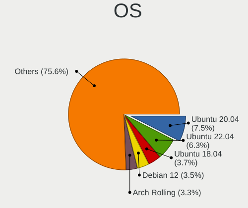

| Name                         | Notebooks | Percent |
|------------------------------|-----------|---------|
| Ubuntu 20.04                 | 150       | 7.54%   |
| Ubuntu 22.04                 | 126       | 6.33%   |
| Ubuntu 18.04                 | 74        | 3.72%   |
| Debian 12                    | 70        | 3.52%   |
| Arch Rolling                 | 66        | 3.32%   |
| Ubuntu 24.04                 | 61        | 3.07%   |
| Pop!_OS 22.04                | 55        | 2.76%   |
| Debian 11                    | 32        | 1.61%   |
| Zorin 16                     | 31        | 1.56%   |
| Manjaro                      | 31        | 1.56%   |
| Fedora 40                    | 31        | 1.56%   |
| openSUSE Tumbleweed-XXXXXXXX | 28        | 1.41%   |
| ArcoLinux Rolling            | 27        | 1.36%   |
| Linux Mint 22.1              | 23        | 1.16%   |
| Fedora 42                    | 23        | 1.16%   |
| Pop!_OS 21.04                | 21        | 1.06%   |
| OpenMandriva 4.3             | 21        | 1.06%   |
| OpenMandriva 4.2             | 21        | 1.06%   |
| Arch                         | 21        | 1.06%   |
| Ubuntu 23.10                 | 20        | 1.01%   |
| Linux Mint 21.1              | 20        | 1.01%   |
| Fedora 41                    | 20        | 1.01%   |
| Fedora 35                    | 20        | 1.01%   |
| Ubuntu 19.04                 | 19        | 0.95%   |
| Zorin 17                     | 18        | 0.9%    |
| OpenMandriva 25.90           | 18        | 0.9%    |
| EndeavourOS Rolling          | 18        | 0.9%    |
| OpenMandriva 6.0             | 17        | 0.85%   |
| Zorin 15                     | 16        | 0.8%    |
| Ubuntu 21.10                 | 16        | 0.8%    |
| Pop!_OS 20.10                | 16        | 0.8%    |
| Pop!_OS 20.04                | 16        | 0.8%    |
| Linux Mint 21.3              | 15        | 0.75%   |
| Linux Mint 20.3              | 15        | 0.75%   |
| KDE neon 20.04               | 15        | 0.75%   |
| Fedora 39                    | 15        | 0.75%   |
| Linux Mint 21.2              | 14        | 0.7%    |
| Linux Mint 20.2              | 14        | 0.7%    |
| Fedora 38                    | 14        | 0.7%    |
| Fedora 37                    | 14        | 0.7%    |

OS Family
---------

OS without a version

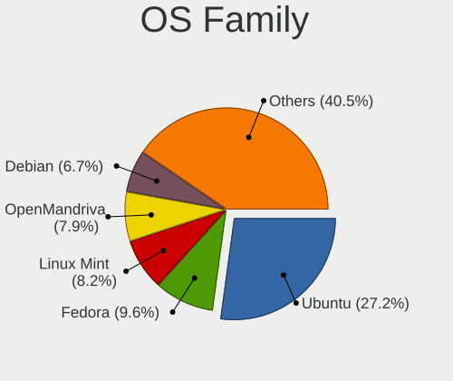

| Name          | Notebooks | Percent |
|---------------|-----------|---------|
| Ubuntu        | 510       | 27.16%  |
| Fedora        | 180       | 9.58%   |
| Linux Mint    | 154       | 8.2%    |
| OpenMandriva  | 148       | 7.88%   |
| Debian        | 126       | 6.71%   |
| Pop!_OS       | 113       | 6.02%   |
| Arch          | 86        | 4.58%   |
| Zorin         | 69        | 3.67%   |
| Manjaro       | 66        | 3.51%   |
| openSUSE      | 33        | 1.76%   |
| Xubuntu       | 32        | 1.7%    |
| Kubuntu       | 32        | 1.7%    |
| ArcoLinux     | 30        | 1.6%    |
| KDE neon      | 29        | 1.54%   |
| Kali          | 25        | 1.33%   |
| EndeavourOS   | 21        | 1.12%   |
| SteamOS       | 17        | 0.91%   |
| Elementary    | 15        | 0.8%    |
| Gentoo        | 14        | 0.75%   |
| ROSA          | 12        | 0.64%   |
| Endless       | 11        | 0.59%   |
| Ubuntu MATE   | 10        | 0.53%   |
| LMDE          | 10        | 0.53%   |
| Bazzite       | 10        | 0.53%   |
| NixOS         | 9         | 0.48%   |
| Nobara        | 8         | 0.43%   |
| Parrot        | 7         | 0.37%   |
| BunsenLabs    | 7         | 0.37%   |
| Clear Linux   | 6         | 0.32%   |
| CentOS        | 6         | 0.32%   |
| CachyOS       | 6         | 0.32%   |
| MX            | 5         | 0.27%   |
| Lubuntu       | 5         | 0.27%   |
| Garuda Linux  | 5         | 0.27%   |
| Ubuntu Budgie | 4         | 0.21%   |
| Peppermint    | 4         | 0.21%   |
| GNOME OS      | 4         | 0.21%   |
| BlackPanther  | 4         | 0.21%   |
| Vanilla       | 3         | 0.16%   |
| Ubuntu Unity  | 3         | 0.16%   |

Kernel
------

Version of the Linux kernel

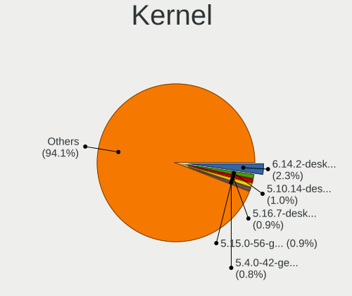

| Version                  | Notebooks | Percent |
|--------------------------|-----------|---------|
| 6.14.2-desktop-3omv2590  | 50        | 2.3%    |
| 5.10.14-desktop-1omv4002 | 21        | 0.97%   |
| 5.16.7-desktop-1omv4003  | 20        | 0.92%   |
| 5.15.0-56-generic        | 19        | 0.87%   |
| 5.4.0-42-generic         | 18        | 0.83%   |
| 6.8.0-52-generic         | 13        | 0.6%    |
| 5.15.0-52-generic        | 13        | 0.6%    |
| 6.12.1-desktop-1omv2490  | 12        | 0.55%   |
| 5.4.0-58-generic         | 12        | 0.55%   |
| 5.4.0-48-generic         | 12        | 0.55%   |
| 6.14.0-33-generic        | 11        | 0.51%   |
| 6.8.0-51-generic         | 10        | 0.46%   |
| 6.1.0-7-amd64            | 10        | 0.46%   |
| 5.3.0-40-generic         | 10        | 0.46%   |
| 5.15.0-91-generic        | 10        | 0.46%   |
| 5.15.0-78-generic        | 10        | 0.46%   |
| 5.15.0-60-generic        | 10        | 0.46%   |
| 5.13.0-30-generic        | 10        | 0.46%   |
| 6.8.0-45-generic         | 9         | 0.41%   |
| 6.8.0-40-generic         | 9         | 0.41%   |
| 6.4.11-desktop-1omv2390  | 9         | 0.41%   |
| 6.1.0-9-amd64            | 9         | 0.41%   |
| 6.1.0-18-amd64           | 9         | 0.41%   |
| 5.4.0-52-generic         | 9         | 0.41%   |
| 5.4.0-40-generic         | 9         | 0.41%   |
| 5.11.0-37-generic        | 9         | 0.41%   |
| 6.5.0-26-generic         | 8         | 0.37%   |
| 5.8.0-48-generic         | 8         | 0.37%   |
| 5.15.0-48-generic        | 8         | 0.37%   |
| 5.13.0-7614-generic      | 8         | 0.37%   |
| 6.8.0-31-generic         | 7         | 0.32%   |
| 6.6.10-76060610-generic  | 7         | 0.32%   |
| 6.5.0-14-generic         | 7         | 0.32%   |
| 6.14.0-15-generic        | 7         | 0.32%   |
| 5.4.0-70-generic         | 7         | 0.32%   |
| 5.4.0-65-generic         | 7         | 0.32%   |
| 5.19.0-35-generic        | 7         | 0.32%   |
| 5.15.0-76-generic        | 7         | 0.32%   |
| 5.13.0-39-generic        | 7         | 0.32%   |
| 5.10.0-8-amd64           | 7         | 0.32%   |

Kernel Family
-------------

Linux kernel without a distro release

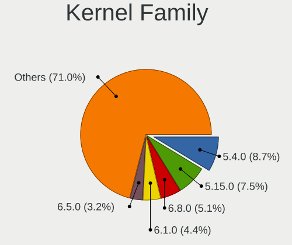

| Version | Notebooks | Percent |
|---------|-----------|---------|
| 5.4.0   | 180       | 8.69%   |
| 5.15.0  | 156       | 7.53%   |
| 6.8.0   | 106       | 5.12%   |
| 6.1.0   | 92        | 4.44%   |
| 6.5.0   | 66        | 3.19%   |
| 5.13.0  | 66        | 3.19%   |
| 5.11.0  | 66        | 3.19%   |
| 5.8.0   | 51        | 2.46%   |
| 6.14.2  | 50        | 2.41%   |
| 5.3.0   | 46        | 2.22%   |
| 4.15.0  | 46        | 2.22%   |
| 5.10.0  | 45        | 2.17%   |
| 6.14.0  | 42        | 2.03%   |
| 5.19.0  | 40        | 1.93%   |
| 6.2.0   | 38        | 1.83%   |
| 5.0.0   | 34        | 1.64%   |
| 6.11.0  | 31        | 1.5%    |
| 4.18.0  | 23        | 1.11%   |
| 5.16.7  | 21        | 1.01%   |
| 5.10.14 | 21        | 1.01%   |
| 6.12.1  | 16        | 0.77%   |
| 6.4.11  | 10        | 0.48%   |
| 6.12.10 | 10        | 0.48%   |
| 6.6.10  | 9         | 0.43%   |
| 6.2.6   | 9         | 0.43%   |
| 5.14.0  | 9         | 0.43%   |
| 6.9.3   | 8         | 0.39%   |
| 6.5.6   | 8         | 0.39%   |
| 6.6.2   | 7         | 0.34%   |
| 6.17.7  | 7         | 0.34%   |
| 6.12.9  | 7         | 0.34%   |
| 6.0.12  | 7         | 0.34%   |
| 5.17.5  | 7         | 0.34%   |
| 6.8.5   | 6         | 0.29%   |
| 6.4.0   | 6         | 0.29%   |
| 6.17.9  | 6         | 0.29%   |
| 6.12.6  | 6         | 0.29%   |
| 6.11.2  | 6         | 0.29%   |
| 6.11.11 | 6         | 0.29%   |
| 6.1.52  | 6         | 0.29%   |

Kernel Major Ver.
-----------------

Linux kernel major version

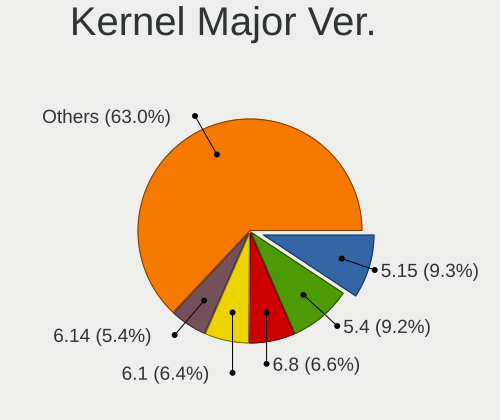

| Version | Notebooks | Percent |
|---------|-----------|---------|
| 5.15    | 189       | 9.3%    |
| 5.4     | 187       | 9.2%    |
| 6.8     | 135       | 6.64%   |
| 6.1     | 131       | 6.44%   |
| 6.14    | 110       | 5.41%   |
| 6.5     | 88        | 4.33%   |
| 5.10    | 83        | 4.08%   |
| 6.12    | 80        | 3.94%   |
| 5.11    | 78        | 3.84%   |
| 5.13    | 76        | 3.74%   |
| 6.2     | 66        | 3.25%   |
| 5.8     | 63        | 3.1%    |
| 6.11    | 57        | 2.8%    |
| 5.3     | 52        | 2.56%   |
| 6.6     | 47        | 2.31%   |
| 5.19    | 47        | 2.31%   |
| 5.16    | 47        | 2.31%   |
| 4.15    | 46        | 2.26%   |
| 5.0     | 36        | 1.77%   |
| 6.4     | 33        | 1.62%   |
| 6.10    | 30        | 1.48%   |
| 4.18    | 29        | 1.43%   |
| 6.17    | 26        | 1.28%   |
| 6.0     | 26        | 1.28%   |
| 6.9     | 23        | 1.13%   |
| 6.15    | 23        | 1.13%   |
| 6.7     | 22        | 1.08%   |
| 5.14    | 21        | 1.03%   |
| 6.13    | 20        | 0.98%   |
| 5.18    | 20        | 0.98%   |
| 5.17    | 20        | 0.98%   |
| 6.16    | 18        | 0.89%   |
| 6.3     | 17        | 0.84%   |
| 5.9     | 14        | 0.69%   |
| 5.12    | 14        | 0.69%   |
| 5.7     | 11        | 0.54%   |
| 5.6     | 11        | 0.54%   |
| 4.19    | 8         | 0.39%   |
| 5.5     | 7         | 0.34%   |
| 5.2     | 6         | 0.3%    |

Arch
----

OS architecture (x86_64, i586, etc.)

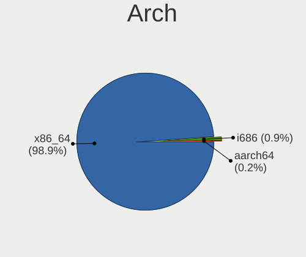

| Name    | Notebooks | Percent |
|---------|-----------|---------|
| x86_64  | 1777      | 98.89%  |
| i686    | 17        | 0.95%   |
| aarch64 | 3         | 0.17%   |

DE
--

Desktop Environment

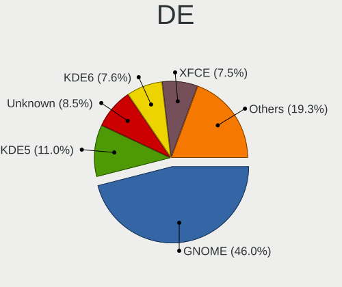

| Name            | Notebooks | Percent |
|-----------------|-----------|---------|
| GNOME           | 875       | 46%     |
| KDE5            | 209       | 10.99%  |
| Unknown         | 162       | 8.52%   |
| KDE6            | 145       | 7.62%   |
| XFCE            | 143       | 7.52%   |
| X-Cinnamon      | 138       | 7.26%   |
| MATE            | 38        | 2%      |
| KDE             | 38        | 2%      |
| i3              | 24        | 1.26%   |
| LXQt            | 17        | 0.89%   |
| Pantheon        | 15        | 0.79%   |
| Hyprland        | 15        | 0.79%   |
| Cinnamon        | 12        | 0.63%   |
| KDE4            | 9         | 0.47%   |
| sway            | 8         | 0.42%   |
| LXDE            | 5         | 0.26%   |
| GNOME Flashback | 5         | 0.26%   |
| BunsenLabs      | 5         | 0.26%   |
| Budgie          | 5         | 0.26%   |
| COSMIC          | 4         | 0.21%   |
| Unity           | 3         | 0.16%   |
| awesome         | 3         | 0.16%   |
| qtile           | 2         | 0.11%   |
| GNOME Classic   | 2         | 0.11%   |
| Endless:GNOME   | 2         | 0.11%   |
| DWM             | 2         | 0.11%   |
| Deepin          | 2         | 0.11%   |
| xmonad          | 1         | 0.05%   |
| Unicorn:XFCE    | 1         | 0.05%   |
| Trinity         | 1         | 0.05%   |
| sway:wlroots    | 1         | 0.05%   |
| spectrwm        | 1         | 0.05%   |
| river:wlroots   | 1         | 0.05%   |
| river           | 1         | 0.05%   |
| none+i3         | 1         | 0.05%   |
| none+awesome    | 1         | 0.05%   |
| niri            | 1         | 0.05%   |
| Lingmo          | 1         | 0.05%   |
| LeftWM          | 1         | 0.05%   |
| DDE             | 1         | 0.05%   |

Display Server
--------------

X11 or Wayland

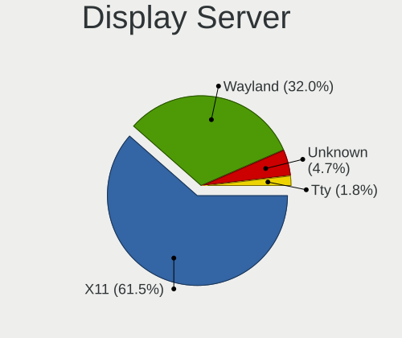

| Name    | Notebooks | Percent |
|---------|-----------|---------|
| X11     | 1141      | 61.48%  |
| Wayland | 594       | 32%     |
| Unknown | 87        | 4.69%   |
| Tty     | 34        | 1.83%   |

Display Manager
---------------

SDDM, LightDM, etc.

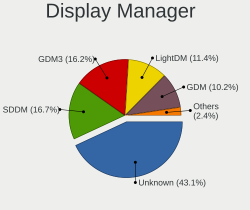

| Name    | Notebooks | Percent |
|---------|-----------|---------|
| Unknown | 807       | 43.06%  |
| SDDM    | 313       | 16.7%   |
| GDM3    | 304       | 16.22%  |
| LightDM | 214       | 11.42%  |
| GDM     | 191       | 10.19%  |
| TDM     | 28        | 1.49%   |
| LXDM    | 4         | 0.21%   |
| XDM     | 3         | 0.16%   |
| KDM     | 3         | 0.16%   |
| LY-DM   | 2         | 0.11%   |
| Ly      | 2         | 0.11%   |
| GREETD  | 2         | 0.11%   |
| WDM     | 1         | 0.05%   |

OS Lang
-------

Language

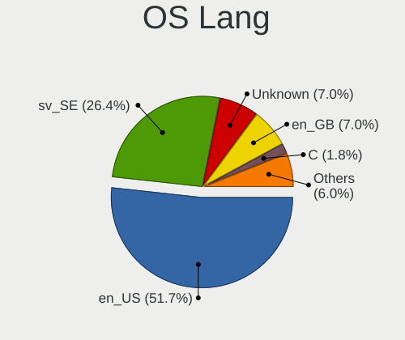

| Lang       | Notebooks | Percent |
|------------|-----------|---------|
| en_US      | 958       | 51.73%  |
| sv_SE      | 489       | 26.4%   |
| Unknown    | 130       | 7.02%   |
| en_GB      | 129       | 6.97%   |
| C          | 34        | 1.84%   |
| ru_RU      | 20        | 1.08%   |
| de_DE      | 14        | 0.76%   |
| pl_PL      | 11        | 0.59%   |
| en_SE      | 6         | 0.32%   |
| it_IT      | 5         | 0.27%   |
| fi_FI      | 5         | 0.27%   |
| en_DK      | 5         | 0.27%   |
| en_CA      | 5         | 0.27%   |
| el_GR      | 5         | 0.27%   |
| fr_FR      | 4         | 0.22%   |
| en_AG      | 3         | 0.16%   |
| zh_CN      | 2         | 0.11%   |
| uk_UA      | 2         | 0.11%   |
| sv_FI      | 2         | 0.11%   |
| POSIX      | 2         | 0.11%   |
| lt_LT      | 2         | 0.11%   |
| es_ES      | 2         | 0.11%   |
| en_IE      | 2         | 0.11%   |
| en_AU      | 2         | 0.11%   |
| C.UTF8     | 2         | 0.11%   |
| tr_TR      | 1         | 0.05%   |
| sv_SE.UTF8 | 1         | 0.05%   |
| nn_NO      | 1         | 0.05%   |
| nb_NO      | 1         | 0.05%   |
| ja_JP      | 1         | 0.05%   |
| hu_HU      | 1         | 0.05%   |
| gl_ES      | 1         | 0.05%   |
| en_US.UTF8 | 1         | 0.05%   |
| en_IE.UTF8 | 1         | 0.05%   |
| da_DK      | 1         | 0.05%   |
| bg_BG      | 1         | 0.05%   |

Boot Mode
---------

EFI or BIOS

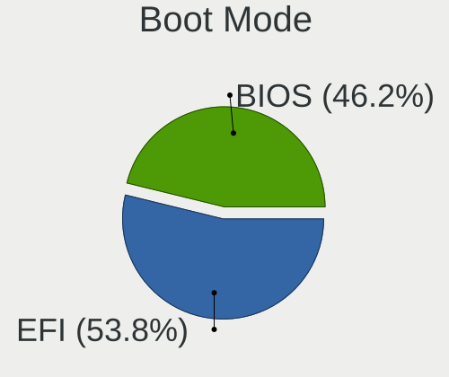

| Mode | Notebooks | Percent |
|------|-----------|---------|
| EFI  | 992       | 53.83%  |
| BIOS | 851       | 46.17%  |

Filesystem
----------

Type of filesystem

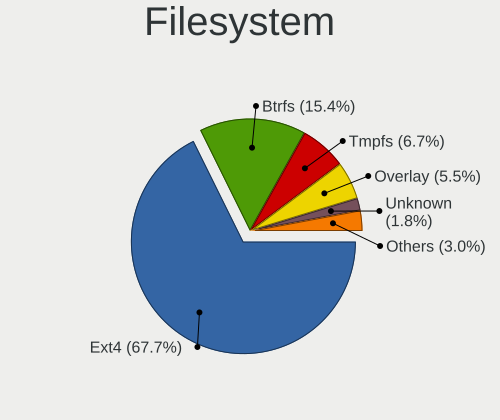

| Type     | Notebooks | Percent |
|----------|-----------|---------|
| Ext4     | 1261      | 67.69%  |
| Btrfs    | 287       | 15.41%  |
| Tmpfs    | 125       | 6.71%   |
| Overlay  | 102       | 5.48%   |
| Unknown  | 33        | 1.77%   |
| Xfs      | 21        | 1.13%   |
| Zfs      | 20        | 1.07%   |
| Ext2     | 7         | 0.38%   |
| F2fs     | 4         | 0.21%   |
| XXXXXXX  | 1         | 0.05%   |
| Ext3     | 1         | 0.05%   |
| Bcachefs | 1         | 0.05%   |

Part. scheme
------------

Scheme of partitioning

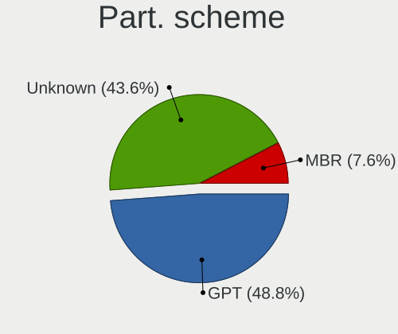

| Type    | Notebooks | Percent |
|---------|-----------|---------|
| GPT     | 899       | 48.81%  |
| Unknown | 803       | 43.59%  |
| MBR     | 140       | 7.6%    |

Dual Boot with Linux/BSD
------------------------

Hosting more than one Linux/BSD

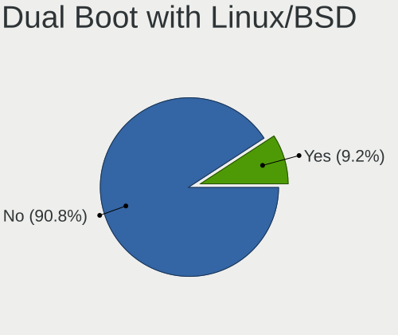

| Dual boot | Notebooks | Percent |
|-----------|-----------|---------|
| No        | 1655      | 90.83%  |
| Yes       | 167       | 9.17%   |

Dual Boot (Win)
---------------

Hosting Linux and Windows

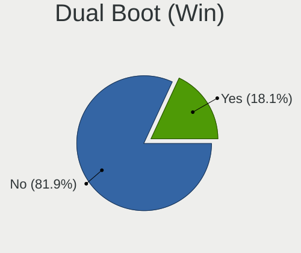

| Dual boot | Notebooks | Percent |
|-----------|-----------|---------|
| No        | 1485      | 81.91%  |
| Yes       | 328       | 18.09%  |

Board
-----

Vendor
------

Motherboard manufacturer

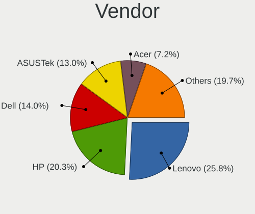

| Name                | Notebooks | Percent |
|---------------------|-----------|---------|
| Lenovo              | 463       | 25.77%  |
| Hewlett-Packard     | 365       | 20.31%  |
| Dell                | 251       | 13.97%  |
| ASUSTek Computer    | 234       | 13.02%  |
| Acer                | 130       | 7.23%   |
| Apple               | 81        | 4.51%   |
| MSI                 | 38        | 2.11%   |
| Toshiba             | 21        | 1.17%   |
| Sony                | 18        | 1%      |
| Valve               | 17        | 0.95%   |
| Google              | 17        | 0.95%   |
| Samsung Electronics | 16        | 0.89%   |
| Packard Bell        | 13        | 0.72%   |
| Notebook            | 12        | 0.67%   |
| Fujitsu             | 12        | 0.67%   |
| Unknown             | 10        | 0.56%   |
| HUAWEI              | 9         | 0.5%    |
| Fujitsu Siemens     | 8         | 0.45%   |
| TUXEDO              | 7         | 0.39%   |
| Gigabyte Technology | 7         | 0.39%   |
| SLIMBOOK            | 6         | 0.33%   |
| eMachines           | 4         | 0.22%   |
| Clevo               | 4         | 0.22%   |
| System76            | 3         | 0.17%   |
| Star Labs           | 3         | 0.17%   |
| LG Electronics      | 3         | 0.17%   |
| Alienware           | 3         | 0.17%   |
| Timi                | 2         | 0.11%   |
| Schenker            | 2         | 0.11%   |
| Razer               | 2         | 0.11%   |
| PC Specialist       | 2         | 0.11%   |
| Panasonic           | 2         | 0.11%   |
| Insyde              | 2         | 0.11%   |
| GPD                 | 2         | 0.11%   |
| Framework           | 2         | 0.11%   |
| Dynabook            | 2         | 0.11%   |
| AMI                 | 2         | 0.11%   |
| ZEPTO               | 1         | 0.06%   |
| YJKC                | 1         | 0.06%   |
| win element         | 1         | 0.06%   |

Model
-----

Motherboard model

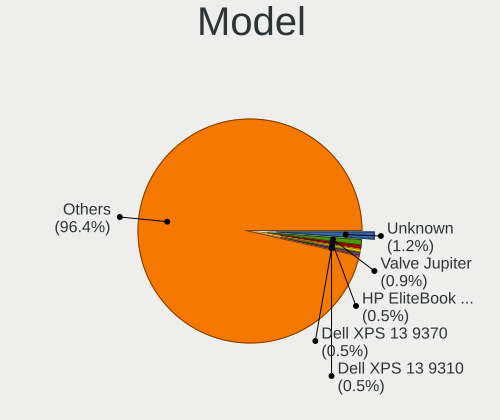

| Name                                 | Notebooks | Percent |
|--------------------------------------|-----------|---------|
| Unknown                              | 21        | 1.17%   |
| Valve Jupiter                        | 16        | 0.89%   |
| HP EliteBook 840 G3                  | 9         | 0.5%    |
| Dell XPS 13 9370                     | 9         | 0.5%    |
| Dell XPS 13 9310                     | 9         | 0.5%    |
| Apple MacBookAir7,2                  | 8         | 0.45%   |
| Apple MacBookAir6,2                  | 8         | 0.45%   |
| Dell Precision 5540                  | 7         | 0.39%   |
| ASUS Vivobook Go E1504FA_E1504FA     | 7         | 0.39%   |
| Apple MacBookPro9,2                  | 7         | 0.39%   |
| Lenovo IdeaPad 5 Pro 16ACH6 82L5     | 6         | 0.33%   |
| HP Pavilion Notebook                 | 6         | 0.33%   |
| HP Pavilion dv7                      | 6         | 0.33%   |
| HP Pavilion 15                       | 6         | 0.33%   |
| HP EliteBook Folio 9470m             | 6         | 0.33%   |
| HP EliteBook 840 G2                  | 6         | 0.33%   |
| Dell XPS 15 9500                     | 6         | 0.33%   |
| Dell Latitude E7240                  | 6         | 0.33%   |
| Dell Latitude 7490                   | 6         | 0.33%   |
| Apple MacBookPro12,1                 | 6         | 0.33%   |
| Apple MacBookPro11,3                 | 6         | 0.33%   |
| Acer Aspire V3-571                   | 6         | 0.33%   |
| Lenovo G50-30 80G0                   | 5         | 0.28%   |
| HP ZBook 15 G2                       | 5         | 0.28%   |
| HP ProBook 640 G1                    | 5         | 0.28%   |
| HP Pavilion g6                       | 5         | 0.28%   |
| HP Laptop 15s-eq2xxx                 | 5         | 0.28%   |
| HP EliteBook 840 G6                  | 5         | 0.28%   |
| HP EliteBook 820 G3                  | 5         | 0.28%   |
| Dell XPS 9320                        | 5         | 0.28%   |
| Dell XPS 15 9570                     | 5         | 0.28%   |
| ASUS G75VW                           | 5         | 0.28%   |
| Apple MacBookPro8,1                  | 5         | 0.28%   |
| Lenovo Yoga Slim 7 Pro 14ACH5 82MS   | 4         | 0.22%   |
| Lenovo ThinkPad L14 Gen 2 20X1004CMX | 4         | 0.22%   |
| Lenovo ThinkPad L13 Gen 2 20VJS6RY00 | 4         | 0.22%   |
| HUAWEI KLVL-WXX9                     | 4         | 0.22%   |
| HP ZBook Studio G5                   | 4         | 0.22%   |
| HP ProBook 440 G8 Notebook PC        | 4         | 0.22%   |
| HP ProBook 430 G1                    | 4         | 0.22%   |

Model Family
------------

Motherboard model prefix

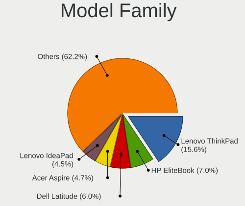

| Name                  | Notebooks | Percent |
|-----------------------|-----------|---------|
| Lenovo ThinkPad       | 280       | 15.58%  |
| HP EliteBook          | 126       | 7.01%   |
| Dell Latitude         | 108       | 6.01%   |
| Acer Aspire           | 84        | 4.67%   |
| Lenovo IdeaPad        | 81        | 4.51%   |
| Dell XPS              | 62        | 3.45%   |
| HP ProBook            | 59        | 3.28%   |
| Dell Precision        | 52        | 2.89%   |
| HP Pavilion           | 51        | 2.84%   |
| ASUS VivoBook         | 46        | 2.56%   |
| HP ZBook              | 43        | 2.39%   |
| ASUS ROG              | 31        | 1.73%   |
| HP Laptop             | 28        | 1.56%   |
| Lenovo Legion         | 26        | 1.45%   |
| Lenovo Yoga           | 24        | 1.34%   |
| Acer Swift            | 24        | 1.34%   |
| Unknown               | 21        | 1.17%   |
| ASUS ZenBook          | 20        | 1.11%   |
| Toshiba Satellite     | 19        | 1.06%   |
| ASUS ASUS             | 19        | 1.06%   |
| Valve Jupiter         | 16        | 0.89%   |
| HP Compaq             | 16        | 0.89%   |
| Dell Inspiron         | 14        | 0.78%   |
| Apple MacBookPro11    | 13        | 0.72%   |
| Packard Bell EasyNote | 12        | 0.67%   |
| HP ENVY               | 11        | 0.61%   |
| Fujitsu LIFEBOOK      | 11        | 0.61%   |
| Dell Vostro           | 11        | 0.61%   |
| Apple MacBookAir6     | 10        | 0.56%   |
| Acer Nitro            | 10        | 0.56%   |
| Lenovo ThinkBook      | 9         | 0.5%    |
| Apple MacBookAir7     | 8         | 0.45%   |
| Apple MacBookPro9     | 7         | 0.39%   |
| Apple MacBookPro8     | 7         | 0.39%   |
| Acer Predator         | 7         | 0.39%   |
| HP Presario           | 6         | 0.33%   |
| ASUS TUF              | 6         | 0.33%   |
| Apple MacBookPro12    | 6         | 0.33%   |
| Lenovo G50-30         | 5         | 0.28%   |
| HP OMEN               | 5         | 0.28%   |

MFG Year
--------

Motherboard manufacture year

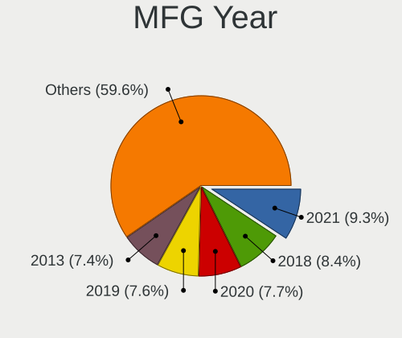

| Year    | Notebooks | Percent |
|---------|-----------|---------|
| 2021    | 167       | 9.29%   |
| 2018    | 151       | 8.4%    |
| 2020    | 139       | 7.74%   |
| 2019    | 136       | 7.57%   |
| 2013    | 133       | 7.4%    |
| 2012    | 120       | 6.68%   |
| 2017    | 111       | 6.18%   |
| 2011    | 105       | 5.84%   |
| 2014    | 104       | 5.79%   |
| 2022    | 102       | 5.68%   |
| 2016    | 96        | 5.34%   |
| 2015    | 85        | 4.73%   |
| 2023    | 76        | 4.23%   |
| 2010    | 75        | 4.17%   |
| 2008    | 51        | 2.84%   |
| 2024    | 46        | 2.56%   |
| 2009    | 36        | 2%      |
| 2007    | 24        | 1.34%   |
| 2006    | 18        | 1%      |
| 2025    | 13        | 0.72%   |
| 2005    | 6         | 0.33%   |
| Unknown | 2         | 0.11%   |
| 2004    | 1         | 0.06%   |

Form Factor
-----------

Physical design of the computer

| Name     | Notebooks | Percent |
|----------|-----------|---------|
| Notebook | 1797      | 100%    |

Secure Boot
-----------

Enabled or disabled

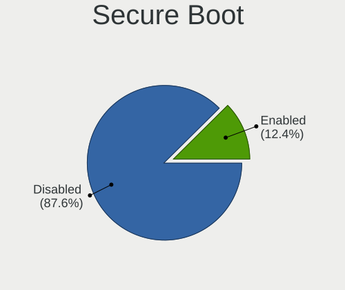

| State    | Notebooks | Percent |
|----------|-----------|---------|
| Disabled | 1588      | 87.59%  |
| Enabled  | 225       | 12.41%  |

Coreboot
--------

Have coreboot on board

| Used | Notebooks | Percent |
|------|-----------|---------|
| No   | 1775      | 98.78%  |
| Yes  | 22        | 1.22%   |

RAM Size
--------

Total RAM memory

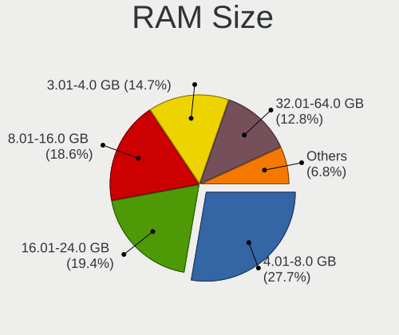

| Size in GB  | Notebooks | Percent |
|-------------|-----------|---------|
| 4.01-8.0    | 503       | 27.7%   |
| 16.01-24.0  | 352       | 19.38%  |
| 8.01-16.0   | 337       | 18.56%  |
| 3.01-4.0    | 267       | 14.7%   |
| 32.01-64.0  | 233       | 12.83%  |
| 1.01-2.0    | 44        | 2.42%   |
| 24.01-32.0  | 35        | 1.93%   |
| 64.01-256.0 | 30        | 1.65%   |
| 2.01-3.0    | 10        | 0.55%   |
| 0.51-1.0    | 5         | 0.28%   |

RAM Used
--------

Used RAM memory

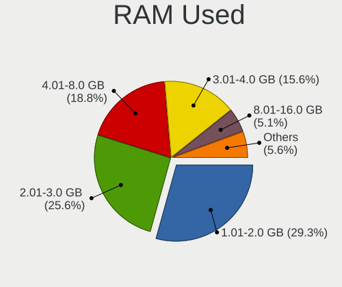

| Used GB    | Notebooks | Percent |
|------------|-----------|---------|
| 1.01-2.0   | 579       | 29.3%   |
| 2.01-3.0   | 505       | 25.56%  |
| 4.01-8.0   | 371       | 18.78%  |
| 3.01-4.0   | 309       | 15.64%  |
| 8.01-16.0  | 101       | 5.11%   |
| 0.51-1.0   | 72        | 3.64%   |
| 16.01-24.0 | 20        | 1.01%   |
| 0.01-0.5   | 13        | 0.66%   |
| 24.01-32.0 | 4         | 0.2%    |
| 32.01-64.0 | 2         | 0.1%    |

Total Drives
------------

Number of drives on board

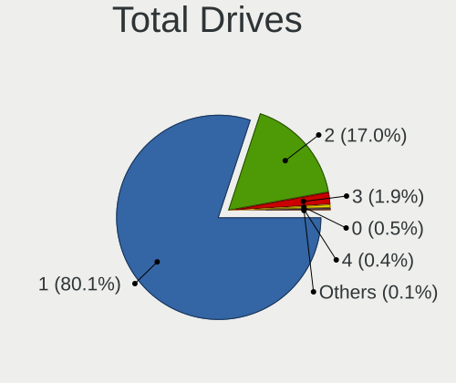

| Drives | Notebooks | Percent |
|--------|-----------|---------|
| 1      | 1465      | 80.05%  |
| 2      | 312       | 17.05%  |
| 3      | 35        | 1.91%   |
| 0      | 10        | 0.55%   |
| 4      | 7         | 0.38%   |
| 5      | 1         | 0.05%   |

Has CD-ROM
----------

Has CD-ROM on board

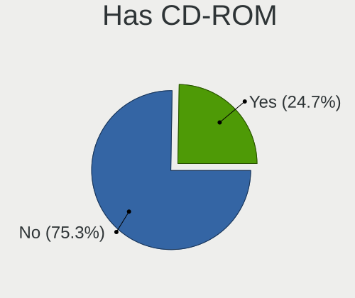

| Presented | Notebooks | Percent |
|-----------|-----------|---------|
| No        | 1357      | 75.26%  |
| Yes       | 446       | 24.74%  |

Has Ethernet
------------

Has Ethernet on board

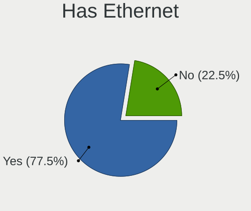

| Presented | Notebooks | Percent |
|-----------|-----------|---------|
| Yes       | 1399      | 77.55%  |
| No        | 405       | 22.45%  |

Has WiFi
--------

Has WiFi module

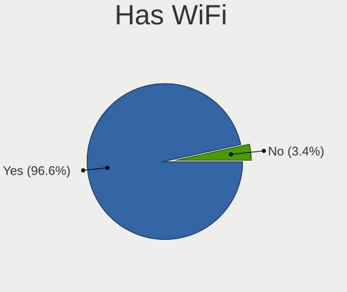

| Presented | Notebooks | Percent |
|-----------|-----------|---------|
| Yes       | 1738      | 96.56%  |
| No        | 62        | 3.44%   |

Has Bluetooth
-------------

Has Bluetooth module

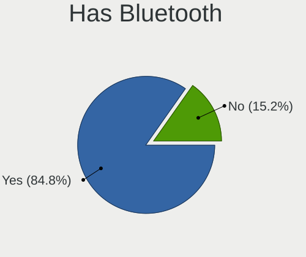

| Presented | Notebooks | Percent |
|-----------|-----------|---------|
| Yes       | 1540      | 84.76%  |
| No        | 277       | 15.24%  |

Location
--------

Country
-------

Geographic location (country)

| Country | Notebooks | Percent |
|---------|-----------|---------|
| Sweden  | 1797      | 100%    |

City
----

Geographic location (city)

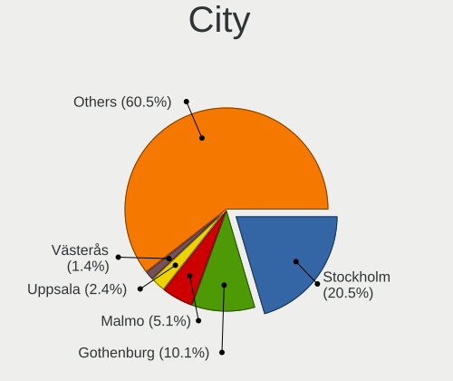

| City                    | Notebooks | Percent |
|-------------------------|-----------|---------|
| Stockholm               | 399       | 20.45%  |
| Gothenburg              | 197       | 10.1%   |
| Malmo                   | 99        | 5.07%   |
| Uppsala                 | 47        | 2.41%   |
| Västerås              | 28        | 1.44%   |
| Linköping              | 28        | 1.44%   |
| Örebro                 | 26        | 1.33%   |
| Lund                    | 26        | 1.33%   |
| Umeå                   | 24        | 1.23%   |
| Bromma                  | 24        | 1.23%   |
| Solna                   | 23        | 1.18%   |
| Sundbyberg              | 20        | 1.03%   |
| Vaxjo                   | 19        | 0.97%   |
| Sundsvall               | 18        | 0.92%   |
| Sollentuna              | 17        | 0.87%   |
| Saltsjoe-Boo            | 17        | 0.87%   |
| Norrköping             | 16        | 0.82%   |
| Karlstad                | 16        | 0.82%   |
| Jönköping             | 16        | 0.82%   |
| Huddinge                | 16        | 0.82%   |
| Helsingborg             | 16        | 0.82%   |
| Gävle                  | 15        | 0.77%   |
| Ängelholm              | 14        | 0.72%   |
| Taby                    | 13        | 0.67%   |
| Karlskrona              | 13        | 0.67%   |
| Upplands Vasby          | 12        | 0.62%   |
| Bandhagen               | 12        | 0.62%   |
| Vaestra Froelunda       | 11        | 0.56%   |
| Kista                   | 11        | 0.56%   |
| Halmstad                | 11        | 0.56%   |
| Eskilstuna              | 11        | 0.56%   |
| Spanga                  | 10        | 0.51%   |
| Norsborg                | 10        | 0.51%   |
| Luleå                  | 10        | 0.51%   |
| Södertälje            | 9         | 0.46%   |
| Skövde                 | 9         | 0.46%   |
| Landskrona              | 9         | 0.46%   |
| Järfälla Municipality | 9         | 0.46%   |
| Haegersten              | 9         | 0.46%   |
| Staffanstorp            | 8         | 0.41%   |

Drives
------

Drive Vendor
------------

Hard drive vendors

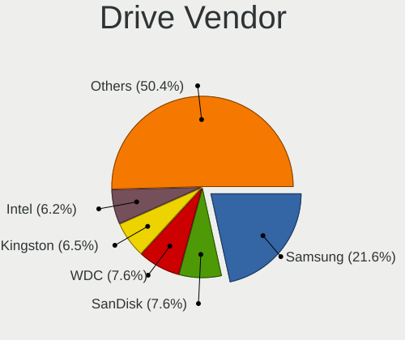

| Vendor                         | Notebooks | Drives | Percent |
|--------------------------------|-----------|--------|---------|
| Samsung Electronics            | 460       | 642    | 21.58%  |
| SanDisk                        | 163       | 200    | 7.65%   |
| WDC                            | 162       | 208    | 7.6%    |
| Kingston                       | 139       | 185    | 6.52%   |
| Intel                          | 133       | 150    | 6.24%   |
| Seagate                        | 131       | 156    | 6.14%   |
| SK hynix                       | 130       | 142    | 6.1%    |
| Toshiba                        | 125       | 155    | 5.86%   |
| Micron Technology              | 111       | 125    | 5.21%   |
| Unknown                        | 103       | 131    | 4.83%   |
| Apple                          | 56        | 75     | 2.63%   |
| Hitachi                        | 51        | 61     | 2.39%   |
| Crucial                        | 40        | 52     | 1.88%   |
| HGST                           | 39        | 45     | 1.83%   |
| KIOXIA                         | 32        | 37     | 1.5%    |
| LITEON                         | 27        | 33     | 1.27%   |
| Kingston Technology Company    | 27        | 30     | 1.27%   |
| Phison Electronics             | 15        | 18     | 0.7%    |
| Intenso                        | 11        | 11     | 0.52%   |
| A-DATA Technology              | 11        | 11     | 0.52%   |
| OCZ                            | 9         | 9      | 0.42%   |
| LITEONIT                       | 9         | 14     | 0.42%   |
| Phison                         | 7         | 7      | 0.33%   |
| PNY                            | 6         | 6      | 0.28%   |
| Lenovo                         | 6         | 6      | 0.28%   |
| Fujitsu                        | 6         | 8      | 0.28%   |
| Unknown                        | 6         | 7      | 0.28%   |
| Transcend                      | 5         | 5      | 0.23%   |
| SSSTC                          | 5         | 6      | 0.23%   |
| Silicon Motion                 | 5         | 17     | 0.23%   |
| Micron/Crucial Technology      | 5         | 6      | 0.23%   |
| JMicron Technology             | 5         | 5      | 0.23%   |
| China                          | 5         | 5      | 0.23%   |
| Solid State Storage Technology | 4         | 4      | 0.19%   |
| Verbatim                       | 3         | 19     | 0.14%   |
| Union Memory                   | 3         | 3      | 0.14%   |
| UMIS                           | 3         | 3      | 0.14%   |
| O2 Micro                       | 3         | 5      | 0.14%   |
| ASMT                           | 3         | 3      | 0.14%   |
| Union Memory (Shenzhen)        | 2         | 2      | 0.09%   |

Drive Model
-----------

Hard drive models

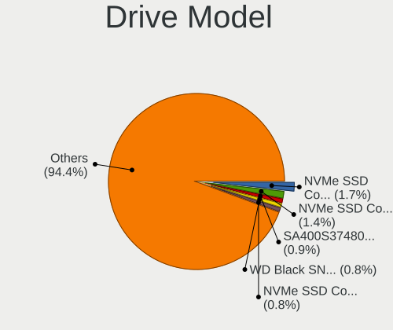

| Model                                                | Notebooks | Percent |
|------------------------------------------------------|-----------|---------|
| Samsung NVMe SSD Controller SM981/PM981/PM983 1TB    | 38        | 1.72%   |
| Samsung NVMe SSD Controller PM9A1/PM9A3/980PRO 1TB   | 31        | 1.4%    |
| Kingston SA400S37480G 480GB SSD                      | 19        | 0.86%   |
| Sandisk WD Black SN750 / PC SN730 NVMe SSD 500GB     | 18        | 0.81%   |
| Samsung NVMe SSD Controller SM961/PM961/SM963 1024GB | 18        | 0.81%   |
| Unknown MMC Card  64GB                               | 14        | 0.63%   |
| Sandisk WD Blue SN550 NVMe SSD 1024GB                | 14        | 0.63%   |
| Kingston SA400S37120G 120GB SSD                      | 14        | 0.63%   |
| Unknown MMC Card  32GB                               | 13        | 0.59%   |
| Seagate ST1000LM024 HN-M101MBB 1TB                   | 13        | 0.59%   |
| SanDisk NVMe SSD Drive 512GB                         | 13        | 0.59%   |
| Kingston SA400S37240G 240GB SSD                      | 13        | 0.59%   |
| Unknown MMC Card  16GB                               | 12        | 0.54%   |
| Toshiba NVMe SSD Drive 512GB                         | 12        | 0.54%   |
| WDC WD10JPVX-22JC3T0 1TB                             | 11        | 0.5%    |
| Toshiba XG6 NVMe SSD Controller 1024GB               | 11        | 0.5%    |
| SK hynix NVMe SSD Drive 512GB                        | 11        | 0.5%    |
| Seagate ST9500325AS 500GB                            | 11        | 0.5%    |
| Samsung SSD 850 EVO 500GB                            | 11        | 0.5%    |
| Samsung SSD 850 EVO 250GB                            | 11        | 0.5%    |
| Samsung NVMe SSD Drive 512GB                         | 11        | 0.5%    |
| Intel SSD Pro 7600p/760p/E 6100p Series 256GB        | 11        | 0.5%    |
| HGST HTS721010A9E630 1TB                             | 11        | 0.5%    |
| Unknown MMC Card  128GB                              | 10        | 0.45%   |
| Seagate ST500LT012-1DG142 500GB                      | 10        | 0.45%   |
| Samsung SSD 860 EVO 500GB                            | 10        | 0.45%   |
| Micron 1100_MTFDDAV256TBN 256GB SSD                  | 10        | 0.45%   |
| Intel SSDPEKNU512GZ 512GB                            | 10        | 0.45%   |
| SanDisk NVMe SSD Drive 1TB                           | 9         | 0.41%   |
| Samsung NVMe SSD Drive 256GB                         | 9         | 0.41%   |
| Samsung NVMe SSD Drive 1024GB                        | 9         | 0.41%   |
| Phison PS5013 E13 NVMe Controller 500GB              | 9         | 0.41%   |
| Apple SSD SD0128F 121GB                              | 9         | 0.41%   |
| Kingston Company OM3PDP3 NVMe SSD 256GB              | 8         | 0.36%   |
| Toshiba XG4 NVMe SSD Controller 256GB                | 7         | 0.32%   |
| SK hynix SKHynix_HFS512GDE9X084N 512GB               | 7         | 0.32%   |
| Seagate ST1000LM035-1RK172 1TB                       | 7         | 0.32%   |
| Samsung SSD 970 EVO Plus 1TB                         | 7         | 0.32%   |
| Kingston SUV400S37120G 120GB SSD                     | 7         | 0.32%   |
| Intel SSDPEKNW010T8 1TB                              | 7         | 0.32%   |

HDD Vendor
----------

Hard disk drive vendors

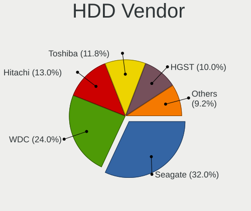

| Vendor              | Notebooks | Drives | Percent |
|---------------------|-----------|--------|---------|
| Seagate             | 125       | 148    | 31.97%  |
| WDC                 | 94        | 118    | 24.04%  |
| Hitachi             | 51        | 61     | 13.04%  |
| Toshiba             | 46        | 55     | 11.76%  |
| HGST                | 39        | 45     | 9.97%   |
| Samsung Electronics | 9         | 9      | 2.3%    |
| Fujitsu             | 6         | 8      | 1.53%   |
| Apple               | 5         | 5      | 1.28%   |
| Unknown             | 4         | 5      | 1.02%   |
| JMicron Technology  | 2         | 2      | 0.51%   |
| Intenso             | 2         | 2      | 0.51%   |
| ASMT                | 2         | 2      | 0.51%   |
| TO Exter            | 1         | 1      | 0.26%   |
| Synology            | 1         | 1      | 0.26%   |
| Shenzhen            | 1         | 1      | 0.26%   |
| HGST HTS            | 1         | 1      | 0.26%   |
| Apricorn            | 1         | 1      | 0.26%   |
| Unknown             | 1         | 1      | 0.26%   |

SSD Vendor
----------

Solid state drive vendors

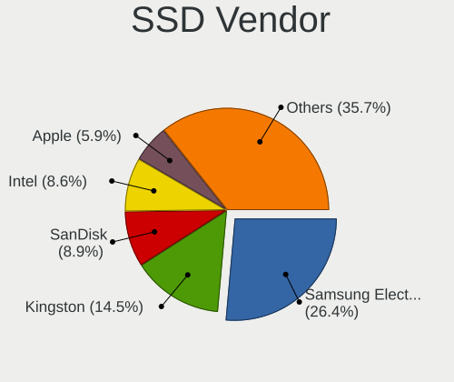

| Vendor              | Notebooks | Drives | Percent |
|---------------------|-----------|--------|---------|
| Samsung Electronics | 191       | 277    | 26.42%  |
| Kingston            | 105       | 141    | 14.52%  |
| SanDisk             | 64        | 80     | 8.85%   |
| Intel               | 62        | 68     | 8.58%   |
| Apple               | 43        | 52     | 5.95%   |
| Micron Technology   | 40        | 44     | 5.53%   |
| Crucial             | 37        | 48     | 5.12%   |
| WDC                 | 30        | 45     | 4.15%   |
| SK hynix            | 24        | 27     | 3.32%   |
| LITEON              | 24        | 30     | 3.32%   |
| Toshiba             | 19        | 27     | 2.63%   |
| OCZ                 | 9         | 9      | 1.24%   |
| LITEONIT            | 9         | 14     | 1.24%   |
| Intenso             | 7         | 7      | 0.97%   |
| PNY                 | 6         | 6      | 0.83%   |
| A-DATA Technology   | 6         | 6      | 0.83%   |
| Transcend           | 5         | 5      | 0.69%   |
| China               | 5         | 5      | 0.69%   |
| Verbatim            | 3         | 19     | 0.41%   |
| SSSTC               | 2         | 3      | 0.28%   |
| Seagate             | 2         | 2      | 0.28%   |
| Ramaxel Technology  | 2         | 2      | 0.28%   |
| M4-CT128            | 2         | 2      | 0.28%   |
| KingSpec            | 2         | 2      | 0.28%   |
| Corsair             | 2         | 2      | 0.28%   |
| WDC WDS             | 1         | 1      | 0.14%   |
| Unknown             | 1         | 1      | 0.14%   |
| Team                | 1         | 1      | 0.14%   |
| Star                | 1         | 1      | 0.14%   |
| SPCC                | 1         | 1      | 0.14%   |
| SATECHI             | 1         | 1      | 0.14%   |
| Radeon              | 1         | 3      | 0.14%   |
| OCZ-VERTEX3         | 1         | 1      | 0.14%   |
| Netac               | 1         | 1      | 0.14%   |
| Neo                 | 1         | 1      | 0.14%   |
| MyDigitalSSD        | 1         | 1      | 0.14%   |
| Maxtor              | 1         | 1      | 0.14%   |
| Lexar               | 1         | 1      | 0.14%   |
| KIOXIA-EXCERIA      | 1         | 1      | 0.14%   |
| KingFast            | 1         | 1      | 0.14%   |

Drive Kind
----------

HDD or SSD

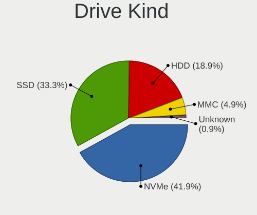

| Kind    | Notebooks | Drives | Percent |
|---------|-----------|--------|---------|
| NVMe    | 843       | 1118   | 41.94%  |
| SSD     | 669       | 949    | 33.28%  |
| HDD     | 380       | 466    | 18.91%  |
| MMC     | 99        | 127    | 4.93%   |
| Unknown | 19        | 19     | 0.95%   |

Drive Connector
---------------

SATA, SAS, NVMe, etc.

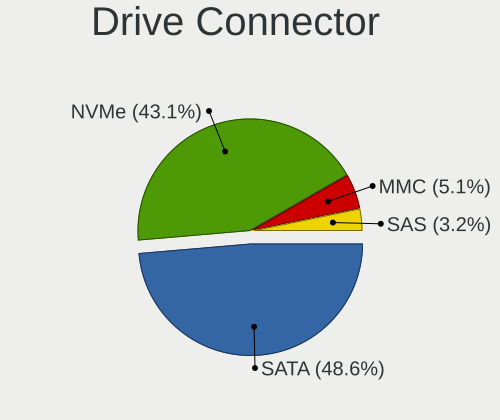

| Type | Notebooks | Drives | Percent |
|------|-----------|--------|---------|
| SATA | 950       | 1366   | 48.64%  |
| NVMe | 841       | 1113   | 43.06%  |
| MMC  | 99        | 127    | 5.07%   |
| SAS  | 63        | 73     | 3.23%   |

Drive Size
----------

Size of hard drive

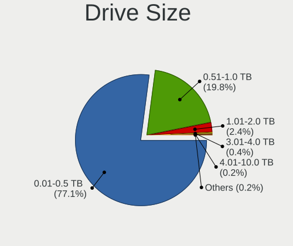

| Size in TB | Notebooks | Drives | Percent |
|------------|-----------|--------|---------|
| 0.01-0.5   | 803       | 1105   | 77.06%  |
| 0.51-1.0   | 206       | 257    | 19.77%  |
| 1.01-2.0   | 25        | 42     | 2.4%    |
| 3.01-4.0   | 4         | 5      | 0.38%   |
| 4.01-10.0  | 2         | 3      | 0.19%   |
| 2.01-3.0   | 1         | 1      | 0.1%    |
| 10.01-20.0 | 1         | 2      | 0.1%    |

Space Total
-----------

Amount of disk space available on the file system

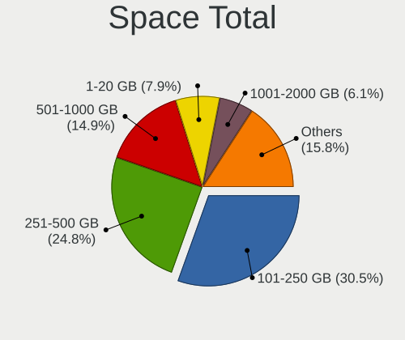

| Size in GB     | Notebooks | Percent |
|----------------|-----------|---------|
| 101-250        | 581       | 30.48%  |
| 251-500        | 473       | 24.82%  |
| 501-1000       | 284       | 14.9%   |
| 1-20           | 150       | 7.87%   |
| 1001-2000      | 116       | 6.09%   |
| 51-100         | 95        | 4.98%   |
| Unknown        | 88        | 4.62%   |
| 21-50          | 49        | 2.57%   |
| More than 3000 | 37        | 1.94%   |
| 2001-3000      | 33        | 1.73%   |

Space Used
----------

Amount of used disk space

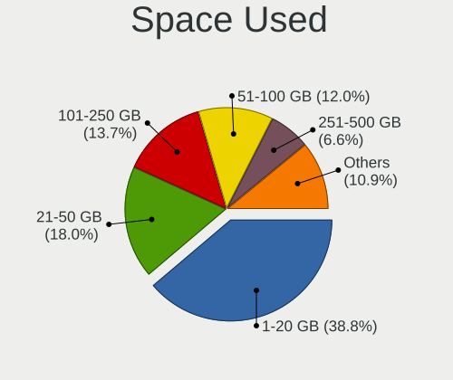

| Used GB        | Notebooks | Percent |
|----------------|-----------|---------|
| 1-20           | 766       | 38.8%   |
| 21-50          | 355       | 17.98%  |
| 101-250        | 271       | 13.73%  |
| 51-100         | 236       | 11.96%  |
| 251-500        | 130       | 6.59%   |
| Unknown        | 88        | 4.46%   |
| 501-1000       | 82        | 4.15%   |
| 1001-2000      | 29        | 1.47%   |
| More than 3000 | 6         | 0.3%    |
| 2001-3000      | 6         | 0.3%    |
| 0              | 5         | 0.25%   |

Malfunc. Drives
---------------

Drive models with a malfunction

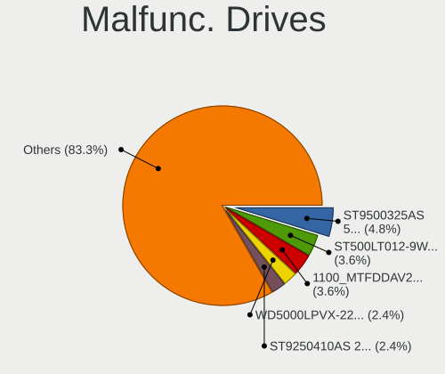

| Model                                          | Notebooks | Drives | Percent |
|------------------------------------------------|-----------|--------|---------|
| Seagate ST9500325AS 500GB                      | 4         | 4      | 4.76%   |
| Seagate ST500LT012-9WS142 500GB                | 3         | 3      | 3.57%   |
| Micron Technology 1100_MTFDDAV256TBN 256GB SSD | 3         | 4      | 3.57%   |
| WDC WD5000LPVX-22V0TT0 500GB                   | 2         | 2      | 2.38%   |
| Seagate ST9250410AS 250GB                      | 2         | 3      | 2.38%   |
| Seagate ST500LT012-1DG142 500GB                | 2         | 2      | 2.38%   |
| Intel SSDSC2BW240A4 240GB                      | 2         | 3      | 2.38%   |
| Hitachi HTS545050A7E380 500GB                  | 2         | 2      | 2.38%   |
| HGST HTS725032A7E630 320GB                     | 2         | 2      | 2.38%   |
| HGST HTS545050A7E380 500GB                     | 2         | 3      | 2.38%   |
| HGST HTS541010A9E680 1TB                       | 2         | 2      | 2.38%   |
| WDC WDS240G2G0A-00JH30 240GB SSD               | 1         | 2      | 1.19%   |
| WDC WD5000BEVT-22A0RT0 500GB                   | 1         | 1      | 1.19%   |
| WDC WD10JPVX-22JC3T0 1TB                       | 1         | 1      | 1.19%   |
| Union Memory UMIS RPJTJ128MED1MWX 128GB        | 1         | 1      | 1.19%   |
| Transcend TS240GMTS420S 240GB SSD              | 1         | 1      | 1.19%   |
| Toshiba MK6465GSX 640GB                        | 1         | 1      | 1.19%   |
| Toshiba MK4026GAX RoHS 40GB                    | 1         | 2      | 1.19%   |
| Toshiba MK1633GSG 160GB                        | 1         | 1      | 1.19%   |
| Toshiba MK1237GSX 120GB                        | 1         | 1      | 1.19%   |
| Toshiba MK1229GSG 120GB                        | 1         | 1      | 1.19%   |
| Toshiba KSG60ZMV256G M.2 2280 256GB SSD        | 1         | 1      | 1.19%   |
| Team L5 LITE SSD 240GB                         | 1         | 1      | 1.19%   |
| SSSTC CV8-8E128-HP 128GB SSD                   | 1         | 1      | 1.19%   |
| SK hynix SH920 mSATA 128GB SSD                 | 1         | 1      | 1.19%   |
| SK hynix HFS256G3AMNB-2200A 256GB SSD          | 1         | 1      | 1.19%   |
| SK hynix HFS256G32MND-2200A 256GB SSD          | 1         | 1      | 1.19%   |
| Silicon Motion 1TB PCS PCIe M.2 SSD            | 1         | 1      | 1.19%   |
| Seagate ST980817AS 80GB                        | 1         | 1      | 1.19%   |
| Seagate ST96812A 64GB                          | 1         | 1      | 1.19%   |
| Seagate ST9500420AS 500GB                      | 1         | 1      | 1.19%   |
| Seagate ST9250315AS 250GB                      | 1         | 1      | 1.19%   |
| Seagate ST1000LM049-2GH172 1TB                 | 1         | 2      | 1.19%   |
| Seagate ST1000LM024 HN-M101MBB 1TB             | 1         | 1      | 1.19%   |
| SanDisk SD9SN8W-256G-1006 256GB SSD            | 1         | 1      | 1.19%   |
| SanDisk SD7SN3Q256G1002 256GB SSD              | 1         | 1      | 1.19%   |
| SanDisk SD6PP4M-256G-1006 256GB SSD            | 1         | 1      | 1.19%   |
| Samsung Electronics SSD PM810 2.5 7mm 256GB    | 1         | 1      | 1.19%   |
| Samsung Electronics SSD 980 1TB                | 1         | 1      | 1.19%   |
| Samsung Electronics SSD 870 EVO 1TB            | 1         | 1      | 1.19%   |

Malfunc. Drive Vendor
---------------------

Vendors of faulty drives

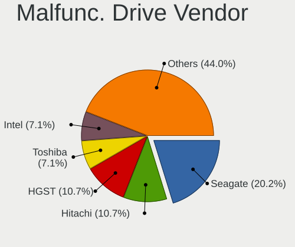

| Vendor              | Notebooks | Drives | Percent |
|---------------------|-----------|--------|---------|
| Seagate             | 17        | 19     | 20.24%  |
| Hitachi             | 9         | 11     | 10.71%  |
| HGST                | 9         | 10     | 10.71%  |
| Toshiba             | 6         | 7      | 7.14%   |
| Intel               | 6         | 7      | 7.14%   |
| WDC                 | 5         | 6      | 5.95%   |
| Micron Technology   | 5         | 6      | 5.95%   |
| Samsung Electronics | 4         | 4      | 4.76%   |
| SK hynix            | 3         | 3      | 3.57%   |
| SanDisk             | 3         | 3      | 3.57%   |
| Crucial             | 3         | 4      | 3.57%   |
| Apple               | 2         | 2      | 2.38%   |
| Union Memory        | 1         | 1      | 1.19%   |
| Transcend           | 1         | 1      | 1.19%   |
| Team                | 1         | 1      | 1.19%   |
| SSSTC               | 1         | 1      | 1.19%   |
| Silicon Motion      | 1         | 1      | 1.19%   |
| OCZ                 | 1         | 1      | 1.19%   |
| LITEONIT            | 1         | 1      | 1.19%   |
| Kingston            | 1         | 1      | 1.19%   |
| Fujitsu             | 1         | 1      | 1.19%   |
| Corsair             | 1         | 1      | 1.19%   |
| China               | 1         | 1      | 1.19%   |
| ADATA Technology    | 1         | 1      | 1.19%   |

Malfunc. HDD Vendor
-------------------

Vendors of faulty HDD drives

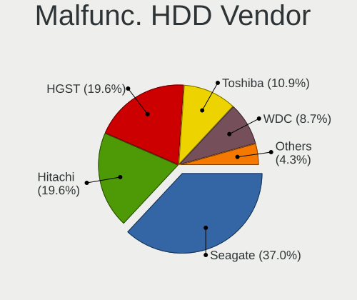

| Vendor  | Notebooks | Drives | Percent |
|---------|-----------|--------|---------|
| Seagate | 17        | 19     | 36.96%  |
| Hitachi | 9         | 11     | 19.57%  |
| HGST    | 9         | 10     | 19.57%  |
| Toshiba | 5         | 6      | 10.87%  |
| WDC     | 4         | 4      | 8.7%    |
| Fujitsu | 1         | 1      | 2.17%   |
| Apple   | 1         | 1      | 2.17%   |

Malfunc. Drive Kind
-------------------

Kinds of faulty drives

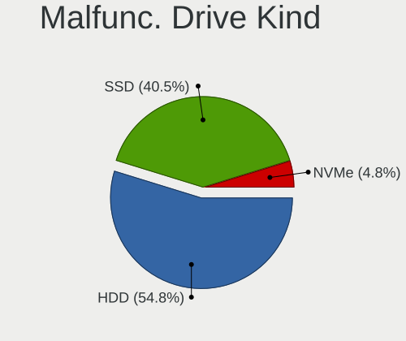

| Kind | Notebooks | Drives | Percent |
|------|-----------|--------|---------|
| HDD  | 46        | 52     | 54.76%  |
| SSD  | 34        | 38     | 40.48%  |
| NVMe | 4         | 4      | 4.76%   |

Failed Drives
-------------

Failed drive models

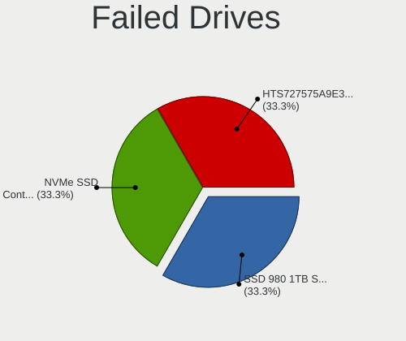

| Model                                                            | Notebooks | Drives | Percent |
|------------------------------------------------------------------|-----------|--------|---------|
| Samsung Electronics SSD 980 1TB S649NJ0R220122K                  | 1         | 1      | 33.33%  |
| Samsung Electronics NVMe SSD Controller SM961/PM961/SM963 1024GB | 1         | 1      | 33.33%  |
| Hitachi HTS727575A9E364 752GB                                    | 1         | 1      | 33.33%  |

Failed Drive Vendor
-------------------

Failed drive vendors

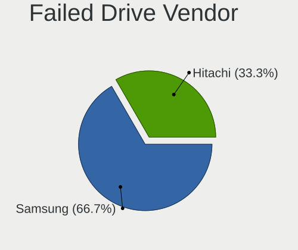

| Vendor              | Notebooks | Drives | Percent |
|---------------------|-----------|--------|---------|
| Samsung Electronics | 2         | 2      | 66.67%  |
| Hitachi             | 1         | 1      | 33.33%  |

Drive Status
------------

Number of failed and malfunc. drives

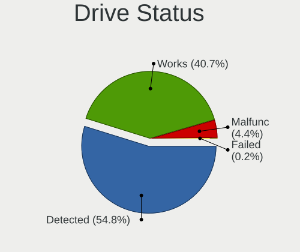

| Status   | Notebooks | Drives | Percent |
|----------|-----------|--------|---------|
| Detected | 1033      | 1591   | 54.8%   |
| Works    | 767       | 991    | 40.69%  |
| Malfunc  | 82        | 94     | 4.35%   |
| Failed   | 3         | 3      | 0.16%   |

Storage controller
------------------

Storage Vendor
--------------

Storage controller vendors

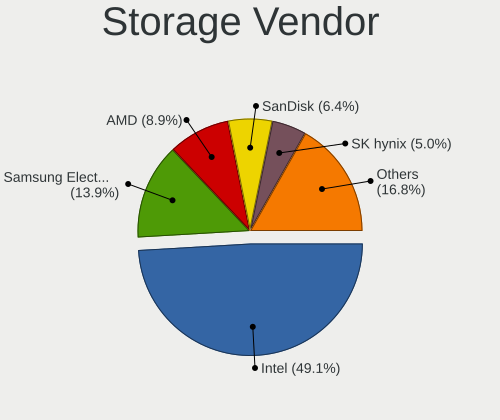

| Vendor                                  | Notebooks | Percent |
|-----------------------------------------|-----------|---------|
| Intel                                   | 1034      | 49.07%  |
| Samsung Electronics                     | 292       | 13.86%  |
| AMD                                     | 188       | 8.92%   |
| SanDisk                                 | 134       | 6.36%   |
| SK hynix                                | 105       | 4.98%   |
| Micron Technology                       | 71        | 3.37%   |
| Toshiba America Info Systems            | 64        | 3.04%   |
| Kingston Technology Company             | 59        | 2.8%    |
| KIOXIA                                  | 29        | 1.38%   |
| Phison Electronics                      | 24        | 1.14%   |
| Nvidia                                  | 19        | 0.9%    |
| Marvell Technology Group                | 13        | 0.62%   |
| Solid State Storage Technology          | 8         | 0.38%   |
| Silicon Motion                          | 7         | 0.33%   |
| Micron/Crucial Technology               | 7         | 0.33%   |
| Lite-On Technology                      | 7         | 0.33%   |
| Apple                                   | 7         | 0.33%   |
| ADATA Technology                        | 7         | 0.33%   |
| Lenovo                                  | 6         | 0.28%   |
| Union Memory (Shenzhen)                 | 5         | 0.24%   |
| Silicon Integrated Systems [SiS]        | 4         | 0.19%   |
| Shenzhen Unionmemory Information System | 3         | 0.14%   |
| O2 Micro                                | 3         | 0.14%   |
| Solidigm                                | 2         | 0.09%   |
| Shenzhen Longsys Electronics            | 2         | 0.09%   |
| Realtek Semiconductor                   | 2         | 0.09%   |
| MAXIO Technology (Hangzhou)             | 2         | 0.09%   |
| Yangtze Memory Technologies             | 1         | 0.05%   |
| Seagate Technology                      | 1         | 0.05%   |
| INNOGRIT                                | 1         | 0.05%   |

Storage Model
-------------

Storage controller models

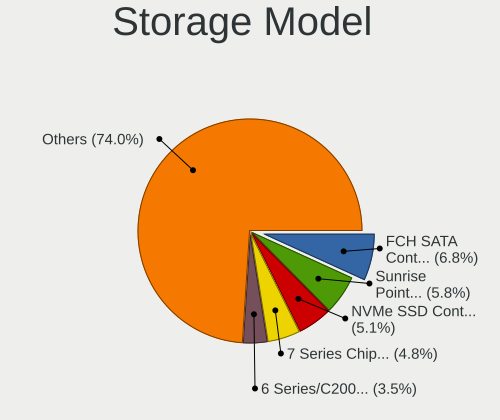

| Model                                                                          | Notebooks | Percent |
|--------------------------------------------------------------------------------|-----------|---------|
| AMD FCH SATA Controller [AHCI mode]                                            | 152       | 6.81%   |
| Intel Sunrise Point-LP SATA Controller [AHCI mode]                             | 129       | 5.78%   |
| Samsung NVMe SSD Controller SM981/PM981/PM983                                  | 114       | 5.11%   |
| Intel 7 Series Chipset Family 6-port SATA Controller [AHCI mode]               | 107       | 4.79%   |
| Intel 6 Series/C200 Series Chipset Family 6 port Mobile SATA AHCI Controller   | 79        | 3.54%   |
| Intel 82801 Mobile SATA Controller [RAID mode]                                 | 76        | 3.4%    |
| Intel 8 Series SATA Controller 1 [AHCI mode]                                   | 67        | 3%      |
| Intel Volume Management Device NVMe RAID Controller                            | 66        | 2.96%   |
| Intel 8 Series/C220 Series Chipset Family 6-port SATA Controller 1 [AHCI mode] | 55        | 2.46%   |
| Intel Cannon Lake Mobile PCH SATA AHCI Controller                              | 51        | 2.28%   |
| Samsung NVMe SSD Controller PM9A1/PM9A3/980PRO                                 | 50        | 2.24%   |
| Samsung NVMe SSD Controller 980 (DRAM-less)                                    | 50        | 2.24%   |
| Intel Wildcat Point-LP SATA Controller [AHCI Mode]                             | 50        | 2.24%   |
| SanDisk Extreme Pro / WD Black SN750 / PC SN730 / Red SN700 NVMe SSD           | 42        | 1.88%   |
| SK hynix Gold P31/BC711/PC711 NVMe Solid State Drive                           | 35        | 1.57%   |
| Samsung NVMe SSD Controller SM961/PM961/SM963                                  | 33        | 1.48%   |
| Intel 82801IBM/IEM (ICH9M/ICH9M-E) 4 port SATA Controller [AHCI mode]          | 30        | 1.34%   |
| Intel HM170/QM170 Chipset SATA Controller [AHCI Mode]                          | 27        | 1.21%   |
| Toshiba America Info Systems XG6 NVMe SSD Controller                           | 25        | 1.12%   |
| Intel SSD 660P Series                                                          | 24        | 1.07%   |
| Intel Atom Processor E3800 Series SATA AHCI Controller                         | 24        | 1.07%   |
| Intel 5 Series/3400 Series Chipset 4 port SATA AHCI Controller                 | 24        | 1.07%   |
| AMD SB7x0/SB8x0/SB9x0 SATA Controller [AHCI mode]                              | 23        | 1.03%   |
| SanDisk Ultra 3D / WD PC SN530, IX SN530, Blue SN550 NVMe SSD (DRAM-less)      | 22        | 0.99%   |
| Intel 5 Series/3400 Series Chipset 6 port SATA AHCI Controller                 | 22        | 0.99%   |
| SK hynix Platinum P41/PC801 NVMe Solid State Drive                             | 21        | 0.94%   |
| Intel SSD DC P4101/Pro 7600p/760p/E 6100p Series                               | 21        | 0.94%   |
| Intel 82801HM/HEM (ICH8M/ICH8M-E) IDE Controller                               | 20        | 0.9%    |
| Intel Q170/Q150/B150/H170/H110/Z170/CM236 Chipset SATA Controller [AHCI Mode]  | 18        | 0.81%   |
| Intel 82801HM/HEM (ICH8M/ICH8M-E) SATA Controller [AHCI mode]                  | 17        | 0.76%   |
| Samsung S4LN058A01[SSUBX] AHCI SSD Controller (Apple slot)                     | 16        | 0.72%   |
| Micron 2450 NVMe SSD [HendrixV] (DRAM-less)                                    | 16        | 0.72%   |
| KIOXIA NVMe SSD Controller BG4 (DRAM-less)                                     | 15        | 0.67%   |
| Intel SSD 670p Series [Keystone Harbor]                                        | 15        | 0.67%   |
| Micron 2400 NVMe SSD (DRAM-less)                                               | 14        | 0.63%   |
| Micron 2200S NVMe SSD [Cassandra]                                              | 14        | 0.63%   |
| Intel Tiger Lake-LP SATA Controller                                            | 14        | 0.63%   |
| SanDisk WD SN560/SN740/SN770/SN5000 NVMe SSD                                   | 13        | 0.58%   |
| SanDisk WD Blue SN500 / PC SN520 x2 M.2 2280 NVMe SSD                          | 13        | 0.58%   |
| Phison PS5013-E13 PCIe3 NVMe Controller (DRAM-less)                            | 13        | 0.58%   |

Storage Kind
------------

Kind of storage controller (IDE, SATA, NVMe, SAS, ...)

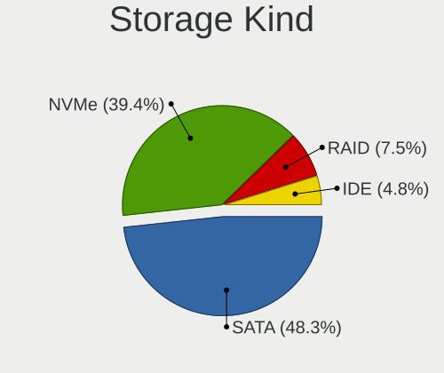

| Kind | Notebooks | Percent |
|------|-----------|---------|
| SATA | 1032      | 48.29%  |
| NVMe | 842       | 39.4%   |
| RAID | 160       | 7.49%   |
| IDE  | 103       | 4.82%   |

Processor
---------

CPU Vendor
----------

Processor vendors

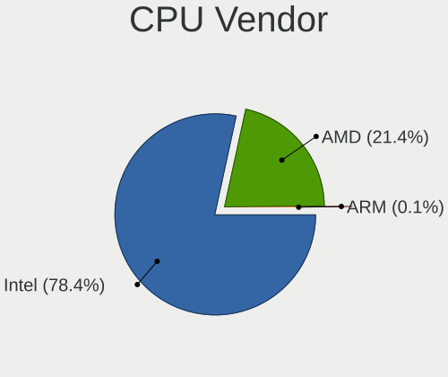

| Vendor  | Notebooks | Percent |
|---------|-----------|---------|
| Intel   | 1409      | 78.41%  |
| AMD     | 385       | 21.42%  |
| Unknown | 2         | 0.11%   |
| ARM     | 1         | 0.06%   |

CPU Model
---------

Processor models

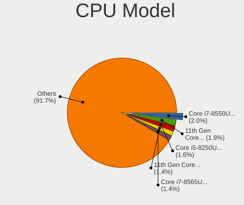

| Model                                         | Notebooks | Percent |
|-----------------------------------------------|-----------|---------|
| Intel Core i7-8550U CPU @ 1.80GHz             | 36        | 2%      |
| Intel 11th Gen Core i7-1165G7 @ 2.80GHz       | 34        | 1.89%   |
| Intel Core i5-8250U CPU @ 1.60GHz             | 29        | 1.61%   |
| Intel 11th Gen Core i5-1135G7 @ 2.40GHz       | 26        | 1.45%   |
| Intel Core i7-8565U CPU @ 1.80GHz             | 25        | 1.39%   |
| Intel Core i5-6200U CPU @ 2.30GHz             | 25        | 1.39%   |
| Intel Core i7-7700HQ CPU @ 2.80GHz            | 21        | 1.17%   |
| Intel Core i5-6300U CPU @ 2.40GHz             | 20        | 1.11%   |
| Intel Core i5-7200U CPU @ 2.50GHz             | 17        | 0.95%   |
| Intel Core i5-5300U CPU @ 2.30GHz             | 17        | 0.95%   |
| Intel Core i5-2520M CPU @ 2.50GHz             | 17        | 0.95%   |
| Intel Core i7-8750H CPU @ 2.20GHz             | 16        | 0.89%   |
| Intel Core i7-7500U CPU @ 2.70GHz             | 16        | 0.89%   |
| Intel Core i7-6500U CPU @ 2.50GHz             | 16        | 0.89%   |
| Intel Celeron CPU N2840 @ 2.16GHz             | 16        | 0.89%   |
| Intel 12th Gen Core i7-12700H                 | 16        | 0.89%   |
| AMD Custom APU 0405                           | 16        | 0.89%   |
| Intel Core i5-4200U CPU @ 1.60GHz             | 14        | 0.78%   |
| Intel Core i5-3210M CPU @ 2.50GHz             | 14        | 0.78%   |
| AMD Ryzen 5 5500U with Radeon Graphics        | 14        | 0.78%   |
| Intel Core i7-8650U CPU @ 1.90GHz             | 13        | 0.72%   |
| Intel Core i7-10750H CPU @ 2.60GHz            | 13        | 0.72%   |
| Intel Core i5-8265U CPU @ 1.60GHz             | 13        | 0.72%   |
| Intel Core i5-10210U CPU @ 1.60GHz            | 13        | 0.72%   |
| AMD Ryzen 7 5700U with Radeon Graphics        | 13        | 0.72%   |
| AMD Ryzen 5 7520U with Radeon Graphics        | 13        | 0.72%   |
| Intel Core i7-9750H CPU @ 2.60GHz             | 12        | 0.67%   |
| Intel Core i5-3320M CPU @ 2.60GHz             | 12        | 0.67%   |
| Intel 11th Gen Core i7-1185G7 @ 3.00GHz       | 12        | 0.67%   |
| Intel Core i5-5200U CPU @ 2.20GHz             | 11        | 0.61%   |
| AMD Ryzen 9 5900HX with Radeon Graphics       | 11        | 0.61%   |
| AMD Ryzen 7 5800H with Radeon Graphics        | 11        | 0.61%   |
| AMD Ryzen 5 5600H with Radeon Graphics        | 11        | 0.61%   |
| Intel Core i7-6600U CPU @ 2.60GHz             | 10        | 0.56%   |
| Intel Core i7-4600U CPU @ 2.10GHz             | 10        | 0.56%   |
| Intel Core i5-8350U CPU @ 1.70GHz             | 10        | 0.56%   |
| Intel Core i5-4300U CPU @ 1.90GHz             | 10        | 0.56%   |
| Intel Core i5-3230M CPU @ 2.60GHz             | 10        | 0.56%   |
| Intel 11th Gen Core i7-11800H @ 2.30GHz       | 10        | 0.56%   |
| AMD Ryzen 7 3700U with Radeon Vega Mobile Gfx | 10        | 0.56%   |

CPU Model Family
----------------

Processor model prefix

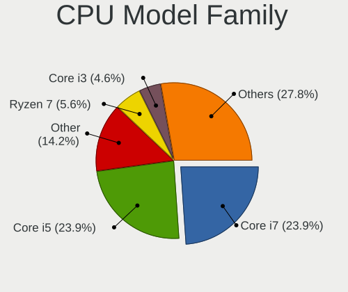

| Model                          | Notebooks | Percent |
|--------------------------------|-----------|---------|
| Intel Core i7                  | 430       | 23.92%  |
| Intel Core i5                  | 430       | 23.92%  |
| Other                          | 256       | 14.24%  |
| AMD Ryzen 7                    | 101       | 5.62%   |
| Intel Core i3                  | 82        | 4.56%   |
| AMD Ryzen 5                    | 75        | 4.17%   |
| Intel Celeron                  | 68        | 3.78%   |
| Intel Core 2 Duo               | 57        | 3.17%   |
| AMD Ryzen 9                    | 24        | 1.33%   |
| Intel Pentium                  | 19        | 1.06%   |
| Intel Core                     | 19        | 1.06%   |
| AMD Ryzen 3                    | 19        | 1.06%   |
| AMD A8                         | 19        | 1.06%   |
| Intel Atom                     | 17        | 0.95%   |
| AMD Ryzen 7 PRO                | 16        | 0.89%   |
| AMD A6                         | 14        | 0.78%   |
| AMD A10                        | 12        | 0.67%   |
| Intel Genuine                  | 11        | 0.61%   |
| Intel Core 2                   | 11        | 0.61%   |
| Intel Xeon                     | 10        | 0.56%   |
| Intel Core i9                  | 10        | 0.56%   |
| AMD Ryzen 5 PRO                | 10        | 0.56%   |
| AMD E                          | 10        | 0.56%   |
| AMD E1                         | 9         | 0.5%    |
| AMD A4                         | 9         | 0.5%    |
| AMD Turion 64 X2 Mobile        | 5         | 0.28%   |
| Intel Pentium Silver           | 4         | 0.22%   |
| Intel Pentium M                | 4         | 0.22%   |
| Intel Pentium Dual-Core        | 4         | 0.22%   |
| Intel Pentium Dual             | 4         | 0.22%   |
| Intel Core m3                  | 4         | 0.22%   |
| AMD E2                         | 4         | 0.22%   |
| AMD Athlon 64 X2               | 4         | 0.22%   |
| Intel Celeron Dual-Core        | 3         | 0.17%   |
| AMD Turion X2 Dual-Core Mobile | 2         | 0.11%   |
| AMD Sempron                    | 2         | 0.11%   |
| AMD Athlon II Neo              | 2         | 0.11%   |
| AMD Athlon II Dual-Core        | 2         | 0.11%   |
| AMD Athlon II                  | 2         | 0.11%   |
| Intel Core m7                  | 1         | 0.06%   |

CPU Cores
---------

Number of processor cores

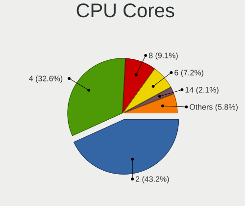

| Number | Notebooks | Percent |
|--------|-----------|---------|
| 2      | 778       | 43.25%  |
| 4      | 587       | 32.63%  |
| 8      | 163       | 9.06%   |
| 6      | 129       | 7.17%   |
| 14     | 38        | 2.11%   |
| 10     | 30        | 1.67%   |
| 12     | 26        | 1.45%   |
| 1      | 24        | 1.33%   |
| 16     | 14        | 0.78%   |
| 24     | 9         | 0.5%    |
| 20     | 1         | 0.06%   |

CPU Sockets
-----------

Number of sockets

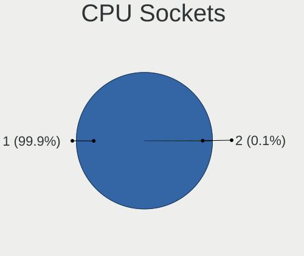

| Number | Notebooks | Percent |
|--------|-----------|---------|
| 1      | 1796      | 99.94%  |
| 2      | 1         | 0.06%   |

CPU Threads
-----------

Threads per core (Hyper-Threading)

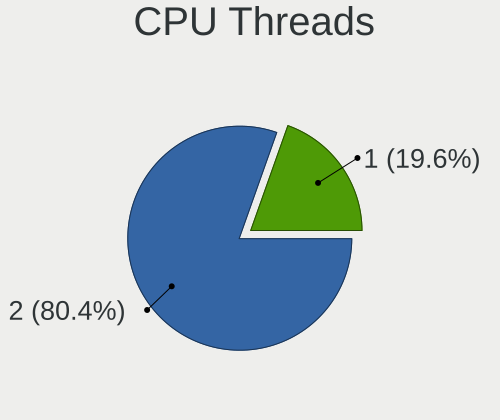

| Number | Notebooks | Percent |
|--------|-----------|---------|
| 2      | 1450      | 80.42%  |
| 1      | 353       | 19.58%  |

CPU Op-Modes
------------

CPU Operation Modes (32-bit, 64-bit)

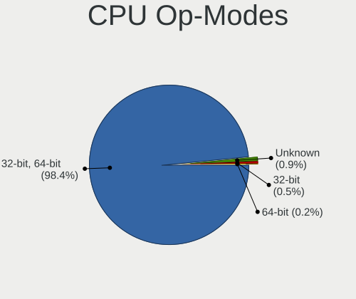

| Op mode        | Notebooks | Percent |
|----------------|-----------|---------|
| 32-bit, 64-bit | 1772      | 98.44%  |
| Unknown        | 16        | 0.89%   |
| 32-bit         | 9         | 0.5%    |
| 64-bit         | 3         | 0.17%   |

CPU Microcode
-------------

Microcode number

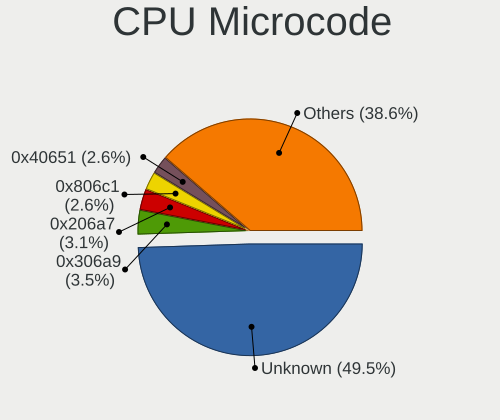

| Number     | Notebooks | Percent |
|------------|-----------|---------|
| Unknown    | 922       | 49.49%  |
| 0x306a9    | 66        | 3.54%   |
| 0x206a7    | 57        | 3.06%   |
| 0x806c1    | 49        | 2.63%   |
| 0x40651    | 49        | 2.63%   |
| 0x306d4    | 45        | 2.42%   |
| 0x306c3    | 45        | 2.42%   |
| 0x406e3    | 44        | 2.36%   |
| 0x806ea    | 40        | 2.15%   |
| 0x806ec    | 39        | 2.09%   |
| 0x806e9    | 35        | 1.88%   |
| 0x906ea    | 26        | 1.4%    |
| 0x906e9    | 25        | 1.34%   |
| 0x20655    | 25        | 1.34%   |
| 0x1067a    | 24        | 1.29%   |
| 0x0a50000c | 19        | 1.02%   |
| 0x6fd      | 14        | 0.75%   |
| 0x08600106 | 14        | 0.75%   |
| 0xa0652    | 13        | 0.7%    |
| 0x906a3    | 12        | 0.64%   |
| 0x806eb    | 12        | 0.64%   |
| 0x08108109 | 12        | 0.64%   |
| 0x08608103 | 11        | 0.59%   |
| 0x0700010f | 11        | 0.59%   |
| 0x806d1    | 10        | 0.54%   |
| 0x406c4    | 10        | 0.54%   |
| 0x506e3    | 9         | 0.48%   |
| 0x30678    | 9         | 0.48%   |
| 0x20652    | 8         | 0.43%   |
| 0x08108102 | 8         | 0.43%   |
| 0x0810100b | 8         | 0.43%   |
| 0x05000119 | 8         | 0.43%   |
| 0x706e5    | 7         | 0.38%   |
| 0x6fb      | 7         | 0.38%   |
| 0x6f6      | 7         | 0.38%   |
| 0x0a404102 | 7         | 0.38%   |
| 0x06001119 | 7         | 0.38%   |
| 0x906ed    | 6         | 0.32%   |
| 0x10676    | 6         | 0.32%   |
| 0x0a50000d | 6         | 0.32%   |

CPU Microarch
-------------

Microarchitecture

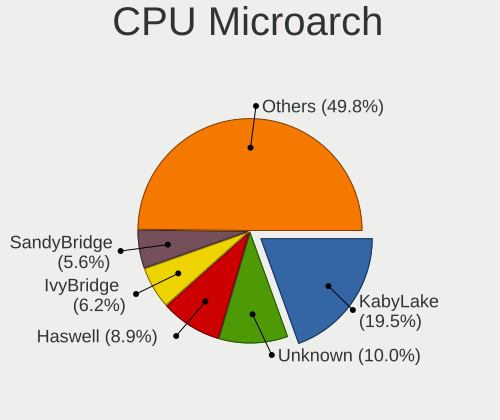

| Name              | Notebooks | Percent |
|-------------------|-----------|---------|
| KabyLake          | 351       | 19.49%  |
| Unknown           | 181       | 10.05%  |
| Haswell           | 160       | 8.88%   |
| IvyBridge         | 111       | 6.16%   |
| SandyBridge       | 101       | 5.61%   |
| Skylake           | 99        | 5.5%    |
| TigerLake         | 93        | 5.16%   |
| Zen 3             | 71        | 3.94%   |
| Broadwell         | 70        | 3.89%   |
| Alderlake Hybrid  | 66        | 3.66%   |
| Westmere          | 50        | 2.78%   |
| Penryn            | 50        | 2.78%   |
| Silvermont        | 49        | 2.72%   |
| Core              | 42        | 2.33%   |
| Zen 2             | 37        | 2.05%   |
| Zen+              | 32        | 1.78%   |
| CometLake         | 29        | 1.61%   |
| IceLake           | 26        | 1.44%   |
| Excavator         | 21        | 1.17%   |
| Zen               | 17        | 0.94%   |
| Piledriver        | 16        | 0.89%   |
| Puma              | 14        | 0.78%   |
| Bobcat            | 14        | 0.78%   |
| Goldmont plus     | 13        | 0.72%   |
| Jaguar            | 12        | 0.67%   |
| K8 Hammer         | 11        | 0.61%   |
| K10               | 9         | 0.5%    |
| Meteorlake Hybrid | 7         | 0.39%   |
| K10 Llano         | 7         | 0.39%   |
| Goldmont          | 7         | 0.39%   |
| Bonnell           | 7         | 0.39%   |
| P6                | 6         | 0.33%   |
| Nehalem           | 6         | 0.33%   |
| Tremont           | 5         | 0.28%   |
| K8 & K10 hybrid   | 5         | 0.28%   |
| Steamroller       | 3         | 0.17%   |
| Gracemont         | 2         | 0.11%   |
| Lunarlake Hybrid  | 1         | 0.06%   |

Graphics
--------

GPU Vendor
----------

Vendors of graphics cards

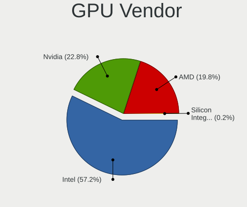

| Vendor                           | Notebooks | Percent |
|----------------------------------|-----------|---------|
| Intel                            | 1278      | 57.21%  |
| Nvidia                           | 509       | 22.78%  |
| AMD                              | 443       | 19.83%  |
| Silicon Integrated Systems [SiS] | 4         | 0.18%   |

GPU Model
---------

Graphics card models

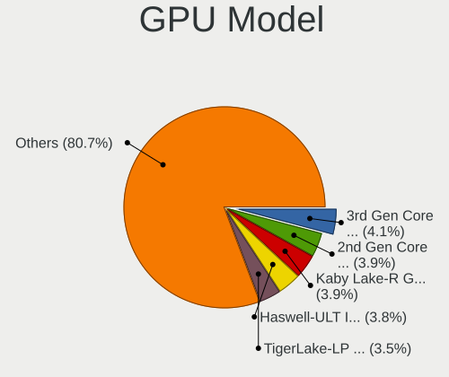

| Model                                                                                    | Notebooks | Percent |
|------------------------------------------------------------------------------------------|-----------|---------|
| Intel 3rd Gen Core processor Graphics Controller                                         | 95        | 4.13%   |
| Intel 2nd Generation Core Processor Family Integrated Graphics Controller                | 90        | 3.92%   |
| Intel Kaby Lake-R GT2 [UHD Graphics 620]                                                 | 89        | 3.87%   |
| Intel Haswell-ULT Integrated Graphics Controller                                         | 88        | 3.83%   |
| Intel TigerLake-LP GT2 [Iris Xe Graphics]                                                | 81        | 3.52%   |
| Intel Skylake-U GT2 [HD Graphics 520]                                                    | 77        | 3.35%   |
| Intel CoffeeLake-H GT2 [UHD Graphics 630]                                                | 59        | 2.57%   |
| Intel WhiskeyLake-U GT2 [UHD Graphics 620]                                               | 57        | 2.48%   |
| AMD Cezanne [Radeon Vega Series / Radeon Vega Mobile Series]                             | 53        | 2.31%   |
| Intel Broadwell-U GT2 [HD Graphics 5500]                                                 | 52        | 2.26%   |
| Intel 4th Gen Core Processor Integrated Graphics Controller                              | 52        | 2.26%   |
| Intel Kaby Lake-U GT2 [HD Graphics 620]                                                  | 50        | 2.18%   |
| AMD Picasso/Raven 2 [Radeon Vega Series / Radeon Vega Mobile Series]                     | 37        | 1.61%   |
| AMD Renoir [Radeon Vega Series / Radeon Vega Mobile Series]                              | 35        | 1.52%   |
| Intel Kaby Lake-H GT2 [HD Graphics 630]                                                  | 33        | 1.44%   |
| Intel Core Processor Integrated Graphics Controller                                      | 33        | 1.44%   |
| Intel Alder Lake-P GT2 [Iris Xe Graphics]                                                | 32        | 1.39%   |
| Intel CometLake-U GT2 [UHD Graphics]                                                     | 31        | 1.35%   |
| Intel Atom Processor Z36xxx/Z37xxx Series Graphics & Display                             | 31        | 1.35%   |
| AMD Lucienne                                                                             | 30        | 1.31%   |
| Intel Mobile 4 Series Chipset Integrated Graphics Controller                             | 26        | 1.13%   |
| Intel Raptor Lake-P [Iris Xe Graphics]                                                   | 25        | 1.09%   |
| AMD Rembrandt [Radeon 680M]                                                              | 24        | 1.04%   |
| Intel CometLake-H GT2 [UHD Graphics]                                                     | 23        | 1%      |
| Nvidia GA106M [GeForce RTX 3060 Mobile / Max-Q]                                          | 20        | 0.87%   |
| Intel TigerLake-H GT1 [UHD Graphics]                                                     | 20        | 0.87%   |
| Nvidia GP107M [GeForce GTX 1050 Ti Mobile]                                               | 18        | 0.78%   |
| Intel Mobile GM965/GL960 Integrated Graphics Controller (secondary)                      | 18        | 0.78%   |
| Intel Mobile GM965/GL960 Integrated Graphics Controller (primary)                        | 18        | 0.78%   |
| Intel Atom/Celeron/Pentium Processor x5-E8000/J3xxx/N3xxx Integrated Graphics Controller | 18        | 0.78%   |
| AMD VanGogh [AMD Custom GPU 0405]                                                        | 16        | 0.7%    |
| Nvidia AD106M [GeForce RTX 4070 Max-Q / Mobile]                                          | 15        | 0.65%   |
| AMD Phoenix1                                                                             | 15        | 0.65%   |
| AMD Mendocino [Radeon 610M]                                                              | 15        | 0.65%   |
| Nvidia TU117M [GeForce GTX 1650 Mobile / Max-Q]                                          | 14        | 0.61%   |
| AMD Barcelo                                                                              | 14        | 0.61%   |
| Intel Alder Lake-UP3 GT2 [Iris Xe Graphics]                                              | 13        | 0.57%   |
| AMD Mullins [Radeon R4/R5 Graphics]                                                      | 13        | 0.57%   |
| Nvidia TU106M [GeForce RTX 2060 Mobile]                                                  | 12        | 0.52%   |
| Nvidia GP107M [GeForce GTX 1050 Mobile]                                                  | 12        | 0.52%   |

GPU Combo
---------

Combinations of graphics cards

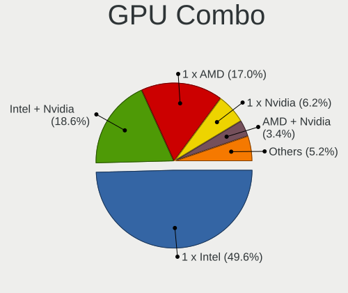

| Name           | Notebooks | Percent |
|----------------|-----------|---------|
| 1 x Intel      | 893       | 49.58%  |
| Intel + Nvidia | 335       | 18.6%   |
| 1 x AMD        | 306       | 16.99%  |
| 1 x Nvidia     | 112       | 6.22%   |
| AMD + Nvidia   | 61        | 3.39%   |
| Intel + AMD    | 42        | 2.33%   |
| 2 x AMD        | 34        | 1.89%   |
| 2 x Intel      | 9         | 0.5%    |
| Other          | 4         | 0.22%   |
| 1 x SiS        | 4         | 0.22%   |
| 2 x Nvidia     | 1         | 0.06%   |

GPU Driver
----------

Free vs proprietary

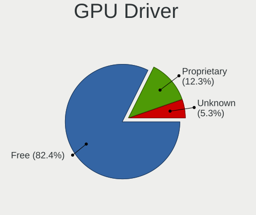

| Driver      | Notebooks | Percent |
|-------------|-----------|---------|
| Free        | 1500      | 82.37%  |
| Proprietary | 224       | 12.3%   |
| Unknown     | 97        | 5.33%   |

GPU Memory
----------

Total video memory

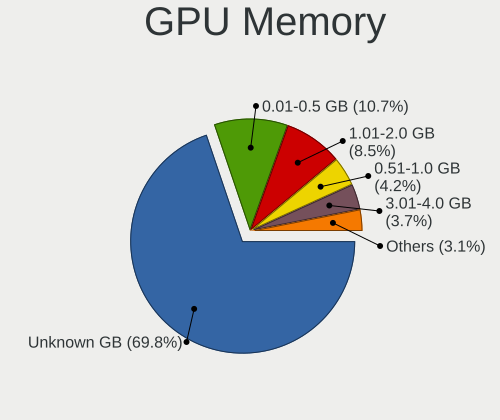

| Size in GB | Notebooks | Percent |
|------------|-----------|---------|
| Unknown    | 1283      | 69.8%   |
| 0.01-0.5   | 196       | 10.66%  |
| 1.01-2.0   | 156       | 8.49%   |
| 0.51-1.0   | 78        | 4.24%   |
| 3.01-4.0   | 68        | 3.7%    |
| 7.01-8.0   | 27        | 1.47%   |
| 5.01-6.0   | 19        | 1.03%   |
| 2.01-3.0   | 6         | 0.33%   |
| 8.01-16.0  | 5         | 0.27%   |

Monitor
-------

Monitor Vendor
--------------

Monitor vendors

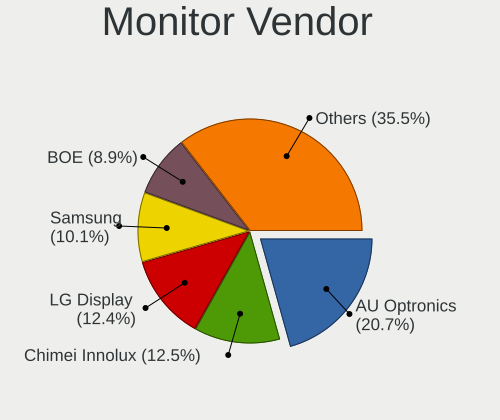

| Vendor                  | Notebooks | Percent |
|-------------------------|-----------|---------|
| AU Optronics            | 435       | 20.67%  |
| Chimei Innolux          | 262       | 12.45%  |
| LG Display              | 261       | 12.4%   |
| Samsung Electronics     | 212       | 10.08%  |
| BOE                     | 187       | 8.89%   |
| Sharp                   | 84        | 3.99%   |
| Apple                   | 82        | 3.9%    |
| Dell                    | 70        | 3.33%   |
| Lenovo                  | 54        | 2.57%   |
| InfoVision              | 35        | 1.66%   |
| Hewlett-Packard         | 35        | 1.66%   |
| Philips                 | 34        | 1.62%   |
| Chi Mei Optoelectronics | 31        | 1.47%   |
| CSO                     | 30        | 1.43%   |
| BenQ                    | 23        | 1.09%   |
| ASUSTek Computer        | 22        | 1.05%   |
| PANDA                   | 21        | 1%      |
| Goldstar                | 21        | 1%      |
| LG Philips              | 20        | 0.95%   |
| AOC                     | 19        | 0.9%    |
| Acer                    | 17        | 0.81%   |
| Ancor Communications    | 16        | 0.76%   |
| Valve                   | 13        | 0.62%   |
| CSOT                    | 12        | 0.57%   |
| Panasonic               | 8         | 0.38%   |
| Vestel Elektronik       | 6         | 0.29%   |
| Sony                    | 6         | 0.29%   |
| Quanta Display          | 5         | 0.24%   |
| MSI                     | 5         | 0.24%   |
| LGD                     | 5         | 0.24%   |
| BOE Technology Group    | 5         | 0.24%   |
| Unknown                 | 4         | 0.19%   |
| Toshiba                 | 4         | 0.19%   |
| Eizo                    | 4         | 0.19%   |
| CSW                     | 4         | 0.19%   |
| TMX                     | 3         | 0.14%   |
| Mi                      | 3         | 0.14%   |
| JDI                     | 3         | 0.14%   |
| Analogix                | 3         | 0.14%   |
| RTK                     | 2         | 0.1%    |

Monitor Model
-------------

Monitor models

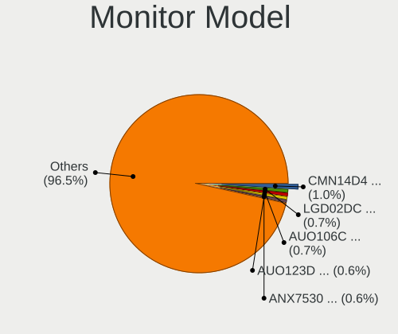

| Model                                                                 | Notebooks | Percent |
|-----------------------------------------------------------------------|-----------|---------|
| Chimei Innolux LCD Monitor CMN14D4 1920x1080 309x173mm 13.9-inch      | 21        | 0.98%   |
| LG Display LCD Monitor LGD02DC 1366x768 344x194mm 15.5-inch           | 14        | 0.65%   |
| AU Optronics LCD Monitor AUO106C 1366x768 276x155mm 12.5-inch         | 14        | 0.65%   |
| AU Optronics LCD Monitor AUO123D 1920x1080 309x173mm 13.9-inch        | 13        | 0.61%   |
| Valve ANX7530 U VLV3001 800x1280 100x150mm 7.1-inch                   | 12        | 0.56%   |
| AU Optronics LCD Monitor AUO38ED 1920x1080 344x193mm 15.5-inch        | 11        | 0.51%   |
| AU Optronics LCD Monitor AUO21ED 1920x1080 344x193mm 15.5-inch        | 11        | 0.51%   |
| Samsung Electronics LCD Monitor SDC4161 1920x1080 344x194mm 15.5-inch | 10        | 0.47%   |
| Chimei Innolux LCD Monitor CMN15F5 1920x1080 344x193mm 15.5-inch      | 10        | 0.47%   |
| AU Optronics LCD Monitor AUO26EC 1366x768 344x193mm 15.5-inch         | 10        | 0.47%   |
| Chimei Innolux LCD Monitor CMN14F2 1920x1080 309x173mm 13.9-inch      | 9         | 0.42%   |
| Chimei Innolux LCD Monitor CMN140A 1920x1080 309x173mm 13.9-inch      | 9         | 0.42%   |
| AU Optronics LCD Monitor AUO403D 1920x1080 309x174mm 14.0-inch        | 9         | 0.42%   |
| Apple Color LCD APP9CDF 1440x900 286x179mm 13.3-inch                  | 9         | 0.42%   |
| LG Display LCD Monitor LGD033A 1366x768 344x194mm 15.5-inch           | 8         | 0.37%   |
| LG Display LCD Monitor LGD02D8 1366x768 277x156mm 12.5-inch           | 8         | 0.37%   |
| Chimei Innolux LCD Monitor CMN15C3 1920x1080 344x193mm 15.5-inch      | 8         | 0.37%   |
| Chimei Innolux LCD Monitor CMN14E5 1920x1080 309x173mm 13.9-inch      | 8         | 0.37%   |
| AU Optronics LCD Monitor AUO22EC 1366x768 344x193mm 15.5-inch         | 8         | 0.37%   |
| AU Optronics LCD Monitor AUO226D 1920x1080 276x155mm 12.5-inch        | 8         | 0.37%   |
| LG Display LCD Monitor LGD0521 1920x1080 309x174mm 14.0-inch          | 7         | 0.33%   |
| Chimei Innolux LCD Monitor CMN15D2 1920x1080 344x193mm 15.5-inch      | 7         | 0.33%   |
| Chimei Innolux LCD Monitor CMN1521 1920x1080 344x193mm 15.5-inch      | 7         | 0.33%   |
| Chimei Innolux LCD Monitor CMN14D5 1920x1080 309x173mm 13.9-inch      | 7         | 0.33%   |
| Chimei Innolux LCD Monitor CMN14C9 1920x1080 309x173mm 13.9-inch      | 7         | 0.33%   |
| AU Optronics LCD Monitor AUO243D 1920x1080 309x173mm 13.9-inch        | 7         | 0.33%   |
| AU Optronics LCD Monitor AUO206C 1366x768 277x156mm 12.5-inch         | 7         | 0.33%   |
| Apple Color LCD APP9CF0 1440x900 290x180mm 13.4-inch                  | 7         | 0.33%   |
| Vestel Elektronik 40UHD_LCD_TV VES3700 3840x2160 880x500mm 39.8-inch  | 6         | 0.28%   |
| Sharp LCD Monitor SHP14FA 3840x2400 288x180mm 13.4-inch               | 6         | 0.28%   |
| Sharp LCD Monitor SHP14D0 3840x2400 336x210mm 15.6-inch               | 6         | 0.28%   |
| Sharp LCD Monitor SHP1484 1920x1080 294x165mm 13.3-inch               | 6         | 0.28%   |
| Samsung Electronics LCD Monitor SDCA029 3840x2160 344x194mm 15.5-inch | 6         | 0.28%   |
| Dell U2412M DELA07A 1920x1200 518x324mm 24.1-inch                     | 6         | 0.28%   |
| Chimei Innolux LCD Monitor CMN15E8 1920x1080 344x193mm 15.5-inch      | 6         | 0.28%   |
| Chimei Innolux LCD Monitor CMN15E7 1920x1080 344x193mm 15.5-inch      | 6         | 0.28%   |
| AU Optronics LCD Monitor AUOD291 1920x1200 301x188mm 14.0-inch        | 6         | 0.28%   |
| AU Optronics LCD Monitor AUO683D 1920x1080 309x174mm 14.0-inch        | 6         | 0.28%   |
| AU Optronics LCD Monitor AUO573D 1920x1080 309x174mm 14.0-inch        | 6         | 0.28%   |
| AU Optronics LCD Monitor AUO133D 1920x1080 309x173mm 13.9-inch        | 6         | 0.28%   |

Monitor Resolution
------------------

Monitor screen resolution

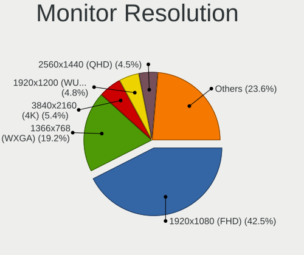

| Resolution         | Notebooks | Percent |
|--------------------|-----------|---------|
| 1920x1080 (FHD)    | 850       | 42.52%  |
| 1366x768 (WXGA)    | 383       | 19.16%  |
| 3840x2160 (4K)     | 108       | 5.4%    |
| 1920x1200 (WUXGA)  | 96        | 4.8%    |
| 2560x1440 (QHD)    | 90        | 4.5%    |
| 2560x1600          | 66        | 3.3%    |
| 1600x900 (HD+)     | 66        | 3.3%    |
| 1280x800 (WXGA)    | 63        | 3.15%   |
| 2880x1800          | 53        | 2.65%   |
| 1440x900 (WXGA+)   | 37        | 1.85%   |
| 3440x1440          | 31        | 1.55%   |
| 3840x2400          | 24        | 1.2%    |
| 1680x1050 (WSXGA+) | 21        | 1.05%   |
| 800x1280           | 16        | 0.8%    |
| 3200x1800 (QHD+)   | 12        | 0.6%    |
| 3840x1080          | 7         | 0.35%   |
| 1024x600           | 7         | 0.35%   |
| 3200x2000          | 6         | 0.3%    |
| 2160x1440          | 6         | 0.3%    |
| 1024x768 (XGA)     | 6         | 0.3%    |
| Unknown            | 6         | 0.3%    |
| 1280x1024 (SXGA)   | 5         | 0.25%   |
| 2880x1920          | 4         | 0.2%    |
| 2288x1287          | 4         | 0.2%    |
| 1920x540           | 4         | 0.2%    |
| 1360x768           | 4         | 0.2%    |
| 3000x2000          | 3         | 0.15%   |
| 2560x1080          | 3         | 0.15%   |
| 1920x1280          | 3         | 0.15%   |
| 3072x1920          | 2         | 0.1%    |
| 2256x1504          | 2         | 0.1%    |
| 1400x1050          | 2         | 0.1%    |
| 3840x1600          | 1         | 0.05%   |
| 3840x1200          | 1         | 0.05%   |
| 3840x1100          | 1         | 0.05%   |
| 3456x2160          | 1         | 0.05%   |
| 2560x1700          | 1         | 0.05%   |
| 2304x1440          | 1         | 0.05%   |
| 2240x1400          | 1         | 0.05%   |
| 1680x945           | 1         | 0.05%   |

Monitor Diagonal
----------------

Diagonal size in inches

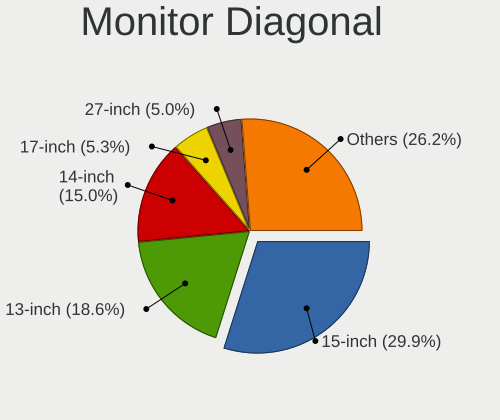

| Inches  | Notebooks | Percent |
|---------|-----------|---------|
| 15      | 629       | 29.88%  |
| 13      | 391       | 18.57%  |
| 14      | 316       | 15.01%  |
| 17      | 111       | 5.27%   |
| 27      | 106       | 5.04%   |
| 12      | 97        | 4.61%   |
| 24      | 78        | 3.71%   |
| 16      | 64        | 3.04%   |
| 23      | 39        | 1.85%   |
| 31      | 33        | 1.57%   |
| 11      | 33        | 1.57%   |
| Unknown | 30        | 1.43%   |
| 34      | 29        | 1.38%   |
| 21      | 21        | 1%      |
| 7       | 13        | 0.62%   |
| 22      | 12        | 0.57%   |
| 84      | 11        | 0.52%   |
| 32      | 8         | 0.38%   |
| 18      | 8         | 0.38%   |
| 10      | 6         | 0.29%   |
| 54      | 5         | 0.24%   |
| 25      | 5         | 0.24%   |
| 19      | 5         | 0.24%   |
| 65      | 4         | 0.19%   |
| 48      | 4         | 0.19%   |
| 40      | 4         | 0.19%   |
| 39      | 4         | 0.19%   |
| 142     | 3         | 0.14%   |
| 72      | 3         | 0.14%   |
| 35      | 3         | 0.14%   |
| 29      | 3         | 0.14%   |
| 26      | 3         | 0.14%   |
| 3       | 3         | 0.14%   |
| 49      | 2         | 0.1%    |
| 42      | 2         | 0.1%    |
| 37      | 2         | 0.1%    |
| 33      | 2         | 0.1%    |
| 20      | 2         | 0.1%    |
| 86      | 1         | 0.05%   |
| 85      | 1         | 0.05%   |

Monitor Width
-------------

Physical width

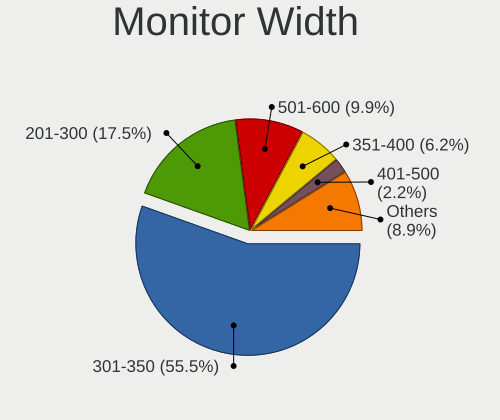

| Width in mm    | Notebooks | Percent |
|----------------|-----------|---------|
| 301-350        | 1153      | 55.46%  |
| 201-300        | 363       | 17.46%  |
| 501-600        | 205       | 9.86%   |
| 351-400        | 129       | 6.2%    |
| 401-500        | 45        | 2.16%   |
| 601-700        | 44        | 2.12%   |
| 701-800        | 36        | 1.73%   |
| Unknown        | 30        | 1.44%   |
| 1001-1500      | 19        | 0.91%   |
| 1501-2000      | 17        | 0.82%   |
| 1-100          | 16        | 0.77%   |
| 801-900        | 11        | 0.53%   |
| 901-1000       | 6         | 0.29%   |
| More than 2000 | 3         | 0.14%   |
| 101-200        | 2         | 0.1%    |

Aspect Ratio
------------

Proportional relationship between the width and the height

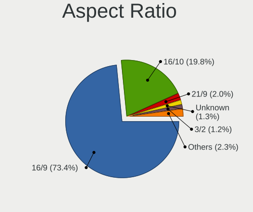

| Ratio   | Notebooks | Percent |
|---------|-----------|---------|
| 16/9    | 1380      | 73.44%  |
| 16/10   | 372       | 19.8%   |
| 21/9    | 37        | 1.97%   |
| Unknown | 25        | 1.33%   |
| 3/2     | 22        | 1.17%   |
| 0.67    | 12        | 0.64%   |
| 4/3     | 7         | 0.37%   |
| 5/4     | 6         | 0.32%   |
| 32/9    | 6         | 0.32%   |
| 6/5     | 4         | 0.21%   |
| 1.00    | 3         | 0.16%   |
| 3.40    | 1         | 0.05%   |
| 3.20    | 1         | 0.05%   |
| 0.63    | 1         | 0.05%   |
| 0.62    | 1         | 0.05%   |
| 0.56    | 1         | 0.05%   |

Monitor Area
------------

Area in inch²

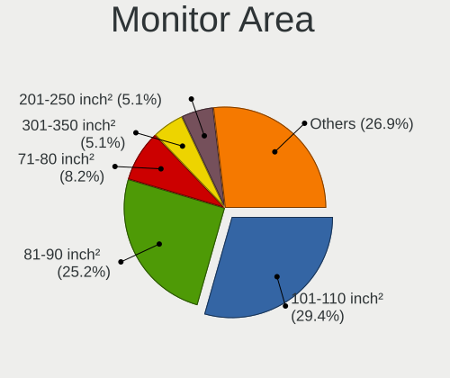

| Area in inch² | Notebooks | Percent |
|----------------|-----------|---------|
| 101-110        | 617       | 29.39%  |
| 81-90          | 529       | 25.2%   |
| 71-80          | 173       | 8.24%   |
| 301-350        | 108       | 5.15%   |
| 201-250        | 108       | 5.15%   |
| 121-130        | 99        | 4.72%   |
| 61-70          | 93        | 4.43%   |
| 351-500        | 77        | 3.67%   |
| 111-120        | 70        | 3.33%   |
| 251-300        | 42        | 2%      |
| 51-60          | 34        | 1.62%   |
| More than 1000 | 32        | 1.52%   |
| Unknown        | 30        | 1.43%   |
| 501-1000       | 19        | 0.91%   |
| 1-40           | 17        | 0.81%   |
| 131-140        | 16        | 0.76%   |
| 151-200        | 11        | 0.52%   |
| 91-100         | 9         | 0.43%   |
| 141-150        | 8         | 0.38%   |
| 41-50          | 7         | 0.33%   |

Pixel Density
-------------

Pixels per inch

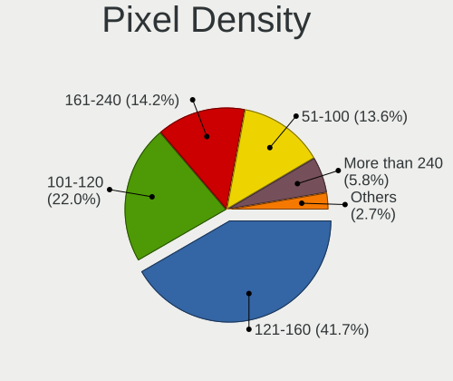

| Density       | Notebooks | Percent |
|---------------|-----------|---------|
| 121-160       | 858       | 41.67%  |
| 101-120       | 454       | 22.05%  |
| 161-240       | 292       | 14.18%  |
| 51-100        | 281       | 13.65%  |
| More than 240 | 119       | 5.78%   |
| Unknown       | 30        | 1.46%   |
| 1-50          | 25        | 1.21%   |

Multiple Monitors
-----------------

Total monitors connected

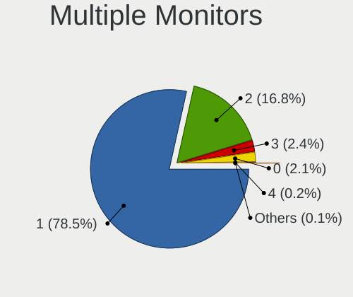

| Total | Notebooks | Percent |
|-------|-----------|---------|
| 1     | 1442      | 78.5%   |
| 2     | 308       | 16.77%  |
| 3     | 44        | 2.4%    |
| 0     | 38        | 2.07%   |
| 4     | 3         | 0.16%   |
| 5     | 2         | 0.11%   |

Network
-------

Net Controller Vendor
---------------------

Controller vendors

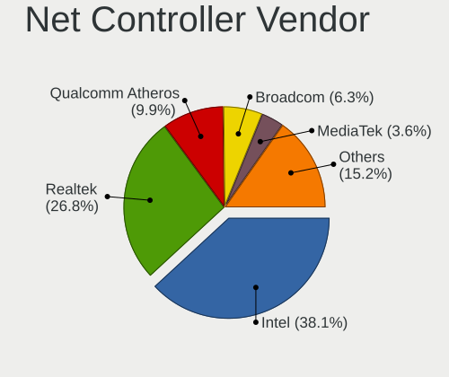

| Vendor                                 | Notebooks | Percent |
|----------------------------------------|-----------|---------|
| Intel                                  | 1058      | 38.13%  |
| Realtek Semiconductor                  | 743       | 26.77%  |
| Qualcomm Atheros                       | 275       | 9.91%   |
| Broadcom                               | 175       | 6.31%   |
| MediaTek                               | 101       | 3.64%   |
| Broadcom Limited                       | 61        | 2.2%    |
| ASIX Electronics                       | 34        | 1.23%   |
| Hewlett-Packard                        | 26        | 0.94%   |
| Sierra Wireless                        | 21        | 0.76%   |
| Ralink                                 | 21        | 0.76%   |
| Dell                                   | 21        | 0.76%   |
| Marvell Technology Group               | 20        | 0.72%   |
| Lenovo                                 | 19        | 0.68%   |
| Shenzhen Goodix Technology             | 18        | 0.65%   |
| Nvidia                                 | 15        | 0.54%   |
| TP-Link                                | 14        | 0.5%    |
| Qualcomm                               | 14        | 0.5%    |
| Ericsson Business Mobile Networks      | 14        | 0.5%    |
| ASUSTek Computer                       | 12        | 0.43%   |
| DisplayLink                            | 10        | 0.36%   |
| Samsung Electronics                    | 9         | 0.32%   |
| Fibocom                                | 9         | 0.32%   |
| Ralink Technology                      | 8         | 0.29%   |
| Huawei Technologies                    | 6         | 0.22%   |
| D-Link                                 | 6         | 0.22%   |
| NetGear                                | 5         | 0.18%   |
| Xiaomi                                 | 4         | 0.14%   |
| Silicon Integrated Systems [SiS]       | 4         | 0.14%   |
| Sony Ericsson Mobile Communications AB | 3         | 0.11%   |
| Linksys                                | 3         | 0.11%   |
| Google                                 | 3         | 0.11%   |
| Texas Instruments                      | 2         | 0.07%   |
| Suzhou Motorcomm Electronic Technology | 2         | 0.07%   |
| STMicroelectronics                     | 2         | 0.07%   |
| Qualcomm Atheros Communications        | 2         | 0.07%   |
| Microsoft                              | 2         | 0.07%   |
| JMicron Technology                     | 2         | 0.07%   |
| ICS Advent                             | 2         | 0.07%   |
| Attansic Technology                    | 2         | 0.07%   |
| Arduino SA                             | 2         | 0.07%   |

Net Controller Model
--------------------

Controller models

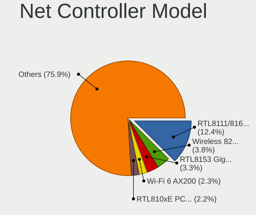

| Model                                                                  | Notebooks | Percent |
|------------------------------------------------------------------------|-----------|---------|
| Realtek RTL8111/8168/8211/8411 PCI Express Gigabit Ethernet Controller | 429       | 12.44%  |
| Intel Wireless 8265 / 8275                                             | 131       | 3.8%    |
| Realtek RTL8153 Gigabit Ethernet Adapter                               | 114       | 3.31%   |
| Intel Wi-Fi 6 AX200                                                    | 80        | 2.32%   |
| Realtek RTL810xE PCI Express Fast Ethernet controller                  | 76        | 2.2%    |
| Intel Wireless 7260                                                    | 72        | 2.09%   |
| Intel Wi-Fi 6 AX201                                                    | 72        | 2.09%   |
| Intel Wireless 8260                                                    | 70        | 2.03%   |
| Intel Wireless 7265                                                    | 70        | 2.03%   |
| Intel 82579LM Gigabit Network Connection (Lewisville)                  | 70        | 2.03%   |
| Intel Centrino Advanced-N 6205 [Taylor Peak]                           | 51        | 1.48%   |
| Intel Alder Lake-P PCH CNVi WiFi                                       | 48        | 1.39%   |
| Realtek RTL8822CE 802.11ac PCIe Wireless Network Adapter               | 45        | 1.3%    |
| Qualcomm Atheros QCA9565 / AR9565 Wireless Network Adapter             | 43        | 1.25%   |
| MediaTek MT7921 802.11ax PCIe Wireless Network Adapter [Filogic 330]   | 42        | 1.22%   |
| Intel Ethernet Connection (4) I219-V                                   | 41        | 1.19%   |
| Intel Ethernet Connection (4) I219-LM                                  | 40        | 1.16%   |
| Qualcomm Atheros QCA6174 802.11ac Wireless Network Adapter             | 39        | 1.13%   |
| Qualcomm Atheros AR9285 Wireless Network Adapter (PCI-Express)         | 37        | 1.07%   |
| Intel Cannon Point-LP CNVi [Wireless-AC]                               | 36        | 1.04%   |
| Qualcomm Atheros QCA9377 802.11ac Wireless Network Adapter             | 35        | 1.01%   |
| Intel Cannon Lake PCH CNVi WiFi                                        | 34        | 0.99%   |
| Intel Ethernet Connection (3) I218-LM                                  | 32        | 0.93%   |
| Realtek RTL8821CE 802.11ac PCIe Wireless Network Adapter               | 31        | 0.9%    |
| Qualcomm Atheros AR9485 Wireless Network Adapter                       | 31        | 0.9%    |
| MediaTek MT7922 802.11ax PCI Express Wireless Network Adapter          | 29        | 0.84%   |
| Intel Raptor Lake PCH CNVi WiFi                                        | 29        | 0.84%   |
| Intel Ethernet Connection I219-LM                                      | 29        | 0.84%   |
| Intel Ethernet Connection I218-LM                                      | 29        | 0.84%   |
| ASIX AX88179 Gigabit Ethernet                                          | 28        | 0.81%   |
| Intel Comet Lake PCH-LP CNVi WiFi                                      | 27        | 0.78%   |
| Intel Ethernet Connection I219-V                                       | 26        | 0.75%   |
| Realtek RTL8723BE PCIe Wireless Network Adapter                        | 23        | 0.67%   |
| Intel Comet Lake PCH CNVi WiFi                                         | 23        | 0.67%   |
| Intel 82577LM Gigabit Network Connection                               | 22        | 0.64%   |
| Broadcom Limited BCM4360 802.11ac Dual Band Wireless Network Adapter   | 22        | 0.64%   |
| Broadcom BCM43228 802.11a/b/g/n                                        | 22        | 0.64%   |
| Realtek RTL8852BE PCIe 802.11ax Wireless Network Controller            | 21        | 0.61%   |
| Realtek RTL8852AE 802.11ax PCIe Wireless Network Adapter               | 20        | 0.58%   |
| Qualcomm Atheros AR9462 Wireless Network Adapter                       | 20        | 0.58%   |

Wireless Vendor
---------------

Wireless vendors

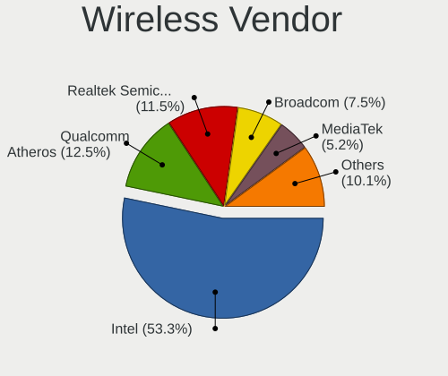

| Vendor                          | Notebooks | Percent |
|---------------------------------|-----------|---------|
| Intel                           | 989       | 53.26%  |
| Qualcomm Atheros                | 232       | 12.49%  |
| Realtek Semiconductor           | 213       | 11.47%  |
| Broadcom                        | 139       | 7.49%   |
| MediaTek                        | 97        | 5.22%   |
| Broadcom Limited                | 45        | 2.42%   |
| Sierra Wireless                 | 21        | 1.13%   |
| Ralink                          | 21        | 1.13%   |
| Dell                            | 14        | 0.75%   |
| Qualcomm                        | 13        | 0.7%    |
| TP-Link                         | 12        | 0.65%   |
| ASUSTek Computer                | 12        | 0.65%   |
| Fibocom                         | 9         | 0.48%   |
| Ralink Technology               | 8         | 0.43%   |
| Hewlett-Packard                 | 7         | 0.38%   |
| NetGear                         | 5         | 0.27%   |
| D-Link                          | 4         | 0.22%   |
| Qualcomm Atheros Communications | 2         | 0.11%   |
| Linksys                         | 2         | 0.11%   |
| ZyXEL Communications            | 1         | 0.05%   |
| ZyDAS                           | 1         | 0.05%   |
| Wacom                           | 1         | 0.05%   |
| Qcom                            | 1         | 0.05%   |
| Microsoft                       | 1         | 0.05%   |
| Micro Star International        | 1         | 0.05%   |
| IMC Networks                    | 1         | 0.05%   |
| Fujitsu Siemens Computers       | 1         | 0.05%   |
| Edimax Technology               | 1         | 0.05%   |
| D-Link System                   | 1         | 0.05%   |
| Chu Yuen Enterprise             | 1         | 0.05%   |
| Belkin Components               | 1         | 0.05%   |

Wireless Model
--------------

Wireless models

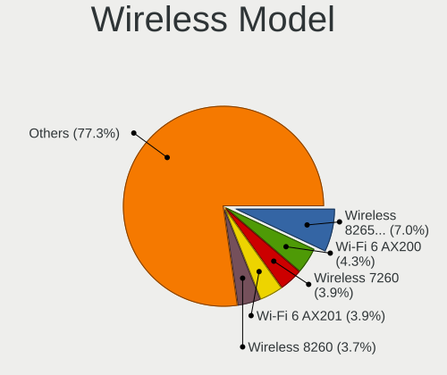

| Model                                                                | Notebooks | Percent |
|----------------------------------------------------------------------|-----------|---------|
| Intel Wireless 8265 / 8275                                           | 131       | 7.01%   |
| Intel Wi-Fi 6 AX200                                                  | 80        | 4.28%   |
| Intel Wireless 7260                                                  | 72        | 3.85%   |
| Intel Wi-Fi 6 AX201                                                  | 72        | 3.85%   |
| Intel Wireless 8260                                                  | 70        | 3.75%   |
| Intel Wireless 7265                                                  | 70        | 3.75%   |
| Intel Centrino Advanced-N 6205 [Taylor Peak]                         | 51        | 2.73%   |
| Realtek RTL8822CE 802.11ac PCIe Wireless Network Adapter             | 45        | 2.41%   |
| Qualcomm Atheros QCA9565 / AR9565 Wireless Network Adapter           | 43        | 2.3%    |
| MediaTek MT7921 802.11ax PCIe Wireless Network Adapter [Filogic 330] | 42        | 2.25%   |
| Qualcomm Atheros QCA6174 802.11ac Wireless Network Adapter           | 39        | 2.09%   |
| Qualcomm Atheros AR9285 Wireless Network Adapter (PCI-Express)       | 37        | 1.98%   |
| Intel Cannon Point-LP CNVi [Wireless-AC]                             | 36        | 1.93%   |
| Qualcomm Atheros QCA9377 802.11ac Wireless Network Adapter           | 35        | 1.87%   |
| Intel Cannon Lake PCH CNVi WiFi                                      | 34        | 1.82%   |
| Realtek RTL8821CE 802.11ac PCIe Wireless Network Adapter             | 31        | 1.66%   |
| Qualcomm Atheros AR9485 Wireless Network Adapter                     | 31        | 1.66%   |
| Intel Raptor Lake PCH CNVi WiFi                                      | 28        | 1.5%    |
| Intel Comet Lake PCH-LP CNVi WiFi                                    | 27        | 1.44%   |
| Intel Alder Lake-P PCH CNVi WiFi                                     | 27        | 1.44%   |
| MediaTek MT7922 802.11ax PCI Express Wireless Network Adapter        | 26        | 1.39%   |
| Realtek RTL8723BE PCIe Wireless Network Adapter                      | 23        | 1.23%   |
| Intel Comet Lake PCH CNVi WiFi                                       | 23        | 1.23%   |
| Broadcom Limited BCM4360 802.11ac Dual Band Wireless Network Adapter | 22        | 1.18%   |
| Broadcom BCM43228 802.11a/b/g/n                                      | 22        | 1.18%   |
| Realtek RTL8852BE PCIe 802.11ax Wireless Network Controller          | 20        | 1.07%   |
| Realtek RTL8852AE 802.11ax PCIe Wireless Network Adapter             | 20        | 1.07%   |
| Qualcomm Atheros AR9462 Wireless Network Adapter                     | 20        | 1.07%   |
| Intel Wi-Fi 6E(802.11ax) AX210/AX1675* 2x2 [Typhoon Peak]            | 20        | 1.07%   |
| Broadcom BCM4313 802.11bgn Wireless Network Adapter                  | 20        | 1.07%   |
| Intel Wireless 3160                                                  | 19        | 1.02%   |
| Intel Wi-Fi 5(802.11ac) Wireless-AC 9x6x [Thunder Peak]              | 19        | 1.02%   |
| Intel PRO/Wireless 3945ABG [Golan] Network Connection                | 19        | 1.02%   |
| Intel Centrino Ultimate-N 6300                                       | 19        | 1.02%   |
| MediaTek MT7902 802.11ax PCIe Wireless Network Adapter [Filogic 310] | 17        | 0.91%   |
| Intel Centrino Advanced-N 6235                                       | 16        | 0.86%   |
| Intel Centrino Advanced-N 6200                                       | 16        | 0.86%   |
| Sierra Wireless EM7455                                               | 14        | 0.75%   |
| Broadcom BCM4331 802.11a/b/g/n                                       | 13        | 0.7%    |
| Broadcom BCM43224 802.11a/b/g/n                                      | 13        | 0.7%    |

Ethernet Vendor
---------------

Ethernet vendors

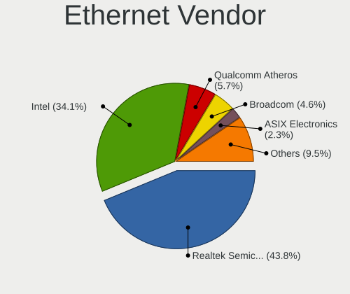

| Vendor                                 | Notebooks | Percent |
|----------------------------------------|-----------|---------|
| Realtek Semiconductor                  | 648       | 43.78%  |
| Intel                                  | 505       | 34.12%  |
| Qualcomm Atheros                       | 84        | 5.68%   |
| Broadcom                               | 68        | 4.59%   |
| ASIX Electronics                       | 34        | 2.3%    |
| Marvell Technology Group               | 20        | 1.35%   |
| Lenovo                                 | 19        | 1.28%   |
| Broadcom Limited                       | 17        | 1.15%   |
| Nvidia                                 | 15        | 1.01%   |
| DisplayLink                            | 10        | 0.68%   |
| Samsung Electronics                    | 9         | 0.61%   |
| Hewlett-Packard                        | 9         | 0.61%   |
| Huawei Technologies                    | 5         | 0.34%   |
| Xiaomi                                 | 4         | 0.27%   |
| MediaTek                               | 4         | 0.27%   |
| Sony Ericsson Mobile Communications AB | 3         | 0.2%    |
| Silicon Integrated Systems [SiS]       | 3         | 0.2%    |
| Google                                 | 3         | 0.2%    |
| TP-Link                                | 2         | 0.14%   |
| Suzhou Motorcomm Electronic Technology | 2         | 0.14%   |
| JMicron Technology                     | 2         | 0.14%   |
| ICS Advent                             | 2         | 0.14%   |
| D-Link                                 | 2         | 0.14%   |
| Attansic Technology                    | 2         | 0.14%   |
| Qualcomm                               | 1         | 0.07%   |
| OPPO Electronics                       | 1         | 0.07%   |
| OnePlus Technology (Shenzhen)          | 1         | 0.07%   |
| Microsoft                              | 1         | 0.07%   |
| Linksys                                | 1         | 0.07%   |
| Gemtek                                 | 1         | 0.07%   |
| Aquantia                               | 1         | 0.07%   |
| Apple                                  | 1         | 0.07%   |

Ethernet Model
--------------

Ethernet models

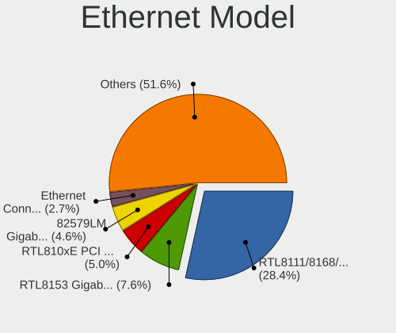

| Model                                                                  | Notebooks | Percent |
|------------------------------------------------------------------------|-----------|---------|
| Realtek RTL8111/8168/8211/8411 PCI Express Gigabit Ethernet Controller | 429       | 28.45%  |
| Realtek RTL8153 Gigabit Ethernet Adapter                               | 114       | 7.56%   |
| Realtek RTL810xE PCI Express Fast Ethernet controller                  | 76        | 5.04%   |
| Intel 82579LM Gigabit Network Connection (Lewisville)                  | 70        | 4.64%   |
| Intel Ethernet Connection (4) I219-V                                   | 41        | 2.72%   |
| Intel Ethernet Connection (4) I219-LM                                  | 40        | 2.65%   |
| Intel Ethernet Connection (3) I218-LM                                  | 32        | 2.12%   |
| Intel Ethernet Connection I219-LM                                      | 29        | 1.92%   |
| Intel Ethernet Connection I218-LM                                      | 29        | 1.92%   |
| ASIX AX88179 Gigabit Ethernet                                          | 28        | 1.86%   |
| Intel Ethernet Connection I219-V                                       | 26        | 1.72%   |
| Intel 82577LM Gigabit Network Connection                               | 22        | 1.46%   |
| Intel Alder Lake-P PCH CNVi WiFi                                       | 21        | 1.39%   |
| Intel Ethernet Connection I217-LM                                      | 19        | 1.26%   |
| Intel Ethernet Connection (6) I219-V                                   | 18        | 1.19%   |
| Broadcom NetLink BCM57785 Gigabit Ethernet PCIe                        | 18        | 1.19%   |
| Intel Ethernet Connection (13) I219-V                                  | 16        | 1.06%   |
| Realtek RTL8125 2.5GbE Controller                                      | 15        | 0.99%   |
| Qualcomm Atheros QCA8171 Gigabit Ethernet                              | 14        | 0.93%   |
| Qualcomm Atheros AR8151 v2.0 Gigabit Ethernet                          | 14        | 0.93%   |
| Broadcom NetXtreme BCM57765 Gigabit Ethernet PCIe                      | 14        | 0.93%   |
| Intel Ethernet Connection (6) I219-LM                                  | 13        | 0.86%   |
| Intel Ethernet Connection I217-V                                       | 10        | 0.66%   |
| Intel Ethernet Connection (7) I219-LM                                  | 10        | 0.66%   |
| Intel 82567LM Gigabit Network Connection                               | 10        | 0.66%   |
| Qualcomm Atheros AR8131 Gigabit Ethernet                               | 9         | 0.6%    |
| Intel Ethernet Connection (2) I219-LM                                  | 9         | 0.6%    |
| Intel 82579V Gigabit Network Connection                                | 9         | 0.6%    |
| Samsung Galaxy series, misc. (tethering mode)                          | 8         | 0.53%   |
| Realtek RTL8152 Fast Ethernet Adapter                                  | 8         | 0.53%   |
| Lenovo Thinkpad LAN                                                    | 8         | 0.53%   |
| Intel Ethernet Connection (14) I219-LM                                 | 8         | 0.53%   |
| Intel 82566MM Gigabit Network Connection                               | 8         | 0.53%   |
| HP HP lt4120 Snapdragon X5 LTE                                         | 8         | 0.53%   |
| Qualcomm Atheros Killer E220x Gigabit Ethernet Controller              | 7         | 0.46%   |
| Nvidia MCP79 Ethernet                                                  | 7         | 0.46%   |
| Realtek Killer E2600 GbE Controller                                    | 6         | 0.4%    |
| Qualcomm Atheros QCA8172 Fast Ethernet                                 | 6         | 0.4%    |
| Qualcomm Atheros Killer E2500 Gigabit Ethernet Controller              | 6         | 0.4%    |
| DisplayLink Dell Universal Dock D6000                                  | 6         | 0.4%    |

Net Controller Kind
-------------------

Ethernet, WiFi or modem

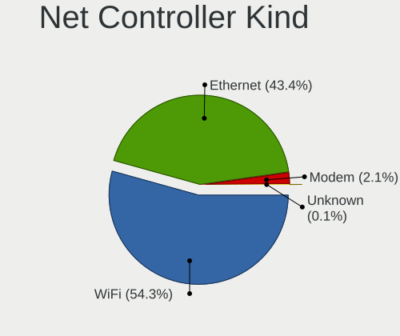

| Kind     | Notebooks | Percent |
|----------|-----------|---------|
| WiFi     | 1739      | 54.31%  |
| Ethernet | 1391      | 43.44%  |
| Modem    | 68        | 2.12%   |
| Unknown  | 4         | 0.12%   |

Used Controller
---------------

Currently used network controller

| Kind     | Notebooks | Percent |
|----------|-----------|---------|
| WiFi     | 1440      | 75.67%  |
| Ethernet | 462       | 24.28%  |
| Unknown  | 1         | 0.05%   |

NICs
----

Total network controllers on board

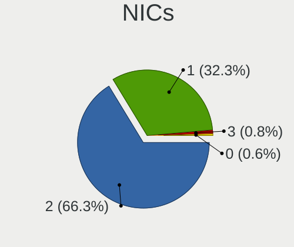

| Total | Notebooks | Percent |
|-------|-----------|---------|
| 2     | 1194      | 66.3%   |
| 1     | 582       | 32.32%  |
| 3     | 15        | 0.83%   |
| 0     | 10        | 0.56%   |

IPv6
----

IPv6 vs IPv4

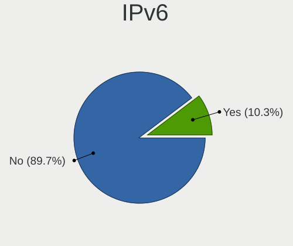

| Used | Notebooks | Percent |
|------|-----------|---------|
| No   | 1637      | 89.7%   |
| Yes  | 188       | 10.3%   |

Bluetooth
---------

Bluetooth Vendor
----------------

Controller vendors

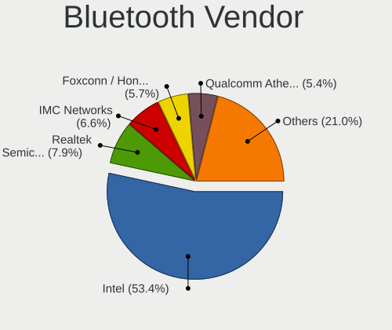

| Vendor                          | Notebooks | Percent |
|---------------------------------|-----------|---------|
| Intel                           | 826       | 53.36%  |
| Realtek Semiconductor           | 123       | 7.95%   |
| IMC Networks                    | 102       | 6.59%   |
| Foxconn / Hon Hai               | 88        | 5.68%   |
| Qualcomm Atheros Communications | 84        | 5.43%   |
| Broadcom                        | 75        | 4.84%   |
| Apple                           | 70        | 4.52%   |
| Lite-On Technology              | 53        | 3.42%   |
| Hewlett-Packard                 | 30        | 1.94%   |
| Dell                            | 20        | 1.29%   |
| ASUSTek Computer                | 12        | 0.78%   |
| Cambridge Silicon Radio         | 11        | 0.71%   |
| Ralink                          | 10        | 0.65%   |
| MediaTek                        | 10        | 0.65%   |
| Toshiba                         | 7         | 0.45%   |
| USI                             | 6         | 0.39%   |
| Realtek                         | 4         | 0.26%   |
| TP-Link                         | 3         | 0.19%   |
| Ralink Technology               | 3         | 0.19%   |
| Alps Electric                   | 3         | 0.19%   |
| Taiyo Yuden                     | 2         | 0.13%   |
| Foxconn International           | 2         | 0.13%   |
| Chicony Electronics             | 2         | 0.13%   |
| Fujitsu                         | 1         | 0.06%   |
| Creative Technology             | 1         | 0.06%   |

Bluetooth Model
---------------

Controller models

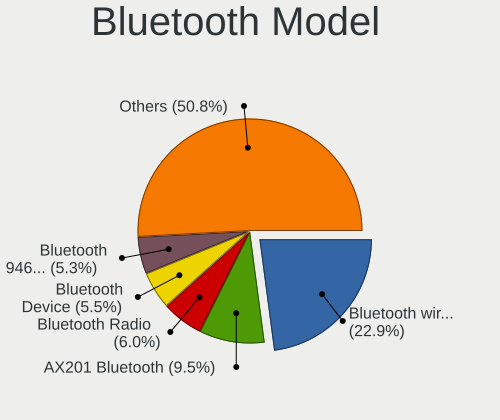

| Model                                               | Notebooks | Percent |
|-----------------------------------------------------|-----------|---------|
| Intel Bluetooth wireless interface                  | 356       | 22.91%  |
| Intel AX201 Bluetooth                               | 147       | 9.46%   |
| Realtek Bluetooth Radio                             | 93        | 5.98%   |
| Intel Bluetooth Device                              | 85        | 5.47%   |
| Intel Bluetooth 9460/9560 Jefferson Peak (JfP)      | 83        | 5.34%   |
| Intel AX200 Bluetooth                               | 79        | 5.08%   |
| Apple Bluetooth Host Controller                     | 41        | 2.64%   |
| IMC Networks Bluetooth Radio                        | 38        | 2.45%   |
| IMC Networks Wireless_Device                        | 36        | 2.32%   |
| Foxconn / Hon Hai Bluetooth Device                  | 28        | 1.8%    |
| Intel Centrino Bluetooth Wireless Transceiver       | 27        | 1.74%   |
| Foxconn / Hon Hai Wireless_Device                   | 27        | 1.74%   |
| Apple Bluetooth USB Host Controller                 | 25        | 1.61%   |
| Qualcomm Atheros  Bluetooth Device                  | 24        | 1.54%   |
| Intel AX210 Bluetooth                               | 20        | 1.29%   |
| Broadcom BCM2045B (BDC-2.1)                         | 19        | 1.22%   |
| Qualcomm Atheros QCA61x4 Bluetooth 4.0              | 18        | 1.16%   |
| Qualcomm Atheros AR3012 Bluetooth 4.0               | 18        | 1.16%   |
| Qualcomm Atheros AR3011 Bluetooth                   | 17        | 1.09%   |
| Intel Wireless-AC 9260 Bluetooth Adapter            | 17        | 1.09%   |
| HP Broadcom 2070 Bluetooth Combo                    | 16        | 1.03%   |
| Foxconn / Hon Hai MediaTek Bluetooth Adapter        | 15        | 0.97%   |
| Realtek  Bluetooth 4.2 Adapter                      | 14        | 0.9%    |
| HP Bluetooth 2.0 Interface [Broadcom BCM2045]       | 14        | 0.9%    |
| Lite-On Bluetooth Device                            | 13        | 0.84%   |
| Lite-On Atheros AR3012 Bluetooth                    | 13        | 0.84%   |
| Broadcom HP Portable SoftSailing                    | 13        | 0.84%   |
| Broadcom BCM20702 Bluetooth 4.0 [ThinkPad]          | 13        | 0.84%   |
| IMC Networks Bluetooth Device                       | 11        | 0.71%   |
| Cambridge Silicon Radio Bluetooth Dongle (HCI mode) | 11        | 0.71%   |
| Ralink RT3290 Bluetooth                             | 10        | 0.64%   |
| Lite-On Wireless_Device                             | 10        | 0.64%   |
| Lite-On Qualcomm Atheros QCA9377 Bluetooth          | 9         | 0.58%   |
| Intel Wireless-AC 3168 Bluetooth                    | 8         | 0.51%   |
| IMC Networks Atheros AR3012 Bluetooth 4.0 Adapter   | 8         | 0.51%   |
| Realtek RTL8822BE Bluetooth 4.2 Adapter             | 7         | 0.45%   |
| Realtek RTL8723B Bluetooth                          | 7         | 0.45%   |
| MediaTek Wireless_Device                            | 7         | 0.45%   |
| Broadcom HP Portable Bumble Bee                     | 7         | 0.45%   |
| Intel Centrino Advanced-N 6230 Bluetooth adapter    | 6         | 0.39%   |

Sound
-----

Sound Vendor
------------

Sound card vendors

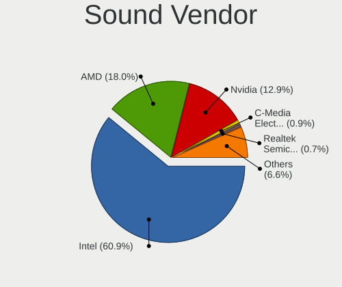

| Vendor                           | Notebooks | Percent |
|----------------------------------|-----------|---------|
| Intel                            | 1381      | 60.94%  |
| AMD                              | 407       | 17.96%  |
| Nvidia                           | 292       | 12.89%  |
| C-Media Electronics              | 20        | 0.88%   |
| Realtek Semiconductor            | 16        | 0.71%   |
| Logitech                         | 14        | 0.62%   |
| GN Netcom                        | 14        | 0.62%   |
| Lenovo                           | 12        | 0.53%   |
| Hewlett-Packard                  | 11        | 0.49%   |
| Plantronics                      | 7         | 0.31%   |
| Kingston Technology              | 6         | 0.26%   |
| Apple                            | 6         | 0.26%   |
| SteelSeries ApS                  | 5         | 0.22%   |
| RODE Microphones                 | 5         | 0.22%   |
| ASUSTek Computer                 | 5         | 0.22%   |
| Texas Instruments                | 4         | 0.18%   |
| Silicon Integrated Systems [SiS] | 4         | 0.18%   |
| DSEA A/S                         | 4         | 0.18%   |
| Sony                             | 3         | 0.13%   |
| SAVITECH                         | 3         | 0.13%   |
| JMTek                            | 3         | 0.13%   |
| Audio-Technica                   | 3         | 0.13%   |
| Unknown                          | 2         | 0.09%   |
| Razer USA                        | 2         | 0.09%   |
| No brand                         | 2         | 0.09%   |
| Mackie Designs                   | 2         | 0.09%   |
| Focusrite-Novation               | 2         | 0.09%   |
| Dell                             | 2         | 0.09%   |
| Creative Technology              | 2         | 0.09%   |
| Corsair                          | 2         | 0.09%   |
| Yamaha                           | 1         | 0.04%   |
| XMOS                             | 1         | 0.04%   |
| Trust                            | 1         | 0.04%   |
| SlrTek                           | 1         | 0.04%   |
| Samson Technologies              | 1         | 0.04%   |
| QinHeng Electronics              | 1         | 0.04%   |
| PreSonus Audio Electronics       | 1         | 0.04%   |
| M-Audio                          | 1         | 0.04%   |
| Line6                            | 1         | 0.04%   |
| LG Electronics                   | 1         | 0.04%   |

Sound Model
-----------

Sound card models

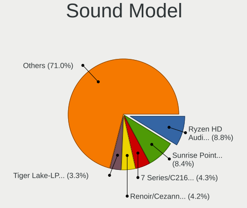

| Model                                                                      | Notebooks | Percent |
|----------------------------------------------------------------------------|-----------|---------|
| AMD Ryzen HD Audio Controller                                              | 245       | 8.77%   |
| Intel Sunrise Point-LP HD Audio                                            | 234       | 8.38%   |
| Intel 7 Series/C216 Chipset Family High Definition Audio Controller        | 121       | 4.33%   |
| AMD Renoir/Cezanne HDMI/DP Audio Controller                                | 117       | 4.19%   |
| Intel Tiger Lake-LP Smart Sound Technology Audio Controller                | 93        | 3.33%   |
| Intel 6 Series/C200 Series Chipset Family High Definition Audio Controller | 90        | 3.22%   |
| Intel Haswell-ULT HD Audio Controller                                      | 88        | 3.15%   |
| Intel 8 Series HD Audio Controller                                         | 88        | 3.15%   |
| AMD Radeon High Definition Audio Controller                                | 77        | 2.76%   |
| Intel Wildcat Point-LP High Definition Audio Controller                    | 70        | 2.51%   |
| Intel Broadwell-U Audio Controller                                         | 70        | 2.51%   |
| Intel 8 Series/C220 Series Chipset High Definition Audio Controller        | 70        | 2.51%   |
| Intel Cannon Lake PCH cAVS                                                 | 68        | 2.43%   |
| Intel Alder Lake PCH-P High Definition Audio Controller                    | 60        | 2.15%   |
| Intel Cannon Point-LP High Definition Audio Controller                     | 57        | 2.04%   |
| Intel 5 Series/3400 Series Chipset High Definition Audio                   | 56        | 2%      |
| AMD FCH Azalia Controller                                                  | 56        | 2%      |
| Intel Xeon E3-1200 v3/4th Gen Core Processor HD Audio Controller           | 48        | 1.72%   |
| AMD Raven/Raven2/Fenghuang HDMI/DP Audio Controller                        | 45        | 1.61%   |
| Intel CM238 HD Audio Controller                                            | 39        | 1.4%    |
| Intel 82801I (ICH9 Family) HD Audio Controller                             | 38        | 1.36%   |
| AMD Kabini HDMI/DP Audio                                                   | 36        | 1.29%   |
| Intel Comet Lake PCH-LP cAVS                                               | 34        | 1.22%   |
| Nvidia GA104 High Definition Audio Controller                              | 28        | 1%      |
| Intel Raptor Lake-P/U/H cAVS                                               | 28        | 1%      |
| Intel Atom Processor Z36xxx/Z37xxx Series High Definition Audio Controller | 28        | 1%      |
| Intel Comet Lake PCH cAVS                                                  | 27        | 0.97%   |
| Intel 82801H (ICH8 Family) HD Audio Controller                             | 27        | 0.97%   |
| AMD SBx00 Azalia (Intel HDA)                                               | 26        | 0.93%   |
| Intel Tiger Lake-H HD Audio Controller                                     | 23        | 0.82%   |
| Nvidia TU106 High Definition Audio Controller                              | 22        | 0.79%   |
| Nvidia GK107 HDMI Audio Controller                                         | 22        | 0.79%   |
| Nvidia GP107GL High Definition Audio Controller                            | 21        | 0.75%   |
| Nvidia GA106 High Definition Audio Controller                              | 20        | 0.72%   |
| Nvidia GF108 High Definition Audio Controller                              | 19        | 0.68%   |
| Intel NM10/ICH7 Family High Definition Audio Controller                    | 18        | 0.64%   |
| Intel 100 Series/C230 Series Chipset Family HD Audio Controller            | 18        | 0.64%   |
| AMD Family 15h (Models 60h-6fh) Audio Controller                           | 18        | 0.64%   |
| Realtek Semiconductor USB Audio                                            | 16        | 0.57%   |
| Nvidia High Definition Audio Controller                                    | 16        | 0.57%   |

Memory
------

Memory Vendor
-------------

Memory module vendors

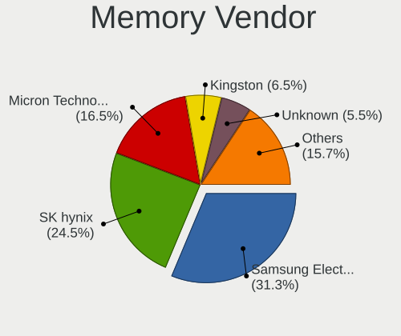

| Vendor                 | Notebooks | Percent |
|------------------------|-----------|---------|
| Samsung Electronics    | 366       | 31.31%  |
| SK hynix               | 286       | 24.47%  |
| Micron Technology      | 193       | 16.51%  |
| Kingston               | 76        | 6.5%    |
| Unknown                | 64        | 5.47%   |
| Crucial                | 38        | 3.25%   |
| Corsair                | 30        | 2.57%   |
| Ramaxel Technology     | 23        | 1.97%   |
| Elpida                 | 22        | 1.88%   |
| A-DATA Technology      | 20        | 1.71%   |
| Unknown                | 11        | 0.94%   |
| Nanya Technology       | 6         | 0.51%   |
| G.Skill                | 5         | 0.43%   |
| Wilk                   | 3         | 0.26%   |
| Patriot                | 3         | 0.26%   |
| Unknown (ABCD)         | 2         | 0.17%   |
| Team                   | 2         | 0.17%   |
| GSkill                 | 2         | 0.17%   |
| GOODRAM                | 2         | 0.17%   |
| Unknown (83DA)         | 1         | 0.09%   |
| Unknown (0x8551)       | 1         | 0.09%   |
| Unknown (00000000F08B) | 1         | 0.09%   |
| TEXTORM                | 1         | 0.09%   |
| SHARETRONIC            | 1         | 0.09%   |
| Qimonda                | 1         | 0.09%   |
| Netlist                | 1         | 0.09%   |
| Neo Forza              | 1         | 0.09%   |
| fef5                   | 1         | 0.09%   |
| Avant                  | 1         | 0.09%   |
| ASint Technology       | 1         | 0.09%   |
| Apacer                 | 1         | 0.09%   |
| 8CFD000080AD           | 1         | 0.09%   |
| 8CB900000080           | 1         | 0.09%   |
| 48spaces               | 1         | 0.09%   |

Memory Model
------------

Memory module models

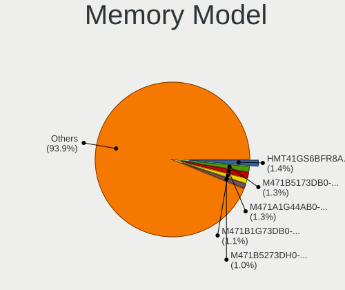

| Model                                                         | Notebooks | Percent |
|---------------------------------------------------------------|-----------|---------|
| SK hynix RAM HMT41GS6BFR8A-PB 8GB SODIMM DDR3 2667MT/s        | 17        | 1.37%   |
| Samsung RAM M471B5173DB0-YK0 4GB SODIMM DDR3 1600MT/s         | 16        | 1.29%   |
| Samsung RAM M471A1G44AB0-CWE 8GiB SODIMM DDR4 3200MT/s        | 16        | 1.29%   |
| Samsung RAM M471B1G73DB0-YK0 8GB SODIMM DDR3 1600MT/s         | 14        | 1.13%   |
| Samsung RAM M471B5273DH0-CH9 4GB SODIMM DDR3 1600MT/s         | 13        | 1.05%   |
| SK hynix RAM HMA81GS6AFR8N-UH 8GB SODIMM DDR4 2667MT/s        | 12        | 0.97%   |
| Samsung RAM M471A2K43DB1-CWE 16GB SODIMM DDR4 3200MT/s        | 12        | 0.97%   |
| Samsung RAM M471A1K43BB1-CRC 8GB SODIMM DDR4 2667MT/s         | 12        | 0.97%   |
| SK hynix RAM HMT451S6BFR8A-PB 4GB SODIMM DDR3 1600MT/s        | 11        | 0.89%   |
| Samsung RAM M471A1K43CB1-CRC 8GB SODIMM DDR4 8400MT/s         | 11        | 0.89%   |
| Unknown                                                       | 11        | 0.89%   |
| Samsung RAM M471A5244CB0-CTD 4GB SODIMM DDR4 3266MT/s         | 10        | 0.81%   |
| Samsung RAM M471A1K43EB1-CWE 8GB SODIMM DDR4 3200MT/s         | 10        | 0.81%   |
| SK hynix RAM Module 8GB SODIMM DDR3 1600MT/s                  | 9         | 0.73%   |
| SK hynix RAM HMT41GS6AFR8A-PB 8GiB SODIMM DDR3 2667MT/s       | 9         | 0.73%   |
| Samsung RAM M471A5244CB0-CWE 4GB SODIMM DDR4 3200MT/s         | 9         | 0.73%   |
| Micron RAM 4ATF1G64HZ-3G2F1 8GB SODIMM DDR4 3200MT/s          | 9         | 0.73%   |
| SK hynix RAM HMT451S6AFR8A-PB 4GB SODIMM DDR3 1600MT/s        | 8         | 0.65%   |
| SK hynix RAM HMT351S6CFR8C-PB 4GB SODIMM DDR3 1600MT/s        | 8         | 0.65%   |
| Samsung RAM M471B1G73QH0-YK0 8GB SODIMM DDR3 1600MT/s         | 8         | 0.65%   |
| Samsung RAM M471A5244CB0-CRC 4GB SODIMM DDR4 2667MT/s         | 8         | 0.65%   |
| Micron RAM MT52L1G32D4PG-093 8GB Row Of Chips LPDDR3 2133MT/s | 8         | 0.65%   |
| SK hynix RAM HMT351S6CFR8C-H9 4GB SODIMM DDR3 1334MT/s        | 7         | 0.56%   |
| SK hynix RAM HMT351S6BFR8C-H9 4GB SODIMM DDR3 1333MT/s        | 7         | 0.56%   |
| SK hynix RAM HMA82GS6AFR8N-UH 16GB SODIMM DDR4 2667MT/s       | 7         | 0.56%   |
| Samsung RAM Module 8GB SODIMM DDR4 2133MT/s                   | 7         | 0.56%   |
| Micron RAM 8ATF1G64HZ-3G2J1 8GB SODIMM DDR4 3200MT/s          | 7         | 0.56%   |
| Unknown RAM Module 4GB Row Of Chips LPDDR4 4267MT/s           | 6         | 0.48%   |
| SK hynix RAM Module 16GB SODIMM DDR4 3200MT/s                 | 6         | 0.48%   |
| SK hynix RAM HMT41GS6BFR8A-PB 8GB SODIMM DDR3 1600MT/s        | 6         | 0.48%   |
| SK hynix RAM HMAA1GS6CJR6N-XN 8GB SODIMM DDR4 3200MT/s        | 6         | 0.48%   |
| Samsung RAM Module 16GB SODIMM DDR4 3200MT/s                  | 6         | 0.48%   |
| Samsung RAM Module 16GB SODIMM DDR4 2667MT/s                  | 6         | 0.48%   |
| Samsung RAM M471B5673FH0-CF8 2048MB SODIMM DDR3 1067MT/s      | 6         | 0.48%   |
| Samsung RAM M471B5273CH0-CH9 4GB SODIMM DDR3 1334MT/s         | 6         | 0.48%   |
| Samsung RAM M471B1G73EB0-YK0 8192MB SODIMM DDR3 1600MT/s      | 6         | 0.48%   |
| Samsung RAM M471A2K43CB1-CRC 16GB SODIMM DDR4 2667MT/s        | 6         | 0.48%   |
| Samsung RAM M471A1G44AB0-CWE 8GB Row Of Chips DDR4 3200MT/s   | 6         | 0.48%   |
| Micron RAM 8KTF51264HZ-1G6E1 4GB SODIMM DDR3 1600MT/s         | 6         | 0.48%   |
| Micron RAM 53E1G32D2NP-046 2GB Row Of Chips LPDDR4 4267MT/s   | 6         | 0.48%   |

Memory Kind
-----------

Memory module kinds

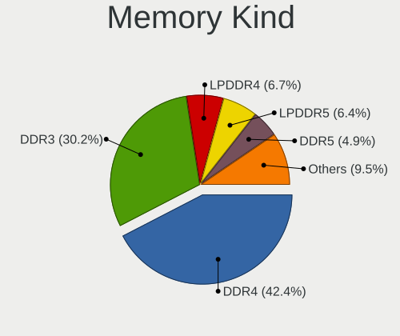

| Kind    | Notebooks | Percent |
|---------|-----------|---------|
| DDR4    | 433       | 42.41%  |
| DDR3    | 308       | 30.17%  |
| LPDDR4  | 68        | 6.66%   |
| LPDDR5  | 65        | 6.37%   |
| DDR5    | 50        | 4.9%    |
| LPDDR3  | 48        | 4.7%    |
| DDR2    | 25        | 2.45%   |
| SDRAM   | 11        | 1.08%   |
| Unknown | 5         | 0.49%   |
| DRAM    | 4         | 0.39%   |
| DDR     | 4         | 0.39%   |

Memory Form Factor
------------------

Physical design of the memory module

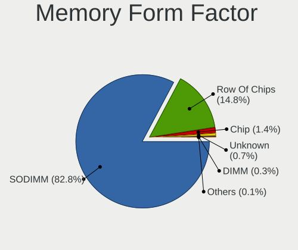

| Name            | Notebooks | Percent |
|-----------------|-----------|---------|
| SODIMM          | 850       | 82.77%  |
| Row Of Chips    | 152       | 14.8%   |
| Chip            | 14        | 1.36%   |
| Unknown         | 7         | 0.68%   |
| DIMM            | 3         | 0.29%   |
| Proprietary Car | 1         | 0.1%    |

Memory Size
-----------

Memory module size

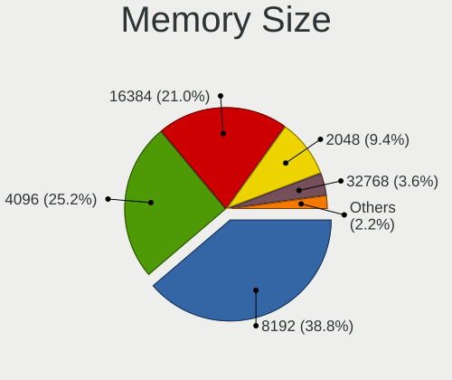

| Size  | Notebooks | Percent |
|-------|-----------|---------|
| 8192  | 431       | 38.76%  |
| 4096  | 280       | 25.18%  |
| 16384 | 233       | 20.95%  |
| 2048  | 104       | 9.35%   |
| 32768 | 40        | 3.6%    |
| 1024  | 18        | 1.62%   |
| 512   | 3         | 0.27%   |
| 65536 | 1         | 0.09%   |
| 12288 | 1         | 0.09%   |
| 3072  | 1         | 0.09%   |

Memory Speed
------------

Memory module speed

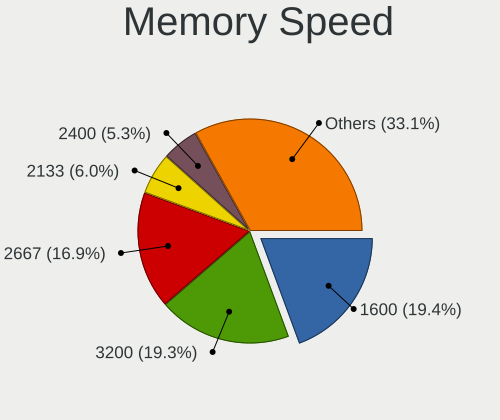

| Speed   | Notebooks | Percent |
|---------|-----------|---------|
| 1600    | 212       | 19.38%  |
| 3200    | 211       | 19.29%  |
| 2667    | 185       | 16.91%  |
| 2133    | 66        | 6.03%   |
| 2400    | 58        | 5.3%    |
| 4267    | 40        | 3.66%   |
| 6400    | 38        | 3.47%   |
| 1334    | 36        | 3.29%   |
| 1333    | 29        | 2.65%   |
| 4800    | 25        | 2.29%   |
| 5600    | 24        | 2.19%   |
| 1867    | 21        | 1.92%   |
| 7500    | 19        | 1.74%   |
| 667     | 17        | 1.55%   |
| Unknown | 17        | 1.55%   |
| 4266    | 16        | 1.46%   |
| 8400    | 14        | 1.28%   |
| 1067    | 13        | 1.19%   |
| 3266    | 10        | 0.91%   |
| 800     | 9         | 0.82%   |
| 4199    | 5         | 0.46%   |
| 5500    | 3         | 0.27%   |
| 975     | 3         | 0.27%   |
| 8000    | 2         | 0.18%   |
| 3733    | 2         | 0.18%   |
| 2933    | 2         | 0.18%   |
| 2048    | 2         | 0.18%   |
| 1639    | 2         | 0.18%   |
| 1066    | 2         | 0.18%   |
| 533     | 2         | 0.18%   |
| 333     | 2         | 0.18%   |
| 12800   | 1         | 0.09%   |
| 8533    | 1         | 0.09%   |
| 7467    | 1         | 0.09%   |
| 7400    | 1         | 0.09%   |
| 5200    | 1         | 0.09%   |
| 3800    | 1         | 0.09%   |
| 266     | 1         | 0.09%   |

Printers & scanners
-------------------

Printer Vendor
--------------

Printer device vendors

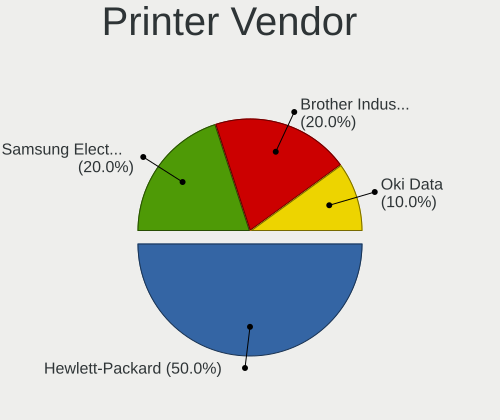

| Vendor              | Notebooks | Percent |
|---------------------|-----------|---------|
| Hewlett-Packard     | 5         | 50%     |
| Samsung Electronics | 2         | 20%     |
| Brother Industries  | 2         | 20%     |
| Oki Data            | 1         | 10%     |

Printer Model
-------------

Printer device models

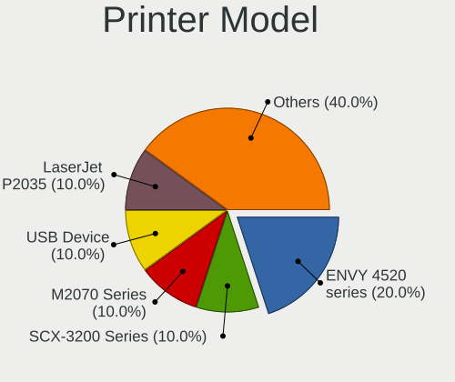

| Model                           | Notebooks | Percent |
|---------------------------------|-----------|---------|
| HP ENVY 4520 series             | 2         | 20%     |
| Samsung SCX-3200 Series         | 1         | 10%     |
| Samsung M2070 Series            | 1         | 10%     |
| Oki Data USB Device             | 1         | 10%     |
| HP LaserJet P2035               | 1         | 10%     |
| HP DeskJet 5650c                | 1         | 10%     |
| HP DeskJet 2700 series          | 1         | 10%     |
| Brother QL-500 label printer    | 1         | 10%     |
| Brother HL-2270DW Laser Printer | 1         | 10%     |

Scanner Vendor
--------------

Scanner device vendors

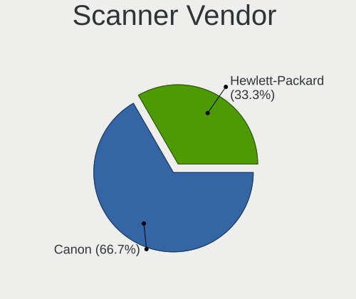

| Vendor          | Notebooks | Percent |
|-----------------|-----------|---------|
| Canon           | 2         | 50%     |
| Seiko Epson     | 1         | 25%     |
| Hewlett-Packard | 1         | 25%     |

Scanner Model
-------------

Scanner device models

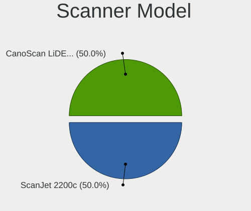

| Model                                       | Notebooks | Percent |
|---------------------------------------------|-----------|---------|
| Seiko Epson GT-X800 [Perfection 4990 PHOTO] | 1         | 25%     |
| HP ScanJet 2200c                            | 1         | 25%     |
| Canon CanoScan LiDE 100                     | 1         | 25%     |
| Canon CanoScan 4400F                        | 1         | 25%     |

Camera
------

Camera Vendor
-------------

Camera device vendors

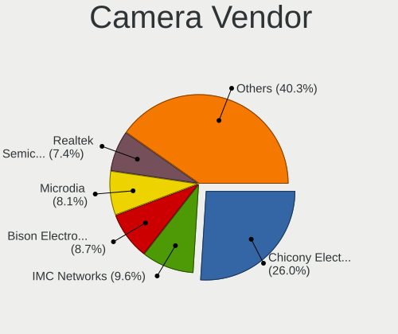

| Vendor                                 | Notebooks | Percent |
|----------------------------------------|-----------|---------|
| Chicony Electronics                    | 410       | 26%     |
| IMC Networks                           | 151       | 9.58%   |
| Bison Electronics                      | 137       | 8.69%   |
| Microdia                               | 127       | 8.05%   |
| Realtek Semiconductor                  | 117       | 7.42%   |
| Sunplus Innovation Technology          | 78        | 4.95%   |
| Cheng Uei Precision Industry (Foxlink) | 71        | 4.5%    |
| Quanta                                 | 65        | 4.12%   |
| Lite-On Technology                     | 59        | 3.74%   |
| Apple                                  | 52        | 3.3%    |
| Syntek                                 | 46        | 2.92%   |
| Luxvisions Innotech Limited            | 42        | 2.66%   |
| Suyin                                  | 38        | 2.41%   |
| Logitech                               | 32        | 2.03%   |
| Shinetech                              | 16        | 1.01%   |
| Lenovo                                 | 15        | 0.95%   |
| Ricoh                                  | 14        | 0.89%   |
| Sonix Technology                       | 13        | 0.82%   |
| Alcor Micro                            | 12        | 0.76%   |
| Samsung Electronics                    | 9         | 0.57%   |
| ALi                                    | 9         | 0.57%   |
| Silicon Motion                         | 8         | 0.51%   |
| SunplusIT                              | 5         | 0.32%   |
| Primax Electronics                     | 5         | 0.32%   |
| DigiTech                               | 4         | 0.25%   |
| Acer                                   | 4         | 0.25%   |
| Shenzhen Kingcome Optoelectronic       | 3         | 0.19%   |
| Microsoft                              | 3         | 0.19%   |
| kingcome                               | 3         | 0.19%   |
| Importek                               | 3         | 0.19%   |
| Elgato Systems                         | 3         | 0.19%   |
| Z-Star Microelectronics                | 2         | 0.13%   |
| Sunplus Technology                     | 2         | 0.13%   |
| Polycom                                | 2         | 0.13%   |
| Dell                                   | 2         | 0.13%   |
| Creative Technology                    | 2         | 0.13%   |
| Shine-optics                           | 1         | 0.06%   |
| Novatek Microelectronics               | 1         | 0.06%   |
| Linux Foundation                       | 1         | 0.06%   |
| LG Electronics                         | 1         | 0.06%   |

Camera Model
------------

Camera device models

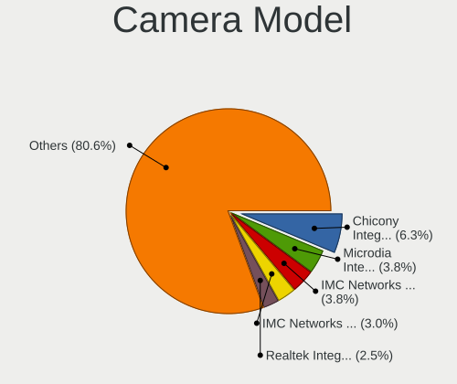

| Model                                                                    | Notebooks | Percent |
|--------------------------------------------------------------------------|-----------|---------|
| Chicony Integrated Camera                                                | 100       | 6.28%   |
| Microdia Integrated_Webcam_HD                                            | 61        | 3.83%   |
| IMC Networks USB2.0 HD UVC WebCam                                        | 60        | 3.77%   |
| IMC Networks Integrated Camera                                           | 48        | 3.02%   |
| Realtek Integrated_Webcam_HD                                             | 40        | 2.51%   |
| Bison Integrated Camera                                                  | 37        | 2.32%   |
| Syntek Integrated Camera                                                 | 34        | 2.14%   |
| Chicony HP HD Camera                                                     | 34        | 2.14%   |
| Chicony HD WebCam                                                        | 29        | 1.82%   |
| Bison Lenovo EasyCamera                                                  | 22        | 1.38%   |
| Lite-On HP HD Camera                                                     | 20        | 1.26%   |
| Sunplus Integrated_Webcam_HD                                             | 19        | 1.19%   |
| Quanta HP HD Camera                                                      | 19        | 1.19%   |
| Lite-On Integrated Camera                                                | 18        | 1.13%   |
| Bison SunplusIT Integrated Camera                                        | 18        | 1.13%   |
| Apple iPhone 5/5C/5S/6/SE/7/8/X                                          | 17        | 1.07%   |
| Sunplus HD WebCam                                                        | 15        | 0.94%   |
| Luxvisions Innotech Limited Integrated Camera                            | 15        | 0.94%   |
| Quanta HD User Facing                                                    | 14        | 0.88%   |
| Lite-On HP HD Webcam                                                     | 14        | 0.88%   |
| Cheng Uei Precision Industry (Foxlink) HP HD Webcam                      | 14        | 0.88%   |
| Luxvisions Innotech Limited HP HD Camera                                 | 13        | 0.82%   |
| Chicony Integrated Camera (1280x720@30)                                  | 13        | 0.82%   |
| Cheng Uei Precision Industry (Foxlink) HP HD Camera                      | 13        | 0.82%   |
| Apple FaceTime HD Camera                                                 | 13        | 0.82%   |
| ShineTech USB2.0 HD UVC WebCam                                           | 12        | 0.75%   |
| Chicony USB2.0 HD UVC WebCam                                             | 12        | 0.75%   |
| Chicony HD User Facing                                                   | 12        | 0.75%   |
| IMC Networks USB2.0 VGA UVC WebCam                                       | 11        | 0.69%   |
| Chicony HP HD Webcam [Fixed]                                             | 11        | 0.69%   |
| Cheng Uei Precision Industry (Foxlink) HP EliteBook integrated HD Webcam | 11        | 0.69%   |
| Sunplus Laptop Integrated WebCam HD                                      | 10        | 0.63%   |
| Sonix USB2.0 HD UVC WebCam                                               | 10        | 0.63%   |
| Chicony Integrated HP HD Webcam                                          | 10        | 0.63%   |
| Chicony HP TrueVision HD Camera                                          | 10        | 0.63%   |
| Chicony HP Truevision HD                                                 | 10        | 0.63%   |
| Apple Built-in iSight                                                    | 10        | 0.63%   |
| Samsung Galaxy series, misc. (MTP mode)                                  | 9         | 0.57%   |
| Realtek USB2.0 HD UVC WebCam                                             | 9         | 0.57%   |
| Quanta HP TrueVision HD Camera                                           | 9         | 0.57%   |

Security
--------

Fingerprint Vendor
------------------

Fingerprint sensor vendors

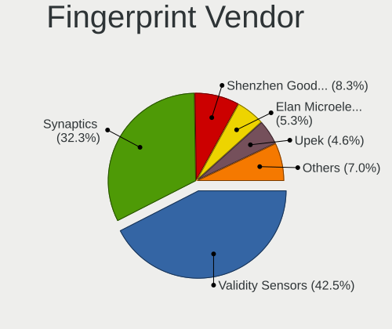

| Vendor                     | Notebooks | Percent |
|----------------------------|-----------|---------|
| Validity Sensors           | 175       | 42.48%  |
| Synaptics                  | 133       | 32.28%  |
| Shenzhen Goodix Technology | 34        | 8.25%   |
| Elan Microelectronics      | 22        | 5.34%   |
| Upek                       | 19        | 4.61%   |
| AuthenTec                  | 14        | 3.4%    |
| LighTuning Technology      | 9         | 2.18%   |
| STMicroelectronics         | 6         | 1.46%   |

Fingerprint Model
-----------------

Fingerprint sensor models

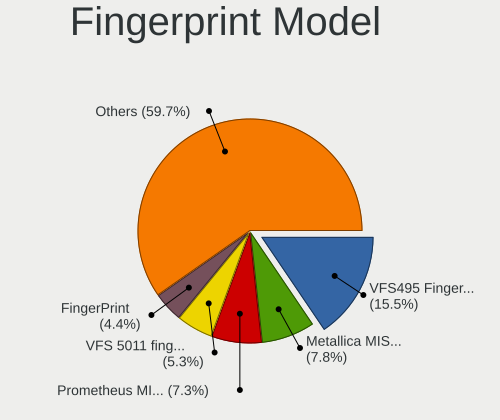

| Model                                                                      | Notebooks | Percent |
|----------------------------------------------------------------------------|-----------|---------|
| Validity Sensors VFS495 Fingerprint Reader                                 | 64        | 15.53%  |
| Synaptics Metallica MIS Touch Fingerprint Reader                           | 32        | 7.77%   |
| Synaptics Prometheus MIS Touch Fingerprint Reader                          | 30        | 7.28%   |
| Validity Sensors VFS 5011 fingerprint sensor                               | 22        | 5.34%   |
| Shenzhen Goodix FingerPrint                                                | 18        | 4.37%   |
| Upek Biometric Touchchip/Touchstrip Fingerprint Sensor                     | 17        | 4.13%   |
| Validity Sensors VFS491                                                    | 15        | 3.64%   |
| Validity Sensors Synaptics WBDI                                            | 15        | 3.64%   |
| Synaptics Prometheus Fingerprint Reader                                    | 15        | 3.64%   |
| Elan ELAN:Fingerprint                                                      | 14        | 3.4%    |
| Synaptics FS7604 Touch Fingerprint Sensor with PurePrint                   | 12        | 2.91%   |
| Validity Sensors Synaptics VFS7552 Touch Fingerprint Sensor with PurePrint | 11        | 2.67%   |
| Validity Sensors VFS471 Fingerprint Reader                                 | 10        | 2.43%   |
| Synaptics  FS7604 Touch Fingerprint Sensor with PurePrint                  | 10        | 2.43%   |
| Synaptics Fingerprint reader [HP G6]                                       | 10        | 2.43%   |
| Shenzhen Goodix  FingerPrint Device                                        | 10        | 2.43%   |
| Synaptics UWP WBDI Device                                                  | 8         | 1.94%   |
| Validity Sensors VFS5011 Fingerprint Reader                                | 7         | 1.7%    |
| Validity Sensors VFS451 Fingerprint Reader                                 | 7         | 1.7%    |
| Validity Sensors Swipe Fingerprint Sensor                                  | 7         | 1.7%    |
| LighTuning EgisTec Touch Fingerprint Sensor                                | 7         | 1.7%    |
| Elan ELAN:ARM-M4                                                           | 7         | 1.7%    |
| AuthenTec AES2810                                                          | 7         | 1.7%    |
| STMicroelectronics Fingerprint Reader                                      | 6         | 1.46%   |
| Shenzhen Goodix Fingerprint Reader                                         | 6         | 1.46%   |
| Validity Sensors VFS7500 Touch Fingerprint Sensor                          | 5         | 1.21%   |
| AuthenTec AES2501 Fingerprint Sensor                                       | 5         | 1.21%   |
| Validity Sensors VFS301 Fingerprint Reader                                 | 3         | 0.73%   |
| Validity Sensors VFS101 Fingerprint Reader                                 | 3         | 0.73%   |
| Validity Sensors Fingerprint scanner                                       | 3         | 0.73%   |
| Synaptics Metallica MOH Touch Fingerprint Reader                           | 3         | 0.73%   |
| Unknown                                                                    | 3         | 0.73%   |
| Validity Sensors VFS300 Fingerprint Reader                                 | 2         | 0.49%   |
| Upek TCS5B Fingerprint sensor                                              | 2         | 0.49%   |
| Synaptics WBDI Fingerprint Reader USB 086                                  | 2         | 0.49%   |
| Synaptics WBDI                                                             | 2         | 0.49%   |
| Synaptics TouchPad                                                         | 2         | 0.49%   |
| Synaptics  WBDI                                                            | 2         | 0.49%   |
| Validity Sensors VFS Fingerprint sensor                                    | 1         | 0.24%   |
| Synaptics WBDI Device                                                      | 1         | 0.24%   |

Chipcard Vendor
---------------

Chipcard module vendors

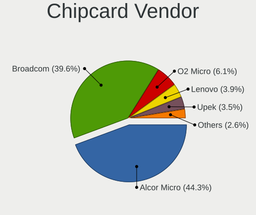

| Vendor                | Notebooks | Percent |
|-----------------------|-----------|---------|
| Alcor Micro           | 102       | 44.35%  |
| Broadcom              | 91        | 39.57%  |
| O2 Micro              | 14        | 6.09%   |
| Lenovo                | 9         | 3.91%   |
| Upek                  | 8         | 3.48%   |
| Yubico.com            | 4         | 1.74%   |
| Gemalto (was Gemplus) | 1         | 0.43%   |
| Chicony Electronics   | 1         | 0.43%   |

Chipcard Model
--------------

Chipcard module models

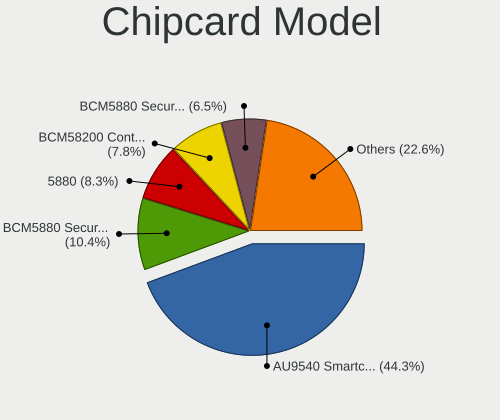

| Model                                                                        | Notebooks | Percent |
|------------------------------------------------------------------------------|-----------|---------|
| Alcor Micro AU9540 Smartcard Reader                                          | 102       | 44.35%  |
| Broadcom BCM5880 Secure Applications Processor                               | 24        | 10.43%  |
| Broadcom 5880                                                                | 19        | 8.26%   |
| Broadcom BCM58200 ControlVault 3 (FingerPrint sensor + Contacted SmartCard)  | 18        | 7.83%   |
| Broadcom BCM5880 Secure Applications Processor with fingerprint swipe sensor | 15        | 6.52%   |
| Broadcom 58200                                                               | 14        | 6.09%   |
| O2 Micro OZ776 CCID Smartcard Reader                                         | 11        | 4.78%   |
| Lenovo Integrated Smart Card Reader                                          | 9         | 3.91%   |
| Upek TouchChip Fingerprint Coprocessor (WBF advanced mode)                   | 8         | 3.48%   |
| Yubico.com Yubikey 4/5 U2F+CCID                                              | 4         | 1.74%   |
| O2 Micro Oz776 SmartCard Reader                                              | 3         | 1.3%    |
| Gemalto (was Gemplus) GemPC Twin SmartCard Reader                            | 1         | 0.43%   |
| Chicony Electronics HP Skylab USB Smartcard Keyboard                         | 1         | 0.43%   |
| Broadcom BCM5880 Secure Applications Processor with fingerprint touch sensor | 1         | 0.43%   |

Unsupported
-----------

Unsupported Devices
-------------------

Total unsupported devices on board

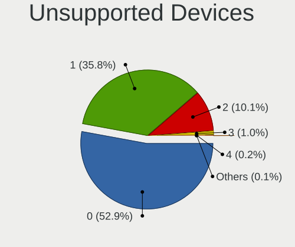

| Total | Notebooks | Percent |
|-------|-----------|---------|
| 0     | 976       | 52.9%   |
| 1     | 660       | 35.77%  |
| 2     | 186       | 10.08%  |
| 3     | 18        | 0.98%   |
| 4     | 3         | 0.16%   |
| 7     | 1         | 0.05%   |
| 5     | 1         | 0.05%   |

Unsupported Device Types
------------------------

Types of unsupported devices

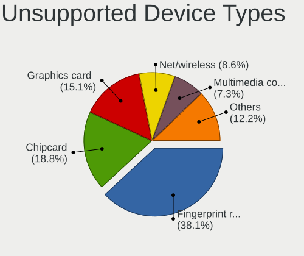

| Type                     | Notebooks | Percent |
|--------------------------|-----------|---------|
| Fingerprint reader       | 410       | 38.1%   |
| Chipcard                 | 202       | 18.77%  |
| Graphics card            | 162       | 15.06%  |
| Net/wireless             | 92        | 8.55%   |
| Multimedia controller    | 79        | 7.34%   |
| Camera                   | 36        | 3.35%   |
| Bluetooth                | 26        | 2.42%   |
| Communication controller | 23        | 2.14%   |
| Card reader              | 13        | 1.21%   |
| Storage                  | 11        | 1.02%   |
| Sound                    | 9         | 0.84%   |
| Net/ethernet             | 6         | 0.56%   |
| Modem                    | 2         | 0.19%   |
| Flash memory             | 2         | 0.19%   |
| Storage/nvme             | 1         | 0.09%   |
| Storage/ide              | 1         | 0.09%   |
| Storage/ata              | 1         | 0.09%   |

