Linux in Sweden - Tested Hardware & Statistics (Notebooks)
----------------------------------------------------------

A project to collect tested hardware configurations for Linux in Sweden.

Anyone can contribute to this report by the [hw-probe](https://github.com/linuxhw/hw-probe) tool:

    sudo -E hw-probe -all -upload

Please contribute! Especially if your hardware is rare.

Contents
--------

* [ Test Cases ](#test-cases)

* [ System ](#system)
  - [ OS                       ](#os)
  - [ OS Family                ](#os-family)
  - [ Kernel                   ](#kernel)
  - [ Kernel Family            ](#kernel-family)
  - [ Kernel Major Ver.        ](#kernel-major-ver)
  - [ Arch                     ](#arch)
  - [ DE                       ](#de)
  - [ Display Server           ](#display-server)
  - [ Display Manager          ](#display-manager)
  - [ OS Lang                  ](#os-lang)
  - [ Boot Mode                ](#boot-mode)
  - [ Filesystem               ](#filesystem)
  - [ Part. scheme             ](#part-scheme)
  - [ Dual Boot with Linux/BSD ](#dual-boot-with-linuxbsd)
  - [ Dual Boot (Win)          ](#dual-boot-win)

* [ Board ](#board)
  - [ Vendor                   ](#vendor)
  - [ Model                    ](#model)
  - [ Model Family             ](#model-family)
  - [ MFG Year                 ](#mfg-year)
  - [ Form Factor              ](#form-factor)
  - [ Secure Boot              ](#secure-boot)
  - [ Coreboot                 ](#coreboot)
  - [ RAM Size                 ](#ram-size)
  - [ RAM Used                 ](#ram-used)
  - [ Total Drives             ](#total-drives)
  - [ Has CD-ROM               ](#has-cd-rom)
  - [ Has Ethernet             ](#has-ethernet)
  - [ Has WiFi                 ](#has-wifi)
  - [ Has Bluetooth            ](#has-bluetooth)

* [ Location ](#location)
  - [ Country                  ](#country)
  - [ City                     ](#city)

* [ Drives ](#drives)
  - [ Drive Vendor             ](#drive-vendor)
  - [ Drive Model              ](#drive-model)
  - [ HDD Vendor               ](#hdd-vendor)
  - [ SSD Vendor               ](#ssd-vendor)
  - [ Drive Kind               ](#drive-kind)
  - [ Drive Connector          ](#drive-connector)
  - [ Drive Size               ](#drive-size)
  - [ Space Total              ](#space-total)
  - [ Space Used               ](#space-used)
  - [ Malfunc. Drives          ](#malfunc-drives)
  - [ Malfunc. Drive Vendor    ](#malfunc-drive-vendor)
  - [ Malfunc. HDD Vendor      ](#malfunc-hdd-vendor)
  - [ Malfunc. Drive Kind      ](#malfunc-drive-kind)
  - [ Failed Drives            ](#failed-drives)
  - [ Failed Drive Vendor      ](#failed-drive-vendor)
  - [ Drive Status             ](#drive-status)

* [ Storage controller ](#storage-controller)
  - [ Storage Vendor           ](#storage-vendor)
  - [ Storage Model            ](#storage-model)
  - [ Storage Kind             ](#storage-kind)

* [ Processor ](#processor)
  - [ CPU Vendor               ](#cpu-vendor)
  - [ CPU Model                ](#cpu-model)
  - [ CPU Model Family         ](#cpu-model-family)
  - [ CPU Cores                ](#cpu-cores)
  - [ CPU Sockets              ](#cpu-sockets)
  - [ CPU Threads              ](#cpu-threads)
  - [ CPU Op-Modes             ](#cpu-op-modes)
  - [ CPU Microcode            ](#cpu-microcode)
  - [ CPU Microarch            ](#cpu-microarch)

* [ Graphics ](#graphics)
  - [ GPU Vendor               ](#gpu-vendor)
  - [ GPU Model                ](#gpu-model)
  - [ GPU Combo                ](#gpu-combo)
  - [ GPU Driver               ](#gpu-driver)
  - [ GPU Memory               ](#gpu-memory)

* [ Monitor ](#monitor)
  - [ Monitor Vendor           ](#monitor-vendor)
  - [ Monitor Model            ](#monitor-model)
  - [ Monitor Resolution       ](#monitor-resolution)
  - [ Monitor Diagonal         ](#monitor-diagonal)
  - [ Monitor Width            ](#monitor-width)
  - [ Aspect Ratio             ](#aspect-ratio)
  - [ Monitor Area             ](#monitor-area)
  - [ Pixel Density            ](#pixel-density)
  - [ Multiple Monitors        ](#multiple-monitors)

* [ Network ](#network)
  - [ Net Controller Vendor    ](#net-controller-vendor)
  - [ Net Controller Model     ](#net-controller-model)
  - [ Wireless Vendor          ](#wireless-vendor)
  - [ Wireless Model           ](#wireless-model)
  - [ Ethernet Vendor          ](#ethernet-vendor)
  - [ Ethernet Model           ](#ethernet-model)
  - [ Net Controller Kind      ](#net-controller-kind)
  - [ Used Controller          ](#used-controller)
  - [ NICs                     ](#nics)
  - [ IPv6                     ](#ipv6)

* [ Bluetooth ](#bluetooth)
  - [ Bluetooth Vendor         ](#bluetooth-vendor)
  - [ Bluetooth Model          ](#bluetooth-model)

* [ Sound ](#sound)
  - [ Sound Vendor             ](#sound-vendor)
  - [ Sound Model              ](#sound-model)

* [ Memory ](#memory)
  - [ Memory Vendor            ](#memory-vendor)
  - [ Memory Model             ](#memory-model)
  - [ Memory Kind              ](#memory-kind)
  - [ Memory Form Factor       ](#memory-form-factor)
  - [ Memory Size              ](#memory-size)
  - [ Memory Speed             ](#memory-speed)

* [ Printers & scanners ](#printers--scanners)
  - [ Printer Vendor           ](#printer-vendor)
  - [ Printer Model            ](#printer-model)
  - [ Scanner Vendor           ](#scanner-vendor)
  - [ Scanner Model            ](#scanner-model)

* [ Camera ](#camera)
  - [ Camera Vendor            ](#camera-vendor)
  - [ Camera Model             ](#camera-model)

* [ Security ](#security)
  - [ Fingerprint Vendor       ](#fingerprint-vendor)
  - [ Fingerprint Model        ](#fingerprint-model)
  - [ Chipcard Vendor          ](#chipcard-vendor)
  - [ Chipcard Model           ](#chipcard-model)

* [ Unsupported ](#unsupported)
  - [ Unsupported Devices      ](#unsupported-devices)
  - [ Unsupported Device Types ](#unsupported-device-types)

Test Cases
----------

Total: 1660

| Vendor        | Model                       | Probe                                                      | Date         |
|---------------|-----------------------------|------------------------------------------------------------|--------------|
| HP            | ZBook Studio G5             | [3f96bd2883](https://linux-hardware.org/?probe=3f96bd2883) | Sep 30, 2023 |
| HP            | ENVY TS Sleekbook 4         | [545098d0d2](https://linux-hardware.org/?probe=545098d0d2) | Sep 29, 2023 |
| HP            | ZBook Studio G5             | [239b5a3fd5](https://linux-hardware.org/?probe=239b5a3fd5) | Sep 29, 2023 |
| Lenovo        | IdeaPad Slim 5 14ABR8 82... | [c61d70bcfa](https://linux-hardware.org/?probe=c61d70bcfa) | Sep 28, 2023 |
| Lenovo        | IdeaPad Slim 5 14ABR8 82... | [be49c167d0](https://linux-hardware.org/?probe=be49c167d0) | Sep 28, 2023 |
| ASUSTek       | ASUS TUF Gaming A15 FA50... | [8c585051a3](https://linux-hardware.org/?probe=8c585051a3) | Sep 27, 2023 |
| Dell          | Vostro 3550                 | [f87aee7d8f](https://linux-hardware.org/?probe=f87aee7d8f) | Sep 26, 2023 |
| Dell          | Vostro 3550                 | [7214093885](https://linux-hardware.org/?probe=7214093885) | Sep 26, 2023 |
| Dell          | Latitude E7270              | [98dd5eefb6](https://linux-hardware.org/?probe=98dd5eefb6) | Sep 25, 2023 |
| Dell          | Latitude E5270              | [d091c4fa0e](https://linux-hardware.org/?probe=d091c4fa0e) | Sep 24, 2023 |
| Dell          | Inspiron 3541               | [da796376e1](https://linux-hardware.org/?probe=da796376e1) | Sep 23, 2023 |
| Valve         | Jupiter                     | [3889f9ca9d](https://linux-hardware.org/?probe=3889f9ca9d) | Sep 23, 2023 |
| Acer          | Aspire ES1-520              | [22ce921c1e](https://linux-hardware.org/?probe=22ce921c1e) | Sep 22, 2023 |
| HP            | EliteBook 840 G8 Noteboo... | [1893bb3992](https://linux-hardware.org/?probe=1893bb3992) | Sep 22, 2023 |
| Lenovo        | ThinkPad T470s 20HF0000M... | [ad989ac089](https://linux-hardware.org/?probe=ad989ac089) | Sep 21, 2023 |
| Lenovo        | ThinkPad E15 Gen 2 20TD0... | [4d1743c405](https://linux-hardware.org/?probe=4d1743c405) | Sep 20, 2023 |
| Dell          | XPS 13 9370                 | [002401cab6](https://linux-hardware.org/?probe=002401cab6) | Sep 18, 2023 |
| HP            | ZBook Power 15.6 inch G8... | [79142d7f53](https://linux-hardware.org/?probe=79142d7f53) | Sep 17, 2023 |
| ASUSTek       | K55DR                       | [f3b7f92416](https://linux-hardware.org/?probe=f3b7f92416) | Sep 16, 2023 |
| Lenovo        | ThinkPad P14s Gen 3 21AK... | [0cdeaab8be](https://linux-hardware.org/?probe=0cdeaab8be) | Sep 13, 2023 |
| Samsung       | R530/R730/P590              | [d9bd973c79](https://linux-hardware.org/?probe=d9bd973c79) | Sep 12, 2023 |
| ASUSTek       | VivoBook_ASUSLaptop X150... | [58b852c7cb](https://linux-hardware.org/?probe=58b852c7cb) | Sep 12, 2023 |
| ASUSTek       | VivoBook_ASUSLaptop X150... | [10ff64dcf5](https://linux-hardware.org/?probe=10ff64dcf5) | Sep 12, 2023 |
| MSI           | Stealth 15M B12UE           | [9a23215875](https://linux-hardware.org/?probe=9a23215875) | Sep 11, 2023 |
| Apple         | MacBookPro8,1               | [d3b821a061](https://linux-hardware.org/?probe=d3b821a061) | Sep 10, 2023 |
| Dell          | Precision M4800             | [ea570fedac](https://linux-hardware.org/?probe=ea570fedac) | Sep 09, 2023 |
| ASUSTek       | G75VW                       | [98ba75a25b](https://linux-hardware.org/?probe=98ba75a25b) | Sep 09, 2023 |
| ASUSTek       | X453MA                      | [b73ef6339a](https://linux-hardware.org/?probe=b73ef6339a) | Sep 08, 2023 |
| ASUSTek       | X453MA                      | [e71f333094](https://linux-hardware.org/?probe=e71f333094) | Sep 07, 2023 |
| ASUSTek       | X453MA                      | [c48759c297](https://linux-hardware.org/?probe=c48759c297) | Sep 07, 2023 |
| Dell          | Latitude 7440               | [47f28d7b00](https://linux-hardware.org/?probe=47f28d7b00) | Sep 04, 2023 |
| Dell          | Latitude 7440               | [27b2ae9d5b](https://linux-hardware.org/?probe=27b2ae9d5b) | Sep 04, 2023 |
| Lenovo        | ThinkPad T440 20B7S0RD00    | [af57fd1655](https://linux-hardware.org/?probe=af57fd1655) | Sep 03, 2023 |
| Fujitsu Si... | AMILO Xa 1526               | [806eed53dc](https://linux-hardware.org/?probe=806eed53dc) | Sep 02, 2023 |
| Fujitsu Si... | AMILO Xa 1526               | [377d5352d8](https://linux-hardware.org/?probe=377d5352d8) | Sep 02, 2023 |
| HP            | EliteBook 8460p             | [b6f6192ef9](https://linux-hardware.org/?probe=b6f6192ef9) | Sep 02, 2023 |
| Lenovo        | ThinkPad A275 20KDS01T00    | [e4a45bf853](https://linux-hardware.org/?probe=e4a45bf853) | Sep 02, 2023 |
| Acer          | Aspire 5755G                | [b938dc8500](https://linux-hardware.org/?probe=b938dc8500) | Aug 31, 2023 |
| HP            | ProBook 6360b               | [0dbff9ebb3](https://linux-hardware.org/?probe=0dbff9ebb3) | Aug 30, 2023 |
| Lenovo        | ThinkPad E15 Gen 2 20TD0... | [44e7ba057b](https://linux-hardware.org/?probe=44e7ba057b) | Aug 30, 2023 |
| Apple         | MacBookAir6,2               | [7c208705e5](https://linux-hardware.org/?probe=7c208705e5) | Aug 29, 2023 |
| Lenovo        | B50-30 80ES                 | [96aa7b5683](https://linux-hardware.org/?probe=96aa7b5683) | Aug 29, 2023 |
| Acer          | Aspire ES1-311              | [f0a3b05a99](https://linux-hardware.org/?probe=f0a3b05a99) | Aug 25, 2023 |
| Lenovo        | ThinkPad T440s 20AR003RM... | [f8f097e135](https://linux-hardware.org/?probe=f8f097e135) | Aug 24, 2023 |
| Lenovo        | IdeaPad 110-17ACL 80UM      | [aa3157f519](https://linux-hardware.org/?probe=aa3157f519) | Aug 24, 2023 |
| Lenovo        | IdeaPad 110-17ACL 80UM      | [8d3738c790](https://linux-hardware.org/?probe=8d3738c790) | Aug 24, 2023 |
| Lenovo        | IdeaPad Pro 5 16ARP8 83A... | [3231dcefb4](https://linux-hardware.org/?probe=3231dcefb4) | Aug 22, 2023 |
| Dell          | Latitude 3350               | [e86ce20d6d](https://linux-hardware.org/?probe=e86ce20d6d) | Aug 20, 2023 |
| Lenovo        | ThinkPad T440s 20AR003RM... | [d989b68c65](https://linux-hardware.org/?probe=d989b68c65) | Aug 19, 2023 |
| ASUSTek       | M3N                         | [7c4b9386db](https://linux-hardware.org/?probe=7c4b9386db) | Aug 18, 2023 |
| ASUSTek       | U38N                        | [0e0f709353](https://linux-hardware.org/?probe=0e0f709353) | Aug 17, 2023 |
| Dell          | XPS 15 9570                 | [91b8c2a5eb](https://linux-hardware.org/?probe=91b8c2a5eb) | Aug 17, 2023 |
| Acer          | Aspire ES1-520              | [a47415983e](https://linux-hardware.org/?probe=a47415983e) | Aug 12, 2023 |
| HP            | EliteBook 840 G7 Noteboo... | [5ba59f878a](https://linux-hardware.org/?probe=5ba59f878a) | Aug 12, 2023 |
| Dell          | Inspiron 5559               | [f3e1bb3812](https://linux-hardware.org/?probe=f3e1bb3812) | Aug 11, 2023 |
| Fujitsu Si... | AMILO Xa 1526               | [0a1e2a7f23](https://linux-hardware.org/?probe=0a1e2a7f23) | Aug 11, 2023 |
| Fujitsu Si... | AMILO Xa 1526               | [742b085257](https://linux-hardware.org/?probe=742b085257) | Aug 11, 2023 |
| HP            | ZBook Studio G7 Mobile W... | [836fcda626](https://linux-hardware.org/?probe=836fcda626) | Aug 11, 2023 |
| HP            | ZBook Studio G7 Mobile W... | [3e208faa6e](https://linux-hardware.org/?probe=3e208faa6e) | Aug 11, 2023 |
| Acer          | Nitro AN515-52              | [df9e6a8d98](https://linux-hardware.org/?probe=df9e6a8d98) | Aug 10, 2023 |
| SLIMBOOK      | PROX-AMD5                   | [f20a32551b](https://linux-hardware.org/?probe=f20a32551b) | Aug 10, 2023 |
| Clevo         | W251EFQ/W270EFQ             | [cde80ecaf6](https://linux-hardware.org/?probe=cde80ecaf6) | Aug 10, 2023 |
| Lenovo        | ThinkBook 14-IIL 20SL       | [e323e9cd7e](https://linux-hardware.org/?probe=e323e9cd7e) | Aug 10, 2023 |
| Fujitsu Si... | AMILO Xa 1526               | [a3b9be2f56](https://linux-hardware.org/?probe=a3b9be2f56) | Aug 10, 2023 |
| HP            | Unknown                     | [567a10ceb2](https://linux-hardware.org/?probe=567a10ceb2) | Aug 08, 2023 |
| Lenovo        | ThinkPad W510 4391EC4       | [5e9baa223d](https://linux-hardware.org/?probe=5e9baa223d) | Aug 07, 2023 |
| Acer          | Aspire 4810T                | [aaf9cdefc0](https://linux-hardware.org/?probe=aaf9cdefc0) | Aug 07, 2023 |
| Fujitsu Si... | AMILO Xa 1526               | [3d49205e68](https://linux-hardware.org/?probe=3d49205e68) | Aug 06, 2023 |
| Toshiba       | Satellite C670D-11P         | [a5c49672d6](https://linux-hardware.org/?probe=a5c49672d6) | Aug 05, 2023 |
| HP            | EliteBook 8440p             | [5f0be846f0](https://linux-hardware.org/?probe=5f0be846f0) | Aug 05, 2023 |
| ASUSTek       | G75VW                       | [f420f3e1e6](https://linux-hardware.org/?probe=f420f3e1e6) | Aug 04, 2023 |
| Lenovo        | ThinkPad T470 W10DG 20JN... | [bd2d5f588f](https://linux-hardware.org/?probe=bd2d5f588f) | Aug 04, 2023 |
| Notebook      | NP5x_NP6x_NP7xPNP           | [508c18e563](https://linux-hardware.org/?probe=508c18e563) | Aug 03, 2023 |
| Dell          | Latitude E7240              | [87a0310cf0](https://linux-hardware.org/?probe=87a0310cf0) | Aug 02, 2023 |
| ASUSTek       | ASUS TUF Gaming F15 FX50... | [9fbfc590ad](https://linux-hardware.org/?probe=9fbfc590ad) | Aug 01, 2023 |
| Dell          | Latitude 3190               | [c88a2ad597](https://linux-hardware.org/?probe=c88a2ad597) | Aug 01, 2023 |
| HP            | Unknown                     | [a4d8377dfa](https://linux-hardware.org/?probe=a4d8377dfa) | Aug 01, 2023 |
| Apple         | MacBookPro6,2               | [c5205f5512](https://linux-hardware.org/?probe=c5205f5512) | Jul 30, 2023 |
| HP            | EliteBook 745 G6            | [d8272e8eeb](https://linux-hardware.org/?probe=d8272e8eeb) | Jul 30, 2023 |
| ASUSTek       | VivoBook_ASUSLaptop M350... | [d1a4b2769a](https://linux-hardware.org/?probe=d1a4b2769a) | Jul 29, 2023 |
| win elemen... | MoreFine S500+              | [7d5b443b84](https://linux-hardware.org/?probe=7d5b443b84) | Jul 29, 2023 |
| Lenovo        | IdeaPad 5 Pro 16ACH6 82L... | [a8e51655da](https://linux-hardware.org/?probe=a8e51655da) | Jul 28, 2023 |
| ASUSTek       | VivoBook_ASUSLaptop M350... | [9cbedced8b](https://linux-hardware.org/?probe=9cbedced8b) | Jul 28, 2023 |
| Lenovo        | ThinkPad T480 20L6S55L00    | [5b3742984b](https://linux-hardware.org/?probe=5b3742984b) | Jul 27, 2023 |
| ASUSTek       | K55DR                       | [47e831a79a](https://linux-hardware.org/?probe=47e831a79a) | Jul 26, 2023 |
| Lenovo        | ThinkPad E14 Gen 3 20Y70... | [a060c0999b](https://linux-hardware.org/?probe=a060c0999b) | Jul 26, 2023 |
| Lenovo        | ThinkPad E480 20KN001QMX    | [1ff9753d17](https://linux-hardware.org/?probe=1ff9753d17) | Jul 25, 2023 |
| ASUSTek       | VivoBook_ASUSLaptop X403... | [9fa1cd70a3](https://linux-hardware.org/?probe=9fa1cd70a3) | Jul 24, 2023 |
| HP            | Pavilion Laptop 14-bf0xx    | [1e169f0ba8](https://linux-hardware.org/?probe=1e169f0ba8) | Jul 23, 2023 |
| Acer          | Aspire ES1-311              | [52541ec1ed](https://linux-hardware.org/?probe=52541ec1ed) | Jul 23, 2023 |
| ASUSTek       | ROG Strix G713QM_G713QM     | [bbd3181f1f](https://linux-hardware.org/?probe=bbd3181f1f) | Jul 22, 2023 |
| HP            | Compaq Presario CQ50        | [1316c533a8](https://linux-hardware.org/?probe=1316c533a8) | Jul 21, 2023 |
| HP            | ProBook 4530s               | [450e93a8de](https://linux-hardware.org/?probe=450e93a8de) | Jul 21, 2023 |
| HP            | 15                          | [36b4035b57](https://linux-hardware.org/?probe=36b4035b57) | Jul 20, 2023 |
| HP            | EliteBook 2570p             | [854bbb5dee](https://linux-hardware.org/?probe=854bbb5dee) | Jul 19, 2023 |
| HP            | 15                          | [0eeb522bec](https://linux-hardware.org/?probe=0eeb522bec) | Jul 19, 2023 |
| HP            | EliteBook 2570p             | [205b94b373](https://linux-hardware.org/?probe=205b94b373) | Jul 19, 2023 |
| MSI           | GF65 Thin 10SER             | [27966135e2](https://linux-hardware.org/?probe=27966135e2) | Jul 16, 2023 |
| ASUSTek       | ROG Strix G731GU_G731GU     | [801eb1eb3c](https://linux-hardware.org/?probe=801eb1eb3c) | Jul 15, 2023 |
| HP            | Pavilion Aero Laptop 13-... | [e790a3c22f](https://linux-hardware.org/?probe=e790a3c22f) | Jul 14, 2023 |
| HP            | Pavilion Aero Laptop 13-... | [dae11c33ed](https://linux-hardware.org/?probe=dae11c33ed) | Jul 14, 2023 |
| Alienware     | x15 R1                      | [a72051a57e](https://linux-hardware.org/?probe=a72051a57e) | Jul 13, 2023 |
| Lenovo        | ThinkPad T480 20L6S01Q3U    | [f6a1f94437](https://linux-hardware.org/?probe=f6a1f94437) | Jul 13, 2023 |
| Lenovo        | Yoga 3 Pro-1370 80HE        | [161a78ce7d](https://linux-hardware.org/?probe=161a78ce7d) | Jul 11, 2023 |
| ASUSTek       | G75VW                       | [cfc5e42de6](https://linux-hardware.org/?probe=cfc5e42de6) | Jul 11, 2023 |
| ASUSTek       | ROG Strix G731GU_G731GU     | [4b33cf2e09](https://linux-hardware.org/?probe=4b33cf2e09) | Jul 09, 2023 |
| IBM           | ThinkPad T43 18714AG        | [c7d3e6a151](https://linux-hardware.org/?probe=c7d3e6a151) | Jul 09, 2023 |
| ASUSTek       | X550VC                      | [ecd8f6cdd2](https://linux-hardware.org/?probe=ecd8f6cdd2) | Jul 09, 2023 |
| ASUSTek       | X550VC                      | [0ea27ea171](https://linux-hardware.org/?probe=0ea27ea171) | Jul 09, 2023 |
| Dell          | XPS 13 9370                 | [854ca6ff4f](https://linux-hardware.org/?probe=854ca6ff4f) | Jul 06, 2023 |
| Medion        | ML-210007                   | [192b83694f](https://linux-hardware.org/?probe=192b83694f) | Jul 06, 2023 |
| Medion        | ML-210007                   | [8bc97d58d2](https://linux-hardware.org/?probe=8bc97d58d2) | Jul 06, 2023 |
| ASUSTek       | ASUS EXPERTBOOK B9400CBA... | [b6d0f85342](https://linux-hardware.org/?probe=b6d0f85342) | Jul 04, 2023 |
| Acer          | Aspire ES1-311              | [50b65edbc0](https://linux-hardware.org/?probe=50b65edbc0) | Jul 04, 2023 |
| Lenovo        | ThinkPad T470s 20HF004UM... | [e0fc7e357f](https://linux-hardware.org/?probe=e0fc7e357f) | Jul 04, 2023 |
| Lenovo        | ThinkPad T470s 20HF004UM... | [0ca36f92b8](https://linux-hardware.org/?probe=0ca36f92b8) | Jul 03, 2023 |
| Acer          | Aspire ES1-311              | [066d1a2fa8](https://linux-hardware.org/?probe=066d1a2fa8) | Jul 03, 2023 |
| Lenovo        | ThinkPad X230 232578G       | [80810e133e](https://linux-hardware.org/?probe=80810e133e) | Jul 02, 2023 |
| Lenovo        | ThinkPad X230 232578G       | [48df5942cf](https://linux-hardware.org/?probe=48df5942cf) | Jul 02, 2023 |
| SLIMBOOK      | PROX-AMD5                   | [f91dbee23b](https://linux-hardware.org/?probe=f91dbee23b) | Jul 02, 2023 |
| Acer          | Predator G9-593             | [127df9999f](https://linux-hardware.org/?probe=127df9999f) | Jul 01, 2023 |
| Acer          | Predator G9-593             | [d4dca39223](https://linux-hardware.org/?probe=d4dca39223) | Jul 01, 2023 |
| ASUSTek       | VivoBook_ASUSLaptop X160... | [a203a588f9](https://linux-hardware.org/?probe=a203a588f9) | Jun 30, 2023 |
| Lenovo        | Legion 5 15ACH6 82JW        | [7f9164d1e0](https://linux-hardware.org/?probe=7f9164d1e0) | Jun 29, 2023 |
| Lenovo        | ThinkPad X240 20AL00C7MD    | [5c5334f633](https://linux-hardware.org/?probe=5c5334f633) | Jun 28, 2023 |
| Lenovo        | Yoga Slim 7 Pro 14ACH5 8... | [e10aa58dda](https://linux-hardware.org/?probe=e10aa58dda) | Jun 24, 2023 |
| MSI           | GX60 1AC                    | [8e15fea8cd](https://linux-hardware.org/?probe=8e15fea8cd) | Jun 22, 2023 |
| MSI           | Katana GF76 12UD            | [1897f5f0cb](https://linux-hardware.org/?probe=1897f5f0cb) | Jun 20, 2023 |
| Acer          | Aspire ES1-311              | [b0361fedbc](https://linux-hardware.org/?probe=b0361fedbc) | Jun 16, 2023 |
| Lenovo        | IdeaPad 110-17ACL 80UM      | [74a69e5cca](https://linux-hardware.org/?probe=74a69e5cca) | Jun 15, 2023 |
| Acer          | Aspire ES1-311              | [a0e0ea6aa1](https://linux-hardware.org/?probe=a0e0ea6aa1) | Jun 15, 2023 |
| Lenovo        | IdeaPad 1 14ADA05 82GW      | [91af63490c](https://linux-hardware.org/?probe=91af63490c) | Jun 15, 2023 |
| Lenovo        | ThinkPad A275 20KDS01T00    | [e9aeb26aeb](https://linux-hardware.org/?probe=e9aeb26aeb) | Jun 14, 2023 |
| Lenovo        | ThinkPad A275 20KDS01T00    | [f675b70f23](https://linux-hardware.org/?probe=f675b70f23) | Jun 14, 2023 |
| Dell          | Latitude 7480               | [375fb09bca](https://linux-hardware.org/?probe=375fb09bca) | Jun 14, 2023 |
| HP            | Pavilion Laptop 14-bf0xx    | [3a8338d906](https://linux-hardware.org/?probe=3a8338d906) | Jun 13, 2023 |
| Lenovo        | IdeaPad 110-17ACL 80UM      | [93cd1fd89c](https://linux-hardware.org/?probe=93cd1fd89c) | Jun 13, 2023 |
| Dell          | Latitude 3320               | [e467a71dac](https://linux-hardware.org/?probe=e467a71dac) | Jun 12, 2023 |
| Dell          | Latitude 3320               | [ec4f04b63e](https://linux-hardware.org/?probe=ec4f04b63e) | Jun 12, 2023 |
| Lenovo        | IdeaPad 5 Pro 16ACH6 82L... | [88fc978934](https://linux-hardware.org/?probe=88fc978934) | Jun 12, 2023 |
| Lenovo        | ThinkBook 14-IIL 20SL       | [0b737be0c6](https://linux-hardware.org/?probe=0b737be0c6) | Jun 12, 2023 |
| HP            | Laptop 15s-eq2xxx           | [5f4978fc61](https://linux-hardware.org/?probe=5f4978fc61) | Jun 12, 2023 |
| ASUSTek       | VivoBook_ASUSLaptop M150... | [8a3bd0a576](https://linux-hardware.org/?probe=8a3bd0a576) | Jun 11, 2023 |
| Acer          | Aspire A515-47              | [2838a84809](https://linux-hardware.org/?probe=2838a84809) | Jun 11, 2023 |
| Lenovo        | ThinkPad T490 20N2CTO1WW    | [8fa2e2acc9](https://linux-hardware.org/?probe=8fa2e2acc9) | Jun 08, 2023 |
| ASUSTek       | ASUS TUF Gaming A15 FA50... | [6a98d856ee](https://linux-hardware.org/?probe=6a98d856ee) | Jun 07, 2023 |
| Dell          | Latitude 3340               | [4ac9bd4101](https://linux-hardware.org/?probe=4ac9bd4101) | Jun 05, 2023 |
| ASUSTek       | X505BP                      | [f92e294ba0](https://linux-hardware.org/?probe=f92e294ba0) | Jun 04, 2023 |
| Apple         | MacBookPro9,2               | [eb51cb6dcf](https://linux-hardware.org/?probe=eb51cb6dcf) | Jun 03, 2023 |
| Timi          | RedmiBook 14 II             | [bad37936c6](https://linux-hardware.org/?probe=bad37936c6) | May 30, 2023 |
| MSI           | Katana GF76 12UD            | [b1b1816b59](https://linux-hardware.org/?probe=b1b1816b59) | May 29, 2023 |
| Lenovo        | ThinkPad T500 2056Y4R       | [dbd22d38bd](https://linux-hardware.org/?probe=dbd22d38bd) | May 28, 2023 |
| ASUSTek       | G75VW                       | [32fee60a54](https://linux-hardware.org/?probe=32fee60a54) | May 28, 2023 |
| ASUSTek       | G75VW                       | [ec91d28c95](https://linux-hardware.org/?probe=ec91d28c95) | May 28, 2023 |
| HP            | Compaq 6730s                | [fe2b8b63ac](https://linux-hardware.org/?probe=fe2b8b63ac) | May 28, 2023 |
| Fujitsu Si... | ESPRIMO Mobile V5535        | [dbfc9be02f](https://linux-hardware.org/?probe=dbfc9be02f) | May 26, 2023 |
| Lenovo        | IdeaPad S340-14API 81NB     | [25f6dcaefc](https://linux-hardware.org/?probe=25f6dcaefc) | May 25, 2023 |
| HP            | Laptop 14s-fq1xxx           | [73d0ff64b6](https://linux-hardware.org/?probe=73d0ff64b6) | May 23, 2023 |
| Lenovo        | ThinkPad T550 20CJS1V900    | [9bc275ef54](https://linux-hardware.org/?probe=9bc275ef54) | May 22, 2023 |
| HP            | ZBook Fury 15.6 inch G8 ... | [117bc29848](https://linux-hardware.org/?probe=117bc29848) | May 22, 2023 |
| HP            | ZBook Fury 15.6 inch G8 ... | [e3af81180a](https://linux-hardware.org/?probe=e3af81180a) | May 22, 2023 |
| Acer          | Aspire E1-571               | [cce6eaa028](https://linux-hardware.org/?probe=cce6eaa028) | May 20, 2023 |
| HP            | Compaq 6730s                | [632961079b](https://linux-hardware.org/?probe=632961079b) | May 20, 2023 |
| Notebook      | NLx0MU                      | [e0300907f0](https://linux-hardware.org/?probe=e0300907f0) | May 18, 2023 |
| Lenovo        | ThinkPad T460s 20FAS2L60... | [a58ebcac7c](https://linux-hardware.org/?probe=a58ebcac7c) | May 17, 2023 |
| HP            | OMEN by Laptop 15-ce0xx     | [7d818512b8](https://linux-hardware.org/?probe=7d818512b8) | May 17, 2023 |
| Packard Be... | EasyNote TV43CM             | [66dbc844c7](https://linux-hardware.org/?probe=66dbc844c7) | May 17, 2023 |
| Lenovo        | ThinkPad L14 Gen 1 20U6S... | [966e89afc3](https://linux-hardware.org/?probe=966e89afc3) | May 17, 2023 |
| Lenovo        | ThinkPad L14 Gen 2 20X10... | [b4bd4b7d23](https://linux-hardware.org/?probe=b4bd4b7d23) | May 17, 2023 |
| Lenovo        | ThinkPad L14 Gen 2 20X10... | [3089c7ab46](https://linux-hardware.org/?probe=3089c7ab46) | May 16, 2023 |
| Lenovo        | ThinkPad L14 Gen 2 20X10... | [a587179a2f](https://linux-hardware.org/?probe=a587179a2f) | May 16, 2023 |
| Lenovo        | ThinkPad L14 Gen 2 20X10... | [8ab7fe837d](https://linux-hardware.org/?probe=8ab7fe837d) | May 16, 2023 |
| SLIMBOOK      | PROX-AMD5                   | [7d44c65f86](https://linux-hardware.org/?probe=7d44c65f86) | May 16, 2023 |
| HP            | Pavilion Gaming Laptop 1... | [36df0e0f57](https://linux-hardware.org/?probe=36df0e0f57) | May 14, 2023 |
| HP            | EliteBook 850 G6            | [df19e8413c](https://linux-hardware.org/?probe=df19e8413c) | May 14, 2023 |
| HP            | EliteBook 840 G5            | [7b8c68cfcf](https://linux-hardware.org/?probe=7b8c68cfcf) | May 13, 2023 |
| Lenovo        | ThinkPad L13 Gen 2 20VJS... | [17510fcd4f](https://linux-hardware.org/?probe=17510fcd4f) | May 12, 2023 |
| Lenovo        | ThinkPad L13 Gen 2 20VJS... | [b9b6adb18a](https://linux-hardware.org/?probe=b9b6adb18a) | May 12, 2023 |
| Lenovo        | ThinkPad L13 Gen 2 20VJS... | [80dc4be517](https://linux-hardware.org/?probe=80dc4be517) | May 12, 2023 |
| Lenovo        | ThinkPad L13 Gen 2 20VJS... | [6eb320d381](https://linux-hardware.org/?probe=6eb320d381) | May 12, 2023 |
| HP            | ProBook 640 G1              | [4bbb20185b](https://linux-hardware.org/?probe=4bbb20185b) | May 12, 2023 |
| HP            | ProBook 640 G1              | [f89a68e432](https://linux-hardware.org/?probe=f89a68e432) | May 12, 2023 |
| HP            | ProBook 440 14 inch G9 N... | [a07acb448b](https://linux-hardware.org/?probe=a07acb448b) | May 12, 2023 |
| Lenovo        | ThinkPad X260 20F600A7MS    | [67daafed56](https://linux-hardware.org/?probe=67daafed56) | May 12, 2023 |
| HP            | ProBook 6470b               | [7f1a6e0d48](https://linux-hardware.org/?probe=7f1a6e0d48) | May 12, 2023 |
| HP            | ProBook 440 14 inch G9 N... | [f4df381f0e](https://linux-hardware.org/?probe=f4df381f0e) | May 12, 2023 |
| Lenovo        | ThinkPad T440 20B7S2SM00    | [8f6bd394c4](https://linux-hardware.org/?probe=8f6bd394c4) | May 12, 2023 |
| Fujitsu       | LIFEBOOK P702               | [b1460b51ac](https://linux-hardware.org/?probe=b1460b51ac) | May 12, 2023 |
| HP            | ProBook 640 G1              | [23cff0250a](https://linux-hardware.org/?probe=23cff0250a) | May 12, 2023 |
| MSI           | Stealth 16Studio A13VG      | [7c232216fd](https://linux-hardware.org/?probe=7c232216fd) | May 11, 2023 |
| HP            | EliteBook 840 G6            | [bd7c97ad54](https://linux-hardware.org/?probe=bd7c97ad54) | May 11, 2023 |
| HP            | EliteBook 840 G6            | [483f4bbb5d](https://linux-hardware.org/?probe=483f4bbb5d) | May 10, 2023 |
| Dynabook      | Satellite Pro C50-J         | [535cc48341](https://linux-hardware.org/?probe=535cc48341) | May 08, 2023 |
| Dell          | Vostro 3360                 | [13a1e30b53](https://linux-hardware.org/?probe=13a1e30b53) | May 06, 2023 |
| Lenovo        | ThinkPad L470 W10DG 20JV... | [a15c5113a0](https://linux-hardware.org/?probe=a15c5113a0) | May 05, 2023 |
| Lenovo        | ThinkPad L470 W10DG 20JV... | [5b24260cc3](https://linux-hardware.org/?probe=5b24260cc3) | May 05, 2023 |
| Dynabook      | Satellite Pro C50-G-10M     | [d64568ca9c](https://linux-hardware.org/?probe=d64568ca9c) | May 03, 2023 |
| Lenovo        | IdeaPad 5 Pro 16ARH7 82S... | [9a36e5ebaf](https://linux-hardware.org/?probe=9a36e5ebaf) | Apr 28, 2023 |
| Dell          | Latitude 5430               | [644e44f95a](https://linux-hardware.org/?probe=644e44f95a) | Apr 28, 2023 |
| Dell          | XPS 15 9520                 | [07572e6599](https://linux-hardware.org/?probe=07572e6599) | Apr 27, 2023 |
| ASUSTek       | G75VW                       | [ff439c208a](https://linux-hardware.org/?probe=ff439c208a) | Apr 26, 2023 |
| Lenovo        | B50-70 80EU                 | [69f1753783](https://linux-hardware.org/?probe=69f1753783) | Apr 26, 2023 |
| Lenovo        | B50-70 80EU                 | [067bc49888](https://linux-hardware.org/?probe=067bc49888) | Apr 26, 2023 |
| Acer          | Aspire E1-571               | [c6a1179816](https://linux-hardware.org/?probe=c6a1179816) | Apr 25, 2023 |
| Acer          | Aspire ES1-311              | [4fcb9881b2](https://linux-hardware.org/?probe=4fcb9881b2) | Apr 25, 2023 |
| Lenovo        | IdeaPad 5 Pro 16ARH7 82S... | [6d49fc2276](https://linux-hardware.org/?probe=6d49fc2276) | Apr 24, 2023 |
| ASUSTek       | G75VW                       | [21c872ac1c](https://linux-hardware.org/?probe=21c872ac1c) | Apr 24, 2023 |
| Apple         | MacBookPro9,2               | [c820da6570](https://linux-hardware.org/?probe=c820da6570) | Apr 24, 2023 |
| ASUSTek       | ROG Strix G513IM_G513IM     | [99e0054492](https://linux-hardware.org/?probe=99e0054492) | Apr 23, 2023 |
| ASUSTek       | ROG Strix G513IM_G513IM     | [86b56d3e69](https://linux-hardware.org/?probe=86b56d3e69) | Apr 23, 2023 |
| ASUSTek       | Zenbook UX3402ZA_UX3402Z... | [adab9d9f6b](https://linux-hardware.org/?probe=adab9d9f6b) | Apr 22, 2023 |
| HP            | Laptop 17-cp0xxx            | [17c955a974](https://linux-hardware.org/?probe=17c955a974) | Apr 21, 2023 |
| Dell          | Latitude 7490               | [57a719ce62](https://linux-hardware.org/?probe=57a719ce62) | Apr 20, 2023 |
| Unknown       | Unknown                     | [83c6b6137d](https://linux-hardware.org/?probe=83c6b6137d) | Apr 20, 2023 |
| Lenovo        | ThinkPad A275 20KDS01T00    | [c35c104c5e](https://linux-hardware.org/?probe=c35c104c5e) | Apr 18, 2023 |
| Lenovo        | ThinkPad A275 20KDS01T00    | [14df620b0a](https://linux-hardware.org/?probe=14df620b0a) | Apr 18, 2023 |
| Lenovo        | ThinkPad T480s 20L8S6SV0... | [8f05b53b93](https://linux-hardware.org/?probe=8f05b53b93) | Apr 17, 2023 |
| Acer          | Aspire E1-571               | [4278a9f497](https://linux-hardware.org/?probe=4278a9f497) | Apr 17, 2023 |
| Toshiba       | Satellite C855D-162         | [d8e8774e0b](https://linux-hardware.org/?probe=d8e8774e0b) | Apr 17, 2023 |
| Apple         | MacBookPro9,2               | [a9f8183365](https://linux-hardware.org/?probe=a9f8183365) | Apr 16, 2023 |
| ASUSTek       | G75VW                       | [a51c500b65](https://linux-hardware.org/?probe=a51c500b65) | Apr 15, 2023 |
| Acer          | Aspire A114-33              | [53c9fe0b8d](https://linux-hardware.org/?probe=53c9fe0b8d) | Apr 15, 2023 |
| Acer          | Aspire A114-33              | [99f95937d4](https://linux-hardware.org/?probe=99f95937d4) | Apr 15, 2023 |
| HP            | EliteBook 8570p             | [b259f47200](https://linux-hardware.org/?probe=b259f47200) | Apr 15, 2023 |
| HP            | EliteBook 8570p             | [ec6dc0883b](https://linux-hardware.org/?probe=ec6dc0883b) | Apr 13, 2023 |
| Dell          | XPS 13 9370                 | [66924704d2](https://linux-hardware.org/?probe=66924704d2) | Apr 12, 2023 |
| Acer          | Aspire ES1-311              | [810aed46d0](https://linux-hardware.org/?probe=810aed46d0) | Apr 11, 2023 |
| Lenovo        | Yoga 500-15IBD 80N6         | [885fff9ddb](https://linux-hardware.org/?probe=885fff9ddb) | Apr 10, 2023 |
| HP            | ProBook 4530s               | [efd084d9d5](https://linux-hardware.org/?probe=efd084d9d5) | Apr 07, 2023 |
| LG Electro... | Kabylake Platform           | [8b66f7c170](https://linux-hardware.org/?probe=8b66f7c170) | Apr 05, 2023 |
| Lenovo        | ThinkPad X220 429136G       | [0f4a907d19](https://linux-hardware.org/?probe=0f4a907d19) | Apr 05, 2023 |
| Lenovo        | ThinkPad X220 429136G       | [d337edfd9a](https://linux-hardware.org/?probe=d337edfd9a) | Apr 05, 2023 |
| HP            | ProBook 450 G1              | [f49ec499ed](https://linux-hardware.org/?probe=f49ec499ed) | Apr 04, 2023 |
| Toshiba       | Satellite L300D             | [9d90029e27](https://linux-hardware.org/?probe=9d90029e27) | Apr 04, 2023 |
| Dell          | Precision 5530              | [bf568860cb](https://linux-hardware.org/?probe=bf568860cb) | Apr 04, 2023 |
| Lenovo        | IdeaPad 5 Pro 16ACH6 82L... | [550f1d522d](https://linux-hardware.org/?probe=550f1d522d) | Apr 04, 2023 |
| Lenovo        | IdeaPad 5 Pro 16ACH6 82L... | [d57f6cb4c6](https://linux-hardware.org/?probe=d57f6cb4c6) | Apr 03, 2023 |
| Acer          | Swift SF113-31              | [fc0539603c](https://linux-hardware.org/?probe=fc0539603c) | Mar 31, 2023 |
| HP            | ENVY TS Sleekbook 4         | [f897573506](https://linux-hardware.org/?probe=f897573506) | Mar 29, 2023 |
| Fujitsu       | LIFEBOOK U938               | [e972904a83](https://linux-hardware.org/?probe=e972904a83) | Mar 28, 2023 |
| HP            | ProBook 450 G3              | [f0e6089a6e](https://linux-hardware.org/?probe=f0e6089a6e) | Mar 28, 2023 |
| ASUSTek       | VivoBook_ASUSLaptop X403... | [9fd0ee0183](https://linux-hardware.org/?probe=9fd0ee0183) | Mar 27, 2023 |
| ASUSTek       | VivoBook_ASUSLaptop X403... | [d0f84e1bd4](https://linux-hardware.org/?probe=d0f84e1bd4) | Mar 27, 2023 |
| Dell          | XPS 15 9530                 | [c5a3b374a7](https://linux-hardware.org/?probe=c5a3b374a7) | Mar 27, 2023 |
| Lenovo        | IdeaPad 1 14IGL7 82V6       | [eef16c5e09](https://linux-hardware.org/?probe=eef16c5e09) | Mar 27, 2023 |
| Apple         | MacBook5,1                  | [f403538019](https://linux-hardware.org/?probe=f403538019) | Mar 26, 2023 |
| Gigabyte      | AORUS 15G KC                | [d87e89d84f](https://linux-hardware.org/?probe=d87e89d84f) | Mar 26, 2023 |
| ASUSTek       | G75VW                       | [6f9300474f](https://linux-hardware.org/?probe=6f9300474f) | Mar 26, 2023 |
| HP            | ProBook 650 G1              | [d1baffa910](https://linux-hardware.org/?probe=d1baffa910) | Mar 25, 2023 |
| HP            | Pavilion Gaming Laptop 1... | [e7b4dc0fd4](https://linux-hardware.org/?probe=e7b4dc0fd4) | Mar 23, 2023 |
| ASUSTek       | ROG Zephyrus G14 GA401QH... | [883d4de906](https://linux-hardware.org/?probe=883d4de906) | Mar 21, 2023 |
| Acer          | Aspire M3-581T              | [a9a586ef2d](https://linux-hardware.org/?probe=a9a586ef2d) | Mar 20, 2023 |
| Acer          | Aspire M3-581T              | [51e5415bb0](https://linux-hardware.org/?probe=51e5415bb0) | Mar 19, 2023 |
| Schenker      | VISION 15 (SVS15E21)        | [c88d5f831a](https://linux-hardware.org/?probe=c88d5f831a) | Mar 19, 2023 |
| ASUSTek       | ROG Zephyrus G14 GA402RK... | [f219a6e14a](https://linux-hardware.org/?probe=f219a6e14a) | Mar 17, 2023 |
| Acer          | Aspire M3-581T              | [dfb8518fa9](https://linux-hardware.org/?probe=dfb8518fa9) | Mar 16, 2023 |
| Acer          | Aspire M3-581T              | [bb4f0202b7](https://linux-hardware.org/?probe=bb4f0202b7) | Mar 16, 2023 |
| Lenovo        | ThinkPad X390 20Q0000SMX    | [69f39892c4](https://linux-hardware.org/?probe=69f39892c4) | Mar 15, 2023 |
| Google        | Rabbid                      | [621762ceec](https://linux-hardware.org/?probe=621762ceec) | Mar 15, 2023 |
| Lenovo        | ThinkPad X390 20Q0000SMX    | [8fff8ca97d](https://linux-hardware.org/?probe=8fff8ca97d) | Mar 15, 2023 |
| ASUSTek       | X550MD                      | [2cd5ae8a43](https://linux-hardware.org/?probe=2cd5ae8a43) | Mar 15, 2023 |
| HP            | Laptop 17-ca0xxx            | [016f5cd3be](https://linux-hardware.org/?probe=016f5cd3be) | Mar 14, 2023 |
| GPD           | P2 MAX                      | [dd958bf28e](https://linux-hardware.org/?probe=dd958bf28e) | Mar 13, 2023 |
| ASUSTek       | ROG Zephyrus Duo 15 SE G... | [ff9cb78f74](https://linux-hardware.org/?probe=ff9cb78f74) | Mar 13, 2023 |
| Lenovo        | ThinkPad T510 4313CTO       | [c2f9a6e354](https://linux-hardware.org/?probe=c2f9a6e354) | Mar 13, 2023 |
| Lenovo        | ThinkPad T480s 20L8S7AS0... | [87ef2f6efb](https://linux-hardware.org/?probe=87ef2f6efb) | Mar 12, 2023 |
| ASUSTek       | ASUS EXPERTBOOK B1500CEA... | [1169593829](https://linux-hardware.org/?probe=1169593829) | Mar 12, 2023 |
| ASUSTek       | ASUS EXPERTBOOK B1500CEA... | [76e4cc71f5](https://linux-hardware.org/?probe=76e4cc71f5) | Mar 12, 2023 |
| HP            | Laptop 17-ca0xxx            | [c22a046fc6](https://linux-hardware.org/?probe=c22a046fc6) | Mar 11, 2023 |
| Lenovo        | ThinkPad L15 Gen 1 20U70... | [0555c85a89](https://linux-hardware.org/?probe=0555c85a89) | Mar 11, 2023 |
| Lenovo        | ThinkPad X1 Extreme Gen ... | [15cd198548](https://linux-hardware.org/?probe=15cd198548) | Mar 07, 2023 |
| HP            | Presario CQ57               | [33b1812664](https://linux-hardware.org/?probe=33b1812664) | Mar 06, 2023 |
| HP            | Presario CQ57               | [26ec55c2cb](https://linux-hardware.org/?probe=26ec55c2cb) | Mar 06, 2023 |
| Acer          | Swift SFX14-41G             | [baff849073](https://linux-hardware.org/?probe=baff849073) | Mar 05, 2023 |
| HP            | EliteBook 840 G3            | [14211fd55f](https://linux-hardware.org/?probe=14211fd55f) | Mar 04, 2023 |
| SLIMBOOK      | PROX-AMD5                   | [19bd4c1e4e](https://linux-hardware.org/?probe=19bd4c1e4e) | Mar 04, 2023 |
| Lenovo        | ThinkPad Z16 Gen 1 21D40... | [10c12a6b8a](https://linux-hardware.org/?probe=10c12a6b8a) | Mar 04, 2023 |
| HP            | EliteBook 8570p             | [767045c44e](https://linux-hardware.org/?probe=767045c44e) | Mar 03, 2023 |
| Dell          | Precision 3551              | [7c1bc8355a](https://linux-hardware.org/?probe=7c1bc8355a) | Mar 03, 2023 |
| Clevo         | W25xHNx                     | [5227127f81](https://linux-hardware.org/?probe=5227127f81) | Mar 03, 2023 |
| Lenovo        | ThinkPad X1 Extreme Gen ... | [582bc638e0](https://linux-hardware.org/?probe=582bc638e0) | Mar 03, 2023 |
| HP            | EliteBook Folio 9470m       | [45403acec9](https://linux-hardware.org/?probe=45403acec9) | Feb 27, 2023 |
| Lenovo        | ThinkPad T480s 20L8S7AS0... | [bd62e34a09](https://linux-hardware.org/?probe=bd62e34a09) | Feb 27, 2023 |
| Lenovo        | ThinkPad T470s 20HGS0AE0... | [7f8c9de1aa](https://linux-hardware.org/?probe=7f8c9de1aa) | Feb 24, 2023 |
| ASUSTek       | G75VW                       | [de328ac1ad](https://linux-hardware.org/?probe=de328ac1ad) | Feb 22, 2023 |
| Lenovo        | ThinkPad P15v Gen 3 21D9... | [da461191e8](https://linux-hardware.org/?probe=da461191e8) | Feb 21, 2023 |
| Dell          | Precision M4800             | [b8e31b63ce](https://linux-hardware.org/?probe=b8e31b63ce) | Feb 20, 2023 |
| ASUSTek       | ROG Strix G712LWS_G712LW... | [05ce3a9038](https://linux-hardware.org/?probe=05ce3a9038) | Feb 20, 2023 |
| ASUSTek       | ROG Strix G712LWS_G712LW... | [661017eb0b](https://linux-hardware.org/?probe=661017eb0b) | Feb 20, 2023 |
| ASUSTek       | G501VW                      | [6e014311b2](https://linux-hardware.org/?probe=6e014311b2) | Feb 20, 2023 |
| Acer          | Aspire A317-33              | [7427fa6886](https://linux-hardware.org/?probe=7427fa6886) | Feb 19, 2023 |
| Lenovo        | Legion 5 Pro 16ARH7H 82R... | [d4fdbbf1ba](https://linux-hardware.org/?probe=d4fdbbf1ba) | Feb 19, 2023 |
| Lenovo        | Legion 5 Pro 16ARH7H 82R... | [a11d164d69](https://linux-hardware.org/?probe=a11d164d69) | Feb 19, 2023 |
| ASUSTek       | X555LJ                      | [93f3ae1f77](https://linux-hardware.org/?probe=93f3ae1f77) | Feb 19, 2023 |
| Dell          | XPS 13 9370                 | [96b350db9f](https://linux-hardware.org/?probe=96b350db9f) | Feb 18, 2023 |
| GPD           | P2 MAX                      | [9a623b2196](https://linux-hardware.org/?probe=9a623b2196) | Feb 16, 2023 |
| Fujitsu Si... | LIFEBOOK E8310              | [eac9c046ac](https://linux-hardware.org/?probe=eac9c046ac) | Feb 15, 2023 |
| Fujitsu Si... | LIFEBOOK E8310              | [3717c2476f](https://linux-hardware.org/?probe=3717c2476f) | Feb 15, 2023 |
| Lenovo        | ThinkPad X1 Carbon 7th 2... | [7cdc5a7d89](https://linux-hardware.org/?probe=7cdc5a7d89) | Feb 15, 2023 |
| Lenovo        | ThinkBook 16p Gen 2 20YM    | [eb40144624](https://linux-hardware.org/?probe=eb40144624) | Feb 13, 2023 |
| HP            | Pavilion Gaming Laptop 1... | [28e98cf31f](https://linux-hardware.org/?probe=28e98cf31f) | Feb 12, 2023 |
| HP            | EliteBook 820 G3            | [c1ac37fee3](https://linux-hardware.org/?probe=c1ac37fee3) | Feb 10, 2023 |
| ASUSTek       | VivoBook_ASUSLaptop X403... | [8239d80ae0](https://linux-hardware.org/?probe=8239d80ae0) | Feb 10, 2023 |
| HP            | EliteBook 840 G4            | [a60a4191b8](https://linux-hardware.org/?probe=a60a4191b8) | Feb 10, 2023 |
| Dell          | Latitude E7250              | [e3c1b1e038](https://linux-hardware.org/?probe=e3c1b1e038) | Feb 09, 2023 |
| Apple         | MacBookPro10,1              | [fd61c4416f](https://linux-hardware.org/?probe=fd61c4416f) | Feb 08, 2023 |
| Dell          | Latitude E7250              | [b4a7701aa4](https://linux-hardware.org/?probe=b4a7701aa4) | Feb 07, 2023 |
| HP            | EliteBook 835 G8 Noteboo... | [3797cf0990](https://linux-hardware.org/?probe=3797cf0990) | Feb 07, 2023 |
| HP            | Laptop 15-dw1xxx            | [452216b5ed](https://linux-hardware.org/?probe=452216b5ed) | Feb 04, 2023 |
| Lenovo        | ThinkPad P50 20EN001SUS     | [bbe182e4c2](https://linux-hardware.org/?probe=bbe182e4c2) | Feb 04, 2023 |
| HP            | Laptop 15-dw1xxx            | [f265a0e81e](https://linux-hardware.org/?probe=f265a0e81e) | Feb 04, 2023 |
| Lenovo        | IdeaPad 720S-15IKB 81AC     | [1752779e0c](https://linux-hardware.org/?probe=1752779e0c) | Feb 02, 2023 |
| Lenovo        | IdeaPad 720S-15IKB 81AC     | [ef707954b8](https://linux-hardware.org/?probe=ef707954b8) | Feb 02, 2023 |
| Apple         | MacBookPro12,1              | [6e089e22b1](https://linux-hardware.org/?probe=6e089e22b1) | Feb 01, 2023 |
| Dell          | Latitude 7420               | [f0b8816283](https://linux-hardware.org/?probe=f0b8816283) | Feb 01, 2023 |
| Dell          | Latitude 7420               | [55f81648a1](https://linux-hardware.org/?probe=55f81648a1) | Jan 31, 2023 |
| Dell          | Latitude 7480               | [f3a84b494f](https://linux-hardware.org/?probe=f3a84b494f) | Jan 30, 2023 |
| Dell          | Latitude D630C              | [401357bc99](https://linux-hardware.org/?probe=401357bc99) | Jan 30, 2023 |
| Acer          | Swift SF114-31              | [9d7f73242e](https://linux-hardware.org/?probe=9d7f73242e) | Jan 30, 2023 |
| Lenovo        | ThinkPad T14s Gen 1 20UJ... | [8ef4f014f2](https://linux-hardware.org/?probe=8ef4f014f2) | Jan 27, 2023 |
| ASUSTek       | ROG Zephyrus M16 GU603HM... | [26f64a2ad0](https://linux-hardware.org/?probe=26f64a2ad0) | Jan 26, 2023 |
| Valve         | Jupiter                     | [c4a13a66ed](https://linux-hardware.org/?probe=c4a13a66ed) | Jan 25, 2023 |
| HP            | EliteBook 8470p             | [cb00a3e89d](https://linux-hardware.org/?probe=cb00a3e89d) | Jan 24, 2023 |
| Google        | Link                        | [5c44e38153](https://linux-hardware.org/?probe=5c44e38153) | Jan 23, 2023 |
| Valve         | Jupiter                     | [1a9bed0cf3](https://linux-hardware.org/?probe=1a9bed0cf3) | Jan 23, 2023 |
| AMI           | Intel                       | [53a3ba4e8a](https://linux-hardware.org/?probe=53a3ba4e8a) | Jan 21, 2023 |
| Apple         | MacBookPro8,1               | [fa1f3d8e3b](https://linux-hardware.org/?probe=fa1f3d8e3b) | Jan 21, 2023 |
| ASUSTek       | Zenbook UM3402YA_UM3402Y... | [1d10977303](https://linux-hardware.org/?probe=1d10977303) | Jan 21, 2023 |
| ASUSTek       | Zenbook UM3402YA_UM3402Y... | [fdbbb4a832](https://linux-hardware.org/?probe=fdbbb4a832) | Jan 21, 2023 |
| Acer          | Aspire V3-571               | [d7e7799006](https://linux-hardware.org/?probe=d7e7799006) | Jan 20, 2023 |
| Star Labs     | StarBook                    | [784ae24356](https://linux-hardware.org/?probe=784ae24356) | Jan 15, 2023 |
| Dell          | XPS 13 9370                 | [5b26575c52](https://linux-hardware.org/?probe=5b26575c52) | Jan 15, 2023 |
| Acer          | Aspire A315-43              | [06dfad94f5](https://linux-hardware.org/?probe=06dfad94f5) | Jan 15, 2023 |
| Lenovo        | IdeaPad 100S-14IBR 80R9     | [b0308f4270](https://linux-hardware.org/?probe=b0308f4270) | Jan 13, 2023 |
| Dell          | Studio 1749                 | [28a19b2c03](https://linux-hardware.org/?probe=28a19b2c03) | Jan 11, 2023 |
| ASUSTek       | N552VX                      | [7697ff8cb4](https://linux-hardware.org/?probe=7697ff8cb4) | Jan 11, 2023 |
| Lenovo        | ThinkPad X1 Carbon Gen 9... | [25090a9dcb](https://linux-hardware.org/?probe=25090a9dcb) | Jan 11, 2023 |
| Acer          | Nitro AN515-44              | [aacfe1b351](https://linux-hardware.org/?probe=aacfe1b351) | Jan 11, 2023 |
| Toshiba       | Satellite L50D-B            | [5cfaf7d715](https://linux-hardware.org/?probe=5cfaf7d715) | Jan 10, 2023 |
| ASUSTek       | N552VX                      | [59155b3092](https://linux-hardware.org/?probe=59155b3092) | Jan 10, 2023 |
| Dell          | XPS 13 9343                 | [ac85316fc2](https://linux-hardware.org/?probe=ac85316fc2) | Jan 09, 2023 |
| MSI           | GP60 2PE                    | [e1506ca6f6](https://linux-hardware.org/?probe=e1506ca6f6) | Jan 09, 2023 |
| Acer          | Aspire A515-54G             | [dea6736468](https://linux-hardware.org/?probe=dea6736468) | Jan 09, 2023 |
| ASUSTek       | ROG Zephyrus M16 GU603HM... | [8be13470fb](https://linux-hardware.org/?probe=8be13470fb) | Jan 09, 2023 |
| SLIMBOOK      | PROX-AMD5                   | [be1be100c9](https://linux-hardware.org/?probe=be1be100c9) | Jan 07, 2023 |
| Samsung       | R530/R730                   | [9a138871a6](https://linux-hardware.org/?probe=9a138871a6) | Jan 06, 2023 |
| Apple         | MacBookPro12,1              | [0cca8fbbb6](https://linux-hardware.org/?probe=0cca8fbbb6) | Jan 05, 2023 |
| Samsung       | R530/R730                   | [dd26df5f4f](https://linux-hardware.org/?probe=dd26df5f4f) | Jan 05, 2023 |
| Dell          | Precision M90               | [b622160555](https://linux-hardware.org/?probe=b622160555) | Jan 05, 2023 |
| HP            | Pavilion g6                 | [6cae064dc5](https://linux-hardware.org/?probe=6cae064dc5) | Jan 04, 2023 |
| HP            | EliteBook 840 G3            | [8f42c7bc8c](https://linux-hardware.org/?probe=8f42c7bc8c) | Jan 04, 2023 |
| Dell          | XPS 13 9300                 | [7b1ce41c16](https://linux-hardware.org/?probe=7b1ce41c16) | Jan 03, 2023 |
| Valve         | Jupiter                     | [77cc17c28c](https://linux-hardware.org/?probe=77cc17c28c) | Jan 02, 2023 |
| Acer          | Aspire V3-571G              | [273f6722e0](https://linux-hardware.org/?probe=273f6722e0) | Dec 31, 2022 |
| Lenovo        | IdeaPad S340-14API 81NB     | [270ba62d9d](https://linux-hardware.org/?probe=270ba62d9d) | Dec 31, 2022 |
| Lenovo        | Z70-80 80FG                 | [16419f6991](https://linux-hardware.org/?probe=16419f6991) | Dec 30, 2022 |
| Lenovo        | Z70-80 80FG                 | [4386242be1](https://linux-hardware.org/?probe=4386242be1) | Dec 30, 2022 |
| Valve         | Jupiter                     | [15c60654b3](https://linux-hardware.org/?probe=15c60654b3) | Dec 30, 2022 |
| Apple         | MacBookPro11,3              | [87d0f67d84](https://linux-hardware.org/?probe=87d0f67d84) | Dec 30, 2022 |
| SLIMBOOK      | PROX-AMD5                   | [2ef0101186](https://linux-hardware.org/?probe=2ef0101186) | Dec 25, 2022 |
| Dell          | Latitude 3380               | [e4847d5b1f](https://linux-hardware.org/?probe=e4847d5b1f) | Dec 24, 2022 |
| HP            | EliteBook 840 G5            | [92f12e3ec7](https://linux-hardware.org/?probe=92f12e3ec7) | Dec 24, 2022 |
| MSI           | Katana GF66 11UE            | [b993283081](https://linux-hardware.org/?probe=b993283081) | Dec 22, 2022 |
| ASUSTek       | ASUS TUF Gaming A15 FA50... | [92515d8a95](https://linux-hardware.org/?probe=92515d8a95) | Dec 21, 2022 |
| Schenker      | XMG APEX 15 MAX (E22)       | [6b46538fea](https://linux-hardware.org/?probe=6b46538fea) | Dec 21, 2022 |
| Dell          | Latitude 3380               | [808c693271](https://linux-hardware.org/?probe=808c693271) | Dec 20, 2022 |
| ASUSTek       | VivoBook_ASUSLaptop X421... | [4fbc0ddbd5](https://linux-hardware.org/?probe=4fbc0ddbd5) | Dec 20, 2022 |
| Lenovo        | IdeaPad 1 14ADA05 82GW      | [ffa7e28596](https://linux-hardware.org/?probe=ffa7e28596) | Dec 16, 2022 |
| Lenovo        | ThinkPad X1 Carbon 4th 2... | [143d2059a6](https://linux-hardware.org/?probe=143d2059a6) | Dec 16, 2022 |
| Lenovo        | ThinkPad X1 Carbon Gen 9... | [888e6092a6](https://linux-hardware.org/?probe=888e6092a6) | Dec 15, 2022 |
| HP            | EliteBook 830 G6            | [5248ee7dbe](https://linux-hardware.org/?probe=5248ee7dbe) | Dec 15, 2022 |
| HP            | EliteBook 830 G7 Noteboo... | [3403282c8c](https://linux-hardware.org/?probe=3403282c8c) | Dec 15, 2022 |
| Lenovo        | Yoga Slim 7 Pro 14ACH5 8... | [bec79890c8](https://linux-hardware.org/?probe=bec79890c8) | Dec 15, 2022 |
| Dell          | Latitude E7240              | [c47fc4fadf](https://linux-hardware.org/?probe=c47fc4fadf) | Dec 14, 2022 |
| Insyde        | G0975                       | [1f4823542d](https://linux-hardware.org/?probe=1f4823542d) | Dec 14, 2022 |
| Lenovo        | ThinkPad X1 Carbon 4th 2... | [4a3ac966fc](https://linux-hardware.org/?probe=4a3ac966fc) | Dec 13, 2022 |
| Dell          | Latitude 5430               | [b439d1e1a4](https://linux-hardware.org/?probe=b439d1e1a4) | Dec 12, 2022 |
| ASUSTek       | ROG Flow X13 GV301QH_GV3... | [4b0492b053](https://linux-hardware.org/?probe=4b0492b053) | Dec 11, 2022 |
| ASUSTek       | ROG Flow X13 GV301QH_GV3... | [ca7d835a38](https://linux-hardware.org/?probe=ca7d835a38) | Dec 11, 2022 |
| Google        | Orco                        | [40acd3207e](https://linux-hardware.org/?probe=40acd3207e) | Dec 10, 2022 |
| Google        | Orco                        | [9c369b40b3](https://linux-hardware.org/?probe=9c369b40b3) | Dec 10, 2022 |
| Lenovo        | ThinkPad T490s 20NX001KM... | [49f30d3eee](https://linux-hardware.org/?probe=49f30d3eee) | Dec 06, 2022 |
| ASUSTek       | VivoBook S13 X330UA         | [d01d1e9652](https://linux-hardware.org/?probe=d01d1e9652) | Dec 06, 2022 |
| Dell          | XPS 13 9370                 | [b500d948bf](https://linux-hardware.org/?probe=b500d948bf) | Dec 05, 2022 |
| HP            | EliteBook 840 G2            | [ff90421b87](https://linux-hardware.org/?probe=ff90421b87) | Dec 05, 2022 |
| HP            | EliteBook 840 G1            | [3bc6ea9cfa](https://linux-hardware.org/?probe=3bc6ea9cfa) | Dec 05, 2022 |
| HP            | EliteBook 840 G1            | [aaed16d626](https://linux-hardware.org/?probe=aaed16d626) | Dec 05, 2022 |
| HP            | EliteBook 840 G2            | [cd63efdbd4](https://linux-hardware.org/?probe=cd63efdbd4) | Dec 05, 2022 |
| Sony          | VPCEB1M1E                   | [7ea8161a05](https://linux-hardware.org/?probe=7ea8161a05) | Dec 01, 2022 |
| HP            | Laptop 15-dw1xxx            | [d8d5459ad6](https://linux-hardware.org/?probe=d8d5459ad6) | Dec 01, 2022 |
| Lenovo        | ThinkPad T470p 20J60018M... | [994d8e4b1d](https://linux-hardware.org/?probe=994d8e4b1d) | Dec 01, 2022 |
| HP            | Laptop 15-dw1xxx            | [1dddd99280](https://linux-hardware.org/?probe=1dddd99280) | Dec 01, 2022 |
| Lenovo        | ThinkPad L560 20F10034MX    | [34842eb8d9](https://linux-hardware.org/?probe=34842eb8d9) | Dec 01, 2022 |
| Lenovo        | ThinkPad X270 20HNS03B00    | [bd40de3011](https://linux-hardware.org/?probe=bd40de3011) | Nov 30, 2022 |
| Lenovo        | ThinkPad P14s Gen 2a 21A... | [258c074e40](https://linux-hardware.org/?probe=258c074e40) | Nov 30, 2022 |
| Lenovo        | ThinkPad P14s Gen 2a 21A... | [29ec19d38e](https://linux-hardware.org/?probe=29ec19d38e) | Nov 30, 2022 |
| Lenovo        | ThinkPad T470p 20J60018M... | [c5f7049b04](https://linux-hardware.org/?probe=c5f7049b04) | Nov 28, 2022 |
| Lenovo        | ThinkPad E580 20KS001QMX    | [97fda88c7b](https://linux-hardware.org/?probe=97fda88c7b) | Nov 28, 2022 |
| ASUSTek       | VivoBook_ASUSLaptop E210... | [ce5a80936d](https://linux-hardware.org/?probe=ce5a80936d) | Nov 24, 2022 |
| SLIMBOOK      | PROX-AMD5                   | [9758f3268e](https://linux-hardware.org/?probe=9758f3268e) | Nov 23, 2022 |
| ASUSTek       | Strix GL504GW_GL504GW       | [f06e160e11](https://linux-hardware.org/?probe=f06e160e11) | Nov 23, 2022 |
| Lenovo        | ThinkPad X1 Carbon Gen 9... | [7121172cc6](https://linux-hardware.org/?probe=7121172cc6) | Nov 22, 2022 |
| Dell          | XPS 9320                    | [52b55ea024](https://linux-hardware.org/?probe=52b55ea024) | Nov 21, 2022 |
| Dell          | XPS 9320                    | [7ea2296eaf](https://linux-hardware.org/?probe=7ea2296eaf) | Nov 21, 2022 |
| Apple         | MacBookPro10,1              | [71cb60b441](https://linux-hardware.org/?probe=71cb60b441) | Nov 21, 2022 |
| Lenovo        | ThinkPad T14 Gen 3 21AHC... | [3534f07f4a](https://linux-hardware.org/?probe=3534f07f4a) | Nov 18, 2022 |
| ASUSTek       | N550JK                      | [86a2f7caea](https://linux-hardware.org/?probe=86a2f7caea) | Nov 18, 2022 |
| Dell          | Latitude 5310               | [8c9625dc17](https://linux-hardware.org/?probe=8c9625dc17) | Nov 17, 2022 |
| Dell          | Latitude 5310               | [958c48cd54](https://linux-hardware.org/?probe=958c48cd54) | Nov 17, 2022 |
| HP            | ZBook 15u G6                | [e6600fae5a](https://linux-hardware.org/?probe=e6600fae5a) | Nov 16, 2022 |
| Lenovo        | Yoga Slim 7 Pro 14IAH7 8... | [64fb474239](https://linux-hardware.org/?probe=64fb474239) | Nov 14, 2022 |
| Lenovo        | V15 G2 ALC 82KD             | [fa18a7779e](https://linux-hardware.org/?probe=fa18a7779e) | Nov 13, 2022 |
| Apple         | MacBook5,1                  | [aea8b4a908](https://linux-hardware.org/?probe=aea8b4a908) | Nov 12, 2022 |
| Apple         | MacBook5,1                  | [4aa0411587](https://linux-hardware.org/?probe=4aa0411587) | Nov 12, 2022 |
| Dell          | XPS 13 9370                 | [2865464ccd](https://linux-hardware.org/?probe=2865464ccd) | Nov 11, 2022 |
| Lenovo        | ThinkPad T14 Gen 3 21AHC... | [48f127b453](https://linux-hardware.org/?probe=48f127b453) | Nov 11, 2022 |
| ASUSTek       | U36SD                       | [d6b92cbdaa](https://linux-hardware.org/?probe=d6b92cbdaa) | Nov 07, 2022 |
| Acer          | Aspire A515-52              | [ed07b564ec](https://linux-hardware.org/?probe=ed07b564ec) | Nov 07, 2022 |
| HP            | EliteBook 830 G5            | [92c837ff5a](https://linux-hardware.org/?probe=92c837ff5a) | Nov 06, 2022 |
| HP            | EliteBook 830 G5            | [298819594a](https://linux-hardware.org/?probe=298819594a) | Nov 06, 2022 |
| Packard Be... | EasyNote TS11HR             | [8a62c61d38](https://linux-hardware.org/?probe=8a62c61d38) | Nov 06, 2022 |
| HP            | ZBook 15u G6                | [58025a9d04](https://linux-hardware.org/?probe=58025a9d04) | Nov 05, 2022 |
| HP            | ZBook 15u G6                | [bd1a9c6659](https://linux-hardware.org/?probe=bd1a9c6659) | Nov 05, 2022 |
| SLIMBOOK      | PROX-AMD5                   | [7590df932b](https://linux-hardware.org/?probe=7590df932b) | Nov 05, 2022 |
| Apple         | MacBookPro16,2              | [ad1ae18c98](https://linux-hardware.org/?probe=ad1ae18c98) | Nov 04, 2022 |
| Apple         | MacBookPro10,1              | [b2af134ab3](https://linux-hardware.org/?probe=b2af134ab3) | Nov 04, 2022 |
| HP            | ProBook 640 G1              | [9d1ba43c71](https://linux-hardware.org/?probe=9d1ba43c71) | Nov 04, 2022 |
| HP            | ProBook 640 G1              | [dac055fa29](https://linux-hardware.org/?probe=dac055fa29) | Nov 04, 2022 |
| HUAWEI        | KLVL-WXX9                   | [de163caae3](https://linux-hardware.org/?probe=de163caae3) | Nov 04, 2022 |
| SLIMBOOK      | PROX-AMD5                   | [442942f712](https://linux-hardware.org/?probe=442942f712) | Nov 04, 2022 |
| HP            | EliteBook 830 G7 Noteboo... | [063675c104](https://linux-hardware.org/?probe=063675c104) | Oct 29, 2022 |
| HP            | ZBook Fury 15.6 inch G8 ... | [f95081e76e](https://linux-hardware.org/?probe=f95081e76e) | Oct 27, 2022 |
| HP            | EliteBook 830 G7 Noteboo... | [0fcfd33f95](https://linux-hardware.org/?probe=0fcfd33f95) | Oct 27, 2022 |
| Samsung       | 305V4A/305V5A/3415VA        | [d8f70347cf](https://linux-hardware.org/?probe=d8f70347cf) | Oct 24, 2022 |
| Valve         | Jupiter                     | [302efb993a](https://linux-hardware.org/?probe=302efb993a) | Oct 22, 2022 |
| Lenovo        | ThinkPad P52 20M90017MX     | [8f3fdb4d9c](https://linux-hardware.org/?probe=8f3fdb4d9c) | Oct 22, 2022 |
| Valve         | Jupiter                     | [024fdc987b](https://linux-hardware.org/?probe=024fdc987b) | Oct 21, 2022 |
| SLIMBOOK      | PROX-AMD5                   | [5e59c8933b](https://linux-hardware.org/?probe=5e59c8933b) | Oct 20, 2022 |
| Valve         | Jupiter                     | [6249475f24](https://linux-hardware.org/?probe=6249475f24) | Oct 20, 2022 |
| Lenovo        | IdeaPad S340-15APITouch ... | [aa65a51ac6](https://linux-hardware.org/?probe=aa65a51ac6) | Oct 18, 2022 |
| Apple         | MacBookAir6,1               | [2438851671](https://linux-hardware.org/?probe=2438851671) | Oct 16, 2022 |
| Acer          | Aspire V3-571               | [8457aa21e7](https://linux-hardware.org/?probe=8457aa21e7) | Oct 16, 2022 |
| HP            | ZBook Fury 15 G7 Mobile ... | [689281cab0](https://linux-hardware.org/?probe=689281cab0) | Oct 15, 2022 |
| Dell          | XPS 13 9360                 | [6def734895](https://linux-hardware.org/?probe=6def734895) | Oct 14, 2022 |
| Acer          | Aspire 8950G                | [8888f23e03](https://linux-hardware.org/?probe=8888f23e03) | Oct 14, 2022 |
| Lenovo        | ThinkPad E595 20NF001HMX    | [1ae4e8967a](https://linux-hardware.org/?probe=1ae4e8967a) | Oct 14, 2022 |
| Gigabyte      | P65Q                        | [8e83936c53](https://linux-hardware.org/?probe=8e83936c53) | Oct 12, 2022 |
| HP            | ZBook Fury 15 G7 Mobile ... | [10ea852e71](https://linux-hardware.org/?probe=10ea852e71) | Oct 12, 2022 |
| Dell          | XPS 15 9560                 | [ef1a363500](https://linux-hardware.org/?probe=ef1a363500) | Oct 11, 2022 |
| Apple         | MacBookPro9,2               | [7b6f3fcf28](https://linux-hardware.org/?probe=7b6f3fcf28) | Oct 10, 2022 |
| HP            | Pavilion dv7                | [4564037395](https://linux-hardware.org/?probe=4564037395) | Oct 07, 2022 |
| Dell          | XPS 13 7390                 | [c52e60caae](https://linux-hardware.org/?probe=c52e60caae) | Oct 06, 2022 |
| Lenovo        | ThinkPad X1 Carbon 5th 2... | [28d49251c7](https://linux-hardware.org/?probe=28d49251c7) | Oct 04, 2022 |
| ASUSTek       | TUF Gaming FX505DV_FX505... | [3ec3f59233](https://linux-hardware.org/?probe=3ec3f59233) | Oct 03, 2022 |
| ASUSTek       | TUF Gaming FX505DV_FX505... | [5ed7136249](https://linux-hardware.org/?probe=5ed7136249) | Oct 03, 2022 |
| ASUSTek       | UX303UB                     | [d67f04fc6e](https://linux-hardware.org/?probe=d67f04fc6e) | Oct 02, 2022 |
| Dell          | Latitude E6320              | [69290cc372](https://linux-hardware.org/?probe=69290cc372) | Oct 02, 2022 |
| ASUSTek       | UX303UB                     | [e09f793c1a](https://linux-hardware.org/?probe=e09f793c1a) | Oct 01, 2022 |
| HP            | EliteBook 840 G3            | [24a248630f](https://linux-hardware.org/?probe=24a248630f) | Sep 30, 2022 |
| Dell          | XPS 13 9310                 | [6f9bc0cdba](https://linux-hardware.org/?probe=6f9bc0cdba) | Sep 26, 2022 |
| Dell          | XPS 13 9310                 | [d65cd8309b](https://linux-hardware.org/?probe=d65cd8309b) | Sep 26, 2022 |
| ASUSTek       | VivoBook_ASUSLaptop X421... | [8f29c3dc10](https://linux-hardware.org/?probe=8f29c3dc10) | Sep 24, 2022 |
| TUXEDO        | Unknown                     | [52ddc219ae](https://linux-hardware.org/?probe=52ddc219ae) | Sep 23, 2022 |
| Valve         | Jupiter                     | [c81b14b950](https://linux-hardware.org/?probe=c81b14b950) | Sep 23, 2022 |
| Lenovo        | Yoga 13sACN 2021 82CY       | [d374a74e0d](https://linux-hardware.org/?probe=d374a74e0d) | Sep 22, 2022 |
| Lenovo        | ThinkPad T14 Gen 1 20S00... | [5e7597fb17](https://linux-hardware.org/?probe=5e7597fb17) | Sep 22, 2022 |
| HP            | Pavilion g7                 | [a5f3f12174](https://linux-hardware.org/?probe=a5f3f12174) | Sep 20, 2022 |
| ASUSTek       | GL553VE                     | [4d93da1983](https://linux-hardware.org/?probe=4d93da1983) | Sep 20, 2022 |
| Dell          | Latitude E6320              | [4995ae034f](https://linux-hardware.org/?probe=4995ae034f) | Sep 19, 2022 |
| Dell          | Latitude E6320              | [4bf59d7938](https://linux-hardware.org/?probe=4bf59d7938) | Sep 19, 2022 |
| ASUSTek       | GL553VE                     | [27b8d384a2](https://linux-hardware.org/?probe=27b8d384a2) | Sep 19, 2022 |
| Lenovo        | ThinkPad T14 Gen 1 20S00... | [38d90248df](https://linux-hardware.org/?probe=38d90248df) | Sep 16, 2022 |
| Lenovo        | ThinkPad T14 Gen 1 20S00... | [4c33a54701](https://linux-hardware.org/?probe=4c33a54701) | Sep 16, 2022 |
| Dell          | Latitude 7300               | [9802315270](https://linux-hardware.org/?probe=9802315270) | Sep 14, 2022 |
| Dell          | Latitude 7300               | [5d82c4da95](https://linux-hardware.org/?probe=5d82c4da95) | Sep 14, 2022 |
| Lenovo        | ThinkBook 13x ITG 20WJ      | [2e6e759434](https://linux-hardware.org/?probe=2e6e759434) | Sep 13, 2022 |
| HP            | ProBook 440 G7              | [082bf17ff0](https://linux-hardware.org/?probe=082bf17ff0) | Sep 08, 2022 |
| HP            | Compaq Presario CQ60        | [f6981692e0](https://linux-hardware.org/?probe=f6981692e0) | Sep 08, 2022 |
| SLIMBOOK      | PROX-AMD5                   | [492849d42d](https://linux-hardware.org/?probe=492849d42d) | Sep 07, 2022 |
| Dell          | Precision 5530              | [d588e96ddc](https://linux-hardware.org/?probe=d588e96ddc) | Sep 07, 2022 |
| Lenovo        | IdeaPad 5 Pro 16ACH6 82L... | [308047a7cb](https://linux-hardware.org/?probe=308047a7cb) | Sep 07, 2022 |
| ASUSTek       | VivoBook_ASUSLaptop X421... | [b1edd48233](https://linux-hardware.org/?probe=b1edd48233) | Sep 05, 2022 |
| Acer          | Aspire V3-571G              | [3f17eeffec](https://linux-hardware.org/?probe=3f17eeffec) | Sep 03, 2022 |
| Dell          | Latitude 7300               | [30994e1857](https://linux-hardware.org/?probe=30994e1857) | Sep 03, 2022 |
| ASUSTek       | VivoBook_ASUSLaptop X421... | [dea9852124](https://linux-hardware.org/?probe=dea9852124) | Sep 02, 2022 |
| Purism        | Librem 14                   | [54d6cbb49d](https://linux-hardware.org/?probe=54d6cbb49d) | Sep 01, 2022 |
| HP            | Pavilion 15                 | [19c7cae23c](https://linux-hardware.org/?probe=19c7cae23c) | Aug 31, 2022 |
| Acer          | Predator PT516-51s          | [5739f0b1a0](https://linux-hardware.org/?probe=5739f0b1a0) | Aug 28, 2022 |
| Lenovo        | IdeaPad 5 15ALC05 82LN      | [70b2e9f836](https://linux-hardware.org/?probe=70b2e9f836) | Aug 27, 2022 |
| Lenovo        | ThinkPad T490 20N2005VMX    | [264a4fd9a7](https://linux-hardware.org/?probe=264a4fd9a7) | Aug 26, 2022 |
| Apple         | MacBookPro14,1              | [ce2bb0938b](https://linux-hardware.org/?probe=ce2bb0938b) | Aug 26, 2022 |
| Apple         | MacBookPro14,1              | [61b05137a7](https://linux-hardware.org/?probe=61b05137a7) | Aug 26, 2022 |
| ASUSTek       | T100HAN                     | [9438c7bb11](https://linux-hardware.org/?probe=9438c7bb11) | Aug 23, 2022 |
| HP            | ProBook 440 G8 Notebook ... | [6fcc3e058d](https://linux-hardware.org/?probe=6fcc3e058d) | Aug 22, 2022 |
| Samsung       | 935XDB                      | [a8d4f5e6a0](https://linux-hardware.org/?probe=a8d4f5e6a0) | Aug 20, 2022 |
| MSI           | GF63 Thin 10UC              | [b04f79d93a](https://linux-hardware.org/?probe=b04f79d93a) | Aug 20, 2022 |
| ASUSTek       | VivoBook_ASUSLaptop X421... | [87fcf5d702](https://linux-hardware.org/?probe=87fcf5d702) | Aug 19, 2022 |
| Lenovo        | ThinkPad X201 3626FAG       | [0271f9018f](https://linux-hardware.org/?probe=0271f9018f) | Aug 19, 2022 |
| HP            | Pavilion g6                 | [ddc9a7396e](https://linux-hardware.org/?probe=ddc9a7396e) | Aug 16, 2022 |
| HP            | Pavilion g6                 | [ef1cbed5a4](https://linux-hardware.org/?probe=ef1cbed5a4) | Aug 16, 2022 |
| Acer          | Aspire ES1-512              | [cb59c4a321](https://linux-hardware.org/?probe=cb59c4a321) | Aug 15, 2022 |
| Acer          | Aspire ES1-512              | [496f0834ae](https://linux-hardware.org/?probe=496f0834ae) | Aug 15, 2022 |
| Packard Be... | EasyNote TS11HR             | [837159c07a](https://linux-hardware.org/?probe=837159c07a) | Aug 14, 2022 |
| MSI           | Prestige 15 A10SC           | [58d3be66c0](https://linux-hardware.org/?probe=58d3be66c0) | Aug 14, 2022 |
| Apple         | MacBookPro11,3              | [1091d27582](https://linux-hardware.org/?probe=1091d27582) | Aug 11, 2022 |
| Lenovo        | ThinkPad X201 3626FAG       | [34938e0949](https://linux-hardware.org/?probe=34938e0949) | Aug 11, 2022 |
| Valve         | Jupiter                     | [813863fbbf](https://linux-hardware.org/?probe=813863fbbf) | Aug 09, 2022 |
| Apple         | MacBookPro11,3              | [c530c6e2cb](https://linux-hardware.org/?probe=c530c6e2cb) | Aug 08, 2022 |
| SLIMBOOK      | PROX-AMD5                   | [119cdc7bf8](https://linux-hardware.org/?probe=119cdc7bf8) | Aug 07, 2022 |
| Lenovo        | Yoga SLIM 7-14ARE05 82A2    | [091235281e](https://linux-hardware.org/?probe=091235281e) | Aug 06, 2022 |
| SLIMBOOK      | PROX-AMD5                   | [ec98a546e1](https://linux-hardware.org/?probe=ec98a546e1) | Aug 06, 2022 |
| Lenovo        | Yoga SLIM 7-14ARE05 82A2    | [431684d65c](https://linux-hardware.org/?probe=431684d65c) | Aug 05, 2022 |
| ASUSTek       | ROG Strix G513RM_G513RM     | [a2733a0f87](https://linux-hardware.org/?probe=a2733a0f87) | Aug 05, 2022 |
| ASUSTek       | VivoBook_ASUSLaptop X512... | [cdc1f14772](https://linux-hardware.org/?probe=cdc1f14772) | Aug 04, 2022 |
| Samsung       | 700G7C                      | [cd554f5d17](https://linux-hardware.org/?probe=cd554f5d17) | Aug 03, 2022 |
| Dell          | Precision 14 5470           | [089d1a151f](https://linux-hardware.org/?probe=089d1a151f) | Aug 03, 2022 |
| TUXEDO        | InfinityBook Pro 14 Gen6    | [de9a854095](https://linux-hardware.org/?probe=de9a854095) | Jul 31, 2022 |
| Dell          | Inspiron 5558               | [06b58ca667](https://linux-hardware.org/?probe=06b58ca667) | Jul 31, 2022 |
| Lenovo        | ThinkPad X1 Carbon 6th 2... | [ae030e58fb](https://linux-hardware.org/?probe=ae030e58fb) | Jul 31, 2022 |
| ASUSTek       | ASUS TUF Gaming A17 FA70... | [249d407b66](https://linux-hardware.org/?probe=249d407b66) | Jul 30, 2022 |
| Lenovo        | IdeaPad 5 Pro 16ACH6 82L... | [4fa56bac04](https://linux-hardware.org/?probe=4fa56bac04) | Jul 29, 2022 |
| HP            | ZBook 15 G2                 | [34f32c0d0d](https://linux-hardware.org/?probe=34f32c0d0d) | Jul 27, 2022 |
| Lenovo        | ThinkPad Edge E530c 3366... | [b3df887fe1](https://linux-hardware.org/?probe=b3df887fe1) | Jul 27, 2022 |
| ASUSTek       | ZenBook UX325UA             | [587ea51239](https://linux-hardware.org/?probe=587ea51239) | Jul 26, 2022 |
| Dell          | Precision 7560              | [2fdcece648](https://linux-hardware.org/?probe=2fdcece648) | Jul 25, 2022 |
| Dell          | Precision 7560              | [02fb353f1e](https://linux-hardware.org/?probe=02fb353f1e) | Jul 25, 2022 |
| MSI           | Raider GE76 12UGS           | [65c50de21a](https://linux-hardware.org/?probe=65c50de21a) | Jul 22, 2022 |
| MSI           | Raider GE76 12UGS           | [6dba304ba4](https://linux-hardware.org/?probe=6dba304ba4) | Jul 22, 2022 |
| ASUSTek       | K52Dr                       | [efd71c663d](https://linux-hardware.org/?probe=efd71c663d) | Jul 22, 2022 |
| Acer          | Predator PT516-51s          | [8337c958e2](https://linux-hardware.org/?probe=8337c958e2) | Jul 22, 2022 |
| Toshiba       | BLB                         | [997a7c93d7](https://linux-hardware.org/?probe=997a7c93d7) | Jul 21, 2022 |
| Dell          | Latitude E5450              | [c8243bf1a8](https://linux-hardware.org/?probe=c8243bf1a8) | Jul 20, 2022 |
| HP            | EliteBook 845 G8 Noteboo... | [2a10c24690](https://linux-hardware.org/?probe=2a10c24690) | Jul 20, 2022 |
| Dell          | Precision 7760              | [742cb747ef](https://linux-hardware.org/?probe=742cb747ef) | Jul 20, 2022 |
| ASUSTek       | K52Dr                       | [31471e3583](https://linux-hardware.org/?probe=31471e3583) | Jul 19, 2022 |
| SLIMBOOK      | PROX-AMD5                   | [ac6aba12f5](https://linux-hardware.org/?probe=ac6aba12f5) | Jul 19, 2022 |
| SLIMBOOK      | PROX-AMD5                   | [7f4f42a3f7](https://linux-hardware.org/?probe=7f4f42a3f7) | Jul 19, 2022 |
| Dell          | Precision 3561              | [7dfa6ede1e](https://linux-hardware.org/?probe=7dfa6ede1e) | Jul 18, 2022 |
| Lenovo        | Legion 5 15ACH6H 82JU       | [fb9a47e37f](https://linux-hardware.org/?probe=fb9a47e37f) | Jul 17, 2022 |
| Star Labs     | StarBook                    | [fdae1cd2c3](https://linux-hardware.org/?probe=fdae1cd2c3) | Jul 12, 2022 |
| HP            | EliteBook 830 G5            | [235fc9b289](https://linux-hardware.org/?probe=235fc9b289) | Jul 11, 2022 |
| ASUSTek       | VivoBook_ASUSLaptop M350... | [a42efbead1](https://linux-hardware.org/?probe=a42efbead1) | Jul 11, 2022 |
| HP            | EliteBook 830 G5            | [8d8610ee4f](https://linux-hardware.org/?probe=8d8610ee4f) | Jul 11, 2022 |
| HP            | EliteBook 830 G5            | [4dba0dc5ab](https://linux-hardware.org/?probe=4dba0dc5ab) | Jul 11, 2022 |
| ASUSTek       | VivoBook_ASUSLaptop M350... | [0e13eaa824](https://linux-hardware.org/?probe=0e13eaa824) | Jul 10, 2022 |
| Dell          | Precision 5570              | [e4409961fd](https://linux-hardware.org/?probe=e4409961fd) | Jul 08, 2022 |
| HP            | EliteBook 845 G8 Noteboo... | [5cff36844a](https://linux-hardware.org/?probe=5cff36844a) | Jul 07, 2022 |
| Valve         | Jupiter                     | [458276506d](https://linux-hardware.org/?probe=458276506d) | Jul 06, 2022 |
| Acer          | Predator PT516-51s          | [9309da8b72](https://linux-hardware.org/?probe=9309da8b72) | Jul 05, 2022 |
| Acer          | Aspire 3100                 | [498f4edafb](https://linux-hardware.org/?probe=498f4edafb) | Jul 05, 2022 |
| Acer          | Aspire 3100                 | [1264fab131](https://linux-hardware.org/?probe=1264fab131) | Jul 05, 2022 |
| Dell          | Precision M4700             | [fad2fe7297](https://linux-hardware.org/?probe=fad2fe7297) | Jul 04, 2022 |
| Dell          | XPS 15 9520                 | [0cb6549f23](https://linux-hardware.org/?probe=0cb6549f23) | Jun 30, 2022 |
| ASUSTek       | ROG Strix G733QS_G733QS     | [27343a622f](https://linux-hardware.org/?probe=27343a622f) | Jun 25, 2022 |
| HP            | Pavilion dv7                | [5dd67bc68a](https://linux-hardware.org/?probe=5dd67bc68a) | Jun 25, 2022 |
| ASUSTek       | N61Vn                       | [72d62f755d](https://linux-hardware.org/?probe=72d62f755d) | Jun 24, 2022 |
| HP            | ZBook 15 G2                 | [cfa8a05299](https://linux-hardware.org/?probe=cfa8a05299) | Jun 23, 2022 |
| ASUSTek       | VivoBook_ASUSLaptop X510... | [5188bfb9d3](https://linux-hardware.org/?probe=5188bfb9d3) | Jun 23, 2022 |
| Lenovo        | ThinkPad X1 Carbon Gen 9... | [27623895a1](https://linux-hardware.org/?probe=27623895a1) | Jun 20, 2022 |
| ASUSTek       | VivoBook_ASUSLaptop X510... | [f76be8391b](https://linux-hardware.org/?probe=f76be8391b) | Jun 18, 2022 |
| Apple         | MacBookAir6,2               | [f75b5004f9](https://linux-hardware.org/?probe=f75b5004f9) | Jun 17, 2022 |
| HP            | EliteBook 830 G7 Noteboo... | [8153e1c68e](https://linux-hardware.org/?probe=8153e1c68e) | Jun 13, 2022 |
| HP            | EliteBook 830 G6            | [12fb5f93c9](https://linux-hardware.org/?probe=12fb5f93c9) | Jun 13, 2022 |
| Dell          | Precision 7520              | [002f7ce017](https://linux-hardware.org/?probe=002f7ce017) | Jun 12, 2022 |
| HP            | Pavilion g6                 | [63dcba0c57](https://linux-hardware.org/?probe=63dcba0c57) | Jun 10, 2022 |
| Dell          | Vostro 2520                 | [884806d49f](https://linux-hardware.org/?probe=884806d49f) | Jun 09, 2022 |
| Acer          | Aspire 5749Z                | [d7020510e2](https://linux-hardware.org/?probe=d7020510e2) | Jun 08, 2022 |
| HP            | EliteBook 850 G7 Noteboo... | [685df41f04](https://linux-hardware.org/?probe=685df41f04) | Jun 07, 2022 |
| Lenovo        | ThinkPad X61 Tablet 7762... | [9ccaec00d8](https://linux-hardware.org/?probe=9ccaec00d8) | Jun 06, 2022 |
| Dell          | Latitude D630               | [fb28805860](https://linux-hardware.org/?probe=fb28805860) | Jun 05, 2022 |
| Apple         | MacBookPro8,1               | [d191629954](https://linux-hardware.org/?probe=d191629954) | Jun 04, 2022 |
| Apple         | MacBookPro8,1               | [816c29b1df](https://linux-hardware.org/?probe=816c29b1df) | Jun 04, 2022 |
| HP            | ProBook 6450b               | [52467822a6](https://linux-hardware.org/?probe=52467822a6) | Jun 03, 2022 |
| HP            | ProBook 6450b               | [26bce40d20](https://linux-hardware.org/?probe=26bce40d20) | Jun 01, 2022 |
| Dell          | Latitude E7240              | [e3c9cca7e1](https://linux-hardware.org/?probe=e3c9cca7e1) | Jun 01, 2022 |
| Acer          | Swift SF314-42              | [f4906f3799](https://linux-hardware.org/?probe=f4906f3799) | Jun 01, 2022 |
| Toshiba       | Satellite L50D-B            | [860be26e14](https://linux-hardware.org/?probe=860be26e14) | May 29, 2022 |
| Lenovo        | ThinkPad W500 4061W8H       | [db9160e089](https://linux-hardware.org/?probe=db9160e089) | May 29, 2022 |
| HP            | ProBook 650 G1              | [b32a949b01](https://linux-hardware.org/?probe=b32a949b01) | May 28, 2022 |
| ASUSTek       | U31Jg                       | [b761173e5e](https://linux-hardware.org/?probe=b761173e5e) | May 26, 2022 |
| Fujitsu       | CELSIUS H730                | [6f0b24d450](https://linux-hardware.org/?probe=6f0b24d450) | May 26, 2022 |
| HP            | EliteBook 850 G6            | [25e4d08ac2](https://linux-hardware.org/?probe=25e4d08ac2) | May 25, 2022 |
| Lenovo        | IdeaPad 5 Pro 16ACH6 82L... | [2d28231751](https://linux-hardware.org/?probe=2d28231751) | May 25, 2022 |
| Apple         | MacBook6,1                  | [683ff3ab1a](https://linux-hardware.org/?probe=683ff3ab1a) | May 24, 2022 |
| Apple         | MacBookAir7,2               | [b620a51628](https://linux-hardware.org/?probe=b620a51628) | May 22, 2022 |
| TUXEDO        | InfinityBook Pro 14 Gen6    | [32b5f99569](https://linux-hardware.org/?probe=32b5f99569) | May 22, 2022 |
| Lenovo        | IdeaPad 330S-15ARR 81FB     | [cc0b92bd45](https://linux-hardware.org/?probe=cc0b92bd45) | May 21, 2022 |
| HP            | 635                         | [2421582549](https://linux-hardware.org/?probe=2421582549) | May 21, 2022 |
| Apple         | MacBook6,1                  | [97e7c3fd74](https://linux-hardware.org/?probe=97e7c3fd74) | May 19, 2022 |
| HP            | EliteBook 8460p             | [a1cbc8b911](https://linux-hardware.org/?probe=a1cbc8b911) | May 19, 2022 |
| HP            | EliteBook Folio 1040 G3     | [13bc0ce7c5](https://linux-hardware.org/?probe=13bc0ce7c5) | May 19, 2022 |
| Lenovo        | ThinkPad T490 20N2005VMX    | [736bd1ab68](https://linux-hardware.org/?probe=736bd1ab68) | May 18, 2022 |
| Lenovo        | ThinkPad T490 20N2005VMX    | [6c41f73e8a](https://linux-hardware.org/?probe=6c41f73e8a) | May 18, 2022 |
| HP            | 635                         | [3168b50a90](https://linux-hardware.org/?probe=3168b50a90) | May 18, 2022 |
| Apple         | MacBookPro16,2              | [ceb6a7e5a3](https://linux-hardware.org/?probe=ceb6a7e5a3) | May 16, 2022 |
| Apple         | MacBookPro16,2              | [5c4ebc223f](https://linux-hardware.org/?probe=5c4ebc223f) | May 16, 2022 |
| MSI           | GS73VR 7RG                  | [3815425b08](https://linux-hardware.org/?probe=3815425b08) | May 15, 2022 |
| Notebook      | NS50_70MU                   | [cff8de13ce](https://linux-hardware.org/?probe=cff8de13ce) | May 12, 2022 |
| Notebook      | NS50_70MU                   | [ebf71be1f5](https://linux-hardware.org/?probe=ebf71be1f5) | May 12, 2022 |
| MSI           | GF63 Thin 9SCSR             | [a80ef1636d](https://linux-hardware.org/?probe=a80ef1636d) | May 12, 2022 |
| ASUSTek       | A6U                         | [4a8ad00e5e](https://linux-hardware.org/?probe=4a8ad00e5e) | May 12, 2022 |
| Lenovo        | IdeaPad 330S-15ARR 81FB     | [38bc924977](https://linux-hardware.org/?probe=38bc924977) | May 12, 2022 |
| Lenovo        | ThinkPad X270 20HMS27Q00    | [615d6650a0](https://linux-hardware.org/?probe=615d6650a0) | May 08, 2022 |
| Lenovo        | ThinkPad X240 20AMS6FF00    | [3e3da41a35](https://linux-hardware.org/?probe=3e3da41a35) | May 08, 2022 |
| ASUSTek       | E200HA                      | [ba413ad853](https://linux-hardware.org/?probe=ba413ad853) | May 08, 2022 |
| Samsung       | 750XDA                      | [466689475e](https://linux-hardware.org/?probe=466689475e) | May 07, 2022 |
| ASUSTek       | E200HA                      | [6fc7c6f086](https://linux-hardware.org/?probe=6fc7c6f086) | May 07, 2022 |
| Dell          | Precision M4700             | [81cc8ba45c](https://linux-hardware.org/?probe=81cc8ba45c) | May 06, 2022 |
| Lenovo        | ThinkPad L14 Gen 1 20U2S... | [64eb136705](https://linux-hardware.org/?probe=64eb136705) | May 03, 2022 |
| Acer          | Aspire A315-41              | [1bd7f7cd93](https://linux-hardware.org/?probe=1bd7f7cd93) | May 02, 2022 |
| ASUSTek       | ZenBook UX431DA_UM431DA     | [f6cc5e2ad5](https://linux-hardware.org/?probe=f6cc5e2ad5) | May 01, 2022 |
| HP            | Pavilion Notebook           | [995ea9538b](https://linux-hardware.org/?probe=995ea9538b) | Apr 30, 2022 |
| Fujitsu Si... | ESPRIMO Mobile V5535        | [5d02fb20c7](https://linux-hardware.org/?probe=5d02fb20c7) | Apr 29, 2022 |
| Lenovo        | ThinkPad X131e 33683YG      | [58076aa8e9](https://linux-hardware.org/?probe=58076aa8e9) | Apr 28, 2022 |
| Dell          | XPS 13 7390                 | [37b195945a](https://linux-hardware.org/?probe=37b195945a) | Apr 28, 2022 |
| Dell          | Latitude 7420               | [8e3bcab404](https://linux-hardware.org/?probe=8e3bcab404) | Apr 28, 2022 |
| Lenovo        | Legion 5 15ACH6 82JW        | [3b4a331875](https://linux-hardware.org/?probe=3b4a331875) | Apr 26, 2022 |
| Lenovo        | ThinkPad T61 64665WG        | [ac1bec6053](https://linux-hardware.org/?probe=ac1bec6053) | Apr 26, 2022 |
| Lenovo        | ThinkPad T450s 20BWS3FX0... | [00d3556f08](https://linux-hardware.org/?probe=00d3556f08) | Apr 23, 2022 |
| Lenovo        | Yoga Slim 7 14ARE05 82A2    | [7988499108](https://linux-hardware.org/?probe=7988499108) | Apr 23, 2022 |
| HP            | EliteBook Folio 9470m       | [cd369fb3e3](https://linux-hardware.org/?probe=cd369fb3e3) | Apr 23, 2022 |
| Lenovo        | ThinkPad T470s 20HF004MM... | [69a5e98a04](https://linux-hardware.org/?probe=69a5e98a04) | Apr 22, 2022 |
| Lenovo        | ThinkPad T14s Gen 2i 20W... | [3e1029ed36](https://linux-hardware.org/?probe=3e1029ed36) | Apr 22, 2022 |
| Lenovo        | IdeaPad 500S-13ISK 80Q2     | [4548a301f8](https://linux-hardware.org/?probe=4548a301f8) | Apr 22, 2022 |
| HP            | EliteBook 840 G8 Noteboo... | [3b76e2f5ab](https://linux-hardware.org/?probe=3b76e2f5ab) | Apr 21, 2022 |
| ASUSTek       | UX31E                       | [ca406cf975](https://linux-hardware.org/?probe=ca406cf975) | Apr 21, 2022 |
| ASUSTek       | UX31E                       | [32d9d8c8df](https://linux-hardware.org/?probe=32d9d8c8df) | Apr 21, 2022 |
| ASUSTek       | G551JW                      | [b0d7f099f5](https://linux-hardware.org/?probe=b0d7f099f5) | Apr 18, 2022 |
| Lenovo        | ThinkPad X131e 33683YG      | [7855e19861](https://linux-hardware.org/?probe=7855e19861) | Apr 17, 2022 |
| Acer          | Aspire V3-571               | [5bd64f9988](https://linux-hardware.org/?probe=5bd64f9988) | Apr 17, 2022 |
| Toshiba       | BLB                         | [903779c2b2](https://linux-hardware.org/?probe=903779c2b2) | Apr 16, 2022 |
| Toshiba       | BLB                         | [1dffc347dd](https://linux-hardware.org/?probe=1dffc347dd) | Apr 16, 2022 |
| HP            | ProBook 430 G1              | [c42de00504](https://linux-hardware.org/?probe=c42de00504) | Apr 15, 2022 |
| Lenovo        | ThinkPad X280 20KE001MMX    | [fb0da9def7](https://linux-hardware.org/?probe=fb0da9def7) | Apr 15, 2022 |
| Dell          | Latitude E7450              | [9af0006104](https://linux-hardware.org/?probe=9af0006104) | Apr 15, 2022 |
| Apple         | MacBookPro11,3              | [b2fdf48a7f](https://linux-hardware.org/?probe=b2fdf48a7f) | Apr 14, 2022 |
| Apple         | MacBookPro11,3              | [ca14d0eb57](https://linux-hardware.org/?probe=ca14d0eb57) | Apr 13, 2022 |
| TUXEDO        | Pulse 14 Gen1               | [68e6736cd2](https://linux-hardware.org/?probe=68e6736cd2) | Apr 13, 2022 |
| ASUSTek       | ROG Flow X13 GV301QE_GV3... | [502a8c9d32](https://linux-hardware.org/?probe=502a8c9d32) | Apr 13, 2022 |
| Lenovo        | ThinkPad T490 20N2005VMX    | [d9f1aff70a](https://linux-hardware.org/?probe=d9f1aff70a) | Apr 13, 2022 |
| Packard Be... | EasyNote ENTG71BM           | [44520b705b](https://linux-hardware.org/?probe=44520b705b) | Apr 11, 2022 |
| ASUSTek       | N56DY                       | [8fdcef45a9](https://linux-hardware.org/?probe=8fdcef45a9) | Apr 10, 2022 |
| Lenovo        | IdeaPad 5 Pro 14ACN6 82L... | [ce0316a106](https://linux-hardware.org/?probe=ce0316a106) | Apr 10, 2022 |
| ASUSTek       | VivoBook_ASUSLaptop X421... | [ff93a4d2f5](https://linux-hardware.org/?probe=ff93a4d2f5) | Apr 08, 2022 |
| Apple         | MacBookPro11,3              | [16fa67b6c1](https://linux-hardware.org/?probe=16fa67b6c1) | Apr 07, 2022 |
| Apple         | MacBookPro11,3              | [fca3b357c3](https://linux-hardware.org/?probe=fca3b357c3) | Apr 07, 2022 |
| Lenovo        | ThinkPad X1 Carbon 7th 2... | [f4c5281aa9](https://linux-hardware.org/?probe=f4c5281aa9) | Apr 07, 2022 |
| Lenovo        | ThinkPad T490 20N2005VMX    | [1c62a4c421](https://linux-hardware.org/?probe=1c62a4c421) | Apr 07, 2022 |
| HP            | EliteBook 8760w             | [e3a9cdfd95](https://linux-hardware.org/?probe=e3a9cdfd95) | Apr 05, 2022 |
| ASUSTek       | UX32VD                      | [31836fcaa9](https://linux-hardware.org/?probe=31836fcaa9) | Apr 05, 2022 |
| Gigabyte      | P65Q                        | [c0e5b4550a](https://linux-hardware.org/?probe=c0e5b4550a) | Apr 01, 2022 |
| ASUSTek       | ZenBook UX425EA_UX425EA     | [0b247aa185](https://linux-hardware.org/?probe=0b247aa185) | Mar 30, 2022 |
| Dell          | Precision 5540              | [26060f12a6](https://linux-hardware.org/?probe=26060f12a6) | Mar 27, 2022 |
| Lenovo        | IdeaPad 5 Pro 14ACN6 82L... | [e5b0f5c259](https://linux-hardware.org/?probe=e5b0f5c259) | Mar 27, 2022 |
| Apple         | MacBookPro11,3              | [4e534bb83a](https://linux-hardware.org/?probe=4e534bb83a) | Mar 26, 2022 |
| TUXEDO        | InfinityBook Pro 14 Gen6    | [801fa902d0](https://linux-hardware.org/?probe=801fa902d0) | Mar 24, 2022 |
| HP            | ProBook 430 G1              | [9f295312dc](https://linux-hardware.org/?probe=9f295312dc) | Mar 21, 2022 |
| Dell          | Latitude 7300               | [751dc53e2b](https://linux-hardware.org/?probe=751dc53e2b) | Mar 20, 2022 |
| Lenovo        | ThinkPad T14 Gen 2a 20XK... | [c0faa2a27b](https://linux-hardware.org/?probe=c0faa2a27b) | Mar 19, 2022 |
| HP            | EliteBook 850 G5            | [6d8c8748e2](https://linux-hardware.org/?probe=6d8c8748e2) | Mar 17, 2022 |
| Dell          | Inspiron MP061              | [2b46add19f](https://linux-hardware.org/?probe=2b46add19f) | Mar 16, 2022 |
| Fujitsu       | LIFEBOOK E546               | [247dd3e47c](https://linux-hardware.org/?probe=247dd3e47c) | Mar 13, 2022 |
| Lenovo        | IdeaPad 710S-13IKB 80VQ     | [3dc49dc5f3](https://linux-hardware.org/?probe=3dc49dc5f3) | Mar 13, 2022 |
| Toshiba       | Satellite C50D-A-14E        | [256e08de3d](https://linux-hardware.org/?probe=256e08de3d) | Mar 13, 2022 |
| Lenovo        | Flex 2-15 20405             | [3e4ac3a045](https://linux-hardware.org/?probe=3e4ac3a045) | Mar 07, 2022 |
| HP            | ENVY 15                     | [a4f5eedd3c](https://linux-hardware.org/?probe=a4f5eedd3c) | Mar 06, 2022 |
| ASUSTek       | E205SA                      | [4c896c9379](https://linux-hardware.org/?probe=4c896c9379) | Mar 05, 2022 |
| Lenovo        | ThinkPad E580 20KS001QMX    | [af4563cb12](https://linux-hardware.org/?probe=af4563cb12) | Mar 04, 2022 |
| ASUSTek       | ZenBook UX425EA_UX425EA     | [88a973e27f](https://linux-hardware.org/?probe=88a973e27f) | Mar 02, 2022 |
| Google        | Rammus                      | [a326a69db9](https://linux-hardware.org/?probe=a326a69db9) | Mar 02, 2022 |
| Google        | Rammus                      | [b395780983](https://linux-hardware.org/?probe=b395780983) | Mar 02, 2022 |
| HP            | ProBook 640 G2              | [75cdf384b5](https://linux-hardware.org/?probe=75cdf384b5) | Feb 27, 2022 |
| Acer          | Aspire V3-571               | [ff2de5c1da](https://linux-hardware.org/?probe=ff2de5c1da) | Feb 27, 2022 |
| Sony          | VPCEB36FG                   | [d46f784fbb](https://linux-hardware.org/?probe=d46f784fbb) | Feb 26, 2022 |
| Lenovo        | Yoga Slim 7 14ARE05 82A2    | [cfd0806662](https://linux-hardware.org/?probe=cfd0806662) | Feb 25, 2022 |
| Acer          | Swift SF314-43              | [1434453fc0](https://linux-hardware.org/?probe=1434453fc0) | Feb 24, 2022 |
| Acer          | Swift SF514-52T             | [3bfa40a4c8](https://linux-hardware.org/?probe=3bfa40a4c8) | Feb 24, 2022 |
| HP            | EliteBook 835 G8 Noteboo... | [4a18cd9a94](https://linux-hardware.org/?probe=4a18cd9a94) | Feb 22, 2022 |
| ASUSTek       | G75VW                       | [d31201b74c](https://linux-hardware.org/?probe=d31201b74c) | Feb 22, 2022 |
| ASUSTek       | ROG Zephyrus G15 GA503QS... | [672f08c769](https://linux-hardware.org/?probe=672f08c769) | Feb 22, 2022 |
| Dell          | Precision 3510              | [3956ab645b](https://linux-hardware.org/?probe=3956ab645b) | Feb 21, 2022 |
| ASUSTek       | VivoBook_ASUS Laptop E41... | [d2119e4516](https://linux-hardware.org/?probe=d2119e4516) | Feb 21, 2022 |
| Unknown       | Unknown                     | [129c8a24d9](https://linux-hardware.org/?probe=129c8a24d9) | Feb 20, 2022 |
| ZEPTO         | ZNOTE                       | [5ff5c2b966](https://linux-hardware.org/?probe=5ff5c2b966) | Feb 20, 2022 |
| Lenovo        | Yoga 2 Pro 20266            | [dda75e3ba9](https://linux-hardware.org/?probe=dda75e3ba9) | Feb 19, 2022 |
| ASUSTek       | VivoBook_ASUSLaptop X512... | [7b9e4b097d](https://linux-hardware.org/?probe=7b9e4b097d) | Feb 18, 2022 |
| HP            | Pavilion Gaming Notebook    | [b0cf9aa220](https://linux-hardware.org/?probe=b0cf9aa220) | Feb 18, 2022 |
| HP            | Pavilion dv6                | [012e2b5d56](https://linux-hardware.org/?probe=012e2b5d56) | Feb 15, 2022 |
| Dell          | Latitude 5480               | [62ab6cb2c3](https://linux-hardware.org/?probe=62ab6cb2c3) | Feb 14, 2022 |
| Lenovo        | ThinkPad X1 Carbon 6th 2... | [a8c5477e60](https://linux-hardware.org/?probe=a8c5477e60) | Feb 13, 2022 |
| Lenovo        | ThinkPad Edge E530c 3366... | [8ce0419468](https://linux-hardware.org/?probe=8ce0419468) | Feb 13, 2022 |
| Dell          | Latitude E6430              | [4b91478aaa](https://linux-hardware.org/?probe=4b91478aaa) | Feb 11, 2022 |
| Dell          | Latitude D620               | [dfbcd57dc6](https://linux-hardware.org/?probe=dfbcd57dc6) | Feb 10, 2022 |
| HP            | ENVY 15                     | [91c40a9559](https://linux-hardware.org/?probe=91c40a9559) | Feb 08, 2022 |
| Lenovo        | IdeaPad 3 14IML05 81WA      | [95b53bcaf7](https://linux-hardware.org/?probe=95b53bcaf7) | Feb 08, 2022 |
| Acer          | Aspire ES1-111              | [8f36d1baac](https://linux-hardware.org/?probe=8f36d1baac) | Feb 08, 2022 |
| Acer          | Aspire ES1-111              | [accf5c8a43](https://linux-hardware.org/?probe=accf5c8a43) | Feb 08, 2022 |
| Lenovo        | E31-70 80KX                 | [d4fe754aa4](https://linux-hardware.org/?probe=d4fe754aa4) | Feb 07, 2022 |
| Lenovo        | IdeaPad S540-14API 81NH     | [2427f8c1da](https://linux-hardware.org/?probe=2427f8c1da) | Feb 07, 2022 |
| Acer          | Swift SF314-43              | [386053c3ce](https://linux-hardware.org/?probe=386053c3ce) | Feb 07, 2022 |
| MSI           | GT680R/GX680R/GT683R/GT6... | [15419beff9](https://linux-hardware.org/?probe=15419beff9) | Feb 02, 2022 |
| HP            | EliteBook 830 G8 Noteboo... | [f111410eeb](https://linux-hardware.org/?probe=f111410eeb) | Feb 02, 2022 |
| HP            | EliteBook 830 G6            | [108d91c953](https://linux-hardware.org/?probe=108d91c953) | Feb 02, 2022 |
| HP            | EliteBook 830 G6            | [d866cabd88](https://linux-hardware.org/?probe=d866cabd88) | Feb 02, 2022 |
| Lenovo        | IdeaPad 3 14IML05 81WA      | [340ecf86ab](https://linux-hardware.org/?probe=340ecf86ab) | Feb 01, 2022 |
| ASUSTek       | GR8                         | [1d8f5be27c](https://linux-hardware.org/?probe=1d8f5be27c) | Jan 30, 2022 |
| Apple         | MacBook3,1                  | [a59b4aa98d](https://linux-hardware.org/?probe=a59b4aa98d) | Jan 29, 2022 |
| Lenovo        | ThinkPad T14 Gen 1 20UD0... | [b584b0b69a](https://linux-hardware.org/?probe=b584b0b69a) | Jan 29, 2022 |
| Lenovo        | ThinkPad T540p 20BE0086M... | [707a381138](https://linux-hardware.org/?probe=707a381138) | Jan 28, 2022 |
| Lenovo        | ThinkPad E15 Gen 3 20YG0... | [6b771832b8](https://linux-hardware.org/?probe=6b771832b8) | Jan 27, 2022 |
| Lenovo        | ThinkPad T420 4236VJ7       | [1d8bb5fbe6](https://linux-hardware.org/?probe=1d8bb5fbe6) | Jan 27, 2022 |
| Lenovo        | ThinkPad T420 4236VJ7       | [87aa03d881](https://linux-hardware.org/?probe=87aa03d881) | Jan 27, 2022 |
| Lenovo        | ThinkPad T410s 292494G      | [cd8aef64e1](https://linux-hardware.org/?probe=cd8aef64e1) | Jan 24, 2022 |
| Apple         | MacBookPro12,1              | [c5c764ccd7](https://linux-hardware.org/?probe=c5c764ccd7) | Jan 24, 2022 |
| Dell          | Latitude E7440              | [74aa958191](https://linux-hardware.org/?probe=74aa958191) | Jan 23, 2022 |
| Notebook      | N13xWU                      | [0d615c6812](https://linux-hardware.org/?probe=0d615c6812) | Jan 22, 2022 |
| Acer          | Swift SF315-41              | [95afa35615](https://linux-hardware.org/?probe=95afa35615) | Jan 22, 2022 |
| Dell          | Inspiron 5721               | [5310b893aa](https://linux-hardware.org/?probe=5310b893aa) | Jan 19, 2022 |
| Dell          | Latitude 7480               | [526c09a456](https://linux-hardware.org/?probe=526c09a456) | Jan 17, 2022 |
| Acer          | Aspire ES1-111              | [2dfe5563ef](https://linux-hardware.org/?probe=2dfe5563ef) | Jan 17, 2022 |
| HP            | EliteBook 850 G3            | [35b6de7b5d](https://linux-hardware.org/?probe=35b6de7b5d) | Jan 16, 2022 |
| Dell          | Precision 3561              | [f5417a1852](https://linux-hardware.org/?probe=f5417a1852) | Jan 16, 2022 |
| Lenovo        | ThinkPad Edge E531 68852... | [2e8135c20d](https://linux-hardware.org/?probe=2e8135c20d) | Jan 15, 2022 |
| Lenovo        | ThinkPad T410s 292494G      | [df5d687786](https://linux-hardware.org/?probe=df5d687786) | Jan 14, 2022 |
| Lenovo        | ThinkPad X240 20AMS6170H    | [03fc719875](https://linux-hardware.org/?probe=03fc719875) | Jan 14, 2022 |
| Dell          | Latitude 5290               | [f1c632a454](https://linux-hardware.org/?probe=f1c632a454) | Jan 12, 2022 |
| Apple         | MacBook3,1                  | [c670d007f3](https://linux-hardware.org/?probe=c670d007f3) | Jan 11, 2022 |
| ASUSTek       | UX310UQ                     | [a9b40e5f8c](https://linux-hardware.org/?probe=a9b40e5f8c) | Jan 10, 2022 |
| Sony          | VPCEB3S1E                   | [6f78e2d423](https://linux-hardware.org/?probe=6f78e2d423) | Jan 07, 2022 |
| Lenovo        | B50-30 80ES                 | [42db32249d](https://linux-hardware.org/?probe=42db32249d) | Jan 07, 2022 |
| Razer         | Book 13 - RZ09-0357         | [148a68191d](https://linux-hardware.org/?probe=148a68191d) | Jan 06, 2022 |
| HP            | EliteBook 1040 G2           | [ca6f52fbeb](https://linux-hardware.org/?probe=ca6f52fbeb) | Jan 06, 2022 |
| Samsung       | 935XDB                      | [1bb7122515](https://linux-hardware.org/?probe=1bb7122515) | Jan 06, 2022 |
| Lenovo        | ThinkPad X240 20AMA2F8MS    | [7b5c7a047a](https://linux-hardware.org/?probe=7b5c7a047a) | Jan 06, 2022 |
| Lenovo        | B50-30 80ES                 | [649be03cf4](https://linux-hardware.org/?probe=649be03cf4) | Jan 06, 2022 |
| Packard Be... | EasyNote TE69BM             | [526fc1b476](https://linux-hardware.org/?probe=526fc1b476) | Jan 05, 2022 |
| HP            | ProBook 640 G1              | [a7f4591b40](https://linux-hardware.org/?probe=a7f4591b40) | Jan 05, 2022 |
| Dell          | XPS 13 9350                 | [492d47c1fa](https://linux-hardware.org/?probe=492d47c1fa) | Jan 04, 2022 |
| Lenovo        | ThinkPad X270 W10DG 20K5... | [367ef74be3](https://linux-hardware.org/?probe=367ef74be3) | Jan 01, 2022 |
| Apple         | MacBookPro11,3              | [4a20cd5429](https://linux-hardware.org/?probe=4a20cd5429) | Jan 01, 2022 |
| HP            | Pavilion Gaming Laptop 1... | [fbc9c7ad1a](https://linux-hardware.org/?probe=fbc9c7ad1a) | Jan 01, 2022 |
| Samsung       | 905S3G/906S3G/915S3G        | [7a756782d8](https://linux-hardware.org/?probe=7a756782d8) | Dec 31, 2021 |
| ZEPTO         | ZNOTE                       | [f81a927e9b](https://linux-hardware.org/?probe=f81a927e9b) | Dec 31, 2021 |
| Dell          | Precision 5540              | [ba4fef27b9](https://linux-hardware.org/?probe=ba4fef27b9) | Dec 30, 2021 |
| ASUSTek       | ZenBook UX325EA_UX325EA     | [51d4addbb3](https://linux-hardware.org/?probe=51d4addbb3) | Dec 29, 2021 |
| Lenovo        | ThinkPad T490s 20NX000DM... | [e1ba67fc0f](https://linux-hardware.org/?probe=e1ba67fc0f) | Dec 28, 2021 |
| eMachines     | E525                        | [fd80580005](https://linux-hardware.org/?probe=fd80580005) | Dec 28, 2021 |
| Lenovo        | V14-ADA 82C6                | [3ac88f1f0b](https://linux-hardware.org/?probe=3ac88f1f0b) | Dec 28, 2021 |
| Acer          | AOHAPPY                     | [3a8a8f6b8e](https://linux-hardware.org/?probe=3a8a8f6b8e) | Dec 27, 2021 |
| Acer          | Swift SF314-511             | [3a201fd936](https://linux-hardware.org/?probe=3a201fd936) | Dec 27, 2021 |
| Apple         | MacBook3,1                  | [705810cc40](https://linux-hardware.org/?probe=705810cc40) | Dec 25, 2021 |
| eMachines     | E525                        | [fcc3b2a5e3](https://linux-hardware.org/?probe=fcc3b2a5e3) | Dec 25, 2021 |
| eMachines     | E525                        | [e5853e5629](https://linux-hardware.org/?probe=e5853e5629) | Dec 25, 2021 |
| Samsung       | 950XDB/951XDB/950XDY        | [edad019098](https://linux-hardware.org/?probe=edad019098) | Dec 23, 2021 |
| HP            | EliteBook Folio 9470m       | [9dd62bbf73](https://linux-hardware.org/?probe=9dd62bbf73) | Dec 23, 2021 |
| Toshiba       | Satellite L50D-B            | [b5a9d0b1dc](https://linux-hardware.org/?probe=b5a9d0b1dc) | Dec 21, 2021 |
| Apple         | MacBookAir6,1               | [b2e3490378](https://linux-hardware.org/?probe=b2e3490378) | Dec 21, 2021 |
| Packard Be... | EasyNote TE69HW             | [c6876b9023](https://linux-hardware.org/?probe=c6876b9023) | Dec 20, 2021 |
| HP            | ZBook Fury 15 G7 Mobile ... | [3fea1de018](https://linux-hardware.org/?probe=3fea1de018) | Dec 20, 2021 |
| eMachines     | E525                        | [bcb03ff38c](https://linux-hardware.org/?probe=bcb03ff38c) | Dec 20, 2021 |
| MSI           | Katana GF66 11UE            | [36aea8dc19](https://linux-hardware.org/?probe=36aea8dc19) | Dec 18, 2021 |
| Dell          | Precision 5540              | [14a6857b99](https://linux-hardware.org/?probe=14a6857b99) | Dec 18, 2021 |
| MSI           | Katana GF66 11UE            | [56be528067](https://linux-hardware.org/?probe=56be528067) | Dec 18, 2021 |
| Dell          | XPS 15 9500                 | [98e451612c](https://linux-hardware.org/?probe=98e451612c) | Dec 17, 2021 |
| ASUSTek       | ZenBook UX425EA_BX425EA     | [38d349f99c](https://linux-hardware.org/?probe=38d349f99c) | Dec 15, 2021 |
| Dell          | Latitude E6400              | [2936dcb6ab](https://linux-hardware.org/?probe=2936dcb6ab) | Dec 14, 2021 |
| Acer          | Nitro AN515-45              | [d4bed6e3e7](https://linux-hardware.org/?probe=d4bed6e3e7) | Dec 14, 2021 |
| Dell          | Latitude E7450              | [f5f9fd93f9](https://linux-hardware.org/?probe=f5f9fd93f9) | Dec 09, 2021 |
| Lenovo        | ThinkPad X260 20F5S0V400    | [77c3ba8640](https://linux-hardware.org/?probe=77c3ba8640) | Dec 09, 2021 |
| Dell          | Precision 5560              | [2af841d052](https://linux-hardware.org/?probe=2af841d052) | Dec 07, 2021 |
| Dell          | Precision 5560              | [aeba66f4d6](https://linux-hardware.org/?probe=aeba66f4d6) | Dec 07, 2021 |
| HP            | Pavilion dv6                | [479a9e57d5](https://linux-hardware.org/?probe=479a9e57d5) | Dec 07, 2021 |
| HP            | Pavilion dv6                | [98ad56ddcc](https://linux-hardware.org/?probe=98ad56ddcc) | Dec 07, 2021 |
| Lenovo        | B50-70 80EU                 | [80d04f078e](https://linux-hardware.org/?probe=80d04f078e) | Dec 07, 2021 |
| HP            | Compaq CQ58                 | [a859413f86](https://linux-hardware.org/?probe=a859413f86) | Dec 05, 2021 |
| Apple         | MacBookPro14,3              | [b08702eb1e](https://linux-hardware.org/?probe=b08702eb1e) | Dec 05, 2021 |
| HUAWEI        | VLT-WX0                     | [3e01a8673d](https://linux-hardware.org/?probe=3e01a8673d) | Dec 04, 2021 |
| Lenovo        | ThinkPad T410s 292494G      | [f43363fde0](https://linux-hardware.org/?probe=f43363fde0) | Dec 03, 2021 |
| Dell          | XPS 13 9310                 | [fa0051b73b](https://linux-hardware.org/?probe=fa0051b73b) | Dec 02, 2021 |
| Apple         | MacBookPro14,3              | [a7366c8449](https://linux-hardware.org/?probe=a7366c8449) | Dec 02, 2021 |
| Lenovo        | ThinkPad E14 Gen 3 20Y70... | [68fffd46cf](https://linux-hardware.org/?probe=68fffd46cf) | Dec 01, 2021 |
| HP            | OMEN Laptop 15-en1xxx       | [fa59cc1ea9](https://linux-hardware.org/?probe=fa59cc1ea9) | Dec 01, 2021 |
| Fujitsu       | LIFEBOOK AH531/GFO          | [5f2264a472](https://linux-hardware.org/?probe=5f2264a472) | Nov 30, 2021 |
| Fujitsu       | LIFEBOOK AH531/GFO          | [af8104b01a](https://linux-hardware.org/?probe=af8104b01a) | Nov 30, 2021 |
| HP            | OMEN Laptop 15-en1xxx       | [66f2018614](https://linux-hardware.org/?probe=66f2018614) | Nov 30, 2021 |
| Toshiba       | Satellite C50-A-19U         | [89f2320bc9](https://linux-hardware.org/?probe=89f2320bc9) | Nov 30, 2021 |
| Acer          | Predator PT315-51           | [b37881e828](https://linux-hardware.org/?probe=b37881e828) | Nov 29, 2021 |
| HP            | EliteBook 8460p             | [56f6b7ec0a](https://linux-hardware.org/?probe=56f6b7ec0a) | Nov 28, 2021 |
| Lenovo        | ThinkPad X1 Carbon 4th 2... | [a74aec830e](https://linux-hardware.org/?probe=a74aec830e) | Nov 27, 2021 |
| Lenovo        | ThinkPad X1 Carbon 4th 2... | [af530bb7c7](https://linux-hardware.org/?probe=af530bb7c7) | Nov 27, 2021 |
| Lenovo        | ThinkPad X1 Carbon Gen 9... | [6056117cca](https://linux-hardware.org/?probe=6056117cca) | Nov 26, 2021 |
| HUAWEI        | KLVL-WXX9                   | [19f2a1dd2f](https://linux-hardware.org/?probe=19f2a1dd2f) | Nov 26, 2021 |
| HUAWEI        | KLVL-WXX9                   | [90f2d59148](https://linux-hardware.org/?probe=90f2d59148) | Nov 26, 2021 |
| Lenovo        | Legion Y540-15IRH 81SX      | [7ac3b720be](https://linux-hardware.org/?probe=7ac3b720be) | Nov 25, 2021 |
| HUAWEI        | KLVL-WXX9                   | [3352efa5cd](https://linux-hardware.org/?probe=3352efa5cd) | Nov 25, 2021 |
| Apple         | MacBookPro10,1              | [27d5b7dc47](https://linux-hardware.org/?probe=27d5b7dc47) | Nov 24, 2021 |
| HP            | Pavilion Notebook           | [ee309c7776](https://linux-hardware.org/?probe=ee309c7776) | Nov 23, 2021 |
| Lenovo        | IdeaPad 3 14ITL6 82H7       | [0f39f8f706](https://linux-hardware.org/?probe=0f39f8f706) | Nov 22, 2021 |
| Dell          | XPS 13 9370                 | [9f8a07614e](https://linux-hardware.org/?probe=9f8a07614e) | Nov 21, 2021 |
| ASUSTek       | K53U                        | [12136b1cbd](https://linux-hardware.org/?probe=12136b1cbd) | Nov 20, 2021 |
| Lenovo        | ThinkPad T440s 20AR003RM... | [2c0279ade5](https://linux-hardware.org/?probe=2c0279ade5) | Nov 20, 2021 |
| ASUSTek       | K53U                        | [5a5b8c420f](https://linux-hardware.org/?probe=5a5b8c420f) | Nov 20, 2021 |
| Dell          | Latitude E5570              | [48ea4215ad](https://linux-hardware.org/?probe=48ea4215ad) | Nov 18, 2021 |
| Google        | Edgar                       | [0c4bb072e0](https://linux-hardware.org/?probe=0c4bb072e0) | Nov 16, 2021 |
| HP            | ProBook 6450b               | [943ef75a8b](https://linux-hardware.org/?probe=943ef75a8b) | Nov 16, 2021 |
| Dell          | XPS 13 9370                 | [343fdf2e23](https://linux-hardware.org/?probe=343fdf2e23) | Nov 16, 2021 |
| Lenovo        | B50-10 80QR                 | [cb474c37e6](https://linux-hardware.org/?probe=cb474c37e6) | Nov 15, 2021 |
| Lenovo        | ThinkPad 25 20K70000MX      | [86d3ea8b6a](https://linux-hardware.org/?probe=86d3ea8b6a) | Nov 15, 2021 |
| Google        | Edgar                       | [9cb0616971](https://linux-hardware.org/?probe=9cb0616971) | Nov 15, 2021 |
| HP            | Pavilion g7                 | [dbdeebfe86](https://linux-hardware.org/?probe=dbdeebfe86) | Nov 14, 2021 |
| Lenovo        | ThinkPad X260 20F5S0E000    | [2321968d02](https://linux-hardware.org/?probe=2321968d02) | Nov 09, 2021 |
| ASUSTek       | N550JK                      | [23fd9d7d0d](https://linux-hardware.org/?probe=23fd9d7d0d) | Nov 06, 2021 |
| HP            | EliteBook 2570p             | [dc62969834](https://linux-hardware.org/?probe=dc62969834) | Nov 05, 2021 |
| Sony          | VPCCA2S1E                   | [2ce8a8295b](https://linux-hardware.org/?probe=2ce8a8295b) | Nov 05, 2021 |
| HP            | ProBook 640 G1              | [acb5ceea62](https://linux-hardware.org/?probe=acb5ceea62) | Nov 05, 2021 |
| Google        | Grunt                       | [e6c7c07304](https://linux-hardware.org/?probe=e6c7c07304) | Nov 04, 2021 |
| HP            | ZBook 15 G6                 | [36b8c3bedd](https://linux-hardware.org/?probe=36b8c3bedd) | Nov 03, 2021 |
| Lenovo        | ThinkPad T480 20L50009MX    | [349faf5242](https://linux-hardware.org/?probe=349faf5242) | Nov 03, 2021 |
| On by NetO... | LT1.1 BRZ                   | [a520593d47](https://linux-hardware.org/?probe=a520593d47) | Nov 02, 2021 |
| On by NetO... | LT1.1 BRZ                   | [f9312f99c7](https://linux-hardware.org/?probe=f9312f99c7) | Nov 02, 2021 |
| Unknown       | Unknown                     | [ae9e2708e9](https://linux-hardware.org/?probe=ae9e2708e9) | Nov 02, 2021 |
| HP            | Laptop 15-bw0xx             | [1869db225e](https://linux-hardware.org/?probe=1869db225e) | Nov 02, 2021 |
| HP            | ZBook 14 G2                 | [ffb40f821b](https://linux-hardware.org/?probe=ffb40f821b) | Oct 30, 2021 |
| Sony          | VGN-CS31S_W                 | [13451dd6c5](https://linux-hardware.org/?probe=13451dd6c5) | Oct 30, 2021 |
| HP            | ProBook 430 G1              | [15d9329bd3](https://linux-hardware.org/?probe=15d9329bd3) | Oct 28, 2021 |
| ASUSTek       | T100HAN                     | [c518746ece](https://linux-hardware.org/?probe=c518746ece) | Oct 25, 2021 |
| ASUSTek       | T100HAN                     | [5f27dd2f45](https://linux-hardware.org/?probe=5f27dd2f45) | Oct 25, 2021 |
| Acer          | Nitro AN515-45              | [f6ddc3a2da](https://linux-hardware.org/?probe=f6ddc3a2da) | Oct 24, 2021 |
| Lenovo        | Legion 5 Pro 16ACH6H 82J... | [e9991e486b](https://linux-hardware.org/?probe=e9991e486b) | Oct 23, 2021 |
| Unknown       | Unknown                     | [470c0932ae](https://linux-hardware.org/?probe=470c0932ae) | Oct 23, 2021 |
| Acer          | Aspire V3-772G              | [10e7ffc71d](https://linux-hardware.org/?probe=10e7ffc71d) | Oct 19, 2021 |
| Lenovo        | ThinkPad T490 20N2005VMX    | [2e44d637e3](https://linux-hardware.org/?probe=2e44d637e3) | Oct 16, 2021 |
| Dell          | Latitude E5250              | [793091ac6a](https://linux-hardware.org/?probe=793091ac6a) | Oct 14, 2021 |
| Google        | Treeya                      | [82b0964b6d](https://linux-hardware.org/?probe=82b0964b6d) | Oct 14, 2021 |
| HP            | EliteBook 840 G7 Noteboo... | [c3cdfe0336](https://linux-hardware.org/?probe=c3cdfe0336) | Oct 14, 2021 |
| HP            | EliteBook 830 G6            | [66a9b21300](https://linux-hardware.org/?probe=66a9b21300) | Oct 14, 2021 |
| Google        | Treeya                      | [6c10b9bcb3](https://linux-hardware.org/?probe=6c10b9bcb3) | Oct 14, 2021 |
| ASUSTek       | TP201SA                     | [504956d2e9](https://linux-hardware.org/?probe=504956d2e9) | Oct 13, 2021 |
| eMachines     | G730                        | [6450ba7397](https://linux-hardware.org/?probe=6450ba7397) | Oct 12, 2021 |
| eMachines     | G730                        | [b24afe5dc2](https://linux-hardware.org/?probe=b24afe5dc2) | Oct 12, 2021 |
| Apple         | MacBookAir6,1               | [66f91918dc](https://linux-hardware.org/?probe=66f91918dc) | Oct 12, 2021 |
| Apple         | MacBookAir6,1               | [87403edfc9](https://linux-hardware.org/?probe=87403edfc9) | Oct 11, 2021 |
| Apple         | MacBookAir7,2               | [31ae42bc51](https://linux-hardware.org/?probe=31ae42bc51) | Oct 09, 2021 |
| Apple         | MacBookAir7,2               | [5b47e8efcb](https://linux-hardware.org/?probe=5b47e8efcb) | Oct 09, 2021 |
| ASUSTek       | X550LB                      | [d96d114426](https://linux-hardware.org/?probe=d96d114426) | Oct 06, 2021 |
| HP            | EliteBook 830 G6            | [28ecb03df2](https://linux-hardware.org/?probe=28ecb03df2) | Oct 05, 2021 |
| Dell          | Latitude 5290               | [e3afd1ef97](https://linux-hardware.org/?probe=e3afd1ef97) | Oct 04, 2021 |
| HP            | ProBook 430 G1              | [01109c5fde](https://linux-hardware.org/?probe=01109c5fde) | Oct 04, 2021 |
| Dell          | Precision M6800             | [b85ad62146](https://linux-hardware.org/?probe=b85ad62146) | Oct 03, 2021 |
| Dell          | Precision M6800             | [61a932607b](https://linux-hardware.org/?probe=61a932607b) | Oct 03, 2021 |
| Lenovo        | IdeaPad 3 14ALC6 82KT       | [46db33820d](https://linux-hardware.org/?probe=46db33820d) | Oct 03, 2021 |
| Lenovo        | G50-80 80E5                 | [133b546e7f](https://linux-hardware.org/?probe=133b546e7f) | Oct 03, 2021 |
| Lenovo        | IdeaPad L340-17IRH Gamin... | [9c3c1f9a85](https://linux-hardware.org/?probe=9c3c1f9a85) | Oct 01, 2021 |
| ASUSTek       | ZenBook UX425EA_UX425EA     | [6876f0e86d](https://linux-hardware.org/?probe=6876f0e86d) | Sep 29, 2021 |
| Lenovo        | IdeaPad 710S Plus-13IKB ... | [4a91c75662](https://linux-hardware.org/?probe=4a91c75662) | Sep 28, 2021 |
| HP            | EliteBook 830 G6            | [72c41f4a85](https://linux-hardware.org/?probe=72c41f4a85) | Sep 27, 2021 |
| ASUSTek       | ZenBook UX433FN_UX433FN     | [560598d6fb](https://linux-hardware.org/?probe=560598d6fb) | Sep 26, 2021 |
| HP            | Laptop 15s-eq2xxx           | [2460060920](https://linux-hardware.org/?probe=2460060920) | Sep 25, 2021 |
| HP            | Laptop 15s-eq2xxx           | [639131ddd5](https://linux-hardware.org/?probe=639131ddd5) | Sep 25, 2021 |
| ASUSTek       | GL553VE                     | [c55708bb3f](https://linux-hardware.org/?probe=c55708bb3f) | Sep 23, 2021 |
| Lenovo        | IdeaPad 500-15ACZ 80K4      | [df7ff85482](https://linux-hardware.org/?probe=df7ff85482) | Sep 23, 2021 |
| Lenovo        | IdeaPad 500-15ACZ 80K4      | [36c78f1667](https://linux-hardware.org/?probe=36c78f1667) | Sep 23, 2021 |
| HP            | Presario CQ62               | [dc91fe3b30](https://linux-hardware.org/?probe=dc91fe3b30) | Sep 22, 2021 |
| Apple         | MacBookAir7,2               | [83f3d6df86](https://linux-hardware.org/?probe=83f3d6df86) | Sep 21, 2021 |
| Apple         | MacBookPro8,1               | [5b337fdb0a](https://linux-hardware.org/?probe=5b337fdb0a) | Sep 20, 2021 |
| Dell          | Inspiron 14 5410 2-in-1     | [439f4b690a](https://linux-hardware.org/?probe=439f4b690a) | Sep 20, 2021 |
| Dell          | Inspiron 14 5410 2-in-1     | [a9edf67742](https://linux-hardware.org/?probe=a9edf67742) | Sep 20, 2021 |
| Apple         | MacBookPro8,1               | [7c806aa7c5](https://linux-hardware.org/?probe=7c806aa7c5) | Sep 19, 2021 |
| Dell          | Latitude E7450              | [f5963dc359](https://linux-hardware.org/?probe=f5963dc359) | Sep 18, 2021 |
| Dell          | Precision 7720              | [80f3d1e3b0](https://linux-hardware.org/?probe=80f3d1e3b0) | Sep 17, 2021 |
| Dell          | Latitude 5290               | [baae3812d5](https://linux-hardware.org/?probe=baae3812d5) | Sep 14, 2021 |
| Lenovo        | ThinkPad E15 Gen 3 20YG0... | [dc1b85b8c9](https://linux-hardware.org/?probe=dc1b85b8c9) | Sep 14, 2021 |
| Lenovo        | G50-80 80E5                 | [ef850713da](https://linux-hardware.org/?probe=ef850713da) | Sep 14, 2021 |
| HP            | EliteBook 820 G1            | [9631d6f9e1](https://linux-hardware.org/?probe=9631d6f9e1) | Sep 14, 2021 |
| Acer          | Swift SF314-511             | [4286a4710c](https://linux-hardware.org/?probe=4286a4710c) | Sep 11, 2021 |
| Acer          | Swift SF114-33              | [31bc470f08](https://linux-hardware.org/?probe=31bc470f08) | Sep 11, 2021 |
| Toshiba       | Satellite L50D-B            | [6eb7be93e9](https://linux-hardware.org/?probe=6eb7be93e9) | Sep 10, 2021 |
| HP            | ProBook 6460b               | [b0f0eaf216](https://linux-hardware.org/?probe=b0f0eaf216) | Sep 09, 2021 |
| HP            | ZBook 17 G3                 | [7e85c2791f](https://linux-hardware.org/?probe=7e85c2791f) | Sep 07, 2021 |
| HP            | ProBook 4540s               | [41d764faaf](https://linux-hardware.org/?probe=41d764faaf) | Sep 06, 2021 |
| PC Special... | N150CU                      | [2fd6f4b53c](https://linux-hardware.org/?probe=2fd6f4b53c) | Sep 05, 2021 |
| HP            | ProBook 6450b               | [960930d457](https://linux-hardware.org/?probe=960930d457) | Sep 04, 2021 |
| HP            | ProBook 6450b               | [98041e0acd](https://linux-hardware.org/?probe=98041e0acd) | Sep 04, 2021 |
| Lenovo        | ThinkPad X1 Carbon Gen 9... | [d40a00437d](https://linux-hardware.org/?probe=d40a00437d) | Aug 30, 2021 |
| Lenovo        | B51-80 80LM                 | [a81c83bd1c](https://linux-hardware.org/?probe=a81c83bd1c) | Aug 30, 2021 |
| Acer          | Aspire E5-573G              | [78ad2b6854](https://linux-hardware.org/?probe=78ad2b6854) | Aug 27, 2021 |
| Lenovo        | ThinkPad T420s 4174FM9      | [12fd92046e](https://linux-hardware.org/?probe=12fd92046e) | Aug 27, 2021 |
| ASUSTek       | X510UAR                     | [cd238d180b](https://linux-hardware.org/?probe=cd238d180b) | Aug 23, 2021 |
| Toshiba       | Satellite L50D-B            | [1e514cb947](https://linux-hardware.org/?probe=1e514cb947) | Aug 23, 2021 |
| Dell          | Inspiron 7520               | [a8e8ae384a](https://linux-hardware.org/?probe=a8e8ae384a) | Aug 20, 2021 |
| Dell          | XPS 15 9500                 | [6d76e9c22e](https://linux-hardware.org/?probe=6d76e9c22e) | Aug 18, 2021 |
| PC Special... | Standard                    | [b7baa43d24](https://linux-hardware.org/?probe=b7baa43d24) | Aug 18, 2021 |
| MSI           | GP63 Leopard 8RE            | [40a8ec3a95](https://linux-hardware.org/?probe=40a8ec3a95) | Aug 16, 2021 |
| Razer         | Blade                       | [b6bad1f725](https://linux-hardware.org/?probe=b6bad1f725) | Aug 15, 2021 |
| Lenovo        | IdeaPad 5 14ARE05 81YM      | [77c51b6b7b](https://linux-hardware.org/?probe=77c51b6b7b) | Aug 15, 2021 |
| HP            | Pavilion 17                 | [b628f70687](https://linux-hardware.org/?probe=b628f70687) | Aug 15, 2021 |
| Lenovo        | ThinkPad T480s 20L8S3DK1... | [695ac6427d](https://linux-hardware.org/?probe=695ac6427d) | Aug 15, 2021 |
| HP            | Compaq nc6320 (EV073AV)     | [bf6050f750](https://linux-hardware.org/?probe=bf6050f750) | Aug 14, 2021 |
| Lenovo        | ThinkPad X250 20CM001RMS    | [d0dfc1011e](https://linux-hardware.org/?probe=d0dfc1011e) | Aug 12, 2021 |
| Lenovo        | Z50-70 20354                | [1eba114602](https://linux-hardware.org/?probe=1eba114602) | Aug 11, 2021 |
| Lenovo        | Z50-70 20354                | [a31c1f0fda](https://linux-hardware.org/?probe=a31c1f0fda) | Aug 11, 2021 |
| Dell          | Inspiron ME051              | [5ca4e6101b](https://linux-hardware.org/?probe=5ca4e6101b) | Aug 10, 2021 |
| Lenovo        | Z50-70 20354                | [c1209f4d40](https://linux-hardware.org/?probe=c1209f4d40) | Aug 09, 2021 |
| Dell          | Precision M4500             | [d7b650fecf](https://linux-hardware.org/?probe=d7b650fecf) | Aug 09, 2021 |
| ASUSTek       | ROG Strix G733QS_G733QS     | [64784dd9c7](https://linux-hardware.org/?probe=64784dd9c7) | Aug 09, 2021 |
| Dell          | XPS 15 7590                 | [1778263a70](https://linux-hardware.org/?probe=1778263a70) | Aug 08, 2021 |
| Lenovo        | Z50-70 20354                | [9e08265168](https://linux-hardware.org/?probe=9e08265168) | Aug 08, 2021 |
| Samsung       | 900X3C/900X3D/900X3E/900... | [18d1628875](https://linux-hardware.org/?probe=18d1628875) | Aug 07, 2021 |
| HP            | Pavilion 15                 | [73f50567a1](https://linux-hardware.org/?probe=73f50567a1) | Aug 07, 2021 |
| Dell          | Latitude E6400              | [dea83da57d](https://linux-hardware.org/?probe=dea83da57d) | Aug 04, 2021 |
| Packard Be... | EasyNote TS11SB             | [aa9468a3de](https://linux-hardware.org/?probe=aa9468a3de) | Aug 03, 2021 |
| Packard Be... | EasyNote TS11SB             | [57fbaedb1e](https://linux-hardware.org/?probe=57fbaedb1e) | Aug 03, 2021 |
| HP            | Elite x2 1012 G1            | [7c2abb5f03](https://linux-hardware.org/?probe=7c2abb5f03) | Aug 02, 2021 |
| HP            | Pavilion 15                 | [08bd4b9549](https://linux-hardware.org/?probe=08bd4b9549) | Aug 02, 2021 |
| ASUSTek       | ROG Zephyrus G15 GA503QS... | [5cacc2c659](https://linux-hardware.org/?probe=5cacc2c659) | Jul 29, 2021 |
| Toshiba       | Satellite L750              | [822adc34c6](https://linux-hardware.org/?probe=822adc34c6) | Jul 28, 2021 |
| HP            | ProBook 6460b               | [ad2986d747](https://linux-hardware.org/?probe=ad2986d747) | Jul 26, 2021 |
| HP            | Pavilion dv6500             | [896e1bc2a0](https://linux-hardware.org/?probe=896e1bc2a0) | Jul 25, 2021 |
| HP            | Pavilion dv6500             | [1325b6d6c2](https://linux-hardware.org/?probe=1325b6d6c2) | Jul 25, 2021 |
| Lenovo        | ThinkPad E595 20NFCTO1WW    | [ed51414a9d](https://linux-hardware.org/?probe=ed51414a9d) | Jul 22, 2021 |
| Lenovo        | ThinkPad T460 20FNS0KT00    | [64c8fe4e52](https://linux-hardware.org/?probe=64c8fe4e52) | Jul 20, 2021 |
| Dell          | Vostro 3500                 | [2e8c9fa212](https://linux-hardware.org/?probe=2e8c9fa212) | Jul 18, 2021 |
| ASUSTek       | ASUS EXPERTBOOK B9450FA_... | [cdf0f4017c](https://linux-hardware.org/?probe=cdf0f4017c) | Jul 16, 2021 |
| Intel Clie... | LAPBC710                    | [49a2ccdeee](https://linux-hardware.org/?probe=49a2ccdeee) | Jul 12, 2021 |
| HP            | Pavilion 15                 | [b4eeb3105e](https://linux-hardware.org/?probe=b4eeb3105e) | Jul 12, 2021 |
| HP            | Pavilion dv6                | [bb0f20f7a9](https://linux-hardware.org/?probe=bb0f20f7a9) | Jul 10, 2021 |
| Lenovo        | ThinkPad X220 4286CTO       | [8845d0216e](https://linux-hardware.org/?probe=8845d0216e) | Jul 09, 2021 |
| HP            | Elite x2 1012 G1            | [4d5cea91ad](https://linux-hardware.org/?probe=4d5cea91ad) | Jul 07, 2021 |
| HP            | EliteBook 8470p             | [505684a737](https://linux-hardware.org/?probe=505684a737) | Jul 07, 2021 |
| Apple         | MacBookPro11,5              | [43d77edd56](https://linux-hardware.org/?probe=43d77edd56) | Jul 01, 2021 |
| Lenovo        | ThinkPad T460s 20FAS2L60... | [c0ba9a0437](https://linux-hardware.org/?probe=c0ba9a0437) | Jun 30, 2021 |
| Apple         | MacBookPro11,5              | [103c0edcbd](https://linux-hardware.org/?probe=103c0edcbd) | Jun 30, 2021 |
| Lenovo        | ThinkPad T460 20FMS06105    | [242cf25827](https://linux-hardware.org/?probe=242cf25827) | Jun 29, 2021 |
| Lenovo        | ThinkPad X201 3626FAG       | [259908557b](https://linux-hardware.org/?probe=259908557b) | Jun 28, 2021 |
| Toshiba       | Satellite L855              | [45df91892a](https://linux-hardware.org/?probe=45df91892a) | Jun 27, 2021 |
| Toshiba       | Satellite L855              | [5fc995dac3](https://linux-hardware.org/?probe=5fc995dac3) | Jun 27, 2021 |
| Fujitsu Si... | ESPRIMO Mobile V5535        | [392be37a79](https://linux-hardware.org/?probe=392be37a79) | Jun 25, 2021 |
| Lenovo        | Legion 5 17IMH05H 81Y8      | [6995133402](https://linux-hardware.org/?probe=6995133402) | Jun 24, 2021 |
| Lenovo        | B50-30 80ES                 | [b9d0b5be2d](https://linux-hardware.org/?probe=b9d0b5be2d) | Jun 23, 2021 |
| ASUSTek       | ROG Strix G731GW_G731GW     | [85a0c7c512](https://linux-hardware.org/?probe=85a0c7c512) | Jun 23, 2021 |
| Lenovo        | B50-30 80ES                 | [e2b40afe3c](https://linux-hardware.org/?probe=e2b40afe3c) | Jun 23, 2021 |
| Lenovo        | ThinkPad X220 Tablet 429... | [e4ba771332](https://linux-hardware.org/?probe=e4ba771332) | Jun 22, 2021 |
| Lenovo        | ThinkPad X220 Tablet 429... | [495c04a536](https://linux-hardware.org/?probe=495c04a536) | Jun 22, 2021 |
| ASUSTek       | VivoBook_ASUSLaptop X509... | [c1abf6c844](https://linux-hardware.org/?probe=c1abf6c844) | Jun 20, 2021 |
| ASUSTek       | VivoBook_ASUSLaptop X509... | [aa95a9d75f](https://linux-hardware.org/?probe=aa95a9d75f) | Jun 20, 2021 |
| Lenovo        | IdeaPadFlex 15 20309        | [7a60f78b32](https://linux-hardware.org/?probe=7a60f78b32) | Jun 17, 2021 |
| HP            | ZBook 17 G2                 | [3342d4d378](https://linux-hardware.org/?probe=3342d4d378) | Jun 17, 2021 |
| HP            | EliteBook 725 G3            | [f57f7d1e53](https://linux-hardware.org/?probe=f57f7d1e53) | Jun 16, 2021 |
| Lenovo        | ThinkPad X1 Carbon 4th 2... | [0e1e07507e](https://linux-hardware.org/?probe=0e1e07507e) | Jun 15, 2021 |
| Dell          | Latitude 3350               | [7fe0552d03](https://linux-hardware.org/?probe=7fe0552d03) | Jun 14, 2021 |
| Dell          | XPS 17 9700                 | [293537d794](https://linux-hardware.org/?probe=293537d794) | Jun 11, 2021 |
| HP            | ZBook 17 G2                 | [05a2ecf3ec](https://linux-hardware.org/?probe=05a2ecf3ec) | Jun 09, 2021 |
| Lenovo        | ThinkPad X1 Carbon 4th 2... | [48bda0fbd3](https://linux-hardware.org/?probe=48bda0fbd3) | Jun 09, 2021 |
| Lenovo        | ThinkPad X201 4492W36       | [f309552e6e](https://linux-hardware.org/?probe=f309552e6e) | Jun 07, 2021 |
| Sony          | VPCCA2S1E                   | [6b20cf032f](https://linux-hardware.org/?probe=6b20cf032f) | Jun 05, 2021 |
| Lenovo        | ThinkPad X1 Carbon 4th 2... | [117372a8ff](https://linux-hardware.org/?probe=117372a8ff) | Jun 05, 2021 |
| Lenovo        | Yoga 700-14ISK 80QD         | [6946ffb375](https://linux-hardware.org/?probe=6946ffb375) | Jun 03, 2021 |
| Dell          | Latitude 9520               | [10a4c770cf](https://linux-hardware.org/?probe=10a4c770cf) | Jun 02, 2021 |
| Lenovo        | Yoga 700-14ISK 80QD         | [d8507e3c64](https://linux-hardware.org/?probe=d8507e3c64) | Jun 01, 2021 |
| Apple         | MacBookPro12,1              | [f7f5736b13](https://linux-hardware.org/?probe=f7f5736b13) | Jun 01, 2021 |
| HP            | EliteBook Revolve 810       | [24758ed5b3](https://linux-hardware.org/?probe=24758ed5b3) | May 31, 2021 |
| Lenovo        | ThinkPad X1 Carbon 4th 2... | [cad013a6a5](https://linux-hardware.org/?probe=cad013a6a5) | May 31, 2021 |
| Lenovo        | ThinkPad X1 Carbon 4th 2... | [af407b12e2](https://linux-hardware.org/?probe=af407b12e2) | May 29, 2021 |
| HP            | EliteBook Folio 9470m       | [8c36612ff4](https://linux-hardware.org/?probe=8c36612ff4) | May 26, 2021 |
| HP            | ZBook 17 G2                 | [5e10971a64](https://linux-hardware.org/?probe=5e10971a64) | May 25, 2021 |
| Apple         | MacBookPro6,1               | [a0012821b7](https://linux-hardware.org/?probe=a0012821b7) | May 25, 2021 |
| Dell          | Latitude D520               | [7a817a0426](https://linux-hardware.org/?probe=7a817a0426) | May 25, 2021 |
| HP            | EliteBook Revolve 810 G3    | [e0068ae9b7](https://linux-hardware.org/?probe=e0068ae9b7) | May 23, 2021 |
| PC Special... | N150CU                      | [eebe654729](https://linux-hardware.org/?probe=eebe654729) | May 22, 2021 |
| PC Special... | N150CU                      | [99d75e799f](https://linux-hardware.org/?probe=99d75e799f) | May 22, 2021 |
| Lenovo        | ThinkPad X1 Carbon 4th 2... | [d5ea76578b](https://linux-hardware.org/?probe=d5ea76578b) | May 22, 2021 |
| Lenovo        | ThinkPad X1 Carbon 4th 2... | [0ccd96a39e](https://linux-hardware.org/?probe=0ccd96a39e) | May 21, 2021 |
| ASUSTek       | TUF Gaming FX505DD_FX505... | [828f345230](https://linux-hardware.org/?probe=828f345230) | May 19, 2021 |
| Dell          | Precision 5540              | [91e4aff19e](https://linux-hardware.org/?probe=91e4aff19e) | May 17, 2021 |
| Dell          | Latitude 3350               | [f4e6b7cf7f](https://linux-hardware.org/?probe=f4e6b7cf7f) | May 15, 2021 |
| Lenovo        | ThinkPad X220 Tablet 429... | [ae6af1c7e1](https://linux-hardware.org/?probe=ae6af1c7e1) | May 14, 2021 |
| HP            | EliteBook 850 G3            | [cb589a4d2c](https://linux-hardware.org/?probe=cb589a4d2c) | May 14, 2021 |
| HP            | EliteBook 850 G3            | [00a23f1149](https://linux-hardware.org/?probe=00a23f1149) | May 14, 2021 |
| Dell          | Latitude 3350               | [bb64b2df5c](https://linux-hardware.org/?probe=bb64b2df5c) | May 13, 2021 |
| Lenovo        | Legion 7 15IMH05 81YT       | [461ae5a890](https://linux-hardware.org/?probe=461ae5a890) | May 08, 2021 |
| HP            | EliteBook 850 G3            | [85a71e335a](https://linux-hardware.org/?probe=85a71e335a) | May 06, 2021 |
| Dell          | XPS 13 9310                 | [5103d9a329](https://linux-hardware.org/?probe=5103d9a329) | May 06, 2021 |
| Dell          | XPS 13 9310                 | [951fb73d61](https://linux-hardware.org/?probe=951fb73d61) | May 06, 2021 |
| Apple         | MacBookPro14,1              | [f1b3020464](https://linux-hardware.org/?probe=f1b3020464) | May 03, 2021 |
| ASUSTek       | X502CA                      | [6763e02e82](https://linux-hardware.org/?probe=6763e02e82) | Apr 30, 2021 |
| Dell          | XPS 17 9700                 | [02dae8d8ba](https://linux-hardware.org/?probe=02dae8d8ba) | Apr 24, 2021 |
| Lenovo        | ThinkPad T560 20FHCTO1WW    | [0d0db8039c](https://linux-hardware.org/?probe=0d0db8039c) | Apr 24, 2021 |
| HP            | Compaq 6730s                | [31fa38668e](https://linux-hardware.org/?probe=31fa38668e) | Apr 23, 2021 |
| HP            | Compaq 6730s                | [ad60afcbe6](https://linux-hardware.org/?probe=ad60afcbe6) | Apr 23, 2021 |
| HP            | ProBook 430 G2              | [03a0b4cf9d](https://linux-hardware.org/?probe=03a0b4cf9d) | Apr 22, 2021 |
| HP            | ProBook 430 G2              | [9f9065affa](https://linux-hardware.org/?probe=9f9065affa) | Apr 22, 2021 |
| HP            | Pavilion dv8000 (EW858EA... | [b64833b0b1](https://linux-hardware.org/?probe=b64833b0b1) | Apr 21, 2021 |
| HP            | Pavilion dv8000 (EW858EA... | [e378a38500](https://linux-hardware.org/?probe=e378a38500) | Apr 20, 2021 |
| HP            | Pavilion Gaming Laptop 1... | [9f3189e59c](https://linux-hardware.org/?probe=9f3189e59c) | Apr 20, 2021 |
| HP            | Pavilion Gaming Laptop 1... | [644309ff4c](https://linux-hardware.org/?probe=644309ff4c) | Apr 20, 2021 |
| Lenovo        | ThinkPad X1 Carbon 5th 2... | [2e1606428e](https://linux-hardware.org/?probe=2e1606428e) | Apr 19, 2021 |
| Dell          | XPS 13 9343                 | [fd2c114081](https://linux-hardware.org/?probe=fd2c114081) | Apr 19, 2021 |
| Dell          | XPS 13 9343                 | [2d99520074](https://linux-hardware.org/?probe=2d99520074) | Apr 19, 2021 |
| Dell          | XPS 17 9700                 | [84387a75f7](https://linux-hardware.org/?probe=84387a75f7) | Apr 18, 2021 |
| Lenovo        | ThinkPad X1 Carbon 5th 2... | [5d66639b00](https://linux-hardware.org/?probe=5d66639b00) | Apr 17, 2021 |
| Toshiba       | Satellite A300              | [37b42247f5](https://linux-hardware.org/?probe=37b42247f5) | Apr 17, 2021 |

...

See full list of test cases in the file [Test_Cases.md](</Location/Sweden/Notebook/Test_Cases.md>).

System
------

OS
--

Installed operating systems

| Name                         | Notebooks | Percent |
|------------------------------|-----------|---------|
| Ubuntu 20.04                 | 145       | 12.15%  |
| Ubuntu 22.04                 | 80        | 6.71%   |
| Ubuntu 18.04                 | 74        | 6.2%    |
| Debian 11                    | 32        | 2.68%   |
| Pop!_OS 22.04                | 28        | 2.35%   |
| Debian 12                    | 27        | 2.26%   |
| Zorin 16                     | 25        | 2.1%    |
| Arch Rolling                 | 23        | 1.93%   |
| Pop!_OS 21.04                | 22        | 1.84%   |
| OpenMandriva 4.3             | 21        | 1.76%   |
| OpenMandriva 4.2             | 21        | 1.76%   |
| Manjaro                      | 21        | 1.76%   |
| Arch                         | 21        | 1.76%   |
| Fedora 35                    | 20        | 1.68%   |
| Ubuntu 19.04                 | 19        | 1.59%   |
| ArcoLinux Rolling            | 19        | 1.59%   |
| Linux Mint 21.1              | 18        | 1.51%   |
| Zorin 15                     | 16        | 1.34%   |
| Ubuntu 21.10                 | 16        | 1.34%   |
| Pop!_OS 20.10                | 16        | 1.34%   |
| Pop!_OS 20.04                | 16        | 1.34%   |
| KDE neon 20.04               | 15        | 1.26%   |
| openSUSE Tumbleweed-XXXXXXXX | 14        | 1.17%   |
| Linux Mint 20.3              | 14        | 1.17%   |
| Linux Mint 20.2              | 14        | 1.17%   |
| Fedora 37                    | 14        | 1.17%   |
| Ubuntu 19.10                 | 13        | 1.09%   |
| Linux Mint 20.1              | 12        | 1.01%   |
| Fedora 34                    | 12        | 1.01%   |
| Ubuntu 21.04                 | 11        | 0.92%   |
| Fedora 38                    | 11        | 0.92%   |
| Ubuntu 20.10                 | 10        | 0.84%   |
| Fedora 36                    | 10        | 0.84%   |
| Pop!_OS 21.10                | 9         | 0.75%   |
| Fedora 33                    | 9         | 0.75%   |
| Ubuntu 23.04                 | 8         | 0.67%   |
| Linux Mint 20                | 8         | 0.67%   |
| Linux Mint 19.3              | 8         | 0.67%   |
| Xubuntu 20.04                | 7         | 0.59%   |
| Ubuntu 22.10                 | 7         | 0.59%   |

OS Family
---------

OS without a version

| Name          | Notebooks | Percent |
|---------------|-----------|---------|
| Ubuntu        | 372       | 32.6%   |
| Linux Mint    | 92        | 8.06%   |
| Fedora        | 92        | 8.06%   |
| Pop!_OS       | 88        | 7.71%   |
| Debian        | 71        | 6.22%   |
| OpenMandriva  | 62        | 5.43%   |
| Arch          | 43        | 3.77%   |
| Zorin         | 41        | 3.59%   |
| Manjaro       | 41        | 3.59%   |
| KDE neon      | 22        | 1.93%   |
| ArcoLinux     | 22        | 1.93%   |
| Xubuntu       | 20        | 1.75%   |
| openSUSE      | 16        | 1.4%    |
| Kubuntu       | 16        | 1.4%    |
| Kali          | 14        | 1.23%   |
| Gentoo        | 12        | 1.05%   |
| Ubuntu MATE   | 9         | 0.79%   |
| Endless       | 9         | 0.79%   |
| SteamOS       | 8         | 0.7%    |
| ROSA          | 7         | 0.61%   |
| EndeavourOS   | 7         | 0.61%   |
| Elementary    | 7         | 0.61%   |
| CentOS        | 6         | 0.53%   |
| Parrot        | 5         | 0.44%   |
| BunsenLabs    | 5         | 0.44%   |
| Peppermint    | 4         | 0.35%   |
| LMDE          | 4         | 0.35%   |
| BlackPanther  | 4         | 0.35%   |
| Ubuntu Unity  | 3         | 0.26%   |
| Ubuntu Budgie | 3         | 0.26%   |
| Nobara        | 3         | 0.26%   |
| MX            | 3         | 0.26%   |
| Lubuntu       | 3         | 0.26%   |
| Slackware     | 2         | 0.18%   |
| NixOS         | 2         | 0.18%   |
| Garuda Linux  | 2         | 0.18%   |
| Clear Linux   | 2         | 0.18%   |
| Chrome OS     | 2         | 0.18%   |
| Xero          | 1         | 0.09%   |
| Solus         | 1         | 0.09%   |

Kernel
------

Version of the Linux kernel

| Version                  | Notebooks | Percent |
|--------------------------|-----------|---------|
| 5.10.14-desktop-1omv4002 | 21        | 1.61%   |
| 5.16.7-desktop-1omv4003  | 20        | 1.54%   |
| 5.15.0-56-generic        | 19        | 1.46%   |
| 5.4.0-42-generic         | 18        | 1.38%   |
| 5.4.0-58-generic         | 12        | 0.92%   |
| 5.4.0-48-generic         | 12        | 0.92%   |
| 5.15.0-52-generic        | 12        | 0.92%   |
| 6.1.0-7-amd64            | 10        | 0.77%   |
| 5.3.0-40-generic         | 10        | 0.77%   |
| 5.13.0-30-generic        | 10        | 0.77%   |
| 6.1.0-9-amd64            | 9         | 0.69%   |
| 5.4.0-52-generic         | 9         | 0.69%   |
| 5.4.0-40-generic         | 9         | 0.69%   |
| 5.15.0-78-generic        | 9         | 0.69%   |
| 5.15.0-60-generic        | 9         | 0.69%   |
| 5.11.0-37-generic        | 9         | 0.69%   |
| 5.8.0-48-generic         | 8         | 0.61%   |
| 5.15.0-48-generic        | 8         | 0.61%   |
| 5.13.0-7614-generic      | 8         | 0.61%   |
| 5.4.0-70-generic         | 7         | 0.54%   |
| 5.4.0-65-generic         | 7         | 0.54%   |
| 5.19.0-35-generic        | 7         | 0.54%   |
| 5.13.0-39-generic        | 7         | 0.54%   |
| 5.10.0-8-amd64           | 7         | 0.54%   |
| 5.10.0-21-amd64          | 7         | 0.54%   |
| 4.15.0-47-generic        | 7         | 0.54%   |
| 5.8.0-7630-generic       | 6         | 0.46%   |
| 5.4.0-7634-generic       | 6         | 0.46%   |
| 5.4.0-66-generic         | 6         | 0.46%   |
| 5.4.0-54-generic         | 6         | 0.46%   |
| 5.4.0-33-generic         | 6         | 0.46%   |
| 5.3.0-51-generic         | 6         | 0.46%   |
| 5.3.0-28-generic         | 6         | 0.46%   |
| 5.15.0-76-generic        | 6         | 0.46%   |
| 5.15.0-50-generic        | 6         | 0.46%   |
| 5.11.0-41-generic        | 6         | 0.46%   |
| 6.4.11-desktop-1omv2390  | 5         | 0.38%   |
| 6.2.6-76060206-generic   | 5         | 0.38%   |
| 6.0.12-76060006-generic  | 5         | 0.38%   |
| 5.4.0-56-generic         | 5         | 0.38%   |

Kernel Family
-------------

Linux kernel without a distro release

| Version | Notebooks | Percent |
|---------|-----------|---------|
| 5.4.0   | 175       | 14.2%   |
| 5.15.0  | 118       | 9.58%   |
| 5.11.0  | 66        | 5.36%   |
| 5.13.0  | 65        | 5.28%   |
| 5.8.0   | 51        | 4.14%   |
| 5.3.0   | 46        | 3.73%   |
| 5.10.0  | 45        | 3.65%   |
| 4.15.0  | 45        | 3.65%   |
| 6.1.0   | 40        | 3.25%   |
| 5.19.0  | 39        | 3.17%   |
| 5.0.0   | 34        | 2.76%   |
| 4.18.0  | 23        | 1.87%   |
| 5.16.7  | 21        | 1.7%    |
| 5.10.14 | 21        | 1.7%    |
| 6.2.0   | 18        | 1.46%   |
| 6.2.6   | 9         | 0.73%   |
| 5.14.0  | 8         | 0.65%   |
| 6.0.12  | 7         | 0.57%   |
| 5.17.5  | 7         | 0.57%   |
| 6.4.11  | 6         | 0.49%   |
| 6.1.1   | 6         | 0.49%   |
| 5.16.0  | 6         | 0.49%   |
| 5.7.0   | 5         | 0.41%   |
| 5.18.0  | 5         | 0.41%   |
| 6.3.0   | 4         | 0.32%   |
| 6.2.9   | 4         | 0.32%   |
| 6.2.8   | 4         | 0.32%   |
| 6.2.7   | 4         | 0.32%   |
| 6.1.9   | 4         | 0.32%   |
| 6.0.8   | 4         | 0.32%   |
| 5.17.1  | 4         | 0.32%   |
| 5.16.2  | 4         | 0.32%   |
| 5.16.15 | 4         | 0.32%   |
| 5.15.5  | 4         | 0.32%   |
| 5.15.15 | 4         | 0.32%   |
| 4.18.16 | 4         | 0.32%   |
| 6.4.3   | 3         | 0.24%   |
| 6.4.0   | 3         | 0.24%   |
| 6.3.7   | 3         | 0.24%   |
| 6.3.5   | 3         | 0.24%   |

Kernel Major Ver.
-----------------

Linux kernel major version

| Version | Notebooks | Percent |
|---------|-----------|---------|
| 5.4     | 182       | 15.05%  |
| 5.15    | 149       | 12.32%  |
| 5.10    | 82        | 6.78%   |
| 5.11    | 78        | 6.45%   |
| 5.13    | 75        | 6.2%    |
| 6.1     | 67        | 5.54%   |
| 5.8     | 63        | 5.21%   |
| 5.3     | 52        | 4.3%    |
| 5.16    | 47        | 3.89%   |
| 6.2     | 46        | 3.8%    |
| 5.19    | 46        | 3.8%    |
| 4.15    | 45        | 3.72%   |
| 5.0     | 36        | 2.98%   |
| 4.18    | 29        | 2.4%    |
| 6.0     | 26        | 2.15%   |
| 6.4     | 23        | 1.9%    |
| 5.18    | 20        | 1.65%   |
| 5.17    | 20        | 1.65%   |
| 5.14    | 20        | 1.65%   |
| 6.3     | 16        | 1.32%   |
| 5.9     | 14        | 1.16%   |
| 5.12    | 14        | 1.16%   |
| 5.7     | 11        | 0.91%   |
| 5.6     | 11        | 0.91%   |
| 4.19    | 8         | 0.66%   |
| 5.5     | 7         | 0.58%   |
| 5.2     | 6         | 0.5%    |
| 4.9     | 5         | 0.41%   |
| 5.1     | 4         | 0.33%   |
| 6.5     | 2         | 0.17%   |
| 4.1     | 2         | 0.17%   |
| 4.20    | 1         | 0.08%   |
| 4.14    | 1         | 0.08%   |
| 3.10    | 1         | 0.08%   |

Arch
----

OS architecture (x86_64, i586, etc.)

| Name   | Notebooks | Percent |
|--------|-----------|---------|
| x86_64 | 1078      | 98.54%  |
| i686   | 16        | 1.46%   |

DE
--

Desktop Environment

| Name            | Notebooks | Percent |
|-----------------|-----------|---------|
| GNOME           | 568       | 49.56%  |
| KDE5            | 149       | 13%     |
| Unknown         | 132       | 11.52%  |
| XFCE            | 87        | 7.59%   |
| X-Cinnamon      | 81        | 7.07%   |
| KDE             | 29        | 2.53%   |
| MATE            | 26        | 2.27%   |
| i3              | 12        | 1.05%   |
| Cinnamon        | 12        | 1.05%   |
| Pantheon        | 7         | 0.61%   |
| LXQt            | 7         | 0.61%   |
| LXDE            | 5         | 0.44%   |
| sway            | 4         | 0.35%   |
| Unity           | 3         | 0.26%   |
| KDE4            | 3         | 0.26%   |
| BunsenLabs      | 3         | 0.26%   |
| Budgie          | 3         | 0.26%   |
| awesome         | 3         | 0.26%   |
| qtile           | 2         | 0.17%   |
| GNOME Flashback | 2         | 0.17%   |
| DWM             | 2         | 0.17%   |
| Deepin          | 2         | 0.17%   |
| Trinity         | 1         | 0.09%   |
| spectrwm        | 1         | 0.09%   |
| LeftWM          | 1         | 0.09%   |
| bspwm           | 1         | 0.09%   |

Display Server
--------------

X11 or Wayland

| Name    | Notebooks | Percent |
|---------|-----------|---------|
| X11     | 806       | 71.39%  |
| Wayland | 228       | 20.19%  |
| Unknown | 75        | 6.64%   |
| Tty     | 20        | 1.77%   |

Display Manager
---------------

SDDM, LightDM, etc.

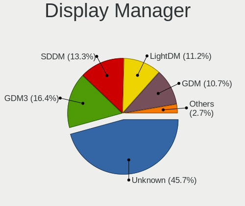

| Name    | Notebooks | Percent |
|---------|-----------|---------|
| Unknown | 563       | 49.3%   |
| GDM3    | 157       | 13.75%  |
| GDM     | 138       | 12.08%  |
| SDDM    | 137       | 12%     |
| LightDM | 107       | 9.37%   |
| TDM     | 28        | 2.45%   |
| LXDM    | 4         | 0.35%   |
| XDM     | 3         | 0.26%   |
| KDM     | 3         | 0.26%   |
| Ly      | 2         | 0.18%   |

OS Lang
-------

Language

| Lang       | Notebooks | Percent |
|------------|-----------|---------|
| en_US      | 552       | 49.07%  |
| sv_SE      | 308       | 27.38%  |
| Unknown    | 121       | 10.76%  |
| en_GB      | 66        | 5.87%   |
| C          | 15        | 1.33%   |
| ru_RU      | 9         | 0.8%    |
| de_DE      | 8         | 0.71%   |
| pl_PL      | 6         | 0.53%   |
| en_SE      | 5         | 0.44%   |
| fr_FR      | 3         | 0.27%   |
| en_DK      | 3         | 0.27%   |
| zh_CN      | 2         | 0.18%   |
| uk_UA      | 2         | 0.18%   |
| lt_LT      | 2         | 0.18%   |
| it_IT      | 2         | 0.18%   |
| fi_FI      | 2         | 0.18%   |
| en_CA      | 2         | 0.18%   |
| en_AG      | 2         | 0.18%   |
| el_GR      | 2         | 0.18%   |
| tr_TR      | 1         | 0.09%   |
| sv_SE.UTF8 | 1         | 0.09%   |
| sv_FI      | 1         | 0.09%   |
| POSIX      | 1         | 0.09%   |
| nn_NO      | 1         | 0.09%   |
| nb_NO      | 1         | 0.09%   |
| hu_HU      | 1         | 0.09%   |
| gl_ES      | 1         | 0.09%   |
| es_ES      | 1         | 0.09%   |
| en_IE      | 1         | 0.09%   |
| en_AU      | 1         | 0.09%   |
| C.UTF8     | 1         | 0.09%   |
| bg_BG      | 1         | 0.09%   |

Boot Mode
---------

EFI or BIOS

| Mode | Notebooks | Percent |
|------|-----------|---------|
| EFI  | 611       | 54.41%  |
| BIOS | 512       | 45.59%  |

Filesystem
----------

Type of filesystem

| Type    | Notebooks | Percent |
|---------|-----------|---------|
| Ext4    | 841       | 74.62%  |
| Btrfs   | 118       | 10.47%  |
| Overlay | 67        | 5.94%   |
| Tmpfs   | 31        | 2.75%   |
| Unknown | 31        | 2.75%   |
| Xfs     | 14        | 1.24%   |
| Zfs     | 13        | 1.15%   |
| Ext2    | 6         | 0.53%   |
| F2fs    | 4         | 0.35%   |
| XXXXXXX | 1         | 0.09%   |
| Ext3    | 1         | 0.09%   |

Part. scheme
------------

Scheme of partitioning

| Type    | Notebooks | Percent |
|---------|-----------|---------|
| Unknown | 577       | 51.33%  |
| GPT     | 451       | 40.12%  |
| MBR     | 96        | 8.54%   |

Dual Boot with Linux/BSD
------------------------

Hosting more than one Linux/BSD

| Dual boot | Notebooks | Percent |
|-----------|-----------|---------|
| No        | 1012      | 91.34%  |
| Yes       | 96        | 8.66%   |

Dual Boot (Win)
---------------

Hosting Linux and Windows

| Dual boot | Notebooks | Percent |
|-----------|-----------|---------|
| No        | 893       | 80.74%  |
| Yes       | 213       | 19.26%  |

Board
-----

Vendor
------

Motherboard manufacturer

| Name                 | Notebooks | Percent |
|----------------------|-----------|---------|
| Lenovo               | 262       | 23.95%  |
| Hewlett-Packard      | 227       | 20.75%  |
| Dell                 | 168       | 15.36%  |
| ASUSTek Computer     | 143       | 13.07%  |
| Acer                 | 77        | 7.04%   |
| Apple                | 45        | 4.11%   |
| MSI                  | 25        | 2.29%   |
| Toshiba              | 16        | 1.46%   |
| Sony                 | 15        | 1.37%   |
| Samsung Electronics  | 11        | 1.01%   |
| Packard Bell         | 10        | 0.91%   |
| Notebook             | 9         | 0.82%   |
| Google               | 9         | 0.82%   |
| Fujitsu              | 8         | 0.73%   |
| Valve                | 7         | 0.64%   |
| Unknown              | 6         | 0.55%   |
| Fujitsu Siemens      | 5         | 0.46%   |
| HUAWEI               | 4         | 0.37%   |
| TUXEDO               | 3         | 0.27%   |
| Star Labs            | 3         | 0.27%   |
| Clevo                | 3         | 0.27%   |
| Alienware            | 3         | 0.27%   |
| Timi                 | 2         | 0.18%   |
| Schenker             | 2         | 0.18%   |
| Razer                | 2         | 0.18%   |
| PC Specialist        | 2         | 0.18%   |
| LG Electronics       | 2         | 0.18%   |
| Gigabyte Technology  | 2         | 0.18%   |
| eMachines            | 2         | 0.18%   |
| Dynabook             | 2         | 0.18%   |
| ZEPTO                | 1         | 0.09%   |
| YJKC                 | 1         | 0.09%   |
| win element          | 1         | 0.09%   |
| System76             | 1         | 0.09%   |
| SLIMBOOK             | 1         | 0.09%   |
| Purism               | 1         | 0.09%   |
| On by NetOnNet       | 1         | 0.09%   |
| Medion               | 1         | 0.09%   |
| Intel Client Systems | 1         | 0.09%   |
| Intel                | 1         | 0.09%   |

Model
-----

Motherboard model

| Name                                       | Notebooks | Percent |
|--------------------------------------------|-----------|---------|
| Unknown                                    | 9         | 0.82%   |
| Valve Jupiter                              | 7         | 0.64%   |
| Dell XPS 13 9370                           | 7         | 0.64%   |
| HP EliteBook Folio 9470m                   | 6         | 0.55%   |
| Dell Precision 5540                        | 6         | 0.55%   |
| Apple MacBookPro9,2                        | 6         | 0.55%   |
| Lenovo IdeaPad 5 Pro 16ACH6 82L5           | 5         | 0.46%   |
| HP ProBook 640 G1                          | 5         | 0.46%   |
| HP Pavilion dv7                            | 5         | 0.46%   |
| HP Pavilion 15                             | 5         | 0.46%   |
| HP EliteBook 840 G3                        | 5         | 0.46%   |
| HP EliteBook 840 G2                        | 5         | 0.46%   |
| Dell XPS 15 9570                           | 5         | 0.46%   |
| Dell XPS 13 9310                           | 5         | 0.46%   |
| Apple MacBookPro8,1                        | 5         | 0.46%   |
| Apple MacBookPro11,3                       | 5         | 0.46%   |
| Acer Aspire V3-571                         | 5         | 0.46%   |
| Lenovo ThinkPad L14 Gen 2 20X1004CMX       | 4         | 0.37%   |
| Lenovo ThinkPad L13 Gen 2 20VJS6RY00       | 4         | 0.37%   |
| HP EliteBook 8440p                         | 4         | 0.37%   |
| HP EliteBook 840 G6                        | 4         | 0.37%   |
| HP EliteBook 830 G6                        | 4         | 0.37%   |
| Dell XPS 15 9500                           | 4         | 0.37%   |
| Dell Latitude E7240                        | 4         | 0.37%   |
| Apple MacBookPro12,1                       | 4         | 0.37%   |
| Apple MacBookAir7,2                        | 4         | 0.37%   |
| Lenovo Z50-70 20354                        | 3         | 0.27%   |
| Lenovo ThinkPad X1 Carbon Gen 9 20XW005NMX | 3         | 0.27%   |
| Lenovo B50-30 80ES                         | 3         | 0.27%   |
| HUAWEI KLVL-WXX9                           | 3         | 0.27%   |
| HP ZBook Studio G5                         | 3         | 0.27%   |
| HP ZBook 15 G2                             | 3         | 0.27%   |
| HP ProBook 430 G1                          | 3         | 0.27%   |
| HP Pavilion Notebook                       | 3         | 0.27%   |
| HP Pavilion g6                             | 3         | 0.27%   |
| HP Pavilion dv6                            | 3         | 0.27%   |
| HP Pavilion 17                             | 3         | 0.27%   |
| HP Laptop 15-db0xxx                        | 3         | 0.27%   |
| HP ENVY 15                                 | 3         | 0.27%   |
| HP EliteBook 8570p                         | 3         | 0.27%   |

Model Family
------------

Motherboard model prefix

| Name                  | Notebooks | Percent |
|-----------------------|-----------|---------|
| Lenovo ThinkPad       | 169       | 15.45%  |
| HP EliteBook          | 84        | 7.68%   |
| Dell Latitude         | 66        | 6.03%   |
| Acer Aspire           | 53        | 4.84%   |
| Dell XPS              | 44        | 4.02%   |
| Lenovo IdeaPad        | 41        | 3.75%   |
| Dell Precision        | 39        | 3.56%   |
| HP ProBook            | 37        | 3.38%   |
| HP Pavilion           | 36        | 3.29%   |
| ASUS VivoBook         | 21        | 1.92%   |
| HP ZBook              | 19        | 1.74%   |
| ASUS ROG              | 18        | 1.65%   |
| HP Laptop             | 16        | 1.46%   |
| Toshiba Satellite     | 14        | 1.28%   |
| HP Compaq             | 13        | 1.19%   |
| ASUS ZenBook          | 11        | 1.01%   |
| Lenovo Yoga           | 10        | 0.91%   |
| Dell Inspiron         | 10        | 0.91%   |
| Acer Swift            | 10        | 0.91%   |
| Packard Bell EasyNote | 9         | 0.82%   |
| Lenovo Legion         | 9         | 0.82%   |
| Unknown               | 9         | 0.82%   |
| Dell Vostro           | 8         | 0.73%   |
| ASUS ASUS             | 8         | 0.73%   |
| Valve Jupiter         | 7         | 0.64%   |
| HP ENVY               | 7         | 0.64%   |
| Fujitsu LIFEBOOK      | 7         | 0.64%   |
| Apple MacBookPro9     | 6         | 0.55%   |
| Apple MacBookPro11    | 6         | 0.55%   |
| Acer Nitro            | 6         | 0.55%   |
| Apple MacBookPro8     | 5         | 0.46%   |
| Acer Predator         | 5         | 0.46%   |
| MSI Katana            | 4         | 0.37%   |
| ASUS TUF              | 4         | 0.37%   |
| Apple MacBookPro12    | 4         | 0.37%   |
| Apple MacBookAir7     | 4         | 0.37%   |
| Apple MacBookAir6     | 4         | 0.37%   |
| MSI GF63              | 3         | 0.27%   |
| Lenovo Z50-70         | 3         | 0.27%   |
| Lenovo ThinkBook      | 3         | 0.27%   |

MFG Year
--------

Motherboard manufacture year

| Year | Notebooks | Percent |
|------|-----------|---------|
| 2021 | 106       | 9.69%   |
| 2019 | 97        | 8.87%   |
| 2013 | 97        | 8.87%   |
| 2018 | 93        | 8.5%    |
| 2020 | 85        | 7.77%   |
| 2012 | 85        | 7.77%   |
| 2011 | 74        | 6.76%   |
| 2017 | 71        | 6.49%   |
| 2015 | 71        | 6.49%   |
| 2014 | 64        | 5.85%   |
| 2016 | 56        | 5.12%   |
| 2010 | 53        | 4.84%   |
| 2022 | 47        | 4.3%    |
| 2008 | 32        | 2.93%   |
| 2009 | 20        | 1.83%   |
| 2007 | 20        | 1.83%   |
| 2023 | 9         | 0.82%   |
| 2006 | 7         | 0.64%   |
| 2005 | 6         | 0.55%   |
| 2004 | 1         | 0.09%   |

Form Factor
-----------

Physical design of the computer

| Name     | Notebooks | Percent |
|----------|-----------|---------|
| Notebook | 1094      | 100%    |

Secure Boot
-----------

Enabled or disabled

| State    | Notebooks | Percent |
|----------|-----------|---------|
| Disabled | 958       | 86.85%  |
| Enabled  | 145       | 13.15%  |

Coreboot
--------

Have coreboot on board

| Used | Notebooks | Percent |
|------|-----------|---------|
| No   | 1082      | 98.9%   |
| Yes  | 12        | 1.1%    |

RAM Size
--------

Total RAM memory

| Size in GB  | Notebooks | Percent |
|-------------|-----------|---------|
| 4.01-8.0    | 315       | 28.51%  |
| 16.01-24.0  | 221       | 20%     |
| 8.01-16.0   | 199       | 18.01%  |
| 3.01-4.0    | 180       | 16.29%  |
| 32.01-64.0  | 121       | 10.95%  |
| 1.01-2.0    | 34        | 3.08%   |
| 24.01-32.0  | 14        | 1.27%   |
| 2.01-3.0    | 8         | 0.72%   |
| 64.01-256.0 | 8         | 0.72%   |
| 0.51-1.0    | 5         | 0.45%   |

RAM Used
--------

Used RAM memory

| Used GB    | Notebooks | Percent |
|------------|-----------|---------|
| 1.01-2.0   | 405       | 33.69%  |
| 2.01-3.0   | 318       | 26.46%  |
| 4.01-8.0   | 187       | 15.56%  |
| 3.01-4.0   | 172       | 14.31%  |
| 0.51-1.0   | 55        | 4.58%   |
| 8.01-16.0  | 44        | 3.66%   |
| 0.01-0.5   | 11        | 0.92%   |
| 16.01-24.0 | 9         | 0.75%   |
| 24.01-32.0 | 1         | 0.08%   |

Total Drives
------------

Number of drives on board

| Drives | Notebooks | Percent |
|--------|-----------|---------|
| 1      | 894       | 80.47%  |
| 2      | 190       | 17.1%   |
| 3      | 18        | 1.62%   |
| 0      | 5         | 0.45%   |
| 4      | 4         | 0.36%   |

Has CD-ROM
----------

Has CD-ROM on board

| Presented | Notebooks | Percent |
|-----------|-----------|---------|
| No        | 780       | 71.04%  |
| Yes       | 318       | 28.96%  |

Has Ethernet
------------

Has Ethernet on board

| Presented | Notebooks | Percent |
|-----------|-----------|---------|
| Yes       | 884       | 80.44%  |
| No        | 215       | 19.56%  |

Has WiFi
--------

Has WiFi module

| Presented | Notebooks | Percent |
|-----------|-----------|---------|
| Yes       | 1083      | 98.99%  |
| No        | 11        | 1.01%   |

Has Bluetooth
-------------

Has Bluetooth module

| Presented | Notebooks | Percent |
|-----------|-----------|---------|
| Yes       | 909       | 82.04%  |
| No        | 199       | 17.96%  |

Location
--------

Country
-------

Geographic location (country)

| Country | Notebooks | Percent |
|---------|-----------|---------|
| Sweden  | 1094      | 100%    |

City
----

Geographic location (city)

| City              | Notebooks | Percent |
|-------------------|-----------|---------|
| Stockholm         | 222       | 18.77%  |
| Gothenburg        | 115       | 9.72%   |
| Malmo             | 53        | 4.48%   |
| Uppsala           | 29        | 2.45%   |
| Linkping        | 18        | 1.52%   |
| Saltsjoe-Boo      | 17        | 1.44%   |
| Lund              | 17        | 1.44%   |
| Bromma            | 16        | 1.35%   |
| rebro           | 15        | 1.27%   |
| Sollentuna        | 14        | 1.18%   |
| Vsters        | 13        | 1.1%    |
| Solna             | 13        | 1.1%    |
| Vaxjo             | 12        | 1.01%   |
| Ume             | 12        | 1.01%   |
| Huddinge          | 12        | 1.01%   |
| Vaestra Froelunda | 11        | 0.93%   |
| Sundbyberg        | 11        | 0.93%   |
| Norrkping       | 11        | 0.93%   |
| Bandhagen         | 11        | 0.93%   |
| Karlskrona        | 10        | 0.85%   |
| Taby              | 9         | 0.76%   |
| Norsborg          | 9         | 0.76%   |
| Kista             | 9         | 0.76%   |
| Halmstad          | 9         | 0.76%   |
| Haegersten        | 9         | 0.76%   |
| Sundsvall         | 8         | 0.68%   |
| Sdertlje      | 8         | 0.68%   |
| Landskrona        | 8         | 0.68%   |
| Staffanstorp      | 7         | 0.59%   |
| Spanga            | 7         | 0.59%   |
| Mjoelby           | 7         | 0.59%   |
| Katrineholm       | 7         | 0.59%   |
| Karlstad          | 7         | 0.59%   |
| Jnkping       | 7         | 0.59%   |
| Helsingborg       | 7         | 0.59%   |
| Gvle            | 7         | 0.59%   |
| Moelndal          | 6         | 0.51%   |
| Lule            | 6         | 0.51%   |
| Handen            | 6         | 0.51%   |
| Alvsjo            | 6         | 0.51%   |

Drives
------

Drive Vendor
------------

Hard drive vendors

| Vendor                         | Notebooks | Drives | Percent |
|--------------------------------|-----------|--------|---------|
| Samsung Electronics            | 284       | 376    | 21.86%  |
| WDC                            | 119       | 146    | 9.16%   |
| Seagate                        | 97        | 111    | 7.47%   |
| Toshiba                        | 92        | 117    | 7.08%   |
| SanDisk                        | 86        | 108    | 6.62%   |
| Kingston                       | 84        | 109    | 6.47%   |
| Intel                          | 84        | 95     | 6.47%   |
| Unknown                        | 67        | 83     | 5.16%   |
| SK hynix                       | 67        | 75     | 5.16%   |
| Micron Technology              | 53        | 59     | 4.08%   |
| Hitachi                        | 36        | 41     | 2.77%   |
| HGST                           | 29        | 35     | 2.23%   |
| Apple                          | 26        | 33     | 2%      |
| Crucial                        | 22        | 29     | 1.69%   |
| LITEON                         | 17        | 22     | 1.31%   |
| KIOXIA                         | 12        | 12     | 0.92%   |
| OCZ                            | 9         | 9      | 0.69%   |
| Kingston Technology Company    | 9         | 9      | 0.69%   |
| LITEONIT                       | 7         | 12     | 0.54%   |
| A-DATA Technology              | 7         | 7      | 0.54%   |
| Intenso                        | 6         | 6      | 0.46%   |
| Phison Electronics             | 5         | 5      | 0.38%   |
| Phison                         | 5         | 5      | 0.38%   |
| Fujitsu                        | 5         | 7      | 0.38%   |
| Lenovo                         | 4         | 4      | 0.31%   |
| China                          | 4         | 4      | 0.31%   |
| Union Memory                   | 3         | 3      | 0.23%   |
| Transcend                      | 3         | 3      | 0.23%   |
| Silicon Motion                 | 3         | 14     | 0.23%   |
| Star Drive                     | 2         | 2      | 0.15%   |
| Solid State Storage Technology | 2         | 2      | 0.15%   |
| ROG                            | 2         | 2      | 0.15%   |
| PNY                            | 2         | 2      | 0.15%   |
| M4-CT128                       | 2         | 2      | 0.15%   |
| Lite-On                        | 2         | 2      | 0.15%   |
| KingSpec                       | 2         | 2      | 0.15%   |
| JMicron Technology             | 2         | 2      | 0.15%   |
| Hewlett-Packard                | 2         | 2      | 0.15%   |
| GOODRAM                        | 2         | 2      | 0.15%   |
| Corsair                        | 2         | 2      | 0.15%   |

Drive Model
-----------

Hard drive models

| Model                                               | Notebooks | Percent |
|-----------------------------------------------------|-----------|---------|
| Samsung NVMe SSD Controller SM981/PM981/PM983 256GB | 14        | 1.04%   |
| Toshiba NVMe SSD Drive 512GB                        | 12        | 0.89%   |
| SanDisk NVMe SSD Drive 512GB                        | 12        | 0.89%   |
| Kingston SA400S37480G 480GB SSD                     | 12        | 0.89%   |
| SK hynix NVMe SSD Drive 512GB                       | 11        | 0.82%   |
| Samsung NVMe SSD Drive 512GB                        | 11        | 0.82%   |
| Unknown MMC Card  32GB                              | 10        | 0.75%   |
| Kingston SA400S37120G 120GB SSD                     | 10        | 0.75%   |
| Seagate ST9500325AS 500GB                           | 9         | 0.67%   |
| Samsung SSD 850 EVO 500GB                           | 9         | 0.67%   |
| Samsung PM963 2.5" NVMe PCIe SSD 256GB              | 9         | 0.67%   |
| Samsung NVMe SSD Drive 1024GB                       | 9         | 0.67%   |
| Unknown MMC Card  64GB                              | 8         | 0.6%    |
| Unknown MMC Card  16GB                              | 8         | 0.6%    |
| Seagate ST1000LM024 HN-M101MBB 1TB                  | 8         | 0.6%    |
| Samsung SSD 850 EVO 250GB                           | 8         | 0.6%    |
| Micron 1100_MTFDDAV256TBN 256GB SSD                 | 8         | 0.6%    |
| HGST HTS721010A9E630 1TB                            | 8         | 0.6%    |
| Samsung SSD 860 EVO 500GB                           | 7         | 0.52%   |
| Samsung NVMe SSD Controller SM961/PM961/SM963 500GB | 7         | 0.52%   |
| Samsung NVMe SSD Controller PM9A1/PM9A3/980PRO 1TB  | 7         | 0.52%   |
| Kingston SA400S37240G 240GB SSD                     | 7         | 0.52%   |
| Intel NVMe SSD Drive 256GB                          | 7         | 0.52%   |
| WDC WD10JPVX-22JC3T0 1TB                            | 6         | 0.45%   |
| Unknown MMC Card  128GB                             | 6         | 0.45%   |
| Toshiba KBG30ZMS128G 128GB NVMe SSD                 | 6         | 0.45%   |
| Seagate ST320LT007-9ZV142 320GB                     | 6         | 0.45%   |
| Sandisk WD Black SN750 / PC SN730 NVMe SSD 512GB    | 6         | 0.45%   |
| Samsung SSD 970 EVO Plus 1TB                        | 6         | 0.45%   |
| Kingston SUV400S37120G 120GB SSD                    | 6         | 0.45%   |
| Intel SSDPEKNW010T8 1TB                             | 6         | 0.45%   |
| Seagate ST500LT012-1DG142 500GB                     | 5         | 0.37%   |
| SanDisk NVMe SSD Drive 256GB                        | 5         | 0.37%   |
| SanDisk NVMe SSD Drive 1TB                          | 5         | 0.37%   |
| Micron NVMe SSD Drive 512GB                         | 5         | 0.37%   |
| HGST HTS545050A7E680 500GB                          | 5         | 0.37%   |
| WDC WDS500G2B0A-00SM50 500GB SSD                    | 4         | 0.3%    |
| WDC WD5000LPVX-22V0TT0 500GB                        | 4         | 0.3%    |
| Toshiba XG6 NVMe SSD Controller 512GB               | 4         | 0.3%    |
| Toshiba XG4 NVMe SSD Controller 512GB               | 4         | 0.3%    |

HDD Vendor
----------

Hard disk drive vendors

| Vendor              | Notebooks | Drives | Percent |
|---------------------|-----------|--------|---------|
| Seagate             | 94        | 107    | 33.81%  |
| WDC                 | 63        | 80     | 22.66%  |
| Toshiba             | 37        | 45     | 13.31%  |
| Hitachi             | 36        | 41     | 12.95%  |
| HGST                | 29        | 35     | 10.43%  |
| Samsung Electronics | 6         | 6      | 2.16%   |
| Fujitsu             | 5         | 7      | 1.8%    |
| Apple               | 4         | 4      | 1.44%   |
| Unknown             | 2         | 2      | 0.72%   |
| Intenso             | 1         | 1      | 0.36%   |
| ASMT                | 1         | 1      | 0.36%   |

SSD Vendor
----------

Solid state drive vendors

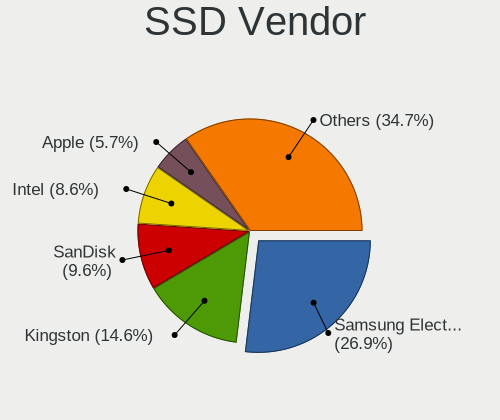

| Vendor              | Notebooks | Drives | Percent |
|---------------------|-----------|--------|---------|
| Samsung Electronics | 138       | 192    | 28.28%  |
| Kingston            | 66        | 88     | 13.52%  |
| SanDisk             | 47        | 58     | 9.63%   |
| Intel               | 44        | 49     | 9.02%   |
| Micron Technology   | 25        | 29     | 5.12%   |
| WDC                 | 24        | 29     | 4.92%   |
| Crucial             | 21        | 28     | 4.3%    |
| Apple               | 19        | 25     | 3.89%   |
| SK hynix            | 17        | 19     | 3.48%   |
| LITEON              | 16        | 21     | 3.28%   |
| Toshiba             | 13        | 21     | 2.66%   |
| OCZ                 | 9         | 9      | 1.84%   |
| LITEONIT            | 7         | 12     | 1.43%   |
| Intenso             | 4         | 4      | 0.82%   |
| China               | 4         | 4      | 0.82%   |
| Transcend           | 3         | 3      | 0.61%   |
| A-DATA Technology   | 3         | 3      | 0.61%   |
| PNY                 | 2         | 2      | 0.41%   |
| M4-CT128            | 2         | 2      | 0.41%   |
| KingSpec            | 2         | 2      | 0.41%   |
| Corsair             | 2         | 2      | 0.41%   |
| Verbatim            | 1         | 2      | 0.2%    |
| Unknown             | 1         | 1      | 0.2%    |
| TO Exter            | 1         | 1      | 0.2%    |
| Team                | 1         | 1      | 0.2%    |
| Star                | 1         | 1      | 0.2%    |
| SSSTC               | 1         | 2      | 0.2%    |
| Seagate             | 1         | 1      | 0.2%    |
| Radeon              | 1         | 2      | 0.2%    |
| OCZ-VERTEX3         | 1         | 1      | 0.2%    |
| Neo                 | 1         | 1      | 0.2%    |
| MyDigitalSSD        | 1         | 1      | 0.2%    |
| Maxtor              | 1         | 1      | 0.2%    |
| Lexar               | 1         | 1      | 0.2%    |
| KIOXIA-EXCERIA      | 1         | 1      | 0.2%    |
| KingFast            | 1         | 1      | 0.2%    |
| JMicron Technology  | 1         | 1      | 0.2%    |
| GOODRAM             | 1         | 1      | 0.2%    |
| FORESEE             | 1         | 1      | 0.2%    |
| Colorful            | 1         | 1      | 0.2%    |

Drive Kind
----------

HDD or SSD

| Kind    | Notebooks | Drives | Percent |
|---------|-----------|--------|---------|
| SSD     | 450       | 625    | 36.67%  |
| NVMe    | 429       | 554    | 34.96%  |
| HDD     | 271       | 329    | 22.09%  |
| MMC     | 66        | 81     | 5.38%   |
| Unknown | 11        | 10     | 0.9%    |

Drive Connector
---------------

SATA, SAS, NVMe, etc.

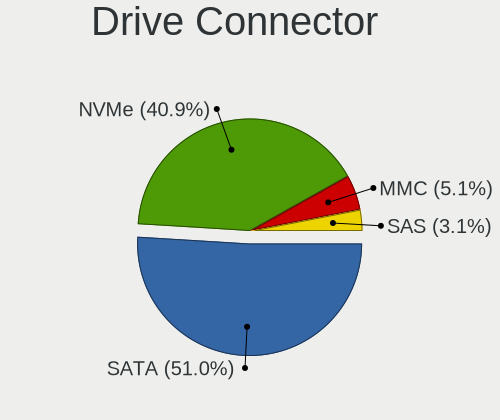

| Type | Notebooks | Drives | Percent |
|------|-----------|--------|---------|
| SATA | 661       | 934    | 55.69%  |
| NVMe | 428       | 551    | 36.06%  |
| MMC  | 66        | 81     | 5.56%   |
| SAS  | 32        | 33     | 2.7%    |

Drive Size
----------

Size of hard drive

| Size in TB | Notebooks | Drives | Percent |
|------------|-----------|--------|---------|
| 0.01-0.5   | 552       | 758    | 77.42%  |
| 0.51-1.0   | 148       | 181    | 20.76%  |
| 1.01-2.0   | 8         | 10     | 1.12%   |
| 3.01-4.0   | 2         | 2      | 0.28%   |
| 4.01-10.0  | 2         | 2      | 0.28%   |
| 10.01-20.0 | 1         | 1      | 0.14%   |

Space Total
-----------

Amount of disk space available on the file system

| Size in GB     | Notebooks | Percent |
|----------------|-----------|---------|
| 101-250        | 370       | 32.29%  |
| 251-500        | 307       | 26.79%  |
| 501-1000       | 152       | 13.26%  |
| 1-20           | 87        | 7.59%   |
| 1001-2000      | 64        | 5.58%   |
| 51-100         | 61        | 5.32%   |
| Unknown        | 46        | 4.01%   |
| 21-50          | 39        | 3.4%    |
| More than 3000 | 10        | 0.87%   |
| 2001-3000      | 10        | 0.87%   |

Space Used
----------

Amount of used disk space

| Used GB        | Notebooks | Percent |
|----------------|-----------|---------|
| 1-20           | 500       | 42.19%  |
| 21-50          | 193       | 16.29%  |
| 101-250        | 179       | 15.11%  |
| 51-100         | 133       | 11.22%  |
| 251-500        | 72        | 6.08%   |
| Unknown        | 46        | 3.88%   |
| 501-1000       | 45        | 3.8%    |
| 1001-2000      | 14        | 1.18%   |
| More than 3000 | 1         | 0.08%   |
| 2001-3000      | 1         | 0.08%   |
| 0              | 1         | 0.08%   |

Malfunc. Drives
---------------

Drive models with a malfunction

| Model                                               | Notebooks | Drives | Percent |
|-----------------------------------------------------|-----------|--------|---------|
| Seagate ST9500325AS 500GB                           | 4         | 4      | 7.55%   |
| Micron Technology 1100_MTFDDAV256TBN 256GB SSD      | 3         | 4      | 5.66%   |
| WDC WD5000LPVX-22V0TT0 500GB                        | 2         | 2      | 3.77%   |
| Seagate ST9250410AS 250GB                           | 2         | 3      | 3.77%   |
| HGST HTS541010A9E680 1TB                            | 2         | 2      | 3.77%   |
| Union Memory UMIS RPJTJ128MED1MWX 128GB             | 1         | 1      | 1.89%   |
| Transcend TS240GMTS420S 240GB SSD                   | 1         | 1      | 1.89%   |
| Toshiba MK4026GAX RoHS 40GB                         | 1         | 1      | 1.89%   |
| Toshiba MK1633GSG 160GB                             | 1         | 1      | 1.89%   |
| Toshiba MK1237GSX 120GB                             | 1         | 1      | 1.89%   |
| Team L5 LITE SSD 240GB                              | 1         | 1      | 1.89%   |
| SK hynix SH920 mSATA 128GB SSD                      | 1         | 1      | 1.89%   |
| SK hynix HFS256G3AMNB-2200A 256GB SSD               | 1         | 1      | 1.89%   |
| Seagate ST980817AS 80GB                             | 1         | 1      | 1.89%   |
| Seagate ST96812A 64GB                               | 1         | 1      | 1.89%   |
| Seagate ST9500420AS 500GB                           | 1         | 1      | 1.89%   |
| Seagate ST9250315AS 250GB                           | 1         | 1      | 1.89%   |
| Seagate ST500LT012-9WS142 500GB                     | 1         | 1      | 1.89%   |
| Seagate ST500LT012-1DG142 500GB                     | 1         | 1      | 1.89%   |
| Seagate ST1000LM049-2GH172 1TB                      | 1         | 1      | 1.89%   |
| Seagate ST1000LM024 HN-M101MBB 1TB                  | 1         | 1      | 1.89%   |
| SanDisk SD6PP4M-256G-1006 256GB SSD                 | 1         | 1      | 1.89%   |
| Samsung Electronics SSD 870 EVO 1TB                 | 1         | 1      | 1.89%   |
| Samsung Electronics MZ7PA128HMCD-010L1 128GB SSD    | 1         | 1      | 1.89%   |
| OCZ AGILITY3 120GB SSD                              | 1         | 1      | 1.89%   |
| Micron Technology MTFDDAK512TBN-1AR1ZABHA 512GB SSD | 1         | 1      | 1.89%   |
| LITEONIT LMT-256M6M-HP 256GB SSD                    | 1         | 1      | 1.89%   |
| Intel SSDSCKJF180A5H RSED 180GB                     | 1         | 1      | 1.89%   |
| Intel SSDSC2BW480A4 480GB                           | 1         | 1      | 1.89%   |
| Intel SSDSC2BW240A4 240GB                           | 1         | 2      | 1.89%   |
| Intel SSDSA2BW160G3H 160GB                          | 1         | 1      | 1.89%   |
| Hitachi HTS545050B9SA02 500GB                       | 1         | 1      | 1.89%   |
| Hitachi HTS545050A7E380 500GB                       | 1         | 1      | 1.89%   |
| Hitachi HTS543232A7A384 320GB                       | 1         | 1      | 1.89%   |
| Hitachi HTS543216L9A300 160GB                       | 1         | 1      | 1.89%   |
| Hitachi HTS542525K9SA00 250GB                       | 1         | 1      | 1.89%   |
| Hitachi HTS541616J9AT00 160GB                       | 1         | 1      | 1.89%   |
| HGST HTS725050A7E630 500GB                          | 1         | 1      | 1.89%   |
| HGST HTS725032A7E630 320GB                          | 1         | 1      | 1.89%   |
| HGST HTS545050A7E680 500GB                          | 1         | 1      | 1.89%   |

Malfunc. Drive Vendor
---------------------

Vendors of faulty drives

| Vendor              | Notebooks | Drives | Percent |
|---------------------|-----------|--------|---------|
| Seagate             | 14        | 15     | 26.42%  |
| Hitachi             | 6         | 6      | 11.32%  |
| HGST                | 6         | 7      | 11.32%  |
| Micron Technology   | 4         | 5      | 7.55%   |
| Intel               | 4         | 5      | 7.55%   |
| Toshiba             | 3         | 3      | 5.66%   |
| WDC                 | 2         | 2      | 3.77%   |
| SK hynix            | 2         | 2      | 3.77%   |
| Samsung Electronics | 2         | 2      | 3.77%   |
| Union Memory        | 1         | 1      | 1.89%   |
| Transcend           | 1         | 1      | 1.89%   |
| Team                | 1         | 1      | 1.89%   |
| SanDisk             | 1         | 1      | 1.89%   |
| OCZ                 | 1         | 1      | 1.89%   |
| LITEONIT            | 1         | 1      | 1.89%   |
| Crucial             | 1         | 1      | 1.89%   |
| Corsair             | 1         | 1      | 1.89%   |
| China               | 1         | 1      | 1.89%   |
| Apple               | 1         | 1      | 1.89%   |

Malfunc. HDD Vendor
-------------------

Vendors of faulty HDD drives

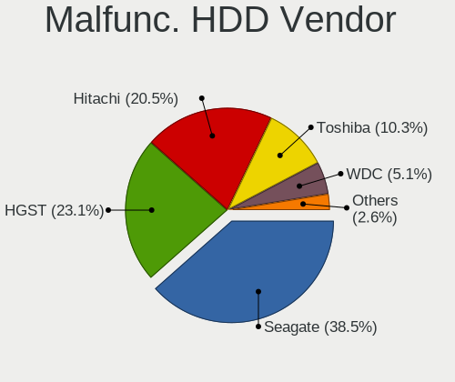

| Vendor  | Notebooks | Drives | Percent |
|---------|-----------|--------|---------|
| Seagate | 14        | 15     | 43.75%  |
| Hitachi | 6         | 6      | 18.75%  |
| HGST    | 6         | 7      | 18.75%  |
| Toshiba | 3         | 3      | 9.38%   |
| WDC     | 2         | 2      | 6.25%   |
| Apple   | 1         | 1      | 3.13%   |

Malfunc. Drive Kind
-------------------

Kinds of faulty drives

| Kind | Notebooks | Drives | Percent |
|------|-----------|--------|---------|
| HDD  | 32        | 34     | 60.38%  |
| SSD  | 20        | 22     | 37.74%  |
| NVMe | 1         | 1      | 1.89%   |

Failed Drives
-------------

Failed drive models

| Model                                                           | Notebooks | Drives | Percent |
|-----------------------------------------------------------------|-----------|--------|---------|
| Samsung Electronics NVMe SSD Controller SM961/PM961/SM963 500GB | 1         | 1      | 100%    |

Failed Drive Vendor
-------------------

Failed drive vendors

| Vendor              | Notebooks | Drives | Percent |
|---------------------|-----------|--------|---------|
| Samsung Electronics | 1         | 1      | 100%    |

Drive Status
------------

Number of failed and malfunc. drives

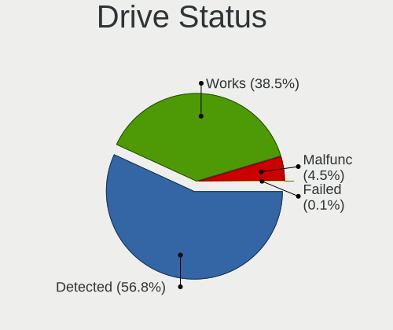

| Status   | Notebooks | Drives | Percent |
|----------|-----------|--------|---------|
| Detected | 674       | 998    | 58.51%  |
| Works    | 425       | 543    | 36.89%  |
| Malfunc  | 52        | 57     | 4.51%   |
| Failed   | 1         | 1      | 0.09%   |

Storage controller
------------------

Storage Vendor
--------------

Storage controller vendors

| Vendor                           | Notebooks | Percent |
|----------------------------------|-----------|---------|
| Intel                            | 697       | 55.58%  |
| Samsung Electronics              | 157       | 12.52%  |
| AMD                              | 114       | 9.09%   |
| SanDisk                          | 68        | 5.42%   |
| SK hynix                         | 49        | 3.91%   |
| Toshiba America Info Systems     | 45        | 3.59%   |
| Micron Technology                | 28        | 2.23%   |
| Kingston Technology Company      | 25        | 1.99%   |
| Phison Electronics               | 12        | 0.96%   |
| KIOXIA                           | 10        | 0.8%    |
| Nvidia                           | 9         | 0.72%   |
| Silicon Motion                   | 5         | 0.4%    |
| ADATA Technology                 | 5         | 0.4%    |
| Union Memory (Shenzhen)          | 4         | 0.32%   |
| Marvell Technology Group         | 4         | 0.32%   |
| Lite-On Technology               | 4         | 0.32%   |
| Lenovo                           | 4         | 0.32%   |
| Apple                            | 4         | 0.32%   |
| Solid State Storage Technology   | 3         | 0.24%   |
| Silicon Integrated Systems [SiS] | 3         | 0.24%   |
| Realtek Semiconductor            | 2         | 0.16%   |
| Seagate Technology               | 1         | 0.08%   |
| Micron/Crucial Technology        | 1         | 0.08%   |

Storage Model
-------------

Storage controller models

| Model                                                                          | Notebooks | Percent |
|--------------------------------------------------------------------------------|-----------|---------|
| AMD FCH SATA Controller [AHCI mode]                                            | 96        | 7.21%   |
| Intel Sunrise Point-LP SATA Controller [AHCI mode]                             | 82        | 6.16%   |
| Intel 7 Series Chipset Family 6-port SATA Controller [AHCI mode]               | 77        | 5.78%   |
| Samsung NVMe SSD Controller SM981/PM981/PM983                                  | 73        | 5.48%   |
| Intel 82801 Mobile SATA Controller [RAID mode]                                 | 59        | 4.43%   |
| Intel 6 Series/C200 Series Chipset Family 6 port Mobile SATA AHCI Controller   | 55        | 4.13%   |
| Intel 8 Series SATA Controller 1 [AHCI mode]                                   | 50        | 3.75%   |
| Intel 8 Series/C220 Series Chipset Family 6-port SATA Controller 1 [AHCI mode] | 41        | 3.08%   |
| Intel Cannon Lake Mobile PCH SATA AHCI Controller                              | 36        | 2.7%    |
| Intel Wildcat Point-LP SATA Controller [AHCI Mode]                             | 35        | 2.63%   |
| Samsung NVMe SSD Controller 980                                                | 32        | 2.4%    |
| SanDisk WD Black SN750 / PC SN730 NVMe SSD                                     | 29        | 2.18%   |
| Intel Volume Management Device NVMe RAID Controller                            | 29        | 2.18%   |
| Intel 82801IBM/IEM (ICH9M/ICH9M-E) 4 port SATA Controller [AHCI mode]          | 22        | 1.65%   |
| Intel HM170/QM170 Chipset SATA Controller [AHCI Mode]                          | 21        | 1.58%   |
| Samsung NVMe SSD Controller SM961/PM961/SM963                                  | 20        | 1.5%    |
| SK hynix Gold P31/BC711/PC711 NVMe Solid State Drive                           | 19        | 1.43%   |
| Intel 5 Series/3400 Series Chipset 4 port SATA AHCI Controller                 | 19        | 1.43%   |
| Intel Atom Processor E3800 Series SATA AHCI Controller                         | 17        | 1.28%   |
| Intel 82801HM/HEM (ICH8M/ICH8M-E) IDE Controller                               | 17        | 1.28%   |
| Toshiba America Info Systems XG6 NVMe SSD Controller                           | 16        | 1.2%    |
| Samsung NVMe SSD Controller PM9A1/PM9A3/980PRO                                 | 16        | 1.2%    |
| Intel SSD 660P Series                                                          | 15        | 1.13%   |
| Intel 82801HM/HEM (ICH8M/ICH8M-E) SATA Controller [AHCI mode]                  | 15        | 1.13%   |
| Intel 5 Series/3400 Series Chipset 6 port SATA AHCI Controller                 | 15        | 1.13%   |
| Toshiba America Info Systems XG5 NVMe SSD Controller                           | 11        | 0.83%   |
| SanDisk WD Blue SN500 / PC SN520 NVMe SSD                                      | 11        | 0.83%   |
| Intel SSD DC P4101/Pro 7600p/760p/E 6100p Series                               | 11        | 0.83%   |
| AMD SB7x0/SB8x0/SB9x0 SATA Controller [AHCI mode]                              | 11        | 0.83%   |
| SanDisk WD Blue SN550 NVMe SSD                                                 | 10        | 0.75%   |
| Intel Celeron/Pentium Silver Processor SATA Controller                         | 10        | 0.75%   |
| Samsung S4LN058A01[SSUBX] AHCI SSD Controller (Apple slot)                     | 9         | 0.68%   |
| Intel SSD 600P Series                                                          | 9         | 0.68%   |
| Intel Q170/Q150/B150/H170/H110/Z170/CM236 Chipset SATA Controller [AHCI Mode]  | 9         | 0.68%   |
| Toshiba America Info Systems XG4 NVMe SSD Controller                           | 8         | 0.6%    |
| Intel 82801HM/HEM (ICH8M/ICH8M-E) SATA Controller [IDE mode]                   | 8         | 0.6%    |
| Toshiba America Info Systems BG3 NVMe SSD Controller                           | 7         | 0.53%   |
| SK hynix BC501 NVMe Solid State Drive                                          | 7         | 0.53%   |
| Micron 2210 NVMe SSD [Cobain]                                                  | 7         | 0.53%   |
| Micron 2200S NVMe SSD [Cassandra]                                              | 7         | 0.53%   |

Storage Kind
------------

Kind of storage controller (IDE, SATA, NVMe, SAS, ...)

| Kind | Notebooks | Percent |
|------|-----------|---------|
| SATA | 684       | 53.31%  |
| NVMe | 431       | 33.59%  |
| RAID | 92        | 7.17%   |
| IDE  | 76        | 5.92%   |

Processor
---------

CPU Vendor
----------

Processor vendors

| Vendor | Notebooks | Percent |
|--------|-----------|---------|
| Intel  | 898       | 82.08%  |
| AMD    | 196       | 17.92%  |

CPU Model
---------

Processor models

| Model                                   | Notebooks | Percent |
|-----------------------------------------|-----------|---------|
| Intel Core i7-8550U CPU @ 1.80GHz       | 25        | 2.29%   |
| Intel 11th Gen Core i7-1165G7 @ 2.80GHz | 25        | 2.29%   |
| Intel Core i7-8565U CPU @ 1.80GHz       | 20        | 1.83%   |
| Intel Core i7-7700HQ CPU @ 2.80GHz      | 16        | 1.46%   |
| Intel Core i7-8750H CPU @ 2.20GHz       | 14        | 1.28%   |
| Intel Core i5-6200U CPU @ 2.30GHz       | 14        | 1.28%   |
| Intel Core i5-7200U CPU @ 2.50GHz       | 13        | 1.19%   |
| Intel 11th Gen Core i5-1135G7 @ 2.40GHz | 13        | 1.19%   |
| Intel Core i5-8250U CPU @ 1.60GHz       | 12        | 1.1%    |
| Intel Core i5-6300U CPU @ 2.40GHz       | 11        | 1.01%   |
| Intel Core i5-4200U CPU @ 1.60GHz       | 11        | 1.01%   |
| Intel Core i5-2520M CPU @ 2.50GHz       | 11        | 1.01%   |
| Intel Celeron CPU N2840 @ 2.16GHz       | 11        | 1.01%   |
| Intel Core i7-7500U CPU @ 2.70GHz       | 10        | 0.91%   |
| Intel Core i7-6500U CPU @ 2.50GHz       | 10        | 0.91%   |
| Intel Core i5-3230M CPU @ 2.60GHz       | 10        | 0.91%   |
| Intel Core i5-3210M CPU @ 2.50GHz       | 10        | 0.91%   |
| Intel Core i7-9750H CPU @ 2.60GHz       | 9         | 0.82%   |
| Intel Core i7-6600U CPU @ 2.60GHz       | 9         | 0.82%   |
| Intel Core i5-8265U CPU @ 1.60GHz       | 9         | 0.82%   |
| Intel Core i5-5200U CPU @ 2.20GHz       | 9         | 0.82%   |
| Intel Core i5-4300U CPU @ 1.90GHz       | 9         | 0.82%   |
| AMD Ryzen 7 5700U with Radeon Graphics  | 9         | 0.82%   |
| Intel Core i7-5500U CPU @ 2.40GHz       | 8         | 0.73%   |
| Intel Core i7-4600U CPU @ 2.10GHz       | 8         | 0.73%   |
| Intel Core i7-10750H CPU @ 2.60GHz      | 8         | 0.73%   |
| Intel Core i5 CPU M 520 @ 2.40GHz       | 8         | 0.73%   |
| AMD Ryzen 9 5900HX with Radeon Graphics | 8         | 0.73%   |
| Intel Core i7-8850H CPU @ 2.60GHz       | 7         | 0.64%   |
| Intel Core i7-5600U CPU @ 2.60GHz       | 7         | 0.64%   |
| Intel Core i7-4710HQ CPU @ 2.50GHz      | 7         | 0.64%   |
| Intel Core i5-8350U CPU @ 1.70GHz       | 7         | 0.64%   |
| Intel Core i5-5300U CPU @ 2.30GHz       | 7         | 0.64%   |
| Intel Core i5-3320M CPU @ 2.60GHz       | 7         | 0.64%   |
| Intel Core i5-10210U CPU @ 1.60GHz      | 7         | 0.64%   |
| AMD Ryzen 7 4800H with Radeon Graphics  | 7         | 0.64%   |
| AMD Ryzen 5 5500U with Radeon Graphics  | 7         | 0.64%   |
| AMD Custom APU 0405                     | 7         | 0.64%   |
| Intel Core i7-8650U CPU @ 1.90GHz       | 6         | 0.55%   |
| Intel Core i7-4810MQ CPU @ 2.80GHz      | 6         | 0.55%   |

CPU Model Family
----------------

Processor model prefix

| Model                          | Notebooks | Percent |
|--------------------------------|-----------|---------|
| Intel Core i7                  | 305       | 27.88%  |
| Intel Core i5                  | 282       | 25.78%  |
| Other                          | 108       | 9.87%   |
| Intel Core i3                  | 57        | 5.21%   |
| AMD Ryzen 7                    | 49        | 4.48%   |
| Intel Core 2 Duo               | 42        | 3.84%   |
| Intel Celeron                  | 42        | 3.84%   |
| AMD Ryzen 5                    | 31        | 2.83%   |
| Intel Pentium                  | 15        | 1.37%   |
| Intel Atom                     | 13        | 1.19%   |
| AMD Ryzen 9                    | 13        | 1.19%   |
| AMD A6                         | 11        | 1.01%   |
| Intel Genuine                  | 10        | 0.91%   |
| AMD A8                         | 10        | 0.91%   |
| AMD Ryzen 3                    | 9         | 0.82%   |
| AMD E1                         | 8         | 0.73%   |
| Intel Core 2                   | 7         | 0.64%   |
| AMD Ryzen 7 PRO                | 7         | 0.64%   |
| AMD A4                         | 7         | 0.64%   |
| Intel Xeon                     | 6         | 0.55%   |
| Intel Core i9                  | 6         | 0.55%   |
| AMD Ryzen 5 PRO                | 6         | 0.55%   |
| AMD A10                        | 6         | 0.55%   |
| AMD E                          | 5         | 0.46%   |
| Intel Pentium Silver           | 4         | 0.37%   |
| Intel Pentium M                | 4         | 0.37%   |
| Intel Pentium Dual             | 3         | 0.27%   |
| Intel Core m3                  | 3         | 0.27%   |
| Intel Celeron Dual-Core        | 3         | 0.27%   |
| AMD Turion 64 X2 Mobile        | 3         | 0.27%   |
| AMD Sempron                    | 2         | 0.18%   |
| AMD Athlon 64 X2               | 2         | 0.18%   |
| Intel Pentium Dual-Core        | 1         | 0.09%   |
| Intel Core m5                  | 1         | 0.09%   |
| Intel Celeron M                | 1         | 0.09%   |
| AMD Turion X2 Dual-Core Mobile | 1         | 0.09%   |
| AMD Turion II Dual-Core        | 1         | 0.09%   |
| AMD Turion 64 Mobile           | 1         | 0.09%   |
| AMD Quad-Core                  | 1         | 0.09%   |
| AMD PRO A10                    | 1         | 0.09%   |

CPU Cores
---------

Number of processor cores

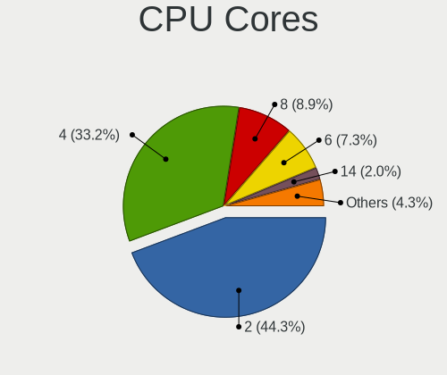

| Number | Notebooks | Percent |
|--------|-----------|---------|
| 2      | 533       | 48.72%  |
| 4      | 356       | 32.54%  |
| 8      | 83        | 7.59%   |
| 6      | 80        | 7.31%   |
| 1      | 17        | 1.55%   |
| 14     | 13        | 1.19%   |
| 12     | 7         | 0.64%   |
| 10     | 5         | 0.46%   |

CPU Sockets
-----------

Number of sockets

| Number | Notebooks | Percent |
|--------|-----------|---------|
| 1      | 1094      | 100%    |

CPU Threads
-----------

Threads per core (Hyper-Threading)

| Number | Notebooks | Percent |
|--------|-----------|---------|
| 2      | 872       | 79.63%  |
| 1      | 223       | 20.37%  |

CPU Op-Modes
------------

CPU Operation Modes (32-bit, 64-bit)

| Op mode        | Notebooks | Percent |
|----------------|-----------|---------|
| 32-bit, 64-bit | 1072      | 97.72%  |
| Unknown        | 16        | 1.46%   |
| 32-bit         | 9         | 0.82%   |

CPU Microcode
-------------

Microcode number

| Number     | Notebooks | Percent |
|------------|-----------|---------|
| Unknown    | 299       | 26.34%  |
| 0x306a9    | 58        | 5.11%   |
| 0x206a7    | 48        | 4.23%   |
| 0x40651    | 47        | 4.14%   |
| 0x806c1    | 44        | 3.88%   |
| 0x306d4    | 42        | 3.7%    |
| 0x306c3    | 41        | 3.61%   |
| 0x406e3    | 39        | 3.44%   |
| 0x806ec    | 35        | 3.08%   |
| 0x806ea    | 35        | 3.08%   |
| 0x806e9    | 34        | 3%      |
| 0x906ea    | 25        | 2.2%    |
| 0x20655    | 25        | 2.2%    |
| 0x906e9    | 23        | 2.03%   |
| 0x1067a    | 23        | 2.03%   |
| 0x0a50000c | 18        | 1.59%   |
| 0xa0652    | 13        | 1.15%   |
| 0x08600106 | 13        | 1.15%   |
| 0x806eb    | 12        | 1.06%   |
| 0x6fd      | 11        | 0.97%   |
| 0x0700010f | 11        | 0.97%   |
| 0x906a3    | 10        | 0.88%   |
| 0x406c4    | 10        | 0.88%   |
| 0x08608103 | 10        | 0.88%   |
| 0x08108109 | 10        | 0.88%   |
| 0x806d1    | 9         | 0.79%   |
| 0x506e3    | 9         | 0.79%   |
| 0x30678    | 9         | 0.79%   |
| 0x20652    | 8         | 0.7%    |
| 0x0810100b | 8         | 0.7%    |
| 0x706e5    | 7         | 0.62%   |
| 0x6fb      | 7         | 0.62%   |
| 0x6f6      | 7         | 0.62%   |
| 0x08108102 | 7         | 0.62%   |
| 0x06001119 | 7         | 0.62%   |
| 0x05000119 | 7         | 0.62%   |
| 0x906ed    | 6         | 0.53%   |
| 0x10676    | 6         | 0.53%   |
| 0x40661    | 5         | 0.44%   |
| 0x0a404101 | 5         | 0.44%   |

CPU Microarch
-------------

Microarchitecture

| Name             | Notebooks | Percent |
|------------------|-----------|---------|
| KabyLake         | 230       | 21.02%  |
| Haswell          | 112       | 10.24%  |
| IvyBridge        | 81        | 7.4%    |
| SandyBridge      | 70        | 6.4%    |
| Skylake          | 63        | 5.76%   |
| TigerLake        | 53        | 4.84%   |
| Unknown          | 48        | 4.39%   |
| Broadwell        | 47        | 4.3%    |
| Westmere         | 39        | 3.56%   |
| Zen 3            | 38        | 3.47%   |
| Silvermont       | 36        | 3.29%   |
| Penryn           | 35        | 3.2%    |
| Core             | 32        | 2.93%   |
| Zen 2            | 23        | 2.1%    |
| CometLake        | 22        | 2.01%   |
| Zen+             | 19        | 1.74%   |
| IceLake          | 17        | 1.55%   |
| Alderlake Hybrid | 17        | 1.55%   |
| Excavator        | 14        | 1.28%   |
| Zen              | 11        | 1.01%   |
| Piledriver       | 11        | 1.01%   |
| Jaguar           | 11        | 1.01%   |
| Goldmont plus    | 10        | 0.91%   |
| Puma             | 8         | 0.73%   |
| K8 Hammer        | 7         | 0.64%   |
| Bobcat           | 7         | 0.64%   |
| P6               | 6         | 0.55%   |
| K10 Llano        | 6         | 0.55%   |
| Bonnell          | 5         | 0.46%   |
| Nehalem          | 4         | 0.37%   |
| K10              | 4         | 0.37%   |
| Goldmont         | 4         | 0.37%   |
| K8 & K10 hybrid  | 3         | 0.27%   |
| Tremont          | 1         | 0.09%   |

Graphics
--------

GPU Vendor
----------

Vendors of graphics cards

| Vendor                           | Notebooks | Percent |
|----------------------------------|-----------|---------|
| Intel                            | 806       | 58.79%  |
| Nvidia                           | 323       | 23.56%  |
| AMD                              | 239       | 17.43%  |
| Silicon Integrated Systems [SiS] | 3         | 0.22%   |

GPU Model
---------

Graphics card models

| Model                                                                                    | Notebooks | Percent |
|------------------------------------------------------------------------------------------|-----------|---------|
| Intel 3rd Gen Core processor Graphics Controller                                         | 71        | 5.01%   |
| Intel 2nd Generation Core Processor Family Integrated Graphics Controller                | 63        | 4.44%   |
| Intel Haswell-ULT Integrated Graphics Controller                                         | 60        | 4.23%   |
| Intel UHD Graphics 620                                                                   | 50        | 3.53%   |
| Intel Skylake GT2 [HD Graphics 520]                                                      | 48        | 3.39%   |
| Intel TigerLake-LP GT2 [Iris Xe Graphics]                                                | 45        | 3.17%   |
| Intel CoffeeLake-H GT2 [UHD Graphics 630]                                                | 43        | 3.03%   |
| Intel WhiskeyLake-U GT2 [UHD Graphics 620]                                               | 42        | 2.96%   |
| Intel 4th Gen Core Processor Integrated Graphics Controller                              | 38        | 2.68%   |
| Intel HD Graphics 5500                                                                   | 36        | 2.54%   |
| Intel HD Graphics 620                                                                    | 35        | 2.47%   |
| AMD Cezanne [Radeon Vega Series / Radeon Vega Mobile Series]                             | 31        | 2.19%   |
| Intel Core Processor Integrated Graphics Controller                                      | 26        | 1.83%   |
| Intel HD Graphics 630                                                                    | 25        | 1.76%   |
| AMD Renoir                                                                               | 23        | 1.62%   |
| Intel Atom Processor Z36xxx/Z37xxx Series Graphics & Display                             | 21        | 1.48%   |
| AMD Picasso/Raven 2 [Radeon Vega Series / Radeon Vega Mobile Series]                     | 21        | 1.48%   |
| Intel Mobile 4 Series Chipset Integrated Graphics Controller                             | 18        | 1.27%   |
| Intel CometLake-U GT2 [UHD Graphics]                                                     | 18        | 1.27%   |
| Intel CometLake-H GT2 [UHD Graphics]                                                     | 16        | 1.13%   |
| Intel Alder Lake-P Integrated Graphics Controller                                        | 16        | 1.13%   |
| AMD Lucienne                                                                             | 16        | 1.13%   |
| Intel Mobile GM965/GL960 Integrated Graphics Controller (secondary)                      | 15        | 1.06%   |
| Intel Mobile GM965/GL960 Integrated Graphics Controller (primary)                        | 15        | 1.06%   |
| Intel Atom/Celeron/Pentium Processor x5-E8000/J3xxx/N3xxx Integrated Graphics Controller | 15        | 1.06%   |
| Nvidia GP107M [GeForce GTX 1050 Ti Mobile]                                               | 14        | 0.99%   |
| Nvidia GA106M [GeForce RTX 3060 Mobile / Max-Q]                                          | 14        | 0.99%   |
| Intel TigerLake-H GT1 [UHD Graphics]                                                     | 13        | 0.92%   |
| Nvidia TU117M [GeForce GTX 1650 Mobile / Max-Q]                                          | 10        | 0.71%   |
| AMD Rembrandt [Radeon 680M]                                                              | 10        | 0.71%   |
| Nvidia GP107M [GeForce GTX 1050 Mobile]                                                  | 9         | 0.63%   |
| Nvidia GM108M [GeForce 840M]                                                             | 9         | 0.63%   |
| AMD Raven Ridge [Radeon Vega Series / Radeon Vega Mobile Series]                         | 9         | 0.63%   |
| Nvidia TU117M [GeForce GTX 1650 Ti Mobile]                                               | 8         | 0.56%   |
| Nvidia TU106M [GeForce RTX 2060 Mobile]                                                  | 8         | 0.56%   |
| Intel HD Graphics 530                                                                    | 8         | 0.56%   |
| AMD Sun XT [Radeon HD 8670A/8670M/8690M / R5 M330 / M430 / Radeon 520 Mobile]            | 8         | 0.56%   |
| AMD Stoney [Radeon R2/R3/R4/R5 Graphics]                                                 | 8         | 0.56%   |
| AMD Mullins [Radeon R4/R5 Graphics]                                                      | 8         | 0.56%   |
| Nvidia TU117GLM [Quadro T1000 Mobile]                                                    | 7         | 0.49%   |

GPU Combo
---------

Combinations of graphics cards

| Name           | Notebooks | Percent |
|----------------|-----------|---------|
| 1 x Intel      | 559       | 50.96%  |
| Intel + Nvidia | 218       | 19.87%  |
| 1 x AMD        | 158       | 14.4%   |
| 1 x Nvidia     | 75        | 6.84%   |
| AMD + Nvidia   | 30        | 2.73%   |
| Intel + AMD    | 28        | 2.55%   |
| 2 x AMD        | 24        | 2.19%   |
| 1 x SiS        | 3         | 0.27%   |
| Other          | 1         | 0.09%   |
| 2 x Intel      | 1         | 0.09%   |

GPU Driver
----------

Free vs proprietary

| Driver      | Notebooks | Percent |
|-------------|-----------|---------|
| Free        | 908       | 82.02%  |
| Proprietary | 176       | 15.9%   |
| Unknown     | 23        | 2.08%   |

GPU Memory
----------

Total video memory

| Size in GB | Notebooks | Percent |
|------------|-----------|---------|
| Unknown    | 733       | 65.68%  |
| 0.01-0.5   | 132       | 11.83%  |
| 1.01-2.0   | 116       | 10.39%  |
| 0.51-1.0   | 54        | 4.84%   |
| 3.01-4.0   | 53        | 4.75%   |
| 5.01-6.0   | 13        | 1.16%   |
| 7.01-8.0   | 11        | 0.99%   |
| 2.01-3.0   | 4         | 0.36%   |

Monitor
-------

Monitor Vendor
--------------

Monitor vendors

| Vendor                  | Notebooks | Percent |
|-------------------------|-----------|---------|
| AU Optronics            | 282       | 22.15%  |
| LG Display              | 170       | 13.35%  |
| Chimei Innolux          | 152       | 11.94%  |
| Samsung Electronics     | 131       | 10.29%  |
| BOE                     | 98        | 7.7%    |
| Sharp                   | 59        | 4.63%   |
| Apple                   | 45        | 3.53%   |
| Dell                    | 37        | 2.91%   |
| Lenovo                  | 30        | 2.36%   |
| Chi Mei Optoelectronics | 24        | 1.89%   |
| Philips                 | 22        | 1.73%   |
| InfoVision              | 21        | 1.65%   |
| Hewlett-Packard         | 21        | 1.65%   |
| LG Philips              | 17        | 1.34%   |
| CSO                     | 16        | 1.26%   |
| BenQ                    | 13        | 1.02%   |
| AOC                     | 12        | 0.94%   |
| Ancor Communications    | 11        | 0.86%   |
| Goldstar                | 10        | 0.79%   |
| ASUSTek Computer        | 10        | 0.79%   |
| Acer                    | 10        | 0.79%   |
| PANDA                   | 9         | 0.71%   |
| Sony                    | 5         | 0.39%   |
| Panasonic               | 5         | 0.39%   |
| LGD                     | 5         | 0.39%   |
| BOE Technology Group    | 5         | 0.39%   |
| Vestel Elektronik       | 4         | 0.31%   |
| Quanta Display          | 4         | 0.31%   |
| Valve                   | 3         | 0.24%   |
| Unknown                 | 3         | 0.24%   |
| Toshiba                 | 3         | 0.24%   |
| Eizo                    | 3         | 0.24%   |
| Analogix                | 3         | 0.24%   |
| Nvidia                  | 2         | 0.16%   |
| Fujitsu Siemens         | 2         | 0.16%   |
| CPT                     | 2         | 0.16%   |
| VOXICON                 | 1         | 0.08%   |
| ViewSonic               | 1         | 0.08%   |
| TMX                     | 1         | 0.08%   |
| TCL                     | 1         | 0.08%   |

Monitor Model
-------------

Monitor models

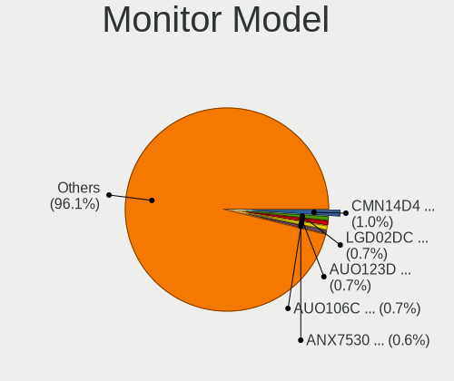

| Model                                                                 | Notebooks | Percent |
|-----------------------------------------------------------------------|-----------|---------|
| Chimei Innolux LCD Monitor CMN14D4 1920x1080 309x173mm 13.9-inch      | 15        | 1.16%   |
| LG Display LCD Monitor LGD02DC 1366x768 344x194mm 15.5-inch           | 12        | 0.93%   |
| AU Optronics LCD Monitor AUO26EC 1366x768 344x193mm 15.5-inch         | 9         | 0.7%    |
| AU Optronics LCD Monitor AUO123D 1920x1080 309x173mm 13.9-inch        | 9         | 0.7%    |
| AU Optronics LCD Monitor AUO106C 1366x768 277x156mm 12.5-inch         | 9         | 0.7%    |
| AU Optronics LCD Monitor AUO21ED 1920x1080 344x194mm 15.5-inch        | 8         | 0.62%   |
| AU Optronics LCD Monitor AUO38ED 1920x1080 344x193mm 15.5-inch        | 7         | 0.54%   |
| AU Optronics LCD Monitor AUO22EC 1366x768 344x193mm 15.5-inch         | 7         | 0.54%   |
| Samsung Electronics LCD Monitor SDCA029 3840x2160 344x194mm 15.5-inch | 6         | 0.47%   |
| LG Display LCD Monitor LGD0521 1920x1080 309x174mm 14.0-inch          | 6         | 0.47%   |
| Chimei Innolux LCD Monitor CMN15F5 1920x1080 344x193mm 15.5-inch      | 6         | 0.47%   |
| Chimei Innolux LCD Monitor CMN15D2 1920x1080 344x193mm 15.5-inch      | 6         | 0.47%   |
| Chimei Innolux LCD Monitor CMN14F2 1920x1080 309x173mm 13.9-inch      | 6         | 0.47%   |
| AU Optronics LCD Monitor AUO403D 1920x1080 309x173mm 13.9-inch        | 6         | 0.47%   |
| Sharp LCD Monitor SHP1484 1920x1080 294x165mm 13.3-inch               | 5         | 0.39%   |
| LG Display LCD Monitor LGD033A 1366x768 344x194mm 15.5-inch           | 5         | 0.39%   |
| LG Display LCD Monitor LGD02D8 1366x768 277x156mm 12.5-inch           | 5         | 0.39%   |
| Dell U2412M DELA07A 1920x1200 518x324mm 24.1-inch                     | 5         | 0.39%   |
| Chimei Innolux LCD Monitor CMN15E8 1920x1080 344x193mm 15.5-inch      | 5         | 0.39%   |
| Chimei Innolux LCD Monitor CMN14D5 1920x1080 309x173mm 13.9-inch      | 5         | 0.39%   |
| Vestel Elektronik 32W_LCD_TV VES3700 1920x1080 710x400mm 32.1-inch    | 4         | 0.31%   |
| Sharp LCD Monitor SHP14FA 3840x2400 288x180mm 13.4-inch               | 4         | 0.31%   |
| Sharp LCD Monitor SHP14D0 3840x2400 336x210mm 15.6-inch               | 4         | 0.31%   |
| Sharp LCD Monitor SHP148D 3840x2160 344x194mm 15.5-inch               | 4         | 0.31%   |
| Samsung Electronics LCD Monitor SDC4C48 1920x1080 239x134mm 10.8-inch | 4         | 0.31%   |
| Panasonic LCD Monitor MEI96A2 2880x1620 344x193mm 15.5-inch           | 4         | 0.31%   |
| LG Display LCD Monitor LGD0437 1920x1080 276x156mm 12.5-inch          | 4         | 0.31%   |
| LG Display LCD Monitor LGD0259 1920x1080 345x194mm 15.6-inch          | 4         | 0.31%   |
| InfoVision LCD Monitor IVO857F 1920x1080 294x165mm 13.3-inch          | 4         | 0.31%   |
| Chimei Innolux LCD Monitor CMN15C4 1920x1080 344x193mm 15.5-inch      | 4         | 0.31%   |
| Chimei Innolux LCD Monitor CMN15BF 1366x768 344x193mm 15.5-inch       | 4         | 0.31%   |
| Chimei Innolux LCD Monitor CMN14E5 1920x1080 309x173mm 13.9-inch      | 4         | 0.31%   |
| Chimei Innolux LCD Monitor CMN14C9 1920x1080 309x173mm 13.9-inch      | 4         | 0.31%   |
| Chimei Innolux LCD Monitor CMN14B1 1920x1080 308x173mm 13.9-inch      | 4         | 0.31%   |
| BOE LCD Monitor BOE0700 1920x1080 344x194mm 15.5-inch                 | 4         | 0.31%   |
| AU Optronics LCD Monitor AUOD291 1920x1200 301x188mm 14.0-inch        | 4         | 0.31%   |
| AU Optronics LCD Monitor AUO683D 1920x1080 309x174mm 14.0-inch        | 4         | 0.31%   |
| AU Optronics LCD Monitor AUO332C 1366x768 293x165mm 13.2-inch         | 4         | 0.31%   |
| AU Optronics LCD Monitor AUO2E3C 1366x768 309x173mm 13.9-inch         | 4         | 0.31%   |
| AU Optronics LCD Monitor AUO219D 1920x1080 381x214mm 17.2-inch        | 4         | 0.31%   |

Monitor Resolution
------------------

Monitor screen resolution

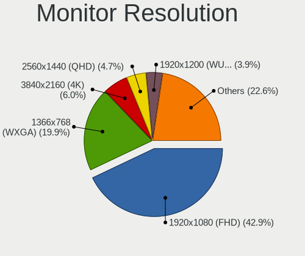

| Resolution         | Notebooks | Percent |
|--------------------|-----------|---------|
| 1920x1080 (FHD)    | 527       | 43.41%  |
| 1366x768 (WXGA)    | 266       | 21.91%  |
| 3840x2160 (4K)     | 76        | 6.26%   |
| 2560x1440 (QHD)    | 53        | 4.37%   |
| 1280x800 (WXGA)    | 46        | 3.79%   |
| 1600x900 (HD+)     | 45        | 3.71%   |
| 1920x1200 (WUXGA)  | 38        | 3.13%   |
| 2560x1600          | 27        | 2.22%   |
| 1440x900 (WXGA+)   | 20        | 1.65%   |
| 2880x1800          | 18        | 1.48%   |
| 3840x2400          | 16        | 1.32%   |
| 1680x1050 (WSXGA+) | 16        | 1.32%   |
| 3440x1440          | 11        | 0.91%   |
| 3200x1800 (QHD+)   | 7         | 0.58%   |
| 800x1280           | 6         | 0.49%   |
| 1024x768 (XGA)     | 6         | 0.49%   |
| 1280x1024 (SXGA)   | 5         | 0.41%   |
| 1024x600           | 5         | 0.41%   |
| 1920x540           | 4         | 0.33%   |
| Unknown            | 4         | 0.33%   |
| 2288x1287          | 3         | 0.25%   |
| 2160x1440          | 3         | 0.25%   |
| 1360x768           | 3         | 0.25%   |
| 3840x1080          | 2         | 0.16%   |
| 3840x1600          | 1         | 0.08%   |
| 3840x1100          | 1         | 0.08%   |
| 2880x1920          | 1         | 0.08%   |
| 2560x1700          | 1         | 0.08%   |
| 2560x1080          | 1         | 0.08%   |
| 1920x1280          | 1         | 0.08%   |
| 1400x1050          | 1         | 0.08%   |

Monitor Diagonal
----------------

Diagonal size in inches

| Inches  | Notebooks | Percent |
|---------|-----------|---------|
| 15      | 410       | 32.16%  |
| 13      | 242       | 18.98%  |
| 14      | 170       | 13.33%  |
| 17      | 78        | 6.12%   |
| 27      | 63        | 4.94%   |
| 12      | 57        | 4.47%   |
| 24      | 49        | 3.84%   |
| 23      | 26        | 2.04%   |
| 11      | 24        | 1.88%   |
| Unknown | 24        | 1.88%   |
| 16      | 19        | 1.49%   |
| 31      | 15        | 1.18%   |
| 34      | 9         | 0.71%   |
| 22      | 8         | 0.63%   |
| 84      | 7         | 0.55%   |
| 21      | 7         | 0.55%   |
| 18      | 7         | 0.55%   |
| 32      | 5         | 0.39%   |
| 19      | 5         | 0.39%   |
| 10      | 5         | 0.39%   |
| 65      | 4         | 0.31%   |
| 54      | 4         | 0.31%   |
| 29      | 3         | 0.24%   |
| 7       | 3         | 0.24%   |
| 3       | 3         | 0.24%   |
| 142     | 2         | 0.16%   |
| 72      | 2         | 0.16%   |
| 42      | 2         | 0.16%   |
| 40      | 2         | 0.16%   |
| 39      | 2         | 0.16%   |
| 37      | 2         | 0.16%   |
| 35      | 2         | 0.16%   |
| 33      | 2         | 0.16%   |
| 25      | 2         | 0.16%   |
| 20      | 2         | 0.16%   |
| 86      | 1         | 0.08%   |
| 75      | 1         | 0.08%   |
| 74      | 1         | 0.08%   |
| 60      | 1         | 0.08%   |
| 48      | 1         | 0.08%   |

Monitor Width
-------------

Physical width

| Width in mm    | Notebooks | Percent |
|----------------|-----------|---------|
| 301-350        | 695       | 54.94%  |
| 201-300        | 222       | 17.55%  |
| 501-600        | 128       | 10.12%  |
| 351-400        | 88        | 6.96%   |
| 601-700        | 25        | 1.98%   |
| 401-500        | 25        | 1.98%   |
| Unknown        | 24        | 1.9%    |
| 701-800        | 16        | 1.26%   |
| 1001-1500      | 12        | 0.95%   |
| 1501-2000      | 11        | 0.87%   |
| 801-900        | 7         | 0.55%   |
| 1-100          | 6         | 0.47%   |
| 901-1000       | 3         | 0.24%   |
| More than 2000 | 2         | 0.16%   |
| 101-200        | 1         | 0.08%   |

Aspect Ratio
------------

Proportional relationship between the width and the height

| Ratio   | Notebooks | Percent |
|---------|-----------|---------|
| 16/9    | 878       | 77.7%   |
| 16/10   | 183       | 16.19%  |
| Unknown | 22        | 1.95%   |
| 21/9    | 13        | 1.15%   |
| 3/2     | 9         | 0.8%    |
| 4/3     | 7         | 0.62%   |
| 5/4     | 6         | 0.53%   |
| 6/5     | 4         | 0.35%   |
| 0.67    | 3         | 0.27%   |
| 1.00    | 2         | 0.18%   |
| 32/9    | 1         | 0.09%   |
| 3.40    | 1         | 0.09%   |
| 0.56    | 1         | 0.09%   |

Monitor Area
------------

Area in inch

| Area in inch | Notebooks | Percent |
|----------------|-----------|---------|
| 101-110        | 405       | 31.84%  |
| 81-90          | 301       | 23.66%  |
| 71-80          | 110       | 8.65%   |
| 121-130        | 66        | 5.19%   |
| 301-350        | 64        | 5.03%   |
| 201-250        | 64        | 5.03%   |
| 61-70          | 54        | 4.25%   |
| 351-500        | 34        | 2.67%   |
| 251-300        | 26        | 2.04%   |
| 51-60          | 25        | 1.97%   |
| More than 1000 | 24        | 1.89%   |
| Unknown        | 24        | 1.89%   |
| 111-120        | 21        | 1.65%   |
| 131-140        | 13        | 1.02%   |
| 151-200        | 9         | 0.71%   |
| 501-1000       | 9         | 0.71%   |
| 141-150        | 7         | 0.55%   |
| 41-50          | 6         | 0.47%   |
| 1-40           | 6         | 0.47%   |
| 91-100         | 4         | 0.31%   |

Pixel Density
-------------

Pixels per inch

| Density       | Notebooks | Percent |
|---------------|-----------|---------|
| 121-160       | 521       | 41.75%  |
| 101-120       | 294       | 23.56%  |
| 51-100        | 178       | 14.26%  |
| 161-240       | 140       | 11.22%  |
| More than 240 | 70        | 5.61%   |
| Unknown       | 24        | 1.92%   |
| 1-50          | 21        | 1.68%   |

Multiple Monitors
-----------------

Total monitors connected

| Total | Notebooks | Percent |
|-------|-----------|---------|
| 1     | 876       | 78.35%  |
| 2     | 195       | 17.44%  |
| 3     | 24        | 2.15%   |
| 0     | 23        | 2.06%   |

Network
-------

Net Controller Vendor
---------------------

Controller vendors

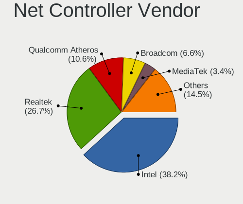

| Vendor                                 | Notebooks | Percent |
|----------------------------------------|-----------|---------|
| Intel                                  | 660       | 38.94%  |
| Realtek Semiconductor                  | 442       | 26.08%  |
| Qualcomm Atheros                       | 200       | 11.8%   |
| Broadcom                               | 117       | 6.9%    |
| MediaTek                               | 38        | 2.24%   |
| Broadcom Limited                       | 37        | 2.18%   |
| Hewlett-Packard                        | 18        | 1.06%   |
| ASIX Electronics                       | 18        | 1.06%   |
| Sierra Wireless                        | 15        | 0.88%   |
| Marvell Technology Group               | 14        | 0.83%   |
| Dell                                   | 14        | 0.83%   |
| Ralink                                 | 13        | 0.77%   |
| Lenovo                                 | 12        | 0.71%   |
| Nvidia                                 | 8         | 0.47%   |
| Ericsson Business Mobile Networks      | 8         | 0.47%   |
| DisplayLink                            | 7         | 0.41%   |
| TP-Link                                | 6         | 0.35%   |
| Huawei Technologies                    | 6         | 0.35%   |
| ASUSTek Computer                       | 6         | 0.35%   |
| Fibocom                                | 5         | 0.29%   |
| Samsung Electronics                    | 4         | 0.24%   |
| Ralink Technology                      | 4         | 0.24%   |
| Qualcomm                               | 4         | 0.24%   |
| NetGear                                | 4         | 0.24%   |
| Silicon Integrated Systems [SiS]       | 3         | 0.18%   |
| D-Link                                 | 3         | 0.18%   |
| Texas Instruments                      | 2         | 0.12%   |
| Qualcomm Atheros Communications        | 2         | 0.12%   |
| Microsoft                              | 2         | 0.12%   |
| JMicron Technology                     | 2         | 0.12%   |
| ZyXEL Communications                   | 1         | 0.06%   |
| Xiaomi                                 | 1         | 0.06%   |
| Wacom                                  | 1         | 0.06%   |
| STMicroelectronics                     | 1         | 0.06%   |
| Sony Ericsson Mobile Communications AB | 1         | 0.06%   |
| SEGGER                                 | 1         | 0.06%   |
| OnePlus Technology (Shenzhen)          | 1         | 0.06%   |
| Novatek Microelectronics               | 1         | 0.06%   |
| Linksys                                | 1         | 0.06%   |
| IMC Networks                           | 1         | 0.06%   |

Net Controller Model
--------------------

Controller models

| Model                                                             | Notebooks | Percent |
|-------------------------------------------------------------------|-----------|---------|
| Realtek RTL8111/8168/8411 PCI Express Gigabit Ethernet Controller | 272       | 12.78%  |
| Intel Wireless 8265 / 8275                                        | 77        | 3.62%   |
| Intel Wireless 7260                                               | 59        | 2.77%   |
| Realtek RTL8153 Gigabit Ethernet Adapter                          | 57        | 2.68%   |
| Intel Wi-Fi 6 AX200                                               | 51        | 2.4%    |
| Realtek RTL810xE PCI Express Fast Ethernet controller             | 50        | 2.35%   |
| Intel 82579LM Gigabit Network Connection (Lewisville)             | 45        | 2.11%   |
| Intel Wireless 7265                                               | 44        | 2.07%   |
| Intel Wireless 8260                                               | 42        | 1.97%   |
| Intel Wi-Fi 6 AX201                                               | 41        | 1.93%   |
| Qualcomm Atheros QCA9565 / AR9565 Wireless Network Adapter        | 31        | 1.46%   |
| Qualcomm Atheros AR9285 Wireless Network Adapter (PCI-Express)    | 31        | 1.46%   |
| Qualcomm Atheros QCA6174 802.11ac Wireless Network Adapter        | 30        | 1.41%   |
| Intel Centrino Advanced-N 6205 [Taylor Peak]                      | 30        | 1.41%   |
| Realtek RTL8822CE 802.11ac PCIe Wireless Network Adapter          | 25        | 1.17%   |
| Intel Ethernet Connection I218-LM                                 | 24        | 1.13%   |
| Qualcomm Atheros AR9485 Wireless Network Adapter                  | 23        | 1.08%   |
| MediaTek MT7921 802.11ax PCI Express Wireless Network Adapter     | 23        | 1.08%   |
| Intel Ethernet Connection (4) I219-LM                             | 23        | 1.08%   |
| Intel Cannon Point-LP CNVi [Wireless-AC]                          | 23        | 1.08%   |
| Intel Cannon Lake PCH CNVi WiFi                                   | 23        | 1.08%   |
| Qualcomm Atheros QCA9377 802.11ac Wireless Network Adapter        | 21        | 0.99%   |
| Intel Ethernet Connection (3) I218-LM                             | 21        | 0.99%   |
| Intel Ethernet Connection I219-LM                                 | 20        | 0.94%   |
| Intel Ethernet Connection (4) I219-V                              | 20        | 0.94%   |
| Intel Alder Lake-P PCH CNVi WiFi                                  | 19        | 0.89%   |
| Realtek RTL8821CE 802.11ac PCIe Wireless Network Adapter          | 17        | 0.8%    |
| Realtek RTL8723BE PCIe Wireless Network Adapter                   | 17        | 0.8%    |
| Intel Wireless 3160                                               | 17        | 0.8%    |
| Intel Comet Lake PCH CNVi WiFi                                    | 17        | 0.8%    |
| Intel Wireless-AC 9260                                            | 16        | 0.75%   |
| Intel PRO/Wireless 3945ABG [Golan] Network Connection             | 16        | 0.75%   |
| Intel 82577LM Gigabit Network Connection                          | 16        | 0.75%   |
| Broadcom NetLink BCM57785 Gigabit Ethernet PCIe                   | 16        | 0.75%   |
| Broadcom BCM43228 802.11a/b/g/n                                   | 16        | 0.75%   |
| Intel Ethernet Connection I217-LM                                 | 15        | 0.7%    |
| Intel Comet Lake PCH-LP CNVi WiFi                                 | 15        | 0.7%    |
| Intel Centrino Advanced-N 6200                                    | 15        | 0.7%    |
| ASIX AX88179 Gigabit Ethernet                                     | 15        | 0.7%    |
| Realtek RTL8852AE 802.11ax PCIe Wireless Network Adapter          | 14        | 0.66%   |

Wireless Vendor
---------------

Wireless vendors

| Vendor                          | Notebooks | Percent |
|---------------------------------|-----------|---------|
| Intel                           | 628       | 54.42%  |
| Qualcomm Atheros                | 170       | 14.73%  |
| Realtek Semiconductor           | 127       | 11.01%  |
| Broadcom                        | 88        | 7.63%   |
| MediaTek                        | 38        | 3.29%   |
| Broadcom Limited                | 23        | 1.99%   |
| Sierra Wireless                 | 15        | 1.3%    |
| Ralink                          | 13        | 1.13%   |
| Dell                            | 8         | 0.69%   |
| ASUSTek Computer                | 6         | 0.52%   |
| Fibocom                         | 5         | 0.43%   |
| TP-Link                         | 4         | 0.35%   |
| Ralink Technology               | 4         | 0.35%   |
| NetGear                         | 4         | 0.35%   |
| Hewlett-Packard                 | 4         | 0.35%   |
| Qualcomm                        | 3         | 0.26%   |
| Qualcomm Atheros Communications | 2         | 0.17%   |
| D-Link                          | 2         | 0.17%   |
| ZyXEL Communications            | 1         | 0.09%   |
| Wacom                           | 1         | 0.09%   |
| Microsoft                       | 1         | 0.09%   |
| Linksys                         | 1         | 0.09%   |
| IMC Networks                    | 1         | 0.09%   |
| Fujitsu Siemens Computers       | 1         | 0.09%   |
| Edimax Technology               | 1         | 0.09%   |
| D-Link System                   | 1         | 0.09%   |
| Chu Yuen Enterprise             | 1         | 0.09%   |
| Belkin Components               | 1         | 0.09%   |

Wireless Model
--------------

Wireless models

| Model                                                          | Notebooks | Percent |
|----------------------------------------------------------------|-----------|---------|
| Intel Wireless 8265 / 8275                                     | 77        | 6.63%   |
| Intel Wireless 7260                                            | 59        | 5.08%   |
| Intel Wi-Fi 6 AX200                                            | 51        | 4.39%   |
| Intel Wireless 7265                                            | 44        | 3.79%   |
| Intel Wireless 8260                                            | 42        | 3.62%   |
| Intel Wi-Fi 6 AX201                                            | 41        | 3.53%   |
| Qualcomm Atheros QCA9565 / AR9565 Wireless Network Adapter     | 31        | 2.67%   |
| Qualcomm Atheros AR9285 Wireless Network Adapter (PCI-Express) | 31        | 2.67%   |
| Qualcomm Atheros QCA6174 802.11ac Wireless Network Adapter     | 30        | 2.58%   |
| Intel Centrino Advanced-N 6205 [Taylor Peak]                   | 30        | 2.58%   |
| Realtek RTL8822CE 802.11ac PCIe Wireless Network Adapter       | 25        | 2.15%   |
| Qualcomm Atheros AR9485 Wireless Network Adapter               | 23        | 1.98%   |
| MediaTek MT7921 802.11ax PCI Express Wireless Network Adapter  | 23        | 1.98%   |
| Intel Cannon Point-LP CNVi [Wireless-AC]                       | 23        | 1.98%   |
| Intel Cannon Lake PCH CNVi WiFi                                | 23        | 1.98%   |
| Qualcomm Atheros QCA9377 802.11ac Wireless Network Adapter     | 21        | 1.81%   |
| Intel Alder Lake-P PCH CNVi WiFi                               | 19        | 1.64%   |
| Realtek RTL8821CE 802.11ac PCIe Wireless Network Adapter       | 17        | 1.46%   |
| Realtek RTL8723BE PCIe Wireless Network Adapter                | 17        | 1.46%   |
| Intel Wireless 3160                                            | 17        | 1.46%   |
| Intel Comet Lake PCH CNVi WiFi                                 | 17        | 1.46%   |
| Intel Wireless-AC 9260                                         | 16        | 1.38%   |
| Intel PRO/Wireless 3945ABG [Golan] Network Connection          | 16        | 1.38%   |
| Broadcom BCM43228 802.11a/b/g/n                                | 16        | 1.38%   |
| Intel Comet Lake PCH-LP CNVi WiFi                              | 15        | 1.29%   |
| Intel Centrino Advanced-N 6200                                 | 15        | 1.29%   |
| Realtek RTL8852AE 802.11ax PCIe Wireless Network Adapter       | 14        | 1.21%   |
| Qualcomm Atheros AR9462 Wireless Network Adapter               | 14        | 1.21%   |
| Intel Wi-Fi 6 AX210/AX211/AX411 160MHz                         | 13        | 1.12%   |
| Intel Centrino Advanced-N 6235                                 | 12        | 1.03%   |
| Broadcom BCM4313 802.11bgn Wireless Network Adapter            | 11        | 0.95%   |
| Sierra Wireless EM7455                                         | 10        | 0.86%   |
| Intel Centrino Ultimate-N 6300                                 | 10        | 0.86%   |
| Broadcom BCM4331 802.11a/b/g/n                                 | 10        | 0.86%   |
| Intel Tiger Lake PCH CNVi WiFi                                 | 9         | 0.78%   |
| Intel Centrino Wireless-N 2230                                 | 9         | 0.78%   |
| Realtek RTL8822BE 802.11a/b/g/n/ac WiFi adapter                | 8         | 0.69%   |
| Qualcomm Atheros AR9287 Wireless Network Adapter (PCI-Express) | 8         | 0.69%   |
| Intel PRO/Wireless 4965 AG or AGN [Kedron] Network Connection  | 8         | 0.69%   |
| Intel Dual Band Wireless-AC 3165 Plus Bluetooth                | 8         | 0.69%   |

Ethernet Vendor
---------------

Ethernet vendors

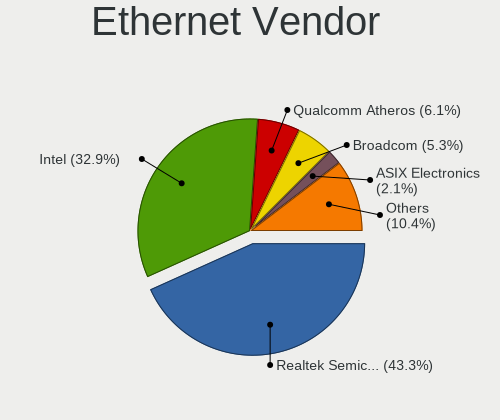

| Vendor                           | Notebooks | Percent |
|----------------------------------|-----------|---------|
| Realtek Semiconductor            | 389       | 42.33%  |
| Intel                            | 315       | 34.28%  |
| Qualcomm Atheros                 | 62        | 6.75%   |
| Broadcom                         | 52        | 5.66%   |
| ASIX Electronics                 | 18        | 1.96%   |
| Broadcom Limited                 | 15        | 1.63%   |
| Marvell Technology Group         | 14        | 1.52%   |
| Lenovo                           | 12        | 1.31%   |
| Nvidia                           | 8         | 0.87%   |
| DisplayLink                      | 7         | 0.76%   |
| Huawei Technologies              | 5         | 0.54%   |
| Hewlett-Packard                  | 5         | 0.54%   |
| Samsung Electronics              | 4         | 0.44%   |
| TP-Link                          | 2         | 0.22%   |
| Silicon Integrated Systems [SiS] | 2         | 0.22%   |
| JMicron Technology               | 2         | 0.22%   |
| Xiaomi                           | 1         | 0.11%   |
| Qualcomm                         | 1         | 0.11%   |
| OnePlus Technology (Shenzhen)    | 1         | 0.11%   |
| Microsoft                        | 1         | 0.11%   |
| ICS Advent                       | 1         | 0.11%   |
| Gemtek                           | 1         | 0.11%   |
| D-Link                           | 1         | 0.11%   |

Ethernet Model
--------------

Ethernet models

| Model                                                             | Notebooks | Percent |
|-------------------------------------------------------------------|-----------|---------|
| Realtek RTL8111/8168/8411 PCI Express Gigabit Ethernet Controller | 272       | 29.31%  |
| Realtek RTL8153 Gigabit Ethernet Adapter                          | 57        | 6.14%   |
| Realtek RTL810xE PCI Express Fast Ethernet controller             | 50        | 5.39%   |
| Intel 82579LM Gigabit Network Connection (Lewisville)             | 45        | 4.85%   |
| Intel Ethernet Connection I218-LM                                 | 24        | 2.59%   |
| Intel Ethernet Connection (4) I219-LM                             | 23        | 2.48%   |
| Intel Ethernet Connection (3) I218-LM                             | 21        | 2.26%   |
| Intel Ethernet Connection I219-LM                                 | 20        | 2.16%   |
| Intel Ethernet Connection (4) I219-V                              | 20        | 2.16%   |
| Intel 82577LM Gigabit Network Connection                          | 16        | 1.72%   |
| Broadcom NetLink BCM57785 Gigabit Ethernet PCIe                   | 16        | 1.72%   |
| Intel Ethernet Connection I217-LM                                 | 15        | 1.62%   |
| ASIX AX88179 Gigabit Ethernet                                     | 15        | 1.62%   |
| Intel Ethernet Connection (6) I219-V                              | 14        | 1.51%   |
| Intel Ethernet Connection I219-V                                  | 12        | 1.29%   |
| Intel Ethernet Connection (13) I219-V                             | 12        | 1.29%   |
| Qualcomm Atheros AR8151 v2.0 Gigabit Ethernet                     | 11        | 1.19%   |
| Broadcom NetXtreme BCM57765 Gigabit Ethernet PCIe                 | 11        | 1.19%   |
| Qualcomm Atheros QCA8171 Gigabit Ethernet                         | 9         | 0.97%   |
| Intel Ethernet Connection I217-V                                  | 9         | 0.97%   |
| Qualcomm Atheros AR8131 Gigabit Ethernet                          | 8         | 0.86%   |
| Intel Ethernet Connection (6) I219-LM                             | 8         | 0.86%   |
| Intel 82579V Gigabit Network Connection                           | 8         | 0.86%   |
| Intel 82566MM Gigabit Network Connection                          | 8         | 0.86%   |
| Intel 82567LM Gigabit Network Connection                          | 7         | 0.75%   |
| Intel Ethernet Connection (14) I219-LM                            | 6         | 0.65%   |
| DisplayLink Dell Universal Dock D6000                             | 6         | 0.65%   |
| Realtek RTL-8100/8101L/8139 PCI Fast Ethernet Adapter             | 5         | 0.54%   |
| Qualcomm Atheros QCA8172 Fast Ethernet                            | 5         | 0.54%   |
| Qualcomm Atheros Killer E220x Gigabit Ethernet Controller         | 5         | 0.54%   |
| Intel Ethernet Connection (7) I219-V                              | 5         | 0.54%   |
| Intel Ethernet Connection (7) I219-LM                             | 5         | 0.54%   |
| Intel Ethernet Connection (5) I219-LM                             | 5         | 0.54%   |
| Huawei JKM-LX1                                                    | 5         | 0.54%   |
| Broadcom NetXtreme BCM57786 Gigabit Ethernet PCIe                 | 5         | 0.54%   |
| Broadcom NetXtreme BCM57762 Gigabit Ethernet PCIe                 | 5         | 0.54%   |
| Broadcom Limited NetLink BCM57780 Gigabit Ethernet PCIe           | 5         | 0.54%   |
| Realtek RTL8125 2.5GbE Controller                                 | 4         | 0.43%   |
| Qualcomm Atheros Killer E2500 Gigabit Ethernet Controller         | 4         | 0.43%   |
| Qualcomm Atheros Killer E2400 Gigabit Ethernet Controller         | 4         | 0.43%   |

Net Controller Kind
-------------------

Ethernet, WiFi or modem

| Kind     | Notebooks | Percent |
|----------|-----------|---------|
| WiFi     | 1082      | 54.05%  |
| Ethernet | 881       | 44.01%  |
| Modem    | 35        | 1.75%   |
| Unknown  | 4         | 0.2%    |

Used Controller
---------------

Currently used network controller

| Kind     | Notebooks | Percent |
|----------|-----------|---------|
| WiFi     | 890       | 76.26%  |
| Ethernet | 276       | 23.65%  |
| Unknown  | 1         | 0.09%   |

NICs
----

Total network controllers on board

| Total | Notebooks | Percent |
|-------|-----------|---------|
| 2     | 780       | 71.23%  |
| 1     | 297       | 27.12%  |
| 3     | 11        | 1%      |
| 0     | 7         | 0.64%   |

IPv6
----

IPv6 vs IPv4

| Used | Notebooks | Percent |
|------|-----------|---------|
| No   | 1032      | 93.65%  |
| Yes  | 70        | 6.35%   |

Bluetooth
---------

Bluetooth Vendor
----------------

Controller vendors

| Vendor                          | Notebooks | Percent |
|---------------------------------|-----------|---------|
| Intel                           | 486       | 53.29%  |
| Realtek Semiconductor           | 69        | 7.57%   |
| Qualcomm Atheros Communications | 62        | 6.8%    |
| IMC Networks                    | 52        | 5.7%    |
| Broadcom                        | 51        | 5.59%   |
| Foxconn / Hon Hai               | 46        | 5.04%   |
| Apple                           | 39        | 4.28%   |
| Lite-On Technology              | 31        | 3.4%    |
| Hewlett-Packard                 | 17        | 1.86%   |
| Dell                            | 16        | 1.75%   |
| ASUSTek Computer                | 10        | 1.1%    |
| Ralink                          | 7         | 0.77%   |
| Cambridge Silicon Radio         | 7         | 0.77%   |
| Toshiba                         | 5         | 0.55%   |
| Realtek                         | 3         | 0.33%   |
| MediaTek                        | 3         | 0.33%   |
| Ralink Technology               | 2         | 0.22%   |
| Chicony Electronics             | 2         | 0.22%   |
| USI                             | 1         | 0.11%   |
| Fujitsu                         | 1         | 0.11%   |
| Creative Technology             | 1         | 0.11%   |
| Alps Electric                   | 1         | 0.11%   |

Bluetooth Model
---------------

Controller models

| Model                                               | Notebooks | Percent |
|-----------------------------------------------------|-----------|---------|
| Intel Bluetooth wireless interface                  | 226       | 24.67%  |
| Intel AX201 Bluetooth                               | 82        | 8.95%   |
| Intel Bluetooth 9460/9560 Jefferson Peak (JfP)      | 54        | 5.9%    |
| Intel AX200 Bluetooth                               | 50        | 5.46%   |
| Realtek Bluetooth Radio                             | 49        | 5.35%   |
| Apple Bluetooth Host Controller                     | 25        | 2.73%   |
| Foxconn / Hon Hai Bluetooth Device                  | 21        | 2.29%   |
| Intel Centrino Bluetooth Wireless Transceiver       | 20        | 2.18%   |
| IMC Networks Bluetooth Radio                        | 20        | 2.18%   |
| Qualcomm Atheros  Bluetooth Device                  | 16        | 1.75%   |
| Intel Bluetooth Device                              | 16        | 1.75%   |
| Qualcomm Atheros AR3011 Bluetooth                   | 15        | 1.64%   |
| Qualcomm Atheros QCA61x4 Bluetooth 4.0              | 14        | 1.53%   |
| Intel Wireless-AC 9260 Bluetooth Adapter            | 14        | 1.53%   |
| IMC Networks Wireless_Device                        | 14        | 1.53%   |
| Intel AX210 Bluetooth                               | 13        | 1.42%   |
| Broadcom BCM2045B (BDC-2.1)                         | 13        | 1.42%   |
| Apple Bluetooth USB Host Controller                 | 13        | 1.42%   |
| Qualcomm Atheros AR3012 Bluetooth 4.0               | 12        | 1.31%   |
| Realtek  Bluetooth 4.2 Adapter                      | 9         | 0.98%   |
| Lite-On Bluetooth Device                            | 9         | 0.98%   |
| Lite-On Atheros AR3012 Bluetooth                    | 9         | 0.98%   |
| HP Broadcom 2070 Bluetooth Combo                    | 9         | 0.98%   |
| IMC Networks Bluetooth Device                       | 8         | 0.87%   |
| HP Bluetooth 2.0 Interface [Broadcom BCM2045]       | 8         | 0.87%   |
| Foxconn / Hon Hai MediaTek Bluetooth Adapter        | 8         | 0.87%   |
| Broadcom HP Portable SoftSailing                    | 8         | 0.87%   |
| Ralink RT3290 Bluetooth                             | 7         | 0.76%   |
| Cambridge Silicon Radio Bluetooth Dongle (HCI mode) | 7         | 0.76%   |
| Broadcom BCM20702 Bluetooth 4.0 [ThinkPad]          | 7         | 0.76%   |
| Intel Wireless-AC 3168 Bluetooth                    | 6         | 0.66%   |
| Intel Centrino Advanced-N 6230 Bluetooth adapter    | 6         | 0.66%   |
| Foxconn / Hon Hai Wireless_Device                   | 6         | 0.66%   |
| Broadcom HP Portable Bumble Bee                     | 6         | 0.66%   |
| Realtek RTL8822BE Bluetooth 4.2 Adapter             | 5         | 0.55%   |
| Lite-On Qualcomm Atheros QCA9377 Bluetooth          | 5         | 0.55%   |
| IMC Networks Atheros AR3012 Bluetooth 4.0 Adapter   | 5         | 0.55%   |
| Dell DW375 Bluetooth Module                         | 5         | 0.55%   |
| Realtek RTL8723B Bluetooth                          | 4         | 0.44%   |
| Lite-On Wireless_Device                             | 4         | 0.44%   |

Sound
-----

Sound Vendor
------------

Sound card vendors

| Vendor                           | Notebooks | Percent |
|----------------------------------|-----------|---------|
| Intel                            | 880       | 64.05%  |
| AMD                              | 212       | 15.43%  |
| Nvidia                           | 174       | 12.66%  |
| C-Media Electronics              | 17        | 1.24%   |
| Realtek Semiconductor            | 11        | 0.8%    |
| Logitech                         | 9         | 0.66%   |
| Lenovo                           | 8         | 0.58%   |
| Plantronics                      | 6         | 0.44%   |
| GN Netcom                        | 6         | 0.44%   |
| Kingston Technology              | 5         | 0.36%   |
| Hewlett-Packard                  | 4         | 0.29%   |
| Silicon Integrated Systems [SiS] | 3         | 0.22%   |
| SAVITECH                         | 3         | 0.22%   |
| RODE Microphones                 | 3         | 0.22%   |
| ASUSTek Computer                 | 3         | 0.22%   |
| Apple                            | 3         | 0.22%   |
| Texas Instruments                | 2         | 0.15%   |
| SteelSeries ApS                  | 2         | 0.15%   |
| Sennheiser Communications        | 2         | 0.15%   |
| Creative Technology              | 2         | 0.15%   |
| XMOS                             | 1         | 0.07%   |
| Unknown                          | 1         | 0.07%   |
| SlrTek                           | 1         | 0.07%   |
| Samson Technologies              | 1         | 0.07%   |
| QinHeng Electronics              | 1         | 0.07%   |
| PreSonus Audio Electronics       | 1         | 0.07%   |
| No brand                         | 1         | 0.07%   |
| Line6                            | 1         | 0.07%   |
| LG Electronics                   | 1         | 0.07%   |
| JMTek                            | 1         | 0.07%   |
| JBL                              | 1         | 0.07%   |
| GYROCOM C&C                      | 1         | 0.07%   |
| Generalplus Technology           | 1         | 0.07%   |
| Focusrite-Novation               | 1         | 0.07%   |
| Elite Silicon                    | 1         | 0.07%   |
| Digidesign                       | 1         | 0.07%   |
| Corsair                          | 1         | 0.07%   |
| Conexant Systems                 | 1         | 0.07%   |
| Asahi Kasei Microsystems         | 1         | 0.07%   |

Sound Model
-----------

Sound card models

| Model                                                                      | Notebooks | Percent |
|----------------------------------------------------------------------------|-----------|---------|
| Intel Sunrise Point-LP HD Audio                                            | 141       | 8.41%   |
| AMD Family 17h/19h HD Audio Controller                                     | 111       | 6.62%   |
| Intel 7 Series/C216 Chipset Family High Definition Audio Controller        | 87        | 5.19%   |
| AMD Renoir Radeon High Definition Audio Controller                         | 66        | 3.94%   |
| Intel 6 Series/C200 Series Chipset Family High Definition Audio Controller | 63        | 3.76%   |
| Intel Haswell-ULT HD Audio Controller                                      | 60        | 3.58%   |
| Intel 8 Series HD Audio Controller                                         | 60        | 3.58%   |
| Intel Tiger Lake-LP Smart Sound Technology Audio Controller                | 53        | 3.16%   |
| Intel 8 Series/C220 Series Chipset High Definition Audio Controller        | 51        | 3.04%   |
| Intel Cannon Lake PCH cAVS                                                 | 49        | 2.92%   |
| Intel Wildcat Point-LP High Definition Audio Controller                    | 47        | 2.8%    |
| Intel Broadwell-U Audio Controller                                         | 47        | 2.8%    |
| Intel 5 Series/3400 Series Chipset High Definition Audio                   | 43        | 2.57%   |
| Intel Cannon Point-LP High Definition Audio Controller                     | 41        | 2.45%   |
| AMD FCH Azalia Controller                                                  | 38        | 2.27%   |
| Intel Xeon E3-1200 v3/4th Gen Core Processor HD Audio Controller           | 34        | 2.03%   |
| Intel CM238 HD Audio Controller                                            | 29        | 1.73%   |
| Intel 82801I (ICH9 Family) HD Audio Controller                             | 29        | 1.73%   |
| AMD Raven/Raven2/Fenghuang HDMI/DP Audio Controller                        | 27        | 1.61%   |
| AMD Kabini HDMI/DP Audio                                                   | 25        | 1.49%   |
| Intel 82801H (ICH8 Family) HD Audio Controller                             | 23        | 1.37%   |
| Intel Alder Lake PCH-P High Definition Audio Controller                    | 22        | 1.31%   |
| Intel Comet Lake PCH-LP cAVS                                               | 21        | 1.25%   |
| Intel Comet Lake PCH cAVS                                                  | 20        | 1.19%   |
| Intel Atom Processor Z36xxx/Z37xxx Series High Definition Audio Controller | 19        | 1.13%   |
| Nvidia GF108 High Definition Audio Controller                              | 17        | 1.01%   |
| Nvidia GP107GL High Definition Audio Controller                            | 16        | 0.95%   |
| Nvidia GK107 HDMI Audio Controller                                         | 15        | 0.89%   |
| Intel Tiger Lake-H HD Audio Controller                                     | 15        | 0.89%   |
| Nvidia TU106 High Definition Audio Controller                              | 14        | 0.84%   |
| Nvidia High Definition Audio Controller                                    | 13        | 0.78%   |
| Nvidia GA106 High Definition Audio Controller                              | 13        | 0.78%   |
| Nvidia GA104 High Definition Audio Controller                              | 13        | 0.78%   |
| Intel NM10/ICH7 Family High Definition Audio Controller                    | 13        | 0.78%   |
| AMD SBx00 Azalia (Intel HDA)                                               | 13        | 0.78%   |
| AMD Rembrandt Radeon High Definition Audio Controller                      | 13        | 0.78%   |
| Intel 100 Series/C230 Series Chipset Family HD Audio Controller            | 12        | 0.72%   |
| AMD Family 15h (Models 60h-6fh) Audio Controller                           | 12        | 0.72%   |
| Realtek Semiconductor USB Audio                                            | 11        | 0.66%   |
| AMD Trinity HDMI Audio Controller                                          | 11        | 0.66%   |

Memory
------

Memory Vendor
-------------

Memory module vendors

| Vendor              | Notebooks | Percent |
|---------------------|-----------|---------|
| Samsung Electronics | 214       | 31.61%  |
| SK hynix            | 153       | 22.6%   |
| Micron Technology   | 108       | 15.95%  |
| Kingston            | 50        | 7.39%   |
| Unknown             | 45        | 6.65%   |
| Corsair             | 22        | 3.25%   |
| Crucial             | 19        | 2.81%   |
| Ramaxel Technology  | 14        | 2.07%   |
| Elpida              | 13        | 1.92%   |
| A-DATA Technology   | 11        | 1.62%   |
| Unknown             | 6         | 0.89%   |
| Nanya Technology    | 4         | 0.59%   |
| Unknown (ABCD)      | 2         | 0.3%    |
| Team                | 2         | 0.3%    |
| Patriot             | 2         | 0.3%    |
| GSkill              | 2         | 0.3%    |
| TEXTORM             | 1         | 0.15%   |
| Qimonda             | 1         | 0.15%   |
| Netlist             | 1         | 0.15%   |
| Neo Forza           | 1         | 0.15%   |
| GOODRAM             | 1         | 0.15%   |
| G.Skill             | 1         | 0.15%   |
| fef5                | 1         | 0.15%   |
| Avant               | 1         | 0.15%   |
| ASint Technology    | 1         | 0.15%   |
| Apacer              | 1         | 0.15%   |

Memory Model
------------

Memory module models

| Model                                                            | Notebooks | Percent |
|------------------------------------------------------------------|-----------|---------|
| SK hynix RAM HMT41GS6BFR8A-PB 8GB SODIMM DDR3 1600MT/s           | 12        | 1.66%   |
| Samsung RAM M471B5173DB0-YK0 4GB SODIMM DDR3 1600MT/s            | 12        | 1.66%   |
| Samsung RAM M471A1G44AB0-CWE 8GB SODIMM DDR4 3200MT/s            | 12        | 1.66%   |
| Samsung RAM M471B1G73DB0-YK0 8GB SODIMM DDR3 1600MT/s            | 11        | 1.52%   |
| Samsung RAM M471A2K43DB1-CWE 16384MB SODIMM DDR4 3200MT/s        | 9         | 1.25%   |
| Samsung RAM M471A1K43BB1-CRC 8GB SODIMM DDR4 2667MT/s            | 8         | 1.11%   |
| SK hynix RAM Module 8GB SODIMM DDR3 1600MT/s                     | 7         | 0.97%   |
| SK hynix RAM HMT41GS6AFR8A-PB 8192MB SODIMM DDR3 1600MT/s        | 7         | 0.97%   |
| Samsung RAM M471B5273DH0-CH9 4GB SODIMM DDR3 1334MT/s            | 7         | 0.97%   |
| Samsung RAM M471A5244CB0-CTD 4GB SODIMM DDR4 3266MT/s            | 7         | 0.97%   |
| Samsung RAM M471A1K43EB1-CWE 8GB SODIMM DDR4 3200MT/s            | 7         | 0.97%   |
| SK hynix RAM HMA81GS6AFR8N-UH 8GB SODIMM DDR4 2667MT/s           | 6         | 0.83%   |
| Samsung RAM M471A5244CB0-CWE 4GB SODIMM DDR4 3200MT/s            | 6         | 0.83%   |
| Samsung RAM M471A1K43CB1-CRC 8GB SODIMM DDR4 2667MT/s            | 6         | 0.83%   |
| Micron RAM MT52L1G32D4PG-093 8GB Row Of Chips LPDDR3 2133MT/s    | 6         | 0.83%   |
| Unknown                                                          | 6         | 0.83%   |
| SK hynix RAM HMT451S6BFR8A-PB 4GB SODIMM DDR3 1600MT/s           | 5         | 0.69%   |
| SK hynix RAM HMT451S6AFR8A-PB 4GB SODIMM DDR3 1600MT/s           | 5         | 0.69%   |
| SK hynix RAM HMT351S6CFR8C-H9 4GB SODIMM DDR3 1334MT/s           | 5         | 0.69%   |
| Samsung RAM M471B5773CHS-CH9 2GB SODIMM DDR3 4199MT/s            | 5         | 0.69%   |
| Samsung RAM M471B1G73QH0-YK0 8GB SODIMM DDR3 1867MT/s            | 5         | 0.69%   |
| Samsung RAM M471A5244CB0-CRC 4GB SODIMM DDR4 2667MT/s            | 5         | 0.69%   |
| Samsung RAM M471A2K43DB1-CTD 16GB SODIMM DDR4 2667MT/s           | 5         | 0.69%   |
| Samsung RAM M471A2K43CB1-CRC 16GB SODIMM DDR4 2667MT/s           | 5         | 0.69%   |
| Micron RAM 4ATF51264HZ-3G2J1 4GB SODIMM DDR4 3200MT/s            | 5         | 0.69%   |
| Micron RAM 16KTF1G64HZ-1G6E1 8GB SODIMM DDR3 1600MT/s            | 5         | 0.69%   |
| SK hynix RAM HMT351S6CFR8C-PB 4GB SODIMM DDR3 1600MT/s           | 4         | 0.55%   |
| SK hynix RAM HMT351S6BFR8C-H9 4GB SODIMM DDR3 1333MT/s           | 4         | 0.55%   |
| SK hynix RAM HMAA1GS6CJR6N-XN 8GB SODIMM DDR4 3200MT/s           | 4         | 0.55%   |
| SK hynix RAM HMA82GS6JJR8N-VK 16GB SODIMM DDR4 2667MT/s          | 4         | 0.55%   |
| SK hynix RAM HMA82GS6AFR8N-UH 16GB SODIMM DDR4 2667MT/s          | 4         | 0.55%   |
| SK hynix RAM H9CCNNNCLGALAR-NVD 8GB Row Of Chips LPDDR3 2133MT/s | 4         | 0.55%   |
| Samsung RAM Module 16GB SODIMM DDR4 2667MT/s                     | 4         | 0.55%   |
| Samsung RAM Module 16384MB SODIMM DDR4 2667MT/s                  | 4         | 0.55%   |
| Samsung RAM M471B1G73EB0-YK0 8GB SODIMM DDR3 1600MT/s            | 4         | 0.55%   |
| Samsung RAM M471A1G44AB0-CWE 8GB Row Of Chips DDR4 3200MT/s      | 4         | 0.55%   |
| Micron RAM MT53E1G32D2NP-046 8GB SODIMM LPDDR4 4266MT/s          | 4         | 0.55%   |
| Micron RAM 53E1G32D2NP-046 2GB Row Of Chips LPDDR4 4267MT/s      | 4         | 0.55%   |
| Micron RAM 4ATS2G64HZ-3G2B1 16GB SODIMM DDR4 3200MT/s            | 4         | 0.55%   |
| Micron RAM 4ATF1G64HZ-3G2F1 8GB SODIMM DDR4 3200MT/s             | 4         | 0.55%   |

Memory Kind
-----------

Memory module kinds

| Kind    | Notebooks | Percent |
|---------|-----------|---------|
| DDR4    | 264       | 44.07%  |
| DDR3    | 203       | 33.89%  |
| LPDDR4  | 43        | 7.18%   |
| LPDDR3  | 32        | 5.34%   |
| DDR2    | 20        | 3.34%   |
| SDRAM   | 10        | 1.67%   |
| DDR5    | 10        | 1.67%   |
| LPDDR5  | 8         | 1.34%   |
| DRAM    | 3         | 0.5%    |
| DDR     | 3         | 0.5%    |
| Unknown | 3         | 0.5%    |

Memory Form Factor
------------------

Physical design of the memory module

| Name         | Notebooks | Percent |
|--------------|-----------|---------|
| SODIMM       | 512       | 84.63%  |
| Row Of Chips | 80        | 13.22%  |
| Chip         | 9         | 1.49%   |
| Unknown      | 3         | 0.5%    |
| DIMM         | 1         | 0.17%   |

Memory Size
-----------

Memory module size

| Size  | Notebooks | Percent |
|-------|-----------|---------|
| 8192  | 261       | 40.15%  |
| 4096  | 153       | 23.54%  |
| 16384 | 130       | 20%     |
| 2048  | 80        | 12.31%  |
| 32768 | 12        | 1.85%   |
| 1024  | 11        | 1.69%   |
| 512   | 3         | 0.46%   |

Memory Speed
------------

Memory module speed

| Speed   | Notebooks | Percent |
|---------|-----------|---------|
| 1600    | 146       | 22.88%  |
| 3200    | 115       | 18.03%  |
| 2667    | 107       | 16.77%  |
| 2133    | 45        | 7.05%   |
| 2400    | 43        | 6.74%   |
| 1334    | 28        | 4.39%   |
| 4267    | 25        | 3.92%   |
| 1333    | 19        | 2.98%   |
| Unknown | 15        | 2.35%   |
| 667     | 13        | 2.04%   |
| 1867    | 12        | 1.88%   |
| 4266    | 10        | 1.57%   |
| 6400    | 9         | 1.41%   |
| 4800    | 9         | 1.41%   |
| 1067    | 9         | 1.41%   |
| 3266    | 7         | 1.1%    |
| 4199    | 5         | 0.78%   |
| 800     | 5         | 0.78%   |
| 8400    | 3         | 0.47%   |
| 3733    | 2         | 0.31%   |
| 2048    | 2         | 0.31%   |
| 1066    | 2         | 0.31%   |
| 975     | 2         | 0.31%   |
| 5600    | 1         | 0.16%   |
| 1639    | 1         | 0.16%   |
| 533     | 1         | 0.16%   |
| 333     | 1         | 0.16%   |
| 266     | 1         | 0.16%   |

Printers & scanners
-------------------

Printer Vendor
--------------

Printer device vendors

| Vendor              | Notebooks | Percent |
|---------------------|-----------|---------|
| Hewlett-Packard     | 4         | 50%     |
| Samsung Electronics | 2         | 25%     |
| Oki Data            | 1         | 12.5%   |
| Brother Industries  | 1         | 12.5%   |

Printer Model
-------------

Printer device models

| Model                        | Notebooks | Percent |
|------------------------------|-----------|---------|
| Samsung SCX-3200 Series      | 1         | 12.5%   |
| Samsung M2070 Series         | 1         | 12.5%   |
| Oki Data USB Device          | 1         | 12.5%   |
| HP LaserJet P2035            | 1         | 12.5%   |
| HP ENVY 4520 series          | 1         | 12.5%   |
| HP DeskJet 5650c             | 1         | 12.5%   |
| HP DeskJet 2700 series       | 1         | 12.5%   |
| Brother QL-500 label printer | 1         | 12.5%   |

Scanner Vendor
--------------

Scanner device vendors

| Vendor          | Notebooks | Percent |
|-----------------|-----------|---------|
| Canon           | 2         | 50%     |
| Seiko Epson     | 1         | 25%     |
| Hewlett-Packard | 1         | 25%     |

Scanner Model
-------------

Scanner device models

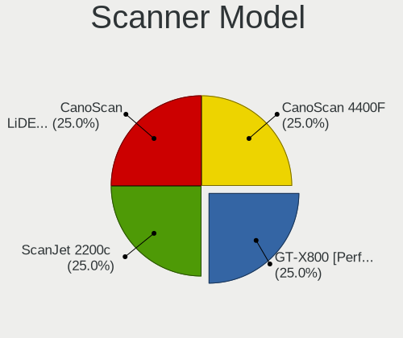

| Model                                       | Notebooks | Percent |
|---------------------------------------------|-----------|---------|
| Seiko Epson GT-X800 [Perfection 4990 PHOTO] | 1         | 25%     |
| HP ScanJet 2200c                            | 1         | 25%     |
| Canon CanoScan LiDE 100                     | 1         | 25%     |
| Canon CanoScan 4400F                        | 1         | 25%     |

Camera
------

Camera Vendor
-------------

Camera device vendors

| Vendor                                 | Notebooks | Percent |
|----------------------------------------|-----------|---------|
| Chicony Electronics                    | 251       | 26.28%  |
| Microdia                               | 97        | 10.16%  |
| IMC Networks                           | 93        | 9.74%   |
| Realtek Semiconductor                  | 73        | 7.64%   |
| Bison Electronics                      | 60        | 6.28%   |
| Sunplus Innovation Technology          | 47        | 4.92%   |
| Cheng Uei Precision Industry (Foxlink) | 42        | 4.4%    |
| Quanta                                 | 38        | 3.98%   |
| Lite-On Technology                     | 36        | 3.77%   |
| Apple                                  | 32        | 3.35%   |
| Acer                                   | 31        | 3.25%   |
| Suyin                                  | 29        | 3.04%   |
| Syntek                                 | 22        | 2.3%    |
| Logitech                               | 15        | 1.57%   |
| Luxvisions Innotech Limited            | 13        | 1.36%   |
| Ricoh                                  | 10        | 1.05%   |
| Lenovo                                 | 10        | 1.05%   |
| Alcor Micro                            | 8         | 0.84%   |
| Silicon Motion                         | 6         | 0.63%   |
| ALi                                    | 6         | 0.63%   |
| Samsung Electronics                    | 5         | 0.52%   |
| Sonix Technology                       | 4         | 0.42%   |
| DigiTech                               | 4         | 0.42%   |
| Shenzhen Kingcome Optoelectronic       | 3         | 0.31%   |
| Primax Electronics                     | 3         | 0.31%   |
| SunplusIT                              | 2         | 0.21%   |
| Sunplus Technology                     | 2         | 0.21%   |
| Microsoft                              | 2         | 0.21%   |
| Importek                               | 2         | 0.21%   |
| Creative Technology                    | 2         | 0.21%   |
| Z-Star Microelectronics                | 1         | 0.1%    |
| Polycom                                | 1         | 0.1%    |
| LG Electronics                         | 1         | 0.1%    |
| Intel                                  | 1         | 0.1%    |
| Generalplus Technology                 | 1         | 0.1%    |
| Etron Technology                       | 1         | 0.1%    |
| BRS 2Mp Camera                         | 1         | 0.1%    |

Camera Model
------------

Camera device models

| Model                                                                    | Notebooks | Percent |
|--------------------------------------------------------------------------|-----------|---------|
| Chicony Integrated Camera                                                | 62        | 6.45%   |
| Microdia Integrated_Webcam_HD                                            | 47        | 4.89%   |
| IMC Networks USB2.0 HD UVC WebCam                                        | 38        | 3.95%   |
| IMC Networks Integrated Camera                                           | 28        | 2.91%   |
| Realtek Integrated_Webcam_HD                                             | 26        | 2.71%   |
| Chicony HP HD Camera                                                     | 20        | 2.08%   |
| Chicony HD Webcam                                                        | 18        | 1.87%   |
| Bison Integrated Camera                                                  | 17        | 1.77%   |
| Syntek Integrated Camera                                                 | 14        | 1.46%   |
| Sunplus HD WebCam                                                        | 14        | 1.46%   |
| Lite-On HP HD Camera                                                     | 13        | 1.35%   |
| Cheng Uei Precision Industry (Foxlink) HP HD Webcam                      | 12        | 1.25%   |
| Bison SunplusIT Integrated Camera                                        | 12        | 1.25%   |
| Sunplus Integrated_Webcam_HD                                             | 11        | 1.14%   |
| Quanta HP HD Camera                                                      | 11        | 1.14%   |
| Lite-On Integrated Camera                                                | 10        | 1.04%   |
| Apple iPhone 5/5C/5S/6/SE/7/8/X/XR                                       | 10        | 1.04%   |
| Apple FaceTime HD Camera                                                 | 10        | 1.04%   |
| Lite-On HP HD Webcam                                                     | 9         | 0.94%   |
| Chicony HP HD Webcam [Fixed]                                             | 9         | 0.94%   |
| Chicony HP HD Webcam                                                     | 9         | 0.94%   |
| Quanta HD User Facing                                                    | 8         | 0.83%   |
| Chicony USB2.0 HD UVC WebCam                                             | 8         | 0.83%   |
| Cheng Uei Precision Industry (Foxlink) HP EliteBook integrated HD Webcam | 8         | 0.83%   |
| Acer Lenovo EasyCamera                                                   | 8         | 0.83%   |
| Syntek Lenovo EasyCamera                                                 | 7         | 0.73%   |
| Realtek USB2.0 HD UVC WebCam                                             | 7         | 0.73%   |
| Luxvisions Innotech Limited HP HD Camera                                 | 7         | 0.73%   |
| IMC Networks USB2.0 VGA UVC WebCam                                       | 7         | 0.73%   |
| Chicony USB2.0 Camera                                                    | 7         | 0.73%   |
| Chicony Integrated HP HD Webcam                                          | 7         | 0.73%   |
| Chicony HP Truevision HD                                                 | 7         | 0.73%   |
| Bison Lenovo EasyCamera                                                  | 7         | 0.73%   |
| Acer Integrated Camera                                                   | 7         | 0.73%   |
| Suyin HP TrueVision HD                                                   | 6         | 0.62%   |
| Sunplus HP HD Webcam [Fixed]                                             | 6         | 0.62%   |
| Quanta HP TrueVision HD Camera                                           | 6         | 0.62%   |
| Quanta HD Webcam                                                         | 6         | 0.62%   |
| Microdia Laptop_Integrated_Webcam_E4HD                                   | 6         | 0.62%   |
| Microdia Integrated Webcam                                               | 6         | 0.62%   |

Security
--------

Fingerprint Vendor
------------------

Fingerprint sensor vendors

| Vendor                     | Notebooks | Percent |
|----------------------------|-----------|---------|
| Validity Sensors           | 123       | 47.31%  |
| Synaptics                  | 71        | 27.31%  |
| Shenzhen Goodix Technology | 21        | 8.08%   |
| Elan Microelectronics      | 12        | 4.62%   |
| Upek                       | 11        | 4.23%   |
| AuthenTec                  | 11        | 4.23%   |
| STMicroelectronics         | 6         | 2.31%   |
| LighTuning Technology      | 5         | 1.92%   |

Fingerprint Model
-----------------

Fingerprint sensor models

| Model                                                                      | Notebooks | Percent |
|----------------------------------------------------------------------------|-----------|---------|
| Validity Sensors VFS495 Fingerprint Reader                                 | 42        | 16.15%  |
| Validity Sensors VFS 5011 fingerprint sensor                               | 17        | 6.54%   |
| Synaptics Prometheus MIS Touch Fingerprint Reader                          | 17        | 6.54%   |
| Synaptics Metallica MIS Touch Fingerprint Reader                           | 16        | 6.15%   |
| Shenzhen Goodix FingerPrint                                                | 13        | 5%      |
| Validity Sensors VFS491                                                    | 12        | 4.62%   |
| Validity Sensors Synaptics WBDI                                            | 11        | 4.23%   |
| Upek Biometric Touchchip/Touchstrip Fingerprint Sensor                     | 10        | 3.85%   |
| Synaptics Fingerprint reader [HP G6]                                       | 10        | 3.85%   |
| Synaptics  FS7604 Touch Fingerprint Sensor with PurePrint                  | 8         | 3.08%   |
| Validity Sensors Synaptics VFS7552 Touch Fingerprint Sensor with PurePrint | 7         | 2.69%   |
| Validity Sensors Swipe Fingerprint Sensor                                  | 6         | 2.31%   |
| Synaptics FS7604 Touch Fingerprint Sensor with PurePrint                   | 6         | 2.31%   |
| STMicroelectronics Fingerprint Reader                                      | 6         | 2.31%   |
| Shenzhen Goodix  FingerPrint Device                                        | 6         | 2.31%   |
| Elan ELAN:Fingerprint                                                      | 6         | 2.31%   |
| Validity Sensors VFS5011 Fingerprint Reader                                | 5         | 1.92%   |
| Validity Sensors VFS471 Fingerprint Reader                                 | 5         | 1.92%   |
| Validity Sensors VFS451 Fingerprint Reader                                 | 5         | 1.92%   |
| AuthenTec AES2810                                                          | 5         | 1.92%   |
| AuthenTec AES2501 Fingerprint Sensor                                       | 5         | 1.92%   |
| Validity Sensors VFS7500 Touch Fingerprint Sensor                          | 3         | 1.15%   |
| Validity Sensors VFS301 Fingerprint Reader                                 | 3         | 1.15%   |
| Validity Sensors Fingerprint scanner                                       | 3         | 1.15%   |
| Synaptics Metallica MOH Touch Fingerprint Reader                           | 3         | 1.15%   |
| LighTuning EgisTec Touch Fingerprint Sensor                                | 3         | 1.15%   |
| Elan ELAN:ARM-M4                                                           | 3         | 1.15%   |
| Validity Sensors VFS101 Fingerprint Reader                                 | 2         | 0.77%   |
| Synaptics WBDI Fingerprint Reader USB 086                                  | 2         | 0.77%   |
| Synaptics WBDI                                                             | 2         | 0.77%   |
| Synaptics UWP WBDI Device                                                  | 2         | 0.77%   |
| Shenzhen Goodix Fingerprint Reader                                         | 2         | 0.77%   |
| Elan WBF Fingerprint Sensor                                                | 2         | 0.77%   |
| Unknown                                                                    | 2         | 0.77%   |
| Validity Sensors VFS300 Fingerprint Reader                                 | 1         | 0.38%   |
| Validity Sensors VFS Fingerprint sensor                                    | 1         | 0.38%   |
| Upek TCS5B Fingerprint sensor                                              | 1         | 0.38%   |
| Synaptics WBDI Device                                                      | 1         | 0.38%   |
| Synaptics  WBDI Fingerprint Reader - USB 052                               | 1         | 0.38%   |
| Synaptics  WBDI                                                            | 1         | 0.38%   |

Chipcard Vendor
---------------

Chipcard module vendors

| Vendor      | Notebooks | Percent |
|-------------|-----------|---------|
| Alcor Micro | 65        | 43.62%  |
| Broadcom    | 61        | 40.94%  |
| O2 Micro    | 11        | 7.38%   |
| Lenovo      | 6         | 4.03%   |
| Upek        | 5         | 3.36%   |
| Yubico.com  | 1         | 0.67%   |

Chipcard Model
--------------

Chipcard module models

| Model                                                                        | Notebooks | Percent |
|------------------------------------------------------------------------------|-----------|---------|
| Alcor Micro AU9540 Smartcard Reader                                          | 65        | 43.62%  |
| Broadcom BCM5880 Secure Applications Processor                               | 18        | 12.08%  |
| Broadcom 58200                                                               | 17        | 11.41%  |
| Broadcom 5880                                                                | 13        | 8.72%   |
| Broadcom BCM5880 Secure Applications Processor with fingerprint swipe sensor | 12        | 8.05%   |
| O2 Micro OZ776 CCID Smartcard Reader                                         | 9         | 6.04%   |
| Lenovo Integrated Smart Card Reader                                          | 6         | 4.03%   |
| Upek TouchChip Fingerprint Coprocessor (WBF advanced mode)                   | 5         | 3.36%   |
| O2 Micro Oz776 SmartCard Reader                                              | 2         | 1.34%   |
| Yubico.com Yubikey 4/5 U2F+CCID                                              | 1         | 0.67%   |
| Broadcom BCM5880 Secure Applications Processor with fingerprint touch sensor | 1         | 0.67%   |

Unsupported
-----------

Unsupported Devices
-------------------

Total unsupported devices on board

| Total | Notebooks | Percent |
|-------|-----------|---------|
| 0     | 590       | 52.54%  |
| 1     | 396       | 35.26%  |
| 2     | 122       | 10.86%  |
| 3     | 11        | 0.98%   |
| 4     | 3         | 0.27%   |
| 7     | 1         | 0.09%   |

Unsupported Device Types
------------------------

Types of unsupported devices

| Type                     | Notebooks | Percent |
|--------------------------|-----------|---------|
| Fingerprint reader       | 260       | 38.75%  |
| Chipcard                 | 138       | 20.57%  |
| Graphics card            | 96        | 14.31%  |
| Net/wireless             | 55        | 8.2%    |
| Multimedia controller    | 40        | 5.96%   |
| Camera                   | 23        | 3.43%   |
| Bluetooth                | 19        | 2.83%   |
| Communication controller | 14        | 2.09%   |
| Sound                    | 6         | 0.89%   |
| Card reader              | 5         | 0.75%   |
| Storage                  | 4         | 0.6%    |
| Net/ethernet             | 4         | 0.6%    |
| Modem                    | 2         | 0.3%    |
| Flash memory             | 2         | 0.3%    |
| Storage/nvme             | 1         | 0.15%   |
| Storage/ide              | 1         | 0.15%   |
| Storage/ata              | 1         | 0.15%   |

