Linux in Sweden - Tested Hardware & Statistics
----------------------------------------------

A project to collect tested hardware configurations for Linux in Sweden.

Anyone can contribute to this report by the [hw-probe](https://github.com/linuxhw/hw-probe) tool:

    sudo -E hw-probe -all -upload

Please contribute! Especially if your hardware is rare.

This is a report for all computer types. See also reports for [desktops](/Location/Sweden/Desktop/README.md) and [notebooks](/Location/Sweden/Notebook/README.md).

Contents
--------

* [ Test Cases ](#test-cases)

* [ System ](#system)
  - [ OS                       ](#os)
  - [ OS Family                ](#os-family)
  - [ Kernel                   ](#kernel)
  - [ Kernel Family            ](#kernel-family)
  - [ Kernel Major Ver.        ](#kernel-major-ver)
  - [ Arch                     ](#arch)
  - [ DE                       ](#de)
  - [ Display Server           ](#display-server)
  - [ Display Manager          ](#display-manager)
  - [ OS Lang                  ](#os-lang)
  - [ Boot Mode                ](#boot-mode)
  - [ Filesystem               ](#filesystem)
  - [ Part. scheme             ](#part-scheme)
  - [ Dual Boot with Linux/BSD ](#dual-boot-with-linuxbsd)
  - [ Dual Boot (Win)          ](#dual-boot-win)

* [ Board ](#board)
  - [ Vendor                   ](#vendor)
  - [ Model                    ](#model)
  - [ Model Family             ](#model-family)
  - [ MFG Year                 ](#mfg-year)
  - [ Form Factor              ](#form-factor)
  - [ Secure Boot              ](#secure-boot)
  - [ Coreboot                 ](#coreboot)
  - [ RAM Size                 ](#ram-size)
  - [ RAM Used                 ](#ram-used)
  - [ Total Drives             ](#total-drives)
  - [ Has CD-ROM               ](#has-cd-rom)
  - [ Has Ethernet             ](#has-ethernet)
  - [ Has WiFi                 ](#has-wifi)
  - [ Has Bluetooth            ](#has-bluetooth)

* [ Location ](#location)
  - [ Country                  ](#country)
  - [ City                     ](#city)

* [ Drives ](#drives)
  - [ Drive Vendor             ](#drive-vendor)
  - [ Drive Model              ](#drive-model)
  - [ HDD Vendor               ](#hdd-vendor)
  - [ SSD Vendor               ](#ssd-vendor)
  - [ Drive Kind               ](#drive-kind)
  - [ Drive Connector          ](#drive-connector)
  - [ Drive Size               ](#drive-size)
  - [ Space Total              ](#space-total)
  - [ Space Used               ](#space-used)
  - [ Malfunc. Drives          ](#malfunc-drives)
  - [ Malfunc. Drive Vendor    ](#malfunc-drive-vendor)
  - [ Malfunc. HDD Vendor      ](#malfunc-hdd-vendor)
  - [ Malfunc. Drive Kind      ](#malfunc-drive-kind)
  - [ Failed Drives            ](#failed-drives)
  - [ Failed Drive Vendor      ](#failed-drive-vendor)
  - [ Drive Status             ](#drive-status)

* [ Storage controller ](#storage-controller)
  - [ Storage Vendor           ](#storage-vendor)
  - [ Storage Model            ](#storage-model)
  - [ Storage Kind             ](#storage-kind)

* [ Processor ](#processor)
  - [ CPU Vendor               ](#cpu-vendor)
  - [ CPU Model                ](#cpu-model)
  - [ CPU Model Family         ](#cpu-model-family)
  - [ CPU Cores                ](#cpu-cores)
  - [ CPU Sockets              ](#cpu-sockets)
  - [ CPU Threads              ](#cpu-threads)
  - [ CPU Op-Modes             ](#cpu-op-modes)
  - [ CPU Microcode            ](#cpu-microcode)
  - [ CPU Microarch            ](#cpu-microarch)

* [ Graphics ](#graphics)
  - [ GPU Vendor               ](#gpu-vendor)
  - [ GPU Model                ](#gpu-model)
  - [ GPU Combo                ](#gpu-combo)
  - [ GPU Driver               ](#gpu-driver)
  - [ GPU Memory               ](#gpu-memory)

* [ Monitor ](#monitor)
  - [ Monitor Vendor           ](#monitor-vendor)
  - [ Monitor Model            ](#monitor-model)
  - [ Monitor Resolution       ](#monitor-resolution)
  - [ Monitor Diagonal         ](#monitor-diagonal)
  - [ Monitor Width            ](#monitor-width)
  - [ Aspect Ratio             ](#aspect-ratio)
  - [ Monitor Area             ](#monitor-area)
  - [ Pixel Density            ](#pixel-density)
  - [ Multiple Monitors        ](#multiple-monitors)

* [ Network ](#network)
  - [ Net Controller Vendor    ](#net-controller-vendor)
  - [ Net Controller Model     ](#net-controller-model)
  - [ Wireless Vendor          ](#wireless-vendor)
  - [ Wireless Model           ](#wireless-model)
  - [ Ethernet Vendor          ](#ethernet-vendor)
  - [ Ethernet Model           ](#ethernet-model)
  - [ Net Controller Kind      ](#net-controller-kind)
  - [ Used Controller          ](#used-controller)
  - [ NICs                     ](#nics)
  - [ IPv6                     ](#ipv6)

* [ Bluetooth ](#bluetooth)
  - [ Bluetooth Vendor         ](#bluetooth-vendor)
  - [ Bluetooth Model          ](#bluetooth-model)

* [ Sound ](#sound)
  - [ Sound Vendor             ](#sound-vendor)
  - [ Sound Model              ](#sound-model)

* [ Memory ](#memory)
  - [ Memory Vendor            ](#memory-vendor)
  - [ Memory Model             ](#memory-model)
  - [ Memory Kind              ](#memory-kind)
  - [ Memory Form Factor       ](#memory-form-factor)
  - [ Memory Size              ](#memory-size)
  - [ Memory Speed             ](#memory-speed)

* [ Printers & scanners ](#printers--scanners)
  - [ Printer Vendor           ](#printer-vendor)
  - [ Printer Model            ](#printer-model)
  - [ Scanner Vendor           ](#scanner-vendor)
  - [ Scanner Model            ](#scanner-model)

* [ Camera ](#camera)
  - [ Camera Vendor            ](#camera-vendor)
  - [ Camera Model             ](#camera-model)

* [ Security ](#security)
  - [ Fingerprint Vendor       ](#fingerprint-vendor)
  - [ Fingerprint Model        ](#fingerprint-model)
  - [ Chipcard Vendor          ](#chipcard-vendor)
  - [ Chipcard Model           ](#chipcard-model)

* [ Unsupported ](#unsupported)
  - [ Unsupported Devices      ](#unsupported-devices)
  - [ Unsupported Device Types ](#unsupported-device-types)

Test Cases
----------

Total: 5343

| Vendor        | Model                       | Form-Factor | Probe                                                      | Date         |
|---------------|-----------------------------|-------------|------------------------------------------------------------|--------------|
| Unknown       | Unknown                     | Other       | [c2cafde054](https://linux-hardware.org/?probe=c2cafde054) | Jan 03, 2026 |
| Dell          | 09M8Y8 A02                  | Desktop     | [af252141ff](https://linux-hardware.org/?probe=af252141ff) | Jan 03, 2026 |
| HP            | ProBook 450 15.6 inch G9... | Notebook    | [e0629e7d73](https://linux-hardware.org/?probe=e0629e7d73) | Jan 03, 2026 |
| MSI           | B450-A PRO MAX              | Desktop     | [214b81f9d4](https://linux-hardware.org/?probe=214b81f9d4) | Jan 02, 2026 |
| ASUSTek       | G15DK                       | Desktop     | [743689918b](https://linux-hardware.org/?probe=743689918b) | Dec 31, 2025 |
| MSI           | MS-B0A1                     | Desktop     | [cbc05d27c8](https://linux-hardware.org/?probe=cbc05d27c8) | Dec 31, 2025 |
| ASUSTek       | G15DK                       | Desktop     | [da745da3ae](https://linux-hardware.org/?probe=da745da3ae) | Dec 31, 2025 |
| ASUSTek       | G15DK                       | Desktop     | [834b55ff0b](https://linux-hardware.org/?probe=834b55ff0b) | Dec 31, 2025 |
| MSI           | Z270 TOMAHAWK               | Notebook    | [7919b5ad99](https://linux-hardware.org/?probe=7919b5ad99) | Dec 31, 2025 |
| HP            | EliteBook x360 830 G8 No... | Convertible | [5279472f0f](https://linux-hardware.org/?probe=5279472f0f) | Dec 31, 2025 |
| MSI           | MS-B0A1                     | Desktop     | [231bb0730f](https://linux-hardware.org/?probe=231bb0730f) | Dec 31, 2025 |
| ASRock        | B550M-HDV                   | Desktop     | [dd17bbedaf](https://linux-hardware.org/?probe=dd17bbedaf) | Dec 30, 2025 |
| MSI           | MS-B0A1                     | Desktop     | [ed754a871f](https://linux-hardware.org/?probe=ed754a871f) | Dec 30, 2025 |
| ASUSTek       | PRIME Z370-P                | Desktop     | [32abf75bf4](https://linux-hardware.org/?probe=32abf75bf4) | Dec 30, 2025 |
| Gigabyte      | Z170-D3H-CF                 | Desktop     | [147f5e4c63](https://linux-hardware.org/?probe=147f5e4c63) | Dec 30, 2025 |
| ASUSTek       | ROG STRIX Z790-F GAMING ... | Desktop     | [565f7f1d70](https://linux-hardware.org/?probe=565f7f1d70) | Dec 29, 2025 |
| ASRock        | B450M-HDV R4.0              | Desktop     | [c535d48ef8](https://linux-hardware.org/?probe=c535d48ef8) | Dec 29, 2025 |
| Lenovo        | ThinkPad X220 42912WG       | Notebook    | [e43164c78c](https://linux-hardware.org/?probe=e43164c78c) | Dec 29, 2025 |
| HP            | EliteBook Folio 1040 G2     | Notebook    | [46bf923068](https://linux-hardware.org/?probe=46bf923068) | Dec 29, 2025 |
| Toshiba       | Satellite C850-C5K          | Notebook    | [1bb0be5fec](https://linux-hardware.org/?probe=1bb0be5fec) | Dec 29, 2025 |
| ASUSTek       | TUF Gaming B550-PLUS        | Desktop     | [0dadaeb2f1](https://linux-hardware.org/?probe=0dadaeb2f1) | Dec 29, 2025 |
| Lenovo        | Z50-75 80EC                 | Notebook    | [12d924dd92](https://linux-hardware.org/?probe=12d924dd92) | Dec 29, 2025 |
| Lenovo        | ThinkPad T430 2349Q57       | Notebook    | [7d33df1d41](https://linux-hardware.org/?probe=7d33df1d41) | Dec 29, 2025 |
| Lenovo        | ThinkPad L15 Gen 1 20U8S... | Notebook    | [44eeb5bc6a](https://linux-hardware.org/?probe=44eeb5bc6a) | Dec 28, 2025 |
| ASUSTek       | M5A97 EVO R2.0              | Desktop     | [3eedef0714](https://linux-hardware.org/?probe=3eedef0714) | Dec 28, 2025 |
| Lenovo        | Z50-75 80EC                 | Notebook    | [341e38736a](https://linux-hardware.org/?probe=341e38736a) | Dec 28, 2025 |
| Dell          | Latitude 5480               | Notebook    | [98b3275fc1](https://linux-hardware.org/?probe=98b3275fc1) | Dec 28, 2025 |
| Xunlong       | Orange Pi One               | Soc         | [84e1192e8a](https://linux-hardware.org/?probe=84e1192e8a) | Dec 27, 2025 |
| Gigabyte      | Z170N-Gaming 5              | Notebook    | [ee8d31ac61](https://linux-hardware.org/?probe=ee8d31ac61) | Dec 27, 2025 |
| Intel         | NUC7JYB M37316-600          | Mini pc     | [201031a30b](https://linux-hardware.org/?probe=201031a30b) | Dec 26, 2025 |
| Lenovo        | LOQ 15ARP9 83JC             | Notebook    | [b9f7ac1f64](https://linux-hardware.org/?probe=b9f7ac1f64) | Dec 26, 2025 |
| HP            | Spectre x360 Convertible... | Convertible | [7a11828554](https://linux-hardware.org/?probe=7a11828554) | Dec 26, 2025 |
| Gigabyte      | X870 GAMING WIFI6           | Desktop     | [40c5efdc8e](https://linux-hardware.org/?probe=40c5efdc8e) | Dec 25, 2025 |
| HP            | 2B05                        | Desktop     | [3ccca8a718](https://linux-hardware.org/?probe=3ccca8a718) | Dec 25, 2025 |
| HP            | 2B05                        | Desktop     | [d9bcf6f1b5](https://linux-hardware.org/?probe=d9bcf6f1b5) | Dec 25, 2025 |
| ASUSTek       | SABERTOOTH 990FX R2.0       | Desktop     | [3158013ada](https://linux-hardware.org/?probe=3158013ada) | Dec 24, 2025 |
| Lenovo        | Yoga 7 2-in-1 14AKP10 83... | Convertible | [7558767f6f](https://linux-hardware.org/?probe=7558767f6f) | Dec 24, 2025 |
| Acer          | Aspire E5-771G              | Notebook    | [35d04177f4](https://linux-hardware.org/?probe=35d04177f4) | Dec 23, 2025 |
| ASUSTek       | STRIX B250F GAMING          | Desktop     | [4630548f71](https://linux-hardware.org/?probe=4630548f71) | Dec 23, 2025 |
| ASUSTek       | ZenBook UX325EA_UX325EA     | Notebook    | [83f288396c](https://linux-hardware.org/?probe=83f288396c) | Dec 21, 2025 |
| HP            | ZBook 15u G2                | Notebook    | [a2f5547959](https://linux-hardware.org/?probe=a2f5547959) | Dec 21, 2025 |
| Dell          | Studio XPS 1340             | Notebook    | [ec3928d9b4](https://linux-hardware.org/?probe=ec3928d9b4) | Dec 21, 2025 |
| Apple         | Mac-00BE6ED71E35EB86 iMa... | All in one  | [3d1f209699](https://linux-hardware.org/?probe=3d1f209699) | Dec 20, 2025 |
| Lenovo        | 3730 SDK0J40709 WIN 3259... | Desktop     | [0ba3c52c7b](https://linux-hardware.org/?probe=0ba3c52c7b) | Dec 19, 2025 |
| ASUSTek       | E205SA                      | Notebook    | [a42b791b25](https://linux-hardware.org/?probe=a42b791b25) | Dec 19, 2025 |
| Lenovo        | Bantry CRB SDK0J40700 WI... | Desktop     | [c7bffe2198](https://linux-hardware.org/?probe=c7bffe2198) | Dec 17, 2025 |
| Apple         | MacBookPro11,1              | Notebook    | [8f42eb7e45](https://linux-hardware.org/?probe=8f42eb7e45) | Dec 17, 2025 |
| Lenovo        | ThinkBook 16p G6 IAX 21R... | Notebook    | [f9834c0dbb](https://linux-hardware.org/?probe=f9834c0dbb) | Dec 16, 2025 |
| HP            | ProBook 640 G2              | Notebook    | [ececf3b4db](https://linux-hardware.org/?probe=ececf3b4db) | Dec 14, 2025 |
| ASUSTek       | ROG STRIX X870-F GAMING ... | Desktop     | [db3911f23f](https://linux-hardware.org/?probe=db3911f23f) | Dec 14, 2025 |
| Lenovo        | Yoga Slim 7 14AKP10 83JY    | Notebook    | [d1f6a6218b](https://linux-hardware.org/?probe=d1f6a6218b) | Dec 14, 2025 |
| ASUSTek       | ROG STRIX X570-I GAMING     | Desktop     | [7c873250b5](https://linux-hardware.org/?probe=7c873250b5) | Dec 14, 2025 |
| Lenovo        | Yoga Slim 7 14AKP10 83JY    | Notebook    | [f1b1f4b552](https://linux-hardware.org/?probe=f1b1f4b552) | Dec 12, 2025 |
| HP            | Unknown                     | Notebook    | [3847ce1101](https://linux-hardware.org/?probe=3847ce1101) | Dec 12, 2025 |
| HP            | 806A                        | Desktop     | [7fef3c0c3e](https://linux-hardware.org/?probe=7fef3c0c3e) | Dec 12, 2025 |
| Apple         | MacBookPro12,1              | Notebook    | [5f97a03201](https://linux-hardware.org/?probe=5f97a03201) | Dec 11, 2025 |
| Apple         | MacBookPro12,1              | Notebook    | [5a6f8552d9](https://linux-hardware.org/?probe=5a6f8552d9) | Dec 11, 2025 |
| HP            | EliteBook 840 G5            | Notebook    | [0f8fc86a45](https://linux-hardware.org/?probe=0f8fc86a45) | Dec 11, 2025 |
| Gigabyte      | X870E AORUS ELITE WIFI7     | Desktop     | [870d820f58](https://linux-hardware.org/?probe=870d820f58) | Dec 10, 2025 |
| Gigabyte      | X870E AORUS ELITE WIFI7     | Desktop     | [c53ce4e9f5](https://linux-hardware.org/?probe=c53ce4e9f5) | Dec 10, 2025 |
| ASUSTek       | SABERTOOTH 990FX            | Desktop     | [96443fc1bd](https://linux-hardware.org/?probe=96443fc1bd) | Dec 10, 2025 |
| ASUSTek       | G75VW                       | Notebook    | [f4c2d53286](https://linux-hardware.org/?probe=f4c2d53286) | Dec 09, 2025 |
| ASUSTek       | PRIME X670-P WIFI           | Desktop     | [f7df8faa79](https://linux-hardware.org/?probe=f7df8faa79) | Dec 09, 2025 |
| MSI           | Indio                       | Desktop     | [9488789aae](https://linux-hardware.org/?probe=9488789aae) | Dec 09, 2025 |
| MSI           | Indio                       | Desktop     | [ef4428de90](https://linux-hardware.org/?probe=ef4428de90) | Dec 08, 2025 |
| ASUSTek       | ROG STRIX B550-F GAMING     | Desktop     | [bd32805273](https://linux-hardware.org/?probe=bd32805273) | Dec 08, 2025 |
| Lenovo        | 312D SDK0J40697 WIN 3305... | Mini pc     | [07cbf1bb2d](https://linux-hardware.org/?probe=07cbf1bb2d) | Dec 08, 2025 |
| ASUSTek       | G75VW                       | Notebook    | [90779328cf](https://linux-hardware.org/?probe=90779328cf) | Dec 08, 2025 |
| ASUSTek       | ASUS Zenbook S 14 UX5406... | Notebook    | [cbb424e5a7](https://linux-hardware.org/?probe=cbb424e5a7) | Dec 07, 2025 |
| MSI           | H310M PRO-M2 PLUS           | Desktop     | [031ab40b9a](https://linux-hardware.org/?probe=031ab40b9a) | Dec 07, 2025 |
| ASUSTek       | ROG Ally X RC72LA_RC72LA    | Tablet      | [3e29a4ac9c](https://linux-hardware.org/?probe=3e29a4ac9c) | Dec 07, 2025 |
| HP            | Compaq 6730s                | Notebook    | [0d584f1f6f](https://linux-hardware.org/?probe=0d584f1f6f) | Dec 07, 2025 |
| ASUSTek       | PRIME B550-PLUS             | Desktop     | [1c40ea2a35](https://linux-hardware.org/?probe=1c40ea2a35) | Dec 07, 2025 |
| ASUSTek       | ROG STRIX X570-F GAMING     | Desktop     | [a304bf1dc1](https://linux-hardware.org/?probe=a304bf1dc1) | Dec 07, 2025 |
| Acer          | Aspire V5-531               | Notebook    | [25e8c3b8e8](https://linux-hardware.org/?probe=25e8c3b8e8) | Dec 07, 2025 |
| ASUSTek       | PRIME X670-P WIFI           | Desktop     | [c26216df21](https://linux-hardware.org/?probe=c26216df21) | Dec 06, 2025 |
| Gigabyte      | B550 AORUS PRO AC           | Desktop     | [8795dfcf22](https://linux-hardware.org/?probe=8795dfcf22) | Dec 06, 2025 |
| Lenovo        | ThinkPad X1 Carbon Gen 1... | Notebook    | [22465622d3](https://linux-hardware.org/?probe=22465622d3) | Dec 06, 2025 |
| ASUSTek       | X99-E WS                    | Desktop     | [9d9bb6cf45](https://linux-hardware.org/?probe=9d9bb6cf45) | Dec 06, 2025 |
| HP            | Laptop 15s-eq2xxx           | Notebook    | [52768b76aa](https://linux-hardware.org/?probe=52768b76aa) | Dec 06, 2025 |
| ASUSTek       | G55VW                       | Notebook    | [d32a9d1ec6](https://linux-hardware.org/?probe=d32a9d1ec6) | Dec 06, 2025 |
| Dell          | Latitude 7410               | Notebook    | [0829dee7fe](https://linux-hardware.org/?probe=0829dee7fe) | Dec 04, 2025 |
| HP            | ProBook 640 G2              | Notebook    | [6b87ba9d26](https://linux-hardware.org/?probe=6b87ba9d26) | Dec 03, 2025 |
| HP            | Unknown                     | Notebook    | [801fcc5f48](https://linux-hardware.org/?probe=801fcc5f48) | Dec 03, 2025 |
| Dell          | Latitude 7400 2-in-1        | Convertible | [009b33491b](https://linux-hardware.org/?probe=009b33491b) | Dec 03, 2025 |
| Acer          | Aspire XC-830               | Desktop     | [e06b42e61c](https://linux-hardware.org/?probe=e06b42e61c) | Dec 02, 2025 |
| ASUSTek       | ROG STRIX X570-F GAMING     | Desktop     | [4d4d052c63](https://linux-hardware.org/?probe=4d4d052c63) | Dec 02, 2025 |
| Lenovo        | LOQ 15ARP9 83JC             | Notebook    | [dd57a42d92](https://linux-hardware.org/?probe=dd57a42d92) | Dec 02, 2025 |
| ASUSTek       | TUF Gaming B550-PRO         | Desktop     | [1385a6eefd](https://linux-hardware.org/?probe=1385a6eefd) | Dec 01, 2025 |
| Acer          | Aspire ES1-311              | Notebook    | [36ce826e70](https://linux-hardware.org/?probe=36ce826e70) | Dec 01, 2025 |
| Acer          | Aspire ES1-311              | Notebook    | [a66e82ae1b](https://linux-hardware.org/?probe=a66e82ae1b) | Dec 01, 2025 |
| Lenovo        | IdeaPad 120S-14IAP 81A5     | Notebook    | [06497a212d](https://linux-hardware.org/?probe=06497a212d) | Dec 01, 2025 |
| Packard Be... | EasyNote TE11HC             | Notebook    | [dcd1f8ec65](https://linux-hardware.org/?probe=dcd1f8ec65) | Dec 01, 2025 |
| MSI           | B360M BAZOOKA               | Desktop     | [d6fec32a09](https://linux-hardware.org/?probe=d6fec32a09) | Dec 01, 2025 |
| ASUSTek       | H110I-PLUS                  | Desktop     | [8b525f6965](https://linux-hardware.org/?probe=8b525f6965) | Nov 30, 2025 |
| ASUSTek       | ASUS TUF Gaming A16 FA61... | Notebook    | [761df28299](https://linux-hardware.org/?probe=761df28299) | Nov 30, 2025 |
| Gigabyte      | EP45T-DS3                   | Desktop     | [25b8770698](https://linux-hardware.org/?probe=25b8770698) | Nov 30, 2025 |
| ASUSTek       | ProArt X870E-CREATOR WIF... | Desktop     | [aa4b20df98](https://linux-hardware.org/?probe=aa4b20df98) | Nov 30, 2025 |
| Gigabyte      | EP45T-DS3                   | Desktop     | [a0cdf45896](https://linux-hardware.org/?probe=a0cdf45896) | Nov 29, 2025 |
| MSI           | MAG X570 TOMAHAWK WIFI      | Desktop     | [6dd7e51e1a](https://linux-hardware.org/?probe=6dd7e51e1a) | Nov 29, 2025 |
| ASUSTek       | P7P55D-E                    | Desktop     | [f4c1ba4aa0](https://linux-hardware.org/?probe=f4c1ba4aa0) | Nov 28, 2025 |
| Lenovo        | ThinkBook 16 G4+ IAP 21C... | Notebook    | [e8a6db70e4](https://linux-hardware.org/?probe=e8a6db70e4) | Nov 27, 2025 |
| ASUSTek       | ROG STRIX B650E-F GAMING... | Desktop     | [098e0c6f1e](https://linux-hardware.org/?probe=098e0c6f1e) | Nov 26, 2025 |
| HP            | 339B                        | Desktop     | [5511d72af5](https://linux-hardware.org/?probe=5511d72af5) | Nov 26, 2025 |
| Gigabyte      | B550 AORUS PRO AC           | Desktop     | [fbde4febdd](https://linux-hardware.org/?probe=fbde4febdd) | Nov 26, 2025 |
| Dell          | Inspiron 5737               | Notebook    | [537ba4d237](https://linux-hardware.org/?probe=537ba4d237) | Nov 26, 2025 |
| Dell          | Precision 5520              | Notebook    | [9f1cb65a26](https://linux-hardware.org/?probe=9f1cb65a26) | Nov 26, 2025 |
| Dell          | 03RT16 A00                  | Desktop     | [1d20756d70](https://linux-hardware.org/?probe=1d20756d70) | Nov 26, 2025 |
| Dell          | Vostro 3300                 | Notebook    | [ebc66269d5](https://linux-hardware.org/?probe=ebc66269d5) | Nov 25, 2025 |
| Lenovo        | ThinkPad T510 4384VTK       | Notebook    | [3d23c20015](https://linux-hardware.org/?probe=3d23c20015) | Nov 25, 2025 |
| Lenovo        | 36EB SDK0J40700 WIN 3258... | Desktop     | [1e0f0b8d6f](https://linux-hardware.org/?probe=1e0f0b8d6f) | Nov 24, 2025 |
| Lenovo        | Bantry CRB SDK0J40700 WI... | Desktop     | [efce2b6f9c](https://linux-hardware.org/?probe=efce2b6f9c) | Nov 24, 2025 |
| Lenovo        | Bantry CRB SDK0J40700 WI... | Desktop     | [96ff035080](https://linux-hardware.org/?probe=96ff035080) | Nov 24, 2025 |
| MSI           | MAG X570 TOMAHAWK WIFI      | Desktop     | [82cc955740](https://linux-hardware.org/?probe=82cc955740) | Nov 23, 2025 |
| Lenovo        | IdeaPad Slim 3 14ARP10 8... | Notebook    | [6406bb4946](https://linux-hardware.org/?probe=6406bb4946) | Nov 22, 2025 |
| AMI           | Unknown                     | Notebook    | [4fcc6a2822](https://linux-hardware.org/?probe=4fcc6a2822) | Nov 21, 2025 |
| ASUSTek       | ROG STRIX Z690-E GAMING ... | Desktop     | [7069d92bfe](https://linux-hardware.org/?probe=7069d92bfe) | Nov 21, 2025 |
| Lenovo        | IdeaPad 120S-14IAP 81A5     | Notebook    | [c7f3d13d97](https://linux-hardware.org/?probe=c7f3d13d97) | Nov 21, 2025 |
| MSI           | X570-A PRO                  | Desktop     | [d0c61b8ab9](https://linux-hardware.org/?probe=d0c61b8ab9) | Nov 21, 2025 |
| HP            | Unknown                     | Notebook    | [050332d533](https://linux-hardware.org/?probe=050332d533) | Nov 20, 2025 |
| ASUSTek       | NUC14RVBU7 60AS0080-MB2A... | Mini pc     | [a0f79d3acf](https://linux-hardware.org/?probe=a0f79d3acf) | Nov 19, 2025 |
| ASUSTek       | X550LC                      | Notebook    | [382797ac3c](https://linux-hardware.org/?probe=382797ac3c) | Nov 18, 2025 |
| ASUSTek       | X550LC                      | Notebook    | [5ea17d57de](https://linux-hardware.org/?probe=5ea17d57de) | Nov 18, 2025 |
| HP            | Pavilion dm3                | Notebook    | [674ba02094](https://linux-hardware.org/?probe=674ba02094) | Nov 18, 2025 |
| Dell          | Latitude 9420               | Notebook    | [5b78329837](https://linux-hardware.org/?probe=5b78329837) | Nov 17, 2025 |
| Google        | Banon                       | Notebook    | [95fd009c3c](https://linux-hardware.org/?probe=95fd009c3c) | Nov 17, 2025 |
| Lenovo        | LOQ 15ARP9 83JC             | Notebook    | [843f051437](https://linux-hardware.org/?probe=843f051437) | Nov 17, 2025 |
| ASUSTek       | PRIME B650M-A WIFI II       | Desktop     | [67835dfa3f](https://linux-hardware.org/?probe=67835dfa3f) | Nov 16, 2025 |
| Tianbei       | GEM10                       | Desktop     | [d4f2fc1b89](https://linux-hardware.org/?probe=d4f2fc1b89) | Nov 15, 2025 |
| Dell          | Inspiron 5491 2n1           | Convertible | [d2880d3e2c](https://linux-hardware.org/?probe=d2880d3e2c) | Nov 15, 2025 |
| Acer          | Predator PO5-650            | Desktop     | [709eac739e](https://linux-hardware.org/?probe=709eac739e) | Nov 15, 2025 |
| MSI           | MAG X870 TOMAHAWK WIFI      | Desktop     | [6e581e838f](https://linux-hardware.org/?probe=6e581e838f) | Nov 15, 2025 |
| MSI           | Z590-A PRO                  | Desktop     | [e745401752](https://linux-hardware.org/?probe=e745401752) | Nov 15, 2025 |
| MSI           | Z590-A PRO                  | Desktop     | [23c77fea05](https://linux-hardware.org/?probe=23c77fea05) | Nov 15, 2025 |
| ASUSTek       | G75VW                       | Notebook    | [9ad15eb771](https://linux-hardware.org/?probe=9ad15eb771) | Nov 14, 2025 |
| ASRock        | X300M-STX                   | Desktop     | [f60691b884](https://linux-hardware.org/?probe=f60691b884) | Nov 14, 2025 |
| ASUSTek       | PRIME B250-PLUS             | Desktop     | [4fc6551ae6](https://linux-hardware.org/?probe=4fc6551ae6) | Nov 13, 2025 |
| Acer          | Aspire X3470                | Desktop     | [8d04041e26](https://linux-hardware.org/?probe=8d04041e26) | Nov 12, 2025 |
| HP            | 1790                        | Desktop     | [0dc2833718](https://linux-hardware.org/?probe=0dc2833718) | Nov 12, 2025 |
| HP            | 1589                        | Desktop     | [0cedf417e1](https://linux-hardware.org/?probe=0cedf417e1) | Nov 11, 2025 |
| ASUSTek       | G75VW                       | Notebook    | [3f4a2ab487](https://linux-hardware.org/?probe=3f4a2ab487) | Nov 11, 2025 |
| Dell          | Latitude E6540              | Notebook    | [0dc5821af7](https://linux-hardware.org/?probe=0dc5821af7) | Nov 11, 2025 |
| ASUSTek       | CM6330_CM6630_CM6730_CM6... | Desktop     | [a20a7960fe](https://linux-hardware.org/?probe=a20a7960fe) | Nov 10, 2025 |
| ASUSTek       | CM6330_CM6630_CM6730_CM6... | Desktop     | [c9f8f38cc2](https://linux-hardware.org/?probe=c9f8f38cc2) | Nov 10, 2025 |
| Dell          | 0478VN A00                  | Desktop     | [b284d0adf3](https://linux-hardware.org/?probe=b284d0adf3) | Nov 09, 2025 |
| MSI           | B850M GAMING PLUS WIFI      | Desktop     | [c8f00da7e7](https://linux-hardware.org/?probe=c8f00da7e7) | Nov 09, 2025 |
| ASUSTek       | TUF Gaming B650-PLUS WIF... | Desktop     | [f7548c8aa7](https://linux-hardware.org/?probe=f7548c8aa7) | Nov 08, 2025 |
| Fujitsu       | D3384-A1 S26361-D3384-A1... | Server      | [d9f29e1407](https://linux-hardware.org/?probe=d9f29e1407) | Nov 07, 2025 |
| ASUSTek       | TUF Gaming B550M-PLUS WI... | Desktop     | [525b1c06d3](https://linux-hardware.org/?probe=525b1c06d3) | Nov 07, 2025 |
| Acer          | Aspire ES1-311              | Notebook    | [6c563788ad](https://linux-hardware.org/?probe=6c563788ad) | Nov 06, 2025 |
| ASUSTek       | PN50                        | Mini pc     | [c2fd915150](https://linux-hardware.org/?probe=c2fd915150) | Nov 05, 2025 |
| ASUSTek       | PRIME B550-PLUS             | Desktop     | [a24be91005](https://linux-hardware.org/?probe=a24be91005) | Nov 05, 2025 |
| Lenovo        | ThinkPad X230 232577G       | Notebook    | [168be53f7d](https://linux-hardware.org/?probe=168be53f7d) | Nov 04, 2025 |
| MSI           | MPG X870E CARBON WIFI       | Desktop     | [b8980caef2](https://linux-hardware.org/?probe=b8980caef2) | Nov 04, 2025 |
| Gigabyte      | X570 I AORUS PRO WIFI       | Desktop     | [7b50d804df](https://linux-hardware.org/?probe=7b50d804df) | Nov 04, 2025 |
| Apple         | MacBookPro11,3              | Notebook    | [7cd39452f2](https://linux-hardware.org/?probe=7cd39452f2) | Nov 03, 2025 |
| HP            | Unknown                     | Notebook    | [539f7f3a89](https://linux-hardware.org/?probe=539f7f3a89) | Nov 03, 2025 |
| ASUSTek       | UX303UA                     | Notebook    | [5e97e42d1f](https://linux-hardware.org/?probe=5e97e42d1f) | Nov 02, 2025 |
| MSI           | MPG Z490 GAMING PLUS        | Desktop     | [aa285f2d67](https://linux-hardware.org/?probe=aa285f2d67) | Nov 02, 2025 |
| Lenovo        | ThinkPad 25 20K70000MX      | Notebook    | [7ec18d6388](https://linux-hardware.org/?probe=7ec18d6388) | Nov 02, 2025 |
| ASUSTek       | G75VW                       | Notebook    | [ef1425ebb9](https://linux-hardware.org/?probe=ef1425ebb9) | Nov 02, 2025 |
| Gigabyte      | X570 I AORUS PRO WIFI       | Desktop     | [d460ad42ce](https://linux-hardware.org/?probe=d460ad42ce) | Nov 01, 2025 |
| HP            | Laptop 14s-fq0xxx           | Notebook    | [d15f5f82f6](https://linux-hardware.org/?probe=d15f5f82f6) | Nov 01, 2025 |
| Gigabyte      | B760 DS3H DDR4              | Desktop     | [28dd10d423](https://linux-hardware.org/?probe=28dd10d423) | Nov 01, 2025 |
| Google        | Guado                       | Desktop     | [a4745fc68c](https://linux-hardware.org/?probe=a4745fc68c) | Nov 01, 2025 |
| Google        | Shyvana                     | Notebook    | [59753f341b](https://linux-hardware.org/?probe=59753f341b) | Nov 01, 2025 |
| Google        | Storo360                    | Notebook    | [4b96777ac1](https://linux-hardware.org/?probe=4b96777ac1) | Nov 01, 2025 |
| Apple         | MacBookPro11,3              | Notebook    | [37770f9c3b](https://linux-hardware.org/?probe=37770f9c3b) | Oct 31, 2025 |
| Fujitsu       | D3384-A1 S26361-D3384-A1... | Server      | [de43957c3b](https://linux-hardware.org/?probe=de43957c3b) | Oct 31, 2025 |
| ASUSTek       | ROG STRIX Z390-F GAMING     | Desktop     | [b30f51e730](https://linux-hardware.org/?probe=b30f51e730) | Oct 31, 2025 |
| Fujitsu       | D3384-A1 S26361-D3384-A1... | Server      | [19a3876353](https://linux-hardware.org/?probe=19a3876353) | Oct 31, 2025 |
| Dell          | Inspiron 5480               | Notebook    | [9319927216](https://linux-hardware.org/?probe=9319927216) | Oct 30, 2025 |
| Gigabyte      | Z97P-D3                     | Desktop     | [71d76f81a5](https://linux-hardware.org/?probe=71d76f81a5) | Oct 30, 2025 |
| Gigabyte      | Z97P-D3                     | Desktop     | [87483b539a](https://linux-hardware.org/?probe=87483b539a) | Oct 30, 2025 |
| Valve         | Jupiter                     | Notebook    | [b8730d6b19](https://linux-hardware.org/?probe=b8730d6b19) | Oct 29, 2025 |
| ASUSTek       | CROSSHAIR VI HERO           | Desktop     | [77c7ec3644](https://linux-hardware.org/?probe=77c7ec3644) | Oct 29, 2025 |
| Apple         | MacBookPro14,1              | Notebook    | [eab3eea482](https://linux-hardware.org/?probe=eab3eea482) | Oct 29, 2025 |
| ASUSTek       | ROG STRIX B550-I GAMING     | Desktop     | [2e9df2e60c](https://linux-hardware.org/?probe=2e9df2e60c) | Oct 29, 2025 |
| Dell          | Latitude 9420               | Notebook    | [f3ccb45eca](https://linux-hardware.org/?probe=f3ccb45eca) | Oct 28, 2025 |
| ASRock        | X870E Taichi Lite           | Desktop     | [2d8aeaf2ab](https://linux-hardware.org/?probe=2d8aeaf2ab) | Oct 28, 2025 |
| ASUSTek       | P7H55-M PRO                 | Desktop     | [f583c5127c](https://linux-hardware.org/?probe=f583c5127c) | Oct 28, 2025 |
| Lenovo        | ThinkPad T480 20L6SJUH0R    | Notebook    | [75bf5fa791](https://linux-hardware.org/?probe=75bf5fa791) | Oct 28, 2025 |
| MSI           | X570-A PRO                  | Desktop     | [6a0a1c5b61](https://linux-hardware.org/?probe=6a0a1c5b61) | Oct 27, 2025 |
| MSI           | MPG Z390 GAMING PLUS        | Desktop     | [95c371d33a](https://linux-hardware.org/?probe=95c371d33a) | Oct 27, 2025 |
| ASRock        | B550 Phantom Gaming 4       | Desktop     | [26d7283fac](https://linux-hardware.org/?probe=26d7283fac) | Oct 27, 2025 |
| Apple         | Mac-7BA5B2DFE22DDD8C Mac... | Mini pc     | [47909e82f5](https://linux-hardware.org/?probe=47909e82f5) | Oct 27, 2025 |
| HP            | 8710                        | Mini pc     | [de82c55f64](https://linux-hardware.org/?probe=de82c55f64) | Oct 27, 2025 |
| HP            | 8710                        | Mini pc     | [12782df6f3](https://linux-hardware.org/?probe=12782df6f3) | Oct 27, 2025 |
| Apple         | Mac-7BA5B2DFE22DDD8C Mac... | Mini pc     | [c6ebfd05a0](https://linux-hardware.org/?probe=c6ebfd05a0) | Oct 27, 2025 |
| Lenovo        | ThinkPad X280 20KE003HMX    | Notebook    | [34b25dd984](https://linux-hardware.org/?probe=34b25dd984) | Oct 27, 2025 |
| Lenovo        | ThinkPad X280 20KE003HMX    | Notebook    | [d87b048145](https://linux-hardware.org/?probe=d87b048145) | Oct 27, 2025 |
| ASUSTek       | Z170-A                      | Desktop     | [3c4f4800eb](https://linux-hardware.org/?probe=3c4f4800eb) | Oct 26, 2025 |
| ASUSTek       | ROG STRIX Z390-F GAMING     | Desktop     | [4bf0e78081](https://linux-hardware.org/?probe=4bf0e78081) | Oct 25, 2025 |
| Intel         | NUC7JYB M37316-600          | Mini pc     | [1b940e2ece](https://linux-hardware.org/?probe=1b940e2ece) | Oct 25, 2025 |
| Lenovo        | G50-70 20351                | Notebook    | [5655732f60](https://linux-hardware.org/?probe=5655732f60) | Oct 23, 2025 |
| Gigabyte      | Z170N-Gaming 5              | Notebook    | [b7211ed996](https://linux-hardware.org/?probe=b7211ed996) | Oct 23, 2025 |
| Lenovo        | G50-70 20351                | Notebook    | [ced0e7ccea](https://linux-hardware.org/?probe=ced0e7ccea) | Oct 23, 2025 |
| Chuwi         | CW129-6 N150 V2             | Notebook    | [b4a97eefc6](https://linux-hardware.org/?probe=b4a97eefc6) | Oct 23, 2025 |
| Dell          | Latitude 7480               | Notebook    | [07a2708960](https://linux-hardware.org/?probe=07a2708960) | Oct 23, 2025 |
| MSI           | GL62 6QD                    | Notebook    | [2a3fcfa3f7](https://linux-hardware.org/?probe=2a3fcfa3f7) | Oct 23, 2025 |
| HP            | EliteBook 8560w             | Notebook    | [3b8ced3f42](https://linux-hardware.org/?probe=3b8ced3f42) | Oct 23, 2025 |
| ASUSTek       | ROG STRIX B360-H GAMING     | Desktop     | [1d9dd42aea](https://linux-hardware.org/?probe=1d9dd42aea) | Oct 22, 2025 |
| HP            | EliteBook 8560w             | Notebook    | [e0ada02284](https://linux-hardware.org/?probe=e0ada02284) | Oct 22, 2025 |
| ASUSTek       | E205SA                      | Notebook    | [b97974e9a7](https://linux-hardware.org/?probe=b97974e9a7) | Oct 22, 2025 |
| HP            | EliteBook 2570p             | Notebook    | [c8313ebd02](https://linux-hardware.org/?probe=c8313ebd02) | Oct 22, 2025 |
| Framework     | Laptop 12 (13th Gen Inte... | Convertible | [970a72d3b3](https://linux-hardware.org/?probe=970a72d3b3) | Oct 22, 2025 |
| Google        | Swanky                      | Notebook    | [04a86aaa0b](https://linux-hardware.org/?probe=04a86aaa0b) | Oct 22, 2025 |
| Dell          | 096JG8 A01                  | Desktop     | [5fde0aafe5](https://linux-hardware.org/?probe=5fde0aafe5) | Oct 21, 2025 |
| ASUSTek       | UX303UB                     | Notebook    | [05778b11a6](https://linux-hardware.org/?probe=05778b11a6) | Oct 21, 2025 |
| Lenovo        | MIIX 2 11 20327             | Tablet      | [ad5e3f9131](https://linux-hardware.org/?probe=ad5e3f9131) | Oct 21, 2025 |
| Lenovo        | ThinkPad E14 Gen 6 21M3C... | Notebook    | [b26e079abd](https://linux-hardware.org/?probe=b26e079abd) | Oct 21, 2025 |
| Lenovo        | Y520-15IKBN 80WK            | Notebook    | [83c871f441](https://linux-hardware.org/?probe=83c871f441) | Oct 20, 2025 |
| ASUSTek       | VivoBook_ASUSLaptop X140... | Notebook    | [78954db62a](https://linux-hardware.org/?probe=78954db62a) | Oct 20, 2025 |
| Apple         | MacBook10,1                 | Notebook    | [32b27fb9a4](https://linux-hardware.org/?probe=32b27fb9a4) | Oct 20, 2025 |
| HP            | 802E                        | Desktop     | [c333e9bee2](https://linux-hardware.org/?probe=c333e9bee2) | Oct 20, 2025 |
| Apple         | MacBookPro8,2               | Notebook    | [241d4a337a](https://linux-hardware.org/?probe=241d4a337a) | Oct 20, 2025 |
| ASUSTek       | TUF B360M-PLUS GAMING       | Desktop     | [273ba23d0b](https://linux-hardware.org/?probe=273ba23d0b) | Oct 19, 2025 |
| ASUSTek       | G75VW                       | Notebook    | [d4788572ed](https://linux-hardware.org/?probe=d4788572ed) | Oct 19, 2025 |
| TUXEDO        | Stellaris Slim 15 Intel ... | Notebook    | [85707c9b98](https://linux-hardware.org/?probe=85707c9b98) | Oct 19, 2025 |
| ASUSTek       | ROG Ally RC71L_RC71L        | Tablet      | [7072e407da](https://linux-hardware.org/?probe=7072e407da) | Oct 19, 2025 |
| Gigabyte      | Z690 AORUS ELITE DDR4       | Notebook    | [782b3e87ac](https://linux-hardware.org/?probe=782b3e87ac) | Oct 19, 2025 |
| HP            | EliteBook 8470w             | Notebook    | [6961cc499a](https://linux-hardware.org/?probe=6961cc499a) | Oct 18, 2025 |
| Apple         | Mac-F42386C8 PVT            | All in one  | [0e14591d13](https://linux-hardware.org/?probe=0e14591d13) | Oct 18, 2025 |
| Gigabyte      | H610M S2H V2 DDR4           | Desktop     | [b374216b64](https://linux-hardware.org/?probe=b374216b64) | Oct 18, 2025 |
| Gigabyte      | B550 GAMING X V2            | Desktop     | [2a205694b8](https://linux-hardware.org/?probe=2a205694b8) | Oct 18, 2025 |
| Gigabyte      | B850 EAGLE WIFI6E           | Desktop     | [0e414ce35f](https://linux-hardware.org/?probe=0e414ce35f) | Oct 18, 2025 |
| Lenovo        | IdeaPad S540-14API 81NH     | Notebook    | [82ef3e772e](https://linux-hardware.org/?probe=82ef3e772e) | Oct 17, 2025 |
| ASUSTek       | ROG STRIX X570-E GAMING     | Desktop     | [03e778f068](https://linux-hardware.org/?probe=03e778f068) | Oct 17, 2025 |
| Dell          | 0YNVJG A01                  | Desktop     | [4116f56bf1](https://linux-hardware.org/?probe=4116f56bf1) | Oct 17, 2025 |
| Dell          | 0KWVT8 A03                  | Desktop     | [50ba9571ca](https://linux-hardware.org/?probe=50ba9571ca) | Oct 17, 2025 |
| Gigabyte      | B650 GAMING X AX            | Desktop     | [a03f4edfab](https://linux-hardware.org/?probe=a03f4edfab) | Oct 16, 2025 |
| Gigabyte      | GA-790XTA-UD4               | Desktop     | [15db125ea6](https://linux-hardware.org/?probe=15db125ea6) | Oct 15, 2025 |
| realme        | CloudProXXXX                | Notebook    | [352ac9d11b](https://linux-hardware.org/?probe=352ac9d11b) | Oct 15, 2025 |
| HP            | Unknown                     | Notebook    | [6556fc4a93](https://linux-hardware.org/?probe=6556fc4a93) | Oct 13, 2025 |
| Lenovo        | ThinkPad T480 20L5CTO1WW    | Notebook    | [8a00232262](https://linux-hardware.org/?probe=8a00232262) | Oct 13, 2025 |
| HP            | 8954                        | Desktop     | [9ff1833e65](https://linux-hardware.org/?probe=9ff1833e65) | Oct 12, 2025 |
| Acer          | Aspire ES1-311              | Notebook    | [bd0b047d58](https://linux-hardware.org/?probe=bd0b047d58) | Oct 12, 2025 |
| HP            | 802F                        | Desktop     | [ff66b16d9e](https://linux-hardware.org/?probe=ff66b16d9e) | Oct 12, 2025 |
| TUXEDO        | Unknown                     | Notebook    | [6ed8f97c8d](https://linux-hardware.org/?probe=6ed8f97c8d) | Oct 12, 2025 |
| ASRock        | B550M Steel Legend          | Desktop     | [fa24aa1571](https://linux-hardware.org/?probe=fa24aa1571) | Oct 12, 2025 |
| Lenovo        | ThinkPad P52 20MAS44K00     | Notebook    | [069fdf17c0](https://linux-hardware.org/?probe=069fdf17c0) | Oct 11, 2025 |
| Gigabyte      | GA-890GPA-UD3H              | Desktop     | [1836a0ce99](https://linux-hardware.org/?probe=1836a0ce99) | Oct 11, 2025 |
| Lenovo        | ThinkPad S1 Yoga 20C0003... | Notebook    | [e93324dde9](https://linux-hardware.org/?probe=e93324dde9) | Oct 10, 2025 |
| Dell          | Latitude 5421               | Notebook    | [9ec45eeb66](https://linux-hardware.org/?probe=9ec45eeb66) | Oct 10, 2025 |
| ASUSTek       | Z170 PRO GAMING             | Desktop     | [473a27043c](https://linux-hardware.org/?probe=473a27043c) | Oct 10, 2025 |
| MSI           | B550 GAMING GEN3            | Desktop     | [e9768bc65c](https://linux-hardware.org/?probe=e9768bc65c) | Oct 10, 2025 |
| ASUSTek       | P7H55-M PRO                 | Desktop     | [9bf0544f33](https://linux-hardware.org/?probe=9bf0544f33) | Oct 10, 2025 |
| Dell          | Latitude 9420               | Notebook    | [4e73ef203d](https://linux-hardware.org/?probe=4e73ef203d) | Oct 09, 2025 |
| Dell          | Latitude E6220              | Notebook    | [0bfe43b7d5](https://linux-hardware.org/?probe=0bfe43b7d5) | Oct 09, 2025 |
| Dell          | 09KPNV A01                  | Desktop     | [e0a62c6e93](https://linux-hardware.org/?probe=e0a62c6e93) | Oct 08, 2025 |
| HP            | 250 G4 Notebook PC          | Notebook    | [f71aae6b26](https://linux-hardware.org/?probe=f71aae6b26) | Oct 08, 2025 |
| ASRock        | X570 Taichi                 | Desktop     | [6f86ef5b22](https://linux-hardware.org/?probe=6f86ef5b22) | Oct 08, 2025 |
| Lenovo        | Yoga Slim 7 15ILL9 83HM     | Notebook    | [0e5d68df5c](https://linux-hardware.org/?probe=0e5d68df5c) | Oct 07, 2025 |
| ASUSTek       | TUF B360M-PLUS GAMING       | Desktop     | [fa0b574151](https://linux-hardware.org/?probe=fa0b574151) | Oct 05, 2025 |
| HP            | Pavilion Laptop 15-eh1xx... | Notebook    | [01ad7dc2bc](https://linux-hardware.org/?probe=01ad7dc2bc) | Oct 05, 2025 |
| ASUSTek       | GL753VE                     | Notebook    | [0ba18af78c](https://linux-hardware.org/?probe=0ba18af78c) | Oct 05, 2025 |
| ASUSTek       | GL753VE                     | Notebook    | [672af7ec0a](https://linux-hardware.org/?probe=672af7ec0a) | Oct 04, 2025 |
| ASUSTek       | ROG STRIX X570-F GAMING     | Desktop     | [413a09ae75](https://linux-hardware.org/?probe=413a09ae75) | Oct 04, 2025 |
| ASUSTek       | ROG STRIX B550-F GAMING     | Desktop     | [dd921ff43c](https://linux-hardware.org/?probe=dd921ff43c) | Oct 04, 2025 |
| ASUSTek       | TUF Gaming B650M-PLUS       | Desktop     | [9f415dd591](https://linux-hardware.org/?probe=9f415dd591) | Oct 04, 2025 |
| ASUSTek       | TUF Gaming B650-E WIFI      | Desktop     | [6ded28e106](https://linux-hardware.org/?probe=6ded28e106) | Oct 03, 2025 |
| Dell          | Latitude E7240              | Notebook    | [2eb5df36cf](https://linux-hardware.org/?probe=2eb5df36cf) | Oct 03, 2025 |
| SLIMBOOK      | ONE-AMD8                    | Desktop     | [103093e5c7](https://linux-hardware.org/?probe=103093e5c7) | Oct 03, 2025 |
| HP            | 802E                        | Desktop     | [7fa3bb3012](https://linux-hardware.org/?probe=7fa3bb3012) | Oct 03, 2025 |
| Lenovo        | ThinkPad T460 20FMS1CJ02    | Notebook    | [f30d8e2a58](https://linux-hardware.org/?probe=f30d8e2a58) | Oct 03, 2025 |
| HP            | 802E                        | Desktop     | [c7439e17c8](https://linux-hardware.org/?probe=c7439e17c8) | Oct 02, 2025 |
| HP            | ProLiant MicroServer Gen... | Desktop     | [665ec4c402](https://linux-hardware.org/?probe=665ec4c402) | Oct 02, 2025 |
| Apple         | Mac-AA95B1DDAB278B95 iMa... | All in one  | [eb7c52473c](https://linux-hardware.org/?probe=eb7c52473c) | Oct 02, 2025 |
| Acer          | Swift SF114-34              | Notebook    | [a27238eb8e](https://linux-hardware.org/?probe=a27238eb8e) | Oct 01, 2025 |
| Toshiba       | Satellite C660              | Notebook    | [a244bf3659](https://linux-hardware.org/?probe=a244bf3659) | Sep 30, 2025 |
| ASRock        | B550M-ITX/ac                | Desktop     | [728ccb9223](https://linux-hardware.org/?probe=728ccb9223) | Sep 30, 2025 |
| ASUSTek       | G75VW                       | Notebook    | [dea215d503](https://linux-hardware.org/?probe=dea215d503) | Sep 30, 2025 |
| ASUSTek       | ROG STRIX X570-F GAMING     | Desktop     | [e54265aac6](https://linux-hardware.org/?probe=e54265aac6) | Sep 30, 2025 |
| Dell          | Precision M3800             | Notebook    | [72207e9e28](https://linux-hardware.org/?probe=72207e9e28) | Sep 29, 2025 |
| MSI           | Z170I GAMING PRO AC         | Desktop     | [f1d241bc57](https://linux-hardware.org/?probe=f1d241bc57) | Sep 29, 2025 |
| HP            | Unknown                     | Notebook    | [e126591d8c](https://linux-hardware.org/?probe=e126591d8c) | Sep 29, 2025 |
| ASUSTek       | ROG STRIX X570-E GAMING     | Desktop     | [0228dc616e](https://linux-hardware.org/?probe=0228dc616e) | Sep 28, 2025 |
| HP            | EliteBook 820 G1            | Notebook    | [98bb931174](https://linux-hardware.org/?probe=98bb931174) | Sep 28, 2025 |
| ASUSTek       | ZenBook UX425QA_UM425QA     | Notebook    | [7e88400b02](https://linux-hardware.org/?probe=7e88400b02) | Sep 27, 2025 |
| Lenovo        | ThinkPad Yoga 11e 5th Ge... | Convertible | [da7a1cff88](https://linux-hardware.org/?probe=da7a1cff88) | Sep 26, 2025 |
| ASUSTek       | M52AD_M12AD_A_F_K31AD       | Desktop     | [ba744b5157](https://linux-hardware.org/?probe=ba744b5157) | Sep 26, 2025 |
| HP            | Unknown                     | Notebook    | [457c129bbc](https://linux-hardware.org/?probe=457c129bbc) | Sep 26, 2025 |
| HP            | ZBook Firefly 15.6 inch ... | Notebook    | [59c61cff67](https://linux-hardware.org/?probe=59c61cff67) | Sep 25, 2025 |
| Valve         | Jupiter                     | Notebook    | [f98c2719ef](https://linux-hardware.org/?probe=f98c2719ef) | Sep 25, 2025 |
| ASUSTek       | ROG STRIX X570-E GAMING     | Desktop     | [0197d4fec4](https://linux-hardware.org/?probe=0197d4fec4) | Sep 23, 2025 |
| ASUSTek       | P7H55-M PRO                 | Desktop     | [c0db76a417](https://linux-hardware.org/?probe=c0db76a417) | Sep 23, 2025 |
| Acer          | Swift SF114-34              | Notebook    | [16ebf07401](https://linux-hardware.org/?probe=16ebf07401) | Sep 23, 2025 |
| MSI           | Z170A GAMING PRO CARBON     | Desktop     | [376235e0da](https://linux-hardware.org/?probe=376235e0da) | Sep 23, 2025 |
| ASUSTek       | M52AD_M12AD_A_F_K31AD       | Desktop     | [8a7b565da8](https://linux-hardware.org/?probe=8a7b565da8) | Sep 23, 2025 |
| Acer          | Aspire 5734Z                | Notebook    | [a9fa250596](https://linux-hardware.org/?probe=a9fa250596) | Sep 22, 2025 |
| Gigabyte      | Z390 AORUS MASTER-CF        | Desktop     | [9a06cf0471](https://linux-hardware.org/?probe=9a06cf0471) | Sep 22, 2025 |
| ASUSTek       | TUF Gaming B850-PLUS WIF... | Desktop     | [b24dcc9ed3](https://linux-hardware.org/?probe=b24dcc9ed3) | Sep 21, 2025 |
| HP            | EliteBook 855 G8 Noteboo... | Notebook    | [d9d1e5d27f](https://linux-hardware.org/?probe=d9d1e5d27f) | Sep 20, 2025 |
| HP            | Unknown                     | Notebook    | [7c7e85cba6](https://linux-hardware.org/?probe=7c7e85cba6) | Sep 19, 2025 |
| HP            | ZBook Firefly 15.6 inch ... | Notebook    | [a26b9e3265](https://linux-hardware.org/?probe=a26b9e3265) | Sep 19, 2025 |
| Lenovo        | IdeaPad Slim 3 15AMN8 82... | Notebook    | [452b3403ac](https://linux-hardware.org/?probe=452b3403ac) | Sep 19, 2025 |
| ASUSTek       | PRIME Z790-P WIFI           | Desktop     | [33fc2ed4c0](https://linux-hardware.org/?probe=33fc2ed4c0) | Sep 18, 2025 |
| ASUSTek       | VivoBook_ASUSLaptop X170... | Notebook    | [5956456f6d](https://linux-hardware.org/?probe=5956456f6d) | Sep 17, 2025 |
| Acer          | Aspire A315-44P             | Notebook    | [77bf25fcae](https://linux-hardware.org/?probe=77bf25fcae) | Sep 17, 2025 |
| BOSGAME       | ADB19D                      | Mini pc     | [fde347d738](https://linux-hardware.org/?probe=fde347d738) | Sep 16, 2025 |
| Intel         | NUC7JYB M37316-600          | Mini pc     | [ee4d94d752](https://linux-hardware.org/?probe=ee4d94d752) | Sep 16, 2025 |
| Lenovo        | IdeaPad 3 14ITL6 82H7       | Notebook    | [33eda38e1a](https://linux-hardware.org/?probe=33eda38e1a) | Sep 16, 2025 |
| MSI           | B650M GAMING PLUS WIFI      | Desktop     | [ad04bedf0b](https://linux-hardware.org/?probe=ad04bedf0b) | Sep 16, 2025 |
| SLIMBOOK      | PROX-AMD5                   | Notebook    | [376ea3c995](https://linux-hardware.org/?probe=376ea3c995) | Sep 15, 2025 |
| HP            | 8643 SMVB                   | Desktop     | [54bc1b1fb6](https://linux-hardware.org/?probe=54bc1b1fb6) | Sep 14, 2025 |
| HP            | EliteBook 8560p             | Notebook    | [fb5fcac6d3](https://linux-hardware.org/?probe=fb5fcac6d3) | Sep 14, 2025 |
| Lenovo        | 3705                        | All in one  | [568c5b75b6](https://linux-hardware.org/?probe=568c5b75b6) | Sep 13, 2025 |
| MSI           | B650M GAMING PLUS WIFI      | Desktop     | [7f0ec9bf71](https://linux-hardware.org/?probe=7f0ec9bf71) | Sep 12, 2025 |
| ASUSTek       | P7H55-M LX                  | Desktop     | [8031d436b8](https://linux-hardware.org/?probe=8031d436b8) | Sep 12, 2025 |
| Lenovo        | Yoga Pro 7 14AHP9 83E3      | Notebook    | [f7f302ce36](https://linux-hardware.org/?probe=f7f302ce36) | Sep 11, 2025 |
| Intel         | NUC7JYB M37316-600          | Mini pc     | [b9d48df4ea](https://linux-hardware.org/?probe=b9d48df4ea) | Sep 11, 2025 |
| ASUSTek       | ROG STRIX X870-A GAMING ... | Desktop     | [645aabd88e](https://linux-hardware.org/?probe=645aabd88e) | Sep 11, 2025 |
| Google        | Storo360                    | Notebook    | [213e576b9e](https://linux-hardware.org/?probe=213e576b9e) | Sep 10, 2025 |
| ASUSTek       | PRIME X470-PRO              | Desktop     | [b4a0f5b2d2](https://linux-hardware.org/?probe=b4a0f5b2d2) | Sep 10, 2025 |
| Lenovo        | IdeaPad 1 14ADA7 82R0       | Notebook    | [9811b58f7d](https://linux-hardware.org/?probe=9811b58f7d) | Sep 09, 2025 |
| ASUSTek       | ROG STRIX B550-F GAMING     | Desktop     | [b76927e428](https://linux-hardware.org/?probe=b76927e428) | Sep 09, 2025 |
| Dell          | Latitude E7240              | Notebook    | [b75a3540de](https://linux-hardware.org/?probe=b75a3540de) | Sep 07, 2025 |
| ASUSTek       | VivoBook_ASUSLaptop X160... | Notebook    | [f31cdea7b1](https://linux-hardware.org/?probe=f31cdea7b1) | Sep 07, 2025 |
| MSI           | Z77A-GD55                   | Desktop     | [d93bd85331](https://linux-hardware.org/?probe=d93bd85331) | Sep 06, 2025 |
| ASUSTek       | ROG STRIX B550-F GAMING ... | Desktop     | [779b74192f](https://linux-hardware.org/?probe=779b74192f) | Sep 06, 2025 |
| ASUSTek       | G11CB                       | Desktop     | [7739bbfa18](https://linux-hardware.org/?probe=7739bbfa18) | Sep 06, 2025 |
| Acer          | Aspire ES1-311              | Notebook    | [450a08724a](https://linux-hardware.org/?probe=450a08724a) | Sep 05, 2025 |
| ASUSTek       | VivoBook_ASUSLaptop X140... | Notebook    | [d39ac042bc](https://linux-hardware.org/?probe=d39ac042bc) | Sep 04, 2025 |
| HP            | Unknown                     | Notebook    | [ba64253d5b](https://linux-hardware.org/?probe=ba64253d5b) | Sep 04, 2025 |
| MSI           | B550-A PRO                  | Desktop     | [e12f3ca58a](https://linux-hardware.org/?probe=e12f3ca58a) | Sep 04, 2025 |
| Lenovo        | ThinkPad X280 20KF001JMX    | Notebook    | [970bbd84b4](https://linux-hardware.org/?probe=970bbd84b4) | Sep 03, 2025 |
| Lenovo        | ThinkPad X1 Carbon 3448B... | Notebook    | [4a17700ee3](https://linux-hardware.org/?probe=4a17700ee3) | Sep 03, 2025 |
| Lenovo        | ThinkPad L480 20LTS2SW00    | Notebook    | [95601a85c7](https://linux-hardware.org/?probe=95601a85c7) | Sep 01, 2025 |
| Samsung       | QX310/QX410/QX510/SF310/... | Notebook    | [44e3c9f178](https://linux-hardware.org/?probe=44e3c9f178) | Sep 01, 2025 |
| Lenovo        | ThinkPad X1 Carbon Gen 1... | Notebook    | [b5dac02918](https://linux-hardware.org/?probe=b5dac02918) | Aug 31, 2025 |
| ASUSTek       | G75VW                       | Notebook    | [c7346bbd4c](https://linux-hardware.org/?probe=c7346bbd4c) | Aug 31, 2025 |
| ASUSTek       | PRIME B360M-C               | Desktop     | [15b41c928c](https://linux-hardware.org/?probe=15b41c928c) | Aug 31, 2025 |
| Gigabyte      | Z97X-Gaming 3               | Desktop     | [482c0c27b4](https://linux-hardware.org/?probe=482c0c27b4) | Aug 29, 2025 |
| MSI           | D2415 S26361-D2415-A21      | Desktop     | [68c7342921](https://linux-hardware.org/?probe=68c7342921) | Aug 29, 2025 |
| ASUSTek       | ROG STRIX B550-F GAMING     | Desktop     | [79ec9e0c08](https://linux-hardware.org/?probe=79ec9e0c08) | Aug 27, 2025 |
| Lenovo        | 337D SDK0T76530 WIN 3556... | Mini pc     | [06fd9ca28a](https://linux-hardware.org/?probe=06fd9ca28a) | Aug 26, 2025 |
| Lenovo        | 337D SDK0T76530 WIN 3556... | Mini pc     | [1dae21a6c7](https://linux-hardware.org/?probe=1dae21a6c7) | Aug 26, 2025 |
| Lenovo        | ThinkPad L13 Yoga Gen 4 ... | Convertible | [c2a4cda90d](https://linux-hardware.org/?probe=c2a4cda90d) | Aug 25, 2025 |
| ASRock        | B550 Phantom Gaming 4       | Desktop     | [992bd2911f](https://linux-hardware.org/?probe=992bd2911f) | Aug 25, 2025 |
| Lenovo        | ThinkPad T490 20N3S3DR00    | Notebook    | [c1c816cc14](https://linux-hardware.org/?probe=c1c816cc14) | Aug 25, 2025 |
| ASUSTek       | X555LPB                     | Notebook    | [ec0565afaf](https://linux-hardware.org/?probe=ec0565afaf) | Aug 25, 2025 |
| Lenovo        | ThinkPad T590 20N5S33V1G    | Notebook    | [334d18856a](https://linux-hardware.org/?probe=334d18856a) | Aug 25, 2025 |
| ASUSTek       | VivoBook_ASUSLaptop X409... | Notebook    | [1e39c322a0](https://linux-hardware.org/?probe=1e39c322a0) | Aug 24, 2025 |
| ASUSTek       | ROG STRIX B550-F GAMING     | Desktop     | [9760113e7c](https://linux-hardware.org/?probe=9760113e7c) | Aug 23, 2025 |
| HP            | ZBook 15 G3                 | Notebook    | [b320ea3593](https://linux-hardware.org/?probe=b320ea3593) | Aug 23, 2025 |
| Intel         | NUC6i5SYB H81131-502        | Mini pc     | [f668bdcc19](https://linux-hardware.org/?probe=f668bdcc19) | Aug 23, 2025 |
| Intel         | NUC7JYB M37316-600          | Mini pc     | [8e5f6f19b3](https://linux-hardware.org/?probe=8e5f6f19b3) | Aug 23, 2025 |
| Intel         | NUC7JYB M37316-600          | Mini pc     | [2dd48544e3](https://linux-hardware.org/?probe=2dd48544e3) | Aug 23, 2025 |
| MSI           | B450 TOMAHAWK MAX           | Desktop     | [b7db5ee669](https://linux-hardware.org/?probe=b7db5ee669) | Aug 23, 2025 |
| Acer          | Switch SA5-271              | Tablet      | [b75e20438b](https://linux-hardware.org/?probe=b75e20438b) | Aug 23, 2025 |
| Dell          | Latitude E7240              | Notebook    | [8ad27b94ee](https://linux-hardware.org/?probe=8ad27b94ee) | Aug 22, 2025 |
| MSI           | MS-B120                     | Mini pc     | [e916990114](https://linux-hardware.org/?probe=e916990114) | Aug 20, 2025 |
| Dell          | Precision 7680              | Notebook    | [513f862d8f](https://linux-hardware.org/?probe=513f862d8f) | Aug 20, 2025 |
| HP            | 2B05                        | Desktop     | [2d8e2b4cbc](https://linux-hardware.org/?probe=2d8e2b4cbc) | Aug 20, 2025 |
| HP            | 2B05                        | Desktop     | [eb5bbfd2da](https://linux-hardware.org/?probe=eb5bbfd2da) | Aug 20, 2025 |
| Shenzhen M... | F8BAC                       | Mini pc     | [407850a534](https://linux-hardware.org/?probe=407850a534) | Aug 20, 2025 |
| Acer          | Aspire ES1-311              | Notebook    | [68b82b740f](https://linux-hardware.org/?probe=68b82b740f) | Aug 19, 2025 |
| Lenovo        | IdeaPad Slim 3 14IAN8 82... | Notebook    | [567673c3ed](https://linux-hardware.org/?probe=567673c3ed) | Aug 19, 2025 |
| ASUSTek       | PRIME B365M-A               | Desktop     | [7449e99dd9](https://linux-hardware.org/?probe=7449e99dd9) | Aug 18, 2025 |
| ASUSTek       | G75VW                       | Notebook    | [1d3600ff4d](https://linux-hardware.org/?probe=1d3600ff4d) | Aug 18, 2025 |
| ASUSTek       | Vivobook Go E1504FA_E150... | Notebook    | [303621c5c0](https://linux-hardware.org/?probe=303621c5c0) | Aug 18, 2025 |
| HP            | Laptop 15s-eq2xxx           | Notebook    | [37403287c5](https://linux-hardware.org/?probe=37403287c5) | Aug 17, 2025 |
| Microsoft     | Surface Book                | Tablet      | [160c839686](https://linux-hardware.org/?probe=160c839686) | Aug 17, 2025 |
| Microsoft     | Surface Book                | Tablet      | [54bf75927e](https://linux-hardware.org/?probe=54bf75927e) | Aug 17, 2025 |
| Apple         | Mac-FC02E91DDD3FA6A4 iMa... | All in one  | [34af5d0c8f](https://linux-hardware.org/?probe=34af5d0c8f) | Aug 16, 2025 |
| HP            | ProBook 445 G8 Notebook ... | Notebook    | [272d57c2ea](https://linux-hardware.org/?probe=272d57c2ea) | Aug 16, 2025 |
| ASUSTek       | PRIME X470-PRO              | Desktop     | [55464bdcdd](https://linux-hardware.org/?probe=55464bdcdd) | Aug 16, 2025 |
| Gigabyte      | H270N-WIFI-CF               | Desktop     | [acb15c7e91](https://linux-hardware.org/?probe=acb15c7e91) | Aug 15, 2025 |
| ASUSTek       | TUF Gaming B650-PLUS WIF... | Desktop     | [ec6d979241](https://linux-hardware.org/?probe=ec6d979241) | Aug 15, 2025 |
| Gigabyte      | AM1M-S2H                    | Desktop     | [3c638574dd](https://linux-hardware.org/?probe=3c638574dd) | Aug 15, 2025 |
| Gigabyte      | X570 I AORUS PRO WIFI       | Desktop     | [7885e69293](https://linux-hardware.org/?probe=7885e69293) | Aug 15, 2025 |
| ASUSTek       | ROG STRIX X570-I GAMING     | Desktop     | [389343fc2e](https://linux-hardware.org/?probe=389343fc2e) | Aug 15, 2025 |
| Lenovo        | ThinkPad T480s 20L7S0BM0... | Notebook    | [03df1fd0bd](https://linux-hardware.org/?probe=03df1fd0bd) | Aug 15, 2025 |
| Gigabyte      | X570 AORUS MASTER           | Desktop     | [8608084dbd](https://linux-hardware.org/?probe=8608084dbd) | Aug 14, 2025 |
| ASRock        | B650I Lightning WiFi        | Desktop     | [cdcfd03914](https://linux-hardware.org/?probe=cdcfd03914) | Aug 14, 2025 |
| Lenovo        | ThinkPad T550 20CJS1V900    | Notebook    | [0337f93633](https://linux-hardware.org/?probe=0337f93633) | Aug 14, 2025 |
| Gigabyte      | Z170-HD3-CF                 | Desktop     | [b7b086244b](https://linux-hardware.org/?probe=b7b086244b) | Aug 14, 2025 |
| ASUSTek       | ROG STRIX B450-F GAMING     | Desktop     | [04cfd47f7e](https://linux-hardware.org/?probe=04cfd47f7e) | Aug 13, 2025 |
| ASUSTek       | TUF Gaming B650-PLUS WIF... | Desktop     | [a015429442](https://linux-hardware.org/?probe=a015429442) | Aug 12, 2025 |
| Google        | Akali 360                   | Notebook    | [3ab40f7956](https://linux-hardware.org/?probe=3ab40f7956) | Aug 12, 2025 |
| Apple         | Mac-942B59F58194171B iMa... | All in one  | [93b7a2f4f9](https://linux-hardware.org/?probe=93b7a2f4f9) | Aug 12, 2025 |
| Panasonic     | CF-20-2                     | Tablet      | [2335630d25](https://linux-hardware.org/?probe=2335630d25) | Aug 11, 2025 |
| ASUSTek       | ROG STRIX B350-F GAMING     | Desktop     | [87e3c934d6](https://linux-hardware.org/?probe=87e3c934d6) | Aug 11, 2025 |
| Framework     | Laptop 13 (Intel Core Ul... | Notebook    | [150ff50ed4](https://linux-hardware.org/?probe=150ff50ed4) | Aug 11, 2025 |
| ASUSTek       | ROG Flow X13 GV301QC_GV3... | Notebook    | [baef688c2e](https://linux-hardware.org/?probe=baef688c2e) | Aug 11, 2025 |
| HP            | 8184 X4                     | Desktop     | [7671f334bd](https://linux-hardware.org/?probe=7671f334bd) | Aug 11, 2025 |
| ASUSTek       | ROG Strix G513RW_G513RW     | Notebook    | [9dd6c3f028](https://linux-hardware.org/?probe=9dd6c3f028) | Aug 10, 2025 |
| HP            | ENVY 17                     | Notebook    | [4531472b67](https://linux-hardware.org/?probe=4531472b67) | Aug 10, 2025 |
| Panasonic     | CF-20-2                     | Tablet      | [c59638f203](https://linux-hardware.org/?probe=c59638f203) | Aug 10, 2025 |
| ASUSTek       | ROG Zephyrus M16 GU603HM... | Notebook    | [5beb8d9232](https://linux-hardware.org/?probe=5beb8d9232) | Aug 09, 2025 |
| ASUSTek       | ROG Zephyrus M16 GU603HM... | Notebook    | [862933751e](https://linux-hardware.org/?probe=862933751e) | Aug 09, 2025 |
| HP            | 1790                        | Desktop     | [57e168bf34](https://linux-hardware.org/?probe=57e168bf34) | Aug 09, 2025 |
| Lenovo        | IdeaPad S130-14IGM 81J2     | Notebook    | [7e3b998e88](https://linux-hardware.org/?probe=7e3b998e88) | Aug 09, 2025 |
| Apple         | MacBookPro11,4              | Notebook    | [0c687bb37d](https://linux-hardware.org/?probe=0c687bb37d) | Aug 08, 2025 |
| HP            | 8184 X4                     | Desktop     | [ec408b8636](https://linux-hardware.org/?probe=ec408b8636) | Aug 08, 2025 |
| Apple         | MacBookPro11,4              | Notebook    | [0212fcfc26](https://linux-hardware.org/?probe=0212fcfc26) | Aug 08, 2025 |
| HP            | ZBook 15u G3                | Notebook    | [2c55701b80](https://linux-hardware.org/?probe=2c55701b80) | Aug 08, 2025 |
| Lenovo        | Legion Pro 7 16IRX9H 83D... | Notebook    | [7db966d3ed](https://linux-hardware.org/?probe=7db966d3ed) | Aug 08, 2025 |
| Apple         | MacBookPro14,1              | Notebook    | [f057d4252b](https://linux-hardware.org/?probe=f057d4252b) | Aug 08, 2025 |
| Dell          | Precision 7710              | Notebook    | [14c17e5baa](https://linux-hardware.org/?probe=14c17e5baa) | Aug 07, 2025 |
| MSI           | Vector 16 HX AI A2XWIG      | Notebook    | [47974f8c8f](https://linux-hardware.org/?probe=47974f8c8f) | Aug 07, 2025 |
| Acer          | Aspire V5-573G              | Notebook    | [512e07dc60](https://linux-hardware.org/?probe=512e07dc60) | Aug 07, 2025 |
| ASUSTek       | VivoBook_ASUSLaptop X421... | Notebook    | [fa7beeb855](https://linux-hardware.org/?probe=fa7beeb855) | Aug 06, 2025 |
| MSI           | Stealth 16 AI Studio A1V... | Notebook    | [6cc01f49dc](https://linux-hardware.org/?probe=6cc01f49dc) | Aug 06, 2025 |
| ASUSTek       | Z170M-PLUS                  | Desktop     | [5d68afa212](https://linux-hardware.org/?probe=5d68afa212) | Aug 05, 2025 |
| Lenovo        | ThinkPad X380 Yoga 20LJS... | Convertible | [59b5c22a28](https://linux-hardware.org/?probe=59b5c22a28) | Aug 05, 2025 |
| ASUSTek       | TUF Gaming B650M-PLUS       | Desktop     | [1d31f92cf8](https://linux-hardware.org/?probe=1d31f92cf8) | Aug 05, 2025 |
| Apple         | Mac-942B59F58194171B iMa... | All in one  | [d4d89b093f](https://linux-hardware.org/?probe=d4d89b093f) | Aug 05, 2025 |
| Gigabyte      | B550M DS3H AC               | Desktop     | [f94764a4e0](https://linux-hardware.org/?probe=f94764a4e0) | Aug 03, 2025 |
| Fujitsu       | D3230-A1 S26361-D3230-A1    | Desktop     | [8bd9918dc8](https://linux-hardware.org/?probe=8bd9918dc8) | Aug 03, 2025 |
| HP            | ProBook 640 G2              | Notebook    | [a22d2ae9d1](https://linux-hardware.org/?probe=a22d2ae9d1) | Aug 03, 2025 |
| ASUSTek       | ROG STRIX B450-F GAMING     | Desktop     | [db4bf50ef2](https://linux-hardware.org/?probe=db4bf50ef2) | Aug 03, 2025 |
| MSI           | B350M MORTAR ARCTIC         | Desktop     | [0f86d96d28](https://linux-hardware.org/?probe=0f86d96d28) | Aug 03, 2025 |
| Acer          | Aspire M5-581TG             | Notebook    | [a044b8f9c9](https://linux-hardware.org/?probe=a044b8f9c9) | Aug 02, 2025 |
| Lenovo        | ThinkPad X240 20AL00FMMS    | Notebook    | [70c2f3790a](https://linux-hardware.org/?probe=70c2f3790a) | Aug 01, 2025 |
| MSI           | MPG X570 GAMING EDGE WIF... | Desktop     | [50190600d4](https://linux-hardware.org/?probe=50190600d4) | Jul 31, 2025 |
| ASUSTek       | P5Q SE2                     | Desktop     | [7deefb8d79](https://linux-hardware.org/?probe=7deefb8d79) | Jul 31, 2025 |
| ASUSTek       | STRIX Z270E GAMING          | Desktop     | [75874c45c0](https://linux-hardware.org/?probe=75874c45c0) | Jul 31, 2025 |
| MSI           | MAG X670E TOMAHAWK WIFI     | Desktop     | [ac7f4b13b7](https://linux-hardware.org/?probe=ac7f4b13b7) | Jul 30, 2025 |
| ONDA          | Tablet                      | Tablet      | [74eb820bcc](https://linux-hardware.org/?probe=74eb820bcc) | Jul 30, 2025 |
| ASUSTek       | TUF Gaming B650-PLUS WIF... | Desktop     | [e0d48ccd07](https://linux-hardware.org/?probe=e0d48ccd07) | Jul 30, 2025 |
| ASUSTek       | PRIME X570-P                | Notebook    | [384036f434](https://linux-hardware.org/?probe=384036f434) | Jul 30, 2025 |
| ASUSTek       | PRIME X570-P                | Notebook    | [83b6a3e2ba](https://linux-hardware.org/?probe=83b6a3e2ba) | Jul 29, 2025 |
| HPE           | ProLiant DL360 Gen10        | Server      | [5bdf7b4d07](https://linux-hardware.org/?probe=5bdf7b4d07) | Jul 29, 2025 |
| ASUSTek       | ROG STRIX Z390-H GAMING     | Desktop     | [d026b01228](https://linux-hardware.org/?probe=d026b01228) | Jul 29, 2025 |
| Acer          | Swift SF114-34              | Notebook    | [ccc99c3905](https://linux-hardware.org/?probe=ccc99c3905) | Jul 29, 2025 |
| Gigabyte      | X570 I AORUS PRO WIFI       | Desktop     | [753a35768b](https://linux-hardware.org/?probe=753a35768b) | Jul 29, 2025 |
| LattePanda    | Sigma                       | Desktop     | [b5fd65745f](https://linux-hardware.org/?probe=b5fd65745f) | Jul 28, 2025 |
| Dell          | 0HD5W2 A01                  | Desktop     | [6c2785bf37](https://linux-hardware.org/?probe=6c2785bf37) | Jul 27, 2025 |
| ONDA          | Tablet                      | Tablet      | [1f78e406cb](https://linux-hardware.org/?probe=1f78e406cb) | Jul 27, 2025 |
| HP            | Laptop 17-by4xxx            | Notebook    | [4da04e13c6](https://linux-hardware.org/?probe=4da04e13c6) | Jul 24, 2025 |
| Google        | Treeya                      | Notebook    | [549d7f56e5](https://linux-hardware.org/?probe=549d7f56e5) | Jul 23, 2025 |
| MSI           | PRO B840-P WIFI             | Desktop     | [6b3da2d0a7](https://linux-hardware.org/?probe=6b3da2d0a7) | Jul 22, 2025 |
| HP            | ProBook 430 G2              | Notebook    | [9bf263d11f](https://linux-hardware.org/?probe=9bf263d11f) | Jul 22, 2025 |
| ASRock        | B850I Lightning WiFi        | Desktop     | [a904e45cb2](https://linux-hardware.org/?probe=a904e45cb2) | Jul 20, 2025 |
| eMachines     | eME728                      | Notebook    | [037ddf902c](https://linux-hardware.org/?probe=037ddf902c) | Jul 19, 2025 |
| Lenovo        | ThinkPad T14 Gen 1 20S00... | Notebook    | [9cca2de6c9](https://linux-hardware.org/?probe=9cca2de6c9) | Jul 19, 2025 |
| HP            | ZBook 15u G3                | Notebook    | [7b79dd1755](https://linux-hardware.org/?probe=7b79dd1755) | Jul 19, 2025 |
| MSI           | MS-B120                     | Mini pc     | [64f706ecc9](https://linux-hardware.org/?probe=64f706ecc9) | Jul 19, 2025 |
| Lenovo        | IdeaPad Slim 3 15ABR8 82... | Notebook    | [343c48d439](https://linux-hardware.org/?probe=343c48d439) | Jul 19, 2025 |
| HP            | ProLiant MicroServer        | Desktop     | [11e6ebeaeb](https://linux-hardware.org/?probe=11e6ebeaeb) | Jul 19, 2025 |
| HP            | ProLiant MicroServer        | Desktop     | [dda2b75eff](https://linux-hardware.org/?probe=dda2b75eff) | Jul 19, 2025 |
| Lenovo        | 3704 SDK0R32862 WIN 3258... | Desktop     | [f704fcd0df](https://linux-hardware.org/?probe=f704fcd0df) | Jul 18, 2025 |
| Acer          | Aspire ES1-311              | Notebook    | [a0cf63ce05](https://linux-hardware.org/?probe=a0cf63ce05) | Jul 18, 2025 |
| ASUSTek       | Z170-A                      | Desktop     | [98ef480b65](https://linux-hardware.org/?probe=98ef480b65) | Jul 18, 2025 |
| ASUSTek       | ROG Strix G733CW_G733CW     | Notebook    | [ae6f55dbbc](https://linux-hardware.org/?probe=ae6f55dbbc) | Jul 17, 2025 |
| HP            | ENVY 15                     | Notebook    | [82529d1a61](https://linux-hardware.org/?probe=82529d1a61) | Jul 17, 2025 |
| ASUSTek       | ROG Strix G733CW_G733CW     | Notebook    | [af79f9e40a](https://linux-hardware.org/?probe=af79f9e40a) | Jul 17, 2025 |
| HUAWEI        | MACHR-WX9                   | Notebook    | [132702b0cc](https://linux-hardware.org/?probe=132702b0cc) | Jul 15, 2025 |
| ASUSTek       | TUF X470-PLUS GAMING        | Desktop     | [429c06c3a1](https://linux-hardware.org/?probe=429c06c3a1) | Jul 15, 2025 |
| ASUSTek       | G750JH                      | Notebook    | [924435825a](https://linux-hardware.org/?probe=924435825a) | Jul 15, 2025 |
| Acer          | Aspire X1900                | Desktop     | [f6ecb29a33](https://linux-hardware.org/?probe=f6ecb29a33) | Jul 15, 2025 |
| MSI           | MPG B650 EDGE WIFI          | Desktop     | [bdf89cd77f](https://linux-hardware.org/?probe=bdf89cd77f) | Jul 14, 2025 |
| MSI           | MS-B120                     | Mini pc     | [2fd6785237](https://linux-hardware.org/?probe=2fd6785237) | Jul 14, 2025 |
| MSI           | MAG X670E TOMAHAWK WIFI     | Desktop     | [223de89180](https://linux-hardware.org/?probe=223de89180) | Jul 14, 2025 |
| Gigabyte      | AX370-Gaming 5              | Desktop     | [103227d7b4](https://linux-hardware.org/?probe=103227d7b4) | Jul 14, 2025 |
| Gigabyte      | B550I AORUS PRO AX          | Desktop     | [600eaae7c4](https://linux-hardware.org/?probe=600eaae7c4) | Jul 13, 2025 |
| MSI           | MS-B120                     | Mini pc     | [e056929030](https://linux-hardware.org/?probe=e056929030) | Jul 13, 2025 |
| ASUSTek       | G75VW                       | Notebook    | [5c3ad5cb18](https://linux-hardware.org/?probe=5c3ad5cb18) | Jul 13, 2025 |
| ASUSTek       | ROG STRIX X299-E GAMING     | Desktop     | [679acf2b36](https://linux-hardware.org/?probe=679acf2b36) | Jul 12, 2025 |
| MSI           | B450M-A PRO MAX             | Desktop     | [1d70870fc6](https://linux-hardware.org/?probe=1d70870fc6) | Jul 12, 2025 |
| MSI           | B450M-A PRO MAX             | Desktop     | [22c7307172](https://linux-hardware.org/?probe=22c7307172) | Jul 12, 2025 |
| Google        | Swanky                      | Notebook    | [5dbd8afcd3](https://linux-hardware.org/?probe=5dbd8afcd3) | Jul 11, 2025 |
| SLIMBOOK      | Executive                   | Notebook    | [723cf09950](https://linux-hardware.org/?probe=723cf09950) | Jul 10, 2025 |
| Apple         | MacBookAir6,2               | Notebook    | [feb9d8e210](https://linux-hardware.org/?probe=feb9d8e210) | Jul 10, 2025 |
| HP            | EliteBook 8 G1i 14 inch ... | Notebook    | [489bd20f04](https://linux-hardware.org/?probe=489bd20f04) | Jul 10, 2025 |
| HP            | ZBook X G1i 16 inch Mobi... | Notebook    | [ab55855c5e](https://linux-hardware.org/?probe=ab55855c5e) | Jul 10, 2025 |
| HP            | EliteBook 8 Flip G1i 13 ... | Convertible | [5c1e054c7c](https://linux-hardware.org/?probe=5c1e054c7c) | Jul 10, 2025 |
| ASUSTek       | Z170-A                      | Desktop     | [a4591102cc](https://linux-hardware.org/?probe=a4591102cc) | Jul 10, 2025 |
| ASUSTek       | PRIME X470-PRO              | Desktop     | [d2b191a94e](https://linux-hardware.org/?probe=d2b191a94e) | Jul 10, 2025 |
| Lenovo        | ThinkPad W500 406262G       | Notebook    | [e86f1581db](https://linux-hardware.org/?probe=e86f1581db) | Jul 09, 2025 |
| HP            | Unknown                     | Notebook    | [1b41e6e58c](https://linux-hardware.org/?probe=1b41e6e58c) | Jul 09, 2025 |
| HP            | ProBook 640 G2              | Notebook    | [614de8fb36](https://linux-hardware.org/?probe=614de8fb36) | Jul 08, 2025 |
| Lenovo        | IdeaPad 320-15IKB 80XL      | Notebook    | [8514e76a81](https://linux-hardware.org/?probe=8514e76a81) | Jul 08, 2025 |
| ASUSTek       | P7H55-M PRO                 | Desktop     | [f7a4c5d326](https://linux-hardware.org/?probe=f7a4c5d326) | Jul 08, 2025 |
| HP            | Unknown                     | Notebook    | [4325dc6f7a](https://linux-hardware.org/?probe=4325dc6f7a) | Jul 08, 2025 |
| Dell          | Latitude E5450              | Notebook    | [cb26048bbc](https://linux-hardware.org/?probe=cb26048bbc) | Jul 08, 2025 |
| HP            | ZBook 15u G3                | Notebook    | [d4905bd9b6](https://linux-hardware.org/?probe=d4905bd9b6) | Jul 08, 2025 |
| Gigabyte      | AORUS 5 SE                  | Notebook    | [b951549788](https://linux-hardware.org/?probe=b951549788) | Jul 08, 2025 |
| Lenovo        | ThinkPad T480 20L6S3ED1H    | Notebook    | [fe5bf12aef](https://linux-hardware.org/?probe=fe5bf12aef) | Jul 07, 2025 |
| Dell          | XPS 15 9520                 | Notebook    | [f889754fb5](https://linux-hardware.org/?probe=f889754fb5) | Jul 07, 2025 |
| ASUSTek       | TUF Gaming B550-PRO         | Desktop     | [6b02b9326b](https://linux-hardware.org/?probe=6b02b9326b) | Jul 07, 2025 |
| Lenovo        | 30BC SDK0J40697 WIN 3305... | Desktop     | [8a976fffb9](https://linux-hardware.org/?probe=8a976fffb9) | Jul 07, 2025 |
| ASUSTek       | Z97-A                       | Desktop     | [8eac0391bb](https://linux-hardware.org/?probe=8eac0391bb) | Jul 05, 2025 |
| Apple         | Mac-35C5E08120C7EEAF Mac... | Mini pc     | [bdd8c9aea1](https://linux-hardware.org/?probe=bdd8c9aea1) | Jul 05, 2025 |
| ASUSTek       | B850 MAX GAMING WIFI W      | Desktop     | [5095837f3d](https://linux-hardware.org/?probe=5095837f3d) | Jul 04, 2025 |
| ASUSTek       | ROG Strix G731GU_G731GU     | Notebook    | [d6afd4dd53](https://linux-hardware.org/?probe=d6afd4dd53) | Jul 04, 2025 |
| ASUSTek       | Zenbook UX425QA_UM425QA     | Notebook    | [914c62ff28](https://linux-hardware.org/?probe=914c62ff28) | Jul 04, 2025 |
| Apple         | Mac-942B5BF58194151B        | All in one  | [91f2b2bff4](https://linux-hardware.org/?probe=91f2b2bff4) | Jul 04, 2025 |
| Acer          | Aspire ES1-311              | Notebook    | [bab0181e8a](https://linux-hardware.org/?probe=bab0181e8a) | Jul 04, 2025 |
| ASUSTek       | TUF Gaming X570-PLUS        | Desktop     | [da5b289535](https://linux-hardware.org/?probe=da5b289535) | Jul 03, 2025 |
| HP            | ProBook 640 G2              | Notebook    | [af8b56b58d](https://linux-hardware.org/?probe=af8b56b58d) | Jul 03, 2025 |
| ASUSTek       | Vivobook Go E1504FA_E150... | Notebook    | [c0b83922c4](https://linux-hardware.org/?probe=c0b83922c4) | Jul 03, 2025 |
| ASUSTek       | P8Z68-V                     | Desktop     | [d7e5e2dfb8](https://linux-hardware.org/?probe=d7e5e2dfb8) | Jul 03, 2025 |
| ASUSTek       | ROG CROSSHAIR VIII DARK ... | Desktop     | [31aa52c882](https://linux-hardware.org/?probe=31aa52c882) | Jul 02, 2025 |
| ASUSTek       | VivoBook_ASUSLaptop K660... | Notebook    | [8a3d2e9064](https://linux-hardware.org/?probe=8a3d2e9064) | Jul 02, 2025 |
| ASUSTek       | G10AC                       | Desktop     | [5be965f744](https://linux-hardware.org/?probe=5be965f744) | Jul 02, 2025 |
| ASUSTek       | G10AC                       | Desktop     | [14c9cdc3f8](https://linux-hardware.org/?probe=14c9cdc3f8) | Jul 02, 2025 |
| Dell          | 09WH54 A00                  | Desktop     | [005a328395](https://linux-hardware.org/?probe=005a328395) | Jul 01, 2025 |
| ASUSTek       | ROG CROSSHAIR X670E HERO    | Desktop     | [9aa79b771b](https://linux-hardware.org/?probe=9aa79b771b) | Jul 01, 2025 |
| ASUSTek       | ROG CROSSHAIR X670E HERO    | Desktop     | [c3f4c7b86b](https://linux-hardware.org/?probe=c3f4c7b86b) | Jul 01, 2025 |
| Apple         | MacBookAir6,2               | Notebook    | [1a37402e5a](https://linux-hardware.org/?probe=1a37402e5a) | Jun 30, 2025 |
| Alurin        | M3 i5 .10210U               | Desktop     | [d839193ce2](https://linux-hardware.org/?probe=d839193ce2) | Jun 30, 2025 |
| Apple         | MacBookPro9,2               | Notebook    | [b80e12e60f](https://linux-hardware.org/?probe=b80e12e60f) | Jun 28, 2025 |
| Lenovo        | ThinkPad X260 20F5S6BN00    | Notebook    | [f397f4b312](https://linux-hardware.org/?probe=f397f4b312) | Jun 28, 2025 |
| Acer          | Nitro N50-620               | Desktop     | [866d6267e7](https://linux-hardware.org/?probe=866d6267e7) | Jun 27, 2025 |
| Gigabyte      | X570 GAMING X               | Desktop     | [dff933a933](https://linux-hardware.org/?probe=dff933a933) | Jun 27, 2025 |
| Lenovo        | ThinkPad L530 24813RG       | Notebook    | [b98e3c1529](https://linux-hardware.org/?probe=b98e3c1529) | Jun 26, 2025 |
| Dell          | Latitude E6440              | Notebook    | [4204428a9e](https://linux-hardware.org/?probe=4204428a9e) | Jun 26, 2025 |
| Lenovo        | ThinkPad X220 4291GT5       | Notebook    | [77086dcdd5](https://linux-hardware.org/?probe=77086dcdd5) | Jun 25, 2025 |
| ASUSTek       | TUF Gaming B550M-PLUS WI... | Desktop     | [b7514e008b](https://linux-hardware.org/?probe=b7514e008b) | Jun 25, 2025 |
| Panasonic     | FZG1-3                      | Notebook    | [8b61a3e78a](https://linux-hardware.org/?probe=8b61a3e78a) | Jun 23, 2025 |
| HP            | ZBook 15 G3                 | Notebook    | [b886a4fc34](https://linux-hardware.org/?probe=b886a4fc34) | Jun 22, 2025 |
| ASUSTek       | ROG STRIX Z390-F GAMING     | Desktop     | [183e347733](https://linux-hardware.org/?probe=183e347733) | Jun 22, 2025 |
| Gigabyte      | GA-MA78GM-S2H               | Desktop     | [4ebac0051d](https://linux-hardware.org/?probe=4ebac0051d) | Jun 21, 2025 |
| Gigabyte      | GA-MA78GM-S2H               | Desktop     | [e0fd0698ce](https://linux-hardware.org/?probe=e0fd0698ce) | Jun 21, 2025 |
| ASUSTek       | VivoBook_ASUSLaptop X150... | Notebook    | [7db256125a](https://linux-hardware.org/?probe=7db256125a) | Jun 21, 2025 |
| MSI           | MPG X570 GAMING EDGE WIF... | Desktop     | [659047cd77](https://linux-hardware.org/?probe=659047cd77) | Jun 21, 2025 |
| HC Technol... | HCAR5000-MI                 | Desktop     | [d5beacb748](https://linux-hardware.org/?probe=d5beacb748) | Jun 19, 2025 |
| ASUSTek       | Pro WS X570-ACE             | Desktop     | [4e64fed9f5](https://linux-hardware.org/?probe=4e64fed9f5) | Jun 19, 2025 |
| ASUSTek       | TUF Gaming X570-PLUS        | Desktop     | [a74c762a26](https://linux-hardware.org/?probe=a74c762a26) | Jun 19, 2025 |
| ASUSTek       | X79-DELUXE                  | Desktop     | [6005b162ed](https://linux-hardware.org/?probe=6005b162ed) | Jun 19, 2025 |
| Apple         | Mac-942B5BF58194151B        | All in one  | [a3d163a034](https://linux-hardware.org/?probe=a3d163a034) | Jun 18, 2025 |
| Apple         | Mac-942B5BF58194151B        | All in one  | [2d1fc475b4](https://linux-hardware.org/?probe=2d1fc475b4) | Jun 18, 2025 |
| ASUSTek       | Pro WS X570-ACE             | Desktop     | [4bfd156e03](https://linux-hardware.org/?probe=4bfd156e03) | Jun 18, 2025 |
| MSI           | MAG X570S TOMAHAWK MAX W... | Desktop     | [2e989b86fd](https://linux-hardware.org/?probe=2e989b86fd) | Jun 17, 2025 |
| Intel         | DX58SO AAE29331-501         | Desktop     | [90cc5af59f](https://linux-hardware.org/?probe=90cc5af59f) | Jun 16, 2025 |
| Dell          | Latitude 5450               | Notebook    | [da4f015fa4](https://linux-hardware.org/?probe=da4f015fa4) | Jun 16, 2025 |
| Gigabyte      | Z170-Gaming K3              | Desktop     | [8a9fb3c84c](https://linux-hardware.org/?probe=8a9fb3c84c) | Jun 15, 2025 |
| Apple         | MacBookPro7,1               | Notebook    | [d68a806caa](https://linux-hardware.org/?probe=d68a806caa) | Jun 15, 2025 |
| ASUSTek       | PRIME B450-PLUS             | Desktop     | [8202ffc676](https://linux-hardware.org/?probe=8202ffc676) | Jun 15, 2025 |
| Apple         | MacBookPro7,1               | Notebook    | [91272a9ec5](https://linux-hardware.org/?probe=91272a9ec5) | Jun 14, 2025 |
| Lenovo        | LOQ 15ARP9 83JC             | Notebook    | [b4575e3ff7](https://linux-hardware.org/?probe=b4575e3ff7) | Jun 14, 2025 |
| Lenovo        | ThinkPad T14 Gen 2i 20W0... | Notebook    | [83a35b99e4](https://linux-hardware.org/?probe=83a35b99e4) | Jun 14, 2025 |
| GMKtec        | M5 PLUS                     | Mini pc     | [ba7dd60b4b](https://linux-hardware.org/?probe=ba7dd60b4b) | Jun 13, 2025 |
| ASUSTek       | PRIME B650M-A WIFI II       | Desktop     | [af3e7ef7b0](https://linux-hardware.org/?probe=af3e7ef7b0) | Jun 13, 2025 |
| ASUSTek       | TUF Gaming B650-PLUS WIF... | Desktop     | [1a412a2df6](https://linux-hardware.org/?probe=1a412a2df6) | Jun 13, 2025 |
| Lenovo        | ThinkPad X1 Carbon Gen 9... | Notebook    | [03d5dff7fa](https://linux-hardware.org/?probe=03d5dff7fa) | Jun 13, 2025 |
| HP            | ProBook 440 G8 Notebook ... | Notebook    | [6486e04197](https://linux-hardware.org/?probe=6486e04197) | Jun 13, 2025 |
| Dell          | Pro 14 Plus PB14255         | Notebook    | [8d85e3cf7c](https://linux-hardware.org/?probe=8d85e3cf7c) | Jun 12, 2025 |
| Dell          | Latitude 7520               | Notebook    | [7457157fff](https://linux-hardware.org/?probe=7457157fff) | Jun 12, 2025 |
| ASUSTek       | TUF Gaming B650-PLUS WIF... | Desktop     | [efc5f9464f](https://linux-hardware.org/?probe=efc5f9464f) | Jun 11, 2025 |
| Microsoft     | Surface Pro                 | Tablet      | [4ac4c93ad0](https://linux-hardware.org/?probe=4ac4c93ad0) | Jun 11, 2025 |
| MSI           | PRO Z690-A WIFI DDR4        | Desktop     | [fc9f2ae9b3](https://linux-hardware.org/?probe=fc9f2ae9b3) | Jun 11, 2025 |
| HP            | ProBook 440 G8 Notebook ... | Notebook    | [5adfb83a7d](https://linux-hardware.org/?probe=5adfb83a7d) | Jun 11, 2025 |
| ASUSTek       | ROG STRIX Z390-F GAMING     | Desktop     | [556bb98e8c](https://linux-hardware.org/?probe=556bb98e8c) | Jun 10, 2025 |
| HUAWEI        | KLVL-WXX9                   | Notebook    | [4749fc00a0](https://linux-hardware.org/?probe=4749fc00a0) | Jun 10, 2025 |
| ASUSTek       | TUF Gaming B650-PLUS        | Desktop     | [4a658395ef](https://linux-hardware.org/?probe=4a658395ef) | Jun 10, 2025 |
| Acer          | Aspire A315-24P             | Notebook    | [9989181a0b](https://linux-hardware.org/?probe=9989181a0b) | Jun 10, 2025 |
| ASUSTek       | ROG STRIX B550-A GAMING     | Desktop     | [1ca7567bb8](https://linux-hardware.org/?probe=1ca7567bb8) | Jun 09, 2025 |
| ASRock        | B850I Lightning WiFi        | Desktop     | [0ba1012aaa](https://linux-hardware.org/?probe=0ba1012aaa) | Jun 09, 2025 |
| ASUSTek       | G75VW                       | Notebook    | [dd3fca7c27](https://linux-hardware.org/?probe=dd3fca7c27) | Jun 09, 2025 |
| Lenovo        | ThinkPad X1 Yoga Gen 7 2... | Convertible | [d2f3982fde](https://linux-hardware.org/?probe=d2f3982fde) | Jun 08, 2025 |
| ASUSTek       | ROG STRIX X570-E GAMING     | Desktop     | [3a419a9aae](https://linux-hardware.org/?probe=3a419a9aae) | Jun 08, 2025 |
| ASUSTek       | ROG STRIX X570-E GAMING     | Desktop     | [0920e7dee0](https://linux-hardware.org/?probe=0920e7dee0) | Jun 08, 2025 |
| ASUSTek       | G11CD-K                     | Desktop     | [f128fcb9bf](https://linux-hardware.org/?probe=f128fcb9bf) | Jun 07, 2025 |
| ASUSTek       | TUF Gaming B550-PRO         | Desktop     | [299f646661](https://linux-hardware.org/?probe=299f646661) | Jun 06, 2025 |
| ASUSTek       | P5Q                         | Desktop     | [10b6523f19](https://linux-hardware.org/?probe=10b6523f19) | Jun 06, 2025 |
| ASUSTek       | TUF B450-PLUS GAMING        | Desktop     | [faa4cd234b](https://linux-hardware.org/?probe=faa4cd234b) | Jun 05, 2025 |
| Lenovo        | Legion 5 15ARH05H 82B1      | Notebook    | [d57ec1093c](https://linux-hardware.org/?probe=d57ec1093c) | Jun 05, 2025 |
| ASUSTek       | VivoBook_ASUSLaptop X150... | Notebook    | [7bdd96a877](https://linux-hardware.org/?probe=7bdd96a877) | Jun 04, 2025 |
| GPD           | G1619-01                    | Notebook    | [ec0466b207](https://linux-hardware.org/?probe=ec0466b207) | Jun 04, 2025 |
| MSI           | MAG B550 TOMAHAWK MAX WI... | Desktop     | [51dd7c7ccb](https://linux-hardware.org/?probe=51dd7c7ccb) | Jun 03, 2025 |
| MSI           | X470 GAMING PRO CARBON      | Desktop     | [d114e95e14](https://linux-hardware.org/?probe=d114e95e14) | Jun 03, 2025 |
| ASUSTek       | PRIME A320M-A               | Desktop     | [2179d44260](https://linux-hardware.org/?probe=2179d44260) | Jun 03, 2025 |
| HP            | Pavilion Notebook           | Notebook    | [8100095b80](https://linux-hardware.org/?probe=8100095b80) | Jun 03, 2025 |
| ASUSTek       | TUF Gaming B760-PLUS WIF... | Desktop     | [5be8b0ea28](https://linux-hardware.org/?probe=5be8b0ea28) | Jun 02, 2025 |
| HP            | Spectre x360 Convertible... | Convertible | [dd033de49d](https://linux-hardware.org/?probe=dd033de49d) | Jun 01, 2025 |
| Gigabyte      | P55A-UD3                    | Desktop     | [402067b3f0](https://linux-hardware.org/?probe=402067b3f0) | Jun 01, 2025 |
| ASUSTek       | G75VW                       | Notebook    | [b7508dcd4c](https://linux-hardware.org/?probe=b7508dcd4c) | Jun 01, 2025 |
| HP            | 8062                        | Desktop     | [14a0fffacf](https://linux-hardware.org/?probe=14a0fffacf) | Jun 01, 2025 |
| Lenovo        | ThinkPad X1 Carbon Gen 1... | Notebook    | [bd694f6a81](https://linux-hardware.org/?probe=bd694f6a81) | Jun 01, 2025 |
| ASUSTek       | VivoBook_ASUSLaptop M160... | Notebook    | [5813dd9cbf](https://linux-hardware.org/?probe=5813dd9cbf) | Jun 01, 2025 |
| Lenovo        | 3102 SDK0J40697 WIN 3305... | Desktop     | [2168e9f7ee](https://linux-hardware.org/?probe=2168e9f7ee) | May 31, 2025 |
| Intel         | NUC7JYB M37316-600          | Mini pc     | [7cb48ce939](https://linux-hardware.org/?probe=7cb48ce939) | May 31, 2025 |
| MSI           | MS-7C04                     | Notebook    | [b792d72ef6](https://linux-hardware.org/?probe=b792d72ef6) | May 31, 2025 |
| Microsoft     | Surface Pro 7               | Tablet      | [cb256cfa44](https://linux-hardware.org/?probe=cb256cfa44) | May 31, 2025 |
| MSI           | Z270M MORTAR                | Desktop     | [0d97e1ec7f](https://linux-hardware.org/?probe=0d97e1ec7f) | May 30, 2025 |
| ASUSTek       | G75VW                       | Notebook    | [b779840a58](https://linux-hardware.org/?probe=b779840a58) | May 30, 2025 |
| Acer          | Aspire ES1-311              | Notebook    | [fb6bcba1ff](https://linux-hardware.org/?probe=fb6bcba1ff) | May 30, 2025 |
| ASUSTek       | PRIME H770-PLUS             | Desktop     | [0c93c40077](https://linux-hardware.org/?probe=0c93c40077) | May 30, 2025 |
| Apple         | MacBook6,1                  | Notebook    | [825daf3410](https://linux-hardware.org/?probe=825daf3410) | May 28, 2025 |
| ASUSTek       | ROG Maximus Z790 HERO       | Desktop     | [668b5fbf09](https://linux-hardware.org/?probe=668b5fbf09) | May 28, 2025 |
| Valve         | Galileo                     | Notebook    | [978d7417bc](https://linux-hardware.org/?probe=978d7417bc) | May 28, 2025 |
| Dell          | Latitude 7490               | Notebook    | [974b30949b](https://linux-hardware.org/?probe=974b30949b) | May 28, 2025 |
| MSI           | B650 GAMING PLUS WIFI       | Desktop     | [4e3655fa2b](https://linux-hardware.org/?probe=4e3655fa2b) | May 28, 2025 |
| ASUSTek       | P8H77-V                     | Desktop     | [0578406eab](https://linux-hardware.org/?probe=0578406eab) | May 28, 2025 |
| MSI           | MS-B9331                    | Desktop     | [074582866b](https://linux-hardware.org/?probe=074582866b) | May 28, 2025 |
| Gigabyte      | X570 GAMING X               | Desktop     | [fc5a68296d](https://linux-hardware.org/?probe=fc5a68296d) | May 28, 2025 |
| Lenovo        | Yoga Duet 7 13ITL6 82MA     | Tablet      | [555d005fbc](https://linux-hardware.org/?probe=555d005fbc) | May 26, 2025 |
| HP            | 8595                        | Desktop     | [e1b831472d](https://linux-hardware.org/?probe=e1b831472d) | May 26, 2025 |
| Acer          | Aspire A315-44P             | Notebook    | [409589c23b](https://linux-hardware.org/?probe=409589c23b) | May 26, 2025 |
| Apple         | Mac-942B59F58194171B iMa... | All in one  | [7282755ecf](https://linux-hardware.org/?probe=7282755ecf) | May 25, 2025 |
| Acer          | Aspire A315-58              | Notebook    | [4f1f555cac](https://linux-hardware.org/?probe=4f1f555cac) | May 25, 2025 |
| SKIKK         | Green 4 pro                 | Notebook    | [a09db3e63c](https://linux-hardware.org/?probe=a09db3e63c) | May 24, 2025 |
| Lenovo        | Yoga Slim 6 14APU8 82X3     | Notebook    | [49aa91dd15](https://linux-hardware.org/?probe=49aa91dd15) | May 24, 2025 |
| Lenovo        | ThinkPad T480s 20L7S0BM0... | Notebook    | [1db0ac08ed](https://linux-hardware.org/?probe=1db0ac08ed) | May 24, 2025 |
| ASUSTek       | ROG Maximus Z790 HERO       | Desktop     | [38e43de76f](https://linux-hardware.org/?probe=38e43de76f) | May 23, 2025 |
| ASUSTek       | ROG STRIX B660-I GAMING ... | Desktop     | [c75934401a](https://linux-hardware.org/?probe=c75934401a) | May 22, 2025 |
| Intel         | NUC7JYB M37316-600          | Mini pc     | [02d4caf590](https://linux-hardware.org/?probe=02d4caf590) | May 22, 2025 |
| HP            | ZBook 15 G3                 | Notebook    | [812665ff1c](https://linux-hardware.org/?probe=812665ff1c) | May 21, 2025 |
| HUAWEI        | MACHC-WAX9                  | Notebook    | [0d2cedf676](https://linux-hardware.org/?probe=0d2cedf676) | May 21, 2025 |
| Lenovo        | Legion 5 15ACH6H 82JU       | Notebook    | [be233a77f1](https://linux-hardware.org/?probe=be233a77f1) | May 21, 2025 |
| HP            | 8595                        | Desktop     | [2324eeae25](https://linux-hardware.org/?probe=2324eeae25) | May 20, 2025 |
| ASUSTek       | Z170-A                      | Desktop     | [063d1c453b](https://linux-hardware.org/?probe=063d1c453b) | May 20, 2025 |
| ASUSTek       | Z170-A                      | Desktop     | [017a0f35c2](https://linux-hardware.org/?probe=017a0f35c2) | May 20, 2025 |
| MSI           | MS-B120                     | Mini pc     | [fbc3a19e1e](https://linux-hardware.org/?probe=fbc3a19e1e) | May 19, 2025 |
| ASUSTek       | TUF Gaming X670E-PLUS WI... | Desktop     | [838d7261e7](https://linux-hardware.org/?probe=838d7261e7) | May 19, 2025 |
| Gigabyte      | B450M DS3H-CF               | Desktop     | [c0bd088e26](https://linux-hardware.org/?probe=c0bd088e26) | May 18, 2025 |
| Acer          | Swift SFG14-42              | Notebook    | [ad709b8e5f](https://linux-hardware.org/?probe=ad709b8e5f) | May 18, 2025 |
| ASUSTek       | ROG Ally RC71L_RC71L        | Tablet      | [515c3fa2a2](https://linux-hardware.org/?probe=515c3fa2a2) | May 18, 2025 |
| ASUSTek       | S551LA                      | Notebook    | [8cebb09459](https://linux-hardware.org/?probe=8cebb09459) | May 18, 2025 |
| ASUSTek       | S551LA                      | Notebook    | [6480ebd831](https://linux-hardware.org/?probe=6480ebd831) | May 18, 2025 |
| ASUSTek       | Z97I-PLUS                   | Desktop     | [c942aa8f93](https://linux-hardware.org/?probe=c942aa8f93) | May 17, 2025 |
| HP            | 8B3B A                      | Desktop     | [38c35f3824](https://linux-hardware.org/?probe=38c35f3824) | May 16, 2025 |
| HP            | 8B3B A                      | Desktop     | [abfc4b110d](https://linux-hardware.org/?probe=abfc4b110d) | May 16, 2025 |
| Lenovo        | M30-70 80H8                 | Notebook    | [f913d28ccf](https://linux-hardware.org/?probe=f913d28ccf) | May 15, 2025 |
| ASUSTek       | ROG Zephyrus G16 GU603VI... | Notebook    | [8d4f6d0cfc](https://linux-hardware.org/?probe=8d4f6d0cfc) | May 15, 2025 |
| Dell          | Latitude E5450              | Notebook    | [61e677f409](https://linux-hardware.org/?probe=61e677f409) | May 15, 2025 |
| Lenovo        | ThinkPad E16 Gen 2 21M5C... | Notebook    | [61b2b84ac6](https://linux-hardware.org/?probe=61b2b84ac6) | May 14, 2025 |
| Acer          | Aspire A314-22              | Notebook    | [1634672e64](https://linux-hardware.org/?probe=1634672e64) | May 14, 2025 |
| Unknown       | Unknown                     | Desktop     | [a0e5e98e1f](https://linux-hardware.org/?probe=a0e5e98e1f) | May 14, 2025 |
| Lenovo        | 3111 SDK0J40697 WIN 3305... | Mini pc     | [04dd0e8472](https://linux-hardware.org/?probe=04dd0e8472) | May 14, 2025 |
| Lenovo        | LOQ 15ARP9 83JC             | Notebook    | [23d214de54](https://linux-hardware.org/?probe=23d214de54) | May 13, 2025 |
| Lenovo        | Legion 5 Pro 16IAH7H 82R... | Notebook    | [982eea2bc0](https://linux-hardware.org/?probe=982eea2bc0) | May 13, 2025 |
| Lenovo        | ThinkPad T480s 20L8002TM... | Notebook    | [387cc8f2e3](https://linux-hardware.org/?probe=387cc8f2e3) | May 13, 2025 |
| Lenovo        | ThinkPad P14s Gen 4 21K6... | Notebook    | [f1d57b5fb1](https://linux-hardware.org/?probe=f1d57b5fb1) | May 13, 2025 |
| ASUSTek       | TUF Z370-PRO GAMING         | Desktop     | [c052220c69](https://linux-hardware.org/?probe=c052220c69) | May 13, 2025 |
| Lenovo        | IdeaPad Slim 5 15ARP10 8... | Notebook    | [5e98384d41](https://linux-hardware.org/?probe=5e98384d41) | May 12, 2025 |
| Gigabyte      | X570 AORUS ULTRA            | Desktop     | [cff7aba8f2](https://linux-hardware.org/?probe=cff7aba8f2) | May 11, 2025 |
| ASUSTek       | P8Z68 DELUXE/GEN3           | Desktop     | [755117c8a1](https://linux-hardware.org/?probe=755117c8a1) | May 11, 2025 |
| Lenovo        | ThinkPad T460s 20FAS6V00... | Notebook    | [851a5b0de4](https://linux-hardware.org/?probe=851a5b0de4) | May 11, 2025 |
| ASUSTek       | Vivobook Go E1404FA_E140... | Notebook    | [1c3e96cfb4](https://linux-hardware.org/?probe=1c3e96cfb4) | May 10, 2025 |
| MSI           | MPG B550 GAMING PLUS        | Desktop     | [e5ad36bcf7](https://linux-hardware.org/?probe=e5ad36bcf7) | May 10, 2025 |
| Dell          | Latitude 7410               | Notebook    | [768fbeea47](https://linux-hardware.org/?probe=768fbeea47) | May 10, 2025 |
| Lenovo        | ThinkPad T460s 20FAS6V00... | Notebook    | [4f188098d3](https://linux-hardware.org/?probe=4f188098d3) | May 10, 2025 |
| MSI           | MAG X570S TORPEDO MAX       | Desktop     | [363f43b7b6](https://linux-hardware.org/?probe=363f43b7b6) | May 10, 2025 |
| Lenovo        | 36E7 SDK0J40700 WIN 3258... | Desktop     | [ca3d0d44ff](https://linux-hardware.org/?probe=ca3d0d44ff) | May 10, 2025 |
| Apple         | Mac-F22C86C8                | Mini pc     | [95ad0ccecf](https://linux-hardware.org/?probe=95ad0ccecf) | May 10, 2025 |
| Apple         | Mac-27ADBB7B4CEE8E61 iMa... | All in one  | [85aa017f19](https://linux-hardware.org/?probe=85aa017f19) | May 09, 2025 |
| Dell          | Latitude 7410               | Notebook    | [3c2ef095d7](https://linux-hardware.org/?probe=3c2ef095d7) | May 09, 2025 |
| Acer          | Aspire XC-885 V:1.1         | Desktop     | [3d41eb8970](https://linux-hardware.org/?probe=3d41eb8970) | May 08, 2025 |
| Lenovo        | ThinkCentre Edge71 1577M... | Desktop     | [0eb0691ba2](https://linux-hardware.org/?probe=0eb0691ba2) | May 07, 2025 |
| MSI           | MS-B120                     | Mini pc     | [b9027ab779](https://linux-hardware.org/?probe=b9027ab779) | May 07, 2025 |
| HP            | Unknown                     | Notebook    | [51b35854bb](https://linux-hardware.org/?probe=51b35854bb) | May 06, 2025 |
| Lenovo        | ThinkCentre Edge71 1577M... | Desktop     | [07d80c57db](https://linux-hardware.org/?probe=07d80c57db) | May 06, 2025 |
| Apple         | Mac-F22C86C8                | Mini pc     | [5f6a14b20c](https://linux-hardware.org/?probe=5f6a14b20c) | May 06, 2025 |
| MSI           | MAG Z390M MORTAR            | Desktop     | [e223fdf235](https://linux-hardware.org/?probe=e223fdf235) | May 05, 2025 |
| MSI           | MAG X570S TORPEDO MAX       | Desktop     | [42b052c256](https://linux-hardware.org/?probe=42b052c256) | May 05, 2025 |
| Acer          | Nitro AN515-54              | Notebook    | [944df01222](https://linux-hardware.org/?probe=944df01222) | May 05, 2025 |
| Lenovo        | Legion 5 15ACH6H 82JU       | Notebook    | [8adeee2962](https://linux-hardware.org/?probe=8adeee2962) | May 05, 2025 |
| HP            | Presario CQ57               | Notebook    | [b0e014e54b](https://linux-hardware.org/?probe=b0e014e54b) | May 04, 2025 |
| HP            | 829A                        | Mini pc     | [8220359533](https://linux-hardware.org/?probe=8220359533) | May 04, 2025 |
| Dell          | Latitude E7250              | Notebook    | [fd328e466a](https://linux-hardware.org/?probe=fd328e466a) | May 04, 2025 |
| Packard Be... | IXTREME M5850               | Desktop     | [1568d69e02](https://linux-hardware.org/?probe=1568d69e02) | May 04, 2025 |
| Dell          | 0YC03K A04                  | Desktop     | [ea5400164c](https://linux-hardware.org/?probe=ea5400164c) | May 04, 2025 |
| HP            | EliteBook 8740w             | Notebook    | [f9523847e1](https://linux-hardware.org/?probe=f9523847e1) | May 04, 2025 |
| HP            | 1998                        | Desktop     | [b07a13f5b2](https://linux-hardware.org/?probe=b07a13f5b2) | May 03, 2025 |
| HP            | EliteBook 8740w             | Notebook    | [f0b5bd3f4b](https://linux-hardware.org/?probe=f0b5bd3f4b) | May 03, 2025 |
| Gigabyte      | X870 AORUS ELITE WIFI7      | Desktop     | [1aa1ff6414](https://linux-hardware.org/?probe=1aa1ff6414) | May 03, 2025 |
| Gigabyte      | X870 AORUS ELITE WIFI7      | Desktop     | [ecc1232c1c](https://linux-hardware.org/?probe=ecc1232c1c) | May 02, 2025 |
| ASUSTek       | PRIME Z490-P                | Desktop     | [221d2ea935](https://linux-hardware.org/?probe=221d2ea935) | May 02, 2025 |
| Gigabyte      | Z790 GAMING X AX            | Desktop     | [2262635da0](https://linux-hardware.org/?probe=2262635da0) | May 02, 2025 |
| ASUSTek       | GL552JX                     | Notebook    | [893d54bdac](https://linux-hardware.org/?probe=893d54bdac) | May 02, 2025 |
| Lenovo        | Legion 5 Pro 16IAH7H 82R... | Notebook    | [7ea4c32813](https://linux-hardware.org/?probe=7ea4c32813) | May 02, 2025 |
| Lenovo        | IdeaPad 1 15AMN7 82VG       | Notebook    | [e7f8955816](https://linux-hardware.org/?probe=e7f8955816) | May 01, 2025 |
| Intel         | SLIMBOOK                    | Notebook    | [b07778ed6b](https://linux-hardware.org/?probe=b07778ed6b) | May 01, 2025 |
| Lenovo        | 3135 SDK0J40697 WIN 3305... | Mini pc     | [3f11379865](https://linux-hardware.org/?probe=3f11379865) | May 01, 2025 |
| Lenovo        | IdeaPad 1 14ADA7 82R0       | Notebook    | [490e291cc7](https://linux-hardware.org/?probe=490e291cc7) | May 01, 2025 |
| ASUSTek       | ROG STRIX B760-I GAMING ... | Desktop     | [ebbb43ea4c](https://linux-hardware.org/?probe=ebbb43ea4c) | May 01, 2025 |
| ASRock        | B650I Lightning WiFi        | Desktop     | [5a9d38e61d](https://linux-hardware.org/?probe=5a9d38e61d) | Apr 30, 2025 |
| Dell          | 0KV62T A00                  | Desktop     | [5881dc846b](https://linux-hardware.org/?probe=5881dc846b) | Apr 30, 2025 |
| MSI           | MPG B550 GAMING PLUS        | Desktop     | [9bb5292cec](https://linux-hardware.org/?probe=9bb5292cec) | Apr 30, 2025 |
| Lenovo        | Legion 7 16ACHg6 82N6       | Notebook    | [65c80daf52](https://linux-hardware.org/?probe=65c80daf52) | Apr 29, 2025 |
| Gigabyte      | C1037UN-EU                  | Desktop     | [1287b7e5d5](https://linux-hardware.org/?probe=1287b7e5d5) | Apr 29, 2025 |
| MSI           | MPG B550 GAMING PLUS        | Desktop     | [cbb9dc8938](https://linux-hardware.org/?probe=cbb9dc8938) | Apr 29, 2025 |
| Acer          | Aspire XC-885 V:1.1         | Desktop     | [62362cd6b7](https://linux-hardware.org/?probe=62362cd6b7) | Apr 29, 2025 |
| MSI           | MPG B550 GAMING PLUS        | Desktop     | [656f7aa39d](https://linux-hardware.org/?probe=656f7aa39d) | Apr 29, 2025 |
| ASUSTek       | ROG STRIX B860-I GAMING ... | Desktop     | [e054fea9ac](https://linux-hardware.org/?probe=e054fea9ac) | Apr 29, 2025 |
| HP            | ProBook 6475b               | Notebook    | [2c2a1a9063](https://linux-hardware.org/?probe=2c2a1a9063) | Apr 29, 2025 |
| MSI           | X370 GAMING PLUS            | Desktop     | [a8d00700b2](https://linux-hardware.org/?probe=a8d00700b2) | Apr 29, 2025 |
| OEM           | ALDER LAKE JHS64S           | Desktop     | [6300a6bafd](https://linux-hardware.org/?probe=6300a6bafd) | Apr 29, 2025 |
| Dell          | Latitude E6540              | Notebook    | [6d25085d44](https://linux-hardware.org/?probe=6d25085d44) | Apr 29, 2025 |
| Acer          | Aspire A315-42              | Notebook    | [673fed42b9](https://linux-hardware.org/?probe=673fed42b9) | Apr 28, 2025 |
| HP            | ProBook 6465b               | Notebook    | [1b0dce83e0](https://linux-hardware.org/?probe=1b0dce83e0) | Apr 28, 2025 |
| HP            | 8055                        | Desktop     | [01a97841cf](https://linux-hardware.org/?probe=01a97841cf) | Apr 28, 2025 |
| ASUSTek       | ROG STRIX Z390-F GAMING     | Desktop     | [23b59ec33e](https://linux-hardware.org/?probe=23b59ec33e) | Apr 28, 2025 |
| HP            | 886C                        | Desktop     | [343830e424](https://linux-hardware.org/?probe=343830e424) | Apr 28, 2025 |
| HP            | Laptop 15-dw3xxx            | Notebook    | [fbc167e7d6](https://linux-hardware.org/?probe=fbc167e7d6) | Apr 27, 2025 |
| Lenovo        | IdeaPad 3 15IAU7 82RK       | Notebook    | [6b5d334524](https://linux-hardware.org/?probe=6b5d334524) | Apr 27, 2025 |
| ASRock        | H270M-ITX/ac                | Desktop     | [0de9a60a97](https://linux-hardware.org/?probe=0de9a60a97) | Apr 27, 2025 |
| Dell          | Latitude 7280               | Notebook    | [ce4746010b](https://linux-hardware.org/?probe=ce4746010b) | Apr 26, 2025 |
| Lenovo        | ThinkPad X201 3626BJ3       | Notebook    | [217b60d9bc](https://linux-hardware.org/?probe=217b60d9bc) | Apr 26, 2025 |
| HP            | EliteBook 2170p             | Notebook    | [698fa91fbb](https://linux-hardware.org/?probe=698fa91fbb) | Apr 26, 2025 |
| Lenovo        | IdeaPadFlex 5 14IAU7 82R... | Convertible | [fd2b3783d4](https://linux-hardware.org/?probe=fd2b3783d4) | Apr 25, 2025 |
| Fujitsu       | LIFEBOOK SH531              | Notebook    | [31efbafa41](https://linux-hardware.org/?probe=31efbafa41) | Apr 25, 2025 |
| Apple         | Mac-942B59F58194171B iMa... | All in one  | [2c32bf921e](https://linux-hardware.org/?probe=2c32bf921e) | Apr 24, 2025 |
| MSI           | MS-7360                     | Desktop     | [c97fe0306a](https://linux-hardware.org/?probe=c97fe0306a) | Apr 24, 2025 |
| Shenzhen M... | DRBAA                       | Desktop     | [546bb2e19d](https://linux-hardware.org/?probe=546bb2e19d) | Apr 24, 2025 |
| Lenovo        | ThinkPad E15 Gen 2 20TD0... | Notebook    | [48424f3ede](https://linux-hardware.org/?probe=48424f3ede) | Apr 24, 2025 |
| Dell          | XPS 15 9560                 | Notebook    | [c0ff9e657e](https://linux-hardware.org/?probe=c0ff9e657e) | Apr 23, 2025 |
| ASUSTek       | ROG STRIX B450-F GAMING     | Desktop     | [9ffef3dbae](https://linux-hardware.org/?probe=9ffef3dbae) | Apr 23, 2025 |
| MSI           | Z68A-GD65                   | Desktop     | [4509f0516b](https://linux-hardware.org/?probe=4509f0516b) | Apr 23, 2025 |
| ASRock        | B450M Pro4 R2.0             | Desktop     | [edd9becca7](https://linux-hardware.org/?probe=edd9becca7) | Apr 23, 2025 |
| Lenovo        | ThinkPad X1 Carbon Gen 9... | Notebook    | [75de28aeba](https://linux-hardware.org/?probe=75de28aeba) | Apr 22, 2025 |
| Dell          | Latitude D531               | Notebook    | [1de8d4d7fd](https://linux-hardware.org/?probe=1de8d4d7fd) | Apr 21, 2025 |
| Dell          | Latitude 5490               | Notebook    | [1ab07975b9](https://linux-hardware.org/?probe=1ab07975b9) | Apr 21, 2025 |
| ASUSTek       | X705UA                      | Notebook    | [cb09213759](https://linux-hardware.org/?probe=cb09213759) | Apr 21, 2025 |
| Lenovo        | ThinkPad T15 Gen 2i 20W4... | Notebook    | [10283eb752](https://linux-hardware.org/?probe=10283eb752) | Apr 19, 2025 |
| ASUSTek       | Z170-A                      | Desktop     | [ffc1012cce](https://linux-hardware.org/?probe=ffc1012cce) | Apr 19, 2025 |
| HP            | EliteBook 8740w             | Notebook    | [cf3518a0ca](https://linux-hardware.org/?probe=cf3518a0ca) | Apr 18, 2025 |
| Acer          | Swift SFX14-41G             | Notebook    | [147879765c](https://linux-hardware.org/?probe=147879765c) | Apr 18, 2025 |
| Gigabyte      | P67A-D3-B3                  | Desktop     | [95650d398c](https://linux-hardware.org/?probe=95650d398c) | Apr 17, 2025 |
| HP            | Pavilion x360 Convertibl... | Convertible | [5fc2dcd7bb](https://linux-hardware.org/?probe=5fc2dcd7bb) | Apr 16, 2025 |
| ASUSTek       | ROG CROSSHAIR X670E HERO    | Desktop     | [8d2af5e111](https://linux-hardware.org/?probe=8d2af5e111) | Apr 16, 2025 |
| ASUSTek       | PRIME Z370-P                | Desktop     | [9aacb3cdab](https://linux-hardware.org/?probe=9aacb3cdab) | Apr 16, 2025 |
| HP            | ZBook Ultra G1a 14 inch ... | Notebook    | [025a994391](https://linux-hardware.org/?probe=025a994391) | Apr 15, 2025 |
| Lenovo        | Yoga Duet 7 13ITL6 82MA     | Tablet      | [a6ed20afba](https://linux-hardware.org/?probe=a6ed20afba) | Apr 14, 2025 |
| Lenovo        | Yoga Duet 7 13ITL6 82MA     | Tablet      | [eaee2530a1](https://linux-hardware.org/?probe=eaee2530a1) | Apr 14, 2025 |
| HP            | Spectre x360 Convertible... | Convertible | [87ea2e483e](https://linux-hardware.org/?probe=87ea2e483e) | Apr 13, 2025 |
| Dell          | 0WMJ54 A01                  | Desktop     | [4c87a743d3](https://linux-hardware.org/?probe=4c87a743d3) | Apr 13, 2025 |
| Dell          | 0MWYPT A02                  | Desktop     | [616b79e62f](https://linux-hardware.org/?probe=616b79e62f) | Apr 13, 2025 |
| Raspberry ... | Raspberry Pi 4 Model B R... | Soc         | [9a081f3e57](https://linux-hardware.org/?probe=9a081f3e57) | Apr 13, 2025 |
| ASUSTek       | PRIME X470-PRO              | Desktop     | [ce053ed08d](https://linux-hardware.org/?probe=ce053ed08d) | Apr 12, 2025 |
| Dell          | Latitude 7490               | Notebook    | [4ff445ed24](https://linux-hardware.org/?probe=4ff445ed24) | Apr 12, 2025 |
| ASUSTek       | PRIME X470-PRO              | Desktop     | [413656baec](https://linux-hardware.org/?probe=413656baec) | Apr 12, 2025 |
| Medion        | B660H7-M20                  | Desktop     | [3b5a5720dd](https://linux-hardware.org/?probe=3b5a5720dd) | Apr 12, 2025 |
| ASRock        | Z490M-ITX/ac                | Desktop     | [7c58ef4b67](https://linux-hardware.org/?probe=7c58ef4b67) | Apr 12, 2025 |
| Lenovo        | IdeaPad 330-15IKB 81DE      | Notebook    | [428beca46e](https://linux-hardware.org/?probe=428beca46e) | Apr 11, 2025 |
| HP            | Spectre x360 Convertible... | Convertible | [41a4bd5f9b](https://linux-hardware.org/?probe=41a4bd5f9b) | Apr 10, 2025 |
| Dell          | 0TT708 A01                  | Desktop     | [b9acaa862d](https://linux-hardware.org/?probe=b9acaa862d) | Apr 10, 2025 |
| ASRock        | B850M Pro RS WiFi           | Desktop     | [bc65bc7185](https://linux-hardware.org/?probe=bc65bc7185) | Apr 09, 2025 |
| Gigabyte      | Z170-D3H-CF                 | Desktop     | [11a5cbaf95](https://linux-hardware.org/?probe=11a5cbaf95) | Apr 08, 2025 |
| Dell          | 0TT708 A01                  | Desktop     | [f953b4ba22](https://linux-hardware.org/?probe=f953b4ba22) | Apr 08, 2025 |
| ASUSTek       | PRIME X370-PRO              | Desktop     | [b1513aea2a](https://linux-hardware.org/?probe=b1513aea2a) | Apr 07, 2025 |
| MSI           | B650 GAMING PLUS WIFI       | Desktop     | [4987b90fc2](https://linux-hardware.org/?probe=4987b90fc2) | Apr 06, 2025 |
| Dell          | Vostro 3500                 | Notebook    | [265184a6e4](https://linux-hardware.org/?probe=265184a6e4) | Apr 06, 2025 |
| Gigabyte      | Z170-D3H-CF                 | Desktop     | [322459cd0d](https://linux-hardware.org/?probe=322459cd0d) | Apr 06, 2025 |
| Lenovo        | ThinkPad X1 Carbon Gen 1... | Notebook    | [41e258a50b](https://linux-hardware.org/?probe=41e258a50b) | Apr 05, 2025 |
| ASUSTek       | B85-PRO GAMER               | Desktop     | [b90c54fb65](https://linux-hardware.org/?probe=b90c54fb65) | Apr 05, 2025 |
| MSI           | MAG X870 TOMAHAWK WIFI      | Desktop     | [87beb920b6](https://linux-hardware.org/?probe=87beb920b6) | Apr 05, 2025 |
| ASUSTek       | B85-PRO GAMER               | Desktop     | [63429e7f74](https://linux-hardware.org/?probe=63429e7f74) | Apr 04, 2025 |
| Intel         | D54250WYK H13922-305        | Desktop     | [76e7c6bd31](https://linux-hardware.org/?probe=76e7c6bd31) | Apr 03, 2025 |
| Intel         | D54250WYK H13922-305        | Desktop     | [b84336fb48](https://linux-hardware.org/?probe=b84336fb48) | Apr 03, 2025 |
| TUXEDO        | InfinityBook Pro 14 Gen6    | Notebook    | [ec2eb24aed](https://linux-hardware.org/?probe=ec2eb24aed) | Apr 03, 2025 |
| Lenovo        | ThinkPad X1 Carbon Gen 1... | Notebook    | [cd9e4e02a6](https://linux-hardware.org/?probe=cd9e4e02a6) | Apr 03, 2025 |
| ASRock        | B450 Gaming-ITX/ac          | Desktop     | [1d6e110268](https://linux-hardware.org/?probe=1d6e110268) | Apr 03, 2025 |
| ASUSTek       | ROG Strix G712LW_G712LW     | Notebook    | [83511a488a](https://linux-hardware.org/?probe=83511a488a) | Apr 01, 2025 |
| ASUSTek       | X705UA                      | Notebook    | [bded7c11e3](https://linux-hardware.org/?probe=bded7c11e3) | Apr 01, 2025 |
| SLIMBOOK      | Executive                   | Notebook    | [301cb74a4c](https://linux-hardware.org/?probe=301cb74a4c) | Apr 01, 2025 |
| Lenovo        | ThinkPad T490 20N3S8FW3B    | Notebook    | [2e22dab2fd](https://linux-hardware.org/?probe=2e22dab2fd) | Apr 01, 2025 |
| Samsung       | 750XED                      | Notebook    | [5bd169f4bf](https://linux-hardware.org/?probe=5bd169f4bf) | Mar 31, 2025 |
| Lenovo        | ThinkPad Z13 Gen 2 21JVC... | Notebook    | [f30b22a879](https://linux-hardware.org/?probe=f30b22a879) | Mar 30, 2025 |
| Apple         | MacBook6,1                  | Notebook    | [620c655383](https://linux-hardware.org/?probe=620c655383) | Mar 29, 2025 |
| Lenovo        | ThinkPad T430 2349SSH       | Notebook    | [a71a374d73](https://linux-hardware.org/?probe=a71a374d73) | Mar 29, 2025 |
| Lenovo        | Yoga Duet 7 13ITL6 82MA     | Tablet      | [86280b9dd7](https://linux-hardware.org/?probe=86280b9dd7) | Mar 28, 2025 |
| HP            | Laptop 17-ak0xx             | Notebook    | [83dddca38a](https://linux-hardware.org/?probe=83dddca38a) | Mar 28, 2025 |
| Acer          | Aspire A515-57              | Notebook    | [15646d4c50](https://linux-hardware.org/?probe=15646d4c50) | Mar 27, 2025 |
| Gigabyte      | B550M AORUS ELITE           | Desktop     | [9cf18abd3d](https://linux-hardware.org/?probe=9cf18abd3d) | Mar 27, 2025 |
| HP            | EliteBook 830 G7 Noteboo... | Notebook    | [c226fd6103](https://linux-hardware.org/?probe=c226fd6103) | Mar 26, 2025 |
| ASUSTek       | TUF Gaming B660-PLUS WIF... | Desktop     | [76c7b11987](https://linux-hardware.org/?probe=76c7b11987) | Mar 26, 2025 |
| Gigabyte      | B550M AORUS PRO-P           | Desktop     | [5e32da6b85](https://linux-hardware.org/?probe=5e32da6b85) | Mar 25, 2025 |
| MSI           | MPG X870E CARBON WIFI       | Desktop     | [52d9af9e9a](https://linux-hardware.org/?probe=52d9af9e9a) | Mar 25, 2025 |
| ASUSTek       | ROG STRIX Z370-F GAMING     | Desktop     | [a0a00bb9d9](https://linux-hardware.org/?probe=a0a00bb9d9) | Mar 25, 2025 |
| ASUSTek       | ROG STRIX Z370-F GAMING     | Desktop     | [10b365f19f](https://linux-hardware.org/?probe=10b365f19f) | Mar 25, 2025 |
| Lenovo        | ThinkPad T14 Gen 4 21HD0... | Notebook    | [fd83107790](https://linux-hardware.org/?probe=fd83107790) | Mar 24, 2025 |
| Gigabyte      | B850 AORUS ELITE WIFI7      | Desktop     | [3bb3a429fa](https://linux-hardware.org/?probe=3bb3a429fa) | Mar 24, 2025 |
| Acer          | Aspire A315-24P             | Notebook    | [884619b59e](https://linux-hardware.org/?probe=884619b59e) | Mar 24, 2025 |
| ASUSTek       | G20BM                       | Desktop     | [708cf87f59](https://linux-hardware.org/?probe=708cf87f59) | Mar 23, 2025 |
| HP            | EliteBook 840 G3            | Notebook    | [792c719dc7](https://linux-hardware.org/?probe=792c719dc7) | Mar 23, 2025 |
| HP            | EliteBook 840 G3            | Notebook    | [4a7ccd3de4](https://linux-hardware.org/?probe=4a7ccd3de4) | Mar 23, 2025 |
| HP            | EliteBook 840 G3            | Notebook    | [1f494b8507](https://linux-hardware.org/?probe=1f494b8507) | Mar 23, 2025 |
| HP            | ProBook 445 14 inch G9 N... | Notebook    | [f00a21cd4b](https://linux-hardware.org/?probe=f00a21cd4b) | Mar 23, 2025 |
| Lenovo        | ThinkPad T430 2349SSH       | Notebook    | [bb42c88e03](https://linux-hardware.org/?probe=bb42c88e03) | Mar 22, 2025 |
| MSI           | MS-B120                     | Mini pc     | [eb4f339d5d](https://linux-hardware.org/?probe=eb4f339d5d) | Mar 22, 2025 |
| HP            | EliteBook 2530p             | Notebook    | [24cb139ca4](https://linux-hardware.org/?probe=24cb139ca4) | Mar 22, 2025 |
| HP            | Laptop 15s-eq2xxx           | Notebook    | [e60d679908](https://linux-hardware.org/?probe=e60d679908) | Mar 22, 2025 |
| ASUSTek       | X75A1                       | Notebook    | [b02cbea761](https://linux-hardware.org/?probe=b02cbea761) | Mar 21, 2025 |
| Dynabook      | Satellite Pro C50-G-10M     | Notebook    | [e2db12132c](https://linux-hardware.org/?probe=e2db12132c) | Mar 21, 2025 |
| Dynabook      | Satellite Pro C50-G-10M     | Notebook    | [376e85ceb9](https://linux-hardware.org/?probe=376e85ceb9) | Mar 21, 2025 |
| Gigabyte      | 970A-UD3                    | Desktop     | [bd292806fc](https://linux-hardware.org/?probe=bd292806fc) | Mar 21, 2025 |
| Dell          | Latitude 7310               | Notebook    | [7030db105e](https://linux-hardware.org/?probe=7030db105e) | Mar 21, 2025 |
| ASUSTek       | ROG STRIX X570-F GAMING     | Desktop     | [96db5ec6f2](https://linux-hardware.org/?probe=96db5ec6f2) | Mar 19, 2025 |
| Dell          | Latitude 7310               | Notebook    | [1883c84457](https://linux-hardware.org/?probe=1883c84457) | Mar 19, 2025 |
| HP            | Presario CQ57               | Notebook    | [ec34465a0f](https://linux-hardware.org/?probe=ec34465a0f) | Mar 18, 2025 |
| ASUSTek       | VivoBook_ASUSLaptop X415... | Notebook    | [0cddb2fbe8](https://linux-hardware.org/?probe=0cddb2fbe8) | Mar 18, 2025 |
| Acer          | Aspire A315-44P             | Notebook    | [b6fea67332](https://linux-hardware.org/?probe=b6fea67332) | Mar 17, 2025 |
| HP            | 1495                        | Desktop     | [3e8faf8252](https://linux-hardware.org/?probe=3e8faf8252) | Mar 17, 2025 |
| Lenovo        | Legion 5 Pro 16ACH6H 82J... | Notebook    | [743a6b4bb7](https://linux-hardware.org/?probe=743a6b4bb7) | Mar 17, 2025 |
| Medion        | B660H7-M20                  | Desktop     | [b171c9ac79](https://linux-hardware.org/?probe=b171c9ac79) | Mar 17, 2025 |
| ASUSTek       | TUF Gaming B650-PLUS WIF... | Desktop     | [6f0f1aadca](https://linux-hardware.org/?probe=6f0f1aadca) | Mar 15, 2025 |
| Intel         | NUC6i5SYB H81131-502        | Mini pc     | [004543d2cd](https://linux-hardware.org/?probe=004543d2cd) | Mar 14, 2025 |
| ASUSTek       | ROG STRIX B450-F GAMING     | Desktop     | [b4111a9993](https://linux-hardware.org/?probe=b4111a9993) | Mar 14, 2025 |
| ASRock        | X670E Pro RS                | Desktop     | [e9840d94fb](https://linux-hardware.org/?probe=e9840d94fb) | Mar 14, 2025 |
| HP            | ProBook 445 14 inch G9 N... | Notebook    | [0723da5952](https://linux-hardware.org/?probe=0723da5952) | Mar 14, 2025 |
| HP            | Laptop 15s-eq2xxx           | Notebook    | [6fa19dc7a0](https://linux-hardware.org/?probe=6fa19dc7a0) | Mar 13, 2025 |
| ASUSTek       | ROG STRIX B550-I GAMING     | Desktop     | [ea78d1c2f0](https://linux-hardware.org/?probe=ea78d1c2f0) | Mar 13, 2025 |
| ASUSTek       | PN50                        | Mini pc     | [7a6c809a88](https://linux-hardware.org/?probe=7a6c809a88) | Mar 13, 2025 |
| ASUSTek       | UX305FA                     | Notebook    | [cedcb26822](https://linux-hardware.org/?probe=cedcb26822) | Mar 13, 2025 |
| Lenovo        | Yoga 520-14IKB 80X8         | Convertible | [aab93648ab](https://linux-hardware.org/?probe=aab93648ab) | Mar 11, 2025 |
| Lenovo        | ThinkBook 14 G7 IML 21MR    | Notebook    | [a23d80435b](https://linux-hardware.org/?probe=a23d80435b) | Mar 11, 2025 |
| Lenovo        | Yoga 520-14IKB 80X8         | Convertible | [ecc82a8002](https://linux-hardware.org/?probe=ecc82a8002) | Mar 11, 2025 |
| Lenovo        | Yoga 520-14IKB 80X8         | Convertible | [6de6cc0661](https://linux-hardware.org/?probe=6de6cc0661) | Mar 11, 2025 |
| Lenovo        | LOQ 15IRX9 83DV             | Notebook    | [b73e13023c](https://linux-hardware.org/?probe=b73e13023c) | Mar 11, 2025 |
| Apple         | Mac-F2268DC8                | All in one  | [8f55e55fa5](https://linux-hardware.org/?probe=8f55e55fa5) | Mar 11, 2025 |
| ASUSTek       | TUF Gaming X570-PLUS        | Desktop     | [97127f108c](https://linux-hardware.org/?probe=97127f108c) | Mar 11, 2025 |
| ASUSTek       | X705UA                      | Notebook    | [5b777f2ce4](https://linux-hardware.org/?probe=5b777f2ce4) | Mar 10, 2025 |
| Intel         | NUC7JYB M37316-600          | Mini pc     | [3b571d9e06](https://linux-hardware.org/?probe=3b571d9e06) | Mar 10, 2025 |
| Lenovo        | IdeaPad 5 2-in-1 14AHP9 ... | Convertible | [c76d60b092](https://linux-hardware.org/?probe=c76d60b092) | Mar 10, 2025 |
| ASUSTek       | VivoBook_ASUSLaptop M150... | Notebook    | [4b861e8d9f](https://linux-hardware.org/?probe=4b861e8d9f) | Mar 10, 2025 |
| Red Hat       | RHEL RHEL-9.4.0 PC          | Desktop     | [4d8e919125](https://linux-hardware.org/?probe=4d8e919125) | Mar 10, 2025 |
| Intel         | S2600WFT H48104-873         | Server      | [fca5339c90](https://linux-hardware.org/?probe=fca5339c90) | Mar 09, 2025 |
| ASUSTek       | ROG STRIX B550-F GAMING     | Desktop     | [e060376640](https://linux-hardware.org/?probe=e060376640) | Mar 09, 2025 |
| Lenovo        | IdeaPad S130-14IGM 81J2     | Notebook    | [3f7384a36e](https://linux-hardware.org/?probe=3f7384a36e) | Mar 09, 2025 |
| Lenovo        | IdeaPad 1 14ADA05 82GW      | Notebook    | [149687e633](https://linux-hardware.org/?probe=149687e633) | Mar 09, 2025 |
| ASRock        | X300M-STX                   | Desktop     | [734dfe0074](https://linux-hardware.org/?probe=734dfe0074) | Mar 07, 2025 |
| Lenovo        | ThinkPad Edge E540 20C60... | Notebook    | [9d20a7302b](https://linux-hardware.org/?probe=9d20a7302b) | Mar 07, 2025 |
| Gigabyte      | B650 AORUS ELITE AX V2      | Desktop     | [6ae02a038c](https://linux-hardware.org/?probe=6ae02a038c) | Mar 07, 2025 |
| Dell          | XPS 15 9500                 | Notebook    | [80a1c9bc5d](https://linux-hardware.org/?probe=80a1c9bc5d) | Mar 05, 2025 |
| ASUSTek       | GA15DH                      | Desktop     | [5588464d66](https://linux-hardware.org/?probe=5588464d66) | Mar 05, 2025 |
| Lenovo        | IdeaPad 5 2-in-1 14AHP9 ... | Convertible | [5780b56df0](https://linux-hardware.org/?probe=5780b56df0) | Mar 05, 2025 |
| ASUSTek       | ROG STRIX B450-F GAMING     | Desktop     | [dc32dd5c82](https://linux-hardware.org/?probe=dc32dd5c82) | Mar 05, 2025 |
| ASUSTek       | ROG STRIX X570-F GAMING     | Desktop     | [66493b54f3](https://linux-hardware.org/?probe=66493b54f3) | Mar 05, 2025 |
| ASRock        | B650M-HDV/M.2               | Desktop     | [32789a551f](https://linux-hardware.org/?probe=32789a551f) | Mar 04, 2025 |
| Lenovo        | ThinkPad T14 Gen 5 21ML0... | Notebook    | [6ee7f31874](https://linux-hardware.org/?probe=6ee7f31874) | Mar 04, 2025 |
| HP            | 2B05                        | Desktop     | [53e6b557a1](https://linux-hardware.org/?probe=53e6b557a1) | Mar 03, 2025 |
| Shenzhen M... | F7BSC                       | Mini pc     | [4ab8846131](https://linux-hardware.org/?probe=4ab8846131) | Mar 03, 2025 |
| Gigabyte      | F2A88XM-DS2P                | Desktop     | [d4c6591a3d](https://linux-hardware.org/?probe=d4c6591a3d) | Mar 03, 2025 |
| ASUSTek       | G75VW                       | Notebook    | [83f68aef8a](https://linux-hardware.org/?probe=83f68aef8a) | Mar 03, 2025 |
| Lenovo        | ThinkPad Z13 Gen 2 21JVC... | Notebook    | [2d287ebd1f](https://linux-hardware.org/?probe=2d287ebd1f) | Mar 03, 2025 |
| Lenovo        | ThinkPad T470s 20HF0000M... | Notebook    | [5b3a544a9f](https://linux-hardware.org/?probe=5b3a544a9f) | Mar 03, 2025 |
| Lenovo        | ThinkPad T510 4384VTK       | Notebook    | [70809013d0](https://linux-hardware.org/?probe=70809013d0) | Mar 02, 2025 |
| Clevo         | P170EM                      | Notebook    | [b81461924d](https://linux-hardware.org/?probe=b81461924d) | Mar 02, 2025 |
| Apple         | MacBook6,1                  | Notebook    | [33d3d80ace](https://linux-hardware.org/?probe=33d3d80ace) | Mar 01, 2025 |
| SLIMBOOK      | Executive                   | Notebook    | [45669e661e](https://linux-hardware.org/?probe=45669e661e) | Mar 01, 2025 |
| Apple         | Mac-FFE5EF870D7BA81A iMa... | All in one  | [e1ebe8ed10](https://linux-hardware.org/?probe=e1ebe8ed10) | Mar 01, 2025 |
| Apple         | Mac-FFE5EF870D7BA81A iMa... | All in one  | [815cc3d0d1](https://linux-hardware.org/?probe=815cc3d0d1) | Mar 01, 2025 |
| Acer          | Predator G3600              | Desktop     | [976da598ed](https://linux-hardware.org/?probe=976da598ed) | Mar 01, 2025 |
| Dell          | Precision 5480              | Notebook    | [6119916858](https://linux-hardware.org/?probe=6119916858) | Feb 28, 2025 |
| Apple         | MacBookAir6,2               | Notebook    | [d59756e98b](https://linux-hardware.org/?probe=d59756e98b) | Feb 28, 2025 |
| HP            | Spectre x360 2-in-1 Lapt... | Convertible | [838f2f789f](https://linux-hardware.org/?probe=838f2f789f) | Feb 27, 2025 |
| Lenovo        | ThinkPad X13 Gen 5 21LUC... | Notebook    | [36bd941805](https://linux-hardware.org/?probe=36bd941805) | Feb 27, 2025 |
| ASUSTek       | Z97-A                       | Desktop     | [f812ccb4d4](https://linux-hardware.org/?probe=f812ccb4d4) | Feb 26, 2025 |
| Gigabyte      | B550M AORUS PRO-P           | Desktop     | [0cc91ac1fd](https://linux-hardware.org/?probe=0cc91ac1fd) | Feb 26, 2025 |
| Lenovo        | ThinkPad E570 20H5CTO1WW    | Notebook    | [a934b12213](https://linux-hardware.org/?probe=a934b12213) | Feb 25, 2025 |
| HP            | EliteBook 840 14 inch G1... | Notebook    | [4237444361](https://linux-hardware.org/?probe=4237444361) | Feb 24, 2025 |
| MSI           | Bravo 17 C7VE               | Notebook    | [48264bd35a](https://linux-hardware.org/?probe=48264bd35a) | Feb 24, 2025 |
| HP            | EliteBook 840 G3            | Notebook    | [bd51dfa1e0](https://linux-hardware.org/?probe=bd51dfa1e0) | Feb 23, 2025 |
| ASUSTek       | Z87-PRO                     | Desktop     | [509367c417](https://linux-hardware.org/?probe=509367c417) | Feb 23, 2025 |
| HP            | 8595                        | Desktop     | [fa4dc7ebd6](https://linux-hardware.org/?probe=fa4dc7ebd6) | Feb 23, 2025 |
| ASUSTek       | 1215B                       | Notebook    | [f6b5ce7c96](https://linux-hardware.org/?probe=f6b5ce7c96) | Feb 23, 2025 |
| HP            | ENVY Laptop 13-ah0xxx       | Notebook    | [f1436d32a5](https://linux-hardware.org/?probe=f1436d32a5) | Feb 22, 2025 |
| ASUSTek       | ROG Flow X13 GV301QE_GV3... | Notebook    | [d82d7a8ebf](https://linux-hardware.org/?probe=d82d7a8ebf) | Feb 22, 2025 |
| ASUSTek       | ROG Flow X13 GV301QE_GV3... | Notebook    | [b4ce5d02e0](https://linux-hardware.org/?probe=b4ce5d02e0) | Feb 22, 2025 |
| Lenovo        | Yoga Duet 7 13ITL6 82MA     | Tablet      | [8593f66678](https://linux-hardware.org/?probe=8593f66678) | Feb 20, 2025 |
| ASUSTek       | ROG STRIX Z370-F GAMING     | Desktop     | [f817a23756](https://linux-hardware.org/?probe=f817a23756) | Feb 20, 2025 |
| MSI           | MS-B120                     | Mini pc     | [babf6f54e6](https://linux-hardware.org/?probe=babf6f54e6) | Feb 19, 2025 |
| Lenovo        | IdeaPad 330-17AST 81D7      | Notebook    | [32aebd7f05](https://linux-hardware.org/?probe=32aebd7f05) | Feb 18, 2025 |
| ASUSTek       | P8B WS                      | Desktop     | [eb622035c0](https://linux-hardware.org/?probe=eb622035c0) | Feb 18, 2025 |
| ASUSTek       | Rampage IV FORMULA          | Desktop     | [9010cfb15b](https://linux-hardware.org/?probe=9010cfb15b) | Feb 18, 2025 |
| Dell          | Inspiron 13-5378            | Notebook    | [9cd1acea60](https://linux-hardware.org/?probe=9cd1acea60) | Feb 18, 2025 |
| ASUSTek       | TUF Gaming A520M-PLUS WI... | Desktop     | [97bcb8c6ef](https://linux-hardware.org/?probe=97bcb8c6ef) | Feb 18, 2025 |
| ASUSTek       | TUF Gaming A520M-PLUS WI... | Desktop     | [9376374984](https://linux-hardware.org/?probe=9376374984) | Feb 18, 2025 |
| Foxconn       | A7GM-S FAB-A                | Desktop     | [4fa90005d3](https://linux-hardware.org/?probe=4fa90005d3) | Feb 17, 2025 |
| ASUSTek       | M5A78L                      | Desktop     | [d9b836fe75](https://linux-hardware.org/?probe=d9b836fe75) | Feb 17, 2025 |
| Gigabyte      | B550 AORUS ELITE V2         | Desktop     | [665ca96475](https://linux-hardware.org/?probe=665ca96475) | Feb 17, 2025 |
| Gigabyte      | B550 AORUS ELITE V2         | Desktop     | [63d91a3ab9](https://linux-hardware.org/?probe=63d91a3ab9) | Feb 17, 2025 |
| Intel         | NUC7JYB M37316-600          | Mini pc     | [903a07579c](https://linux-hardware.org/?probe=903a07579c) | Feb 16, 2025 |
| ASUSTek       | X555LF                      | Notebook    | [5be487c121](https://linux-hardware.org/?probe=5be487c121) | Feb 15, 2025 |
| ASUSTek       | ROG STRIX B550-F GAMING     | Desktop     | [69a6b32918](https://linux-hardware.org/?probe=69a6b32918) | Feb 15, 2025 |
| Acer          | Aspire ES1-311              | Notebook    | [2caac88a59](https://linux-hardware.org/?probe=2caac88a59) | Feb 15, 2025 |
| Dell          | XPS 13 9360                 | Notebook    | [1ac3af8370](https://linux-hardware.org/?probe=1ac3af8370) | Feb 15, 2025 |
| ASUSTek       | ASUS Zenbook 14 UM3406HA... | Notebook    | [c93a9ff2ce](https://linux-hardware.org/?probe=c93a9ff2ce) | Feb 14, 2025 |
| Lenovo        | ThinkPad X1 Carbon Gen 1... | Notebook    | [67cbe3e688](https://linux-hardware.org/?probe=67cbe3e688) | Feb 14, 2025 |
| Dell          | XPS 15 9510                 | Notebook    | [dc70161152](https://linux-hardware.org/?probe=dc70161152) | Feb 14, 2025 |
| Dell          | Latitude 3140               | Notebook    | [f083dfd555](https://linux-hardware.org/?probe=f083dfd555) | Feb 14, 2025 |
| Gigabyte      | Z390 AORUS PRO-CF           | Desktop     | [1953bd96a6](https://linux-hardware.org/?probe=1953bd96a6) | Feb 13, 2025 |
| HP            | ZBook 17 G5                 | Notebook    | [2345c8673c](https://linux-hardware.org/?probe=2345c8673c) | Feb 11, 2025 |
| HP            | EliteBook x360 1030 G3      | Convertible | [dea724be51](https://linux-hardware.org/?probe=dea724be51) | Feb 11, 2025 |
| ASRock        | X870E Taichi                | Desktop     | [3c83b578b0](https://linux-hardware.org/?probe=3c83b578b0) | Feb 11, 2025 |
| Sony          | SVF1541M1EW                 | Notebook    | [48741ebe07](https://linux-hardware.org/?probe=48741ebe07) | Feb 11, 2025 |
| ASUSTek       | ROG Strix G733CW_G733CW     | Notebook    | [e4c0d68a29](https://linux-hardware.org/?probe=e4c0d68a29) | Feb 10, 2025 |
| ASUSTek       | ROG Strix G733CW_G733CW     | Notebook    | [10cd4ed807](https://linux-hardware.org/?probe=10cd4ed807) | Feb 10, 2025 |
| MSI           | MS-7C04                     | Notebook    | [e150adf9ba](https://linux-hardware.org/?probe=e150adf9ba) | Feb 10, 2025 |
| ASUSTek       | ROG Strix G733CW_G733CW     | Notebook    | [c1cb28ecfd](https://linux-hardware.org/?probe=c1cb28ecfd) | Feb 10, 2025 |
| ASUSTek       | ROG Strix G733CW_G733CW     | Notebook    | [70514383ee](https://linux-hardware.org/?probe=70514383ee) | Feb 10, 2025 |
| Lenovo        | Yoga 7 15ITL5 82BJ          | Convertible | [3886ac3ed1](https://linux-hardware.org/?probe=3886ac3ed1) | Feb 10, 2025 |
| Lenovo        | IdeaPad 330-15IKB 81DE      | Notebook    | [00b9696e85](https://linux-hardware.org/?probe=00b9696e85) | Feb 09, 2025 |
| HP            | EliteBook 8540w             | Notebook    | [c4232cac47](https://linux-hardware.org/?probe=c4232cac47) | Feb 09, 2025 |
| ASUSTek       | ROG STRIX Z390-F GAMING     | Desktop     | [4b5e4d1905](https://linux-hardware.org/?probe=4b5e4d1905) | Feb 09, 2025 |
| ASUSTek       | K73BY                       | Notebook    | [c970b8f96d](https://linux-hardware.org/?probe=c970b8f96d) | Feb 09, 2025 |
| Dell          | 06X1TJ A00                  | Desktop     | [bffe257263](https://linux-hardware.org/?probe=bffe257263) | Feb 09, 2025 |
| HP            | Pavilion Notebook           | Notebook    | [0089026f9d](https://linux-hardware.org/?probe=0089026f9d) | Feb 08, 2025 |
| HP            | Pavilion Notebook           | Notebook    | [93f313ee47](https://linux-hardware.org/?probe=93f313ee47) | Feb 08, 2025 |
| ASUSTek       | PRIME B550M-K               | Desktop     | [f0d257e1c8](https://linux-hardware.org/?probe=f0d257e1c8) | Feb 07, 2025 |
| ASUSTek       | TUF Gaming B650-PLUS WIF... | Desktop     | [1f960c6259](https://linux-hardware.org/?probe=1f960c6259) | Feb 07, 2025 |
| ASUSTek       | Vivobook Go E1504FA_E150... | Notebook    | [451937325e](https://linux-hardware.org/?probe=451937325e) | Feb 06, 2025 |
| Dell          | Precision 5540              | Notebook    | [9b0ab475be](https://linux-hardware.org/?probe=9b0ab475be) | Feb 06, 2025 |
| Foxconn       | 2ABF                        | Desktop     | [4f1dda17c4](https://linux-hardware.org/?probe=4f1dda17c4) | Feb 06, 2025 |
| Dell          | 0KYJ8C A00                  | Desktop     | [b0a75bff67](https://linux-hardware.org/?probe=b0a75bff67) | Feb 05, 2025 |
| Lenovo        | ThinkCentre Edge71 1578E... | Desktop     | [37a05a55af](https://linux-hardware.org/?probe=37a05a55af) | Feb 05, 2025 |
| Gigabyte      | P65Q                        | Notebook    | [610d2f7d43](https://linux-hardware.org/?probe=610d2f7d43) | Feb 05, 2025 |
| Lenovo        | IdeaPad 1 15ALC7 82R4       | Notebook    | [dbecb935af](https://linux-hardware.org/?probe=dbecb935af) | Feb 04, 2025 |
| Acer          | Swift SF314-43              | Notebook    | [f4897a294d](https://linux-hardware.org/?probe=f4897a294d) | Feb 03, 2025 |
| Lenovo        | ThinkPad T480s 20L8S8K30... | Notebook    | [5208e0a52d](https://linux-hardware.org/?probe=5208e0a52d) | Feb 03, 2025 |
| Packard Be... | EasyNote MH36               | Notebook    | [04672e8fc4](https://linux-hardware.org/?probe=04672e8fc4) | Feb 02, 2025 |
| Acer          | Aspire ES1-311              | Notebook    | [b6a23c8847](https://linux-hardware.org/?probe=b6a23c8847) | Feb 02, 2025 |
| Lenovo        | ThinkPad X1 Carbon 4th 2... | Notebook    | [76d982fb6d](https://linux-hardware.org/?probe=76d982fb6d) | Feb 02, 2025 |
| Lenovo        | IdeaPad Gaming 3 15ACH6 ... | Notebook    | [39355dab25](https://linux-hardware.org/?probe=39355dab25) | Feb 01, 2025 |
| Dell          | 0WMJ54 A01                  | Desktop     | [b56d1207fa](https://linux-hardware.org/?probe=b56d1207fa) | Feb 01, 2025 |
| Intel         | NUC5i5RYB H40999-508        | Mini pc     | [629d92ba77](https://linux-hardware.org/?probe=629d92ba77) | Feb 01, 2025 |
| Lenovo        | ThinkPad X1 Carbon 4th 2... | Notebook    | [3cd33d338b](https://linux-hardware.org/?probe=3cd33d338b) | Feb 01, 2025 |
| Dell          | Latitude 5400               | Notebook    | [403cbf419a](https://linux-hardware.org/?probe=403cbf419a) | Feb 01, 2025 |
| HP            | ProBook 5330m               | Notebook    | [0f230d0cd0](https://linux-hardware.org/?probe=0f230d0cd0) | Jan 31, 2025 |
| Gigabyte      | Z97X-Gaming 3               | Desktop     | [3c837d9836](https://linux-hardware.org/?probe=3c837d9836) | Jan 31, 2025 |
| HP            | ENVY x360 2-in-1 Laptop ... | Convertible | [796bd25a24](https://linux-hardware.org/?probe=796bd25a24) | Jan 31, 2025 |
| Lenovo        | ThinkPad T14 Gen 5 21MDS... | Notebook    | [418fa8d8ef](https://linux-hardware.org/?probe=418fa8d8ef) | Jan 30, 2025 |
| ASUSTek       | TUF Gaming B550M-PLUS WI... | Desktop     | [94678e8b1e](https://linux-hardware.org/?probe=94678e8b1e) | Jan 30, 2025 |
| ASUSTek       | 1001PXD                     | Notebook    | [5e6e34fda8](https://linux-hardware.org/?probe=5e6e34fda8) | Jan 29, 2025 |
| ASUSTek       | TUF Gaming B550-PRO         | Desktop     | [beb9971b11](https://linux-hardware.org/?probe=beb9971b11) | Jan 29, 2025 |
| HP            | ProBook 440 G4              | Notebook    | [ce4e9a8c5e](https://linux-hardware.org/?probe=ce4e9a8c5e) | Jan 26, 2025 |
| ASUSTek       | ROG STRIX B550-F GAMING     | Desktop     | [5727ecd536](https://linux-hardware.org/?probe=5727ecd536) | Jan 26, 2025 |
| ASUSTek       | G75VW                       | Notebook    | [5c5556d044](https://linux-hardware.org/?probe=5c5556d044) | Jan 26, 2025 |
| ASUSTek       | Z87-K                       | Desktop     | [66c55eec2e](https://linux-hardware.org/?probe=66c55eec2e) | Jan 25, 2025 |
| Lenovo        | Yoga Duet 7 13ITL6 82MA     | Tablet      | [fce3e657ae](https://linux-hardware.org/?probe=fce3e657ae) | Jan 25, 2025 |
| Dell          | Latitude 7280               | Notebook    | [9ce2ee4e09](https://linux-hardware.org/?probe=9ce2ee4e09) | Jan 25, 2025 |
| Lenovo        | ThinkPad X1 Carbon 6th 2... | Notebook    | [c5aded9a4d](https://linux-hardware.org/?probe=c5aded9a4d) | Jan 25, 2025 |
| Valve         | Jupiter                     | Notebook    | [86028bb604](https://linux-hardware.org/?probe=86028bb604) | Jan 25, 2025 |
| Lenovo        | ThinkPad X260 20F5S3Y901    | Notebook    | [747449361a](https://linux-hardware.org/?probe=747449361a) | Jan 25, 2025 |
| Lenovo        | ThinkPad X260 20F5S3Y901    | Notebook    | [df23e062d3](https://linux-hardware.org/?probe=df23e062d3) | Jan 25, 2025 |
| MSI           | B450M-A PRO MAX             | Desktop     | [aec87e0ed9](https://linux-hardware.org/?probe=aec87e0ed9) | Jan 25, 2025 |
| ASUSTek       | ROG STRIX X570-E GAMING     | Desktop     | [286e9640f2](https://linux-hardware.org/?probe=286e9640f2) | Jan 25, 2025 |
| Lenovo        | Yoga 7 15ITL5 82BJ          | Convertible | [11b597e971](https://linux-hardware.org/?probe=11b597e971) | Jan 25, 2025 |
| Google        | Akali 360                   | Notebook    | [89f4e6e466](https://linux-hardware.org/?probe=89f4e6e466) | Jan 24, 2025 |
| ASRock        | B650E PG Riptide WiFi       | Desktop     | [f64f2f30bc](https://linux-hardware.org/?probe=f64f2f30bc) | Jan 24, 2025 |
| HP            | 871A                        | Mini pc     | [14d3f479d2](https://linux-hardware.org/?probe=14d3f479d2) | Jan 24, 2025 |
| Dell          | Latitude 5290 2-in-1        | Notebook    | [6919c4d6ce](https://linux-hardware.org/?probe=6919c4d6ce) | Jan 24, 2025 |
| Dell          | 0KYJ8C A00                  | Desktop     | [f23596631c](https://linux-hardware.org/?probe=f23596631c) | Jan 24, 2025 |
| HP            | Pavilion Laptop 15-eh3xx... | Notebook    | [419909fafb](https://linux-hardware.org/?probe=419909fafb) | Jan 24, 2025 |
| Packard Be... | IMEDIA S3840                | Desktop     | [110c2d70b8](https://linux-hardware.org/?probe=110c2d70b8) | Jan 23, 2025 |
| ASRock        | H310CM-DVS                  | Desktop     | [d350ffbd7d](https://linux-hardware.org/?probe=d350ffbd7d) | Jan 23, 2025 |
| Dell          | Latitude 7280               | Notebook    | [3d20a6db19](https://linux-hardware.org/?probe=3d20a6db19) | Jan 23, 2025 |
| Dell          | Latitude 7280               | Notebook    | [b704926a2b](https://linux-hardware.org/?probe=b704926a2b) | Jan 23, 2025 |
| Apple         | MacBookAir6,2               | Notebook    | [340a1c98c0](https://linux-hardware.org/?probe=340a1c98c0) | Jan 23, 2025 |
| ASUSTek       | PRIME B450M-K II            | Desktop     | [d519beafd1](https://linux-hardware.org/?probe=d519beafd1) | Jan 22, 2025 |
| ASUSTek       | ROG STRIX B550-F GAMING     | Desktop     | [420714dbd4](https://linux-hardware.org/?probe=420714dbd4) | Jan 22, 2025 |
| ASUSTek       | TUF Gaming B650-PLUS WIF... | Desktop     | [528c87b929](https://linux-hardware.org/?probe=528c87b929) | Jan 22, 2025 |
| Packard Be... | IMEDIA S3840                | Desktop     | [b0c43ff5d8](https://linux-hardware.org/?probe=b0c43ff5d8) | Jan 21, 2025 |
| ASUSTek       | G75VW                       | Notebook    | [58dca63f00](https://linux-hardware.org/?probe=58dca63f00) | Jan 21, 2025 |
| Gigabyte      | B550 AORUS ELITE V2         | Notebook    | [21a1451a0b](https://linux-hardware.org/?probe=21a1451a0b) | Jan 21, 2025 |
| ASUSTek       | TUF Z370-PLUS GAMING II     | Desktop     | [36722be5ca](https://linux-hardware.org/?probe=36722be5ca) | Jan 21, 2025 |
| Lenovo        | ThinkPad T470s 20HGS0AE0... | Notebook    | [d99ab1edb1](https://linux-hardware.org/?probe=d99ab1edb1) | Jan 21, 2025 |
| TUXEDO        | Stellaris Slim 15 Intel ... | Notebook    | [4019746cc4](https://linux-hardware.org/?probe=4019746cc4) | Jan 20, 2025 |
| ASUSTek       | STRIX X99 GAMING            | Desktop     | [14c04c5cc0](https://linux-hardware.org/?probe=14c04c5cc0) | Jan 19, 2025 |
| Lenovo        | Legion Y530-15ICH-1060 8... | Notebook    | [3d90c35e73](https://linux-hardware.org/?probe=3d90c35e73) | Jan 19, 2025 |
| Acer          | Aspire ES1-311              | Notebook    | [8bb96e76a4](https://linux-hardware.org/?probe=8bb96e76a4) | Jan 19, 2025 |
| HP            | ProBook 5330m               | Notebook    | [cf4e18fae3](https://linux-hardware.org/?probe=cf4e18fae3) | Jan 19, 2025 |
| HP            | ProBook 5330m               | Notebook    | [e90dba4812](https://linux-hardware.org/?probe=e90dba4812) | Jan 19, 2025 |
| Lenovo        | ThinkPad T550 20CJS1V900    | Notebook    | [83da0f96a3](https://linux-hardware.org/?probe=83da0f96a3) | Jan 18, 2025 |
| Lenovo        | ThinkPad A485 20MVS15W00    | Notebook    | [76f0ec6eca](https://linux-hardware.org/?probe=76f0ec6eca) | Jan 18, 2025 |
| Packard Be... | PBGL00                      | Desktop     | [3a2a9563c6](https://linux-hardware.org/?probe=3a2a9563c6) | Jan 18, 2025 |
| HP            | Pavilion x360 Convertibl... | Convertible | [7194cd10d7](https://linux-hardware.org/?probe=7194cd10d7) | Jan 18, 2025 |
| Lenovo        | ThinkPad P14s Gen 2i 20V... | Notebook    | [9747a97135](https://linux-hardware.org/?probe=9747a97135) | Jan 18, 2025 |
| Lenovo        | ThinkBook 14 G7 IML 21MR    | Notebook    | [d315d69cb6](https://linux-hardware.org/?probe=d315d69cb6) | Jan 18, 2025 |
| Acer          | Aspire 5820TG               | Notebook    | [449d86dc22](https://linux-hardware.org/?probe=449d86dc22) | Jan 17, 2025 |
| HP            | EliteBook 8740w             | Notebook    | [f33584ae80](https://linux-hardware.org/?probe=f33584ae80) | Jan 17, 2025 |
| ASUSTek       | NUC14MNB2 60AS00H0-MB7A0... | Mini pc     | [d54a6d850f](https://linux-hardware.org/?probe=d54a6d850f) | Jan 16, 2025 |
| ASUSTek       | NUC14MNB2 60AS00H0-MB7A0... | Mini pc     | [eddf1677b7](https://linux-hardware.org/?probe=eddf1677b7) | Jan 16, 2025 |
| Foxconn       | 2AA9h                       | Desktop     | [69aa0c5f0c](https://linux-hardware.org/?probe=69aa0c5f0c) | Jan 16, 2025 |
| ASUSTek       | G75VW                       | Notebook    | [3cdbd2fd32](https://linux-hardware.org/?probe=3cdbd2fd32) | Jan 15, 2025 |
| Dell          | XPS 9320                    | Notebook    | [c53814b003](https://linux-hardware.org/?probe=c53814b003) | Jan 15, 2025 |
| Lenovo        | ThinkPad X13 Gen 4 21J3C... | Notebook    | [191fc5a9f1](https://linux-hardware.org/?probe=191fc5a9f1) | Jan 15, 2025 |
| ASUSTek       | STRIX Z270H GAMING          | Desktop     | [4f5406d49f](https://linux-hardware.org/?probe=4f5406d49f) | Jan 14, 2025 |
| Lenovo        | ThinkPad T480s 20L8S3YG2... | Notebook    | [a141eeb7ed](https://linux-hardware.org/?probe=a141eeb7ed) | Jan 14, 2025 |
| HP            | 213D A01                    | Desktop     | [4ef5f5c77b](https://linux-hardware.org/?probe=4ef5f5c77b) | Jan 14, 2025 |
| NZXT          | N7 B650E                    | Desktop     | [28355c11f5](https://linux-hardware.org/?probe=28355c11f5) | Jan 14, 2025 |
| Gigabyte      | X58A-UD3R                   | Desktop     | [a3139f8204](https://linux-hardware.org/?probe=a3139f8204) | Jan 14, 2025 |
| Acer          | Aspire ES1-311              | Notebook    | [736210755f](https://linux-hardware.org/?probe=736210755f) | Jan 14, 2025 |
| Lenovo        | ThinkPad P14s Gen 5 21G2... | Notebook    | [c6f9c3c80d](https://linux-hardware.org/?probe=c6f9c3c80d) | Jan 14, 2025 |
| Unknown       | Unknown                     | Desktop     | [5326e4222b](https://linux-hardware.org/?probe=5326e4222b) | Jan 14, 2025 |
| Gigabyte      | X670 AORUS ELITE AX         | Desktop     | [4e01841b8b](https://linux-hardware.org/?probe=4e01841b8b) | Jan 13, 2025 |
| MSI           | X570-A PRO                  | Desktop     | [c100678ae2](https://linux-hardware.org/?probe=c100678ae2) | Jan 13, 2025 |
| MSI           | D2415 S26361-D2415-A21      | Desktop     | [e4a7075591](https://linux-hardware.org/?probe=e4a7075591) | Jan 12, 2025 |
| ASRock        | B450M Pro4 R2.0             | Desktop     | [fbb4c0ad53](https://linux-hardware.org/?probe=fbb4c0ad53) | Jan 12, 2025 |
| Acer          | Aspire AG14-31P             | Notebook    | [d78241385a](https://linux-hardware.org/?probe=d78241385a) | Jan 12, 2025 |
| Acer          | Aspire V3-371               | Notebook    | [c86526f152](https://linux-hardware.org/?probe=c86526f152) | Jan 11, 2025 |
| HP            | Unknown                     | Notebook    | [181d0d2a30](https://linux-hardware.org/?probe=181d0d2a30) | Jan 11, 2025 |
| Apple         | MacBookPro5,5               | Notebook    | [924eb1aeac](https://linux-hardware.org/?probe=924eb1aeac) | Jan 10, 2025 |
| HP            | ZBook Fury 15 G7 Mobile ... | Notebook    | [03dec20d38](https://linux-hardware.org/?probe=03dec20d38) | Jan 10, 2025 |
| Intel         | NUC6i5SYB H81131-502        | Mini pc     | [0bc93383f8](https://linux-hardware.org/?probe=0bc93383f8) | Jan 10, 2025 |
| Microsoft     | Surface Laptop 2            | Tablet      | [e3918f84ba](https://linux-hardware.org/?probe=e3918f84ba) | Jan 10, 2025 |
| Lenovo        | ThinkPad A485 20MVS15W00    | Notebook    | [090b0ea6c2](https://linux-hardware.org/?probe=090b0ea6c2) | Jan 10, 2025 |
| Getac         | S410G5                      | Notebook    | [93657a3f45](https://linux-hardware.org/?probe=93657a3f45) | Jan 09, 2025 |
| Dell          | 0KV62T A02                  | Desktop     | [77ecfe2514](https://linux-hardware.org/?probe=77ecfe2514) | Jan 09, 2025 |
| HP            | ProBook 4330s               | Notebook    | [78090f6d29](https://linux-hardware.org/?probe=78090f6d29) | Jan 09, 2025 |
| HP            | EliteBook 830 13 inch G1... | Notebook    | [02f0b7efc1](https://linux-hardware.org/?probe=02f0b7efc1) | Jan 08, 2025 |
| ASUSTek       | K53SJ                       | Notebook    | [7f85baed8f](https://linux-hardware.org/?probe=7f85baed8f) | Jan 08, 2025 |
| Acer          | Predator G3620              | Desktop     | [0b89062fc6](https://linux-hardware.org/?probe=0b89062fc6) | Jan 07, 2025 |
| SLIMBOOK      | Executive                   | Notebook    | [c1a413d073](https://linux-hardware.org/?probe=c1a413d073) | Jan 07, 2025 |
| HP            | Compaq 15                   | Notebook    | [02a300af61](https://linux-hardware.org/?probe=02a300af61) | Jan 07, 2025 |
| HP            | 81C6 MVB 0C                 | Server      | [68f38e4660](https://linux-hardware.org/?probe=68f38e4660) | Jan 07, 2025 |

...

See full list of test cases in the file [Test_Cases.md](</Location/Sweden/All/Test_Cases.md>).

System
------

OS
--

Installed operating systems

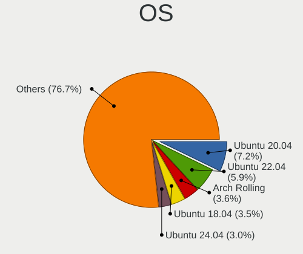

| Name                         | Computers | Percent |
|------------------------------|-----------|---------|
| Ubuntu 20.04                 | 283       | 7.24%   |
| Ubuntu 22.04                 | 232       | 5.93%   |
| Arch Rolling                 | 142       | 3.63%   |
| Ubuntu 18.04                 | 135       | 3.45%   |
| Ubuntu 24.04                 | 118       | 3.02%   |
| Pop!_OS 22.04                | 108       | 2.76%   |
| Debian 12                    | 108       | 2.76%   |
| Manjaro                      | 61        | 1.56%   |
| Debian 11                    | 60        | 1.53%   |
| ArcoLinux Rolling            | 60        | 1.53%   |
| Fedora 42                    | 53        | 1.36%   |
| Zorin 16                     | 48        | 1.23%   |
| Pop!_OS 21.04                | 48        | 1.23%   |
| Linux Mint 22.1              | 48        | 1.23%   |
| openSUSE Tumbleweed-XXXXXXXX | 46        | 1.18%   |
| Fedora 40                    | 45        | 1.15%   |
| EndeavourOS Rolling          | 42        | 1.07%   |
| OpenMandriva 4.3             | 41        | 1.05%   |
| Arch                         | 40        | 1.02%   |
| OpenMandriva 4.2             | 39        | 1%      |
| KDE neon 20.04               | 38        | 0.97%   |
| Zorin 17                     | 36        | 0.92%   |
| Linux Mint 21.1              | 35        | 0.9%    |
| Fedora 41                    | 35        | 0.9%    |
| Ubuntu 23.10                 | 34        | 0.87%   |
| OpenMandriva 24.12           | 34        | 0.87%   |
| Linux Mint 20.3              | 33        | 0.84%   |
| OpenMandriva 25.90           | 32        | 0.82%   |
| Fedora 39                    | 32        | 0.82%   |
| Pop!_OS 20.04                | 31        | 0.79%   |
| Fedora 38                    | 30        | 0.77%   |
| Ubuntu 21.10                 | 29        | 0.74%   |
| Ubuntu 21.04                 | 29        | 0.74%   |
| Pop!_OS 20.10                | 29        | 0.74%   |
| Fedora 37                    | 29        | 0.74%   |
| Fedora 35                    | 29        | 0.74%   |
| Linux Mint 21.3              | 28        | 0.72%   |
| Ubuntu 19.04                 | 27        | 0.69%   |
| OpenMandriva 6.0             | 25        | 0.64%   |
| OpenMandriva 25.06           | 25        | 0.64%   |

OS Family
---------

OS without a version

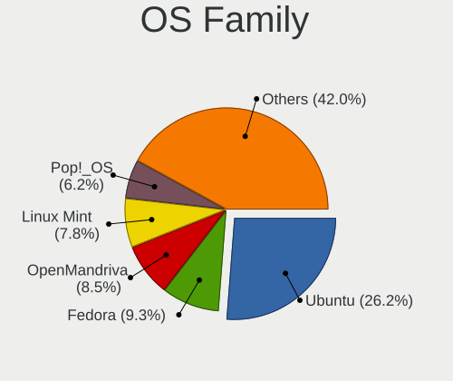

| Name          | Computers | Percent |
|---------------|-----------|---------|
| Ubuntu        | 962       | 26.22%  |
| Fedora        | 340       | 9.27%   |
| OpenMandriva  | 311       | 8.48%   |
| Linux Mint    | 287       | 7.82%   |
| Pop!_OS       | 227       | 6.19%   |
| Debian        | 222       | 6.05%   |
| Arch          | 181       | 4.93%   |
| Manjaro       | 128       | 3.49%   |
| Zorin         | 112       | 3.05%   |
| KDE neon      | 67        | 1.83%   |
| ArcoLinux     | 65        | 1.77%   |
| Kubuntu       | 61        | 1.66%   |
| openSUSE      | 58        | 1.58%   |
| Xubuntu       | 56        | 1.53%   |
| Gentoo        | 48        | 1.31%   |
| Bazzite       | 47        | 1.28%   |
| EndeavourOS   | 46        | 1.25%   |
| Kali          | 41        | 1.12%   |
| Elementary    | 31        | 0.84%   |
| ROSA          | 25        | 0.68%   |
| Nobara        | 25        | 0.68%   |
| NixOS         | 21        | 0.57%   |
| SteamOS       | 20        | 0.55%   |
| Ubuntu MATE   | 18        | 0.49%   |
| LMDE          | 18        | 0.49%   |
| CachyOS       | 16        | 0.44%   |
| MX            | 15        | 0.41%   |
| Garuda Linux  | 15        | 0.41%   |
| Clear Linux   | 14        | 0.38%   |
| CentOS        | 14        | 0.38%   |
| Lubuntu       | 12        | 0.33%   |
| Endless       | 12        | 0.33%   |
| Ubuntu Budgie | 9         | 0.25%   |
| Parrot        | 9         | 0.25%   |
| BunsenLabs    | 9         | 0.25%   |
| Ubuntu Unity  | 8         | 0.22%   |
| Solus         | 6         | 0.16%   |
| Raspbian      | 6         | 0.16%   |
| Peppermint    | 6         | 0.16%   |
| Ubuntu Studio | 5         | 0.14%   |

Kernel
------

Version of the Linux kernel

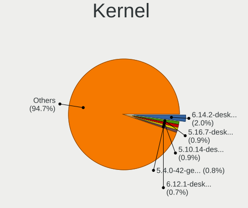

| Version                  | Computers | Percent |
|--------------------------|-----------|---------|
| 6.14.2-desktop-3omv2590  | 86        | 2%      |
| 5.16.7-desktop-1omv4003  | 39        | 0.91%   |
| 5.10.14-desktop-1omv4002 | 39        | 0.91%   |
| 5.4.0-42-generic         | 33        | 0.77%   |
| 6.12.1-desktop-1omv2490  | 29        | 0.67%   |
| 5.15.0-56-generic        | 28        | 0.65%   |
| 6.8.0-51-generic         | 25        | 0.58%   |
| 6.6.2-desktop-1omv2390   | 23        | 0.54%   |
| 5.4.0-58-generic         | 21        | 0.49%   |
| 6.5.0-14-generic         | 20        | 0.47%   |
| 5.4.0-48-generic         | 20        | 0.47%   |
| 5.15.0-52-generic        | 20        | 0.47%   |
| 5.11.0-7620-generic      | 19        | 0.44%   |
| 5.3.0-40-generic         | 17        | 0.4%    |
| 5.13.0-7614-generic      | 17        | 0.4%    |
| 6.14.0-33-generic        | 16        | 0.37%   |
| 5.4.0-52-generic         | 16        | 0.37%   |
| 6.8.0-52-generic         | 15        | 0.35%   |
| 6.8.0-45-generic         | 15        | 0.35%   |
| 5.15.0-91-generic        | 15        | 0.35%   |
| 5.15.0-46-generic        | 15        | 0.35%   |
| 5.13.0-30-generic        | 15        | 0.35%   |
| 6.9.3-76060903-generic   | 14        | 0.33%   |
| 6.4.11-desktop-1omv2390  | 14        | 0.33%   |
| 6.2.6-desktop-1omv2390   | 14        | 0.33%   |
| 6.12.9-desktop-1omv2490  | 14        | 0.33%   |
| 5.4.0-40-generic         | 14        | 0.33%   |
| 5.15.0-58-generic        | 14        | 0.33%   |
| 5.13.0-39-generic        | 14        | 0.33%   |
| 6.8.0-31-generic         | 13        | 0.3%    |
| 6.2.6-76060206-generic   | 13        | 0.3%    |
| 6.1.0-18-amd64           | 13        | 0.3%    |
| 5.4.0-7634-generic       | 13        | 0.3%    |
| 5.15.0-78-generic        | 13        | 0.3%    |
| 5.15.0-60-generic        | 13        | 0.3%    |
| 5.15.0-48-generic        | 13        | 0.3%    |
| 6.8.0-49-generic         | 12        | 0.28%   |
| 6.5.0-35-generic         | 12        | 0.28%   |
| 6.5.0-28-generic         | 12        | 0.28%   |
| 6.5.0-26-generic         | 12        | 0.28%   |

Kernel Family
-------------

Linux kernel without a distro release

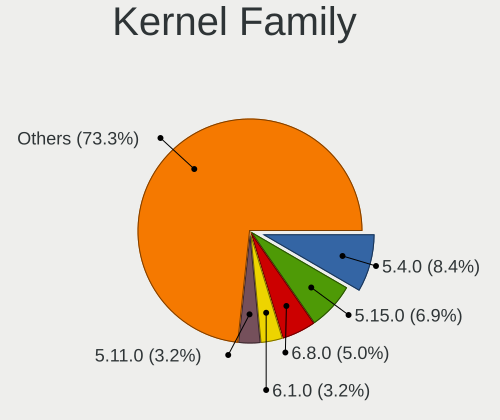

| Version | Computers | Percent |
|---------|-----------|---------|
| 5.4.0   | 345       | 8.39%   |
| 5.15.0  | 285       | 6.93%   |
| 6.8.0   | 204       | 4.96%   |
| 6.1.0   | 132       | 3.21%   |
| 5.11.0  | 131       | 3.19%   |
| 6.5.0   | 125       | 3.04%   |
| 5.13.0  | 121       | 2.94%   |
| 5.8.0   | 97        | 2.36%   |
| 6.14.2  | 89        | 2.16%   |
| 4.15.0  | 86        | 2.09%   |
| 6.14.0  | 84        | 2.04%   |
| 5.10.0  | 81        | 1.97%   |
| 5.3.0   | 76        | 1.85%   |
| 5.19.0  | 75        | 1.82%   |
| 6.2.0   | 74        | 1.8%    |
| 5.0.0   | 59        | 1.44%   |
| 6.11.0  | 58        | 1.41%   |
| 4.18.0  | 47        | 1.14%   |
| 5.16.7  | 40        | 0.97%   |
| 5.10.14 | 40        | 0.97%   |
| 6.12.1  | 39        | 0.95%   |
| 6.2.6   | 28        | 0.68%   |
| 6.6.2   | 25        | 0.61%   |
| 6.9.3   | 20        | 0.49%   |
| 6.12.10 | 19        | 0.46%   |
| 6.12.9  | 18        | 0.44%   |
| 5.14.0  | 18        | 0.44%   |
| 6.5.6   | 17        | 0.41%   |
| 6.4.11  | 17        | 0.41%   |
| 6.17.9  | 17        | 0.41%   |
| 6.17.7  | 17        | 0.41%   |
| 6.13.5  | 15        | 0.36%   |
| 6.15.9  | 13        | 0.32%   |
| 6.15.0  | 13        | 0.32%   |
| 6.10.0  | 13        | 0.32%   |
| 5.17.5  | 13        | 0.32%   |
| 6.6.10  | 12        | 0.29%   |
| 6.4.0   | 12        | 0.29%   |
| 6.15.6  | 12        | 0.29%   |
| 6.12.6  | 12        | 0.29%   |

Kernel Major Ver.
-----------------

Linux kernel major version

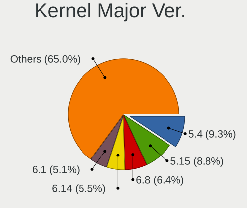

| Version | Computers | Percent |
|---------|-----------|---------|
| 5.4     | 375       | 9.31%   |
| 5.15    | 354       | 8.79%   |
| 6.8     | 258       | 6.4%    |
| 6.14    | 220       | 5.46%   |
| 6.1     | 205       | 5.09%   |
| 6.5     | 175       | 4.34%   |
| 5.10    | 169       | 4.19%   |
| 5.11    | 160       | 3.97%   |
| 6.12    | 153       | 3.8%    |
| 5.13    | 141       | 3.5%    |
| 5.8     | 134       | 3.33%   |
| 6.2     | 133       | 3.3%    |
| 6.6     | 112       | 2.78%   |
| 6.11    | 99        | 2.46%   |
| 5.19    | 93        | 2.31%   |
| 5.3     | 88        | 2.18%   |
| 4.15    | 86        | 2.13%   |
| 5.16    | 81        | 2.01%   |
| 6.17    | 75        | 1.86%   |
| 6.4     | 62        | 1.54%   |
| 5.0     | 62        | 1.54%   |
| 6.15    | 60        | 1.49%   |
| 6.10    | 56        | 1.39%   |
| 4.18    | 54        | 1.34%   |
| 6.9     | 53        | 1.32%   |
| 6.13    | 48        | 1.19%   |
| 5.17    | 48        | 1.19%   |
| 6.0     | 46        | 1.14%   |
| 6.7     | 45        | 1.12%   |
| 6.16    | 45        | 1.12%   |
| 6.3     | 42        | 1.04%   |
| 5.14    | 41        | 1.02%   |
| 5.18    | 37        | 0.92%   |
| 5.12    | 36        | 0.89%   |
| 5.9     | 33        | 0.82%   |
| 5.6     | 28        | 0.69%   |
| 5.7     | 24        | 0.6%    |
| 4.19    | 24        | 0.6%    |
| 4.9     | 16        | 0.4%    |
| 5.5     | 15        | 0.37%   |

Arch
----

OS architecture (x86_64, i586, etc.)

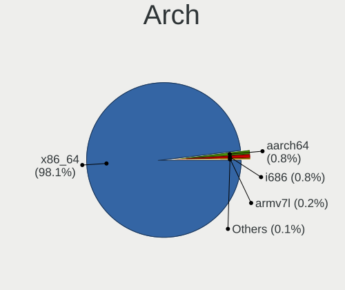

| Name    | Computers | Percent |
|---------|-----------|---------|
| x86_64  | 3437      | 98.09%  |
| aarch64 | 29        | 0.83%   |
| i686    | 27        | 0.77%   |
| armv7l  | 8         | 0.23%   |
| ppc     | 1         | 0.03%   |
| i586    | 1         | 0.03%   |
| armv8l  | 1         | 0.03%   |

DE
--

Desktop Environment

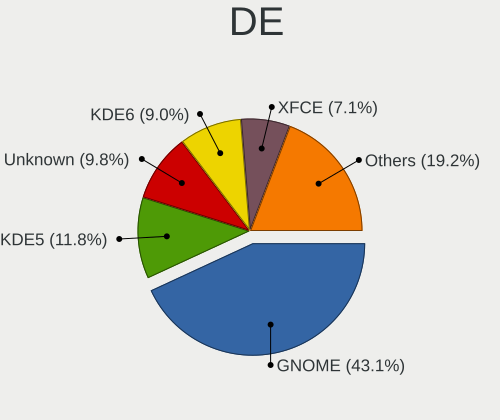

| Name            | Computers | Percent |
|-----------------|-----------|---------|
| GNOME           | 1605      | 43.1%   |
| KDE5            | 438       | 11.76%  |
| Unknown         | 365       | 9.8%    |
| KDE6            | 337       | 9.05%   |
| XFCE            | 263       | 7.06%   |
| X-Cinnamon      | 263       | 7.06%   |
| KDE             | 89        | 2.39%   |
| MATE            | 63        | 1.69%   |
| LXQt            | 35        | 0.94%   |
| i3              | 33        | 0.89%   |
| Pantheon        | 31        | 0.83%   |
| Hyprland        | 26        | 0.7%    |
| Cinnamon        | 21        | 0.56%   |
| KDE4            | 20        | 0.54%   |
| Budgie          | 17        | 0.46%   |
| LXDE            | 16        | 0.43%   |
| GNOME Flashback | 12        | 0.32%   |
| sway            | 10        | 0.27%   |
| COSMIC          | 10        | 0.27%   |
| Unity           | 9         | 0.24%   |
| Deepin          | 8         | 0.21%   |
| GNOME Classic   | 7         | 0.19%   |
| awesome         | 7         | 0.19%   |
| BunsenLabs      | 6         | 0.16%   |
| Openbox         | 4         | 0.11%   |
| LeftWM          | 3         | 0.08%   |
| DWM             | 3         | 0.08%   |
| xmonad          | 2         | 0.05%   |
| qtile           | 2         | 0.05%   |
| none+i3         | 2         | 0.05%   |
| Endless:GNOME   | 2         | 0.05%   |
| Unicorn:XFCE    | 1         | 0.03%   |
| Trinity         | 1         | 0.03%   |
| sway:wlroots    | 1         | 0.03%   |
| start-hyprland  | 1         | 0.03%   |
| spectrwm        | 1         | 0.03%   |
| river:wlroots   | 1         | 0.03%   |
| river           | 1         | 0.03%   |
| none+xmonad     | 1         | 0.03%   |
| none+awesome    | 1         | 0.03%   |

Display Server
--------------

X11 or Wayland

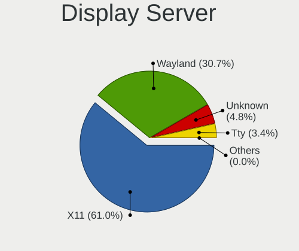

| Name        | Computers | Percent |
|-------------|-----------|---------|
| X11         | 2213      | 60.96%  |
| Wayland     | 1115      | 30.72%  |
| Unknown     | 175       | 4.82%   |
| Tty         | 125       | 3.44%   |
| Web         | 1         | 0.03%   |
| Unspecified | 1         | 0.03%   |

Display Manager
---------------

SDDM, LightDM, etc.

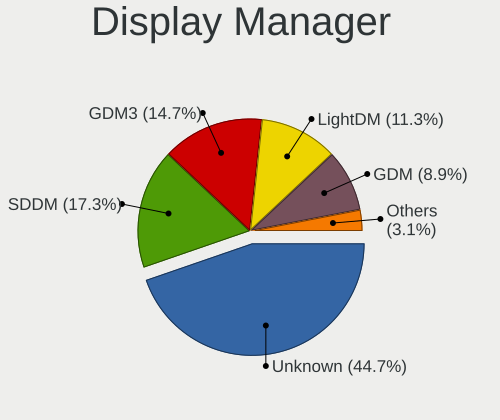

| Name           | Computers | Percent |
|----------------|-----------|---------|
| Unknown        | 1641      | 44.71%  |
| SDDM           | 635       | 17.3%   |
| GDM3           | 539       | 14.69%  |
| LightDM        | 415       | 11.31%  |
| GDM            | 328       | 8.94%   |
| TDM            | 63        | 1.72%   |
| KDM            | 11        | 0.3%    |
| GREETD         | 10        | 0.27%   |
| LXDM           | 8         | 0.22%   |
| XDM            | 7         | 0.19%   |
| Ly             | 6         | 0.16%   |
| LY-DM          | 3         | 0.08%   |
| WDM            | 2         | 0.05%   |
| SLiM           | 1         | 0.03%   |
| COSMIC-GREETER | 1         | 0.03%   |

OS Lang
-------

Language

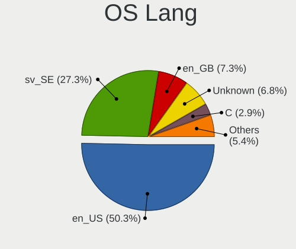

| Lang        | Computers | Percent |
|-------------|-----------|---------|
| en_US       | 1817      | 50.33%  |
| sv_SE       | 984       | 27.26%  |
| en_GB       | 264       | 7.31%   |
| Unknown     | 247       | 6.84%   |
| C           | 103       | 2.85%   |
| de_DE       | 30        | 0.83%   |
| ru_RU       | 29        | 0.8%    |
| pl_PL       | 15        | 0.42%   |
| en_DK       | 14        | 0.39%   |
| en_SE       | 11        | 0.3%    |
| en_CA       | 7         | 0.19%   |
| fi_FI       | 6         | 0.17%   |
| en_IE       | 6         | 0.17%   |
| C.UTF8      | 6         | 0.17%   |
| nb_NO       | 5         | 0.14%   |
| it_IT       | 5         | 0.14%   |
| fr_FR       | 5         | 0.14%   |
| el_GR       | 5         | 0.14%   |
| uk_UA       | 4         | 0.11%   |
| POSIX       | 4         | 0.11%   |
| en_AG       | 4         | 0.11%   |
| es_ES       | 3         | 0.08%   |
| en_AU       | 3         | 0.08%   |
| bg_BG       | 3         | 0.08%   |
| zh_CN       | 2         | 0.06%   |
| UTF-8       | 2         | 0.06%   |
| sv_FI       | 2         | 0.06%   |
| lt_LT       | 2         | 0.06%   |
| hu_HU       | 2         | 0.06%   |
| en_US.UTf-8 | 2         | 0.06%   |
| tr_TR       | 1         | 0.03%   |
| sv_SE.UTF8  | 1         | 0.03%   |
| sma_SE      | 1         | 0.03%   |
| se_SV       | 1         | 0.03%   |
| nn_NO       | 1         | 0.03%   |
| lv_LV       | 1         | 0.03%   |
| ja_JP       | 1         | 0.03%   |
| hr_HR       | 1         | 0.03%   |
| gl_ES       | 1         | 0.03%   |
| es_VE       | 1         | 0.03%   |

Boot Mode
---------

EFI or BIOS

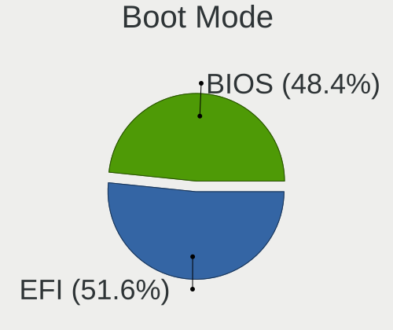

| Mode | Computers | Percent |
|------|-----------|---------|
| EFI  | 1861      | 51.62%  |
| BIOS | 1744      | 48.38%  |

Filesystem
----------

Type of filesystem

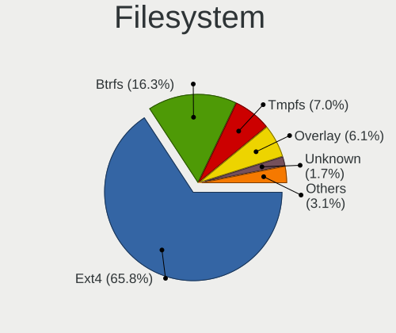

| Type     | Computers | Percent |
|----------|-----------|---------|
| Ext4     | 2393      | 65.76%  |
| Btrfs    | 594       | 16.32%  |
| Tmpfs    | 254       | 6.98%   |
| Overlay  | 222       | 6.1%    |
| Unknown  | 63        | 1.73%   |
| Xfs      | 60        | 1.65%   |
| Zfs      | 30        | 0.82%   |
| Ext2     | 8         | 0.22%   |
| F2fs     | 7         | 0.19%   |
| Ext3     | 3         | 0.08%   |
| XXXXXXX  | 1         | 0.03%   |
| Rootfs   | 1         | 0.03%   |
| Reiserfs | 1         | 0.03%   |
| Nfs4     | 1         | 0.03%   |
| Bcachefs | 1         | 0.03%   |

Part. scheme
------------

Scheme of partitioning

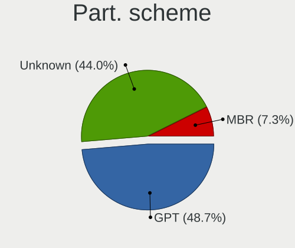

| Type    | Computers | Percent |
|---------|-----------|---------|
| GPT     | 1762      | 48.66%  |
| Unknown | 1593      | 43.99%  |
| MBR     | 266       | 7.35%   |

Dual Boot with Linux/BSD
------------------------

Hosting more than one Linux/BSD

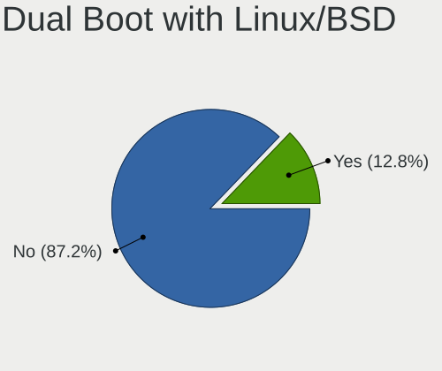

| Dual boot | Computers | Percent |
|-----------|-----------|---------|
| No        | 3121      | 87.18%  |
| Yes       | 459       | 12.82%  |

Dual Boot (Win)
---------------

Hosting Linux and Windows

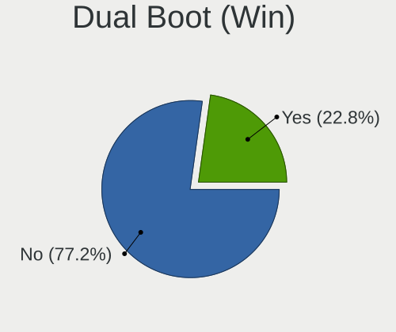

| Dual boot | Computers | Percent |
|-----------|-----------|---------|
| No        | 2752      | 77.19%  |
| Yes       | 813       | 22.81%  |

Board
-----

Vendor
------

Motherboard manufacturer

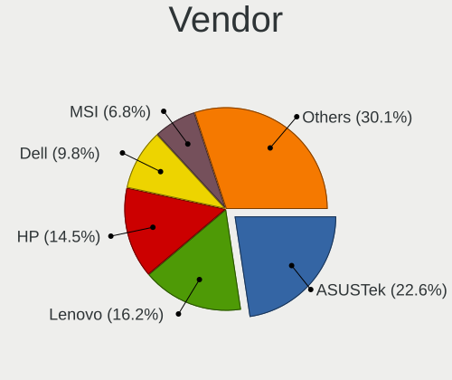

| Name                                 | Computers | Percent |
|--------------------------------------|-----------|---------|
| ASUSTek Computer                     | 793       | 22.63%  |
| Lenovo                               | 568       | 16.21%  |
| Hewlett-Packard                      | 509       | 14.53%  |
| Dell                                 | 342       | 9.76%   |
| MSI                                  | 239       | 6.82%   |
| Gigabyte Technology                  | 208       | 5.94%   |
| Acer                                 | 169       | 4.82%   |
| Apple                                | 132       | 3.77%   |
| ASRock                               | 83        | 2.37%   |
| Intel                                | 37        | 1.06%   |
| Fujitsu                              | 26        | 0.74%   |
| Unknown                              | 24        | 0.68%   |
| Raspberry Pi Foundation              | 23        | 0.66%   |
| Toshiba                              | 22        | 0.63%   |
| Packard Bell                         | 19        | 0.54%   |
| Sony                                 | 18        | 0.51%   |
| Google                               | 18        | 0.51%   |
| Valve                                | 17        | 0.49%   |
| Samsung Electronics                  | 17        | 0.49%   |
| Microsoft                            | 17        | 0.49%   |
| Supermicro                           | 13        | 0.37%   |
| Notebook                             | 12        | 0.34%   |
| Fujitsu Siemens                      | 10        | 0.29%   |
| Foxconn                              | 10        | 0.29%   |
| HUAWEI                               | 9         | 0.26%   |
| TUXEDO                               | 7         | 0.2%    |
| SLIMBOOK                             | 7         | 0.2%    |
| Shenzhen Meigao Electronic Equipment | 7         | 0.2%    |
| Pegatron                             | 6         | 0.17%   |
| AMI                                  | 5         | 0.14%   |
| AAEON                                | 5         | 0.14%   |
| Maxtang                              | 4         | 0.11%   |
| eMachines                            | 4         | 0.11%   |
| Clevo                                | 4         | 0.11%   |
| Alienware                            | 4         | 0.11%   |
| System76                             | 3         | 0.09%   |
| Star Labs                            | 3         | 0.09%   |
| Panasonic                            | 3         | 0.09%   |
| OEM                                  | 3         | 0.09%   |
| Medion                               | 3         | 0.09%   |

Model
-----

Motherboard model

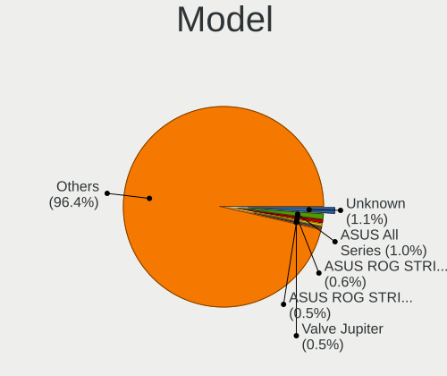

| Name                             | Computers | Percent |
|----------------------------------|-----------|---------|
| Unknown                          | 37        | 1.06%   |
| ASUS All Series                  | 35        | 1%      |
| ASUS ROG STRIX B550-F GAMING     | 21        | 0.6%    |
| ASUS ROG STRIX B450-F GAMING     | 17        | 0.49%   |
| Valve Jupiter                    | 16        | 0.46%   |
| MSI MS-7C37                      | 15        | 0.43%   |
| ASUS ROG STRIX X570-F GAMING     | 15        | 0.43%   |
| ASUS ROG STRIX Z390-F GAMING     | 13        | 0.37%   |
| ASUS PRIME X470-PRO              | 12        | 0.34%   |
| HP EliteBook 840 G3              | 9         | 0.26%   |
| Dell XPS 13 9370                 | 9         | 0.26%   |
| Dell XPS 13 9310                 | 9         | 0.26%   |
| ASUS Z170 PRO GAMING             | 9         | 0.26%   |
| ASUS TUF Gaming X570-PLUS        | 9         | 0.26%   |
| ASUS TUF Gaming B650-PLUS WIFI   | 9         | 0.26%   |
| MSI MS-7C02                      | 8         | 0.23%   |
| ASUS ROG STRIX B550-I GAMING     | 8         | 0.23%   |
| Apple MacBookAir7,2              | 8         | 0.23%   |
| Apple MacBookAir6,2              | 8         | 0.23%   |
| MSI MS-7C56                      | 7         | 0.2%    |
| Gigabyte B550 AORUS ELITE V2     | 7         | 0.2%    |
| Dell Precision 5540              | 7         | 0.2%    |
| ASUS Vivobook Go E1504FA_E1504FA | 7         | 0.2%    |
| Apple MacBookPro9,2              | 7         | 0.2%    |
| MSI MS-7C52                      | 6         | 0.17%   |
| MSI MS-7817                      | 6         | 0.17%   |
| Lenovo Yoga C740-14IML 81TC      | 6         | 0.17%   |
| Lenovo IdeaPad 5 Pro 16ACH6 82L5 | 6         | 0.17%   |
| HP Pavilion Notebook             | 6         | 0.17%   |
| HP Pavilion dv7                  | 6         | 0.17%   |
| HP Pavilion 15                   | 6         | 0.17%   |
| HP EliteBook Folio 9470m         | 6         | 0.17%   |
| HP EliteBook 840 G2              | 6         | 0.17%   |
| Gigabyte B450M DS3H              | 6         | 0.17%   |
| Dell XPS 15 9500                 | 6         | 0.17%   |
| Dell OptiPlex 3020               | 6         | 0.17%   |
| Dell Latitude E7240              | 6         | 0.17%   |
| Dell Latitude 7490               | 6         | 0.17%   |
| ASUS ROG STRIX B350-F GAMING     | 6         | 0.17%   |
| ASUS PRIME Z370-P                | 6         | 0.17%   |

Model Family
------------

Motherboard model prefix

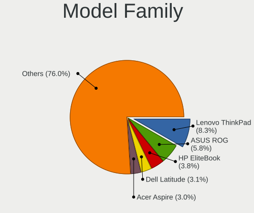

| Name                  | Computers | Percent |
|-----------------------|-----------|---------|
| Lenovo ThinkPad       | 291       | 8.3%    |
| ASUS ROG              | 202       | 5.76%   |
| HP EliteBook          | 134       | 3.82%   |
| Dell Latitude         | 109       | 3.11%   |
| Acer Aspire           | 104       | 2.97%   |
| ASUS PRIME            | 93        | 2.65%   |
| Lenovo IdeaPad        | 82        | 2.34%   |
| Dell Precision        | 73        | 2.08%   |
| Dell XPS              | 66        | 1.88%   |
| HP Pavilion           | 63        | 1.8%    |
| HP ProBook            | 61        | 1.74%   |
| ASUS TUF              | 60        | 1.71%   |
| Lenovo Yoga           | 51        | 1.46%   |
| Dell OptiPlex         | 49        | 1.4%    |
| ASUS Vivobook         | 46        | 1.31%   |
| HP ZBook              | 43        | 1.23%   |
| Unknown               | 37        | 1.06%   |
| HP Compaq             | 36        | 1.03%   |
| ASUS All              | 35        | 1%      |
| Lenovo Legion         | 31        | 0.88%   |
| HP Laptop             | 28        | 0.8%    |
| HP ENVY               | 26        | 0.74%   |
| Acer Swift            | 24        | 0.68%   |
| RPi Raspberry         | 23        | 0.66%   |
| Lenovo ThinkCentre    | 23        | 0.66%   |
| HP EliteDesk          | 23        | 0.66%   |
| ASUS Zenbook          | 21        | 0.6%    |
| Dell Inspiron         | 20        | 0.57%   |
| ASUS ASUS             | 20        | 0.57%   |
| Toshiba Satellite     | 19        | 0.54%   |
| Gigabyte X570         | 19        | 0.54%   |
| Microsoft Surface     | 17        | 0.49%   |
| Valve Jupiter         | 16        | 0.46%   |
| MSI MS-7C37           | 15        | 0.43%   |
| Dell Vostro           | 15        | 0.43%   |
| Apple MacBookPro11    | 13        | 0.37%   |
| Acer Predator         | 13        | 0.37%   |
| Acer Nitro            | 13        | 0.37%   |
| Packard Bell EasyNote | 12        | 0.34%   |
| ASUS STRIX            | 12        | 0.34%   |

MFG Year
--------

Motherboard manufacture year

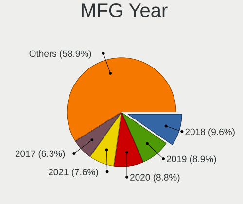

| Year    | Computers | Percent |
|---------|-----------|---------|
| 2018    | 337       | 9.62%   |
| 2019    | 311       | 8.88%   |
| 2020    | 307       | 8.76%   |
| 2021    | 265       | 7.56%   |
| 2017    | 221       | 6.31%   |
| 2013    | 218       | 6.22%   |
| 2012    | 215       | 6.14%   |
| 2011    | 204       | 5.82%   |
| 2014    | 201       | 5.74%   |
| 2022    | 197       | 5.62%   |
| 2016    | 188       | 5.37%   |
| 2015    | 176       | 5.02%   |
| 2010    | 132       | 3.77%   |
| 2023    | 126       | 3.6%    |
| 2024    | 94        | 2.68%   |
| 2008    | 89        | 2.54%   |
| 2009    | 83        | 2.37%   |
| 2007    | 48        | 1.37%   |
| 2025    | 31        | 0.88%   |
| Unknown | 29        | 0.83%   |
| 2006    | 21        | 0.6%    |
| 2005    | 8         | 0.23%   |
| 2004    | 2         | 0.06%   |
| 2002    | 1         | 0.03%   |

Form Factor
-----------

Physical design of the computer

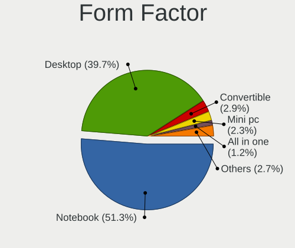

| Name           | Computers | Percent |
|----------------|-----------|---------|
| Notebook       | 1797      | 51.28%  |
| Desktop        | 1390      | 39.67%  |
| Convertible    | 101       | 2.88%   |
| Mini pc        | 79        | 2.25%   |
| All in one     | 42        | 1.2%    |
| Tablet         | 39        | 1.11%   |
| System on chip | 31        | 0.88%   |
| Server         | 20        | 0.57%   |
| Phone          | 4         | 0.11%   |
| Other          | 1         | 0.03%   |

Secure Boot
-----------

Enabled or disabled

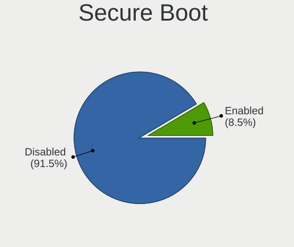

| State    | Computers | Percent |
|----------|-----------|---------|
| Disabled | 3227      | 91.49%  |
| Enabled  | 300       | 8.51%   |

Coreboot
--------

Have coreboot on board

| Used | Computers | Percent |
|------|-----------|---------|
| No   | 3479      | 99.29%  |
| Yes  | 25        | 0.71%   |

RAM Size
--------

Total RAM memory

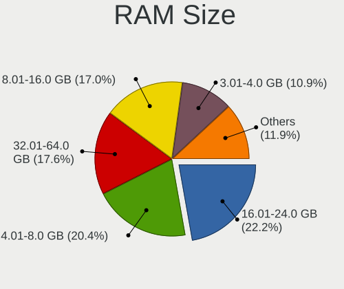

| Size in GB      | Computers | Percent |
|-----------------|-----------|---------|
| 16.01-24.0      | 791       | 22.21%  |
| 4.01-8.0        | 725       | 20.35%  |
| 32.01-64.0      | 626       | 17.57%  |
| 8.01-16.0       | 607       | 17.04%  |
| 3.01-4.0        | 389       | 10.92%  |
| 64.01-256.0     | 176       | 4.94%   |
| 24.01-32.0      | 127       | 3.57%   |
| 1.01-2.0        | 73        | 2.05%   |
| 2.01-3.0        | 20        | 0.56%   |
| 0.51-1.0        | 20        | 0.56%   |
| More than 256.0 | 6         | 0.17%   |
| 0.01-0.5        | 2         | 0.06%   |

RAM Used
--------

Used RAM memory

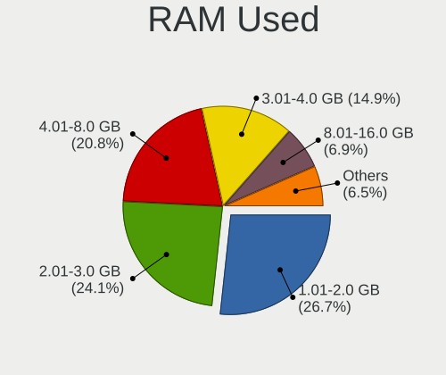

| Used GB     | Computers | Percent |
|-------------|-----------|---------|
| 1.01-2.0    | 1040      | 26.71%  |
| 2.01-3.0    | 938       | 24.09%  |
| 4.01-8.0    | 809       | 20.78%  |
| 3.01-4.0    | 582       | 14.95%  |
| 8.01-16.0   | 270       | 6.93%   |
| 0.51-1.0    | 144       | 3.7%    |
| 16.01-24.0  | 52        | 1.34%   |
| 0.01-0.5    | 36        | 0.92%   |
| 24.01-32.0  | 12        | 0.31%   |
| 32.01-64.0  | 7         | 0.18%   |
| 64.01-256.0 | 3         | 0.08%   |
| Unknown     | 1         | 0.03%   |

Total Drives
------------

Number of drives on board

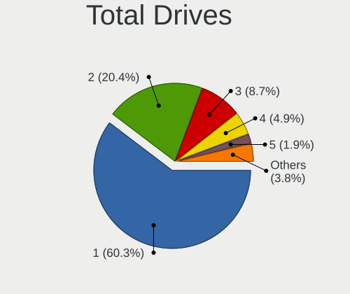

| Drives | Computers | Percent |
|--------|-----------|---------|
| 1      | 2187      | 60.33%  |
| 2      | 738       | 20.36%  |
| 3      | 316       | 8.72%   |
| 4      | 176       | 4.86%   |
| 5      | 70        | 1.93%   |
| 6      | 56        | 1.54%   |
| 0      | 35        | 0.97%   |
| 7      | 28        | 0.77%   |
| 8      | 9         | 0.25%   |
| 9      | 4         | 0.11%   |
| 10     | 3         | 0.08%   |
| 26     | 1         | 0.03%   |
| 12     | 1         | 0.03%   |
| 11     | 1         | 0.03%   |

Has CD-ROM
----------

Has CD-ROM on board

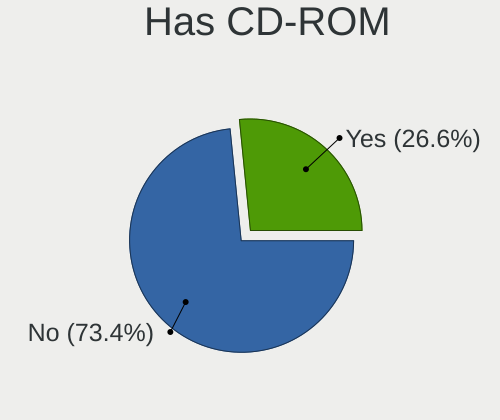

| Presented | Computers | Percent |
|-----------|-----------|---------|
| No        | 2589      | 73.43%  |
| Yes       | 937       | 26.57%  |

Has Ethernet
------------

Has Ethernet on board

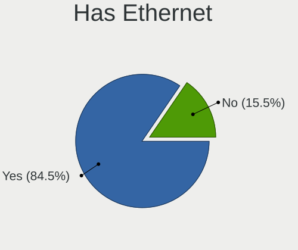

| Presented | Computers | Percent |
|-----------|-----------|---------|
| Yes       | 2969      | 84.54%  |
| No        | 543       | 15.46%  |

Has WiFi
--------

Has WiFi module

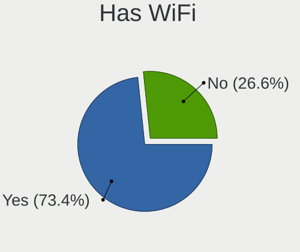

| Presented | Computers | Percent |
|-----------|-----------|---------|
| Yes       | 2594      | 73.36%  |
| No        | 942       | 26.64%  |

Has Bluetooth
-------------

Has Bluetooth module

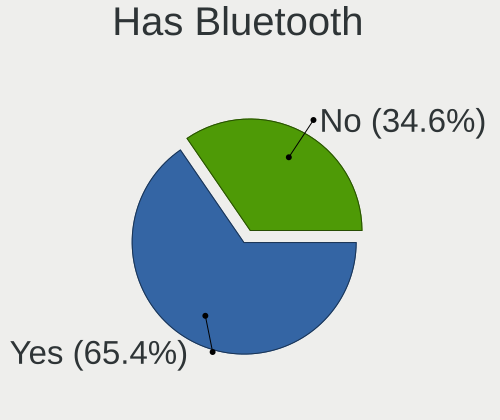

| Presented | Computers | Percent |
|-----------|-----------|---------|
| Yes       | 2324      | 65.43%  |
| No        | 1228      | 34.57%  |

Location
--------

Country
-------

Geographic location (country)

| Country | Computers | Percent |
|---------|-----------|---------|
| Sweden  | 3504      | 100%    |

City
----

Geographic location (city)

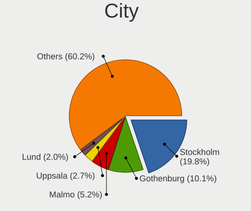

| City                    | Computers | Percent |
|-------------------------|-----------|---------|
| Stockholm               | 755       | 19.84%  |
| Gothenburg              | 384       | 10.09%  |
| Malmo                   | 197       | 5.18%   |
| Uppsala                 | 101       | 2.65%   |
| Lund                    | 76        | 2%      |
| Västerås              | 68        | 1.79%   |
| Linköping              | 58        | 1.52%   |
| Umeå                   | 50        | 1.31%   |
| Bromma                  | 45        | 1.18%   |
| Örebro                 | 44        | 1.16%   |
| Vaxjo                   | 42        | 1.1%    |
| Sundsvall               | 42        | 1.1%    |
| Karlstad                | 42        | 1.1%    |
| Solna                   | 41        | 1.08%   |
| Sollentuna              | 37        | 0.97%   |
| Norrköping             | 35        | 0.92%   |
| Sundbyberg              | 32        | 0.84%   |
| Gävle                  | 32        | 0.84%   |
| Helsingborg             | 31        | 0.81%   |
| Saltsjoe-Boo            | 26        | 0.68%   |
| Karlskrona              | 26        | 0.68%   |
| Bandhagen               | 23        | 0.6%    |
| Ängelholm              | 23        | 0.6%    |
| Taby                    | 22        | 0.58%   |
| Jönköping             | 22        | 0.58%   |
| Huddinge                | 22        | 0.58%   |
| Halmstad                | 22        | 0.58%   |
| Nyköping               | 20        | 0.53%   |
| Järfälla Municipality | 20        | 0.53%   |
| Vaestra Froelunda       | 19        | 0.5%    |
| Upplands Vasby          | 19        | 0.5%    |
| Södertälje            | 19        | 0.5%    |
| Norsborg                | 19        | 0.5%    |
| Haegersten              | 19        | 0.5%    |
| Skövde                 | 18        | 0.47%   |
| Kista                   | 18        | 0.47%   |
| Borlänge               | 18        | 0.47%   |
| Johanneshov             | 17        | 0.45%   |
| Eskilstuna              | 17        | 0.45%   |
| Borås                  | 17        | 0.45%   |

Drives
------

Drive Vendor
------------

Hard drive vendors

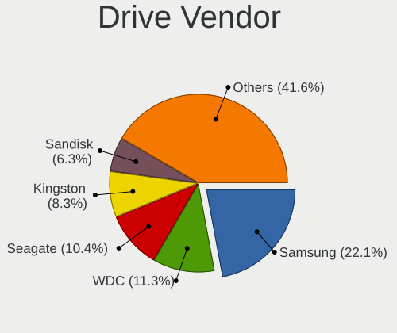

| Vendor                      | Computers | Drives | Percent |
|-----------------------------|-----------|--------|---------|
| Samsung Electronics         | 1154      | 1955   | 22.08%  |
| WDC                         | 590       | 992    | 11.29%  |
| Seagate                     | 545       | 872    | 10.43%  |
| Kingston                    | 436       | 643    | 8.34%   |
| Sandisk                     | 327       | 426    | 6.26%   |
| Intel                       | 261       | 334    | 4.99%   |
| Toshiba                     | 231       | 309    | 4.42%   |
| Unknown                     | 171       | 238    | 3.27%   |
| SK hynix                    | 168       | 188    | 3.21%   |
| Micron Technology           | 144       | 171    | 2.76%   |
| Crucial                     | 133       | 188    | 2.54%   |
| Hitachi                     | 113       | 157    | 2.16%   |
| Kingston Technology Company | 106       | 134    | 2.03%   |
| Apple                       | 78        | 105    | 1.49%   |
| HGST                        | 69        | 82     | 1.32%   |
| Phison Electronics          | 55        | 79     | 1.05%   |
| KIOXIA                      | 49        | 63     | 0.94%   |
| PNY                         | 43        | 57     | 0.82%   |
| Corsair                     | 36        | 49     | 0.69%   |
| LITEON                      | 32        | 44     | 0.61%   |
| A-DATA Technology           | 30        | 31     | 0.57%   |
| Micron/Crucial Technology   | 29        | 37     | 0.55%   |
| OCZ                         | 27        | 33     | 0.52%   |
| Intenso                     | 27        | 36     | 0.52%   |
| Phison                      | 25        | 30     | 0.48%   |
| China                       | 19        | 20     | 0.36%   |
| Transcend                   | 18        | 22     | 0.34%   |
| Silicon Motion              | 16        | 39     | 0.31%   |
| Unknown                     | 16        | 17     | 0.31%   |
| LITEONIT                    | 14        | 24     | 0.27%   |
| Fujitsu                     | 14        | 20     | 0.27%   |
| SPCC                        | 10        | 24     | 0.19%   |
| Maxtor                      | 10        | 10     | 0.19%   |
| Verbatim                    | 9         | 32     | 0.17%   |
| Lenovo                      | 9         | 9      | 0.17%   |
| JMicron Technology          | 9         | 11     | 0.17%   |
| Hewlett-Packard             | 8         | 17     | 0.15%   |
| ASMT                        | 8         | 9      | 0.15%   |
| LaCie                       | 6         | 7      | 0.11%   |
| KIOXIA-EXCERIA              | 6         | 7      | 0.11%   |

Drive Model
-----------

Hard drive models

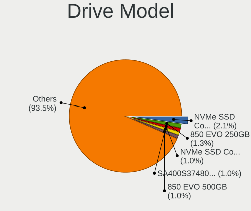

| Model                                                | Computers | Percent |
|------------------------------------------------------|-----------|---------|
| Samsung NVMe SSD Controller SM981/PM981/PM983 1TB    | 128       | 2.14%   |
| Samsung SSD 850 EVO 250GB                            | 77        | 1.29%   |
| Samsung NVMe SSD Controller PM9A1/PM9A3/980PRO 1TB   | 62        | 1.04%   |
| Kingston SA400S37480G 480GB SSD                      | 62        | 1.04%   |
| Samsung SSD 850 EVO 500GB                            | 60        | 1%      |
| Kingston SA400S37240G 240GB SSD                      | 47        | 0.79%   |
| Kingston SA400S37120G 120GB SSD                      | 46        | 0.77%   |
| Samsung NVMe SSD Controller SM961/PM961/SM963 1024GB | 43        | 0.72%   |
| Samsung SSD 860 EVO 500GB                            | 40        | 0.67%   |
| Kingston SV300S37A120G 120GB SSD                     | 39        | 0.65%   |
| Seagate ST4000DM004-2CV104 4TB                       | 33        | 0.55%   |
| Sandisk WD Black SN750 / PC SN730 NVMe SSD 500GB     | 33        | 0.55%   |
| Samsung SSD 860 EVO 1TB                              | 32        | 0.54%   |
| Samsung SSD 840 EVO 250GB                            | 31        | 0.52%   |
| Kingston Company A2000 NVMe SSD 250GB                | 31        | 0.52%   |
| Sandisk WD Blue SN550 NVMe SSD 1024GB                | 30        | 0.5%    |
| Samsung SSD 860 EVO 250GB                            | 30        | 0.5%    |
| Seagate ST1000DM010-2EP102 1TB                       | 28        | 0.47%   |
| Samsung NVMe SSD Drive 500GB                         | 25        | 0.42%   |
| SanDisk NVMe SSD Drive 1TB                           | 24        | 0.4%    |
| Unknown MMC Card  32GB                               | 23        | 0.38%   |
| Samsung SSD 970 EVO Plus 500GB                       | 22        | 0.37%   |
| Kingston SFYRD2000G 2TB                              | 22        | 0.37%   |
| Seagate ST500DM002-1BD142 500GB                      | 20        | 0.33%   |
| Samsung NVMe SSD Drive 512GB                         | 20        | 0.33%   |
| Kingston Company SNV2S1000G 1TB                      | 20        | 0.33%   |
| WDC WD30EFRX-68EUZN0 3TB                             | 19        | 0.32%   |
| Seagate ST2000DM008-2FR102 2TB                       | 19        | 0.32%   |
| Seagate ST1000LM024 HN-M101MBB 1TB                   | 19        | 0.32%   |
| WDC WDS500G2B0A-00SM50 500GB                         | 18        | 0.3%    |
| Samsung SSD 870 QVO 1TB                              | 18        | 0.3%    |
| Samsung SSD 840 EVO 500GB                            | 18        | 0.3%    |
| HGST HTS721010A9E630 1TB                             | 18        | 0.3%    |
| Unknown SD/MMC/MS PRO 2GB                            | 17        | 0.28%   |
| Unknown MMC Card  64GB                               | 17        | 0.28%   |
| Unknown MMC Card  128GB                              | 17        | 0.28%   |
| Seagate Expansion 2TB                                | 17        | 0.28%   |
| Samsung SSD 870 EVO 500GB                            | 17        | 0.28%   |
| Samsung SSD 840 EVO 120GB                            | 17        | 0.28%   |
| WDC WDS240G2G0A-00JH30 240GB SSD                     | 16        | 0.27%   |

HDD Vendor
----------

Hard disk drive vendors

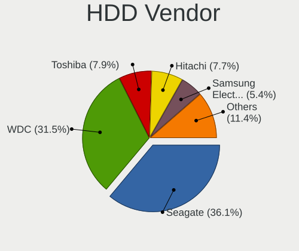

| Vendor              | Computers | Drives | Percent |
|---------------------|-----------|--------|---------|
| Seagate             | 532       | 845    | 36.09%  |
| WDC                 | 464       | 793    | 31.48%  |
| Toshiba             | 117       | 166    | 7.94%   |
| Hitachi             | 113       | 157    | 7.67%   |
| Samsung Electronics | 80        | 126    | 5.43%   |
| HGST                | 69        | 82     | 4.68%   |
| Apple               | 19        | 20     | 1.29%   |
| Unknown             | 18        | 21     | 1.22%   |
| Fujitsu             | 14        | 20     | 0.95%   |
| Maxtor              | 9         | 9      | 0.61%   |
| Intenso             | 7         | 10     | 0.47%   |
| Hewlett-Packard     | 6         | 15     | 0.41%   |
| JMicron Technology  | 5         | 7      | 0.34%   |
| ASMT                | 4         | 5      | 0.27%   |
| ASMedia             | 3         | 3      | 0.2%    |
| Unknown             | 2         | 2      | 0.14%   |
| USB3.0              | 1         | 1      | 0.07%   |
| TO Exter            | 1         | 1      | 0.07%   |
| Synology            | 1         | 1      | 0.07%   |
| StoreJet            | 1         | 1      | 0.07%   |
| Shenzhen            | 1         | 1      | 0.07%   |
| SATAFIRM            | 1         | 1      | 0.07%   |
| Min Yi U            | 1         | 1      | 0.07%   |
| MARVELL             | 1         | 1      | 0.07%   |
| LaCie               | 1         | 1      | 0.07%   |
| IB                  | 1         | 2      | 0.07%   |
| HGST HTS            | 1         | 1      | 0.07%   |
| Apricorn            | 1         | 1      | 0.07%   |

SSD Vendor
----------

Solid state drive vendors

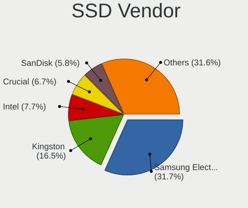

| Vendor              | Computers | Drives | Percent |
|---------------------|-----------|--------|---------|
| Samsung Electronics | 586       | 940    | 31.73%  |
| Kingston            | 304       | 434    | 16.46%  |
| Intel               | 142       | 180    | 7.69%   |
| Crucial             | 123       | 171    | 6.66%   |
| SanDisk             | 108       | 139    | 5.85%   |
| WDC                 | 85        | 127    | 4.6%    |
| Micron Technology   | 66        | 81     | 3.57%   |
| Apple               | 52        | 62     | 2.82%   |
| PNY                 | 38        | 52     | 2.06%   |
| SK hynix            | 35        | 40     | 1.89%   |
| Toshiba             | 34        | 45     | 1.84%   |
| LITEON              | 29        | 41     | 1.57%   |
| OCZ                 | 27        | 33     | 1.46%   |
| Corsair             | 22        | 27     | 1.19%   |
| A-DATA Technology   | 20        | 21     | 1.08%   |
| China               | 19        | 20     | 1.03%   |
| Intenso             | 17        | 20     | 0.92%   |
| Transcend           | 16        | 20     | 0.87%   |
| LITEONIT            | 14        | 24     | 0.76%   |
| Verbatim            | 9         | 32     | 0.49%   |
| SPCC                | 9         | 23     | 0.49%   |
| KIOXIA-EXCERIA      | 6         | 7      | 0.32%   |
| Patriot             | 5         | 7      | 0.27%   |
| Seagate             | 4         | 6      | 0.22%   |
| Emtec               | 4         | 4      | 0.22%   |
| ASMT                | 4         | 4      | 0.22%   |
| Ramaxel Technology  | 3         | 3      | 0.16%   |
| Netac               | 3         | 3      | 0.16%   |
| M4-CT128            | 3         | 3      | 0.16%   |
| Gigabyte Technology | 3         | 4      | 0.16%   |
| Apacer              | 3         | 3      | 0.16%   |
| Team                | 2         | 2      | 0.11%   |
| SSSTC               | 2         | 3      | 0.11%   |
| SABRENT             | 2         | 2      | 0.11%   |
| OCZ-VERTEX3         | 2         | 2      | 0.11%   |
| Lexar               | 2         | 3      | 0.11%   |
| KingSpec            | 2         | 2      | 0.11%   |
| KingFast            | 2         | 3      | 0.11%   |
| INTEL SS            | 2         | 3      | 0.11%   |
| GOODRAM             | 2         | 3      | 0.11%   |

Drive Kind
----------

HDD or SSD

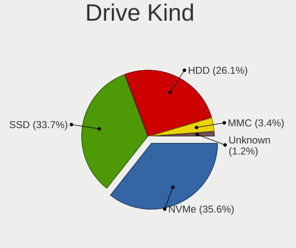

| Kind    | Computers | Drives | Percent |
|---------|-----------|--------|---------|
| NVMe    | 1651      | 2503   | 35.61%  |
| SSD     | 1562      | 2640   | 33.69%  |
| HDD     | 1210      | 2294   | 26.1%   |
| MMC     | 157       | 201    | 3.39%   |
| Unknown | 56        | 81     | 1.21%   |

Drive Connector
---------------

SATA, SAS, NVMe, etc.

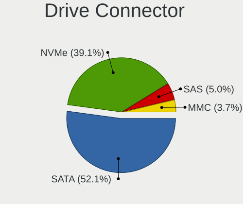

| Type | Computers | Drives | Percent |
|------|-----------|--------|---------|
| SATA | 2200      | 4683   | 52.15%  |
| NVMe | 1649      | 2497   | 39.09%  |
| SAS  | 213       | 338    | 5.05%   |
| MMC  | 157       | 201    | 3.72%   |

Drive Size
----------

Size of hard drive

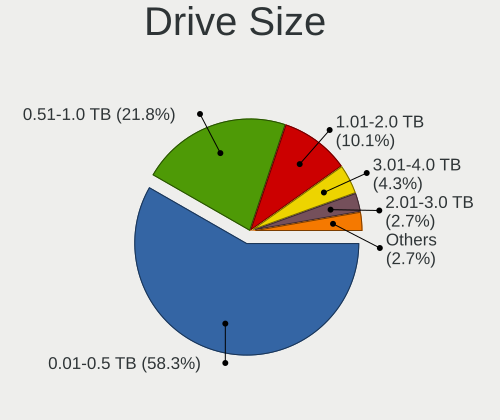

| Size in TB | Computers | Drives | Percent |
|------------|-----------|--------|---------|
| 0.01-0.5   | 1761      | 2915   | 58.29%  |
| 0.51-1.0   | 660       | 1020   | 21.85%  |
| 1.01-2.0   | 304       | 514    | 10.06%  |
| 3.01-4.0   | 130       | 216    | 4.3%    |
| 2.01-3.0   | 83        | 131    | 2.75%   |
| 4.01-10.0  | 67        | 111    | 2.22%   |
| 10.01-20.0 | 15        | 24     | 0.5%    |
| 20.01-50.0 | 1         | 3      | 0.03%   |

Space Total
-----------

Amount of disk space available on the file system

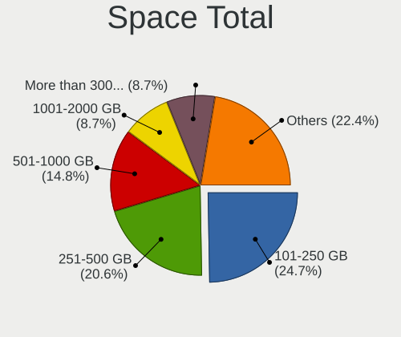

| Size in GB     | Computers | Percent |
|----------------|-----------|---------|
| 101-250        | 929       | 24.72%  |
| 251-500        | 776       | 20.65%  |
| 501-1000       | 556       | 14.8%   |
| 1001-2000      | 328       | 8.73%   |
| More than 3000 | 327       | 8.7%    |
| 1-20           | 298       | 7.93%   |
| 51-100         | 165       | 4.39%   |
| Unknown        | 147       | 3.91%   |
| 2001-3000      | 140       | 3.73%   |
| 21-50          | 92        | 2.45%   |

Space Used
----------

Amount of used disk space

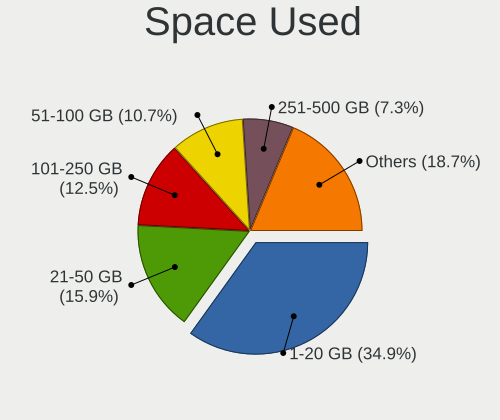

| Used GB        | Computers | Percent |
|----------------|-----------|---------|
| 1-20           | 1351      | 34.92%  |
| 21-50          | 616       | 15.92%  |
| 101-250        | 482       | 12.46%  |
| 51-100         | 413       | 10.67%  |
| 251-500        | 283       | 7.31%   |
| 501-1000       | 233       | 6.02%   |
| Unknown        | 147       | 3.8%    |
| 1001-2000      | 142       | 3.67%   |
| More than 3000 | 110       | 2.84%   |
| 2001-3000      | 77        | 1.99%   |
| 0              | 15        | 0.39%   |

Malfunc. Drives
---------------

Drive models with a malfunction

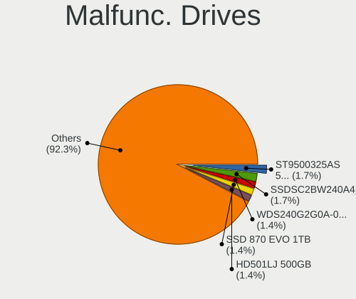

| Model                                             | Computers | Drives | Percent |
|---------------------------------------------------|-----------|--------|---------|
| Seagate ST9500325AS 500GB                         | 5         | 5      | 1.74%   |
| Intel SSDSC2BW240A4 240GB                         | 5         | 6      | 1.74%   |
| WDC WDS240G2G0A-00JH30 240GB SSD                  | 4         | 5      | 1.39%   |
| Samsung Electronics SSD 870 EVO 1TB               | 4         | 4      | 1.39%   |
| Samsung Electronics HD501LJ 500GB                 | 4         | 4      | 1.39%   |
| Crucial CT525MX300SSD1 528GB                      | 4         | 4      | 1.39%   |
| WDC WD20EFRX-68EUZN0 2TB                          | 3         | 3      | 1.05%   |
| Seagate ST9250410AS 250GB                         | 3         | 4      | 1.05%   |
| Seagate ST500LT012-9WS142 500GB                   | 3         | 3      | 1.05%   |
| Seagate ST500LT012-1DG142 500GB                   | 3         | 3      | 1.05%   |
| Seagate ST31000528AS 1TB                          | 3         | 4      | 1.05%   |
| Micron Technology 1100_MTFDDAV256TBN 256GB SSD    | 3         | 4      | 1.05%   |
| Micron Technology 1100_MTFDDAK256TBN 256GB SSD    | 3         | 3      | 1.05%   |
| Kingston SV300S37A120G 120GB SSD                  | 3         | 4      | 1.05%   |
| HGST HTS541010A9E680 1TB                          | 3         | 3      | 1.05%   |
| WDC WD5000LPVX-22V0TT0 500GB                      | 2         | 2      | 0.7%    |
| WDC WD5000AAKX-75U6AA0 500GB                      | 2         | 2      | 0.7%    |
| WDC WD5000AAKX-22ERMA0 500GB                      | 2         | 2      | 0.7%    |
| WDC WD30EFRX-68EUZN0 3TB                          | 2         | 3      | 0.7%    |
| WDC WD30EFRX-68AX9N0 3TB                          | 2         | 4      | 0.7%    |
| WDC WD20EARS-00MVWB0 2TB                          | 2         | 3      | 0.7%    |
| WDC WD15EARS-00Z5B1 1TB                           | 2         | 2      | 0.7%    |
| WDC WD10EZEX-21M2NA0 1TB                          | 2         | 3      | 0.7%    |
| WDC WD10EARS-00Y5B1 1TB                           | 2         | 3      | 0.7%    |
| WDC WD10EALX-009BA0 1TB                           | 2         | 5      | 0.7%    |
| Toshiba DT01ACA100 1TB                            | 2         | 2      | 0.7%    |
| SK hynix HFS256G32MND-2200A 256GB SSD             | 2         | 2      | 0.7%    |
| Seagate ST9500420AS 500GB                         | 2         | 2      | 0.7%    |
| Seagate ST4000DM004-2CV104 4TB                    | 2         | 2      | 0.7%    |
| Seagate ST3500418AS 500GB                         | 2         | 3      | 0.7%    |
| Seagate ST2000DX001-1CM164 2TB                    | 2         | 2      | 0.7%    |
| Seagate ST2000DM001-1CH164 2TB                    | 2         | 5      | 0.7%    |
| Seagate ST1000LM024 HN-M101MBB 1TB                | 2         | 2      | 0.7%    |
| Seagate ST1000DM003-1ER162 1TB                    | 2         | 2      | 0.7%    |
| Seagate ST1000DM003-1CH162 1TB                    | 2         | 2      | 0.7%    |
| Samsung Electronics SP2504C 250GB                 | 2         | 2      | 0.7%    |
| Samsung Electronics HD300LJ 304GB                 | 2         | 2      | 0.7%    |
| Kingston Technology Company KC2000 NVMe SSD 250GB | 2         | 2      | 0.7%    |
| Kingston SHPM2280P2 240G SSD                      | 2         | 2      | 0.7%    |
| Kingston SHFS37A120G 120GB SSD                    | 2         | 2      | 0.7%    |

Malfunc. Drive Vendor
---------------------

Vendors of faulty drives

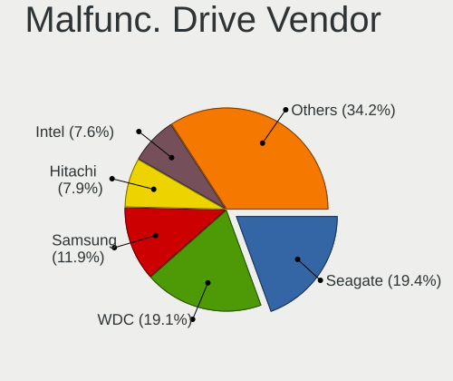

| Vendor                      | Computers | Drives | Percent |
|-----------------------------|-----------|--------|---------|
| Seagate                     | 54        | 70     | 19.42%  |
| WDC                         | 53        | 84     | 19.06%  |
| Samsung Electronics         | 33        | 36     | 11.87%  |
| Hitachi                     | 22        | 26     | 7.91%   |
| Intel                       | 21        | 25     | 7.55%   |
| Micron Technology           | 11        | 12     | 3.96%   |
| Kingston                    | 11        | 12     | 3.96%   |
| Toshiba                     | 10        | 12     | 3.6%    |
| HGST                        | 10        | 11     | 3.6%    |
| Crucial                     | 10        | 12     | 3.6%    |
| SK hynix                    | 4         | 4      | 1.44%   |
| SanDisk                     | 4         | 4      | 1.44%   |
| OCZ                         | 4         | 6      | 1.44%   |
| Corsair                     | 4         | 4      | 1.44%   |
| Fujitsu                     | 3         | 3      | 1.08%   |
| Apple                       | 3         | 3      | 1.08%   |
| LITEONIT                    | 2         | 2      | 0.72%   |
| Kingston Technology Company | 2         | 2      | 0.72%   |
| China                       | 2         | 2      | 0.72%   |
| A-DATA Technology           | 2         | 2      | 0.72%   |
| Union Memory                | 1         | 1      | 0.36%   |
| Transcend                   | 1         | 1      | 0.36%   |
| Team                        | 1         | 1      | 0.36%   |
| SSSTC                       | 1         | 1      | 0.36%   |
| Silicon Motion              | 1         | 1      | 0.36%   |
| PNY                         | 1         | 2      | 0.36%   |
| Maxtor                      | 1         | 1      | 0.36%   |
| Lenovo                      | 1         | 1      | 0.36%   |
| KingFast                    | 1         | 2      | 0.36%   |
| Hewlett-Packard             | 1         | 1      | 0.36%   |
| Apacer                      | 1         | 1      | 0.36%   |
| ADATA Technology            | 1         | 1      | 0.36%   |
| Unknown                     | 1         | 1      | 0.36%   |

Malfunc. HDD Vendor
-------------------

Vendors of faulty HDD drives

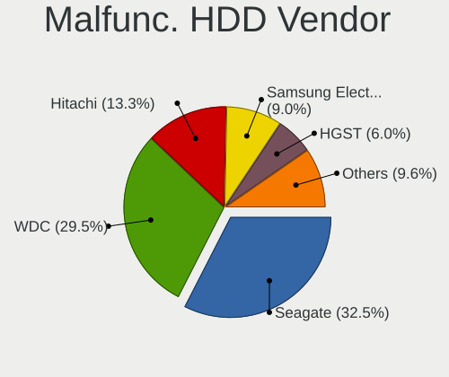

| Vendor              | Computers | Drives | Percent |
|---------------------|-----------|--------|---------|
| Seagate             | 54        | 70     | 32.53%  |
| WDC                 | 49        | 79     | 29.52%  |
| Hitachi             | 22        | 26     | 13.25%  |
| Samsung Electronics | 15        | 16     | 9.04%   |
| HGST                | 10        | 11     | 6.02%   |
| Toshiba             | 8         | 10     | 4.82%   |
| Fujitsu             | 3         | 3      | 1.81%   |
| Apple               | 2         | 2      | 1.2%    |
| Maxtor              | 1         | 1      | 0.6%    |
| Hewlett-Packard     | 1         | 1      | 0.6%    |
| Unknown             | 1         | 1      | 0.6%    |

Malfunc. Drive Kind
-------------------

Kinds of faulty drives

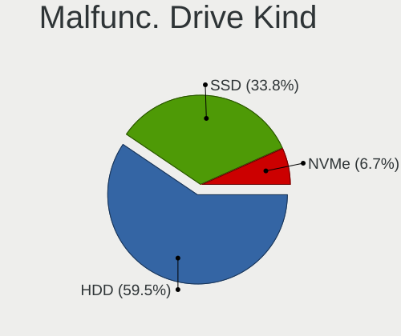

| Kind | Computers | Drives | Percent |
|------|-----------|--------|---------|
| HDD  | 160       | 220    | 59.48%  |
| SSD  | 91        | 108    | 33.83%  |
| NVMe | 18        | 19     | 6.69%   |

Failed Drives
-------------

Failed drive models

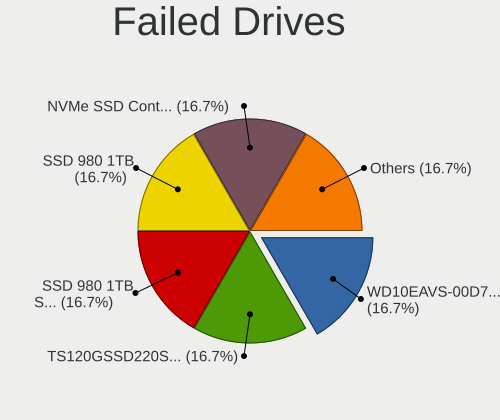

| Model                                                            | Computers | Drives | Percent |
|------------------------------------------------------------------|-----------|--------|---------|
| WDC WD10EAVS-00D7B1 1TB                                          | 1         | 1      | 16.67%  |
| Transcend TS120GSSD220S 120GB                                    | 1         | 1      | 16.67%  |
| Samsung Electronics SSD 980 1TB S649NJ0R220122K                  | 1         | 1      | 16.67%  |
| Samsung Electronics SSD 980 1TB                                  | 1         | 1      | 16.67%  |
| Samsung Electronics NVMe SSD Controller SM961/PM961/SM963 1024GB | 1         | 1      | 16.67%  |
| Hitachi HTS727575A9E364 752GB                                    | 1         | 1      | 16.67%  |

Failed Drive Vendor
-------------------

Failed drive vendors

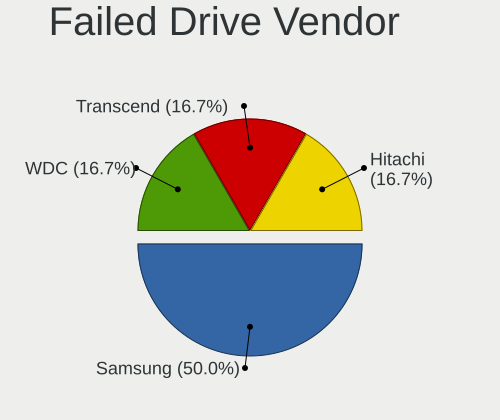

| Vendor              | Computers | Drives | Percent |
|---------------------|-----------|--------|---------|
| Samsung Electronics | 3         | 3      | 50%     |
| WDC                 | 1         | 1      | 16.67%  |
| Transcend           | 1         | 1      | 16.67%  |
| Hitachi             | 1         | 1      | 16.67%  |

Drive Status
------------

Number of failed and malfunc. drives

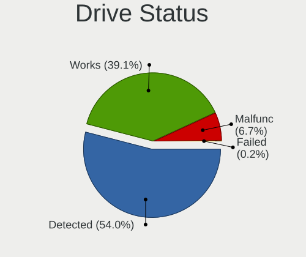

| Status   | Computers | Drives | Percent |
|----------|-----------|--------|---------|
| Detected | 2071      | 4555   | 54.03%  |
| Works    | 1499      | 2811   | 39.11%  |
| Malfunc  | 257       | 347    | 6.7%    |
| Failed   | 6         | 6      | 0.16%   |

Storage controller
------------------

Storage Vendor
--------------

Storage controller vendors

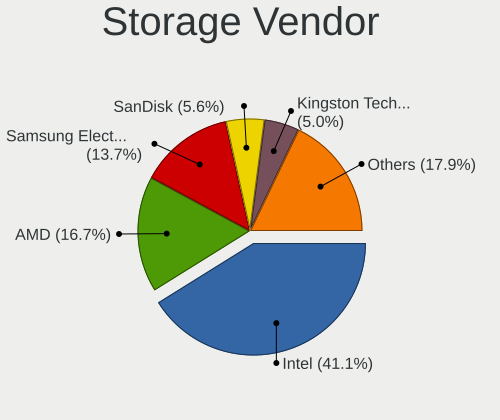

| Vendor                                  | Computers | Percent |
|-----------------------------------------|-----------|---------|
| Intel                                   | 1978      | 41.13%  |
| AMD                                     | 805       | 16.74%  |
| Samsung Electronics                     | 657       | 13.66%  |
| SanDisk                                 | 267       | 5.55%   |
| Kingston Technology Company             | 242       | 5.03%   |
| SK hynix                                | 131       | 2.72%   |
| Phison Electronics                      | 97        | 2.02%   |
| Toshiba America Info Systems            | 85        | 1.77%   |
| ASMedia Technology                      | 84        | 1.75%   |
| Micron Technology                       | 79        | 1.64%   |
| Marvell Technology Group                | 59        | 1.23%   |
| JMicron Technology                      | 50        | 1.04%   |
| KIOXIA                                  | 47        | 0.98%   |
| Micron/Crucial Technology               | 40        | 0.83%   |
| Nvidia                                  | 38        | 0.79%   |
| Silicon Motion                          | 19        | 0.4%    |
| ADATA Technology                        | 15        | 0.31%   |
| Lite-On Technology                      | 10        | 0.21%   |
| Solid State Storage Technology          | 8         | 0.17%   |
| Lenovo                                  | 8         | 0.17%   |
| Broadcom / LSI                          | 8         | 0.17%   |
| Apple                                   | 8         | 0.17%   |
| Silicon Image                           | 7         | 0.15%   |
| Union Memory (Shenzhen)                 | 6         | 0.12%   |
| Seagate Technology                      | 6         | 0.12%   |
| Realtek Semiconductor                   | 6         | 0.12%   |
| MAXIO Technology (Hangzhou)             | 6         | 0.12%   |
| LSI Logic / Symbios Logic               | 6         | 0.12%   |
| VIA Technologies                        | 5         | 0.1%    |
| Silicon Integrated Systems [SiS]        | 4         | 0.08%   |
| Shenzhen Longsys Electronics            | 4         | 0.08%   |
| Hewlett-Packard                         | 4         | 0.08%   |
| Solidigm                                | 3         | 0.06%   |
| Shenzhen Unionmemory Information System | 3         | 0.06%   |
| O2 Micro                                | 3         | 0.06%   |
| Transcend                               | 2         | 0.04%   |
| Adaptec                                 | 2         | 0.04%   |
| Yangtze Memory Technologies             | 1         | 0.02%   |
| Netac Technology                        | 1         | 0.02%   |
| Integrated Technology Express           | 1         | 0.02%   |

Storage Model
-------------

Storage controller models

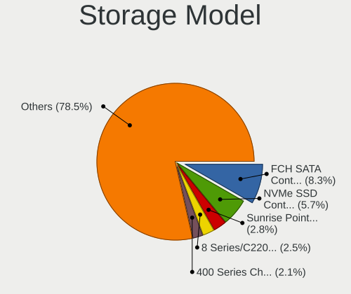

| Model                                                                          | Computers | Percent |
|--------------------------------------------------------------------------------|-----------|---------|
| AMD FCH SATA Controller [AHCI mode]                                            | 448       | 8.32%   |
| Samsung NVMe SSD Controller SM981/PM981/PM983                                  | 309       | 5.74%   |
| Intel Sunrise Point-LP SATA Controller [AHCI mode]                             | 150       | 2.78%   |
| Intel 8 Series/C220 Series Chipset Family 6-port SATA Controller 1 [AHCI mode] | 134       | 2.49%   |
| AMD 400 Series Chipset SATA Controller                                         | 115       | 2.13%   |
| Intel 7 Series Chipset Family 6-port SATA Controller [AHCI mode]               | 111       | 2.06%   |
| Samsung NVMe SSD Controller PM9A1/PM9A3/980PRO                                 | 108       | 2%      |
| AMD 500 Series Chipset SATA Controller                                         | 102       | 1.89%   |
| Intel Q170/Q150/B150/H170/H110/Z170/CM236 Chipset SATA Controller [AHCI Mode]  | 95        | 1.76%   |
| Samsung NVMe SSD Controller SM961/PM961/SM963                                  | 93        | 1.73%   |
| Intel Volume Management Device NVMe RAID Controller                            | 93        | 1.73%   |
| AMD 600 Series Chipset SATA Controller                                         | 91        | 1.69%   |
| Intel 82801 Mobile SATA Controller [RAID mode]                                 | 81        | 1.5%    |
| Intel 6 Series/C200 Series Chipset Family 6 port Mobile SATA AHCI Controller   | 81        | 1.5%    |
| Intel 8 Series SATA Controller 1 [AHCI mode]                                   | 78        | 1.45%   |
| ASMedia ASM1061/ASM1062 Serial ATA Controller                                  | 77        | 1.43%   |
| Samsung NVMe SSD Controller 980 (DRAM-less)                                    | 74        | 1.37%   |
| Intel Cannon Lake PCH SATA AHCI Controller                                     | 74        | 1.37%   |
| AMD SB7x0/SB8x0/SB9x0 SATA Controller [AHCI mode]                              | 74        | 1.37%   |
| Intel 200 Series PCH SATA controller [AHCI mode]                               | 73        | 1.36%   |
| Intel SATA Controller [RAID mode]                                              | 68        | 1.26%   |
| AMD SB7x0/SB8x0/SB9x0 IDE Controller                                           | 64        | 1.19%   |
| SanDisk Extreme Pro / WD Black SN750 / PC SN730 / Red SN700 NVMe SSD           | 60        | 1.11%   |
| Intel 6 Series/C200 Series Chipset Family 6 port Desktop SATA AHCI Controller  | 59        | 1.1%    |
| Kingston Company A2000 NVMe SSD [SM2263EN]                                     | 56        | 1.04%   |
| SanDisk Ultra 3D / WD PC SN530, IX SN530, Blue SN550 NVMe SSD (DRAM-less)      | 55        | 1.02%   |
| Kingston Company KC3000/FURY Renegade NVMe SSD [E18]                           | 55        | 1.02%   |
| Intel Wildcat Point-LP SATA Controller [AHCI Mode]                             | 55        | 1.02%   |
| Intel SSD 660P Series                                                          | 52        | 0.97%   |
| Intel Cannon Lake Mobile PCH SATA AHCI Controller                              | 51        | 0.95%   |
| Intel 7 Series/C210 Series Chipset Family 6-port SATA Controller [AHCI mode]   | 46        | 0.85%   |
| SK hynix Gold P31/BC711/PC711 NVMe Solid State Drive                           | 41        | 0.76%   |
| AMD SB7x0/SB8x0/SB9x0 SATA Controller [IDE mode]                               | 39        | 0.72%   |
| Intel 5 Series/3400 Series Chipset 6 port SATA AHCI Controller                 | 38        | 0.71%   |
| Phison E12 NVMe Controller                                                     | 34        | 0.63%   |
| Intel 9 Series Chipset Family SATA Controller [AHCI Mode]                      | 34        | 0.63%   |
| Toshiba America Info Systems XG6 NVMe SSD Controller                           | 32        | 0.59%   |
| Intel Atom Processor E3800 Series SATA AHCI Controller                         | 32        | 0.59%   |
| Intel Alder Lake-S PCH SATA Controller [AHCI Mode]                             | 32        | 0.59%   |
| Intel 82801IBM/IEM (ICH9M/ICH9M-E) 4 port SATA Controller [AHCI mode]          | 31        | 0.58%   |

Storage Kind
------------

Kind of storage controller (IDE, SATA, NVMe, SAS, ...)

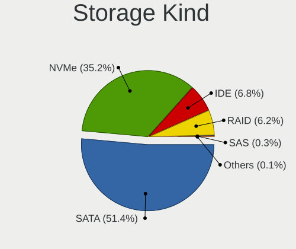

| Kind | Computers | Percent |
|------|-----------|---------|
| SATA | 2414      | 51.42%  |
| NVMe | 1654      | 35.23%  |
| IDE  | 317       | 6.75%   |
| RAID | 291       | 6.2%    |
| SAS  | 15        | 0.32%   |
| SCSI | 4         | 0.09%   |

Processor
---------

CPU Vendor
----------

Processor vendors

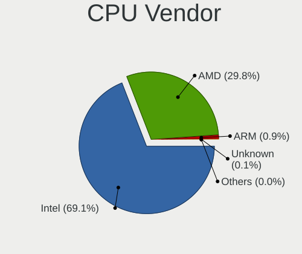

| Vendor       | Computers | Percent |
|--------------|-----------|---------|
| Intel        | 2421      | 69.09%  |
| AMD          | 1044      | 29.79%  |
| ARM          | 33        | 0.94%   |
| Unknown      | 3         | 0.09%   |
| QUALCOMM     | 2         | 0.06%   |
| PowerMac10,1 | 1         | 0.03%   |

CPU Model
---------

Processor models

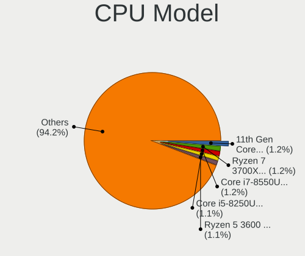

| Model                                   | Computers | Percent |
|-----------------------------------------|-----------|---------|
| Intel 11th Gen Core i7-1165G7 @ 2.80GHz | 43        | 1.22%   |
| AMD Ryzen 7 3700X 8-Core Processor      | 43        | 1.22%   |
| Intel Core i7-8550U CPU @ 1.80GHz       | 41        | 1.17%   |
| Intel Core i5-8250U CPU @ 1.60GHz       | 40        | 1.14%   |
| AMD Ryzen 5 3600 6-Core Processor       | 37        | 1.05%   |
| AMD Ryzen 5 5600X 6-Core Processor      | 32        | 0.91%   |
| Intel Core i7-8565U CPU @ 1.80GHz       | 30        | 0.85%   |
| Intel 11th Gen Core i5-1135G7 @ 2.40GHz | 29        | 0.83%   |
| Intel Core i5-6200U CPU @ 2.30GHz       | 26        | 0.74%   |
| AMD Ryzen 7 5800X 8-Core Processor      | 26        | 0.74%   |
| AMD Ryzen 9 3900X 12-Core Processor     | 25        | 0.71%   |
| Intel Core i5-6300U CPU @ 2.40GHz       | 24        | 0.68%   |
| ARM Processor                           | 24        | 0.68%   |
| Intel Core i5-6600K CPU @ 3.50GHz       | 23        | 0.65%   |
| Intel Core i7-7700HQ CPU @ 2.80GHz      | 21        | 0.6%    |
| Intel Core i5-10210U CPU @ 1.60GHz      | 20        | 0.57%   |
| Intel Core i7-4790K CPU @ 4.00GHz       | 19        | 0.54%   |
| AMD Ryzen 5 5600G with Radeon Graphics  | 19        | 0.54%   |
| Intel Core i5-7200U CPU @ 2.50GHz       | 18        | 0.51%   |
| Intel 12th Gen Core i7-12700H           | 18        | 0.51%   |
| Intel Core i7-9700K CPU @ 3.60GHz       | 17        | 0.48%   |
| Intel Core i7-7500U CPU @ 2.70GHz       | 17        | 0.48%   |
| Intel Core i7-6700K CPU @ 4.00GHz       | 17        | 0.48%   |
| Intel Core i5-5300U CPU @ 2.30GHz       | 17        | 0.48%   |
| Intel Core i5-2520M CPU @ 2.50GHz       | 17        | 0.48%   |
| AMD Ryzen 7 5700U with Radeon Graphics  | 17        | 0.48%   |
| Intel Core i7-8750H CPU @ 2.20GHz       | 16        | 0.46%   |
| Intel Core i7-6500U CPU @ 2.50GHz       | 16        | 0.46%   |
| Intel Core i5-8265U CPU @ 1.60GHz       | 16        | 0.46%   |
| Intel Celeron CPU N2840 @ 2.16GHz       | 16        | 0.46%   |
| AMD Ryzen 9 5900X 12-Core Processor     | 16        | 0.46%   |
| AMD Custom APU 0405                     | 16        | 0.46%   |
| Intel Core i5-8350U CPU @ 1.70GHz       | 15        | 0.43%   |
| AMD Ryzen 5 5500U with Radeon Graphics  | 15        | 0.43%   |
| Intel Core i9-9900K CPU @ 3.60GHz       | 14        | 0.4%    |
| Intel Core i7-8650U CPU @ 1.90GHz       | 14        | 0.4%    |
| Intel Core i5-4200U CPU @ 1.60GHz       | 14        | 0.4%    |
| Intel Core i5-3210M CPU @ 2.50GHz       | 14        | 0.4%    |
| Intel Core i5-2500K CPU @ 3.30GHz       | 14        | 0.4%    |
| Intel 11th Gen Core i7-1185G7 @ 3.00GHz | 14        | 0.4%    |

CPU Model Family
----------------

Processor model prefix

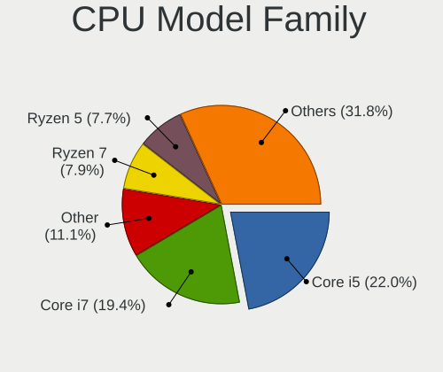

| Model                   | Computers | Percent |
|-------------------------|-----------|---------|
| Intel Core i5           | 773       | 22.03%  |
| Intel Core i7           | 682       | 19.44%  |
| Other                   | 390       | 11.11%  |
| AMD Ryzen 7             | 278       | 7.92%   |
| AMD Ryzen 5             | 269       | 7.67%   |
| Intel Core i3           | 135       | 3.85%   |
| AMD Ryzen 9             | 128       | 3.65%   |
| Intel Celeron           | 114       | 3.25%   |
| Intel Core 2 Duo        | 85        | 2.42%   |
| Intel Xeon              | 76        | 2.17%   |
| Intel Pentium           | 47        | 1.34%   |
| AMD FX                  | 42        | 1.2%    |
| Intel Core i9           | 35        | 1%      |
| Intel Atom              | 34        | 0.97%   |
| AMD Ryzen 3             | 30        | 0.85%   |
| Intel Core              | 25        | 0.71%   |
| AMD A8                  | 25        | 0.71%   |
| Intel Core 2 Quad       | 21        | 0.6%    |
| AMD Ryzen 7 PRO         | 21        | 0.6%    |
| AMD A10                 | 19        | 0.54%   |
| AMD A6                  | 18        | 0.51%   |
| Intel Core 2            | 17        | 0.48%   |
| AMD A4                  | 14        | 0.4%    |
| Intel Genuine           | 13        | 0.37%   |
| AMD E                   | 13        | 0.37%   |
| Intel Pentium Dual-Core | 12        | 0.34%   |
| AMD Ryzen Threadripper  | 12        | 0.34%   |
| AMD Phenom II X4        | 12        | 0.34%   |
| AMD Athlon 64 X2        | 12        | 0.34%   |
| AMD Ryzen 5 PRO         | 11        | 0.31%   |
| AMD E1                  | 11        | 0.31%   |
| AMD Athlon II X2        | 10        | 0.28%   |
| Intel Pentium Silver    | 9         | 0.26%   |
| ARM BCM                 | 8         | 0.23%   |
| AMD Phenom II X6        | 8         | 0.23%   |
| Intel Pentium Dual      | 6         | 0.17%   |
| AMD Turion 64 X2 Mobile | 5         | 0.14%   |
| AMD Ryzen Embedded      | 5         | 0.14%   |
| AMD E2                  | 5         | 0.14%   |
| Intel Pentium M         | 4         | 0.11%   |

CPU Cores
---------

Number of processor cores

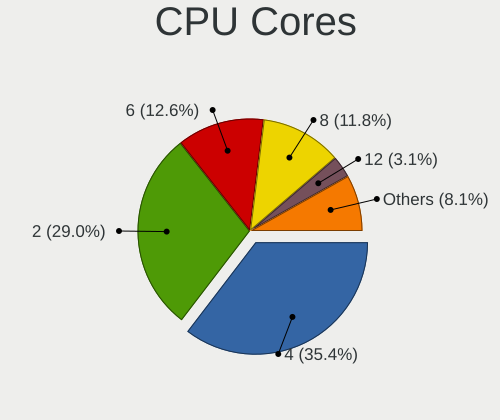

| Number  | Computers | Percent |
|---------|-----------|---------|
| 4       | 1243      | 35.39%  |
| 2       | 1018      | 28.99%  |
| 6       | 442       | 12.59%  |
| 8       | 413       | 11.76%  |
| 12      | 110       | 3.13%   |
| 16      | 86        | 2.45%   |
| 10      | 51        | 1.45%   |
| 14      | 45        | 1.28%   |
| 1       | 41        | 1.17%   |
| 3       | 20        | 0.57%   |
| 24      | 17        | 0.48%   |
| Unknown | 8         | 0.23%   |
| 20      | 4         | 0.11%   |
| 18      | 4         | 0.11%   |
| 32      | 3         | 0.09%   |
| 192     | 2         | 0.06%   |
| 64      | 2         | 0.06%   |
| 28      | 2         | 0.06%   |
| 48      | 1         | 0.03%   |

CPU Sockets
-----------

Number of sockets

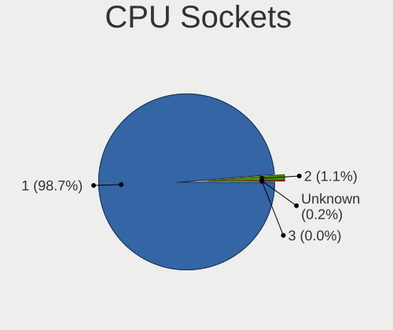

| Number  | Computers | Percent |
|---------|-----------|---------|
| 1       | 3458      | 98.69%  |
| 2       | 38        | 1.08%   |
| Unknown | 7         | 0.2%    |
| 3       | 1         | 0.03%   |

CPU Threads
-----------

Threads per core (Hyper-Threading)

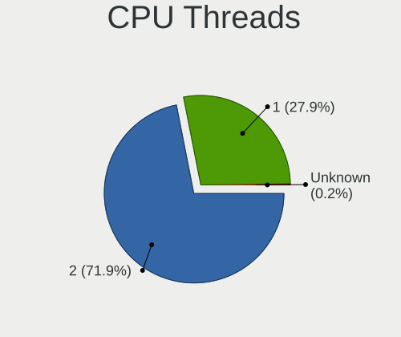

| Number  | Computers | Percent |
|---------|-----------|---------|
| 2       | 2529      | 71.91%  |
| 1       | 980       | 27.86%  |
| Unknown | 8         | 0.23%   |

CPU Op-Modes
------------

CPU Operation Modes (32-bit, 64-bit)

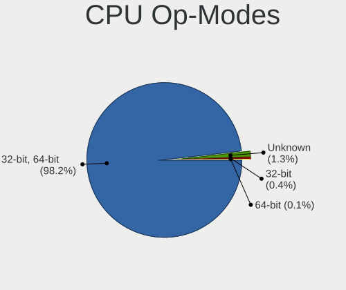

| Op mode        | Computers | Percent |
|----------------|-----------|---------|
| 32-bit, 64-bit | 3445      | 98.2%   |
| Unknown        | 45        | 1.28%   |
| 32-bit         | 13        | 0.37%   |
| 64-bit         | 5         | 0.14%   |

CPU Microcode
-------------

Microcode number

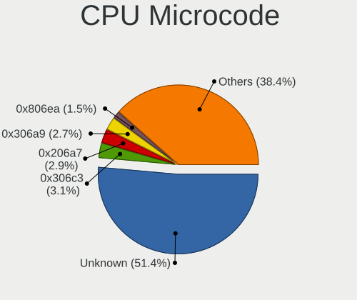

| Number     | Computers | Percent |
|------------|-----------|---------|
| Unknown    | 1884      | 51.41%  |
| 0x306c3    | 113       | 3.08%   |
| 0x206a7    | 105       | 2.86%   |
| 0x306a9    | 98        | 2.67%   |
| 0x806ea    | 56        | 1.53%   |
| 0x806c1    | 54        | 1.47%   |
| 0x906ea    | 53        | 1.45%   |
| 0x40651    | 53        | 1.45%   |
| 0x1067a    | 52        | 1.42%   |
| 0x806ec    | 51        | 1.39%   |
| 0x906e9    | 49        | 1.34%   |
| 0x406e3    | 49        | 1.34%   |
| 0x506e3    | 48        | 1.31%   |
| 0x306d4    | 47        | 1.28%   |
| 0x08701021 | 46        | 1.26%   |
| 0x806e9    | 43        | 1.17%   |
| 0x20655    | 28        | 0.76%   |
| 0x0a50000c | 25        | 0.68%   |
| 0x08108109 | 25        | 0.68%   |
| 0x0800820d | 23        | 0.63%   |
| 0x08701013 | 22        | 0.6%    |
| 0x406c4    | 19        | 0.52%   |
| 0x08600106 | 19        | 0.52%   |
| 0x6fd      | 17        | 0.46%   |
| 0x906ed    | 16        | 0.44%   |
| 0x0a201009 | 16        | 0.44%   |
| 0x06000852 | 16        | 0.44%   |
| 0x906a3    | 15        | 0.41%   |
| 0x30678    | 15        | 0.41%   |
| 0x010000c8 | 15        | 0.41%   |
| 0x806eb    | 14        | 0.38%   |
| 0x306f2    | 14        | 0.38%   |
| 0x106e5    | 14        | 0.38%   |
| 0x0810100b | 14        | 0.38%   |
| 0xa0652    | 13        | 0.35%   |
| 0x08608103 | 13        | 0.35%   |
| 0x08001138 | 13        | 0.35%   |
| 0x06001119 | 13        | 0.35%   |
| 0x706a1    | 12        | 0.33%   |
| 0x6f6      | 12        | 0.33%   |

CPU Microarch
-------------

Microarchitecture

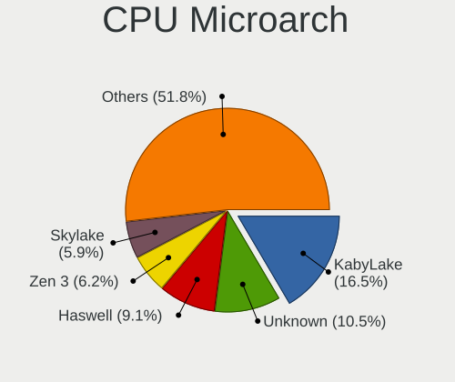

| Name              | Computers | Percent |
|-------------------|-----------|---------|
| KabyLake          | 581       | 16.53%  |
| Unknown           | 369       | 10.5%   |
| Haswell           | 319       | 9.08%   |
| Zen 3             | 218       | 6.2%    |
| Skylake           | 207       | 5.89%   |
| SandyBridge       | 202       | 5.75%   |
| Zen 2             | 186       | 5.29%   |
| IvyBridge         | 184       | 5.23%   |
| Alderlake Hybrid  | 111       | 3.16%   |
| TigerLake         | 110       | 3.13%   |
| Penryn            | 102       | 2.9%    |
| Zen+              | 95        | 2.7%    |
| Broadwell         | 87        | 2.48%   |
| Silvermont        | 74        | 2.11%   |
| Westmere          | 69        | 1.96%   |
| Zen               | 64        | 1.82%   |
| Core              | 64        | 1.82%   |
| K10               | 55        | 1.56%   |
| Piledriver        | 53        | 1.51%   |
| CometLake         | 53        | 1.51%   |
| IceLake           | 39        | 1.11%   |
| Nehalem           | 34        | 0.97%   |
| Goldmont plus     | 31        | 0.88%   |
| Excavator         | 30        | 0.85%   |
| K8 Hammer         | 22        | 0.63%   |
| Bobcat            | 19        | 0.54%   |
| Puma              | 16        | 0.46%   |
| Jaguar            | 16        | 0.46%   |
| Goldmont          | 16        | 0.46%   |
| K10 Llano         | 14        | 0.4%    |
| Bulldozer         | 12        | 0.34%   |
| Tremont           | 11        | 0.31%   |
| Steamroller       | 10        | 0.28%   |
| Bonnell           | 10        | 0.28%   |
| Meteorlake Hybrid | 9         | 0.26%   |
| P6                | 6         | 0.17%   |
| K8 & K10 hybrid   | 5         | 0.14%   |
| Gracemont         | 4         | 0.11%   |
| NetBurst          | 3         | 0.09%   |
| Lunarlake Hybrid  | 3         | 0.09%   |

Graphics
--------

GPU Vendor
----------

Vendors of graphics cards

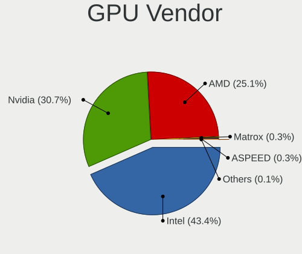

| Vendor                           | Computers | Percent |
|----------------------------------|-----------|---------|
| Intel                            | 1764      | 43.45%  |
| Nvidia                           | 1246      | 30.69%  |
| AMD                              | 1019      | 25.1%   |
| Matrox Electronics Systems       | 14        | 0.34%   |
| ASPEED Technology                | 12        | 0.3%    |
| Silicon Integrated Systems [SiS] | 4         | 0.1%    |
| Red Hat                          | 1         | 0.02%   |

GPU Model
---------

Graphics card models

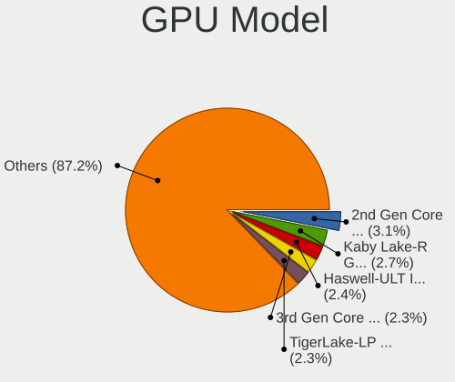

| Model                                                                                    | Computers | Percent |
|------------------------------------------------------------------------------------------|-----------|---------|
| Intel 2nd Generation Core Processor Family Integrated Graphics Controller                | 131       | 3.11%   |
| Intel Kaby Lake-R GT2 [UHD Graphics 620]                                                 | 112       | 2.66%   |
| Intel Haswell-ULT Integrated Graphics Controller                                         | 100       | 2.37%   |
| Intel 3rd Gen Core processor Graphics Controller                                         | 98        | 2.32%   |
| Intel TigerLake-LP GT2 [Iris Xe Graphics]                                                | 97        | 2.3%    |
| Intel Skylake-U GT2 [HD Graphics 520]                                                    | 84        | 1.99%   |
| AMD Cezanne [Radeon Vega Series / Radeon Vega Mobile Series]                             | 77        | 1.83%   |
| Intel WhiskeyLake-U GT2 [UHD Graphics 620]                                               | 67        | 1.59%   |
| Intel Kaby Lake-U GT2 [HD Graphics 620]                                                  | 64        | 1.52%   |
| Intel CoffeeLake-H GT2 [UHD Graphics 630]                                                | 62        | 1.47%   |
| AMD Ellesmere [Radeon RX 470/480/570/570X/580/580X/590]                                  | 61        | 1.45%   |
| Intel Broadwell-U GT2 [HD Graphics 5500]                                                 | 56        | 1.33%   |
| AMD Picasso/Raven 2 [Radeon Vega Series / Radeon Vega Mobile Series]                     | 54        | 1.28%   |
| Intel Xeon E3-1200 v3/4th Gen Core Processor Integrated Graphics Controller              | 53        | 1.26%   |
| Intel 4th Gen Core Processor Integrated Graphics Controller                              | 53        | 1.26%   |
| AMD Raphael                                                                              | 51        | 1.21%   |
| AMD Renoir [Radeon Vega Series / Radeon Vega Mobile Series]                              | 48        | 1.14%   |
| Intel CometLake-U GT2 [UHD Graphics]                                                     | 43        | 1.02%   |
| Intel Atom Processor Z36xxx/Z37xxx Series Graphics & Display                             | 42        | 1%      |
| Intel Alder Lake-P GT2 [Iris Xe Graphics]                                                | 38        | 0.9%    |
| AMD Navi 10 [Radeon RX 5600 OEM/5600 XT / 5700/5700 XT]                                  | 36        | 0.85%   |
| AMD Lucienne                                                                             | 36        | 0.85%   |
| Nvidia GP106 [GeForce GTX 1060 6GB]                                                      | 35        | 0.83%   |
| Intel Core Processor Integrated Graphics Controller                                      | 35        | 0.83%   |
| Intel Kaby Lake-H GT2 [HD Graphics 630]                                                  | 34        | 0.81%   |
| Intel CoffeeLake-S GT2 [UHD Graphics 630]                                                | 34        | 0.81%   |
| Nvidia GP104 [GeForce GTX 1070]                                                          | 33        | 0.78%   |
| Intel Skylake-S GT2 [HD Graphics 530]                                                    | 31        | 0.73%   |
| Intel Atom/Celeron/Pentium Processor x5-E8000/J3xxx/N3xxx Integrated Graphics Controller | 31        | 0.73%   |
| AMD Navi 31 [Radeon RX 7900 XT/7900 XTX/7900 GRE/7900M]                                  | 31        | 0.73%   |
| Nvidia GP106 [GeForce GTX 1060 3GB]                                                      | 28        | 0.66%   |
| Nvidia GM204 [GeForce GTX 970]                                                           | 28        | 0.66%   |
| Intel Mobile 4 Series Chipset Integrated Graphics Controller                             | 27        | 0.64%   |
| AMD Rembrandt [Radeon 680M]                                                              | 27        | 0.64%   |
| AMD Navi 21 [Radeon RX 6800/6800 XT / 6900 XT]                                           | 27        | 0.64%   |
| Nvidia GP104 [GeForce GTX 1080]                                                          | 26        | 0.62%   |
| Intel Raptor Lake-P [Iris Xe Graphics]                                                   | 26        | 0.62%   |
| Nvidia GM206 [GeForce GTX 960]                                                           | 25        | 0.59%   |
| Nvidia GP107 [GeForce GTX 1050 Ti]                                                       | 24        | 0.57%   |
| Intel GeminiLake [UHD Graphics 600]                                                      | 23        | 0.55%   |

GPU Combo
---------

Combinations of graphics cards

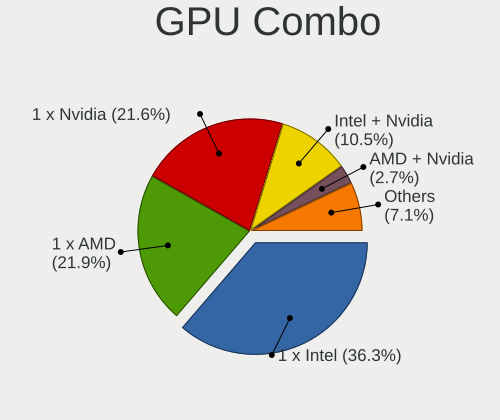

| Name                     | Computers | Percent |
|--------------------------|-----------|---------|
| 1 x Intel                | 1282      | 36.31%  |
| 1 x AMD                  | 772       | 21.86%  |
| 1 x Nvidia               | 761       | 21.55%  |
| Intel + Nvidia           | 370       | 10.48%  |
| AMD + Nvidia             | 96        | 2.72%   |
| 2 x AMD                  | 95        | 2.69%   |
| Intel + AMD              | 59        | 1.67%   |
| Other                    | 41        | 1.16%   |
| 1 x Matrox               | 12        | 0.34%   |
| 2 x Nvidia               | 10        | 0.28%   |
| 2 x Intel                | 10        | 0.28%   |
| 1 x ASPEED               | 8         | 0.23%   |
| 1 x SiS                  | 4         | 0.11%   |
| Nvidia + ASPEED          | 4         | 0.11%   |
| Intel + 2 x Nvidia       | 2         | 0.06%   |
| Intel + AMD + 1 x Nvidia | 2         | 0.06%   |
| 2 x Nvidia + 1 x Matrox  | 1         | 0.03%   |
| 1 x Red Hat              | 1         | 0.03%   |
| Nvidia + Matrox          | 1         | 0.03%   |

GPU Driver
----------

Free vs proprietary

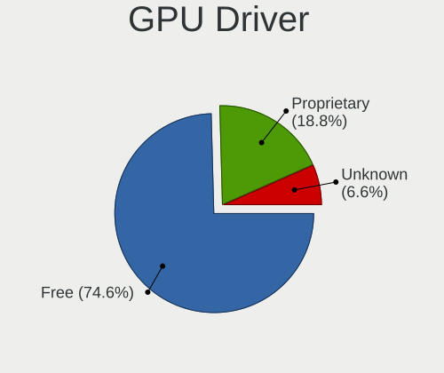

| Driver      | Computers | Percent |
|-------------|-----------|---------|
| Free        | 2661      | 74.58%  |
| Proprietary | 671       | 18.81%  |
| Unknown     | 236       | 6.61%   |

GPU Memory
----------

Total video memory

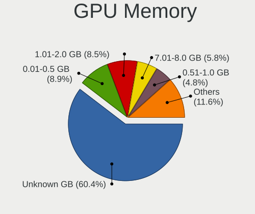

| Size in GB | Computers | Percent |
|------------|-----------|---------|
| Unknown    | 2187      | 60.4%   |
| 0.01-0.5   | 321       | 8.86%   |
| 1.01-2.0   | 308       | 8.51%   |
| 7.01-8.0   | 210       | 5.8%    |
| 0.51-1.0   | 174       | 4.81%   |
| 3.01-4.0   | 169       | 4.67%   |
| 8.01-16.0  | 105       | 2.9%    |
| 5.01-6.0   | 88        | 2.43%   |
| 2.01-3.0   | 34        | 0.94%   |
| 16.01-24.0 | 23        | 0.64%   |
| 4.01-5.0   | 1         | 0.03%   |
| 24.01-32.0 | 1         | 0.03%   |

Monitor
-------

Monitor Vendor
--------------

Monitor vendors

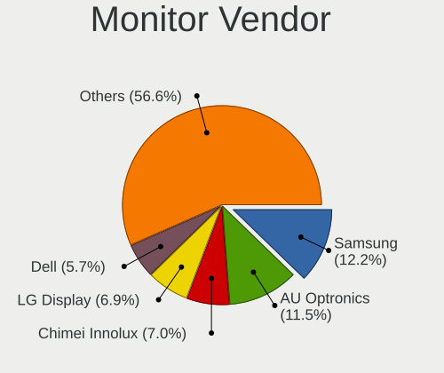

| Vendor                  | Computers | Percent |
|-------------------------|-----------|---------|
| Samsung Electronics     | 493       | 12.24%  |
| AU Optronics            | 465       | 11.55%  |
| Chimei Innolux          | 281       | 6.98%   |
| LG Display              | 279       | 6.93%   |
| Dell                    | 230       | 5.71%   |
| BOE                     | 203       | 5.04%   |
| BenQ                    | 180       | 4.47%   |
| Philips                 | 168       | 4.17%   |
| AOC                     | 160       | 3.97%   |
| Hewlett-Packard         | 148       | 3.68%   |
| Acer                    | 148       | 3.68%   |
| Ancor Communications    | 139       | 3.45%   |
| Goldstar                | 125       | 3.1%    |
| Apple                   | 114       | 2.83%   |
| Lenovo                  | 106       | 2.63%   |
| Sharp                   | 88        | 2.19%   |
| ASUSTek Computer        | 85        | 2.11%   |
| MSI                     | 57        | 1.42%   |
| InfoVision              | 46        | 1.14%   |
| CSO                     | 32        | 0.79%   |
| Chi Mei Optoelectronics | 31        | 0.77%   |
| Eizo                    | 30        | 0.74%   |
| Panasonic               | 24        | 0.6%    |
| PANDA                   | 22        | 0.55%   |
| Vestel Elektronik       | 21        | 0.52%   |
| Sony                    | 20        | 0.5%    |
| LG Philips              | 20        | 0.5%    |
| Unknown                 | 18        | 0.45%   |
| Valve                   | 15        | 0.37%   |
| Fujitsu Siemens         | 15        | 0.37%   |
| Gigabyte Technology     | 14        | 0.35%   |
| CSOT                    | 14        | 0.35%   |
| ViewSonic               | 11        | 0.27%   |
| LG Electronics          | 11        | 0.27%   |
| Mi                      | 10        | 0.25%   |
| Positivo                | 8         | 0.2%    |
| Toshiba                 | 7         | 0.17%   |
| RTK                     | 7         | 0.17%   |
| TMX                     | 6         | 0.15%   |
| OEM                     | 6         | 0.15%   |

Monitor Model
-------------

Monitor models

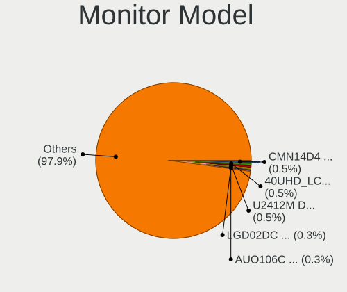

| Model                                                                 | Computers | Percent |
|-----------------------------------------------------------------------|-----------|---------|
| Chimei Innolux LCD Monitor CMN14D4 1920x1080 309x173mm 13.9-inch      | 22        | 0.52%   |
| Vestel Elektronik 40UHD_LCD_TV VES3700 3840x2160 880x500mm 39.8-inch  | 21        | 0.5%    |
| Dell U2412M DELA07A 1920x1200 518x324mm 24.1-inch                     | 19        | 0.45%   |
| LG Display LCD Monitor LGD02DC 1366x768 344x194mm 15.5-inch           | 14        | 0.33%   |
| AU Optronics LCD Monitor AUO106C 1366x768 276x155mm 12.5-inch         | 14        | 0.33%   |
| AOC G2460 AOC2460 1920x1080 531x299mm 24.0-inch                       | 14        | 0.33%   |
| AU Optronics LCD Monitor AUO123D 1920x1080 309x173mm 13.9-inch        | 13        | 0.31%   |
| Valve ANX7530 U VLV3001 800x1280 100x150mm 7.1-inch                   | 12        | 0.29%   |
| BenQ G2420HDBL BNQ785F 1920x1080 477x268mm 21.5-inch                  | 12        | 0.29%   |
| AOC 32G1WG4 AOC3201 1920x1080 697x392mm 31.5-inch                     | 12        | 0.29%   |
| AU Optronics LCD Monitor AUO38ED 1920x1080 344x193mm 15.5-inch        | 11        | 0.26%   |
| AU Optronics LCD Monitor AUO21ED 1920x1080 344x193mm 15.5-inch        | 11        | 0.26%   |
| AOC 24G2W1G3 AOC2402 1920x1080 527x296mm 23.8-inch                    | 11        | 0.26%   |
| Samsung Electronics LCD Monitor SDC4161 1920x1080 344x194mm 15.5-inch | 10        | 0.24%   |
| MSI MAG342CQRV MSI3DB6 3440x1440 797x333mm 34.0-inch                  | 10        | 0.24%   |
| Hewlett-Packard E241i HWP3122 1920x1200 518x324mm 24.1-inch           | 10        | 0.24%   |
| Chimei Innolux LCD Monitor CMN15F5 1920x1080 344x193mm 15.5-inch      | 10        | 0.24%   |
| AU Optronics LCD Monitor AUO403D 1920x1080 309x174mm 14.0-inch        | 10        | 0.24%   |
| AU Optronics LCD Monitor AUO26EC 1366x768 344x193mm 15.5-inch         | 10        | 0.24%   |
| ASUSTek Computer VG27A AUS2722 2560x1440 597x336mm 27.0-inch          | 10        | 0.24%   |
| Samsung Electronics S24F350 SAM0D20 1920x1080 521x293mm 23.5-inch     | 9         | 0.21%   |
| Chimei Innolux LCD Monitor CMN14F2 1920x1080 309x173mm 13.9-inch      | 9         | 0.21%   |
| Chimei Innolux LCD Monitor CMN140A 1920x1080 309x173mm 13.9-inch      | 9         | 0.21%   |
| Apple Color LCD APP9CDF 1440x900 286x179mm 13.3-inch                  | 9         | 0.21%   |
| Ancor Communications VE247 ACI2493 1920x1080 530x300mm 24.0-inch      | 9         | 0.21%   |
| Ancor Communications ASUS PB278 ACI27A3 2560x1440 597x336mm 27.0-inch | 9         | 0.21%   |
| Samsung Electronics LCD Monitor SDCA029 3840x2160 344x194mm 15.5-inch | 8         | 0.19%   |
| Philips FTV PHL01EA 1920x1080 1440x810mm 65.0-inch                    | 8         | 0.19%   |
| Philips 273ELH PHLC07D 1920x1080 598x336mm 27.0-inch                  | 8         | 0.19%   |
| MSI G241 MSI3BA4 1920x1080 527x296mm 23.8-inch                        | 8         | 0.19%   |
| LG Display LCD Monitor LGD0555 2736x1824 260x173mm 12.3-inch          | 8         | 0.19%   |
| LG Display LCD Monitor LGD033A 1366x768 344x194mm 15.5-inch           | 8         | 0.19%   |
| LG Display LCD Monitor LGD02D8 1366x768 277x156mm 12.5-inch           | 8         | 0.19%   |
| Dell U2412M DELA07B 1920x1200 518x324mm 24.1-inch                     | 8         | 0.19%   |
| Chimei Innolux LCD Monitor CMN15C3 1920x1080 344x193mm 15.5-inch      | 8         | 0.19%   |
| Chimei Innolux LCD Monitor CMN14E5 1920x1080 309x173mm 13.9-inch      | 8         | 0.19%   |
| Chimei Innolux LCD Monitor CMN1406 1920x1080 309x173mm 13.9-inch      | 8         | 0.19%   |
| AU Optronics LCD Monitor AUO22EC 1366x768 344x193mm 15.5-inch         | 8         | 0.19%   |
| AU Optronics LCD Monitor AUO226D 1920x1080 276x155mm 12.5-inch        | 8         | 0.19%   |
| AOC 27G2G4 AOC2702 1920x1080 598x336mm 27.0-inch                      | 8         | 0.19%   |

Monitor Resolution
------------------

Monitor screen resolution

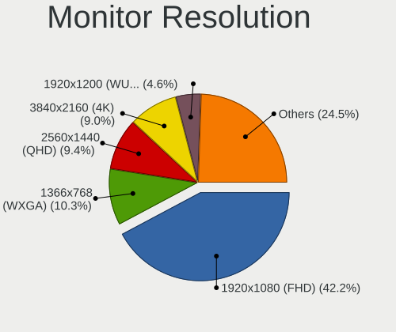

| Resolution         | Computers | Percent |
|--------------------|-----------|---------|
| 1920x1080 (FHD)    | 1621      | 42.2%   |
| 1366x768 (WXGA)    | 396       | 10.31%  |
| 2560x1440 (QHD)    | 362       | 9.42%   |
| 3840x2160 (4K)     | 346       | 9.01%   |
| 1920x1200 (WUXGA)  | 176       | 4.58%   |
| 3440x1440          | 124       | 3.23%   |
| 1680x1050 (WSXGA+) | 109       | 2.84%   |
| 1600x900 (HD+)     | 73        | 1.9%    |
| 2560x1600          | 72        | 1.87%   |
| 1280x800 (WXGA)    | 63        | 1.64%   |
| 1280x1024 (SXGA)   | 60        | 1.56%   |
| 2880x1800          | 58        | 1.51%   |
| 1440x900 (WXGA+)   | 49        | 1.28%   |
| Unknown            | 49        | 1.28%   |
| 3840x1080          | 39        | 1.02%   |
| 3840x2400          | 28        | 0.73%   |
| 2560x1080          | 18        | 0.47%   |
| 800x1280           | 17        | 0.44%   |
| 1360x768           | 16        | 0.42%   |
| 1024x768 (XGA)     | 16        | 0.42%   |
| 2160x1440          | 13        | 0.34%   |
| 3200x1800 (QHD+)   | 12        | 0.31%   |
| 1920x540           | 12        | 0.31%   |
| 2880x1920          | 11        | 0.29%   |
| 1280x720 (HD)      | 10        | 0.26%   |
| 3840x1600          | 8         | 0.21%   |
| 2288x1287          | 7         | 0.18%   |
| 1024x600           | 7         | 0.18%   |
| 3200x2000          | 6         | 0.16%   |
| 2736x1824          | 4         | 0.1%    |
| 6400x2160          | 3         | 0.08%   |
| 5760x2160          | 3         | 0.08%   |
| 5760x1080          | 3         | 0.08%   |
| 4480x1440          | 3         | 0.08%   |
| 3840x1200          | 3         | 0.08%   |
| 3200x1200          | 3         | 0.08%   |
| 3000x2000          | 3         | 0.08%   |
| 1920x1280          | 3         | 0.08%   |
| 3072x1920          | 2         | 0.05%   |
| 3000x2120          | 2         | 0.05%   |

Monitor Diagonal
----------------

Diagonal size in inches

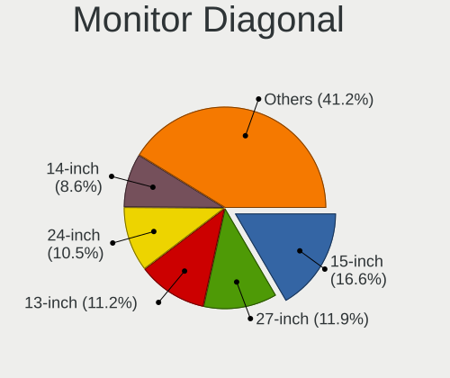

| Inches  | Computers | Percent |
|---------|-----------|---------|
| 15      | 662       | 16.59%  |
| 27      | 473       | 11.85%  |
| 13      | 448       | 11.23%  |
| 24      | 417       | 10.45%  |
| 14      | 345       | 8.65%   |
| 23      | 220       | 5.51%   |
| Unknown | 170       | 4.26%   |
| 31      | 139       | 3.48%   |
| 17      | 123       | 3.08%   |
| 34      | 121       | 3.03%   |
| 21      | 118       | 2.96%   |
| 12      | 107       | 2.68%   |
| 22      | 79        | 1.98%   |
| 16      | 68        | 1.7%    |
| 19      | 59        | 1.48%   |
| 84      | 53        | 1.33%   |
| 11      | 39        | 0.98%   |
| 32      | 37        | 0.93%   |
| 72      | 23        | 0.58%   |
| 20      | 21        | 0.53%   |
| 54      | 20        | 0.5%    |
| 25      | 20        | 0.5%    |
| 40      | 19        | 0.48%   |
| 65      | 17        | 0.43%   |
| 48      | 16        | 0.4%    |
| 7       | 16        | 0.4%    |
| 42      | 15        | 0.38%   |
| 49      | 13        | 0.33%   |
| 35      | 13        | 0.33%   |
| 18      | 12        | 0.3%    |
| 39      | 9         | 0.23%   |
| 26      | 9         | 0.23%   |
| 37      | 8         | 0.2%    |
| 29      | 8         | 0.2%    |
| 33      | 7         | 0.18%   |
| 10      | 7         | 0.18%   |
| 46      | 6         | 0.15%   |
| 43      | 6         | 0.15%   |
| 142     | 5         | 0.13%   |
| 63      | 4         | 0.1%    |

Monitor Width
-------------

Physical width

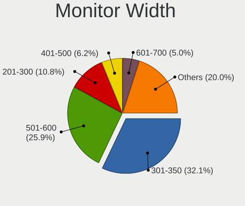

| Width in mm    | Computers | Percent |
|----------------|-----------|---------|
| 301-350        | 1247      | 32.09%  |
| 501-600        | 1005      | 25.86%  |
| 201-300        | 421       | 10.83%  |
| 401-500        | 241       | 6.2%    |
| 601-700        | 193       | 4.97%   |
| 351-400        | 174       | 4.48%   |
| Unknown        | 170       | 4.37%   |
| 701-800        | 159       | 4.09%   |
| 1001-1500      | 93        | 2.39%   |
| 1501-2000      | 80        | 2.06%   |
| 801-900        | 47        | 1.21%   |
| 901-1000       | 30        | 0.77%   |
| 1-100          | 16        | 0.41%   |
| More than 2000 | 5         | 0.13%   |
| 101-200        | 5         | 0.13%   |

Aspect Ratio
------------

Proportional relationship between the width and the height

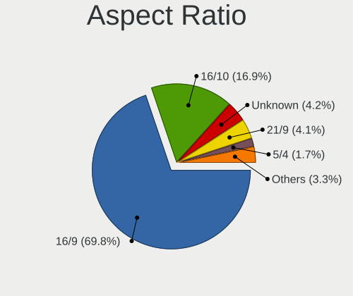

| Ratio   | Computers | Percent |
|---------|-----------|---------|
| 16/9    | 2502      | 69.81%  |
| 16/10   | 605       | 16.88%  |
| Unknown | 149       | 4.16%   |
| 21/9    | 147       | 4.1%    |
| 5/4     | 62        | 1.73%   |
| 3/2     | 39        | 1.09%   |
| 32/9    | 28        | 0.78%   |
| 4/3     | 19        | 0.53%   |
| 0.67    | 12        | 0.33%   |
| 6/5     | 7         | 0.2%    |
| 1.00    | 5         | 0.14%   |
| 0.62    | 2         | 0.06%   |
| 0.45    | 2         | 0.06%   |
| 3.40    | 1         | 0.03%   |
| 3.20    | 1         | 0.03%   |
| 2.70    | 1         | 0.03%   |
| 0.63    | 1         | 0.03%   |
| 0.56    | 1         | 0.03%   |

Monitor Area
------------

Area in inch²

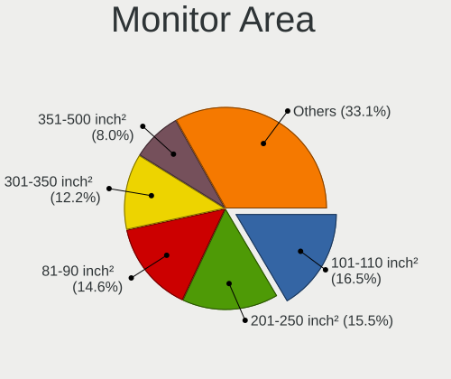

| Area in inch² | Computers | Percent |
|----------------|-----------|---------|
| 101-110        | 649       | 16.5%   |
| 201-250        | 609       | 15.48%  |
| 81-90          | 576       | 14.64%  |
| 301-350        | 480       | 12.2%   |
| 351-500        | 316       | 8.03%   |
| 71-80          | 211       | 5.36%   |
| 251-300        | 189       | 4.8%    |
| Unknown        | 170       | 4.32%   |
| More than 1000 | 142       | 3.61%   |
| 61-70          | 103       | 2.62%   |
| 151-200        | 100       | 2.54%   |
| 121-130        | 99        | 2.52%   |
| 501-1000       | 97        | 2.47%   |
| 111-120        | 73        | 1.86%   |
| 51-60          | 40        | 1.02%   |
| 141-150        | 24        | 0.61%   |
| 1-40           | 20        | 0.51%   |
| 131-140        | 17        | 0.43%   |
| 91-100         | 11        | 0.28%   |
| 41-50          | 8         | 0.2%    |

Pixel Density
-------------

Pixels per inch

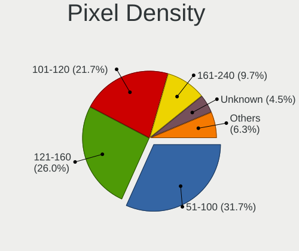

| Density       | Computers | Percent |
|---------------|-----------|---------|
| 51-100        | 1208      | 31.73%  |
| 121-160       | 989       | 25.98%  |
| 101-120       | 828       | 21.75%  |
| 161-240       | 371       | 9.75%   |
| Unknown       | 170       | 4.47%   |
| More than 240 | 149       | 3.91%   |
| 1-50          | 92        | 2.42%   |

Multiple Monitors
-----------------

Total monitors connected

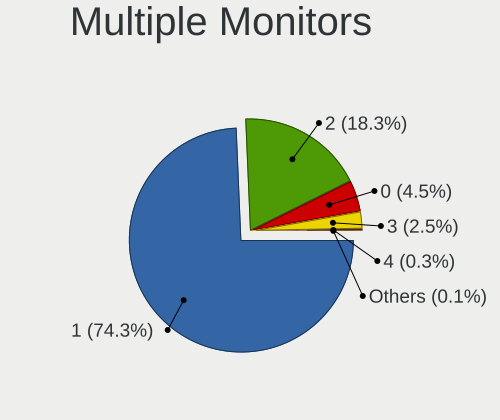

| Total | Computers | Percent |
|-------|-----------|---------|
| 1     | 2675      | 74.33%  |
| 2     | 660       | 18.34%  |
| 0     | 163       | 4.53%   |
| 3     | 89        | 2.47%   |
| 4     | 10        | 0.28%   |
| 5     | 2         | 0.06%   |

Network
-------

Net Controller Vendor
---------------------

Controller vendors

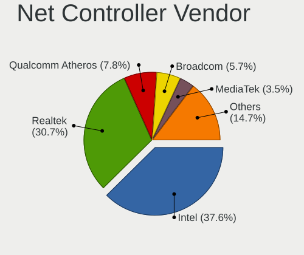

| Vendor                                 | Computers | Percent |
|----------------------------------------|-----------|---------|
| Intel                                  | 1933      | 37.59%  |
| Realtek Semiconductor                  | 1580      | 30.73%  |
| Qualcomm Atheros                       | 400       | 7.78%   |
| Broadcom                               | 295       | 5.74%   |
| MediaTek                               | 179       | 3.48%   |
| Broadcom Limited                       | 76        | 1.48%   |
| Marvell Technology Group               | 52        | 1.01%   |
| ASIX Electronics                       | 44        | 0.86%   |
| TP-Link                                | 41        | 0.8%    |
| Ralink                                 | 34        | 0.66%   |
| ASUSTek Computer                       | 30        | 0.58%   |
| Nvidia                                 | 28        | 0.54%   |
| Ralink Technology                      | 26        | 0.51%   |
| Microsoft                              | 26        | 0.51%   |
| Hewlett-Packard                        | 26        | 0.51%   |
| Lenovo                                 | 23        | 0.45%   |
| Sierra Wireless                        | 22        | 0.43%   |
| Dell                                   | 21        | 0.41%   |
| NetGear                                | 20        | 0.39%   |
| D-Link                                 | 20        | 0.39%   |
| Shenzhen Goodix Technology             | 18        | 0.35%   |
| D-Link System                          | 17        | 0.33%   |
| DisplayLink                            | 16        | 0.31%   |
| Qualcomm                               | 15        | 0.29%   |
| Ericsson Business Mobile Networks      | 14        | 0.27%   |
| Aquantia                               | 14        | 0.27%   |
| Samsung Electronics                    | 13        | 0.25%   |
| Qualcomm Atheros Communications        | 9         | 0.18%   |
| Huawei Technologies                    | 9         | 0.18%   |
| Fibocom                                | 9         | 0.18%   |
| Microchip Technology                   | 8         | 0.16%   |
| STMicroelectronics                     | 7         | 0.14%   |
| Linksys                                | 7         | 0.14%   |
| Xiaomi                                 | 6         | 0.12%   |
| Mellanox Technologies                  | 6         | 0.12%   |
| Sony Ericsson Mobile Communications AB | 5         | 0.1%    |
| Arduino SA                             | 5         | 0.1%    |
| Silicon Integrated Systems [SiS]       | 4         | 0.08%   |
| Qualcomm Technologies                  | 4         | 0.08%   |
| QinHeng Electronics                    | 4         | 0.08%   |

Net Controller Model
--------------------

Controller models

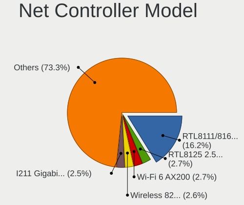

| Model                                                                  | Computers | Percent |
|------------------------------------------------------------------------|-----------|---------|
| Realtek RTL8111/8168/8211/8411 PCI Express Gigabit Ethernet Controller | 1000      | 16.19%  |
| Realtek RTL8125 2.5GbE Controller                                      | 166       | 2.69%   |
| Intel Wi-Fi 6 AX200                                                    | 164       | 2.66%   |
| Intel Wireless 8265 / 8275                                             | 163       | 2.64%   |
| Intel I211 Gigabit Network Connection                                  | 154       | 2.49%   |
| Realtek RTL8153 Gigabit Ethernet Adapter                               | 148       | 2.4%    |
| Intel 82579LM Gigabit Network Connection (Lewisville)                  | 107       | 1.73%   |
| Intel Wi-Fi 6 AX201                                                    | 88        | 1.43%   |
| Intel Wireless 8260                                                    | 87        | 1.41%   |
| Realtek RTL810xE PCI Express Fast Ethernet controller                  | 86        | 1.39%   |
| Intel Wireless 7260                                                    | 86        | 1.39%   |
| Intel Wireless 7265                                                    | 81        | 1.31%   |
| Intel Ethernet Connection (2) I219-V                                   | 77        | 1.25%   |
| Intel Ethernet Controller I225-V                                       | 74        | 1.2%    |
| MediaTek MT7922 802.11ax PCI Express Wireless Network Adapter          | 72        | 1.17%   |
| Realtek RTL8822CE 802.11ac PCIe Wireless Network Adapter               | 61        | 0.99%   |
| Intel Alder Lake-P PCH CNVi WiFi                                       | 59        | 0.96%   |
| Qualcomm Atheros QCA6174 802.11ac Wireless Network Adapter             | 53        | 0.86%   |
| Intel Ethernet Connection (7) I219-V                                   | 51        | 0.83%   |
| Intel Centrino Advanced-N 6205 [Taylor Peak]                           | 51        | 0.83%   |
| MediaTek MT7921 802.11ax PCIe Wireless Network Adapter [Filogic 330]   | 49        | 0.79%   |
| Qualcomm Atheros QCA9377 802.11ac Wireless Network Adapter             | 48        | 0.78%   |
| Intel Cannon Point-LP CNVi [Wireless-AC]                               | 48        | 0.78%   |
| Realtek RTL8821CE 802.11ac PCIe Wireless Network Adapter               | 47        | 0.76%   |
| Intel Ethernet Connection I217-LM                                      | 46        | 0.74%   |
| Intel Ethernet Connection (4) I219-V                                   | 46        | 0.74%   |
| Intel Wi-Fi 6E(802.11ax) AX210/AX1675* 2x2 [Typhoon Peak]              | 45        | 0.73%   |
| Qualcomm Atheros QCA9565 / AR9565 Wireless Network Adapter             | 44        | 0.71%   |
| Realtek RTL8852BE PCIe 802.11ax Wireless Network Controller            | 43        | 0.7%    |
| Intel Ethernet Connection (4) I219-LM                                  | 43        | 0.7%    |
| Intel 82579V Gigabit Network Connection                                | 42        | 0.68%   |
| Intel Cannon Lake PCH CNVi WiFi                                        | 41        | 0.66%   |
| Qualcomm Atheros AR9485 Wireless Network Adapter                       | 40        | 0.65%   |
| Qualcomm Atheros AR9285 Wireless Network Adapter (PCI-Express)         | 40        | 0.65%   |
| Intel Comet Lake PCH-LP CNVi WiFi                                      | 38        | 0.62%   |
| Intel Dual Band Wireless-AC 3168NGW [Stone Peak]                       | 37        | 0.6%    |
| ASIX AX88179 Gigabit Ethernet                                          | 34        | 0.55%   |
| Intel Wi-Fi 5(802.11ac) Wireless-AC 9x6x [Thunder Peak]                | 33        | 0.53%   |
| Intel Ethernet Connection (3) I218-LM                                  | 32        | 0.52%   |
| Broadcom BCM4360 802.11ac Dual Band Wireless Network Adapter           | 32        | 0.52%   |

Wireless Vendor
---------------

Wireless vendors

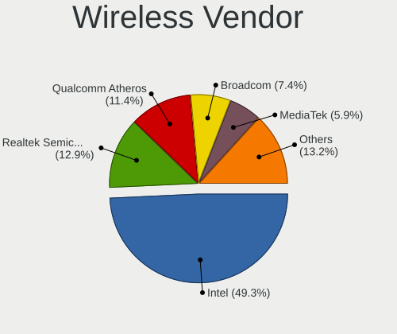

| Vendor                          | Computers | Percent |
|---------------------------------|-----------|---------|
| Intel                           | 1354      | 49.27%  |
| Realtek Semiconductor           | 355       | 12.92%  |
| Qualcomm Atheros                | 312       | 11.35%  |
| Broadcom                        | 202       | 7.35%   |
| MediaTek                        | 162       | 5.9%    |
| Broadcom Limited                | 56        | 2.04%   |
| TP-Link                         | 38        | 1.38%   |
| Ralink                          | 34        | 1.24%   |
| ASUSTek Computer                | 30        | 1.09%   |
| Ralink Technology               | 26        | 0.95%   |
| Sierra Wireless                 | 22        | 0.8%    |
| NetGear                         | 20        | 0.73%   |
| Microsoft                       | 20        | 0.73%   |
| D-Link                          | 15        | 0.55%   |
| Marvell Technology Group        | 14        | 0.51%   |
| Dell                            | 14        | 0.51%   |
| Qualcomm                        | 13        | 0.47%   |
| D-Link System                   | 11        | 0.4%    |
| Qualcomm Atheros Communications | 9         | 0.33%   |
| Fibocom                         | 9         | 0.33%   |
| Hewlett-Packard                 | 7         | 0.25%   |
| Linksys                         | 5         | 0.18%   |
| Belkin Components               | 4         | 0.15%   |
| ZyXEL Communications            | 2         | 0.07%   |
| Wacom                           | 2         | 0.07%   |
| Micro Star International        | 2         | 0.07%   |
| Edimax Technology               | 2         | 0.07%   |
| ZyDAS                           | 1         | 0.04%   |
| Wilocity                        | 1         | 0.04%   |
| Sitecom Europe                  | 1         | 0.04%   |
| Qcom                            | 1         | 0.04%   |
| Mercucys                        | 1         | 0.04%   |
| IMC Networks                    | 1         | 0.04%   |
| Fujitsu Siemens Computers       | 1         | 0.04%   |
| Chu Yuen Enterprise             | 1         | 0.04%   |

Wireless Model
--------------

Wireless models

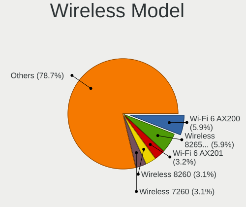

| Model                                                                | Computers | Percent |
|----------------------------------------------------------------------|-----------|---------|
| Intel Wi-Fi 6 AX200                                                  | 164       | 5.93%   |
| Intel Wireless 8265 / 8275                                           | 163       | 5.89%   |
| Intel Wi-Fi 6 AX201                                                  | 88        | 3.18%   |
| Intel Wireless 8260                                                  | 87        | 3.14%   |
| Intel Wireless 7260                                                  | 86        | 3.11%   |
| Intel Wireless 7265                                                  | 81        | 2.93%   |
| MediaTek MT7922 802.11ax PCI Express Wireless Network Adapter        | 65        | 2.35%   |
| Realtek RTL8822CE 802.11ac PCIe Wireless Network Adapter             | 61        | 2.2%    |
| Qualcomm Atheros QCA6174 802.11ac Wireless Network Adapter           | 53        | 1.92%   |
| Intel Centrino Advanced-N 6205 [Taylor Peak]                         | 51        | 1.84%   |
| MediaTek MT7921 802.11ax PCIe Wireless Network Adapter [Filogic 330] | 49        | 1.77%   |
| Qualcomm Atheros QCA9377 802.11ac Wireless Network Adapter           | 48        | 1.73%   |
| Intel Cannon Point-LP CNVi [Wireless-AC]                             | 48        | 1.73%   |
| Realtek RTL8821CE 802.11ac PCIe Wireless Network Adapter             | 47        | 1.7%    |
| Intel Wi-Fi 6E(802.11ax) AX210/AX1675* 2x2 [Typhoon Peak]            | 45        | 1.63%   |
| Qualcomm Atheros QCA9565 / AR9565 Wireless Network Adapter           | 44        | 1.59%   |
| Intel Cannon Lake PCH CNVi WiFi                                      | 41        | 1.48%   |
| Qualcomm Atheros AR9485 Wireless Network Adapter                     | 40        | 1.45%   |
| Qualcomm Atheros AR9285 Wireless Network Adapter (PCI-Express)       | 40        | 1.45%   |
| Intel Comet Lake PCH-LP CNVi WiFi                                    | 38        | 1.37%   |
| Realtek RTL8852BE PCIe 802.11ax Wireless Network Controller          | 37        | 1.34%   |
| Intel Dual Band Wireless-AC 3168NGW [Stone Peak]                     | 37        | 1.34%   |
| Intel Alder Lake-P PCH CNVi WiFi                                     | 35        | 1.26%   |
| Intel Wi-Fi 5(802.11ac) Wireless-AC 9x6x [Thunder Peak]              | 33        | 1.19%   |
| Broadcom BCM4360 802.11ac Dual Band Wireless Network Adapter         | 32        | 1.16%   |
| Intel Raptor Lake PCH CNVi WiFi                                      | 30        | 1.08%   |
| Intel Comet Lake PCH CNVi WiFi                                       | 28        | 1.01%   |
| Realtek RTL8852AE 802.11ax PCIe Wireless Network Adapter             | 26        | 0.94%   |
| Broadcom Limited BCM4360 802.11ac Dual Band Wireless Network Adapter | 26        | 0.94%   |
| Realtek RTL8723BE PCIe Wireless Network Adapter                      | 25        | 0.9%    |
| Qualcomm Atheros AR9462 Wireless Network Adapter                     | 25        | 0.9%    |
| Intel Wireless 3165                                                  | 24        | 0.87%   |
| Intel Wireless 3160                                                  | 23        | 0.83%   |
| Broadcom BCM43228 802.11a/b/g/n                                      | 23        | 0.83%   |
| Intel 700 Series Chipset CNVi WiFi                                   | 22        | 0.8%    |
| Realtek RTL8822BE 802.11a/b/g/n/ac WiFi adapter                      | 21        | 0.76%   |
| Intel Centrino Advanced-N 6235                                       | 20        | 0.72%   |
| Broadcom BCM4352 802.11ac Dual Band Wireless Network Adapter         | 20        | 0.72%   |
| Broadcom BCM4313 802.11bgn Wireless Network Adapter                  | 20        | 0.72%   |
| Realtek RTL8188EUS 802.11n Wireless Network Adapter                  | 19        | 0.69%   |

Ethernet Vendor
---------------

Ethernet vendors

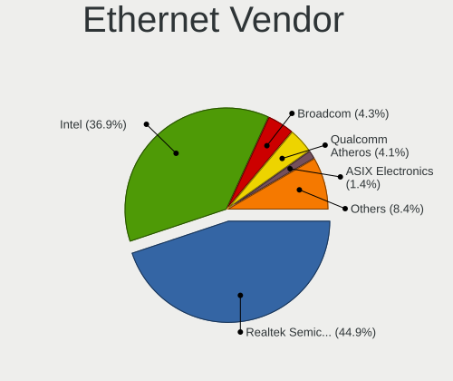

| Vendor                                 | Computers | Percent |
|----------------------------------------|-----------|---------|
| Realtek Semiconductor                  | 1433      | 44.89%  |
| Intel                                  | 1179      | 36.94%  |
| Broadcom                               | 138       | 4.32%   |
| Qualcomm Atheros                       | 130       | 4.07%   |
| ASIX Electronics                       | 44        | 1.38%   |
| Marvell Technology Group               | 38        | 1.19%   |
| Nvidia                                 | 28        | 0.88%   |
| Lenovo                                 | 22        | 0.69%   |
| Broadcom Limited                       | 21        | 0.66%   |
| DisplayLink                            | 16        | 0.5%    |
| MediaTek                               | 15        | 0.47%   |
| Aquantia                               | 14        | 0.44%   |
| Samsung Electronics                    | 13        | 0.41%   |
| Hewlett-Packard                        | 9         | 0.28%   |
| Microchip Technology                   | 7         | 0.22%   |
| Huawei Technologies                    | 7         | 0.22%   |
| Xiaomi                                 | 6         | 0.19%   |
| D-Link System                          | 6         | 0.19%   |
| Microsoft                              | 5         | 0.16%   |
| D-Link                                 | 5         | 0.16%   |
| Sony Ericsson Mobile Communications AB | 4         | 0.13%   |
| Qualcomm Technologies                  | 4         | 0.13%   |
| Mellanox Technologies                  | 4         | 0.13%   |
| Google                                 | 4         | 0.13%   |
| TP-Link                                | 3         | 0.09%   |
| Silicon Integrated Systems [SiS]       | 3         | 0.09%   |
| JMicron Technology                     | 3         | 0.09%   |
| Insyde Software                        | 3         | 0.09%   |
| ICS Advent                             | 3         | 0.09%   |
| Apple                                  | 3         | 0.09%   |
| Suzhou Motorcomm Electronic Technology | 2         | 0.06%   |
| Qualcomm                               | 2         | 0.06%   |
| OPPO Electronics                       | 2         | 0.06%   |
| Motorola PCS                           | 2         | 0.06%   |
| Linksys                                | 2         | 0.06%   |
| Attansic Technology                    | 2         | 0.06%   |
| VIA Technologies                       | 1         | 0.03%   |
| Unknown                                | 1         | 0.03%   |
| Sundance Technology Inc / IC Plus      | 1         | 0.03%   |
| Raspberry Pi                           | 1         | 0.03%   |

Ethernet Model
--------------

Ethernet models

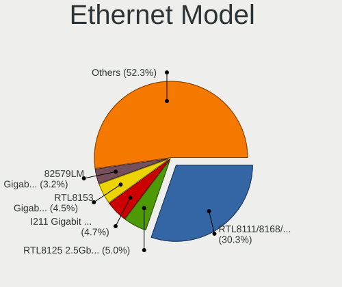

| Model                                                                  | Computers | Percent |
|------------------------------------------------------------------------|-----------|---------|
| Realtek RTL8111/8168/8211/8411 PCI Express Gigabit Ethernet Controller | 1000      | 30.29%  |
| Realtek RTL8125 2.5GbE Controller                                      | 166       | 5.03%   |
| Intel I211 Gigabit Network Connection                                  | 154       | 4.67%   |
| Realtek RTL8153 Gigabit Ethernet Adapter                               | 148       | 4.48%   |
| Intel 82579LM Gigabit Network Connection (Lewisville)                  | 107       | 3.24%   |
| Realtek RTL810xE PCI Express Fast Ethernet controller                  | 86        | 2.61%   |
| Intel Ethernet Connection (2) I219-V                                   | 77        | 2.33%   |
| Intel Ethernet Controller I225-V                                       | 74        | 2.24%   |
| Intel Ethernet Connection (7) I219-V                                   | 51        | 1.54%   |
| Intel Ethernet Connection I217-LM                                      | 46        | 1.39%   |
| Intel Ethernet Connection (4) I219-V                                   | 46        | 1.39%   |
| Intel Ethernet Connection (4) I219-LM                                  | 43        | 1.3%    |
| Intel 82579V Gigabit Network Connection                                | 42        | 1.27%   |
| ASIX AX88179 Gigabit Ethernet                                          | 34        | 1.03%   |
| Intel Ethernet Connection (3) I218-LM                                  | 32        | 0.97%   |
| Intel Ethernet Connection I219-V                                       | 31        | 0.94%   |
| Intel Ethernet Connection I219-LM                                      | 31        | 0.94%   |
| Intel Ethernet Connection I218-LM                                      | 29        | 0.88%   |
| Intel Ethernet Connection (2) I219-LM                                  | 29        | 0.88%   |
| Intel Ethernet Connection I217-V                                       | 26        | 0.79%   |
| Intel Ethernet Connection (2) I218-V                                   | 25        | 0.76%   |
| Qualcomm Atheros Killer E220x Gigabit Ethernet Controller              | 24        | 0.73%   |
| Intel Ethernet Connection (6) I219-V                                   | 24        | 0.73%   |
| Intel Alder Lake-P PCH CNVi WiFi                                       | 24        | 0.73%   |
| Broadcom NetXtreme BCM57765 Gigabit Ethernet PCIe                      | 24        | 0.73%   |
| Intel Ethernet Connection (7) I219-LM                                  | 22        | 0.67%   |
| Intel 82577LM Gigabit Network Connection                               | 22        | 0.67%   |
| Intel Ethernet Controller I226-V                                       | 20        | 0.61%   |
| Broadcom NetXtreme BCM57766 Gigabit Ethernet PCIe                      | 20        | 0.61%   |
| Intel I210 Gigabit Network Connection                                  | 19        | 0.58%   |
| Qualcomm Atheros AR8151 v2.0 Gigabit Ethernet                          | 18        | 0.55%   |
| Broadcom NetLink BCM57785 Gigabit Ethernet PCIe                        | 18        | 0.55%   |
| Qualcomm Atheros QCA8171 Gigabit Ethernet                              | 16        | 0.48%   |
| Intel Ethernet Connection (13) I219-V                                  | 16        | 0.48%   |
| Intel Ethernet Connection (6) I219-LM                                  | 15        | 0.45%   |
| Realtek RTL-8100/8101L/8139 PCI Fast Ethernet Adapter                  | 13        | 0.39%   |
| Qualcomm Atheros Killer E2500 Gigabit Ethernet Controller              | 13        | 0.39%   |
| Qualcomm Atheros AR8161 Gigabit Ethernet                               | 12        | 0.36%   |
| Nvidia MCP79 Ethernet                                                  | 12        | 0.36%   |
| Intel Ethernet Connection (5) I219-LM                                  | 12        | 0.36%   |

Net Controller Kind
-------------------

Ethernet, WiFi or modem

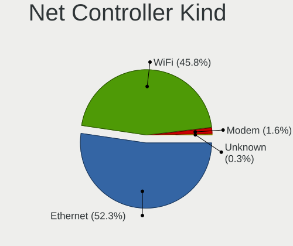

| Kind     | Computers | Percent |
|----------|-----------|---------|
| Ethernet | 2959      | 52.33%  |
| WiFi     | 2589      | 45.78%  |
| Modem    | 89        | 1.57%   |
| Unknown  | 18        | 0.32%   |

Used Controller
---------------

Currently used network controller

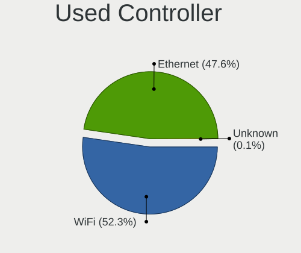

| Kind     | Computers | Percent |
|----------|-----------|---------|
| WiFi     | 1900      | 52.28%  |
| Ethernet | 1730      | 47.61%  |
| Modem    | 2         | 0.06%   |
| Unknown  | 2         | 0.06%   |

NICs
----

Total network controllers on board

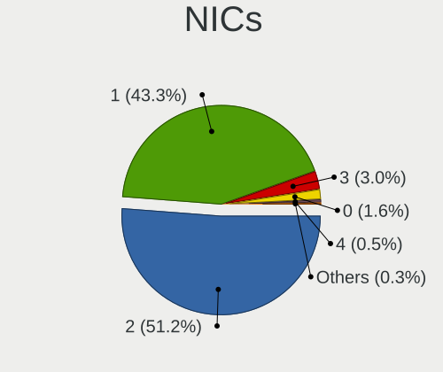

| Total | Computers | Percent |
|-------|-----------|---------|
| 2     | 1803      | 51.21%  |
| 1     | 1526      | 43.34%  |
| 3     | 104       | 2.95%   |
| 0     | 58        | 1.65%   |
| 4     | 18        | 0.51%   |
| 5     | 5         | 0.14%   |
| 6     | 4         | 0.11%   |
| 11    | 1         | 0.03%   |
| 9     | 1         | 0.03%   |
| 7     | 1         | 0.03%   |

IPv6
----

IPv6 vs IPv4

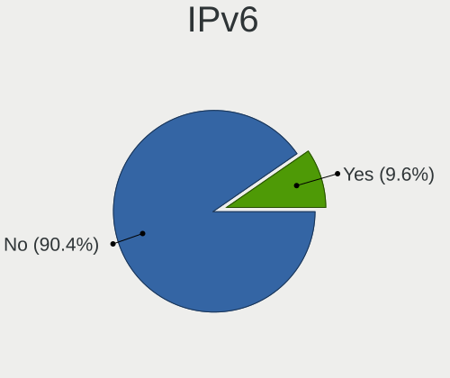

| Used | Computers | Percent |
|------|-----------|---------|
| No   | 3208      | 90.39%  |
| Yes  | 341       | 9.61%   |

Bluetooth
---------

Bluetooth Vendor
----------------

Controller vendors

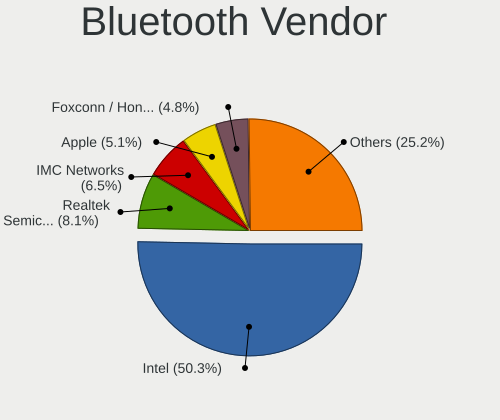

| Vendor                          | Computers | Percent |
|---------------------------------|-----------|---------|
| Intel                           | 1180      | 50.32%  |
| Realtek Semiconductor           | 190       | 8.1%    |
| IMC Networks                    | 152       | 6.48%   |
| Apple                           | 120       | 5.12%   |
| Foxconn / Hon Hai               | 112       | 4.78%   |
| Qualcomm Atheros Communications | 102       | 4.35%   |
| ASUSTek Computer                | 89        | 3.8%    |
| Cambridge Silicon Radio         | 85        | 3.62%   |
| Broadcom                        | 81        | 3.45%   |
| Lite-On Technology              | 60        | 2.56%   |
| MediaTek                        | 47        | 2%      |
| Hewlett-Packard                 | 30        | 1.28%   |
| Dell                            | 20        | 0.85%   |
| Marvell Semiconductor           | 14        | 0.6%    |
| TP-Link                         | 10        | 0.43%   |
| Ralink                          | 10        | 0.43%   |
| Toshiba                         | 7         | 0.3%    |
| USI                             | 6         | 0.26%   |
| Realtek                         | 4         | 0.17%   |
| Ralink Technology               | 3         | 0.13%   |
| Belkin Components               | 3         | 0.13%   |
| Alps Electric                   | 3         | 0.13%   |
| Taiyo Yuden                     | 2         | 0.09%   |
| Micro Star International        | 2         | 0.09%   |
| HTC (High Tech Computer)        | 2         | 0.09%   |
| Foxconn International           | 2         | 0.09%   |
| Chicony Electronics             | 2         | 0.09%   |
| Quectel Wireless Solutions      | 1         | 0.04%   |
| Mobile Action Technology        | 1         | 0.04%   |
| Mercucys                        | 1         | 0.04%   |
| Fujitsu                         | 1         | 0.04%   |
| Creative Technology             | 1         | 0.04%   |
| Actions                         | 1         | 0.04%   |
| Unknown                         | 1         | 0.04%   |

Bluetooth Model
---------------

Controller models

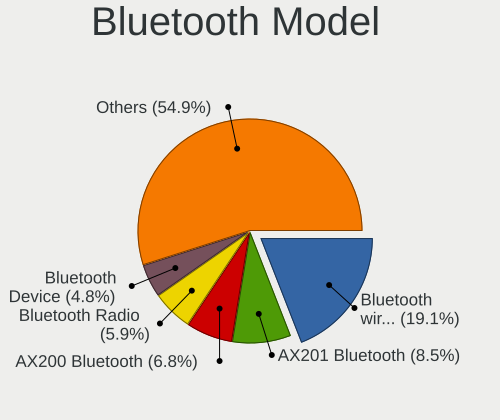

| Model                                               | Computers | Percent |
|-----------------------------------------------------|-----------|---------|
| Intel Bluetooth wireless interface                  | 449       | 19.07%  |
| Intel AX201 Bluetooth                               | 200       | 8.5%    |
| Intel AX200 Bluetooth                               | 159       | 6.75%   |
| Realtek Bluetooth Radio                             | 140       | 5.95%   |
| Intel Bluetooth Device                              | 113       | 4.8%    |
| Intel Bluetooth 9460/9560 Jefferson Peak (JfP)      | 113       | 4.8%    |
| Cambridge Silicon Radio Bluetooth Dongle (HCI mode) | 85        | 3.61%   |
| IMC Networks Bluetooth Radio                        | 67        | 2.85%   |
| Apple Bluetooth Host Controller                     | 54        | 2.29%   |
| IMC Networks Wireless_Device                        | 50        | 2.12%   |
| Foxconn / Hon Hai Wireless_Device                   | 46        | 1.95%   |
| MediaTek Wireless_Device                            | 44        | 1.87%   |
| Intel AX210 Bluetooth                               | 44        | 1.87%   |
| Intel Wireless-AC 3168 Bluetooth                    | 37        | 1.57%   |
| ASUS Broadcom BCM20702A0 Bluetooth                  | 35        | 1.49%   |
| Apple Bluetooth USB Host Controller                 | 35        | 1.49%   |
| Foxconn / Hon Hai Bluetooth Device                  | 33        | 1.4%    |
| Intel Wireless-AC 9260 Bluetooth Adapter            | 31        | 1.32%   |
| Intel Centrino Bluetooth Wireless Transceiver       | 31        | 1.32%   |
| Qualcomm Atheros  Bluetooth Device                  | 28        | 1.19%   |
| Qualcomm Atheros QCA61x4 Bluetooth 4.0              | 26        | 1.1%    |
| Realtek  Bluetooth 4.2 Adapter                      | 23        | 0.98%   |
| ASUS ASUS USB-BT500                                 | 23        | 0.98%   |
| Apple Built-in Bluetooth 2.0+EDR HCI                | 22        | 0.93%   |
| Qualcomm Atheros AR3011 Bluetooth                   | 21        | 0.89%   |
| Qualcomm Atheros AR3012 Bluetooth 4.0               | 19        | 0.81%   |
| Broadcom BCM2045B (BDC-2.1)                         | 19        | 0.81%   |
| IMC Networks Bluetooth Device                       | 17        | 0.72%   |
| Lite-On Bluetooth Device                            | 16        | 0.68%   |
| HP Broadcom 2070 Bluetooth Combo                    | 16        | 0.68%   |
| Foxconn / Hon Hai MediaTek Bluetooth Adapter        | 15        | 0.64%   |
| HP Bluetooth 2.0 Interface [Broadcom BCM2045]       | 14        | 0.59%   |
| Lite-On Atheros AR3012 Bluetooth                    | 13        | 0.55%   |
| Broadcom HP Portable SoftSailing                    | 13        | 0.55%   |
| Broadcom BCM20702 Bluetooth 4.0 [ThinkPad]          | 13        | 0.55%   |
| Lite-On Qualcomm Atheros QCA9377 Bluetooth          | 12        | 0.51%   |
| TP-Link TP-T@- UB500 Adapter                        | 10        | 0.42%   |
| Ralink RT3290 Bluetooth                             | 10        | 0.42%   |
| Marvell Bluetooth and Wireless LAN Composite        | 10        | 0.42%   |
| Lite-On Wireless_Device                             | 10        | 0.42%   |

Sound
-----

Sound Vendor
------------

Sound card vendors

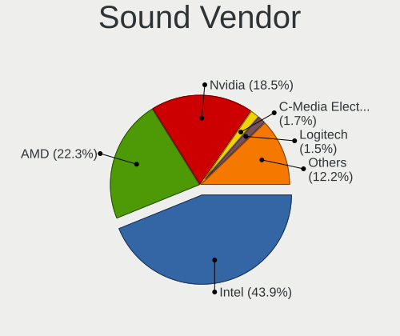

| Vendor                                       | Computers | Percent |
|----------------------------------------------|-----------|---------|
| Intel                                        | 2319      | 43.88%  |
| AMD                                          | 1176      | 22.25%  |
| Nvidia                                       | 979       | 18.52%  |
| C-Media Electronics                          | 88        | 1.67%   |
| Logitech                                     | 79        | 1.49%   |
| SteelSeries ApS                              | 44        | 0.83%   |
| Kingston Technology                          | 39        | 0.74%   |
| ASUSTek Computer                             | 37        | 0.7%    |
| Creative Labs                                | 32        | 0.61%   |
| Hewlett-Packard                              | 25        | 0.47%   |
| GN Netcom                                    | 24        | 0.45%   |
| Focusrite-Novation                           | 24        | 0.45%   |
| Realtek Semiconductor                        | 23        | 0.44%   |
| Creative Technology                          | 23        | 0.44%   |
| Texas Instruments                            | 19        | 0.36%   |
| Plantronics                                  | 19        | 0.36%   |
| Micro Star International                     | 18        | 0.34%   |
| Razer USA                                    | 17        | 0.32%   |
| Lenovo                                       | 16        | 0.3%    |
| RODE Microphones                             | 15        | 0.28%   |
| Corsair                                      | 13        | 0.25%   |
| Sony                                         | 12        | 0.23%   |
| DSEA A/S                                     | 10        | 0.19%   |
| Blue Microphones                             | 10        | 0.19%   |
| SAVITECH                                     | 9         | 0.17%   |
| Apple                                        | 9         | 0.17%   |
| JMTek                                        | 8         | 0.15%   |
| GYROCOM C&C                                  | 7         | 0.13%   |
| Yamaha                                       | 6         | 0.11%   |
| Audio-Technica                               | 6         | 0.11%   |
| Trust                                        | 5         | 0.09%   |
| Samson Technologies                          | 5         | 0.09%   |
| PreSonus Audio Electronics                   | 5         | 0.09%   |
| FiiO Electronics Technology                  | 5         | 0.09%   |
| BEHRINGER International                      | 5         | 0.09%   |
| Antlion Audio                                | 5         | 0.09%   |
| Zoran Co. Personal Media Division (Nogatech) | 4         | 0.08%   |
| XMOS                                         | 4         | 0.08%   |
| Unknown                                      | 4         | 0.08%   |
| TerraTec Electronic                          | 4         | 0.08%   |

Sound Model
-----------

Sound card models

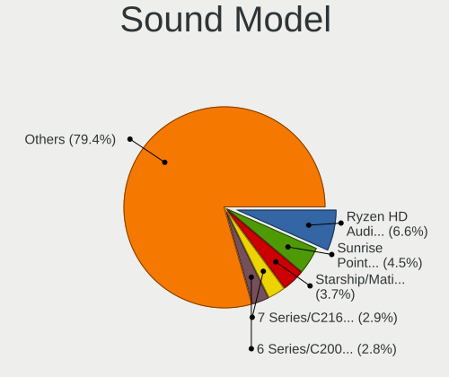

| Model                                                                      | Computers | Percent |
|----------------------------------------------------------------------------|-----------|---------|
| AMD Ryzen HD Audio Controller                                              | 422       | 6.64%   |
| Intel Sunrise Point-LP HD Audio                                            | 286       | 4.5%    |
| AMD Starship/Matisse HD Audio Controller                                   | 237       | 3.73%   |
| Intel 7 Series/C216 Chipset Family High Definition Audio Controller        | 185       | 2.91%   |
| Intel 6 Series/C200 Series Chipset Family High Definition Audio Controller | 177       | 2.78%   |
| AMD Renoir/Cezanne HDMI/DP Audio Controller                                | 172       | 2.7%    |
| AMD Radeon High Definition Audio Controller                                | 161       | 2.53%   |
| Intel 8 Series/C220 Series Chipset High Definition Audio Controller        | 157       | 2.47%   |
| Intel Cannon Lake PCH cAVS                                                 | 145       | 2.28%   |
| AMD SBx00 Azalia (Intel HDA)                                               | 111       | 1.75%   |
| Intel Tiger Lake-LP Smart Sound Technology Audio Controller                | 110       | 1.73%   |
| Intel Xeon E3-1200 v3/4th Gen Core Processor HD Audio Controller           | 103       | 1.62%   |
| Intel Haswell-ULT HD Audio Controller                                      | 101       | 1.59%   |
| Intel 8 Series HD Audio Controller                                         | 101       | 1.59%   |
| Intel 100 Series/C230 Series Chipset Family HD Audio Controller            | 101       | 1.59%   |
| AMD Navi 21/23 HDMI/DP Audio Controller                                    | 86        | 1.35%   |
| AMD FCH Azalia Controller                                                  | 85        | 1.34%   |
| Intel 200 Series PCH HD Audio                                              | 80        | 1.26%   |
| Intel 5 Series/3400 Series Chipset High Definition Audio                   | 79        | 1.24%   |
| Intel Broadwell-U Audio Controller                                         | 76        | 1.2%    |
| Nvidia GP104 High Definition Audio Controller                              | 74        | 1.16%   |
| Intel Wildcat Point-LP High Definition Audio Controller                    | 74        | 1.16%   |
| Intel Alder Lake PCH-P High Definition Audio Controller                    | 74        | 1.16%   |
| Intel Cannon Point-LP High Definition Audio Controller                     | 73        | 1.15%   |
| AMD Raven/Raven2/Fenghuang HDMI/DP Audio Controller                        | 73        | 1.15%   |
| Nvidia GP106 High Definition Audio Controller                              | 71        | 1.12%   |
| AMD Family 17h (Models 00h-0fh) HD Audio Controller                        | 71        | 1.12%   |
| Nvidia TU106 High Definition Audio Controller                              | 62        | 0.97%   |
| AMD Ellesmere HDMI Audio [Radeon RX 470/480 / 570/580/590]                 | 61        | 0.96%   |
| Nvidia GP107GL High Definition Audio Controller                            | 58        | 0.91%   |
| Nvidia GA104 High Definition Audio Controller                              | 54        | 0.85%   |
| AMD Navi 31 HDMI/DP Audio                                                  | 51        | 0.8%    |
| Intel 82801I (ICH9 Family) HD Audio Controller                             | 50        | 0.79%   |
| Intel Comet Lake PCH-LP cAVS                                               | 46        | 0.72%   |
| Nvidia TU116 High Definition Audio Controller                              | 44        | 0.69%   |
| Nvidia GA106 High Definition Audio Controller                              | 44        | 0.69%   |
| AMD Kabini HDMI/DP Audio                                                   | 43        | 0.68%   |
| Nvidia GM204 High Definition Audio Controller                              | 41        | 0.64%   |
| AMD Navi 10 HDMI Audio                                                     | 41        | 0.64%   |
| Intel CM238 HD Audio Controller                                            | 40        | 0.63%   |

Memory
------

Memory Vendor
-------------

Memory module vendors

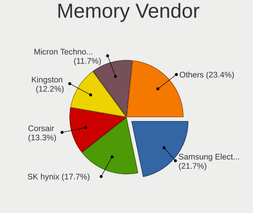

| Vendor                       | Computers | Percent |
|------------------------------|-----------|---------|
| Samsung Electronics          | 474       | 21.71%  |
| SK hynix                     | 386       | 17.68%  |
| Corsair                      | 291       | 13.33%  |
| Kingston                     | 266       | 12.19%  |
| Micron Technology            | 256       | 11.73%  |
| Unknown                      | 139       | 6.37%   |
| Crucial                      | 106       | 4.86%   |
| G.Skill                      | 74        | 3.39%   |
| Ramaxel Technology           | 31        | 1.42%   |
| Elpida                       | 31        | 1.42%   |
| A-DATA Technology            | 26        | 1.19%   |
| Unknown                      | 18        | 0.82%   |
| Nanya Technology             | 11        | 0.5%    |
| Unknown (ABCD)               | 10        | 0.46%   |
| Team                         | 8         | 0.37%   |
| Patriot                      | 6         | 0.27%   |
| Apacer                       | 4         | 0.18%   |
| Wilk                         | 3         | 0.14%   |
| GOODRAM                      | 3         | 0.14%   |
| Transcend                    | 2         | 0.09%   |
| SHARETRONIC                  | 2         | 0.09%   |
| Qimonda                      | 2         | 0.09%   |
| Innodisk                     | 2         | 0.09%   |
| Hewlett-Packard              | 2         | 0.09%   |
| GSkill                       | 2         | 0.09%   |
| G-Alantic                    | 2         | 0.09%   |
| Avant                        | 2         | 0.09%   |
| Unknown (AB)                 | 1         | 0.05%   |
| Unknown (83DA)               | 1         | 0.05%   |
| Unknown (836D)               | 1         | 0.05%   |
| Unknown (0x8551)             | 1         | 0.05%   |
| Unknown (0x0080)             | 1         | 0.05%   |
| Unknown (00000000F08B)       | 1         | 0.05%   |
| Unifosa                      | 1         | 0.05%   |
| TEXTORM                      | 1         | 0.05%   |
| Red Hat                      | 1         | 0.05%   |
| PNY                          | 1         | 0.05%   |
| Patriot Memory (PDP Systems) | 1         | 0.05%   |
| Netlist                      | 1         | 0.05%   |
| Neo Forza                    | 1         | 0.05%   |

Memory Model
------------

Memory module models

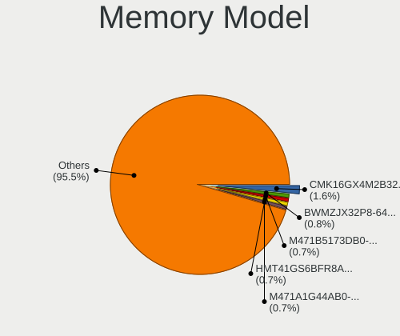

| Model                                                         | Computers | Percent |
|---------------------------------------------------------------|-----------|---------|
| Corsair RAM CMK16GX4M2B3200C16 8GB DIMM DDR4 3600MT/s         | 37        | 1.59%   |
| Unknown                                                       | 18        | 0.77%   |
| SK hynix RAM HMT41GS6BFR8A-PB 8GB SODIMM DDR3 2667MT/s        | 17        | 0.73%   |
| Samsung RAM M471B5173DB0-YK0 4GB SODIMM DDR3 1600MT/s         | 17        | 0.73%   |
| Samsung RAM M471A1G44AB0-CWE 8GiB SODIMM DDR4 3200MT/s        | 16        | 0.69%   |
| Samsung RAM M471B1G73DB0-YK0 8GB SODIMM DDR3 1600MT/s         | 14        | 0.6%    |
| Samsung RAM M471A1K43CB1-CRC 8GB SODIMM DDR4 8400MT/s         | 14        | 0.6%    |
| SK hynix RAM HMT451S6BFR8A-PB 4GB SODIMM DDR3 1600MT/s        | 13        | 0.56%   |
| SK hynix RAM HMA81GS6AFR8N-UH 8GB SODIMM DDR4 2667MT/s        | 13        | 0.56%   |
| Samsung RAM M471B5273DH0-CH9 4GB SODIMM DDR3 1600MT/s         | 13        | 0.56%   |
| Samsung RAM M471A1K43EB1-CWE 8GB SODIMM DDR4 3200MT/s         | 13        | 0.56%   |
| Corsair RAM CMK16GX4M2B3000C15 8GB DIMM DDR4 3600MT/s         | 13        | 0.56%   |
| Samsung RAM M471A5244CB0-CTD 4GB SODIMM DDR4 3266MT/s         | 12        | 0.51%   |
| Samsung RAM M471A2K43DB1-CWE 16GB SODIMM DDR4 3200MT/s        | 12        | 0.51%   |
| Samsung RAM M471A1K43BB1-CRC 8GB SODIMM DDR4 2667MT/s         | 12        | 0.51%   |
| Kingston RAM KF3200C16D4/8GX 8GiB DIMM DDR4 3600MT/s          | 11        | 0.47%   |
| Corsair RAM CMK32GX4M2E3200C16 16GB DIMM DDR4 3600MT/s        | 11        | 0.47%   |
| Corsair RAM CMK32GX4M2B3200C16 16GB DIMM DDR4 3800MT/s        | 11        | 0.47%   |
| SK hynix RAM Module 8GB SODIMM DDR3 1600MT/s                  | 10        | 0.43%   |
| SK hynix RAM HMT41GS6AFR8A-PB 8GiB SODIMM DDR3 2667MT/s       | 10        | 0.43%   |
| Samsung RAM M471A5244CB0-CWE 4GB SODIMM DDR4 3200MT/s         | 9         | 0.39%   |
| Micron RAM 4ATF1G64HZ-3G2F1 8GB SODIMM DDR4 3200MT/s          | 9         | 0.39%   |
| Kingston RAM KF560C36-16 16GB DIMM DDR5 6000MT/s              | 9         | 0.39%   |
| SK hynix RAM HMT451S6AFR8A-PB 4GB SODIMM DDR3 1600MT/s        | 8         | 0.34%   |
| SK hynix RAM HMT351S6CFR8C-PB 4GB SODIMM DDR3 1600MT/s        | 8         | 0.34%   |
| Samsung RAM Module 8GB SODIMM DDR4 2133MT/s                   | 8         | 0.34%   |
| Samsung RAM M471B1G73QH0-YK0 8GB SODIMM DDR3 1600MT/s         | 8         | 0.34%   |
| Samsung RAM M471A5244CB0-CRC 4GB SODIMM DDR4 2667MT/s         | 8         | 0.34%   |
| Samsung RAM M471A1K43DB1-CWE 8GB SODIMM DDR4 3200MT/s         | 8         | 0.34%   |
| Micron RAM MT52L1G32D4PG-093 8GB Row Of Chips LPDDR3 2133MT/s | 8         | 0.34%   |
| Kingston RAM KHX3600C18D4/16GX 16GB DIMM DDR4 3800MT/s        | 8         | 0.34%   |
| Kingston RAM KHX2666C16/8G 8GiB DIMM DDR4 3466MT/s            | 8         | 0.34%   |
| Corsair RAM CML8GX3M2A1600C9 4GB DIMM DDR3 1600MT/s           | 8         | 0.34%   |
| Corsair RAM CMK16GX4M2A2666C16 8GB DIMM DDR4 3400MT/s         | 8         | 0.34%   |
| SK hynix RAM HMT351S6CFR8C-H9 4GB SODIMM DDR3 1334MT/s        | 7         | 0.3%    |
| SK hynix RAM HMT351S6BFR8C-H9 4GB SODIMM DDR3 1333MT/s        | 7         | 0.3%    |
| SK hynix RAM HMA82GS6AFR8N-UH 16GB SODIMM DDR4 2667MT/s       | 7         | 0.3%    |
| Samsung RAM M471B1G73EB0-YK0 8192MB SODIMM DDR3 1600MT/s      | 7         | 0.3%    |
| Samsung RAM M471A2K43CB1-CRC 16GB SODIMM DDR4 2667MT/s        | 7         | 0.3%    |
| Samsung RAM M471A1G44AB0-CWE 8GB Row Of Chips DDR4 3200MT/s   | 7         | 0.3%    |

Memory Kind
-----------

Memory module kinds

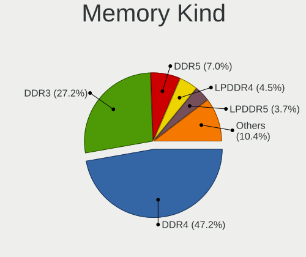

| Kind    | Computers | Percent |
|---------|-----------|---------|
| DDR4    | 920       | 47.23%  |
| DDR3    | 530       | 27.21%  |
| DDR5    | 137       | 7.03%   |
| LPDDR4  | 87        | 4.47%   |
| LPDDR5  | 72        | 3.7%    |
| LPDDR3  | 62        | 3.18%   |
| DDR2    | 50        | 2.57%   |
| SDRAM   | 39        | 2%      |
| Unknown | 28        | 1.44%   |
| DRAM    | 11        | 0.56%   |
| DDR     | 11        | 0.56%   |
| RAM     | 1         | 0.05%   |

Memory Form Factor
------------------

Physical design of the memory module

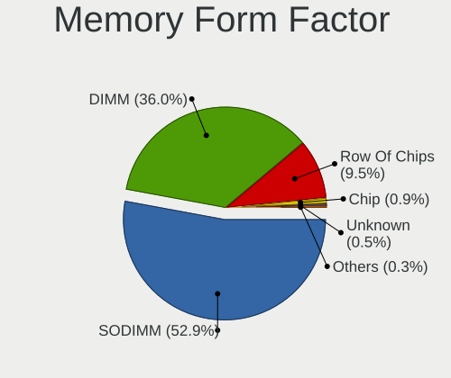

| Name            | Computers | Percent |
|-----------------|-----------|---------|
| SODIMM          | 1027      | 52.91%  |
| DIMM            | 698       | 35.96%  |
| Row Of Chips    | 185       | 9.53%   |
| Chip            | 17        | 0.88%   |
| Unknown         | 9         | 0.46%   |
| RIMM            | 3         | 0.15%   |
| Proprietary Car | 1         | 0.05%   |
| FB-DIMM         | 1         | 0.05%   |

Memory Size
-----------

Memory module size

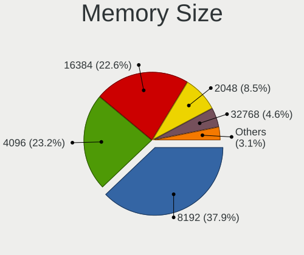

| Size    | Computers | Percent |
|---------|-----------|---------|
| 8192    | 794       | 37.88%  |
| 4096    | 486       | 23.19%  |
| 16384   | 474       | 22.61%  |
| 2048    | 179       | 8.54%   |
| 32768   | 97        | 4.63%   |
| 1024    | 43        | 2.05%   |
| 49152   | 6         | 0.29%   |
| 512     | 6         | 0.29%   |
| 65536   | 4         | 0.19%   |
| 24576   | 3         | 0.14%   |
| 12288   | 1         | 0.05%   |
| 6144    | 1         | 0.05%   |
| 3072    | 1         | 0.05%   |
| Unknown | 1         | 0.05%   |

Memory Speed
------------

Memory module speed

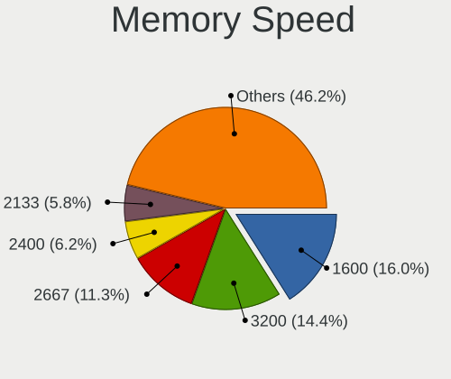

| Speed   | Computers | Percent |
|---------|-----------|---------|
| 1600    | 337       | 16.03%  |
| 3200    | 303       | 14.41%  |
| 2667    | 238       | 11.32%  |
| 2400    | 130       | 6.18%   |
| 2133    | 122       | 5.8%    |
| 3600    | 115       | 5.47%   |
| 1333    | 95        | 4.52%   |
| 6400    | 47        | 2.24%   |
| 4267    | 47        | 2.24%   |
| 4800    | 44        | 2.09%   |
| 1867    | 43        | 2.05%   |
| 5600    | 39        | 1.86%   |
| 3800    | 39        | 1.86%   |
| 1334    | 38        | 1.81%   |
| 667     | 32        | 1.52%   |
| 6000    | 29        | 1.38%   |
| Unknown | 27        | 1.28%   |
| 3733    | 26        | 1.24%   |
| 800     | 25        | 1.19%   |
| 1067    | 23        | 1.09%   |
| 7500    | 21        | 1%      |
| 3000    | 18        | 0.86%   |
| 8400    | 17        | 0.81%   |
| 4266    | 17        | 0.81%   |
| 1800    | 16        | 0.76%   |
| 3400    | 15        | 0.71%   |
| 3266    | 15        | 0.71%   |
| 2933    | 14        | 0.67%   |
| 2666    | 11        | 0.52%   |
| 1066    | 11        | 0.52%   |
| 4000    | 10        | 0.48%   |
| 3466    | 10        | 0.48%   |
| 1866    | 10        | 0.48%   |
| 5200    | 9         | 0.43%   |
| 4199    | 6         | 0.29%   |
| 3866    | 6         | 0.29%   |
| 6200    | 5         | 0.24%   |
| 3100    | 5         | 0.24%   |
| 2747    | 5         | 0.24%   |
| 2000    | 5         | 0.24%   |

Printers & scanners
-------------------

Printer Vendor
--------------

Printer device vendors

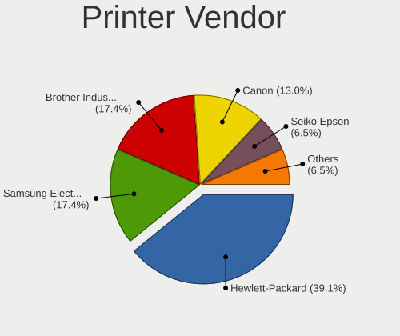

| Vendor                | Computers | Percent |
|-----------------------|-----------|---------|
| Hewlett-Packard       | 18        | 39.13%  |
| Samsung Electronics   | 8         | 17.39%  |
| Brother Industries    | 8         | 17.39%  |
| Canon                 | 6         | 13.04%  |
| Seiko Epson           | 3         | 6.52%   |
| Prolific Technology   | 1         | 2.17%   |
| Oki Data              | 1         | 2.17%   |
| Lexmark International | 1         | 2.17%   |

Printer Model
-------------

Printer device models

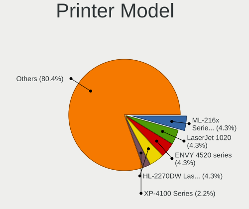

| Model                                | Computers | Percent |
|--------------------------------------|-----------|---------|
| Samsung ML-216x Series Laser Printer | 2         | 4.35%   |
| HP LaserJet 1020                     | 2         | 4.35%   |
| HP ENVY 4520 series                  | 2         | 4.35%   |
| Brother HL-2270DW Laser Printer      | 2         | 4.35%   |
| Seiko Epson XP-4100 Series           | 1         | 2.17%   |
| Seiko Epson Printer                  | 1         | 2.17%   |
| Seiko Epson ET-3750 Series           | 1         | 2.17%   |
| Samsung SCX-4300 Series              | 1         | 2.17%   |
| Samsung SCX-3200 Series              | 1         | 2.17%   |
| Samsung M2070 Series                 | 1         | 2.17%   |
| Samsung Color Laser Printer          | 1         | 2.17%   |
| Samsung CLX-3300 Series              | 1         | 2.17%   |
| Samsung CLP-325 Color Laser Printer  | 1         | 2.17%   |
| Prolific PL2305 Parallel Port        | 1         | 2.17%   |
| Oki Data USB Device                  | 1         | 2.17%   |
| Lexmark International MX310dn        | 1         | 2.17%   |
| HP OfficeJet Pro 8730                | 1         | 2.17%   |
| HP OfficeJet G55                     | 1         | 2.17%   |
| HP LaserJet Professional P 1102w     | 1         | 2.17%   |
| HP LaserJet P2035                    | 1         | 2.17%   |
| HP LaserJet P1006                    | 1         | 2.17%   |
| HP LaserJet M14-M17                  | 1         | 2.17%   |
| HP LaserJet 1320                     | 1         | 2.17%   |
| HP LaserJet 1010                     | 1         | 2.17%   |
| HP HP Laser 107w                     | 1         | 2.17%   |
| HP DeskJet 5650c                     | 1         | 2.17%   |
| HP Deskjet 3050 J610 series          | 1         | 2.17%   |
| HP DeskJet 2700 series               | 1         | 2.17%   |
| HP DeskJet 2130 series               | 1         | 2.17%   |
| HP Color LaserJet CP1215             | 1         | 2.17%   |
| Canon TS6300 series                  | 1         | 2.17%   |
| Canon TS3100 series                  | 1         | 2.17%   |
| Canon TR4700 series                  | 1         | 2.17%   |
| Canon LiDE 300                       | 1         | 2.17%   |
| Canon LBP7010C/7018C                 | 1         | 2.17%   |
| Canon LBP6200                        | 1         | 2.17%   |
| Brother QL-500 label printer         | 1         | 2.17%   |
| Brother Printer                      | 1         | 2.17%   |
| Brother HL-5150D series              | 1         | 2.17%   |
| Brother HL-2130 series               | 1         | 2.17%   |

Scanner Vendor
--------------

Scanner device vendors

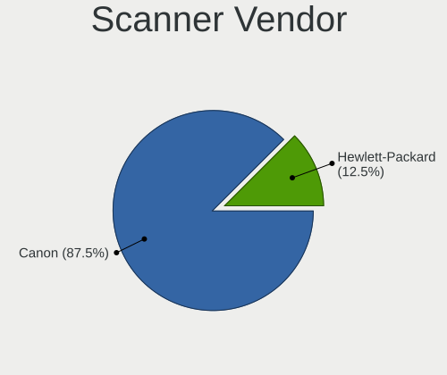

| Vendor          | Computers | Percent |
|-----------------|-----------|---------|
| Canon           | 9         | 81.82%  |
| Seiko Epson     | 1         | 9.09%   |
| Hewlett-Packard | 1         | 9.09%   |

Scanner Model
-------------

Scanner device models

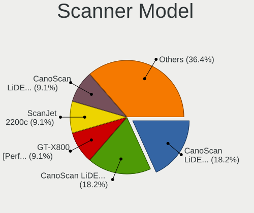

| Model                                       | Computers | Percent |
|---------------------------------------------|-----------|---------|
| Canon CanoScan LiDE 110                     | 2         | 18.18%  |
| Canon CanoScan LiDE 100                     | 2         | 18.18%  |
| Seiko Epson GT-X800 [Perfection 4990 PHOTO] | 1         | 9.09%   |
| HP ScanJet 2200c                            | 1         | 9.09%   |
| Canon CanoScan LiDE 700F                    | 1         | 9.09%   |
| Canon CanoScan LiDE 50/LiDE 35/LiDE 40      | 1         | 9.09%   |
| Canon CanoScan LiDE 210                     | 1         | 9.09%   |
| Canon CanoScan LiDE 120                     | 1         | 9.09%   |
| Canon CanoScan 4400F                        | 1         | 9.09%   |

Camera
------

Camera Vendor
-------------

Camera device vendors

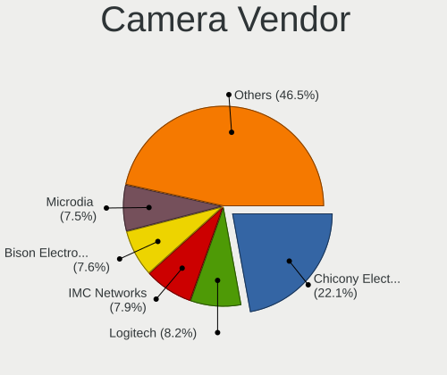

| Vendor                                 | Computers | Percent |
|----------------------------------------|-----------|---------|
| Chicony Electronics                    | 443       | 22.14%  |
| Logitech                               | 165       | 8.25%   |
| IMC Networks                           | 159       | 7.95%   |
| Bison Electronics                      | 153       | 7.65%   |
| Microdia                               | 150       | 7.5%    |
| Realtek Semiconductor                  | 125       | 6.25%   |
| Apple                                  | 95        | 4.75%   |
| Sunplus Innovation Technology          | 94        | 4.7%    |
| Cheng Uei Precision Industry (Foxlink) | 77        | 3.85%   |
| Quanta                                 | 72        | 3.6%    |
| Lite-On Technology                     | 65        | 3.25%   |
| Syntek                                 | 57        | 2.85%   |
| Luxvisions Innotech Limited            | 49        | 2.45%   |
| Suyin                                  | 40        | 2%      |
| Microsoft                              | 23        | 1.15%   |
| Samsung Electronics                    | 22        | 1.1%    |
| Shinetech                              | 16        | 0.8%    |
| Lenovo                                 | 15        | 0.75%   |
| Ricoh                                  | 14        | 0.7%    |
| Sonix Technology                       | 13        | 0.65%   |
| Alcor Micro                            | 13        | 0.65%   |
| Z-Star Microelectronics                | 9         | 0.45%   |
| Silicon Motion                         | 9         | 0.45%   |
| ALi                                    | 9         | 0.45%   |
| Creative Technology                    | 8         | 0.4%    |
| Generalplus Technology                 | 7         | 0.35%   |
| SunplusIT                              | 6         | 0.3%    |
| Primax Electronics                     | 6         | 0.3%    |
| Elgato Systems                         | 6         | 0.3%    |
| Trust                                  | 5         | 0.25%   |
| Razer USA                              | 4         | 0.2%    |
| DigiTech                               | 4         | 0.2%    |
| Acer                                   | 4         | 0.2%    |
| Shenzhen Kingcome Optoelectronic       | 3         | 0.15%   |
| Novatek Microelectronics               | 3         | 0.15%   |
| kingcome                               | 3         | 0.15%   |
| Importek                               | 3         | 0.15%   |
| ARC International                      | 3         | 0.15%   |
| Valve Software                         | 2         | 0.1%    |
| Tobii Technology AB                    | 2         | 0.1%    |

Camera Model
------------

Camera device models

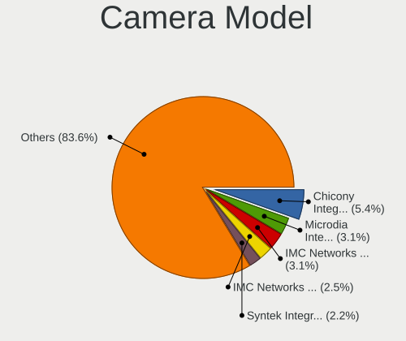

| Model                                               | Computers | Percent |
|-----------------------------------------------------|-----------|---------|
| Chicony Integrated Camera                           | 110       | 5.42%   |
| Microdia Integrated_Webcam_HD                       | 63        | 3.1%    |
| IMC Networks USB2.0 HD UVC WebCam                   | 63        | 3.1%    |
| IMC Networks Integrated Camera                      | 51        | 2.51%   |
| Syntek Integrated Camera                            | 45        | 2.22%   |
| Bison Integrated Camera                             | 44        | 2.17%   |
| Realtek Integrated_Webcam_HD                        | 41        | 2.02%   |
| Chicony HP HD Camera                                | 36        | 1.77%   |
| Chicony HD WebCam                                   | 31        | 1.53%   |
| Logitech HD Pro Webcam C920                         | 30        | 1.48%   |
| Logitech C922 Pro Stream Webcam                     | 26        | 1.28%   |
| Apple FaceTime HD Camera (Built-in)                 | 26        | 1.28%   |
| Apple iPhone 5/5C/5S/6/SE/7/8/X                     | 25        | 1.23%   |
| Logitech Webcam C270                                | 23        | 1.13%   |
| Bison Lenovo EasyCamera                             | 23        | 1.13%   |
| Apple Built-in iSight                               | 23        | 1.13%   |
| Samsung Galaxy series, misc. (MTP mode)             | 22        | 1.08%   |
| Quanta HP HD Camera                                 | 20        | 0.99%   |
| Lite-On HP HD Camera                                | 20        | 0.99%   |
| Sunplus Integrated_Webcam_HD                        | 19        | 0.94%   |
| Lite-On Integrated Camera                           | 19        | 0.94%   |
| Bison SunplusIT Integrated Camera                   | 19        | 0.94%   |
| Luxvisions Innotech Limited Integrated Camera       | 17        | 0.84%   |
| Sunplus HD WebCam                                   | 15        | 0.74%   |
| Cheng Uei Precision Industry (Foxlink) HP HD Camera | 15        | 0.74%   |
| Quanta HD User Facing                               | 14        | 0.69%   |
| Lite-On HP HD Webcam                                | 14        | 0.69%   |
| Cheng Uei Precision Industry (Foxlink) HP HD Webcam | 14        | 0.69%   |
| Microdia USB 2.0 Camera                             | 13        | 0.64%   |
| Luxvisions Innotech Limited HP HD Camera            | 13        | 0.64%   |
| Chicony Integrated Camera (1280x720@30)             | 13        | 0.64%   |
| Apple FaceTime HD Camera                            | 13        | 0.64%   |
| ShineTech USB2.0 HD UVC WebCam                      | 12        | 0.59%   |
| IMC Networks USB2.0 VGA UVC WebCam                  | 12        | 0.59%   |
| Chicony USB2.0 HD UVC WebCam                        | 12        | 0.59%   |
| Chicony HD User Facing                              | 12        | 0.59%   |
| Logitech StreamCam                                  | 11        | 0.54%   |
| Chicony HP Wide Vision HD Camera                    | 11        | 0.54%   |
| Chicony HP HD Webcam [Fixed]                        | 11        | 0.54%   |
| Chicony EasyCamera                                  | 11        | 0.54%   |

Security
--------

Fingerprint Vendor
------------------

Fingerprint sensor vendors

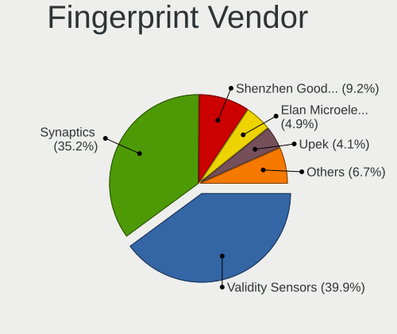

| Vendor                     | Computers | Percent |
|----------------------------|-----------|---------|
| Validity Sensors           | 186       | 39.91%  |
| Synaptics                  | 164       | 35.19%  |
| Shenzhen Goodix Technology | 43        | 9.23%   |
| Elan Microelectronics      | 23        | 4.94%   |
| Upek                       | 19        | 4.08%   |
| AuthenTec                  | 14        | 3%      |
| LighTuning Technology      | 11        | 2.36%   |
| STMicroelectronics         | 6         | 1.29%   |

Fingerprint Model
-----------------

Fingerprint sensor models

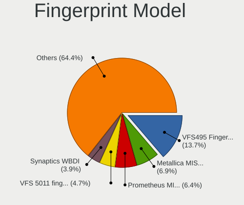

| Model                                                                      | Computers | Percent |
|----------------------------------------------------------------------------|-----------|---------|
| Validity Sensors VFS495 Fingerprint Reader                                 | 64        | 13.73%  |
| Synaptics Metallica MIS Touch Fingerprint Reader                           | 32        | 6.87%   |
| Synaptics Prometheus MIS Touch Fingerprint Reader                          | 30        | 6.44%   |
| Validity Sensors VFS 5011 fingerprint sensor                               | 22        | 4.72%   |
| Validity Sensors Synaptics WBDI                                            | 18        | 3.86%   |
| Synaptics Prometheus Fingerprint Reader                                    | 18        | 3.86%   |
| Shenzhen Goodix FingerPrint                                                | 18        | 3.86%   |
| Upek Biometric Touchchip/Touchstrip Fingerprint Sensor                     | 17        | 3.65%   |
| Validity Sensors VFS491                                                    | 15        | 3.22%   |
| Shenzhen Goodix Fingerprint Reader                                         | 15        | 3.22%   |
| Validity Sensors Synaptics VFS7552 Touch Fingerprint Sensor with PurePrint | 14        | 3%      |
| Synaptics FS7604 Touch Fingerprint Sensor with PurePrint                   | 14        | 3%      |
| Elan ELAN:Fingerprint                                                      | 14        | 3%      |
| Synaptics WBDI                                                             | 11        | 2.36%   |
| Validity Sensors VFS471 Fingerprint Reader                                 | 10        | 2.15%   |
| Synaptics  WBDI                                                            | 10        | 2.15%   |
| Synaptics  FS7604 Touch Fingerprint Sensor with PurePrint                  | 10        | 2.15%   |
| Synaptics Fingerprint reader [HP G6]                                       | 10        | 2.15%   |
| Shenzhen Goodix  FingerPrint Device                                        | 10        | 2.15%   |
| Synaptics UWP WBDI Device                                                  | 8         | 1.72%   |
| Elan ELAN:ARM-M4                                                           | 8         | 1.72%   |
| Validity Sensors VFS7500 Touch Fingerprint Sensor                          | 7         | 1.5%    |
| Validity Sensors VFS5011 Fingerprint Reader                                | 7         | 1.5%    |
| Validity Sensors VFS451 Fingerprint Reader                                 | 7         | 1.5%    |
| Validity Sensors Swipe Fingerprint Sensor                                  | 7         | 1.5%    |
| LighTuning EgisTec Touch Fingerprint Sensor                                | 7         | 1.5%    |
| AuthenTec AES2810                                                          | 7         | 1.5%    |
| STMicroelectronics Fingerprint Reader                                      | 6         | 1.29%   |
| Synaptics UWP WBDI                                                         | 5         | 1.07%   |
| AuthenTec AES2501 Fingerprint Sensor                                       | 5         | 1.07%   |
| Synaptics WBDI Fingerprint Reader USB 102                                  | 4         | 0.86%   |
| Validity Sensors VFS301 Fingerprint Reader                                 | 3         | 0.64%   |
| Validity Sensors VFS101 Fingerprint Reader                                 | 3         | 0.64%   |
| Validity Sensors Synaptics VFS7552 Touch Fingerprint Sensor                | 3         | 0.64%   |
| Validity Sensors Fingerprint scanner                                       | 3         | 0.64%   |
| Synaptics Metallica MOH Touch Fingerprint Reader                           | 3         | 0.64%   |
| Unknown                                                                    | 3         | 0.64%   |
| Validity Sensors VFS300 Fingerprint Reader                                 | 2         | 0.43%   |
| Upek TCS5B Fingerprint sensor                                              | 2         | 0.43%   |
| Synaptics WBDI Fingerprint Reader USB 086                                  | 2         | 0.43%   |

Chipcard Vendor
---------------

Chipcard module vendors

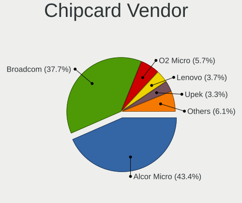

| Vendor                            | Computers | Percent |
|-----------------------------------|-----------|---------|
| Alcor Micro                       | 106       | 43.44%  |
| Broadcom                          | 92        | 37.7%   |
| O2 Micro                          | 14        | 5.74%   |
| Lenovo                            | 9         | 3.69%   |
| Upek                              | 8         | 3.28%   |
| Yubico.com                        | 4         | 1.64%   |
| Gemalto (was Gemplus)             | 4         | 1.64%   |
| Chicony Electronics               | 4         | 1.64%   |
| VASCO Data Security International | 1         | 0.41%   |
| Hewlett-Packard                   | 1         | 0.41%   |
| Cherry                            | 1         | 0.41%   |

Chipcard Model
--------------

Chipcard module models

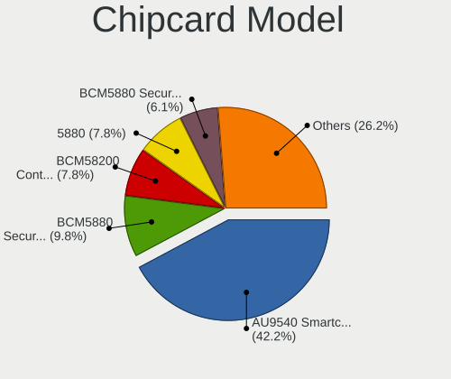

| Model                                                                        | Computers | Percent |
|------------------------------------------------------------------------------|-----------|---------|
| Alcor Micro AU9540 Smartcard Reader                                          | 103       | 42.21%  |
| Broadcom BCM5880 Secure Applications Processor                               | 24        | 9.84%   |
| Broadcom BCM58200 ControlVault 3 (FingerPrint sensor + Contacted SmartCard)  | 19        | 7.79%   |
| Broadcom 5880                                                                | 19        | 7.79%   |
| Broadcom BCM5880 Secure Applications Processor with fingerprint swipe sensor | 15        | 6.15%   |
| Broadcom 58200                                                               | 14        | 5.74%   |
| O2 Micro OZ776 CCID Smartcard Reader                                         | 11        | 4.51%   |
| Lenovo Integrated Smart Card Reader                                          | 9         | 3.69%   |
| Upek TouchChip Fingerprint Coprocessor (WBF advanced mode)                   | 8         | 3.28%   |
| Yubico.com Yubikey 4/5 U2F+CCID                                              | 4         | 1.64%   |
| Gemalto (was Gemplus) GemPC Twin SmartCard Reader                            | 4         | 1.64%   |
| Chicony Electronics HP Skylab USB Smartcard Keyboard                         | 4         | 1.64%   |
| O2 Micro Oz776 SmartCard Reader                                              | 3         | 1.23%   |
| Alcor Micro Watchdata W 1981                                                 | 3         | 1.23%   |
| VASCO Data Security International DIGIPASS 920                               | 1         | 0.41%   |
| Hewlett-Packard SC Keyboard - Apollo (Liteon)                                | 1         | 0.41%   |
| Cherry SmartCard Reader Keyboard KC 1000 SC                                  | 1         | 0.41%   |
| Broadcom BCM5880 Secure Applications Processor with fingerprint touch sensor | 1         | 0.41%   |

Unsupported
-----------

Unsupported Devices
-------------------

Total unsupported devices on board

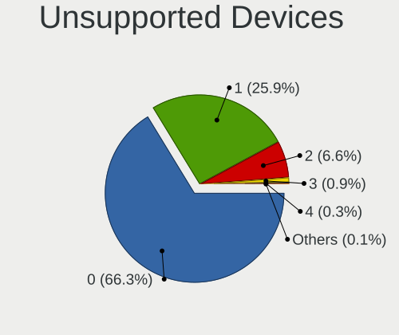

| Total | Computers | Percent |
|-------|-----------|---------|
| 0     | 2382      | 66.28%  |
| 1     | 930       | 25.88%  |
| 2     | 238       | 6.62%   |
| 3     | 31        | 0.86%   |
| 4     | 10        | 0.28%   |
| 5     | 2         | 0.06%   |
| 7     | 1         | 0.03%   |

Unsupported Device Types
------------------------

Types of unsupported devices

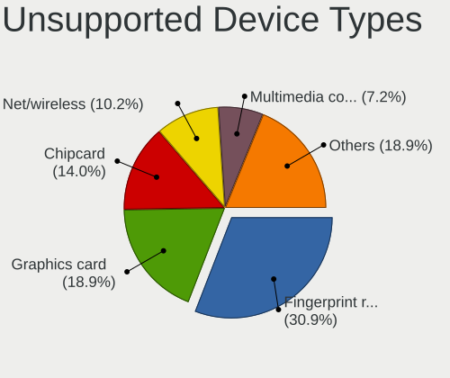

| Type                     | Computers | Percent |
|--------------------------|-----------|---------|
| Fingerprint reader       | 462       | 30.88%  |
| Graphics card            | 282       | 18.85%  |
| Chipcard                 | 209       | 13.97%  |
| Net/wireless             | 153       | 10.23%  |
| Multimedia controller    | 108       | 7.22%   |
| Communication controller | 64        | 4.28%   |
| Camera                   | 48        | 3.21%   |
| Unassigned class         | 39        | 2.61%   |
| Bluetooth                | 35        | 2.34%   |
| Sound                    | 26        | 1.74%   |
| Card reader              | 22        | 1.47%   |
| Net/ethernet             | 14        | 0.94%   |
| Storage                  | 11        | 0.74%   |
| Network                  | 7         | 0.47%   |
| Firewire controller      | 4         | 0.27%   |
| Storage/nvme             | 2         | 0.13%   |
| Storage/ide              | 2         | 0.13%   |
| Storage/ata              | 2         | 0.13%   |
| Modem                    | 2         | 0.13%   |
| Flash memory             | 2         | 0.13%   |
| Storage/raid             | 1         | 0.07%   |
| Dvb card                 | 1         | 0.07%   |

