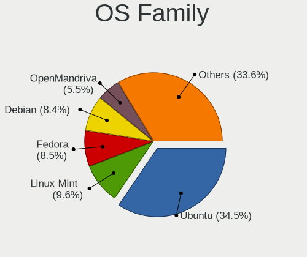
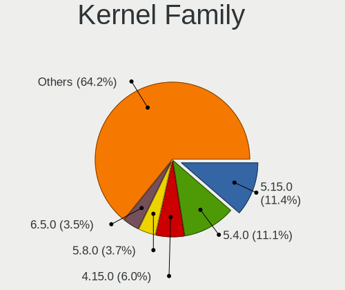
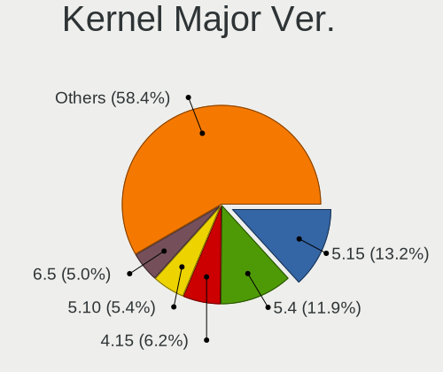
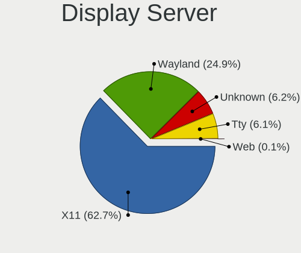
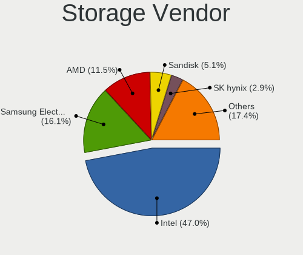
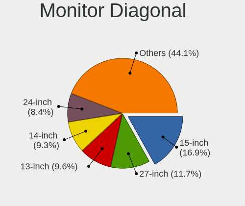
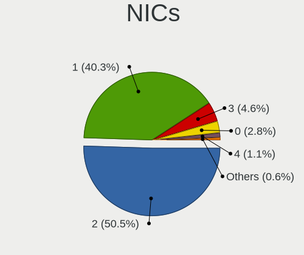
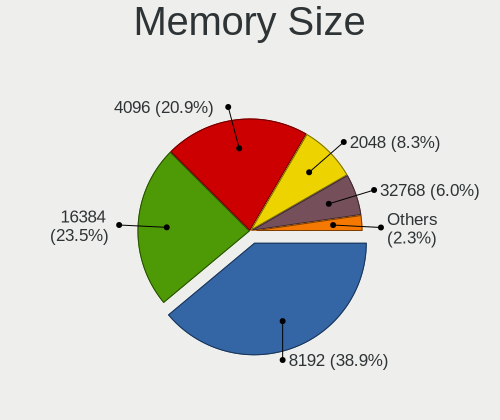

Linux in Switzerland - Tested Hardware & Statistics
---------------------------------------------------

A project to collect tested hardware configurations for Linux in Switzerland.

Anyone can contribute to this report by the [hw-probe](https://github.com/linuxhw/hw-probe) tool:

    sudo -E hw-probe -all -upload

Please contribute! Especially if your hardware is rare.

This is a report for all computer types. See also reports for [desktops](/Location/Switzerland/Desktop/README.md) and [notebooks](/Location/Switzerland/Notebook/README.md).

Contents
--------

* [ Test Cases ](#test-cases)

* [ System ](#system)
  - [ OS                       ](#os)
  - [ OS Family                ](#os-family)
  - [ Kernel                   ](#kernel)
  - [ Kernel Family            ](#kernel-family)
  - [ Kernel Major Ver.        ](#kernel-major-ver)
  - [ Arch                     ](#arch)
  - [ DE                       ](#de)
  - [ Display Server           ](#display-server)
  - [ Display Manager          ](#display-manager)
  - [ OS Lang                  ](#os-lang)
  - [ Boot Mode                ](#boot-mode)
  - [ Filesystem               ](#filesystem)
  - [ Part. scheme             ](#part-scheme)
  - [ Dual Boot with Linux/BSD ](#dual-boot-with-linuxbsd)
  - [ Dual Boot (Win)          ](#dual-boot-win)

* [ Board ](#board)
  - [ Vendor                   ](#vendor)
  - [ Model                    ](#model)
  - [ Model Family             ](#model-family)
  - [ MFG Year                 ](#mfg-year)
  - [ Form Factor              ](#form-factor)
  - [ Secure Boot              ](#secure-boot)
  - [ Coreboot                 ](#coreboot)
  - [ RAM Size                 ](#ram-size)
  - [ RAM Used                 ](#ram-used)
  - [ Total Drives             ](#total-drives)
  - [ Has CD-ROM               ](#has-cd-rom)
  - [ Has Ethernet             ](#has-ethernet)
  - [ Has WiFi                 ](#has-wifi)
  - [ Has Bluetooth            ](#has-bluetooth)

* [ Location ](#location)
  - [ Country                  ](#country)
  - [ City                     ](#city)

* [ Drives ](#drives)
  - [ Drive Vendor             ](#drive-vendor)
  - [ Drive Model              ](#drive-model)
  - [ HDD Vendor               ](#hdd-vendor)
  - [ SSD Vendor               ](#ssd-vendor)
  - [ Drive Kind               ](#drive-kind)
  - [ Drive Connector          ](#drive-connector)
  - [ Drive Size               ](#drive-size)
  - [ Space Total              ](#space-total)
  - [ Space Used               ](#space-used)
  - [ Malfunc. Drives          ](#malfunc-drives)
  - [ Malfunc. Drive Vendor    ](#malfunc-drive-vendor)
  - [ Malfunc. HDD Vendor      ](#malfunc-hdd-vendor)
  - [ Malfunc. Drive Kind      ](#malfunc-drive-kind)
  - [ Failed Drives            ](#failed-drives)
  - [ Failed Drive Vendor      ](#failed-drive-vendor)
  - [ Drive Status             ](#drive-status)

* [ Storage controller ](#storage-controller)
  - [ Storage Vendor           ](#storage-vendor)
  - [ Storage Model            ](#storage-model)
  - [ Storage Kind             ](#storage-kind)

* [ Processor ](#processor)
  - [ CPU Vendor               ](#cpu-vendor)
  - [ CPU Model                ](#cpu-model)
  - [ CPU Model Family         ](#cpu-model-family)
  - [ CPU Cores                ](#cpu-cores)
  - [ CPU Sockets              ](#cpu-sockets)
  - [ CPU Threads              ](#cpu-threads)
  - [ CPU Op-Modes             ](#cpu-op-modes)
  - [ CPU Microcode            ](#cpu-microcode)
  - [ CPU Microarch            ](#cpu-microarch)

* [ Graphics ](#graphics)
  - [ GPU Vendor               ](#gpu-vendor)
  - [ GPU Model                ](#gpu-model)
  - [ GPU Combo                ](#gpu-combo)
  - [ GPU Driver               ](#gpu-driver)
  - [ GPU Memory               ](#gpu-memory)

* [ Monitor ](#monitor)
  - [ Monitor Vendor           ](#monitor-vendor)
  - [ Monitor Model            ](#monitor-model)
  - [ Monitor Resolution       ](#monitor-resolution)
  - [ Monitor Diagonal         ](#monitor-diagonal)
  - [ Monitor Width            ](#monitor-width)
  - [ Aspect Ratio             ](#aspect-ratio)
  - [ Monitor Area             ](#monitor-area)
  - [ Pixel Density            ](#pixel-density)
  - [ Multiple Monitors        ](#multiple-monitors)

* [ Network ](#network)
  - [ Net Controller Vendor    ](#net-controller-vendor)
  - [ Net Controller Model     ](#net-controller-model)
  - [ Wireless Vendor          ](#wireless-vendor)
  - [ Wireless Model           ](#wireless-model)
  - [ Ethernet Vendor          ](#ethernet-vendor)
  - [ Ethernet Model           ](#ethernet-model)
  - [ Net Controller Kind      ](#net-controller-kind)
  - [ Used Controller          ](#used-controller)
  - [ NICs                     ](#nics)
  - [ IPv6                     ](#ipv6)

* [ Bluetooth ](#bluetooth)
  - [ Bluetooth Vendor         ](#bluetooth-vendor)
  - [ Bluetooth Model          ](#bluetooth-model)

* [ Sound ](#sound)
  - [ Sound Vendor             ](#sound-vendor)
  - [ Sound Model              ](#sound-model)

* [ Memory ](#memory)
  - [ Memory Vendor            ](#memory-vendor)
  - [ Memory Model             ](#memory-model)
  - [ Memory Kind              ](#memory-kind)
  - [ Memory Form Factor       ](#memory-form-factor)
  - [ Memory Size              ](#memory-size)
  - [ Memory Speed             ](#memory-speed)

* [ Printers & scanners ](#printers--scanners)
  - [ Printer Vendor           ](#printer-vendor)
  - [ Printer Model            ](#printer-model)
  - [ Scanner Vendor           ](#scanner-vendor)
  - [ Scanner Model            ](#scanner-model)

* [ Camera ](#camera)
  - [ Camera Vendor            ](#camera-vendor)
  - [ Camera Model             ](#camera-model)

* [ Security ](#security)
  - [ Fingerprint Vendor       ](#fingerprint-vendor)
  - [ Fingerprint Model        ](#fingerprint-model)
  - [ Chipcard Vendor          ](#chipcard-vendor)
  - [ Chipcard Model           ](#chipcard-model)

* [ Unsupported ](#unsupported)
  - [ Unsupported Devices      ](#unsupported-devices)
  - [ Unsupported Device Types ](#unsupported-device-types)

Test Cases
----------

Total: 4129

| Vendor        | Model                       | Form-Factor | Probe                                                      | Date         |
|---------------|-----------------------------|-------------|------------------------------------------------------------|--------------|
| HP            | 1905                        | Desktop     | [8e94c4bb4e](https://linux-hardware.org/?probe=8e94c4bb4e) | May 09, 2024 |
| VALE          | Notebook Evolution i5-11... | Notebook    | [55764ee04d](https://linux-hardware.org/?probe=55764ee04d) | May 08, 2024 |
| HP            | Laptop 15s-fq2xxx           | Notebook    | [31a04e0322](https://linux-hardware.org/?probe=31a04e0322) | May 08, 2024 |
| HP            | EliteBook 840 G8            | Notebook    | [6d255e156e](https://linux-hardware.org/?probe=6d255e156e) | May 08, 2024 |
| Acer          | Swift SF314-52              | Notebook    | [d112cef6d2](https://linux-hardware.org/?probe=d112cef6d2) | May 07, 2024 |
| Gigabyte      | Z97-HD3                     | Desktop     | [85dee8d963](https://linux-hardware.org/?probe=85dee8d963) | May 07, 2024 |
| HP            | EliteBook 840 G8            | Notebook    | [f60faaeec0](https://linux-hardware.org/?probe=f60faaeec0) | May 07, 2024 |
| ASUSTek       | ASUS TUF Gaming A15 FA50... | Notebook    | [84cc2abe63](https://linux-hardware.org/?probe=84cc2abe63) | May 06, 2024 |
| Dell          | XPS 13 7390                 | Notebook    | [3132f4ff24](https://linux-hardware.org/?probe=3132f4ff24) | May 06, 2024 |
| Lenovo        | IdeaPadFlex 5 14ABR8 82X... | Convertible | [b87692bb4f](https://linux-hardware.org/?probe=b87692bb4f) | May 06, 2024 |
| Lenovo        | 3741 SDK0T76463 WIN 3422... | Desktop     | [42a7c6fb23](https://linux-hardware.org/?probe=42a7c6fb23) | May 06, 2024 |
| ASUSTek       | Zenbook UN5401QA_UN5401Q... | Convertible | [6c0c235ec2](https://linux-hardware.org/?probe=6c0c235ec2) | May 06, 2024 |
| HP            | Laptop 15s-fq2xxx           | Notebook    | [c9843fc5d2](https://linux-hardware.org/?probe=c9843fc5d2) | May 05, 2024 |
| ASUSTek       | X510UAR                     | Notebook    | [3317acbe53](https://linux-hardware.org/?probe=3317acbe53) | May 05, 2024 |
| ASRock        | B650 PG Lightning           | Desktop     | [d0b08c1666](https://linux-hardware.org/?probe=d0b08c1666) | May 05, 2024 |
| ASRock        | B650 PG Lightning           | Desktop     | [d9c907af86](https://linux-hardware.org/?probe=d9c907af86) | May 05, 2024 |
| Gigabyte      | AB350-Gaming 3-CF           | Desktop     | [a099133a32](https://linux-hardware.org/?probe=a099133a32) | May 05, 2024 |
| Gigabyte      | X670E AORUS PRO X           | Desktop     | [e1dcda5e45](https://linux-hardware.org/?probe=e1dcda5e45) | May 04, 2024 |
| ASUSTek       | ROG Strix G512LV_G512LV     | Notebook    | [7c2c0a0fc2](https://linux-hardware.org/?probe=7c2c0a0fc2) | May 04, 2024 |
| Getac         | S410                        | Notebook    | [a05cbbe577](https://linux-hardware.org/?probe=a05cbbe577) | May 04, 2024 |
| Lenovo        | Yoga 7 16IRL8 82YN          | Notebook    | [a70e2b13ca](https://linux-hardware.org/?probe=a70e2b13ca) | May 03, 2024 |
| HP            | Spectre x360 2-in-1 Lapt... | Convertible | [e4b21078a4](https://linux-hardware.org/?probe=e4b21078a4) | May 02, 2024 |
| Acer          | Aspire M5910                | Desktop     | [61b5809dc9](https://linux-hardware.org/?probe=61b5809dc9) | May 01, 2024 |
| Gigabyte      | GA-A75-D3H                  | Desktop     | [9fbe4e85f5](https://linux-hardware.org/?probe=9fbe4e85f5) | May 01, 2024 |
| ASUSTek       | M3N WS                      | Desktop     | [c6b3363b76](https://linux-hardware.org/?probe=c6b3363b76) | May 01, 2024 |
| TUXEDO        | InfinityBook S Gen8         | Notebook    | [19d3fc9c13](https://linux-hardware.org/?probe=19d3fc9c13) | Apr 30, 2024 |
| Acer          | Aspire 7745G                | Notebook    | [1854a5b427](https://linux-hardware.org/?probe=1854a5b427) | Apr 30, 2024 |
| Lenovo        | ThinkPad P1 Gen 5 21DCS0... | Notebook    | [4f23a4a44b](https://linux-hardware.org/?probe=4f23a4a44b) | Apr 30, 2024 |
| ASUSTek       | STRIX Z270H GAMING          | Desktop     | [8a21aa2463](https://linux-hardware.org/?probe=8a21aa2463) | Apr 30, 2024 |
| Lenovo        | IdeaPad S145-15IWL 81MV     | Notebook    | [274c1ee480](https://linux-hardware.org/?probe=274c1ee480) | Apr 30, 2024 |
| Lenovo        | Legion 7 16ARHA7 82UH       | Notebook    | [5514986c5d](https://linux-hardware.org/?probe=5514986c5d) | Apr 30, 2024 |
| ASUSTek       | K53SD                       | Notebook    | [058d33ec3c](https://linux-hardware.org/?probe=058d33ec3c) | Apr 29, 2024 |
| Apple         | MacBookPro10,1              | Notebook    | [404e775920](https://linux-hardware.org/?probe=404e775920) | Apr 28, 2024 |
| Dell          | Latitude 5290 2-in-1        | Tablet      | [c7fee93564](https://linux-hardware.org/?probe=c7fee93564) | Apr 27, 2024 |
| ASUSTek       | ASUS TUF Gaming A15 FA50... | Notebook    | [f619fc2cb1](https://linux-hardware.org/?probe=f619fc2cb1) | Apr 26, 2024 |
| Lenovo        | ThinkPad T460 20FNCTO1WW    | Notebook    | [3727b60089](https://linux-hardware.org/?probe=3727b60089) | Apr 26, 2024 |
| HP            | 8648                        | Desktop     | [996bb0e2b3](https://linux-hardware.org/?probe=996bb0e2b3) | Apr 26, 2024 |
| HP            | Spectre x360 2-in-1 Lapt... | Convertible | [d8e25ffed2](https://linux-hardware.org/?probe=d8e25ffed2) | Apr 25, 2024 |
| Lenovo        | ThinkPad T14 Gen 3 21CGS... | Notebook    | [c207bea569](https://linux-hardware.org/?probe=c207bea569) | Apr 25, 2024 |
| Dell          | Inspiron 17-7779            | Notebook    | [4d2fec89a1](https://linux-hardware.org/?probe=4d2fec89a1) | Apr 24, 2024 |
| PC Special... | Ionico 16                   | Notebook    | [d75ee89a24](https://linux-hardware.org/?probe=d75ee89a24) | Apr 24, 2024 |
| Lenovo        | ThinkPad X220 4291WSH       | Notebook    | [ff6227451a](https://linux-hardware.org/?probe=ff6227451a) | Apr 23, 2024 |
| Gigabyte      | GA-A75-D3H                  | Desktop     | [741937c8be](https://linux-hardware.org/?probe=741937c8be) | Apr 23, 2024 |
| Dell          | XPS 15 9520                 | Notebook    | [359a02a8cb](https://linux-hardware.org/?probe=359a02a8cb) | Apr 23, 2024 |
| Acer          | Swift SF314-42              | Notebook    | [c5ab9f2681](https://linux-hardware.org/?probe=c5ab9f2681) | Apr 22, 2024 |
| Lenovo        | Yoga Slim 7 14APU8 83AA     | Notebook    | [f586504622](https://linux-hardware.org/?probe=f586504622) | Apr 22, 2024 |
| Minix         | NEO Z83-4 V1.1              | Desktop     | [546846d640](https://linux-hardware.org/?probe=546846d640) | Apr 22, 2024 |
| Gigabyte      | Z97-HD3                     | Desktop     | [0247606ff3](https://linux-hardware.org/?probe=0247606ff3) | Apr 21, 2024 |
| Lenovo        | ThinkPad E14 Gen 5 21JR0... | Notebook    | [7cecfee468](https://linux-hardware.org/?probe=7cecfee468) | Apr 21, 2024 |
| Lenovo        | 3741 SDK0T76463 WIN 3422... | Desktop     | [cf7eac1515](https://linux-hardware.org/?probe=cf7eac1515) | Apr 21, 2024 |
| Gigabyte      | Z77-D3H                     | Desktop     | [6808539c26](https://linux-hardware.org/?probe=6808539c26) | Apr 21, 2024 |
| ASRock        | X570 Taichi                 | Desktop     | [2de05483c5](https://linux-hardware.org/?probe=2de05483c5) | Apr 19, 2024 |
| HP            | EliteBook x360 1030 G4      | Convertible | [019a0a3f80](https://linux-hardware.org/?probe=019a0a3f80) | Apr 18, 2024 |
| HP            | ProBook 6560b               | Notebook    | [5ea8af85bf](https://linux-hardware.org/?probe=5ea8af85bf) | Apr 17, 2024 |
| ASUSTek       | VivoBook_ASUSLaptop X150... | Notebook    | [a776a9677a](https://linux-hardware.org/?probe=a776a9677a) | Apr 17, 2024 |
| ASUSTek       | VivoBook_ASUSLaptop X150... | Notebook    | [4f7d67acb4](https://linux-hardware.org/?probe=4f7d67acb4) | Apr 17, 2024 |
| ASRock        | IMB-181-D                   | Desktop     | [ef7d4868ef](https://linux-hardware.org/?probe=ef7d4868ef) | Apr 16, 2024 |
| ASRock        | IMB-181-D                   | Desktop     | [11f5297b12](https://linux-hardware.org/?probe=11f5297b12) | Apr 16, 2024 |
| ASUSTek       | P8H77-M                     | Desktop     | [01c795b7dc](https://linux-hardware.org/?probe=01c795b7dc) | Apr 16, 2024 |
| ASUSTek       | P8H77-M                     | Desktop     | [5fb2bd243d](https://linux-hardware.org/?probe=5fb2bd243d) | Apr 16, 2024 |
| Acer          | Nitro AN515-52              | Notebook    | [397f8b0836](https://linux-hardware.org/?probe=397f8b0836) | Apr 15, 2024 |
| ASUSTek       | GL702ZC                     | Notebook    | [bf6ba63bb3](https://linux-hardware.org/?probe=bf6ba63bb3) | Apr 15, 2024 |
| Sony          | VPCF12M1E                   | Notebook    | [a07e465b04](https://linux-hardware.org/?probe=a07e465b04) | Apr 15, 2024 |
| Acer          | Aspire 5742G                | Notebook    | [91d047cef5](https://linux-hardware.org/?probe=91d047cef5) | Apr 15, 2024 |
| ASUSTek       | ROG STRIX B450-F GAMING ... | Desktop     | [2b471c5586](https://linux-hardware.org/?probe=2b471c5586) | Apr 14, 2024 |
| Gigabyte      | X570 AORUS ULTRA            | Desktop     | [776d567b36](https://linux-hardware.org/?probe=776d567b36) | Apr 14, 2024 |
| Lenovo        | ThinkPad T14 Gen 3 21CGS... | Notebook    | [c28ddacfd6](https://linux-hardware.org/?probe=c28ddacfd6) | Apr 13, 2024 |
| Sony          | VPCF12M1E                   | Notebook    | [b4adc4cd67](https://linux-hardware.org/?probe=b4adc4cd67) | Apr 13, 2024 |
| HP            | 1905                        | Desktop     | [85c5b91f0d](https://linux-hardware.org/?probe=85c5b91f0d) | Apr 13, 2024 |
| Gigabyte      | Z170XP-SLI-CF               | Desktop     | [16f0af2047](https://linux-hardware.org/?probe=16f0af2047) | Apr 12, 2024 |
| Gigabyte      | Z170XP-SLI-CF               | Desktop     | [2ee7ec3b1f](https://linux-hardware.org/?probe=2ee7ec3b1f) | Apr 12, 2024 |
| Lenovo        | Yoga 9 14IRP8 83B1          | Convertible | [dcabc6c4f7](https://linux-hardware.org/?probe=dcabc6c4f7) | Apr 12, 2024 |
| Lenovo        | G550 2958                   | Notebook    | [2cebfc34df](https://linux-hardware.org/?probe=2cebfc34df) | Apr 12, 2024 |
| ASUSTek       | H97M-E                      | Desktop     | [480b3f6149](https://linux-hardware.org/?probe=480b3f6149) | Apr 11, 2024 |
| Lenovo        | ThinkPad E470 20H10056MZ    | Notebook    | [589fd95069](https://linux-hardware.org/?probe=589fd95069) | Apr 11, 2024 |
| Gigabyte      | Z77-D3H                     | Desktop     | [f40e03ec71](https://linux-hardware.org/?probe=f40e03ec71) | Apr 10, 2024 |
| Lenovo        | ThinkPad L15 Gen 2 20X30... | Notebook    | [6988114e9a](https://linux-hardware.org/?probe=6988114e9a) | Apr 10, 2024 |
| Lenovo        | ThinkPad L15 Gen 2 20X30... | Notebook    | [217f8e21a7](https://linux-hardware.org/?probe=217f8e21a7) | Apr 10, 2024 |
| ASUSTek       | ROG Flow X16 GV601RM_GV6... | Convertible | [c732528b5f](https://linux-hardware.org/?probe=c732528b5f) | Apr 09, 2024 |
| Dell          | Inspiron 3521               | Notebook    | [f09f64c924](https://linux-hardware.org/?probe=f09f64c924) | Apr 09, 2024 |
| Dell          | Inspiron 3521               | Notebook    | [690cbe6f29](https://linux-hardware.org/?probe=690cbe6f29) | Apr 09, 2024 |
| Lenovo        | ThinkPad X1 Carbon Gen 1... | Notebook    | [d21570a024](https://linux-hardware.org/?probe=d21570a024) | Apr 09, 2024 |
| Lenovo        | ThinkPad X1 Carbon Gen 1... | Notebook    | [97879c1052](https://linux-hardware.org/?probe=97879c1052) | Apr 08, 2024 |
| Lenovo        | Yoga 900S-12ISK 80ML        | Notebook    | [9099f440bc](https://linux-hardware.org/?probe=9099f440bc) | Apr 08, 2024 |
| Apple         | Mac-F2268CC8                | All in one  | [d77641d5f8](https://linux-hardware.org/?probe=d77641d5f8) | Apr 07, 2024 |
| Apple         | Mac-F2268CC8                | All in one  | [b274e076c3](https://linux-hardware.org/?probe=b274e076c3) | Apr 07, 2024 |
| Apple         | Mac-F2238AC8                | All in one  | [62598c6d50](https://linux-hardware.org/?probe=62598c6d50) | Apr 06, 2024 |
| Dell          | Studio 1747                 | Notebook    | [33e2d94187](https://linux-hardware.org/?probe=33e2d94187) | Apr 05, 2024 |
| Dell          | Vostro1710                  | Notebook    | [811cef5fac](https://linux-hardware.org/?probe=811cef5fac) | Apr 05, 2024 |
| ASRock        | Z97 Extreme4                | Desktop     | [b3391cd116](https://linux-hardware.org/?probe=b3391cd116) | Apr 05, 2024 |
| Lenovo        | ThinkPad E14 Gen 5 21JR0... | Notebook    | [f7f399c411](https://linux-hardware.org/?probe=f7f399c411) | Apr 04, 2024 |
| MSI           | GX780R/GT780R/GT780DXR      | Notebook    | [c4e752d06c](https://linux-hardware.org/?probe=c4e752d06c) | Apr 04, 2024 |
| MSI           | GX780R/GT780R/GT780DXR      | Notebook    | [100d6d2fcd](https://linux-hardware.org/?probe=100d6d2fcd) | Apr 04, 2024 |
| HP            | EliteBook 8460p             | Notebook    | [6e1fd1f1b0](https://linux-hardware.org/?probe=6e1fd1f1b0) | Apr 04, 2024 |
| Acer          | Predator PH18-71            | Notebook    | [1c854f7ef4](https://linux-hardware.org/?probe=1c854f7ef4) | Apr 04, 2024 |
| HP            | ProBook 650 G1              | Notebook    | [d81b4ee2e3](https://linux-hardware.org/?probe=d81b4ee2e3) | Apr 03, 2024 |
| GPD           | P2 MAX                      | Notebook    | [8e53b3ed39](https://linux-hardware.org/?probe=8e53b3ed39) | Apr 01, 2024 |
| ASUSTek       | TUF Gaming A620M-PLUS WI... | Desktop     | [ab873cae00](https://linux-hardware.org/?probe=ab873cae00) | Apr 01, 2024 |
| Lenovo        | 3769 NO DPK                 | Desktop     | [c532b6c4ed](https://linux-hardware.org/?probe=c532b6c4ed) | Apr 01, 2024 |
| Lenovo        | ThinkPad T14 Gen 3 21CGS... | Notebook    | [9d19446a7f](https://linux-hardware.org/?probe=9d19446a7f) | Apr 01, 2024 |
| Lenovo        | ThinkPad T450 20BV001XMZ    | Notebook    | [cb709fd91f](https://linux-hardware.org/?probe=cb709fd91f) | Mar 31, 2024 |
| MSI           | X370 GAMING PRO CARBON      | Desktop     | [84b0e3e2af](https://linux-hardware.org/?probe=84b0e3e2af) | Mar 31, 2024 |
| Lenovo        | IdeaPad Pro 5 16APH8 83A... | Notebook    | [c9ece96124](https://linux-hardware.org/?probe=c9ece96124) | Mar 31, 2024 |
| Lenovo        | ThinkPad E580 20KS006FMZ    | Notebook    | [94d109d91e](https://linux-hardware.org/?probe=94d109d91e) | Mar 30, 2024 |
| HP            | ENVY x360 Convertible 15... | Convertible | [b2c5315c94](https://linux-hardware.org/?probe=b2c5315c94) | Mar 30, 2024 |
| Lenovo        | 3741 SDK0T76463 WIN 3422... | Desktop     | [cf27d76a8a](https://linux-hardware.org/?probe=cf27d76a8a) | Mar 29, 2024 |
| Gigabyte      | Z370 AORUS Gaming 7         | Desktop     | [c62e89dd15](https://linux-hardware.org/?probe=c62e89dd15) | Mar 29, 2024 |
| Acer          | Predator PH18-71            | Notebook    | [09854145ed](https://linux-hardware.org/?probe=09854145ed) | Mar 28, 2024 |
| Apple         | MacBookPro9,1               | Notebook    | [a5715d4c3e](https://linux-hardware.org/?probe=a5715d4c3e) | Mar 28, 2024 |
| Unknown       | Unknown                     | Desktop     | [dcdb71e975](https://linux-hardware.org/?probe=dcdb71e975) | Mar 28, 2024 |
| Gigabyte      | P67A-D3-B3                  | Desktop     | [e5f263a343](https://linux-hardware.org/?probe=e5f263a343) | Mar 28, 2024 |
| Apple         | MacBookPro8,1               | Notebook    | [48eae7912e](https://linux-hardware.org/?probe=48eae7912e) | Mar 27, 2024 |
| Lenovo        | ThinkPad X1 Yoga 2nd 20J... | Convertible | [e3e959a108](https://linux-hardware.org/?probe=e3e959a108) | Mar 27, 2024 |
| Dell          | Inspiron 17-7779            | Notebook    | [deecf7220f](https://linux-hardware.org/?probe=deecf7220f) | Mar 27, 2024 |
| ASUSTek       | ROG Zephyrus G16 GU603VI... | Notebook    | [e7501b45b5](https://linux-hardware.org/?probe=e7501b45b5) | Mar 27, 2024 |
| ASUSTek       | ROG Zephyrus G16 GU603VI... | Notebook    | [23c0ad0c6d](https://linux-hardware.org/?probe=23c0ad0c6d) | Mar 25, 2024 |
| HP            | EliteBook 840 G7 Noteboo... | Notebook    | [5263d017a2](https://linux-hardware.org/?probe=5263d017a2) | Mar 25, 2024 |
| ASUSTek       | ROG Strix G713PI_G713PI     | Notebook    | [fad6108f0a](https://linux-hardware.org/?probe=fad6108f0a) | Mar 24, 2024 |
| Lenovo        | Legion 9 16IRX8 83AG        | Notebook    | [c214e5588e](https://linux-hardware.org/?probe=c214e5588e) | Mar 23, 2024 |
| HP            | 2ADC                        | Desktop     | [d94b5fa4e7](https://linux-hardware.org/?probe=d94b5fa4e7) | Mar 23, 2024 |
| Dell          | 048DY8 A01                  | Desktop     | [05267117e8](https://linux-hardware.org/?probe=05267117e8) | Mar 23, 2024 |
| ASUSTek       | ROG STRIX B650E-F GAMING... | Desktop     | [ebc7895287](https://linux-hardware.org/?probe=ebc7895287) | Mar 23, 2024 |
| ASUSTek       | P8H77-M                     | Desktop     | [86485df1b9](https://linux-hardware.org/?probe=86485df1b9) | Mar 22, 2024 |
| HP            | 3398                        | Desktop     | [2c0c0a04d7](https://linux-hardware.org/?probe=2c0c0a04d7) | Mar 21, 2024 |
| Acer          | Swift SFE16-43              | Notebook    | [23667b0d01](https://linux-hardware.org/?probe=23667b0d01) | Mar 21, 2024 |
| Fujitsu       | LIFEBOOK E734               | Notebook    | [840661dcba](https://linux-hardware.org/?probe=840661dcba) | Mar 21, 2024 |
| Razer         | Blade 14 - RZ09-0482        | Notebook    | [1c48b858c2](https://linux-hardware.org/?probe=1c48b858c2) | Mar 20, 2024 |
| Dell          | XPS 15 9520                 | Notebook    | [d9ffc0afaf](https://linux-hardware.org/?probe=d9ffc0afaf) | Mar 20, 2024 |
| Lenovo        | ThinkPad E470 20H10056MZ    | Notebook    | [0e0638700d](https://linux-hardware.org/?probe=0e0638700d) | Mar 20, 2024 |
| ASUSTek       | PRIME Z270-A                | Desktop     | [1aab338075](https://linux-hardware.org/?probe=1aab338075) | Mar 20, 2024 |
| Lenovo        | ThinkPad E470 20H10056MZ    | Notebook    | [e8c3803d3c](https://linux-hardware.org/?probe=e8c3803d3c) | Mar 20, 2024 |
| ASRock        | 4X4-4000 Series             | Desktop     | [3f61116a9d](https://linux-hardware.org/?probe=3f61116a9d) | Mar 20, 2024 |
| Acer          | Aspire A315-59              | Notebook    | [6c38602470](https://linux-hardware.org/?probe=6c38602470) | Mar 19, 2024 |
| ASUSTek       | H97M-E                      | Desktop     | [842c8ac6e4](https://linux-hardware.org/?probe=842c8ac6e4) | Mar 19, 2024 |
| HP            | EliteBook 840 G5            | Notebook    | [e47dc593db](https://linux-hardware.org/?probe=e47dc593db) | Mar 19, 2024 |
| ASUSTek       | Pro WS W680-ACE             | Desktop     | [c1ef51d3b0](https://linux-hardware.org/?probe=c1ef51d3b0) | Mar 19, 2024 |
| ASUSTek       | Pro WS W680-ACE             | Desktop     | [2c5708d956](https://linux-hardware.org/?probe=2c5708d956) | Mar 19, 2024 |
| Lenovo        | ThinkPad E16 Gen 1 21JT0... | Notebook    | [01f3900ba8](https://linux-hardware.org/?probe=01f3900ba8) | Mar 18, 2024 |
| HP            | 2ADC                        | Desktop     | [8c1fc992f0](https://linux-hardware.org/?probe=8c1fc992f0) | Mar 17, 2024 |
| ASUSTek       | E5402WHA                    | All in one  | [e2d997bcd2](https://linux-hardware.org/?probe=e2d997bcd2) | Mar 17, 2024 |
| HP            | ENVY x360 Convertible 13... | Convertible | [89b3ca44e4](https://linux-hardware.org/?probe=89b3ca44e4) | Mar 17, 2024 |
| HP            | Victus by Laptop 16-e0xx... | Notebook    | [901b436ec2](https://linux-hardware.org/?probe=901b436ec2) | Mar 17, 2024 |
| ASUSTek       | ASUS BR1100FKA BR1100FKA... | Convertible | [f0c6f9e60c](https://linux-hardware.org/?probe=f0c6f9e60c) | Mar 17, 2024 |
| Lenovo        | Yoga 9 14IRP8 83B1          | Convertible | [37fbbc175c](https://linux-hardware.org/?probe=37fbbc175c) | Mar 16, 2024 |
| ASUSTek       | TX201LA                     | Notebook    | [a558be2fb3](https://linux-hardware.org/?probe=a558be2fb3) | Mar 15, 2024 |
| Apple         | MacBookPro11,1              | Notebook    | [e8882adc5a](https://linux-hardware.org/?probe=e8882adc5a) | Mar 14, 2024 |
| Dell          | Latitude 5521               | Notebook    | [0e9ce42ba8](https://linux-hardware.org/?probe=0e9ce42ba8) | Mar 14, 2024 |
| ASUSTek       | ROG Flow X16 GV601RW_GV6... | Convertible | [3bd7c8ccf4](https://linux-hardware.org/?probe=3bd7c8ccf4) | Mar 14, 2024 |
| Apple         | MacBookPro11,1              | Notebook    | [22fa6eee3e](https://linux-hardware.org/?probe=22fa6eee3e) | Mar 14, 2024 |
| ASUSTek       | ROG Flow X16 GV601RW_GV6... | Convertible | [de707827fb](https://linux-hardware.org/?probe=de707827fb) | Mar 13, 2024 |
| Lenovo        | ThinkPad E14 20RA001HMZ     | Notebook    | [6d944c4cae](https://linux-hardware.org/?probe=6d944c4cae) | Mar 13, 2024 |
| GEEKOM        | A7                          | Desktop     | [41bbc04266](https://linux-hardware.org/?probe=41bbc04266) | Mar 13, 2024 |
| Lenovo        | 102F SDK0E50510 WIN 2625... | Desktop     | [25ae3017eb](https://linux-hardware.org/?probe=25ae3017eb) | Mar 13, 2024 |
| Gigabyte      | X670E AORUS MASTER          | Desktop     | [862dd3ff41](https://linux-hardware.org/?probe=862dd3ff41) | Mar 13, 2024 |
| Lenovo        | ThinkPad T15p Gen 3 21DA... | Notebook    | [2417a59037](https://linux-hardware.org/?probe=2417a59037) | Mar 12, 2024 |
| Lenovo        | Yoga 7 16IRL8 82YN          | Notebook    | [5d521873b9](https://linux-hardware.org/?probe=5d521873b9) | Mar 10, 2024 |
| ASUSTek       | X556UAK                     | Notebook    | [b3cf89e59b](https://linux-hardware.org/?probe=b3cf89e59b) | Mar 10, 2024 |
| Acer          | Nitro AN515-55              | Notebook    | [98c56ac1d0](https://linux-hardware.org/?probe=98c56ac1d0) | Mar 10, 2024 |
| Lenovo        | ThinkPad T460s 20F9002YC... | Notebook    | [b4721b40b9](https://linux-hardware.org/?probe=b4721b40b9) | Mar 10, 2024 |
| Apple         | Mac-35C5E08120C7EEAF Mac... | Mini pc     | [4041f41e98](https://linux-hardware.org/?probe=4041f41e98) | Mar 09, 2024 |
| Lenovo        | IdeaPadFlex 5 14ALC05 82... | Convertible | [aa1d68bd1e](https://linux-hardware.org/?probe=aa1d68bd1e) | Mar 09, 2024 |
| HP            | Spectre x360 2-in-1 Lapt... | Convertible | [c3cbce8cfe](https://linux-hardware.org/?probe=c3cbce8cfe) | Mar 08, 2024 |
| Dell          | XPS 15 9520                 | Notebook    | [c68539af0e](https://linux-hardware.org/?probe=c68539af0e) | Mar 07, 2024 |
| Microsoft     | Surface Laptop 4            | Tablet      | [a131647ae7](https://linux-hardware.org/?probe=a131647ae7) | Mar 07, 2024 |
| Lenovo        | Y50-70 20378                | Notebook    | [025b4a7dc8](https://linux-hardware.org/?probe=025b4a7dc8) | Mar 06, 2024 |
| Lenovo        | ThinkPad X1 Carbon Gen 1... | Notebook    | [dadfd2990c](https://linux-hardware.org/?probe=dadfd2990c) | Mar 06, 2024 |
| Acer          | Aspire 4820TG               | Notebook    | [a71f8d3b86](https://linux-hardware.org/?probe=a71f8d3b86) | Mar 06, 2024 |
| Acer          | Aspire 4820TG               | Notebook    | [bc8a80bc2f](https://linux-hardware.org/?probe=bc8a80bc2f) | Mar 05, 2024 |
| HP            | 1905                        | Desktop     | [e98cd386ed](https://linux-hardware.org/?probe=e98cd386ed) | Mar 03, 2024 |
| Lenovo        | ThinkPad X220 429143G       | Notebook    | [65eafaffa2](https://linux-hardware.org/?probe=65eafaffa2) | Mar 03, 2024 |
| ASUSTek       | ROG STRIX Z370-F GAMING     | Desktop     | [13c3d127e8](https://linux-hardware.org/?probe=13c3d127e8) | Mar 01, 2024 |
| HP            | EliteBook 845 14 inch G9... | Notebook    | [322cb37784](https://linux-hardware.org/?probe=322cb37784) | Mar 01, 2024 |
| HP            | ProBook 6540b               | Notebook    | [f37e1b63b3](https://linux-hardware.org/?probe=f37e1b63b3) | Feb 27, 2024 |
| ASUSTek       | Maximus IV Extreme          | Desktop     | [5065697ab6](https://linux-hardware.org/?probe=5065697ab6) | Feb 26, 2024 |
| Intel         | NUC12WSBi5 M46425-304       | Mini pc     | [0dbdc841e7](https://linux-hardware.org/?probe=0dbdc841e7) | Feb 26, 2024 |
| Apple         | Mac-F2268DC8                | All in one  | [67b969d75d](https://linux-hardware.org/?probe=67b969d75d) | Feb 24, 2024 |
| Raspberry ... | Raspberry Pi 5 Model B R... | Soc         | [d5783523e6](https://linux-hardware.org/?probe=d5783523e6) | Feb 24, 2024 |
| MSI           | IONA                        | Desktop     | [f46b07b063](https://linux-hardware.org/?probe=f46b07b063) | Feb 23, 2024 |
| MSI           | IONA                        | Desktop     | [8b67b61db6](https://linux-hardware.org/?probe=8b67b61db6) | Feb 23, 2024 |
| HP            | ZBook 15u G3                | Notebook    | [3da083192b](https://linux-hardware.org/?probe=3da083192b) | Feb 22, 2024 |
| ASUSTek       | VivoBook_ASUSLaptop X160... | Notebook    | [cd90e283a6](https://linux-hardware.org/?probe=cd90e283a6) | Feb 22, 2024 |
| Raspberry ... | Raspberry Pi 5 Model B R... | Soc         | [51e6701198](https://linux-hardware.org/?probe=51e6701198) | Feb 22, 2024 |
| Apple         | MacBookPro5,4               | Notebook    | [44c33e3e95](https://linux-hardware.org/?probe=44c33e3e95) | Feb 22, 2024 |
| ASUSTek       | ROG STRIX B550-E GAMING     | Desktop     | [e9af1989be](https://linux-hardware.org/?probe=e9af1989be) | Feb 21, 2024 |
| Lenovo        | Yoga 9 14IRP8 83B1          | Convertible | [2ebb655b44](https://linux-hardware.org/?probe=2ebb655b44) | Feb 20, 2024 |
| HP            | 843B                        | Desktop     | [ff704137de](https://linux-hardware.org/?probe=ff704137de) | Feb 20, 2024 |
| HP            | Spectre x360 2-in-1 Lapt... | Convertible | [d9db772cdc](https://linux-hardware.org/?probe=d9db772cdc) | Feb 19, 2024 |
| Lenovo        | ThinkPad P15s Gen 2i 20W... | Notebook    | [c766f7fd38](https://linux-hardware.org/?probe=c766f7fd38) | Feb 19, 2024 |
| Dell          | 0NK70N A02                  | Desktop     | [d2f650f757](https://linux-hardware.org/?probe=d2f650f757) | Feb 19, 2024 |
| Dell          | 0NK70N A02                  | Desktop     | [b6fb7a2af2](https://linux-hardware.org/?probe=b6fb7a2af2) | Feb 19, 2024 |
| Lenovo        | ThinkPad X1 Yoga 2nd 20J... | Convertible | [e2cf0f279d](https://linux-hardware.org/?probe=e2cf0f279d) | Feb 19, 2024 |
| Lenovo        | Yoga 900S-12ISK 80ML        | Notebook    | [0fc22adf3c](https://linux-hardware.org/?probe=0fc22adf3c) | Feb 18, 2024 |
| MSI           | MEG Z790 ACE                | Desktop     | [88d07ab0fd](https://linux-hardware.org/?probe=88d07ab0fd) | Feb 18, 2024 |
| Gigabyte      | Z690 AORUS PRO              | Desktop     | [6b11953f07](https://linux-hardware.org/?probe=6b11953f07) | Feb 18, 2024 |
| ASUSTek       | ROG STRIX B550-E GAMING     | Desktop     | [a003d712e7](https://linux-hardware.org/?probe=a003d712e7) | Feb 18, 2024 |
| HP            | 8918                        | Desktop     | [a7c74bb428](https://linux-hardware.org/?probe=a7c74bb428) | Feb 17, 2024 |
| HP            | Spectre x360 2-in-1 Lapt... | Convertible | [a66fb2161f](https://linux-hardware.org/?probe=a66fb2161f) | Feb 17, 2024 |
| Lenovo        | ThinkPad Yoga 260 20FD00... | Convertible | [488eacc926](https://linux-hardware.org/?probe=488eacc926) | Feb 17, 2024 |
| Lenovo        | Y50-70 20378                | Notebook    | [73e4b28a26](https://linux-hardware.org/?probe=73e4b28a26) | Feb 16, 2024 |
| MSI           | B450M PRO-VDH MAX           | Desktop     | [16a3b93921](https://linux-hardware.org/?probe=16a3b93921) | Feb 16, 2024 |
| Apple         | MacBookPro5,2               | Notebook    | [ef6d436777](https://linux-hardware.org/?probe=ef6d436777) | Feb 15, 2024 |
| Unknown       | Apple MacBook Pro (13-in... | Notebook    | [d26317ef4d](https://linux-hardware.org/?probe=d26317ef4d) | Feb 15, 2024 |
| Lenovo        | IdeaPad 5 15ALC05 82LN      | Notebook    | [64f9d9da39](https://linux-hardware.org/?probe=64f9d9da39) | Feb 15, 2024 |
| Acer          | Swift SF515-51T             | Notebook    | [15c680d4ba](https://linux-hardware.org/?probe=15c680d4ba) | Feb 14, 2024 |
| Lenovo        | ThinkPad L15 Gen 4 21H30... | Notebook    | [d7abe330f5](https://linux-hardware.org/?probe=d7abe330f5) | Feb 14, 2024 |
| Lenovo        | ThinkPad Edge E531 68859... | Notebook    | [45a495ee7d](https://linux-hardware.org/?probe=45a495ee7d) | Feb 14, 2024 |
| Acer          | Aspire TC-1660 V:1.1        | Desktop     | [1c0656fae9](https://linux-hardware.org/?probe=1c0656fae9) | Feb 14, 2024 |
| HP            | EliteBook 820 G3            | Notebook    | [113a4666b5](https://linux-hardware.org/?probe=113a4666b5) | Feb 13, 2024 |
| MSI           | MAG Z790 TOMAHAWK WIFI      | Desktop     | [a58bc4b65a](https://linux-hardware.org/?probe=a58bc4b65a) | Feb 13, 2024 |
| Lenovo        | ThinkPad T14s Gen 2i 20W... | Notebook    | [4c3d70277f](https://linux-hardware.org/?probe=4c3d70277f) | Feb 11, 2024 |
| ASUSTek       | ROG Zephyrus G14 GA401IV    | Notebook    | [07b16ebca5](https://linux-hardware.org/?probe=07b16ebca5) | Feb 11, 2024 |
| Lenovo        | ThinkPad T14s Gen 3 21BR... | Notebook    | [d54444ec11](https://linux-hardware.org/?probe=d54444ec11) | Feb 11, 2024 |
| TUXEDO        | InfinityBook 14 v2          | Notebook    | [7c8c800b34](https://linux-hardware.org/?probe=7c8c800b34) | Feb 11, 2024 |
| Intel         | NUC6i5SYB H81131-503        | Mini pc     | [5257ae05f3](https://linux-hardware.org/?probe=5257ae05f3) | Feb 11, 2024 |
| Unknown       | Unknown                     | Notebook    | [5b951e583b](https://linux-hardware.org/?probe=5b951e583b) | Feb 10, 2024 |
| Gigabyte      | B560M AORUS PRO AX          | Desktop     | [cff5a68e2f](https://linux-hardware.org/?probe=cff5a68e2f) | Feb 10, 2024 |
| Lenovo        | ThinkPad T460s 20FAS1NF0... | Notebook    | [1d5c5c6bdc](https://linux-hardware.org/?probe=1d5c5c6bdc) | Feb 07, 2024 |
| Apple         | Mac-F221BEC8                | Desktop     | [ff83698147](https://linux-hardware.org/?probe=ff83698147) | Feb 07, 2024 |
| Dell          | Latitude 5490               | Notebook    | [e98fe7a023](https://linux-hardware.org/?probe=e98fe7a023) | Feb 07, 2024 |
| Shenzhen M... | F7BSD                       | Mini pc     | [80270fd106](https://linux-hardware.org/?probe=80270fd106) | Feb 07, 2024 |
| Shenzhen M... | F7BSD                       | Mini pc     | [5136f59a7b](https://linux-hardware.org/?probe=5136f59a7b) | Feb 07, 2024 |
| Microsoft     | Surface Book 2              | Tablet      | [0434a0132b](https://linux-hardware.org/?probe=0434a0132b) | Feb 06, 2024 |
| Biostar       | A10N-9830E                  | Desktop     | [a9adf0cdbe](https://linux-hardware.org/?probe=a9adf0cdbe) | Feb 06, 2024 |
| Lenovo        | ThinkPad T440p 20AN0079M... | Notebook    | [8be6ec6c09](https://linux-hardware.org/?probe=8be6ec6c09) | Feb 06, 2024 |
| Lenovo        | ThinkPad T440p 20AN0079M... | Notebook    | [318c101ce1](https://linux-hardware.org/?probe=318c101ce1) | Feb 06, 2024 |
| HP            | Pavilion Laptop 15-eg0xx... | Notebook    | [2de7038910](https://linux-hardware.org/?probe=2de7038910) | Feb 05, 2024 |
| Lenovo        | ThinkPad P15s Gen 2i 20W... | Notebook    | [cc3af3614a](https://linux-hardware.org/?probe=cc3af3614a) | Feb 04, 2024 |
| Lenovo        | ThinkPad T14 Gen 4 21K4S... | Notebook    | [5b810ece22](https://linux-hardware.org/?probe=5b810ece22) | Feb 04, 2024 |
| HP            | 8618                        | Desktop     | [df55ae931a](https://linux-hardware.org/?probe=df55ae931a) | Feb 04, 2024 |
| Acer          | Nitro AN515-55              | Notebook    | [1e2603f833](https://linux-hardware.org/?probe=1e2603f833) | Feb 04, 2024 |
| MSI           | MAG Z790 TOMAHAWK WIFI      | Desktop     | [c06ad0ce81](https://linux-hardware.org/?probe=c06ad0ce81) | Feb 03, 2024 |
| Apple         | Mac-F221BEC8                | Desktop     | [7e71a3a029](https://linux-hardware.org/?probe=7e71a3a029) | Feb 02, 2024 |
| Biostar       | A10N-9830E                  | Desktop     | [672938d127](https://linux-hardware.org/?probe=672938d127) | Feb 01, 2024 |
| Lenovo        | V15 G4 AMN 82YU             | Notebook    | [7bfa72f494](https://linux-hardware.org/?probe=7bfa72f494) | Feb 01, 2024 |
| Lenovo        | V15 G4 AMN 82YU             | Notebook    | [e17ca19651](https://linux-hardware.org/?probe=e17ca19651) | Feb 01, 2024 |
| Lenovo        | ThinkPad T450 20BUS0EW11    | Notebook    | [f7020952b0](https://linux-hardware.org/?probe=f7020952b0) | Jan 31, 2024 |
| Apple         | MacBookPro7,1               | Notebook    | [973c263365](https://linux-hardware.org/?probe=973c263365) | Jan 30, 2024 |
| Dell          | 0NK70N A03                  | Desktop     | [6b2538c626](https://linux-hardware.org/?probe=6b2538c626) | Jan 29, 2024 |
| Radxa         | ROCK Pi 4B                  | Soc         | [b1450de77f](https://linux-hardware.org/?probe=b1450de77f) | Jan 29, 2024 |
| ASUSTek       | ROG STRIX Z690-F GAMING ... | Desktop     | [6f0ef9d6df](https://linux-hardware.org/?probe=6f0ef9d6df) | Jan 29, 2024 |
| Acer          | Swift SF314-56G             | Notebook    | [a6aac17123](https://linux-hardware.org/?probe=a6aac17123) | Jan 29, 2024 |
| Acer          | Swift SF314-56G             | Notebook    | [b259912831](https://linux-hardware.org/?probe=b259912831) | Jan 29, 2024 |
| Gigabyte      | AX370-Gaming 5              | Desktop     | [c3f740ce88](https://linux-hardware.org/?probe=c3f740ce88) | Jan 28, 2024 |
| Intel         | NUC8BEB J72692-309          | Mini pc     | [380fafe6a3](https://linux-hardware.org/?probe=380fafe6a3) | Jan 27, 2024 |
| ASUSTek       | ROG STRIX B550-E GAMING     | Desktop     | [48d7c58756](https://linux-hardware.org/?probe=48d7c58756) | Jan 27, 2024 |
| Apple         | Mac-F221BEC8                | Desktop     | [9fb7827c5f](https://linux-hardware.org/?probe=9fb7827c5f) | Jan 27, 2024 |
| ASUSTek       | ROG STRIX B550-E GAMING     | Desktop     | [ff65cf66c3](https://linux-hardware.org/?probe=ff65cf66c3) | Jan 27, 2024 |
| Dell          | Latitude E7450              | Notebook    | [d427866522](https://linux-hardware.org/?probe=d427866522) | Jan 27, 2024 |
| Lenovo        | ThinkPad T14 Gen 4 21K4S... | Notebook    | [275a598957](https://linux-hardware.org/?probe=275a598957) | Jan 26, 2024 |
| Medion        | MS-7800                     | Desktop     | [15badb57d1](https://linux-hardware.org/?probe=15badb57d1) | Jan 25, 2024 |
| ASUSTek       | H97M-E                      | Desktop     | [9af2e6044e](https://linux-hardware.org/?probe=9af2e6044e) | Jan 25, 2024 |
| Medion        | MS-7800                     | Desktop     | [11c02b5cbe](https://linux-hardware.org/?probe=11c02b5cbe) | Jan 24, 2024 |
| Lenovo        | 3741 SDK0T76463 WIN 3422... | Desktop     | [343af19ed9](https://linux-hardware.org/?probe=343af19ed9) | Jan 24, 2024 |
| MSI           | MAG Z790 TOMAHAWK WIFI      | Desktop     | [8b61369e83](https://linux-hardware.org/?probe=8b61369e83) | Jan 24, 2024 |
| Apple         | MacBookPro8,1               | Notebook    | [bbacd3adf8](https://linux-hardware.org/?probe=bbacd3adf8) | Jan 23, 2024 |
| ASUSTek       | VivoBook_ASUSLaptop X170... | Notebook    | [f9da9c2d2e](https://linux-hardware.org/?probe=f9da9c2d2e) | Jan 23, 2024 |
| Dell          | 0NW6H5 A00                  | Desktop     | [3249fff726](https://linux-hardware.org/?probe=3249fff726) | Jan 22, 2024 |
| MSI           | MAG Z790 TOMAHAWK WIFI      | Desktop     | [acda86de05](https://linux-hardware.org/?probe=acda86de05) | Jan 22, 2024 |
| AZW           | EQ MINI 10                  | Desktop     | [c6ee420879](https://linux-hardware.org/?probe=c6ee420879) | Jan 21, 2024 |
| HP            | 8618                        | Desktop     | [d1bd70f41d](https://linux-hardware.org/?probe=d1bd70f41d) | Jan 21, 2024 |
| HP            | ProBook 650 G2              | Notebook    | [9d5289d615](https://linux-hardware.org/?probe=9d5289d615) | Jan 21, 2024 |
| Lenovo        | ThinkBook 15 G2 ARE 20VG    | Notebook    | [5df8be927b](https://linux-hardware.org/?probe=5df8be927b) | Jan 20, 2024 |
| Apple         | Mac-F221BEC8                | Desktop     | [e435385c77](https://linux-hardware.org/?probe=e435385c77) | Jan 20, 2024 |
| HP            | ProBook 6570b               | Notebook    | [a70ac4fd39](https://linux-hardware.org/?probe=a70ac4fd39) | Jan 20, 2024 |
| HP            | Spectre x360 2-in-1 Lapt... | Convertible | [d898d5bac9](https://linux-hardware.org/?probe=d898d5bac9) | Jan 20, 2024 |
| ASUSTek       | K53SD                       | Notebook    | [0b62b854c0](https://linux-hardware.org/?probe=0b62b854c0) | Jan 20, 2024 |
| Lenovo        | Legion 9 16IRX8 83AG        | Notebook    | [4ec76f803c](https://linux-hardware.org/?probe=4ec76f803c) | Jan 20, 2024 |
| Lenovo        | Legion 9 16IRX8 83AG        | Notebook    | [fbcde01158](https://linux-hardware.org/?probe=fbcde01158) | Jan 20, 2024 |
| Apple         | Mac-77EB7D7DAF985301 iMa... | All in one  | [917e91868b](https://linux-hardware.org/?probe=917e91868b) | Jan 20, 2024 |
| Apple         | Mac-942B59F58194171B iMa... | All in one  | [d80c69c807](https://linux-hardware.org/?probe=d80c69c807) | Jan 19, 2024 |
| ASUSTek       | VivoBook 17_ASUS Laptop ... | Notebook    | [9d2dbd96a5](https://linux-hardware.org/?probe=9d2dbd96a5) | Jan 19, 2024 |
| HP            | Pavilion dv7                | Notebook    | [f1d80ed16c](https://linux-hardware.org/?probe=f1d80ed16c) | Jan 19, 2024 |
| Dell          | Latitude 7330               | Notebook    | [d8b532bbee](https://linux-hardware.org/?probe=d8b532bbee) | Jan 19, 2024 |
| Lenovo        | ThinkPad E14 Gen 4 21E30... | Notebook    | [70a816897a](https://linux-hardware.org/?probe=70a816897a) | Jan 18, 2024 |
| Lenovo        | IdeaPad 3 15ALC6 82KU       | Notebook    | [ae841d1af4](https://linux-hardware.org/?probe=ae841d1af4) | Jan 17, 2024 |
| Apple         | Mac-F2218EA9                | All in one  | [bc4379cee4](https://linux-hardware.org/?probe=bc4379cee4) | Jan 17, 2024 |
| HP            | EliteBook 840 G3            | Notebook    | [d88b2acd84](https://linux-hardware.org/?probe=d88b2acd84) | Jan 16, 2024 |
| Medion        | Scout E10                   | Notebook    | [10da5c077d](https://linux-hardware.org/?probe=10da5c077d) | Jan 16, 2024 |
| Fujitsu       | D3162-A1 S26361-D3162-A1    | Desktop     | [f373d5a65c](https://linux-hardware.org/?probe=f373d5a65c) | Jan 15, 2024 |
| MSI           | B150M BAZOOKA               | Desktop     | [44444075fd](https://linux-hardware.org/?probe=44444075fd) | Jan 14, 2024 |
| HP            | ENVY x360 Convertible 15... | Convertible | [416aea7097](https://linux-hardware.org/?probe=416aea7097) | Jan 14, 2024 |
| ASUSTek       | ROG STRIX X570-I GAMING     | Desktop     | [ef9d738ae9](https://linux-hardware.org/?probe=ef9d738ae9) | Jan 14, 2024 |
| Lenovo        | ThinkPad P16s Gen 1 21CK... | Notebook    | [ea56655c50](https://linux-hardware.org/?probe=ea56655c50) | Jan 14, 2024 |
| ASUSTek       | ROG STRIX X670E-A GAMING... | Desktop     | [90337c194c](https://linux-hardware.org/?probe=90337c194c) | Jan 14, 2024 |
| Fujitsu       | D3162-A1 S26361-D3162-A1    | Desktop     | [e14f42ae8c](https://linux-hardware.org/?probe=e14f42ae8c) | Jan 13, 2024 |
| Lenovo        | IdeaPad 5 Pro 16ARH7 82S... | Notebook    | [6f915e2f99](https://linux-hardware.org/?probe=6f915e2f99) | Jan 13, 2024 |
| Lenovo        | IdeaPad 5 Pro 16ARH7 82S... | Notebook    | [f68b62b601](https://linux-hardware.org/?probe=f68b62b601) | Jan 13, 2024 |
| ASUSTek       | PRIME X670-P WIFI           | Desktop     | [1e616f7505](https://linux-hardware.org/?probe=1e616f7505) | Jan 13, 2024 |
| Unknown       | Apple MacBook Pro (13-in... | Notebook    | [13ba69dada](https://linux-hardware.org/?probe=13ba69dada) | Jan 13, 2024 |
| Dell          | Precision 3581              | Notebook    | [07c4e8e9b5](https://linux-hardware.org/?probe=07c4e8e9b5) | Jan 12, 2024 |
| Lenovo        | ThinkPad T14 Gen 1 20UES... | Notebook    | [7dac43c256](https://linux-hardware.org/?probe=7dac43c256) | Jan 12, 2024 |
| Lenovo        | ThinkPad X390 Yoga 20NQS... | Convertible | [f40c009358](https://linux-hardware.org/?probe=f40c009358) | Jan 11, 2024 |
| ASRock        | B550 Pro4                   | Desktop     | [96741b129f](https://linux-hardware.org/?probe=96741b129f) | Jan 10, 2024 |
| HP            | 8618                        | Desktop     | [0abc5ffc81](https://linux-hardware.org/?probe=0abc5ffc81) | Jan 10, 2024 |
| Lenovo        | ThinkPad T14 Gen 4 21K4S... | Notebook    | [8d20d6aac5](https://linux-hardware.org/?probe=8d20d6aac5) | Jan 10, 2024 |
| VALE          | Notebook Classic C171V      | Notebook    | [8ecf376e28](https://linux-hardware.org/?probe=8ecf376e28) | Jan 10, 2024 |
| HP            | EliteBook 860 16 inch G1... | Notebook    | [efb5e0a5f7](https://linux-hardware.org/?probe=efb5e0a5f7) | Jan 09, 2024 |
| Lenovo        | ThinkPad E15 Gen 2 20T80... | Notebook    | [b6445a9a78](https://linux-hardware.org/?probe=b6445a9a78) | Jan 09, 2024 |
| HP            | ProBook 6545b               | Notebook    | [278d4aea3c](https://linux-hardware.org/?probe=278d4aea3c) | Jan 09, 2024 |
| Dell          | 00V62H A01                  | Desktop     | [6f8302ddde](https://linux-hardware.org/?probe=6f8302ddde) | Jan 08, 2024 |
| Lenovo        | ThinkPad T14 Gen 3 21CGS... | Notebook    | [c16e85c0b1](https://linux-hardware.org/?probe=c16e85c0b1) | Jan 08, 2024 |
| Shuttle       | FZ87                        | Desktop     | [e06b37d26f](https://linux-hardware.org/?probe=e06b37d26f) | Jan 08, 2024 |
| Unknown       | Unknown                     | Notebook    | [3ea94ff775](https://linux-hardware.org/?probe=3ea94ff775) | Jan 08, 2024 |
| Lenovo        | ThinkPad T14 Gen 3 21CF0... | Notebook    | [8d2846dc8e](https://linux-hardware.org/?probe=8d2846dc8e) | Jan 08, 2024 |
| ASUSTek       | ROG Strix G713PI_G713PI     | Notebook    | [fbc5c2c851](https://linux-hardware.org/?probe=fbc5c2c851) | Jan 08, 2024 |
| Medion        | S15449                      | Notebook    | [89a6d2fd3f](https://linux-hardware.org/?probe=89a6d2fd3f) | Jan 07, 2024 |
| HP            | EliteBook 840 G6            | Notebook    | [dfe9486065](https://linux-hardware.org/?probe=dfe9486065) | Jan 07, 2024 |
| HP            | Spectre x360 Laptop 14-e... | Convertible | [949e152d54](https://linux-hardware.org/?probe=949e152d54) | Jan 07, 2024 |
| Notebook      | P7xxDM-G                    | Notebook    | [7213fe2836](https://linux-hardware.org/?probe=7213fe2836) | Jan 06, 2024 |
| ASUSTek       | UX331UN                     | Notebook    | [dbfb01b59d](https://linux-hardware.org/?probe=dbfb01b59d) | Jan 06, 2024 |
| Lenovo        | 3741 SDK0T76463 WIN 3422... | Desktop     | [0e9f707dea](https://linux-hardware.org/?probe=0e9f707dea) | Jan 06, 2024 |
| Lenovo        | Yoga C940-14IIL 81Q9        | Convertible | [0db892b1e2](https://linux-hardware.org/?probe=0db892b1e2) | Jan 06, 2024 |
| Dell          | 00V62H A01                  | Desktop     | [a44b8f65f6](https://linux-hardware.org/?probe=a44b8f65f6) | Jan 06, 2024 |
| MSI           | B450-A PRO MAX              | Desktop     | [c58bf7eae4](https://linux-hardware.org/?probe=c58bf7eae4) | Jan 05, 2024 |
| Lenovo        | ThinkPad P16s Gen 2 21K9... | Notebook    | [90b8ceb64c](https://linux-hardware.org/?probe=90b8ceb64c) | Jan 05, 2024 |
| ASUSTek       | ProArt X570-CREATOR WIFI    | Desktop     | [f1b2c46af1](https://linux-hardware.org/?probe=f1b2c46af1) | Jan 05, 2024 |
| Lenovo        | ThinkPad X390 Yoga 20NQS... | Convertible | [34c9582792](https://linux-hardware.org/?probe=34c9582792) | Jan 05, 2024 |
| ASUSTek       | ProArt X570-CREATOR WIFI    | Desktop     | [f5b3cddf2f](https://linux-hardware.org/?probe=f5b3cddf2f) | Jan 05, 2024 |
| Lenovo        | ThinkPad X1 Yoga 2nd 20J... | Convertible | [9eae8a5c83](https://linux-hardware.org/?probe=9eae8a5c83) | Jan 04, 2024 |
| Dell          | XPS 15 9520                 | Notebook    | [5b8e6d2ed8](https://linux-hardware.org/?probe=5b8e6d2ed8) | Jan 04, 2024 |
| Intel         | DH67CL AAG10212-210         | Desktop     | [2a3b786aa0](https://linux-hardware.org/?probe=2a3b786aa0) | Jan 04, 2024 |
| Dell          | XPS 15 9520                 | Notebook    | [c0b874f6b0](https://linux-hardware.org/?probe=c0b874f6b0) | Jan 04, 2024 |
| Framework     | Laptop (13th Gen Intel C... | Notebook    | [183851c797](https://linux-hardware.org/?probe=183851c797) | Jan 04, 2024 |
| HP            | 8AC1                        | Desktop     | [c530036ac7](https://linux-hardware.org/?probe=c530036ac7) | Jan 04, 2024 |
| HP            | ENVY x360 Convertible 15... | Convertible | [63d4243a7a](https://linux-hardware.org/?probe=63d4243a7a) | Jan 04, 2024 |
| Dell          | Latitude 7440               | Convertible | [b25cb79b49](https://linux-hardware.org/?probe=b25cb79b49) | Jan 03, 2024 |
| HP            | 2B36                        | Desktop     | [adbdd18377](https://linux-hardware.org/?probe=adbdd18377) | Jan 03, 2024 |
| HP            | 2B36                        | Desktop     | [5c8c804c7e](https://linux-hardware.org/?probe=5c8c804c7e) | Jan 03, 2024 |
| Dell          | XPS 15 9570                 | Notebook    | [08ce6196e7](https://linux-hardware.org/?probe=08ce6196e7) | Jan 03, 2024 |
| Intel         | DH67CL AAG10212-210         | Desktop     | [539b56ef0f](https://linux-hardware.org/?probe=539b56ef0f) | Jan 03, 2024 |
| Apple         | MacBookPro7,1               | Notebook    | [476b332391](https://linux-hardware.org/?probe=476b332391) | Jan 03, 2024 |
| HP            | Spectre x360 2-in-1 Lapt... | Convertible | [c9651ea27f](https://linux-hardware.org/?probe=c9651ea27f) | Jan 02, 2024 |
| Clevo         | W150ER                      | Notebook    | [c451a552db](https://linux-hardware.org/?probe=c451a552db) | Jan 02, 2024 |
| Clevo         | W150ER                      | Notebook    | [28eb341269](https://linux-hardware.org/?probe=28eb341269) | Jan 02, 2024 |
| Lenovo        | ThinkPad T14 Gen 3 21CF0... | Notebook    | [a333274a33](https://linux-hardware.org/?probe=a333274a33) | Jan 02, 2024 |
| HP            | OMEN by Laptop              | Notebook    | [cb6a8b401a](https://linux-hardware.org/?probe=cb6a8b401a) | Jan 02, 2024 |
| HP            | Pavilion dv3                | Notebook    | [351a45926e](https://linux-hardware.org/?probe=351a45926e) | Jan 02, 2024 |
| HP            | ENVY x360 Convertible 15... | Convertible | [a3d3e92cce](https://linux-hardware.org/?probe=a3d3e92cce) | Jan 01, 2024 |
| Apple         | Mac-F42386C8 PVT            | All in one  | [4e8ac17eb6](https://linux-hardware.org/?probe=4e8ac17eb6) | Dec 31, 2023 |
| HP            | Pavilion x360 Convertibl... | Convertible | [96395212e8](https://linux-hardware.org/?probe=96395212e8) | Dec 31, 2023 |
| Apple         | Mac-35C5E08120C7EEAF Mac... | Mini pc     | [12c41e6a5f](https://linux-hardware.org/?probe=12c41e6a5f) | Dec 31, 2023 |
| Apple         | Mac-35C5E08120C7EEAF Mac... | Mini pc     | [c0381749ea](https://linux-hardware.org/?probe=c0381749ea) | Dec 31, 2023 |
| HP            | 8918                        | Desktop     | [0e8d4a626d](https://linux-hardware.org/?probe=0e8d4a626d) | Dec 31, 2023 |
| Dell          | Latitude 5480               | Notebook    | [cf678e4c6d](https://linux-hardware.org/?probe=cf678e4c6d) | Dec 31, 2023 |
| Microsoft     | Surface Book 2              | Tablet      | [4351871367](https://linux-hardware.org/?probe=4351871367) | Dec 30, 2023 |
| Dell          | Latitude 5480               | Notebook    | [a1bc8df9e4](https://linux-hardware.org/?probe=a1bc8df9e4) | Dec 30, 2023 |
| Lenovo        | ThinkPad P53 20QNCTO1WW     | Notebook    | [76f94ce16a](https://linux-hardware.org/?probe=76f94ce16a) | Dec 29, 2023 |
| Lenovo        | ThinkPad L390 20NSS29K00    | Notebook    | [a0860fbefb](https://linux-hardware.org/?probe=a0860fbefb) | Dec 28, 2023 |
| Lenovo        | ThinkPad T14 Gen 4 21K4S... | Notebook    | [a135119148](https://linux-hardware.org/?probe=a135119148) | Dec 28, 2023 |
| HP            | Laptop 15-dw3xxx            | Notebook    | [76305a2c98](https://linux-hardware.org/?probe=76305a2c98) | Dec 28, 2023 |
| ASUSTek       | K73SV                       | Notebook    | [2a36715319](https://linux-hardware.org/?probe=2a36715319) | Dec 28, 2023 |
| Gigabyte      | Z97-HD3                     | Desktop     | [a271d8355d](https://linux-hardware.org/?probe=a271d8355d) | Dec 26, 2023 |
| HUAWEI        | KLVD-WXX9                   | Notebook    | [ee7b7ce7cc](https://linux-hardware.org/?probe=ee7b7ce7cc) | Dec 24, 2023 |
| HP            | Elite x2 1012 G2            | Tablet      | [fd17cc0e66](https://linux-hardware.org/?probe=fd17cc0e66) | Dec 23, 2023 |
| Lenovo        | ThinkPad T550 20CK0002MZ    | Notebook    | [dbfd9ef700](https://linux-hardware.org/?probe=dbfd9ef700) | Dec 22, 2023 |
| HP            | EliteBook 850 G3            | Notebook    | [5e8dc79e2c](https://linux-hardware.org/?probe=5e8dc79e2c) | Dec 22, 2023 |
| HP            | Spectre x360 Laptop 14-e... | Convertible | [f3bc7a2912](https://linux-hardware.org/?probe=f3bc7a2912) | Dec 22, 2023 |
| ASRock        | X300M-STX                   | Desktop     | [9109738b7f](https://linux-hardware.org/?probe=9109738b7f) | Dec 22, 2023 |
| ASRock        | X300M-STX                   | Desktop     | [4017c676bf](https://linux-hardware.org/?probe=4017c676bf) | Dec 22, 2023 |
| Apple         | Mac-F2268DAE                | All in one  | [3e49a75ff4](https://linux-hardware.org/?probe=3e49a75ff4) | Dec 22, 2023 |
| Lenovo        | 3731 SDK0J40697 WIN 3305... | Desktop     | [090681a459](https://linux-hardware.org/?probe=090681a459) | Dec 22, 2023 |
| HP            | Laptop 15-dw3xxx            | Notebook    | [1b860f6465](https://linux-hardware.org/?probe=1b860f6465) | Dec 21, 2023 |
| HP            | Compaq 15                   | Notebook    | [e97b5e227e](https://linux-hardware.org/?probe=e97b5e227e) | Dec 21, 2023 |
| Acer          | Aspire 6930G                | Notebook    | [3013bf91cd](https://linux-hardware.org/?probe=3013bf91cd) | Dec 20, 2023 |
| Acer          | Aspire 6930G                | Notebook    | [6bc25073be](https://linux-hardware.org/?probe=6bc25073be) | Dec 20, 2023 |
| HP            | Compaq 15                   | Notebook    | [8224a8ab3d](https://linux-hardware.org/?probe=8224a8ab3d) | Dec 20, 2023 |
| HP            | Laptop 15-dw3xxx            | Notebook    | [17ce825521](https://linux-hardware.org/?probe=17ce825521) | Dec 20, 2023 |
| HP            | Spectre x360 Laptop 14-e... | Convertible | [a1957f79c1](https://linux-hardware.org/?probe=a1957f79c1) | Dec 20, 2023 |
| ASUSTek       | ROG STRIX Z690-F GAMING ... | Desktop     | [176468573a](https://linux-hardware.org/?probe=176468573a) | Dec 19, 2023 |
| Lenovo        | ThinkPad T14 Gen 4 21K4S... | Notebook    | [85531f6788](https://linux-hardware.org/?probe=85531f6788) | Dec 19, 2023 |
| Lenovo        | ThinkPad T14 Gen 4 21K4S... | Notebook    | [4715b83a8c](https://linux-hardware.org/?probe=4715b83a8c) | Dec 19, 2023 |
| Apple         | MacBookPro7,1               | Notebook    | [79499893b8](https://linux-hardware.org/?probe=79499893b8) | Dec 19, 2023 |
| Acer          | TravelMate Spin P614RN-5... | Convertible | [ebf90075c5](https://linux-hardware.org/?probe=ebf90075c5) | Dec 18, 2023 |
| HP            | Pavilion x360 Convertibl... | Convertible | [7c88ff72d7](https://linux-hardware.org/?probe=7c88ff72d7) | Dec 18, 2023 |
| HP            | Pavilion x360 Convertibl... | Convertible | [6533a19479](https://linux-hardware.org/?probe=6533a19479) | Dec 18, 2023 |
| Lenovo        | ThinkPad T14s Gen 3 21BR... | Notebook    | [45a0b94112](https://linux-hardware.org/?probe=45a0b94112) | Dec 18, 2023 |
| Lenovo        | Yoga 2 Pro 20266            | Notebook    | [4802066fc1](https://linux-hardware.org/?probe=4802066fc1) | Dec 17, 2023 |
| Lenovo        | IdeaPad MIIX 700-12ISK 8... | Notebook    | [6ac6a904be](https://linux-hardware.org/?probe=6ac6a904be) | Dec 17, 2023 |
| ASUSTek       | ROG Zephyrus G16 GU603VI... | Notebook    | [5a439f3bc5](https://linux-hardware.org/?probe=5a439f3bc5) | Dec 17, 2023 |
| Apple         | MacBookPro5,3               | Notebook    | [8143805d8a](https://linux-hardware.org/?probe=8143805d8a) | Dec 17, 2023 |
| Lenovo        | ThinkPad P15s Gen 2i 20W... | Notebook    | [f8cfc75a8a](https://linux-hardware.org/?probe=f8cfc75a8a) | Dec 17, 2023 |
| HP            | ProBook 455 G2              | Notebook    | [4935ac1297](https://linux-hardware.org/?probe=4935ac1297) | Dec 17, 2023 |
| Apple         | MacBookPro8,1               | Notebook    | [f0ed04c975](https://linux-hardware.org/?probe=f0ed04c975) | Dec 16, 2023 |
| Dell          | XPS 15 9530                 | Notebook    | [c35aa056cf](https://linux-hardware.org/?probe=c35aa056cf) | Dec 16, 2023 |
| Shenzhen M... | F7BSD                       | Mini pc     | [10527fec61](https://linux-hardware.org/?probe=10527fec61) | Dec 16, 2023 |
| ASUSTek       | ROG STRIX B760-F GAMING ... | Desktop     | [f3938de13a](https://linux-hardware.org/?probe=f3938de13a) | Dec 16, 2023 |
| Dell          | Vostro 3525                 | Notebook    | [c9de3b068b](https://linux-hardware.org/?probe=c9de3b068b) | Dec 15, 2023 |
| Fujitsu       | D3233-A1 S26361-D3233-A1    | Desktop     | [a785d6574b](https://linux-hardware.org/?probe=a785d6574b) | Dec 15, 2023 |
| ASUSTek       | VivoBook_ASUSLaptop X170... | Notebook    | [42b02a9d8e](https://linux-hardware.org/?probe=42b02a9d8e) | Dec 14, 2023 |
| Lenovo        | 3731 SDK0J40697 WIN 3305... | Desktop     | [71e69ec2bd](https://linux-hardware.org/?probe=71e69ec2bd) | Dec 14, 2023 |
| Fujitsu       | LIFEBOOK E736               | Notebook    | [7f788f5265](https://linux-hardware.org/?probe=7f788f5265) | Dec 14, 2023 |
| Lenovo        | ThinkPad T480 20L50004MX    | Notebook    | [691f1ae82f](https://linux-hardware.org/?probe=691f1ae82f) | Dec 13, 2023 |
| Lenovo        | ThinkPad E560 20EV000SMZ    | Notebook    | [13b8795a4e](https://linux-hardware.org/?probe=13b8795a4e) | Dec 13, 2023 |
| Lenovo        | ThinkBook 16p Gen 2 20YM    | Notebook    | [e70de29c90](https://linux-hardware.org/?probe=e70de29c90) | Dec 13, 2023 |
| Lenovo        | ThinkPad X1 Yoga 1st 20F... | Convertible | [f845d7a88e](https://linux-hardware.org/?probe=f845d7a88e) | Dec 13, 2023 |
| Dell          | XPS 13 9350                 | Notebook    | [149a7f254a](https://linux-hardware.org/?probe=149a7f254a) | Dec 13, 2023 |
| Lenovo        | ThinkPad E560 20EV000SMZ    | Notebook    | [1bb8694fda](https://linux-hardware.org/?probe=1bb8694fda) | Dec 12, 2023 |
| Lenovo        | ThinkPad X13 Gen 4 21J3C... | Notebook    | [e99a0bd1db](https://linux-hardware.org/?probe=e99a0bd1db) | Dec 12, 2023 |
| HP            | Notebook                    | Notebook    | [972e86b7cf](https://linux-hardware.org/?probe=972e86b7cf) | Dec 12, 2023 |
| HC Technol... | HCAR5000-MI                 | Desktop     | [d5cb60727d](https://linux-hardware.org/?probe=d5cb60727d) | Dec 12, 2023 |
| Intel         | NUC5PPYB H76558-102         | Mini pc     | [c05cd1b8c9](https://linux-hardware.org/?probe=c05cd1b8c9) | Dec 12, 2023 |
| Lenovo        | ThinkPad T15 Gen 2i 20W5... | Notebook    | [e340ad2e3a](https://linux-hardware.org/?probe=e340ad2e3a) | Dec 12, 2023 |
| ASUSTek       | T101HA                      | Tablet      | [350f7fc217](https://linux-hardware.org/?probe=350f7fc217) | Dec 10, 2023 |
| Acer          | Aspire A515-56              | Notebook    | [ec970d7248](https://linux-hardware.org/?probe=ec970d7248) | Dec 10, 2023 |
| ASUSTek       | ROG ZENITH EXTREME          | Desktop     | [11def2bc79](https://linux-hardware.org/?probe=11def2bc79) | Dec 10, 2023 |
| Gigabyte      | B550I AORUS PRO AX          | Notebook    | [9f6ce5cca9](https://linux-hardware.org/?probe=9f6ce5cca9) | Dec 10, 2023 |
| Lenovo        | ThinkPad E15 Gen 2 20T80... | Notebook    | [a0670e0719](https://linux-hardware.org/?probe=a0670e0719) | Dec 09, 2023 |
| HP            | Pavilion dv6                | Notebook    | [3ffa0f12b7](https://linux-hardware.org/?probe=3ffa0f12b7) | Dec 08, 2023 |
| Toshiba       | Satellite L50-A-19P         | Notebook    | [cd3314169e](https://linux-hardware.org/?probe=cd3314169e) | Dec 08, 2023 |
| MSI           | MEG X399 CREATION           | Desktop     | [02adc5ef8b](https://linux-hardware.org/?probe=02adc5ef8b) | Dec 08, 2023 |
| Dell          | XPS 9320                    | Notebook    | [60c734eb9c](https://linux-hardware.org/?probe=60c734eb9c) | Dec 08, 2023 |
| ASUSTek       | H110M-K                     | Desktop     | [12186f9887](https://linux-hardware.org/?probe=12186f9887) | Dec 07, 2023 |
| Lenovo        | ThinkPad T440 20B7S0N10F    | Notebook    | [350da642e5](https://linux-hardware.org/?probe=350da642e5) | Dec 07, 2023 |
| ASUSTek       | ROG Zephyrus G16 GU603VI... | Notebook    | [a7bb755e20](https://linux-hardware.org/?probe=a7bb755e20) | Dec 06, 2023 |
| HP            | ENVY 17                     | Notebook    | [b6048f107e](https://linux-hardware.org/?probe=b6048f107e) | Dec 06, 2023 |
| HP            | 2AF7                        | Desktop     | [4d98ac755f](https://linux-hardware.org/?probe=4d98ac755f) | Dec 06, 2023 |
| Acer          | TravelMate Spin P614RN-5... | Convertible | [8ed8e8f644](https://linux-hardware.org/?probe=8ed8e8f644) | Dec 05, 2023 |
| HP            | Laptop 15-dw3xxx            | Notebook    | [8167f60069](https://linux-hardware.org/?probe=8167f60069) | Dec 05, 2023 |
| ASUSTek       | ROG STRIX TRX40-XE GAMIN... | Desktop     | [31b3b0fd94](https://linux-hardware.org/?probe=31b3b0fd94) | Dec 05, 2023 |
| Apple         | Mac-F2268DC8                | All in one  | [8132e0caf0](https://linux-hardware.org/?probe=8132e0caf0) | Dec 04, 2023 |
| Lenovo        | IdeaPadFlex 5 14ALC7 82R... | Convertible | [0184d32d26](https://linux-hardware.org/?probe=0184d32d26) | Dec 04, 2023 |
| Shuttle       | DS10U                       | Desktop     | [4e3fa0f845](https://linux-hardware.org/?probe=4e3fa0f845) | Dec 02, 2023 |
| Polaroid      | MP1464PR001                 | Notebook    | [bd3fa27cfe](https://linux-hardware.org/?probe=bd3fa27cfe) | Dec 02, 2023 |
| ASUSTek       | ROG Zephyrus G16 GU603VI... | Notebook    | [b127bbd876](https://linux-hardware.org/?probe=b127bbd876) | Dec 01, 2023 |
| HP            | 3398                        | Desktop     | [26c9b1fa25](https://linux-hardware.org/?probe=26c9b1fa25) | Dec 01, 2023 |
| ASUSTek       | ROG STRIX X670E-A GAMING... | Desktop     | [0338afa4db](https://linux-hardware.org/?probe=0338afa4db) | Dec 01, 2023 |
| Gigabyte      | B760M DS3H AX DDR4          | Desktop     | [8a625099b1](https://linux-hardware.org/?probe=8a625099b1) | Dec 01, 2023 |
| Medion        | Erazer P7643 MD60133        | Notebook    | [65f090fe28](https://linux-hardware.org/?probe=65f090fe28) | Nov 28, 2023 |
| ASRock        | B550M Pro4                  | Desktop     | [364235417e](https://linux-hardware.org/?probe=364235417e) | Nov 28, 2023 |
| HP            | EliteBook 840 14 inch G9... | Notebook    | [bbfe8e99fc](https://linux-hardware.org/?probe=bbfe8e99fc) | Nov 28, 2023 |
| Sony          | VPCF13M1E                   | Notebook    | [4a6e054f68](https://linux-hardware.org/?probe=4a6e054f68) | Nov 28, 2023 |
| Sony          | VPCSB1Z9E                   | Notebook    | [4eed6bb4ef](https://linux-hardware.org/?probe=4eed6bb4ef) | Nov 28, 2023 |
| Lenovo        | IdeaPad 5 15ITL05 82FG      | Notebook    | [ada466b7a0](https://linux-hardware.org/?probe=ada466b7a0) | Nov 27, 2023 |
| HP            | 2B36                        | Desktop     | [3e8b681ec7](https://linux-hardware.org/?probe=3e8b681ec7) | Nov 27, 2023 |
| Lenovo        | IdeaPad Gaming 3 15IAH7 ... | Notebook    | [ade10d9872](https://linux-hardware.org/?probe=ade10d9872) | Nov 27, 2023 |
| Acer          | Aspire S5-371               | Notebook    | [d3efa32b61](https://linux-hardware.org/?probe=d3efa32b61) | Nov 26, 2023 |
| Dell          | Precision M6700             | Notebook    | [1817097d25](https://linux-hardware.org/?probe=1817097d25) | Nov 25, 2023 |
| Lenovo        | ThinkPad E14 20RA001HMZ     | Notebook    | [a58a5557e6](https://linux-hardware.org/?probe=a58a5557e6) | Nov 24, 2023 |
| PC Special... | Ionico 16                   | Notebook    | [2e5bce2d86](https://linux-hardware.org/?probe=2e5bce2d86) | Nov 24, 2023 |
| ASRock        | TRX40 Creator               | Desktop     | [268acfb942](https://linux-hardware.org/?probe=268acfb942) | Nov 24, 2023 |
| Lenovo        | Legion 9 16IRX8 83AG        | Notebook    | [f511dac11e](https://linux-hardware.org/?probe=f511dac11e) | Nov 24, 2023 |
| Apple         | Mac-F221BEC8                | Desktop     | [b11d29c96b](https://linux-hardware.org/?probe=b11d29c96b) | Nov 24, 2023 |
| Lenovo        | ThinkPad E14 20RA001HMZ     | Notebook    | [7cd9c24a07](https://linux-hardware.org/?probe=7cd9c24a07) | Nov 23, 2023 |
| HP            | ZBook Fury 16 G9 Mobile ... | Notebook    | [49ec5aa905](https://linux-hardware.org/?probe=49ec5aa905) | Nov 23, 2023 |
| ASUSTek       | Q87T                        | Desktop     | [9f4fa65adc](https://linux-hardware.org/?probe=9f4fa65adc) | Nov 23, 2023 |
| ASUSTek       | Maximus VIII RANGER         | Desktop     | [c5a84018e9](https://linux-hardware.org/?probe=c5a84018e9) | Nov 23, 2023 |
| ASUSTek       | Q87T                        | Desktop     | [2b57cf5c8e](https://linux-hardware.org/?probe=2b57cf5c8e) | Nov 23, 2023 |
| HP            | Spectre x360 2-in-1 Lapt... | Convertible | [4929f843b8](https://linux-hardware.org/?probe=4929f843b8) | Nov 22, 2023 |
| Dell          | Latitude 5280               | Notebook    | [c2d1b79aeb](https://linux-hardware.org/?probe=c2d1b79aeb) | Nov 22, 2023 |
| HP            | EliteBook Folio 1020 G1     | Notebook    | [022f885fe9](https://linux-hardware.org/?probe=022f885fe9) | Nov 22, 2023 |
| Acer          | Aspire A515-56              | Notebook    | [f1adb28e44](https://linux-hardware.org/?probe=f1adb28e44) | Nov 21, 2023 |
| ASUSTek       | ROG STRIX TRX40-E GAMING    | Desktop     | [c69c8e4cbd](https://linux-hardware.org/?probe=c69c8e4cbd) | Nov 21, 2023 |
| Lenovo        | 32E4 SDK0T76538 WIN 3556... | Mini pc     | [ee9366dce5](https://linux-hardware.org/?probe=ee9366dce5) | Nov 21, 2023 |
| Intel         | DH67CL AAG10212-210         | Desktop     | [700d0d389d](https://linux-hardware.org/?probe=700d0d389d) | Nov 21, 2023 |
| MSI           | B550-A PRO                  | Desktop     | [1a76ee51c6](https://linux-hardware.org/?probe=1a76ee51c6) | Nov 21, 2023 |
| Lenovo        | ThinkPad T490s 20NY000JM... | Notebook    | [a8668f58d9](https://linux-hardware.org/?probe=a8668f58d9) | Nov 21, 2023 |
| Medion        | S1219T MD99667              | Tablet      | [21166d1dc5](https://linux-hardware.org/?probe=21166d1dc5) | Nov 20, 2023 |
| Lenovo        | ThinkPad E14 20RA001HMZ     | Notebook    | [b7e16888b9](https://linux-hardware.org/?probe=b7e16888b9) | Nov 20, 2023 |
| Dell          | XPS 13 9370                 | Notebook    | [6ef90e528f](https://linux-hardware.org/?probe=6ef90e528f) | Nov 20, 2023 |
| Dell          | XPS 13 9370                 | Notebook    | [f3a2125fad](https://linux-hardware.org/?probe=f3a2125fad) | Nov 20, 2023 |
| HP            | Spectre x360 Convertible... | Convertible | [9065a31617](https://linux-hardware.org/?probe=9065a31617) | Nov 20, 2023 |
| Gigabyte      | Z97-HD3                     | Desktop     | [4949cbc96a](https://linux-hardware.org/?probe=4949cbc96a) | Nov 19, 2023 |
| Gigabyte      | Z97-HD3                     | Desktop     | [36ce4210e3](https://linux-hardware.org/?probe=36ce4210e3) | Nov 19, 2023 |
| Gigabyte      | B550 AORUS ELITE AX V2      | Desktop     | [cc1d17df2e](https://linux-hardware.org/?probe=cc1d17df2e) | Nov 19, 2023 |
| Lenovo        | Yoga 2 Pro 20266            | Notebook    | [65f7027c84](https://linux-hardware.org/?probe=65f7027c84) | Nov 19, 2023 |
| MSI           | PRO Z790-A MAX WIFI         | Desktop     | [674a7d1154](https://linux-hardware.org/?probe=674a7d1154) | Nov 18, 2023 |
| MSI           | PRO Z790-A MAX WIFI         | Desktop     | [34b83fef89](https://linux-hardware.org/?probe=34b83fef89) | Nov 17, 2023 |
| MSI           | MAG B650 TOMAHAWK WIFI      | Desktop     | [5fa3bbac39](https://linux-hardware.org/?probe=5fa3bbac39) | Nov 17, 2023 |
| HP            | Pavilion x360 Convertibl... | Convertible | [e71f4dcdb1](https://linux-hardware.org/?probe=e71f4dcdb1) | Nov 17, 2023 |
| Lenovo        | ThinkPad Edge E535 32605... | Notebook    | [a42aa89d19](https://linux-hardware.org/?probe=a42aa89d19) | Nov 16, 2023 |
| Lenovo        | ThinkPad T495 20NJCTO1WW    | Notebook    | [a9704992fa](https://linux-hardware.org/?probe=a9704992fa) | Nov 16, 2023 |
| ASUSTek       | X705UAR                     | Notebook    | [11e3d24283](https://linux-hardware.org/?probe=11e3d24283) | Nov 15, 2023 |
| Apple         | MacBook6,1                  | Notebook    | [527e45b73b](https://linux-hardware.org/?probe=527e45b73b) | Nov 15, 2023 |
| HP            | Spectre x360 2-in-1 Lapt... | Convertible | [311c405672](https://linux-hardware.org/?probe=311c405672) | Nov 15, 2023 |
| Lenovo        | ThinkPad Z13 Gen 1 21D20... | Notebook    | [bceb77e476](https://linux-hardware.org/?probe=bceb77e476) | Nov 15, 2023 |
| HP            | 8918                        | Desktop     | [f1051351c4](https://linux-hardware.org/?probe=f1051351c4) | Nov 14, 2023 |
| ASRock        | Z790 PG-ITX/TB4             | Desktop     | [6a8fa4e046](https://linux-hardware.org/?probe=6a8fa4e046) | Nov 14, 2023 |
| Lenovo        | ThinkPad X1 Yoga 2nd 20J... | Convertible | [276c70f8ef](https://linux-hardware.org/?probe=276c70f8ef) | Nov 14, 2023 |
| Lenovo        | ThinkPad X1 Yoga 2nd 20J... | Convertible | [43edc485b1](https://linux-hardware.org/?probe=43edc485b1) | Nov 14, 2023 |
| ASUSTek       | ASUS BR1100FKA BR1100FKA... | Convertible | [6dbb14b567](https://linux-hardware.org/?probe=6dbb14b567) | Nov 14, 2023 |
| Dell          | 0YNVJG A02                  | Desktop     | [7c23854d23](https://linux-hardware.org/?probe=7c23854d23) | Nov 14, 2023 |
| Dell          | 0YNVJG A02                  | Desktop     | [a641eb99bf](https://linux-hardware.org/?probe=a641eb99bf) | Nov 14, 2023 |
| Sony          | SVF13N1L2ES                 | Notebook    | [e0b7ae1d8a](https://linux-hardware.org/?probe=e0b7ae1d8a) | Nov 14, 2023 |
| Sony          | SVF13N1L2ES                 | Notebook    | [1fe409a47f](https://linux-hardware.org/?probe=1fe409a47f) | Nov 14, 2023 |
| Apple         | Mac-27ADBB7B4CEE8E61 iMa... | All in one  | [06a66f2bd2](https://linux-hardware.org/?probe=06a66f2bd2) | Nov 13, 2023 |
| Apple         | MacBookPro8,1               | Notebook    | [c538f19c9e](https://linux-hardware.org/?probe=c538f19c9e) | Nov 13, 2023 |
| Lenovo        | ThinkPad X230 23257AG       | Notebook    | [2bc7d7c816](https://linux-hardware.org/?probe=2bc7d7c816) | Nov 13, 2023 |
| Apple         | Mac-F221BEC8                | Desktop     | [9cdba3ee40](https://linux-hardware.org/?probe=9cdba3ee40) | Nov 12, 2023 |
| Lenovo        | IdeaPadFlex 5 14ALC05 82... | Convertible | [222817ca6c](https://linux-hardware.org/?probe=222817ca6c) | Nov 11, 2023 |
| Intel         | DH67CL AAG10212-210         | Desktop     | [bac4e43eff](https://linux-hardware.org/?probe=bac4e43eff) | Nov 11, 2023 |
| HP            | Laptop 17-cn2xxx            | Notebook    | [59c09c7be1](https://linux-hardware.org/?probe=59c09c7be1) | Nov 11, 2023 |
| Lenovo        | Yoga Pro 7 14APH8 82Y8      | Notebook    | [4c87f0ac2c](https://linux-hardware.org/?probe=4c87f0ac2c) | Nov 10, 2023 |
| Lenovo        | ThinkPad L15 Gen 2 20X30... | Notebook    | [3cad0a5b88](https://linux-hardware.org/?probe=3cad0a5b88) | Nov 10, 2023 |
| AMI           | Aptio CRB                   | Mini pc     | [e8ad5598b6](https://linux-hardware.org/?probe=e8ad5598b6) | Nov 10, 2023 |
| HP            | Spectre x360 2-in-1 Lapt... | Convertible | [20e8acea87](https://linux-hardware.org/?probe=20e8acea87) | Nov 09, 2023 |
| Lenovo        | IdeaPadFlex 5 14ALC05 82... | Convertible | [51f2c3af2f](https://linux-hardware.org/?probe=51f2c3af2f) | Nov 09, 2023 |
| HP            | 8918                        | Desktop     | [78d4c02ff8](https://linux-hardware.org/?probe=78d4c02ff8) | Nov 09, 2023 |
| Valve         | Jupiter                     | Notebook    | [ca05263192](https://linux-hardware.org/?probe=ca05263192) | Nov 08, 2023 |
| ASUSTek       | VivoBook_ASUSLaptop TP41... | Convertible | [92e6aea0e6](https://linux-hardware.org/?probe=92e6aea0e6) | Nov 07, 2023 |
| Medion        | Crawler E25                 | Notebook    | [945026c1b8](https://linux-hardware.org/?probe=945026c1b8) | Nov 07, 2023 |
| ASUSTek       | Z87M-PLUS                   | Desktop     | [4075eda03c](https://linux-hardware.org/?probe=4075eda03c) | Nov 07, 2023 |
| ASUSTek       | VivoBook_ASUSLaptop TP41... | Convertible | [4303ca052b](https://linux-hardware.org/?probe=4303ca052b) | Nov 07, 2023 |
| MSI           | MAG B650 TOMAHAWK WIFI      | Desktop     | [d63435f6d0](https://linux-hardware.org/?probe=d63435f6d0) | Nov 06, 2023 |
| Intel         | DH67CL AAG10212-210         | Desktop     | [e2d5b50ae3](https://linux-hardware.org/?probe=e2d5b50ae3) | Nov 06, 2023 |
| Lenovo        | ThinkPad T14s Gen 1 20UJ... | Notebook    | [d61e270082](https://linux-hardware.org/?probe=d61e270082) | Nov 06, 2023 |
| ASRock        | Z68 Pro3                    | Desktop     | [e6c695d4a7](https://linux-hardware.org/?probe=e6c695d4a7) | Nov 05, 2023 |
| Gigabyte      | Z68XP-UD3                   | Desktop     | [01e74da42d](https://linux-hardware.org/?probe=01e74da42d) | Nov 05, 2023 |
| Apple         | MacBookPro10,1              | Notebook    | [8efb96e5d7](https://linux-hardware.org/?probe=8efb96e5d7) | Nov 04, 2023 |
| Apple         | MacBookPro10,1              | Notebook    | [e6459bb42f](https://linux-hardware.org/?probe=e6459bb42f) | Nov 04, 2023 |
| HP            | EliteBook 850 G2            | Notebook    | [36646aca12](https://linux-hardware.org/?probe=36646aca12) | Nov 04, 2023 |
| Lenovo        | ThinkPad T14s Gen 4 21F8... | Notebook    | [97e043115e](https://linux-hardware.org/?probe=97e043115e) | Nov 04, 2023 |
| ASRock        | TRX40 Creator               | Desktop     | [05304710e4](https://linux-hardware.org/?probe=05304710e4) | Nov 03, 2023 |
| ASRock        | TRX40 Creator               | Desktop     | [62f85af4b5](https://linux-hardware.org/?probe=62f85af4b5) | Nov 03, 2023 |
| Intel         | DH67CL AAG10212-210         | Desktop     | [792c22d04f](https://linux-hardware.org/?probe=792c22d04f) | Nov 03, 2023 |
| Lenovo        | IdeaPadFlex 5 14ALC05 82... | Convertible | [7a6f17c843](https://linux-hardware.org/?probe=7a6f17c843) | Nov 03, 2023 |
| Dell          | XPS 13 9380                 | Notebook    | [ee12470303](https://linux-hardware.org/?probe=ee12470303) | Nov 03, 2023 |
| Acer          | Aspire VN7-591G             | Notebook    | [f446da83f1](https://linux-hardware.org/?probe=f446da83f1) | Nov 03, 2023 |
| HP            | Laptop 15-dw3xxx            | Notebook    | [d371b7299d](https://linux-hardware.org/?probe=d371b7299d) | Nov 02, 2023 |
| HP            | ENVY x360 2-in-1 Laptop ... | Convertible | [04f3946d05](https://linux-hardware.org/?probe=04f3946d05) | Nov 02, 2023 |
| ASUSTek       | TUF Gaming B560M-PLUS       | Desktop     | [493dcbc1f8](https://linux-hardware.org/?probe=493dcbc1f8) | Nov 01, 2023 |
| ASUSTek       | VivoBook_ASUSLaptop X150... | Notebook    | [8c2a216d7b](https://linux-hardware.org/?probe=8c2a216d7b) | Nov 01, 2023 |
| Lenovo        | ThinkPad L15 Gen 2 20X30... | Notebook    | [6cce294b99](https://linux-hardware.org/?probe=6cce294b99) | Nov 01, 2023 |
| Lenovo        | ThinkPad L15 Gen 2 20X30... | Notebook    | [c985fdb0b7](https://linux-hardware.org/?probe=c985fdb0b7) | Nov 01, 2023 |
| HP            | Laptop 15-dw3xxx            | Notebook    | [3479b99099](https://linux-hardware.org/?probe=3479b99099) | Nov 01, 2023 |
| Acer          | Predator PH18-71            | Notebook    | [a0393f21c9](https://linux-hardware.org/?probe=a0393f21c9) | Nov 01, 2023 |
| LG Electro... | 16T90R-K.ADB9U1             | Convertible | [e9f8c192f1](https://linux-hardware.org/?probe=e9f8c192f1) | Nov 01, 2023 |
| MSI           | MAG B650 TOMAHAWK WIFI      | Desktop     | [df43f845a1](https://linux-hardware.org/?probe=df43f845a1) | Oct 31, 2023 |
| Lenovo        | ThinkPad T16 Gen 1 21CHC... | Notebook    | [924f7f81ce](https://linux-hardware.org/?probe=924f7f81ce) | Oct 30, 2023 |
| Biostar       | H61MHV2                     | Desktop     | [e8472e117d](https://linux-hardware.org/?probe=e8472e117d) | Oct 30, 2023 |
| Lenovo        | ThinkPad P15 Gen 1 20STC... | Notebook    | [448c3ca446](https://linux-hardware.org/?probe=448c3ca446) | Oct 30, 2023 |
| HP            | ENVY 17                     | Notebook    | [8852bab8c1](https://linux-hardware.org/?probe=8852bab8c1) | Oct 29, 2023 |
| HP            | 8918                        | Desktop     | [12336ce9fe](https://linux-hardware.org/?probe=12336ce9fe) | Oct 28, 2023 |
| Microsoft     | Surface Pro 3               | Tablet      | [53cddb0f34](https://linux-hardware.org/?probe=53cddb0f34) | Oct 28, 2023 |
| Microsoft     | Surface Pro 3               | Tablet      | [effde383d8](https://linux-hardware.org/?probe=effde383d8) | Oct 28, 2023 |
| Acer          | Aspire V3-772G              | Notebook    | [d48a91cce4](https://linux-hardware.org/?probe=d48a91cce4) | Oct 28, 2023 |
| Lenovo        | 3741 SDK0T76463 WIN 3422... | Desktop     | [33d021b931](https://linux-hardware.org/?probe=33d021b931) | Oct 28, 2023 |
| HP            | ENVY 17                     | Notebook    | [aaa99aaa53](https://linux-hardware.org/?probe=aaa99aaa53) | Oct 27, 2023 |
| Notebook      | V1x0PNPx                    | Notebook    | [f1e27c662a](https://linux-hardware.org/?probe=f1e27c662a) | Oct 27, 2023 |
| System76      | Darter Pro                  | Notebook    | [9dcbc85a23](https://linux-hardware.org/?probe=9dcbc85a23) | Oct 27, 2023 |
| MSI           | Z77A-G43                    | Desktop     | [7ac5ac2ae2](https://linux-hardware.org/?probe=7ac5ac2ae2) | Oct 27, 2023 |
| HP            | EliteBook 845 G8 Noteboo... | Notebook    | [4506629e6a](https://linux-hardware.org/?probe=4506629e6a) | Oct 26, 2023 |
| Intel         | DH67CL AAG10212-210         | Desktop     | [b90fafd403](https://linux-hardware.org/?probe=b90fafd403) | Oct 25, 2023 |
| HP            | Spectre x360 2-in-1 Lapt... | Convertible | [e2f4e41023](https://linux-hardware.org/?probe=e2f4e41023) | Oct 25, 2023 |
| HP            | OMEN by Gaming Laptop 16... | Notebook    | [39e846913d](https://linux-hardware.org/?probe=39e846913d) | Oct 25, 2023 |
| Unknown       | 1.1                         | Desktop     | [4a673ae7d0](https://linux-hardware.org/?probe=4a673ae7d0) | Oct 24, 2023 |
| Unknown       | 1.1                         | Desktop     | [c006e77646](https://linux-hardware.org/?probe=c006e77646) | Oct 24, 2023 |
| Lenovo        | ThinkPad T440p 20AWS18U0... | Notebook    | [1406d2f4d5](https://linux-hardware.org/?probe=1406d2f4d5) | Oct 24, 2023 |
| Lenovo        | ThinkPad T440p 20AWS18U0... | Notebook    | [56fa067caa](https://linux-hardware.org/?probe=56fa067caa) | Oct 24, 2023 |
| Dell          | Latitude 5520               | Notebook    | [0c8da2f95a](https://linux-hardware.org/?probe=0c8da2f95a) | Oct 24, 2023 |
| Lenovo        | 30C7 SDK0J40709 WIN 3259... | Desktop     | [71fd7dde1d](https://linux-hardware.org/?probe=71fd7dde1d) | Oct 23, 2023 |
| HP            | 3397                        | Desktop     | [3f8e8810c1](https://linux-hardware.org/?probe=3f8e8810c1) | Oct 23, 2023 |
| HP            | Spectre x360 2-in-1 Lapt... | Convertible | [6ef86fc1b9](https://linux-hardware.org/?probe=6ef86fc1b9) | Oct 22, 2023 |
| Apple         | MacBookPro14,1              | Notebook    | [557e6a2f27](https://linux-hardware.org/?probe=557e6a2f27) | Oct 21, 2023 |
| MSI           | B450 TOMAHAWK MAX II        | Desktop     | [20f6750372](https://linux-hardware.org/?probe=20f6750372) | Oct 21, 2023 |
| Lenovo        | IdeaPadFlex 5 14ALC05 82... | Convertible | [2f7b2cf78e](https://linux-hardware.org/?probe=2f7b2cf78e) | Oct 20, 2023 |
| HP            | Spectre x360 2-in-1 Lapt... | Convertible | [b7e0b6aac3](https://linux-hardware.org/?probe=b7e0b6aac3) | Oct 19, 2023 |
| Dell          | Latitude E6530              | Notebook    | [e3126b26df](https://linux-hardware.org/?probe=e3126b26df) | Oct 19, 2023 |
| HP            | 0A68h                       | Desktop     | [376c3156a9](https://linux-hardware.org/?probe=376c3156a9) | Oct 19, 2023 |
| HP            | EliteBook Folio 1040 G3     | Notebook    | [cf4c60a0a8](https://linux-hardware.org/?probe=cf4c60a0a8) | Oct 18, 2023 |
| Lenovo        | ThinkPad T14 Gen 1 20UES... | Notebook    | [e794aa4113](https://linux-hardware.org/?probe=e794aa4113) | Oct 18, 2023 |
| MSI           | B450 TOMAHAWK MAX II        | Desktop     | [fc8b87bfe0](https://linux-hardware.org/?probe=fc8b87bfe0) | Oct 18, 2023 |
| Lenovo        | IdeaPad Gaming 3 15IAH7 ... | Notebook    | [cf522294f8](https://linux-hardware.org/?probe=cf522294f8) | Oct 18, 2023 |
| HP            | EliteBook x360 1040 G8 N... | Convertible | [b6b4b14ba1](https://linux-hardware.org/?probe=b6b4b14ba1) | Oct 18, 2023 |
| Dell          | 0NKW6Y A02                  | Desktop     | [5810a2ef0a](https://linux-hardware.org/?probe=5810a2ef0a) | Oct 17, 2023 |
| Dell          | 0NKW6Y A02                  | Desktop     | [ad07e33f54](https://linux-hardware.org/?probe=ad07e33f54) | Oct 17, 2023 |
| ASUSTek       | VivoBook_ASUSLaptop X150... | Notebook    | [7f5a3b8e10](https://linux-hardware.org/?probe=7f5a3b8e10) | Oct 16, 2023 |
| Lenovo        | ThinkPad X1 Carbon Gen 1... | Notebook    | [2a5d18299e](https://linux-hardware.org/?probe=2a5d18299e) | Oct 15, 2023 |
| Lenovo        | Yoga 7 16IRL8 82YN          | Convertible | [b593a4511e](https://linux-hardware.org/?probe=b593a4511e) | Oct 13, 2023 |
| Gigabyte      | B360HD3                     | Desktop     | [df89a7b20b](https://linux-hardware.org/?probe=df89a7b20b) | Oct 12, 2023 |
| HP            | Unknown                     | Convertible | [8fe4fae90f](https://linux-hardware.org/?probe=8fe4fae90f) | Oct 12, 2023 |
| Dell          | XPS 15 9550                 | Notebook    | [4bb651a7a6](https://linux-hardware.org/?probe=4bb651a7a6) | Oct 11, 2023 |
| Dell          | XPS 15 9550                 | Notebook    | [52bbb0243a](https://linux-hardware.org/?probe=52bbb0243a) | Oct 11, 2023 |
| Lenovo        | 3741 SDK0T76463 WIN 3422... | Desktop     | [9ff3f35842](https://linux-hardware.org/?probe=9ff3f35842) | Oct 11, 2023 |
| Gigabyte      | B360HD3                     | Desktop     | [8ad88c7253](https://linux-hardware.org/?probe=8ad88c7253) | Oct 11, 2023 |
| Dell          | XPS 15 9510                 | Notebook    | [89748db0f1](https://linux-hardware.org/?probe=89748db0f1) | Oct 10, 2023 |
| ASUSTek       | H81M-PLUS                   | Desktop     | [00f69fbe6c](https://linux-hardware.org/?probe=00f69fbe6c) | Oct 10, 2023 |
| Lenovo        | 3741 SDK0T76463 WIN 3422... | Desktop     | [c98952b2ee](https://linux-hardware.org/?probe=c98952b2ee) | Oct 10, 2023 |
| Lenovo        | ThinkPad X1 Carbon Gen 9... | Notebook    | [8dcc2d1ec2](https://linux-hardware.org/?probe=8dcc2d1ec2) | Oct 09, 2023 |
| Lenovo        | ThinkPad X1 Carbon Gen 9... | Notebook    | [edd7c9e07a](https://linux-hardware.org/?probe=edd7c9e07a) | Oct 09, 2023 |
| HP            | 2187 A01                    | Desktop     | [8d63ab7986](https://linux-hardware.org/?probe=8d63ab7986) | Oct 09, 2023 |
| HP            | Pavilion 15                 | Notebook    | [0c8f955052](https://linux-hardware.org/?probe=0c8f955052) | Oct 08, 2023 |
| ASUSTek       | ASUS BR1100FKA BR1100FKA... | Convertible | [7eb13e7645](https://linux-hardware.org/?probe=7eb13e7645) | Oct 08, 2023 |
| Apple         | MacBookPro11,1              | Notebook    | [dae43772d4](https://linux-hardware.org/?probe=dae43772d4) | Oct 08, 2023 |
| Lenovo        | IdeaPad Slim 5 16IRL8 82... | Notebook    | [1996d5a1ff](https://linux-hardware.org/?probe=1996d5a1ff) | Oct 08, 2023 |
| Acer          | Aspire 5741G                | Notebook    | [ade2b406fd](https://linux-hardware.org/?probe=ade2b406fd) | Oct 07, 2023 |
| Lenovo        | 32E9 SDK0T76461 WIN 3422... | Desktop     | [86f56798dc](https://linux-hardware.org/?probe=86f56798dc) | Oct 07, 2023 |
| ASUSTek       | TUF Gaming B550M-PLUS WI... | Desktop     | [9d8e06a9bf](https://linux-hardware.org/?probe=9d8e06a9bf) | Oct 07, 2023 |
| Lenovo        | ThinkPad P15v Gen 3 21EM... | Notebook    | [0354977d6c](https://linux-hardware.org/?probe=0354977d6c) | Oct 07, 2023 |
| Lenovo        | Yoga Slim 7 Pro 14ACH5 8... | Notebook    | [faea5bdeba](https://linux-hardware.org/?probe=faea5bdeba) | Oct 07, 2023 |
| Intel         | DH77EB AAG39073-304         | Desktop     | [27ce5f6a61](https://linux-hardware.org/?probe=27ce5f6a61) | Oct 06, 2023 |
| ASUSTek       | M5A99X EVO                  | Desktop     | [6347be6a54](https://linux-hardware.org/?probe=6347be6a54) | Oct 06, 2023 |
| ASUSTek       | ROG STRIX B450-F GAMING ... | Desktop     | [a308ec4180](https://linux-hardware.org/?probe=a308ec4180) | Oct 06, 2023 |
| HP            | Unknown                     | Convertible | [46bfa371c4](https://linux-hardware.org/?probe=46bfa371c4) | Oct 05, 2023 |
| Dell          | Latitude 7480               | Notebook    | [7eec2f8e4e](https://linux-hardware.org/?probe=7eec2f8e4e) | Oct 05, 2023 |
| Dell          | Latitude 7480               | Notebook    | [a80bc8f591](https://linux-hardware.org/?probe=a80bc8f591) | Oct 05, 2023 |
| Gigabyte      | B550 AORUS ELITE V2         | Desktop     | [6f6e394cdf](https://linux-hardware.org/?probe=6f6e394cdf) | Oct 05, 2023 |
| ASUSTek       | H87I-PLUS                   | Desktop     | [34c7858d89](https://linux-hardware.org/?probe=34c7858d89) | Oct 04, 2023 |
| ASUSTek       | ROG STRIX Z690-F GAMING ... | Desktop     | [8d69a9df41](https://linux-hardware.org/?probe=8d69a9df41) | Oct 03, 2023 |
| Lenovo        | ThinkPad L15 Gen 2 20X30... | Notebook    | [3fdbdfe773](https://linux-hardware.org/?probe=3fdbdfe773) | Oct 03, 2023 |
| Acer          | Swift SFE16-43              | Notebook    | [54231f7059](https://linux-hardware.org/?probe=54231f7059) | Oct 02, 2023 |
| Acer          | Swift SFE16-43              | Notebook    | [045606333c](https://linux-hardware.org/?probe=045606333c) | Oct 02, 2023 |
| Fujitsu       | STYLISTIC R726              | Notebook    | [a4c3a19501](https://linux-hardware.org/?probe=a4c3a19501) | Oct 02, 2023 |
| Lenovo        | V15 G4 IRU 83A1             | Notebook    | [c71241f73d](https://linux-hardware.org/?probe=c71241f73d) | Oct 01, 2023 |
| Lenovo        | V15 G4 IRU 83A1             | Notebook    | [b1af5494c8](https://linux-hardware.org/?probe=b1af5494c8) | Oct 01, 2023 |
| ASUSTek       | ROG STRIX B550-F GAMING ... | Desktop     | [34e5bf82de](https://linux-hardware.org/?probe=34e5bf82de) | Sep 30, 2023 |
| ASRock        | A300M-STX                   | Desktop     | [d8c97108ad](https://linux-hardware.org/?probe=d8c97108ad) | Sep 30, 2023 |
| ASRock        | A300M-STX                   | Desktop     | [bcbf0e5bfd](https://linux-hardware.org/?probe=bcbf0e5bfd) | Sep 30, 2023 |
| ASUSTek       | STRIX Z270E GAMING          | Desktop     | [caa5ce0b99](https://linux-hardware.org/?probe=caa5ce0b99) | Sep 29, 2023 |
| ASUSTek       | PRIME Z270-A                | Desktop     | [725f1e5b25](https://linux-hardware.org/?probe=725f1e5b25) | Sep 29, 2023 |
| TUXEDO        | Stellaris Intel Gen5        | Notebook    | [6d981e4890](https://linux-hardware.org/?probe=6d981e4890) | Sep 29, 2023 |
| ASUSTek       | ROG STRIX X670E-E GAMING... | Desktop     | [47a0a8627c](https://linux-hardware.org/?probe=47a0a8627c) | Sep 27, 2023 |
| Lenovo        | ThinkPad T14 Gen 2a 20XL... | Notebook    | [3fcfddc8e9](https://linux-hardware.org/?probe=3fcfddc8e9) | Sep 27, 2023 |
| HP            | Spectre x360 2-in-1 Lapt... | Convertible | [af863ee3d6](https://linux-hardware.org/?probe=af863ee3d6) | Sep 27, 2023 |
| Lenovo        | 3741 SDK0T76463 WIN 3422... | Desktop     | [e8397f6d0a](https://linux-hardware.org/?probe=e8397f6d0a) | Sep 26, 2023 |
| Apple         | Mac-00BE6ED71E35EB86 iMa... | All in one  | [5351027f5e](https://linux-hardware.org/?probe=5351027f5e) | Sep 25, 2023 |
| Lenovo        | ThinkPad T550 20CK0002MZ    | Notebook    | [a34763914d](https://linux-hardware.org/?probe=a34763914d) | Sep 23, 2023 |
| Dell          | Latitude 5420               | Notebook    | [f2bb4ee9f0](https://linux-hardware.org/?probe=f2bb4ee9f0) | Sep 23, 2023 |
| Intel         | DH67CL AAG10212-210         | Desktop     | [f1721712f2](https://linux-hardware.org/?probe=f1721712f2) | Sep 22, 2023 |
| Gigabyte      | P55-UD4                     | Desktop     | [16f768ab94](https://linux-hardware.org/?probe=16f768ab94) | Sep 21, 2023 |
| Acer          | Nitro N50-600 V:1.1         | Desktop     | [34d899f825](https://linux-hardware.org/?probe=34d899f825) | Sep 21, 2023 |
| Gigabyte      | B550 AORUS ELITE            | Desktop     | [8b39e51416](https://linux-hardware.org/?probe=8b39e51416) | Sep 21, 2023 |
| Acer          | Nitro N50-600 V:1.1         | Desktop     | [b1fd4a61ae](https://linux-hardware.org/?probe=b1fd4a61ae) | Sep 21, 2023 |
| Gigabyte      | H310M H                     | Desktop     | [389282109e](https://linux-hardware.org/?probe=389282109e) | Sep 21, 2023 |
| Dell          | XPS 15 9520                 | Notebook    | [ae7455bac3](https://linux-hardware.org/?probe=ae7455bac3) | Sep 21, 2023 |
| Dell          | XPS 15 9520                 | Notebook    | [6337af2f4c](https://linux-hardware.org/?probe=6337af2f4c) | Sep 20, 2023 |
| HP            | Spectre x360 2-in-1 Lapt... | Convertible | [e04968b0ab](https://linux-hardware.org/?probe=e04968b0ab) | Sep 20, 2023 |
| ASUSTek       | SABERTOOTH Z170 MARK 1      | Desktop     | [776633dd59](https://linux-hardware.org/?probe=776633dd59) | Sep 20, 2023 |
| Acer          | Aspire A315-34              | Notebook    | [16c09be7f2](https://linux-hardware.org/?probe=16c09be7f2) | Sep 19, 2023 |
| Lenovo        | ThinkPad T14 Gen 1 20UES... | Notebook    | [16f80f70a8](https://linux-hardware.org/?probe=16f80f70a8) | Sep 19, 2023 |
| Lenovo        | ThinkPad X61s 7666Y2X       | Notebook    | [177e40808d](https://linux-hardware.org/?probe=177e40808d) | Sep 19, 2023 |
| Lenovo        | 312A SDK0J40697 WIN 3305... | Desktop     | [49963f0f8a](https://linux-hardware.org/?probe=49963f0f8a) | Sep 19, 2023 |
| HP            | ProBook 650 G1              | Notebook    | [06d67bab4a](https://linux-hardware.org/?probe=06d67bab4a) | Sep 18, 2023 |
| ASUSTek       | ASUS TUF Gaming A17 FA70... | Notebook    | [0c21583146](https://linux-hardware.org/?probe=0c21583146) | Sep 17, 2023 |
| Dell          | XPS 15 9520                 | Notebook    | [2b66c2969e](https://linux-hardware.org/?probe=2b66c2969e) | Sep 17, 2023 |
| Gigabyte      | H310M H                     | Desktop     | [5a9f4e8791](https://linux-hardware.org/?probe=5a9f4e8791) | Sep 17, 2023 |
| ASUSTek       | ROG Zephyrus G14 GA402XY... | Notebook    | [93d01648a0](https://linux-hardware.org/?probe=93d01648a0) | Sep 17, 2023 |
| ASUSTek       | ASUS TUF Gaming A17 FA70... | Notebook    | [1f152eb6fa](https://linux-hardware.org/?probe=1f152eb6fa) | Sep 17, 2023 |
| HP            | EliteBook Folio 1040 G3     | Notebook    | [38a985d781](https://linux-hardware.org/?probe=38a985d781) | Sep 16, 2023 |
| JINGSHA       | X99-D8I                     | Desktop     | [2865a9b1e6](https://linux-hardware.org/?probe=2865a9b1e6) | Sep 15, 2023 |
| ASUSTek       | VivoBook_ASUSLaptop E210... | Notebook    | [1b8a46fc57](https://linux-hardware.org/?probe=1b8a46fc57) | Sep 13, 2023 |
| ASUSTek       | VivoBook_ASUSLaptop X150... | Notebook    | [1400ef978f](https://linux-hardware.org/?probe=1400ef978f) | Sep 12, 2023 |
| Lenovo        | Yoga Slim 7 14ITL05 82A3    | Notebook    | [6b9804a536](https://linux-hardware.org/?probe=6b9804a536) | Sep 10, 2023 |
| Lenovo        | IdeaPad C340-14IML 81TK     | Convertible | [86f844f512](https://linux-hardware.org/?probe=86f844f512) | Sep 10, 2023 |
| ASUSTek       | ROG STRIX TRX40-E GAMING    | Desktop     | [0562141e37](https://linux-hardware.org/?probe=0562141e37) | Sep 10, 2023 |
| Lenovo        | Yoga Slim 7 14ITL05 82A3    | Notebook    | [d824341957](https://linux-hardware.org/?probe=d824341957) | Sep 10, 2023 |
| Olivetti      | OLIBOOK PX5-XXXAES          | Notebook    | [70225c18e1](https://linux-hardware.org/?probe=70225c18e1) | Sep 10, 2023 |
| Lenovo        | G50-30 80G0                 | Notebook    | [bb0f6ff00d](https://linux-hardware.org/?probe=bb0f6ff00d) | Sep 09, 2023 |
| HP            | Spectre x360 2-in-1 Lapt... | Convertible | [4a63a68d47](https://linux-hardware.org/?probe=4a63a68d47) | Sep 09, 2023 |
| Microsoft     | Surface Laptop 2            | Tablet      | [e74f5bd967](https://linux-hardware.org/?probe=e74f5bd967) | Sep 09, 2023 |
| HP            | 2B36                        | Desktop     | [20552523c6](https://linux-hardware.org/?probe=20552523c6) | Sep 08, 2023 |
| HP            | 2B36                        | Desktop     | [7697b6ff27](https://linux-hardware.org/?probe=7697b6ff27) | Sep 08, 2023 |
| HP            | Spectre x360 Convertible... | Convertible | [86ea72cfeb](https://linux-hardware.org/?probe=86ea72cfeb) | Sep 08, 2023 |
| ASUSTek       | VivoBook_ASUSLaptop K660... | Notebook    | [0de4c341fa](https://linux-hardware.org/?probe=0de4c341fa) | Sep 07, 2023 |
| Apple         | MacBookPro11,2              | Notebook    | [d3996a81e2](https://linux-hardware.org/?probe=d3996a81e2) | Sep 07, 2023 |
| HP            | 2B3C                        | Desktop     | [471f0f283b](https://linux-hardware.org/?probe=471f0f283b) | Sep 06, 2023 |
| Lenovo        | Yoga Slim 7 14APU8 83AA     | Notebook    | [b884752710](https://linux-hardware.org/?probe=b884752710) | Sep 06, 2023 |
| ASUSTek       | P9X79 PRO                   | Desktop     | [1056a6ebb4](https://linux-hardware.org/?probe=1056a6ebb4) | Sep 06, 2023 |
| ASUSTek       | K53SD                       | Notebook    | [051fefc7ca](https://linux-hardware.org/?probe=051fefc7ca) | Sep 05, 2023 |
| Lenovo        | IdeaPadFlex 5 15ITL05 82... | Convertible | [a28608cf93](https://linux-hardware.org/?probe=a28608cf93) | Sep 04, 2023 |
| Acer          | Aspire 7745G                | Notebook    | [ce450a1a6e](https://linux-hardware.org/?probe=ce450a1a6e) | Sep 03, 2023 |
| Lenovo        | Yoga 7 16ARP8 83BS          | Convertible | [e446721809](https://linux-hardware.org/?probe=e446721809) | Sep 02, 2023 |
| HP            | Spectre x360 2-in-1 Lapt... | Convertible | [aab4c37d85](https://linux-hardware.org/?probe=aab4c37d85) | Sep 02, 2023 |
| HP            | Compaq 15                   | Notebook    | [2d0b51ccd5](https://linux-hardware.org/?probe=2d0b51ccd5) | Sep 01, 2023 |
| ASUSTek       | ASUS BR1100FKA BR1100FKA... | Convertible | [25b3fed672](https://linux-hardware.org/?probe=25b3fed672) | Aug 31, 2023 |
| Lenovo        | ThinkPad X200 7458AL7       | Notebook    | [763d0f46f4](https://linux-hardware.org/?probe=763d0f46f4) | Aug 31, 2023 |
| HP            | EliteBook 2560p             | Notebook    | [1c5a7bba51](https://linux-hardware.org/?probe=1c5a7bba51) | Aug 31, 2023 |
| HP            | EliteBook 8440p             | Notebook    | [48fe841736](https://linux-hardware.org/?probe=48fe841736) | Aug 30, 2023 |
| HP            | EliteBook 8460p             | Notebook    | [3f2dec6262](https://linux-hardware.org/?probe=3f2dec6262) | Aug 30, 2023 |
| Gigabyte      | H310M H                     | Desktop     | [ca4ddb2663](https://linux-hardware.org/?probe=ca4ddb2663) | Aug 29, 2023 |
| Lenovo        | IdeaPad C340-14IML 81TK     | Convertible | [176ad353fa](https://linux-hardware.org/?probe=176ad353fa) | Aug 29, 2023 |
| HP            | 8953                        | Desktop     | [7f0a271e35](https://linux-hardware.org/?probe=7f0a271e35) | Aug 29, 2023 |
| HP            | 82A2                        | Desktop     | [44e0a72dad](https://linux-hardware.org/?probe=44e0a72dad) | Aug 28, 2023 |
| Gigabyte      | B550 AORUS ELITE AX V2      | Desktop     | [fe9f235c26](https://linux-hardware.org/?probe=fe9f235c26) | Aug 28, 2023 |
| ASUSTek       | ASUS TUF Gaming A17 FA70... | Notebook    | [efc8be8369](https://linux-hardware.org/?probe=efc8be8369) | Aug 28, 2023 |
| ASUSTek       | PRIME Z390-A                | Desktop     | [d238cd036a](https://linux-hardware.org/?probe=d238cd036a) | Aug 27, 2023 |
| Fujitsu       | D3417-B1 S26361-D3417-B1    | Desktop     | [492a021411](https://linux-hardware.org/?probe=492a021411) | Aug 27, 2023 |
| Microsoft     | Surface Pro 7               | Tablet      | [0f05e92358](https://linux-hardware.org/?probe=0f05e92358) | Aug 27, 2023 |
| ASUSTek       | ROG STRIX Z390-F GAMING     | Desktop     | [248f2a9745](https://linux-hardware.org/?probe=248f2a9745) | Aug 27, 2023 |
| MSI           | B450 TOMAHAWK MAX           | Desktop     | [d76b06bfd3](https://linux-hardware.org/?probe=d76b06bfd3) | Aug 27, 2023 |
| Fujitsu       | D3417-B1 S26361-D3417-B1    | Desktop     | [c1bea53459](https://linux-hardware.org/?probe=c1bea53459) | Aug 27, 2023 |
| ASUSTek       | M3N WS                      | Desktop     | [da41c8a755](https://linux-hardware.org/?probe=da41c8a755) | Aug 26, 2023 |
| Lenovo        | Legion 7 16ARHA7 82UH       | Notebook    | [14805d08fd](https://linux-hardware.org/?probe=14805d08fd) | Aug 25, 2023 |
| Lenovo        | ThinkPad L15 Gen 2 20X30... | Notebook    | [f4af40c36f](https://linux-hardware.org/?probe=f4af40c36f) | Aug 24, 2023 |
| Dell          | Inspiron 15 3511            | Notebook    | [08efa3dcf3](https://linux-hardware.org/?probe=08efa3dcf3) | Aug 24, 2023 |
| ASUSTek       | VivoBook_ASUSLaptop X150... | Notebook    | [131e36d487](https://linux-hardware.org/?probe=131e36d487) | Aug 22, 2023 |
| Gigabyte      | MZA2-CE0-00 02010201        | Server      | [853b026197](https://linux-hardware.org/?probe=853b026197) | Aug 21, 2023 |
| ASUSTek       | TUF Gaming B650M-PLUS WI... | Desktop     | [f280fd203e](https://linux-hardware.org/?probe=f280fd203e) | Aug 21, 2023 |
| Dell          | Latitude E7440              | Notebook    | [7a5bd0f1a6](https://linux-hardware.org/?probe=7a5bd0f1a6) | Aug 19, 2023 |
| HP            | Spectre x360 2-in-1 Lapt... | Convertible | [a75b18f36c](https://linux-hardware.org/?probe=a75b18f36c) | Aug 19, 2023 |
| Dell          | XPS 13 9350                 | Notebook    | [d3aac86eac](https://linux-hardware.org/?probe=d3aac86eac) | Aug 16, 2023 |
| Dell          | XPS 13 9350                 | Notebook    | [7032d8da96](https://linux-hardware.org/?probe=7032d8da96) | Aug 16, 2023 |
| Sony          | VGN-SR19VN                  | Notebook    | [013756c475](https://linux-hardware.org/?probe=013756c475) | Aug 16, 2023 |
| PC Special... | Ionico 16                   | Notebook    | [9f04bd8095](https://linux-hardware.org/?probe=9f04bd8095) | Aug 16, 2023 |
| HP            | EliteBook x360 830 G8 No... | Convertible | [8e409a97d7](https://linux-hardware.org/?probe=8e409a97d7) | Aug 15, 2023 |
| ASRock        | EP2C602                     | Desktop     | [26c37b5dfa](https://linux-hardware.org/?probe=26c37b5dfa) | Aug 15, 2023 |
| Apple         | Mac-942B5BF58194151B        | All in one  | [9825a49641](https://linux-hardware.org/?probe=9825a49641) | Aug 15, 2023 |
| Apple         | Mac-F226BEC8 PVT            | All in one  | [25aaeea069](https://linux-hardware.org/?probe=25aaeea069) | Aug 15, 2023 |
| Alienware     | 0XJKKD A01                  | Desktop     | [1b0f880002](https://linux-hardware.org/?probe=1b0f880002) | Aug 15, 2023 |
| Sony          | VGN-SR19VN                  | Notebook    | [7adc151adb](https://linux-hardware.org/?probe=7adc151adb) | Aug 15, 2023 |
| MSI           | MPG B650 CARBON WIFI        | Desktop     | [37086c4564](https://linux-hardware.org/?probe=37086c4564) | Aug 14, 2023 |
| ASUSTek       | TUF Gaming B550-PLUS        | Desktop     | [ed6e0727b2](https://linux-hardware.org/?probe=ed6e0727b2) | Aug 14, 2023 |
| ASRock        | EP2C602                     | Desktop     | [c152c5a2f9](https://linux-hardware.org/?probe=c152c5a2f9) | Aug 14, 2023 |
| ASUSTek       | ASUS TUF Gaming A17 FA70... | Notebook    | [fe5f1d5c1b](https://linux-hardware.org/?probe=fe5f1d5c1b) | Aug 12, 2023 |
| ASUSTek       | ASUS TUF Gaming A17 FA70... | Notebook    | [1d5206dc94](https://linux-hardware.org/?probe=1d5206dc94) | Aug 12, 2023 |
| ASUSTek       | ASUS TUF Gaming A17 FA70... | Notebook    | [bcda0258e5](https://linux-hardware.org/?probe=bcda0258e5) | Aug 12, 2023 |
| MSI           | Summit E14Evo A12M          | Notebook    | [b83d821361](https://linux-hardware.org/?probe=b83d821361) | Aug 11, 2023 |
| Intel         | D915GEV AAC63667-501        | Desktop     | [4d65f6d8fa](https://linux-hardware.org/?probe=4d65f6d8fa) | Aug 11, 2023 |
| ASUSTek       | ROG Strix G713PI_G713PI     | Notebook    | [92fda27219](https://linux-hardware.org/?probe=92fda27219) | Aug 10, 2023 |
| ASUSTek       | ROG Strix G713PI_G713PI     | Notebook    | [3bd085d1a5](https://linux-hardware.org/?probe=3bd085d1a5) | Aug 10, 2023 |
| HP            | 8433 11                     | Desktop     | [eac08c7b54](https://linux-hardware.org/?probe=eac08c7b54) | Aug 09, 2023 |
| Dell          | 0WR7PY A03                  | Desktop     | [b97d54f6d8](https://linux-hardware.org/?probe=b97d54f6d8) | Aug 09, 2023 |
| Lenovo        | IdeaPadFlex 5 16ALC7 82R... | Convertible | [11cf6b0c98](https://linux-hardware.org/?probe=11cf6b0c98) | Aug 09, 2023 |
| GPD           | P2 MAX                      | Notebook    | [064bc78973](https://linux-hardware.org/?probe=064bc78973) | Aug 09, 2023 |
| Lenovo        | IdeaPadFlex 5 16ALC7 82R... | Convertible | [1e3f49e3a0](https://linux-hardware.org/?probe=1e3f49e3a0) | Aug 09, 2023 |
| Lenovo        | IdeaPadFlex 5 16ALC7 82R... | Convertible | [2f32ca43ee](https://linux-hardware.org/?probe=2f32ca43ee) | Aug 09, 2023 |
| HP            | 894D                        | Desktop     | [e1c397df93](https://linux-hardware.org/?probe=e1c397df93) | Aug 09, 2023 |
| HP            | EliteBook 820 G1            | Notebook    | [62889fd683](https://linux-hardware.org/?probe=62889fd683) | Aug 08, 2023 |
| Fujitsu       | D3162-A1 S26361-D3162-A1    | Desktop     | [cb5a99b4fb](https://linux-hardware.org/?probe=cb5a99b4fb) | Aug 07, 2023 |
| ASUSTek       | TUF Gaming B550-PLUS WIF... | Desktop     | [04e63e59bd](https://linux-hardware.org/?probe=04e63e59bd) | Aug 07, 2023 |
| HP            | Spectre x360 2-in-1 Lapt... | Convertible | [6c24c9f7a9](https://linux-hardware.org/?probe=6c24c9f7a9) | Aug 05, 2023 |
| HP            | 87A4 10100                  | All in one  | [ac3d0deece](https://linux-hardware.org/?probe=ac3d0deece) | Aug 05, 2023 |
| HP            | 87A4 10100                  | All in one  | [1dac28eee7](https://linux-hardware.org/?probe=1dac28eee7) | Aug 05, 2023 |
| AZW           | GTR V02                     | Desktop     | [b2afc2c53e](https://linux-hardware.org/?probe=b2afc2c53e) | Aug 04, 2023 |
| HP            | 2AF7                        | Desktop     | [655c896815](https://linux-hardware.org/?probe=655c896815) | Aug 04, 2023 |
| Lenovo        | ThinkPad E14 Gen 3 20Y7C... | Notebook    | [e7810a04a9](https://linux-hardware.org/?probe=e7810a04a9) | Aug 04, 2023 |
| Dell          | XPS 9320                    | Notebook    | [140f8f8b2e](https://linux-hardware.org/?probe=140f8f8b2e) | Aug 04, 2023 |
| HP            | 87A4 10100                  | All in one  | [a62908af95](https://linux-hardware.org/?probe=a62908af95) | Aug 04, 2023 |
| HP            | 87A4 10100                  | All in one  | [eb7ae8bbb2](https://linux-hardware.org/?probe=eb7ae8bbb2) | Aug 04, 2023 |
| PC Special... | Ionico 16                   | Notebook    | [0839bbc721](https://linux-hardware.org/?probe=0839bbc721) | Aug 03, 2023 |
| Acer          | TravelMate P614-51-G2       | Notebook    | [33dd52a94f](https://linux-hardware.org/?probe=33dd52a94f) | Aug 03, 2023 |
| HP            | 843E                        | Desktop     | [dbbfb83ae4](https://linux-hardware.org/?probe=dbbfb83ae4) | Aug 03, 2023 |
| HP            | 843E                        | Desktop     | [952db006c3](https://linux-hardware.org/?probe=952db006c3) | Aug 03, 2023 |
| Dell          | Latitude E6330              | Notebook    | [75d54a8988](https://linux-hardware.org/?probe=75d54a8988) | Aug 03, 2023 |
| Lenovo        | ThinkPad T440p 20AN0079M... | Notebook    | [5bbbd1f3d4](https://linux-hardware.org/?probe=5bbbd1f3d4) | Aug 02, 2023 |
| Schenker      | XMG FOCUS (Mid 2021)        | Notebook    | [d7fa14789f](https://linux-hardware.org/?probe=d7fa14789f) | Aug 01, 2023 |
| ASUSTek       | Vivobook ASUSLaptop TP34... | Convertible | [3efa8549a5](https://linux-hardware.org/?probe=3efa8549a5) | Aug 01, 2023 |
| Fujitsu       | D3162-A1 S26361-D3162-A1    | Desktop     | [b298625640](https://linux-hardware.org/?probe=b298625640) | Aug 01, 2023 |
| Lenovo        | ThinkPad X1 Yoga 3rd 20L... | Convertible | [25dd387c2c](https://linux-hardware.org/?probe=25dd387c2c) | Aug 01, 2023 |
| Lenovo        | ThinkPad X1 Yoga 3rd 20L... | Convertible | [7f5c70c059](https://linux-hardware.org/?probe=7f5c70c059) | Aug 01, 2023 |
| MSI           | Katana GF66 12UC            | Notebook    | [49a431c092](https://linux-hardware.org/?probe=49a431c092) | Jul 31, 2023 |
| Acer          | Aspire A315-34              | Notebook    | [add6831dcd](https://linux-hardware.org/?probe=add6831dcd) | Jul 31, 2023 |
| Lenovo        | ThinkPad E490 20N8CTO1WW    | Notebook    | [7cb3479a69](https://linux-hardware.org/?probe=7cb3479a69) | Jul 31, 2023 |
| HP            | ProBook 440 G3              | Notebook    | [beea8be008](https://linux-hardware.org/?probe=beea8be008) | Jul 30, 2023 |
| Dell          | 0K240Y A01                  | Desktop     | [80b81f5eff](https://linux-hardware.org/?probe=80b81f5eff) | Jul 30, 2023 |
| HP            | ZBook Fury 16 G9 Mobile ... | Notebook    | [5518dab193](https://linux-hardware.org/?probe=5518dab193) | Jul 29, 2023 |
| Acer          | Aspire E5-511               | Notebook    | [aef96d4eb8](https://linux-hardware.org/?probe=aef96d4eb8) | Jul 29, 2023 |
| Dell          | XPS 17 9720                 | Notebook    | [1006fe2c7b](https://linux-hardware.org/?probe=1006fe2c7b) | Jul 29, 2023 |
| HP            | Elite Dragonfly             | Convertible | [a44424e066](https://linux-hardware.org/?probe=a44424e066) | Jul 28, 2023 |
| PC Special... | Ionico 16                   | Notebook    | [86d9ab8b73](https://linux-hardware.org/?probe=86d9ab8b73) | Jul 28, 2023 |
| PC Special... | Ionico 16                   | Notebook    | [6ea424234a](https://linux-hardware.org/?probe=6ea424234a) | Jul 28, 2023 |
| Lenovo        | ThinkPad L15 Gen 2 20X30... | Notebook    | [9c8b9571d9](https://linux-hardware.org/?probe=9c8b9571d9) | Jul 27, 2023 |
| Lenovo        | ThinkPad L380 20M50011MZ    | Notebook    | [03152e1c57](https://linux-hardware.org/?probe=03152e1c57) | Jul 26, 2023 |
| Acer          | Elena                       | Desktop     | [78eff851f2](https://linux-hardware.org/?probe=78eff851f2) | Jul 26, 2023 |
| ASUSTek       | PRIME X370-PRO              | Desktop     | [45e8471971](https://linux-hardware.org/?probe=45e8471971) | Jul 26, 2023 |
| Lenovo        | ThinkPad T470p 20J6003DG... | Notebook    | [5693ac5e4c](https://linux-hardware.org/?probe=5693ac5e4c) | Jul 25, 2023 |
| Intel         | NUC10i7FNB K61360-302       | Mini pc     | [9fbb932f79](https://linux-hardware.org/?probe=9fbb932f79) | Jul 25, 2023 |
| ASUSTek       | ROG Flow X13 GV302XI_GV3... | Convertible | [a326770d26](https://linux-hardware.org/?probe=a326770d26) | Jul 25, 2023 |
| Lenovo        | MIIX 320-10ICR 80XF         | Tablet      | [47fec524e4](https://linux-hardware.org/?probe=47fec524e4) | Jul 25, 2023 |
| Lenovo        | ThinkPad X1 Carbon Gen 9... | Notebook    | [dc537ae22a](https://linux-hardware.org/?probe=dc537ae22a) | Jul 24, 2023 |
| Lenovo        | ThinkPad X1 Carbon Gen 9... | Notebook    | [cff40caac1](https://linux-hardware.org/?probe=cff40caac1) | Jul 24, 2023 |
| Dell          | Latitude 7480               | Notebook    | [acad753aa8](https://linux-hardware.org/?probe=acad753aa8) | Jul 23, 2023 |
| ASUSTek       | PRIME B650M-A WIFI II       | Desktop     | [f2e2436cf1](https://linux-hardware.org/?probe=f2e2436cf1) | Jul 23, 2023 |
| HP            | 255 15.6 inch G9 Noteboo... | Notebook    | [d387ed9d0c](https://linux-hardware.org/?probe=d387ed9d0c) | Jul 22, 2023 |
| Fujitsu Si... | ESPRIMO Mobile U9200        | Notebook    | [ff6179199d](https://linux-hardware.org/?probe=ff6179199d) | Jul 22, 2023 |
| Apple         | Mac-00BE6ED71E35EB86 iMa... | All in one  | [988a5f870c](https://linux-hardware.org/?probe=988a5f870c) | Jul 21, 2023 |
| ASUSTek       | G551JK                      | Notebook    | [fed0cf1fce](https://linux-hardware.org/?probe=fed0cf1fce) | Jul 20, 2023 |
| Lenovo        | ThinkPad L15 Gen 2 20X30... | Notebook    | [a8f79a71f7](https://linux-hardware.org/?probe=a8f79a71f7) | Jul 20, 2023 |
| Acer          | Predator PH317-56           | Notebook    | [248af0e35c](https://linux-hardware.org/?probe=248af0e35c) | Jul 18, 2023 |
| MACHINIST     | E5 MR9A PRO MAX V1.1        | Desktop     | [b3d68108a2](https://linux-hardware.org/?probe=b3d68108a2) | Jul 18, 2023 |
| MACHINIST     | E5 MR9A PRO MAX V1.1        | Desktop     | [fbb58d4f7c](https://linux-hardware.org/?probe=fbb58d4f7c) | Jul 18, 2023 |
| Lenovo        | ThinkPad X1 Yoga Gen 5 2... | Convertible | [f62d1b0d14](https://linux-hardware.org/?probe=f62d1b0d14) | Jul 17, 2023 |
| HP            | Pavilion dm1                | Notebook    | [135bb20fbd](https://linux-hardware.org/?probe=135bb20fbd) | Jul 17, 2023 |
| Lenovo        | IdeaPad 5 15ARE05 81YQ      | Notebook    | [798ddca1c4](https://linux-hardware.org/?probe=798ddca1c4) | Jul 16, 2023 |
| Apple         | Mac-BE088AF8C5EB4FA2 iMa... | All in one  | [236c9f5565](https://linux-hardware.org/?probe=236c9f5565) | Jul 14, 2023 |
| HP            | Pavilion dm1                | Notebook    | [3b05c5dc5c](https://linux-hardware.org/?probe=3b05c5dc5c) | Jul 14, 2023 |
| MSI           | GF63 Thin 10SC              | Notebook    | [d017610254](https://linux-hardware.org/?probe=d017610254) | Jul 14, 2023 |
| Dell          | 0WC7KF A00                  | All in one  | [71309341ec](https://linux-hardware.org/?probe=71309341ec) | Jul 13, 2023 |
| HP            | 83DD                        | Mini pc     | [38e991673e](https://linux-hardware.org/?probe=38e991673e) | Jul 12, 2023 |
| Dell          | XPS 12 9Q23                 | Notebook    | [5fb9db838e](https://linux-hardware.org/?probe=5fb9db838e) | Jul 12, 2023 |
| Intel         | NUC11TNBv7 K87766-405       | Mini pc     | [fdde43af89](https://linux-hardware.org/?probe=fdde43af89) | Jul 11, 2023 |
| Lenovo        | ThinkPad X13 Yoga Gen 1 ... | Convertible | [6d76fdbcd6](https://linux-hardware.org/?probe=6d76fdbcd6) | Jul 10, 2023 |
| Lenovo        | ThinkPad X1 Yoga Gen 5 2... | Convertible | [9fd763e236](https://linux-hardware.org/?probe=9fd763e236) | Jul 09, 2023 |
| MSI           | PRO B760M-A WIFI DDR4       | Desktop     | [b44c0d94f4](https://linux-hardware.org/?probe=b44c0d94f4) | Jul 09, 2023 |
| ASUSTek       | K53SD                       | Notebook    | [61da77f999](https://linux-hardware.org/?probe=61da77f999) | Jul 09, 2023 |
| Medion        | MS-7667                     | Desktop     | [52ff08b634](https://linux-hardware.org/?probe=52ff08b634) | Jul 09, 2023 |
| Lenovo        | ThinkPad T470p 20J6003DG... | Notebook    | [a7632f8c4b](https://linux-hardware.org/?probe=a7632f8c4b) | Jul 09, 2023 |
| HP            | ProBook 650 G1              | Notebook    | [9b8d05afca](https://linux-hardware.org/?probe=9b8d05afca) | Jul 08, 2023 |
| ASUSTek       | ROG Maximus Z790 HERO       | Desktop     | [e0e1896cc3](https://linux-hardware.org/?probe=e0e1896cc3) | Jul 07, 2023 |
| ASUSTek       | ROG Maximus Z790 HERO       | Desktop     | [3908772779](https://linux-hardware.org/?probe=3908772779) | Jul 07, 2023 |
| Lenovo        | Yoga C940-14IIL 81Q9        | Convertible | [8da6cc6879](https://linux-hardware.org/?probe=8da6cc6879) | Jul 07, 2023 |
| Gigabyte      | B550I AORUS PRO AX          | Notebook    | [4ff583eb14](https://linux-hardware.org/?probe=4ff583eb14) | Jul 05, 2023 |
| ASUSTek       | H81M-PLUS                   | Desktop     | [80ed1496a1](https://linux-hardware.org/?probe=80ed1496a1) | Jul 05, 2023 |
| ASUSTek       | H170M-PLUS                  | Desktop     | [530d25db12](https://linux-hardware.org/?probe=530d25db12) | Jul 03, 2023 |
| TUXEDO        | InfinityBook 14 v2          | Notebook    | [9447ac0693](https://linux-hardware.org/?probe=9447ac0693) | Jul 02, 2023 |
| HP            | 8918                        | Desktop     | [da7b695c7b](https://linux-hardware.org/?probe=da7b695c7b) | Jul 02, 2023 |
| ASUSTek       | ROG STRIX B450-F GAMING     | Desktop     | [277a9bb8e4](https://linux-hardware.org/?probe=277a9bb8e4) | Jul 02, 2023 |
| Lenovo        | IdeaPadFlex 5 14ALC05 82... | Convertible | [d772da19a0](https://linux-hardware.org/?probe=d772da19a0) | Jun 30, 2023 |
| Apple         | MacBookPro8,1               | Notebook    | [566b883024](https://linux-hardware.org/?probe=566b883024) | Jun 30, 2023 |
| ASUSTek       | T100TA                      | Notebook    | [921821fda8](https://linux-hardware.org/?probe=921821fda8) | Jun 30, 2023 |
| Lenovo        | G50-30 80G0                 | Notebook    | [3c1007547d](https://linux-hardware.org/?probe=3c1007547d) | Jun 30, 2023 |
| Lenovo        | G50-30 80G0                 | Notebook    | [1e33cadd37](https://linux-hardware.org/?probe=1e33cadd37) | Jun 29, 2023 |
| ASUSTek       | ROG STRIX B650E-F GAMING... | Desktop     | [08708e8e9d](https://linux-hardware.org/?probe=08708e8e9d) | Jun 28, 2023 |
| HP            | Spectre x360 2-in-1 Lapt... | Convertible | [ad91997e3e](https://linux-hardware.org/?probe=ad91997e3e) | Jun 28, 2023 |
| MSI           | PRO B760M-A WIFI DDR4       | Desktop     | [7f5dfae0db](https://linux-hardware.org/?probe=7f5dfae0db) | Jun 28, 2023 |
| ASUSTek       | ROG STRIX X670E-F GAMING... | Desktop     | [8619447305](https://linux-hardware.org/?probe=8619447305) | Jun 27, 2023 |
| ASUSTek       | ROG STRIX X670E-F GAMING... | Desktop     | [bddefdfb2c](https://linux-hardware.org/?probe=bddefdfb2c) | Jun 27, 2023 |
| Unknown       | Unknown                     | Soc         | [baebeebbdb](https://linux-hardware.org/?probe=baebeebbdb) | Jun 27, 2023 |
| Gigabyte      | Z97-HD3                     | Desktop     | [731b4a6479](https://linux-hardware.org/?probe=731b4a6479) | Jun 26, 2023 |
| Star Labs     | LabTop                      | Notebook    | [87a0d9dc09](https://linux-hardware.org/?probe=87a0d9dc09) | Jun 26, 2023 |
| Star Labs     | LabTop                      | Notebook    | [a413031ef8](https://linux-hardware.org/?probe=a413031ef8) | Jun 25, 2023 |
| ASUSTek       | K53SD                       | Notebook    | [66f2fbfdf4](https://linux-hardware.org/?probe=66f2fbfdf4) | Jun 25, 2023 |
| Apple         | MacBookPro5,2               | Notebook    | [32ab15a1eb](https://linux-hardware.org/?probe=32ab15a1eb) | Jun 25, 2023 |
| Acer          | Aspire F5-571G              | Notebook    | [fb61026d60](https://linux-hardware.org/?probe=fb61026d60) | Jun 25, 2023 |
| Notebook      | NLxxPUx                     | Notebook    | [ade3806ebb](https://linux-hardware.org/?probe=ade3806ebb) | Jun 24, 2023 |
| Notebook      | NLxxPUx                     | Notebook    | [b82cc440a0](https://linux-hardware.org/?probe=b82cc440a0) | Jun 24, 2023 |
| Microsoft     | Surface Pro                 | Tablet      | [cb554fb8f8](https://linux-hardware.org/?probe=cb554fb8f8) | Jun 24, 2023 |
| Gigabyte      | P67A-D3-B3                  | Desktop     | [f8dee044e2](https://linux-hardware.org/?probe=f8dee044e2) | Jun 24, 2023 |
| MSI           | B450M PRO-VDH MAX           | Desktop     | [700914c136](https://linux-hardware.org/?probe=700914c136) | Jun 23, 2023 |
| Microsoft     | Surface Pro                 | Tablet      | [24db241d7a](https://linux-hardware.org/?probe=24db241d7a) | Jun 22, 2023 |
| HP            | Spectre x360 2-in-1 Lapt... | Convertible | [23ea485e5e](https://linux-hardware.org/?probe=23ea485e5e) | Jun 22, 2023 |
| Lenovo        | G50-30 80G0                 | Notebook    | [d607d3c598](https://linux-hardware.org/?probe=d607d3c598) | Jun 22, 2023 |
| Lenovo        | G50-30 80G0                 | Notebook    | [8518224d34](https://linux-hardware.org/?probe=8518224d34) | Jun 21, 2023 |
| Lenovo        | ThinkPad L380 20M50011MZ    | Notebook    | [223c8d15d4](https://linux-hardware.org/?probe=223c8d15d4) | Jun 21, 2023 |
| HP            | 250 15.6 inch G9 Noteboo... | Notebook    | [186a21a6f7](https://linux-hardware.org/?probe=186a21a6f7) | Jun 21, 2023 |
| Apple         | MacBookPro8,1               | Notebook    | [f008d4c0db](https://linux-hardware.org/?probe=f008d4c0db) | Jun 19, 2023 |
| HP            | 250 15.6 inch G9 Noteboo... | Notebook    | [953a81c579](https://linux-hardware.org/?probe=953a81c579) | Jun 19, 2023 |
| ASRock        | B550M-ITX/ac                | Desktop     | [e9865c622f](https://linux-hardware.org/?probe=e9865c622f) | Jun 19, 2023 |
| ASUSTek       | ROG Flow X16 GV601RW_GV6... | Convertible | [90720c3820](https://linux-hardware.org/?probe=90720c3820) | Jun 18, 2023 |
| Lenovo        | ThinkPad E580 20KS001JMZ    | Notebook    | [780d549a32](https://linux-hardware.org/?probe=780d549a32) | Jun 18, 2023 |
| ASUSTek       | ROG Flow X16 GV601RW_GV6... | Convertible | [4b184d1037](https://linux-hardware.org/?probe=4b184d1037) | Jun 18, 2023 |
| Apple         | MacBookPro8,1               | Notebook    | [c45597704a](https://linux-hardware.org/?probe=c45597704a) | Jun 17, 2023 |
| ASUSTek       | ROG Strix G713QM_G713QM     | Notebook    | [3614dc460e](https://linux-hardware.org/?probe=3614dc460e) | Jun 17, 2023 |
| Apple         | Mac-942B59F58194171B iMa... | All in one  | [a312151081](https://linux-hardware.org/?probe=a312151081) | Jun 14, 2023 |
| Lenovo        | ThinkPad T14 Gen 1 20UES... | Notebook    | [7d329c0bee](https://linux-hardware.org/?probe=7d329c0bee) | Jun 14, 2023 |
| Lenovo        | ThinkPad T14 Gen 1 20UES... | Notebook    | [acf5c5a440](https://linux-hardware.org/?probe=acf5c5a440) | Jun 14, 2023 |
| HP            | ZBook Power 15.6 inch G9... | Notebook    | [467be092e4](https://linux-hardware.org/?probe=467be092e4) | Jun 14, 2023 |
| Apple         | MacBookAir7,2               | Notebook    | [8ea9d60a21](https://linux-hardware.org/?probe=8ea9d60a21) | Jun 12, 2023 |
| HP            | Spectre x360 2-in-1 Lapt... | Convertible | [794030a707](https://linux-hardware.org/?probe=794030a707) | Jun 12, 2023 |
| Lenovo        | ThinkPad T420s 4175A16      | Notebook    | [3d23465019](https://linux-hardware.org/?probe=3d23465019) | Jun 11, 2023 |
| Apple         | MacBookPro8,1               | Notebook    | [ec6af41f13](https://linux-hardware.org/?probe=ec6af41f13) | Jun 11, 2023 |
| Fujitsu Si... | ESPRIMO Mobile U9200        | Notebook    | [1cfac1228c](https://linux-hardware.org/?probe=1cfac1228c) | Jun 10, 2023 |
| Fujitsu Si... | ESPRIMO Mobile U9200        | Notebook    | [427db0e78b](https://linux-hardware.org/?probe=427db0e78b) | Jun 10, 2023 |
| Apple         | MacBookAir5,2               | Notebook    | [6adee93e47](https://linux-hardware.org/?probe=6adee93e47) | Jun 10, 2023 |
| ASUSTek       | VivoBook 17_ASUS Laptop ... | Notebook    | [08a506ad4e](https://linux-hardware.org/?probe=08a506ad4e) | Jun 09, 2023 |
| Dell          | Vostro 3558                 | Notebook    | [15185698e7](https://linux-hardware.org/?probe=15185698e7) | Jun 09, 2023 |
| ASUSTek       | P8P67 LE                    | Desktop     | [212ff65852](https://linux-hardware.org/?probe=212ff65852) | Jun 09, 2023 |
| ASUSTek       | WS Z390 PRO                 | Desktop     | [7346eaf346](https://linux-hardware.org/?probe=7346eaf346) | Jun 07, 2023 |
| HP            | 2B36                        | Desktop     | [45ee697eed](https://linux-hardware.org/?probe=45ee697eed) | Jun 07, 2023 |
| HP            | 2B36                        | Desktop     | [0f36ecaa7e](https://linux-hardware.org/?probe=0f36ecaa7e) | Jun 07, 2023 |
| Dell          | XPS 13 9370                 | Notebook    | [f70195a177](https://linux-hardware.org/?probe=f70195a177) | Jun 07, 2023 |
| Lenovo        | Yoga Pro 9 14IRP8 83BU      | Notebook    | [7d33fb0564](https://linux-hardware.org/?probe=7d33fb0564) | Jun 07, 2023 |
| Dell          | XPS 13 9370                 | Notebook    | [82aba8957b](https://linux-hardware.org/?probe=82aba8957b) | Jun 06, 2023 |
| ASUSTek       | M4A89GTD-PRO/USB3           | Desktop     | [ae164f9998](https://linux-hardware.org/?probe=ae164f9998) | Jun 06, 2023 |
| ASUSTek       | M4A89GTD-PRO/USB3           | Desktop     | [6ae325ff9d](https://linux-hardware.org/?probe=6ae325ff9d) | Jun 06, 2023 |
| HP            | 8918                        | Desktop     | [6f94c9caa9](https://linux-hardware.org/?probe=6f94c9caa9) | Jun 06, 2023 |
| Lenovo        | ThinkPad 21CKCT01WW         | Notebook    | [92c9ec75c4](https://linux-hardware.org/?probe=92c9ec75c4) | Jun 05, 2023 |
| ASUSTek       | M5A78L-M LE/USB3            | Desktop     | [1bd1a651bb](https://linux-hardware.org/?probe=1bd1a651bb) | Jun 05, 2023 |
| Lenovo        | MAHOBAY Win8 STD MM DPK ... | Desktop     | [d9dba3ffdf](https://linux-hardware.org/?probe=d9dba3ffdf) | Jun 04, 2023 |
| HP            | Spectre x360 2-in-1 Lapt... | Convertible | [5b7a78b32e](https://linux-hardware.org/?probe=5b7a78b32e) | Jun 04, 2023 |
| HP            | Spectre x360 2-in-1 Lapt... | Convertible | [14f68da7a7](https://linux-hardware.org/?probe=14f68da7a7) | Jun 04, 2023 |
| Acer          | Aspire V3-772G              | Notebook    | [f077d744cb](https://linux-hardware.org/?probe=f077d744cb) | Jun 04, 2023 |
| HP            | 843C                        | Desktop     | [e69fbf77e4](https://linux-hardware.org/?probe=e69fbf77e4) | Jun 04, 2023 |
| HP            | 843C                        | Desktop     | [21751c1221](https://linux-hardware.org/?probe=21751c1221) | Jun 04, 2023 |
| MSI           | PRO B760M-A WIFI DDR4       | Desktop     | [4d24b9b7d5](https://linux-hardware.org/?probe=4d24b9b7d5) | Jun 03, 2023 |
| Dell          | Latitude E6420              | Notebook    | [069b512b91](https://linux-hardware.org/?probe=069b512b91) | Jun 03, 2023 |
| Lenovo        | ThinkPad X220 4291WSH       | Notebook    | [f95d5c3046](https://linux-hardware.org/?probe=f95d5c3046) | Jun 03, 2023 |
| ASUSTek       | M5A99X EVO R2.0             | Desktop     | [d8f3391b68](https://linux-hardware.org/?probe=d8f3391b68) | Jun 02, 2023 |
| HP            | 8918                        | Desktop     | [b03f8a6eb3](https://linux-hardware.org/?probe=b03f8a6eb3) | Jun 02, 2023 |
| ASUSTek       | ROG Zephyrus G14 GA402XI... | Notebook    | [e920b77fbb](https://linux-hardware.org/?probe=e920b77fbb) | Jun 02, 2023 |
| Dell          | 06X1TJ A00                  | Desktop     | [16d662673f](https://linux-hardware.org/?probe=16d662673f) | Jun 02, 2023 |
| Lenovo        | ThinkPad P16s Gen 1 21CK... | Notebook    | [0a6e1e6be8](https://linux-hardware.org/?probe=0a6e1e6be8) | Jun 02, 2023 |
| MSI           | PRO B760M-A WIFI DDR4       | Desktop     | [e98b2555d7](https://linux-hardware.org/?probe=e98b2555d7) | Jun 01, 2023 |
| Dell          | Latitude 7490               | Notebook    | [3cb9ad156f](https://linux-hardware.org/?probe=3cb9ad156f) | Jun 01, 2023 |
| Dell          | Latitude 7490               | Notebook    | [31eb124dfb](https://linux-hardware.org/?probe=31eb124dfb) | Jun 01, 2023 |
| Lenovo        | IdeaPad C340-14API 81N6     | Notebook    | [29ec12f64d](https://linux-hardware.org/?probe=29ec12f64d) | May 30, 2023 |
| HP            | 2B36                        | Desktop     | [8e4fc0d41f](https://linux-hardware.org/?probe=8e4fc0d41f) | May 29, 2023 |
| GPD           | P2 MAX                      | Notebook    | [3c083ee96d](https://linux-hardware.org/?probe=3c083ee96d) | May 29, 2023 |
| Lenovo        | IdeaPad C340-14IML 81TK     | Convertible | [1d8b78cbdc](https://linux-hardware.org/?probe=1d8b78cbdc) | May 29, 2023 |
| Lenovo        | ThinkPad T14s Gen 3 21BR... | Notebook    | [57b9304725](https://linux-hardware.org/?probe=57b9304725) | May 27, 2023 |
| Lenovo        | 3716 SDK0T76461 WIN 3422... | Desktop     | [2f3952dcfe](https://linux-hardware.org/?probe=2f3952dcfe) | May 27, 2023 |
| Acer          | Swift SF514-52T             | Notebook    | [246b95d20f](https://linux-hardware.org/?probe=246b95d20f) | May 24, 2023 |
| Acer          | Aspire V3-772               | Notebook    | [2ef3c0b337](https://linux-hardware.org/?probe=2ef3c0b337) | May 24, 2023 |
| Samsung       | 930QED                      | Convertible | [14f0193b6a](https://linux-hardware.org/?probe=14f0193b6a) | May 23, 2023 |
| Lenovo        | IdeaPad C340-14IML 81TK     | Convertible | [2cdf1c9e61](https://linux-hardware.org/?probe=2cdf1c9e61) | May 23, 2023 |
| Lenovo        | IdeaPad C340-14IML 81TK     | Convertible | [cca41e18cb](https://linux-hardware.org/?probe=cca41e18cb) | May 23, 2023 |
| Intel         | S2600STB J17012-601         | Server      | [2fa80c021a](https://linux-hardware.org/?probe=2fa80c021a) | May 23, 2023 |
| ASUSTek       | PRIME X399-A                | Desktop     | [a5a990a94c](https://linux-hardware.org/?probe=a5a990a94c) | May 23, 2023 |
| ASUSTek       | ROG STRIX X570-E GAMING     | Desktop     | [aa0bf32546](https://linux-hardware.org/?probe=aa0bf32546) | May 23, 2023 |
| Lenovo        | IdeaPadFlex 5 16ALC7 82R... | Convertible | [c956e9cbab](https://linux-hardware.org/?probe=c956e9cbab) | May 22, 2023 |
| Medion        | B360H4-EM V1.0              | Desktop     | [ae4f01f58e](https://linux-hardware.org/?probe=ae4f01f58e) | May 22, 2023 |
| Dell          | Latitude E6530              | Notebook    | [7c04efc558](https://linux-hardware.org/?probe=7c04efc558) | May 21, 2023 |
| Lenovo        | 316E NOK                    | Mini pc     | [019a851aeb](https://linux-hardware.org/?probe=019a851aeb) | May 21, 2023 |
| ASUSTek       | TUF Gaming B550M-E          | Desktop     | [4a68db15c2](https://linux-hardware.org/?probe=4a68db15c2) | May 21, 2023 |
| ASUSTek       | ROG Flow X13 GV302XI_GV3... | Convertible | [5d4070956a](https://linux-hardware.org/?probe=5d4070956a) | May 21, 2023 |
| Valve         | Jupiter                     | Notebook    | [f59c4fec2f](https://linux-hardware.org/?probe=f59c4fec2f) | May 20, 2023 |
| Lenovo        | ThinkPad T14s Gen 3 21BR... | Notebook    | [b5d454d4ec](https://linux-hardware.org/?probe=b5d454d4ec) | May 18, 2023 |
| Dell          | Latitude E6530              | Notebook    | [e6064ac95c](https://linux-hardware.org/?probe=e6064ac95c) | May 17, 2023 |
| Lenovo        | ThinkPad X230 23257AG       | Notebook    | [0f9a26db5f](https://linux-hardware.org/?probe=0f9a26db5f) | May 16, 2023 |
| MSI           | PRO Z690-A WIFI DDR4        | Desktop     | [bdaec355df](https://linux-hardware.org/?probe=bdaec355df) | May 16, 2023 |
| Lenovo        | ThinkPad X230 23257AG       | Notebook    | [56056f7c9a](https://linux-hardware.org/?probe=56056f7c9a) | May 15, 2023 |
| ASUSTek       | PN50-E1                     | Mini pc     | [b595a4a849](https://linux-hardware.org/?probe=b595a4a849) | May 15, 2023 |
| Lenovo        | ThinkPad T440p 20AN0079M... | Notebook    | [ec0250b092](https://linux-hardware.org/?probe=ec0250b092) | May 15, 2023 |
| HP            | EliteBook x360 1040 G8 N... | Convertible | [9f4a8a37c0](https://linux-hardware.org/?probe=9f4a8a37c0) | May 15, 2023 |
| ASUSTek       | H97-PLUS                    | Desktop     | [e67567bd2a](https://linux-hardware.org/?probe=e67567bd2a) | May 15, 2023 |
| Dell          | Latitude 5520               | Notebook    | [721000195d](https://linux-hardware.org/?probe=721000195d) | May 15, 2023 |
| Lenovo        | Yoga 7 16IRL8 82YN          | Notebook    | [c82f72f0e2](https://linux-hardware.org/?probe=c82f72f0e2) | May 15, 2023 |
| HP            | 0B4Ch D                     | Desktop     | [64b813a7dc](https://linux-hardware.org/?probe=64b813a7dc) | May 14, 2023 |
| MSI           | PRO Z690-A WIFI DDR4        | Desktop     | [6142fe7fbd](https://linux-hardware.org/?probe=6142fe7fbd) | May 14, 2023 |
| Lenovo        | ThinkPad T14s Gen 3 21BR... | Notebook    | [09eb36df64](https://linux-hardware.org/?probe=09eb36df64) | May 13, 2023 |
| HP            | EliteBook 840 14 inch G9... | Notebook    | [26beee94a9](https://linux-hardware.org/?probe=26beee94a9) | May 12, 2023 |
| Lenovo        | ThinkPad X230 232578G       | Notebook    | [d71435c79a](https://linux-hardware.org/?probe=d71435c79a) | May 12, 2023 |
| Lenovo        | ThinkPad X230 232578G       | Notebook    | [62e7f77fdc](https://linux-hardware.org/?probe=62e7f77fdc) | May 12, 2023 |
| Lenovo        | ThinkPad T490 20N2CTO1WW    | Notebook    | [f6c8b6c33e](https://linux-hardware.org/?probe=f6c8b6c33e) | May 12, 2023 |
| Gigabyte      | P67A-D3-B3                  | Desktop     | [41d9417c57](https://linux-hardware.org/?probe=41d9417c57) | May 11, 2023 |
| Acer          | Aspire 5332                 | Notebook    | [e74870bf17](https://linux-hardware.org/?probe=e74870bf17) | May 10, 2023 |
| ASRock        | B550 Phantom Gaming-ITX/... | Desktop     | [c39e7fa08d](https://linux-hardware.org/?probe=c39e7fa08d) | May 09, 2023 |
| HP            | Compaq 6910p                | Notebook    | [c17dc1abcf](https://linux-hardware.org/?probe=c17dc1abcf) | May 08, 2023 |
| Dell          | 0KRC95 A00                  | Desktop     | [f0f22d5d3f](https://linux-hardware.org/?probe=f0f22d5d3f) | May 08, 2023 |
| Lenovo        | 3111 SDK0J40697 WIN 3305... | Mini pc     | [c95999b5ad](https://linux-hardware.org/?probe=c95999b5ad) | May 08, 2023 |
| Lenovo        | 3111 SDK0J40697 WIN 3305... | Mini pc     | [670e910889](https://linux-hardware.org/?probe=670e910889) | May 08, 2023 |
| Medion        | S1219T MD99922              | Tablet      | [7502ce9679](https://linux-hardware.org/?probe=7502ce9679) | May 08, 2023 |
| Medion        | MS-7797                     | Desktop     | [590e39bef4](https://linux-hardware.org/?probe=590e39bef4) | May 07, 2023 |
| Dell          | 09KPNV A00                  | Desktop     | [6089dfdeab](https://linux-hardware.org/?probe=6089dfdeab) | May 07, 2023 |
| ASRock        | 4X4-4000 Series             | Desktop     | [df056ec6f1](https://linux-hardware.org/?probe=df056ec6f1) | May 07, 2023 |
| Medion        | MS-7797                     | Desktop     | [d7eb2caa26](https://linux-hardware.org/?probe=d7eb2caa26) | May 07, 2023 |
| ASUSTek       | TUF Gaming X570-PLUS        | Desktop     | [6a4a95e86f](https://linux-hardware.org/?probe=6a4a95e86f) | May 06, 2023 |
| Intel         | DH67CL AAG10212-210         | Desktop     | [3f2fa70636](https://linux-hardware.org/?probe=3f2fa70636) | May 06, 2023 |
| ASUSTek       | P8H77-M LE                  | Desktop     | [2a4b061b07](https://linux-hardware.org/?probe=2a4b061b07) | May 05, 2023 |
| ASUSTek       | P8H77-M LE                  | Desktop     | [54417e14cf](https://linux-hardware.org/?probe=54417e14cf) | May 05, 2023 |
| HP            | 212B                        | Desktop     | [d71b834a1c](https://linux-hardware.org/?probe=d71b834a1c) | May 05, 2023 |
| ASUSTek       | CROSSHAIR II FORMULA        | Desktop     | [4b705b9dca](https://linux-hardware.org/?probe=4b705b9dca) | May 03, 2023 |
| Lenovo        | 3730 SDK0T76463 WIN 3422... | Desktop     | [61873cde49](https://linux-hardware.org/?probe=61873cde49) | May 03, 2023 |
| ASUSTek       | PRIME Z590-P                | Desktop     | [bbd9496296](https://linux-hardware.org/?probe=bbd9496296) | May 03, 2023 |
| Lenovo        | Yoga 7 16IRL8 82YN          | Notebook    | [71ec2fc5ea](https://linux-hardware.org/?probe=71ec2fc5ea) | May 03, 2023 |
| Lenovo        | Yoga 7 16IRL8 82YN          | Notebook    | [6936dcf305](https://linux-hardware.org/?probe=6936dcf305) | May 03, 2023 |
| MACHINIST     | E5 MR9A PRO MAX V1.1        | Desktop     | [7a44b651f4](https://linux-hardware.org/?probe=7a44b651f4) | May 03, 2023 |
| Acer          | Predator PH18-71            | Notebook    | [7c5e0a3de1](https://linux-hardware.org/?probe=7c5e0a3de1) | May 02, 2023 |
| ASUSTek       | ROG STRIX Z690-F GAMING ... | Desktop     | [a720d9d42e](https://linux-hardware.org/?probe=a720d9d42e) | May 01, 2023 |
| Lenovo        | ThinkPad T470s W10DG 20J... | Notebook    | [0f77b52547](https://linux-hardware.org/?probe=0f77b52547) | May 01, 2023 |
| Apple         | Mac-00BE6ED71E35EB86 iMa... | All in one  | [c8c9c1e591](https://linux-hardware.org/?probe=c8c9c1e591) | Apr 30, 2023 |
| Intel         | DH67CL AAG10212-210         | Desktop     | [7d6b0027b3](https://linux-hardware.org/?probe=7d6b0027b3) | Apr 30, 2023 |
| Dell          | Vostro 3558                 | Notebook    | [5d77d7d922](https://linux-hardware.org/?probe=5d77d7d922) | Apr 30, 2023 |
| Acer          | Aspire E5-575G              | Notebook    | [6a102a2c37](https://linux-hardware.org/?probe=6a102a2c37) | Apr 29, 2023 |
| Gigabyte      | GA-MA790FXT-UD5P            | Desktop     | [910d4a6ad8](https://linux-hardware.org/?probe=910d4a6ad8) | Apr 29, 2023 |
| Dell          | Vostro 3558                 | Notebook    | [e1e3261c15](https://linux-hardware.org/?probe=e1e3261c15) | Apr 29, 2023 |
| Acer          | Aspire E5-575G              | Notebook    | [004e0007e4](https://linux-hardware.org/?probe=004e0007e4) | Apr 28, 2023 |
| Apple         | Mac-27ADBB7B4CEE8E61 iMa... | All in one  | [00d8186404](https://linux-hardware.org/?probe=00d8186404) | Apr 28, 2023 |
| Apple         | Mac-27ADBB7B4CEE8E61 iMa... | All in one  | [50e1b8e197](https://linux-hardware.org/?probe=50e1b8e197) | Apr 28, 2023 |
| Intel         | DH67CL AAG10212-210         | Desktop     | [cb87589d9f](https://linux-hardware.org/?probe=cb87589d9f) | Apr 28, 2023 |
| ASUSTek       | ASUS TUF Gaming A15 FA50... | Notebook    | [7ba933a829](https://linux-hardware.org/?probe=7ba933a829) | Apr 28, 2023 |
| Gigabyte      | Z97-HD3                     | Desktop     | [ec41184680](https://linux-hardware.org/?probe=ec41184680) | Apr 27, 2023 |
| Dell          | Latitude 5520               | Notebook    | [3071d4a9d8](https://linux-hardware.org/?probe=3071d4a9d8) | Apr 26, 2023 |
| Dell          | Latitude 5520               | Notebook    | [23fe32affd](https://linux-hardware.org/?probe=23fe32affd) | Apr 26, 2023 |
| MSI           | Creator 15 A10SGS           | Notebook    | [1b364e385a](https://linux-hardware.org/?probe=1b364e385a) | Apr 26, 2023 |
| ASUSTek       | PRIME Z490-A                | Desktop     | [a48c247194](https://linux-hardware.org/?probe=a48c247194) | Apr 26, 2023 |
| ASUSTek       | PRIME Z490-A                | Desktop     | [11844fed4d](https://linux-hardware.org/?probe=11844fed4d) | Apr 25, 2023 |
| HP            | EliteBook 820 G1            | Notebook    | [7afd2012e8](https://linux-hardware.org/?probe=7afd2012e8) | Apr 25, 2023 |
| ASUSTek       | PRIME Z790-P                | Desktop     | [c7fdbbb95b](https://linux-hardware.org/?probe=c7fdbbb95b) | Apr 25, 2023 |
| ASUSTek       | PRIME Z790-P                | Desktop     | [363bb28966](https://linux-hardware.org/?probe=363bb28966) | Apr 25, 2023 |
| ASUSTek       | M5A99X EVO R2.0             | Desktop     | [d73e1b6350](https://linux-hardware.org/?probe=d73e1b6350) | Apr 24, 2023 |
| Dell          | Latitude 7530               | Notebook    | [17140d3871](https://linux-hardware.org/?probe=17140d3871) | Apr 24, 2023 |
| HP            | 8433 11                     | Desktop     | [e885f0469c](https://linux-hardware.org/?probe=e885f0469c) | Apr 22, 2023 |
| AZW           | GTR V02                     | Desktop     | [104badc0d7](https://linux-hardware.org/?probe=104badc0d7) | Apr 22, 2023 |
| Dell          | XPS 17 9720                 | Notebook    | [d7ad0ed423](https://linux-hardware.org/?probe=d7ad0ed423) | Apr 22, 2023 |
| Dell          | XPS 13 9350                 | Notebook    | [1ed1930799](https://linux-hardware.org/?probe=1ed1930799) | Apr 21, 2023 |
| Apple         | Mac-FFE5EF870D7BA81A iMa... | All in one  | [570077aa64](https://linux-hardware.org/?probe=570077aa64) | Apr 21, 2023 |
| Lenovo        | 3753 SDK0T76461 WIN 3422... | Desktop     | [65c9942c32](https://linux-hardware.org/?probe=65c9942c32) | Apr 21, 2023 |
| Lenovo        | 3753 SDK0T76461 WIN 3422... | Desktop     | [607dbbf4d8](https://linux-hardware.org/?probe=607dbbf4d8) | Apr 21, 2023 |
| Gigabyte      | P55A-UD7                    | Desktop     | [59f8c4d262](https://linux-hardware.org/?probe=59f8c4d262) | Apr 20, 2023 |
| Intel         | S2600WTTR G92187-366        | Server      | [9bb50174ef](https://linux-hardware.org/?probe=9bb50174ef) | Apr 20, 2023 |
| Dell          | 0DPRKF A01                  | Server      | [51412400ba](https://linux-hardware.org/?probe=51412400ba) | Apr 20, 2023 |
| Fujitsu       | D3498-A1 S26361-D3498-A1    | Desktop     | [f20338e169](https://linux-hardware.org/?probe=f20338e169) | Apr 20, 2023 |
| ASUSTek       | PRIME B550M-A               | Desktop     | [2c6da4e91f](https://linux-hardware.org/?probe=2c6da4e91f) | Apr 20, 2023 |
| ASUSTek       | H87M-PLUS                   | Desktop     | [472922fafd](https://linux-hardware.org/?probe=472922fafd) | Apr 20, 2023 |
| Intel         | DP67BA AAG10219-303         | Desktop     | [a1b9ea4fd9](https://linux-hardware.org/?probe=a1b9ea4fd9) | Apr 20, 2023 |
| Intel         | DX58SO2 AAG10925-207        | Desktop     | [4e31c5af6b](https://linux-hardware.org/?probe=4e31c5af6b) | Apr 20, 2023 |
| Intel         | DP67BA AAG10219-303         | Desktop     | [27a629fd15](https://linux-hardware.org/?probe=27a629fd15) | Apr 20, 2023 |
| ASUSTek       | PRIME B550M-A               | Desktop     | [f3a680d9bc](https://linux-hardware.org/?probe=f3a680d9bc) | Apr 20, 2023 |
| Fujitsu       | D3348-A1 S26361-D3348-A1    | Desktop     | [96d5a26185](https://linux-hardware.org/?probe=96d5a26185) | Apr 20, 2023 |
| Fujitsu       | D3417-A2 S26361-D3417-A2    | Desktop     | [b6306c2e97](https://linux-hardware.org/?probe=b6306c2e97) | Apr 20, 2023 |
| Fujitsu       | D3517-A1 S26361-D3517-A1    | Desktop     | [fbedbcb213](https://linux-hardware.org/?probe=fbedbcb213) | Apr 20, 2023 |
| ASUSTek       | X99-S                       | Desktop     | [6e77ac0ec9](https://linux-hardware.org/?probe=6e77ac0ec9) | Apr 20, 2023 |
| Fujitsu       | D3417-A2 S26361-D3417-A2    | Desktop     | [c1b2a75484](https://linux-hardware.org/?probe=c1b2a75484) | Apr 20, 2023 |
| Fujitsu       | D3617-A1 S26361-D3617-A1    | Desktop     | [756eccb961](https://linux-hardware.org/?probe=756eccb961) | Apr 20, 2023 |
| Gigabyte      | H97-HD3                     | Desktop     | [ef04208d0f](https://linux-hardware.org/?probe=ef04208d0f) | Apr 20, 2023 |
| Fujitsu       | D3417-A2 S26361-D3417-A2    | Desktop     | [c419c9200f](https://linux-hardware.org/?probe=c419c9200f) | Apr 20, 2023 |
| ASUSTek       | X99-S                       | Desktop     | [1be8dc273c](https://linux-hardware.org/?probe=1be8dc273c) | Apr 20, 2023 |
| Intel         | S2600WTTR G92187-366        | Server      | [d765a92052](https://linux-hardware.org/?probe=d765a92052) | Apr 20, 2023 |
| ASUSTek       | PRIME Z490M-PLUS            | Desktop     | [244222ae5c](https://linux-hardware.org/?probe=244222ae5c) | Apr 20, 2023 |
| ASUSTek       | PRIME H270M-PLUS            | Desktop     | [f77fe53c69](https://linux-hardware.org/?probe=f77fe53c69) | Apr 20, 2023 |
| Dell          | 08NPPY A00                  | Desktop     | [7d49aa5207](https://linux-hardware.org/?probe=7d49aa5207) | Apr 20, 2023 |
| ASUSTek       | STRIX Z270F GAMING          | Desktop     | [d53ce13aa3](https://linux-hardware.org/?probe=d53ce13aa3) | Apr 20, 2023 |
| ASRock        | B550M Pro4                  | Desktop     | [ec13e17577](https://linux-hardware.org/?probe=ec13e17577) | Apr 20, 2023 |
| ASUSTek       | PRIME Z390-P                | Desktop     | [9fde2b21fc](https://linux-hardware.org/?probe=9fde2b21fc) | Apr 20, 2023 |
| ASUSTek       | G35CG                       | Desktop     | [ddc7ba8ccb](https://linux-hardware.org/?probe=ddc7ba8ccb) | Apr 20, 2023 |
| Fujitsu       | D3348-A2 S26361-D3348-A2    | Desktop     | [3dbd4f731c](https://linux-hardware.org/?probe=3dbd4f731c) | Apr 20, 2023 |
| ASUSTek       | PRIME X570-PRO              | Desktop     | [d46e9b11d5](https://linux-hardware.org/?probe=d46e9b11d5) | Apr 20, 2023 |
| ASUSTek       | PRIME X570-PRO              | Desktop     | [afbf28c15a](https://linux-hardware.org/?probe=afbf28c15a) | Apr 20, 2023 |
| ASUSTek       | PRIME Z370-A II             | Desktop     | [f185782be2](https://linux-hardware.org/?probe=f185782be2) | Apr 20, 2023 |
| ASUSTek       | PRIME X570-PRO              | Desktop     | [731671f1b8](https://linux-hardware.org/?probe=731671f1b8) | Apr 20, 2023 |
| ASUSTek       | PRIME X570-PRO              | Desktop     | [463c62da83](https://linux-hardware.org/?probe=463c62da83) | Apr 20, 2023 |

...

See full list of test cases in the file [Test_Cases.md](</Location/Switzerland/All/Test_Cases.md>).

System
------

OS
--

Installed operating systems

| Name                         | Computers | Percent |
|------------------------------|-----------|---------|
| Ubuntu 20.04                 | 313       | 10.75%  |
| Ubuntu 22.04                 | 284       | 9.76%   |
| Ubuntu 18.04                 | 271       | 9.31%   |
| Debian 11                    | 100       | 3.44%   |
| Linux Mint 20.3              | 58        | 1.99%   |
| Arch Rolling                 | 53        | 1.82%   |
| Debian 12                    | 48        | 1.65%   |
| Pop!_OS 22.04                | 46        | 1.58%   |
| Fedora 39                    | 45        | 1.55%   |
| OpenMandriva 4.3             | 43        | 1.48%   |
| Debian 10                    | 42        | 1.44%   |
| Zorin 16                     | 41        | 1.41%   |
| openSUSE Tumbleweed-XXXXXXXX | 41        | 1.41%   |
| Ubuntu 21.10                 | 38        | 1.31%   |
| Linux Mint 21.2              | 37        | 1.27%   |
| Linux Mint 20.2              | 36        | 1.24%   |
| Linux Mint 20.1              | 36        | 1.24%   |
| KDE neon 20.04               | 36        | 1.24%   |
| Linux Mint 21.1              | 34        | 1.17%   |
| Manjaro                      | 33        | 1.13%   |
| OpenMandriva 4.2             | 31        | 1.06%   |
| Fedora 38                    | 31        | 1.06%   |
| Arch                         | 28        | 0.96%   |
| Ubuntu 23.10                 | 26        | 0.89%   |
| Ubuntu 20.10                 | 26        | 0.89%   |
| OpenMandriva 23.01           | 24        | 0.82%   |
| Fedora 32                    | 24        | 0.82%   |
| Ubuntu 22.10                 | 23        | 0.79%   |
| Fedora 37                    | 23        | 0.79%   |
| Fedora 34                    | 23        | 0.79%   |
| ArcoLinux Rolling            | 23        | 0.79%   |
| Ubuntu 21.04                 | 22        | 0.76%   |
| Kubuntu 22.04                | 22        | 0.76%   |
| Ubuntu 23.04                 | 21        | 0.72%   |
| Ubuntu 19.10                 | 21        | 0.72%   |
| Pop!_OS 21.04                | 21        | 0.72%   |
| Pop!_OS 20.10                | 21        | 0.72%   |
| Pop!_OS 20.04                | 21        | 0.72%   |
| Linux Mint 21.3              | 21        | 0.72%   |
| Linux Mint 21                | 21        | 0.72%   |

OS Family
---------

OS without a version

| Name          | Computers | Percent |
|---------------|-----------|---------|
| Ubuntu        | 973       | 36.51%  |
| Linux Mint    | 254       | 9.53%   |
| Debian        | 218       | 8.18%   |
| Fedora        | 205       | 7.69%   |
| OpenMandriva  | 142       | 5.33%   |
| Pop!_OS       | 108       | 4.05%   |
| Manjaro       | 83        | 3.11%   |
| Arch          | 80        | 3%      |
| Zorin         | 62        | 2.33%   |
| Kubuntu       | 62        | 2.33%   |
| openSUSE      | 56        | 2.1%    |
| KDE neon      | 44        | 1.65%   |
| Xubuntu       | 30        | 1.13%   |
| ROSA          | 26        | 0.98%   |
| ArcoLinux     | 26        | 0.98%   |
| Gentoo        | 23        | 0.86%   |
| Elementary    | 22        | 0.83%   |
| Ubuntu MATE   | 19        | 0.71%   |
| Kali          | 18        | 0.68%   |
| EndeavourOS   | 16        | 0.6%    |
| Lubuntu       | 15        | 0.56%   |
| Feren OS      | 12        | 0.45%   |
| CentOS        | 12        | 0.45%   |
| Ubuntu Budgie | 10        | 0.38%   |
| Ubuntu Unity  | 9         | 0.34%   |
| LMDE          | 9         | 0.34%   |
| Clear Linux   | 9         | 0.34%   |
| MX            | 8         | 0.3%    |
| Artix         | 8         | 0.3%    |
| Endless       | 7         | 0.26%   |
| BlackPanther  | 7         | 0.26%   |
| SteamOS       | 6         | 0.23%   |
| NixOS         | 6         | 0.23%   |
| TUXEDO OS     | 5         | 0.19%   |
| RHEL          | 5         | 0.19%   |
| Nobara        | 5         | 0.19%   |
| Garuda Linux  | 5         | 0.19%   |
| Void Linux    | 4         | 0.15%   |
| Parrot        | 4         | 0.15%   |
| Xero          | 3         | 0.11%   |

Kernel
------

Version of the Linux kernel

| Version                  | Computers | Percent |
|--------------------------|-----------|---------|
| 4.15.0-88-generic        | 44        | 1.34%   |
| 5.16.7-desktop-1omv4003  | 38        | 1.16%   |
| 5.15.0-67-generic        | 35        | 1.07%   |
| 5.15.0-58-generic        | 33        | 1.01%   |
| 5.4.0-42-generic         | 32        | 0.98%   |
| 5.15.0-56-generic        | 31        | 0.95%   |
| 5.15.0-69-generic        | 30        | 0.92%   |
| 5.10.14-desktop-1omv4002 | 30        | 0.92%   |
| 4.15.0-91-generic        | 27        | 0.82%   |
| 5.15.0-46-generic        | 25        | 0.76%   |
| 5.15.0-91-generic        | 24        | 0.73%   |
| 5.4.0-52-generic         | 22        | 0.67%   |
| 5.4.0-48-generic         | 22        | 0.67%   |
| 5.19.0-35-generic        | 22        | 0.67%   |
| 4.15.0-96-generic        | 22        | 0.67%   |
| 6.1.1-desktop-1omv2290   | 20        | 0.61%   |
| 5.4.0-58-generic         | 20        | 0.61%   |
| 6.2.6-desktop-1omv2390   | 17        | 0.52%   |
| 5.10.0-8-arm64           | 17        | 0.52%   |
| 5.8.0-43-generic         | 15        | 0.46%   |
| 5.15.0-60-generic        | 15        | 0.46%   |
| 5.10.0-21-amd64          | 15        | 0.46%   |
| 6.5.0-14-generic         | 14        | 0.43%   |
| 5.4.0-91-generic         | 14        | 0.43%   |
| 5.4.0-26-generic         | 14        | 0.43%   |
| 5.13.0-35-generic        | 14        | 0.43%   |
| 6.2.0-26-generic         | 13        | 0.4%    |
| 5.4.0-80-generic         | 13        | 0.4%    |
| 5.15.0-52-generic        | 13        | 0.4%    |
| 5.11.0-43-generic        | 13        | 0.4%    |
| 5.11.0-27-generic        | 13        | 0.4%    |
| 5.4.0-81-generic         | 12        | 0.37%   |
| 5.4.0-47-generic         | 12        | 0.37%   |
| 5.15.0-48-generic        | 12        | 0.37%   |
| 5.15.0-43-generic        | 12        | 0.37%   |
| 5.13.0-30-generic        | 12        | 0.37%   |
| 5.10.0-8-amd64           | 12        | 0.37%   |
| 5.0.0-37-generic         | 12        | 0.37%   |
| 6.4.11-desktop-1omv2390  | 11        | 0.34%   |
| 6.2.0-39-generic         | 11        | 0.34%   |

Kernel Family
-------------

Linux kernel without a distro release

| Version | Computers | Percent |
|---------|-----------|---------|
| 5.4.0   | 382       | 12.54%  |
| 5.15.0  | 374       | 12.28%  |
| 4.15.0  | 208       | 6.83%   |
| 5.8.0   | 129       | 4.24%   |
| 5.11.0  | 117       | 3.84%   |
| 5.13.0  | 108       | 3.55%   |
| 5.10.0  | 106       | 3.48%   |
| 6.2.0   | 90        | 2.95%   |
| 6.5.0   | 87        | 2.86%   |
| 5.19.0  | 85        | 2.79%   |
| 5.3.0   | 72        | 2.36%   |
| 6.1.0   | 56        | 1.84%   |
| 5.0.0   | 50        | 1.64%   |
| 4.18.0  | 42        | 1.38%   |
| 5.16.7  | 39        | 1.28%   |
| 4.19.0  | 37        | 1.21%   |
| 5.10.14 | 31        | 1.02%   |
| 6.1.1   | 24        | 0.79%   |
| 6.2.6   | 23        | 0.76%   |
| 5.14.0  | 16        | 0.53%   |
| 5.17.5  | 13        | 0.43%   |
| 6.4.11  | 12        | 0.39%   |
| 6.5.6   | 11        | 0.36%   |
| 6.0.0   | 11        | 0.36%   |
| 5.6.0   | 11        | 0.36%   |
| 6.8.0   | 10        | 0.33%   |
| 5.7.0   | 9         | 0.3%    |
| 5.18.0  | 9         | 0.3%    |
| 6.6.8   | 8         | 0.26%   |
| 6.6.2   | 8         | 0.26%   |
| 6.6.10  | 8         | 0.26%   |
| 5.16.13 | 8         | 0.26%   |
| 3.10.0  | 8         | 0.26%   |
| 6.6.9   | 7         | 0.23%   |
| 6.5.5   | 7         | 0.23%   |
| 6.0.12  | 7         | 0.23%   |
| 5.14.21 | 7         | 0.23%   |
| 5.10.7  | 7         | 0.23%   |
| 4.9.60  | 7         | 0.23%   |
| 6.6.6   | 6         | 0.2%    |

Kernel Major Ver.
-----------------

Linux kernel major version

| Version | Computers | Percent |
|---------|-----------|---------|
| 5.15    | 430       | 14.39%  |
| 5.4     | 401       | 13.42%  |
| 4.15    | 209       | 6.99%   |
| 5.10    | 178       | 5.96%   |
| 5.8     | 162       | 5.42%   |
| 5.11    | 146       | 4.88%   |
| 6.2     | 137       | 4.58%   |
| 6.5     | 134       | 4.48%   |
| 5.13    | 125       | 4.18%   |
| 6.1     | 117       | 3.91%   |
| 5.19    | 98        | 3.28%   |
| 5.3     | 85        | 2.84%   |
| 5.16    | 75        | 2.51%   |
| 6.6     | 58        | 1.94%   |
| 5.0     | 55        | 1.84%   |
| 4.18    | 50        | 1.67%   |
| 6.0     | 49        | 1.64%   |
| 4.19    | 44        | 1.47%   |
| 5.14    | 42        | 1.41%   |
| 5.6     | 41        | 1.37%   |
| 5.17    | 40        | 1.34%   |
| 6.8     | 35        | 1.17%   |
| 6.4     | 34        | 1.14%   |
| 6.3     | 30        | 1%      |
| 5.9     | 29        | 0.97%   |
| 5.7     | 29        | 0.97%   |
| 5.18    | 28        | 0.94%   |
| 6.7     | 25        | 0.84%   |
| 5.12    | 25        | 0.84%   |
| 4.9     | 23        | 0.77%   |
| 5.5     | 11        | 0.37%   |
| 3.10    | 8         | 0.27%   |
| 4.4     | 5         | 0.17%   |
| 4.14    | 4         | 0.13%   |
| 5.2     | 3         | 0.1%    |
| 4.20    | 3         | 0.1%    |
| 4.13    | 3         | 0.1%    |
| 2.6     | 3         | 0.1%    |
| 4.10    | 2         | 0.07%   |
| 4.1     | 2         | 0.07%   |

Arch
----

OS architecture (x86_64, i586, etc.)

| Name    | Computers | Percent |
|---------|-----------|---------|
| x86_64  | 2484      | 96.88%  |
| aarch64 | 44        | 1.72%   |
| i686    | 34        | 1.33%   |
| armv8l  | 1         | 0.04%   |
| armv7l  | 1         | 0.04%   |

DE
--

Desktop Environment

| Name            | Computers | Percent |
|-----------------|-----------|---------|
| GNOME           | 1108      | 41.3%   |
| KDE5            | 408       | 15.21%  |
| Unknown         | 334       | 12.45%  |
| X-Cinnamon      | 209       | 7.79%   |
| GNUstep         | 155       | 5.78%   |
| XFCE            | 136       | 5.07%   |
| MATE            | 65        | 2.42%   |
| KDE             | 47        | 1.75%   |
| Cinnamon        | 36        | 1.34%   |
| LXQt            | 24        | 0.89%   |
| Pantheon        | 23        | 0.86%   |
| i3              | 22        | 0.82%   |
| KDE4            | 18        | 0.67%   |
| LXDE            | 17        | 0.63%   |
| GNOME Flashback | 16        | 0.6%    |
| Budgie          | 16        | 0.6%    |
| KDE6            | 8         | 0.3%    |
| Unity           | 7         | 0.26%   |
| Hyprland        | 5         | 0.19%   |
| bspwm           | 5         | 0.19%   |
| qtile           | 4         | 0.15%   |
| Trinity         | 3         | 0.11%   |
| sway            | 2         | 0.07%   |
| ICEWM           | 2         | 0.07%   |
| GNOME Classic   | 2         | 0.07%   |
| fluxbox         | 2         | 0.07%   |
| DWM             | 2         | 0.07%   |
| xmonad          | 1         | 0.04%   |
| openbox         | 1         | 0.04%   |
| none+awesome    | 1         | 0.04%   |
| herbstluftwm    | 1         | 0.04%   |
| Enlightenment   | 1         | 0.04%   |
| Deepin          | 1         | 0.04%   |
| awesome         | 1         | 0.04%   |

Display Server
--------------

X11 or Wayland

| Name    | Computers | Percent |
|---------|-----------|---------|
| X11     | 1769      | 65.18%  |
| Wayland | 583       | 21.48%  |
| Unknown | 185       | 6.82%   |
| Tty     | 173       | 6.37%   |
| Web     | 4         | 0.15%   |

Display Manager
---------------

SDDM, LightDM, etc.

| Name    | Computers | Percent |
|---------|-----------|---------|
| Unknown | 1082      | 40.07%  |
| LightDM | 471       | 17.44%  |
| GDM3    | 364       | 13.48%  |
| SDDM    | 360       | 13.33%  |
| GDM     | 315       | 11.67%  |
| TDM     | 80        | 2.96%   |
| KDM     | 15        | 0.56%   |
| XDM     | 4         | 0.15%   |
| SLiM    | 4         | 0.15%   |
| LY-DM   | 2         | 0.07%   |
| NODM    | 1         | 0.04%   |
| LXDM    | 1         | 0.04%   |
| GREETD  | 1         | 0.04%   |

OS Lang
-------

Language

| Lang       | Computers | Percent |
|------------|-----------|---------|
| en_US      | 961       | 35.65%  |
| de_CH      | 630       | 23.37%  |
| Unknown    | 361       | 13.39%  |
| de_DE      | 188       | 6.97%   |
| fr_CH      | 185       | 6.86%   |
| en_GB      | 118       | 4.38%   |
| fr_FR      | 61        | 2.26%   |
| C          | 56        | 2.08%   |
| it_CH      | 22        | 0.82%   |
| it_IT      | 21        | 0.78%   |
| pt_PT      | 17        | 0.63%   |
| es_ES      | 11        | 0.41%   |
| ru_RU      | 9         | 0.33%   |
| pl_PL      | 9         | 0.33%   |
| en_CH      | 8         | 0.3%    |
| en_AU      | 5         | 0.19%   |
| de_AT      | 4         | 0.15%   |
| POSIX      | 3         | 0.11%   |
| en_IE      | 3         | 0.11%   |
| de_IT      | 3         | 0.11%   |
| en_CA      | 2         | 0.07%   |
| en_AG      | 2         | 0.07%   |
| de_CH.UTF8 | 2         | 0.07%   |
| C.UTF8     | 2         | 0.07%   |
| tr_TR      | 1         | 0.04%   |
| sk_SK      | 1         | 0.04%   |
| ru_UA      | 1         | 0.04%   |
| pt_BR      | 1         | 0.04%   |
| nl_BE      | 1         | 0.04%   |
| hu_HU      | 1         | 0.04%   |
| hsb_DE     | 1         | 0.04%   |
| gsw_CH     | 1         | 0.04%   |
| fr_CA      | 1         | 0.04%   |
| fi_FI      | 1         | 0.04%   |
| de_LI      | 1         | 0.04%   |
| cs_CZ      | 1         | 0.04%   |
| ca_ES      | 1         | 0.04%   |

Boot Mode
---------

EFI or BIOS

| Mode | Computers | Percent |
|------|-----------|---------|
| EFI  | 1505      | 57.27%  |
| BIOS | 1123      | 42.73%  |

Filesystem
----------

Type of filesystem

| Type    | Computers | Percent |
|---------|-----------|---------|
| Ext4    | 1988      | 74.82%  |
| Btrfs   | 278       | 10.46%  |
| Overlay | 155       | 5.83%   |
| Tmpfs   | 86        | 3.24%   |
| Unknown | 65        | 2.45%   |
| Xfs     | 48        | 1.81%   |
| Zfs     | 17        | 0.64%   |
| Ext2    | 7         | 0.26%   |
| Ext3    | 6         | 0.23%   |
| F2fs    | 4         | 0.15%   |
| Jfs     | 1         | 0.04%   |
| ExX4    | 1         | 0.04%   |
| Aufs    | 1         | 0.04%   |

Part. scheme
------------

Scheme of partitioning

| Type    | Computers | Percent |
|---------|-----------|---------|
| GPT     | 1305      | 49.53%  |
| Unknown | 1066      | 40.46%  |
| MBR     | 264       | 10.02%  |

Dual Boot with Linux/BSD
------------------------

Hosting more than one Linux/BSD

| Dual boot | Computers | Percent |
|-----------|-----------|---------|
| No        | 2226      | 84.77%  |
| Yes       | 400       | 15.23%  |

Dual Boot (Win)
---------------

Hosting Linux and Windows

| Dual boot | Computers | Percent |
|-----------|-----------|---------|
| No        | 1965      | 75.2%   |
| Yes       | 648       | 24.8%   |

Board
-----

Vendor
------

Motherboard manufacturer

| Name                    | Computers | Percent |
|-------------------------|-----------|---------|
| ASUSTek Computer        | 466       | 18.19%  |
| Lenovo                  | 443       | 17.29%  |
| Hewlett-Packard         | 424       | 16.55%  |
| Dell                    | 210       | 8.2%    |
| Acer                    | 142       | 5.54%   |
| Apple                   | 114       | 4.45%   |
| Gigabyte Technology     | 112       | 4.37%   |
| MSI                     | 86        | 3.36%   |
| ASRock                  | 76        | 2.97%   |
| Intel                   | 73        | 2.85%   |
| Fujitsu                 | 44        | 1.72%   |
| Raspberry Pi Foundation | 35        | 1.37%   |
| Medion                  | 35        | 1.37%   |
| Microsoft               | 20        | 0.78%   |
| Supermicro              | 19        | 0.74%   |
| Sony                    | 19        | 0.74%   |
| Toshiba                 | 18        | 0.7%    |
| Unknown                 | 16        | 0.62%   |
| TUXEDO                  | 15        | 0.59%   |
| Notebook                | 14        | 0.55%   |
| Samsung Electronics     | 12        | 0.47%   |
| Shuttle                 | 10        | 0.39%   |
| HUAWEI                  | 10        | 0.39%   |
| ZOTAC                   | 8         | 0.31%   |
| TrekStor                | 7         | 0.27%   |
| Razer                   | 7         | 0.27%   |
| Pegatron                | 7         | 0.27%   |
| PC Engines              | 7         | 0.27%   |
| DALCO AG Switzerland    | 6         | 0.23%   |
| Alienware               | 6         | 0.23%   |
| Valve                   | 5         | 0.2%    |
| Schenker                | 5         | 0.2%    |
| Packard Bell            | 5         | 0.2%    |
| Biostar                 | 5         | 0.2%    |
| Clevo                   | 4         | 0.16%   |
| AMI                     | 4         | 0.16%   |
| Timi                    | 3         | 0.12%   |
| System76                | 3         | 0.12%   |
| PC Specialist           | 3         | 0.12%   |
| GPD                     | 3         | 0.12%   |

Model
-----

Motherboard model

| Name                                  | Computers | Percent |
|---------------------------------------|-----------|---------|
| ASUS All Series                       | 39        | 1.52%   |
| Unknown                               | 24        | 0.94%   |
| ASUS PRIME Z590-P                     | 17        | 0.66%   |
| Fujitsu CELSIUS_W550                  | 12        | 0.47%   |
| ASUS PRIME X570-PRO                   | 12        | 0.47%   |
| ASUS ROG STRIX X570-E GAMING          | 11        | 0.43%   |
| RPi Raspberry Pi 4 Model B Rev 1.2    | 10        | 0.39%   |
| ASUS PRIME B550M-A                    | 10        | 0.39%   |
| RPi Raspberry Pi 4 Model B Rev 1.1    | 9         | 0.35%   |
| RPi Raspberry Pi 3 Model B Rev 1.2    | 8         | 0.31%   |
| MSI MS-7C02                           | 8         | 0.31%   |
| HP Pavilion dv7                       | 8         | 0.31%   |
| ASUS STRIX Z270F GAMING               | 8         | 0.31%   |
| Dell Latitude 7490                    | 7         | 0.27%   |
| ASUS P9X79 WS                         | 7         | 0.27%   |
| ASUS P8Z77-V LX                       | 7         | 0.27%   |
| Apple MacPro5,1                       | 7         | 0.27%   |
| Apple MacBookPro8,1                   | 7         | 0.27%   |
| Apple iMac12,2                        | 7         | 0.27%   |
| Apple iMac10,1                        | 7         | 0.27%   |
| Microsoft Surface Pro 4               | 6         | 0.23%   |
| Lenovo IdeaPadFlex 5 14ALC05 82HU     | 6         | 0.23%   |
| HP Pavilion dv6                       | 6         | 0.23%   |
| HP Notebook                           | 6         | 0.23%   |
| Dell XPS 15 9570                      | 6         | 0.23%   |
| Dell OptiPlex 9020                    | 6         | 0.23%   |
| DALCO AG Switzerland +41 44 908 38 38 | 6         | 0.23%   |
| ASUS ROG STRIX Z370-F GAMING          | 6         | 0.23%   |
| Valve Jupiter                         | 5         | 0.2%    |
| PC Engines APU2                       | 5         | 0.2%    |
| Intel S4600LH                         | 5         | 0.2%    |
| Intel DP67BA AAG10219-303             | 5         | 0.2%    |
| HP ENVY 15                            | 5         | 0.2%    |
| HP EliteDesk 800 G1 SFF               | 5         | 0.2%    |
| HP EliteBook 840 G5                   | 5         | 0.2%    |
| Fujitsu CELSIUS W570                  | 5         | 0.2%    |
| Dell XPS 13 9370                      | 5         | 0.2%    |
| Dell OptiPlex 790                     | 5         | 0.2%    |
| Dell OptiPlex 7010                    | 5         | 0.2%    |
| Dell Latitude E7240                   | 5         | 0.2%    |

Model Family
------------

Motherboard model prefix

| Name               | Computers | Percent |
|--------------------|-----------|---------|
| Lenovo ThinkPad    | 274       | 10.69%  |
| ASUS ROG           | 92        | 3.59%   |
| Acer Aspire        | 83        | 3.24%   |
| HP EliteBook       | 81        | 3.16%   |
| ASUS PRIME         | 78        | 3.04%   |
| HP Pavilion        | 65        | 2.54%   |
| Dell Latitude      | 62        | 2.42%   |
| Dell XPS           | 61        | 2.38%   |
| HP ProBook         | 46        | 1.8%    |
| Lenovo Yoga        | 45        | 1.76%   |
| HP ENVY            | 39        | 1.52%   |
| ASUS All           | 39        | 1.52%   |
| Dell OptiPlex      | 36        | 1.41%   |
| RPi Raspberry      | 35        | 1.37%   |
| Lenovo IdeaPad     | 30        | 1.17%   |
| Fujitsu CELSIUS    | 28        | 1.09%   |
| HP Compaq          | 27        | 1.05%   |
| HP EliteDesk       | 24        | 0.94%   |
| ASUS VivoBook      | 24        | 0.94%   |
| Unknown            | 24        | 0.94%   |
| ASUS TUF           | 23        | 0.9%    |
| HP Laptop          | 22        | 0.86%   |
| Microsoft Surface  | 20        | 0.78%   |
| Acer Swift         | 19        | 0.74%   |
| Dell Precision     | 18        | 0.7%    |
| HP ZBook           | 17        | 0.66%   |
| Dell Inspiron      | 17        | 0.66%   |
| Lenovo IdeaPadFlex | 16        | 0.62%   |
| Toshiba Satellite  | 12        | 0.47%   |
| Lenovo ThinkCentre | 12        | 0.47%   |
| ASUS ZenBook       | 12        | 0.47%   |
| Lenovo Legion      | 11        | 0.43%   |
| HP Spectre         | 11        | 0.43%   |
| ASUS STRIX         | 11        | 0.43%   |
| HP OMEN            | 10        | 0.39%   |
| Gigabyte X570      | 10        | 0.39%   |
| Apple iMac12       | 10        | 0.39%   |
| Acer Predator      | 10        | 0.39%   |
| HP ProLiant        | 9         | 0.35%   |
| HP ProDesk         | 9         | 0.35%   |

MFG Year
--------

Motherboard manufacture year

| Year    | Computers | Percent |
|---------|-----------|---------|
| 2019    | 241       | 9.41%   |
| 2020    | 239       | 9.33%   |
| 2018    | 235       | 9.17%   |
| 2017    | 198       | 7.73%   |
| 2021    | 185       | 7.22%   |
| 2012    | 178       | 6.95%   |
| 2011    | 154       | 6.01%   |
| 2014    | 151       | 5.89%   |
| 2013    | 150       | 5.85%   |
| 2015    | 138       | 5.39%   |
| 2022    | 132       | 5.15%   |
| 2016    | 131       | 5.11%   |
| 2010    | 116       | 4.53%   |
| 2008    | 73        | 2.85%   |
| 2023    | 72        | 2.81%   |
| 2009    | 68        | 2.65%   |
| 2007    | 39        | 1.52%   |
| Unknown | 33        | 1.29%   |
| 2006    | 17        | 0.66%   |
| 2005    | 6         | 0.23%   |
| 2004    | 3         | 0.12%   |
| 2024    | 2         | 0.08%   |
| 2003    | 1         | 0.04%   |

Form Factor
-----------

Physical design of the computer

| Name           | Computers | Percent |
|----------------|-----------|---------|
| Notebook       | 1197      | 46.72%  |
| Desktop        | 951       | 37.12%  |
| Convertible    | 148       | 5.78%   |
| All in one     | 64        | 2.5%    |
| Mini pc        | 63        | 2.46%   |
| Server         | 51        | 1.99%   |
| Tablet         | 44        | 1.72%   |
| System on chip | 41        | 1.6%    |
| Phone          | 3         | 0.12%   |

Secure Boot
-----------

Enabled or disabled

| State    | Computers | Percent |
|----------|-----------|---------|
| Disabled | 2338      | 90.37%  |
| Enabled  | 249       | 9.63%   |

Coreboot
--------

Have coreboot on board

| Used | Computers | Percent |
|------|-----------|---------|
| No   | 2546      | 99.38%  |
| Yes  | 16        | 0.62%   |

RAM Size
--------

Total RAM memory

| Size in GB      | Computers | Percent |
|-----------------|-----------|---------|
| 16.01-24.0      | 628       | 24.04%  |
| 32.01-64.0      | 442       | 16.92%  |
| 4.01-8.0        | 430       | 16.46%  |
| 8.01-16.0       | 425       | 16.27%  |
| 3.01-4.0        | 303       | 11.6%   |
| 64.01-256.0     | 183       | 7.01%   |
| 24.01-32.0      | 75        | 2.87%   |
| 1.01-2.0        | 58        | 2.22%   |
| More than 256.0 | 28        | 1.07%   |
| 0.51-1.0        | 22        | 0.84%   |
| 2.01-3.0        | 17        | 0.65%   |
| 0.01-0.5        | 1         | 0.04%   |

RAM Used
--------

Used RAM memory

| Used GB         | Computers | Percent |
|-----------------|-----------|---------|
| 1.01-2.0        | 856       | 29.19%  |
| 2.01-3.0        | 669       | 22.81%  |
| 4.01-8.0        | 523       | 17.83%  |
| 3.01-4.0        | 378       | 12.89%  |
| 8.01-16.0       | 201       | 6.85%   |
| 0.51-1.0        | 185       | 6.31%   |
| 0.01-0.5        | 47        | 1.6%    |
| 16.01-24.0      | 36        | 1.23%   |
| 24.01-32.0      | 13        | 0.44%   |
| 32.01-64.0      | 10        | 0.34%   |
| 64.01-256.0     | 9         | 0.31%   |
| Unknown         | 4         | 0.14%   |
| More than 256.0 | 2         | 0.07%   |

Total Drives
------------

Number of drives on board

| Drives  | Computers | Percent |
|---------|-----------|---------|
| 1       | 1604      | 60.3%   |
| 2       | 616       | 23.16%  |
| 3       | 227       | 8.53%   |
| 4       | 90        | 3.38%   |
| 5       | 49        | 1.84%   |
| 6       | 27        | 1.02%   |
| 0       | 22        | 0.83%   |
| 7       | 17        | 0.64%   |
| 14      | 2         | 0.08%   |
| 11      | 2         | 0.08%   |
| 8       | 2         | 0.08%   |
| 9       | 1         | 0.04%   |
| Unknown | 1         | 0.04%   |

Has CD-ROM
----------

Has CD-ROM on board

| Presented | Computers | Percent |
|-----------|-----------|---------|
| No        | 1726      | 66.59%  |
| Yes       | 866       | 33.41%  |

Has Ethernet
------------

Has Ethernet on board

| Presented | Computers | Percent |
|-----------|-----------|---------|
| Yes       | 2181      | 84.44%  |
| No        | 402       | 15.56%  |

Has WiFi
--------

Has WiFi module

| Presented | Computers | Percent |
|-----------|-----------|---------|
| Yes       | 1893      | 73.4%   |
| No        | 686       | 26.6%   |

Has Bluetooth
-------------

Has Bluetooth module

| Presented | Computers | Percent |
|-----------|-----------|---------|
| Yes       | 1610      | 62.04%  |
| No        | 985       | 37.96%  |

Location
--------

Country
-------

Geographic location (country)

| Country     | Computers | Percent |
|-------------|-----------|---------|
| Switzerland | 2562      | 100%    |

City
----

Geographic location (city)

| City                               | Computers | Percent |
|------------------------------------|-----------|---------|
| Zurich                             | 715       | 25.54%  |
| Bern                               | 131       | 4.68%   |
| Geneva                             | 102       | 3.64%   |
| Lucerne                            | 78        | 2.79%   |
| Lausanne                           | 55        | 1.96%   |
| Basel                              | 48        | 1.71%   |
| Winterthur                         | 39        | 1.39%   |
| Wiesendangen / Wiesendangen (Dorf) | 33        | 1.18%   |
| Neuchatel                          | 32        | 1.14%   |
| Thun                               | 29        | 1.04%   |
| Dietikon                           | 26        | 0.93%   |
| St. Gallen                         | 25        | 0.89%   |
| Lugano                             | 22        | 0.79%   |
| Lyss                               | 20        | 0.71%   |
| Wil                                | 19        | 0.68%   |
| Biel/Bienne                        | 18        | 0.64%   |
| Herrliberg                         | 16        | 0.57%   |
| Sion                               | 14        | 0.5%    |
| Ittigen                            | 14        | 0.5%    |
| Suhr                               | 13        | 0.46%   |
| Munchenstein                       | 13        | 0.46%   |
| Aarau                              | 13        | 0.46%   |
| Zweidlen-Dorf                      | 12        | 0.43%   |
| Wettingen                          | 12        | 0.43%   |
| Solothurn                          | 12        | 0.43%   |
| Onex                               | 12        | 0.43%   |
| Dubendorf                          | 12        | 0.43%   |
| Aarburg                            | 12        | 0.43%   |
| Bulle                              | 11        | 0.39%   |
| Prilly                             | 10        | 0.36%   |
| Glattbrugg                         | 10        | 0.36%   |
| Baden                              | 10        | 0.36%   |
| Willisau                           | 9         | 0.32%   |
| Wetzikon                           | 9         | 0.32%   |
| Uster                              | 9         | 0.32%   |
| Schaffhausen                       | 9         | 0.32%   |
| Oberwil-Lieli                      | 9         | 0.32%   |
| Kloten                             | 9         | 0.32%   |
| Zug                                | 8         | 0.29%   |
| Zollikofen                         | 8         | 0.29%   |

Drives
------

Drive Vendor
------------

Hard drive vendors

| Vendor                      | Computers | Drives | Percent |
|-----------------------------|-----------|--------|---------|
| Samsung Electronics         | 979       | 1756   | 26.77%  |
| WDC                         | 489       | 806    | 13.37%  |
| Seagate                     | 403       | 591    | 11.02%  |
| SanDisk                     | 207       | 267    | 5.66%   |
| Toshiba                     | 175       | 247    | 4.79%   |
| Unknown                     | 160       | 255    | 4.38%   |
| Intel                       | 149       | 220    | 4.07%   |
| SK hynix                    | 127       | 158    | 3.47%   |
| Kingston                    | 111       | 163    | 3.04%   |
| Hitachi                     | 108       | 149    | 2.95%   |
| Crucial                     | 104       | 146    | 2.84%   |
| Micron Technology           | 77        | 103    | 2.11%   |
| Apple                       | 52        | 65     | 1.42%   |
| HGST                        | 41        | 54     | 1.12%   |
| Corsair                     | 29        | 34     | 0.79%   |
| OCZ                         | 25        | 30     | 0.68%   |
| A-DATA Technology           | 25        | 37     | 0.68%   |
| Intenso                     | 24        | 28     | 0.66%   |
| Phison Electronics          | 23        | 36     | 0.63%   |
| Phison                      | 21        | 32     | 0.57%   |
| LITEON                      | 21        | 27     | 0.57%   |
| KIOXIA                      | 19        | 33     | 0.52%   |
| LITEONIT                    | 17        | 19     | 0.46%   |
| China                       | 15        | 18     | 0.41%   |
| Transcend                   | 14        | 24     | 0.38%   |
| Hewlett-Packard             | 13        | 18     | 0.36%   |
| ASMT                        | 12        | 17     | 0.33%   |
| JMicron Technology          | 11        | 11     | 0.3%    |
| SPCC                        | 9         | 11     | 0.25%   |
| Silicon Motion              | 9         | 10     | 0.25%   |
| Unknown                     | 9         | 12     | 0.25%   |
| Kingston Technology Company | 8         | 10     | 0.22%   |
| KingSpec                    | 8         | 13     | 0.22%   |
| Plextor                     | 7         | 8      | 0.19%   |
| Patriot                     | 7         | 8      | 0.19%   |
| LaCie                       | 7         | 7      | 0.19%   |
| Fujitsu                     | 7         | 10     | 0.19%   |
| Micron/Crucial Technology   | 6         | 9      | 0.16%   |
| PNY                         | 5         | 10     | 0.14%   |
| Maxtor                      | 5         | 7      | 0.14%   |

Drive Model
-----------

Hard drive models

| Model                                              | Computers | Percent |
|----------------------------------------------------|-----------|---------|
| Samsung NVMe SSD Controller SM981/PM981/PM983 1TB  | 55        | 1.33%   |
| Samsung SSD 850 EVO 500GB                          | 53        | 1.28%   |
| Samsung NVMe SSD Controller PM9A1/PM9A3/980PRO 1TB | 49        | 1.19%   |
| Samsung SSD 850 EVO 250GB                          | 40        | 0.97%   |
| Samsung SSD 860 EVO 1TB                            | 37        | 0.9%    |
| Samsung NVMe SSD Drive 1TB                         | 34        | 0.82%   |
| Samsung SSD 860 EVO 500GB                          | 32        | 0.77%   |
| Samsung SSD 980 PRO 1TB                            | 29        | 0.7%    |
| Samsung SSD 860 EVO 250GB                          | 29        | 0.7%    |
| Samsung SSD 970 EVO Plus 1TB                       | 27        | 0.65%   |
| Seagate ST2000DM008-2FR102 2TB                     | 25        | 0.6%    |
| Samsung NVMe SSD Drive 512GB                       | 24        | 0.58%   |
| Unknown MMC Card  32GB                             | 22        | 0.53%   |
| Samsung SSD 840 EVO 250GB                          | 22        | 0.53%   |
| Samsung SSD 850 EVO 1TB                            | 21        | 0.51%   |
| Unknown MMC Card  64GB                             | 19        | 0.46%   |
| Seagate ST2000DM006-2DM164 2TB                     | 19        | 0.46%   |
| Unknown MMC Card  128GB                            | 18        | 0.44%   |
| Samsung NVMe SSD Drive 500GB                       | 18        | 0.44%   |
| SanDisk NVMe SSD Drive 512GB                       | 17        | 0.41%   |
| Seagate ST4000DM004-2CV104 4TB                     | 16        | 0.39%   |
| Seagate Expansion 2TB                              | 16        | 0.39%   |
| SanDisk NVMe SSD Drive 1TB                         | 16        | 0.39%   |
| Samsung SSD 970 EVO Plus 500GB                     | 16        | 0.39%   |
| Samsung SSD 860 QVO 1TB                            | 16        | 0.39%   |
| Toshiba DT01ACA100 1TB                             | 15        | 0.36%   |
| Samsung SSD 970 EVO Plus 2TB                       | 15        | 0.36%   |
| HGST HTS721010A9E630 1TB                           | 15        | 0.36%   |
| Crucial CT1000MX500SSD1 1TB                        | 15        | 0.36%   |
| WDC WDS100T2B0A-00SM50 1TB SSD                     | 14        | 0.34%   |
| Samsung SSD 870 EVO 1TB                            | 14        | 0.34%   |
| Samsung NVMe SSD Drive 1024GB                      | 14        | 0.34%   |
| Unknown SD/MMC/MS PRO 128GB                        | 13        | 0.31%   |
| SK hynix NVMe SSD Drive 512GB                      | 13        | 0.31%   |
| Seagate ST2000DM001-1ER164 2TB                     | 13        | 0.31%   |
| Samsung SSD 970 EVO 1TB                            | 13        | 0.31%   |
| Samsung SSD 870 EVO 500GB                          | 13        | 0.31%   |
| Samsung SSD 850 PRO 256GB                          | 13        | 0.31%   |
| Samsung PM963 2.5" NVMe PCIe SSD 256GB             | 13        | 0.31%   |
| WDC WD10JPVX-22JC3T0 1TB                           | 12        | 0.29%   |

HDD Vendor
----------

Hard disk drive vendors

| Vendor              | Computers | Drives | Percent |
|---------------------|-----------|--------|---------|
| Seagate             | 392       | 567    | 35.09%  |
| WDC                 | 366       | 624    | 32.77%  |
| Hitachi             | 108       | 149    | 9.67%   |
| Toshiba             | 93        | 122    | 8.33%   |
| Samsung Electronics | 44        | 72     | 3.94%   |
| HGST                | 41        | 54     | 3.67%   |
| Unknown             | 14        | 15     | 1.25%   |
| Apple               | 13        | 13     | 1.16%   |
| Fujitsu             | 7         | 10     | 0.63%   |
| JMicron Technology  | 6         | 6      | 0.54%   |
| Hewlett-Packard     | 6         | 11     | 0.54%   |
| Maxtor              | 5         | 7      | 0.45%   |
| Intenso             | 4         | 4      | 0.36%   |
| ASMT                | 3         | 4      | 0.27%   |
| Initio              | 2         | 2      | 0.18%   |
| ASMedia             | 2         | 2      | 0.18%   |
| Unknown (CF)        | 1         | 1      | 0.09%   |
| TO Exter            | 1         | 1      | 0.09%   |
| SABRENT             | 1         | 1      | 0.09%   |
| MARVELL             | 1         | 1      | 0.09%   |
| IET                 | 1         | 1      | 0.09%   |
| ICY BOX             | 1         | 1      | 0.09%   |
| HPE                 | 1         | 6      | 0.09%   |
| HGST HTS            | 1         | 1      | 0.09%   |
| External            | 1         | 1      | 0.09%   |
| ExcelStor           | 1         | 2      | 0.09%   |
| ASMT109x            | 1         | 1      | 0.09%   |

SSD Vendor
----------

Solid state drive vendors

| Vendor              | Computers | Drives | Percent |
|---------------------|-----------|--------|---------|
| Samsung Electronics | 509       | 864    | 39.58%  |
| SanDisk             | 109       | 136    | 8.48%   |
| Crucial             | 93        | 133    | 7.23%   |
| Kingston            | 82        | 124    | 6.38%   |
| WDC                 | 74        | 98     | 5.75%   |
| Intel               | 69        | 89     | 5.37%   |
| Micron Technology   | 35        | 47     | 2.72%   |
| Toshiba             | 31        | 45     | 2.41%   |
| Apple               | 29        | 31     | 2.26%   |
| SK hynix            | 25        | 29     | 1.94%   |
| OCZ                 | 25        | 30     | 1.94%   |
| LITEON              | 20        | 26     | 1.56%   |
| LITEONIT            | 17        | 19     | 1.32%   |
| Intenso             | 17        | 19     | 1.32%   |
| A-DATA Technology   | 16        | 25     | 1.24%   |
| China               | 15        | 18     | 1.17%   |
| Corsair             | 14        | 15     | 1.09%   |
| Transcend           | 13        | 23     | 1.01%   |
| KingSpec            | 8         | 13     | 0.62%   |
| SPCC                | 7         | 9      | 0.54%   |
| Plextor             | 7         | 8      | 0.54%   |
| Patriot             | 7         | 8      | 0.54%   |
| ASMT                | 6         | 10     | 0.47%   |
| Seagate             | 4         | 4      | 0.31%   |
| KIOXIA-EXCERIA      | 4         | 5      | 0.31%   |
| PNY                 | 3         | 4      | 0.23%   |
| HPE                 | 3         | 4      | 0.23%   |
| Hewlett-Packard     | 3         | 4      | 0.23%   |
| Phison              | 2         | 4      | 0.16%   |
| OWC                 | 2         | 2      | 0.16%   |
| Mushkin             | 2         | 2      | 0.16%   |
| Dogfish             | 2         | 3      | 0.16%   |
| Adaptec             | 2         | 2      | 0.16%   |
| XSTAR               | 1         | 1      | 0.08%   |
| WDC WDS1            | 1         | 1      | 0.08%   |
| WDC WDS             | 1         | 1      | 0.08%   |
| WALRAM              | 1         | 1      | 0.08%   |
| VERICO              | 1         | 2      | 0.08%   |
| Verbatim            | 1         | 1      | 0.08%   |
| USB3.0              | 1         | 2      | 0.08%   |

Drive Kind
----------

HDD or SSD

| Kind    | Computers | Drives | Percent |
|---------|-----------|--------|---------|
| SSD     | 1128      | 1892   | 33.55%  |
| NVMe    | 1087      | 1725   | 32.33%  |
| HDD     | 944       | 1679   | 28.08%  |
| MMC     | 154       | 233    | 4.58%   |
| Unknown | 49        | 80     | 1.46%   |

Drive Connector
---------------

SATA, SAS, NVMe, etc.

| Type | Computers | Drives | Percent |
|------|-----------|--------|---------|
| SATA | 1640      | 3425   | 53.86%  |
| NVMe | 1084      | 1714   | 35.6%   |
| SAS  | 167       | 237    | 5.48%   |
| MMC  | 154       | 233    | 5.06%   |

Drive Size
----------

Size of hard drive

| Size in TB | Computers | Drives | Percent |
|------------|-----------|--------|---------|
| 0.01-0.5   | 1120      | 1795   | 50.34%  |
| 0.51-1.0   | 614       | 986    | 27.6%   |
| 1.01-2.0   | 268       | 452    | 12.04%  |
| 3.01-4.0   | 92        | 151    | 4.13%   |
| 2.01-3.0   | 58        | 84     | 2.61%   |
| 4.01-10.0  | 50        | 70     | 2.25%   |
| 10.01-20.0 | 23        | 33     | 1.03%   |

Space Total
-----------

Amount of disk space available on the file system

| Size in GB     | Computers | Percent |
|----------------|-----------|---------|
| 101-250        | 611       | 22.07%  |
| 251-500        | 527       | 19.03%  |
| 501-1000       | 450       | 16.25%  |
| 1001-2000      | 310       | 11.2%   |
| More than 3000 | 214       | 7.73%   |
| 1-20           | 194       | 7.01%   |
| 51-100         | 132       | 4.77%   |
| 2001-3000      | 124       | 4.48%   |
| Unknown        | 123       | 4.44%   |
| 21-50          | 84        | 3.03%   |

Space Used
----------

Amount of used disk space

| Used GB        | Computers | Percent |
|----------------|-----------|---------|
| 1-20           | 947       | 32.8%   |
| 21-50          | 382       | 13.23%  |
| 101-250        | 372       | 12.89%  |
| 51-100         | 332       | 11.5%   |
| 251-500        | 265       | 9.18%   |
| 501-1000       | 218       | 7.55%   |
| 1001-2000      | 124       | 4.3%    |
| Unknown        | 123       | 4.26%   |
| More than 3000 | 87        | 3.01%   |
| 2001-3000      | 37        | 1.28%   |

Malfunc. Drives
---------------

Drive models with a malfunction

| Model                                 | Computers | Drives | Percent |
|---------------------------------------|-----------|--------|---------|
| Samsung Electronics SSD 850 EVO 1TB   | 4         | 4      | 2.23%   |
| SK hynix HFS256G39TND-N210A 256GB SSD | 3         | 3      | 1.68%   |
| WDC WD3000HLHX-01JJPV0 304GB          | 2         | 2      | 1.12%   |
| WDC WD20EARS-00J99B0 2TB              | 2         | 2      | 1.12%   |
| WDC WD10EARS-00Y5B1 1TB               | 2         | 2      | 1.12%   |
| WDC WD10EADS-00L5B1 1TB               | 2         | 2      | 1.12%   |
| WDC WD1002FAEX-00Z3A0 1TB             | 2         | 2      | 1.12%   |
| Seagate ST9320325AS 320GB             | 2         | 2      | 1.12%   |
| Seagate ST3250310AS 250GB             | 2         | 2      | 1.12%   |
| Seagate ST31500341AS 1TB              | 2         | 5      | 1.12%   |
| Seagate ST31000528AS 1TB              | 2         | 2      | 1.12%   |
| Kingston SA400S37120G 120GB SSD       | 2         | 3      | 1.12%   |
| Intel SSDSCKKF256G8H 256GB            | 2         | 2      | 1.12%   |
| Initio 3639S 640GB                    | 2         | 2      | 1.12%   |
| Hitachi HUA722020ALA330 2TB           | 2         | 2      | 1.12%   |
| Hitachi HTS727550A9E364 500GB         | 2         | 2      | 1.12%   |
| Hitachi HTS545050B9SA00 500GB         | 2         | 2      | 1.12%   |
| Hitachi HTS545050B9A300 500GB         | 2         | 2      | 1.12%   |
| HGST HTS725050A7E630 500GB            | 2         | 4      | 1.12%   |
| XSTAR SSD 128GB                       | 1         | 1      | 0.56%   |
| WDC WDS240G2G0B-00EPW0 240GB SSD      | 1         | 1      | 0.56%   |
| WDC WD5000BEVT-55A0RT0 500GB          | 1         | 1      | 0.56%   |
| WDC WD5000AAKS-65A7B0 500GB           | 1         | 1      | 0.56%   |
| WDC WD5000AAKS-00TMA0 500GB           | 1         | 2      | 0.56%   |
| WDC WD5000AAKS-00E4A0 500GB           | 1         | 1      | 0.56%   |
| WDC WD40PURX-64GVNY0 4TB              | 1         | 1      | 0.56%   |
| WDC WD40EZRZ-00WN9B0 4TB              | 1         | 1      | 0.56%   |
| WDC WD40EFRX-68N32N0 4TB              | 1         | 2      | 0.56%   |
| WDC WD4003FZEX-00Z4SA0 4TB            | 1         | 2      | 0.56%   |
| WDC WD3200AAKS-00B3A0 320GB           | 1         | 1      | 0.56%   |
| WDC WD3200AAJS-40VWA1 320GB           | 1         | 1      | 0.56%   |
| WDC WD30EZRX-00D8PB0 3TB              | 1         | 1      | 0.56%   |
| WDC WD2502ABYS-01B7A0 256GB           | 1         | 1      | 0.56%   |
| WDC WD20EZRZ-00Z5HB0 2TB              | 1         | 1      | 0.56%   |
| WDC WD20EZRX-00D8PB0 2TB              | 1         | 2      | 0.56%   |
| WDC WD20EFRX-68AX9N0 2TB              | 1         | 1      | 0.56%   |
| WDC WD20EARS-00J2GB0 2TB              | 1         | 1      | 0.56%   |
| WDC WD1600BEKT-60A25T1 160GB          | 1         | 1      | 0.56%   |
| WDC WD10JPVX-08JC3T5 1TB              | 1         | 1      | 0.56%   |
| WDC WD10EZEX-08M2NA0 1TB              | 1         | 1      | 0.56%   |

Malfunc. Drive Vendor
---------------------

Vendors of faulty drives

| Vendor              | Computers | Drives | Percent |
|---------------------|-----------|--------|---------|
| WDC                 | 34        | 39     | 19.21%  |
| Seagate             | 25        | 36     | 14.12%  |
| Samsung Electronics | 22        | 25     | 12.43%  |
| Hitachi             | 17        | 18     | 9.6%    |
| SK hynix            | 12        | 13     | 6.78%   |
| Toshiba             | 10        | 13     | 5.65%   |
| Intel               | 9         | 10     | 5.08%   |
| SanDisk             | 7         | 8      | 3.95%   |
| Kingston            | 6         | 7      | 3.39%   |
| HGST                | 6         | 8      | 3.39%   |
| Micron Technology   | 5         | 6      | 2.82%   |
| OCZ                 | 3         | 4      | 1.69%   |
| Crucial             | 3         | 3      | 1.69%   |
| Apple               | 3         | 3      | 1.69%   |
| A-DATA Technology   | 3         | 5      | 1.69%   |
| Intenso             | 2         | 3      | 1.13%   |
| Initio              | 2         | 2      | 1.13%   |
| XSTAR               | 1         | 1      | 0.56%   |
| PNY                 | 1         | 1      | 0.56%   |
| Patriot             | 1         | 2      | 0.56%   |
| Maxtor              | 1         | 1      | 0.56%   |
| LITEONIT            | 1         | 1      | 0.56%   |
| Fujitsu             | 1         | 1      | 0.56%   |
| China               | 1         | 1      | 0.56%   |
| ASMedia             | 1         | 1      | 0.56%   |

Malfunc. HDD Vendor
-------------------

Vendors of faulty HDD drives

| Vendor              | Computers | Drives | Percent |
|---------------------|-----------|--------|---------|
| WDC                 | 32        | 37     | 31.68%  |
| Seagate             | 25        | 36     | 24.75%  |
| Hitachi             | 17        | 18     | 16.83%  |
| Toshiba             | 9         | 12     | 8.91%   |
| HGST                | 6         | 8      | 5.94%   |
| Samsung Electronics | 5         | 6      | 4.95%   |
| Initio              | 2         | 2      | 1.98%   |
| Apple               | 2         | 2      | 1.98%   |
| Maxtor              | 1         | 1      | 0.99%   |
| Fujitsu             | 1         | 1      | 0.99%   |
| ASMedia             | 1         | 1      | 0.99%   |

Malfunc. Drive Kind
-------------------

Kinds of faulty drives

| Kind | Computers | Drives | Percent |
|------|-----------|--------|---------|
| HDD  | 93        | 124    | 55.03%  |
| SSD  | 64        | 75     | 37.87%  |
| NVMe | 12        | 13     | 7.1%    |

Failed Drives
-------------

Failed drive models

| Model                     | Computers | Drives | Percent |
|---------------------------|-----------|--------|---------|
| Seagate ST3750528AS 752GB | 1         | 1      | 100%    |

Failed Drive Vendor
-------------------

Failed drive vendors

| Vendor  | Computers | Drives | Percent |
|---------|-----------|--------|---------|
| Seagate | 1         | 1      | 100%    |

Drive Status
------------

Number of failed and malfunc. drives

| Status   | Computers | Drives | Percent |
|----------|-----------|--------|---------|
| Detected | 1419      | 3002   | 50.5%   |
| Works    | 1230      | 2394   | 43.77%  |
| Malfunc  | 160       | 212    | 5.69%   |
| Failed   | 1         | 1      | 0.04%   |

Storage controller
------------------

Storage Vendor
--------------

Storage controller vendors

| Vendor                                  | Computers | Percent |
|-----------------------------------------|-----------|---------|
| Intel                                   | 1631      | 48.35%  |
| Samsung Electronics                     | 540       | 16.01%  |
| AMD                                     | 387       | 11.47%  |
| SanDisk                                 | 151       | 4.48%   |
| SK hynix                                | 94        | 2.79%   |
| ASMedia Technology                      | 69        | 2.05%   |
| Marvell Technology Group                | 61        | 1.81%   |
| Phison Electronics                      | 58        | 1.72%   |
| Toshiba America Info Systems            | 56        | 1.66%   |
| Micron Technology                       | 43        | 1.27%   |
| Kingston Technology Company             | 39        | 1.16%   |
| Nvidia                                  | 38        | 1.13%   |
| JMicron Technology                      | 36        | 1.07%   |
| KIOXIA                                  | 18        | 0.53%   |
| LSI Logic / Symbios Logic               | 16        | 0.47%   |
| Silicon Motion                          | 15        | 0.44%   |
| Micron/Crucial Technology               | 15        | 0.44%   |
| Areca Technology                        | 13        | 0.39%   |
| ADATA Technology                        | 13        | 0.39%   |
| Seagate Technology                      | 11        | 0.33%   |
| Broadcom / LSI                          | 11        | 0.33%   |
| Hewlett-Packard                         | 8         | 0.24%   |
| Union Memory (Shenzhen)                 | 6         | 0.18%   |
| Solid State Storage Technology          | 6         | 0.18%   |
| Lite-On Technology                      | 6         | 0.18%   |
| Apple                                   | 6         | 0.18%   |
| Realtek Semiconductor                   | 5         | 0.15%   |
| Lenovo                                  | 4         | 0.12%   |
| Adaptec                                 | 4         | 0.12%   |
| VIA Technologies                        | 3         | 0.09%   |
| Silicon Image                           | 2         | 0.06%   |
| Shenzhen Longsys Electronics            | 2         | 0.06%   |
| Yangtze Memory Technologies             | 1         | 0.03%   |
| Transcend                               | 1         | 0.03%   |
| Tekram Technology                       | 1         | 0.03%   |
| Shenzhen Unionmemory Information System | 1         | 0.03%   |
| MAXIO Technology (Hangzhou)             | 1         | 0.03%   |
| Biwin Storage Technology                | 1         | 0.03%   |

Storage Model
-------------

Storage controller models

| Model                                                                          | Computers | Percent |
|--------------------------------------------------------------------------------|-----------|---------|
| Samsung NVMe SSD Controller SM981/PM981/PM983                                  | 258       | 6.81%   |
| AMD FCH SATA Controller [AHCI mode]                                            | 252       | 6.65%   |
| Intel Sunrise Point-LP SATA Controller [AHCI mode]                             | 134       | 3.53%   |
| Samsung NVMe SSD Controller PM9A1/PM9A3/980PRO                                 | 127       | 3.35%   |
| Intel 8 Series/C220 Series Chipset Family 6-port SATA Controller 1 [AHCI mode] | 107       | 2.82%   |
| Intel 7 Series Chipset Family 6-port SATA Controller [AHCI mode]               | 99        | 2.61%   |
| Intel Q170/Q150/B150/H170/H110/Z170/CM236 Chipset SATA Controller [AHCI Mode]  | 75        | 1.98%   |
| Intel Volume Management Device NVMe RAID Controller                            | 71        | 1.87%   |
| Intel 82801 Mobile SATA Controller [RAID mode]                                 | 67        | 1.77%   |
| Samsung NVMe SSD Controller SM961/PM961/SM963                                  | 66        | 1.74%   |
| Intel 6 Series/C200 Series Chipset Family 6 port Mobile SATA AHCI Controller   | 66        | 1.74%   |
| ASMedia ASM1061/ASM1062 Serial ATA Controller                                  | 65        | 1.71%   |
| Intel 200 Series PCH SATA controller [AHCI mode]                               | 60        | 1.58%   |
| Intel 8 Series SATA Controller 1 [AHCI mode]                                   | 58        | 1.53%   |
| Intel 7 Series/C210 Series Chipset Family 6-port SATA Controller [AHCI mode]   | 55        | 1.45%   |
| Intel 6 Series/C200 Series Chipset Family 6 port Desktop SATA AHCI Controller  | 55        | 1.45%   |
| Intel SATA Controller [RAID mode]                                              | 53        | 1.4%    |
| Samsung NVMe SSD Controller 980 (DRAM-less)                                    | 52        | 1.37%   |
| AMD 400 Series Chipset SATA Controller                                         | 48        | 1.27%   |
| AMD 500 Series Chipset SATA Controller                                         | 45        | 1.19%   |
| Intel 5 Series/3400 Series Chipset 6 port SATA AHCI Controller                 | 40        | 1.06%   |
| Intel Wildcat Point-LP SATA Controller [AHCI Mode]                             | 39        | 1.03%   |
| AMD SB7x0/SB8x0/SB9x0 SATA Controller [AHCI mode]                              | 39        | 1.03%   |
| Intel Cannon Lake PCH SATA AHCI Controller                                     | 37        | 0.98%   |
| Intel C600/X79 series chipset 6-Port SATA AHCI Controller                      | 36        | 0.95%   |
| Intel SSD 660P Series                                                          | 34        | 0.9%    |
| SanDisk Extreme Pro / WD Black SN750 / PC SN730 / Red SN700 NVMe SSD           | 32        | 0.84%   |
| Intel Comet Lake SATA AHCI Controller                                          | 32        | 0.84%   |
| Intel 9 Series Chipset Family SATA Controller [AHCI Mode]                      | 30        | 0.79%   |
| Intel 500 Series Chipset Family SATA AHCI Controller                           | 30        | 0.79%   |
| Intel Cannon Lake Mobile PCH SATA AHCI Controller                              | 28        | 0.74%   |
| Intel 82801IBM/IEM (ICH9M/ICH9M-E) 4 port SATA Controller [AHCI mode]          | 28        | 0.74%   |
| SanDisk Ultra 3D / WD Blue SN550 NVMe SSD                                      | 26        | 0.69%   |
| Intel 82801HM/HEM (ICH8M/ICH8M-E) IDE Controller                               | 26        | 0.69%   |
| SK hynix Gold P31/BC711/PC711 NVMe Solid State Drive                           | 25        | 0.66%   |
| Intel C610/X99 series chipset 6-Port SATA Controller [AHCI mode]               | 25        | 0.66%   |
| Intel 82801HM/HEM (ICH8M/ICH8M-E) SATA Controller [AHCI mode]                  | 25        | 0.66%   |
| Phison E12 NVMe Controller                                                     | 24        | 0.63%   |
| Intel Cannon Point-LP SATA Controller [AHCI Mode]                              | 24        | 0.63%   |
| Intel 82801JI (ICH10 Family) SATA AHCI Controller                              | 24        | 0.63%   |

Storage Kind
------------

Kind of storage controller (IDE, SATA, NVMe, SAS, ...)

| Kind | Computers | Percent |
|------|-----------|---------|
| SATA | 1735      | 52.06%  |
| NVMe | 1088      | 32.64%  |
| RAID | 260       | 7.8%    |
| IDE  | 221       | 6.63%   |
| SAS  | 28        | 0.84%   |
| SCSI | 1         | 0.03%   |

Processor
---------

CPU Vendor
----------

Processor vendors

| Vendor       | Computers | Percent |
|--------------|-----------|---------|
| Intel        | 1983      | 77.37%  |
| AMD          | 531       | 20.72%  |
| ARM          | 41        | 1.6%    |
| Unknown      | 4         | 0.16%   |
| QUALCOMM     | 2         | 0.08%   |
| CentaurHauls | 2         | 0.08%   |

CPU Model
---------

Processor models

| Model                                      | Computers | Percent |
|--------------------------------------------|-----------|---------|
| Intel Core i7-8565U CPU @ 1.80GHz          | 52        | 2.03%   |
| Intel 11th Gen Core i7-1165G7 @ 2.80GHz    | 50        | 1.95%   |
| Intel Core i7-8550U CPU @ 1.80GHz          | 48        | 1.87%   |
| ARM Processor                              | 40        | 1.56%   |
| Intel Core i7-6700 CPU @ 3.40GHz           | 25        | 0.98%   |
| Intel Core i5-8250U CPU @ 1.60GHz          | 25        | 0.98%   |
| AMD Ryzen 7 5800X 8-Core Processor         | 25        | 0.98%   |
| Intel Core i7-7500U CPU @ 2.70GHz          | 22        | 0.86%   |
| Intel Core i7-10510U CPU @ 1.80GHz         | 22        | 0.86%   |
| Intel Core i5-7200U CPU @ 2.50GHz          | 22        | 0.86%   |
| Intel Core i7-4790 CPU @ 3.60GHz           | 21        | 0.82%   |
| Intel Core i7-3770 CPU @ 3.40GHz           | 21        | 0.82%   |
| Intel 11th Gen Core i5-1135G7 @ 2.40GHz    | 21        | 0.82%   |
| Intel Core i7-2600 CPU @ 3.40GHz           | 20        | 0.78%   |
| Intel Core i5-6300U CPU @ 2.40GHz          | 19        | 0.74%   |
| Intel Core i5-6200U CPU @ 2.30GHz          | 19        | 0.74%   |
| AMD Ryzen 9 3900X 12-Core Processor        | 19        | 0.74%   |
| AMD Ryzen 7 3700X 8-Core Processor         | 19        | 0.74%   |
| AMD Ryzen 5 3600 6-Core Processor          | 18        | 0.7%    |
| Intel Core i7-9750H CPU @ 2.60GHz          | 17        | 0.66%   |
| Intel Core i5-8265U CPU @ 1.60GHz          | 17        | 0.66%   |
| Intel Core i7-8650U CPU @ 1.90GHz          | 16        | 0.62%   |
| Intel 11th Gen Core i9-11900F @ 2.50GHz    | 16        | 0.62%   |
| Intel Core i7-4770 CPU @ 3.40GHz           | 15        | 0.59%   |
| Intel Core i7-1065G7 CPU @ 1.30GHz         | 15        | 0.59%   |
| Intel Core i5-2520M CPU @ 2.50GHz          | 15        | 0.59%   |
| Intel 12th Gen Core i7-1260P               | 15        | 0.59%   |
| Intel Core i7-8700K CPU @ 3.70GHz          | 14        | 0.55%   |
| Intel Core i7-7700K CPU @ 4.20GHz          | 14        | 0.55%   |
| Intel Core i7-4600U CPU @ 2.10GHz          | 14        | 0.55%   |
| Intel Atom x5-Z8350 CPU @ 1.44GHz          | 14        | 0.55%   |
| AMD Ryzen 7 PRO 4750U with Radeon Graphics | 13        | 0.51%   |
| Intel Core i7-8750H CPU @ 2.20GHz          | 12        | 0.47%   |
| Intel Core i7-6700K CPU @ 4.00GHz          | 12        | 0.47%   |
| Intel Core i7-6700HQ CPU @ 2.60GHz         | 12        | 0.47%   |
| Intel Core i7-6600U CPU @ 2.60GHz          | 12        | 0.47%   |
| Intel Core i7-6500U CPU @ 2.50GHz          | 12        | 0.47%   |
| Intel Core i7-3630QM CPU @ 2.40GHz         | 12        | 0.47%   |
| Intel Core i5-3210M CPU @ 2.50GHz          | 12        | 0.47%   |
| Intel Core i5-10210U CPU @ 1.60GHz         | 12        | 0.47%   |

CPU Model Family
----------------

Processor model prefix

| Model                   | Computers | Percent |
|-------------------------|-----------|---------|
| Intel Core i7           | 764       | 29.8%   |
| Intel Core i5           | 497       | 19.38%  |
| Other                   | 297       | 11.58%  |
| AMD Ryzen 7             | 156       | 6.08%   |
| Intel Xeon              | 100       | 3.9%    |
| AMD Ryzen 5             | 99        | 3.86%   |
| Intel Core 2 Duo        | 84        | 3.28%   |
| AMD Ryzen 9             | 74        | 2.89%   |
| Intel Core i3           | 65        | 2.54%   |
| Intel Celeron           | 58        | 2.26%   |
| Intel Atom              | 37        | 1.44%   |
| AMD Ryzen 7 PRO         | 33        | 1.29%   |
| Intel Pentium           | 31        | 1.21%   |
| Intel Core i9           | 21        | 0.82%   |
| AMD FX                  | 21        | 0.82%   |
| AMD Ryzen Threadripper  | 18        | 0.7%    |
| Intel Pentium Dual-Core | 15        | 0.59%   |
| Intel Core 2            | 15        | 0.59%   |
| Intel Core 2 Quad       | 13        | 0.51%   |
| AMD Ryzen 3             | 13        | 0.51%   |
| AMD A8                  | 11        | 0.43%   |
| AMD GX                  | 9         | 0.35%   |
| AMD Quad-Core Opteron   | 8         | 0.31%   |
| AMD EPYC                | 8         | 0.31%   |
| Intel Xeon Gold         | 7         | 0.27%   |
| AMD Ryzen 5 PRO         | 7         | 0.27%   |
| AMD E                   | 6         | 0.23%   |
| Intel Pentium Silver    | 5         | 0.2%    |
| Intel Pentium 4         | 5         | 0.2%    |
| AMD Phenom II X4        | 5         | 0.2%    |
| AMD Opteron             | 5         | 0.2%    |
| AMD Athlon              | 5         | 0.2%    |
| Intel Genuine           | 4         | 0.16%   |
| Intel Core M            | 4         | 0.16%   |
| AMD Phenom II X6        | 4         | 0.16%   |
| AMD A10                 | 4         | 0.16%   |
| Intel Pentium M         | 3         | 0.12%   |
| AMD Phenom              | 3         | 0.12%   |
| AMD E2                  | 3         | 0.12%   |
| AMD E1                  | 3         | 0.12%   |

CPU Cores
---------

Number of processor cores

| Number  | Computers | Percent |
|---------|-----------|---------|
| 4       | 1036      | 40.37%  |
| 2       | 682       | 26.58%  |
| 8       | 315       | 12.28%  |
| 6       | 251       | 9.78%   |
| 12      | 86        | 3.35%   |
| 16      | 47        | 1.83%   |
| 10      | 36        | 1.4%    |
| 14      | 29        | 1.13%   |
| 1       | 22        | 0.86%   |
| 24      | 18        | 0.7%    |
| 32      | 11        | 0.43%   |
| 3       | 8         | 0.31%   |
| Unknown | 7         | 0.27%   |
| 40      | 5         | 0.19%   |
| 128     | 3         | 0.12%   |
| 48      | 3         | 0.12%   |
| 64      | 2         | 0.08%   |
| 20      | 2         | 0.08%   |
| 18      | 2         | 0.08%   |
| 22      | 1         | 0.04%   |

CPU Sockets
-----------

Number of sockets

| Number  | Computers | Percent |
|---------|-----------|---------|
| 1       | 2494      | 97.31%  |
| 2       | 52        | 2.03%   |
| 4       | 11        | 0.43%   |
| Unknown | 5         | 0.2%    |
| 3       | 1         | 0.04%   |

CPU Threads
-----------

Threads per core (Hyper-Threading)

| Number  | Computers | Percent |
|---------|-----------|---------|
| 2       | 1923      | 74.77%  |
| 1       | 642       | 24.96%  |
| Unknown | 7         | 0.27%   |

CPU Op-Modes
------------

CPU Operation Modes (32-bit, 64-bit)

| Op mode        | Computers | Percent |
|----------------|-----------|---------|
| 32-bit, 64-bit | 2522      | 98.17%  |
| Unknown        | 32        | 1.25%   |
| 32-bit         | 12        | 0.47%   |
| 64-bit         | 3         | 0.12%   |

CPU Microcode
-------------

Microcode number

| Number     | Computers | Percent |
|------------|-----------|---------|
| Unknown    | 802       | 30.08%  |
| 0x306a9    | 132       | 4.95%   |
| 0x206a7    | 112       | 4.2%    |
| 0x306c3    | 108       | 4.05%   |
| 0x806ea    | 81        | 3.04%   |
| 0x506e3    | 69        | 2.59%   |
| 0x906ea    | 62        | 2.33%   |
| 0x806ec    | 59        | 2.21%   |
| 0x806c1    | 58        | 2.18%   |
| 0x1067a    | 58        | 2.18%   |
| 0x40651    | 57        | 2.14%   |
| 0x806e9    | 53        | 1.99%   |
| 0x906e9    | 40        | 1.5%    |
| 0x406e3    | 35        | 1.31%   |
| 0x306d4    | 34        | 1.28%   |
| 0x08701021 | 32        | 1.2%    |
| 0x20655    | 25        | 0.94%   |
| 0x30678    | 23        | 0.86%   |
| 0x0a404102 | 22        | 0.83%   |
| 0x0a50000c | 21        | 0.79%   |
| 0xa0671    | 20        | 0.75%   |
| 0xa0655    | 19        | 0.71%   |
| 0x706e5    | 19        | 0.71%   |
| 0x0800820d | 19        | 0.71%   |
| 0x10676    | 18        | 0.68%   |
| 0x806eb    | 17        | 0.64%   |
| 0x406c4    | 17        | 0.64%   |
| 0x906a3    | 16        | 0.6%    |
| 0x306f2    | 16        | 0.6%    |
| 0x20652    | 16        | 0.6%    |
| 0x106e5    | 16        | 0.6%    |
| 0x0a201016 | 16        | 0.6%    |
| 0xa0652    | 15        | 0.56%   |
| 0x206d7    | 15        | 0.56%   |
| 0x906ed    | 14        | 0.53%   |
| 0x50654    | 14        | 0.53%   |
| 0x306e4    | 14        | 0.53%   |
| 0x08600106 | 14        | 0.53%   |
| 0x08701013 | 13        | 0.49%   |
| 0x08608103 | 13        | 0.49%   |

CPU Microarch
-------------

Microarchitecture

| Name             | Computers | Percent |
|------------------|-----------|---------|
| KabyLake         | 467       | 18.13%  |
| Haswell          | 246       | 9.55%   |
| Unknown          | 207       | 8.04%   |
| IvyBridge        | 186       | 7.22%   |
| Skylake          | 174       | 6.75%   |
| SandyBridge      | 168       | 6.52%   |
| Zen 2            | 128       | 4.97%   |
| Zen 3            | 106       | 4.11%   |
| Penryn           | 97        | 3.77%   |
| TigerLake        | 90        | 3.49%   |
| Alderlake Hybrid | 77        | 2.99%   |
| Westmere         | 70        | 2.72%   |
| Silvermont       | 59        | 2.29%   |
| CometLake        | 56        | 2.17%   |
| Broadwell        | 56        | 2.17%   |
| IceLake          | 53        | 2.06%   |
| Zen+             | 48        | 1.86%   |
| Nehalem          | 41        | 1.59%   |
| Zen              | 39        | 1.51%   |
| Core             | 39        | 1.51%   |
| K10              | 31        | 1.2%    |
| Piledriver       | 24        | 0.93%   |
| Goldmont plus    | 22        | 0.85%   |
| Bobcat           | 13        | 0.5%    |
| Goldmont         | 12        | 0.47%   |
| Puma             | 10        | 0.39%   |
| Jaguar           | 10        | 0.39%   |
| K8 Hammer        | 9         | 0.35%   |
| P6               | 6         | 0.23%   |
| Excavator        | 6         | 0.23%   |
| NetBurst         | 5         | 0.19%   |
| K10 Llano        | 5         | 0.19%   |
| Bulldozer        | 5         | 0.19%   |
| Bonnell          | 5         | 0.19%   |
| Tremont          | 3         | 0.12%   |
| Steamroller      | 3         | 0.12%   |

Graphics
--------

GPU Vendor
----------

Vendors of graphics cards

| Vendor                                       | Computers | Percent |
|----------------------------------------------|-----------|---------|
| Intel                                        | 1405      | 47.55%  |
| Nvidia                                       | 902       | 30.52%  |
| AMD                                          | 586       | 19.83%  |
| Matrox Electronics Systems                   | 35        | 1.18%   |
| ASPEED Technology                            | 16        | 0.54%   |
| XGI Technology (eXtreme Graphics Innovation) | 9         | 0.3%    |
| VIA Technologies                             | 2         | 0.07%   |

GPU Model
---------

Graphics card models

| Model                                                                                    | Computers | Percent |
|------------------------------------------------------------------------------------------|-----------|---------|
| Intel UHD Graphics 620                                                                   | 101       | 3.35%   |
| Intel 2nd Generation Core Processor Family Integrated Graphics Controller                | 100       | 3.32%   |
| Intel 3rd Gen Core processor Graphics Controller                                         | 94        | 3.12%   |
| Intel TigerLake-LP GT2 [Iris Xe Graphics]                                                | 86        | 2.85%   |
| Intel WhiskeyLake-U GT2 [UHD Graphics 620]                                               | 77        | 2.56%   |
| Intel Haswell-ULT Integrated Graphics Controller                                         | 72        | 2.39%   |
| Intel Skylake GT2 [HD Graphics 520]                                                      | 64        | 2.12%   |
| Intel HD Graphics 620                                                                    | 61        | 2.02%   |
| Intel Xeon E3-1200 v3/4th Gen Core Processor Integrated Graphics Controller              | 49        | 1.63%   |
| AMD Ellesmere [Radeon RX 470/480/570/570X/580/580X/590]                                  | 49        | 1.63%   |
| AMD Renoir [Radeon RX Vega 6 (Ryzen 4000/5000 Mobile Series)]                            | 47        | 1.56%   |
| Intel HD Graphics 530                                                                    | 45        | 1.49%   |
| Intel 4th Gen Core Processor Integrated Graphics Controller                              | 40        | 1.33%   |
| Intel CoffeeLake-H GT2 [UHD Graphics 630]                                                | 38        | 1.26%   |
| Intel CometLake-U GT2 [UHD Graphics]                                                     | 36        | 1.19%   |
| AMD Cezanne [Radeon Vega Series / Radeon Vega Mobile Series]                             | 36        | 1.19%   |
| Intel HD Graphics 5500                                                                   | 34        | 1.13%   |
| Intel Alder Lake-P GT2 [Iris Xe Graphics]                                                | 32        | 1.06%   |
| Intel Atom Processor Z36xxx/Z37xxx Series Graphics & Display                             | 31        | 1.03%   |
| Intel Core Processor Integrated Graphics Controller                                      | 30        | 1%      |
| Intel CoffeeLake-S GT2 [UHD Graphics 630]                                                | 29        | 0.96%   |
| Intel HD Graphics 630                                                                    | 28        | 0.93%   |
| Intel Atom/Celeron/Pentium Processor x5-E8000/J3xxx/N3xxx Integrated Graphics Controller | 28        | 0.93%   |
| AMD Rembrandt [Radeon 680M]                                                              | 28        | 0.93%   |
| Intel Raptor Lake-P [Iris Xe Graphics]                                                   | 25        | 0.83%   |
| AMD Lucienne                                                                             | 24        | 0.8%    |
| Nvidia GP102 [GeForce GTX 1080 Ti]                                                       | 21        | 0.7%    |
| Nvidia GA104 [GeForce RTX 3070 Lite Hash Rate]                                           | 21        | 0.7%    |
| Nvidia GP107GL [Quadro P400]                                                             | 20        | 0.66%   |
| Intel Mobile 4 Series Chipset Integrated Graphics Controller                             | 20        | 0.66%   |
| Intel CometLake-H GT2 [UHD Graphics]                                                     | 20        | 0.66%   |
| Nvidia GK208B [GeForce GT 710]                                                           | 18        | 0.6%    |
| Intel GeminiLake [UHD Graphics 600]                                                      | 18        | 0.6%    |
| AMD Phoenix1                                                                             | 18        | 0.6%    |
| AMD Lexa PRO [Radeon 540/540X/550/550X / RX 540X/550/550X]                               | 18        | 0.6%    |
| Nvidia TU117M [GeForce GTX 1650 Mobile / Max-Q]                                          | 17        | 0.56%   |
| Nvidia GP106 [GeForce GTX 1060 6GB]                                                      | 17        | 0.56%   |
| AMD Picasso/Raven 2 [Radeon Vega Series / Radeon Vega Mobile Series]                     | 17        | 0.56%   |
| ASPEED Technology ASPEED Graphics Family                                                 | 16        | 0.53%   |
| Nvidia GK107GL [Quadro K420]                                                             | 15        | 0.5%    |

GPU Combo
---------

Combinations of graphics cards

| Name                     | Computers | Percent |
|--------------------------|-----------|---------|
| 1 x Intel                | 1021      | 39.53%  |
| 1 x Nvidia               | 546       | 21.14%  |
| 1 x AMD                  | 477       | 18.47%  |
| Intel + Nvidia           | 301       | 11.65%  |
| Other                    | 56        | 2.17%   |
| Intel + AMD              | 48        | 1.86%   |
| AMD + Nvidia             | 44        | 1.7%    |
| 1 x Matrox               | 32        | 1.24%   |
| 2 x AMD                  | 17        | 0.66%   |
| 1 x ASPEED               | 10        | 0.39%   |
| 1 x XGI                  | 9         | 0.35%   |
| 2 x Nvidia               | 7         | 0.27%   |
| Nvidia + ASPEED          | 5         | 0.19%   |
| 2 x Intel                | 3         | 0.12%   |
| 1 x VIA                  | 2         | 0.08%   |
| Nvidia + Matrox          | 2         | 0.08%   |
| 2 x Nvidia + 1 x ASPEED  | 1         | 0.04%   |
| Intel + AMD + 1 x Nvidia | 1         | 0.04%   |
| AMD + Matrox             | 1         | 0.04%   |

GPU Driver
----------

Free vs proprietary

| Driver      | Computers | Percent |
|-------------|-----------|---------|
| Free        | 1912      | 73.65%  |
| Proprietary | 541       | 20.84%  |
| Unknown     | 143       | 5.51%   |

GPU Memory
----------

Total video memory

| Size in GB | Computers | Percent |
|------------|-----------|---------|
| Unknown    | 1453      | 55.12%  |
| 1.01-2.0   | 298       | 11.31%  |
| 0.01-0.5   | 247       | 9.37%   |
| 0.51-1.0   | 168       | 6.37%   |
| 3.01-4.0   | 167       | 6.34%   |
| 7.01-8.0   | 136       | 5.16%   |
| 8.01-16.0  | 86        | 3.26%   |
| 5.01-6.0   | 45        | 1.71%   |
| 2.01-3.0   | 17        | 0.64%   |
| 16.01-24.0 | 17        | 0.64%   |
| 4.01-5.0   | 2         | 0.08%   |

Monitor
-------

Monitor Vendor
--------------

Monitor vendors

| Vendor                  | Computers | Percent |
|-------------------------|-----------|---------|
| Samsung Electronics     | 372       | 13.27%  |
| AU Optronics            | 320       | 11.41%  |
| LG Display              | 250       | 8.92%   |
| Dell                    | 196       | 6.99%   |
| Chimei Innolux          | 170       | 6.06%   |
| BOE                     | 156       | 5.56%   |
| Hewlett-Packard         | 126       | 4.49%   |
| Acer                    | 114       | 4.07%   |
| Philips                 | 113       | 4.03%   |
| Apple                   | 112       | 3.99%   |
| BenQ                    | 82        | 2.92%   |
| Ancor Communications    | 81        | 2.89%   |
| Sharp                   | 75        | 2.67%   |
| Lenovo                  | 69        | 2.46%   |
| AOC                     | 63        | 2.25%   |
| Goldstar                | 62        | 2.21%   |
| Eizo                    | 46        | 1.64%   |
| ASUSTek Computer        | 39        | 1.39%   |
| CSO                     | 29        | 1.03%   |
| Unknown                 | 26        | 0.93%   |
| InfoVision              | 26        | 0.93%   |
| Chi Mei Optoelectronics | 25        | 0.89%   |
| Sony                    | 24        | 0.86%   |
| Iiyama                  | 18        | 0.64%   |
| NEC Computers           | 16        | 0.57%   |
| Panasonic               | 15        | 0.53%   |
| PANDA                   | 11        | 0.39%   |
| Toshiba                 | 9         | 0.32%   |
| Gigabyte Technology     | 9         | 0.32%   |
| Vestel Elektronik       | 8         | 0.29%   |
| Fujitsu Siemens         | 8         | 0.29%   |
| ViewSonic               | 7         | 0.25%   |
| Medion                  | 7         | 0.25%   |
| AUS                     | 6         | 0.21%   |
| Valve                   | 5         | 0.18%   |
| MSI                     | 5         | 0.18%   |
| LG Philips              | 5         | 0.18%   |
| LG Electronics          | 5         | 0.18%   |
| Denver                  | 5         | 0.18%   |
| LGD                     | 4         | 0.14%   |

Monitor Model
-------------

Monitor models

| Model                                                                 | Computers | Percent |
|-----------------------------------------------------------------------|-----------|---------|
| Samsung Electronics LCD Monitor LF24T450F 1920x1080                   | 16        | 0.54%   |
| AU Optronics LCD Monitor AUO573D 1920x1080 309x174mm 14.0-inch        | 14        | 0.47%   |
| Ancor Communications ASUS VS247 ACI249A 1920x1080 521x293mm 23.5-inch | 14        | 0.47%   |
| Samsung Electronics LCD Monitor SyncMaster 1920x1200                  | 11        | 0.37%   |
| Chimei Innolux LCD Monitor CMN14D4 1920x1080 309x173mm 13.9-inch      | 11        | 0.37%   |
| AU Optronics LCD Monitor AUO38ED 1920x1080 344x193mm 15.5-inch        | 10        | 0.34%   |
| AOC Q3279WG5B AOC3279 2560x1440 730x430mm 33.4-inch                   | 10        | 0.34%   |
| Chimei Innolux LCD Monitor CMN1735 1920x1080 382x215mm 17.3-inch      | 9         | 0.3%    |
| AU Optronics LCD Monitor AUO133D 1920x1080 309x173mm 13.9-inch        | 9         | 0.3%    |
| Vestel Elektronik 22W_LCD_TV VES3700 1920x540                         | 8         | 0.27%   |
| Panasonic VVX13F009G00 MEI96A2 1920x1080 344x193mm 15.5-inch          | 8         | 0.27%   |
| Ancor Communications ASUS PB278 ACI27A3 1920x1080 597x336mm 27.0-inch | 8         | 0.27%   |
| Sharp LQ156M1JW01 SHP14C3 1920x1080 344x194mm 15.5-inch               | 7         | 0.24%   |
| Philips LCD Monitor PHL 272S4L 2560x1440                              | 7         | 0.24%   |
| LG Display LCD Monitor LGD046F 1920x1080 340x190mm 15.3-inch          | 7         | 0.24%   |
| LG Display LCD Monitor LGD02D8 1366x768 277x156mm 12.5-inch           | 7         | 0.24%   |
| Dell LCD Monitor P2719H 3840x1080                                     | 7         | 0.24%   |
| Dell LCD Monitor P2719H                                               | 7         | 0.24%   |
| CSO LCD Monitor CSO1500 3840x2160 344x194mm 15.5-inch                 | 7         | 0.24%   |
| Chimei Innolux LCD Monitor CMN15C3 1920x1080 344x193mm 15.5-inch      | 7         | 0.24%   |
| Apple iMac APPA012 1920x1080 475x267mm 21.5-inch                      | 7         | 0.24%   |
| Apple iMac APPA00C 1920x1080 475x267mm 21.5-inch                      | 7         | 0.24%   |
| Samsung Electronics SyncMaster SAM0587 1920x1200 518x324mm 24.1-inch  | 6         | 0.2%    |
| Samsung Electronics SMS24A450 SAM083A 1920x1200 518x324mm 24.1-inch   | 6         | 0.2%    |
| Lenovo LCD Monitor LEN40B2 1920x1080 344x193mm 15.5-inch              | 6         | 0.2%    |
| Chimei Innolux LCD Monitor CMN1738 1920x1080 381x214mm 17.2-inch      | 6         | 0.2%    |
| AU Optronics LCD Monitor AUO403D 1920x1080 309x174mm 14.0-inch        | 6         | 0.2%    |
| AU Optronics LCD Monitor AUO213E 1600x900 309x174mm 14.0-inch         | 6         | 0.2%    |
| AU Optronics LCD Monitor AUO139E 1600x900 382x214mm 17.2-inch         | 6         | 0.2%    |
| AU Optronics LCD Monitor AUO123D 1920x1080 309x173mm 13.9-inch        | 6         | 0.2%    |
| Apple iMac APPA007 2560x1440 597x336mm 27.0-inch                      | 6         | 0.2%    |
| Valve ANX7530 U VLV3001 800x1280 100x150mm 7.1-inch                   | 5         | 0.17%   |
| Samsung Electronics U32J59x SAM0F34 3840x2160 697x392mm 31.5-inch     | 5         | 0.17%   |
| Samsung Electronics LCD Monitor SDC3853 2736x1824 260x173mm 12.3-inch | 5         | 0.17%   |
| Samsung Electronics C27F390 SAM0D32 1920x1080 598x336mm 27.0-inch     | 5         | 0.17%   |
| Panasonic TV MEIA296 1920x1080 698x392mm 31.5-inch                    | 5         | 0.17%   |
| LG Display LCD Monitor LGD05E5 1920x1080 344x194mm 15.5-inch          | 5         | 0.17%   |
| LG Display LCD Monitor LGD0521 1920x1080 309x174mm 14.0-inch          | 5         | 0.17%   |
| Lenovo LEN P27h-10 LEN61AF 2560x1440 597x336mm 27.0-inch              | 5         | 0.17%   |
| Lenovo LCD Monitor LEN40BA 1920x1080 344x194mm 15.5-inch              | 5         | 0.17%   |

Monitor Resolution
------------------

Monitor screen resolution

| Resolution         | Computers | Percent |
|--------------------|-----------|---------|
| 1920x1080 (FHD)    | 1127      | 41.49%  |
| 3840x2160 (4K)     | 251       | 9.24%   |
| 2560x1440 (QHD)    | 217       | 7.99%   |
| 1366x768 (WXGA)    | 183       | 6.74%   |
| 1920x1200 (WUXGA)  | 157       | 5.78%   |
| 1600x900 (HD+)     | 99        | 3.65%   |
| 1680x1050 (WSXGA+) | 86        | 3.17%   |
| 1280x1024 (SXGA)   | 70        | 2.58%   |
| Unknown            | 68        | 2.5%    |
| 3440x1440          | 57        | 2.1%    |
| 2560x1600          | 48        | 1.77%   |
| 1280x800 (WXGA)    | 41        | 1.51%   |
| 1440x900 (WXGA+)   | 37        | 1.36%   |
| 3840x1080          | 33        | 1.22%   |
| 1600x1200          | 28        | 1.03%   |
| 2880x1800          | 23        | 0.85%   |
| 3840x2400          | 17        | 0.63%   |
| 3200x1800 (QHD+)   | 15        | 0.55%   |
| 2560x1080          | 14        | 0.52%   |
| 3840x1200          | 11        | 0.41%   |
| 2736x1824          | 11        | 0.41%   |
| 3840x1600          | 9         | 0.33%   |
| 3000x2000          | 7         | 0.26%   |
| 2160x1440          | 7         | 0.26%   |
| 1920x540           | 7         | 0.26%   |
| 1360x768           | 7         | 0.26%   |
| 1024x768 (XGA)     | 7         | 0.26%   |
| 4480x1440          | 6         | 0.22%   |
| 800x1280           | 5         | 0.18%   |
| 3456x2160          | 5         | 0.18%   |
| 1024x600           | 5         | 0.18%   |
| 3520x1200          | 4         | 0.15%   |
| 7680x2160          | 3         | 0.11%   |
| 5120x1440          | 3         | 0.11%   |
| 3360x1050          | 3         | 0.11%   |
| 3200x2000          | 3         | 0.11%   |
| 2288x1287          | 3         | 0.11%   |
| 2048x1152          | 3         | 0.11%   |
| 6400x1440          | 2         | 0.07%   |
| 3840x1100          | 2         | 0.07%   |

Monitor Diagonal
----------------

Diagonal size in inches

| Inches  | Computers | Percent |
|---------|-----------|---------|
| 15      | 497       | 17.81%  |
| 27      | 311       | 11.14%  |
| 13      | 260       | 9.32%   |
| 14      | 241       | 8.63%   |
| 24      | 230       | 8.24%   |
| Unknown | 226       | 8.1%    |
| 17      | 168       | 6.02%   |
| 23      | 135       | 4.84%   |
| 21      | 110       | 3.94%   |
| 31      | 73        | 2.62%   |
| 12      | 70        | 2.51%   |
| 34      | 56        | 2.01%   |
| 16      | 44        | 1.58%   |
| 22      | 43        | 1.54%   |
| 20      | 41        | 1.47%   |
| 19      | 39        | 1.4%    |
| 84      | 21        | 0.75%   |
| 32      | 19        | 0.68%   |
| 72      | 17        | 0.61%   |
| 25      | 17        | 0.61%   |
| 11      | 16        | 0.57%   |
| 40      | 15        | 0.54%   |
| 46      | 12        | 0.43%   |
| 37      | 12        | 0.43%   |
| 33      | 12        | 0.43%   |
| 18      | 11        | 0.39%   |
| 48      | 10        | 0.36%   |
| 29      | 10        | 0.36%   |
| 54      | 8         | 0.29%   |
| 26      | 8         | 0.29%   |
| 28      | 7         | 0.25%   |
| 10      | 7         | 0.25%   |
| 49      | 6         | 0.21%   |
| 65      | 5         | 0.18%   |
| 7       | 5         | 0.18%   |
| 35      | 4         | 0.14%   |
| 142     | 3         | 0.11%   |
| 55      | 3         | 0.11%   |
| 43      | 3         | 0.11%   |
| 60      | 2         | 0.07%   |

Monitor Width
-------------

Physical width

| Width in mm    | Computers | Percent |
|----------------|-----------|---------|
| 301-350        | 872       | 31.91%  |
| 501-600        | 611       | 22.36%  |
| 201-300        | 263       | 9.62%   |
| Unknown        | 226       | 8.27%   |
| 401-500        | 205       | 7.5%    |
| 351-400        | 200       | 7.32%   |
| 601-700        | 130       | 4.76%   |
| 701-800        | 87        | 3.18%   |
| 1001-1500      | 54        | 1.98%   |
| 1501-2000      | 39        | 1.43%   |
| 801-900        | 33        | 1.21%   |
| 1-100          | 5         | 0.18%   |
| 901-1000       | 4         | 0.15%   |
| More than 2000 | 3         | 0.11%   |
| 101-200        | 1         | 0.04%   |

Aspect Ratio
------------

Proportional relationship between the width and the height

| Ratio   | Computers | Percent |
|---------|-----------|---------|
| 16/9    | 1670      | 66.32%  |
| 16/10   | 401       | 15.93%  |
| Unknown | 211       | 8.38%   |
| 21/9    | 72        | 2.86%   |
| 5/4     | 62        | 2.46%   |
| 3/2     | 38        | 1.51%   |
| 4/3     | 31        | 1.23%   |
| 32/9    | 13        | 0.52%   |
| 0.67    | 5         | 0.2%    |
| 6/5     | 4         | 0.16%   |
| 1.00    | 4         | 0.16%   |
| 3.40    | 2         | 0.08%   |
| 3.20    | 2         | 0.08%   |
| 3.73    | 1         | 0.04%   |
| 2.50    | 1         | 0.04%   |
| 0.56    | 1         | 0.04%   |

Monitor Area
------------

Area in inch

| Area in inch | Computers | Percent |
|----------------|-----------|---------|
| 101-110        | 496       | 17.94%  |
| 201-250        | 369       | 13.35%  |
| 81-90          | 348       | 12.59%  |
| 301-350        | 318       | 11.5%   |
| Unknown        | 226       | 8.17%   |
| 351-500        | 179       | 6.47%   |
| 71-80          | 149       | 5.39%   |
| 121-130        | 130       | 4.7%    |
| 251-300        | 127       | 4.59%   |
| 151-200        | 109       | 3.94%   |
| More than 1000 | 69        | 2.5%    |
| 61-70          | 65        | 2.35%   |
| 501-1000       | 56        | 2.03%   |
| 111-120        | 41        | 1.48%   |
| 141-150        | 27        | 0.98%   |
| 51-60          | 19        | 0.69%   |
| 131-140        | 17        | 0.61%   |
| 91-100         | 8         | 0.29%   |
| 41-50          | 6         | 0.22%   |
| 1-40           | 6         | 0.22%   |

Pixel Density
-------------

Pixels per inch

| Density       | Computers | Percent |
|---------------|-----------|---------|
| 51-100        | 752       | 28.1%   |
| 121-160       | 721       | 26.94%  |
| 101-120       | 520       | 19.43%  |
| 161-240       | 253       | 9.45%   |
| Unknown       | 226       | 8.45%   |
| More than 240 | 139       | 5.19%   |
| 1-50          | 65        | 2.43%   |

Multiple Monitors
-----------------

Total monitors connected

| Total | Computers | Percent |
|-------|-----------|---------|
| 1     | 1930      | 72.53%  |
| 2     | 473       | 17.78%  |
| 0     | 181       | 6.8%    |
| 3     | 73        | 2.74%   |
| 4     | 4         | 0.15%   |

Network
-------

Net Controller Vendor
---------------------

Controller vendors

| Vendor                            | Computers | Percent |
|-----------------------------------|-----------|---------|
| Intel                             | 1549      | 40.72%  |
| Realtek Semiconductor             | 1057      | 27.79%  |
| Qualcomm Atheros                  | 271       | 7.12%   |
| Broadcom                          | 219       | 5.76%   |
| MediaTek                          | 79        | 2.08%   |
| Broadcom Limited                  | 56        | 1.47%   |
| Marvell Technology Group          | 50        | 1.31%   |
| ASIX Electronics                  | 40        | 1.05%   |
| Ralink                            | 35        | 0.92%   |
| Aquantia                          | 35        | 0.92%   |
| Nvidia                            | 30        | 0.79%   |
| Lenovo                            | 28        | 0.74%   |
| Sierra Wireless                   | 26        | 0.68%   |
| TP-Link                           | 25        | 0.66%   |
| Ralink Technology                 | 23        | 0.6%    |
| Qualcomm                          | 23        | 0.6%    |
| DisplayLink                       | 21        | 0.55%   |
| Hewlett-Packard                   | 18        | 0.47%   |
| Dell                              | 17        | 0.45%   |
| Huawei Technologies               | 14        | 0.37%   |
| Ericsson Business Mobile Networks | 13        | 0.34%   |
| Edimax Technology                 | 13        | 0.34%   |
| Samsung Electronics               | 12        | 0.32%   |
| NetGear                           | 12        | 0.32%   |
| Xiaomi                            | 10        | 0.26%   |
| Microchip Technology              | 10        | 0.26%   |
| D-Link                            | 10        | 0.26%   |
| ASUSTek Computer                  | 10        | 0.26%   |
| Microsoft                         | 9         | 0.24%   |
| AVM                               | 7         | 0.18%   |
| IMC Networks                      | 6         | 0.16%   |
| FIBOCOM                           | 5         | 0.13%   |
| D-Link System                     | 5         | 0.13%   |
| Qualcomm Atheros Communications   | 4         | 0.11%   |
| NetXen Incorporated               | 4         | 0.11%   |
| Linksys                           | 4         | 0.11%   |
| ICS Advent                        | 4         | 0.11%   |
| Arduino SA                        | 4         | 0.11%   |
| Wilocity                          | 3         | 0.08%   |
| Mellanox Technologies             | 3         | 0.08%   |

Net Controller Model
--------------------

Controller models

| Model                                                                  | Computers | Percent |
|------------------------------------------------------------------------|-----------|---------|
| Realtek RTL8111/8168/8211/8411 PCI Express Gigabit Ethernet Controller | 710       | 15.63%  |
| Intel Wi-Fi 6 AX200                                                    | 166       | 3.65%   |
| Intel Wireless 8265 / 8275                                             | 118       | 2.6%    |
| Realtek RTL8153 Gigabit Ethernet Adapter                               | 111       | 2.44%   |
| Intel I211 Gigabit Network Connection                                  | 104       | 2.29%   |
| Intel 82579LM Gigabit Network Connection (Lewisville)                  | 102       | 2.24%   |
| Realtek RTL8125 2.5GbE Controller                                      | 92        | 2.02%   |
| Intel Wi-Fi 6 AX201                                                    | 75        | 1.65%   |
| Intel Ethernet Connection (2) I219-V                                   | 63        | 1.39%   |
| Intel Wireless 7260                                                    | 59        | 1.3%    |
| Intel Wireless 8260                                                    | 52        | 1.14%   |
| Intel Wireless 7265                                                    | 52        | 1.14%   |
| Intel Ethernet Connection I217-LM                                      | 52        | 1.14%   |
| Qualcomm Atheros QCA6174 802.11ac Wireless Network Adapter             | 47        | 1.03%   |
| Realtek RTL810xE PCI Express Fast Ethernet controller                  | 45        | 0.99%   |
| Intel Cannon Point-LP CNVi [Wireless-AC]                               | 45        | 0.99%   |
| Realtek RTL8822CE 802.11ac PCIe Wireless Network Adapter               | 43        | 0.95%   |
| Intel Centrino Advanced-N 6205 [Taylor Peak]                           | 42        | 0.92%   |
| Intel Ethernet Controller I225-V                                       | 40        | 0.88%   |
| Intel Ethernet Connection (2) I219-LM                                  | 40        | 0.88%   |
| Intel Alder Lake-P PCH CNVi WiFi                                       | 40        | 0.88%   |
| Intel 82579V Gigabit Network Connection                                | 38        | 0.84%   |
| Intel 82574L Gigabit Network Connection                                | 38        | 0.84%   |
| Realtek RTL8821CE 802.11ac PCIe Wireless Network Adapter               | 36        | 0.79%   |
| Intel Comet Lake PCH-LP CNVi WiFi                                      | 34        | 0.75%   |
| ASIX AX88179 Gigabit Ethernet                                          | 34        | 0.75%   |
| Intel Ethernet Connection (6) I219-V                                   | 31        | 0.68%   |
| Qualcomm Atheros QCA9377 802.11ac Wireless Network Adapter             | 29        | 0.64%   |
| MediaTek MT7922 802.11ax PCI Express Wireless Network Adapter          | 29        | 0.64%   |
| MediaTek MT7921 802.11ax PCI Express Wireless Network Adapter          | 28        | 0.62%   |
| Intel Wi-Fi 6E(802.11ax) AX210/AX1675* 2x2 [Typhoon Peak]              | 28        | 0.62%   |
| Intel Ethernet Connection (4) I219-LM                                  | 28        | 0.62%   |
| Qualcomm Atheros QCA9565 / AR9565 Wireless Network Adapter             | 27        | 0.59%   |
| Qualcomm Atheros AR9485 Wireless Network Adapter                       | 27        | 0.59%   |
| Intel Ethernet Connection I219-LM                                      | 27        | 0.59%   |
| Intel Comet Lake PCH CNVi WiFi                                         | 27        | 0.59%   |
| Intel Cannon Lake PCH CNVi WiFi                                        | 27        | 0.59%   |
| Intel Wireless 3165                                                    | 26        | 0.57%   |
| Qualcomm Atheros AR8151 v2.0 Gigabit Ethernet                          | 25        | 0.55%   |
| Intel Wi-Fi 5(802.11ac) Wireless-AC 9x6x [Thunder Peak]                | 25        | 0.55%   |

Wireless Vendor
---------------

Wireless vendors

| Vendor                                | Computers | Percent |
|---------------------------------------|-----------|---------|
| Intel                                 | 1085      | 54.11%  |
| Qualcomm Atheros                      | 222       | 11.07%  |
| Realtek Semiconductor                 | 209       | 10.42%  |
| Broadcom                              | 130       | 6.48%   |
| MediaTek                              | 75        | 3.74%   |
| Broadcom Limited                      | 39        | 1.95%   |
| Ralink                                | 35        | 1.75%   |
| Sierra Wireless                       | 26        | 1.3%    |
| Ralink Technology                     | 23        | 1.15%   |
| Qualcomm                              | 20        | 1%      |
| TP-Link                               | 19        | 0.95%   |
| Marvell Technology Group              | 13        | 0.65%   |
| Edimax Technology                     | 13        | 0.65%   |
| NetGear                               | 11        | 0.55%   |
| Dell                                  | 10        | 0.5%    |
| ASUSTek Computer                      | 10        | 0.5%    |
| D-Link                                | 9         | 0.45%   |
| Hewlett-Packard                       | 7         | 0.35%   |
| AVM                                   | 7         | 0.35%   |
| Microsoft                             | 6         | 0.3%    |
| IMC Networks                          | 6         | 0.3%    |
| FIBOCOM                               | 5         | 0.25%   |
| Qualcomm Atheros Communications       | 4         | 0.2%    |
| Wilocity                              | 3         | 0.15%   |
| D-Link System                         | 3         | 0.15%   |
| Micro Star International              | 2         | 0.1%    |
| 802.11g Adapter [Linksys WUSB54GC v3] | 2         | 0.1%    |
| ZyXEL Communications                  | 1         | 0.05%   |
| Quectel Wireless Solutions            | 1         | 0.05%   |
| Qualcomm Technologies                 | 1         | 0.05%   |
| Philips (or NXP)                      | 1         | 0.05%   |
| Netopia                               | 1         | 0.05%   |
| Linksys                               | 1         | 0.05%   |
| Gemtek                                | 1         | 0.05%   |
| CyberTAN Technology                   | 1         | 0.05%   |
| Belkin Components                     | 1         | 0.05%   |
| Arduino SA                            | 1         | 0.05%   |
| Acer Peripherals (now BenQ)           | 1         | 0.05%   |

Wireless Model
--------------

Wireless models

| Model                                                                | Computers | Percent |
|----------------------------------------------------------------------|-----------|---------|
| Intel Wi-Fi 6 AX200                                                  | 166       | 8.23%   |
| Intel Wireless 8265 / 8275                                           | 118       | 5.85%   |
| Intel Wi-Fi 6 AX201                                                  | 75        | 3.72%   |
| Intel Wireless 7260                                                  | 59        | 2.93%   |
| Intel Wireless 8260                                                  | 52        | 2.58%   |
| Intel Wireless 7265                                                  | 52        | 2.58%   |
| Qualcomm Atheros QCA6174 802.11ac Wireless Network Adapter           | 47        | 2.33%   |
| Intel Cannon Point-LP CNVi [Wireless-AC]                             | 45        | 2.23%   |
| Realtek RTL8822CE 802.11ac PCIe Wireless Network Adapter             | 43        | 2.13%   |
| Intel Centrino Advanced-N 6205 [Taylor Peak]                         | 42        | 2.08%   |
| Intel Alder Lake-P PCH CNVi WiFi                                     | 40        | 1.98%   |
| Realtek RTL8821CE 802.11ac PCIe Wireless Network Adapter             | 36        | 1.78%   |
| Intel Comet Lake PCH-LP CNVi WiFi                                    | 34        | 1.69%   |
| Qualcomm Atheros QCA9377 802.11ac Wireless Network Adapter           | 29        | 1.44%   |
| MediaTek MT7922 802.11ax PCI Express Wireless Network Adapter        | 29        | 1.44%   |
| MediaTek MT7921 802.11ax PCI Express Wireless Network Adapter        | 28        | 1.39%   |
| Intel Wi-Fi 6E(802.11ax) AX210/AX1675* 2x2 [Typhoon Peak]            | 28        | 1.39%   |
| Qualcomm Atheros QCA9565 / AR9565 Wireless Network Adapter           | 27        | 1.34%   |
| Qualcomm Atheros AR9485 Wireless Network Adapter                     | 27        | 1.34%   |
| Intel Comet Lake PCH CNVi WiFi                                       | 27        | 1.34%   |
| Intel Cannon Lake PCH CNVi WiFi                                      | 27        | 1.34%   |
| Intel Wireless 3165                                                  | 26        | 1.29%   |
| Intel Wi-Fi 5(802.11ac) Wireless-AC 9x6x [Thunder Peak]              | 25        | 1.24%   |
| Intel Centrino Ultimate-N 6300                                       | 25        | 1.24%   |
| Intel Dual Band Wireless-AC 3168NGW [Stone Peak]                     | 23        | 1.14%   |
| Qualcomm Atheros AR928X Wireless Network Adapter (PCI-Express)       | 20        | 0.99%   |
| Intel Raptor Lake PCH CNVi WiFi                                      | 20        | 0.99%   |
| Qualcomm Atheros AR9285 Wireless Network Adapter (PCI-Express)       | 19        | 0.94%   |
| Intel Dual Band Wireless-AC 3165 Plus Bluetooth                      | 19        | 0.94%   |
| Qualcomm QCNFA765 Wireless Network Adapter                           | 18        | 0.89%   |
| Qualcomm Atheros AR9462 Wireless Network Adapter                     | 18        | 0.89%   |
| Intel Ice Lake-LP PCH CNVi WiFi                                      | 18        | 0.89%   |
| Intel Wireless 3160                                                  | 17        | 0.84%   |
| Realtek RTL8822BE 802.11a/b/g/n/ac WiFi adapter                      | 16        | 0.79%   |
| Intel Centrino Advanced-N 6235                                       | 16        | 0.79%   |
| Intel Alder Lake-S PCH CNVi WiFi                                     | 15        | 0.74%   |
| Broadcom BCM4322 802.11a/b/g/n Wireless LAN Controller               | 15        | 0.74%   |
| Broadcom BCM4313 802.11bgn Wireless Network Adapter                  | 15        | 0.74%   |
| Sierra Wireless EM7455                                               | 14        | 0.69%   |
| Broadcom Limited BCM4360 802.11ac Dual Band Wireless Network Adapter | 14        | 0.69%   |

Ethernet Vendor
---------------

Ethernet vendors

| Vendor                        | Computers | Percent |
|-------------------------------|-----------|---------|
| Realtek Semiconductor         | 966       | 40.61%  |
| Intel                         | 921       | 38.71%  |
| Broadcom                      | 122       | 5.13%   |
| Qualcomm Atheros              | 78        | 3.28%   |
| ASIX Electronics              | 40        | 1.68%   |
| Marvell Technology Group      | 37        | 1.56%   |
| Aquantia                      | 35        | 1.47%   |
| Nvidia                        | 30        | 1.26%   |
| Lenovo                        | 27        | 1.13%   |
| DisplayLink                   | 21        | 0.88%   |
| Broadcom Limited              | 17        | 0.71%   |
| Samsung Electronics           | 12        | 0.5%    |
| Xiaomi                        | 10        | 0.42%   |
| Microchip Technology          | 8         | 0.34%   |
| Huawei Technologies           | 8         | 0.34%   |
| TP-Link                       | 6         | 0.25%   |
| NetXen Incorporated           | 4         | 0.17%   |
| ICS Advent                    | 4         | 0.17%   |
| Qualcomm                      | 3         | 0.13%   |
| MediaTek                      | 3         | 0.13%   |
| Linksys                       | 3         | 0.13%   |
| Microsoft                     | 2         | 0.08%   |
| Mellanox Technologies         | 2         | 0.08%   |
| Hewlett-Packard               | 2         | 0.08%   |
| Google                        | 2         | 0.08%   |
| D-Link System                 | 2         | 0.08%   |
| ADMtek                        | 2         | 0.08%   |
| Standard Microsystems         | 1         | 0.04%   |
| Raspberry Pi                  | 1         | 0.04%   |
| QNAP System                   | 1         | 0.04%   |
| OnePlus Technology (Shenzhen) | 1         | 0.04%   |
| NetGear                       | 1         | 0.04%   |
| Netchip Technology            | 1         | 0.04%   |
| MosChip Semiconductor         | 1         | 0.04%   |
| JMicron Technology            | 1         | 0.04%   |
| HMD Global                    | 1         | 0.04%   |
| D-Link                        | 1         | 0.04%   |
| Cypress Semiconductor         | 1         | 0.04%   |
| Apple                         | 1         | 0.04%   |

Ethernet Model
--------------

Ethernet models

| Model                                                                          | Computers | Percent |
|--------------------------------------------------------------------------------|-----------|---------|
| Realtek RTL8111/8168/8211/8411 PCI Express Gigabit Ethernet Controller         | 710       | 28.83%  |
| Realtek RTL8153 Gigabit Ethernet Adapter                                       | 111       | 4.51%   |
| Intel I211 Gigabit Network Connection                                          | 104       | 4.22%   |
| Intel 82579LM Gigabit Network Connection (Lewisville)                          | 102       | 4.14%   |
| Realtek RTL8125 2.5GbE Controller                                              | 92        | 3.74%   |
| Intel Ethernet Connection (2) I219-V                                           | 63        | 2.56%   |
| Intel Ethernet Connection I217-LM                                              | 52        | 2.11%   |
| Realtek RTL810xE PCI Express Fast Ethernet controller                          | 45        | 1.83%   |
| Intel Ethernet Controller I225-V                                               | 40        | 1.62%   |
| Intel Ethernet Connection (2) I219-LM                                          | 40        | 1.62%   |
| Intel 82579V Gigabit Network Connection                                        | 38        | 1.54%   |
| Intel 82574L Gigabit Network Connection                                        | 38        | 1.54%   |
| ASIX AX88179 Gigabit Ethernet                                                  | 34        | 1.38%   |
| Intel Ethernet Connection (6) I219-V                                           | 31        | 1.26%   |
| Intel Ethernet Connection (4) I219-LM                                          | 28        | 1.14%   |
| Intel Ethernet Connection I219-LM                                              | 27        | 1.1%    |
| Qualcomm Atheros AR8151 v2.0 Gigabit Ethernet                                  | 25        | 1.02%   |
| Intel I210 Gigabit Network Connection                                          | 25        | 1.02%   |
| Intel Ethernet Connection (4) I219-V                                           | 25        | 1.02%   |
| Intel Ethernet Connection (2) I218-V                                           | 25        | 1.02%   |
| Aquantia AQtion AQC107 NBase-T/IEEE 802.3an Ethernet Controller [Atlantic 10G] | 25        | 1.02%   |
| Intel Ethernet Connection I218-LM                                              | 24        | 0.97%   |
| Broadcom NetXtreme BCM57765 Gigabit Ethernet PCIe                              | 23        | 0.93%   |
| Intel I350 Gigabit Network Connection                                          | 20        | 0.81%   |
| Intel Ethernet Connection (7) I219-V                                           | 20        | 0.81%   |
| Intel Ethernet Connection (7) I219-LM                                          | 19        | 0.77%   |
| Intel Ethernet Connection (3) I218-LM                                          | 19        | 0.77%   |
| Broadcom NetXtreme BCM57766 Gigabit Ethernet PCIe                              | 19        | 0.77%   |
| Intel 82577LM Gigabit Network Connection                                       | 18        | 0.73%   |
| Nvidia MCP79 Ethernet                                                          | 16        | 0.65%   |
| Intel Ethernet Connection I219-V                                               | 15        | 0.61%   |
| Broadcom NetXtreme BCM5764M Gigabit Ethernet PCIe                              | 15        | 0.61%   |
| Intel Ethernet Connection I217-V                                               | 14        | 0.57%   |
| Intel Ethernet Connection (13) I219-V                                          | 12        | 0.49%   |
| Qualcomm Atheros Killer E2400 Gigabit Ethernet Controller                      | 10        | 0.41%   |
| Intel Ethernet Connection (6) I219-LM                                          | 10        | 0.41%   |
| Marvell Group 88E8058 PCI-E Gigabit Ethernet Controller                        | 9         | 0.37%   |
| Lenovo ThinkPad Lan                                                            | 9         | 0.37%   |
| Intel Ethernet Connection (11) I219-LM                                         | 9         | 0.37%   |
| Intel 82576 Gigabit Network Connection                                         | 9         | 0.37%   |

Net Controller Kind
-------------------

Ethernet, WiFi or modem

| Kind     | Computers | Percent |
|----------|-----------|---------|
| Ethernet | 2170      | 52.66%  |
| WiFi     | 1889      | 45.84%  |
| Modem    | 54        | 1.31%   |
| Unknown  | 8         | 0.19%   |

Used Controller
---------------

Currently used network controller

| Kind     | Computers | Percent |
|----------|-----------|---------|
| WiFi     | 1362      | 52%     |
| Ethernet | 1257      | 48%     |

NICs
----

Total network controllers on board

| Total | Computers | Percent |
|-------|-----------|---------|
| 2     | 1319      | 51.16%  |
| 1     | 1022      | 39.64%  |
| 3     | 117       | 4.54%   |
| 0     | 74        | 2.87%   |
| 4     | 29        | 1.12%   |
| 6     | 8         | 0.31%   |
| 5     | 5         | 0.19%   |
| 8     | 2         | 0.08%   |
| 10    | 1         | 0.04%   |
| 7     | 1         | 0.04%   |

IPv6
----

IPv6 vs IPv4

| Used | Computers | Percent |
|------|-----------|---------|
| No   | 2004      | 75.79%  |
| Yes  | 640       | 24.21%  |

Bluetooth
---------

Bluetooth Vendor
----------------

Controller vendors

| Vendor                          | Computers | Percent |
|---------------------------------|-----------|---------|
| Intel                           | 884       | 54.27%  |
| Realtek Semiconductor           | 106       | 6.51%   |
| Apple                           | 106       | 6.51%   |
| Broadcom                        | 78        | 4.79%   |
| Cambridge Silicon Radio         | 75        | 4.6%    |
| Foxconn / Hon Hai               | 70        | 4.3%    |
| Qualcomm Atheros Communications | 65        | 3.99%   |
| IMC Networks                    | 57        | 3.5%    |
| Lite-On Technology              | 38        | 2.33%   |
| ASUSTek Computer                | 34        | 2.09%   |
| Hewlett-Packard                 | 19        | 1.17%   |
| MediaTek                        | 16        | 0.98%   |
| Dell                            | 16        | 0.98%   |
| USI                             | 14        | 0.86%   |
| Marvell Semiconductor           | 11        | 0.68%   |
| Ralink                          | 9         | 0.55%   |
| Toshiba                         | 4         | 0.25%   |
| Edimax Technology               | 4         | 0.25%   |
| Alps Electric                   | 4         | 0.25%   |
| Realtek                         | 3         | 0.18%   |
| Micro Star International        | 3         | 0.18%   |
| TP-Link                         | 2         | 0.12%   |
| Ralink Technology               | 2         | 0.12%   |
| Chicony Electronics             | 2         | 0.12%   |
| Taiyo Yuden                     | 1         | 0.06%   |
| Nordic Semiconductor ASA        | 1         | 0.06%   |
| Logitech                        | 1         | 0.06%   |
| Integrated System Solution      | 1         | 0.06%   |
| Fujitsu                         | 1         | 0.06%   |
| Foxconn International           | 1         | 0.06%   |
| Unknown                         | 1         | 0.06%   |

Bluetooth Model
---------------

Controller models

| Model                                               | Computers | Percent |
|-----------------------------------------------------|-----------|---------|
| Intel Bluetooth wireless interface                  | 162       | 9.93%   |
| Intel AX201 Bluetooth                               | 158       | 9.69%   |
| Intel AX200 Bluetooth                               | 155       | 9.5%    |
| Intel Bluetooth Device                              | 154       | 9.44%   |
| Intel Bluetooth 9460/9560 Jefferson Peak (JfP)      | 83        | 5.09%   |
| Intel AX211 Bluetooth                               | 75        | 4.6%    |
| Cambridge Silicon Radio Bluetooth Dongle (HCI mode) | 75        | 4.6%    |
| Realtek Bluetooth Radio                             | 66        | 4.05%   |
| Apple Bluetooth Host Controller                     | 36        | 2.21%   |
| Apple Built-in Bluetooth 2.0+EDR HCI                | 33        | 2.02%   |
| Intel Wireless-AC 9260 Bluetooth Adapter            | 26        | 1.59%   |
| Apple Bluetooth USB Host Controller                 | 26        | 1.59%   |
| Qualcomm Atheros QCA61x4 Bluetooth 4.0              | 25        | 1.53%   |
| Intel Centrino Bluetooth Wireless Transceiver       | 25        | 1.53%   |
| Intel AX210 Bluetooth                               | 24        | 1.47%   |
| IMC Networks Bluetooth Radio                        | 24        | 1.47%   |
| Intel Wireless-AC 3168 Bluetooth                    | 23        | 1.41%   |
| IMC Networks Wireless_Device                        | 20        | 1.23%   |
| Foxconn / Hon Hai Wireless_Device                   | 20        | 1.23%   |
| Realtek 802.11ac WLAN Adapter                       | 17        | 1.04%   |
| Qualcomm Atheros  Bluetooth Device                  | 17        | 1.04%   |
| Foxconn / Hon Hai Bluetooth Device                  | 17        | 1.04%   |
| MediaTek Wireless_Device                            | 16        | 0.98%   |
| Realtek  Bluetooth 4.2 Adapter                      | 15        | 0.92%   |
| Broadcom BCM2045B (BDC-2.1)                         | 15        | 0.92%   |
| USI Bluetooth Device                                | 14        | 0.86%   |
| Foxconn / Hon Hai MediaTek Bluetooth Adapter        | 13        | 0.8%    |
| Broadcom BCM20702 Bluetooth 4.0 [ThinkPad]          | 12        | 0.74%   |
| Qualcomm Atheros AR3011 Bluetooth                   | 11        | 0.67%   |
| Lite-On Qualcomm Atheros QCA9377 Bluetooth          | 11        | 0.67%   |
| Apple Bluetooth HCI                                 | 11        | 0.67%   |
| Lite-On Atheros AR3012 Bluetooth                    | 10        | 0.61%   |
| HP Broadcom 2070 Bluetooth Combo                    | 10        | 0.61%   |
| ASUS ASUS USB-BT500                                 | 10        | 0.61%   |
| Ralink RT3290 Bluetooth                             | 9         | 0.55%   |
| Qualcomm Atheros AR3012 Bluetooth 4.0               | 8         | 0.49%   |
| Marvell Bluetooth and Wireless LAN Composite        | 8         | 0.49%   |
| Lite-On Bluetooth Device                            | 8         | 0.49%   |
| IMC Networks Bluetooth Device                       | 8         | 0.49%   |
| HP Bluetooth 2.0 Interface [Broadcom BCM2045]       | 7         | 0.43%   |

Sound
-----

Sound Vendor
------------

Sound card vendors

| Vendor                    | Computers | Percent |
|---------------------------|-----------|---------|
| Intel                     | 1878      | 52.04%  |
| Nvidia                    | 690       | 19.12%  |
| AMD                       | 627       | 17.37%  |
| GN Netcom                 | 45        | 1.25%   |
| Logitech                  | 42        | 1.16%   |
| C-Media Electronics       | 38        | 1.05%   |
| ASUSTek Computer          | 24        | 0.67%   |
| Lenovo                    | 21        | 0.58%   |
| Plantronics               | 18        | 0.5%    |
| Hewlett-Packard           | 15        | 0.42%   |
| Realtek Semiconductor     | 13        | 0.36%   |
| Creative Labs             | 12        | 0.33%   |
| SteelSeries ApS           | 9         | 0.25%   |
| RODE Microphones          | 9         | 0.25%   |
| Kingston Technology       | 9         | 0.25%   |
| Razer USA                 | 8         | 0.22%   |
| Micro Star International  | 7         | 0.19%   |
| Samson Technologies       | 6         | 0.17%   |
| Generalplus Technology    | 6         | 0.17%   |
| Creative Technology       | 6         | 0.17%   |
| BEHRINGER International   | 6         | 0.17%   |
| Apple                     | 6         | 0.17%   |
| Texas Instruments         | 5         | 0.14%   |
| Tenx Technology           | 5         | 0.14%   |
| Focusrite-Novation        | 5         | 0.14%   |
| JMTek                     | 4         | 0.11%   |
| DSEA A/S                  | 4         | 0.11%   |
| Corsair                   | 4         | 0.11%   |
| Conexant Systems          | 4         | 0.11%   |
| Astro Gaming              | 4         | 0.11%   |
| XMOS                      | 3         | 0.08%   |
| Sony                      | 3         | 0.08%   |
| Sennheiser Communications | 3         | 0.08%   |
| ROCCAT                    | 3         | 0.08%   |
| GYROCOM C&C               | 3         | 0.08%   |
| Giga-Byte Technology      | 3         | 0.08%   |
| Blue Microphones          | 3         | 0.08%   |
| Yamaha                    | 2         | 0.06%   |
| VIA Technologies          | 2         | 0.06%   |
| TerraTec Electronic       | 2         | 0.06%   |

Sound Model
-----------

Sound card models

| Model                                                                      | Computers | Percent |
|----------------------------------------------------------------------------|-----------|---------|
| Intel Sunrise Point-LP HD Audio                                            | 246       | 5.85%   |
| AMD Family 17h/19h HD Audio Controller                                     | 206       | 4.9%    |
| Intel 7 Series/C216 Chipset Family High Definition Audio Controller        | 174       | 4.14%   |
| Intel 6 Series/C200 Series Chipset Family High Definition Audio Controller | 138       | 3.28%   |
| AMD Starship/Matisse HD Audio Controller                                   | 127       | 3.02%   |
| Intel 8 Series/C220 Series Chipset High Definition Audio Controller        | 121       | 2.88%   |
| AMD Renoir Radeon High Definition Audio Controller                         | 111       | 2.64%   |
| Intel 100 Series/C230 Series Chipset Family HD Audio Controller            | 94        | 2.24%   |
| Intel Tiger Lake-LP Smart Sound Technology Audio Controller                | 90        | 2.14%   |
| Intel Xeon E3-1200 v3/4th Gen Core Processor HD Audio Controller           | 88        | 2.09%   |
| Intel Cannon Lake PCH cAVS                                                 | 87        | 2.07%   |
| Intel Cannon Point-LP High Definition Audio Controller                     | 86        | 2.05%   |
| Intel 5 Series/3400 Series Chipset High Definition Audio                   | 76        | 1.81%   |
| Intel Haswell-ULT HD Audio Controller                                      | 73        | 1.74%   |
| Intel 8 Series HD Audio Controller                                         | 73        | 1.74%   |
| Intel 200 Series PCH HD Audio                                              | 64        | 1.52%   |
| AMD Rembrandt Radeon High Definition Audio Controller                      | 64        | 1.52%   |
| Nvidia GK107 HDMI Audio Controller                                         | 55        | 1.31%   |
| Nvidia GP107GL High Definition Audio Controller                            | 54        | 1.28%   |
| AMD Family 17h (Models 00h-0fh) HD Audio Controller                        | 53        | 1.26%   |
| AMD Ellesmere HDMI Audio [Radeon RX 470/480 / 570/580/590]                 | 50        | 1.19%   |
| AMD SBx00 Azalia (Intel HDA)                                               | 48        | 1.14%   |
| Intel Broadwell-U Audio Controller                                         | 47        | 1.12%   |
| Intel Alder Lake PCH-P High Definition Audio Controller                    | 47        | 1.12%   |
| Nvidia GA104 High Definition Audio Controller                              | 46        | 1.09%   |
| Intel Wildcat Point-LP High Definition Audio Controller                    | 45        | 1.07%   |
| Intel Comet Lake PCH-LP cAVS                                               | 44        | 1.05%   |
| Intel 82801I (ICH9 Family) HD Audio Controller                             | 44        | 1.05%   |
| Intel Tiger Lake-H HD Audio Controller                                     | 41        | 0.98%   |
| Intel Comet Lake PCH cAVS                                                  | 37        | 0.88%   |
| Nvidia GF108 High Definition Audio Controller                              | 36        | 0.86%   |
| Intel 82801H (ICH8 Family) HD Audio Controller                             | 35        | 0.83%   |
| Nvidia GK208 HDMI/DP Audio Controller                                      | 32        | 0.76%   |
| Intel 82801JI (ICH10 Family) HD Audio Controller                           | 31        | 0.74%   |
| AMD Navi 21/23 HDMI/DP Audio Controller                                    | 31        | 0.74%   |
| AMD FCH Azalia Controller                                                  | 31        | 0.74%   |
| Nvidia GP102 HDMI Audio Controller                                         | 30        | 0.71%   |
| Intel 9 Series Chipset Family HD Audio Controller                          | 30        | 0.71%   |
| Nvidia GP104 High Definition Audio Controller                              | 29        | 0.69%   |
| AMD Raven/Raven2/Fenghuang HDMI/DP Audio Controller                        | 29        | 0.69%   |

Memory
------

Memory Vendor
-------------

Memory module vendors

| Vendor                                  | Computers | Percent |
|-----------------------------------------|-----------|---------|
| Samsung Electronics                     | 424       | 24.2%   |
| SK hynix                                | 334       | 19.06%  |
| Kingston                                | 279       | 15.92%  |
| Micron Technology                       | 203       | 11.59%  |
| Corsair                                 | 170       | 9.7%    |
| Unknown                                 | 110       | 6.28%   |
| Crucial                                 | 59        | 3.37%   |
| G.Skill                                 | 50        | 2.85%   |
| Elpida                                  | 26        | 1.48%   |
| Ramaxel Technology                      | 17        | 0.97%   |
| A-DATA Technology                       | 14        | 0.8%    |
| Nanya Technology                        | 11        | 0.63%   |
| Unknown                                 | 11        | 0.63%   |
| Patriot                                 | 5         | 0.29%   |
| Unknown (ABCD)                          | 3         | 0.17%   |
| Hewlett-Packard                         | 3         | 0.17%   |
| Avant                                   | 3         | 0.17%   |
| ASint Technology                        | 3         | 0.17%   |
| Unknown (0x9801)                        | 2         | 0.11%   |
| Team                                    | 2         | 0.11%   |
| Kingmax                                 | 2         | 0.11%   |
| Apacer                                  | 2         | 0.11%   |
| Unknown (0x198)                         | 1         | 0.06%   |
| Unknown (08AE)                          | 1         | 0.06%   |
| Unifosa                                 | 1         | 0.06%   |
| Smart                                   | 1         | 0.06%   |
| Silicon Power Computer & Communications | 1         | 0.06%   |
| Princeton                               | 1         | 0.06%   |
| Patriot Memory                          | 1         | 0.06%   |
| OnBoard                                 | 1         | 0.06%   |
| OCZ                                     | 1         | 0.06%   |
| Melco                                   | 1         | 0.06%   |
| Lexar                                   | 1         | 0.06%   |
| King Tiger                              | 1         | 0.06%   |
| KANMEIQi                                | 1         | 0.06%   |
| HPE                                     | 1         | 0.06%   |
| GOODRAM                                 | 1         | 0.06%   |
| G-Alantic                               | 1         | 0.06%   |
| Advantech                               | 1         | 0.06%   |
| A-DA                                    | 1         | 0.06%   |

Memory Model
------------

Memory module models

| Model                                                         | Computers | Percent |
|---------------------------------------------------------------|-----------|---------|
| Samsung RAM M471B5273DH0-CH9 4GB SODIMM DDR3 1334MT/s         | 18        | 0.96%   |
| SK hynix RAM HMA81GS6AFR8N-UH 8GB SODIMM DDR4 2667MT/s        | 17        | 0.9%    |
| SK hynix RAM HMT41GS6BFR8A-PB 8GB SODIMM DDR3 1600MT/s        | 15        | 0.8%    |
| Kingston RAM 9905734-415.A00G 16GB DIMM DDR4 3200MT/s         | 14        | 0.74%   |
| Samsung RAM M471B1G73QH0-YK0 8GB SODIMM DDR3 1600MT/s         | 13        | 0.69%   |
| Corsair RAM CMK32GX4M2B3200C16 16GB DIMM DDR4 3800MT/s        | 13        | 0.69%   |
| Samsung RAM M471A1K43EB1-CWE 8GB SODIMM DDR4 3200MT/s         | 11        | 0.58%   |
| Samsung RAM M471A1G44AB0-CWE 8192MB SODIMM DDR4 3200MT/s      | 11        | 0.58%   |
| Unknown                                                       | 11        | 0.58%   |
| Samsung RAM M471A1K43CB1-CRC 8GB SODIMM DDR4 2667MT/s         | 9         | 0.48%   |
| Kingston RAM 9905734-016.A00G 16GB DIMM DDR4 3200MT/s         | 9         | 0.48%   |
| SK hynix RAM HMT451S6BFR8A-PB 4GB SODIMM DDR3 1600MT/s        | 8         | 0.42%   |
| SK hynix RAM HMAA1GS6CJR6N-XN 8GB SODIMM DDR4 3200MT/s        | 8         | 0.42%   |
| SK hynix RAM HMA81GS6CJR8N-VK 8GB SODIMM DDR4 2667MT/s        | 8         | 0.42%   |
| Samsung RAM M471B5173DB0-YK0 4GB SODIMM DDR3 1600MT/s         | 8         | 0.42%   |
| Samsung RAM M471A5244CB0-CTD 4GB SODIMM DDR4 3266MT/s         | 8         | 0.42%   |
| Samsung RAM M471A2K43DB1-CTD 16GB SODIMM DDR4 2667MT/s        | 8         | 0.42%   |
| Samsung RAM M471A1K43CB1-CTD 8GB SODIMM DDR4 2667MT/s         | 8         | 0.42%   |
| Samsung RAM M471A1G44BB0-CWE 8GB SODIMM DDR4 3200MT/s         | 8         | 0.42%   |
| Samsung RAM K4EBE304EB-EGCG 8GB Row Of Chips LPDDR3 2133MT/s  | 8         | 0.42%   |
| Corsair RAM CM4X16GC3000C16K4D 16GB DIMM DDR4 3000MT/s        | 8         | 0.42%   |
| SK hynix RAM HMT351S6CFR8C-PB 4GB SODIMM DDR3 1600MT/s        | 7         | 0.37%   |
| Samsung RAM M471B5273CH0-CH9 4GB SODIMM DDR3 1334MT/s         | 7         | 0.37%   |
| Samsung RAM M471B1G73EB0-YK0 8GB SODIMM DDR3 1600MT/s         | 7         | 0.37%   |
| Samsung RAM M471B1G73DB0-YK0 8GB SODIMM DDR3 1600MT/s         | 7         | 0.37%   |
| Samsung RAM M471A4G43MB1-CTD 32GB SODIMM DDR4 2667MT/s        | 7         | 0.37%   |
| Samsung RAM M471A4G43AB1-CWE 32GB SODIMM DDR4 3200MT/s        | 7         | 0.37%   |
| Samsung RAM M471A2K43DB1-CWE 16GB SODIMM DDR4 3200MT/s        | 7         | 0.37%   |
| Samsung RAM M471A1K43DB1-CWE 8GB SODIMM DDR4 3200MT/s         | 7         | 0.37%   |
| Samsung RAM M471A1K43DB1-CTD 8GB SODIMM DDR4 2667MT/s         | 7         | 0.37%   |
| Samsung RAM M471A1K43BB1-CRC 8192MB SODIMM DDR4 2667MT/s      | 7         | 0.37%   |
| Samsung RAM M425R2GA3BB0-CQKOL 16GB SODIMM DDR5 4800MT/s      | 7         | 0.37%   |
| Micron RAM MT52L1G32D4PG-093 8GB Row Of Chips LPDDR3 2133MT/s | 7         | 0.37%   |
| Corsair RAM CMK32GX4M2B3000C15 16GB DIMM DDR4 3000MT/s        | 7         | 0.37%   |
| SK hynix RAM Module 4GB SODIMM DDR3 1600MT/s                  | 6         | 0.32%   |
| SK hynix RAM HMT41GS6AFR8A-PB 8GB SODIMM DDR3 1600MT/s        | 6         | 0.32%   |
| SK hynix RAM HMA82GS6AFR8N-UH 16GB SODIMM DDR4 2667MT/s       | 6         | 0.32%   |
| SK hynix RAM HMA41GS6AFR8N-TF 8GB SODIMM DDR4 2667MT/s        | 6         | 0.32%   |
| Samsung RAM M471A2K43CB1-CTD 16GB SODIMM DDR4 8400MT/s        | 6         | 0.32%   |
| Samsung RAM M471A2G43AB2-CWE 16GB SODIMM DDR4 3200MT/s        | 6         | 0.32%   |

Memory Kind
-----------

Memory module kinds

| Kind    | Computers | Percent |
|---------|-----------|---------|
| DDR4    | 777       | 49.05%  |
| DDR3    | 494       | 31.19%  |
| LPDDR3  | 70        | 4.42%   |
| DDR5    | 57        | 3.6%    |
| LPDDR4  | 56        | 3.54%   |
| DDR2    | 43        | 2.71%   |
| LPDDR5  | 34        | 2.15%   |
| Unknown | 27        | 1.7%    |
| SDRAM   | 18        | 1.14%   |
| DDR     | 5         | 0.32%   |
| DRAM    | 3         | 0.19%   |

Memory Form Factor
------------------

Physical design of the memory module

| Name         | Computers | Percent |
|--------------|-----------|---------|
| SODIMM       | 807       | 50.88%  |
| DIMM         | 609       | 38.4%   |
| Row Of Chips | 145       | 9.14%   |
| Chip         | 14        | 0.88%   |
| RIMM         | 7         | 0.44%   |
| Unknown      | 3         | 0.19%   |
| FB-DIMM      | 1         | 0.06%   |

Memory Size
-----------

Memory module size

| Size  | Computers | Percent |
|-------|-----------|---------|
| 8192  | 672       | 39.93%  |
| 16384 | 385       | 22.88%  |
| 4096  | 344       | 20.44%  |
| 2048  | 145       | 8.62%   |
| 32768 | 98        | 5.82%   |
| 1024  | 32        | 1.9%    |
| 65536 | 5         | 0.3%    |
| 49152 | 1         | 0.06%   |
| 512   | 1         | 0.06%   |

Memory Speed
------------

Memory module speed

| Speed   | Computers | Percent |
|---------|-----------|---------|
| 1600    | 297       | 17.64%  |
| 3200    | 271       | 16.09%  |
| 2667    | 211       | 12.53%  |
| 2133    | 126       | 7.48%   |
| 1333    | 105       | 6.24%   |
| 2400    | 98        | 5.82%   |
| 1334    | 56        | 3.33%   |
| 3600    | 41        | 2.43%   |
| 4800    | 37        | 2.2%    |
| 1867    | 35        | 2.08%   |
| 4267    | 30        | 1.78%   |
| 6400    | 29        | 1.72%   |
| 2666    | 28        | 1.66%   |
| 3000    | 26        | 1.54%   |
| 800     | 26        | 1.54%   |
| 3800    | 24        | 1.43%   |
| 1067    | 23        | 1.37%   |
| 667     | 20        | 1.19%   |
| Unknown | 17        | 1.01%   |
| 3733    | 14        | 0.83%   |
| 3266    | 14        | 0.83%   |
| 1066    | 11        | 0.65%   |
| 5600    | 10        | 0.59%   |
| 2933    | 9         | 0.53%   |
| 3400    | 8         | 0.48%   |
| 4266    | 7         | 0.42%   |
| 8400    | 6         | 0.36%   |
| 5808    | 6         | 0.36%   |
| 3100    | 6         | 0.36%   |
| 2000    | 6         | 0.36%   |
| 1866    | 6         | 0.36%   |
| 1800    | 6         | 0.36%   |
| 7500    | 5         | 0.3%    |
| 6000    | 5         | 0.3%    |
| 4199    | 4         | 0.24%   |
| 4000    | 4         | 0.24%   |
| 3933    | 4         | 0.24%   |
| 3666    | 4         | 0.24%   |
| 2465    | 4         | 0.24%   |
| 2048    | 4         | 0.24%   |

Printers & scanners
-------------------

Printer Vendor
--------------

Printer device vendors

| Vendor                   | Computers | Percent |
|--------------------------|-----------|---------|
| Hewlett-Packard          | 29        | 41.43%  |
| Brother Industries       | 18        | 25.71%  |
| Samsung Electronics      | 6         | 8.57%   |
| Canon                    | 5         | 7.14%   |
| STMicroelectronics       | 3         | 4.29%   |
| Seiko Epson              | 2         | 2.86%   |
| Prolific Technology      | 2         | 2.86%   |
| Oki Data                 | 2         | 2.86%   |
| Zhuhai Poskey Technology | 1         | 1.43%   |
| Konica Minolta           | 1         | 1.43%   |
| Dymo-CoStar              | 1         | 1.43%   |

Printer Model
-------------

Printer device models

| Model                                                      | Computers | Percent |
|------------------------------------------------------------|-----------|---------|
| STMicroelectronics LED badge -- mini LED display -- 11x44  | 3         | 4.29%   |
| Samsung M337x 387x 407x Series                             | 2         | 2.86%   |
| Samsung C48x Series Color Laser Multifunction Printer      | 2         | 2.86%   |
| Prolific PL2305 Parallel Port                              | 2         | 2.86%   |
| Oki Data USB Device                                        | 2         | 2.86%   |
| HP OfficeJet Pro 7730 series                               | 2         | 2.86%   |
| HP OfficeJet 6950                                          | 2         | 2.86%   |
| HP LaserJet Pro M148f-M149f                                | 2         | 2.86%   |
| HP LaserJet P1102                                          | 2         | 2.86%   |
| HP LaserJet 3020                                           | 2         | 2.86%   |
| HP ENVY 5540 series                                        | 2         | 2.86%   |
| HP Deskjet 2540 series                                     | 2         | 2.86%   |
| Brother Printer                                            | 2         | 2.86%   |
| Brother MFC Composite Device                               | 2         | 2.86%   |
| Brother DCP-7030                                           | 2         | 2.86%   |
| Zhuhai Poskey Printer                                      | 1         | 1.43%   |
| Seiko Epson ET-4750 [WorkForce ET-4750 EcoTank All-in-One] | 1         | 1.43%   |
| Seiko Epson ET-2820 Series                                 | 1         | 1.43%   |
| Samsung M332x 382x 402x Series                             | 1         | 1.43%   |
| Samsung C1860 Series                                       | 1         | 1.43%   |
| Konica Minolta Printer                                     | 1         | 1.43%   |
| HP Smart Tank Plus 550 series                              | 1         | 1.43%   |
| HP Smart Tank 7000 series                                  | 1         | 1.43%   |
| HP Officejet 4630 series                                   | 1         | 1.43%   |
| HP LaserJet Pro M148-M149                                  | 1         | 1.43%   |
| HP LaserJet P3010 Series                                   | 1         | 1.43%   |
| HP LaserJet P2055 series                                   | 1         | 1.43%   |
| HP Laserjet P1505                                          | 1         | 1.43%   |
| HP LaserJet 3050                                           | 1         | 1.43%   |
| HP LaserJet 1320                                           | 1         | 1.43%   |
| HP LaserJet 1020                                           | 1         | 1.43%   |
| HP Laser 107w                                              | 1         | 1.43%   |
| HP ENVY Photo 6200 series                                  | 1         | 1.43%   |
| HP ENVY 6400 series                                        | 1         | 1.43%   |
| HP ENVY 4520 series                                        | 1         | 1.43%   |
| HP DeskJet F2100 Printer series                            | 1         | 1.43%   |
| Dymo-CoStar LabelWriter 450                                | 1         | 1.43%   |
| Canon TS3300 series                                        | 1         | 1.43%   |
| Canon TR4500 series                                        | 1         | 1.43%   |
| Canon PIXMA TS6250                                         | 1         | 1.43%   |

Scanner Vendor
--------------

Scanner device vendors

| Vendor            | Computers | Percent |
|-------------------|-----------|---------|
| Canon             | 7         | 46.67%  |
| Seiko Epson       | 4         | 26.67%  |
| Hewlett-Packard   | 2         | 13.33%  |
| Fujitsu           | 1         | 6.67%   |
| Canon Electronics | 1         | 6.67%   |

Scanner Model
-------------

Scanner device models

| Model                                                         | Computers | Percent |
|---------------------------------------------------------------|-----------|---------|
| Canon CanoScan LiDE 220                                       | 2         | 13.33%  |
| Seiko Epson GT-X800 [Perfection 4990 PHOTO]                   | 1         | 6.67%   |
| Seiko Epson GT-F730 [GT-S630/Perfection V33/V330 Photo]       | 1         | 6.67%   |
| Seiko Epson GT-F720 [GT-S620/Perfection V30/V300 Photo]       | 1         | 6.67%   |
| Seiko Epson GT-8700/GT-8700F [Perfection 1640SU/1640SU PHOTO] | 1         | 6.67%   |
| HP ScanJet 4070 PhotoSmart                                    | 1         | 6.67%   |
| HP ScanJet 2400c                                              | 1         | 6.67%   |
| Fujitsu ScanSnap SV600                                        | 1         | 6.67%   |
| Canon P-150 Scanner                                           | 1         | 6.67%   |
| Canon CanoScan N670U/N676U/LiDE 20                            | 1         | 6.67%   |
| Canon CanoScan N650U/N656U                                    | 1         | 6.67%   |
| Canon CanoScan LIDE 25                                        | 1         | 6.67%   |
| Canon CanoScan LiDE 200                                       | 1         | 6.67%   |
| Canon CanoScan LiDE 100                                       | 1         | 6.67%   |

Camera
------

Camera Vendor
-------------

Camera device vendors

| Vendor                                 | Computers | Percent |
|----------------------------------------|-----------|---------|
| Chicony Electronics                    | 393       | 26.2%   |
| IMC Networks                           | 117       | 7.8%    |
| Logitech                               | 108       | 7.2%    |
| Apple                                  | 104       | 6.93%   |
| Microdia                               | 91        | 6.07%   |
| Realtek Semiconductor                  | 78        | 5.2%    |
| Bison Electronics                      | 76        | 5.07%   |
| Quanta                                 | 70        | 4.67%   |
| Sunplus Innovation Technology          | 57        | 3.8%    |
| Cheng Uei Precision Industry (Foxlink) | 53        | 3.53%   |
| Lite-On Technology                     | 39        | 2.6%    |
| Suyin                                  | 36        | 2.4%    |
| Luxvisions Innotech Limited            | 36        | 2.4%    |
| Acer                                   | 36        | 2.4%    |
| Syntek                                 | 30        | 2%      |
| Lenovo                                 | 18        | 1.2%    |
| Microsoft                              | 17        | 1.13%   |
| Alcor Micro                            | 16        | 1.07%   |
| Ricoh                                  | 15        | 1%      |
| Samsung Electronics                    | 13        | 0.87%   |
| Sonix Technology                       | 9         | 0.6%    |
| Silicon Motion                         | 8         | 0.53%   |
| Z-Star Microelectronics                | 7         | 0.47%   |
| ALi                                    | 6         | 0.4%    |
| ShineTech                              | 5         | 0.33%   |
| Primax Electronics                     | 5         | 0.33%   |
| Generalplus Technology                 | 5         | 0.33%   |
| Xiaomi                                 | 3         | 0.2%    |
| Intel                                  | 3         | 0.2%    |
| Tripath Technology                     | 2         | 0.13%   |
| OmniVision Technologies                | 2         | 0.13%   |
| MacroSilicon                           | 2         | 0.13%   |
| KYE Systems (Mouse Systems)            | 2         | 0.13%   |
| Google                                 | 2         | 0.13%   |
| Genesys Logic                          | 2         | 0.13%   |
| DigiTech                               | 2         | 0.13%   |
| Creative Technology                    | 2         | 0.13%   |
| YGTek                                  | 1         | 0.07%   |
| WCM_USB                                | 1         | 0.07%   |
| Trust                                  | 1         | 0.07%   |

Camera Model
------------

Camera device models

| Model                                               | Computers | Percent |
|-----------------------------------------------------|-----------|---------|
| Chicony Integrated Camera                           | 110       | 7.22%   |
| IMC Networks Integrated Camera                      | 55        | 3.61%   |
| Microdia Integrated_Webcam_HD                       | 45        | 2.95%   |
| Chicony HD WebCam                                   | 37        | 2.43%   |
| Apple Built-in iSight                               | 34        | 2.23%   |
| Apple FaceTime HD Camera (Built-in)                 | 31        | 2.04%   |
| Chicony HP HD Camera                                | 27        | 1.77%   |
| IMC Networks USB2.0 HD UVC WebCam                   | 26        | 1.71%   |
| Bison Integrated Camera                             | 26        | 1.71%   |
| Realtek Integrated_Webcam_HD                        | 23        | 1.51%   |
| Logitech HD Pro Webcam C920                         | 21        | 1.38%   |
| Syntek Integrated Camera                            | 20        | 1.31%   |
| Logitech Webcam C270                                | 19        | 1.25%   |
| Quanta HP HD Camera                                 | 18        | 1.18%   |
| Lite-On Integrated Camera                           | 18        | 1.18%   |
| Chicony USB2.0 Camera                               | 18        | 1.18%   |
| Apple iPhone 5/5C/5S/6/SE/7/8/X                     | 18        | 1.18%   |
| Chicony HP Wide Vision HD Camera                    | 17        | 1.12%   |
| Sunplus HD WebCam                                   | 13        | 0.85%   |
| Samsung Galaxy series, misc. (MTP mode)             | 13        | 0.85%   |
| Chicony Integrated Camera (1280x720@30)             | 13        | 0.85%   |
| Apple FaceTime HD Camera                            | 13        | 0.85%   |
| Sunplus Integrated_Webcam_HD                        | 12        | 0.79%   |
| Microdia Integrated Webcam                          | 11        | 0.72%   |
| Lite-On HP HD Camera                                | 11        | 0.72%   |
| IMC Networks USB2.0 VGA UVC WebCam                  | 11        | 0.72%   |
| Chicony HP Truevision HD                            | 11        | 0.72%   |
| Luxvisions Innotech Limited Integrated RGB Camera   | 10        | 0.66%   |
| Chicony HP HD Webcam                                | 10        | 0.66%   |
| Chicony HD User Facing                              | 10        | 0.66%   |
| Suyin HP Truevision HD                              | 9         | 0.59%   |
| Realtek Integrated Webcam HD                        | 9         | 0.59%   |
| Chicony Integrated IR Camera                        | 9         | 0.59%   |
| Cheng Uei Precision Industry (Foxlink) HP HD Camera | 9         | 0.59%   |
| Bison BisonCam,NB Pro                               | 9         | 0.59%   |
| Acer Integrated Camera                              | 9         | 0.59%   |
| Realtek USB2.0 HD UVC WebCam                        | 8         | 0.53%   |
| Quanta HD User Facing                               | 8         | 0.53%   |
| Logitech StreamCam                                  | 8         | 0.53%   |
| Bison SunplusIT Integrated Camera                   | 8         | 0.53%   |

Security
--------

Fingerprint Vendor
------------------

Fingerprint sensor vendors

| Vendor                             | Computers | Percent |
|------------------------------------|-----------|---------|
| Synaptics                          | 162       | 37.24%  |
| Validity Sensors                   | 159       | 36.55%  |
| Shenzhen Goodix Technology         | 38        | 8.74%   |
| Elan Microelectronics              | 23        | 5.29%   |
| Upek                               | 20        | 4.6%    |
| AuthenTec                          | 15        | 3.45%   |
| LighTuning Technology              | 14        | 3.22%   |
| STMicroelectronics                 | 3         | 0.69%   |
| Realtek USB2.0 Finger Print Bridge | 1         | 0.23%   |

Fingerprint Model
-----------------

Fingerprint sensor models

| Model                                                                      | Computers | Percent |
|----------------------------------------------------------------------------|-----------|---------|
| Synaptics Prometheus MIS Touch Fingerprint Reader                          | 58        | 13.33%  |
| Validity Sensors VFS495 Fingerprint Reader                                 | 37        | 8.51%   |
| Upek Biometric Touchchip/Touchstrip Fingerprint Sensor                     | 20        | 4.6%    |
| Shenzhen Goodix Fingerprint Reader                                         | 19        | 4.37%   |
| Validity Sensors VFS 5011 fingerprint sensor                               | 17        | 3.91%   |
| Validity Sensors Synaptics WBDI                                            | 17        | 3.91%   |
| Elan ELAN:ARM-M4                                                           | 17        | 3.91%   |
| Synaptics Metallica MIS Touch Fingerprint Reader                           | 15        | 3.45%   |
| Shenzhen Goodix  FingerPrint Device                                        | 14        | 3.22%   |
| Synaptics  WBDI                                                            | 13        | 2.99%   |
| Validity Sensors Synaptics VFS7552 Touch Fingerprint Sensor with PurePrint | 12        | 2.76%   |
| Synaptics FS7604 Touch Fingerprint Sensor with PurePrint                   | 12        | 2.76%   |
| Validity Sensors Swipe Fingerprint Sensor                                  | 11        | 2.53%   |
| Synaptics UWP WBDI                                                         | 10        | 2.3%    |
| Synaptics  FS7604 Touch Fingerprint Sensor with PurePrint                  | 10        | 2.3%    |
| Synaptics Metallica MOH Touch Fingerprint Reader                           | 10        | 2.3%    |
| Validity Sensors VFS7500 Touch Fingerprint Sensor                          | 9         | 2.07%   |
| Validity Sensors VFS491                                                    | 9         | 2.07%   |
| Validity Sensors VFS471 Fingerprint Reader                                 | 9         | 2.07%   |
| Validity Sensors Fingerprint scanner                                       | 9         | 2.07%   |
| LighTuning EgisTec Touch Fingerprint Sensor                                | 9         | 2.07%   |
| Validity Sensors VFS451 Fingerprint Reader                                 | 8         | 1.84%   |
| Synaptics Fingerprint reader [HP G6]                                       | 8         | 1.84%   |
| Synaptics UWP WBDI Device                                                  | 7         | 1.61%   |
| Elan ELAN:Fingerprint                                                      | 6         | 1.38%   |
| Validity Sensors VFS7552 Touch Fingerprint Sensor                          | 5         | 1.15%   |
| Validity Sensors VFS5011 Fingerprint Reader                                | 5         | 1.15%   |
| Shenzhen Goodix FingerPrint                                                | 5         | 1.15%   |
| AuthenTec AES2810                                                          | 5         | 1.15%   |
| AuthenTec AES2501 Fingerprint Sensor                                       | 5         | 1.15%   |
| Validity Sensors VFS101 Fingerprint Reader                                 | 4         | 0.92%   |
| Synaptics WBDI                                                             | 4         | 0.92%   |
| Synaptics Fingerprint scanner                                              | 4         | 0.92%   |
| AuthenTec Fingerprint Sensor                                               | 4         | 0.92%   |
| Validity Sensors VFS301 Fingerprint Reader                                 | 3         | 0.69%   |
| Validity Sensors Synaptics VFS7552 Touch Fingerprint Sensor                | 3         | 0.69%   |
| Synaptics WBDI Fingerprint Reader USB 086                                  | 3         | 0.69%   |
| STMicroelectronics Fingerprint Reader                                      | 3         | 0.69%   |
| LighTuning ES603 Swipe Fingerprint Sensor                                  | 3         | 0.69%   |
| Unknown                                                                    | 3         | 0.69%   |

Chipcard Vendor
---------------

Chipcard module vendors

| Vendor                    | Computers | Percent |
|---------------------------|-----------|---------|
| Alcor Micro               | 68        | 46.26%  |
| Broadcom                  | 46        | 31.29%  |
| Upek                      | 12        | 8.16%   |
| O2 Micro                  | 6         | 4.08%   |
| Yubico.com                | 5         | 3.4%    |
| Lenovo                    | 3         | 2.04%   |
| Clay Logic                | 2         | 1.36%   |
| OmniKey                   | 1         | 0.68%   |
| Gemalto (was Gemplus)     | 1         | 0.68%   |
| Bit4id                    | 1         | 0.68%   |
| Aladdin Knowledge Systems | 1         | 0.68%   |
| Advanced Card Systems     | 1         | 0.68%   |

Chipcard Model
--------------

Chipcard module models

| Model                                                                        | Computers | Percent |
|------------------------------------------------------------------------------|-----------|---------|
| Alcor Micro AU9540 Smartcard Reader                                          | 68        | 46.26%  |
| Broadcom BCM5880 Secure Applications Processor                               | 13        | 8.84%   |
| Broadcom 5880                                                                | 13        | 8.84%   |
| Upek TouchChip Fingerprint Coprocessor (WBF advanced mode)                   | 12        | 8.16%   |
| Broadcom 58200                                                               | 12        | 8.16%   |
| Broadcom BCM5880 Secure Applications Processor with fingerprint swipe sensor | 8         | 5.44%   |
| O2 Micro OZ776 CCID Smartcard Reader                                         | 6         | 4.08%   |
| Yubico.com Yubikey 4/5 U2F+CCID                                              | 3         | 2.04%   |
| Lenovo Integrated Smart Card Reader                                          | 3         | 2.04%   |
| Yubico.com Yubikey NEO(-N) U2F+CCID                                          | 1         | 0.68%   |
| Yubico.com Yubikey NEO(-N) OTP+CCID                                          | 1         | 0.68%   |
| OmniKey CardMan 4321                                                         | 1         | 0.68%   |
| Gemalto (was Gemplus) Compact Smart Card Reader Writer                       | 1         | 0.68%   |
| Clay Logic Nitrokey Start                                                    | 1         | 0.68%   |
| Clay Logic Nitrokey Pro                                                      | 1         | 0.68%   |
| Bit4id miniLector-s                                                          | 1         | 0.68%   |
| Aladdin Knowledge Systems Token JC                                           | 1         | 0.68%   |
| Advanced Card Systems ACR122U                                                | 1         | 0.68%   |

Unsupported
-----------

Unsupported Devices
-------------------

Total unsupported devices on board

| Total | Computers | Percent |
|-------|-----------|---------|
| 0     | 1689      | 63.86%  |
| 1     | 736       | 27.83%  |
| 2     | 170       | 6.43%   |
| 3     | 30        | 1.13%   |
| 4     | 13        | 0.49%   |
| 5     | 3         | 0.11%   |
| 7     | 2         | 0.08%   |
| 6     | 2         | 0.08%   |

Unsupported Device Types
------------------------

Types of unsupported devices

| Type                     | Computers | Percent |
|--------------------------|-----------|---------|
| Fingerprint reader       | 430       | 36.07%  |
| Graphics card            | 198       | 16.61%  |
| Net/wireless             | 124       | 10.4%   |
| Chipcard                 | 122       | 10.23%  |
| Multimedia controller    | 70        | 5.87%   |
| Communication controller | 53        | 4.45%   |
| Unassigned class         | 42        | 3.52%   |
| Camera                   | 38        | 3.19%   |
| Bluetooth                | 24        | 2.01%   |
| Sound                    | 20        | 1.68%   |
| Card reader              | 16        | 1.34%   |
| Net/ethernet             | 15        | 1.26%   |
| Storage                  | 10        | 0.84%   |
| Network                  | 8         | 0.67%   |
| Storage/raid             | 7         | 0.59%   |
| Modem                    | 6         | 0.5%    |
| Dvb card                 | 3         | 0.25%   |
| Storage/nvme             | 2         | 0.17%   |
| Wireless                 | 1         | 0.08%   |
| Storage/ata              | 1         | 0.08%   |
| Flash memory             | 1         | 0.08%   |
| Firewire controller      | 1         | 0.08%   |

