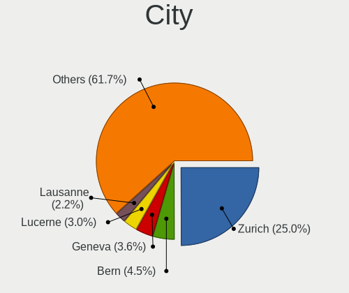
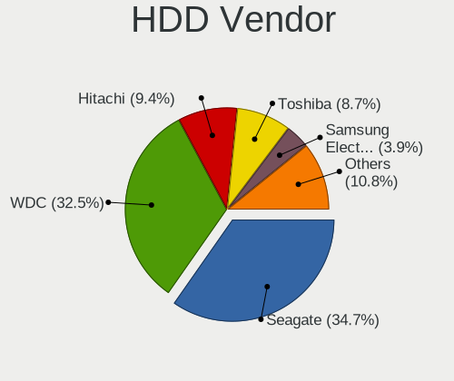
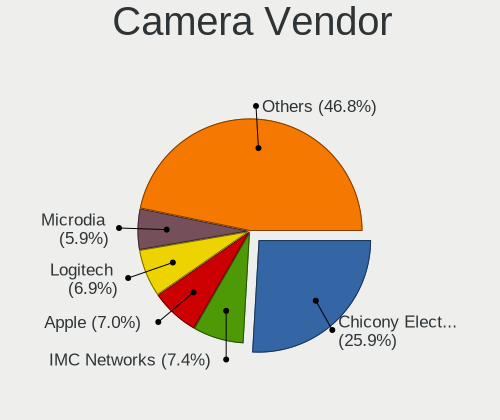
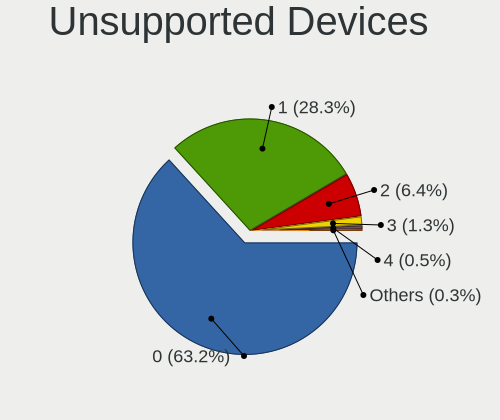

Linux in Switzerland - Tested Hardware & Statistics
---------------------------------------------------

A project to collect tested hardware configurations for Linux in Switzerland.

Anyone can contribute to this report by the [hw-probe](https://github.com/linuxhw/hw-probe) tool:

    sudo -E hw-probe -all -upload

Please contribute! Especially if your hardware is rare.

This is a report for all computer types. See also reports for [desktops](/Location/Switzerland/Desktop/README.md) and [notebooks](/Location/Switzerland/Notebook/README.md).

Contents
--------

* [ Test Cases ](#test-cases)

* [ System ](#system)
  - [ OS                       ](#os)
  - [ OS Family                ](#os-family)
  - [ Kernel                   ](#kernel)
  - [ Kernel Family            ](#kernel-family)
  - [ Kernel Major Ver.        ](#kernel-major-ver)
  - [ Arch                     ](#arch)
  - [ DE                       ](#de)
  - [ Display Server           ](#display-server)
  - [ Display Manager          ](#display-manager)
  - [ OS Lang                  ](#os-lang)
  - [ Boot Mode                ](#boot-mode)
  - [ Filesystem               ](#filesystem)
  - [ Part. scheme             ](#part-scheme)
  - [ Dual Boot with Linux/BSD ](#dual-boot-with-linuxbsd)
  - [ Dual Boot (Win)          ](#dual-boot-win)

* [ Board ](#board)
  - [ Vendor                   ](#vendor)
  - [ Model                    ](#model)
  - [ Model Family             ](#model-family)
  - [ MFG Year                 ](#mfg-year)
  - [ Form Factor              ](#form-factor)
  - [ Secure Boot              ](#secure-boot)
  - [ Coreboot                 ](#coreboot)
  - [ RAM Size                 ](#ram-size)
  - [ RAM Used                 ](#ram-used)
  - [ Total Drives             ](#total-drives)
  - [ Has CD-ROM               ](#has-cd-rom)
  - [ Has Ethernet             ](#has-ethernet)
  - [ Has WiFi                 ](#has-wifi)
  - [ Has Bluetooth            ](#has-bluetooth)

* [ Location ](#location)
  - [ Country                  ](#country)
  - [ City                     ](#city)

* [ Drives ](#drives)
  - [ Drive Vendor             ](#drive-vendor)
  - [ Drive Model              ](#drive-model)
  - [ HDD Vendor               ](#hdd-vendor)
  - [ SSD Vendor               ](#ssd-vendor)
  - [ Drive Kind               ](#drive-kind)
  - [ Drive Connector          ](#drive-connector)
  - [ Drive Size               ](#drive-size)
  - [ Space Total              ](#space-total)
  - [ Space Used               ](#space-used)
  - [ Malfunc. Drives          ](#malfunc-drives)
  - [ Malfunc. Drive Vendor    ](#malfunc-drive-vendor)
  - [ Malfunc. HDD Vendor      ](#malfunc-hdd-vendor)
  - [ Malfunc. Drive Kind      ](#malfunc-drive-kind)
  - [ Failed Drives            ](#failed-drives)
  - [ Failed Drive Vendor      ](#failed-drive-vendor)
  - [ Drive Status             ](#drive-status)

* [ Storage controller ](#storage-controller)
  - [ Storage Vendor           ](#storage-vendor)
  - [ Storage Model            ](#storage-model)
  - [ Storage Kind             ](#storage-kind)

* [ Processor ](#processor)
  - [ CPU Vendor               ](#cpu-vendor)
  - [ CPU Model                ](#cpu-model)
  - [ CPU Model Family         ](#cpu-model-family)
  - [ CPU Cores                ](#cpu-cores)
  - [ CPU Sockets              ](#cpu-sockets)
  - [ CPU Threads              ](#cpu-threads)
  - [ CPU Op-Modes             ](#cpu-op-modes)
  - [ CPU Microcode            ](#cpu-microcode)
  - [ CPU Microarch            ](#cpu-microarch)

* [ Graphics ](#graphics)
  - [ GPU Vendor               ](#gpu-vendor)
  - [ GPU Model                ](#gpu-model)
  - [ GPU Combo                ](#gpu-combo)
  - [ GPU Driver               ](#gpu-driver)
  - [ GPU Memory               ](#gpu-memory)

* [ Monitor ](#monitor)
  - [ Monitor Vendor           ](#monitor-vendor)
  - [ Monitor Model            ](#monitor-model)
  - [ Monitor Resolution       ](#monitor-resolution)
  - [ Monitor Diagonal         ](#monitor-diagonal)
  - [ Monitor Width            ](#monitor-width)
  - [ Aspect Ratio             ](#aspect-ratio)
  - [ Monitor Area             ](#monitor-area)
  - [ Pixel Density            ](#pixel-density)
  - [ Multiple Monitors        ](#multiple-monitors)

* [ Network ](#network)
  - [ Net Controller Vendor    ](#net-controller-vendor)
  - [ Net Controller Model     ](#net-controller-model)
  - [ Wireless Vendor          ](#wireless-vendor)
  - [ Wireless Model           ](#wireless-model)
  - [ Ethernet Vendor          ](#ethernet-vendor)
  - [ Ethernet Model           ](#ethernet-model)
  - [ Net Controller Kind      ](#net-controller-kind)
  - [ Used Controller          ](#used-controller)
  - [ NICs                     ](#nics)
  - [ IPv6                     ](#ipv6)

* [ Bluetooth ](#bluetooth)
  - [ Bluetooth Vendor         ](#bluetooth-vendor)
  - [ Bluetooth Model          ](#bluetooth-model)

* [ Sound ](#sound)
  - [ Sound Vendor             ](#sound-vendor)
  - [ Sound Model              ](#sound-model)

* [ Memory ](#memory)
  - [ Memory Vendor            ](#memory-vendor)
  - [ Memory Model             ](#memory-model)
  - [ Memory Kind              ](#memory-kind)
  - [ Memory Form Factor       ](#memory-form-factor)
  - [ Memory Size              ](#memory-size)
  - [ Memory Speed             ](#memory-speed)

* [ Printers & scanners ](#printers--scanners)
  - [ Printer Vendor           ](#printer-vendor)
  - [ Printer Model            ](#printer-model)
  - [ Scanner Vendor           ](#scanner-vendor)
  - [ Scanner Model            ](#scanner-model)

* [ Camera ](#camera)
  - [ Camera Vendor            ](#camera-vendor)
  - [ Camera Model             ](#camera-model)

* [ Security ](#security)
  - [ Fingerprint Vendor       ](#fingerprint-vendor)
  - [ Fingerprint Model        ](#fingerprint-model)
  - [ Chipcard Vendor          ](#chipcard-vendor)
  - [ Chipcard Model           ](#chipcard-model)

* [ Unsupported ](#unsupported)
  - [ Unsupported Devices      ](#unsupported-devices)
  - [ Unsupported Device Types ](#unsupported-device-types)

Test Cases
----------

Total: 3185

| Vendor        | Model                       | Form-Factor | Probe                                                      | Date         |
|---------------|-----------------------------|-------------|------------------------------------------------------------|--------------|
| Apple         | Mac-00BE6ED71E35EB86 iMa... | All in one  | [c8c9c1e591](https://linux-hardware.org/?probe=c8c9c1e591) | Apr 30, 2023 |
| Intel         | DH67CL AAG10212-210         | Desktop     | [7d6b0027b3](https://linux-hardware.org/?probe=7d6b0027b3) | Apr 30, 2023 |
| Dell          | Vostro 3558                 | Notebook    | [5d77d7d922](https://linux-hardware.org/?probe=5d77d7d922) | Apr 30, 2023 |
| Acer          | Aspire E5-575G              | Notebook    | [6a102a2c37](https://linux-hardware.org/?probe=6a102a2c37) | Apr 29, 2023 |
| Gigabyte      | GA-MA790FXT-UD5P            | Desktop     | [910d4a6ad8](https://linux-hardware.org/?probe=910d4a6ad8) | Apr 29, 2023 |
| Dell          | Vostro 3558                 | Notebook    | [e1e3261c15](https://linux-hardware.org/?probe=e1e3261c15) | Apr 29, 2023 |
| Acer          | Aspire E5-575G              | Notebook    | [004e0007e4](https://linux-hardware.org/?probe=004e0007e4) | Apr 28, 2023 |
| Apple         | Mac-27ADBB7B4CEE8E61 iMa... | All in one  | [00d8186404](https://linux-hardware.org/?probe=00d8186404) | Apr 28, 2023 |
| Apple         | Mac-27ADBB7B4CEE8E61 iMa... | All in one  | [50e1b8e197](https://linux-hardware.org/?probe=50e1b8e197) | Apr 28, 2023 |
| Intel         | DH67CL AAG10212-210         | Desktop     | [cb87589d9f](https://linux-hardware.org/?probe=cb87589d9f) | Apr 28, 2023 |
| ASUSTek       | ASUS TUF Gaming A15 FA50... | Notebook    | [7ba933a829](https://linux-hardware.org/?probe=7ba933a829) | Apr 28, 2023 |
| Gigabyte      | Z97-HD3                     | Desktop     | [ec41184680](https://linux-hardware.org/?probe=ec41184680) | Apr 27, 2023 |
| Dell          | Latitude 5520               | Notebook    | [3071d4a9d8](https://linux-hardware.org/?probe=3071d4a9d8) | Apr 26, 2023 |
| Dell          | Latitude 5520               | Notebook    | [23fe32affd](https://linux-hardware.org/?probe=23fe32affd) | Apr 26, 2023 |
| MSI           | Creator 15 A10SGS           | Notebook    | [1b364e385a](https://linux-hardware.org/?probe=1b364e385a) | Apr 26, 2023 |
| HP            | EliteBook 820 G1            | Notebook    | [7afd2012e8](https://linux-hardware.org/?probe=7afd2012e8) | Apr 25, 2023 |
| ASUSTek       | PRIME Z790-P                | Desktop     | [c7fdbbb95b](https://linux-hardware.org/?probe=c7fdbbb95b) | Apr 25, 2023 |
| ASUSTek       | PRIME Z790-P                | Desktop     | [363bb28966](https://linux-hardware.org/?probe=363bb28966) | Apr 25, 2023 |
| ASUSTek       | M5A99X EVO R2.0             | Desktop     | [d73e1b6350](https://linux-hardware.org/?probe=d73e1b6350) | Apr 24, 2023 |
| Dell          | Latitude 7530               | Notebook    | [17140d3871](https://linux-hardware.org/?probe=17140d3871) | Apr 24, 2023 |
| HP            | 8433 11                     | Desktop     | [e885f0469c](https://linux-hardware.org/?probe=e885f0469c) | Apr 22, 2023 |
| AZW           | GTR V02                     | Desktop     | [104badc0d7](https://linux-hardware.org/?probe=104badc0d7) | Apr 22, 2023 |
| Dell          | XPS 17 9720                 | Notebook    | [d7ad0ed423](https://linux-hardware.org/?probe=d7ad0ed423) | Apr 22, 2023 |
| Dell          | XPS 13 9350                 | Notebook    | [1ed1930799](https://linux-hardware.org/?probe=1ed1930799) | Apr 21, 2023 |
| Apple         | Mac-FFE5EF870D7BA81A iMa... | All in one  | [570077aa64](https://linux-hardware.org/?probe=570077aa64) | Apr 21, 2023 |
| Lenovo        | 3753 SDK0T76461 WIN 3422... | Desktop     | [65c9942c32](https://linux-hardware.org/?probe=65c9942c32) | Apr 21, 2023 |
| Lenovo        | 3753 SDK0T76461 WIN 3422... | Desktop     | [607dbbf4d8](https://linux-hardware.org/?probe=607dbbf4d8) | Apr 21, 2023 |
| Gigabyte      | P55A-UD7                    | Desktop     | [59f8c4d262](https://linux-hardware.org/?probe=59f8c4d262) | Apr 20, 2023 |
| Intel         | S2600WTTR G92187-366        | Server      | [9bb50174ef](https://linux-hardware.org/?probe=9bb50174ef) | Apr 20, 2023 |
| Dell          | 0DPRKF A01                  | Server      | [51412400ba](https://linux-hardware.org/?probe=51412400ba) | Apr 20, 2023 |
| Fujitsu       | D3498-A1 S26361-D3498-A1    | Desktop     | [f20338e169](https://linux-hardware.org/?probe=f20338e169) | Apr 20, 2023 |
| ASUSTek       | PRIME B550M-A               | Desktop     | [2c6da4e91f](https://linux-hardware.org/?probe=2c6da4e91f) | Apr 20, 2023 |
| ASUSTek       | H87M-PLUS                   | Desktop     | [472922fafd](https://linux-hardware.org/?probe=472922fafd) | Apr 20, 2023 |
| Intel         | DP67BA AAG10219-303         | Desktop     | [a1b9ea4fd9](https://linux-hardware.org/?probe=a1b9ea4fd9) | Apr 20, 2023 |
| Intel         | DX58SO2 AAG10925-207        | Desktop     | [4e31c5af6b](https://linux-hardware.org/?probe=4e31c5af6b) | Apr 20, 2023 |
| Intel         | DP67BA AAG10219-303         | Desktop     | [27a629fd15](https://linux-hardware.org/?probe=27a629fd15) | Apr 20, 2023 |
| ASUSTek       | PRIME B550M-A               | Desktop     | [f3a680d9bc](https://linux-hardware.org/?probe=f3a680d9bc) | Apr 20, 2023 |
| Fujitsu       | D3348-A1 S26361-D3348-A1    | Desktop     | [96d5a26185](https://linux-hardware.org/?probe=96d5a26185) | Apr 20, 2023 |
| Fujitsu       | D3417-A2 S26361-D3417-A2    | Desktop     | [b6306c2e97](https://linux-hardware.org/?probe=b6306c2e97) | Apr 20, 2023 |
| Fujitsu       | D3517-A1 S26361-D3517-A1    | Desktop     | [fbedbcb213](https://linux-hardware.org/?probe=fbedbcb213) | Apr 20, 2023 |
| ASUSTek       | X99-S                       | Desktop     | [6e77ac0ec9](https://linux-hardware.org/?probe=6e77ac0ec9) | Apr 20, 2023 |
| Fujitsu       | D3417-A2 S26361-D3417-A2    | Desktop     | [c1b2a75484](https://linux-hardware.org/?probe=c1b2a75484) | Apr 20, 2023 |
| Fujitsu       | D3617-A1 S26361-D3617-A1    | Desktop     | [756eccb961](https://linux-hardware.org/?probe=756eccb961) | Apr 20, 2023 |
| Gigabyte      | H97-HD3                     | Desktop     | [ef04208d0f](https://linux-hardware.org/?probe=ef04208d0f) | Apr 20, 2023 |
| Fujitsu       | D3417-A2 S26361-D3417-A2    | Desktop     | [c419c9200f](https://linux-hardware.org/?probe=c419c9200f) | Apr 20, 2023 |
| ASUSTek       | X99-S                       | Desktop     | [1be8dc273c](https://linux-hardware.org/?probe=1be8dc273c) | Apr 20, 2023 |
| Intel         | S2600WTTR G92187-366        | Server      | [d765a92052](https://linux-hardware.org/?probe=d765a92052) | Apr 20, 2023 |
| ASUSTek       | PRIME Z490M-PLUS            | Desktop     | [244222ae5c](https://linux-hardware.org/?probe=244222ae5c) | Apr 20, 2023 |
| ASUSTek       | PRIME H270M-PLUS            | Desktop     | [f77fe53c69](https://linux-hardware.org/?probe=f77fe53c69) | Apr 20, 2023 |
| Dell          | 08NPPY A00                  | Desktop     | [7d49aa5207](https://linux-hardware.org/?probe=7d49aa5207) | Apr 20, 2023 |
| ASUSTek       | STRIX Z270F GAMING          | Desktop     | [d53ce13aa3](https://linux-hardware.org/?probe=d53ce13aa3) | Apr 20, 2023 |
| ASRock        | B550M Pro4                  | Desktop     | [ec13e17577](https://linux-hardware.org/?probe=ec13e17577) | Apr 20, 2023 |
| ASUSTek       | PRIME Z390-P                | Desktop     | [9fde2b21fc](https://linux-hardware.org/?probe=9fde2b21fc) | Apr 20, 2023 |
| ASUSTek       | G35CG                       | Desktop     | [ddc7ba8ccb](https://linux-hardware.org/?probe=ddc7ba8ccb) | Apr 20, 2023 |
| Fujitsu       | D3348-A2 S26361-D3348-A2    | Desktop     | [3dbd4f731c](https://linux-hardware.org/?probe=3dbd4f731c) | Apr 20, 2023 |
| ASUSTek       | PRIME X570-PRO              | Desktop     | [d46e9b11d5](https://linux-hardware.org/?probe=d46e9b11d5) | Apr 20, 2023 |
| ASUSTek       | PRIME X570-PRO              | Desktop     | [afbf28c15a](https://linux-hardware.org/?probe=afbf28c15a) | Apr 20, 2023 |
| ASUSTek       | PRIME Z370-A II             | Desktop     | [f185782be2](https://linux-hardware.org/?probe=f185782be2) | Apr 20, 2023 |
| ASUSTek       | PRIME X570-PRO              | Desktop     | [731671f1b8](https://linux-hardware.org/?probe=731671f1b8) | Apr 20, 2023 |
| ASUSTek       | PRIME X570-PRO              | Desktop     | [463c62da83](https://linux-hardware.org/?probe=463c62da83) | Apr 20, 2023 |
| Fujitsu       | D3517-A1 S26361-D3517-A1    | Desktop     | [0356125777](https://linux-hardware.org/?probe=0356125777) | Apr 20, 2023 |
| ASUSTek       | PRIME Z490M-PLUS            | Desktop     | [0a45e9e9af](https://linux-hardware.org/?probe=0a45e9e9af) | Apr 20, 2023 |
| ASUSTek       | PRIME X570-PRO              | Desktop     | [ccf2e2bbc3](https://linux-hardware.org/?probe=ccf2e2bbc3) | Apr 20, 2023 |
| ASUSTek       | PRIME B550M-A               | Desktop     | [3171099090](https://linux-hardware.org/?probe=3171099090) | Apr 20, 2023 |
| ASUSTek       | PRIME X570-PRO              | Desktop     | [032f3a72c6](https://linux-hardware.org/?probe=032f3a72c6) | Apr 20, 2023 |
| Intel         | DH87MC AAG74242-401         | Desktop     | [df7041b726](https://linux-hardware.org/?probe=df7041b726) | Apr 20, 2023 |
| ASUSTek       | P9X79 WS                    | Desktop     | [04e9cd2455](https://linux-hardware.org/?probe=04e9cd2455) | Apr 20, 2023 |
| Intel         | DP55WB AAE64798-207         | Desktop     | [0dd9e12f5a](https://linux-hardware.org/?probe=0dd9e12f5a) | Apr 20, 2023 |
| HP            | 870B                        | Desktop     | [ad6a3cc4d0](https://linux-hardware.org/?probe=ad6a3cc4d0) | Apr 20, 2023 |
| ASRock        | B760M Steel Legend WiFi     | Desktop     | [9e668ff813](https://linux-hardware.org/?probe=9e668ff813) | Apr 20, 2023 |
| Fujitsu       | D3417-A2 S26361-D3417-A2    | Desktop     | [5dc0cb1f28](https://linux-hardware.org/?probe=5dc0cb1f28) | Apr 20, 2023 |
| Medion        | GA-Z170X-Gaming 7           | Desktop     | [706cfb4c50](https://linux-hardware.org/?probe=706cfb4c50) | Apr 20, 2023 |
| Gigabyte      | H97-HD3                     | Desktop     | [b3b27e0fcf](https://linux-hardware.org/?probe=b3b27e0fcf) | Apr 20, 2023 |
| ASUSTek       | PRIME Z370-A II             | Desktop     | [bdbd8d06e2](https://linux-hardware.org/?probe=bdbd8d06e2) | Apr 20, 2023 |
| Fujitsu       | D3227-A1 S26361-D3227-A1    | Desktop     | [ff10999142](https://linux-hardware.org/?probe=ff10999142) | Apr 20, 2023 |
| ASUSTek       | PRIME B550M-A               | Desktop     | [11da8c5d96](https://linux-hardware.org/?probe=11da8c5d96) | Apr 20, 2023 |
| ASUSTek       | PRIME X570-PRO              | Desktop     | [128d16cf7f](https://linux-hardware.org/?probe=128d16cf7f) | Apr 20, 2023 |
| ASUSTek       | PRIME B550M-A               | Desktop     | [c2de2809a0](https://linux-hardware.org/?probe=c2de2809a0) | Apr 20, 2023 |
| Intel         | S2600WFT H48104-860         | Server      | [f5848d1ba2](https://linux-hardware.org/?probe=f5848d1ba2) | Apr 20, 2023 |
| ASUSTek       | PRIME B550M-A               | Desktop     | [c3a3c03c3f](https://linux-hardware.org/?probe=c3a3c03c3f) | Apr 20, 2023 |
| Fujitsu       | D3227-A1 S26361-D3227-A1    | Desktop     | [1ae9258a0d](https://linux-hardware.org/?probe=1ae9258a0d) | Apr 20, 2023 |
| Intel         | SVRBD-ROW_T G30981-503      | Server      | [5fba63c085](https://linux-hardware.org/?probe=5fba63c085) | Apr 20, 2023 |
| ASUSTek       | STRIX Z270F GAMING          | Desktop     | [ab89260502](https://linux-hardware.org/?probe=ab89260502) | Apr 20, 2023 |
| ASUSTek       | PRIME X570-PRO              | Desktop     | [3f99aeec69](https://linux-hardware.org/?probe=3f99aeec69) | Apr 20, 2023 |
| HP            | 870B                        | Desktop     | [50f654b2a0](https://linux-hardware.org/?probe=50f654b2a0) | Apr 20, 2023 |
| Fujitsu       | D3348-A1 S26361-D3348-A1    | Desktop     | [9949a0748f](https://linux-hardware.org/?probe=9949a0748f) | Apr 20, 2023 |
| ASUSTek       | PRIME Z370-A II             | Desktop     | [e3cfbf7435](https://linux-hardware.org/?probe=e3cfbf7435) | Apr 20, 2023 |
| ASUSTek       | PRIME X570-PRO              | Desktop     | [9817f90648](https://linux-hardware.org/?probe=9817f90648) | Apr 20, 2023 |
| ASUSTek       | G35CG                       | Desktop     | [cf4854d704](https://linux-hardware.org/?probe=cf4854d704) | Apr 20, 2023 |
| ASUSTek       | PRIME B550M-A               | Desktop     | [296676f929](https://linux-hardware.org/?probe=296676f929) | Apr 20, 2023 |
| ASUSTek       | PRIME Z370-A II             | Desktop     | [2eeebec1ec](https://linux-hardware.org/?probe=2eeebec1ec) | Apr 20, 2023 |
| Fujitsu       | D3417-A2 S26361-D3417-A2    | Desktop     | [68ac671aab](https://linux-hardware.org/?probe=68ac671aab) | Apr 20, 2023 |
| ASUSTek       | PRIME X370-PRO              | Desktop     | [a069d32b86](https://linux-hardware.org/?probe=a069d32b86) | Apr 20, 2023 |
| ASUSTek       | ROG STRIX Z370-F GAMING     | Desktop     | [1b1a3da7b2](https://linux-hardware.org/?probe=1b1a3da7b2) | Apr 20, 2023 |
| Gigabyte      | MZ12-HD3-00 01010101        | Server      | [def4067c8e](https://linux-hardware.org/?probe=def4067c8e) | Apr 20, 2023 |
| ASUSTek       | X99-S                       | Desktop     | [2a1fcefe29](https://linux-hardware.org/?probe=2a1fcefe29) | Apr 20, 2023 |
| ASUSTek       | PRIME B550M-A               | Desktop     | [5c54edc96d](https://linux-hardware.org/?probe=5c54edc96d) | Apr 20, 2023 |
| ASRock        | B760M Steel Legend WiFi     | Desktop     | [563e45a22a](https://linux-hardware.org/?probe=563e45a22a) | Apr 20, 2023 |
| ASUSTek       | PRIME B550M-A               | Desktop     | [0000720fb6](https://linux-hardware.org/?probe=0000720fb6) | Apr 20, 2023 |
| ASUSTek       | PRIME X570-PRO              | Desktop     | [fdda3d6276](https://linux-hardware.org/?probe=fdda3d6276) | Apr 20, 2023 |
| ASUSTek       | PRIME X570-PRO              | Desktop     | [ee95d83f31](https://linux-hardware.org/?probe=ee95d83f31) | Apr 20, 2023 |
| ASUSTek       | PRIME B550M-A               | Desktop     | [1e49dc0f67](https://linux-hardware.org/?probe=1e49dc0f67) | Apr 20, 2023 |
| Gigabyte      | MZ92-FS0-00 01010101        | Server      | [3e6b182473](https://linux-hardware.org/?probe=3e6b182473) | Apr 20, 2023 |
| HP            | ProLiant ML150 G6           | Desktop     | [76dc3db16a](https://linux-hardware.org/?probe=76dc3db16a) | Apr 20, 2023 |
| HP            | 89D8 SMVB                   | Desktop     | [c4c1d8086c](https://linux-hardware.org/?probe=c4c1d8086c) | Apr 20, 2023 |
| ASRock        | B560M-HDV                   | Desktop     | [b835e48fad](https://linux-hardware.org/?probe=b835e48fad) | Apr 19, 2023 |
| ASUSTek       | Pro WS WRX80E-SAGE SE WI... | Desktop     | [882d6f625d](https://linux-hardware.org/?probe=882d6f625d) | Apr 19, 2023 |
| ASUSTek       | PRIME A320M-K               | Desktop     | [8f16bcad94](https://linux-hardware.org/?probe=8f16bcad94) | Apr 19, 2023 |
| ASUSTek       | PRIME A320M-K               | Desktop     | [848607e7f1](https://linux-hardware.org/?probe=848607e7f1) | Apr 19, 2023 |
| ASUSTek       | ASUS EXPERTBOOK B1400CEA... | Notebook    | [b076a9a807](https://linux-hardware.org/?probe=b076a9a807) | Apr 18, 2023 |
| Dell          | 0D4VY1 A00                  | All in one  | [ddbd926522](https://linux-hardware.org/?probe=ddbd926522) | Apr 18, 2023 |
| Dell          | 0R4CNN A02                  | Server      | [237a3cd682](https://linux-hardware.org/?probe=237a3cd682) | Apr 18, 2023 |
| ASUSTek       | PRIME Z590-P                | Desktop     | [79225bdfaf](https://linux-hardware.org/?probe=79225bdfaf) | Apr 17, 2023 |
| ASUSTek       | PRIME Z590-P                | Desktop     | [4d802fb610](https://linux-hardware.org/?probe=4d802fb610) | Apr 17, 2023 |
| ASUSTek       | PRIME Z590-P                | Desktop     | [2b749e898e](https://linux-hardware.org/?probe=2b749e898e) | Apr 17, 2023 |
| ASUSTek       | PRIME Z590-P                | Desktop     | [702377976d](https://linux-hardware.org/?probe=702377976d) | Apr 17, 2023 |
| ASUSTek       | PRIME Z590-P                | Desktop     | [32f7392dce](https://linux-hardware.org/?probe=32f7392dce) | Apr 17, 2023 |
| ASUSTek       | PRIME Z590-P                | Desktop     | [b7f40b0d8e](https://linux-hardware.org/?probe=b7f40b0d8e) | Apr 17, 2023 |
| ASUSTek       | PRIME Z590-P                | Desktop     | [9602690aa2](https://linux-hardware.org/?probe=9602690aa2) | Apr 17, 2023 |
| ASUSTek       | PRIME Z590-P                | Desktop     | [bbf0a5108a](https://linux-hardware.org/?probe=bbf0a5108a) | Apr 17, 2023 |
| ASUSTek       | PRIME Z590-P                | Desktop     | [000ec3362e](https://linux-hardware.org/?probe=000ec3362e) | Apr 17, 2023 |
| ASUSTek       | PRIME Z590-P                | Desktop     | [7d67899067](https://linux-hardware.org/?probe=7d67899067) | Apr 17, 2023 |
| ASUSTek       | PRIME Z590-P                | Desktop     | [256a2110b0](https://linux-hardware.org/?probe=256a2110b0) | Apr 17, 2023 |
| ASUSTek       | PRIME Z590-P                | Desktop     | [9f69cc7127](https://linux-hardware.org/?probe=9f69cc7127) | Apr 17, 2023 |
| ASUSTek       | PRIME Z590-P                | Desktop     | [997c25143e](https://linux-hardware.org/?probe=997c25143e) | Apr 17, 2023 |
| ASUSTek       | PRIME Z590-P                | Desktop     | [71822fdac9](https://linux-hardware.org/?probe=71822fdac9) | Apr 17, 2023 |
| ASUSTek       | PRIME Z590-P                | Desktop     | [b3f9111b79](https://linux-hardware.org/?probe=b3f9111b79) | Apr 17, 2023 |
| ASUSTek       | PRIME Z590-P                | Desktop     | [df314b2a9c](https://linux-hardware.org/?probe=df314b2a9c) | Apr 17, 2023 |
| ASUSTek       | P6T DELUXE                  | Desktop     | [dc155ce308](https://linux-hardware.org/?probe=dc155ce308) | Apr 17, 2023 |
| ASUSTek       | P6T DELUXE                  | Desktop     | [aaff05d28f](https://linux-hardware.org/?probe=aaff05d28f) | Apr 17, 2023 |
| Lenovo        | ThinkPad T420 4180MG1       | Notebook    | [132e6ba829](https://linux-hardware.org/?probe=132e6ba829) | Apr 17, 2023 |
| ASRock        | Z170 Extreme4               | Desktop     | [fc6c4adaa4](https://linux-hardware.org/?probe=fc6c4adaa4) | Apr 17, 2023 |
| Apple         | Mac-65CE76090165799A iMa... | All in one  | [8dd4721bd1](https://linux-hardware.org/?probe=8dd4721bd1) | Apr 16, 2023 |
| ASRock        | Z170 Extreme4               | Desktop     | [a0f5ba360c](https://linux-hardware.org/?probe=a0f5ba360c) | Apr 16, 2023 |
| Apple         | Mac-F4238CC8 PVT            | All in one  | [9c885fa5cf](https://linux-hardware.org/?probe=9c885fa5cf) | Apr 16, 2023 |
| Lenovo        | 3704 SDK0R32862 WIN 3258... | Desktop     | [4d3cbcc4d9](https://linux-hardware.org/?probe=4d3cbcc4d9) | Apr 16, 2023 |
| Dell          | Latitude 7530               | Notebook    | [133059c3d6](https://linux-hardware.org/?probe=133059c3d6) | Apr 16, 2023 |
| Apple         | Mac-F4238CC8 PVT            | All in one  | [8fb4ed64eb](https://linux-hardware.org/?probe=8fb4ed64eb) | Apr 16, 2023 |
| Apple         | Mac-F4238CC8 PVT            | All in one  | [5943787304](https://linux-hardware.org/?probe=5943787304) | Apr 16, 2023 |
| ASUSTek       | X756UJ                      | Notebook    | [a374f8dd26](https://linux-hardware.org/?probe=a374f8dd26) | Apr 15, 2023 |
| Intel         | DH67CL AAG10212-210         | Desktop     | [8519b4cda2](https://linux-hardware.org/?probe=8519b4cda2) | Apr 15, 2023 |
| Apple         | Mac-F221BEC8                | Desktop     | [c4f2e4e7d8](https://linux-hardware.org/?probe=c4f2e4e7d8) | Apr 14, 2023 |
| HP            | 0B4Ch D                     | Desktop     | [a0247e45a6](https://linux-hardware.org/?probe=a0247e45a6) | Apr 13, 2023 |
| HP            | 0B4Ch D                     | Desktop     | [f205e700dc](https://linux-hardware.org/?probe=f205e700dc) | Apr 13, 2023 |
| Lenovo        | Yoga 6 13ABR8 83B2          | Convertible | [817e4bb939](https://linux-hardware.org/?probe=817e4bb939) | Apr 13, 2023 |
| HP            | 8433 11                     | Desktop     | [61c92812be](https://linux-hardware.org/?probe=61c92812be) | Apr 12, 2023 |
| ASUSTek       | ROG Flow X16 GV601RW_GV6... | Convertible | [d5e608b74e](https://linux-hardware.org/?probe=d5e608b74e) | Apr 11, 2023 |
| ASUSTek       | ROG Flow X16 GV601RW_GV6... | Convertible | [e9ba143773](https://linux-hardware.org/?probe=e9ba143773) | Apr 11, 2023 |
| Lenovo        | ThinkPad E14 Gen 2 20TA0... | Notebook    | [ec028424ea](https://linux-hardware.org/?probe=ec028424ea) | Apr 09, 2023 |
| ASUSTek       | ROG STRIX X570-E GAMING     | Desktop     | [cc25df15df](https://linux-hardware.org/?probe=cc25df15df) | Apr 08, 2023 |
| Raspberry ... | Raspberry Pi 4 Model B R... | Soc         | [9ccdf29023](https://linux-hardware.org/?probe=9ccdf29023) | Apr 08, 2023 |
| ASUSTek       | P8P67                       | Desktop     | [a62766f42e](https://linux-hardware.org/?probe=a62766f42e) | Apr 08, 2023 |
| Apple         | Mac-FC02E91DDD3FA6A4 iMa... | All in one  | [6a8c52faa7](https://linux-hardware.org/?probe=6a8c52faa7) | Apr 06, 2023 |
| HP            | OMEN by Laptop 16-b1xxx     | Notebook    | [d741226152](https://linux-hardware.org/?probe=d741226152) | Apr 06, 2023 |
| HP            | ProBook 4540s               | Notebook    | [02754e47f3](https://linux-hardware.org/?probe=02754e47f3) | Apr 05, 2023 |
| Lenovo        | ThinkPad P50s 20FKS0A300    | Notebook    | [32f5d43e96](https://linux-hardware.org/?probe=32f5d43e96) | Apr 04, 2023 |
| Apple         | MacBookAir6,1               | Notebook    | [423c5d2481](https://linux-hardware.org/?probe=423c5d2481) | Apr 03, 2023 |
| Sony          | VPCF22C5E                   | Notebook    | [9d122b8bdd](https://linux-hardware.org/?probe=9d122b8bdd) | Apr 03, 2023 |
| Lenovo        | 370A SDK0J40700 WIN 3258... | Desktop     | [8566b9511a](https://linux-hardware.org/?probe=8566b9511a) | Apr 02, 2023 |
| ASUSTek       | Maximus IV Extreme-Z        | Desktop     | [36d245f86b](https://linux-hardware.org/?probe=36d245f86b) | Apr 02, 2023 |
| ASUSTek       | ROG STRIX X570-F GAMING     | Desktop     | [3a8d512ae4](https://linux-hardware.org/?probe=3a8d512ae4) | Apr 02, 2023 |
| Valve         | Jupiter                     | Notebook    | [6f3e488e2b](https://linux-hardware.org/?probe=6f3e488e2b) | Apr 01, 2023 |
| Apple         | MacBookPro9,2               | Notebook    | [b0beffe006](https://linux-hardware.org/?probe=b0beffe006) | Apr 01, 2023 |
| Lenovo        | ThinkPad T490 20N2CTO1WW    | Notebook    | [17fb0ed43a](https://linux-hardware.org/?probe=17fb0ed43a) | Mar 31, 2023 |
| HP            | EliteBook 8460p             | Notebook    | [1d5f866283](https://linux-hardware.org/?probe=1d5f866283) | Mar 31, 2023 |
| HP            | EliteBook 8540p             | Notebook    | [570836875c](https://linux-hardware.org/?probe=570836875c) | Mar 31, 2023 |
| HP            | Unknown                     | Notebook    | [fb784430a5](https://linux-hardware.org/?probe=fb784430a5) | Mar 30, 2023 |
| Raspberry ... | Raspberry Pi Compute Mod... | Soc         | [3494b0fdd9](https://linux-hardware.org/?probe=3494b0fdd9) | Mar 30, 2023 |
| Raspberry ... | Raspberry Pi Compute Mod... | Soc         | [c885b5da6c](https://linux-hardware.org/?probe=c885b5da6c) | Mar 30, 2023 |
| Gigabyte      | GA-MA790FXT-UD5P            | Desktop     | [452a3fa4a8](https://linux-hardware.org/?probe=452a3fa4a8) | Mar 29, 2023 |
| Dell          | XPS 13 7390                 | Notebook    | [e1d01990f4](https://linux-hardware.org/?probe=e1d01990f4) | Mar 27, 2023 |
| HP            | 844C                        | Desktop     | [8270d682a8](https://linux-hardware.org/?probe=8270d682a8) | Mar 27, 2023 |
| HP            | EliteBook 840 G5            | Notebook    | [405ce5a9c8](https://linux-hardware.org/?probe=405ce5a9c8) | Mar 27, 2023 |
| ASUSTek       | CROSSHAIR II FORMULA        | Desktop     | [35e0a73e8f](https://linux-hardware.org/?probe=35e0a73e8f) | Mar 26, 2023 |
| Fujitsu       | LIFEBOOK E736               | Notebook    | [03df3679d3](https://linux-hardware.org/?probe=03df3679d3) | Mar 26, 2023 |
| Fujitsu       | LIFEBOOK E736               | Notebook    | [f7d3c52f58](https://linux-hardware.org/?probe=f7d3c52f58) | Mar 26, 2023 |
| Acer          | Predator G9-791             | Notebook    | [1f820516a3](https://linux-hardware.org/?probe=1f820516a3) | Mar 26, 2023 |
| Apple         | Mac-4B682C642B45593E iMa... | All in one  | [426c7d7939](https://linux-hardware.org/?probe=426c7d7939) | Mar 25, 2023 |
| ASUSTek       | SABERTOOTH X79              | Desktop     | [6c64b62e05](https://linux-hardware.org/?probe=6c64b62e05) | Mar 25, 2023 |
| HP            | OMEN by Laptop 16-b1xxx     | Notebook    | [0096d3d3b1](https://linux-hardware.org/?probe=0096d3d3b1) | Mar 25, 2023 |
| HP            | 8433 11                     | Desktop     | [5ab010ffd4](https://linux-hardware.org/?probe=5ab010ffd4) | Mar 25, 2023 |
| Purism        | Librem 13 v2                | Notebook    | [ef5cf3e08f](https://linux-hardware.org/?probe=ef5cf3e08f) | Mar 25, 2023 |
| HP            | ENVY x360 2-in-1 Laptop ... | Convertible | [728f83932f](https://linux-hardware.org/?probe=728f83932f) | Mar 24, 2023 |
| HP            | ENVY x360 2-in-1 Laptop ... | Convertible | [5a94081c24](https://linux-hardware.org/?probe=5a94081c24) | Mar 24, 2023 |
| MSI           | B450 GAMING PRO CARBON A... | Desktop     | [704fb36197](https://linux-hardware.org/?probe=704fb36197) | Mar 23, 2023 |
| ASRock        | B550M-ITX/ac                | Desktop     | [e8ad290196](https://linux-hardware.org/?probe=e8ad290196) | Mar 23, 2023 |
| ASUSTek       | TUF Gaming B560M-PLUS WI... | Desktop     | [1159055040](https://linux-hardware.org/?probe=1159055040) | Mar 23, 2023 |
| Lenovo        | ThinkPad L15 Gen 2 20X30... | Notebook    | [74be0519cc](https://linux-hardware.org/?probe=74be0519cc) | Mar 22, 2023 |
| ASRock        | H270 Pro4                   | Desktop     | [01eb4c8ba5](https://linux-hardware.org/?probe=01eb4c8ba5) | Mar 22, 2023 |
| Acer          | Aspire one 1-131            | Notebook    | [ea5065ef8f](https://linux-hardware.org/?probe=ea5065ef8f) | Mar 21, 2023 |
| Dell          | 09KPNV A00                  | Desktop     | [5074a23172](https://linux-hardware.org/?probe=5074a23172) | Mar 20, 2023 |
| AMI           | Aptio CRB                   | Mini pc     | [9ba3333988](https://linux-hardware.org/?probe=9ba3333988) | Mar 20, 2023 |
| Lenovo        | Yoga Duet 7 13ITL6 82MA     | Tablet      | [0fb09c29cb](https://linux-hardware.org/?probe=0fb09c29cb) | Mar 20, 2023 |
| HP            | ProBook 430 G4              | Notebook    | [6c83c2a089](https://linux-hardware.org/?probe=6c83c2a089) | Mar 19, 2023 |
| AMI           | Aptio CRB                   | Mini pc     | [3c00ca015f](https://linux-hardware.org/?probe=3c00ca015f) | Mar 19, 2023 |
| Lenovo        | ThinkPad X260 20F600A2MZ    | Notebook    | [5c59b55c2a](https://linux-hardware.org/?probe=5c59b55c2a) | Mar 19, 2023 |
| Lenovo        | IdeaPad Y510P 20217         | Notebook    | [d7acdc8bf3](https://linux-hardware.org/?probe=d7acdc8bf3) | Mar 18, 2023 |
| Google        | Lillipup                    | Notebook    | [3eca64113c](https://linux-hardware.org/?probe=3eca64113c) | Mar 18, 2023 |
| Medion        | S1219T MD99922              | Tablet      | [4e6f4d1197](https://linux-hardware.org/?probe=4e6f4d1197) | Mar 17, 2023 |
| HP            | 2B36                        | Desktop     | [85c11ec746](https://linux-hardware.org/?probe=85c11ec746) | Mar 17, 2023 |
| Lenovo        | ThinkPad X1 Carbon 4th 2... | Notebook    | [10ec4f48dd](https://linux-hardware.org/?probe=10ec4f48dd) | Mar 16, 2023 |
| Valve         | Jupiter                     | Notebook    | [bfdb73f825](https://linux-hardware.org/?probe=bfdb73f825) | Mar 16, 2023 |
| HP            | Laptop 15-bs0xx             | Notebook    | [be76f3a0a3](https://linux-hardware.org/?probe=be76f3a0a3) | Mar 15, 2023 |
| Medion        | B360H4-EM V1.0              | Desktop     | [839899a14d](https://linux-hardware.org/?probe=839899a14d) | Mar 15, 2023 |
| ASUSTek       | UX32A                       | Notebook    | [05121bc6af](https://linux-hardware.org/?probe=05121bc6af) | Mar 15, 2023 |
| HP            | ZBook Fury 15.6 inch G8 ... | Notebook    | [2d5d0e42c5](https://linux-hardware.org/?probe=2d5d0e42c5) | Mar 15, 2023 |
| Microsoft     | Surface Laptop Go           | Tablet      | [f4926b859a](https://linux-hardware.org/?probe=f4926b859a) | Mar 15, 2023 |
| Dell          | Latitude E6440              | Notebook    | [76a537c18e](https://linux-hardware.org/?probe=76a537c18e) | Mar 14, 2023 |
| Notebook      | NS50MU                      | Notebook    | [f5e64711f3](https://linux-hardware.org/?probe=f5e64711f3) | Mar 14, 2023 |
| ASUSTek       | PRIME Z590-P                | Desktop     | [f424a1dc42](https://linux-hardware.org/?probe=f424a1dc42) | Mar 14, 2023 |
| Lenovo        | ThinkPad X1 Carbon Gen 9... | Notebook    | [31ac227c9f](https://linux-hardware.org/?probe=31ac227c9f) | Mar 14, 2023 |
| Hardkernel    | ODROID-N2Plus               | Soc         | [36bcd11bd3](https://linux-hardware.org/?probe=36bcd11bd3) | Mar 14, 2023 |
| Hardkernel    | ODROID-N2Plus               | Soc         | [aca12aa4c5](https://linux-hardware.org/?probe=aca12aa4c5) | Mar 13, 2023 |
| Lenovo        | ThinkPad T490s 20NX002SG... | Notebook    | [aa5eb19101](https://linux-hardware.org/?probe=aa5eb19101) | Mar 13, 2023 |
| HP            | Spectre x360 2-in-1 Lapt... | Convertible | [433c3d165a](https://linux-hardware.org/?probe=433c3d165a) | Mar 13, 2023 |
| HP            | 212B                        | Desktop     | [8d5ef71d93](https://linux-hardware.org/?probe=8d5ef71d93) | Mar 13, 2023 |
| Acer          | Nitro AN517-52              | Notebook    | [43c96b4e3e](https://linux-hardware.org/?probe=43c96b4e3e) | Mar 13, 2023 |
| Apple         | Mac-4B682C642B45593E iMa... | All in one  | [a6af61dfb4](https://linux-hardware.org/?probe=a6af61dfb4) | Mar 13, 2023 |
| Dell          | 0T7D40 A01                  | Desktop     | [c2174a1837](https://linux-hardware.org/?probe=c2174a1837) | Mar 12, 2023 |
| Lenovo        | ThinkPad P1 Gen 5 21DC00... | Notebook    | [99095e84f5](https://linux-hardware.org/?probe=99095e84f5) | Mar 12, 2023 |
| ASUSTek       | VivoBook_ASUSLaptop X512... | Notebook    | [55fe24706a](https://linux-hardware.org/?probe=55fe24706a) | Mar 11, 2023 |
| Dell          | 09KPNV A00                  | Desktop     | [6c90dd73e7](https://linux-hardware.org/?probe=6c90dd73e7) | Mar 11, 2023 |
| Dell          | 09KPNV A00                  | Desktop     | [c792b83b69](https://linux-hardware.org/?probe=c792b83b69) | Mar 11, 2023 |
| Lenovo        | ThinkPad Edge E535 32605... | Notebook    | [ade1e690bb](https://linux-hardware.org/?probe=ade1e690bb) | Mar 11, 2023 |
| Gigabyte      | Z97-HD3                     | Desktop     | [5cb06ca8ce](https://linux-hardware.org/?probe=5cb06ca8ce) | Mar 10, 2023 |
| ASUSTek       | VivoBook_ASUSLaptop X512... | Notebook    | [d7535fd29e](https://linux-hardware.org/?probe=d7535fd29e) | Mar 10, 2023 |
| Lenovo        | Yoga 530-14IKB 81EK         | Convertible | [0e1279e96d](https://linux-hardware.org/?probe=0e1279e96d) | Mar 10, 2023 |
| ASUSTek       | VivoBook_ASUSLaptop X512... | Notebook    | [5b8db1d628](https://linux-hardware.org/?probe=5b8db1d628) | Mar 10, 2023 |
| Inventec      | D CLASS A02                 | Desktop     | [b9e49da1f7](https://linux-hardware.org/?probe=b9e49da1f7) | Mar 10, 2023 |
| Raspberry ... | Raspberry Pi 4 Model B R... | Soc         | [9946c1c6dc](https://linux-hardware.org/?probe=9946c1c6dc) | Mar 09, 2023 |
| HP            | Pavilion Aero Laptop 13-... | Notebook    | [3c5ca39c55](https://linux-hardware.org/?probe=3c5ca39c55) | Mar 08, 2023 |
| Lenovo        | ThinkPad Z13 Gen 1 21D2C... | Notebook    | [e280beba92](https://linux-hardware.org/?probe=e280beba92) | Mar 08, 2023 |
| ASUSTek       | ROG Maximus X HERO          | Desktop     | [d52a175b61](https://linux-hardware.org/?probe=d52a175b61) | Mar 07, 2023 |
| AZW           | GTR V02                     | Desktop     | [030dde937b](https://linux-hardware.org/?probe=030dde937b) | Mar 07, 2023 |
| ASUSTek       | ROG STRIX X570-E GAMING     | Desktop     | [971feb34e4](https://linux-hardware.org/?probe=971feb34e4) | Mar 07, 2023 |
| Fujitsu       | CELSIUS H780                | Notebook    | [7080d07525](https://linux-hardware.org/?probe=7080d07525) | Mar 07, 2023 |
| Lenovo        | ThinkPad P1 Gen 2 20QT00... | Notebook    | [3b02985778](https://linux-hardware.org/?probe=3b02985778) | Mar 07, 2023 |
| Lenovo        | ThinkPad P1 Gen 2 20QT00... | Notebook    | [e6e0d7226d](https://linux-hardware.org/?probe=e6e0d7226d) | Mar 07, 2023 |
| Acer          | Nitro AN517-52              | Notebook    | [fd6cb5c68a](https://linux-hardware.org/?probe=fd6cb5c68a) | Mar 07, 2023 |
| Acer          | Predator PH517-61           | Notebook    | [359903fe58](https://linux-hardware.org/?probe=359903fe58) | Mar 07, 2023 |
| Lenovo        | Z51-70 80K6                 | Notebook    | [676eaa7960](https://linux-hardware.org/?probe=676eaa7960) | Mar 06, 2023 |
| Lenovo        | ThinkPad E590 20NB000YMZ    | Notebook    | [fb05511be8](https://linux-hardware.org/?probe=fb05511be8) | Mar 05, 2023 |
| HP            | Compaq 15                   | Notebook    | [5c8a185273](https://linux-hardware.org/?probe=5c8a185273) | Mar 05, 2023 |
| HP            | EliteBook 8540w             | Notebook    | [e57a377381](https://linux-hardware.org/?probe=e57a377381) | Mar 05, 2023 |
| HP            | Spectre x360 2-in-1 Lapt... | Convertible | [e45794963a](https://linux-hardware.org/?probe=e45794963a) | Mar 04, 2023 |
| Lenovo        | IdeaPad Y510P 20217         | Notebook    | [a987f40464](https://linux-hardware.org/?probe=a987f40464) | Mar 04, 2023 |
| Lenovo        | IdeaPad Y510P 20217         | Notebook    | [6cd1e0a746](https://linux-hardware.org/?probe=6cd1e0a746) | Mar 04, 2023 |
| Timi          | TM1701                      | Notebook    | [4faac58613](https://linux-hardware.org/?probe=4faac58613) | Mar 04, 2023 |
| Raspberry ... | Raspberry Pi 4 Model B R... | Soc         | [02df2ea534](https://linux-hardware.org/?probe=02df2ea534) | Mar 03, 2023 |
| Lenovo        | ThinkPad Z16 Gen 1 21D40... | Notebook    | [1bcec582e3](https://linux-hardware.org/?probe=1bcec582e3) | Mar 03, 2023 |
| Lenovo        | ThinkPad L15 Gen 2 20X30... | Notebook    | [cacb713046](https://linux-hardware.org/?probe=cacb713046) | Mar 02, 2023 |
| Microsoft     | Surface Go 3                | Tablet      | [86ec7ef027](https://linux-hardware.org/?probe=86ec7ef027) | Mar 02, 2023 |
| Lenovo        | V15 G2 ALC 82KD             | Notebook    | [117d283b7a](https://linux-hardware.org/?probe=117d283b7a) | Mar 02, 2023 |
| Notebook      | PCx0Dx                      | Notebook    | [0f19d5c037](https://linux-hardware.org/?probe=0f19d5c037) | Mar 01, 2023 |
| Lenovo        | ThinkPad Edge E531 6885D... | Notebook    | [0780656106](https://linux-hardware.org/?probe=0780656106) | Mar 01, 2023 |
| HP            | EliteBook 845 14 inch G9... | Notebook    | [ed251c6cfe](https://linux-hardware.org/?probe=ed251c6cfe) | Feb 27, 2023 |
| ASUSTek       | TUF Gaming B550-PLUS        | Desktop     | [8fc8fee94a](https://linux-hardware.org/?probe=8fc8fee94a) | Feb 27, 2023 |
| HP            | ENVY Laptop 17-cr0xxx       | Notebook    | [3f0d63ab15](https://linux-hardware.org/?probe=3f0d63ab15) | Feb 27, 2023 |
| Lenovo        | ThinkPad L13 Yoga Gen 2 ... | Convertible | [1412fd5885](https://linux-hardware.org/?probe=1412fd5885) | Feb 26, 2023 |
| Medion        | BEAST X25                   | Notebook    | [3263e2862a](https://linux-hardware.org/?probe=3263e2862a) | Feb 26, 2023 |
| Dell          | Latitude 5580               | Notebook    | [cd4a13ce32](https://linux-hardware.org/?probe=cd4a13ce32) | Feb 25, 2023 |
| Dell          | Latitude 5580               | Notebook    | [79da5a8efd](https://linux-hardware.org/?probe=79da5a8efd) | Feb 25, 2023 |
| Lenovo        | ThinkPad X1 Carbon Gen 1... | Notebook    | [9755df8e75](https://linux-hardware.org/?probe=9755df8e75) | Feb 25, 2023 |
| Lenovo        | ThinkPad P50s 20FKS0A300    | Notebook    | [2b9ed74f9d](https://linux-hardware.org/?probe=2b9ed74f9d) | Feb 25, 2023 |
| HP            | Pavilion Aero Laptop 13-... | Notebook    | [af87e6ea4c](https://linux-hardware.org/?probe=af87e6ea4c) | Feb 25, 2023 |
| HP            | EliteBook 840 14 inch G9... | Notebook    | [9c0775a106](https://linux-hardware.org/?probe=9c0775a106) | Feb 25, 2023 |
| Lenovo        | ThinkPad X61s 7667CG7       | Notebook    | [f090aa4d60](https://linux-hardware.org/?probe=f090aa4d60) | Feb 24, 2023 |
| ASUSTek       | ROG STRIX X470-F GAMING     | Desktop     | [bea010d25e](https://linux-hardware.org/?probe=bea010d25e) | Feb 24, 2023 |
| Acer          | Aspire 7750                 | Notebook    | [0608ea56d7](https://linux-hardware.org/?probe=0608ea56d7) | Feb 24, 2023 |
| Intel         | NUC7i3DNB J57625-510        | Mini pc     | [aedbb176f7](https://linux-hardware.org/?probe=aedbb176f7) | Feb 22, 2023 |
| Lenovo        | ThinkPad X1 Carbon Gen 1... | Notebook    | [701608fad1](https://linux-hardware.org/?probe=701608fad1) | Feb 22, 2023 |
| Lenovo        | ThinkPad T530 24296HG       | Notebook    | [4794c72566](https://linux-hardware.org/?probe=4794c72566) | Feb 21, 2023 |
| ASUSTek       | ROG STRIX B560-A GAMING ... | Desktop     | [119e106d80](https://linux-hardware.org/?probe=119e106d80) | Feb 20, 2023 |
| ASUSTek       | ROG STRIX X570-E GAMING     | Desktop     | [576314ab03](https://linux-hardware.org/?probe=576314ab03) | Feb 20, 2023 |
| ASUSTek       | GL702VM                     | Notebook    | [daa3e0f7df](https://linux-hardware.org/?probe=daa3e0f7df) | Feb 20, 2023 |
| Packard Be... | EasyNote TS11HR             | Notebook    | [d20a6e81f8](https://linux-hardware.org/?probe=d20a6e81f8) | Feb 19, 2023 |
| Medion        | E1239T MD60139              | Notebook    | [033908dc21](https://linux-hardware.org/?probe=033908dc21) | Feb 19, 2023 |
| Lenovo        | ThinkPad T460 20FN003LMZ    | Notebook    | [1752223e74](https://linux-hardware.org/?probe=1752223e74) | Feb 19, 2023 |
| Gigabyte      | X99-Ultra Gaming-CF         | Desktop     | [031c13ea35](https://linux-hardware.org/?probe=031c13ea35) | Feb 19, 2023 |
| Lenovo        | ThinkPad T570 20H90002MZ    | Notebook    | [6694311da2](https://linux-hardware.org/?probe=6694311da2) | Feb 19, 2023 |
| Gigabyte      | X79-UD3                     | Desktop     | [f8dfa838b7](https://linux-hardware.org/?probe=f8dfa838b7) | Feb 18, 2023 |
| Lenovo        | ThinkPad T550 20CK003LMZ    | Notebook    | [e3b00dc0f6](https://linux-hardware.org/?probe=e3b00dc0f6) | Feb 18, 2023 |
| Lenovo        | ThinkPad T560 20FJS24T00    | Notebook    | [91a1aa0a0d](https://linux-hardware.org/?probe=91a1aa0a0d) | Feb 18, 2023 |
| Lenovo        | ThinkPad X260 20F600A2MZ    | Notebook    | [bba1f53762](https://linux-hardware.org/?probe=bba1f53762) | Feb 18, 2023 |
| Gigabyte      | H81M-H                      | Desktop     | [d773500fcb](https://linux-hardware.org/?probe=d773500fcb) | Feb 18, 2023 |
| Lenovo        | IdeaPad S530-13IWL 81J7     | Notebook    | [c8bc9e01fd](https://linux-hardware.org/?probe=c8bc9e01fd) | Feb 17, 2023 |
| Gigabyte      | Z170XP-SLI-CF               | Desktop     | [8338ee5a0d](https://linux-hardware.org/?probe=8338ee5a0d) | Feb 17, 2023 |
| Acer          | Aspire 5741G                | Notebook    | [b39c940cfd](https://linux-hardware.org/?probe=b39c940cfd) | Feb 16, 2023 |
| ASUSTek       | ROG CROSSHAIR VIII HERO     | Desktop     | [92a61cd4ee](https://linux-hardware.org/?probe=92a61cd4ee) | Feb 16, 2023 |
| TUXEDO        | Stellaris/Polaris AMD Ge... | Notebook    | [ccd78843fc](https://linux-hardware.org/?probe=ccd78843fc) | Feb 16, 2023 |
| Apple         | Mac-F2218EA9                | All in one  | [ef74f90ec1](https://linux-hardware.org/?probe=ef74f90ec1) | Feb 16, 2023 |
| ASUSTek       | M4A89GTD-PRO/USB3           | Desktop     | [e927a19203](https://linux-hardware.org/?probe=e927a19203) | Feb 16, 2023 |
| Apple         | Mac-F2268CC8                | All in one  | [826959e69e](https://linux-hardware.org/?probe=826959e69e) | Feb 13, 2023 |
| Samsung       | 930QED                      | Convertible | [9e03711ee7](https://linux-hardware.org/?probe=9e03711ee7) | Feb 12, 2023 |
| Lenovo        | ThinkPad X1 Carbon Gen 9... | Notebook    | [91657d5c1d](https://linux-hardware.org/?probe=91657d5c1d) | Feb 12, 2023 |
| Medion        | E1239T MD60139              | Notebook    | [a541cb52eb](https://linux-hardware.org/?probe=a541cb52eb) | Feb 12, 2023 |
| Medion        | E1239T MD60139              | Notebook    | [35563886e8](https://linux-hardware.org/?probe=35563886e8) | Feb 12, 2023 |
| HP            | ZBook 14u G5                | Notebook    | [db7a713397](https://linux-hardware.org/?probe=db7a713397) | Feb 12, 2023 |
| Lenovo        | ThinkPad P73 20QR002PMZ     | Notebook    | [458447fa93](https://linux-hardware.org/?probe=458447fa93) | Feb 12, 2023 |
| HP            | Pavilion dv7                | Notebook    | [2d2e867259](https://linux-hardware.org/?probe=2d2e867259) | Feb 10, 2023 |
| HP            | 8653 A                      | Desktop     | [5854a10eb0](https://linux-hardware.org/?probe=5854a10eb0) | Feb 10, 2023 |
| HP            | EliteBook 840 14 inch G9... | Notebook    | [40c7c2e40b](https://linux-hardware.org/?probe=40c7c2e40b) | Feb 10, 2023 |
| Lenovo        | ThinkPad P14s Gen 1 20Y1... | Notebook    | [d26fa55616](https://linux-hardware.org/?probe=d26fa55616) | Feb 10, 2023 |
| HP            | EliteBook 840 14 inch G9... | Notebook    | [ddd47ed4b7](https://linux-hardware.org/?probe=ddd47ed4b7) | Feb 10, 2023 |
| ASUSTek       | ASUS TUF Gaming A17 FA70... | Notebook    | [f163a3dd38](https://linux-hardware.org/?probe=f163a3dd38) | Feb 09, 2023 |
| HP            | Pavilion dv6                | Notebook    | [6d9840bb7c](https://linux-hardware.org/?probe=6d9840bb7c) | Feb 08, 2023 |
| ASUSTek       | ROG Flow X16 GV601RW_GV6... | Convertible | [9a73dfae3f](https://linux-hardware.org/?probe=9a73dfae3f) | Feb 08, 2023 |
| HP            | ProBook 4720s               | Notebook    | [96ec8d979e](https://linux-hardware.org/?probe=96ec8d979e) | Feb 06, 2023 |
| ASUSTek       | ROG STRIX B450-F GAMING     | Desktop     | [e7fd395c49](https://linux-hardware.org/?probe=e7fd395c49) | Feb 05, 2023 |
| HP            | EliteBook 865 16 inch G9... | Notebook    | [49a4e66cd0](https://linux-hardware.org/?probe=49a4e66cd0) | Feb 05, 2023 |
| Fujitsu       | D3413-A1 S26361-D3413-A1    | Desktop     | [384a4f7da2](https://linux-hardware.org/?probe=384a4f7da2) | Feb 05, 2023 |
| HP            | 2B36                        | Desktop     | [dde1352d90](https://linux-hardware.org/?probe=dde1352d90) | Feb 05, 2023 |
| Apple         | MacBookAir7,2               | Notebook    | [29d133e858](https://linux-hardware.org/?probe=29d133e858) | Feb 05, 2023 |
| ASUSTek       | P8H77-M                     | Desktop     | [9e7d0b79cf](https://linux-hardware.org/?probe=9e7d0b79cf) | Feb 05, 2023 |
| Dell          | XPS 15 9520                 | Notebook    | [90c48082e0](https://linux-hardware.org/?probe=90c48082e0) | Feb 05, 2023 |
| Acer          | Aspire E1-772               | Notebook    | [147ad71a27](https://linux-hardware.org/?probe=147ad71a27) | Feb 05, 2023 |
| HP            | EliteBook 850 G8 Noteboo... | Notebook    | [fd2b67e6ab](https://linux-hardware.org/?probe=fd2b67e6ab) | Feb 04, 2023 |
| Gigabyte      | H81M-H                      | Desktop     | [5dbc22fda8](https://linux-hardware.org/?probe=5dbc22fda8) | Feb 04, 2023 |
| HP            | Pavilion dv7                | Notebook    | [e7b6c27948](https://linux-hardware.org/?probe=e7b6c27948) | Feb 04, 2023 |
| Gigabyte      | H81M-H                      | Desktop     | [4626133ef2](https://linux-hardware.org/?probe=4626133ef2) | Feb 04, 2023 |
| HP            | Pavilion dv7                | Notebook    | [b08ab3c55c](https://linux-hardware.org/?probe=b08ab3c55c) | Feb 04, 2023 |
| Lenovo        | ThinkPad P43s 20RH0023UK    | Notebook    | [9968b839f2](https://linux-hardware.org/?probe=9968b839f2) | Feb 03, 2023 |
| HP            | ProBook 6560b               | Notebook    | [a66e882be4](https://linux-hardware.org/?probe=a66e882be4) | Feb 03, 2023 |
| AMI           | Aptio CRB                   | Mini pc     | [0ca0b99aa3](https://linux-hardware.org/?probe=0ca0b99aa3) | Feb 03, 2023 |
| HP            | ZBook Studio G3             | Notebook    | [506988f4ba](https://linux-hardware.org/?probe=506988f4ba) | Jan 31, 2023 |
| Medion        | MS-7728                     | Desktop     | [60cf9e4948](https://linux-hardware.org/?probe=60cf9e4948) | Jan 31, 2023 |
| Apple         | MacBookPro14,2              | Notebook    | [ff0dfe765e](https://linux-hardware.org/?probe=ff0dfe765e) | Jan 31, 2023 |
| Acer          | Aspire A715-75G             | Notebook    | [59a0c6f08f](https://linux-hardware.org/?probe=59a0c6f08f) | Jan 30, 2023 |
| Lenovo        | ThinkPad L15 Gen 2 20X30... | Notebook    | [fddcdb0f47](https://linux-hardware.org/?probe=fddcdb0f47) | Jan 29, 2023 |
| Dell          | 02YRK5 A02                  | Desktop     | [d6faeebd74](https://linux-hardware.org/?probe=d6faeebd74) | Jan 29, 2023 |
| ASUSTek       | TUF Gaming B550-PLUS        | Desktop     | [11b07d4e11](https://linux-hardware.org/?probe=11b07d4e11) | Jan 29, 2023 |
| HUAWEI        | NBLK-WAX9X                  | Notebook    | [933e5a5b96](https://linux-hardware.org/?probe=933e5a5b96) | Jan 29, 2023 |
| HP            | ZBook 17 G3                 | Notebook    | [a1b5cdf1db](https://linux-hardware.org/?probe=a1b5cdf1db) | Jan 28, 2023 |
| HUAWEI        | NBLK-WAX9X                  | Notebook    | [a88e343a83](https://linux-hardware.org/?probe=a88e343a83) | Jan 28, 2023 |
| HP            | Laptop 15s-eq2xxx           | Notebook    | [096eede9c5](https://linux-hardware.org/?probe=096eede9c5) | Jan 28, 2023 |
| ASUSTek       | ROG STRIX X670E-I GAMING... | Desktop     | [9d3e931cc1](https://linux-hardware.org/?probe=9d3e931cc1) | Jan 27, 2023 |
| Lenovo        | ThinkPad R61 8918DEG        | Notebook    | [5e0dfe2630](https://linux-hardware.org/?probe=5e0dfe2630) | Jan 27, 2023 |
| HP            | Elite x2 1012 G2            | Tablet      | [1d79d6f224](https://linux-hardware.org/?probe=1d79d6f224) | Jan 26, 2023 |
| Lenovo        | ThinkPad P14s Gen 3 21AK... | Notebook    | [e4970ed713](https://linux-hardware.org/?probe=e4970ed713) | Jan 26, 2023 |
| Lenovo        | ThinkPad R61 8918DEG        | Notebook    | [c29f24d0ca](https://linux-hardware.org/?probe=c29f24d0ca) | Jan 26, 2023 |
| ASUSTek       | M5A99X EVO                  | Desktop     | [14b3eb9a58](https://linux-hardware.org/?probe=14b3eb9a58) | Jan 25, 2023 |
| HP            | Spectre x360 2-in-1 Lapt... | Convertible | [b83c8fb5a1](https://linux-hardware.org/?probe=b83c8fb5a1) | Jan 25, 2023 |
| Gigabyte      | B550I AORUS PRO AX          | Desktop     | [b6afa43240](https://linux-hardware.org/?probe=b6afa43240) | Jan 24, 2023 |
| Gigabyte      | B550I AORUS PRO AX          | Desktop     | [141c9ffa73](https://linux-hardware.org/?probe=141c9ffa73) | Jan 24, 2023 |
| HP            | Elite x2 1012 G2            | Tablet      | [e04cbf47d6](https://linux-hardware.org/?probe=e04cbf47d6) | Jan 24, 2023 |
| Microsoft     | Surface Book 3              | Tablet      | [213b4b45e5](https://linux-hardware.org/?probe=213b4b45e5) | Jan 24, 2023 |
| Dell          | XPS 13 9360                 | Notebook    | [fabda16ea6](https://linux-hardware.org/?probe=fabda16ea6) | Jan 23, 2023 |
| Dell          | XPS 13 9360                 | Notebook    | [45f94cdedc](https://linux-hardware.org/?probe=45f94cdedc) | Jan 23, 2023 |
| HP            | Pavilion x360 Convertibl... | Convertible | [163afb997a](https://linux-hardware.org/?probe=163afb997a) | Jan 23, 2023 |
| ASUSTek       | ROG Flow X16 GV601RW_GV6... | Convertible | [f45af20da6](https://linux-hardware.org/?probe=f45af20da6) | Jan 23, 2023 |
| HP            | Laptop 15-dw3xxx            | Notebook    | [50d894fc60](https://linux-hardware.org/?probe=50d894fc60) | Jan 22, 2023 |
| ASUSTek       | ROG Strix G733CX_G733CX     | Notebook    | [a02df0f932](https://linux-hardware.org/?probe=a02df0f932) | Jan 21, 2023 |
| AZW           | GTR V02                     | Desktop     | [3616feeeac](https://linux-hardware.org/?probe=3616feeeac) | Jan 21, 2023 |
| Lenovo        | MAHOBAY Win8 Pro DPK TPG    | Desktop     | [0d70d03543](https://linux-hardware.org/?probe=0d70d03543) | Jan 21, 2023 |
| Medion        | MS-7728                     | Desktop     | [93d0aaac10](https://linux-hardware.org/?probe=93d0aaac10) | Jan 21, 2023 |
| Medion        | MS-7728                     | Desktop     | [eb9cef403c](https://linux-hardware.org/?probe=eb9cef403c) | Jan 21, 2023 |
| Dell          | XPS 13 9380                 | Notebook    | [0192877edc](https://linux-hardware.org/?probe=0192877edc) | Jan 20, 2023 |
| Lenovo        | ThinkPad X1 Titanium Gen... | Convertible | [69f4adcf81](https://linux-hardware.org/?probe=69f4adcf81) | Jan 20, 2023 |
| Lenovo        | Z710 20250                  | Notebook    | [f59ce535eb](https://linux-hardware.org/?probe=f59ce535eb) | Jan 20, 2023 |
| Fujitsu       | LIFEBOOK A3511              | Notebook    | [873a521bf5](https://linux-hardware.org/?probe=873a521bf5) | Jan 19, 2023 |
| ASRock        | Z370 Pro4                   | Desktop     | [bf7bab9d7c](https://linux-hardware.org/?probe=bf7bab9d7c) | Jan 19, 2023 |
| ASRock        | Z370 Pro4                   | Desktop     | [e05b7e7729](https://linux-hardware.org/?probe=e05b7e7729) | Jan 19, 2023 |
| Lenovo        | ThinkPad T470s 20HGS36U0... | Notebook    | [37fd07b937](https://linux-hardware.org/?probe=37fd07b937) | Jan 18, 2023 |
| Medion        | MS-7728                     | Desktop     | [b5e3ddf859](https://linux-hardware.org/?probe=b5e3ddf859) | Jan 18, 2023 |
| Acer          | Veriton M2110G              | Desktop     | [7097a3cf90](https://linux-hardware.org/?probe=7097a3cf90) | Jan 18, 2023 |
| Lenovo        | ThinkPad T14 Gen 2i 20W1... | Notebook    | [6dab459ed2](https://linux-hardware.org/?probe=6dab459ed2) | Jan 18, 2023 |
| HP            | EliteBook 820 G4            | Notebook    | [430b938694](https://linux-hardware.org/?probe=430b938694) | Jan 18, 2023 |
| HP            | EliteBook 2170p             | Notebook    | [46705d578e](https://linux-hardware.org/?probe=46705d578e) | Jan 18, 2023 |
| HP            | EliteBook 840 G4            | Notebook    | [952c81c314](https://linux-hardware.org/?probe=952c81c314) | Jan 18, 2023 |
| Lenovo        | ThinkPad X1 Titanium Gen... | Convertible | [b4e1da9857](https://linux-hardware.org/?probe=b4e1da9857) | Jan 17, 2023 |
| HP            | Elite x2 1012 G2            | Tablet      | [80f8925010](https://linux-hardware.org/?probe=80f8925010) | Jan 17, 2023 |
| Acer          | Aspire M5910                | Desktop     | [d2d4e86b49](https://linux-hardware.org/?probe=d2d4e86b49) | Jan 17, 2023 |
| Lenovo        | B50-10 80QR                 | Notebook    | [e5903bfd98](https://linux-hardware.org/?probe=e5903bfd98) | Jan 17, 2023 |
| HP            | 212B                        | Desktop     | [00822b2263](https://linux-hardware.org/?probe=00822b2263) | Jan 16, 2023 |
| Medion        | MS-7728                     | Desktop     | [5168c2f916](https://linux-hardware.org/?probe=5168c2f916) | Jan 16, 2023 |
| HP            | ProBook 650 G4              | Notebook    | [340bddf38d](https://linux-hardware.org/?probe=340bddf38d) | Jan 16, 2023 |
| HP            | EliteBook 2560p             | Notebook    | [7d0cedda95](https://linux-hardware.org/?probe=7d0cedda95) | Jan 15, 2023 |
| Lenovo        | ThinkPad X1 Titanium Gen... | Convertible | [ca74e79834](https://linux-hardware.org/?probe=ca74e79834) | Jan 15, 2023 |
| AZW           | GTR V02                     | Desktop     | [074c3ab42f](https://linux-hardware.org/?probe=074c3ab42f) | Jan 14, 2023 |
| HP            | EliteBook 840 14 inch G9... | Notebook    | [1f30a57359](https://linux-hardware.org/?probe=1f30a57359) | Jan 14, 2023 |
| MSI           | B450 TOMAHAWK               | Desktop     | [ebb69311f7](https://linux-hardware.org/?probe=ebb69311f7) | Jan 14, 2023 |
| Lenovo        | ThinkPad L390 Yoga 20NTC... | Convertible | [03e4d52b2d](https://linux-hardware.org/?probe=03e4d52b2d) | Jan 13, 2023 |
| ASUSTek       | TUF Gaming FX505DT_FX505... | Notebook    | [182eb9ffa1](https://linux-hardware.org/?probe=182eb9ffa1) | Jan 12, 2023 |
| Lenovo        | ThinkPad X1 Yoga 3rd 20L... | Convertible | [f84f79fce7](https://linux-hardware.org/?probe=f84f79fce7) | Jan 11, 2023 |
| ELSKY         | QM10u                       | Desktop     | [c9bde314b5](https://linux-hardware.org/?probe=c9bde314b5) | Jan 11, 2023 |
| Gigabyte      | Z690 AORUS PRO              | Desktop     | [d014e736fc](https://linux-hardware.org/?probe=d014e736fc) | Jan 11, 2023 |
| Dell          | Latitude 9420               | Convertible | [1446885eb7](https://linux-hardware.org/?probe=1446885eb7) | Jan 11, 2023 |
| ASUSTek       | ROG Flow X16 GV601RW_GV6... | Convertible | [9a7b0b9f2e](https://linux-hardware.org/?probe=9a7b0b9f2e) | Jan 10, 2023 |
| Medion        | MS-7728                     | Desktop     | [8310cf0974](https://linux-hardware.org/?probe=8310cf0974) | Jan 10, 2023 |
| HP            | 3048h                       | Desktop     | [e13a2bdf6e](https://linux-hardware.org/?probe=e13a2bdf6e) | Jan 10, 2023 |
| HP            | 158A                        | Desktop     | [c0e1c9b6e6](https://linux-hardware.org/?probe=c0e1c9b6e6) | Jan 09, 2023 |
| Acer          | Aspire E5-511               | Notebook    | [e16bac2828](https://linux-hardware.org/?probe=e16bac2828) | Jan 09, 2023 |
| Lenovo        | Yoga 520-14IKB 81C8         | Convertible | [d665a7f0ff](https://linux-hardware.org/?probe=d665a7f0ff) | Jan 09, 2023 |
| AZW           | GTR V02                     | Desktop     | [b7a911ab61](https://linux-hardware.org/?probe=b7a911ab61) | Jan 09, 2023 |
| Lenovo        | ThinkPad T14s Gen 3 21CR... | Notebook    | [ff783dac11](https://linux-hardware.org/?probe=ff783dac11) | Jan 08, 2023 |
| Acer          | Aspire V3-772G              | Notebook    | [bd0adf87e3](https://linux-hardware.org/?probe=bd0adf87e3) | Jan 08, 2023 |
| ASUSTek       | K53U                        | Notebook    | [63849b1b5a](https://linux-hardware.org/?probe=63849b1b5a) | Jan 08, 2023 |
| Alienware     | 17 R3                       | Notebook    | [f94b2fc95f](https://linux-hardware.org/?probe=f94b2fc95f) | Jan 08, 2023 |
| Apple         | Mac-35C5E08120C7EEAF Mac... | Mini pc     | [97335b8723](https://linux-hardware.org/?probe=97335b8723) | Jan 07, 2023 |
| Lenovo        | 3733 SDK0T76461 WIN 3422... | Desktop     | [ac69fa3d31](https://linux-hardware.org/?probe=ac69fa3d31) | Jan 07, 2023 |
| ASUSTek       | P8H77-M PRO                 | Desktop     | [03524fa074](https://linux-hardware.org/?probe=03524fa074) | Jan 07, 2023 |
| Apple         | Mac-942B59F58194171B iMa... | All in one  | [7281c172f4](https://linux-hardware.org/?probe=7281c172f4) | Jan 06, 2023 |
| MSI           | IONA                        | Desktop     | [8e49c8c0b1](https://linux-hardware.org/?probe=8e49c8c0b1) | Jan 06, 2023 |
| MSI           | IONA                        | Desktop     | [ca8adec17c](https://linux-hardware.org/?probe=ca8adec17c) | Jan 06, 2023 |
| Medion        | MS-7728                     | Desktop     | [4b3e96394b](https://linux-hardware.org/?probe=4b3e96394b) | Jan 06, 2023 |
| Lenovo        | IdeaPad 320-15IKB 80YE      | Notebook    | [9b0a8d487e](https://linux-hardware.org/?probe=9b0a8d487e) | Jan 06, 2023 |
| Lenovo        | ThinkPad T470s 20HF0016M... | Notebook    | [b48981da6d](https://linux-hardware.org/?probe=b48981da6d) | Jan 06, 2023 |
| Raspberry ... | Raspberry Pi 4 Model B R... | Soc         | [b329d8f40f](https://linux-hardware.org/?probe=b329d8f40f) | Jan 06, 2023 |
| Acer          | Predator G9-591             | Notebook    | [160b31ea8f](https://linux-hardware.org/?probe=160b31ea8f) | Jan 06, 2023 |
| Lenovo        | ThinkPad L13 Yoga Gen 2 ... | Convertible | [0b9972387e](https://linux-hardware.org/?probe=0b9972387e) | Jan 05, 2023 |
| Medion        | MS-7728                     | Desktop     | [0ffef4911e](https://linux-hardware.org/?probe=0ffef4911e) | Jan 05, 2023 |
| Gigabyte      | Z690 UD DDR4                | Desktop     | [583ea447a9](https://linux-hardware.org/?probe=583ea447a9) | Jan 04, 2023 |
| ASUSTek       | ROG CROSSHAIR VIII HERO     | Desktop     | [8f519746c2](https://linux-hardware.org/?probe=8f519746c2) | Jan 04, 2023 |
| Medion        | MS-7728                     | Desktop     | [9c2439adf6](https://linux-hardware.org/?probe=9c2439adf6) | Jan 04, 2023 |
| ASUSTek       | P7H55-M PRO                 | Desktop     | [518b2272d4](https://linux-hardware.org/?probe=518b2272d4) | Jan 04, 2023 |
| PC Special... | NH5x_7xRCx,RDx              | Notebook    | [0941a9c7a2](https://linux-hardware.org/?probe=0941a9c7a2) | Jan 04, 2023 |
| Gigabyte      | GA-MA790FXT-UD5P            | Desktop     | [b341980e6c](https://linux-hardware.org/?probe=b341980e6c) | Jan 04, 2023 |
| HP            | ENVY x360 Convertible 13... | Convertible | [d50cf83414](https://linux-hardware.org/?probe=d50cf83414) | Jan 04, 2023 |
| MSI           | Katana GF66 11SC            | Notebook    | [5a078a161f](https://linux-hardware.org/?probe=5a078a161f) | Jan 03, 2023 |
| Lenovo        | ThinkPad T530 24296FG       | Notebook    | [303cb1bd6f](https://linux-hardware.org/?probe=303cb1bd6f) | Jan 02, 2023 |
| HUAWEI        | BOHB-WAX9                   | Notebook    | [8c9e803e01](https://linux-hardware.org/?probe=8c9e803e01) | Jan 01, 2023 |
| HP            | Elite x2 1012 G2            | Tablet      | [cc24dc6f72](https://linux-hardware.org/?probe=cc24dc6f72) | Dec 31, 2022 |
| HP            | Elite x2 1012 G2            | Tablet      | [bf3922e95d](https://linux-hardware.org/?probe=bf3922e95d) | Dec 31, 2022 |
| Valve         | Jupiter                     | Notebook    | [82b86d954a](https://linux-hardware.org/?probe=82b86d954a) | Dec 30, 2022 |
| Lenovo        | ThinkPad T470s 20HGS1JN0... | Notebook    | [049bc54496](https://linux-hardware.org/?probe=049bc54496) | Dec 30, 2022 |
| Lenovo        | ThinkBook 13s G4 ARB 21A... | Notebook    | [29bca2b322](https://linux-hardware.org/?probe=29bca2b322) | Dec 29, 2022 |
| Lenovo        | ThinkPad X240 20AL007AMZ    | Notebook    | [bcb9b7a061](https://linux-hardware.org/?probe=bcb9b7a061) | Dec 29, 2022 |
| Acer          | Aspire F5-572G              | Notebook    | [71168d8107](https://linux-hardware.org/?probe=71168d8107) | Dec 29, 2022 |
| Dell          | XPS 13 9380                 | Notebook    | [a73fe5e678](https://linux-hardware.org/?probe=a73fe5e678) | Dec 28, 2022 |
| Lenovo        | ThinkPad E15 Gen 2 20T80... | Notebook    | [538bf2bb33](https://linux-hardware.org/?probe=538bf2bb33) | Dec 28, 2022 |
| Acer          | Swift SF314-511             | Notebook    | [b8ad48c33c](https://linux-hardware.org/?probe=b8ad48c33c) | Dec 26, 2022 |
| ASUSTek       | Crosshair IV Formula        | Desktop     | [77ee14ad98](https://linux-hardware.org/?probe=77ee14ad98) | Dec 26, 2022 |
| ASUSTek       | Crosshair IV Formula        | Desktop     | [1c022f7ff8](https://linux-hardware.org/?probe=1c022f7ff8) | Dec 26, 2022 |
| ASUSTek       | TUF Gaming B560M-PLUS WI... | Desktop     | [8762b5f41f](https://linux-hardware.org/?probe=8762b5f41f) | Dec 25, 2022 |
| ASUSTek       | X556UAK                     | Notebook    | [803a4e58e0](https://linux-hardware.org/?probe=803a4e58e0) | Dec 25, 2022 |
| ASUSTek       | P7H55-M PRO                 | Desktop     | [b445490856](https://linux-hardware.org/?probe=b445490856) | Dec 25, 2022 |
| HP            | ProBook 450 G7              | Notebook    | [f47d3ce638](https://linux-hardware.org/?probe=f47d3ce638) | Dec 24, 2022 |
| HP            | ProBook 440 G8 Notebook ... | Notebook    | [2d50f93c7f](https://linux-hardware.org/?probe=2d50f93c7f) | Dec 22, 2022 |
| HP            | ProBook 440 G8 Notebook ... | Notebook    | [dac438be55](https://linux-hardware.org/?probe=dac438be55) | Dec 22, 2022 |
| Gigabyte      | X570S I AORUS PRO AX        | Desktop     | [3f3c7b0e92](https://linux-hardware.org/?probe=3f3c7b0e92) | Dec 22, 2022 |
| HP            | ProBook 450 15.6 inch G9... | Notebook    | [e160bf6ea0](https://linux-hardware.org/?probe=e160bf6ea0) | Dec 22, 2022 |
| Dell          | Inspiron 15 3511            | Notebook    | [e7bf0c0a09](https://linux-hardware.org/?probe=e7bf0c0a09) | Dec 21, 2022 |
| Notebook      | NL5xRU                      | Notebook    | [c32538c73b](https://linux-hardware.org/?probe=c32538c73b) | Dec 21, 2022 |
| CompuLab      | Intense-PC                  | Mini pc     | [907ca44afe](https://linux-hardware.org/?probe=907ca44afe) | Dec 21, 2022 |
| Lenovo        | Yoga Slim 7 Pro 16ACH6 8... | Notebook    | [b6252c3e0e](https://linux-hardware.org/?probe=b6252c3e0e) | Dec 20, 2022 |
| Lenovo        | ThinkPad T450 20BUS0EW11    | Notebook    | [9fca55febc](https://linux-hardware.org/?probe=9fca55febc) | Dec 19, 2022 |
| Gigabyte      | GA-MA790FXT-UD5P            | Desktop     | [47397487a7](https://linux-hardware.org/?probe=47397487a7) | Dec 19, 2022 |
| Gigabyte      | GA-MA790FXT-UD5P            | Desktop     | [e954c9ca37](https://linux-hardware.org/?probe=e954c9ca37) | Dec 19, 2022 |
| Lenovo        | ThinkPad T450 20BUS0EW11    | Notebook    | [57605a26eb](https://linux-hardware.org/?probe=57605a26eb) | Dec 19, 2022 |
| ASUSTek       | PN64                        | Mini pc     | [a5fdbdb0c8](https://linux-hardware.org/?probe=a5fdbdb0c8) | Dec 19, 2022 |
| Lenovo        | ThinkPad L15 Gen 2 20X30... | Notebook    | [3a6e0b953f](https://linux-hardware.org/?probe=3a6e0b953f) | Dec 19, 2022 |
| Notebook      | PC5x_7xHP_HR_HS             | Notebook    | [7a528ca531](https://linux-hardware.org/?probe=7a528ca531) | Dec 17, 2022 |
| Acer          | Aspire E5-773               | Notebook    | [d8d1898a3b](https://linux-hardware.org/?probe=d8d1898a3b) | Dec 17, 2022 |
| Lenovo        | ThinkPad E15 20RD0011MZ     | Notebook    | [86627d739c](https://linux-hardware.org/?probe=86627d739c) | Dec 16, 2022 |
| Lenovo        | ThinkPad E15 20RD0011MZ     | Notebook    | [ee758acf19](https://linux-hardware.org/?probe=ee758acf19) | Dec 16, 2022 |
| Lenovo        | ThinkPad E490 20N8CTO1WW    | Notebook    | [13ee187e45](https://linux-hardware.org/?probe=13ee187e45) | Dec 15, 2022 |
| HP            | Compaq 6830s                | Notebook    | [1883df2312](https://linux-hardware.org/?probe=1883df2312) | Dec 14, 2022 |
| Lenovo        | ThinkPad P14s Gen 2a 21A... | Notebook    | [1129626fee](https://linux-hardware.org/?probe=1129626fee) | Dec 13, 2022 |
| Acer          | Aspire 7750                 | Notebook    | [9f0f4a8510](https://linux-hardware.org/?probe=9f0f4a8510) | Dec 12, 2022 |
| Acer          | Aspire 7750                 | Notebook    | [f7577f248a](https://linux-hardware.org/?probe=f7577f248a) | Dec 12, 2022 |
| ASUSTek       | X556UAK                     | Notebook    | [787ba0950d](https://linux-hardware.org/?probe=787ba0950d) | Dec 11, 2022 |
| Gigabyte      | P67A-D3-B3                  | Desktop     | [9ed715edc4](https://linux-hardware.org/?probe=9ed715edc4) | Dec 11, 2022 |
| Raspberry ... | Raspberry Pi 4 Model B R... | Soc         | [3282a529f0](https://linux-hardware.org/?probe=3282a529f0) | Dec 11, 2022 |
| Apple         | Mac-7BA5B2D9E42DDD94 iMa... | Desktop     | [6c26c9ff8c](https://linux-hardware.org/?probe=6c26c9ff8c) | Dec 10, 2022 |
| ASUSTek       | P8Z77-V LX                  | Desktop     | [d53608f3e3](https://linux-hardware.org/?probe=d53608f3e3) | Dec 10, 2022 |
| Lenovo        | ThinkPad T480s 20L7CTO1W... | Notebook    | [b524e6fd67](https://linux-hardware.org/?probe=b524e6fd67) | Dec 09, 2022 |
| Acer          | Swift SF314-511             | Notebook    | [c3c6c2f4fc](https://linux-hardware.org/?probe=c3c6c2f4fc) | Dec 09, 2022 |
| ASUSTek       | TUF B450-PRO GAMING         | Desktop     | [945412b0cc](https://linux-hardware.org/?probe=945412b0cc) | Dec 09, 2022 |
| TUXEDO        | InfinityBook Pro Gen7 (M... | Notebook    | [474cde3412](https://linux-hardware.org/?probe=474cde3412) | Dec 08, 2022 |
| HP            | ENVY x360 2-in-1 Laptop ... | Convertible | [62986b3426](https://linux-hardware.org/?probe=62986b3426) | Dec 08, 2022 |
| ASUSTek       | X556UAK                     | Notebook    | [637056cc12](https://linux-hardware.org/?probe=637056cc12) | Dec 08, 2022 |
| Lenovo        | ThinkPad E490 20N8000UMZ    | Notebook    | [15ca126de2](https://linux-hardware.org/?probe=15ca126de2) | Dec 08, 2022 |
| Lenovo        | ThinkPad E490 20N8000UMZ    | Notebook    | [eef6c9c624](https://linux-hardware.org/?probe=eef6c9c624) | Dec 08, 2022 |
| BESSTAR Te... | B550                        | Desktop     | [5471ce4bdc](https://linux-hardware.org/?probe=5471ce4bdc) | Dec 07, 2022 |
| ASUSTek       | PRIME B350M-A               | Desktop     | [31ae5769eb](https://linux-hardware.org/?probe=31ae5769eb) | Dec 07, 2022 |
| CompuLab      | Intense-PC                  | Mini pc     | [439e89b31f](https://linux-hardware.org/?probe=439e89b31f) | Dec 07, 2022 |
| Dell          | 0HN7XN A00                  | Desktop     | [f2ba8a7d55](https://linux-hardware.org/?probe=f2ba8a7d55) | Dec 06, 2022 |
| Dell          | 0HN7XN A00                  | Desktop     | [927991f54f](https://linux-hardware.org/?probe=927991f54f) | Dec 06, 2022 |
| Gigabyte      | Z690 AORUS PRO              | Desktop     | [ee9c9e919b](https://linux-hardware.org/?probe=ee9c9e919b) | Dec 05, 2022 |
| HP            | ENVY dv7                    | Notebook    | [8e8b9ecfb6](https://linux-hardware.org/?probe=8e8b9ecfb6) | Dec 04, 2022 |
| ASUSTek       | Maximus VII RANGER          | Desktop     | [9a0718a60f](https://linux-hardware.org/?probe=9a0718a60f) | Dec 04, 2022 |
| ASUSTek       | GL702ZC                     | Notebook    | [de8b2bcfab](https://linux-hardware.org/?probe=de8b2bcfab) | Dec 03, 2022 |
| GPD           | P2 MAX                      | Notebook    | [dce4c87de8](https://linux-hardware.org/?probe=dce4c87de8) | Dec 03, 2022 |
| Fujitsu       | D3348-B2 S26361-D3348-B2    | Desktop     | [4568e83912](https://linux-hardware.org/?probe=4568e83912) | Dec 03, 2022 |
| Fujitsu       | D3348-B2 S26361-D3348-B2    | Desktop     | [2047a872cb](https://linux-hardware.org/?probe=2047a872cb) | Dec 03, 2022 |
| Dell          | XPS 15 9520                 | Notebook    | [b6cf92da13](https://linux-hardware.org/?probe=b6cf92da13) | Dec 02, 2022 |
| Acer          | Predator PH317-56           | Notebook    | [ea1d794b18](https://linux-hardware.org/?probe=ea1d794b18) | Dec 02, 2022 |
| ASUSTek       | X556UAK                     | Notebook    | [19395b5e21](https://linux-hardware.org/?probe=19395b5e21) | Dec 02, 2022 |
| HP            | ProBook 6560b               | Notebook    | [c62ff16666](https://linux-hardware.org/?probe=c62ff16666) | Dec 02, 2022 |
| Gigabyte      | GA-MA790FXT-UD5P            | Desktop     | [13b2f864f8](https://linux-hardware.org/?probe=13b2f864f8) | Dec 02, 2022 |
| Lenovo        | ThinkPad X1 Carbon 7th 2... | Notebook    | [8e0ea55ccc](https://linux-hardware.org/?probe=8e0ea55ccc) | Dec 02, 2022 |
| ASUSTek       | X556UAK                     | Notebook    | [7817399ec6](https://linux-hardware.org/?probe=7817399ec6) | Dec 02, 2022 |
| HP            | ENVY dv7                    | Notebook    | [60e3263ce2](https://linux-hardware.org/?probe=60e3263ce2) | Dec 01, 2022 |
| HUAWEI        | MACH-WX9                    | Notebook    | [a37f48c68a](https://linux-hardware.org/?probe=a37f48c68a) | Dec 01, 2022 |
| Dell          | XPS 15 9560                 | Notebook    | [3ee313dd51](https://linux-hardware.org/?probe=3ee313dd51) | Dec 01, 2022 |
| Dell          | XPS 15 9560                 | Notebook    | [fde8194d5c](https://linux-hardware.org/?probe=fde8194d5c) | Dec 01, 2022 |
| HP            | ENVY dv7                    | Notebook    | [1cef09f19a](https://linux-hardware.org/?probe=1cef09f19a) | Dec 01, 2022 |
| Lenovo        | ThinkPad X220 4291WSH       | Notebook    | [3e67e44d23](https://linux-hardware.org/?probe=3e67e44d23) | Nov 30, 2022 |
| ASUSTek       | H81M-PLUS                   | Desktop     | [8d98938198](https://linux-hardware.org/?probe=8d98938198) | Nov 30, 2022 |
| Dell          | 0Y2G81 A01                  | Server      | [7ce42afb90](https://linux-hardware.org/?probe=7ce42afb90) | Nov 30, 2022 |
| HP            | Pavilion dv9000 (RP919EA... | Notebook    | [dcdd31c3d5](https://linux-hardware.org/?probe=dcdd31c3d5) | Nov 30, 2022 |
| HP            | Spectre x360 Convertible... | Convertible | [d233ee2114](https://linux-hardware.org/?probe=d233ee2114) | Nov 30, 2022 |
| Apple         | Mac-F2268DAE                | All in one  | [8d37e3e327](https://linux-hardware.org/?probe=8d37e3e327) | Nov 29, 2022 |
| Apple         | Mac-F2268DAE                | All in one  | [e41751f26a](https://linux-hardware.org/?probe=e41751f26a) | Nov 29, 2022 |
| Notebook      | L140PU                      | Notebook    | [8893420e06](https://linux-hardware.org/?probe=8893420e06) | Nov 28, 2022 |
| Dell          | XPS 13 9370                 | Notebook    | [d353a1624b](https://linux-hardware.org/?probe=d353a1624b) | Nov 28, 2022 |
| Pegatron      | VIOLET                      | Desktop     | [f0f25e6854](https://linux-hardware.org/?probe=f0f25e6854) | Nov 28, 2022 |
| Dell          | Latitude E6420              | Notebook    | [15ee6e2e20](https://linux-hardware.org/?probe=15ee6e2e20) | Nov 28, 2022 |
| Acer          | Aspire A515-45              | Notebook    | [4cec4d0e04](https://linux-hardware.org/?probe=4cec4d0e04) | Nov 27, 2022 |
| Apple         | MacBookAir6,2               | Notebook    | [8e266a1137](https://linux-hardware.org/?probe=8e266a1137) | Nov 27, 2022 |
| ASRock        | B550M Pro4                  | Desktop     | [3ba26453f1](https://linux-hardware.org/?probe=3ba26453f1) | Nov 24, 2022 |
| Nvidia        | Tegra                       | Soc         | [b565b4082e](https://linux-hardware.org/?probe=b565b4082e) | Nov 24, 2022 |
| Lenovo        | ThinkPad L13 Yoga Gen 2 ... | Convertible | [90f931841d](https://linux-hardware.org/?probe=90f931841d) | Nov 23, 2022 |
| Lenovo        | ThinkPad L13 Yoga Gen 2 ... | Convertible | [111f6a1fc2](https://linux-hardware.org/?probe=111f6a1fc2) | Nov 23, 2022 |
| Fujitsu       | D3348-B2 S26361-D3348-B2    | Desktop     | [eabfad66da](https://linux-hardware.org/?probe=eabfad66da) | Nov 22, 2022 |
| Lenovo        | ThinkPad T450 20BUS08L00    | Notebook    | [080bbeb75a](https://linux-hardware.org/?probe=080bbeb75a) | Nov 22, 2022 |
| Intel         | NUC10i7FNB K61360-302       | Mini pc     | [b5ed1b189a](https://linux-hardware.org/?probe=b5ed1b189a) | Nov 22, 2022 |
| ASUSTek       | P6T DELUXE                  | Desktop     | [54f10b9d0b](https://linux-hardware.org/?probe=54f10b9d0b) | Nov 21, 2022 |
| ASUSTek       | P6T DELUXE                  | Desktop     | [576ca67a28](https://linux-hardware.org/?probe=576ca67a28) | Nov 21, 2022 |
| Lenovo        | ThinkPad P52 20M90017MX     | Notebook    | [65c874adbd](https://linux-hardware.org/?probe=65c874adbd) | Nov 20, 2022 |
| ASUSTek       | P7H55-M PRO                 | Desktop     | [b25dd25478](https://linux-hardware.org/?probe=b25dd25478) | Nov 20, 2022 |
| Dell          | XPS 9320                    | Notebook    | [e590d602a9](https://linux-hardware.org/?probe=e590d602a9) | Nov 19, 2022 |
| HP            | 212B                        | Desktop     | [574a94ad86](https://linux-hardware.org/?probe=574a94ad86) | Nov 18, 2022 |
| HP            | 212B                        | Desktop     | [3995268826](https://linux-hardware.org/?probe=3995268826) | Nov 18, 2022 |
| ASUSTek       | ZenBook UX450FDX_UX450FD... | Notebook    | [27084d9125](https://linux-hardware.org/?probe=27084d9125) | Nov 17, 2022 |
| ASUSTek       | T100TA                      | Notebook    | [871be7733f](https://linux-hardware.org/?probe=871be7733f) | Nov 17, 2022 |
| MPMAN         | CONVERTER8                  | Notebook    | [0c8f7446f7](https://linux-hardware.org/?probe=0c8f7446f7) | Nov 17, 2022 |
| ASUSTek       | Pro WS WRX80E-SAGE SE WI... | Desktop     | [b3e809f3d2](https://linux-hardware.org/?probe=b3e809f3d2) | Nov 17, 2022 |
| Lenovo        | ThinkPad E15 Gen 2 20T80... | Notebook    | [6f2f504425](https://linux-hardware.org/?probe=6f2f504425) | Nov 16, 2022 |
| Lenovo        | ThinkPad Edge 03192AG       | Notebook    | [48da1b11bc](https://linux-hardware.org/?probe=48da1b11bc) | Nov 16, 2022 |
| HP            | Compaq 15                   | Notebook    | [d437023699](https://linux-hardware.org/?probe=d437023699) | Nov 16, 2022 |
| GPD           | G1619-04                    | Notebook    | [c1e365fd5d](https://linux-hardware.org/?probe=c1e365fd5d) | Nov 16, 2022 |
| Clevo         | W240EU/W250EUQ/W270EUQ      | Notebook    | [71a871168d](https://linux-hardware.org/?probe=71a871168d) | Nov 15, 2022 |
| ASUSTek       | PRIME B350M-A               | Desktop     | [aabc2148da](https://linux-hardware.org/?probe=aabc2148da) | Nov 15, 2022 |
| HP            | ENVY x360 Convertible 15... | Convertible | [c6c7120833](https://linux-hardware.org/?probe=c6c7120833) | Nov 15, 2022 |
| Acer          | Aspire V3-771               | Notebook    | [5682e576ad](https://linux-hardware.org/?probe=5682e576ad) | Nov 14, 2022 |
| ASUSTek       | ROG STRIX B550-E GAMING     | Desktop     | [2053688baa](https://linux-hardware.org/?probe=2053688baa) | Nov 14, 2022 |
| ASUSTek       | ROG STRIX B550-E GAMING     | Desktop     | [15f6c6a1aa](https://linux-hardware.org/?probe=15f6c6a1aa) | Nov 14, 2022 |
| ASUSTek       | P6T DELUXE                  | Desktop     | [3726e23d23](https://linux-hardware.org/?probe=3726e23d23) | Nov 14, 2022 |
| Alienware     | 07W25T A00                  | Desktop     | [f320cc2659](https://linux-hardware.org/?probe=f320cc2659) | Nov 11, 2022 |
| Acer          | Spin SP313-51N              | Convertible | [d2e25c9c4e](https://linux-hardware.org/?probe=d2e25c9c4e) | Nov 10, 2022 |
| Dell          | XPS 15 9560                 | Notebook    | [d7a20bdac6](https://linux-hardware.org/?probe=d7a20bdac6) | Nov 09, 2022 |
| Raspberry ... | Raspberry Pi 3 Model B R... | Soc         | [33a4a1ea9a](https://linux-hardware.org/?probe=33a4a1ea9a) | Nov 09, 2022 |
| ASRock        | X570M Pro4                  | Desktop     | [581ff62688](https://linux-hardware.org/?probe=581ff62688) | Nov 07, 2022 |
| ASRock        | X570M Pro4                  | Desktop     | [a0a7ef6e3a](https://linux-hardware.org/?probe=a0a7ef6e3a) | Nov 07, 2022 |
| ASUSTek       | VivoBook_ASUSLaptop TP40... | Convertible | [ff7014b9b8](https://linux-hardware.org/?probe=ff7014b9b8) | Nov 06, 2022 |
| Apple         | MacBookPro4,1               | Notebook    | [69c1a004e6](https://linux-hardware.org/?probe=69c1a004e6) | Nov 03, 2022 |
| Dell          | XPS 13 9380                 | Notebook    | [9224a599b3](https://linux-hardware.org/?probe=9224a599b3) | Nov 03, 2022 |
| HP            | 8458                        | Mini pc     | [4da864256d](https://linux-hardware.org/?probe=4da864256d) | Nov 03, 2022 |
| ASUSTek       | Z590 WIFI GUNDAM EDITION    | Desktop     | [74f8de9f71](https://linux-hardware.org/?probe=74f8de9f71) | Nov 02, 2022 |
| HP            | Pavilion x360 Convertibl... | Convertible | [fd4d484f61](https://linux-hardware.org/?probe=fd4d484f61) | Nov 02, 2022 |
| Dell          | Precision 5520              | Notebook    | [e1a819ec3e](https://linux-hardware.org/?probe=e1a819ec3e) | Nov 01, 2022 |
| Lenovo        | ThinkPad X1 Carbon 7th 2... | Notebook    | [e101d9d50a](https://linux-hardware.org/?probe=e101d9d50a) | Nov 01, 2022 |
| GPD           | G1619-04                    | Notebook    | [898bbfb591](https://linux-hardware.org/?probe=898bbfb591) | Nov 01, 2022 |
| Lenovo        | ThinkPad L15 Gen 2 20X30... | Notebook    | [a75bc2ff26](https://linux-hardware.org/?probe=a75bc2ff26) | Oct 30, 2022 |
| Lenovo        | IdeaPadFlex 5 14ITL05 82... | Convertible | [1e1f105579](https://linux-hardware.org/?probe=1e1f105579) | Oct 30, 2022 |
| Lenovo        | IdeaPadFlex 5 14ITL05 82... | Convertible | [19cddcf899](https://linux-hardware.org/?probe=19cddcf899) | Oct 30, 2022 |
| Lenovo        | ThinkPad X220 4291WSH       | Notebook    | [a4eebe6485](https://linux-hardware.org/?probe=a4eebe6485) | Oct 30, 2022 |
| Lenovo        | ThinkPad T470s 20HGS2W30... | Notebook    | [8e0c00531b](https://linux-hardware.org/?probe=8e0c00531b) | Oct 29, 2022 |
| HP            | Laptop 15-da0xxx            | Notebook    | [6047d5d94a](https://linux-hardware.org/?probe=6047d5d94a) | Oct 29, 2022 |
| ASUSTek       | K55VJ                       | Notebook    | [6dc11e517b](https://linux-hardware.org/?probe=6dc11e517b) | Oct 29, 2022 |
| Dell          | Latitude E4310              | Notebook    | [fe6c65dd77](https://linux-hardware.org/?probe=fe6c65dd77) | Oct 29, 2022 |
| Dell          | Latitude E4310              | Notebook    | [7a610ca46d](https://linux-hardware.org/?probe=7a610ca46d) | Oct 29, 2022 |
| HP            | ProBook 6570b               | Notebook    | [b5d48f6adb](https://linux-hardware.org/?probe=b5d48f6adb) | Oct 29, 2022 |
| Lenovo        | ThinkPad T420 4236NUG       | Notebook    | [d0e3fa9699](https://linux-hardware.org/?probe=d0e3fa9699) | Oct 28, 2022 |
| HP            | 3396                        | Desktop     | [d42479acb8](https://linux-hardware.org/?probe=d42479acb8) | Oct 28, 2022 |
| ZOTAC         | ZBOX-EN72080V/EN72070V/E... | Mini pc     | [9a540d96f5](https://linux-hardware.org/?probe=9a540d96f5) | Oct 27, 2022 |
| HP            | ENVY x360 Convertible 13... | Convertible | [c55b37c393](https://linux-hardware.org/?probe=c55b37c393) | Oct 25, 2022 |
| Lenovo        | ThinkPad X1 Carbon Gen 9... | Notebook    | [c3bbb31b04](https://linux-hardware.org/?probe=c3bbb31b04) | Oct 24, 2022 |
| Lenovo        | ThinkPad X1 Carbon Gen 8... | Notebook    | [85510879a5](https://linux-hardware.org/?probe=85510879a5) | Oct 24, 2022 |
| ASUSTek       | N750JK                      | Notebook    | [849800f3f3](https://linux-hardware.org/?probe=849800f3f3) | Oct 24, 2022 |
| Lenovo        | ThinkPad X1 Carbon Gen 9... | Notebook    | [c16378c914](https://linux-hardware.org/?probe=c16378c914) | Oct 23, 2022 |
| Acer          | WG43M                       | Desktop     | [e520a7dfca](https://linux-hardware.org/?probe=e520a7dfca) | Oct 22, 2022 |
| Lenovo        | ThinkPad T480 20L50004MZ    | Notebook    | [7fe25296ef](https://linux-hardware.org/?probe=7fe25296ef) | Oct 21, 2022 |
| HP            | ENVY x360 Convertible 15... | Convertible | [b81dd63334](https://linux-hardware.org/?probe=b81dd63334) | Oct 21, 2022 |
| Lenovo        | ThinkPad L13 Yoga Gen 2 ... | Convertible | [55a46537f8](https://linux-hardware.org/?probe=55a46537f8) | Oct 21, 2022 |
| Medion        | S15449                      | Notebook    | [c737a8be4a](https://linux-hardware.org/?probe=c737a8be4a) | Oct 20, 2022 |
| ASUSTek       | TUF Gaming X570-PLUS        | Desktop     | [a83d0f0ade](https://linux-hardware.org/?probe=a83d0f0ade) | Oct 20, 2022 |
| Lenovo        | ThinkPad L15 Gen 2 20X30... | Notebook    | [f5073cd7a2](https://linux-hardware.org/?probe=f5073cd7a2) | Oct 20, 2022 |
| HP            | 829A                        | Mini pc     | [3470bd9a76](https://linux-hardware.org/?probe=3470bd9a76) | Oct 17, 2022 |
| HP            | 829A                        | Mini pc     | [3ab01040ef](https://linux-hardware.org/?probe=3ab01040ef) | Oct 17, 2022 |
| MSI           | H170I PRO AC                | Desktop     | [ea4ecf6238](https://linux-hardware.org/?probe=ea4ecf6238) | Oct 17, 2022 |
| ASUSTek       | ZenBook 13 UX331FAL_UX33... | Notebook    | [3e8ca06ac6](https://linux-hardware.org/?probe=3e8ca06ac6) | Oct 17, 2022 |
| Lenovo        | Yoga S740-14IIL 81RS        | Notebook    | [8bd50f112b](https://linux-hardware.org/?probe=8bd50f112b) | Oct 15, 2022 |
| Lenovo        | Yoga S740-14IIL 81RS        | Notebook    | [88497baf29](https://linux-hardware.org/?probe=88497baf29) | Oct 15, 2022 |
| Apple         | Mac-FFE5EF870D7BA81A iMa... | All in one  | [5d60b980ca](https://linux-hardware.org/?probe=5d60b980ca) | Oct 15, 2022 |
| ASUSTek       | ROG STRIX B550-F GAMING ... | Desktop     | [1993500f68](https://linux-hardware.org/?probe=1993500f68) | Oct 15, 2022 |
| ASUSTek       | PN41                        | Mini pc     | [3498692f6e](https://linux-hardware.org/?probe=3498692f6e) | Oct 15, 2022 |
| Google        | Lars                        | Notebook    | [b607a23c77](https://linux-hardware.org/?probe=b607a23c77) | Oct 14, 2022 |
| HP            | ENVY Laptop 15-ep1xxx       | Notebook    | [b02e3ede3f](https://linux-hardware.org/?probe=b02e3ede3f) | Oct 14, 2022 |
| HP            | ENVY Laptop 15-ep1xxx       | Notebook    | [33efe8c37a](https://linux-hardware.org/?probe=33efe8c37a) | Oct 14, 2022 |
| HP            | ENVY 15                     | Notebook    | [71c0056a73](https://linux-hardware.org/?probe=71c0056a73) | Oct 13, 2022 |
| Acer          | Aspire 7250G                | Notebook    | [34966259d6](https://linux-hardware.org/?probe=34966259d6) | Oct 13, 2022 |
| ASRock        | Z97 Extreme6                | Desktop     | [9d2cf83f81](https://linux-hardware.org/?probe=9d2cf83f81) | Oct 12, 2022 |
| ASRock        | Z97 Extreme6                | Desktop     | [feb997ebfc](https://linux-hardware.org/?probe=feb997ebfc) | Oct 12, 2022 |
| HP            | ENVY Laptop 17-cr0xxx       | Notebook    | [67532c45cb](https://linux-hardware.org/?probe=67532c45cb) | Oct 12, 2022 |
| Lenovo        | ThinkPad S1 Yoga 12 20DK... | Notebook    | [5112d236ce](https://linux-hardware.org/?probe=5112d236ce) | Oct 12, 2022 |
| MSI           | MPG Z490 GAMING EDGE WIF... | Desktop     | [10e153f71e](https://linux-hardware.org/?probe=10e153f71e) | Oct 10, 2022 |
| Chuwi         | RZBOX                       | Desktop     | [76b6d7cd78](https://linux-hardware.org/?probe=76b6d7cd78) | Oct 08, 2022 |
| Samsung       | RC530/RC730                 | Notebook    | [ee62bfc634](https://linux-hardware.org/?probe=ee62bfc634) | Oct 07, 2022 |
| Lenovo        | ThinkPad X1 Carbon Gen 1... | Notebook    | [ff847da23a](https://linux-hardware.org/?probe=ff847da23a) | Oct 07, 2022 |
| Lenovo        | ThinkPad X1 Carbon Gen 1... | Notebook    | [fceffec337](https://linux-hardware.org/?probe=fceffec337) | Oct 07, 2022 |
| Notebook      | W65_67SZ                    | Notebook    | [a3a056691b](https://linux-hardware.org/?probe=a3a056691b) | Oct 07, 2022 |
| Intel         | NUC10i7FNB M38062-307       | Mini pc     | [7f03ff4490](https://linux-hardware.org/?probe=7f03ff4490) | Oct 07, 2022 |
| Gigabyte      | RC14UD                      | Notebook    | [e48bdade3d](https://linux-hardware.org/?probe=e48bdade3d) | Oct 06, 2022 |
| Dell          | Latitude E6410              | Notebook    | [f7baa71813](https://linux-hardware.org/?probe=f7baa71813) | Oct 05, 2022 |
| Dell          | 0T656F A01                  | Desktop     | [24da875cf7](https://linux-hardware.org/?probe=24da875cf7) | Oct 04, 2022 |
| HP            | 213D A01                    | Desktop     | [e81fd5fea5](https://linux-hardware.org/?probe=e81fd5fea5) | Oct 04, 2022 |
| HP            | ProBook 640 G2              | Notebook    | [e4cc03e802](https://linux-hardware.org/?probe=e4cc03e802) | Oct 03, 2022 |
| MSI           | B450 TOMAHAWK               | Desktop     | [6a5067b548](https://linux-hardware.org/?probe=6a5067b548) | Oct 02, 2022 |
| MSI           | B450 TOMAHAWK               | Desktop     | [2044c11c98](https://linux-hardware.org/?probe=2044c11c98) | Oct 02, 2022 |
| ASUSTek       | K55VJ                       | Notebook    | [e405dee0bd](https://linux-hardware.org/?probe=e405dee0bd) | Oct 02, 2022 |
| MSI           | 2A9C                        | Desktop     | [a933ad6bca](https://linux-hardware.org/?probe=a933ad6bca) | Oct 01, 2022 |
| Pegatron      | IPMSB-GS                    | Desktop     | [5e38213b3b](https://linux-hardware.org/?probe=5e38213b3b) | Sep 30, 2022 |
| Gigabyte      | RC14UD                      | Notebook    | [744143bdd6](https://linux-hardware.org/?probe=744143bdd6) | Sep 30, 2022 |
| Acer          | Spin SP111-32N              | Convertible | [6c3ab0f793](https://linux-hardware.org/?probe=6c3ab0f793) | Sep 27, 2022 |
| HP            | EliteBook 850 G7 Noteboo... | Notebook    | [9a1514cc61](https://linux-hardware.org/?probe=9a1514cc61) | Sep 26, 2022 |
| ASUSTek       | ROG STRIX B450-F GAMING ... | Desktop     | [41cc3cdcfd](https://linux-hardware.org/?probe=41cc3cdcfd) | Sep 26, 2022 |
| ASUSTek       | ROG STRIX B450-F GAMING ... | Desktop     | [d6924eb78d](https://linux-hardware.org/?probe=d6924eb78d) | Sep 26, 2022 |
| HP            | Pavilion x360 Convertibl... | Convertible | [3c87156766](https://linux-hardware.org/?probe=3c87156766) | Sep 25, 2022 |
| Lenovo        | Yoga S730-13IWL 81J0        | Notebook    | [fee2b2d57e](https://linux-hardware.org/?probe=fee2b2d57e) | Sep 24, 2022 |
| Packard Be... | IMEDIA S1300                | Desktop     | [13b1f0e28e](https://linux-hardware.org/?probe=13b1f0e28e) | Sep 24, 2022 |
| Raspberry ... | Raspberry Pi 4 Model B R... | Soc         | [6f492f55c3](https://linux-hardware.org/?probe=6f492f55c3) | Sep 24, 2022 |
| Acer          | Spin SP111-32N              | Convertible | [75ed13ea90](https://linux-hardware.org/?probe=75ed13ea90) | Sep 24, 2022 |
| Lenovo        | ThinkPad X1 Carbon 4th 2... | Convertible | [f9c071cdd8](https://linux-hardware.org/?probe=f9c071cdd8) | Sep 23, 2022 |
| System76      | Darter Pro                  | Notebook    | [012968a4a3](https://linux-hardware.org/?probe=012968a4a3) | Sep 22, 2022 |
| HP            | 8053                        | Desktop     | [d46ac6d7db](https://linux-hardware.org/?probe=d46ac6d7db) | Sep 22, 2022 |
| HP            | EliteBook x360 1040 G8 N... | Convertible | [074a9f8433](https://linux-hardware.org/?probe=074a9f8433) | Sep 22, 2022 |
| System76      | Darter Pro                  | Notebook    | [8d3bdb7585](https://linux-hardware.org/?probe=8d3bdb7585) | Sep 22, 2022 |
| Acer          | Aspire E5-571               | Notebook    | [dc6bf82565](https://linux-hardware.org/?probe=dc6bf82565) | Sep 22, 2022 |
| ASUSTek       | K56CB                       | Notebook    | [7a7717e793](https://linux-hardware.org/?probe=7a7717e793) | Sep 21, 2022 |
| Acer          | Aspire E5-571               | Notebook    | [dddf15cbf5](https://linux-hardware.org/?probe=dddf15cbf5) | Sep 21, 2022 |
| Acer          | Aspire E5-571               | Notebook    | [21404b14d1](https://linux-hardware.org/?probe=21404b14d1) | Sep 21, 2022 |
| Packard Be... | IMEDIA S1300                | Desktop     | [fae2bea6f3](https://linux-hardware.org/?probe=fae2bea6f3) | Sep 19, 2022 |
| HP            | 0AA8h                       | Desktop     | [3c274fc7f3](https://linux-hardware.org/?probe=3c274fc7f3) | Sep 19, 2022 |
| HP            | EliteBook Folio 1040 G2     | Notebook    | [3aa36dda04](https://linux-hardware.org/?probe=3aa36dda04) | Sep 18, 2022 |
| ASUSTek       | PRIME B550-PLUS             | Desktop     | [43bc9e36cd](https://linux-hardware.org/?probe=43bc9e36cd) | Sep 17, 2022 |
| Gigabyte      | Z590 VISION G               | Desktop     | [ec15390099](https://linux-hardware.org/?probe=ec15390099) | Sep 14, 2022 |
| HP            | ProBook 440 G8 Notebook ... | Notebook    | [81d620ed2f](https://linux-hardware.org/?probe=81d620ed2f) | Sep 14, 2022 |
| HP            | Notebook                    | Notebook    | [963af7e07b](https://linux-hardware.org/?probe=963af7e07b) | Sep 13, 2022 |
| Apple         | Mac-F226BEC8 PVT            | All in one  | [c54a63e1a3](https://linux-hardware.org/?probe=c54a63e1a3) | Sep 13, 2022 |
| HP            | ProBook 440 G8 Notebook ... | Notebook    | [4aa1954c0c](https://linux-hardware.org/?probe=4aa1954c0c) | Sep 13, 2022 |
| Apple         | Mac-F226BEC8 PVT            | All in one  | [e2d13711aa](https://linux-hardware.org/?probe=e2d13711aa) | Sep 10, 2022 |
| Lenovo        | ThinkPad T430 2350A26       | Notebook    | [7374ee44fa](https://linux-hardware.org/?probe=7374ee44fa) | Sep 10, 2022 |
| HP            | EliteBook 840 G1            | Notebook    | [e72b842ab6](https://linux-hardware.org/?probe=e72b842ab6) | Sep 10, 2022 |
| ASUSTek       | SABERTOOTH X58              | Desktop     | [ce9d09e18a](https://linux-hardware.org/?probe=ce9d09e18a) | Sep 10, 2022 |
| Supermicro    | X9DRD-7LN4F                 | Server      | [6a4fa8ebe7](https://linux-hardware.org/?probe=6a4fa8ebe7) | Sep 09, 2022 |
| Supermicro    | X9DRD-7LN4F                 | Server      | [965f8fe14d](https://linux-hardware.org/?probe=965f8fe14d) | Sep 09, 2022 |
| Apple         | Mac-F221BEC8                | Desktop     | [c0353e7c9e](https://linux-hardware.org/?probe=c0353e7c9e) | Sep 09, 2022 |
| ASUSTek       | V161GAR                     | All in one  | [668d4ac33b](https://linux-hardware.org/?probe=668d4ac33b) | Sep 09, 2022 |
| MSI           | B250M PRO-VDH               | Desktop     | [6c5483e3f5](https://linux-hardware.org/?probe=6c5483e3f5) | Sep 07, 2022 |
| Acer          | Aspire X3950                | Desktop     | [22d1319220](https://linux-hardware.org/?probe=22d1319220) | Sep 06, 2022 |
| Dell          | 0GN6JF A01                  | Desktop     | [390fbaaca7](https://linux-hardware.org/?probe=390fbaaca7) | Sep 05, 2022 |
| HP            | 8076                        | Desktop     | [e6fa33cc02](https://linux-hardware.org/?probe=e6fa33cc02) | Sep 05, 2022 |
| Acer          | Aspire S5-371               | Notebook    | [ed31a97b57](https://linux-hardware.org/?probe=ed31a97b57) | Sep 05, 2022 |
| ASRock        | B450 Gaming-ITX/ac          | Desktop     | [f16d383b65](https://linux-hardware.org/?probe=f16d383b65) | Sep 05, 2022 |
| ASUSTek       | Z97-PRO                     | Desktop     | [b9f3857d65](https://linux-hardware.org/?probe=b9f3857d65) | Sep 04, 2022 |
| ASUSTek       | VivoBook_ASUSLaptop X515... | Notebook    | [d7c3304983](https://linux-hardware.org/?probe=d7c3304983) | Sep 04, 2022 |
| ASUSTek       | ROG STRIX X470-F GAMING     | Desktop     | [08cfa37b81](https://linux-hardware.org/?probe=08cfa37b81) | Sep 03, 2022 |
| Acer          | Aspire 5942                 | Notebook    | [c2c893f2c2](https://linux-hardware.org/?probe=c2c893f2c2) | Sep 02, 2022 |
| HP            | EliteBook 840 G8 Noteboo... | Notebook    | [4808984401](https://linux-hardware.org/?probe=4808984401) | Aug 31, 2022 |
| Dell          | XPS 13 9310 2-in-1          | Convertible | [39faa4acc5](https://linux-hardware.org/?probe=39faa4acc5) | Aug 31, 2022 |
| Lenovo        | ThinkPad P43s 20RJS0D100    | Notebook    | [afbf0f6021](https://linux-hardware.org/?probe=afbf0f6021) | Aug 31, 2022 |
| Lenovo        | V330 81AX                   | Notebook    | [1457fc2903](https://linux-hardware.org/?probe=1457fc2903) | Aug 30, 2022 |
| Lenovo        | V330 81AX                   | Notebook    | [0699372547](https://linux-hardware.org/?probe=0699372547) | Aug 30, 2022 |
| Lenovo        | ThinkPad P50 20EQS33R0J     | Notebook    | [72f6962ac8](https://linux-hardware.org/?probe=72f6962ac8) | Aug 30, 2022 |
| HP            | 2B36                        | Desktop     | [c6de6225af](https://linux-hardware.org/?probe=c6de6225af) | Aug 29, 2022 |
| Medion        | Cattle24 1M                 | Desktop     | [eb19c533e0](https://linux-hardware.org/?probe=eb19c533e0) | Aug 29, 2022 |
| Lenovo        | 32E4 SDK0J40697 WIN 3305... | Mini pc     | [3825d0ce9c](https://linux-hardware.org/?probe=3825d0ce9c) | Aug 29, 2022 |
| ASRock        | B450M Pro4                  | Desktop     | [8f0f345242](https://linux-hardware.org/?probe=8f0f345242) | Aug 28, 2022 |
| Pegatron      | IPMSB-GS                    | Desktop     | [9edb57e041](https://linux-hardware.org/?probe=9edb57e041) | Aug 28, 2022 |
| Acer          | V3-771                      | Notebook    | [3efe8f2f41](https://linux-hardware.org/?probe=3efe8f2f41) | Aug 28, 2022 |
| Shuttle       | DS437                       | Notebook    | [9b866a79d6](https://linux-hardware.org/?probe=9b866a79d6) | Aug 27, 2022 |
| Acer          | Aspire VN7-592G             | Notebook    | [cec4df79eb](https://linux-hardware.org/?probe=cec4df79eb) | Aug 26, 2022 |
| Acer          | Aspire 5942                 | Notebook    | [528e0a954b](https://linux-hardware.org/?probe=528e0a954b) | Aug 26, 2022 |
| Lenovo        | ThinkPad X13 Gen 2a 20XH... | Notebook    | [d0b18cffdb](https://linux-hardware.org/?probe=d0b18cffdb) | Aug 23, 2022 |
| TUXEDO        | Pulse 15 Gen1               | Notebook    | [936ce5ca55](https://linux-hardware.org/?probe=936ce5ca55) | Aug 22, 2022 |
| Unknown       | Unknown                     | All in one  | [da8e3c67be](https://linux-hardware.org/?probe=da8e3c67be) | Aug 22, 2022 |
| Acer          | TravelMate 5730             | Notebook    | [ec6fd6cddb](https://linux-hardware.org/?probe=ec6fd6cddb) | Aug 22, 2022 |
| Acer          | Swift SFX14-41G             | Notebook    | [959dda5404](https://linux-hardware.org/?probe=959dda5404) | Aug 22, 2022 |
| Acer          | Swift SFX14-41G             | Notebook    | [3de1fd7f2c](https://linux-hardware.org/?probe=3de1fd7f2c) | Aug 21, 2022 |
| HP            | 2B36                        | Desktop     | [9890b96e0e](https://linux-hardware.org/?probe=9890b96e0e) | Aug 21, 2022 |
| HP            | 212B                        | Desktop     | [ba5bf87e58](https://linux-hardware.org/?probe=ba5bf87e58) | Aug 21, 2022 |
| Acer          | Predator G9-791             | Notebook    | [782f581f0b](https://linux-hardware.org/?probe=782f581f0b) | Aug 21, 2022 |
| ASUSTek       | P7H55-M LX                  | Desktop     | [b545a0cf4f](https://linux-hardware.org/?probe=b545a0cf4f) | Aug 19, 2022 |
| ASUSTek       | TUF Gaming B560M-PLUS WI... | Desktop     | [8a48025d15](https://linux-hardware.org/?probe=8a48025d15) | Aug 18, 2022 |
| ASUSTek       | TUF Gaming B560M-PLUS WI... | Desktop     | [d0c25e4ba8](https://linux-hardware.org/?probe=d0c25e4ba8) | Aug 17, 2022 |
| ASUSTek       | Berkeley                    | Desktop     | [e9998910ee](https://linux-hardware.org/?probe=e9998910ee) | Aug 17, 2022 |
| Dell          | Inspiron 5570               | Notebook    | [a6de4113fa](https://linux-hardware.org/?probe=a6de4113fa) | Aug 17, 2022 |
| Apple         | MacBookPro13,3              | Notebook    | [6cf76ee482](https://linux-hardware.org/?probe=6cf76ee482) | Aug 15, 2022 |
| Biostar       | A960D+V3                    | Desktop     | [83f7f840b7](https://linux-hardware.org/?probe=83f7f840b7) | Aug 15, 2022 |
| ASUSTek       | P5B                         | Desktop     | [1c5cafd185](https://linux-hardware.org/?probe=1c5cafd185) | Aug 15, 2022 |
| HP            | 0B4Ch D                     | Desktop     | [98ea1068a3](https://linux-hardware.org/?probe=98ea1068a3) | Aug 15, 2022 |
| Intel         | NUC11TNBv7 K87766-405       | Mini pc     | [fee71ca4bf](https://linux-hardware.org/?probe=fee71ca4bf) | Aug 15, 2022 |
| Acer          | Aspire XC-605               | Desktop     | [125a8c791a](https://linux-hardware.org/?probe=125a8c791a) | Aug 14, 2022 |
| Panasonic     | CF-31JBGNNDM                | Notebook    | [008621e9e0](https://linux-hardware.org/?probe=008621e9e0) | Aug 14, 2022 |
| Lenovo        | Y70-70 Touch 80DU           | Notebook    | [7817924a07](https://linux-hardware.org/?probe=7817924a07) | Aug 14, 2022 |
| HP            | Unknown                     | Notebook    | [7375604d06](https://linux-hardware.org/?probe=7375604d06) | Aug 13, 2022 |
| Lenovo        | IdeaPad Gaming 3 15ARH05... | Notebook    | [3d37c741c8](https://linux-hardware.org/?probe=3d37c741c8) | Aug 12, 2022 |
| Pegatron      | IPMSB-GS                    | Desktop     | [7d2cd4cc35](https://linux-hardware.org/?probe=7d2cd4cc35) | Aug 11, 2022 |
| Pegatron      | IPMSB-GS                    | Desktop     | [7e2bf60517](https://linux-hardware.org/?probe=7e2bf60517) | Aug 11, 2022 |
| ASUSTek       | ROG STRIX B450-F GAMING ... | Desktop     | [23005caccd](https://linux-hardware.org/?probe=23005caccd) | Aug 11, 2022 |
| ASUSTek       | H81T                        | Desktop     | [4049aa824c](https://linux-hardware.org/?probe=4049aa824c) | Aug 11, 2022 |
| ASUSTek       | PRIME X570-PRO              | Desktop     | [49098497d4](https://linux-hardware.org/?probe=49098497d4) | Aug 11, 2022 |
| HP            | 0B4Ch D                     | Desktop     | [06422a72b8](https://linux-hardware.org/?probe=06422a72b8) | Aug 08, 2022 |
| ASRock        | 880GM-LE FX                 | Desktop     | [957edc332a](https://linux-hardware.org/?probe=957edc332a) | Aug 06, 2022 |
| Acer          | Aspire V3-772G              | Notebook    | [283eb3c040](https://linux-hardware.org/?probe=283eb3c040) | Aug 06, 2022 |
| ASUSTek       | ROG STRIX X570-E GAMING     | Desktop     | [3db1e1ee37](https://linux-hardware.org/?probe=3db1e1ee37) | Aug 03, 2022 |
| ASUSTek       | M5A99FX PRO R2.0            | Desktop     | [42cb82f584](https://linux-hardware.org/?probe=42cb82f584) | Aug 01, 2022 |
| Gigabyte      | GA-78LMT-S2P                | Desktop     | [b5fded6824](https://linux-hardware.org/?probe=b5fded6824) | Aug 01, 2022 |
| Intel         | NUC11TNBv7 K87766-405       | Mini pc     | [e82d9ce558](https://linux-hardware.org/?probe=e82d9ce558) | Jul 29, 2022 |
| MSI           | GT72S 6QE                   | Notebook    | [9cb4896eba](https://linux-hardware.org/?probe=9cb4896eba) | Jul 28, 2022 |
| Lenovo        | ThinkPad T470s 20HGS36K0... | Notebook    | [caf10d48a0](https://linux-hardware.org/?probe=caf10d48a0) | Jul 28, 2022 |
| HP            | ProBook 440 G8 Notebook ... | Notebook    | [b08a0deeff](https://linux-hardware.org/?probe=b08a0deeff) | Jul 28, 2022 |
| Lenovo        | ThinkPad P51 20HH001RMZ     | Notebook    | [3fee9267ba](https://linux-hardware.org/?probe=3fee9267ba) | Jul 27, 2022 |
| Intel         | NUC11TNBv7 K87766-405       | Mini pc     | [c086eb22b3](https://linux-hardware.org/?probe=c086eb22b3) | Jul 27, 2022 |
| Lenovo        | ThinkPad P1 Gen 4i 20Y4S... | Notebook    | [44a5e2107e](https://linux-hardware.org/?probe=44a5e2107e) | Jul 27, 2022 |
| Gigabyte      | EP45-DS3                    | Desktop     | [5b5fe46f75](https://linux-hardware.org/?probe=5b5fe46f75) | Jul 26, 2022 |
| Timi          | Mi Laptop Pro 15 2020       | Notebook    | [5455e664e0](https://linux-hardware.org/?probe=5455e664e0) | Jul 26, 2022 |
| Microsoft     | Surface Pro 4               | Tablet      | [9a3e446c9e](https://linux-hardware.org/?probe=9a3e446c9e) | Jul 26, 2022 |
| Gigabyte      | G31M-S2L                    | Desktop     | [2e1715f154](https://linux-hardware.org/?probe=2e1715f154) | Jul 25, 2022 |
| MSI           | PRO B660M-A WIFI            | Desktop     | [e8da564bb8](https://linux-hardware.org/?probe=e8da564bb8) | Jul 23, 2022 |
| ASUSTek       | M5A99FX PRO R2.0            | Desktop     | [7d3501365a](https://linux-hardware.org/?probe=7d3501365a) | Jul 23, 2022 |
| Acer          | Aspire 5738                 | Notebook    | [8b9c2d3dc0](https://linux-hardware.org/?probe=8b9c2d3dc0) | Jul 22, 2022 |
| Apple         | Mac-7BA5B2D9E42DDD94 iMa... | Desktop     | [e80a3e71e2](https://linux-hardware.org/?probe=e80a3e71e2) | Jul 21, 2022 |
| Sony          | SVE1513R1EB                 | Notebook    | [61c51541dd](https://linux-hardware.org/?probe=61c51541dd) | Jul 21, 2022 |
| Alienware     | 17 R5                       | Notebook    | [29b538f1c0](https://linux-hardware.org/?probe=29b538f1c0) | Jul 20, 2022 |
| ASUSTek       | ROG STRIX X570-E GAMING     | Desktop     | [a04d18d87a](https://linux-hardware.org/?probe=a04d18d87a) | Jul 20, 2022 |
| Lenovo        | ThinkPad L480 20LSCTO1WW    | Notebook    | [51dd660f49](https://linux-hardware.org/?probe=51dd660f49) | Jul 20, 2022 |
| HP            | 1998                        | Desktop     | [8aa7e05c70](https://linux-hardware.org/?probe=8aa7e05c70) | Jul 17, 2022 |
| Acer          | V3-771                      | Notebook    | [809bd80b9a](https://linux-hardware.org/?probe=809bd80b9a) | Jul 17, 2022 |
| Lenovo        | ThinkPad T410 25379UG       | Notebook    | [00478c63ba](https://linux-hardware.org/?probe=00478c63ba) | Jul 16, 2022 |
| Lenovo        | ThinkPad T470s W10DG 20J... | Notebook    | [41c6118825](https://linux-hardware.org/?probe=41c6118825) | Jul 15, 2022 |
| HP            | Pavilion dv7                | Notebook    | [4065c23b56](https://linux-hardware.org/?probe=4065c23b56) | Jul 15, 2022 |
| HP            | EliteBook 8540p             | Notebook    | [52a3abee65](https://linux-hardware.org/?probe=52a3abee65) | Jul 15, 2022 |
| Lenovo        | ThinkPad X201 Tablet 309... | Notebook    | [7a661a1449](https://linux-hardware.org/?probe=7a661a1449) | Jul 15, 2022 |
| HP            | Pavilion dv6700             | Notebook    | [c8bf7e091c](https://linux-hardware.org/?probe=c8bf7e091c) | Jul 14, 2022 |
| HP            | EliteBook 8460p             | Notebook    | [c3f5c82808](https://linux-hardware.org/?probe=c3f5c82808) | Jul 14, 2022 |
| MSI           | X99A XPOWER GAMING TITAN... | Desktop     | [e764729eeb](https://linux-hardware.org/?probe=e764729eeb) | Jul 13, 2022 |
| ASUSTek       | X99-A                       | Desktop     | [6db5d85e5c](https://linux-hardware.org/?probe=6db5d85e5c) | Jul 13, 2022 |
| Intel         | NUC10i7FNB K61360-302       | Mini pc     | [f5982952c2](https://linux-hardware.org/?probe=f5982952c2) | Jul 11, 2022 |
| HP            | ProBook 440 G6              | Notebook    | [6a065093ba](https://linux-hardware.org/?probe=6a065093ba) | Jul 10, 2022 |
| Apple         | Mac-F2268DAE                | All in one  | [2435f08ee8](https://linux-hardware.org/?probe=2435f08ee8) | Jul 10, 2022 |
| HUAWEI        | KLVL-WXXW                   | Notebook    | [0e5d573899](https://linux-hardware.org/?probe=0e5d573899) | Jul 09, 2022 |
| Apple         | Mac-F2268DAE                | All in one  | [3dc1d7b18a](https://linux-hardware.org/?probe=3dc1d7b18a) | Jul 09, 2022 |
| ZOTAC         | Unknown                     | Desktop     | [70105d0f43](https://linux-hardware.org/?probe=70105d0f43) | Jul 09, 2022 |
| HP            | EliteBook Folio 1040 G2     | Notebook    | [c58559e78c](https://linux-hardware.org/?probe=c58559e78c) | Jul 09, 2022 |
| Unknown       | Unknown                     | Tablet      | [bf70ad93f5](https://linux-hardware.org/?probe=bf70ad93f5) | Jul 06, 2022 |
| Unknown       | Unknown                     | Tablet      | [6edba7f033](https://linux-hardware.org/?probe=6edba7f033) | Jul 06, 2022 |
| Lenovo        | Legion 5 15ACH6H 82JU       | Notebook    | [d58dd09f25](https://linux-hardware.org/?probe=d58dd09f25) | Jul 06, 2022 |
| HP            | Pavilion dv7                | Notebook    | [ee1a040981](https://linux-hardware.org/?probe=ee1a040981) | Jul 06, 2022 |
| Lenovo        | IdeaPadFlex 5 14ITL05 82... | Convertible | [5819973ca4](https://linux-hardware.org/?probe=5819973ca4) | Jul 05, 2022 |
| MSI           | GE62 2QF                    | Notebook    | [789826020e](https://linux-hardware.org/?probe=789826020e) | Jul 03, 2022 |
| ASUSTek       | ROG STRIX B550-F GAMING     | Desktop     | [6fa5768750](https://linux-hardware.org/?probe=6fa5768750) | Jul 02, 2022 |
| Dell          | 0HD5W2 A01                  | Desktop     | [924537ba87](https://linux-hardware.org/?probe=924537ba87) | Jul 02, 2022 |
| Apple         | Mac-F221BEC8                | Desktop     | [564950d244](https://linux-hardware.org/?probe=564950d244) | Jul 02, 2022 |
| Medion        | MS-7667                     | Desktop     | [22ac257e4a](https://linux-hardware.org/?probe=22ac257e4a) | Jul 02, 2022 |
| Lenovo        | ThinkPad E14 20RA001MMZ     | Notebook    | [4bf795762d](https://linux-hardware.org/?probe=4bf795762d) | Jul 02, 2022 |
| Dell          | Latitude 7530               | Notebook    | [0d40af60b2](https://linux-hardware.org/?probe=0d40af60b2) | Jul 01, 2022 |
| HP            | Pavilion Aero Laptop 13-... | Notebook    | [9b8bb07ff0](https://linux-hardware.org/?probe=9b8bb07ff0) | Jul 01, 2022 |
| Dell          | Latitude 7530               | Notebook    | [a66aca8921](https://linux-hardware.org/?probe=a66aca8921) | Jul 01, 2022 |
| Dell          | 0HD5W2 A01                  | Desktop     | [d5419be6e7](https://linux-hardware.org/?probe=d5419be6e7) | Jun 30, 2022 |
| Acer          | Aspire V3-772G              | Notebook    | [21cba60be3](https://linux-hardware.org/?probe=21cba60be3) | Jun 30, 2022 |
| Acer          | Aspire V3-772G              | Notebook    | [0dcbb35983](https://linux-hardware.org/?probe=0dcbb35983) | Jun 30, 2022 |
| Gigabyte      | C1037UN-EU                  | Desktop     | [a2729b2e3b](https://linux-hardware.org/?probe=a2729b2e3b) | Jun 30, 2022 |
| Acer          | Aspire V3-772G              | Notebook    | [d8190f3da8](https://linux-hardware.org/?probe=d8190f3da8) | Jun 29, 2022 |
| HP            | ENVY dv7                    | Notebook    | [9f64d5f095](https://linux-hardware.org/?probe=9f64d5f095) | Jun 29, 2022 |
| Gigabyte      | X570 AORUS PRO              | Desktop     | [757741fe0d](https://linux-hardware.org/?probe=757741fe0d) | Jun 29, 2022 |
| Lenovo        | ThinkPad X220 4291WSH       | Notebook    | [7406ba0eb2](https://linux-hardware.org/?probe=7406ba0eb2) | Jun 29, 2022 |
| Dell          | Precision M6800             | Notebook    | [027cb621ef](https://linux-hardware.org/?probe=027cb621ef) | Jun 28, 2022 |
| HP            | ENVY dv7                    | Notebook    | [00ce30e950](https://linux-hardware.org/?probe=00ce30e950) | Jun 28, 2022 |
| MSI           | 2A9C                        | Desktop     | [c4d999a9a5](https://linux-hardware.org/?probe=c4d999a9a5) | Jun 26, 2022 |
| Microsoft     | Surface Pro 3               | Tablet      | [800f6f5802](https://linux-hardware.org/?probe=800f6f5802) | Jun 26, 2022 |
| Lenovo        | Yoga Slim 7 Pro 14ACH5 8... | Notebook    | [2103486702](https://linux-hardware.org/?probe=2103486702) | Jun 23, 2022 |
| HP            | EliteBook 850 G8 Noteboo... | Notebook    | [7d5a943ab0](https://linux-hardware.org/?probe=7d5a943ab0) | Jun 23, 2022 |
| HP            | EliteBook 8470p             | Notebook    | [2ba22aa099](https://linux-hardware.org/?probe=2ba22aa099) | Jun 22, 2022 |
| HP            | EliteBook 8470p             | Notebook    | [eea8da46bd](https://linux-hardware.org/?probe=eea8da46bd) | Jun 22, 2022 |
| Lenovo        | 30C0 SDK0J40705 WIN 3425... | Desktop     | [62aec95456](https://linux-hardware.org/?probe=62aec95456) | Jun 22, 2022 |
| HUAWEI        | MACH-WX9                    | Notebook    | [c6f721f315](https://linux-hardware.org/?probe=c6f721f315) | Jun 21, 2022 |
| Raspberry ... | Raspberry Pi 3 Model B+     | Soc         | [2911b2782c](https://linux-hardware.org/?probe=2911b2782c) | Jun 21, 2022 |
| Lenovo        | ThinkStation S20 4105J6G    | Desktop     | [3182b17f83](https://linux-hardware.org/?probe=3182b17f83) | Jun 21, 2022 |
| Intel         | NUC11PHBi7 M26151-403       | Mini pc     | [7c3f1cd4c1](https://linux-hardware.org/?probe=7c3f1cd4c1) | Jun 21, 2022 |
| Apple         | MacBookPro15,2              | Notebook    | [c931d0e7bf](https://linux-hardware.org/?probe=c931d0e7bf) | Jun 20, 2022 |
| Lenovo        | Yoga 3 Pro-1370 80HE        | Notebook    | [9c4b7a7742](https://linux-hardware.org/?probe=9c4b7a7742) | Jun 20, 2022 |
| ASUSTek       | ZenBook UX391FA_UX391FA     | Notebook    | [faa0749731](https://linux-hardware.org/?probe=faa0749731) | Jun 20, 2022 |
| ASUSTek       | ROG STRIX Z390-F GAMING     | Desktop     | [a4621aa4ec](https://linux-hardware.org/?probe=a4621aa4ec) | Jun 19, 2022 |
| Lenovo        | IdeaPadFlex 5 16ALC7 82R... | Convertible | [5cde38b27f](https://linux-hardware.org/?probe=5cde38b27f) | Jun 19, 2022 |
| Lenovo        | ThinkPad X1 Tablet Gen 3... | Tablet      | [6ec8ece12d](https://linux-hardware.org/?probe=6ec8ece12d) | Jun 19, 2022 |
| Acer          | Aspire V3-772G              | Notebook    | [21f78f9cf4](https://linux-hardware.org/?probe=21f78f9cf4) | Jun 19, 2022 |
| ASUSTek       | PRIME Z270-A                | Desktop     | [0f85d8c023](https://linux-hardware.org/?probe=0f85d8c023) | Jun 19, 2022 |
| ASUSTek       | ROG ZENITH EXTREME          | Desktop     | [d84600d5b0](https://linux-hardware.org/?probe=d84600d5b0) | Jun 17, 2022 |
| Schenker      | VISION 15 (SVS15E21)        | Notebook    | [8845a2219f](https://linux-hardware.org/?probe=8845a2219f) | Jun 17, 2022 |
| Lenovo        | G70-70 80HW                 | Notebook    | [de123e03c3](https://linux-hardware.org/?probe=de123e03c3) | Jun 16, 2022 |
| Lenovo        | G70-70 80HW                 | Notebook    | [31aa19ff98](https://linux-hardware.org/?probe=31aa19ff98) | Jun 16, 2022 |
| ASUSTek       | ROG STRIX B550-I GAMING     | Desktop     | [7cebf6f4c1](https://linux-hardware.org/?probe=7cebf6f4c1) | Jun 16, 2022 |
| Gigabyte      | B560M AORUS PRO AX          | Desktop     | [a46a8033f8](https://linux-hardware.org/?probe=a46a8033f8) | Jun 15, 2022 |
| ASUSTek       | PRIME B360M-C               | Desktop     | [c250d3b2e0](https://linux-hardware.org/?probe=c250d3b2e0) | Jun 14, 2022 |
| ASUSTek       | PRIME Z270-A                | Desktop     | [dd22c99aac](https://linux-hardware.org/?probe=dd22c99aac) | Jun 14, 2022 |
| Dell          | 00V62H A00                  | Desktop     | [dc89caf09f](https://linux-hardware.org/?probe=dc89caf09f) | Jun 13, 2022 |
| Clevo         | W150ER                      | Notebook    | [9121da24a8](https://linux-hardware.org/?probe=9121da24a8) | Jun 13, 2022 |
| Acer          | Aspire X3950                | Desktop     | [81797815d2](https://linux-hardware.org/?probe=81797815d2) | Jun 13, 2022 |
| TrekStor      | Surfbook A13                | Notebook    | [2c8d07851d](https://linux-hardware.org/?probe=2c8d07851d) | Jun 12, 2022 |
| Microsoft     | Surface Book 3              | Tablet      | [26c417012f](https://linux-hardware.org/?probe=26c417012f) | Jun 12, 2022 |
| HP            | 255 G8 Notebook PC          | Notebook    | [b31c452186](https://linux-hardware.org/?probe=b31c452186) | Jun 11, 2022 |
| HP            | 3032h                       | Desktop     | [fee76c58db](https://linux-hardware.org/?probe=fee76c58db) | Jun 09, 2022 |
| HP            | 8710                        | Mini pc     | [a4b6fd8f8a](https://linux-hardware.org/?probe=a4b6fd8f8a) | Jun 07, 2022 |
| Dell          | XPS 13 9380                 | Notebook    | [6a14acf011](https://linux-hardware.org/?probe=6a14acf011) | Jun 07, 2022 |
| Dell          | XPS 13 9380                 | Notebook    | [0fbc627b7e](https://linux-hardware.org/?probe=0fbc627b7e) | Jun 07, 2022 |
| ASUSTek       | WS X299 PRO                 | Desktop     | [219d19f97e](https://linux-hardware.org/?probe=219d19f97e) | Jun 06, 2022 |
| Lenovo        | ThinkPad X1 Extreme 2nd ... | Notebook    | [13e2575e63](https://linux-hardware.org/?probe=13e2575e63) | Jun 05, 2022 |
| Dell          | 0T7D40 A01                  | Desktop     | [812b41fe55](https://linux-hardware.org/?probe=812b41fe55) | Jun 04, 2022 |
| Shuttle       | DS10U                       | Desktop     | [f2d2634abd](https://linux-hardware.org/?probe=f2d2634abd) | Jun 04, 2022 |
| Gigabyte      | Z590 VISION G               | Desktop     | [c91b17ed23](https://linux-hardware.org/?probe=c91b17ed23) | Jun 04, 2022 |
| ASUSTek       | PRIME B360M-C               | Desktop     | [b57fa63f1a](https://linux-hardware.org/?probe=b57fa63f1a) | Jun 04, 2022 |
| Lenovo        | ThinkPad T450 20BUS0HA0G    | Notebook    | [878cae499d](https://linux-hardware.org/?probe=878cae499d) | Jun 04, 2022 |
| Lenovo        | ThinkPad T450 20BUS0HA0G    | Notebook    | [0c53f7240c](https://linux-hardware.org/?probe=0c53f7240c) | Jun 03, 2022 |
| Gigabyte      | Z590 VISION G               | Desktop     | [a2a510d9dd](https://linux-hardware.org/?probe=a2a510d9dd) | Jun 03, 2022 |
| Toshiba       | Satellite L850-1D5          | Notebook    | [c8a260ef80](https://linux-hardware.org/?probe=c8a260ef80) | Jun 03, 2022 |
| ASRock        | X570 Phantom Gaming 4       | Desktop     | [d8134fd2fe](https://linux-hardware.org/?probe=d8134fd2fe) | Jun 02, 2022 |
| Lenovo        | Yoga Duet 7 13ITL6 82MA     | Tablet      | [1fb17fc133](https://linux-hardware.org/?probe=1fb17fc133) | Jun 01, 2022 |
| HUAWEI        | MACH-WX9                    | Notebook    | [70ad46aa8e](https://linux-hardware.org/?probe=70ad46aa8e) | Jun 01, 2022 |
| ASUSTek       | P5B                         | Desktop     | [12554af571](https://linux-hardware.org/?probe=12554af571) | May 31, 2022 |
| Acer          | Swift SF515-51T             | Notebook    | [d4283c0b8b](https://linux-hardware.org/?probe=d4283c0b8b) | May 31, 2022 |
| Acer          | Swift SF515-51T             | Notebook    | [1d0b1a1c50](https://linux-hardware.org/?probe=1d0b1a1c50) | May 31, 2022 |
| HP            | 212B                        | Desktop     | [f651b20f02](https://linux-hardware.org/?probe=f651b20f02) | May 30, 2022 |
| HP            | ENVY Laptop 15-ep1xxx       | Notebook    | [e6145c7453](https://linux-hardware.org/?probe=e6145c7453) | May 30, 2022 |
| ASUSTek       | ROG STRIX X570-E GAMING     | Desktop     | [e474768a25](https://linux-hardware.org/?probe=e474768a25) | May 30, 2022 |
| Minix         | NEO Z83-4A V1.1             | Desktop     | [e828d9bd38](https://linux-hardware.org/?probe=e828d9bd38) | May 29, 2022 |
| Dell          | 0J3C2F A00                  | Desktop     | [c192680ab5](https://linux-hardware.org/?probe=c192680ab5) | May 29, 2022 |
| Lenovo        | ThinkPad L15 Gen 2 20X30... | Notebook    | [03a4099a33](https://linux-hardware.org/?probe=03a4099a33) | May 28, 2022 |
| HUAWEI        | NBLB-WAX9N                  | Notebook    | [7ae101b473](https://linux-hardware.org/?probe=7ae101b473) | May 28, 2022 |
| HUAWEI        | NBLB-WAX9N                  | Notebook    | [469ed3f68b](https://linux-hardware.org/?probe=469ed3f68b) | May 28, 2022 |
| Dell          | XPS 13 9380                 | Notebook    | [7220b6a007](https://linux-hardware.org/?probe=7220b6a007) | May 28, 2022 |
| Dell          | XPS 13 9380                 | Notebook    | [962defa2c3](https://linux-hardware.org/?probe=962defa2c3) | May 28, 2022 |
| HP            | ENVY TS 15                  | Notebook    | [cde5dba599](https://linux-hardware.org/?probe=cde5dba599) | May 27, 2022 |
| HP            | ENVY TS 15                  | Notebook    | [e6ee61fdd8](https://linux-hardware.org/?probe=e6ee61fdd8) | May 27, 2022 |
| ASRock        | FM2A85X Extreme6            | Desktop     | [365ff27343](https://linux-hardware.org/?probe=365ff27343) | May 27, 2022 |
| Lenovo        | V320-17IKB 81AH             | Notebook    | [c5d9a03264](https://linux-hardware.org/?probe=c5d9a03264) | May 27, 2022 |
| Dell          | 073MMW A02                  | Desktop     | [6c7cfb5226](https://linux-hardware.org/?probe=6c7cfb5226) | May 27, 2022 |
| HP            | Pavilion x360 Convertibl... | Convertible | [8bcdd771fa](https://linux-hardware.org/?probe=8bcdd771fa) | May 27, 2022 |
| ASUSTek       | VivoBook_ASUSLaptop TP40... | Convertible | [41529bd0e1](https://linux-hardware.org/?probe=41529bd0e1) | May 27, 2022 |
| ASUSTek       | VivoBook_ASUSLaptop TP40... | Convertible | [da6bd78cdb](https://linux-hardware.org/?probe=da6bd78cdb) | May 27, 2022 |
| Lenovo        | ThinkPad E15 Gen 3 20YG0... | Notebook    | [071bc80c0b](https://linux-hardware.org/?probe=071bc80c0b) | May 27, 2022 |
| Gigabyte      | Z590 VISION G               | Desktop     | [586d86827b](https://linux-hardware.org/?probe=586d86827b) | May 27, 2022 |
| ASUSTek       | P8Z77-V LX                  | Desktop     | [5f505dd767](https://linux-hardware.org/?probe=5f505dd767) | May 26, 2022 |
| ASRock        | FM2A85X Extreme6            | Desktop     | [00d4dc8661](https://linux-hardware.org/?probe=00d4dc8661) | May 24, 2022 |
| HP            | 8703                        | Desktop     | [14af29c571](https://linux-hardware.org/?probe=14af29c571) | May 24, 2022 |
| Gigabyte      | Z590 VISION G               | Desktop     | [1158b31567](https://linux-hardware.org/?probe=1158b31567) | May 24, 2022 |
| Timi          | TM1613                      | Notebook    | [695d8d5ff0](https://linux-hardware.org/?probe=695d8d5ff0) | May 21, 2022 |
| Lenovo        | IdeaPadFlex 5 14ALC05 82... | Convertible | [da6b66b74f](https://linux-hardware.org/?probe=da6b66b74f) | May 21, 2022 |
| ASUSTek       | ROG STRIX X299-E GAMING     | Desktop     | [162c85f06d](https://linux-hardware.org/?probe=162c85f06d) | May 20, 2022 |
| Gigabyte      | Z590 VISION G               | Desktop     | [6e7143bfd4](https://linux-hardware.org/?probe=6e7143bfd4) | May 20, 2022 |
| Acer          | V3-771                      | Notebook    | [8bcab66496](https://linux-hardware.org/?probe=8bcab66496) | May 20, 2022 |
| Razer         | Blade 15 Mid 2019-Base      | Notebook    | [0d4945774e](https://linux-hardware.org/?probe=0d4945774e) | May 18, 2022 |
| Razer         | Blade 15 Mid 2019-Base      | Notebook    | [e771dc589b](https://linux-hardware.org/?probe=e771dc589b) | May 18, 2022 |
| Lenovo        | Yoga Duet 7 13ITL6 82MA     | Tablet      | [625d790cde](https://linux-hardware.org/?probe=625d790cde) | May 17, 2022 |
| Lenovo        | Yoga Duet 7 13ITL6 82MA     | Tablet      | [d8b886317a](https://linux-hardware.org/?probe=d8b886317a) | May 17, 2022 |
| Lenovo        | ThinkPad E15 Gen 2 20T80... | Notebook    | [61c1716210](https://linux-hardware.org/?probe=61c1716210) | May 16, 2022 |
| Dell          | XPS 15 7590                 | Notebook    | [7f7463682a](https://linux-hardware.org/?probe=7f7463682a) | May 16, 2022 |
| HP            | 81B7 1001                   | All in one  | [d99babe70f](https://linux-hardware.org/?probe=d99babe70f) | May 15, 2022 |
| HP            | Notebook                    | Notebook    | [e672632acf](https://linux-hardware.org/?probe=e672632acf) | May 13, 2022 |
| HP            | 805F                        | Desktop     | [c682455b49](https://linux-hardware.org/?probe=c682455b49) | May 13, 2022 |
| HP            | 805F                        | Desktop     | [ef6a65832f](https://linux-hardware.org/?probe=ef6a65832f) | May 13, 2022 |
| Shuttle       | DS10U                       | Desktop     | [2f2acb55e9](https://linux-hardware.org/?probe=2f2acb55e9) | May 13, 2022 |
| TUXEDO        | N2x0WU                      | Notebook    | [b70a08c999](https://linux-hardware.org/?probe=b70a08c999) | May 12, 2022 |
| ASUSTek       | GA35DX                      | Desktop     | [f604073d1f](https://linux-hardware.org/?probe=f604073d1f) | May 11, 2022 |
| Gigabyte      | Z590 VISION G               | Desktop     | [0e12a4aa26](https://linux-hardware.org/?probe=0e12a4aa26) | May 11, 2022 |
| Lenovo        | ThinkPad W530 2463A64       | Notebook    | [f45c19aa6c](https://linux-hardware.org/?probe=f45c19aa6c) | May 11, 2022 |
| Sony          | VPCF23S1E                   | Notebook    | [5eb4b61ffb](https://linux-hardware.org/?probe=5eb4b61ffb) | May 10, 2022 |
| ASRock        | J4105B-ITX                  | Desktop     | [6e507d9a68](https://linux-hardware.org/?probe=6e507d9a68) | May 09, 2022 |
| ASRock        | J4105B-ITX                  | Desktop     | [c4eea9f630](https://linux-hardware.org/?probe=c4eea9f630) | May 09, 2022 |
| Gigabyte      | X570 AORUS ELITE            | Desktop     | [9f6a18226f](https://linux-hardware.org/?probe=9f6a18226f) | May 09, 2022 |
| HP            | 870C                        | Desktop     | [adb470192a](https://linux-hardware.org/?probe=adb470192a) | May 08, 2022 |
| Toshiba       | TECRA R840                  | Notebook    | [38ff1a3344](https://linux-hardware.org/?probe=38ff1a3344) | May 07, 2022 |
| Lenovo        | Yoga Slim 7 14ITL05 82A3    | Notebook    | [7894bd4591](https://linux-hardware.org/?probe=7894bd4591) | May 07, 2022 |
| Lenovo        | SDK0E50510 WIN 262504835... | Desktop     | [5565a2f131](https://linux-hardware.org/?probe=5565a2f131) | May 07, 2022 |
| Apple         | MacBookPro9,2               | Notebook    | [e281a8eee2](https://linux-hardware.org/?probe=e281a8eee2) | May 06, 2022 |
| Dell          | Inspiron 1720               | Notebook    | [e95b0172b4](https://linux-hardware.org/?probe=e95b0172b4) | May 06, 2022 |
| Dell          | Inspiron 1720               | Notebook    | [a888a93774](https://linux-hardware.org/?probe=a888a93774) | May 06, 2022 |
| HP            | ProBook 450 G4              | Notebook    | [1332984f5d](https://linux-hardware.org/?probe=1332984f5d) | May 06, 2022 |
| ASUSTek       | VivoBook 15_ASUS Laptop ... | Notebook    | [94806fd9bf](https://linux-hardware.org/?probe=94806fd9bf) | May 05, 2022 |
| ASUSTek       | VivoBook 15_ASUS Laptop ... | Notebook    | [ebc49550d4](https://linux-hardware.org/?probe=ebc49550d4) | May 05, 2022 |
| ASUSTek       | P8H77-M                     | Desktop     | [9264c80f15](https://linux-hardware.org/?probe=9264c80f15) | May 05, 2022 |
| Khadas        | VIM3                        | Soc         | [c17309ec68](https://linux-hardware.org/?probe=c17309ec68) | May 04, 2022 |
| Apple         | MacBookPro11,3              | Notebook    | [21f611f3c7](https://linux-hardware.org/?probe=21f611f3c7) | May 03, 2022 |
| Dell          | XPS 13 9380                 | Notebook    | [aa294d2650](https://linux-hardware.org/?probe=aa294d2650) | May 02, 2022 |
| MSI           | PRO B660M-A WIFI            | Desktop     | [878c361636](https://linux-hardware.org/?probe=878c361636) | May 01, 2022 |
| Medion        | Cattle24 1M                 | Desktop     | [920d1b35ab](https://linux-hardware.org/?probe=920d1b35ab) | Apr 30, 2022 |
| Acer          | Aspire A515-56              | Notebook    | [a10b79694f](https://linux-hardware.org/?probe=a10b79694f) | Apr 29, 2022 |
| Acer          | Predator G3620              | Desktop     | [556a67d50d](https://linux-hardware.org/?probe=556a67d50d) | Apr 28, 2022 |
| NF541         | 1.0                         | Desktop     | [c0999696b6](https://linux-hardware.org/?probe=c0999696b6) | Apr 27, 2022 |
| ASRock        | B550M Pro4                  | Desktop     | [99b46394bf](https://linux-hardware.org/?probe=99b46394bf) | Apr 27, 2022 |
| Lenovo        | Yoga C740-14IML 81TC        | Convertible | [25041b35de](https://linux-hardware.org/?probe=25041b35de) | Apr 27, 2022 |
| HP            | ENVY 17                     | Notebook    | [c33b35becc](https://linux-hardware.org/?probe=c33b35becc) | Apr 26, 2022 |
| Dell          | XPS 13 9380                 | Notebook    | [c052066ee4](https://linux-hardware.org/?probe=c052066ee4) | Apr 26, 2022 |
| Lenovo        | ThinkPad X1 Extreme 2nd ... | Notebook    | [85cc720515](https://linux-hardware.org/?probe=85cc720515) | Apr 24, 2022 |
| Gigabyte      | GB-BRR7H-4800               | Desktop     | [475131a6f4](https://linux-hardware.org/?probe=475131a6f4) | Apr 23, 2022 |
| Intel         | NUC8BEB J72692-303          | Mini pc     | [19d81a0ef0](https://linux-hardware.org/?probe=19d81a0ef0) | Apr 22, 2022 |
| Intel         | NUC8BEB J72692-303          | Mini pc     | [cd9c2dd8f9](https://linux-hardware.org/?probe=cd9c2dd8f9) | Apr 22, 2022 |
| Gigabyte      | Z590 VISION G               | Desktop     | [597940fbe8](https://linux-hardware.org/?probe=597940fbe8) | Apr 22, 2022 |
| ASUSTek       | H97-PLUS                    | Desktop     | [6495b55188](https://linux-hardware.org/?probe=6495b55188) | Apr 21, 2022 |
| Lenovo        | Yoga 6 13ALC6 82ND          | Convertible | [3d667e4edf](https://linux-hardware.org/?probe=3d667e4edf) | Apr 21, 2022 |
| Lenovo        | ThinkPad P43s 20RH0023UK    | Notebook    | [1cabdda156](https://linux-hardware.org/?probe=1cabdda156) | Apr 21, 2022 |
| Lenovo        | ThinkPad E580 20KS006EMZ    | Notebook    | [4d54c594ff](https://linux-hardware.org/?probe=4d54c594ff) | Apr 20, 2022 |
| HP            | 3048h                       | Desktop     | [b35df4ed74](https://linux-hardware.org/?probe=b35df4ed74) | Apr 20, 2022 |
| MSI           | B550-A PRO                  | Desktop     | [3af8357ab9](https://linux-hardware.org/?probe=3af8357ab9) | Apr 20, 2022 |
| MSI           | X99A SLI PLUS               | Desktop     | [0b935aadb3](https://linux-hardware.org/?probe=0b935aadb3) | Apr 19, 2022 |
| System76      | Galago Pro                  | Notebook    | [32b09fd215](https://linux-hardware.org/?probe=32b09fd215) | Apr 19, 2022 |
| Acer          | Aspire ES1-731              | Notebook    | [451ce5305a](https://linux-hardware.org/?probe=451ce5305a) | Apr 19, 2022 |
| Acer          | Aspire ES1-731              | Notebook    | [fa843a199c](https://linux-hardware.org/?probe=fa843a199c) | Apr 19, 2022 |
| ASUSTek       | P6T DELUXE                  | Desktop     | [1ceaddfc92](https://linux-hardware.org/?probe=1ceaddfc92) | Apr 16, 2022 |
| TUXEDO        | Pulse 15 Gen1               | Notebook    | [46dd37cb4b](https://linux-hardware.org/?probe=46dd37cb4b) | Apr 16, 2022 |
| Lenovo        | ThinkBook 14 G2 ARE 20VF    | Notebook    | [6d63a9c8bc](https://linux-hardware.org/?probe=6d63a9c8bc) | Apr 15, 2022 |
| Lenovo        | ThinkPad X201 Tablet 311... | Notebook    | [e3ab162648](https://linux-hardware.org/?probe=e3ab162648) | Apr 15, 2022 |
| Apple         | MacBookPro10,1              | Notebook    | [0d7edf2aa9](https://linux-hardware.org/?probe=0d7edf2aa9) | Apr 15, 2022 |
| Acer          | TMP455-M                    | Notebook    | [451dbf0a20](https://linux-hardware.org/?probe=451dbf0a20) | Apr 15, 2022 |
| Acer          | TMP455-M                    | Notebook    | [b7b9924190](https://linux-hardware.org/?probe=b7b9924190) | Apr 15, 2022 |
| HP            | 8298                        | Desktop     | [a9796ddd8d](https://linux-hardware.org/?probe=a9796ddd8d) | Apr 14, 2022 |
| MSI           | B450-A PRO MAX              | Desktop     | [cfd276f151](https://linux-hardware.org/?probe=cfd276f151) | Apr 13, 2022 |
| Gigabyte      | X570 I AORUS PRO WIFI       | Desktop     | [8e46ef2a00](https://linux-hardware.org/?probe=8e46ef2a00) | Apr 13, 2022 |
| Acer          | Swift SF514-51              | Notebook    | [147a0161aa](https://linux-hardware.org/?probe=147a0161aa) | Apr 13, 2022 |
| Lenovo        | ThinkPad T490s 20NY000JM... | Notebook    | [e93e7d9ad1](https://linux-hardware.org/?probe=e93e7d9ad1) | Apr 13, 2022 |
| ASUSTek       | ROG STRIX X570-F GAMING     | Desktop     | [18a9612e64](https://linux-hardware.org/?probe=18a9612e64) | Apr 13, 2022 |
| Dell          | Latitude E7240              | Notebook    | [1a08843719](https://linux-hardware.org/?probe=1a08843719) | Apr 13, 2022 |
| Lenovo        | ThinkPad Helix 36986CG      | Notebook    | [f0aa04a603](https://linux-hardware.org/?probe=f0aa04a603) | Apr 12, 2022 |
| Dell          | Inspiron 7786               | Convertible | [cdf7aa0cb8](https://linux-hardware.org/?probe=cdf7aa0cb8) | Apr 11, 2022 |
| Dell          | Latitude D400               | Notebook    | [46981d939b](https://linux-hardware.org/?probe=46981d939b) | Apr 11, 2022 |
| PC Engines    | apu4                        | Desktop     | [601866ecaa](https://linux-hardware.org/?probe=601866ecaa) | Apr 11, 2022 |
| ASUSTek       | P5K Deluxe                  | Desktop     | [36e8e44760](https://linux-hardware.org/?probe=36e8e44760) | Apr 11, 2022 |
| ASUSTek       | P5K Deluxe                  | Desktop     | [50d7c349cd](https://linux-hardware.org/?probe=50d7c349cd) | Apr 10, 2022 |
| Gigabyte      | Z590 VISION G               | Desktop     | [b160291e93](https://linux-hardware.org/?probe=b160291e93) | Apr 09, 2022 |
| Apple         | MacBookPro10,1              | Notebook    | [b53427c0f4](https://linux-hardware.org/?probe=b53427c0f4) | Apr 07, 2022 |
| HP            | ProBook 4530s               | Notebook    | [1b32584f41](https://linux-hardware.org/?probe=1b32584f41) | Apr 06, 2022 |
| ASUSTek       | ROG STRIX B450-F GAMING ... | Desktop     | [091190515b](https://linux-hardware.org/?probe=091190515b) | Apr 06, 2022 |
| HP            | ProBook 4530s               | Notebook    | [f4dfc894d9](https://linux-hardware.org/?probe=f4dfc894d9) | Apr 06, 2022 |
| MSI           | 2A9C                        | Desktop     | [d56d880fd1](https://linux-hardware.org/?probe=d56d880fd1) | Apr 05, 2022 |
| ASUSTek       | PRIME Z690-P WIFI D4        | Desktop     | [7e44cf1d2c](https://linux-hardware.org/?probe=7e44cf1d2c) | Apr 04, 2022 |
| HP            | ProBook 450 G5              | Notebook    | [3aa8c7cbc6](https://linux-hardware.org/?probe=3aa8c7cbc6) | Apr 04, 2022 |
| Acer          | Swift SF314-57              | Notebook    | [e43f33eef1](https://linux-hardware.org/?probe=e43f33eef1) | Apr 03, 2022 |
| Quanmax       | Platin SE                   | Notebook    | [5090da9cbf](https://linux-hardware.org/?probe=5090da9cbf) | Apr 03, 2022 |
| Apple         | MacBookPro10,1              | Notebook    | [d1c62a1f93](https://linux-hardware.org/?probe=d1c62a1f93) | Apr 03, 2022 |
| Quanmax       | Platin SE                   | Notebook    | [2388fe9587](https://linux-hardware.org/?probe=2388fe9587) | Apr 03, 2022 |
| Lenovo        | ThinkPad X201 Tablet 311... | Notebook    | [7f48dd5612](https://linux-hardware.org/?probe=7f48dd5612) | Apr 02, 2022 |
| Gigabyte      | H410M S2H V3                | Desktop     | [0c9c9dd7e9](https://linux-hardware.org/?probe=0c9c9dd7e9) | Apr 02, 2022 |
| Apple         | Mac-F4228EC8 DVT            | All in one  | [e7d599e001](https://linux-hardware.org/?probe=e7d599e001) | Apr 01, 2022 |
| Apple         | Mac-F4228EC8 DVT            | All in one  | [52d7f90956](https://linux-hardware.org/?probe=52d7f90956) | Apr 01, 2022 |
| Acer          | Aspire E5-773G              | Notebook    | [b43b436e59](https://linux-hardware.org/?probe=b43b436e59) | Mar 31, 2022 |
| ASUSTek       | ROG STRIX B450-F GAMING ... | Desktop     | [521a29d065](https://linux-hardware.org/?probe=521a29d065) | Mar 31, 2022 |
| ASRock        | B550M Pro4                  | Desktop     | [6755915c96](https://linux-hardware.org/?probe=6755915c96) | Mar 29, 2022 |
| HP            | Pavilion g7                 | Notebook    | [44a6ea06b0](https://linux-hardware.org/?probe=44a6ea06b0) | Mar 28, 2022 |
| MSI           | Z170A PC MATE               | Desktop     | [546a66dcf1](https://linux-hardware.org/?probe=546a66dcf1) | Mar 27, 2022 |
| HP            | ZBook Studio G7 Mobile W... | Notebook    | [edbd5fd6aa](https://linux-hardware.org/?probe=edbd5fd6aa) | Mar 27, 2022 |
| ASUSTek       | ROG STRIX B450-F GAMING ... | Desktop     | [85f4e6ff91](https://linux-hardware.org/?probe=85f4e6ff91) | Mar 26, 2022 |
| Lenovo        | ThinkPad T430 2349U4B       | Notebook    | [95526f5b3e](https://linux-hardware.org/?probe=95526f5b3e) | Mar 25, 2022 |
| Lenovo        | ThinkPad L15 Gen 2 20X30... | Notebook    | [ed949b0853](https://linux-hardware.org/?probe=ed949b0853) | Mar 24, 2022 |
| Lenovo        | ThinkPad L15 Gen 2 20X30... | Notebook    | [684a4fd3c3](https://linux-hardware.org/?probe=684a4fd3c3) | Mar 24, 2022 |
| Dell          | XPS 15 7590                 | Notebook    | [96244433f0](https://linux-hardware.org/?probe=96244433f0) | Mar 23, 2022 |
| Dell          | Inspiron 7400               | Notebook    | [a17dc3be48](https://linux-hardware.org/?probe=a17dc3be48) | Mar 23, 2022 |
| Lenovo        | ThinkPad T15 Gen 2i 20W4... | Notebook    | [9391fc9592](https://linux-hardware.org/?probe=9391fc9592) | Mar 23, 2022 |
| Gigabyte      | B560M AORUS PRO AX          | Desktop     | [a9df37f3f0](https://linux-hardware.org/?probe=a9df37f3f0) | Mar 23, 2022 |
| HP            | EliteBook 840 G5            | Notebook    | [dd13dcfd89](https://linux-hardware.org/?probe=dd13dcfd89) | Mar 22, 2022 |
| Gigabyte      | B560M AORUS PRO AX          | Desktop     | [b7f10d6ec0](https://linux-hardware.org/?probe=b7f10d6ec0) | Mar 21, 2022 |
| Apple         | Mac-942B59F58194171B iMa... | All in one  | [a1a39d622b](https://linux-hardware.org/?probe=a1a39d622b) | Mar 21, 2022 |
| Raspberry ... | Raspberry Pi 4 Model B R... | Soc         | [18294dd367](https://linux-hardware.org/?probe=18294dd367) | Mar 21, 2022 |
| Raspberry ... | Raspberry Pi 4 Model B R... | Soc         | [f51c0bb134](https://linux-hardware.org/?probe=f51c0bb134) | Mar 21, 2022 |
| ASUSTek       | K73E                        | Notebook    | [75069bd642](https://linux-hardware.org/?probe=75069bd642) | Mar 20, 2022 |
| ASUSTek       | M5A97 R2.0                  | Desktop     | [d98f42c86b](https://linux-hardware.org/?probe=d98f42c86b) | Mar 20, 2022 |
| Lenovo        | Yoga Slim 7 15IIL05 82AA    | Notebook    | [161ca16bc2](https://linux-hardware.org/?probe=161ca16bc2) | Mar 19, 2022 |
| ASUSTek       | ROG STRIX B450-F GAMING ... | Desktop     | [a226a58819](https://linux-hardware.org/?probe=a226a58819) | Mar 19, 2022 |
| HP            | OMEN Laptop 15-en1xxx       | Notebook    | [7664c536f4](https://linux-hardware.org/?probe=7664c536f4) | Mar 18, 2022 |
| Lenovo        | Yoga 730-15IKB 81CU         | Convertible | [9c78b8d68b](https://linux-hardware.org/?probe=9c78b8d68b) | Mar 17, 2022 |
| ASUSTek       | Zenbook UN5401QA_UN5401Q... | Convertible | [d0253d1ffc](https://linux-hardware.org/?probe=d0253d1ffc) | Mar 16, 2022 |
| Gigabyte      | B560M AORUS PRO AX          | Desktop     | [04e11e3668](https://linux-hardware.org/?probe=04e11e3668) | Mar 16, 2022 |
| ASUSTek       | ROG Maximus Z690 FORMULA    | Desktop     | [b0d9828f83](https://linux-hardware.org/?probe=b0d9828f83) | Mar 16, 2022 |
| Lenovo        | ThinkPad T15 Gen 2i 20W4... | Notebook    | [81ec123b24](https://linux-hardware.org/?probe=81ec123b24) | Mar 15, 2022 |
| Gigabyte      | Z590 VISION G               | Desktop     | [bf629bc1a5](https://linux-hardware.org/?probe=bf629bc1a5) | Mar 14, 2022 |
| HP            | EliteBook 850 G8 Noteboo... | Notebook    | [7649fad366](https://linux-hardware.org/?probe=7649fad366) | Mar 14, 2022 |
| ASUSTek       | VC66                        | Mini pc     | [e89b5b2495](https://linux-hardware.org/?probe=e89b5b2495) | Mar 14, 2022 |
| ASUSTek       | VC66                        | Mini pc     | [52c0b45697](https://linux-hardware.org/?probe=52c0b45697) | Mar 14, 2022 |
| Dell          | Latitude 5400               | Notebook    | [e23429d8ea](https://linux-hardware.org/?probe=e23429d8ea) | Mar 13, 2022 |
| Fujitsu       | LIFEBOOK E782               | Notebook    | [77b3a7f272](https://linux-hardware.org/?probe=77b3a7f272) | Mar 13, 2022 |
| Gigabyte      | Z590 VISION G               | Desktop     | [f56d8f0fe4](https://linux-hardware.org/?probe=f56d8f0fe4) | Mar 13, 2022 |
| ASUSTek       | Crosshair IV Formula        | Desktop     | [fd7e52fdd3](https://linux-hardware.org/?probe=fd7e52fdd3) | Mar 13, 2022 |
| ASUSTek       | Crosshair IV Formula        | Desktop     | [f4f7ab1aaf](https://linux-hardware.org/?probe=f4f7ab1aaf) | Mar 12, 2022 |
| Apple         | Mac-F65AE981FFA204ED Mac... | Mini pc     | [5f36bc3969](https://linux-hardware.org/?probe=5f36bc3969) | Mar 12, 2022 |
| ASUSTek       | VivoBook 15_ASUS Laptop ... | Notebook    | [f735730566](https://linux-hardware.org/?probe=f735730566) | Mar 11, 2022 |
| ASUSTek       | VivoBook 15_ASUS Laptop ... | Notebook    | [e8ffb57db8](https://linux-hardware.org/?probe=e8ffb57db8) | Mar 11, 2022 |
| HP            | 806A                        | Desktop     | [60d334dbf5](https://linux-hardware.org/?probe=60d334dbf5) | Mar 10, 2022 |
| Lenovo        | ThinkPad X1 Carbon 4th 2... | Convertible | [566eee23f5](https://linux-hardware.org/?probe=566eee23f5) | Mar 10, 2022 |
| Lenovo        | ThinkPad X1 Carbon 4th 2... | Convertible | [0046299935](https://linux-hardware.org/?probe=0046299935) | Mar 10, 2022 |
| Acer          | Aspire V3-772G              | Notebook    | [1526117b64](https://linux-hardware.org/?probe=1526117b64) | Mar 10, 2022 |
| ASUSTek       | M5A97 R2.0                  | Desktop     | [67ead34e9e](https://linux-hardware.org/?probe=67ead34e9e) | Mar 10, 2022 |
| HP            | ProBook 470 G5              | Notebook    | [c98fcbec3c](https://linux-hardware.org/?probe=c98fcbec3c) | Mar 10, 2022 |
| HUAWEI        | WRT-WX9                     | Notebook    | [2bd4f9201a](https://linux-hardware.org/?probe=2bd4f9201a) | Mar 09, 2022 |
| MSI           | MAG B460M MORTAR            | Desktop     | [0e1398474c](https://linux-hardware.org/?probe=0e1398474c) | Mar 09, 2022 |
| Lenovo        | Yoga Slim 7 15IIL05 82AA    | Notebook    | [1eaa06bf11](https://linux-hardware.org/?probe=1eaa06bf11) | Mar 06, 2022 |
| Dell          | XPS 13 9350                 | Notebook    | [ce5fd5227f](https://linux-hardware.org/?probe=ce5fd5227f) | Mar 05, 2022 |
| ASUSTek       | G551JK                      | Notebook    | [a9f394c585](https://linux-hardware.org/?probe=a9f394c585) | Mar 05, 2022 |
| Dell          | Latitude 7490               | Notebook    | [64f0d004ce](https://linux-hardware.org/?probe=64f0d004ce) | Mar 05, 2022 |
| ASUSTek       | P8Z77-V LX                  | Desktop     | [af17a2da6b](https://linux-hardware.org/?probe=af17a2da6b) | Mar 05, 2022 |
| Dell          | 0K240Y A02                  | Desktop     | [95d4a7b220](https://linux-hardware.org/?probe=95d4a7b220) | Mar 05, 2022 |

...

See full list of test cases in the file [Test_Cases.md](</Location/Switzerland/All/Test_Cases.md>).

System
------

OS
--

Installed operating systems

| Name                         | Computers | Percent |
|------------------------------|-----------|---------|
| Ubuntu 20.04                 | 299       | 13.15%  |
| Ubuntu 18.04                 | 271       | 11.92%  |
| Ubuntu 22.04                 | 193       | 8.49%   |
| Debian 11                    | 87        | 3.83%   |
| Linux Mint 20.3              | 55        | 2.42%   |
| OpenMandriva 4.3             | 42        | 1.85%   |
| Debian 10                    | 40        | 1.76%   |
| Ubuntu 21.10                 | 38        | 1.67%   |
| Linux Mint 20.2              | 36        | 1.58%   |
| Linux Mint 20.1              | 36        | 1.58%   |
| KDE neon 20.04               | 36        | 1.58%   |
| openSUSE Tumbleweed-XXXXXXXX | 33        | 1.45%   |
| OpenMandriva 4.2             | 30        | 1.32%   |
| Zorin 16                     | 29        | 1.28%   |
| Arch Rolling                 | 29        | 1.28%   |
| Arch                         | 28        | 1.23%   |
| Pop!_OS 22.04                | 26        | 1.14%   |
| Ubuntu 20.10                 | 25        | 1.1%    |
| Fedora 32                    | 24        | 1.06%   |
| OpenMandriva 23.01           | 23        | 1.01%   |
| Ubuntu 21.04                 | 22        | 0.97%   |
| Manjaro                      | 22        | 0.97%   |
| Fedora 34                    | 22        | 0.97%   |
| Ubuntu 22.10                 | 21        | 0.92%   |
| Ubuntu 19.10                 | 21        | 0.92%   |
| Pop!_OS 21.04                | 21        | 0.92%   |
| Pop!_OS 20.10                | 21        | 0.92%   |
| Pop!_OS 20.04                | 21        | 0.92%   |
| Fedora 37                    | 21        | 0.92%   |
| Fedora 33                    | 21        | 0.92%   |
| ArcoLinux Rolling            | 21        | 0.92%   |
| Ubuntu 19.04                 | 20        | 0.88%   |
| Fedora 35                    | 20        | 0.88%   |
| Linux Mint 19.3              | 18        | 0.79%   |
| Fedora 36                    | 16        | 0.7%    |
| Zorin 15                     | 15        | 0.66%   |
| Linux Mint 21                | 15        | 0.66%   |
| Kubuntu 20.04                | 15        | 0.66%   |
| Linux Mint 20                | 14        | 0.62%   |
| Linux Mint 21.1              | 13        | 0.57%   |

OS Family
---------

OS without a version

| Name          | Computers | Percent |
|---------------|-----------|---------|
| Ubuntu        | 836       | 40%     |
| Linux Mint    | 177       | 8.47%   |
| Debian        | 156       | 7.46%   |
| Fedora        | 134       | 6.41%   |
| OpenMandriva  | 112       | 5.36%   |
| Pop!_OS       | 89        | 4.26%   |
| Manjaro       | 63        | 3.01%   |
| Arch          | 56        | 2.68%   |
| openSUSE      | 45        | 2.15%   |
| Zorin         | 44        | 2.11%   |
| Kubuntu       | 44        | 2.11%   |
| KDE neon      | 41        | 1.96%   |
| ROSA          | 25        | 1.2%    |
| ArcoLinux     | 24        | 1.15%   |
| Xubuntu       | 21        | 1%      |
| Ubuntu MATE   | 17        | 0.81%   |
| Kali          | 16        | 0.77%   |
| Gentoo        | 16        | 0.77%   |
| Lubuntu       | 15        | 0.72%   |
| Elementary    | 14        | 0.67%   |
| CentOS        | 12        | 0.57%   |
| Ubuntu Budgie | 10        | 0.48%   |
| Feren OS      | 10        | 0.48%   |
| Clear Linux   | 9         | 0.43%   |
| Ubuntu Unity  | 7         | 0.33%   |
| LMDE          | 7         | 0.33%   |
| Endless       | 7         | 0.33%   |
| EndeavourOS   | 7         | 0.33%   |
| BlackPanther  | 7         | 0.33%   |
| MX            | 6         | 0.29%   |
| RHEL          | 4         | 0.19%   |
| NixOS         | 4         | 0.19%   |
| Garuda Linux  | 4         | 0.19%   |
| Artix         | 4         | 0.19%   |
| Void Linux    | 3         | 0.14%   |
| Virtuozzo     | 3         | 0.14%   |
| SteamOS       | 3         | 0.14%   |
| Solus         | 3         | 0.14%   |
| Parrot        | 3         | 0.14%   |
| Ubuntu Studio | 2         | 0.1%    |

Kernel
------

Version of the Linux kernel

| Version                  | Computers | Percent |
|--------------------------|-----------|---------|
| 4.15.0-88-generic        | 44        | 1.73%   |
| 5.16.7-desktop-1omv4003  | 38        | 1.5%    |
| 5.15.0-67-generic        | 35        | 1.38%   |
| 5.4.0-42-generic         | 32        | 1.26%   |
| 5.15.0-58-generic        | 32        | 1.26%   |
| 5.15.0-69-generic        | 30        | 1.18%   |
| 5.15.0-56-generic        | 29        | 1.14%   |
| 5.10.14-desktop-1omv4002 | 29        | 1.14%   |
| 4.15.0-91-generic        | 27        | 1.06%   |
| 5.15.0-46-generic        | 25        | 0.98%   |
| 5.4.0-52-generic         | 22        | 0.87%   |
| 5.4.0-48-generic         | 22        | 0.87%   |
| 5.19.0-35-generic        | 22        | 0.87%   |
| 4.15.0-96-generic        | 22        | 0.87%   |
| 5.4.0-58-generic         | 21        | 0.83%   |
| 6.1.1-desktop-1omv2290   | 19        | 0.75%   |
| 5.10.0-8-arm64           | 17        | 0.67%   |
| 5.8.0-43-generic         | 15        | 0.59%   |
| 5.4.0-91-generic         | 15        | 0.59%   |
| 5.15.0-60-generic        | 14        | 0.55%   |
| 5.13.0-35-generic        | 14        | 0.55%   |
| 5.10.0-21-amd64          | 14        | 0.55%   |
| 5.4.0-80-generic         | 13        | 0.51%   |
| 5.4.0-26-generic         | 13        | 0.51%   |
| 5.15.0-52-generic        | 13        | 0.51%   |
| 5.11.0-43-generic        | 13        | 0.51%   |
| 5.11.0-27-generic        | 13        | 0.51%   |
| 5.4.0-81-generic         | 12        | 0.47%   |
| 5.4.0-47-generic         | 12        | 0.47%   |
| 5.15.0-48-generic        | 12        | 0.47%   |
| 5.15.0-43-generic        | 12        | 0.47%   |
| 5.13.0-39-generic        | 12        | 0.47%   |
| 5.13.0-30-generic        | 12        | 0.47%   |
| 5.10.0-8-amd64           | 12        | 0.47%   |
| 5.0.0-37-generic         | 12        | 0.47%   |
| 5.8.0-55-generic         | 11        | 0.43%   |
| 5.8.0-53-generic         | 11        | 0.43%   |
| 5.8.0-48-generic         | 11        | 0.43%   |
| 5.8.0-44-generic         | 11        | 0.43%   |
| 5.4.0-72-generic         | 11        | 0.43%   |

Kernel Family
-------------

Linux kernel without a distro release

| Version | Computers | Percent |
|---------|-----------|---------|
| 5.4.0   | 371       | 15.67%  |
| 5.15.0  | 272       | 11.49%  |
| 4.15.0  | 205       | 8.66%   |
| 5.8.0   | 128       | 5.41%   |
| 5.11.0  | 117       | 4.94%   |
| 5.13.0  | 106       | 4.48%   |
| 5.10.0  | 89        | 3.76%   |
| 5.3.0   | 72        | 3.04%   |
| 5.19.0  | 57        | 2.41%   |
| 5.0.0   | 50        | 2.11%   |
| 4.18.0  | 41        | 1.73%   |
| 5.16.7  | 39        | 1.65%   |
| 4.19.0  | 37        | 1.56%   |
| 5.10.14 | 30        | 1.27%   |
| 6.1.1   | 23        | 0.97%   |
| 5.14.0  | 15        | 0.63%   |
| 6.1.0   | 13        | 0.55%   |
| 5.17.5  | 13        | 0.55%   |
| 6.0.0   | 11        | 0.46%   |
| 5.6.0   | 11        | 0.46%   |
| 6.2.6   | 10        | 0.42%   |
| 5.7.0   | 9         | 0.38%   |
| 5.18.0  | 9         | 0.38%   |
| 3.10.0  | 8         | 0.34%   |
| 6.0.12  | 7         | 0.3%    |
| 5.16.13 | 7         | 0.3%    |
| 5.10.7  | 7         | 0.3%    |
| 4.9.60  | 7         | 0.3%    |
| 6.2.0   | 6         | 0.25%   |
| 6.0.7   | 6         | 0.25%   |
| 6.0.15  | 6         | 0.25%   |
| 5.6.14  | 6         | 0.25%   |
| 5.3.18  | 6         | 0.25%   |
| 5.16.0  | 6         | 0.25%   |
| 4.18.16 | 6         | 0.25%   |
| 5.9.16  | 5         | 0.21%   |
| 5.9.11  | 5         | 0.21%   |
| 5.7.1   | 5         | 0.21%   |
| 5.6.15  | 5         | 0.21%   |
| 5.17.1  | 5         | 0.21%   |

Kernel Major Ver.
-----------------

Linux kernel major version

| Version | Computers | Percent |
|---------|-----------|---------|
| 5.4     | 390       | 16.75%  |
| 5.15    | 325       | 13.96%  |
| 4.15    | 206       | 8.85%   |
| 5.8     | 161       | 6.92%   |
| 5.10    | 159       | 6.83%   |
| 5.11    | 146       | 6.27%   |
| 5.13    | 123       | 5.28%   |
| 5.3     | 85        | 3.65%   |
| 5.16    | 74        | 3.18%   |
| 5.19    | 70        | 3.01%   |
| 6.1     | 56        | 2.41%   |
| 5.0     | 55        | 2.36%   |
| 4.18    | 49        | 2.1%    |
| 6.0     | 48        | 2.06%   |
| 4.19    | 44        | 1.89%   |
| 5.6     | 41        | 1.76%   |
| 5.17    | 38        | 1.63%   |
| 5.14    | 38        | 1.63%   |
| 6.2     | 31        | 1.33%   |
| 5.9     | 29        | 1.25%   |
| 5.7     | 29        | 1.25%   |
| 5.18    | 28        | 1.2%    |
| 5.12    | 25        | 1.07%   |
| 4.9     | 23        | 0.99%   |
| 5.5     | 11        | 0.47%   |
| 3.10    | 8         | 0.34%   |
| 4.4     | 5         | 0.21%   |
| 4.14    | 4         | 0.17%   |
| 5.2     | 3         | 0.13%   |
| 4.20    | 3         | 0.13%   |
| 4.13    | 3         | 0.13%   |
| 4.1     | 3         | 0.13%   |
| 2.6     | 3         | 0.13%   |
| 4.10    | 2         | 0.09%   |
| 3.16    | 2         | 0.09%   |
| 5.1     | 1         | 0.04%   |
| 5       | 1         | 0.04%   |
| 4.2     | 1         | 0.04%   |
| 4.16    | 1         | 0.04%   |
| 4.12    | 1         | 0.04%   |

Arch
----

OS architecture (x86_64, i586, etc.)

| Name    | Computers | Percent |
|---------|-----------|---------|
| x86_64  | 1946      | 96.38%  |
| aarch64 | 40        | 1.98%   |
| i686    | 31        | 1.54%   |
| armv8l  | 1         | 0.05%   |
| armv7l  | 1         | 0.05%   |

DE
--

Desktop Environment

| Name            | Computers | Percent |
|-----------------|-----------|---------|
| GNOME           | 841       | 39.86%  |
| KDE5            | 309       | 14.64%  |
| Unknown         | 303       | 14.36%  |
| GNUstep         | 153       | 7.25%   |
| X-Cinnamon      | 140       | 6.64%   |
| XFCE            | 97        | 4.6%    |
| MATE            | 53        | 2.51%   |
| KDE             | 43        | 2.04%   |
| Cinnamon        | 33        | 1.56%   |
| LXQt            | 21        | 1%      |
| LXDE            | 16        | 0.76%   |
| KDE4            | 16        | 0.76%   |
| Pantheon        | 15        | 0.71%   |
| Budgie          | 15        | 0.71%   |
| i3              | 14        | 0.66%   |
| GNOME Flashback | 12        | 0.57%   |
| Unity           | 6         | 0.28%   |
| bspwm           | 5         | 0.24%   |
| qtile           | 4         | 0.19%   |
| Trinity         | 2         | 0.09%   |
| sway            | 2         | 0.09%   |
| GNOME Classic   | 2         | 0.09%   |
| DWM             | 2         | 0.09%   |
| xmonad          | 1         | 0.05%   |
| openbox         | 1         | 0.05%   |
| none+awesome    | 1         | 0.05%   |
| ICEWM           | 1         | 0.05%   |
| herbstluftwm    | 1         | 0.05%   |
| fluxbox         | 1         | 0.05%   |

Display Server
--------------

X11 or Wayland

| Name    | Computers | Percent |
|---------|-----------|---------|
| X11     | 1463      | 68.4%   |
| Wayland | 346       | 16.18%  |
| Unknown | 173       | 8.09%   |
| Tty     | 154       | 7.2%    |
| Web     | 3         | 0.14%   |

Display Manager
---------------

SDDM, LightDM, etc.

| Name    | Computers | Percent |
|---------|-----------|---------|
| Unknown | 889       | 41.99%  |
| LightDM | 374       | 17.67%  |
| SDDM    | 274       | 12.94%  |
| GDM     | 263       | 12.42%  |
| GDM3    | 212       | 10.01%  |
| TDM     | 80        | 3.78%   |
| KDM     | 15        | 0.71%   |
| XDM     | 4         | 0.19%   |
| SLiM    | 3         | 0.14%   |
| NODM    | 1         | 0.05%   |
| LXDM    | 1         | 0.05%   |
| GREETD  | 1         | 0.05%   |

OS Lang
-------

Language

| Lang       | Computers | Percent |
|------------|-----------|---------|
| en_US      | 747       | 35.29%  |
| de_CH      | 479       | 22.63%  |
| Unknown    | 350       | 16.53%  |
| fr_CH      | 141       | 6.66%   |
| de_DE      | 123       | 5.81%   |
| en_GB      | 88        | 4.16%   |
| C          | 42        | 1.98%   |
| fr_FR      | 40        | 1.89%   |
| pt_PT      | 17        | 0.8%    |
| it_CH      | 17        | 0.8%    |
| it_IT      | 16        | 0.76%   |
| pl_PL      | 7         | 0.33%   |
| es_ES      | 7         | 0.33%   |
| ru_RU      | 6         | 0.28%   |
| en_CH      | 6         | 0.28%   |
| en_AU      | 4         | 0.19%   |
| de_AT      | 4         | 0.19%   |
| POSIX      | 3         | 0.14%   |
| en_IE      | 3         | 0.14%   |
| en_CA      | 2         | 0.09%   |
| de_IT      | 2         | 0.09%   |
| tr_TR      | 1         | 0.05%   |
| sk_SK      | 1         | 0.05%   |
| ru_UA      | 1         | 0.05%   |
| nl_BE      | 1         | 0.05%   |
| hu_HU      | 1         | 0.05%   |
| gsw_CH     | 1         | 0.05%   |
| fr_CA      | 1         | 0.05%   |
| en_AG      | 1         | 0.05%   |
| de_LI      | 1         | 0.05%   |
| de_CH.UTF8 | 1         | 0.05%   |
| cs_CZ      | 1         | 0.05%   |
| ca_ES      | 1         | 0.05%   |
| C.UTF8     | 1         | 0.05%   |

Boot Mode
---------

EFI or BIOS

| Mode | Computers | Percent |
|------|-----------|---------|
| EFI  | 1148      | 55.76%  |
| BIOS | 911       | 44.24%  |

Filesystem
----------

Type of filesystem

| Type    | Computers | Percent |
|---------|-----------|---------|
| Ext4    | 1635      | 79.22%  |
| Btrfs   | 161       | 7.8%    |
| Overlay | 131       | 6.35%   |
| Unknown | 65        | 3.15%   |
| Xfs     | 40        | 1.94%   |
| Zfs     | 12        | 0.58%   |
| Ext2    | 6         | 0.29%   |
| Ext3    | 5         | 0.24%   |
| F2fs    | 4         | 0.19%   |
| Tmpfs   | 2         | 0.1%    |
| Jfs     | 1         | 0.05%   |
| ExX4    | 1         | 0.05%   |
| Aufs    | 1         | 0.05%   |

Part. scheme
------------

Scheme of partitioning

| Type    | Computers | Percent |
|---------|-----------|---------|
| GPT     | 933       | 45.18%  |
| Unknown | 905       | 43.83%  |
| MBR     | 227       | 10.99%  |

Dual Boot with Linux/BSD
------------------------

Hosting more than one Linux/BSD

| Dual boot | Computers | Percent |
|-----------|-----------|---------|
| No        | 1745      | 84.59%  |
| Yes       | 318       | 15.41%  |

Dual Boot (Win)
---------------

Hosting Linux and Windows

| Dual boot | Computers | Percent |
|-----------|-----------|---------|
| No        | 1550      | 75.46%  |
| Yes       | 504       | 24.54%  |

Board
-----

Vendor
------

Motherboard manufacturer

| Name                    | Computers | Percent |
|-------------------------|-----------|---------|
| ASUSTek Computer        | 377       | 18.69%  |
| Hewlett-Packard         | 343       | 17.01%  |
| Lenovo                  | 318       | 15.77%  |
| Dell                    | 158       | 7.83%   |
| Acer                    | 114       | 5.65%   |
| Gigabyte Technology     | 91        | 4.51%   |
| Apple                   | 78        | 3.87%   |
| Intel                   | 66        | 3.27%   |
| MSI                     | 65        | 3.22%   |
| ASRock                  | 61        | 3.02%   |
| Fujitsu                 | 38        | 1.88%   |
| Raspberry Pi Foundation | 34        | 1.69%   |
| Medion                  | 27        | 1.34%   |
| Supermicro              | 19        | 0.94%   |
| Toshiba                 | 17        | 0.84%   |
| Microsoft               | 15        | 0.74%   |
| Sony                    | 14        | 0.69%   |
| TUXEDO                  | 12        | 0.59%   |
| Samsung Electronics     | 11        | 0.55%   |
| Notebook                | 11        | 0.55%   |
| Unknown                 | 11        | 0.55%   |
| Shuttle                 | 9         | 0.45%   |
| HUAWEI                  | 9         | 0.45%   |
| ZOTAC                   | 8         | 0.4%    |
| TrekStor                | 7         | 0.35%   |
| Pegatron                | 7         | 0.35%   |
| PC Engines              | 7         | 0.35%   |
| Razer                   | 6         | 0.3%    |
| DALCO AG Switzerland    | 6         | 0.3%    |
| Packard Bell            | 5         | 0.25%   |
| Alienware               | 5         | 0.25%   |
| Schenker                | 4         | 0.2%    |
| Valve                   | 3         | 0.15%   |
| Timi                    | 3         | 0.15%   |
| GPD                     | 3         | 0.15%   |
| Clevo                   | 3         | 0.15%   |
| Biostar                 | 3         | 0.15%   |
| AMI                     | 3         | 0.15%   |
| whyopencomputing        | 2         | 0.1%    |
| System76                | 2         | 0.1%    |

Model
-----

Motherboard model

| Name                                       | Computers | Percent |
|--------------------------------------------|-----------|---------|
| ASUS All Series                            | 34        | 1.69%   |
| Unknown                                    | 18        | 0.89%   |
| ASUS PRIME Z590-P                          | 17        | 0.84%   |
| Fujitsu CELSIUS_W550                       | 12        | 0.59%   |
| ASUS PRIME X570-PRO                        | 12        | 0.59%   |
| RPi Raspberry Pi 4 Model B Rev 1.2         | 10        | 0.5%    |
| ASUS ROG STRIX X570-E GAMING               | 10        | 0.5%    |
| ASUS PRIME B550M-A                         | 10        | 0.5%    |
| RPi Raspberry Pi 4 Model B Rev 1.1         | 9         | 0.45%   |
| RPi Raspberry Pi 3 Model B Rev 1.2         | 8         | 0.4%    |
| HP Pavilion dv7                            | 8         | 0.4%    |
| ASUS STRIX Z270F GAMING                    | 8         | 0.4%    |
| ASUS P9X79 WS                              | 7         | 0.35%   |
| ASUS P8Z77-V LX                            | 7         | 0.35%   |
| MSI MS-7C02                                | 6         | 0.3%    |
| Microsoft Surface Pro 4                    | 6         | 0.3%    |
| DALCO AG Switzerland +41 44 908 38 38      | 6         | 0.3%    |
| PC Engines APU2                            | 5         | 0.25%   |
| Intel S4600LH                              | 5         | 0.25%   |
| Intel DP67BA AAG10219-303                  | 5         | 0.25%   |
| HP Pavilion dv6                            | 5         | 0.25%   |
| HP Notebook                                | 5         | 0.25%   |
| HP ENVY 15                                 | 5         | 0.25%   |
| HP EliteDesk 800 G1 SFF                    | 5         | 0.25%   |
| Fujitsu CELSIUS W570                       | 5         | 0.25%   |
| Dell XPS 15 9570                           | 5         | 0.25%   |
| Dell Latitude E7240                        | 5         | 0.25%   |
| Dell Latitude 7490                         | 5         | 0.25%   |
| ASUS ROG STRIX Z370-F GAMING               | 5         | 0.25%   |
| Apple MacBookPro9,2                        | 5         | 0.25%   |
| Apple iMac8,1                              | 5         | 0.25%   |
| Apple iMac12,2                             | 5         | 0.25%   |
| Supermicro X8DTN+-F                        | 4         | 0.2%    |
| Lenovo ThinkPad X1 Carbon Gen 9 20XWCTO1WW | 4         | 0.2%    |
| Lenovo MIIX 310-10ICR 80SG                 | 4         | 0.2%    |
| Intel NUC8i7BEH                            | 4         | 0.2%    |
| Intel DP55WB AAE64798-207                  | 4         | 0.2%    |
| HP Z400 Workstation                        | 4         | 0.2%    |
| HP ProBook 440 G8 Notebook PC              | 4         | 0.2%    |
| HP Pavilion g7                             | 4         | 0.2%    |

Model Family
------------

Motherboard model prefix

| Name               | Computers | Percent |
|--------------------|-----------|---------|
| Lenovo ThinkPad    | 209       | 10.36%  |
| ASUS PRIME         | 72        | 3.57%   |
| Acer Aspire        | 68        | 3.37%   |
| HP EliteBook       | 64        | 3.17%   |
| ASUS ROG           | 63        | 3.12%   |
| HP Pavilion        | 55        | 2.73%   |
| Dell XPS           | 47        | 2.33%   |
| Dell Latitude      | 44        | 2.18%   |
| HP ProBook         | 36        | 1.78%   |
| RPi Raspberry      | 34        | 1.69%   |
| HP ENVY            | 34        | 1.69%   |
| ASUS All           | 34        | 1.69%   |
| Lenovo Yoga        | 29        | 1.44%   |
| Fujitsu CELSIUS    | 28        | 1.39%   |
| Dell OptiPlex      | 28        | 1.39%   |
| HP Compaq          | 25        | 1.24%   |
| HP EliteDesk       | 23        | 1.14%   |
| Lenovo IdeaPad     | 19        | 0.94%   |
| HP Laptop          | 18        | 0.89%   |
| Unknown            | 18        | 0.89%   |
| Microsoft Surface  | 15        | 0.74%   |
| ASUS TUF           | 15        | 0.74%   |
| Dell Inspiron      | 14        | 0.69%   |
| HP ZBook           | 13        | 0.64%   |
| ASUS VivoBook      | 13        | 0.64%   |
| Acer Swift         | 13        | 0.64%   |
| Dell Precision     | 12        | 0.59%   |
| Toshiba Satellite  | 11        | 0.55%   |
| ASUS ZenBook       | 11        | 0.55%   |
| HP ProLiant        | 9         | 0.45%   |
| Gigabyte X570      | 9         | 0.45%   |
| ASUS STRIX         | 9         | 0.45%   |
| Lenovo ThinkCentre | 8         | 0.4%    |
| HP Spectre         | 8         | 0.4%    |
| HP ProDesk         | 8         | 0.4%    |
| ASUS P9X79         | 8         | 0.4%    |
| ASUS P8Z77-V       | 8         | 0.4%    |
| Acer Predator      | 8         | 0.4%    |
| Lenovo Legion      | 7         | 0.35%   |
| HP OMEN            | 7         | 0.35%   |

MFG Year
--------

Motherboard manufacture year

| Year    | Computers | Percent |
|---------|-----------|---------|
| 2019    | 217       | 10.76%  |
| 2018    | 210       | 10.41%  |
| 2020    | 194       | 9.62%   |
| 2017    | 164       | 8.13%   |
| 2012    | 147       | 7.29%   |
| 2021    | 132       | 6.54%   |
| 2011    | 131       | 6.49%   |
| 2013    | 123       | 6.1%    |
| 2015    | 120       | 5.95%   |
| 2016    | 111       | 5.5%    |
| 2014    | 111       | 5.5%    |
| 2010    | 95        | 4.71%   |
| 2008    | 61        | 3.02%   |
| 2022    | 56        | 2.78%   |
| 2009    | 54        | 2.68%   |
| 2007    | 35        | 1.74%   |
| Unknown | 29        | 1.44%   |
| 2006    | 15        | 0.74%   |
| 2005    | 6         | 0.3%    |
| 2004    | 3         | 0.15%   |
| 2023    | 2         | 0.1%    |
| 2003    | 1         | 0.05%   |

Form Factor
-----------

Physical design of the computer

| Name           | Computers | Percent |
|----------------|-----------|---------|
| Notebook       | 916       | 45.41%  |
| Desktop        | 777       | 38.52%  |
| Convertible    | 102       | 5.06%   |
| Mini pc        | 51        | 2.53%   |
| Server         | 49        | 2.43%   |
| All in one     | 46        | 2.28%   |
| System on chip | 39        | 1.93%   |
| Tablet         | 34        | 1.69%   |
| Phone          | 3         | 0.15%   |

Secure Boot
-----------

Enabled or disabled

| State    | Computers | Percent |
|----------|-----------|---------|
| Disabled | 1852      | 90.96%  |
| Enabled  | 184       | 9.04%   |

Coreboot
--------

Have coreboot on board

| Used | Computers | Percent |
|------|-----------|---------|
| No   | 2002      | 99.26%  |
| Yes  | 15        | 0.74%   |

RAM Size
--------

Total RAM memory

| Size in GB      | Computers | Percent |
|-----------------|-----------|---------|
| 16.01-24.0      | 516       | 25.1%   |
| 4.01-8.0        | 338       | 16.44%  |
| 32.01-64.0      | 338       | 16.44%  |
| 8.01-16.0       | 322       | 15.66%  |
| 3.01-4.0        | 254       | 12.35%  |
| 64.01-256.0     | 133       | 6.47%   |
| 1.01-2.0        | 53        | 2.58%   |
| 24.01-32.0      | 41        | 1.99%   |
| More than 256.0 | 24        | 1.17%   |
| 0.51-1.0        | 22        | 1.07%   |
| 2.01-3.0        | 14        | 0.68%   |
| 0.01-0.5        | 1         | 0.05%   |

RAM Used
--------

Used RAM memory

| Used GB         | Computers | Percent |
|-----------------|-----------|---------|
| 1.01-2.0        | 724       | 31.63%  |
| 2.01-3.0        | 516       | 22.54%  |
| 4.01-8.0        | 370       | 16.16%  |
| 3.01-4.0        | 269       | 11.75%  |
| 0.51-1.0        | 170       | 7.43%   |
| 8.01-16.0       | 139       | 6.07%   |
| 0.01-0.5        | 42        | 1.83%   |
| 16.01-24.0      | 25        | 1.09%   |
| 32.01-64.0      | 10        | 0.44%   |
| 24.01-32.0      | 10        | 0.44%   |
| 64.01-256.0     | 8         | 0.35%   |
| Unknown         | 4         | 0.17%   |
| More than 256.0 | 2         | 0.09%   |

Total Drives
------------

Number of drives on board

| Drives  | Computers | Percent |
|---------|-----------|---------|
| 1       | 1236      | 59.2%   |
| 2       | 509       | 24.38%  |
| 3       | 177       | 8.48%   |
| 4       | 62        | 2.97%   |
| 5       | 42        | 2.01%   |
| 6       | 20        | 0.96%   |
| 0       | 20        | 0.96%   |
| 7       | 16        | 0.77%   |
| 14      | 2         | 0.1%    |
| 11      | 1         | 0.05%   |
| 9       | 1         | 0.05%   |
| 8       | 1         | 0.05%   |
| Unknown | 1         | 0.05%   |

Has CD-ROM
----------

Has CD-ROM on board

| Presented | Computers | Percent |
|-----------|-----------|---------|
| No        | 1320      | 64.77%  |
| Yes       | 718       | 35.23%  |

Has Ethernet
------------

Has Ethernet on board

| Presented | Computers | Percent |
|-----------|-----------|---------|
| Yes       | 1727      | 85.07%  |
| No        | 303       | 14.93%  |

Has WiFi
--------

Has WiFi module

| Presented | Computers | Percent |
|-----------|-----------|---------|
| Yes       | 1426      | 70.21%  |
| No        | 605       | 29.79%  |

Has Bluetooth
-------------

Has Bluetooth module

| Presented | Computers | Percent |
|-----------|-----------|---------|
| Yes       | 1193      | 58.39%  |
| No        | 850       | 41.61%  |

Location
--------

Country
-------

Geographic location (country)

| Country     | Computers | Percent |
|-------------|-----------|---------|
| Switzerland | 2017      | 100%    |

City
----

Geographic location (city)

| City                               | Computers | Percent |
|------------------------------------|-----------|---------|
| Zurich                             | 611       | 27.9%   |
| Bern                               | 103       | 4.7%    |
| Geneva                             | 70        | 3.2%    |
| Lausanne                           | 39        | 1.78%   |
| Basel                              | 38        | 1.74%   |
| Winterthur                         | 36        | 1.64%   |
| Wiesendangen / Wiesendangen (Dorf) | 33        | 1.51%   |
| Lucerne                            | 32        | 1.46%   |
| Neuchatel                          | 25        | 1.14%   |
| Thun                               | 24        | 1.1%    |
| Lugano                             | 18        | 0.82%   |
| Lyss                               | 17        | 0.78%   |
| Dietikon                           | 17        | 0.78%   |
| St. Gallen                         | 16        | 0.73%   |
| Wil                                | 14        | 0.64%   |
| Wettingen                          | 13        | 0.59%   |
| Dubendorf                          | 13        | 0.59%   |
| Munchenstein                       | 12        | 0.55%   |
| Herrliberg                         | 12        | 0.55%   |
| Aarau                              | 11        | 0.5%    |
| Sion                               | 10        | 0.46%   |
| Willisau                           | 9         | 0.41%   |
| Schaffhausen                       | 9         | 0.41%   |
| Oberwil-Lieli                      | 9         | 0.41%   |
| Zollikofen                         | 8         | 0.37%   |
| Wetzikon                           | 8         | 0.37%   |
| Wallisellen                        | 8         | 0.37%   |
| Onex                               | 8         | 0.37%   |
| Morges                             | 8         | 0.37%   |
| Diepoldsau                         | 8         | 0.37%   |
| Burgdorf                           | 8         | 0.37%   |
| Bosingen                           | 8         | 0.37%   |
| Uster                              | 7         | 0.32%   |
| Prilly                             | 7         | 0.32%   |
| Le Mont-sur-Lausanne               | 7         | 0.32%   |
| Kloten                             | 7         | 0.32%   |
| Kilchberg                          | 7         | 0.32%   |
| Grabs                              | 7         | 0.32%   |
| Gossau                             | 7         | 0.32%   |
| Fribourg                           | 7         | 0.32%   |

Drives
------

Drive Vendor
------------

Hard drive vendors

| Vendor                    | Computers | Drives | Percent |
|---------------------------|-----------|--------|---------|
| Samsung Electronics       | 760       | 1367   | 26.44%  |
| WDC                       | 402       | 646    | 13.99%  |
| Seagate                   | 347       | 499    | 12.07%  |
| SanDisk                   | 148       | 186    | 5.15%   |
| Unknown                   | 139       | 205    | 4.84%   |
| Toshiba                   | 139       | 190    | 4.84%   |
| Intel                     | 132       | 188    | 4.59%   |
| Hitachi                   | 93        | 126    | 3.24%   |
| SK hynix                  | 84        | 100    | 2.92%   |
| Crucial                   | 82        | 116    | 2.85%   |
| Kingston                  | 78        | 117    | 2.71%   |
| Micron Technology         | 46        | 58     | 1.6%    |
| Apple                     | 40        | 43     | 1.39%   |
| HGST                      | 35        | 45     | 1.22%   |
| Corsair                   | 26        | 31     | 0.9%    |
| OCZ                       | 24        | 29     | 0.84%   |
| A-DATA Technology         | 22        | 34     | 0.77%   |
| Phison                    | 19        | 30     | 0.66%   |
| Intenso                   | 19        | 19     | 0.66%   |
| LITEON                    | 18        | 24     | 0.63%   |
| KIOXIA                    | 14        | 18     | 0.49%   |
| Transcend                 | 13        | 23     | 0.45%   |
| LITEONIT                  | 13        | 15     | 0.45%   |
| Phison Electronics        | 10        | 18     | 0.35%   |
| China                     | 10        | 11     | 0.35%   |
| ASMT                      | 10        | 15     | 0.35%   |
| Hewlett-Packard           | 9         | 11     | 0.31%   |
| KingSpec                  | 8         | 13     | 0.28%   |
| SPCC                      | 6         | 6      | 0.21%   |
| Silicon Motion            | 6         | 7      | 0.21%   |
| Plextor                   | 6         | 6      | 0.21%   |
| LaCie                     | 6         | 6      | 0.21%   |
| JMicron Technology        | 6         | 6      | 0.21%   |
| Fujitsu                   | 6         | 9      | 0.21%   |
| Unknown                   | 6         | 6      | 0.21%   |
| Patriot                   | 5         | 6      | 0.17%   |
| HPE                       | 5         | 12     | 0.17%   |
| PNY                       | 4         | 9      | 0.14%   |
| Micron/Crucial Technology | 4         | 6      | 0.14%   |
| Maxtor                    | 4         | 5      | 0.14%   |

Drive Model
-----------

Hard drive models

| Model                                              | Computers | Percent |
|----------------------------------------------------|-----------|---------|
| Samsung SSD 850 EVO 500GB                          | 41        | 1.27%   |
| Samsung SSD 860 EVO 1TB                            | 34        | 1.05%   |
| Samsung NVMe SSD Drive 1TB                         | 34        | 1.05%   |
| Samsung SSD 850 EVO 250GB                          | 33        | 1.02%   |
| Samsung NVMe SSD Controller SM981/PM981/PM983 1TB  | 27        | 0.84%   |
| Samsung SSD 980 PRO 1TB                            | 26        | 0.81%   |
| Samsung SSD 860 EVO 500GB                          | 26        | 0.81%   |
| Samsung SSD 860 EVO 250GB                          | 26        | 0.81%   |
| Samsung SSD 970 EVO Plus 1TB                       | 24        | 0.74%   |
| Samsung NVMe SSD Drive 512GB                       | 24        | 0.74%   |
| Seagate ST2000DM008-2FR102 2TB                     | 23        | 0.71%   |
| Unknown MMC Card  32GB                             | 20        | 0.62%   |
| Seagate ST2000DM006-2DM164 2TB                     | 18        | 0.56%   |
| Samsung SSD 840 EVO 250GB                          | 18        | 0.56%   |
| Samsung NVMe SSD Drive 500GB                       | 18        | 0.56%   |
| Unknown MMC Card  128GB                            | 17        | 0.53%   |
| Unknown MMC Card  64GB                             | 16        | 0.5%    |
| Samsung SSD 850 EVO 1TB                            | 15        | 0.46%   |
| HGST HTS721010A9E630 1TB                           | 15        | 0.46%   |
| Seagate Expansion 4TB                              | 14        | 0.43%   |
| SanDisk NVMe SSD Drive 512GB                       | 14        | 0.43%   |
| Samsung SSD 860 QVO 1TB                            | 14        | 0.43%   |
| Samsung NVMe SSD Drive 1024GB                      | 14        | 0.43%   |
| SK hynix NVMe SSD Drive 512GB                      | 13        | 0.4%    |
| Seagate ST2000DM001-1ER164 2TB                     | 13        | 0.4%    |
| Samsung SSD 970 EVO Plus 500GB                     | 13        | 0.4%    |
| Samsung NVMe SSD Drive 256GB                       | 13        | 0.4%    |
| Samsung SSD 970 EVO 1TB                            | 12        | 0.37%   |
| Samsung SSD 870 EVO 500GB                          | 12        | 0.37%   |
| Samsung SSD 850 PRO 256GB                          | 12        | 0.37%   |
| Crucial CT1000MX500SSD1 1TB                        | 12        | 0.37%   |
| Unknown SD/MMC/MS PRO 249GB                        | 11        | 0.34%   |
| SanDisk NVMe SSD Drive 1TB                         | 11        | 0.34%   |
| Samsung SSD 970 EVO Plus 2TB                       | 11        | 0.34%   |
| Samsung SSD 850 PRO 512GB                          | 11        | 0.34%   |
| Samsung SSD 840 PRO Series 256GB                   | 11        | 0.34%   |
| Samsung NVMe SSD Drive 2TB                         | 11        | 0.34%   |
| Samsung NVMe SSD Controller PM9A1/PM9A3/980PRO 2TB | 11        | 0.34%   |
| Samsung HD103SJ 1TB                                | 11        | 0.34%   |
| Intel SSDPEKNW512G8H 512GB                         | 11        | 0.34%   |

HDD Vendor
----------

Hard disk drive vendors

| Vendor              | Computers | Drives | Percent |
|---------------------|-----------|--------|---------|
| Seagate             | 337       | 478    | 36.08%  |
| WDC                 | 299       | 493    | 32.01%  |
| Hitachi             | 93        | 126    | 9.96%   |
| Toshiba             | 73        | 93     | 7.82%   |
| Samsung Electronics | 40        | 57     | 4.28%   |
| HGST                | 35        | 45     | 3.75%   |
| Unknown             | 12        | 13     | 1.28%   |
| Apple               | 9         | 9      | 0.96%   |
| Fujitsu             | 6         | 9      | 0.64%   |
| Maxtor              | 4         | 5      | 0.43%   |
| JMicron Technology  | 4         | 4      | 0.43%   |
| Intenso             | 4         | 4      | 0.43%   |
| ASMT                | 3         | 4      | 0.32%   |
| HPE                 | 2         | 8      | 0.21%   |
| Hewlett-Packard     | 2         | 4      | 0.21%   |
| ASMedia             | 2         | 2      | 0.21%   |
| USB3.0              | 1         | 2      | 0.11%   |
| Unknown (CF)        | 1         | 1      | 0.11%   |
| MARVELL             | 1         | 1      | 0.11%   |
| IET                 | 1         | 1      | 0.11%   |
| ICY BOX             | 1         | 1      | 0.11%   |
| HGST HTS            | 1         | 1      | 0.11%   |
| ExcelStor           | 1         | 2      | 0.11%   |
| ASMT109x            | 1         | 1      | 0.11%   |
| Adaptec             | 1         | 1      | 0.11%   |

SSD Vendor
----------

Solid state drive vendors

| Vendor              | Computers | Drives | Percent |
|---------------------|-----------|--------|---------|
| Samsung Electronics | 417       | 720    | 39.87%  |
| SanDisk             | 92        | 114    | 8.8%    |
| Crucial             | 78        | 112    | 7.46%   |
| Intel               | 64        | 83     | 6.12%   |
| WDC                 | 59        | 77     | 5.64%   |
| Kingston            | 56        | 90     | 5.35%   |
| Micron Technology   | 26        | 36     | 2.49%   |
| OCZ                 | 24        | 29     | 2.29%   |
| Apple               | 24        | 25     | 2.29%   |
| Toshiba             | 23        | 34     | 2.2%    |
| SK hynix            | 19        | 23     | 1.82%   |
| LITEON              | 18        | 24     | 1.72%   |
| A-DATA Technology   | 14        | 23     | 1.34%   |
| LITEONIT            | 13        | 15     | 1.24%   |
| Intenso             | 13        | 13     | 1.24%   |
| Corsair             | 13        | 14     | 1.24%   |
| Transcend           | 12        | 22     | 1.15%   |
| China               | 10        | 11     | 0.96%   |
| KingSpec            | 8         | 13     | 0.76%   |
| Plextor             | 6         | 6      | 0.57%   |
| ASMT                | 6         | 10     | 0.57%   |
| SPCC                | 5         | 5      | 0.48%   |
| Patriot             | 5         | 6      | 0.48%   |
| Seagate             | 3         | 3      | 0.29%   |
| KIOXIA-EXCERIA      | 3         | 3      | 0.29%   |
| Hewlett-Packard     | 3         | 4      | 0.29%   |
| PNY                 | 2         | 3      | 0.19%   |
| Mushkin             | 2         | 2      | 0.19%   |
| Initio              | 2         | 2      | 0.19%   |
| HPE                 | 2         | 2      | 0.19%   |
| Dogfish             | 2         | 2      | 0.19%   |
| XSTAR               | 1         | 1      | 0.1%    |
| WDC WDS             | 1         | 1      | 0.1%    |
| Unknown             | 1         | 1      | 0.1%    |
| TO Exter            | 1         | 1      | 0.1%    |
| Phison              | 1         | 3      | 0.1%    |
| Palit               | 1         | 1      | 0.1%    |
| OWC                 | 1         | 1      | 0.1%    |
| ORICO               | 1         | 1      | 0.1%    |
| NVME                | 1         | 2      | 0.1%    |

Drive Kind
----------

HDD or SSD

| Kind    | Computers | Drives | Percent |
|---------|-----------|--------|---------|
| SSD     | 916       | 1553   | 34.68%  |
| HDD     | 795       | 1365   | 30.1%   |
| NVMe    | 768       | 1184   | 29.08%  |
| MMC     | 132       | 198    | 5%      |
| Unknown | 30        | 43     | 1.14%   |

Drive Connector
---------------

SATA, SAS, NVMe, etc.

| Type | Computers | Drives | Percent |
|------|-----------|--------|---------|
| SATA | 1351      | 2806   | 56.98%  |
| NVMe | 766       | 1181   | 32.31%  |
| MMC  | 132       | 198    | 5.57%   |
| SAS  | 122       | 158    | 5.15%   |

Drive Size
----------

Size of hard drive

| Size in TB | Computers | Drives | Percent |
|------------|-----------|--------|---------|
| 0.01-0.5   | 920       | 1479   | 50.49%  |
| 0.51-1.0   | 501       | 803    | 27.5%   |
| 1.01-2.0   | 218       | 359    | 11.96%  |
| 3.01-4.0   | 79        | 128    | 4.34%   |
| 2.01-3.0   | 48        | 72     | 2.63%   |
| 4.01-10.0  | 40        | 52     | 2.2%    |
| 10.01-20.0 | 16        | 25     | 0.88%   |

Space Total
-----------

Amount of disk space available on the file system

| Size in GB     | Computers | Percent |
|----------------|-----------|---------|
| 101-250        | 495       | 22.85%  |
| 251-500        | 405       | 18.7%   |
| 501-1000       | 331       | 15.28%  |
| 1001-2000      | 222       | 10.25%  |
| More than 3000 | 160       | 7.39%   |
| 1-20           | 156       | 7.2%    |
| Unknown        | 109       | 5.03%   |
| 51-100         | 105       | 4.85%   |
| 2001-3000      | 104       | 4.8%    |
| 21-50          | 79        | 3.65%   |

Space Used
----------

Amount of used disk space

| Used GB        | Computers | Percent |
|----------------|-----------|---------|
| 1-20           | 765       | 33.94%  |
| 21-50          | 287       | 12.73%  |
| 101-250        | 281       | 12.47%  |
| 51-100         | 249       | 11.05%  |
| 251-500        | 204       | 9.05%   |
| 501-1000       | 165       | 7.32%   |
| Unknown        | 109       | 4.84%   |
| 1001-2000      | 98        | 4.35%   |
| More than 3000 | 66        | 2.93%   |
| 2001-3000      | 30        | 1.33%   |

Malfunc. Drives
---------------

Drive models with a malfunction

| Model                                | Computers | Drives | Percent |
|--------------------------------------|-----------|--------|---------|
| WDC WD3000HLHX-01JJPV0 304GB         | 2         | 2      | 1.5%    |
| Seagate ST9320325AS 320GB            | 2         | 2      | 1.5%    |
| Seagate ST3250310AS 250GB            | 2         | 2      | 1.5%    |
| Seagate ST31500341AS 1TB             | 2         | 5      | 1.5%    |
| Samsung Electronics SSD 850 EVO 1TB  | 2         | 2      | 1.5%    |
| Initio 3639S 160GB SSD               | 2         | 2      | 1.5%    |
| Hitachi HUA722020ALA330 2TB          | 2         | 2      | 1.5%    |
| Hitachi HTS545050B9A300 500GB        | 2         | 2      | 1.5%    |
| XSTAR SSD 128GB                      | 1         | 1      | 0.75%   |
| WDC WDS240G2G0B-00EPW0 240GB SSD     | 1         | 1      | 0.75%   |
| WDC WD5000AAKS-65A7B0 500GB          | 1         | 1      | 0.75%   |
| WDC WD5000AAKS-00TMA0 500GB          | 1         | 1      | 0.75%   |
| WDC WD5000AAKS-00E4A0 500GB          | 1         | 1      | 0.75%   |
| WDC WD40EZRZ-00WN9B0 4TB             | 1         | 1      | 0.75%   |
| WDC WD4003FZEX-00Z4SA0 4TB           | 1         | 2      | 0.75%   |
| WDC WD3200AAKS-00B3A0 320GB          | 1         | 1      | 0.75%   |
| WDC WD3200AAJS-40VWA1 320GB          | 1         | 1      | 0.75%   |
| WDC WD30EZRX-00D8PB0 3TB             | 1         | 1      | 0.75%   |
| WDC WD2502ABYS-01B7A0 256GB          | 1         | 1      | 0.75%   |
| WDC WD20EZRZ-00Z5HB0 2TB             | 1         | 1      | 0.75%   |
| WDC WD20EZRX-00D8PB0 2TB             | 1         | 2      | 0.75%   |
| WDC WD20EFRX-68AX9N0 2TB             | 1         | 1      | 0.75%   |
| WDC WD1600BEKT-60A25T1 160GB         | 1         | 1      | 0.75%   |
| WDC WD10EZEX-08M2NA0 1TB             | 1         | 1      | 0.75%   |
| WDC WD10EARS-00Y5B1 1TB              | 1         | 1      | 0.75%   |
| WDC WD10EADS-22M2B0 1TB              | 1         | 1      | 0.75%   |
| WDC WD10EADS-00L5B1 1TB              | 1         | 1      | 0.75%   |
| WDC WD1001FALS-403AA0 1TB            | 1         | 1      | 0.75%   |
| WDC PC SN730 SDBQNTY-512G-1001 512GB | 1         | 1      | 0.75%   |
| Toshiba THNSN5256GPUK 256GB          | 1         | 1      | 0.75%   |
| Toshiba MQ01ACF050 500GB             | 1         | 1      | 0.75%   |
| Toshiba MQ01ABF050 500GB             | 1         | 1      | 0.75%   |
| Toshiba MQ01ABD100 1TB               | 1         | 1      | 0.75%   |
| Toshiba MQ01ABD075 752GB             | 1         | 1      | 0.75%   |
| Toshiba MK7575GSX 752GB              | 1         | 3      | 0.75%   |
| Toshiba MK1652GSX 160GB              | 1         | 1      | 0.75%   |
| Toshiba MK1255GSX H 120GB            | 1         | 1      | 0.75%   |
| Toshiba DT01ACA100 1TB               | 1         | 1      | 0.75%   |
| SK hynix SC401 SATA 512GB SSD        | 1         | 2      | 0.75%   |
| SK hynix SC210 mSATA 256GB SSD       | 1         | 1      | 0.75%   |

Malfunc. Drive Vendor
---------------------

Vendors of faulty drives

| Vendor              | Computers | Drives | Percent |
|---------------------|-----------|--------|---------|
| WDC                 | 22        | 24     | 16.67%  |
| Seagate             | 21        | 31     | 15.91%  |
| Samsung Electronics | 17        | 19     | 12.88%  |
| Hitachi             | 12        | 13     | 9.09%   |
| Toshiba             | 9         | 11     | 6.82%   |
| SK hynix            | 9         | 10     | 6.82%   |
| Intel               | 8         | 9      | 6.06%   |
| SanDisk             | 5         | 6      | 3.79%   |
| Kingston            | 5         | 6      | 3.79%   |
| HGST                | 4         | 4      | 3.03%   |
| OCZ                 | 3         | 4      | 2.27%   |
| Micron Technology   | 3         | 3      | 2.27%   |
| A-DATA Technology   | 3         | 5      | 2.27%   |
| Initio              | 2         | 2      | 1.52%   |
| Crucial             | 2         | 2      | 1.52%   |
| XSTAR               | 1         | 1      | 0.76%   |
| Patriot             | 1         | 2      | 0.76%   |
| LITEONIT            | 1         | 1      | 0.76%   |
| Intenso             | 1         | 1      | 0.76%   |
| China               | 1         | 1      | 0.76%   |
| ASMedia             | 1         | 1      | 0.76%   |
| Apple               | 1         | 1      | 0.76%   |

Malfunc. HDD Vendor
-------------------

Vendors of faulty HDD drives

| Vendor              | Computers | Drives | Percent |
|---------------------|-----------|--------|---------|
| Seagate             | 21        | 31     | 29.17%  |
| WDC                 | 20        | 22     | 27.78%  |
| Hitachi             | 12        | 13     | 16.67%  |
| Toshiba             | 8         | 10     | 11.11%  |
| Samsung Electronics | 5         | 5      | 6.94%   |
| HGST                | 4         | 4      | 5.56%   |
| ASMedia             | 1         | 1      | 1.39%   |
| Apple               | 1         | 1      | 1.39%   |

Malfunc. Drive Kind
-------------------

Kinds of faulty drives

| Kind | Computers | Drives | Percent |
|------|-----------|--------|---------|
| HDD  | 66        | 87     | 52.38%  |
| SSD  | 49        | 58     | 38.89%  |
| NVMe | 11        | 12     | 8.73%   |

Failed Drives
-------------

Failed drive models

| Model                     | Computers | Drives | Percent |
|---------------------------|-----------|--------|---------|
| Seagate ST3750528AS 752GB | 1         | 1      | 100%    |

Failed Drive Vendor
-------------------

Failed drive vendors

| Vendor  | Computers | Drives | Percent |
|---------|-----------|--------|---------|
| Seagate | 1         | 1      | 100%    |

Drive Status
------------

Number of failed and malfunc. drives

| Status   | Computers | Drives | Percent |
|----------|-----------|--------|---------|
| Detected | 1137      | 2321   | 51.66%  |
| Works    | 944       | 1864   | 42.89%  |
| Malfunc  | 119       | 157    | 5.41%   |
| Failed   | 1         | 1      | 0.05%   |

Storage controller
------------------

Storage Vendor
--------------

Storage controller vendors

| Vendor                         | Computers | Percent |
|--------------------------------|-----------|---------|
| Intel                          | 1333      | 50.7%   |
| Samsung Electronics            | 392       | 14.91%  |
| AMD                            | 308       | 11.72%  |
| SanDisk                        | 103       | 3.92%   |
| ASMedia Technology             | 60        | 2.28%   |
| SK hynix                       | 58        | 2.21%   |
| Marvell Technology Group       | 55        | 2.09%   |
| Toshiba America Info Systems   | 48        | 1.83%   |
| Phison Electronics             | 40        | 1.52%   |
| JMicron Technology             | 32        | 1.22%   |
| Nvidia                         | 28        | 1.07%   |
| Kingston Technology Company    | 26        | 0.99%   |
| Micron Technology              | 21        | 0.8%    |
| LSI Logic / Symbios Logic      | 16        | 0.61%   |
| KIOXIA                         | 13        | 0.49%   |
| Areca Technology               | 13        | 0.49%   |
| Silicon Motion                 | 11        | 0.42%   |
| Seagate Technology             | 10        | 0.38%   |
| ADATA Technology               | 9         | 0.34%   |
| Hewlett-Packard                | 8         | 0.3%    |
| Broadcom / LSI                 | 7         | 0.27%   |
| Micron/Crucial Technology      | 6         | 0.23%   |
| Apple                          | 5         | 0.19%   |
| Solid State Storage Technology | 4         | 0.15%   |
| Lenovo                         | 4         | 0.15%   |
| VIA Technologies               | 3         | 0.11%   |
| Realtek Semiconductor          | 3         | 0.11%   |
| Lite-On Technology             | 3         | 0.11%   |
| Adaptec                        | 3         | 0.11%   |
| Union Memory (Shenzhen)        | 2         | 0.08%   |
| Silicon Image                  | 2         | 0.08%   |
| Transcend                      | 1         | 0.04%   |
| Tekram Technology              | 1         | 0.04%   |
| Biwin Storage Technology       | 1         | 0.04%   |

Storage Model
-------------

Storage controller models

| Model                                                                          | Computers | Percent |
|--------------------------------------------------------------------------------|-----------|---------|
| Samsung NVMe SSD Controller SM981/PM981/PM983                                  | 214       | 7.15%   |
| AMD FCH SATA Controller [AHCI mode]                                            | 212       | 7.09%   |
| Intel Sunrise Point-LP SATA Controller [AHCI mode]                             | 105       | 3.51%   |
| Intel 7 Series Chipset Family 6-port SATA Controller [AHCI mode]               | 86        | 2.88%   |
| Intel 8 Series/C220 Series Chipset Family 6-port SATA Controller 1 [AHCI mode] | 82        | 2.74%   |
| Samsung NVMe SSD Controller PM9A1/PM9A3/980PRO                                 | 73        | 2.44%   |
| Intel Q170/Q150/B150/H170/H110/Z170/CM236 Chipset SATA Controller [AHCI Mode]  | 67        | 2.24%   |
| Intel 82801 Mobile SATA Controller [RAID mode]                                 | 58        | 1.94%   |
| Samsung NVMe SSD Controller SM961/PM961/SM963                                  | 56        | 1.87%   |
| ASMedia ASM1062 Serial ATA Controller                                          | 56        | 1.87%   |
| Intel 200 Series PCH SATA controller [AHCI mode]                               | 53        | 1.77%   |
| Intel 6 Series/C200 Series Chipset Family 6 port Mobile SATA AHCI Controller   | 51        | 1.71%   |
| Intel 8 Series SATA Controller 1 [AHCI mode]                                   | 48        | 1.6%    |
| Intel Volume Management Device NVMe RAID Controller                            | 47        | 1.57%   |
| Intel 6 Series/C200 Series Chipset Family 6 port Desktop SATA AHCI Controller  | 45        | 1.5%    |
| Intel 7 Series/C210 Series Chipset Family 6-port SATA Controller [AHCI mode]   | 41        | 1.37%   |
| AMD 400 Series Chipset SATA Controller                                         | 41        | 1.37%   |
| Intel SATA Controller [RAID mode]                                              | 40        | 1.34%   |
| AMD SB7x0/SB8x0/SB9x0 SATA Controller [AHCI mode]                              | 37        | 1.24%   |
| Intel Wildcat Point-LP SATA Controller [AHCI Mode]                             | 34        | 1.14%   |
| Samsung NVMe SSD Controller 980                                                | 32        | 1.07%   |
| Intel C600/X79 series chipset 6-Port SATA AHCI Controller                      | 32        | 1.07%   |
| Intel 5 Series/3400 Series Chipset 6 port SATA AHCI Controller                 | 32        | 1.07%   |
| Intel SSD 660P Series                                                          | 30        | 1%      |
| AMD 500 Series Chipset SATA Controller                                         | 30        | 1%      |
| SanDisk WD Black SN750 / PC SN730 NVMe SSD                                     | 29        | 0.97%   |
| Intel 500 Series Chipset Family SATA AHCI Controller                           | 29        | 0.97%   |
| Intel Comet Lake SATA AHCI Controller                                          | 28        | 0.94%   |
| Intel Cannon Lake PCH SATA AHCI Controller                                     | 28        | 0.94%   |
| Intel Cannon Lake Mobile PCH SATA AHCI Controller                              | 27        | 0.9%    |
| Intel 9 Series Chipset Family SATA Controller [AHCI Mode]                      | 27        | 0.9%    |
| Intel Cannon Point-LP SATA Controller [AHCI Mode]                              | 22        | 0.74%   |
| Intel C610/X99 series chipset 6-Port SATA Controller [AHCI mode]               | 22        | 0.74%   |
| Intel 82801IBM/IEM (ICH9M/ICH9M-E) 4 port SATA Controller [AHCI mode]          | 22        | 0.74%   |
| Intel 82801HM/HEM (ICH8M/ICH8M-E) IDE Controller                               | 22        | 0.74%   |
| Intel 82801JI (ICH10 Family) SATA AHCI Controller                              | 21        | 0.7%    |
| Intel 82801HM/HEM (ICH8M/ICH8M-E) SATA Controller [AHCI mode]                  | 21        | 0.7%    |
| AMD SB7x0/SB8x0/SB9x0 IDE Controller                                           | 21        | 0.7%    |
| SanDisk WD Blue SN550 NVMe SSD                                                 | 20        | 0.67%   |
| Micron NVMe Storage Controller                                                 | 20        | 0.67%   |

Storage Kind
------------

Kind of storage controller (IDE, SATA, NVMe, SAS, ...)

| Kind | Computers | Percent |
|------|-----------|---------|
| SATA | 1401      | 53.88%  |
| NVMe | 771       | 29.65%  |
| IDE  | 205       | 7.88%   |
| RAID | 199       | 7.65%   |
| SAS  | 23        | 0.88%   |
| SCSI | 1         | 0.04%   |

Processor
---------

CPU Vendor
----------

Processor vendors

| Vendor       | Computers | Percent |
|--------------|-----------|---------|
| Intel        | 1585      | 78.58%  |
| AMD          | 387       | 19.19%  |
| ARM          | 39        | 1.93%   |
| QUALCOMM     | 2         | 0.1%    |
| CentaurHauls | 2         | 0.1%    |
| Unknown      | 2         | 0.1%    |

CPU Model
---------

Processor models

| Model                                   | Computers | Percent |
|-----------------------------------------|-----------|---------|
| Intel Core i7-8565U CPU @ 1.80GHz       | 47        | 2.33%   |
| Intel Core i7-8550U CPU @ 1.80GHz       | 43        | 2.13%   |
| Intel 11th Gen Core i7-1165G7 @ 2.80GHz | 39        | 1.93%   |
| ARM Processor                           | 38        | 1.88%   |
| Intel Core i7-7500U CPU @ 2.70GHz       | 21        | 1.04%   |
| Intel Core i7-6700 CPU @ 3.40GHz        | 21        | 1.04%   |
| Intel Core i5-7200U CPU @ 2.50GHz       | 21        | 1.04%   |
| AMD Ryzen 7 5800X 8-Core Processor      | 21        | 1.04%   |
| Intel Core i7-2600 CPU @ 3.40GHz        | 19        | 0.94%   |
| Intel Core i5-8250U CPU @ 1.60GHz       | 19        | 0.94%   |
| Intel Core i7-3770 CPU @ 3.40GHz        | 18        | 0.89%   |
| Intel Core i7-4790 CPU @ 3.60GHz        | 17        | 0.84%   |
| Intel Core i7-10510U CPU @ 1.80GHz      | 17        | 0.84%   |
| AMD Ryzen 9 3900X 12-Core Processor     | 17        | 0.84%   |
| Intel Core i7-9750H CPU @ 2.60GHz       | 16        | 0.79%   |
| Intel 11th Gen Core i9-11900F @ 2.50GHz | 16        | 0.79%   |
| Intel Core i5-6200U CPU @ 2.30GHz       | 15        | 0.74%   |
| AMD Ryzen 7 3700X 8-Core Processor      | 15        | 0.74%   |
| AMD Ryzen 5 3600 6-Core Processor       | 15        | 0.74%   |
| Intel Core i7-4770 CPU @ 3.40GHz        | 14        | 0.69%   |
| Intel Core i7-4600U CPU @ 2.10GHz       | 14        | 0.69%   |
| Intel Core i7-1065G7 CPU @ 1.30GHz      | 14        | 0.69%   |
| Intel Core i7-8700K CPU @ 3.70GHz       | 13        | 0.64%   |
| Intel Core i5-8265U CPU @ 1.60GHz       | 13        | 0.64%   |
| Intel 11th Gen Core i5-1135G7 @ 2.40GHz | 13        | 0.64%   |
| Intel Core i7-8750H CPU @ 2.20GHz       | 12        | 0.59%   |
| Intel Core i7-8650U CPU @ 1.90GHz       | 12        | 0.59%   |
| Intel Core i7-7700K CPU @ 4.20GHz       | 12        | 0.59%   |
| Intel Core i5-6300U CPU @ 2.40GHz       | 12        | 0.59%   |
| Intel Core i7-3630QM CPU @ 2.40GHz      | 11        | 0.55%   |
| Intel Core i5-10210U CPU @ 1.60GHz      | 11        | 0.55%   |
| Intel Core i7-6700K CPU @ 4.00GHz       | 10        | 0.5%    |
| Intel Core i7-6700HQ CPU @ 2.60GHz      | 10        | 0.5%    |
| Intel Core i7-4790K CPU @ 4.00GHz       | 10        | 0.5%    |
| Intel Core i5-6500 CPU @ 3.20GHz        | 10        | 0.5%    |
| Intel Core i5-5300U CPU @ 2.30GHz       | 10        | 0.5%    |
| Intel Core i5-3210M CPU @ 2.50GHz       | 10        | 0.5%    |
| Intel Core i5-2520M CPU @ 2.50GHz       | 10        | 0.5%    |
| Intel Core i5-2400 CPU @ 3.10GHz        | 10        | 0.5%    |
| Intel Atom x5-Z8350 CPU @ 1.44GHz       | 10        | 0.5%    |

CPU Model Family
----------------

Processor model prefix

| Model                   | Computers | Percent |
|-------------------------|-----------|---------|
| Intel Core i7           | 655       | 32.46%  |
| Intel Core i5           | 393       | 19.47%  |
| Other                   | 181       | 8.97%   |
| AMD Ryzen 7             | 101       | 5%      |
| Intel Xeon              | 85        | 4.21%   |
| AMD Ryzen 5             | 81        | 4.01%   |
| Intel Core 2 Duo        | 68        | 3.37%   |
| Intel Core i3           | 53        | 2.63%   |
| Intel Celeron           | 49        | 2.43%   |
| AMD Ryzen 9             | 47        | 2.33%   |
| Intel Atom              | 30        | 1.49%   |
| Intel Pentium           | 27        | 1.34%   |
| Intel Core i9           | 20        | 0.99%   |
| AMD FX                  | 19        | 0.94%   |
| AMD Ryzen 7 PRO         | 17        | 0.84%   |
| Intel Pentium Dual-Core | 14        | 0.69%   |
| Intel Core 2            | 14        | 0.69%   |
| Intel Core 2 Quad       | 13        | 0.64%   |
| AMD Ryzen Threadripper  | 13        | 0.64%   |
| AMD Ryzen 3             | 9         | 0.45%   |
| AMD Quad-Core Opteron   | 8         | 0.4%    |
| AMD GX                  | 8         | 0.4%    |
| AMD A8                  | 8         | 0.4%    |
| AMD EPYC                | 7         | 0.35%   |
| Intel Xeon Gold         | 6         | 0.3%    |
| AMD E                   | 6         | 0.3%    |
| AMD Opteron             | 5         | 0.25%   |
| AMD Athlon              | 5         | 0.25%   |
| Intel Pentium 4         | 4         | 0.2%    |
| AMD Phenom II X6        | 4         | 0.2%    |
| AMD Phenom II X4        | 4         | 0.2%    |
| AMD A10                 | 4         | 0.2%    |
| Intel Pentium Silver    | 3         | 0.15%   |
| Intel Pentium M         | 3         | 0.15%   |
| Intel Genuine           | 3         | 0.15%   |
| Intel Core M            | 3         | 0.15%   |
| AMD Ryzen 5 PRO         | 3         | 0.15%   |
| AMD Phenom              | 3         | 0.15%   |
| AMD E2                  | 3         | 0.15%   |
| AMD E1                  | 3         | 0.15%   |

CPU Cores
---------

Number of processor cores

| Number  | Computers | Percent |
|---------|-----------|---------|
| 4       | 859       | 42.52%  |
| 2       | 561       | 27.77%  |
| 8       | 219       | 10.84%  |
| 6       | 212       | 10.5%   |
| 12      | 52        | 2.57%   |
| 16      | 28        | 1.39%   |
| 1       | 20        | 0.99%   |
| 10      | 13        | 0.64%   |
| 24      | 10        | 0.5%    |
| 14      | 10        | 0.5%    |
| 32      | 9         | 0.45%   |
| 3       | 7         | 0.35%   |
| Unknown | 6         | 0.3%    |
| 40      | 5         | 0.25%   |
| 128     | 3         | 0.15%   |
| 48      | 3         | 0.15%   |
| 64      | 1         | 0.05%   |
| 20      | 1         | 0.05%   |
| 18      | 1         | 0.05%   |

CPU Sockets
-----------

Number of sockets

| Number  | Computers | Percent |
|---------|-----------|---------|
| 1       | 1955      | 96.88%  |
| 2       | 47        | 2.33%   |
| 4       | 11        | 0.55%   |
| Unknown | 4         | 0.2%    |
| 3       | 1         | 0.05%   |

CPU Threads
-----------

Threads per core (Hyper-Threading)

| Number  | Computers | Percent |
|---------|-----------|---------|
| 2       | 1487      | 73.4%   |
| 1       | 533       | 26.31%  |
| Unknown | 6         | 0.3%    |

CPU Op-Modes
------------

CPU Operation Modes (32-bit, 64-bit)

| Op mode        | Computers | Percent |
|----------------|-----------|---------|
| 32-bit, 64-bit | 1978      | 97.78%  |
| Unknown        | 32        | 1.58%   |
| 32-bit         | 12        | 0.59%   |
| 64-bit         | 1         | 0.05%   |

CPU Microcode
-------------

Microcode number

| Number     | Computers | Percent |
|------------|-----------|---------|
| Unknown    | 458       | 21.91%  |
| 0x306a9    | 121       | 5.79%   |
| 0x206a7    | 100       | 4.78%   |
| 0x306c3    | 96        | 4.59%   |
| 0x806ea    | 77        | 3.68%   |
| 0x506e3    | 65        | 3.11%   |
| 0x906ea    | 60        | 2.87%   |
| 0x806ec    | 55        | 2.63%   |
| 0x40651    | 53        | 2.54%   |
| 0x1067a    | 53        | 2.54%   |
| 0x806e9    | 52        | 2.49%   |
| 0x806c1    | 51        | 2.44%   |
| 0x906e9    | 36        | 1.72%   |
| 0x306d4    | 32        | 1.53%   |
| 0x08701021 | 31        | 1.48%   |
| 0x406e3    | 27        | 1.29%   |
| 0x20655    | 25        | 1.2%    |
| 0x30678    | 21        | 1%      |
| 0xa0671    | 20        | 0.96%   |
| 0xa0655    | 19        | 0.91%   |
| 0x0a50000c | 19        | 0.91%   |
| 0x0800820d | 19        | 0.91%   |
| 0x706e5    | 18        | 0.86%   |
| 0x806eb    | 17        | 0.81%   |
| 0x10676    | 17        | 0.81%   |
| 0x206d7    | 15        | 0.72%   |
| 0x106e5    | 15        | 0.72%   |
| 0xa0652    | 14        | 0.67%   |
| 0x50654    | 14        | 0.67%   |
| 0x406c4    | 14        | 0.67%   |
| 0x306e4    | 14        | 0.67%   |
| 0x20652    | 14        | 0.67%   |
| 0x906ed    | 13        | 0.62%   |
| 0x306f2    | 13        | 0.62%   |
| 0x08701013 | 13        | 0.62%   |
| 0x206c2    | 12        | 0.57%   |
| 0x0a201016 | 12        | 0.57%   |
| 0x906a3    | 11        | 0.53%   |
| 0x706a1    | 11        | 0.53%   |
| 0x6fd      | 11        | 0.53%   |

CPU Microarch
-------------

Microarchitecture

| Name             | Computers | Percent |
|------------------|-----------|---------|
| KabyLake         | 400       | 19.79%  |
| Haswell          | 199       | 9.85%   |
| IvyBridge        | 155       | 7.67%   |
| SandyBridge      | 139       | 6.88%   |
| Skylake          | 137       | 6.78%   |
| Zen 2            | 102       | 5.05%   |
| Unknown          | 102       | 5.05%   |
| Penryn           | 80        | 3.96%   |
| Zen 3            | 74        | 3.66%   |
| TigerLake        | 67        | 3.32%   |
| Westmere         | 59        | 2.92%   |
| CometLake        | 50        | 2.47%   |
| Silvermont       | 48        | 2.38%   |
| Broadwell        | 47        | 2.33%   |
| IceLake          | 44        | 2.18%   |
| Zen+             | 42        | 2.08%   |
| Core             | 36        | 1.78%   |
| Nehalem          | 35        | 1.73%   |
| Zen              | 33        | 1.63%   |
| K10              | 29        | 1.43%   |
| Alderlake Hybrid | 23        | 1.14%   |
| Piledriver       | 22        | 1.09%   |
| Goldmont plus    | 17        | 0.84%   |
| Bobcat           | 13        | 0.64%   |
| Goldmont         | 12        | 0.59%   |
| Puma             | 10        | 0.49%   |
| K8 Hammer        | 8         | 0.4%    |
| Jaguar           | 8         | 0.4%    |
| P6               | 6         | 0.3%    |
| Excavator        | 5         | 0.25%   |
| Bulldozer        | 5         | 0.25%   |
| Bonnell          | 5         | 0.25%   |
| NetBurst         | 4         | 0.2%    |
| K10 Llano        | 3         | 0.15%   |
| Steamroller      | 2         | 0.1%    |

Graphics
--------

GPU Vendor
----------

Vendors of graphics cards

| Vendor                                       | Computers | Percent |
|----------------------------------------------|-----------|---------|
| Intel                                        | 1096      | 47.57%  |
| Nvidia                                       | 728       | 31.6%   |
| AMD                                          | 420       | 18.23%  |
| Matrox Electronics Systems                   | 35        | 1.52%   |
| ASPEED Technology                            | 14        | 0.61%   |
| XGI Technology (eXtreme Graphics Innovation) | 9         | 0.39%   |
| VIA Technologies                             | 2         | 0.09%   |

GPU Model
---------

Graphics card models

| Model                                                                                    | Computers | Percent |
|------------------------------------------------------------------------------------------|-----------|---------|
| Intel UHD Graphics 620                                                                   | 83        | 3.54%   |
| Intel 3rd Gen Core processor Graphics Controller                                         | 81        | 3.46%   |
| Intel 2nd Generation Core Processor Family Integrated Graphics Controller                | 78        | 3.33%   |
| Intel WhiskeyLake-U GT2 [UHD Graphics 620]                                               | 65        | 2.77%   |
| Intel TigerLake-LP GT2 [Iris Xe Graphics]                                                | 64        | 2.73%   |
| Intel Haswell-ULT Integrated Graphics Controller                                         | 59        | 2.52%   |
| Intel HD Graphics 620                                                                    | 54        | 2.3%    |
| Intel Skylake GT2 [HD Graphics 520]                                                      | 43        | 1.83%   |
| Intel Xeon E3-1200 v3/4th Gen Core Processor Integrated Graphics Controller              | 41        | 1.75%   |
| Intel HD Graphics 530                                                                    | 39        | 1.66%   |
| AMD Ellesmere [Radeon RX 470/480/570/570X/580/580X/590]                                  | 37        | 1.58%   |
| Intel CoffeeLake-H GT2 [UHD Graphics 630]                                                | 36        | 1.54%   |
| AMD Renoir                                                                               | 36        | 1.54%   |
| Intel HD Graphics 5500                                                                   | 30        | 1.28%   |
| Intel CometLake-U GT2 [UHD Graphics]                                                     | 30        | 1.28%   |
| Intel 4th Gen Core Processor Integrated Graphics Controller                              | 29        | 1.24%   |
| Intel Core Processor Integrated Graphics Controller                                      | 27        | 1.15%   |
| Intel Atom Processor Z36xxx/Z37xxx Series Graphics & Display                             | 26        | 1.11%   |
| Intel HD Graphics 630                                                                    | 25        | 1.07%   |
| AMD Cezanne [Radeon Vega Series / Radeon Vega Mobile Series]                             | 24        | 1.02%   |
| Intel CoffeeLake-S GT2 [UHD Graphics 630]                                                | 22        | 0.94%   |
| Intel Atom/Celeron/Pentium Processor x5-E8000/J3xxx/N3xxx Integrated Graphics Controller | 22        | 0.94%   |
| Nvidia GP107GL [Quadro P400]                                                             | 20        | 0.85%   |
| Nvidia GP102 [GeForce GTX 1080 Ti]                                                       | 20        | 0.85%   |
| Intel Alder Lake-P Integrated Graphics Controller                                        | 18        | 0.77%   |
| Nvidia GA104 [GeForce RTX 3070 Lite Hash Rate]                                           | 17        | 0.73%   |
| Intel Mobile 4 Series Chipset Integrated Graphics Controller                             | 17        | 0.73%   |
| Intel CometLake-H GT2 [UHD Graphics]                                                     | 17        | 0.73%   |
| Nvidia GP106 [GeForce GTX 1060 6GB]                                                      | 16        | 0.68%   |
| Nvidia GK107GL [Quadro K420]                                                             | 15        | 0.64%   |
| Matrox Electronics Systems MGA G200eW WPCM450                                            | 15        | 0.64%   |
| Nvidia TU117M [GeForce GTX 1650 Mobile / Max-Q]                                          | 14        | 0.6%    |
| Nvidia GK208B [GeForce GT 710]                                                           | 14        | 0.6%    |
| Intel Iris Plus Graphics G7                                                              | 14        | 0.6%    |
| Intel GeminiLake [UHD Graphics 600]                                                      | 14        | 0.6%    |
| ASPEED Technology ASPEED Graphics Family                                                 | 14        | 0.6%    |
| AMD Rembrandt [Radeon 680M]                                                              | 14        | 0.6%    |
| AMD Picasso/Raven 2 [Radeon Vega Series / Radeon Vega Mobile Series]                     | 13        | 0.55%   |
| AMD Lucienne                                                                             | 13        | 0.55%   |
| Intel CometLake-S GT2 [UHD Graphics 630]                                                 | 12        | 0.51%   |

GPU Combo
---------

Combinations of graphics cards

| Name                     | Computers | Percent |
|--------------------------|-----------|---------|
| 1 x Intel                | 797       | 39.24%  |
| 1 x Nvidia               | 468       | 23.04%  |
| 1 x AMD                  | 347       | 17.09%  |
| Intel + Nvidia           | 229       | 11.28%  |
| Other                    | 52        | 2.56%   |
| Intel + AMD              | 41        | 2.02%   |
| 1 x Matrox               | 32        | 1.58%   |
| AMD + Nvidia             | 20        | 0.98%   |
| 2 x AMD                  | 10        | 0.49%   |
| 1 x XGI                  | 9         | 0.44%   |
| 1 x ASPEED               | 8         | 0.39%   |
| Nvidia + ASPEED          | 5         | 0.25%   |
| 2 x Nvidia               | 4         | 0.2%    |
| 2 x Intel                | 2         | 0.1%    |
| 1 x VIA                  | 2         | 0.1%    |
| Nvidia + Matrox          | 2         | 0.1%    |
| 2 x Nvidia + 1 x ASPEED  | 1         | 0.05%   |
| Intel + AMD + 1 x Nvidia | 1         | 0.05%   |
| AMD + Matrox             | 1         | 0.05%   |

GPU Driver
----------

Free vs proprietary

| Driver      | Computers | Percent |
|-------------|-----------|---------|
| Free        | 1481      | 72.63%  |
| Proprietary | 440       | 21.58%  |
| Unknown     | 118       | 5.79%   |

GPU Memory
----------

Total video memory

| Size in GB | Computers | Percent |
|------------|-----------|---------|
| Unknown    | 1090      | 52.66%  |
| 1.01-2.0   | 263       | 12.71%  |
| 0.01-0.5   | 184       | 8.89%   |
| 3.01-4.0   | 147       | 7.1%    |
| 0.51-1.0   | 139       | 6.71%   |
| 7.01-8.0   | 113       | 5.46%   |
| 8.01-16.0  | 67        | 3.24%   |
| 5.01-6.0   | 39        | 1.88%   |
| 2.01-3.0   | 14        | 0.68%   |
| 16.01-24.0 | 13        | 0.63%   |
| 4.01-5.0   | 1         | 0.05%   |

Monitor
-------

Monitor Vendor
--------------

Monitor vendors

| Vendor                  | Computers | Percent |
|-------------------------|-----------|---------|
| Samsung Electronics     | 297       | 13.69%  |
| AU Optronics            | 240       | 11.07%  |
| LG Display              | 200       | 9.22%   |
| Dell                    | 154       | 7.1%    |
| Chimei Innolux          | 127       | 5.86%   |
| BOE                     | 110       | 5.07%   |
| Hewlett-Packard         | 100       | 4.61%   |
| Acer                    | 100       | 4.61%   |
| Philips                 | 85        | 3.92%   |
| Apple                   | 80        | 3.69%   |
| BenQ                    | 70        | 3.23%   |
| Ancor Communications    | 62        | 2.86%   |
| Sharp                   | 59        | 2.72%   |
| Lenovo                  | 53        | 2.44%   |
| AOC                     | 49        | 2.26%   |
| Goldstar                | 45        | 2.07%   |
| Eizo                    | 39        | 1.8%    |
| Chi Mei Optoelectronics | 23        | 1.06%   |
| Unknown                 | 22        | 1.01%   |
| ASUSTek Computer        | 22        | 1.01%   |
| Sony                    | 21        | 0.97%   |
| InfoVision              | 21        | 0.97%   |
| NEC Computers           | 14        | 0.65%   |
| CSO                     | 14        | 0.65%   |
| Iiyama                  | 13        | 0.6%    |
| Panasonic               | 10        | 0.46%   |
| Toshiba                 | 8         | 0.37%   |
| PANDA                   | 8         | 0.37%   |
| Medion                  | 7         | 0.32%   |
| Fujitsu Siemens         | 6         | 0.28%   |
| ViewSonic               | 5         | 0.23%   |
| Vestel Elektronik       | 5         | 0.23%   |
| MSI                     | 5         | 0.23%   |
| LG Philips              | 5         | 0.23%   |
| LG Electronics          | 5         | 0.23%   |
| Gigabyte Technology     | 5         | 0.23%   |
| AUS                     | 5         | 0.23%   |
| LGD                     | 4         | 0.18%   |
| JDI                     | 4         | 0.18%   |
| ___                     | 3         | 0.14%   |

Monitor Model
-------------

Monitor models

| Model                                                                  | Computers | Percent |
|------------------------------------------------------------------------|-----------|---------|
| Samsung Electronics LCD Monitor LF24T450F 1920x1080                    | 15        | 0.65%   |
| Samsung Electronics LCD Monitor SyncMaster 1920x1200                   | 11        | 0.48%   |
| Ancor Communications ASUS VS247 ACI249A 1920x1080 521x293mm 23.5-inch  | 11        | 0.48%   |
| AU Optronics LCD Monitor AUO38ED 1920x1080 344x193mm 15.5-inch         | 9         | 0.39%   |
| AOC Q3279WG5B AOC3279 2560x1440 730x430mm 33.4-inch                    | 9         | 0.39%   |
| Chimei Innolux LCD Monitor CMN1735 1920x1080 381x214mm 17.2-inch       | 8         | 0.35%   |
| AU Optronics LCD Monitor AUO573D 1920x1080 309x174mm 14.0-inch         | 8         | 0.35%   |
| Philips LCD Monitor PHL 272S4L 2560x1440                               | 7         | 0.31%   |
| Dell LCD Monitor P2719H 3840x1080                                      | 7         | 0.31%   |
| Dell LCD Monitor P2719H                                                | 7         | 0.31%   |
| Chimei Innolux LCD Monitor CMN14D4 1920x1080 309x173mm 13.9-inch       | 7         | 0.31%   |
| Sharp LQ156M1JW01 SHP14C3 1920x1080 344x194mm 15.5-inch                | 6         | 0.26%   |
| Samsung Electronics SMS24A450 SAM083A 1920x1200 518x324mm 24.1-inch    | 6         | 0.26%   |
| LG Display LCD Monitor LGD02D8 1366x768 277x156mm 12.5-inch            | 6         | 0.26%   |
| Lenovo LCD Monitor LEN40B2 1920x1080 344x193mm 15.5-inch               | 6         | 0.26%   |
| Chimei Innolux LCD Monitor CMN1738 1920x1080 381x214mm 17.2-inch       | 6         | 0.26%   |
| AU Optronics LCD Monitor AUO403D 1920x1080 309x174mm 14.0-inch         | 6         | 0.26%   |
| AU Optronics LCD Monitor AUO133D 1920x1080 309x173mm 13.9-inch         | 6         | 0.26%   |
| Apple iMac APPA00C 1920x1080 475x267mm 21.5-inch                       | 6         | 0.26%   |
| Vestel Elektronik 55UHD_LCD_TV VES3700 3840x2160 1872x1053mm 84.6-inch | 5         | 0.22%   |
| Samsung Electronics U32J59x SAM0F34 3840x2160 697x392mm 31.5-inch      | 5         | 0.22%   |
| Samsung Electronics SyncMaster SAM0587 1920x1200 518x324mm 24.1-inch   | 5         | 0.22%   |
| Samsung Electronics LCD Monitor SDC3853 2736x1824 260x173mm 12.3-inch  | 5         | 0.22%   |
| Samsung Electronics C27F390 SAM0D32 1920x1080 598x336mm 27.0-inch      | 5         | 0.22%   |
| LG Display LCD Monitor LGD0521 1920x1080 309x174mm 14.0-inch           | 5         | 0.22%   |
| LG Display LCD Monitor LGD046F 1920x1080 345x194mm 15.6-inch           | 5         | 0.22%   |
| Lenovo LCD Monitor LEN40BA 1920x1080 344x194mm 15.5-inch               | 5         | 0.22%   |
| InfoVision LCD Monitor IVO057D 1920x1080 309x174mm 14.0-inch           | 5         | 0.22%   |
| Hewlett-Packard LA2405 HWP284B 1920x1200 518x324mm 24.1-inch           | 5         | 0.22%   |
| Chimei Innolux LCD Monitor CMN15C3 1920x1080 344x193mm 15.5-inch       | 5         | 0.22%   |
| AU Optronics LCD Monitor AUO213E 1600x900 309x174mm 14.0-inch          | 5         | 0.22%   |
| AU Optronics LCD Monitor AUO139E 1600x900 382x214mm 17.2-inch          | 5         | 0.22%   |
| AU Optronics LCD Monitor AUO123D 1920x1080 309x173mm 13.9-inch         | 5         | 0.22%   |
| Apple Color LCD APP9C6B 1680x1050 433x270mm 20.1-inch                  | 5         | 0.22%   |
| Ancor Communications ASUS PB278 ACI27A3 2560x1440 597x336mm 27.0-inch  | 5         | 0.22%   |
| Sharp LCD Monitor SHP1476 3840x2160 346x194mm 15.6-inch                | 4         | 0.17%   |
| Sharp LCD Monitor SHP1449 1920x1080 294x165mm 13.3-inch                | 4         | 0.17%   |
| Sharp HDMI SHP1022 1920x1080 820x460mm 37.0-inch                       | 4         | 0.17%   |
| Samsung Electronics U32J59x SAM0F33 3840x2160 697x392mm 31.5-inch      | 4         | 0.17%   |
| Samsung Electronics LCD Monitor SyncMaster                             | 4         | 0.17%   |

Monitor Resolution
------------------

Monitor screen resolution

| Resolution         | Computers | Percent |
|--------------------|-----------|---------|
| 1920x1080 (FHD)    | 879       | 41.64%  |
| 3840x2160 (4K)     | 187       | 8.86%   |
| 2560x1440 (QHD)    | 154       | 7.3%    |
| 1366x768 (WXGA)    | 151       | 7.15%   |
| 1920x1200 (WUXGA)  | 111       | 5.26%   |
| 1600x900 (HD+)     | 82        | 3.88%   |
| 1680x1050 (WSXGA+) | 79        | 3.74%   |
| Unknown            | 65        | 3.08%   |
| 1280x1024 (SXGA)   | 63        | 2.98%   |
| 3440x1440          | 35        | 1.66%   |
| 1280x800 (WXGA)    | 35        | 1.66%   |
| 1440x900 (WXGA+)   | 31        | 1.47%   |
| 3840x1080          | 27        | 1.28%   |
| 2560x1600          | 25        | 1.18%   |
| 1600x1200          | 24        | 1.14%   |
| 2880x1800          | 12        | 0.57%   |
| 3840x2400          | 11        | 0.52%   |
| 3200x1800 (QHD+)   | 11        | 0.52%   |
| 2560x1080          | 11        | 0.52%   |
| 3840x1200          | 10        | 0.47%   |
| 2736x1824          | 10        | 0.47%   |
| 1360x768           | 7         | 0.33%   |
| 1024x768 (XGA)     | 7         | 0.33%   |
| 4480x1440          | 6         | 0.28%   |
| 3000x2000          | 6         | 0.28%   |
| 1920x540           | 6         | 0.28%   |
| 3840x1600          | 5         | 0.24%   |
| 1024x600           | 5         | 0.24%   |
| 3520x1200          | 4         | 0.19%   |
| 2160x1440          | 4         | 0.19%   |
| 800x1280           | 3         | 0.14%   |
| 5120x1440          | 3         | 0.14%   |
| 3360x1050          | 3         | 0.14%   |
| 2048x1152          | 3         | 0.14%   |
| 7680x2160          | 2         | 0.09%   |
| 6400x1440          | 2         | 0.09%   |
| 3840x1100          | 2         | 0.09%   |
| 3456x2160          | 2         | 0.09%   |
| 3200x1080          | 2         | 0.09%   |
| 2560x1024          | 2         | 0.09%   |

Monitor Diagonal
----------------

Diagonal size in inches

| Inches  | Computers | Percent |
|---------|-----------|---------|
| 15      | 392       | 18.22%  |
| 27      | 216       | 10.04%  |
| Unknown | 209       | 9.71%   |
| 13      | 192       | 8.92%   |
| 24      | 173       | 8.04%   |
| 14      | 172       | 7.99%   |
| 17      | 136       | 6.32%   |
| 23      | 112       | 5.2%    |
| 21      | 88        | 4.09%   |
| 31      | 57        | 2.65%   |
| 12      | 57        | 2.65%   |
| 19      | 37        | 1.72%   |
| 34      | 36        | 1.67%   |
| 22      | 36        | 1.67%   |
| 20      | 36        | 1.67%   |
| 32      | 18        | 0.84%   |
| 84      | 15        | 0.7%    |
| 40      | 15        | 0.7%    |
| 16      | 15        | 0.7%    |
| 72      | 14        | 0.65%   |
| 25      | 14        | 0.65%   |
| 11      | 12        | 0.56%   |
| 33      | 10        | 0.46%   |
| 46      | 8         | 0.37%   |
| 37      | 8         | 0.37%   |
| 29      | 8         | 0.37%   |
| 54      | 7         | 0.33%   |
| 18      | 7         | 0.33%   |
| 10      | 7         | 0.33%   |
| 49      | 6         | 0.28%   |
| 28      | 5         | 0.23%   |
| 26      | 5         | 0.23%   |
| 65      | 3         | 0.14%   |
| 55      | 3         | 0.14%   |
| 48      | 3         | 0.14%   |
| 7       | 3         | 0.14%   |
| 142     | 2         | 0.09%   |
| 60      | 2         | 0.09%   |
| 43      | 2         | 0.09%   |
| 42      | 2         | 0.09%   |

Monitor Width
-------------

Physical width

| Width in mm    | Computers | Percent |
|----------------|-----------|---------|
| 301-350        | 648       | 30.58%  |
| 501-600        | 465       | 21.94%  |
| Unknown        | 209       | 9.86%   |
| 201-300        | 203       | 9.58%   |
| 401-500        | 170       | 8.02%   |
| 351-400        | 165       | 7.79%   |
| 601-700        | 94        | 4.44%   |
| 701-800        | 64        | 3.02%   |
| 1001-1500      | 35        | 1.65%   |
| 1501-2000      | 30        | 1.42%   |
| 801-900        | 27        | 1.27%   |
| 901-1000       | 3         | 0.14%   |
| 1-100          | 3         | 0.14%   |
| More than 2000 | 2         | 0.09%   |
| 101-200        | 1         | 0.05%   |

Aspect Ratio
------------

Proportional relationship between the width and the height

| Ratio   | Computers | Percent |
|---------|-----------|---------|
| 16/9    | 1286      | 66.05%  |
| 16/10   | 286       | 14.69%  |
| Unknown | 195       | 10.02%  |
| 5/4     | 55        | 2.82%   |
| 21/9    | 45        | 2.31%   |
| 3/2     | 31        | 1.59%   |
| 4/3     | 27        | 1.39%   |
| 32/9    | 8         | 0.41%   |
| 6/5     | 3         | 0.15%   |
| 1.00    | 3         | 0.15%   |
| 0.67    | 3         | 0.15%   |
| 3.40    | 2         | 0.1%    |
| 3.73    | 1         | 0.05%   |
| 3.20    | 1         | 0.05%   |
| 2.50    | 1         | 0.05%   |

Monitor Area
------------

Area in inch

| Area in inch | Computers | Percent |
|----------------|-----------|---------|
| 101-110        | 391       | 18.35%  |
| 201-250        | 293       | 13.75%  |
| 81-90          | 248       | 11.64%  |
| 301-350        | 220       | 10.32%  |
| Unknown        | 209       | 9.81%   |
| 351-500        | 134       | 6.29%   |
| 71-80          | 115       | 5.4%    |
| 121-130        | 105       | 4.93%   |
| 251-300        | 100       | 4.69%   |
| 151-200        | 94        | 4.41%   |
| 61-70          | 54        | 2.53%   |
| More than 1000 | 52        | 2.44%   |
| 501-1000       | 40        | 1.88%   |
| 141-150        | 20        | 0.94%   |
| 51-60          | 15        | 0.7%    |
| 131-140        | 14        | 0.66%   |
| 111-120        | 13        | 0.61%   |
| 41-50          | 6         | 0.28%   |
| 1-40           | 4         | 0.19%   |
| 91-100         | 4         | 0.19%   |

Pixel Density
-------------

Pixels per inch

| Density       | Computers | Percent |
|---------------|-----------|---------|
| 51-100        | 606       | 29.33%  |
| 121-160       | 550       | 26.62%  |
| 101-120       | 390       | 18.88%  |
| Unknown       | 209       | 10.12%  |
| 161-240       | 164       | 7.94%   |
| More than 240 | 98        | 4.74%   |
| 1-50          | 49        | 2.37%   |

Multiple Monitors
-----------------

Total monitors connected

| Total | Computers | Percent |
|-------|-----------|---------|
| 1     | 1531      | 73.39%  |
| 2     | 347       | 16.63%  |
| 0     | 160       | 7.67%   |
| 3     | 46        | 2.21%   |
| 4     | 2         | 0.1%    |

Network
-------

Net Controller Vendor
---------------------

Controller vendors

| Vendor                            | Computers | Percent |
|-----------------------------------|-----------|---------|
| Intel                             | 1225      | 41.67%  |
| Realtek Semiconductor             | 817       | 27.79%  |
| Qualcomm Atheros                  | 221       | 7.52%   |
| Broadcom                          | 176       | 5.99%   |
| Broadcom Limited                  | 42        | 1.43%   |
| Marvell Technology Group          | 38        | 1.29%   |
| Ralink                            | 31        | 1.05%   |
| MediaTek                          | 30        | 1.02%   |
| Aquantia                          | 28        | 0.95%   |
| Nvidia                            | 22        | 0.75%   |
| Lenovo                            | 22        | 0.75%   |
| ASIX Electronics                  | 21        | 0.71%   |
| Ralink Technology                 | 19        | 0.65%   |
| Sierra Wireless                   | 18        | 0.61%   |
| TP-Link                           | 15        | 0.51%   |
| Hewlett-Packard                   | 14        | 0.48%   |
| Dell                              | 14        | 0.48%   |
| Huawei Technologies               | 13        | 0.44%   |
| DisplayLink                       | 13        | 0.44%   |
| Edimax Technology                 | 12        | 0.41%   |
| Samsung Electronics               | 11        | 0.37%   |
| NetGear                           | 11        | 0.37%   |
| Ericsson Business Mobile Networks | 11        | 0.37%   |
| Microchip Technology              | 10        | 0.34%   |
| Xiaomi                            | 8         | 0.27%   |
| Qualcomm                          | 8         | 0.27%   |
| D-Link                            | 8         | 0.27%   |
| ASUSTek Computer                  | 8         | 0.27%   |
| Microsoft                         | 6         | 0.2%    |
| Fibocom                           | 5         | 0.17%   |
| Linksys                           | 4         | 0.14%   |
| IMC Networks                      | 4         | 0.14%   |
| ICS Advent                        | 4         | 0.14%   |
| D-Link System                     | 4         | 0.14%   |
| AVM                               | 4         | 0.14%   |
| Wilocity                          | 3         | 0.1%    |
| NetXen Incorporated               | 3         | 0.1%    |
| Mellanox Technologies             | 3         | 0.1%    |
| Arduino SA                        | 3         | 0.1%    |
| Qualcomm Atheros Communications   | 2         | 0.07%   |

Net Controller Model
--------------------

Controller models

| Model                                                             | Computers | Percent |
|-------------------------------------------------------------------|-----------|---------|
| Realtek RTL8111/8168/8411 PCI Express Gigabit Ethernet Controller | 568       | 16.17%  |
| Intel Wi-Fi 6 AX200                                               | 123       | 3.5%    |
| Intel Wireless 8265 / 8275                                        | 100       | 2.85%   |
| Intel I211 Gigabit Network Connection                             | 90        | 2.56%   |
| Intel 82579LM Gigabit Network Connection (Lewisville)             | 81        | 2.31%   |
| Realtek RTL8153 Gigabit Ethernet Adapter                          | 76        | 2.16%   |
| Realtek RTL8125 2.5GbE Controller                                 | 57        | 1.62%   |
| Intel Ethernet Connection (2) I219-V                              | 56        | 1.59%   |
| Intel Wi-Fi 6 AX201                                               | 54        | 1.54%   |
| Intel Wireless 7260                                               | 49        | 1.39%   |
| Intel Wireless 7265                                               | 45        | 1.28%   |
| Intel Ethernet Connection I217-LM                                 | 43        | 1.22%   |
| Realtek RTL810xE PCI Express Fast Ethernet controller             | 41        | 1.17%   |
| Intel Cannon Point-LP CNVi [Wireless-AC]                          | 40        | 1.14%   |
| Intel Ethernet Connection (2) I219-LM                             | 39        | 1.11%   |
| Qualcomm Atheros QCA6174 802.11ac Wireless Network Adapter        | 38        | 1.08%   |
| Intel Centrino Advanced-N 6205 [Taylor Peak]                      | 37        | 1.05%   |
| Intel Wireless 8260                                               | 36        | 1.02%   |
| Intel 82579V Gigabit Network Connection                           | 35        | 1%      |
| Intel 82574L Gigabit Network Connection                           | 32        | 0.91%   |
| Realtek RTL8822CE 802.11ac PCIe Wireless Network Adapter          | 31        | 0.88%   |
| Intel Ethernet Connection (6) I219-V                              | 28        | 0.8%    |
| Intel Comet Lake PCH-LP CNVi WiFi                                 | 28        | 0.8%    |
| Realtek RTL8821CE 802.11ac PCIe Wireless Network Adapter          | 27        | 0.77%   |
| Qualcomm Atheros QCA9565 / AR9565 Wireless Network Adapter        | 25        | 0.71%   |
| Intel Cannon Lake PCH CNVi WiFi                                   | 25        | 0.71%   |
| Qualcomm Atheros AR9485 Wireless Network Adapter                  | 24        | 0.68%   |
| Intel Wireless 3165                                               | 23        | 0.65%   |
| Intel Ethernet Connection (4) I219-V                              | 23        | 0.65%   |
| Intel Ethernet Connection (2) I218-V                              | 23        | 0.65%   |
| Intel Comet Lake PCH CNVi WiFi                                    | 23        | 0.65%   |
| Intel Wireless-AC 9260                                            | 22        | 0.63%   |
| Intel Ethernet Connection I218-LM                                 | 22        | 0.63%   |
| Intel Dual Band Wireless-AC 3168NGW [Stone Peak]                  | 22        | 0.63%   |
| Qualcomm Atheros QCA9377 802.11ac Wireless Network Adapter        | 21        | 0.6%    |
| Intel Ethernet Controller I225-V                                  | 21        | 0.6%    |
| Intel Alder Lake-P PCH CNVi WiFi                                  | 21        | 0.6%    |
| Aquantia AQC107 NBase-T/IEEE 802.3bz Ethernet Controller [AQtion] | 21        | 0.6%    |
| Qualcomm Atheros AR8151 v2.0 Gigabit Ethernet                     | 20        | 0.57%   |
| Intel Ethernet Connection (4) I219-LM                             | 20        | 0.57%   |

Wireless Vendor
---------------

Wireless vendors

| Vendor                                | Computers | Percent |
|---------------------------------------|-----------|---------|
| Intel                                 | 836       | 55.66%  |
| Qualcomm Atheros                      | 183       | 12.18%  |
| Realtek Semiconductor                 | 151       | 10.05%  |
| Broadcom                              | 98        | 6.52%   |
| Ralink                                | 31        | 2.06%   |
| MediaTek                              | 27        | 1.8%    |
| Broadcom Limited                      | 27        | 1.8%    |
| Ralink Technology                     | 19        | 1.26%   |
| Sierra Wireless                       | 14        | 0.93%   |
| TP-Link                               | 12        | 0.8%    |
| Edimax Technology                     | 12        | 0.8%    |
| NetGear                               | 10        | 0.67%   |
| Marvell Technology Group              | 9         | 0.6%    |
| Dell                                  | 8         | 0.53%   |
| ASUSTek Computer                      | 8         | 0.53%   |
| Qualcomm                              | 7         | 0.47%   |
| Hewlett-Packard                       | 7         | 0.47%   |
| D-Link                                | 7         | 0.47%   |
| Fibocom                               | 5         | 0.33%   |
| Microsoft                             | 4         | 0.27%   |
| IMC Networks                          | 4         | 0.27%   |
| AVM                                   | 4         | 0.27%   |
| Wilocity                              | 3         | 0.2%    |
| D-Link System                         | 3         | 0.2%    |
| Qualcomm Atheros Communications       | 2         | 0.13%   |
| Micro Star International              | 2         | 0.13%   |
| 802.11g Adapter [Linksys WUSB54GC v3] | 2         | 0.13%   |
| Philips (or NXP)                      | 1         | 0.07%   |
| Netopia                               | 1         | 0.07%   |
| Linksys                               | 1         | 0.07%   |
| Gemtek                                | 1         | 0.07%   |
| CyberTAN Technology                   | 1         | 0.07%   |
| Belkin Components                     | 1         | 0.07%   |
| Arduino SA                            | 1         | 0.07%   |

Wireless Model
--------------

Wireless models

| Model                                                          | Computers | Percent |
|----------------------------------------------------------------|-----------|---------|
| Intel Wi-Fi 6 AX200                                            | 123       | 8.13%   |
| Intel Wireless 8265 / 8275                                     | 100       | 6.61%   |
| Intel Wi-Fi 6 AX201                                            | 54        | 3.57%   |
| Intel Wireless 7260                                            | 49        | 3.24%   |
| Intel Wireless 7265                                            | 45        | 2.98%   |
| Intel Cannon Point-LP CNVi [Wireless-AC]                       | 40        | 2.65%   |
| Qualcomm Atheros QCA6174 802.11ac Wireless Network Adapter     | 38        | 2.51%   |
| Intel Centrino Advanced-N 6205 [Taylor Peak]                   | 37        | 2.45%   |
| Intel Wireless 8260                                            | 36        | 2.38%   |
| Realtek RTL8822CE 802.11ac PCIe Wireless Network Adapter       | 31        | 2.05%   |
| Intel Comet Lake PCH-LP CNVi WiFi                              | 28        | 1.85%   |
| Realtek RTL8821CE 802.11ac PCIe Wireless Network Adapter       | 27        | 1.79%   |
| Qualcomm Atheros QCA9565 / AR9565 Wireless Network Adapter     | 25        | 1.65%   |
| Intel Cannon Lake PCH CNVi WiFi                                | 25        | 1.65%   |
| Qualcomm Atheros AR9485 Wireless Network Adapter               | 24        | 1.59%   |
| Intel Wireless 3165                                            | 23        | 1.52%   |
| Intel Comet Lake PCH CNVi WiFi                                 | 23        | 1.52%   |
| Intel Wireless-AC 9260                                         | 22        | 1.46%   |
| Intel Dual Band Wireless-AC 3168NGW [Stone Peak]               | 22        | 1.46%   |
| Qualcomm Atheros QCA9377 802.11ac Wireless Network Adapter     | 21        | 1.39%   |
| Intel Alder Lake-P PCH CNVi WiFi                               | 21        | 1.39%   |
| Intel Centrino Ultimate-N 6300                                 | 20        | 1.32%   |
| Qualcomm Atheros AR9285 Wireless Network Adapter (PCI-Express) | 19        | 1.26%   |
| Intel Ice Lake-LP PCH CNVi WiFi                                | 17        | 1.12%   |
| Realtek RTL8822BE 802.11a/b/g/n/ac WiFi adapter                | 16        | 1.06%   |
| Qualcomm Atheros AR9462 Wireless Network Adapter               | 16        | 1.06%   |
| MediaTek MT7921 802.11ax PCI Express Wireless Network Adapter  | 16        | 1.06%   |
| Intel Dual Band Wireless-AC 3165 Plus Bluetooth                | 16        | 1.06%   |
| Intel Wi-Fi 6 AX210/AX211/AX411 160MHz                         | 15        | 0.99%   |
| Intel Centrino Advanced-N 6235                                 | 15        | 0.99%   |
| Intel Wireless 3160                                            | 14        | 0.93%   |
| Qualcomm Atheros AR928X Wireless Network Adapter (PCI-Express) | 12        | 0.79%   |
| Broadcom BCM4313 802.11bgn Wireless Network Adapter            | 12        | 0.79%   |
| Intel Tiger Lake PCH CNVi WiFi                                 | 11        | 0.73%   |
| Sierra Wireless EM7455                                         | 10        | 0.66%   |
| Intel Centrino Advanced-N 6200                                 | 10        | 0.66%   |
| Ralink RT3290 Wireless 802.11n 1T/1R PCIe                      | 9         | 0.6%    |
| Qualcomm Atheros AR93xx Wireless Network Adapter               | 9         | 0.6%    |
| Qualcomm Atheros AR9287 Wireless Network Adapter (PCI-Express) | 9         | 0.6%    |
| Intel PRO/Wireless 3945ABG [Golan] Network Connection          | 9         | 0.6%    |

Ethernet Vendor
---------------

Ethernet vendors

| Vendor                        | Computers | Percent |
|-------------------------------|-----------|---------|
| Realtek Semiconductor         | 750       | 39.87%  |
| Intel                         | 750       | 39.87%  |
| Broadcom                      | 101       | 5.37%   |
| Qualcomm Atheros              | 63        | 3.35%   |
| Marvell Technology Group      | 29        | 1.54%   |
| Aquantia                      | 28        | 1.49%   |
| Nvidia                        | 22        | 1.17%   |
| Lenovo                        | 22        | 1.17%   |
| ASIX Electronics              | 21        | 1.12%   |
| Broadcom Limited              | 15        | 0.8%    |
| DisplayLink                   | 13        | 0.69%   |
| Xiaomi                        | 8         | 0.43%   |
| Microchip Technology          | 8         | 0.43%   |
| Huawei Technologies           | 8         | 0.43%   |
| Sierra Wireless               | 4         | 0.21%   |
| Samsung Electronics           | 4         | 0.21%   |
| ICS Advent                    | 4         | 0.21%   |
| TP-Link                       | 3         | 0.16%   |
| NetXen Incorporated           | 3         | 0.16%   |
| MediaTek                      | 3         | 0.16%   |
| Linksys                       | 3         | 0.16%   |
| Microsoft                     | 2         | 0.11%   |
| Mellanox Technologies         | 2         | 0.11%   |
| Standard Microsystems         | 1         | 0.05%   |
| Qualcomm                      | 1         | 0.05%   |
| QNAP System                   | 1         | 0.05%   |
| OnePlus Technology (Shenzhen) | 1         | 0.05%   |
| NetGear                       | 1         | 0.05%   |
| Netchip Technology            | 1         | 0.05%   |
| MosChip Semiconductor         | 1         | 0.05%   |
| JMicron Technology            | 1         | 0.05%   |
| HMD Global                    | 1         | 0.05%   |
| Hewlett-Packard               | 1         | 0.05%   |
| D-Link System                 | 1         | 0.05%   |
| D-Link                        | 1         | 0.05%   |
| Cypress Semiconductor         | 1         | 0.05%   |
| Apple                         | 1         | 0.05%   |
| ADMtek                        | 1         | 0.05%   |

Ethernet Model
--------------

Ethernet models

| Model                                                             | Computers | Percent |
|-------------------------------------------------------------------|-----------|---------|
| Realtek RTL8111/8168/8411 PCI Express Gigabit Ethernet Controller | 568       | 29.19%  |
| Intel I211 Gigabit Network Connection                             | 90        | 4.62%   |
| Intel 82579LM Gigabit Network Connection (Lewisville)             | 81        | 4.16%   |
| Realtek RTL8153 Gigabit Ethernet Adapter                          | 76        | 3.91%   |
| Realtek RTL8125 2.5GbE Controller                                 | 57        | 2.93%   |
| Intel Ethernet Connection (2) I219-V                              | 56        | 2.88%   |
| Intel Ethernet Connection I217-LM                                 | 43        | 2.21%   |
| Realtek RTL810xE PCI Express Fast Ethernet controller             | 41        | 2.11%   |
| Intel Ethernet Connection (2) I219-LM                             | 39        | 2%      |
| Intel 82579V Gigabit Network Connection                           | 35        | 1.8%    |
| Intel 82574L Gigabit Network Connection                           | 32        | 1.64%   |
| Intel Ethernet Connection (6) I219-V                              | 28        | 1.44%   |
| Intel Ethernet Connection (4) I219-V                              | 23        | 1.18%   |
| Intel Ethernet Connection (2) I218-V                              | 23        | 1.18%   |
| Intel Ethernet Connection I218-LM                                 | 22        | 1.13%   |
| Intel Ethernet Controller I225-V                                  | 21        | 1.08%   |
| Aquantia AQC107 NBase-T/IEEE 802.3bz Ethernet Controller [AQtion] | 21        | 1.08%   |
| Qualcomm Atheros AR8151 v2.0 Gigabit Ethernet                     | 20        | 1.03%   |
| Intel Ethernet Connection (4) I219-LM                             | 20        | 1.03%   |
| Intel I350 Gigabit Network Connection                             | 19        | 0.98%   |
| Intel I210 Gigabit Network Connection                             | 18        | 0.92%   |
| Intel 82577LM Gigabit Network Connection                          | 17        | 0.87%   |
| Intel Ethernet Connection I219-LM                                 | 16        | 0.82%   |
| Intel Ethernet Connection (7) I219-V                              | 16        | 0.82%   |
| Intel Ethernet Connection (7) I219-LM                             | 16        | 0.82%   |
| ASIX AX88179 Gigabit Ethernet                                     | 16        | 0.82%   |
| Broadcom NetXtreme BCM57765 Gigabit Ethernet PCIe                 | 15        | 0.77%   |
| Intel Ethernet Connection (3) I218-LM                             | 14        | 0.72%   |
| Broadcom NetXtreme BCM57766 Gigabit Ethernet PCIe                 | 13        | 0.67%   |
| Broadcom NetXtreme BCM5764M Gigabit Ethernet PCIe                 | 12        | 0.62%   |
| Intel Ethernet Connection I219-V                                  | 10        | 0.51%   |
| Qualcomm Atheros Killer E2400 Gigabit Ethernet Controller         | 9         | 0.46%   |
| Intel Ethernet Connection I217-V                                  | 9         | 0.46%   |
| Intel Ethernet Connection (13) I219-V                             | 9         | 0.46%   |
| Nvidia MCP79 Ethernet                                             | 8         | 0.41%   |
| Microchip SMSC9512/9514 Fast Ethernet Adapter                     | 8         | 0.41%   |
| Marvell Group 88E8058 PCI-E Gigabit Ethernet Controller           | 8         | 0.41%   |
| Lenovo ThinkPad Lan                                               | 8         | 0.41%   |
| Intel Ethernet Connection (11) I219-LM                            | 8         | 0.41%   |
| Intel 82576 Gigabit Network Connection                            | 8         | 0.41%   |

Net Controller Kind
-------------------

Ethernet, WiFi or modem

| Kind     | Computers | Percent |
|----------|-----------|---------|
| Ethernet | 1721      | 53.81%  |
| WiFi     | 1424      | 44.53%  |
| Modem    | 50        | 1.56%   |
| Unknown  | 3         | 0.09%   |

Used Controller
---------------

Currently used network controller

| Kind     | Computers | Percent |
|----------|-----------|---------|
| WiFi     | 1021      | 50.27%  |
| Ethernet | 1009      | 49.68%  |
| Modem    | 1         | 0.05%   |

NICs
----

Total network controllers on board

| Total | Computers | Percent |
|-------|-----------|---------|
| 2     | 1023      | 50.47%  |
| 1     | 808       | 39.86%  |
| 3     | 90        | 4.44%   |
| 0     | 67        | 3.31%   |
| 4     | 24        | 1.18%   |
| 6     | 8         | 0.39%   |
| 5     | 4         | 0.2%    |
| 10    | 1         | 0.05%   |
| 8     | 1         | 0.05%   |
| 7     | 1         | 0.05%   |

IPv6
----

IPv6 vs IPv4

| Used | Computers | Percent |
|------|-----------|---------|
| No   | 1664      | 80.39%  |
| Yes  | 406       | 19.61%  |

Bluetooth
---------

Bluetooth Vendor
----------------

Controller vendors

| Vendor                          | Computers | Percent |
|---------------------------------|-----------|---------|
| Intel                           | 674       | 55.98%  |
| Realtek Semiconductor           | 72        | 5.98%   |
| Apple                           | 71        | 5.9%    |
| Broadcom                        | 68        | 5.65%   |
| Cambridge Silicon Radio         | 56        | 4.65%   |
| Qualcomm Atheros Communications | 54        | 4.49%   |
| Foxconn / Hon Hai               | 41        | 3.41%   |
| IMC Networks                    | 36        | 2.99%   |
| Lite-On Technology              | 32        | 2.66%   |
| ASUSTek Computer                | 27        | 2.24%   |
| Hewlett-Packard                 | 14        | 1.16%   |
| Dell                            | 12        | 1%      |
| Ralink                          | 9         | 0.75%   |
| Marvell Semiconductor           | 7         | 0.58%   |
| MediaTek                        | 5         | 0.42%   |
| USI                             | 3         | 0.25%   |
| Toshiba                         | 3         | 0.25%   |
| Realtek                         | 3         | 0.25%   |
| Micro Star International        | 3         | 0.25%   |
| Alps Electric                   | 3         | 0.25%   |
| Ralink Technology               | 2         | 0.17%   |
| Chicony Electronics             | 2         | 0.17%   |
| Taiyo Yuden                     | 1         | 0.08%   |
| Logitech                        | 1         | 0.08%   |
| Integrated System Solution      | 1         | 0.08%   |
| Fujitsu                         | 1         | 0.08%   |
| Foxconn International           | 1         | 0.08%   |
| Edimax Technology               | 1         | 0.08%   |
| Unknown                         | 1         | 0.08%   |

Bluetooth Model
---------------

Controller models

| Model                                               | Computers | Percent |
|-----------------------------------------------------|-----------|---------|
| Intel Bluetooth wireless interface                  | 261       | 21.64%  |
| Intel AX201 Bluetooth                               | 118       | 9.78%   |
| Intel AX200 Bluetooth                               | 116       | 9.62%   |
| Intel Bluetooth 9460/9560 Jefferson Peak (JfP)      | 76        | 6.3%    |
| Cambridge Silicon Radio Bluetooth Dongle (HCI mode) | 56        | 4.64%   |
| Realtek Bluetooth Radio                             | 45        | 3.73%   |
| Qualcomm Atheros  Bluetooth Device                  | 33        | 2.74%   |
| Intel Centrino Bluetooth Wireless Transceiver       | 23        | 1.91%   |
| Intel Bluetooth Device                              | 23        | 1.91%   |
| Intel Wireless-AC 9260 Bluetooth Adapter            | 22        | 1.82%   |
| Intel Wireless-AC 3168 Bluetooth                    | 22        | 1.82%   |
| Apple Built-in Bluetooth 2.0+EDR HCI                | 22        | 1.82%   |
| Apple Bluetooth USB Host Controller                 | 20        | 1.66%   |
| Realtek  Bluetooth 4.2 Adapter                      | 19        | 1.58%   |
| Apple Bluetooth Host Controller                     | 19        | 1.58%   |
| IMC Networks Bluetooth Radio                        | 17        | 1.41%   |
| Intel AX210 Bluetooth                               | 15        | 1.24%   |
| Broadcom BCM2045B (BDC-2.1)                         | 15        | 1.24%   |
| Foxconn / Hon Hai Bluetooth Device                  | 13        | 1.08%   |
| Broadcom BCM20702 Bluetooth 4.0 [ThinkPad]          | 12        | 1%      |
| Lite-On Atheros AR3012 Bluetooth                    | 10        | 0.83%   |
| Foxconn / Hon Hai Wireless_Device                   | 10        | 0.83%   |
| Apple Bluetooth HCI                                 | 10        | 0.83%   |
| Ralink RT3290 Bluetooth                             | 9         | 0.75%   |
| Qualcomm Atheros AR3011 Bluetooth                   | 9         | 0.75%   |
| IMC Networks Wireless_Device                        | 9         | 0.75%   |
| Qualcomm Atheros AR3012 Bluetooth 4.0               | 8         | 0.66%   |
| Lite-On Qualcomm Atheros QCA9377 Bluetooth          | 8         | 0.66%   |
| HP Broadcom 2070 Bluetooth Combo                    | 7         | 0.58%   |
| Broadcom BCM20702A0 Bluetooth 4.0                   | 7         | 0.58%   |
| Lite-On Bluetooth Device                            | 6         | 0.5%    |
| IMC Networks Bluetooth Device                       | 6         | 0.5%    |
| HP Bluetooth 2.0 Interface [Broadcom BCM2045]       | 6         | 0.5%    |
| Foxconn / Hon Hai BCM20702A0                        | 6         | 0.5%    |
| ASUS ASUS USB-BT500                                 | 6         | 0.5%    |
| Realtek RTL8822BE Bluetooth 4.2 Adapter             | 5         | 0.41%   |
| MediaTek Wireless_Device                            | 5         | 0.41%   |
| Marvell Bluetooth and Wireless LAN Composite        | 5         | 0.41%   |
| Foxconn / Hon Hai Broadcom BCM20702A1 Bluetooth     | 5         | 0.41%   |
| Dell DW375 Bluetooth Module                         | 5         | 0.41%   |

Sound
-----

Sound Vendor
------------

Sound card vendors

| Vendor                    | Computers | Percent |
|---------------------------|-----------|---------|
| Intel                     | 1498      | 53.25%  |
| Nvidia                    | 559       | 19.87%  |
| AMD                       | 459       | 16.32%  |
| GN Netcom                 | 34        | 1.21%   |
| Logitech                  | 33        | 1.17%   |
| C-Media Electronics       | 27        | 0.96%   |
| Lenovo                    | 15        | 0.53%   |
| ASUSTek Computer          | 13        | 0.46%   |
| Hewlett-Packard           | 11        | 0.39%   |
| Plantronics               | 10        | 0.36%   |
| Creative Labs             | 10        | 0.36%   |
| RODE Microphones          | 9         | 0.32%   |
| Kingston Technology       | 9         | 0.32%   |
| SteelSeries ApS           | 8         | 0.28%   |
| Realtek Semiconductor     | 8         | 0.28%   |
| BEHRINGER International   | 6         | 0.21%   |
| Apple                     | 6         | 0.21%   |
| Texas Instruments         | 5         | 0.18%   |
| Tenx Technology           | 5         | 0.18%   |
| Razer USA                 | 5         | 0.18%   |
| Generalplus Technology    | 5         | 0.18%   |
| Samson Technologies       | 4         | 0.14%   |
| Corsair                   | 4         | 0.14%   |
| ROCCAT                    | 3         | 0.11%   |
| Creative Technology       | 3         | 0.11%   |
| Conexant Systems          | 3         | 0.11%   |
| Yamaha                    | 2         | 0.07%   |
| XMOS                      | 2         | 0.07%   |
| VIA Technologies          | 2         | 0.07%   |
| TerraTec Electronic       | 2         | 0.07%   |
| Sennheiser Communications | 2         | 0.07%   |
| Roland                    | 2         | 0.07%   |
| Magic Control Technology  | 2         | 0.07%   |
| JMTek                     | 2         | 0.07%   |
| HiFiBerry                 | 2         | 0.07%   |
| GYROCOM C&C               | 2         | 0.07%   |
| Giga-Byte Technology      | 2         | 0.07%   |
| Focusrite-Novation        | 2         | 0.07%   |
| AudioQuest                | 2         | 0.07%   |
| Audinate                  | 2         | 0.07%   |

Sound Model
-----------

Sound card models

| Model                                                                      | Computers | Percent |
|----------------------------------------------------------------------------|-----------|---------|
| Intel Sunrise Point-LP HD Audio                                            | 194       | 5.99%   |
| Intel 7 Series/C216 Chipset Family High Definition Audio Controller        | 145       | 4.48%   |
| AMD Family 17h/19h HD Audio Controller                                     | 115       | 3.55%   |
| Intel 6 Series/C200 Series Chipset Family High Definition Audio Controller | 111       | 3.43%   |
| AMD Starship/Matisse HD Audio Controller                                   | 102       | 3.15%   |
| Intel 8 Series/C220 Series Chipset High Definition Audio Controller        | 92        | 2.84%   |
| Intel 100 Series/C230 Series Chipset Family HD Audio Controller            | 84        | 2.59%   |
| Intel Cannon Lake PCH cAVS                                                 | 74        | 2.29%   |
| Intel Cannon Point-LP High Definition Audio Controller                     | 73        | 2.25%   |
| AMD Renoir Radeon High Definition Audio Controller                         | 71        | 2.19%   |
| Intel Xeon E3-1200 v3/4th Gen Core Processor HD Audio Controller           | 69        | 2.13%   |
| Intel Tiger Lake-LP Smart Sound Technology Audio Controller                | 67        | 2.07%   |
| Intel 5 Series/3400 Series Chipset High Definition Audio                   | 62        | 1.91%   |
| Intel Haswell-ULT HD Audio Controller                                      | 60        | 1.85%   |
| Intel 8 Series HD Audio Controller                                         | 60        | 1.85%   |
| Intel 200 Series PCH HD Audio                                              | 57        | 1.76%   |
| Nvidia GP107GL High Definition Audio Controller                            | 51        | 1.58%   |
| AMD Family 17h (Models 00h-0fh) HD Audio Controller                        | 48        | 1.48%   |
| AMD SBx00 Azalia (Intel HDA)                                               | 45        | 1.39%   |
| Nvidia GK107 HDMI Audio Controller                                         | 44        | 1.36%   |
| Intel Broadwell-U Audio Controller                                         | 41        | 1.27%   |
| Intel Wildcat Point-LP High Definition Audio Controller                    | 39        | 1.2%    |
| Intel 82801I (ICH9 Family) HD Audio Controller                             | 38        | 1.17%   |
| Nvidia GA104 High Definition Audio Controller                              | 36        | 1.11%   |
| Intel Comet Lake PCH-LP cAVS                                               | 36        | 1.11%   |
| AMD Ellesmere HDMI Audio [Radeon RX 470/480 / 570/580/590]                 | 36        | 1.11%   |
| Intel Tiger Lake-H HD Audio Controller                                     | 33        | 1.02%   |
| Intel Comet Lake PCH cAVS                                                  | 33        | 1.02%   |
| Intel 82801H (ICH8 Family) HD Audio Controller                             | 31        | 0.96%   |
| Nvidia GP102 HDMI Audio Controller                                         | 29        | 0.9%    |
| Nvidia GF108 High Definition Audio Controller                              | 29        | 0.9%    |
| Nvidia GK104 HDMI Audio Controller                                         | 28        | 0.86%   |
| Intel 82801JI (ICH10 Family) HD Audio Controller                           | 28        | 0.86%   |
| Nvidia GP104 High Definition Audio Controller                              | 27        | 0.83%   |
| Intel 9 Series Chipset Family HD Audio Controller                          | 27        | 0.83%   |
| Nvidia GK208 HDMI/DP Audio Controller                                      | 26        | 0.8%    |
| AMD FCH Azalia Controller                                                  | 25        | 0.77%   |
| Nvidia GA102 High Definition Audio Controller                              | 24        | 0.74%   |
| Intel NM10/ICH7 Family High Definition Audio Controller                    | 24        | 0.74%   |
| AMD Raven/Raven2/Fenghuang HDMI/DP Audio Controller                        | 24        | 0.74%   |

Memory
------

Memory Vendor
-------------

Memory module vendors

| Vendor              | Computers | Percent |
|---------------------|-----------|---------|
| Samsung Electronics | 328       | 23.94%  |
| SK hynix            | 258       | 18.83%  |
| Kingston            | 229       | 16.72%  |
| Micron Technology   | 142       | 10.36%  |
| Corsair             | 140       | 10.22%  |
| Unknown             | 94        | 6.86%   |
| Crucial             | 47        | 3.43%   |
| G.Skill             | 38        | 2.77%   |
| Elpida              | 19        | 1.39%   |
| Ramaxel Technology  | 13        | 0.95%   |
| A-DATA Technology   | 13        | 0.95%   |
| Nanya Technology    | 8         | 0.58%   |
| Patriot             | 5         | 0.36%   |
| Unknown             | 5         | 0.36%   |
| Unknown (ABCD)      | 3         | 0.22%   |
| Hewlett-Packard     | 3         | 0.22%   |
| Avant               | 3         | 0.22%   |
| Unknown (0x9801)    | 2         | 0.15%   |
| ASint Technology    | 2         | 0.15%   |
| Apacer              | 2         | 0.15%   |
| Unknown (08AE)      | 1         | 0.07%   |
| Unifosa             | 1         | 0.07%   |
| Team                | 1         | 0.07%   |
| Princeton           | 1         | 0.07%   |
| Patriot Memory      | 1         | 0.07%   |
| OnBoard             | 1         | 0.07%   |
| OCZ                 | 1         | 0.07%   |
| Melco               | 1         | 0.07%   |
| Kingmax             | 1         | 0.07%   |
| KANMEIQi            | 1         | 0.07%   |
| HPE                 | 1         | 0.07%   |
| GOODRAM             | 1         | 0.07%   |
| G-Alantic           | 1         | 0.07%   |
| Advantech           | 1         | 0.07%   |
| A-DA                | 1         | 0.07%   |
| 48spaces            | 1         | 0.07%   |

Memory Model
------------

Memory module models

| Model                                                            | Computers | Percent |
|------------------------------------------------------------------|-----------|---------|
| Samsung RAM M471B5273DH0-CH9 4GB SODIMM DDR3 1334MT/s            | 15        | 1.01%   |
| SK hynix RAM HMA81GS6AFR8N-UH 8GB SODIMM DDR4 2667MT/s           | 14        | 0.94%   |
| Kingston RAM 9905734-415.A00G 16GB DIMM DDR4 3200MT/s            | 13        | 0.87%   |
| SK hynix RAM HMT41GS6BFR8A-PB 8GB SODIMM DDR3 1600MT/s           | 12        | 0.81%   |
| Samsung RAM M471B1G73QH0-YK0 8GB SODIMM DDR3 1867MT/s            | 12        | 0.81%   |
| Corsair RAM CMK32GX4M2B3200C16 16GB DIMM DDR4 3400MT/s           | 12        | 0.81%   |
| Samsung RAM M471A1G44AB0-CWE 8GB SODIMM DDR4 3200MT/s            | 10        | 0.67%   |
| Kingston RAM 9905734-016.A00G 16GB DIMM DDR4 3200MT/s            | 9         | 0.61%   |
| Samsung RAM M471A2K43DB1-CTD 16GB SODIMM DDR4 2667MT/s           | 8         | 0.54%   |
| Samsung RAM M471A1K43CB1-CTD 8GB SODIMM DDR4 2667MT/s            | 8         | 0.54%   |
| Corsair RAM CM4X16GC3000C16K4D 16GB DIMM DDR4 3000MT/s           | 8         | 0.54%   |
| SK hynix RAM HMT351S6CFR8C-PB 4GB SODIMM DDR3 1600MT/s           | 7         | 0.47%   |
| SK hynix RAM HMA81GS6CJR8N-VK 8GB SODIMM DDR4 2667MT/s           | 7         | 0.47%   |
| Samsung RAM M471B5273CH0-CH9 4GB SODIMM DDR3 1334MT/s            | 7         | 0.47%   |
| Samsung RAM M471B5173DB0-YK0 4GB SODIMM DDR3 1600MT/s            | 7         | 0.47%   |
| Samsung RAM M471A5244CB0-CTD 4GB SODIMM DDR4 3266MT/s            | 7         | 0.47%   |
| Samsung RAM M471A4G43MB1-CTD 32GB SODIMM DDR4 2667MT/s           | 7         | 0.47%   |
| Samsung RAM M471A2K43DB1-CWE 16GB SODIMM DDR4 3200MT/s           | 7         | 0.47%   |
| Samsung RAM M471A1K43CB1-CRC 8GB SODIMM DDR4 2667MT/s            | 7         | 0.47%   |
| Samsung RAM M471A1K43BB1-CRC 8GB SODIMM DDR4 2667MT/s            | 7         | 0.47%   |
| Corsair RAM CMK32GX4M2B3000C15 16384MB DIMM DDR4 3000MT/s        | 7         | 0.47%   |
| SK hynix RAM HMAA1GS6CJR6N-XN 8GB SODIMM DDR4 3200MT/s           | 6         | 0.4%    |
| SK hynix RAM HMA82GS6AFR8N-UH 16GB SODIMM DDR4 2667MT/s          | 6         | 0.4%    |
| SK hynix RAM HMA41GS6AFR8N-TF 8GB SODIMM DDR4 2667MT/s           | 6         | 0.4%    |
| Samsung RAM M471B1G73EB0-YK0 8GB SODIMM DDR3 1600MT/s            | 6         | 0.4%    |
| Samsung RAM M471A2K43CB1-CTD 16384MB SODIMM DDR4 8400MT/s        | 6         | 0.4%    |
| Samsung RAM M471A1K43DB1-CWE 8GB SODIMM DDR4 3200MT/s            | 6         | 0.4%    |
| Micron RAM MT52L1G32D4PG-093 8GB Row Of Chips LPDDR3 2133MT/s    | 6         | 0.4%    |
| Unknown RAM Module 4096MB DIMM DDR3 1333MT/s                     | 5         | 0.34%   |
| SK hynix RAM HMT41GS6AFR8A-PB 8GB SODIMM DDR3 1600MT/s           | 5         | 0.34%   |
| SK hynix RAM H9CCNNNCLGALAR-NVD 8GB Row Of Chips LPDDR3 2133MT/s | 5         | 0.34%   |
| Samsung RAM M471B1G73DB0-YK0 8GB SODIMM DDR3 1600MT/s            | 5         | 0.34%   |
| Samsung RAM M471A1K43DB1-CTD 8GB SODIMM DDR4 2667MT/s            | 5         | 0.34%   |
| Samsung RAM K4EBE304EB-EGCG 8GB Row Of Chips LPDDR3 2133MT/s     | 5         | 0.34%   |
| Kingston RAM 99U5471-020.A00LF 4GB DIMM DDR3 1600MT/s            | 5         | 0.34%   |
| Corsair RAM CMK64GX4M2E3200C16 32GB DIMM DDR4 3200MT/s           | 5         | 0.34%   |
| Corsair RAM CMK16GX4M2B3200C16 8GB DIMM DDR4 3600MT/s            | 5         | 0.34%   |
| Corsair RAM CMK16GX4M2B3000C15 8192MB DIMM DDR4 3200MT/s         | 5         | 0.34%   |
| Corsair RAM CM4X16GC3000C16K8 16GB DIMM DDR4 3000MT/s            | 5         | 0.34%   |
| Unknown                                                          | 5         | 0.34%   |

Memory Kind
-----------

Memory module kinds

| Kind    | Computers | Percent |
|---------|-----------|---------|
| DDR4    | 632       | 50.97%  |
| DDR3    | 410       | 33.06%  |
| LPDDR3  | 54        | 4.35%   |
| LPDDR4  | 45        | 3.63%   |
| DDR2    | 38        | 3.06%   |
| Unknown | 20        | 1.61%   |
| SDRAM   | 17        | 1.37%   |
| DDR5    | 14        | 1.13%   |
| LPDDR5  | 5         | 0.4%    |
| DDR     | 5         | 0.4%    |

Memory Form Factor
------------------

Physical design of the memory module

| Name         | Computers | Percent |
|--------------|-----------|---------|
| SODIMM       | 610       | 49.35%  |
| DIMM         | 512       | 41.42%  |
| Row Of Chips | 96        | 7.77%   |
| Chip         | 9         | 0.73%   |
| RIMM         | 5         | 0.4%    |
| Unknown      | 3         | 0.24%   |
| FB-DIMM      | 1         | 0.08%   |

Memory Size
-----------

Memory module size

| Size  | Computers | Percent |
|-------|-----------|---------|
| 8192  | 518       | 39.04%  |
| 16384 | 302       | 22.76%  |
| 4096  | 292       | 22%     |
| 2048  | 120       | 9.04%   |
| 32768 | 61        | 4.6%    |
| 1024  | 29        | 2.19%   |
| 65536 | 4         | 0.3%    |
| 512   | 1         | 0.08%   |

Memory Speed
------------

Memory module speed

| Speed   | Computers | Percent |
|---------|-----------|---------|
| 1600    | 257       | 19.4%   |
| 3200    | 204       | 15.4%   |
| 2667    | 185       | 13.96%  |
| 2133    | 104       | 7.85%   |
| 1333    | 92        | 6.94%   |
| 2400    | 91        | 6.87%   |
| 1334    | 43        | 3.25%   |
| 3600    | 26        | 1.96%   |
| 3000    | 25        | 1.89%   |
| 800     | 25        | 1.89%   |
| 1867    | 24        | 1.81%   |
| 4267    | 22        | 1.66%   |
| 2666    | 21        | 1.58%   |
| 3400    | 18        | 1.36%   |
| 667     | 17        | 1.28%   |
| 1067    | 16        | 1.21%   |
| 4800    | 13        | 0.98%   |
| 3266    | 12        | 0.91%   |
| Unknown | 11        | 0.83%   |
| 3733    | 9         | 0.68%   |
| 1066    | 9         | 0.68%   |
| 3800    | 7         | 0.53%   |
| 3466    | 7         | 0.53%   |
| 2933    | 7         | 0.53%   |
| 8400    | 6         | 0.45%   |
| 6400    | 5         | 0.38%   |
| 4266    | 5         | 0.38%   |
| 3100    | 5         | 0.38%   |
| 2000    | 5         | 0.38%   |
| 1866    | 5         | 0.38%   |
| 4199    | 4         | 0.3%    |
| 3666    | 4         | 0.3%    |
| 2465    | 4         | 0.3%    |
| 2048    | 4         | 0.3%    |
| 3500    | 3         | 0.23%   |
| 333     | 3         | 0.23%   |
| 5808    | 2         | 0.15%   |
| 3933    | 2         | 0.15%   |
| 3534    | 2         | 0.15%   |
| 3334    | 2         | 0.15%   |

Printers & scanners
-------------------

Printer Vendor
--------------

Printer device vendors

| Vendor                   | Computers | Percent |
|--------------------------|-----------|---------|
| Hewlett-Packard          | 24        | 42.86%  |
| Brother Industries       | 14        | 25%     |
| Samsung Electronics      | 5         | 8.93%   |
| Canon                    | 4         | 7.14%   |
| STMicroelectronics       | 2         | 3.57%   |
| Oki Data                 | 2         | 3.57%   |
| Zhuhai Poskey Technology | 1         | 1.79%   |
| Seiko Epson              | 1         | 1.79%   |
| Prolific Technology      | 1         | 1.79%   |
| Konica Minolta           | 1         | 1.79%   |
| Dymo-CoStar              | 1         | 1.79%   |

Printer Model
-------------

Printer device models

| Model                                                      | Computers | Percent |
|------------------------------------------------------------|-----------|---------|
| STMicroelectronics LED badge -- mini LED display -- 11x44  | 2         | 3.57%   |
| Samsung M337x 387x 407x Series                             | 2         | 3.57%   |
| Oki Data USB Device                                        | 2         | 3.57%   |
| HP OfficeJet Pro 7730 series                               | 2         | 3.57%   |
| HP OfficeJet 6950                                          | 2         | 3.57%   |
| HP LaserJet Pro M148f-M149f                                | 2         | 3.57%   |
| HP ENVY 5540 series                                        | 2         | 3.57%   |
| HP Deskjet 2540 series                                     | 2         | 3.57%   |
| Brother Printer                                            | 2         | 3.57%   |
| Brother MFC Composite Device                               | 2         | 3.57%   |
| Zhuhai Poskey Printer                                      | 1         | 1.79%   |
| Seiko Epson ET-4750 [WorkForce ET-4750 EcoTank All-in-One] | 1         | 1.79%   |
| Samsung M332x 382x 402x Series                             | 1         | 1.79%   |
| Samsung C48x Series                                        | 1         | 1.79%   |
| Samsung C1860 Series                                       | 1         | 1.79%   |
| Prolific PL2305 Parallel Port                              | 1         | 1.79%   |
| Konica Minolta Printer                                     | 1         | 1.79%   |
| HP Smart Tank Plus 550 series                              | 1         | 1.79%   |
| HP Smart Tank 7000 series                                  | 1         | 1.79%   |
| HP Officejet 4630 series                                   | 1         | 1.79%   |
| HP LaserJet P3010 Series                                   | 1         | 1.79%   |
| HP LaserJet P2055 series                                   | 1         | 1.79%   |
| HP Laserjet P1505                                          | 1         | 1.79%   |
| HP LaserJet 3050                                           | 1         | 1.79%   |
| HP LaserJet 3020                                           | 1         | 1.79%   |
| HP LaserJet 1320                                           | 1         | 1.79%   |
| HP LaserJet 1020                                           | 1         | 1.79%   |
| HP Laser 107w                                              | 1         | 1.79%   |
| HP ENVY Photo 6200 series                                  | 1         | 1.79%   |
| HP ENVY 4520 series                                        | 1         | 1.79%   |
| HP DeskJet F2100 Printer series                            | 1         | 1.79%   |
| Dymo-CoStar LabelWriter 450                                | 1         | 1.79%   |
| Canon TS3300 series                                        | 1         | 1.79%   |
| Canon PIXMA TS6250                                         | 1         | 1.79%   |
| Canon PIXMA MX450 Series                                   | 1         | 1.79%   |
| Canon iP7200 series                                        | 1         | 1.79%   |
| Brother MFC-9320CW                                         | 1         | 1.79%   |
| Brother HL-L2360D series                                   | 1         | 1.79%   |
| Brother HL-L2350DW series                                  | 1         | 1.79%   |
| Brother HL-3140CW series                                   | 1         | 1.79%   |

Scanner Vendor
--------------

Scanner device vendors

| Vendor            | Computers | Percent |
|-------------------|-----------|---------|
| Canon             | 7         | 46.67%  |
| Seiko Epson       | 4         | 26.67%  |
| Hewlett-Packard   | 2         | 13.33%  |
| Fujitsu           | 1         | 6.67%   |
| Canon Electronics | 1         | 6.67%   |

Scanner Model
-------------

Scanner device models

| Model                                                         | Computers | Percent |
|---------------------------------------------------------------|-----------|---------|
| Canon CanoScan LiDE 220                                       | 2         | 13.33%  |
| Seiko Epson GT-X800 [Perfection 4990 PHOTO]                   | 1         | 6.67%   |
| Seiko Epson GT-F730 [GT-S630/Perfection V33/V330 Photo]       | 1         | 6.67%   |
| Seiko Epson GT-F720 [GT-S620/Perfection V30/V300 Photo]       | 1         | 6.67%   |
| Seiko Epson GT-8700/GT-8700F [Perfection 1640SU/1640SU PHOTO] | 1         | 6.67%   |
| HP ScanJet 4070 PhotoSmart                                    | 1         | 6.67%   |
| HP ScanJet 2400c                                              | 1         | 6.67%   |
| Fujitsu ScanSnap SV600                                        | 1         | 6.67%   |
| Canon P-150 Scanner                                           | 1         | 6.67%   |
| Canon CanoScan N670U/N676U/LiDE 20                            | 1         | 6.67%   |
| Canon CanoScan N650U/N656U                                    | 1         | 6.67%   |
| Canon CanoScan LIDE 25                                        | 1         | 6.67%   |
| Canon CanoScan LiDE 200                                       | 1         | 6.67%   |
| Canon CanoScan LiDE 100                                       | 1         | 6.67%   |

Camera
------

Camera Vendor
-------------

Camera device vendors

| Vendor                                 | Computers | Percent |
|----------------------------------------|-----------|---------|
| Chicony Electronics                    | 314       | 27.91%  |
| IMC Networks                           | 88        | 7.82%   |
| Logitech                               | 79        | 7.02%   |
| Apple                                  | 69        | 6.13%   |
| Microdia                               | 67        | 5.96%   |
| Realtek Semiconductor                  | 55        | 4.89%   |
| Quanta                                 | 53        | 4.71%   |
| Sunplus Innovation Technology          | 46        | 4.09%   |
| Acer                                   | 43        | 3.82%   |
| Cheng Uei Precision Industry (Foxlink) | 41        | 3.64%   |
| Bison Electronics                      | 41        | 3.64%   |
| Lite-On Technology                     | 34        | 3.02%   |
| Suyin                                  | 31        | 2.76%   |
| Syntek                                 | 19        | 1.69%   |
| Lenovo                                 | 17        | 1.51%   |
| Luxvisions Innotech Limited            | 14        | 1.24%   |
| Ricoh                                  | 13        | 1.16%   |
| Microsoft                              | 12        | 1.07%   |
| Samsung Electronics                    | 11        | 0.98%   |
| Alcor Micro                            | 11        | 0.98%   |
| Silicon Motion                         | 7         | 0.62%   |
| Z-Star Microelectronics                | 5         | 0.44%   |
| Primax Electronics                     | 5         | 0.44%   |
| Generalplus Technology                 | 5         | 0.44%   |
| ALi                                    | 4         | 0.36%   |
| Sonix Technology                       | 3         | 0.27%   |
| Xiaomi                                 | 2         | 0.18%   |
| Tripath Technology                     | 2         | 0.18%   |
| OmniVision Technologies                | 2         | 0.18%   |
| MacroSilicon                           | 2         | 0.18%   |
| Intel                                  | 2         | 0.18%   |
| Genesys Logic                          | 2         | 0.18%   |
| DigiTech                               | 2         | 0.18%   |
| Creative Technology                    | 2         | 0.18%   |
| YGTek                                  | 1         | 0.09%   |
| WCM_USB                                | 1         | 0.09%   |
| Tobii Technology AB                    | 1         | 0.09%   |
| Pixart Imaging                         | 1         | 0.09%   |
| Novatek Microelectronics               | 1         | 0.09%   |
| Nikon                                  | 1         | 0.09%   |

Camera Model
------------

Camera device models

| Model                                   | Computers | Percent |
|-----------------------------------------|-----------|---------|
| Chicony integrated camera               | 78        | 6.84%   |
| IMC Networks Integrated Camera          | 41        | 3.59%   |
| Microdia Integrated_Webcam_HD           | 35        | 3.07%   |
| Chicony HD Webcam                       | 32        | 2.8%    |
| Chicony HP HD Camera                    | 24        | 2.1%    |
| Apple Built-in iSight                   | 22        | 1.93%   |
| Apple FaceTime HD Camera (Built-in)     | 21        | 1.84%   |
| IMC Networks USB2.0 HD UVC WebCam       | 20        | 1.75%   |
| Realtek Integrated_Webcam_HD            | 18        | 1.58%   |
| Lite-On Integrated Camera               | 16        | 1.4%    |
| Quanta HP HD Camera                     | 15        | 1.31%   |
| Logitech HD Pro Webcam C920             | 15        | 1.31%   |
| Bison Integrated Camera                 | 15        | 1.31%   |
| Chicony HP Wide Vision HD Camera        | 14        | 1.23%   |
| Chicony USB2.0 Camera                   | 13        | 1.14%   |
| Sunplus HD WebCam                       | 12        | 1.05%   |
| Logitech Webcam C270                    | 12        | 1.05%   |
| Samsung Galaxy series, misc. (MTP mode) | 11        | 0.96%   |
| Chicony HP Truevision HD                | 11        | 0.96%   |
| Syntek Integrated Camera                | 10        | 0.88%   |
| Microdia Integrated Webcam              | 10        | 0.88%   |
| Apple iPhone 5/5C/5S/6/SE/7/8/X         | 10        | 0.88%   |
| Sunplus Integrated_Webcam_HD            | 9         | 0.79%   |
| Lite-On HP HD Camera                    | 9         | 0.79%   |
| Chicony Integrated Camera (1280x720@30) | 9         | 0.79%   |
| Chicony HD User Facing                  | 9         | 0.79%   |
| Apple FaceTime HD Camera                | 8         | 0.7%    |
| Suyin HP Truevision HD                  | 7         | 0.61%   |
| Realtek USB2.0 HD UVC WebCam            | 7         | 0.61%   |
| Quanta HD Webcam                        | 7         | 0.61%   |
| Lenovo Integrated Webcam                | 7         | 0.61%   |
| IMC Networks USB2.0 VGA UVC WebCam      | 7         | 0.61%   |
| Chicony VGA WebCam                      | 7         | 0.61%   |
| Chicony HP HD Webcam                    | 7         | 0.61%   |
| Bison SunplusIT Integrated Camera       | 7         | 0.61%   |
| Acer Lenovo EasyCamera                  | 7         | 0.61%   |
| Acer Integrated Camera                  | 7         | 0.61%   |
| Syntek Lenovo EasyCamera                | 6         | 0.53%   |
| Quanta HD User Facing                   | 6         | 0.53%   |
| Logitech StreamCam                      | 6         | 0.53%   |

Security
--------

Fingerprint Vendor
------------------

Fingerprint sensor vendors

| Vendor                     | Computers | Percent |
|----------------------------|-----------|---------|
| Validity Sensors           | 127       | 37.13%  |
| Synaptics                  | 125       | 36.55%  |
| Shenzhen Goodix Technology | 27        | 7.89%   |
| Upek                       | 19        | 5.56%   |
| Elan Microelectronics      | 18        | 5.26%   |
| AuthenTec                  | 14        | 4.09%   |
| LighTuning Technology      | 10        | 2.92%   |
| STMicroelectronics         | 2         | 0.58%   |

Fingerprint Model
-----------------

Fingerprint sensor models

| Model                                                                      | Computers | Percent |
|----------------------------------------------------------------------------|-----------|---------|
| Synaptics Prometheus MIS Touch Fingerprint Reader                          | 43        | 12.57%  |
| Validity Sensors VFS495 Fingerprint Reader                                 | 27        | 7.89%   |
| Upek Biometric Touchchip/Touchstrip Fingerprint Sensor                     | 19        | 5.56%   |
| Validity Sensors VFS 5011 fingerprint sensor                               | 14        | 4.09%   |
| Validity Sensors Synaptics WBDI                                            | 14        | 4.09%   |
| Synaptics  WBDI                                                            | 13        | 3.8%    |
| Synaptics Metallica MIS Touch Fingerprint Reader                           | 13        | 3.8%    |
| Elan ELAN:ARM-M4                                                           | 12        | 3.51%   |
| Validity Sensors Synaptics VFS7552 Touch Fingerprint Sensor with PurePrint | 11        | 3.22%   |
| Shenzhen Goodix  Fingerprint Device                                        | 11        | 3.22%   |
| Shenzhen Goodix Fingerprint Reader                                         | 11        | 3.22%   |
| Synaptics UWP WBDI                                                         | 10        | 2.92%   |
| Validity Sensors Swipe Fingerprint Sensor                                  | 9         | 2.63%   |
| Validity Sensors Fingerprint scanner                                       | 9         | 2.63%   |
| Synaptics  FS7604 Touch Fingerprint Sensor with PurePrint                  | 9         | 2.63%   |
| Synaptics FS7604 Touch Fingerprint Sensor with PurePrint                   | 9         | 2.63%   |
| Validity Sensors VFS491                                                    | 8         | 2.34%   |
| Synaptics Metallica MOH Touch Fingerprint Reader                           | 8         | 2.34%   |
| Validity Sensors VFS471 Fingerprint Reader                                 | 7         | 2.05%   |
| Synaptics  VFS7552 Touch Fingerprint Sensor with PurePrint                 | 7         | 2.05%   |
| Validity Sensors VFS7500 Touch Fingerprint Sensor                          | 6         | 1.75%   |
| Validity Sensors VFS451 Fingerprint Reader                                 | 6         | 1.75%   |
| LighTuning EgisTec Touch Fingerprint Sensor                                | 6         | 1.75%   |
| Elan ELAN:Fingerprint                                                      | 6         | 1.75%   |
| Validity Sensors VFS7552 Touch Fingerprint Sensor                          | 5         | 1.46%   |
| Shenzhen Goodix FingerPrint                                                | 5         | 1.46%   |
| AuthenTec AES2810                                                          | 5         | 1.46%   |
| AuthenTec AES2501 Fingerprint Sensor                                       | 5         | 1.46%   |
| AuthenTec Fingerprint Sensor                                               | 4         | 1.17%   |
| Validity Sensors VFS101 Fingerprint Reader                                 | 3         | 0.88%   |
| Validity Sensors Synaptics VFS7552 Touch Fingerprint Sensor                | 3         | 0.88%   |
| Synaptics WBDI Fingerprint Reader USB 086                                  | 3         | 0.88%   |
| Synaptics WBDI                                                             | 3         | 0.88%   |
| Unknown                                                                    | 3         | 0.88%   |
| Validity Sensors VFS5011 Fingerprint Reader                                | 2         | 0.58%   |
| Validity Sensors VFS301 Fingerprint Reader                                 | 2         | 0.58%   |
| Synaptics UWP WBDI Device                                                  | 2         | 0.58%   |
| STMicroelectronics Fingerprint Reader                                      | 2         | 0.58%   |
| LighTuning ES603 Swipe Fingerprint Sensor                                  | 2         | 0.58%   |
| Validity Sensors VFS Fingerprint sensor                                    | 1         | 0.29%   |

Chipcard Vendor
---------------

Chipcard module vendors

| Vendor                    | Computers | Percent |
|---------------------------|-----------|---------|
| Alcor Micro               | 47        | 41.23%  |
| Broadcom                  | 37        | 32.46%  |
| Upek                      | 10        | 8.77%   |
| Yubico.com                | 5         | 4.39%   |
| O2 Micro                  | 5         | 4.39%   |
| Lenovo                    | 3         | 2.63%   |
| Clay Logic                | 2         | 1.75%   |
| OmniKey                   | 1         | 0.88%   |
| Gemalto (was Gemplus)     | 1         | 0.88%   |
| Bit4id                    | 1         | 0.88%   |
| Aladdin Knowledge Systems | 1         | 0.88%   |
| Advanced Card Systems     | 1         | 0.88%   |

Chipcard Model
--------------

Chipcard module models

| Model                                                                        | Computers | Percent |
|------------------------------------------------------------------------------|-----------|---------|
| Alcor Micro AU9540 Smartcard Reader                                          | 47        | 41.23%  |
| Broadcom BCM5880 Secure Applications Processor                               | 12        | 10.53%  |
| Broadcom 5880                                                                | 11        | 9.65%   |
| Upek TouchChip Fingerprint Coprocessor (WBF advanced mode)                   | 10        | 8.77%   |
| Broadcom BCM5880 Secure Applications Processor with fingerprint swipe sensor | 7         | 6.14%   |
| Broadcom 58200                                                               | 7         | 6.14%   |
| O2 Micro OZ776 CCID Smartcard Reader                                         | 5         | 4.39%   |
| Yubico.com Yubikey 4 U2F+CCID                                                | 3         | 2.63%   |
| Lenovo Integrated Smart Card Reader                                          | 3         | 2.63%   |
| Yubico.com Yubikey NEO(-N) U2F+CCID                                          | 1         | 0.88%   |
| Yubico.com Yubikey NEO(-N) OTP+CCID                                          | 1         | 0.88%   |
| OmniKey CardMan 4321                                                         | 1         | 0.88%   |
| Gemalto (was Gemplus) Compact Smart Card Reader Writer                       | 1         | 0.88%   |
| Clay Logic Nitrokey Start                                                    | 1         | 0.88%   |
| Clay Logic Nitrokey Pro                                                      | 1         | 0.88%   |
| Bit4id miniLector-s                                                          | 1         | 0.88%   |
| Aladdin Knowledge Systems Token JC                                           | 1         | 0.88%   |
| Advanced Card Systems ACR122U                                                | 1         | 0.88%   |

Unsupported
-----------

Unsupported Devices
-------------------

Total unsupported devices on board

| Total | Computers | Percent |
|-------|-----------|---------|
| 0     | 1360      | 65.48%  |
| 1     | 549       | 26.43%  |
| 2     | 131       | 6.31%   |
| 3     | 23        | 1.11%   |
| 4     | 10        | 0.48%   |
| 7     | 2         | 0.1%    |
| 6     | 2         | 0.1%    |

Unsupported Device Types
------------------------

Types of unsupported devices

| Type                     | Computers | Percent |
|--------------------------|-----------|---------|
| Fingerprint reader       | 337       | 37.49%  |
| Graphics card            | 138       | 15.35%  |
| Chipcard                 | 94        | 10.46%  |
| Net/wireless             | 93        | 10.34%  |
| Communication controller | 48        | 5.34%   |
| Multimedia controller    | 46        | 5.12%   |
| Unassigned class         | 35        | 3.89%   |
| Camera                   | 25        | 2.78%   |
| Bluetooth                | 20        | 2.22%   |
| Sound                    | 12        | 1.33%   |
| Card reader              | 12        | 1.33%   |
| Net/ethernet             | 10        | 1.11%   |
| Storage                  | 7         | 0.78%   |
| Network                  | 6         | 0.67%   |
| Modem                    | 5         | 0.56%   |
| Storage/raid             | 3         | 0.33%   |
| Dvb card                 | 3         | 0.33%   |
| Storage/nvme             | 2         | 0.22%   |
| Wireless                 | 1         | 0.11%   |
| Storage/ata              | 1         | 0.11%   |
| Flash memory             | 1         | 0.11%   |

